# Podpora e-mailových RFC protokolů – Kompletní průvodce standardy a specifikacemi {#email-rfc-protocol-support---complete-standards--specifications-guide}


## Obsah {#table-of-contents}

* [O tomto dokumentu](#about-this-document)
  * [Přehled architektury](#architecture-overview)
* [Porovnání e-mailových služeb – podpora protokolů a shoda se standardy RFC](#email-service-comparison---protocol-support--rfc-standards-compliance)
  * [Vizualizace podpory protokolů](#protocol-support-visualization)
* [Základní e-mailové protokoly](#core-email-protocols)
  * [Průběh e-mailového protokolu](#email-protocol-flow)
* [IMAP4 e-mailový protokol a rozšíření](#imap4-email-protocol-and-extensions)
  * [Rozdíly IMAP protokolu oproti specifikacím RFC](#imap-protocol-differences-from-rfc-specifications)
  * [Nepodporovaná rozšíření IMAP](#imap-extensions-not-supported)
* [POP3 e-mailový protokol a rozšíření](#pop3-email-protocol-and-extensions)
  * [Rozdíly POP3 protokolu oproti specifikacím RFC](#pop3-protocol-differences-from-rfc-specifications)
  * [Nepodporovaná rozšíření POP3](#pop3-extensions-not-supported)
* [SMTP e-mailový protokol a rozšíření](#smtp-email-protocol-and-extensions)
  * [Oznámení o stavu doručení (DSN)](#delivery-status-notifications-dsn)
  * [Podpora REQUIRETLS](#requiretls-support)
  * [Nepodporovaná rozšíření SMTP](#smtp-extensions-not-supported)
* [JMAP e-mailový protokol](#jmap-email-protocol)
* [E-mailová bezpečnost](#email-security)
  * [Architektura e-mailové bezpečnosti](#email-security-architecture)
* [Protokoly autentizace e-mailových zpráv](#email-message-authentication-protocols)
  * [Podpora autentizačních protokolů](#authentication-protocol-support)
  * [DKIM (DomainKeys Identified Mail)](#dkim-domainkeys-identified-mail)
  * [SPF (Sender Policy Framework)](#spf-sender-policy-framework)
  * [DMARC (Domain-based Message Authentication, Reporting & Conformance)](#dmarc-domain-based-message-authentication-reporting--conformance)
  * [ARC (Authenticated Received Chain)](#arc-authenticated-received-chain)
  * [Průběh autentizace](#authentication-flow)
* [Protokoly zabezpečení přenosu e-mailů](#email-transport-security-protocols)
  * [Podpora zabezpečení přenosu](#transport-security-support)
  * [TLS (Transport Layer Security)](#tls-transport-layer-security)
  * [MTA-STS (Mail Transfer Agent Strict Transport Security)](#mta-sts-mail-transfer-agent-strict-transport-security)
  * [DANE (DNS-based Authentication of Named Entities)](#dane-dns-based-authentication-of-named-entities)
  * [REQUIRETLS](#requiretls)
  * [Průběh zabezpečení přenosu](#transport-security-flow)
* [Šifrování e-mailových zpráv](#email-message-encryption)
  * [Podpora šifrování](#encryption-support)
  * [OpenPGP (Pretty Good Privacy)](#openpgp-pretty-good-privacy)
  * [S/MIME (Secure/Multipurpose Internet Mail Extensions)](#smime-securemultipurpose-internet-mail-extensions)
  * [Šifrování poštovní schránky SQLite](#sqlite-mailbox-encryption)
  * [Porovnání šifrování](#encryption-comparison)
  * [Průběh šifrování](#encryption-flow)
* [Rozšířená funkčnost](#extended-functionality)
* [Standardy formátu e-mailových zpráv](#email-message-format-standards)
  * [Podpora formátových standardů](#format-standards-support)
  * [MIME (Multipurpose Internet Mail Extensions)](#mime-multipurpose-internet-mail-extensions)
  * [SMTPUTF8 a internacionalizace e-mailových adres](#smtputf8-and-email-address-internationalization)
* [Protokoly kalendářů a kontaktů](#calendaring-and-contacts-protocols)
  * [Podpora CalDAV a CardDAV](#caldav-and-carddav-support)
  * [CalDAV (přístup ke kalendáři)](#caldav-calendar-access)
  * [CardDAV (přístup ke kontaktům)](#carddav-contact-access)
  * [Úkoly a připomenutí (CalDAV VTODO)](#tasks-and-reminders-caldav-vtodo)
  * [Průběh synchronizace CalDAV/CardDAV](#caldavcarddav-synchronization-flow)
  * [Nepodporovaná rozšíření kalendářů](#calendaring-extensions-not-supported)
* [Filtrování e-mailových zpráv](#email-message-filtering)
  * [Sieve (RFC 5228)](#sieve-rfc-5228)
  * [ManageSieve (RFC 5804)](#managesieve-rfc-5804)
* [Optimalizace úložiště](#storage-optimization)
  * [Architektura: dvouvrstvá optimalizace úložiště](#architecture-dual-layer-storage-optimization)
* [Dedublikace příloh](#attachment-deduplication)
  * [Jak to funguje](#how-it-works)
  * [Průběh dedublikace](#deduplication-flow)
  * [Systém magického čísla](#magic-number-system)
  * [Klíčové rozdíly: WildDuck vs Forward Email](#key-differences-wildduck-vs-forward-email)
* [Brotli komprese](#brotli-compression)
  * [Co se komprimuje](#what-gets-compressed)
  * [Konfigurace komprese](#compression-configuration)
  * [Magický záhlaví: "FEBR"](#magic-header-febr)
  * [Proces komprese](#compression-process)
  * [Proces dekomprese](#decompression-process)
  * [Zpětná kompatibilita](#backwards-compatibility)
  * [Statistiky úspor úložiště](#storage-savings-statistics)
  * [Proces migrace](#migration-process)
  * [Kombinovaná efektivita úložiště](#combined-storage-efficiency)
  * [Technické detaily implementace](#technical-implementation-details)
  * [Proč to nedělá žádný jiný poskytovatel](#why-no-other-provider-does-this)
* [Moderní funkce](#modern-features)
* [Kompletní REST API pro správu e-mailů](#complete-rest-api-for-email-management)
  * [Kategorie API (39 koncových bodů)](#api-categories-39-endpoints)
  * [Technické detaily](#technical-details)
  * [Reálné případy použití](#real-world-use-cases)
  * [Klíčové funkce API](#key-api-features)
  * [Architektura API](#api-architecture)
* [Push notifikace pro iOS](#ios-push-notifications)
  * [Jak to funguje](#how-it-works-1)
  * [Klíčové funkce](#key-features)
  * [Co je na tom zvláštního](#what-makes-this-special)
  * [Detaily implementace](#implementation-details)
  * [Porovnání s jinými službami](#comparison-with-other-services)
* [Testování a ověřování](#testing-and-verification)
* [Testy schopností protokolů](#protocol-capability-tests)
  * [Metodika testování](#test-methodology)
  * [Testovací skripty](#test-scripts)
  * [Shrnutí výsledků testů](#test-results-summary)
  * [Podrobné výsledky testů](#detailed-test-results)
  * [Poznámky k výsledkům testů](#notes-on-test-results)
* [Shrnutí](#summary)
  * [Klíčové odlišnosti](#key-differentiators)
## O tomto dokumentu {#about-this-document}

Tento dokument popisuje podporu protokolu RFC (Request for Comments) pro Forward Email. Protože Forward Email používá pod kapotou [WildDuck](https://github.com/nodemailer/wildduck) pro funkčnost IMAP/POP3, podpora protokolu a omezení zde dokumentovaná odrážejí implementaci WildDuck.

> \[!IMPORTANT]
> Forward Email používá pro ukládání zpráv [SQLite](https://sqlite.org/) místo MongoDB (které původně používal WildDuck). To ovlivňuje některé implementační detaily uvedené níže.

**Zdrojový kód:** <https://github.com/forwardemail/forwardemail.net>

### Přehled architektury {#architecture-overview}

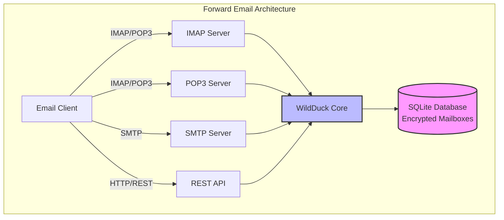

---


## Porovnání e-mailových služeb - Podpora protokolů a shoda s RFC standardy {#email-service-comparison---protocol-support--rfc-standards-compliance}

> \[!IMPORTANT]
> **Sandboxované a kvantově odolné šifrování:** Forward Email je jediná e-mailová služba, která ukládá jednotlivě šifrované SQLite schránky pomocí vašeho hesla (které znáte pouze vy). Každá schránka je šifrována pomocí [sqleet](https://github.com/resilar/sqleet) (ChaCha20-Poly1305), je samostatná, sandboxovaná a přenosná. Pokud zapomenete heslo, ztratíte svou schránku – ani Forward Email ji nemůže obnovit. Podrobnosti naleznete v [Quantum-Safe Encrypted Email](https://forwardemail.net/en/blog/docs/best-quantum-safe-encrypted-email-service).

Porovnejte podporu e-mailových protokolů a implementaci RFC standardů u hlavních poskytovatelů e-mailových služeb:

| Funkce                        | Forward Email                                                                                  | Postfix/Dovecot                                                                    | Gmail                                                                             | iCloud Mail                                           | Outlook.com                                                                                                                                                          | Fastmail                                                                                 | Yahoo/AOL (Verizon)                                                  | ProtonMail                                                                     | Tutanota                                                          |
| ----------------------------- | ---------------------------------------------------------------------------------------------- | ---------------------------------------------------------------------------------- | --------------------------------------------------------------------------------- | ----------------------------------------------------- | -------------------------------------------------------------------------------------------------------------------------------------------------------------------- | ---------------------------------------------------------------------------------------- | -------------------------------------------------------------------- | ------------------------------------------------------------------------------ | ----------------------------------------------------------------- |
| **Cena za vlastní doménu**    | [Zdarma](https://forwardemail.net/en/pricing)                                                  | [Zdarma](https://www.postfix.org/)                                                | [$7.20/měsíc](https://workspace.google.com/pricing)                              | [$0.99/měsíc](https://support.apple.com/en-us/102622) | [$7.20/měsíc](https://www.microsoft.com/en-us/microsoft-365/business/microsoft-365-business-basic)                                                                      | [$5/měsíc](https://www.fastmail.com/pricing/)                                             | [$3.19/měsíc](https://www.turbify.com/mail)                           | [$4.99/měsíc](https://proton.me/mail/pricing)                                   | [$3.27/měsíc](https://tuta.com/pricing)                            |
| **IMAP4rev1 (RFC 3501)**      | ✅ [Podporováno](#imap4-email-protocol-and-extensions)                                         | ✅ [Podporováno](https://www.dovecot.org/)                                        | ✅ [Podporováno](https://developers.google.com/workspace/gmail/imap/imap-extensions) | ✅ [Podporováno](https://support.apple.com/en-us/102431) | ✅ [Podporováno](https://support.microsoft.com/en-us/office/pop-imap-and-smtp-settings-for-outlook-com-d088b986-291d-42b8-9564-9c414e2aa040)                            | ✅ [Podporováno](https://www.fastmail.help/hc/en-us/articles/1500000278382-Email-standards) | ✅ [Podporováno](https://senders.yahooinc.com/developer/documentation/) | ⚠️ [Přes Bridge](https://proton.me/support/imap-smtp-and-pop3-setup)              | ❌ Nepodporováno                                                 |
| **IMAP4rev2 (RFC 9051)**      | ⚠️ [Částečně](https://forwardemail.net/en/blog/docs/best-quantum-safe-encrypted-email-service) | ⚠️ [Částečně](https://www.dovecot.org/)                                           | ⚠️ [31 %](https://developers.google.com/workspace/gmail/imap/imap-extensions)     | ⚠️ [92 %](https://support.apple.com/en-us/102431)      | ⚠️ [46 %](https://support.microsoft.com/en-us/office/pop-imap-and-smtp-settings-for-outlook-com-d088b986-291d-42b8-9564-9c414e2aa040)                                 | ⚠️ [69 %](https://www.fastmail.help/hc/en-us/articles/1500000278382-Email-standards)     | ⚠️ [85 %](https://senders.yahooinc.com/developer/documentation/)      | ⚠️ [Přes Bridge](https://proton.me/support/imap-smtp-and-pop3-setup)              | ❌ Nepodporováno                                                 |
| **POP3 (RFC 1939)**           | ✅ [Podporováno](#pop3-email-protocol-and-extensions)                                          | ✅ [Podporováno](https://www.dovecot.org/)                                        | ✅ [Podporováno](https://support.google.com/mail/answer/7104828)                  | ❌ Nepodporováno                                       | ✅ [Podporováno](https://support.microsoft.com/en-us/office/pop-imap-and-smtp-settings-for-outlook-com-d088b986-291d-42b8-9564-9c414e2aa040)                            | ✅ [Podporováno](https://www.fastmail.help/hc/en-us/articles/1500000278382-Email-standards) | ✅ [Podporováno](https://help.yahoo.com/kb/SLN4075.html)              | ⚠️ [Přes Bridge](https://proton.me/support/imap-smtp-and-pop3-setup)              | ❌ Nepodporováno                                                 |
| **SMTP (RFC 5321)**           | ✅ [Podporováno](#smtp-email-protocol-and-extensions)                                          | ✅ [Podporováno](https://www.postfix.org/)                                        | ✅ [Podporováno](https://support.google.com/mail/answer/7126229)                  | ✅ [Podporováno](https://support.apple.com/en-us/102431) | ✅ [Podporováno](https://support.microsoft.com/en-us/office/pop-imap-and-smtp-settings-for-outlook-com-d088b986-291d-42b8-9564-9c414e2aa040)                            | ✅ [Podporováno](https://www.fastmail.help/hc/en-us/articles/1500000278382-Email-standards) | ✅ [Podporováno](https://help.yahoo.com/kb/SLN4075.html)              | ⚠️ [Přes Bridge](https://proton.me/support/imap-smtp-and-pop3-setup)              | ❌ Nepodporováno                                                 |
| **JMAP (RFC 8620)**           | ❌ [Nepodporováno](#jmap-email-protocol)                                                      | ❌ Nepodporováno                                                                    | ❌ Nepodporováno                                                                   | ❌ Nepodporováno                                       | ❌ Nepodporováno                                                                                                                                                      | ✅ [Podporováno](https://www.fastmail.com/dev/)                                           | ❌ Nepodporováno                                                    | ❌ Nepodporováno                                                                  | ❌ Nepodporováno                                                 |
| **DKIM (RFC 6376)**           | ✅ [Podporováno](#email-message-authentication-protocols)                                     | ✅ [Podporováno](https://github.com/trusteddomainproject/OpenDKIM)                | ✅ [Podporováno](https://support.google.com/a/answer/174124)                      | ✅ [Podporováno](https://support.apple.com/en-us/102431) | ✅ [Podporováno](https://learn.microsoft.com/en-us/defender-office-365/email-authentication-dkim-configure)                                                             | ✅ [Podporováno](https://www.fastmail.help/hc/en-us/articles/360060590573)                | ✅ [Podporováno](https://help.yahoo.com/kb/SLN25426.html)             | ✅ [Podporováno](https://proton.me/support)                                         | ✅ [Podporováno](https://tuta.com/support#dkim)                    |
| **SPF (RFC 7208)**            | ✅ [Podporováno](#email-message-authentication-protocols)                                     | ✅ [Podporováno](https://www.postfix.org/)                                        | ✅ [Podporováno](https://support.google.com/a/answer/33786)                       | ✅ [Podporováno](https://support.apple.com/en-us/102431) | ✅ [Podporováno](https://learn.microsoft.com/en-us/microsoft-365/security/office-365-security/how-office-365-uses-spf-to-prevent-spoofing)                              | ✅ [Podporováno](https://www.fastmail.help/hc/en-us/articles/360060590573)                | ✅ [Podporováno](https://help.yahoo.com/kb/SLN25426.html)             | ✅ [Podporováno](https://proton.me/support)                                         | ✅ [Podporováno](https://tuta.com/support#dkim)                    |
| **DMARC (RFC 7489)**          | ✅ [Podporováno](#email-message-authentication-protocols)                                     | ✅ [Podporováno](https://www.postfix.org/)                                        | ✅ [Podporováno](https://support.google.com/a/answer/2466580)                     | ✅ [Podporováno](https://support.apple.com/en-us/102431) | ✅ [Podporováno](https://learn.microsoft.com/en-us/microsoft-365/security/office-365-security/use-dmarc-to-validate-email)                                              | ✅ [Podporováno](https://www.fastmail.help/hc/en-us/articles/360060590573)                | ✅ [Podporováno](https://help.yahoo.com/kb/SLN25426.html)             | ✅ [Podporováno](https://proton.me/support)                                         | ✅ [Podporováno](https://tuta.com/support#dkim)                    |
| **ARC (RFC 8617)**            | ✅ [Podporováno](#email-message-authentication-protocols)                                     | ✅ [Podporováno](https://github.com/trusteddomainproject/OpenARC)                 | ✅ [Podporováno](https://support.google.com/a/answer/2466580)                     | ❌ Nepodporováno                                       | ✅ [Podporováno](https://learn.microsoft.com/en-us/defender-office-365/email-authentication-arc-configure)                                                              | ✅ [Podporováno](https://www.fastmail.help/hc/en-us/articles/360060590573)                | ✅ [Podporováno](https://senders.yahooinc.com/developer/documentation/) | ✅ [Podporováno](https://proton.me/blog/what-is-authenticated-received-chain-arc)   | ❌ Nepodporováno                                                 |
| **MTA-STS (RFC 8461)**        | ✅ [Podporováno](#email-transport-security-protocols)                                         | ✅ [Podporováno](https://www.postfix.org/)                                        | ✅ [Podporováno](https://support.google.com/a/answer/9261504)                     | ✅ [Podporováno](https://support.apple.com/en-us/102431) | ✅ [Podporováno](https://learn.microsoft.com/en-us/defender-office-365/email-authentication-about)                                                                      | ✅ [Podporováno](https://www.fastmail.help/hc/en-us/articles/360060590573)                | ✅ [Podporováno](https://senders.yahooinc.com/developer/documentation/) | ✅ [Podporováno](https://proton.me/support)                                         | ✅ [Podporováno](https://tuta.com/security)                        |
| **DANE (RFC 7671)**           | ✅ [Podporováno](#email-transport-security-protocols)                                         | ✅ [Podporováno](https://www.postfix.org/)                                        | ❌ Nepodporováno                                                                   | ❌ Nepodporováno                                       | ❌ Nepodporováno                                                                                                                                                      | ❌ Nepodporováno                                                                        | ❌ Nepodporováno                                                    | ✅ [Podporováno](https://proton.me/support)                                         | ✅ [Podporováno](https://tuta.com/support#dane)                    |
| **DSN (RFC 3461)**            | ✅ [Podporováno](#smtp-email-protocol-and-extensions)                                        | ✅ [Podporováno](https://www.postfix.org/DSN_README.html)                         | ❌ Nepodporováno                                                                   | ✅ [Podporováno](#protocol-capability-tests)             | ✅ [Podporováno](#protocol-capability-tests)                                                                                                                            | ⚠️ [Neznámé](https://www.fastmail.help/hc/en-us/articles/1500000278382-Email-standards)  | ❌ Nepodporováno                                                    | ⚠️ [Přes Bridge](https://proton.me/support/imap-smtp-and-pop3-setup)              | ❌ Nepodporováno                                                 |
| **REQUIRETLS (RFC 8689)**     | ✅ [Podporováno](#email-transport-security-protocols)                                         | ✅ [Podporováno](https://www.postfix.org/TLS_README.html#server_require_tls)      | ⚠️ Neznámé                                                                        | ⚠️ Neznámé                                            | ⚠️ Neznámé                                                                                                                                                           | ⚠️ Neznámé                                                                             | ⚠️ Neznámé                                                         | ⚠️ [Přes Bridge](https://proton.me/support/imap-smtp-and-pop3-setup)              | ❌ Nepodporováno                                                 |
| **ManageSieve (RFC 5804)**    | ✅ [Podporováno](#managesieve-rfc-5804)                                                       | ✅ [Podporováno](https://doc.dovecot.org/admin_manual/pigeonhole_managesieve_server/) | ❌ Nepodporováno                                                                   | ❌ Nepodporováno                                       | ❌ Nepodporováno                                                                                                                                                      | ✅ [Podporováno](https://www.fastmail.help/hc/en-us/articles/360060590573)                | ❌ Nepodporováno                                                    | ❌ Nepodporováno                                                                  | ❌ Nepodporováno                                                 |
| **OpenPGP (RFC 9580)**        | ✅ [Podporováno](#email-message-encryption)                                                   | ⚠️ [Přes pluginy](https://www.gnupg.org/)                                        | ⚠️ [Třetí strana](https://github.com/google/end-to-end)                          | ⚠️ [Třetí strana](https://gpgtools.org/)               | ⚠️ [Třetí strana](https://gpg4win.org/)                                                                                                                               | ⚠️ [Třetí strana](https://www.fastmail.help/hc/en-us/articles/360060590573)               | ⚠️ [Třetí strana](https://help.yahoo.com/kb/SLN25426.html)            | ✅ [Nativní](https://proton.me/support/pgp-mime-pgp-inline)                        | ❌ Nepodporováno                                                 |
| **S/MIME (RFC 8551)**         | ✅ [Podporováno](#email-message-encryption)                                                   | ✅ [Podporováno](https://www.openssl.org/)                                        | ✅ [Podporováno](https://support.google.com/mail/answer/81126)                   | ✅ [Podporováno](https://support.apple.com/en-us/102431) | ✅ [Podporováno](https://support.microsoft.com/en-us/office/send-view-and-reply-to-encrypted-messages-in-outlook-for-pc-eaa43495-9bbb-4fca-922a-df90dee51980)           | ⚠️ [Částečně](https://www.fastmail.help/hc/en-us/articles/360060590573)                   | ❌ Nepodporováno                                                    | ✅ [Podporováno](https://proton.me/support/pgp-mime-pgp-inline)                     | ❌ Nepodporováno                                                 |
| **CalDAV (RFC 4791)**         | ✅ [Podporováno](#calendaring-and-contacts-protocols)                                         | ✅ [Podporováno](https://www.davical.org/)                                        | ✅ [Podporováno](https://developers.google.com/calendar/caldav/v2/guide)         | ✅ [Podporováno](https://support.apple.com/en-us/102431) | ❌ Nepodporováno                                                                                                                                                      | ✅ [Podporováno](https://www.fastmail.help/hc/en-us/articles/360060590573)                | ❌ Nepodporováno                                                    | ✅ [Přes Bridge](https://proton.me/support/proton-calendar)                        | ❌ Nepodporováno                                                 |
| **CardDAV (RFC 6352)**        | ✅ [Podporováno](#calendaring-and-contacts-protocols)                                         | ✅ [Podporováno](https://www.davical.org/)                                        | ✅ [Podporováno](https://developers.google.com/people/carddav)                   | ✅ [Podporováno](https://support.apple.com/en-us/102431) | ❌ Nepodporováno                                                                                                                                                      | ✅ [Podporováno](https://www.fastmail.help/hc/en-us/articles/360060590573)                | ❌ Nepodporováno                                                    | ✅ [Přes Bridge](https://proton.me/support/proton-contacts)                        | ❌ Nepodporováno                                                 |
| **Úkoly (VTODO)**             | ✅ [Podporováno](#tasks-and-reminders-caldav-vtodo)                                           | ✅ [Podporováno](https://www.davical.org/)                                        | ❌ Nepodporováno                                                                   | ✅ [Podporováno](https://support.apple.com/en-us/102431) | ❌ Nepodporováno                                                                                                                                                      | ✅ [Podporováno](https://www.fastmail.help/hc/en-us/articles/360060590573)                | ❌ Nepodporováno                                                    | ❌ Nepodporováno                                                                  | ❌ Nepodporováno                                                 |
| **Sieve (RFC 5228)**          | ✅ [Podporováno](#sieve-rfc-5228)                                                             | ✅ [Podporováno](https://www.dovecot.org/)                                        | ❌ Nepodporováno                                                                   | ❌ Nepodporováno                                       | ❌ Nepodporováno                                                                                                                                                      | ✅ [Podporováno](https://www.fastmail.help/hc/en-us/articles/360060590573)                | ❌ Nepodporováno                                                    | ❌ Nepodporováno                                                                  | ❌ Nepodporováno                                                 |
| **Catch-All**                 | ✅ [Podporováno](https://forwardemail.net/en/faq#can-i-have-multiple-global-catch-all-recipients) | ✅ Podporováno                                                                      | ✅ [Podporováno](https://support.google.com/a/answer/4524505)                    | ❌ Nepodporováno                                       | ❌ [Nepodporováno](https://learn.microsoft.com/en-us/exchange/recipients-in-exchange-online/manage-mail-users)                                                        | ✅ [Podporováno](https://www.fastmail.help/hc/en-us/articles/1500000278382-Email-standards) | ❌ Nepodporováno                                                    | ❌ Nepodporováno                                                                  | ✅ [Podporováno](https://tuta.com/support#catch-all-alias)         |
| **Neomezené aliasy**          | ✅ [Podporováno](https://forwardemail.net/en/faq#advanced-features)                           | ✅ Podporováno                                                                      | ✅ [Podporováno](https://support.google.com/a/answer/33327)                      | ✅ [Podporováno](https://support.apple.com/en-us/102431) | ✅ [Podporováno](https://support.microsoft.com/en-us/office/add-or-remove-an-email-alias-in-outlook-com-459b1989-356d-40fa-a689-8f285b13f1f2)                           | ✅ [Podporováno](https://www.fastmail.help/hc/en-us/articles/1500000278382-Email-standards) | ❌ Nepodporováno                                                    | ✅ [Podporováno](https://proton.me/support/addresses-and-aliases)                   | ✅ [Podporováno](https://tuta.com/support#aliases)                 |
| **Dvoufaktorové ověření**     | ✅ [Podporováno](https://forwardemail.net/en/faq#do-you-support-passkeys-and-webauthn)        | ✅ Podporováno                                                                      | ✅ [Podporováno](https://support.google.com/accounts/answer/185839)              | ✅ [Podporováno](https://support.apple.com/en-us/102431) | ✅ [Podporováno](https://support.microsoft.com/en-us/account-billing/how-to-use-two-step-verification-with-your-microsoft-account-c7910146-672f-01e9-50a0-93b4585e7eb4) | ✅ [Podporováno](https://www.fastmail.help/hc/en-us/articles/1500000278382-Email-standards) | ✅ [Podporováno](https://help.yahoo.com/kb/SLN5013.html)            | ✅ [Podporováno](https://proton.me/support/two-factor-authentication-2fa)           | ✅ [Podporováno](https://tuta.com/support#two-factor-authentication) |
| **Push notifikace**           | ✅ [Podporováno](#ios-push-notifications)                                                     | ⚠️ Přes pluginy                                                                    | ✅ [Podporováno](https://developers.google.com/gmail/api/guides/push)            | ✅ [Podporováno](https://support.apple.com/en-us/102431) | ✅ [Podporováno](https://learn.microsoft.com/en-us/graph/change-notifications-delivery-webhooks)                                                                        | ✅ [Podporováno](https://www.fastmail.help/hc/en-us/articles/1500000278382-Email-standards) | ❌ Nepodporováno                                                    | ✅ [Podporováno](https://proton.me/support/notifications)                       | ✅ [Podporováno](https://tuta.com/support#push-notifications)      |
| **Kalendář/Kontakty na desktopu** | ✅ [Podporováno](#calendaring-and-contacts-protocols)                                     | ✅ Podporováno                                                                      | ✅ [Podporováno](https://support.google.com/calendar)                            | ✅ [Podporováno](https://support.apple.com/en-us/102431) | ✅ [Podporováno](https://support.microsoft.com/en-us/office/calendar-and-contacts-in-outlook-com-d3e8a6e6-5c1f-4e3e-9f1e-7c0f0e0c0c0c)                                  | ✅ [Podporováno](https://www.fastmail.help/hc/en-us/articles/1500000278382-Email-standards) | ❌ Nepodporováno                                                    | ✅ [Podporováno](https://proton.me/support/proton-calendar)                     | ❌ Nepodporováno                                                 |
| **Pokročilé vyhledávání**     | ✅ [Podporováno](https://forwardemail.net/en/email-api)                                       | ✅ Podporováno                                                                      | ✅ [Podporováno](https://support.google.com/mail/answer/7190)                    | ✅ [Podporováno](https://support.apple.com/en-us/102431) | ✅ [Podporováno](https://support.microsoft.com/en-us/office/search-for-email-messages-in-outlook-com-6f5f2e92-9d5e-4c4e-9b0e-0c0c0c0c0c0c)                              | ✅ [Podporováno](https://www.fastmail.help/hc/en-us/articles/1500000278382-Email-standards) | ✅ [Podporováno](https://help.yahoo.com/kb/SLN3561.html)              | ✅ [Podporováno](https://proton.me/support/search-and-filters)                  | ✅ [Podporováno](https://tuta.com/support)                           |
| **API/Integrace**             | ✅ [39 endpointů](https://forwardemail.net/en/email-api)                                      | ✅ Podporováno                                                                      | ✅ [Podporováno](https://developers.google.com/gmail/api)                        | ❌ Nepodporováno                                       | ✅ [Podporováno](https://learn.microsoft.com/en-us/graph/api/resources/mail-api-overview)                                                                               | ✅ [Podporováno](https://www.fastmail.help/hc/en-us/articles/1500000278382-Email-standards) | ❌ Nepodporováno                                                    | ✅ [Podporováno](https://proton.me/support/proton-mail-api)                     | ❌ Nepodporováno                                                 |
### Vizualizace podpory protokolů {#protocol-support-visualization}

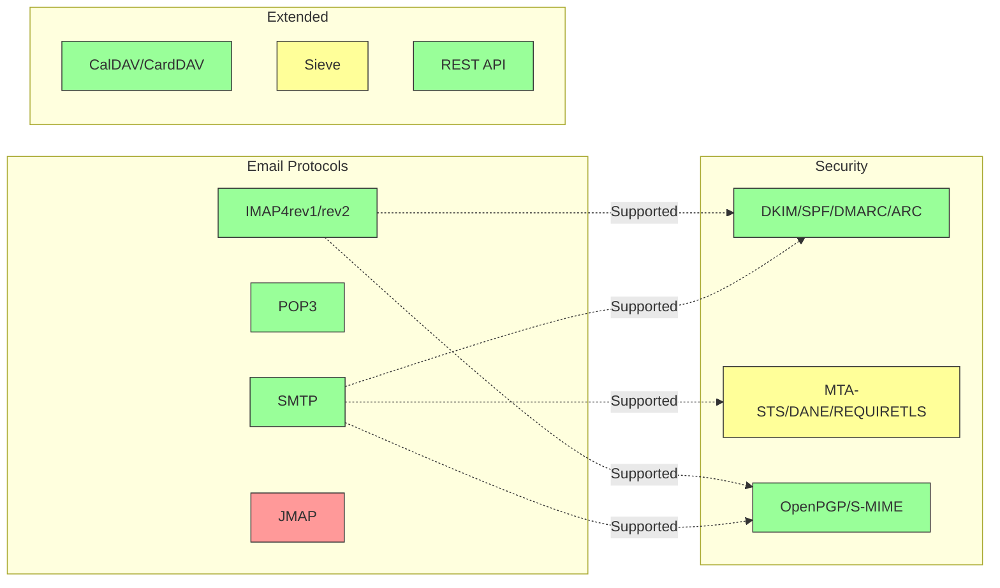

---


## Základní e-mailové protokoly {#core-email-protocols}

### Průběh e-mailového protokolu {#email-protocol-flow}

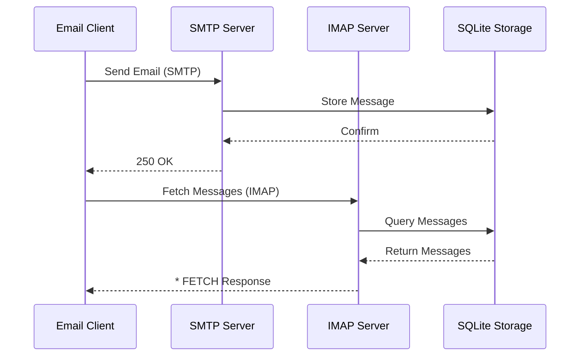


## IMAP4 e-mailový protokol a rozšíření {#imap4-email-protocol-and-extensions}

> \[!NOTE]
> Forward Email podporuje IMAP4rev1 (RFC 3501) s částečnou podporou funkcí IMAP4rev2 (RFC 9051).

Forward Email poskytuje robustní podporu IMAP4 díky implementaci poštovního serveru WildDuck. Server implementuje IMAP4rev1 (RFC 3501) s částečnou podporou rozšíření IMAP4rev2 (RFC 9051).

Funkčnost IMAP v Forward Email je zajištěna závislostí [WildDuck](https://github.com/nodemailer/wildduck). Následující e-mailové RFC jsou podporovány:

| RFC                                                       | Název                                                             | Poznámky k implementaci                              |
| --------------------------------------------------------- | ----------------------------------------------------------------- | ----------------------------------------------------- |
| [RFC 3501](https://datatracker.ietf.org/doc/html/rfc3501) | Internet Message Access Protocol (IMAP) - Verze 4rev1             | Plná podpora s úmyslnými rozdíly (viz níže)           |
| [RFC 2177](https://datatracker.ietf.org/doc/html/rfc2177) | IMAP4 příkaz IDLE                                                | Push notifikace                                      |
| [RFC 2342](https://datatracker.ietf.org/doc/html/rfc2342) | IMAP4 Namespace                                                   | Podpora jmenných prostorů schránek                    |
| [RFC 2087](https://datatracker.ietf.org/doc/html/rfc2087) | IMAP4 rozšíření QUOTA                                            | Správa kvót úložiště                                 |
| [RFC 2971](https://datatracker.ietf.org/doc/html/rfc2971) | IMAP4 rozšíření ID                                              | Identifikace klient/server                            |
| [RFC 5161](https://datatracker.ietf.org/doc/html/rfc5161) | IMAP4 ENABLE rozšíření                                          | Povolení IMAP rozšíření                              |
| [RFC 4959](https://datatracker.ietf.org/doc/html/rfc4959) | IMAP rozšíření pro SASL počáteční odpověď klienta (SASL-IR)       | Počáteční odpověď klienta                            |
| [RFC 3691](https://datatracker.ietf.org/doc/html/rfc3691) | IMAP4 příkaz UNSELECT                                           | Zavření schránky bez EXPUNGE                         |
| [RFC 4315](https://datatracker.ietf.org/doc/html/rfc4315) | IMAP UIDPLUS rozšíření                                          | Vylepšené UID příkazy                                |
| [RFC 7162](https://datatracker.ietf.org/doc/html/rfc7162) | IMAP rozšíření: Rychlá změna příznaků a resynchronizace (CONDSTORE) | Podmíněné STORE                                     |
| [RFC 6154](https://datatracker.ietf.org/doc/html/rfc6154) | IMAP LIST rozšíření pro speciální schránky                       | Speciální atributy schránek                           |
| [RFC 6851](https://datatracker.ietf.org/doc/html/rfc6851) | IMAP MOVE rozšíření                                             | Atomický příkaz MOVE                                 |
| [RFC 6855](https://datatracker.ietf.org/doc/html/rfc6855) | IMAP podpora UTF-8                                              | Podpora UTF-8                                        |
| [RFC 3348](https://datatracker.ietf.org/doc/html/rfc3348) | IMAP4 rozšíření pro podřízené schránky                           | Informace o podřízených schránkách                   |
| [RFC 7889](https://datatracker.ietf.org/doc/html/rfc7889) | IMAP4 rozšíření pro oznamování maximální velikosti nahrávání (APPENDLIMIT) | Maximální velikost nahrávání                         |
**Podporovaná rozšíření IMAP:**

| Rozšíření        | RFC          | Stav        | Popis                          |
| ---------------- | ------------ | ----------- | ------------------------------ |
| IDLE             | RFC 2177     | ✅ Podporováno | Push notifikace                |
| NAMESPACE        | RFC 2342     | ✅ Podporováno | Podpora jmenných prostor poštovních schránek |
| QUOTA            | RFC 2087     | ✅ Podporováno | Správa kvót úložiště           |
| ID               | RFC 2971     | ✅ Podporováno | Identifikace klient/server     |
| ENABLE           | RFC 5161     | ✅ Podporováno | Povolení IMAP rozšíření        |
| SASL-IR          | RFC 4959     | ✅ Podporováno | Počáteční odpověď klienta      |
| UNSELECT         | RFC 3691     | ✅ Podporováno | Zavření schránky bez EXPUNGE   |
| UIDPLUS          | RFC 4315     | ✅ Podporováno | Vylepšené UID příkazy          |
| CONDSTORE        | RFC 7162     | ✅ Podporováno | Podmíněné STORE                |
| SPECIAL-USE      | RFC 6154     | ✅ Podporováno | Speciální atributy schránek    |
| MOVE             | RFC 6851     | ✅ Podporováno | Atomický příkaz MOVE           |
| UTF8=ACCEPT      | RFC 6855     | ✅ Podporováno | Podpora UTF-8                  |
| CHILDREN         | RFC 3348     | ✅ Podporováno | Informace o podadresářích      |
| APPENDLIMIT      | RFC 7889     | ✅ Podporováno | Maximální velikost nahrávání   |
| XLIST            | Nestandardní | ✅ Podporováno | Seznam složek kompatibilní s Gmailem |
| XAPPLEPUSHSERVICE| Nestandardní | ✅ Podporováno | Apple Push Notification Service |

### Rozdíly protokolu IMAP oproti RFC specifikacím {#imap-protocol-differences-from-rfc-specifications}

> \[!WARNING]
> Následující rozdíly oproti RFC specifikacím mohou ovlivnit kompatibilitu klienta.

Forward Email záměrně odchyluje od některých RFC specifikací IMAP. Tyto rozdíly jsou zděděny od WildDuck a jsou popsány níže:

* **Žádná značka \Recent:** Značka `\Recent` není implementována. Všechny zprávy jsou vráceny bez této značky.
* **Přejmenování neovlivňuje podsložky:** Při přejmenování složky nejsou podsložky automaticky přejmenovány. Hierarchie složek je v databázi plochá.
* **INBOX nelze přejmenovat:** [RFC 3501](https://datatracker.ietf.org/doc/html/rfc3501) povoluje přejmenování INBOX, ale Forward Email to výslovně zakazuje. Viz [WildDuck zdrojový kód](https://github.com/nodemailer/wildduck/blob/master/imap-core/lib/commands/rename.js#L27).
* **Žádné nevyžádané odpovědi FLAGS:** Při změně příznaků nejsou klientovi zasílány nevyžádané odpovědi FLAGS.
* **STORE vrací NO pro smazané zprávy:** Pokus o změnu příznaků u smazaných zpráv vrací NO místo tichého ignorování.
* **CHARSET ignorován v SEARCH:** Argument `CHARSET` v příkazech SEARCH je ignorován. Všechny vyhledávání používají UTF-8.
* **MODSEQ metadata ignorována:** Metadata `MODSEQ` v příkazech STORE jsou ignorována.
* **SEARCH TEXT a SEARCH BODY:** Forward Email používá [SQLite FTS5](https://www.sqlite.org/fts5.html) (Full-Text Search) místo MongoDB `$text` vyhledávání. To poskytuje:
  * Podporu operátoru `NOT` (MongoDB to nepodporuje)
  * Řazení výsledků podle relevance
  * Vyhledávání pod 100 ms i ve velkých schránkách
* **Chování autoexpunge:** Zprávy označené `\Deleted` jsou automaticky vymazány při zavření schránky.
* **Fidelity zprávy:** Některé úpravy zpráv nemusí zachovat přesnou původní strukturu zprávy.

**Částečná podpora IMAP4rev2:**

Forward Email implementuje IMAP4rev1 (RFC 3501) s částečnou podporou IMAP4rev2 (RFC 9051). Následující funkce IMAP4rev2 **zatím nejsou podporovány**:

* **LIST-STATUS** - Kombinované příkazy LIST a STATUS
* **LITERAL-** - Nesynchronizované literály (varianta minus)
* **OBJECTID** - Unikátní identifikátory objektů
* **SAVEDATE** - Atribut data uložení
* **REPLACE** - Atomická náhrada zprávy
* **UNAUTHENTICATE** - Ukončení autentizace bez ukončení spojení

**Uvolněné zpracování struktury těla:**

Forward Email používá „uvolněné“ zpracování těla pro chybné MIME struktury, které se může lišit od přísné interpretace RFC. To zlepšuje kompatibilitu s reálnými e-maily, které nejsou dokonale v souladu se standardy.
**Rozšíření METADATA (RFC 5464):**

Rozšíření IMAP METADATA **není podporováno**. Pro více informací o tomto rozšíření viz [RFC 5464](https://datatracker.ietf.org/doc/html/rfc5464). Diskuze o přidání této funkce je k nalezení v [WildDuck Issue #937](https://github.com/zone-eu/wildduck/issues/937).

### Rozšíření IMAP, která nejsou podporována {#imap-extensions-not-supported}

Následující rozšíření IMAP z [IANA IMAP Capabilities Registry](https://www.iana.org/assignments/imap-capabilities/imap-capabilities.xhtml) nejsou podporována:

| RFC                                                       | Název                                                                                                           | Důvod                                                                                                                                  |
| --------------------------------------------------------- | --------------------------------------------------------------------------------------------------------------- | --------------------------------------------------------------------------------------------------------------------------------------- |
| [RFC 2086](https://datatracker.ietf.org/doc/html/rfc2086) | Rozšíření IMAP4 ACL                                                                                             | Sdílené složky nejsou implementovány. Viz [WildDuck Issue #427](https://github.com/zone-eu/wildduck/issues/427)                         |
| [RFC 5256](https://datatracker.ietf.org/doc/html/rfc5256) | Rozšíření IMAP SORT a THREAD                                                                                     | Threading je implementován interně, ale ne přes protokol RFC 5256. Viz [WildDuck Issue #12](https://github.com/zone-eu/wildduck/issues/12) |
| [RFC 5162](https://datatracker.ietf.org/doc/html/rfc5162) | Rozšíření IMAP4 pro rychlou resynchronizaci schránek (QRESYNC)                                                  | Není implementováno                                                                                                                     |
| [RFC 5464](https://datatracker.ietf.org/doc/html/rfc5464) | Rozšíření IMAP METADATA                                                                                         | Operace s metadata jsou ignorovány. Viz [WildDuck dokumentace](https://datatracker.ietf.org/doc/html/rfc5464)                           |
| [RFC 5258](https://datatracker.ietf.org/doc/html/rfc5258) | Rozšíření příkazu IMAP4 LIST                                                                                     | Není implementováno                                                                                                                     |
| [RFC 5267](https://datatracker.ietf.org/doc/html/rfc5267) | Kontexty pro IMAP4                                                                                              | Není implementováno                                                                                                                     |
| [RFC 5465](https://datatracker.ietf.org/doc/html/rfc5465) | Rozšíření IMAP NOTIFY                                                                                           | Není implementováno                                                                                                                     |
| [RFC 5466](https://datatracker.ietf.org/doc/html/rfc5466) | Rozšíření IMAP4 FILTERS                                                                                         | Není implementováno                                                                                                                     |
| [RFC 6203](https://datatracker.ietf.org/doc/html/rfc6203) | Rozšíření IMAP4 pro fuzzy vyhledávání                                                                           | Není implementováno                                                                                                                     |
| [RFC 6785](https://datatracker.ietf.org/doc/html/rfc6785) | Doporučení pro implementaci IMAP4                                                                               | Doporučení nejsou plně dodržena                                                                                                        |
| [RFC 7162](https://datatracker.ietf.org/doc/html/rfc7162) | Rozšíření IMAP: Rychlé změny příznaků (CONDSTORE) a rychlá resynchronizace schránek (QRESYNC)                   | Není implementováno                                                                                                                     |
| [RFC 8437](https://datatracker.ietf.org/doc/html/rfc8437) | Rozšíření IMAP UNAUTHENTICATE pro opětovné použití připojení                                                    | Není implementováno                                                                                                                     |
| [RFC 8438](https://datatracker.ietf.org/doc/html/rfc8438) | Rozšíření IMAP pro STATUS=SIZE                                                                                  | Není implementováno                                                                                                                     |
| [RFC 8457](https://datatracker.ietf.org/doc/html/rfc8457) | Klíčové slovo IMAP "$Important" a speciální atribut "\Important"                                                | Není implementováno                                                                                                                     |
| [RFC 8474](https://datatracker.ietf.org/doc/html/rfc8474) | Rozšíření IMAP pro identifikátory objektů                                                                       | Není implementováno                                                                                                                     |
| [RFC 9051](https://datatracker.ietf.org/doc/html/rfc9051) | Internet Message Access Protocol (IMAP) - verze 4rev2                                                           | Forward Email implementuje IMAP4rev1 ([RFC 3501](https://datatracker.ietf.org/doc/html/rfc3501))                                         |
## POP3 Email Protocol and Extensions {#pop3-email-protocol-and-extensions}

> \[!NOTE]
> Forward Email podporuje POP3 (RFC 1939) se standardními rozšířeními pro získávání e-mailů.

Funkčnost POP3 ve Forward Email je zajištěna závislostí [WildDuck](https://github.com/nodemailer/wildduck). Následující e-mailové RFC jsou podporovány:

| RFC                                                       | Název                                   | Poznámky k implementaci                              |
| --------------------------------------------------------- | --------------------------------------- | ----------------------------------------------------- |
| [RFC 1939](https://datatracker.ietf.org/doc/html/rfc1939) | Post Office Protocol - Verze 3 (POP3)  | Plná podpora s úmyslnými rozdíly (viz níže)           |
| [RFC 2595](https://datatracker.ietf.org/doc/html/rfc2595) | Použití TLS s IMAP, POP3 a ACAP         | Podpora STARTTLS                                      |
| [RFC 2449](https://datatracker.ietf.org/doc/html/rfc2449) | POP3 Mechanismus rozšíření               | Podpora příkazu CAPA                                  |

Forward Email poskytuje podporu POP3 pro klienty, kteří preferují tento jednodušší protokol před IMAP. POP3 je ideální pro uživatele, kteří chtějí stahovat e-maily do jednoho zařízení a odstranit je ze serveru.

**Podporovaná rozšíření POP3:**

| Rozšíření | RFC      | Stav        | Popis                      |
| --------- | -------- | ----------- | -------------------------- |
| TOP       | RFC 1939 | ✅ Podporováno | Získání hlaviček zpráv     |
| USER      | RFC 1939 | ✅ Podporováno | Autentizace uživatele      |
| UIDL      | RFC 1939 | ✅ Podporováno | Jedinečné identifikátory zpráv |
| EXPIRE    | RFC 2449 | ✅ Podporováno | Politika expirace zpráv    |

### Rozdíly protokolu POP3 oproti RFC specifikacím {#pop3-protocol-differences-from-rfc-specifications}

> \[!WARNING]
> POP3 má inherentní omezení ve srovnání s IMAP.

> \[!IMPORTANT]
> **Kritický rozdíl: Chování POP3 DELE ve Forward Email vs WildDuck**
>
> Forward Email implementuje RFC-kompatibilní trvalé mazání pro POP3 příkazy `DELE`, na rozdíl od WildDuck, který přesouvá zprávy do Koše.

**Chování Forward Email** ([zdrojový kód](https://github.com/forwardemail/forwardemail.net/blob/master/pop3-server.js)):

* `DELE` → `QUIT` trvale maže zprávy
* Přesně dodržuje specifikaci [RFC 1939](https://datatracker.ietf.org/doc/html/rfc1939)
* Shodné chování s Dovecot (výchozí), Postfix a dalšími servery dodržujícími standardy

**Chování WildDuck** ([diskuse](https://github.com/zone-eu/wildduck/issues/937)):

* `DELE` → `QUIT` přesouvá zprávy do Koše (podobně jako Gmail)
* Úmyslné rozhodnutí pro bezpečnost uživatele
* Nekompatibilní s RFC, ale zabraňuje nechtěné ztrátě dat

**Proč se Forward Email liší:**

* **Soulad s RFC:** Dodržuje specifikaci [RFC 1939](https://datatracker.ietf.org/doc/html/rfc1939)
* **Očekávání uživatelů:** Workflow stahování a mazání očekává trvalé odstranění
* **Správa úložiště:** Správné uvolnění místa na disku
* **Interoperabilita:** Konzistentní s ostatními servery dodržujícími RFC

> \[!NOTE]
> **Výpis zpráv POP3:** Forward Email vypisuje VŠECHNY zprávy z INBOX bez omezení. To se liší od WildDuck, který standardně omezuje na 250 zpráv. Viz [zdrojový kód](https://github.com/forwardemail/forwardemail.net/blob/master/pop3-server.js).

**Přístup z jednoho zařízení:**

POP3 je navržen pro přístup z jednoho zařízení. Zprávy jsou obvykle staženy a odstraněny ze serveru, což jej činí nevhodným pro synchronizaci na více zařízeních.

**Žádná podpora složek:**

POP3 přistupuje pouze ke složce INBOX. Ostatní složky (Odeslané, Koncepty, Koš atd.) nejsou přes POP3 přístupné.

**Omezená správa zpráv:**

POP3 poskytuje základní získávání a mazání zpráv. Pokročilé funkce jako označování, přesouvání nebo vyhledávání zpráv nejsou dostupné.

### Nepodporovaná rozšíření POP3 {#pop3-extensions-not-supported}

Následující rozšíření POP3 z [IANA POP3 Extension Mechanism Registry](https://www.iana.org/assignments/pop3-extension-mechanism/pop3-extension-mechanism.xhtml) nejsou podporována:
| RFC                                                       | Název                                                   | Důvod                                  |
| --------------------------------------------------------- | ------------------------------------------------------- | --------------------------------------- |
| [RFC 6856](https://datatracker.ietf.org/doc/html/rfc6856) | Podpora protokolu Post Office Protocol verze 3 (POP3) pro UTF-8 | Není implementováno v serveru WildDuck POP3 |
| [RFC 2595](https://datatracker.ietf.org/doc/html/rfc2595) | Příkaz STLS                                            | Podporován pouze STARTTLS, ne STLS       |
| [RFC 3206](https://datatracker.ietf.org/doc/html/rfc3206) | Kódy odpovědí SYS a AUTH POP                            | Není implementováno                         |

---


## SMTP Email Protocol and Extensions {#smtp-email-protocol-and-extensions}

> \[!NOTE]
> Forward Email podporuje SMTP (RFC 5321) s moderními rozšířeními pro bezpečné a spolehlivé doručování e-mailů.

Funkčnost SMTP ve Forward Email je zajištěna několika komponentami: [smtp-server](https://github.com/nodemailer/smtp-server) (nodemailer), [zone-mta](https://github.com/zone-eu/zone-mta) a vlastní implementace. Následující e-mailové RFC jsou podporována:

| RFC                                                       | Název                                                                           | Poznámky k implementaci                 |
| --------------------------------------------------------- | ------------------------------------------------------------------------------- | ------------------------------------ |
| [RFC 5321](https://datatracker.ietf.org/doc/html/rfc5321) | Simple Mail Transfer Protocol (SMTP)                                            | Plná podpora                         |
| [RFC 3207](https://datatracker.ietf.org/doc/html/rfc3207) | SMTP Service Extension for Secure SMTP over Transport Layer Security (STARTTLS) | Podpora TLS/SSL                      |
| [RFC 4954](https://datatracker.ietf.org/doc/html/rfc4954) | SMTP Service Extension for Authentication (AUTH)                                | PLAIN, LOGIN, CRAM-MD5, XOAUTH2      |
| [RFC 6531](https://datatracker.ietf.org/doc/html/rfc6531) | SMTP Extension for Internationalized Email (SMTPUTF8)                           | Nativní podpora unicode e-mailových adres |
| [RFC 3461](https://datatracker.ietf.org/doc/html/rfc3461) | SMTP Service Extension for Delivery Status Notifications (DSN)                  | Plná podpora DSN                     |
| [RFC 3463](https://datatracker.ietf.org/doc/html/rfc3463) | Enhanced Mail System Status Codes                                               | Rozšířené kódy stavu v odpovědích   |
| [RFC 1870](https://datatracker.ietf.org/doc/html/rfc1870) | SMTP Service Extension for Message Size Declaration (SIZE)                      | Oznamování maximální velikosti zprávy   |
| [RFC 2920](https://datatracker.ietf.org/doc/html/rfc2920) | SMTP Service Extension for Command Pipelining (PIPELINING)                      | Podpora příkazového pipeliningu           |
| [RFC 1652](https://datatracker.ietf.org/doc/html/rfc1652) | SMTP Service Extension for 8bit-MIMEtransport (8BITMIME)                        | Podpora 8-bit MIME                   |
| [RFC 6152](https://datatracker.ietf.org/doc/html/rfc6152) | SMTP Service Extension for 8-bit MIME Transport                                 | Podpora 8-bit MIME                   |
| [RFC 2034](https://datatracker.ietf.org/doc/html/rfc2034) | SMTP Service Extension for Returning Enhanced Error Codes (ENHANCEDSTATUSCODES) | Rozšířené kódy stavu                |

Forward Email implementuje plnohodnotný SMTP server s podporou moderních rozšíření, která zvyšují bezpečnost, spolehlivost a funkčnost.

**Podporovaná SMTP rozšíření:**

| Rozšíření           | RFC      | Stav        | Popis                           |
| ------------------- | -------- | ----------- | ------------------------------------- |
| PIPELINING          | RFC 2920 | ✅ Podporováno | Příkazový pipelining                    |
| SIZE                | RFC 1870 | ✅ Podporováno | Oznamování velikosti zprávy (limit 52MB) |
| ETRN                | RFC 1985 | ✅ Podporováno | Vzdálené zpracování fronty               |
| STARTTLS            | RFC 3207 | ✅ Podporováno | Přechod na TLS                        |
| ENHANCEDSTATUSCODES | RFC 2034 | ✅ Podporováno | Rozšířené kódy stavu                 |
| 8BITMIME            | RFC 6152 | ✅ Podporováno | 8-bitový MIME transport                  |
| DSN                 | RFC 3461 | ✅ Podporováno | Oznámení o stavu doručení         |
| CHUNKING            | RFC 3030 | ✅ Podporováno | Přenos zpráv po částech              |
| SMTPUTF8            | RFC 6531 | ⚠️ Částečně  | UTF-8 e-mailové adresy (částečně)       |
| REQUIRETLS          | RFC 8689 | ✅ Podporováno | Požadavek na TLS pro doručení              |
### Oznámení o stavu doručení (DSN) {#delivery-status-notifications-dsn}

> \[!TIP]
> DSN poskytuje podrobné informace o stavu doručení odeslaných e-mailů.

Forward Email plně podporuje **DSN (RFC 3461)**, které umožňuje odesílatelům požadovat oznámení o stavu doručení. Tato funkce poskytuje:

* **Oznámení o úspěchu** při doručení zpráv
* **Oznámení o selhání** s podrobnými informacemi o chybě
* **Oznámení o zpoždění** při dočasném zpoždění doručení

DSN je zvláště užitečné pro:

* Potvrzení doručení důležitých zpráv
* Řešení problémů s doručením
* Automatizované systémy zpracování e-mailů
* Požadavky na shodu a audit

### Podpora REQUIRETLS {#requiretls-support}

> \[!IMPORTANT]
> Forward Email je jedním z mála poskytovatelů, kteří explicitně propagují a vynucují REQUIRETLS.

Forward Email podporuje **REQUIRETLS (RFC 8689)**, které zajišťuje, že e-mailové zprávy jsou doručovány pouze přes TLS-šifrovaná spojení. To poskytuje:

* **End-to-end šifrování** pro celou cestu doručení
* **Vynucení pro uživatele** pomocí zaškrtávacího políčka v editoru e-mailů
* **Odmítnutí pokusů o nedostatečně zabezpečené doručení**
* **Zvýšenou bezpečnost** pro citlivou komunikaci

### Nepodporované SMTP rozšíření {#smtp-extensions-not-supported}

Následující SMTP rozšíření z [IANA SMTP Service Extensions Registry](https://www.iana.org/assignments/smtp) nejsou podporována:

| RFC                                                       | Název                                                                                             | Důvod                 |
| --------------------------------------------------------- | ------------------------------------------------------------------------------------------------- | --------------------- |
| [RFC 4865](https://datatracker.ietf.org/doc/html/rfc4865) | SMTP Submission Service Extension for Future Message Release (FUTURERELEASE)                      | Není implementováno   |
| [RFC 6710](https://datatracker.ietf.org/doc/html/rfc6710) | SMTP Extension for Message Transfer Priorities (MT-PRIORITY)                                      | Není implementováno   |
| [RFC 7293](https://datatracker.ietf.org/doc/html/rfc7293) | The Require-Recipient-Valid-Since Header Field and SMTP Service Extension                         | Není implementováno   |
| [RFC 7372](https://datatracker.ietf.org/doc/html/rfc7372) | Email Auth Status Codes                                                                           | Není plně implementováno |
| [RFC 4468](https://datatracker.ietf.org/doc/html/rfc4468) | Message Submission BURL Extension                                                                 | Není implementováno   |
| [RFC 3030](https://datatracker.ietf.org/doc/html/rfc3030) | SMTP Service Extensions for Transmission of Large and Binary MIME Messages (CHUNKING, BINARYMIME) | Není implementováno   |
| [RFC 2852](https://datatracker.ietf.org/doc/html/rfc2852) | Deliver By SMTP Service Extension                                                                 | Není implementováno   |

---


## JMAP e-mailový protokol {#jmap-email-protocol}

> \[!CAUTION]
> JMAP **momentálně není podporován** službou Forward Email.

| RFC                                                       | Název                                     | Stav            | Důvod                                                                 |
| --------------------------------------------------------- | ----------------------------------------- | --------------- | -------------------------------------------------------------------- |
| [RFC 8620](https://datatracker.ietf.org/doc/html/rfc8620) | The JSON Meta Application Protocol (JMAP) | ❌ Nepodporováno | Forward Email místo toho používá IMAP/POP3/SMTP a komplexní REST API |

**JMAP (JSON Meta Application Protocol)** je moderní e-mailový protokol navržený jako náhrada za IMAP.

**Proč JMAP není podporován:**

> "JMAP je bestie, která neměla být vynalezena. Snaží se převést TCP/IMAP (který je podle dnešních standardů už špatný protokol) na HTTP/JSON, jen používá jiný transport a přitom si zachovává ducha." — Andris Reinman, [HN Diskuze](https://news.ycombinator.com/item?id=18890011)
> „JMAP je starý více než 10 let a téměř se vůbec nevyužívá“ – Andris Reinman, [GitHub Discussion](https://github.com/zone-eu/wildduck/issues/2#issuecomment-1765190790)

Viz také další komentáře na <https://hn.algolia.com/?dateRange=all&page=0&prefix=true&query=jmap%20andris&sort=byDate&type=comment>.

Forward Email se v současnosti zaměřuje na poskytování vynikající podpory IMAP, POP3 a SMTP spolu s komplexním REST API pro správu e-mailů. Podpora JMAP může být v budoucnu zvážena na základě poptávky uživatelů a přijetí v ekosystému.

**Alternativa:** Forward Email nabízí [Kompletní REST API](#complete-rest-api-for-email-management) se 39 koncovými body, které poskytuje podobnou funkčnost jako JMAP pro programatický přístup k e-mailům.

---


## Zabezpečení e-mailu {#email-security}

### Architektura zabezpečení e-mailu {#email-security-architecture}

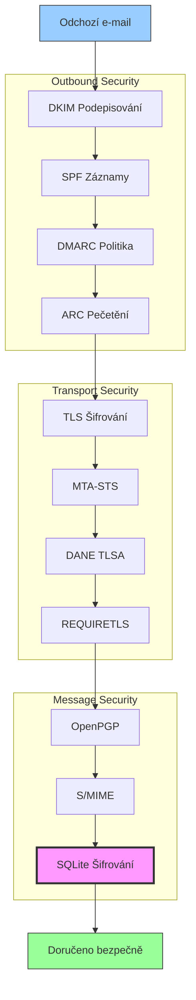


## Protokoly autentizace e-mailových zpráv {#email-message-authentication-protocols}

> \[!NOTE]
> Forward Email implementuje všechny hlavní protokoly autentizace e-mailů, aby zabránil podvržení a zajistil integritu zprávy.

Forward Email používá knihovnu [mailauth](https://github.com/postalsys/mailauth) pro autentizaci e-mailů. Podporované RFC jsou:

| RFC                                                       | Název                                                                   | Poznámky k implementaci                                       |
| --------------------------------------------------------- | ----------------------------------------------------------------------- | -------------------------------------------------------------- |
| [RFC 6376](https://datatracker.ietf.org/doc/html/rfc6376) | DomainKeys Identified Mail (DKIM) podpisy                              | Kompletní podepisování a ověřování DKIM                        |
| [RFC 8463](https://datatracker.ietf.org/doc/html/rfc8463) | Nová kryptografická metoda podpisu pro DKIM (Ed25519-SHA256)           | Podpora algoritmů podepisování RSA-SHA256 i Ed25519-SHA256     |
| [RFC 7208](https://datatracker.ietf.org/doc/html/rfc7208) | Sender Policy Framework (SPF)                                           | Validace SPF záznamů                                           |
| [RFC 7489](https://datatracker.ietf.org/doc/html/rfc7489) | Domain-based Message Authentication, Reporting, and Conformance (DMARC) | Vynucování politiky DMARC                                      |
| [RFC 8617](https://datatracker.ietf.org/doc/html/rfc8617) | Authenticated Received Chain (ARC)                                      | Pečetění a ověřování ARC                                       |

Protokoly autentizace e-mailů ověřují, že zprávy skutečně pocházejí od deklarovaného odesílatele a nebyly během přenosu pozměněny.

### Podpora autentizačních protokolů {#authentication-protocol-support}

| Protokol  | RFC      | Stav        | Popis                                                                |
| --------- | -------- | ----------- | -------------------------------------------------------------------- |
| **DKIM**  | RFC 6376 | ✅ Podporováno | DomainKeys Identified Mail - Kryptografické podpisy                 |
| **SPF**   | RFC 7208 | ✅ Podporováno | Sender Policy Framework - Autorizace IP adresy                      |
| **DMARC** | RFC 7489 | ✅ Podporováno | Domain-based Message Authentication - Vynucování politiky           |
| **ARC**   | RFC 8617 | ✅ Podporováno | Authenticated Received Chain - Zachování autentizace při přeposílání |
### DKIM (DomainKeys Identified Mail) {#dkim-domainkeys-identified-mail}

**DKIM** přidává kryptografický podpis do hlaviček e-mailů, což umožňuje příjemcům ověřit, že zpráva byla autorizována vlastníkem domény a nebyla během přenosu upravena.

Forward Email používá [mailauth](https://github.com/postalsys/mailauth) pro podepisování a ověřování DKIM.

**Hlavní vlastnosti:**

* Automatické podepisování DKIM pro všechny odchozí zprávy
* Podpora klíčů RSA a Ed25519
* Podpora více selektorů
* Ověřování DKIM pro příchozí zprávy

### SPF (Sender Policy Framework) {#spf-sender-policy-framework}

**SPF** umožňuje vlastníkům domén specifikovat, které IP adresy jsou oprávněny odesílat e-maily jménem jejich domény.

**Hlavní vlastnosti:**

* Validace SPF záznamů pro příchozí zprávy
* Automatická kontrola SPF s podrobnými výsledky
* Podpora mechanismů include, redirect a all
* Konfigurovatelné SPF politiky pro jednotlivé domény

### DMARC (Domain-based Message Authentication, Reporting & Conformance) {#dmarc-domain-based-message-authentication-reporting--conformance}

**DMARC** staví na SPF a DKIM a poskytuje vynucování politik a reportování.

**Hlavní vlastnosti:**

* Vynucování DMARC politik (none, quarantine, reject)
* Kontrola zarovnání pro SPF a DKIM
* Agregované reporty DMARC
* DMARC politiky pro jednotlivé domény

### ARC (Authenticated Received Chain) {#arc-authenticated-received-chain}

**ARC** zachovává výsledky autentizace e-mailů při přeposílání a úpravách mailing listů.

Forward Email používá knihovnu [mailauth](https://github.com/postalsys/mailauth) pro ověřování a zapečetění ARC.

**Hlavní vlastnosti:**

* Zapečetění ARC pro přeposlané zprávy
* Validace ARC pro příchozí zprávy
* Ověření řetězce přes více přeskoků
* Zachovává původní výsledky autentizace

### Authentication Flow {#authentication-flow}

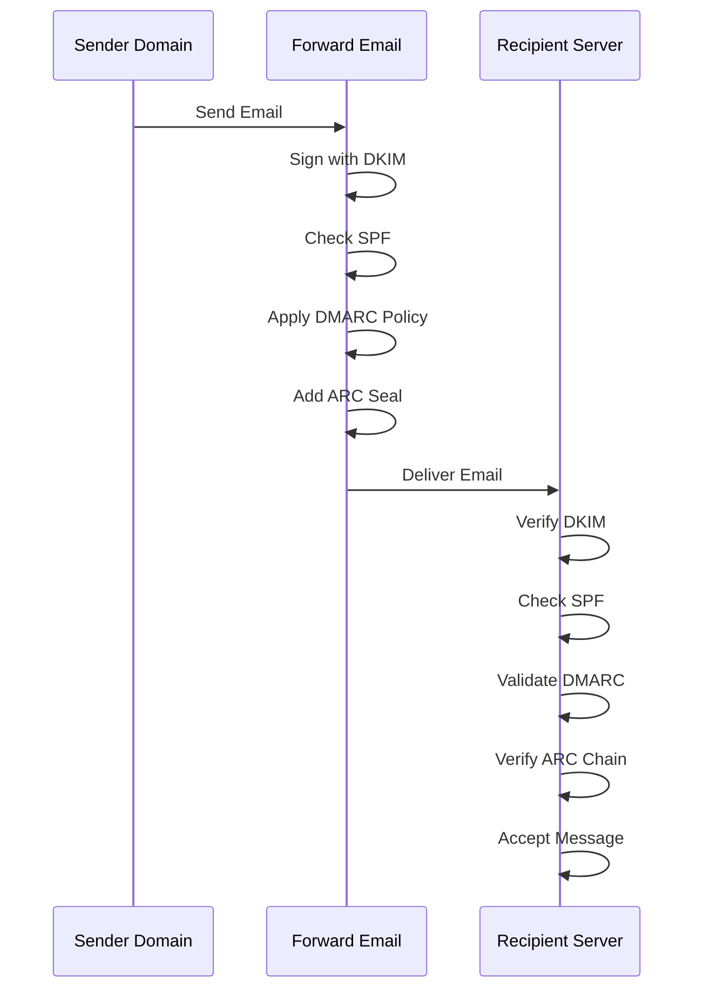

---


## Email Transport Security Protocols {#email-transport-security-protocols}

> \[!IMPORTANT]
> Forward Email implementuje více vrstev transportní bezpečnosti k ochraně e-mailů během přenosu.

Forward Email implementuje moderní protokoly transportní bezpečnosti:

| RFC                                                       | Název                                                                                                | Stav        | Poznámky k implementaci                                                                                                                                                                                                                                                                       |
| --------------------------------------------------------- | ---------------------------------------------------------------------------------------------------- | ----------- | --------------------------------------------------------------------------------------------------------------------------------------------------------------------------------------------------------------------------------------------------------------------------------------------- |
| [RFC 8461](https://datatracker.ietf.org/doc/html/rfc8461) | SMTP MTA Strict Transport Security (MTA-STS)                                                         | ✅ Podporováno | Široce používané na IMAP, SMTP a MX serverech. Viz [create-mta-sts-cache.js](https://github.com/forwardemail/forwardemail.net/blob/master/helpers/create-mta-sts-cache.js) a [get-transporter.js](https://github.com/forwardemail/forwardemail.net/blob/master/helpers/get-transporter.js) |
| [RFC 8460](https://datatracker.ietf.org/doc/html/rfc8460) | SMTP TLS Reporting                                                                                   | ✅ Podporováno | Pomocí knihovny [mailauth](https://github.com/postalsys/mailauth)                                                                                                                                                                                                                            |
| [RFC 7671](https://datatracker.ietf.org/doc/html/rfc7671) | The DNS-Based Authentication of Named Entities (DANE) Protocol: Updates and Operational Guidance     | ✅ Podporováno | Plná DANE verifikace pro odchozí SMTP připojení. Viz [mx-connect PR #22](https://github.com/zone-eu/mx-connect/pull/22)                                                                                                                                                                     |
| [RFC 6698](https://datatracker.ietf.org/doc/html/rfc6698) | The DNS-Based Authentication of Named Entities (DANE) Transport Layer Security (TLS) Protocol: TLSA  | ✅ Podporováno | Plná podpora RFC 6698: typy použití PKIX-TA, PKIX-EE, DANE-TA, DANE-EE. Viz [mx-connect PR #22](https://github.com/zone-eu/mx-connect/pull/22)                                                                                                                                              |
| [RFC 8314](https://datatracker.ietf.org/doc/html/rfc8314) | Cleartext Considered Obsolete: Use of Transport Layer Security (TLS) for Email Submission and Access | ✅ Podporováno | TLS vyžadováno pro všechna připojení                                                                                                                                                                                                                                                         |
| [RFC 8689](https://datatracker.ietf.org/doc/html/rfc8689) | SMTP Service Extension for Requiring TLS (REQUIRETLS)                                                | ✅ Podporováno | Plná podpora SMTP rozšíření REQUIRETLS a hlavičky "TLS-Required"                                                                                                                                                                                                                             |
Protokoly zabezpečení přenosu zajišťují, že e-mailové zprávy jsou během přenosu mezi poštovními servery šifrovány a autentizovány.

### Podpora zabezpečení přenosu {#transport-security-support}

| Protokol      | RFC      | Stav        | Popis                                            |
| ------------- | -------- | ----------- | ------------------------------------------------ |
| **TLS**       | RFC 8314 | ✅ Podporováno | Transport Layer Security - šifrovaná spojení     |
| **MTA-STS**   | RFC 8461 | ✅ Podporováno | Mail Transfer Agent Strict Transport Security    |
| **DANE**      | RFC 7671 | ✅ Podporováno | DNS-based Authentication of Named Entities       |
| **REQUIRETLS**| RFC 8689 | ✅ Podporováno | Vyžadovat TLS pro celou cestu doručení            |

### TLS (Transport Layer Security) {#tls-transport-layer-security}

Forward Email vynucuje šifrování TLS pro všechna e-mailová připojení (SMTP, IMAP, POP3).

**Klíčové vlastnosti:**

* Podpora TLS 1.2 a TLS 1.3
* Automatická správa certifikátů
* Perfect Forward Secrecy (PFS)
* Pouze silné šifrovací sady

### MTA-STS (Mail Transfer Agent Strict Transport Security) {#mta-sts-mail-transfer-agent-strict-transport-security}

**MTA-STS** zajišťuje, že e-mail je doručován pouze přes TLS-šifrovaná spojení publikováním politiky přes HTTPS.

Forward Email implementuje MTA-STS pomocí [create-mta-sts-cache.js](https://github.com/forwardemail/forwardemail.net/blob/master/helpers/create-mta-sts-cache.js).

**Klíčové vlastnosti:**

* Automatická publikace politiky MTA-STS
* Ukládání politiky do cache pro výkon
* Prevence downgrade útoků
* Vynucení ověření certifikátu

### DANE (DNS-based Authentication of Named Entities) {#dane-dns-based-authentication-of-named-entities}

> \[!NOTE]
> Forward Email nyní poskytuje plnou podporu DANE pro odchozí SMTP připojení.

**DANE** využívá DNSSEC k publikování informací o TLS certifikátech v DNS, což umožňuje poštovním serverům ověřovat certifikáty bez závislosti na certifikačních autoritách.

**Klíčové vlastnosti:**

* ✅ Plná DANE verifikace pro odchozí SMTP připojení
* ✅ Plná podpora RFC 6698: typy použití PKIX-TA, PKIX-EE, DANE-TA, DANE-EE
* ✅ Ověření certifikátu vůči TLSA záznamům během TLS upgradu
* ✅ Paralelní vyhledávání TLSA záznamů pro více MX hostitele
* ✅ Automatická detekce nativní `dns.resolveTlsa` (Node.js v22.15.0+, v23.9.0+)
* ✅ Podpora vlastního resolveru pro starší verze Node.js přes [Tangerine](https://github.com/forwardemail/tangerine)
* Vyžaduje DNSSEC podepsané domény

> \[!TIP]
> **Detaily implementace:** Podpora DANE byla přidána přes [mx-connect PR #22](https://github.com/zone-eu/mx-connect/pull/22), který poskytuje komplexní podporu DANE/TLSA pro odchozí SMTP připojení.

### REQUIRETLS {#requiretls}

> \[!TIP]
> Forward Email je jedním z mála poskytovatelů s uživatelsky přístupnou podporou REQUIRETLS.

**REQUIRETLS** zajišťuje, že e-mailové zprávy jsou doručovány pouze přes TLS-šifrovaná spojení po celou cestu doručení.

**Klíčové vlastnosti:**

* Uživatelsky přístupné zaškrtávací políčko v editoru e-mailu
* Automatické odmítnutí nešifrovaného doručení
* Vynucení end-to-end TLS
* Podrobné notifikace o selhání

> \[!TIP]
> **Uživatelské vynucení TLS:** Forward Email poskytuje zaškrtávací políčko v **Můj účet > Domény > Nastavení** pro vynucení TLS u všech příchozích připojení. Po zapnutí tato funkce odmítá jakýkoli příchozí e-mail, který není odeslán přes TLS-šifrované spojení s chybovým kódem 530, čímž zajišťuje, že veškerá příchozí pošta je během přenosu šifrována.

### Tok zabezpečení přenosu {#transport-security-flow}

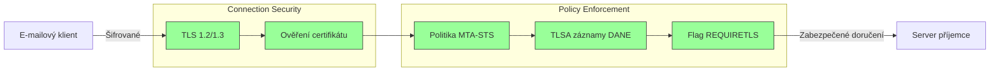
## Šifrování e-mailových zpráv {#email-message-encryption}

> \[!NOTE]
> Forward Email podporuje jak OpenPGP, tak S/MIME pro end-to-end šifrování e-mailů.

Forward Email podporuje šifrování OpenPGP a S/MIME:

| RFC                                                       | Název                                                                                   | Stav        | Poznámky k implementaci                                                                                                                                                                              |
| --------------------------------------------------------- | --------------------------------------------------------------------------------------- | ----------- | ---------------------------------------------------------------------------------------------------------------------------------------------------------------------------------------------------- |
| [RFC 9580](https://datatracker.ietf.org/doc/html/rfc9580) | OpenPGP (nahrazuje RFC 4880)                                                            | ✅ Podporováno | Prostřednictvím integrace [OpenPGP.js v6+](https://github.com/openpgpjs/openpgpjs). Viz [FAQ](https://forwardemail.net/en/faq#do-you-support-openpgpmime-end-to-end-encryption-e2ee-and-web-key-directory-wkd) |
| [RFC 8551](https://datatracker.ietf.org/doc/html/rfc8551) | Secure/Multipurpose Internet Mail Extensions (S/MIME) Verze 4.0 - specifikace zprávy     | ✅ Podporováno | Podporovány jsou algoritmy RSA i ECC. Viz [FAQ](https://forwardemail.net/en/faq#do-you-support-smime-encryption)                                                                                     |

Protokoly šifrování zpráv chrání obsah e-mailu před přečtením kýmkoli jiným než zamýšleným příjemcem, i když je zpráva zachycena během přenosu.

### Podpora šifrování {#encryption-support}

| Protokol    | RFC      | Stav        | Popis                                       |
| ----------- | -------- | ----------- | -------------------------------------------- |
| **OpenPGP** | RFC 9580 | ✅ Podporováno | Pretty Good Privacy - šifrování veřejným klíčem |
| **S/MIME**  | RFC 8551 | ✅ Podporováno | Secure/Multipurpose Internet Mail Extensions |
| **WKD**     | Draft    | ✅ Podporováno | Web Key Directory - automatické vyhledávání klíčů |

### OpenPGP (Pretty Good Privacy) {#openpgp-pretty-good-privacy}

**OpenPGP** poskytuje end-to-end šifrování pomocí kryptografie veřejného klíče. Forward Email podporuje OpenPGP prostřednictvím protokolu [Web Key Directory (WKD)](https://forwardemail.net/en/faq#do-you-support-openpgpmime-end-to-end-encryption-e2ee-and-web-key-directory-wkd).

**Hlavní vlastnosti:**

* Automatické vyhledávání klíčů přes WKD
* Podpora PGP/MIME pro šifrované přílohy
* Správa klíčů přes e-mailového klienta
* Kompatibilní s GPG, Mailvelope a dalšími nástroji OpenPGP

**Jak používat:**

1. Vygenerujte pár PGP klíčů ve svém e-mailovém klientu
2. Nahrajte svůj veřejný klíč do WKD Forward Email
3. Váš klíč je automaticky dostupný ostatním uživatelům
4. Odesílejte a přijímejte šifrované e-maily bez problémů

### S/MIME (Secure/Multipurpose Internet Mail Extensions) {#smime-securemultipurpose-internet-mail-extensions}

**S/MIME** poskytuje šifrování e-mailů a digitální podpisy pomocí certifikátů X.509.

**Hlavní vlastnosti:**

* Šifrování založené na certifikátech
* Digitální podpisy pro autentizaci zpráv
* Nativní podpora ve většině e-mailových klientů
* Bezpečnost na úrovni podniků

**Jak používat:**

1. Získejte S/MIME certifikát od certifikační autority
2. Nainstalujte certifikát do svého e-mailového klienta
3. Nakonfigurujte klienta pro šifrování/podepisování zpráv
4. Vyměňujte si certifikáty s příjemci

### Šifrování SQLite poštovních schránek {#sqlite-mailbox-encryption}

> \[!IMPORTANT]
> Forward Email poskytuje další vrstvu zabezpečení pomocí šifrovaných SQLite poštovních schránek.

Kromě šifrování na úrovni zpráv Forward Email šifruje celé poštovní schránky pomocí [sqleet](https://github.com/resilar/sqleet) (ChaCha20-Poly1305).

**Hlavní vlastnosti:**

* **Šifrování založené na hesle** - Heslo znáte pouze vy
* **Odolné vůči kvantovým útokům** - šifra ChaCha20-Poly1305
* **Zero-knowledge** - Forward Email nemůže vaši schránku dešifrovat
* **Sandboxed** - Každá schránka je izolovaná a přenosná
* **Neobnovitelné** - Pokud zapomenete heslo, schránka je ztracena
### Porovnání šifrování {#encryption-comparison}

| Funkce                | OpenPGP           | S/MIME             | SQLite Encryption |
| --------------------- | ----------------- | ------------------ | ----------------- |
| **End-to-End**        | ✅ Ano             | ✅ Ano              | ✅ Ano             |
| **Správa klíčů**      | Spravováno uživatelem | Vydáno CA          | Na základě hesla  |
| **Podpora klienta**   | Vyžaduje plugin   | Nativní            | Transparentní     |
| **Použití**           | Osobní            | Podnikové          | Úložiště          |
| **Odolnost vůči kvantovým počítačům** | ⚠️ Závisí na klíči | ⚠️ Závisí na certifikátu | ✅ Ano             |

### Průběh šifrování {#encryption-flow}

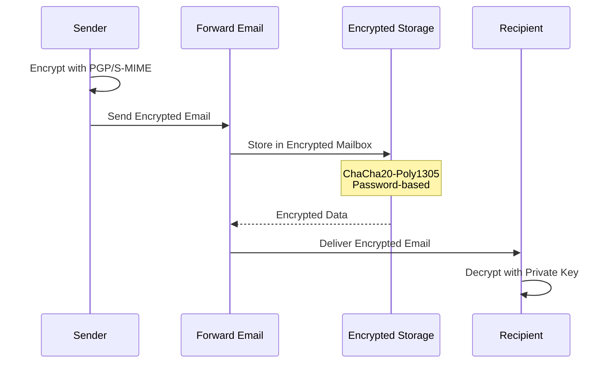

---


## Rozšířená funkčnost {#extended-functionality}


## Standardy formátu emailových zpráv {#email-message-format-standards}

> \[!NOTE]
> Forward Email podporuje moderní standardy formátu emailů pro bohatý obsah a internacionalizaci.

Forward Email podporuje standardní formáty emailových zpráv:

| RFC                                                       | Název                                                         | Poznámky k implementaci |
| --------------------------------------------------------- | ------------------------------------------------------------- | ----------------------- |
| [RFC 5322](https://datatracker.ietf.org/doc/html/rfc5322) | Formát internetové zprávy                                     | Plná podpora            |
| [RFC 2045](https://datatracker.ietf.org/doc/html/rfc2045) | MIME Část jedna: Formát těla internetových zpráv              | Plná podpora MIME       |
| [RFC 2046](https://datatracker.ietf.org/doc/html/rfc2046) | MIME Část dvě: Typy médií                                     | Plná podpora MIME       |
| [RFC 2047](https://datatracker.ietf.org/doc/html/rfc2047) | MIME Část tři: Rozšíření hlaviček zpráv pro ne-ASCII text      | Plná podpora MIME       |
| [RFC 2048](https://datatracker.ietf.org/doc/html/rfc2048) | MIME Část čtyři: Registrační postupy                          | Plná podpora MIME       |
| [RFC 2049](https://datatracker.ietf.org/doc/html/rfc2049) | MIME Část pět: Kritéria shody a příklady                      | Plná podpora MIME       |

Standardy formátu emailů definují, jak jsou emailové zprávy strukturovány, kódovány a zobrazovány.

### Podpora standardů formátu {#format-standards-support}

| Standard           | RFC           | Stav        | Popis                                |
| ------------------ | ------------- | ----------- | ----------------------------------- |
| **MIME**           | RFC 2045-2049 | ✅ Podporováno | Víceúčelové internetové rozšíření pošty |
| **SMTPUTF8**       | RFC 6531      | ⚠️ Částečně | Internacionalizované emailové adresy |
| **EAI**            | RFC 6530      | ⚠️ Částečně | Internacionalizace emailových adres  |
| **Formát zprávy**  | RFC 5322      | ✅ Podporováno | Formát internetové zprávy           |
| **Bezpečnost MIME**| RFC 1847      | ✅ Podporováno | Bezpečnostní vícečásti pro MIME      |

### MIME (Víceúčelové internetové rozšíření pošty) {#mime-multipurpose-internet-mail-extensions}

**MIME** umožňuje emailům obsahovat více částí s různými typy obsahu (text, HTML, přílohy atd.).

**Podporované funkce MIME:**

* Vícečástové zprávy (mixed, alternative, related)
* Hlavičky Content-Type
* Kódování přenosu obsahu (7bit, 8bit, quoted-printable, base64)
* Inline obrázky a přílohy
* Bohatý HTML obsah

### SMTPUTF8 a internacionalizace emailových adres {#smtputf8-and-email-address-internationalization}

> \[!WARNING]
> Podpora SMTPUTF8 je částečná - ne všechny funkce jsou plně implementovány.
**SMTPUTF8** umožňuje e-mailovým adresám obsahovat ne-ASCII znaky (např. `用户@例え.jp`).

**Aktuální stav:**

* ⚠️ Částečná podpora internacionalizovaných e-mailových adres
* ✅ UTF-8 obsah v tělech zpráv
* ⚠️ Omezená podpora ne-ASCII lokálních částí

---


## Protokoly pro kalendáře a kontakty {#calendaring-and-contacts-protocols}

> \[!NOTE]
> Forward Email poskytuje plnou podporu CalDAV a CardDAV pro synchronizaci kalendářů a kontaktů.

Forward Email podporuje CalDAV a CardDAV prostřednictvím knihovny [caldav-adapter](https://github.com/forwardemail/caldav-adapter):

| RFC                                                       | Název                                                                     | Stav        | Poznámky k implementaci                                                                                                                                                               |
| --------------------------------------------------------- | ------------------------------------------------------------------------- | ----------- | -------------------------------------------------------------------------------------------------------------------------------------------------------------------------------------- |
| [RFC 4791](https://datatracker.ietf.org/doc/html/rfc4791) | Rozšíření WebDAV pro kalendáře (CalDAV)                                  | ✅ Podporováno | Přístup a správa kalendářů                                                                                                                                                             |
| [RFC 6352](https://datatracker.ietf.org/doc/html/rfc6352) | CardDAV: Rozšíření WebDAV pro vCard                                       | ✅ Podporováno | Přístup a správa kontaktů                                                                                                                                                              |
| [RFC 5545](https://datatracker.ietf.org/doc/html/rfc5545) | Internetové kalendáře a plánování – základní specifikace objektu (iCalendar) | ✅ Podporováno | Podpora formátu iCalendar                                                                                                                                                              |
| [RFC 6350](https://datatracker.ietf.org/doc/html/rfc6350) | Specifikace formátu vCard                                                 | ✅ Podporováno | Podpora formátu vCard 4.0                                                                                                                                                              |
| [RFC 6638](https://datatracker.ietf.org/doc/html/rfc6638) | Rozšíření plánování pro CalDAV                                            | ✅ Podporováno | Plánování v CalDAV s podporou iMIP. Viz [commit c4d1629](https://github.com/forwardemail/forwardemail.net/commit/c4d162975a49e38d76d68a032662e873a34a9b80)                            |
| [RFC 5546](https://datatracker.ietf.org/doc/html/rfc5546) | Protokol nezávislé interoperability iCalendar (iTIP)                     | ✅ Podporováno | Podpora iTIP pro metody REQUEST, REPLY, CANCEL a VFREEBUSY. Viz [commit c4d1629](https://github.com/forwardemail/forwardemail.net/commit/c4d162975a49e38d76d68a032662e873a34a9b80) |
| [RFC 6047](https://datatracker.ietf.org/doc/html/rfc6047) | Protokol interoperability založený na zprávách iCalendar (iMIP)           | ✅ Podporováno | Pozvánky do kalendáře zasílané e-mailem s odkazy pro odpověď. Viz [commit c4d1629](https://github.com/forwardemail/forwardemail.net/commit/c4d162975a49e38d76d68a032662e873a34a9b80)   |

CalDAV a CardDAV jsou protokoly, které umožňují přístup, sdílení a synchronizaci dat kalendářů a kontaktů mezi zařízeními.

### Podpora CalDAV a CardDAV {#caldav-and-carddav-support}

| Protokol              | RFC      | Stav        | Popis                                |
| --------------------- | -------- | ----------- | ------------------------------------ |
| **CalDAV**            | RFC 4791 | ✅ Podporováno | Přístup a synchronizace kalendáře    |
| **CardDAV**           | RFC 6352 | ✅ Podporováno | Přístup a synchronizace kontaktů     |
| **iCalendar**         | RFC 5545 | ✅ Podporováno | Formát dat kalendáře                 |
| **vCard**             | RFC 6350 | ✅ Podporováno | Formát dat kontaktů                  |
| **VTODO**             | RFC 5545 | ✅ Podporováno | Podpora úkolů/připomínek             |
| **Plánování CalDAV**  | RFC 6638 | ✅ Podporováno | Rozšíření plánování v CalDAV          |
| **iTIP**              | RFC 5546 | ✅ Podporováno | Nezávislá interoperabilita transportu |
| **iMIP**              | RFC 6047 | ✅ Podporováno | Pozvánky do kalendáře zasílané e-mailem |
### CalDAV (Přístup ke kalendáři) {#caldav-calendar-access}

**CalDAV** vám umožňuje přistupovat ke kalendářům a spravovat je z jakéhokoli zařízení nebo aplikace.

**Hlavní funkce:**

* Synchronizace na více zařízeních
* Sdílené kalendáře
* Odběry kalendářů
* Pozvánky na události a odpovědi
* Opakující se události
* Podpora časových pásem

**Kompatibilní klienti:**

* Apple Calendar (macOS, iOS)
* Mozilla Thunderbird
* Evolution
* GNOME Calendar
* Jakýkoli klient kompatibilní s CalDAV

### CardDAV (Přístup ke kontaktům) {#carddav-contact-access}

**CardDAV** vám umožňuje přistupovat ke kontaktům a spravovat je z jakéhokoli zařízení nebo aplikace.

**Hlavní funkce:**

* Synchronizace na více zařízeních
* Sdílené adresáře
* Skupiny kontaktů
* Podpora fotografií
* Vlastní pole
* Podpora vCard 4.0

**Kompatibilní klienti:**

* Apple Contacts (macOS, iOS)
* Mozilla Thunderbird
* Evolution
* GNOME Contacts
* Jakýkoli klient kompatibilní s CardDAV

### Úkoly a připomínky (CalDAV VTODO) {#tasks-and-reminders-caldav-vtodo}

> \[!TIP]
> Forward Email podporuje úkoly a připomínky prostřednictvím CalDAV VTODO.

**VTODO** je součást formátu iCalendar a umožňuje správu úkolů přes CalDAV.

**Hlavní funkce:**

* Vytváření a správa úkolů
* Termíny a priority
* Sledování dokončení úkolů
* Opakující se úkoly
* Seznamy/kategorie úkolů

**Kompatibilní klienti:**

* Apple Reminders (macOS, iOS)
* Mozilla Thunderbird (s Lightning)
* Evolution
* GNOME To Do
* Jakýkoli CalDAV klient s podporou VTODO

### Synchronizační tok CalDAV/CardDAV {#caldavcarddav-synchronization-flow}

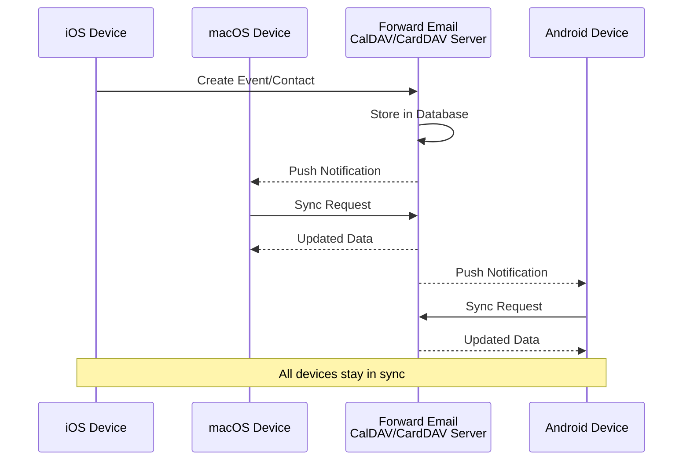

### Nepodporované rozšíření kalendáře {#calendaring-extensions-not-supported}

Následující rozšíření kalendáře nejsou podporována:

| RFC                                                       | Název                                                                | Důvod                                                           |
| --------------------------------------------------------- | -------------------------------------------------------------------- | ---------------------------------------------------------------- |
| [RFC 4918](https://datatracker.ietf.org/doc/html/rfc4918) | HTTP Extensions for Web Distributed Authoring and Versioning (WebDAV) | CalDAV používá koncepty WebDAV, ale neimplementuje celý RFC 4918 |
| [RFC 6578](https://datatracker.ietf.org/doc/html/rfc6578) | Collection Synchronization for WebDAV                                | Není implementováno                                             |
| [RFC 3744](https://datatracker.ietf.org/doc/html/rfc3744) | WebDAV Access Control Protocol                                       | Není implementováno                                             |

---


## Filtrování e-mailových zpráv {#email-message-filtering}

> \[!IMPORTANT]
> Forward Email poskytuje **plnou podporu Sieve a ManageSieve** pro serverové filtrování e-mailů. Vytvářejte výkonná pravidla pro automatické třídění, filtrování, přeposílání a odpovídání na příchozí zprávy.

### Sieve (RFC 5228) {#sieve-rfc-5228}

[Sieve](https://en.wikipedia.org/wiki/Sieve_\(mail_filtering_language\)) je standardizovaný, výkonný skriptovací jazyk pro serverové filtrování e-mailů. Forward Email implementuje komplexní podporu Sieve s 24 rozšířeními.

**Zdrojový kód:** [`helpers/sieve/`](https://github.com/forwardemail/forwardemail.net/tree/master/helpers/sieve)

#### Podporované základní RFC Sieve {#core-sieve-rfcs-supported}

| RFC                                                                                    | Název                                                         | Stav           |
| -------------------------------------------------------------------------------------- | ------------------------------------------------------------- | -------------- |
| [RFC 5228](https://datatracker.ietf.org/doc/html/rfc5228)                              | Sieve: Jazyk pro filtrování e-mailů                           | ✅ Plná podpora |
| [RFC 5429](https://datatracker.ietf.org/doc/html/rfc5429)                              | Sieve filtrování e-mailů: Rozšíření Reject a Extended Reject  | ✅ Plná podpora |
| [RFC 5230](https://datatracker.ietf.org/doc/html/rfc5230)                              | Sieve filtrování e-mailů: Rozšíření dovolené                   | ✅ Plná podpora |
| [RFC 6131](https://datatracker.ietf.org/doc/html/rfc6131)                              | Sieve rozšíření dovolené: parametr "Seconds"                   | ✅ Plná podpora |
| [RFC 5232](https://datatracker.ietf.org/doc/html/rfc5232)                              | Sieve filtrování e-mailů: Rozšíření Imap4flags                 | ✅ Plná podpora |
| [RFC 5173](https://datatracker.ietf.org/doc/html/rfc5173)                              | Sieve filtrování e-mailů: Rozšíření těla zprávy                | ✅ Plná podpora |
| [RFC 5229](https://datatracker.ietf.org/doc/html/rfc5229)                              | Sieve filtrování e-mailů: Rozšíření proměnných                 | ✅ Plná podpora |
| [RFC 5231](https://datatracker.ietf.org/doc/html/rfc5231)                              | Sieve filtrování e-mailů: Relační rozšíření                     | ✅ Plná podpora |
| [RFC 4790](https://datatracker.ietf.org/doc/html/rfc4790)                              | Registr protokolů internetových aplikací                       | ✅ Plná podpora |
| [RFC 3894](https://datatracker.ietf.org/doc/html/rfc3894)                              | Sieve rozšíření: Kopírování bez vedlejších efektů              | ✅ Plná podpora |
| [RFC 5293](https://datatracker.ietf.org/doc/html/rfc5293)                              | Sieve filtrování e-mailů: Rozšíření Editheader                 | ✅ Plná podpora |
| [RFC 5260](https://datatracker.ietf.org/doc/html/rfc5260)                              | Sieve filtrování e-mailů: Rozšíření pro datum a index          | ✅ Plná podpora |
| [RFC 5435](https://datatracker.ietf.org/doc/html/rfc5435)                              | Sieve filtrování e-mailů: Rozšíření pro notifikace             | ✅ Plná podpora |
| [RFC 5183](https://datatracker.ietf.org/doc/html/rfc5183)                              | Sieve filtrování e-mailů: Rozšíření prostředí                   | ✅ Plná podpora |
| [RFC 5490](https://datatracker.ietf.org/doc/html/rfc5490)                              | Sieve filtrování e-mailů: Rozšíření pro kontrolu stavu schránky | ✅ Plná podpora |
| [RFC 8579](https://datatracker.ietf.org/doc/html/rfc8579)                              | Sieve filtrování e-mailů: Doručování do speciálních schránek   | ✅ Plná podpora |
| [RFC 7352](https://datatracker.ietf.org/doc/html/rfc7352)                              | Sieve filtrování e-mailů: Detekce duplicitních doručení        | ✅ Plná podpora |
| [RFC 5463](https://datatracker.ietf.org/doc/html/rfc5463)                              | Sieve filtrování e-mailů: Rozšíření Ihave                       | ✅ Plná podpora |
| [RFC 5233](https://datatracker.ietf.org/doc/html/rfc5233)                              | Sieve filtrování e-mailů: Rozšíření Subaddress                  | ✅ Plná podpora |
| [draft-ietf-sieve-regex](https://datatracker.ietf.org/doc/html/draft-ietf-sieve-regex) | Sieve filtrování e-mailů: Rozšíření regulárních výrazů          | ✅ Plná podpora |
#### Podporované rozšíření Sieve {#supported-sieve-extensions}

| Rozšíření                    | Popis                                   | Integrace                                  |
| ---------------------------- | ---------------------------------------- | ------------------------------------------ |
| `fileinto`                   | Ukládání zpráv do konkrétních složek    | Zprávy uložené ve specifikované IMAP složce |
| `reject` / `ereject`         | Odmítnutí zpráv s chybou                 | SMTP odmítnutí s bounce zprávou             |
| `vacation`                   | Automatické odpovědi na dovolenou/mimo kancelář | Zařazeno do fronty přes Emails.queue s omezením rychlosti |
| `vacation-seconds`           | Jemné intervaly odpovědí na dovolenou    | TTL z parametru `:seconds`                   |
| `imap4flags`                 | Nastavení IMAP příznaků (\Seen, \Flagged, atd.) | Příznaky aplikovány při ukládání zprávy      |
| `envelope`                   | Test odesílatele/příjemce v obálce       | Přístup k datům SMTP obálky                  |
| `body`                       | Test obsahu těla zprávy                   | Porovnání celého textu těla                   |
| `variables`                  | Ukládání a použití proměnných ve skriptech | Rozšiřování proměnných s modifikátory        |
| `relational`                 | Relační porovnání                         | `:count`, `:value` s gt/lt/eq                 |
| `comparator-i;ascii-numeric` | Číselná porovnání                         | Porovnání číselných řetězců                   |
| `copy`                       | Kopírování zpráv při přesměrování        | Příznak `:copy` u fileinto/redirect           |
| `editheader`                 | Přidání nebo odstranění hlaviček zprávy  | Hlavičky upraveny před uložením                |
| `date`                       | Test hodnot data/času                      | Testy `currentdate` a data v hlavičce          |
| `index`                      | Přístup ke konkrétním výskytům hlaviček   | `:index` pro vícenásobné hodnoty hlaviček      |
| `regex`                      | Porovnání pomocí regulárních výrazů       | Plná podpora regexů v testech                   |
| `enotify`                    | Odesílání notifikací                      | Notifikace `mailto:` přes Emails.queue          |
| `environment`                | Přístup k informacím o prostředí           | Doména, host, remote-ip ze session              |
| `mailbox`                    | Test existence schránky                    | Test `mailboxexists`                             |
| `special-use`                | Ukládání do speciálních schránek           | Mapování \Junk, \Trash atd. na složky            |
| `duplicate`                  | Detekce duplicitních zpráv                 | Sledování duplicit pomocí Redis                  |
| `ihave`                      | Test dostupnosti rozšíření                  | Kontrola schopností za běhu                       |
| `subaddress`                 | Přístup k částem adresy user+detail         | Části adresy `:user` a `:detail`                  |

#### Nepodporovaná rozšíření Sieve {#sieve-extensions-not-supported}

| Rozšíření                               | RFC                                                       | Důvod                                                           |
| --------------------------------------- | --------------------------------------------------------- | ---------------------------------------------------------------- |
| `include`                               | [RFC 6609](https://datatracker.ietf.org/doc/html/rfc6609) | Bezpečnostní riziko (injekce skriptu), vyžaduje globální úložiště skriptů |
| `mboxmetadata` / `servermetadata`       | [RFC 5490](https://datatracker.ietf.org/doc/html/rfc5490) | Vyžaduje IMAP rozšíření METADATA                                 |
| `fcc`                                   | [RFC 8580](https://datatracker.ietf.org/doc/html/rfc8580) | Vyžaduje integraci složky Odeslané                              |
| `encoded-character`                     | [RFC 5228](https://datatracker.ietf.org/doc/html/rfc5228) | Vyžaduje změny parseru pro syntaxi ${hex:}                      |
| `foreverypart` / `mime` / `extracttext` | [RFC 5703](https://datatracker.ietf.org/doc/html/rfc5703) | Komplexní manipulace s MIME stromem                             |
#### Průběh zpracování Sieve {#sieve-processing-flow}

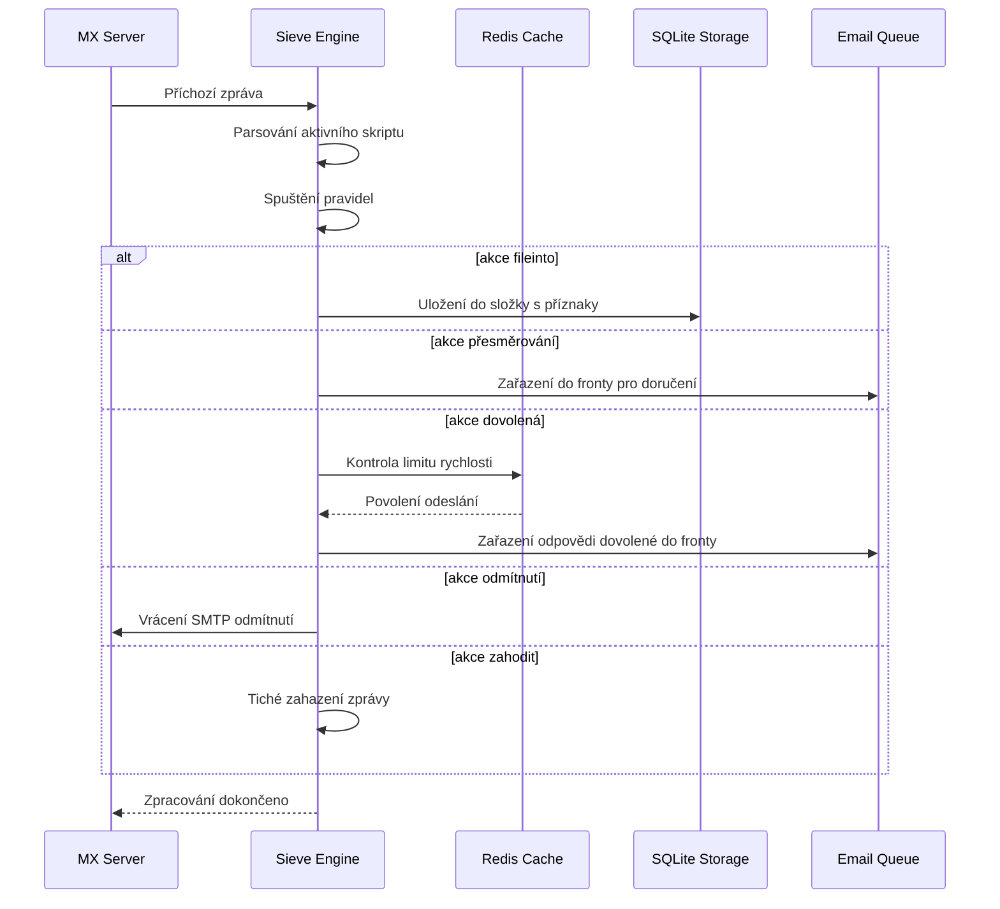

#### Bezpečnostní funkce {#security-features}

Implementace Sieve ve Forward Email zahrnuje komplexní bezpečnostní ochrany:

* **Ochrana proti CVE-2023-26430**: Zabraňuje smyčkám přesměrování a útokům typu mail bombing
* **Omezení rychlosti**: Limity na přesměrování (10/zprávu, 100/den) a odpovědi dovolené
* **Kontrola denylistu**: Přesměrovací adresy kontrolovány proti denylistu
* **Chráněné hlavičky**: Hlavičky DKIM, ARC a autentizace nelze měnit pomocí editheader
* **Limity velikosti skriptu**: Vynucení maximální velikosti skriptu
* **Časové limity vykonávání**: Skripty jsou ukončeny, pokud překročí časový limit

#### Příkladové Sieve skripty {#example-sieve-scripts}

**Uložení newsletterů do složky:**

```sieve
require ["fileinto"];

if header :contains "List-Id" "newsletter" {
    fileinto "Newsletters";
}
```

**Automatická odpověď dovolené s jemným časováním:**

```sieve
require ["vacation", "vacation-seconds"];

vacation :seconds 3600 :subject "Mimo kancelář"
    "Momentálně jsem pryč a odpovím do 24 hodin.";
```

**Filtrování spamu s příznaky:**

```sieve
require ["fileinto", "imap4flags"];

if header :contains "X-Spam-Status" "Yes" {
    setflag "\\Seen";
    fileinto "Junk";
}
```

**Komplexní filtrování s proměnnými:**

```sieve
require ["variables", "fileinto", "regex"];

if header :regex "From" "(.+)@example\\.com" {
    set :lower "sender" "${1}";
    fileinto "Contacts/${sender}";
}
```

> \[!TIP]
> Pro kompletní dokumentaci, příkladové skripty a instrukce konfigurace viz [FAQ: Podporujete filtrování e-mailů pomocí Sieve?](/faq#do-you-support-sieve-email-filtering)

### ManageSieve (RFC 5804) {#managesieve-rfc-5804}

Forward Email poskytuje plnou podporu protokolu ManageSieve pro vzdálenou správu Sieve skriptů.

**Zdrojový kód:** [`managesieve-server.js`](https://github.com/forwardemail/forwardemail.net/blob/master/managesieve-server.js)

| RFC                                                       | Název                                          | Stav           |
| --------------------------------------------------------- | ---------------------------------------------- | -------------- |
| [RFC 5804](https://datatracker.ietf.org/doc/html/rfc5804) | Protokol pro vzdálenou správu Sieve skriptů   | ✅ Plná podpora |

#### Konfigurace ManageSieve serveru {#managesieve-server-configuration}

| Nastavení               | Hodnota                 |
| ----------------------- | ----------------------- |
| **Server**              | `imap.forwardemail.net` |
| **Port (STARTTLS)**     | `2190` (doporučeno)     |
| **Port (Implicitní TLS)** | `4190`                |
| **Autentizace**         | PLAIN (přes TLS)        |

> **Poznámka:** Port 2190 používá STARTTLS (přechod z plain na TLS) a je kompatibilní s většinou ManageSieve klientů včetně [sieve-connect](https://github.com/philpennock/sieve-connect). Port 4190 používá implicitní TLS (TLS od začátku spojení) pro klienty, kteří to podporují.

#### Podporované příkazy ManageSieve {#supported-managesieve-commands}

| Příkaz         | Popis                                   |
| -------------- | --------------------------------------- |
| `AUTHENTICATE` | Autentizace pomocí mechanismu PLAIN     |
| `CAPABILITY`   | Výpis schopností a rozšíření serveru    |
| `HAVESPACE`    | Kontrola, zda lze uložit skript         |
| `PUTSCRIPT`    | Nahrání nového skriptu                   |
| `LISTSCRIPTS`  | Výpis všech skriptů s aktivním stavem   |
| `SETACTIVE`    | Aktivace skriptu                         |
| `GETSCRIPT`    | Stažení skriptu                         |
| `DELETESCRIPT` | Smazání skriptu                         |
| `RENAMESCRIPT` | Přejmenování skriptu                    |
| `CHECKSCRIPT`  | Validace syntaxe skriptu                |
| `NOOP`         | Udržení spojení aktivního               |
| `LOGOUT`       | Ukončení relace                         |
#### Kompatibilní ManageSieve klienti {#compatible-managesieve-clients}

* **Thunderbird**: Vestavěná podpora Sieve přes [Sieve add-on](https://addons.thunderbird.net/addon/sieve/)
* **Roundcube**: [ManageSieve plugin](https://plugins.roundcube.net/packages/johndoh/sieve)
* **KMail**: Nativní podpora ManageSieve
* **sieve-connect**: Klient příkazové řádky
* **Jakýkoli klient kompatibilní s RFC 5804**

#### Průběh protokolu ManageSieve {#managesieve-protocol-flow}

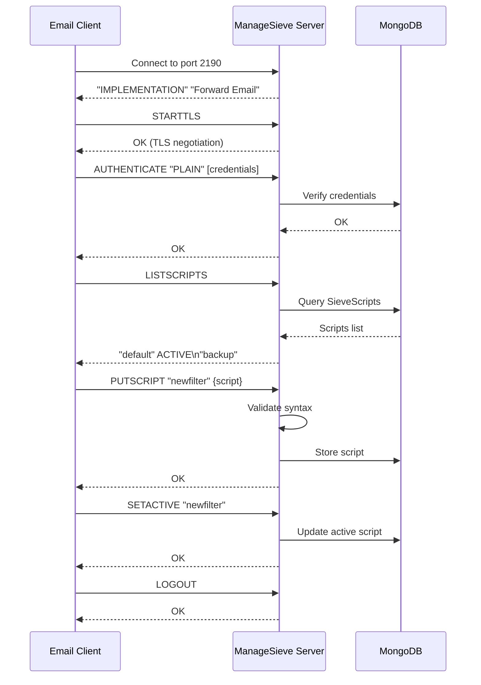

#### Webové rozhraní a API {#web-interface-and-api}

Kromě ManageSieve poskytuje Forward Email:

* **Webová administrace**: Vytvářejte a spravujte Sieve skripty přes webové rozhraní v Můj účet → Domény → Alias → Sieve skripty
* **REST API**: Programový přístup ke správě Sieve skriptů přes [Forward Email API](/api#sieve-scripts)

> \[!TIP]
> Pro podrobné instrukce nastavení a konfiguraci klienta viz [FAQ: Podporujete filtrování e-mailů pomocí Sieve?](/faq#do-you-support-sieve-email-filtering)

---


## Optimalizace úložiště {#storage-optimization}

> \[!IMPORTANT]
> **Průmyslová první technologie úložiště:** Forward Email je **jediný poskytovatel e-mailu na světě**, který kombinuje deduplikaci příloh s Brotli kompresí obsahu e-mailů. Tato dvouvrstvá optimalizace vám poskytuje **2-3x efektivnější úložiště** ve srovnání s tradičními poskytovateli e-mailu.

Forward Email implementuje dvě revoluční techniky optimalizace úložiště, které dramaticky snižují velikost schránky při zachování plné shody s RFC a věrnosti zpráv:

1. **Deduplikace příloh** - Odstraňuje duplicitní přílohy napříč všemi e-maily
2. **Brotli komprese** - Snižuje úložiště o 46-86 % pro metadata a 50 % pro přílohy

### Architektura: Dvouvrstvá optimalizace úložiště {#architecture-dual-layer-storage-optimization}

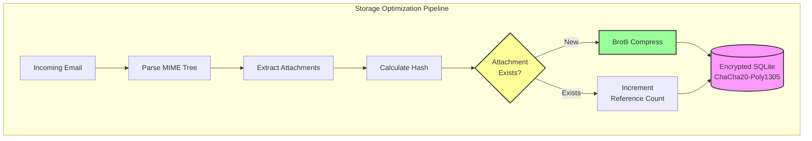

---


## Deduplikace příloh {#attachment-deduplication}

Forward Email implementuje deduplikaci příloh založenou na [ověřeném přístupu WildDuck](https://docs.wildduck.email/docs/in-depth/attachment-deduplication/), přizpůsobenou pro SQLite úložiště.

> \[!NOTE]
> **Co je deduplikováno:** „Příloha“ označuje **kódovaný** obsah MIME uzlu (base64 nebo quoted-printable), nikoli dekódovaný soubor. Tím se zachovává platnost DKIM a GPG podpisů.

### Jak to funguje {#how-it-works}

**Původní implementace WildDuck (MongoDB GridFS):**

> Wild Duck IMAP server deduplikuje přílohy. „Příloha“ v tomto případě znamená base64 nebo quoted-printable kódovaný obsah MIME uzlu, nikoli dekódovaný soubor. I když použití kódovaného obsahu znamená mnoho falešných negativ (tentýž soubor v různých e-mailech může být považován za různé přílohy), je to nutné k zajištění platnosti různých podpisových schémat (DKIM, GPG atd.). Zpráva získaná z Wild Duck vypadá přesně stejně jako zpráva, která byla uložena, i když Wild Duck zprávu rozparsuje do stromové struktury a při načítání ji znovu sestaví.
**Implementace SQLite ve Forward Email:**

Forward Email přizpůsobuje tento přístup pro šifrované ukládání v SQLite následujícím procesem:

1. **Výpočet hashe**: Když je nalezena příloha, vypočítá se hash pomocí knihovny [`rev-hash`](https://github.com/sindresorhus/rev-hash) z těla přílohy
2. **Vyhledávání**: Zkontroluje se, zda příloha se shodným hashem existuje v tabulce `Attachments`
3. **Počítání referencí**:
   * Pokud existuje: Zvýší se čítač referencí o 1 a magický čítač o náhodné číslo
   * Pokud je nová: Vytvoří se nový záznam přílohy s čítačem = 1
4. **Bezpečnost mazání**: Používá se systém dvou čítačů (referenční + magický) k zabránění falešným pozitivům
5. **Garbage Collection**: Přílohy jsou smazány okamžitě, když oba čítače dosáhnou nuly

**Zdrojový kód:** [`helpers/attachment-storage.js`](https://github.com/forwardemail/forwardemail.net/blob/master/helpers/attachment-storage.js)

### Průběh deduplikace {#deduplication-flow}

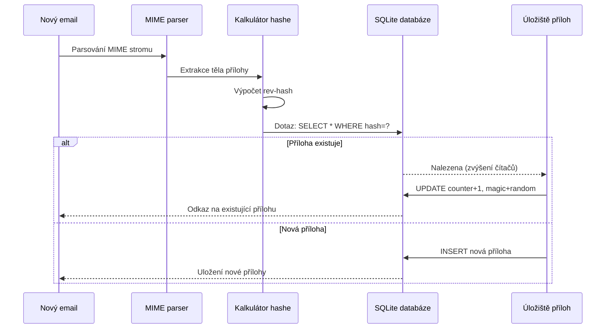

### Systém magických čísel {#magic-number-system}

Forward Email používá systém "magických čísel" WildDucku (inspirovaný [Mail.ru](https://github.com/zone-eu/wildduck)) k zabránění falešným pozitivům při mazání:

* Každé zprávě je přiřazeno **náhodné číslo**
* Magický čítač přílohy je zvýšen o toto náhodné číslo při přidání zprávy
* Magický čítač je snížen o stejné číslo při smazání zprávy
* Příloha je smazána pouze tehdy, když **oba čítače** (referenční + magický) dosáhnou nuly

Tento systém dvou čítačů zajišťuje, že pokud během mazání dojde k chybě (např. pád, chyba sítě), příloha nebude smazána předčasně.

### Klíčové rozdíly: WildDuck vs Forward Email {#key-differences-wildduck-vs-forward-email}

| Funkce                 | WildDuck (MongoDB)       | Forward Email (SQLite)       |
| ---------------------- | ------------------------ | ---------------------------- |
| **Úložiště**           | MongoDB GridFS (dílněné) | SQLite BLOB (přímé)          |
| **Hash algoritmus**    | SHA256                   | rev-hash (založený na SHA-256) |
| **Počítání referencí** | ✅ Ano                   | ✅ Ano                       |
| **Magická čísla**      | ✅ Ano (inspirováno Mail.ru) | ✅ Ano (stejný systém)       |
| **Garbage Collection** | Odložené (samostatný úkol) | Okamžité (při nulových čítačích) |
| **Kompresní metoda**   | ❌ Žádná                 | ✅ Brotli (viz níže)          |
| **Šifrování**          | ❌ Volitelné              | ✅ Vždy (ChaCha20-Poly1305)  |

---


## Brotli komprese {#brotli-compression}

> \[!IMPORTANT]
> **Světová novinka:** Forward Email je **jediná e-mailová služba na světě**, která používá Brotli kompresi na obsah e-mailů. To přináší **46-86% úsporu místa** navíc k deduplikaci příloh.

Forward Email implementuje Brotli kompresi jak pro těla příloh, tak pro metadata zpráv, což poskytuje obrovské úspory místa při zachování zpětné kompatibility.

**Implementace:** [`helpers/msgpack-helpers.js`](https://github.com/forwardemail/forwardemail.net/blob/master/helpers/msgpack-helpers.js)

### Co se komprimuje {#what-gets-compressed}

**1. Těla příloh** (`encodeAttachmentBody`)

* **Staré formáty**: Hex-kódovaný řetězec (2x velikost) nebo surový Buffer
* **Nový formát**: Brotli-komprimovaný Buffer s magickým záhlavím "FEBR"
* **Rozhodnutí o kompresi**: Komprimuje se pouze pokud to ušetří místo (počítá se 4-bajtové záhlaví)
* **Úspora místa**: Až **50%** (hex → nativní BLOB)
**2. Metadata zprávy** (`encodeMetadata`)

Zahrnuje: `mimeTree`, `headers`, `envelope`, `flags`

* **Starý formát**: JSON textový řetězec
* **Nový formát**: Buffer komprimovaný Brotli
* **Úspora místa**: **46-86 %** v závislosti na složitosti zprávy

### Konfigurace komprese {#compression-configuration}

```javascript
// Možnosti komprese Brotli optimalizované pro rychlost (úroveň 4 je dobrý kompromis)
const BROTLI_COMPRESS_OPTIONS = {
  params: {
    [zlib.constants.BROTLI_PARAM_QUALITY]: 4
  }
};
```

**Proč úroveň 4?**

* **Rychlá komprese/dekomprese**: Zpracování v řádu milisekund
* **Dobrá kompresní poměr**: úspora 46-86 %
* **Vyvážený výkon**: Optimální pro operace s e-maily v reálném čase

### Magický záhlaví: "FEBR" {#magic-header-febr}

Forward Email používá 4-bajtové magické záhlaví k identifikaci komprimovaných těles příloh:

```
"FEBR" = Forward Email BRotli
Hex: 0x46 0x45 0x42 0x52
```

**Proč magické záhlaví?**

* **Detekce formátu**: Okamžitá identifikace komprimovaných vs nekomprimovaných dat
* **Zpětná kompatibilita**: Staré hexadecimální řetězce a surové Buffery stále fungují
* **Prevence kolizí**: "FEBR" je nepravděpodobné, že se objeví na začátku legitimních dat příloh

### Proces komprese {#compression-process}

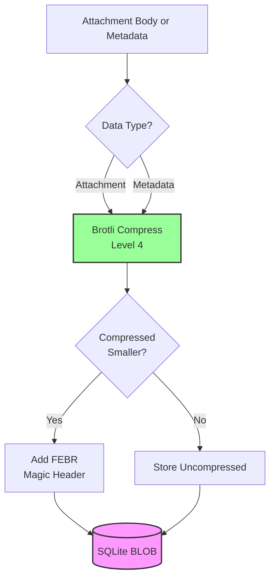

### Proces dekomprese {#decompression-process}

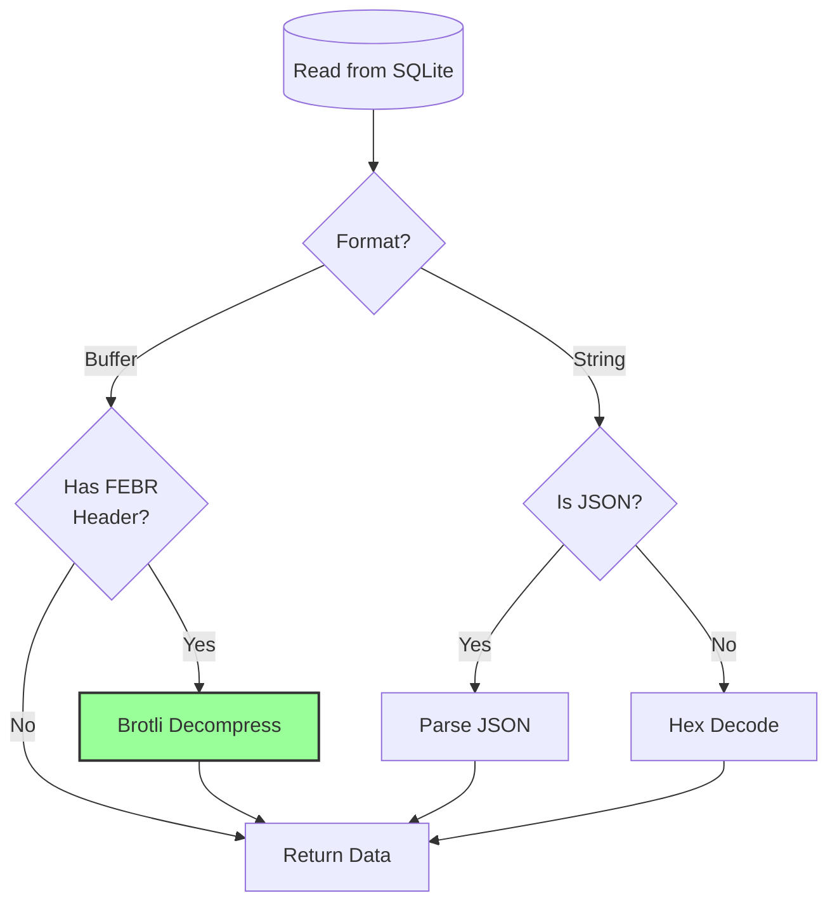

### Zpětná kompatibilita {#backwards-compatibility}

Všechny dekódovací funkce **automaticky detekují** formát uložení:

| Formát                | Metoda detekce                       | Zpracování                                      |
| --------------------- | ---------------------------------- | ----------------------------------------------- |
| **Brotli-komprimovaný** | Kontrola magického záhlaví "FEBR"  | Dekompresí pomocí `zlib.brotliDecompressSync()` |
| **Surový Buffer**      | `Buffer.isBuffer()` bez magického záhlaví | Vrátí beze změny                                |
| **Hexadecimální řetězec** | Kontrola sudé délky + znaky [0-9a-f] | Dekódování pomocí `Buffer.from(value, 'hex')`   |
| **JSON řetězec**       | Kontrola prvního znaku `{` nebo `[` | Parsování pomocí `JSON.parse()`                  |

To zajišťuje **nulovou ztrátu dat** při migraci ze starých na nové formáty uložení.

### Statistiky úspor místa {#storage-savings-statistics}

**Naměřené úspory z produkčních dat:**

| Typ dat               | Starý formát            | Nový formát            | Úspora     |
| --------------------- | ----------------------- | ---------------------- | ---------- |
| **Těla příloh**       | Hex-kódovaný řetězec (2x) | Brotli-komprimovaný BLOB | **50 %**   |
| **Metadata zprávy**   | JSON text               | Brotli-komprimovaný BLOB | **46-86 %**|
| **Vlajky poštovní schránky** | JSON text               | Brotli-komprimovaný BLOB | **60-80 %**|

**Zdroj:** [`helpers/migrate-storage-format.js`](https://github.com/forwardemail/forwardemail.net/blob/master/helpers/migrate-storage-format.js)

### Proces migrace {#migration-process}

Forward Email poskytuje automatickou, idempotentní migraci ze starých na nové formáty uložení:
// Statistiky migrace sledovány:
{
  attachmentsMigrated: 0,
  messagesMigrated: 0,
  mailboxesMigrated: 0,
  bytesSaved: 0  // Celkový počet bajtů ušetřených kompresí
}
```

**Kroky migrace:**

1. Těla příloh: hexadecimální kódování → nativní BLOB (úspora 50 %)
2. Metadata zpráv: JSON text → brotli-komprimovaný BLOB (úspora 46-86 %)
3. Vlajky poštovních schránek: JSON text → brotli-komprimovaný BLOB (úspora 60-80 %)

**Zdroj:** [`helpers/migrate-storage-format.js`](https://github.com/forwardemail/forwardemail.net/blob/master/helpers/migrate-storage-format.js)

---

### Kombinovaná efektivita úložiště {#combined-storage-efficiency}

> \[!TIP]
> **Reálný dopad:** Díky deduplikaci příloh + Brotli kompresi získávají uživatelé Forward Email **2-3x efektivnější úložiště** ve srovnání s tradičními poskytovateli e-mailů.

**Příklad scénáře:**

Tradiční poskytovatel e-mailu (1GB poštovní schránka):

* 1GB diskového prostoru = 1GB e-mailů
* Žádná deduplikace: Stejná příloha uložená 10krát = 10x plýtvání úložištěm
* Žádná komprese: Plná metadata JSON uložená = 2-3x plýtvání úložištěm

Forward Email (1GB poštovní schránka):

* 1GB diskového prostoru ≈ **2-3GB e-mailů** (efektivní úložiště)
* Deduplikace: Stejná příloha uložená jednou, odkazováno 10krát
* Komprese: 46-86 % úspora na metadatech, 50 % na přílohách
* Šifrování: ChaCha20-Poly1305 (bez režie na úložiště)

**Porovnávací tabulka:**

| Poskytovatel      | Technologie úložiště                        | Efektivní úložiště (1GB poštovní schránka) |
| ----------------- | ------------------------------------------ | ------------------------------------------ |
| Gmail             | Žádná                                      | 1GB                                        |
| iCloud            | Žádná                                      | 1GB                                        |
| Outlook.com       | Žádná                                      | 1GB                                        |
| Fastmail          | Žádná                                      | 1GB                                        |
| ProtonMail        | Pouze šifrování                            | 1GB                                        |
| Tutanota          | Pouze šifrování                            | 1GB                                        |
| **Forward Email** | **Deduplikace + Komprese + Šifrování**    | **2-3GB** ✨                                |

### Technické detaily implementace {#technical-implementation-details}

**Výkon:**

* Brotli úroveň 4: Komprese/dekomprese v řádu pod milisekundy
* Žádný výkonový dopad komprese
* SQLite FTS5: Vyhledávání pod 50 ms na NVMe SSD

**Bezpečnost:**

* Komprese probíhá **po** šifrování (SQLite databáze je šifrovaná)
* Šifrování ChaCha20-Poly1305 + Brotli komprese
* Zero-knowledge: Dešifrovací heslo má pouze uživatel

**Soulad s RFC:**

* Zprávy načtené vypadají **přesně stejně** jako uložené
* DKIM podpisy zůstávají platné (kódovaný obsah zachován)
* GPG podpisy zůstávají platné (žádná úprava podepsaného obsahu)

### Proč to nedělá žádný jiný poskytovatel {#why-no-other-provider-does-this}

**Složitost:**

* Vyžaduje hlubokou integraci s vrstvou úložiště
* Zpětná kompatibilita je náročná
* Migrace ze starých formátů je složitá

**Obavy o výkon:**

* Komprese přidává zátěž CPU (vyřešeno Brotli úrovní 4)
* Dekomprese při každém čtení (vyřešeno cachováním SQLite)

**Výhoda Forward Email:**

* Postaveno od základu s ohledem na optimalizaci
* SQLite umožňuje přímou manipulaci s BLOB
* Šifrované databáze na uživatele umožňují bezpečnou kompresi

---

---


## Moderní funkce {#modern-features}


## Kompletní REST API pro správu e-mailů {#complete-rest-api-for-email-management}

> \[!TIP]
> Forward Email poskytuje komplexní REST API se 39 koncovými body pro programatickou správu e-mailů.

> \[!TIP]
> **Unikátní funkce v oboru:** Na rozdíl od všech ostatních e-mailových služeb poskytuje Forward Email kompletní programatický přístup k vaší poštovní schránce, kalendáři, kontaktům, zprávám a složkám prostřednictvím komplexního REST API. Jedná se o přímou interakci s vaším šifrovaným SQLite databázovým souborem, který uchovává všechna vaše data.

Forward Email nabízí kompletní REST API, které poskytuje bezprecedentní přístup k vašim e-mailovým datům. Žádná jiná e-mailová služba (včetně Gmailu, iCloudu, Outlooku, ProtonMailu, Tuta nebo Fastmailu) nenabízí takovou úroveň komplexního, přímého přístupu k databázi.
**API Dokumentace:** <https://forwardemail.net/en/email-api>

### Kategorie API (39 koncových bodů) {#api-categories-39-endpoints}

**1. Messages API** (5 koncových bodů) - Kompletní CRUD operace s e-mailovými zprávami:

* `GET /v1/messages` - Seznam zpráv s 15+ pokročilými parametry vyhledávání (žádná jiná služba to nenabízí)
* `POST /v1/messages` - Vytvořit/odeslat zprávu
* `GET /v1/messages/:id` - Získat zprávu
* `PUT /v1/messages/:id` - Aktualizovat zprávu (značky, složky)
* `DELETE /v1/messages/:id` - Smazat zprávu

*Příklad: Najít všechny faktury z minulého čtvrtletí s přílohami:*

```bash
curl -u "alias@domain.com:password" \
  "https://api.forwardemail.net/v1/messages?q=subject:invoice+has:attachment+after:2024-01-01+before:2024-04-01"
```

Viz [Dokumentace Pokročilého Vyhledávání](https://forwardemail.net/en/email-api)

**2. Folders API** (5 koncových bodů) - Kompletní správa IMAP složek přes REST:

* `GET /v1/folders` - Seznam všech složek
* `POST /v1/folders` - Vytvořit složku
* `GET /v1/folders/:id` - Získat složku
* `PUT /v1/folders/:id` - Aktualizovat složku
* `DELETE /v1/folders/:id` - Smazat složku

**3. Contacts API** (5 koncových bodů) - Ukládání kontaktů CardDAV přes REST:

* `GET /v1/contacts` - Seznam kontaktů
* `POST /v1/contacts` - Vytvořit kontakt (formát vCard)
* `GET /v1/contacts/:id` - Získat kontakt
* `PUT /v1/contacts/:id` - Aktualizovat kontakt
* `DELETE /v1/contacts/:id` - Smazat kontakt

**4. Calendars API** (5 koncových bodů) - Správa kalendářových kontejnerů:

* `GET /v1/calendars` - Seznam kalendářových kontejnerů
* `POST /v1/calendars` - Vytvořit kalendář (např. „Pracovní kalendář“, „Osobní kalendář“)
* `GET /v1/calendars/:id` - Získat kalendář
* `PUT /v1/calendars/:id` - Aktualizovat kalendář
* `DELETE /v1/calendars/:id` - Smazat kalendář

**5. Calendar Events API** (5 koncových bodů) - Plánování událostí v kalendářích:

* `GET /v1/calendar-events` - Seznam událostí
* `POST /v1/calendar-events` - Vytvořit událost s účastníky
* `GET /v1/calendar-events/:id` - Získat událost
* `PUT /v1/calendar-events/:id` - Aktualizovat událost
* `DELETE /v1/calendar-events/:id` - Smazat událost

*Příklad: Vytvořit kalendářní událost:*

```bash
curl -u "alias@domain.com:password" \
  -X POST \
  -H "Content-Type: application/json" \
  -d '{"title":"Týmová schůzka","start":"2024-12-20T10:00:00Z","attendees":["team@example.com"],"calendar_id":"calendar123"}' \
  https://api.forwardemail.net/v1/calendar-events
```

### Technické Detaily {#technical-details}

* **Autentizace:** Jednoduchá autentizace `alias:password` (bez složitostí OAuth)
* **Výkon:** Odezvy pod 50 ms díky SQLite FTS5 a NVMe SSD úložišti
* **Žádná síťová latence:** Přímý přístup do databáze, bez proxy přes externí služby

### Reálné Použití {#real-world-use-cases}

* **Analýza e-mailů:** Vytvářejte vlastní dashboardy sledující objem e-mailů, dobu odezvy, statistiky odesílatelů

* **Automatizované workflow:** Spouštějte akce na základě obsahu e-mailů (zpracování faktur, podpora ticketů)

* **Integrace CRM:** Automatická synchronizace e-mailových konverzací s vaším CRM

* **Soulad a vyhledávání:** Vyhledávejte a exportujte e-maily pro právní a compliance požadavky

* **Vlastní e-mailoví klienti:** Vytvářejte specializovaná e-mailová rozhraní pro váš pracovní tok

* **Business Intelligence:** Analyzujte komunikační vzory, míru odezvy, zapojení zákazníků

* **Správa dokumentů:** Automaticky extrahujte a kategorizujte přílohy

* [Kompletní dokumentace](https://forwardemail.net/en/email-api)

* [Kompletní API Reference](https://forwardemail.net/en/email-api)

* [Průvodce pokročilým vyhledáváním](https://forwardemail.net/en/email-api)

* [30+ příkladů integrací](https://forwardemail.net/en/email-api)

* [Technická architektura](https://forwardemail.net/en/blog/docs/best-quantum-safe-encrypted-email-service)

Forward Email nabízí moderní REST API, které poskytuje plnou kontrolu nad e-mailovými účty, doménami, aliasy a zprávami. Toto API je silnou alternativou k JMAP a nabízí funkce přesahující tradiční e-mailové protokoly.

| Kategorie               | Koncové body | Popis                                  |
| ----------------------- | ------------ | ------------------------------------- |
| **Správa účtů**         | 8            | Uživatelské účty, autentizace, nastavení |
| **Správa domén**        | 12           | Vlastní domény, DNS, ověřování        |
| **Správa aliasů**       | 6            | E-mailové aliasy, přeposílání, catch-all |
| **Správa zpráv**        | 7            | Odesílání, přijímání, vyhledávání, mazání zpráv |
| **Kalendáře & Kontakty**| 4            | Přístup CalDAV/CardDAV přes API        |
| **Logy & Analytika**    | 2            | E-mailové logy, reporty doručení       |
### Klíčové funkce API {#key-api-features}

**Pokročilé vyhledávání:**

API poskytuje výkonné vyhledávací možnosti se syntaxí dotazů podobnou Gmailu:

```
GET /v1/messages?q=subject:invoice+has:attachment+after:2024-01-01+before:2024-04-01
```

**Podporované vyhledávací operátory:**

* `from:` - Vyhledávání podle odesílatele
* `to:` - Vyhledávání podle příjemce
* `subject:` - Vyhledávání podle předmětu
* `has:attachment` - Zprávy s přílohami
* `is:unread` - Nepřečtené zprávy
* `is:starred` - Označené hvězdičkou
* `after:` - Zprávy po datu
* `before:` - Zprávy před datem
* `label:` - Zprávy s označením
* `filename:` - Název souboru přílohy

**Správa událostí kalendáře:**

```
GET /v1/calendar-events
POST /v1/calendar-events
PUT /v1/calendar-events/:id
DELETE /v1/calendar-events/:id
```

**Integrace webhooků:**

API podporuje webhooky pro notifikace v reálném čase o událostech e-mailu (přijaté, odeslané, vrácené atd.).

**Autentizace:**

* Autentizace pomocí API klíče
* Podpora OAuth 2.0
* Omezení počtu požadavků: 1000 požadavků/hodinu

**Formát dat:**

* JSON požadavky/odpovědi
* RESTful design
* Podpora stránkování

**Bezpečnost:**

* Pouze HTTPS
* Rotace API klíčů
* Bílé IP adresy (volitelné)
* Podepisování požadavků (volitelné)

### Architektura API {#api-architecture}

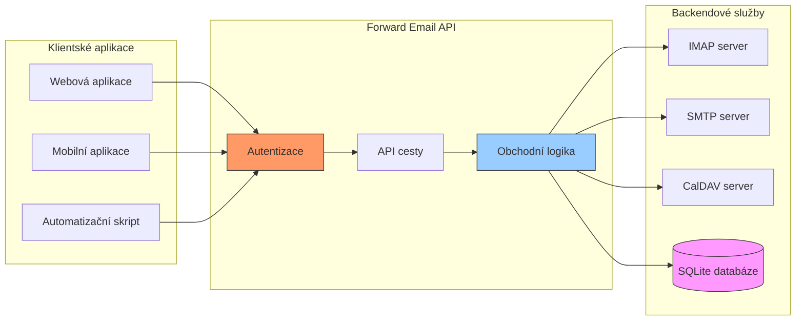

---


## Push notifikace pro iOS {#ios-push-notifications}

> \[!TIP]
> Forward Email podporuje nativní push notifikace pro iOS přes XAPPLEPUSHSERVICE pro okamžité doručení e-mailů.

> \[!IMPORTANT]
> **Unikátní funkce:** Forward Email je jeden z mála open-source e-mailových serverů, který podporuje nativní push notifikace pro iOS pro e-maily, kontakty a kalendáře přes IMAP rozšíření `XAPPLEPUSHSERVICE`. Toto bylo reverzně inženýrsky získáno z Apple protokolu a umožňuje okamžité doručení na iOS zařízení bez vyčerpání baterie.

Forward Email implementuje proprietární rozšíření Apple XAPPLEPUSHSERVICE, které poskytuje nativní push notifikace pro iOS zařízení bez nutnosti pozadního dotazování.

### Jak to funguje {#how-it-works-1}

**XAPPLEPUSHSERVICE** je nestandardní IMAP rozšíření, které umožňuje iOS Mail aplikaci přijímat okamžité push notifikace při příchodu nových e-mailů.

Forward Email implementuje proprietární integraci Apple Push Notification service (APNs) pro IMAP, což umožňuje iOS Mail aplikaci přijímat okamžité push notifikace při příchodu nových e-mailů.

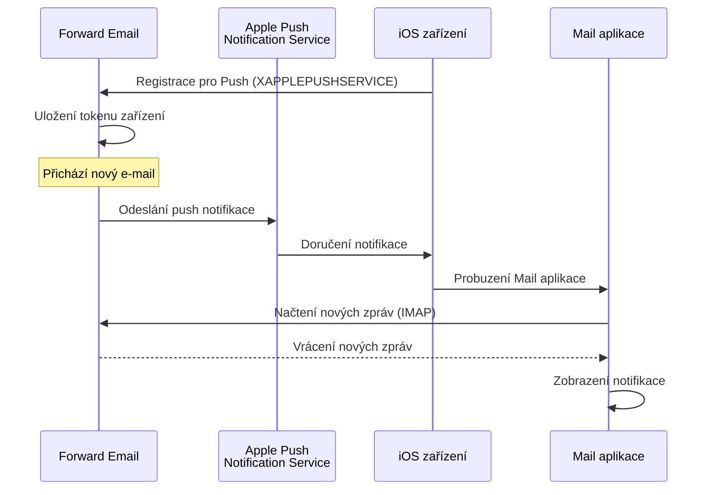

### Klíčové vlastnosti {#key-features}

**Okamžité doručení:**

* Push notifikace přicházejí během sekund
* Žádné vyčerpávající pozadní dotazování
* Funguje i když je Mail aplikace zavřená

<!---->

* **Okamžité doručení:** E-maily, události kalendáře a kontakty se na vašem iPhonu/iPadu zobrazí ihned, nikoli podle plánu dotazování
* **Úspora baterie:** Využívá Apple push infrastrukturu místo udržování stálých IMAP připojení
* **Push na základě témat:** Podporuje push notifikace pro konkrétní schránky, nejen INBOX
* **Není potřeba třetích aplikací:** Funguje s nativními iOS aplikacemi Mail, Kalendář a Kontakty
**Nativní integrace:**

* Vestavěno v aplikaci iOS Mail
* Není potřeba žádná aplikace třetí strany
* Plynulý uživatelský zážitek

**Zaměřeno na soukromí:**

* Zařízení tokeny jsou šifrovány
* Žádný obsah zprávy není odesílán přes APNS
* Odesílá se pouze oznámení o "nové poště"

**Úspora baterie:**

* Žádné neustálé IMAP dotazování
* Zařízení spí, dokud nepřijde oznámení
* Minimální dopad na baterii

### Co dělá toto speciálním {#what-makes-this-special}

> \[!IMPORTANT]
> Většina poskytovatelů e-mailu nepodporuje XAPPLEPUSHSERVICE, což nutí zařízení iOS dotazovat se na novou poštu každých 15 minut.

Většina open-source e-mailových serverů (včetně Dovecot, Postfix, Cyrus IMAP) nepodporuje push notifikace pro iOS. Uživatelé musí buď:

* Používat IMAP IDLE (udržuje spojení otevřené, vybíjí baterii)
* Používat dotazování (kontroluje každých 15-30 minut, zpožděná oznámení)
* Používat proprietární e-mailové aplikace s vlastní push infrastrukturou

Forward Email poskytuje stejný okamžitý push zážitek jako komerční služby jako Gmail, iCloud a Fastmail.

**Srovnání s ostatními poskytovateli:**

| Poskytovatel     | Podpora push  | Interval dotazování | Dopad na baterii |
| ---------------- | ------------ | ------------------- | ---------------- |
| **Forward Email**| ✅ Nativní push | Okamžitě           | Minimální        |
| Gmail            | ✅ Nativní push | Okamžitě           | Minimální        |
| iCloud           | ✅ Nativní push | Okamžitě           | Minimální        |
| Yahoo            | ✅ Nativní push | Okamžitě           | Minimální        |
| Outlook.com      | ❌ Dotazování  | 15 minut            | Střední          |
| Fastmail         | ❌ Dotazování  | 15 minut            | Střední          |
| ProtonMail       | ⚠️ Pouze přes Bridge | Přes Bridge    | Vysoký           |
| Tutanota         | ❌ Pouze aplikace | N/A               | N/A              |

### Podrobnosti implementace {#implementation-details}

**Odpověď IMAP CAPABILITY:**

```
* CAPABILITY IMAP4rev1 ... XAPPLEPUSHSERVICE ...
```

**Registrační proces:**

1. Aplikace iOS Mail detekuje schopnost XAPPLEPUSHSERVICE
2. Aplikace zaregistruje token zařízení u Forward Email
3. Forward Email uloží token a přiřadí ho k účtu
4. Když přijde nová pošta, Forward Email odešle push přes APNS
5. iOS probudí aplikaci Mail, aby načetla nové zprávy

**Bezpečnost:**

* Tokeny zařízení jsou šifrovány v klidu
* Tokeny expirují a automaticky se obnovují
* Žádný obsah zprávy není vystaven APNS
* Zachováno end-to-end šifrování

<!---->

* **IMAP rozšíření:** `XAPPLEPUSHSERVICE`
* **Zdrojový kód:** [WildDuck Issue #711](https://github.com/zone-eu/wildduck/issues/711)
* **Nastavení:** Automatické - není potřeba konfigurace, funguje ihned s iOS Mail aplikací

### Srovnání s ostatními službami {#comparison-with-other-services}

| Služba        | Podpora iOS push | Metoda                                   |
| ------------- | ---------------- | ---------------------------------------- |
| Forward Email | ✅ Ano           | `XAPPLEPUSHSERVICE` (zpětně analyzováno) |
| Gmail         | ✅ Ano           | Proprietární Gmail aplikace + Google push |
| iCloud Mail   | ✅ Ano           | Nativní Apple integrace                  |
| Outlook.com   | ✅ Ano           | Proprietární Outlook aplikace + Microsoft push |
| Fastmail      | ✅ Ano           | `XAPPLEPUSHSERVICE`                      |
| Dovecot       | ❌ Ne            | Pouze IMAP IDLE nebo dotazování          |
| Postfix       | ❌ Ne            | Pouze IMAP IDLE nebo dotazování          |
| Cyrus IMAP    | ❌ Ne            | Pouze IMAP IDLE nebo dotazování          |

**Gmail Push:**

Gmail používá proprietární push systém, který funguje pouze s aplikací Gmail. Aplikace iOS Mail musí dotazovat servery Gmail IMAP.

**iCloud Push:**

iCloud má nativní podporu push podobnou Forward Email, ale pouze pro adresy @icloud.com.

**Outlook.com:**

Outlook.com nepodporuje XAPPLEPUSHSERVICE, což vyžaduje dotazování iOS Mail každých 15 minut.

**Fastmail:**

Fastmail nepodporuje XAPPLEPUSHSERVICE. Uživatelé musí používat aplikaci Fastmail pro push notifikace nebo přijmout 15minutové zpoždění dotazování.

---


## Testování a ověřování {#testing-and-verification}


## Testy schopností protokolu {#protocol-capability-tests}
> \[!NOTE]
> Tato sekce poskytuje výsledky našich nejnovějších testů schopností protokolů, provedených 22. ledna 2026.

Tato sekce obsahuje skutečné odpovědi CAPABILITY/CAPA/EHLO od všech testovaných poskytovatelů. Všechny testy byly provedeny **22. ledna 2026**.

Tyto testy pomáhají ověřit inzerovanou a skutečnou podporu různých e-mailových protokolů a rozšíření u hlavních poskytovatelů.

### Metodika testování {#test-methodology}

**Testovací prostředí:**

* **Datum:** 22. ledna 2026 v 02:37 UTC
* **Umístění:** AWS EC2 instance
* **IPv4:** 54.167.216.197
* **IPv6:** 2600:4040:46da:9a00:b19e:3ad4:426c:2f48
* **Nástroje:** OpenSSL s_client, bash skripty

**Testovaní poskytovatelé:**

* Forward Email
* Gmail
* Outlook.com
* iCloud
* Fastmail
* Yahoo/AOL (Verizon)

### Testovací skripty {#test-scripts}

Pro plnou transparentnost jsou níže uvedeny přesné skripty použité pro tyto testy.

#### Skript pro testování schopností IMAP {#imap-capability-test-script}

```bash
#!/bin/bash
# IMAP Capability Test Script
# Tests IMAP CAPABILITY for various email providers

echo "========================================="
echo "IMAP CAPABILITY TEST"
echo "Date: $(date -u +"%Y-%m-%d %H:%M:%S UTC")"
echo "========================================="
echo ""

# Gmail
echo "--- Gmail (imap.gmail.com:993) ---"
echo -e "a001 CAPABILITY\na002 LOGOUT" | timeout 10 openssl s_client -connect imap.gmail.com:993 -crlf -quiet 2>&1 | grep -A 20 "CAPABILITY"
echo ""

# Outlook.com
echo "--- Outlook.com (outlook.office365.com:993) ---"
echo -e "a001 CAPABILITY\na002 LOGOUT" | timeout 10 openssl s_client -connect outlook.office365.com:993 -crlf -quiet 2>&1 | grep -A 20 "CAPABILITY"
echo ""

# iCloud
echo "--- iCloud (imap.mail.me.com:993) ---"
echo -e "a001 CAPABILITY\na002 LOGOUT" | timeout 10 openssl s_client -connect imap.mail.me.com:993 -crlf -quiet 2>&1 | grep -A 20 "CAPABILITY"
echo ""

# Fastmail
echo "--- Fastmail (imap.fastmail.com:993) ---"
echo -e "a001 CAPABILITY\na002 LOGOUT" | timeout 10 openssl s_client -connect imap.fastmail.com:993 -crlf -quiet 2>&1 | grep -A 20 "CAPABILITY"
echo ""

# Yahoo
echo "--- Yahoo (imap.mail.yahoo.com:993) ---"
echo -e "a001 CAPABILITY\na002 LOGOUT" | timeout 10 openssl s_client -connect imap.mail.yahoo.com:993 -crlf -quiet 2>&1 | grep -A 20 "CAPABILITY"
echo ""

# Forward Email
echo "--- Forward Email (imap.forwardemail.net:993) ---"
echo -e "a001 CAPABILITY\na002 LOGOUT" | timeout 10 openssl s_client -connect imap.forwardemail.net:993 -crlf -quiet 2>&1 | grep -A 20 "CAPABILITY"
echo ""

echo "========================================="
echo "Test completed"
echo "========================================="
```

#### Skript pro testování schopností POP3 {#pop3-capability-test-script}

```bash
#!/bin/bash
# POP3 Capability Test Script
# Tests POP3 CAPA for various email providers

echo "========================================="
echo "POP3 CAPABILITY TEST"
echo "Date: $(date -u +"%Y-%m-%d %H:%M:%S UTC")"
echo "========================================="
echo ""

# Gmail
echo "--- Gmail (pop.gmail.com:995) ---"
echo -e "CAPA\nQUIT" | timeout 10 openssl s_client -connect pop.gmail.com:995 -crlf -quiet 2>&1 | grep -A 20 "CAPA"
echo ""

# Outlook.com
echo "--- Outlook.com (outlook.office365.com:995) ---"
echo -e "CAPA\nQUIT" | timeout 10 openssl s_client -connect outlook.office365.com:995 -crlf -quiet 2>&1 | grep -A 20 "CAPA"
echo ""

# iCloud (Poznámka: iCloud nepodporuje POP3)
echo "--- iCloud (No POP3 support) ---"
echo "iCloud nepodporuje POP3"
echo ""

# Fastmail
echo "--- Fastmail (pop.fastmail.com:995) ---"
echo -e "CAPA\nQUIT" | timeout 10 openssl s_client -connect pop.fastmail.com:995 -crlf -quiet 2>&1 | grep -A 20 "CAPA"
echo ""

# Yahoo
echo "--- Yahoo (pop.mail.yahoo.com:995) ---"
echo -e "CAPA\nQUIT" | timeout 10 openssl s_client -connect pop.mail.yahoo.com:995 -crlf -quiet 2>&1 | grep -A 20 "CAPA"
echo ""

# Forward Email
echo "--- Forward Email (pop3.forwardemail.net:995) ---"
echo -e "CAPA\nQUIT" | timeout 10 openssl s_client -connect pop3.forwardemail.net:995 -crlf -quiet 2>&1 | grep -A 20 "CAPA"
echo ""

echo "========================================="
echo "Test completed"
echo "========================================="
```
#### SMTP Capability Test Script {#smtp-capability-test-script}

```bash
#!/bin/bash
# SMTP Capability Test Script
# Tests SMTP EHLO for various email providers

echo "========================================="
echo "SMTP TEST SCHOPNOSTÍ"
echo "Datum: $(date -u +"%Y-%m-%d %H:%M:%S UTC")"
echo "========================================="
echo ""

# Gmail
echo "--- Gmail (smtp.gmail.com:587) ---"
echo -e "EHLO test.com\nQUIT" | timeout 10 openssl s_client -connect smtp.gmail.com:587 -starttls smtp -crlf -quiet 2>&1 | grep -A 30 "250-"
echo ""

# Outlook.com
echo "--- Outlook.com (smtp.office365.com:587) ---"
echo -e "EHLO test.com\nQUIT" | timeout 10 openssl s_client -connect smtp.office365.com:587 -starttls smtp -crlf -quiet 2>&1 | grep -A 30 "250-"
echo ""

# iCloud
echo "--- iCloud (smtp.mail.me.com:587) ---"
echo -e "EHLO test.com\nQUIT" | timeout 10 openssl s_client -connect smtp.mail.me.com:587 -starttls smtp -crlf -quiet 2>&1 | grep -A 30 "250-"
echo ""

# Fastmail
echo "--- Fastmail (smtp.fastmail.com:587) ---"
echo -e "EHLO test.com\nQUIT" | timeout 10 openssl s_client -connect smtp.fastmail.com:587 -starttls smtp -crlf -quiet 2>&1 | grep -A 30 "250-"
echo ""

# Yahoo
echo "--- Yahoo (smtp.mail.yahoo.com:587) ---"
echo -e "EHLO test.com\nQUIT" | timeout 10 openssl s_client -connect smtp.mail.yahoo.com:587 -starttls smtp -crlf -quiet 2>&1 | grep -A 30 "250-"
echo ""

# Forward Email
echo "--- Forward Email (smtp.forwardemail.net:587) ---"
echo -e "EHLO test.com\nQUIT" | timeout 10 openssl s_client -connect smtp.forwardemail.net:587 -starttls smtp -crlf -quiet 2>&1 | grep -A 30 "250-"
echo ""

echo "========================================="
echo "Test dokončen"
echo "========================================="
```

### Test Results Summary {#test-results-summary}

#### IMAP (CAPABILITY) {#imap-capability}

**Forward Email**

```
* CAPABILITY IMAP4rev1 AUTH=PLAIN AUTH=PLAIN-CLIENTTOKEN CHILDREN ENABLE ID IDLE NAMESPACE QUOTA SASL-IR UNSELECT XLIST XAPPLEPUSHSERVICE
```

**Gmail**

```
* CAPABILITY IMAP4rev1 UNSELECT IDLE NAMESPACE QUOTA ID XLIST CHILDREN X-GM-EXT-1 UIDPLUS COMPRESS=DEFLATE ENABLE MOVE CONDSTORE ESEARCH UTF8=ACCEPT LIST-EXTENDED LIST-STATUS LITERAL- SPECIAL-USE
```

**iCloud**

```
* OK [CAPABILITY XAPPLEPUSHSERVICE IMAP4 IMAP4rev1 SASL-IR AUTH=ATOKEN AUTH=PLAIN AUTH=ATOKEN2 AUTH=XOAUTH2]
```

**Outlook.com**

```
* CAPABILITY IMAP4rev1 AUTH=PLAIN AUTH=XOAUTH2 SASL-IR UIDPLUS ID UNSELECT CHILDREN IDLE NAMESPACE LITERAL+
```

**Fastmail**

```
* CAPABILITY IMAP4rev1 ACL ANNOTATE-EXPERIMENT-1 CATENATE CONDSTORE ENABLE ESEARCH ESORT I18NLEVEL=1 ID IDLE LIST-EXTENDED LIST-STATUS LITERAL+ LOGINDISABLED MULTIAPPEND NAMESPACE QRESYNC QUOTA RIGHTS=ektx SASL-IR SORT SPECIAL-USE THREAD=ORDEREDSUBJECT UIDPLUS UNSELECT WITHIN X-RENAME XLIST
```

**Yahoo/AOL (Verizon)**

```
* CAPABILITY IMAP4rev1 IDLE NAMESPACE QUOTA ID XLIST CHILDREN UIDPLUS MOVE CONDSTORE ESEARCH ENABLE LIST-EXTENDED LIST-STATUS LITERAL- SPECIAL-USE UNSELECT XAPPLEPUSHSERVICE
```

#### POP3 (CAPA) {#pop3-capa}

**Forward Email**

```
+OK
CAPA
TOP
USER
UIDL
EXPIRE 30
IMPLEMENTATION ForwardEmail
.
```

**Gmail**

```
+OK
CAPA
TOP
USER
UIDL
EXPIRE 30
IMPLEMENTATION Gpop
.
```

**Outlook.com**

```
+OK
CAPA
TOP
USER
UIDL
SASL PLAIN XOAUTH2
.
```

**Fastmail**

```
+OK
CAPA
TOP
USER
UIDL
EXPIRE 30
IMPLEMENTATION Cyrus
.
```

#### SMTP (EHLO) {#smtp-ehlo}

**Forward Email**

```
250-smtp.forwardemail.net
250-PIPELINING
250-SIZE 52428800
250-ETRN
250-STARTTLS
250-ENHANCEDSTATUSCODES
250-8BITMIME
250-DSN
250 CHUNKING
```

**Gmail**

```
250-smtp.gmail.com at your service
250-SIZE 35882577
250-8BITMIME
250-STARTTLS
250-ENHANCEDSTATUSCODES
250-PIPELINING
250-CHUNKING
250 SMTPUTF8
```

**Outlook.com**

```
250-SN4PR13CA0005.outlook.office365.com Hello [x.x.x.x]
250-SIZE 157286400
250-PIPELINING
250-DSN
250-ENHANCEDSTATUSCODES
250-STARTTLS
250-8BITMIME
250-BINARYMIME
250-CHUNKING
250 SMTPUTF8
```

**Fastmail**

```
250-smtp.fastmail.com
250-PIPELINING
250-SIZE 78643200
250-ETRN
250-STARTTLS
250-ENHANCEDSTATUSCODES
250-8BITMIME
250-DSN
250 CHUNKING
```

**Yahoo/AOL (Verizon)**

```
250-smtp.mail.yahoo.com
250-PIPELINING
250-SIZE 41943040
250-8BITMIME
250-ENHANCEDSTATUSCODES
250-STARTTLS
```
### Podrobné výsledky testů {#detailed-test-results}

#### Výsledky testů IMAP {#imap-test-results}

**Gmail:**
`* CAPABILITY IMAP4rev1 UNSELECT IDLE NAMESPACE QUOTA ID XLIST CHILDREN X-GM-EXT-1 XYZZY SASL-IR AUTH=XOAUTH2 AUTH=PLAIN AUTH=PLAIN-CLIENTTOKEN AUTH=OAUTHBEARER`

**Outlook.com:**
`* CAPABILITY IMAP4 IMAP4rev1 AUTH=PLAIN AUTH=XOAUTH2 SASL-IR UIDPLUS ID UNSELECT CHILDREN IDLE NAMESPACE LITERAL+`

**iCloud:**
`* CAPABILITY XAPPLEPUSHSERVICE IMAP4 IMAP4rev1 SASL-IR AUTH=ATOKEN AUTH=PLAIN AUTH=ATOKEN2 AUTH=XOAUTH2`

**Fastmail:**
Připojení vypršelo. Viz poznámky níže.

**Yahoo:**
`* CAPABILITY IMAP4rev1 SASL-IR AUTH=PLAIN AUTH=XOAUTH2 AUTH=OAUTHBEARER ID MOVE NAMESPACE XYMHIGHESTMODSEQ UIDPLUS LITERAL+ CHILDREN UNSELECT X-MSG-EXT OBJECTID IDLE ENABLE UIDONLY X-ALL-MAIL X-UIDONLY LIST-EXTENDED LIST-STATUS SPECIAL-USE PARTIAL APPENDLIMIT=41697280`

**Forward Email:**
`* CAPABILITY XAPPLEPUSHSERVICE IMAP4rev1 APPENDLIMIT=52428800 AUTH=PLAIN AUTH=PLAIN-CLIENTTOKEN CHILDREN CONDSTORE ENABLE ID IDLE MOVE NAMESPACE QUOTA SASL-IR SPECIAL-USE UIDPLUS UNSELECT UTF8=ACCEPT XLIST`

#### Výsledky testů POP3 {#pop3-test-results}

**Gmail:**
Připojení nevrátilo odpověď CAPA bez autentizace.

**Outlook.com:**
Připojení nevrátilo odpověď CAPA bez autentizace.

**iCloud:**
Nepodporováno.

**Fastmail:**
Připojení vypršelo. Viz poznámky níže.

**Yahoo:**
`+OK CAPA list follows... SASL PLAIN XOAUTH2`

**Forward Email:**
Připojení nevrátilo odpověď CAPA bez autentizace.

#### Výsledky testů SMTP {#smtp-test-results}

**Gmail:**
`250-AUTH LOGIN PLAIN XOAUTH2 PLAIN-CLIENTTOKEN OAUTHBEARER XOAUTH`

**Outlook.com:**
`250-DSN`

**iCloud:**
`250-DSN`

**Fastmail:**
`250 AUTH PLAIN LOGIN XOAUTH2 OAUTHBEARER`

**Yahoo:**
`250 AUTH PLAIN LOGIN XOAUTH2 OAUTHBEARER`

**Forward Email:**
`250-DSN`, `250-REQUIRETLS`

### Poznámky k výsledkům testů {#notes-on-test-results}

> \[!NOTE]
> Důležité poznatky a omezení z výsledků testů.

1. **Timeouty Fastmailu**: Připojení k Fastmailu během testování vypršela, pravděpodobně kvůli omezení rychlosti nebo firewallovým pravidlům vůči IP testovacího serveru. Fastmail je podle dokumentace známý robustní podporou IMAP/POP3/SMTP.

2. **POP3 CAPA odpovědi**: Někteří poskytovatelé (Gmail, Outlook.com, Forward Email) nevrátili odpověď CAPA bez autentizace. To je běžná bezpečnostní praxe u POP3 serverů.

3. **Podpora DSN**: Pouze Outlook.com, iCloud a Forward Email explicitně inzerují podporu DSN ve svých SMTP EHLO odpovědích. To neznamená, že ostatní poskytovatelé DSN nepodporují, ale neuvádějí to.

4. **REQUIRETLS**: Pouze Forward Email explicitně inzeruje podporu REQUIRETLS s uživatelským zaškrtávacím políčkem pro vynucení. Ostatní poskytovatelé ji mohou podporovat interně, ale neuvádějí ji v EHLO.

5. **Testovací prostředí**: Testy byly provedeny z instance AWS EC2 (IP: 54.167.216.197 IPv4, 2600:4040:46da:9a00:b19e:3ad4:426c:2f48 IPv6) dne 22. ledna 2026 v 02:37 UTC.

---


## Shrnutí {#summary}

Forward Email poskytuje komplexní podporu RFC protokolů napříč všemi hlavními e-mailovými standardy:

* **IMAP4rev1:** 16 podporovaných RFC s dokumentovanými záměrnými rozdíly
* **POP3:** 4 podporovaná RFC s RFC-kompatibilním trvalým mazáním
* **SMTP:** 11 podporovaných rozšíření včetně SMTPUTF8, DSN a PIPELINING
* **Autentizace:** Plná podpora DKIM, SPF, DMARC, ARC
* **Transportní bezpečnost:** Plná podpora MTA-STS a REQUIRETLS, částečná podpora DANE
* **Šifrování:** Podpora OpenPGP v6 a S/MIME
* **Kalendáře:** Plná podpora CalDAV, CardDAV a VTODO
* **API přístup:** Kompletní REST API se 39 endpointy pro přímý přístup k databázi
* **Push na iOS:** Nativní push notifikace pro e-maily, kontakty a kalendáře přes `XAPPLEPUSHSERVICE`

### Klíčové odlišnosti {#key-differentiators}

> \[!TIP]
> Forward Email vyniká unikátními funkcemi, které nenajdete u jiných poskytovatelů.

**Co dělá Forward Email jedinečným:**

1. **Kvantově bezpečné šifrování** – jediný poskytovatel s ChaCha20-Poly1305 šifrovanými SQLite poštovními schránkami
2. **Architektura bez znalostí** – vaše heslo šifruje vaši schránku; nemůžeme ji dešifrovat
3. **Zdarma vlastní domény** – žádné měsíční poplatky za e-mail na vlastní doméně
4. **Podpora REQUIRETLS** – uživatelské zaškrtávací políčko pro vynucení TLS na celé doručovací cestě
5. **Komplexní API** – 39 REST API endpointů pro plnou programovou kontrolu
6. **Push notifikace na iOS** – nativní podpora XAPPLEPUSHSERVICE pro okamžité doručení
7. **Open Source** – plný zdrojový kód dostupný na GitHubu
8. **Zaměření na soukromí** – žádné těžení dat, žádné reklamy, žádné sledování
* **Sandboxované šifrování:** Jediná e-mailová služba s individuálně šifrovanými SQLite schránkami
* **Soulad s RFC:** Upřednostňuje dodržování standardů před pohodlím (např. POP3 DELE)
* **Kompletní API:** Přímý programový přístup ke všem e-mailovým datům
* **Open Source:** Plně transparentní implementace

**Shrnutí podpory protokolů:**

| Kategorie            | Úroveň podpory | Detaily                                       |
| -------------------- | ------------- | --------------------------------------------- |
| **Jádrové protokoly** | ✅ Výborná    | IMAP4rev1, POP3, SMTP plně podporovány        |
| **Moderní protokoly** | ⚠️ Částečná   | Částečná podpora IMAP4rev2, JMAP není podporován |
| **Zabezpečení**       | ✅ Výborná    | DKIM, SPF, DMARC, ARC, MTA-STS, REQUIRETLS    |
| **Šifrování**         | ✅ Výborná    | OpenPGP, S/MIME, SQLite šifrování             |
| **CalDAV/CardDAV**    | ✅ Výborná    | Plná synchronizace kalendáře a kontaktů       |
| **Filtrování**        | ✅ Výborná    | Sieve (24 rozšíření) a ManageSieve             |
| **API**               | ✅ Výborná    | 39 REST API endpointů                          |
| **Push**              | ✅ Výborná    | Nativní push notifikace pro iOS                |
