# Email RFC Protokol Support - Komplett Guide til Standarder & Specifikationer {#email-rfc-protocol-support---complete-standards--specifications-guide}


## Indholdsfortegnelse {#table-of-contents}

* [Om Dette Dokument](#about-this-document)
  * [Arkitektur Oversigt](#architecture-overview)
* [Sammenligning af Email Tjenester - Protokol Support & RFC Standard Overholdelse](#email-service-comparison---protocol-support--rfc-standards-compliance)
  * [Visualisering af Protokol Support](#protocol-support-visualization)
* [Kerne Email Protokoller](#core-email-protocols)
  * [Email Protokol Flow](#email-protocol-flow)
* [IMAP4 Email Protokol og Udvidelser](#imap4-email-protocol-and-extensions)
  * [IMAP Protokol Forskelle fra RFC Specifikationer](#imap-protocol-differences-from-rfc-specifications)
  * [IMAP Udvidelser IKKE Understøttet](#imap-extensions-not-supported)
* [POP3 Email Protokol og Udvidelser](#pop3-email-protocol-and-extensions)
  * [POP3 Protokol Forskelle fra RFC Specifikationer](#pop3-protocol-differences-from-rfc-specifications)
  * [POP3 Udvidelser IKKE Understøttet](#pop3-extensions-not-supported)
* [SMTP Email Protokol og Udvidelser](#smtp-email-protocol-and-extensions)
  * [Leveringsstatus Notifikationer (DSN)](#delivery-status-notifications-dsn)
  * [REQUIRETLS Support](#requiretls-support)
  * [SMTP Udvidelser IKKE Understøttet](#smtp-extensions-not-supported)
* [JMAP Email Protokol](#jmap-email-protocol)
* [Email Sikkerhed](#email-security)
  * [Email Sikkerheds Arkitektur](#email-security-architecture)
* [Email Besked Autentifikations Protokoller](#email-message-authentication-protocols)
  * [Autentifikations Protokol Support](#authentication-protocol-support)
  * [DKIM (DomainKeys Identified Mail)](#dkim-domainkeys-identified-mail)
  * [SPF (Sender Policy Framework)](#spf-sender-policy-framework)
  * [DMARC (Domain-baseret Besked Autentifikation, Rapportering & Overensstemmelse)](#dmarc-domain-based-message-authentication-reporting--conformance)
  * [ARC (Authenticated Received Chain)](#arc-authenticated-received-chain)
  * [Autentifikations Flow](#authentication-flow)
* [Email Transport Sikkerheds Protokoller](#email-transport-security-protocols)
  * [Transport Sikkerheds Support](#transport-security-support)
  * [TLS (Transport Layer Security)](#tls-transport-layer-security)
  * [MTA-STS (Mail Transfer Agent Strict Transport Security)](#mta-sts-mail-transfer-agent-strict-transport-security)
  * [DANE (DNS-baseret Autentifikation af Navngivne Enheder)](#dane-dns-based-authentication-of-named-entities)
  * [REQUIRETLS](#requiretls)
  * [Transport Sikkerheds Flow](#transport-security-flow)
* [Email Besked Kryptering](#email-message-encryption)
  * [Krypterings Support](#encryption-support)
  * [OpenPGP (Pretty Good Privacy)](#openpgp-pretty-good-privacy)
  * [S/MIME (Secure/Multipurpose Internet Mail Extensions)](#smime-securemultipurpose-internet-mail-extensions)
  * [SQLite Mailbox Kryptering](#sqlite-mailbox-encryption)
  * [Krypterings Sammenligning](#encryption-comparison)
  * [Krypterings Flow](#encryption-flow)
* [Udvidet Funktionalitet](#extended-functionality)
* [Email Besked Format Standarder](#email-message-format-standards)
  * [Format Standard Support](#format-standards-support)
  * [MIME (Multipurpose Internet Mail Extensions)](#mime-multipurpose-internet-mail-extensions)
  * [SMTPUTF8 og Email Adresse Internationalisering](#smtputf8-and-email-address-internationalization)
* [Kalender- og Kontakt Protokoller](#calendaring-and-contacts-protocols)
  * [CalDAV og CardDAV Support](#caldav-and-carddav-support)
  * [CalDAV (Kalender Adgang)](#caldav-calendar-access)
  * [CardDAV (Kontakt Adgang)](#carddav-contact-access)
  * [Opgaver og Påmindelser (CalDAV VTODO)](#tasks-and-reminders-caldav-vtodo)
  * [CalDAV/CardDAV Synkroniserings Flow](#caldavcarddav-synchronization-flow)
  * [Kalender Udvidelser IKKE Understøttet](#calendaring-extensions-not-supported)
* [Email Besked Filtrering](#email-message-filtering)
  * [Sieve (RFC 5228)](#sieve-rfc-5228)
  * [ManageSieve (RFC 5804)](#managesieve-rfc-5804)
* [Lagringsoptimering](#storage-optimization)
  * [Arkitektur: Dobbeltlags Lagringsoptimering](#architecture-dual-layer-storage-optimization)
* [Vedhæftnings Deduplicering](#attachment-deduplication)
  * [Hvordan Det Virker](#how-it-works)
  * [Deduplicerings Flow](#deduplication-flow)
  * [Magic Number System](#magic-number-system)
  * [Nøgleforskelle: WildDuck vs Forward Email](#key-differences-wildduck-vs-forward-email)
* [Brotli Komprimering](#brotli-compression)
  * [Hvad Der Komprimeres](#what-gets-compressed)
  * [Komprimerings Konfiguration](#compression-configuration)
  * [Magic Header: "FEBR"](#magic-header-febr)
  * [Komprimerings Proces](#compression-process)
  * [De-komprimerings Proces](#decompression-process)
  * [Bagudkompatibilitet](#backwards-compatibility)
  * [Lagringsbesparelses Statistikker](#storage-savings-statistics)
  * [Migrerings Proces](#migration-process)
  * [Kombineret Lagringseffektivitet](#combined-storage-efficiency)
  * [Tekniske Implementeringsdetaljer](#technical-implementation-details)
  * [Hvorfor Ingen Andre Udbydere Gør Dette](#why-no-other-provider-does-this)
* [Moderne Funktioner](#modern-features)
* [Komplet REST API til Email Administration](#complete-rest-api-for-email-management)
  * [API Kategorier (39 Endpoints)](#api-categories-39-endpoints)
  * [Tekniske Detaljer](#technical-details)
  * [Virkelige Brugsscenarier](#real-world-use-cases)
  * [Nøgle API Funktioner](#key-api-features)
  * [API Arkitektur](#api-architecture)
* [iOS Push Notifikationer](#ios-push-notifications)
  * [Hvordan Det Virker](#how-it-works-1)
  * [Nøglefunktioner](#key-features)
  * [Hvad Gør Dette Specielt](#what-makes-this-special)
  * [Implementeringsdetaljer](#implementation-details)
  * [Sammenligning med Andre Tjenester](#comparison-with-other-services)
* [Test og Verifikation](#testing-and-verification)
* [Protokol Kapabilitetstest](#protocol-capability-tests)
  * [Test Metodologi](#test-methodology)
  * [Test Scripts](#test-scripts)
  * [Test Resultat Oversigt](#test-results-summary)
  * [Detaljerede Test Resultater](#detailed-test-results)
  * [Noter om Test Resultater](#notes-on-test-results)
* [Opsummering](#summary)
  * [Nøgle Differentieringspunkter](#key-differentiators)
## Om dette dokument {#about-this-document}

Dette dokument skitserer RFC (Request for Comments) protokolunderstøttelse for Forward Email. Da Forward Email bruger [WildDuck](https://github.com/nodemailer/wildduck) under motorhjelmen til IMAP/POP3 funktionalitet, afspejler den protokolunderstøttelse og begrænsninger, der er dokumenteret her, WildDucks implementering.

> \[!IMPORTANT]
> Forward Email bruger [SQLite](https://sqlite.org/) til beskedlagring i stedet for MongoDB (som WildDuck oprindeligt brugte). Dette påvirker visse implementeringsdetaljer, der er dokumenteret nedenfor.

**Kildekode:** <https://github.com/forwardemail/forwardemail.net>

### Arkitekturoversigt {#architecture-overview}

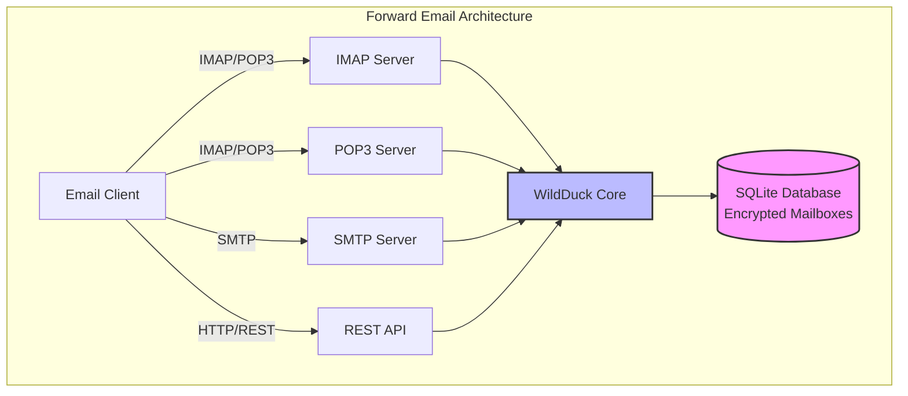

---


## Sammenligning af e-mailtjenester - Protokolunderstøttelse & RFC-standarders overholdelse {#email-service-comparison---protocol-support--rfc-standards-compliance}

> \[!IMPORTANT]
> **Sandboxed og kvante-resistent kryptering:** Forward Email er den eneste e-mailtjeneste, der gemmer individuelt krypterede SQLite-mailbokse ved hjælp af din adgangskode (som kun du har). Hver mailboks er krypteret med [sqleet](https://github.com/resilar/sqleet) (ChaCha20-Poly1305), selvstændig, sandboxed og bærbar. Hvis du glemmer din adgangskode, mister du din mailboks – ikke engang Forward Email kan gendanne den. Se [Quantum-Safe Encrypted Email](https://forwardemail.net/en/blog/docs/best-quantum-safe-encrypted-email-service) for detaljer.

Sammenlign e-mailprotokolunderstøttelse og RFC-standardimplementering på tværs af store e-mailudbydere:

| Funktion                      | Forward Email                                                                                  | Postfix/Dovecot                                                                    | Gmail                                                                             | iCloud Mail                                           | Outlook.com                                                                                                                                                          | Fastmail                                                                                 | Yahoo/AOL (Verizon)                                                  | ProtonMail                                                                     | Tutanota                                                          |
| ----------------------------- | ---------------------------------------------------------------------------------------------- | ---------------------------------------------------------------------------------- | --------------------------------------------------------------------------------- | ----------------------------------------------------- | -------------------------------------------------------------------------------------------------------------------------------------------------------------------- | ---------------------------------------------------------------------------------------- | -------------------------------------------------------------------- | ------------------------------------------------------------------------------ | ----------------------------------------------------------------- |
| **Pris for brugerdefineret domæne** | [Gratis](https://forwardemail.net/en/pricing)                                                    | [Gratis](https://www.postfix.org/)                                                   | [$7.20/md](https://workspace.google.com/pricing)                                  | [$0.99/md](https://support.apple.com/en-us/102622)    | [$7.20/md](https://www.microsoft.com/en-us/microsoft-365/business/microsoft-365-business-basic)                                                                      | [$5/md](https://www.fastmail.com/pricing/)                                               | [$3.19/md](https://www.turbify.com/mail)                             | [$4.99/md](https://proton.me/mail/pricing)                                     | [$3.27/md](https://tuta.com/pricing)                              |
| **IMAP4rev1 (RFC 3501)**      | ✅ [Understøttet](#imap4-email-protocol-and-extensions)                                            | ✅ [Understøttet](https://www.dovecot.org/)                                            | ✅ [Understøttet](https://developers.google.com/workspace/gmail/imap/imap-extensions) | ✅ [Understøttet](https://support.apple.com/en-us/102431) | ✅ [Understøttet](https://support.microsoft.com/en-us/office/pop-imap-and-smtp-settings-for-outlook-com-d088b986-291d-42b8-9564-9c414e2aa040)                            | ✅ [Understøttet](https://www.fastmail.help/hc/en-us/articles/1500000278382-Email-standards) | ✅ [Understøttet](https://senders.yahooinc.com/developer/documentation/) | ⚠️ [Via Bridge](https://proton.me/support/imap-smtp-and-pop3-setup)            | ❌ Ikke understøttet                                               |
| **IMAP4rev2 (RFC 9051)**      | ⚠️ [Delvist](https://forwardemail.net/en/blog/docs/best-quantum-safe-encrypted-email-service)  | ⚠️ [Delvist](https://www.dovecot.org/)                                             | ⚠️ [31%](https://developers.google.com/workspace/gmail/imap/imap-extensions)      | ⚠️ [92%](https://support.apple.com/en-us/102431)      | ⚠️ [46%](https://support.microsoft.com/en-us/office/pop-imap-and-smtp-settings-for-outlook-com-d088b986-291d-42b8-9564-9c414e2aa040)                                 | ⚠️ [69%](https://www.fastmail.help/hc/en-us/articles/1500000278382-Email-standards)      | ⚠️ [85%](https://senders.yahooinc.com/developer/documentation/)      | ⚠️ [Via Bridge](https://proton.me/support/imap-smtp-and-pop3-setup)            | ❌ Ikke understøttet                                               |
| **POP3 (RFC 1939)**           | ✅ [Understøttet](#pop3-email-protocol-and-extensions)                                             | ✅ [Understøttet](https://www.dovecot.org/)                                            | ✅ [Understøttet](https://support.google.com/mail/answer/7104828)                     | ❌ Ikke understøttet                                   | ✅ [Understøttet](https://support.microsoft.com/en-us/office/pop-imap-and-smtp-settings-for-outlook-com-d088b986-291d-42b8-9564-9c414e2aa040)                            | ✅ [Understøttet](https://www.fastmail.help/hc/en-us/articles/1500000278382-Email-standards) | ✅ [Understøttet](https://help.yahoo.com/kb/SLN4075.html)                | ⚠️ [Via Bridge](https://proton.me/support/imap-smtp-and-pop3-setup)            | ❌ Ikke understøttet                                               |
| **SMTP (RFC 5321)**           | ✅ [Understøttet](#smtp-email-protocol-and-extensions)                                             | ✅ [Understøttet](https://www.postfix.org/)                                            | ✅ [Understøttet](https://support.google.com/mail/answer/7126229)                     | ✅ [Understøttet](https://support.apple.com/en-us/102431) | ✅ [Understøttet](https://support.microsoft.com/en-us/office/pop-imap-and-smtp-settings-for-outlook-com-d088b986-291d-42b8-9564-9c414e2aa040)                            | ✅ [Understøttet](https://www.fastmail.help/hc/en-us/articles/1500000278382-Email-standards) | ✅ [Understøttet](https://help.yahoo.com/kb/SLN4075.html)                | ⚠️ [Via Bridge](https://proton.me/support/imap-smtp-and-pop3-setup)            | ❌ Ikke understøttet                                               |
| **JMAP (RFC 8620)**           | ❌ [Ikke understøttet](#jmap-email-protocol)                                                        | ❌ Ikke understøttet                                                                | ❌ Ikke understøttet                                                               | ❌ Ikke understøttet                                   | ❌ Ikke understøttet                                                                                                                                                  | ✅ [Understøttet](https://www.fastmail.com/dev/)                                             | ❌ Ikke understøttet                                                  | ❌ Ikke understøttet                                                              | ❌ Ikke understøttet                                               |
| **DKIM (RFC 6376)**           | ✅ [Understøttet](#email-message-authentication-protocols)                                         | ✅ [Understøttet](https://github.com/trusteddomainproject/OpenDKIM)                    | ✅ [Understøttet](https://support.google.com/a/answer/174124)                         | ✅ [Understøttet](https://support.apple.com/en-us/102431) | ✅ [Understøttet](https://learn.microsoft.com/en-us/defender-office-365/email-authentication-dkim-configure)                                                             | ✅ [Understøttet](https://www.fastmail.help/hc/en-us/articles/360060590573)                  | ✅ [Understøttet](https://help.yahoo.com/kb/SLN25426.html)               | ✅ [Understøttet](https://proton.me/support)                                       | ✅ [Understøttet](https://tuta.com/support#dkim)                      |
| **SPF (RFC 7208)**            | ✅ [Understøttet](#email-message-authentication-protocols)                                         | ✅ [Understøttet](https://www.postfix.org/)                                            | ✅ [Understøttet](https://support.google.com/a/answer/33786)                          | ✅ [Understøttet](https://support.apple.com/en-us/102431) | ✅ [Understøttet](https://learn.microsoft.com/en-us/microsoft-365/security/office-365-security/how-office-365-uses-spf-to-prevent-spoofing)                              | ✅ [Understøttet](https://www.fastmail.help/hc/en-us/articles/360060590573)                  | ✅ [Understøttet](https://help.yahoo.com/kb/SLN25426.html)               | ✅ [Understøttet](https://proton.me/support)                                       | ✅ [Understøttet](https://tuta.com/support#dkim)                      |
| **DMARC (RFC 7489)**          | ✅ [Understøttet](#email-message-authentication-protocols)                                         | ✅ [Understøttet](https://www.postfix.org/)                                            | ✅ [Understøttet](https://support.google.com/a/answer/2466580)                        | ✅ [Understøttet](https://support.apple.com/en-us/102431) | ✅ [Understøttet](https://learn.microsoft.com/en-us/microsoft-365/security/office-365-security/use-dmarc-to-validate-email)                                              | ✅ [Understøttet](https://www.fastmail.help/hc/en-us/articles/360060590573)                  | ✅ [Understøttet](https://help.yahoo.com/kb/SLN25426.html)               | ✅ [Understøttet](https://proton.me/support)                                       | ✅ [Understøttet](https://tuta.com/support#dkim)                      |
| **ARC (RFC 8617)**            | ✅ [Understøttet](#email-message-authentication-protocols)                                         | ✅ [Understøttet](https://github.com/trusteddomainproject/OpenARC)                     | ✅ [Understøttet](https://support.google.com/a/answer/2466580)                        | ❌ Ikke understøttet                                   | ✅ [Understøttet](https://learn.microsoft.com/en-us/defender-office-365/email-authentication-arc-configure)                                                              | ✅ [Understøttet](https://www.fastmail.help/hc/en-us/articles/360060590573)                  | ✅ [Understøttet](https://senders.yahooinc.com/developer/documentation/) | ✅ [Understøttet](https://proton.me/blog/what-is-authenticated-received-chain-arc) | ❌ Ikke understøttet                                               |
| **MTA-STS (RFC 8461)**        | ✅ [Understøttet](#email-transport-security-protocols)                                             | ✅ [Understøttet](https://www.postfix.org/)                                            | ✅ [Understøttet](https://support.google.com/a/answer/9261504)                        | ✅ [Understøttet](https://support.apple.com/en-us/102431) | ✅ [Understøttet](https://learn.microsoft.com/en-us/defender-office-365/email-authentication-about)                                                                      | ✅ [Understøttet](https://www.fastmail.help/hc/en-us/articles/360060590573)                  | ✅ [Understøttet](https://senders.yahooinc.com/developer/documentation/) | ✅ [Understøttet](https://proton.me/support)                                       | ✅ [Understøttet](https://tuta.com/security)                          |
| **DANE (RFC 7671)**           | ✅ [Understøttet](#email-transport-security-protocols)                                             | ✅ [Understøttet](https://www.postfix.org/)                                            | ❌ Ikke understøttet                                                               | ❌ Ikke understøttet                                   | ❌ Ikke understøttet                                                                                                                                                  | ❌ Ikke understøttet                                                                      | ❌ Ikke understøttet                                                  | ✅ [Understøttet](https://proton.me/support)                                       | ✅ [Understøttet](https://tuta.com/support#dane)                      |
| **DSN (RFC 3461)**            | ✅ [Understøttet](#smtp-email-protocol-and-extensions)                                             | ✅ [Understøttet](https://www.postfix.org/DSN_README.html)                             | ❌ Ikke understøttet                                                               | ✅ [Understøttet](#protocol-capability-tests)             | ✅ [Understøttet](#protocol-capability-tests)                                                                                                                            | ⚠️ [Ukendt](https://www.fastmail.help/hc/en-us/articles/1500000278382-Email-standards)  | ❌ Ikke understøttet                                                  | ⚠️ [Via Bridge](https://proton.me/support/imap-smtp-and-pop3-setup)            | ❌ Ikke understøttet                                               |
| **REQUIRETLS (RFC 8689)**     | ✅ [Understøttet](#email-transport-security-protocols)                                             | ✅ [Understøttet](https://www.postfix.org/TLS_README.html#server_require_tls)          | ⚠️ Ukendt                                                                          | ⚠️ Ukendt                                            | ⚠️ Ukendt                                                                                                                                                           | ⚠️ Ukendt                                                                               | ⚠️ Ukendt                                                           | ⚠️ [Via Bridge](https://proton.me/support/imap-smtp-and-pop3-setup)            | ❌ Ikke understøttet                                               |
| **ManageSieve (RFC 5804)**    | ✅ [Understøttet](#managesieve-rfc-5804)                                                           | ✅ [Understøttet](https://doc.dovecot.org/admin_manual/pigeonhole_managesieve_server/) | ❌ Ikke understøttet                                                               | ❌ Ikke understøttet                                   | ❌ Ikke understøttet                                                                                                                                                  | ✅ [Understøttet](https://www.fastmail.help/hc/en-us/articles/360060590573)                  | ❌ Ikke understøttet                                                  | ❌ Ikke understøttet                                                              | ❌ Ikke understøttet                                               |
| **OpenPGP (RFC 9580)**        | ✅ [Understøttet](#email-message-encryption)                                                       | ⚠️ [Via Plugins](https://www.gnupg.org/)                                           | ⚠️ [Tredjepart](https://github.com/google/end-to-end)                            | ⚠️ [Tredjepart](https://gpgtools.org/)               | ⚠️ [Tredjepart](https://gpg4win.org/)                                                                                                                               | ⚠️ [Tredjepart](https://www.fastmail.help/hc/en-us/articles/360060590573)               | ⚠️ [Tredjepart](https://help.yahoo.com/kb/SLN25426.html)            | ✅ [Indbygget](https://proton.me/support/pgp-mime-pgp-inline)                      | ❌ Ikke understøttet                                               |
| **S/MIME (RFC 8551)**         | ✅ [Understøttet](#email-message-encryption)                                                       | ✅ [Understøttet](https://www.openssl.org/)                                            | ✅ [Understøttet](https://support.google.com/mail/answer/81126)                       | ✅ [Understøttet](https://support.apple.com/en-us/102431) | ✅ [Understøttet](https://support.microsoft.com/en-us/office/send-view-and-reply-to-encrypted-messages-in-outlook-for-pc-eaa43495-9bbb-4fca-922a-df90dee51980)           | ⚠️ [Delvist](https://www.fastmail.help/hc/en-us/articles/360060590573)                   | ❌ Ikke understøttet                                                  | ✅ [Understøttet](https://proton.me/support/pgp-mime-pgp-inline)                   | ❌ Ikke understøttet                                               |
| **CalDAV (RFC 4791)**         | ✅ [Understøttet](#calendaring-and-contacts-protocols)                                             | ✅ [Understøttet](https://www.davical.org/)                                            | ✅ [Understøttet](https://developers.google.com/calendar/caldav/v2/guide)             | ✅ [Understøttet](https://support.apple.com/en-us/102431) | ❌ Ikke understøttet                                                                                                                                                  | ✅ [Understøttet](https://www.fastmail.help/hc/en-us/articles/360060590573)                  | ❌ Ikke understøttet                                                  | ✅ [Via Bridge](https://proton.me/support/proton-calendar)                      | ❌ Ikke understøttet                                               |
| **CardDAV (RFC 6352)**        | ✅ [Understøttet](#calendaring-and-contacts-protocols)                                             | ✅ [Understøttet](https://www.davical.org/)                                            | ✅ [Understøttet](https://developers.google.com/people/carddav)                       | ✅ [Understøttet](https://support.apple.com/en-us/102431) | ❌ Ikke understøttet                                                                                                                                                  | ✅ [Understøttet](https://www.fastmail.help/hc/en-us/articles/360060590573)                  | ❌ Ikke understøttet                                                  | ✅ [Via Bridge](https://proton.me/support/proton-contacts)                      | ❌ Ikke understøttet                                               |
| **Opgaver (VTODO)**           | ✅ [Understøttet](#tasks-and-reminders-caldav-vtodo)                                               | ✅ [Understøttet](https://www.davical.org/)                                            | ❌ Ikke understøttet                                                               | ✅ [Understøttet](https://support.apple.com/en-us/102431) | ❌ Ikke understøttet                                                                                                                                                  | ✅ [Understøttet](https://www.fastmail.help/hc/en-us/articles/360060590573)                  | ❌ Ikke understøttet                                                  | ❌ Ikke understøttet                                                              | ❌ Ikke understøttet                                               |
| **Sieve (RFC 5228)**          | ✅ [Understøttet](#sieve-rfc-5228)                                                                 | ✅ [Understøttet](https://www.dovecot.org/)                                            | ❌ Ikke understøttet                                                               | ❌ Ikke understøttet                                   | ❌ Ikke understøttet                                                                                                                                                  | ✅ [Understøttet](https://www.fastmail.help/hc/en-us/articles/360060590573)                  | ❌ Ikke understøttet                                                  | ❌ Ikke understøttet                                                              | ❌ Ikke understøttet                                               |
| **Catch-All**                 | ✅ [Understøttet](https://forwardemail.net/en/faq#can-i-have-multiple-global-catch-all-recipients) | ✅ Understøttet                                                                      | ✅ [Understøttet](https://support.google.com/a/answer/4524505)                        | ❌ Ikke understøttet                                   | ❌ [Ikke understøttet](https://learn.microsoft.com/en-us/exchange/recipients-in-exchange-online/manage-mail-users)                                                        | ✅ [Understøttet](https://www.fastmail.help/hc/en-us/articles/1500000278382-Email-standards) | ❌ Ikke understøttet                                                  | ❌ Ikke understøttet                                                              | ✅ [Understøttet](https://tuta.com/support#catch-all-alias)           |
| **Ubegrænsede aliaser**       | ✅ [Understøttet](https://forwardemail.net/en/faq#advanced-features)                               | ✅ Understøttet                                                                      | ✅ [Understøttet](https://support.google.com/a/answer/33327)                          | ✅ [Understøttet](https://support.apple.com/en-us/102431) | ✅ [Understøttet](https://support.microsoft.com/en-us/office/add-or-remove-an-email-alias-in-outlook-com-459b1989-356d-40fa-a689-8f285b13f1f2)                           | ✅ [Understøttet](https://www.fastmail.help/hc/en-us/articles/1500000278382-Email-standards) | ❌ Ikke understøttet                                                  | ✅ [Understøttet](https://proton.me/support/addresses-and-aliases)                 | ✅ [Understøttet](https://tuta.com/support#aliases)                   |
| **To-faktor autentificering** | ✅ [Understøttet](https://forwardemail.net/en/faq#do-you-support-passkeys-and-webauthn)            | ✅ Understøttet                                                                      | ✅ [Understøttet](https://support.google.com/accounts/answer/185839)                  | ✅ [Understøttet](https://support.apple.com/en-us/102431) | ✅ [Understøttet](https://support.microsoft.com/en-us/account-billing/how-to-use-two-step-verification-with-your-microsoft-account-c7910146-672f-01e9-50a0-93b4585e7eb4) | ✅ [Understøttet](https://www.fastmail.help/hc/en-us/articles/1500000278382-Email-standards) | ✅ [Understøttet](https://help.yahoo.com/kb/SLN5013.html)                | ✅ [Understøttet](https://proton.me/support/two-factor-authentication-2fa)         | ✅ [Understøttet](https://tuta.com/support#two-factor-authentication) |
| **Push-notifikationer**       | ✅ [Understøttet](#ios-push-notifications)                                                         | ⚠️ Via plugins                                                                     | ✅ [Understøttet](https://developers.google.com/gmail/api/guides/push)                | ✅ [Understøttet](https://support.apple.com/en-us/102431) | ✅ [Understøttet](https://learn.microsoft.com/en-us/graph/change-notifications-delivery-webhooks)                                                                        | ✅ [Understøttet](https://www.fastmail.help/hc/en-us/articles/1500000278382-Email-standards) | ❌ Ikke understøttet                                                  | ✅ [Understøttet](https://proton.me/support/notifications)                         | ✅ [Understøttet](https://tuta.com/support#push-notifications)        |
| **Kalender/Kontakter Desktop**| ✅ [Understøttet](#calendaring-and-contacts-protocols)                                             | ✅ Understøttet                                                                      | ✅ [Understøttet](https://support.google.com/calendar)                                | ✅ [Understøttet](https://support.apple.com/en-us/102431) | ✅ [Understøttet](https://support.microsoft.com/en-us/office/calendar-and-contacts-in-outlook-com-d3e8a6e6-5c1f-4e3e-9f1e-7c0f0e0c0c0c)                                  | ✅ [Understøttet](https://www.fastmail.help/hc/en-us/articles/1500000278382-Email-standards) | ❌ Ikke understøttet                                                  | ✅ [Understøttet](https://proton.me/support/proton-calendar)                       | ❌ Ikke understøttet                                               |
| **Avanceret søgning**         | ✅ [Understøttet](https://forwardemail.net/en/email-api)                                           | ✅ Understøttet                                                                      | ✅ [Understøttet](https://support.google.com/mail/answer/7190)                        | ✅ [Understøttet](https://support.apple.com/en-us/102431) | ✅ [Understøttet](https://support.microsoft.com/en-us/office/search-for-email-messages-in-outlook-com-6f5f2e92-9d5e-4c4e-9b0e-0c0c0c0c0c0c)                              | ✅ [Understøttet](https://www.fastmail.help/hc/en-us/articles/1500000278382-Email-standards) | ✅ [Understøttet](https://help.yahoo.com/kb/SLN3561.html)                | ✅ [Understøttet](https://proton.me/support/search-and-filters)                    | ✅ [Understøttet](https://tuta.com/support)                           |
| **API/Integrationer**         | ✅ [39 Endpoints](https://forwardemail.net/en/email-api)                                        | ✅ Understøttet                                                                      | ✅ [Understøttet](https://developers.google.com/gmail/api)                            | ❌ Ikke understøttet                                   | ✅ [Understøttet](https://learn.microsoft.com/en-us/graph/api/resources/mail-api-overview)                                                                               | ✅ [Understøttet](https://www.fastmail.help/hc/en-us/articles/1500000278382-Email-standards) | ❌ Ikke understøttet                                                  | ✅ [Understøttet](https://proton.me/support/proton-mail-api)                       | ❌ Ikke understøttet                                               |
### Protocol Support Visualization {#protocol-support-visualization}

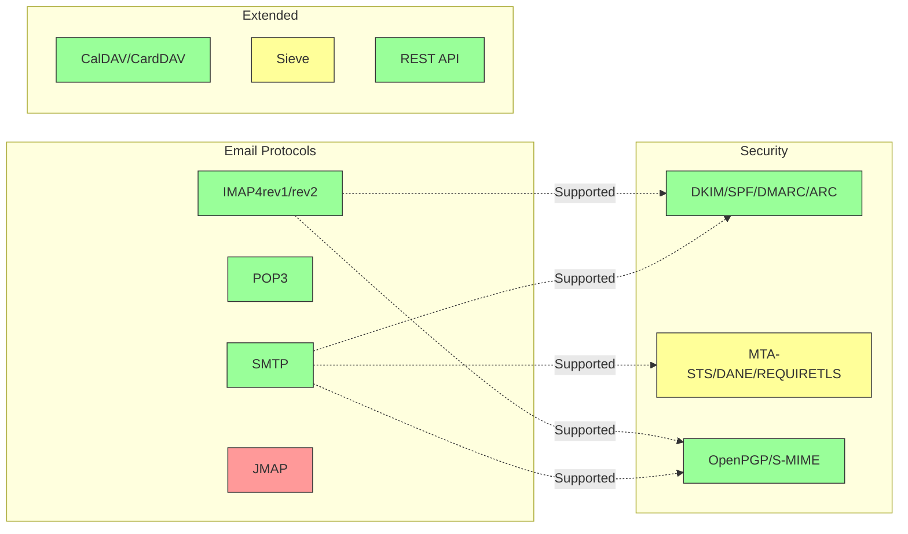

---


## Kerne Email Protokoller {#core-email-protocols}

### Email Protokol Flow {#email-protocol-flow}

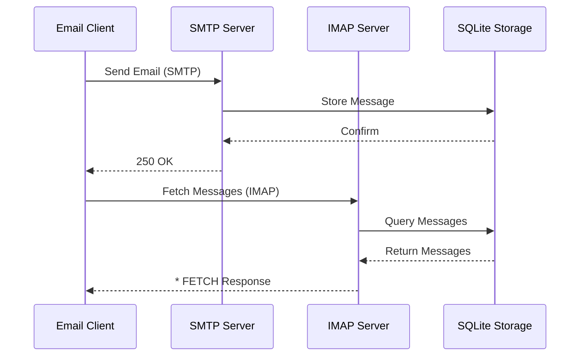


## IMAP4 Email Protokol og Udvidelser {#imap4-email-protocol-and-extensions}

> \[!NOTE]
> Forward Email understøtter IMAP4rev1 (RFC 3501) med delvis understøttelse af IMAP4rev2 (RFC 9051) funktioner.

Forward Email leverer robust IMAP4-understøttelse gennem WildDuck mailserver-implementeringen. Serveren implementerer IMAP4rev1 (RFC 3501) med delvis understøttelse af IMAP4rev2 (RFC 9051) udvidelser.

Forward Emails IMAP-funktionalitet leveres af [WildDuck](https://github.com/nodemailer/wildduck) afhængigheden. Følgende email RFC'er understøttes:

| RFC                                                       | Titel                                                             | Implementeringsnoter                                  |
| --------------------------------------------------------- | ----------------------------------------------------------------- | ----------------------------------------------------- |
| [RFC 3501](https://datatracker.ietf.org/doc/html/rfc3501) | Internet Message Access Protocol (IMAP) - Version 4rev1           | Fuld understøttelse med tilsigtede forskelle (se nedenfor) |
| [RFC 2177](https://datatracker.ietf.org/doc/html/rfc2177) | IMAP4 IDLE kommando                                               | Push-stil notifikationer                              |
| [RFC 2342](https://datatracker.ietf.org/doc/html/rfc2342) | IMAP4 Namespace                                                  | Mailboksnavnerumsunderstøttelse                       |
| [RFC 2087](https://datatracker.ietf.org/doc/html/rfc2087) | IMAP4 QUOTA udvidelse                                            | Håndtering af lagerkvoter                             |
| [RFC 2971](https://datatracker.ietf.org/doc/html/rfc2971) | IMAP4 ID udvidelse                                               | Klient/server identifikation                          |
| [RFC 5161](https://datatracker.ietf.org/doc/html/rfc5161) | IMAP4 ENABLE Udvidelse                                           | Aktiver IMAP udvidelser                               |
| [RFC 4959](https://datatracker.ietf.org/doc/html/rfc4959) | IMAP Udvidelse for SASL Initial Client Response (SASL-IR)         | Initial klientrespons                                 |
| [RFC 3691](https://datatracker.ietf.org/doc/html/rfc3691) | IMAP4 UNSELECT kommando                                          | Luk mailboks uden EXPUNGE                             |
| [RFC 4315](https://datatracker.ietf.org/doc/html/rfc4315) | IMAP UIDPLUS udvidelse                                          | Forbedrede UID kommando                               |
| [RFC 7162](https://datatracker.ietf.org/doc/html/rfc7162) | IMAP Udvidelser: Hurtige Flag Ændringer Resynkronisering (CONDSTORE) | Betinget STORE                                       |
| [RFC 6154](https://datatracker.ietf.org/doc/html/rfc6154) | IMAP LIST Udvidelse for Special-Use Mailboxes                    | Specielle mailboksattributter                         |
| [RFC 6851](https://datatracker.ietf.org/doc/html/rfc6851) | IMAP MOVE Udvidelse                                             | Atomar MOVE kommando                                 |
| [RFC 6855](https://datatracker.ietf.org/doc/html/rfc6855) | IMAP Understøttelse for UTF-8                                   | UTF-8 understøttelse                                 |
| [RFC 3348](https://datatracker.ietf.org/doc/html/rfc3348) | IMAP4 Child Mailbox Udvidelse                                   | Information om underordnede mailbokse                 |
| [RFC 7889](https://datatracker.ietf.org/doc/html/rfc7889) | IMAP4 Udvidelse for Annoncering af Maksimal Upload Størrelse (APPENDLIMIT) | Maksimal upload størrelse                             |
**Understøttede IMAP-udvidelser:**

| Extension         | RFC          | Status      | Beskrivelse                    |
| ----------------- | ------------ | ----------- | ----------------------------- |
| IDLE              | RFC 2177     | ✅ Supported | Push-stil notifikationer       |
| NAMESPACE         | RFC 2342     | ✅ Supported | Understøttelse af mailbox-navneområder |
| QUOTA             | RFC 2087     | ✅ Supported | Håndtering af lagerkvoter      |
| ID                | RFC 2971     | ✅ Supported | Klient/server identifikation   |
| ENABLE            | RFC 5161     | ✅ Supported | Aktiver IMAP-udvidelser        |
| SASL-IR           | RFC 4959     | ✅ Supported | Initial klientrespons          |
| UNSELECT          | RFC 3691     | ✅ Supported | Luk mailbox uden EXPUNGE       |
| UIDPLUS           | RFC 4315     | ✅ Supported | Forbedrede UID-kommandoer      |
| CONDSTORE         | RFC 7162     | ✅ Supported | Betinget STORE                 |
| SPECIAL-USE       | RFC 6154     | ✅ Supported | Specielle mailbox-attributter  |
| MOVE              | RFC 6851     | ✅ Supported | Atomisk MOVE-kommando          |
| UTF8=ACCEPT       | RFC 6855     | ✅ Supported | UTF-8 understøttelse           |
| CHILDREN          | RFC 3348     | ✅ Supported | Information om undermapper     |
| APPENDLIMIT       | RFC 7889     | ✅ Supported | Maksimal upload-størrelse      |
| XLIST             | Non-standard | ✅ Supported | Gmail-kompatibel mappeliste    |
| XAPPLEPUSHSERVICE | Non-standard | ✅ Supported | Apple Push Notification Service |

### IMAP-protokolforskelle fra RFC-specifikationer {#imap-protocol-differences-from-rfc-specifications}

> \[!WARNING]
> Følgende forskelle fra RFC-specifikationer kan påvirke klientkompatibilitet.

Forward Email afviger bevidst fra nogle IMAP RFC-specifikationer. Disse forskelle er arvet fra WildDuck og er dokumenteret nedenfor:

* **Ingen \Recent-flag:** `\Recent`-flagget er ikke implementeret. Alle beskeder returneres uden dette flag.
* **OMDØB påvirker ikke undermapper:** Når en mappe omdøbes, omdøbes undermapper ikke automatisk. Mappestrukturen er flad i databasen.
* **INBOX kan ikke omdøbes:** [RFC 3501](https://datatracker.ietf.org/doc/html/rfc3501) tillader omdøbning af INBOX, men Forward Email forbyder det eksplicit. Se [WildDuck kildekode](https://github.com/nodemailer/wildduck/blob/master/imap-core/lib/commands/rename.js#L27).
* **Ingen uopfordrede FLAGS-responser:** Når flag ændres, sendes der ingen uopfordrede FLAGS-responser til klienten.
* **STORE returnerer NO for slettede beskeder:** Forsøg på at ændre flag på slettede beskeder returnerer NO i stedet for at ignorere det stille.
* **CHARSET ignoreres i SEARCH:** `CHARSET`-argumentet i SEARCH-kommandoer ignoreres. Alle søgninger bruger UTF-8.
* **MODSEQ metadata ignoreres:** `MODSEQ` metadata i STORE-kommandoer ignoreres.
* **SEARCH TEXT og SEARCH BODY:** Forward Email bruger [SQLite FTS5](https://www.sqlite.org/fts5.html) (Full-Text Search) i stedet for MongoDB's `$text` søgning. Dette giver:
  * Understøttelse af `NOT` operator (MongoDB understøtter ikke dette)
  * Rangerede søgeresultater
  * Søgeydelse under 100 ms på store mailbokse
* **Autoexpunge-adfærd:** Beskeder markeret med `\Deleted` bliver automatisk expungeret, når mailboxen lukkes.
* **Beskedtrofasthed:** Nogle beskedændringer bevarer muligvis ikke den nøjagtige oprindelige beskedstruktur.

**Delvis IMAP4rev2-understøttelse:**

Forward Email implementerer IMAP4rev1 (RFC 3501) med delvis IMAP4rev2 (RFC 9051) understøttelse. Følgende IMAP4rev2-funktioner er **endnu ikke understøttet**:

* **LIST-STATUS** - Kombinerede LIST- og STATUS-kommandoer
* **LITERAL-** - Ikke-synkroniserende literals (minus-variant)
* **OBJECTID** - Unikke objekt-id'er
* **SAVEDATE** - Gem dato-attribut
* **REPLACE** - Atomisk beskedudskiftning
* **UNAUTHENTICATE** - Luk autentificering uden at lukke forbindelsen

**Afslappet håndtering af Body Structure:**

Forward Email bruger "afslappet body"-håndtering for fejlbehæftede MIME-strukturer, hvilket kan afvige fra streng RFC-fortolkning. Dette forbedrer kompatibiliteten med virkelige e-mails, der ikke perfekt overholder standarderne.
**METADATA Extension (RFC 5464):**

IMAP METADATA-udvidelsen understøttes **ikke**. For mere information om denne udvidelse, se [RFC 5464](https://datatracker.ietf.org/doc/html/rfc5464). Diskussion om tilføjelse af denne funktion kan findes i [WildDuck Issue #937](https://github.com/zone-eu/wildduck/issues/937).

### IMAP Extensions NOT Supported {#imap-extensions-not-supported}

Følgende IMAP-udvidelser fra [IANA IMAP Capabilities Registry](https://www.iana.org/assignments/imap-capabilities/imap-capabilities.xhtml) understøttes IKKE:

| RFC                                                       | Titel                                                                                                           | Årsag                                                                                                                                  |
| --------------------------------------------------------- | --------------------------------------------------------------------------------------------------------------- | --------------------------------------------------------------------------------------------------------------------------------------- |
| [RFC 2086](https://datatracker.ietf.org/doc/html/rfc2086) | IMAP4 ACL extension                                                                                             | Delte mapper ikke implementeret. Se [WildDuck Issue #427](https://github.com/zone-eu/wildduck/issues/427)                               |
| [RFC 5256](https://datatracker.ietf.org/doc/html/rfc5256) | IMAP SORT and THREAD Extensions                                                                                 | Trådning implementeret internt, men ikke via RFC 5256-protokollen. Se [WildDuck Issue #12](https://github.com/zone-eu/wildduck/issues/12) |
| [RFC 5162](https://datatracker.ietf.org/doc/html/rfc5162) | IMAP4 Extensions for Quick Mailbox Resynchronization (QRESYNC)                                                  | Ikke implementeret                                                                                                                     |
| [RFC 5464](https://datatracker.ietf.org/doc/html/rfc5464) | IMAP METADATA Extension                                                                                         | Metadata-operationer ignoreres. Se [WildDuck documentation](https://datatracker.ietf.org/doc/html/rfc5464)                              |
| [RFC 5258](https://datatracker.ietf.org/doc/html/rfc5258) | IMAP4 LIST Command Extensions                                                                                   | Ikke implementeret                                                                                                                     |
| [RFC 5267](https://datatracker.ietf.org/doc/html/rfc5267) | Contexts for IMAP4                                                                                              | Ikke implementeret                                                                                                                     |
| [RFC 5465](https://datatracker.ietf.org/doc/html/rfc5465) | IMAP NOTIFY Extension                                                                                           | Ikke implementeret                                                                                                                     |
| [RFC 5466](https://datatracker.ietf.org/doc/html/rfc5466) | IMAP4 FILTERS Extension                                                                                         | Ikke implementeret                                                                                                                     |
| [RFC 6203](https://datatracker.ietf.org/doc/html/rfc6203) | IMAP4 Extension for Fuzzy Search                                                                                | Ikke implementeret                                                                                                                     |
| [RFC 6785](https://datatracker.ietf.org/doc/html/rfc6785) | IMAP4 Implementation Recommendations                                                                            | Anbefalinger fulgt delvist                                                                                                            |
| [RFC 7162](https://datatracker.ietf.org/doc/html/rfc7162) | IMAP Extensions: Quick Flag Changes Resynchronization (CONDSTORE) and Quick Mailbox Resynchronization (QRESYNC) | Ikke implementeret                                                                                                                     |
| [RFC 8437](https://datatracker.ietf.org/doc/html/rfc8437) | IMAP UNAUTHENTICATE Extension for Connection Reuse                                                              | Ikke implementeret                                                                                                                     |
| [RFC 8438](https://datatracker.ietf.org/doc/html/rfc8438) | IMAP Extension for STATUS=SIZE                                                                                  | Ikke implementeret                                                                                                                     |
| [RFC 8457](https://datatracker.ietf.org/doc/html/rfc8457) | IMAP "$Important" Keyword and "\Important" Special-Use Attribute                                                | Ikke implementeret                                                                                                                     |
| [RFC 8474](https://datatracker.ietf.org/doc/html/rfc8474) | IMAP Extension for Object Identifiers                                                                           | Ikke implementeret                                                                                                                     |
| [RFC 9051](https://datatracker.ietf.org/doc/html/rfc9051) | Internet Message Access Protocol (IMAP) - Version 4rev2                                                         | Forward Email implementerer IMAP4rev1 ([RFC 3501](https://datatracker.ietf.org/doc/html/rfc3501))                                        |
## POP3 Email Protocol and Extensions {#pop3-email-protocol-and-extensions}

> \[!NOTE]
> Forward Email understøtter POP3 (RFC 1939) med standardudvidelser til e-mail hentning.

Forward Emails POP3-funktionalitet leveres af [WildDuck](https://github.com/nodemailer/wildduck) afhængigheden. Følgende e-mail RFC'er understøttes:

| RFC                                                       | Titel                                   | Implementeringsnoter                                  |
| --------------------------------------------------------- | --------------------------------------- | ----------------------------------------------------- |
| [RFC 1939](https://datatracker.ietf.org/doc/html/rfc1939) | Post Office Protocol - Version 3 (POP3) | Fuld understøttelse med tilsigtede forskelle (se nedenfor) |
| [RFC 2595](https://datatracker.ietf.org/doc/html/rfc2595) | Brug af TLS med IMAP, POP3 og ACAP      | STARTTLS understøttelse                               |
| [RFC 2449](https://datatracker.ietf.org/doc/html/rfc2449) | POP3 Extension Mechanism                | CAPA kommando understøttelse                           |

Forward Email tilbyder POP3-understøttelse til klienter, der foretrækker denne enklere protokol frem for IMAP. POP3 er ideel til brugere, der ønsker at downloade e-mails til en enkelt enhed og fjerne dem fra serveren.

**Understøttede POP3-udvidelser:**

| Udvidelse | RFC      | Status      | Beskrivelse                |
| --------- | -------- | ----------- | -------------------------- |
| TOP       | RFC 1939 | ✅ Understøttet | Hentning af meddelelsesoverskrifter |
| USER      | RFC 1939 | ✅ Understøttet | Brugergodkendelse          |
| UIDL      | RFC 1939 | ✅ Understøttet | Unikke meddelelses-id'er   |
| EXPIRE    | RFC 2449 | ✅ Understøttet | Meddelelses udløbspolitik  |

### POP3 Protocol Differences from RFC Specifications {#pop3-protocol-differences-from-rfc-specifications}

> \[!WARNING]
> POP3 har iboende begrænsninger sammenlignet med IMAP.

> \[!IMPORTANT]
> **Kritisk forskel: Forward Email vs WildDuck POP3 DELE-adfærd**
>
> Forward Email implementerer RFC-kompatibel permanent sletning for POP3 `DELE` kommandoer, i modsætning til WildDuck, som flytter meddelelser til Papirkurven.

**Forward Email-adfærd** ([kildekode](https://github.com/forwardemail/forwardemail.net/blob/master/pop3-server.js)):

* `DELE` → `QUIT` sletter meddelelser permanent
* Følger [RFC 1939](https://datatracker.ietf.org/doc/html/rfc1939) specifikationen præcist
* Matcher adfærden hos Dovecot (standard), Postfix og andre standard-kompatible servere

**WildDuck-adfærd** ([diskussion](https://github.com/zone-eu/wildduck/issues/937)):

* `DELE` → `QUIT` flytter meddelelser til Papirkurven (Gmail-lignende)
* Bevidst designbeslutning for brugersikkerhed
* Ikke RFC-kompatibel, men forhindrer utilsigtet datatab

**Hvorfor Forward Email adskiller sig:**

* **RFC-kompatibilitet:** Overholder [RFC 1939](https://datatracker.ietf.org/doc/html/rfc1939) specifikationen
* **Brugerforventninger:** Download-og-slet arbejdsgang forventer permanent sletning
* **Lagringsstyring:** Korrekt genvinding af diskplads
* **Interoperabilitet:** Konsistent med andre RFC-kompatible servere

> \[!NOTE]
> **POP3 Meddelelsesliste:** Forward Email viser ALLE meddelelser fra INBOX uden begrænsning. Dette adskiller sig fra WildDuck, som som standard begrænser til 250 meddelelser. Se [kildekode](https://github.com/forwardemail/forwardemail.net/blob/master/pop3-server.js).

**Adgang fra enkelt enhed:**

POP3 er designet til adgang fra en enkelt enhed. Meddelelser downloades typisk og fjernes fra serveren, hvilket gør det uegnet til synkronisering på tværs af flere enheder.

**Ingen mappeunderstøttelse:**

POP3 har kun adgang til INBOX-mappen. Andre mapper (Sendt, Udkast, Papirkurv osv.) er ikke tilgængelige via POP3.

**Begrænset meddelelsesstyring:**

POP3 tilbyder grundlæggende meddelelseshentning og sletning. Avancerede funktioner som flagning, flytning eller søgning i meddelelser er ikke tilgængelige.

### POP3 Extensions NOT Supported {#pop3-extensions-not-supported}

Følgende POP3-udvidelser fra [IANA POP3 Extension Mechanism Registry](https://www.iana.org/assignments/pop3-extension-mechanism/pop3-extension-mechanism.xhtml) understøttes IKKE:
| RFC                                                       | Titel                                                  | Årsag                                  |
| --------------------------------------------------------- | ------------------------------------------------------ | ------------------------------------- |
| [RFC 6856](https://datatracker.ietf.org/doc/html/rfc6856) | Post Office Protocol Version 3 (POP3) Support for UTF-8 | Ikke implementeret i WildDuck POP3-serveren |
| [RFC 2595](https://datatracker.ietf.org/doc/html/rfc2595) | STLS-kommando                                          | Kun STARTTLS understøttet, ikke STLS  |
| [RFC 3206](https://datatracker.ietf.org/doc/html/rfc3206) | The SYS and AUTH POP Response Codes                     | Ikke implementeret                     |

---


## SMTP Email Protocol and Extensions {#smtp-email-protocol-and-extensions}

> \[!NOTE]
> Forward Email understøtter SMTP (RFC 5321) med moderne udvidelser for sikker og pålidelig e-mail levering.

Forward Emails SMTP-funktionalitet leveres af flere komponenter: [smtp-server](https://github.com/nodemailer/smtp-server) (nodemailer), [zone-mta](https://github.com/zone-eu/zone-mta), og brugerdefinerede implementeringer. Følgende email RFC'er understøttes:

| RFC                                                       | Titel                                                                            | Implementeringsnoter               |
| --------------------------------------------------------- | -------------------------------------------------------------------------------- | --------------------------------- |
| [RFC 5321](https://datatracker.ietf.org/doc/html/rfc5321) | Simple Mail Transfer Protocol (SMTP)                                             | Fuld understøttelse               |
| [RFC 3207](https://datatracker.ietf.org/doc/html/rfc3207) | SMTP Service Extension for Secure SMTP over Transport Layer Security (STARTTLS)  | TLS/SSL-understøttelse            |
| [RFC 4954](https://datatracker.ietf.org/doc/html/rfc4954) | SMTP Service Extension for Authentication (AUTH)                                 | PLAIN, LOGIN, CRAM-MD5, XOAUTH2   |
| [RFC 6531](https://datatracker.ietf.org/doc/html/rfc6531) | SMTP Extension for Internationalized Email (SMTPUTF8)                            | Indbygget unicode e-mail adresse-understøttelse |
| [RFC 3461](https://datatracker.ietf.org/doc/html/rfc3461) | SMTP Service Extension for Delivery Status Notifications (DSN)                   | Fuld DSN-understøttelse           |
| [RFC 3463](https://datatracker.ietf.org/doc/html/rfc3463) | Enhanced Mail System Status Codes                                                | Forbedrede statuskoder i svar     |
| [RFC 1870](https://datatracker.ietf.org/doc/html/rfc1870) | SMTP Service Extension for Message Size Declaration (SIZE)                       | Maksimal beskedstørrelsesangivelse |
| [RFC 2920](https://datatracker.ietf.org/doc/html/rfc2920) | SMTP Service Extension for Command Pipelining (PIPELINING)                       | Understøttelse af kommando-pipelining |
| [RFC 1652](https://datatracker.ietf.org/doc/html/rfc1652) | SMTP Service Extension for 8bit-MIMEtransport (8BITMIME)                         | 8-bit MIME-understøttelse         |
| [RFC 6152](https://datatracker.ietf.org/doc/html/rfc6152) | SMTP Service Extension for 8-bit MIME Transport                                  | 8-bit MIME-understøttelse         |
| [RFC 2034](https://datatracker.ietf.org/doc/html/rfc2034) | SMTP Service Extension for Returning Enhanced Error Codes (ENHANCEDSTATUSCODES)  | Forbedrede statuskoder             |

Forward Email implementerer en fuldt udstyret SMTP-server med understøttelse af moderne udvidelser, der forbedrer sikkerhed, pålidelighed og funktionalitet.

**Understøttede SMTP-udvidelser:**

| Udvidelse           | RFC      | Status      | Beskrivelse                          |
| ------------------- | -------- | ----------- | ----------------------------------- |
| PIPELINING          | RFC 2920 | ✅ Understøttet | Kommando-pipelining                 |
| SIZE                | RFC 1870 | ✅ Understøttet | Angivelse af beskedstørrelse (52MB grænse) |
| ETRN                | RFC 1985 | ✅ Understøttet | Fjernkøbehandling                   |
| STARTTLS            | RFC 3207 | ✅ Understøttet | Opgradering til TLS                 |
| ENHANCEDSTATUSCODES | RFC 2034 | ✅ Understøttet | Forbedrede statuskoder             |
| 8BITMIME            | RFC 6152 | ✅ Understøttet | 8-bit MIME transport               |
| DSN                 | RFC 3461 | ✅ Understøttet | Leveringsstatusmeddelelser         |
| CHUNKING            | RFC 3030 | ✅ Understøttet | Overførsel af beskeder i dele      |
| SMTPUTF8            | RFC 6531 | ⚠️ Delvis    | UTF-8 e-mailadresser (delvis)      |
| REQUIRETLS          | RFC 8689 | ✅ Understøttet | Kræv TLS for levering              |
### Leveringsstatusmeddelelser (DSN) {#delivery-status-notifications-dsn}

> \[!TIP]
> DSN giver detaljerede oplysninger om leveringsstatus for sendte e-mails.

Forward Email understøtter fuldt ud **DSN (RFC 3461)**, som giver afsendere mulighed for at anmode om leveringsstatusmeddelelser. Denne funktion giver:

* **Succesmeddelelser** når beskeder leveres
* **Fejlmeddelelser** med detaljerede fejloplysninger
* **Forsinkelsesmeddelelser** når levering midlertidigt er forsinket

DSN er særligt nyttigt til:

* At bekræfte levering af vigtige beskeder
* Fejlfinding af leveringsproblemer
* Automatiserede e-mailbehandlingssystemer
* Overholdelse og revisionskrav

### REQUIRETLS Support {#requiretls-support}

> \[!IMPORTANT]
> Forward Email er en af de få udbydere, der eksplicit annoncerer og håndhæver REQUIRETLS.

Forward Email understøtter **REQUIRETLS (RFC 8689)**, som sikrer, at e-mailbeskeder kun leveres over TLS-krypterede forbindelser. Dette giver:

* **End-to-end kryptering** for hele leveringsvejen
* **Brugerorienteret håndhævelse** via afkrydsningsfelt i e-mail-komponisten
* **Afvisning af ukrypterede leveringsforsøg**
* **Forbedret sikkerhed** for følsomme kommunikationer

### SMTP-udvidelser IKKE understøttet {#smtp-extensions-not-supported}

Følgende SMTP-udvidelser fra [IANA SMTP Service Extensions Registry](https://www.iana.org/assignments/smtp) understøttes IKKE:

| RFC                                                       | Titel                                                                                             | Årsag                 |
| --------------------------------------------------------- | ------------------------------------------------------------------------------------------------- | --------------------- |
| [RFC 4865](https://datatracker.ietf.org/doc/html/rfc4865) | SMTP Submission Service Extension for Future Message Release (FUTURERELEASE)                      | Ikke implementeret    |
| [RFC 6710](https://datatracker.ietf.org/doc/html/rfc6710) | SMTP Extension for Message Transfer Priorities (MT-PRIORITY)                                      | Ikke implementeret    |
| [RFC 7293](https://datatracker.ietf.org/doc/html/rfc7293) | The Require-Recipient-Valid-Since Header Field and SMTP Service Extension                         | Ikke implementeret    |
| [RFC 7372](https://datatracker.ietf.org/doc/html/rfc7372) | Email Auth Status Codes                                                                           | Ikke fuldt implementeret |
| [RFC 4468](https://datatracker.ietf.org/doc/html/rfc4468) | Message Submission BURL Extension                                                                 | Ikke implementeret    |
| [RFC 3030](https://datatracker.ietf.org/doc/html/rfc3030) | SMTP Service Extensions for Transmission of Large and Binary MIME Messages (CHUNKING, BINARYMIME) | Ikke implementeret    |
| [RFC 2852](https://datatracker.ietf.org/doc/html/rfc2852) | Deliver By SMTP Service Extension                                                                 | Ikke implementeret    |

---


## JMAP Email Protocol {#jmap-email-protocol}

> \[!CAUTION]
> JMAP understøttes **ikke i øjeblikket** af Forward Email.

| RFC                                                       | Titel                                     | Status          | Årsag                                                                 |
| --------------------------------------------------------- | ----------------------------------------- | --------------- | ---------------------------------------------------------------------- |
| [RFC 8620](https://datatracker.ietf.org/doc/html/rfc8620) | The JSON Meta Application Protocol (JMAP) | ❌ Ikke understøttet | Forward Email bruger i stedet IMAP/POP3/SMTP og en omfattende REST API |

**JMAP (JSON Meta Application Protocol)** er en moderne e-mailprotokol designet til at erstatte IMAP.

**Hvorfor JMAP ikke understøttes:**

> "JMAP er et bæst, der ikke burde være blevet opfundet. Det forsøger at konvertere TCP/IMAP (allerede en dårlig protokol efter nutidens standarder) til HTTP/JSON, blot ved at bruge en anden transport, mens ånden bevares." — Andris Reinman, [HN Diskussion](https://news.ycombinator.com/item?id=18890011)
> "JMAP er mere end 10 år gammelt, og der er næsten ingen adoption overhovedet" – Andris Reinman, [GitHub Discussion](https://github.com/zone-eu/wildduck/issues/2#issuecomment-1765190790)

Se også yderligere kommentarer på <https://hn.algolia.com/?dateRange=all&page=0&prefix=true&query=jmap%20andris&sort=byDate&type=comment>.

Forward Email fokuserer i øjeblikket på at levere fremragende IMAP-, POP3- og SMTP-understøttelse samt en omfattende REST API til e-mail-administration. JMAP-understøttelse kan overvejes i fremtiden baseret på brugerbehov og økosystemets adoption.

**Alternativ:** Forward Email tilbyder en [Komplet REST API](#complete-rest-api-for-email-management) med 39 endpoints, der giver lignende funktionalitet som JMAP til programmatisk e-mail-adgang.

---


## E-mail Sikkerhed {#email-security}

### E-mail Sikkerhedsarkitektur {#email-security-architecture}

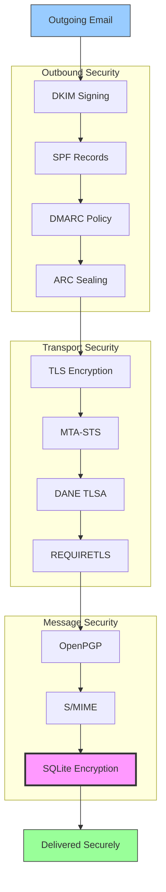


## E-mail Beskedautentifikationsprotokoller {#email-message-authentication-protocols}

> \[!NOTE]
> Forward Email implementerer alle større e-mail-autentifikationsprotokoller for at forhindre spoofing og sikre beskedens integritet.

Forward Email bruger [mailauth](https://github.com/postalsys/mailauth) biblioteket til e-mail-autentifikation. Følgende RFC'er understøttes:

| RFC                                                       | Titel                                                                   | Implementeringsnoter                                           |
| --------------------------------------------------------- | ----------------------------------------------------------------------- | -------------------------------------------------------------- |
| [RFC 6376](https://datatracker.ietf.org/doc/html/rfc6376) | DomainKeys Identified Mail (DKIM) Signaturer                            | Fuld DKIM signering og verifikation                             |
| [RFC 8463](https://datatracker.ietf.org/doc/html/rfc8463) | En ny kryptografisk signaturmetode til DKIM (Ed25519-SHA256)            | Understøtter både RSA-SHA256 og Ed25519-SHA256 signeringsalgoritmer |
| [RFC 7208](https://datatracker.ietf.org/doc/html/rfc7208) | Sender Policy Framework (SPF)                                           | SPF record validering                                          |
| [RFC 7489](https://datatracker.ietf.org/doc/html/rfc7489) | Domain-based Message Authentication, Reporting, and Conformance (DMARC) | DMARC politik håndhævelse                                       |
| [RFC 8617](https://datatracker.ietf.org/doc/html/rfc8617) | Authenticated Received Chain (ARC)                                      | ARC forsegling og validering                                   |

E-mail-autentifikationsprotokoller verificerer, at beskeder virkelig kommer fra den påståede afsender og ikke er blevet manipuleret med under overførslen.

### Understøttelse af autentifikationsprotokoller {#authentication-protocol-support}

| Protokol  | RFC      | Status      | Beskrivelse                                                            |
| --------- | -------- | ----------- | ---------------------------------------------------------------------- |
| **DKIM**  | RFC 6376 | ✅ Understøttet | DomainKeys Identified Mail - Kryptografiske signaturer                  |
| **SPF**   | RFC 7208 | ✅ Understøttet | Sender Policy Framework - IP-adresse autorisation                     |
| **DMARC** | RFC 7489 | ✅ Understøttet | Domain-based Message Authentication - Politik håndhævelse               |
| **ARC**   | RFC 8617 | ✅ Understøttet | Authenticated Received Chain - Bevar autentifikation på tværs af videresendelser |
### DKIM (DomainKeys Identified Mail) {#dkim-domainkeys-identified-mail}

**DKIM** tilføjer en kryptografisk signatur til e-mail-headere, hvilket gør det muligt for modtagere at verificere, at beskeden er autoriseret af domæneejeren og ikke er blevet ændret undervejs.

Forward Email bruger [mailauth](https://github.com/postalsys/mailauth) til DKIM-signering og verifikation.

**Nøglefunktioner:**

* Automatisk DKIM-signering for alle udgående beskeder
* Understøttelse af RSA- og Ed25519-nøgler
* Understøttelse af flere selector
* DKIM-verifikation for indgående beskeder

### SPF (Sender Policy Framework) {#spf-sender-policy-framework}

**SPF** gør det muligt for domæneejere at angive, hvilke IP-adresser der er autoriserede til at sende e-mail på vegne af deres domæne.

**Nøglefunktioner:**

* SPF-postvalidering for indgående beskeder
* Automatisk SPF-kontrol med detaljerede resultater
* Understøttelse af include-, redirect- og all-mekanismer
* Konfigurerbare SPF-politikker pr. domæne

### DMARC (Domain-based Message Authentication, Reporting & Conformance) {#dmarc-domain-based-message-authentication-reporting--conformance}

**DMARC** bygger videre på SPF og DKIM for at levere politikhåndhævelse og rapportering.

**Nøglefunktioner:**

* DMARC-politikhåndhævelse (none, quarantine, reject)
* Justeringskontrol for SPF og DKIM
* DMARC-aggregatrapportering
* DMARC-politikker pr. domæne

### ARC (Authenticated Received Chain) {#arc-authenticated-received-chain}

**ARC** bevarer e-mail-autentificeringsresultater på tværs af videresendelse og ændringer i mailinglister.

Forward Email bruger [mailauth](https://github.com/postalsys/mailauth)-biblioteket til ARC-verifikation og forsegling.

**Nøglefunktioner:**

* ARC-forsegling for videresendte beskeder
* ARC-validering for indgående beskeder
* Kædeverifikation på tværs af flere hop
* Bevarer originale autentificeringsresultater

### Authentication Flow {#authentication-flow}

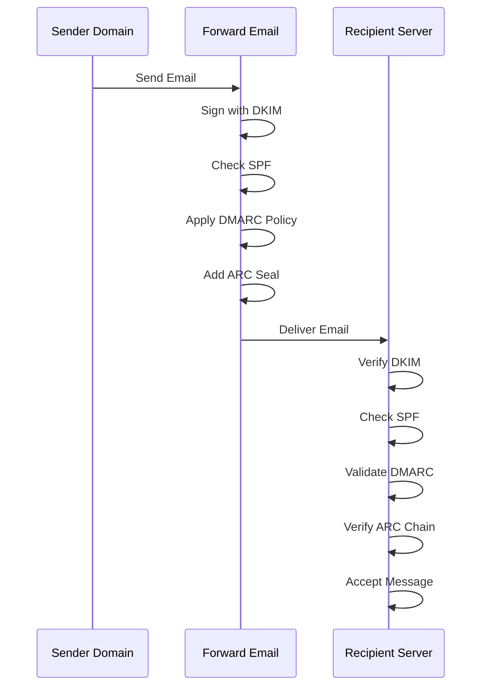

---


## Email Transport Security Protocols {#email-transport-security-protocols}

> \[!IMPORTANT]
> Forward Email implementerer flere lag af transport-sikkerhed for at beskytte e-mails under overførsel.

Forward Email implementerer moderne transport-sikkerhedsprotokoller:

| RFC                                                       | Titel                                                                                               | Status      | Implementeringsnoter                                                                                                                                                                                                                                                                          |
| --------------------------------------------------------- | -------------------------------------------------------------------------------------------------- | ----------- | --------------------------------------------------------------------------------------------------------------------------------------------------------------------------------------------------------------------------------------------------------------------------------------------- |
| [RFC 8461](https://datatracker.ietf.org/doc/html/rfc8461) | SMTP MTA Strict Transport Security (MTA-STS)                                                       | ✅ Supported | Bredt anvendt på IMAP-, SMTP- og MX-servere. Se [create-mta-sts-cache.js](https://github.com/forwardemail/forwardemail.net/blob/master/helpers/create-mta-sts-cache.js) og [get-transporter.js](https://github.com/forwardemail/forwardemail.net/blob/master/helpers/get-transporter.js) |
| [RFC 8460](https://datatracker.ietf.org/doc/html/rfc8460) | SMTP TLS Reporting                                                                                 | ✅ Supported | Via [mailauth](https://github.com/postalsys/mailauth) bibliotek                                                                                                                                                                                                                               |
| [RFC 7671](https://datatracker.ietf.org/doc/html/rfc7671) | The DNS-Based Authentication of Named Entities (DANE) Protocol: Updates and Operational Guidance   | ✅ Supported | Fuld DANE-verifikation for udgående SMTP-forbindelser. Se [mx-connect PR #22](https://github.com/zone-eu/mx-connect/pull/22)                                                                                                                                                                  |
| [RFC 6698](https://datatracker.ietf.org/doc/html/rfc6698) | The DNS-Based Authentication of Named Entities (DANE) Transport Layer Security (TLS) Protocol: TLSA | ✅ Supported | Fuld RFC 6698-understøttelse: PKIX-TA, PKIX-EE, DANE-TA, DANE-EE brugstyper. Se [mx-connect PR #22](https://github.com/zone-eu/mx-connect/pull/22)                                                                                                                                             |
| [RFC 8314](https://datatracker.ietf.org/doc/html/rfc8314) | Cleartext Considered Obsolete: Use of Transport Layer Security (TLS) for Email Submission and Access | ✅ Supported | TLS kræves for alle forbindelser                                                                                                                                                                                                                                                             |
| [RFC 8689](https://datatracker.ietf.org/doc/html/rfc8689) | SMTP Service Extension for Requiring TLS (REQUIRETLS)                                              | ✅ Supported | Fuld understøttelse af REQUIRETLS SMTP-udvidelsen og "TLS-Required" header                                                                                                                                                                                                                   |
Transport sikkerhedsprotokoller sikrer, at e-mailbeskeder er krypterede og autentificerede under overførslen mellem mailservere.

### Transport Security Support {#transport-security-support}

| Protokol      | RFC      | Status      | Beskrivelse                                     |
| ------------- | -------- | ----------- | ------------------------------------------------ |
| **TLS**       | RFC 8314 | ✅ Understøttet | Transport Layer Security - Krypterede forbindelser |
| **MTA-STS**   | RFC 8461 | ✅ Understøttet | Mail Transfer Agent Strict Transport Security    |
| **DANE**      | RFC 7671 | ✅ Understøttet | DNS-baseret Authentication of Named Entities     |
| **REQUIRETLS**| RFC 8689 | ✅ Understøttet | Kræv TLS for hele leveringsvejen                  |

### TLS (Transport Layer Security) {#tls-transport-layer-security}

Forward Email håndhæver TLS-kryptering for alle e-mailforbindelser (SMTP, IMAP, POP3).

**Nøglefunktioner:**

* Understøttelse af TLS 1.2 og TLS 1.3
* Automatisk certifikathåndtering
* Perfect Forward Secrecy (PFS)
* Kun stærke krypteringssuiter

### MTA-STS (Mail Transfer Agent Strict Transport Security) {#mta-sts-mail-transfer-agent-strict-transport-security}

**MTA-STS** sikrer, at e-mail kun leveres over TLS-krypterede forbindelser ved at offentliggøre en politik via HTTPS.

Forward Email implementerer MTA-STS ved hjælp af [create-mta-sts-cache.js](https://github.com/forwardemail/forwardemail.net/blob/master/helpers/create-mta-sts-cache.js).

**Nøglefunktioner:**

* Automatisk offentliggørelse af MTA-STS-politik
* Politikcache for ydeevne
* Forebyggelse af nedgraderingsangreb
* Håndhævelse af certifikatvalidering

### DANE (DNS-based Authentication of Named Entities) {#dane-dns-based-authentication-of-named-entities}

> \[!NOTE]
> Forward Email tilbyder nu fuld DANE-understøttelse for udgående SMTP-forbindelser.

**DANE** bruger DNSSEC til at offentliggøre TLS-certifikatinformation i DNS, hvilket gør det muligt for mailservere at verificere certifikater uden at være afhængige af certifikatmyndigheder.

**Nøglefunktioner:**

* ✅ Fuld DANE-verifikation for udgående SMTP-forbindelser
* ✅ Fuld RFC 6698-understøttelse: PKIX-TA, PKIX-EE, DANE-TA, DANE-EE brugstyper
* ✅ Certifikatverifikation mod TLSA-poster under TLS-opgradering
* ✅ Parallel TLSA-opslag for flere MX-værter
* ✅ Automatisk detektion af native `dns.resolveTlsa` (Node.js v22.15.0+, v23.9.0+)
* ✅ Understøttelse af brugerdefineret resolver for ældre Node.js-versioner via [Tangerine](https://github.com/forwardemail/tangerine)
* Kræver DNSSEC-signerede domæner

> \[!TIP]
> **Implementeringsdetaljer:** DANE-understøttelse blev tilføjet via [mx-connect PR #22](https://github.com/zone-eu/mx-connect/pull/22), som leverer omfattende DANE/TLSA-understøttelse for udgående SMTP-forbindelser.

### REQUIRETLS {#requiretls}

> \[!TIP]
> Forward Email er en af de få udbydere med brugerrettet REQUIRETLS-understøttelse.

**REQUIRETLS** sikrer, at e-mailbeskeder kun leveres over TLS-krypterede forbindelser for hele leveringsvejen.

**Nøglefunktioner:**

* Brugerrettet afkrydsningsfelt i e-mail-komponisten
* Automatisk afvisning af ukrypteret levering
* End-to-end TLS-håndhævelse
* Detaljerede fejlmeddelelser

> \[!TIP]
> **Brugerrettet TLS-håndhævelse:** Forward Email tilbyder et afkrydsningsfelt under **Min Konto > Domæner > Indstillinger** til at håndhæve TLS for alle indgående forbindelser. Når aktiveret, afviser denne funktion enhver indgående e-mail, der ikke sendes over en TLS-krypteret forbindelse med en 530-fejlkode, hvilket sikrer, at al indgående post er krypteret under overførslen.

### Transport Security Flow {#transport-security-flow}

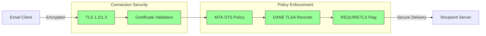
## Emailbesked Kryptering {#email-message-encryption}

> \[!NOTE]
> Forward Email understøtter både OpenPGP og S/MIME til ende-til-ende e-mail kryptering.

Forward Email understøtter OpenPGP og S/MIME kryptering:

| RFC                                                       | Titel                                                                                   | Status      | Implementeringsnoter                                                                                                                                                                                 |
| --------------------------------------------------------- | --------------------------------------------------------------------------------------- | ----------- | ---------------------------------------------------------------------------------------------------------------------------------------------------------------------------------------------------- |
| [RFC 9580](https://datatracker.ietf.org/doc/html/rfc9580) | OpenPGP (afløser RFC 4880)                                                              | ✅ Understøttet | Via [OpenPGP.js v6+](https://github.com/openpgpjs/openpgpjs) integration. Se [FAQ](https://forwardemail.net/en/faq#do-you-support-openpgpmime-end-to-end-encryption-e2ee-and-web-key-directory-wkd) |
| [RFC 8551](https://datatracker.ietf.org/doc/html/rfc8551) | Secure/Multipurpose Internet Mail Extensions (S/MIME) Version 4.0 Meddelelsesspecifikation | ✅ Understøttet | Både RSA og ECC algoritmer understøttes. Se [FAQ](https://forwardemail.net/en/faq#do-you-support-smime-encryption)                                                                                    |

Meddelelseskrypteringsprotokoller beskytter e-mailindhold mod at blive læst af andre end den tiltænkte modtager, selv hvis beskeden opsnappes under overførslen.

### Krypteringsunderstøttelse {#encryption-support}

| Protokol    | RFC      | Status      | Beskrivelse                                  |
| ----------- | -------- | ----------- | -------------------------------------------- |
| **OpenPGP** | RFC 9580 | ✅ Understøttet | Pretty Good Privacy - Offentlig nøgle kryptering  |
| **S/MIME**  | RFC 8551 | ✅ Understøttet | Secure/Multipurpose Internet Mail Extensions |
| **WKD**     | Draft    | ✅ Understøttet | Web Key Directory - Automatisk nøgleopdagelse  |

### OpenPGP (Pretty Good Privacy) {#openpgp-pretty-good-privacy}

**OpenPGP** leverer ende-til-ende kryptering ved brug af offentlig nøglekryptografi. Forward Email understøtter OpenPGP gennem [Web Key Directory (WKD)](https://forwardemail.net/en/faq#do-you-support-openpgpmime-end-to-end-encryption-e2ee-and-web-key-directory-wkd) protokollen.

**Nøglefunktioner:**

* Automatisk nøgleopdagelse via WKD
* PGP/MIME understøttelse for krypterede vedhæftninger
* Nøgleadministration gennem e-mail klient
* Kompatibel med GPG, Mailvelope og andre OpenPGP værktøjer

**Sådan bruger du det:**

1. Generer et PGP nøglepar i din e-mail klient
2. Upload din offentlige nøgle til Forward Emails WKD
3. Din nøgle er automatisk tilgængelig for andre brugere
4. Send og modtag krypterede e-mails problemfrit

### S/MIME (Secure/Multipurpose Internet Mail Extensions) {#smime-securemultipurpose-internet-mail-extensions}

**S/MIME** leverer e-mail kryptering og digitale signaturer ved brug af X.509 certifikater.

**Nøglefunktioner:**

* Certifikatbaseret kryptering
* Digitale signaturer til meddelelsesautentifikation
* Indbygget understøttelse i de fleste e-mail klienter
* Sikkerhed på virksomhedsniveau

**Sådan bruger du det:**

1. Skaff et S/MIME certifikat fra en Certifikatmyndighed
2. Installer certifikatet i din e-mail klient
3. Konfigurer din klient til at kryptere/signere beskeder
4. Udveksl certifikater med modtagere

### SQLite Mailbox Kryptering {#sqlite-mailbox-encryption}

> \[!IMPORTANT]
> Forward Email tilbyder et ekstra sikkerhedslag med krypterede SQLite postkasser.

Ud over meddelelsesniveau kryptering krypterer Forward Email hele postkasser ved brug af [sqleet](https://github.com/resilar/sqleet) (ChaCha20-Poly1305).

**Nøglefunktioner:**

* **Adgangskodebaseret kryptering** - Kun du har adgangskoden
* **Kvantemodstandsdygtig** - ChaCha20-Poly1305 cipher
* **Zero-knowledge** - Forward Email kan ikke dekryptere din postkasse
* **Sandboxed** - Hver postkasse er isoleret og bærbar
* **Uoprettelig** - Hvis du glemmer din adgangskode, går din postkasse tabt
### Krypteringssammenligning {#encryption-comparison}

| Funktion              | OpenPGP           | S/MIME             | SQLite Kryptering  |
| --------------------- | ----------------- | ------------------ | ----------------- |
| **End-to-End**        | ✅ Ja              | ✅ Ja               | ✅ Ja              |
| **Nøglehåndtering**   | Selvstyret        | CA-udstedt         | Adgangskodebaseret |
| **Klientunderstøttelse** | Kræver plugin    | Indbygget          | Transparent       |
| **Brugstilfælde**     | Personligt        | Virksomhed         | Lagring           |
| **Kvantemodstandsdygtig** | ⚠️ Afhænger af nøgle | ⚠️ Afhænger af certifikat | ✅ Ja              |

### Krypteringsflow {#encryption-flow}

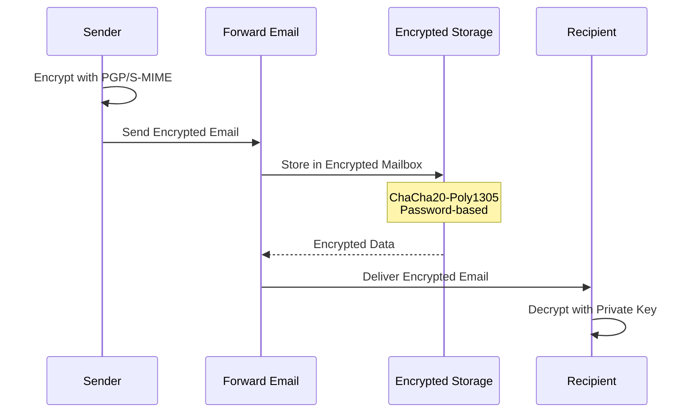

---


## Udvidet Funktionalitet {#extended-functionality}


## Standarder for Email Beskedformat {#email-message-format-standards}

> \[!NOTE]
> Forward Email understøtter moderne email formatstandarder for rigt indhold og internationalisering.

Forward Email understøtter standard email beskedformater:

| RFC                                                       | Titel                                                         | Implementeringsnoter |
| --------------------------------------------------------- | ------------------------------------------------------------- | -------------------- |
| [RFC 5322](https://datatracker.ietf.org/doc/html/rfc5322) | Internet Message Format                                       | Fuld understøttelse  |
| [RFC 2045](https://datatracker.ietf.org/doc/html/rfc2045) | MIME Del Et: Format af Internetbeskedkroppe                   | Fuld MIME-understøttelse |
| [RFC 2046](https://datatracker.ietf.org/doc/html/rfc2046) | MIME Del To: Medietyper                                       | Fuld MIME-understøttelse |
| [RFC 2047](https://datatracker.ietf.org/doc/html/rfc2047) | MIME Del Tre: Beskedheader-udvidelser for ikke-ASCII tekst    | Fuld MIME-understøttelse |
| [RFC 2048](https://datatracker.ietf.org/doc/html/rfc2048) | MIME Del Fire: Registreringsprocedurer                        | Fuld MIME-understøttelse |
| [RFC 2049](https://datatracker.ietf.org/doc/html/rfc2049) | MIME Del Fem: Overensstemmelseskriterier og eksempler         | Fuld MIME-understøttelse |

Email formatstandarder definerer, hvordan emailbeskeder struktureres, kodes og vises.

### Understøttelse af Formatstandarder {#format-standards-support}

| Standard           | RFC           | Status      | Beskrivelse                          |
| ------------------ | ------------- | ----------- | ---------------------------------- |
| **MIME**           | RFC 2045-2049 | ✅ Understøttet | Multipurpose Internet Mail Extensions |
| **SMTPUTF8**       | RFC 6531      | ⚠️ Delvist   | Internationaliserede emailadresser  |
| **EAI**            | RFC 6530      | ⚠️ Delvist   | Email Address Internationalization  |
| **Beskedformat**   | RFC 5322      | ✅ Understøttet | Internet Message Format             |
| **MIME Sikkerhed** | RFC 1847      | ✅ Understøttet | Sikkerhedsmultiparts for MIME       |

### MIME (Multipurpose Internet Mail Extensions) {#mime-multipurpose-internet-mail-extensions}

**MIME** tillader emails at indeholde flere dele med forskellige indholdstyper (tekst, HTML, vedhæftninger osv.).

**Understøttede MIME-funktioner:**

* Multipart-beskeder (mixed, alternative, related)
* Content-Type headers
* Content-Transfer-Encoding (7bit, 8bit, quoted-printable, base64)
* Inline billeder og vedhæftninger
* Rigt HTML-indhold

### SMTPUTF8 og Internationalisering af Emailadresser {#smtputf8-and-email-address-internationalization}

> \[!WARNING]
> SMTPUTF8-understøttelse er delvis - ikke alle funktioner er fuldt implementerede.
**SMTPUTF8** tillader e-mailadresser at indeholde ikke-ASCII tegn (f.eks. `用户@例え.jp`).

**Nuværende status:**

* ⚠️ Delvis understøttelse af internationaliserede e-mailadresser
* ✅ UTF-8 indhold i meddelelsestekster
* ⚠️ Begrænset understøttelse af ikke-ASCII lokale dele

---


## Kalender- og kontaktprotokoller {#calendaring-and-contacts-protocols}

> \[!NOTE]
> Forward Email tilbyder fuld CalDAV- og CardDAV-understøttelse til kalender- og kontaktsynkronisering.

Forward Email understøtter CalDAV og CardDAV via [caldav-adapter](https://github.com/forwardemail/caldav-adapter) biblioteket:

| RFC                                                       | Titel                                                                     | Status      | Implementeringsnoter                                                                                                                                                                   |
| --------------------------------------------------------- | ------------------------------------------------------------------------- | ----------- | -------------------------------------------------------------------------------------------------------------------------------------------------------------------------------------- |
| [RFC 4791](https://datatracker.ietf.org/doc/html/rfc4791) | Kalenderudvidelser til WebDAV (CalDAV)                                   | ✅ Understøttet | Kalenderadgang og -styring                                                                                                                                                             |
| [RFC 6352](https://datatracker.ietf.org/doc/html/rfc6352) | CardDAV: vCard-udvidelser til WebDAV                                     | ✅ Understøttet | Kontaktadgang og -styring                                                                                                                                                              |
| [RFC 5545](https://datatracker.ietf.org/doc/html/rfc5545) | Internet Kalender- og Planlægnings Kerneobjektspecifikation (iCalendar)  | ✅ Understøttet | Understøttelse af iCalendar-format                                                                                                                                                     |
| [RFC 6350](https://datatracker.ietf.org/doc/html/rfc6350) | vCard Format Specifikation                                                | ✅ Understøttet | Understøttelse af vCard 4.0 format                                                                                                                                                     |
| [RFC 6638](https://datatracker.ietf.org/doc/html/rfc6638) | Planlægningsudvidelser til CalDAV                                        | ✅ Understøttet | CalDAV-planlægning med iMIP-understøttelse. Se [commit c4d1629](https://github.com/forwardemail/forwardemail.net/commit/c4d162975a49e38d76d68a032662e873a34a9b80)                            |
| [RFC 5546](https://datatracker.ietf.org/doc/html/rfc5546) | iCalendar Transport-Uafhængig Interoperabilitetsprotokol (iTIP)          | ✅ Understøttet | iTIP-understøttelse for REQUEST, REPLY, CANCEL og VFREEBUSY metoder. Se [commit c4d1629](https://github.com/forwardemail/forwardemail.net/commit/c4d162975a49e38d76d68a032662e873a34a9b80) |
| [RFC 6047](https://datatracker.ietf.org/doc/html/rfc6047) | iCalendar Meddelelsesbaseret Interoperabilitetsprotokol (iMIP)            | ✅ Understøttet | E-mailbaserede kalenderinvitationer med svarlinks. Se [commit c4d1629](https://github.com/forwardemail/forwardemail.net/commit/c4d162975a49e38d76d68a032662e873a34a9b80)           |

CalDAV og CardDAV er protokoller, der tillader kalender- og kontaktdata at blive tilgået, delt og synkroniseret på tværs af enheder.

### CalDAV og CardDAV Understøttelse {#caldav-and-carddav-support}

| Protokol              | RFC      | Status      | Beskrivelse                            |
| --------------------- | -------- | ----------- | -------------------------------------- |
| **CalDAV**            | RFC 4791 | ✅ Understøttet | Kalenderadgang og synkronisering       |
| **CardDAV**           | RFC 6352 | ✅ Understøttet | Kontaktadgang og synkronisering        |
| **iCalendar**         | RFC 5545 | ✅ Understøttet | Kalenderdataformat                     |
| **vCard**             | RFC 6350 | ✅ Understøttet | Kontaktdatformat                       |
| **VTODO**             | RFC 5545 | ✅ Understøttet | Opgave-/påmindelsesunderstøttelse     |
| **CalDAV Scheduling** | RFC 6638 | ✅ Understøttet | Kalenderplanlægningsudvidelser         |
| **iTIP**              | RFC 5546 | ✅ Understøttet | Transport-uafhængig interoperabilitet |
| **iMIP**              | RFC 6047 | ✅ Understøttet | E-mailbaserede kalenderinvitationer    |
### CalDAV (Kalenderadgang) {#caldav-calendar-access}

**CalDAV** giver dig mulighed for at få adgang til og administrere kalendere fra enhver enhed eller applikation.

**Nøglefunktioner:**

* Synkronisering på tværs af flere enheder
* Delte kalendere
* Kalenderabonnementer
* Begivenhedsindkaldelser og svar
* Gentagne begivenheder
* Tidszoneunderstøttelse

**Kompatible klienter:**

* Apple Kalender (macOS, iOS)
* Mozilla Thunderbird
* Evolution
* GNOME Kalender
* Enhver CalDAV-kompatibel klient

### CardDAV (Kontaktadgang) {#carddav-contact-access}

**CardDAV** giver dig mulighed for at få adgang til og administrere kontakter fra enhver enhed eller applikation.

**Nøglefunktioner:**

* Synkronisering på tværs af flere enheder
* Delte adressebøger
* Kontaktgrupper
* Foto-understøttelse
* Tilpassede felter
* vCard 4.0-understøttelse

**Kompatible klienter:**

* Apple Kontakter (macOS, iOS)
* Mozilla Thunderbird
* Evolution
* GNOME Kontakter
* Enhver CardDAV-kompatibel klient

### Opgaver og Påmindelser (CalDAV VTODO) {#tasks-and-reminders-caldav-vtodo}

> \[!TIP]
> Forward Email understøtter opgaver og påmindelser via CalDAV VTODO.

**VTODO** er en del af iCalendar-formatet og muliggør opgavestyring via CalDAV.

**Nøglefunktioner:**

* Oprettelse og styring af opgaver
* Forfaldsdatoer og prioriteter
* Sporing af opgavefærdiggørelse
* Gentagne opgaver
* Opgavelister/kategorier

**Kompatible klienter:**

* Apple Påmindelser (macOS, iOS)
* Mozilla Thunderbird (med Lightning)
* Evolution
* GNOME To Do
* Enhver CalDAV-klient med VTODO-understøttelse

### CalDAV/CardDAV Synkroniseringsflow {#caldavcarddav-synchronization-flow}

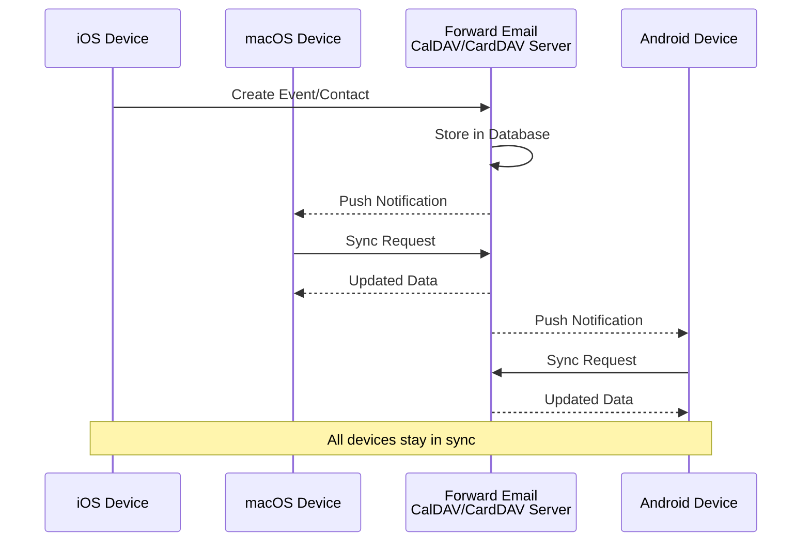

### Kalenderudvidelser IKKE Understøttet {#calendaring-extensions-not-supported}

Følgende kalenderudvidelser understøttes IKKE:

| RFC                                                       | Titel                                                                | Årsag                                                           |
| --------------------------------------------------------- | -------------------------------------------------------------------- | ---------------------------------------------------------------- |
| [RFC 4918](https://datatracker.ietf.org/doc/html/rfc4918) | HTTP Extensions for Web Distributed Authoring and Versioning (WebDAV) | CalDAV bruger WebDAV-koncepter, men implementerer ikke hele RFC 4918 |
| [RFC 6578](https://datatracker.ietf.org/doc/html/rfc6578) | Collection Synchronization for WebDAV                                | Ikke implementeret                                              |
| [RFC 3744](https://datatracker.ietf.org/doc/html/rfc3744) | WebDAV Access Control Protocol                                       | Ikke implementeret                                              |

---


## E-mail Beskedfiltrering {#email-message-filtering}

> \[!IMPORTANT]
> Forward Email tilbyder **fuld Sieve og ManageSieve-understøttelse** til serverbaseret e-mailfiltrering. Opret kraftfulde regler til automatisk sortering, filtrering, videresendelse og besvarelse af indkommende beskeder.

### Sieve (RFC 5228) {#sieve-rfc-5228}

[Sieve](https://en.wikipedia.org/wiki/Sieve_\(mail_filtering_language\)) er et standardiseret, kraftfuldt scriptsprog til serverbaseret e-mailfiltrering. Forward Email implementerer omfattende Sieve-understøttelse med 24 udvidelser.

**Kildekode:** [`helpers/sieve/`](https://github.com/forwardemail/forwardemail.net/tree/master/helpers/sieve)

#### Understøttede Kerne-Sieve RFC'er {#core-sieve-rfcs-supported}

| RFC                                                                                    | Titel                                                        | Status          |
| -------------------------------------------------------------------------------------- | ------------------------------------------------------------ | --------------- |
| [RFC 5228](https://datatracker.ietf.org/doc/html/rfc5228)                              | Sieve: Et e-mailfiltreringssprog                             | ✅ Fuld understøttelse |
| [RFC 5429](https://datatracker.ietf.org/doc/html/rfc5429)                              | Sieve e-mailfiltrering: Afvis og Udvidet Afvis-udvidelser    | ✅ Fuld understøttelse |
| [RFC 5230](https://datatracker.ietf.org/doc/html/rfc5230)                              | Sieve e-mailfiltrering: Ferieudvidelse                        | ✅ Fuld understøttelse |
| [RFC 6131](https://datatracker.ietf.org/doc/html/rfc6131)                              | Sieve ferieudvidelse: "Sekunder"-parameter                    | ✅ Fuld understøttelse |
| [RFC 5232](https://datatracker.ietf.org/doc/html/rfc5232)                              | Sieve e-mailfiltrering: Imap4flags-udvidelse                  | ✅ Fuld understøttelse |
| [RFC 5173](https://datatracker.ietf.org/doc/html/rfc5173)                              | Sieve e-mailfiltrering: Krop-udvidelse                        | ✅ Fuld understøttelse |
| [RFC 5229](https://datatracker.ietf.org/doc/html/rfc5229)                              | Sieve e-mailfiltrering: Variabel-udvidelse                    | ✅ Fuld understøttelse |
| [RFC 5231](https://datatracker.ietf.org/doc/html/rfc5231)                              | Sieve e-mailfiltrering: Relationel udvidelse                  | ✅ Fuld understøttelse |
| [RFC 4790](https://datatracker.ietf.org/doc/html/rfc4790)                              | Internet Application Protocol Collation Registry              | ✅ Fuld understøttelse |
| [RFC 3894](https://datatracker.ietf.org/doc/html/rfc3894)                              | Sieve-udvidelse: Kopiering uden bivirkninger                  | ✅ Fuld understøttelse |
| [RFC 5293](https://datatracker.ietf.org/doc/html/rfc5293)                              | Sieve e-mailfiltrering: Editheader-udvidelse                  | ✅ Fuld understøttelse |
| [RFC 5260](https://datatracker.ietf.org/doc/html/rfc5260)                              | Sieve e-mailfiltrering: Dato- og indeksudvidelser             | ✅ Fuld understøttelse |
| [RFC 5435](https://datatracker.ietf.org/doc/html/rfc5435)                              | Sieve e-mailfiltrering: Udvidelse for notifikationer          | ✅ Fuld understøttelse |
| [RFC 5183](https://datatracker.ietf.org/doc/html/rfc5183)                              | Sieve e-mailfiltrering: Miljøudvidelse                         | ✅ Fuld understøttelse |
| [RFC 5490](https://datatracker.ietf.org/doc/html/rfc5490)                              | Sieve e-mailfiltrering: Udvidelser til kontrol af postkassestatus | ✅ Fuld understøttelse |
| [RFC 8579](https://datatracker.ietf.org/doc/html/rfc8579)                              | Sieve e-mailfiltrering: Levering til specialbrug-postkasser   | ✅ Fuld understøttelse |
| [RFC 7352](https://datatracker.ietf.org/doc/html/rfc7352)                              | Sieve e-mailfiltrering: Detektering af dublerede leveringer   | ✅ Fuld understøttelse |
| [RFC 5463](https://datatracker.ietf.org/doc/html/rfc5463)                              | Sieve e-mailfiltrering: Ihave-udvidelse                        | ✅ Fuld understøttelse |
| [RFC 5233](https://datatracker.ietf.org/doc/html/rfc5233)                              | Sieve e-mailfiltrering: Subaddress-udvidelse                   | ✅ Fuld understøttelse |
| [draft-ietf-sieve-regex](https://datatracker.ietf.org/doc/html/draft-ietf-sieve-regex) | Sieve e-mailfiltrering: Regulært udtryk-udvidelse              | ✅ Fuld understøttelse |
#### Understøttede Sieve-udvidelser {#supported-sieve-extensions}

| Udvidelse                    | Beskrivelse                              | Integration                                |
| ---------------------------- | ---------------------------------------- | ------------------------------------------ |
| `fileinto`                   | Fil beskeder ind i specifikke mapper      | Beskeder gemt i angivet IMAP-mappe         |
| `reject` / `ereject`         | Afvis beskeder med en fejl                | SMTP-afvisning med bounce-besked            |
| `vacation`                   | Automatiske ferie-/fraværssvar            | Køet via Emails.queue med hastighedsbegrænsning |
| `vacation-seconds`           | Finmasket ferie-svar interval             | TTL fra `:seconds` parameter                 |
| `imap4flags`                 | Sæt IMAP-flag (\Seen, \Flagged, osv.)     | Flag anvendt under beskedlagring             |
| `envelope`                   | Test af kuvert afsender/modtager           | Adgang til SMTP-kuvertdata                   |
| `body`                       | Test af beskedens indhold                  | Fuld tekstmatch i brødtekst                   |
| `variables`                  | Gem og brug variabler i scripts            | Variabeludvidelse med modifikatorer           |
| `relational`                 | Relationelle sammenligninger               | `:count`, `:value` med gt/lt/eq               |
| `comparator-i;ascii-numeric` | Numeriske sammenligninger                  | Numerisk strengsammenligning                   |
| `copy`                       | Kopiér beskeder ved videresendelse         | `:copy` flag på fileinto/redirect              |
| `editheader`                 | Tilføj eller slet beskedhoveder             | Hoveder ændret før lagring                      |
| `date`                       | Test af dato/tidsværdier                    | `currentdate` og header-dato tests              |
| `index`                      | Adgang til specifikke header-forekomster    | `:index` for multi-værdi hoveder                 |
| `regex`                      | Regulære udtryk matchning                    | Fuld regex-understøttelse i tests                |
| `enotify`                    | Send notifikationer                          | `mailto:` notifikationer via Emails.queue        |
| `environment`                | Adgang til miljøinformation                  | Domæne, host, remote-ip fra session              |
| `mailbox`                    | Test af postkassens eksistens                | `mailboxexists` test                              |
| `special-use`                | Fil ind i special-use postkasser             | Mapper \Junk, \Trash, osv. til mapper             |
| `duplicate`                  | Registrer dublerede beskeder                  | Redis-baseret dubletsporing                        |
| `ihave`                      | Test for udvidelses tilgængelighed            | Runtime kapabilitetstjek                           |
| `subaddress`                 | Adgang til bruger+detalje adresse dele        | `:user` og `:detail` adresse dele                  |

#### Sieve-udvidelser IKKE understøttet {#sieve-extensions-not-supported}

| Udvidelse                               | RFC                                                       | Årsag                                                           |
| --------------------------------------- | --------------------------------------------------------- | ---------------------------------------------------------------- |
| `include`                               | [RFC 6609](https://datatracker.ietf.org/doc/html/rfc6609) | Sikkerhedsrisiko (script-injektion), kræver global script-lagring |
| `mboxmetadata` / `servermetadata`       | [RFC 5490](https://datatracker.ietf.org/doc/html/rfc5490) | Kræver IMAP METADATA-udvidelse                                  |
| `fcc`                                   | [RFC 8580](https://datatracker.ietf.org/doc/html/rfc8580) | Kræver integration med Sendt-mappe                              |
| `encoded-character`                     | [RFC 5228](https://datatracker.ietf.org/doc/html/rfc5228) | Parserændringer krævet for ${hex:} syntaks                      |
| `foreverypart` / `mime` / `extracttext` | [RFC 5703](https://datatracker.ietf.org/doc/html/rfc5703) | Kompleks MIME-træ-manipulation                                  |
#### Sieve-behandlingsflow {#sieve-processing-flow}

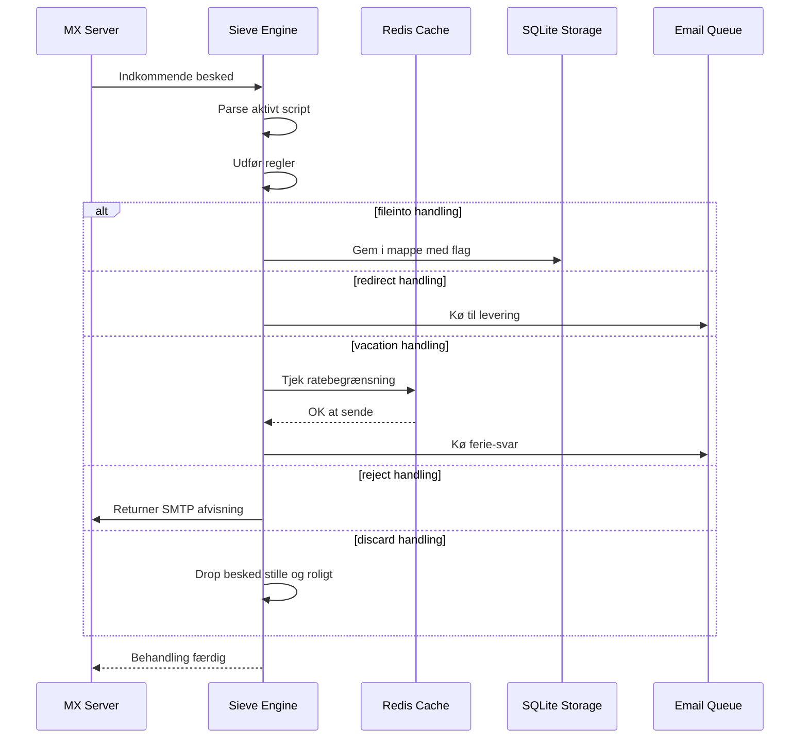

#### Sikkerhedsfunktioner {#security-features}

Forward Emails Sieve-implementering inkluderer omfattende sikkerhedsbeskyttelser:

* **CVE-2023-26430 Beskyttelse**: Forhindrer redirect loops og mail bombing angreb
* **Ratebegrænsning**: Begrænsninger på redirects (10/besked, 100/dag) og ferie-svar
* **Denylist Kontrol**: Redirect-adresser kontrolleres mod denylist
* **Beskyttede Headers**: DKIM, ARC og autentificeringsheaders kan ikke ændres via editheader
* **Scriptstørrelsesgrænser**: Maksimal scriptstørrelse håndhæves
* **Udførelsestidsgrænser**: Scripts afbrydes, hvis udførelsen overskrider tidsgrænse

#### Eksempel på Sieve-scripts {#example-sieve-scripts}

**Fil newsletters i en mappe:**

```sieve
require ["fileinto"];

if header :contains "List-Id" "newsletter" {
    fileinto "Newsletters";
}
```

**Ferie-autosvar med finmasket timing:**

```sieve
require ["vacation", "vacation-seconds"];

vacation :seconds 3600 :subject "Out of Office"
    "Jeg er i øjeblikket væk og vil svare inden for 24 timer.";
```

**Spamfiltrering med flag:**

```sieve
require ["fileinto", "imap4flags"];

if header :contains "X-Spam-Status" "Yes" {
    setflag "\\Seen";
    fileinto "Junk";
}
```

**Kompleks filtrering med variabler:**

```sieve
require ["variables", "fileinto", "regex"];

if header :regex "From" "(.+)@example\\.com" {
    set :lower "sender" "${1}";
    fileinto "Contacts/${sender}";
}
```

> \[!TIP]
> For komplet dokumentation, eksempelscripts og konfigurationsinstruktioner, se [FAQ: Understøtter I Sieve e-mail filtrering?](/faq#do-you-support-sieve-email-filtering)

### ManageSieve (RFC 5804) {#managesieve-rfc-5804}

Forward Email tilbyder fuld ManageSieve protokolunderstøttelse til fjernstyring af Sieve scripts.

**Kildekode:** [`managesieve-server.js`](https://github.com/forwardemail/forwardemail.net/blob/master/managesieve-server.js)

| RFC                                                       | Titel                                          | Status         |
| --------------------------------------------------------- | ---------------------------------------------- | -------------- |
| [RFC 5804](https://datatracker.ietf.org/doc/html/rfc5804) | En protokol til fjernstyring af Sieve scripts | ✅ Fuldt understøttet |

#### ManageSieve Server Konfiguration {#managesieve-server-configuration}

| Indstilling             | Værdi                   |
| ----------------------- | ----------------------- |
| **Server**              | `imap.forwardemail.net` |
| **Port (STARTTLS)**     | `2190` (anbefalet)      |
| **Port (Implicit TLS)** | `4190`                  |
| **Autentificering**      | PLAIN (over TLS)        |

> **Bemærk:** Port 2190 bruger STARTTLS (opgradering fra plain til TLS) og er kompatibel med de fleste ManageSieve-klienter inklusive [sieve-connect](https://github.com/philpennock/sieve-connect). Port 4190 bruger implicit TLS (TLS fra forbindelsesstart) til klienter, der understøtter det.

#### Understøttede ManageSieve Kommandoer {#supported-managesieve-commands}

| Kommando       | Beskrivelse                             |
| -------------- | --------------------------------------- |
| `AUTHENTICATE` | Autentificer ved brug af PLAIN mekanisme |
| `CAPABILITY`   | List serverfunktioner og udvidelser     |
| `HAVESPACE`    | Tjek om script kan gemmes               |
| `PUTSCRIPT`    | Upload et nyt script                    |
| `LISTSCRIPTS`  | List alle scripts med aktiv status      |
| `SETACTIVE`    | Aktivér et script                       |
| `GETSCRIPT`    | Download et script                      |
| `DELETESCRIPT` | Slet et script                         |
| `RENAMESCRIPT` | Omdøb et script                        |
| `CHECKSCRIPT`  | Valider scriptsyntaks                   |
| `NOOP`         | Hold forbindelsen aktiv                 |
| `LOGOUT`       | Afslut session                         |
#### Kompatible ManageSieve-klienter {#compatible-managesieve-clients}

* **Thunderbird**: Indbygget Sieve-understøttelse via [Sieve add-on](https://addons.thunderbird.net/addon/sieve/)
* **Roundcube**: [ManageSieve plugin](https://plugins.roundcube.net/packages/johndoh/sieve)
* **KMail**: Indbygget ManageSieve-understøttelse
* **sieve-connect**: Kommandolinjeklient
* **Enhver RFC 5804-kompatibel klient**

#### ManageSieve-protokolflow {#managesieve-protocol-flow}

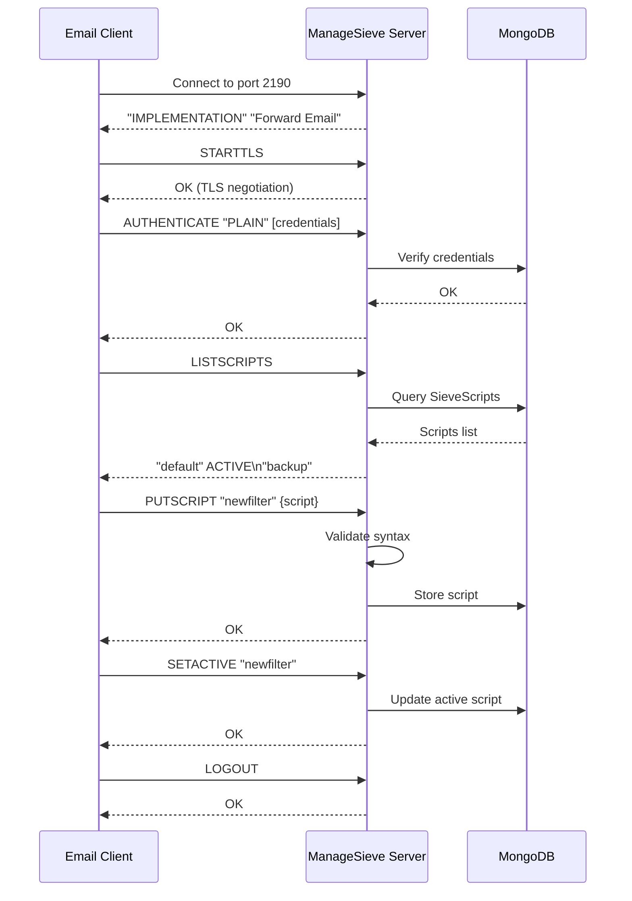

#### Webinterface og API {#web-interface-and-api}

Ud over ManageSieve tilbyder Forward Email:

* **Web Dashboard**: Opret og administrer Sieve-scripts via webinterfacet under Min Konto → Domæner → Aliaser → Sieve Scripts
* **REST API**: Programmatisk adgang til Sieve-scriptadministration via [Forward Email API](/api#sieve-scripts)

> \[!TIP]
> For detaljerede opsætningsinstruktioner og klientkonfiguration, se [FAQ: Understøtter I Sieve e-mailfiltrering?](/faq#do-you-support-sieve-email-filtering)

---


## Lageroptimering {#storage-optimization}

> \[!IMPORTANT]
> **Branchens Første Lagerteknologi:** Forward Email er den **eneste e-mailudbyder i verden**, der kombinerer vedhæftnings-deduplicering med Brotli-komprimering på e-mailindhold. Denne to-lags optimering giver dig **2-3x mere effektiv lagerplads** sammenlignet med traditionelle e-mailudbydere.

Forward Email implementerer to revolutionerende lageroptimeringsteknikker, der dramatisk reducerer postkassestørrelsen samtidig med fuld RFC-overholdelse og beskedtrofasthed:

1. **Vedhæftnings-deduplicering** - Eliminerer dublerede vedhæftninger på tværs af alle e-mails
2. **Brotli-komprimering** - Reducerer lagerplads med 46-86% for metadata og 50% for vedhæftninger

### Arkitektur: To-lags Lageroptimering {#architecture-dual-layer-storage-optimization}

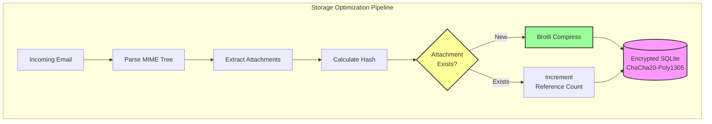

---


## Vedhæftnings-deduplicering {#attachment-deduplication}

Forward Email implementerer vedhæftnings-deduplicering baseret på [WildDucks gennemprøvede tilgang](https://docs.wildduck.email/docs/in-depth/attachment-deduplication/), tilpasset til SQLite-lagring.

> \[!NOTE]
> **Hvad der deduplikeres:** "Vedhæftning" refererer til det **kodede** MIME-nodeindhold (base64 eller quoted-printable), ikke den dekodede fil. Dette bevarer gyldigheden af DKIM- og GPG-signaturer.

### Sådan virker det {#how-it-works}

**WildDucks oprindelige implementering (MongoDB GridFS):**

> Wild Duck IMAP-serveren deduplikerer vedhæftninger. "Vedhæftning" i dette tilfælde betyder det base64- eller quoted-printable-kodede mime-nodeindhold, ikke den dekodede fil. Selvom brug af kodet indhold medfører mange falske negativer (den samme fil i forskellige e-mails kan tælles som forskellige vedhæftninger), er det nødvendigt for at garantere gyldigheden af forskellige signaturskemaer (DKIM, GPG osv.). En besked hentet fra Wild Duck ser præcis ud som den besked, der blev gemt, selvom Wild Duck parser beskeden til et træ-lignende objekt og genopbygger beskeden ved hentning.
**Forward Email's SQLite-implementering:**

Forward Email tilpasser denne tilgang til krypteret SQLite-lagring med følgende proces:

1. **Hash-beregning**: Når en vedhæftning findes, beregnes en hash ved hjælp af [`rev-hash`](https://github.com/sindresorhus/rev-hash) biblioteket fra vedhæftningens indhold
2. **Opslag**: Tjek om en vedhæftning med matchende hash findes i `Attachments` tabellen
3. **Referenceoptælling**:
   * Hvis findes: Forøg reference-tæller med 1 og magic-tæller med tilfældigt tal
   * Hvis ny: Opret ny vedhæftningspost med tæller = 1
4. **Sletningssikkerhed**: Bruger dual-tæller system (reference + magic) for at forhindre falske positiver
5. **Affaldsindsamling**: Vedhæftninger slettes straks, når begge tællere når nul

**Kildekode:** [`helpers/attachment-storage.js`](https://github.com/forwardemail/forwardemail.net/blob/master/helpers/attachment-storage.js)

### Dedupliceringsflow {#deduplication-flow}

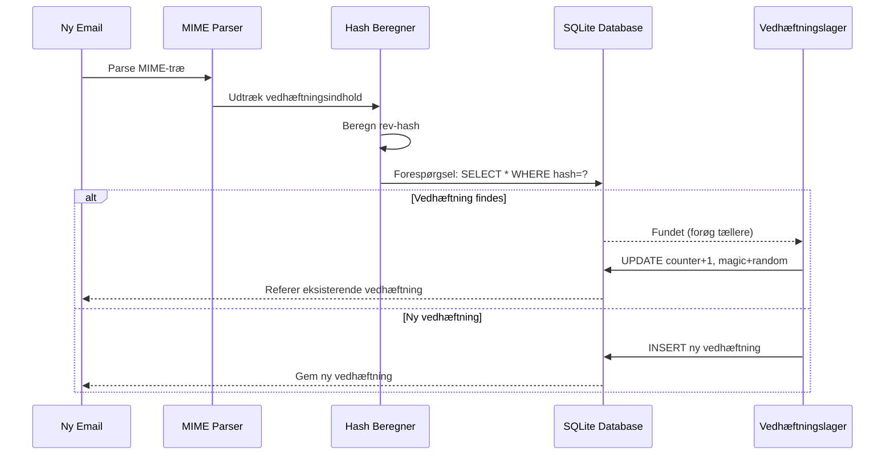

### Magic Number System {#magic-number-system}

Forward Email bruger WildDucks "magic number" system (inspireret af [Mail.ru](https://github.com/zone-eu/wildduck)) for at forhindre falske positiver under sletning:

* Hver besked får tildelt et **tilfældigt tal**
* Vedhæftningens **magic-tæller** forøges med dette tilfældige tal, når beskeden tilføjes
* Magic-tælleren formindskes med samme tal, når beskeden slettes
* Vedhæftningen slettes kun, når **begge tællere** (reference + magic) når nul

Dette dual-tæller system sikrer, at hvis noget går galt under sletning (f.eks. nedbrud, netværksfejl), slettes vedhæftningen ikke for tidligt.

### Væsentlige forskelle: WildDuck vs Forward Email {#key-differences-wildduck-vs-forward-email}

| Funktion               | WildDuck (MongoDB)       | Forward Email (SQLite)       |
| ---------------------- | ------------------------ | ---------------------------- |
| **Lagringsbackend**    | MongoDB GridFS (opdelt)  | SQLite BLOB (direkte)        |
| **Hash-algoritme**     | SHA256                   | rev-hash (baseret på SHA-256)|
| **Referenceoptælling** | ✅ Ja                    | ✅ Ja                        |
| **Magic Numbers**      | ✅ Ja (Mail.ru inspireret)| ✅ Ja (samme system)         |
| **Affaldsindsamling**  | Forsinket (separat job)  | Øjeblikkelig (ved nul tællere)|
| **Komprimering**       | ❌ Ingen                 | ✅ Brotli (se nedenfor)       |
| **Kryptering**         | ❌ Valgfri               | ✅ Altid (ChaCha20-Poly1305)  |

---


## Brotli-komprimering {#brotli-compression}

> \[!IMPORTANT]
> **Verdens første:** Forward Email er den **eneste emailtjeneste i verden**, der bruger Brotli-komprimering på emailindhold. Dette giver **46-86% lagerbesparelser** oven i vedhæftningsdeduplikering.

Forward Email implementerer Brotli-komprimering for både vedhæftningsindhold og beskedmetadata, hvilket giver massive lagerbesparelser samtidig med bagudkompatibilitet.

**Implementering:** [`helpers/msgpack-helpers.js`](https://github.com/forwardemail/forwardemail.net/blob/master/helpers/msgpack-helpers.js)

### Hvad bliver komprimeret {#what-gets-compressed}

**1. Vedhæftningsindhold** (`encodeAttachmentBody`)

* **Gamle formater**: Hex-kodet streng (2x størrelse) eller rå Buffer
* **Nyt format**: Brotli-komprimeret Buffer med "FEBR" magic header
* **Komprimeringsbeslutning**: Komprimerer kun, hvis det sparer plads (tager højde for 4-byte header)
* **Lagerbesparelse**: Op til **50%** (hex → native BLOB)
**2. Meddelelsesmetadata** (`encodeMetadata`)

Inkluderer: `mimeTree`, `headers`, `envelope`, `flags`

* **Gammelt format**: JSON tekststreng
* **Nyt format**: Brotli-komprimeret Buffer
* **Lagringsbesparelse**: **46-86%** afhængigt af meddelelsens kompleksitet

### Komprimeringskonfiguration {#compression-configuration}

```javascript
// Brotli komprimeringsmuligheder optimeret til hastighed (niveau 4 er en god balance)
const BROTLI_COMPRESS_OPTIONS = {
  params: {
    [zlib.constants.BROTLI_PARAM_QUALITY]: 4
  }
};
```

**Hvorfor niveau 4?**

* **Hurtig komprimering/dekomprimering**: Under millisekund behandling
* **God komprimeringsrate**: 46-86% besparelse
* **Balanceret ydeevne**: Optimalt til realtids e-mail operationer

### Magisk header: "FEBR" {#magic-header-febr}

Forward Email bruger en 4-byte magisk header til at identificere komprimerede vedhæftede filer:

```
"FEBR" = Forward Email BRotli
Hex: 0x46 0x45 0x42 0x52
```

**Hvorfor en magisk header?**

* **Formatdetektion**: Øjeblikkelig identifikation af komprimerede vs ukomprimerede data
* **Bagudkompatibilitet**: Gamle hex-strenge og rå Buffers virker stadig
* **Undgåelse af kollision**: "FEBR" er usandsynligt at optræde i starten af legitim vedhæftet data

### Komprimeringsproces {#compression-process}

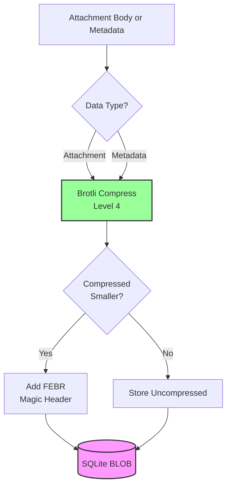

### Dekomprimeringsproces {#decompression-process}

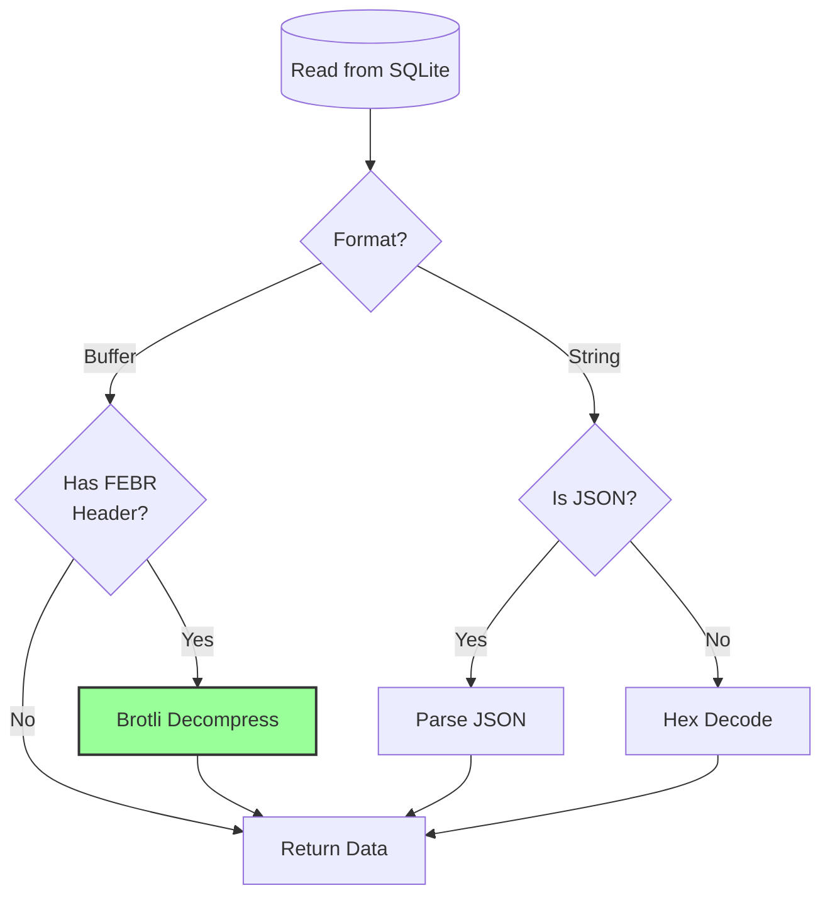

### Bagudkompatibilitet {#backwards-compatibility}

Alle dekoderfunktioner **auto-detekterer** lagringsformatet:

| Format                | Detektionsmetode                      | Håndtering                                   |
| --------------------- | ------------------------------------ | -------------------------------------------- |
| **Brotli-komprimeret** | Tjek for "FEBR" magisk header        | Dekomprimer med `zlib.brotliDecompressSync()` |
| **Rå Buffer**         | `Buffer.isBuffer()` uden magisk header | Returner som det er                          |
| **Hex-streng**        | Tjek for lige længde + [0-9a-f] tegn | Dekod med `Buffer.from(value, 'hex')`        |
| **JSON-streng**       | Tjek for `{` eller `[` som første tegn | Parse med `JSON.parse()`                      |

Dette sikrer **nul datatab** under migrering fra gamle til nye lagringsformater.

### Statistik for lagringsbesparelser {#storage-savings-statistics}

**Målte besparelser fra produktionsdata:**

| Datatype              | Gammelt format          | Nyt format             | Besparelse |
| --------------------- | ----------------------- | ---------------------- | ---------- |
| **Vedhæftede filer**  | Hex-kodet streng (2x)   | Brotli-komprimeret BLOB | **50%**    |
| **Meddelelsesmetadata** | JSON tekst              | Brotli-komprimeret BLOB | **46-86%** |
| **Mailbox flags**     | JSON tekst              | Brotli-komprimeret BLOB | **60-80%** |

**Kilde:** [`helpers/migrate-storage-format.js`](https://github.com/forwardemail/forwardemail.net/blob/master/helpers/migrate-storage-format.js)

### Migreringsproces {#migration-process}

Forward Email tilbyder automatisk, idempotent migrering fra gamle til nye lagringsformater:
// Migration statistics tracked:
{
  attachmentsMigrated: 0,
  messagesMigrated: 0,
  mailboxesMigrated: 0,
  bytesSaved: 0  // Total bytes saved from compression
}
```

**Migreringstrin:**

1. Vedhæftede filer: hex-kodning → native BLOB (50% besparelse)
2. Meddelelsesmetadata: JSON-tekst → brotli-komprimeret BLOB (46-86% besparelse)
3. Mailbox-flags: JSON-tekst → brotli-komprimeret BLOB (60-80% besparelse)

**Kilde:** [`helpers/migrate-storage-format.js`](https://github.com/forwardemail/forwardemail.net/blob/master/helpers/migrate-storage-format.js)

---

### Kombineret lagringseffektivitet {#combined-storage-efficiency}

> \[!TIP]
> **Reel verden effekt:** Med vedhæftnings-deduplicering + Brotli-komprimering får Forward Email-brugere **2-3x mere effektiv lagring** sammenlignet med traditionelle email-udbydere.

**Eksempelscenario:**

Traditionel email-udbyder (1GB mailbox):

* 1GB diskplads = 1GB emails
* Ingen deduplicering: Samme vedhæftning gemt 10 gange = 10x lagringsspild
* Ingen komprimering: Fuld JSON-metadata gemt = 2-3x lagringsspild

Forward Email (1GB mailbox):

* 1GB diskplads ≈ **2-3GB emails** (effektiv lagring)
* Deduplicering: Samme vedhæftning gemt én gang, refereret 10 gange
* Komprimering: 46-86% besparelse på metadata, 50% på vedhæftninger
* Kryptering: ChaCha20-Poly1305 (ingen lagringsomkostninger)

**Sammenligningstabel:**

| Udbyder           | Lagringsteknologi                            | Effektiv lagring (1GB mailbox) |
| ----------------- | -------------------------------------------- | ------------------------------ |
| Gmail             | Ingen                                        | 1GB                            |
| iCloud            | Ingen                                        | 1GB                            |
| Outlook.com       | Ingen                                        | 1GB                            |
| Fastmail          | Ingen                                        | 1GB                            |
| ProtonMail        | Kun kryptering                               | 1GB                            |
| Tutanota          | Kun kryptering                               | 1GB                            |
| **Forward Email** | **Deduplicering + Komprimering + Kryptering** | **2-3GB** ✨                    |

### Tekniske implementeringsdetaljer {#technical-implementation-details}

**Ydeevne:**

* Brotli niveau 4: Sub-millisekund komprimering/dekomprimering
* Ingen ydelsesnedsættelse fra komprimering
* SQLite FTS5: Under 50ms søgning med NVMe SSD

**Sikkerhed:**

* Komprimering sker **efter** kryptering (SQLite-databasen er krypteret)
* ChaCha20-Poly1305 kryptering + Brotli komprimering
* Zero-knowledge: Kun brugeren har dekrypteringskodeordet

**RFC-overholdelse:**

* Meddelelser hentet ser **præcis ens** ud som gemt
* DKIM-signaturer forbliver gyldige (kodet indhold bevaret)
* GPG-signaturer forbliver gyldige (ingen ændring af signeret indhold)

### Hvorfor ingen andre udbydere gør dette {#why-no-other-provider-does-this}

**Kompleksitet:**

* Kræver dyb integration med lagringslaget
* Bagudkompatibilitet er udfordrende
* Migration fra gamle formater er kompleks

**Ydelsesbekymringer:**

* Komprimering tilføjer CPU-overhead (løst med Brotli niveau 4)
* Dekomprimering ved hver læsning (løst med SQLite caching)

**Forward Emails fordel:**

* Bygget fra bunden med optimering for øje
* SQLite tillader direkte BLOB-manipulation
* Krypterede bruger-databaser muliggør sikker komprimering

---

---


## Moderne funktioner {#modern-features}


## Komplett REST API til email-administration {#complete-rest-api-for-email-management}

> \[!TIP]
> Forward Email tilbyder et omfattende REST API med 39 endpoints til programmatisk email-administration.

> \[!TIP]
> **Unikt branchetræk:** I modsætning til alle andre email-tjenester tilbyder Forward Email komplet programmatisk adgang til din mailbox, kalender, kontakter, beskeder og mapper via et omfattende REST API. Dette er direkte interaktion med din krypterede SQLite-databasefil, der gemmer alle dine data.

Forward Email tilbyder et komplet REST API, der giver hidtil uset adgang til dine email-data. Ingen anden email-tjeneste (inklusive Gmail, iCloud, Outlook, ProtonMail, Tuta eller Fastmail) tilbyder dette niveau af omfattende, direkte databaseadgang.
**API Dokumentation:** <https://forwardemail.net/en/email-api>

### API Kategorier (39 Endpoints) {#api-categories-39-endpoints}

**1. Beskeder API** (5 endpoints) - Fuld CRUD operationer på e-mail beskeder:

* `GET /v1/messages` - Liste beskeder med 15+ avancerede søgeparametre (ingen anden tjeneste tilbyder dette)
* `POST /v1/messages` - Opret/send beskeder
* `GET /v1/messages/:id` - Hent besked
* `PUT /v1/messages/:id` - Opdater besked (flag, mapper)
* `DELETE /v1/messages/:id` - Slet besked

*Eksempel: Find alle fakturaer fra sidste kvartal med vedhæftninger:*

```bash
curl -u "alias@domain.com:password" \
  "https://api.forwardemail.net/v1/messages?q=subject:invoice+has:attachment+after:2024-01-01+before:2024-04-01"
```

Se [Avanceret Søgedokumentation](https://forwardemail.net/en/email-api)

**2. Mapper API** (5 endpoints) - Fuld IMAP mappehåndtering via REST:

* `GET /v1/folders` - Liste alle mapper
* `POST /v1/folders` - Opret mappe
* `GET /v1/folders/:id` - Hent mappe
* `PUT /v1/folders/:id` - Opdater mappe
* `DELETE /v1/folders/:id` - Slet mappe

**3. Kontakter API** (5 endpoints) - CardDAV kontaktlagring via REST:

* `GET /v1/contacts` - Liste kontakter
* `POST /v1/contacts` - Opret kontakt (vCard format)
* `GET /v1/contacts/:id` - Hent kontakt
* `PUT /v1/contacts/:id` - Opdater kontakt
* `DELETE /v1/contacts/:id` - Slet kontakt

**4. Kalendere API** (5 endpoints) - Kalendercontainerhåndtering:

* `GET /v1/calendars` - Liste kalendercontainere
* `POST /v1/calendars` - Opret kalender (f.eks. "Arbejds Kalender", "Personlig Kalender")
* `GET /v1/calendars/:id` - Hent kalender
* `PUT /v1/calendars/:id` - Opdater kalender
* `DELETE /v1/calendars/:id` - Slet kalender

**5. Kalenderbegivenheder API** (5 endpoints) - Begivenhedsplanlægning inden for kalendere:

* `GET /v1/calendar-events` - Liste begivenheder
* `POST /v1/calendar-events` - Opret begivenhed med deltagere
* `GET /v1/calendar-events/:id` - Hent begivenhed
* `PUT /v1/calendar-events/:id` - Opdater begivenhed
* `DELETE /v1/calendar-events/:id` - Slet begivenhed

*Eksempel: Opret en kalenderbegivenhed:*

```bash
curl -u "alias@domain.com:password" \
  -X POST \
  -H "Content-Type: application/json" \
  -d '{"title":"Team Meeting","start":"2024-12-20T10:00:00Z","attendees":["team@example.com"],"calendar_id":"calendar123"}' \
  https://api.forwardemail.net/v1/calendar-events
```

### Tekniske Detaljer {#technical-details}

* **Autentificering:** Simpel `alias:password` autentificering (ingen OAuth kompleksitet)
* **Ydeevne:** Under 50ms svartider med SQLite FTS5 og NVMe SSD lagring
* **Ingen Netværksforsinkelse:** Direkte databaseadgang, ikke proxied gennem eksterne tjenester

### Virkelige Anvendelsestilfælde {#real-world-use-cases}

* **E-mail Analyse:** Byg brugerdefinerede dashboards til at spore e-mail volumen, svartider, afsenderstatistikker

* **Automatiserede Arbejdsgange:** Udløs handlinger baseret på e-mail indhold (faktura behandling, supportsager)

* **CRM Integration:** Synkroniser e-mail samtaler med dit CRM automatisk

* **Overholdelse & Opdagelse:** Søg og eksporter e-mails til juridiske/overholdelsesformål

* **Brugerdefinerede E-mail Klienter:** Byg specialiserede e-mail interfaces til din arbejdsgang

* **Forretningsintelligens:** Analyser kommunikationsmønstre, svartider, kundeengagement

* **Dokumenthåndtering:** Udtræk og kategoriser vedhæftninger automatisk

* [Komplet Dokumentation](https://forwardemail.net/en/email-api)

* [Komplet API Reference](https://forwardemail.net/en/email-api)

* [Avanceret Søgeguide](https://forwardemail.net/en/email-api)

* [30+ Integrations Eksempler](https://forwardemail.net/en/email-api)

* [Teknisk Arkitektur](https://forwardemail.net/en/blog/docs/best-quantum-safe-encrypted-email-service)

Forward Email tilbyder en moderne REST API, der giver fuld kontrol over e-mail konti, domæner, aliaser og beskeder. Denne API fungerer som et kraftfuldt alternativ til JMAP og tilbyder funktionalitet ud over traditionelle e-mail protokoller.

| Kategori                | Endpoints | Beskrivelse                             |
| ----------------------- | --------- | --------------------------------------- |
| **Konto Administration**| 8         | Brugerkonti, autentificering, indstillinger |
| **Domæne Administration**| 12        | Tilpassede domæner, DNS, verifikation   |
| **Alias Administration** | 6         | E-mail aliaser, videresendelse, catch-all |
| **Besked Administration**| 7         | Send, modtag, søg, slet beskeder        |
| **Kalender & Kontakter** | 4         | CalDAV/CardDAV adgang via API            |
| **Logs & Analyse**       | 2         | E-mail logs, leveringsrapporter          |
### Vigtige API-funktioner {#key-api-features}

**Avanceret søgning:**

API'en tilbyder kraftfulde søgefunktioner med forespørgsels-syntaks lignende Gmail:

```
GET /v1/messages?q=subject:invoice+has:attachment+after:2024-01-01+before:2024-04-01
```

**Understøttede søgeoperatorer:**

* `from:` - Søg efter afsender
* `to:` - Søg efter modtager
* `subject:` - Søg efter emne
* `has:attachment` - Beskeder med vedhæftninger
* `is:unread` - Ulæste beskeder
* `is:starred` - Markerede beskeder
* `after:` - Beskeder efter dato
* `before:` - Beskeder før dato
* `label:` - Beskeder med label
* `filename:` - Vedhæftningsfilnavn

**Kalenderhåndtering:**

```
GET /v1/calendar-events
POST /v1/calendar-events
PUT /v1/calendar-events/:id
DELETE /v1/calendar-events/:id
```

**Webhook-integrationer:**

API'en understøtter webhooks til realtidsnotifikationer om e-mail-hændelser (modtaget, sendt, afvist osv.).

**Autentificering:**

* API-nøgle autentificering
* OAuth 2.0 support
* Ratebegrænsning: 1000 forespørgsler/time

**Dataformat:**

* JSON forespørgsel/svar
* RESTful design
* Understøttelse af paginering

**Sikkerhed:**

* Kun HTTPS
* Rotation af API-nøgle
* IP-whitelistning (valgfrit)
* Signering af forespørgsler (valgfrit)

### API-arkitektur {#api-architecture}

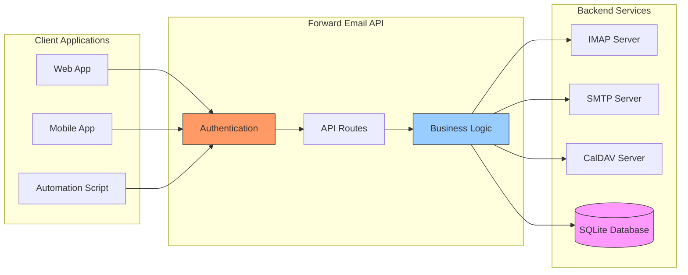

---


## iOS Push-notifikationer {#ios-push-notifications}

> \[!TIP]
> Forward Email understøtter native iOS push-notifikationer gennem XAPPLEPUSHSERVICE for øjeblikkelig e-mail levering.

> \[!IMPORTANT]
> **Unik funktion:** Forward Email er en af de få open source e-mail-servere, der understøtter native iOS push-notifikationer for e-mail, kontakter og kalendere via `XAPPLEPUSHSERVICE` IMAP-udvidelsen. Denne er reverse-engineeret fra Apples protokol og leverer øjeblikkelig levering til iOS-enheder uden batteridræn.

Forward Email implementerer Apples proprietære XAPPLEPUSHSERVICE-udvidelse, som leverer native push-notifikationer til iOS-enheder uden behov for baggrundsafspørgning.

### Sådan fungerer det {#how-it-works-1}

**XAPPLEPUSHSERVICE** er en ikke-standard IMAP-udvidelse, der tillader iOS Mail-app at modtage øjeblikkelige push-notifikationer, når nye e-mails ankommer.

Forward Email implementerer den proprietære Apple Push Notification service (APNs) integration for IMAP, som tillader iOS Mail-app at modtage øjeblikkelige push-notifikationer, når nye e-mails ankommer.

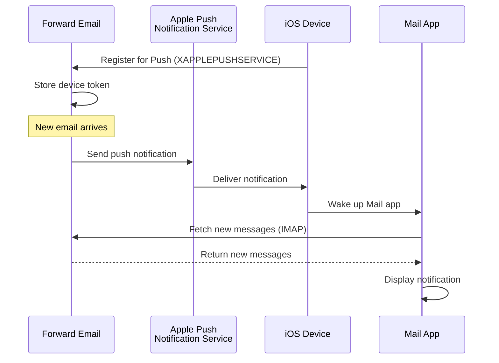

### Nøglefunktioner {#key-features}

**Øjeblikkelig levering:**

* Push-notifikationer ankommer inden for sekunder
* Ingen batteridrænende baggrundsafspørgning
* Fungerer selv når Mail-appen er lukket

<!---->

* **Øjeblikkelig levering:** E-mails, kalenderbegivenheder og kontakter vises på din iPhone/iPad med det samme, ikke efter en afspørgningsplan
* **Batterivenlig:** Bruger Apples push-infrastruktur i stedet for at opretholde konstante IMAP-forbindelser
* **Emnebaseret push:** Understøtter push-notifikationer for specifikke postkasser, ikke kun INBOX
* **Ingen tredjepartsapps nødvendige:** Fungerer med de native iOS Mail-, Kalender- og Kontakter-apps
**Indbygget Integration:**

* Indbygget i iOS Mail-app
* Ingen tredjepartsapps krævet
* Problemfri brugeroplevelse

**Privatlivsfokuseret:**

* Enhedstokens er krypterede
* Intet beskedindhold sendes gennem APNS
* Kun "ny mail" notifikation sendes

**Batteribesparende:**

* Ingen konstant IMAP-afspørgning
* Enheden sover indtil notifikation ankommer
* Minimal batteripåvirkning

### Hvad Gør Dette Specielt {#what-makes-this-special}

> \[!IMPORTANT]
> De fleste e-mailudbydere understøtter ikke XAPPLEPUSHSERVICE, hvilket tvinger iOS-enheder til at afspørge for ny mail hvert 15. minut.

De fleste open source e-mailservere (inklusive Dovecot, Postfix, Cyrus IMAP) understøtter IKKE iOS push-notifikationer. Brugere skal enten:

* Bruge IMAP IDLE (holder forbindelsen åben, dræner batteri)
* Bruge afspørgning (tjekker hvert 15-30 minut, forsinkede notifikationer)
* Bruge proprietære e-mailapps med deres egen push-infrastruktur

Forward Email leverer den samme øjeblikkelige push-notifikationsoplevelse som kommercielle tjenester som Gmail, iCloud og Fastmail.

**Sammenligning med Andre Udbydere:**

| Udbyder          | Push Support   | Afspørgningsinterval | Batteripåvirkning |
| ----------------- | -------------- | -------------------- | ----------------- |
| **Forward Email** | ✅ Indbygget Push | Øjeblikkelig         | Minimal           |
| Gmail             | ✅ Indbygget Push | Øjeblikkelig         | Minimal           |
| iCloud            | ✅ Indbygget Push | Øjeblikkelig         | Minimal           |
| Yahoo             | ✅ Indbygget Push | Øjeblikkelig         | Minimal           |
| Outlook.com       | ❌ Afspørgning   | 15 minutter          | Moderat           |
| Fastmail          | ❌ Afspørgning   | 15 minutter          | Moderat           |
| ProtonMail        | ⚠️ Kun Bridge   | Via Bridge           | Høj               |
| Tutanota          | ❌ Kun App      | Ikke relevant        | Ikke relevant     |

### Implementeringsdetaljer {#implementation-details}

**IMAP CAPABILITY Svar:**

```
* CAPABILITY IMAP4rev1 ... XAPPLEPUSHSERVICE ...
```

**Registreringsproces:**

1. iOS Mail-app opdager XAPPLEPUSHSERVICE kapabilitet
2. App registrerer enhedstoken hos Forward Email
3. Forward Email gemmer token og knytter den til konto
4. Når ny mail ankommer, sender Forward Email push via APNS
5. iOS vækker Mail-app for at hente nye beskeder

**Sikkerhed:**

* Enhedstokens er krypterede i hvile
* Tokens udløber og fornyes automatisk
* Intet beskedindhold eksponeres til APNS
* Ende-til-ende kryptering opretholdes

<!---->

* **IMAP Udvidelse:** `XAPPLEPUSHSERVICE`
* **Kildekode:** [WildDuck Issue #711](https://github.com/zone-eu/wildduck/issues/711)
* **Opsætning:** Automatisk - ingen konfiguration nødvendig, virker direkte med iOS Mail-app

### Sammenligning med Andre Tjenester {#comparison-with-other-services}

| Tjeneste      | iOS Push Support | Metode                                   |
| ------------- | ---------------- | ---------------------------------------- |
| Forward Email | ✅ Ja             | `XAPPLEPUSHSERVICE` (reverse-engineered) |
| Gmail         | ✅ Ja             | Proprietær Gmail-app + Google push       |
| iCloud Mail   | ✅ Ja             | Indbygget Apple-integration               |
| Outlook.com   | ✅ Ja             | Proprietær Outlook-app + Microsoft push  |
| Fastmail      | ✅ Ja             | `XAPPLEPUSHSERVICE`                       |
| Dovecot       | ❌ Nej            | Kun IMAP IDLE eller afspørgning           |
| Postfix       | ❌ Nej            | Kun IMAP IDLE eller afspørgning           |
| Cyrus IMAP    | ❌ Nej            | Kun IMAP IDLE eller afspørgning           |

**Gmail Push:**

Gmail bruger et proprietært push-system, der kun virker med Gmail-appen. iOS Mail-app skal afspørge Gmail IMAP-servere.

**iCloud Push:**

iCloud har indbygget push-support svarende til Forward Email, men kun for @icloud.com adresser.

**Outlook.com:**

Outlook.com understøtter ikke XAPPLEPUSHSERVICE, hvilket kræver at iOS Mail afspørger hvert 15. minut.

**Fastmail:**

Fastmail understøtter ikke XAPPLEPUSHSERVICE. Brugere skal bruge Fastmail-appen for push-notifikationer eller acceptere 15-minutters afspørgningsforsinkelser.

---


## Test og Verifikation {#testing-and-verification}


## Protokolkapabilitetstests {#protocol-capability-tests}
> \[!NOTE]
> Denne sektion giver resultaterne af vores seneste protokolkapabilitetstest, udført den 22. januar 2026.

Denne sektion indeholder de faktiske CAPABILITY/CAPA/EHLO-svar fra alle testede udbydere. Alle tests blev kørt den **22. januar 2026**.

Disse tests hjælper med at verificere den annoncerede og faktiske understøttelse af forskellige e-mailprotokoller og udvidelser på tværs af store udbydere.

### Testmetodologi {#test-methodology}

**Testmiljø:**

* **Dato:** 22. januar 2026 kl. 02:37 UTC
* **Placering:** AWS EC2-instans
* **IPv4:** 54.167.216.197
* **IPv6:** 2600:4040:46da:9a00:b19e:3ad4:426c:2f48
* **Værktøjer:** OpenSSL s_client, bash-scripts

**Testede udbydere:**

* Forward Email
* Gmail
* Outlook.com
* iCloud
* Fastmail
* Yahoo/AOL (Verizon)

### Testscripts {#test-scripts}

For fuld gennemsigtighed er de præcise scripts, der blev brugt til disse tests, angivet nedenfor.

#### IMAP Capability Test Script {#imap-capability-test-script}

```bash
#!/bin/bash
# IMAP Capability Test Script
# Tests IMAP CAPABILITY for various email providers

echo "========================================="
echo "IMAP CAPABILITY TEST"
echo "Date: $(date -u +"%Y-%m-%d %H:%M:%S UTC")"
echo "========================================="
echo ""

# Gmail
echo "--- Gmail (imap.gmail.com:993) ---"
echo -e "a001 CAPABILITY\na002 LOGOUT" | timeout 10 openssl s_client -connect imap.gmail.com:993 -crlf -quiet 2>&1 | grep -A 20 "CAPABILITY"
echo ""

# Outlook.com
echo "--- Outlook.com (outlook.office365.com:993) ---"
echo -e "a001 CAPABILITY\na002 LOGOUT" | timeout 10 openssl s_client -connect outlook.office365.com:993 -crlf -quiet 2>&1 | grep -A 20 "CAPABILITY"
echo ""

# iCloud
echo "--- iCloud (imap.mail.me.com:993) ---"
echo -e "a001 CAPABILITY\na002 LOGOUT" | timeout 10 openssl s_client -connect imap.mail.me.com:993 -crlf -quiet 2>&1 | grep -A 20 "CAPABILITY"
echo ""

# Fastmail
echo "--- Fastmail (imap.fastmail.com:993) ---"
echo -e "a001 CAPABILITY\na002 LOGOUT" | timeout 10 openssl s_client -connect imap.fastmail.com:993 -crlf -quiet 2>&1 | grep -A 20 "CAPABILITY"
echo ""

# Yahoo
echo "--- Yahoo (imap.mail.yahoo.com:993) ---"
echo -e "a001 CAPABILITY\na002 LOGOUT" | timeout 10 openssl s_client -connect imap.mail.yahoo.com:993 -crlf -quiet 2>&1 | grep -A 20 "CAPABILITY"
echo ""

# Forward Email
echo "--- Forward Email (imap.forwardemail.net:993) ---"
echo -e "a001 CAPABILITY\na002 LOGOUT" | timeout 10 openssl s_client -connect imap.forwardemail.net:993 -crlf -quiet 2>&1 | grep -A 20 "CAPABILITY"
echo ""

echo "========================================="
echo "Test completed"
echo "========================================="
```

#### POP3 Capability Test Script {#pop3-capability-test-script}

```bash
#!/bin/bash
# POP3 Capability Test Script
# Tests POP3 CAPA for various email providers

echo "========================================="
echo "POP3 CAPABILITY TEST"
echo "Date: $(date -u +"%Y-%m-%d %H:%M:%S UTC")"
echo "========================================="
echo ""

# Gmail
echo "--- Gmail (pop.gmail.com:995) ---"
echo -e "CAPA\nQUIT" | timeout 10 openssl s_client -connect pop.gmail.com:995 -crlf -quiet 2>&1 | grep -A 20 "CAPA"
echo ""

# Outlook.com
echo "--- Outlook.com (outlook.office365.com:995) ---"
echo -e "CAPA\nQUIT" | timeout 10 openssl s_client -connect outlook.office365.com:995 -crlf -quiet 2>&1 | grep -A 20 "CAPA"
echo ""

# iCloud (Bemærk: iCloud understøtter ikke POP3)
echo "--- iCloud (Ingen POP3-understøttelse) ---"
echo "iCloud understøtter ikke POP3"
echo ""

# Fastmail
echo "--- Fastmail (pop.fastmail.com:995) ---"
echo -e "CAPA\nQUIT" | timeout 10 openssl s_client -connect pop.fastmail.com:995 -crlf -quiet 2>&1 | grep -A 20 "CAPA"
echo ""

# Yahoo
echo "--- Yahoo (pop.mail.yahoo.com:995) ---"
echo -e "CAPA\nQUIT" | timeout 10 openssl s_client -connect pop.mail.yahoo.com:995 -crlf -quiet 2>&1 | grep -A 20 "CAPA"
echo ""

# Forward Email
echo "--- Forward Email (pop3.forwardemail.net:995) ---"
echo -e "CAPA\nQUIT" | timeout 10 openssl s_client -connect pop3.forwardemail.net:995 -crlf -quiet 2>&1 | grep -A 20 "CAPA"
echo ""

echo "========================================="
echo "Test completed"
echo "========================================="
```
#### SMTP Capability Test Script {#smtp-capability-test-script}

```bash
#!/bin/bash
# SMTP Capability Test Script
# Tests SMTP EHLO for various email providers

echo "========================================="
echo "SMTP CAPABILITY TEST"
echo "Date: $(date -u +"%Y-%m-%d %H:%M:%S UTC")"
echo "========================================="
echo ""

# Gmail
echo "--- Gmail (smtp.gmail.com:587) ---"
echo -e "EHLO test.com\nQUIT" | timeout 10 openssl s_client -connect smtp.gmail.com:587 -starttls smtp -crlf -quiet 2>&1 | grep -A 30 "250-"
echo ""

# Outlook.com
echo "--- Outlook.com (smtp.office365.com:587) ---"
echo -e "EHLO test.com\nQUIT" | timeout 10 openssl s_client -connect smtp.office365.com:587 -starttls smtp -crlf -quiet 2>&1 | grep -A 30 "250-"
echo ""

# iCloud
echo "--- iCloud (smtp.mail.me.com:587) ---"
echo -e "EHLO test.com\nQUIT" | timeout 10 openssl s_client -connect smtp.mail.me.com:587 -starttls smtp -crlf -quiet 2>&1 | grep -A 30 "250-"
echo ""

# Fastmail
echo "--- Fastmail (smtp.fastmail.com:587) ---"
echo -e "EHLO test.com\nQUIT" | timeout 10 openssl s_client -connect smtp.fastmail.com:587 -starttls smtp -crlf -quiet 2>&1 | grep -A 30 "250-"
echo ""

# Yahoo
echo "--- Yahoo (smtp.mail.yahoo.com:587) ---"
echo -e "EHLO test.com\nQUIT" | timeout 10 openssl s_client -connect smtp.mail.yahoo.com:587 -starttls smtp -crlf -quiet 2>&1 | grep -A 30 "250-"
echo ""

# Forward Email
echo "--- Forward Email (smtp.forwardemail.net:587) ---"
echo -e "EHLO test.com\nQUIT" | timeout 10 openssl s_client -connect smtp.forwardemail.net:587 -starttls smtp -crlf -quiet 2>&1 | grep -A 30 "250-"
echo ""

echo "========================================="
echo "Test completed"
echo "========================================="
```

### Test Results Summary {#test-results-summary}

#### IMAP (CAPABILITY) {#imap-capability}

**Forward Email**

```
* CAPABILITY IMAP4rev1 AUTH=PLAIN AUTH=PLAIN-CLIENTTOKEN CHILDREN ENABLE ID IDLE NAMESPACE QUOTA SASL-IR UNSELECT XLIST XAPPLEPUSHSERVICE
```

**Gmail**

```
* CAPABILITY IMAP4rev1 UNSELECT IDLE NAMESPACE QUOTA ID XLIST CHILDREN X-GM-EXT-1 UIDPLUS COMPRESS=DEFLATE ENABLE MOVE CONDSTORE ESEARCH UTF8=ACCEPT LIST-EXTENDED LIST-STATUS LITERAL- SPECIAL-USE
```

**iCloud**

```
* OK [CAPABILITY XAPPLEPUSHSERVICE IMAP4 IMAP4rev1 SASL-IR AUTH=ATOKEN AUTH=PLAIN AUTH=ATOKEN2 AUTH=XOAUTH2]
```

**Outlook.com**

```
* CAPABILITY IMAP4rev1 AUTH=PLAIN AUTH=XOAUTH2 SASL-IR UIDPLUS ID UNSELECT CHILDREN IDLE NAMESPACE LITERAL+
```

**Fastmail**

```
* CAPABILITY IMAP4rev1 ACL ANNOTATE-EXPERIMENT-1 CATENATE CONDSTORE ENABLE ESEARCH ESORT I18NLEVEL=1 ID IDLE LIST-EXTENDED LIST-STATUS LITERAL+ LOGINDISABLED MULTIAPPEND NAMESPACE QRESYNC QUOTA RIGHTS=ektx SASL-IR SORT SPECIAL-USE THREAD=ORDEREDSUBJECT UIDPLUS UNSELECT WITHIN X-RENAME XLIST
```

**Yahoo/AOL (Verizon)**

```
* CAPABILITY IMAP4rev1 IDLE NAMESPACE QUOTA ID XLIST CHILDREN UIDPLUS MOVE CONDSTORE ESEARCH ENABLE LIST-EXTENDED LIST-STATUS LITERAL- SPECIAL-USE UNSELECT XAPPLEPUSHSERVICE
```

#### POP3 (CAPA) {#pop3-capa}

**Forward Email**

```
+OK
CAPA
TOP
USER
UIDL
EXPIRE 30
IMPLEMENTATION ForwardEmail
.
```

**Gmail**

```
+OK
CAPA
TOP
USER
UIDL
EXPIRE 30
IMPLEMENTATION Gpop
.
```

**Outlook.com**

```
+OK
CAPA
TOP
USER
UIDL
SASL PLAIN XOAUTH2
.
```

**Fastmail**

```
+OK
CAPA
TOP
USER
UIDL
EXPIRE 30
IMPLEMENTATION Cyrus
.
```

#### SMTP (EHLO) {#smtp-ehlo}

**Forward Email**

```
250-smtp.forwardemail.net
250-PIPELINING
250-SIZE 52428800
250-ETRN
250-STARTTLS
250-ENHANCEDSTATUSCODES
250-8BITMIME
250-DSN
250 CHUNKING
```

**Gmail**

```
250-smtp.gmail.com at your service
250-SIZE 35882577
250-8BITMIME
250-STARTTLS
250-ENHANCEDSTATUSCODES
250-PIPELINING
250-CHUNKING
250 SMTPUTF8
```

**Outlook.com**

```
250-SN4PR13CA0005.outlook.office365.com Hello [x.x.x.x]
250-SIZE 157286400
250-PIPELINING
250-DSN
250-ENHANCEDSTATUSCODES
250-STARTTLS
250-8BITMIME
250-BINARYMIME
250-CHUNKING
250 SMTPUTF8
```

**Fastmail**

```
250-smtp.fastmail.com
250-PIPELINING
250-SIZE 78643200
250-ETRN
250-STARTTLS
250-ENHANCEDSTATUSCODES
250-8BITMIME
250-DSN
250 CHUNKING
```

**Yahoo/AOL (Verizon)**

```
250-smtp.mail.yahoo.com
250-PIPELINING
250-SIZE 41943040
250-8BITMIME
250-ENHANCEDSTATUSCODES
250-STARTTLS
```
### Detaljerede Testresultater {#detailed-test-results}

#### IMAP Testresultater {#imap-test-results}

**Gmail:**
`* CAPABILITY IMAP4rev1 UNSELECT IDLE NAMESPACE QUOTA ID XLIST CHILDREN X-GM-EXT-1 XYZZY SASL-IR AUTH=XOAUTH2 AUTH=PLAIN AUTH=PLAIN-CLIENTTOKEN AUTH=OAUTHBEARER`

**Outlook.com:**
`* CAPABILITY IMAP4 IMAP4rev1 AUTH=PLAIN AUTH=XOAUTH2 SASL-IR UIDPLUS ID UNSELECT CHILDREN IDLE NAMESPACE LITERAL+`

**iCloud:**
`* CAPABILITY XAPPLEPUSHSERVICE IMAP4 IMAP4rev1 SASL-IR AUTH=ATOKEN AUTH=PLAIN AUTH=ATOKEN2 AUTH=XOAUTH2`

**Fastmail:**
Forbindelsen udløb. Se noter nedenfor.

**Yahoo:**
`* CAPABILITY IMAP4rev1 SASL-IR AUTH=PLAIN AUTH=XOAUTH2 AUTH=OAUTHBEARER ID MOVE NAMESPACE XYMHIGHESTMODSEQ UIDPLUS LITERAL+ CHILDREN UNSELECT X-MSG-EXT OBJECTID IDLE ENABLE UIDONLY X-ALL-MAIL X-UIDONLY LIST-EXTENDED LIST-STATUS SPECIAL-USE PARTIAL APPENDLIMIT=41697280`

**Forward Email:**
`* CAPABILITY XAPPLEPUSHSERVICE IMAP4rev1 APPENDLIMIT=52428800 AUTH=PLAIN AUTH=PLAIN-CLIENTTOKEN CHILDREN CONDSTORE ENABLE ID IDLE MOVE NAMESPACE QUOTA SASL-IR SPECIAL-USE UIDPLUS UNSELECT UTF8=ACCEPT XLIST`

#### POP3 Testresultater {#pop3-test-results}

**Gmail:**
Forbindelsen returnerede ikke CAPA-svar uden autentificering.

**Outlook.com:**
Forbindelsen returnerede ikke CAPA-svar uden autentificering.

**iCloud:**
Ikke understøttet.

**Fastmail:**
Forbindelsen udløb. Se noter nedenfor.

**Yahoo:**
`+OK CAPA list follows... SASL PLAIN XOAUTH2`

**Forward Email:**
Forbindelsen returnerede ikke CAPA-svar uden autentificering.

#### SMTP Testresultater {#smtp-test-results}

**Gmail:**
`250-AUTH LOGIN PLAIN XOAUTH2 PLAIN-CLIENTTOKEN OAUTHBEARER XOAUTH`

**Outlook.com:**
`250-DSN`

**iCloud:**
`250-DSN`

**Fastmail:**
`250 AUTH PLAIN LOGIN XOAUTH2 OAUTHBEARER`

**Yahoo:**
`250 AUTH PLAIN LOGIN XOAUTH2 OAUTHBEARER`

**Forward Email:**
`250-DSN`, `250-REQUIRETLS`

### Noter om Testresultater {#notes-on-test-results}

> \[!NOTE]
> Vigtige observationer og begrænsninger fra testresultaterne.

1. **Fastmail Timeouts**: Fastmail-forbindelser udløb under testning, sandsynligvis på grund af ratebegrænsning eller firewall-restriktioner fra testserverens IP. Fastmail er kendt for at have robust IMAP/POP3/SMTP-understøttelse baseret på deres dokumentation.

2. **POP3 CAPA-svar**: Flere udbydere (Gmail, Outlook.com, Forward Email) returnerede ikke CAPA-svar uden autentificering. Dette er almindelig sikkerhedspraksis for POP3-servere.

3. **DSN-understøttelse**: Kun Outlook.com, iCloud og Forward Email reklamerer eksplicit for DSN-understøttelse i deres SMTP EHLO-svar. Det betyder ikke nødvendigvis, at andre udbydere ikke understøtter DSN, men de reklamerer ikke for det.

4. **REQUIRETLS**: Kun Forward Email reklamerer eksplicit for REQUIRETLS-understøttelse med en brugerrettet håndhævelsescheckbox. Andre udbydere kan understøtte det internt, men reklamerer ikke for det i EHLO.

5. **Testmiljø**: Testene blev udført fra en AWS EC2-instans (IP: 54.167.216.197 IPv4, 2600:4040:46da:9a00:b19e:3ad4:426c:2f48 IPv6) den 22. januar 2026 kl. 02:37 UTC.

---


## Resumé {#summary}

Forward Email leverer omfattende RFC-protokolunderstøttelse på tværs af alle større email-standarder:

* **IMAP4rev1:** 16 understøttede RFC'er med dokumenterede tilsigtede forskelle
* **POP3:** 4 understøttede RFC'er med RFC-kompatibel permanent sletning
* **SMTP:** 11 understøttede udvidelser inklusive SMTPUTF8, DSN og PIPELINING
* **Autentificering:** DKIM, SPF, DMARC, ARC fuldt understøttet
* **Transport Sikkerhed:** MTA-STS og REQUIRETLS fuldt understøttet, DANE delvis understøttelse
* **Kryptering:** OpenPGP v6 og S/MIME understøttet
* **Kalender:** CalDAV, CardDAV og VTODO fuldt understøttet
* **API Adgang:** Komplett REST API med 39 endpoints til direkte databaseadgang
* **iOS Push:** Native push-notifikationer for email, kontakter og kalendere via `XAPPLEPUSHSERVICE`

### Vigtige Differentieringspunkter {#key-differentiators}

> \[!TIP]
> Forward Email skiller sig ud med unikke funktioner, som ikke findes hos andre udbydere.

**Hvad gør Forward Email unikt:**

1. **Quantum-Sikker Kryptering** - Den eneste udbyder med ChaCha20-Poly1305 krypterede SQLite-mailbokse
2. **Zero-Knowledge Arkitektur** - Dit kodeord krypterer din mailboks; vi kan ikke dekryptere den
3. **Gratis Eget Domæne** - Ingen månedlige gebyrer for email på eget domæne
4. **REQUIRETLS Understøttelse** - Brugerrettet checkbox til håndhævelse af TLS for hele leveringsvejen
5. **Omfattende API** - 39 REST API endpoints til fuld programmatisk kontrol
6. **iOS Push Notifikationer** - Native XAPPLEPUSHSERVICE-understøttelse for øjeblikkelig levering
7. **Open Source** - Fuld kildekode tilgængelig på GitHub
8. **Privatlivsfokuseret** - Ingen dataindsamling, ingen reklamer, ingen tracking
* **Sandboxed Kryptering:** Den eneste emailtjeneste med individuelt krypterede SQLite-mailbokse  
* **RFC Overholdelse:** Prioriterer standardoverholdelse over bekvemmelighed (f.eks. POP3 DELE)  
* **Komplet API:** Direkte programmatisk adgang til alle emaildata  
* **Open Source:** Fuldstændig gennemsigtig implementering  

**Protokolunderstøttelse Oversigt:**  

| Kategori             | Understøttelsesniveau | Detaljer                                      |
| -------------------- | --------------------- | --------------------------------------------- |
| **Kerneprotokoller**  | ✅ Fremragende         | IMAP4rev1, POP3, SMTP fuldt understøttet     |
| **Moderne Protokoller** | ⚠️ Delvis            | IMAP4rev2 delvis understøttet, JMAP ikke understøttet |
| **Sikkerhed**         | ✅ Fremragende         | DKIM, SPF, DMARC, ARC, MTA-STS, REQUIRETLS    |
| **Kryptering**        | ✅ Fremragende         | OpenPGP, S/MIME, SQLite-kryptering            |
| **CalDAV/CardDAV**    | ✅ Fremragende         | Fuld kalender- og kontakt-synkronisering      |
| **Filtrering**        | ✅ Fremragende         | Sieve (24 udvidelser) og ManageSieve          |
| **API**               | ✅ Fremragende         | 39 REST API-endpoints                          |
| **Push**              | ✅ Fremragende         | Native iOS push-notifikationer                 |
