# E-Mail RFC-Protokollunterstützung – Vollständiger Leitfaden zu Standards & Spezifikationen {#email-rfc-protocol-support---complete-standards--specifications-guide}


## Inhaltsverzeichnis {#table-of-contents}

* [Über dieses Dokument](#about-this-document)
  * [Architekturübersicht](#architecture-overview)
* [Vergleich von E-Mail-Diensten – Protokollunterstützung & RFC-Standardkonformität](#email-service-comparison---protocol-support--rfc-standards-compliance)
  * [Visualisierung der Protokollunterstützung](#protocol-support-visualization)
* [Kern-E-Mail-Protokolle](#core-email-protocols)
  * [Ablauf des E-Mail-Protokolls](#email-protocol-flow)
* [IMAP4 E-Mail-Protokoll und Erweiterungen](#imap4-email-protocol-and-extensions)
  * [Unterschiede des IMAP-Protokolls zu RFC-Spezifikationen](#imap-protocol-differences-from-rfc-specifications)
  * [Nicht unterstützte IMAP-Erweiterungen](#imap-extensions-not-supported)
* [POP3 E-Mail-Protokoll und Erweiterungen](#pop3-email-protocol-and-extensions)
  * [Unterschiede des POP3-Protokolls zu RFC-Spezifikationen](#pop3-protocol-differences-from-rfc-specifications)
  * [Nicht unterstützte POP3-Erweiterungen](#pop3-extensions-not-supported)
* [SMTP E-Mail-Protokoll und Erweiterungen](#smtp-email-protocol-and-extensions)
  * [Zustellungsstatusbenachrichtigungen (DSN)](#delivery-status-notifications-dsn)
  * [REQUIRETLS-Unterstützung](#requiretls-support)
  * [Nicht unterstützte SMTP-Erweiterungen](#smtp-extensions-not-supported)
* [JMAP E-Mail-Protokoll](#jmap-email-protocol)
* [E-Mail-Sicherheit](#email-security)
  * [Architektur der E-Mail-Sicherheit](#email-security-architecture)
* [Authentifizierungsprotokolle für E-Mail-Nachrichten](#email-message-authentication-protocols)
  * [Unterstützung von Authentifizierungsprotokollen](#authentication-protocol-support)
  * [DKIM (DomainKeys Identified Mail)](#dkim-domainkeys-identified-mail)
  * [SPF (Sender Policy Framework)](#spf-sender-policy-framework)
  * [DMARC (Domain-based Message Authentication, Reporting & Conformance)](#dmarc-domain-based-message-authentication-reporting--conformance)
  * [ARC (Authenticated Received Chain)](#arc-authenticated-received-chain)
  * [Authentifizierungsablauf](#authentication-flow)
* [Transport-Sicherheitsprotokolle für E-Mail](#email-transport-security-protocols)
  * [Unterstützung der Transportsicherheit](#transport-security-support)
  * [TLS (Transport Layer Security)](#tls-transport-layer-security)
  * [MTA-STS (Mail Transfer Agent Strict Transport Security)](#mta-sts-mail-transfer-agent-strict-transport-security)
  * [DANE (DNS-basierte Authentifizierung benannter Entitäten)](#dane-dns-based-authentication-of-named-entities)
  * [REQUIRETLS](#requiretls)
  * [Ablauf der Transportsicherheit](#transport-security-flow)
* [Verschlüsselung von E-Mail-Nachrichten](#email-message-encryption)
  * [Unterstützung der Verschlüsselung](#encryption-support)
  * [OpenPGP (Pretty Good Privacy)](#openpgp-pretty-good-privacy)
  * [S/MIME (Secure/Multipurpose Internet Mail Extensions)](#smime-securemultipurpose-internet-mail-extensions)
  * [SQLite-Postfachverschlüsselung](#sqlite-mailbox-encryption)
  * [Vergleich der Verschlüsselung](#encryption-comparison)
  * [Verschlüsselungsablauf](#encryption-flow)
* [Erweiterte Funktionalität](#extended-functionality)
* [Standards für das E-Mail-Nachrichtenformat](#email-message-format-standards)
  * [Unterstützung der Formatstandards](#format-standards-support)
  * [MIME (Multipurpose Internet Mail Extensions)](#mime-multipurpose-internet-mail-extensions)
  * [SMTPUTF8 und Internationalisierung von E-Mail-Adressen](#smtputf8-and-email-address-internationalization)
* [Protokolle für Kalender und Kontakte](#calendaring-and-contacts-protocols)
  * [Unterstützung von CalDAV und CardDAV](#caldav-and-carddav-support)
  * [CalDAV (Kalenderzugriff)](#caldav-calendar-access)
  * [CardDAV (Kontaktzugriff)](#carddav-contact-access)
  * [Aufgaben und Erinnerungen (CalDAV VTODO)](#tasks-and-reminders-caldav-vtodo)
  * [Synchronisationsablauf CalDAV/CardDAV](#caldavcarddav-synchronization-flow)
  * [Nicht unterstützte Kalendererweiterungen](#calendaring-extensions-not-supported)
* [Filterung von E-Mail-Nachrichten](#email-message-filtering)
  * [Sieve (RFC 5228)](#sieve-rfc-5228)
  * [ManageSieve (RFC 5804)](#managesieve-rfc-5804)
* [Speicheroptimierung](#storage-optimization)
  * [Architektur: Speicheroptimierung in zwei Ebenen](#architecture-dual-layer-storage-optimization)
* [Anhang-Deduplizierung](#attachment-deduplication)
  * [Funktionsweise](#how-it-works)
  * [Deduplizierungsablauf](#deduplication-flow)
  * [Magic-Number-System](#magic-number-system)
  * [Wesentliche Unterschiede: WildDuck vs Forward Email](#key-differences-wildduck-vs-forward-email)
* [Brotli-Kompression](#brotli-compression)
  * [Was wird komprimiert](#what-gets-compressed)
  * [Kompressionskonfiguration](#compression-configuration)
  * [Magic-Header: "FEBR"](#magic-header-febr)
  * [Kompressionsprozess](#compression-process)
  * [Dekompressionsprozess](#decompression-process)
  * [Abwärtskompatibilität](#backwards-compatibility)
  * [Statistiken zu Speicherersparnissen](#storage-savings-statistics)
  * [Migrationsprozess](#migration-process)
  * [Kombinierte Speichereffizienz](#combined-storage-efficiency)
  * [Technische Implementierungsdetails](#technical-implementation-details)
  * [Warum kein anderer Anbieter das macht](#why-no-other-provider-does-this)
* [Moderne Funktionen](#modern-features)
* [Vollständige REST-API für E-Mail-Verwaltung](#complete-rest-api-for-email-management)
  * [API-Kategorien (39 Endpunkte)](#api-categories-39-endpoints)
  * [Technische Details](#technical-details)
  * [Praxisbeispiele](#real-world-use-cases)
  * [Wichtige API-Funktionen](#key-api-features)
  * [API-Architektur](#api-architecture)
* [iOS-Push-Benachrichtigungen](#ios-push-notifications)
  * [Funktionsweise](#how-it-works-1)
  * [Wichtige Funktionen](#key-features)
  * [Was das besonders macht](#what-makes-this-special)
  * [Implementierungsdetails](#implementation-details)
  * [Vergleich mit anderen Diensten](#comparison-with-other-services)
* [Tests und Verifikation](#testing-and-verification)
* [Protokoll-Fähigkeitstests](#protocol-capability-tests)
  * [Testmethodik](#test-methodology)
  * [Testskripte](#test-scripts)
  * [Zusammenfassung der Testergebnisse](#test-results-summary)
  * [Detaillierte Testergebnisse](#detailed-test-results)
  * [Anmerkungen zu den Testergebnissen](#notes-on-test-results)
* [Zusammenfassung](#summary)
  * [Wesentliche Unterscheidungsmerkmale](#key-differentiators)
## Über dieses Dokument {#about-this-document}

Dieses Dokument beschreibt die RFC (Request for Comments) Protokollunterstützung für Forward Email. Da Forward Email unter der Haube [WildDuck](https://github.com/nodemailer/wildduck) für IMAP/POP3-Funktionalität verwendet, spiegeln die hier dokumentierten Protokollunterstützungen und Einschränkungen die Implementierung von WildDuck wider.

> \[!IMPORTANT]
> Forward Email verwendet für die Nachrichtenablage [SQLite](https://sqlite.org/) anstelle von MongoDB (welches WildDuck ursprünglich nutzte). Dies beeinflusst bestimmte unten dokumentierte Implementierungsdetails.

**Quellcode:** <https://github.com/forwardemail/forwardemail.net>

### Architekturübersicht {#architecture-overview}

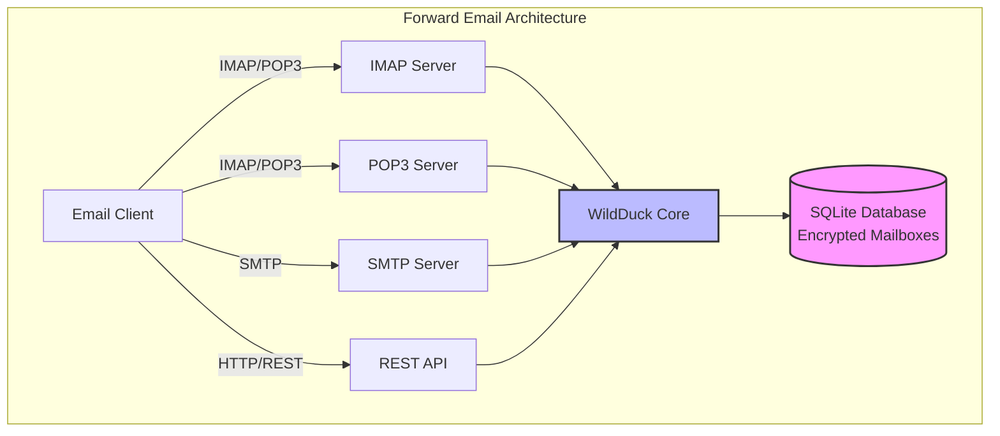

---


## Vergleich von E-Mail-Diensten – Protokollunterstützung & RFC-Standardkonformität {#email-service-comparison---protocol-support--rfc-standards-compliance}

> \[!IMPORTANT]
> **Sandboxed und quantensichere Verschlüsselung:** Forward Email ist der einzige E-Mail-Dienst, der individuell verschlüsselte SQLite-Postfächer mit deinem Passwort speichert (das nur du hast). Jedes Postfach ist mit [sqleet](https://github.com/resilar/sqleet) (ChaCha20-Poly1305) verschlüsselt, eigenständig, sandboxed und portabel. Wenn du dein Passwort vergisst, verlierst du dein Postfach – nicht einmal Forward Email kann es wiederherstellen. Details siehe [Quantum-Safe Encrypted Email](https://forwardemail.net/en/blog/docs/best-quantum-safe-encrypted-email-service).

Vergleiche die Unterstützung von E-Mail-Protokollen und die Implementierung von RFC-Standards bei großen E-Mail-Anbietern:

| Feature                       | Forward Email                                                                                  | Postfix/Dovecot                                                                    | Gmail                                                                             | iCloud Mail                                           | Outlook.com                                                                                                                                                          | Fastmail                                                                                 | Yahoo/AOL (Verizon)                                                  | ProtonMail                                                                     | Tutanota                                                          |
| ----------------------------- | ---------------------------------------------------------------------------------------------- | ---------------------------------------------------------------------------------- | --------------------------------------------------------------------------------- | ----------------------------------------------------- | -------------------------------------------------------------------------------------------------------------------------------------------------------------------- | ---------------------------------------------------------------------------------------- | -------------------------------------------------------------------- | ------------------------------------------------------------------------------ | ----------------------------------------------------------------- |
| **Preis für eigene Domain**   | [Kostenlos](https://forwardemail.net/en/pricing)                                               | [Kostenlos](https://www.postfix.org/)                                             | [$7,20/Monat](https://workspace.google.com/pricing)                              | [$0,99/Monat](https://support.apple.com/en-us/102622) | [$7,20/Monat](https://www.microsoft.com/en-us/microsoft-365/business/microsoft-365-business-basic)                                                                      | [$5/Monat](https://www.fastmail.com/pricing/)                                             | [$3,19/Monat](https://www.turbify.com/mail)                         | [$4,99/Monat](https://proton.me/mail/pricing)                                   | [$3,27/Monat](https://tuta.com/pricing)                            |
| **IMAP4rev1 (RFC 3501)**      | ✅ [Unterstützt](#imap4-email-protocol-and-extensions)                                        | ✅ [Unterstützt](https://www.dovecot.org/)                                        | ✅ [Unterstützt](https://developers.google.com/workspace/gmail/imap/imap-extensions) | ✅ [Unterstützt](https://support.apple.com/en-us/102431) | ✅ [Unterstützt](https://support.microsoft.com/en-us/office/pop-imap-and-smtp-settings-for-outlook-com-d088b986-291d-42b8-9564-9c414e2aa040)                            | ✅ [Unterstützt](https://www.fastmail.help/hc/en-us/articles/1500000278382-Email-standards) | ✅ [Unterstützt](https://senders.yahooinc.com/developer/documentation/) | ⚠️ [Über Bridge](https://proton.me/support/imap-smtp-and-pop3-setup)              | ❌ Nicht unterstützt                                             |
| **IMAP4rev2 (RFC 9051)**      | ⚠️ [Teilweise](https://forwardemail.net/en/blog/docs/best-quantum-safe-encrypted-email-service) | ⚠️ [Teilweise](https://www.dovecot.org/)                                         | ⚠️ [31%](https://developers.google.com/workspace/gmail/imap/imap-extensions)      | ⚠️ [92%](https://support.apple.com/en-us/102431)      | ⚠️ [46%](https://support.microsoft.com/en-us/office/pop-imap-and-smtp-settings-for-outlook-com-d088b986-291d-42b8-9564-9c414e2aa040)                                 | ⚠️ [69%](https://www.fastmail.help/hc/en-us/articles/1500000278382-Email-standards)      | ⚠️ [85%](https://senders.yahooinc.com/developer/documentation/)      | ⚠️ [Über Bridge](https://proton.me/support/imap-smtp-and-pop3-setup)              | ❌ Nicht unterstützt                                             |
| **POP3 (RFC 1939)**           | ✅ [Unterstützt](#pop3-email-protocol-and-extensions)                                         | ✅ [Unterstützt](https://www.dovecot.org/)                                        | ✅ [Unterstützt](https://support.google.com/mail/answer/7104828)                   | ❌ Nicht unterstützt                                   | ✅ [Unterstützt](https://support.microsoft.com/en-us/office/pop-imap-and-smtp-settings-for-outlook-com-d088b986-291d-42b8-9564-9c414e2aa040)                            | ✅ [Unterstützt](https://www.fastmail.help/hc/en-us/articles/1500000278382-Email-standards) | ✅ [Unterstützt](https://help.yahoo.com/kb/SLN4075.html)              | ⚠️ [Über Bridge](https://proton.me/support/imap-smtp-and-pop3-setup)              | ❌ Nicht unterstützt                                             |
| **SMTP (RFC 5321)**           | ✅ [Unterstützt](#smtp-email-protocol-and-extensions)                                         | ✅ [Unterstützt](https://www.postfix.org/)                                        | ✅ [Unterstützt](https://support.google.com/mail/answer/7126229)                   | ✅ [Unterstützt](https://support.apple.com/en-us/102431) | ✅ [Unterstützt](https://support.microsoft.com/en-us/office/pop-imap-and-smtp-settings-for-outlook-com-d088b986-291d-42b8-9564-9c414e2aa040)                            | ✅ [Unterstützt](https://www.fastmail.help/hc/en-us/articles/1500000278382-Email-standards) | ✅ [Unterstützt](https://help.yahoo.com/kb/SLN4075.html)              | ⚠️ [Über Bridge](https://proton.me/support/imap-smtp-and-pop3-setup)              | ❌ Nicht unterstützt                                             |
| **JMAP (RFC 8620)**           | ❌ [Nicht unterstützt](#jmap-email-protocol)                                                  | ❌ Nicht unterstützt                                                              | ❌ Nicht unterstützt                                                               | ❌ Nicht unterstützt                                   | ❌ Nicht unterstützt                                                                                                                                                  | ✅ [Unterstützt](https://www.fastmail.com/dev/)                                           | ❌ Nicht unterstützt                                                  | ❌ Nicht unterstützt                                                            | ❌ Nicht unterstützt                                             |
| **DKIM (RFC 6376)**           | ✅ [Unterstützt](#email-message-authentication-protocols)                                     | ✅ [Unterstützt](https://github.com/trusteddomainproject/OpenDKIM)                | ✅ [Unterstützt](https://support.google.com/a/answer/174124)                       | ✅ [Unterstützt](https://support.apple.com/en-us/102431) | ✅ [Unterstützt](https://learn.microsoft.com/en-us/defender-office-365/email-authentication-dkim-configure)                                                           | ✅ [Unterstützt](https://www.fastmail.help/hc/en-us/articles/360060590573)                | ✅ [Unterstützt](https://help.yahoo.com/kb/SLN25426.html)             | ✅ [Unterstützt](https://proton.me/support)                                         | ✅ [Unterstützt](https://tuta.com/support#dkim)                    |
| **SPF (RFC 7208)**            | ✅ [Unterstützt](#email-message-authentication-protocols)                                     | ✅ [Unterstützt](https://www.postfix.org/)                                        | ✅ [Unterstützt](https://support.google.com/a/answer/33786)                        | ✅ [Unterstützt](https://support.apple.com/en-us/102431) | ✅ [Unterstützt](https://learn.microsoft.com/en-us/microsoft-365/security/office-365-security/how-office-365-uses-spf-to-prevent-spoofing)                            | ✅ [Unterstützt](https://www.fastmail.help/hc/en-us/articles/360060590573)                | ✅ [Unterstützt](https://help.yahoo.com/kb/SLN25426.html)             | ✅ [Unterstützt](https://proton.me/support)                                         | ✅ [Unterstützt](https://tuta.com/support#dkim)                    |
| **DMARC (RFC 7489)**          | ✅ [Unterstützt](#email-message-authentication-protocols)                                     | ✅ [Unterstützt](https://www.postfix.org/)                                        | ✅ [Unterstützt](https://support.google.com/a/answer/2466580)                      | ✅ [Unterstützt](https://support.apple.com/en-us/102431) | ✅ [Unterstützt](https://learn.microsoft.com/en-us/microsoft-365/security/office-365-security/use-dmarc-to-validate-email)                                            | ✅ [Unterstützt](https://www.fastmail.help/hc/en-us/articles/360060590573)                | ✅ [Unterstützt](https://help.yahoo.com/kb/SLN25426.html)             | ✅ [Unterstützt](https://proton.me/support)                                         | ✅ [Unterstützt](https://tuta.com/support#dkim)                    |
| **ARC (RFC 8617)**            | ✅ [Unterstützt](#email-message-authentication-protocols)                                     | ✅ [Unterstützt](https://github.com/trusteddomainproject/OpenARC)                 | ✅ [Unterstützt](https://support.google.com/a/answer/2466580)                      | ❌ Nicht unterstützt                                   | ✅ [Unterstützt](https://learn.microsoft.com/en-us/defender-office-365/email-authentication-arc-configure)                                                            | ✅ [Unterstützt](https://www.fastmail.help/hc/en-us/articles/360060590573)                | ✅ [Unterstützt](https://senders.yahooinc.com/developer/documentation/) | ✅ [Unterstützt](https://proton.me/blog/what-is-authenticated-received-chain-arc)   | ❌ Nicht unterstützt                                             |
| **MTA-STS (RFC 8461)**        | ✅ [Unterstützt](#email-transport-security-protocols)                                         | ✅ [Unterstützt](https://www.postfix.org/)                                        | ✅ [Unterstützt](https://support.google.com/a/answer/9261504)                      | ✅ [Unterstützt](https://support.apple.com/en-us/102431) | ✅ [Unterstützt](https://learn.microsoft.com/en-us/defender-office-365/email-authentication-about)                                                                    | ✅ [Unterstützt](https://www.fastmail.help/hc/en-us/articles/360060590573)                | ✅ [Unterstützt](https://senders.yahooinc.com/developer/documentation/) | ✅ [Unterstützt](https://proton.me/support)                                         | ✅ [Unterstützt](https://tuta.com/security)                        |
| **DANE (RFC 7671)**           | ✅ [Unterstützt](#email-transport-security-protocols)                                         | ✅ [Unterstützt](https://www.postfix.org/)                                        | ❌ Nicht unterstützt                                                               | ❌ Nicht unterstützt                                   | ❌ Nicht unterstützt                                                                                                                                                  | ❌ Nicht unterstützt                                                                    | ❌ Nicht unterstützt                                                  | ✅ [Unterstützt](https://proton.me/support)                                         | ✅ [Unterstützt](https://tuta.com/support#dane)                    |
| **DSN (RFC 3461)**            | ✅ [Unterstützt](#smtp-email-protocol-and-extensions)                                         | ✅ [Unterstützt](https://www.postfix.org/DSN_README.html)                         | ❌ Nicht unterstützt                                                               | ✅ [Unterstützt](#protocol-capability-tests)             | ✅ [Unterstützt](#protocol-capability-tests)                                                                                                                          | ⚠️ [Unbekannt](https://www.fastmail.help/hc/en-us/articles/1500000278382-Email-standards) | ❌ Nicht unterstützt                                                  | ⚠️ [Über Bridge](https://proton.me/support/imap-smtp-and-pop3-setup)              | ❌ Nicht unterstützt                                             |
| **REQUIRETLS (RFC 8689)**     | ✅ [Unterstützt](#email-transport-security-protocols)                                         | ✅ [Unterstützt](https://www.postfix.org/TLS_README.html#server_require_tls)      | ⚠️ Unbekannt                                                                      | ⚠️ Unbekannt                                          | ⚠️ Unbekannt                                                                                                                                                         | ⚠️ Unbekannt                                                                             | ⚠️ Unbekannt                                                         | ⚠️ [Über Bridge](https://proton.me/support/imap-smtp-and-pop3-setup)              | ❌ Nicht unterstützt                                             |
| **ManageSieve (RFC 5804)**    | ✅ [Unterstützt](#managesieve-rfc-5804)                                                       | ✅ [Unterstützt](https://doc.dovecot.org/admin_manual/pigeonhole_managesieve_server/) | ❌ Nicht unterstützt                                                               | ❌ Nicht unterstützt                                   | ❌ Nicht unterstützt                                                                                                                                                  | ✅ [Unterstützt](https://www.fastmail.help/hc/en-us/articles/360060590573)                | ❌ Nicht unterstützt                                                  | ❌ Nicht unterstützt                                                            | ❌ Nicht unterstützt                                             |
| **OpenPGP (RFC 9580)**        | ✅ [Unterstützt](#email-message-encryption)                                                   | ⚠️ [Über Plugins](https://www.gnupg.org/)                                       | ⚠️ [Drittanbieter](https://github.com/google/end-to-end)                          | ⚠️ [Drittanbieter](https://gpgtools.org/)             | ⚠️ [Drittanbieter](https://gpg4win.org/)                                                                                                                             | ⚠️ [Drittanbieter](https://www.fastmail.help/hc/en-us/articles/360060590573)             | ⚠️ [Drittanbieter](https://help.yahoo.com/kb/SLN25426.html)          | ✅ [Nativ](https://proton.me/support/pgp-mime-pgp-inline)                          | ❌ Nicht unterstützt                                             |
| **S/MIME (RFC 8551)**         | ✅ [Unterstützt](#email-message-encryption)                                                   | ✅ [Unterstützt](https://www.openssl.org/)                                        | ✅ [Unterstützt](https://support.google.com/mail/answer/81126)                     | ✅ [Unterstützt](https://support.apple.com/en-us/102431) | ✅ [Unterstützt](https://support.microsoft.com/en-us/office/send-view-and-reply-to-encrypted-messages-in-outlook-for-pc-eaa43495-9bbb-4fca-922a-df90dee51980)         | ⚠️ [Teilweise](https://www.fastmail.help/hc/en-us/articles/360060590573)                 | ❌ Nicht unterstützt                                                  | ✅ [Unterstützt](https://proton.me/support/pgp-mime-pgp-inline)                     | ❌ Nicht unterstützt                                             |
| **CalDAV (RFC 4791)**         | ✅ [Unterstützt](#calendaring-and-contacts-protocols)                                       | ✅ [Unterstützt](https://www.davical.org/)                                        | ✅ [Unterstützt](https://developers.google.com/calendar/caldav/v2/guide)           | ✅ [Unterstützt](https://support.apple.com/en-us/102431) | ❌ Nicht unterstützt                                                                                                                                                  | ✅ [Unterstützt](https://www.fastmail.help/hc/en-us/articles/360060590573)                | ❌ Nicht unterstützt                                                  | ✅ [Über Bridge](https://proton.me/support/proton-calendar)                        | ❌ Nicht unterstützt                                             |
| **CardDAV (RFC 6352)**        | ✅ [Unterstützt](#calendaring-and-contacts-protocols)                                       | ✅ [Unterstützt](https://www.davical.org/)                                        | ✅ [Unterstützt](https://developers.google.com/people/carddav)                     | ✅ [Unterstützt](https://support.apple.com/en-us/102431) | ❌ Nicht unterstützt                                                                                                                                                  | ✅ [Unterstützt](https://www.fastmail.help/hc/en-us/articles/360060590573)                | ❌ Nicht unterstützt                                                  | ✅ [Über Bridge](https://proton.me/support/proton-contacts)                        | ❌ Nicht unterstützt                                             |
| **Aufgaben (VTODO)**          | ✅ [Unterstützt](#tasks-and-reminders-caldav-vtodo)                                         | ✅ [Unterstützt](https://www.davical.org/)                                        | ❌ Nicht unterstützt                                                               | ✅ [Unterstützt](https://support.apple.com/en-us/102431) | ❌ Nicht unterstützt                                                                                                                                                  | ✅ [Unterstützt](https://www.fastmail.help/hc/en-us/articles/360060590573)                | ❌ Nicht unterstützt                                                  | ❌ Nicht unterstützt                                                            | ❌ Nicht unterstützt                                             |
| **Sieve (RFC 5228)**          | ✅ [Unterstützt](#sieve-rfc-5228)                                                           | ✅ [Unterstützt](https://www.dovecot.org/)                                        | ❌ Nicht unterstützt                                                               | ❌ Nicht unterstützt                                   | ❌ Nicht unterstützt                                                                                                                                                  | ✅ [Unterstützt](https://www.fastmail.help/hc/en-us/articles/360060590573)                | ❌ Nicht unterstützt                                                  | ❌ Nicht unterstützt                                                            | ❌ Nicht unterstützt                                             |
| **Catch-All**                 | ✅ [Unterstützt](https://forwardemail.net/en/faq#can-i-have-multiple-global-catch-all-recipients) | ✅ Unterstützt                                                                    | ✅ [Unterstützt](https://support.google.com/a/answer/4524505)                      | ❌ Nicht unterstützt                                   | ❌ [Nicht unterstützt](https://learn.microsoft.com/en-us/exchange/recipients-in-exchange-online/manage-mail-users)                                                    | ✅ [Unterstützt](https://www.fastmail.help/hc/en-us/articles/1500000278382-Email-standards) | ❌ Nicht unterstützt                                                  | ❌ Nicht unterstützt                                                            | ✅ [Unterstützt](https://tuta.com/support#catch-all-alias)           |
| **Unbegrenzte Aliase**       | ✅ [Unterstützt](https://forwardemail.net/en/faq#advanced-features)                         | ✅ Unterstützt                                                                    | ✅ [Unterstützt](https://support.google.com/a/answer/33327)                        | ✅ [Unterstützt](https://support.apple.com/en-us/102431) | ✅ [Unterstützt](https://support.microsoft.com/en-us/office/add-or-remove-an-email-alias-in-outlook-com-459b1989-356d-40fa-a689-8f285b13f1f2)                         | ✅ [Unterstützt](https://www.fastmail.help/hc/en-us/articles/1500000278382-Email-standards) | ❌ Nicht unterstützt                                                  | ✅ [Unterstützt](https://proton.me/support/addresses-and-aliases)                   | ✅ [Unterstützt](https://tuta.com/support#aliases)                   |
| **Zwei-Faktor-Authentifizierung** | ✅ [Unterstützt](https://forwardemail.net/en/faq#do-you-support-passkeys-and-webauthn)        | ✅ Unterstützt                                                                    | ✅ [Unterstützt](https://support.google.com/accounts/answer/185839)                | ✅ [Unterstützt](https://support.apple.com/en-us/102431) | ✅ [Unterstützt](https://support.microsoft.com/en-us/account-billing/how-to-use-two-step-verification-with-your-microsoft-account-c7910146-672f-01e9-50a0-93b4585e7eb4) | ✅ [Unterstützt](https://www.fastmail.help/hc/en-us/articles/1500000278382-Email-standards) | ✅ [Unterstützt](https://help.yahoo.com/kb/SLN5013.html)              | ✅ [Unterstützt](https://proton.me/support/two-factor-authentication-2fa)           | ✅ [Unterstützt](https://tuta.com/support#two-factor-authentication) |
| **Push-Benachrichtigungen**  | ✅ [Unterstützt](#ios-push-notifications)                                                   | ⚠️ Über Plugins                                                                  | ✅ [Unterstützt](https://developers.google.com/gmail/api/guides/push)              | ✅ [Unterstützt](https://support.apple.com/en-us/102431) | ✅ [Unterstützt](https://learn.microsoft.com/en-us/graph/change-notifications-delivery-webhooks)                                                                      | ✅ [Unterstützt](https://www.fastmail.help/hc/en-us/articles/1500000278382-Email-standards) | ❌ Nicht unterstützt                                                  | ✅ [Unterstützt](https://proton.me/support/notifications)                       | ✅ [Unterstützt](https://tuta.com/support#push-notifications)        |
| **Kalender/Kontakte Desktop** | ✅ [Unterstützt](#calendaring-and-contacts-protocols)                                       | ✅ Unterstützt                                                                    | ✅ [Unterstützt](https://support.google.com/calendar)                              | ✅ [Unterstützt](https://support.apple.com/en-us/102431) | ✅ [Unterstützt](https://support.microsoft.com/en-us/office/calendar-and-contacts-in-outlook-com-d3e8a6e6-5c1f-4e3e-9f1e-7c0f0e0c0c0c)                                | ✅ [Unterstützt](https://www.fastmail.help/hc/en-us/articles/1500000278382-Email-standards) | ❌ Nicht unterstützt                                                  | ✅ [Unterstützt](https://proton.me/support/proton-calendar)                     | ❌ Nicht unterstützt                                             |
| **Erweiterte Suche**          | ✅ [Unterstützt](https://forwardemail.net/en/email-api)                                     | ✅ Unterstützt                                                                    | ✅ [Unterstützt](https://support.google.com/mail/answer/7190)                      | ✅ [Unterstützt](https://support.apple.com/en-us/102431) | ✅ [Unterstützt](https://support.microsoft.com/en-us/office/search-for-email-messages-in-outlook-com-6f5f2e92-9d5e-4c4e-9b0e-0c0c0c0c0c0c)                            | ✅ [Unterstützt](https://www.fastmail.help/hc/en-us/articles/1500000278382-Email-standards) | ✅ [Unterstützt](https://help.yahoo.com/kb/SLN3561.html)                | ✅ [Unterstützt](https://proton.me/support/search-and-filters)                  | ✅ [Unterstützt](https://tuta.com/support)                             |
| **API/Integrationen**         | ✅ [39 Endpunkte](https://forwardemail.net/en/email-api)                                    | ✅ Unterstützt                                                                    | ✅ [Unterstützt](https://developers.google.com/gmail/api)                          | ❌ Nicht unterstützt                                   | ✅ [Unterstützt](https://learn.microsoft.com/en-us/graph/api/resources/mail-api-overview)                                                                             | ✅ [Unterstützt](https://www.fastmail.help/hc/en-us/articles/1500000278382-Email-standards) | ❌ Nicht unterstützt                                                  | ✅ [Unterstützt](https://proton.me/support/proton-mail-api)                     | ❌ Nicht unterstützt                                             |
### Protokollunterstützungs-Visualisierung {#protocol-support-visualization}

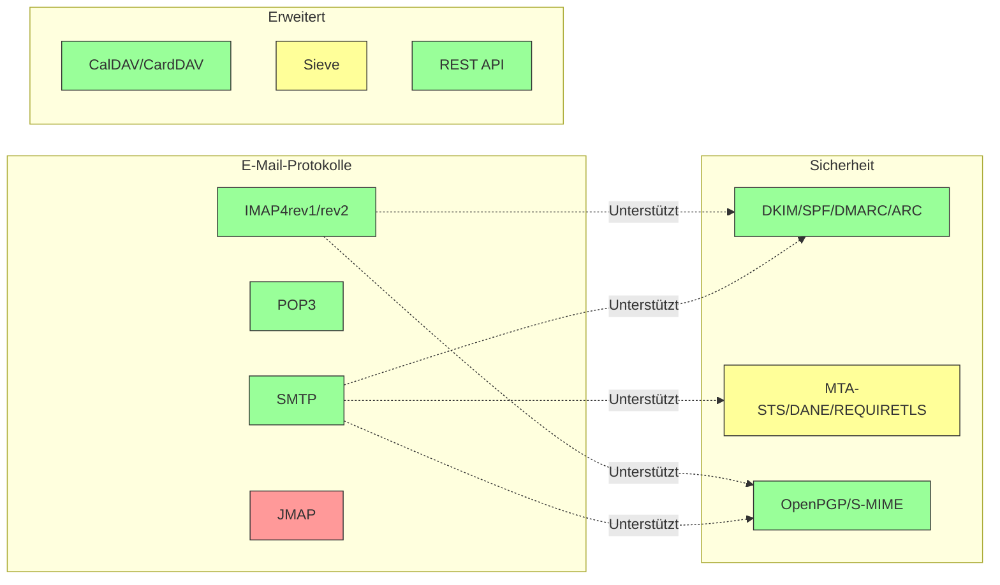

---


## Kern-E-Mail-Protokolle {#core-email-protocols}

### E-Mail-Protokollablauf {#email-protocol-flow}

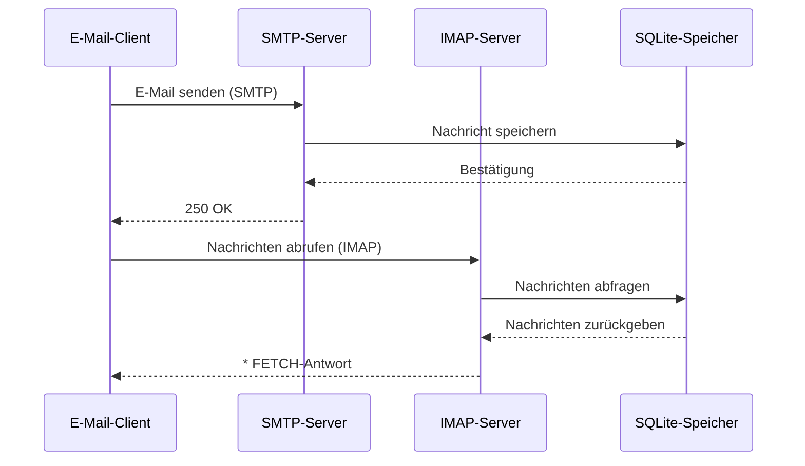


## IMAP4 E-Mail-Protokoll und Erweiterungen {#imap4-email-protocol-and-extensions}

> \[!NOTE]
> Forward Email unterstützt IMAP4rev1 (RFC 3501) mit teilweiser Unterstützung für IMAP4rev2 (RFC 9051) Funktionen.

Forward Email bietet robuste IMAP4-Unterstützung durch die WildDuck-Mailserver-Implementierung. Der Server implementiert IMAP4rev1 (RFC 3501) mit teilweiser Unterstützung für IMAP4rev2 (RFC 9051) Erweiterungen.

Die IMAP-Funktionalität von Forward Email wird durch die [WildDuck](https://github.com/nodemailer/wildduck)-Abhängigkeit bereitgestellt. Die folgenden E-Mail-RFCs werden unterstützt:

| RFC                                                       | Titel                                                             | Implementierungshinweise                              |
| --------------------------------------------------------- | ----------------------------------------------------------------- | ----------------------------------------------------- |
| [RFC 3501](https://datatracker.ietf.org/doc/html/rfc3501) | Internet Message Access Protocol (IMAP) - Version 4rev1           | Volle Unterstützung mit absichtlichen Unterschieden (siehe unten) |
| [RFC 2177](https://datatracker.ietf.org/doc/html/rfc2177) | IMAP4 IDLE-Befehl                                                 | Push-Benachrichtigungen                              |
| [RFC 2342](https://datatracker.ietf.org/doc/html/rfc2342) | IMAP4 Namespace                                                  | Unterstützung von Postfach-Namensräumen              |
| [RFC 2087](https://datatracker.ietf.org/doc/html/rfc2087) | IMAP4 QUOTA-Erweiterung                                          | Verwaltung von Speicherquoten                         |
| [RFC 2971](https://datatracker.ietf.org/doc/html/rfc2971) | IMAP4 ID-Erweiterung                                             | Client-/Server-Identifikation                         |
| [RFC 5161](https://datatracker.ietf.org/doc/html/rfc5161) | IMAP4 ENABLE-Erweiterung                                         | Aktivierung von IMAP-Erweiterungen                    |
| [RFC 4959](https://datatracker.ietf.org/doc/html/rfc4959) | IMAP-Erweiterung für SASL Initial Client Response (SASL-IR)      | Initiale Client-Antwort                               |
| [RFC 3691](https://datatracker.ietf.org/doc/html/rfc3691) | IMAP4 UNSELECT-Befehl                                            | Postfach schließen ohne EXPUNGE                       |
| [RFC 4315](https://datatracker.ietf.org/doc/html/rfc4315) | IMAP UIDPLUS-Erweiterung                                         | Erweiterte UID-Befehle                                |
| [RFC 7162](https://datatracker.ietf.org/doc/html/rfc7162) | IMAP-Erweiterungen: Schnelle Flag-Änderungen Resynchronisierung (CONDSTORE) | Bedingtes STORE                                       |
| [RFC 6154](https://datatracker.ietf.org/doc/html/rfc6154) | IMAP LIST-Erweiterung für spezielle Postfächer                   | Spezielle Postfachattribute                           |
| [RFC 6851](https://datatracker.ietf.org/doc/html/rfc6851) | IMAP MOVE-Erweiterung                                           | Atomarer MOVE-Befehl                                  |
| [RFC 6855](https://datatracker.ietf.org/doc/html/rfc6855) | IMAP-Unterstützung für UTF-8                                    | UTF-8-Unterstützung                                   |
| [RFC 3348](https://datatracker.ietf.org/doc/html/rfc3348) | IMAP4 Child Mailbox-Erweiterung                                 | Informationen zu Unterordnern                          |
| [RFC 7889](https://datatracker.ietf.org/doc/html/rfc7889) | IMAP4-Erweiterung zur Angabe der maximalen Upload-Größe (APPENDLIMIT) | Maximale Upload-Größe                                 |
**Unterstützte IMAP-Erweiterungen:**

| Erweiterung       | RFC          | Status      | Beschreibung                   |
| ----------------- | ------------ | ----------- | ----------------------------- |
| IDLE              | RFC 2177     | ✅ Unterstützt | Push-Benachrichtigungen       |
| NAMESPACE         | RFC 2342     | ✅ Unterstützt | Unterstützung für Postfach-Namespace |
| QUOTA             | RFC 2087     | ✅ Unterstützt | Speicherquotenverwaltung      |
| ID                | RFC 2971     | ✅ Unterstützt | Client-/Server-Identifikation |
| ENABLE            | RFC 5161     | ✅ Unterstützt | Aktivierung von IMAP-Erweiterungen |
| SASL-IR           | RFC 4959     | ✅ Unterstützt | Initiale Client-Antwort       |
| UNSELECT          | RFC 3691     | ✅ Unterstützt | Postfach schließen ohne EXPUNGE |
| UIDPLUS           | RFC 4315     | ✅ Unterstützt | Erweiterte UID-Befehle        |
| CONDSTORE         | RFC 7162     | ✅ Unterstützt | Bedingtes STORE               |
| SPECIAL-USE       | RFC 6154     | ✅ Unterstützt | Spezielle Postfachattribute   |
| MOVE              | RFC 6851     | ✅ Unterstützt | Atomarer MOVE-Befehl          |
| UTF8=ACCEPT       | RFC 6855     | ✅ Unterstützt | UTF-8-Unterstützung           |
| CHILDREN          | RFC 3348     | ✅ Unterstützt | Informationen zu Unterordnern |
| APPENDLIMIT       | RFC 7889     | ✅ Unterstützt | Maximale Upload-Größe         |
| XLIST             | Nicht standard | ✅ Unterstützt | Gmail-kompatible Ordnerauflistung |
| XAPPLEPUSHSERVICE | Nicht standard | ✅ Unterstützt | Apple Push Notification Service |

### IMAP-Protokollunterschiede zu RFC-Spezifikationen {#imap-protocol-differences-from-rfc-specifications}

> \[!WARNING]
> Die folgenden Abweichungen von RFC-Spezifikationen können die Kompatibilität von Clients beeinträchtigen.

Forward Email weicht bewusst von einigen IMAP-RFC-Spezifikationen ab. Diese Unterschiede stammen von WildDuck und sind unten dokumentiert:

* **Kein \Recent-Flag:** Das `\Recent`-Flag ist nicht implementiert. Alle Nachrichten werden ohne dieses Flag zurückgegeben.
* **RENAME betrifft keine Unterordner:** Beim Umbenennen eines Ordners werden Unterordner nicht automatisch umbenannt. Die Ordnerhierarchie ist in der Datenbank flach.
* **INBOX kann nicht umbenannt werden:** [RFC 3501](https://datatracker.ietf.org/doc/html/rfc3501) erlaubt das Umbenennen von INBOX, Forward Email verbietet dies jedoch ausdrücklich. Siehe [WildDuck Quellcode](https://github.com/nodemailer/wildduck/blob/master/imap-core/lib/commands/rename.js#L27).
* **Keine unaufgeforderten FLAGS-Antworten:** Wenn Flags geändert werden, werden keine unaufgeforderten FLAGS-Antworten an den Client gesendet.
* **STORE gibt NO für gelöschte Nachrichten zurück:** Versuche, Flags bei gelöschten Nachrichten zu ändern, führen zu NO statt zu stillem Ignorieren.
* **CHARSET wird bei SEARCH ignoriert:** Das `CHARSET`-Argument in SEARCH-Befehlen wird ignoriert. Alle Suchvorgänge verwenden UTF-8.
* **MODSEQ-Metadaten werden ignoriert:** `MODSEQ`-Metadaten in STORE-Befehlen werden ignoriert.
* **SEARCH TEXT und SEARCH BODY:** Forward Email verwendet [SQLite FTS5](https://www.sqlite.org/fts5.html) (Volltextsuche) anstelle der `$text`-Suche von MongoDB. Dies bietet:
  * Unterstützung für den `NOT`-Operator (MongoDB unterstützt dies nicht)
  * Rangbasierte Suchergebnisse
  * Suchzeiten unter 100 ms bei großen Postfächern
* **Autoexpunge-Verhalten:** Nachrichten, die mit `\Deleted` markiert sind, werden automatisch gelöscht, wenn das Postfach geschlossen wird.
* **Nachrichtenintegrität:** Einige Nachrichtenänderungen bewahren möglicherweise nicht die exakt ursprüngliche Nachrichtenstruktur.

**Teilweise Unterstützung von IMAP4rev2:**

Forward Email implementiert IMAP4rev1 (RFC 3501) mit teilweiser Unterstützung von IMAP4rev2 (RFC 9051). Die folgenden IMAP4rev2-Funktionen werden **noch nicht unterstützt**:

* **LIST-STATUS** – Kombinierte LIST- und STATUS-Befehle
* **LITERAL-** – Nicht-synchronisierende Literale (Minus-Variante)
* **OBJECTID** – Eindeutige Objektkennungen
* **SAVEDATE** – Attribut für Speicherdatum
* **REPLACE** – Atomarer Nachrichtenaustausch
* **UNAUTHENTICATE** – Authentifizierung beenden ohne Verbindungsabbruch

**Entspannte Behandlung der Body-Struktur:**

Forward Email verwendet eine „entspannte Body“-Behandlung für fehlerhafte MIME-Strukturen, die von der strikten RFC-Auslegung abweichen kann. Dies verbessert die Kompatibilität mit realen E-Mails, die nicht perfekt den Standards entsprechen.
**METADATA-Erweiterung (RFC 5464):**

Die IMAP METADATA-Erweiterung wird **nicht unterstützt**. Weitere Informationen zu dieser Erweiterung finden Sie in [RFC 5464](https://datatracker.ietf.org/doc/html/rfc5464). Eine Diskussion über die Hinzufügung dieser Funktion finden Sie in [WildDuck Issue #937](https://github.com/zone-eu/wildduck/issues/937).

### Nicht unterstützte IMAP-Erweiterungen {#imap-extensions-not-supported}

Die folgenden IMAP-Erweiterungen aus dem [IANA IMAP Capabilities Registry](https://www.iana.org/assignments/imap-capabilities/imap-capabilities.xhtml) werden NICHT unterstützt:

| RFC                                                       | Titel                                                                                                           | Grund                                                                                                                                  |
| --------------------------------------------------------- | --------------------------------------------------------------------------------------------------------------- | --------------------------------------------------------------------------------------------------------------------------------------- |
| [RFC 2086](https://datatracker.ietf.org/doc/html/rfc2086) | IMAP4 ACL-Erweiterung                                                                                           | Gemeinsame Ordner nicht implementiert. Siehe [WildDuck Issue #427](https://github.com/zone-eu/wildduck/issues/427)                      |
| [RFC 5256](https://datatracker.ietf.org/doc/html/rfc5256) | IMAP SORT- und THREAD-Erweiterungen                                                                             | Threading intern implementiert, aber nicht über das RFC 5256-Protokoll. Siehe [WildDuck Issue #12](https://github.com/zone-eu/wildduck/issues/12) |
| [RFC 5162](https://datatracker.ietf.org/doc/html/rfc5162) | IMAP4-Erweiterungen für schnelle Postfach-Resynchronisation (QRESYNC)                                           | Nicht implementiert                                                                                                                     |
| [RFC 5464](https://datatracker.ietf.org/doc/html/rfc5464) | IMAP METADATA-Erweiterung                                                                                        | Metadatenoperationen werden ignoriert. Siehe [WildDuck Dokumentation](https://datatracker.ietf.org/doc/html/rfc5464)                   |
| [RFC 5258](https://datatracker.ietf.org/doc/html/rfc5258) | IMAP4 LIST-Befehls-Erweiterungen                                                                                 | Nicht implementiert                                                                                                                     |
| [RFC 5267](https://datatracker.ietf.org/doc/html/rfc5267) | Kontexte für IMAP4                                                                                               | Nicht implementiert                                                                                                                     |
| [RFC 5465](https://datatracker.ietf.org/doc/html/rfc5465) | IMAP NOTIFY-Erweiterung                                                                                          | Nicht implementiert                                                                                                                     |
| [RFC 5466](https://datatracker.ietf.org/doc/html/rfc5466) | IMAP4 FILTERS-Erweiterung                                                                                        | Nicht implementiert                                                                                                                     |
| [RFC 6203](https://datatracker.ietf.org/doc/html/rfc6203) | IMAP4-Erweiterung für unscharfe Suche                                                                           | Nicht implementiert                                                                                                                     |
| [RFC 6785](https://datatracker.ietf.org/doc/html/rfc6785) | IMAP4 Implementierungsempfehlungen                                                                               | Empfehlungen nicht vollständig befolgt                                                                                                |
| [RFC 7162](https://datatracker.ietf.org/doc/html/rfc7162) | IMAP-Erweiterungen: Schnelle Flag-Änderungen Resynchronisation (CONDSTORE) und schnelle Postfach-Resynchronisation (QRESYNC) | Nicht implementiert                                                                                                                     |
| [RFC 8437](https://datatracker.ietf.org/doc/html/rfc8437) | IMAP UNAUTHENTICATE-Erweiterung für Verbindungswiederverwendung                                                 | Nicht implementiert                                                                                                                     |
| [RFC 8438](https://datatracker.ietf.org/doc/html/rfc8438) | IMAP-Erweiterung für STATUS=SIZE                                                                                 | Nicht implementiert                                                                                                                     |
| [RFC 8457](https://datatracker.ietf.org/doc/html/rfc8457) | IMAP "$Important"-Schlüsselwort und "\Important"-Special-Use-Attribut                                            | Nicht implementiert                                                                                                                     |
| [RFC 8474](https://datatracker.ietf.org/doc/html/rfc8474) | IMAP-Erweiterung für Objektkennungen                                                                             | Nicht implementiert                                                                                                                     |
| [RFC 9051](https://datatracker.ietf.org/doc/html/rfc9051) | Internet Message Access Protocol (IMAP) - Version 4rev2                                                          | Forward Email implementiert IMAP4rev1 ([RFC 3501](https://datatracker.ietf.org/doc/html/rfc3501))                                        |
## POP3 Email-Protokoll und Erweiterungen {#pop3-email-protocol-and-extensions}

> \[!NOTE]
> Forward Email unterstützt POP3 (RFC 1939) mit Standarderweiterungen für den E-Mail-Abruf.

Die POP3-Funktionalität von Forward Email wird durch die [WildDuck](https://github.com/nodemailer/wildduck)-Abhängigkeit bereitgestellt. Die folgenden E-Mail-RFCs werden unterstützt:

| RFC                                                       | Titel                                  | Implementierungshinweise                           |
| --------------------------------------------------------- | ------------------------------------- | ------------------------------------------------- |
| [RFC 1939](https://datatracker.ietf.org/doc/html/rfc1939) | Post Office Protocol - Version 3 (POP3) | Volle Unterstützung mit absichtlichen Unterschieden (siehe unten) |
| [RFC 2595](https://datatracker.ietf.org/doc/html/rfc2595) | Verwendung von TLS mit IMAP, POP3 und ACAP | STARTTLS-Unterstützung                             |
| [RFC 2449](https://datatracker.ietf.org/doc/html/rfc2449) | POP3 Erweiterungsmechanismus          | CAPA-Befehl-Unterstützung                          |

Forward Email bietet POP3-Unterstützung für Clients, die dieses einfachere Protokoll gegenüber IMAP bevorzugen. POP3 ist ideal für Benutzer, die E-Mails auf ein einzelnes Gerät herunterladen und vom Server entfernen möchten.

**Unterstützte POP3-Erweiterungen:**

| Erweiterung | RFC      | Status       | Beschreibung               |
| ----------- | -------- | ------------ | ------------------------- |
| TOP         | RFC 1939 | ✅ Unterstützt | Abruf von Nachrichtenkopfzeilen |
| USER        | RFC 1939 | ✅ Unterstützt | Benutzername-Authentifizierung |
| UIDL        | RFC 1939 | ✅ Unterstützt | Eindeutige Nachrichtenkennungen |
| EXPIRE      | RFC 2449 | ✅ Unterstützt | Richtlinie zur Nachrichtenablauf |

### POP3-Protokollunterschiede zu RFC-Spezifikationen {#pop3-protocol-differences-from-rfc-specifications}

> \[!WARNING]
> POP3 hat im Vergleich zu IMAP inhärente Einschränkungen.

> \[!IMPORTANT]
> **Kritischer Unterschied: Forward Email vs WildDuck POP3 DELE-Verhalten**
>
> Forward Email implementiert eine RFC-konforme permanente Löschung für POP3-`DELE`-Befehle, im Gegensatz zu WildDuck, das Nachrichten in den Papierkorb verschiebt.

**Verhalten von Forward Email** ([Quellcode](https://github.com/forwardemail/forwardemail.net/blob/master/pop3-server.js)):

* `DELE` → `QUIT` löscht Nachrichten dauerhaft
* Entspricht exakt der [RFC 1939](https://datatracker.ietf.org/doc/html/rfc1939)-Spezifikation
* Entspricht dem Verhalten von Dovecot (Standard), Postfix und anderen RFC-konformen Servern

**Verhalten von WildDuck** ([Diskussion](https://github.com/zone-eu/wildduck/issues/937)):

* `DELE` → `QUIT` verschiebt Nachrichten in den Papierkorb (Gmail-ähnlich)
* Bewusste Designentscheidung zum Schutz der Benutzer
* Nicht RFC-konform, verhindert aber versehentlichen Datenverlust

**Warum Forward Email abweicht:**

* **RFC-Konformität:** Hält sich an die [RFC 1939](https://datatracker.ietf.org/doc/html/rfc1939)-Spezifikation
* **Benutzererwartungen:** Download-und-Löschen-Workflow erwartet permanente Löschung
* **Speicherverwaltung:** Korrekte Rückgewinnung von Speicherplatz
* **Interoperabilität:** Konsistent mit anderen RFC-konformen Servern

> \[!NOTE]
> **POP3 Nachrichtenauflistung:** Forward Email listet ALLE Nachrichten aus dem INBOX ohne Limit auf. Dies unterscheidet sich von WildDuck, das standardmäßig auf 250 Nachrichten begrenzt. Siehe [Quellcode](https://github.com/forwardemail/forwardemail.net/blob/master/pop3-server.js).

**Zugriff auf ein einzelnes Gerät:**

POP3 ist für den Zugriff von einem einzelnen Gerät ausgelegt. Nachrichten werden typischerweise heruntergeladen und vom Server entfernt, was es für die Synchronisation mehrerer Geräte ungeeignet macht.

**Keine Ordnerunterstützung:**

POP3 greift nur auf den INBOX-Ordner zu. Andere Ordner (Gesendet, Entwürfe, Papierkorb usw.) sind über POP3 nicht zugänglich.

**Begrenzte Nachrichtenverwaltung:**

POP3 bietet grundlegenden Nachrichtenabruf und -löschung. Erweiterte Funktionen wie Markieren, Verschieben oder Suchen von Nachrichten sind nicht verfügbar.

### Nicht unterstützte POP3-Erweiterungen {#pop3-extensions-not-supported}

Die folgenden POP3-Erweiterungen aus dem [IANA POP3 Extension Mechanism Registry](https://www.iana.org/assignments/pop3-extension-mechanism/pop3-extension-mechanism.xhtml) werden NICHT unterstützt:
| RFC                                                       | Titel                                                  | Grund                                  |
| --------------------------------------------------------- | ------------------------------------------------------ | ------------------------------------- |
| [RFC 6856](https://datatracker.ietf.org/doc/html/rfc6856) | Post Office Protocol Version 3 (POP3) Unterstützung für UTF-8 | Nicht im WildDuck POP3-Server implementiert |
| [RFC 2595](https://datatracker.ietf.org/doc/html/rfc2595) | STLS-Befehl                                            | Nur STARTTLS unterstützt, nicht STLS  |
| [RFC 3206](https://datatracker.ietf.org/doc/html/rfc3206) | Die SYS- und AUTH-POP-Antwortcodes                     | Nicht implementiert                   |

---


## SMTP Email Protocol and Extensions {#smtp-email-protocol-and-extensions}

> \[!NOTE]
> Forward Email unterstützt SMTP (RFC 5321) mit modernen Erweiterungen für sichere und zuverlässige E-Mail-Zustellung.

Die SMTP-Funktionalität von Forward Email wird durch mehrere Komponenten bereitgestellt: [smtp-server](https://github.com/nodemailer/smtp-server) (nodemailer), [zone-mta](https://github.com/zone-eu/zone-mta) und eigene Implementierungen. Die folgenden E-Mail-RFCs werden unterstützt:

| RFC                                                       | Titel                                                                            | Implementierungshinweise            |
| --------------------------------------------------------- | -------------------------------------------------------------------------------- | ---------------------------------- |
| [RFC 5321](https://datatracker.ietf.org/doc/html/rfc5321) | Simple Mail Transfer Protocol (SMTP)                                             | Volle Unterstützung                |
| [RFC 3207](https://datatracker.ietf.org/doc/html/rfc3207) | SMTP Service Extension for Secure SMTP over Transport Layer Security (STARTTLS)  | TLS/SSL-Unterstützung              |
| [RFC 4954](https://datatracker.ietf.org/doc/html/rfc4954) | SMTP Service Extension for Authentication (AUTH)                                 | PLAIN, LOGIN, CRAM-MD5, XOAUTH2    |
| [RFC 6531](https://datatracker.ietf.org/doc/html/rfc6531) | SMTP Extension for Internationalized Email (SMTPUTF8)                            | Native Unicode-E-Mail-Adressen-Unterstützung |
| [RFC 3461](https://datatracker.ietf.org/doc/html/rfc3461) | SMTP Service Extension for Delivery Status Notifications (DSN)                   | Volle DSN-Unterstützung            |
| [RFC 3463](https://datatracker.ietf.org/doc/html/rfc3463) | Enhanced Mail System Status Codes                                                | Erweiterte Statuscodes in Antworten |
| [RFC 1870](https://datatracker.ietf.org/doc/html/rfc1870) | SMTP Service Extension for Message Size Declaration (SIZE)                       | Maximale Nachrichten-Größenangabe  |
| [RFC 2920](https://datatracker.ietf.org/doc/html/rfc2920) | SMTP Service Extension for Command Pipelining (PIPELINING)                       | Unterstützung für Befehls-Pipelining |
| [RFC 1652](https://datatracker.ietf.org/doc/html/rfc1652) | SMTP Service Extension for 8bit-MIMEtransport (8BITMIME)                         | 8-Bit-MIME-Unterstützung           |
| [RFC 6152](https://datatracker.ietf.org/doc/html/rfc6152) | SMTP Service Extension for 8-bit MIME Transport                                  | 8-Bit-MIME-Unterstützung           |
| [RFC 2034](https://datatracker.ietf.org/doc/html/rfc2034) | SMTP Service Extension for Returning Enhanced Error Codes (ENHANCEDSTATUSCODES)  | Erweiterte Statuscodes             |

Forward Email implementiert einen voll ausgestatteten SMTP-Server mit Unterstützung für moderne Erweiterungen, die Sicherheit, Zuverlässigkeit und Funktionalität verbessern.

**Unterstützte SMTP-Erweiterungen:**

| Erweiterung         | RFC      | Status      | Beschreibung                          |
| ------------------- | -------- | ----------- | ------------------------------------ |
| PIPELINING          | RFC 2920 | ✅ Unterstützt | Befehls-Pipelining                   |
| SIZE                | RFC 1870 | ✅ Unterstützt | Nachrichten-Größenangabe (52MB Limit) |
| ETRN                | RFC 1985 | ✅ Unterstützt | Remote-Queue-Verarbeitung            |
| STARTTLS            | RFC 3207 | ✅ Unterstützt | Upgrade zu TLS                       |
| ENHANCEDSTATUSCODES | RFC 2034 | ✅ Unterstützt | Erweiterte Statuscodes               |
| 8BITMIME            | RFC 6152 | ✅ Unterstützt | 8-Bit-MIME-Transport                 |
| DSN                 | RFC 3461 | ✅ Unterstützt | Delivery Status Notifications        |
| CHUNKING            | RFC 3030 | ✅ Unterstützt | Chunked Message Transfer             |
| SMTPUTF8            | RFC 6531 | ⚠️ Teilweise  | UTF-8 E-Mail-Adressen (teilweise)    |
| REQUIRETLS          | RFC 8689 | ✅ Unterstützt | TLS für Zustellung erforderlich      |
### Zustellstatus-Benachrichtigungen (DSN) {#delivery-status-notifications-dsn}

> \[!TIP]
> DSN liefert detaillierte Informationen zum Zustellstatus von gesendeten E-Mails.

Forward Email unterstützt vollständig **DSN (RFC 3461)**, das es Absendern ermöglicht, Zustellstatus-Benachrichtigungen anzufordern. Diese Funktion bietet:

* **Erfolgsbenachrichtigungen**, wenn Nachrichten zugestellt werden
* **Fehlerbenachrichtigungen** mit detaillierten Fehlermeldungen
* **Verzögerungsbenachrichtigungen**, wenn die Zustellung vorübergehend verzögert ist

DSN ist besonders nützlich für:

* Bestätigung der Zustellung wichtiger Nachrichten
* Fehlerbehebung bei Zustellproblemen
* Automatisierte E-Mail-Verarbeitungssysteme
* Compliance- und Prüfanforderungen

### REQUIRETLS-Unterstützung {#requiretls-support}

> \[!IMPORTANT]
> Forward Email ist einer der wenigen Anbieter, die REQUIRETLS explizit bewerben und durchsetzen.

Forward Email unterstützt **REQUIRETLS (RFC 8689)**, das sicherstellt, dass E-Mails nur über TLS-verschlüsselte Verbindungen zugestellt werden. Dies bietet:

* **Ende-zu-Ende-Verschlüsselung** für den gesamten Zustellweg
* **Benutzerseitige Durchsetzung** über eine Checkbox im E-Mail-Composer
* **Ablehnung unverschlüsselter Zustellversuche**
* **Erhöhte Sicherheit** für sensible Kommunikation

### Nicht unterstützte SMTP-Erweiterungen {#smtp-extensions-not-supported}

Die folgenden SMTP-Erweiterungen aus dem [IANA SMTP Service Extensions Registry](https://www.iana.org/assignments/smtp) werden NICHT unterstützt:

| RFC                                                       | Titel                                                                                             | Grund                 |
| --------------------------------------------------------- | ------------------------------------------------------------------------------------------------- | --------------------- |
| [RFC 4865](https://datatracker.ietf.org/doc/html/rfc4865) | SMTP Submission Service Extension for Future Message Release (FUTURERELEASE)                      | Nicht implementiert   |
| [RFC 6710](https://datatracker.ietf.org/doc/html/rfc6710) | SMTP Extension for Message Transfer Priorities (MT-PRIORITY)                                      | Nicht implementiert   |
| [RFC 7293](https://datatracker.ietf.org/doc/html/rfc7293) | The Require-Recipient-Valid-Since Header Field and SMTP Service Extension                         | Nicht implementiert   |
| [RFC 7372](https://datatracker.ietf.org/doc/html/rfc7372) | Email Auth Status Codes                                                                           | Nicht vollständig implementiert |
| [RFC 4468](https://datatracker.ietf.org/doc/html/rfc4468) | Message Submission BURL Extension                                                                 | Nicht implementiert   |
| [RFC 3030](https://datatracker.ietf.org/doc/html/rfc3030) | SMTP Service Extensions for Transmission of Large and Binary MIME Messages (CHUNKING, BINARYMIME) | Nicht implementiert   |
| [RFC 2852](https://datatracker.ietf.org/doc/html/rfc2852) | Deliver By SMTP Service Extension                                                                 | Nicht implementiert   |

---


## JMAP E-Mail-Protokoll {#jmap-email-protocol}

> \[!CAUTION]
> JMAP wird von Forward Email **derzeit nicht unterstützt**.

| RFC                                                       | Titel                                     | Status          | Grund                                                                 |
| --------------------------------------------------------- | ----------------------------------------- | --------------- | ---------------------------------------------------------------------- |
| [RFC 8620](https://datatracker.ietf.org/doc/html/rfc8620) | The JSON Meta Application Protocol (JMAP) | ❌ Nicht unterstützt | Forward Email verwendet stattdessen IMAP/POP3/SMTP und eine umfassende REST-API |

**JMAP (JSON Meta Application Protocol)** ist ein modernes E-Mail-Protokoll, das IMAP ersetzen soll.

**Warum JMAP nicht unterstützt wird:**

> "JMAP ist ein Biest, das nicht hätte erfunden werden sollen. Es versucht, TCP/IMAP (bereits ein schlechtes Protokoll nach heutigem Standard) in HTTP/JSON umzuwandeln, verwendet dabei nur einen anderen Transport, behält aber den Geist bei." — Andris Reinman, [HN Diskussion](https://news.ycombinator.com/item?id=18890011)
> „JMAP ist über 10 Jahre alt und wird so gut wie gar nicht verwendet“ – Andris Reinman, [GitHub-Diskussion](https://github.com/zone-eu/wildduck/issues/2#issuecomment-1765190790)

Siehe auch weitere Kommentare unter <https://hn.algolia.com/?dateRange=all&page=0&prefix=true&query=jmap%20andris&sort=byDate&type=comment>.

Forward Email konzentriert sich derzeit darauf, exzellenten IMAP-, POP3- und SMTP-Support sowie eine umfassende REST-API für die E-Mail-Verwaltung bereitzustellen. JMAP-Unterstützung könnte in Zukunft basierend auf Nutzerbedarf und Ökosystem-Adoption in Betracht gezogen werden.

**Alternative:** Forward Email bietet eine [Vollständige REST-API](#complete-rest-api-for-email-management) mit 39 Endpunkten, die ähnliche Funktionalität wie JMAP für den programmatischen E-Mail-Zugriff bereitstellt.

---


## E-Mail-Sicherheit {#email-security}

### Architektur der E-Mail-Sicherheit {#email-security-architecture}

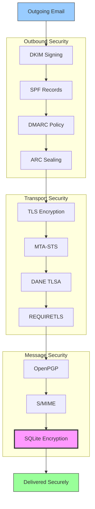


## Protokolle zur Authentifizierung von E-Mail-Nachrichten {#email-message-authentication-protocols}

> \[!NOTE]
> Forward Email implementiert alle wichtigen E-Mail-Authentifizierungsprotokolle, um Spoofing zu verhindern und die Integrität der Nachrichten sicherzustellen.

Forward Email verwendet die [mailauth](https://github.com/postalsys/mailauth)-Bibliothek für die E-Mail-Authentifizierung. Folgende RFCs werden unterstützt:

| RFC                                                       | Titel                                                                  | Implementierungshinweise                                      |
| --------------------------------------------------------- | --------------------------------------------------------------------- | ------------------------------------------------------------- |
| [RFC 6376](https://datatracker.ietf.org/doc/html/rfc6376) | DomainKeys Identified Mail (DKIM) Signaturen                          | Vollständiges DKIM-Signieren und -Verifizieren                |
| [RFC 8463](https://datatracker.ietf.org/doc/html/rfc8463) | Eine neue kryptografische Signaturmethode für DKIM (Ed25519-SHA256)   | Unterstützt sowohl RSA-SHA256 als auch Ed25519-SHA256 Signaturalgorithmen |
| [RFC 7208](https://datatracker.ietf.org/doc/html/rfc7208) | Sender Policy Framework (SPF)                                         | Validierung von SPF-Einträgen                                  |
| [RFC 7489](https://datatracker.ietf.org/doc/html/rfc7489) | Domain-basierte Nachrichten-Authentifizierung, Berichterstattung und Konformität (DMARC) | Durchsetzung der DMARC-Richtlinie                              |
| [RFC 8617](https://datatracker.ietf.org/doc/html/rfc8617) | Authenticated Received Chain (ARC)                                   | ARC-Versiegelung und -Validierung                              |

E-Mail-Authentifizierungsprotokolle prüfen, ob Nachrichten tatsächlich vom angegebenen Absender stammen und während der Übertragung nicht manipuliert wurden.

### Unterstützung der Authentifizierungsprotokolle {#authentication-protocol-support}

| Protokoll | RFC      | Status       | Beschreibung                                                        |
| --------- | -------- | ------------ | ------------------------------------------------------------------ |
| **DKIM**  | RFC 6376 | ✅ Unterstützt | DomainKeys Identified Mail – Kryptografische Signaturen            |
| **SPF**   | RFC 7208 | ✅ Unterstützt | Sender Policy Framework – Autorisierung der IP-Adresse             |
| **DMARC** | RFC 7489 | ✅ Unterstützt | Domain-basierte Nachrichten-Authentifizierung – Durchsetzung der Richtlinie |
| **ARC**   | RFC 8617 | ✅ Unterstützt | Authenticated Received Chain – Authentifizierung über Weiterleitungen hinweg bewahren |
### DKIM (DomainKeys Identified Mail) {#dkim-domainkeys-identified-mail}

**DKIM** fügt E-Mail-Headern eine kryptografische Signatur hinzu, die es Empfängern ermöglicht zu überprüfen, dass die Nachricht vom Domaininhaber autorisiert wurde und während der Übertragung nicht verändert wurde.

Forward Email verwendet [mailauth](https://github.com/postalsys/mailauth) für DKIM-Signierung und -Verifizierung.

**Hauptmerkmale:**

* Automatische DKIM-Signierung für alle ausgehenden Nachrichten
* Unterstützung für RSA- und Ed25519-Schlüssel
* Unterstützung mehrerer Selektoren
* DKIM-Verifizierung für eingehende Nachrichten

### SPF (Sender Policy Framework) {#spf-sender-policy-framework}

**SPF** ermöglicht Domaininhabern, festzulegen, welche IP-Adressen berechtigt sind, E-Mails im Namen ihrer Domain zu senden.

**Hauptmerkmale:**

* SPF-Record-Validierung für eingehende Nachrichten
* Automatische SPF-Prüfung mit detaillierten Ergebnissen
* Unterstützung für include-, redirect- und all-Mechanismen
* Konfigurierbare SPF-Richtlinien pro Domain

### DMARC (Domain-based Message Authentication, Reporting & Conformance) {#dmarc-domain-based-message-authentication-reporting--conformance}

**DMARC** baut auf SPF und DKIM auf, um Richtlinien-Durchsetzung und Berichterstattung bereitzustellen.

**Hauptmerkmale:**

* Durchsetzung von DMARC-Richtlinien (none, quarantine, reject)
* Alignment-Prüfung für SPF und DKIM
* DMARC-Aggregatberichte
* DMARC-Richtlinien pro Domain

### ARC (Authenticated Received Chain) {#arc-authenticated-received-chain}

**ARC** bewahrt E-Mail-Authentifizierungsergebnisse über Weiterleitungen und Mailinglistenänderungen hinweg.

Forward Email verwendet die [mailauth](https://github.com/postalsys/mailauth) Bibliothek für ARC-Verifizierung und -Versiegelung.

**Hauptmerkmale:**

* ARC-Versiegelung für weitergeleitete Nachrichten
* ARC-Validierung für eingehende Nachrichten
* Kettenverifizierung über mehrere Hops
* Bewahrt ursprüngliche Authentifizierungsergebnisse

### Authentication Flow {#authentication-flow}

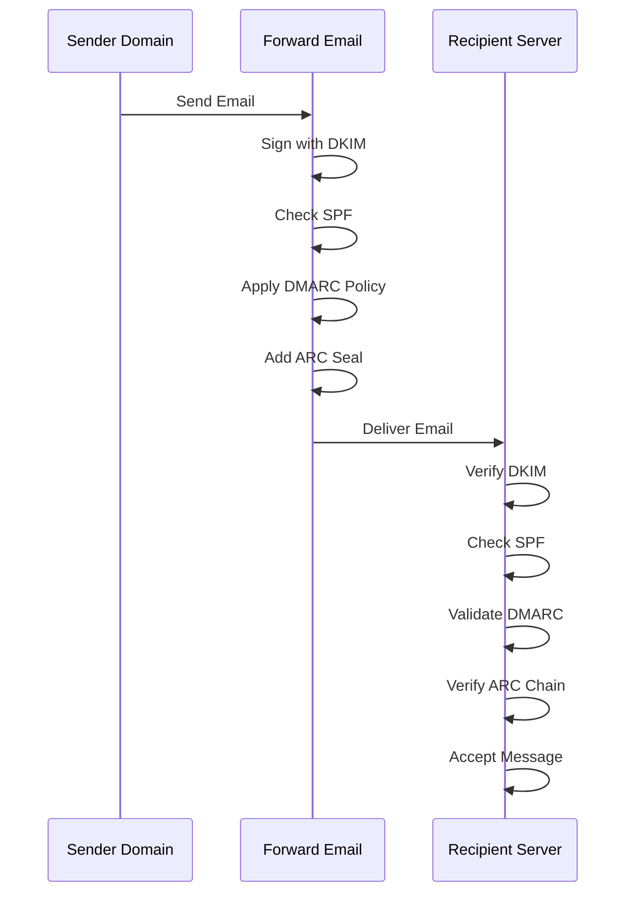

---


## Email Transport Security Protocols {#email-transport-security-protocols}

> \[!IMPORTANT]
> Forward Email implementiert mehrere Schichten von Transportsicherheitsmaßnahmen, um E-Mails während der Übertragung zu schützen.

Forward Email implementiert moderne Transportsicherheitsprotokolle:

| RFC                                                       | Titel                                                                                               | Status      | Implementierungshinweise                                                                                                                                                                                                                                                                       |
| --------------------------------------------------------- | -------------------------------------------------------------------------------------------------- | ----------- | --------------------------------------------------------------------------------------------------------------------------------------------------------------------------------------------------------------------------------------------------------------------------------------------- |
| [RFC 8461](https://datatracker.ietf.org/doc/html/rfc8461) | SMTP MTA Strict Transport Security (MTA-STS)                                                       | ✅ Unterstützt | Umfangreiche Nutzung auf IMAP-, SMTP- und MX-Servern. Siehe [create-mta-sts-cache.js](https://github.com/forwardemail/forwardemail.net/blob/master/helpers/create-mta-sts-cache.js) und [get-transporter.js](https://github.com/forwardemail/forwardemail.net/blob/master/helpers/get-transporter.js) |
| [RFC 8460](https://datatracker.ietf.org/doc/html/rfc8460) | SMTP TLS Reporting                                                                                 | ✅ Unterstützt | Über die [mailauth](https://github.com/postalsys/mailauth) Bibliothek                                                                                                                                                                                                                          |
| [RFC 7671](https://datatracker.ietf.org/doc/html/rfc7671) | Das DNS-basierte Authentifizierungsprotokoll für benannte Entitäten (DANE): Updates und Betriebshinweise | ✅ Unterstützt | Vollständige DANE-Verifizierung für ausgehende SMTP-Verbindungen. Siehe [mx-connect PR #22](https://github.com/zone-eu/mx-connect/pull/22)                                                                                                                                                     |
| [RFC 6698](https://datatracker.ietf.org/doc/html/rfc6698) | Das DNS-basierte Authentifizierungsprotokoll für benannte Entitäten (DANE) Transport Layer Security (TLS) Protokoll: TLSA | ✅ Unterstützt | Vollständige Unterstützung von RFC 6698: PKIX-TA, PKIX-EE, DANE-TA, DANE-EE Nutzungstypen. Siehe [mx-connect PR #22](https://github.com/zone-eu/mx-connect/pull/22)                                                                                                                             |
| [RFC 8314](https://datatracker.ietf.org/doc/html/rfc8314) | Klartext gilt als veraltet: Verwendung von Transport Layer Security (TLS) für E-Mail-Übermittlung und -Zugriff | ✅ Unterstützt | TLS ist für alle Verbindungen erforderlich                                                                                                                                                                                                                                                    |
| [RFC 8689](https://datatracker.ietf.org/doc/html/rfc8689) | SMTP Service Extension zum Erzwingen von TLS (REQUIRETLS)                                          | ✅ Unterstützt | Vollständige Unterstützung der REQUIRETLS SMTP-Erweiterung und des "TLS-Required"-Headers                                                                                                                                                                                                    |
Transport-Sicherheitsprotokolle stellen sicher, dass E-Mail-Nachrichten während der Übertragung zwischen Mailservern verschlüsselt und authentifiziert werden.

### Transport Security Support {#transport-security-support}

| Protokoll     | RFC      | Status       | Beschreibung                                     |
| --------------| -------- | ------------ | ------------------------------------------------ |
| **TLS**       | RFC 8314 | ✅ Unterstützt | Transport Layer Security – Verschlüsselte Verbindungen |
| **MTA-STS**   | RFC 8461 | ✅ Unterstützt | Mail Transfer Agent Strict Transport Security    |
| **DANE**      | RFC 7671 | ✅ Unterstützt | DNS-basierte Authentifizierung benannter Entitäten |
| **REQUIRETLS**| RFC 8689 | ✅ Unterstützt | TLS für den gesamten Zustellweg erforderlich     |

### TLS (Transport Layer Security) {#tls-transport-layer-security}

Forward Email erzwingt TLS-Verschlüsselung für alle E-Mail-Verbindungen (SMTP, IMAP, POP3).

**Hauptmerkmale:**

* Unterstützung für TLS 1.2 und TLS 1.3
* Automatisches Zertifikatsmanagement
* Perfect Forward Secrecy (PFS)
* Nur starke Chiffren-Suiten

### MTA-STS (Mail Transfer Agent Strict Transport Security) {#mta-sts-mail-transfer-agent-strict-transport-security}

**MTA-STS** stellt sicher, dass E-Mails nur über TLS-verschlüsselte Verbindungen zugestellt werden, indem eine Richtlinie über HTTPS veröffentlicht wird.

Forward Email implementiert MTA-STS mit [create-mta-sts-cache.js](https://github.com/forwardemail/forwardemail.net/blob/master/helpers/create-mta-sts-cache.js).

**Hauptmerkmale:**

* Automatische Veröffentlichung der MTA-STS-Richtlinie
* Zwischenspeicherung der Richtlinie für bessere Leistung
* Schutz vor Downgrade-Angriffen
* Durchsetzung der Zertifikatsvalidierung

### DANE (DNS-based Authentication of Named Entities) {#dane-dns-based-authentication-of-named-entities}

> \[!NOTE]
> Forward Email bietet jetzt vollständige DANE-Unterstützung für ausgehende SMTP-Verbindungen.

**DANE** verwendet DNSSEC, um TLS-Zertifikatsinformationen im DNS zu veröffentlichen, sodass Mailserver Zertifikate ohne Abhängigkeit von Zertifizierungsstellen überprüfen können.

**Hauptmerkmale:**

* ✅ Vollständige DANE-Verifizierung für ausgehende SMTP-Verbindungen
* ✅ Vollständige RFC 6698-Unterstützung: PKIX-TA, PKIX-EE, DANE-TA, DANE-EE Nutzungstypen
* ✅ Zertifikatsprüfung gegen TLSA-Einträge während des TLS-Upgrades
* ✅ Parallele TLSA-Auflösung für mehrere MX-Hosts
* ✅ Automatische Erkennung des nativen `dns.resolveTlsa` (Node.js v22.15.0+, v23.9.0+)
* ✅ Unterstützung benutzerdefinierter Resolver für ältere Node.js-Versionen via [Tangerine](https://github.com/forwardemail/tangerine)
* Erfordert DNSSEC-signierte Domains

> \[!TIP]
> **Implementierungsdetails:** Die DANE-Unterstützung wurde über [mx-connect PR #22](https://github.com/zone-eu/mx-connect/pull/22) hinzugefügt, der umfassende DANE/TLSA-Unterstützung für ausgehende SMTP-Verbindungen bietet.

### REQUIRETLS {#requiretls}

> \[!TIP]
> Forward Email ist einer der wenigen Anbieter mit benutzerseitiger REQUIRETLS-Unterstützung.

**REQUIRETLS** stellt sicher, dass E-Mail-Nachrichten nur über TLS-verschlüsselte Verbindungen für den gesamten Zustellweg zugestellt werden.

**Hauptmerkmale:**

* Benutzerseitiges Kontrollkästchen im E-Mail-Composer
* Automatische Ablehnung unverschlüsselter Zustellungen
* Ende-zu-Ende TLS-Durchsetzung
* Detaillierte Fehlermeldungen

> \[!TIP]
> **Benutzerseitige TLS-Durchsetzung:** Forward Email bietet ein Kontrollkästchen unter **Mein Konto > Domains > Einstellungen**, um TLS für alle eingehenden Verbindungen zu erzwingen. Wenn aktiviert, lehnt diese Funktion jede eingehende E-Mail ab, die nicht über eine TLS-verschlüsselte Verbindung gesendet wurde, mit dem Fehlercode 530, wodurch sichergestellt wird, dass alle eingehenden Mails während der Übertragung verschlüsselt sind.

### Transport Security Flow {#transport-security-flow}

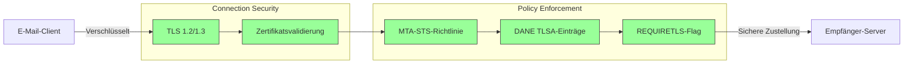
## E-Mail-Nachrichtenverschlüsselung {#email-message-encryption}

> \[!NOTE]
> Forward Email unterstützt sowohl OpenPGP als auch S/MIME für Ende-zu-Ende-E-Mail-Verschlüsselung.

Forward Email unterstützt OpenPGP- und S/MIME-Verschlüsselung:

| RFC                                                       | Titel                                                                                   | Status      | Implementierungshinweise                                                                                                                                                                            |
| --------------------------------------------------------- | --------------------------------------------------------------------------------------- | ----------- | -------------------------------------------------------------------------------------------------------------------------------------------------------------------------------------------------- |
| [RFC 9580](https://datatracker.ietf.org/doc/html/rfc9580) | OpenPGP (ersetzt RFC 4880)                                                              | ✅ Unterstützt | Über [OpenPGP.js v6+](https://github.com/openpgpjs/openpgpjs) Integration. Siehe [FAQ](https://forwardemail.net/en/faq#do-you-support-openpgpmime-end-to-end-encryption-e2ee-and-web-key-directory-wkd) |
| [RFC 8551](https://datatracker.ietf.org/doc/html/rfc8551) | Secure/Multipurpose Internet Mail Extensions (S/MIME) Version 4.0 Nachrichtenspezifikation | ✅ Unterstützt | Sowohl RSA- als auch ECC-Algorithmen werden unterstützt. Siehe [FAQ](https://forwardemail.net/en/faq#do-you-support-smime-encryption)                                                               |

Nachrichtenverschlüsselungsprotokolle schützen den E-Mail-Inhalt davor, von jemand anderem als dem vorgesehenen Empfänger gelesen zu werden, selbst wenn die Nachricht während der Übertragung abgefangen wird.

### Verschlüsselungsunterstützung {#encryption-support}

| Protokoll   | RFC      | Status      | Beschreibung                                  |
| ----------- | -------- | ----------- | -------------------------------------------- |
| **OpenPGP** | RFC 9580 | ✅ Unterstützt | Pretty Good Privacy - Public-Key-Verschlüsselung  |
| **S/MIME**  | RFC 8551 | ✅ Unterstützt | Secure/Multipurpose Internet Mail Extensions |
| **WKD**     | Entwurf  | ✅ Unterstützt | Web Key Directory - Automatische Schlüsselentdeckung  |

### OpenPGP (Pretty Good Privacy) {#openpgp-pretty-good-privacy}

**OpenPGP** bietet Ende-zu-Ende-Verschlüsselung mittels Public-Key-Kryptographie. Forward Email unterstützt OpenPGP über das [Web Key Directory (WKD)](https://forwardemail.net/en/faq#do-you-support-openpgpmime-end-to-end-encryption-e2ee-and-web-key-directory-wkd) Protokoll.

**Hauptmerkmale:**

* Automatische Schlüsselentdeckung über WKD
* PGP/MIME-Unterstützung für verschlüsselte Anhänge
* Schlüsselverwaltung über den E-Mail-Client
* Kompatibel mit GPG, Mailvelope und anderen OpenPGP-Tools

**Anwendung:**

1. Erstellen Sie ein PGP-Schlüsselpaar in Ihrem E-Mail-Client
2. Laden Sie Ihren öffentlichen Schlüssel in Forward Emails WKD hoch
3. Ihr Schlüssel ist für andere Benutzer automatisch auffindbar
4. Senden und empfangen Sie verschlüsselte E-Mails nahtlos

### S/MIME (Secure/Multipurpose Internet Mail Extensions) {#smime-securemultipurpose-internet-mail-extensions}

**S/MIME** bietet E-Mail-Verschlüsselung und digitale Signaturen mittels X.509-Zertifikaten.

**Hauptmerkmale:**

* Zertifikatbasierte Verschlüsselung
* Digitale Signaturen zur Nachrichtenauthentifizierung
* Native Unterstützung in den meisten E-Mail-Clients
* Sicherheit auf Unternehmensniveau

**Anwendung:**

1. Erhalten Sie ein S/MIME-Zertifikat von einer Zertifizierungsstelle
2. Installieren Sie das Zertifikat in Ihrem E-Mail-Client
3. Konfigurieren Sie Ihren Client zum Verschlüsseln/Signieren von Nachrichten
4. Tauschen Sie Zertifikate mit Empfängern aus

### SQLite-Mailbox-Verschlüsselung {#sqlite-mailbox-encryption}

> \[!IMPORTANT]
> Forward Email bietet eine zusätzliche Sicherheitsebene mit verschlüsselten SQLite-Mailboxen.

Über die Nachrichtenverschlüsselung hinaus verschlüsselt Forward Email komplette Mailboxen mit [sqleet](https://github.com/resilar/sqleet) (ChaCha20-Poly1305).

**Hauptmerkmale:**

* **Passwortbasierte Verschlüsselung** – Nur Sie kennen das Passwort
* **Quantenresistent** – ChaCha20-Poly1305-Chiffre
* **Zero-Knowledge** – Forward Email kann Ihre Mailbox nicht entschlüsseln
* **Sandboxed** – Jede Mailbox ist isoliert und portabel
* **Nicht wiederherstellbar** – Wenn Sie Ihr Passwort vergessen, ist Ihre Mailbox verloren
### Verschlüsselungsvergleich {#encryption-comparison}

| Feature               | OpenPGP           | S/MIME             | SQLite-Verschlüsselung |
| --------------------- | ----------------- | ------------------ | --------------------- |
| **End-to-End**        | ✅ Ja              | ✅ Ja               | ✅ Ja                 |
| **Schlüsselverwaltung** | Selbstverwaltet   | Von CA ausgestellt  | Passwortbasiert       |
| **Client-Unterstützung** | Plugin erforderlich | Nativ             | Transparent           |
| **Anwendungsfall**    | Persönlich        | Unternehmen        | Speicherung           |
| **Quantenresistent**  | ⚠️ Abhängig vom Schlüssel | ⚠️ Abhängig vom Zertifikat | ✅ Ja                 |

### Verschlüsselungsablauf {#encryption-flow}

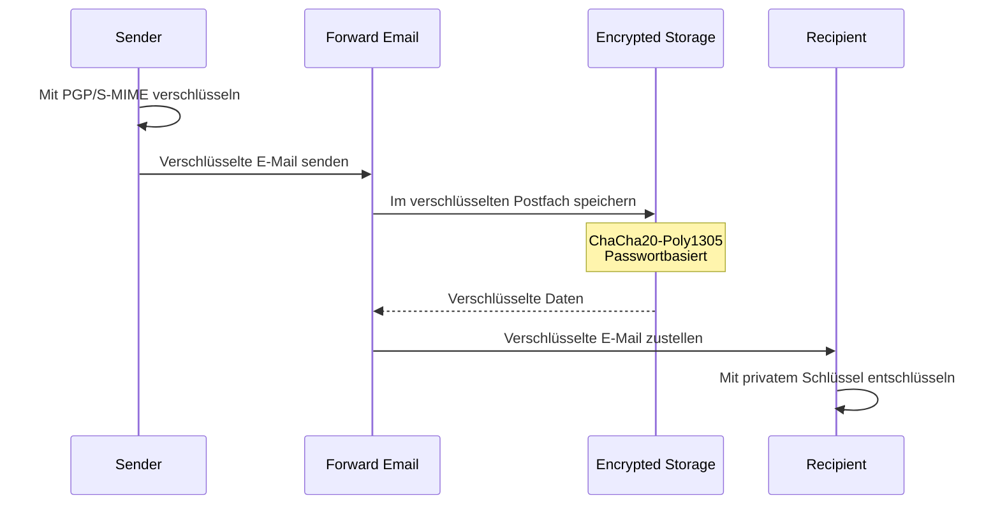

---


## Erweiterte Funktionalität {#extended-functionality}


## Standards für E-Mail-Nachrichtenformat {#email-message-format-standards}

> \[!NOTE]
> Forward Email unterstützt moderne E-Mail-Formatstandards für reichhaltige Inhalte und Internationalisierung.

Forward Email unterstützt standardisierte E-Mail-Nachrichtenformate:

| RFC                                                       | Titel                                                         | Implementierungshinweise |
| --------------------------------------------------------- | ------------------------------------------------------------- | ------------------------ |
| [RFC 5322](https://datatracker.ietf.org/doc/html/rfc5322) | Internet Message Format                                       | Vollständige Unterstützung |
| [RFC 2045](https://datatracker.ietf.org/doc/html/rfc2045) | MIME Teil Eins: Format von Internet-Nachrichtenkörpern        | Vollständige MIME-Unterstützung |
| [RFC 2046](https://datatracker.ietf.org/doc/html/rfc2046) | MIME Teil Zwei: Medientypen                                   | Vollständige MIME-Unterstützung |
| [RFC 2047](https://datatracker.ietf.org/doc/html/rfc2047) | MIME Teil Drei: Nachrichtenkopf-Erweiterungen für Nicht-ASCII-Text | Vollständige MIME-Unterstützung |
| [RFC 2048](https://datatracker.ietf.org/doc/html/rfc2048) | MIME Teil Vier: Registrierungsverfahren                       | Vollständige MIME-Unterstützung |
| [RFC 2049](https://datatracker.ietf.org/doc/html/rfc2049) | MIME Teil Fünf: Konformitätskriterien und Beispiele           | Vollständige MIME-Unterstützung |

E-Mail-Formatstandards definieren, wie E-Mail-Nachrichten strukturiert, kodiert und dargestellt werden.

### Unterstützung der Formatstandards {#format-standards-support}

| Standard           | RFC           | Status      | Beschreibung                           |
| ------------------ | ------------- | ----------- | ------------------------------------- |
| **MIME**           | RFC 2045-2049 | ✅ Unterstützt | Multipurpose Internet Mail Extensions |
| **SMTPUTF8**       | RFC 6531      | ⚠️ Teilweise | Internationalisierte E-Mail-Adressen  |
| **EAI**            | RFC 6530      | ⚠️ Teilweise | Internationalisierung von E-Mail-Adressen |
| **Nachrichtenformat** | RFC 5322    | ✅ Unterstützt | Internet Message Format               |
| **MIME-Sicherheit** | RFC 1847     | ✅ Unterstützt | Sicherheits-Multiparts für MIME       |

### MIME (Multipurpose Internet Mail Extensions) {#mime-multipurpose-internet-mail-extensions}

**MIME** ermöglicht es E-Mails, mehrere Teile mit unterschiedlichen Inhaltstypen (Text, HTML, Anhänge usw.) zu enthalten.

**Unterstützte MIME-Funktionen:**

* Mehrteilige Nachrichten (mixed, alternative, related)
* Content-Type-Header
* Content-Transfer-Encoding (7bit, 8bit, quoted-printable, base64)
* Inline-Bilder und Anhänge
* Reichhaltige HTML-Inhalte

### SMTPUTF8 und Internationalisierung von E-Mail-Adressen {#smtputf8-and-email-address-internationalization}

> \[!WARNING]
> Die Unterstützung von SMTPUTF8 ist teilweise – nicht alle Funktionen sind vollständig implementiert.
**SMTPUTF8** erlaubt E-Mail-Adressen, nicht-ASCII-Zeichen zu enthalten (z. B. `用户@例え.jp`).

**Aktueller Status:**

* ⚠️ Teilweise Unterstützung für internationalisierte E-Mail-Adressen
* ✅ UTF-8-Inhalt in Nachrichtenkörpern
* ⚠️ Eingeschränkte Unterstützung für nicht-ASCII lokale Teile

---


## Kalender- und Kontaktprotokolle {#calendaring-and-contacts-protocols}

> \[!NOTE]
> Forward Email bietet vollständige CalDAV- und CardDAV-Unterstützung für Kalender- und Kontaktsynchronisation.

Forward Email unterstützt CalDAV und CardDAV über die [caldav-adapter](https://github.com/forwardemail/caldav-adapter)-Bibliothek:

| RFC                                                       | Titel                                                                    | Status      | Implementierungshinweise                                                                                                                                                              |
| --------------------------------------------------------- | ------------------------------------------------------------------------ | ----------- | ------------------------------------------------------------------------------------------------------------------------------------------------------------------------------------- |
| [RFC 4791](https://datatracker.ietf.org/doc/html/rfc4791) | Kalendererweiterungen für WebDAV (CalDAV)                               | ✅ Unterstützt | Kalenderzugriff und -verwaltung                                                                                                                                                       |
| [RFC 6352](https://datatracker.ietf.org/doc/html/rfc6352) | CardDAV: vCard-Erweiterungen für WebDAV                                 | ✅ Unterstützt | Kontaktzugriff und -verwaltung                                                                                                                                                        |
| [RFC 5545](https://datatracker.ietf.org/doc/html/rfc5545) | Internet-Kalender- und Terminplanung Kernobjektspezifikation (iCalendar) | ✅ Unterstützt | Unterstützung des iCalendar-Formats                                                                                                                                                   |
| [RFC 6350](https://datatracker.ietf.org/doc/html/rfc6350) | vCard-Formatspezifikation                                               | ✅ Unterstützt | Unterstützung des vCard 4.0-Formats                                                                                                                                                   |
| [RFC 6638](https://datatracker.ietf.org/doc/html/rfc6638) | Terminplanungserweiterungen für CalDAV                                  | ✅ Unterstützt | CalDAV-Terminplanung mit iMIP-Unterstützung. Siehe [commit c4d1629](https://github.com/forwardemail/forwardemail.net/commit/c4d162975a49e38d76d68a032662e873a34a9b80)                 |
| [RFC 5546](https://datatracker.ietf.org/doc/html/rfc5546) | iCalendar Transportunabhängiges Interoperabilitätsprotokoll (iTIP)      | ✅ Unterstützt | iTIP-Unterstützung für REQUEST, REPLY, CANCEL und VFREEBUSY Methoden. Siehe [commit c4d1629](https://github.com/forwardemail/forwardemail.net/commit/c4d162975a49e38d76d68a032662e873a34a9b80) |
| [RFC 6047](https://datatracker.ietf.org/doc/html/rfc6047) | iCalendar Nachrichtenbasiertes Interoperabilitätsprotokoll (iMIP)       | ✅ Unterstützt | E-Mail-basierte Kalendereinladungen mit Antwortlinks. Siehe [commit c4d1629](https://github.com/forwardemail/forwardemail.net/commit/c4d162975a49e38d76d68a032662e873a34a9b80)           |

CalDAV und CardDAV sind Protokolle, die den Zugriff, das Teilen und die Synchronisation von Kalender- und Kontaktdaten über Geräte hinweg ermöglichen.

### CalDAV- und CardDAV-Unterstützung {#caldav-and-carddav-support}

| Protokoll             | RFC      | Status      | Beschreibung                          |
| --------------------- | -------- | ----------- | ------------------------------------ |
| **CalDAV**            | RFC 4791 | ✅ Unterstützt | Kalenderzugriff und Synchronisation  |
| **CardDAV**           | RFC 6352 | ✅ Unterstützt | Kontaktzugriff und Synchronisation   |
| **iCalendar**         | RFC 5545 | ✅ Unterstützt | Kalenderdatenformat                   |
| **vCard**             | RFC 6350 | ✅ Unterstützt | Kontaktdatenformat                   |
| **VTODO**             | RFC 5545 | ✅ Unterstützt | Aufgaben-/Erinnerungsunterstützung   |
| **CalDAV Scheduling** | RFC 6638 | ✅ Unterstützt | Kalender-Terminplanungserweiterungen |
| **iTIP**              | RFC 5546 | ✅ Unterstützt | Transportunabhängige Interoperabilität |
| **iMIP**              | RFC 6047 | ✅ Unterstützt | E-Mail-basierte Kalendereinladungen  |
### CalDAV (Kalenderzugriff) {#caldav-calendar-access}

**CalDAV** ermöglicht den Zugriff auf und die Verwaltung von Kalendern von jedem Gerät oder jeder Anwendung aus.

**Hauptfunktionen:**

* Synchronisation auf mehreren Geräten
* Gemeinsame Kalender
* Kalenderabonnements
* Ereigniseinladungen und -antworten
* Wiederkehrende Ereignisse
* Zeitzonenunterstützung

**Kompatible Clients:**

* Apple Kalender (macOS, iOS)
* Mozilla Thunderbird
* Evolution
* GNOME Kalender
* Jeder CalDAV-kompatible Client

### CardDAV (Kontaktzugriff) {#carddav-contact-access}

**CardDAV** ermöglicht den Zugriff auf und die Verwaltung von Kontakten von jedem Gerät oder jeder Anwendung aus.

**Hauptfunktionen:**

* Synchronisation auf mehreren Geräten
* Gemeinsame Adressbücher
* Kontaktgruppen
* Foto-Unterstützung
* Benutzerdefinierte Felder
* vCard 4.0 Unterstützung

**Kompatible Clients:**

* Apple Kontakte (macOS, iOS)
* Mozilla Thunderbird
* Evolution
* GNOME Kontakte
* Jeder CardDAV-kompatible Client

### Aufgaben und Erinnerungen (CalDAV VTODO) {#tasks-and-reminders-caldav-vtodo}

> \[!TIP]
> Forward Email unterstützt Aufgaben und Erinnerungen über CalDAV VTODO.

**VTODO** ist Teil des iCalendar-Formats und ermöglicht die Aufgabenverwaltung über CalDAV.

**Hauptfunktionen:**

* Erstellung und Verwaltung von Aufgaben
* Fälligkeitsdaten und Prioritäten
* Nachverfolgung des Aufgabenstatus
* Wiederkehrende Aufgaben
* Aufgabenlisten/Kategorien

**Kompatible Clients:**

* Apple Erinnerungen (macOS, iOS)
* Mozilla Thunderbird (mit Lightning)
* Evolution
* GNOME To Do
* Jeder CalDAV-Client mit VTODO-Unterstützung

### CalDAV/CardDAV Synchronisationsablauf {#caldavcarddav-synchronization-flow}

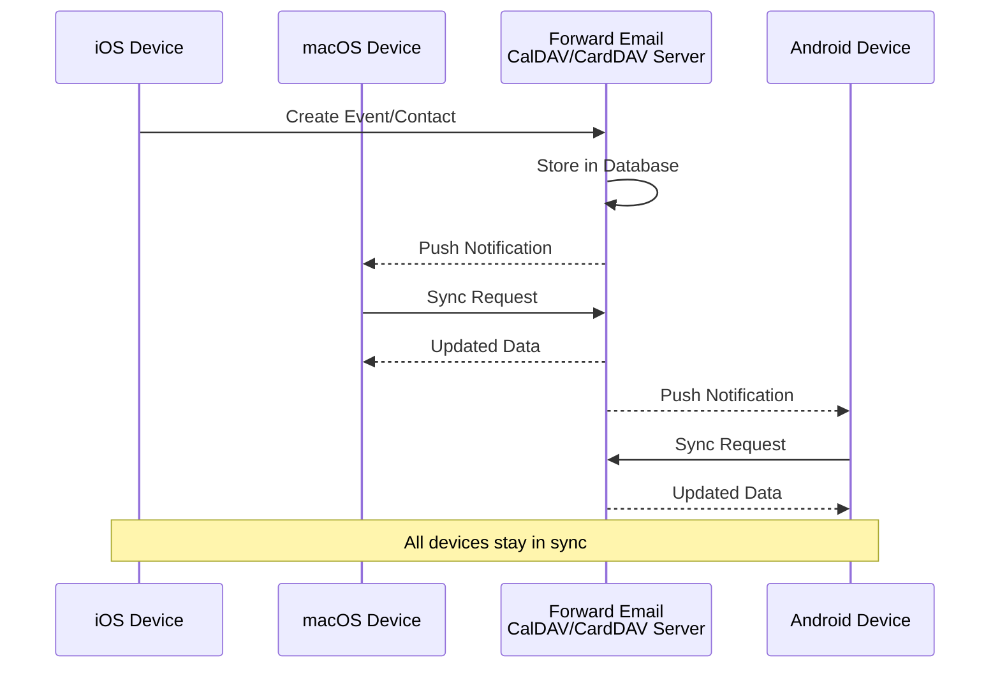

### Nicht unterstützte Kalendererweiterungen {#calendaring-extensions-not-supported}

Die folgenden Kalendererweiterungen werden NICHT unterstützt:

| RFC                                                       | Titel                                                                | Grund                                                           |
| --------------------------------------------------------- | -------------------------------------------------------------------- | ---------------------------------------------------------------- |
| [RFC 4918](https://datatracker.ietf.org/doc/html/rfc4918) | HTTP-Erweiterungen für verteiltes Web-Autorensystem und Versionierung (WebDAV) | CalDAV verwendet WebDAV-Konzepte, implementiert aber nicht das vollständige RFC 4918 |
| [RFC 6578](https://datatracker.ietf.org/doc/html/rfc6578) | Sammlungssynchronisation für WebDAV                                  | Nicht implementiert                                             |
| [RFC 3744](https://datatracker.ietf.org/doc/html/rfc3744) | WebDAV-Zugriffskontrollprotokoll                                    | Nicht implementiert                                             |

---


## E-Mail-Nachrichtenfilterung {#email-message-filtering}

> \[!IMPORTANT]
> Forward Email bietet **volle Sieve- und ManageSieve-Unterstützung** für serverseitige E-Mail-Filterung. Erstellen Sie leistungsstarke Regeln, um eingehende Nachrichten automatisch zu sortieren, filtern, weiterzuleiten und zu beantworten.

### Sieve (RFC 5228) {#sieve-rfc-5228}

[Sieve](https://en.wikipedia.org/wiki/Sieve_\(mail_filtering_language\)) ist eine standardisierte, leistungsstarke Skriptsprache für serverseitige E-Mail-Filterung. Forward Email implementiert umfassende Sieve-Unterstützung mit 24 Erweiterungen.

**Quellcode:** [`helpers/sieve/`](https://github.com/forwardemail/forwardemail.net/tree/master/helpers/sieve)

#### Unterstützte Kern-Sieve-RFCs {#core-sieve-rfcs-supported}

| RFC                                                                                    | Titel                                                        | Status         |
| -------------------------------------------------------------------------------------- | ------------------------------------------------------------ | -------------- |
| [RFC 5228](https://datatracker.ietf.org/doc/html/rfc5228)                              | Sieve: Eine Sprache zur E-Mail-Filterung                     | ✅ Volle Unterstützung |
| [RFC 5429](https://datatracker.ietf.org/doc/html/rfc5429)                              | Sieve E-Mail-Filterung: Reject- und Extended Reject-Erweiterungen | ✅ Volle Unterstützung |
| [RFC 5230](https://datatracker.ietf.org/doc/html/rfc5230)                              | Sieve E-Mail-Filterung: Urlaubs-Erweiterung                  | ✅ Volle Unterstützung |
| [RFC 6131](https://datatracker.ietf.org/doc/html/rfc6131)                              | Sieve Urlaubs-Erweiterung: "Seconds"-Parameter                | ✅ Volle Unterstützung |
| [RFC 5232](https://datatracker.ietf.org/doc/html/rfc5232)                              | Sieve E-Mail-Filterung: Imap4flags-Erweiterung               | ✅ Volle Unterstützung |
| [RFC 5173](https://datatracker.ietf.org/doc/html/rfc5173)                              | Sieve E-Mail-Filterung: Body-Erweiterung                      | ✅ Volle Unterstützung |
| [RFC 5229](https://datatracker.ietf.org/doc/html/rfc5229)                              | Sieve E-Mail-Filterung: Variablen-Erweiterung                 | ✅ Volle Unterstützung |
| [RFC 5231](https://datatracker.ietf.org/doc/html/rfc5231)                              | Sieve E-Mail-Filterung: Relationale Erweiterung               | ✅ Volle Unterstützung |
| [RFC 4790](https://datatracker.ietf.org/doc/html/rfc4790)                              | Internet Application Protocol Collation Registry              | ✅ Volle Unterstützung |
| [RFC 3894](https://datatracker.ietf.org/doc/html/rfc3894)                              | Sieve-Erweiterung: Kopieren ohne Nebeneffekte                 | ✅ Volle Unterstützung |
| [RFC 5293](https://datatracker.ietf.org/doc/html/rfc5293)                              | Sieve E-Mail-Filterung: Editheader-Erweiterung                | ✅ Volle Unterstützung |
| [RFC 5260](https://datatracker.ietf.org/doc/html/rfc5260)                              | Sieve E-Mail-Filterung: Datums- und Index-Erweiterungen       | ✅ Volle Unterstützung |
| [RFC 5435](https://datatracker.ietf.org/doc/html/rfc5435)                              | Sieve E-Mail-Filterung: Erweiterung für Benachrichtigungen    | ✅ Volle Unterstützung |
| [RFC 5183](https://datatracker.ietf.org/doc/html/rfc5183)                              | Sieve E-Mail-Filterung: Umgebungs-Erweiterung                  | ✅ Volle Unterstützung |
| [RFC 5490](https://datatracker.ietf.org/doc/html/rfc5490)                              | Sieve E-Mail-Filterung: Erweiterungen zur Überprüfung des Postfachstatus | ✅ Volle Unterstützung |
| [RFC 8579](https://datatracker.ietf.org/doc/html/rfc8579)                              | Sieve E-Mail-Filterung: Zustellung an spezielle Postfächer    | ✅ Volle Unterstützung |
| [RFC 7352](https://datatracker.ietf.org/doc/html/rfc7352)                              | Sieve E-Mail-Filterung: Erkennung doppelter Zustellungen      | ✅ Volle Unterstützung |
| [RFC 5463](https://datatracker.ietf.org/doc/html/rfc5463)                              | Sieve E-Mail-Filterung: Ihave-Erweiterung                      | ✅ Volle Unterstützung |
| [RFC 5233](https://datatracker.ietf.org/doc/html/rfc5233)                              | Sieve E-Mail-Filterung: Subaddress-Erweiterung                 | ✅ Volle Unterstützung |
| [draft-ietf-sieve-regex](https://datatracker.ietf.org/doc/html/draft-ietf-sieve-regex) | Sieve E-Mail-Filterung: Regulärer Ausdruck Erweiterung         | ✅ Volle Unterstützung |
#### Unterstützte Sieve-Erweiterungen {#supported-sieve-extensions}

| Erweiterung                  | Beschreibung                             | Integration                                |
| ---------------------------- | ---------------------------------------- | ------------------------------------------ |
| `fileinto`                   | Nachrichten in bestimmte Ordner ablegen | Nachrichten werden im angegebenen IMAP-Ordner gespeichert |
| `reject` / `ereject`         | Nachrichten mit einem Fehler ablehnen    | SMTP-Ablehnung mit Bounce-Nachricht        |
| `vacation`                   | Automatische Abwesenheits-/Urlaubsantworten | Warteschlange über Emails.queue mit Ratenbegrenzung |
| `vacation-seconds`           | Feingranulare Abwesenheitsantwort-Intervalle | TTL aus dem `:seconds` Parameter           |
| `imap4flags`                 | IMAP-Flags setzen (\Seen, \Flagged, etc.) | Flags werden während der Nachrichtenspeicherung angewendet |
| `envelope`                   | Absender/Empfänger im Umschlag testen    | Zugriff auf SMTP-Umschlagdaten              |
| `body`                       | Nachrichtentext-Inhalt testen             | Vollständige Textsuche im Nachrichtentext  |
| `variables`                  | Variablen in Skripten speichern und verwenden | Variablenerweiterung mit Modifikatoren     |
| `relational`                 | Relationale Vergleiche                    | `:count`, `:value` mit gt/lt/eq             |
| `comparator-i;ascii-numeric` | Numerische Vergleiche                     | Numerischer Stringvergleich                  |
| `copy`                       | Nachrichten beim Weiterleiten kopieren   | `:copy` Flag bei fileinto/redirect          |
| `editheader`                 | Nachrichten-Header hinzufügen oder löschen | Header werden vor der Speicherung geändert  |
| `date`                       | Datums-/Zeitwerte testen                  | `currentdate` und Header-Datumsprüfungen    |
| `index`                      | Zugriff auf bestimmte Header-Vorkommen   | `:index` für mehrwertige Header              |
| `regex`                      | Reguläre Ausdrücke verwenden              | Vollständige Regex-Unterstützung bei Tests  |
| `enotify`                    | Benachrichtigungen senden                 | `mailto:` Benachrichtigungen über Emails.queue |
| `environment`                | Zugriff auf Umgebungsinformationen        | Domain, Host, remote-ip aus der Sitzung     |
| `mailbox`                    | Postfach-Existenz testen                   | `mailboxexists` Test                         |
| `special-use`                | In spezielle Postfächer ablegen            | Ordnerzuordnung für \Junk, \Trash, etc.     |
| `duplicate`                  | Doppelte Nachrichten erkennen              | Redis-basierte Duplikaterkennung             |
| `ihave`                      | Verfügbarkeit von Erweiterungen testen     | Laufzeit-Fähigkeitsprüfung                    |
| `subaddress`                 | Zugriff auf user+detail Adressteile        | `:user` und `:detail` Adressteile            |

#### Nicht unterstützte Sieve-Erweiterungen {#sieve-extensions-not-supported}

| Erweiterung                               | RFC                                                       | Grund                                                            |
| ----------------------------------------- | --------------------------------------------------------- | ---------------------------------------------------------------- |
| `include`                               | [RFC 6609](https://datatracker.ietf.org/doc/html/rfc6609) | Sicherheitsrisiko (Skripteinbindung), erfordert globale Skriptspeicherung |
| `mboxmetadata` / `servermetadata`       | [RFC 5490](https://datatracker.ietf.org/doc/html/rfc5490) | Erfordert IMAP METADATA Erweiterung                              |
| `fcc`                                   | [RFC 8580](https://datatracker.ietf.org/doc/html/rfc8580) | Erfordert Integration des Gesendet-Ordners                      |
| `encoded-character`                     | [RFC 5228](https://datatracker.ietf.org/doc/html/rfc5228) | Parser-Anpassungen für ${hex:} Syntax erforderlich              |
| `foreverypart` / `mime` / `extracttext` | [RFC 5703](https://datatracker.ietf.org/doc/html/rfc5703) | Komplexe MIME-Baum-Manipulation                                 |
#### Sieve-Verarbeitungsablauf {#sieve-processing-flow}

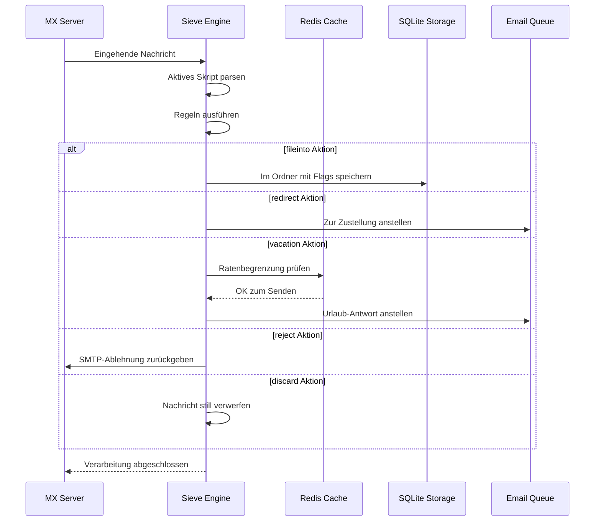

#### Sicherheitsfunktionen {#security-features}

Die Sieve-Implementierung von Forward Email beinhaltet umfassende Sicherheitsmaßnahmen:

* **CVE-2023-26430 Schutz**: Verhindert Weiterleitungsschleifen und Mail-Bombing-Angriffe
* **Ratenbegrenzung**: Limits für Weiterleitungen (10/Nachricht, 100/Tag) und Urlaubsantworten
* **Denylist-Prüfung**: Weiterleitungsadressen werden gegen die Sperrliste geprüft
* **Geschützte Header**: DKIM-, ARC- und Authentifizierungsheader können nicht über editheader verändert werden
* **Skriptgrößenbegrenzung**: Maximale Skriptgröße wird durchgesetzt
* **Ausführungs-Timeouts**: Skripte werden beendet, wenn die Ausführungszeit überschritten wird

#### Beispiel-Sieve-Skripte {#example-sieve-scripts}

**Newsletter in einen Ordner ablegen:**

```sieve
require ["fileinto"];

if header :contains "List-Id" "newsletter" {
    fileinto "Newsletters";
}
```

**Urlaubs-Autoantwort mit feiner Zeitsteuerung:**

```sieve
require ["vacation", "vacation-seconds"];

vacation :seconds 3600 :subject "Abwesend"
    "Ich bin derzeit nicht erreichbar und antworte innerhalb von 24 Stunden.";
```

**Spam-Filterung mit Flags:**

```sieve
require ["fileinto", "imap4flags"];

if header :contains "X-Spam-Status" "Yes" {
    setflag "\\Seen";
    fileinto "Junk";
}
```

**Komplexe Filterung mit Variablen:**

```sieve
require ["variables", "fileinto", "regex"];

if header :regex "From" "(.+)@example\\.com" {
    set :lower "sender" "${1}";
    fileinto "Contacts/${sender}";
}
```

> \[!TIP]
> Für vollständige Dokumentation, Beispielskripte und Konfigurationsanleitungen siehe [FAQ: Unterstützen Sie Sieve-E-Mail-Filterung?](/faq#do-you-support-sieve-email-filtering)

### ManageSieve (RFC 5804) {#managesieve-rfc-5804}

Forward Email bietet vollständige ManageSieve-Protokollunterstützung zur Fernverwaltung von Sieve-Skripten.

**Quellcode:** [`managesieve-server.js`](https://github.com/forwardemail/forwardemail.net/blob/master/managesieve-server.js)

| RFC                                                       | Titel                                          | Status         |
| --------------------------------------------------------- | ---------------------------------------------- | -------------- |
| [RFC 5804](https://datatracker.ietf.org/doc/html/rfc5804) | Ein Protokoll zur Fernverwaltung von Sieve-Skripten | ✅ Volle Unterstützung |

#### ManageSieve-Server-Konfiguration {#managesieve-server-configuration}

| Einstellung             | Wert                    |
| ----------------------- | ----------------------- |
| **Server**              | `imap.forwardemail.net` |
| **Port (STARTTLS)**     | `2190` (empfohlen)      |
| **Port (Implizites TLS)** | `4190`                  |
| **Authentifizierung**   | PLAIN (über TLS)        |

> **Hinweis:** Port 2190 verwendet STARTTLS (Upgrade von Plain zu TLS) und ist kompatibel mit den meisten ManageSieve-Clients, einschließlich [sieve-connect](https://github.com/philpennock/sieve-connect). Port 4190 verwendet implizites TLS (TLS ab Verbindungsbeginn) für Clients, die dies unterstützen.

#### Unterstützte ManageSieve-Befehle {#supported-managesieve-commands}

| Befehl         | Beschreibung                          |
| -------------- | ----------------------------------- |
| `AUTHENTICATE` | Authentifizierung mit PLAIN-Mechanismus |
| `CAPABILITY`   | Auflisten der Serverfähigkeiten und Erweiterungen |
| `HAVESPACE`    | Prüfen, ob Skript gespeichert werden kann |
| `PUTSCRIPT`    | Hochladen eines neuen Skripts       |
| `LISTSCRIPTS`  | Auflisten aller Skripte mit Aktivstatus |
| `SETACTIVE`    | Aktivieren eines Skripts             |
| `GETSCRIPT`    | Herunterladen eines Skripts          |
| `DELETESCRIPT` | Löschen eines Skripts                |
| `RENAMESCRIPT` | Umbenennen eines Skripts             |
| `CHECKSCRIPT`  | Validierung der Skriptsyntax         |
| `NOOP`         | Verbindung aktiv halten              |
| `LOGOUT`       | Sitzung beenden                     |
#### Kompatible ManageSieve-Clients {#compatible-managesieve-clients}

* **Thunderbird**: Eingebaute Sieve-Unterstützung über das [Sieve Add-on](https://addons.thunderbird.net/addon/sieve/)
* **Roundcube**: [ManageSieve Plugin](https://plugins.roundcube.net/packages/johndoh/sieve)
* **KMail**: Native ManageSieve-Unterstützung
* **sieve-connect**: Kommandozeilen-Client
* **Jeder RFC 5804 konforme Client**

#### ManageSieve-Protokollablauf {#managesieve-protocol-flow}

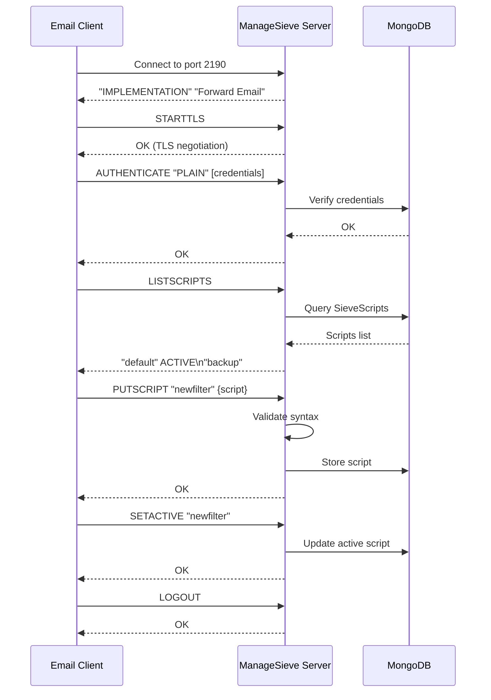

#### Web-Oberfläche und API {#web-interface-and-api}

Zusätzlich zu ManageSieve bietet Forward Email:

* **Web-Dashboard**: Erstellen und Verwalten von Sieve-Skripten über die Weboberfläche unter Mein Konto → Domains → Aliase → Sieve-Skripte
* **REST API**: Programmatischer Zugriff auf die Verwaltung von Sieve-Skripten über die [Forward Email API](/api#sieve-scripts)

> \[!TIP]
> Für detaillierte Einrichtungshinweise und Client-Konfiguration siehe [FAQ: Unterstützen Sie Sieve-E-Mail-Filterung?](/faq#do-you-support-sieve-email-filtering)

---


## Speicheroptimierung {#storage-optimization}

> \[!IMPORTANT]
> **Branchenweit erste Speichertechnologie:** Forward Email ist der **einzige E-Mail-Anbieter weltweit**, der Anhang-Deduplizierung mit Brotli-Kompression des E-Mail-Inhalts kombiniert. Diese zweischichtige Optimierung bietet Ihnen **2-3x mehr effektiven Speicherplatz** im Vergleich zu traditionellen E-Mail-Anbietern.

Forward Email implementiert zwei revolutionäre Speicheroptimierungstechniken, die die Postfachgröße drastisch reduzieren und dabei volle RFC-Konformität und Nachrichtenintegrität bewahren:

1. **Anhang-Deduplizierung** – Eliminierung doppelter Anhänge über alle E-Mails hinweg
2. **Brotli-Kompression** – Reduziert den Speicherbedarf um 46-86 % für Metadaten und 50 % für Anhänge

### Architektur: Zweischichtige Speicheroptimierung {#architecture-dual-layer-storage-optimization}

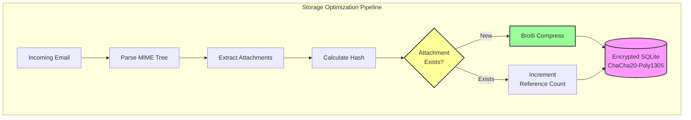

---


## Anhang-Deduplizierung {#attachment-deduplication}

Forward Email implementiert Anhang-Deduplizierung basierend auf dem [bewährten Ansatz von WildDuck](https://docs.wildduck.email/docs/in-depth/attachment-deduplication/), angepasst für SQLite-Speicherung.

> \[!NOTE]
> **Was dedupliziert wird:** „Anhang“ bezieht sich auf den **kodierten** MIME-Knoteninhalt (base64 oder quoted-printable), nicht auf die dekodierte Datei. Dies bewahrt die Gültigkeit von DKIM- und GPG-Signaturen.

### Funktionsweise {#how-it-works}

**WildDucks Originalimplementierung (MongoDB GridFS):**

> Wild Duck IMAP-Server dedupliziert Anhänge. „Anhang“ bedeutet in diesem Fall die base64- oder quoted-printable-kodierten MIME-Knoteninhalte, nicht die dekodierte Datei. Obwohl die Verwendung kodierter Inhalte viele False Negatives verursacht (dasselbe Datei in verschiedenen E-Mails als unterschiedliche Anhänge gezählt werden kann), ist dies notwendig, um die Gültigkeit verschiedener Signaturschemata (DKIM, GPG etc.) zu gewährleisten. Eine von Wild Duck abgerufene Nachricht sieht genau so aus wie die gespeicherte Nachricht, obwohl Wild Duck die Nachricht in ein baumartiges Objekt parst und die Nachricht beim Abruf wieder zusammensetzt.
**Forward Emails SQLite-Implementierung:**

Forward Email passt diesen Ansatz für die verschlüsselte SQLite-Speicherung mit folgendem Prozess an:

1. **Hash-Berechnung**: Wenn ein Anhang gefunden wird, wird ein Hash mit der [`rev-hash`](https://github.com/sindresorhus/rev-hash)-Bibliothek aus dem Anhangsinhalt berechnet
2. **Nachschlagen**: Prüfen, ob ein Anhang mit passendem Hash in der Tabelle `Attachments` existiert
3. **Referenzzählung**:
   * Falls vorhanden: Referenzzähler um 1 erhöhen und Magic-Zähler um eine Zufallszahl erhöhen
   * Falls neu: Neuen Anhangseintrag mit Zähler = 1 erstellen
4. **Löschungssicherheit**: Verwendet ein Dual-Zähler-System (Referenz + Magic), um Fehlalarme zu vermeiden
5. **Garbage Collection**: Anhänge werden sofort gelöscht, wenn beide Zähler null erreichen

**Quellcode:** [`helpers/attachment-storage.js`](https://github.com/forwardemail/forwardemail.net/blob/master/helpers/attachment-storage.js)

### Deduplication Flow {#deduplication-flow}

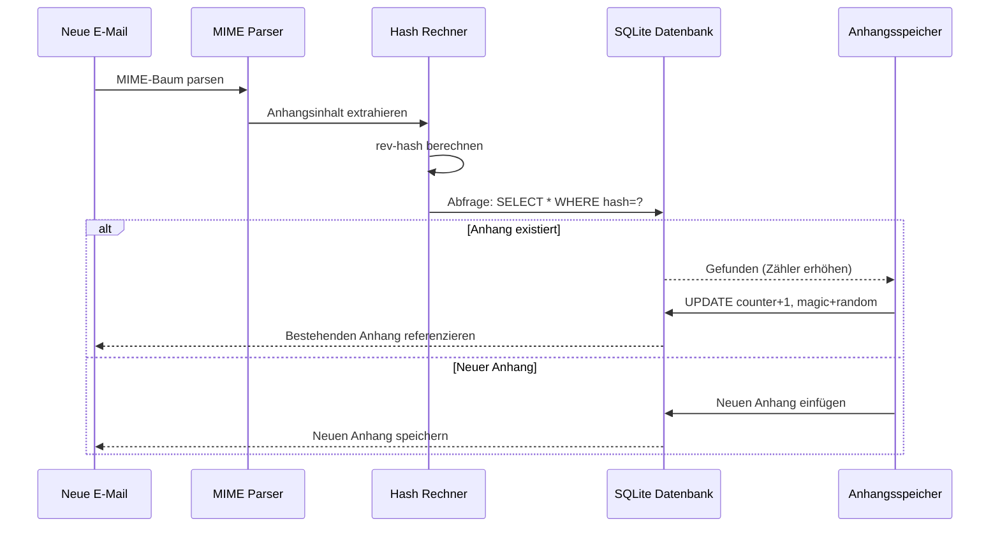

### Magic Number System {#magic-number-system}

Forward Email verwendet WildDucks "Magic Number"-System (inspiriert von [Mail.ru](https://github.com/zone-eu/wildduck)), um Fehlalarme bei der Löschung zu verhindern:

* Jede Nachricht erhält eine **Zufallszahl** zugewiesen
* Der **Magic-Zähler** des Anhangs wird beim Hinzufügen der Nachricht um diese Zufallszahl erhöht
* Der Magic-Zähler wird beim Löschen der Nachricht um dieselbe Zahl verringert
* Der Anhang wird nur gelöscht, wenn **beide Zähler** (Referenz + Magic) null erreichen

Dieses Dual-Zähler-System stellt sicher, dass bei Problemen während der Löschung (z. B. Absturz, Netzwerkfehler) der Anhang nicht zu früh gelöscht wird.

### Hauptunterschiede: WildDuck vs Forward Email {#key-differences-wildduck-vs-forward-email}

| Feature                | WildDuck (MongoDB)       | Forward Email (SQLite)       |
| ---------------------- | ------------------------ | ---------------------------- |
| **Speicher-Backend**   | MongoDB GridFS (chunked) | SQLite BLOB (direkt)         |
| **Hash-Algorithmus**   | SHA256                   | rev-hash (SHA-256 basiert)   |
| **Referenzzählung**    | ✅ Ja                    | ✅ Ja                        |
| **Magic Numbers**      | ✅ Ja (Mail.ru inspiriert) | ✅ Ja (gleiches System)      |
| **Garbage Collection** | Verzögert (separater Job) | Sofort (bei Null-Zählern)    |
| **Kompression**        | ❌ Keine                 | ✅ Brotli (siehe unten)       |
| **Verschlüsselung**    | ❌ Optional              | ✅ Immer (ChaCha20-Poly1305) |

---


## Brotli-Kompression {#brotli-compression}

> \[!IMPORTANT]
> **Weltweit erste:** Forward Email ist der **einzige E-Mail-Dienst weltweit**, der Brotli-Kompression auf E-Mail-Inhalte anwendet. Dies bietet **46-86% Speicherersparnis** zusätzlich zur Anhangs-Deduplizierung.

Forward Email implementiert Brotli-Kompression sowohl für Anhangsinhalte als auch für Nachrichten-Metadaten und ermöglicht so enorme Speicherersparnisse bei gleichzeitiger Rückwärtskompatibilität.

**Implementierung:** [`helpers/msgpack-helpers.js`](https://github.com/forwardemail/forwardemail.net/blob/master/helpers/msgpack-helpers.js)

### Was wird komprimiert {#what-gets-compressed}

**1. Anhangsinhalte** (`encodeAttachmentBody`)

* **Alte Formate**: Hex-kodierter String (2x Größe) oder rohes Buffer
* **Neues Format**: Brotli-komprimierter Buffer mit "FEBR"-Magic-Header
* **Kompressionsentscheidung**: Komprimiert nur, wenn Speicher gespart wird (berücksichtigt 4-Byte-Header)
* **Speicherersparnis**: Bis zu **50%** (Hex → nativer BLOB)
**2. Nachrichten-Metadaten** (`encodeMetadata`)

Enthält: `mimeTree`, `headers`, `envelope`, `flags`

* **Altes Format**: JSON-Textstring
* **Neues Format**: Brotli-komprimierter Buffer
* **Speichereinsparungen**: **46-86%** je nach Nachrichtenkomplexität

### Kompressionskonfiguration {#compression-configuration}

```javascript
// Brotli-Kompressionsoptionen optimiert für Geschwindigkeit (Level 4 ist ein guter Kompromiss)
const BROTLI_COMPRESS_OPTIONS = {
  params: {
    [zlib.constants.BROTLI_PARAM_QUALITY]: 4
  }
};
```

**Warum Level 4?**

* **Schnelle Kompression/Dekompression**: Verarbeitung in Sub-Millisekunden
* **Gutes Kompressionsverhältnis**: 46-86% Einsparungen
* **Ausgewogene Leistung**: Optimal für Echtzeit-E-Mail-Operationen

### Magic Header: "FEBR" {#magic-header-febr}

Forward Email verwendet einen 4-Byte Magic Header, um komprimierte Anhangsinhalte zu identifizieren:

```
"FEBR" = Forward Email BRotli
Hex: 0x46 0x45 0x42 0x52
```

**Warum ein Magic Header?**

* **Format-Erkennung**: Sofortige Unterscheidung zwischen komprimierten und unkomprimierten Daten
* **Abwärtskompatibilität**: Alte Hex-Strings und rohe Buffer funktionieren weiterhin
* **Kollisionsvermeidung**: "FEBR" erscheint unwahrscheinlich am Anfang legitimer Anhangsdaten

### Kompressionsprozess {#compression-process}

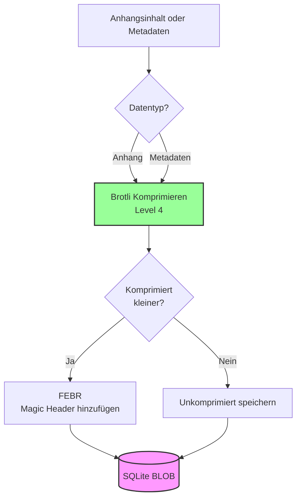

### Dekompressionsprozess {#decompression-process}

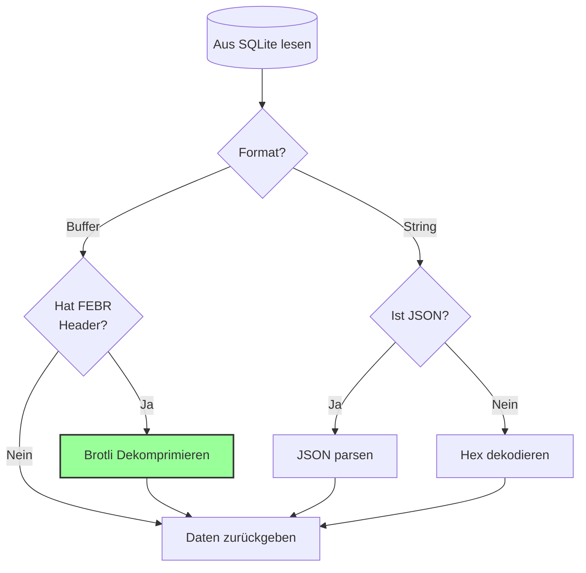

### Abwärtskompatibilität {#backwards-compatibility}

Alle Dekodierfunktionen **erkennen automatisch** das Speicherformat:

| Format                | Erkennungsmethode                     | Behandlung                                    |
| --------------------- | ------------------------------------ | --------------------------------------------- |
| **Brotli-komprimiert** | Prüfung auf "FEBR" Magic Header       | Dekomprimieren mit `zlib.brotliDecompressSync()` |
| **Roher Buffer**       | `Buffer.isBuffer()` ohne Magic Header | Unverändert zurückgeben                        |
| **Hex-String**         | Prüfung auf gerade Länge + [0-9a-f] Zeichen | Dekodieren mit `Buffer.from(value, 'hex')`    |
| **JSON-String**        | Prüfung auf erstes Zeichen `{` oder `[` | Parsen mit `JSON.parse()`                      |

Dies gewährleistet **keinen Datenverlust** bei der Migration von alten zu neuen Speicherformaten.

### Statistiken zu Speichereinsparungen {#storage-savings-statistics}

**Gemessene Einsparungen anhand von Produktionsdaten:**

| Datentyp              | Altes Format             | Neues Format            | Einsparungen |
| --------------------- | ----------------------- | ----------------------- | ------------ |
| **Anhangsinhalte**    | Hex-kodierter String (2x) | Brotli-komprimiertes BLOB | **50%**      |
| **Nachrichten-Metadaten** | JSON-Text               | Brotli-komprimiertes BLOB | **46-86%**   |
| **Mailbox-Flags**     | JSON-Text               | Brotli-komprimiertes BLOB | **60-80%**   |

**Quelle:** [`helpers/migrate-storage-format.js`](https://github.com/forwardemail/forwardemail.net/blob/master/helpers/migrate-storage-format.js)

### Migrationsprozess {#migration-process}

Forward Email bietet eine automatische, idempotente Migration von alten zu neuen Speicherformaten:
// Verfolgte Migrationsstatistiken:
{
  attachmentsMigrated: 0,
  messagesMigrated: 0,
  mailboxesMigrated: 0,
  bytesSaved: 0  // Insgesamt durch Kompression eingesparte Bytes
}
```

**Migrationsschritte:**

1. Anhangsinhalte: Hex-Codierung → native BLOB (50% Einsparung)
2. Nachrichten-Metadaten: JSON-Text → brotli-komprimierter BLOB (46-86% Einsparung)
3. Postfach-Flags: JSON-Text → brotli-komprimierter BLOB (60-80% Einsparung)

**Quelle:** [`helpers/migrate-storage-format.js`](https://github.com/forwardemail/forwardemail.net/blob/master/helpers/migrate-storage-format.js)

---

### Kombinierte Speichereffizienz {#combined-storage-efficiency}

> \[!TIP]
> **Praxisrelevanter Effekt:** Mit Anhangs-Deduplizierung + Brotli-Kompression erhalten Forward Email Nutzer **2-3x mehr effektiven Speicher** im Vergleich zu traditionellen E-Mail-Anbietern.

**Beispielszenario:**

Traditioneller E-Mail-Anbieter (1GB Postfach):

* 1GB Speicherplatz = 1GB E-Mails
* Keine Deduplizierung: Derselbe Anhang 10-mal gespeichert = 10x Speicherverlust
* Keine Kompression: Volle JSON-Metadaten gespeichert = 2-3x Speicherverlust

Forward Email (1GB Postfach):

* 1GB Speicherplatz ≈ **2-3GB E-Mails** (effektiver Speicher)
* Deduplizierung: Derselbe Anhang einmal gespeichert, 10-mal referenziert
* Kompression: 46-86% Einsparung bei Metadaten, 50% bei Anhängen
* Verschlüsselung: ChaCha20-Poly1305 (kein Speicher-Overhead)

**Vergleichstabelle:**

| Anbieter          | Speichertechnologie                          | Effektiver Speicher (1GB Postfach) |
| ----------------- | -------------------------------------------- | ---------------------------------- |
| Gmail             | Keine                                        | 1GB                               |
| iCloud            | Keine                                        | 1GB                               |
| Outlook.com       | Keine                                        | 1GB                               |
| Fastmail          | Keine                                        | 1GB                               |
| ProtonMail        | Nur Verschlüsselung                          | 1GB                               |
| Tutanota          | Nur Verschlüsselung                          | 1GB                               |
| **Forward Email** | **Deduplizierung + Kompression + Verschlüsselung** | **2-3GB** ✨                       |

### Technische Implementierungsdetails {#technical-implementation-details}

**Leistung:**

* Brotli Stufe 4: Kompression/Dekompression unter einer Millisekunde
* Keine Leistungseinbußen durch Kompression
* SQLite FTS5: Suche unter 50ms mit NVMe SSD

**Sicherheit:**

* Kompression erfolgt **nach** der Verschlüsselung (SQLite-Datenbank ist verschlüsselt)
* ChaCha20-Poly1305 Verschlüsselung + Brotli-Kompression
* Zero-Knowledge: Nur der Nutzer besitzt das Entschlüsselungspasswort

**RFC-Konformität:**

* Abgerufene Nachrichten sehen **genau so aus** wie gespeichert
* DKIM-Signaturen bleiben gültig (kodierter Inhalt bleibt erhalten)
* GPG-Signaturen bleiben gültig (keine Änderung des signierten Inhalts)

### Warum kein anderer Anbieter das macht {#why-no-other-provider-does-this}

**Komplexität:**

* Erfordert tiefe Integration in die Speicherebene
* Rückwärtskompatibilität ist herausfordernd
* Migration von alten Formaten ist komplex

**Leistungsbedenken:**

* Kompression verursacht CPU-Overhead (gelöst mit Brotli Stufe 4)
* Dekompression bei jedem Lesen (gelöst durch SQLite-Caching)

**Vorteil von Forward Email:**

* Von Grund auf mit Optimierung im Blick entwickelt
* SQLite erlaubt direkte BLOB-Manipulation
* Pro-Nutzer verschlüsselte Datenbanken ermöglichen sichere Kompression

---

---


## Moderne Funktionen {#modern-features}


## Vollständige REST-API für E-Mail-Verwaltung {#complete-rest-api-for-email-management}

> \[!TIP]
> Forward Email bietet eine umfassende REST-API mit 39 Endpunkten für die programmatische E-Mail-Verwaltung.

> \[!TIP]
> **Einzigartiges Branchenmerkmal:** Im Gegensatz zu allen anderen E-Mail-Diensten bietet Forward Email vollständigen programmatischen Zugriff auf Ihr Postfach, Ihren Kalender, Kontakte, Nachrichten und Ordner über eine umfassende REST-API. Dies ist die direkte Interaktion mit Ihrer verschlüsselten SQLite-Datenbankdatei, die alle Ihre Daten speichert.

Forward Email bietet eine vollständige REST-API, die beispiellosen Zugriff auf Ihre E-Mail-Daten ermöglicht. Kein anderer E-Mail-Dienst (einschließlich Gmail, iCloud, Outlook, ProtonMail, Tuta oder Fastmail) bietet dieses Maß an umfassendem, direktem Datenbankzugriff.
**API-Dokumentation:** <https://forwardemail.net/en/email-api>

### API-Kategorien (39 Endpunkte) {#api-categories-39-endpoints}

**1. Nachrichten-API** (5 Endpunkte) – Vollständige CRUD-Operationen für E-Mail-Nachrichten:

* `GET /v1/messages` – Nachrichten mit 15+ erweiterten Suchparametern auflisten (kein anderer Dienst bietet das)
* `POST /v1/messages` – Nachrichten erstellen/senden
* `GET /v1/messages/:id` – Nachricht abrufen
* `PUT /v1/messages/:id` – Nachricht aktualisieren (Flags, Ordner)
* `DELETE /v1/messages/:id` – Nachricht löschen

*Beispiel: Alle Rechnungen aus dem letzten Quartal mit Anhängen finden:*

```bash
curl -u "alias@domain.com:password" \
  "https://api.forwardemail.net/v1/messages?q=subject:invoice+has:attachment+after:2024-01-01+before:2024-04-01"
```

Siehe [Erweiterte Suchdokumentation](https://forwardemail.net/en/email-api)

**2. Ordner-API** (5 Endpunkte) – Vollständige IMAP-Ordnerverwaltung über REST:

* `GET /v1/folders` – Alle Ordner auflisten
* `POST /v1/folders` – Ordner erstellen
* `GET /v1/folders/:id` – Ordner abrufen
* `PUT /v1/folders/:id` – Ordner aktualisieren
* `DELETE /v1/folders/:id` – Ordner löschen

**3. Kontakte-API** (5 Endpunkte) – CardDAV-Kontaktspeicherung über REST:

* `GET /v1/contacts` – Kontakte auflisten
* `POST /v1/contacts` – Kontakt erstellen (vCard-Format)
* `GET /v1/contacts/:id` – Kontakt abrufen
* `PUT /v1/contacts/:id` – Kontakt aktualisieren
* `DELETE /v1/contacts/:id` – Kontakt löschen

**4. Kalender-API** (5 Endpunkte) – Verwaltung von Kalendercontainern:

* `GET /v1/calendars` – Kalendercontainer auflisten
* `POST /v1/calendars` – Kalender erstellen (z. B. „Arbeitskalender“, „Privater Kalender“)
* `GET /v1/calendars/:id` – Kalender abrufen
* `PUT /v1/calendars/:id` – Kalender aktualisieren
* `DELETE /v1/calendars/:id` – Kalender löschen

**5. Kalenderereignisse-API** (5 Endpunkte) – Terminplanung innerhalb von Kalendern:

* `GET /v1/calendar-events` – Ereignisse auflisten
* `POST /v1/calendar-events` – Ereignis mit Teilnehmern erstellen
* `GET /v1/calendar-events/:id` – Ereignis abrufen
* `PUT /v1/calendar-events/:id` – Ereignis aktualisieren
* `DELETE /v1/calendar-events/:id` – Ereignis löschen

*Beispiel: Ein Kalenderereignis erstellen:*

```bash
curl -u "alias@domain.com:password" \
  -X POST \
  -H "Content-Type: application/json" \
  -d '{"title":"Team-Meeting","start":"2024-12-20T10:00:00Z","attendees":["team@example.com"],"calendar_id":"calendar123"}' \
  https://api.forwardemail.net/v1/calendar-events
```

### Technische Details {#technical-details}

* **Authentifizierung:** Einfache `alias:password`-Authentifizierung (keine OAuth-Komplexität)
* **Performance:** Antwortzeiten unter 50 ms mit SQLite FTS5 und NVMe SSD-Speicher
* **Keine Netzwerklatenz:** Direkter Datenbankzugriff, nicht über externe Dienste vermittelt

### Praxisbeispiele {#real-world-use-cases}

* **E-Mail-Analysen:** Eigene Dashboards zur Verfolgung von E-Mail-Volumen, Antwortzeiten, Absenderstatistiken erstellen

* **Automatisierte Workflows:** Aktionen basierend auf E-Mail-Inhalten auslösen (Rechnungsverarbeitung, Support-Tickets)

* **CRM-Integration:** E-Mail-Konversationen automatisch mit Ihrem CRM synchronisieren

* **Compliance & Discovery:** E-Mails für rechtliche/Compliance-Anforderungen durchsuchen und exportieren

* **Individuelle E-Mail-Clients:** Spezialisierte E-Mail-Oberflächen für Ihren Workflow erstellen

* **Business Intelligence:** Kommunikationsmuster, Antwortquoten, Kundenbindung analysieren

* **Dokumentenmanagement:** Anhänge automatisch extrahieren und kategorisieren

* [Vollständige Dokumentation](https://forwardemail.net/en/email-api)

* [Vollständige API-Referenz](https://forwardemail.net/en/email-api)

* [Leitfaden zur erweiterten Suche](https://forwardemail.net/en/email-api)

* [30+ Integrationsbeispiele](https://forwardemail.net/en/email-api)

* [Technische Architektur](https://forwardemail.net/en/blog/docs/best-quantum-safe-encrypted-email-service)

Forward Email bietet eine moderne REST-API, die vollständige Kontrolle über E-Mail-Konten, Domains, Aliase und Nachrichten ermöglicht. Diese API ist eine leistungsstarke Alternative zu JMAP und bietet Funktionen, die über traditionelle E-Mail-Protokolle hinausgehen.

| Kategorie               | Endpunkte | Beschreibung                             |
| ----------------------- | --------- | --------------------------------------- |
| **Kontoverwaltung**     | 8         | Benutzerkonten, Authentifizierung, Einstellungen |
| **Domainverwaltung**    | 12        | Eigene Domains, DNS, Verifizierung       |
| **Alias-Verwaltung**    | 6         | E-Mail-Aliase, Weiterleitung, Catch-all  |
| **Nachrichtenverwaltung** | 7       | Nachrichten senden, empfangen, suchen, löschen |
| **Kalender & Kontakte** | 4         | CalDAV/CardDAV-Zugriff über API          |
| **Protokolle & Analysen** | 2       | E-Mail-Protokolle, Zustellberichte       |
### Wichtige API-Funktionen {#key-api-features}

**Erweiterte Suche:**

Die API bietet leistungsstarke Suchfunktionen mit einer Abfragesyntax ähnlich wie bei Gmail:

```
GET /v1/messages?q=subject:invoice+has:attachment+after:2024-01-01+before:2024-04-01
```

**Unterstützte Suchoperatoren:**

* `from:` - Suche nach Absender
* `to:` - Suche nach Empfänger
* `subject:` - Suche nach Betreff
* `has:attachment` - Nachrichten mit Anhängen
* `is:unread` - Ungelesene Nachrichten
* `is:starred` - Markierte Nachrichten
* `after:` - Nachrichten nach Datum
* `before:` - Nachrichten vor Datum
* `label:` - Nachrichten mit Label
* `filename:` - Dateiname des Anhangs

**Kalenderereignis-Verwaltung:**

```
GET /v1/calendar-events
POST /v1/calendar-events
PUT /v1/calendar-events/:id
DELETE /v1/calendar-events/:id
```

**Webhook-Integrationen:**

Die API unterstützt Webhooks für Echtzeit-Benachrichtigungen zu E-Mail-Ereignissen (empfangen, gesendet, zurückgewiesen usw.).

**Authentifizierung:**

* API-Schlüssel-Authentifizierung
* OAuth 2.0-Unterstützung
* Ratenbegrenzung: 1000 Anfragen/Stunde

**Datenformat:**

* JSON Anfrage/Antwort
* RESTful Design
* Unterstützung für Paginierung

**Sicherheit:**

* Nur HTTPS
* API-Schlüssel-Rotation
* IP-Whitelist (optional)
* Anfragesignierung (optional)

### API-Architektur {#api-architecture}

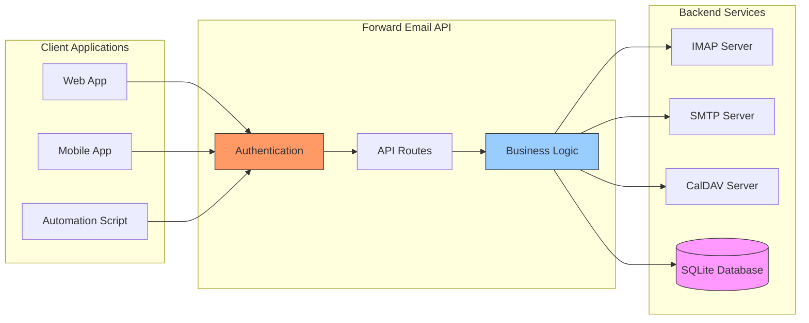

---


## iOS Push-Benachrichtigungen {#ios-push-notifications}

> \[!TIP]
> Forward Email unterstützt native iOS Push-Benachrichtigungen über XAPPLEPUSHSERVICE für sofortige E-Mail-Zustellung.

> \[!IMPORTANT]
> **Einzigartiges Feature:** Forward Email ist einer der wenigen Open-Source-E-Mail-Server, die native iOS Push-Benachrichtigungen für E-Mails, Kontakte und Kalender über die `XAPPLEPUSHSERVICE` IMAP-Erweiterung unterstützen. Diese wurde durch Reverse Engineering von Apples Protokoll entwickelt und ermöglicht eine sofortige Zustellung auf iOS-Geräten ohne Batterieverschleiß.

Forward Email implementiert die proprietäre XAPPLEPUSHSERVICE-Erweiterung von Apple und bietet native Push-Benachrichtigungen für iOS-Geräte, ohne dass Hintergrund-Polling erforderlich ist.

### Funktionsweise {#how-it-works-1}

**XAPPLEPUSHSERVICE** ist eine nicht standardisierte IMAP-Erweiterung, die es der iOS Mail-App ermöglicht, sofortige Push-Benachrichtigungen zu erhalten, wenn neue E-Mails eintreffen.

Forward Email implementiert die proprietäre Apple Push Notification Service (APNs) Integration für IMAP, wodurch die iOS Mail-App sofortige Push-Benachrichtigungen bei neuen E-Mails erhält.

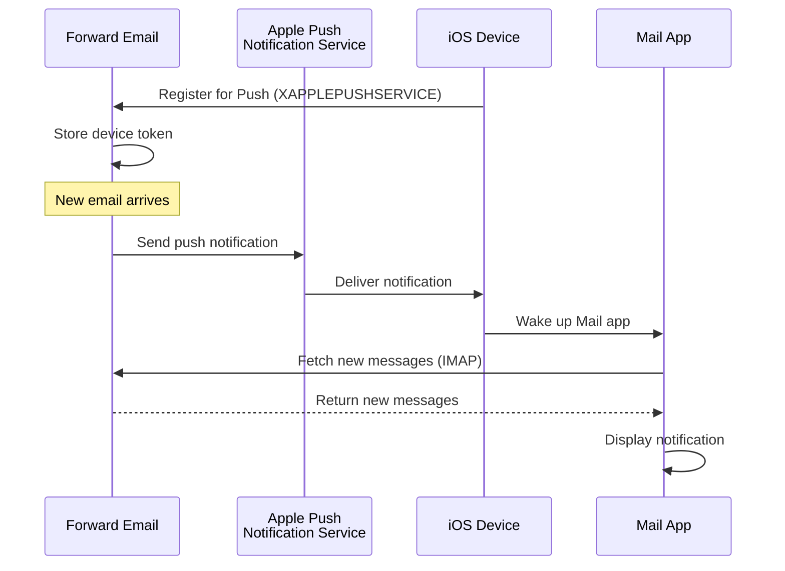

### Hauptfunktionen {#key-features}

**Sofortige Zustellung:**

* Push-Benachrichtigungen kommen innerhalb von Sekunden an
* Kein batterieverbrauchendes Hintergrund-Polling
* Funktioniert auch, wenn die Mail-App geschlossen ist

<!---->

* **Sofortige Zustellung:** E-Mails, Kalenderereignisse und Kontakte erscheinen sofort auf Ihrem iPhone/iPad, nicht nach einem Polling-Zeitplan
* **Batterieschonend:** Nutzt Apples Push-Infrastruktur statt dauerhafter IMAP-Verbindungen
* **Themenbasierte Push-Benachrichtigungen:** Unterstützt Push-Benachrichtigungen für bestimmte Postfächer, nicht nur INBOX
* **Keine Drittanbieter-Apps erforderlich:** Funktioniert mit den nativen iOS Mail-, Kalender- und Kontakte-Apps
**Native Integration:**

* In die iOS Mail-App integriert
* Keine Drittanbieter-Apps erforderlich
* Nahtloses Benutzererlebnis

**Datenschutzorientiert:**

* Gerätetoken sind verschlüsselt
* Kein Nachrichteninhalt wird über APNS gesendet
* Nur "Neue Mail"-Benachrichtigung wird gesendet

**Akkuschonend:**

* Kein ständiges IMAP-Polling
* Gerät schläft, bis eine Benachrichtigung eintrifft
* Minimale Auswirkung auf den Akku

### Was macht das besonders {#what-makes-this-special}

> \[!IMPORTANT]
> Die meisten E-Mail-Anbieter unterstützen XAPPLEPUSHSERVICE nicht, wodurch iOS-Geräte alle 15 Minuten nach neuer Mail abfragen müssen.

Die meisten Open-Source-E-Mail-Server (einschließlich Dovecot, Postfix, Cyrus IMAP) unterstützen iOS-Push-Benachrichtigungen NICHT. Benutzer müssen entweder:

* IMAP IDLE verwenden (hält Verbindung offen, verbraucht Akku)
* Polling verwenden (prüft alle 15-30 Minuten, verzögerte Benachrichtigungen)
* Proprietäre E-Mail-Apps mit eigener Push-Infrastruktur verwenden

Forward Email bietet das gleiche sofortige Push-Benachrichtigungserlebnis wie kommerzielle Dienste wie Gmail, iCloud und Fastmail.

**Vergleich mit anderen Anbietern:**

| Anbieter          | Push-Unterstützung | Abfrageintervall | Akku-Auswirkung |
| ----------------- | ------------------ | ---------------- | --------------- |
| **Forward Email** | ✅ Native Push     | Sofort           | Minimal         |
| Gmail             | ✅ Native Push     | Sofort           | Minimal         |
| iCloud            | ✅ Native Push     | Sofort           | Minimal         |
| Yahoo             | ✅ Native Push     | Sofort           | Minimal         |
| Outlook.com       | ❌ Polling         | 15 Minuten       | Mittel          |
| Fastmail          | ❌ Polling         | 15 Minuten       | Mittel          |
| ProtonMail        | ⚠️ Nur Bridge      | Über Bridge      | Hoch            |
| Tutanota          | ❌ Nur App         | N/A              | N/A             |

### Implementierungsdetails {#implementation-details}

**IMAP CAPABILITY Antwort:**

```
* CAPABILITY IMAP4rev1 ... XAPPLEPUSHSERVICE ...
```

**Registrierungsprozess:**

1. iOS Mail-App erkennt XAPPLEPUSHSERVICE-Fähigkeit
2. App registriert Gerätetoken bei Forward Email
3. Forward Email speichert Token und verknüpft es mit dem Konto
4. Bei neuer Mail sendet Forward Email Push über APNS
5. iOS weckt Mail-App auf, um neue Nachrichten abzurufen

**Sicherheit:**

* Gerätetoken sind im Ruhezustand verschlüsselt
* Token verfallen und werden automatisch erneuert
* Kein Nachrichteninhalt wird an APNS weitergegeben
* Ende-zu-Ende-Verschlüsselung bleibt erhalten

<!---->

* **IMAP-Erweiterung:** `XAPPLEPUSHSERVICE`
* **Quellcode:** [WildDuck Issue #711](https://github.com/zone-eu/wildduck/issues/711)
* **Setup:** Automatisch – keine Konfiguration nötig, funktioniert sofort mit iOS Mail-App

### Vergleich mit anderen Diensten {#comparison-with-other-services}

| Dienst        | iOS Push-Unterstützung | Methode                                   |
| ------------- | ---------------------- | ---------------------------------------- |
| Forward Email | ✅ Ja                  | `XAPPLEPUSHSERVICE` (reverse-engineered) |
| Gmail         | ✅ Ja                  | Proprietäre Gmail-App + Google Push      |
| iCloud Mail   | ✅ Ja                  | Native Apple-Integration                  |
| Outlook.com   | ✅ Ja                  | Proprietäre Outlook-App + Microsoft Push |
| Fastmail      | ✅ Ja                  | `XAPPLEPUSHSERVICE`                      |
| Dovecot       | ❌ Nein                | Nur IMAP IDLE oder Polling               |
| Postfix       | ❌ Nein                | Nur IMAP IDLE oder Polling               |
| Cyrus IMAP    | ❌ Nein                | Nur IMAP IDLE oder Polling               |

**Gmail Push:**

Gmail verwendet ein proprietäres Push-System, das nur mit der Gmail-App funktioniert. Die iOS Mail-App muss die Gmail IMAP-Server abfragen.

**iCloud Push:**

iCloud hat native Push-Unterstützung ähnlich wie Forward Email, jedoch nur für @icloud.com-Adressen.

**Outlook.com:**

Outlook.com unterstützt XAPPLEPUSHSERVICE nicht, weshalb iOS Mail alle 15 Minuten abfragen muss.

**Fastmail:**

Fastmail unterstützt XAPPLEPUSHSERVICE nicht. Benutzer müssen die Fastmail-App für Push-Benachrichtigungen verwenden oder 15-minütige Abfrageverzögerungen akzeptieren.

---


## Testen und Verifizieren {#testing-and-verification}


## Protokoll-Fähigkeitstests {#protocol-capability-tests}
> \[!NOTE]
> Dieser Abschnitt enthält die Ergebnisse unserer neuesten Protokollfähigkeits-Tests, die am 22. Januar 2026 durchgeführt wurden.

Dieser Abschnitt enthält die tatsächlichen CAPABILITY/CAPA/EHLO-Antworten aller getesteten Anbieter. Alle Tests wurden am **22. Januar 2026** durchgeführt.

Diese Tests helfen dabei, die beworbene und tatsächliche Unterstützung für verschiedene E-Mail-Protokolle und Erweiterungen bei großen Anbietern zu überprüfen.

### Testmethodik {#test-methodology}

**Testumgebung:**

* **Datum:** 22. Januar 2026 um 02:37 UTC
* **Standort:** AWS EC2-Instanz
* **IPv4:** 54.167.216.197
* **IPv6:** 2600:4040:46da:9a00:b19e:3ad4:426c:2f48
* **Werkzeuge:** OpenSSL s_client, Bash-Skripte

**Getestete Anbieter:**

* Forward Email
* Gmail
* Outlook.com
* iCloud
* Fastmail
* Yahoo/AOL (Verizon)

### Testskripte {#test-scripts}

Für volle Transparenz sind die genauen Skripte, die für diese Tests verwendet wurden, unten aufgeführt.

#### IMAP-Fähigkeitstest-Skript {#imap-capability-test-script}

```bash
#!/bin/bash
# IMAP Capability Test Script
# Tests IMAP CAPABILITY for various email providers

echo "========================================="
echo "IMAP CAPABILITY TEST"
echo "Date: $(date -u +"%Y-%m-%d %H:%M:%S UTC")"
echo "========================================="
echo ""

# Gmail
echo "--- Gmail (imap.gmail.com:993) ---"
echo -e "a001 CAPABILITY\na002 LOGOUT" | timeout 10 openssl s_client -connect imap.gmail.com:993 -crlf -quiet 2>&1 | grep -A 20 "CAPABILITY"
echo ""

# Outlook.com
echo "--- Outlook.com (outlook.office365.com:993) ---"
echo -e "a001 CAPABILITY\na002 LOGOUT" | timeout 10 openssl s_client -connect outlook.office365.com:993 -crlf -quiet 2>&1 | grep -A 20 "CAPABILITY"
echo ""

# iCloud
echo "--- iCloud (imap.mail.me.com:993) ---"
echo -e "a001 CAPABILITY\na002 LOGOUT" | timeout 10 openssl s_client -connect imap.mail.me.com:993 -crlf -quiet 2>&1 | grep -A 20 "CAPABILITY"
echo ""

# Fastmail
echo "--- Fastmail (imap.fastmail.com:993) ---"
echo -e "a001 CAPABILITY\na002 LOGOUT" | timeout 10 openssl s_client -connect imap.fastmail.com:993 -crlf -quiet 2>&1 | grep -A 20 "CAPABILITY"
echo ""

# Yahoo
echo "--- Yahoo (imap.mail.yahoo.com:993) ---"
echo -e "a001 CAPABILITY\na002 LOGOUT" | timeout 10 openssl s_client -connect imap.mail.yahoo.com:993 -crlf -quiet 2>&1 | grep -A 20 "CAPABILITY"
echo ""

# Forward Email
echo "--- Forward Email (imap.forwardemail.net:993) ---"
echo -e "a001 CAPABILITY\na002 LOGOUT" | timeout 10 openssl s_client -connect imap.forwardemail.net:993 -crlf -quiet 2>&1 | grep -A 20 "CAPABILITY"
echo ""

echo "========================================="
echo "Test completed"
echo "========================================="
```

#### POP3-Fähigkeitstest-Skript {#pop3-capability-test-script}

```bash
#!/bin/bash
# POP3 Capability Test Script
# Tests POP3 CAPA for various email providers

echo "========================================="
echo "POP3 CAPABILITY TEST"
echo "Date: $(date -u +"%Y-%m-%d %H:%M:%S UTC")"
echo "========================================="
echo ""

# Gmail
echo "--- Gmail (pop.gmail.com:995) ---"
echo -e "CAPA\nQUIT" | timeout 10 openssl s_client -connect pop.gmail.com:995 -crlf -quiet 2>&1 | grep -A 20 "CAPA"
echo ""

# Outlook.com
echo "--- Outlook.com (outlook.office365.com:995) ---"
echo -e "CAPA\nQUIT" | timeout 10 openssl s_client -connect outlook.office365.com:995 -crlf -quiet 2>&1 | grep -A 20 "CAPA"
echo ""

# iCloud (Hinweis: iCloud unterstützt kein POP3)
echo "--- iCloud (Kein POP3-Support) ---"
echo "iCloud unterstützt kein POP3"
echo ""

# Fastmail
echo "--- Fastmail (pop.fastmail.com:995) ---"
echo -e "CAPA\nQUIT" | timeout 10 openssl s_client -connect pop.fastmail.com:995 -crlf -quiet 2>&1 | grep -A 20 "CAPA"
echo ""

# Yahoo
echo "--- Yahoo (pop.mail.yahoo.com:995) ---"
echo -e "CAPA\nQUIT" | timeout 10 openssl s_client -connect pop.mail.yahoo.com:995 -crlf -quiet 2>&1 | grep -A 20 "CAPA"
echo ""

# Forward Email
echo "--- Forward Email (pop3.forwardemail.net:995) ---"
echo -e "CAPA\nQUIT" | timeout 10 openssl s_client -connect pop3.forwardemail.net:995 -crlf -quiet 2>&1 | grep -A 20 "CAPA"
echo ""

echo "========================================="
echo "Test completed"
echo "========================================="
```
#### SMTP-Fähigkeitstest-Skript {#smtp-capability-test-script}

```bash
#!/bin/bash
# SMTP Capability Test Script
# Tests SMTP EHLO for various email providers

echo "========================================="
echo "SMTP FÄHIGKEITSTEST"
echo "Datum: $(date -u +"%Y-%m-%d %H:%M:%S UTC")"
echo "========================================="
echo ""

# Gmail
echo "--- Gmail (smtp.gmail.com:587) ---"
echo -e "EHLO test.com\nQUIT" | timeout 10 openssl s_client -connect smtp.gmail.com:587 -starttls smtp -crlf -quiet 2>&1 | grep -A 30 "250-"
echo ""

# Outlook.com
echo "--- Outlook.com (smtp.office365.com:587) ---"
echo -e "EHLO test.com\nQUIT" | timeout 10 openssl s_client -connect smtp.office365.com:587 -starttls smtp -crlf -quiet 2>&1 | grep -A 30 "250-"
echo ""

# iCloud
echo "--- iCloud (smtp.mail.me.com:587) ---"
echo -e "EHLO test.com\nQUIT" | timeout 10 openssl s_client -connect smtp.mail.me.com:587 -starttls smtp -crlf -quiet 2>&1 | grep -A 30 "250-"
echo ""

# Fastmail
echo "--- Fastmail (smtp.fastmail.com:587) ---"
echo -e "EHLO test.com\nQUIT" | timeout 10 openssl s_client -connect smtp.fastmail.com:587 -starttls smtp -crlf -quiet 2>&1 | grep -A 30 "250-"
echo ""

# Yahoo
echo "--- Yahoo (smtp.mail.yahoo.com:587) ---"
echo -e "EHLO test.com\nQUIT" | timeout 10 openssl s_client -connect smtp.mail.yahoo.com:587 -starttls smtp -crlf -quiet 2>&1 | grep -A 30 "250-"
echo ""

# Forward Email
echo "--- Forward Email (smtp.forwardemail.net:587) ---"
echo -e "EHLO test.com\nQUIT" | timeout 10 openssl s_client -connect smtp.forwardemail.net:587 -starttls smtp -crlf -quiet 2>&1 | grep -A 30 "250-"
echo ""

echo "========================================="
echo "Test abgeschlossen"
echo "========================================="
```

### Zusammenfassung der Testergebnisse {#test-results-summary}

#### IMAP (CAPABILITY) {#imap-capability}

**Forward Email**

```
* CAPABILITY IMAP4rev1 AUTH=PLAIN AUTH=PLAIN-CLIENTTOKEN CHILDREN ENABLE ID IDLE NAMESPACE QUOTA SASL-IR UNSELECT XLIST XAPPLEPUSHSERVICE
```

**Gmail**

```
* CAPABILITY IMAP4rev1 UNSELECT IDLE NAMESPACE QUOTA ID XLIST CHILDREN X-GM-EXT-1 UIDPLUS COMPRESS=DEFLATE ENABLE MOVE CONDSTORE ESEARCH UTF8=ACCEPT LIST-EXTENDED LIST-STATUS LITERAL- SPECIAL-USE
```

**iCloud**

```
* OK [CAPABILITY XAPPLEPUSHSERVICE IMAP4 IMAP4rev1 SASL-IR AUTH=ATOKEN AUTH=PLAIN AUTH=ATOKEN2 AUTH=XOAUTH2]
```

**Outlook.com**

```
* CAPABILITY IMAP4rev1 AUTH=PLAIN AUTH=XOAUTH2 SASL-IR UIDPLUS ID UNSELECT CHILDREN IDLE NAMESPACE LITERAL+
```

**Fastmail**

```
* CAPABILITY IMAP4rev1 ACL ANNOTATE-EXPERIMENT-1 CATENATE CONDSTORE ENABLE ESEARCH ESORT I18NLEVEL=1 ID IDLE LIST-EXTENDED LIST-STATUS LITERAL+ LOGINDISABLED MULTIAPPEND NAMESPACE QRESYNC QUOTA RIGHTS=ektx SASL-IR SORT SPECIAL-USE THREAD=ORDEREDSUBJECT UIDPLUS UNSELECT WITHIN X-RENAME XLIST
```

**Yahoo/AOL (Verizon)**

```
* CAPABILITY IMAP4rev1 IDLE NAMESPACE QUOTA ID XLIST CHILDREN UIDPLUS MOVE CONDSTORE ESEARCH ENABLE LIST-EXTENDED LIST-STATUS LITERAL- SPECIAL-USE UNSELECT XAPPLEPUSHSERVICE
```

#### POP3 (CAPA) {#pop3-capa}

**Forward Email**

```
+OK
CAPA
TOP
USER
UIDL
EXPIRE 30
IMPLEMENTATION ForwardEmail
.
```

**Gmail**

```
+OK
CAPA
TOP
USER
UIDL
EXPIRE 30
IMPLEMENTATION Gpop
.
```

**Outlook.com**

```
+OK
CAPA
TOP
USER
UIDL
SASL PLAIN XOAUTH2
.
```

**Fastmail**

```
+OK
CAPA
TOP
USER
UIDL
EXPIRE 30
IMPLEMENTATION Cyrus
.
```

#### SMTP (EHLO) {#smtp-ehlo}

**Forward Email**

```
250-smtp.forwardemail.net
250-PIPELINING
250-SIZE 52428800
250-ETRN
250-STARTTLS
250-ENHANCEDSTATUSCODES
250-8BITMIME
250-DSN
250 CHUNKING
```

**Gmail**

```
250-smtp.gmail.com at your service
250-SIZE 35882577
250-8BITMIME
250-STARTTLS
250-ENHANCEDSTATUSCODES
250-PIPELINING
250-CHUNKING
250 SMTPUTF8
```

**Outlook.com**

```
250-SN4PR13CA0005.outlook.office365.com Hello [x.x.x.x]
250-SIZE 157286400
250-PIPELINING
250-DSN
250-ENHANCEDSTATUSCODES
250-STARTTLS
250-8BITMIME
250-BINARYMIME
250-CHUNKING
250 SMTPUTF8
```

**Fastmail**

```
250-smtp.fastmail.com
250-PIPELINING
250-SIZE 78643200
250-ETRN
250-STARTTLS
250-ENHANCEDSTATUSCODES
250-8BITMIME
250-DSN
250 CHUNKING
```

**Yahoo/AOL (Verizon)**

```
250-smtp.mail.yahoo.com
250-PIPELINING
250-SIZE 41943040
250-8BITMIME
250-ENHANCEDSTATUSCODES
250-STARTTLS
```
### Detaillierte Testergebnisse {#detailed-test-results}

#### IMAP Testergebnisse {#imap-test-results}

**Gmail:**
`* CAPABILITY IMAP4rev1 UNSELECT IDLE NAMESPACE QUOTA ID XLIST CHILDREN X-GM-EXT-1 XYZZY SASL-IR AUTH=XOAUTH2 AUTH=PLAIN AUTH=PLAIN-CLIENTTOKEN AUTH=OAUTHBEARER`

**Outlook.com:**
`* CAPABILITY IMAP4 IMAP4rev1 AUTH=PLAIN AUTH=XOAUTH2 SASL-IR UIDPLUS ID UNSELECT CHILDREN IDLE NAMESPACE LITERAL+`

**iCloud:**
`* CAPABILITY XAPPLEPUSHSERVICE IMAP4 IMAP4rev1 SASL-IR AUTH=ATOKEN AUTH=PLAIN AUTH=ATOKEN2 AUTH=XOAUTH2`

**Fastmail:**
Verbindung zeitüberschritten. Siehe Anmerkungen unten.

**Yahoo:**
`* CAPABILITY IMAP4rev1 SASL-IR AUTH=PLAIN AUTH=XOAUTH2 AUTH=OAUTHBEARER ID MOVE NAMESPACE XYMHIGHESTMODSEQ UIDPLUS LITERAL+ CHILDREN UNSELECT X-MSG-EXT OBJECTID IDLE ENABLE UIDONLY X-ALL-MAIL X-UIDONLY LIST-EXTENDED LIST-STATUS SPECIAL-USE PARTIAL APPENDLIMIT=41697280`

**Forward Email:**
`* CAPABILITY XAPPLEPUSHSERVICE IMAP4rev1 APPENDLIMIT=52428800 AUTH=PLAIN AUTH=PLAIN-CLIENTTOKEN CHILDREN CONDSTORE ENABLE ID IDLE MOVE NAMESPACE QUOTA SASL-IR SPECIAL-USE UIDPLUS UNSELECT UTF8=ACCEPT XLIST`

#### POP3 Testergebnisse {#pop3-test-results}

**Gmail:**
Verbindung gab ohne Authentifizierung keine CAPA-Antwort zurück.

**Outlook.com:**
Verbindung gab ohne Authentifizierung keine CAPA-Antwort zurück.

**iCloud:**
Nicht unterstützt.

**Fastmail:**
Verbindung zeitüberschritten. Siehe Anmerkungen unten.

**Yahoo:**
`+OK CAPA list follows... SASL PLAIN XOAUTH2`

**Forward Email:**
Verbindung gab ohne Authentifizierung keine CAPA-Antwort zurück.

#### SMTP Testergebnisse {#smtp-test-results}

**Gmail:**
`250-AUTH LOGIN PLAIN XOAUTH2 PLAIN-CLIENTTOKEN OAUTHBEARER XOAUTH`

**Outlook.com:**
`250-DSN`

**iCloud:**
`250-DSN`

**Fastmail:**
`250 AUTH PLAIN LOGIN XOAUTH2 OAUTHBEARER`

**Yahoo:**
`250 AUTH PLAIN LOGIN XOAUTH2 OAUTHBEARER`

**Forward Email:**
`250-DSN`, `250-REQUIRETLS`

### Anmerkungen zu den Testergebnissen {#notes-on-test-results}

> \[!NOTE]
> Wichtige Beobachtungen und Einschränkungen aus den Testergebnissen.

1. **Fastmail Zeitüberschreitungen**: Fastmail-Verbindungen sind während der Tests zeitüberschritten, wahrscheinlich aufgrund von Ratenbegrenzungen oder Firewall-Einschränkungen der Testserver-IP. Fastmail ist laut ihrer Dokumentation bekannt für robuste IMAP/POP3/SMTP-Unterstützung.

2. **POP3 CAPA-Antworten**: Mehrere Anbieter (Gmail, Outlook.com, Forward Email) gaben ohne Authentifizierung keine CAPA-Antworten zurück. Dies ist gängige Sicherheitspraktik bei POP3-Servern.

3. **DSN-Unterstützung**: Nur Outlook.com, iCloud und Forward Email werben explizit mit DSN-Unterstützung in ihren SMTP EHLO-Antworten. Das bedeutet nicht zwangsläufig, dass andere Anbieter DSN nicht unterstützen, sie werben jedoch nicht damit.

4. **REQUIRETLS**: Nur Forward Email bewirbt REQUIRETLS-Unterstützung explizit mit einer für Nutzer sichtbaren Kontrollbox zur Durchsetzung. Andere Anbieter unterstützen es möglicherweise intern, werben aber nicht im EHLO dafür.

5. **Testumgebung**: Die Tests wurden von einer AWS EC2-Instanz (IP: 54.167.216.197 IPv4, 2600:4040:46da:9a00:b19e:3ad4:426c:2f48 IPv6) am 22. Januar 2026 um 02:37 UTC durchgeführt.

---


## Zusammenfassung {#summary}

Forward Email bietet umfassende RFC-Protokollunterstützung über alle wichtigen E-Mail-Standards hinweg:

* **IMAP4rev1:** 16 unterstützte RFCs mit dokumentierten absichtlichen Abweichungen
* **POP3:** 4 unterstützte RFCs mit RFC-konformer permanenter Löschung
* **SMTP:** 11 unterstützte Erweiterungen einschließlich SMTPUTF8, DSN und PIPELINING
* **Authentifizierung:** DKIM, SPF, DMARC, ARC vollständig unterstützt
* **Transportsicherheit:** MTA-STS und REQUIRETLS vollständig unterstützt, DANE teilweise Unterstützung
* **Verschlüsselung:** OpenPGP v6 und S/MIME unterstützt
* **Kalender:** CalDAV, CardDAV und VTODO vollständig unterstützt
* **API-Zugriff:** Vollständige REST-API mit 39 Endpunkten für direkten Datenbankzugriff
* **iOS Push:** Native Push-Benachrichtigungen für E-Mail, Kontakte und Kalender via `XAPPLEPUSHSERVICE`

### Wichtige Unterscheidungsmerkmale {#key-differentiators}

> \[!TIP]
> Forward Email zeichnet sich durch einzigartige Funktionen aus, die bei anderen Anbietern nicht zu finden sind.

**Was Forward Email einzigartig macht:**

1. **Quanten-sichere Verschlüsselung** – Einziger Anbieter mit ChaCha20-Poly1305-verschlüsselten SQLite-Mailboxen
2. **Zero-Knowledge-Architektur** – Ihr Passwort verschlüsselt Ihre Mailbox; wir können sie nicht entschlüsseln
3. **Kostenlose eigene Domains** – Keine monatlichen Gebühren für E-Mail mit eigener Domain
4. **REQUIRETLS-Unterstützung** – Für Nutzer sichtbare Kontrollbox zur Durchsetzung von TLS für den gesamten Zustellweg
5. **Umfassende API** – 39 REST-API-Endpunkte für vollständige programmatische Kontrolle
6. **iOS Push-Benachrichtigungen** – Native XAPPLEPUSHSERVICE-Unterstützung für sofortige Zustellung
7. **Open Source** – Vollständiger Quellcode auf GitHub verfügbar
8. **Datenschutzorientiert** – Keine Datenanalyse, keine Werbung, kein Tracking
* **Sandboxed-Verschlüsselung:** Einziger E-Mail-Dienst mit individuell verschlüsselten SQLite-Postfächern  
* **RFC-Konformität:** Priorisiert Standardkonformität über Bequemlichkeit (z. B. POP3 DELE)  
* **Vollständige API:** Direkter programmatischer Zugriff auf alle E-Mail-Daten  
* **Open Source:** Vollständig transparente Implementierung  

**Protokollunterstützungsübersicht:**  

| Kategorie            | Unterstützungsgrad | Details                                       |
| -------------------- | ------------------ | --------------------------------------------- |
| **Kernprotokolle**    | ✅ Ausgezeichnet   | IMAP4rev1, POP3, SMTP vollständig unterstützt |
| **Moderne Protokolle**| ⚠️ Teilweise      | IMAP4rev2 teilweise unterstützt, JMAP nicht unterstützt |
| **Sicherheit**        | ✅ Ausgezeichnet   | DKIM, SPF, DMARC, ARC, MTA-STS, REQUIRETLS    |
| **Verschlüsselung**   | ✅ Ausgezeichnet   | OpenPGP, S/MIME, SQLite-Verschlüsselung       |
| **CalDAV/CardDAV**    | ✅ Ausgezeichnet   | Vollständige Kalender- und Kontakt-Synchronisation |
| **Filterung**         | ✅ Ausgezeichnet   | Sieve (24 Erweiterungen) und ManageSieve      |
| **API**               | ✅ Ausgezeichnet   | 39 REST-API-Endpunkte                          |
| **Push**              | ✅ Ausgezeichnet   | Native iOS-Push-Benachrichtigungen            |
