# Soporte de Protocolos RFC de Email - Guía Completa de Estándares y Especificaciones {#email-rfc-protocol-support---complete-standards--specifications-guide}


## Tabla de Contenidos {#table-of-contents}

* [Acerca de Este Documento](#about-this-document)
  * [Resumen de Arquitectura](#architecture-overview)
* [Comparación de Servicios de Email - Soporte de Protocolos y Cumplimiento de Estándares RFC](#email-service-comparison---protocol-support--rfc-standards-compliance)
  * [Visualización del Soporte de Protocolos](#protocol-support-visualization)
* [Protocolos Básicos de Email](#core-email-protocols)
  * [Flujo del Protocolo de Email](#email-protocol-flow)
* [Protocolo IMAP4 de Email y Extensiones](#imap4-email-protocol-and-extensions)
  * [Diferencias del Protocolo IMAP con las Especificaciones RFC](#imap-protocol-differences-from-rfc-specifications)
  * [Extensiones IMAP NO Soportadas](#imap-extensions-not-supported)
* [Protocolo POP3 de Email y Extensiones](#pop3-email-protocol-and-extensions)
  * [Diferencias del Protocolo POP3 con las Especificaciones RFC](#pop3-protocol-differences-from-rfc-specifications)
  * [Extensiones POP3 NO Soportadas](#pop3-extensions-not-supported)
* [Protocolo SMTP de Email y Extensiones](#smtp-email-protocol-and-extensions)
  * [Notificaciones de Estado de Entrega (DSN)](#delivery-status-notifications-dsn)
  * [Soporte REQUIRETLS](#requiretls-support)
  * [Extensiones SMTP NO Soportadas](#smtp-extensions-not-supported)
* [Protocolo JMAP de Email](#jmap-email-protocol)
* [Seguridad de Email](#email-security)
  * [Arquitectura de Seguridad de Email](#email-security-architecture)
* [Protocolos de Autenticación de Mensajes de Email](#email-message-authentication-protocols)
  * [Soporte de Protocolos de Autenticación](#authentication-protocol-support)
  * [DKIM (DomainKeys Identified Mail)](#dkim-domainkeys-identified-mail)
  * [SPF (Sender Policy Framework)](#spf-sender-policy-framework)
  * [DMARC (Autenticación, Reporte y Conformidad Basada en Dominio)](#dmarc-domain-based-message-authentication-reporting--conformance)
  * [ARC (Authenticated Received Chain)](#arc-authenticated-received-chain)
  * [Flujo de Autenticación](#authentication-flow)
* [Protocolos de Seguridad en el Transporte de Email](#email-transport-security-protocols)
  * [Soporte de Seguridad en el Transporte](#transport-security-support)
  * [TLS (Transport Layer Security)](#tls-transport-layer-security)
  * [MTA-STS (Seguridad Estricta de Transporte para Agentes de Transferencia de Correo)](#mta-sts-mail-transfer-agent-strict-transport-security)
  * [DANE (Autenticación DNS de Entidades Nombradas)](#dane-dns-based-authentication-of-named-entities)
  * [REQUIRETLS](#requiretls)
  * [Flujo de Seguridad en el Transporte](#transport-security-flow)
* [Encriptación de Mensajes de Email](#email-message-encryption)
  * [Soporte de Encriptación](#encryption-support)
  * [OpenPGP (Pretty Good Privacy)](#openpgp-pretty-good-privacy)
  * [S/MIME (Extensiones Seguras/Multiuso para Correo de Internet)](#smime-securemultipurpose-internet-mail-extensions)
  * [Encriptación de Buzón SQLite](#sqlite-mailbox-encryption)
  * [Comparación de Encriptación](#encryption-comparison)
  * [Flujo de Encriptación](#encryption-flow)
* [Funcionalidad Extendida](#extended-functionality)
* [Estándares de Formato de Mensajes de Email](#email-message-format-standards)
  * [Soporte de Estándares de Formato](#format-standards-support)
  * [MIME (Extensiones Multipropósito para Correo de Internet)](#mime-multipurpose-internet-mail-extensions)
  * [SMTPUTF8 e Internacionalización de Direcciones de Email](#smtputf8-and-email-address-internationalization)
* [Protocolos de Calendarios y Contactos](#calendaring-and-contacts-protocols)
  * [Soporte CalDAV y CardDAV](#caldav-and-carddav-support)
  * [CalDAV (Acceso a Calendarios)](#caldav-calendar-access)
  * [CardDAV (Acceso a Contactos)](#carddav-contact-access)
  * [Tareas y Recordatorios (CalDAV VTODO)](#tasks-and-reminders-caldav-vtodo)
  * [Flujo de Sincronización CalDAV/CardDAV](#caldavcarddav-synchronization-flow)
  * [Extensiones de Calendarios NO Soportadas](#calendaring-extensions-not-supported)
* [Filtrado de Mensajes de Email](#email-message-filtering)
  * [Sieve (RFC 5228)](#sieve-rfc-5228)
  * [ManageSieve (RFC 5804)](#managesieve-rfc-5804)
* [Optimización de Almacenamiento](#storage-optimization)
  * [Arquitectura: Optimización de Almacenamiento en Doble Capa](#architecture-dual-layer-storage-optimization)
* [Desduplicación de Adjuntos](#attachment-deduplication)
  * [Cómo Funciona](#how-it-works)
  * [Flujo de Desduplicación](#deduplication-flow)
  * [Sistema de Número Mágico](#magic-number-system)
  * [Diferencias Clave: WildDuck vs Forward Email](#key-differences-wildduck-vs-forward-email)
* [Compresión Brotli](#brotli-compression)
  * [Qué se Comprime](#what-gets-compressed)
  * [Configuración de Compresión](#compression-configuration)
  * [Encabezado Mágico: "FEBR"](#magic-header-febr)
  * [Proceso de Compresión](#compression-process)
  * [Proceso de Descompresión](#decompression-process)
  * [Compatibilidad Retroactiva](#backwards-compatibility)
  * [Estadísticas de Ahorro de Almacenamiento](#storage-savings-statistics)
  * [Proceso de Migración](#migration-process)
  * [Eficiencia Combinada de Almacenamiento](#combined-storage-efficiency)
  * [Detalles Técnicos de Implementación](#technical-implementation-details)
  * [Por Qué Ningún Otro Proveedor Hace Esto](#why-no-other-provider-does-this)
* [Características Modernas](#modern-features)
* [API REST Completa para Gestión de Email](#complete-rest-api-for-email-management)
  * [Categorías de API (39 Endpoints)](#api-categories-39-endpoints)
  * [Detalles Técnicos](#technical-details)
  * [Casos de Uso en el Mundo Real](#real-world-use-cases)
  * [Características Clave de la API](#key-api-features)
  * [Arquitectura de la API](#api-architecture)
* [Notificaciones Push en iOS](#ios-push-notifications)
  * [Cómo Funciona](#how-it-works-1)
  * [Características Clave](#key-features)
  * [Qué Lo Hace Especial](#what-makes-this-special)
  * [Detalles de Implementación](#implementation-details)
  * [Comparación con Otros Servicios](#comparison-with-other-services)
* [Pruebas y Verificación](#testing-and-verification)
* [Pruebas de Capacidad de Protocolo](#protocol-capability-tests)
  * [Metodología de Prueba](#test-methodology)
  * [Scripts de Prueba](#test-scripts)
  * [Resumen de Resultados de Prueba](#test-results-summary)
  * [Resultados Detallados de Prueba](#detailed-test-results)
  * [Notas sobre Resultados de Prueba](#notes-on-test-results)
* [Resumen](#summary)
  * [Diferenciadores Clave](#key-differentiators)
## Sobre Este Documento {#about-this-document}

Este documento describe el soporte del protocolo RFC (Request for Comments) para Forward Email. Dado que Forward Email utiliza [WildDuck](https://github.com/nodemailer/wildduck) internamente para la funcionalidad IMAP/POP3, el soporte del protocolo y las limitaciones documentadas aquí reflejan la implementación de WildDuck.

> \[!IMPORTANT]
> Forward Email utiliza [SQLite](https://sqlite.org/) para el almacenamiento de mensajes en lugar de MongoDB (que WildDuck usaba originalmente). Esto afecta ciertos detalles de implementación documentados a continuación.

**Código Fuente:** <https://github.com/forwardemail/forwardemail.net>

### Visión General de la Arquitectura {#architecture-overview}

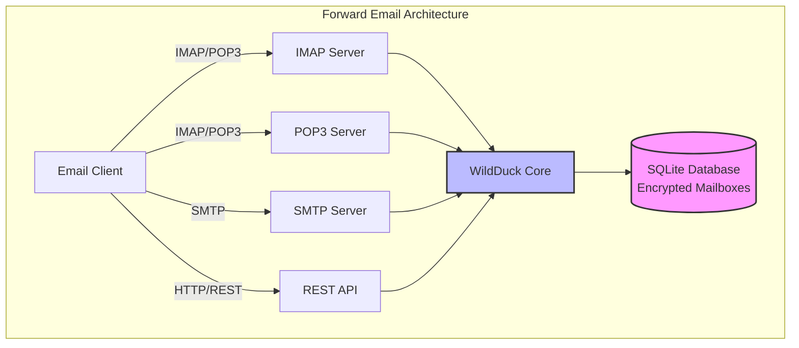

---


## Comparación de Servicios de Email - Soporte de Protocolos y Cumplimiento de Estándares RFC {#email-service-comparison---protocol-support--rfc-standards-compliance}

> \[!IMPORTANT]
> **Cifrado Aislado y Resistente a la Computación Cuántica:** Forward Email es el único servicio de correo electrónico que almacena buzones SQLite cifrados individualmente usando tu contraseña (que solo tú tienes). Cada buzón está cifrado con [sqleet](https://github.com/resilar/sqleet) (ChaCha20-Poly1305), es autónomo, aislado y portátil. Si olvidas tu contraseña, pierdes tu buzón; ni siquiera Forward Email puede recuperarlo. Consulta [Correo Electrónico Cifrado Seguro Cuánticamente](https://forwardemail.net/en/blog/docs/best-quantum-safe-encrypted-email-service) para más detalles.

Compara el soporte de protocolos de correo electrónico y la implementación de estándares RFC entre los principales proveedores de correo:

| Característica                | Forward Email                                                                                  | Postfix/Dovecot                                                                    | Gmail                                                                             | iCloud Mail                                           | Outlook.com                                                                                                                                                          | Fastmail                                                                                 | Yahoo/AOL (Verizon)                                                  | ProtonMail                                                                     | Tutanota                                                          |
| ----------------------------- | ---------------------------------------------------------------------------------------------- | ---------------------------------------------------------------------------------- | --------------------------------------------------------------------------------- | ----------------------------------------------------- | -------------------------------------------------------------------------------------------------------------------------------------------------------------------- | ---------------------------------------------------------------------------------------- | -------------------------------------------------------------------- | ------------------------------------------------------------------------------ | ----------------------------------------------------------------- |
| **Precio Dominio Personalizado** | [Gratis](https://forwardemail.net/en/pricing)                                                  | [Gratis](https://www.postfix.org/)                                                 | [$7.20/mes](https://workspace.google.com/pricing)                                | [$0.99/mes](https://support.apple.com/en-us/102622)    | [$7.20/mes](https://www.microsoft.com/en-us/microsoft-365/business/microsoft-365-business-basic)                                                                      | [$5/mes](https://www.fastmail.com/pricing/)                                               | [$3.19/mes](https://www.turbify.com/mail)                             | [$4.99/mes](https://proton.me/mail/pricing)                                     | [$3.27/mes](https://tuta.com/pricing)                              |
| **IMAP4rev1 (RFC 3501)**      | ✅ [Soportado](#imap4-email-protocol-and-extensions)                                            | ✅ [Soportado](https://www.dovecot.org/)                                          | ✅ [Soportado](https://developers.google.com/workspace/gmail/imap/imap-extensions) | ✅ [Soportado](https://support.apple.com/en-us/102431) | ✅ [Soportado](https://support.microsoft.com/en-us/office/pop-imap-and-smtp-settings-for-outlook-com-d088b986-291d-42b8-9564-9c414e2aa040)                            | ✅ [Soportado](https://www.fastmail.help/hc/en-us/articles/1500000278382-Email-standards) | ✅ [Soportado](https://senders.yahooinc.com/developer/documentation/) | ⚠️ [Mediante Bridge](https://proton.me/support/imap-smtp-and-pop3-setup)            | ❌ No Soportado                                                   |
| **IMAP4rev2 (RFC 9051)**      | ⚠️ [Parcial](https://forwardemail.net/en/blog/docs/best-quantum-safe-encrypted-email-service)  | ⚠️ [Parcial](https://www.dovecot.org/)                                           | ⚠️ [31%](https://developers.google.com/workspace/gmail/imap/imap-extensions)      | ⚠️ [92%](https://support.apple.com/en-us/102431)      | ⚠️ [46%](https://support.microsoft.com/en-us/office/pop-imap-and-smtp-settings-for-outlook-com-d088b986-291d-42b8-9564-9c414e2aa040)                                 | ⚠️ [69%](https://www.fastmail.help/hc/en-us/articles/1500000278382-Email-standards)      | ⚠️ [85%](https://senders.yahooinc.com/developer/documentation/)      | ⚠️ [Mediante Bridge](https://proton.me/support/imap-smtp-and-pop3-setup)            | ❌ No Soportado                                                   |
| **POP3 (RFC 1939)**           | ✅ [Soportado](#pop3-email-protocol-and-extensions)                                             | ✅ [Soportado](https://www.dovecot.org/)                                          | ✅ [Soportado](https://support.google.com/mail/answer/7104828)                   | ❌ No Soportado                                       | ✅ [Soportado](https://support.microsoft.com/en-us/office/pop-imap-and-smtp-settings-for-outlook-com-d088b986-291d-42b8-9564-9c414e2aa040)                            | ✅ [Soportado](https://www.fastmail.help/hc/en-us/articles/1500000278382-Email-standards) | ✅ [Soportado](https://help.yahoo.com/kb/SLN4075.html)                | ⚠️ [Mediante Bridge](https://proton.me/support/imap-smtp-and-pop3-setup)            | ❌ No Soportado                                                   |
| **SMTP (RFC 5321)**           | ✅ [Soportado](#smtp-email-protocol-and-extensions)                                             | ✅ [Soportado](https://www.postfix.org/)                                          | ✅ [Soportado](https://support.google.com/mail/answer/7126229)                   | ✅ [Soportado](https://support.apple.com/en-us/102431) | ✅ [Soportado](https://support.microsoft.com/en-us/office/pop-imap-and-smtp-settings-for-outlook-com-d088b986-291d-42b8-9564-9c414e2aa040)                            | ✅ [Soportado](https://www.fastmail.help/hc/en-us/articles/1500000278382-Email-standards) | ✅ [Soportado](https://help.yahoo.com/kb/SLN4075.html)                | ⚠️ [Mediante Bridge](https://proton.me/support/imap-smtp-and-pop3-setup)            | ❌ No Soportado                                                   |
| **JMAP (RFC 8620)**           | ❌ [No Soportado](#jmap-email-protocol)                                                        | ❌ No Soportado                                                                    | ❌ No Soportado                                                                   | ❌ No Soportado                                       | ❌ No Soportado                                                                                                                                                      | ✅ [Soportado](https://www.fastmail.com/dev/)                                             | ❌ No Soportado                                                      | ❌ No Soportado                                                                | ❌ No Soportado                                                   |
| **DKIM (RFC 6376)**           | ✅ [Soportado](#email-message-authentication-protocols)                                         | ✅ [Soportado](https://github.com/trusteddomainproject/OpenDKIM)                  | ✅ [Soportado](https://support.google.com/a/answer/174124)                       | ✅ [Soportado](https://support.apple.com/en-us/102431) | ✅ [Soportado](https://learn.microsoft.com/en-us/defender-office-365/email-authentication-dkim-configure)                                                             | ✅ [Soportado](https://www.fastmail.help/hc/en-us/articles/360060590573)                  | ✅ [Soportado](https://help.yahoo.com/kb/SLN25426.html)               | ✅ [Soportado](https://proton.me/support)                                       | ✅ [Soportado](https://tuta.com/support#dkim)                      |
| **SPF (RFC 7208)**            | ✅ [Soportado](#email-message-authentication-protocols)                                         | ✅ [Soportado](https://www.postfix.org/)                                          | ✅ [Soportado](https://support.google.com/a/answer/33786)                        | ✅ [Soportado](https://support.apple.com/en-us/102431) | ✅ [Soportado](https://learn.microsoft.com/en-us/microsoft-365/security/office-365-security/how-office-365-uses-spf-to-prevent-spoofing)                              | ✅ [Soportado](https://www.fastmail.help/hc/en-us/articles/360060590573)                  | ✅ [Soportado](https://help.yahoo.com/kb/SLN25426.html)               | ✅ [Soportado](https://proton.me/support)                                       | ✅ [Soportado](https://tuta.com/support#dkim)                      |
| **DMARC (RFC 7489)**          | ✅ [Soportado](#email-message-authentication-protocols)                                         | ✅ [Soportado](https://www.postfix.org/)                                          | ✅ [Soportado](https://support.google.com/a/answer/2466580)                      | ✅ [Soportado](https://support.apple.com/en-us/102431) | ✅ [Soportado](https://learn.microsoft.com/en-us/microsoft-365/security/office-365-security/use-dmarc-to-validate-email)                                              | ✅ [Soportado](https://www.fastmail.help/hc/en-us/articles/360060590573)                  | ✅ [Soportado](https://help.yahoo.com/kb/SLN25426.html)               | ✅ [Soportado](https://proton.me/support)                                       | ✅ [Soportado](https://tuta.com/support#dkim)                      |
| **ARC (RFC 8617)**            | ✅ [Soportado](#email-message-authentication-protocols)                                         | ✅ [Soportado](https://github.com/trusteddomainproject/OpenARC)                   | ✅ [Soportado](https://support.google.com/a/answer/2466580)                      | ❌ No Soportado                                       | ✅ [Soportado](https://learn.microsoft.com/en-us/defender-office-365/email-authentication-arc-configure)                                                              | ✅ [Soportado](https://www.fastmail.help/hc/en-us/articles/360060590573)                  | ✅ [Soportado](https://senders.yahooinc.com/developer/documentation/) | ✅ [Soportado](https://proton.me/blog/what-is-authenticated-received-chain-arc) | ❌ No Soportado                                                   |
| **MTA-STS (RFC 8461)**        | ✅ [Soportado](#email-transport-security-protocols)                                             | ✅ [Soportado](https://www.postfix.org/)                                          | ✅ [Soportado](https://support.google.com/a/answer/9261504)                      | ✅ [Soportado](https://support.apple.com/en-us/102431) | ✅ [Soportado](https://learn.microsoft.com/en-us/defender-office-365/email-authentication-about)                                                                      | ✅ [Soportado](https://www.fastmail.help/hc/en-us/articles/360060590573)                  | ✅ [Soportado](https://senders.yahooinc.com/developer/documentation/) | ✅ [Soportado](https://proton.me/support)                                       | ✅ [Soportado](https://tuta.com/security)                          |
| **DANE (RFC 7671)**           | ✅ [Soportado](#email-transport-security-protocols)                                             | ✅ [Soportado](https://www.postfix.org/)                                          | ❌ No Soportado                                                                   | ❌ No Soportado                                       | ❌ No Soportado                                                                                                                                                      | ❌ No Soportado                                                                          | ❌ No Soportado                                                      | ✅ [Soportado](https://proton.me/support)                                       | ✅ [Soportado](https://tuta.com/support#dane)                      |
| **DSN (RFC 3461)**            | ✅ [Soportado](#smtp-email-protocol-and-extensions)                                             | ✅ [Soportado](https://www.postfix.org/DSN_README.html)                           | ❌ No Soportado                                                                   | ✅ [Soportado](#protocol-capability-tests)             | ✅ [Soportado](#protocol-capability-tests)                                                                                                                            | ⚠️ [Desconocido](https://www.fastmail.help/hc/en-us/articles/1500000278382-Email-standards)  | ❌ No Soportado                                                      | ⚠️ [Mediante Bridge](https://proton.me/support/imap-smtp-and-pop3-setup)            | ❌ No Soportado                                                   |
| **REQUIRETLS (RFC 8689)**     | ✅ [Soportado](#email-transport-security-protocols)                                             | ✅ [Soportado](https://www.postfix.org/TLS_README.html#server_require_tls)        | ⚠️ Desconocido                                                                    | ⚠️ Desconocido                                        | ⚠️ Desconocido                                                                                                                                                       | ⚠️ Desconocido                                                                           | ⚠️ Desconocido                                                       | ⚠️ [Mediante Bridge](https://proton.me/support/imap-smtp-and-pop3-setup)            | ❌ No Soportado                                                   |
| **ManageSieve (RFC 5804)**    | ✅ [Soportado](#managesieve-rfc-5804)                                                           | ✅ [Soportado](https://doc.dovecot.org/admin_manual/pigeonhole_managesieve_server/) | ❌ No Soportado                                                                   | ❌ No Soportado                                       | ❌ No Soportado                                                                                                                                                      | ✅ [Soportado](https://www.fastmail.help/hc/en-us/articles/360060590573)                  | ❌ No Soportado                                                      | ❌ No Soportado                                                                | ❌ No Soportado                                                   |
| **OpenPGP (RFC 9580)**        | ✅ [Soportado](#email-message-encryption)                                                       | ⚠️ [Mediante Plugins](https://www.gnupg.org/)                                     | ⚠️ [Terceros](https://github.com/google/end-to-end)                              | ⚠️ [Terceros](https://gpgtools.org/)                 | ⚠️ [Terceros](https://gpg4win.org/)                                                                                                                               | ⚠️ [Terceros](https://www.fastmail.help/hc/en-us/articles/360060590573)                 | ⚠️ [Terceros](https://help.yahoo.com/kb/SLN25426.html)              | ✅ [Nativo](https://proton.me/support/pgp-mime-pgp-inline)                      | ❌ No Soportado                                                   |
| **S/MIME (RFC 8551)**         | ✅ [Soportado](#email-message-encryption)                                                       | ✅ [Soportado](https://www.openssl.org/)                                          | ✅ [Soportado](https://support.google.com/mail/answer/81126)                     | ✅ [Soportado](https://support.apple.com/en-us/102431) | ✅ [Soportado](https://support.microsoft.com/en-us/office/send-view-and-reply-to-encrypted-messages-in-outlook-for-pc-eaa43495-9bbb-4fca-922a-df90dee51980)           | ⚠️ [Parcial](https://www.fastmail.help/hc/en-us/articles/360060590573)                   | ❌ No Soportado                                                      | ✅ [Soportado](https://proton.me/support/pgp-mime-pgp-inline)                   | ❌ No Soportado                                                   |
| **CalDAV (RFC 4791)**         | ✅ [Soportado](#calendaring-and-contacts-protocols)                                             | ✅ [Soportado](https://www.davical.org/)                                          | ✅ [Soportado](https://developers.google.com/calendar/caldav/v2/guide)           | ✅ [Soportado](https://support.apple.com/en-us/102431) | ❌ No Soportado                                                                                                                                                      | ✅ [Soportado](https://www.fastmail.help/hc/en-us/articles/360060590573)                  | ❌ No Soportado                                                      | ✅ [Mediante Bridge](https://proton.me/support/proton-calendar)                      | ❌ No Soportado                                                   |
| **CardDAV (RFC 6352)**        | ✅ [Soportado](#calendaring-and-contacts-protocols)                                             | ✅ [Soportado](https://www.davical.org/)                                          | ✅ [Soportado](https://developers.google.com/people/carddav)                     | ✅ [Soportado](https://support.apple.com/en-us/102431) | ❌ No Soportado                                                                                                                                                      | ✅ [Soportado](https://www.fastmail.help/hc/en-us/articles/360060590573)                  | ❌ No Soportado                                                      | ✅ [Mediante Bridge](https://proton.me/support/proton-contacts)                      | ❌ No Soportado                                                   |
| **Tareas (VTODO)**            | ✅ [Soportado](#tasks-and-reminders-caldav-vtodo)                                               | ✅ [Soportado](https://www.davical.org/)                                          | ❌ No Soportado                                                                   | ✅ [Soportado](https://support.apple.com/en-us/102431) | ❌ No Soportado                                                                                                                                                      | ✅ [Soportado](https://www.fastmail.help/hc/en-us/articles/360060590573)                  | ❌ No Soportado                                                      | ❌ No Soportado                                                                | ❌ No Soportado                                                   |
| **Sieve (RFC 5228)**          | ✅ [Soportado](#sieve-rfc-5228)                                                                 | ✅ [Soportado](https://www.dovecot.org/)                                          | ❌ No Soportado                                                                   | ❌ No Soportado                                       | ❌ No Soportado                                                                                                                                                      | ✅ [Soportado](https://www.fastmail.help/hc/en-us/articles/360060590573)                  | ❌ No Soportado                                                      | ❌ No Soportado                                                                | ❌ No Soportado                                                   |
| **Catch-All**                 | ✅ [Soportado](https://forwardemail.net/en/faq#can-i-have-multiple-global-catch-all-recipients) | ✅ Soportado                                                                      | ✅ [Soportado](https://support.google.com/a/answer/4524505)                      | ❌ No Soportado                                       | ❌ [No Soportado](https://learn.microsoft.com/en-us/exchange/recipients-in-exchange-online/manage-mail-users)                                                        | ✅ [Soportado](https://www.fastmail.help/hc/en-us/articles/1500000278382-Email-standards) | ❌ No Soportado                                                      | ❌ No Soportado                                                                | ✅ [Soportado](https://tuta.com/support#catch-all-alias)           |
| **Alias Ilimitados**          | ✅ [Soportado](https://forwardemail.net/en/faq#advanced-features)                               | ✅ Soportado                                                                      | ✅ [Soportado](https://support.google.com/a/answer/33327)                        | ✅ [Soportado](https://support.apple.com/en-us/102431) | ✅ [Soportado](https://support.microsoft.com/en-us/office/add-or-remove-an-email-alias-in-outlook-com-459b1989-356d-40fa-a689-8f285b13f1f2)                           | ✅ [Soportado](https://www.fastmail.help/hc/en-us/articles/1500000278382-Email-standards) | ❌ No Soportado                                                      | ✅ [Soportado](https://proton.me/support/addresses-and-aliases)                 | ✅ [Soportado](https://tuta.com/support#aliases)                   |
| **Autenticación de Dos Factores** | ✅ [Soportado](https://forwardemail.net/en/faq#do-you-support-passkeys-and-webauthn)            | ✅ Soportado                                                                      | ✅ [Soportado](https://support.google.com/accounts/answer/185839)                | ✅ [Soportado](https://support.apple.com/en-us/102431) | ✅ [Soportado](https://support.microsoft.com/en-us/account-billing/how-to-use-two-step-verification-with-your-microsoft-account-c7910146-672f-01e9-50a0-93b4585e7eb4) | ✅ [Soportado](https://www.fastmail.help/hc/en-us/articles/1500000278382-Email-standards) | ✅ [Soportado](https://help.yahoo.com/kb/SLN5013.html)              | ✅ [Soportado](https://proton.me/support/two-factor-authentication-2fa)         | ✅ [Soportado](https://tuta.com/support#two-factor-authentication) |
| **Notificaciones Push**       | ✅ [Soportado](#ios-push-notifications)                                                         | ⚠️ Mediante Plugins                                                               | ✅ [Soportado](https://developers.google.com/gmail/api/guides/push)              | ✅ [Soportado](https://support.apple.com/en-us/102431) | ✅ [Soportado](https://learn.microsoft.com/en-us/graph/change-notifications-delivery-webhooks)                                                                        | ✅ [Soportado](https://www.fastmail.help/hc/en-us/articles/1500000278382-Email-standards) | ❌ No Soportado                                                      | ✅ [Soportado](https://proton.me/support/notifications)                         | ✅ [Soportado](https://tuta.com/support#push-notifications)        |
| **Calendario/Contactos Escritorio** | ✅ [Soportado](#calendaring-and-contacts-protocols)                                             | ✅ Soportado                                                                      | ✅ [Soportado](https://support.google.com/calendar)                              | ✅ [Soportado](https://support.apple.com/en-us/102431) | ✅ [Soportado](https://support.microsoft.com/en-us/office/calendar-and-contacts-in-outlook-com-d3e8a6e6-5c1f-4e3e-9f1e-7c0f0e0c0c0c)                                  | ✅ [Soportado](https://www.fastmail.help/hc/en-us/articles/1500000278382-Email-standards) | ❌ No Soportado                                                      | ✅ [Soportado](https://proton.me/support/proton-calendar)                       | ❌ No Soportado                                                   |
| **Búsqueda Avanzada**         | ✅ [Soportado](https://forwardemail.net/en/email-api)                                           | ✅ Soportado                                                                      | ✅ [Soportado](https://support.google.com/mail/answer/7190)                      | ✅ [Soportado](https://support.apple.com/en-us/102431) | ✅ [Soportado](https://support.microsoft.com/en-us/office/search-for-email-messages-in-outlook-com-6f5f2e92-9d5e-4c4e-9b0e-0c0c0c0c0c0c)                              | ✅ [Soportado](https://www.fastmail.help/hc/en-us/articles/1500000278382-Email-standards) | ✅ [Soportado](https://help.yahoo.com/kb/SLN3561.html)                | ✅ [Soportado](https://proton.me/support/search-and-filters)                    | ✅ [Soportado](https://tuta.com/support)                           |
| **API/Integraciones**          | ✅ [39 Endpoints](https://forwardemail.net/en/email-api)                                        | ✅ Soportado                                                                      | ✅ [Soportado](https://developers.google.com/gmail/api)                          | ❌ No Soportado                                       | ✅ [Soportado](https://learn.microsoft.com/en-us/graph/api/resources/mail-api-overview)                                                                               | ✅ [Soportado](https://www.fastmail.help/hc/en-us/articles/1500000278382-Email-standards) | ❌ No Soportado                                                      | ✅ [Soportado](https://proton.me/support/proton-mail-api)                       | ❌ No Soportado                                                   |
### Visualización del Soporte de Protocolos {#protocol-support-visualization}

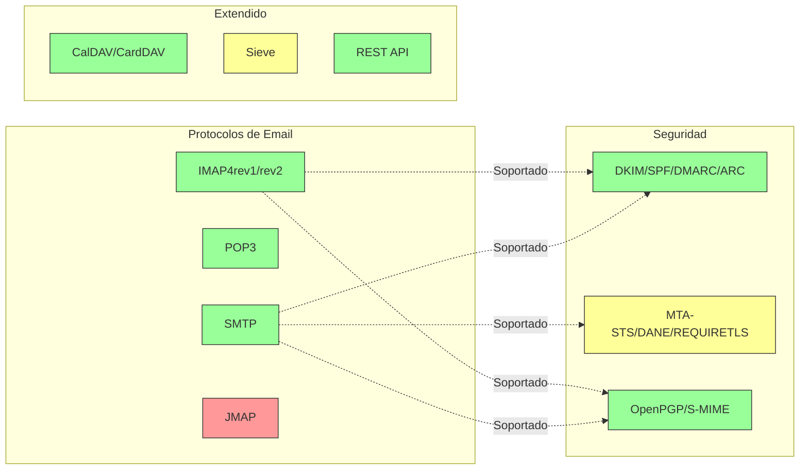

---


## Protocolos de Email Principales {#core-email-protocols}

### Flujo del Protocolo de Email {#email-protocol-flow}

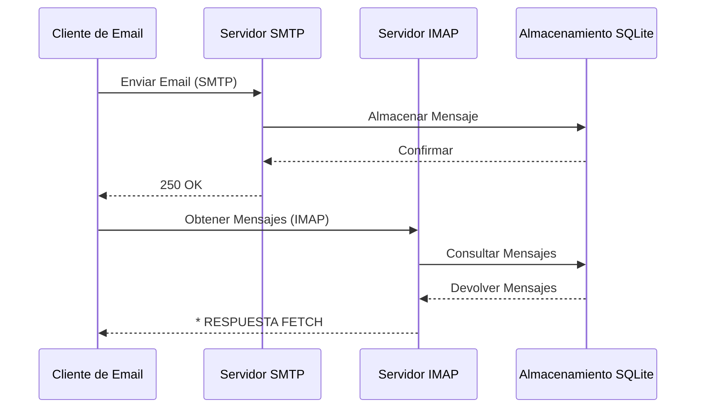


## Protocolo de Email IMAP4 y Extensiones {#imap4-email-protocol-and-extensions}

> \[!NOTE]
> Forward Email soporta IMAP4rev1 (RFC 3501) con soporte parcial para características de IMAP4rev2 (RFC 9051).

Forward Email proporciona un soporte robusto para IMAP4 a través de la implementación del servidor de correo WildDuck. El servidor implementa IMAP4rev1 (RFC 3501) con soporte parcial para extensiones de IMAP4rev2 (RFC 9051).

La funcionalidad IMAP de Forward Email es proporcionada por la dependencia [WildDuck](https://github.com/nodemailer/wildduck). Se soportan los siguientes RFCs de email:

| RFC                                                       | Título                                                            | Notas de Implementación                              |
| --------------------------------------------------------- | ----------------------------------------------------------------- | ----------------------------------------------------- |
| [RFC 3501](https://datatracker.ietf.org/doc/html/rfc3501) | Protocolo de Acceso a Mensajes de Internet (IMAP) - Versión 4rev1 | Soporte completo con diferencias intencionales (ver abajo) |
| [RFC 2177](https://datatracker.ietf.org/doc/html/rfc2177) | Comando IMAP4 IDLE                                               | Notificaciones estilo push                            |
| [RFC 2342](https://datatracker.ietf.org/doc/html/rfc2342) | Namespace IMAP4                                                  | Soporte para namespace de buzones                     |
| [RFC 2087](https://datatracker.ietf.org/doc/html/rfc2087) | Extensión IMAP4 QUOTA                                           | Gestión de cuota de almacenamiento                     |
| [RFC 2971](https://datatracker.ietf.org/doc/html/rfc2971) | Extensión IMAP4 ID                                            | Identificación cliente/servidor                        |
| [RFC 5161](https://datatracker.ietf.org/doc/html/rfc5161) | Extensión IMAP4 ENABLE                                         | Habilitar extensiones IMAP                             |
| [RFC 4959](https://datatracker.ietf.org/doc/html/rfc4959) | Extensión IMAP para Respuesta Inicial del Cliente SASL (SASL-IR) | Respuesta inicial del cliente                          |
| [RFC 3691](https://datatracker.ietf.org/doc/html/rfc3691) | Comando IMAP4 UNSELECT                                        | Cerrar buzón sin EXPUNGE                               |
| [RFC 4315](https://datatracker.ietf.org/doc/html/rfc4315) | Extensión IMAP UIDPLUS                                        | Comandos UID mejorados                                 |
| [RFC 7162](https://datatracker.ietf.org/doc/html/rfc7162) | Extensiones IMAP: Resincronización rápida de cambios de bandera (CONDSTORE) | STORE condicional                                     |
| [RFC 6154](https://datatracker.ietf.org/doc/html/rfc6154) | Extensión IMAP LIST para buzones de uso especial               | Atributos especiales de buzones                        |
| [RFC 6851](https://datatracker.ietf.org/doc/html/rfc6851) | Extensión IMAP MOVE                                           | Comando MOVE atómico                                   |
| [RFC 6855](https://datatracker.ietf.org/doc/html/rfc6855) | Soporte IMAP para UTF-8                                        | Soporte UTF-8                                         |
| [RFC 3348](https://datatracker.ietf.org/doc/html/rfc3348) | Extensión IMAP4 para buzones hijos                             | Información de buzones hijos                           |
| [RFC 7889](https://datatracker.ietf.org/doc/html/rfc7889) | Extensión IMAP4 para anunciar tamaño máximo de carga (APPENDLIMIT) | Tamaño máximo de carga                                 |
**Extensiones IMAP Soportadas:**

| Extensión         | RFC          | Estado      | Descripción                     |
| ----------------- | ------------ | ----------- | ------------------------------- |
| IDLE              | RFC 2177     | ✅ Soportado | Notificaciones estilo push       |
| NAMESPACE         | RFC 2342     | ✅ Soportado | Soporte para espacios de buzones |
| QUOTA             | RFC 2087     | ✅ Soportado | Gestión de cuota de almacenamiento |
| ID                | RFC 2971     | ✅ Soportado | Identificación cliente/servidor  |
| ENABLE            | RFC 5161     | ✅ Soportado | Habilitar extensiones IMAP       |
| SASL-IR           | RFC 4959     | ✅ Soportado | Respuesta inicial del cliente    |
| UNSELECT          | RFC 3691     | ✅ Soportado | Cerrar buzón sin EXPUNGE         |
| UIDPLUS           | RFC 4315     | ✅ Soportado | Comandos UID mejorados           |
| CONDSTORE         | RFC 7162     | ✅ Soportado | STORE condicional                |
| SPECIAL-USE       | RFC 6154     | ✅ Soportado | Atributos especiales de buzones  |
| MOVE              | RFC 6851     | ✅ Soportado | Comando MOVE atómico             |
| UTF8=ACCEPT       | RFC 6855     | ✅ Soportado | Soporte UTF-8                   |
| CHILDREN          | RFC 3348     | ✅ Soportado | Información de buzones hijos     |
| APPENDLIMIT       | RFC 7889     | ✅ Soportado | Tamaño máximo de carga           |
| XLIST             | No estándar | ✅ Soportado | Listado de carpetas compatible con Gmail |
| XAPPLEPUSHSERVICE | No estándar | ✅ Soportado | Servicio de Notificaciones Push de Apple |

### Diferencias del Protocolo IMAP respecto a las Especificaciones RFC {#imap-protocol-differences-from-rfc-specifications}

> \[!WARNING]
> Las siguientes diferencias respecto a las especificaciones RFC pueden afectar la compatibilidad del cliente.

Forward Email se desvía intencionalmente de algunas especificaciones RFC de IMAP. Estas diferencias se heredan de WildDuck y se documentan a continuación:

* **No hay bandera \Recent:** La bandera `\Recent` no está implementada. Todos los mensajes se devuelven sin esta bandera.
* **RENAME no afecta subcarpetas:** Al renombrar una carpeta, las subcarpetas no se renombran automáticamente. La jerarquía de carpetas es plana en la base de datos.
* **INBOX no puede ser renombrado:** [RFC 3501](https://datatracker.ietf.org/doc/html/rfc3501) permite renombrar INBOX, pero Forward Email lo prohíbe explícitamente. Véase [código fuente de WildDuck](https://github.com/nodemailer/wildduck/blob/master/imap-core/lib/commands/rename.js#L27).
* **No hay respuestas FLAGS no solicitadas:** Cuando se cambian las banderas, no se envían respuestas FLAGS no solicitadas al cliente.
* **STORE devuelve NO para mensajes eliminados:** Intentar modificar banderas en mensajes eliminados devuelve NO en lugar de ignorar silenciosamente.
* **CHARSET ignorado en SEARCH:** El argumento `CHARSET` en comandos SEARCH es ignorado. Todas las búsquedas usan UTF-8.
* **Metadatos MODSEQ ignorados:** Los metadatos `MODSEQ` en comandos STORE son ignorados.
* **SEARCH TEXT y SEARCH BODY:** Forward Email usa [SQLite FTS5](https://www.sqlite.org/fts5.html) (Búsqueda de Texto Completo) en lugar de la búsqueda `$text` de MongoDB. Esto proporciona:
  * Soporte para el operador `NOT` (MongoDB no lo soporta)
  * Resultados de búsqueda clasificados
  * Rendimiento de búsqueda sub-100ms en buzones grandes
* **Comportamiento de autoexpunge:** Los mensajes marcados con `\Deleted` se expurgan automáticamente al cerrar el buzón.
* **Fidelidad del mensaje:** Algunas modificaciones de mensajes pueden no preservar la estructura exacta del mensaje original.

**Soporte Parcial de IMAP4rev2:**

Forward Email implementa IMAP4rev1 (RFC 3501) con soporte parcial de IMAP4rev2 (RFC 9051). Las siguientes características de IMAP4rev2 **no están aún soportadas**:

* **LIST-STATUS** - Comandos combinados LIST y STATUS
* **LITERAL-** - Literales no sincronizados (variante menos)
* **OBJECTID** - Identificadores únicos de objetos
* **SAVEDATE** - Atributo de fecha de guardado
* **REPLACE** - Reemplazo atómico de mensajes
* **UNAUTHENTICATE** - Cerrar autenticación sin cerrar conexión

**Manejo Relajado de la Estructura del Cuerpo:**

Forward Email usa un manejo "relajado del cuerpo" para estructuras MIME malformadas, que puede diferir de la interpretación estricta de RFC. Esto mejora la compatibilidad con correos reales que no cumplen perfectamente con los estándares.
**Extensión METADATA (RFC 5464):**

La extensión METADATA de IMAP **no está soportada**. Para más información sobre esta extensión, consulte [RFC 5464](https://datatracker.ietf.org/doc/html/rfc5464). La discusión sobre la incorporación de esta función se puede encontrar en [WildDuck Issue #937](https://github.com/zone-eu/wildduck/issues/937).

### Extensiones IMAP NO soportadas {#imap-extensions-not-supported}

Las siguientes extensiones IMAP del [Registro de Capacidades IMAP de IANA](https://www.iana.org/assignments/imap-capabilities/imap-capabilities.xhtml) NO están soportadas:

| RFC                                                       | Título                                                                                                          | Razón                                                                                                                                  |
| --------------------------------------------------------- | --------------------------------------------------------------------------------------------------------------- | --------------------------------------------------------------------------------------------------------------------------------------- |
| [RFC 2086](https://datatracker.ietf.org/doc/html/rfc2086) | Extensión ACL de IMAP4                                                                                           | Carpetas compartidas no implementadas. Véase [WildDuck Issue #427](https://github.com/zone-eu/wildduck/issues/427)                     |
| [RFC 5256](https://datatracker.ietf.org/doc/html/rfc5256) | Extensiones IMAP SORT y THREAD                                                                                   | El encadenamiento se implementa internamente pero no mediante el protocolo RFC 5256. Véase [WildDuck Issue #12](https://github.com/zone-eu/wildduck/issues/12) |
| [RFC 5162](https://datatracker.ietf.org/doc/html/rfc5162) | Extensiones IMAP4 para Resincronización Rápida de Buzones (QRESYNC)                                              | No implementado                                                                                                                         |
| [RFC 5464](https://datatracker.ietf.org/doc/html/rfc5464) | Extensión METADATA de IMAP                                                                                        | Operaciones de metadata ignoradas. Véase [documentación de WildDuck](https://datatracker.ietf.org/doc/html/rfc5464)                    |
| [RFC 5258](https://datatracker.ietf.org/doc/html/rfc5258) | Extensiones del Comando LIST de IMAP4                                                                            | No implementado                                                                                                                         |
| [RFC 5267](https://datatracker.ietf.org/doc/html/rfc5267) | Contextos para IMAP4                                                                                              | No implementado                                                                                                                         |
| [RFC 5465](https://datatracker.ietf.org/doc/html/rfc5465) | Extensión NOTIFY de IMAP                                                                                          | No implementado                                                                                                                         |
| [RFC 5466](https://datatracker.ietf.org/doc/html/rfc5466) | Extensión FILTERS de IMAP4                                                                                        | No implementado                                                                                                                         |
| [RFC 6203](https://datatracker.ietf.org/doc/html/rfc6203) | Extensión IMAP4 para Búsqueda Difusa                                                                              | No implementado                                                                                                                         |
| [RFC 6785](https://datatracker.ietf.org/doc/html/rfc6785) | Recomendaciones de Implementación IMAP4                                                                           | Recomendaciones no completamente seguidas                                                                                              |
| [RFC 7162](https://datatracker.ietf.org/doc/html/rfc7162) | Extensiones IMAP: Resincronización Rápida de Cambios de Banderas (CONDSTORE) y Resincronización Rápida de Buzones (QRESYNC) | No implementado                                                                                                                         |
| [RFC 8437](https://datatracker.ietf.org/doc/html/rfc8437) | Extensión UNAUTHENTICATE de IMAP para Reutilización de Conexiones                                                | No implementado                                                                                                                         |
| [RFC 8438](https://datatracker.ietf.org/doc/html/rfc8438) | Extensión IMAP para STATUS=SIZE                                                                                   | No implementado                                                                                                                         |
| [RFC 8457](https://datatracker.ietf.org/doc/html/rfc8457) | Palabra clave "$Important" y atributo de uso especial "\Important" de IMAP                                         | No implementado                                                                                                                         |
| [RFC 8474](https://datatracker.ietf.org/doc/html/rfc8474) | Extensión IMAP para Identificadores de Objetos                                                                    | No implementado                                                                                                                         |
| [RFC 9051](https://datatracker.ietf.org/doc/html/rfc9051) | Protocolo de Acceso a Mensajes de Internet (IMAP) - Versión 4rev2                                                 | Forward Email implementa IMAP4rev1 ([RFC 3501](https://datatracker.ietf.org/doc/html/rfc3501))                                          |
## Protocolo de Correo Electrónico POP3 y Extensiones {#pop3-email-protocol-and-extensions}

> \[!NOTE]
> Forward Email soporta POP3 (RFC 1939) con extensiones estándar para la recuperación de correo electrónico.

La funcionalidad POP3 de Forward Email es proporcionada por la dependencia [WildDuck](https://github.com/nodemailer/wildduck). Se soportan los siguientes RFCs de correo electrónico:

| RFC                                                       | Título                                  | Notas de Implementación                             |
| --------------------------------------------------------- | --------------------------------------- | -------------------------------------------------- |
| [RFC 1939](https://datatracker.ietf.org/doc/html/rfc1939) | Protocolo de Oficina de Correos - Versión 3 (POP3) | Soporte completo con diferencias intencionales (ver abajo) |
| [RFC 2595](https://datatracker.ietf.org/doc/html/rfc2595) | Uso de TLS con IMAP, POP3 y ACAP        | Soporte STARTTLS                                   |
| [RFC 2449](https://datatracker.ietf.org/doc/html/rfc2449) | Mecanismo de Extensión POP3             | Soporte del comando CAPA                            |

Forward Email proporciona soporte POP3 para clientes que prefieren este protocolo más simple sobre IMAP. POP3 es ideal para usuarios que desean descargar correos a un solo dispositivo y eliminarlos del servidor.

**Extensiones POP3 Soportadas:**

| Extensión | RFC      | Estado       | Descripción                |
| --------- | -------- | ------------ | -------------------------- |
| TOP       | RFC 1939 | ✅ Soportada | Recuperar encabezados de mensajes |
| USER      | RFC 1939 | ✅ Soportada | Autenticación por nombre de usuario |
| UIDL      | RFC 1939 | ✅ Soportada | Identificadores únicos de mensajes |
| EXPIRE    | RFC 2449 | ✅ Soportada | Política de expiración de mensajes |

### Diferencias del Protocolo POP3 respecto a las Especificaciones RFC {#pop3-protocol-differences-from-rfc-specifications}

> \[!WARNING]
> POP3 tiene limitaciones inherentes comparado con IMAP.

> \[!IMPORTANT]
> **Diferencia Crítica: Comportamiento DELE de Forward Email vs WildDuck POP3**
>
> Forward Email implementa la eliminación permanente conforme al RFC para comandos POP3 `DELE`, a diferencia de WildDuck que mueve los mensajes a la Papelera.

**Comportamiento de Forward Email** ([código fuente](https://github.com/forwardemail/forwardemail.net/blob/master/pop3-server.js)):

* `DELE` → `QUIT` elimina permanentemente los mensajes
* Sigue exactamente la especificación de [RFC 1939](https://datatracker.ietf.org/doc/html/rfc1939)
* Coincide con el comportamiento de Dovecot (por defecto), Postfix y otros servidores conformes a estándares

**Comportamiento de WildDuck** ([discusión](https://github.com/zone-eu/wildduck/issues/937)):

* `DELE` → `QUIT` mueve los mensajes a la Papelera (similar a Gmail)
* Decisión de diseño intencional para la seguridad del usuario
* No conforme al RFC pero previene pérdida accidental de datos

**Por qué Forward Email es diferente:**

* **Conformidad con RFC:** Cumple con la especificación de [RFC 1939](https://datatracker.ietf.org/doc/html/rfc1939)
* **Expectativas del Usuario:** El flujo de trabajo de descargar y eliminar espera eliminación permanente
* **Gestión de Almacenamiento:** Recuperación adecuada del espacio en disco
* **Interoperabilidad:** Consistente con otros servidores conformes al RFC

> \[!NOTE]
> **Listado de Mensajes POP3:** Forward Email lista TODOS los mensajes del INBOX sin límite. Esto difiere de WildDuck que limita a 250 mensajes por defecto. Ver [código fuente](https://github.com/forwardemail/forwardemail.net/blob/master/pop3-server.js).

**Acceso de un Solo Dispositivo:**

POP3 está diseñado para acceso desde un solo dispositivo. Los mensajes normalmente se descargan y eliminan del servidor, por lo que no es adecuado para sincronización multi-dispositivo.

**Sin Soporte de Carpetas:**

POP3 solo accede a la carpeta INBOX. Otras carpetas (Enviados, Borradores, Papelera, etc.) no son accesibles vía POP3.

**Gestión Limitada de Mensajes:**

POP3 proporciona recuperación y eliminación básica de mensajes. Funciones avanzadas como marcar, mover o buscar mensajes no están disponibles.

### Extensiones POP3 NO Soportadas {#pop3-extensions-not-supported}

Las siguientes extensiones POP3 del [Registro de Mecanismos de Extensión POP3 de IANA](https://www.iana.org/assignments/pop3-extension-mechanism/pop3-extension-mechanism.xhtml) NO están soportadas:
| RFC                                                       | Título                                                  | Razón                                  |
| --------------------------------------------------------- | ------------------------------------------------------- | --------------------------------------- |
| [RFC 6856](https://datatracker.ietf.org/doc/html/rfc6856) | Soporte del Protocolo de Oficina de Correos Versión 3 (POP3) para UTF-8 | No implementado en el servidor POP3 de WildDuck |
| [RFC 2595](https://datatracker.ietf.org/doc/html/rfc2595) | Comando STLS                                           | Solo se soporta STARTTLS, no STLS       |
| [RFC 3206](https://datatracker.ietf.org/doc/html/rfc3206) | Códigos de Respuesta SYS y AUTH POP                    | No implementado                         |

---


## Protocolo SMTP de Correo Electrónico y Extensiones {#smtp-email-protocol-and-extensions}

> \[!NOTE]
> Forward Email soporta SMTP (RFC 5321) con extensiones modernas para la entrega segura y confiable de correo electrónico.

La funcionalidad SMTP de Forward Email es proporcionada por múltiples componentes: [smtp-server](https://github.com/nodemailer/smtp-server) (nodemailer), [zone-mta](https://github.com/zone-eu/zone-mta), e implementaciones personalizadas. Se soportan los siguientes RFCs de correo electrónico:

| RFC                                                       | Título                                                                           | Notas de Implementación             |
| --------------------------------------------------------- | ------------------------------------------------------------------------------- | ------------------------------------ |
| [RFC 5321](https://datatracker.ietf.org/doc/html/rfc5321) | Protocolo Simple de Transferencia de Correo (SMTP)                              | Soporte completo                    |
| [RFC 3207](https://datatracker.ietf.org/doc/html/rfc3207) | Extensión del Servicio SMTP para SMTP Seguro sobre Capa de Transporte (STARTTLS) | Soporte TLS/SSL                    |
| [RFC 4954](https://datatracker.ietf.org/doc/html/rfc4954) | Extensión del Servicio SMTP para Autenticación (AUTH)                           | PLAIN, LOGIN, CRAM-MD5, XOAUTH2     |
| [RFC 6531](https://datatracker.ietf.org/doc/html/rfc6531) | Extensión SMTP para Correo Internacionalizado (SMTPUTF8)                        | Soporte nativo de direcciones de correo unicode |
| [RFC 3461](https://datatracker.ietf.org/doc/html/rfc3461) | Extensión del Servicio SMTP para Notificaciones de Estado de Entrega (DSN)      | Soporte completo de DSN             |
| [RFC 3463](https://datatracker.ietf.org/doc/html/rfc3463) | Códigos Mejorados de Estado del Sistema de Correo                               | Códigos de estado mejorados en respuestas |
| [RFC 1870](https://datatracker.ietf.org/doc/html/rfc1870) | Extensión del Servicio SMTP para Declaración del Tamaño del Mensaje (SIZE)       | Publicación del tamaño máximo del mensaje |
| [RFC 2920](https://datatracker.ietf.org/doc/html/rfc2920) | Extensión del Servicio SMTP para Encadenamiento de Comandos (PIPELINING)         | Soporte para encadenamiento de comandos |
| [RFC 1652](https://datatracker.ietf.org/doc/html/rfc1652) | Extensión del Servicio SMTP para Transporte MIME de 8 bits (8BITMIME)             | Soporte MIME de 8 bits              |
| [RFC 6152](https://datatracker.ietf.org/doc/html/rfc6152) | Extensión del Servicio SMTP para Transporte MIME de 8 bits                       | Soporte MIME de 8 bits              |
| [RFC 2034](https://datatracker.ietf.org/doc/html/rfc2034) | Extensión del Servicio SMTP para Devolver Códigos de Error Mejorados (ENHANCEDSTATUSCODES) | Códigos de estado mejorados        |

Forward Email implementa un servidor SMTP completo con soporte para extensiones modernas que mejoran la seguridad, confiabilidad y funcionalidad.

**Extensiones SMTP Soportadas:**

| Extensión           | RFC      | Estado      | Descripción                           |
| ------------------- | -------- | ----------- | ------------------------------------- |
| PIPELINING          | RFC 2920 | ✅ Soportado | Encadenamiento de comandos            |
| SIZE                | RFC 1870 | ✅ Soportado | Declaración del tamaño del mensaje (límite 52MB) |
| ETRN                | RFC 1985 | ✅ Soportado | Procesamiento remoto de colas         |
| STARTTLS            | RFC 3207 | ✅ Soportado | Actualización a TLS                   |
| ENHANCEDSTATUSCODES | RFC 2034 | ✅ Soportado | Códigos de estado mejorados           |
| 8BITMIME            | RFC 6152 | ✅ Soportado | Transporte MIME de 8 bits              |
| DSN                 | RFC 3461 | ✅ Soportado | Notificaciones de Estado de Entrega   |
| CHUNKING            | RFC 3030 | ✅ Soportado | Transferencia de mensajes en fragmentos |
| SMTPUTF8            | RFC 6531 | ⚠️ Parcial  | Direcciones de correo en UTF-8 (parcial) |
| REQUIRETLS          | RFC 8689 | ✅ Soportado | Requiere TLS para la entrega          |
### Notificaciones de Estado de Entrega (DSN) {#delivery-status-notifications-dsn}

> \[!TIP]
> DSN proporciona información detallada sobre el estado de entrega de los correos electrónicos enviados.

Forward Email soporta completamente **DSN (RFC 3461)**, que permite a los remitentes solicitar notificaciones de estado de entrega. Esta función proporciona:

* **Notificaciones de éxito** cuando los mensajes son entregados
* **Notificaciones de fallo** con información detallada del error
* **Notificaciones de retraso** cuando la entrega se demora temporalmente

DSN es particularmente útil para:

* Confirmar la entrega de mensajes importantes
* Solucionar problemas de entrega
* Sistemas automatizados de procesamiento de correo electrónico
* Requisitos de cumplimiento y auditoría

### Soporte REQUIRETLS {#requiretls-support}

> \[!IMPORTANT]
> Forward Email es uno de los pocos proveedores que anuncia y aplica explícitamente REQUIRETLS.

Forward Email soporta **REQUIRETLS (RFC 8689)**, que asegura que los mensajes de correo electrónico solo se entreguen a través de conexiones cifradas con TLS. Esto proporciona:

* **Cifrado de extremo a extremo** para toda la ruta de entrega
* **Aplicación visible para el usuario** mediante casilla de verificación en el compositor de correo
* **Rechazo de intentos de entrega no cifrados**
* **Seguridad mejorada** para comunicaciones sensibles

### Extensiones SMTP NO Soportadas {#smtp-extensions-not-supported}

Las siguientes extensiones SMTP del [Registro de Extensiones de Servicio SMTP de IANA](https://www.iana.org/assignments/smtp) NO están soportadas:

| RFC                                                       | Título                                                                                           | Razón                 |
| --------------------------------------------------------- | ------------------------------------------------------------------------------------------------ | --------------------- |
| [RFC 4865](https://datatracker.ietf.org/doc/html/rfc4865) | Extensión de Servicio de Envío SMTP para Liberación Futura de Mensajes (FUTURERELEASE)            | No implementada       |
| [RFC 6710](https://datatracker.ietf.org/doc/html/rfc6710) | Extensión SMTP para Prioridades de Transferencia de Mensajes (MT-PRIORITY)                       | No implementada       |
| [RFC 7293](https://datatracker.ietf.org/doc/html/rfc7293) | Campo de Cabecera Require-Recipient-Valid-Since y Extensión de Servicio SMTP                     | No implementada       |
| [RFC 7372](https://datatracker.ietf.org/doc/html/rfc7372) | Códigos de Estado de Autenticación de Email                                                     | No completamente implementada |
| [RFC 4468](https://datatracker.ietf.org/doc/html/rfc4468) | Extensión BURL para Envío de Mensajes                                                           | No implementada       |
| [RFC 3030](https://datatracker.ietf.org/doc/html/rfc3030) | Extensiones de Servicio SMTP para Transmisión de Mensajes MIME Grandes y Binarios (CHUNKING, BINARYMIME) | No implementada       |
| [RFC 2852](https://datatracker.ietf.org/doc/html/rfc2852) | Extensión de Servicio SMTP Deliver By                                                            | No implementada       |

---


## Protocolo de Correo JMAP {#jmap-email-protocol}

> \[!CAUTION]
> JMAP **no está actualmente soportado** por Forward Email.

| RFC                                                       | Título                                   | Estado          | Razón                                                                 |
| --------------------------------------------------------- | ----------------------------------------- | --------------- | ---------------------------------------------------------------------- |
| [RFC 8620](https://datatracker.ietf.org/doc/html/rfc8620) | Protocolo Meta de Aplicación JSON (JMAP) | ❌ No Soportado | Forward Email usa IMAP/POP3/SMTP y una API REST completa en su lugar |

**JMAP (Protocolo Meta de Aplicación JSON)** es un protocolo moderno de correo electrónico diseñado para reemplazar IMAP.

**Por qué JMAP no está soportado:**

> "JMAP es una bestia que no debería haber sido inventada. Intenta convertir TCP/IMAP (ya un protocolo malo según los estándares actuales) en HTTP/JSON, solo usando un transporte diferente mientras mantiene el espíritu." — Andris Reinman, [Discusión en HN](https://news.ycombinator.com/item?id=18890011)
> "JMAP tiene más de 10 años, y casi no hay adopción en absoluto" – Andris Reinman, [Discusión en GitHub](https://github.com/zone-eu/wildduck/issues/2#issuecomment-1765190790)

Vea también comentarios adicionales en <https://hn.algolia.com/?dateRange=all&page=0&prefix=true&query=jmap%20andris&sort=byDate&type=comment>.

Forward Email actualmente se enfoca en proporcionar un excelente soporte para IMAP, POP3 y SMTP, junto con una API REST completa para la gestión de correo electrónico. El soporte para JMAP podría considerarse en el futuro según la demanda de los usuarios y la adopción en el ecosistema.

**Alternativa:** Forward Email ofrece una [API REST Completa](#complete-rest-api-for-email-management) con 39 endpoints que proporciona funcionalidad similar a JMAP para el acceso programático al correo electrónico.

---


## Seguridad del Correo Electrónico {#email-security}

### Arquitectura de Seguridad del Correo Electrónico {#email-security-architecture}

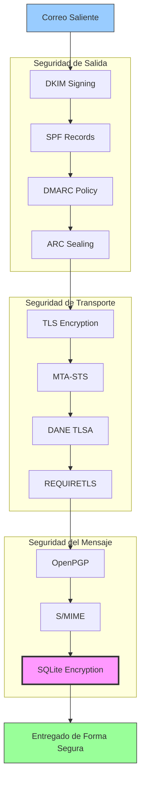


## Protocolos de Autenticación de Mensajes de Correo Electrónico {#email-message-authentication-protocols}

> \[!NOTE]
> Forward Email implementa todos los principales protocolos de autenticación de correo electrónico para prevenir suplantaciones y asegurar la integridad del mensaje.

Forward Email utiliza la biblioteca [mailauth](https://github.com/postalsys/mailauth) para la autenticación de correo electrónico. Se soportan los siguientes RFCs:

| RFC                                                       | Título                                                                 | Notas de Implementación                                      |
| --------------------------------------------------------- | --------------------------------------------------------------------- | ------------------------------------------------------------ |
| [RFC 6376](https://datatracker.ietf.org/doc/html/rfc6376) | Firmas de DomainKeys Identified Mail (DKIM)                           | Firma y verificación completa de DKIM                         |
| [RFC 8463](https://datatracker.ietf.org/doc/html/rfc8463) | Un Nuevo Método de Firma Criptográfica para DKIM (Ed25519-SHA256)     | Soporta algoritmos de firma RSA-SHA256 y Ed25519-SHA256       |
| [RFC 7208](https://datatracker.ietf.org/doc/html/rfc7208) | Sender Policy Framework (SPF)                                         | Validación de registros SPF                                   |
| [RFC 7489](https://datatracker.ietf.org/doc/html/rfc7489) | Autenticación, Reporte y Conformidad de Mensajes Basados en Dominio (DMARC) | Aplicación de políticas DMARC                                 |
| [RFC 8617](https://datatracker.ietf.org/doc/html/rfc8617) | Cadena de Recepción Autenticada (ARC)                                | Sellado y validación ARC                                      |

Los protocolos de autenticación de correo electrónico verifican que los mensajes provienen genuinamente del remitente declarado y que no han sido alterados durante el tránsito.

### Soporte de Protocolos de Autenticación {#authentication-protocol-support}

| Protocolo | RFC      | Estado       | Descripción                                                          |
| --------- | -------- | ------------ | -------------------------------------------------------------------- |
| **DKIM**  | RFC 6376 | ✅ Soportado | DomainKeys Identified Mail - Firmas criptográficas                   |
| **SPF**   | RFC 7208 | ✅ Soportado | Sender Policy Framework - Autorización de dirección IP               |
| **DMARC** | RFC 7489 | ✅ Soportado | Autenticación basada en dominio - Aplicación de políticas            |
| **ARC**   | RFC 8617 | ✅ Soportado | Cadena de Recepción Autenticada - Preservar autenticación en reenvíos |
### DKIM (DomainKeys Identified Mail) {#dkim-domainkeys-identified-mail}

**DKIM** añade una firma criptográfica a los encabezados del correo electrónico, permitiendo a los destinatarios verificar que el mensaje fue autorizado por el propietario del dominio y que no ha sido modificado en tránsito.

Forward Email utiliza [mailauth](https://github.com/postalsys/mailauth) para la firma y verificación DKIM.

**Características clave:**

* Firma DKIM automática para todos los mensajes salientes
* Soporte para claves RSA y Ed25519
* Soporte para múltiples selectores
* Verificación DKIM para mensajes entrantes

### SPF (Sender Policy Framework) {#spf-sender-policy-framework}

**SPF** permite a los propietarios de dominios especificar qué direcciones IP están autorizadas para enviar correo en nombre de su dominio.

**Características clave:**

* Validación de registros SPF para mensajes entrantes
* Comprobación SPF automática con resultados detallados
* Soporte para mecanismos include, redirect y all
* Políticas SPF configurables por dominio

### DMARC (Domain-based Message Authentication, Reporting & Conformance) {#dmarc-domain-based-message-authentication-reporting--conformance}

**DMARC** se basa en SPF y DKIM para proporcionar aplicación de políticas e informes.

**Características clave:**

* Aplicación de políticas DMARC (none, quarantine, reject)
* Verificación de alineación para SPF y DKIM
* Informes agregados DMARC
* Políticas DMARC por dominio

### ARC (Authenticated Received Chain) {#arc-authenticated-received-chain}

**ARC** preserva los resultados de autenticación de correo electrónico a través del reenvío y modificaciones en listas de correo.

Forward Email utiliza la biblioteca [mailauth](https://github.com/postalsys/mailauth) para la verificación y sellado ARC.

**Características clave:**

* Sellado ARC para mensajes reenviados
* Validación ARC para mensajes entrantes
* Verificación de cadena a través de múltiples saltos
* Preserva los resultados originales de autenticación

### Authentication Flow {#authentication-flow}

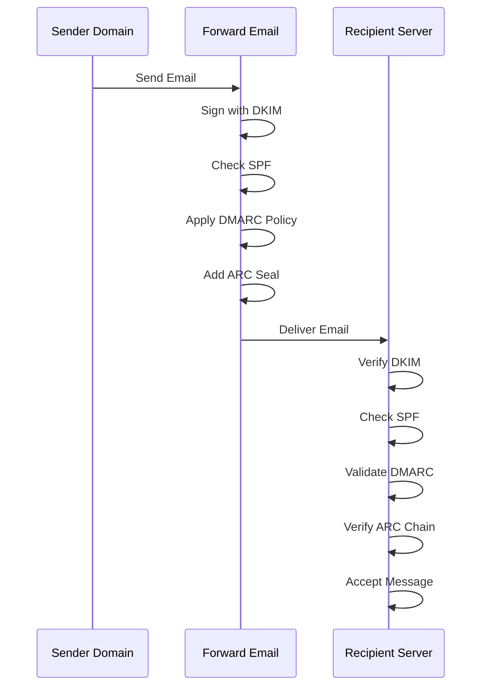

---


## Email Transport Security Protocols {#email-transport-security-protocols}

> \[!IMPORTANT]
> Forward Email implementa múltiples capas de seguridad de transporte para proteger los correos electrónicos en tránsito.

Forward Email implementa protocolos modernos de seguridad de transporte:

| RFC                                                       | Title                                                                                                | Status      | Implementation Notes                                                                                                                                                                                                                                                                          |
| --------------------------------------------------------- | ---------------------------------------------------------------------------------------------------- | ----------- | --------------------------------------------------------------------------------------------------------------------------------------------------------------------------------------------------------------------------------------------------------------------------------------------- |
| [RFC 8461](https://datatracker.ietf.org/doc/html/rfc8461) | SMTP MTA Strict Transport Security (MTA-STS)                                                         | ✅ Supported | Ampliamente utilizado en servidores IMAP, SMTP y MX. Ver [create-mta-sts-cache.js](https://github.com/forwardemail/forwardemail.net/blob/master/helpers/create-mta-sts-cache.js) y [get-transporter.js](https://github.com/forwardemail/forwardemail.net/blob/master/helpers/get-transporter.js) |
| [RFC 8460](https://datatracker.ietf.org/doc/html/rfc8460) | SMTP TLS Reporting                                                                                   | ✅ Supported | A través de la biblioteca [mailauth](https://github.com/postalsys/mailauth)                                                                                                                                                                                                                   |
| [RFC 7671](https://datatracker.ietf.org/doc/html/rfc7671) | The DNS-Based Authentication of Named Entities (DANE) Protocol: Updates and Operational Guidance     | ✅ Supported | Verificación completa DANE para conexiones SMTP salientes. Ver [mx-connect PR #22](https://github.com/zone-eu/mx-connect/pull/22)                                                                                                                                                              |
| [RFC 6698](https://datatracker.ietf.org/doc/html/rfc6698) | The DNS-Based Authentication of Named Entities (DANE) Transport Layer Security (TLS) Protocol: TLSA  | ✅ Supported | Soporte completo RFC 6698: tipos de uso PKIX-TA, PKIX-EE, DANE-TA, DANE-EE. Ver [mx-connect PR #22](https://github.com/zone-eu/mx-connect/pull/22)                                                                                                                                             |
| [RFC 8314](https://datatracker.ietf.org/doc/html/rfc8314) | Cleartext Considered Obsolete: Use of Transport Layer Security (TLS) for Email Submission and Access | ✅ Supported | TLS requerido para todas las conexiones                                                                                                                                                                                                                                                      |
| [RFC 8689](https://datatracker.ietf.org/doc/html/rfc8689) | SMTP Service Extension for Requiring TLS (REQUIRETLS)                                                | ✅ Supported | Soporte completo para la extensión SMTP REQUIRETLS y el encabezado "TLS-Required"                                                                                                                                                                                                            |
Los protocolos de seguridad de transporte garantizan que los mensajes de correo electrónico estén cifrados y autenticados durante la transmisión entre servidores de correo.

### Soporte de Seguridad de Transporte {#transport-security-support}

| Protocolo     | RFC      | Estado       | Descripción                                      |
| -------------- | -------- | ------------ | ------------------------------------------------ |
| **TLS**        | RFC 8314 | ✅ Soportado | Seguridad de la Capa de Transporte - Conexiones cifradas |
| **MTA-STS**    | RFC 8461 | ✅ Soportado | Seguridad estricta de transporte del agente de transferencia de correo |
| **DANE**       | RFC 7671 | ✅ Soportado | Autenticación basada en DNS de entidades nombradas |
| **REQUIRETLS** | RFC 8689 | ✅ Soportado | Requerir TLS para toda la ruta de entrega       |

### TLS (Seguridad de la Capa de Transporte) {#tls-transport-layer-security}

Forward Email aplica cifrado TLS para todas las conexiones de correo electrónico (SMTP, IMAP, POP3).

**Características clave:**

* Soporte para TLS 1.2 y TLS 1.3
* Gestión automática de certificados
* Perfect Forward Secrecy (PFS)
* Solo suites de cifrado fuertes

### MTA-STS (Seguridad estricta de transporte del agente de transferencia de correo) {#mta-sts-mail-transfer-agent-strict-transport-security}

**MTA-STS** garantiza que el correo electrónico solo se entregue a través de conexiones cifradas con TLS mediante la publicación de una política vía HTTPS.

Forward Email implementa MTA-STS usando [create-mta-sts-cache.js](https://github.com/forwardemail/forwardemail.net/blob/master/helpers/create-mta-sts-cache.js).

**Características clave:**

* Publicación automática de políticas MTA-STS
* Caché de políticas para mejorar el rendimiento
* Prevención de ataques de degradación
* Aplicación de validación de certificados

### DANE (Autenticación basada en DNS de entidades nombradas) {#dane-dns-based-authentication-of-named-entities}

> \[!NOTE]
> Forward Email ahora ofrece soporte completo para DANE en conexiones SMTP salientes.

**DANE** utiliza DNSSEC para publicar información del certificado TLS en DNS, permitiendo a los servidores de correo verificar certificados sin depender de autoridades certificadoras.

**Características clave:**

* ✅ Verificación completa de DANE para conexiones SMTP salientes
* ✅ Soporte completo RFC 6698: tipos de uso PKIX-TA, PKIX-EE, DANE-TA, DANE-EE
* ✅ Verificación de certificados contra registros TLSA durante la actualización TLS
* ✅ Resolución TLSA paralela para múltiples hosts MX
* ✅ Detección automática de `dns.resolveTlsa` nativo (Node.js v22.15.0+, v23.9.0+)
* ✅ Soporte para resolutores personalizados en versiones antiguas de Node.js vía [Tangerine](https://github.com/forwardemail/tangerine)
* Requiere dominios firmados con DNSSEC

> \[!TIP]
> **Detalles de implementación:** El soporte DANE fue añadido mediante [mx-connect PR #22](https://github.com/zone-eu/mx-connect/pull/22), que proporciona soporte completo para DANE/TLSA en conexiones SMTP salientes.

### REQUIRETLS {#requiretls}

> \[!TIP]
> Forward Email es uno de los pocos proveedores con soporte REQUIRETLS visible para el usuario.

**REQUIRETLS** garantiza que los mensajes de correo electrónico solo se entreguen a través de conexiones cifradas con TLS durante toda la ruta de entrega.

**Características clave:**

* Casilla visible para el usuario en el compositor de correo
* Rechazo automático de entregas no cifradas
* Aplicación de TLS de extremo a extremo
* Notificaciones detalladas de fallos

> \[!TIP]
> **Aplicación visible de TLS:** Forward Email ofrece una casilla bajo **Mi Cuenta > Dominios > Configuración** para forzar TLS en todas las conexiones entrantes. Al activarla, esta función rechaza cualquier correo entrante que no se envíe mediante una conexión cifrada con TLS con un código de error 530, asegurando que todo el correo entrante esté cifrado en tránsito.

### Flujo de Seguridad de Transporte {#transport-security-flow}

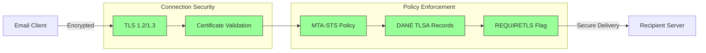
## Cifrado de Mensajes de Correo Electrónico {#email-message-encryption}

> \[!NOTE]
> Forward Email soporta tanto OpenPGP como S/MIME para cifrado de correo electrónico de extremo a extremo.

Forward Email soporta cifrado OpenPGP y S/MIME:

| RFC                                                       | Título                                                                                  | Estado      | Notas de Implementación                                                                                                                                                                              |
| --------------------------------------------------------- | --------------------------------------------------------------------------------------- | ----------- | ---------------------------------------------------------------------------------------------------------------------------------------------------------------------------------------------------- |
| [RFC 9580](https://datatracker.ietf.org/doc/html/rfc9580) | OpenPGP (reemplaza RFC 4880)                                                            | ✅ Soportado | A través de la integración de [OpenPGP.js v6+](https://github.com/openpgpjs/openpgpjs). Ver [FAQ](https://forwardemail.net/en/faq#do-you-support-openpgpmime-end-to-end-encryption-e2ee-and-web-key-directory-wkd) |
| [RFC 8551](https://datatracker.ietf.org/doc/html/rfc8551) | Secure/Multipurpose Internet Mail Extensions (S/MIME) Versión 4.0 Especificación de Mensajes | ✅ Soportado | Soporta algoritmos RSA y ECC. Ver [FAQ](https://forwardemail.net/en/faq#do-you-support-smime-encryption)                                                                                             |

Los protocolos de cifrado de mensajes protegen el contenido del correo electrónico para que nadie excepto el destinatario previsto pueda leerlo, incluso si el mensaje es interceptado durante el tránsito.

### Soporte de Cifrado {#encryption-support}

| Protocolo   | RFC      | Estado      | Descripción                                  |
| ----------- | -------- | ----------- | -------------------------------------------- |
| **OpenPGP** | RFC 9580 | ✅ Soportado | Pretty Good Privacy - Cifrado de clave pública |
| **S/MIME**  | RFC 8551 | ✅ Soportado | Secure/Multipurpose Internet Mail Extensions |
| **WKD**     | Draft    | ✅ Soportado | Web Key Directory - Descubrimiento automático de claves |

### OpenPGP (Pretty Good Privacy) {#openpgp-pretty-good-privacy}

**OpenPGP** proporciona cifrado de extremo a extremo usando criptografía de clave pública. Forward Email soporta OpenPGP a través del protocolo [Web Key Directory (WKD)](https://forwardemail.net/en/faq#do-you-support-openpgpmime-end-to-end-encryption-e2ee-and-web-key-directory-wkd).

**Características Clave:**

* Descubrimiento automático de claves vía WKD
* Soporte PGP/MIME para archivos adjuntos cifrados
* Gestión de claves a través del cliente de correo
* Compatible con GPG, Mailvelope y otras herramientas OpenPGP

**Cómo Usar:**

1. Genera un par de claves PGP en tu cliente de correo
2. Sube tu clave pública al WKD de Forward Email
3. Tu clave es automáticamente descubrible por otros usuarios
4. Envía y recibe correos cifrados sin problemas

### S/MIME (Secure/Multipurpose Internet Mail Extensions) {#smime-securemultipurpose-internet-mail-extensions}

**S/MIME** proporciona cifrado de correo electrónico y firmas digitales usando certificados X.509.

**Características Clave:**

* Cifrado basado en certificados
* Firmas digitales para autenticación de mensajes
* Soporte nativo en la mayoría de clientes de correo
* Seguridad de nivel empresarial

**Cómo Usar:**

1. Obtén un certificado S/MIME de una Autoridad Certificadora
2. Instala el certificado en tu cliente de correo
3. Configura tu cliente para cifrar/firman mensajes
4. Intercambia certificados con los destinatarios

### Cifrado de Buzón SQLite {#sqlite-mailbox-encryption}

> \[!IMPORTANT]
> Forward Email proporciona una capa adicional de seguridad con buzones SQLite cifrados.

Más allá del cifrado a nivel de mensaje, Forward Email cifra buzones completos usando [sqleet](https://github.com/resilar/sqleet) (ChaCha20-Poly1305).

**Características Clave:**

* **Cifrado basado en contraseña** - Solo tú tienes la contraseña
* **Resistente a computación cuántica** - Cifrado ChaCha20-Poly1305
* **Conocimiento cero** - Forward Email no puede descifrar tu buzón
* **Aislado** - Cada buzón está aislado y es portátil
* **Irrecuperable** - Si olvidas tu contraseña, tu buzón se pierde
### Comparación de Cifrado {#encryption-comparison}

| Característica        | OpenPGP           | S/MIME             | Cifrado SQLite    |
| --------------------- | ----------------- | ------------------ | ----------------- |
| **De extremo a extremo** | ✅ Sí             | ✅ Sí              | ✅ Sí             |
| **Gestión de claves** | Autogestionado    | Emitido por CA     | Basado en contraseña |
| **Soporte cliente**   | Requiere plugin   | Nativo             | Transparente      |
| **Caso de uso**       | Personal          | Empresarial        | Almacenamiento    |
| **Resistente a cuántica** | ⚠️ Depende de la clave | ⚠️ Depende del certificado | ✅ Sí             |

### Flujo de Cifrado {#encryption-flow}

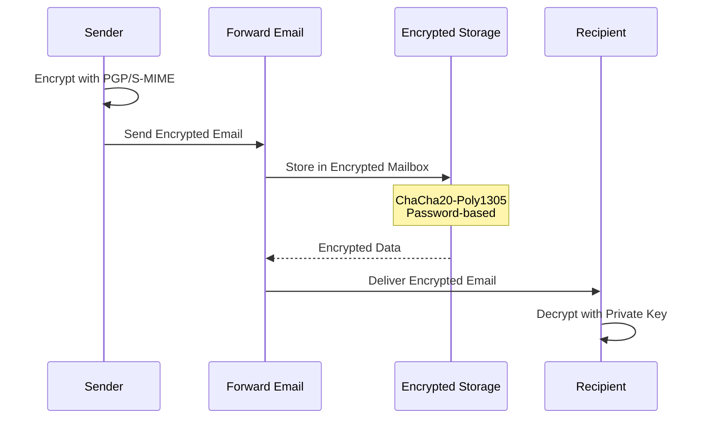

---


## Funcionalidad Extendida {#extended-functionality}


## Estándares de Formato de Mensajes de Email {#email-message-format-standards}

> \[!NOTE]
> Forward Email soporta estándares modernos de formato de email para contenido enriquecido e internacionalización.

Forward Email soporta formatos estándar de mensajes de email:

| RFC                                                       | Título                                                        | Notas de Implementación |
| --------------------------------------------------------- | ------------------------------------------------------------- | ----------------------- |
| [RFC 5322](https://datatracker.ietf.org/doc/html/rfc5322) | Formato de Mensajes de Internet                               | Soporte completo        |
| [RFC 2045](https://datatracker.ietf.org/doc/html/rfc2045) | MIME Parte Uno: Formato de Cuerpos de Mensajes de Internet    | Soporte MIME completo   |
| [RFC 2046](https://datatracker.ietf.org/doc/html/rfc2046) | MIME Parte Dos: Tipos de Medios                                | Soporte MIME completo   |
| [RFC 2047](https://datatracker.ietf.org/doc/html/rfc2047) | MIME Parte Tres: Extensiones de Cabecera para Texto No ASCII  | Soporte MIME completo   |
| [RFC 2048](https://datatracker.ietf.org/doc/html/rfc2048) | MIME Parte Cuatro: Procedimientos de Registro                  | Soporte MIME completo   |
| [RFC 2049](https://datatracker.ietf.org/doc/html/rfc2049) | MIME Parte Cinco: Criterios de Conformidad y Ejemplos          | Soporte MIME completo   |

Los estándares de formato de email definen cómo se estructuran, codifican y muestran los mensajes de email.

### Soporte de Estándares de Formato {#format-standards-support}

| Estándar           | RFC           | Estado      | Descripción                           |
| ------------------ | ------------- | ----------- | ------------------------------------- |
| **MIME**           | RFC 2045-2049 | ✅ Soportado | Extensiones Multipropósito de Correo de Internet |
| **SMTPUTF8**       | RFC 6531      | ⚠️ Parcial  | Direcciones de email internacionalizadas |
| **EAI**            | RFC 6530      | ⚠️ Parcial  | Internacionalización de Direcciones de Email |
| **Formato de Mensaje** | RFC 5322      | ✅ Soportado | Formato de Mensajes de Internet       |
| **Seguridad MIME** | RFC 1847      | ✅ Soportado | Multiparts de Seguridad para MIME     |

### MIME (Extensiones Multipropósito de Correo de Internet) {#mime-multipurpose-internet-mail-extensions}

**MIME** permite que los emails contengan múltiples partes con diferentes tipos de contenido (texto, HTML, adjuntos, etc.).

**Características MIME Soportadas:**

* Mensajes multipartes (mixto, alternativo, relacionado)
* Encabezados Content-Type
* Codificación Content-Transfer-Encoding (7bit, 8bit, quoted-printable, base64)
* Imágenes en línea y adjuntos
* Contenido HTML enriquecido

### SMTPUTF8 e Internacionalización de Direcciones de Email {#smtputf8-and-email-address-internationalization}

> \[!WARNING]
> El soporte SMTPUTF8 es parcial - no todas las características están completamente implementadas.
**SMTPUTF8** permite que las direcciones de correo electrónico contengan caracteres no ASCII (por ejemplo, `用户@例え.jp`).

**Estado Actual:**

* ⚠️ Soporte parcial para direcciones de correo internacionalizadas
* ✅ Contenido UTF-8 en cuerpos de mensajes
* ⚠️ Soporte limitado para partes locales no ASCII

---


## Protocolos de Calendarios y Contactos {#calendaring-and-contacts-protocols}

> \[!NOTE]
> Forward Email proporciona soporte completo para CalDAV y CardDAV para la sincronización de calendarios y contactos.

Forward Email soporta CalDAV y CardDAV a través de la biblioteca [caldav-adapter](https://github.com/forwardemail/caldav-adapter):

| RFC                                                       | Título                                                                   | Estado      | Notas de Implementación                                                                                                                                                               |
| --------------------------------------------------------- | ------------------------------------------------------------------------- | ----------- | -------------------------------------------------------------------------------------------------------------------------------------------------------------------------------------- |
| [RFC 4791](https://datatracker.ietf.org/doc/html/rfc4791) | Extensiones de Calendario para WebDAV (CalDAV)                           | ✅ Soportado | Acceso y gestión de calendarios                                                                                                                                                        |
| [RFC 6352](https://datatracker.ietf.org/doc/html/rfc6352) | CardDAV: Extensiones vCard para WebDAV                                   | ✅ Soportado | Acceso y gestión de contactos                                                                                                                                                          |
| [RFC 5545](https://datatracker.ietf.org/doc/html/rfc5545) | Especificación del Objeto Central de Calendario y Programación en Internet (iCalendar) | ✅ Soportado | Soporte para formato iCalendar                                                                                                                                                         |
| [RFC 6350](https://datatracker.ietf.org/doc/html/rfc6350) | Especificación del Formato vCard                                         | ✅ Soportado | Soporte para formato vCard 4.0                                                                                                                                                         |
| [RFC 6638](https://datatracker.ietf.org/doc/html/rfc6638) | Extensiones de Programación para CalDAV                                  | ✅ Soportado | Programación CalDAV con soporte iMIP. Ver [commit c4d1629](https://github.com/forwardemail/forwardemail.net/commit/c4d162975a49e38d76d68a032662e873a34a9b80)                            |
| [RFC 5546](https://datatracker.ietf.org/doc/html/rfc5546) | Protocolo de Interoperabilidad Independiente del Transporte para iCalendar (iTIP) | ✅ Soportado | Soporte iTIP para métodos REQUEST, REPLY, CANCEL y VFREEBUSY. Ver [commit c4d1629](https://github.com/forwardemail/forwardemail.net/commit/c4d162975a49e38d76d68a032662e873a34a9b80) |
| [RFC 6047](https://datatracker.ietf.org/doc/html/rfc6047) | Protocolo de Interoperabilidad Basado en Mensajes iCalendar (iMIP)       | ✅ Soportado | Invitaciones de calendario basadas en correo electrónico con enlaces de respuesta. Ver [commit c4d1629](https://github.com/forwardemail/forwardemail.net/commit/c4d162975a49e38d76d68a032662e873a34a9b80)           |

CalDAV y CardDAV son protocolos que permiten acceder, compartir y sincronizar datos de calendarios y contactos entre dispositivos.

### Soporte para CalDAV y CardDAV {#caldav-and-carddav-support}

| Protocolo             | RFC      | Estado      | Descripción                            |
| --------------------- | -------- | ----------- | -------------------------------------- |
| **CalDAV**            | RFC 4791 | ✅ Soportado | Acceso y sincronización de calendarios |
| **CardDAV**           | RFC 6352 | ✅ Soportado | Acceso y sincronización de contactos    |
| **iCalendar**         | RFC 5545 | ✅ Soportado | Formato de datos de calendario          |
| **vCard**             | RFC 6350 | ✅ Soportado | Formato de datos de contacto            |
| **VTODO**             | RFC 5545 | ✅ Soportado | Soporte para tareas/recordatorios       |
| **Programación CalDAV** | RFC 6638 | ✅ Soportado | Extensiones para programación de calendarios |
| **iTIP**              | RFC 5546 | ✅ Soportado | Interoperabilidad independiente del transporte |
| **iMIP**              | RFC 6047 | ✅ Soportado | Invitaciones de calendario basadas en correo electrónico |
### CalDAV (Acceso al Calendario) {#caldav-calendar-access}

**CalDAV** te permite acceder y gestionar calendarios desde cualquier dispositivo o aplicación.

**Características clave:**

* Sincronización multi-dispositivo
* Calendarios compartidos
* Suscripciones a calendarios
* Invitaciones y respuestas a eventos
* Eventos recurrentes
* Soporte de zonas horarias

**Clientes compatibles:**

* Apple Calendar (macOS, iOS)
* Mozilla Thunderbird
* Evolution
* GNOME Calendar
* Cualquier cliente compatible con CalDAV

### CardDAV (Acceso a Contactos) {#carddav-contact-access}

**CardDAV** te permite acceder y gestionar contactos desde cualquier dispositivo o aplicación.

**Características clave:**

* Sincronización multi-dispositivo
* Libretas de direcciones compartidas
* Grupos de contactos
* Soporte de fotos
* Campos personalizados
* Soporte de vCard 4.0

**Clientes compatibles:**

* Apple Contacts (macOS, iOS)
* Mozilla Thunderbird
* Evolution
* GNOME Contacts
* Cualquier cliente compatible con CardDAV

### Tareas y Recordatorios (CalDAV VTODO) {#tasks-and-reminders-caldav-vtodo}

> \[!TIP]
> Forward Email soporta tareas y recordatorios a través de CalDAV VTODO.

**VTODO** es parte del formato iCalendar y permite la gestión de tareas mediante CalDAV.

**Características clave:**

* Creación y gestión de tareas
* Fechas de vencimiento y prioridades
* Seguimiento de tareas completadas
* Tareas recurrentes
* Listas/categorías de tareas

**Clientes compatibles:**

* Apple Reminders (macOS, iOS)
* Mozilla Thunderbird (con Lightning)
* Evolution
* GNOME To Do
* Cualquier cliente CalDAV con soporte VTODO

### Flujo de Sincronización CalDAV/CardDAV {#caldavcarddav-synchronization-flow}

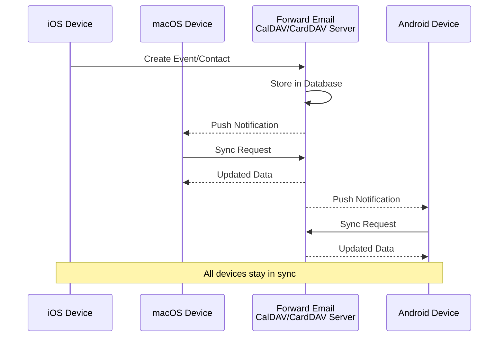

### Extensiones de Calendario NO Soportadas {#calendaring-extensions-not-supported}

Las siguientes extensiones de calendario NO están soportadas:

| RFC                                                       | Título                                                               | Razón                                                           |
| --------------------------------------------------------- | --------------------------------------------------------------------- | --------------------------------------------------------------- |
| [RFC 4918](https://datatracker.ietf.org/doc/html/rfc4918) | Extensiones HTTP para la Autoría y Versionado Distribuido en la Web (WebDAV) | CalDAV usa conceptos de WebDAV pero no implementa completamente RFC 4918 |
| [RFC 6578](https://datatracker.ietf.org/doc/html/rfc6578) | Sincronización de Colecciones para WebDAV                             | No implementado                                                 |
| [RFC 3744](https://datatracker.ietf.org/doc/html/rfc3744) | Protocolo de Control de Acceso WebDAV                                 | No implementado                                                 |

---


## Filtrado de Mensajes de Correo Electrónico {#email-message-filtering}

> \[!IMPORTANT]
> Forward Email proporciona **soporte completo para Sieve y ManageSieve** para el filtrado de correo electrónico del lado del servidor. Crea reglas potentes para ordenar, filtrar, reenviar y responder automáticamente a los mensajes entrantes.

### Sieve (RFC 5228) {#sieve-rfc-5228}

[Sieve](https://en.wikipedia.org/wiki/Sieve_\(mail_filtering_language\)) es un lenguaje de scripting estandarizado y potente para el filtrado de correo electrónico del lado del servidor. Forward Email implementa soporte completo para Sieve con 24 extensiones.

**Código fuente:** [`helpers/sieve/`](https://github.com/forwardemail/forwardemail.net/tree/master/helpers/sieve)

#### RFCs principales de Sieve soportados {#core-sieve-rfcs-supported}

| RFC                                                                                    | Título                                                        | Estado         |
| -------------------------------------------------------------------------------------- | ------------------------------------------------------------- | -------------- |
| [RFC 5228](https://datatracker.ietf.org/doc/html/rfc5228)                              | Sieve: Un lenguaje para filtrado de correo electrónico        | ✅ Soporte completo |
| [RFC 5429](https://datatracker.ietf.org/doc/html/rfc5429)                              | Filtrado de correo Sieve: Extensiones Reject y Extended Reject | ✅ Soporte completo |
| [RFC 5230](https://datatracker.ietf.org/doc/html/rfc5230)                              | Filtrado de correo Sieve: Extensión de Vacaciones             | ✅ Soporte completo |
| [RFC 6131](https://datatracker.ietf.org/doc/html/rfc6131)                              | Extensión de Vacaciones Sieve: Parámetro "Seconds"             | ✅ Soporte completo |
| [RFC 5232](https://datatracker.ietf.org/doc/html/rfc5232)                              | Filtrado de correo Sieve: Extensión Imap4flags                 | ✅ Soporte completo |
| [RFC 5173](https://datatracker.ietf.org/doc/html/rfc5173)                              | Filtrado de correo Sieve: Extensión Body                        | ✅ Soporte completo |
| [RFC 5229](https://datatracker.ietf.org/doc/html/rfc5229)                              | Filtrado de correo Sieve: Extensión Variables                   | ✅ Soporte completo |
| [RFC 5231](https://datatracker.ietf.org/doc/html/rfc5231)                              | Filtrado de correo Sieve: Extensión Relacional                  | ✅ Soporte completo |
| [RFC 4790](https://datatracker.ietf.org/doc/html/rfc4790)                              | Registro de Colación de Protocolos de Aplicación en Internet    | ✅ Soporte completo |
| [RFC 3894](https://datatracker.ietf.org/doc/html/rfc3894)                              | Extensión Sieve: Copiar sin efectos secundarios                 | ✅ Soporte completo |
| [RFC 5293](https://datatracker.ietf.org/doc/html/rfc5293)                              | Filtrado de correo Sieve: Extensión Editheader                  | ✅ Soporte completo |
| [RFC 5260](https://datatracker.ietf.org/doc/html/rfc5260)                              | Filtrado de correo Sieve: Extensiones de Fecha e Índice         | ✅ Soporte completo |
| [RFC 5435](https://datatracker.ietf.org/doc/html/rfc5435)                              | Filtrado de correo Sieve: Extensión para Notificaciones         | ✅ Soporte completo |
| [RFC 5183](https://datatracker.ietf.org/doc/html/rfc5183)                              | Filtrado de correo Sieve: Extensión de Entorno                  | ✅ Soporte completo |
| [RFC 5490](https://datatracker.ietf.org/doc/html/rfc5490)                              | Filtrado de correo Sieve: Extensiones para Comprobar Estado del Buzón | ✅ Soporte completo |
| [RFC 8579](https://datatracker.ietf.org/doc/html/rfc8579)                              | Filtrado de correo Sieve: Entrega a Buzones de Uso Especial    | ✅ Soporte completo |
| [RFC 7352](https://datatracker.ietf.org/doc/html/rfc7352)                              | Filtrado de correo Sieve: Detección de Entregas Duplicadas     | ✅ Soporte completo |
| [RFC 5463](https://datatracker.ietf.org/doc/html/rfc5463)                              | Filtrado de correo Sieve: Extensión Ihave                       | ✅ Soporte completo |
| [RFC 5233](https://datatracker.ietf.org/doc/html/rfc5233)                              | Filtrado de correo Sieve: Extensión Subaddress                  | ✅ Soporte completo |
| [draft-ietf-sieve-regex](https://datatracker.ietf.org/doc/html/draft-ietf-sieve-regex) | Filtrado de correo Sieve: Extensión de Expresiones Regulares   | ✅ Soporte completo |
#### Extensiones Sieve Soportadas {#supported-sieve-extensions}

| Extensión                    | Descripción                              | Integración                                |
| ---------------------------- | ---------------------------------------- | ------------------------------------------ |
| `fileinto`                   | Archivar mensajes en carpetas específicas | Mensajes almacenados en carpeta IMAP especificada |
| `reject` / `ereject`         | Rechazar mensajes con un error            | Rechazo SMTP con mensaje de rebote         |
| `vacation`                   | Respuestas automáticas de vacaciones/ausencia | Encolado vía Emails.queue con limitación de tasa |
| `vacation-seconds`           | Intervalos detallados para respuestas de vacaciones | TTL desde el parámetro `:seconds`          |
| `imap4flags`                 | Establecer flags IMAP (\Seen, \Flagged, etc.) | Flags aplicados durante el almacenamiento del mensaje |
| `envelope`                   | Probar remitente/destinatario del sobre   | Acceso a datos del sobre SMTP               |
| `body`                       | Probar contenido del cuerpo del mensaje  | Coincidencia con texto completo del cuerpo  |
| `variables`                  | Almacenar y usar variables en scripts    | Expansión de variables con modificadores    |
| `relational`                 | Comparaciones relacionales                | `:count`, `:value` con gt/lt/eq             |
| `comparator-i;ascii-numeric` | Comparaciones numéricas                   | Comparación de cadenas numéricas             |
| `copy`                       | Copiar mensajes mientras se redirigen    | Flag `:copy` en fileinto/redirect            |
| `editheader`                 | Añadir o eliminar encabezados de mensajes | Encabezados modificados antes del almacenamiento |
| `date`                       | Probar valores de fecha/hora              | Pruebas con `currentdate` y fecha de encabezado |
| `index`                      | Acceder a ocurrencias específicas de encabezados | `:index` para encabezados con múltiples valores |
| `regex`                      | Coincidencia con expresiones regulares   | Soporte completo de regex en pruebas          |
| `enotify`                    | Enviar notificaciones                     | Notificaciones `mailto:` vía Emails.queue     |
| `environment`                | Acceder a información del entorno         | Dominio, host, IP remota desde la sesión      |
| `mailbox`                    | Probar existencia de buzón                 | Prueba `mailboxexists`                         |
| `special-use`                | Archivar en buzones de uso especial        | Mapea \Junk, \Trash, etc. a carpetas           |
| `duplicate`                  | Detectar mensajes duplicados               | Seguimiento de duplicados basado en Redis     |
| `ihave`                      | Probar disponibilidad de extensión         | Verificación de capacidad en tiempo de ejecución |
| `subaddress`                 | Acceder a partes de dirección user+detail  | Partes de dirección `:user` y `:detail`        |

#### Extensiones Sieve NO Soportadas {#sieve-extensions-not-supported}

| Extensión                               | RFC                                                       | Razón                                                           |
| --------------------------------------- | --------------------------------------------------------- | ---------------------------------------------------------------- |
| `include`                               | [RFC 6609](https://datatracker.ietf.org/doc/html/rfc6609) | Riesgo de seguridad (inyección de scripts), requiere almacenamiento global de scripts |
| `mboxmetadata` / `servermetadata`       | [RFC 5490](https://datatracker.ietf.org/doc/html/rfc5490) | Requiere extensión IMAP METADATA                                 |
| `fcc`                                   | [RFC 8580](https://datatracker.ietf.org/doc/html/rfc8580) | Requiere integración con carpeta Enviados                        |
| `encoded-character`                     | [RFC 5228](https://datatracker.ietf.org/doc/html/rfc5228) | Cambios en el parser requeridos para sintaxis ${hex:}           |
| `foreverypart` / `mime` / `extracttext` | [RFC 5703](https://datatracker.ietf.org/doc/html/rfc5703) | Manipulación compleja del árbol MIME                             |
#### Flujo de Procesamiento Sieve {#sieve-processing-flow}

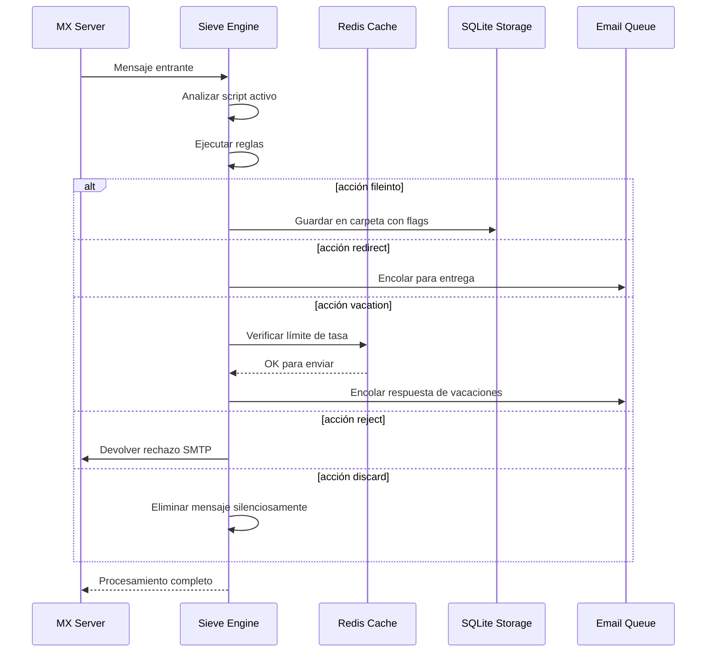

#### Características de Seguridad {#security-features}

La implementación de Sieve de Forward Email incluye protecciones de seguridad integrales:

* **Protección CVE-2023-26430**: Previene bucles de redirección y ataques de bombardeo de correo
* **Limitación de tasa**: Límites en redirecciones (10/mensaje, 100/día) y respuestas de vacaciones
* **Verificación de lista de denegación**: Las direcciones de redirección se verifican contra la lista de denegación
* **Encabezados protegidos**: Los encabezados DKIM, ARC y de autenticación no pueden ser modificados mediante editheader
* **Límites de tamaño de script**: Se aplica tamaño máximo al script
* **Tiempos de espera de ejecución**: Los scripts se terminan si la ejecución excede el límite de tiempo

#### Ejemplos de Scripts Sieve {#example-sieve-scripts}

**Archivar boletines en una carpeta:**

```sieve
require ["fileinto"];

if header :contains "List-Id" "newsletter" {
    fileinto "Newsletters";
}
```

**Respuesta automática de vacaciones con temporización detallada:**

```sieve
require ["vacation", "vacation-seconds"];

vacation :seconds 3600 :subject "Fuera de la oficina"
    "Actualmente estoy fuera y responderé dentro de 24 horas.";
```

**Filtrado de spam con flags:**

```sieve
require ["fileinto", "imap4flags"];

if header :contains "X-Spam-Status" "Yes" {
    setflag "\\Seen";
    fileinto "Junk";
}
```

**Filtrado complejo con variables:**

```sieve
require ["variables", "fileinto", "regex"];

if header :regex "From" "(.+)@example\\.com" {
    set :lower "sender" "${1}";
    fileinto "Contacts/${sender}";
}
```

> \[!TIP]
> Para documentación completa, ejemplos de scripts e instrucciones de configuración, consulte [FAQ: ¿Soportan filtrado de correo con Sieve?](/faq#do-you-support-sieve-email-filtering)

### ManageSieve (RFC 5804) {#managesieve-rfc-5804}

Forward Email ofrece soporte completo del protocolo ManageSieve para la gestión remota de scripts Sieve.

**Código fuente:** [`managesieve-server.js`](https://github.com/forwardemail/forwardemail.net/blob/master/managesieve-server.js)

| RFC                                                       | Título                                         | Estado         |
| --------------------------------------------------------- | ---------------------------------------------- | -------------- |
| [RFC 5804](https://datatracker.ietf.org/doc/html/rfc5804) | Un protocolo para la gestión remota de scripts Sieve | ✅ Soporte completo |

#### Configuración del Servidor ManageSieve {#managesieve-server-configuration}

| Configuración           | Valor                   |
| ----------------------- | ----------------------- |
| **Servidor**            | `imap.forwardemail.net` |
| **Puerto (STARTTLS)**   | `2190` (recomendado)    |
| **Puerto (TLS implícito)** | `4190`                  |
| **Autenticación**       | PLAIN (sobre TLS)       |

> **Nota:** El puerto 2190 usa STARTTLS (actualización de conexión simple a TLS) y es compatible con la mayoría de clientes ManageSieve incluyendo [sieve-connect](https://github.com/philpennock/sieve-connect). El puerto 4190 usa TLS implícito (TLS desde el inicio de la conexión) para clientes que lo soportan.

#### Comandos ManageSieve Soportados {#supported-managesieve-commands}

| Comando        | Descripción                             |
| -------------- | --------------------------------------- |
| `AUTHENTICATE` | Autenticar usando mecanismo PLAIN       |
| `CAPABILITY`   | Listar capacidades y extensiones del servidor |
| `HAVESPACE`    | Verificar si se puede almacenar un script |
| `PUTSCRIPT`    | Subir un nuevo script                   |
| `LISTSCRIPTS`  | Listar todos los scripts con estado activo |
| `SETACTIVE`    | Activar un script                       |
| `GETSCRIPT`    | Descargar un script                     |
| `DELETESCRIPT` | Eliminar un script                      |
| `RENAMESCRIPT` | Renombrar un script                     |
| `CHECKSCRIPT`  | Validar sintaxis del script             |
| `NOOP`         | Mantener la conexión activa             |
| `LOGOUT`       | Finalizar sesión                        |
#### Clientes Compatibles con ManageSieve {#compatible-managesieve-clients}

* **Thunderbird**: Soporte Sieve incorporado a través del [complemento Sieve](https://addons.thunderbird.net/addon/sieve/)
* **Roundcube**: [Plugin ManageSieve](https://plugins.roundcube.net/packages/johndoh/sieve)
* **KMail**: Soporte nativo ManageSieve
* **sieve-connect**: Cliente de línea de comandos
* **Cualquier cliente compatible con RFC 5804**

#### Flujo del Protocolo ManageSieve {#managesieve-protocol-flow}

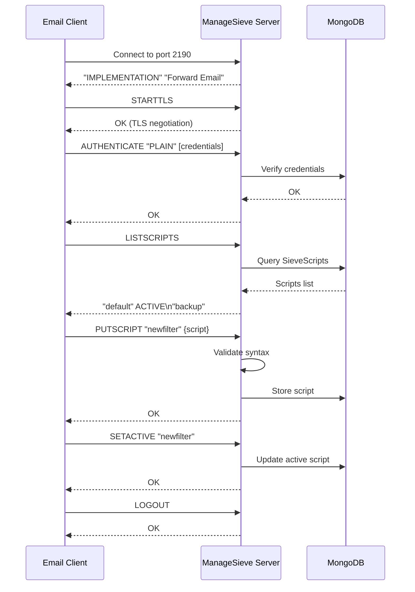

#### Interfaz Web y API {#web-interface-and-api}

Además de ManageSieve, Forward Email ofrece:

* **Panel Web**: Crear y gestionar scripts Sieve a través de la interfaz web en Mi Cuenta → Dominios → Alias → Scripts Sieve
* **API REST**: Acceso programático a la gestión de scripts Sieve mediante la [API de Forward Email](/api#sieve-scripts)

> \[!TIP]
> Para instrucciones detalladas de configuración y configuración del cliente, consulte [FAQ: ¿Soportan filtrado de correo con Sieve?](/faq#do-you-support-sieve-email-filtering)

---


## Optimización de Almacenamiento {#storage-optimization}

> \[!IMPORTANT]
> **Tecnología de Almacenamiento Pionera en la Industria:** Forward Email es el **único proveedor de correo electrónico en el mundo** que combina la deduplicación de archivos adjuntos con compresión Brotli en el contenido del correo. Esta optimización de doble capa le brinda **2-3 veces más almacenamiento efectivo** en comparación con proveedores de correo tradicionales.

Forward Email implementa dos técnicas revolucionarias de optimización de almacenamiento que reducen drásticamente el tamaño del buzón manteniendo plena conformidad con RFC y fidelidad del mensaje:

1. **Deduplicación de Archivos Adjuntos** - Elimina archivos adjuntos duplicados en todos los correos
2. **Compresión Brotli** - Reduce el almacenamiento entre 46-86% para metadatos y 50% para archivos adjuntos

### Arquitectura: Optimización de Almacenamiento de Doble Capa {#architecture-dual-layer-storage-optimization}

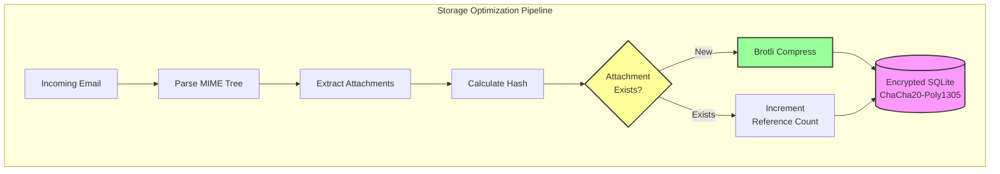

---


## Deduplicación de Archivos Adjuntos {#attachment-deduplication}

Forward Email implementa la deduplicación de archivos adjuntos basada en el [enfoque probado de WildDuck](https://docs.wildduck.email/docs/in-depth/attachment-deduplication/), adaptado para almacenamiento SQLite.

> \[!NOTE]
> **Qué se Deduplica:** "Archivo adjunto" se refiere al contenido MIME **codificado** del nodo (base64 o quoted-printable), no al archivo decodificado. Esto preserva la validez de las firmas DKIM y GPG.

### Cómo Funciona {#how-it-works}

**Implementación Original de WildDuck (MongoDB GridFS):**

> El servidor IMAP Wild Duck desduplica archivos adjuntos. "Archivo adjunto" en este caso significa el contenido del nodo mime codificado en base64 o quoted-printable, no el archivo decodificado. Aunque usar contenido codificado implica muchos falsos negativos (el mismo archivo en diferentes correos podría contarse como archivos adjuntos diferentes), es necesario para garantizar la validez de diferentes esquemas de firma (DKIM, GPG, etc.). Un mensaje recuperado de Wild Duck se ve exactamente igual que el mensaje almacenado, aunque Wild Duck analiza el mensaje en un objeto tipo árbol y reconstruye el mensaje al recuperarlo.
**Implementación SQLite de Forward Email:**

Forward Email adapta este enfoque para el almacenamiento cifrado en SQLite con el siguiente proceso:

1. **Cálculo de Hash**: Cuando se encuentra un archivo adjunto, se calcula un hash usando la librería [`rev-hash`](https://github.com/sindresorhus/rev-hash) a partir del cuerpo del adjunto
2. **Búsqueda**: Se verifica si existe un adjunto con hash coincidente en la tabla `Attachments`
3. **Conteo de Referencias**:
   * Si existe: Incrementa el contador de referencias en 1 y el contador mágico por un número aleatorio
   * Si es nuevo: Crea una nueva entrada de adjunto con contador = 1
4. **Seguridad en Eliminación**: Usa un sistema de doble contador (referencia + mágico) para evitar falsos positivos
5. **Recolección de Basura**: Los adjuntos se eliminan inmediatamente cuando ambos contadores llegan a cero

**Código Fuente:** [`helpers/attachment-storage.js`](https://github.com/forwardemail/forwardemail.net/blob/master/helpers/attachment-storage.js)

### Flujo de Deduplificación {#deduplication-flow}

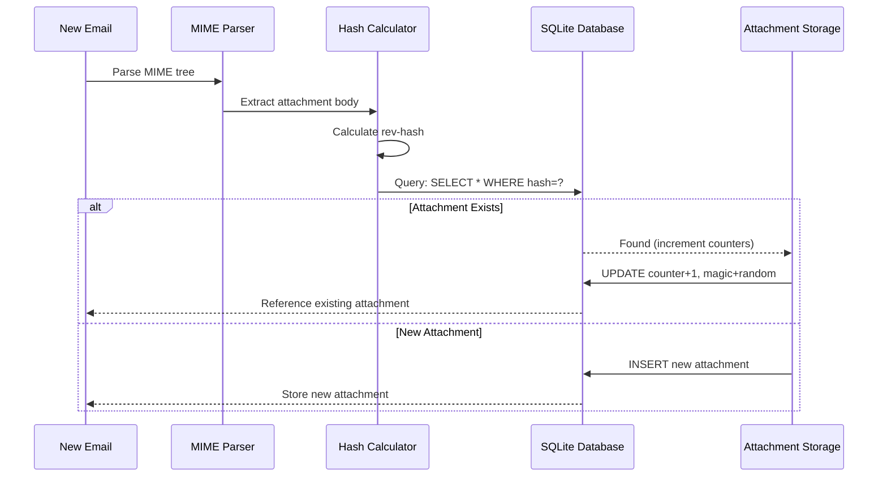

### Sistema de Números Mágicos {#magic-number-system}

Forward Email usa el sistema de "número mágico" de WildDuck (inspirado por [Mail.ru](https://github.com/zone-eu/wildduck)) para evitar falsos positivos durante la eliminación:

* Cada mensaje recibe un **número aleatorio** asignado
* El **contador mágico** del adjunto se incrementa por ese número aleatorio cuando se añade el mensaje
* El contador mágico se decrementa por el mismo número cuando se elimina el mensaje
* El adjunto solo se elimina cuando **ambos contadores** (referencia + mágico) llegan a cero

Este sistema de doble contador asegura que si algo falla durante la eliminación (por ejemplo, un fallo, error de red), el adjunto no se elimine prematuramente.

### Diferencias Clave: WildDuck vs Forward Email {#key-differences-wildduck-vs-forward-email}

| Característica          | WildDuck (MongoDB)       | Forward Email (SQLite)       |
| ---------------------- | ------------------------ | ---------------------------- |
| **Backend de Almacenamiento** | MongoDB GridFS (fragmentado) | SQLite BLOB (directo)         |
| **Algoritmo de Hash**  | SHA256                   | rev-hash (basado en SHA-256) |
| **Conteo de Referencias** | ✅ Sí                    | ✅ Sí                        |
| **Números Mágicos**    | ✅ Sí (inspirado en Mail.ru) | ✅ Sí (mismo sistema)          |
| **Recolección de Basura** | Retrasada (trabajo separado) | Inmediata (al llegar a cero contadores) |
| **Compresión**         | ❌ Ninguna               | ✅ Brotli (ver abajo)         |
| **Cifrado**            | ❌ Opcional              | ✅ Siempre (ChaCha20-Poly1305) |

---


## Compresión Brotli {#brotli-compression}

> \[!IMPORTANT]
> **Primero en el Mundo:** Forward Email es el **único servicio de correo electrónico en el mundo** que usa compresión Brotli en el contenido del correo. Esto proporciona un **ahorro de almacenamiento del 46-86%** además de la deduplicación de adjuntos.

Forward Email implementa compresión Brotli tanto para los cuerpos de los adjuntos como para los metadatos del mensaje, proporcionando un gran ahorro de almacenamiento mientras mantiene compatibilidad hacia atrás.

**Implementación:** [`helpers/msgpack-helpers.js`](https://github.com/forwardemail/forwardemail.net/blob/master/helpers/msgpack-helpers.js)

### Qué se Comprime {#what-gets-compressed}

**1. Cuerpos de Adjuntos** (`encodeAttachmentBody`)

* **Formatos antiguos**: Cadena codificada en hexadecimal (2x tamaño) o Buffer sin procesar
* **Formato nuevo**: Buffer comprimido con Brotli con encabezado mágico "FEBR"
* **Decisión de compresión**: Solo comprime si ahorra espacio (considera encabezado de 4 bytes)
* **Ahorro de almacenamiento**: Hasta **50%** (hex → BLOB nativo)
**2. Metadatos del Mensaje** (`encodeMetadata`)

Incluye: `mimeTree`, `headers`, `envelope`, `flags`

* **Formato antiguo**: cadena de texto JSON
* **Formato nuevo**: Buffer comprimido con Brotli
* **Ahorro de almacenamiento**: **46-86%** dependiendo de la complejidad del mensaje

### Configuración de Compresión {#compression-configuration}

```javascript
// Opciones de compresión Brotli optimizadas para velocidad (nivel 4 es un buen equilibrio)
const BROTLI_COMPRESS_OPTIONS = {
  params: {
    [zlib.constants.BROTLI_PARAM_QUALITY]: 4
  }
};
```

**¿Por qué Nivel 4?**

* **Compresión/descompresión rápida**: procesamiento en submilisegundos
* **Buen ratio de compresión**: ahorro del 46-86%
* **Rendimiento equilibrado**: óptimo para operaciones de correo electrónico en tiempo real

### Encabezado Mágico: "FEBR" {#magic-header-febr}

Forward Email usa un encabezado mágico de 4 bytes para identificar cuerpos de adjuntos comprimidos:

```
"FEBR" = Forward Email BRotli
Hex: 0x46 0x45 0x42 0x52
```

**¿Por qué un encabezado mágico?**

* **Detección de formato**: identifica instantáneamente datos comprimidos vs no comprimidos
* **Compatibilidad hacia atrás**: las cadenas hexadecimales antiguas y Buffers sin procesar siguen funcionando
* **Evitar colisiones**: "FEBR" es poco probable que aparezca al inicio de datos legítimos de adjuntos

### Proceso de Compresión {#compression-process}

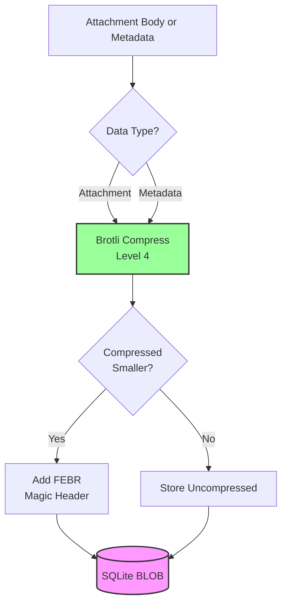

### Proceso de Descompresión {#decompression-process}

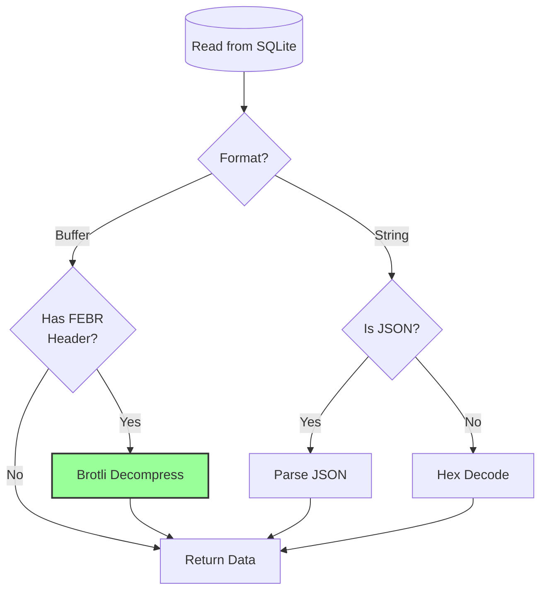

### Compatibilidad hacia Atrás {#backwards-compatibility}

Todas las funciones de decodificación **detectan automáticamente** el formato de almacenamiento:

| Formato               | Método de Detección                   | Manejo                                        |
| --------------------- | ------------------------------------ | --------------------------------------------- |
| **Comprimido con Brotli** | Buscar encabezado mágico "FEBR"      | Descomprimir con `zlib.brotliDecompressSync()` |
| **Buffer sin procesar** | `Buffer.isBuffer()` sin encabezado    | Devolver tal cual                             |
| **Cadena hexadecimal** | Verificar longitud par + caracteres [0-9a-f] | Decodificar con `Buffer.from(value, 'hex')`   |
| **Cadena JSON**        | Verificar si el primer carácter es `{` o `[` | Parsear con `JSON.parse()`                    |

Esto asegura **cero pérdida de datos** durante la migración de formatos antiguos a nuevos.

### Estadísticas de Ahorro de Almacenamiento {#storage-savings-statistics}

**Ahorros medidos con datos de producción:**

| Tipo de Datos         | Formato Antiguo          | Formato Nuevo          | Ahorro     |
| --------------------- | ----------------------- | --------------------- | ---------- |
| **Cuerpos de adjuntos** | Cadena codificada en hex (2x) | BLOB comprimido con Brotli | **50%**    |
| **Metadatos del mensaje** | Texto JSON              | BLOB comprimido con Brotli | **46-86%** |
| **Flags del buzón**   | Texto JSON              | BLOB comprimido con Brotli | **60-80%** |

**Fuente:** [`helpers/migrate-storage-format.js`](https://github.com/forwardemail/forwardemail.net/blob/master/helpers/migrate-storage-format.js)

### Proceso de Migración {#migration-process}

Forward Email proporciona una migración automática e idempotente de formatos antiguos a nuevos:
// Estadísticas de migración rastreadas:
{
  attachmentsMigrated: 0,
  messagesMigrated: 0,
  mailboxesMigrated: 0,
  bytesSaved: 0  // Total de bytes ahorrados por compresión
}
```

**Pasos de migración:**

1. Cuerpos de adjuntos: codificación hexadecimal → BLOB nativo (50% de ahorro)
2. Metadatos de mensajes: texto JSON → BLOB comprimido con brotli (46-86% de ahorro)
3. Banderas de buzón: texto JSON → BLOB comprimido con brotli (60-80% de ahorro)

**Fuente:** [`helpers/migrate-storage-format.js`](https://github.com/forwardemail/forwardemail.net/blob/master/helpers/migrate-storage-format.js)

---

### Eficiencia combinada de almacenamiento {#combined-storage-efficiency}

> \[!TIP]
> **Impacto en el mundo real:** Con la deduplicación de adjuntos + compresión Brotli, los usuarios de Forward Email obtienen **2-3 veces más almacenamiento efectivo** comparado con proveedores de correo tradicionales.

**Escenario de ejemplo:**

Proveedor de correo tradicional (buzón de 1GB):

* 1GB de espacio en disco = 1GB de correos
* Sin deduplicación: mismo adjunto almacenado 10 veces = 10x desperdicio de almacenamiento
* Sin compresión: metadatos JSON completos almacenados = 2-3x desperdicio de almacenamiento

Forward Email (buzón de 1GB):

* 1GB de espacio en disco ≈ **2-3GB de correos** (almacenamiento efectivo)
* Deduplicación: mismo adjunto almacenado una vez, referenciado 10 veces
* Compresión: 46-86% de ahorro en metadatos, 50% en adjuntos
* Encriptación: ChaCha20-Poly1305 (sin sobrecarga de almacenamiento)

**Tabla comparativa:**

| Proveedor         | Tecnología de almacenamiento                 | Almacenamiento efectivo (buzón de 1GB) |
| ----------------- | -------------------------------------------- | -------------------------------------- |
| Gmail             | Ninguna                                      | 1GB                                    |
| iCloud            | Ninguna                                      | 1GB                                    |
| Outlook.com       | Ninguna                                      | 1GB                                    |
| Fastmail          | Ninguna                                      | 1GB                                    |
| ProtonMail        | Solo encriptación                            | 1GB                                    |
| Tutanota          | Solo encriptación                            | 1GB                                    |
| **Forward Email** | **Deduplicación + Compresión + Encriptación** | **2-3GB** ✨                           |

### Detalles técnicos de implementación {#technical-implementation-details}

**Rendimiento:**

* Brotli nivel 4: compresión/descompresión en submilisegundos
* Sin penalización de rendimiento por compresión
* SQLite FTS5: búsqueda en menos de 50ms con NVMe SSD

**Seguridad:**

* La compresión ocurre **después** de la encriptación (la base de datos SQLite está encriptada)
* Encriptación ChaCha20-Poly1305 + compresión Brotli
* Conocimiento cero: solo el usuario tiene la contraseña de desencriptación

**Cumplimiento RFC:**

* Los mensajes recuperados se ven **exactamente igual** que cuando se almacenaron
* Las firmas DKIM permanecen válidas (contenido codificado preservado)
* Las firmas GPG permanecen válidas (sin modificación del contenido firmado)

### Por qué ningún otro proveedor hace esto {#why-no-other-provider-does-this}

**Complejidad:**

* Requiere integración profunda con la capa de almacenamiento
* La compatibilidad hacia atrás es un desafío
* La migración desde formatos antiguos es compleja

**Preocupaciones de rendimiento:**

* La compresión añade carga de CPU (resuelto con Brotli nivel 4)
* Descompresión en cada lectura (resuelto con caché de SQLite)

**Ventaja de Forward Email:**

* Construido desde cero con optimización en mente
* SQLite permite manipulación directa de BLOBs
* Bases de datos encriptadas por usuario permiten compresión segura

---

---


## Funciones modernas {#modern-features}


## API REST completa para gestión de correo {#complete-rest-api-for-email-management}

> \[!TIP]
> Forward Email ofrece una API REST completa con 39 endpoints para la gestión programática del correo.

> \[!TIP]
> **Función única en la industria:** A diferencia de cualquier otro servicio de correo, Forward Email ofrece acceso programático completo a tu buzón, calendario, contactos, mensajes y carpetas mediante una API REST integral. Esta es una interacción directa con tu archivo de base de datos SQLite encriptado que almacena todos tus datos.

Forward Email ofrece una API REST completa que proporciona un acceso sin precedentes a tus datos de correo. Ningún otro servicio de correo (incluyendo Gmail, iCloud, Outlook, ProtonMail, Tuta o Fastmail) ofrece este nivel de acceso directo y completo a la base de datos.
**Documentación de la API:** <https://forwardemail.net/en/email-api>

### Categorías de la API (39 Endpoints) {#api-categories-39-endpoints}

**1. API de Mensajes** (5 endpoints) - Operaciones CRUD completas sobre mensajes de correo electrónico:

* `GET /v1/messages` - Listar mensajes con más de 15 parámetros avanzados de búsqueda (ningún otro servicio ofrece esto)
* `POST /v1/messages` - Crear/enviar mensajes
* `GET /v1/messages/:id` - Recuperar mensaje
* `PUT /v1/messages/:id` - Actualizar mensaje (marcadores, carpetas)
* `DELETE /v1/messages/:id` - Eliminar mensaje

*Ejemplo: Encontrar todas las facturas del último trimestre con archivos adjuntos:*

```bash
curl -u "alias@domain.com:password" \
  "https://api.forwardemail.net/v1/messages?q=subject:invoice+has:attachment+after:2024-01-01+before:2024-04-01"
```

Ver [Documentación de Búsqueda Avanzada](https://forwardemail.net/en/email-api)

**2. API de Carpetas** (5 endpoints) - Gestión completa de carpetas IMAP vía REST:

* `GET /v1/folders` - Listar todas las carpetas
* `POST /v1/folders` - Crear carpeta
* `GET /v1/folders/:id` - Recuperar carpeta
* `PUT /v1/folders/:id` - Actualizar carpeta
* `DELETE /v1/folders/:id` - Eliminar carpeta

**3. API de Contactos** (5 endpoints) - Almacenamiento de contactos CardDAV vía REST:

* `GET /v1/contacts` - Listar contactos
* `POST /v1/contacts` - Crear contacto (formato vCard)
* `GET /v1/contacts/:id` - Recuperar contacto
* `PUT /v1/contacts/:id` - Actualizar contacto
* `DELETE /v1/contacts/:id` - Eliminar contacto

**4. API de Calendarios** (5 endpoints) - Gestión de contenedores de calendario:

* `GET /v1/calendars` - Listar contenedores de calendario
* `POST /v1/calendars` - Crear calendario (ej., "Calendario de Trabajo", "Calendario Personal")
* `GET /v1/calendars/:id` - Recuperar calendario
* `PUT /v1/calendars/:id` - Actualizar calendario
* `DELETE /v1/calendars/:id` - Eliminar calendario

**5. API de Eventos de Calendario** (5 endpoints) - Programación de eventos dentro de calendarios:

* `GET /v1/calendar-events` - Listar eventos
* `POST /v1/calendar-events` - Crear evento con asistentes
* `GET /v1/calendar-events/:id` - Recuperar evento
* `PUT /v1/calendar-events/:id` - Actualizar evento
* `DELETE /v1/calendar-events/:id` - Eliminar evento

*Ejemplo: Crear un evento de calendario:*

```bash
curl -u "alias@domain.com:password" \
  -X POST \
  -H "Content-Type: application/json" \
  -d '{"title":"Reunión de Equipo","start":"2024-12-20T10:00:00Z","attendees":["team@example.com"],"calendar_id":"calendar123"}' \
  https://api.forwardemail.net/v1/calendar-events
```

### Detalles Técnicos {#technical-details}

* **Autenticación:** Autenticación simple `alias:password` (sin complejidad OAuth)
* **Rendimiento:** Tiempos de respuesta inferiores a 50ms con SQLite FTS5 y almacenamiento NVMe SSD
* **Latencia de Red Cero:** Acceso directo a base de datos, no proxy a través de servicios externos

### Casos de Uso en el Mundo Real {#real-world-use-cases}

* **Analítica de Correo:** Construir paneles personalizados que rastreen volumen de correos, tiempos de respuesta, estadísticas de remitentes

* **Flujos de Trabajo Automatizados:** Disparar acciones basadas en contenido de correo (procesamiento de facturas, tickets de soporte)

* **Integración CRM:** Sincronizar conversaciones de correo con tu CRM automáticamente

* **Cumplimiento y Descubrimiento:** Buscar y exportar correos para requisitos legales/de cumplimiento

* **Clientes de Correo Personalizados:** Construir interfaces de correo especializadas para tu flujo de trabajo

* **Inteligencia Empresarial:** Analizar patrones de comunicación, tasas de respuesta, compromiso de clientes

* **Gestión Documental:** Extraer y categorizar adjuntos automáticamente

* [Documentación Completa](https://forwardemail.net/en/email-api)

* [Referencia Completa de la API](https://forwardemail.net/en/email-api)

* [Guía de Búsqueda Avanzada](https://forwardemail.net/en/email-api)

* [Más de 30 Ejemplos de Integración](https://forwardemail.net/en/email-api)

* [Arquitectura Técnica](https://forwardemail.net/en/blog/docs/best-quantum-safe-encrypted-email-service)

Forward Email ofrece una API REST moderna que proporciona control total sobre cuentas de correo, dominios, alias y mensajes. Esta API sirve como una alternativa poderosa a JMAP y ofrece funcionalidades más allá de los protocolos tradicionales de correo electrónico.

| Categoría               | Endpoints | Descripción                             |
| ----------------------- | --------- | --------------------------------------- |
| **Gestión de Cuentas**  | 8         | Cuentas de usuario, autenticación, configuraciones |
| **Gestión de Dominios** | 12        | Dominios personalizados, DNS, verificación       |
| **Gestión de Alias**    | 6         | Alias de correo, reenvío, catch-all               |
| **Gestión de Mensajes** | 7         | Enviar, recibir, buscar, eliminar mensajes        |
| **Calendario y Contactos** | 4      | Acceso CalDAV/CardDAV vía API                      |
| **Registros y Analítica** | 2        | Registros de correo, reportes de entrega           |
### Características clave de la API {#key-api-features}

**Búsqueda avanzada:**

La API ofrece potentes capacidades de búsqueda con una sintaxis de consulta similar a Gmail:

```
GET /v1/messages?q=subject:invoice+has:attachment+after:2024-01-01+before:2024-04-01
```

**Operadores de búsqueda soportados:**

* `from:` - Buscar por remitente
* `to:` - Buscar por destinatario
* `subject:` - Buscar por asunto
* `has:attachment` - Mensajes con archivos adjuntos
* `is:unread` - Mensajes no leídos
* `is:starred` - Mensajes destacados
* `after:` - Mensajes posteriores a la fecha
* `before:` - Mensajes anteriores a la fecha
* `label:` - Mensajes con etiqueta
* `filename:` - Nombre de archivo adjunto

**Gestión de eventos de calendario:**

```
GET /v1/calendar-events
POST /v1/calendar-events
PUT /v1/calendar-events/:id
DELETE /v1/calendar-events/:id
```

**Integraciones con Webhooks:**

La API soporta webhooks para notificaciones en tiempo real de eventos de correo electrónico (recibidos, enviados, rebotados, etc.).

**Autenticación:**

* Autenticación con clave API
* Soporte OAuth 2.0
* Límite de tasa: 1000 solicitudes/hora

**Formato de datos:**

* Solicitudes/respuestas en JSON
* Diseño RESTful
* Soporte de paginación

**Seguridad:**

* Solo HTTPS
* Rotación de clave API
* Lista blanca de IPs (opcional)
* Firma de solicitudes (opcional)

### Arquitectura de la API {#api-architecture}

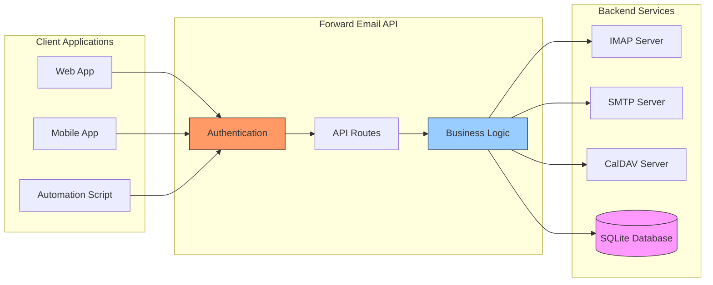

---


## Notificaciones Push en iOS {#ios-push-notifications}

> \[!TIP]
> Forward Email soporta notificaciones push nativas en iOS a través de XAPPLEPUSHSERVICE para entrega instantánea de correos.

> \[!IMPORTANT]
> **Funcionalidad única:** Forward Email es uno de los pocos servidores de correo open-source que soporta notificaciones push nativas en iOS para correo, contactos y calendarios mediante la extensión IMAP `XAPPLEPUSHSERVICE`. Esto fue ingeniería inversa del protocolo de Apple y proporciona entrega instantánea a dispositivos iOS sin consumir batería.

Forward Email implementa la extensión propietaria XAPPLEPUSHSERVICE de Apple, proporcionando notificaciones push nativas para dispositivos iOS sin necesidad de sondeo en segundo plano.

### Cómo funciona {#how-it-works-1}

**XAPPLEPUSHSERVICE** es una extensión IMAP no estándar que permite a la app Mail de iOS recibir notificaciones push instantáneas cuando llegan nuevos correos.

Forward Email implementa la integración propietaria del servicio de notificaciones push de Apple (APNs) para IMAP, permitiendo que la app Mail de iOS reciba notificaciones push instantáneas cuando llegan nuevos correos.

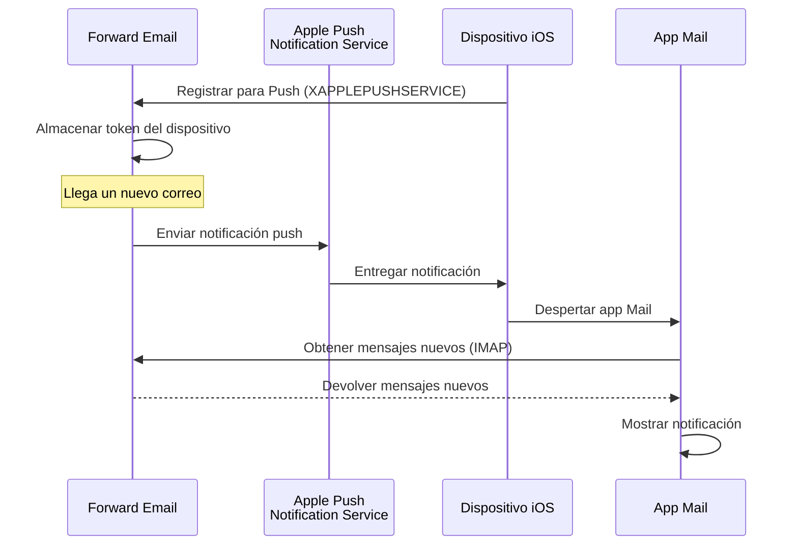

### Características clave {#key-features}

**Entrega instantánea:**

* Las notificaciones push llegan en segundos
* Sin sondeo en segundo plano que agote la batería
* Funciona incluso cuando la app Mail está cerrada

<!---->

* **Entrega instantánea:** Correos, eventos de calendario y contactos aparecen en tu iPhone/iPad inmediatamente, no en un horario de sondeo
* **Eficiencia de batería:** Usa la infraestructura push de Apple en lugar de mantener conexiones IMAP constantes
* **Push basado en temas:** Soporta notificaciones push para buzones específicos, no solo la bandeja de entrada
* **No requiere apps de terceros:** Funciona con las apps nativas de Mail, Calendario y Contactos en iOS
**Integración Nativa:**

* Integrado en la app Mail de iOS
* No se requieren apps de terceros
* Experiencia de usuario fluida

**Enfoque en la Privacidad:**

* Los tokens de dispositivo están encriptados
* No se envía contenido de mensajes a través de APNS
* Solo se envía notificación de "correo nuevo"

**Eficiencia de Batería:**

* No hay sondeo constante de IMAP
* El dispositivo duerme hasta que llega la notificación
* Impacto mínimo en la batería

### Qué Hace Esto Especial {#what-makes-this-special}

> \[!IMPORTANT]
> La mayoría de los proveedores de correo no soportan XAPPLEPUSHSERVICE, obligando a los dispositivos iOS a sondear por correo nuevo cada 15 minutos.

La mayoría de los servidores de correo open-source (incluyendo Dovecot, Postfix, Cyrus IMAP) NO soportan notificaciones push en iOS. Los usuarios deben:

* Usar IMAP IDLE (mantiene la conexión abierta, consume batería)
* Usar sondeo (revisa cada 15-30 minutos, notificaciones retrasadas)
* Usar apps de correo propietarias con su propia infraestructura push

Forward Email ofrece la misma experiencia de notificación push instantánea que servicios comerciales como Gmail, iCloud y Fastmail.

**Comparación con Otros Proveedores:**

| Proveedor         | Soporte Push  | Intervalo de Sondeo | Impacto en Batería |
| ----------------- | ------------- | ------------------- | ------------------ |
| **Forward Email** | ✅ Push Nativo | Instantáneo         | Mínimo             |
| Gmail             | ✅ Push Nativo | Instantáneo         | Mínimo             |
| iCloud            | ✅ Push Nativo | Instantáneo         | Mínimo             |
| Yahoo             | ✅ Push Nativo | Instantáneo         | Mínimo             |
| Outlook.com       | ❌ Sondeo     | 15 minutos          | Moderado           |
| Fastmail          | ❌ Sondeo     | 15 minutos          | Moderado           |
| ProtonMail        | ⚠️ Solo Bridge | A través de Bridge  | Alto               |
| Tutanota          | ❌ Solo App   | N/A                 | N/A                |

### Detalles de Implementación {#implementation-details}

**Respuesta CAPABILITY IMAP:**

```
* CAPABILITY IMAP4rev1 ... XAPPLEPUSHSERVICE ...
```

**Proceso de Registro:**

1. La app Mail de iOS detecta la capacidad XAPPLEPUSHSERVICE
2. La app registra el token del dispositivo con Forward Email
3. Forward Email almacena el token y lo asocia con la cuenta
4. Cuando llega correo nuevo, Forward Email envía push vía APNS
5. iOS despierta la app Mail para obtener los mensajes nuevos

**Seguridad:**

* Los tokens de dispositivo están encriptados en reposo
* Los tokens expiran y se renuevan automáticamente
* No se expone contenido de mensajes a APNS
* Se mantiene cifrado de extremo a extremo

<!---->

* **Extensión IMAP:** `XAPPLEPUSHSERVICE`
* **Código Fuente:** [WildDuck Issue #711](https://github.com/zone-eu/wildduck/issues/711)
* **Configuración:** Automática - no requiere configuración, funciona directamente con la app Mail de iOS

### Comparación con Otros Servicios {#comparison-with-other-services}

| Servicio      | Soporte Push iOS | Método                                   |
| ------------- | ---------------- | ---------------------------------------- |
| Forward Email | ✅ Sí            | `XAPPLEPUSHSERVICE` (ingeniería inversa) |
| Gmail         | ✅ Sí            | App Gmail propietaria + push de Google   |
| iCloud Mail   | ✅ Sí            | Integración nativa de Apple               |
| Outlook.com   | ✅ Sí            | App Outlook propietaria + push de Microsoft |
| Fastmail      | ✅ Sí            | `XAPPLEPUSHSERVICE`                       |
| Dovecot       | ❌ No            | Solo IMAP IDLE o sondeo                    |
| Postfix       | ❌ No            | Solo IMAP IDLE o sondeo                    |
| Cyrus IMAP    | ❌ No            | Solo IMAP IDLE o sondeo                    |

**Push de Gmail:**

Gmail usa un sistema push propietario que solo funciona con la app Gmail. La app Mail de iOS debe sondear los servidores IMAP de Gmail.

**Push de iCloud:**

iCloud tiene soporte push nativo similar a Forward Email, pero solo para direcciones @icloud.com.

**Outlook.com:**

Outlook.com no soporta XAPPLEPUSHSERVICE, por lo que la app Mail de iOS debe sondear cada 15 minutos.

**Fastmail:**

Fastmail no soporta XAPPLEPUSHSERVICE. Los usuarios deben usar la app Fastmail para notificaciones push o aceptar retrasos de sondeo de 15 minutos.

---


## Pruebas y Verificación {#testing-and-verification}


## Pruebas de Capacidad del Protocolo {#protocol-capability-tests}
> \[!NOTE]
> Esta sección proporciona los resultados de nuestras últimas pruebas de capacidad de protocolo, realizadas el 22 de enero de 2026.

Esta sección contiene las respuestas reales CAPABILITY/CAPA/EHLO de todos los proveedores probados. Todas las pruebas se realizaron el **22 de enero de 2026**.

Estas pruebas ayudan a verificar el soporte anunciado y real para varios protocolos y extensiones de correo electrónico entre los principales proveedores.

### Metodología de Prueba {#test-methodology}

**Entorno de Prueba:**

* **Fecha:** 22 de enero de 2026 a las 02:37 UTC
* **Ubicación:** instancia AWS EC2
* **IPv4:** 54.167.216.197
* **IPv6:** 2600:4040:46da:9a00:b19e:3ad4:426c:2f48
* **Herramientas:** OpenSSL s_client, scripts bash

**Proveedores Probados:**

* Forward Email
* Gmail
* Outlook.com
* iCloud
* Fastmail
* Yahoo/AOL (Verizon)

### Scripts de Prueba {#test-scripts}

Para total transparencia, los scripts exactos usados para estas pruebas se proporcionan a continuación.

#### Script de Prueba de Capacidad IMAP {#imap-capability-test-script}

```bash
#!/bin/bash
# IMAP Capability Test Script
# Tests IMAP CAPABILITY for various email providers

echo "========================================="
echo "IMAP CAPABILITY TEST"
echo "Date: $(date -u +"%Y-%m-%d %H:%M:%S UTC")"
echo "========================================="
echo ""

# Gmail
echo "--- Gmail (imap.gmail.com:993) ---"
echo -e "a001 CAPABILITY\na002 LOGOUT" | timeout 10 openssl s_client -connect imap.gmail.com:993 -crlf -quiet 2>&1 | grep -A 20 "CAPABILITY"
echo ""

# Outlook.com
echo "--- Outlook.com (outlook.office365.com:993) ---"
echo -e "a001 CAPABILITY\na002 LOGOUT" | timeout 10 openssl s_client -connect outlook.office365.com:993 -crlf -quiet 2>&1 | grep -A 20 "CAPABILITY"
echo ""

# iCloud
echo "--- iCloud (imap.mail.me.com:993) ---"
echo -e "a001 CAPABILITY\na002 LOGOUT" | timeout 10 openssl s_client -connect imap.mail.me.com:993 -crlf -quiet 2>&1 | grep -A 20 "CAPABILITY"
echo ""

# Fastmail
echo "--- Fastmail (imap.fastmail.com:993) ---"
echo -e "a001 CAPABILITY\na002 LOGOUT" | timeout 10 openssl s_client -connect imap.fastmail.com:993 -crlf -quiet 2>&1 | grep -A 20 "CAPABILITY"
echo ""

# Yahoo
echo "--- Yahoo (imap.mail.yahoo.com:993) ---"
echo -e "a001 CAPABILITY\na002 LOGOUT" | timeout 10 openssl s_client -connect imap.mail.yahoo.com:993 -crlf -quiet 2>&1 | grep -A 20 "CAPABILITY"
echo ""

# Forward Email
echo "--- Forward Email (imap.forwardemail.net:993) ---"
echo -e "a001 CAPABILITY\na002 LOGOUT" | timeout 10 openssl s_client -connect imap.forwardemail.net:993 -crlf -quiet 2>&1 | grep -A 20 "CAPABILITY"
echo ""

echo "========================================="
echo "Test completed"
echo "========================================="
```

#### Script de Prueba de Capacidad POP3 {#pop3-capability-test-script}

```bash
#!/bin/bash
# POP3 Capability Test Script
# Tests POP3 CAPA for various email providers

echo "========================================="
echo "POP3 CAPABILITY TEST"
echo "Date: $(date -u +"%Y-%m-%d %H:%M:%S UTC")"
echo "========================================="
echo ""

# Gmail
echo "--- Gmail (pop.gmail.com:995) ---"
echo -e "CAPA\nQUIT" | timeout 10 openssl s_client -connect pop.gmail.com:995 -crlf -quiet 2>&1 | grep -A 20 "CAPA"
echo ""

# Outlook.com
echo "--- Outlook.com (outlook.office365.com:995) ---"
echo -e "CAPA\nQUIT" | timeout 10 openssl s_client -connect outlook.office365.com:995 -crlf -quiet 2>&1 | grep -A 20 "CAPA"
echo ""

# iCloud (Nota: iCloud no soporta POP3)
echo "--- iCloud (No POP3 support) ---"
echo "iCloud no soporta POP3"
echo ""

# Fastmail
echo "--- Fastmail (pop.fastmail.com:995) ---"
echo -e "CAPA\nQUIT" | timeout 10 openssl s_client -connect pop.fastmail.com:995 -crlf -quiet 2>&1 | grep -A 20 "CAPA"
echo ""

# Yahoo
echo "--- Yahoo (pop.mail.yahoo.com:995) ---"
echo -e "CAPA\nQUIT" | timeout 10 openssl s_client -connect pop.mail.yahoo.com:995 -crlf -quiet 2>&1 | grep -A 20 "CAPA"
echo ""

# Forward Email
echo "--- Forward Email (pop3.forwardemail.net:995) ---"
echo -e "CAPA\nQUIT" | timeout 10 openssl s_client -connect pop3.forwardemail.net:995 -crlf -quiet 2>&1 | grep -A 20 "CAPA"
echo ""

echo "========================================="
echo "Test completed"
echo "========================================="
```
#### Script de Prueba de Capacidades SMTP {#smtp-capability-test-script}

```bash
#!/bin/bash
# Script de Prueba de Capacidades SMTP
# Prueba SMTP EHLO para varios proveedores de correo electrónico

echo "========================================="
echo "PRUEBA DE CAPACIDADES SMTP"
echo "Fecha: $(date -u +"%Y-%m-%d %H:%M:%S UTC")"
echo "========================================="
echo ""

# Gmail
echo "--- Gmail (smtp.gmail.com:587) ---"
echo -e "EHLO test.com\nQUIT" | timeout 10 openssl s_client -connect smtp.gmail.com:587 -starttls smtp -crlf -quiet 2>&1 | grep -A 30 "250-"
echo ""

# Outlook.com
echo "--- Outlook.com (smtp.office365.com:587) ---"
echo -e "EHLO test.com\nQUIT" | timeout 10 openssl s_client -connect smtp.office365.com:587 -starttls smtp -crlf -quiet 2>&1 | grep -A 30 "250-"
echo ""

# iCloud
echo "--- iCloud (smtp.mail.me.com:587) ---"
echo -e "EHLO test.com\nQUIT" | timeout 10 openssl s_client -connect smtp.mail.me.com:587 -starttls smtp -crlf -quiet 2>&1 | grep -A 30 "250-"
echo ""

# Fastmail
echo "--- Fastmail (smtp.fastmail.com:587) ---"
echo -e "EHLO test.com\nQUIT" | timeout 10 openssl s_client -connect smtp.fastmail.com:587 -starttls smtp -crlf -quiet 2>&1 | grep -A 30 "250-"
echo ""

# Yahoo
echo "--- Yahoo (smtp.mail.yahoo.com:587) ---"
echo -e "EHLO test.com\nQUIT" | timeout 10 openssl s_client -connect smtp.mail.yahoo.com:587 -starttls smtp -crlf -quiet 2>&1 | grep -A 30 "250-"
echo ""

# Forward Email
echo "--- Forward Email (smtp.forwardemail.net:587) ---"
echo -e "EHLO test.com\nQUIT" | timeout 10 openssl s_client -connect smtp.forwardemail.net:587 -starttls smtp -crlf -quiet 2>&1 | grep -A 30 "250-"
echo ""

echo "========================================="
echo "Prueba completada"
echo "========================================="
```

### Resumen de Resultados de la Prueba {#test-results-summary}

#### IMAP (CAPABILITY) {#imap-capability}

**Forward Email**

```
* CAPABILITY IMAP4rev1 AUTH=PLAIN AUTH=PLAIN-CLIENTTOKEN CHILDREN ENABLE ID IDLE NAMESPACE QUOTA SASL-IR UNSELECT XLIST XAPPLEPUSHSERVICE
```

**Gmail**

```
* CAPABILITY IMAP4rev1 UNSELECT IDLE NAMESPACE QUOTA ID XLIST CHILDREN X-GM-EXT-1 UIDPLUS COMPRESS=DEFLATE ENABLE MOVE CONDSTORE ESEARCH UTF8=ACCEPT LIST-EXTENDED LIST-STATUS LITERAL- SPECIAL-USE
```

**iCloud**

```
* OK [CAPABILITY XAPPLEPUSHSERVICE IMAP4 IMAP4rev1 SASL-IR AUTH=ATOKEN AUTH=PLAIN AUTH=ATOKEN2 AUTH=XOAUTH2]
```

**Outlook.com**

```
* CAPABILITY IMAP4rev1 AUTH=PLAIN AUTH=XOAUTH2 SASL-IR UIDPLUS ID UNSELECT CHILDREN IDLE NAMESPACE LITERAL+
```

**Fastmail**

```
* CAPABILITY IMAP4rev1 ACL ANNOTATE-EXPERIMENT-1 CATENATE CONDSTORE ENABLE ESEARCH ESORT I18NLEVEL=1 ID IDLE LIST-EXTENDED LIST-STATUS LITERAL+ LOGINDISABLED MULTIAPPEND NAMESPACE QRESYNC QUOTA RIGHTS=ektx SASL-IR SORT SPECIAL-USE THREAD=ORDEREDSUBJECT UIDPLUS UNSELECT WITHIN X-RENAME XLIST
```

**Yahoo/AOL (Verizon)**

```
* CAPABILITY IMAP4rev1 IDLE NAMESPACE QUOTA ID XLIST CHILDREN UIDPLUS MOVE CONDSTORE ESEARCH ENABLE LIST-EXTENDED LIST-STATUS LITERAL- SPECIAL-USE UNSELECT XAPPLEPUSHSERVICE
```

#### POP3 (CAPA) {#pop3-capa}

**Forward Email**

```
+OK
CAPA
TOP
USER
UIDL
EXPIRE 30
IMPLEMENTATION ForwardEmail
.
```

**Gmail**

```
+OK
CAPA
TOP
USER
UIDL
EXPIRE 30
IMPLEMENTATION Gpop
.
```

**Outlook.com**

```
+OK
CAPA
TOP
USER
UIDL
SASL PLAIN XOAUTH2
.
```

**Fastmail**

```
+OK
CAPA
TOP
USER
UIDL
EXPIRE 30
IMPLEMENTATION Cyrus
.
```

#### SMTP (EHLO) {#smtp-ehlo}

**Forward Email**

```
250-smtp.forwardemail.net
250-PIPELINING
250-SIZE 52428800
250-ETRN
250-STARTTLS
250-ENHANCEDSTATUSCODES
250-8BITMIME
250-DSN
250 CHUNKING
```

**Gmail**

```
250-smtp.gmail.com at your service
250-SIZE 35882577
250-8BITMIME
250-STARTTLS
250-ENHANCEDSTATUSCODES
250-PIPELINING
250-CHUNKING
250 SMTPUTF8
```

**Outlook.com**

```
250-SN4PR13CA0005.outlook.office365.com Hello [x.x.x.x]
250-SIZE 157286400
250-PIPELINING
250-DSN
250-ENHANCEDSTATUSCODES
250-STARTTLS
250-8BITMIME
250-BINARYMIME
250-CHUNKING
250 SMTPUTF8
```

**Fastmail**

```
250-smtp.fastmail.com
250-PIPELINING
250-SIZE 78643200
250-ETRN
250-STARTTLS
250-ENHANCEDSTATUSCODES
250-8BITMIME
250-DSN
250 CHUNKING
```

**Yahoo/AOL (Verizon)**

```
250-smtp.mail.yahoo.com
250-PIPELINING
250-SIZE 41943040
250-8BITMIME
250-ENHANCEDSTATUSCODES
250-STARTTLS
```
### Resultados Detallados de Pruebas {#detailed-test-results}

#### Resultados de Pruebas IMAP {#imap-test-results}

**Gmail:**
`* CAPABILITY IMAP4rev1 UNSELECT IDLE NAMESPACE QUOTA ID XLIST CHILDREN X-GM-EXT-1 XYZZY SASL-IR AUTH=XOAUTH2 AUTH=PLAIN AUTH=PLAIN-CLIENTTOKEN AUTH=OAUTHBEARER`

**Outlook.com:**
`* CAPABILITY IMAP4 IMAP4rev1 AUTH=PLAIN AUTH=XOAUTH2 SASL-IR UIDPLUS ID UNSELECT CHILDREN IDLE NAMESPACE LITERAL+`

**iCloud:**
`* CAPABILITY XAPPLEPUSHSERVICE IMAP4 IMAP4rev1 SASL-IR AUTH=ATOKEN AUTH=PLAIN AUTH=ATOKEN2 AUTH=XOAUTH2`

**Fastmail:**
La conexión agotó el tiempo de espera. Ver notas abajo.

**Yahoo:**
`* CAPABILITY IMAP4rev1 SASL-IR AUTH=PLAIN AUTH=XOAUTH2 AUTH=OAUTHBEARER ID MOVE NAMESPACE XYMHIGHESTMODSEQ UIDPLUS LITERAL+ CHILDREN UNSELECT X-MSG-EXT OBJECTID IDLE ENABLE UIDONLY X-ALL-MAIL X-UIDONLY LIST-EXTENDED LIST-STATUS SPECIAL-USE PARTIAL APPENDLIMIT=41697280`

**Forward Email:**
`* CAPABILITY XAPPLEPUSHSERVICE IMAP4rev1 APPENDLIMIT=52428800 AUTH=PLAIN AUTH=PLAIN-CLIENTTOKEN CHILDREN CONDSTORE ENABLE ID IDLE MOVE NAMESPACE QUOTA SASL-IR SPECIAL-USE UIDPLUS UNSELECT UTF8=ACCEPT XLIST`

#### Resultados de Pruebas POP3 {#pop3-test-results}

**Gmail:**
La conexión no devolvió respuesta CAPA sin autenticación.

**Outlook.com:**
La conexión no devolvió respuesta CAPA sin autenticación.

**iCloud:**
No soportado.

**Fastmail:**
La conexión agotó el tiempo de espera. Ver notas abajo.

**Yahoo:**
`+OK CAPA list follows... SASL PLAIN XOAUTH2`

**Forward Email:**
La conexión no devolvió respuesta CAPA sin autenticación.

#### Resultados de Pruebas SMTP {#smtp-test-results}

**Gmail:**
`250-AUTH LOGIN PLAIN XOAUTH2 PLAIN-CLIENTTOKEN OAUTHBEARER XOAUTH`

**Outlook.com:**
`250-DSN`

**iCloud:**
`250-DSN`

**Fastmail:**
`250 AUTH PLAIN LOGIN XOAUTH2 OAUTHBEARER`

**Yahoo:**
`250 AUTH PLAIN LOGIN XOAUTH2 OAUTHBEARER`

**Forward Email:**
`250-DSN`, `250-REQUIRETLS`

### Notas sobre los Resultados de las Pruebas {#notes-on-test-results}

> \[!NOTE]
> Observaciones importantes y limitaciones derivadas de los resultados de las pruebas.

1. **Tiempos de Espera en Fastmail**: Las conexiones a Fastmail agotaron el tiempo de espera durante las pruebas, probablemente debido a limitaciones de tasa o restricciones de firewall desde la IP del servidor de prueba. Fastmail es conocido por tener soporte robusto para IMAP/POP3/SMTP según su documentación.

2. **Respuestas CAPA en POP3**: Varios proveedores (Gmail, Outlook.com, Forward Email) no devolvieron respuestas CAPA sin autenticación. Esto es una práctica común de seguridad para servidores POP3.

3. **Soporte DSN**: Solo Outlook.com, iCloud y Forward Email anuncian explícitamente soporte DSN en sus respuestas SMTP EHLO. Esto no significa necesariamente que otros proveedores no soporten DSN, pero no lo anuncian.

4. **REQUIRETLS**: Solo Forward Email anuncia explícitamente soporte REQUIRETLS con casilla de verificación visible para el usuario que aplica la política. Otros proveedores pueden soportarlo internamente pero no lo anuncian en EHLO.

5. **Entorno de Prueba**: Las pruebas se realizaron desde una instancia AWS EC2 (IP: 54.167.216.197 IPv4, 2600:4040:46da:9a00:b19e:3ad4:426c:2f48 IPv6) el 22 de enero de 2026 a las 02:37 UTC.

---


## Resumen {#summary}

Forward Email ofrece soporte integral de protocolos RFC en todos los estándares principales de correo electrónico:

* **IMAP4rev1:** 16 RFCs soportados con diferencias intencionales documentadas
* **POP3:** 4 RFCs soportados con eliminación permanente conforme a RFC
* **SMTP:** 11 extensiones soportadas incluyendo SMTPUTF8, DSN y PIPELINING
* **Autenticación:** DKIM, SPF, DMARC, ARC completamente soportados
* **Seguridad de Transporte:** MTA-STS y REQUIRETLS completamente soportados, soporte parcial DANE
* **Encriptación:** OpenPGP v6 y S/MIME soportados
* **Calendarios:** CalDAV, CardDAV y VTODO completamente soportados
* **Acceso API:** API REST completa con 39 endpoints para acceso directo a base de datos
* **Push iOS:** Notificaciones push nativas para correo, contactos y calendarios vía `XAPPLEPUSHSERVICE`

### Diferenciadores Clave {#key-differentiators}

> \[!TIP]
> Forward Email destaca con características únicas no encontradas en otros proveedores.

**Lo que Hace Único a Forward Email:**

1. **Encriptación Cuántica Segura** - Único proveedor con buzones SQLite encriptados con ChaCha20-Poly1305
2. **Arquitectura de Conocimiento Cero** - Tu contraseña encripta tu buzón; nosotros no podemos descifrarlo
3. **Dominios Personalizados Gratis** - Sin tarifas mensuales para correo con dominio personalizado
4. **Soporte REQUIRETLS** - Casilla visible para el usuario que aplica TLS en toda la ruta de entrega
5. **API Completa** - 39 endpoints REST API para control programático total
6. **Notificaciones Push iOS** - Soporte nativo XAPPLEPUSHSERVICE para entrega instantánea
7. **Código Abierto** - Código fuente completo disponible en GitHub
8. **Enfoque en Privacidad** - Sin minería de datos, sin anuncios, sin rastreo
* **Cifrado en Entorno Aislado:** Único servicio de correo con buzones SQLite cifrados individualmente  
* **Cumplimiento RFC:** Prioriza el cumplimiento de estándares sobre la conveniencia (p. ej., POP3 DELE)  
* **API Completa:** Acceso programático directo a todos los datos de correo  
* **Código Abierto:** Implementación totalmente transparente  

**Resumen de Soporte de Protocolos:**  

| Categoría            | Nivel de Soporte | Detalles                                      |
| -------------------- | ---------------- | --------------------------------------------- |
| **Protocolos Básicos** | ✅ Excelente     | IMAP4rev1, POP3, SMTP totalmente soportados  |
| **Protocolos Modernos**| ⚠️ Parcial      | Soporte parcial de IMAP4rev2, JMAP no soportado |
| **Seguridad**         | ✅ Excelente     | DKIM, SPF, DMARC, ARC, MTA-STS, REQUIRETLS    |
| **Cifrado**           | ✅ Excelente     | OpenPGP, S/MIME, cifrado SQLite                |
| **CalDAV/CardDAV**    | ✅ Excelente     | Sincronización completa de calendario y contactos |
| **Filtrado**          | ✅ Excelente     | Sieve (24 extensiones) y ManageSieve           |
| **API**               | ✅ Excelente     | 39 endpoints REST API                           |
| **Push**              | ✅ Excelente     | Notificaciones push nativas en iOS             |
