# Sähköpostin RFC-protokollatuki - Täydellinen standardien ja spesifikaatioiden opas {#email-rfc-protocol-support---complete-standards--specifications-guide}


## Sisällysluettelo {#table-of-contents}

* [Tietoja tästä dokumentista](#about-this-document)
  * [Arkkitehtuurin yleiskatsaus](#architecture-overview)
* [Sähköpostipalveluiden vertailu - protokollatuki & RFC-standardien noudattaminen](#email-service-comparison---protocol-support--rfc-standards-compliance)
  * [Protokollatuen visualisointi](#protocol-support-visualization)
* [Keskeiset sähköpostiprotokollat](#core-email-protocols)
  * [Sähköpostiprotokollan kulku](#email-protocol-flow)
* [IMAP4-sähköpostiprotokolla ja laajennukset](#imap4-email-protocol-and-extensions)
  * [IMAP-protokollan erot RFC-spesifikaatioihin nähden](#imap-protocol-differences-from-rfc-specifications)
  * [IMAP-laajennukset, joita EI tueta](#imap-extensions-not-supported)
* [POP3-sähköpostiprotokolla ja laajennukset](#pop3-email-protocol-and-extensions)
  * [POP3-protokollan erot RFC-spesifikaatioihin nähden](#pop3-protocol-differences-from-rfc-specifications)
  * [POP3-laajennukset, joita EI tueta](#pop3-extensions-not-supported)
* [SMTP-sähköpostiprotokolla ja laajennukset](#smtp-email-protocol-and-extensions)
  * [Toimituksen tilailmoitukset (DSN)](#delivery-status-notifications-dsn)
  * [REQUIRETLS-tuki](#requiretls-support)
  * [SMTP-laajennukset, joita EI tueta](#smtp-extensions-not-supported)
* [JMAP-sähköpostiprotokolla](#jmap-email-protocol)
* [Sähköpostin turvallisuus](#email-security)
  * [Sähköpostin turvallisuusarkkitehtuuri](#email-security-architecture)
* [Sähköpostiviestin todennusprotokollat](#email-message-authentication-protocols)
  * [Todennusprotokollatuki](#authentication-protocol-support)
  * [DKIM (DomainKeys Identified Mail)](#dkim-domainkeys-identified-mail)
  * [SPF (Sender Policy Framework)](#spf-sender-policy-framework)
  * [DMARC (Domain-based Message Authentication, Reporting & Conformance)](#dmarc-domain-based-message-authentication-reporting--conformance)
  * [ARC (Authenticated Received Chain)](#arc-authenticated-received-chain)
  * [Todennuksen kulku](#authentication-flow)
* [Sähköpostin siirtoturvaprotokollat](#email-transport-security-protocols)
  * [Siirtoturvan tuki](#transport-security-support)
  * [TLS (Transport Layer Security)](#tls-transport-layer-security)
  * [MTA-STS (Mail Transfer Agent Strict Transport Security)](#mta-sts-mail-transfer-agent-strict-transport-security)
  * [DANE (DNS-based Authentication of Named Entities)](#dane-dns-based-authentication-of-named-entities)
  * [REQUIRETLS](#requiretls)
  * [Siirtoturvan kulku](#transport-security-flow)
* [Sähköpostiviestin salaus](#email-message-encryption)
  * [Salaustuki](#encryption-support)
  * [OpenPGP (Pretty Good Privacy)](#openpgp-pretty-good-privacy)
  * [S/MIME (Secure/Multipurpose Internet Mail Extensions)](#smime-securemultipurpose-internet-mail-extensions)
  * [SQLite-postilaatikon salaus](#sqlite-mailbox-encryption)
  * [Salausvertailu](#encryption-comparison)
  * [Salausprosessi](#encryption-flow)
* [Laajennettu toiminnallisuus](#extended-functionality)
* [Sähköpostiviestin formaattistandardit](#email-message-format-standards)
  * [Formaattistandardien tuki](#format-standards-support)
  * [MIME (Multipurpose Internet Mail Extensions)](#mime-multipurpose-internet-mail-extensions)
  * [SMTPUTF8 ja sähköpostiosoitteiden kansainvälistäminen](#smtputf8-and-email-address-internationalization)
* [Kalenterointi- ja yhteystietoprotokollat](#calendaring-and-contacts-protocols)
  * [CalDAV- ja CardDAV-tuki](#caldav-and-carddav-support)
  * [CalDAV (kalenterin käyttö)](#caldav-calendar-access)
  * [CardDAV (yhteystietojen käyttö)](#carddav-contact-access)
  * [Tehtävät ja muistutukset (CalDAV VTODO)](#tasks-and-reminders-caldav-vtodo)
  * [CalDAV/CardDAV-synkronoinnin kulku](#caldavcarddav-synchronization-flow)
  * [Kalenterilaajennukset, joita EI tueta](#calendaring-extensions-not-supported)
* [Sähköpostiviestien suodatus](#email-message-filtering)
  * [Sieve (RFC 5228)](#sieve-rfc-5228)
  * [ManageSieve (RFC 5804)](#managesieve-rfc-5804)
* [Tallennuksen optimointi](#storage-optimization)
  * [Arkkitehtuuri: kaksikerroksinen tallennuksen optimointi](#architecture-dual-layer-storage-optimization)
* [Liitetiedostojen duplikaattien poisto](#attachment-deduplication)
  * [Miten se toimii](#how-it-works)
  * [Duplikaattien poiston kulku](#deduplication-flow)
  * [Magic Number -järjestelmä](#magic-number-system)
  * [Keskeiset erot: WildDuck vs Forward Email](#key-differences-wildduck-vs-forward-email)
* [Brotli-pakkaus](#brotli-compression)
  * [Mitä pakataan](#what-gets-compressed)
  * [Pakkausasetukset](#compression-configuration)
  * [Magic Header: "FEBR"](#magic-header-febr)
  * [Pakkausprosessi](#compression-process)
  * [Purkuprosessi](#decompression-process)
  * [Taaksepäin yhteensopivuus](#backwards-compatibility)
  * [Tallennussäästön tilastot](#storage-savings-statistics)
  * [Migraatioprosessi](#migration-process)
  * [Yhdistetty tallennustehokkuus](#combined-storage-efficiency)
  * [Tekniset toteutustiedot](#technical-implementation-details)
  * [Miksi mikään muu palveluntarjoaja ei tee näin](#why-no-other-provider-does-this)
* [Modernit ominaisuudet](#modern-features)
* [Täydellinen REST API sähköpostinhallintaan](#complete-rest-api-for-email-management)
  * [API-kategoriat (39 päätepistettä)](#api-categories-39-endpoints)
  * [Tekniset tiedot](#technical-details)
  * [Käytännön käyttötapaukset](#real-world-use-cases)
  * [Keskeiset API-ominaisuudet](#key-api-features)
  * [API-arkkitehtuuri](#api-architecture)
* [iOS-push-ilmoitukset](#ios-push-notifications)
  * [Miten se toimii](#how-it-works-1)
  * [Keskeiset ominaisuudet](#key-features)
  * [Mikä tekee tästä erityisen](#what-makes-this-special)
  * [Toteutustiedot](#implementation-details)
  * [Vertailu muihin palveluihin](#comparison-with-other-services)
* [Testaus ja varmennus](#testing-and-verification)
* [Protokollan kyvykkyystestit](#protocol-capability-tests)
  * [Testausmenetelmä](#test-methodology)
  * [Testiskriptit](#test-scripts)
  * [Testitulosten yhteenveto](#test-results-summary)
  * [Yksityiskohtaiset testitulokset](#detailed-test-results)
  * [Huomautuksia testituloksista](#notes-on-test-results)
* [Yhteenveto](#summary)
  * [Keskeiset erot](#key-differentiators)
## Tietoja tästä asiakirjasta {#about-this-document}

Tämä asiakirja kuvaa Forward Emailin RFC (Request for Comments) -protokollatukea. Koska Forward Email käyttää taustalla [WildDuckia](https://github.com/nodemailer/wildduck) IMAP/POP3-toiminnallisuuteen, tässä dokumentoidut protokollatuki ja rajoitukset heijastavat WildDuckin toteutusta.

> \[!IMPORTANT]
> Forward Email käyttää viestien tallennukseen [SQLitea](https://sqlite.org/) MongoDB:n sijaan (jota WildDuck alun perin käytti). Tämä vaikuttaa alla dokumentoituihin toteutuksen yksityiskohtiin.

**Lähdekoodi:** <https://github.com/forwardemail/forwardemail.net>

### Arkkitehtuurin yleiskuva {#architecture-overview}

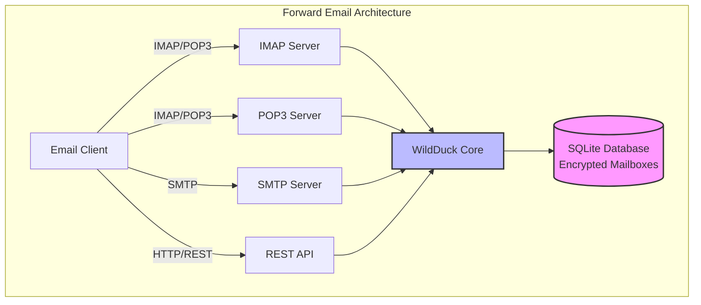

---


## Sähköpostipalveluiden vertailu - Protokollatuki & RFC-standardien noudattaminen {#email-service-comparison---protocol-support--rfc-standards-compliance}

> \[!IMPORTANT]
> **Suojaus hiekkalaatikossa ja kvanttiturvallinen salaus:** Forward Email on ainoa sähköpostipalvelu, joka tallentaa yksilöllisesti salatut SQLite-postilaatikot käyttäen salasanaasi (joka on vain sinulla). Jokainen postilaatikko on salattu [sqleetillä](https://github.com/resilar/sqleet) (ChaCha20-Poly1305), itsenäinen, hiekkalaatikkomainen ja siirrettävä. Jos unohdat salasanasi, menetät postilaatikkosi – edes Forward Email ei voi palauttaa sitä. Katso lisätietoja [Quantum-Safe Encrypted Email](https://forwardemail.net/en/blog/docs/best-quantum-safe-encrypted-email-service) -sivulta.

Vertaa sähköpostiprotokollien tukea ja RFC-standardien toteutusta suurimpien sähköpostipalveluntarjoajien kesken:

| Ominaisuus                   | Forward Email                                                                                  | Postfix/Dovecot                                                                    | Gmail                                                                             | iCloud Mail                                           | Outlook.com                                                                                                                                                          | Fastmail                                                                                 | Yahoo/AOL (Verizon)                                                  | ProtonMail                                                                     | Tutanota                                                          |
| ---------------------------- | ---------------------------------------------------------------------------------------------- | ---------------------------------------------------------------------------------- | --------------------------------------------------------------------------------- | ----------------------------------------------------- | -------------------------------------------------------------------------------------------------------------------------------------------------------------------- | ---------------------------------------------------------------------------------------- | -------------------------------------------------------------------- | ------------------------------------------------------------------------------ | ----------------------------------------------------------------- |
| **Oman domainin hinta**      | [Ilmainen](https://forwardemail.net/en/pricing)                                                | [Ilmainen](https://www.postfix.org/)                                              | [$7.20/kk](https://workspace.google.com/pricing)                                 | [$0.99/kk](https://support.apple.com/en-us/102622)    | [$7.20/kk](https://www.microsoft.com/en-us/microsoft-365/business/microsoft-365-business-basic)                                                                      | [$5/kk](https://www.fastmail.com/pricing/)                                               | [$3.19/kk](https://www.turbify.com/mail)                             | [$4.99/kk](https://proton.me/mail/pricing)                                     | [$3.27/kk](https://tuta.com/pricing)                              |
| **IMAP4rev1 (RFC 3501)**     | ✅ [Tuettu](#imap4-email-protocol-and-extensions)                                              | ✅ [Tuettu](https://www.dovecot.org/)                                             | ✅ [Tuettu](https://developers.google.com/workspace/gmail/imap/imap-extensions)  | ✅ [Tuettu](https://support.apple.com/en-us/102431)   | ✅ [Tuettu](https://support.microsoft.com/en-us/office/pop-imap-and-smtp-settings-for-outlook-com-d088b986-291d-42b8-9564-9c414e2aa040)                            | ✅ [Tuettu](https://www.fastmail.help/hc/en-us/articles/1500000278382-Email-standards) | ✅ [Tuettu](https://senders.yahooinc.com/developer/documentation/) | ⚠️ [Sillan kautta](https://proton.me/support/imap-smtp-and-pop3-setup)            | ❌ Ei tuettu                                                    |
| **IMAP4rev2 (RFC 9051)**     | ⚠️ [Osittain](https://forwardemail.net/en/blog/docs/best-quantum-safe-encrypted-email-service) | ⚠️ [Osittain](https://www.dovecot.org/)                                           | ⚠️ [31 %](https://developers.google.com/workspace/gmail/imap/imap-extensions)    | ⚠️ [92 %](https://support.apple.com/en-us/102431)    | ⚠️ [46 %](https://support.microsoft.com/en-us/office/pop-imap-and-smtp-settings-for-outlook-com-d088b986-291d-42b8-9564-9c414e2aa040)                                 | ⚠️ [69 %](https://www.fastmail.help/hc/en-us/articles/1500000278382-Email-standards)  | ⚠️ [85 %](https://senders.yahooinc.com/developer/documentation/)    | ⚠️ [Sillan kautta](https://proton.me/support/imap-smtp-and-pop3-setup)            | ❌ Ei tuettu                                                    |
| **POP3 (RFC 1939)**          | ✅ [Tuettu](#pop3-email-protocol-and-extensions)                                               | ✅ [Tuettu](https://www.dovecot.org/)                                             | ✅ [Tuettu](https://support.google.com/mail/answer/7104828)                      | ❌ Ei tuettu                                          | ✅ [Tuettu](https://support.microsoft.com/en-us/office/pop-imap-and-smtp-settings-for-outlook-com-d088b986-291d-42b8-9564-9c414e2aa040)                            | ✅ [Tuettu](https://www.fastmail.help/hc/en-us/articles/1500000278382-Email-standards) | ✅ [Tuettu](https://help.yahoo.com/kb/SLN4075.html)                 | ⚠️ [Sillan kautta](https://proton.me/support/imap-smtp-and-pop3-setup)            | ❌ Ei tuettu                                                    |
| **SMTP (RFC 5321)**          | ✅ [Tuettu](#smtp-email-protocol-and-extensions)                                               | ✅ [Tuettu](https://www.postfix.org/)                                             | ✅ [Tuettu](https://support.google.com/mail/answer/7126229)                      | ✅ [Tuettu](https://support.apple.com/en-us/102431)   | ✅ [Tuettu](https://support.microsoft.com/en-us/office/pop-imap-and-smtp-settings-for-outlook-com-d088b986-291d-42b8-9564-9c414e2aa040)                            | ✅ [Tuettu](https://www.fastmail.help/hc/en-us/articles/1500000278382-Email-standards) | ✅ [Tuettu](https://help.yahoo.com/kb/SLN4075.html)                 | ⚠️ [Sillan kautta](https://proton.me/support/imap-smtp-and-pop3-setup)            | ❌ Ei tuettu                                                    |
| **JMAP (RFC 8620)**          | ❌ [Ei tuettu](#jmap-email-protocol)                                                          | ❌ Ei tuettu                                                                       | ❌ Ei tuettu                                                                      | ❌ Ei tuettu                                          | ❌ Ei tuettu                                                                                                                                                          | ✅ [Tuettu](https://www.fastmail.com/dev/)                                             | ❌ Ei tuettu                                                        | ❌ Ei tuettu                                                                    | ❌ Ei tuettu                                                    |
| **DKIM (RFC 6376)**          | ✅ [Tuettu](#email-message-authentication-protocols)                                           | ✅ [Tuettu](https://github.com/trusteddomainproject/OpenDKIM)                     | ✅ [Tuettu](https://support.google.com/a/answer/174124)                          | ✅ [Tuettu](https://support.apple.com/en-us/102431)   | ✅ [Tuettu](https://learn.microsoft.com/en-us/defender-office-365/email-authentication-dkim-configure)                                                             | ✅ [Tuettu](https://www.fastmail.help/hc/en-us/articles/360060590573)                  | ✅ [Tuettu](https://help.yahoo.com/kb/SLN25426.html)                | ✅ [Tuettu](https://proton.me/support)                                       | ✅ [Tuettu](https://tuta.com/support#dkim)                      |
| **SPF (RFC 7208)**           | ✅ [Tuettu](#email-message-authentication-protocols)                                           | ✅ [Tuettu](https://www.postfix.org/)                                             | ✅ [Tuettu](https://support.google.com/a/answer/33786)                           | ✅ [Tuettu](https://support.apple.com/en-us/102431)   | ✅ [Tuettu](https://learn.microsoft.com/en-us/microsoft-365/security/office-365-security/how-office-365-uses-spf-to-prevent-spoofing)                              | ✅ [Tuettu](https://www.fastmail.help/hc/en-us/articles/360060590573)                  | ✅ [Tuettu](https://help.yahoo.com/kb/SLN25426.html)                | ✅ [Tuettu](https://proton.me/support)                                       | ✅ [Tuettu](https://tuta.com/support#dkim)                      |
| **DMARC (RFC 7489)**         | ✅ [Tuettu](#email-message-authentication-protocols)                                           | ✅ [Tuettu](https://www.postfix.org/)                                             | ✅ [Tuettu](https://support.google.com/a/answer/2466580)                         | ✅ [Tuettu](https://support.apple.com/en-us/102431)   | ✅ [Tuettu](https://learn.microsoft.com/en-us/microsoft-365/security/office-365-security/use-dmarc-to-validate-email)                                              | ✅ [Tuettu](https://www.fastmail.help/hc/en-us/articles/360060590573)                  | ✅ [Tuettu](https://help.yahoo.com/kb/SLN25426.html)                | ✅ [Tuettu](https://proton.me/support)                                       | ✅ [Tuettu](https://tuta.com/support#dkim)                      |
| **ARC (RFC 8617)**           | ✅ [Tuettu](#email-message-authentication-protocols)                                           | ✅ [Tuettu](https://github.com/trusteddomainproject/OpenARC)                      | ✅ [Tuettu](https://support.google.com/a/answer/2466580)                         | ❌ Ei tuettu                                          | ✅ [Tuettu](https://learn.microsoft.com/en-us/defender-office-365/email-authentication-arc-configure)                                                              | ✅ [Tuettu](https://www.fastmail.help/hc/en-us/articles/360060590573)                  | ✅ [Tuettu](https://senders.yahooinc.com/developer/documentation/) | ✅ [Tuettu](https://proton.me/blog/what-is-authenticated-received-chain-arc) | ❌ Ei tuettu                                                    |
| **MTA-STS (RFC 8461)**       | ✅ [Tuettu](#email-transport-security-protocols)                                               | ✅ [Tuettu](https://www.postfix.org/)                                             | ✅ [Tuettu](https://support.google.com/a/answer/9261504)                         | ✅ [Tuettu](https://support.apple.com/en-us/102431)   | ✅ [Tuettu](https://learn.microsoft.com/en-us/defender-office-365/email-authentication-about)                                                                      | ✅ [Tuettu](https://www.fastmail.help/hc/en-us/articles/360060590573)                  | ✅ [Tuettu](https://senders.yahooinc.com/developer/documentation/) | ✅ [Tuettu](https://proton.me/support)                                       | ✅ [Tuettu](https://tuta.com/security)                          |
| **DANE (RFC 7671)**          | ✅ [Tuettu](#email-transport-security-protocols)                                               | ✅ [Tuettu](https://www.postfix.org/)                                             | ❌ Ei tuettu                                                                      | ❌ Ei tuettu                                          | ❌ Ei tuettu                                                                                                                                                          | ❌ Ei tuettu                                                                          | ❌ Ei tuettu                                                        | ✅ [Tuettu](https://proton.me/support)                                       | ✅ [Tuettu](https://tuta.com/support#dane)                      |
| **DSN (RFC 3461)**           | ✅ [Tuettu](#smtp-email-protocol-and-extensions)                                               | ✅ [Tuettu](https://www.postfix.org/DSN_README.html)                              | ❌ Ei tuettu                                                                      | ✅ [Tuettu](#protocol-capability-tests)                | ✅ [Tuettu](#protocol-capability-tests)                                                                                                                            | ⚠️ [Tuntematon](https://www.fastmail.help/hc/en-us/articles/1500000278382-Email-standards) | ❌ Ei tuettu                                                        | ⚠️ [Sillan kautta](https://proton.me/support/imap-smtp-and-pop3-setup)            | ❌ Ei tuettu                                                    |
| **REQUIRETLS (RFC 8689)**    | ✅ [Tuettu](#email-transport-security-protocols)                                               | ✅ [Tuettu](https://www.postfix.org/TLS_README.html#server_require_tls)           | ⚠️ Tuntematon                                                                     | ⚠️ Tuntematon                                         | ⚠️ Tuntematon                                                                                                                                                         | ⚠️ Tuntematon                                                                          | ⚠️ Tuntematon                                                       | ⚠️ [Sillan kautta](https://proton.me/support/imap-smtp-and-pop3-setup)            | ❌ Ei tuettu                                                    |
| **ManageSieve (RFC 5804)**   | ✅ [Tuettu](#managesieve-rfc-5804)                                                             | ✅ [Tuettu](https://doc.dovecot.org/admin_manual/pigeonhole_managesieve_server/)  | ❌ Ei tuettu                                                                      | ❌ Ei tuettu                                          | ❌ Ei tuettu                                                                                                                                                          | ✅ [Tuettu](https://www.fastmail.help/hc/en-us/articles/360060590573)                  | ❌ Ei tuettu                                                        | ❌ Ei tuettu                                                                    | ❌ Ei tuettu                                                    |
| **OpenPGP (RFC 9580)**       | ✅ [Tuettu](#email-message-encryption)                                                         | ⚠️ [Lisäosien kautta](https://www.gnupg.org/)                                    | ⚠️ [Kolmannen osapuolen](https://github.com/google/end-to-end)                   | ⚠️ [Kolmannen osapuolen](https://gpgtools.org/)        | ⚠️ [Kolmannen osapuolen](https://gpg4win.org/)                                                                                                                               | ⚠️ [Kolmannen osapuolen](https://www.fastmail.help/hc/en-us/articles/360060590573)     | ⚠️ [Kolmannen osapuolen](https://help.yahoo.com/kb/SLN25426.html)       | ✅ [Natiivisti](https://proton.me/support/pgp-mime-pgp-inline)                      | ❌ Ei tuettu                                                    |
| **S/MIME (RFC 8551)**        | ✅ [Tuettu](#email-message-encryption)                                                         | ✅ [Tuettu](https://www.openssl.org/)                                            | ✅ [Tuettu](https://support.google.com/mail/answer/81126)                        | ✅ [Tuettu](https://support.apple.com/en-us/102431)   | ✅ [Tuettu](https://support.microsoft.com/en-us/office/send-view-and-reply-to-encrypted-messages-in-outlook-for-pc-eaa43495-9bbb-4fca-922a-df90dee51980)           | ⚠️ [Osittain](https://www.fastmail.help/hc/en-us/articles/360060590573)                | ❌ Ei tuettu                                                        | ✅ [Tuettu](https://proton.me/support/pgp-mime-pgp-inline)                   | ❌ Ei tuettu                                                    |
| **CalDAV (RFC 4791)**        | ✅ [Tuettu](#calendaring-and-contacts-protocols)                                               | ✅ [Tuettu](https://www.davical.org/)                                             | ✅ [Tuettu](https://developers.google.com/calendar/caldav/v2/guide)              | ✅ [Tuettu](https://support.apple.com/en-us/102431)   | ❌ Ei tuettu                                                                                                                                                          | ✅ [Tuettu](https://www.fastmail.help/hc/en-us/articles/360060590573)                  | ❌ Ei tuettu                                                        | ✅ [Sillan kautta](https://proton.me/support/proton-calendar)                      | ❌ Ei tuettu                                                    |
| **CardDAV (RFC 6352)**       | ✅ [Tuettu](#calendaring-and-contacts-protocols)                                               | ✅ [Tuettu](https://www.davical.org/)                                             | ✅ [Tuettu](https://developers.google.com/people/carddav)                        | ✅ [Tuettu](https://support.apple.com/en-us/102431)   | ❌ Ei tuettu                                                                                                                                                          | ✅ [Tuettu](https://www.fastmail.help/hc/en-us/articles/360060590573)                  | ❌ Ei tuettu                                                        | ✅ [Sillan kautta](https://proton.me/support/proton-contacts)                      | ❌ Ei tuettu                                                    |
| **Tehtävät (VTODO)**         | ✅ [Tuettu](#tasks-and-reminders-caldav-vtodo)                                                 | ✅ [Tuettu](https://www.davical.org/)                                             | ❌ Ei tuettu                                                                      | ✅ [Tuettu](https://support.apple.com/en-us/102431)   | ❌ Ei tuettu                                                                                                                                                          | ✅ [Tuettu](https://www.fastmail.help/hc/en-us/articles/360060590573)                  | ❌ Ei tuettu                                                        | ❌ Ei tuettu                                                                    | ❌ Ei tuettu                                                    |
| **Sieve (RFC 5228)**         | ✅ [Tuettu](#sieve-rfc-5228)                                                                   | ✅ [Tuettu](https://www.dovecot.org/)                                             | ❌ Ei tuettu                                                                      | ❌ Ei tuettu                                          | ❌ Ei tuettu                                                                                                                                                          | ✅ [Tuettu](https://www.fastmail.help/hc/en-us/articles/360060590573)                  | ❌ Ei tuettu                                                        | ❌ Ei tuettu                                                                    | ❌ Ei tuettu                                                    |
| **Catch-All**                | ✅ [Tuettu](https://forwardemail.net/en/faq#can-i-have-multiple-global-catch-all-recipients)   | ✅ Tuettu                                                                         | ✅ [Tuettu](https://support.google.com/a/answer/4524505)                         | ❌ Ei tuettu                                          | ❌ [Ei tuettu](https://learn.microsoft.com/en-us/exchange/recipients-in-exchange-online/manage-mail-users)                                                        | ✅ [Tuettu](https://www.fastmail.help/hc/en-us/articles/1500000278382-Email-standards) | ❌ Ei tuettu                                                        | ❌ Ei tuettu                                                                    | ✅ [Tuettu](https://tuta.com/support#catch-all-alias)           |
| **Rajoittamaton aliasmäärä** | ✅ [Tuettu](https://forwardemail.net/en/faq#advanced-features)                                 | ✅ Tuettu                                                                         | ✅ [Tuettu](https://support.google.com/a/answer/33327)                           | ✅ [Tuettu](https://support.apple.com/en-us/102431)   | ✅ [Tuettu](https://support.microsoft.com/en-us/office/add-or-remove-an-email-alias-in-outlook-com-459b1989-356d-40fa-a689-8f285b13f1f2)                           | ✅ [Tuettu](https://www.fastmail.help/hc/en-us/articles/1500000278382-Email-standards) | ❌ Ei tuettu                                                        | ✅ [Tuettu](https://proton.me/support/addresses-and-aliases)                 | ✅ [Tuettu](https://tuta.com/support#aliases)                   |
| **Kaksivaiheinen tunnistus** | ✅ [Tuettu](https://forwardemail.net/en/faq#do-you-support-passkeys-and-webauthn)              | ✅ Tuettu                                                                         | ✅ [Tuettu](https://support.google.com/accounts/answer/185839)                   | ✅ [Tuettu](https://support.apple.com/en-us/102431)   | ✅ [Tuettu](https://support.microsoft.com/en-us/account-billing/how-to-use-two-step-verification-with-your-microsoft-account-c7910146-672f-01e9-50a0-93b4585e7eb4) | ✅ [Tuettu](https://www.fastmail.help/hc/en-us/articles/1500000278382-Email-standards) | ✅ [Tuettu](https://help.yahoo.com/kb/SLN5013.html)               | ✅ [Tuettu](https://proton.me/support/two-factor-authentication-2fa)         | ✅ [Tuettu](https://tuta.com/support#two-factor-authentication) |
| **Push-ilmoitukset**         | ✅ [Tuettu](#ios-push-notifications)                                                           | ⚠️ Lisäosien kautta                                                               | ✅ [Tuettu](https://developers.google.com/gmail/api/guides/push)                 | ✅ [Tuettu](https://support.apple.com/en-us/102431)   | ✅ [Tuettu](https://learn.microsoft.com/en-us/graph/change-notifications-delivery-webhooks)                                                                        | ✅ [Tuettu](https://www.fastmail.help/hc/en-us/articles/1500000278382-Email-standards) | ❌ Ei tuettu                                                        | ✅ [Tuettu](https://proton.me/support/notifications)                         | ✅ [Tuettu](https://tuta.com/support#push-notifications)        |
| **Kalenteri/Yhteystiedot työpöydällä** | ✅ [Tuettu](#calendaring-and-contacts-protocols)                                         | ✅ Tuettu                                                                         | ✅ [Tuettu](https://support.google.com/calendar)                                 | ✅ [Tuettu](https://support.apple.com/en-us/102431)   | ✅ [Tuettu](https://support.microsoft.com/en-us/office/calendar-and-contacts-in-outlook-com-d3e8a6e6-5c1f-4e3e-9f1e-7c0f0e0c0c0c)                                  | ✅ [Tuettu](https://www.fastmail.help/hc/en-us/articles/1500000278382-Email-standards) | ❌ Ei tuettu                                                        | ✅ [Tuettu](https://proton.me/support/proton-calendar)                       | ❌ Ei tuettu                                                    |
| **Edistynyt haku**           | ✅ [Tuettu](https://forwardemail.net/en/email-api)                                             | ✅ Tuettu                                                                         | ✅ [Tuettu](https://support.google.com/mail/answer/7190)                         | ✅ [Tuettu](https://support.apple.com/en-us/102431)   | ✅ [Tuettu](https://support.microsoft.com/en-us/office/search-for-email-messages-in-outlook-com-6f5f2e92-9d5e-4c4e-9b0e-0c0c0c0c0c0c)                              | ✅ [Tuettu](https://www.fastmail.help/hc/en-us/articles/1500000278382-Email-standards) | ✅ [Tuettu](https://help.yahoo.com/kb/SLN3561.html)                 | ✅ [Tuettu](https://proton.me/support/search-and-filters)                    | ✅ [Tuettu](https://tuta.com/support)                           |
| **API/integroinnit**         | ✅ [39 päätepistettä](https://forwardemail.net/en/email-api)                                   | ✅ Tuettu                                                                         | ✅ [Tuettu](https://developers.google.com/gmail/api)                             | ❌ Ei tuettu                                          | ✅ [Tuettu](https://learn.microsoft.com/en-us/graph/api/resources/mail-api-overview)                                                                               | ✅ [Tuettu](https://www.fastmail.help/hc/en-us/articles/1500000278382-Email-standards) | ❌ Ei tuettu                                                        | ✅ [Tuettu](https://proton.me/support/proton-mail-api)                       | ❌ Ei tuettu                                                    |
### Protokollatuki Visualisointi {#protocol-support-visualization}

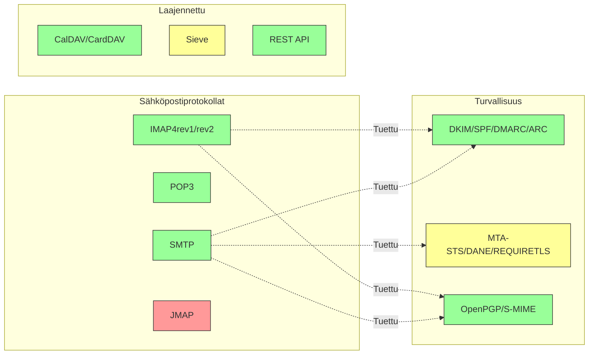

---


## Ydinsähköpostiprotokollat {#core-email-protocols}

### Sähköpostiprotokollan kulku {#email-protocol-flow}

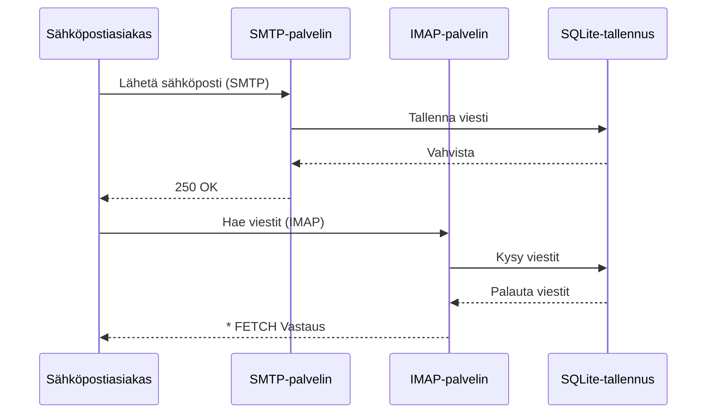


## IMAP4-sähköpostiprotokolla ja laajennukset {#imap4-email-protocol-and-extensions}

> \[!NOTE]
> Forward Email tukee IMAP4rev1:stä (RFC 3501) ja osittaista tukea IMAP4rev2:n (RFC 9051) ominaisuuksille.

Forward Email tarjoaa vankan IMAP4-tuen WildDuck-sähköpostipalvelimen toteutuksen kautta. Palvelin toteuttaa IMAP4rev1:n (RFC 3501) ja osittaisen tuen IMAP4rev2:n (RFC 9051) laajennuksille.

Forward Emailin IMAP-toiminnallisuus toteutetaan [WildDuck](https://github.com/nodemailer/wildduck) -riippuvuuden avulla. Seuraavat sähköpostin RFC:t ovat tuettuja:

| RFC                                                       | Otsikko                                                          | Toteutuksen Huomautukset                              |
| --------------------------------------------------------- | ---------------------------------------------------------------- | ----------------------------------------------------- |
| [RFC 3501](https://datatracker.ietf.org/doc/html/rfc3501) | Internet Message Access Protocol (IMAP) - Versio 4rev1           | Täysi tuki tarkoituksellisin eroavaisuuksin (katso alla) |
| [RFC 2177](https://datatracker.ietf.org/doc/html/rfc2177) | IMAP4 IDLE -komento                                              | Push-tyyppiset ilmoitukset                            |
| [RFC 2342](https://datatracker.ietf.org/doc/html/rfc2342) | IMAP4 Nimiavaruus                                               | Postilaatikon nimiavaruustuki                         |
| [RFC 2087](https://datatracker.ietf.org/doc/html/rfc2087) | IMAP4 QUOTA -laajennus                                          | Tallennustilan kiintiön hallinta                      |
| [RFC 2971](https://datatracker.ietf.org/doc/html/rfc2971) | IMAP4 ID -laajennus                                             | Asiakas/palvelin tunnistus                            |
| [RFC 5161](https://datatracker.ietf.org/doc/html/rfc5161) | IMAP4 ENABLE -laajennus                                         | IMAP-laajennusten aktivointi                          |
| [RFC 4959](https://datatracker.ietf.org/doc/html/rfc4959) | IMAP-laajennus SASL:n alkuperäiselle asiakasvastaukselle (SASL-IR) | Alkuperäinen asiakasvastaus                           |
| [RFC 3691](https://datatracker.ietf.org/doc/html/rfc3691) | IMAP4 UNSELECT -komento                                         | Sulje postilaatikko ilman EXPUNGE-komentoa           |
| [RFC 4315](https://datatracker.ietf.org/doc/html/rfc4315) | IMAP UIDPLUS -laajennus                                         | Parannetut UID-komennot                               |
| [RFC 7162](https://datatracker.ietf.org/doc/html/rfc7162) | IMAP-laajennukset: Nopeat lipun muutosten uudelleensynkronoinnit (CONDSTORE) | Ehdollinen STORE                                      |
| [RFC 6154](https://datatracker.ietf.org/doc/html/rfc6154) | IMAP LIST -laajennus erityiskäyttöön tarkoitetuille postilaatikoille | Erityispostilaatikon attribuutit                      |
| [RFC 6851](https://datatracker.ietf.org/doc/html/rfc6851) | IMAP MOVE -laajennus                                            | Atominen MOVE-komento                                 |
| [RFC 6855](https://datatracker.ietf.org/doc/html/rfc6855) | IMAP-tuki UTF-8:lle                                            | UTF-8-tuki                                           |
| [RFC 3348](https://datatracker.ietf.org/doc/html/rfc3348) | IMAP4 Lapsipostilaatikon laajennus                             | Lapsipostilaatikon tiedot                             |
| [RFC 7889](https://datatracker.ietf.org/doc/html/rfc7889) | IMAP4-laajennus suurimman lähetyskoon mainostamiseen (APPENDLIMIT) | Suurin lähetyskoko                                   |
**Tuetut IMAP-laajennukset:**

| Laajennus         | RFC          | Tila        | Kuvaus                         |
| ----------------- | ------------ | ----------- | ------------------------------- |
| IDLE              | RFC 2177     | ✅ Tuettu   | Push-tyyppiset ilmoitukset      |
| NAMESPACE         | RFC 2342     | ✅ Tuettu   | Postilaatikon nimialueen tuki   |
| QUOTA             | RFC 2087     | ✅ Tuettu   | Tallennustilan kiintiöhallinta  |
| ID                | RFC 2971     | ✅ Tuettu   | Asiakas/palvelin tunnistus      |
| ENABLE            | RFC 5161     | ✅ Tuettu   | IMAP-laajennusten aktivointi    |
| SASL-IR           | RFC 4959     | ✅ Tuettu   | Alkuperäinen asiakasvastaus     |
| UNSELECT          | RFC 3691     | ✅ Tuettu   | Postilaatikon sulkeminen ilman EXPUNGEa |
| UIDPLUS           | RFC 4315     | ✅ Tuettu   | Parannetut UID-komennot         |
| CONDSTORE         | RFC 7162     | ✅ Tuettu   | Ehdollinen STORE                |
| SPECIAL-USE       | RFC 6154     | ✅ Tuettu   | Erityiset postilaatikkoattribuutit |
| MOVE              | RFC 6851     | ✅ Tuettu   | Atominen MOVE-komento           |
| UTF8=ACCEPT       | RFC 6855     | ✅ Tuettu   | UTF-8-tuki                     |
| CHILDREN          | RFC 3348     | ✅ Tuettu   | Alipostilaatikkotiedot          |
| APPENDLIMIT       | RFC 7889     | ✅ Tuettu   | Maksimi latauskoko              |
| XLIST             | Ei-standardi | ✅ Tuettu   | Gmail-yhteensopiva kansiolistaus |
| XAPPLEPUSHSERVICE | Ei-standardi | ✅ Tuettu   | Apple Push Notification Service |

### IMAP-protokollan erot RFC-määrittelyihin nähden {#imap-protocol-differences-from-rfc-specifications}

> \[!WARNING]
> Seuraavat erot RFC-määrittelyihin voivat vaikuttaa asiakasohjelmien yhteensopivuuteen.

Forward Email poikkeaa tarkoituksellisesti joistakin IMAP RFC -määrittelyistä. Nämä erot on peritty WildDuckista ja ne on dokumentoitu alla:

* **Ei \Recent-lippua:** `\Recent`-lippua ei toteuteta. Kaikki viestit palautetaan ilman tätä lippua.
* **RENAME ei vaikuta alikansioihin:** Kansion uudelleennimeämisen yhteydessä alikansioita ei uudelleennimetä automaattisesti. Kansiorakenne on tietokannassa tasainen.
* **INBOXia ei voi nimetä uudelleen:** [RFC 3501](https://datatracker.ietf.org/doc/html/rfc3501) sallii INBOXin uudelleennimeämisen, mutta Forward Email kieltää sen nimenomaan. Katso [WildDuckin lähdekoodi](https://github.com/nodemailer/wildduck/blob/master/imap-core/lib/commands/rename.js#L27).
* **Ei pyytämättömiä FLAGS-vastauksia:** Lipputietojen muuttuessa asiakasohjelmalle ei lähetetä pyytämättömiä FLAGS-vastauksia.
* **STORE palauttaa NO poistetuille viesteille:** Lipputietojen muuttaminen poistetuille viesteille palauttaa NO:n, eikä ohita muutosta hiljaisesti.
* **CHARSET ohitetaan SEARCH-komennossa:** SEARCH-komentojen `CHARSET`-argumentti ohitetaan. Kaikki haut käyttävät UTF-8:aa.
* **MODSEQ-metatiedot ohitetaan:** STORE-komentojen `MODSEQ`-metatiedot ohitetaan.
* **SEARCH TEXT ja SEARCH BODY:** Forward Email käyttää [SQLite FTS5](https://www.sqlite.org/fts5.html) (täysitekstihaku) MongoDB:n `$text`-haun sijaan. Tämä tarjoaa:
  * Tuetun `NOT`-operaattorin (MongoDB ei tue tätä)
  * Järjestetyt hakutulokset
  * Alle 100 ms hakunopeuden suurissa postilaatikoissa
* **Autoexpunge-käyttäytyminen:** `\Deleted`-lipulla merkityt viestit poistetaan automaattisesti postilaatikon sulkemisen yhteydessä.
* **Viestin eheys:** Jotkin viestimuutokset eivät välttämättä säilytä alkuperäisen viestin tarkkaa rakennetta.

**IMAP4rev2 osittainen tuki:**

Forward Email toteuttaa IMAP4rev1:n (RFC 3501) ja osittaisen IMAP4rev2:n (RFC 9051) tuen. Seuraavat IMAP4rev2-ominaisuudet **eivät ole vielä tuettuja**:

* **LIST-STATUS** - Yhdistetyt LIST- ja STATUS-komennot
* **LITERAL-** - Synkronisoimattomat literalit (miinusvariantti)
* **OBJECTID** - Uniikit objektitunnisteet
* **SAVEDATE** - Tallennuspäivämääräattribuutti
* **REPLACE** - Atominen viestin korvaaminen
* **UNAUTHENTICATE** - Autentikoinnin lopetus ilman yhteyden sulkemista

**Rentoutettu runkorakenteen käsittely:**

Forward Email käyttää "rentoutettua runkorakenteen" käsittelyä virheellisille MIME-rakenteille, mikä voi poiketa tiukasta RFC-tulkinnasta. Tämä parantaa yhteensopivuutta todellisten sähköpostien kanssa, jotka eivät täysin noudata standardeja.
**METADATA-laajennus (RFC 5464):**

IMAP METADATA -laajennusta **ei tueta**. Lisätietoja tästä laajennuksesta löytyy kohdasta [RFC 5464](https://datatracker.ietf.org/doc/html/rfc5464). Keskustelua tämän ominaisuuden lisäämisestä löytyy [WildDuck Issue #937](https://github.com/zone-eu/wildduck/issues/937).

### IMAP-laajennukset, joita EI tueta {#imap-extensions-not-supported}

Seuraavia IMAP-laajennuksia [IANA IMAP Capabilities Registry](https://www.iana.org/assignments/imap-capabilities/imap-capabilities.xhtml) -rekisteristä EI tueta:

| RFC                                                       | Otsikko                                                                                                         | Syy                                                                                                                                   |
| --------------------------------------------------------- | --------------------------------------------------------------------------------------------------------------- | ------------------------------------------------------------------------------------------------------------------------------------- |
| [RFC 2086](https://datatracker.ietf.org/doc/html/rfc2086) | IMAP4 ACL -laajennus                                                                                            | Jaettuja kansioita ei ole toteutettu. Katso [WildDuck Issue #427](https://github.com/zone-eu/wildduck/issues/427)                      |
| [RFC 5256](https://datatracker.ietf.org/doc/html/rfc5256) | IMAP SORT ja THREAD -laajennukset                                                                                | Ketjutus toteutettu sisäisesti, mutta ei RFC 5256 -protokollan kautta. Katso [WildDuck Issue #12](https://github.com/zone-eu/wildduck/issues/12) |
| [RFC 5162](https://datatracker.ietf.org/doc/html/rfc5162) | IMAP4-laajennukset nopeaan postilaatikon uudelleensynkronointiin (QRESYNC)                                        | Ei toteutettu                                                                                                                        |
| [RFC 5464](https://datatracker.ietf.org/doc/html/rfc5464) | IMAP METADATA -laajennus                                                                                        | Metadata-toiminnot ohitettu. Katso [WildDuck-dokumentaatio](https://datatracker.ietf.org/doc/html/rfc5464)                            |
| [RFC 5258](https://datatracker.ietf.org/doc/html/rfc5258) | IMAP4 LIST -komentolaajennukset                                                                                 | Ei toteutettu                                                                                                                        |
| [RFC 5267](https://datatracker.ietf.org/doc/html/rfc5267) | Kontekstit IMAP4:lle                                                                                            | Ei toteutettu                                                                                                                        |
| [RFC 5465](https://datatracker.ietf.org/doc/html/rfc5465) | IMAP NOTIFY -laajennus                                                                                          | Ei toteutettu                                                                                                                        |
| [RFC 5466](https://datatracker.ietf.org/doc/html/rfc5466) | IMAP4 FILTERS -laajennus                                                                                        | Ei toteutettu                                                                                                                        |
| [RFC 6203](https://datatracker.ietf.org/doc/html/rfc6203) | IMAP4-laajennus epätarkkaan hakuun                                                                             | Ei toteutettu                                                                                                                        |
| [RFC 6785](https://datatracker.ietf.org/doc/html/rfc6785) | IMAP4:n toteutussuositukset                                                                                      | Suosituksia ei ole täysin noudatettu                                                                                                |
| [RFC 7162](https://datatracker.ietf.org/doc/html/rfc7162) | IMAP-laajennukset: Nopeat lipun muutosten uudelleensynkronoinnit (CONDSTORE) ja nopea postilaatikon uudelleensynkronointi (QRESYNC) | Ei toteutettu                                                                                                                        |
| [RFC 8437](https://datatracker.ietf.org/doc/html/rfc8437) | IMAP UNAUTHENTICATE -laajennus yhteyden uudelleenkäyttöön                                                      | Ei toteutettu                                                                                                                        |
| [RFC 8438](https://datatracker.ietf.org/doc/html/rfc8438) | IMAP-laajennus STATUS=SIZE -ominaisuudelle                                                                     | Ei toteutettu                                                                                                                        |
| [RFC 8457](https://datatracker.ietf.org/doc/html/rfc8457) | IMAP "$Important" -avainsana ja "\Important" erikoiskäyttöattribuutti                                           | Ei toteutettu                                                                                                                        |
| [RFC 8474](https://datatracker.ietf.org/doc/html/rfc8474) | IMAP-laajennus objektitunnisteille                                                                             | Ei toteutettu                                                                                                                        |
| [RFC 9051](https://datatracker.ietf.org/doc/html/rfc9051) | Internet Message Access Protocol (IMAP) - Versio 4rev2                                                          | Forward Email toteuttaa IMAP4rev1:n ([RFC 3501](https://datatracker.ietf.org/doc/html/rfc3501))                                       |
## POP3-sähköpostiprotokolla ja laajennukset {#pop3-email-protocol-and-extensions}

> \[!NOTE]
> Forward Email tukee POP3:ta (RFC 1939) standardilaajennuksineen sähköpostin hakemiseen.

Forward Emailin POP3-toiminnallisuus toteutetaan [WildDuck](https://github.com/nodemailer/wildduck) -riippuvuuden avulla. Seuraavat sähköpostin RFC:t ovat tuettuja:

| RFC                                                       | Otsikko                                | Toteutuksen huomautukset                             |
| --------------------------------------------------------- | ------------------------------------- | --------------------------------------------------- |
| [RFC 1939](https://datatracker.ietf.org/doc/html/rfc1939) | Post Office Protocol - Versio 3 (POP3) | Täysi tuki tarkoituksellisine eroavaisuuksineen (katso alla) |
| [RFC 2595](https://datatracker.ietf.org/doc/html/rfc2595) | TLS:n käyttö IMAP:n, POP3:n ja ACAP:n kanssa | STARTTLS-tuki                                       |
| [RFC 2449](https://datatracker.ietf.org/doc/html/rfc2449) | POP3-laajennusmekanismi               | CAPA-komennon tuki                                  |

Forward Email tarjoaa POP3-tuen asiakkaille, jotka suosivat tätä yksinkertaisempaa protokollaa IMAPin sijaan. POP3 on ihanteellinen käyttäjille, jotka haluavat ladata sähköpostit yhdelle laitteelle ja poistaa ne palvelimelta.

**Tuetut POP3-laajennukset:**

| Laajennus | RFC      | Tila        | Kuvaus                     |
| --------- | -------- | ----------- | -------------------------- |
| TOP       | RFC 1939 | ✅ Tuettu   | Viestin otsikoiden hakeminen |
| USER      | RFC 1939 | ✅ Tuettu   | Käyttäjätunnuksen todennus  |
| UIDL      | RFC 1939 | ✅ Tuettu   | Yksilölliset viestitunnisteet |
| EXPIRE    | RFC 2449 | ✅ Tuettu   | Viestien vanhenemiskäytäntö  |

### POP3-protokollan erot RFC-määrittelyihin nähden {#pop3-protocol-differences-from-rfc-specifications}

> \[!WARNING]
> POP3:lla on luontaisia rajoituksia verrattuna IMAPiin.

> \[!IMPORTANT]
> **Kriittinen ero: Forward Email vs WildDuck POP3 DELE -käyttäytyminen**
>
> Forward Email toteuttaa RFC-yhteensopivan pysyvän poiston POP3:n `DELE`-komennoille, toisin kuin WildDuck, joka siirtää viestit Roskakoriin.

**Forward Emailin käyttäytyminen** ([lähdekoodi](https://github.com/forwardemail/forwardemail.net/blob/master/pop3-server.js)):

* `DELE` → `QUIT` poistaa viestit pysyvästi
* Noudattaa tarkasti [RFC 1939](https://datatracker.ietf.org/doc/html/rfc1939) -määrittelyä
* Vastaa Dovecotin (oletus), Postfixin ja muiden standardienmukaisten palvelimien käyttäytymistä

**WildDuckin käyttäytyminen** ([keskustelu](https://github.com/zone-eu/wildduck/issues/937)):

* `DELE` → `QUIT` siirtää viestit Roskakoriin (Gmail-tyyppinen)
* Tarkoituksellinen suunnitteluratkaisu käyttäjien turvallisuuden vuoksi
* Ei ole RFC-yhteensopiva, mutta estää vahingossa tapahtuvan tietojen menetyksen

**Miksi Forward Email eroaa:**

* **RFC-yhteensopivuus:** Noudattaa [RFC 1939](https://datatracker.ietf.org/doc/html/rfc1939) -määrittelyä
* **Käyttäjän odotukset:** Lataa-ja-poista -työnkulku edellyttää pysyvää poistoa
* **Tallennuksen hallinta:** Levytilan asianmukainen vapauttaminen
* **Yhteensopivuus:** Yhtenäinen muiden RFC-yhteensopivien palvelimien kanssa

> \[!NOTE]
> **POP3-viestiluettelo:** Forward Email listaa KAIKKI viestit INBOX-kansiosta ilman rajoitusta. Tämä eroaa WildDuckista, joka rajoittaa oletuksena 250 viestiin. Katso [lähdekoodi](https://github.com/forwardemail/forwardemail.net/blob/master/pop3-server.js).

**Yhden laitteen käyttö:**

POP3 on suunniteltu yhden laitteen käyttöön. Viestit ladataan yleensä ja poistetaan palvelimelta, joten se ei sovellu monilaitteiseen synkronointiin.

**Ei kansiotukea:**

POP3 pääsee käsiksi vain INBOX-kansioon. Muut kansiot (Lähetetyt, Luonnokset, Roskakori jne.) eivät ole POP3:n kautta saatavilla.

**Rajoitettu viestien hallinta:**

POP3 tarjoaa perustoiminnot viestien hakemiseen ja poistamiseen. Edistyneet ominaisuudet kuten liputus, siirto tai viestien haku eivät ole käytettävissä.

### POP3-laajennukset, joita EI tueta {#pop3-extensions-not-supported}

Seuraavia POP3-laajennuksia [IANA POP3 Extension Mechanism Registry](https://www.iana.org/assignments/pop3-extension-mechanism/pop3-extension-mechanism.xhtml) -rekisteristä EI tueta:
| RFC                                                       | Otsikko                                                | Syy                                    |
| --------------------------------------------------------- | ------------------------------------------------------ | --------------------------------------- |
| [RFC 6856](https://datatracker.ietf.org/doc/html/rfc6856) | Post Office Protocol Version 3 (POP3) Support for UTF-8 | Ei toteutettu WildDuck POP3 -palvelimessa |
| [RFC 2595](https://datatracker.ietf.org/doc/html/rfc2595) | STLS-komento                                           | Vain STARTTLS tuettu, ei STLS           |
| [RFC 3206](https://datatracker.ietf.org/doc/html/rfc3206) | The SYS and AUTH POP Response Codes                     | Ei toteutettu                         |

---


## SMTP Email Protocol and Extensions {#smtp-email-protocol-and-extensions}

> \[!NOTE]
> Forward Email tukee SMTP:tä (RFC 5321) nykyaikaisilla laajennuksilla turvalliseen ja luotettavaan sähköpostin toimitukseen.

Forward Emailin SMTP-toiminnallisuus toteutetaan useilla komponenteilla: [smtp-server](https://github.com/nodemailer/smtp-server) (nodemailer), [zone-mta](https://github.com/zone-eu/zone-mta) ja mukautetuilla toteutuksilla. Seuraavat sähköpostin RFC:t ovat tuettuja:

| RFC                                                       | Otsikko                                                                          | Toteutustiedot                     |
| --------------------------------------------------------- | -------------------------------------------------------------------------------- | ---------------------------------- |
| [RFC 5321](https://datatracker.ietf.org/doc/html/rfc5321) | Simple Mail Transfer Protocol (SMTP)                                             | Täysi tuki                        |
| [RFC 3207](https://datatracker.ietf.org/doc/html/rfc3207) | SMTP Service Extension for Secure SMTP over Transport Layer Security (STARTTLS)  | TLS/SSL-tuki                     |
| [RFC 4954](https://datatracker.ietf.org/doc/html/rfc4954) | SMTP Service Extension for Authentication (AUTH)                                 | PLAIN, LOGIN, CRAM-MD5, XOAUTH2   |
| [RFC 6531](https://datatracker.ietf.org/doc/html/rfc6531) | SMTP Extension for Internationalized Email (SMTPUTF8)                            | Natiivi unicode-sähköpostiosoitetuki |
| [RFC 3461](https://datatracker.ietf.org/doc/html/rfc3461) | SMTP Service Extension for Delivery Status Notifications (DSN)                   | Täysi DSN-tuki                   |
| [RFC 3463](https://datatracker.ietf.org/doc/html/rfc3463) | Enhanced Mail System Status Codes                                                | Parannetut tilakoodit vastauksissa |
| [RFC 1870](https://datatracker.ietf.org/doc/html/rfc1870) | SMTP Service Extension for Message Size Declaration (SIZE)                       | Maksimikokoilmoitus viestille    |
| [RFC 2920](https://datatracker.ietf.org/doc/html/rfc2920) | SMTP Service Extension for Command Pipelining (PIPELINING)                       | Komentojen putkittaminen tuettu  |
| [RFC 1652](https://datatracker.ietf.org/doc/html/rfc1652) | SMTP Service Extension for 8bit-MIMEtransport (8BITMIME)                         | 8-bittinen MIME-tuki             |
| [RFC 6152](https://datatracker.ietf.org/doc/html/rfc6152) | SMTP Service Extension for 8-bit MIME Transport                                  | 8-bittinen MIME-tuki             |
| [RFC 2034](https://datatracker.ietf.org/doc/html/rfc2034) | SMTP Service Extension for Returning Enhanced Error Codes (ENHANCEDSTATUSCODES)  | Parannetut tilakoodit            |

Forward Email toteuttaa täysimittaisen SMTP-palvelimen, joka tukee nykyaikaisia laajennuksia, jotka parantavat turvallisuutta, luotettavuutta ja toiminnallisuutta.

**Tuetut SMTP-laajennukset:**

| Laajennus           | RFC      | Tila        | Kuvaus                              |
| ------------------- | -------- | ----------- | ---------------------------------- |
| PIPELINING          | RFC 2920 | ✅ Tuettu   | Komentojen putkittaminen           |
| SIZE                | RFC 1870 | ✅ Tuettu   | Viestin koon ilmoitus (52 Mt raja) |
| ETRN                | RFC 1985 | ✅ Tuettu   | Etäjonon käsittely                |
| STARTTLS            | RFC 3207 | ✅ Tuettu   | Päivitys TLS:ään                  |
| ENHANCEDSTATUSCODES | RFC 2034 | ✅ Tuettu   | Parannetut tilakoodit             |
| 8BITMIME            | RFC 6152 | ✅ Tuettu   | 8-bittinen MIME-siirto            |
| DSN                 | RFC 3461 | ✅ Tuettu   | Toimitusilmoitukset              |
| CHUNKING            | RFC 3030 | ✅ Tuettu   | Viestin siirto paloissa           |
| SMTPUTF8            | RFC 6531 | ⚠️ Osittain | UTF-8-sähköpostiosoitteet (osittain) |
| REQUIRETLS          | RFC 8689 | ✅ Tuettu   | TLS-vaatimus toimitukselle        |
### Toimituksen tilailmoitukset (DSN) {#delivery-status-notifications-dsn}

> \[!TIP]
> DSN tarjoaa yksityiskohtaista tietoa lähetettyjen sähköpostien toimitustilasta.

Forward Email tukee täysin **DSN:ää (RFC 3461)**, jonka avulla lähettäjät voivat pyytää toimitustilailmoituksia. Tämä ominaisuus tarjoaa:

* **Onnistumisilmoitukset** viestien toimituksesta
* **Epäonnistumisilmoitukset** yksityiskohtaisine virhetietoineen
* **Viivästysilmoitukset** kun toimitus on väliaikaisesti viivästynyt

DSN on erityisen hyödyllinen:

* Vahvistamaan tärkeiden viestien toimitus
* Toimitusongelmien vianmäärityksessä
* Automaattisissa sähköpostinkäsittelyjärjestelmissä
* Säädösten ja auditointivaatimusten noudattamisessa

### REQUIRETLS-tuki {#requiretls-support}

> \[!IMPORTANT]
> Forward Email on harvoja palveluntarjoajia, joka nimenomaisesti mainostaa ja pakottaa REQUIRETLS:n käyttöä.

Forward Email tukee **REQUIRETLS:ää (RFC 8689)**, joka varmistaa, että sähköpostiviestit toimitetaan vain TLS-salatuissa yhteyksissä. Tämä tarjoaa:

* **Päästä päähän -salauksen** koko toimitusreitille
* **Käyttäjälle näkyvän pakotuksen** sähköpostin kirjoitusikkunan valintaruudun kautta
* **Salaamattomien toimitusyritysten hylkäämisen**
* **Parannetun tietoturvan** arkaluonteisille viesteille

### Tukemattomat SMTP-laajennukset {#smtp-extensions-not-supported}

Seuraavat SMTP-laajennukset [IANA SMTP Service Extensions Registry](https://www.iana.org/assignments/smtp) -rekisteristä EIVÄT ole tuettuja:

| RFC                                                       | Otsikko                                                                                          | Syy                   |
| --------------------------------------------------------- | ------------------------------------------------------------------------------------------------ | ---------------------- |
| [RFC 4865](https://datatracker.ietf.org/doc/html/rfc4865) | SMTP Submission Service Extension for Future Message Release (FUTURERELEASE)                      | Ei toteutettu          |
| [RFC 6710](https://datatracker.ietf.org/doc/html/rfc6710) | SMTP Extension for Message Transfer Priorities (MT-PRIORITY)                                      | Ei toteutettu          |
| [RFC 7293](https://datatracker.ietf.org/doc/html/rfc7293) | The Require-Recipient-Valid-Since Header Field and SMTP Service Extension                         | Ei toteutettu          |
| [RFC 7372](https://datatracker.ietf.org/doc/html/rfc7372) | Email Auth Status Codes                                                                           | Ei täysin toteutettu   |
| [RFC 4468](https://datatracker.ietf.org/doc/html/rfc4468) | Message Submission BURL Extension                                                                 | Ei toteutettu          |
| [RFC 3030](https://datatracker.ietf.org/doc/html/rfc3030) | SMTP Service Extensions for Transmission of Large and Binary MIME Messages (CHUNKING, BINARYMIME) | Ei toteutettu          |
| [RFC 2852](https://datatracker.ietf.org/doc/html/rfc2852) | Deliver By SMTP Service Extension                                                                 | Ei toteutettu          |

---


## JMAP-sähköpostiprotokolla {#jmap-email-protocol}

> \[!CAUTION]
> JMAP ei ole **tällä hetkellä tuettu** Forward Emailissa.

| RFC                                                       | Otsikko                                   | Tila            | Syy                                                                    |
| --------------------------------------------------------- | ----------------------------------------- | --------------- | ---------------------------------------------------------------------- |
| [RFC 8620](https://datatracker.ietf.org/doc/html/rfc8620) | The JSON Meta Application Protocol (JMAP) | ❌ Ei tuettu    | Forward Email käyttää sen sijaan IMAP/POP3/SMTP:ää ja kattavaa REST-rajapintaa |

**JMAP (JSON Meta Application Protocol)** on moderni sähköpostiprotokolla, joka on suunniteltu korvaamaan IMAP.

**Miksi JMAP ei ole tuettu:**

> "JMAP on hirviö, jota ei olisi pitänyt keksiä. Se yrittää muuntaa TCP/IMAP:n (joka on jo nykystandardein huono protokolla) HTTP/JSON:ksi, käyttämällä vain eri siirtotapaa mutta säilyttäen hengen." — Andris Reinman, [HN-keskustelu](https://news.ycombinator.com/item?id=18890011)
> "JMAP on yli 10 vuotta vanha, eikä sitä ole käytännössä otettu lainkaan käyttöön" – Andris Reinman, [GitHub-keskustelu](https://github.com/zone-eu/wildduck/issues/2#issuecomment-1765190790)

Katso myös lisäkommentteja osoitteessa <https://hn.algolia.com/?dateRange=all&page=0&prefix=true&query=jmap%20andris&sort=byDate&type=comment>.

Forward Email keskittyy tällä hetkellä erinomaisen IMAP-, POP3- ja SMTP-tuen tarjoamiseen sekä kattavaan REST-API:in sähköpostinhallintaa varten. JMAP-tuki voidaan harkita tulevaisuudessa käyttäjäkysynnän ja ekosysteemin käyttöönoton perusteella.

**Vaihtoehto:** Forward Email tarjoaa [Täydellisen REST-API:n](#complete-rest-api-for-email-management) 39 päätepisteellä, joka tarjoaa samankaltaisen toiminnallisuuden kuin JMAP ohjelmalliseen sähköpostin käyttöön.

---


## Sähköpostin turvallisuus {#email-security}

### Sähköpostin turvallisuusarkkitehtuuri {#email-security-architecture}

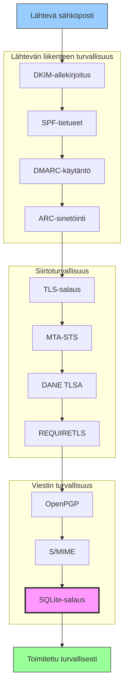


## Sähköpostiviestien todennusprotokollat {#email-message-authentication-protocols}

> \[!NOTE]
> Forward Email toteuttaa kaikki tärkeimmät sähköpostin todennusprotokollat estääkseen väärentämisen ja varmistaakseen viestin eheyden.

Forward Email käyttää sähköpostin todennukseen [mailauth](https://github.com/postalsys/mailauth) -kirjastoa. Seuraavat RFC:t ovat tuettuja:

| RFC                                                       | Otsikko                                                                | Toteutusmuistiinpanot                                         |
| --------------------------------------------------------- | --------------------------------------------------------------------- | ------------------------------------------------------------ |
| [RFC 6376](https://datatracker.ietf.org/doc/html/rfc6376) | DomainKeys Identified Mail (DKIM) -allekirjoitukset                   | Täysi DKIM-allekirjoitus ja -varmennus                        |
| [RFC 8463](https://datatracker.ietf.org/doc/html/rfc8463) | Uusi kryptografinen allekirjoitusmenetelmä DKIM:lle (Ed25519-SHA256)  | Tukee sekä RSA-SHA256- että Ed25519-SHA256-allekirjoitusalgoritmeja |
| [RFC 7208](https://datatracker.ietf.org/doc/html/rfc7208) | Sender Policy Framework (SPF)                                         | SPF-tietueen validointi                                      |
| [RFC 7489](https://datatracker.ietf.org/doc/html/rfc7489) | Domain-based Message Authentication, Reporting, and Conformance (DMARC) | DMARC-käytännön noudattaminen                                |
| [RFC 8617](https://datatracker.ietf.org/doc/html/rfc8617) | Authenticated Received Chain (ARC)                                    | ARC-sinetöinti ja validointi                                 |

Sähköpostin todennusprotokollat varmistavat, että viestit ovat aidosti ilmoitetulta lähettäjältä eivätkä ole muuttuneet siirron aikana.

### Todennusprotokollien tuki {#authentication-protocol-support}

| Protokolla | RFC      | Tila        | Kuvaus                                                              |
| ---------- | -------- | ----------- | ------------------------------------------------------------------- |
| **DKIM**   | RFC 6376 | ✅ Tuettu   | DomainKeys Identified Mail - Kryptografiset allekirjoitukset        |
| **SPF**    | RFC 7208 | ✅ Tuettu   | Sender Policy Framework - IP-osoitteen valtuutus                    |
| **DMARC**  | RFC 7489 | ✅ Tuettu   | Domain-based Message Authentication - Käytännön noudattaminen       |
| **ARC**    | RFC 8617 | ✅ Tuettu   | Authenticated Received Chain - Todennuksen säilyttäminen edelleenlähetyksissä |
### DKIM (DomainKeys Identified Mail) {#dkim-domainkeys-identified-mail}

**DKIM** lisää sähköpostin otsikoihin kryptografisen allekirjoituksen, jonka avulla vastaanottajat voivat varmistaa, että viestin on valtuuttanut verkkotunnuksen omistaja eikä sitä ole muokattu siirron aikana.

Forward Email käyttää [mailauth](https://github.com/postalsys/mailauth) -kirjastoa DKIM-allekirjoitukseen ja -tarkistukseen.

**Keskeiset ominaisuudet:**

* Automaattinen DKIM-allekirjoitus kaikille lähteville viesteille
* Tuki RSA- ja Ed25519-avaimille
* Useiden valitsimien tuki
* DKIM-tarkistus saapuville viesteille

### SPF (Sender Policy Framework) {#spf-sender-policy-framework}

**SPF** antaa verkkotunnuksen omistajille mahdollisuuden määrittää, mitkä IP-osoitteet ovat valtuutettuja lähettämään sähköpostia heidän verkkotunnuksensa puolesta.

**Keskeiset ominaisuudet:**

* SPF-tietueen validointi saapuville viesteille
* Automaattinen SPF-tarkistus yksityiskohtaisilla tuloksilla
* Tuki include-, redirect- ja all-mekanismeille
* Määritettävät SPF-käytännöt verkkotunnuskohtaisesti

### DMARC (Domain-based Message Authentication, Reporting & Conformance) {#dmarc-domain-based-message-authentication-reporting--conformance}

**DMARC** rakentuu SPF:n ja DKIM:n päälle tarjoten käytäntöjen noudattamisen ja raportoinnin.

**Keskeiset ominaisuudet:**

* DMARC-käytäntöjen noudattaminen (none, quarantine, reject)
* Kohdistuksen tarkistus SPF:lle ja DKIM:lle
* DMARC-yhteenvetoraportointi
* Verkkotunnuskohtaiset DMARC-käytännöt

### ARC (Authenticated Received Chain) {#arc-authenticated-received-chain}

**ARC** säilyttää sähköpostin todennus­tulokset edelleenlähetyksen ja postituslistojen muokkausten yli.

Forward Email käyttää [mailauth](https://github.com/postalsys/mailauth) -kirjastoa ARC-tarkistukseen ja -sinettaukseen.

**Keskeiset ominaisuudet:**

* ARC-sinetöinti edelleenlähetetyille viesteille
* ARC-validointi saapuville viesteille
* Ketjun tarkistus useiden hyppyjen yli
* Säilyttää alkuperäiset todennustulokset

### Authentication Flow {#authentication-flow}

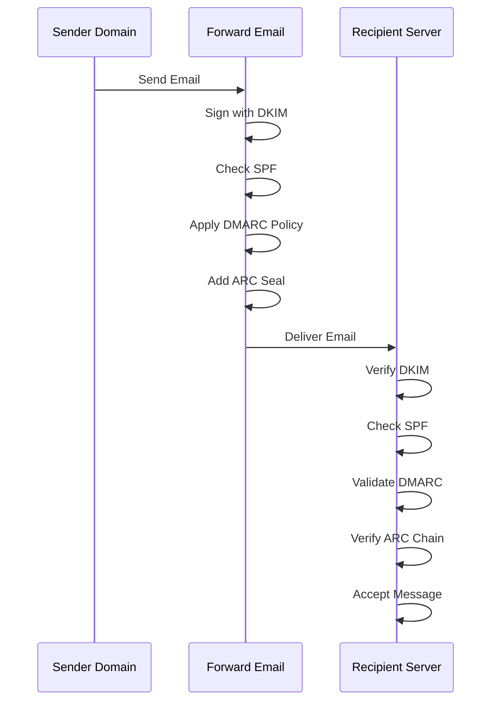

---


## Email Transport Security Protocols {#email-transport-security-protocols}

> \[!IMPORTANT]
> Forward Email toteuttaa useita kerroksia siirtoturvaa suojatakseen sähköpostit siirron aikana.

Forward Email toteuttaa nykyaikaiset siirtoturvaprotokollat:

| RFC                                                       | Otsikko                                                                                             | Tila        | Toteutustiedot                                                                                                                                                                                                                                                                                 |
| --------------------------------------------------------- | -------------------------------------------------------------------------------------------------- | ----------- | --------------------------------------------------------------------------------------------------------------------------------------------------------------------------------------------------------------------------------------------------------------------------------------------- |
| [RFC 8461](https://datatracker.ietf.org/doc/html/rfc8461) | SMTP MTA Strict Transport Security (MTA-STS)                                                       | ✅ Tuettu   | Laajasti käytössä IMAP-, SMTP- ja MX-palvelimilla. Katso [create-mta-sts-cache.js](https://github.com/forwardemail/forwardemail.net/blob/master/helpers/create-mta-sts-cache.js) ja [get-transporter.js](https://github.com/forwardemail/forwardemail.net/blob/master/helpers/get-transporter.js) |
| [RFC 8460](https://datatracker.ietf.org/doc/html/rfc8460) | SMTP TLS Reporting                                                                                 | ✅ Tuettu   | Käytössä [mailauth](https://github.com/postalsys/mailauth) -kirjaston kautta                                                                                                                                                                                                                 |
| [RFC 7671](https://datatracker.ietf.org/doc/html/rfc7671) | The DNS-Based Authentication of Named Entities (DANE) Protocol: Updates and Operational Guidance   | ✅ Tuettu   | Täysi DANE-tarkistus lähtevissä SMTP-yhteyksissä. Katso [mx-connect PR #22](https://github.com/zone-eu/mx-connect/pull/22)                                                                                                                                                                    |
| [RFC 6698](https://datatracker.ietf.org/doc/html/rfc6698) | The DNS-Based Authentication of Named Entities (DANE) Transport Layer Security (TLS) Protocol: TLSA | ✅ Tuettu   | Täysi RFC 6698 -tuki: PKIX-TA, PKIX-EE, DANE-TA, DANE-EE käyttötyypit. Katso [mx-connect PR #22](https://github.com/zone-eu/mx-connect/pull/22)                                                                                                                                               |
| [RFC 8314](https://datatracker.ietf.org/doc/html/rfc8314) | Cleartext Considered Obsolete: Use of Transport Layer Security (TLS) for Email Submission and Access | ✅ Tuettu   | TLS vaaditaan kaikissa yhteyksissä                                                                                                                                                                                                                                                          |
| [RFC 8689](https://datatracker.ietf.org/doc/html/rfc8689) | SMTP Service Extension for Requiring TLS (REQUIRETLS)                                              | ✅ Tuettu   | Täysi tuki REQUIRETLS SMTP -laajennukselle ja "TLS-Required" -otsakkeelle                                                                                                                                                                                                                      |
Kuljetusturvaprotokollat varmistavat, että sähköpostiviestit salataan ja todennetaan siirron aikana postipalvelimien välillä.

### Kuljetusturvan tuki {#transport-security-support}

| Protokolla    | RFC      | Tila        | Kuvaus                                           |
| ------------- | -------- | ----------- | ------------------------------------------------ |
| **TLS**       | RFC 8314 | ✅ Tuettu   | Transport Layer Security - Salatut yhteydet      |
| **MTA-STS**   | RFC 8461 | ✅ Tuettu   | Mail Transfer Agent Strict Transport Security    |
| **DANE**      | RFC 7671 | ✅ Tuettu   | DNS-pohjainen nimettyjen kohteiden todennus      |
| **REQUIRETLS**| RFC 8689 | ✅ Tuettu   | TLS:n vaatiminen koko toimitusreitille           |

### TLS (Transport Layer Security) {#tls-transport-layer-security}

Forward Email pakottaa TLS-salauksen kaikille sähköpostiyhteyksille (SMTP, IMAP, POP3).

**Keskeiset ominaisuudet:**

* TLS 1.2 ja TLS 1.3 tuki
* Automaattinen sertifikaattien hallinta
* Perfect Forward Secrecy (PFS)
* Vain vahvat salausalgoritmit

### MTA-STS (Mail Transfer Agent Strict Transport Security) {#mta-sts-mail-transfer-agent-strict-transport-security}

**MTA-STS** varmistaa, että sähköposti toimitetaan vain TLS-salattujen yhteyksien kautta julkaisemalla politiikan HTTPS:n kautta.

Forward Email toteuttaa MTA-STS:n käyttäen [create-mta-sts-cache.js](https://github.com/forwardemail/forwardemail.net/blob/master/helpers/create-mta-sts-cache.js).

**Keskeiset ominaisuudet:**

* Automaattinen MTA-STS-politiikan julkaisu
* Politiikan välimuisti suorituskyvyn parantamiseksi
* Downgrade-hyökkäysten estäminen
* Sertifikaattien validoinnin pakottaminen

### DANE (DNS-pohjainen nimettyjen kohteiden todennus) {#dane-dns-based-authentication-of-named-entities}

> \[!NOTE]
> Forward Email tarjoaa nyt täyden DANE-tuen lähteville SMTP-yhteyksille.

**DANE** käyttää DNSSEC:iä TLS-sertifikaattitietojen julkaisemiseen DNS:ssä, jolloin postipalvelimet voivat varmistaa sertifikaatit ilman riippuvuutta sertifikaattiviranomaisista.

**Keskeiset ominaisuudet:**

* ✅ Täysi DANE-tarkistus lähteville SMTP-yhteyksille
* ✅ Täysi RFC 6698 -tuki: PKIX-TA, PKIX-EE, DANE-TA, DANE-EE käyttötyypit
* ✅ Sertifikaattien tarkistus TLSA-tietueita vastaan TLS-päivityksen aikana
* ✅ Samanaikainen TLSA-tietueiden ratkaisu useille MX-isännille
* ✅ Automaattinen natiivin `dns.resolveTlsa` -tuen tunnistus (Node.js v22.15.0+, v23.9.0+)
* ✅ Mukautetun resolverin tuki vanhemmille Node.js-versioille [Tangerine](https://github.com/forwardemail/tangerine) avulla
* Vaatii DNSSEC-allekirjoitetut domainit

> \[!TIP]
> **Toteutustiedot:** DANE-tuki lisättiin [mx-connect PR #22](https://github.com/zone-eu/mx-connect/pull/22) kautta, joka tarjoaa kattavan DANE/TLSA-tuen lähteville SMTP-yhteyksille.

### REQUIRETLS {#requiretls}

> \[!TIP]
> Forward Email on yksi harvoista palveluntarjoajista, jolla on käyttäjille näkyvä REQUIRETLS-tuki.

**REQUIRETLS** varmistaa, että sähköpostiviestit toimitetaan vain TLS-salattujen yhteyksien kautta koko toimitusreitillä.

**Keskeiset ominaisuudet:**

* Käyttäjälle näkyvä valintaruutu sähköpostin kirjoittajassa
* Automaattinen salaamattoman toimituksen hylkäys
* End-to-end TLS:n pakottaminen
* Yksityiskohtaiset virheilmoitukset

> \[!TIP]
> **Käyttäjälle näkyvä TLS-pakotus:** Forward Email tarjoaa valintaruudun kohdassa **Oma tili > Domainit > Asetukset** TLS:n pakottamiseksi kaikille saapuville yhteyksille. Kun ominaisuus on käytössä, se hylkää kaikki TLS-salattuja yhteyksiä käyttämättömät saapuvat sähköpostit virhekoodilla 530, varmistaen että kaikki saapuva posti on salattu siirron aikana.

### Kuljetusturvan kulku {#transport-security-flow}

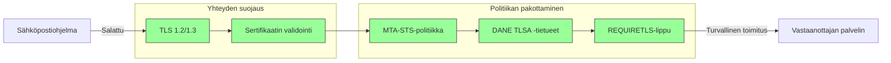
## Sähköpostiviestin salaus {#email-message-encryption}

> \[!NOTE]
> Forward Email tukee sekä OpenPGP:tä että S/MIMEä päästä päähän -salausta varten.

Forward Email tukee OpenPGP- ja S/MIME-salausta:

| RFC                                                       | Otsikko                                                                                 | Tila        | Toteutusmuistiinpanot                                                                                                                                                                                 |
| --------------------------------------------------------- | --------------------------------------------------------------------------------------- | ----------- | ---------------------------------------------------------------------------------------------------------------------------------------------------------------------------------------------------- |
| [RFC 9580](https://datatracker.ietf.org/doc/html/rfc9580) | OpenPGP (korvaa RFC 4880)                                                               | ✅ Tuettu   | Integraatio [OpenPGP.js v6+](https://github.com/openpgpjs/openpgpjs) kautta. Katso [FAQ](https://forwardemail.net/en/faq#do-you-support-openpgpmime-end-to-end-encryption-e2ee-and-web-key-directory-wkd) |
| [RFC 8551](https://datatracker.ietf.org/doc/html/rfc8551) | Secure/Multipurpose Internet Mail Extensions (S/MIME) Versio 4.0 Viestimääritys           | ✅ Tuettu   | Sekä RSA- että ECC-algoritmit tuettu. Katso [FAQ](https://forwardemail.net/en/faq#do-you-support-smime-encryption)                                                                                    |

Viestin salausprotokollat suojaavat sähköpostin sisällön niin, että vain vastaanottaja voi lukea sen, vaikka viesti siepattaisiin siirron aikana.

### Salaustuki {#encryption-support}

| Protokolla  | RFC      | Tila        | Kuvaus                                      |
| ----------- | -------- | ----------- | -------------------------------------------- |
| **OpenPGP** | RFC 9580 | ✅ Tuettu   | Pretty Good Privacy - julkisen avaimen salaus |
| **S/MIME**  | RFC 8551 | ✅ Tuettu   | Secure/Multipurpose Internet Mail Extensions |
| **WKD**     | Luonnos  | ✅ Tuettu   | Web Key Directory - Automaattinen avainten löytyminen |

### OpenPGP (Pretty Good Privacy) {#openpgp-pretty-good-privacy}

**OpenPGP** tarjoaa päästä päähän -salauksen julkisen avaimen kryptografian avulla. Forward Email tukee OpenPGP:tä [Web Key Directory (WKD)](https://forwardemail.net/en/faq#do-you-support-openpgpmime-end-to-end-encryption-e2ee-and-web-key-directory-wkd) -protokollan kautta.

**Keskeiset ominaisuudet:**

* Automaattinen avainten löytyminen WKD:n kautta
* PGP/MIME-tuki salatuille liitteille
* Avainten hallinta sähköpostiohjelman kautta
* Yhteensopiva GPG:n, Mailvelopen ja muiden OpenPGP-työkalujen kanssa

**Käyttöohje:**

1. Luo PGP-avainpari sähköpostiohjelmassasi
2. Lataa julkinen avain Forward Emailin WKD:hen
3. Avaimesi löytyy automaattisesti muille käyttäjille
4. Lähetä ja vastaanota salattuja sähköposteja vaivattomasti

### S/MIME (Secure/Multipurpose Internet Mail Extensions) {#smime-securemultipurpose-internet-mail-extensions}

**S/MIME** tarjoaa sähköpostin salauksen ja digitaaliset allekirjoitukset X.509-sertifikaattien avulla.

**Keskeiset ominaisuudet:**

* Sertifikaattipohjainen salaus
* Digitaaliset allekirjoitukset viestin todennukseen
* Natiivituki useimmissa sähköpostiohjelmissa
* Yritystason tietoturva

**Käyttöohje:**

1. Hanki S/MIME-sertifikaatti sertifikaatin myöntäjältä
2. Asenna sertifikaatti sähköpostiohjelmaasi
3. Määritä ohjelma salaamaan/allekirjoittamaan viestit
4. Vaihda sertifikaatit vastaanottajien kanssa

### SQLite-postilaatikon salaus {#sqlite-mailbox-encryption}

> \[!IMPORTANT]
> Forward Email tarjoaa lisäturvakerroksen salatuilla SQLite-postilaatikoilla.

Viestitason salauksen lisäksi Forward Email salaa koko postilaatikon käyttäen [sqleet](https://github.com/resilar/sqleet) (ChaCha20-Poly1305).

**Keskeiset ominaisuudet:**

* **Salasana-pohjainen salaus** – Vain sinulla on salasana
* **Kvanttikestävä** – ChaCha20-Poly1305-salaus
* **Nollatietoinen** – Forward Email ei voi purkaa postilaatikkoasi
* **Eristetty** – Jokainen postilaatikko on eristetty ja siirrettävä
* **Palauttamaton** – Jos unohdat salasanasi, postilaatikkosi menetetään
### Salausvertailu {#encryption-comparison}

| Ominaisuus            | OpenPGP           | S/MIME             | SQLite Encryption |
| --------------------- | ----------------- | ------------------ | ----------------- |
| **End-to-End**        | ✅ Kyllä           | ✅ Kyllä            | ✅ Kyllä           |
| **Avainhallinta**     | Itsehallittu      | CA:n myöntämä      | Salasanapohjainen |
| **Asiakastuki**       | Vaatii lisäosan   | Natiivisti         | Läpinäkyvä        |
| **Käyttötarkoitus**   | Henkilökohtainen  | Yrityskäyttö       | Tallennus         |
| **Kvanttivarma**      | ⚠️ Riippuu avaimesta | ⚠️ Riippuu sertifikaatista | ✅ Kyllä           |

### Salausprosessi {#encryption-flow}

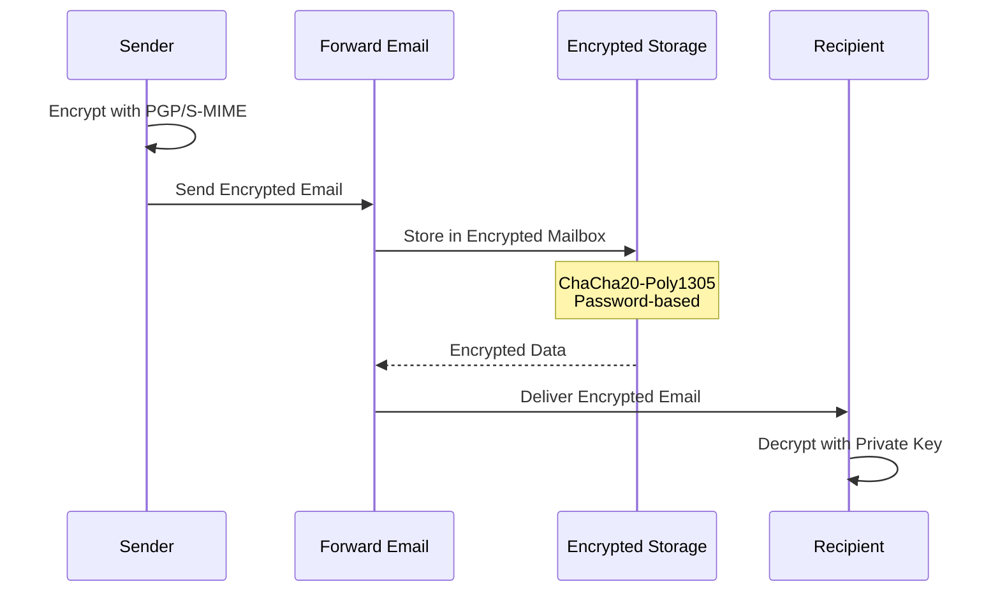

---


## Laajennettu toiminnallisuus {#extended-functionality}


## Sähköpostiviestin formaattistandardit {#email-message-format-standards}

> \[!NOTE]
> Forward Email tukee moderneja sähköpostiformaattistandardeja rikasta sisältöä ja kansainvälistämistä varten.

Forward Email tukee standardeja sähköpostiviestiformaatteja:

| RFC                                                       | Otsikko                                                       | Toteutusmuistiinpanot |
| --------------------------------------------------------- | ------------------------------------------------------------- | --------------------- |
| [RFC 5322](https://datatracker.ietf.org/doc/html/rfc5322) | Internet Message Format                                       | Täysi tuki            |
| [RFC 2045](https://datatracker.ietf.org/doc/html/rfc2045) | MIME Osa Yksi: Internet-viestirunkojen formaatti             | Täysi MIME-tuki       |
| [RFC 2046](https://datatracker.ietf.org/doc/html/rfc2046) | MIME Osa Kaksi: Mediatyypit                                   | Täysi MIME-tuki       |
| [RFC 2047](https://datatracker.ietf.org/doc/html/rfc2047) | MIME Osa Kolme: Viestin otsikkolaajennukset ei-ASCII-tekstille | Täysi MIME-tuki       |
| [RFC 2048](https://datatracker.ietf.org/doc/html/rfc2048) | MIME Osa Neljä: Rekisteröintimenettelyt                       | Täysi MIME-tuki       |
| [RFC 2049](https://datatracker.ietf.org/doc/html/rfc2049) | MIME Osa Viisi: Yhdenmukaisuuskriteerit ja esimerkit          | Täysi MIME-tuki       |

Sähköpostiformaattistandardit määrittelevät, miten sähköpostiviestit on jäsennelty, koodattu ja esitetty.

### Formaattistandardien tuki {#format-standards-support}

| Standardi          | RFC           | Tila        | Kuvaus                              |
| ------------------ | ------------- | ----------- | ---------------------------------- |
| **MIME**           | RFC 2045-2049 | ✅ Tuettu   | Monikäyttöiset Internetin sähköpostilaajennukset |
| **SMTPUTF8**       | RFC 6531      | ⚠️ Osittainen | Kansainvälistetyt sähköpostiosoitteet |
| **EAI**            | RFC 6530      | ⚠️ Osittainen | Sähköpostiosoitteiden kansainvälistäminen |
| **Viestiformaatti**| RFC 5322      | ✅ Tuettu   | Internet Message Format             |
| **MIME-turvallisuus** | RFC 1847    | ✅ Tuettu   | Turvallisuusmoniosaiset MIME:lle   |

### MIME (Monikäyttöiset Internetin sähköpostilaajennukset) {#mime-multipurpose-internet-mail-extensions}

**MIME** mahdollistaa sähköpostien sisältävän useita osia eri sisältötyypeillä (teksti, HTML, liitteet jne.).

**Tuetut MIME-ominaisuudet:**

* Moniosaiset viestit (mixed, alternative, related)
* Content-Type -otsikot
* Content-Transfer-Encoding (7bit, 8bit, quoted-printable, base64)
* Sisäiset kuvat ja liitteet
* Rikas HTML-sisältö

### SMTPUTF8 ja sähköpostiosoitteiden kansainvälistäminen {#smtputf8-and-email-address-internationalization}

> \[!WARNING]
> SMTPUTF8-tuki on osittaista – kaikki ominaisuudet eivät ole täysin toteutettuja.
**SMTPUTF8** sallii sähköpostiosoitteiden sisältää ei-ASCII-merkkejä (esim. `用户@例え.jp`).

**Nykyinen tila:**

* ⚠️ Osittainen tuki kansainvälistetyille sähköpostiosoitteille
* ✅ UTF-8-sisältö viestien runko-osissa
* ⚠️ Rajoitettu tuki ei-ASCII paikallisosille

---


## Kalenterointi- ja yhteystietoprotokollat {#calendaring-and-contacts-protocols}

> \[!NOTE]
> Forward Email tarjoaa täydellisen CalDAV- ja CardDAV-tuen kalenterin ja yhteystietojen synkronointiin.

Forward Email tukee CalDAV:ta ja CardDAV:ta [caldav-adapter](https://github.com/forwardemail/caldav-adapter) -kirjaston kautta:

| RFC                                                       | Otsikko                                                                  | Tila        | Toteutusmuistiinpanot                                                                                                                                                                  |
| --------------------------------------------------------- | ------------------------------------------------------------------------ | ----------- | -------------------------------------------------------------------------------------------------------------------------------------------------------------------------------------- |
| [RFC 4791](https://datatracker.ietf.org/doc/html/rfc4791) | Kalenterilaajennukset WebDAV:iin (CalDAV)                               | ✅ Tuettu   | Kalenterin käyttö ja hallinta                                                                                                                                                          |
| [RFC 6352](https://datatracker.ietf.org/doc/html/rfc6352) | CardDAV: vCard-laajennukset WebDAV:iin                                  | ✅ Tuettu   | Yhteystietojen käyttö ja hallinta                                                                                                                                                      |
| [RFC 5545](https://datatracker.ietf.org/doc/html/rfc5545) | Internet-kalenterointi ja aikataulutusydinobjektin määrittely (iCalendar) | ✅ Tuettu   | iCalendar-muodon tuki                                                                                                                                                                  |
| [RFC 6350](https://datatracker.ietf.org/doc/html/rfc6350) | vCard-muodon määrittely                                                  | ✅ Tuettu   | vCard 4.0 -muodon tuki                                                                                                                                                                |
| [RFC 6638](https://datatracker.ietf.org/doc/html/rfc6638) | Aikataulutuslaajennukset CalDAV:lle                                     | ✅ Tuettu   | CalDAV-aikataulutus iMIP-tuella. Katso [commit c4d1629](https://github.com/forwardemail/forwardemail.net/commit/c4d162975a49e38d76d68a032662e873a34a9b80)                            |
| [RFC 5546](https://datatracker.ietf.org/doc/html/rfc5546) | iCalendar-siirrosta riippumaton yhteentoimivuusprotokolla (iTIP)         | ✅ Tuettu   | iTIP-tuki REQUEST-, REPLY-, CANCEL- ja VFREEBUSY-menetelmille. Katso [commit c4d1629](https://github.com/forwardemail/forwardemail.net/commit/c4d162975a49e38d76d68a032662e873a34a9b80) |
| [RFC 6047](https://datatracker.ietf.org/doc/html/rfc6047) | iCalendar-viestipohjainen yhteentoimivuusprotokolla (iMIP)               | ✅ Tuettu   | Sähköpostipohjaiset kalenterikutsut vastauslinkkeineen. Katso [commit c4d1629](https://github.com/forwardemail/forwardemail.net/commit/c4d162975a49e38d76d68a032662e873a34a9b80)           |

CalDAV ja CardDAV ovat protokollia, jotka mahdollistavat kalenteri- ja yhteystietojen käytön, jakamisen ja synkronoinnin laitteiden välillä.

### CalDAV- ja CardDAV-tuki {#caldav-and-carddav-support}

| Protokolla            | RFC      | Tila        | Kuvaus                               |
| --------------------- | -------- | ----------- | ----------------------------------- |
| **CalDAV**            | RFC 4791 | ✅ Tuettu   | Kalenterin käyttö ja synkronointi   |
| **CardDAV**           | RFC 6352 | ✅ Tuettu   | Yhteystietojen käyttö ja synkronointi |
| **iCalendar**         | RFC 5545 | ✅ Tuettu   | Kalenteridatan muoto                |
| **vCard**             | RFC 6350 | ✅ Tuettu   | Yhteystietodatan muoto              |
| **VTODO**             | RFC 5545 | ✅ Tuettu   | Tehtävien/muistutusten tuki         |
| **CalDAV Scheduling** | RFC 6638 | ✅ Tuettu   | Kalenterin aikataulutuslaajennukset |
| **iTIP**              | RFC 5546 | ✅ Tuettu   | Siirrosta riippumaton yhteentoimivuus |
| **iMIP**              | RFC 6047 | ✅ Tuettu   | Sähköpostipohjaiset kalenterikutsut |
### CalDAV (Kalenterin käyttö) {#caldav-calendar-access}

**CalDAV** mahdollistaa kalentereiden käytön ja hallinnan millä tahansa laitteella tai sovelluksella.

**Keskeiset ominaisuudet:**

* Monilaitteinen synkronointi
* Jaetut kalenterit
* Kalenteritilaukset
* Tapahtumakutsut ja vastaukset
* Toistuvat tapahtumat
* Aikavyöhyketuki

**Yhteensopivat asiakkaat:**

* Apple Calendar (macOS, iOS)
* Mozilla Thunderbird
* Evolution
* GNOME Calendar
* Mikä tahansa CalDAV-yhteensopiva asiakas

### CardDAV (Yhteystietojen käyttö) {#carddav-contact-access}

**CardDAV** mahdollistaa yhteystietojen käytön ja hallinnan millä tahansa laitteella tai sovelluksella.

**Keskeiset ominaisuudet:**

* Monilaitteinen synkronointi
* Jaetut osoitekirjat
* Yhteystietoryhmät
* Kuvien tuki
* Mukautetut kentät
* vCard 4.0 -tuki

**Yhteensopivat asiakkaat:**

* Apple Contacts (macOS, iOS)
* Mozilla Thunderbird
* Evolution
* GNOME Contacts
* Mikä tahansa CardDAV-yhteensopiva asiakas

### Tehtävät ja muistutukset (CalDAV VTODO) {#tasks-and-reminders-caldav-vtodo}

> \[!TIP]
> Forward Email tukee tehtäviä ja muistutuksia CalDAV VTODO:n kautta.

**VTODO** on osa iCalendar-muotoa ja mahdollistaa tehtävien hallinnan CalDAV:n kautta.

**Keskeiset ominaisuudet:**

* Tehtävien luonti ja hallinta
* Eräpäivät ja prioriteetit
* Tehtävien suorittamisen seuranta
* Toistuvat tehtävät
* Tehtävälistat/kategoriat

**Yhteensopivat asiakkaat:**

* Apple Reminders (macOS, iOS)
* Mozilla Thunderbird (Lightning-laajennuksella)
* Evolution
* GNOME To Do
* Mikä tahansa CalDAV-asiakas, joka tukee VTODO:a

### CalDAV/CardDAV-synkronointivirta {#caldavcarddav-synchronization-flow}

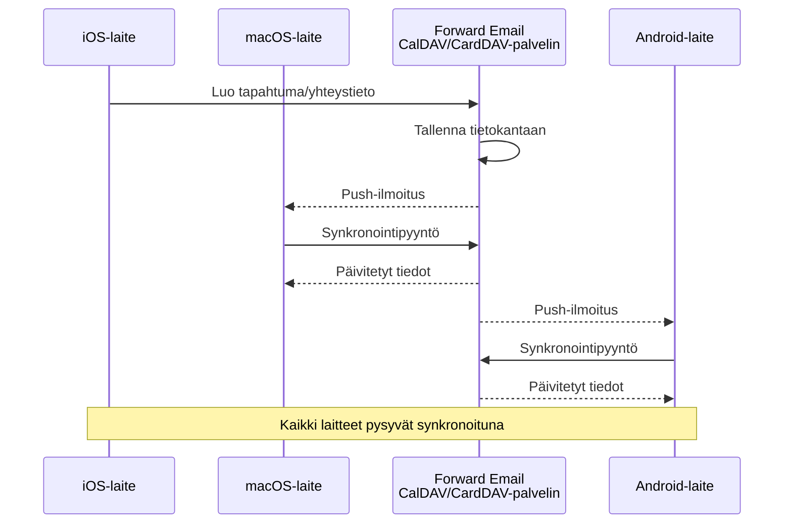

### Kalenterilaajennukset, joita EI tueta {#calendaring-extensions-not-supported}

Seuraavia kalenterilaajennuksia EI tueta:

| RFC                                                       | Otsikko                                                             | Syy                                                            |
| --------------------------------------------------------- | ------------------------------------------------------------------- | -------------------------------------------------------------- |
| [RFC 4918](https://datatracker.ietf.org/doc/html/rfc4918) | HTTP Extensions for Web Distributed Authoring and Versioning (WebDAV) | CalDAV käyttää WebDAV-konsepteja, mutta ei toteuta koko RFC 4918:aa |
| [RFC 6578](https://datatracker.ietf.org/doc/html/rfc6578) | Collection Synchronization for WebDAV                               | Ei toteutettu                                                  |
| [RFC 3744](https://datatracker.ietf.org/doc/html/rfc3744) | WebDAV Access Control Protocol                                      | Ei toteutettu                                                  |

---


## Sähköpostiviestien suodatus {#email-message-filtering}

> \[!IMPORTANT]
> Forward Email tarjoaa **täyden Sieve- ja ManageSieve-tuen** palvelinpuolen sähköpostisuodatukseen. Luo tehokkaita sääntöjä saapuvien viestien automaattiseen lajitteluun, suodatukseen, edelleenlähetykseen ja vastaamiseen.

### Sieve (RFC 5228) {#sieve-rfc-5228}

[Sieve](https://en.wikipedia.org/wiki/Sieve_\(mail_filtering_language\)) on standardoitu, tehokas skriptikieli palvelinpuolen sähköpostisuodatukseen. Forward Email toteuttaa kattavan Sieve-tuen 24 laajennuksella.

**Lähdekoodi:** [`helpers/sieve/`](https://github.com/forwardemail/forwardemail.net/tree/master/helpers/sieve)

#### Tuetut ydinsieve-RFC:t {#core-sieve-rfcs-supported}

| RFC                                                                                    | Otsikko                                                       | Tila           |
| -------------------------------------------------------------------------------------- | ------------------------------------------------------------- | -------------- |
| [RFC 5228](https://datatracker.ietf.org/doc/html/rfc5228)                              | Sieve: Sähköpostin suodatuskieli                              | ✅ Täysi tuki  |
| [RFC 5429](https://datatracker.ietf.org/doc/html/rfc5429)                              | Sieve-sähköpostisuodatus: Hylkäys- ja laajennettu hylkäys     | ✅ Täysi tuki  |
| [RFC 5230](https://datatracker.ietf.org/doc/html/rfc5230)                              | Sieve-sähköpostisuodatus: Lomalaajennus                       | ✅ Täysi tuki  |
| [RFC 6131](https://datatracker.ietf.org/doc/html/rfc6131)                              | Sieve-lomalaajennus: "Seconds"-parametri                      | ✅ Täysi tuki  |
| [RFC 5232](https://datatracker.ietf.org/doc/html/rfc5232)                              | Sieve-sähköpostisuodatus: Imap4flags-laajennus                | ✅ Täysi tuki  |
| [RFC 5173](https://datatracker.ietf.org/doc/html/rfc5173)                              | Sieve-sähköpostisuodatus: Body-laajennus                      | ✅ Täysi tuki  |
| [RFC 5229](https://datatracker.ietf.org/doc/html/rfc5229)                              | Sieve-sähköpostisuodatus: Muuttujalaajennus                   | ✅ Täysi tuki  |
| [RFC 5231](https://datatracker.ietf.org/doc/html/rfc5231)                              | Sieve-sähköpostisuodatus: Relaatiolaajennus                   | ✅ Täysi tuki  |
| [RFC 4790](https://datatracker.ietf.org/doc/html/rfc4790)                              | Internet Application Protocol Collation Registry              | ✅ Täysi tuki  |
| [RFC 3894](https://datatracker.ietf.org/doc/html/rfc3894)                              | Sieve-laajennus: Kopiointi ilman sivuvaikutuksia             | ✅ Täysi tuki  |
| [RFC 5293](https://datatracker.ietf.org/doc/html/rfc5293)                              | Sieve-sähköpostisuodatus: Editheader-laajennus                | ✅ Täysi tuki  |
| [RFC 5260](https://datatracker.ietf.org/doc/html/rfc5260)                              | Sieve-sähköpostisuodatus: Päivämäärä- ja indeksiälaajennukset | ✅ Täysi tuki  |
| [RFC 5435](https://datatracker.ietf.org/doc/html/rfc5435)                              | Sieve-sähköpostisuodatus: Ilmoituslaajennus                   | ✅ Täysi tuki  |
| [RFC 5183](https://datatracker.ietf.org/doc/html/rfc5183)                              | Sieve-sähköpostisuodatus: Ympäristölaajennus                  | ✅ Täysi tuki  |
| [RFC 5490](https://datatracker.ietf.org/doc/html/rfc5490)                              | Sieve-sähköpostisuodatus: Laajennukset postilaatikon tilan tarkistukseen | ✅ Täysi tuki  |
| [RFC 8579](https://datatracker.ietf.org/doc/html/rfc8579)                              | Sieve-sähköpostisuodatus: Toimitus erityiskäyttöpostilaatikoihin | ✅ Täysi tuki  |
| [RFC 7352](https://datatracker.ietf.org/doc/html/rfc7352)                              | Sieve-sähköpostisuodatus: Kaksoistoimitusten tunnistus       | ✅ Täysi tuki  |
| [RFC 5463](https://datatracker.ietf.org/doc/html/rfc5463)                              | Sieve-sähköpostisuodatus: Ihave-laajennus                     | ✅ Täysi tuki  |
| [RFC 5233](https://datatracker.ietf.org/doc/html/rfc5233)                              | Sieve-sähköpostisuodatus: Aliosoite-laajennus                 | ✅ Täysi tuki  |
| [draft-ietf-sieve-regex](https://datatracker.ietf.org/doc/html/draft-ietf-sieve-regex) | Sieve-sähköpostisuodatus: Säännöllisten lausekkeiden laajennus | ✅ Täysi tuki  |
#### Tuetut Sieve-laajennukset {#supported-sieve-extensions}

| Laajennus                    | Kuvaus                                  | Integraatio                                |
| ---------------------------- | ---------------------------------------- | ------------------------------------------ |
| `fileinto`                   | Tallenna viestit tiettyihin kansioihin  | Viestit tallennetaan määriteltyyn IMAP-kansioon |
| `reject` / `ereject`         | Hylkää viestit virheilmoituksella       | SMTP-hylkäys palautusviestillä             |
| `vacation`                   | Automaattiset lomavastausviestit         | Jonotetaan Emails.queue-palvelussa rajoituksin |
| `vacation-seconds`           | Tarkemmat lomavastausvälit                | TTL `:seconds`-parametrista                 |
| `imap4flags`                 | Aseta IMAP-liput (\Seen, \Flagged, jne.) | Liput asetetaan viestin tallennuksen yhteydessä |
| `envelope`                   | Testaa kuoren lähettäjä/vastaanottaja    | Pääsy SMTP-kuoren tietoihin                  |
| `body`                       | Testaa viestin sisältöä                   | Kokonaisen viestitekstin vastaavuus         |
| `variables`                  | Tallenna ja käytä muuttujia skripteissä  | Muuttujien laajennus modifikaattoreilla    |
| `relational`                 | Relaatiovertailut                        | `:count`, `:value` gt/lt/eq-vertailut       |
| `comparator-i;ascii-numeric` | Numeraaliset vertailut                   | Numeraalinen merkkijonojen vertailu         |
| `copy`                       | Kopioi viestit uudelleenohjauksen yhteydessä | `:copy`-lippu fileinto/redirect-komentoihin |
| `editheader`                 | Lisää tai poista viestin otsikoita       | Otsikoita muokataan ennen tallennusta       |
| `date`                       | Testaa päivämäärä/aikaleima-arvoja       | `currentdate` ja otsikon päivämäärätestit   |
| `index`                      | Pääsy tiettyihin otsikon esiintymiin     | `:index` moniarvoisille otsikoille           |
| `regex`                      | Säännöllisten lausekkeiden vastaavuus    | Täysi regex-tuki testeissä                   |
| `enotify`                    | Lähetä ilmoituksia                       | `mailto:`-ilmoitukset Emails.queue-palvelun kautta |
| `environment`                | Pääsy ympäristötietoihin                  | Domain, host, remote-ip istunnosta           |
| `mailbox`                    | Testaa postilaatikon olemassaolo          | `mailboxexists`-testi                        |
| `special-use`                | Tallenna erikoiskäyttöisiin postilaatikoihin | Karttaa \Junk, \Trash jne. kansioihin        |
| `duplicate`                  | Havaitse kaksoiskappaleviestit            | Redis-pohjainen kaksoiskappaleiden seuranta |
| `ihave`                      | Testaa laajennuksen saatavuus              | Ajonaikainen kyvykkyyden tarkistus          |
| `subaddress`                 | Pääsy käyttäjä+lisätiedot-osioihin        | `:user` ja `:detail` osoiteosat              |

#### Sieve-laajennukset, joita EI tueta {#sieve-extensions-not-supported}

| Laajennus                               | RFC                                                       | Syy                                                             |
| --------------------------------------- | --------------------------------------------------------- | ---------------------------------------------------------------- |
| `include`                               | [RFC 6609](https://datatracker.ietf.org/doc/html/rfc6609) | Turvariski (skriptin injektointi), vaatii globaalin skriptivaraston |
| `mboxmetadata` / `servermetadata`       | [RFC 5490](https://datatracker.ietf.org/doc/html/rfc5490) | Vaatii IMAP METADATA -laajennuksen                              |
| `fcc`                                   | [RFC 8580](https://datatracker.ietf.org/doc/html/rfc8580) | Vaatii Lähetetyt-kansion integraation                           |
| `encoded-character`                     | [RFC 5228](https://datatracker.ietf.org/doc/html/rfc5228) | Parsinmuutoksia vaaditaan ${hex:}-syntaksille                   |
| `foreverypart` / `mime` / `extracttext` | [RFC 5703](https://datatracker.ietf.org/doc/html/rfc5703) | Monimutkainen MIME-puun käsittely                               |
#### Siivilän käsittelyprosessi {#sieve-processing-flow}

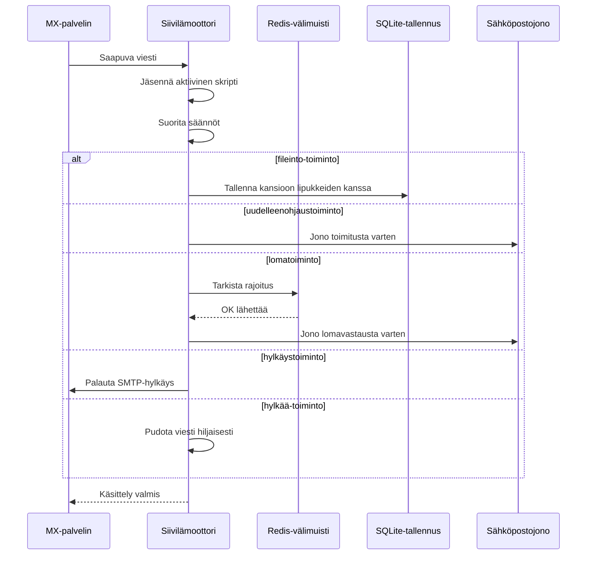

#### Turvaominaisuudet {#security-features}

Forward Emailn Siivilä-toteutus sisältää kattavat turvasuojaukset:

* **CVE-2023-26430-suojaus**: Estää uudelleenohjaussilmukat ja sähköpostipommitushyökkäykset
* **Rajoitukset**: Uudelleenohjauksille (10/viesti, 100/päivä) ja lomavastauksille asetetut rajat
* **Kieltolistatarkistus**: Uudelleenohjausosoitteet tarkistetaan kieltolistalta
* **Suojaetut otsikot**: DKIM-, ARC- ja todennusotsikoita ei voi muokata editheader-komennolla
* **Skriptin kokorajoitukset**: Maksimikoko pakotettu
* **Suoritusaikarajat**: Skriptit keskeytetään, jos suoritusaika ylittää rajan

#### Esimerkkisiiviläskriptit {#example-sieve-scripts}

**Tallenna uutiskirjeet kansioon:**

```sieve
require ["fileinto"];

if header :contains "List-Id" "newsletter" {
    fileinto "Newsletters";
}
```

**Lomavastaaja hienosäädetyllä ajoituksella:**

```sieve
require ["vacation", "vacation-seconds"];

vacation :seconds 3600 :subject "Poissa toimistolta"
    "Olen tällä hetkellä poissa ja vastaan 24 tunnin sisällä.";
```

**Roskapostisuodatus lipukkeilla:**

```sieve
require ["fileinto", "imap4flags"];

if header :contains "X-Spam-Status" "Yes" {
    setflag "\\Seen";
    fileinto "Junk";
}
```

**Monimutkainen suodatus muuttujilla:**

```sieve
require ["variables", "fileinto", "regex"];

if header :regex "From" "(.+)@example\\.com" {
    set :lower "sender" "${1}";
    fileinto "Contacts/${sender}";
}
```

> \[!TIP]
> Täydellistä dokumentaatiota, esimerkkiskriptejä ja konfigurointiohjeita varten katso [UKK: Tuetteko Siivilä-sähköpostisuodatusta?](/faq#do-you-support-sieve-email-filtering)

### ManageSieve (RFC 5804) {#managesieve-rfc-5804}

Forward Email tarjoaa täyden ManageSieve-protokollan tuen Siivilä-skriptien etähallintaan.

**Lähdekoodi:** [`managesieve-server.js`](https://github.com/forwardemail/forwardemail.net/blob/master/managesieve-server.js)

| RFC                                                       | Otsikko                                        | Tila           |
| --------------------------------------------------------- | ---------------------------------------------- | -------------- |
| [RFC 5804](https://datatracker.ietf.org/doc/html/rfc5804) | Protokolla Siivilä-skriptien etähallintaan    | ✅ Täysi tuki  |

#### ManageSieve-palvelimen asetukset {#managesieve-server-configuration}

| Asetus                  | Arvo                    |
| ----------------------- | ----------------------- |
| **Palvelin**            | `imap.forwardemail.net` |
| **Portti (STARTTLS)**   | `2190` (suositeltu)     |
| **Portti (implisiittinen TLS)** | `4190`           |
| **Todennus**            | PLAIN (TLS:n yli)       |

> **Huom:** Portti 2190 käyttää STARTTLS:ää (päivitys tavallisesta TLS:ään) ja on yhteensopiva useimpien ManageSieve-asiakkaiden kanssa, mukaan lukien [sieve-connect](https://github.com/philpennock/sieve-connect). Portti 4190 käyttää implisiittistä TLS:ää (TLS yhteyden alusta alkaen) asiakkaille, jotka tukevat sitä.

#### Tuetut ManageSieve-komennot {#supported-managesieve-commands}

| Komento        | Kuvaus                                  |
| -------------- | --------------------------------------- |
| `AUTHENTICATE` | Todennus PLAIN-mekanismilla             |
| `CAPABILITY`   | Palvelimen ominaisuuksien ja laajennusten lista |
| `HAVESPACE`    | Tarkista, voiko skripti tallentua       |
| `PUTSCRIPT`    | Lataa uusi skripti                      |
| `LISTSCRIPTS`  | Listaa kaikki skriptit aktiivisuustilalla |
| `SETACTIVE`    | Aktivoi skripti                         |
| `GETSCRIPT`    | Lataa skripti                          |
| `DELETESCRIPT` | Poista skripti                         |
| `RENAMESCRIPT` | Nimeä skripti uudelleen                 |
| `CHECKSCRIPT`  | Tarkista skriptin syntaksi              |
| `NOOP`         | Pidä yhteys elossa                     |
| `LOGOUT`       | Lopeta istunto                         |
#### Yhteensopivat ManageSieve-asiakkaat {#compatible-managesieve-clients}

* **Thunderbird**: Sisäänrakennettu Sieve-tuki [Sieve-lisäosan](https://addons.thunderbird.net/addon/sieve/) kautta
* **Roundcube**: [ManageSieve-laajennus](https://plugins.roundcube.net/packages/johndoh/sieve)
* **KMail**: Natiivisti ManageSieve-tuki
* **sieve-connect**: Komentoriviasiakas
* **Mikä tahansa RFC 5804 -yhteensopiva asiakas**

#### ManageSieve-protokollan kulku {#managesieve-protocol-flow}

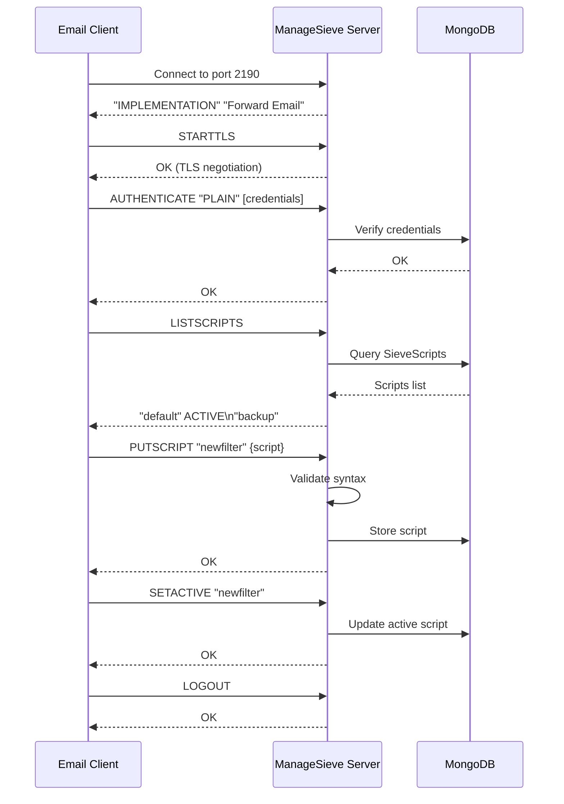

#### Verkkokäyttöliittymä ja API {#web-interface-and-api}

ManageSieve:n lisäksi Forward Email tarjoaa:

* **Verkkohallintapaneeli**: Luo ja hallinnoi Sieve-skriptejä verkkokäyttöliittymän kautta kohdassa Oma tili → Domainit → Aliaset → Sieve-skriptit
* **REST API**: Ohjelmallinen pääsy Sieve-skriptien hallintaan [Forward Email API:n](/api#sieve-scripts) kautta

> \[!TIP]
> Yksityiskohtaiset asennusohjeet ja asiakasohjelman asetukset löytyvät kohdasta [UKK: Tuetteko Sieve-sähköpostisuodatusta?](/faq#do-you-support-sieve-email-filtering)

---


## Tallennuksen optimointi {#storage-optimization}

> \[!IMPORTANT]
> **Alan ensimmäinen tallennusteknologia:** Forward Email on **ainoa sähköpostipalveluntarjoaja maailmassa**, joka yhdistää liitetiedostojen deduplikoinnin ja Brotli-pakkauksen sähköpostisisällössä. Tämä kaksikerroksinen optimointi tarjoaa sinulle **2-3-kertaisesti tehokkaamman tallennustilan** verrattuna perinteisiin sähköpostipalveluihin.

Forward Email toteuttaa kaksi vallankumouksellista tallennuksen optimointitekniikkaa, jotka pienentävät postilaatikon kokoa dramaattisesti säilyttäen täyden RFC-yhteensopivuuden ja viestin eheys:

1. **Liitetiedostojen deduplikointi** – Poistaa päällekkäiset liitteet kaikista sähköposteista
2. **Brotli-pakkaus** – Vähentää tallennustilaa 46–86 % metatiedoissa ja 50 % liitteissä

### Arkkitehtuuri: Kaksikerroksinen tallennuksen optimointi {#architecture-dual-layer-storage-optimization}

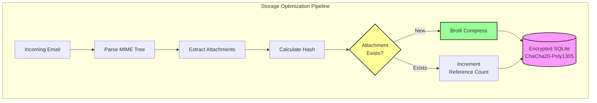

---


## Liitetiedostojen deduplikointi {#attachment-deduplication}

Forward Email toteuttaa liitetiedostojen deduplikoinnin perustuen [WildDuckin todistettuun lähestymistapaan](https://docs.wildduck.email/docs/in-depth/attachment-deduplication/), mukautettuna SQLite-tallennukseen.

> \[!NOTE]
> **Mikä deduplikointiin kuuluu:** "Liitetiedosto" tarkoittaa **koodattua** MIME-solmun sisältöä (base64 tai quoted-printable), ei purettua tiedostoa. Tämä säilyttää DKIM- ja GPG-allekirjoitusten pätevyyden.

### Miten se toimii {#how-it-works}

**WildDuckin alkuperäinen toteutus (MongoDB GridFS):**

> Wild Duck IMAP -palvelin deduplikoi liitteet. "Liitetiedosto" tässä tarkoittaa base64- tai quoted-printable-koodattua MIME-solmun sisältöä, ei purettua tiedostoa. Vaikka koodatun sisällön käyttäminen aiheuttaa paljon vääriä negatiiveja (sama tiedosto eri sähköposteissa saatetaan laskea eri liitteiksi), se on tarpeen eri allekirjoitusjärjestelmien (DKIM, GPG jne.) pätevyyden takaamiseksi. Wild Duckista haettu viesti näyttää täsmälleen samalta kuin tallennettu viesti, vaikka Wild Duck jäsentää viestin puumaiseksi objektiksi ja rakentaa viestin uudelleen haettaessa.
**Forward Emailn SQLite-toteutus:**

Forward Email soveltaa tätä lähestymistapaa salattuun SQLite-tallennukseen seuraavan prosessin avulla:

1. **Tiivisteen laskenta**: Kun liite löytyy, tiiviste lasketaan käyttämällä [`rev-hash`](https://github.com/sindresorhus/rev-hash) -kirjastoa liitteen sisällöstä
2. **Haku**: Tarkistetaan, onko `Attachments`-taulussa liitettä, jonka tiiviste vastaa
3. **Viittauslaskenta**:
   * Jos löytyy: Kasvatetaan viittauslaskuria yhdellä ja maagista laskuria satunnaisluvulla
   * Jos uusi: Luodaan uusi liite-merkintä laskurilla = 1
4. **Poiston turvallisuus**: Käyttää kaksilaskurijärjestelmää (viittaus + maaginen) väärien positiivisten estämiseksi
5. **Roskan keruu**: Liitteet poistetaan välittömästi, kun molemmat laskurit saavuttavat nollan

**Lähdekoodi:** [`helpers/attachment-storage.js`](https://github.com/forwardemail/forwardemail.net/blob/master/helpers/attachment-storage.js)

### Dedupikointivirtaus {#deduplication-flow}

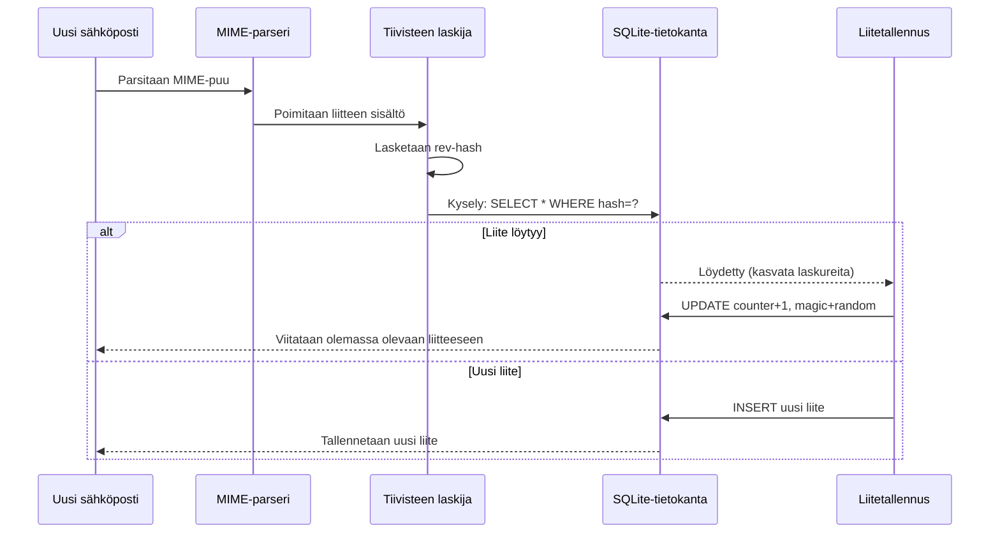

### Maaginen lukujärjestelmä {#magic-number-system}

Forward Email käyttää WildDuckin "maaginen luku" -järjestelmää (inspiroitunut [Mail.ru:sta](https://github.com/zone-eu/wildduck)) väärien positiivisten estämiseksi poistojen aikana:

* Jokaiselle viestille annetaan **satunnainen luku**
* Liitteen **maaginen laskuri** kasvaa sillä satunnaisluvulla, kun viesti lisätään
* Maaginen laskuri vähenee samalla luvulla, kun viesti poistetaan
* Liite poistetaan vain, kun **molemmat laskurit** (viittaus + maaginen) ovat nollassa

Tämä kaksilaskurijärjestelmä varmistaa, että jos poistossa tapahtuu virhe (esim. kaatuminen, verkkovirhe), liitettä ei poisteta ennenaikaisesti.

### Keskeiset erot: WildDuck vs Forward Email {#key-differences-wildduck-vs-forward-email}

| Ominaisuus             | WildDuck (MongoDB)        | Forward Email (SQLite)       |
| ---------------------- | ------------------------- | ---------------------------- |
| **Tallennustausta**    | MongoDB GridFS (paloiteltu) | SQLite BLOB (suora)          |
| **Tiivistealgoritmi**  | SHA256                    | rev-hash (SHA-256-pohjainen) |
| **Viittauslaskenta**   | ✅ Kyllä                  | ✅ Kyllä                     |
| **Maagiset luvut**     | ✅ Kyllä (Mail.ru inspiroima) | ✅ Kyllä (sama järjestelmä)  |
| **Roskan keruu**       | Viivästetty (erillinen työ) | Välitön (kun laskurit nollassa) |
| **Pakkaus**            | ❌ Ei lainkaan            | ✅ Brotli (katso alla)        |
| **Salaus**             | ❌ Valinnainen            | ✅ Aina (ChaCha20-Poly1305)   |

---


## Brotli-pakkaus {#brotli-compression}

> \[!IMPORTANT]
> **Maailman ensimmäinen:** Forward Email on **ainoa sähköpostipalvelu maailmassa**, joka käyttää Brotli-pakkausta sähköpostin sisällössä. Tämä tarjoaa **46–86 % tallennussäästöä** liitteiden deduplikoinnin lisäksi.

Forward Email toteuttaa Brotli-pakkauksen sekä liitteiden sisällöille että viestien metatiedoille, tarjoten valtavia tallennussäästöjä säilyttäen taaksepäin yhteensopivuuden.

**Toteutus:** [`helpers/msgpack-helpers.js`](https://github.com/forwardemail/forwardemail.net/blob/master/helpers/msgpack-helpers.js)

### Mitä pakataan {#what-gets-compressed}

**1. Liitteiden sisällöt** (`encodeAttachmentBody`)

* **Vanhat muodot**: Hex-koodattu merkkijono (2x koko) tai raakadata Bufferina
* **Uusi muoto**: Brotli-pakattu Buffer, jossa "FEBR" maaginen otsikko
* **Pakkauspäätös**: Pakkaa vain, jos säästää tilaa (ottaa huomioon 4 tavun otsikon)
* **Tallennussäästö**: Jopa **50 %** (hex → natiivi BLOB)
**2. Viestin metatiedot** (`encodeMetadata`)

Sisältää: `mimeTree`, `headers`, `envelope`, `flags`

* **Vanha formaatti**: JSON-tekstimerkkijono
* **Uusi formaatti**: Brotli-pakattu Buffer
* **Tallennussäästö**: **46-86%** viestin monimutkaisuudesta riippuen

### Pakkausasetukset {#compression-configuration}

```javascript
// Brotli-pakkausasetukset optimoitu nopeudelle (taso 4 on hyvä tasapaino)
const BROTLI_COMPRESS_OPTIONS = {
  params: {
    [zlib.constants.BROTLI_PARAM_QUALITY]: 4
  }
};
```

**Miksi taso 4?**

* **Nopea pakkaus/purku**: Prosessointi alle millisekunnissa
* **Hyvä pakkaussuhde**: 46-86% säästöä
* **Tasapainoinen suorituskyky**: Optimaalinen reaaliaikaisiin sähköpostitoimintoihin

### Taikapääte: "FEBR" {#magic-header-febr}

Forward Email käyttää 4 tavun taikapäätettä tunnistaakseen pakatut liitetiedostojen rungot:

```
"FEBR" = Forward Email BRotli
Hex: 0x46 0x45 0x42 0x52
```

**Miksi taikapääte?**

* **Formaatin tunnistus**: Tunnistaa välittömästi pakatun vs. pakkaamattoman datan
* **Taaksepäin yhteensopiva**: Vanhat heksamerkkijonot ja raakabufferit toimivat edelleen
* **Ristiriitojen välttäminen**: "FEBR" on epätodennäköinen esiintyä laillisessa liitetiedostodatassa alussa

### Pakkausprosessi {#compression-process}

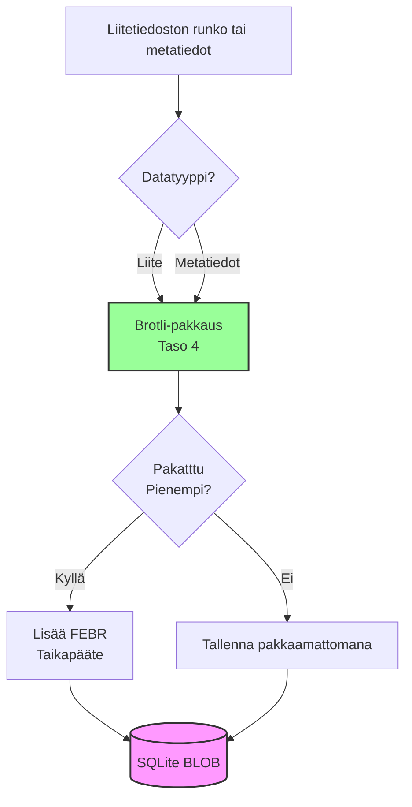

### Purkuprosessi {#decompression-process}

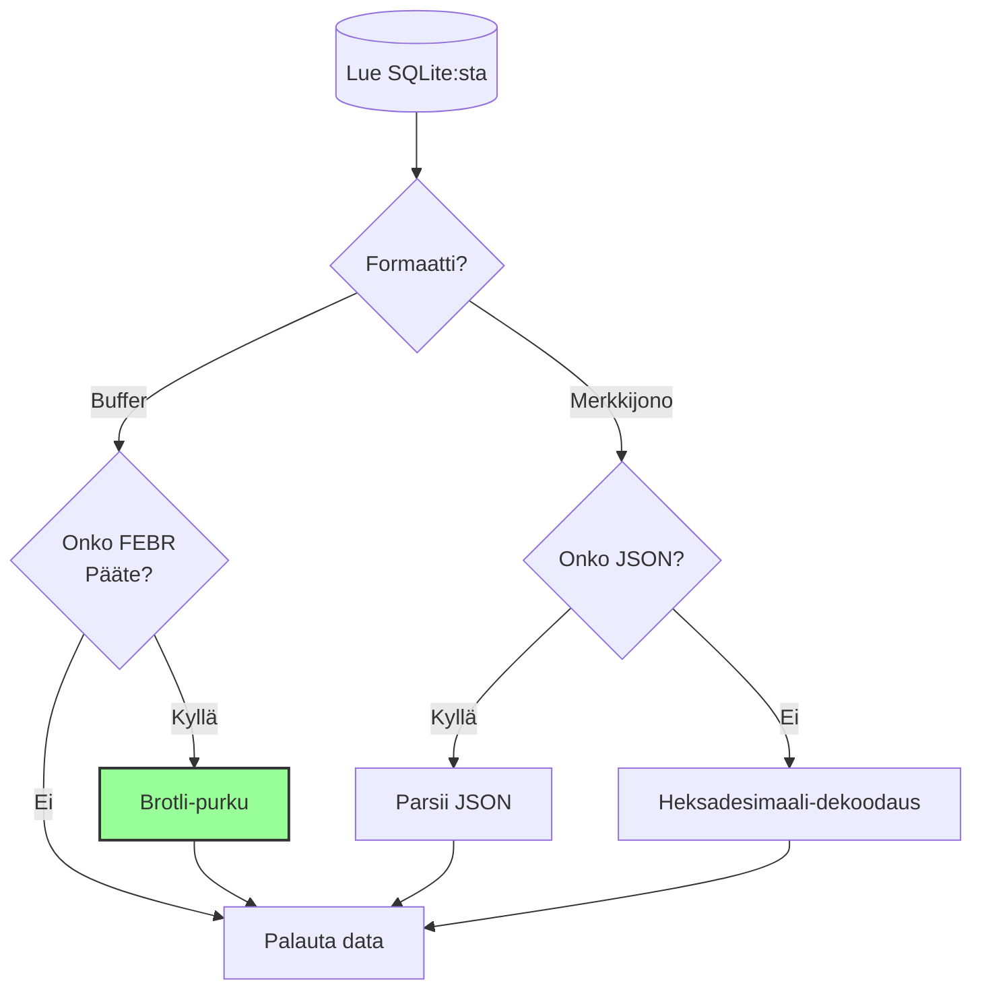

### Taaksepäin yhteensopivuus {#backwards-compatibility}

Kaikki purkutoiminnot **tunnistavat automaattisesti** tallennusformaatin:

| Formaatti             | Tunnistusmenetelmä                   | Käsittely                                     |
| --------------------- | ----------------------------------- | --------------------------------------------- |
| **Brotli-pakattu**    | Tarkista "FEBR" taikapääte          | Pura `zlib.brotliDecompressSync()`-funktiolla |
| **Raakabufferi**      | `Buffer.isBuffer()` ilman taikapäätettä | Palauta sellaisenaan                          |
| **Heksamerkkijono**   | Tarkista parillinen pituus + [0-9a-f] merkit | Dekoodaa `Buffer.from(value, 'hex')`-funktiolla |
| **JSON-merkkijono**   | Tarkista ensimmäinen merkki `{` tai `[` | Parsii `JSON.parse()`-funktiolla              |

Tämä varmistaa **nolla tietohäviön** siirryttäessä vanhoista uusiin tallennusformaatteihin.

### Tallennussäästötilastot {#storage-savings-statistics}

**Mittaustulokset tuotantodatalta:**

| Datatyyppi            | Vanha formaatti          | Uusi formaatti         | Säästö      |
| --------------------- | ------------------------ | ---------------------- | ---------- |
| **Liitetiedostojen rungot** | Hekso-koodattu merkkijono (2x) | Brotli-pakattu BLOB    | **50%**    |
| **Viestin metatiedot** | JSON-teksti              | Brotli-pakattu BLOB    | **46-86%** |
| **Postilaatikon liput** | JSON-teksti              | Brotli-pakattu BLOB    | **60-80%** |

**Lähde:** [`helpers/migrate-storage-format.js`](https://github.com/forwardemail/forwardemail.net/blob/master/helpers/migrate-storage-format.js)

### Siirtoprosessi {#migration-process}

Forward Email tarjoaa automaattisen, idempotentin siirron vanhoista uusiin tallennusformaatteihin:
// Seuratut migraatiotilastot:
{
  attachmentsMigrated: 0,
  messagesMigrated: 0,
  mailboxesMigrated: 0,
  bytesSaved: 0  // Kokonaismäärä tallennettua tavua pakkaamisen ansiosta
}
```

**Migraatiovaiheet:**

1. Liitetiedostojen sisällöt: heksakoodaus → natiivinen BLOB (50 % säästö)
2. Viestien metatiedot: JSON-teksti → brotli-pakattu BLOB (46–86 % säästö)
3. Postilaatikon liput: JSON-teksti → brotli-pakattu BLOB (60–80 % säästö)

**Lähde:** [`helpers/migrate-storage-format.js`](https://github.com/forwardemail/forwardemail.net/blob/master/helpers/migrate-storage-format.js)

---

### Yhdistetty tallennustehokkuus {#combined-storage-efficiency}

> \[!TIP]
> **Todellinen vaikutus:** Liitetiedostojen duplikaattien poiston ja Brotli-pakkauksen ansiosta Forward Emailin käyttäjät saavat **2–3-kertaisesti tehokkaamman tallennustilan** verrattuna perinteisiin sähköpostipalveluihin.

**Esimerkkitilanne:**

Perinteinen sähköpostipalvelu (1 Gt postilaatikko):

* 1 Gt levytilaa = 1 Gt sähköposteja
* Ei duplikaattien poistoa: Sama liite tallennetaan 10 kertaa = 10-kertainen tallennushukka
* Ei pakkausta: Täysi JSON-metatieto tallennetaan = 2–3-kertainen tallennushukka

Forward Email (1 Gt postilaatikko):

* 1 Gt levytilaa ≈ **2–3 Gt sähköposteja** (tehokas tallennus)
* Duplikaattien poisto: Sama liite tallennetaan kerran, viitataan 10 kertaa
* Pakkaus: 46–86 % säästö metatiedoissa, 50 % liitteissä
* Salaus: ChaCha20-Poly1305 (ei tallennusylijäämää)

**Vertailutaulukko:**

| Palveluntarjoaja  | Tallennusteknologia                          | Tehokas tallennus (1 Gt postilaatikko) |
| ----------------- | -------------------------------------------- | ------------------------------------- |
| Gmail             | Ei mitään                                   | 1 Gt                                  |
| iCloud            | Ei mitään                                   | 1 Gt                                  |
| Outlook.com       | Ei mitään                                   | 1 Gt                                  |
| Fastmail          | Ei mitään                                   | 1 Gt                                  |
| ProtonMail        | Vain salaus                                | 1 Gt                                  |
| Tutanota          | Vain salaus                                | 1 Gt                                  |
| **Forward Email** | **Duplikaattien poisto + pakkaus + salaus** | **2–3 Gt** ✨                         |

### Tekninen toteutus {#technical-implementation-details}

**Suorituskyky:**

* Brotli taso 4: Alle millisekunnin pakkaus/purku
* Ei suorituskyvyn heikkenemistä pakkauksesta
* SQLite FTS5: Alle 50 ms haku NVMe SSD:llä

**Turvallisuus:**

* Pakkaus tapahtuu **salauksen jälkeen** (SQLite-tietokanta on salattu)
* ChaCha20-Poly1305 -salauksen ja Brotli-pakkauksen yhdistelmä
* Nollatietoinen: Vain käyttäjällä on purkusalasana

**RFC-yhteensopivuus:**

* Haetut viestit näyttävät **täsmälleen samalta** kuin tallennettuina
* DKIM-allekirjoitukset pysyvät voimassa (koodattu sisältö säilyy)
* GPG-allekirjoitukset pysyvät voimassa (allekirjoitettua sisältöä ei muuteta)

### Miksi muut palveluntarjoajat eivät tee näin {#why-no-other-provider-does-this}

**Monimutkaisuus:**

* Vaatii syvää integraatiota tallennustasoon
* Taaksepäin yhteensopivuus on haastavaa
* Vanhojen formaattien migraatio on monimutkaista

**Suorituskykyhuolet:**

* Pakkaus lisää CPU-kuormaa (ratkaistu Brotli tason 4 avulla)
* Purku jokaisella lukukerralla (ratkaistu SQLite-välimuistilla)

**Forward Emailin etu:**

* Rakennettu alusta alkaen optimointia ajatellen
* SQLite mahdollistaa suoran BLOB-käsittelyn
* Käyttäjäkohtaiset salatut tietokannat mahdollistavat turvallisen pakkauksen

---

---


## Modernit ominaisuudet {#modern-features}


## Täydellinen REST API sähköpostinhallintaan {#complete-rest-api-for-email-management}

> \[!TIP]
> Forward Email tarjoaa kattavan REST API:n, jossa on 39 päätepistettä ohjelmalliseen sähköpostinhallintaan.

> \[!TIP]
> **Ainutlaatuinen toimialaominaisuus:** Toisin kuin mikään muu sähköpostipalvelu, Forward Email tarjoaa täydellisen ohjelmallisen pääsyn postilaatikkoosi, kalenteriisi, yhteystietoihisi, viesteihisi ja kansioihisi kattavan REST API:n kautta. Tämä on suoraa vuorovaikutusta salatun SQLite-tietokantatiedostosi kanssa, joka tallentaa kaikki tietosi.

Forward Email tarjoaa täydellisen REST API:n, joka antaa ennennäkemättömän pääsyn sähköpostitietoihisi. Mikään muu sähköpostipalvelu (mukaan lukien Gmail, iCloud, Outlook, ProtonMail, Tuta tai Fastmail) ei tarjoa tätä tasoa kattavaa, suoraa tietokantayhteyttä.
**API-dokumentaatio:** <https://forwardemail.net/en/email-api>

### API-kategoriat (39 päätepistettä) {#api-categories-39-endpoints}

**1. Viestit API** (5 päätepistettä) - Täydelliset CRUD-toiminnot sähköpostiviesteille:

* `GET /v1/messages` - Listaa viestit 15+ edistyneellä hakuehdolla (ei mikään muu palvelu tarjoa tätä)
* `POST /v1/messages` - Luo/lähetä viestejä
* `GET /v1/messages/:id` - Hae viesti
* `PUT /v1/messages/:id` - Päivitä viesti (liput, kansiot)
* `DELETE /v1/messages/:id` - Poista viesti

*Esimerkki: Etsi kaikki viime neljänneksen laskut liitteineen:*

```bash
curl -u "alias@domain.com:password" \
  "https://api.forwardemail.net/v1/messages?q=subject:invoice+has:attachment+after:2024-01-01+before:2024-04-01"
```

Katso [Edistyneen haun dokumentaatio](https://forwardemail.net/en/email-api)

**2. Kansiot API** (5 päätepistettä) - Täydellinen IMAP-kansiomanagement RESTin kautta:

* `GET /v1/folders` - Listaa kaikki kansiot
* `POST /v1/folders` - Luo kansio
* `GET /v1/folders/:id` - Hae kansio
* `PUT /v1/folders/:id` - Päivitä kansio
* `DELETE /v1/folders/:id` - Poista kansio

**3. Yhteystiedot API** (5 päätepistettä) - CardDAV-yhteystietojen tallennus RESTin kautta:

* `GET /v1/contacts` - Listaa yhteystiedot
* `POST /v1/contacts` - Luo yhteystieto (vCard-muodossa)
* `GET /v1/contacts/:id` - Hae yhteystieto
* `PUT /v1/contacts/:id` - Päivitä yhteystieto
* `DELETE /v1/contacts/:id` - Poista yhteystieto

**4. Kalenterit API** (5 päätepistettä) - Kalenterikonttien hallinta:

* `GET /v1/calendars` - Listaa kalenterikontit
* `POST /v1/calendars` - Luo kalenteri (esim. "Työkalenteri", "Henkilökohtainen kalenteri")
* `GET /v1/calendars/:id` - Hae kalenteri
* `PUT /v1/calendars/:id` - Päivitä kalenteri
* `DELETE /v1/calendars/:id` - Poista kalenteri

**5. Kalenteritapahtumat API** (5 päätepistettä) - Tapahtumien aikataulutus kalentereissa:

* `GET /v1/calendar-events` - Listaa tapahtumat
* `POST /v1/calendar-events` - Luo tapahtuma osallistujineen
* `GET /v1/calendar-events/:id` - Hae tapahtuma
* `PUT /v1/calendar-events/:id` - Päivitä tapahtuma
* `DELETE /v1/calendar-events/:id` - Poista tapahtuma

*Esimerkki: Luo kalenteritapahtuma:*

```bash
curl -u "alias@domain.com:password" \
  -X POST \
  -H "Content-Type: application/json" \
  -d '{"title":"Tiimipalaveri","start":"2024-12-20T10:00:00Z","attendees":["team@example.com"],"calendar_id":"calendar123"}' \
  https://api.forwardemail.net/v1/calendar-events
```

### Tekniset tiedot {#technical-details}

* **Autentikointi:** Yksinkertainen `alias:password` -autentikointi (ei OAuth-kompleksisuutta)
* **Suorituskyky:** Alle 50 ms vasteajat SQLite FTS5:llä ja NVMe SSD -tallennuksella
* **Nolla verkkoviive:** Suora tietokantayhteys, ei välityspalveluita

### Käytännön käyttötapaukset {#real-world-use-cases}

* **Sähköpostianalytiikka:** Rakenna räätälöityjä kojelautoja sähköpostimäärien, vastausaikojen ja lähettäjätilastojen seurantaan

* **Automaattiset työnkulut:** Käynnistä toimintoja sähköpostin sisällön perusteella (laskujen käsittely, tukipyyntöjen hallinta)

* **CRM-integraatio:** Synkronoi sähköpostikeskustelut CRM-järjestelmääsi automaattisesti

* **Säädösten noudattaminen & tiedonhaku:** Hae ja vie sähköposteja oikeudellisiin ja säädösten vaatimuksiin

* **Mukautetut sähköpostiohjelmat:** Rakenna erikoistuneita sähköpostikäyttöliittymiä työnkulullesi

* **Liiketoimintatiedon hallinta:** Analysoi viestintämalleja, vastausprosentteja ja asiakasvuorovaikutusta

* **Dokumenttien hallinta:** Tallenna ja luokittele liitteet automaattisesti

* [Täydellinen dokumentaatio](https://forwardemail.net/en/email-api)

* [Täydellinen API-viite](https://forwardemail.net/en/email-api)

* [Edistyneen haun opas](https://forwardemail.net/en/email-api)

* [30+ integraatioesimerkkiä](https://forwardemail.net/en/email-api)

* [Tekninen arkkitehtuuri](https://forwardemail.net/en/blog/docs/best-quantum-safe-encrypted-email-service)

Forward Email tarjoaa modernin REST API:n, joka antaa täydellisen hallinnan sähköpostitileihin, domaineihin, aliaksiiin ja viesteihin. Tämä API on tehokas vaihtoehto JMAP:lle ja tarjoaa toiminnallisuutta perinteisten sähköpostiprotokollien ulkopuolella.

| Kategoria               | Päätepisteet | Kuvaus                                |
| ----------------------- | ------------ | ------------------------------------ |
| **Tilinhallinta**       | 8            | Käyttäjätilit, autentikointi, asetukset |
| **Domainhallinta**      | 12           | Mukautetut domainit, DNS, vahvistus  |
| **Alias-hallinta**      | 6            | Sähköpostialiakset, edelleenlähetys, catch-all |
| **Viestinhallinta**     | 7            | Lähetä, vastaanota, hae, poista viestejä |
| **Kalenterit & yhteystiedot** | 4      | CalDAV/CardDAV-käyttö API:n kautta   |
| **Lokit & analytiikka** | 2            | Sähköpostilokit, toimitusraportit    |
### Tärkeimmät API-ominaisuudet {#key-api-features}

**Edistynyt haku:**

API tarjoaa tehokkaat hakutoiminnot kyselysyntaksilla, joka on samanlainen kuin Gmailissa:

```
GET /v1/messages?q=subject:invoice+has:attachment+after:2024-01-01+before:2024-04-01
```

**Tuetut hakutoiminnot:**

* `from:` - Haku lähettäjän mukaan
* `to:` - Haku vastaanottajan mukaan
* `subject:` - Haku aiheen mukaan
* `has:attachment` - Viestit, joissa on liitteitä
* `is:unread` - Lukemattomat viestit
* `is:starred` - Tähdellä merkityt viestit
* `after:` - Viestit päivämäärän jälkeen
* `before:` - Viestit päivämäärän ennen
* `label:` - Viestit, joissa on tunniste
* `filename:` - Liitteen tiedostonimi

**Kalenteritapahtumien hallinta:**

```
GET /v1/calendar-events
POST /v1/calendar-events
PUT /v1/calendar-events/:id
DELETE /v1/calendar-events/:id
```

**Webhook-integraatiot:**

API tukee webhookkeja sähköpostitapahtumien (vastaanotetut, lähetetyt, palautuneet jne.) reaaliaikaiseen ilmoittamiseen.

**Autentikointi:**

* API-avaimen autentikointi
* OAuth 2.0 -tuki
* Kyselyrajoitus: 1000 pyyntöä/tunti

**Tietomuoto:**

* JSON-pyyntö/vastaus
* RESTful-suunnittelu
* Sivutus tuki

**Turvallisuus:**

* Vain HTTPS
* API-avaimen kierto
* IP-valkoinen lista (valinnainen)
* Pyyntöjen allekirjoitus (valinnainen)

### API-arkkitehtuuri {#api-architecture}

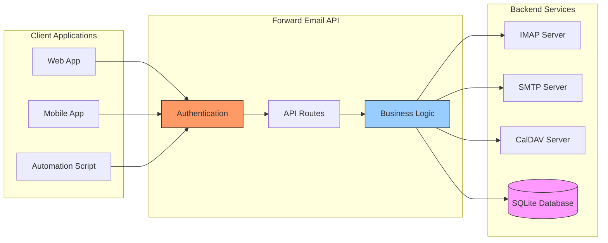

---


## iOS-push-ilmoitukset {#ios-push-notifications}

> \[!TIP]
> Forward Email tukee natiivisti iOS-push-ilmoituksia XAPPLEPUSHSERVICE:n kautta välittömään sähköpostin toimitukseen.

> \[!IMPORTANT]
> **Ainutlaatuinen ominaisuus:** Forward Email on yksi harvoista avoimen lähdekoodin sähköpostipalvelimista, joka tukee natiivisti iOS-push-ilmoituksia sähköposteille, yhteystiedoille ja kalentereille `XAPPLEPUSHSERVICE` IMAP-laajennuksen kautta. Tämä on käännetty Applen protokollasta ja tarjoaa välittömän toimituksen iOS-laitteille ilman akun kulutusta.

Forward Email toteuttaa Applen omistaman XAPPLEPUSHSERVICE-laajennuksen, joka tarjoaa natiivin push-ilmoitustuen iOS-laitteille ilman taustakyselyjä.

### Kuinka se toimii {#how-it-works-1}

**XAPPLEPUSHSERVICE** on ei-standardi IMAP-laajennus, joka mahdollistaa iOS Mail -sovellukselle välittömät push-ilmoitukset uusista saapuvista sähköposteista.

Forward Email toteuttaa Applen Push Notification Service (APNs) -integraation IMAP:lle, jolloin iOS Mail -sovellus saa välittömät push-ilmoitukset uusista saapuvista sähköposteista.

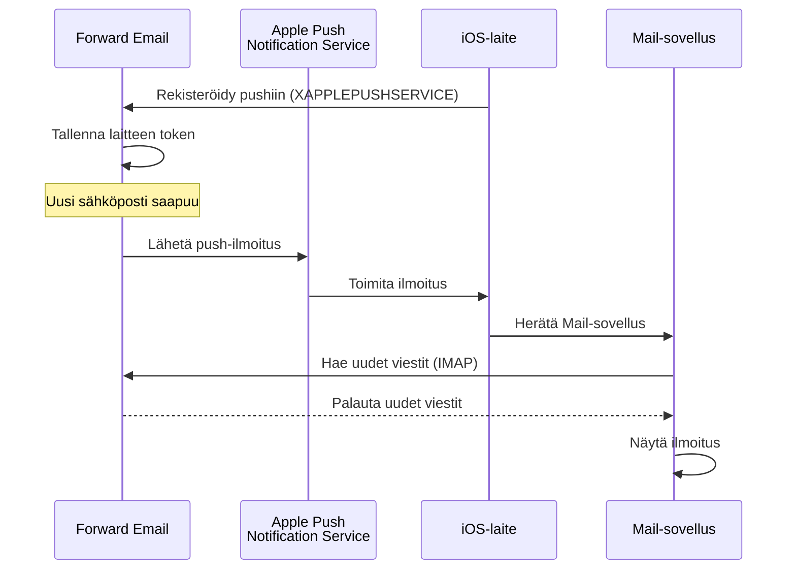

### Keskeiset ominaisuudet {#key-features}

**Välitön toimitus:**

* Push-ilmoitukset saapuvat sekunneissa
* Ei akkua kuluttavaa taustakyselyä
* Toimii myös Mail-sovelluksen ollessa suljettuna

<!---->

* **Välitön toimitus:** Sähköpostit, kalenteritapahtumat ja yhteystiedot näkyvät iPhonessa/iPadissa heti, eivät kyselyaikataulun mukaan
* **Akkua säästävä:** Käyttää Applen push-infrastruktuuria jatkuvien IMAP-yhteyksien ylläpidon sijaan
* **Aihekohtaiset pushit:** Tukee push-ilmoituksia tietyille postilaatikoille, ei pelkästään INBOXille
* **Ei kolmannen osapuolen sovelluksia:** Toimii natiivien iOS Mail-, Kalenteri- ja Yhteystiedot-sovellusten kanssa
**Natiivinen integraatio:**

* Sisäänrakennettu iOS Mail -sovellukseen
* Ei kolmannen osapuolen sovelluksia vaadita
* Saumaton käyttäjäkokemus

**Tietosuoja painottuu:**

* Laitetunnukset ovat salattuja
* Viestin sisältöä ei lähetetä APNS:n kautta
* Vain "uusi posti" -ilmoitus lähetetään

**Akun säästö:**

* Ei jatkuvaa IMAP-kyselyä
* Laite nukkuu, kunnes ilmoitus saapuu
* Minimivaikutus akkuun

### Mikä tekee tästä erityisen {#what-makes-this-special}

> \[!IMPORTANT]
> Useimmat sähköpostipalveluntarjoajat eivät tue XAPPLEPUSHSERVICE:a, mikä pakottaa iOS-laitteet kyselyyn uuden postin varalta 15 minuutin välein.

Useimmat avoimen lähdekoodin sähköpostipalvelimet (mukaan lukien Dovecot, Postfix, Cyrus IMAP) EIVÄT tue iOS-push-ilmoituksia. Käyttäjien on joko:

* Käytettävä IMAP IDLE -tilaa (pitää yhteyden avoinna, kuluttaa akkua)
* Käytettävä kyselyä (tarkistaa 15-30 minuutin välein, viivästyneet ilmoitukset)
* Käytettävä omia push-infrastruktuureja sisältäviä sähköpostisovelluksia

Forward Email tarjoaa saman välittömän push-ilmoituskokemuksen kuin kaupalliset palvelut kuten Gmail, iCloud ja Fastmail.

**Vertailu muihin palveluntarjoajiin:**

| Palveluntarjoaja  | Push-tuki      | Kyselyväli       | Akkuvaikutus   |
| ----------------- | -------------- | ---------------- | -------------- |
| **Forward Email** | ✅ Natiivipush | Välitön          | Minimivaikutus |
| Gmail             | ✅ Natiivipush | Välitön          | Minimivaikutus |
| iCloud            | ✅ Natiivipush | Välitön          | Minimivaikutus |
| Yahoo             | ✅ Natiivipush | Välitön          | Minimivaikutus |
| Outlook.com       | ❌ Kysely      | 15 minuuttia     | Kohtalainen    |
| Fastmail          | ❌ Kysely      | 15 minuuttia     | Kohtalainen    |
| ProtonMail        | ⚠️ Vain silta  | Siltaa käyttäen  | Korkea        |
| Tutanota          | ❌ Vain sovellus | Ei sovellu      | Ei sovellu    |

### Toteutuksen yksityiskohdat {#implementation-details}

**IMAP CAPABILITY -vastaus:**

```
* CAPABILITY IMAP4rev1 ... XAPPLEPUSHSERVICE ...
```

**Rekisteröitymisprosessi:**

1. iOS Mail -sovellus havaitsee XAPPLEPUSHSERVICE-ominaisuuden
2. Sovellus rekisteröi laitetunnuksen Forward Emailille
3. Forward Email tallentaa tunnuksen ja liittää sen tiliin
4. Kun uutta postia saapuu, Forward Email lähettää push-ilmoituksen APNS:n kautta
5. iOS herättää Mail-sovelluksen hakemaan uudet viestit

**Turvallisuus:**

* Laitetunnukset ovat salattuina levossa
* Tunnukset vanhenevat ja päivittyvät automaattisesti
* Viestin sisältöä ei paljasteta APNS:lle
* Päätepisteestä päätepisteeseen -salauksen säilyttäminen

<!---->

* **IMAP-laajennus:** `XAPPLEPUSHSERVICE`
* **Lähdekoodi:** [WildDuck Issue #711](https://github.com/zone-eu/wildduck/issues/711)
* **Asennus:** Automaattinen - ei konfigurointia, toimii suoraan iOS Mail -sovelluksen kanssa

### Vertailu muihin palveluihin {#comparison-with-other-services}

| Palvelu       | iOS Push -tuki | Menetelmä                                  |
| ------------- | -------------- | ------------------------------------------ |
| Forward Email | ✅ Kyllä       | `XAPPLEPUSHSERVICE` (käänteinen suunnittelu) |
| Gmail         | ✅ Kyllä       | Gmailin oma sovellus + Google push         |
| iCloud Mail   | ✅ Kyllä       | Natiivinen Apple-integraatio               |
| Outlook.com   | ✅ Kyllä       | Outlookin oma sovellus + Microsoft push    |
| Fastmail      | ✅ Kyllä       | `XAPPLEPUSHSERVICE`                         |
| Dovecot       | ❌ Ei         | Vain IMAP IDLE tai kysely                   |
| Postfix       | ❌ Ei         | Vain IMAP IDLE tai kysely                   |
| Cyrus IMAP    | ❌ Ei         | Vain IMAP IDLE tai kysely                   |

**Gmail Push:**

Gmail käyttää omaa push-järjestelmää, joka toimii vain Gmail-sovelluksen kanssa. iOS Mail -sovellus joutuu kyselyyn Gmailin IMAP-palvelimille.

**iCloud Push:**

iCloudilla on natiivinen push-tuki, joka on samanlainen kuin Forward Emaililla, mutta vain @icloud.com-osoitteille.

**Outlook.com:**

Outlook.com ei tue XAPPLEPUSHSERVICE:a, joten iOS Mail joutuu kyselyyn 15 minuutin välein.

**Fastmail:**

Fastmail ei tue XAPPLEPUSHSERVICE:a. Käyttäjien on käytettävä Fastmail-sovellusta push-ilmoituksiin tai hyväksyttävä 15 minuutin kyselyviiveet.

---


## Testaus ja varmennus {#testing-and-verification}


## Protokollan ominaisuustestit {#protocol-capability-tests}
> \[!NOTE]
> Tämä osio sisältää uusimpien protokollakyvykkyystestien tulokset, jotka suoritettiin 22. tammikuuta 2026.

Tämä osio sisältää todelliset CAPABILITY/CAPA/EHLO-vastaukset kaikilta testatuista palveluntarjoajilta. Kaikki testit suoritettiin **22. tammikuuta 2026**.

Nämä testit auttavat varmistamaan eri sähköpostiprotokollien ja laajennusten ilmoitetun ja todellisen tuen suurimpien palveluntarjoajien kesken.

### Testausmenetelmä {#test-methodology}

**Testausympäristö:**

* **Päivämäärä:** 22. tammikuuta 2026 klo 02:37 UTC
* **Sijainti:** AWS EC2 -instanssi
* **IPv4:** 54.167.216.197
* **IPv6:** 2600:4040:46da:9a00:b19e:3ad4:426c:2f48
* **Työkalut:** OpenSSL s_client, bash-skriptit

**Testatut palveluntarjoajat:**

* Forward Email
* Gmail
* Outlook.com
* iCloud
* Fastmail
* Yahoo/AOL (Verizon)

### Testauskriptit {#test-scripts}

Täyden läpinäkyvyyden vuoksi alla on tarkat testauksessa käytetyt skriptit.

#### IMAP-kyvykkyystesti-skripti {#imap-capability-test-script}

```bash
#!/bin/bash
# IMAP Capability Test Script
# Tests IMAP CAPABILITY for various email providers

echo "========================================="
echo "IMAP CAPABILITY TEST"
echo "Date: $(date -u +"%Y-%m-%d %H:%M:%S UTC")"
echo "========================================="
echo ""

# Gmail
echo "--- Gmail (imap.gmail.com:993) ---"
echo -e "a001 CAPABILITY\na002 LOGOUT" | timeout 10 openssl s_client -connect imap.gmail.com:993 -crlf -quiet 2>&1 | grep -A 20 "CAPABILITY"
echo ""

# Outlook.com
echo "--- Outlook.com (outlook.office365.com:993) ---"
echo -e "a001 CAPABILITY\na002 LOGOUT" | timeout 10 openssl s_client -connect outlook.office365.com:993 -crlf -quiet 2>&1 | grep -A 20 "CAPABILITY"
echo ""

# iCloud
echo "--- iCloud (imap.mail.me.com:993) ---"
echo -e "a001 CAPABILITY\na002 LOGOUT" | timeout 10 openssl s_client -connect imap.mail.me.com:993 -crlf -quiet 2>&1 | grep -A 20 "CAPABILITY"
echo ""

# Fastmail
echo "--- Fastmail (imap.fastmail.com:993) ---"
echo -e "a001 CAPABILITY\na002 LOGOUT" | timeout 10 openssl s_client -connect imap.fastmail.com:993 -crlf -quiet 2>&1 | grep -A 20 "CAPABILITY"
echo ""

# Yahoo
echo "--- Yahoo (imap.mail.yahoo.com:993) ---"
echo -e "a001 CAPABILITY\na002 LOGOUT" | timeout 10 openssl s_client -connect imap.mail.yahoo.com:993 -crlf -quiet 2>&1 | grep -A 20 "CAPABILITY"
echo ""

# Forward Email
echo "--- Forward Email (imap.forwardemail.net:993) ---"
echo -e "a001 CAPABILITY\na002 LOGOUT" | timeout 10 openssl s_client -connect imap.forwardemail.net:993 -crlf -quiet 2>&1 | grep -A 20 "CAPABILITY"
echo ""

echo "========================================="
echo "Test completed"
echo "========================================="
```

#### POP3-kyvykkyystesti-skripti {#pop3-capability-test-script}

```bash
#!/bin/bash
# POP3 Capability Test Script
# Tests POP3 CAPA for various email providers

echo "========================================="
echo "POP3 CAPABILITY TEST"
echo "Date: $(date -u +"%Y-%m-%d %H:%M:%S UTC")"
echo "========================================="
echo ""

# Gmail
echo "--- Gmail (pop.gmail.com:995) ---"
echo -e "CAPA\nQUIT" | timeout 10 openssl s_client -connect pop.gmail.com:995 -crlf -quiet 2>&1 | grep -A 20 "CAPA"
echo ""

# Outlook.com
echo "--- Outlook.com (outlook.office365.com:995) ---"
echo -e "CAPA\nQUIT" | timeout 10 openssl s_client -connect outlook.office365.com:995 -crlf -quiet 2>&1 | grep -A 20 "CAPA"
echo ""

# iCloud (Huom: iCloud ei tue POP3:ta)
echo "--- iCloud (Ei POP3-tukea) ---"
echo "iCloud ei tue POP3:ta"
echo ""

# Fastmail
echo "--- Fastmail (pop.fastmail.com:995) ---"
echo -e "CAPA\nQUIT" | timeout 10 openssl s_client -connect pop.fastmail.com:995 -crlf -quiet 2>&1 | grep -A 20 "CAPA"
echo ""

# Yahoo
echo "--- Yahoo (pop.mail.yahoo.com:995) ---"
echo -e "CAPA\nQUIT" | timeout 10 openssl s_client -connect pop.mail.yahoo.com:995 -crlf -quiet 2>&1 | grep -A 20 "CAPA"
echo ""

# Forward Email
echo "--- Forward Email (pop3.forwardemail.net:995) ---"
echo -e "CAPA\nQUIT" | timeout 10 openssl s_client -connect pop3.forwardemail.net:995 -crlf -quiet 2>&1 | grep -A 20 "CAPA"
echo ""

echo "========================================="
echo "Test completed"
echo "========================================="
```
#### SMTP Capability Test Script {#smtp-capability-test-script}

```bash
#!/bin/bash
# SMTP Capability Test Script
# Tests SMTP EHLO for various email providers

echo "========================================="
echo "SMTP CAPABILITY TESTI"
echo "Päivämäärä: $(date -u +"%Y-%m-%d %H:%M:%S UTC")"
echo "========================================="
echo ""

# Gmail
echo "--- Gmail (smtp.gmail.com:587) ---"
echo -e "EHLO test.com\nQUIT" | timeout 10 openssl s_client -connect smtp.gmail.com:587 -starttls smtp -crlf -quiet 2>&1 | grep -A 30 "250-"
echo ""

# Outlook.com
echo "--- Outlook.com (smtp.office365.com:587) ---"
echo -e "EHLO test.com\nQUIT" | timeout 10 openssl s_client -connect smtp.office365.com:587 -starttls smtp -crlf -quiet 2>&1 | grep -A 30 "250-"
echo ""

# iCloud
echo "--- iCloud (smtp.mail.me.com:587) ---"
echo -e "EHLO test.com\nQUIT" | timeout 10 openssl s_client -connect smtp.mail.me.com:587 -starttls smtp -crlf -quiet 2>&1 | grep -A 30 "250-"
echo ""

# Fastmail
echo "--- Fastmail (smtp.fastmail.com:587) ---"
echo -e "EHLO test.com\nQUIT" | timeout 10 openssl s_client -connect smtp.fastmail.com:587 -starttls smtp -crlf -quiet 2>&1 | grep -A 30 "250-"
echo ""

# Yahoo
echo "--- Yahoo (smtp.mail.yahoo.com:587) ---"
echo -e "EHLO test.com\nQUIT" | timeout 10 openssl s_client -connect smtp.mail.yahoo.com:587 -starttls smtp -crlf -quiet 2>&1 | grep -A 30 "250-"
echo ""

# Forward Email
echo "--- Forward Email (smtp.forwardemail.net:587) ---"
echo -e "EHLO test.com\nQUIT" | timeout 10 openssl s_client -connect smtp.forwardemail.net:587 -starttls smtp -crlf -quiet 2>&1 | grep -A 30 "250-"
echo ""

echo "========================================="
echo "Testi suoritettu"
echo "========================================="
```

### Test Results Summary {#test-results-summary}

#### IMAP (CAPABILITY) {#imap-capability}

**Forward Email**

```
* CAPABILITY IMAP4rev1 AUTH=PLAIN AUTH=PLAIN-CLIENTTOKEN CHILDREN ENABLE ID IDLE NAMESPACE QUOTA SASL-IR UNSELECT XLIST XAPPLEPUSHSERVICE
```

**Gmail**

```
* CAPABILITY IMAP4rev1 UNSELECT IDLE NAMESPACE QUOTA ID XLIST CHILDREN X-GM-EXT-1 UIDPLUS COMPRESS=DEFLATE ENABLE MOVE CONDSTORE ESEARCH UTF8=ACCEPT LIST-EXTENDED LIST-STATUS LITERAL- SPECIAL-USE
```

**iCloud**

```
* OK [CAPABILITY XAPPLEPUSHSERVICE IMAP4 IMAP4rev1 SASL-IR AUTH=ATOKEN AUTH=PLAIN AUTH=ATOKEN2 AUTH=XOAUTH2]
```

**Outlook.com**

```
* CAPABILITY IMAP4rev1 AUTH=PLAIN AUTH=XOAUTH2 SASL-IR UIDPLUS ID UNSELECT CHILDREN IDLE NAMESPACE LITERAL+
```

**Fastmail**

```
* CAPABILITY IMAP4rev1 ACL ANNOTATE-EXPERIMENT-1 CATENATE CONDSTORE ENABLE ESEARCH ESORT I18NLEVEL=1 ID IDLE LIST-EXTENDED LIST-STATUS LITERAL+ LOGINDISABLED MULTIAPPEND NAMESPACE QRESYNC QUOTA RIGHTS=ektx SASL-IR SORT SPECIAL-USE THREAD=ORDEREDSUBJECT UIDPLUS UNSELECT WITHIN X-RENAME XLIST
```

**Yahoo/AOL (Verizon)**

```
* CAPABILITY IMAP4rev1 IDLE NAMESPACE QUOTA ID XLIST CHILDREN UIDPLUS MOVE CONDSTORE ESEARCH ENABLE LIST-EXTENDED LIST-STATUS LITERAL- SPECIAL-USE UNSELECT XAPPLEPUSHSERVICE
```

#### POP3 (CAPA) {#pop3-capa}

**Forward Email**

```
+OK
CAPA
TOP
USER
UIDL
EXPIRE 30
IMPLEMENTATION ForwardEmail
.
```

**Gmail**

```
+OK
CAPA
TOP
USER
UIDL
EXPIRE 30
IMPLEMENTATION Gpop
.
```

**Outlook.com**

```
+OK
CAPA
TOP
USER
UIDL
SASL PLAIN XOAUTH2
.
```

**Fastmail**

```
+OK
CAPA
TOP
USER
UIDL
EXPIRE 30
IMPLEMENTATION Cyrus
.
```

#### SMTP (EHLO) {#smtp-ehlo}

**Forward Email**

```
250-smtp.forwardemail.net
250-PIPELINING
250-SIZE 52428800
250-ETRN
250-STARTTLS
250-ENHANCEDSTATUSCODES
250-8BITMIME
250-DSN
250 CHUNKING
```

**Gmail**

```
250-smtp.gmail.com at your service
250-SIZE 35882577
250-8BITMIME
250-STARTTLS
250-ENHANCEDSTATUSCODES
250-PIPELINING
250-CHUNKING
250 SMTPUTF8
```

**Outlook.com**

```
250-SN4PR13CA0005.outlook.office365.com Hello [x.x.x.x]
250-SIZE 157286400
250-PIPELINING
250-DSN
250-ENHANCEDSTATUSCODES
250-STARTTLS
250-8BITMIME
250-BINARYMIME
250-CHUNKING
250 SMTPUTF8
```

**Fastmail**

```
250-smtp.fastmail.com
250-PIPELINING
250-SIZE 78643200
250-ETRN
250-STARTTLS
250-ENHANCEDSTATUSCODES
250-8BITMIME
250-DSN
250 CHUNKING
```

**Yahoo/AOL (Verizon)**

```
250-smtp.mail.yahoo.com
250-PIPELINING
250-SIZE 41943040
250-8BITMIME
250-ENHANCEDSTATUSCODES
250-STARTTLS
```
### Yksityiskohtaiset testitulokset {#detailed-test-results}

#### IMAP-testitulokset {#imap-test-results}

**Gmail:**
`* CAPABILITY IMAP4rev1 UNSELECT IDLE NAMESPACE QUOTA ID XLIST CHILDREN X-GM-EXT-1 XYZZY SASL-IR AUTH=XOAUTH2 AUTH=PLAIN AUTH=PLAIN-CLIENTTOKEN AUTH=OAUTHBEARER`

**Outlook.com:**
`* CAPABILITY IMAP4 IMAP4rev1 AUTH=PLAIN AUTH=XOAUTH2 SASL-IR UIDPLUS ID UNSELECT CHILDREN IDLE NAMESPACE LITERAL+`

**iCloud:**
`* CAPABILITY XAPPLEPUSHSERVICE IMAP4 IMAP4rev1 SASL-IR AUTH=ATOKEN AUTH=PLAIN AUTH=ATOKEN2 AUTH=XOAUTH2`

**Fastmail:**
Yhteys aikakatkaistiin. Katso alla olevat huomautukset.

**Yahoo:**
`* CAPABILITY IMAP4rev1 SASL-IR AUTH=PLAIN AUTH=XOAUTH2 AUTH=OAUTHBEARER ID MOVE NAMESPACE XYMHIGHESTMODSEQ UIDPLUS LITERAL+ CHILDREN UNSELECT X-MSG-EXT OBJECTID IDLE ENABLE UIDONLY X-ALL-MAIL X-UIDONLY LIST-EXTENDED LIST-STATUS SPECIAL-USE PARTIAL APPENDLIMIT=41697280`

**Forward Email:**
`* CAPABILITY XAPPLEPUSHSERVICE IMAP4rev1 APPENDLIMIT=52428800 AUTH=PLAIN AUTH=PLAIN-CLIENTTOKEN CHILDREN CONDSTORE ENABLE ID IDLE MOVE NAMESPACE QUOTA SASL-IR SPECIAL-USE UIDPLUS UNSELECT UTF8=ACCEPT XLIST`

#### POP3-testitulokset {#pop3-test-results}

**Gmail:**
Yhteys ei palauttanut CAPA-vastausta ilman todennusta.

**Outlook.com:**
Yhteys ei palauttanut CAPA-vastausta ilman todennusta.

**iCloud:**
Ei tuettu.

**Fastmail:**
Yhteys aikakatkaistiin. Katso alla olevat huomautukset.

**Yahoo:**
`+OK CAPA list follows... SASL PLAIN XOAUTH2`

**Forward Email:**
Yhteys ei palauttanut CAPA-vastausta ilman todennusta.

#### SMTP-testitulokset {#smtp-test-results}

**Gmail:**
`250-AUTH LOGIN PLAIN XOAUTH2 PLAIN-CLIENTTOKEN OAUTHBEARER XOAUTH`

**Outlook.com:**
`250-DSN`

**iCloud:**
`250-DSN`

**Fastmail:**
`250 AUTH PLAIN LOGIN XOAUTH2 OAUTHBEARER`

**Yahoo:**
`250 AUTH PLAIN LOGIN XOAUTH2 OAUTHBEARER`

**Forward Email:**
`250-DSN`, `250-REQUIRETLS`

### Huomautuksia testituloksista {#notes-on-test-results}

> \[!NOTE]
> Tärkeitä havaintoja ja rajoituksia testituloksista.

1. **Fastmailin aikakatkaisut**: Fastmail-yhteydet aikakatkaistiin testauksen aikana, todennäköisesti testipalvelimen IP-osoitteen nopeusrajoitusten tai palomuurirajoitusten vuoksi. Fastmail tunnetaan vahvasta IMAP/POP3/SMTP-tuesta dokumentaationsa perusteella.

2. **POP3 CAPA -vastaukset**: Useat palveluntarjoajat (Gmail, Outlook.com, Forward Email) eivät palauttaneet CAPA-vastauksia ilman todennusta. Tämä on yleinen turvallisuuskäytäntö POP3-palvelimilla.

3. **DSN-tuki**: Vain Outlook.com, iCloud ja Forward Email mainostavat eksplisiittisesti DSN-tukea SMTP EHLO -vastauksissaan. Tämä ei välttämättä tarkoita, etteivät muut palveluntarjoajat tukisi DSN:ää, mutta he eivät mainosta sitä.

4. **REQUIRETLS**: Vain Forward Email mainostaa eksplisiittisesti REQUIRETLS-tukea käyttäjälle näkyvällä valintaruudulla. Muut palveluntarjoajat saattavat tukea sitä sisäisesti, mutta eivät mainosta sitä EHLO:ssa.

5. **Testiympäristö**: Testit suoritettiin AWS EC2 -instanssista (IP: 54.167.216.197 IPv4, 2600:4040:46da:9a00:b19e:3ad4:426c:2f48 IPv6) 22. tammikuuta 2026 klo 02:37 UTC.

---


## Yhteenveto {#summary}

Forward Email tarjoaa kattavan RFC-protokollatuen kaikissa tärkeimmissä sähköpostistandardeissa:

* **IMAP4rev1:** 16 tuettua RFC:tä, joissa on dokumentoitu tarkoitukselliset erot
* **POP3:** 4 tuettua RFC:tä RFC-yhteensopivalla pysyvällä poistolla
* **SMTP:** 11 tuettua laajennusta, mukaan lukien SMTPUTF8, DSN ja PIPELINING
* **Todennus:** DKIM, SPF, DMARC, ARC täysin tuettu
* **Siirtoturva:** MTA-STS ja REQUIRETLS täysin tuettu, DANE osittain tuettu
* **Salaus:** OpenPGP v6 ja S/MIME tuettu
* **Kalenterointi:** CalDAV, CardDAV ja VTODO täysin tuettu
* **API-käyttö:** Täydellinen REST API 39 päätepisteellä suoraan tietokantaan pääsyyn
* **iOS-push:** Natiiviset push-ilmoitukset sähköpostille, yhteystiedoille ja kalentereille `XAPPLEPUSHSERVICE`-palvelun kautta

### Keskeiset erot {#key-differentiators}

> \[!TIP]
> Forward Email erottuu ainutlaatuisilla ominaisuuksilla, joita muilla palveluntarjoajilla ei ole.

**Mikä tekee Forward Emailista ainutlaatuisen:**

1. **Kvanttiturvallinen salaus** – Ainoa palveluntarjoaja, jolla on ChaCha20-Poly1305-salatut SQLite-postilaatikot
2. **Nollatietoinen arkkitehtuuri** – Salasanasi salaa postilaatikkosi; emme voi purkaa sitä
3. **Ilmaiset omat domainit** – Ei kuukausimaksuja omalle domain-sähköpostille
4. **REQUIRETLS-tuki** – Käyttäjälle näkyvä valintaruutu TLS:n pakottamiseksi koko toimitusreitille
5. **Kattava API** – 39 REST API -päätepistettä täydelliseen ohjelmalliseen hallintaan
6. **iOS-push-ilmoitukset** – Natiivinen XAPPLEPUSHSERVICE-tuki välittömään toimitukseen
7. **Avoin lähdekoodi** – Koko lähdekoodi saatavilla GitHubissa
8. **Tietosuoja painottuu** – Ei datan louhintaa, ei mainoksia, ei seurantaa
* **Suojaus hiekkalaatikossa:** Ainoa sähköpostipalvelu, jossa yksilöllisesti salatut SQLite-postilaatikot
* **RFC-yhteensopivuus:** Priorisoi standardien noudattamista mukavuuden sijaan (esim. POP3 DELE)
* **Täydellinen API:** Suora ohjelmallinen pääsy kaikkiin sähköpostitietoihin
* **Avoin lähdekoodi:** Täysin läpinäkyvä toteutus

**Protokollatuki yhteenveto:**

| Kategoria            | Tukitaso      | Yksityiskohdat                                |
| -------------------- | ------------- | --------------------------------------------- |
| **Ydinprotokollat**   | ✅ Erinomainen | IMAP4rev1, POP3, SMTP täysin tuettu          |
| **Nykyaikaiset protokollat** | ⚠️ Osittainen | IMAP4rev2 osittainen tuki, JMAP ei tuettu    |
| **Turvallisuus**      | ✅ Erinomainen | DKIM, SPF, DMARC, ARC, MTA-STS, REQUIRETLS   |
| **Salaus**            | ✅ Erinomainen | OpenPGP, S/MIME, SQLite-salaus                |
| **CalDAV/CardDAV**    | ✅ Erinomainen | Täysi kalenteri- ja yhteystietojen synkronointi |
| **Suodatus**          | ✅ Erinomainen | Sieve (24 laajennusta) ja ManageSieve         |
| **API**               | ✅ Erinomainen | 39 REST API -päätepistettä                     |
| **Push**              | ✅ Erinomainen | Natiivit iOS push-ilmoitukset                  |
