# Support des protocoles RFC Email - Guide complet des normes et spécifications {#email-rfc-protocol-support---complete-standards--specifications-guide}


## Table des matières {#table-of-contents}

* [À propos de ce document](#about-this-document)
  * [Vue d'ensemble de l'architecture](#architecture-overview)
* [Comparaison des services email - Support des protocoles & conformité aux normes RFC](#email-service-comparison---protocol-support--rfc-standards-compliance)
  * [Visualisation du support des protocoles](#protocol-support-visualization)
* [Protocoles email principaux](#core-email-protocols)
  * [Flux du protocole email](#email-protocol-flow)
* [Protocole email IMAP4 et extensions](#imap4-email-protocol-and-extensions)
  * [Différences du protocole IMAP par rapport aux spécifications RFC](#imap-protocol-differences-from-rfc-specifications)
  * [Extensions IMAP NON supportées](#imap-extensions-not-supported)
* [Protocole email POP3 et extensions](#pop3-email-protocol-and-extensions)
  * [Différences du protocole POP3 par rapport aux spécifications RFC](#pop3-protocol-differences-from-rfc-specifications)
  * [Extensions POP3 NON supportées](#pop3-extensions-not-supported)
* [Protocole email SMTP et extensions](#smtp-email-protocol-and-extensions)
  * [Notifications de statut de livraison (DSN)](#delivery-status-notifications-dsn)
  * [Support REQUIRETLS](#requiretls-support)
  * [Extensions SMTP NON supportées](#smtp-extensions-not-supported)
* [Protocole email JMAP](#jmap-email-protocol)
* [Sécurité email](#email-security)
  * [Architecture de la sécurité email](#email-security-architecture)
* [Protocoles d'authentification des messages email](#email-message-authentication-protocols)
  * [Support des protocoles d'authentification](#authentication-protocol-support)
  * [DKIM (DomainKeys Identified Mail)](#dkim-domainkeys-identified-mail)
  * [SPF (Sender Policy Framework)](#spf-sender-policy-framework)
  * [DMARC (Authentification, rapport et conformité des messages basés sur le domaine)](#dmarc-domain-based-message-authentication-reporting--conformance)
  * [ARC (Authenticated Received Chain)](#arc-authenticated-received-chain)
  * [Flux d'authentification](#authentication-flow)
* [Protocoles de sécurité du transport email](#email-transport-security-protocols)
  * [Support de la sécurité du transport](#transport-security-support)
  * [TLS (Transport Layer Security)](#tls-transport-layer-security)
  * [MTA-STS (Mail Transfer Agent Strict Transport Security)](#mta-sts-mail-transfer-agent-strict-transport-security)
  * [DANE (Authentification DNS des entités nommées)](#dane-dns-based-authentication-of-named-entities)
  * [REQUIRETLS](#requiretls)
  * [Flux de sécurité du transport](#transport-security-flow)
* [Chiffrement des messages email](#email-message-encryption)
  * [Support du chiffrement](#encryption-support)
  * [OpenPGP (Pretty Good Privacy)](#openpgp-pretty-good-privacy)
  * [S/MIME (Secure/Multipurpose Internet Mail Extensions)](#smime-securemultipurpose-internet-mail-extensions)
  * [Chiffrement de la boîte aux lettres SQLite](#sqlite-mailbox-encryption)
  * [Comparaison du chiffrement](#encryption-comparison)
  * [Flux de chiffrement](#encryption-flow)
* [Fonctionnalités étendues](#extended-functionality)
* [Normes de format des messages email](#email-message-format-standards)
  * [Support des normes de format](#format-standards-support)
  * [MIME (Multipurpose Internet Mail Extensions)](#mime-multipurpose-internet-mail-extensions)
  * [SMTPUTF8 et internationalisation des adresses email](#smtputf8-and-email-address-internationalization)
* [Protocoles de calendrier et contacts](#calendaring-and-contacts-protocols)
  * [Support CalDAV et CardDAV](#caldav-and-carddav-support)
  * [CalDAV (Accès au calendrier)](#caldav-calendar-access)
  * [CardDAV (Accès aux contacts)](#carddav-contact-access)
  * [Tâches et rappels (CalDAV VTODO)](#tasks-and-reminders-caldav-vtodo)
  * [Flux de synchronisation CalDAV/CardDAV](#caldavcarddav-synchronization-flow)
  * [Extensions calendrier NON supportées](#calendaring-extensions-not-supported)
* [Filtrage des messages email](#email-message-filtering)
  * [Sieve (RFC 5228)](#sieve-rfc-5228)
  * [ManageSieve (RFC 5804)](#managesieve-rfc-5804)
* [Optimisation du stockage](#storage-optimization)
  * [Architecture : optimisation du stockage à double couche](#architecture-dual-layer-storage-optimization)
* [Déduplication des pièces jointes](#attachment-deduplication)
  * [Comment ça fonctionne](#how-it-works)
  * [Flux de déduplication](#deduplication-flow)
  * [Système de numéro magique](#magic-number-system)
  * [Différences clés : WildDuck vs Forward Email](#key-differences-wildduck-vs-forward-email)
* [Compression Brotli](#brotli-compression)
  * [Ce qui est compressé](#what-gets-compressed)
  * [Configuration de la compression](#compression-configuration)
  * [En-tête magique : "FEBR"](#magic-header-febr)
  * [Processus de compression](#compression-process)
  * [Processus de décompression](#decompression-process)
  * [Compatibilité ascendante](#backwards-compatibility)
  * [Statistiques d'économies de stockage](#storage-savings-statistics)
  * [Processus de migration](#migration-process)
  * [Efficacité combinée du stockage](#combined-storage-efficiency)
  * [Détails techniques de l'implémentation](#technical-implementation-details)
  * [Pourquoi aucun autre fournisseur ne fait cela](#why-no-other-provider-does-this)
* [Fonctionnalités modernes](#modern-features)
* [API REST complète pour la gestion des emails](#complete-rest-api-for-email-management)
  * [Catégories d'API (39 points de terminaison)](#api-categories-39-endpoints)
  * [Détails techniques](#technical-details)
  * [Cas d'utilisation réels](#real-world-use-cases)
  * [Fonctionnalités clés de l'API](#key-api-features)
  * [Architecture de l'API](#api-architecture)
* [Notifications push iOS](#ios-push-notifications)
  * [Comment ça fonctionne](#how-it-works-1)
  * [Fonctionnalités clés](#key-features)
  * [Ce qui rend cela spécial](#what-makes-this-special)
  * [Détails de l'implémentation](#implementation-details)
  * [Comparaison avec d'autres services](#comparison-with-other-services)
* [Tests et vérification](#testing-and-verification)
* [Tests de capacité des protocoles](#protocol-capability-tests)
  * [Méthodologie de test](#test-methodology)
  * [Scripts de test](#test-scripts)
  * [Résumé des résultats de test](#test-results-summary)
  * [Résultats détaillés des tests](#detailed-test-results)
  * [Notes sur les résultats des tests](#notes-on-test-results)
* [Résumé](#summary)
  * [Différenciateurs clés](#key-differentiators)
## À propos de ce document {#about-this-document}

Ce document décrit la prise en charge du protocole RFC (Request for Comments) pour Forward Email. Puisque Forward Email utilise [WildDuck](https://github.com/nodemailer/wildduck) en interne pour les fonctionnalités IMAP/POP3, la prise en charge du protocole et les limitations documentées ici reflètent l'implémentation de WildDuck.

> \[!IMPORTANT]
> Forward Email utilise [SQLite](https://sqlite.org/) pour le stockage des messages au lieu de MongoDB (que WildDuck utilisait à l'origine). Cela affecte certains détails d'implémentation documentés ci-dessous.

**Code source :** <https://github.com/forwardemail/forwardemail.net>

### Vue d'ensemble de l'architecture {#architecture-overview}

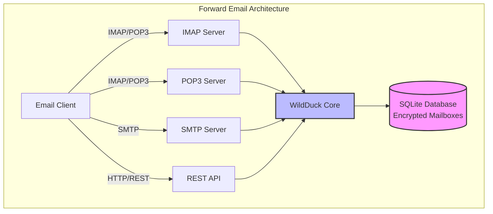

---


## Comparaison des services email - Prise en charge des protocoles & conformité aux normes RFC {#email-service-comparison---protocol-support--rfc-standards-compliance}

> \[!IMPORTANT]
> **Chiffrement sandboxé et résistant au quantique :** Forward Email est le seul service email qui stocke des boîtes aux lettres SQLite chiffrées individuellement avec votre mot de passe (que vous seul possédez). Chaque boîte aux lettres est chiffrée avec [sqleet](https://github.com/resilar/sqleet) (ChaCha20-Poly1305), autonome, sandboxée et portable. Si vous oubliez votre mot de passe, vous perdez votre boîte aux lettres - même Forward Email ne peut pas la récupérer. Voir [Email chiffré quantique-sûr](https://forwardemail.net/en/blog/docs/best-quantum-safe-encrypted-email-service) pour plus de détails.

Comparez la prise en charge des protocoles email et l'implémentation des normes RFC chez les principaux fournisseurs de messagerie :

| Fonctionnalité               | Forward Email                                                                                  | Postfix/Dovecot                                                                    | Gmail                                                                             | iCloud Mail                                           | Outlook.com                                                                                                                                                          | Fastmail                                                                                 | Yahoo/AOL (Verizon)                                                  | ProtonMail                                                                     | Tutanota                                                          |
| --------------------------- | ---------------------------------------------------------------------------------------------- | ---------------------------------------------------------------------------------- | --------------------------------------------------------------------------------- | ----------------------------------------------------- | -------------------------------------------------------------------------------------------------------------------------------------------------------------------- | ---------------------------------------------------------------------------------------- | -------------------------------------------------------------------- | ------------------------------------------------------------------------------ | ----------------------------------------------------------------- |
| **Prix domaine personnalisé** | [Gratuit](https://forwardemail.net/en/pricing)                                                | [Gratuit](https://www.postfix.org/)                                               | [7,20 $/mois](https://workspace.google.com/pricing)                              | [0,99 $/mois](https://support.apple.com/en-us/102622) | [7,20 $/mois](https://www.microsoft.com/en-us/microsoft-365/business/microsoft-365-business-basic)                                                                      | [5 $/mois](https://www.fastmail.com/pricing/)                                             | [3,19 $/mois](https://www.turbify.com/mail)                           | [4,99 $/mois](https://proton.me/mail/pricing)                                   | [3,27 $/mois](https://tuta.com/pricing)                            |
| **IMAP4rev1 (RFC 3501)**    | ✅ [Pris en charge](#imap4-email-protocol-and-extensions)                                      | ✅ [Pris en charge](https://www.dovecot.org/)                                      | ✅ [Pris en charge](https://developers.google.com/workspace/gmail/imap/imap-extensions) | ✅ [Pris en charge](https://support.apple.com/en-us/102431) | ✅ [Pris en charge](https://support.microsoft.com/en-us/office/pop-imap-and-smtp-settings-for-outlook-com-d088b986-291d-42b8-9564-9c414e2aa040)                            | ✅ [Pris en charge](https://www.fastmail.help/hc/en-us/articles/1500000278382-Email-standards) | ✅ [Pris en charge](https://senders.yahooinc.com/developer/documentation/) | ⚠️ [Via Bridge](https://proton.me/support/imap-smtp-and-pop3-setup)              | ❌ Non pris en charge                                             |
| **IMAP4rev2 (RFC 9051)**    | ⚠️ [Partiel](https://forwardemail.net/en/blog/docs/best-quantum-safe-encrypted-email-service)  | ⚠️ [Partiel](https://www.dovecot.org/)                                             | ⚠️ [31 %](https://developers.google.com/workspace/gmail/imap/imap-extensions)     | ⚠️ [92 %](https://support.apple.com/en-us/102431)      | ⚠️ [46 %](https://support.microsoft.com/en-us/office/pop-imap-and-smtp-settings-for-outlook-com-d088b986-291d-42b8-9564-9c414e2aa040)                                 | ⚠️ [69 %](https://www.fastmail.help/hc/en-us/articles/1500000278382-Email-standards)     | ⚠️ [85 %](https://senders.yahooinc.com/developer/documentation/)      | ⚠️ [Via Bridge](https://proton.me/support/imap-smtp-and-pop3-setup)              | ❌ Non pris en charge                                             |
| **POP3 (RFC 1939)**         | ✅ [Pris en charge](#pop3-email-protocol-and-extensions)                                       | ✅ [Pris en charge](https://www.dovecot.org/)                                      | ✅ [Pris en charge](https://support.google.com/mail/answer/7104828)               | ❌ Non pris en charge                                   | ✅ [Pris en charge](https://support.microsoft.com/en-us/office/pop-imap-and-smtp-settings-for-outlook-com-d088b986-291d-42b8-9564-9c414e2aa040)                            | ✅ [Pris en charge](https://www.fastmail.help/hc/en-us/articles/1500000278382-Email-standards) | ✅ [Pris en charge](https://help.yahoo.com/kb/SLN4075.html)              | ⚠️ [Via Bridge](https://proton.me/support/imap-smtp-and-pop3-setup)              | ❌ Non pris en charge                                             |
| **SMTP (RFC 5321)**         | ✅ [Pris en charge](#smtp-email-protocol-and-extensions)                                       | ✅ [Pris en charge](https://www.postfix.org/)                                      | ✅ [Pris en charge](https://support.google.com/mail/answer/7126229)               | ✅ [Pris en charge](https://support.apple.com/en-us/102431) | ✅ [Pris en charge](https://support.microsoft.com/en-us/office/pop-imap-and-smtp-settings-for-outlook-com-d088b986-291d-42b8-9564-9c414e2aa040)                            | ✅ [Pris en charge](https://www.fastmail.help/hc/en-us/articles/1500000278382-Email-standards) | ✅ [Pris en charge](https://help.yahoo.com/kb/SLN4075.html)              | ⚠️ [Via Bridge](https://proton.me/support/imap-smtp-and-pop3-setup)              | ❌ Non pris en charge                                             |
| **JMAP (RFC 8620)**         | ❌ [Non pris en charge](#jmap-email-protocol)                                                  | ❌ Non pris en charge                                                                | ❌ Non pris en charge                                                               | ❌ Non pris en charge                                   | ❌ Non pris en charge                                                                                                                                                  | ✅ [Pris en charge](https://www.fastmail.com/dev/)                                           | ❌ Non pris en charge                                                  | ❌ Non pris en charge                                                            | ❌ Non pris en charge                                             |
| **DKIM (RFC 6376)**         | ✅ [Pris en charge](#email-message-authentication-protocols)                                   | ✅ [Pris en charge](https://github.com/trusteddomainproject/OpenDKIM)              | ✅ [Pris en charge](https://support.google.com/a/answer/174124)                   | ✅ [Pris en charge](https://support.apple.com/en-us/102431) | ✅ [Pris en charge](https://learn.microsoft.com/en-us/defender-office-365/email-authentication-dkim-configure)                                                       | ✅ [Pris en charge](https://www.fastmail.help/hc/en-us/articles/360060590573)              | ✅ [Pris en charge](https://help.yahoo.com/kb/SLN25426.html)             | ✅ [Pris en charge](https://proton.me/support)                                         | ✅ [Pris en charge](https://tuta.com/support#dkim)                    |
| **SPF (RFC 7208)**          | ✅ [Pris en charge](#email-message-authentication-protocols)                                   | ✅ [Pris en charge](https://www.postfix.org/)                                      | ✅ [Pris en charge](https://support.google.com/a/answer/33786)                    | ✅ [Pris en charge](https://support.apple.com/en-us/102431) | ✅ [Pris en charge](https://learn.microsoft.com/en-us/microsoft-365/security/office-365-security/how-office-365-uses-spf-to-prevent-spoofing)                            | ✅ [Pris en charge](https://www.fastmail.help/hc/en-us/articles/360060590573)              | ✅ [Pris en charge](https://help.yahoo.com/kb/SLN25426.html)             | ✅ [Pris en charge](https://proton.me/support)                                         | ✅ [Pris en charge](https://tuta.com/support#dkim)                    |
| **DMARC (RFC 7489)**        | ✅ [Pris en charge](#email-message-authentication-protocols)                                   | ✅ [Pris en charge](https://www.postfix.org/)                                      | ✅ [Pris en charge](https://support.google.com/a/answer/2466580)                  | ✅ [Pris en charge](https://support.apple.com/en-us/102431) | ✅ [Pris en charge](https://learn.microsoft.com/en-us/microsoft-365/security/office-365-security/use-dmarc-to-validate-email)                                          | ✅ [Pris en charge](https://www.fastmail.help/hc/en-us/articles/360060590573)              | ✅ [Pris en charge](https://help.yahoo.com/kb/SLN25426.html)             | ✅ [Pris en charge](https://proton.me/support)                                         | ✅ [Pris en charge](https://tuta.com/support#dkim)                    |
| **ARC (RFC 8617)**          | ✅ [Pris en charge](#email-message-authentication-protocols)                                   | ✅ [Pris en charge](https://github.com/trusteddomainproject/OpenARC)               | ✅ [Pris en charge](https://support.google.com/a/answer/2466580)                  | ❌ Non pris en charge                                   | ✅ [Pris en charge](https://learn.microsoft.com/en-us/defender-office-365/email-authentication-arc-configure)                                                        | ✅ [Pris en charge](https://www.fastmail.help/hc/en-us/articles/360060590573)              | ✅ [Pris en charge](https://senders.yahooinc.com/developer/documentation/) | ✅ [Pris en charge](https://proton.me/blog/what-is-authenticated-received-chain-arc)   | ❌ Non pris en charge                                             |
| **MTA-STS (RFC 8461)**      | ✅ [Pris en charge](#email-transport-security-protocols)                                       | ✅ [Pris en charge](https://www.postfix.org/)                                      | ✅ [Pris en charge](https://support.google.com/a/answer/9261504)                  | ✅ [Pris en charge](https://support.apple.com/en-us/102431) | ✅ [Pris en charge](https://learn.microsoft.com/en-us/defender-office-365/email-authentication-about)                                                                | ✅ [Pris en charge](https://www.fastmail.help/hc/en-us/articles/360060590573)              | ✅ [Pris en charge](https://senders.yahooinc.com/developer/documentation/) | ✅ [Pris en charge](https://proton.me/support)                                         | ✅ [Pris en charge](https://tuta.com/security)                        |
| **DANE (RFC 7671)**         | ✅ [Pris en charge](#email-transport-security-protocols)                                       | ✅ [Pris en charge](https://www.postfix.org/)                                      | ❌ Non pris en charge                                                               | ❌ Non pris en charge                                   | ❌ Non pris en charge                                                                                                                                                  | ❌ Non pris en charge                                                                    | ❌ Non pris en charge                                                  | ✅ [Pris en charge](https://proton.me/support)                                         | ✅ [Pris en charge](https://tuta.com/support#dane)                    |
| **DSN (RFC 3461)**          | ✅ [Pris en charge](#smtp-email-protocol-and-extensions)                                       | ✅ [Pris en charge](https://www.postfix.org/DSN_README.html)                       | ❌ Non pris en charge                                                               | ✅ [Pris en charge](#protocol-capability-tests)           | ✅ [Pris en charge](#protocol-capability-tests)                                                                                                                      | ⚠️ [Inconnu](https://www.fastmail.help/hc/en-us/articles/1500000278382-Email-standards)  | ❌ Non pris en charge                                                  | ⚠️ [Via Bridge](https://proton.me/support/imap-smtp-and-pop3-setup)              | ❌ Non pris en charge                                             |
| **REQUIRETLS (RFC 8689)**   | ✅ [Pris en charge](#email-transport-security-protocols)                                       | ✅ [Pris en charge](https://www.postfix.org/TLS_README.html#server_require_tls)    | ⚠️ Inconnu                                                                         | ⚠️ Inconnu                                            | ⚠️ Inconnu                                                                                                                                                           | ⚠️ Inconnu                                                                             | ⚠️ Inconnu                                                           | ⚠️ [Via Bridge](https://proton.me/support/imap-smtp-and-pop3-setup)              | ❌ Non pris en charge                                             |
| **ManageSieve (RFC 5804)**  | ✅ [Pris en charge](#managesieve-rfc-5804)                                                     | ✅ [Pris en charge](https://doc.dovecot.org/admin_manual/pigeonhole_managesieve_server/) | ❌ Non pris en charge                                                               | ❌ Non pris en charge                                   | ❌ Non pris en charge                                                                                                                                                  | ✅ [Pris en charge](https://www.fastmail.help/hc/en-us/articles/360060590573)              | ❌ Non pris en charge                                                  | ❌ Non pris en charge                                                            | ❌ Non pris en charge                                             |
| **OpenPGP (RFC 9580)**      | ✅ [Pris en charge](#email-message-encryption)                                                 | ⚠️ [Via Plugins](https://www.gnupg.org/)                                           | ⚠️ [Tierce partie](https://github.com/google/end-to-end)                         | ⚠️ [Tierce partie](https://gpgtools.org/)               | ⚠️ [Tierce partie](https://gpg4win.org/)                                                                                                                             | ⚠️ [Tierce partie](https://www.fastmail.help/hc/en-us/articles/360060590573)             | ⚠️ [Tierce partie](https://help.yahoo.com/kb/SLN25426.html)            | ✅ [Natif](https://proton.me/support/pgp-mime-pgp-inline)                        | ❌ Non pris en charge                                             |
| **S/MIME (RFC 8551)**       | ✅ [Pris en charge](#email-message-encryption)                                                 | ✅ [Pris en charge](https://www.openssl.org/)                                      | ✅ [Pris en charge](https://support.google.com/mail/answer/81126)                 | ✅ [Pris en charge](https://support.apple.com/en-us/102431) | ✅ [Pris en charge](https://support.microsoft.com/en-us/office/send-view-and-reply-to-encrypted-messages-in-outlook-for-pc-eaa43495-9bbb-4fca-922a-df90dee51980)       | ⚠️ [Partiel](https://www.fastmail.help/hc/en-us/articles/360060590573)                   | ❌ Non pris en charge                                                  | ✅ [Pris en charge](https://proton.me/support/pgp-mime-pgp-inline)                 | ❌ Non pris en charge                                             |
| **CalDAV (RFC 4791)**       | ✅ [Pris en charge](#calendaring-and-contacts-protocols)                                       | ✅ [Pris en charge](https://www.davical.org/)                                      | ✅ [Pris en charge](https://developers.google.com/calendar/caldav/v2/guide)       | ✅ [Pris en charge](https://support.apple.com/en-us/102431) | ❌ Non pris en charge                                                                                                                                                  | ✅ [Pris en charge](https://www.fastmail.help/hc/en-us/articles/360060590573)              | ❌ Non pris en charge                                                  | ✅ [Via Bridge](https://proton.me/support/proton-calendar)                        | ❌ Non pris en charge                                             |
| **CardDAV (RFC 6352)**      | ✅ [Pris en charge](#calendaring-and-contacts-protocols)                                       | ✅ [Pris en charge](https://www.davical.org/)                                      | ✅ [Pris en charge](https://developers.google.com/people/carddav)                 | ✅ [Pris en charge](https://support.apple.com/en-us/102431) | ❌ Non pris en charge                                                                                                                                                  | ✅ [Pris en charge](https://www.fastmail.help/hc/en-us/articles/360060590573)              | ❌ Non pris en charge                                                  | ✅ [Via Bridge](https://proton.me/support/proton-contacts)                        | ❌ Non pris en charge                                             |
| **Tâches (VTODO)**          | ✅ [Pris en charge](#tasks-and-reminders-caldav-vtodo)                                         | ✅ [Pris en charge](https://www.davical.org/)                                      | ❌ Non pris en charge                                                               | ✅ [Pris en charge](https://support.apple.com/en-us/102431) | ❌ Non pris en charge                                                                                                                                                  | ✅ [Pris en charge](https://www.fastmail.help/hc/en-us/articles/360060590573)              | ❌ Non pris en charge                                                  | ❌ Non pris en charge                                                            | ❌ Non pris en charge                                             |
| **Sieve (RFC 5228)**        | ✅ [Pris en charge](#sieve-rfc-5228)                                                           | ✅ [Pris en charge](https://www.dovecot.org/)                                      | ❌ Non pris en charge                                                               | ❌ Non pris en charge                                   | ❌ Non pris en charge                                                                                                                                                  | ✅ [Pris en charge](https://www.fastmail.help/hc/en-us/articles/360060590573)              | ❌ Non pris en charge                                                  | ❌ Non pris en charge                                                            | ❌ Non pris en charge                                             |
| **Catch-All**               | ✅ [Pris en charge](https://forwardemail.net/en/faq#can-i-have-multiple-global-catch-all-recipients) | ✅ Pris en charge                                                                    | ✅ [Pris en charge](https://support.google.com/a/answer/4524505)                  | ❌ Non pris en charge                                   | ❌ [Non pris en charge](https://learn.microsoft.com/en-us/exchange/recipients-in-exchange-online/manage-mail-users)                                                    | ✅ [Pris en charge](https://www.fastmail.help/hc/en-us/articles/1500000278382-Email-standards) | ❌ Non pris en charge                                                  | ❌ Non pris en charge                                                            | ✅ [Pris en charge](https://tuta.com/support#catch-all-alias)         |
| **Alias illimités**         | ✅ [Pris en charge](https://forwardemail.net/en/faq#advanced-features)                         | ✅ Pris en charge                                                                    | ✅ [Pris en charge](https://support.google.com/a/answer/33327)                    | ✅ [Pris en charge](https://support.apple.com/en-us/102431) | ✅ [Pris en charge](https://support.microsoft.com/en-us/office/add-or-remove-an-email-alias-in-outlook-com-459b1989-356d-40fa-a689-8f285b13f1f2)                         | ✅ [Pris en charge](https://www.fastmail.help/hc/en-us/articles/1500000278382-Email-standards) | ❌ Non pris en charge                                                  | ✅ [Pris en charge](https://proton.me/support/addresses-and-aliases)               | ✅ [Pris en charge](https://tuta.com/support#aliases)                 |
| **Authentification à deux facteurs** | ✅ [Pris en charge](https://forwardemail.net/en/faq#do-you-support-passkeys-and-webauthn)    | ✅ Pris en charge                                                                    | ✅ [Pris en charge](https://support.google.com/accounts/answer/185839)            | ✅ [Pris en charge](https://support.apple.com/en-us/102431) | ✅ [Pris en charge](https://support.microsoft.com/en-us/account-billing/how-to-use-two-step-verification-with-your-microsoft-account-c7910146-672f-01e9-50a0-93b4585e7eb4) | ✅ [Pris en charge](https://www.fastmail.help/hc/en-us/articles/1500000278382-Email-standards) | ✅ [Pris en charge](https://help.yahoo.com/kb/SLN5013.html)            | ✅ [Pris en charge](https://proton.me/support/two-factor-authentication-2fa)       | ✅ [Pris en charge](https://tuta.com/support#two-factor-authentication) |
| **Notifications Push**      | ✅ [Pris en charge](#ios-push-notifications)                                                   | ⚠️ Via Plugins                                                                     | ✅ [Pris en charge](https://developers.google.com/gmail/api/guides/push)          | ✅ [Pris en charge](https://support.apple.com/en-us/102431) | ✅ [Pris en charge](https://learn.microsoft.com/en-us/graph/change-notifications-delivery-webhooks)                                                                    | ✅ [Pris en charge](https://www.fastmail.help/hc/en-us/articles/1500000278382-Email-standards) | ❌ Non pris en charge                                                  | ✅ [Pris en charge](https://proton.me/support/notifications)                       | ✅ [Pris en charge](https://tuta.com/support#push-notifications)      |
| **Bureau Calendrier/Contacts** | ✅ [Pris en charge](#calendaring-and-contacts-protocols)                                       | ✅ Pris en charge                                                                    | ✅ [Pris en charge](https://support.google.com/calendar)                          | ✅ [Pris en charge](https://support.apple.com/en-us/102431) | ✅ [Pris en charge](https://support.microsoft.com/en-us/office/calendar-and-contacts-in-outlook-com-d3e8a6e6-5c1f-4e3e-9f1e-7c0f0e0c0c0c)                              | ✅ [Pris en charge](https://www.fastmail.help/hc/en-us/articles/1500000278382-Email-standards) | ❌ Non pris en charge                                                  | ✅ [Pris en charge](https://proton.me/support/proton-calendar)                     | ❌ Non pris en charge                                             |
| **Recherche avancée**       | ✅ [Pris en charge](https://forwardemail.net/en/email-api)                                     | ✅ Pris en charge                                                                    | ✅ [Pris en charge](https://support.google.com/mail/answer/7190)                  | ✅ [Pris en charge](https://support.apple.com/en-us/102431) | ✅ [Pris en charge](https://support.microsoft.com/en-us/office/search-for-email-messages-in-outlook-com-6f5f2e92-9d5e-4c4e-9b0e-0c0c0c0c0c0c)                            | ✅ [Pris en charge](https://www.fastmail.help/hc/en-us/articles/1500000278382-Email-standards) | ✅ [Pris en charge](https://help.yahoo.com/kb/SLN3561.html)              | ✅ [Pris en charge](https://proton.me/support/search-and-filters)                  | ✅ [Pris en charge](https://tuta.com/support)                           |
| **API/Intégrations**        | ✅ [39 points de terminaison](https://forwardemail.net/en/email-api)                           | ✅ Pris en charge                                                                    | ✅ [Pris en charge](https://developers.google.com/gmail/api)                      | ❌ Non pris en charge                                   | ✅ [Pris en charge](https://learn.microsoft.com/en-us/graph/api/resources/mail-api-overview)                                                                             | ✅ [Pris en charge](https://www.fastmail.help/hc/en-us/articles/1500000278382-Email-standards) | ❌ Non pris en charge                                                  | ✅ [Pris en charge](https://proton.me/support/proton-mail-api)                     | ❌ Non pris en charge                                             |
### Visualisation du support des protocoles {#protocol-support-visualization}

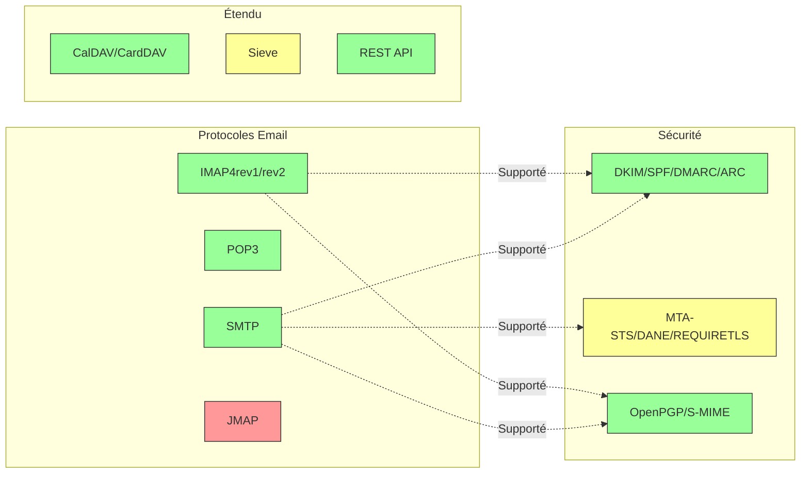

---


## Protocoles Email principaux {#core-email-protocols}

### Flux du protocole Email {#email-protocol-flow}

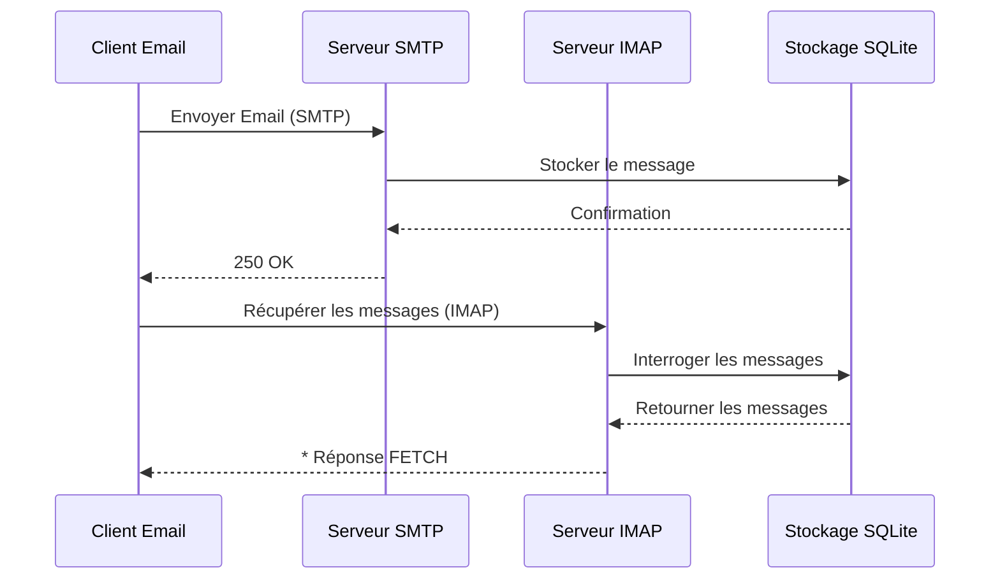


## Protocole Email IMAP4 et extensions {#imap4-email-protocol-and-extensions}

> \[!NOTE]
> Forward Email supporte IMAP4rev1 (RFC 3501) avec un support partiel des fonctionnalités IMAP4rev2 (RFC 9051).

Forward Email offre un support robuste d'IMAP4 via l'implémentation du serveur mail WildDuck. Le serveur implémente IMAP4rev1 (RFC 3501) avec un support partiel des extensions IMAP4rev2 (RFC 9051).

La fonctionnalité IMAP de Forward Email est fournie par la dépendance [WildDuck](https://github.com/nodemailer/wildduck). Les RFC email suivants sont supportés :

| RFC                                                       | Titre                                                             | Notes d'implémentation                              |
| --------------------------------------------------------- | ----------------------------------------------------------------- | -------------------------------------------------- |
| [RFC 3501](https://datatracker.ietf.org/doc/html/rfc3501) | Protocole d'accès aux messages Internet (IMAP) - Version 4rev1    | Support complet avec différences intentionnelles (voir ci-dessous) |
| [RFC 2177](https://datatracker.ietf.org/doc/html/rfc2177) | Commande IMAP4 IDLE                                              | Notifications de type push                          |
| [RFC 2342](https://datatracker.ietf.org/doc/html/rfc2342) | Namespace IMAP4                                                 | Support des espaces de noms de boîtes aux lettres |
| [RFC 2087](https://datatracker.ietf.org/doc/html/rfc2087) | Extension QUOTA IMAP4                                           | Gestion des quotas de stockage                      |
| [RFC 2971](https://datatracker.ietf.org/doc/html/rfc2971) | Extension ID IMAP4                                             | Identification client/serveur                       |
| [RFC 5161](https://datatracker.ietf.org/doc/html/rfc5161) | Extension ENABLE IMAP4                                         | Activation des extensions IMAP                      |
| [RFC 4959](https://datatracker.ietf.org/doc/html/rfc4959) | Extension IMAP pour la réponse initiale client SASL (SASL-IR)    | Réponse initiale du client                           |
| [RFC 3691](https://datatracker.ietf.org/doc/html/rfc3691) | Commande IMAP4 UNSELECT                                        | Fermeture de boîte sans EXPUNGE                     |
| [RFC 4315](https://datatracker.ietf.org/doc/html/rfc4315) | Extension IMAP UIDPLUS                                        | Commandes UID améliorées                            |
| [RFC 7162](https://datatracker.ietf.org/doc/html/rfc7162) | Extensions IMAP : Resynchronisation rapide des changements de drapeaux (CONDSTORE) | STORE conditionnel                                  |
| [RFC 6154](https://datatracker.ietf.org/doc/html/rfc6154) | Extension IMAP LIST pour les boîtes aux lettres à usage spécial | Attributs spéciaux des boîtes aux lettres          |
| [RFC 6851](https://datatracker.ietf.org/doc/html/rfc6851) | Extension IMAP MOVE                                          | Commande MOVE atomique                              |
| [RFC 6855](https://datatracker.ietf.org/doc/html/rfc6855) | Support IMAP pour UTF-8                                      | Support UTF-8                                       |
| [RFC 3348](https://datatracker.ietf.org/doc/html/rfc3348) | Extension IMAP4 pour boîtes enfants                         | Informations sur les boîtes enfants                  |
| [RFC 7889](https://datatracker.ietf.org/doc/html/rfc7889) | Extension IMAP4 pour annoncer la taille maximale de téléchargement (APPENDLIMIT) | Taille maximale de téléchargement                   |
**Extensions IMAP prises en charge :**

| Extension         | RFC          | Statut      | Description                     |
| ----------------- | ------------ | ----------- | ------------------------------- |
| IDLE              | RFC 2177     | ✅ Pris en charge | Notifications de type push        |
| NAMESPACE         | RFC 2342     | ✅ Pris en charge | Support des espaces de noms de boîtes aux lettres       |
| QUOTA             | RFC 2087     | ✅ Pris en charge | Gestion des quotas de stockage        |
| ID                | RFC 2971     | ✅ Pris en charge | Identification client/serveur    |
| ENABLE            | RFC 5161     | ✅ Pris en charge | Activation des extensions IMAP          |
| SASL-IR           | RFC 4959     | ✅ Pris en charge | Réponse initiale du client         |
| UNSELECT          | RFC 3691     | ✅ Pris en charge | Fermeture de la boîte sans EXPUNGE   |
| UIDPLUS           | RFC 4315     | ✅ Pris en charge | Commandes UID améliorées           |
| CONDSTORE         | RFC 7162     | ✅ Pris en charge | STORE conditionnel               |
| SPECIAL-USE       | RFC 6154     | ✅ Pris en charge | Attributs spéciaux des boîtes      |
| MOVE              | RFC 6851     | ✅ Pris en charge | Commande MOVE atomique             |
| UTF8=ACCEPT       | RFC 6855     | ✅ Pris en charge | Support UTF-8                   |
| CHILDREN          | RFC 3348     | ✅ Pris en charge | Informations sur les sous-boîtes       |
| APPENDLIMIT       | RFC 7889     | ✅ Pris en charge | Taille maximale d’envoi             |
| XLIST             | Non standard | ✅ Pris en charge | Liste des dossiers compatible Gmail |
| XAPPLEPUSHSERVICE | Non standard | ✅ Pris en charge | Service de notification push Apple |

### Différences du protocole IMAP par rapport aux spécifications RFC {#imap-protocol-differences-from-rfc-specifications}

> \[!WARNING]
> Les différences suivantes par rapport aux spécifications RFC peuvent affecter la compatibilité des clients.

Forward Email dévie intentionnellement de certaines spécifications IMAP RFC. Ces différences sont héritées de WildDuck et sont documentées ci-dessous :

* **Pas de drapeau \Recent :** Le drapeau `\Recent` n’est pas implémenté. Tous les messages sont retournés sans ce drapeau.
* **RENAME n’affecte pas les sous-dossiers :** Lors du renommage d’un dossier, les sous-dossiers ne sont pas renommés automatiquement. La hiérarchie des dossiers est plate dans la base de données.
* **INBOX ne peut pas être renommé :** [RFC 3501](https://datatracker.ietf.org/doc/html/rfc3501) permet de renommer INBOX, mais Forward Email l’interdit explicitement. Voir [code source WildDuck](https://github.com/nodemailer/wildduck/blob/master/imap-core/lib/commands/rename.js#L27).
* **Pas de réponses FLAGS non sollicitées :** Lorsqu’un drapeau est modifié, aucune réponse FLAGS non sollicitée n’est envoyée au client.
* **STORE retourne NO pour les messages supprimés :** Tenter de modifier les drapeaux sur des messages supprimés retourne NO au lieu d’ignorer silencieusement.
* **CHARSET ignoré dans SEARCH :** L’argument `CHARSET` dans les commandes SEARCH est ignoré. Toutes les recherches utilisent UTF-8.
* **Métadonnées MODSEQ ignorées :** Les métadonnées `MODSEQ` dans les commandes STORE sont ignorées.
* **SEARCH TEXT et SEARCH BODY :** Forward Email utilise [SQLite FTS5](https://www.sqlite.org/fts5.html) (recherche en texte intégral) au lieu de la recherche `$text` de MongoDB. Cela offre :
  * Support de l’opérateur `NOT` (non supporté par MongoDB)
  * Résultats de recherche classés
  * Performances de recherche inférieures à 100 ms sur de grandes boîtes aux lettres
* **Comportement autoexpunge :** Les messages marqués `\Deleted` sont automatiquement expurgés à la fermeture de la boîte.
* **Fidélité des messages :** Certaines modifications de messages peuvent ne pas préserver la structure exacte du message original.

**Support partiel d’IMAP4rev2 :**

Forward Email implémente IMAP4rev1 (RFC 3501) avec un support partiel d’IMAP4rev2 (RFC 9051). Les fonctionnalités IMAP4rev2 suivantes ne sont **pas encore prises en charge** :

* **LIST-STATUS** - Commandes combinées LIST et STATUS
* **LITERAL-** - Littéraux non synchronisés (variante moins)
* **OBJECTID** - Identifiants uniques d’objets
* **SAVEDATE** - Attribut de date de sauvegarde
* **REPLACE** - Remplacement atomique de message
* **UNAUTHENTICATE** - Fermeture de l’authentification sans fermer la connexion

**Gestion assouplie de la structure du corps :**

Forward Email utilise une gestion « relaxée » du corps pour les structures MIME mal formées, ce qui peut différer de l’interprétation stricte des RFC. Cela améliore la compatibilité avec les emails réels qui ne respectent pas parfaitement les normes.
**Extension METADATA (RFC 5464) :**

L'extension IMAP METADATA **n'est pas prise en charge**. Pour plus d'informations sur cette extension, voir [RFC 5464](https://datatracker.ietf.org/doc/html/rfc5464). Une discussion sur l'ajout de cette fonctionnalité est disponible dans [WildDuck Issue #937](https://github.com/zone-eu/wildduck/issues/937).

### Extensions IMAP NON prises en charge {#imap-extensions-not-supported}

Les extensions IMAP suivantes du [Registre des capacités IMAP IANA](https://www.iana.org/assignments/imap-capabilities/imap-capabilities.xhtml) ne sont PAS prises en charge :

| RFC                                                       | Titre                                                                                                           | Raison                                                                                                                                  |
| --------------------------------------------------------- | --------------------------------------------------------------------------------------------------------------- | --------------------------------------------------------------------------------------------------------------------------------------- |
| [RFC 2086](https://datatracker.ietf.org/doc/html/rfc2086) | Extension ACL IMAP4                                                                                             | Dossiers partagés non implémentés. Voir [WildDuck Issue #427](https://github.com/zone-eu/wildduck/issues/427)                           |
| [RFC 5256](https://datatracker.ietf.org/doc/html/rfc5256) | Extensions IMAP SORT et THREAD                                                                                  | Le fil de discussion est implémenté en interne mais pas via le protocole RFC 5256. Voir [WildDuck Issue #12](https://github.com/zone-eu/wildduck/issues/12) |
| [RFC 5162](https://datatracker.ietf.org/doc/html/rfc5162) | Extensions IMAP4 pour la resynchronisation rapide des boîtes aux lettres (QRESYNC)                              | Non implémenté                                                                                                                           |
| [RFC 5464](https://datatracker.ietf.org/doc/html/rfc5464) | Extension IMAP METADATA                                                                                         | Opérations de métadonnées ignorées. Voir [documentation WildDuck](https://datatracker.ietf.org/doc/html/rfc5464)                        |
| [RFC 5258](https://datatracker.ietf.org/doc/html/rfc5258) | Extensions de la commande LIST IMAP4                                                                            | Non implémenté                                                                                                                           |
| [RFC 5267](https://datatracker.ietf.org/doc/html/rfc5267) | Contextes pour IMAP4                                                                                            | Non implémenté                                                                                                                           |
| [RFC 5465](https://datatracker.ietf.org/doc/html/rfc5465) | Extension IMAP NOTIFY                                                                                           | Non implémenté                                                                                                                           |
| [RFC 5466](https://datatracker.ietf.org/doc/html/rfc5466) | Extension IMAP4 FILTERS                                                                                         | Non implémenté                                                                                                                           |
| [RFC 6203](https://datatracker.ietf.org/doc/html/rfc6203) | Extension IMAP4 pour la recherche approximative                                                                 | Non implémenté                                                                                                                           |
| [RFC 6785](https://datatracker.ietf.org/doc/html/rfc6785) | Recommandations pour la mise en œuvre IMAP4                                                                     | Recommandations pas entièrement suivies                                                                                                |
| [RFC 7162](https://datatracker.ietf.org/doc/html/rfc7162) | Extensions IMAP : Resynchronisation rapide des changements de drapeaux (CONDSTORE) et resynchronisation rapide des boîtes (QRESYNC) | Non implémenté                                                                                                                           |
| [RFC 8437](https://datatracker.ietf.org/doc/html/rfc8437) | Extension IMAP UNAUTHENTICATE pour la réutilisation de connexion                                                | Non implémenté                                                                                                                           |
| [RFC 8438](https://datatracker.ietf.org/doc/html/rfc8438) | Extension IMAP pour STATUS=SIZE                                                                                  | Non implémenté                                                                                                                           |
| [RFC 8457](https://datatracker.ietf.org/doc/html/rfc8457) | Mot-clé IMAP "$Important" et attribut d'usage spécial "\Important"                                              | Non implémenté                                                                                                                           |
| [RFC 8474](https://datatracker.ietf.org/doc/html/rfc8474) | Extension IMAP pour les identifiants d'objet                                                                    | Non implémenté                                                                                                                           |
| [RFC 9051](https://datatracker.ietf.org/doc/html/rfc9051) | Protocole d'accès aux messages Internet (IMAP) - Version 4rev2                                                  | Forward Email implémente IMAP4rev1 ([RFC 3501](https://datatracker.ietf.org/doc/html/rfc3501))                                           |
## Protocole Email POP3 et Extensions {#pop3-email-protocol-and-extensions}

> \[!NOTE]
> Forward Email prend en charge POP3 (RFC 1939) avec des extensions standard pour la récupération des emails.

La fonctionnalité POP3 de Forward Email est fournie par la dépendance [WildDuck](https://github.com/nodemailer/wildduck). Les RFC email suivants sont pris en charge :

| RFC                                                       | Titre                                   | Notes d'implémentation                              |
| --------------------------------------------------------- | --------------------------------------- | -------------------------------------------------- |
| [RFC 1939](https://datatracker.ietf.org/doc/html/rfc1939) | Protocole de bureau de poste - Version 3 (POP3) | Support complet avec différences intentionnelles (voir ci-dessous) |
| [RFC 2595](https://datatracker.ietf.org/doc/html/rfc2595) | Utilisation de TLS avec IMAP, POP3 et ACAP | Support STARTTLS                                   |
| [RFC 2449](https://datatracker.ietf.org/doc/html/rfc2449) | Mécanisme d'extension POP3              | Support de la commande CAPA                         |

Forward Email fournit un support POP3 pour les clients qui préfèrent ce protocole plus simple à IMAP. POP3 est idéal pour les utilisateurs qui souhaitent télécharger les emails sur un seul appareil et les supprimer du serveur.

**Extensions POP3 prises en charge :**

| Extension | RFC      | Statut      | Description                |
| --------- | -------- | ----------- | -------------------------- |
| TOP       | RFC 1939 | ✅ Pris en charge | Récupération des en-têtes de message |
| USER      | RFC 1939 | ✅ Pris en charge | Authentification par nom d'utilisateur |
| UIDL      | RFC 1939 | ✅ Pris en charge | Identifiants uniques des messages |
| EXPIRE    | RFC 2449 | ✅ Pris en charge | Politique d'expiration des messages |

### Différences du protocole POP3 par rapport aux spécifications RFC {#pop3-protocol-differences-from-rfc-specifications}

> \[!WARNING]
> POP3 présente des limitations inhérentes comparé à IMAP.

> \[!IMPORTANT]
> **Différence critique : comportement DELE POP3 de Forward Email vs WildDuck**
>
> Forward Email implémente la suppression permanente conforme à la RFC pour les commandes POP3 `DELE`, contrairement à WildDuck qui déplace les messages vers la corbeille.

**Comportement de Forward Email** ([code source](https://github.com/forwardemail/forwardemail.net/blob/master/pop3-server.js)) :

* `DELE` → `QUIT` supprime définitivement les messages
* Suit exactement la spécification de la [RFC 1939](https://datatracker.ietf.org/doc/html/rfc1939)
* Correspond au comportement de Dovecot (par défaut), Postfix et autres serveurs conformes aux standards

**Comportement de WildDuck** ([discussion](https://github.com/zone-eu/wildduck/issues/937)) :

* `DELE` → `QUIT` déplace les messages vers la corbeille (style Gmail)
* Décision de conception intentionnelle pour la sécurité des utilisateurs
* Non conforme à la RFC mais évite la perte accidentelle de données

**Pourquoi Forward Email diffère :**

* **Conformité RFC :** Respecte la spécification de la [RFC 1939](https://datatracker.ietf.org/doc/html/rfc1939)
* **Attentes des utilisateurs :** Le flux de travail téléchargement-et-suppression attend une suppression permanente
* **Gestion du stockage :** Reprise correcte de l'espace disque
* **Interopérabilité :** Cohérence avec d'autres serveurs conformes à la RFC

> \[!NOTE]
> **Liste des messages POP3 :** Forward Email liste TOUS les messages de la boîte de réception sans limite. Cela diffère de WildDuck qui limite à 250 messages par défaut. Voir [code source](https://github.com/forwardemail/forwardemail.net/blob/master/pop3-server.js).

**Accès mono-appareil :**

POP3 est conçu pour un accès sur un seul appareil. Les messages sont généralement téléchargés puis supprimés du serveur, ce qui le rend inadapté à la synchronisation multi-appareils.

**Pas de support des dossiers :**

POP3 n'accède qu'au dossier INBOX. Les autres dossiers (Envoyés, Brouillons, Corbeille, etc.) ne sont pas accessibles via POP3.

**Gestion limitée des messages :**

POP3 offre une récupération et suppression basiques des messages. Les fonctionnalités avancées comme le marquage, le déplacement ou la recherche de messages ne sont pas disponibles.

### Extensions POP3 NON prises en charge {#pop3-extensions-not-supported}

Les extensions POP3 suivantes du [Registre du mécanisme d'extension POP3 IANA](https://www.iana.org/assignments/pop3-extension-mechanism/pop3-extension-mechanism.xhtml) ne sont PAS prises en charge :
| RFC                                                       | Titre                                                  | Raison                                  |
| --------------------------------------------------------- | ------------------------------------------------------ | --------------------------------------- |
| [RFC 6856](https://datatracker.ietf.org/doc/html/rfc6856) | Support du protocole POP3 (Post Office Protocol Version 3) pour UTF-8 | Non implémenté dans le serveur POP3 WildDuck |
| [RFC 2595](https://datatracker.ietf.org/doc/html/rfc2595) | Commande STLS                                          | Seul STARTTLS est supporté, pas STLS    |
| [RFC 3206](https://datatracker.ietf.org/doc/html/rfc3206) | Codes de réponse SYS et AUTH POP                        | Non implémenté                         |

---


## Protocole SMTP et extensions {#smtp-email-protocol-and-extensions}

> \[!NOTE]
> Forward Email supporte SMTP (RFC 5321) avec des extensions modernes pour une livraison d'email sécurisée et fiable.

La fonctionnalité SMTP de Forward Email est fournie par plusieurs composants : [smtp-server](https://github.com/nodemailer/smtp-server) (nodemailer), [zone-mta](https://github.com/zone-eu/zone-mta), et des implémentations personnalisées. Les RFC email suivants sont supportés :

| RFC                                                       | Titre                                                                            | Notes d'implémentation             |
| --------------------------------------------------------- | -------------------------------------------------------------------------------- | ---------------------------------- |
| [RFC 5321](https://datatracker.ietf.org/doc/html/rfc5321) | Protocole simple de transfert de courrier (SMTP)                                 | Support complet                   |
| [RFC 3207](https://datatracker.ietf.org/doc/html/rfc3207) | Extension de service SMTP pour SMTP sécurisé via Transport Layer Security (STARTTLS) | Support TLS/SSL                   |
| [RFC 4954](https://datatracker.ietf.org/doc/html/rfc4954) | Extension de service SMTP pour l'authentification (AUTH)                         | PLAIN, LOGIN, CRAM-MD5, XOAUTH2   |
| [RFC 6531](https://datatracker.ietf.org/doc/html/rfc6531) | Extension SMTP pour les emails internationalisés (SMTPUTF8)                      | Support natif des adresses email en unicode |
| [RFC 3461](https://datatracker.ietf.org/doc/html/rfc3461) | Extension de service SMTP pour les notifications de statut de livraison (DSN)    | Support complet DSN                |
| [RFC 3463](https://datatracker.ietf.org/doc/html/rfc3463) | Codes d'état améliorés du système de messagerie                                  | Codes d'état améliorés dans les réponses |
| [RFC 1870](https://datatracker.ietf.org/doc/html/rfc1870) | Extension de service SMTP pour la déclaration de la taille du message (SIZE)     | Annonce de la taille maximale du message |
| [RFC 2920](https://datatracker.ietf.org/doc/html/rfc2920) | Extension de service SMTP pour le pipelining des commandes (PIPELINING)          | Support du pipelining des commandes |
| [RFC 1652](https://datatracker.ietf.org/doc/html/rfc1652) | Extension de service SMTP pour le transport MIME 8 bits (8BITMIME)               | Support MIME 8 bits               |
| [RFC 6152](https://datatracker.ietf.org/doc/html/rfc6152) | Extension de service SMTP pour le transport MIME 8 bits                          | Support MIME 8 bits               |
| [RFC 2034](https://datatracker.ietf.org/doc/html/rfc2034) | Extension de service SMTP pour le retour des codes d'erreur améliorés (ENHANCEDSTATUSCODES) | Codes d'état améliorés            |

Forward Email implémente un serveur SMTP complet avec support des extensions modernes qui améliorent la sécurité, la fiabilité et les fonctionnalités.

**Extensions SMTP supportées :**

| Extension           | RFC      | Statut      | Description                           |
| ------------------- | -------- | ----------- | ------------------------------------- |
| PIPELINING          | RFC 2920 | ✅ Supporté | Pipelining des commandes              |
| SIZE                | RFC 1870 | ✅ Supporté | Déclaration de la taille du message (limite 52 Mo) |
| ETRN                | RFC 1985 | ✅ Supporté | Traitement à distance de la file d'attente |
| STARTTLS            | RFC 3207 | ✅ Supporté | Passage à TLS                        |
| ENHANCEDSTATUSCODES | RFC 2034 | ✅ Supporté | Codes d'état améliorés               |
| 8BITMIME            | RFC 6152 | ✅ Supporté | Transport MIME 8 bits                |
| DSN                 | RFC 3461 | ✅ Supporté | Notifications de statut de livraison |
| CHUNKING            | RFC 3030 | ✅ Supporté | Transfert de message par morceaux    |
| SMTPUTF8            | RFC 6531 | ⚠️ Partiel  | Adresses email en UTF-8 (partiel)    |
| REQUIRETLS          | RFC 8689 | ✅ Supporté | Exige TLS pour la livraison          |
### Notifications de statut de livraison (DSN) {#delivery-status-notifications-dsn}

> \[!TIP]
> DSN fournit des informations détaillées sur le statut de livraison des e-mails envoyés.

Forward Email prend entièrement en charge **DSN (RFC 3461)**, qui permet aux expéditeurs de demander des notifications de statut de livraison. Cette fonctionnalité offre :

* **Notifications de succès** lorsque les messages sont livrés
* **Notifications d’échec** avec des informations d’erreur détaillées
* **Notifications de retard** lorsque la livraison est temporairement retardée

DSN est particulièrement utile pour :

* Confirmer la livraison de messages importants
* Résoudre les problèmes de livraison
* Systèmes automatisés de traitement des e-mails
* Exigences de conformité et d’audit

### Support REQUIRETLS {#requiretls-support}

> \[!IMPORTANT]
> Forward Email est l’un des rares fournisseurs à annoncer explicitement et à appliquer REQUIRETLS.

Forward Email prend en charge **REQUIRETLS (RFC 8689)**, qui garantit que les messages e-mail ne sont livrés que via des connexions chiffrées TLS. Cela offre :

* **Chiffrement de bout en bout** pour l’ensemble du chemin de livraison
* **Application côté utilisateur** via une case à cocher dans le composeur d’e-mails
* **Rejet des tentatives de livraison non chiffrée**
* **Sécurité renforcée** pour les communications sensibles

### Extensions SMTP NON prises en charge {#smtp-extensions-not-supported}

Les extensions SMTP suivantes du [Registre des extensions de service SMTP IANA](https://www.iana.org/assignments/smtp) ne sont PAS prises en charge :

| RFC                                                       | Titre                                                                                             | Raison                |
| --------------------------------------------------------- | ------------------------------------------------------------------------------------------------- | --------------------- |
| [RFC 4865](https://datatracker.ietf.org/doc/html/rfc4865) | Extension de service SMTP Submission pour la libération future de messages (FUTURERELEASE)        | Non implémentée       |
| [RFC 6710](https://datatracker.ietf.org/doc/html/rfc6710) | Extension SMTP pour les priorités de transfert de message (MT-PRIORITY)                            | Non implémentée       |
| [RFC 7293](https://datatracker.ietf.org/doc/html/rfc7293) | Le champ d’en-tête Require-Recipient-Valid-Since et extension de service SMTP                     | Non implémentée       |
| [RFC 7372](https://datatracker.ietf.org/doc/html/rfc7372) | Codes d’état d’authentification des e-mails                                                      | Pas entièrement implémentée |
| [RFC 4468](https://datatracker.ietf.org/doc/html/rfc4468) | Extension BURL pour la soumission de messages                                                    | Non implémentée       |
| [RFC 3030](https://datatracker.ietf.org/doc/html/rfc3030) | Extensions de service SMTP pour la transmission de messages MIME volumineux et binaires (CHUNKING, BINARYMIME) | Non implémentée       |
| [RFC 2852](https://datatracker.ietf.org/doc/html/rfc2852) | Extension de service Deliver By SMTP                                                             | Non implémentée       |

---


## Protocole e-mail JMAP {#jmap-email-protocol}

> \[!CAUTION]
> JMAP **n’est pas actuellement pris en charge** par Forward Email.

| RFC                                                       | Titre                                     | Statut          | Raison                                                                 |
| --------------------------------------------------------- | ----------------------------------------- | --------------- | ---------------------------------------------------------------------- |
| [RFC 8620](https://datatracker.ietf.org/doc/html/rfc8620) | Le protocole JSON Meta Application (JMAP) | ❌ Non pris en charge | Forward Email utilise IMAP/POP3/SMTP et une API REST complète à la place |

**JMAP (JSON Meta Application Protocol)** est un protocole e-mail moderne conçu pour remplacer IMAP.

**Pourquoi JMAP n’est pas pris en charge :**

> "JMAP est une bête qui n’aurait pas dû être inventée. Il essaie de convertir TCP/IMAP (déjà un mauvais protocole selon les standards actuels) en HTTP/JSON, en utilisant simplement un transport différent tout en gardant l’esprit." — Andris Reinman, [Discussion HN](https://news.ycombinator.com/item?id=18890011)
> « JMAP a plus de 10 ans, et il y a presque aucune adoption » – Andris Reinman, [Discussion GitHub](https://github.com/zone-eu/wildduck/issues/2#issuecomment-1765190790)

Voir aussi les commentaires supplémentaires sur <https://hn.algolia.com/?dateRange=all&page=0&prefix=true&query=jmap%20andris&sort=byDate&type=comment>.

Forward Email se concentre actuellement sur la fourniture d’un excellent support IMAP, POP3 et SMTP, ainsi qu’une API REST complète pour la gestion des emails. Le support JMAP pourra être envisagé à l’avenir en fonction de la demande des utilisateurs et de l’adoption par l’écosystème.

**Alternative :** Forward Email propose une [API REST complète](#complete-rest-api-for-email-management) avec 39 points de terminaison offrant des fonctionnalités similaires à JMAP pour l’accès programmatique aux emails.

---


## Sécurité des Emails {#email-security}

### Architecture de la Sécurité des Emails {#email-security-architecture}

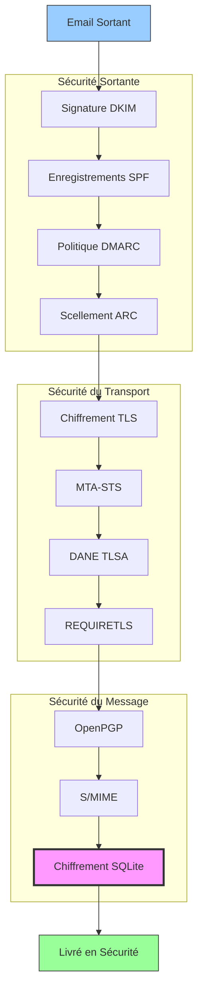


## Protocoles d’Authentification des Messages Email {#email-message-authentication-protocols}

> \[!NOTE]
> Forward Email implémente tous les principaux protocoles d’authentification des emails pour prévenir l’usurpation d’identité et garantir l’intégrité des messages.

Forward Email utilise la bibliothèque [mailauth](https://github.com/postalsys/mailauth) pour l’authentification des emails. Les RFC suivants sont pris en charge :

| RFC                                                       | Titre                                                                   | Notes d’implémentation                                       |
| --------------------------------------------------------- | ----------------------------------------------------------------------- | ------------------------------------------------------------ |
| [RFC 6376](https://datatracker.ietf.org/doc/html/rfc6376) | Signatures DomainKeys Identified Mail (DKIM)                           | Signature et vérification DKIM complètes                      |
| [RFC 8463](https://datatracker.ietf.org/doc/html/rfc8463) | Nouvelle méthode de signature cryptographique pour DKIM (Ed25519-SHA256) | Supporte les algorithmes de signature RSA-SHA256 et Ed25519-SHA256 |
| [RFC 7208](https://datatracker.ietf.org/doc/html/rfc7208) | Sender Policy Framework (SPF)                                           | Validation des enregistrements SPF                            |
| [RFC 7489](https://datatracker.ietf.org/doc/html/rfc7489) | Authentification, Rapport et Conformité des Messages Basée sur le Domaine (DMARC) | Application de la politique DMARC                             |
| [RFC 8617](https://datatracker.ietf.org/doc/html/rfc8617) | Chaîne Authentifiée de Réception (ARC)                                 | Scellement et validation ARC                                  |

Les protocoles d’authentification des emails vérifient que les messages proviennent bien de l’expéditeur déclaré et n’ont pas été altérés pendant le transit.

### Support des Protocoles d’Authentification {#authentication-protocol-support}

| Protocole | RFC      | Statut       | Description                                                            |
| --------- | -------- | ------------ | ---------------------------------------------------------------------- |
| **DKIM**  | RFC 6376 | ✅ Pris en charge | DomainKeys Identified Mail - Signatures cryptographiques               |
| **SPF**   | RFC 7208 | ✅ Pris en charge | Sender Policy Framework - Autorisation des adresses IP                 |
| **DMARC** | RFC 7489 | ✅ Pris en charge | Authentification des Messages Basée sur le Domaine - Application de la politique |
| **ARC**   | RFC 8617 | ✅ Pris en charge | Chaîne Authentifiée de Réception - Préservation de l’authentification lors des transferts |
### DKIM (DomainKeys Identified Mail) {#dkim-domainkeys-identified-mail}

**DKIM** ajoute une signature cryptographique aux en-têtes des emails, permettant aux destinataires de vérifier que le message a été autorisé par le propriétaire du domaine et qu'il n'a pas été modifié en transit.

Forward Email utilise [mailauth](https://github.com/postalsys/mailauth) pour la signature et la vérification DKIM.

**Fonctionnalités clés :**

* Signature DKIM automatique pour tous les messages sortants
* Support des clés RSA et Ed25519
* Support de plusieurs sélecteurs
* Vérification DKIM pour les messages entrants

### SPF (Sender Policy Framework) {#spf-sender-policy-framework}

**SPF** permet aux propriétaires de domaine de spécifier quelles adresses IP sont autorisées à envoyer des emails au nom de leur domaine.

**Fonctionnalités clés :**

* Validation des enregistrements SPF pour les messages entrants
* Vérification SPF automatique avec résultats détaillés
* Support des mécanismes include, redirect et all
* Politiques SPF configurables par domaine

### DMARC (Domain-based Message Authentication, Reporting & Conformance) {#dmarc-domain-based-message-authentication-reporting--conformance}

**DMARC** s'appuie sur SPF et DKIM pour fournir l'application des politiques et le reporting.

**Fonctionnalités clés :**

* Application des politiques DMARC (none, quarantine, reject)
* Vérification de l'alignement SPF et DKIM
* Rapports agrégés DMARC
* Politiques DMARC par domaine

### ARC (Authenticated Received Chain) {#arc-authenticated-received-chain}

**ARC** préserve les résultats d'authentification des emails lors du transfert et des modifications par les listes de diffusion.

Forward Email utilise la bibliothèque [mailauth](https://github.com/postalsys/mailauth) pour la vérification et le scellement ARC.

**Fonctionnalités clés :**

* Scellement ARC pour les messages transférés
* Validation ARC pour les messages entrants
* Vérification de la chaîne à travers plusieurs sauts
* Préserve les résultats d'authentification originaux

### Authentication Flow {#authentication-flow}

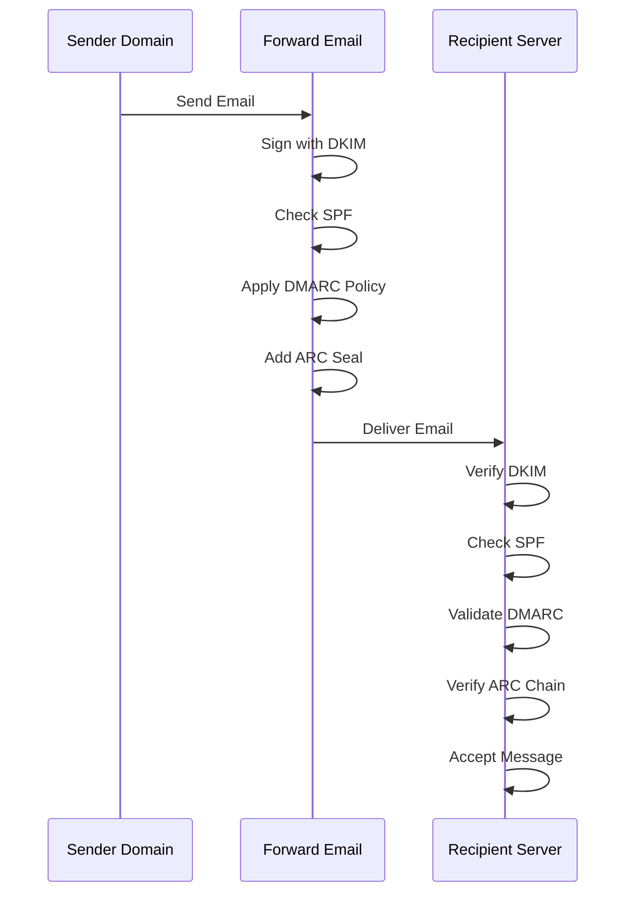

---


## Protocoles de sécurité du transport des emails {#email-transport-security-protocols}

> \[!IMPORTANT]
> Forward Email met en œuvre plusieurs couches de sécurité du transport pour protéger les emails en transit.

Forward Email met en œuvre des protocoles modernes de sécurité du transport :

| RFC                                                       | Titre                                                                                               | Statut      | Notes d'implémentation                                                                                                                                                                                                                                                                          |
| --------------------------------------------------------- | -------------------------------------------------------------------------------------------------- | ----------- | --------------------------------------------------------------------------------------------------------------------------------------------------------------------------------------------------------------------------------------------------------------------------------------------- |
| [RFC 8461](https://datatracker.ietf.org/doc/html/rfc8461) | SMTP MTA Strict Transport Security (MTA-STS)                                                       | ✅ Pris en charge | Utilisé largement sur les serveurs IMAP, SMTP et MX. Voir [create-mta-sts-cache.js](https://github.com/forwardemail/forwardemail.net/blob/master/helpers/create-mta-sts-cache.js) et [get-transporter.js](https://github.com/forwardemail/forwardemail.net/blob/master/helpers/get-transporter.js) |
| [RFC 8460](https://datatracker.ietf.org/doc/html/rfc8460) | Rapport SMTP TLS                                                                                   | ✅ Pris en charge | Via la bibliothèque [mailauth](https://github.com/postalsys/mailauth)                                                                                                                                                                                                                           |
| [RFC 7671](https://datatracker.ietf.org/doc/html/rfc7671) | Le protocole DANE (DNS-Based Authentication of Named Entities) : mises à jour et guide opérationnel | ✅ Pris en charge | Vérification complète DANE pour les connexions SMTP sortantes. Voir [mx-connect PR #22](https://github.com/zone-eu/mx-connect/pull/22)                                                                                                                                                          |
| [RFC 6698](https://datatracker.ietf.org/doc/html/rfc6698) | Le protocole DANE TLS (DNS-Based Authentication of Named Entities Transport Layer Security) : TLSA | ✅ Pris en charge | Support complet du RFC 6698 : types d'utilisation PKIX-TA, PKIX-EE, DANE-TA, DANE-EE. Voir [mx-connect PR #22](https://github.com/zone-eu/mx-connect/pull/22)                                                                                                                                   |
| [RFC 8314](https://datatracker.ietf.org/doc/html/rfc8314) | Texte clair considéré obsolète : utilisation de TLS pour la soumission et l'accès aux emails      | ✅ Pris en charge | TLS requis pour toutes les connexions                                                                                                                                                                                                                                                          |
| [RFC 8689](https://datatracker.ietf.org/doc/html/rfc8689) | Extension de service SMTP pour exiger TLS (REQUIRETLS)                                            | ✅ Pris en charge | Support complet de l'extension SMTP REQUIRETLS et de l'en-tête "TLS-Required"                                                                                                                                                                                                                  |
Les protocoles de sécurité de transport garantissent que les messages électroniques sont chiffrés et authentifiés lors de la transmission entre les serveurs de messagerie.

### Support de la sécurité de transport {#transport-security-support}

| Protocole     | RFC      | Statut       | Description                                      |
| ------------- | -------- | ------------ | ------------------------------------------------ |
| **TLS**       | RFC 8314 | ✅ Pris en charge | Transport Layer Security - Connexions chiffrées  |
| **MTA-STS**   | RFC 8461 | ✅ Pris en charge | Mail Transfer Agent Strict Transport Security    |
| **DANE**      | RFC 7671 | ✅ Pris en charge | Authentification DNS des entités nommées         |
| **REQUIRETLS**| RFC 8689 | ✅ Pris en charge | Exiger TLS pour tout le chemin de livraison      |

### TLS (Transport Layer Security) {#tls-transport-layer-security}

Forward Email applique le chiffrement TLS pour toutes les connexions email (SMTP, IMAP, POP3).

**Fonctionnalités clés :**

* Support de TLS 1.2 et TLS 1.3
* Gestion automatique des certificats
* Perfect Forward Secrecy (PFS)
* Suites de chiffrement fortes uniquement

### MTA-STS (Mail Transfer Agent Strict Transport Security) {#mta-sts-mail-transfer-agent-strict-transport-security}

**MTA-STS** garantit que les emails ne sont livrés que via des connexions chiffrées TLS en publiant une politique via HTTPS.

Forward Email implémente MTA-STS en utilisant [create-mta-sts-cache.js](https://github.com/forwardemail/forwardemail.net/blob/master/helpers/create-mta-sts-cache.js).

**Fonctionnalités clés :**

* Publication automatique de la politique MTA-STS
* Mise en cache de la politique pour la performance
* Prévention des attaques de rétrogradation
* Application de la validation des certificats

### DANE (DNS-based Authentication of Named Entities) {#dane-dns-based-authentication-of-named-entities}

> \[!NOTE]
> Forward Email offre désormais un support complet de DANE pour les connexions SMTP sortantes.

**DANE** utilise DNSSEC pour publier les informations des certificats TLS dans le DNS, permettant aux serveurs de messagerie de vérifier les certificats sans dépendre des autorités de certification.

**Fonctionnalités clés :**

* ✅ Vérification complète DANE pour les connexions SMTP sortantes
* ✅ Support complet de la RFC 6698 : types d’usage PKIX-TA, PKIX-EE, DANE-TA, DANE-EE
* ✅ Vérification des certificats contre les enregistrements TLSA lors de la montée en TLS
* ✅ Résolution TLSA parallèle pour plusieurs hôtes MX
* ✅ Détection automatique de `dns.resolveTlsa` natif (Node.js v22.15.0+, v23.9.0+)
* ✅ Support de résolveur personnalisé pour les versions plus anciennes de Node.js via [Tangerine](https://github.com/forwardemail/tangerine)
* Nécessite des domaines signés DNSSEC

> \[!TIP]
> **Détails de l’implémentation :** Le support DANE a été ajouté via [mx-connect PR #22](https://github.com/zone-eu/mx-connect/pull/22), qui fournit un support complet DANE/TLSA pour les connexions SMTP sortantes.

### REQUIRETLS {#requiretls}

> \[!TIP]
> Forward Email est l’un des rares fournisseurs à proposer un support REQUIRETLS accessible aux utilisateurs.

**REQUIRETLS** garantit que les messages email ne sont livrés que via des connexions chiffrées TLS sur l’ensemble du chemin de livraison.

**Fonctionnalités clés :**

* Case à cocher accessible à l’utilisateur dans le composeur d’email
* Rejet automatique des livraisons non chiffrées
* Application du TLS de bout en bout
* Notifications détaillées en cas d’échec

> \[!TIP]
> **Application TLS côté utilisateur :** Forward Email propose une case à cocher sous **Mon Compte > Domaines > Paramètres** pour forcer TLS sur toutes les connexions entrantes. Lorsqu’activée, cette fonctionnalité rejette tout email entrant non envoyé via une connexion chiffrée TLS avec un code d’erreur 530, garantissant que tous les mails entrants sont chiffrés en transit.

### Flux de sécurité de transport {#transport-security-flow}

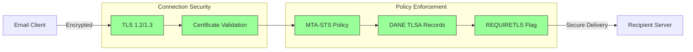
## Chiffrement des messages email {#email-message-encryption}

> \[!NOTE]
> Forward Email prend en charge à la fois OpenPGP et S/MIME pour le chiffrement de bout en bout des emails.

Forward Email prend en charge le chiffrement OpenPGP et S/MIME :

| RFC                                                       | Titre                                                                                   | Statut      | Notes d'implémentation                                                                                                                                                                               |
| --------------------------------------------------------- | --------------------------------------------------------------------------------------- | ----------- | ---------------------------------------------------------------------------------------------------------------------------------------------------------------------------------------------------- |
| [RFC 9580](https://datatracker.ietf.org/doc/html/rfc9580) | OpenPGP (remplace RFC 4880)                                                             | ✅ Pris en charge | Via l'intégration de [OpenPGP.js v6+](https://github.com/openpgpjs/openpgpjs). Voir la [FAQ](https://forwardemail.net/en/faq#do-you-support-openpgpmime-end-to-end-encryption-e2ee-and-web-key-directory-wkd) |
| [RFC 8551](https://datatracker.ietf.org/doc/html/rfc8551) | Secure/Multipurpose Internet Mail Extensions (S/MIME) Version 4.0 Message Specification | ✅ Pris en charge | Algorithmes RSA et ECC pris en charge. Voir la [FAQ](https://forwardemail.net/en/faq#do-you-support-smime-encryption)                                                                                  |

Les protocoles de chiffrement des messages protègent le contenu des emails pour qu'il ne soit lu que par le destinataire prévu, même si le message est intercepté pendant le transit.

### Support du chiffrement {#encryption-support}

| Protocole   | RFC      | Statut      | Description                                  |
| ----------- | -------- | ----------- | -------------------------------------------- |
| **OpenPGP** | RFC 9580 | ✅ Pris en charge | Pretty Good Privacy - Chiffrement à clé publique  |
| **S/MIME**  | RFC 8551 | ✅ Pris en charge | Secure/Multipurpose Internet Mail Extensions |
| **WKD**     | Draft    | ✅ Pris en charge | Web Key Directory - Découverte automatique des clés  |

### OpenPGP (Pretty Good Privacy) {#openpgp-pretty-good-privacy}

**OpenPGP** fournit un chiffrement de bout en bout utilisant la cryptographie à clé publique. Forward Email prend en charge OpenPGP via le protocole [Web Key Directory (WKD)](https://forwardemail.net/en/faq#do-you-support-openpgpmime-end-to-end-encryption-e2ee-and-web-key-directory-wkd).

**Fonctionnalités clés :**

* Découverte automatique des clés via WKD
* Support PGP/MIME pour les pièces jointes chiffrées
* Gestion des clés via le client email
* Compatible avec GPG, Mailvelope et autres outils OpenPGP

**Comment utiliser :**

1. Générez une paire de clés PGP dans votre client email
2. Téléversez votre clé publique sur le WKD de Forward Email
3. Votre clé est automatiquement découvrable par les autres utilisateurs
4. Envoyez et recevez des emails chiffrés sans effort

### S/MIME (Secure/Multipurpose Internet Mail Extensions) {#smime-securemultipurpose-internet-mail-extensions}

**S/MIME** fournit le chiffrement des emails et les signatures numériques à l'aide de certificats X.509.

**Fonctionnalités clés :**

* Chiffrement basé sur certificat
* Signatures numériques pour l'authentification des messages
* Support natif dans la plupart des clients email
* Sécurité de niveau entreprise

**Comment utiliser :**

1. Obtenez un certificat S/MIME auprès d'une Autorité de Certification
2. Installez le certificat dans votre client email
3. Configurez votre client pour chiffrer/signer les messages
4. Échangez les certificats avec les destinataires

### Chiffrement des boîtes aux lettres SQLite {#sqlite-mailbox-encryption}

> \[!IMPORTANT]
> Forward Email offre une couche supplémentaire de sécurité avec des boîtes aux lettres SQLite chiffrées.

Au-delà du chiffrement au niveau des messages, Forward Email chiffre les boîtes aux lettres entières en utilisant [sqleet](https://github.com/resilar/sqleet) (ChaCha20-Poly1305).

**Fonctionnalités clés :**

* **Chiffrement par mot de passe** - Seul vous connaissez le mot de passe
* **Résistant au quantique** - Chiffrement ChaCha20-Poly1305
* **Zero-knowledge** - Forward Email ne peut pas déchiffrer votre boîte aux lettres
* **Isolé** - Chaque boîte aux lettres est isolée et portable
* **Irrécupérable** - Si vous oubliez votre mot de passe, votre boîte aux lettres est perdue
### Comparaison du chiffrement {#encryption-comparison}

| Fonctionnalité        | OpenPGP           | S/MIME             | Chiffrement SQLite |
| --------------------- | ----------------- | ------------------ | ------------------ |
| **De bout en bout**   | ✅ Oui             | ✅ Oui              | ✅ Oui             |
| **Gestion des clés**  | Autogérée         | Émise par CA       | Basée sur mot de passe |
| **Support client**    | Nécessite un plugin | Natif              | Transparent        |
| **Cas d'utilisation** | Personnel         | Entreprise         | Stockage           |
| **Résistant au quantique** | ⚠️ Dépend de la clé | ⚠️ Dépend du certificat | ✅ Oui             |

### Flux de chiffrement {#encryption-flow}

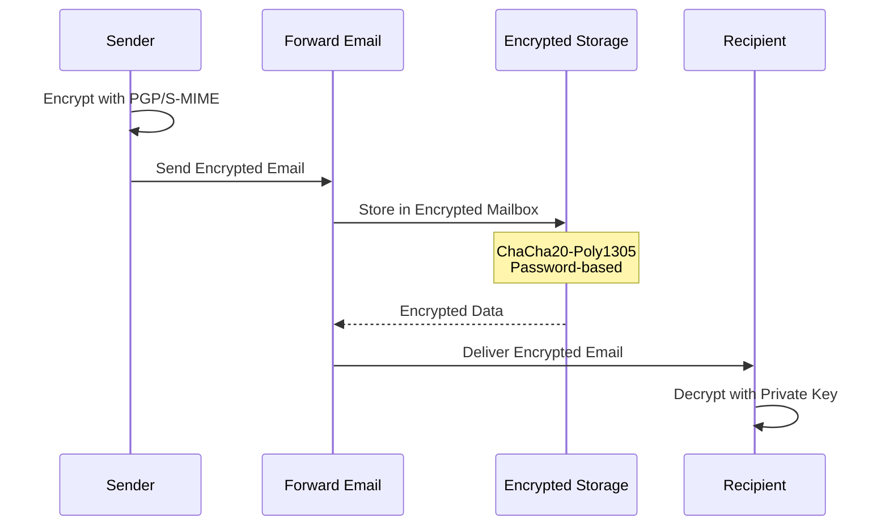

---


## Fonctionnalités étendues {#extended-functionality}


## Normes de format des messages email {#email-message-format-standards}

> \[!NOTE]
> Forward Email prend en charge les normes modernes de format de courrier électronique pour un contenu enrichi et l’internationalisation.

Forward Email prend en charge les formats standards de messages email :

| RFC                                                       | Titre                                                         | Notes d’implémentation |
| --------------------------------------------------------- | ------------------------------------------------------------- | ---------------------- |
| [RFC 5322](https://datatracker.ietf.org/doc/html/rfc5322) | Format des messages Internet                                  | Support complet        |
| [RFC 2045](https://datatracker.ietf.org/doc/html/rfc2045) | MIME Partie Un : Format des corps de message Internet         | Support complet MIME   |
| [RFC 2046](https://datatracker.ietf.org/doc/html/rfc2046) | MIME Partie Deux : Types de médias                             | Support complet MIME   |
| [RFC 2047](https://datatracker.ietf.org/doc/html/rfc2047) | MIME Partie Trois : Extensions d’en-tête pour texte non ASCII | Support complet MIME   |
| [RFC 2048](https://datatracker.ietf.org/doc/html/rfc2048) | MIME Partie Quatre : Procédures d’enregistrement               | Support complet MIME   |
| [RFC 2049](https://datatracker.ietf.org/doc/html/rfc2049) | MIME Partie Cinq : Critères de conformité et exemples          | Support complet MIME   |

Les normes de format des emails définissent comment les messages email sont structurés, encodés et affichés.

### Support des normes de format {#format-standards-support}

| Norme              | RFC           | Statut      | Description                           |
| ------------------- | ------------- | ----------- | ----------------------------------- |
| **MIME**            | RFC 2045-2049 | ✅ Supporté | Extensions multipurpose Internet Mail |
| **SMTPUTF8**        | RFC 6531      | ⚠️ Partiel  | Adresses email internationalisées   |
| **EAI**             | RFC 6530      | ⚠️ Partiel  | Internationalisation des adresses email |
| **Format du message** | RFC 5322      | ✅ Supporté | Format des messages Internet         |
| **Sécurité MIME**   | RFC 1847      | ✅ Supporté | Multiparts sécurisés pour MIME       |

### MIME (Extensions multipurpose Internet Mail) {#mime-multipurpose-internet-mail-extensions}

**MIME** permet aux emails de contenir plusieurs parties avec différents types de contenu (texte, HTML, pièces jointes, etc.).

**Fonctionnalités MIME supportées :**

* Messages multipart (mixte, alternatif, lié)
* En-têtes Content-Type
* Content-Transfer-Encoding (7bit, 8bit, quoted-printable, base64)
* Images en ligne et pièces jointes
* Contenu HTML enrichi

### SMTPUTF8 et internationalisation des adresses email {#smtputf8-and-email-address-internationalization}

> \[!WARNING]
> Le support SMTPUTF8 est partiel - toutes les fonctionnalités ne sont pas entièrement implémentées.
**SMTPUTF8** permet aux adresses e-mail de contenir des caractères non ASCII (par exemple, `用户@例え.jp`).

**Statut actuel :**

* ⚠️ Support partiel des adresses e-mail internationalisées
* ✅ Contenu UTF-8 dans les corps de message
* ⚠️ Support limité des parties locales non ASCII

---


## Protocoles de calendrier et de contacts {#calendaring-and-contacts-protocols}

> \[!NOTE]
> Forward Email offre un support complet de CalDAV et CardDAV pour la synchronisation des calendriers et des contacts.

Forward Email prend en charge CalDAV et CardDAV via la bibliothèque [caldav-adapter](https://github.com/forwardemail/caldav-adapter) :

| RFC                                                       | Titre                                                                    | Statut      | Notes d'implémentation                                                                                                                                                                |
| --------------------------------------------------------- | ------------------------------------------------------------------------ | ----------- | -------------------------------------------------------------------------------------------------------------------------------------------------------------------------------------- |
| [RFC 4791](https://datatracker.ietf.org/doc/html/rfc4791) | Extensions de calendrier à WebDAV (CalDAV)                              | ✅ Supporté | Accès et gestion du calendrier                                                                                                                                                         |
| [RFC 6352](https://datatracker.ietf.org/doc/html/rfc6352) | CardDAV : Extensions vCard à WebDAV                                     | ✅ Supporté | Accès et gestion des contacts                                                                                                                                                          |
| [RFC 5545](https://datatracker.ietf.org/doc/html/rfc5545) | Spécification principale des objets de calendrier et de planification (iCalendar) | ✅ Supporté | Support du format iCalendar                                                                                                                                                             |
| [RFC 6350](https://datatracker.ietf.org/doc/html/rfc6350) | Spécification du format vCard                                           | ✅ Supporté | Support du format vCard 4.0                                                                                                                                                             |
| [RFC 6638](https://datatracker.ietf.org/doc/html/rfc6638) | Extensions de planification à CalDAV                                    | ✅ Supporté | Planification CalDAV avec support iMIP. Voir [commit c4d1629](https://github.com/forwardemail/forwardemail.net/commit/c4d162975a49e38d76d68a032662e873a34a9b80)                            |
| [RFC 5546](https://datatracker.ietf.org/doc/html/rfc5546) | Protocole d'interopérabilité indépendant du transport iCalendar (iTIP) | ✅ Supporté | Support iTIP pour les méthodes REQUEST, REPLY, CANCEL et VFREEBUSY. Voir [commit c4d1629](https://github.com/forwardemail/forwardemail.net/commit/c4d162975a49e38d76d68a032662e873a34a9b80) |
| [RFC 6047](https://datatracker.ietf.org/doc/html/rfc6047) | Protocole d'interopérabilité basé sur les messages iCalendar (iMIP)    | ✅ Supporté | Invitations de calendrier par e-mail avec liens de réponse. Voir [commit c4d1629](https://github.com/forwardemail/forwardemail.net/commit/c4d162975a49e38d76d68a032662e873a34a9b80)           |

CalDAV et CardDAV sont des protocoles qui permettent d'accéder, de partager et de synchroniser les données de calendrier et de contacts entre appareils.

### Support CalDAV et CardDAV {#caldav-and-carddav-support}

| Protocole             | RFC      | Statut      | Description                            |
| --------------------- | -------- | ----------- | -------------------------------------- |
| **CalDAV**            | RFC 4791 | ✅ Supporté | Accès et synchronisation du calendrier |
| **CardDAV**           | RFC 6352 | ✅ Supporté | Accès et synchronisation des contacts  |
| **iCalendar**         | RFC 5545 | ✅ Supporté | Format de données de calendrier         |
| **vCard**             | RFC 6350 | ✅ Supporté | Format de données de contacts           |
| **VTODO**             | RFC 5545 | ✅ Supporté | Support des tâches/rappels              |
| **Planification CalDAV** | RFC 6638 | ✅ Supporté | Extensions de planification du calendrier |
| **iTIP**              | RFC 5546 | ✅ Supporté | Interopérabilité indépendante du transport |
| **iMIP**              | RFC 6047 | ✅ Supporté | Invitations de calendrier par e-mail    |
### CalDAV (Accès au Calendrier) {#caldav-calendar-access}

**CalDAV** vous permet d'accéder et de gérer des calendriers depuis n'importe quel appareil ou application.

**Fonctionnalités clés :**

* Synchronisation multi-appareils
* Calendriers partagés
* Abonnements aux calendriers
* Invitations et réponses aux événements
* Événements récurrents
* Support des fuseaux horaires

**Clients compatibles :**

* Apple Calendar (macOS, iOS)
* Mozilla Thunderbird
* Evolution
* GNOME Calendar
* Tout client compatible CalDAV

### CardDAV (Accès aux Contacts) {#carddav-contact-access}

**CardDAV** vous permet d'accéder et de gérer des contacts depuis n'importe quel appareil ou application.

**Fonctionnalités clés :**

* Synchronisation multi-appareils
* Carnets d'adresses partagés
* Groupes de contacts
* Support des photos
* Champs personnalisés
* Support de vCard 4.0

**Clients compatibles :**

* Apple Contacts (macOS, iOS)
* Mozilla Thunderbird
* Evolution
* GNOME Contacts
* Tout client compatible CardDAV

### Tâches et Rappels (CalDAV VTODO) {#tasks-and-reminders-caldav-vtodo}

> \[!TIP]
> Forward Email prend en charge les tâches et rappels via CalDAV VTODO.

**VTODO** fait partie du format iCalendar et permet la gestion des tâches via CalDAV.

**Fonctionnalités clés :**

* Création et gestion des tâches
* Dates d'échéance et priorités
* Suivi de l'achèvement des tâches
* Tâches récurrentes
* Listes/catégories de tâches

**Clients compatibles :**

* Apple Reminders (macOS, iOS)
* Mozilla Thunderbird (avec Lightning)
* Evolution
* GNOME To Do
* Tout client CalDAV avec support VTODO

### Flux de Synchronisation CalDAV/CardDAV {#caldavcarddav-synchronization-flow}

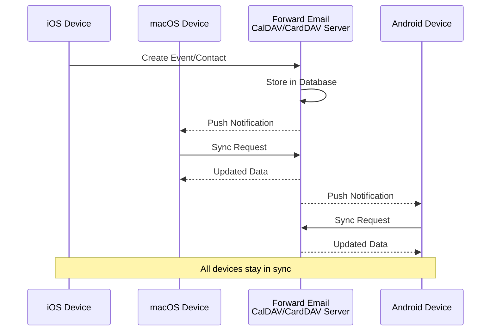

### Extensions de Calendrier NON Supportées {#calendaring-extensions-not-supported}

Les extensions de calendrier suivantes NE sont PAS supportées :

| RFC                                                       | Titre                                                                | Raison                                                          |
| --------------------------------------------------------- | -------------------------------------------------------------------- | --------------------------------------------------------------- |
| [RFC 4918](https://datatracker.ietf.org/doc/html/rfc4918) | Extensions HTTP pour l'édition distribuée et la gestion de versions (WebDAV) | CalDAV utilise les concepts WebDAV mais n'implémente pas entièrement la RFC 4918 |
| [RFC 6578](https://datatracker.ietf.org/doc/html/rfc6578) | Synchronisation de collections pour WebDAV                           | Non implémenté                                                  |
| [RFC 3744](https://datatracker.ietf.org/doc/html/rfc3744) | Protocole de contrôle d'accès WebDAV                                | Non implémenté                                                  |

---


## Filtrage des Messages Email {#email-message-filtering}

> \[!IMPORTANT]
> Forward Email fournit un **support complet de Sieve et ManageSieve** pour le filtrage des emails côté serveur. Créez des règles puissantes pour trier, filtrer, transférer et répondre automatiquement aux messages entrants.

### Sieve (RFC 5228) {#sieve-rfc-5228}

[Sieve](https://en.wikipedia.org/wiki/Sieve_\(mail_filtering_language\)) est un langage de script standardisé et puissant pour le filtrage des emails côté serveur. Forward Email implémente un support complet de Sieve avec 24 extensions.

**Code source :** [`helpers/sieve/`](https://github.com/forwardemail/forwardemail.net/tree/master/helpers/sieve)

#### RFCs Sieve de Base Supportées {#core-sieve-rfcs-supported}

| RFC                                                                                    | Titre                                                        | Statut         |
| -------------------------------------------------------------------------------------- | ------------------------------------------------------------ | -------------- |
| [RFC 5228](https://datatracker.ietf.org/doc/html/rfc5228)                              | Sieve : un langage de filtrage des emails                    | ✅ Support complet |
| [RFC 5429](https://datatracker.ietf.org/doc/html/rfc5429)                              | Filtrage des emails Sieve : extensions Reject et Extended Reject | ✅ Support complet |
| [RFC 5230](https://datatracker.ietf.org/doc/html/rfc5230)                              | Filtrage des emails Sieve : extension Vacation               | ✅ Support complet |
| [RFC 6131](https://datatracker.ietf.org/doc/html/rfc6131)                              | Extension Vacation Sieve : paramètre "Seconds"               | ✅ Support complet |
| [RFC 5232](https://datatracker.ietf.org/doc/html/rfc5232)                              | Filtrage des emails Sieve : extension Imap4flags             | ✅ Support complet |
| [RFC 5173](https://datatracker.ietf.org/doc/html/rfc5173)                              | Filtrage des emails Sieve : extension Body                    | ✅ Support complet |
| [RFC 5229](https://datatracker.ietf.org/doc/html/rfc5229)                              | Filtrage des emails Sieve : extension Variables               | ✅ Support complet |
| [RFC 5231](https://datatracker.ietf.org/doc/html/rfc5231)                              | Filtrage des emails Sieve : extension Relationnelle           | ✅ Support complet |
| [RFC 4790](https://datatracker.ietf.org/doc/html/rfc4790)                              | Registre de collation des protocoles applicatifs Internet     | ✅ Support complet |
| [RFC 3894](https://datatracker.ietf.org/doc/html/rfc3894)                              | Extension Sieve : copie sans effets secondaires               | ✅ Support complet |
| [RFC 5293](https://datatracker.ietf.org/doc/html/rfc5293)                              | Filtrage des emails Sieve : extension Editheader              | ✅ Support complet |
| [RFC 5260](https://datatracker.ietf.org/doc/html/rfc5260)                              | Filtrage des emails Sieve : extensions Date et Index          | ✅ Support complet |
| [RFC 5435](https://datatracker.ietf.org/doc/html/rfc5435)                              | Filtrage des emails Sieve : extension pour notifications      | ✅ Support complet |
| [RFC 5183](https://datatracker.ietf.org/doc/html/rfc5183)                              | Filtrage des emails Sieve : extension Environnement           | ✅ Support complet |
| [RFC 5490](https://datatracker.ietf.org/doc/html/rfc5490)                              | Filtrage des emails Sieve : extensions pour vérifier le statut de la boîte aux lettres | ✅ Support complet |
| [RFC 8579](https://datatracker.ietf.org/doc/html/rfc8579)                              | Filtrage des emails Sieve : livraison vers des boîtes aux lettres à usage spécial | ✅ Support complet |
| [RFC 7352](https://datatracker.ietf.org/doc/html/rfc7352)                              | Filtrage des emails Sieve : détection des livraisons en double | ✅ Support complet |
| [RFC 5463](https://datatracker.ietf.org/doc/html/rfc5463)                              | Filtrage des emails Sieve : extension Ihave                   | ✅ Support complet |
| [RFC 5233](https://datatracker.ietf.org/doc/html/rfc5233)                              | Filtrage des emails Sieve : extension Subaddress               | ✅ Support complet |
| [draft-ietf-sieve-regex](https://datatracker.ietf.org/doc/html/draft-ietf-sieve-regex) | Filtrage des emails Sieve : extension expressions régulières  | ✅ Support complet |
#### Extensions Sieve prises en charge {#supported-sieve-extensions}

| Extension                    | Description                              | Intégration                                |
| ---------------------------- | ---------------------------------------- | ------------------------------------------ |
| `fileinto`                   | Classer les messages dans des dossiers spécifiques | Messages stockés dans le dossier IMAP spécifié   |
| `reject` / `ereject`         | Rejeter les messages avec une erreur    | Rejet SMTP avec message de rebond         |
| `vacation`                   | Réponses automatiques d'absence/vacances | Mis en file via Emails.queue avec limitation de débit |
| `vacation-seconds`           | Intervalles précis pour les réponses d'absence | TTL à partir du paramètre `:seconds`              |
| `imap4flags`                 | Définir les drapeaux IMAP (\Seen, \Flagged, etc.) | Drapeaux appliqués lors du stockage du message       |
| `envelope`                   | Tester l'expéditeur/destinataire de l'enveloppe | Accès aux données de l'enveloppe SMTP               |
| `body`                       | Tester le contenu du corps du message   | Correspondance complète du texte du corps                    |
| `variables`                  | Stocker et utiliser des variables dans les scripts | Expansion de variables avec modificateurs          |
| `relational`                 | Comparaisons relationnelles             | `:count`, `:value` avec gt/lt/eq           |
| `comparator-i;ascii-numeric` | Comparaisons numériques                  | Comparaison de chaînes numériques                  |
| `copy`                       | Copier les messages lors de la redirection | Drapeau `:copy` sur fileinto/redirect          |
| `editheader`                 | Ajouter ou supprimer des en-têtes de message | En-têtes modifiés avant stockage            |
| `date`                       | Tester les valeurs de date/heure        | Tests `currentdate` et date d'en-tête        |
| `index`                      | Accéder à des occurrences spécifiques d'en-têtes | `:index` pour en-têtes à valeurs multiples           |
| `regex`                      | Correspondance par expression régulière | Support complet des regex dans les tests                |
| `enotify`                    | Envoyer des notifications               | Notifications `mailto:` via Emails.queue   |
| `environment`                | Accéder aux informations d'environnement | Domaine, hôte, remote-ip depuis la session       |
| `mailbox`                    | Tester l'existence d'une boîte aux lettres | Test `mailboxexists`                       |
| `special-use`                | Classer dans des boîtes aux lettres à usage spécial | Mappe \Junk, \Trash, etc. vers des dossiers        |
| `duplicate`                  | Détecter les messages en double         | Suivi des doublons basé sur Redis             |
| `ihave`                      | Tester la disponibilité d'une extension | Vérification des capacités à l'exécution                |
| `subaddress`                 | Accéder aux parties user+detail de l'adresse | Parties d'adresse `:user` et `:detail`        |

#### Extensions Sieve NON prises en charge {#sieve-extensions-not-supported}

| Extension                               | RFC                                                       | Raison                                                           |
| --------------------------------------- | --------------------------------------------------------- | ---------------------------------------------------------------- |
| `include`                               | [RFC 6609](https://datatracker.ietf.org/doc/html/rfc6609) | Risque de sécurité (injection de script), nécessite un stockage global des scripts |
| `mboxmetadata` / `servermetadata`       | [RFC 5490](https://datatracker.ietf.org/doc/html/rfc5490) | Nécessite l'extension IMAP METADATA                                 |
| `fcc`                                   | [RFC 8580](https://datatracker.ietf.org/doc/html/rfc8580) | Nécessite l'intégration du dossier Envoyés                                 |
| `encoded-character`                     | [RFC 5228](https://datatracker.ietf.org/doc/html/rfc5228) | Modifications du parseur requises pour la syntaxe ${hex:}                       |
| `foreverypart` / `mime` / `extracttext` | [RFC 5703](https://datatracker.ietf.org/doc/html/rfc5703) | Manipulation complexe de l'arbre MIME                                   |
#### Flux de traitement Sieve {#sieve-processing-flow}

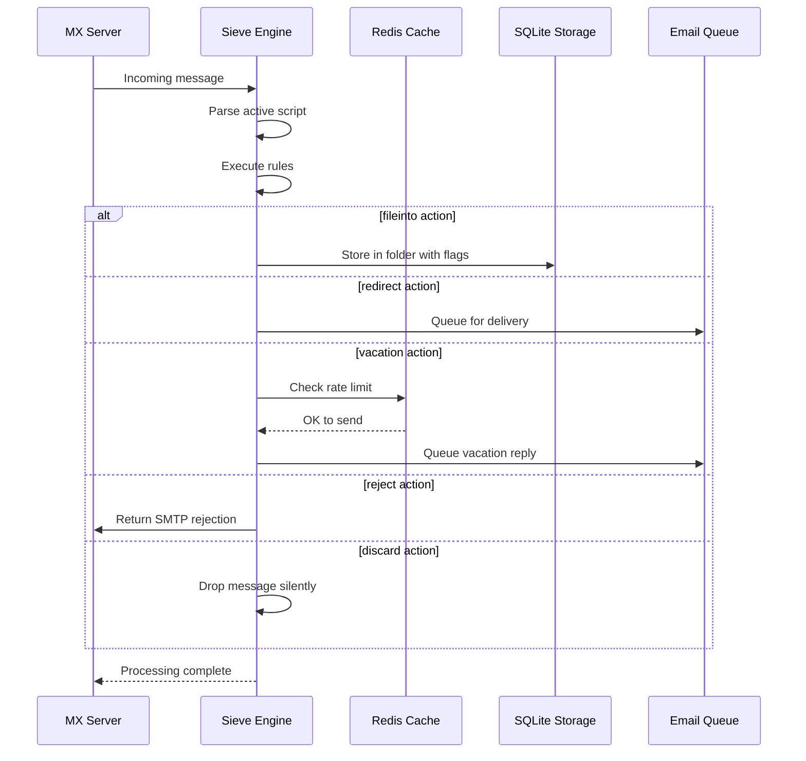

#### Fonctionnalités de sécurité {#security-features}

L'implémentation Sieve de Forward Email inclut des protections de sécurité complètes :

* **Protection CVE-2023-26430** : Empêche les boucles de redirection et les attaques de mail bombing
* **Limitation de débit** : Limites sur les redirections (10/message, 100/jour) et les réponses de vacances
* **Vérification de la liste de refus** : Les adresses de redirection sont vérifiées contre la liste de refus
* **En-têtes protégés** : Les en-têtes DKIM, ARC et d'authentification ne peuvent pas être modifiés via editheader
* **Limites de taille de script** : Taille maximale du script appliquée
* **Timeouts d'exécution** : Les scripts sont terminés si l'exécution dépasse la limite de temps

#### Exemples de scripts Sieve {#example-sieve-scripts}

**Classer les newsletters dans un dossier :**

```sieve
require ["fileinto"];

if header :contains "List-Id" "newsletter" {
    fileinto "Newsletters";
}
```

**Répondeur automatique de vacances avec minutage précis :**

```sieve
require ["vacation", "vacation-seconds"];

vacation :seconds 3600 :subject "Out of Office"
    "Je suis actuellement absent et répondrai dans les 24 heures.";
```

**Filtrage anti-spam avec drapeaux :**

```sieve
require ["fileinto", "imap4flags"];

if header :contains "X-Spam-Status" "Yes" {
    setflag "\\Seen";
    fileinto "Junk";
}
```

**Filtrage complexe avec variables :**

```sieve
require ["variables", "fileinto", "regex"];

if header :regex "From" "(.+)@example\\.com" {
    set :lower "sender" "${1}";
    fileinto "Contacts/${sender}";
}
```

> \[!TIP]
> Pour la documentation complète, des scripts exemples et les instructions de configuration, voir [FAQ : Supportez-vous le filtrage d’e-mails Sieve ?](/faq#do-you-support-sieve-email-filtering)

### ManageSieve (RFC 5804) {#managesieve-rfc-5804}

Forward Email offre un support complet du protocole ManageSieve pour la gestion à distance des scripts Sieve.

**Code source :** [`managesieve-server.js`](https://github.com/forwardemail/forwardemail.net/blob/master/managesieve-server.js)

| RFC                                                       | Titre                                         | Statut         |
| --------------------------------------------------------- | --------------------------------------------- | -------------- |
| [RFC 5804](https://datatracker.ietf.org/doc/html/rfc5804) | Un protocole pour la gestion à distance des scripts Sieve | ✅ Support complet |

#### Configuration du serveur ManageSieve {#managesieve-server-configuration}

| Paramètre               | Valeur                  |
| ----------------------- | ----------------------- |
| **Serveur**             | `imap.forwardemail.net` |
| **Port (STARTTLS)**     | `2190` (recommandé)     |
| **Port (TLS implicite)**| `4190`                  |
| **Authentification**    | PLAIN (sur TLS)         |

> **Note :** Le port 2190 utilise STARTTLS (passage de plain à TLS) et est compatible avec la plupart des clients ManageSieve, y compris [sieve-connect](https://github.com/philpennock/sieve-connect). Le port 4190 utilise TLS implicite (TLS dès le début de la connexion) pour les clients qui le supportent.

#### Commandes ManageSieve supportées {#supported-managesieve-commands}

| Commande       | Description                             |
| -------------- | --------------------------------------- |
| `AUTHENTICATE` | Authentifier avec le mécanisme PLAIN    |
| `CAPABILITY`   | Lister les capacités et extensions du serveur |
| `HAVESPACE`    | Vérifier si un script peut être stocké  |
| `PUTSCRIPT`    | Télécharger un nouveau script            |
| `LISTSCRIPTS`  | Lister tous les scripts avec statut actif |
| `SETACTIVE`    | Activer un script                       |
| `GETSCRIPT`    | Télécharger un script                   |
| `DELETESCRIPT` | Supprimer un script                     |
| `RENAMESCRIPT` | Renommer un script                      |
| `CHECKSCRIPT`  | Valider la syntaxe du script            |
| `NOOP`         | Maintenir la connexion active           |
| `LOGOUT`       | Terminer la session                     |
#### Clients ManageSieve compatibles {#compatible-managesieve-clients}

* **Thunderbird** : Support Sieve intégré via [extension Sieve](https://addons.thunderbird.net/addon/sieve/)
* **Roundcube** : [plugin ManageSieve](https://plugins.roundcube.net/packages/johndoh/sieve)
* **KMail** : Support natif ManageSieve
* **sieve-connect** : Client en ligne de commande
* **Tout client conforme à la RFC 5804**

#### Flux du protocole ManageSieve {#managesieve-protocol-flow}

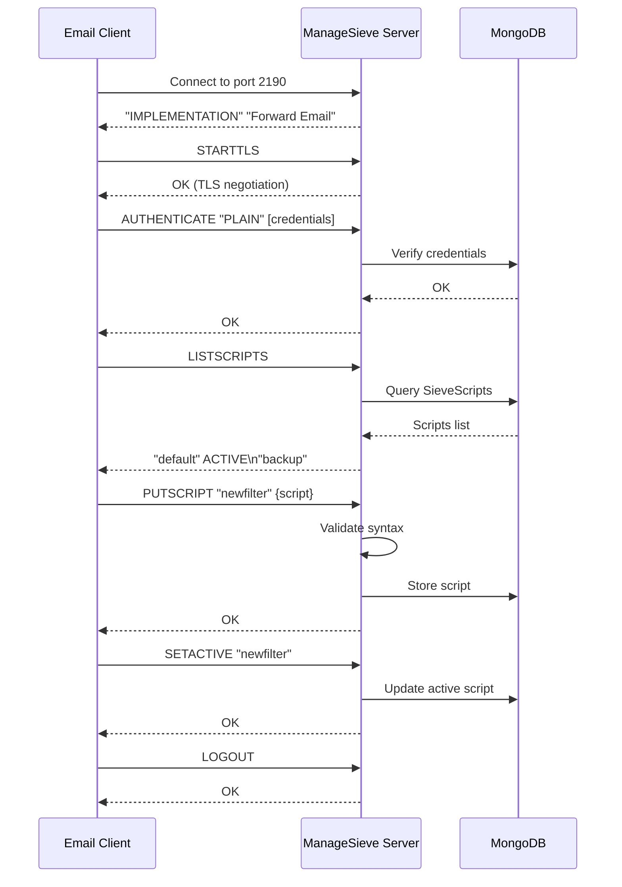

#### Interface Web et API {#web-interface-and-api}

En plus de ManageSieve, Forward Email propose :

* **Tableau de bord Web** : Créez et gérez les scripts Sieve via l’interface web dans Mon Compte → Domaines → Alias → Scripts Sieve
* **API REST** : Accès programmatique à la gestion des scripts Sieve via la [Forward Email API](/api#sieve-scripts)

> \[!TIP]
> Pour des instructions détaillées d’installation et de configuration client, voir [FAQ : Supportez-vous le filtrage d’emails Sieve ?](/faq#do-you-support-sieve-email-filtering)

---


## Optimisation du stockage {#storage-optimization}

> \[!IMPORTANT]
> **Technologie de stockage inédite dans l’industrie :** Forward Email est le **seul fournisseur d’email au monde** à combiner la déduplication des pièces jointes avec la compression Brotli sur le contenu des emails. Cette optimisation à double couche vous offre **2 à 3 fois plus de stockage effectif** comparé aux fournisseurs d’email traditionnels.

Forward Email met en œuvre deux techniques révolutionnaires d’optimisation du stockage qui réduisent drastiquement la taille des boîtes mail tout en respectant pleinement la RFC et la fidélité des messages :

1. **Déduplication des pièces jointes** – Élimine les pièces jointes dupliquées dans tous les emails
2. **Compression Brotli** – Réduit le stockage de 46 à 86 % pour les métadonnées et de 50 % pour les pièces jointes

### Architecture : Optimisation du stockage à double couche {#architecture-dual-layer-storage-optimization}

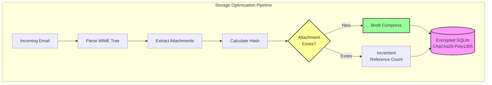

---


## Déduplication des pièces jointes {#attachment-deduplication}

Forward Email implémente la déduplication des pièces jointes basée sur [l’approche éprouvée de WildDuck](https://docs.wildduck.email/docs/in-depth/attachment-deduplication/), adaptée au stockage SQLite.

> \[!NOTE]
> **Ce qui est dédupliqué :** « Pièce jointe » désigne le contenu du nœud MIME **encodé** (base64 ou quoted-printable), pas le fichier décodé. Cela préserve la validité des signatures DKIM et GPG.

### Comment ça fonctionne {#how-it-works}

**Implémentation originale de WildDuck (MongoDB GridFS) :**

> Le serveur IMAP Wild Duck déduplique les pièces jointes. « Pièce jointe » signifie ici le contenu du nœud mime encodé en base64 ou quoted-printable, pas le fichier décodé. Même si l’utilisation du contenu encodé entraîne beaucoup de faux négatifs (le même fichier dans différents emails peut être compté comme des pièces jointes différentes), cela est nécessaire pour garantir la validité des différents schémas de signature (DKIM, GPG, etc.). Un message récupéré depuis Wild Duck ressemble exactement au message stocké même si Wild Duck analyse le message en un objet arborescent et reconstruit le message lors de la récupération.
**Implémentation SQLite de Forward Email :**

Forward Email adapte cette approche pour le stockage SQLite chiffré avec le processus suivant :

1. **Calcul du hash** : Lorsqu'une pièce jointe est trouvée, un hash est calculé à l'aide de la bibliothèque [`rev-hash`](https://github.com/sindresorhus/rev-hash) à partir du corps de la pièce jointe
2. **Recherche** : Vérifier si une pièce jointe avec un hash correspondant existe dans la table `Attachments`
3. **Comptage des références** :
   * Si elle existe : Incrémenter le compteur de références de 1 et le compteur magique d'un nombre aléatoire
   * Si nouvelle : Créer une nouvelle entrée de pièce jointe avec compteur = 1
4. **Sécurité de suppression** : Utilise un système à double compteur (référence + magique) pour éviter les faux positifs
5. **Collecte des déchets** : Les pièces jointes sont supprimées immédiatement lorsque les deux compteurs atteignent zéro

**Code source :** [`helpers/attachment-storage.js`](https://github.com/forwardemail/forwardemail.net/blob/master/helpers/attachment-storage.js)

### Flux de déduplication {#deduplication-flow}

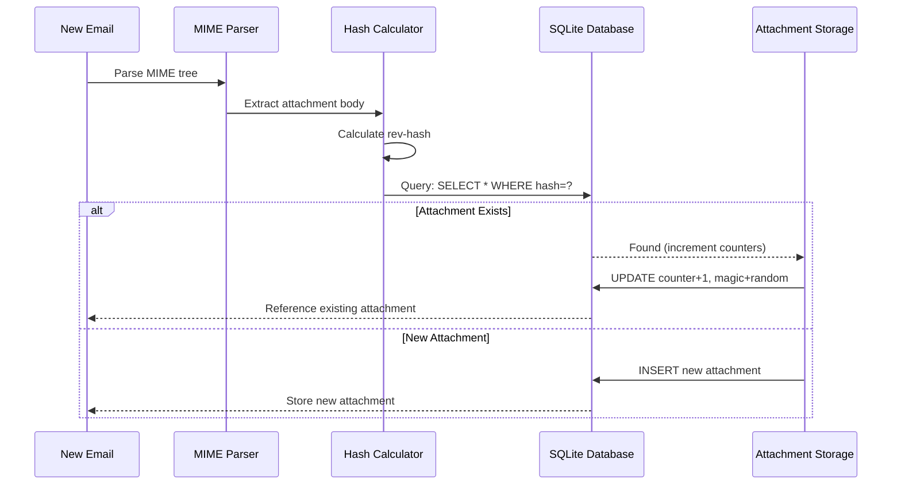

### Système de nombre magique {#magic-number-system}

Forward Email utilise le système de "nombre magique" de WildDuck (inspiré par [Mail.ru](https://github.com/zone-eu/wildduck)) pour éviter les faux positifs lors de la suppression :

* Chaque message reçoit un **nombre aléatoire** assigné
* Le **compteur magique** de la pièce jointe est incrémenté de ce nombre aléatoire lorsque le message est ajouté
* Le compteur magique est décrémenté du même nombre lorsque le message est supprimé
* La pièce jointe n'est supprimée que lorsque **les deux compteurs** (référence + magique) atteignent zéro

Ce système à double compteur garantit que si quelque chose tourne mal lors de la suppression (ex. : crash, erreur réseau), la pièce jointe n'est pas supprimée prématurément.

### Différences clés : WildDuck vs Forward Email {#key-differences-wildduck-vs-forward-email}

| Fonctionnalité         | WildDuck (MongoDB)       | Forward Email (SQLite)       |
| ---------------------- | ------------------------ | ---------------------------- |
| **Backend de stockage**| MongoDB GridFS (par morceaux) | SQLite BLOB (direct)         |
| **Algorithme de hash** | SHA256                   | rev-hash (basé sur SHA-256)  |
| **Comptage des références** | ✅ Oui                 | ✅ Oui                       |
| **Nombres magiques**   | ✅ Oui (inspiré Mail.ru)  | ✅ Oui (même système)         |
| **Collecte des déchets** | Retardée (tâche séparée) | Immédiate (à zéro compteurs) |
| **Compression**        | ❌ Aucune                | ✅ Brotli (voir ci-dessous)   |
| **Chiffrement**        | ❌ Optionnel             | ✅ Toujours (ChaCha20-Poly1305)|

---


## Compression Brotli {#brotli-compression}

> \[!IMPORTANT]
> **Première mondiale :** Forward Email est le **seul service email au monde** à utiliser la compression Brotli sur le contenu des emails. Cela permet des **économies de stockage de 46 à 86 %** en plus de la déduplication des pièces jointes.

Forward Email implémente la compression Brotli à la fois pour les corps de pièces jointes et les métadonnées des messages, offrant d'importantes économies de stockage tout en maintenant la compatibilité ascendante.

**Implémentation :** [`helpers/msgpack-helpers.js`](https://github.com/forwardemail/forwardemail.net/blob/master/helpers/msgpack-helpers.js)

### Ce qui est compressé {#what-gets-compressed}

**1. Corps des pièces jointes** (`encodeAttachmentBody`)

* **Anciens formats** : chaîne encodée en hexadécimal (taille x2) ou Buffer brut
* **Nouveau format** : Buffer compressé Brotli avec en-tête magique "FEBR"
* **Décision de compression** : Ne compresse que si cela économise de l'espace (compte pour un en-tête de 4 octets)
* **Économies de stockage** : Jusqu'à **50 %** (hex → BLOB natif)
**2. Métadonnées du message** (`encodeMetadata`)

Inclut : `mimeTree`, `headers`, `envelope`, `flags`

* **Ancien format** : chaîne de texte JSON
* **Nouveau format** : Buffer compressé avec Brotli
* **Économies de stockage** : **46-86%** selon la complexité du message

### Configuration de la compression {#compression-configuration}

```javascript
// Options de compression Brotli optimisées pour la vitesse (le niveau 4 est un bon compromis)
const BROTLI_COMPRESS_OPTIONS = {
  params: {
    [zlib.constants.BROTLI_PARAM_QUALITY]: 4
  }
};
```

**Pourquoi le niveau 4 ?**

* **Compression/décompression rapide** : traitement en moins d’une milliseconde
* **Bon taux de compression** : économies de 46-86%
* **Performance équilibrée** : optimal pour les opérations email en temps réel

### En-tête magique : "FEBR" {#magic-header-febr}

Forward Email utilise un en-tête magique de 4 octets pour identifier les corps de pièces jointes compressés :

```
"FEBR" = Forward Email BRotli
Hex : 0x46 0x45 0x42 0x52
```

**Pourquoi un en-tête magique ?**

* **Détection du format** : identification instantanée des données compressées ou non
* **Compatibilité ascendante** : les anciennes chaînes hexadécimales et Buffers bruts fonctionnent toujours
* **Évitement des collisions** : "FEBR" est peu susceptible d’apparaître au début de données légitimes de pièce jointe

### Processus de compression {#compression-process}

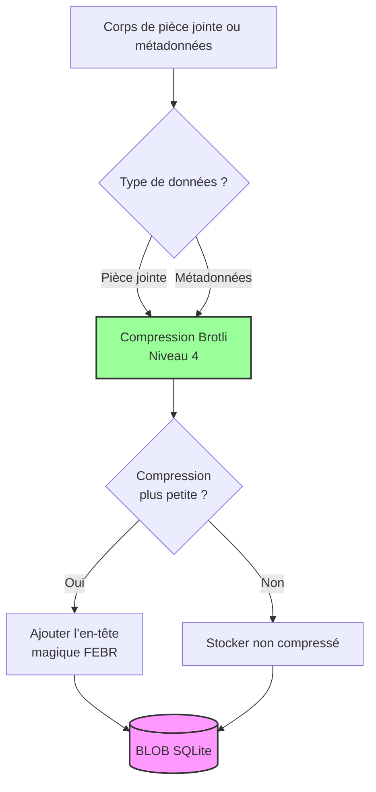

### Processus de décompression {#decompression-process}

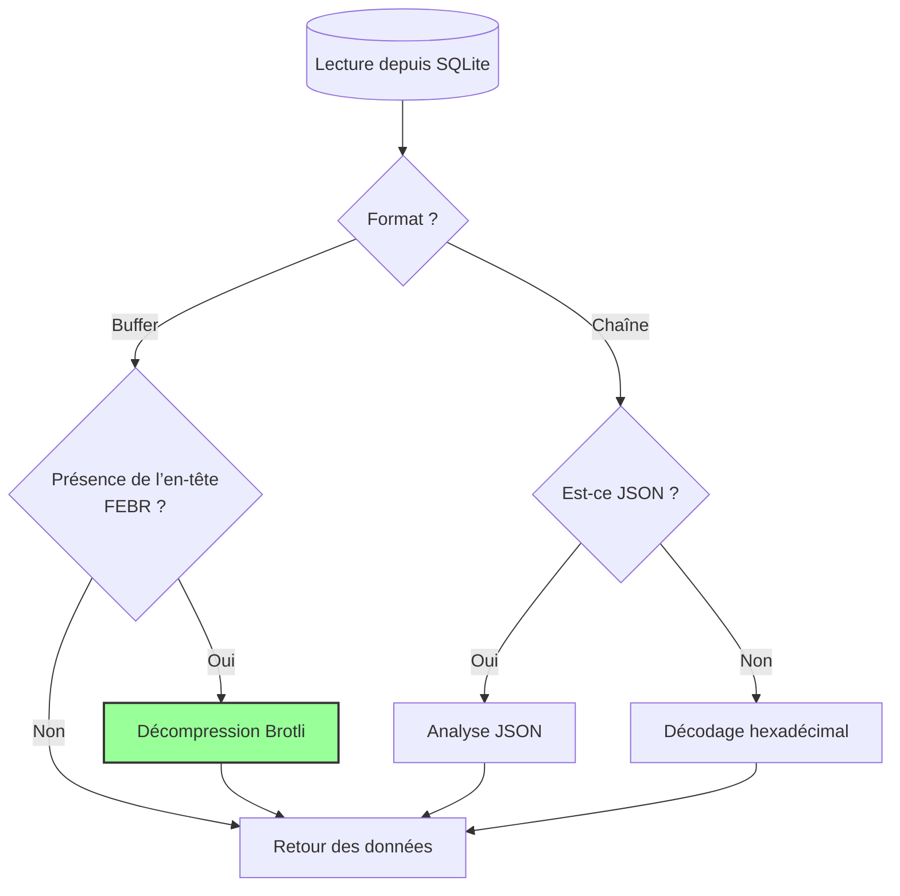

### Compatibilité ascendante {#backwards-compatibility}

Toutes les fonctions de décodage **détectent automatiquement** le format de stockage :

| Format                | Méthode de détection                  | Traitement                                    |
| --------------------- | ----------------------------------- | --------------------------------------------- |
| **Compressé Brotli**  | Recherche de l’en-tête magique "FEBR" | Décompression avec `zlib.brotliDecompressSync()` |
| **Buffer brut**       | `Buffer.isBuffer()` sans en-tête     | Retour tel quel                               |
| **Chaîne hexadécimale** | Vérification de la longueur paire + caractères [0-9a-f] | Décodage avec `Buffer.from(value, 'hex')`     |
| **Chaîne JSON**       | Premier caractère `{` ou `[`          | Analyse avec `JSON.parse()`                    |

Cela garantit **aucune perte de données** lors de la migration des anciens vers les nouveaux formats de stockage.

### Statistiques d’économies de stockage {#storage-savings-statistics}

**Économies mesurées sur des données en production :**

| Type de données       | Ancien format           | Nouveau format          | Économies  |
| --------------------- | ----------------------- | ---------------------- | ---------- |
| **Corps de pièces jointes** | Chaîne encodée hexadécimal (2x) | BLOB compressé Brotli  | **50%**    |
| **Métadonnées du message** | Texte JSON              | BLOB compressé Brotli  | **46-86%** |
| **Drapeaux de boîte aux lettres** | Texte JSON              | BLOB compressé Brotli  | **60-80%** |

**Source :** [`helpers/migrate-storage-format.js`](https://github.com/forwardemail/forwardemail.net/blob/master/helpers/migrate-storage-format.js)

### Processus de migration {#migration-process}

Forward Email fournit une migration automatique et idempotente des anciens vers les nouveaux formats de stockage :
// Statistiques de migration suivies :
{
  attachmentsMigrated: 0,
  messagesMigrated: 0,
  mailboxesMigrated: 0,
  bytesSaved: 0  // Total des octets économisés grâce à la compression
}
```

**Étapes de migration :**

1. Corps des pièces jointes : encodage hexadécimal → BLOB natif (50 % d’économies)
2. Métadonnées des messages : texte JSON → BLOB compressé Brotli (46-86 % d’économies)
3. Flags des boîtes aux lettres : texte JSON → BLOB compressé Brotli (60-80 % d’économies)

**Source :** [`helpers/migrate-storage-format.js`](https://github.com/forwardemail/forwardemail.net/blob/master/helpers/migrate-storage-format.js)

---

### Efficacité de stockage combinée {#combined-storage-efficiency}

> \[!TIP]
> **Impact réel :** Avec la déduplication des pièces jointes + la compression Brotli, les utilisateurs de Forward Email bénéficient de **2 à 3 fois plus de stockage effectif** comparé aux fournisseurs d’email traditionnels.

**Scénario d’exemple :**

Fournisseur d’email traditionnel (boîte aux lettres de 1 Go) :

* 1 Go d’espace disque = 1 Go d’emails
* Pas de déduplication : même pièce jointe stockée 10 fois = gaspillage de stockage 10x
* Pas de compression : métadonnées JSON complètes stockées = gaspillage de stockage 2-3x

Forward Email (boîte aux lettres de 1 Go) :

* 1 Go d’espace disque ≈ **2-3 Go d’emails** (stockage effectif)
* Déduplication : même pièce jointe stockée une fois, référencée 10 fois
* Compression : 46-86 % d’économies sur les métadonnées, 50 % sur les pièces jointes
* Chiffrement : ChaCha20-Poly1305 (pas de surcharge de stockage)

**Tableau comparatif :**

| Fournisseur       | Technologie de stockage                      | Stockage effectif (boîte 1 Go) |
| ----------------- | -------------------------------------------- | ------------------------------ |
| Gmail             | Aucune                                       | 1 Go                          |
| iCloud            | Aucune                                       | 1 Go                          |
| Outlook.com       | Aucune                                       | 1 Go                          |
| Fastmail          | Aucune                                       | 1 Go                          |
| ProtonMail        | Chiffrement uniquement                        | 1 Go                          |
| Tutanota          | Chiffrement uniquement                        | 1 Go                          |
| **Forward Email** | **Déduplication + Compression + Chiffrement** | **2-3 Go** ✨                  |

### Détails techniques de l’implémentation {#technical-implementation-details}

**Performance :**

* Brotli niveau 4 : compression/décompression en moins d’une milliseconde
* Aucune pénalité de performance due à la compression
* SQLite FTS5 : recherche en moins de 50 ms avec SSD NVMe

**Sécurité :**

* La compression se fait **après** le chiffrement (la base SQLite est chiffrée)
* Chiffrement ChaCha20-Poly1305 + compression Brotli
* Zero-knowledge : seul l’utilisateur possède le mot de passe de déchiffrement

**Conformité RFC :**

* Les messages récupérés sont **exactement les mêmes** que ceux stockés
* Les signatures DKIM restent valides (contenu encodé préservé)
* Les signatures GPG restent valides (aucune modification du contenu signé)

### Pourquoi aucun autre fournisseur ne fait cela {#why-no-other-provider-does-this}

**Complexité :**

* Nécessite une intégration profonde avec la couche de stockage
* La compatibilité ascendante est difficile
* La migration depuis d’anciens formats est complexe

**Problèmes de performance :**

* La compression ajoute une charge CPU (résolue avec Brotli niveau 4)
* La décompression à chaque lecture (résolue avec la mise en cache SQLite)

**Avantage de Forward Email :**

* Conçu dès le départ avec l’optimisation en tête
* SQLite permet la manipulation directe des BLOB
* Bases de données chiffrées par utilisateur permettant une compression sûre

---

---


## Fonctionnalités modernes {#modern-features}


## API REST complète pour la gestion des emails {#complete-rest-api-for-email-management}

> \[!TIP]
> Forward Email fournit une API REST complète avec 39 points de terminaison pour la gestion programmatique des emails.

> \[!TIP]
> **Fonctionnalité unique dans l’industrie :** Contrairement à tous les autres services email, Forward Email offre un accès programmatique complet à votre boîte aux lettres, calendrier, contacts, messages et dossiers via une API REST complète. C’est une interaction directe avec votre fichier de base de données SQLite chiffré contenant toutes vos données.

Forward Email propose une API REST complète qui offre un accès sans précédent à vos données email. Aucun autre service email (y compris Gmail, iCloud, Outlook, ProtonMail, Tuta ou Fastmail) n’offre ce niveau d’accès direct et complet à la base de données.
**Documentation API :** <https://forwardemail.net/en/email-api>

### Catégories API (39 points de terminaison) {#api-categories-39-endpoints}

**1. API Messages** (5 points de terminaison) - Opérations CRUD complètes sur les messages email :

* `GET /v1/messages` - Lister les messages avec plus de 15 paramètres de recherche avancée (aucun autre service ne propose cela)
* `POST /v1/messages` - Créer/envoyer des messages
* `GET /v1/messages/:id` - Récupérer un message
* `PUT /v1/messages/:id` - Mettre à jour un message (drapeaux, dossiers)
* `DELETE /v1/messages/:id` - Supprimer un message

*Exemple : Trouver toutes les factures du dernier trimestre avec pièces jointes :*

```bash
curl -u "alias@domain.com:password" \
  "https://api.forwardemail.net/v1/messages?q=subject:invoice+has:attachment+after:2024-01-01+before:2024-04-01"
```

Voir la [Documentation Recherche Avancée](https://forwardemail.net/en/email-api)

**2. API Dossiers** (5 points de terminaison) - Gestion complète des dossiers IMAP via REST :

* `GET /v1/folders` - Lister tous les dossiers
* `POST /v1/folders` - Créer un dossier
* `GET /v1/folders/:id` - Récupérer un dossier
* `PUT /v1/folders/:id` - Mettre à jour un dossier
* `DELETE /v1/folders/:id` - Supprimer un dossier

**3. API Contacts** (5 points de terminaison) - Stockage des contacts CardDAV via REST :

* `GET /v1/contacts` - Lister les contacts
* `POST /v1/contacts` - Créer un contact (format vCard)
* `GET /v1/contacts/:id` - Récupérer un contact
* `PUT /v1/contacts/:id` - Mettre à jour un contact
* `DELETE /v1/contacts/:id` - Supprimer un contact

**4. API Calendriers** (5 points de terminaison) - Gestion des conteneurs de calendriers :

* `GET /v1/calendars` - Lister les conteneurs de calendriers
* `POST /v1/calendars` - Créer un calendrier (ex. : « Calendrier Travail », « Calendrier Personnel »)
* `GET /v1/calendars/:id` - Récupérer un calendrier
* `PUT /v1/calendars/:id` - Mettre à jour un calendrier
* `DELETE /v1/calendars/:id` - Supprimer un calendrier

**5. API Événements Calendrier** (5 points de terminaison) - Planification d’événements dans les calendriers :

* `GET /v1/calendar-events` - Lister les événements
* `POST /v1/calendar-events` - Créer un événement avec participants
* `GET /v1/calendar-events/:id` - Récupérer un événement
* `PUT /v1/calendar-events/:id` - Mettre à jour un événement
* `DELETE /v1/calendar-events/:id` - Supprimer un événement

*Exemple : Créer un événement de calendrier :*

```bash
curl -u "alias@domain.com:password" \
  -X POST \
  -H "Content-Type: application/json" \
  -d '{"title":"Réunion d\'équipe","start":"2024-12-20T10:00:00Z","attendees":["team@example.com"],"calendar_id":"calendar123"}' \
  https://api.forwardemail.net/v1/calendar-events
```

### Détails Techniques {#technical-details}

* **Authentification :** Authentification simple `alias:password` (pas de complexité OAuth)
* **Performance :** Temps de réponse inférieur à 50 ms avec SQLite FTS5 et stockage NVMe SSD
* **Latence Réseau Nulle :** Accès direct à la base de données, sans passer par des services externes

### Cas d’Utilisation Réels {#real-world-use-cases}

* **Analyse des Emails :** Construisez des tableaux de bord personnalisés suivant le volume d’emails, les temps de réponse, les statistiques des expéditeurs

* **Flux de Travail Automatisés :** Déclenchez des actions basées sur le contenu des emails (traitement des factures, tickets de support)

* **Intégration CRM :** Synchronisez automatiquement les conversations email avec votre CRM

* **Conformité & Recherche :** Recherchez et exportez des emails pour des besoins légaux ou de conformité

* **Clients Email Personnalisés :** Créez des interfaces email spécialisées pour votre flux de travail

* **Intelligence d’Affaires :** Analysez les schémas de communication, taux de réponse, engagement client

* **Gestion Documentaire :** Extrayez et catégorisez automatiquement les pièces jointes

* [Documentation Complète](https://forwardemail.net/en/email-api)

* [Référence API Complète](https://forwardemail.net/en/email-api)

* [Guide Recherche Avancée](https://forwardemail.net/en/email-api)

* [30+ Exemples d’Intégration](https://forwardemail.net/en/email-api)

* [Architecture Technique](https://forwardemail.net/en/blog/docs/best-quantum-safe-encrypted-email-service)

Forward Email propose une API REST moderne offrant un contrôle total sur les comptes email, domaines, alias et messages. Cette API constitue une alternative puissante à JMAP et offre des fonctionnalités au-delà des protocoles email traditionnels.

| Catégorie               | Points de terminaison | Description                             |
| ----------------------- | --------------------- | ------------------------------------- |
| **Gestion des Comptes** | 8                     | Comptes utilisateurs, authentification, paramètres |
| **Gestion des Domaines**| 12                    | Domaines personnalisés, DNS, vérification |
| **Gestion des Alias**   | 6                     | Alias email, redirections, catch-all  |
| **Gestion des Messages**| 7                     | Envoi, réception, recherche, suppression de messages |
| **Calendrier & Contacts**| 4                    | Accès CalDAV/CardDAV via API          |
| **Journaux & Analyses** | 2                     | Journaux email, rapports de livraison |
### Fonctionnalités clés de l’API {#key-api-features}

**Recherche avancée :**

L’API offre des capacités de recherche puissantes avec une syntaxe de requête similaire à Gmail :

```
GET /v1/messages?q=subject:invoice+has:attachment+after:2024-01-01+before:2024-04-01
```

**Opérateurs de recherche pris en charge :**

* `from:` - Recherche par expéditeur
* `to:` - Recherche par destinataire
* `subject:` - Recherche par sujet
* `has:attachment` - Messages avec pièces jointes
* `is:unread` - Messages non lus
* `is:starred` - Messages marqués
* `after:` - Messages après une date
* `before:` - Messages avant une date
* `label:` - Messages avec étiquette
* `filename:` - Nom de fichier de la pièce jointe

**Gestion des événements du calendrier :**

```
GET /v1/calendar-events
POST /v1/calendar-events
PUT /v1/calendar-events/:id
DELETE /v1/calendar-events/:id
```

**Intégrations Webhook :**

L’API prend en charge les webhooks pour les notifications en temps réel des événements email (reçus, envoyés, rejetés, etc.).

**Authentification :**

* Authentification par clé API
* Support OAuth 2.0
* Limitation du débit : 1000 requêtes/heure

**Format des données :**

* Requête/réponse JSON
* Conception RESTful
* Support de la pagination

**Sécurité :**

* HTTPS uniquement
* Rotation des clés API
* Liste blanche d’IP (optionnel)
* Signature des requêtes (optionnel)

### Architecture de l’API {#api-architecture}

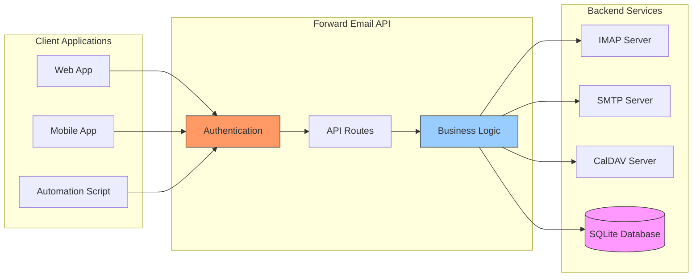

---


## Notifications Push iOS {#ios-push-notifications}

> \[!TIP]
> Forward Email prend en charge les notifications push natives iOS via XAPPLEPUSHSERVICE pour une livraison instantanée des emails.

> \[!IMPORTANT]
> **Fonctionnalité unique :** Forward Email est l’un des rares serveurs email open-source à supporter les notifications push natives iOS pour les emails, contacts et calendriers via l’extension IMAP `XAPPLEPUSHSERVICE`. Cette fonctionnalité a été rétro-ingénierée à partir du protocole d’Apple et offre une livraison instantanée sur les appareils iOS sans décharge de batterie.

Forward Email implémente l’extension propriétaire XAPPLEPUSHSERVICE d’Apple, fournissant des notifications push natives pour les appareils iOS sans nécessiter de sondage en arrière-plan.

### Comment ça fonctionne {#how-it-works-1}

**XAPPLEPUSHSERVICE** est une extension IMAP non standard qui permet à l’application Mail iOS de recevoir des notifications push instantanées à l’arrivée de nouveaux emails.

Forward Email implémente l’intégration propriétaire du service de notifications push Apple (APNs) pour IMAP, permettant à l’application Mail iOS de recevoir des notifications push instantanées à l’arrivée de nouveaux emails.

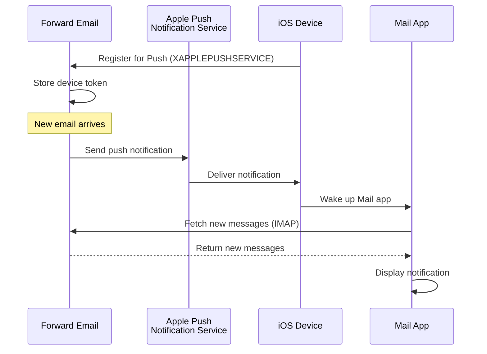

### Fonctionnalités clés {#key-features}

**Livraison instantanée :**

* Les notifications push arrivent en quelques secondes
* Pas de sondage en arrière-plan consommateur de batterie
* Fonctionne même lorsque l’application Mail est fermée

<!---->

* **Livraison instantanée :** Les emails, événements de calendrier et contacts apparaissent immédiatement sur votre iPhone/iPad, sans attente de sondage
* **Efficace pour la batterie :** Utilise l’infrastructure push d’Apple au lieu de maintenir des connexions IMAP constantes
* **Push basé sur les sujets :** Supporte les notifications push pour des boîtes aux lettres spécifiques, pas seulement la boîte de réception
* **Pas d’applications tierces requises :** Fonctionne avec les applications natives Mail, Calendrier et Contacts iOS
**Intégration native :**

* Intégré à l’application Mail d’iOS
* Aucune application tierce requise
* Expérience utilisateur fluide

**Axé sur la confidentialité :**

* Les jetons d’appareil sont chiffrés
* Aucun contenu de message envoyé via APNS
* Seule la notification de « nouveau mail » est envoyée

**Efficace en termes de batterie :**

* Pas de sondage IMAP constant
* L’appareil reste en veille jusqu’à l’arrivée d’une notification
* Impact minimal sur la batterie

### Ce qui rend cela spécial {#what-makes-this-special}

> \[!IMPORTANT]
> La plupart des fournisseurs de messagerie ne prennent pas en charge XAPPLEPUSHSERVICE, obligeant les appareils iOS à interroger les mails toutes les 15 minutes.

La plupart des serveurs de messagerie open-source (y compris Dovecot, Postfix, Cyrus IMAP) ne prennent PAS en charge les notifications push iOS. Les utilisateurs doivent soit :

* Utiliser IMAP IDLE (maintient la connexion ouverte, consomme la batterie)
* Utiliser le sondage (vérifie toutes les 15-30 minutes, notifications retardées)
* Utiliser des applications de messagerie propriétaires avec leur propre infrastructure push

Forward Email offre la même expérience de notification push instantanée que les services commerciaux comme Gmail, iCloud et Fastmail.

**Comparaison avec d’autres fournisseurs :**

| Fournisseur      | Support Push   | Intervalle de sondage | Impact sur la batterie |
| ---------------- | -------------- | --------------------- | --------------------- |
| **Forward Email**| ✅ Push natif  | Instantané            | Minimal               |
| Gmail            | ✅ Push natif  | Instantané            | Minimal               |
| iCloud           | ✅ Push natif  | Instantané            | Minimal               |
| Yahoo            | ✅ Push natif  | Instantané            | Minimal               |
| Outlook.com      | ❌ Sondage     | 15 minutes            | Modéré                |
| Fastmail         | ❌ Sondage     | 15 minutes            | Modéré                |
| ProtonMail       | ⚠️ Pont uniquement | Via pont           | Élevé                 |
| Tutanota         | ❌ Application uniquement | N/A          | N/A                   |

### Détails de l’implémentation {#implementation-details}

**Réponse CAPABILITY IMAP :**

```
* CAPABILITY IMAP4rev1 ... XAPPLEPUSHSERVICE ...
```

**Processus d’enregistrement :**

1. L’application Mail iOS détecte la capacité XAPPLEPUSHSERVICE
2. L’application enregistre le jeton de l’appareil auprès de Forward Email
3. Forward Email stocke le jeton et l’associe au compte
4. Lorsqu’un nouveau mail arrive, Forward Email envoie une notification push via APNS
5. iOS réveille l’application Mail pour récupérer les nouveaux messages

**Sécurité :**

* Les jetons d’appareil sont chiffrés au repos
* Les jetons expirent et sont automatiquement renouvelés
* Aucun contenu de message exposé à APNS
* Chiffrement de bout en bout maintenu

<!---->

* **Extension IMAP :** `XAPPLEPUSHSERVICE`
* **Code source :** [WildDuck Issue #711](https://github.com/zone-eu/wildduck/issues/711)
* **Installation :** Automatique - aucune configuration nécessaire, fonctionne directement avec l’application Mail iOS

### Comparaison avec d’autres services {#comparison-with-other-services}

| Service       | Support Push iOS | Méthode                                   |
| ------------- | ---------------- | ---------------------------------------- |
| Forward Email | ✅ Oui           | `XAPPLEPUSHSERVICE` (rétro-ingénierie)  |
| Gmail         | ✅ Oui           | Application Gmail propriétaire + push Google |
| iCloud Mail   | ✅ Oui           | Intégration native Apple                  |
| Outlook.com   | ✅ Oui           | Application Outlook propriétaire + push Microsoft |
| Fastmail      | ✅ Oui           | `XAPPLEPUSHSERVICE`                       |
| Dovecot       | ❌ Non           | IMAP IDLE ou sondage uniquement           |
| Postfix       | ❌ Non           | IMAP IDLE ou sondage uniquement           |
| Cyrus IMAP    | ❌ Non           | IMAP IDLE ou sondage uniquement           |

**Push Gmail :**

Gmail utilise un système push propriétaire qui ne fonctionne qu’avec l’application Gmail. L’application Mail iOS doit interroger les serveurs IMAP de Gmail.

**Push iCloud :**

iCloud dispose d’un support push natif similaire à Forward Email, mais uniquement pour les adresses @icloud.com.

**Outlook.com :**

Outlook.com ne prend pas en charge XAPPLEPUSHSERVICE, obligeant l’application Mail iOS à interroger toutes les 15 minutes.

**Fastmail :**

Fastmail ne prend pas en charge XAPPLEPUSHSERVICE. Les utilisateurs doivent utiliser l’application Fastmail pour les notifications push ou accepter un délai de sondage de 15 minutes.

---


## Tests et vérification {#testing-and-verification}


## Tests de capacité du protocole {#protocol-capability-tests}
> \[!NOTE]
> Cette section fournit les résultats de nos derniers tests de capacité des protocoles, réalisés le 22 janvier 2026.

Cette section contient les réponses réelles CAPABILITY/CAPA/EHLO de tous les fournisseurs testés. Tous les tests ont été effectués le **22 janvier 2026**.

Ces tests permettent de vérifier le support annoncé et réel des différents protocoles et extensions de messagerie chez les principaux fournisseurs.

### Méthodologie de test {#test-methodology}

**Environnement de test :**

* **Date :** 22 janvier 2026 à 02:37 UTC
* **Emplacement :** instance AWS EC2
* **IPv4 :** 54.167.216.197
* **IPv6 :** 2600:4040:46da:9a00:b19e:3ad4:426c:2f48
* **Outils :** OpenSSL s_client, scripts bash

**Fournisseurs testés :**

* Forward Email
* Gmail
* Outlook.com
* iCloud
* Fastmail
* Yahoo/AOL (Verizon)

### Scripts de test {#test-scripts}

Pour une transparence totale, les scripts exacts utilisés pour ces tests sont fournis ci-dessous.

#### Script de test de capacité IMAP {#imap-capability-test-script}

```bash
#!/bin/bash
# IMAP Capability Test Script
# Tests IMAP CAPABILITY for various email providers

echo "========================================="
echo "IMAP CAPABILITY TEST"
echo "Date: $(date -u +"%Y-%m-%d %H:%M:%S UTC")"
echo "========================================="
echo ""

# Gmail
echo "--- Gmail (imap.gmail.com:993) ---"
echo -e "a001 CAPABILITY\na002 LOGOUT" | timeout 10 openssl s_client -connect imap.gmail.com:993 -crlf -quiet 2>&1 | grep -A 20 "CAPABILITY"
echo ""

# Outlook.com
echo "--- Outlook.com (outlook.office365.com:993) ---"
echo -e "a001 CAPABILITY\na002 LOGOUT" | timeout 10 openssl s_client -connect outlook.office365.com:993 -crlf -quiet 2>&1 | grep -A 20 "CAPABILITY"
echo ""

# iCloud
echo "--- iCloud (imap.mail.me.com:993) ---"
echo -e "a001 CAPABILITY\na002 LOGOUT" | timeout 10 openssl s_client -connect imap.mail.me.com:993 -crlf -quiet 2>&1 | grep -A 20 "CAPABILITY"
echo ""

# Fastmail
echo "--- Fastmail (imap.fastmail.com:993) ---"
echo -e "a001 CAPABILITY\na002 LOGOUT" | timeout 10 openssl s_client -connect imap.fastmail.com:993 -crlf -quiet 2>&1 | grep -A 20 "CAPABILITY"
echo ""

# Yahoo
echo "--- Yahoo (imap.mail.yahoo.com:993) ---"
echo -e "a001 CAPABILITY\na002 LOGOUT" | timeout 10 openssl s_client -connect imap.mail.yahoo.com:993 -crlf -quiet 2>&1 | grep -A 20 "CAPABILITY"
echo ""

# Forward Email
echo "--- Forward Email (imap.forwardemail.net:993) ---"
echo -e "a001 CAPABILITY\na002 LOGOUT" | timeout 10 openssl s_client -connect imap.forwardemail.net:993 -crlf -quiet 2>&1 | grep -A 20 "CAPABILITY"
echo ""

echo "========================================="
echo "Test completed"
echo "========================================="
```

#### Script de test de capacité POP3 {#pop3-capability-test-script}

```bash
#!/bin/bash
# POP3 Capability Test Script
# Tests POP3 CAPA for various email providers

echo "========================================="
echo "POP3 CAPABILITY TEST"
echo "Date: $(date -u +"%Y-%m-%d %H:%M:%S UTC")"
echo "========================================="
echo ""

# Gmail
echo "--- Gmail (pop.gmail.com:995) ---"
echo -e "CAPA\nQUIT" | timeout 10 openssl s_client -connect pop.gmail.com:995 -crlf -quiet 2>&1 | grep -A 20 "CAPA"
echo ""

# Outlook.com
echo "--- Outlook.com (outlook.office365.com:995) ---"
echo -e "CAPA\nQUIT" | timeout 10 openssl s_client -connect outlook.office365.com:995 -crlf -quiet 2>&1 | grep -A 20 "CAPA"
echo ""

# iCloud (Note : iCloud ne supporte pas POP3)
echo "--- iCloud (Pas de support POP3) ---"
echo "iCloud ne supporte pas POP3"
echo ""

# Fastmail
echo "--- Fastmail (pop.fastmail.com:995) ---"
echo -e "CAPA\nQUIT" | timeout 10 openssl s_client -connect pop.fastmail.com:995 -crlf -quiet 2>&1 | grep -A 20 "CAPA"
echo ""

# Yahoo
echo "--- Yahoo (pop.mail.yahoo.com:995) ---"
echo -e "CAPA\nQUIT" | timeout 10 openssl s_client -connect pop.mail.yahoo.com:995 -crlf -quiet 2>&1 | grep -A 20 "CAPA"
echo ""

# Forward Email
echo "--- Forward Email (pop3.forwardemail.net:995) ---"
echo -e "CAPA\nQUIT" | timeout 10 openssl s_client -connect pop3.forwardemail.net:995 -crlf -quiet 2>&1 | grep -A 20 "CAPA"
echo ""

echo "========================================="
echo "Test completed"
echo "========================================="
```
#### Script de test des capacités SMTP {#smtp-capability-test-script}

```bash
#!/bin/bash
# Script de test des capacités SMTP
# Teste EHLO SMTP pour divers fournisseurs de messagerie

echo "========================================="
echo "TEST DE CAPACITÉ SMTP"
echo "Date : $(date -u +"%Y-%m-%d %H:%M:%S UTC")"
echo "========================================="
echo ""

# Gmail
echo "--- Gmail (smtp.gmail.com:587) ---"
echo -e "EHLO test.com\nQUIT" | timeout 10 openssl s_client -connect smtp.gmail.com:587 -starttls smtp -crlf -quiet 2>&1 | grep -A 30 "250-"
echo ""

# Outlook.com
echo "--- Outlook.com (smtp.office365.com:587) ---"
echo -e "EHLO test.com\nQUIT" | timeout 10 openssl s_client -connect smtp.office365.com:587 -starttls smtp -crlf -quiet 2>&1 | grep -A 30 "250-"
echo ""

# iCloud
echo "--- iCloud (smtp.mail.me.com:587) ---"
echo -e "EHLO test.com\nQUIT" | timeout 10 openssl s_client -connect smtp.mail.me.com:587 -starttls smtp -crlf -quiet 2>&1 | grep -A 30 "250-"
echo ""

# Fastmail
echo "--- Fastmail (smtp.fastmail.com:587) ---"
echo -e "EHLO test.com\nQUIT" | timeout 10 openssl s_client -connect smtp.fastmail.com:587 -starttls smtp -crlf -quiet 2>&1 | grep -A 30 "250-"
echo ""

# Yahoo
echo "--- Yahoo (smtp.mail.yahoo.com:587) ---"
echo -e "EHLO test.com\nQUIT" | timeout 10 openssl s_client -connect smtp.mail.yahoo.com:587 -starttls smtp -crlf -quiet 2>&1 | grep -A 30 "250-"
echo ""

# Forward Email
echo "--- Forward Email (smtp.forwardemail.net:587) ---"
echo -e "EHLO test.com\nQUIT" | timeout 10 openssl s_client -connect smtp.forwardemail.net:587 -starttls smtp -crlf -quiet 2>&1 | grep -A 30 "250-"
echo ""

echo "========================================="
echo "Test terminé"
echo "========================================="
```

### Résumé des résultats des tests {#test-results-summary}

#### IMAP (CAPABILITY) {#imap-capability}

**Forward Email**

```
* CAPABILITY IMAP4rev1 AUTH=PLAIN AUTH=PLAIN-CLIENTTOKEN CHILDREN ENABLE ID IDLE NAMESPACE QUOTA SASL-IR UNSELECT XLIST XAPPLEPUSHSERVICE
```

**Gmail**

```
* CAPABILITY IMAP4rev1 UNSELECT IDLE NAMESPACE QUOTA ID XLIST CHILDREN X-GM-EXT-1 UIDPLUS COMPRESS=DEFLATE ENABLE MOVE CONDSTORE ESEARCH UTF8=ACCEPT LIST-EXTENDED LIST-STATUS LITERAL- SPECIAL-USE
```

**iCloud**

```
* OK [CAPABILITY XAPPLEPUSHSERVICE IMAP4 IMAP4rev1 SASL-IR AUTH=ATOKEN AUTH=PLAIN AUTH=ATOKEN2 AUTH=XOAUTH2]
```

**Outlook.com**

```
* CAPABILITY IMAP4rev1 AUTH=PLAIN AUTH=XOAUTH2 SASL-IR UIDPLUS ID UNSELECT CHILDREN IDLE NAMESPACE LITERAL+
```

**Fastmail**

```
* CAPABILITY IMAP4rev1 ACL ANNOTATE-EXPERIMENT-1 CATENATE CONDSTORE ENABLE ESEARCH ESORT I18NLEVEL=1 ID IDLE LIST-EXTENDED LIST-STATUS LITERAL+ LOGINDISABLED MULTIAPPEND NAMESPACE QRESYNC QUOTA RIGHTS=ektx SASL-IR SORT SPECIAL-USE THREAD=ORDEREDSUBJECT UIDPLUS UNSELECT WITHIN X-RENAME XLIST
```

**Yahoo/AOL (Verizon)**

```
* CAPABILITY IMAP4rev1 IDLE NAMESPACE QUOTA ID XLIST CHILDREN UIDPLUS MOVE CONDSTORE ESEARCH ENABLE LIST-EXTENDED LIST-STATUS LITERAL- SPECIAL-USE UNSELECT XAPPLEPUSHSERVICE
```

#### POP3 (CAPA) {#pop3-capa}

**Forward Email**

```
+OK
CAPA
TOP
USER
UIDL
EXPIRE 30
IMPLEMENTATION ForwardEmail
.
```

**Gmail**

```
+OK
CAPA
TOP
USER
UIDL
EXPIRE 30
IMPLEMENTATION Gpop
.
```

**Outlook.com**

```
+OK
CAPA
TOP
USER
UIDL
SASL PLAIN XOAUTH2
.
```

**Fastmail**

```
+OK
CAPA
TOP
USER
UIDL
EXPIRE 30
IMPLEMENTATION Cyrus
.
```

#### SMTP (EHLO) {#smtp-ehlo}

**Forward Email**

```
250-smtp.forwardemail.net
250-PIPELINING
250-SIZE 52428800
250-ETRN
250-STARTTLS
250-ENHANCEDSTATUSCODES
250-8BITMIME
250-DSN
250 CHUNKING
```

**Gmail**

```
250-smtp.gmail.com at your service
250-SIZE 35882577
250-8BITMIME
250-STARTTLS
250-ENHANCEDSTATUSCODES
250-PIPELINING
250-CHUNKING
250 SMTPUTF8
```

**Outlook.com**

```
250-SN4PR13CA0005.outlook.office365.com Hello [x.x.x.x]
250-SIZE 157286400
250-PIPELINING
250-DSN
250-ENHANCEDSTATUSCODES
250-STARTTLS
250-8BITMIME
250-BINARYMIME
250-CHUNKING
250 SMTPUTF8
```

**Fastmail**

```
250-smtp.fastmail.com
250-PIPELINING
250-SIZE 78643200
250-ETRN
250-STARTTLS
250-ENHANCEDSTATUSCODES
250-8BITMIME
250-DSN
250 CHUNKING
```

**Yahoo/AOL (Verizon)**

```
250-smtp.mail.yahoo.com
250-PIPELINING
250-SIZE 41943040
250-8BITMIME
250-ENHANCEDSTATUSCODES
250-STARTTLS
```
### Résultats détaillés des tests {#detailed-test-results}

#### Résultats du test IMAP {#imap-test-results}

**Gmail :**
`* CAPABILITY IMAP4rev1 UNSELECT IDLE NAMESPACE QUOTA ID XLIST CHILDREN X-GM-EXT-1 XYZZY SASL-IR AUTH=XOAUTH2 AUTH=PLAIN AUTH=PLAIN-CLIENTTOKEN AUTH=OAUTHBEARER`

**Outlook.com :**
`* CAPABILITY IMAP4 IMAP4rev1 AUTH=PLAIN AUTH=XOAUTH2 SASL-IR UIDPLUS ID UNSELECT CHILDREN IDLE NAMESPACE LITERAL+`

**iCloud :**
`* CAPABILITY XAPPLEPUSHSERVICE IMAP4 IMAP4rev1 SASL-IR AUTH=ATOKEN AUTH=PLAIN AUTH=ATOKEN2 AUTH=XOAUTH2`

**Fastmail :**
Délai de connexion dépassé. Voir les notes ci-dessous.

**Yahoo :**
`* CAPABILITY IMAP4rev1 SASL-IR AUTH=PLAIN AUTH=XOAUTH2 AUTH=OAUTHBEARER ID MOVE NAMESPACE XYMHIGHESTMODSEQ UIDPLUS LITERAL+ CHILDREN UNSELECT X-MSG-EXT OBJECTID IDLE ENABLE UIDONLY X-ALL-MAIL X-UIDONLY LIST-EXTENDED LIST-STATUS SPECIAL-USE PARTIAL APPENDLIMIT=41697280`

**Forward Email :**
`* CAPABILITY XAPPLEPUSHSERVICE IMAP4rev1 APPENDLIMIT=52428800 AUTH=PLAIN AUTH=PLAIN-CLIENTTOKEN CHILDREN CONDSTORE ENABLE ID IDLE MOVE NAMESPACE QUOTA SASL-IR SPECIAL-USE UIDPLUS UNSELECT UTF8=ACCEPT XLIST`

#### Résultats du test POP3 {#pop3-test-results}

**Gmail :**
La connexion n’a pas renvoyé de réponse CAPA sans authentification.

**Outlook.com :**
La connexion n’a pas renvoyé de réponse CAPA sans authentification.

**iCloud :**
Non pris en charge.

**Fastmail :**
Délai de connexion dépassé. Voir les notes ci-dessous.

**Yahoo :**
`+OK CAPA list follows... SASL PLAIN XOAUTH2`

**Forward Email :**
La connexion n’a pas renvoyé de réponse CAPA sans authentification.

#### Résultats du test SMTP {#smtp-test-results}

**Gmail :**
`250-AUTH LOGIN PLAIN XOAUTH2 PLAIN-CLIENTTOKEN OAUTHBEARER XOAUTH`

**Outlook.com :**
`250-DSN`

**iCloud :**
`250-DSN`

**Fastmail :**
`250 AUTH PLAIN LOGIN XOAUTH2 OAUTHBEARER`

**Yahoo :**
`250 AUTH PLAIN LOGIN XOAUTH2 OAUTHBEARER`

**Forward Email :**
`250-DSN`, `250-REQUIRETLS`

### Notes sur les résultats des tests {#notes-on-test-results}

> \[!NOTE]
> Observations importantes et limitations issues des résultats des tests.

1. **Timeouts Fastmail** : Les connexions Fastmail ont expiré lors des tests, probablement en raison de limitations de débit ou de restrictions de pare-feu liées à l’IP du serveur de test. Fastmail est reconnu pour son support robuste d’IMAP/POP3/SMTP selon leur documentation.

2. **Réponses CAPA POP3** : Plusieurs fournisseurs (Gmail, Outlook.com, Forward Email) n’ont pas renvoyé de réponses CAPA sans authentification. C’est une pratique de sécurité courante pour les serveurs POP3.

3. **Support DSN** : Seuls Outlook.com, iCloud et Forward Email annoncent explicitement le support DSN dans leurs réponses EHLO SMTP. Cela ne signifie pas nécessairement que les autres fournisseurs ne supportent pas DSN, mais ils ne le déclarent pas.

4. **REQUIRETLS** : Seul Forward Email annonce explicitement le support REQUIRETLS avec une case à cocher visible par l’utilisateur pour appliquer cette exigence. Les autres fournisseurs peuvent le supporter en interne mais ne l’annoncent pas dans EHLO.

5. **Environnement de test** : Les tests ont été effectués depuis une instance AWS EC2 (IP : 54.167.216.197 IPv4, 2600:4040:46da:9a00:b19e:3ad4:426c:2f48 IPv6) le 22 janvier 2026 à 02:37 UTC.

---


## Résumé {#summary}

Forward Email offre un support complet des protocoles RFC pour tous les standards majeurs de messagerie :

* **IMAP4rev1 :** 16 RFC supportées avec différences intentionnelles documentées
* **POP3 :** 4 RFC supportées avec suppression permanente conforme aux RFC
* **SMTP :** 11 extensions supportées incluant SMTPUTF8, DSN et PIPELINING
* **Authentification :** DKIM, SPF, DMARC, ARC entièrement supportés
* **Sécurité du transport :** MTA-STS et REQUIRETLS entièrement supportés, support partiel de DANE
* **Chiffrement :** OpenPGP v6 et S/MIME supportés
* **Calendrier :** CalDAV, CardDAV et VTODO entièrement supportés
* **Accès API :** API REST complète avec 39 points de terminaison pour accès direct à la base de données
* **Push iOS :** Notifications push natives pour email, contacts et calendriers via `XAPPLEPUSHSERVICE`

### Différenciateurs clés {#key-differentiators}

> \[!TIP]
> Forward Email se distingue par des fonctionnalités uniques introuvables chez d’autres fournisseurs.

**Ce qui rend Forward Email unique :**

1. **Chiffrement Quantum-Safe** – Seul fournisseur avec boîtes aux lettres SQLite chiffrées ChaCha20-Poly1305  
2. **Architecture Zero-Knowledge** – Votre mot de passe chiffre votre boîte aux lettres ; nous ne pouvons pas la déchiffrer  
3. **Domaines personnalisés gratuits** – Pas de frais mensuels pour les emails sur domaine personnalisé  
4. **Support REQUIRETLS** – Case à cocher visible par l’utilisateur pour appliquer TLS sur tout le chemin de livraison  
5. **API complète** – 39 points de terminaison REST API pour contrôle programmatique total  
6. **Notifications push iOS** – Support natif XAPPLEPUSHSERVICE pour livraison instantanée  
7. **Open Source** – Code source complet disponible sur GitHub  
8. **Respect de la vie privée** – Pas de collecte de données, pas de publicité, pas de suivi
* **Chiffrement en bac à sable :** Seul service de messagerie avec des boîtes aux lettres SQLite chiffrées individuellement  
* **Conformité RFC :** Priorise la conformité aux standards plutôt que la commodité (par ex., POP3 DELE)  
* **API complète :** Accès programmatique direct à toutes les données email  
* **Open Source :** Implémentation totalement transparente  

**Résumé du support des protocoles :**

| Catégorie            | Niveau de support | Détails                                       |
| -------------------- | ----------------- | --------------------------------------------- |
| **Protocoles principaux** | ✅ Excellent      | IMAP4rev1, POP3, SMTP entièrement supportés  |
| **Protocoles modernes**   | ⚠️ Partiel       | Support partiel d’IMAP4rev2, JMAP non supporté |
| **Sécurité**          | ✅ Excellent      | DKIM, SPF, DMARC, ARC, MTA-STS, REQUIRETLS    |
| **Chiffrement**       | ✅ Excellent      | OpenPGP, S/MIME, chiffrement SQLite            |
| **CalDAV/CardDAV**   | ✅ Excellent      | Synchronisation complète des calendriers et contacts |
| **Filtrage**          | ✅ Excellent      | Sieve (24 extensions) et ManageSieve           |
| **API**               | ✅ Excellent      | 39 points de terminaison REST                   |
| **Push**              | ✅ Excellent      | Notifications push natives iOS                   |
