# תמיכה בפרוטוקול RFC לדואר אלקטרוני - מדריך מלא לסטנדרטים ומפרטים {#email-rfc-protocol-support---complete-standards--specifications-guide}


## תוכן העניינים {#table-of-contents}

* [על מסמך זה](#about-this-document)
  * [סקירת ארכיטקטורה](#architecture-overview)
* [השוואת שירותי דואר אלקטרוני - תמיכת פרוטוקולים ועמידה בסטנדרטים של RFC](#email-service-comparison---protocol-support--rfc-standards-compliance)
  * [ויזואליזציה של תמיכת פרוטוקולים](#protocol-support-visualization)
* [פרוטוקולי דואר אלקטרוני מרכזיים](#core-email-protocols)
  * [זרימת פרוטוקול דואר אלקטרוני](#email-protocol-flow)
* [פרוטוקול דואר אלקטרוני IMAP4 והרחבותיו](#imap4-email-protocol-and-extensions)
  * [הבדלים בפרוטוקול IMAP מהגדרות RFC](#imap-protocol-differences-from-rfc-specifications)
  * [הרחבות IMAP שלא נתמכות](#imap-extensions-not-supported)
* [פרוטוקול דואר אלקטרוני POP3 והרחבותיו](#pop3-email-protocol-and-extensions)
  * [הבדלים בפרוטוקול POP3 מהגדרות RFC](#pop3-protocol-differences-from-rfc-specifications)
  * [הרחבות POP3 שלא נתמכות](#pop3-extensions-not-supported)
* [פרוטוקול דואר אלקטרוני SMTP והרחבותיו](#smtp-email-protocol-and-extensions)
  * [הודעות סטטוס מסירה (DSN)](#delivery-status-notifications-dsn)
  * [תמיכה ב-REQUIRETLS](#requiretls-support)
  * [הרחבות SMTP שלא נתמכות](#smtp-extensions-not-supported)
* [פרוטוקול דואר אלקטרוני JMAP](#jmap-email-protocol)
* [אבטחת דואר אלקטרוני](#email-security)
  * [ארכיטקטורת אבטחת דואר אלקטרוני](#email-security-architecture)
* [פרוטוקולי אימות הודעות דואר אלקטרוני](#email-message-authentication-protocols)
  * [תמיכת פרוטוקולי אימות](#authentication-protocol-support)
  * [DKIM (DomainKeys Identified Mail)](#dkim-domainkeys-identified-mail)
  * [SPF (Sender Policy Framework)](#spf-sender-policy-framework)
  * [DMARC (Domain-based Message Authentication, Reporting & Conformance)](#dmarc-domain-based-message-authentication-reporting--conformance)
  * [ARC (Authenticated Received Chain)](#arc-authenticated-received-chain)
  * [זרימת אימות](#authentication-flow)
* [פרוטוקולי אבטחת תעבורת דואר אלקטרוני](#email-transport-security-protocols)
  * [תמיכת אבטחת תעבורה](#transport-security-support)
  * [TLS (Transport Layer Security)](#tls-transport-layer-security)
  * [MTA-STS (Mail Transfer Agent Strict Transport Security)](#mta-sts-mail-transfer-agent-strict-transport-security)
  * [DANE (DNS-based Authentication of Named Entities)](#dane-dns-based-authentication-of-named-entities)
  * [REQUIRETLS](#requiretls)
  * [זרימת אבטחת תעבורה](#transport-security-flow)
* [הצפנת הודעות דואר אלקטרוני](#email-message-encryption)
  * [תמיכת הצפנה](#encryption-support)
  * [OpenPGP (Pretty Good Privacy)](#openpgp-pretty-good-privacy)
  * [S/MIME (Secure/Multipurpose Internet Mail Extensions)](#smime-securemultipurpose-internet-mail-extensions)
  * [הצפנת תיבת דואר SQLite](#sqlite-mailbox-encryption)
  * [השוואת הצפנה](#encryption-comparison)
  * [זרימת הצפנה](#encryption-flow)
* [פונקציונליות מורחבת](#extended-functionality)
* [סטנדרטים לפורמט הודעות דואר אלקטרוני](#email-message-format-standards)
  * [תמיכת סטנדרטים לפורמט](#format-standards-support)
  * [MIME (Multipurpose Internet Mail Extensions)](#mime-multipurpose-internet-mail-extensions)
  * [SMTPUTF8 ואינטרנציונליזציה של כתובות דואר אלקטרוני](#smtputf8-and-email-address-internationalization)
* [פרוטוקולי לוח שנה ואנשי קשר](#calendaring-and-contacts-protocols)
  * [תמיכת CalDAV ו-CardDAV](#caldav-and-carddav-support)
  * [CalDAV (גישה ללוח שנה)](#caldav-calendar-access)
  * [CardDAV (גישה לאנשי קשר)](#carddav-contact-access)
  * [משימות ותזכורות (CalDAV VTODO)](#tasks-and-reminders-caldav-vtodo)
  * [זרימת סינכרון CalDAV/CardDAV](#caldavcarddav-synchronization-flow)
  * [הרחבות לוח שנה שלא נתמכות](#calendaring-extensions-not-supported)
* [סינון הודעות דואר אלקטרוני](#email-message-filtering)
  * [Sieve (RFC 5228)](#sieve-rfc-5228)
  * [ManageSieve (RFC 5804)](#managesieve-rfc-5804)
* [אופטימיזציית אחסון](#storage-optimization)
  * [ארכיטקטורה: אופטימיזציית אחסון בשכבה כפולה](#architecture-dual-layer-storage-optimization)
* [הסרת שכפולים בקבצים מצורפים](#attachment-deduplication)
  * [איך זה עובד](#how-it-works)
  * [זרימת הסרת שכפולים](#deduplication-flow)
  * [מערכת מספרים קסומה](#magic-number-system)
  * [הבדלים מרכזיים: WildDuck לעומת Forward Email](#key-differences-wildduck-vs-forward-email)
* [דחיסת Brotli](#brotli-compression)
  * [מה נדחס](#what-gets-compressed)
  * [הגדרות דחיסה](#compression-configuration)
  * [כותרת קסומה: "FEBR"](#magic-header-febr)
  * [תהליך הדחיסה](#compression-process)
  * [תהליך הפירוק](#decompression-process)
  * [תאימות לאחור](#backwards-compatibility)
  * [סטטיסטיקות חיסכון באחסון](#storage-savings-statistics)
  * [תהליך ההגירה](#migration-process)
  * [יעילות אחסון משולבת](#combined-storage-efficiency)
  * [פרטי יישום טכניים](#technical-implementation-details)
  * [למה אף ספק אחר לא עושה זאת](#why-no-other-provider-does-this)
* [תכונות מודרניות](#modern-features)
* [API REST מלא לניהול דואר אלקטרוני](#complete-rest-api-for-email-management)
  * [קטגוריות API (39 נקודות קצה)](#api-categories-39-endpoints)
  * [פרטים טכניים](#technical-details)
  * [מקרי שימוש בעולם האמיתי](#real-world-use-cases)
  * [תכונות מפתח של API](#key-api-features)
  * [ארכיטקטורת API](#api-architecture)
* [התראות Push ב-iOS](#ios-push-notifications)
  * [איך זה עובד](#how-it-works-1)
  * [תכונות מפתח](#key-features)
  * [מה עושה זאת מיוחד](#what-makes-this-special)
  * [פרטי יישום](#implementation-details)
  * [השוואה עם שירותים אחרים](#comparison-with-other-services)
* [בדיקות ואימות](#testing-and-verification)
* [בדיקות יכולת פרוטוקול](#protocol-capability-tests)
  * [מתודולוגיית בדיקה](#test-methodology)
  * [סקריפטים לבדיקות](#test-scripts)
  * [סיכום תוצאות בדיקה](#test-results-summary)
  * [תוצאות בדיקה מפורטות](#detailed-test-results)
  * [הערות על תוצאות הבדיקה](#notes-on-test-results)
* [סיכום](#summary)
  * [הבדלים מרכזיים](#key-differentiators)
## אודות מסמך זה {#about-this-document}

מסמך זה מפרט את תמיכת פרוטוקול ה-RFC (Request for Comments) עבור Forward Email. מכיוון ש-Forward Email משתמש ב-[WildDuck](https://github.com/nodemailer/wildduck) מתחת למכסה למטרות IMAP/POP3, התמיכה בפרוטוקול והמגבלות המתועדות כאן משקפות את מימוש WildDuck.

> \[!IMPORTANT]
> Forward Email משתמש ב-[SQLite](https://sqlite.org/) לאחסון הודעות במקום MongoDB (ש-WildDuck השתמשה בו במקור). זה משפיע על פרטי מימוש מסוימים המתועדים להלן.

**קוד מקור:** <https://github.com/forwardemail/forwardemail.net>

### סקירת ארכיטקטורה {#architecture-overview}

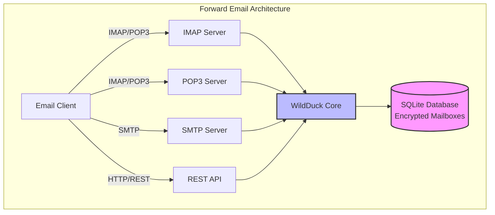

---


## השוואת שירותי דואר אלקטרוני - תמיכת פרוטוקול ועמידה בסטנדרטי RFC {#email-service-comparison---protocol-support--rfc-standards-compliance}

> \[!IMPORTANT]
> **הצפנה מבודדת ועמידה בפני מחשוב קוונטי:** Forward Email הוא שירות הדואר האלקטרוני היחיד המאחסן תיבות דואר SQLite מוצפנות בנפרד באמצעות הסיסמה שלך (שיש רק לך). כל תיבת דואר מוצפנת עם [sqleet](https://github.com/resilar/sqleet) (ChaCha20-Poly1305), עצמאית, מבודדת וניידת. אם תשכח את הסיסמה שלך, תאבד את תיבת הדואר שלך - אפילו Forward Email לא יכול לשחזר אותה. ראה [דואר אלקטרוני מוצפן בטוח לקוונטום](https://forwardemail.net/en/blog/docs/best-quantum-safe-encrypted-email-service) לפרטים.

השווה תמיכת פרוטוקול דואר אלקטרוני ומימוש סטנדרטי RFC בין ספקי דואר אלקטרוני מרכזיים:

| תכונה                        | Forward Email                                                                                  | Postfix/Dovecot                                                                    | Gmail                                                                             | iCloud Mail                                           | Outlook.com                                                                                                                                                          | Fastmail                                                                                 | Yahoo/AOL (Verizon)                                                  | ProtonMail                                                                     | Tutanota                                                          |
| ----------------------------- | ---------------------------------------------------------------------------------------------- | ---------------------------------------------------------------------------------- | --------------------------------------------------------------------------------- | ----------------------------------------------------- | -------------------------------------------------------------------------------------------------------------------------------------------------------------------- | ---------------------------------------------------------------------------------------- | -------------------------------------------------------------------- | ------------------------------------------------------------------------------ | ----------------------------------------------------------------- |
| **מחיר דומיין מותאם אישית**  | [חינם](https://forwardemail.net/en/pricing)                                                    | [חינם](https://www.postfix.org/)                                                   | [$7.20/חודש](https://workspace.google.com/pricing)                               | [$0.99/חודש](https://support.apple.com/en-us/102622)    | [$7.20/חודש](https://www.microsoft.com/en-us/microsoft-365/business/microsoft-365-business-basic)                                                                      | [$5/חודש](https://www.fastmail.com/pricing/)                                               | [$3.19/חודש](https://www.turbify.com/mail)                             | [$4.99/חודש](https://proton.me/mail/pricing)                                     | [$3.27/חודש](https://tuta.com/pricing)                              |
| **IMAP4rev1 (RFC 3501)**      | ✅ [נתמך](#imap4-email-protocol-and-extensions)                                               | ✅ [נתמך](https://www.dovecot.org/)                                                | ✅ [נתמך](https://developers.google.com/workspace/gmail/imap/imap-extensions)    | ✅ [נתמך](https://support.apple.com/en-us/102431)       | ✅ [נתמך](https://support.microsoft.com/en-us/office/pop-imap-and-smtp-settings-for-outlook-com-d088b986-291d-42b8-9564-9c414e2aa040)                            | ✅ [נתמך](https://www.fastmail.help/hc/en-us/articles/1500000278382-Email-standards) | ✅ [נתמך](https://senders.yahooinc.com/developer/documentation/) | ⚠️ [דרך גשר](https://proton.me/support/imap-smtp-and-pop3-setup)            | ❌ לא נתמך                                                   |
| **IMAP4rev2 (RFC 9051)**      | ⚠️ [חלקי](https://forwardemail.net/en/blog/docs/best-quantum-safe-encrypted-email-service)    | ⚠️ [חלקי](https://www.dovecot.org/)                                               | ⚠️ [31%](https://developers.google.com/workspace/gmail/imap/imap-extensions)     | ⚠️ [92%](https://support.apple.com/en-us/102431)        | ⚠️ [46%](https://support.microsoft.com/en-us/office/pop-imap-and-smtp-settings-for-outlook-com-d088b986-291d-42b8-9564-9c414e2aa040)                                 | ⚠️ [69%](https://www.fastmail.help/hc/en-us/articles/1500000278382-Email-standards) | ⚠️ [85%](https://senders.yahooinc.com/developer/documentation/)      | ⚠️ [דרך גשר](https://proton.me/support/imap-smtp-and-pop3-setup)            | ❌ לא נתמך                                                   |
| **POP3 (RFC 1939)**           | ✅ [נתמך](#pop3-email-protocol-and-extensions)                                                | ✅ [נתמך](https://www.dovecot.org/)                                                | ✅ [נתמך](https://support.google.com/mail/answer/7104828)                        | ❌ לא נתמך                                            | ✅ [נתמך](https://support.microsoft.com/en-us/office/pop-imap-and-smtp-settings-for-outlook-com-d088b986-291d-42b8-9564-9c414e2aa040)                            | ✅ [נתמך](https://www.fastmail.help/hc/en-us/articles/1500000278382-Email-standards) | ✅ [נתמך](https://help.yahoo.com/kb/SLN4075.html)                | ⚠️ [דרך גשר](https://proton.me/support/imap-smtp-and-pop3-setup)            | ❌ לא נתמך                                                   |
| **SMTP (RFC 5321)**           | ✅ [נתמך](#smtp-email-protocol-and-extensions)                                                | ✅ [נתמך](https://www.postfix.org/)                                                | ✅ [נתמך](https://support.google.com/mail/answer/7126229)                        | ✅ [נתמך](https://support.apple.com/en-us/102431)       | ✅ [נתמך](https://support.microsoft.com/en-us/office/pop-imap-and-smtp-settings-for-outlook-com-d088b986-291d-42b8-9564-9c414e2aa040)                            | ✅ [נתמך](https://www.fastmail.help/hc/en-us/articles/1500000278382-Email-standards) | ✅ [נתמך](https://help.yahoo.com/kb/SLN4075.html)                | ⚠️ [דרך גשר](https://proton.me/support/imap-smtp-and-pop3-setup)            | ❌ לא נתמך                                                   |
| **JMAP (RFC 8620)**           | ❌ [לא נתמך](#jmap-email-protocol)                                                           | ❌ לא נתמך                                                                         | ❌ לא נתמך                                                                        | ❌ לא נתמך                                            | ❌ לא נתמך                                                                                                                                                      | ✅ [נתמך](https://www.fastmail.com/dev/)                                             | ❌ לא נתמך                                                        | ❌ לא נתמך                                                                | ❌ לא נתמך                                                   |
| **DKIM (RFC 6376)**           | ✅ [נתמך](#email-message-authentication-protocols)                                           | ✅ [נתמך](https://github.com/trusteddomainproject/OpenDKIM)                       | ✅ [נתמך](https://support.google.com/a/answer/174124)                            | ✅ [נתמך](https://support.apple.com/en-us/102431)       | ✅ [נתמך](https://learn.microsoft.com/en-us/defender-office-365/email-authentication-dkim-configure)                                                             | ✅ [נתמך](https://www.fastmail.help/hc/en-us/articles/360060590573)                  | ✅ [נתמך](https://help.yahoo.com/kb/SLN25426.html)               | ✅ [נתמך](https://proton.me/support)                                       | ✅ [נתמך](https://tuta.com/support#dkim)                      |
| **SPF (RFC 7208)**            | ✅ [נתמך](#email-message-authentication-protocols)                                           | ✅ [נתמך](https://www.postfix.org/)                                                | ✅ [נתמך](https://support.google.com/a/answer/33786)                             | ✅ [נתמך](https://support.apple.com/en-us/102431)       | ✅ [נתמך](https://learn.microsoft.com/en-us/microsoft-365/security/office-365-security/how-office-365-uses-spf-to-prevent-spoofing)                              | ✅ [נתמך](https://www.fastmail.help/hc/en-us/articles/360060590573)                  | ✅ [נתמך](https://help.yahoo.com/kb/SLN25426.html)               | ✅ [נתמך](https://proton.me/support)                                       | ✅ [נתמך](https://tuta.com/support#dkim)                      |
| **DMARC (RFC 7489)**          | ✅ [נתמך](#email-message-authentication-protocols)                                           | ✅ [נתמך](https://www.postfix.org/)                                                | ✅ [נתמך](https://support.google.com/a/answer/2466580)                           | ✅ [נתמך](https://support.apple.com/en-us/102431)       | ✅ [נתמך](https://learn.microsoft.com/en-us/microsoft-365/security/office-365-security/use-dmarc-to-validate-email)                                              | ✅ [נתמך](https://www.fastmail.help/hc/en-us/articles/360060590573)                  | ✅ [נתמך](https://help.yahoo.com/kb/SLN25426.html)               | ✅ [נתמך](https://proton.me/support)                                       | ✅ [נתמך](https://tuta.com/support#dkim)                      |
| **ARC (RFC 8617)**            | ✅ [נתמך](#email-message-authentication-protocols)                                           | ✅ [נתמך](https://github.com/trusteddomainproject/OpenARC)                        | ✅ [נתמך](https://support.google.com/a/answer/2466580)                           | ❌ לא נתמך                                            | ✅ [נתמך](https://learn.microsoft.com/en-us/defender-office-365/email-authentication-arc-configure)                                                              | ✅ [נתמך](https://www.fastmail.help/hc/en-us/articles/360060590573)                  | ✅ [נתמך](https://senders.yahooinc.com/developer/documentation/) | ✅ [נתמך](https://proton.me/blog/what-is-authenticated-received-chain-arc) | ❌ לא נתמך                                                   |
| **MTA-STS (RFC 8461)**        | ✅ [נתמך](#email-transport-security-protocols)                                               | ✅ [נתמך](https://www.postfix.org/)                                                | ✅ [נתמך](https://support.google.com/a/answer/9261504)                           | ✅ [נתמך](https://support.apple.com/en-us/102431)       | ✅ [נתמך](https://learn.microsoft.com/en-us/defender-office-365/email-authentication-about)                                                                      | ✅ [נתמך](https://www.fastmail.help/hc/en-us/articles/360060590573)                  | ✅ [נתמך](https://senders.yahooinc.com/developer/documentation/) | ✅ [נתמך](https://proton.me/support)                                       | ✅ [נתמך](https://tuta.com/security)                          |
| **DANE (RFC 7671)**           | ✅ [נתמך](#email-transport-security-protocols)                                               | ✅ [נתמך](https://www.postfix.org/)                                                | ❌ לא נתמך                                                                        | ❌ לא נתמך                                            | ❌ לא נתמך                                                                                                                                                      | ❌ לא נתמך                                                                          | ❌ לא נתמך                                                        | ✅ [נתמך](https://proton.me/support)                                       | ✅ [נתמך](https://tuta.com/support#dane)                      |
| **DSN (RFC 3461)**            | ✅ [נתמך](#smtp-email-protocol-and-extensions)                                              | ✅ [נתמך](https://www.postfix.org/DSN_README.html)                                | ❌ לא נתמך                                                                        | ✅ [נתמך](#protocol-capability-tests)                   | ✅ [נתמך](#protocol-capability-tests)                                                                                                                            | ⚠️ [לא ידוע](https://www.fastmail.help/hc/en-us/articles/1500000278382-Email-standards) | ❌ לא נתמך                                                        | ⚠️ [דרך גשר](https://proton.me/support/imap-smtp-and-pop3-setup)            | ❌ לא נתמך                                                   |
| **REQUIRETLS (RFC 8689)**     | ✅ [נתמך](#email-transport-security-protocols)                                               | ✅ [נתמך](https://www.postfix.org/TLS_README.html#server_require_tls)             | ⚠️ לא ידוע                                                                        | ⚠️ לא ידוע                                            | ⚠️ לא ידוע                                                                                                                                                           | ⚠️ לא ידוע                                                                               | ⚠️ לא ידוע                                                         | ⚠️ [דרך גשר](https://proton.me/support/imap-smtp-and-pop3-setup)            | ❌ לא נתמך                                                   |
| **ManageSieve (RFC 5804)**    | ✅ [נתמך](#managesieve-rfc-5804)                                                             | ✅ [נתמך](https://doc.dovecot.org/admin_manual/pigeonhole_managesieve_server/)    | ❌ לא נתמך                                                                        | ❌ לא נתמך                                            | ❌ לא נתמך                                                                                                                                                      | ✅ [נתמך](https://www.fastmail.help/hc/en-us/articles/360060590573)                  | ❌ לא נתמך                                                        | ❌ לא נתמך                                                                | ❌ לא נתמך                                                   |
| **OpenPGP (RFC 9580)**        | ✅ [נתמך](#email-message-encryption)                                                         | ⚠️ [דרך תוספים](https://www.gnupg.org/)                                          | ⚠️ [שלישי](https://github.com/google/end-to-end)                                | ⚠️ [שלישי](https://gpgtools.org/)                     | ⚠️ [שלישי](https://gpg4win.org/)                                                                                                                               | ⚠️ [שלישי](https://www.fastmail.help/hc/en-us/articles/360060590573)                 | ⚠️ [שלישי](https://help.yahoo.com/kb/SLN25426.html)              | ✅ [מובנה](https://proton.me/support/pgp-mime-pgp-inline)                      | ❌ לא נתמך                                                   |
| **S/MIME (RFC 8551)**         | ✅ [נתמך](#email-message-encryption)                                                         | ✅ [נתמך](https://www.openssl.org/)                                              | ✅ [נתמך](https://support.google.com/mail/answer/81126)                          | ✅ [נתמך](https://support.apple.com/en-us/102431)       | ✅ [נתמך](https://support.microsoft.com/en-us/office/send-view-and-reply-to-encrypted-messages-in-outlook-for-pc-eaa43495-9bbb-4fca-922a-df90dee51980)           | ⚠️ [חלקי](https://www.fastmail.help/hc/en-us/articles/360060590573)                   | ❌ לא נתמך                                                        | ✅ [נתמך](https://proton.me/support/pgp-mime-pgp-inline)                   | ❌ לא נתמך                                                   |
| **CalDAV (RFC 4791)**         | ✅ [נתמך](#calendaring-and-contacts-protocols)                                               | ✅ [נתמך](https://www.davical.org/)                                              | ✅ [נתמך](https://developers.google.com/calendar/caldav/v2/guide)               | ✅ [נתמך](https://support.apple.com/en-us/102431)       | ❌ לא נתמך                                                                                                                                                      | ✅ [נתמך](https://www.fastmail.help/hc/en-us/articles/360060590573)                  | ❌ לא נתמך                                                        | ✅ [דרך גשר](https://proton.me/support/proton-calendar)                      | ❌ לא נתמך                                                   |
| **CardDAV (RFC 6352)**        | ✅ [נתמך](#calendaring-and-contacts-protocols)                                               | ✅ [נתמך](https://www.davical.org/)                                              | ✅ [נתמך](https://developers.google.com/people/carddav)                         | ✅ [נתמך](https://support.apple.com/en-us/102431)       | ❌ לא נתמך                                                                                                                                                      | ✅ [נתמך](https://www.fastmail.help/hc/en-us/articles/360060590573)                  | ❌ לא נתמך                                                        | ✅ [דרך גשר](https://proton.me/support/proton-contacts)                      | ❌ לא נתמך                                                   |
| **משימות (VTODO)**            | ✅ [נתמך](#tasks-and-reminders-caldav-vtodo)                                                 | ✅ [נתמך](https://www.davical.org/)                                              | ❌ לא נתמך                                                                        | ✅ [נתמך](https://support.apple.com/en-us/102431)       | ❌ לא נתמך                                                                                                                                                      | ✅ [נתמך](https://www.fastmail.help/hc/en-us/articles/360060590573)                  | ❌ לא נתמך                                                        | ❌ לא נתמך                                                                | ❌ לא נתמך                                                   |
| **Sieve (RFC 5228)**          | ✅ [נתמך](#sieve-rfc-5228)                                                                   | ✅ [נתמך](https://www.dovecot.org/)                                              | ❌ לא נתמך                                                                        | ❌ לא נתמך                                            | ❌ לא נתמך                                                                                                                                                      | ✅ [נתמך](https://www.fastmail.help/hc/en-us/articles/360060590573)                  | ❌ לא נתמך                                                        | ❌ לא נתמך                                                                | ❌ לא נתמך                                                   |
| **Catch-All**                 | ✅ [נתמך](https://forwardemail.net/en/faq#can-i-have-multiple-global-catch-all-recipients)    | ✅ נתמך                                                                           | ✅ [נתמך](https://support.google.com/a/answer/4524505)                          | ❌ לא נתמך                                            | ❌ [לא נתמך](https://learn.microsoft.com/en-us/exchange/recipients-in-exchange-online/manage-mail-users)                                                        | ✅ [נתמך](https://www.fastmail.help/hc/en-us/articles/1500000278382-Email-standards) | ❌ לא נתמך                                                        | ❌ לא נתמך                                                                | ✅ [נתמך](https://tuta.com/support#catch-all-alias)           |
| **כינויים בלתי מוגבלים**    | ✅ [נתמך](https://forwardemail.net/en/faq#advanced-features)                                 | ✅ נתמך                                                                           | ✅ [נתמך](https://support.google.com/a/answer/33327)                            | ✅ [נתמך](https://support.apple.com/en-us/102431)       | ✅ [נתמך](https://support.microsoft.com/en-us/office/add-or-remove-an-email-alias-in-outlook-com-459b1989-356d-40fa-a689-8f285b13f1f2)                           | ✅ [נתמך](https://www.fastmail.help/hc/en-us/articles/1500000278382-Email-standards) | ❌ לא נתמך                                                        | ✅ [נתמך](https://proton.me/support/addresses-and-aliases)                 | ✅ [נתמך](https://tuta.com/support#aliases)                   |
| **אימות דו-שלבי**             | ✅ [נתמך](https://forwardemail.net/en/faq#do-you-support-passkeys-and-webauthn)              | ✅ נתמך                                                                           | ✅ [נתמך](https://support.google.com/accounts/answer/185839)                    | ✅ [נתמך](https://support.apple.com/en-us/102431)       | ✅ [נתמך](https://support.microsoft.com/en-us/account-billing/how-to-use-two-step-verification-with-your-microsoft-account-c7910146-672f-01e9-50a0-93b4585e7eb4) | ✅ [נתמך](https://www.fastmail.help/hc/en-us/articles/1500000278382-Email-standards) | ✅ [נתמך](https://help.yahoo.com/kb/SLN5013.html)                | ✅ [נתמך](https://proton.me/support/two-factor-authentication-2fa)         | ✅ [נתמך](https://tuta.com/support#two-factor-authentication) |
| **התראות Push**              | ✅ [נתמך](#ios-push-notifications)                                                           | ⚠️ דרך תוספים                                                                    | ✅ [נתמך](https://developers.google.com/gmail/api/guides/push)                  | ✅ [נתמך](https://support.apple.com/en-us/102431)       | ✅ [נתמך](https://learn.microsoft.com/en-us/graph/change-notifications-delivery-webhooks)                                                                        | ✅ [נתמך](https://www.fastmail.help/hc/en-us/articles/1500000278382-Email-standards) | ❌ לא נתמך                                                        | ✅ [נתמך](https://proton.me/support/notifications)                         | ✅ [נתמך](https://tuta.com/support#push-notifications)        |
| **לוח שנה/אנשי קשר במחשב**   | ✅ [נתמך](#calendaring-and-contacts-protocols)                                               | ✅ נתמך                                                                           | ✅ [נתמך](https://support.google.com/calendar)                                  | ✅ [נתמך](https://support.apple.com/en-us/102431)       | ✅ [נתמך](https://support.microsoft.com/en-us/office/calendar-and-contacts-in-outlook-com-d3e8a6e6-5c1f-4e3e-9f1e-7c0f0e0c0c0c)                                  | ✅ [נתמך](https://www.fastmail.help/hc/en-us/articles/1500000278382-Email-standards) | ❌ לא נתמך                                                        | ✅ [נתמך](https://proton.me/support/proton-calendar)                       | ❌ לא נתמך                                                   |
| **חיפוש מתקדם**              | ✅ [נתמך](https://forwardemail.net/en/email-api)                                             | ✅ נתמך                                                                           | ✅ [נתמך](https://support.google.com/mail/answer/7190)                          | ✅ [נתמך](https://support.apple.com/en-us/102431)       | ✅ [נתמך](https://support.microsoft.com/en-us/office/search-for-email-messages-in-outlook-com-6f5f2e92-9d5e-4c4e-9b0e-0c0c0c0c0c0c)                              | ✅ [נתמך](https://www.fastmail.help/hc/en-us/articles/1500000278382-Email-standards) | ✅ [נתמך](https://help.yahoo.com/kb/SLN3561.html)                | ✅ [נתמך](https://proton.me/support/search-and-filters)                    | ✅ [נתמך](https://tuta.com/support)                           |
| **API/אינטגרציות**           | ✅ [39 נקודות קצה](https://forwardemail.net/en/email-api)                                   | ✅ נתמך                                                                           | ✅ [נתמך](https://developers.google.com/gmail/api)                              | ❌ לא נתמך                                            | ✅ [נתמך](https://learn.microsoft.com/en-us/graph/api/resources/mail-api-overview)                                                                               | ✅ [נתמך](https://www.fastmail.help/hc/en-us/articles/1500000278382-Email-standards) | ❌ לא נתמך                                                        | ✅ [נתמך](https://proton.me/support/proton-mail-api)                       | ❌ לא נתמך                                                   |
### ויזואליזציית תמיכה בפרוטוקולים {#protocol-support-visualization}

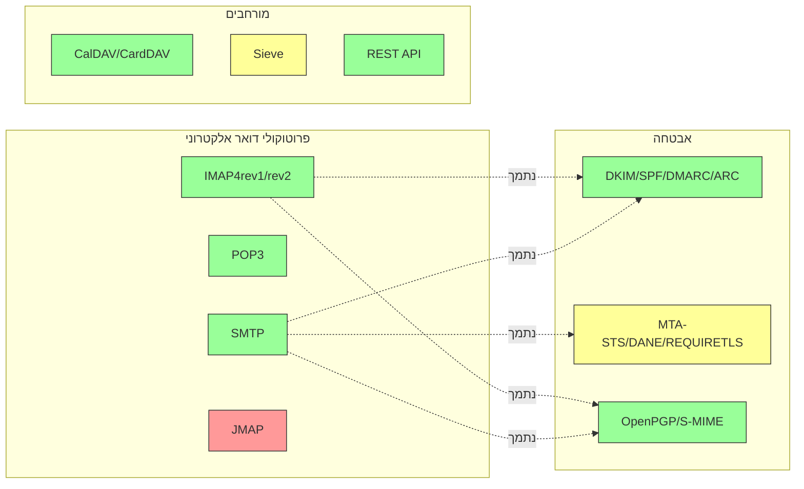

---


## פרוטוקולי דואר אלקטרוני מרכזיים {#core-email-protocols}

### זרימת פרוטוקול דואר אלקטרוני {#email-protocol-flow}

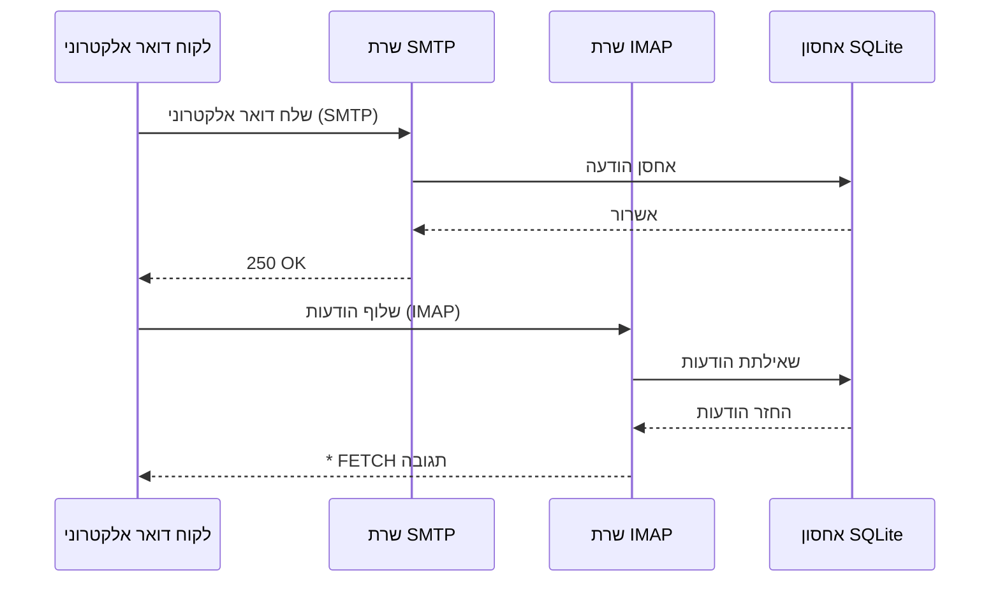


## פרוטוקול דואר אלקטרוני IMAP4 והרחבות {#imap4-email-protocol-and-extensions}

> \[!NOTE]
> Forward Email תומך ב-IMAP4rev1 (RFC 3501) עם תמיכה חלקית בתכונות IMAP4rev2 (RFC 9051).

Forward Email מספק תמיכה איתנה ב-IMAP4 באמצעות מימוש שרת הדואר WildDuck. השרת מממש את IMAP4rev1 (RFC 3501) עם תמיכה חלקית בהרחבות IMAP4rev2 (RFC 9051).

פונקציונליות ה-IMAP של Forward Email מסופקת על ידי התלות ב-[WildDuck](https://github.com/nodemailer/wildduck). פרוטוקולי הדואר הבאים נתמכים:

| RFC                                                       | כותרת                                                             | הערות מימוש                                          |
| --------------------------------------------------------- | ----------------------------------------------------------------- | ----------------------------------------------------- |
| [RFC 3501](https://datatracker.ietf.org/doc/html/rfc3501) | פרוטוקול גישה להודעות אינטרנט (IMAP) - גרסה 4rev1                 | תמיכה מלאה עם הבדלים מכוונים (ראה למטה)              |
| [RFC 2177](https://datatracker.ietf.org/doc/html/rfc2177) | פקודת IMAP4 IDLE                                                 | התראות בסגנון Push                                    |
| [RFC 2342](https://datatracker.ietf.org/doc/html/rfc2342) | מרחב שמות IMAP4                                                  | תמיכה במרחב שמות תיבת דואר                            |
| [RFC 2087](https://datatracker.ietf.org/doc/html/rfc2087) | הרחבת IMAP4 QUOTA                                                | ניהול מכסת אחסון                                      |
| [RFC 2971](https://datatracker.ietf.org/doc/html/rfc2971) | הרחבת IMAP4 ID                                                 | זיהוי לקוח/שרת                                       |
| [RFC 5161](https://datatracker.ietf.org/doc/html/rfc5161) | הרחבת IMAP4 ENABLE                                              | הפעלת הרחבות IMAP                                    |
| [RFC 4959](https://datatracker.ietf.org/doc/html/rfc4959) | הרחבת IMAP לתגובה ראשונית של לקוח SASL (SASL-IR)                 | תגובת לקוח ראשונית                                   |
| [RFC 3691](https://datatracker.ietf.org/doc/html/rfc3691) | פקודת IMAP4 UNSELECT                                            | סגירת תיבת דואר ללא EXPUNGE                          |
| [RFC 4315](https://datatracker.ietf.org/doc/html/rfc4315) | הרחבת IMAP UIDPLUS                                              | פקודות UID משופרות                                   |
| [RFC 7162](https://datatracker.ietf.org/doc/html/rfc7162) | הרחבות IMAP: סינכרון מהיר של שינויים בדגלים (CONDSTORE)          | STORE מותנה                                           |
| [RFC 6154](https://datatracker.ietf.org/doc/html/rfc6154) | הרחבת IMAP LIST לתיבות דואר לשימוש מיוחד                         | מאפייני תיבות דואר מיוחדות                           |
| [RFC 6851](https://datatracker.ietf.org/doc/html/rfc6851) | הרחבת IMAP MOVE                                                | פקודת MOVE אטומית                                   |
| [RFC 6855](https://datatracker.ietf.org/doc/html/rfc6855) | תמיכה ב-UTF-8 ב-IMAP                                           | תמיכה ב-UTF-8                                        |
| [RFC 3348](https://datatracker.ietf.org/doc/html/rfc3348) | הרחבת IMAP4 לתיבת דואר בת                                       | מידע על תיבת דואר בת                                 |
| [RFC 7889](https://datatracker.ietf.org/doc/html/rfc7889) | הרחבת IMAP4 לפרסום גודל העלאה מקסימלי (APPENDLIMIT)              | גודל העלאה מקסימלי                                   |
**תוספות IMAP נתמכות:**

| תוספת            | RFC          | סטטוס       | תיאור                           |
| ----------------- | ------------ | ----------- | ------------------------------- |
| IDLE              | RFC 2177     | ✅ נתמך     | התראות בסגנון Push              |
| NAMESPACE         | RFC 2342     | ✅ נתמך     | תמיכה במרחב שמות תיבות דואר     |
| QUOTA             | RFC 2087     | ✅ נתמך     | ניהול מכסת אחסון                |
| ID                | RFC 2971     | ✅ נתמך     | זיהוי לקוח/שרת                 |
| ENABLE            | RFC 5161     | ✅ נתמך     | הפעלת תוספות IMAP              |
| SASL-IR           | RFC 4959     | ✅ נתמך     | תגובת לקוח ראשונית            |
| UNSELECT          | RFC 3691     | ✅ נתמך     | סגירת תיבת דואר ללא EXPUNGE   |
| UIDPLUS           | RFC 4315     | ✅ נתמך     | פקודות UID משופרות            |
| CONDSTORE         | RFC 7162     | ✅ נתמך     | STORE מותנה                    |
| SPECIAL-USE       | RFC 6154     | ✅ נתמך     | מאפייני תיבת דואר מיוחדים      |
| MOVE              | RFC 6851     | ✅ נתמך     | פקודת MOVE אטומית             |
| UTF8=ACCEPT       | RFC 6855     | ✅ נתמך     | תמיכה ב-UTF-8                 |
| CHILDREN          | RFC 3348     | ✅ נתמך     | מידע על תיבות דואר משנה       |
| APPENDLIMIT       | RFC 7889     | ✅ נתמך     | גודל העלאה מקסימלי            |
| XLIST             | לא סטנדרטי  | ✅ נתמך     | רשימת תיקיות תואמת Gmail      |
| XAPPLEPUSHSERVICE | לא סטנדרטי  | ✅ נתמך     | שירות התראות Push של Apple    |

### הבדלים בפרוטוקול IMAP מהגדרות RFC {#imap-protocol-differences-from-rfc-specifications}

> \[!WARNING]
> ההבדלים הבאים מהגדרות RFC עשויים להשפיע על תאימות הלקוח.

Forward Email סוטה בכוונה מכמה הגדרות RFC של IMAP. הבדלים אלו נלקחו מ-WildDuck ומתועדים להלן:

* **אין דגל \Recent:** הדגל `\Recent` אינו מיושם. כל ההודעות מוחזרות ללא דגל זה.
* **RENAME אינו משפיע על תתי-תיקיות:** בעת שינוי שם תיקייה, תתי-התיקיות לא משנים את שמן אוטומטית. היררכיית התיקיות שטוחה במסד הנתונים.
* **INBOX לא ניתן לשינוי שם:** [RFC 3501](https://datatracker.ietf.org/doc/html/rfc3501) מאפשר שינוי שם ל-INBOX, אך Forward Email אוסר זאת במפורש. ראה [קוד המקור של WildDuck](https://github.com/nodemailer/wildduck/blob/master/imap-core/lib/commands/rename.js#L27).
* **אין תגובות FLAGS לא מבוקשות:** כאשר דגלים משתנים, לא נשלחות תגובות FLAGS לא מבוקשות ללקוח.
* **STORE מחזיר NO עבור הודעות שנמחקו:** ניסיון לשנות דגלים בהודעות שנמחקו מחזיר NO במקום להתעלם בשקט.
* **CHARSET מתעלמים ב-SEARCH:** הפרמטר `CHARSET` בפקודות SEARCH מתעלמים ממנו. כל החיפושים משתמשים ב-UTF-8.
* **מטא-נתוני MODSEQ מתעלמים:** מטא-נתוני `MODSEQ` בפקודות STORE מתעלמים מהם.
* **SEARCH TEXT ו-SEARCH BODY:** Forward Email משתמש ב-[SQLite FTS5](https://www.sqlite.org/fts5.html) (חיפוש טקסט מלא) במקום חיפוש `$text` של MongoDB. זה מספק:
  * תמיכה באופרטור `NOT` (MongoDB לא תומך בזה)
  * תוצאות חיפוש מדורגות
  * ביצועי חיפוש מתחת ל-100ms בתיבות דואר גדולות
* **התנהגות Autoexpunge:** הודעות המסומנות כ-`\Deleted` נמחקות אוטומטית בעת סגירת תיבת הדואר.
* **דיוק ההודעה:** שינויים מסוימים בהודעות עשויים שלא לשמור על מבנה ההודעה המקורי במדויק.

**תמיכה חלקית ב-IMAP4rev2:**

Forward Email מיישם IMAP4rev1 (RFC 3501) עם תמיכה חלקית ב-IMAP4rev2 (RFC 9051). התכונות הבאות של IMAP4rev2 **עדיין לא נתמכות**:

* **LIST-STATUS** - פקודות LIST ו-STATUS משולבות
* **LITERAL-** - ליטרלים לא מסונכרנים (גרסה מינוס)
* **OBJECTID** - מזהי אובייקט ייחודיים
* **SAVEDATE** - מאפיין תאריך שמירה
* **REPLACE** - החלפה אטומית של הודעה
* **UNAUTHENTICATE** - סגירת אימות ללא סגירת החיבור

**טיפול מרוכך במבנה גוף ההודעה:**

Forward Email משתמש בטיפול "גוף מרוכך" למבני MIME פגומים, שעשוי להיות שונה מפרשנות RFC קפדנית. זה משפר את התאימות עם מיילים מהעולם האמיתי שאינם תואמים במדויק לסטנדרטים.
**הרחבת METADATA (RFC 5464):**

הרחבת METADATA של IMAP **אינה נתמכת**. למידע נוסף על הרחבה זו, ראה [RFC 5464](https://datatracker.ietf.org/doc/html/rfc5464). דיון על הוספת תכונה זו ניתן למצוא ב-[WildDuck Issue #937](https://github.com/zone-eu/wildduck/issues/937).

### הרחבות IMAP שאינן נתמכות {#imap-extensions-not-supported}

הרחבות IMAP הבאות מהרשימה של [IANA IMAP Capabilities Registry](https://www.iana.org/assignments/imap-capabilities/imap-capabilities.xhtml) **אינן נתמכות**:

| RFC                                                       | כותרת                                                                                                           | סיבה                                                                                                                                  |
| --------------------------------------------------------- | --------------------------------------------------------------------------------------------------------------- | --------------------------------------------------------------------------------------------------------------------------------------- |
| [RFC 2086](https://datatracker.ietf.org/doc/html/rfc2086) | הרחבת IMAP4 ACL                                                                                                | תיקיות משותפות לא מיושמות. ראה [WildDuck Issue #427](https://github.com/zone-eu/wildduck/issues/427)                                  |
| [RFC 5256](https://datatracker.ietf.org/doc/html/rfc5256) | הרחבות IMAP SORT ו-THREAD                                                                                        | תיוג שיחות מיושם פנימית אך לא דרך פרוטוקול RFC 5256. ראה [WildDuck Issue #12](https://github.com/zone-eu/wildduck/issues/12)           |
| [RFC 5162](https://datatracker.ietf.org/doc/html/rfc5162) | הרחבות IMAP4 לסינכרון מהיר של תיבת דואר (QRESYNC)                                                             | לא מיושם                                                                                                                               |
| [RFC 5464](https://datatracker.ietf.org/doc/html/rfc5464) | הרחבת METADATA של IMAP                                                                                          | פעולות Metadata מתעלמים מהן. ראה [תיעוד WildDuck](https://datatracker.ietf.org/doc/html/rfc5464)                                      |
| [RFC 5258](https://datatracker.ietf.org/doc/html/rfc5258) | הרחבות פקודת LIST של IMAP4                                                                                      | לא מיושם                                                                                                                               |
| [RFC 5267](https://datatracker.ietf.org/doc/html/rfc5267) | הקשרים ל-IMAP4                                                                                                | לא מיושם                                                                                                                               |
| [RFC 5465](https://datatracker.ietf.org/doc/html/rfc5465) | הרחבת IMAP NOTIFY                                                                                               | לא מיושם                                                                                                                               |
| [RFC 5466](https://datatracker.ietf.org/doc/html/rfc5466) | הרחבת מסננים של IMAP4                                                                                           | לא מיושם                                                                                                                               |
| [RFC 6203](https://datatracker.ietf.org/doc/html/rfc6203) | הרחבת IMAP4 לחיפוש מטושטש                                                                                      | לא מיושם                                                                                                                               |
| [RFC 6785](https://datatracker.ietf.org/doc/html/rfc6785) | המלצות ליישום IMAP4                                                                                            | ההמלצות לא מומשו במלואן                                                                                                                |
| [RFC 7162](https://datatracker.ietf.org/doc/html/rfc7162) | הרחבות IMAP: סינכרון מהיר של שינויים בדגלים (CONDSTORE) וסינכרון מהיר של תיבת דואר (QRESYNC)                    | לא מיושם                                                                                                                               |
| [RFC 8437](https://datatracker.ietf.org/doc/html/rfc8437) | הרחבת IMAP UNAUTHENTICATE לשימוש חוזר בחיבור                                                                    | לא מיושם                                                                                                                               |
| [RFC 8438](https://datatracker.ietf.org/doc/html/rfc8438) | הרחבת IMAP עבור STATUS=SIZE                                                                                     | לא מיושם                                                                                                                               |
| [RFC 8457](https://datatracker.ietf.org/doc/html/rfc8457) | מילות מפתח "$Important" ו-\Important לשימוש מיוחד ב-IMAP                                                        | לא מיושם                                                                                                                               |
| [RFC 8474](https://datatracker.ietf.org/doc/html/rfc8474) | הרחבת IMAP למזהי אובייקטים                                                                                      | לא מיושם                                                                                                                               |
| [RFC 9051](https://datatracker.ietf.org/doc/html/rfc9051) | פרוטוקול גישה להודעות אינטרנט (IMAP) - גרסה 4rev2                                                              | Forward Email מיישם IMAP4rev1 ([RFC 3501](https://datatracker.ietf.org/doc/html/rfc3501))                                               |
## פרוטוקול דואר אלקטרוני POP3 והרחבות {#pop3-email-protocol-and-extensions}

> \[!NOTE]
> Forward Email תומך ב-POP3 (RFC 1939) עם הרחבות סטנדרטיות לשליפת דואר אלקטרוני.

פונקציונליות ה-POP3 של Forward Email מסופקת על ידי התלות [WildDuck](https://github.com/nodemailer/wildduck). ה-RFCים הבאים לתקשורת דואר נתמכים:

| RFC                                                       | כותרת                                   | הערות יישום                                         |
| --------------------------------------------------------- | --------------------------------------- | --------------------------------------------------- |
| [RFC 1939](https://datatracker.ietf.org/doc/html/rfc1939) | פרוטוקול דואר - גרסה 3 (POP3)           | תמיכה מלאה עם הבדלים מכוונים (ראה למטה)             |
| [RFC 2595](https://datatracker.ietf.org/doc/html/rfc2595) | שימוש ב-TLS עם IMAP, POP3 ו-ACAP         | תמיכה ב-STARTTLS                                    |
| [RFC 2449](https://datatracker.ietf.org/doc/html/rfc2449) | מנגנון הרחבות POP3                       | תמיכה בפקודת CAPA                                  |

Forward Email מספק תמיכה ב-POP3 ללקוחות שמעדיפים פרוטוקול פשוט זה על פני IMAP. POP3 אידיאלי למשתמשים שרוצים להוריד דואר אלקטרוני למכשיר יחיד ולהסירו מהשרת.

**הרחבות POP3 נתמכות:**

| הרחבה    | RFC      | סטטוס       | תיאור                      |
| -------- | -------- | ----------- | -------------------------- |
| TOP      | RFC 1939 | ✅ נתמך     | שליפת כותרות ההודעה        |
| USER     | RFC 1939 | ✅ נתמך     | אימות שם משתמש            |
| UIDL     | RFC 1939 | ✅ נתמך     | מזהים ייחודיים להודעות     |
| EXPIRE   | RFC 2449 | ✅ נתמך     | מדיניות פקיעת הודעות       |

### הבדלים בפרוטוקול POP3 מהגדרות ה-RFC {#pop3-protocol-differences-from-rfc-specifications}

> \[!WARNING]
> ל-POP3 יש מגבלות מובנות בהשוואה ל-IMAP.

> \[!IMPORTANT]
> **הבדל קריטי: התנהגות מחיקת POP3 ב-Forward Email לעומת WildDuck**
>
> Forward Email מיישם מחיקה קבועה תואמת RFC לפקודות `DELE` ב-POP3, בניגוד ל-WildDuck שמעביר הודעות לפח.

**התנהגות Forward Email** ([קוד מקור](https://github.com/forwardemail/forwardemail.net/blob/master/pop3-server.js)):

* `DELE` → `QUIT` מוחק הודעות לצמיתות
* עוקב במדויק אחרי מפרט [RFC 1939](https://datatracker.ietf.org/doc/html/rfc1939)
* תואם להתנהגות של Dovecot (ברירת מחדל), Postfix ושרתים אחרים התואמי תקן

**התנהגות WildDuck** ([דיון](https://github.com/zone-eu/wildduck/issues/937)):

* `DELE` → `QUIT` מעביר הודעות לפח (כמו Gmail)
* החלטת עיצוב מכוונת לשמירת בטיחות המשתמש
* לא תואם RFC אך מונע אובדן נתונים בטעות

**מדוע Forward Email שונה:**

* **תאימות ל-RFC:** עומד במפרט [RFC 1939](https://datatracker.ietf.org/doc/html/rfc1939)
* **ציפיות משתמש:** זרימת עבודה של הורדה ומחיקה מצפה למחיקה קבועה
* **ניהול אחסון:** שחרור מקום בדיסק כראוי
* **אינטרופרביליות:** עקבי עם שרתים אחרים התואמי RFC

> \[!NOTE]
> **רשימת הודעות POP3:** Forward Email מציג את כל ההודעות בתיבת הדואר הנכנס ללא הגבלה. זה שונה מ-WildDuck שמגביל ל-250 הודעות כברירת מחדל. ראה [קוד מקור](https://github.com/forwardemail/forwardemail.net/blob/master/pop3-server.js).

**גישה למכשיר יחיד:**

POP3 מיועד לגישה ממכשיר יחיד. הודעות בדרך כלל מורדות ומוסרות מהשרת, מה שהופך אותו ללא מתאים לסינכרון בין מספר מכשירים.

**אין תמיכה בתיקיות:**

POP3 ניגש רק לתיקיית INBOX. תיקיות אחרות (נשלח, טיוטות, פח וכו') אינן נגישות דרך POP3.

**ניהול הודעות מוגבל:**

POP3 מספק שליפה ומחיקה בסיסית של הודעות. תכונות מתקדמות כמו סימון, העברה או חיפוש הודעות אינן זמינות.

### הרחבות POP3 שלא נתמכות {#pop3-extensions-not-supported}

ההרחבות הבאות של POP3 מהרשימה [IANA POP3 Extension Mechanism Registry](https://www.iana.org/assignments/pop3-extension-mechanism/pop3-extension-mechanism.xhtml) אינן נתמכות:
| RFC                                                       | כותרת                                                   | סיבה                                  |
| --------------------------------------------------------- | ------------------------------------------------------- | --------------------------------------- |
| [RFC 6856](https://datatracker.ietf.org/doc/html/rfc6856) | פרוטוקול דואר גרסה 3 (POP3) עם תמיכה ב-UTF-8           | לא מיושם בשרת WildDuck POP3             |
| [RFC 2595](https://datatracker.ietf.org/doc/html/rfc2595) | פקודת STLS                                              | נתמך רק STARTTLS, לא STLS                |
| [RFC 3206](https://datatracker.ietf.org/doc/html/rfc3206) | קודי תגובה SYS ו-AUTH ב-POP                              | לא מיושם                               |

---


## פרוטוקול דואר SMTP והרחבות {#smtp-email-protocol-and-extensions}

> \[!NOTE]
> Forward Email תומך ב-SMTP (RFC 5321) עם הרחבות מודרניות למשלוח דואר מאובטח ואמין.

פונקציונליות ה-SMTP של Forward Email מסופקת על ידי מספר רכיבים: [smtp-server](https://github.com/nodemailer/smtp-server) (nodemailer), [zone-mta](https://github.com/zone-eu/zone-mta), ומימושים מותאמים אישית. ה-RFCים הבאים לתקשורת דואר נתמכים:

| RFC                                                       | כותרת                                                                           | הערות מימוש                       |
| --------------------------------------------------------- | ------------------------------------------------------------------------------- | ------------------------------------ |
| [RFC 5321](https://datatracker.ietf.org/doc/html/rfc5321) | פרוטוקול העברת דואר פשוט (SMTP)                                                | תמיכה מלאה                         |
| [RFC 3207](https://datatracker.ietf.org/doc/html/rfc3207) | הרחבת שירות SMTP לאבטחה באמצעות TLS (STARTTLS)                                 | תמיכה ב-TLS/SSL                   |
| [RFC 4954](https://datatracker.ietf.org/doc/html/rfc4954) | הרחבת שירות SMTP לאימות (AUTH)                                                 | PLAIN, LOGIN, CRAM-MD5, XOAUTH2    |
| [RFC 6531](https://datatracker.ietf.org/doc/html/rfc6531) | הרחבת SMTP לדואר בינלאומי (SMTPUTF8)                                           | תמיכה בכתובות דואר יוניקוד מקוריות |
| [RFC 3461](https://datatracker.ietf.org/doc/html/rfc3461) | הרחבת שירות SMTP להודעות סטטוס משלוח (DSN)                                    | תמיכה מלאה ב-DSN                   |
| [RFC 3463](https://datatracker.ietf.org/doc/html/rfc3463) | קודי סטטוס משופרים למערכת דואר                                               | קודי סטטוס משופרים בתגובות        |
| [RFC 1870](https://datatracker.ietf.org/doc/html/rfc1870) | הרחבת שירות SMTP להצהרת גודל הודעה (SIZE)                                      | פרסום גודל הודעה מקסימלי           |
| [RFC 2920](https://datatracker.ietf.org/doc/html/rfc2920) | הרחבת שירות SMTP לצינור פקודות (PIPELINING)                                   | תמיכה בצינור פקודות               |
| [RFC 1652](https://datatracker.ietf.org/doc/html/rfc1652) | הרחבת שירות SMTP לתמיכה ב-8bit-MIMEtransport (8BITMIME)                        | תמיכה ב-MIME 8 ביט                |
| [RFC 6152](https://datatracker.ietf.org/doc/html/rfc6152) | הרחבת שירות SMTP לתמיכה בהעברת MIME ב-8 ביט                                   | תמיכה ב-MIME 8 ביט                |
| [RFC 2034](https://datatracker.ietf.org/doc/html/rfc2034) | הרחבת שירות SMTP להחזרת קודי שגיאה משופרים (ENHANCEDSTATUSCODES)               | קודי סטטוס משופרים                |

Forward Email מיישם שרת SMTP מלא עם תמיכה בהרחבות מודרניות המשפרות אבטחה, אמינות ופונקציונליות.

**הרחבות SMTP נתמכות:**

| הרחבה              | RFC      | סטטוס       | תיאור                                |
| ------------------- | -------- | ----------- | ------------------------------------- |
| PIPELINING          | RFC 2920 | ✅ נתמך     | צינור פקודות                        |
| SIZE                | RFC 1870 | ✅ נתמך     | הצהרת גודל הודעה (מגבלת 52MB)       |
| ETRN                | RFC 1985 | ✅ נתמך     | עיבוד תור מרוחק                    |
| STARTTLS            | RFC 3207 | ✅ נתמך     | שדרוג ל-TLS                        |
| ENHANCEDSTATUSCODES | RFC 2034 | ✅ נתמך     | קודי סטטוס משופרים                 |
| 8BITMIME            | RFC 6152 | ✅ נתמך     | העברת MIME ב-8 ביט                  |
| DSN                 | RFC 3461 | ✅ נתמך     | הודעות סטטוס משלוח                 |
| CHUNKING            | RFC 3030 | ✅ נתמך     | העברת הודעות בחתיכות               |
| SMTPUTF8            | RFC 6531 | ⚠️ חלקי     | כתובות דואר ב-UTF-8 (חלקי)          |
| REQUIRETLS          | RFC 8689 | ✅ נתמך     | דרישת TLS למשלוח                   |
### התראות סטטוס משלוח (DSN) {#delivery-status-notifications-dsn}

> \[!TIP]
> DSN מספק מידע מפורט על סטטוס המשלוח של מיילים שנשלחו.

Forward Email תומך במלואו ב-**DSN (RFC 3461)**, המאפשר לשולחים לבקש התראות על סטטוס המשלוח. תכונה זו מספקת:

* **התראות הצלחה** כאשר ההודעות נמסרות
* **התראות כישלון** עם מידע מפורט על שגיאות
* **התראות עיכוב** כאשר המשלוח מתעכב זמנית

DSN שימושי במיוחד ל:

* אישור משלוח הודעות חשובות
* פתרון בעיות במשלוח
* מערכות עיבוד מיילים אוטומטיות
* דרישות תאימות וביקורת

### תמיכה ב-REQUIRETLS {#requiretls-support}

> \[!IMPORTANT]
> Forward Email הוא אחד מהספקים הבודדים שמפרסמים ומאכפים במפורש את REQUIRETLS.

Forward Email תומך ב-**REQUIRETLS (RFC 8689)**, שמבטיח שהודעות דואר יימסרו רק דרך חיבורים מוצפנים ב-TLS. זה מספק:

* **הצפנה מקצה לקצה** לאורך כל מסלול המשלוח
* **אכיפה מול המשתמש** דרך תיבת סימון במרכיב כתיבת המייל
* **דחיית ניסיונות משלוח לא מוצפנים**
* **אבטחה משופרת** לתקשורת רגישה

### הרחבות SMTP שלא נתמכות {#smtp-extensions-not-supported}

הרחבות SMTP הבאות מהרשימה של [IANA SMTP Service Extensions Registry](https://www.iana.org/assignments/smtp) אינן נתמכות:

| RFC                                                       | כותרת                                                                                             | סיבה                  |
| --------------------------------------------------------- | ------------------------------------------------------------------------------------------------- | --------------------- |
| [RFC 4865](https://datatracker.ietf.org/doc/html/rfc4865) | הרחבת שירות הגשת SMTP לשחרור הודעות עתידי (FUTURERELEASE)                                         | לא מיושם              |
| [RFC 6710](https://datatracker.ietf.org/doc/html/rfc6710) | הרחבת SMTP לעדיפויות העברת הודעות (MT-PRIORITY)                                                  | לא מיושם              |
| [RFC 7293](https://datatracker.ietf.org/doc/html/rfc7293) | שדה הכותרת Require-Recipient-Valid-Since והרחבת שירות SMTP                                      | לא מיושם              |
| [RFC 7372](https://datatracker.ietf.org/doc/html/rfc7372) | קודי סטטוס אימות דואר אלקטרוני                                                                   | לא מיושם במלואו       |
| [RFC 4468](https://datatracker.ietf.org/doc/html/rfc4468) | הרחבת BURL להגשת הודעות                                                                           | לא מיושם              |
| [RFC 3030](https://datatracker.ietf.org/doc/html/rfc3030) | הרחבות שירות SMTP להעברת הודעות MIME גדולות ובינאריות (CHUNKING, BINARYMIME)                      | לא מיושם              |
| [RFC 2852](https://datatracker.ietf.org/doc/html/rfc2852) | הרחבת שירות Deliver By SMTP                                                                       | לא מיושם              |

---


## פרוטוקול דואר JMAP {#jmap-email-protocol}

> \[!CAUTION]
> JMAP **אינו נתמך כרגע** על ידי Forward Email.

| RFC                                                       | כותרת                                     | סטטוס          | סיבה                                                                 |
| --------------------------------------------------------- | ----------------------------------------- | --------------- | ---------------------------------------------------------------------- |
| [RFC 8620](https://datatracker.ietf.org/doc/html/rfc8620) | פרוטוקול JSON Meta Application (JMAP)    | ❌ לא נתמך      | Forward Email משתמש ב-IMAP/POP3/SMTP וב-REST API מקיף במקום           |

**JMAP (JSON Meta Application Protocol)** הוא פרוטוקול דואר מודרני שנועד להחליף את IMAP.

**מדוע JMAP אינו נתמך:**

> "JMAP הוא מפלצת שלא היה צריך להמציא. הוא מנסה להמיר TCP/IMAP (כבר פרוטוקול גרוע לפי הסטנדרטים של היום) ל-HTTP/JSON, פשוט משתמש בהעברה שונה תוך שמירה על הרוח." — אנדריס ריינמן, [דיון ב-HN](https://news.ycombinator.com/item?id=18890011)
> "JMAP קיים כבר יותר מ-10 שנים, וכמעט ואין אימוץ בכלל" – אנדריס ריינמן, [דיון ב-GitHub](https://github.com/zone-eu/wildduck/issues/2#issuecomment-1765190790)

ראה גם תגובות נוספות ב-<https://hn.algolia.com/?dateRange=all&page=0&prefix=true&query=jmap%20andris&sort=byDate&type=comment>.

Forward Email מתמקד כיום במתן תמיכה מצוינת ב-IMAP, POP3 ו-SMTP, יחד עם REST API מקיף לניהול דואר אלקטרוני. תמיכה ב-JMAP עשויה להישקל בעתיד בהתאם לביקוש המשתמשים ולאימוץ האקוסיסטם.

**חלופה:** Forward Email מציע [REST API מלא](#complete-rest-api-for-email-management) עם 39 נקודות קצה המספקות פונקציונליות דומה ל-JMAP לגישה תכנותית לדואר אלקטרוני.

---


## אבטחת דואר אלקטרוני {#email-security}

### ארכיטקטורת אבטחת דואר אלקטרוני {#email-security-architecture}

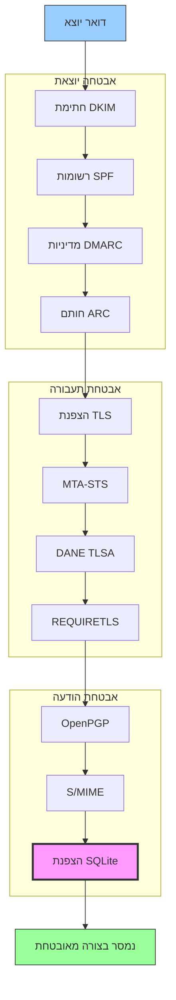


## פרוטוקולי אימות הודעות דואר אלקטרוני {#email-message-authentication-protocols}

> \[!NOTE]
> Forward Email מיישם את כל פרוטוקולי האימות העיקריים של דואר אלקטרוני כדי למנוע זיופים ולהבטיח שלמות ההודעה.

Forward Email משתמש בספריית [mailauth](https://github.com/postalsys/mailauth) לאימות דואר אלקטרוני. ה-RFC הבאים נתמכים:

| RFC                                                       | כותרת                                                                  | הערות יישום                                                  |
| --------------------------------------------------------- | ----------------------------------------------------------------------- | ------------------------------------------------------------ |
| [RFC 6376](https://datatracker.ietf.org/doc/html/rfc6376) | חתימות DomainKeys Identified Mail (DKIM)                              | חתימה ואימות DKIM מלאים                                       |
| [RFC 8463](https://datatracker.ietf.org/doc/html/rfc8463) | שיטת חתימה קריפטוגרפית חדשה ל-DKIM (Ed25519-SHA256)                   | תומך בשני אלגוריתמי החתימה RSA-SHA256 ו-Ed25519-SHA256      |
| [RFC 7208](https://datatracker.ietf.org/doc/html/rfc7208) | מסגרת מדיניות שולח (SPF)                                              | אימות רשומת SPF                                              |
| [RFC 7489](https://datatracker.ietf.org/doc/html/rfc7489) | אימות, דיווח והתאמה מבוססי דומיין (DMARC)                             | אכיפת מדיניות DMARC                                         |
| [RFC 8617](https://datatracker.ietf.org/doc/html/rfc8617) | שרשרת אימות מתקבלת (ARC)                                              | חותם ואימות ARC                                              |

פרוטוקולי אימות דואר אלקטרוני מאמתים שההודעות אכן נשלחו מהשולח המוצהר ושלא שונו במהלך ההעברה.

### תמיכה בפרוטוקולי אימות {#authentication-protocol-support}

| פרוטוקול  | RFC      | סטטוס       | תיאור                                                               |
| --------- | -------- | ----------- | ------------------------------------------------------------------- |
| **DKIM**  | RFC 6376 | ✅ נתמך     | DomainKeys Identified Mail - חתימות קריפטוגרפיות                    |
| **SPF**   | RFC 7208 | ✅ נתמך     | מסגרת מדיניות שולח - הרשאת כתובת IP                                |
| **DMARC** | RFC 7489 | ✅ נתמך     | אימות מבוסס דומיין - אכיפת מדיניות                                 |
| **ARC**   | RFC 8617 | ✅ נתמך     | שרשרת אימות מתקבלת - שמירת אימות בהעברות קדימה                    |
### DKIM (DomainKeys Identified Mail) {#dkim-domainkeys-identified-mail}

**DKIM** מוסיף חתימה קריפטוגרפית לכותרות האימייל, המאפשרת למקבלים לאמת שההודעה אושרה על ידי בעל הדומיין ולא שונתה במהלך ההעברה.

Forward Email משתמש ב-[mailauth](https://github.com/postalsys/mailauth) לחתימה ואימות DKIM.

**תכונות עיקריות:**

* חתימת DKIM אוטומטית לכל ההודעות היוצאות
* תמיכה במפתחות RSA ו-Ed25519
* תמיכה במבחרים מרובים
* אימות DKIM להודעות נכנסות

### SPF (Sender Policy Framework) {#spf-sender-policy-framework}

**SPF** מאפשר לבעלי דומיין לציין אילו כתובות IP מורשות לשלוח אימייל בשם הדומיין שלהם.

**תכונות עיקריות:**

* אימות רשומת SPF להודעות נכנסות
* בדיקת SPF אוטומטית עם תוצאות מפורטות
* תמיכה במנגנוני include, redirect ו-all
* מדיניות SPF ניתנת להגדרה לכל דומיין

### DMARC (Domain-based Message Authentication, Reporting & Conformance) {#dmarc-domain-based-message-authentication-reporting--conformance}

**DMARC** בונה על SPF ו-DKIM כדי לספק אכיפת מדיניות ודיווח.

**תכונות עיקריות:**

* אכיפת מדיניות DMARC (none, quarantine, reject)
* בדיקת יישור עבור SPF ו-DKIM
* דיווח מצטבר של DMARC
* מדיניות DMARC לכל דומיין

### ARC (Authenticated Received Chain) {#arc-authenticated-received-chain}

**ARC** שומרת על תוצאות אימות האימייל לאורך העברה ושינויים ברשימות תפוצה.

Forward Email משתמש בספריית [mailauth](https://github.com/postalsys/mailauth) לאימות ואיטום ARC.

**תכונות עיקריות:**

* איטום ARC להודעות מועברות
* אימות ARC להודעות נכנסות
* אימות שרשרת לאורך מספר קפיצות
* שומרת על תוצאות האימות המקוריות

### Authentication Flow {#authentication-flow}

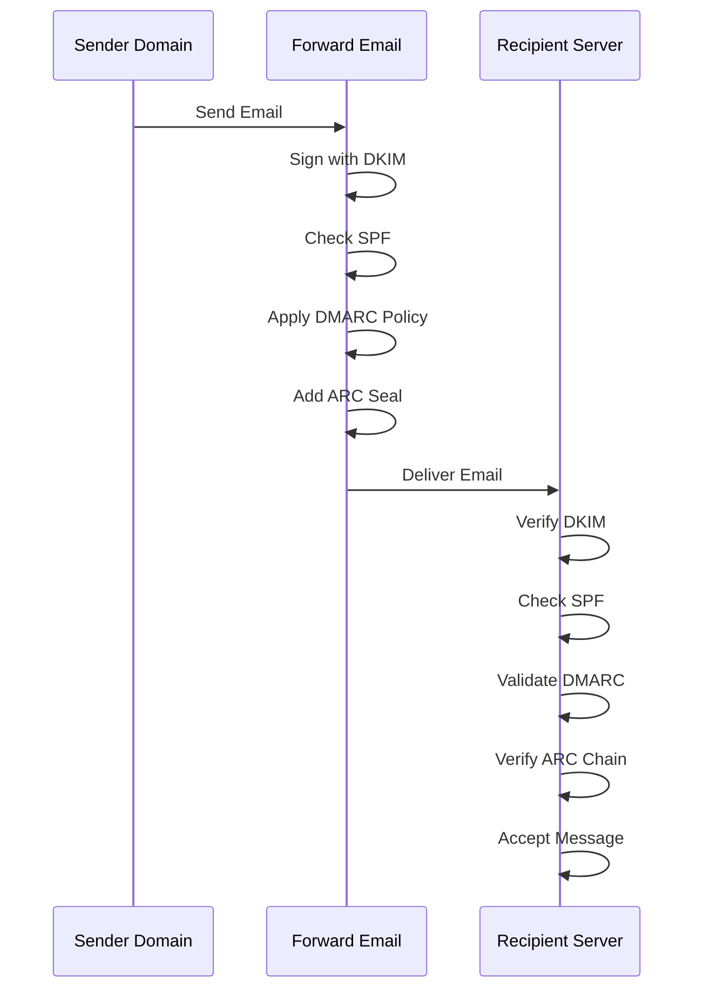

---


## Email Transport Security Protocols {#email-transport-security-protocols}

> \[!IMPORTANT]
> Forward Email מיישם שכבות מרובות של אבטחת תעבורה כדי להגן על האימיילים במהלך ההעברה.

Forward Email מיישם פרוטוקולי אבטחת תעבורה מודרניים:

| RFC                                                       | Title                                                                                                | Status      | Implementation Notes                                                                                                                                                                                                                                                                          |
| --------------------------------------------------------- | ---------------------------------------------------------------------------------------------------- | ----------- | --------------------------------------------------------------------------------------------------------------------------------------------------------------------------------------------------------------------------------------------------------------------------------------------- |
| [RFC 8461](https://datatracker.ietf.org/doc/html/rfc8461) | SMTP MTA Strict Transport Security (MTA-STS)                                                         | ✅ Supported | בשימוש נרחב בשרתים IMAP, SMTP ו-MX. ראה [create-mta-sts-cache.js](https://github.com/forwardemail/forwardemail.net/blob/master/helpers/create-mta-sts-cache.js) ו-[get-transporter.js](https://github.com/forwardemail/forwardemail.net/blob/master/helpers/get-transporter.js) |
| [RFC 8460](https://datatracker.ietf.org/doc/html/rfc8460) | SMTP TLS Reporting                                                                                   | ✅ Supported | דרך ספריית [mailauth](https://github.com/postalsys/mailauth)                                                                                                                                                                                                                                 |
| [RFC 7671](https://datatracker.ietf.org/doc/html/rfc7671) | The DNS-Based Authentication of Named Entities (DANE) Protocol: Updates and Operational Guidance     | ✅ Supported | אימות DANE מלא לחיבורים יוצאים ב-SMTP. ראה [mx-connect PR #22](https://github.com/zone-eu/mx-connect/pull/22)                                                                                                                                                                  |
| [RFC 6698](https://datatracker.ietf.org/doc/html/rfc6698) | The DNS-Based Authentication of Named Entities (DANE) Transport Layer Security (TLS) Protocol: TLSA  | ✅ Supported | תמיכה מלאה ב-RFC 6698: סוגי שימוש PKIX-TA, PKIX-EE, DANE-TA, DANE-EE. ראה [mx-connect PR #22](https://github.com/zone-eu/mx-connect/pull/22)                                                                                                                                                 |
| [RFC 8314](https://datatracker.ietf.org/doc/html/rfc8314) | Cleartext Considered Obsolete: Use of Transport Layer Security (TLS) for Email Submission and Access | ✅ Supported | TLS נדרש לכל החיבורים                                                                                                                                                                                                                                                              |
| [RFC 8689](https://datatracker.ietf.org/doc/html/rfc8689) | SMTP Service Extension for Requiring TLS (REQUIRETLS)                                                | ✅ Supported | תמיכה מלאה בהרחבת SMTP REQUIRETLS וכותרת "TLS-Required"                                                                                                                                                                                                                          |
פרוטוקולי אבטחת תעבורה מבטיחים שהודעות דוא"ל מוצפנות ומאומתות במהלך ההעברה בין שרתי הדואר.

### תמיכה באבטחת תעבורה {#transport-security-support}

| פרוטוקול      | RFC      | סטטוס       | תיאור                                            |
| -------------- | -------- | ----------- | ------------------------------------------------ |
| **TLS**        | RFC 8314 | ✅ נתמך     | אבטחת שכבת תעבורה - חיבורים מוצפנים              |
| **MTA-STS**    | RFC 8461 | ✅ נתמך     | אבטחת תעבורה מחמירה לסוכני העברת דואר            |
| **DANE**       | RFC 7671 | ✅ נתמך     | אימות מבוסס DNS של ישויות ממוספרות                |
| **REQUIRETLS** | RFC 8689 | ✅ נתמך     | דרישת TLS לכל מסלול ההעברה                         |

### TLS (אבטחת שכבת תעבורה) {#tls-transport-layer-security}

Forward Email מחייב הצפנת TLS לכל חיבורי הדוא"ל (SMTP, IMAP, POP3).

**תכונות עיקריות:**

* תמיכה ב-TLS 1.2 ו-TLS 1.3
* ניהול תעודות אוטומטי
* Perfect Forward Secrecy (PFS)
* חבילות הצפנה חזקות בלבד

### MTA-STS (אבטחת תעבורה מחמירה לסוכני העברת דואר) {#mta-sts-mail-transfer-agent-strict-transport-security}

**MTA-STS** מבטיח שהדוא"ל יועבר רק דרך חיבורים מוצפנים ב-TLS על ידי פרסום מדיניות דרך HTTPS.

Forward Email מיישם MTA-STS באמצעות [create-mta-sts-cache.js](https://github.com/forwardemail/forwardemail.net/blob/master/helpers/create-mta-sts-cache.js).

**תכונות עיקריות:**

* פרסום מדיניות MTA-STS אוטומטי
* מטמון מדיניות לשיפור ביצועים
* מניעת התקפות הורדת גרסה
* אכיפת אימות תעודות

### DANE (אימות מבוסס DNS של ישויות ממוספרות) {#dane-dns-based-authentication-of-named-entities}

> \[!NOTE]
> Forward Email מספק כעת תמיכה מלאה ב-DANE לחיבורי SMTP יוצאים.

**DANE** משתמש ב-DNSSEC לפרסום מידע על תעודות TLS ב-DNS, ומאפשר לשרתי הדואר לאמת תעודות ללא תלות ברשויות תעודה.

**תכונות עיקריות:**

* ✅ אימות DANE מלא לחיבורי SMTP יוצאים
* ✅ תמיכה מלאה ב-RFC 6698: סוגי שימוש PKIX-TA, PKIX-EE, DANE-TA, DANE-EE
* ✅ אימות תעודה מול רשומות TLSA במהלך שדרוג TLS
* ✅ פתרון מקבילי של TLSA למספר מארחי MX
* ✅ זיהוי אוטומטי של `dns.resolveTlsa` מקורי (Node.js v22.15.0+, v23.9.0+)
* ✅ תמיכה בפתרון מותאם אישית לגרסאות Node.js ישנות באמצעות [Tangerine](https://github.com/forwardemail/tangerine)
* דורש דומיינים חתומים ב-DNSSEC

> \[!TIP]
> **פרטי יישום:** תמיכת DANE נוספה באמצעות [mx-connect PR #22](https://github.com/zone-eu/mx-connect/pull/22), המספקת תמיכה מקיפה ב-DANE/TLSA לחיבורי SMTP יוצאים.

### REQUIRETLS {#requiretls}

> \[!TIP]
> Forward Email הוא אחד מהספקים הבודדים עם תמיכה ב-REQUIRETLS המופנית למשתמש.

**REQUIRETLS** מבטיח שהודעות דוא"ל יועברו רק דרך חיבורים מוצפנים ב-TLS לאורך כל מסלול ההעברה.

**תכונות עיקריות:**

* תיבת סימון למשתמש במרכיב כתיבת הדוא"ל
* דחייה אוטומטית של העברה לא מוצפנת
* אכיפת TLS מקצה לקצה
* התראות מפורטות על כישלונות

> \[!TIP]
> **אכיפת TLS למשתמש:** Forward Email מספק תיבת סימון תחת **My Account > Domains > Settings** לאכיפת TLS לכל החיבורים הנכנסים. כאשר מופעלת, תכונה זו דוחה כל דוא"ל נכנס שאינו נשלח דרך חיבור מוצפן ב-TLS עם קוד שגיאה 530, ומבטיחה שכל הדואר הנכנס מוצפן במהלך ההעברה.

### זרימת אבטחת תעבורה {#transport-security-flow}

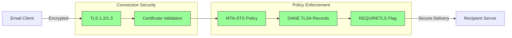
## הצפנת הודעות דוא"ל {#email-message-encryption}

> \[!NOTE]
> Forward Email תומך גם ב-OpenPGP וגם ב-S/MIME להצפנת דוא"ל מקצה לקצה.

Forward Email תומך בהצפנת OpenPGP ו-S/MIME:

| RFC                                                       | כותרת                                                                                   | סטטוס      | הערות יישום                                                                                                                                                                                        |
| --------------------------------------------------------- | --------------------------------------------------------------------------------------- | ----------- | -------------------------------------------------------------------------------------------------------------------------------------------------------------------------------------------------- |
| [RFC 9580](https://datatracker.ietf.org/doc/html/rfc9580) | OpenPGP (מחליף את RFC 4880)                                                             | ✅ נתמך    | באמצעות אינטגרציה של [OpenPGP.js v6+](https://github.com/openpgpjs/openpgpjs). ראה [שאלות נפוצות](https://forwardemail.net/en/faq#do-you-support-openpgpmime-end-to-end-encryption-e2ee-and-web-key-directory-wkd) |
| [RFC 8551](https://datatracker.ietf.org/doc/html/rfc8551) | Secure/Multipurpose Internet Mail Extensions (S/MIME) גרסה 4.0 - מפרט הודעה              | ✅ נתמך    | נתמכים אלגוריתמים של RSA ו-ECC. ראה [שאלות נפוצות](https://forwardemail.net/en/faq#do-you-support-smime-encryption)                                                                              |

פרוטוקולי הצפנת הודעות מגנים על תוכן הדוא"ל מפני קריאה על ידי כל אחד מלבד הנמען המיועד, גם אם ההודעה נתפסת במהלך ההעברה.

### תמיכה בהצפנה {#encryption-support}

| פרוטוקול   | RFC      | סטטוס      | תיאור                                        |
| ----------- | -------- | ----------- | -------------------------------------------- |
| **OpenPGP** | RFC 9580 | ✅ נתמך    | Pretty Good Privacy - הצפנת מפתח ציבורי      |
| **S/MIME**  | RFC 8551 | ✅ נתמך    | Secure/Multipurpose Internet Mail Extensions |
| **WKD**     | טיוטה    | ✅ נתמך    | Web Key Directory - גילוי מפתח אוטומטי       |

### OpenPGP (Pretty Good Privacy) {#openpgp-pretty-good-privacy}

**OpenPGP** מספק הצפנה מקצה לקצה באמצעות קריפטוגרפיית מפתח ציבורי. Forward Email תומך ב-OpenPGP דרך פרוטוקול [Web Key Directory (WKD)](https://forwardemail.net/en/faq#do-you-support-openpgpmime-end-to-end-encryption-e2ee-and-web-key-directory-wkd).

**תכונות עיקריות:**

* גילוי מפתח אוטומטי דרך WKD
* תמיכה ב-PGP/MIME עבור קבצים מצורפים מוצפנים
* ניהול מפתחות דרך לקוח הדוא"ל
* תואם ל-GPG, Mailvelope וכלי OpenPGP נוספים

**כיצד להשתמש:**

1. צור זוג מפתחות PGP בלקוח הדוא"ל שלך
2. העלה את המפתח הציבורי שלך ל-WKD של Forward Email
3. המפתח שלך זמין לגילוי אוטומטי על ידי משתמשים אחרים
4. שלח וקבל דוא"ל מוצפן בצורה חלקה

### S/MIME (Secure/Multipurpose Internet Mail Extensions) {#smime-securemultipurpose-internet-mail-extensions}

**S/MIME** מספק הצפנת דוא"ל וחתימות דיגיטליות באמצעות תעודות X.509.

**תכונות עיקריות:**

* הצפנה מבוססת תעודה
* חתימות דיגיטליות לאימות ההודעה
* תמיכה מובנית ברוב לקוחות הדוא"ל
* אבטחה ברמת ארגונים

**כיצד להשתמש:**

1. השג תעודת S/MIME מרשות תעודות
2. התקן את התעודה בלקוח הדוא"ל שלך
3. הגדר את הלקוח להצפין/לחתום הודעות
4. החלף תעודות עם הנמענים

### הצפנת תיבת דואר SQLite {#sqlite-mailbox-encryption}

> \[!IMPORTANT]
> Forward Email מספק שכבת אבטחה נוספת עם תיבות דואר מוצפנות ב-SQLite.

מעבר להצפנת הודעות ברמת ההודעה, Forward Email מצפין תיבות דואר שלמות באמצעות [sqleet](https://github.com/resilar/sqleet) (ChaCha20-Poly1305).

**תכונות עיקריות:**

* **הצפנה מבוססת סיסמה** - רק לך יש את הסיסמה
* **עמיד בפני מחשוב קוונטי** - הצפנת ChaCha20-Poly1305
* **אפס ידע** - Forward Email אינו יכול לפענח את תיבת הדואר שלך
* **מבודד** - כל תיבת דואר מבודדת וניידת
* **לא ניתן לשחזור** - אם תשכח את הסיסמה, תיבת הדואר שלך אבודה
### השוואת הצפנה {#encryption-comparison}

| תכונה                 | OpenPGP           | S/MIME             | הצפנת SQLite      |
| --------------------- | ----------------- | ------------------ | ----------------- |
| **קצה-לקצה**          | ✅ כן              | ✅ כן               | ✅ כן              |
| **ניהול מפתחות**      | מנוהל עצמאית      | מונפק על ידי CA    | מבוסס סיסמה       |
| **תמיכת לקוח**       | דורש תוסף         | מובנה              | שקוף              |
| **מקרה שימוש**        | אישי               | ארגוני              | אחסון             |
| **עמיד בפני מחשוב קוונטי** | ⚠️ תלוי במפתח     | ⚠️ תלוי בתעודה     | ✅ כן              |

### זרימת הצפנה {#encryption-flow}

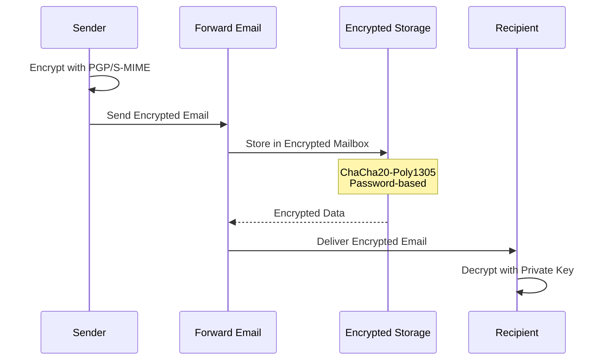

---


## פונקציונליות מורחבת {#extended-functionality}


## תקני פורמט הודעות דואר אלקטרוני {#email-message-format-standards}

> \[!NOTE]
> Forward Email תומך בתקני פורמט דואר אלקטרוני מודרניים לתוכן עשיר ולאינטרנציונליזציה.

Forward Email תומך בתקני פורמט הודעות דואר אלקטרוני סטנדרטיים:

| RFC                                                       | כותרת                                                        | הערות יישום          |
| --------------------------------------------------------- | ------------------------------------------------------------- | -------------------- |
| [RFC 5322](https://datatracker.ietf.org/doc/html/rfc5322) | פורמט הודעות אינטרנט                                         | תמיכה מלאה           |
| [RFC 2045](https://datatracker.ietf.org/doc/html/rfc2045) | MIME חלק ראשון: פורמט גופי הודעות אינטרנט                    | תמיכה מלאה ב-MIME    |
| [RFC 2046](https://datatracker.ietf.org/doc/html/rfc2046) | MIME חלק שני: סוגי מדיה                                      | תמיכה מלאה ב-MIME    |
| [RFC 2047](https://datatracker.ietf.org/doc/html/rfc2047) | MIME חלק שלישי: הרחבות כותרות הודעה לטקסט לא ASCII           | תמיכה מלאה ב-MIME    |
| [RFC 2048](https://datatracker.ietf.org/doc/html/rfc2048) | MIME חלק רביעי: נהלי רישום                                   | תמיכה מלאה ב-MIME    |
| [RFC 2049](https://datatracker.ietf.org/doc/html/rfc2049) | MIME חלק חמישי: קריטריוני תאימות ודוגמאות                    | תמיכה מלאה ב-MIME    |

תקני פורמט דואר אלקטרוני מגדירים כיצד הודעות דואר אלקטרוני מובנות, מקודדות ומוצגות.

### תמיכת תקני פורמט {#format-standards-support}

| תקן                | RFC           | סטטוס       | תיאור                                |
| ------------------ | ------------- | ----------- | ------------------------------------ |
| **MIME**           | RFC 2045-2049 | ✅ נתמך     | הרחבות דואר אינטרנט רב-תכליתיות     |
| **SMTPUTF8**       | RFC 6531      | ⚠️ חלקי     | כתובות דואר אלקטרוני בינלאומיות     |
| **EAI**            | RFC 6530      | ⚠️ חלקי     | אינטרנציונליזציה של כתובות דואר      |
| **פורמט הודעה**    | RFC 5322      | ✅ נתמך     | פורמט הודעות אינטרנט                 |
| **אבטחת MIME**     | RFC 1847      | ✅ נתמך     | חלקים מאובטחים עבור MIME             |

### MIME (הרחבות דואר אינטרנט רב-תכליתיות) {#mime-multipurpose-internet-mail-extensions}

**MIME** מאפשר לדואר אלקטרוני להכיל חלקים מרובים עם סוגי תוכן שונים (טקסט, HTML, קבצים מצורפים וכו').

**תכונות MIME נתמכות:**

* הודעות מרובות חלקים (מעורב, אלטרנטיבי, קשור)
* כותרות Content-Type
* קידוד Content-Transfer-Encoding (7bit, 8bit, quoted-printable, base64)
* תמונות וקבצים מצורפים מוטמעים
* תוכן HTML עשיר

### SMTPUTF8 ואינטרנציונליזציה של כתובות דואר אלקטרוני {#smtputf8-and-email-address-internationalization}

> \[!WARNING]
> תמיכת SMTPUTF8 חלקית - לא כל התכונות מיושמות במלואן.
**SMTPUTF8** מאפשר לכתובות דוא"ל להכיל תווים שאינם ASCII (למשל, `用户@例え.jp`).

**סטטוס נוכחי:**

* ⚠️ תמיכה חלקית בכתובות דוא"ל בינלאומיות
* ✅ תוכן UTF-8 בגופי ההודעות
* ⚠️ תמיכה מוגבלת בחלקים מקומיים שאינם ASCII

---


## פרוטוקולים של לוח שנה ואנשי קשר {#calendaring-and-contacts-protocols}

> \[!NOTE]
> Forward Email מספק תמיכה מלאה ב-CalDAV ו-CardDAV לסנכרון לוח שנה ואנשי קשר.

Forward Email תומך ב-CalDAV ו-CardDAV דרך ספריית [caldav-adapter](https://github.com/forwardemail/caldav-adapter):

| RFC                                                       | כותרת                                                                    | סטטוס       | הערות על מימוש                                                                                                                                                                        |
| --------------------------------------------------------- | ------------------------------------------------------------------------- | ----------- | -------------------------------------------------------------------------------------------------------------------------------------------------------------------------------------- |
| [RFC 4791](https://datatracker.ietf.org/doc/html/rfc4791) | הרחבות ל-WebDAV ללוח שנה (CalDAV)                                         | ✅ נתמך     | גישה וניהול לוח שנה                                                                                                                                                                   |
| [RFC 6352](https://datatracker.ietf.org/doc/html/rfc6352) | CardDAV: הרחבות vCard ל-WebDAV                                            | ✅ נתמך     | גישה וניהול אנשי קשר                                                                                                                                                                  |
| [RFC 5545](https://datatracker.ietf.org/doc/html/rfc5545) | מפרט ליבת לוח שנה ואירועים באינטרנט (iCalendar)                          | ✅ נתמך     | תמיכה בפורמט iCalendar                                                                                                                                                               |
| [RFC 6350](https://datatracker.ietf.org/doc/html/rfc6350) | מפרט פורמט vCard                                                        | ✅ נתמך     | תמיכה בפורמט vCard 4.0                                                                                                                                                               |
| [RFC 6638](https://datatracker.ietf.org/doc/html/rfc6638) | הרחבות תזמון ל-CalDAV                                                    | ✅ נתמך     | תזמון CalDAV עם תמיכה ב-iMIP. ראה [commit c4d1629](https://github.com/forwardemail/forwardemail.net/commit/c4d162975a49e38d76d68a032662e873a34a9b80)                            |
| [RFC 5546](https://datatracker.ietf.org/doc/html/rfc5546) | פרוטוקול אינטרופרביליות בלתי תלוי-תחבורה ל-iCalendar (iTIP)             | ✅ נתמך     | תמיכה ב-iTIP עבור REQUEST, REPLY, CANCEL ו-VFREEBUSY. ראה [commit c4d1629](https://github.com/forwardemail/forwardemail.net/commit/c4d162975a49e38d76d68a032662e873a34a9b80) |
| [RFC 6047](https://datatracker.ietf.org/doc/html/rfc6047) | פרוטוקול אינטרופרביליות מבוסס הודעות ל-iCalendar (iMIP)                  | ✅ נתמך     | הזמנות לוח שנה מבוססות דוא"ל עם קישורי תגובה. ראה [commit c4d1629](https://github.com/forwardemail/forwardemail.net/commit/c4d162975a49e38d76d68a032662e873a34a9b80)           |

CalDAV ו-CardDAV הם פרוטוקולים המאפשרים גישה, שיתוף וסנכרון של נתוני לוח שנה ואנשי קשר בין מכשירים.

### תמיכה ב-CalDAV ו-CardDAV {#caldav-and-carddav-support}

| פרוטוקול             | RFC      | סטטוס       | תיאור                                  |
| --------------------- | -------- | ----------- | -------------------------------------- |
| **CalDAV**            | RFC 4791 | ✅ נתמך     | גישה וסנכרון לוח שנה                   |
| **CardDAV**           | RFC 6352 | ✅ נתמך     | גישה וסנכרון אנשי קשר                   |
| **iCalendar**         | RFC 5545 | ✅ נתמך     | פורמט נתוני לוח שנה                    |
| **vCard**             | RFC 6350 | ✅ נתמך     | פורמט נתוני אנשי קשר                   |
| **VTODO**             | RFC 5545 | ✅ נתמך     | תמיכה במשימות/תזכורות                 |
| **תזמון CalDAV**      | RFC 6638 | ✅ נתמך     | הרחבות תזמון ל-CalDAV                   |
| **iTIP**              | RFC 5546 | ✅ נתמך     | אינטרופרביליות בלתי תלויה בתחבורה       |
| **iMIP**              | RFC 6047 | ✅ נתמך     | הזמנות לוח שנה מבוססות דוא"ל           |
### CalDAV (גישה ללוח שנה) {#caldav-calendar-access}

**CalDAV** מאפשר לך לגשת ולנהל לוחות שנה מכל מכשיר או יישום.

**תכונות עיקריות:**

* סינכרון בין מכשירים מרובים
* לוחות שנה משותפים
* מנויים ללוח שנה
* הזמנות לאירועים ותגובות
* אירועים חוזרים
* תמיכה באיזורי זמן

**לקוחות תואמים:**

* Apple Calendar (macOS, iOS)
* Mozilla Thunderbird
* Evolution
* GNOME Calendar
* כל לקוח התומך ב-CalDAV

### CardDAV (גישה לאנשי קשר) {#carddav-contact-access}

**CardDAV** מאפשר לך לגשת ולנהל אנשי קשר מכל מכשיר או יישום.

**תכונות עיקריות:**

* סינכרון בין מכשירים מרובים
* ספרי כתובות משותפים
* קבוצות אנשי קשר
* תמיכה בתמונות
* שדות מותאמים אישית
* תמיכה ב-vCard 4.0

**לקוחות תואמים:**

* Apple Contacts (macOS, iOS)
* Mozilla Thunderbird
* Evolution
* GNOME Contacts
* כל לקוח התומך ב-CardDAV

### משימות ותזכורות (CalDAV VTODO) {#tasks-and-reminders-caldav-vtodo}

> \[!TIP]
> Forward Email תומך במשימות ותזכורות דרך CalDAV VTODO.

**VTODO** הוא חלק מפורמט iCalendar ומאפשר ניהול משימות דרך CalDAV.

**תכונות עיקריות:**

* יצירה וניהול משימות
* תאריכי יעד וקדימויות
* מעקב אחר השלמת משימות
* משימות חוזרות
* רשימות/קטגוריות משימות

**לקוחות תואמים:**

* Apple Reminders (macOS, iOS)
* Mozilla Thunderbird (עם Lightning)
* Evolution
* GNOME To Do
* כל לקוח CalDAV עם תמיכה ב-VTODO

### זרימת סינכרון CalDAV/CardDAV {#caldavcarddav-synchronization-flow}

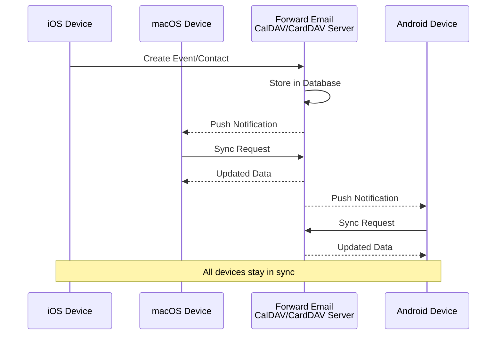

### הרחבות לוח שנה שלא נתמכות {#calendaring-extensions-not-supported}

ההרחבות הבאות ללוח שנה אינן נתמכות:

| RFC                                                       | כותרת                                                                | סיבה                                                           |
| --------------------------------------------------------- | --------------------------------------------------------------------- | --------------------------------------------------------------- |
| [RFC 4918](https://datatracker.ietf.org/doc/html/rfc4918) | הרחבות HTTP לכתיבה מבוזרת ולגרסאות (WebDAV)                         | CalDAV משתמש במושגי WebDAV אך לא מיישם את RFC 4918 במלואו       |
| [RFC 6578](https://datatracker.ietf.org/doc/html/rfc6578) | סינכרון אוספים עבור WebDAV                                           | לא מיושם                                                       |
| [RFC 3744](https://datatracker.ietf.org/doc/html/rfc3744) | פרוטוקול בקרת גישה ל-WebDAV                                          | לא מיושם                                                       |

---


## סינון הודעות דואר אלקטרוני {#email-message-filtering}

> \[!IMPORTANT]
> Forward Email מספק **תמיכה מלאה ב-Sieve ו-ManageSieve** לסינון דואר אלקטרוני בצד השרת. צור כללים רבי עוצמה למיון, סינון, העברה ותגובה אוטומטית להודעות נכנסות.

### Sieve (RFC 5228) {#sieve-rfc-5228}

[Sieve](https://en.wikipedia.org/wiki/Sieve_\(mail_filtering_language\)) היא שפת סקריפטים סטנדרטית ועוצמתית לסינון דואר אלקטרוני בצד השרת. Forward Email מיישם תמיכה מקיפה ב-Sieve עם 24 הרחבות.

**קוד מקור:** [`helpers/sieve/`](https://github.com/forwardemail/forwardemail.net/tree/master/helpers/sieve)

#### RFCs מרכזיים של Sieve הנתמכים {#core-sieve-rfcs-supported}

| RFC                                                                                    | כותרת                                                         | סטטוס          |
| -------------------------------------------------------------------------------------- | ------------------------------------------------------------- | -------------- |
| [RFC 5228](https://datatracker.ietf.org/doc/html/rfc5228)                              | Sieve: שפת סינון דואר אלקטרוני                                | ✅ תמיכה מלאה  |
| [RFC 5429](https://datatracker.ietf.org/doc/html/rfc5429)                              | סינון דואר אלקטרוני ב-Sieve: הרחבות דחייה ודחייה מורחבת       | ✅ תמיכה מלאה  |
| [RFC 5230](https://datatracker.ietf.org/doc/html/rfc5230)                              | סינון דואר אלקטרוני ב-Sieve: הרחבת חופשה                      | ✅ תמיכה מלאה  |
| [RFC 6131](https://datatracker.ietf.org/doc/html/rfc6131)                              | הרחבת חופשה ב-Sieve: פרמטר "שניות"                            | ✅ תמיכה מלאה  |
| [RFC 5232](https://datatracker.ietf.org/doc/html/rfc5232)                              | סינון דואר אלקטרוני ב-Sieve: הרחבת Imap4flags                 | ✅ תמיכה מלאה  |
| [RFC 5173](https://datatracker.ietf.org/doc/html/rfc5173)                              | סינון דואר אלקטרוני ב-Sieve: הרחבת גוף ההודעה                 | ✅ תמיכה מלאה  |
| [RFC 5229](https://datatracker.ietf.org/doc/html/rfc5229)                              | סינון דואר אלקטרוני ב-Sieve: הרחבת משתנים                      | ✅ תמיכה מלאה  |
| [RFC 5231](https://datatracker.ietf.org/doc/html/rfc5231)                              | סינון דואר אלקטרוני ב-Sieve: הרחבה יחסית                       | ✅ תמיכה מלאה  |
| [RFC 4790](https://datatracker.ietf.org/doc/html/rfc4790)                              | רישום פרוטוקול יישום אינטרנט                                   | ✅ תמיכה מלאה  |
| [RFC 3894](https://datatracker.ietf.org/doc/html/rfc3894)                              | הרחבת Sieve: העתקה ללא תופעות לוואי                            | ✅ תמיכה מלאה  |
| [RFC 5293](https://datatracker.ietf.org/doc/html/rfc5293)                              | סינון דואר אלקטרוני ב-Sieve: הרחבת עריכת כותרות               | ✅ תמיכה מלאה  |
| [RFC 5260](https://datatracker.ietf.org/doc/html/rfc5260)                              | סינון דואר אלקטרוני ב-Sieve: הרחבות תאריך ואינדקס             | ✅ תמיכה מלאה  |
| [RFC 5435](https://datatracker.ietf.org/doc/html/rfc5435)                              | סינון דואר אלקטרוני ב-Sieve: הרחבה להודעות התראה              | ✅ תמיכה מלאה  |
| [RFC 5183](https://datatracker.ietf.org/doc/html/rfc5183)                              | סינון דואר אלקטרוני ב-Sieve: הרחבת סביבה                       | ✅ תמיכה מלאה  |
| [RFC 5490](https://datatracker.ietf.org/doc/html/rfc5490)                              | סינון דואר אלקטרוני ב-Sieve: הרחבות לבדיקת מצב תיבת דואר     | ✅ תמיכה מלאה  |
| [RFC 8579](https://datatracker.ietf.org/doc/html/rfc8579)                              | סינון דואר אלקטרוני ב-Sieve: משלוח לתיבות דואר לשימוש מיוחד  | ✅ תמיכה מלאה  |
| [RFC 7352](https://datatracker.ietf.org/doc/html/rfc7352)                              | סינון דואר אלקטרוני ב-Sieve: זיהוי משלוחים כפולים             | ✅ תמיכה מלאה  |
| [RFC 5463](https://datatracker.ietf.org/doc/html/rfc5463)                              | סינון דואר אלקטרוני ב-Sieve: הרחבת Ihave                       | ✅ תמיכה מלאה  |
| [RFC 5233](https://datatracker.ietf.org/doc/html/rfc5233)                              | סינון דואר אלקטרוני ב-Sieve: הרחבת Subaddress                  | ✅ תמיכה מלאה  |
| [draft-ietf-sieve-regex](https://datatracker.ietf.org/doc/html/draft-ietf-sieve-regex) | סינון דואר אלקטרוני ב-Sieve: הרחבת ביטוי רגולרי               | ✅ תמיכה מלאה  |
#### הרחבות Sieve נתמכות {#supported-sieve-extensions}

| הרחבה                      | תיאור                                   | אינטגרציה                                  |
| ---------------------------- | ---------------------------------------- | ------------------------------------------ |
| `fileinto`                   | סיווג הודעות לתיקיות ספציפיות           | הודעות מאוחסנות בתיקיית IMAP שצוינה       |
| `reject` / `ereject`         | דחיית הודעות עם שגיאה                    | דחיית SMTP עם הודעת החזרה                  |
| `vacation`                   | תגובות חופשה/מחוץ למשרד אוטומטיות       | בתור דרך Emails.queue עם הגבלת קצב          |
| `vacation-seconds`           | מרווחי תגובה מדויקים לחופשה              | TTL מהפרמטר `:seconds`                      |
| `imap4flags`                 | הגדרת דגלי IMAP (\Seen, \Flagged וכו')   | דגלים מוחלים במהלך אחסון ההודעה             |
| `envelope`                   | בדיקת שולח/נמען במעטפה                   | גישה לנתוני מעטפת SMTP                      |
| `body`                       | בדיקת תוכן גוף ההודעה                    | התאמת טקסט גוף מלא                          |
| `variables`                  | אחסון ושימוש במשתנים בסקריפטים           | הרחבת משתנים עם מודים                        |
| `relational`                 | השוואות יחסיות                           | `:count`, `:value` עם gt/lt/eq              |
| `comparator-i;ascii-numeric` | השוואות מספריות                         | השוואת מחרוזות מספריות                       |
| `copy`                       | העתקת הודעות תוך הפניה מחדש              | דגל `:copy` ב-fileinto/redirect              |
| `editheader`                 | הוספה או מחיקה של כותרות הודעה            | כותרות משתנות לפני אחסון                     |
| `date`                       | בדיקת ערכי תאריך/שעה                     | בדיקות currentdate ותאריך בכותרת            |
| `index`                      | גישה להתרחשויות ספציפיות של כותרות       | `:index` לכותרות עם ערכים מרובים             |
| `regex`                      | התאמת ביטוי רגולרי                       | תמיכה מלאה בביטויים רגולריים בבדיקות         |
| `enotify`                    | שליחת התראות                            | התראות `mailto:` דרך Emails.queue            |
| `environment`                | גישה למידע סביבתי                       | דומיין, מארח, remote-ip מהסשן                 |
| `mailbox`                    | בדיקת קיום תיבת דואר                    | בדיקת `mailboxexists`                        |
| `special-use`                | סיווג לתיבות דואר לשימוש מיוחד           | ממפה \Junk, \Trash וכו' לתיקיות               |
| `duplicate`                  | זיהוי הודעות כפולות                      | מעקב כפילויות מבוסס Redis                     |
| `ihave`                      | בדיקת זמינות הרחבה                      | בדיקת יכולת בזמן ריצה                         |
| `subaddress`                 | גישה לחלקי כתובת user+detail             | חלקי כתובת `:user` ו-`:detail`                |

#### הרחבות Sieve שלא נתמכות {#sieve-extensions-not-supported}

| הרחבה                               | RFC                                                       | סיבה                                                            |
| ----------------------------------- | --------------------------------------------------------- | ---------------------------------------------------------------- |
| `include`                           | [RFC 6609](https://datatracker.ietf.org/doc/html/rfc6609) | סיכון אבטחה (הזרקת סקריפטים), דורש אחסון סקריפטים גלובלי       |
| `mboxmetadata` / `servermetadata`   | [RFC 5490](https://datatracker.ietf.org/doc/html/rfc5490) | דורש הרחבת METADATA ב-IMAP                                      |
| `fcc`                               | [RFC 8580](https://datatracker.ietf.org/doc/html/rfc8580) | דורש אינטגרציה עם תיקיית Sent                                  |
| `encoded-character`                 | [RFC 5228](https://datatracker.ietf.org/doc/html/rfc5228) | נדרשות שינויים בפרסר עבור תחביר ${hex:}                        |
| `foreverypart` / `mime` / `extracttext` | [RFC 5703](https://datatracker.ietf.org/doc/html/rfc5703) | טיפול מורכב בעץ MIME                                            |
#### זרימת עיבוד Sieve {#sieve-processing-flow}

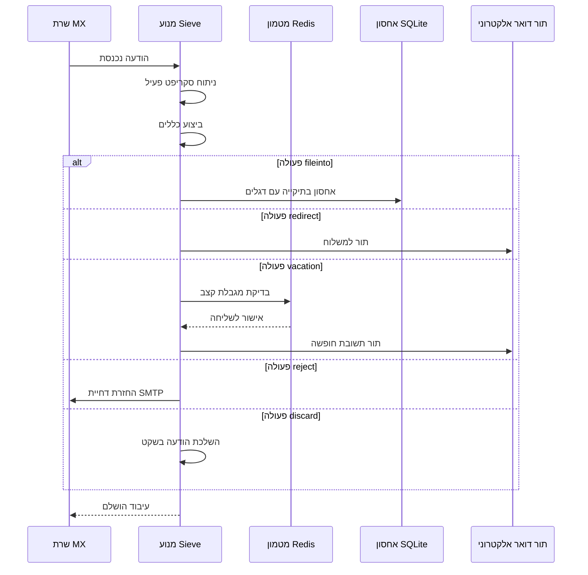

#### תכונות אבטחה {#security-features}

מימוש Sieve של Forward Email כולל הגנות אבטחה מקיפות:

* **הגנה על CVE-2023-26430**: מונע לולאות הפניה ותקיפות הפצצת דואר
* **הגבלת קצב**: מגבלות על הפניות (10/הודעה, 100/יום) ותשובות חופשה
* **בדיקת רשימת סירוב**: כתובות הפניה נבדקות מול רשימת סירוב
* **כותרות מוגנות**: כותרות DKIM, ARC ואימות לא ניתנות לשינוי דרך editheader
* **מגבלות גודל סקריפט**: אכיפת גודל סקריפט מקסימלי
* **זמני ביצוע מוגבלים**: סקריפטים מסתיימים אם זמן הביצוע חורג מהמגבלה

#### דוגמאות לסקריפטים של Sieve {#example-sieve-scripts}

**הכנסת ניוזלטרים לתיקייה:**

```sieve
require ["fileinto"];

if header :contains "List-Id" "newsletter" {
    fileinto "Newsletters";
}
```

**מענה אוטומטי לחופשה עם תזמון מדויק:**

```sieve
require ["vacation", "vacation-seconds"];

vacation :seconds 3600 :subject "מחוץ למשרד"
    "אני כרגע מחוץ למשרד ואשיב תוך 24 שעות.";
```

**סינון ספאם עם דגלים:**

```sieve
require ["fileinto", "imap4flags"];

if header :contains "X-Spam-Status" "Yes" {
    setflag "\\Seen";
    fileinto "Junk";
}
```

**סינון מורכב עם משתנים:**

```sieve
require ["variables", "fileinto", "regex"];

if header :regex "From" "(.+)@example\\.com" {
    set :lower "sender" "${1}";
    fileinto "Contacts/${sender}";
}
```

> \[!TIP]
> לתיעוד מלא, דוגמאות סקריפטים והוראות קונפיגורציה, ראו [שאלות נפוצות: האם אתם תומכים בסינון דואר Sieve?](/faq#do-you-support-sieve-email-filtering)

### ManageSieve (RFC 5804) {#managesieve-rfc-5804}

Forward Email מספק תמיכה מלאה בפרוטוקול ManageSieve לניהול מרחוק של סקריפטים ב-Sieve.

**קוד מקור:** [`managesieve-server.js`](https://github.com/forwardemail/forwardemail.net/blob/master/managesieve-server.js)

| RFC                                                       | כותרת                                         | סטטוס          |
| --------------------------------------------------------- | ---------------------------------------------- | -------------- |
| [RFC 5804](https://datatracker.ietf.org/doc/html/rfc5804) | פרוטוקול לניהול מרחוק של סקריפטים ב-Sieve     | ✅ תמיכה מלאה  |

#### קונפיגורציית שרת ManageSieve {#managesieve-server-configuration}

| הגדרה                   | ערך                     |
| ----------------------- | ----------------------- |
| **שרת**                | `imap.forwardemail.net` |
| **פורט (STARTTLS)**     | `2190` (מומלץ)          |
| **פורט (TLS מרומז)**    | `4190`                  |
| **אימות**               | PLAIN (על גבי TLS)      |

> **הערה:** פורט 2190 משתמש ב-STARTTLS (שדרוג מחיבור רגיל ל-TLS) ותואם לרוב לקוחות ManageSieve כולל [sieve-connect](https://github.com/philpennock/sieve-connect). פורט 4190 משתמש ב-TLS מרומז (TLS מההתחלה) ללקוחות התומכים בכך.

#### פקודות ManageSieve נתמכות {#supported-managesieve-commands}

| פקודה          | תיאור                                   |
| -------------- | --------------------------------------- |
| `AUTHENTICATE` | אימות באמצעות מנגנון PLAIN              |
| `CAPABILITY`   | הצגת יכולות והרחבות השרת                |
| `HAVESPACE`    | בדיקת אפשרות לאחסן סקריפט             |
| `PUTSCRIPT`    | העלאת סקריפט חדש                       |
| `LISTSCRIPTS`  | רשימת כל הסקריפטים עם סטטוס פעיל      |
| `SETACTIVE`    | הפעלת סקריפט                          |
| `GETSCRIPT`    | הורדת סקריפט                          |
| `DELETESCRIPT` | מחיקת סקריפט                         |
| `RENAMESCRIPT` | שינוי שם סקריפט                      |
| `CHECKSCRIPT`  | אימות תחביר הסקריפט                   |
| `NOOP`         | שמירת החיבור פעיל                     |
| `LOGOUT`       | סיום מושב                            |
#### לקוחות ManageSieve תואמים {#compatible-managesieve-clients}

* **Thunderbird**: תמיכה מובנית ב-Sieve דרך [תוסף Sieve](https://addons.thunderbird.net/addon/sieve/)
* **Roundcube**: [תוסף ManageSieve](https://plugins.roundcube.net/packages/johndoh/sieve)
* **KMail**: תמיכה מקומית ב-ManageSieve
* **sieve-connect**: לקוח שורת פקודה
* **כל לקוח התואם ל-RFC 5804**

#### זרימת פרוטוקול ManageSieve {#managesieve-protocol-flow}

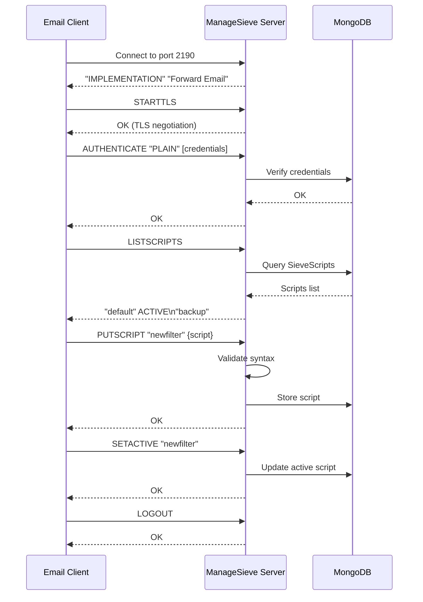

#### ממשק אינטרנט ו-API {#web-interface-and-api}

בנוסף ל-ManageSieve, Forward Email מספק:

* **לוח בקרה אינטרנטי**: יצירה וניהול סקריפטים של Sieve דרך ממשק האינטרנט ב-My Account → Domains → Aliases → Sieve Scripts
* **REST API**: גישה תכנותית לניהול סקריפטים של Sieve דרך [Forward Email API](/api#sieve-scripts)

> \[!TIP]
> להוראות התקנה מפורטות והגדרת לקוח, ראה [שאלות נפוצות: האם אתם תומכים בסינון דואר באמצעות Sieve?](/faq#do-you-support-sieve-email-filtering)

---


## אופטימיזציית אחסון {#storage-optimization}

> \[!IMPORTANT]
> **טכנולוגיית אחסון פורצת דרך בתעשייה:** Forward Email הוא **ספק הדואר האלקטרוני היחיד בעולם** שמשלב דדופליקציה של קבצים מצורפים עם דחיסת Brotli על תוכן הדואר. אופטימיזציה דו-שכבתית זו מעניקה לך **2-3 פעמים יותר אחסון יעיל** בהשוואה לספקי דואר מסורתיים.

Forward Email מיישם שתי טכניקות מהפכניות לאופטימיזציית אחסון שמקטינות משמעותית את גודל תיבת הדואר תוך שמירה על תאימות מלאה ל-RFC ונאמנות ההודעה:

1. **דדופליקציה של קבצים מצורפים** - מבטלת קבצים מצורפים כפולים בכל ההודעות
2. **דחיסת Brotli** - מפחיתה אחסון ב-46-86% עבור מטא-דאטה וב-50% עבור קבצים מצורפים

### ארכיטקטורה: אופטימיזציית אחסון דו-שכבתית {#architecture-dual-layer-storage-optimization}

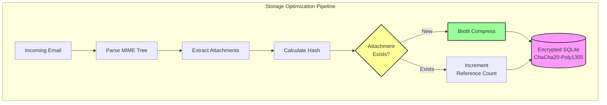

---


## דדופליקציה של קבצים מצורפים {#attachment-deduplication}

Forward Email מיישם דדופליקציה של קבצים מצורפים בהתבסס על [הגישה המוכחת של WildDuck](https://docs.wildduck.email/docs/in-depth/attachment-deduplication/), מותאמת לאחסון SQLite.

> \[!NOTE]
> **מה נדופלקט:** "קובץ מצורף" מתייחס לתוכן הצומת MIME המקודד (base64 או quoted-printable), לא לקובץ המפוענח. זה שומר על תוקף חתימות DKIM ו-GPG.

### איך זה עובד {#how-it-works}

**היישום המקורי של WildDuck (MongoDB GridFS):**

> שרת IMAP של Wild Duck מבצע דדופליקציה של קבצים מצורפים. "קובץ מצורף" במקרה זה מתייחס לתוכן הצומת MIME המקודד ב-base64 או quoted-printable, לא לקובץ המפוענח. אף על פי שהשימוש בתוכן מקודד גורם להרבה שליליים שגויים (אותו קובץ בדואר שונה עשוי להיחשב כקובץ מצורף שונה) זה נדרש כדי להבטיח את תוקף סכימות חתימה שונות (DKIM, GPG וכו'). הודעה שהתקבלה מ-Wild Duck נראית בדיוק כמו ההודעה שנשמרה אף על פי ש-Wild Duck מפרק את ההודעה לאובייקט דמוי עץ ובונה מחדש את ההודעה בעת ההחזרה.
**מימוש SQLite של Forward Email:**

Forward Email מאמץ גישה זו לאחסון מוצפן ב-SQLite עם התהליך הבא:

1. **חישוב גיבוב**: כאשר מצורף קובץ, מחושב גיבוב באמצעות ספריית [`rev-hash`](https://github.com/sindresorhus/rev-hash) מגוף הקובץ המצורף  
2. **חיפוש**: בדיקה אם קובץ מצורף עם גיבוב תואם קיים בטבלת `Attachments`  
3. **ספירת הפניות**:  
   * אם קיים: מגדילים את מונה ההפניות ב-1 ואת המונה הקסום במספר אקראי  
   * אם חדש: יוצרים רשומה חדשה עם מונה = 1  
4. **בטיחות מחיקה**: משתמשים במערכת מונים כפולה (הפניות + קסם) למניעת חיוביות שגויות  
5. **איסוף זבל**: הקבצים המצורפים נמחקים מיד כאשר שני המונים מגיעים לאפס  

**קוד מקור:** [`helpers/attachment-storage.js`](https://github.com/forwardemail/forwardemail.net/blob/master/helpers/attachment-storage.js)

### זרימת דדופליקציה {#deduplication-flow}

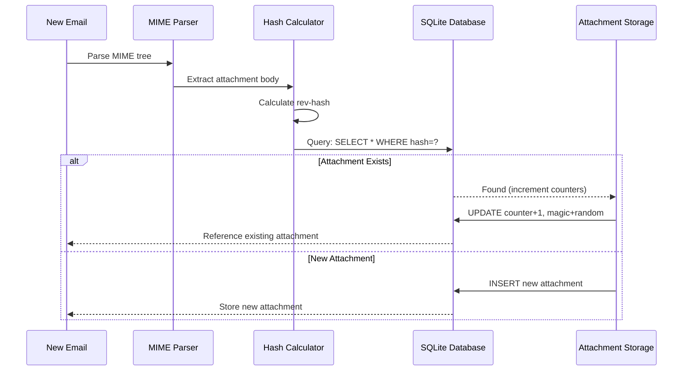

### מערכת המספרים הקסומים {#magic-number-system}

Forward Email משתמשת במערכת "מספר קסם" של WildDuck (בהשראת [Mail.ru](https://github.com/zone-eu/wildduck)) למניעת חיוביות שגויות במהלך מחיקה:

* לכל הודעה מוקצה **מספר אקראי**  
* מונה הקסם של הקובץ המצורף מוגדל במספר האקראי כאשר ההודעה מתווספת  
* מונה הקסם מוקטן באותו מספר כאשר ההודעה נמחקת  
* הקובץ המצורף נמחק רק כאשר **שני המונים** (הפניות + קסם) מגיעים לאפס  

מערכת המונים הכפולה הזו מבטיחה שאם משהו משתבש במהלך המחיקה (למשל קריסה, שגיאת רשת), הקובץ המצורף לא יימחק מוקדם מדי.

### הבדלים מרכזיים: WildDuck מול Forward Email {#key-differences-wildduck-vs-forward-email}

| תכונה                 | WildDuck (MongoDB)       | Forward Email (SQLite)       |
| ---------------------- | ------------------------ | ---------------------------- |
| **מערכת אחסון**        | MongoDB GridFS (מחולק)   | SQLite BLOB (ישיר)           |
| **אלגוריתם גיבוב**    | SHA256                   | rev-hash (מבוסס SHA-256)     |
| **ספירת הפניות**      | ✅ כן                    | ✅ כן                        |
| **מספרים קסומים**      | ✅ כן (בהשראת Mail.ru)   | ✅ כן (אותה מערכת)           |
| **איסוף זבל**          | מאוחר (עבודה נפרדת)     | מיידי (כאשר המונים אפס)      |
| **דחיסה**             | ❌ אין                   | ✅ Brotli (להלן)             |
| **הצפנה**             | ❌ אופציונלי             | ✅ תמיד (ChaCha20-Poly1305)   |

---


## דחיסת Brotli {#brotli-compression}

> \[!IMPORTANT]
> **הראשון בעולם:** Forward Email היא **שירות הדואר האלקטרוני היחיד בעולם** שמשתמש בדחיסת Brotli על תוכן המייל. זה מספק **חיסכון של 46-86% בנפח האחסון** בנוסף לדדופליקציה של קבצים מצורפים.

Forward Email מיישמת דחיסת Brotli הן על גופי הקבצים המצורפים והן על מטא-דאטה של ההודעות, ומספקת חיסכון עצום בנפח האחסון תוך שמירה על תאימות לאחור.

**מימוש:** [`helpers/msgpack-helpers.js`](https://github.com/forwardemail/forwardemail.net/blob/master/helpers/msgpack-helpers.js)

### מה נדחס {#what-gets-compressed}

**1. גופי קבצים מצורפים** (`encodeAttachmentBody`)

* **פורמטים ישנים**: מחרוזת מקודדת הקסה (גודל כפול) או Buffer גולמי  
* **פורמט חדש**: Buffer דחוס ב-Brotli עם כותרת קסומה "FEBR"  
* **החלטת דחיסה**: דוחס רק אם זה חוסך מקום (מתחשב בכותרת של 4 בתים)  
* **חיסכון באחסון**: עד **50%** (הקסה → BLOB מקורי)
**2. מטא-נתוני הודעה** (`encodeMetadata`)

כולל: `mimeTree`, `headers`, `envelope`, `flags`

* **פורמט ישן**: מחרוזת טקסט JSON
* **פורמט חדש**: Buffer דחוס ב-Brotli
* **חיסכון באחסון**: **46-86%** תלוי במורכבות ההודעה

### תצורת דחיסה {#compression-configuration}

```javascript
// אפשרויות דחיסת Brotli מותאמות למהירות (רמה 4 היא איזון טוב)
const BROTLI_COMPRESS_OPTIONS = {
  params: {
    [zlib.constants.BROTLI_PARAM_QUALITY]: 4
  }
};
```

**למה רמה 4?**

* **דחיסה/פירוק מהירים**: עיבוד תת-מילישניות
* **יחס דחיסה טוב**: חיסכון של 46-86%
* **ביצועים מאוזנים**: אופטימלי לפעולות דואר בזמן אמת

### כותרת קסם: "FEBR" {#magic-header-febr}

Forward Email משתמש בכותרת קסם באורך 4 בתים לזיהוי גופי קבצים מצורפים דחוסים:

```
"FEBR" = Forward Email BRotli
Hex: 0x46 0x45 0x42 0x52
```

**למה כותרת קסם?**

* **זיהוי פורמט**: זיהוי מיידי של נתונים דחוסים לעומת לא דחוסים
* **תאימות לאחור**: מחרוזות הקס ישנות ו-Buffers גולמיים עדיין עובדים
* **מניעת התנגשות**: "FEBR" לא צפוי להופיע בתחילת נתוני קובץ מצורף חוקיים

### תהליך הדחיסה {#compression-process}

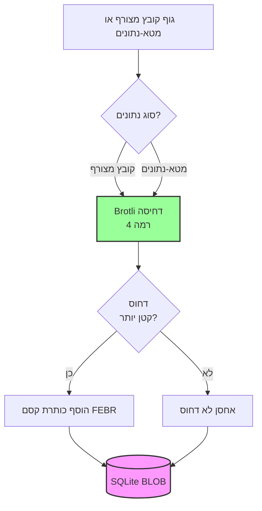

### תהליך הפירוק {#decompression-process}

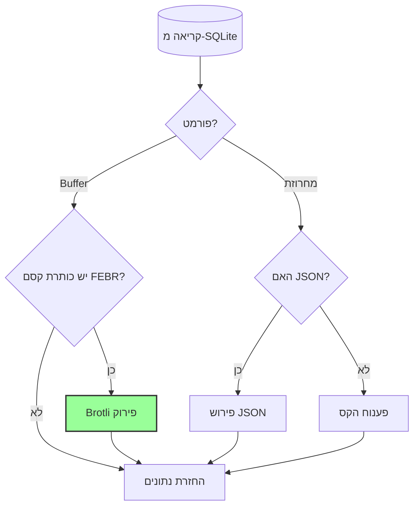

### תאימות לאחור {#backwards-compatibility}

כל פונקציות הפירוק **מזהות אוטומטית** את פורמט האחסון:

| פורמט                 | שיטת זיהוי                          | טיפול                                         |
| --------------------- | ---------------------------------- | --------------------------------------------- |
| **דחוס ב-Brotli**     | בדיקה לכותרת קסם "FEBR"            | פירוק עם `zlib.brotliDecompressSync()`        |
| **Buffer גולמי**       | `Buffer.isBuffer()` ללא כותרת קסם   | החזרה כפי שהיא                               |
| **מחרוזת הקס**         | בדיקה שאורך זוגי + תווים [0-9a-f] | פענוח עם `Buffer.from(value, 'hex')`          |
| **מחרוזת JSON**        | בדיקה שהתו הראשון הוא `{` או `[`   | פירוש עם `JSON.parse()`                        |

זה מבטיח **אפס אובדן נתונים** במהלך המעבר מפורמטים ישנים לחדשים.

### סטטיסטיקות חיסכון באחסון {#storage-savings-statistics}

**חיסכון נמדד מנתוני ייצור:**

| סוג נתונים           | פורמט ישן               | פורמט חדש              | חיסכון    |
| --------------------- | ----------------------- | ---------------------- | ---------- |
| **גופי קבצים מצורפים** | מחרוזת מקודדת הקס (2x)  | BLOB דחוס ב-Brotli     | **50%**    |
| **מטא-נתוני הודעה**   | טקסט JSON               | BLOB דחוס ב-Brotli     | **46-86%** |
| **דגלי תיבת דואר**    | טקסט JSON               | BLOB דחוס ב-Brotli     | **60-80%** |

**מקור:** [`helpers/migrate-storage-format.js`](https://github.com/forwardemail/forwardemail.net/blob/master/helpers/migrate-storage-format.js)

### תהליך ההגירה {#migration-process}

Forward Email מספק הגירה אוטומטית, איידמפוטנטית מפורמטים ישנים לחדשים:
// סטטיסטיקות הגירה שנעקבו:
{
  attachmentsMigrated: 0,
  messagesMigrated: 0,
  mailboxesMigrated: 0,
  bytesSaved: 0  // סך הבייטים שנחסכו מהדחיסה
}
```

**שלבי ההגירה:**

1. גופי קבצים מצורפים: קידוד הקסה → BLOB מקומי (חיסכון של 50%)
2. מטא-דאטה של הודעות: טקסט JSON → BLOB דחוס בברוטלי (חיסכון של 46-86%)
3. דגלי תיבת דואר: טקסט JSON → BLOB דחוס בברוטלי (חיסכון של 60-80%)

**מקור:** [`helpers/migrate-storage-format.js`](https://github.com/forwardemail/forwardemail.net/blob/master/helpers/migrate-storage-format.js)

---

### יעילות אחסון משולבת {#combined-storage-efficiency}

> \[!TIP]
> **השפעה בעולם האמיתי:** עם הסרת כפילויות בקבצים מצורפים + דחיסת Brotli, משתמשי Forward Email מקבלים **2-3 פעמים יותר אחסון יעיל** בהשוואה לספקי דואר אלקטרוני מסורתיים.

**תסריט לדוגמה:**

ספק דואר אלקטרוני מסורתי (תיבת דואר של 1GB):

* 1GB שטח דיסק = 1GB של מיילים
* ללא הסרת כפילויות: אותו קובץ מצורף מאוחסן 10 פעמים = בזבוז אחסון פי 10
* ללא דחיסה: מטא-דאטה מלאה ב-JSON מאוחסנת = בזבוז אחסון פי 2-3

Forward Email (תיבת דואר של 1GB):

* 1GB שטח דיסק ≈ **2-3GB של מיילים** (אחסון יעיל)
* הסרת כפילויות: אותו קובץ מצורף מאוחסן פעם אחת, מוזכר 10 פעמים
* דחיסה: חיסכון של 46-86% במטא-דאטה, 50% בקבצים מצורפים
* הצפנה: ChaCha20-Poly1305 (ללא עומס אחסון)

**טבלת השוואה:**

| ספק               | טכנולוגיית אחסון                           | אחסון יעיל (תיבת דואר של 1GB) |
| ----------------- | -------------------------------------------- | ------------------------------- |
| Gmail             | ללא                                         | 1GB                             |
| iCloud            | ללא                                         | 1GB                             |
| Outlook.com       | ללא                                         | 1GB                             |
| Fastmail          | ללא                                         | 1GB                             |
| ProtonMail        | הצפנה בלבד                                 | 1GB                             |
| Tutanota          | הצפנה בלבד                                 | 1GB                             |
| **Forward Email** | **הסרת כפילויות + דחיסה + הצפנה**           | **2-3GB** ✨                     |

### פרטי יישום טכניים {#technical-implementation-details}

**ביצועים:**

* רמת Brotli 4: דחיסה/פירוק דחיסה מתחת למילישנייה
* ללא פגיעה בביצועים מהדחיסה
* SQLite FTS5: חיפוש מתחת ל-50ms עם NVMe SSD

**אבטחה:**

* הדחיסה מתבצעת **אחרי** ההצפנה (מסד הנתונים של SQLite מוצפן)
* הצפנת ChaCha20-Poly1305 + דחיסת Brotli
* אפס ידע: רק המשתמש מחזיק בסיסמת הפענוח

**עמידה ב-RFC:**

* ההודעות שהתקבלו נראות **בדיוק אותו הדבר** כמו שנשמרו
* חתימות DKIM נשארות תקפות (התוכן המקודד נשמר)
* חתימות GPG נשארות תקפות (ללא שינוי בתוכן החתום)

### למה אף ספק אחר לא עושה זאת {#why-no-other-provider-does-this}

**מורכבות:**

* דורש אינטגרציה עמוקה עם שכבת האחסון
* תאימות לאחור היא אתגר
* הגירה מפורמטים ישנים היא מורכבת

**חששות ביצועים:**

* דחיסה מוסיפה עומס CPU (נפתר עם רמת Brotli 4)
* פירוק דחיסה בכל קריאה (נפתר עם מטמון SQLite)

**היתרון של Forward Email:**

* בנוי מהיסוד עם אופטימיזציה במחשבה
* SQLite מאפשר טיפול ישיר ב-BLOB
* מסדי נתונים מוצפנים לכל משתמש מאפשרים דחיסה בטוחה

---

---


## תכונות מודרניות {#modern-features}


## API REST מלא לניהול דואר אלקטרוני {#complete-rest-api-for-email-management}

> \[!TIP]
> Forward Email מספק API REST מקיף עם 39 נקודות קצה לניהול דואר אלקטרוני בתכנות.

> \[!TIP]
> **תכונה ייחודית בתעשייה:** בניגוד לכל שירות דואר אחר, Forward Email מספק גישה תכנותית מלאה לתיבת הדואר, לוח השנה, אנשי הקשר, ההודעות והתיקיות שלך דרך API REST מקיף. זו אינטראקציה ישירה עם קובץ מסד הנתונים המוצפן של SQLite שבו מאוחסנים כל הנתונים שלך.

Forward Email מציע API REST מלא שמספק גישה חסרת תקדים לנתוני הדואר האלקטרוני שלך. אף שירות דואר אחר (כולל Gmail, iCloud, Outlook, ProtonMail, Tuta או Fastmail) אינו מציע רמת גישה ישירה ומקיפה למסד הנתונים כזו.
**תיעוד API:** <https://forwardemail.net/en/email-api>

### קטגוריות API (39 נקודות קצה) {#api-categories-39-endpoints}

**1. API הודעות** (5 נקודות קצה) - פעולות CRUD מלאות על הודעות דואר אלקטרוני:

* `GET /v1/messages` - רשימת הודעות עם 15+ פרמטרים מתקדמים לחיפוש (שירות אחר לא מציע זאת)
* `POST /v1/messages` - יצירה/שליחה של הודעות
* `GET /v1/messages/:id` - שליפת הודעה
* `PUT /v1/messages/:id` - עדכון הודעה (דגלים, תיקיות)
* `DELETE /v1/messages/:id` - מחיקת הודעה

*דוגמה: מצא את כל החשבוניות מהרבעון האחרון עם קבצים מצורפים:*

```bash
curl -u "alias@domain.com:password" \
  "https://api.forwardemail.net/v1/messages?q=subject:invoice+has:attachment+after:2024-01-01+before:2024-04-01"
```

ראה [תיעוד חיפוש מתקדם](https://forwardemail.net/en/email-api)

**2. API תיקיות** (5 נקודות קצה) - ניהול תיקיות IMAP מלא דרך REST:

* `GET /v1/folders` - רשימת כל התיקיות
* `POST /v1/folders` - יצירת תיקיה
* `GET /v1/folders/:id` - שליפת תיקיה
* `PUT /v1/folders/:id` - עדכון תיקיה
* `DELETE /v1/folders/:id` - מחיקת תיקיה

**3. API אנשי קשר** (5 נקודות קצה) - אחסון אנשי קשר CardDAV דרך REST:

* `GET /v1/contacts` - רשימת אנשי קשר
* `POST /v1/contacts` - יצירת איש קשר (פורמט vCard)
* `GET /v1/contacts/:id` - שליפת איש קשר
* `PUT /v1/contacts/:id` - עדכון איש קשר
* `DELETE /v1/contacts/:id` - מחיקת איש קשר

**4. API לוחות שנה** (5 נקודות קצה) - ניהול מכולות לוח שנה:

* `GET /v1/calendars` - רשימת מכולות לוח שנה
* `POST /v1/calendars` - יצירת לוח שנה (למשל "לוח שנה לעבודה", "לוח שנה אישי")
* `GET /v1/calendars/:id` - שליפת לוח שנה
* `PUT /v1/calendars/:id` - עדכון לוח שנה
* `DELETE /v1/calendars/:id` - מחיקת לוח שנה

**5. API אירועי לוח שנה** (5 נקודות קצה) - תזמון אירועים בתוך לוחות שנה:

* `GET /v1/calendar-events` - רשימת אירועים
* `POST /v1/calendar-events` - יצירת אירוע עם משתתפים
* `GET /v1/calendar-events/:id` - שליפת אירוע
* `PUT /v1/calendar-events/:id` - עדכון אירוע
* `DELETE /v1/calendar-events/:id` - מחיקת אירוע

*דוגמה: יצירת אירוע בלוח שנה:*

```bash
curl -u "alias@domain.com:password" \
  -X POST \
  -H "Content-Type: application/json" \
  -d '{"title":"פגישת צוות","start":"2024-12-20T10:00:00Z","attendees":["team@example.com"],"calendar_id":"calendar123"}' \
  https://api.forwardemail.net/v1/calendar-events
```

### פרטים טכניים {#technical-details}

* **אימות:** אימות פשוט `alias:password` (ללא מורכבות OAuth)
* **ביצועים:** זמני תגובה מתחת ל-50ms עם SQLite FTS5 ואחסון NVMe SSD
* **אפס השהיית רשת:** גישה ישירה למסד הנתונים, לא דרך שירותים חיצוניים

### מקרי שימוש מעשיים {#real-world-use-cases}

* **אנליטיקת דואר אלקטרוני:** בניית לוחות בקרה מותאמים למעקב אחרי נפח דואר, זמני תגובה, סטטיסטיקות שולחים

* **זרימות עבודה אוטומטיות:** הפעלת פעולות בהתבסס על תוכן הדואר (עיבוד חשבוניות, כרטיסי תמיכה)

* **אינטגרציה עם CRM:** סינכרון שיחות דואר עם מערכת ה-CRM שלך אוטומטית

* **ציות וגילוי:** חיפוש וייצוא דואר לצרכי חוק וציות

* **לקוחות דואר מותאמים:** בניית ממשקי דואר מיוחדים לזרימת העבודה שלך

* **בינה עסקית:** ניתוח דפוסי תקשורת, שיעורי תגובה, מעורבות לקוחות

* **ניהול מסמכים:** חילוץ וסיווג קבצים מצורפים אוטומטית

* [תיעוד מלא](https://forwardemail.net/en/email-api)

* [מדריך API מלא](https://forwardemail.net/en/email-api)

* [מדריך חיפוש מתקדם](https://forwardemail.net/en/email-api)

* [30+ דוגמאות אינטגרציה](https://forwardemail.net/en/email-api)

* [ארכיטקטורה טכנית](https://forwardemail.net/en/blog/docs/best-quantum-safe-encrypted-email-service)

Forward Email מציע API REST מודרני המספק שליטה מלאה על חשבונות דואר, דומיינים, כינויים והודעות. API זה מהווה אלטרנטיבה חזקה ל-JMAP ומספק פונקציונליות מעבר לפרוטוקולי דואר אלקטרוני מסורתיים.

| קטגוריה                | נקודות קצה | תיאור                                  |
| ----------------------- | --------- | --------------------------------------- |
| **ניהול חשבונות**       | 8         | חשבונות משתמש, אימות, הגדרות           |
| **ניהול דומיינים**      | 12        | דומיינים מותאמים, DNS, אימות            |
| **ניהול כינויים**       | 6         | כינויים לדואר, העברה, catch-all         |
| **ניהול הודעות**        | 7         | שליחה, קבלה, חיפוש, מחיקת הודעות        |
| **לוח שנה ואנשי קשר**   | 4         | גישה ל-CalDAV/CardDAV דרך API            |
| **יומנים ואנליטיקה**    | 2         | יומני דואר, דוחות משלוח                  |
### תכונות מפתח של ה-API {#key-api-features}

**חיפוש מתקדם:**

ה-API מספק יכולות חיפוש חזקות עם תחביר שאילתות דומה ל-Gmail:

```
GET /v1/messages?q=subject:invoice+has:attachment+after:2024-01-01+before:2024-04-01
```

**אופרטורים נתמכים לחיפוש:**

* `from:` - חיפוש לפי שולח
* `to:` - חיפוש לפי נמען
* `subject:` - חיפוש לפי נושא
* `has:attachment` - הודעות עם קבצים מצורפים
* `is:unread` - הודעות שלא נקראו
* `is:starred` - הודעות עם כוכב
* `after:` - הודעות אחרי תאריך
* `before:` - הודעות לפני תאריך
* `label:` - הודעות עם תווית
* `filename:` - שם קובץ מצורף

**ניהול אירועי לוח שנה:**

```
GET /v1/calendar-events
POST /v1/calendar-events
PUT /v1/calendar-events/:id
DELETE /v1/calendar-events/:id
```

**אינטגרציות Webhook:**

ה-API תומך ב-webhooks לקבלת התראות בזמן אמת על אירועי דואר אלקטרוני (התקבל, נשלח, נדחה וכו').

**אימות:**

* אימות באמצעות מפתח API
* תמיכה ב-OAuth 2.0
* הגבלת קצב: 1000 בקשות לשעה

**פורמט נתונים:**

* בקשות/תגובות בפורמט JSON
* עיצוב RESTful
* תמיכה בעמודים (Pagination)

**אבטחה:**

* HTTPS בלבד
* סיבוב מפתחות API
* רשימת IP לבן (אופציונלי)
* חתימת בקשות (אופציונלי)

### ארכיטקטורת ה-API {#api-architecture}

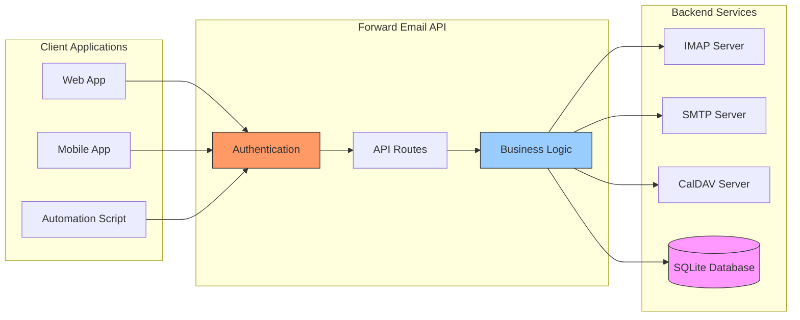

---


## התראות Push ב-iOS {#ios-push-notifications}

> \[!TIP]
> Forward Email תומך בהתראות Push מקוריות ב-iOS דרך XAPPLEPUSHSERVICE למשלוח מיידי של דואר אלקטרוני.

> \[!IMPORTANT]
> **תכונה ייחודית:** Forward Email הוא אחד ממעט שרתי הדואר האלקטרוני בקוד פתוח התומכים בהתראות Push מקוריות ב-iOS עבור דואר, אנשי קשר ולוחות שנה דרך תוסף IMAP בשם `XAPPLEPUSHSERVICE`. זה הופק בהנדסה הפוכה מפרוטוקול של אפל ומספק משלוח מיידי למכשירי iOS ללא צריכת סוללה.

Forward Email מיישם את תוסף XAPPLEPUSHSERVICE הקנייני של אפל, ומספק התראות Push מקוריות למכשירי iOS ללא צורך בבדיקות רקע מתמשכות.

### איך זה עובד {#how-it-works-1}

**XAPPLEPUSHSERVICE** הוא תוסף IMAP לא סטנדרטי שמאפשר לאפליקציית Mail ב-iOS לקבל התראות Push מיידיות כאשר מגיעים מיילים חדשים.

Forward Email מיישם את אינטגרציית שירות ההתראות Push של אפל (APNs) עבור IMAP, ומאפשר לאפליקציית Mail ב-iOS לקבל התראות Push מיידיות כאשר מגיעים מיילים חדשים.

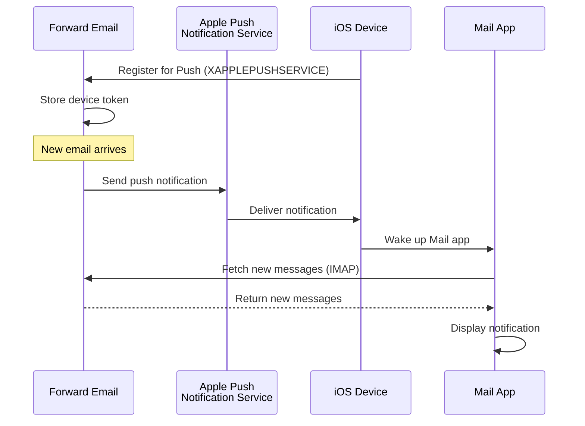

### תכונות מפתח {#key-features}

**משלוח מיידי:**

* התראות Push מגיעות תוך שניות
* ללא בדיקות רקע שצורכות סוללה
* עובד גם כאשר אפליקציית Mail סגורה

<!---->

* **משלוח מיידי:** מיילים, אירועי לוח שנה ואנשי קשר מופיעים מיד באייפון/אייפד שלך, לא לפי לוח זמנים של בדיקות
* **חסכוני בסוללה:** משתמש בתשתית ה-Push של אפל במקום לשמור על חיבורי IMAP מתמשכים
* **Push מבוסס נושאים:** תומך בהתראות Push לתיבות דואר ספציפיות, לא רק INBOX
* **ללא צורך באפליקציות צד שלישי:** עובד עם אפליקציות Mail, Calendar ו-Contacts המקוריות של iOS
**אינטגרציה מקומית:**

* מובנה באפליקציית הדואר של iOS
* אין צורך באפליקציות צד שלישי
* חוויית משתמש חלקה

**מוקד לפרטיות:**

* טוקנים של המכשיר מוצפנים
* לא נשלח תוכן הודעה דרך APNS
* נשלחת רק התראה על "דואר חדש"

**יעיל בסוללה:**

* אין סריקת IMAP מתמדת
* המכשיר ישן עד להגעת התראה
* השפעה מינימלית על הסוללה

### מה עושה את זה מיוחד {#what-makes-this-special}

> \[!IMPORTANT]
> רוב ספקי הדואר אינם תומכים ב-XAPPLEPUSHSERVICE, מה שמאלץ מכשירי iOS לסרוק דואר חדש כל 15 דקות.

רוב שרתי הדואר בקוד פתוח (כולל Dovecot, Postfix, Cyrus IMAP) אינם תומכים בהתראות דחיפה של iOS. המשתמשים חייבים לבחור בין:

* שימוש ב-IMAP IDLE (שומר על החיבור פתוח, מתיש סוללה)
* שימוש בסריקה (בודק כל 15-30 דקות, התראות מאוחרות)
* שימוש באפליקציות דואר קנייניות עם תשתית דחיפה משלהן

Forward Email מספקת את אותה חוויית התראה מיידית בדחיפה כמו שירותים מסחריים כגון Gmail, iCloud ו-Fastmail.

**השוואה עם ספקים אחרים:**

| ספק              | תמיכת דחיפה  | מרווח סריקה     | השפעה על סוללה |
| ----------------- | ------------- | --------------- | -------------- |
| **Forward Email** | ✅ דחיפה מקומית | מיידית          | מינימלית       |
| Gmail             | ✅ דחיפה מקומית | מיידית          | מינימלית       |
| iCloud            | ✅ דחיפה מקומית | מיידית          | מינימלית       |
| Yahoo             | ✅ דחיפה מקומית | מיידית          | מינימלית       |
| Outlook.com       | ❌ סריקה       | 15 דקות         | בינונית        |
| Fastmail          | ❌ סריקה       | 15 דקות         | בינונית        |
| ProtonMail        | ⚠️ רק גשר     | דרך הגשר        | גבוהה          |
| Tutanota          | ❌ רק אפליקציה | לא רלוונטי      | לא רלוונטי     |

### פרטי מימוש {#implementation-details}

**תגובה ל-CAPABILITY של IMAP:**

```
* CAPABILITY IMAP4rev1 ... XAPPLEPUSHSERVICE ...
```

**תהליך רישום:**

1. אפליקציית הדואר של iOS מזהה את היכולת XAPPLEPUSHSERVICE
2. האפליקציה רושמת את טוקן המכשיר עם Forward Email
3. Forward Email שומרת את הטוקן ומקשרת אותו לחשבון
4. כאשר מגיע דואר חדש, Forward Email שולחת דחיפה דרך APNS
5. iOS מעירה את אפליקציית הדואר כדי לקבל הודעות חדשות

**אבטחה:**

* טוקני המכשיר מוצפנים במנוחה
* הטוקנים פוקעים ומתחדשים אוטומטית
* לא נחשף תוכן הודעה ל-APNS
* נשמר הצפנה מקצה לקצה

<!---->

* **הרחבת IMAP:** `XAPPLEPUSHSERVICE`
* **קוד מקור:** [WildDuck Issue #711](https://github.com/zone-eu/wildduck/issues/711)
* **הגדרה:** אוטומטית - אין צורך בקונפיגורציה, עובד מיד עם אפליקציית הדואר של iOS

### השוואה עם שירותים אחרים {#comparison-with-other-services}

| שירות         | תמיכת דחיפה ב-iOS | שיטה                                    |
| ------------- | ------------------ | --------------------------------------- |
| Forward Email | ✅ כן              | `XAPPLEPUSHSERVICE` (הנדסה הפוכה)      |
| Gmail         | ✅ כן              | אפליקציית Gmail קניינית + דחיפת Google |
| iCloud Mail   | ✅ כן              | אינטגרציה מקומית של Apple               |
| Outlook.com   | ✅ כן              | אפליקציית Outlook קניינית + דחיפת Microsoft |
| Fastmail      | ✅ כן              | `XAPPLEPUSHSERVICE`                      |
| Dovecot       | ❌ לא              | רק IMAP IDLE או סריקה                   |
| Postfix       | ❌ לא              | רק IMAP IDLE או סריקה                   |
| Cyrus IMAP    | ❌ לא              | רק IMAP IDLE או סריקה                   |

**דחיפת Gmail:**

Gmail משתמש במערכת דחיפה קניינית שפועלת רק עם אפליקציית Gmail. אפליקציית הדואר של iOS חייבת לסרוק את שרתי ה-IMAP של Gmail.

**דחיפת iCloud:**

iCloud תומך בדחיפה מקומית בדומה ל-Forward Email, אך רק לכתובות @icloud.com.

**Outlook.com:**

Outlook.com אינו תומך ב-XAPPLEPUSHSERVICE, ודורש מאפליקציית הדואר של iOS לסרוק כל 15 דקות.

**Fastmail:**

Fastmail אינו תומך ב-XAPPLEPUSHSERVICE. המשתמשים חייבים להשתמש באפליקציית Fastmail לקבלת התראות דחיפה או לקבל עיכובים של סריקה כל 15 דקות.

---


## בדיקות ואימות {#testing-and-verification}


## בדיקות יכולת פרוטוקול {#protocol-capability-tests}
> \[!NOTE]
> קטע זה מספק את תוצאות בדיקות היכולת האחרונות שלנו לפרוטוקולים, שנערכו ב-22 בינואר 2026.

קטע זה מכיל את תגובות ה-CAPABILITY/CAPA/EHLO בפועל מכל הספקים שנבדקו. כל הבדיקות נערכו ב-**22 בינואר 2026**.

בדיקות אלו מסייעות לאמת את התמיכה המוצהרת והאמיתית בפרוטוקולי דואר אלקטרוני שונים ובהרחבותיהם אצל ספקים מרכזיים.

### שיטת הבדיקה {#test-methodology}

**סביבת הבדיקה:**

* **תאריך:** 22 בינואר 2026 בשעה 02:37 UTC
* **מיקום:** מופע AWS EC2
* **IPv4:** 54.167.216.197
* **IPv6:** 2600:4040:46da:9a00:b19e:3ad4:426c:2f48
* **כלים:** OpenSSL s_client, סקריפטים ב-bash

**ספקים שנבדקו:**

* Forward Email
* Gmail
* Outlook.com
* iCloud
* Fastmail
* Yahoo/AOL (Verizon)

### סקריפטים לבדיקות {#test-scripts}

לשקיפות מלאה, הסקריפטים המדויקים בהם השתמשנו לבדיקות אלו מוצגים להלן.

#### סקריפט בדיקת יכולת IMAP {#imap-capability-test-script}

```bash
#!/bin/bash
# IMAP Capability Test Script
# Tests IMAP CAPABILITY for various email providers

echo "========================================="
echo "IMAP CAPABILITY TEST"
echo "Date: $(date -u +"%Y-%m-%d %H:%M:%S UTC")"
echo "========================================="
echo ""

# Gmail
echo "--- Gmail (imap.gmail.com:993) ---"
echo -e "a001 CAPABILITY\na002 LOGOUT" | timeout 10 openssl s_client -connect imap.gmail.com:993 -crlf -quiet 2>&1 | grep -A 20 "CAPABILITY"
echo ""

# Outlook.com
echo "--- Outlook.com (outlook.office365.com:993) ---"
echo -e "a001 CAPABILITY\na002 LOGOUT" | timeout 10 openssl s_client -connect outlook.office365.com:993 -crlf -quiet 2>&1 | grep -A 20 "CAPABILITY"
echo ""

# iCloud
echo "--- iCloud (imap.mail.me.com:993) ---"
echo -e "a001 CAPABILITY\na002 LOGOUT" | timeout 10 openssl s_client -connect imap.mail.me.com:993 -crlf -quiet 2>&1 | grep -A 20 "CAPABILITY"
echo ""

# Fastmail
echo "--- Fastmail (imap.fastmail.com:993) ---"
echo -e "a001 CAPABILITY\na002 LOGOUT" | timeout 10 openssl s_client -connect imap.fastmail.com:993 -crlf -quiet 2>&1 | grep -A 20 "CAPABILITY"
echo ""

# Yahoo
echo "--- Yahoo (imap.mail.yahoo.com:993) ---"
echo -e "a001 CAPABILITY\na002 LOGOUT" | timeout 10 openssl s_client -connect imap.mail.yahoo.com:993 -crlf -quiet 2>&1 | grep -A 20 "CAPABILITY"
echo ""

# Forward Email
echo "--- Forward Email (imap.forwardemail.net:993) ---"
echo -e "a001 CAPABILITY\na002 LOGOUT" | timeout 10 openssl s_client -connect imap.forwardemail.net:993 -crlf -quiet 2>&1 | grep -A 20 "CAPABILITY"
echo ""

echo "========================================="
echo "Test completed"
echo "========================================="
```

#### סקריפט בדיקת יכולת POP3 {#pop3-capability-test-script}

```bash
#!/bin/bash
# POP3 Capability Test Script
# Tests POP3 CAPA for various email providers

echo "========================================="
echo "POP3 CAPABILITY TEST"
echo "Date: $(date -u +"%Y-%m-%d %H:%M:%S UTC")"
echo "========================================="
echo ""

# Gmail
echo "--- Gmail (pop.gmail.com:995) ---"
echo -e "CAPA\nQUIT" | timeout 10 openssl s_client -connect pop.gmail.com:995 -crlf -quiet 2>&1 | grep -A 20 "CAPA"
echo ""

# Outlook.com
echo "--- Outlook.com (outlook.office365.com:995) ---"
echo -e "CAPA\nQUIT" | timeout 10 openssl s_client -connect outlook.office365.com:995 -crlf -quiet 2>&1 | grep -A 20 "CAPA"
echo ""

# iCloud (Note: iCloud does not support POP3)
echo "--- iCloud (No POP3 support) ---"
echo "iCloud does not support POP3"
echo ""

# Fastmail
echo "--- Fastmail (pop.fastmail.com:995) ---"
echo -e "CAPA\nQUIT" | timeout 10 openssl s_client -connect pop.fastmail.com:995 -crlf -quiet 2>&1 | grep -A 20 "CAPA"
echo ""

# Yahoo
echo "--- Yahoo (pop.mail.yahoo.com:995) ---"
echo -e "CAPA\nQUIT" | timeout 10 openssl s_client -connect pop.mail.yahoo.com:995 -crlf -quiet 2>&1 | grep -A 20 "CAPA"
echo ""

# Forward Email
echo "--- Forward Email (pop3.forwardemail.net:995) ---"
echo -e "CAPA\nQUIT" | timeout 10 openssl s_client -connect pop3.forwardemail.net:995 -crlf -quiet 2>&1 | grep -A 20 "CAPA"
echo ""

echo "========================================="
echo "Test completed"
echo "========================================="
```
#### סקריפט בדיקת יכולת SMTP {#smtp-capability-test-script}

```bash
#!/bin/bash
# סקריפט בדיקת יכולת SMTP
# בודק EHLO של SMTP עבור ספקי דואר שונים

echo "========================================="
echo "בדיקת יכולת SMTP"
echo "תאריך: $(date -u +"%Y-%m-%d %H:%M:%S UTC")"
echo "========================================="
echo ""

# Gmail
echo "--- Gmail (smtp.gmail.com:587) ---"
echo -e "EHLO test.com\nQUIT" | timeout 10 openssl s_client -connect smtp.gmail.com:587 -starttls smtp -crlf -quiet 2>&1 | grep -A 30 "250-"
echo ""

# Outlook.com
echo "--- Outlook.com (smtp.office365.com:587) ---"
echo -e "EHLO test.com\nQUIT" | timeout 10 openssl s_client -connect smtp.office365.com:587 -starttls smtp -crlf -quiet 2>&1 | grep -A 30 "250-"
echo ""

# iCloud
echo "--- iCloud (smtp.mail.me.com:587) ---"
echo -e "EHLO test.com\nQUIT" | timeout 10 openssl s_client -connect smtp.mail.me.com:587 -starttls smtp -crlf -quiet 2>&1 | grep -A 30 "250-"
echo ""

# Fastmail
echo "--- Fastmail (smtp.fastmail.com:587) ---"
echo -e "EHLO test.com\nQUIT" | timeout 10 openssl s_client -connect smtp.fastmail.com:587 -starttls smtp -crlf -quiet 2>&1 | grep -A 30 "250-"
echo ""

# Yahoo
echo "--- Yahoo (smtp.mail.yahoo.com:587) ---"
echo -e "EHLO test.com\nQUIT" | timeout 10 openssl s_client -connect smtp.mail.yahoo.com:587 -starttls smtp -crlf -quiet 2>&1 | grep -A 30 "250-"
echo ""

# Forward Email
echo "--- Forward Email (smtp.forwardemail.net:587) ---"
echo -e "EHLO test.com\nQUIT" | timeout 10 openssl s_client -connect smtp.forwardemail.net:587 -starttls smtp -crlf -quiet 2>&1 | grep -A 30 "250-"
echo ""

echo "========================================="
echo "הבדיקה הושלמה"
echo "========================================="
```

### סיכום תוצאות הבדיקה {#test-results-summary}

#### IMAP (יכולת) {#imap-capability}

**Forward Email**

```
* CAPABILITY IMAP4rev1 AUTH=PLAIN AUTH=PLAIN-CLIENTTOKEN CHILDREN ENABLE ID IDLE NAMESPACE QUOTA SASL-IR UNSELECT XLIST XAPPLEPUSHSERVICE
```

**Gmail**

```
* CAPABILITY IMAP4rev1 UNSELECT IDLE NAMESPACE QUOTA ID XLIST CHILDREN X-GM-EXT-1 UIDPLUS COMPRESS=DEFLATE ENABLE MOVE CONDSTORE ESEARCH UTF8=ACCEPT LIST-EXTENDED LIST-STATUS LITERAL- SPECIAL-USE
```

**iCloud**

```
* OK [CAPABILITY XAPPLEPUSHSERVICE IMAP4 IMAP4rev1 SASL-IR AUTH=ATOKEN AUTH=PLAIN AUTH=ATOKEN2 AUTH=XOAUTH2]
```

**Outlook.com**

```
* CAPABILITY IMAP4rev1 AUTH=PLAIN AUTH=XOAUTH2 SASL-IR UIDPLUS ID UNSELECT CHILDREN IDLE NAMESPACE LITERAL+
```

**Fastmail**

```
* CAPABILITY IMAP4rev1 ACL ANNOTATE-EXPERIMENT-1 CATENATE CONDSTORE ENABLE ESEARCH ESORT I18NLEVEL=1 ID IDLE LIST-EXTENDED LIST-STATUS LITERAL+ LOGINDISABLED MULTIAPPEND NAMESPACE QRESYNC QUOTA RIGHTS=ektx SASL-IR SORT SPECIAL-USE THREAD=ORDEREDSUBJECT UIDPLUS UNSELECT WITHIN X-RENAME XLIST
```

**Yahoo/AOL (Verizon)**

```
* CAPABILITY IMAP4rev1 IDLE NAMESPACE QUOTA ID XLIST CHILDREN UIDPLUS MOVE CONDSTORE ESEARCH ENABLE LIST-EXTENDED LIST-STATUS LITERAL- SPECIAL-USE UNSELECT XAPPLEPUSHSERVICE
```

#### POP3 (CAPA) {#pop3-capa}

**Forward Email**

```
+OK
CAPA
TOP
USER
UIDL
EXPIRE 30
IMPLEMENTATION ForwardEmail
.
```

**Gmail**

```
+OK
CAPA
TOP
USER
UIDL
EXPIRE 30
IMPLEMENTATION Gpop
.
```

**Outlook.com**

```
+OK
CAPA
TOP
USER
UIDL
SASL PLAIN XOAUTH2
.
```

**Fastmail**

```
+OK
CAPA
TOP
USER
UIDL
EXPIRE 30
IMPLEMENTATION Cyrus
.
```

#### SMTP (EHLO) {#smtp-ehlo}

**Forward Email**

```
250-smtp.forwardemail.net
250-PIPELINING
250-SIZE 52428800
250-ETRN
250-STARTTLS
250-ENHANCEDSTATUSCODES
250-8BITMIME
250-DSN
250 CHUNKING
```

**Gmail**

```
250-smtp.gmail.com at your service
250-SIZE 35882577
250-8BITMIME
250-STARTTLS
250-ENHANCEDSTATUSCODES
250-PIPELINING
250-CHUNKING
250 SMTPUTF8
```

**Outlook.com**

```
250-SN4PR13CA0005.outlook.office365.com Hello [x.x.x.x]
250-SIZE 157286400
250-PIPELINING
250-DSN
250-ENHANCEDSTATUSCODES
250-STARTTLS
250-8BITMIME
250-BINARYMIME
250-CHUNKING
250 SMTPUTF8
```

**Fastmail**

```
250-smtp.fastmail.com
250-PIPELINING
250-SIZE 78643200
250-ETRN
250-STARTTLS
250-ENHANCEDSTATUSCODES
250-8BITMIME
250-DSN
250 CHUNKING
```

**Yahoo/AOL (Verizon)**

```
250-smtp.mail.yahoo.com
250-PIPELINING
250-SIZE 41943040
250-8BITMIME
250-ENHANCEDSTATUSCODES
250-STARTTLS
```
### תוצאות בדיקה מפורטות {#detailed-test-results}

#### תוצאות בדיקת IMAP {#imap-test-results}

**Gmail:**
`* CAPABILITY IMAP4rev1 UNSELECT IDLE NAMESPACE QUOTA ID XLIST CHILDREN X-GM-EXT-1 XYZZY SASL-IR AUTH=XOAUTH2 AUTH=PLAIN AUTH=PLAIN-CLIENTTOKEN AUTH=OAUTHBEARER`

**Outlook.com:**
`* CAPABILITY IMAP4 IMAP4rev1 AUTH=PLAIN AUTH=XOAUTH2 SASL-IR UIDPLUS ID UNSELECT CHILDREN IDLE NAMESPACE LITERAL+`

**iCloud:**
`* CAPABILITY XAPPLEPUSHSERVICE IMAP4 IMAP4rev1 SASL-IR AUTH=ATOKEN AUTH=PLAIN AUTH=ATOKEN2 AUTH=XOAUTH2`

**Fastmail:**
החיבור פג תוקף. ראה הערות למטה.

**Yahoo:**
`* CAPABILITY IMAP4rev1 SASL-IR AUTH=PLAIN AUTH=XOAUTH2 AUTH=OAUTHBEARER ID MOVE NAMESPACE XYMHIGHESTMODSEQ UIDPLUS LITERAL+ CHILDREN UNSELECT X-MSG-EXT OBJECTID IDLE ENABLE UIDONLY X-ALL-MAIL X-UIDONLY LIST-EXTENDED LIST-STATUS SPECIAL-USE PARTIAL APPENDLIMIT=41697280`

**Forward Email:**
`* CAPABILITY XAPPLEPUSHSERVICE IMAP4rev1 APPENDLIMIT=52428800 AUTH=PLAIN AUTH=PLAIN-CLIENTTOKEN CHILDREN CONDSTORE ENABLE ID IDLE MOVE NAMESPACE QUOTA SASL-IR SPECIAL-USE UIDPLUS UNSELECT UTF8=ACCEPT XLIST`

#### תוצאות בדיקת POP3 {#pop3-test-results}

**Gmail:**
החיבור לא החזיר תגובת CAPA ללא אימות.

**Outlook.com:**
החיבור לא החזיר תגובת CAPA ללא אימות.

**iCloud:**
לא נתמך.

**Fastmail:**
החיבור פג תוקף. ראה הערות למטה.

**Yahoo:**
`+OK CAPA list follows... SASL PLAIN XOAUTH2`

**Forward Email:**
החיבור לא החזיר תגובת CAPA ללא אימות.

#### תוצאות בדיקת SMTP {#smtp-test-results}

**Gmail:**
`250-AUTH LOGIN PLAIN XOAUTH2 PLAIN-CLIENTTOKEN OAUTHBEARER XOAUTH`

**Outlook.com:**
`250-DSN`

**iCloud:**
`250-DSN`

**Fastmail:**
`250 AUTH PLAIN LOGIN XOAUTH2 OAUTHBEARER`

**Yahoo:**
`250 AUTH PLAIN LOGIN XOAUTH2 OAUTHBEARER`

**Forward Email:**
`250-DSN`, `250-REQUIRETLS`

### הערות על תוצאות הבדיקה {#notes-on-test-results}

> \[!NOTE]
> תצפיות והגבלות חשובות מתוצאות הבדיקה.

1. **פיגורי זמן ב-Fastmail**: חיבורי Fastmail פגו בזמן הבדיקה, ככל הנראה עקב הגבלת קצב או הגבלות חומת אש מכתובת ה-IP של שרת הבדיקה. ידוע כי ל-Fastmail יש תמיכה חזקה ב-IMAP/POP3/SMTP לפי התיעוד שלהם.

2. **תגובות CAPA ב-POP3**: מספר ספקים (Gmail, Outlook.com, Forward Email) לא החזירו תגובות CAPA ללא אימות. זו פרקטיקת אבטחה נפוצה בשרתי POP3.

3. **תמיכה ב-DSN**: רק Outlook.com, iCloud ו-Forward Email מפרסמים במפורש תמיכה ב-DSN בתגובות EHLO של SMTP. זה לא בהכרח אומר שספקים אחרים לא תומכים ב-DSN, אך הם לא מפרסמים זאת.

4. **REQUIRETLS**: רק Forward Email מפרסם במפורש תמיכה ב-REQUIRETLS עם תיבת סימון לאכיפה מול המשתמש. ספקים אחרים עשויים לתמוך בזה פנימית אך לא מפרסמים זאת ב-EHLO.

5. **סביבת הבדיקה**: הבדיקות בוצעו משרת AWS EC2 (IP: 54.167.216.197 IPv4, 2600:4040:46da:9a00:b19e:3ad4:426c:2f48 IPv6) ב-22 בינואר 2026 בשעה 02:37 UTC.

---


## סיכום {#summary}

Forward Email מספק תמיכה מקיפה בפרוטוקולי RFC בכל תקני הדואר האלקטרוני המרכזיים:

* **IMAP4rev1:** 16 RFC נתמכים עם הבדלים מכוונים ומתועדים
* **POP3:** 4 RFC נתמכים עם מחיקה קבועה תואמת RFC
* **SMTP:** 11 הרחבות נתמכות כולל SMTPUTF8, DSN, ו-PIPELINING
* **אימות:** DKIM, SPF, DMARC, ARC נתמכים במלואם
* **אבטחת תעבורה:** MTA-STS ו-REQUIRETLS נתמכים במלואם, DANE נתמך חלקית
* **הצפנה:** OpenPGP v6 ו-S/MIME נתמכים
* **לוח שנה:** CalDAV, CardDAV, ו-VTODO נתמכים במלואם
* **גישה ל-API:** REST API מלא עם 39 נקודות קצה לגישה ישירה למסד הנתונים
* **דחיפת iOS:** התראות דחיפה מקוריות לדואר, אנשי קשר ולוחות שנה דרך `XAPPLEPUSHSERVICE`

### הבדלים מרכזיים {#key-differentiators}

> \[!TIP]
> Forward Email בולט עם תכונות ייחודיות שלא נמצאות אצל ספקים אחרים.

**מה מייחד את Forward Email:**

1. **הצפנה בטוחה קוונטית** - הספק היחיד עם תיבות דואר SQLite מוצפנות ChaCha20-Poly1305  
2. **ארכיטקטורת אפס ידע** - הסיסמה שלך מצפינה את תיבת הדואר; אנחנו לא יכולים לפענח אותה  
3. **דומיינים מותאמים אישית בחינם** - ללא תשלום חודשי עבור דואר בדומיין מותאם  
4. **תמיכה ב-REQUIRETLS** - תיבת סימון מול המשתמש לאכיפת TLS לאורך כל מסלול המסירה  
5. **API מקיף** - 39 נקודות קצה REST API לשליטה תכנותית מלאה  
6. **התראות דחיפה ל-iOS** - תמיכה מקורית ב-XAPPLEPUSHSERVICE למשלוח מיידי  
7. **קוד פתוח** - קוד מקור מלא זמין ב-GitHub  
8. **ממוקד פרטיות** - ללא כריית נתונים, ללא פרסומות, ללא מעקב
* **הצפנה מבודדת:** שירות הדואר היחיד עם תיבות דואר SQLite מוצפנות בנפרד
* **עמידה ב-RFC:** מעדיף עמידה בסטנדרטים על נוחות (למשל, POP3 DELE)
* **API מלא:** גישה ישירה לתכנות לכל נתוני הדואר האלקטרוני
* **קוד פתוח:** יישום שקוף לחלוטין

**סיכום תמיכה בפרוטוקולים:**

| קטגוריה             | רמת תמיכה   | פרטים                                         |
| -------------------- | ----------- | --------------------------------------------- |
| **פרוטוקולים מרכזיים** | ✅ מצוין    | IMAP4rev1, POP3, SMTP נתמכים במלואם           |
| **פרוטוקולים מודרניים** | ⚠️ חלקי    | תמיכה חלקית ב-IMAP4rev2, JMAP לא נתמך          |
| **אבטחה**            | ✅ מצוין    | DKIM, SPF, DMARC, ARC, MTA-STS, REQUIRETLS    |
| **הצפנה**            | ✅ מצוין    | OpenPGP, S/MIME, הצפנת SQLite                  |
| **CalDAV/CardDAV**   | ✅ מצוין    | סנכרון מלא של לוח שנה ופרטי קשר                 |
| **סינון**            | ✅ מצוין    | Sieve (24 הרחבות) ו-ManageSieve                 |
| **API**              | ✅ מצוין    | 39 נקודות קצה REST API                         |
| **Push**             | ✅ מצוין    | התראות Push מקוריות ב-iOS                       |
