# E-mail RFC Protokoll Támogatás - Teljes Szabványok és Specifikációk Útmutató {#email-rfc-protocol-support---complete-standards--specifications-guide}


## Tartalomjegyzék {#table-of-contents}

* [A dokumentumról](#about-this-document)
  * [Architektúra áttekintés](#architecture-overview)
* [E-mail szolgáltatás összehasonlítás - Protokoll támogatás és RFC szabványoknak való megfelelés](#email-service-comparison---protocol-support--rfc-standards-compliance)
  * [Protokoll támogatás vizualizáció](#protocol-support-visualization)
* [Alapvető e-mail protokollok](#core-email-protocols)
  * [E-mail protokoll folyamat](#email-protocol-flow)
* [IMAP4 e-mail protokoll és kiterjesztések](#imap4-email-protocol-and-extensions)
  * [IMAP protokoll eltérései az RFC specifikációktól](#imap-protocol-differences-from-rfc-specifications)
  * [Nem támogatott IMAP kiterjesztések](#imap-extensions-not-supported)
* [POP3 e-mail protokoll és kiterjesztések](#pop3-email-protocol-and-extensions)
  * [POP3 protokoll eltérései az RFC specifikációktól](#pop3-protocol-differences-from-rfc-specifications)
  * [Nem támogatott POP3 kiterjesztések](#pop3-extensions-not-supported)
* [SMTP e-mail protokoll és kiterjesztések](#smtp-email-protocol-and-extensions)
  * [Kézbesítési állapot értesítések (DSN)](#delivery-status-notifications-dsn)
  * [REQUIRETLS támogatás](#requiretls-support)
  * [Nem támogatott SMTP kiterjesztések](#smtp-extensions-not-supported)
* [JMAP e-mail protokoll](#jmap-email-protocol)
* [E-mail biztonság](#email-security)
  * [E-mail biztonsági architektúra](#email-security-architecture)
* [E-mail üzenet hitelesítési protokollok](#email-message-authentication-protocols)
  * [Hitelesítési protokoll támogatás](#authentication-protocol-support)
  * [DKIM (DomainKeys Identified Mail)](#dkim-domainkeys-identified-mail)
  * [SPF (Sender Policy Framework)](#spf-sender-policy-framework)
  * [DMARC (Domain-alapú üzenethitelesítés, jelentés és megfelelés)](#dmarc-domain-based-message-authentication-reporting--conformance)
  * [ARC (Hitelesített fogadási lánc)](#arc-authenticated-received-chain)
  * [Hitelesítési folyamat](#authentication-flow)
* [E-mail szállítási biztonsági protokollok](#email-transport-security-protocols)
  * [Szállítási biztonság támogatás](#transport-security-support)
  * [TLS (Transport Layer Security)](#tls-transport-layer-security)
  * [MTA-STS (Mail Transfer Agent Strict Transport Security)](#mta-sts-mail-transfer-agent-strict-transport-security)
  * [DANE (DNS-alapú névazonosító hitelesítés)](#dane-dns-based-authentication-of-named-entities)
  * [REQUIRETLS](#requiretls)
  * [Szállítási biztonsági folyamat](#transport-security-flow)
* [E-mail üzenet titkosítás](#email-message-encryption)
  * [Titkosítás támogatás](#encryption-support)
  * [OpenPGP (Pretty Good Privacy)](#openpgp-pretty-good-privacy)
  * [S/MIME (Secure/Multipurpose Internet Mail Extensions)](#smime-securemultipurpose-internet-mail-extensions)
  * [SQLite postaláda titkosítás](#sqlite-mailbox-encryption)
  * [Titkosítás összehasonlítás](#encryption-comparison)
  * [Titkosítási folyamat](#encryption-flow)
* [Kiterjesztett funkcionalitás](#extended-functionality)
* [E-mail üzenet formátum szabványok](#email-message-format-standards)
  * [Formátum szabvány támogatás](#format-standards-support)
  * [MIME (Multipurpose Internet Mail Extensions)](#mime-multipurpose-internet-mail-extensions)
  * [SMTPUTF8 és e-mail címek internacionalizációja](#smtputf8-and-email-address-internationalization)
* [Naptár és névjegy protokollok](#calendaring-and-contacts-protocols)
  * [CalDAV és CardDAV támogatás](#caldav-and-carddav-support)
  * [CalDAV (Naptár hozzáférés)](#caldav-calendar-access)
  * [CardDAV (Névjegy hozzáférés)](#carddav-contact-access)
  * [Feladatok és emlékeztetők (CalDAV VTODO)](#tasks-and-reminders-caldav-vtodo)
  * [CalDAV/CardDAV szinkronizációs folyamat](#caldavcarddav-synchronization-flow)
  * [Nem támogatott naptár kiterjesztések](#calendaring-extensions-not-supported)
* [E-mail üzenet szűrés](#email-message-filtering)
  * [Sieve (RFC 5228)](#sieve-rfc-5228)
  * [ManageSieve (RFC 5804)](#managesieve-rfc-5804)
* [Tárolás optimalizálás](#storage-optimization)
  * [Architektúra: Kettős rétegű tárolás optimalizálás](#architecture-dual-layer-storage-optimization)
* [Csatolmány duplikáció eltávolítás](#attachment-deduplication)
  * [Hogyan működik](#how-it-works)
  * [Duplikáció eltávolítási folyamat](#deduplication-flow)
  * [Magic Number rendszer](#magic-number-system)
  * [Főbb különbségek: WildDuck vs Forward Email](#key-differences-wildduck-vs-forward-email)
* [Brotli tömörítés](#brotli-compression)
  * [Mi kerül tömörítésre](#what-gets-compressed)
  * [Tömörítési beállítások](#compression-configuration)
  * [Magic fejléc: "FEBR"](#magic-header-febr)
  * [Tömörítési folyamat](#compression-process)
  * [Kicsomagolási folyamat](#decompression-process)
  * [Visszafelé kompatibilitás](#backwards-compatibility)
  * [Tárolási megtakarítás statisztikák](#storage-savings-statistics)
  * [Migrációs folyamat](#migration-process)
  * [Kombinált tárolási hatékonyság](#combined-storage-efficiency)
  * [Technikai megvalósítás részletei](#technical-implementation-details)
  * [Miért nem csinálja ezt más szolgáltató](#why-no-other-provider-does-this)
* [Modern funkciók](#modern-features)
* [Teljes REST API az e-mail kezeléshez](#complete-rest-api-for-email-management)
  * [API kategóriák (39 végpont)](#api-categories-39-endpoints)
  * [Technikai részletek](#technical-details)
  * [Valós használati esetek](#real-world-use-cases)
  * [Fő API jellemzők](#key-api-features)
  * [API architektúra](#api-architecture)
* [iOS push értesítések](#ios-push-notifications)
  * [Hogyan működik](#how-it-works-1)
  * [Főbb jellemzők](#key-features)
  * [Mi teszi különlegessé](#what-makes-this-special)
  * [Megvalósítás részletei](#implementation-details)
  * [Összehasonlítás más szolgáltatásokkal](#comparison-with-other-services)
* [Tesztelés és ellenőrzés](#testing-and-verification)
* [Protokoll képesség tesztek](#protocol-capability-tests)
  * [Teszt módszertan](#test-methodology)
  * [Teszt szkriptek](#test-scripts)
  * [Teszt eredmények összefoglalója](#test-results-summary)
  * [Részletes teszt eredmények](#detailed-test-results)
  * [Megjegyzések a teszt eredményekhez](#notes-on-test-results)
* [Összefoglaló](#summary)
  * [Főbb megkülönböztető jegyek](#key-differentiators)
## A dokumentumról {#about-this-document}

Ez a dokumentum a Forward Email RFC (Request for Comments) protokoll támogatását ismerteti. Mivel a Forward Email az IMAP/POP3 funkciókhoz a [WildDuck](https://github.com/nodemailer/wildduck) megoldást használja, a protokoll támogatás és a korlátozások, amelyeket itt dokumentálunk, a WildDuck megvalósítását tükrözik.

> \[!IMPORTANT]
> A Forward Email az üzenettároláshoz a MongoDB helyett a [SQLite](https://sqlite.org/) adatbázist használja (amelyet eredetileg a WildDuck alkalmazott). Ez bizonyos megvalósítási részleteket érint, amelyeket alább dokumentáltunk.

**Forráskód:** <https://github.com/forwardemail/forwardemail.net>

### Architektúra áttekintése {#architecture-overview}

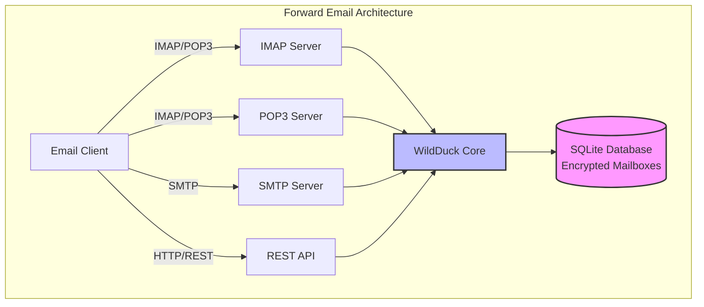

---


## E-mail szolgáltatások összehasonlítása – Protokoll támogatás és RFC szabványoknak való megfelelés {#email-service-comparison---protocol-support--rfc-standards-compliance}

> \[!IMPORTANT]
> **Sandboxolt és kvantumbiztos titkosítás:** A Forward Email az egyetlen olyan e-mail szolgáltatás, amely egyénileg titkosított SQLite postaládákat tárol a jelszavad segítségével (amit csak te ismersz). Minden postaláda a [sqleet](https://github.com/resilar/sqleet) (ChaCha20-Poly1305) által titkosított, önálló, sandboxolt és hordozható. Ha elfelejted a jelszavad, elveszíted a postaládádat – még a Forward Email sem tudja visszaállítani azt. Részletekért lásd a [Quantum-Safe Encrypted Email](https://forwardemail.net/en/blog/docs/best-quantum-safe-encrypted-email-service) oldalt.

Hasonlítsd össze a főbb e-mail szolgáltatók protokoll támogatását és az RFC szabványok megvalósítását:

| Funkció                       | Forward Email                                                                                  | Postfix/Dovecot                                                                    | Gmail                                                                             | iCloud Mail                                           | Outlook.com                                                                                                                                                          | Fastmail                                                                                 | Yahoo/AOL (Verizon)                                                  | ProtonMail                                                                     | Tutanota                                                          |
| ----------------------------- | ---------------------------------------------------------------------------------------------- | ---------------------------------------------------------------------------------- | --------------------------------------------------------------------------------- | ----------------------------------------------------- | -------------------------------------------------------------------------------------------------------------------------------------------------------------------- | ---------------------------------------------------------------------------------------- | -------------------------------------------------------------------- | ------------------------------------------------------------------------------ | ----------------------------------------------------------------- |
| **Egyedi domain ára**          | [Ingyenes](https://forwardemail.net/en/pricing)                                               | [Ingyenes](https://www.postfix.org/)                                              | [$7.20/hó](https://workspace.google.com/pricing)                                 | [$0.99/hó](https://support.apple.com/en-us/102622)    | [$7.20/hó](https://www.microsoft.com/en-us/microsoft-365/business/microsoft-365-business-basic)                                                                      | [$5/hó](https://www.fastmail.com/pricing/)                                               | [$3.19/hó](https://www.turbify.com/mail)                             | [$4.99/hó](https://proton.me/mail/pricing)                                     | [$3.27/hó](https://tuta.com/pricing)                              |
| **IMAP4rev1 (RFC 3501)**      | ✅ [Támogatott](#imap4-email-protocol-and-extensions)                                         | ✅ [Támogatott](https://www.dovecot.org/)                                         | ✅ [Támogatott](https://developers.google.com/workspace/gmail/imap/imap-extensions) | ✅ [Támogatott](https://support.apple.com/en-us/102431) | ✅ [Támogatott](https://support.microsoft.com/en-us/office/pop-imap-and-smtp-settings-for-outlook-com-d088b986-291d-42b8-9564-9c414e2aa040)                            | ✅ [Támogatott](https://www.fastmail.help/hc/en-us/articles/1500000278382-Email-standards) | ✅ [Támogatott](https://senders.yahooinc.com/developer/documentation/) | ⚠️ [Hídon keresztül](https://proton.me/support/imap-smtp-and-pop3-setup)            | ❌ Nem támogatott                                                |
| **IMAP4rev2 (RFC 9051)**      | ⚠️ [Részleges](https://forwardemail.net/en/blog/docs/best-quantum-safe-encrypted-email-service) | ⚠️ [Részleges](https://www.dovecot.org/)                                          | ⚠️ [31%](https://developers.google.com/workspace/gmail/imap/imap-extensions)      | ⚠️ [92%](https://support.apple.com/en-us/102431)      | ⚠️ [46%](https://support.microsoft.com/en-us/office/pop-imap-and-smtp-settings-for-outlook-com-d088b986-291d-42b8-9564-9c414e2aa040)                                 | ⚠️ [69%](https://www.fastmail.help/hc/en-us/articles/1500000278382-Email-standards)      | ⚠️ [85%](https://senders.yahooinc.com/developer/documentation/)      | ⚠️ [Hídon keresztül](https://proton.me/support/imap-smtp-and-pop3-setup)            | ❌ Nem támogatott                                                |
| **POP3 (RFC 1939)**           | ✅ [Támogatott](#pop3-email-protocol-and-extensions)                                          | ✅ [Támogatott](https://www.dovecot.org/)                                         | ✅ [Támogatott](https://support.google.com/mail/answer/7104828)                   | ❌ Nem támogatott                                     | ✅ [Támogatott](https://support.microsoft.com/en-us/office/pop-imap-and-smtp-settings-for-outlook-com-d088b986-291d-42b8-9564-9c414e2aa040)                            | ✅ [Támogatott](https://www.fastmail.help/hc/en-us/articles/1500000278382-Email-standards) | ✅ [Támogatott](https://help.yahoo.com/kb/SLN4075.html)                | ⚠️ [Hídon keresztül](https://proton.me/support/imap-smtp-and-pop3-setup)            | ❌ Nem támogatott                                                |
| **SMTP (RFC 5321)**           | ✅ [Támogatott](#smtp-email-protocol-and-extensions)                                          | ✅ [Támogatott](https://www.postfix.org/)                                         | ✅ [Támogatott](https://support.google.com/mail/answer/7126229)                   | ✅ [Támogatott](https://support.apple.com/en-us/102431) | ✅ [Támogatott](https://support.microsoft.com/en-us/office/pop-imap-and-smtp-settings-for-outlook-com-d088b986-291d-42b8-9564-9c414e2aa040)                            | ✅ [Támogatott](https://www.fastmail.help/hc/en-us/articles/1500000278382-Email-standards) | ✅ [Támogatott](https://help.yahoo.com/kb/SLN4075.html)                | ⚠️ [Hídon keresztül](https://proton.me/support/imap-smtp-and-pop3-setup)            | ❌ Nem támogatott                                                |
| **JMAP (RFC 8620)**           | ❌ [Nem támogatott](#jmap-email-protocol)                                                    | ❌ Nem támogatott                                                                  | ❌ Nem támogatott                                                                 | ❌ Nem támogatott                                     | ❌ Nem támogatott                                                                                                                                                      | ✅ [Támogatott](https://www.fastmail.com/dev/)                                             | ❌ Nem támogatott                                                    | ❌ Nem támogatott                                                                | ❌ Nem támogatott                                                |
| **DKIM (RFC 6376)**           | ✅ [Támogatott](#email-message-authentication-protocols)                                     | ✅ [Támogatott](https://github.com/trusteddomainproject/OpenDKIM)                 | ✅ [Támogatott](https://support.google.com/a/answer/174124)                       | ✅ [Támogatott](https://support.apple.com/en-us/102431) | ✅ [Támogatott](https://learn.microsoft.com/en-us/defender-office-365/email-authentication-dkim-configure)                                                             | ✅ [Támogatott](https://www.fastmail.help/hc/en-us/articles/360060590573)                  | ✅ [Támogatott](https://help.yahoo.com/kb/SLN25426.html)               | ✅ [Támogatott](https://proton.me/support)                                       | ✅ [Támogatott](https://tuta.com/support#dkim)                      |
| **SPF (RFC 7208)**            | ✅ [Támogatott](#email-message-authentication-protocols)                                     | ✅ [Támogatott](https://www.postfix.org/)                                         | ✅ [Támogatott](https://support.google.com/a/answer/33786)                        | ✅ [Támogatott](https://support.apple.com/en-us/102431) | ✅ [Támogatott](https://learn.microsoft.com/en-us/microsoft-365/security/office-365-security/how-office-365-uses-spf-to-prevent-spoofing)                              | ✅ [Támogatott](https://www.fastmail.help/hc/en-us/articles/360060590573)                  | ✅ [Támogatott](https://help.yahoo.com/kb/SLN25426.html)               | ✅ [Támogatott](https://proton.me/support)                                       | ✅ [Támogatott](https://tuta.com/support#dkim)                      |
| **DMARC (RFC 7489)**          | ✅ [Támogatott](#email-message-authentication-protocols)                                     | ✅ [Támogatott](https://www.postfix.org/)                                         | ✅ [Támogatott](https://support.google.com/a/answer/2466580)                      | ✅ [Támogatott](https://support.apple.com/en-us/102431) | ✅ [Támogatott](https://learn.microsoft.com/en-us/microsoft-365/security/office-365-security/use-dmarc-to-validate-email)                                              | ✅ [Támogatott](https://www.fastmail.help/hc/en-us/articles/360060590573)                  | ✅ [Támogatott](https://help.yahoo.com/kb/SLN25426.html)               | ✅ [Támogatott](https://proton.me/support)                                       | ✅ [Támogatott](https://tuta.com/support#dkim)                      |
| **ARC (RFC 8617)**            | ✅ [Támogatott](#email-message-authentication-protocols)                                     | ✅ [Támogatott](https://github.com/trusteddomainproject/OpenARC)                  | ✅ [Támogatott](https://support.google.com/a/answer/2466580)                      | ❌ Nem támogatott                                     | ✅ [Támogatott](https://learn.microsoft.com/en-us/defender-office-365/email-authentication-arc-configure)                                                              | ✅ [Támogatott](https://www.fastmail.help/hc/en-us/articles/360060590573)                  | ✅ [Támogatott](https://senders.yahooinc.com/developer/documentation/) | ✅ [Támogatott](https://proton.me/blog/what-is-authenticated-received-chain-arc) | ❌ Nem támogatott                                                |
| **MTA-STS (RFC 8461)**        | ✅ [Támogatott](#email-transport-security-protocols)                                         | ✅ [Támogatott](https://www.postfix.org/)                                         | ✅ [Támogatott](https://support.google.com/a/answer/9261504)                      | ✅ [Támogatott](https://support.apple.com/en-us/102431) | ✅ [Támogatott](https://learn.microsoft.com/en-us/defender-office-365/email-authentication-about)                                                                      | ✅ [Támogatott](https://www.fastmail.help/hc/en-us/articles/360060590573)                  | ✅ [Támogatott](https://senders.yahooinc.com/developer/documentation/) | ✅ [Támogatott](https://proton.me/support)                                       | ✅ [Támogatott](https://tuta.com/security)                          |
| **DANE (RFC 7671)**           | ✅ [Támogatott](#email-transport-security-protocols)                                         | ✅ [Támogatott](https://www.postfix.org/)                                         | ❌ Nem támogatott                                                                 | ❌ Nem támogatott                                     | ❌ Nem támogatott                                                                                                                                                      | ❌ Nem támogatott                                                                          | ❌ Nem támogatott                                                    | ✅ [Támogatott](https://proton.me/support)                                       | ✅ [Támogatott](https://tuta.com/support#dane)                      |
| **DSN (RFC 3461)**            | ✅ [Támogatott](#smtp-email-protocol-and-extensions)                                         | ✅ [Támogatott](https://www.postfix.org/DSN_README.html)                          | ❌ Nem támogatott                                                                 | ✅ [Támogatott](#protocol-capability-tests)             | ✅ [Támogatott](#protocol-capability-tests)                                                                                                                            | ⚠️ [Ismeretlen](https://www.fastmail.help/hc/en-us/articles/1500000278382-Email-standards)  | ❌ Nem támogatott                                                    | ⚠️ [Hídon keresztül](https://proton.me/support/imap-smtp-and-pop3-setup)            | ❌ Nem támogatott                                                |
| **REQUIRETLS (RFC 8689)**     | ✅ [Támogatott](#email-transport-security-protocols)                                         | ✅ [Támogatott](https://www.postfix.org/TLS_README.html#server_require_tls)       | ⚠️ Ismeretlen                                                                    | ⚠️ Ismeretlen                                        | ⚠️ Ismeretlen                                                                                                                                                         | ⚠️ Ismeretlen                                                                           | ⚠️ Ismeretlen                                                       | ⚠️ [Hídon keresztül](https://proton.me/support/imap-smtp-and-pop3-setup)            | ❌ Nem támogatott                                                |
| **ManageSieve (RFC 5804)**    | ✅ [Támogatott](#managesieve-rfc-5804)                                                       | ✅ [Támogatott](https://doc.dovecot.org/admin_manual/pigeonhole_managesieve_server/) | ❌ Nem támogatott                                                                 | ❌ Nem támogatott                                     | ❌ Nem támogatott                                                                                                                                                      | ✅ [Támogatott](https://www.fastmail.help/hc/en-us/articles/360060590573)                  | ❌ Nem támogatott                                                    | ❌ Nem támogatott                                                                | ❌ Nem támogatott                                                |
| **OpenPGP (RFC 9580)**        | ✅ [Támogatott](#email-message-encryption)                                                   | ⚠️ [Bővítményeken keresztül](https://www.gnupg.org/)                             | ⚠️ [Harmadik fél](https://github.com/google/end-to-end)                          | ⚠️ [Harmadik fél](https://gpgtools.org/)               | ⚠️ [Harmadik fél](https://gpg4win.org/)                                                                                                                               | ⚠️ [Harmadik fél](https://www.fastmail.help/hc/en-us/articles/360060590573)               | ⚠️ [Harmadik fél](https://help.yahoo.com/kb/SLN25426.html)            | ✅ [Natív](https://proton.me/support/pgp-mime-pgp-inline)                      | ❌ Nem támogatott                                                |
| **S/MIME (RFC 8551)**         | ✅ [Támogatott](#email-message-encryption)                                                   | ✅ [Támogatott](https://www.openssl.org/)                                        | ✅ [Támogatott](https://support.google.com/mail/answer/81126)                     | ✅ [Támogatott](https://support.apple.com/en-us/102431) | ✅ [Támogatott](https://support.microsoft.com/en-us/office/send-view-and-reply-to-encrypted-messages-in-outlook-for-pc-eaa43495-9bbb-4fca-922a-df90dee51980)           | ⚠️ [Részleges](https://www.fastmail.help/hc/en-us/articles/360060590573)                   | ❌ Nem támogatott                                                    | ✅ [Támogatott](https://proton.me/support/pgp-mime-pgp-inline)                   | ❌ Nem támogatott                                                |
| **CalDAV (RFC 4791)**         | ✅ [Támogatott](#calendaring-and-contacts-protocols)                                         | ✅ [Támogatott](https://www.davical.org/)                                         | ✅ [Támogatott](https://developers.google.com/calendar/caldav/v2/guide)           | ✅ [Támogatott](https://support.apple.com/en-us/102431) | ❌ Nem támogatott                                                                                                                                                      | ✅ [Támogatott](https://www.fastmail.help/hc/en-us/articles/360060590573)                  | ❌ Nem támogatott                                                    | ✅ [Hídon keresztül](https://proton.me/support/proton-calendar)                      | ❌ Nem támogatott                                                |
| **CardDAV (RFC 6352)**        | ✅ [Támogatott](#calendaring-and-contacts-protocols)                                         | ✅ [Támogatott](https://www.davical.org/)                                         | ✅ [Támogatott](https://developers.google.com/people/carddav)                     | ✅ [Támogatott](https://support.apple.com/en-us/102431) | ❌ Nem támogatott                                                                                                                                                      | ✅ [Támogatott](https://www.fastmail.help/hc/en-us/articles/360060590573)                  | ❌ Nem támogatott                                                    | ✅ [Hídon keresztül](https://proton.me/support/proton-contacts)                      | ❌ Nem támogatott                                                |
| **Feladatok (VTODO)**         | ✅ [Támogatott](#tasks-and-reminders-caldav-vtodo)                                           | ✅ [Támogatott](https://www.davical.org/)                                         | ❌ Nem támogatott                                                                 | ✅ [Támogatott](https://support.apple.com/en-us/102431) | ❌ Nem támogatott                                                                                                                                                      | ✅ [Támogatott](https://www.fastmail.help/hc/en-us/articles/360060590573)                  | ❌ Nem támogatott                                                    | ❌ Nem támogatott                                                                | ❌ Nem támogatott                                                |
| **Sieve (RFC 5228)**          | ✅ [Támogatott](#sieve-rfc-5228)                                                             | ✅ [Támogatott](https://www.dovecot.org/)                                         | ❌ Nem támogatott                                                                 | ❌ Nem támogatott                                     | ❌ Nem támogatott                                                                                                                                                      | ✅ [Támogatott](https://www.fastmail.help/hc/en-us/articles/360060590573)                  | ❌ Nem támogatott                                                    | ❌ Nem támogatott                                                                | ❌ Nem támogatott                                                |
| **Catch-All**                 | ✅ [Támogatott](https://forwardemail.net/en/faq#can-i-have-multiple-global-catch-all-recipients) | ✅ Támogatott                                                                      | ✅ [Támogatott](https://support.google.com/a/answer/4524505)                      | ❌ Nem támogatott                                     | ❌ [Nem támogatott](https://learn.microsoft.com/en-us/exchange/recipients-in-exchange-online/manage-mail-users)                                                        | ✅ [Támogatott](https://www.fastmail.help/hc/en-us/articles/1500000278382-Email-standards) | ❌ Nem támogatott                                                    | ❌ Nem támogatott                                                                | ✅ [Támogatott](https://tuta.com/support#catch-all-alias)           |
| **Korlátlan aliasok**         | ✅ [Támogatott](https://forwardemail.net/en/faq#advanced-features)                           | ✅ Támogatott                                                                      | ✅ [Támogatott](https://support.google.com/a/answer/33327)                        | ✅ [Támogatott](https://support.apple.com/en-us/102431) | ✅ [Támogatott](https://support.microsoft.com/en-us/office/add-or-remove-an-email-alias-in-outlook-com-459b1989-356d-40fa-a689-8f285b13f1f2)                           | ✅ [Támogatott](https://www.fastmail.help/hc/en-us/articles/1500000278382-Email-standards) | ❌ Nem támogatott                                                    | ✅ [Támogatott](https://proton.me/support/addresses-and-aliases)                 | ✅ [Támogatott](https://tuta.com/support#aliases)                   |
| **Kétfaktoros hitelesítés**   | ✅ [Támogatott](https://forwardemail.net/en/faq#do-you-support-passkeys-and-webauthn)          | ✅ Támogatott                                                                      | ✅ [Támogatott](https://support.google.com/accounts/answer/185839)                | ✅ [Támogatott](https://support.apple.com/en-us/102431) | ✅ [Támogatott](https://support.microsoft.com/en-us/account-billing/how-to-use-two-step-verification-with-your-microsoft-account-c7910146-672f-01e9-50a0-93b4585e7eb4) | ✅ [Támogatott](https://www.fastmail.help/hc/en-us/articles/1500000278382-Email-standards) | ✅ [Támogatott](https://help.yahoo.com/kb/SLN5013.html)                | ✅ [Támogatott](https://proton.me/support/two-factor-authentication-2fa)         | ✅ [Támogatott](https://tuta.com/support#two-factor-authentication) |
| **Push értesítések**          | ✅ [Támogatott](#ios-push-notifications)                                                     | ⚠️ Bővítményeken keresztül                                                        | ✅ [Támogatott](https://developers.google.com/gmail/api/guides/push)              | ✅ [Támogatott](https://support.apple.com/en-us/102431) | ✅ [Támogatott](https://learn.microsoft.com/en-us/graph/change-notifications-delivery-webhooks)                                                                        | ✅ [Támogatott](https://www.fastmail.help/hc/en-us/articles/1500000278382-Email-standards) | ❌ Nem támogatott                                                    | ✅ [Támogatott](https://proton.me/support/notifications)                         | ✅ [Támogatott](https://tuta.com/support#push-notifications)        |
| **Naptár/névjegyek asztali**  | ✅ [Támogatott](#calendaring-and-contacts-protocols)                                         | ✅ Támogatott                                                                      | ✅ [Támogatott](https://support.google.com/calendar)                              | ✅ [Támogatott](https://support.apple.com/en-us/102431) | ✅ [Támogatott](https://support.microsoft.com/en-us/office/calendar-and-contacts-in-outlook-com-d3e8a6e6-5c1f-4e3e-9f1e-7c0f0e0c0c0c)                                  | ✅ [Támogatott](https://www.fastmail.help/hc/en-us/articles/1500000278382-Email-standards) | ❌ Nem támogatott                                                    | ✅ [Támogatott](https://proton.me/support/proton-calendar)                       | ❌ Nem támogatott                                                |
| **Fejlett keresés**           | ✅ [Támogatott](https://forwardemail.net/en/email-api)                                       | ✅ Támogatott                                                                      | ✅ [Támogatott](https://support.google.com/mail/answer/7190)                      | ✅ [Támogatott](https://support.apple.com/en-us/102431) | ✅ [Támogatott](https://support.microsoft.com/en-us/office/search-for-email-messages-in-outlook-com-6f5f2e92-9d5e-4c4e-9b0e-0c0c0c0c0c0c)                              | ✅ [Támogatott](https://www.fastmail.help/hc/en-us/articles/1500000278382-Email-standards) | ✅ [Támogatott](https://help.yahoo.com/kb/SLN3561.html)                | ✅ [Támogatott](https://proton.me/support/search-and-filters)                    | ✅ [Támogatott](https://tuta.com/support)                           |
| **API/Integrációk**           | ✅ [39 végpont](https://forwardemail.net/en/email-api)                                       | ✅ Támogatott                                                                      | ✅ [Támogatott](https://developers.google.com/gmail/api)                          | ❌ Nem támogatott                                     | ✅ [Támogatott](https://learn.microsoft.com/en-us/graph/api/resources/mail-api-overview)                                                                               | ✅ [Támogatott](https://www.fastmail.help/hc/en-us/articles/1500000278382-Email-standards) | ❌ Nem támogatott                                                    | ✅ [Támogatott](https://proton.me/support/proton-mail-api)                       | ❌ Nem támogatott                                                |
### Protokoll támogatás vizualizáció {#protocol-support-visualization}

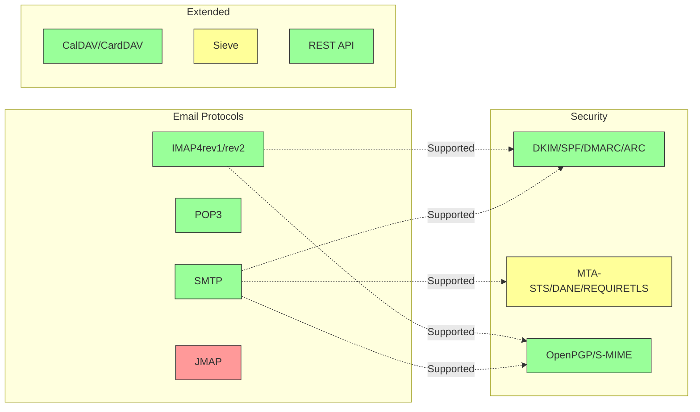

---


## Alapvető e-mail protokollok {#core-email-protocols}

### E-mail protokoll folyamat {#email-protocol-flow}

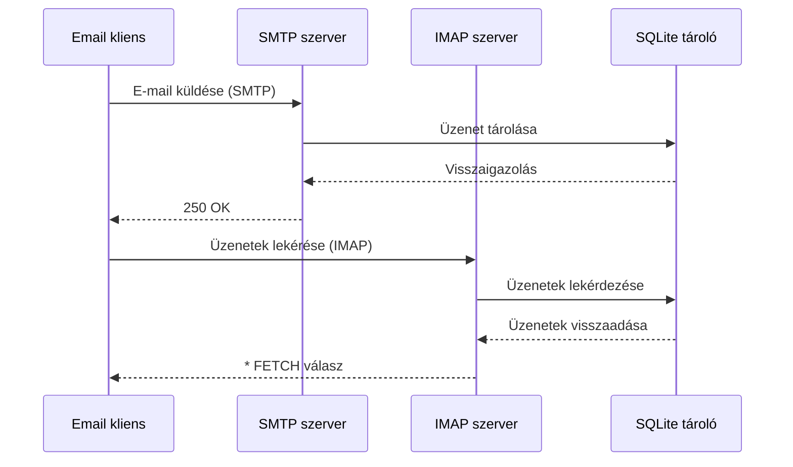


## IMAP4 e-mail protokoll és kiterjesztések {#imap4-email-protocol-and-extensions}

> \[!NOTE]
> A Forward Email támogatja az IMAP4rev1-et (RFC 3501) részleges támogatással az IMAP4rev2 (RFC 9051) funkciókhoz.

A Forward Email megbízható IMAP4 támogatást nyújt a WildDuck levelezőszerver implementáción keresztül. A szerver megvalósítja az IMAP4rev1-et (RFC 3501) részleges támogatással az IMAP4rev2 (RFC 9051) kiterjesztésekhez.

A Forward Email IMAP funkcióját a [WildDuck](https://github.com/nodemailer/wildduck) függőség biztosítja. Az alábbi e-mail RFC-k támogatottak:

| RFC                                                       | Cím                                                             | Megvalósítási megjegyzések                                  |
| --------------------------------------------------------- | ----------------------------------------------------------------- | ----------------------------------------------------------- |
| [RFC 3501](https://datatracker.ietf.org/doc/html/rfc3501) | Internet Message Access Protocol (IMAP) - 4rev1 verzió           | Teljes támogatás szándékos eltérésekkel (lásd alább)         |
| [RFC 2177](https://datatracker.ietf.org/doc/html/rfc2177) | IMAP4 IDLE parancs                                               | Push-stílusú értesítések                                    |
| [RFC 2342](https://datatracker.ietf.org/doc/html/rfc2342) | IMAP4 névtér                                                  | Postafiók névtér támogatás                                  |
| [RFC 2087](https://datatracker.ietf.org/doc/html/rfc2087) | IMAP4 QUOTA kiterjesztés                                        | Tárolási kvóta kezelése                                     |
| [RFC 2971](https://datatracker.ietf.org/doc/html/rfc2971) | IMAP4 ID kiterjesztés                                          | Kliens/szerver azonosítás                                   |
| [RFC 5161](https://datatracker.ietf.org/doc/html/rfc5161) | IMAP4 ENABLE kiterjesztés                                      | IMAP kiterjesztések engedélyezése                           |
| [RFC 4959](https://datatracker.ietf.org/doc/html/rfc4959) | IMAP kiterjesztés SASL kezdeti kliens válaszhoz (SASL-IR)       | Kezdeti kliens válasz                                       |
| [RFC 3691](https://datatracker.ietf.org/doc/html/rfc3691) | IMAP4 UNSELECT parancs                                         | Postafiók bezárása EXPUNGE nélkül                            |
| [RFC 4315](https://datatracker.ietf.org/doc/html/rfc4315) | IMAP UIDPLUS kiterjesztés                                      | Kiterjesztett UID parancsok                                 |
| [RFC 7162](https://datatracker.ietf.org/doc/html/rfc7162) | IMAP kiterjesztések: Gyors zászló változások újraszinkronizálása (CONDSTORE) | Feltételes STORE                                            |
| [RFC 6154](https://datatracker.ietf.org/doc/html/rfc6154) | IMAP LIST kiterjesztés speciális használatú postafiókokhoz       | Speciális postafiók attribútumok                            |
| [RFC 6851](https://datatracker.ietf.org/doc/html/rfc6851) | IMAP MOVE kiterjesztés                                         | Atomikus MOVE parancs                                       |
| [RFC 6855](https://datatracker.ietf.org/doc/html/rfc6855) | IMAP UTF-8 támogatás                                          | UTF-8 támogatás                                            |
| [RFC 3348](https://datatracker.ietf.org/doc/html/rfc3348) | IMAP4 gyermek postafiók kiterjesztés                           | Gyermek postafiók információ                                |
| [RFC 7889](https://datatracker.ietf.org/doc/html/rfc7889) | IMAP4 kiterjesztés a maximális feltöltési méret hirdetésére (APPENDLIMIT) | Maximális feltöltési méret                                  |
**Támogatott IMAP kiterjesztések:**

| Kiterjesztés      | RFC          | Állapot     | Leírás                         |
| ----------------- | ------------ | ----------- | ------------------------------ |
| IDLE              | RFC 2177     | ✅ Támogatott | Push-stílusú értesítések       |
| NAMESPACE         | RFC 2342     | ✅ Támogatott | Postafiók névtér támogatás     |
| QUOTA             | RFC 2087     | ✅ Támogatott | Tárolási kvóta kezelése        |
| ID                | RFC 2971     | ✅ Támogatott | Kliens/szerver azonosítás      |
| ENABLE            | RFC 5161     | ✅ Támogatott | IMAP kiterjesztések engedélyezése |
| SASL-IR           | RFC 4959     | ✅ Támogatott | Kezdeti kliens válasz          |
| UNSELECT          | RFC 3691     | ✅ Támogatott | Postafiók bezárása EXPUNGE nélkül |
| UIDPLUS           | RFC 4315     | ✅ Támogatott | Fejlettebb UID parancsok       |
| CONDSTORE         | RFC 7162     | ✅ Támogatott | Feltételes STORE               |
| SPECIAL-USE       | RFC 6154     | ✅ Támogatott | Speciális postafiók attribútumok |
| MOVE              | RFC 6851     | ✅ Támogatott | Atomikus MOVE parancs          |
| UTF8=ACCEPT       | RFC 6855     | ✅ Támogatott | UTF-8 támogatás                |
| CHILDREN          | RFC 3348     | ✅ Támogatott | Gyermek postafiók információ   |
| APPENDLIMIT       | RFC 7889     | ✅ Támogatott | Maximális feltöltési méret     |
| XLIST             | Nem szabvány | ✅ Támogatott | Gmail-kompatibilis mappalistázás |
| XAPPLEPUSHSERVICE | Nem szabvány | ✅ Támogatott | Apple Push Notification Service |

### IMAP protokoll eltérések az RFC specifikációktól {#imap-protocol-differences-from-rfc-specifications}

> \[!WARNING]
> Az alábbi eltérések az RFC specifikációktól befolyásolhatják a kliens kompatibilitást.

A Forward Email szándékosan eltér néhány IMAP RFC specifikációtól. Ezek az eltérések a WildDuck-ból származnak és az alábbiakban dokumentáltak:

* **Nincs \Recent jelző:** A `\Recent` jelző nincs megvalósítva. Minden üzenet visszaadásra kerül enélkül a jelző nélkül.
* **A RENAME nem érinti az almappákat:** Mappa átnevezésekor az almappák nem kerülnek automatikusan átnevezésre. Az adatbázisban a mappastruktúra lapos.
* **INBOX nem nevezhető át:** Az [RFC 3501](https://datatracker.ietf.org/doc/html/rfc3501) engedélyezi az INBOX átnevezését, de a Forward Email ezt kifejezetten tiltja. Lásd a [WildDuck forráskódját](https://github.com/nodemailer/wildduck/blob/master/imap-core/lib/commands/rename.js#L27).
* **Nincs önkéntes FLAGS válasz:** A jelzők változtatásakor nem küldünk önkéntes FLAGS válaszokat a kliensnek.
* **STORE NO választ ad törölt üzeneteknél:** A törölt üzenetek jelzőinek módosítására tett kísérlet NO választ ad, ahelyett, hogy csendben figyelmen kívül hagyná.
* **SEARCH-ben a CHARSET figyelmen kívül hagyva:** A SEARCH parancsok `CHARSET` argumentuma figyelmen kívül van hagyva. Minden keresés UTF-8-at használ.
* **MODSEQ metaadat figyelmen kívül hagyva:** A STORE parancsokban a `MODSEQ` metaadat figyelmen kívül van hagyva.
* **SEARCH TEXT és SEARCH BODY:** A Forward Email a [SQLite FTS5](https://www.sqlite.org/fts5.html) (teljes szöveges keresés) megoldást használja a MongoDB `$text` keresés helyett. Ez a következőket biztosítja:
  * `NOT` operátor támogatása (MongoDB nem támogatja)
  * Rangsorolt keresési eredmények
  * 100 ms alatti keresési teljesítmény nagy postafiókokon
* **Autoexpunge viselkedés:** A `\Deleted` jelzővel ellátott üzenetek automatikusan törlődnek, amikor a postafiók bezárul.
* **Üzenet hűség:** Egyes üzenet módosítások nem őrzik meg az eredeti üzenet pontos szerkezetét.

**IMAP4rev2 részleges támogatás:**

A Forward Email megvalósítja az IMAP4rev1-et (RFC 3501) részleges IMAP4rev2 (RFC 9051) támogatással. Az alábbi IMAP4rev2 funkciók **még nem támogatottak**:

* **LIST-STATUS** - Egyesített LIST és STATUS parancsok
* **LITERAL-** - Nem szinkronizáló literálok (mínusz változat)
* **OBJECTID** - Egyedi objektumazonosítók
* **SAVEDATE** - Mentési dátum attribútum
* **REPLACE** - Atomikus üzenetcsere
* **UNAUTHENTICATE** - Hitelesítés lezárása kapcsolat bontása nélkül

**Lazább test szerkezet kezelés:**

A Forward Email "lazább test" kezelést alkalmaz hibás MIME szerkezetek esetén, ami eltérhet a szigorú RFC értelmezéstől. Ez javítja a kompatibilitást a valós e-mailekkel, amelyek nem tökéletesen felelnek meg a szabványoknak.
**METADATA kiterjesztés (RFC 5464):**

Az IMAP METADATA kiterjesztés **nem támogatott**. További információkért erről a kiterjesztésről lásd a [RFC 5464](https://datatracker.ietf.org/doc/html/rfc5464) dokumentumot. A funkció hozzáadásáról szóló vitát megtalálja a [WildDuck Issue #937](https://github.com/zone-eu/wildduck/issues/937) oldalon.

### Nem támogatott IMAP kiterjesztések {#imap-extensions-not-supported}

A következő IMAP kiterjesztések az [IANA IMAP Capabilities Registry](https://www.iana.org/assignments/imap-capabilities/imap-capabilities.xhtml) listájából NEM támogatottak:

| RFC                                                       | Cím                                                                                                             | Indok                                                                                                                                  |
| --------------------------------------------------------- | --------------------------------------------------------------------------------------------------------------- | --------------------------------------------------------------------------------------------------------------------------------------- |
| [RFC 2086](https://datatracker.ietf.org/doc/html/rfc2086) | IMAP4 ACL kiterjesztés                                                                                          | Megosztott mappák nincsenek megvalósítva. Lásd [WildDuck Issue #427](https://github.com/zone-eu/wildduck/issues/427)                   |
| [RFC 5256](https://datatracker.ietf.org/doc/html/rfc5256) | IMAP SORT és THREAD kiterjesztések                                                                               | A szálazás belsőleg megvalósított, de nem az RFC 5256 protokoll szerint. Lásd [WildDuck Issue #12](https://github.com/zone-eu/wildduck/issues/12) |
| [RFC 5162](https://datatracker.ietf.org/doc/html/rfc5162) | IMAP4 kiterjesztések a gyors postafiók szinkronizációhoz (QRESYNC)                                              | Nincs megvalósítva                                                                                                                     |
| [RFC 5464](https://datatracker.ietf.org/doc/html/rfc5464) | IMAP METADATA kiterjesztés                                                                                       | A metaadat műveletek figyelmen kívül vannak hagyva. Lásd a [WildDuck dokumentációt](https://datatracker.ietf.org/doc/html/rfc5464)      |
| [RFC 5258](https://datatracker.ietf.org/doc/html/rfc5258) | IMAP4 LIST parancs kiterjesztések                                                                                 | Nincs megvalósítva                                                                                                                     |
| [RFC 5267](https://datatracker.ietf.org/doc/html/rfc5267) | Kontextusok az IMAP4-hez                                                                                         | Nincs megvalósítva                                                                                                                     |
| [RFC 5465](https://datatracker.ietf.org/doc/html/rfc5465) | IMAP NOTIFY kiterjesztés                                                                                         | Nincs megvalósítva                                                                                                                     |
| [RFC 5466](https://datatracker.ietf.org/doc/html/rfc5466) | IMAP4 SZŰRŐK kiterjesztés                                                                                        | Nincs megvalósítva                                                                                                                     |
| [RFC 6203](https://datatracker.ietf.org/doc/html/rfc6203) | IMAP4 kiterjesztés homályos kereséshez                                                                          | Nincs megvalósítva                                                                                                                     |
| [RFC 6785](https://datatracker.ietf.org/doc/html/rfc6785) | IMAP4 megvalósítási ajánlások                                                                                    | Az ajánlások nincsenek teljesen követve                                                                                                |
| [RFC 7162](https://datatracker.ietf.org/doc/html/rfc7162) | IMAP kiterjesztések: Gyors zászló változások szinkronizációja (CONDSTORE) és gyors postafiók szinkronizáció (QRESYNC) | Nincs megvalósítva                                                                                                                     |
| [RFC 8437](https://datatracker.ietf.org/doc/html/rfc8437) | IMAP UNAUTHENTICATE kiterjesztés kapcsolat újrahasználathoz                                                     | Nincs megvalósítva                                                                                                                     |
| [RFC 8438](https://datatracker.ietf.org/doc/html/rfc8438) | IMAP kiterjesztés STATUS=SIZE-hez                                                                                | Nincs megvalósítva                                                                                                                     |
| [RFC 8457](https://datatracker.ietf.org/doc/html/rfc8457) | IMAP "$Important" kulcsszó és "\Important" speciális használati attribútum                                       | Nincs megvalósítva                                                                                                                     |
| [RFC 8474](https://datatracker.ietf.org/doc/html/rfc8474) | IMAP kiterjesztés objektumazonosítókhoz                                                                         | Nincs megvalósítva                                                                                                                     |
| [RFC 9051](https://datatracker.ietf.org/doc/html/rfc9051) | Internet Message Access Protocol (IMAP) - 4rev2 verzió                                                           | A Forward Email az IMAP4rev1-et valósítja meg ([RFC 3501](https://datatracker.ietf.org/doc/html/rfc3501))                              |
## POP3 Email Protokoll és Kiterjesztések {#pop3-email-protocol-and-extensions}

> \[!NOTE]
> A Forward Email támogatja a POP3-at (RFC 1939) a szabványos kiterjesztésekkel az e-mailek lekéréséhez.

A Forward Email POP3 funkcióját a [WildDuck](https://github.com/nodemailer/wildduck) függőség biztosítja. A következő e-mail RFC-k támogatottak:

| RFC                                                       | Cím                                    | Megvalósítási megjegyzések                          |
| --------------------------------------------------------- | ------------------------------------- | -------------------------------------------------- |
| [RFC 1939](https://datatracker.ietf.org/doc/html/rfc1939) | Post Office Protocol - Version 3 (POP3) | Teljes támogatás szándékos eltérésekkel (lásd alább) |
| [RFC 2595](https://datatracker.ietf.org/doc/html/rfc2595) | TLS használata IMAP, POP3 és ACAP esetén | STARTTLS támogatás                                 |
| [RFC 2449](https://datatracker.ietf.org/doc/html/rfc2449) | POP3 Kiterjesztési Mechanizmus        | CAPA parancs támogatás                             |

A Forward Email POP3 támogatást nyújt azoknak az ügyfeleknek, akik ezt az egyszerűbb protokollt részesítik előnyben az IMAP helyett. A POP3 ideális azoknak a felhasználóknak, akik egyetlen eszközre szeretnék letölteni az e-maileket és eltávolítani azokat a szerverről.

**Támogatott POP3 Kiterjesztések:**

| Kiterjesztés | RFC      | Állapot     | Leírás                    |
| ------------ | -------- | ----------- | ------------------------- |
| TOP          | RFC 1939 | ✅ Támogatott | Üzenetfejlécek lekérése   |
| USER         | RFC 1939 | ✅ Támogatott | Felhasználónév hitelesítés |
| UIDL         | RFC 1939 | ✅ Támogatott | Egyedi üzenetazonosítók   |
| EXPIRE       | RFC 2449 | ✅ Támogatott | Üzenet lejárati szabályzat |

### POP3 Protokoll Különbségek az RFC Előírásoktól {#pop3-protocol-differences-from-rfc-specifications}

> \[!WARNING]
> A POP3 inherens korlátokkal rendelkezik az IMAP-hoz képest.

> \[!IMPORTANT]
> **Kritikus Különbség: Forward Email vs WildDuck POP3 DELE Viselkedés**
>
> A Forward Email RFC-kompatibilis, végleges törlést valósít meg a POP3 `DELE` parancsok esetén, ellentétben a WildDuck-kal, amely az üzeneteket a Kukába helyezi.

**Forward Email Viselkedés** ([forráskód](https://github.com/forwardemail/forwardemail.net/blob/master/pop3-server.js)):

* `DELE` → `QUIT` véglegesen törli az üzeneteket
* Pontosan követi az [RFC 1939](https://datatracker.ietf.org/doc/html/rfc1939) előírásait
* Megfelel a Dovecot (alapértelmezett), Postfix és más szabványkövető szerverek viselkedésének

**WildDuck Viselkedés** ([vita](https://github.com/zone-eu/wildduck/issues/937)):

* `DELE` → `QUIT` az üzeneteket a Kukába helyezi (Gmail-szerű)
* Szándékos tervezési döntés a felhasználói biztonság érdekében
* Nem RFC-kompatibilis, de megakadályozza a véletlen adatvesztést

**Miért különbözik a Forward Email:**

* **RFC-kompatibilitás:** Követi az [RFC 1939](https://datatracker.ietf.org/doc/html/rfc1939) előírásait
* **Felhasználói elvárások:** A letöltés és törlés munkafolyamat végleges törlést vár el
* **Tároláskezelés:** Megfelelő lemezterület felszabadítás
* **Interoperabilitás:** Összhangban más RFC-kompatibilis szerverekkel

> \[!NOTE]
> **POP3 Üzenetlista:** A Forward Email az INBOX összes üzenetét listázza korlátozás nélkül. Ez eltér a WildDuck-tól, amely alapértelmezés szerint 250 üzenetre korlátoz. Lásd a [forráskódot](https://github.com/forwardemail/forwardemail.net/blob/master/pop3-server.js).

**Egyes Eszközös Hozzáférés:**

A POP3 egy eszközös hozzáférésre lett tervezve. Az üzenetek általában letöltődnek és törlődnek a szerverről, ezért nem alkalmas több eszköz közötti szinkronizációra.

**Nincs Mappatámogatás:**

A POP3 csak az INBOX mappához fér hozzá. Más mappák (Elküldött, Piszkozatok, Kukák stb.) nem érhetők el POP3-on keresztül.

**Korlátozott Üzenetkezelés:**

A POP3 alapvető üzenetlekérést és törlést biztosít. Fejlettebb funkciók, mint a jelölés, áthelyezés vagy keresés nem elérhetők.

### Nem Támogatott POP3 Kiterjesztések {#pop3-extensions-not-supported}

A következő POP3 kiterjesztések a [IANA POP3 Kiterjesztési Mechanizmus Regiszterből](https://www.iana.org/assignments/pop3-extension-mechanism/pop3-extension-mechanism.xhtml) NEM támogatottak:
| RFC                                                       | Cím                                                   | Indok                                  |
| --------------------------------------------------------- | ----------------------------------------------------- | ------------------------------------- |
| [RFC 6856](https://datatracker.ietf.org/doc/html/rfc6856) | Post Office Protocol Version 3 (POP3) támogatás UTF-8-hoz | Nem implementált a WildDuck POP3 szerverben |
| [RFC 2595](https://datatracker.ietf.org/doc/html/rfc2595) | STLS parancs                                          | Csak STARTTLS támogatott, nem STLS    |
| [RFC 3206](https://datatracker.ietf.org/doc/html/rfc3206) | A SYS és AUTH POP válaszkódok                          | Nem implementált                      |

---


## SMTP Email Protocol and Extensions {#smtp-email-protocol-and-extensions}

> \[!NOTE]
> A Forward Email támogatja az SMTP-t (RFC 5321) modern kiterjesztésekkel a biztonságos és megbízható e-mail kézbesítés érdekében.

A Forward Email SMTP funkcióját több komponens biztosítja: [smtp-server](https://github.com/nodemailer/smtp-server) (nodemailer), [zone-mta](https://github.com/zone-eu/zone-mta) és egyedi megvalósítások. A következő e-mail RFC-k támogatottak:

| RFC                                                       | Cím                                                                             | Megvalósítási megjegyzések          |
| --------------------------------------------------------- | ------------------------------------------------------------------------------- | ---------------------------------- |
| [RFC 5321](https://datatracker.ietf.org/doc/html/rfc5321) | Egyszerű levelező protokoll (SMTP)                                              | Teljes támogatás                   |
| [RFC 3207](https://datatracker.ietf.org/doc/html/rfc3207) | SMTP szolgáltatás kiterjesztés biztonságos SMTP-hez Transport Layer Security (STARTTLS) használatával | TLS/SSL támogatás                  |
| [RFC 4954](https://datatracker.ietf.org/doc/html/rfc4954) | SMTP szolgáltatás kiterjesztés hitelesítéshez (AUTH)                            | PLAIN, LOGIN, CRAM-MD5, XOAUTH2    |
| [RFC 6531](https://datatracker.ietf.org/doc/html/rfc6531) | SMTP kiterjesztés nemzetköziesített e-mailekhez (SMTPUTF8)                      | Natív unicode e-mail cím támogatás |
| [RFC 3461](https://datatracker.ietf.org/doc/html/rfc3461) | SMTP szolgáltatás kiterjesztés kézbesítési állapot értesítésekhez (DSN)         | Teljes DSN támogatás               |
| [RFC 3463](https://datatracker.ietf.org/doc/html/rfc3463) | Kiterjesztett levelezőrendszer állapotkódok                                    | Kiterjesztett állapotkódok a válaszokban |
| [RFC 1870](https://datatracker.ietf.org/doc/html/rfc1870) | SMTP szolgáltatás kiterjesztés üzenetméret deklarációhoz (SIZE)                 | Maximális üzenetméret hirdetése    |
| [RFC 2920](https://datatracker.ietf.org/doc/html/rfc2920) | SMTP szolgáltatás kiterjesztés parancsok párhuzamosításához (PIPELINING)        | Parancs párhuzamosítás támogatása  |
| [RFC 1652](https://datatracker.ietf.org/doc/html/rfc1652) | SMTP szolgáltatás kiterjesztés 8bit-MIME szállításhoz (8BITMIME)                 | 8 bites MIME támogatás             |
| [RFC 6152](https://datatracker.ietf.org/doc/html/rfc6152) | SMTP szolgáltatás kiterjesztés 8 bites MIME szállításhoz                        | 8 bites MIME támogatás             |
| [RFC 2034](https://datatracker.ietf.org/doc/html/rfc2034) | SMTP szolgáltatás kiterjesztés kiterjesztett hibakódok visszaadásához (ENHANCEDSTATUSCODES) | Kiterjesztett állapotkódok         |

A Forward Email teljes funkcionalitású SMTP szervert valósít meg modern kiterjesztésekkel, amelyek növelik a biztonságot, megbízhatóságot és funkcionalitást.

**Támogatott SMTP kiterjesztések:**

| Kiterjesztés       | RFC      | Állapot     | Leírás                              |
| ------------------- | -------- | ----------- | ---------------------------------- |
| PIPELINING          | RFC 2920 | ✅ Támogatott | Parancs párhuzamosítás             |
| SIZE                | RFC 1870 | ✅ Támogatott | Üzenetméret deklaráció (52MB limit) |
| ETRN                | RFC 1985 | ✅ Támogatott | Távoli sor feldolgozás             |
| STARTTLS            | RFC 3207 | ✅ Támogatott | TLS-re való frissítés              |
| ENHANCEDSTATUSCODES | RFC 2034 | ✅ Támogatott | Kiterjesztett állapotkódok         |
| 8BITMIME            | RFC 6152 | ✅ Támogatott | 8 bites MIME szállítás             |
| DSN                 | RFC 3461 | ✅ Támogatott | Kézbesítési állapot értesítések    |
| CHUNKING            | RFC 3030 | ✅ Támogatott | Darabolt üzenet átvitel            |
| SMTPUTF8            | RFC 6531 | ⚠️ Részleges | UTF-8 e-mail címek (részleges)      |
| REQUIRETLS          | RFC 8689 | ✅ Támogatott | TLS követelése kézbesítéshez       |
### Kézbesítési állapot értesítések (DSN) {#delivery-status-notifications-dsn}

> \[!TIP]
> A DSN részletes kézbesítési állapot információkat nyújt a küldött e-mailekről.

A Forward Email teljes mértékben támogatja a **DSN (RFC 3461)** funkciót, amely lehetővé teszi a feladók számára a kézbesítési állapot értesítések kérését. Ez a funkció biztosítja:

* **Sikeres kézbesítés értesítéseit**, amikor az üzenetek kézbesítésre kerülnek
* **Sikertelen kézbesítés értesítéseit** részletes hibainformációkkal
* **Késleltetési értesítéseket**, amikor a kézbesítés ideiglenesen késik

A DSN különösen hasznos:

* Fontos üzenetek kézbesítésének megerősítésére
* Kézbesítési problémák elhárítására
* Automatikus e-mail feldolgozó rendszerekhez
* Megfelelőségi és audit követelményekhez

### REQUIRETLS támogatás {#requiretls-support}

> \[!IMPORTANT]
> A Forward Email az egyik kevés szolgáltató, amely kifejezetten hirdeti és érvényesíti a REQUIRETLS-t.

A Forward Email támogatja a **REQUIRETLS (RFC 8689)** protokollt, amely biztosítja, hogy az e-mail üzenetek csak TLS titkosított kapcsolaton keresztül kerüljenek kézbesítésre. Ez a következőket nyújtja:

* **Végpontok közötti titkosítást** az egész kézbesítési útvonalon
* **Felhasználói szintű érvényesítést** az e-mail szerkesztőben található jelölőnégyzet segítségével
* **Nem titkosított kézbesítési kísérletek elutasítását**
* **Fokozott biztonságot** érzékeny kommunikációk esetén

### Nem támogatott SMTP kiterjesztések {#smtp-extensions-not-supported}

A következő SMTP kiterjesztések a [IANA SMTP Service Extensions Registry](https://www.iana.org/assignments/smtp) listájából NEM támogatottak:

| RFC                                                       | Cím                                                                                              | Indoklás             |
| --------------------------------------------------------- | ------------------------------------------------------------------------------------------------ | -------------------- |
| [RFC 4865](https://datatracker.ietf.org/doc/html/rfc4865) | SMTP Submission Service Extension for Future Message Release (FUTURERELEASE)                      | Nincs megvalósítva   |
| [RFC 6710](https://datatracker.ietf.org/doc/html/rfc6710) | SMTP Extension for Message Transfer Priorities (MT-PRIORITY)                                      | Nincs megvalósítva   |
| [RFC 7293](https://datatracker.ietf.org/doc/html/rfc7293) | The Require-Recipient-Valid-Since Header Field and SMTP Service Extension                         | Nincs megvalósítva   |
| [RFC 7372](https://datatracker.ietf.org/doc/html/rfc7372) | Email Auth Status Codes                                                                           | Nem teljesen megvalósított |
| [RFC 4468](https://datatracker.ietf.org/doc/html/rfc4468) | Message Submission BURL Extension                                                                 | Nincs megvalósítva   |
| [RFC 3030](https://datatracker.ietf.org/doc/html/rfc3030) | SMTP Service Extensions for Transmission of Large and Binary MIME Messages (CHUNKING, BINARYMIME) | Nincs megvalósítva   |
| [RFC 2852](https://datatracker.ietf.org/doc/html/rfc2852) | Deliver By SMTP Service Extension                                                                 | Nincs megvalósítva   |

---


## JMAP e-mail protokoll {#jmap-email-protocol}

> \[!CAUTION]
> A JMAP **jelenleg nem támogatott** a Forward Email által.

| RFC                                                       | Cím                                      | Állapot         | Indoklás                                                              |
| --------------------------------------------------------- | ---------------------------------------- | --------------- | --------------------------------------------------------------------- |
| [RFC 8620](https://datatracker.ietf.org/doc/html/rfc8620) | The JSON Meta Application Protocol (JMAP) | ❌ Nem támogatott | A Forward Email IMAP/POP3/SMTP protokollokat és egy átfogó REST API-t használ |

**A JMAP (JSON Meta Application Protocol)** egy modern e-mail protokoll, amely az IMAP helyettesítésére készült.

**Miért nem támogatott a JMAP:**

> "A JMAP egy szörnyeteg, amit nem kellett volna feltalálni. Megpróbálja a TCP/IMAP-et (ami ma már rossz protokollnak számít) HTTP/JSON-ná alakítani, csak más szállítást használva, miközben megtartja a szellemiséget." — Andris Reinman, [HN Discussion](https://news.ycombinator.com/item?id=18890011)
> "A JMAP több mint 10 éves, és szinte egyáltalán nincs elfogadottsága" – Andris Reinman, [GitHub Discussion](https://github.com/zone-eu/wildduck/issues/2#issuecomment-1765190790)

További megjegyzésekért lásd még: <https://hn.algolia.com/?dateRange=all&page=0&prefix=true&query=jmap%20andris&sort=byDate&type=comment>.

A Forward Email jelenleg az IMAP, POP3 és SMTP kiváló támogatására, valamint egy átfogó REST API-ra fókuszál az e-mail kezeléshez. A JMAP támogatás a jövőben felhasználói igény és az ökoszisztéma elfogadottsága alapján mérlegelhető.

**Alternatíva:** A Forward Email egy [Teljes REST API-t](#complete-rest-api-for-email-management) kínál 39 végponttal, amely hasonló funkcionalitást biztosít, mint a JMAP a programozott e-mail hozzáféréshez.

---


## E-mail biztonság {#email-security}

### E-mail biztonsági architektúra {#email-security-architecture}

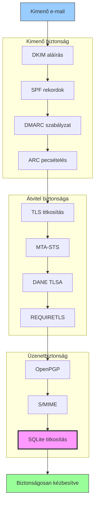


## E-mail üzenet hitelesítési protokollok {#email-message-authentication-protocols}

> \[!NOTE]
> A Forward Email megvalósítja az összes főbb e-mail hitelesítési protokollt a hamisítás megelőzése és az üzenet integritásának biztosítása érdekében.

A Forward Email a [mailauth](https://github.com/postalsys/mailauth) könyvtárat használja az e-mail hitelesítéshez. Az alábbi RFC-k támogatottak:

| RFC                                                       | Cím                                                                    | Megvalósítási megjegyzések                                     |
| --------------------------------------------------------- | --------------------------------------------------------------------- | -------------------------------------------------------------- |
| [RFC 6376](https://datatracker.ietf.org/doc/html/rfc6376) | DomainKeys Identified Mail (DKIM) aláírások                           | Teljes DKIM aláírás és ellenőrzés                              |
| [RFC 8463](https://datatracker.ietf.org/doc/html/rfc8463) | Új kriptográfiai aláírási módszer DKIM-hez (Ed25519-SHA256)           | Támogatja az RSA-SHA256 és Ed25519-SHA256 aláírási algoritmusokat |
| [RFC 7208](https://datatracker.ietf.org/doc/html/rfc7208) | Sender Policy Framework (SPF)                                          | SPF rekord ellenőrzés                                           |
| [RFC 7489](https://datatracker.ietf.org/doc/html/rfc7489) | Domain-alapú üzenethitelesítés, jelentés és megfelelés (DMARC)         | DMARC szabályzat érvényesítés                                  |
| [RFC 8617](https://datatracker.ietf.org/doc/html/rfc8617) | Hitelesített fogadási lánc (ARC)                                       | ARC pecsételés és ellenőrzés                                   |

Az e-mail hitelesítési protokollok ellenőrzik, hogy az üzenetek valóban a megadott feladótól származnak-e, és nem módosították őket az átvitel során.

### Hitelesítési protokoll támogatás {#authentication-protocol-support}

| Protokoll | RFC      | Állapot      | Leírás                                                               |
| --------- | -------- | ------------ | ------------------------------------------------------------------- |
| **DKIM**  | RFC 6376 | ✅ Támogatott | DomainKeys Identified Mail - Kriptográfiai aláírások                |
| **SPF**   | RFC 7208 | ✅ Támogatott | Sender Policy Framework - IP cím engedélyezés                       |
| **DMARC** | RFC 7489 | ✅ Támogatott | Domain-alapú üzenethitelesítés - Szabályzat érvényesítés            |
| **ARC**   | RFC 8617 | ✅ Támogatott | Hitelesített fogadási lánc - Hitelesítés megőrzése továbbítások során |
### DKIM (DomainKeys Identified Mail) {#dkim-domainkeys-identified-mail}

**A DKIM** kriptográfiai aláírást ad az e-mail fejlécéhez, lehetővé téve a címzettek számára annak ellenőrzését, hogy az üzenetet a domain tulajdonosa engedélyezte-e, és hogy az nem módosult-e az átvitel során.

A Forward Email a [mailauth](https://github.com/postalsys/mailauth) könyvtárat használja a DKIM aláíráshoz és ellenőrzéshez.

**Főbb jellemzők:**

* Automatikus DKIM aláírás minden kimenő üzenethez
* RSA és Ed25519 kulcsok támogatása
* Több szelektor támogatása
* DKIM ellenőrzés bejövő üzenetekhez

### SPF (Sender Policy Framework) {#spf-sender-policy-framework}

**Az SPF** lehetővé teszi a domain tulajdonosok számára, hogy meghatározzák, mely IP-címek jogosultak e-mailt küldeni a domain nevükben.

**Főbb jellemzők:**

* SPF rekord érvényesítés bejövő üzenetekhez
* Automatikus SPF ellenőrzés részletes eredményekkel
* Include, redirect és all mechanizmusok támogatása
* Konfigurálható SPF szabályok domainenként

### DMARC (Domain-based Message Authentication, Reporting & Conformance) {#dmarc-domain-based-message-authentication-reporting--conformance}

**A DMARC** az SPF és DKIM alapjaira építve biztosítja a szabályzat végrehajtását és jelentéstételt.

**Főbb jellemzők:**

* DMARC szabályzat végrehajtás (none, quarantine, reject)
* SPF és DKIM igazítás ellenőrzése
* DMARC összesítő jelentések
* Domainenkénti DMARC szabályzatok

### ARC (Authenticated Received Chain) {#arc-authenticated-received-chain}

**Az ARC** megőrzi az e-mail hitelesítési eredményeket a továbbítás és levelezőlista módosítások során.

A Forward Email a [mailauth](https://github.com/postalsys/mailauth) könyvtárat használja az ARC ellenőrzésére és lezárására.

**Főbb jellemzők:**

* ARC lezárás továbbított üzenetekhez
* ARC érvényesítés bejövő üzenetekhez
* Lánc ellenőrzés több ugráson keresztül
* Az eredeti hitelesítési eredmények megőrzése

### Hitelesítési folyamat {#authentication-flow}

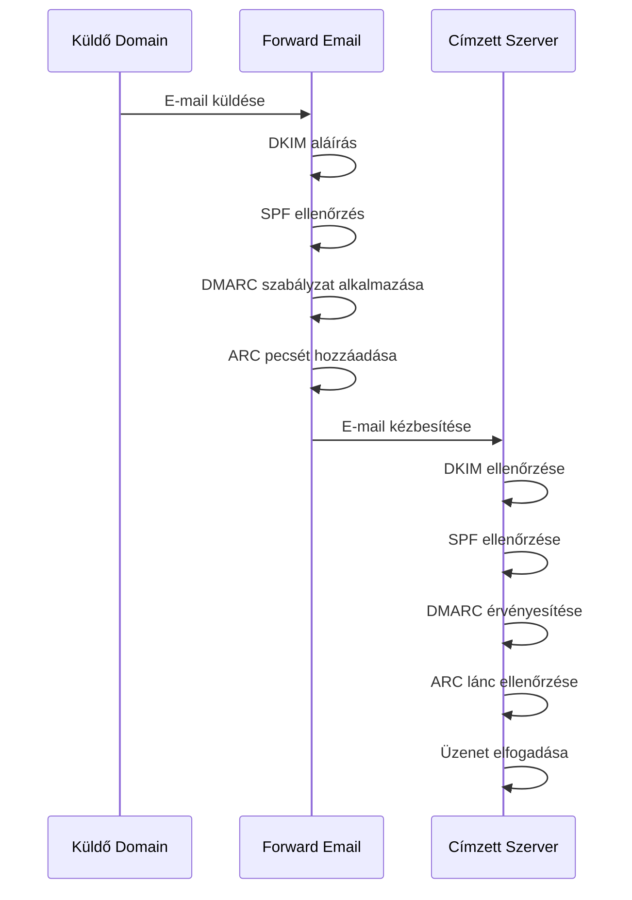

---


## E-mail átvitel biztonsági protokollok {#email-transport-security-protocols}

> \[!IMPORTANT]
> A Forward Email több rétegű átvitelbiztonsági megoldásokat alkalmaz az e-mailek átvitel közbeni védelmére.

A Forward Email korszerű átvitelbiztonsági protokollokat valósít meg:

| RFC                                                       | Cím                                                                                                 | Állapot     | Megvalósítási megjegyzések                                                                                                                                                                                                                                                                     |
| --------------------------------------------------------- | -------------------------------------------------------------------------------------------------- | ----------- | --------------------------------------------------------------------------------------------------------------------------------------------------------------------------------------------------------------------------------------------------------------------------------------------- |
| [RFC 8461](https://datatracker.ietf.org/doc/html/rfc8461) | SMTP MTA Strict Transport Security (MTA-STS)                                                       | ✅ Támogatott | Széles körben használják IMAP, SMTP és MX szervereken. Lásd [create-mta-sts-cache.js](https://github.com/forwardemail/forwardemail.net/blob/master/helpers/create-mta-sts-cache.js) és [get-transporter.js](https://github.com/forwardemail/forwardemail.net/blob/master/helpers/get-transporter.js) |
| [RFC 8460](https://datatracker.ietf.org/doc/html/rfc8460) | SMTP TLS jelentés                                                                                   | ✅ Támogatott | A [mailauth](https://github.com/postalsys/mailauth) könyvtáron keresztül                                                                                                                                                                                                                       |
| [RFC 7671](https://datatracker.ietf.org/doc/html/rfc7671) | A DNS-alapú hitelesítés névvel ellátott entitásokhoz (DANE) protokoll: frissítések és működési útmutató | ✅ Támogatott | Teljes DANE ellenőrzés kimenő SMTP kapcsolatokhoz. Lásd [mx-connect PR #22](https://github.com/zone-eu/mx-connect/pull/22)                                                                                                                                                                   |
| [RFC 6698](https://datatracker.ietf.org/doc/html/rfc6698) | A DNS-alapú hitelesítés névvel ellátott entitásokhoz (DANE) Transport Layer Security (TLS) protokoll: TLSA | ✅ Támogatott | Teljes RFC 6698 támogatás: PKIX-TA, PKIX-EE, DANE-TA, DANE-EE használati típusok. Lásd [mx-connect PR #22](https://github.com/zone-eu/mx-connect/pull/22)                                                                                                                                      |
| [RFC 8314](https://datatracker.ietf.org/doc/html/rfc8314) | A tiszta szöveg elavultnak tekintése: Transport Layer Security (TLS) használata e-mail küldéshez és hozzáféréshez | ✅ Támogatott | TLS kötelező minden kapcsolathoz                                                                                                                                                                                                                                                              |
| [RFC 8689](https://datatracker.ietf.org/doc/html/rfc8689) | SMTP szolgáltatás kiterjesztése TLS követelményhez (REQUIRETLS)                                     | ✅ Támogatott | Teljes támogatás a REQUIRETLS SMTP kiterjesztéshez és a "TLS-Required" fejléchez                                                                                                                                                                                                              |
A szállítási biztonsági protokollok biztosítják, hogy az e-mail üzenetek titkosítva és hitelesítve legyenek az átvitel során a levelezőszerverek között.

### Szállítási biztonsági támogatás {#transport-security-support}

| Protokoll     | RFC      | Állapot     | Leírás                                           |
| -------------- | -------- | ----------- | ------------------------------------------------ |
| **TLS**        | RFC 8314 | ✅ Támogatott | Transport Layer Security - Titkosított kapcsolatok |
| **MTA-STS**    | RFC 8461 | ✅ Támogatott | Mail Transfer Agent Strict Transport Security    |
| **DANE**       | RFC 7671 | ✅ Támogatott | DNS-alapú Hitelesítés Nevezett Entitásokhoz      |
| **REQUIRETLS** | RFC 8689 | ✅ Támogatott | TLS követelése az egész kézbesítési útvonalon    |

### TLS (Transport Layer Security) {#tls-transport-layer-security}

A Forward Email minden e-mail kapcsolatra (SMTP, IMAP, POP3) érvényesíti a TLS titkosítást.

**Főbb jellemzők:**

* TLS 1.2 és TLS 1.3 támogatás
* Automatikus tanúsítványkezelés
* Perfect Forward Secrecy (PFS)
* Csak erős titkosító készletek

### MTA-STS (Mail Transfer Agent Strict Transport Security) {#mta-sts-mail-transfer-agent-strict-transport-security}

Az **MTA-STS** biztosítja, hogy az e-mailek csak TLS-sel titkosított kapcsolaton keresztül kerüljenek kézbesítésre, egy HTTPS-en keresztül közzétett szabályzat segítségével.

A Forward Email az MTA-STS-t a [create-mta-sts-cache.js](https://github.com/forwardemail/forwardemail.net/blob/master/helpers/create-mta-sts-cache.js) használatával valósítja meg.

**Főbb jellemzők:**

* Automatikus MTA-STS szabályzat közzététel
* Szabályzat gyorsítótárazás a teljesítmény érdekében
* Lefokozás elleni védelem
* Tanúsítvány érvényesítésének kikényszerítése

### DANE (DNS-alapú Hitelesítés Nevezett Entitásokhoz) {#dane-dns-based-authentication-of-named-entities}

> \[!NOTE]
> A Forward Email mostantól teljes DANE támogatást nyújt a kimenő SMTP kapcsolatokhoz.

A **DANE** DNSSEC-et használ a TLS tanúsítvány információk DNS-ben történő közzétételére, lehetővé téve a levelezőszerverek számára a tanúsítványok ellenőrzését anélkül, hogy tanúsítványhatóságokra támaszkodnának.

**Főbb jellemzők:**

* ✅ Teljes DANE ellenőrzés kimenő SMTP kapcsolatokhoz
* ✅ Teljes RFC 6698 támogatás: PKIX-TA, PKIX-EE, DANE-TA, DANE-EE használati típusok
* ✅ Tanúsítvány ellenőrzés TLSA rekordok alapján TLS frissítés során
* ✅ Párhuzamos TLSA feloldás több MX hoszthoz
* ✅ Natív `dns.resolveTlsa` automatikus felismerése (Node.js v22.15.0+, v23.9.0+)
* ✅ Egyedi feloldó támogatás régebbi Node.js verziókhoz a [Tangerine](https://github.com/forwardemail/tangerine) segítségével
* DNSSEC-sel aláírt domainek szükségesek

> \[!TIP]
> **Megvalósítás részletei:** A DANE támogatás a [mx-connect PR #22](https://github.com/zone-eu/mx-connect/pull/22) révén került bevezetésre, amely átfogó DANE/TLSA támogatást nyújt a kimenő SMTP kapcsolatokhoz.

### REQUIRETLS {#requiretls}

> \[!TIP]
> A Forward Email az egyik kevés szolgáltató, amely felhasználói szintű REQUIRETLS támogatást kínál.

A **REQUIRETLS** biztosítja, hogy az e-mail üzenetek csak TLS-sel titkosított kapcsolaton keresztül kerüljenek kézbesítésre az egész kézbesítési útvonalon.

**Főbb jellemzők:**

* Felhasználói szintű jelölőnégyzet az e-mail szerkesztőben
* Automatikus elutasítás titkosítatlan kézbesítés esetén
* Végpontok közötti TLS kikényszerítése
* Részletes hibajelentések

> \[!TIP]
> **Felhasználói TLS kikényszerítés:** A Forward Email a **Fiókom > Domain-ek > Beállítások** alatt egy jelölőnégyzetet biztosít a TLS minden bejövő kapcsolatra történő kikényszerítéséhez. Ha engedélyezve van, ez a funkció elutasít minden olyan bejövő e-mailt, amely nem TLS-sel titkosított kapcsolaton érkezik, 530-as hibakóddal, biztosítva, hogy az összes bejövő levél titkosítva legyen átvitel közben.

### Szállítási biztonsági folyamat {#transport-security-flow}

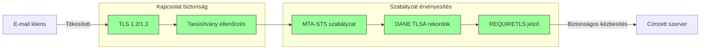
## E-mail Üzenet Titkosítása {#email-message-encryption}

> \[!NOTE]
> A Forward Email támogatja az OpenPGP és az S/MIME használatát az e-mailek végpontok közötti titkosításához.

A Forward Email támogatja az OpenPGP és az S/MIME titkosítást:

| RFC                                                       | Cím                                                                                     | Állapot     | Megvalósítási megjegyzések                                                                                                                                                                           |
| --------------------------------------------------------- | --------------------------------------------------------------------------------------- | ----------- | ---------------------------------------------------------------------------------------------------------------------------------------------------------------------------------------------------- |
| [RFC 9580](https://datatracker.ietf.org/doc/html/rfc9580) | OpenPGP (felváltja az RFC 4880-at)                                                      | ✅ Támogatott | A [OpenPGP.js v6+](https://github.com/openpgpjs/openpgpjs) integráción keresztül. Lásd [GYIK](https://forwardemail.net/en/faq#do-you-support-openpgpmime-end-to-end-encryption-e2ee-and-web-key-directory-wkd) |
| [RFC 8551](https://datatracker.ietf.org/doc/html/rfc8551) | Secure/Multipurpose Internet Mail Extensions (S/MIME) 4.0 verzió Üzenet specifikáció    | ✅ Támogatott | Mind RSA, mind ECC algoritmusok támogatottak. Lásd [GYIK](https://forwardemail.net/en/faq#do-you-support-smime-encryption)                                                                              |

Az üzenettitkosítási protokollok megvédik az e-mail tartalmát attól, hogy bárki más olvassa el, csak a címzett férhessen hozzá, még akkor is, ha az üzenet átvitel közben elfogásra kerül.

### Titkosítási támogatás {#encryption-support}

| Protokoll   | RFC      | Állapot     | Leírás                                      |
| ----------- | -------- | ----------- | -------------------------------------------- |
| **OpenPGP** | RFC 9580 | ✅ Támogatott | Pretty Good Privacy - Nyilvános kulcsú titkosítás |
| **S/MIME**  | RFC 8551 | ✅ Támogatott | Secure/Multipurpose Internet Mail Extensions |
| **WKD**     | Draft    | ✅ Támogatott | Web Key Directory - Automatikus kulcsfelfedezés |

### OpenPGP (Pretty Good Privacy) {#openpgp-pretty-good-privacy}

Az **OpenPGP** végpontok közötti titkosítást biztosít nyilvános kulcsú kriptográfia segítségével. A Forward Email támogatja az OpenPGP-t a [Web Key Directory (WKD)](https://forwardemail.net/en/faq#do-you-support-openpgpmime-end-to-end-encryption-e2ee-and-web-key-directory-wkd) protokollon keresztül.

**Főbb jellemzők:**

* Automatikus kulcsfelfedezés WKD-n keresztül
* PGP/MIME támogatás titkosított csatolmányokhoz
* Kulcskezelés az e-mail kliensen keresztül
* Kompatibilis a GPG-vel, Mailvelope-val és más OpenPGP eszközökkel

**Használati útmutató:**

1. Generálj egy PGP kulcspárt az e-mail kliensedben
2. Töltsd fel a nyilvános kulcsodat a Forward Email WKD-jára
3. A kulcsod automatikusan felfedezhető más felhasználók által
4. Küldj és fogadj titkosított e-maileket zökkenőmentesen

### S/MIME (Secure/Multipurpose Internet Mail Extensions) {#smime-securemultipurpose-internet-mail-extensions}

Az **S/MIME** e-mail titkosítást és digitális aláírást biztosít X.509 tanúsítványok segítségével.

**Főbb jellemzők:**

* Tanúsítvány alapú titkosítás
* Digitális aláírások az üzenetek hitelesítéséhez
* Natív támogatás a legtöbb e-mail kliensben
* Vállalati szintű biztonság

**Használati útmutató:**

1. Szerezz be egy S/MIME tanúsítványt egy Tanúsítvány Kibocsátótól
2. Telepítsd a tanúsítványt az e-mail kliensedbe
3. Állítsd be a klienst az üzenetek titkosítására/aláírására
4. Cserélj tanúsítványokat a címzettekkel

### SQLite Postafiók Titkosítás {#sqlite-mailbox-encryption}

> \[!IMPORTANT]
> A Forward Email további biztonsági réteget nyújt titkosított SQLite postafiókokkal.

Az üzenetszintű titkosításon túl a Forward Email az egész postafiókokat titkosítja a [sqleet](https://github.com/resilar/sqleet) (ChaCha20-Poly1305) segítségével.

**Főbb jellemzők:**

* **Jelszó alapú titkosítás** – Csak neked van meg a jelszó
* **Kvantumrezisztens** – ChaCha20-Poly1305 titkosító algoritmus
* **Zero-knowledge** – A Forward Email nem tudja visszafejteni a postafiókodat
* **Sandboxolt** – Minden postafiók izolált és hordozható
* **Visszaállíthatatlan** – Ha elfelejted a jelszavad, a postafiókod elveszik
### Titkosítási összehasonlítás {#encryption-comparison}

| Jellemző              | OpenPGP           | S/MIME             | SQLite titkosítás  |
| --------------------- | ----------------- | ------------------ | ----------------- |
| **Végpontok közötti** | ✅ Igen            | ✅ Igen             | ✅ Igen            |
| **Kulcskezelés**      | Önműködő          | CA által kiadott    | Jelszó alapú       |
| **Kliens támogatás**  | Bővítményt igényel| Natív              | Átlátszó           |
| **Használati eset**   | Személyes         | Vállalati          | Tárolás            |
| **Kvantumrezisztens** | ⚠️ Kulcstól függ  | ⚠️ Tanúsítványtól függ | ✅ Igen            |

### Titkosítási folyamat {#encryption-flow}

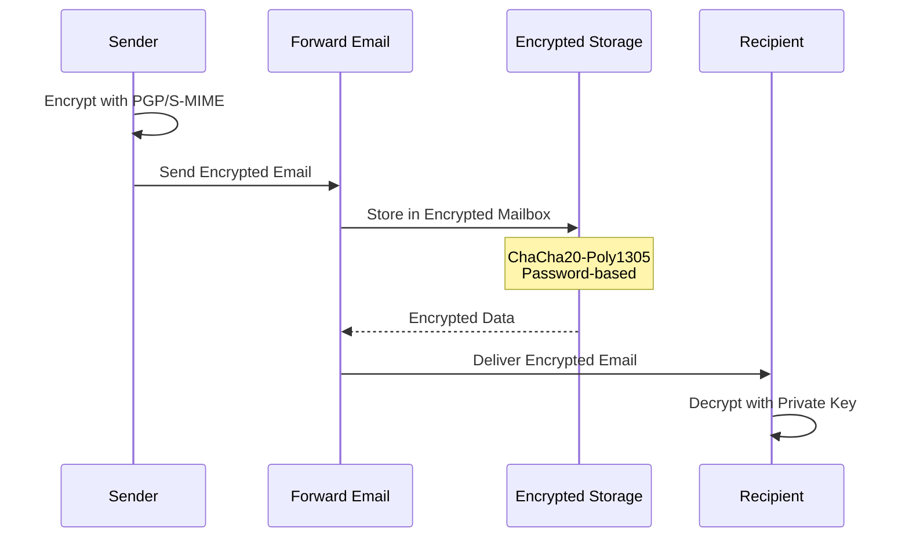

---


## Kiterjesztett funkciók {#extended-functionality}


## E-mail üzenetformátum szabványok {#email-message-format-standards}

> \[!NOTE]
> A Forward Email támogatja a modern e-mail formátum szabványokat a gazdag tartalom és a nemzetköziesítés érdekében.

A Forward Email támogatja a szabványos e-mail üzenetformátumokat:

| RFC                                                       | Cím                                                           | Megvalósítási megjegyzések |
| --------------------------------------------------------- | ------------------------------------------------------------- | --------------------------- |
| [RFC 5322](https://datatracker.ietf.org/doc/html/rfc5322) | Internet üzenetformátum                                       | Teljes támogatás            |
| [RFC 2045](https://datatracker.ietf.org/doc/html/rfc2045) | MIME Első rész: Internet üzenettörzsek formátuma              | Teljes MIME támogatás       |
| [RFC 2046](https://datatracker.ietf.org/doc/html/rfc2046) | MIME Második rész: Média típusok                              | Teljes MIME támogatás       |
| [RFC 2047](https://datatracker.ietf.org/doc/html/rfc2047) | MIME Harmadik rész: Üzenet fejléc kiterjesztések nem ASCII szöveghez | Teljes MIME támogatás       |
| [RFC 2048](https://datatracker.ietf.org/doc/html/rfc2048) | MIME Negyedik rész: Regisztrációs eljárások                   | Teljes MIME támogatás       |
| [RFC 2049](https://datatracker.ietf.org/doc/html/rfc2049) | MIME Ötödik rész: Megfelelőségi kritériumok és példák         | Teljes MIME támogatás       |

Az e-mail formátum szabványok meghatározzák, hogyan épülnek fel, kódolódnak és jelennek meg az e-mail üzenetek.

### Formátum szabvány támogatás {#format-standards-support}

| Szabvány            | RFC           | Állapot     | Leírás                              |
| ------------------- | ------------- | ----------- | ---------------------------------- |
| **MIME**            | RFC 2045-2049 | ✅ Támogatott | Többcélú internetes levelezési kiterjesztések |
| **SMTPUTF8**        | RFC 6531      | ⚠️ Részleges | Nemzetköziesített e-mail címek     |
| **EAI**             | RFC 6530      | ⚠️ Részleges | E-mail cím nemzetköziesítése       |
| **Üzenetformátum**  | RFC 5322      | ✅ Támogatott | Internet üzenetformátum            |
| **MIME biztonság**  | RFC 1847      | ✅ Támogatott | Biztonsági multipart MIME-hez      |

### MIME (Többcélú internetes levelezési kiterjesztések) {#mime-multipurpose-internet-mail-extensions}

**A MIME** lehetővé teszi, hogy az e-mailek több részből álljanak, különböző tartalomtípusokkal (szöveg, HTML, csatolmányok stb.).

**Támogatott MIME funkciók:**

* Többrészes üzenetek (mixed, alternative, related)
* Content-Type fejléc
* Content-Transfer-Encoding (7bit, 8bit, quoted-printable, base64)
* Beágyazott képek és csatolmányok
* Gazdag HTML tartalom

### SMTPUTF8 és az e-mail címek nemzetköziesítése {#smtputf8-and-email-address-internationalization}

> \[!WARNING]
> Az SMTPUTF8 támogatás részleges – nem minden funkció teljesen megvalósított.
**SMTPUTF8** lehetővé teszi, hogy az email címek nem ASCII karaktereket tartalmazzanak (pl. `用户@例え.jp`).

**Jelenlegi állapot:**

* ⚠️ Részleges támogatás a nemzetközileg szabványosított email címekhez
* ✅ UTF-8 tartalom az üzenet törzsében
* ⚠️ Korlátozott támogatás a nem ASCII helyi részekhez

---


## Naptár- és névjegyprotokollok {#calendaring-and-contacts-protocols}

> \[!NOTE]
> A Forward Email teljes CalDAV és CardDAV támogatást nyújt a naptár- és névjegyszinkronizációhoz.

A Forward Email támogatja a CalDAV és CardDAV protokollokat a [caldav-adapter](https://github.com/forwardemail/caldav-adapter) könyvtáron keresztül:

| RFC                                                       | Cím                                                                      | Állapot     | Megvalósítási megjegyzések                                                                                                                                                            |
| --------------------------------------------------------- | ------------------------------------------------------------------------ | ----------- | -------------------------------------------------------------------------------------------------------------------------------------------------------------------------------------- |
| [RFC 4791](https://datatracker.ietf.org/doc/html/rfc4791) | Naptárbővítmények a WebDAV-hoz (CalDAV)                                 | ✅ Támogatott | Naptár elérés és kezelése                                                                                                                                                              |
| [RFC 6352](https://datatracker.ietf.org/doc/html/rfc6352) | CardDAV: vCard bővítmények a WebDAV-hoz                                 | ✅ Támogatott | Névjegy elérés és kezelése                                                                                                                                                             |
| [RFC 5545](https://datatracker.ietf.org/doc/html/rfc5545) | Internetes naptár és ütemezés alapobjektum specifikáció (iCalendar)     | ✅ Támogatott | iCalendar formátum támogatás                                                                                                                                                           |
| [RFC 6350](https://datatracker.ietf.org/doc/html/rfc6350) | vCard formátum specifikáció                                             | ✅ Támogatott | vCard 4.0 formátum támogatás                                                                                                                                                           |
| [RFC 6638](https://datatracker.ietf.org/doc/html/rfc6638) | Ütemezési bővítmények a CalDAV-hoz                                      | ✅ Támogatott | CalDAV ütemezés iMIP támogatással. Lásd [commit c4d1629](https://github.com/forwardemail/forwardemail.net/commit/c4d162975a49e38d76d68a032662e873a34a9b80)                            |
| [RFC 5546](https://datatracker.ietf.org/doc/html/rfc5546) | iCalendar szállításfüggetlen interoperabilitási protokoll (iTIP)        | ✅ Támogatott | iTIP támogatás REQUEST, REPLY, CANCEL és VFREEBUSY metódusokhoz. Lásd [commit c4d1629](https://github.com/forwardemail/forwardemail.net/commit/c4d162975a49e38d76d68a032662e873a34a9b80) |
| [RFC 6047](https://datatracker.ietf.org/doc/html/rfc6047) | iCalendar üzenetalapú interoperabilitási protokoll (iMIP)               | ✅ Támogatott | Email alapú naptári meghívók válaszlinkekkel. Lásd [commit c4d1629](https://github.com/forwardemail/forwardemail.net/commit/c4d162975a49e38d76d68a032662e873a34a9b80)                   |

A CalDAV és CardDAV protokollok lehetővé teszik a naptár- és névjegyadatok elérését, megosztását és szinkronizálását eszközök között.

### CalDAV és CardDAV támogatás {#caldav-and-carddav-support}

| Protokoll             | RFC      | Állapot     | Leírás                               |
| --------------------- | -------- | ----------- | ----------------------------------- |
| **CalDAV**            | RFC 4791 | ✅ Támogatott | Naptár elérés és szinkronizáció     |
| **CardDAV**           | RFC 6352 | ✅ Támogatott | Névjegy elérés és szinkronizáció    |
| **iCalendar**         | RFC 5545 | ✅ Támogatott | Naptáradat formátum                  |
| **vCard**             | RFC 6350 | ✅ Támogatott | Névjegyadat formátum                 |
| **VTODO**             | RFC 5545 | ✅ Támogatott | Feladat/értesítés támogatás          |
| **CalDAV Scheduling** | RFC 6638 | ✅ Támogatott | Naptár ütemezési bővítmények         |
| **iTIP**              | RFC 5546 | ✅ Támogatott | Szállításfüggetlen interoperabilitás |
| **iMIP**              | RFC 6047 | ✅ Támogatott | Email alapú naptári meghívók         |
### CalDAV (Naptárhozzáférés) {#caldav-calendar-access}

**A CalDAV** lehetővé teszi, hogy bármilyen eszközről vagy alkalmazásból hozzáférj és kezeld a naptárakat.

**Főbb jellemzők:**

* Több eszköz közötti szinkronizáció
* Megosztott naptárak
* Naptár előfizetések
* Esemény meghívók és válaszok
* Ismétlődő események
* Időzóna támogatás

**Kompatibilis kliensek:**

* Apple Naptár (macOS, iOS)
* Mozilla Thunderbird
* Evolution
* GNOME Naptár
* Bármely CalDAV-kompatibilis kliens

### CardDAV (Névjegyhozzáférés) {#carddav-contact-access}

**A CardDAV** lehetővé teszi, hogy bármilyen eszközről vagy alkalmazásból hozzáférj és kezeld a névjegyeket.

**Főbb jellemzők:**

* Több eszköz közötti szinkronizáció
* Megosztott címjegyzékek
* Névjegycsoportok
* Fénykép támogatás
* Egyedi mezők
* vCard 4.0 támogatás

**Kompatibilis kliensek:**

* Apple Névjegyek (macOS, iOS)
* Mozilla Thunderbird
* Evolution
* GNOME Névjegyek
* Bármely CardDAV-kompatibilis kliens

### Feladatok és Emlékeztetők (CalDAV VTODO) {#tasks-and-reminders-caldav-vtodo}

> \[!TIP]
> A Forward Email támogatja a feladatokat és emlékeztetőket a CalDAV VTODO-n keresztül.

**A VTODO** az iCalendar formátum része, és lehetővé teszi a feladatkezelést CalDAV segítségével.

**Főbb jellemzők:**

* Feladat létrehozása és kezelése
* Határidők és prioritások
* Feladat teljesítésének nyomon követése
* Ismétlődő feladatok
* Feladatlisták/kategóriák

**Kompatibilis kliensek:**

* Apple Emlékeztetők (macOS, iOS)
* Mozilla Thunderbird (Lightning bővítménnyel)
* Evolution
* GNOME To Do
* Bármely CalDAV kliens VTODO támogatással

### CalDAV/CardDAV szinkronizációs folyamat {#caldavcarddav-synchronization-flow}

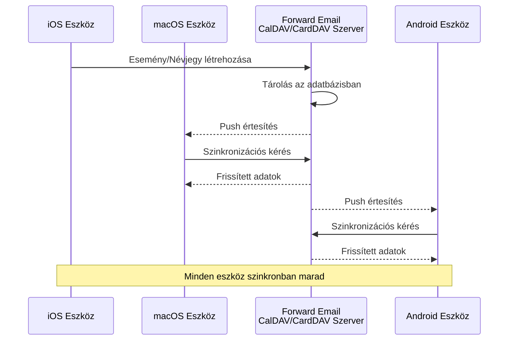

### Nem támogatott naptárbővítmények {#calendaring-extensions-not-supported}

A következő naptárbővítmények NEM támogatottak:

| RFC                                                       | Cím                                                                 | Indoklás                                                        |
| --------------------------------------------------------- | ------------------------------------------------------------------ | --------------------------------------------------------------- |
| [RFC 4918](https://datatracker.ietf.org/doc/html/rfc4918) | HTTP Extensions for Web Distributed Authoring and Versioning (WebDAV) | A CalDAV használ WebDAV koncepciókat, de nem valósítja meg teljesen az RFC 4918-at |
| [RFC 6578](https://datatracker.ietf.org/doc/html/rfc6578) | Collection Synchronization for WebDAV                              | Nem implementált                                                 |
| [RFC 3744](https://datatracker.ietf.org/doc/html/rfc3744) | WebDAV Access Control Protocol                                     | Nem implementált                                                 |

---


## E-mail üzenet szűrés {#email-message-filtering}

> \[!IMPORTANT]
> A Forward Email teljes körű **Sieve és ManageSieve támogatást** nyújt szerveroldali e-mail szűréshez. Hozz létre hatékony szabályokat a bejövő üzenetek automatikus rendezéséhez, szűréséhez, továbbításához és válaszadásához.

### Sieve (RFC 5228) {#sieve-rfc-5228}

A [Sieve](https://en.wikipedia.org/wiki/Sieve_\(mail_filtering_language\)) egy szabványosított, erőteljes szkriptnyelv szerveroldali e-mail szűréshez. A Forward Email átfogó Sieve támogatást valósít meg 24 kiterjesztéssel.

**Forráskód:** [`helpers/sieve/`](https://github.com/forwardemail/forwardemail.net/tree/master/helpers/sieve)

#### Támogatott alapvető Sieve RFC-k {#core-sieve-rfcs-supported}

| RFC                                                                                    | Cím                                                         | Állapot         |
| -------------------------------------------------------------------------------------- | ----------------------------------------------------------- | --------------- |
| [RFC 5228](https://datatracker.ietf.org/doc/html/rfc5228)                              | Sieve: Egy e-mail szűrő nyelv                              | ✅ Teljes támogatás |
| [RFC 5429](https://datatracker.ietf.org/doc/html/rfc5429)                              | Sieve e-mail szűrés: Elutasítás és kiterjesztett elutasítás | ✅ Teljes támogatás |
| [RFC 5230](https://datatracker.ietf.org/doc/html/rfc5230)                              | Sieve e-mail szűrés: Nyári szabadság kiterjesztés          | ✅ Teljes támogatás |
| [RFC 6131](https://datatracker.ietf.org/doc/html/rfc6131)                              | Sieve nyári szabadság kiterjesztés: "Seconds" paraméter     | ✅ Teljes támogatás |
| [RFC 5232](https://datatracker.ietf.org/doc/html/rfc5232)                              | Sieve e-mail szűrés: Imap4flags kiterjesztés                | ✅ Teljes támogatás |
| [RFC 5173](https://datatracker.ietf.org/doc/html/rfc5173)                              | Sieve e-mail szűrés: Törzs kiterjesztés                      | ✅ Teljes támogatás |
| [RFC 5229](https://datatracker.ietf.org/doc/html/rfc5229)                              | Sieve e-mail szűrés: Változók kiterjesztés                   | ✅ Teljes támogatás |
| [RFC 5231](https://datatracker.ietf.org/doc/html/rfc5231)                              | Sieve e-mail szűrés: Relációs kiterjesztés                   | ✅ Teljes támogatás |
| [RFC 4790](https://datatracker.ietf.org/doc/html/rfc4790)                              | Internet Alkalmazás Protokoll Kollációs Regiszter            | ✅ Teljes támogatás |
| [RFC 3894](https://datatracker.ietf.org/doc/html/rfc3894)                              | Sieve kiterjesztés: Másolás mellékhatások nélkül             | ✅ Teljes támogatás |
| [RFC 5293](https://datatracker.ietf.org/doc/html/rfc5293)                              | Sieve e-mail szűrés: Editheader kiterjesztés                 | ✅ Teljes támogatás |
| [RFC 5260](https://datatracker.ietf.org/doc/html/rfc5260)                              | Sieve e-mail szűrés: Dátum és index kiterjesztések           | ✅ Teljes támogatás |
| [RFC 5435](https://datatracker.ietf.org/doc/html/rfc5435)                              | Sieve e-mail szűrés: Értesítések kiterjesztése               | ✅ Teljes támogatás |
| [RFC 5183](https://datatracker.ietf.org/doc/html/rfc5183)                              | Sieve e-mail szűrés: Környezet kiterjesztés                  | ✅ Teljes támogatás |
| [RFC 5490](https://datatracker.ietf.org/doc/html/rfc5490)                              | Sieve e-mail szűrés: Postafiók állapot ellenőrző kiterjesztések | ✅ Teljes támogatás |
| [RFC 8579](https://datatracker.ietf.org/doc/html/rfc8579)                              | Sieve e-mail szűrés: Speciális használatú postafiókok kézbesítése | ✅ Teljes támogatás |
| [RFC 7352](https://datatracker.ietf.org/doc/html/rfc7352)                              | Sieve e-mail szűrés: Ismétlődő kézbesítések észlelése        | ✅ Teljes támogatás |
| [RFC 5463](https://datatracker.ietf.org/doc/html/rfc5463)                              | Sieve e-mail szűrés: Ihave kiterjesztés                      | ✅ Teljes támogatás |
| [RFC 5233](https://datatracker.ietf.org/doc/html/rfc5233)                              | Sieve e-mail szűrés: Alcím kiterjesztés                      | ✅ Teljes támogatás |
| [draft-ietf-sieve-regex](https://datatracker.ietf.org/doc/html/draft-ietf-sieve-regex) | Sieve e-mail szűrés: Reguláris kifejezés kiterjesztés        | ✅ Teljes támogatás |
#### Támogatott Sieve kiterjesztések {#supported-sieve-extensions}

| Kiterjesztés                 | Leírás                                  | Integráció                                  |
| ---------------------------- | ---------------------------------------- | -------------------------------------------- |
| `fileinto`                   | Üzenetek fájlba helyezése adott mappákba | Üzenetek tárolása megadott IMAP mappában     |
| `reject` / `ereject`         | Üzenetek elutasítása hibával             | SMTP elutasítás visszapattanó üzenettel      |
| `vacation`                   | Automatikus szabadság/külső válaszok     | Sorba állítva az Emails.queue-n keresztül, sebességkorlátozással |
| `vacation-seconds`           | Finomhangolt szabadság válaszidőközök    | TTL a `:seconds` paraméterből                 |
| `imap4flags`                 | IMAP jelzők beállítása (\Seen, \Flagged, stb.) | Jelzők alkalmazása az üzenettárolás során     |
| `envelope`                   | Boríték feladó/címzett tesztelése        | Hozzáférés az SMTP boríték adatokhoz          |
| `body`                       | Üzenet törzstartalom tesztelése           | Teljes törzsszöveg egyezés                     |
| `variables`                  | Változók tárolása és használata szkriptekben | Változó kiterjesztés módosítókkal              |
| `relational`                 | Relációs összehasonlítások                | `:count`, `:value` gt/lt/eq operátorokkal     |
| `comparator-i;ascii-numeric` | Numerikus összehasonlítások                | Numerikus karakterlánc összehasonlítás        |
| `copy`                       | Üzenetek másolása átirányítás közben      | `:copy` jelző fileinto/redirect esetén        |
| `editheader`                 | Üzenet fejléc hozzáadása vagy törlése     | Fejlécek módosítása tárolás előtt              |
| `date`                       | Dátum/idő értékek tesztelése               | `currentdate` és fejléc dátum tesztek          |
| `index`                      | Meghatározott fejléc előfordulások elérése | `:index` többértékű fejlécekhez                |
| `regex`                      | Reguláris kifejezés egyezés                | Teljes regex támogatás tesztekben               |
| `enotify`                    | Értesítések küldése                        | `mailto:` értesítések az Emails.queue-n keresztül |
| `environment`                | Környezeti információk elérése             | Domain, host, remote-ip a munkamenetből         |
| `mailbox`                    | Postafiók létezésének tesztelése           | `mailboxexists` teszt                            |
| `special-use`                | Speciális használatú postafiókokba fájlba helyezés | \Junk, \Trash stb. mappák leképezése            |
| `duplicate`                  | Duplikált üzenetek felismerése             | Redis alapú duplikált követés                    |
| `ihave`                      | Kiterjesztés elérhetőségének tesztelése    | Futásidejű képesség ellenőrzés                   |
| `subaddress`                 | Felhasználó+részlet címrészek elérése      | `:user` és `:detail` címrészek                   |

#### Nem támogatott Sieve kiterjesztések {#sieve-extensions-not-supported}

| Kiterjesztés                         | RFC                                                       | Indok                                                           |
| ----------------------------------- | --------------------------------------------------------- | ---------------------------------------------------------------- |
| `include`                           | [RFC 6609](https://datatracker.ietf.org/doc/html/rfc6609) | Biztonsági kockázat (szkript befecskendezés), globális szkript tárolást igényel |
| `mboxmetadata` / `servermetadata`   | [RFC 5490](https://datatracker.ietf.org/doc/html/rfc5490) | IMAP METADATA kiterjesztést igényel                             |
| `fcc`                               | [RFC 8580](https://datatracker.ietf.org/doc/html/rfc8580) | Elküldött mappa integrációt igényel                             |
| `encoded-character`                 | [RFC 5228](https://datatracker.ietf.org/doc/html/rfc5228) | Parser módosítás szükséges a ${hex:} szintaxis miatt             |
| `foreverypart` / `mime` / `extracttext` | [RFC 5703](https://datatracker.ietf.org/doc/html/rfc5703) | Komplex MIME fa kezelés                                          |
#### Sieve feldolgozási folyamat {#sieve-processing-flow}

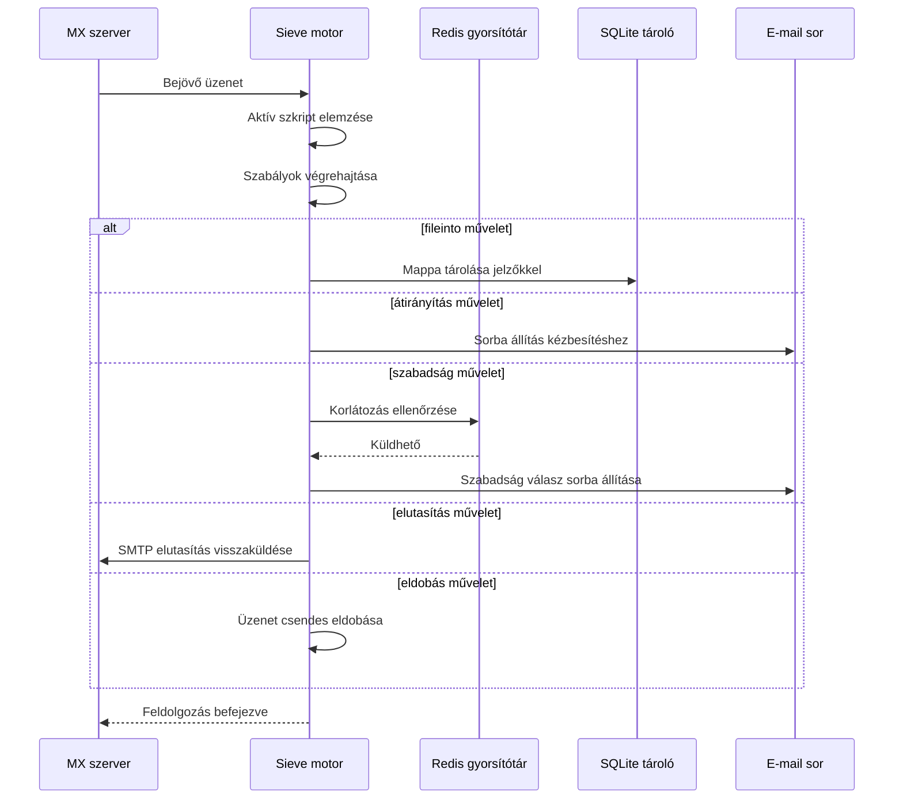

#### Biztonsági funkciók {#security-features}

A Forward Email Sieve megvalósítása átfogó biztonsági védelmeket tartalmaz:

* **CVE-2023-26430 védelem**: Megakadályozza az átirányítási hurkokat és a levélbombázási támadásokat
* **Korlátozások**: Átirányítások (10/üzenet, 100/nap) és szabadság válaszok korlátozása
* **Tiltólista ellenőrzés**: Az átirányítási címek tiltólistával való egyeztetése
* **Védett fejlécmezők**: DKIM, ARC és hitelesítési fejlécmezők nem módosíthatók az editheader segítségével
* **Szkriptméret korlátok**: Maximális szkriptméret betartása
* **Végrehajtási időkorlátok**: A szkriptek megszakítása, ha a végrehajtás túllépi az időkorlátot

#### Példa Sieve szkriptek {#example-sieve-scripts}

**Hírlevelek mappába helyezése:**

```sieve
require ["fileinto"];

if header :contains "List-Id" "newsletter" {
    fileinto "Newsletters";
}
```

**Szabadság automatikus válasz finomhangolt időzítéssel:**

```sieve
require ["vacation", "vacation-seconds"];

vacation :seconds 3600 :subject "Nem vagyok elérhető"
    "Jelenleg távol vagyok, 24 órán belül válaszolok.";
```

**Spam szűrés jelzőkkel:**

```sieve
require ["fileinto", "imap4flags"];

if header :contains "X-Spam-Status" "Yes" {
    setflag "\\Seen";
    fileinto "Junk";
}
```

**Összetett szűrés változókkal:**

```sieve
require ["variables", "fileinto", "regex"];

if header :regex "From" "(.+)@example\\.com" {
    set :lower "sender" "${1}";
    fileinto "Contacts/${sender}";
}
```

> \[!TIP]
> A teljes dokumentációért, példa szkriptekért és konfigurációs útmutatókért lásd a [GYIK: Támogatjátok a Sieve e-mail szűrést?](/faq#do-you-support-sieve-email-filtering)

### ManageSieve (RFC 5804) {#managesieve-rfc-5804}

A Forward Email teljes ManageSieve protokoll támogatást nyújt a Sieve szkriptek távoli kezeléséhez.

**Forráskód:** [`managesieve-server.js`](https://github.com/forwardemail/forwardemail.net/blob/master/managesieve-server.js)

| RFC                                                       | Cím                                            | Állapot        |
| --------------------------------------------------------- | ---------------------------------------------- | -------------- |
| [RFC 5804](https://datatracker.ietf.org/doc/html/rfc5804) | Protokoll a Sieve szkriptek távoli kezeléséhez | ✅ Teljes támogatás |

#### ManageSieve szerver konfiguráció {#managesieve-server-configuration}

| Beállítás               | Érték                   |
| ----------------------- | ----------------------- |
| **Szerver**             | `imap.forwardemail.net` |
| **Port (STARTTLS)**     | `2190` (ajánlott)       |
| **Port (Implicit TLS)** | `4190`                  |
| **Hitelesítés**         | PLAIN (TLS-en keresztül) |

> **Megjegyzés:** A 2190-es port STARTTLS-t használ (a sima kapcsolat TLS-re frissítése), és kompatibilis a legtöbb ManageSieve klienssel, beleértve a [sieve-connect](https://github.com/philpennock/sieve-connect) klienst is. A 4190-es port implicit TLS-t használ (TLS a kapcsolat kezdetétől), azoknak a klienseknek, amelyek támogatják.

#### Támogatott ManageSieve parancsok {#supported-managesieve-commands}

| Parancs        | Leírás                                  |
| -------------- | --------------------------------------- |
| `AUTHENTICATE` | Hitelesítés PLAIN mechanizmussal        |
| `CAPABILITY`   | Szerver képességek és kiterjesztések listázása |
| `HAVESPACE`    | Ellenőrzés, hogy a szkript tárolható-e  |
| `PUTSCRIPT`    | Új szkript feltöltése                    |
| `LISTSCRIPTS`  | Az összes szkript listázása aktív státusszal |
| `SETACTIVE`    | Szkript aktiválása                       |
| `GETSCRIPT`    | Szkript letöltése                        |
| `DELETESCRIPT` | Szkript törlése                         |
| `RENAMESCRIPT` | Szkript átnevezése                      |
| `CHECKSCRIPT`  | Szkript szintaxis ellenőrzése           |
| `NOOP`         | Kapcsolat életben tartása                |
| `LOGOUT`       | Munkamenet befejezése                    |
#### Kompatibilis ManageSieve kliensek {#compatible-managesieve-clients}

* **Thunderbird**: Beépített Sieve támogatás a [Sieve bővítményen keresztül](https://addons.thunderbird.net/addon/sieve/)
* **Roundcube**: [ManageSieve plugin](https://plugins.roundcube.net/packages/johndoh/sieve)
* **KMail**: Natív ManageSieve támogatás
* **sieve-connect**: Parancssori kliens
* **Bármely RFC 5804 kompatibilis kliens**

#### ManageSieve protokoll folyamata {#managesieve-protocol-flow}

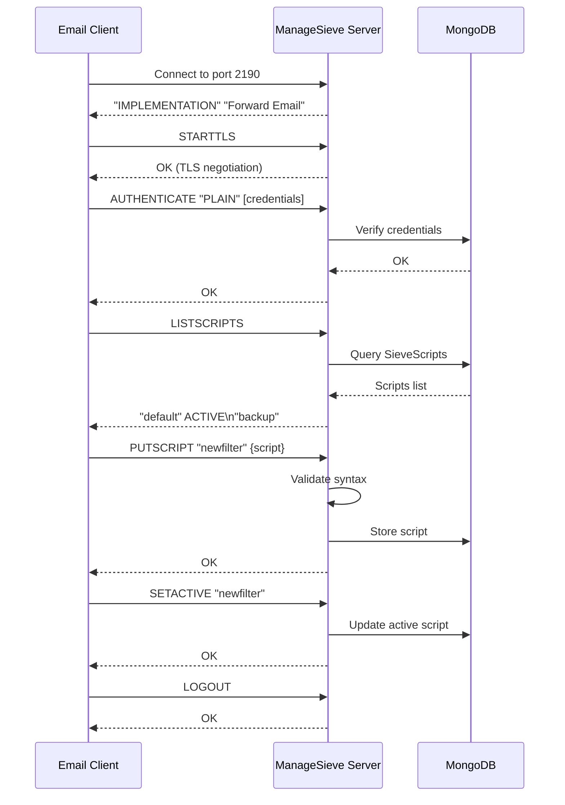

#### Webes felület és API {#web-interface-and-api}

A ManageSieve mellett a Forward Email a következőket kínálja:

* **Webes irányítópult**: Sieve szkriptek létrehozása és kezelése a webes felületen a Saját fiók → Domain-ek → Átirányítások → Sieve szkriptek menüpont alatt
* **REST API**: Programozott hozzáférés a Sieve szkriptek kezeléséhez a [Forward Email API](/api#sieve-scripts) segítségével

> \[!TIP]
> Részletes beállítási útmutatóért és kliens konfigurációért lásd a [GYIK: Támogatjátok a Sieve e-mail szűrést?](/faq#do-you-support-sieve-email-filtering) részt

---


## Tárolás optimalizálása {#storage-optimization}

> \[!IMPORTANT]
> **Iparági első tárolási technológia:** A Forward Email az **egyetlen e-mail szolgáltató a világon**, amely az e-mail tartalom Brotli tömörítését azonosító duplikációval kombinálja. Ez a kétlépcsős optimalizáció **2-3-szor hatékonyabb tárhelyet** biztosít a hagyományos e-mail szolgáltatókhoz képest.

A Forward Email két forradalmi tárolás optimalizálási technikát alkalmaz, amelyek drasztikusan csökkentik a postaláda méretét, miközben teljes RFC kompatibilitást és üzenethűséget biztosítanak:

1. **Melléklet duplikáció eltávolítása** - Megszünteti a duplikált mellékleteket az összes e-mail között
2. **Brotli tömörítés** - 46-86%-kal csökkenti a metaadatok, és 50%-kal a mellékletek tárolási igényét

### Architektúra: Kétlépcsős tárolás optimalizálás {#architecture-dual-layer-storage-optimization}

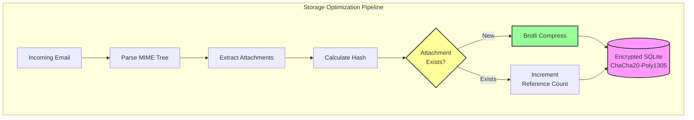

---


## Melléklet duplikáció eltávolítása {#attachment-deduplication}

A Forward Email a melléklet duplikáció eltávolítását a [WildDuck bevált megközelítése](https://docs.wildduck.email/docs/in-depth/attachment-deduplication/) alapján valósítja meg, SQLite tároláshoz igazítva.

> \[!NOTE]
> **Mi kerül duplikáció-mentesítésre:** A "melléklet" az **kódolt** MIME csomópont tartalmat jelenti (base64 vagy quoted-printable), nem a dekódolt fájlt. Ez megőrzi a DKIM és GPG aláírások érvényességét.

### Működési elv {#how-it-works}

**WildDuck eredeti megvalósítása (MongoDB GridFS):**

> A Wild Duck IMAP szerver eltávolítja a mellékletek duplikációját. A "melléklet" ebben az esetben a base64 vagy quoted-printable kódolt mime csomópont tartalmat jelenti, nem a dekódolt fájlt. Bár a kódolt tartalom használata sok hamis negatív eredményt okoz (ugyanaz a fájl különböző e-mailekben eltérő mellékletként számolódhat), ez szükséges a különböző aláírási sémák (DKIM, GPG stb.) érvényességének garantálásához. A Wild Duckból lekért üzenet pontosan ugyanúgy néz ki, mint az eltárolt üzenet, még akkor is, ha a Wild Duck az üzenetet fa-szerű objektummá bontja és újraépíti lekéréskor.
**Forward Email SQLite megvalósítása:**

A Forward Email ezt a megközelítést alkalmazza titkosított SQLite tároláshoz a következő folyamat szerint:

1. **Hash számítás**: Amikor egy csatolmányt talál, a csatolmány törzséből a [`rev-hash`](https://github.com/sindresorhus/rev-hash) könyvtár segítségével hash-t számol
2. **Lekérdezés**: Ellenőrzi, hogy létezik-e a `Attachments` táblában olyan csatolmány, amelynek egyezik a hash-e
3. **Hivatkozásszámlálás**:
   * Ha létezik: Növeli a hivatkozás számlálót 1-gyel és a varázsszámlálót véletlenszerű számmal
   * Ha új: Új csatolmány bejegyzést hoz létre számláló = 1 értékkel
4. **Törlés biztonság**: Kettős számláló rendszert használ (hivatkozás + varázs), hogy megakadályozza a téves törléseket
5. **Szemétgyűjtés**: A csatolmányokat azonnal törli, amikor mindkét számláló nulla lesz

**Forráskód:** [`helpers/attachment-storage.js`](https://github.com/forwardemail/forwardemail.net/blob/master/helpers/attachment-storage.js)

### Deduplication Flow {#deduplication-flow}

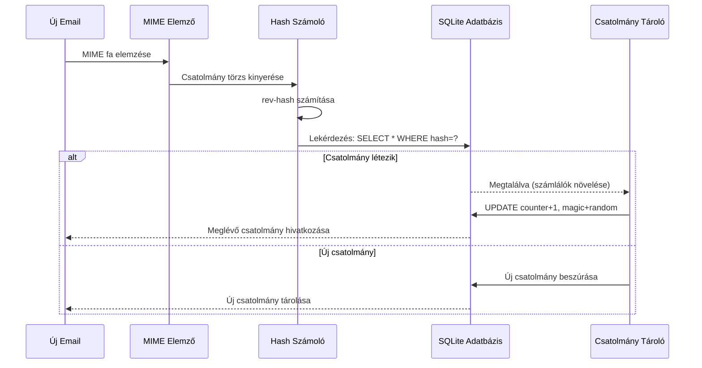

### Varázsszám rendszer {#magic-number-system}

A Forward Email a WildDuck "varázsszám" rendszerét használja (a [Mail.ru](https://github.com/zone-eu/wildduck) ihlette) a téves törlések elkerülésére:

* Minden üzenethez **véletlenszám** van rendelve
* A csatolmány **varázsszámlálója** az üzenet hozzáadásakor a véletlenszámmal növekszik
* A varázsszámláló ugyanazzal a számmal csökken, amikor az üzenetet törlik
* A csatolmány csak akkor törlődik, ha **mindkét számláló** (hivatkozás + varázs) nulla lesz

Ez a kettős számláló rendszer biztosítja, hogy ha valami hiba történik törlés közben (pl. összeomlás, hálózati hiba), a csatolmány ne törlődjön idő előtt.

### Fő különbségek: WildDuck vs Forward Email {#key-differences-wildduck-vs-forward-email}

| Jellemző               | WildDuck (MongoDB)        | Forward Email (SQLite)       |
| ---------------------- | ------------------------- | ---------------------------- |
| **Tároló háttér**      | MongoDB GridFS (darabolt) | SQLite BLOB (közvetlen)      |
| **Hash algoritmus**    | SHA256                    | rev-hash (SHA-256 alapú)     |
| **Hivatkozásszámlálás**| ✅ Igen                   | ✅ Igen                      |
| **Varázsszámok**       | ✅ Igen (Mail.ru ihlette) | ✅ Igen (ugyanaz a rendszer) |
| **Szemétgyűjtés**      | Késleltetett (külön feladat) | Azonnali (nulla számlálóknál) |
| **Tömörítés**          | ❌ Nincs                  | ✅ Brotli (lásd lent)         |
| **Titkosítás**         | ❌ Opcionális             | ✅ Mindig (ChaCha20-Poly1305) |

---


## Brotli tömörítés {#brotli-compression}

> \[!IMPORTANT]
> **Világelső:** A Forward Email az **egyedüli e-mail szolgáltatás a világon**, amely Brotli tömörítést használ az e-mail tartalmakon. Ez további **46-86%-os tárhelymegtakarítást** biztosít a csatolmány deduplikáció mellett.

A Forward Email a Brotli tömörítést alkalmazza mind a csatolmány törzsek, mind az üzenet metaadatok esetén, hatalmas tárhelymegtakarítást nyújtva, miközben megőrzi a visszafelé kompatibilitást.

**Megvalósítás:** [`helpers/msgpack-helpers.js`](https://github.com/forwardemail/forwardemail.net/blob/master/helpers/msgpack-helpers.js)

### Mi tömörül {#what-gets-compressed}

**1. Csatolmány törzsek** (`encodeAttachmentBody`)

* **Régi formátumok**: Hex-kódolt string (2x méret) vagy nyers Buffer
* **Új formátum**: Brotli-val tömörített Buffer "FEBR" varázs fejlécjel
* **Tömörítési döntés**: Csak akkor tömörít, ha helyet spórol (figyelembe veszi a 4 bájtos fejlécet)
* **Tárhelymegtakarítás**: Akár **50%** (hex → natív BLOB)
**2. Üzenet metaadatok** (`encodeMetadata`)

Tartalmazza: `mimeTree`, `headers`, `envelope`, `flags`

* **Régi formátum**: JSON szöveges karakterlánc
* **Új formátum**: Brotli-val tömörített Buffer
* **Tárolási megtakarítás**: **46-86%** az üzenet összetettségétől függően

### Tömörítési beállítások {#compression-configuration}

```javascript
// Brotli tömörítési opciók, sebességre optimalizálva (a 4-es szint jó egyensúly)
const BROTLI_COMPRESS_OPTIONS = {
  params: {
    [zlib.constants.BROTLI_PARAM_QUALITY]: 4
  }
};
```

**Miért a 4-es szint?**

* **Gyors tömörítés/kicsomagolás**: Alatti milliszekundumos feldolgozás
* **Jó tömörítési arány**: 46-86% megtakarítás
* **Kiegyensúlyozott teljesítmény**: Optimális valós idejű e-mail műveletekhez

### Varázscímke: "FEBR" {#magic-header-febr}

A Forward Email egy 4 bájtos varázscímkét használ a tömörített csatolmánytartalmak azonosítására:

```
"FEBR" = Forward Email BRotli
Hex: 0x46 0x45 0x42 0x52
```

**Miért varázscímke?**

* **Formátum felismerés**: Azonnal azonosítja a tömörített és nem tömörített adatokat
* **Visszafelé kompatibilitás**: A régi hex karakterláncok és nyers Bufferek továbbra is működnek
* **Ütközés elkerülése**: A "FEBR" valószínűtlen, hogy egy jogos csatolmány adat elején megjelenik

### Tömörítési folyamat {#compression-process}

```mermaid
flowchart TB
    Input[Csatolmány tartalom vagy metaadat]
    CheckType{Adattípus?}
    Compress[Brotli tömörítés<br/>4-es szint]
    CheckSize{Tömörített<br/>kisebb?}
    AddHeader[Hozzáad FEBR<br/>varázscímkét]
    Store[(SQLite BLOB)]

    Input --> CheckType
    CheckType -->|Csatolmány| Compress
    CheckType -->|Metaadat| Compress
    Compress --> CheckSize
    CheckSize -->|Igen| AddHeader
    CheckSize -->|Nem| StoreRaw[Tárolás tömörítés nélkül]
    AddHeader --> Store
    StoreRaw --> Store

    style Compress fill:#9f9,stroke:#333,stroke-width:2px
    style Store fill:#f9f,stroke:#333,stroke-width:2px
```

### Kicsomagolási folyamat {#decompression-process}

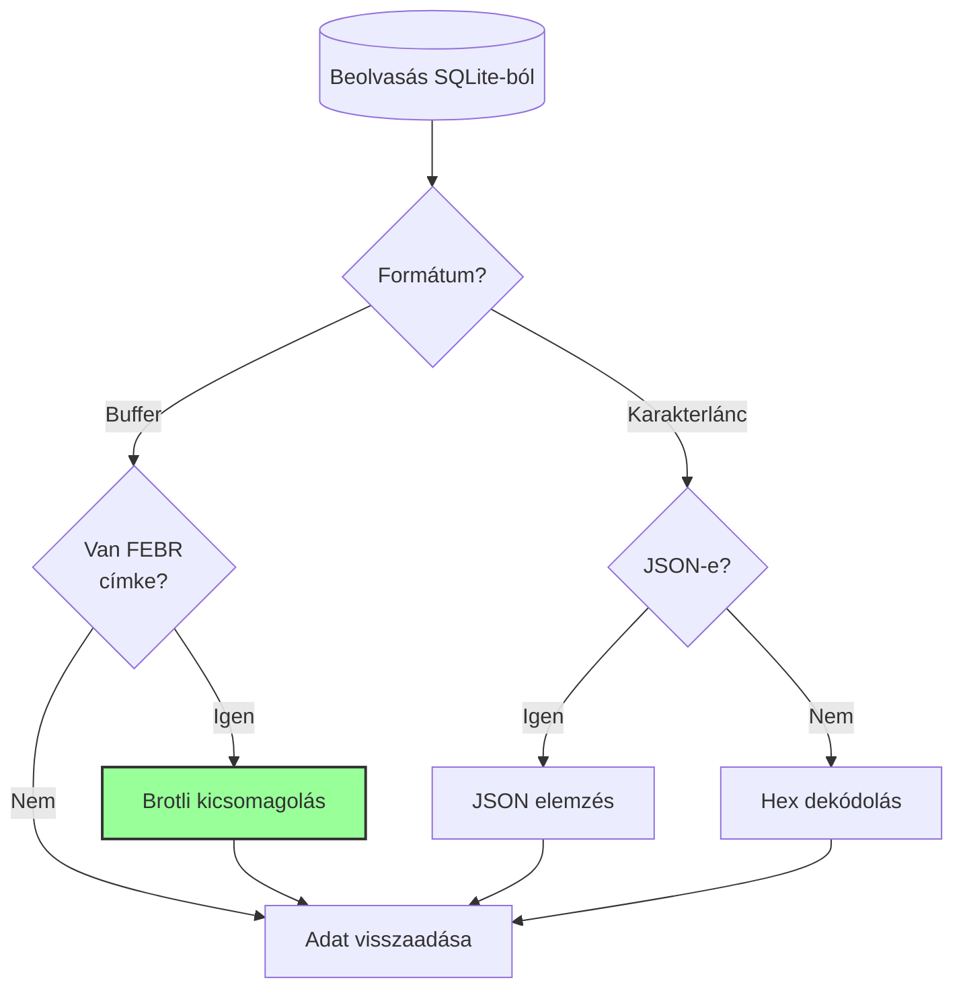

### Visszafelé kompatibilitás {#backwards-compatibility}

Minden dekódoló függvény **automatikusan felismeri** a tárolási formátumot:

| Formátum              | Felismerési mód                        | Kezelés                                      |
| --------------------- | ------------------------------------ | -------------------------------------------- |
| **Brotli tömörített** | "FEBR" varázscímke ellenőrzése       | Kicsomagolás `zlib.brotliDecompressSync()`-vel |
| **Nyers Buffer**      | `Buffer.isBuffer()` varázscímke nélkül | Változtatás nélkül visszaadva                 |
| **Hex karakterlánc**  | Páros hossz + [0-9a-f] karakterek ellenőrzése | Dekódolás `Buffer.from(value, 'hex')` segítségével |
| **JSON karakterlánc** | Első karakter `{` vagy `[`           | Elemzés `JSON.parse()` segítségével          |

Ez biztosítja a **nulla adatvesztést** a régi és új tárolási formátumok közötti migráció során.

### Tárolási megtakarítás statisztikák {#storage-savings-statistics}

**Mért megtakarítások éles adatok alapján:**

| Adattípus             | Régi formátum           | Új formátum            | Megtakarítás |
| --------------------- | ----------------------- | ---------------------- | ------------ |
| **Csatolmány tartalom** | Hex-kódolt karakterlánc (2x) | Brotli tömörített BLOB | **50%**      |
| **Üzenet metaadatok**  | JSON szöveg             | Brotli tömörített BLOB  | **46-86%**   |
| **Postafiók jelölők**  | JSON szöveg             | Brotli tömörített BLOB  | **60-80%**   |

**Forrás:** [`helpers/migrate-storage-format.js`](https://github.com/forwardemail/forwardemail.net/blob/master/helpers/migrate-storage-format.js)

### Migrációs folyamat {#migration-process}

A Forward Email automatikus, idempotens migrációt biztosít a régi és új tárolási formátumok között:
// Követett migrációs statisztikák:
{
  attachmentsMigrated: 0,
  messagesMigrated: 0,
  mailboxesMigrated: 0,
  bytesSaved: 0  // Összes tömörítéssel megtakarított bájt
}
```

**Migrációs lépések:**

1. Melléklet törzsek: hex kódolás → natív BLOB (50% megtakarítás)
2. Üzenet metaadatok: JSON szöveg → brotli-tömörített BLOB (46-86% megtakarítás)
3. Postafiók jelzők: JSON szöveg → brotli-tömörített BLOB (60-80% megtakarítás)

**Forrás:** [`helpers/migrate-storage-format.js`](https://github.com/forwardemail/forwardemail.net/blob/master/helpers/migrate-storage-format.js)

---

### Kombinált tárolási hatékonyság {#combined-storage-efficiency}

> \[!TIP]
> **Valós hatás:** Melléklet duplikáció + Brotli tömörítés mellett a Forward Email felhasználók **2-3x hatékonyabb tárolást** kapnak a hagyományos e-mail szolgáltatókhoz képest.

**Példa forgatókönyv:**

Hagyományos e-mail szolgáltató (1GB postafiók):

* 1GB lemezterület = 1GB e-mailek
* Nincs duplikáció: Ugyanaz a melléklet 10-szer tárolva = 10x tárolási pazarlás
* Nincs tömörítés: Teljes JSON metaadat tárolva = 2-3x tárolási pazarlás

Forward Email (1GB postafiók):

* 1GB lemezterület ≈ **2-3GB e-mail** (hatékony tárolás)
* Duplikáció: Ugyanaz a melléklet egyszer tárolva, 10-szer hivatkozva
* Tömörítés: 46-86% megtakarítás metaadaton, 50% mellékleteken
* Titkosítás: ChaCha20-Poly1305 (nincs tárolási többletterhelés)

**Összehasonlító táblázat:**

| Szolgáltató       | Tárolási technológia                         | Hatékony tárolás (1GB postafiók) |
| ----------------- | -------------------------------------------- | -------------------------------- |
| Gmail             | Nincs                                        | 1GB                             |
| iCloud            | Nincs                                        | 1GB                             |
| Outlook.com       | Nincs                                        | 1GB                             |
| Fastmail          | Nincs                                        | 1GB                             |
| ProtonMail        | Csak titkosítás                              | 1GB                             |
| Tutanota          | Csak titkosítás                              | 1GB                             |
| **Forward Email** | **Duplikáció + Tömörítés + Titkosítás**      | **2-3GB** ✨                     |

### Műszaki megvalósítás részletei {#technical-implementation-details}

**Teljesítmény:**

* Brotli 4-es szint: Másodperc töredéke alatti tömörítés/kibontás
* Nincs teljesítménycsökkenés a tömörítés miatt
* SQLite FTS5: 50ms alatti keresés NVMe SSD-n

**Biztonság:**

* Tömörítés **titkosítás után** történik (az SQLite adatbázis titkosított)
* ChaCha20-Poly1305 titkosítás + Brotli tömörítés
* Zero-knowledge: Csak a felhasználónak van dekódoló jelszava

**RFC megfelelőség:**

* Az üzenetek lekérése **pontosan olyan**, mint a tárolt állapot
* DKIM aláírások érvényesek maradnak (kódolt tartalom megőrizve)
* GPG aláírások érvényesek maradnak (aláírt tartalom nem módosul)

### Miért nem csinálja ezt más szolgáltató {#why-no-other-provider-does-this}

**Bonyolultság:**

* Mély integrációt igényel a tárolási réteggel
* Visszafelé kompatibilitás nehézségei
* Régi formátumokról migráció összetett

**Teljesítmény aggályok:**

* Tömörítés CPU terhelést ad (megoldva Brotli 4-es szinttel)
* Kibontás minden olvasáskor (megoldva SQLite gyorsítótárazással)

**Forward Email előnye:**

* Alapoktól optimalizálva
* SQLite lehetővé teszi közvetlen BLOB kezelést
* Felhasználónként titkosított adatbázisok biztonságos tömörítést tesznek lehetővé

---

---


## Modern funkciók {#modern-features}


## Teljes REST API e-mail kezeléshez {#complete-rest-api-for-email-management}

> \[!TIP]
> A Forward Email átfogó REST API-t kínál 39 végponttal a programozott e-mail kezeléshez.

> \[!TIP]
> **Egyedi iparági funkció:** Minden más e-mail szolgáltatóval ellentétben a Forward Email teljes programozott hozzáférést biztosít postafiókodhoz, naptáradhoz, névjegyeidhez, üzeneteidhez és mappáidhoz egy átfogó REST API-n keresztül. Ez közvetlen interakció a titkosított SQLite adatbázis fájloddal, amely az összes adatodat tárolja.

A Forward Email teljes REST API-t kínál, amely páratlan hozzáférést biztosít e-mail adataidhoz. Egyetlen más e-mail szolgáltató (beleértve a Gmailt, iCloudot, Outlookot, ProtonMailt, Tutát vagy Fastmailt) sem kínál ilyen szintű átfogó, közvetlen adatbázis hozzáférést.
**API Dokumentáció:** <https://forwardemail.net/en/email-api>

### API Kategóriák (39 végpont) {#api-categories-39-endpoints}

**1. Üzenetek API** (5 végpont) - Teljes CRUD műveletek e-mail üzenetekre:

* `GET /v1/messages` - Üzenetek listázása 15+ fejlett keresési paraméterrel (más szolgáltatás nem kínál ilyet)
* `POST /v1/messages` - Üzenetek létrehozása/küldése
* `GET /v1/messages/:id` - Üzenet lekérése
* `PUT /v1/messages/:id` - Üzenet frissítése (jelölők, mappák)
* `DELETE /v1/messages/:id` - Üzenet törlése

*Példa: Találd meg az összes mellékletet tartalmazó számlát az elmúlt negyedévből:*

```bash
curl -u "alias@domain.com:password" \
  "https://api.forwardemail.net/v1/messages?q=subject:invoice+has:attachment+after:2024-01-01+before:2024-04-01"
```

Lásd [Fejlett Keresés Dokumentáció](https://forwardemail.net/en/email-api)

**2. Mappák API** (5 végpont) - Teljes IMAP mappa kezelés REST-en keresztül:

* `GET /v1/folders` - Mappák listázása
* `POST /v1/folders` - Mappa létrehozása
* `GET /v1/folders/:id` - Mappa lekérése
* `PUT /v1/folders/:id` - Mappa frissítése
* `DELETE /v1/folders/:id` - Mappa törlése

**3. Kapcsolatok API** (5 végpont) - CardDAV névjegyek tárolása REST-en keresztül:

* `GET /v1/contacts` - Kapcsolatok listázása
* `POST /v1/contacts` - Kapcsolat létrehozása (vCard formátumban)
* `GET /v1/contacts/:id` - Kapcsolat lekérése
* `PUT /v1/contacts/:id` - Kapcsolat frissítése
* `DELETE /v1/contacts/:id` - Kapcsolat törlése

**4. Naptárak API** (5 végpont) - Naptár konténerek kezelése:

* `GET /v1/calendars` - Naptár konténerek listázása
* `POST /v1/calendars` - Naptár létrehozása (pl. „Munka Naptár”, „Személyes Naptár”)
* `GET /v1/calendars/:id` - Naptár lekérése
* `PUT /v1/calendars/:id` - Naptár frissítése
* `DELETE /v1/calendars/:id` - Naptár törlése

**5. Naptári Események API** (5 végpont) - Események ütemezése naptárakon belül:

* `GET /v1/calendar-events` - Események listázása
* `POST /v1/calendar-events` - Esemény létrehozása résztvevőkkel
* `GET /v1/calendar-events/:id` - Esemény lekérése
* `PUT /v1/calendar-events/:id` - Esemény frissítése
* `DELETE /v1/calendar-events/:id` - Esemény törlése

*Példa: Naptári esemény létrehozása:*

```bash
curl -u "alias@domain.com:password" \
  -X POST \
  -H "Content-Type: application/json" \
  -d '{"title":"Csapatmegbeszélés","start":"2024-12-20T10:00:00Z","attendees":["team@example.com"],"calendar_id":"calendar123"}' \
  https://api.forwardemail.net/v1/calendar-events
```

### Műszaki Részletek {#technical-details}

* **Hitelesítés:** Egyszerű `alias:jelszó` hitelesítés (nincs OAuth bonyolultság)
* **Teljesítmény:** 50 ms alatti válaszidők SQLite FTS5 és NVMe SSD tárolással
* **Zéró hálózati késleltetés:** Közvetlen adatbázis-hozzáférés, nem külső szolgáltatáson keresztül

### Valós Használati Esetek {#real-world-use-cases}

* **E-mail elemzés:** Egyedi irányítópultok készítése az e-mail forgalom, válaszidők, feladó statisztikák nyomon követésére

* **Automatizált munkafolyamatok:** Műveletek indítása e-mail tartalom alapján (számlakezelés, ügyfélszolgálati jegyek)

* **CRM integráció:** E-mail beszélgetések automatikus szinkronizálása CRM rendszerrel

* **Megfelelőség & Keresés:** E-mailek keresése és exportálása jogi/megfelelőségi követelményekhez

* **Egyedi e-mail kliensek:** Speciális e-mail felületek építése munkafolyamataidhoz

* **Üzleti intelligencia:** Kommunikációs minták, válaszadási arányok, ügyfél-elköteleződés elemzése

* **Dokumentumkezelés:** Mellékletek automatikus kinyerése és kategorizálása

* [Teljes Dokumentáció](https://forwardemail.net/en/email-api)

* [Teljes API Referencia](https://forwardemail.net/en/email-api)

* [Fejlett Keresési Útmutató](https://forwardemail.net/en/email-api)

* [30+ Integrációs Példa](https://forwardemail.net/en/email-api)

* [Műszaki Architektúra](https://forwardemail.net/en/blog/docs/best-quantum-safe-encrypted-email-service)

A Forward Email modern REST API-t kínál, amely teljes irányítást biztosít e-mail fiókok, domainek, aliasok és üzenetek felett. Ez az API erőteljes alternatívája a JMAP-nak, és a hagyományos e-mail protokollokon túlmutató funkcionalitást nyújt.

| Kategória               | Végpontok | Leírás                                |
| ----------------------- | --------- | ------------------------------------ |
| **Fiókkezelés**         | 8         | Felhasználói fiókok, hitelesítés, beállítások |
| **Domain Kezelés**      | 12        | Egyedi domainek, DNS, ellenőrzés     |
| **Alias Kezelés**       | 6         | E-mail aliasok, továbbítás, catch-all |
| **Üzenetkezelés**       | 7         | Üzenetek küldése, fogadása, keresése, törlése |
| **Naptár & Kapcsolatok**| 4         | CalDAV/CardDAV hozzáférés API-n keresztül |
| **Naplók & Elemzések**  | 2         | E-mail naplók, kézbesítési jelentések |
### Fő API Jellemzők {#key-api-features}

**Fejlett Keresés:**

Az API erőteljes keresési lehetőségeket kínál, a lekérdezési szintaxis hasonló a Gmailhez:

```
GET /v1/messages?q=subject:invoice+has:attachment+after:2024-01-01+before:2024-04-01
```

**Támogatott Keresési Operátorok:**

* `from:` - Küldő szerinti keresés
* `to:` - Címzett szerinti keresés
* `subject:` - Tárgy szerinti keresés
* `has:attachment` - Mellékletet tartalmazó üzenetek
* `is:unread` - Olvasatlan üzenetek
* `is:starred` - Csillagozott üzenetek
* `after:` - Dátum utáni üzenetek
* `before:` - Dátum előtti üzenetek
* `label:` - Címkével ellátott üzenetek
* `filename:` - Melléklet fájlneve

**Naptári Eseménykezelés:**

```
GET /v1/calendar-events
POST /v1/calendar-events
PUT /v1/calendar-events/:id
DELETE /v1/calendar-events/:id
```

**Webhook Integrációk:**

Az API támogatja a webhookokat az e-mail események (fogadott, küldött, visszapattant stb.) valós idejű értesítéséhez.

**Hitelesítés:**

* API kulcs alapú hitelesítés
* OAuth 2.0 támogatás
* Kéréskorlátozás: 1000 kérés/óra

**Adatformátum:**

* JSON kérés/válasz
* RESTful felépítés
* Lapozás támogatás

**Biztonság:**

* Csak HTTPS
* API kulcs forgatás
* IP fehérlista (opcionális)
* Kérés aláírása (opcionális)

### API Architektúra {#api-architecture}

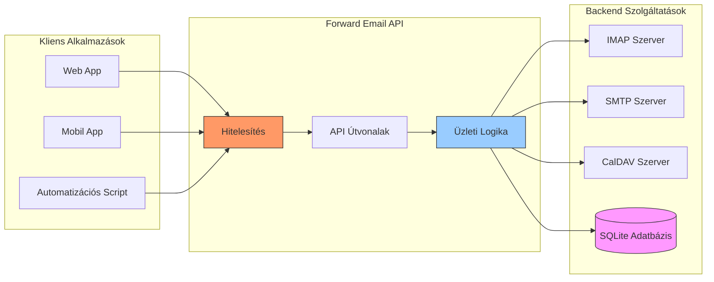

---


## iOS Push Értesítések {#ios-push-notifications}

> \[!TIP]
> A Forward Email támogatja az iOS natív push értesítéseket az XAPPLEPUSHSERVICE-en keresztül az azonnali e-mail kézbesítéshez.

> \[!IMPORTANT]
> **Egyedi Jellemző:** A Forward Email az egyik kevés nyílt forráskódú e-mail szerver, amely támogatja az iOS natív push értesítéseket e-mailek, névjegyek és naptárak esetén az `XAPPLEPUSHSERVICE` IMAP kiterjesztés segítségével. Ezt az Apple protokolljának visszafejtésével valósították meg, és az iOS eszközök számára azonnali kézbesítést biztosít akkumulátor lemerülése nélkül.

A Forward Email megvalósítja az Apple saját XAPPLEPUSHSERVICE kiterjesztését, amely natív push értesítéseket biztosít iOS eszközök számára anélkül, hogy háttérben történő lekérdezést igényelne.

### Hogyan Működik {#how-it-works-1}

**XAPPLEPUSHSERVICE** egy nem szabványos IMAP kiterjesztés, amely lehetővé teszi az iOS Mail alkalmazás számára, hogy az új e-mailek érkezésekor azonnali push értesítéseket kapjon.

A Forward Email megvalósítja az Apple Push Notification service (APNs) integrációját IMAP-hez, lehetővé téve az iOS Mail alkalmazás számára az azonnali push értesítések fogadását új e-mailek érkezésekor.

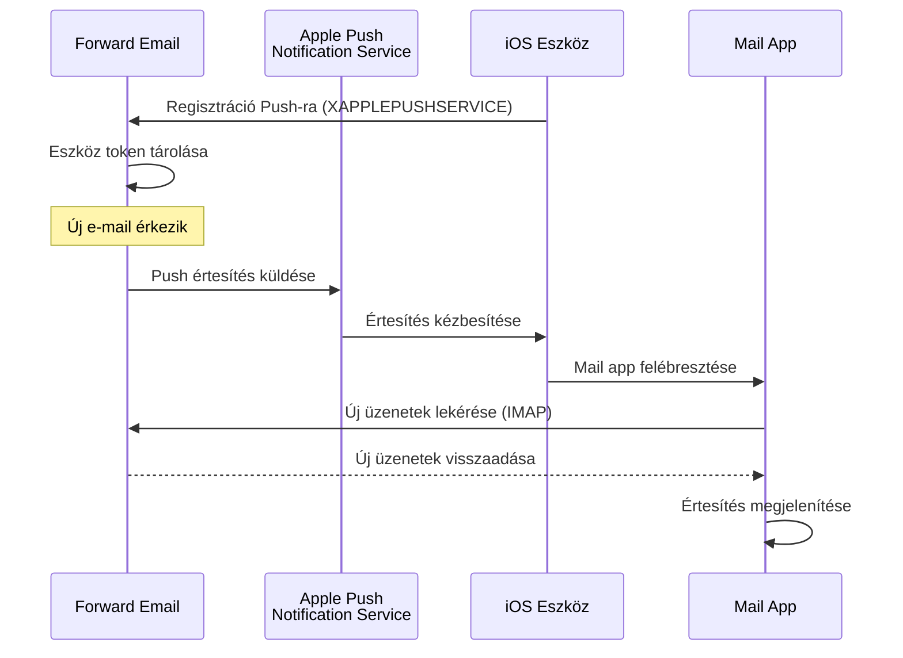

### Fő Jellemzők {#key-features}

**Azonnali Kézbesítés:**

* A push értesítések másodpercek alatt megérkeznek
* Nincs akkumulátort merítő háttér lekérdezés
* Működik akkor is, ha a Mail app zárva van

<!---->

* **Azonnali Kézbesítés:** E-mailek, naptári események és névjegyek azonnal megjelennek iPhone/iPad készülékén, nem lekérdezési ütemezés szerint
* **Akkumulátor Kímélő:** Az Apple push infrastruktúráját használja a folyamatos IMAP kapcsolat fenntartása helyett
* **Témakör Alapú Push:** Támogatja a push értesítéseket konkrét postafiókokhoz, nem csak az INBOX-hoz
* **Nincs Szükség Harmadik Fél Alkalmazásra:** Működik az iOS natív Mail, Naptár és Névjegyek alkalmazásaival
**Natív integráció:**

* Beépítve az iOS Mail alkalmazásba
* Nincs szükség harmadik féltől származó alkalmazásokra
* Zökkenőmentes felhasználói élmény

**Adatvédelem-központú:**

* Az eszköz tokenek titkosítva vannak
* Nincs üzenettartalom elküldve az APNS-en keresztül
* Csak "új levél" értesítés küldése

**Akkumulátor-kímélő:**

* Nincs folyamatos IMAP lekérdezés
* Az eszköz alszik, amíg értesítés nem érkezik
* Minimális akkumulátorhatás

### Mi teszi ezt különlegessé {#what-makes-this-special}

> \[!IMPORTANT]
> A legtöbb e-mail szolgáltató nem támogatja az XAPPLEPUSHSERVICE-t, ezért az iOS eszközöknek 15 percenként kell lekérdezniük az új leveleket.

A legtöbb nyílt forráskódú e-mail szerver (beleértve a Dovecot, Postfix, Cyrus IMAP) NEM támogatja az iOS push értesítéseket. A felhasználóknak vagy:

* IMAP IDLE-t kell használniuk (kapcsolat nyitva tartása, akkumulátor merül)
* Lekérdezést kell használniuk (15-30 percenként ellenőriz, késleltetett értesítések)
* Saját push infrastruktúrával rendelkező, saját e-mail alkalmazásokat kell használniuk

A Forward Email ugyanazt az azonnali push értesítési élményt nyújtja, mint a kereskedelmi szolgáltatások, például a Gmail, iCloud és Fastmail.

**Összehasonlítás más szolgáltatókkal:**

| Szolgáltató      | Push támogatás | Lekérdezési időköz | Akkumulátorhatás |
| ---------------- | -------------- | ------------------ | ---------------- |
| **Forward Email**| ✅ Natív push  | Azonnali           | Minimális        |
| Gmail            | ✅ Natív push  | Azonnali           | Minimális        |
| iCloud           | ✅ Natív push  | Azonnali           | Minimális        |
| Yahoo            | ✅ Natív push  | Azonnali           | Minimális        |
| Outlook.com      | ❌ Lekérdezés  | 15 perc            | Közepes          |
| Fastmail         | ❌ Lekérdezés  | 15 perc            | Közepes          |
| ProtonMail       | ⚠️ Csak bridge | Bridge-en keresztül| Magas            |
| Tutanota         | ❌ Csak app    | N/A                | N/A              |

### Megvalósítás részletei {#implementation-details}

**IMAP CAPABILITY válasz:**

```
* CAPABILITY IMAP4rev1 ... XAPPLEPUSHSERVICE ...
```

**Regisztrációs folyamat:**

1. Az iOS Mail alkalmazás észleli az XAPPLEPUSHSERVICE képességet
2. Az alkalmazás regisztrálja az eszköz tokent a Forward Email-nél
3. A Forward Email tárolja a tokent és társítja a fiókkal
4. Amikor új levél érkezik, a Forward Email push értesítést küld az APNS-en keresztül
5. Az iOS felébreszti a Mail alkalmazást az új üzenetek lekéréséhez

**Biztonság:**

* Az eszköz tokenek titkosítva vannak tárolás közben
* A tokenek lejárnak és automatikusan frissülnek
* Nincs üzenettartalom kitéve az APNS-nek
* Végpontok közötti titkosítás fenntartva

<!---->

* **IMAP kiterjesztés:** `XAPPLEPUSHSERVICE`
* **Forráskód:** [WildDuck Issue #711](https://github.com/zone-eu/wildduck/issues/711)
* **Beállítás:** Automatikus - nincs szükség konfigurációra, az iOS Mail alkalmazással azonnal működik

### Összehasonlítás más szolgáltatásokkal {#comparison-with-other-services}

| Szolgáltatás   | iOS Push támogatás | Módszer                                   |
| ------------- | ------------------ | ----------------------------------------- |
| Forward Email | ✅ Igen            | `XAPPLEPUSHSERVICE` (visszafejtett)      |
| Gmail         | ✅ Igen            | Saját Gmail alkalmazás + Google push      |
| iCloud Mail   | ✅ Igen            | Natív Apple integráció                     |
| Outlook.com   | ✅ Igen            | Saját Outlook alkalmazás + Microsoft push |
| Fastmail      | ✅ Igen            | `XAPPLEPUSHSERVICE`                        |
| Dovecot       | ❌ Nem             | Csak IMAP IDLE vagy lekérdezés             |
| Postfix       | ❌ Nem             | Csak IMAP IDLE vagy lekérdezés             |
| Cyrus IMAP    | ❌ Nem             | Csak IMAP IDLE vagy lekérdezés             |

**Gmail Push:**

A Gmail egy saját push rendszert használ, amely csak a Gmail alkalmazással működik. Az iOS Mail alkalmazásnak le kell kérdeznie a Gmail IMAP szervereit.

**iCloud Push:**

Az iCloud natív push támogatással rendelkezik, hasonlóan a Forward Email-hez, de csak @icloud.com címekhez.

**Outlook.com:**

Az Outlook.com nem támogatja az XAPPLEPUSHSERVICE-t, ezért az iOS Mailnek 15 percenként kell lekérdeznie.

**Fastmail:**

A Fastmail nem támogatja az XAPPLEPUSHSERVICE-t. A felhasználóknak a Fastmail alkalmazást kell használniuk push értesítésekhez, vagy el kell fogadniuk a 15 perces lekérdezési késéseket.

---


## Tesztelés és ellenőrzés {#testing-and-verification}


## Protokoll képesség tesztek {#protocol-capability-tests}
> \[!NOTE]
> Ez a szakasz a legfrissebb protokoll képességtesztjeink eredményeit tartalmazza, amelyeket 2026. január 22-én végeztünk.

Ez a szakasz tartalmazza az összes tesztelt szolgáltató tényleges CAPABILITY/CAPA/EHLO válaszait. Minden teszt **2026. január 22-én** futott.

Ezek a tesztek segítenek ellenőrizni a különböző e-mail protokollok és kiterjesztések hirdetett és tényleges támogatását a főbb szolgáltatók között.

### Test Methodology {#test-methodology}

**Tesztkörnyezet:**

* **Dátum:** 2026. január 22. 02:37 UTC
* **Helyszín:** AWS EC2 példány
* **IPv4:** 54.167.216.197
* **IPv6:** 2600:4040:46da:9a00:b19e:3ad4:426c:2f48
* **Eszközök:** OpenSSL s_client, bash szkriptek

**Tesztelt szolgáltatók:**

* Forward Email
* Gmail
* Outlook.com
* iCloud
* Fastmail
* Yahoo/AOL (Verizon)

### Test Scripts {#test-scripts}

Teljes átláthatóság érdekében az alábbiakban megtalálhatók a tesztekhez használt pontos szkriptek.

#### IMAP Capability Test Script {#imap-capability-test-script}

```bash
#!/bin/bash
# IMAP Capability Test Script
# Tests IMAP CAPABILITY for various email providers

echo "========================================="
echo "IMAP CAPABILITY TEST"
echo "Date: $(date -u +"%Y-%m-%d %H:%M:%S UTC")"
echo "========================================="
echo ""

# Gmail
echo "--- Gmail (imap.gmail.com:993) ---"
echo -e "a001 CAPABILITY\na002 LOGOUT" | timeout 10 openssl s_client -connect imap.gmail.com:993 -crlf -quiet 2>&1 | grep -A 20 "CAPABILITY"
echo ""

# Outlook.com
echo "--- Outlook.com (outlook.office365.com:993) ---"
echo -e "a001 CAPABILITY\na002 LOGOUT" | timeout 10 openssl s_client -connect outlook.office365.com:993 -crlf -quiet 2>&1 | grep -A 20 "CAPABILITY"
echo ""

# iCloud
echo "--- iCloud (imap.mail.me.com:993) ---"
echo -e "a001 CAPABILITY\na002 LOGOUT" | timeout 10 openssl s_client -connect imap.mail.me.com:993 -crlf -quiet 2>&1 | grep -A 20 "CAPABILITY"
echo ""

# Fastmail
echo "--- Fastmail (imap.fastmail.com:993) ---"
echo -e "a001 CAPABILITY\na002 LOGOUT" | timeout 10 openssl s_client -connect imap.fastmail.com:993 -crlf -quiet 2>&1 | grep -A 20 "CAPABILITY"
echo ""

# Yahoo
echo "--- Yahoo (imap.mail.yahoo.com:993) ---"
echo -e "a001 CAPABILITY\na002 LOGOUT" | timeout 10 openssl s_client -connect imap.mail.yahoo.com:993 -crlf -quiet 2>&1 | grep -A 20 "CAPABILITY"
echo ""

# Forward Email
echo "--- Forward Email (imap.forwardemail.net:993) ---"
echo -e "a001 CAPABILITY\na002 LOGOUT" | timeout 10 openssl s_client -connect imap.forwardemail.net:993 -crlf -quiet 2>&1 | grep -A 20 "CAPABILITY"
echo ""

echo "========================================="
echo "Test completed"
echo "========================================="
```

#### POP3 Capability Test Script {#pop3-capability-test-script}

```bash
#!/bin/bash
# POP3 Capability Test Script
# Tests POP3 CAPA for various email providers

echo "========================================="
echo "POP3 CAPABILITY TEST"
echo "Date: $(date -u +"%Y-%m-%d %H:%M:%S UTC")"
echo "========================================="
echo ""

# Gmail
echo "--- Gmail (pop.gmail.com:995) ---"
echo -e "CAPA\nQUIT" | timeout 10 openssl s_client -connect pop.gmail.com:995 -crlf -quiet 2>&1 | grep -A 20 "CAPA"
echo ""

# Outlook.com
echo "--- Outlook.com (outlook.office365.com:995) ---"
echo -e "CAPA\nQUIT" | timeout 10 openssl s_client -connect outlook.office365.com:995 -crlf -quiet 2>&1 | grep -A 20 "CAPA"
echo ""

# iCloud (Note: iCloud does not support POP3)
echo "--- iCloud (No POP3 support) ---"
echo "Az iCloud nem támogatja a POP3-at"
echo ""

# Fastmail
echo "--- Fastmail (pop.fastmail.com:995) ---"
echo -e "CAPA\nQUIT" | timeout 10 openssl s_client -connect pop.fastmail.com:995 -crlf -quiet 2>&1 | grep -A 20 "CAPA"
echo ""

# Yahoo
echo "--- Yahoo (pop.mail.yahoo.com:995) ---"
echo -e "CAPA\nQUIT" | timeout 10 openssl s_client -connect pop.mail.yahoo.com:995 -crlf -quiet 2>&1 | grep -A 20 "CAPA"
echo ""

# Forward Email
echo "--- Forward Email (pop3.forwardemail.net:995) ---"
echo -e "CAPA\nQUIT" | timeout 10 openssl s_client -connect pop3.forwardemail.net:995 -crlf -quiet 2>&1 | grep -A 20 "CAPA"
echo ""

echo "========================================="
echo "Test completed"
echo "========================================="
```
#### SMTP képesség teszt szkript {#smtp-capability-test-script}

```bash
#!/bin/bash
# SMTP Capability Test Script
# Tests SMTP EHLO for various email providers

echo "========================================="
echo "SMTP KÉPESSÉG TESZT"
echo "Dátum: $(date -u +"%Y-%m-%d %H:%M:%S UTC")"
echo "========================================="
echo ""

# Gmail
echo "--- Gmail (smtp.gmail.com:587) ---"
echo -e "EHLO test.com\nQUIT" | timeout 10 openssl s_client -connect smtp.gmail.com:587 -starttls smtp -crlf -quiet 2>&1 | grep -A 30 "250-"
echo ""

# Outlook.com
echo "--- Outlook.com (smtp.office365.com:587) ---"
echo -e "EHLO test.com\nQUIT" | timeout 10 openssl s_client -connect smtp.office365.com:587 -starttls smtp -crlf -quiet 2>&1 | grep -A 30 "250-"
echo ""

# iCloud
echo "--- iCloud (smtp.mail.me.com:587) ---"
echo -e "EHLO test.com\nQUIT" | timeout 10 openssl s_client -connect smtp.mail.me.com:587 -starttls smtp -crlf -quiet 2>&1 | grep -A 30 "250-"
echo ""

# Fastmail
echo "--- Fastmail (smtp.fastmail.com:587) ---"
echo -e "EHLO test.com\nQUIT" | timeout 10 openssl s_client -connect smtp.fastmail.com:587 -starttls smtp -crlf -quiet 2>&1 | grep -A 30 "250-"
echo ""

# Yahoo
echo "--- Yahoo (smtp.mail.yahoo.com:587) ---"
echo -e "EHLO test.com\nQUIT" | timeout 10 openssl s_client -connect smtp.mail.yahoo.com:587 -starttls smtp -crlf -quiet 2>&1 | grep -A 30 "250-"
echo ""

# Forward Email
echo "--- Forward Email (smtp.forwardemail.net:587) ---"
echo -e "EHLO test.com\nQUIT" | timeout 10 openssl s_client -connect smtp.forwardemail.net:587 -starttls smtp -crlf -quiet 2>&1 | grep -A 30 "250-"
echo ""

echo "========================================="
echo "Teszt befejezve"
echo "========================================="
```

### Teszteredmények összefoglalója {#test-results-summary}

#### IMAP (KÉPESSÉG) {#imap-capability}

**Forward Email**

```
* CAPABILITY IMAP4rev1 AUTH=PLAIN AUTH=PLAIN-CLIENTTOKEN CHILDREN ENABLE ID IDLE NAMESPACE QUOTA SASL-IR UNSELECT XLIST XAPPLEPUSHSERVICE
```

**Gmail**

```
* CAPABILITY IMAP4rev1 UNSELECT IDLE NAMESPACE QUOTA ID XLIST CHILDREN X-GM-EXT-1 UIDPLUS COMPRESS=DEFLATE ENABLE MOVE CONDSTORE ESEARCH UTF8=ACCEPT LIST-EXTENDED LIST-STATUS LITERAL- SPECIAL-USE
```

**iCloud**

```
* OK [CAPABILITY XAPPLEPUSHSERVICE IMAP4 IMAP4rev1 SASL-IR AUTH=ATOKEN AUTH=PLAIN AUTH=ATOKEN2 AUTH=XOAUTH2]
```

**Outlook.com**

```
* CAPABILITY IMAP4rev1 AUTH=PLAIN AUTH=XOAUTH2 SASL-IR UIDPLUS ID UNSELECT CHILDREN IDLE NAMESPACE LITERAL+
```

**Fastmail**

```
* CAPABILITY IMAP4rev1 ACL ANNOTATE-EXPERIMENT-1 CATENATE CONDSTORE ENABLE ESEARCH ESORT I18NLEVEL=1 ID IDLE LIST-EXTENDED LIST-STATUS LITERAL+ LOGINDISABLED MULTIAPPEND NAMESPACE QRESYNC QUOTA RIGHTS=ektx SASL-IR SORT SPECIAL-USE THREAD=ORDEREDSUBJECT UIDPLUS UNSELECT WITHIN X-RENAME XLIST
```

**Yahoo/AOL (Verizon)**

```
* CAPABILITY IMAP4rev1 IDLE NAMESPACE QUOTA ID XLIST CHILDREN UIDPLUS MOVE CONDSTORE ESEARCH ENABLE LIST-EXTENDED LIST-STATUS LITERAL- SPECIAL-USE UNSELECT XAPPLEPUSHSERVICE
```

#### POP3 (CAPA) {#pop3-capa}

**Forward Email**

```
+OK
CAPA
TOP
USER
UIDL
EXPIRE 30
IMPLEMENTATION ForwardEmail
.
```

**Gmail**

```
+OK
CAPA
TOP
USER
UIDL
EXPIRE 30
IMPLEMENTATION Gpop
.
```

**Outlook.com**

```
+OK
CAPA
TOP
USER
UIDL
SASL PLAIN XOAUTH2
.
```

**Fastmail**

```
+OK
CAPA
TOP
USER
UIDL
EXPIRE 30
IMPLEMENTATION Cyrus
.
```

#### SMTP (EHLO) {#smtp-ehlo}

**Forward Email**

```
250-smtp.forwardemail.net
250-PIPELINING
250-SIZE 52428800
250-ETRN
250-STARTTLS
250-ENHANCEDSTATUSCODES
250-8BITMIME
250-DSN
250 CHUNKING
```

**Gmail**

```
250-smtp.gmail.com at your service
250-SIZE 35882577
250-8BITMIME
250-STARTTLS
250-ENHANCEDSTATUSCODES
250-PIPELINING
250-CHUNKING
250 SMTPUTF8
```

**Outlook.com**

```
250-SN4PR13CA0005.outlook.office365.com Hello [x.x.x.x]
250-SIZE 157286400
250-PIPELINING
250-DSN
250-ENHANCEDSTATUSCODES
250-STARTTLS
250-8BITMIME
250-BINARYMIME
250-CHUNKING
250 SMTPUTF8
```

**Fastmail**

```
250-smtp.fastmail.com
250-PIPELINING
250-SIZE 78643200
250-ETRN
250-STARTTLS
250-ENHANCEDSTATUSCODES
250-8BITMIME
250-DSN
250 CHUNKING
```

**Yahoo/AOL (Verizon)**

```
250-smtp.mail.yahoo.com
250-PIPELINING
250-SIZE 41943040
250-8BITMIME
250-ENHANCEDSTATUSCODES
250-STARTTLS
```
### Részletes Teszteredmények {#detailed-test-results}

#### IMAP Teszteredmények {#imap-test-results}

**Gmail:**
`* CAPABILITY IMAP4rev1 UNSELECT IDLE NAMESPACE QUOTA ID XLIST CHILDREN X-GM-EXT-1 XYZZY SASL-IR AUTH=XOAUTH2 AUTH=PLAIN AUTH=PLAIN-CLIENTTOKEN AUTH=OAUTHBEARER`

**Outlook.com:**
`* CAPABILITY IMAP4 IMAP4rev1 AUTH=PLAIN AUTH=XOAUTH2 SASL-IR UIDPLUS ID UNSELECT CHILDREN IDLE NAMESPACE LITERAL+`

**iCloud:**
`* CAPABILITY XAPPLEPUSHSERVICE IMAP4 IMAP4rev1 SASL-IR AUTH=ATOKEN AUTH=PLAIN AUTH=ATOKEN2 AUTH=XOAUTH2`

**Fastmail:**
Kapcsolat időtúllépés miatt megszakadt. Lásd az alábbi megjegyzéseket.

**Yahoo:**
`* CAPABILITY IMAP4rev1 SASL-IR AUTH=PLAIN AUTH=XOAUTH2 AUTH=OAUTHBEARER ID MOVE NAMESPACE XYMHIGHESTMODSEQ UIDPLUS LITERAL+ CHILDREN UNSELECT X-MSG-EXT OBJECTID IDLE ENABLE UIDONLY X-ALL-MAIL X-UIDONLY LIST-EXTENDED LIST-STATUS SPECIAL-USE PARTIAL APPENDLIMIT=41697280`

**Forward Email:**
`* CAPABILITY XAPPLEPUSHSERVICE IMAP4rev1 APPENDLIMIT=52428800 AUTH=PLAIN AUTH=PLAIN-CLIENTTOKEN CHILDREN CONDSTORE ENABLE ID IDLE MOVE NAMESPACE QUOTA SASL-IR SPECIAL-USE UIDPLUS UNSELECT UTF8=ACCEPT XLIST`

#### POP3 Teszteredmények {#pop3-test-results}

**Gmail:**
A kapcsolat nem adott vissza CAPA választ hitelesítés nélkül.

**Outlook.com:**
A kapcsolat nem adott vissza CAPA választ hitelesítés nélkül.

**iCloud:**
Nem támogatott.

**Fastmail:**
Kapcsolat időtúllépés miatt megszakadt. Lásd az alábbi megjegyzéseket.

**Yahoo:**
`+OK CAPA list follows... SASL PLAIN XOAUTH2`

**Forward Email:**
A kapcsolat nem adott vissza CAPA választ hitelesítés nélkül.

#### SMTP Teszteredmények {#smtp-test-results}

**Gmail:**
`250-AUTH LOGIN PLAIN XOAUTH2 PLAIN-CLIENTTOKEN OAUTHBEARER XOAUTH`

**Outlook.com:**
`250-DSN`

**iCloud:**
`250-DSN`

**Fastmail:**
`250 AUTH PLAIN LOGIN XOAUTH2 OAUTHBEARER`

**Yahoo:**
`250 AUTH PLAIN LOGIN XOAUTH2 OAUTHBEARER`

**Forward Email:**
`250-DSN`, `250-REQUIRETLS`

### Megjegyzések a Teszteredményekhez {#notes-on-test-results}

> \[!NOTE]
> Fontos megfigyelések és korlátozások a teszteredményekből.

1. **Fastmail időtúllépések**: A Fastmail kapcsolatok tesztelés közben időtúllépést szenvedtek, valószínűleg a tesztszerver IP-címének korlátozásai vagy tűzfal miatt. A Fastmail dokumentációja alapján ismert, hogy erős IMAP/POP3/SMTP támogatással rendelkezik.

2. **POP3 CAPA válaszok**: Több szolgáltató (Gmail, Outlook.com, Forward Email) nem adott vissza CAPA választ hitelesítés nélkül. Ez általános biztonsági gyakorlat a POP3 szervereknél.

3. **DSN támogatás**: Csak az Outlook.com, iCloud és Forward Email hirdeti kifejezetten a DSN támogatást az SMTP EHLO válaszaiban. Ez nem feltétlenül jelenti azt, hogy más szolgáltatók nem támogatják a DSN-t, csak nem hirdetik.

4. **REQUIRETLS**: Csak a Forward Email hirdeti kifejezetten a REQUIRETLS támogatást felhasználói szintű kikapcsolható jelölőnégyzettel. Más szolgáltatók belsőleg támogathatják, de nem hirdetik az EHLO-ban.

5. **Tesztkörnyezet**: A teszteket egy AWS EC2 példányról végezték (IP: 54.167.216.197 IPv4, 2600:4040:46da:9a00:b19e:3ad4:426c:2f48 IPv6) 2026. január 22-én 02:37 UTC időpontban.

---


## Összefoglaló {#summary}

A Forward Email átfogó RFC protokoll támogatást nyújt minden jelentős e-mail szabványban:

* **IMAP4rev1:** 16 támogatott RFC szándékos eltérésekkel dokumentálva
* **POP3:** 4 támogatott RFC RFC-kompatibilis végleges törléssel
* **SMTP:** 11 támogatott kiterjesztés, beleértve az SMTPUTF8, DSN és PIPELINING funkciókat
* **Hitelesítés:** DKIM, SPF, DMARC, ARC teljes körű támogatás
* **Szállítási biztonság:** MTA-STS és REQUIRETLS teljes támogatás, DANE részleges támogatás
* **Titkosítás:** OpenPGP v6 és S/MIME támogatás
* **Naptár:** CalDAV, CardDAV és VTODO teljes támogatás
* **API hozzáférés:** Teljes REST API 39 végponttal közvetlen adatbázis eléréshez
* **iOS Push:** Natív push értesítések e-mailekhez, névjegyekhez és naptárakhoz az `XAPPLEPUSHSERVICE` segítségével

### Főbb Megkülönböztető Jegyek {#key-differentiators}

> \[!TIP]
> A Forward Email egyedi funkcióival tűnik ki, melyek más szolgáltatóknál nem találhatók meg.

**Mi teszi egyedivé a Forward Email-t:**

1. **Kvantumbiztos titkosítás** – Az egyetlen szolgáltató, amely ChaCha20-Poly1305 titkosított SQLite levelezőládákat használ
2. **Zero-Knowledge architektúra** – A jelszavad titkosítja a postaládádat; mi nem tudjuk visszafejteni
3. **Ingyenes egyedi domainek** – Nincs havi díj az egyedi domaines e-mailekért
4. **REQUIRETLS támogatás** – Felhasználói szintű jelölőnégyzet a TLS kikényszerítéséhez az egész kézbesítési úton
5. **Átfogó API** – 39 REST API végpont a teljes programozható vezérléshez
6. **iOS Push értesítések** – Natív XAPPLEPUSHSERVICE támogatás az azonnali kézbesítéshez
7. **Nyílt forráskód** – Teljes forráskód elérhető a GitHubon
8. **Adatvédelem-központú** – Nincs adatbányászat, nincs reklám, nincs követés
* **Sandboxolt titkosítás:** Az egyetlen e-mail szolgáltatás, amely egyénileg titkosított SQLite postaládákat használ
* **RFC kompatibilitás:** A szabványoknak való megfelelést részesíti előnyben a kényelemmel szemben (pl. POP3 DELE)
* **Teljes API:** Közvetlen programozott hozzáférés az összes e-mail adathoz
* **Nyílt forráskód:** Teljesen átlátható megvalósítás

**Protokoll támogatás összefoglaló:**

| Kategória            | Támogatási szint | Részletek                                      |
| -------------------- | --------------- | --------------------------------------------- |
| **Alapprotokollok**  | ✅ Kiváló       | IMAP4rev1, POP3, SMTP teljes körű támogatás  |
| **Modern protokollok** | ⚠️ Részleges   | IMAP4rev2 részleges támogatás, JMAP nem támogatott |
| **Biztonság**        | ✅ Kiváló       | DKIM, SPF, DMARC, ARC, MTA-STS, REQUIRETLS    |
| **Titkosítás**       | ✅ Kiváló       | OpenPGP, S/MIME, SQLite titkosítás             |
| **CalDAV/CardDAV**   | ✅ Kiváló       | Teljes naptár- és névjegy szinkronizáció      |
| **Szűrés**           | ✅ Kiváló       | Sieve (24 kiterjesztés) és ManageSieve        |
| **API**              | ✅ Kiváló       | 39 REST API végpont                            |
| **Push**             | ✅ Kiváló       | Natív iOS push értesítések                      |
