# Dukungan Protokol RFC Email - Panduan Lengkap Standar & Spesifikasi {#email-rfc-protocol-support---complete-standards--specifications-guide}


## Daftar Isi {#table-of-contents}

* [Tentang Dokumen Ini](#about-this-document)
  * [Gambaran Arsitektur](#architecture-overview)
* [Perbandingan Layanan Email - Dukungan Protokol & Kepatuhan Standar RFC](#email-service-comparison---protocol-support--rfc-standards-compliance)
  * [Visualisasi Dukungan Protokol](#protocol-support-visualization)
* [Protokol Email Inti](#core-email-protocols)
  * [Alur Protokol Email](#email-protocol-flow)
* [Protokol Email IMAP4 dan Ekstensi](#imap4-email-protocol-and-extensions)
  * [Perbedaan Protokol IMAP dari Spesifikasi RFC](#imap-protocol-differences-from-rfc-specifications)
  * [Ekstensi IMAP yang TIDAK Didukung](#imap-extensions-not-supported)
* [Protokol Email POP3 dan Ekstensi](#pop3-email-protocol-and-extensions)
  * [Perbedaan Protokol POP3 dari Spesifikasi RFC](#pop3-protocol-differences-from-rfc-specifications)
  * [Ekstensi POP3 yang TIDAK Didukung](#pop3-extensions-not-supported)
* [Protokol Email SMTP dan Ekstensi](#smtp-email-protocol-and-extensions)
  * [Notifikasi Status Pengiriman (DSN)](#delivery-status-notifications-dsn)
  * [Dukungan REQUIRETLS](#requiretls-support)
  * [Ekstensi SMTP yang TIDAK Didukung](#smtp-extensions-not-supported)
* [Protokol Email JMAP](#jmap-email-protocol)
* [Keamanan Email](#email-security)
  * [Arsitektur Keamanan Email](#email-security-architecture)
* [Protokol Otentikasi Pesan Email](#email-message-authentication-protocols)
  * [Dukungan Protokol Otentikasi](#authentication-protocol-support)
  * [DKIM (DomainKeys Identified Mail)](#dkim-domainkeys-identified-mail)
  * [SPF (Sender Policy Framework)](#spf-sender-policy-framework)
  * [DMARC (Domain-based Message Authentication, Reporting & Conformance)](#dmarc-domain-based-message-authentication-reporting--conformance)
  * [ARC (Authenticated Received Chain)](#arc-authenticated-received-chain)
  * [Alur Otentikasi](#authentication-flow)
* [Protokol Keamanan Transportasi Email](#email-transport-security-protocols)
  * [Dukungan Keamanan Transportasi](#transport-security-support)
  * [TLS (Transport Layer Security)](#tls-transport-layer-security)
  * [MTA-STS (Mail Transfer Agent Strict Transport Security)](#mta-sts-mail-transfer-agent-strict-transport-security)
  * [DANE (DNS-based Authentication of Named Entities)](#dane-dns-based-authentication-of-named-entities)
  * [REQUIRETLS](#requiretls)
  * [Alur Keamanan Transportasi](#transport-security-flow)
* [Enkripsi Pesan Email](#email-message-encryption)
  * [Dukungan Enkripsi](#encryption-support)
  * [OpenPGP (Pretty Good Privacy)](#openpgp-pretty-good-privacy)
  * [S/MIME (Secure/Multipurpose Internet Mail Extensions)](#smime-securemultipurpose-internet-mail-extensions)
  * [Enkripsi Kotak Surat SQLite](#sqlite-mailbox-encryption)
  * [Perbandingan Enkripsi](#encryption-comparison)
  * [Alur Enkripsi](#encryption-flow)
* [Fungsionalitas Ekstensi](#extended-functionality)
* [Standar Format Pesan Email](#email-message-format-standards)
  * [Dukungan Standar Format](#format-standards-support)
  * [MIME (Multipurpose Internet Mail Extensions)](#mime-multipurpose-internet-mail-extensions)
  * [SMTPUTF8 dan Internasionalisasi Alamat Email](#smtputf8-and-email-address-internationalization)
* [Protokol Kalender dan Kontak](#calendaring-and-contacts-protocols)
  * [Dukungan CalDAV dan CardDAV](#caldav-and-carddav-support)
  * [CalDAV (Akses Kalender)](#caldav-calendar-access)
  * [CardDAV (Akses Kontak)](#carddav-contact-access)
  * [Tugas dan Pengingat (CalDAV VTODO)](#tasks-and-reminders-caldav-vtodo)
  * [Alur Sinkronisasi CalDAV/CardDAV](#caldavcarddav-synchronization-flow)
  * [Ekstensi Kalender yang TIDAK Didukung](#calendaring-extensions-not-supported)
* [Penyaringan Pesan Email](#email-message-filtering)
  * [Sieve (RFC 5228)](#sieve-rfc-5228)
  * [ManageSieve (RFC 5804)](#managesieve-rfc-5804)
* [Optimasi Penyimpanan](#storage-optimization)
  * [Arsitektur: Optimasi Penyimpanan Dua Lapisan](#architecture-dual-layer-storage-optimization)
* [Dedupikasi Lampiran](#attachment-deduplication)
  * [Cara Kerjanya](#how-it-works)
  * [Alur Dedupikasi](#deduplication-flow)
  * [Sistem Nomor Ajaib](#magic-number-system)
  * [Perbedaan Utama: WildDuck vs Forward Email](#key-differences-wildduck-vs-forward-email)
* [Kompresi Brotli](#brotli-compression)
  * [Apa yang Dikompresi](#what-gets-compressed)
  * [Konfigurasi Kompresi](#compression-configuration)
  * [Header Ajaib: "FEBR"](#magic-header-febr)
  * [Proses Kompresi](#compression-process)
  * [Proses Dekompresi](#decompression-process)
  * [Kompatibilitas Mundur](#backwards-compatibility)
  * [Statistik Penghematan Penyimpanan](#storage-savings-statistics)
  * [Proses Migrasi](#migration-process)
  * [Efisiensi Penyimpanan Gabungan](#combined-storage-efficiency)
  * [Detail Implementasi Teknis](#technical-implementation-details)
  * [Mengapa Penyedia Lain Tidak Melakukan Ini](#why-no-other-provider-does-this)
* [Fitur Modern](#modern-features)
* [REST API Lengkap untuk Manajemen Email](#complete-rest-api-for-email-management)
  * [Kategori API (39 Endpoint)](#api-categories-39-endpoints)
  * [Detail Teknis](#technical-details)
  * [Kasus Penggunaan Dunia Nyata](#real-world-use-cases)
  * [Fitur Utama API](#key-api-features)
  * [Arsitektur API](#api-architecture)
* [Notifikasi Push iOS](#ios-push-notifications)
  * [Cara Kerja](#how-it-works-1)
  * [Fitur Utama](#key-features)
  * [Apa yang Membuat Ini Spesial](#what-makes-this-special)
  * [Detail Implementasi](#implementation-details)
  * [Perbandingan dengan Layanan Lain](#comparison-with-other-services)
* [Pengujian dan Verifikasi](#testing-and-verification)
* [Tes Kapabilitas Protokol](#protocol-capability-tests)
  * [Metodologi Tes](#test-methodology)
  * [Skrip Tes](#test-scripts)
  * [Ringkasan Hasil Tes](#test-results-summary)
  * [Hasil Tes Detail](#detailed-test-results)
  * [Catatan tentang Hasil Tes](#notes-on-test-results)
* [Ringkasan](#summary)
  * [Pembeda Utama](#key-differentiators)
## Tentang Dokumen Ini {#about-this-document}

Dokumen ini menguraikan dukungan protokol RFC (Request for Comments) untuk Forward Email. Karena Forward Email menggunakan [WildDuck](https://github.com/nodemailer/wildduck) di balik layar untuk fungsi IMAP/POP3, dukungan protokol dan batasan yang didokumentasikan di sini mencerminkan implementasi WildDuck.

> \[!IMPORTANT]
> Forward Email menggunakan [SQLite](https://sqlite.org/) untuk penyimpanan pesan alih-alih MongoDB (yang awalnya digunakan WildDuck). Hal ini memengaruhi beberapa detail implementasi yang didokumentasikan di bawah ini.

**Kode Sumber:** <https://github.com/forwardemail/forwardemail.net>

### Gambaran Arsitektur {#architecture-overview}

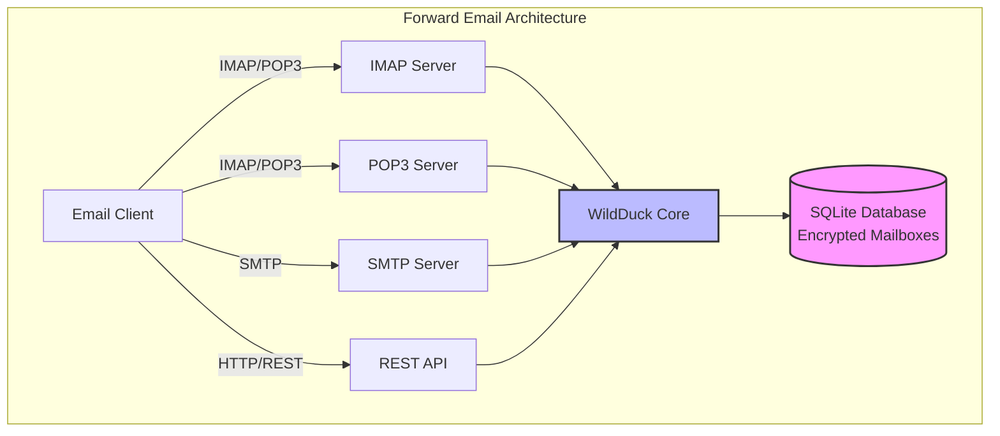

---


## Perbandingan Layanan Email - Dukungan Protokol & Kepatuhan Standar RFC {#email-service-comparison---protocol-support--rfc-standards-compliance}

> \[!IMPORTANT]
> **Enkripsi Terisolasi dan Tahan Kuantum:** Forward Email adalah satu-satunya layanan email yang menyimpan kotak surat SQLite yang dienkripsi secara individual menggunakan kata sandi Anda (yang hanya Anda yang memilikinya). Setiap kotak surat dienkripsi dengan [sqleet](https://github.com/resilar/sqleet) (ChaCha20-Poly1305), mandiri, terisolasi, dan portabel. Jika Anda lupa kata sandi Anda, Anda kehilangan kotak surat Anda - bahkan Forward Email pun tidak dapat memulihkannya. Lihat [Quantum-Safe Encrypted Email](https://forwardemail.net/en/blog/docs/best-quantum-safe-encrypted-email-service) untuk detail.

Bandingkan dukungan protokol email dan implementasi standar RFC di antara penyedia email utama:

| Fitur                        | Forward Email                                                                                  | Postfix/Dovecot                                                                    | Gmail                                                                             | iCloud Mail                                           | Outlook.com                                                                                                                                                          | Fastmail                                                                                 | Yahoo/AOL (Verizon)                                                  | ProtonMail                                                                     | Tutanota                                                          |
| ---------------------------- | ---------------------------------------------------------------------------------------------- | ---------------------------------------------------------------------------------- | --------------------------------------------------------------------------------- | ----------------------------------------------------- | -------------------------------------------------------------------------------------------------------------------------------------------------------------------- | ---------------------------------------------------------------------------------------- | -------------------------------------------------------------------- | ------------------------------------------------------------------------------ | ----------------------------------------------------------------- |
| **Harga Domain Kustom**       | [Gratis](https://forwardemail.net/en/pricing)                                                  | [Gratis](https://www.postfix.org/)                                                 | [$7.20/bln](https://workspace.google.com/pricing)                                | [$0.99/bln](https://support.apple.com/en-us/102622)    | [$7.20/bln](https://www.microsoft.com/en-us/microsoft-365/business/microsoft-365-business-basic)                                                                      | [$5/bln](https://www.fastmail.com/pricing/)                                               | [$3.19/bln](https://www.turbify.com/mail)                             | [$4.99/bln](https://proton.me/mail/pricing)                                     | [$3.27/bln](https://tuta.com/pricing)                              |
| **IMAP4rev1 (RFC 3501)**      | ✅ [Didukung](#imap4-email-protocol-and-extensions)                                            | ✅ [Didukung](https://www.dovecot.org/)                                            | ✅ [Didukung](https://developers.google.com/workspace/gmail/imap/imap-extensions) | ✅ [Didukung](https://support.apple.com/en-us/102431) | ✅ [Didukung](https://support.microsoft.com/en-us/office/pop-imap-and-smtp-settings-for-outlook-com-d088b986-291d-42b8-9564-9c414e2aa040)                            | ✅ [Didukung](https://www.fastmail.help/hc/en-us/articles/1500000278382-Email-standards) | ✅ [Didukung](https://senders.yahooinc.com/developer/documentation/) | ⚠️ [Melalui Bridge](https://proton.me/support/imap-smtp-and-pop3-setup)            | ❌ Tidak Didukung                                                 |
| **IMAP4rev2 (RFC 9051)**      | ⚠️ [Sebagian](https://forwardemail.net/en/blog/docs/best-quantum-safe-encrypted-email-service) | ⚠️ [Sebagian](https://www.dovecot.org/)                                           | ⚠️ [31%](https://developers.google.com/workspace/gmail/imap/imap-extensions)      | ⚠️ [92%](https://support.apple.com/en-us/102431)      | ⚠️ [46%](https://support.microsoft.com/en-us/office/pop-imap-and-smtp-settings-for-outlook-com-d088b986-291d-42b8-9564-9c414e2aa040)                                 | ⚠️ [69%](https://www.fastmail.help/hc/en-us/articles/1500000278382-Email-standards)      | ⚠️ [85%](https://senders.yahooinc.com/developer/documentation/)      | ⚠️ [Melalui Bridge](https://proton.me/support/imap-smtp-and-pop3-setup)            | ❌ Tidak Didukung                                                 |
| **POP3 (RFC 1939)**           | ✅ [Didukung](#pop3-email-protocol-and-extensions)                                             | ✅ [Didukung](https://www.dovecot.org/)                                            | ✅ [Didukung](https://support.google.com/mail/answer/7104828)                     | ❌ Tidak Didukung                                     | ✅ [Didukung](https://support.microsoft.com/en-us/office/pop-imap-and-smtp-settings-for-outlook-com-d088b986-291d-42b8-9564-9c414e2aa040)                            | ✅ [Didukung](https://www.fastmail.help/hc/en-us/articles/1500000278382-Email-standards) | ✅ [Didukung](https://help.yahoo.com/kb/SLN4075.html)                | ⚠️ [Melalui Bridge](https://proton.me/support/imap-smtp-and-pop3-setup)            | ❌ Tidak Didukung                                                 |
| **SMTP (RFC 5321)**           | ✅ [Didukung](#smtp-email-protocol-and-extensions)                                             | ✅ [Didukung](https://www.postfix.org/)                                            | ✅ [Didukung](https://support.google.com/mail/answer/7126229)                     | ✅ [Didukung](https://support.apple.com/en-us/102431) | ✅ [Didukung](https://support.microsoft.com/en-us/office/pop-imap-and-smtp-settings-for-outlook-com-d088b986-291d-42b8-9564-9c414e2aa040)                            | ✅ [Didukung](https://www.fastmail.help/hc/en-us/articles/1500000278382-Email-standards) | ✅ [Didukung](https://help.yahoo.com/kb/SLN4075.html)                | ⚠️ [Melalui Bridge](https://proton.me/support/imap-smtp-and-pop3-setup)            | ❌ Tidak Didukung                                                 |
| **JMAP (RFC 8620)**           | ❌ [Tidak Didukung](#jmap-email-protocol)                                                      | ❌ Tidak Didukung                                                                  | ❌ Tidak Didukung                                                                 | ❌ Tidak Didukung                                     | ❌ Tidak Didukung                                                                                                                                                      | ✅ [Didukung](https://www.fastmail.com/dev/)                                             | ❌ Tidak Didukung                                                    | ❌ Tidak Didukung                                                              | ❌ Tidak Didukung                                                 |
| **DKIM (RFC 6376)**           | ✅ [Didukung](#email-message-authentication-protocols)                                         | ✅ [Didukung](https://github.com/trusteddomainproject/OpenDKIM)                    | ✅ [Didukung](https://support.google.com/a/answer/174124)                         | ✅ [Didukung](https://support.apple.com/en-us/102431) | ✅ [Didukung](https://learn.microsoft.com/en-us/defender-office-365/email-authentication-dkim-configure)                                                             | ✅ [Didukung](https://www.fastmail.help/hc/en-us/articles/360060590573)                  | ✅ [Didukung](https://help.yahoo.com/kb/SLN25426.html)               | ✅ [Didukung](https://proton.me/support)                                       | ✅ [Didukung](https://tuta.com/support#dkim)                      |
| **SPF (RFC 7208)**            | ✅ [Didukung](#email-message-authentication-protocols)                                         | ✅ [Didukung](https://www.postfix.org/)                                            | ✅ [Didukung](https://support.google.com/a/answer/33786)                          | ✅ [Didukung](https://support.apple.com/en-us/102431) | ✅ [Didukung](https://learn.microsoft.com/en-us/microsoft-365/security/office-365-security/how-office-365-uses-spf-to-prevent-spoofing)                              | ✅ [Didukung](https://www.fastmail.help/hc/en-us/articles/360060590573)                  | ✅ [Didukung](https://help.yahoo.com/kb/SLN25426.html)               | ✅ [Didukung](https://proton.me/support)                                       | ✅ [Didukung](https://tuta.com/support#dkim)                      |
| **DMARC (RFC 7489)**          | ✅ [Didukung](#email-message-authentication-protocols)                                         | ✅ [Didukung](https://www.postfix.org/)                                            | ✅ [Didukung](https://support.google.com/a/answer/2466580)                        | ✅ [Didukung](https://support.apple.com/en-us/102431) | ✅ [Didukung](https://learn.microsoft.com/en-us/microsoft-365/security/office-365-security/use-dmarc-to-validate-email)                                              | ✅ [Didukung](https://www.fastmail.help/hc/en-us/articles/360060590573)                  | ✅ [Didukung](https://help.yahoo.com/kb/SLN25426.html)               | ✅ [Didukung](https://proton.me/support)                                       | ✅ [Didukung](https://tuta.com/support#dkim)                      |
| **ARC (RFC 8617)**            | ✅ [Didukung](#email-message-authentication-protocols)                                         | ✅ [Didukung](https://github.com/trusteddomainproject/OpenARC)                     | ✅ [Didukung](https://support.google.com/a/answer/2466580)                        | ❌ Tidak Didukung                                     | ✅ [Didukung](https://learn.microsoft.com/en-us/defender-office-365/email-authentication-arc-configure)                                                              | ✅ [Didukung](https://www.fastmail.help/hc/en-us/articles/360060590573)                  | ✅ [Didukung](https://senders.yahooinc.com/developer/documentation/) | ✅ [Didukung](https://proton.me/blog/what-is-authenticated-received-chain-arc) | ❌ Tidak Didukung                                                 |
| **MTA-STS (RFC 8461)**        | ✅ [Didukung](#email-transport-security-protocols)                                             | ✅ [Didukung](https://www.postfix.org/)                                            | ✅ [Didukung](https://support.google.com/a/answer/9261504)                        | ✅ [Didukung](https://support.apple.com/en-us/102431) | ✅ [Didukung](https://learn.microsoft.com/en-us/defender-office-365/email-authentication-about)                                                                      | ✅ [Didukung](https://www.fastmail.help/hc/en-us/articles/360060590573)                  | ✅ [Didukung](https://senders.yahooinc.com/developer/documentation/) | ✅ [Didukung](https://proton.me/support)                                       | ✅ [Didukung](https://tuta.com/security)                          |
| **DANE (RFC 7671)**           | ✅ [Didukung](#email-transport-security-protocols)                                             | ✅ [Didukung](https://www.postfix.org/)                                            | ❌ Tidak Didukung                                                                 | ❌ Tidak Didukung                                     | ❌ Tidak Didukung                                                                                                                                                      | ❌ Tidak Didukung                                                                        | ❌ Tidak Didukung                                                    | ✅ [Didukung](https://proton.me/support)                                       | ✅ [Didukung](https://tuta.com/support#dane)                      |
| **DSN (RFC 3461)**            | ✅ [Didukung](#smtp-email-protocol-and-extensions)                                             | ✅ [Didukung](https://www.postfix.org/DSN_README.html)                             | ❌ Tidak Didukung                                                                 | ✅ [Didukung](#protocol-capability-tests)             | ✅ [Didukung](#protocol-capability-tests)                                                                                                                            | ⚠️ [Tidak Diketahui](https://www.fastmail.help/hc/en-us/articles/1500000278382-Email-standards)  | ❌ Tidak Didukung                                                    | ⚠️ [Melalui Bridge](https://proton.me/support/imap-smtp-and-pop3-setup)            | ❌ Tidak Didukung                                                 |
| **REQUIRETLS (RFC 8689)**     | ✅ [Didukung](#email-transport-security-protocols)                                             | ✅ [Didukung](https://www.postfix.org/TLS_README.html#server_require_tls)          | ⚠️ Tidak Diketahui                                                                | ⚠️ Tidak Diketahui                                    | ⚠️ Tidak Diketahui                                                                                                                                                   | ⚠️ Tidak Diketahui                                                                     | ⚠️ Tidak Diketahui                                                   | ⚠️ [Melalui Bridge](https://proton.me/support/imap-smtp-and-pop3-setup)            | ❌ Tidak Didukung                                                 |
| **ManageSieve (RFC 5804)**    | ✅ [Didukung](#managesieve-rfc-5804)                                                           | ✅ [Didukung](https://doc.dovecot.org/admin_manual/pigeonhole_managesieve_server/) | ❌ Tidak Didukung                                                                 | ❌ Tidak Didukung                                     | ❌ Tidak Didukung                                                                                                                                                      | ✅ [Didukung](https://www.fastmail.help/hc/en-us/articles/360060590573)                  | ❌ Tidak Didukung                                                    | ❌ Tidak Didukung                                                              | ❌ Tidak Didukung                                                 |
| **OpenPGP (RFC 9580)**        | ✅ [Didukung](#email-message-encryption)                                                       | ⚠️ [Melalui Plugin](https://www.gnupg.org/)                                       | ⚠️ [Pihak Ketiga](https://github.com/google/end-to-end)                          | ⚠️ [Pihak Ketiga](https://gpgtools.org/)               | ⚠️ [Pihak Ketiga](https://gpg4win.org/)                                                                                                                               | ⚠️ [Pihak Ketiga](https://www.fastmail.help/hc/en-us/articles/360060590573)               | ⚠️ [Pihak Ketiga](https://help.yahoo.com/kb/SLN25426.html)            | ✅ [Native](https://proton.me/support/pgp-mime-pgp-inline)                      | ❌ Tidak Didukung                                                 |
| **S/MIME (RFC 8551)**         | ✅ [Didukung](#email-message-encryption)                                                       | ✅ [Didukung](https://www.openssl.org/)                                            | ✅ [Didukung](https://support.google.com/mail/answer/81126)                       | ✅ [Didukung](https://support.apple.com/en-us/102431) | ✅ [Didukung](https://support.microsoft.com/en-us/office/send-view-and-reply-to-encrypted-messages-in-outlook-for-pc-eaa43495-9bbb-4fca-922a-df90dee51980)           | ⚠️ [Sebagian](https://www.fastmail.help/hc/en-us/articles/360060590573)                   | ❌ Tidak Didukung                                                    | ✅ [Didukung](https://proton.me/support/pgp-mime-pgp-inline)                   | ❌ Tidak Didukung                                                 |
| **CalDAV (RFC 4791)**         | ✅ [Didukung](#calendaring-and-contacts-protocols)                                             | ✅ [Didukung](https://www.davical.org/)                                            | ✅ [Didukung](https://developers.google.com/calendar/caldav/v2/guide)             | ✅ [Didukung](https://support.apple.com/en-us/102431) | ❌ Tidak Didukung                                                                                                                                                      | ✅ [Didukung](https://www.fastmail.help/hc/en-us/articles/360060590573)                  | ❌ Tidak Didukung                                                    | ✅ [Melalui Bridge](https://proton.me/support/proton-calendar)                      | ❌ Tidak Didukung                                                 |
| **CardDAV (RFC 6352)**        | ✅ [Didukung](#calendaring-and-contacts-protocols)                                             | ✅ [Didukung](https://www.davical.org/)                                            | ✅ [Didukung](https://developers.google.com/people/carddav)                       | ✅ [Didukung](https://support.apple.com/en-us/102431) | ❌ Tidak Didukung                                                                                                                                                      | ✅ [Didukung](https://www.fastmail.help/hc/en-us/articles/360060590573)                  | ❌ Tidak Didukung                                                    | ✅ [Melalui Bridge](https://proton.me/support/proton-contacts)                      | ❌ Tidak Didukung                                                 |
| **Tugas (VTODO)**             | ✅ [Didukung](#tasks-and-reminders-caldav-vtodo)                                               | ✅ [Didukung](https://www.davical.org/)                                            | ❌ Tidak Didukung                                                                 | ✅ [Didukung](https://support.apple.com/en-us/102431) | ❌ Tidak Didukung                                                                                                                                                      | ✅ [Didukung](https://www.fastmail.help/hc/en-us/articles/360060590573)                  | ❌ Tidak Didukung                                                    | ❌ Tidak Didukung                                                              | ❌ Tidak Didukung                                                 |
| **Sieve (RFC 5228)**          | ✅ [Didukung](#sieve-rfc-5228)                                                                 | ✅ [Didukung](https://www.dovecot.org/)                                            | ❌ Tidak Didukung                                                                 | ❌ Tidak Didukung                                     | ❌ Tidak Didukung                                                                                                                                                      | ✅ [Didukung](https://www.fastmail.help/hc/en-us/articles/360060590573)                  | ❌ Tidak Didukung                                                    | ❌ Tidak Didukung                                                              | ❌ Tidak Didukung                                                 |
| **Catch-All**                 | ✅ [Didukung](https://forwardemail.net/en/faq#can-i-have-multiple-global-catch-all-recipients) | ✅ Didukung                                                                        | ✅ [Didukung](https://support.google.com/a/answer/4524505)                        | ❌ Tidak Didukung                                     | ❌ [Tidak Didukung](https://learn.microsoft.com/en-us/exchange/recipients-in-exchange-online/manage-mail-users)                                                        | ✅ [Didukung](https://www.fastmail.help/hc/en-us/articles/1500000278382-Email-standards) | ❌ Tidak Didukung                                                    | ❌ Tidak Didukung                                                              | ✅ [Didukung](https://tuta.com/support#catch-all-alias)           |
| **Alias Tak Terbatas**        | ✅ [Didukung](https://forwardemail.net/en/faq#advanced-features)                               | ✅ Didukung                                                                        | ✅ [Didukung](https://support.google.com/a/answer/33327)                          | ✅ [Didukung](https://support.apple.com/en-us/102431) | ✅ [Didukung](https://support.microsoft.com/en-us/office/add-or-remove-an-email-alias-in-outlook-com-459b1989-356d-40fa-a689-8f285b13f1f2)                           | ✅ [Didukung](https://www.fastmail.help/hc/en-us/articles/1500000278382-Email-standards) | ❌ Tidak Didukung                                                    | ✅ [Didukung](https://proton.me/support/addresses-and-aliases)                 | ✅ [Didukung](https://tuta.com/support#aliases)                   |
| **Autentikasi Dua Faktor**    | ✅ [Didukung](https://forwardemail.net/en/faq#do-you-support-passkeys-and-webauthn)            | ✅ Didukung                                                                        | ✅ [Didukung](https://support.google.com/accounts/answer/185839)                  | ✅ [Didukung](https://support.apple.com/en-us/102431) | ✅ [Didukung](https://support.microsoft.com/en-us/account-billing/how-to-use-two-step-verification-with-your-microsoft-account-c7910146-672f-01e9-50a0-93b4585e7eb4) | ✅ [Didukung](https://www.fastmail.help/hc/en-us/articles/1500000278382-Email-standards) | ✅ [Didukung](https://help.yahoo.com/kb/SLN5013.html)                | ✅ [Didukung](https://proton.me/support/two-factor-authentication-2fa)         | ✅ [Didukung](https://tuta.com/support#two-factor-authentication) |
| **Notifikasi Push**           | ✅ [Didukung](#ios-push-notifications)                                                         | ⚠️ Melalui Plugin                                                                  | ✅ [Didukung](https://developers.google.com/gmail/api/guides/push)                | ✅ [Didukung](https://support.apple.com/en-us/102431) | ✅ [Didukung](https://learn.microsoft.com/en-us/graph/change-notifications-delivery-webhooks)                                                                        | ✅ [Didukung](https://www.fastmail.help/hc/en-us/articles/1500000278382-Email-standards) | ❌ Tidak Didukung                                                    | ✅ [Didukung](https://proton.me/support/notifications)                         | ✅ [Didukung](https://tuta.com/support#push-notifications)        |
| **Desktop Kalender/Kontak**  | ✅ [Didukung](#calendaring-and-contacts-protocols)                                             | ✅ Didukung                                                                        | ✅ [Didukung](https://support.google.com/calendar)                                | ✅ [Didukung](https://support.apple.com/en-us/102431) | ✅ [Didukung](https://support.microsoft.com/en-us/office/calendar-and-contacts-in-outlook-com-d3e8a6e6-5c1f-4e3e-9f1e-7c0f0e0c0c0c)                                  | ✅ [Didukung](https://www.fastmail.help/hc/en-us/articles/1500000278382-Email-standards) | ❌ Tidak Didukung                                                    | ✅ [Didukung](https://proton.me/support/proton-calendar)                       | ❌ Tidak Didukung                                                 |
| **Pencarian Lanjutan**       | ✅ [Didukung](https://forwardemail.net/en/email-api)                                           | ✅ Didukung                                                                        | ✅ [Didukung](https://support.google.com/mail/answer/7190)                        | ✅ [Didukung](https://support.apple.com/en-us/102431) | ✅ [Didukung](https://support.microsoft.com/en-us/office/search-for-email-messages-in-outlook-com-6f5f2e92-9d5e-4c4e-9b0e-0c0c0c0c0c0c)                              | ✅ [Didukung](https://www.fastmail.help/hc/en-us/articles/1500000278382-Email-standards) | ✅ [Didukung](https://help.yahoo.com/kb/SLN3561.html)                | ✅ [Didukung](https://proton.me/support/search-and-filters)                    | ✅ [Didukung](https://tuta.com/support)                           |
| **API/Integrasi**            | ✅ [39 Endpoint](https://forwardemail.net/en/email-api)                                        | ✅ Didukung                                                                        | ✅ [Didukung](https://developers.google.com/gmail/api)                            | ❌ Tidak Didukung                                     | ✅ [Didukung](https://learn.microsoft.com/en-us/graph/api/resources/mail-api-overview)                                                                               | ✅ [Didukung](https://www.fastmail.help/hc/en-us/articles/1500000278382-Email-standards) | ❌ Tidak Didukung                                                    | ✅ [Didukung](https://proton.me/support/proton-mail-api)                       | ❌ Tidak Didukung                                                 |
### Visualisasi Dukungan Protokol {#protocol-support-visualization}

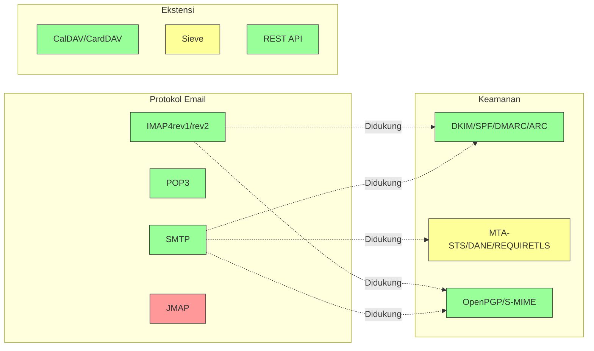

---


## Protokol Email Inti {#core-email-protocols}

### Alur Protokol Email {#email-protocol-flow}

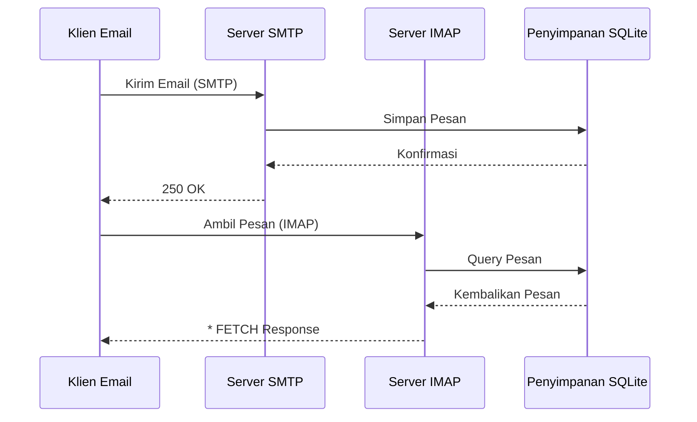


## Protokol Email IMAP4 dan Ekstensinya {#imap4-email-protocol-and-extensions}

> \[!NOTE]
> Forward Email mendukung IMAP4rev1 (RFC 3501) dengan dukungan parsial untuk fitur IMAP4rev2 (RFC 9051).

Forward Email menyediakan dukungan IMAP4 yang kuat melalui implementasi server mail WildDuck. Server ini mengimplementasikan IMAP4rev1 (RFC 3501) dengan dukungan parsial untuk ekstensi IMAP4rev2 (RFC 9051).

Fungsi IMAP Forward Email disediakan oleh dependensi [WildDuck](https://github.com/nodemailer/wildduck). RFC email berikut didukung:

| RFC                                                       | Judul                                                             | Catatan Implementasi                                  |
| --------------------------------------------------------- | ----------------------------------------------------------------- | ----------------------------------------------------- |
| [RFC 3501](https://datatracker.ietf.org/doc/html/rfc3501) | Internet Message Access Protocol (IMAP) - Versi 4rev1             | Dukungan penuh dengan perbedaan yang disengaja (lihat di bawah) |
| [RFC 2177](https://datatracker.ietf.org/doc/html/rfc2177) | Perintah IMAP4 IDLE                                              | Notifikasi gaya push                                  |
| [RFC 2342](https://datatracker.ietf.org/doc/html/rfc2342) | Namespace IMAP4                                                  | Dukungan namespace kotak surat                        |
| [RFC 2087](https://datatracker.ietf.org/doc/html/rfc2087) | Ekstensi KUOTA IMAP4                                            | Manajemen kuota penyimpanan                           |
| [RFC 2971](https://datatracker.ietf.org/doc/html/rfc2971) | Ekstensi ID IMAP4                                              | Identifikasi klien/server                             |
| [RFC 5161](https://datatracker.ietf.org/doc/html/rfc5161) | Ekstensi ENABLE IMAP4                                          | Mengaktifkan ekstensi IMAP                            |
| [RFC 4959](https://datatracker.ietf.org/doc/html/rfc4959) | Ekstensi IMAP untuk Respons Klien Awal SASL (SASL-IR)           | Respons awal klien                                    |
| [RFC 3691](https://datatracker.ietf.org/doc/html/rfc3691) | Perintah IMAP4 UNSELECT                                        | Tutup kotak surat tanpa EXPUNGE                       |
| [RFC 4315](https://datatracker.ietf.org/doc/html/rfc4315) | Ekstensi IMAP UIDPLUS                                          | Perintah UID yang ditingkatkan                        |
| [RFC 7162](https://datatracker.ietf.org/doc/html/rfc7162) | Ekstensi IMAP: Resinkronisasi Perubahan Cepat Flag (CONDSTORE) | STORE Kondisional                                    |
| [RFC 6154](https://datatracker.ietf.org/doc/html/rfc6154) | Ekstensi IMAP LIST untuk Kotak Surat Khusus                    | Atribut kotak surat khusus                            |
| [RFC 6851](https://datatracker.ietf.org/doc/html/rfc6851) | Ekstensi IMAP MOVE                                            | Perintah MOVE atomik                                  |
| [RFC 6855](https://datatracker.ietf.org/doc/html/rfc6855) | Dukungan IMAP untuk UTF-8                                      | Dukungan UTF-8                                       |
| [RFC 3348](https://datatracker.ietf.org/doc/html/rfc3348) | Ekstensi IMAP4 Child Mailbox                                  | Informasi kotak surat anak                            |
| [RFC 7889](https://datatracker.ietf.org/doc/html/rfc7889) | Ekstensi IMAP4 untuk Mengiklankan Ukuran Upload Maksimum (APPENDLIMIT) | Ukuran upload maksimum                               |
**Ekstensi IMAP yang Didukung:**

| Ekstensi          | RFC          | Status      | Deskripsi                      |
| ----------------- | ------------ | ----------- | ------------------------------ |
| IDLE              | RFC 2177     | ✅ Didukung | Notifikasi gaya push           |
| NAMESPACE         | RFC 2342     | ✅ Didukung | Dukungan namespace kotak surat |
| QUOTA             | RFC 2087     | ✅ Didukung | Manajemen kuota penyimpanan    |
| ID                | RFC 2971     | ✅ Didukung | Identifikasi klien/server      |
| ENABLE            | RFC 5161     | ✅ Didukung | Mengaktifkan ekstensi IMAP     |
| SASL-IR           | RFC 4959     | ✅ Didukung | Respons awal klien             |
| UNSELECT          | RFC 3691     | ✅ Didukung | Menutup kotak surat tanpa EXPUNGE |
| UIDPLUS           | RFC 4315     | ✅ Didukung | Perintah UID yang ditingkatkan |
| CONDSTORE         | RFC 7162     | ✅ Didukung | STORE kondisional              |
| SPECIAL-USE       | RFC 6154     | ✅ Didukung | Atribut khusus kotak surat     |
| MOVE              | RFC 6851     | ✅ Didukung | Perintah MOVE atomik           |
| UTF8=ACCEPT       | RFC 6855     | ✅ Didukung | Dukungan UTF-8                 |
| CHILDREN          | RFC 3348     | ✅ Didukung | Informasi kotak surat anak     |
| APPENDLIMIT       | RFC 7889     | ✅ Didukung | Ukuran unggah maksimum         |
| XLIST             | Non-standar | ✅ Didukung | Daftar folder kompatibel Gmail |
| XAPPLEPUSHSERVICE | Non-standar | ✅ Didukung | Layanan Notifikasi Push Apple  |

### Perbedaan Protokol IMAP dari Spesifikasi RFC {#imap-protocol-differences-from-rfc-specifications}

> \[!WARNING]
> Perbedaan berikut dari spesifikasi RFC dapat memengaruhi kompatibilitas klien.

Forward Email sengaja menyimpang dari beberapa spesifikasi RFC IMAP. Perbedaan ini diwarisi dari WildDuck dan didokumentasikan di bawah ini:

* **Tidak ada flag \Recent:** Flag `\Recent` tidak diimplementasikan. Semua pesan dikembalikan tanpa flag ini.
* **RENAME tidak memengaruhi subfolder:** Saat mengganti nama folder, subfolder tidak otomatis diganti namanya. Hierarki folder datar di database.
* **INBOX tidak dapat diganti nama:** [RFC 3501](https://datatracker.ietf.org/doc/html/rfc3501) mengizinkan penggantian nama INBOX, tetapi Forward Email secara eksplisit melarangnya. Lihat [kode sumber WildDuck](https://github.com/nodemailer/wildduck/blob/master/imap-core/lib/commands/rename.js#L27).
* **Tidak ada respons FLAGS tanpa diminta:** Saat flag diubah, tidak ada respons FLAGS tanpa diminta yang dikirim ke klien.
* **STORE mengembalikan NO untuk pesan yang dihapus:** Upaya mengubah flag pada pesan yang dihapus mengembalikan NO, bukan mengabaikan secara diam-diam.
* **CHARSET diabaikan dalam SEARCH:** Argumen `CHARSET` dalam perintah SEARCH diabaikan. Semua pencarian menggunakan UTF-8.
* **Metadata MODSEQ diabaikan:** Metadata `MODSEQ` dalam perintah STORE diabaikan.
* **SEARCH TEXT dan SEARCH BODY:** Forward Email menggunakan [SQLite FTS5](https://www.sqlite.org/fts5.html) (Pencarian Teks Lengkap) menggantikan pencarian `$text` MongoDB. Ini menyediakan:
  * Dukungan untuk operator `NOT` (MongoDB tidak mendukung ini)
  * Hasil pencarian berperingkat
  * Performa pencarian di bawah 100ms pada kotak surat besar
* **Perilaku autoexpunge:** Pesan yang ditandai dengan `\Deleted` secara otomatis dihapus saat kotak surat ditutup.
* **Fidelitas pesan:** Beberapa modifikasi pesan mungkin tidak mempertahankan struktur pesan asli secara tepat.

**Dukungan Parsial IMAP4rev2:**

Forward Email mengimplementasikan IMAP4rev1 (RFC 3501) dengan dukungan parsial IMAP4rev2 (RFC 9051). Fitur IMAP4rev2 berikut **belum didukung**:

* **LIST-STATUS** - Perintah gabungan LIST dan STATUS
* **LITERAL-** - Literal non-sinkronisasi (varian minus)
* **OBJECTID** - Pengidentifikasi objek unik
* **SAVEDATE** - Atribut tanggal simpan
* **REPLACE** - Penggantian pesan atomik
* **UNAUTHENTICATE** - Menutup autentikasi tanpa menutup koneksi

**Penanganan Struktur Body yang Longgar:**

Forward Email menggunakan penanganan "body longgar" untuk struktur MIME yang rusak, yang mungkin berbeda dari interpretasi RFC yang ketat. Ini meningkatkan kompatibilitas dengan email dunia nyata yang tidak sepenuhnya sesuai standar.
**Ekstensi METADATA (RFC 5464):**

Ekstensi IMAP METADATA **tidak didukung**. Untuk informasi lebih lanjut tentang ekstensi ini, lihat [RFC 5464](https://datatracker.ietf.org/doc/html/rfc5464). Diskusi tentang penambahan fitur ini dapat ditemukan di [WildDuck Issue #937](https://github.com/zone-eu/wildduck/issues/937).

### Ekstensi IMAP yang TIDAK Didukung {#imap-extensions-not-supported}

Ekstensi IMAP berikut dari [IANA IMAP Capabilities Registry](https://www.iana.org/assignments/imap-capabilities/imap-capabilities.xhtml) TIDAK didukung:

| RFC                                                       | Judul                                                                                                           | Alasan                                                                                                                                  |
| --------------------------------------------------------- | --------------------------------------------------------------------------------------------------------------- | --------------------------------------------------------------------------------------------------------------------------------------- |
| [RFC 2086](https://datatracker.ietf.org/doc/html/rfc2086) | Ekstensi IMAP4 ACL                                                                                              | Folder bersama tidak diimplementasikan. Lihat [WildDuck Issue #427](https://github.com/zone-eu/wildduck/issues/427)                      |
| [RFC 5256](https://datatracker.ietf.org/doc/html/rfc5256) | Ekstensi IMAP SORT dan THREAD                                                                                   | Threading diimplementasikan secara internal tetapi tidak melalui protokol RFC 5256. Lihat [WildDuck Issue #12](https://github.com/zone-eu/wildduck/issues/12) |
| [RFC 5162](https://datatracker.ietf.org/doc/html/rfc5162) | Ekstensi IMAP4 untuk Resinkronisasi Kotak Surat Cepat (QRESYNC)                                                 | Tidak diimplementasikan                                                                                                                  |
| [RFC 5464](https://datatracker.ietf.org/doc/html/rfc5464) | Ekstensi IMAP METADATA                                                                                           | Operasi metadata diabaikan. Lihat [dokumentasi WildDuck](https://datatracker.ietf.org/doc/html/rfc5464)                                  |
| [RFC 5258](https://datatracker.ietf.org/doc/html/rfc5258) | Ekstensi Perintah IMAP4 LIST                                                                                     | Tidak diimplementasikan                                                                                                                  |
| [RFC 5267](https://datatracker.ietf.org/doc/html/rfc5267) | Konteks untuk IMAP4                                                                                              | Tidak diimplementasikan                                                                                                                  |
| [RFC 5465](https://datatracker.ietf.org/doc/html/rfc5465) | Ekstensi IMAP NOTIFY                                                                                            | Tidak diimplementasikan                                                                                                                  |
| [RFC 5466](https://datatracker.ietf.org/doc/html/rfc5466) | Ekstensi IMAP4 FILTERS                                                                                           | Tidak diimplementasikan                                                                                                                  |
| [RFC 6203](https://datatracker.ietf.org/doc/html/rfc6203) | Ekstensi IMAP4 untuk Pencarian Fuzzy                                                                             | Tidak diimplementasikan                                                                                                                  |
| [RFC 6785](https://datatracker.ietf.org/doc/html/rfc6785) | Rekomendasi Implementasi IMAP4                                                                                   | Rekomendasi tidak sepenuhnya diikuti                                                                                                    |
| [RFC 7162](https://datatracker.ietf.org/doc/html/rfc7162) | Ekstensi IMAP: Resinkronisasi Cepat Perubahan Flag (CONDSTORE) dan Resinkronisasi Kotak Surat Cepat (QRESYNC)    | Tidak diimplementasikan                                                                                                                  |
| [RFC 8437](https://datatracker.ietf.org/doc/html/rfc8437) | Ekstensi IMAP UNAUTHENTICATE untuk Penggunaan Kembali Koneksi                                                    | Tidak diimplementasikan                                                                                                                  |
| [RFC 8438](https://datatracker.ietf.org/doc/html/rfc8438) | Ekstensi IMAP untuk STATUS=SIZE                                                                                  | Tidak diimplementasikan                                                                                                                  |
| [RFC 8457](https://datatracker.ietf.org/doc/html/rfc8457) | Kata Kunci IMAP "$Important" dan Atribut Penggunaan Khusus "\Important"                                          | Tidak diimplementasikan                                                                                                                  |
| [RFC 8474](https://datatracker.ietf.org/doc/html/rfc8474) | Ekstensi IMAP untuk Pengidentifikasi Objek                                                                       | Tidak diimplementasikan                                                                                                                  |
| [RFC 9051](https://datatracker.ietf.org/doc/html/rfc9051) | Protokol Akses Pesan Internet (IMAP) - Versi 4rev2                                                               | Forward Email mengimplementasikan IMAP4rev1 ([RFC 3501](https://datatracker.ietf.org/doc/html/rfc3501))                                  |
## Protokol Email POP3 dan Ekstensi {#pop3-email-protocol-and-extensions}

> \[!NOTE]
> Forward Email mendukung POP3 (RFC 1939) dengan ekstensi standar untuk pengambilan email.

Fungsionalitas POP3 Forward Email disediakan oleh dependensi [WildDuck](https://github.com/nodemailer/wildduck). RFC email berikut didukung:

| RFC                                                       | Judul                                   | Catatan Implementasi                                  |
| --------------------------------------------------------- | --------------------------------------- | ----------------------------------------------------- |
| [RFC 1939](https://datatracker.ietf.org/doc/html/rfc1939) | Post Office Protocol - Versi 3 (POP3)  | Dukungan penuh dengan perbedaan yang disengaja (lihat di bawah) |
| [RFC 2595](https://datatracker.ietf.org/doc/html/rfc2595) | Menggunakan TLS dengan IMAP, POP3 dan ACAP | Dukungan STARTTLS                                      |
| [RFC 2449](https://datatracker.ietf.org/doc/html/rfc2449) | Mekanisme Ekstensi POP3                 | Dukungan perintah CAPA                                 |

Forward Email menyediakan dukungan POP3 untuk klien yang lebih memilih protokol yang lebih sederhana ini dibandingkan IMAP. POP3 ideal untuk pengguna yang ingin mengunduh email ke satu perangkat dan menghapusnya dari server.

**Ekstensi POP3 yang Didukung:**

| Ekstensi  | RFC      | Status      | Deskripsi                  |
| --------- | -------- | ----------- | -------------------------- |
| TOP       | RFC 1939 | ✅ Didukung | Mengambil header pesan     |
| USER      | RFC 1939 | ✅ Didukung | Otentikasi nama pengguna   |
| UIDL      | RFC 1939 | ✅ Didukung | Identifier pesan unik      |
| EXPIRE    | RFC 2449 | ✅ Didukung | Kebijakan kadaluarsa pesan |

### Perbedaan Protokol POP3 dari Spesifikasi RFC {#pop3-protocol-differences-from-rfc-specifications}

> \[!WARNING]
> POP3 memiliki keterbatasan bawaan dibandingkan IMAP.

> \[!IMPORTANT]
> **Perbedaan Kritis: Perilaku DELE POP3 Forward Email vs WildDuck**
>
> Forward Email menerapkan penghapusan permanen sesuai RFC untuk perintah POP3 `DELE`, berbeda dengan WildDuck yang memindahkan pesan ke Trash.

**Perilaku Forward Email** ([kode sumber](https://github.com/forwardemail/forwardemail.net/blob/master/pop3-server.js)):

* `DELE` → `QUIT` menghapus pesan secara permanen
* Mengikuti spesifikasi [RFC 1939](https://datatracker.ietf.org/doc/html/rfc1939) secara tepat
* Sesuai dengan perilaku Dovecot (default), Postfix, dan server lain yang sesuai standar

**Perilaku WildDuck** ([diskusi](https://github.com/zone-eu/wildduck/issues/937)):

* `DELE` → `QUIT` memindahkan pesan ke Trash (mirip Gmail)
* Keputusan desain yang disengaja demi keamanan pengguna
* Tidak sesuai RFC tapi mencegah kehilangan data tidak sengaja

**Mengapa Forward Email Berbeda:**

* **Kepatuhan RFC:** Mematuhi spesifikasi [RFC 1939](https://datatracker.ietf.org/doc/html/rfc1939)
* **Ekspektasi Pengguna:** Alur kerja unduh-dan-hapus mengharapkan penghapusan permanen
* **Manajemen Penyimpanan:** Pengelolaan ruang disk yang tepat
* **Interoperabilitas:** Konsisten dengan server lain yang sesuai RFC

> \[!NOTE]
> **Daftar Pesan POP3:** Forward Email menampilkan SEMUA pesan dari INBOX tanpa batas. Ini berbeda dengan WildDuck yang membatasi hingga 250 pesan secara default. Lihat [kode sumber](https://github.com/forwardemail/forwardemail.net/blob/master/pop3-server.js).

**Akses Perangkat Tunggal:**

POP3 dirancang untuk akses perangkat tunggal. Pesan biasanya diunduh dan dihapus dari server, sehingga tidak cocok untuk sinkronisasi multi-perangkat.

**Tidak Ada Dukungan Folder:**

POP3 hanya mengakses folder INBOX. Folder lain (Terkirim, Draft, Sampah, dll.) tidak dapat diakses melalui POP3.

**Manajemen Pesan Terbatas:**

POP3 menyediakan pengambilan dan penghapusan pesan dasar. Fitur lanjutan seperti penandaan, pemindahan, atau pencarian pesan tidak tersedia.

### Ekstensi POP3 yang TIDAK Didukung {#pop3-extensions-not-supported}

Ekstensi POP3 berikut dari [IANA POP3 Extension Mechanism Registry](https://www.iana.org/assignments/pop3-extension-mechanism/pop3-extension-mechanism.xhtml) TIDAK didukung:
| RFC                                                       | Judul                                                   | Alasan                                  |
| --------------------------------------------------------- | ------------------------------------------------------- | --------------------------------------- |
| [RFC 6856](https://datatracker.ietf.org/doc/html/rfc6856) | Dukungan Protokol Kantor Pos Versi 3 (POP3) untuk UTF-8 | Tidak diimplementasikan di server POP3 WildDuck |
| [RFC 2595](https://datatracker.ietf.org/doc/html/rfc2595) | Perintah STLS                                           | Hanya STARTTLS yang didukung, bukan STLS |
| [RFC 3206](https://datatracker.ietf.org/doc/html/rfc3206) | Kode Respons SYS dan AUTH POP                           | Tidak diimplementasikan                 |

---


## Protokol Email SMTP dan Ekstensi {#smtp-email-protocol-and-extensions}

> \[!NOTE]
> Forward Email mendukung SMTP (RFC 5321) dengan ekstensi modern untuk pengiriman email yang aman dan andal.

Fungsionalitas SMTP Forward Email disediakan oleh beberapa komponen: [smtp-server](https://github.com/nodemailer/smtp-server) (nodemailer), [zone-mta](https://github.com/zone-eu/zone-mta), dan implementasi khusus. RFC email berikut didukung:

| RFC                                                       | Judul                                                                            | Catatan Implementasi               |
| --------------------------------------------------------- | -------------------------------------------------------------------------------- | ---------------------------------- |
| [RFC 5321](https://datatracker.ietf.org/doc/html/rfc5321) | Protokol Transfer Surat Sederhana (SMTP)                                        | Dukungan penuh                    |
| [RFC 3207](https://datatracker.ietf.org/doc/html/rfc3207) | Ekstensi Layanan SMTP untuk SMTP Aman melalui Transport Layer Security (STARTTLS) | Dukungan TLS/SSL                  |
| [RFC 4954](https://datatracker.ietf.org/doc/html/rfc4954) | Ekstensi Layanan SMTP untuk Otentikasi (AUTH)                                   | PLAIN, LOGIN, CRAM-MD5, XOAUTH2   |
| [RFC 6531](https://datatracker.ietf.org/doc/html/rfc6531) | Ekstensi SMTP untuk Email Internasional (SMTPUTF8)                              | Dukungan alamat email unicode asli |
| [RFC 3461](https://datatracker.ietf.org/doc/html/rfc3461) | Ekstensi Layanan SMTP untuk Notifikasi Status Pengiriman (DSN)                  | Dukungan DSN penuh                |
| [RFC 3463](https://datatracker.ietf.org/doc/html/rfc3463) | Kode Status Sistem Surat yang Ditingkatkan                                      | Kode status yang ditingkatkan dalam respons |
| [RFC 1870](https://datatracker.ietf.org/doc/html/rfc1870) | Ekstensi Layanan SMTP untuk Deklarasi Ukuran Pesan (SIZE)                       | Iklan ukuran pesan maksimum       |
| [RFC 2920](https://datatracker.ietf.org/doc/html/rfc2920) | Ekstensi Layanan SMTP untuk Pipelining Perintah (PIPELINING)                    | Dukungan pipelining perintah      |
| [RFC 1652](https://datatracker.ietf.org/doc/html/rfc1652) | Ekstensi Layanan SMTP untuk Transport 8bit-MIME (8BITMIME)                      | Dukungan MIME 8-bit               |
| [RFC 6152](https://datatracker.ietf.org/doc/html/rfc6152) | Ekstensi Layanan SMTP untuk Transport MIME 8-bit                               | Dukungan MIME 8-bit               |
| [RFC 2034](https://datatracker.ietf.org/doc/html/rfc2034) | Ekstensi Layanan SMTP untuk Pengembalian Kode Kesalahan yang Ditingkatkan (ENHANCEDSTATUSCODES) | Kode status yang ditingkatkan    |

Forward Email mengimplementasikan server SMTP dengan fitur lengkap yang mendukung ekstensi modern yang meningkatkan keamanan, keandalan, dan fungsionalitas.

**Ekstensi SMTP yang Didukung:**

| Ekstensi            | RFC      | Status      | Deskripsi                           |
| ------------------- | -------- | ----------- | ---------------------------------- |
| PIPELINING          | RFC 2920 | ✅ Didukung | Pipelining perintah                 |
| SIZE                | RFC 1870 | ✅ Didukung | Deklarasi ukuran pesan (batas 52MB) |
| ETRN                | RFC 1985 | ✅ Didukung | Pemrosesan antrean jarak jauh      |
| STARTTLS            | RFC 3207 | ✅ Didukung | Upgrade ke TLS                     |
| ENHANCEDSTATUSCODES | RFC 2034 | ✅ Didukung | Kode status yang ditingkatkan      |
| 8BITMIME            | RFC 6152 | ✅ Didukung | Transport MIME 8-bit               |
| DSN                 | RFC 3461 | ✅ Didukung | Notifikasi Status Pengiriman       |
| CHUNKING            | RFC 3030 | ✅ Didukung | Transfer pesan secara bertahap     |
| SMTPUTF8            | RFC 6531 | ⚠️ Sebagian | Alamat email UTF-8 (sebagian)      |
| REQUIRETLS          | RFC 8689 | ✅ Didukung | Memerlukan TLS untuk pengiriman    |
### Notifikasi Status Pengiriman (DSN) {#delivery-status-notifications-dsn}

> \[!TIP]
> DSN menyediakan informasi status pengiriman yang rinci untuk email yang dikirim.

Forward Email sepenuhnya mendukung **DSN (RFC 3461)**, yang memungkinkan pengirim untuk meminta notifikasi status pengiriman. Fitur ini menyediakan:

* **Notifikasi keberhasilan** saat pesan berhasil dikirim
* **Notifikasi kegagalan** dengan informasi kesalahan yang rinci
* **Notifikasi penundaan** saat pengiriman tertunda sementara

DSN sangat berguna untuk:

* Mengonfirmasi pengiriman pesan penting
* Memecahkan masalah pengiriman
* Sistem pemrosesan email otomatis
* Kepatuhan dan persyaratan audit

### Dukungan REQUIRETLS {#requiretls-support}

> \[!IMPORTANT]
> Forward Email adalah salah satu dari sedikit penyedia yang secara eksplisit mengiklankan dan menegakkan REQUIRETLS.

Forward Email mendukung **REQUIRETLS (RFC 8689)**, yang memastikan bahwa pesan email hanya dikirim melalui koneksi yang dienkripsi TLS. Ini menyediakan:

* **Enkripsi ujung-ke-ujung** untuk seluruh jalur pengiriman
* **Penegakan yang terlihat pengguna** melalui kotak centang di pembuat email
* **Penolakan upaya pengiriman tanpa enkripsi**
* **Keamanan yang ditingkatkan** untuk komunikasi sensitif

### Ekstensi SMTP yang TIDAK Didukung {#smtp-extensions-not-supported}

Ekstensi SMTP berikut dari [IANA SMTP Service Extensions Registry](https://www.iana.org/assignments/smtp) TIDAK didukung:

| RFC                                                       | Judul                                                                                             | Alasan                |
| --------------------------------------------------------- | ------------------------------------------------------------------------------------------------- | --------------------- |
| [RFC 4865](https://datatracker.ietf.org/doc/html/rfc4865) | Ekstensi Layanan Pengiriman SMTP untuk Rilis Pesan Masa Depan (FUTURERELEASE)                      | Tidak diimplementasikan |
| [RFC 6710](https://datatracker.ietf.org/doc/html/rfc6710) | Ekstensi SMTP untuk Prioritas Transfer Pesan (MT-PRIORITY)                                        | Tidak diimplementasikan |
| [RFC 7293](https://datatracker.ietf.org/doc/html/rfc7293) | Header Require-Recipient-Valid-Since dan Ekstensi Layanan SMTP                                   | Tidak diimplementasikan |
| [RFC 7372](https://datatracker.ietf.org/doc/html/rfc7372) | Kode Status Otentikasi Email                                                                     | Tidak sepenuhnya diimplementasikan |
| [RFC 4468](https://datatracker.ietf.org/doc/html/rfc4468) | Ekstensi BURL Pengiriman Pesan                                                                   | Tidak diimplementasikan |
| [RFC 3030](https://datatracker.ietf.org/doc/html/rfc3030) | Ekstensi Layanan SMTP untuk Pengiriman Pesan MIME Besar dan Biner (CHUNKING, BINARYMIME)          | Tidak diimplementasikan |
| [RFC 2852](https://datatracker.ietf.org/doc/html/rfc2852) | Ekstensi Layanan SMTP Deliver By                                                                 | Tidak diimplementasikan |

---


## Protokol Email JMAP {#jmap-email-protocol}

> \[!CAUTION]
> JMAP **saat ini TIDAK didukung** oleh Forward Email.

| RFC                                                       | Judul                                     | Status          | Alasan                                                                 |
| --------------------------------------------------------- | ----------------------------------------- | --------------- | ---------------------------------------------------------------------- |
| [RFC 8620](https://datatracker.ietf.org/doc/html/rfc8620) | Protokol Aplikasi Meta JSON (JMAP)        | ❌ Tidak Didukung | Forward Email menggunakan IMAP/POP3/SMTP dan API REST yang komprehensif sebagai gantinya |

**JMAP (JSON Meta Application Protocol)** adalah protokol email modern yang dirancang untuk menggantikan IMAP.

**Mengapa JMAP Tidak Didukung:**

> "JMAP adalah sesuatu yang seharusnya tidak pernah ditemukan. Ia mencoba mengubah TCP/IMAP (yang sudah merupakan protokol buruk menurut standar saat ini) menjadi HTTP/JSON, hanya menggunakan transportasi yang berbeda sambil mempertahankan esensinya." — Andris Reinman, [Diskusi HN](https://news.ycombinator.com/item?id=18890011)
> "JMAP sudah berusia lebih dari 10 tahun, dan hampir tidak ada adopsi sama sekali" – Andris Reinman, [Diskusi GitHub](https://github.com/zone-eu/wildduck/issues/2#issuecomment-1765190790)

Lihat juga komentar tambahan di <https://hn.algolia.com/?dateRange=all&page=0&prefix=true&query=jmap%20andris&sort=byDate&type=comment>.

Forward Email saat ini fokus menyediakan dukungan IMAP, POP3, dan SMTP yang sangat baik, bersama dengan REST API yang komprehensif untuk manajemen email. Dukungan JMAP mungkin akan dipertimbangkan di masa depan berdasarkan permintaan pengguna dan adopsi ekosistem.

**Alternatif:** Forward Email menawarkan [REST API Lengkap](#complete-rest-api-for-email-management) dengan 39 endpoint yang menyediakan fungsi serupa dengan JMAP untuk akses email secara programatik.

---


## Keamanan Email {#email-security}

### Arsitektur Keamanan Email {#email-security-architecture}

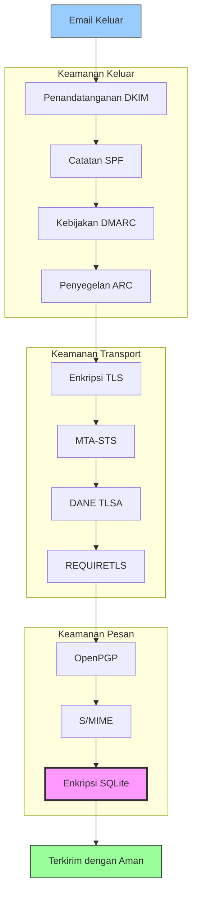


## Protokol Otentikasi Pesan Email {#email-message-authentication-protocols}

> \[!NOTE]
> Forward Email mengimplementasikan semua protokol otentikasi email utama untuk mencegah pemalsuan dan memastikan integritas pesan.

Forward Email menggunakan pustaka [mailauth](https://github.com/postalsys/mailauth) untuk otentikasi email. RFC berikut didukung:

| RFC                                                       | Judul                                                                  | Catatan Implementasi                                         |
| --------------------------------------------------------- | --------------------------------------------------------------------- | ------------------------------------------------------------ |
| [RFC 6376](https://datatracker.ietf.org/doc/html/rfc6376) | DomainKeys Identified Mail (DKIM) Signatures                          | Penandatanganan dan verifikasi DKIM penuh                    |
| [RFC 8463](https://datatracker.ietf.org/doc/html/rfc8463) | Metode Tanda Tangan Kriptografi Baru untuk DKIM (Ed25519-SHA256)      | Mendukung algoritma penandatanganan RSA-SHA256 dan Ed25519-SHA256 |
| [RFC 7208](https://datatracker.ietf.org/doc/html/rfc7208) | Sender Policy Framework (SPF)                                         | Validasi catatan SPF                                         |
| [RFC 7489](https://datatracker.ietf.org/doc/html/rfc7489) | Domain-based Message Authentication, Reporting, and Conformance (DMARC) | Penegakan kebijakan DMARC                                    |
| [RFC 8617](https://datatracker.ietf.org/doc/html/rfc8617) | Authenticated Received Chain (ARC)                                   | Penyegelan dan validasi ARC                                  |

Protokol otentikasi email memverifikasi bahwa pesan benar-benar berasal dari pengirim yang diklaim dan tidak diubah selama pengiriman.

### Dukungan Protokol Otentikasi {#authentication-protocol-support}

| Protokol  | RFC      | Status      | Deskripsi                                                            |
| --------- | -------- | ----------- | -------------------------------------------------------------------- |
| **DKIM**  | RFC 6376 | ✅ Didukung | DomainKeys Identified Mail - Tanda tangan kriptografi               |
| **SPF**   | RFC 7208 | ✅ Didukung | Sender Policy Framework - Otorisasi alamat IP                       |
| **DMARC** | RFC 7489 | ✅ Didukung | Domain-based Message Authentication - Penegakan kebijakan          |
| **ARC**   | RFC 8617 | ✅ Didukung | Authenticated Received Chain - Mempertahankan otentikasi antar penerusan |
### DKIM (DomainKeys Identified Mail) {#dkim-domainkeys-identified-mail}

**DKIM** menambahkan tanda tangan kriptografi ke header email, memungkinkan penerima untuk memverifikasi bahwa pesan tersebut diotorisasi oleh pemilik domain dan tidak diubah selama pengiriman.

Forward Email menggunakan [mailauth](https://github.com/postalsys/mailauth) untuk penandatanganan dan verifikasi DKIM.

**Fitur Utama:**

* Penandatanganan DKIM otomatis untuk semua pesan keluar
* Dukungan untuk kunci RSA dan Ed25519
* Dukungan beberapa selector
* Verifikasi DKIM untuk pesan masuk

### SPF (Sender Policy Framework) {#spf-sender-policy-framework}

**SPF** memungkinkan pemilik domain untuk menentukan alamat IP mana yang diizinkan mengirim email atas nama domain mereka.

**Fitur Utama:**

* Validasi catatan SPF untuk pesan masuk
* Pemeriksaan SPF otomatis dengan hasil rinci
* Dukungan untuk mekanisme include, redirect, dan all
* Kebijakan SPF yang dapat dikonfigurasi per domain

### DMARC (Domain-based Message Authentication, Reporting & Conformance) {#dmarc-domain-based-message-authentication-reporting--conformance}

**DMARC** membangun di atas SPF dan DKIM untuk menyediakan penegakan kebijakan dan pelaporan.

**Fitur Utama:**

* Penegakan kebijakan DMARC (none, quarantine, reject)
* Pemeriksaan alignment untuk SPF dan DKIM
* Pelaporan agregat DMARC
* Kebijakan DMARC per domain

### ARC (Authenticated Received Chain) {#arc-authenticated-received-chain}

**ARC** mempertahankan hasil autentikasi email selama penerusan dan modifikasi daftar surat.

Forward Email menggunakan pustaka [mailauth](https://github.com/postalsys/mailauth) untuk verifikasi dan penyegelan ARC.

**Fitur Utama:**

* Penyegelan ARC untuk pesan yang diteruskan
* Validasi ARC untuk pesan masuk
* Verifikasi rantai di beberapa hop
* Mempertahankan hasil autentikasi asli

### Authentication Flow {#authentication-flow}

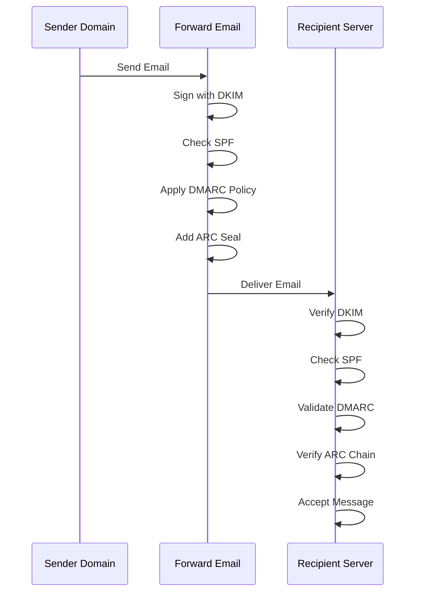

---


## Email Transport Security Protocols {#email-transport-security-protocols}

> \[!IMPORTANT]
> Forward Email menerapkan beberapa lapisan keamanan transport untuk melindungi email selama pengiriman.

Forward Email menerapkan protokol keamanan transport modern:

| RFC                                                       | Judul                                                                                                | Status      | Catatan Implementasi                                                                                                                                                                                                                                                                          |
| --------------------------------------------------------- | ---------------------------------------------------------------------------------------------------- | ----------- | --------------------------------------------------------------------------------------------------------------------------------------------------------------------------------------------------------------------------------------------------------------------------------------------- |
| [RFC 8461](https://datatracker.ietf.org/doc/html/rfc8461) | SMTP MTA Strict Transport Security (MTA-STS)                                                         | ✅ Didukung | Banyak digunakan pada server IMAP, SMTP, dan MX. Lihat [create-mta-sts-cache.js](https://github.com/forwardemail/forwardemail.net/blob/master/helpers/create-mta-sts-cache.js) dan [get-transporter.js](https://github.com/forwardemail/forwardemail.net/blob/master/helpers/get-transporter.js) |
| [RFC 8460](https://datatracker.ietf.org/doc/html/rfc8460) | SMTP TLS Reporting                                                                                   | ✅ Didukung | Melalui pustaka [mailauth](https://github.com/postalsys/mailauth)                                                                                                                                                                                                                             |
| [RFC 7671](https://datatracker.ietf.org/doc/html/rfc7671) | The DNS-Based Authentication of Named Entities (DANE) Protocol: Updates and Operational Guidance     | ✅ Didukung | Verifikasi DANE penuh untuk koneksi SMTP keluar. Lihat [mx-connect PR #22](https://github.com/zone-eu/mx-connect/pull/22)                                                                                                                                                                    |
| [RFC 6698](https://datatracker.ietf.org/doc/html/rfc6698) | The DNS-Based Authentication of Named Entities (DANE) Transport Layer Security (TLS) Protocol: TLSA  | ✅ Didukung | Dukungan penuh RFC 6698: tipe penggunaan PKIX-TA, PKIX-EE, DANE-TA, DANE-EE. Lihat [mx-connect PR #22](https://github.com/zone-eu/mx-connect/pull/22)                                                                                                                                         |
| [RFC 8314](https://datatracker.ietf.org/doc/html/rfc8314) | Cleartext Considered Obsolete: Use of Transport Layer Security (TLS) for Email Submission and Access | ✅ Didukung | TLS diwajibkan untuk semua koneksi                                                                                                                                                                                                                                                            |
| [RFC 8689](https://datatracker.ietf.org/doc/html/rfc8689) | SMTP Service Extension for Requiring TLS (REQUIRETLS)                                                | ✅ Didukung | Dukungan penuh untuk ekstensi SMTP REQUIRETLS dan header "TLS-Required"                                                                                                                                                                                                                      |
Protokol keamanan transport memastikan bahwa pesan email dienkripsi dan diautentikasi selama transmisi antar server email.

### Dukungan Keamanan Transport {#transport-security-support}

| Protokol      | RFC      | Status      | Deskripsi                                       |
| -------------- | -------- | ----------- | ------------------------------------------------ |
| **TLS**        | RFC 8314 | ✅ Didukung | Transport Layer Security - Koneksi terenkripsi  |
| **MTA-STS**    | RFC 8461 | ✅ Didukung | Mail Transfer Agent Strict Transport Security    |
| **DANE**       | RFC 7671 | ✅ Didukung | DNS-based Authentication of Named Entities       |
| **REQUIRETLS** | RFC 8689 | ✅ Didukung | Memerlukan TLS untuk seluruh jalur pengiriman    |

### TLS (Transport Layer Security) {#tls-transport-layer-security}

Forward Email menerapkan enkripsi TLS untuk semua koneksi email (SMTP, IMAP, POP3).

**Fitur Utama:**

* Dukungan TLS 1.2 dan TLS 1.3
* Manajemen sertifikat otomatis
* Perfect Forward Secrecy (PFS)
* Hanya suite cipher yang kuat

### MTA-STS (Mail Transfer Agent Strict Transport Security) {#mta-sts-mail-transfer-agent-strict-transport-security}

**MTA-STS** memastikan bahwa email hanya dikirim melalui koneksi terenkripsi TLS dengan menerbitkan kebijakan melalui HTTPS.

Forward Email mengimplementasikan MTA-STS menggunakan [create-mta-sts-cache.js](https://github.com/forwardemail/forwardemail.net/blob/master/helpers/create-mta-sts-cache.js).

**Fitur Utama:**

* Publikasi kebijakan MTA-STS otomatis
* Penyimpanan cache kebijakan untuk performa
* Pencegahan serangan downgrade
* Penegakan validasi sertifikat

### DANE (DNS-based Authentication of Named Entities) {#dane-dns-based-authentication-of-named-entities}

> \[!NOTE]
> Forward Email kini menyediakan dukungan DANE penuh untuk koneksi SMTP keluar.

**DANE** menggunakan DNSSEC untuk menerbitkan informasi sertifikat TLS di DNS, memungkinkan server email memverifikasi sertifikat tanpa bergantung pada otoritas sertifikat.

**Fitur Utama:**

* ✅ Verifikasi DANE penuh untuk koneksi SMTP keluar
* ✅ Dukungan RFC 6698 penuh: tipe penggunaan PKIX-TA, PKIX-EE, DANE-TA, DANE-EE
* ✅ Verifikasi sertifikat terhadap catatan TLSA saat peningkatan TLS
* ✅ Resolusi TLSA paralel untuk beberapa host MX
* ✅ Deteksi otomatis `dns.resolveTlsa` native (Node.js v22.15.0+, v23.9.0+)
* ✅ Dukungan resolver kustom untuk versi Node.js lama melalui [Tangerine](https://github.com/forwardemail/tangerine)
* Memerlukan domain yang ditandatangani DNSSEC

> \[!TIP]
> **Detail Implementasi:** Dukungan DANE ditambahkan melalui [mx-connect PR #22](https://github.com/zone-eu/mx-connect/pull/22), yang menyediakan dukungan DANE/TLSA komprehensif untuk koneksi SMTP keluar.

### REQUIRETLS {#requiretls}

> \[!TIP]
> Forward Email adalah salah satu dari sedikit penyedia dengan dukungan REQUIRETLS yang dapat diakses pengguna.

**REQUIRETLS** memastikan bahwa pesan email hanya dikirim melalui koneksi terenkripsi TLS untuk seluruh jalur pengiriman.

**Fitur Utama:**

* Kotak centang yang dapat diakses pengguna di penyusun email
* Penolakan otomatis pengiriman tanpa enkripsi
* Penegakan TLS end-to-end
* Notifikasi kegagalan yang rinci

> \[!TIP]
> **Penegakan TLS yang Dapat Diakses Pengguna:** Forward Email menyediakan kotak centang di bawah **My Account > Domains > Settings** untuk menegakkan TLS untuk semua koneksi masuk. Saat diaktifkan, fitur ini menolak email masuk yang tidak dikirim melalui koneksi terenkripsi TLS dengan kode kesalahan 530, memastikan semua email masuk dienkripsi selama transit.

### Alur Keamanan Transport {#transport-security-flow}

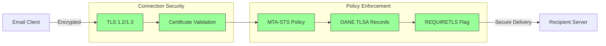
## Enkripsi Pesan Email {#email-message-encryption}

> \[!NOTE]
> Forward Email mendukung baik OpenPGP maupun S/MIME untuk enkripsi email end-to-end.

Forward Email mendukung enkripsi OpenPGP dan S/MIME:

| RFC                                                       | Judul                                                                                   | Status      | Catatan Implementasi                                                                                                                                                                                 |
| --------------------------------------------------------- | --------------------------------------------------------------------------------------- | ----------- | ---------------------------------------------------------------------------------------------------------------------------------------------------------------------------------------------------- |
| [RFC 9580](https://datatracker.ietf.org/doc/html/rfc9580) | OpenPGP (menggantikan RFC 4880)                                                        | ✅ Didukung | Melalui integrasi [OpenPGP.js v6+](https://github.com/openpgpjs/openpgpjs). Lihat [FAQ](https://forwardemail.net/en/faq#do-you-support-openpgpmime-end-to-end-encryption-e2ee-and-web-key-directory-wkd) |
| [RFC 8551](https://datatracker.ietf.org/doc/html/rfc8551) | Secure/Multipurpose Internet Mail Extensions (S/MIME) Versi 4.0 Spesifikasi Pesan       | ✅ Didukung | Mendukung algoritma RSA dan ECC. Lihat [FAQ](https://forwardemail.net/en/faq#do-you-support-smime-encryption)                                                                                        |

Protokol enkripsi pesan melindungi isi email agar tidak dapat dibaca oleh siapa pun kecuali penerima yang dituju, bahkan jika pesan disadap selama pengiriman.

### Dukungan Enkripsi {#encryption-support}

| Protokol    | RFC      | Status      | Deskripsi                                   |
| ----------- | -------- | ----------- | -------------------------------------------- |
| **OpenPGP** | RFC 9580 | ✅ Didukung | Pretty Good Privacy - Enkripsi kunci publik  |
| **S/MIME**  | RFC 8551 | ✅ Didukung | Secure/Multipurpose Internet Mail Extensions |
| **WKD**     | Draft    | ✅ Didukung | Web Key Directory - Penemuan kunci otomatis  |

### OpenPGP (Pretty Good Privacy) {#openpgp-pretty-good-privacy}

**OpenPGP** menyediakan enkripsi end-to-end menggunakan kriptografi kunci publik. Forward Email mendukung OpenPGP melalui protokol [Web Key Directory (WKD)](https://forwardemail.net/en/faq#do-you-support-openpgpmime-end-to-end-encryption-e2ee-and-web-key-directory-wkd).

**Fitur Utama:**

* Penemuan kunci otomatis melalui WKD
* Dukungan PGP/MIME untuk lampiran terenkripsi
* Manajemen kunci melalui klien email
* Kompatibel dengan GPG, Mailvelope, dan alat OpenPGP lainnya

**Cara Menggunakan:**

1. Buat pasangan kunci PGP di klien email Anda
2. Unggah kunci publik Anda ke WKD Forward Email
3. Kunci Anda dapat ditemukan secara otomatis oleh pengguna lain
4. Kirim dan terima email terenkripsi dengan lancar

### S/MIME (Secure/Multipurpose Internet Mail Extensions) {#smime-securemultipurpose-internet-mail-extensions}

**S/MIME** menyediakan enkripsi email dan tanda tangan digital menggunakan sertifikat X.509.

**Fitur Utama:**

* Enkripsi berbasis sertifikat
* Tanda tangan digital untuk autentikasi pesan
* Dukungan asli di sebagian besar klien email
* Keamanan tingkat perusahaan

**Cara Menggunakan:**

1. Dapatkan sertifikat S/MIME dari Otoritas Sertifikat
2. Pasang sertifikat di klien email Anda
3. Konfigurasikan klien Anda untuk mengenkripsi/menandatangani pesan
4. Tukar sertifikat dengan penerima

### Enkripsi Kotak Surat SQLite {#sqlite-mailbox-encryption}

> \[!IMPORTANT]
> Forward Email menyediakan lapisan keamanan tambahan dengan kotak surat SQLite terenkripsi.

Selain enkripsi tingkat pesan, Forward Email mengenkripsi seluruh kotak surat menggunakan [sqleet](https://github.com/resilar/sqleet) (ChaCha20-Poly1305).

**Fitur Utama:**

* **Enkripsi berbasis kata sandi** - Hanya Anda yang memiliki kata sandi
* **Tahan kuantum** - Sandi ChaCha20-Poly1305
* **Zero-knowledge** - Forward Email tidak dapat mendekripsi kotak surat Anda
* **Terisolasi** - Setiap kotak surat terisolasi dan portabel
* **Tidak dapat dipulihkan** - Jika Anda lupa kata sandi, kotak surat Anda hilang
### Perbandingan Enkripsi {#encryption-comparison}

| Fitur                 | OpenPGP           | S/MIME             | Enkripsi SQLite   |
| --------------------- | ----------------- | ------------------ | ----------------- |
| **End-to-End**        | ✅ Ya              | ✅ Ya               | ✅ Ya              |
| **Manajemen Kunci**   | Dikelola sendiri  | Diterbitkan CA     | Berbasis Kata Sandi |
| **Dukungan Klien**    | Memerlukan plugin | Bawaan             | Transparan        |
| **Kasus Penggunaan**  | Pribadi           | Perusahaan         | Penyimpanan       |
| **Tahan Kuantum**     | ⚠️ Tergantung kunci | ⚠️ Tergantung sertifikat | ✅ Ya              |

### Alur Enkripsi {#encryption-flow}

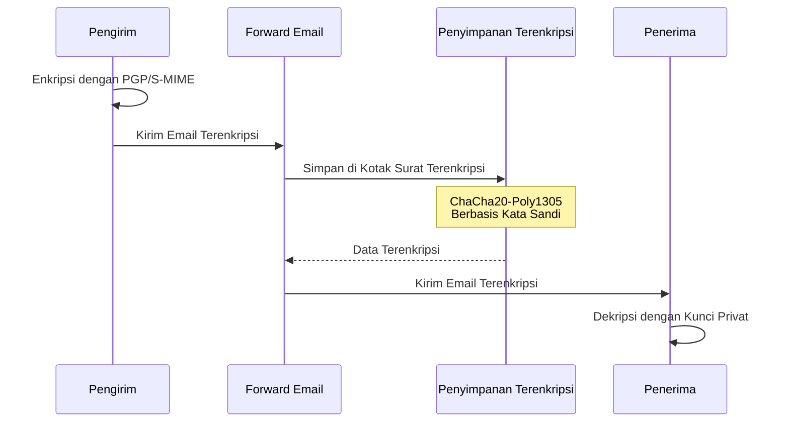

---


## Fungsionalitas Ekstensi {#extended-functionality}


## Standar Format Pesan Email {#email-message-format-standards}

> \[!NOTE]
> Forward Email mendukung standar format email modern untuk konten kaya dan internasionalisasi.

Forward Email mendukung format pesan email standar:

| RFC                                                       | Judul                                                        | Catatan Implementasi |
| --------------------------------------------------------- | ------------------------------------------------------------ | -------------------- |
| [RFC 5322](https://datatracker.ietf.org/doc/html/rfc5322) | Format Pesan Internet                                        | Dukungan penuh       |
| [RFC 2045](https://datatracker.ietf.org/doc/html/rfc2045) | MIME Bagian Satu: Format Badan Pesan Internet                | Dukungan MIME penuh  |
| [RFC 2046](https://datatracker.ietf.org/doc/html/rfc2046) | MIME Bagian Dua: Jenis Media                                 | Dukungan MIME penuh  |
| [RFC 2047](https://datatracker.ietf.org/doc/html/rfc2047) | MIME Bagian Tiga: Ekstensi Header Pesan untuk Teks Non-ASCII | Dukungan MIME penuh  |
| [RFC 2048](https://datatracker.ietf.org/doc/html/rfc2048) | MIME Bagian Empat: Prosedur Registrasi                       | Dukungan MIME penuh  |
| [RFC 2049](https://datatracker.ietf.org/doc/html/rfc2049) | MIME Bagian Lima: Kriteria Kepatuhan dan Contoh              | Dukungan MIME penuh  |

Standar format email mendefinisikan bagaimana pesan email disusun, dikodekan, dan ditampilkan.

### Dukungan Standar Format {#format-standards-support}

| Standar            | RFC           | Status       | Deskripsi                            |
| ------------------ | ------------- | ------------ | ---------------------------------- |
| **MIME**           | RFC 2045-2049 | ✅ Didukung  | Multipurpose Internet Mail Extensions |
| **SMTPUTF8**       | RFC 6531      | ⚠️ Sebagian  | Alamat email yang diinternasionalisasi |
| **EAI**            | RFC 6530      | ⚠️ Sebagian  | Internasionalisasi Alamat Email     |
| **Format Pesan**   | RFC 5322      | ✅ Didukung  | Format Pesan Internet               |
| **Keamanan MIME**  | RFC 1847      | ✅ Didukung  | Multipart Keamanan untuk MIME       |

### MIME (Multipurpose Internet Mail Extensions) {#mime-multipurpose-internet-mail-extensions}

**MIME** memungkinkan email berisi beberapa bagian dengan tipe konten berbeda (teks, HTML, lampiran, dll.).

**Fitur MIME yang Didukung:**

* Pesan multipart (mixed, alternative, related)
* Header Content-Type
* Content-Transfer-Encoding (7bit, 8bit, quoted-printable, base64)
* Gambar inline dan lampiran
* Konten HTML kaya

### SMTPUTF8 dan Internasionalisasi Alamat Email {#smtputf8-and-email-address-internationalization}

> \[!WARNING]
> Dukungan SMTPUTF8 bersifat sebagian - tidak semua fitur diimplementasikan sepenuhnya.
**SMTPUTF8** memungkinkan alamat email mengandung karakter non-ASCII (misalnya, `用户@例え.jp`).

**Status Saat Ini:**

* ⚠️ Dukungan parsial untuk alamat email yang diinternasionalisasi
* ✅ Konten UTF-8 dalam isi pesan
* ⚠️ Dukungan terbatas untuk bagian lokal non-ASCII

---


## Protokol Kalender dan Kontak {#calendaring-and-contacts-protocols}

> \[!NOTE]
> Forward Email menyediakan dukungan penuh CalDAV dan CardDAV untuk sinkronisasi kalender dan kontak.

Forward Email mendukung CalDAV dan CardDAV melalui pustaka [caldav-adapter](https://github.com/forwardemail/caldav-adapter):

| RFC                                                       | Judul                                                                     | Status      | Catatan Implementasi                                                                                                                                                                   |
| --------------------------------------------------------- | ------------------------------------------------------------------------- | ----------- | -------------------------------------------------------------------------------------------------------------------------------------------------------------------------------------- |
| [RFC 4791](https://datatracker.ietf.org/doc/html/rfc4791) | Ekstensi Kalender untuk WebDAV (CalDAV)                                  | ✅ Didukung | Akses dan pengelolaan kalender                                                                                                                                                         |
| [RFC 6352](https://datatracker.ietf.org/doc/html/rfc6352) | CardDAV: Ekstensi vCard untuk WebDAV                                     | ✅ Didukung | Akses dan pengelolaan kontak                                                                                                                                                            |
| [RFC 5545](https://datatracker.ietf.org/doc/html/rfc5545) | Spesifikasi Objek Inti Penjadwalan dan Kalender Internet (iCalendar)     | ✅ Didukung | Dukungan format iCalendar                                                                                                                                                               |
| [RFC 6350](https://datatracker.ietf.org/doc/html/rfc6350) | Spesifikasi Format vCard                                                  | ✅ Didukung | Dukungan format vCard 4.0                                                                                                                                                               |
| [RFC 6638](https://datatracker.ietf.org/doc/html/rfc6638) | Ekstensi Penjadwalan untuk CalDAV                                        | ✅ Didukung | Penjadwalan CalDAV dengan dukungan iMIP. Lihat [commit c4d1629](https://github.com/forwardemail/forwardemail.net/commit/c4d162975a49e38d76d68a032662e873a34a9b80)                            |
| [RFC 5546](https://datatracker.ietf.org/doc/html/rfc5546) | Protokol Interoperabilitas Independen Transport iCalendar (iTIP)         | ✅ Didukung | Dukungan iTIP untuk metode REQUEST, REPLY, CANCEL, dan VFREEBUSY. Lihat [commit c4d1629](https://github.com/forwardemail/forwardemail.net/commit/c4d162975a49e38d76d68a032662e873a34a9b80) |
| [RFC 6047](https://datatracker.ietf.org/doc/html/rfc6047) | Protokol Interoperabilitas Berbasis Pesan iCalendar (iMIP)               | ✅ Didukung | Undangan kalender berbasis email dengan tautan respons. Lihat [commit c4d1629](https://github.com/forwardemail/forwardemail.net/commit/c4d162975a49e38d76d68a032662e873a34a9b80)           |

CalDAV dan CardDAV adalah protokol yang memungkinkan data kalender dan kontak diakses, dibagikan, dan disinkronkan antar perangkat.

### Dukungan CalDAV dan CardDAV {#caldav-and-carddav-support}

| Protokol              | RFC      | Status      | Deskripsi                            |
| --------------------- | -------- | ----------- | -------------------------------------- |
| **CalDAV**            | RFC 4791 | ✅ Didukung | Akses dan sinkronisasi kalender        |
| **CardDAV**           | RFC 6352 | ✅ Didukung | Akses dan sinkronisasi kontak           |
| **iCalendar**         | RFC 5545 | ✅ Didukung | Format data kalender                   |
| **vCard**             | RFC 6350 | ✅ Didukung | Format data kontak                    |
| **VTODO**             | RFC 5545 | ✅ Didukung | Dukungan tugas/pengingat              |
| **Penjadwalan CalDAV**| RFC 6638 | ✅ Didukung | Ekstensi penjadwalan kalender         |
| **iTIP**              | RFC 5546 | ✅ Didukung | Interoperabilitas independen transport |
| **iMIP**              | RFC 6047 | ✅ Didukung | Undangan kalender berbasis email       |
### CalDAV (Akses Kalender) {#caldav-calendar-access}

**CalDAV** memungkinkan Anda mengakses dan mengelola kalender dari perangkat atau aplikasi apa pun.

**Fitur Utama:**

* Sinkronisasi multi-perangkat
* Kalender bersama
* Langganan kalender
* Undangan dan tanggapan acara
* Acara berulang
* Dukungan zona waktu

**Klien yang Kompatibel:**

* Apple Calendar (macOS, iOS)
* Mozilla Thunderbird
* Evolution
* GNOME Calendar
* Klien kompatibel CalDAV lainnya

### CardDAV (Akses Kontak) {#carddav-contact-access}

**CardDAV** memungkinkan Anda mengakses dan mengelola kontak dari perangkat atau aplikasi apa pun.

**Fitur Utama:**

* Sinkronisasi multi-perangkat
* Buku alamat bersama
* Grup kontak
* Dukungan foto
* Kolom khusus
* Dukungan vCard 4.0

**Klien yang Kompatibel:**

* Apple Contacts (macOS, iOS)
* Mozilla Thunderbird
* Evolution
* GNOME Contacts
* Klien kompatibel CardDAV lainnya

### Tugas dan Pengingat (CalDAV VTODO) {#tasks-and-reminders-caldav-vtodo}

> \[!TIP]
> Forward Email mendukung tugas dan pengingat melalui CalDAV VTODO.

**VTODO** adalah bagian dari format iCalendar dan memungkinkan manajemen tugas melalui CalDAV.

**Fitur Utama:**

* Pembuatan dan pengelolaan tugas
* Tanggal jatuh tempo dan prioritas
* Pelacakan penyelesaian tugas
* Tugas berulang
* Daftar/kategori tugas

**Klien yang Kompatibel:**

* Apple Reminders (macOS, iOS)
* Mozilla Thunderbird (dengan Lightning)
* Evolution
* GNOME To Do
* Klien CalDAV dengan dukungan VTODO

### Alur Sinkronisasi CalDAV/CardDAV {#caldavcarddav-synchronization-flow}

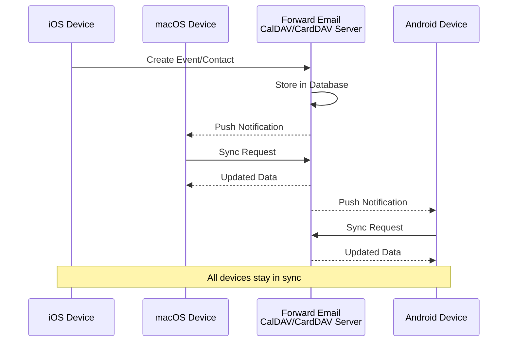

### Ekstensi Kalender yang TIDAK Didukung {#calendaring-extensions-not-supported}

Ekstensi kalender berikut TIDAK didukung:

| RFC                                                       | Judul                                                               | Alasan                                                          |
| --------------------------------------------------------- | ------------------------------------------------------------------- | --------------------------------------------------------------- |
| [RFC 4918](https://datatracker.ietf.org/doc/html/rfc4918) | HTTP Extensions for Web Distributed Authoring and Versioning (WebDAV) | CalDAV menggunakan konsep WebDAV tetapi tidak mengimplementasikan RFC 4918 secara penuh |
| [RFC 6578](https://datatracker.ietf.org/doc/html/rfc6578) | Collection Synchronization for WebDAV                               | Tidak diimplementasikan                                         |
| [RFC 3744](https://datatracker.ietf.org/doc/html/rfc3744) | WebDAV Access Control Protocol                                      | Tidak diimplementasikan                                         |

---


## Penyaringan Pesan Email {#email-message-filtering}

> \[!IMPORTANT]
> Forward Email menyediakan **dukungan penuh Sieve dan ManageSieve** untuk penyaringan email sisi server. Buat aturan kuat untuk secara otomatis mengurutkan, menyaring, meneruskan, dan merespons pesan masuk.

### Sieve (RFC 5228) {#sieve-rfc-5228}

[Sieve](https://en.wikipedia.org/wiki/Sieve_\(mail_filtering_language\)) adalah bahasa skrip standar dan kuat untuk penyaringan email sisi server. Forward Email mengimplementasikan dukungan Sieve yang komprehensif dengan 24 ekstensi.

**Kode Sumber:** [`helpers/sieve/`](https://github.com/forwardemail/forwardemail.net/tree/master/helpers/sieve)

#### RFC Inti Sieve yang Didukung {#core-sieve-rfcs-supported}

| RFC                                                                                    | Judul                                                         | Status         |
| -------------------------------------------------------------------------------------- | ------------------------------------------------------------- | -------------- |
| [RFC 5228](https://datatracker.ietf.org/doc/html/rfc5228)                              | Sieve: Bahasa Penyaringan Email                               | ✅ Dukungan Penuh |
| [RFC 5429](https://datatracker.ietf.org/doc/html/rfc5429)                              | Penyaringan Email Sieve: Ekstensi Reject dan Extended Reject | ✅ Dukungan Penuh |
| [RFC 5230](https://datatracker.ietf.org/doc/html/rfc5230)                              | Penyaringan Email Sieve: Ekstensi Vacation                    | ✅ Dukungan Penuh |
| [RFC 6131](https://datatracker.ietf.org/doc/html/rfc6131)                              | Ekstensi Vacation Sieve: Parameter "Seconds"                  | ✅ Dukungan Penuh |
| [RFC 5232](https://datatracker.ietf.org/doc/html/rfc5232)                              | Penyaringan Email Sieve: Ekstensi Imap4flags                  | ✅ Dukungan Penuh |
| [RFC 5173](https://datatracker.ietf.org/doc/html/rfc5173)                              | Penyaringan Email Sieve: Ekstensi Body                         | ✅ Dukungan Penuh |
| [RFC 5229](https://datatracker.ietf.org/doc/html/rfc5229)                              | Penyaringan Email Sieve: Ekstensi Variabel                     | ✅ Dukungan Penuh |
| [RFC 5231](https://datatracker.ietf.org/doc/html/rfc5231)                              | Penyaringan Email Sieve: Ekstensi Relasional                   | ✅ Dukungan Penuh |
| [RFC 4790](https://datatracker.ietf.org/doc/html/rfc4790)                              | Registri Kolasi Protokol Aplikasi Internet                      | ✅ Dukungan Penuh |
| [RFC 3894](https://datatracker.ietf.org/doc/html/rfc3894)                              | Ekstensi Sieve: Menyalin Tanpa Efek Samping                    | ✅ Dukungan Penuh |
| [RFC 5293](https://datatracker.ietf.org/doc/html/rfc5293)                              | Penyaringan Email Sieve: Ekstensi Editheader                   | ✅ Dukungan Penuh |
| [RFC 5260](https://datatracker.ietf.org/doc/html/rfc5260)                              | Penyaringan Email Sieve: Ekstensi Tanggal dan Indeks           | ✅ Dukungan Penuh |
| [RFC 5435](https://datatracker.ietf.org/doc/html/rfc5435)                              | Penyaringan Email Sieve: Ekstensi untuk Notifikasi             | ✅ Dukungan Penuh |
| [RFC 5183](https://datatracker.ietf.org/doc/html/rfc5183)                              | Penyaringan Email Sieve: Ekstensi Lingkungan                   | ✅ Dukungan Penuh |
| [RFC 5490](https://datatracker.ietf.org/doc/html/rfc5490)                              | Penyaringan Email Sieve: Ekstensi untuk Memeriksa Status Kotak Surat | ✅ Dukungan Penuh |
| [RFC 8579](https://datatracker.ietf.org/doc/html/rfc8579)                              | Penyaringan Email Sieve: Pengiriman ke Kotak Surat Penggunaan Khusus | ✅ Dukungan Penuh |
| [RFC 7352](https://datatracker.ietf.org/doc/html/rfc7352)                              | Penyaringan Email Sieve: Mendeteksi Pengiriman Duplikat        | ✅ Dukungan Penuh |
| [RFC 5463](https://datatracker.ietf.org/doc/html/rfc5463)                              | Penyaringan Email Sieve: Ekstensi Ihave                        | ✅ Dukungan Penuh |
| [RFC 5233](https://datatracker.ietf.org/doc/html/rfc5233)                              | Penyaringan Email Sieve: Ekstensi Subaddress                   | ✅ Dukungan Penuh |
| [draft-ietf-sieve-regex](https://datatracker.ietf.org/doc/html/draft-ietf-sieve-regex) | Penyaringan Email Sieve: Ekstensi Ekspresi Reguler             | ✅ Dukungan Penuh |
#### Ekstensi Sieve yang Didukung {#supported-sieve-extensions}

| Ekstensi                     | Deskripsi                                | Integrasi                                  |
| ---------------------------- | ---------------------------------------- | ------------------------------------------ |
| `fileinto`                   | Memasukkan pesan ke folder tertentu      | Pesan disimpan di folder IMAP yang ditentukan |
| `reject` / `ereject`         | Menolak pesan dengan kesalahan           | Penolakan SMTP dengan pesan bounce          |
| `vacation`                   | Balasan otomatis liburan/tidak di kantor | Antrian melalui Emails.queue dengan pembatasan laju |
| `vacation-seconds`           | Interval balasan liburan yang lebih rinci | TTL dari parameter `:seconds`               |
| `imap4flags`                 | Mengatur flag IMAP (\Seen, \Flagged, dll.) | Flag diterapkan saat penyimpanan pesan      |
| `envelope`                   | Menguji pengirim/penerima amplop          | Akses ke data amplop SMTP                    |
| `body`                       | Menguji isi badan pesan                    | Pencocokan teks badan penuh                  |
| `variables`                  | Menyimpan dan menggunakan variabel dalam skrip | Perluasan variabel dengan modifikator        |
| `relational`                 | Perbandingan relasional                    | `:count`, `:value` dengan gt/lt/eq           |
| `comparator-i;ascii-numeric` | Perbandingan numerik                      | Perbandingan string numerik                   |
| `copy`                       | Menyalin pesan saat mengalihkan           | Flag `:copy` pada fileinto/redirect           |
| `editheader`                 | Menambah atau menghapus header pesan      | Header dimodifikasi sebelum penyimpanan      |
| `date`                       | Menguji nilai tanggal/waktu                | Tes `currentdate` dan tanggal header          |
| `index`                      | Mengakses kejadian header tertentu         | `:index` untuk header multi-nilai              |
| `regex`                      | Pencocokan ekspresi reguler                | Dukungan regex penuh dalam pengujian           |
| `enotify`                    | Mengirim notifikasi                        | Notifikasi `mailto:` melalui Emails.queue      |
| `environment`                | Mengakses informasi lingkungan             | Domain, host, remote-ip dari sesi               |
| `mailbox`                    | Menguji keberadaan kotak surat             | Tes `mailboxexists`                            |
| `special-use`                | Memasukkan ke kotak surat penggunaan khusus | Memetakan \Junk, \Trash, dll. ke folder        |
| `duplicate`                  | Mendeteksi pesan duplikat                   | Pelacakan duplikat berbasis Redis              |
| `ihave`                      | Menguji ketersediaan ekstensi               | Pemeriksaan kemampuan saat runtime              |
| `subaddress`                 | Mengakses bagian alamat user+detail         | Bagian alamat `:user` dan `:detail`             |

#### Ekstensi Sieve yang TIDAK Didukung {#sieve-extensions-not-supported}

| Ekstensi                               | RFC                                                       | Alasan                                                           |
| --------------------------------------- | --------------------------------------------------------- | ---------------------------------------------------------------- |
| `include`                               | [RFC 6609](https://datatracker.ietf.org/doc/html/rfc6609) | Risiko keamanan (injeksi skrip), memerlukan penyimpanan skrip global |
| `mboxmetadata` / `servermetadata`       | [RFC 5490](https://datatracker.ietf.org/doc/html/rfc5490) | Memerlukan ekstensi METADATA IMAP                                 |
| `fcc`                                   | [RFC 8580](https://datatracker.ietf.org/doc/html/rfc8580) | Memerlukan integrasi folder Terkirim                              |
| `encoded-character`                     | [RFC 5228](https://datatracker.ietf.org/doc/html/rfc5228) | Perubahan parser diperlukan untuk sintaks ${hex:}                |
| `foreverypart` / `mime` / `extracttext` | [RFC 5703](https://datatracker.ietf.org/doc/html/rfc5703) | Manipulasi pohon MIME yang kompleks                               |
#### Alur Pemrosesan Sieve {#sieve-processing-flow}

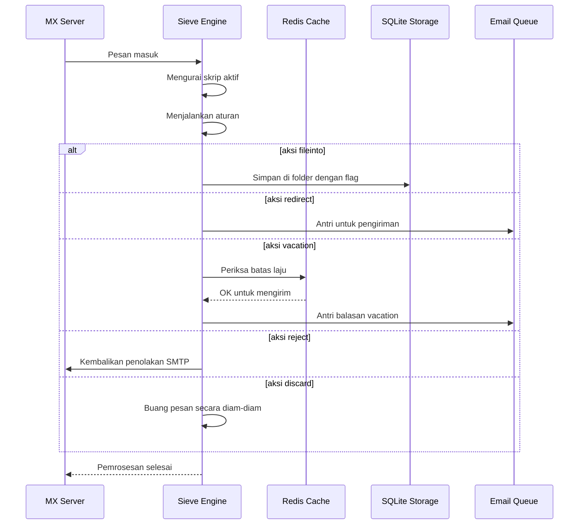

#### Fitur Keamanan {#security-features}

Implementasi Sieve Forward Email mencakup perlindungan keamanan yang komprehensif:

* **Perlindungan CVE-2023-26430**: Mencegah loop pengalihan dan serangan bom email
* **Pembatasan Laju**: Batas pengalihan (10/pesan, 100/hari) dan balasan vacation
* **Pemeriksaan Daftar Tolak**: Alamat pengalihan diperiksa terhadap daftar tolak
* **Header yang Dilindungi**: Header DKIM, ARC, dan autentikasi tidak dapat diubah melalui editheader
* **Batas Ukuran Skrip**: Batas maksimum ukuran skrip diterapkan
* **Timeout Eksekusi**: Skrip dihentikan jika eksekusi melebihi batas waktu

#### Contoh Skrip Sieve {#example-sieve-scripts}

**Memasukkan newsletter ke dalam folder:**

```sieve
require ["fileinto"];

if header :contains "List-Id" "newsletter" {
    fileinto "Newsletters";
}
```

**Auto-responder vacation dengan pengaturan waktu yang rinci:**

```sieve
require ["vacation", "vacation-seconds"];

vacation :seconds 3600 :subject "Out of Office"
    "Saya sedang tidak di tempat dan akan membalas dalam 24 jam.";
```

**Penyaringan spam dengan flag:**

```sieve
require ["fileinto", "imap4flags"];

if header :contains "X-Spam-Status" "Yes" {
    setflag "\\Seen";
    fileinto "Junk";
}
```

**Penyaringan kompleks dengan variabel:**

```sieve
require ["variables", "fileinto", "regex"];

if header :regex "From" "(.+)@example\\.com" {
    set :lower "sender" "${1}";
    fileinto "Contacts/${sender}";
}
```

> \[!TIP]
> Untuk dokumentasi lengkap, contoh skrip, dan instruksi konfigurasi, lihat [FAQ: Apakah Anda mendukung penyaringan email Sieve?](/faq#do-you-support-sieve-email-filtering)

### ManageSieve (RFC 5804) {#managesieve-rfc-5804}

Forward Email menyediakan dukungan penuh protokol ManageSieve untuk mengelola skrip Sieve secara jarak jauh.

**Kode Sumber:** [`managesieve-server.js`](https://github.com/forwardemail/forwardemail.net/blob/master/managesieve-server.js)

| RFC                                                       | Judul                                          | Status         |
| --------------------------------------------------------- | ---------------------------------------------- | -------------- |
| [RFC 5804](https://datatracker.ietf.org/doc/html/rfc5804) | Protokol untuk Mengelola Skrip Sieve Secara Jarak Jauh | ✅ Dukungan Penuh |

#### Konfigurasi Server ManageSieve {#managesieve-server-configuration}

| Pengaturan              | Nilai                   |
| ----------------------- | ----------------------- |
| **Server**              | `imap.forwardemail.net` |
| **Port (STARTTLS)**     | `2190` (direkomendasikan) |
| **Port (Implicit TLS)** | `4190`                  |
| **Autentikasi**         | PLAIN (melalui TLS)     |

> **Catatan:** Port 2190 menggunakan STARTTLS (upgrade dari plain ke TLS) dan kompatibel dengan sebagian besar klien ManageSieve termasuk [sieve-connect](https://github.com/philpennock/sieve-connect). Port 4190 menggunakan TLS implisit (TLS sejak awal koneksi) untuk klien yang mendukungnya.

#### Perintah ManageSieve yang Didukung {#supported-managesieve-commands}

| Perintah       | Deskripsi                              |
| -------------- | ------------------------------------ |
| `AUTHENTICATE` | Autentikasi menggunakan mekanisme PLAIN |
| `CAPABILITY`   | Daftar kemampuan dan ekstensi server |
| `HAVESPACE`    | Periksa apakah skrip dapat disimpan   |
| `PUTSCRIPT`    | Unggah skrip baru                     |
| `LISTSCRIPTS`  | Daftar semua skrip dengan status aktif |
| `SETACTIVE`    | Aktifkan sebuah skrip                 |
| `GETSCRIPT`    | Unduh sebuah skrip                   |
| `DELETESCRIPT` | Hapus sebuah skrip                   |
| `RENAMESCRIPT` | Ganti nama sebuah skrip              |
| `CHECKSCRIPT`  | Validasi sintaks skrip               |
| `NOOP`         | Menjaga koneksi tetap hidup          |
| `LOGOUT`       | Akhiri sesi                         |
#### Klien ManageSieve yang Kompatibel {#compatible-managesieve-clients}

* **Thunderbird**: Dukungan Sieve bawaan melalui [Sieve add-on](https://addons.thunderbird.net/addon/sieve/)
* **Roundcube**: [Plugin ManageSieve](https://plugins.roundcube.net/packages/johndoh/sieve)
* **KMail**: Dukungan ManageSieve asli
* **sieve-connect**: Klien baris perintah
* **Klien yang mematuhi RFC 5804 mana pun**

#### Alur Protokol ManageSieve {#managesieve-protocol-flow}

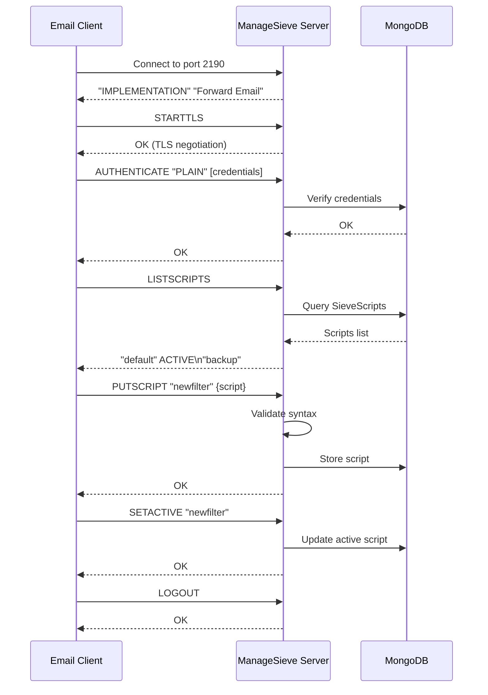

#### Antarmuka Web dan API {#web-interface-and-api}

Selain ManageSieve, Forward Email menyediakan:

* **Dashboard Web**: Membuat dan mengelola skrip Sieve melalui antarmuka web di Akun Saya → Domain → Alias → Skrip Sieve
* **REST API**: Akses programatik untuk pengelolaan skrip Sieve melalui [Forward Email API](/api#sieve-scripts)

> \[!TIP]
> Untuk instruksi pengaturan dan konfigurasi klien secara rinci, lihat [FAQ: Apakah Anda mendukung penyaringan email Sieve?](/faq#do-you-support-sieve-email-filtering)

---


## Optimasi Penyimpanan {#storage-optimization}

> \[!IMPORTANT]
> **Teknologi Penyimpanan Pertama di Industri:** Forward Email adalah **satu-satunya penyedia email di dunia** yang menggabungkan deduplikasi lampiran dengan kompresi Brotli pada konten email. Optimasi lapisan ganda ini memberikan Anda **2-3x lebih banyak penyimpanan efektif** dibandingkan penyedia email tradisional.

Forward Email menerapkan dua teknik optimasi penyimpanan revolusioner yang secara dramatis mengurangi ukuran kotak surat sambil mempertahankan kepatuhan penuh RFC dan keutuhan pesan:

1. **Deduplikasi Lampiran** - Menghilangkan lampiran duplikat di semua email
2. **Kompresi Brotli** - Mengurangi penyimpanan sebesar 46-86% untuk metadata dan 50% untuk lampiran

### Arsitektur: Optimasi Penyimpanan Lapisan Ganda {#architecture-dual-layer-storage-optimization}

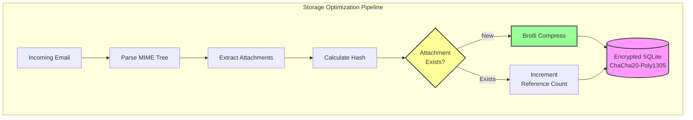

---


## Deduplikasi Lampiran {#attachment-deduplication}

Forward Email menerapkan deduplikasi lampiran berdasarkan [pendekatan terbukti WildDuck](https://docs.wildduck.email/docs/in-depth/attachment-deduplication/), yang disesuaikan untuk penyimpanan SQLite.

> \[!NOTE]
> **Apa yang Diduplikasi:** "Lampiran" mengacu pada isi node MIME yang **terkodekan** (base64 atau quoted-printable), bukan file yang sudah didekode. Ini menjaga keabsahan tanda tangan DKIM dan GPG.

### Cara Kerjanya {#how-it-works}

**Implementasi Asli WildDuck (MongoDB GridFS):**

> Server IMAP Wild Duck menduplikasi lampiran. "Lampiran" dalam hal ini berarti isi node mime yang dikodekan base64 atau quoted-printable, bukan file yang sudah didekode. Meskipun menggunakan konten yang dikodekan berarti banyak negatif palsu (file yang sama di email berbeda mungkin dihitung sebagai lampiran berbeda) hal ini diperlukan untuk menjamin keabsahan berbagai skema tanda tangan (DKIM, GPG, dll.). Pesan yang diambil dari Wild Duck terlihat persis sama seperti pesan yang disimpan meskipun Wild Duck mengurai pesan menjadi objek seperti pohon dan membangun ulang pesan saat mengambil.
**Implementasi SQLite Forward Email:**

Forward Email mengadaptasi pendekatan ini untuk penyimpanan SQLite terenkripsi dengan proses berikut:

1. **Perhitungan Hash**: Saat ditemukan lampiran, hash dihitung menggunakan pustaka [`rev-hash`](https://github.com/sindresorhus/rev-hash) dari isi lampiran
2. **Pencarian**: Periksa apakah lampiran dengan hash yang cocok ada di tabel `Attachments`
3. **Penghitungan Referensi**:
   * Jika ada: Tingkatkan penghitung referensi sebesar 1 dan penghitung magic dengan angka acak
   * Jika baru: Buat entri lampiran baru dengan penghitung = 1
4. **Keamanan Penghapusan**: Menggunakan sistem penghitung ganda (referensi + magic) untuk mencegah positif palsu
5. **Pengumpulan Sampah**: Lampiran dihapus segera ketika kedua penghitung mencapai nol

**Kode Sumber:** [`helpers/attachment-storage.js`](https://github.com/forwardemail/forwardemail.net/blob/master/helpers/attachment-storage.js)

### Alur Deduplication {#deduplication-flow}

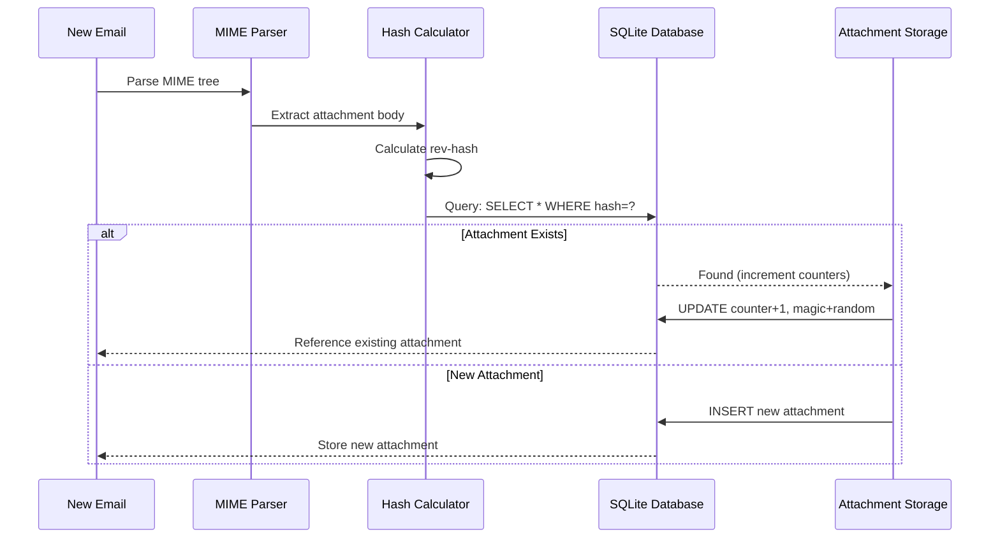

### Sistem Angka Magic {#magic-number-system}

Forward Email menggunakan sistem "angka magic" WildDuck (terinspirasi oleh [Mail.ru](https://github.com/zone-eu/wildduck)) untuk mencegah positif palsu selama penghapusan:

* Setiap pesan mendapatkan **angka acak** yang ditetapkan
* **Penghitung magic** lampiran ditingkatkan dengan angka acak tersebut saat pesan ditambahkan
* Penghitung magic dikurangi dengan angka yang sama saat pesan dihapus
* Lampiran hanya dihapus ketika **kedua penghitung** (referensi + magic) mencapai nol

Sistem penghitung ganda ini memastikan bahwa jika terjadi kesalahan selama penghapusan (misalnya, crash, kesalahan jaringan), lampiran tidak dihapus terlalu cepat.

### Perbedaan Utama: WildDuck vs Forward Email {#key-differences-wildduck-vs-forward-email}

| Fitur                  | WildDuck (MongoDB)       | Forward Email (SQLite)       |
| ---------------------- | ------------------------ | ---------------------------- |
| **Backend Penyimpanan** | MongoDB GridFS (terpotong) | SQLite BLOB (langsung)       |
| **Algoritma Hash**     | SHA256                   | rev-hash (berbasis SHA-256)  |
| **Penghitungan Referensi** | ✅ Ya                    | ✅ Ya                        |
| **Angka Magic**        | ✅ Ya (terinspirasi Mail.ru) | ✅ Ya (sistem sama)          |
| **Pengumpulan Sampah** | Tertunda (pekerjaan terpisah) | Segera (saat penghitung nol) |
| **Kompresi**           | ❌ Tidak ada             | ✅ Brotli (lihat di bawah)    |
| **Enkripsi**           | ❌ Opsional              | ✅ Selalu (ChaCha20-Poly1305) |

---


## Kompresi Brotli {#brotli-compression}

> \[!IMPORTANT]
> **Yang Pertama di Dunia:** Forward Email adalah **satu-satunya layanan email di dunia** yang menggunakan kompresi Brotli pada konten email. Ini memberikan **penghematan penyimpanan 46-86%** di atas deduplikasi lampiran.

Forward Email mengimplementasikan kompresi Brotli untuk isi lampiran dan metadata pesan, memberikan penghematan penyimpanan besar sambil mempertahankan kompatibilitas ke belakang.

**Implementasi:** [`helpers/msgpack-helpers.js`](https://github.com/forwardemail/forwardemail.net/blob/master/helpers/msgpack-helpers.js)

### Apa yang Dikompresi {#what-gets-compressed}

**1. Isi Lampiran** (`encodeAttachmentBody`)

* **Format lama**: String hex-encoded (ukuran 2x) atau Buffer mentah
* **Format baru**: Buffer terkompresi Brotli dengan header magic "FEBR"
* **Keputusan kompresi**: Hanya mengompresi jika menghemat ruang (memperhitungkan header 4-byte)
* **Penghematan penyimpanan**: Hingga **50%** (hex → BLOB native)
**2. Metadata Pesan** (`encodeMetadata`)

Mencakup: `mimeTree`, `headers`, `envelope`, `flags`

* **Format lama**: string teks JSON
* **Format baru**: Buffer terkompresi Brotli
* **Penghematan penyimpanan**: **46-86%** tergantung kompleksitas pesan

### Konfigurasi Kompresi {#compression-configuration}

```javascript
// Opsi kompresi Brotli yang dioptimalkan untuk kecepatan (level 4 adalah keseimbangan yang baik)
const BROTLI_COMPRESS_OPTIONS = {
  params: {
    [zlib.constants.BROTLI_PARAM_QUALITY]: 4
  }
};
```

**Mengapa Level 4?**

* **Kompresi/dekompresi cepat**: Pemrosesan sub-milidetik
* **Rasio kompresi baik**: Penghematan 46-86%
* **Performa seimbang**: Optimal untuk operasi email waktu nyata

### Header Ajaib: "FEBR" {#magic-header-febr}

Forward Email menggunakan header ajaib 4-byte untuk mengidentifikasi isi lampiran yang terkompresi:

```
"FEBR" = Forward Email BRotli
Hex: 0x46 0x45 0x42 0x52
```

**Mengapa header ajaib?**

* **Deteksi format**: Mengidentifikasi data terkompresi vs tidak terkompresi secara instan
* **Kompatibilitas mundur**: String hex lama dan Buffer mentah masih berfungsi
* **Menghindari tabrakan**: "FEBR" kecil kemungkinannya muncul di awal data lampiran yang sah

### Proses Kompresi {#compression-process}

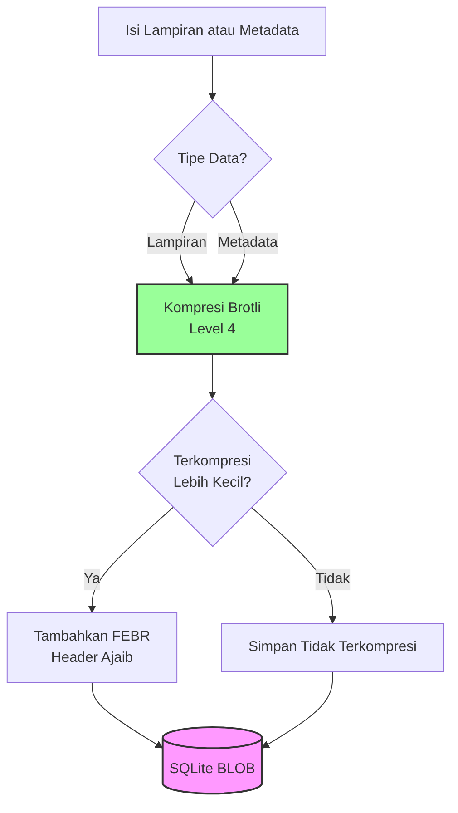

### Proses Dekompresi {#decompression-process}

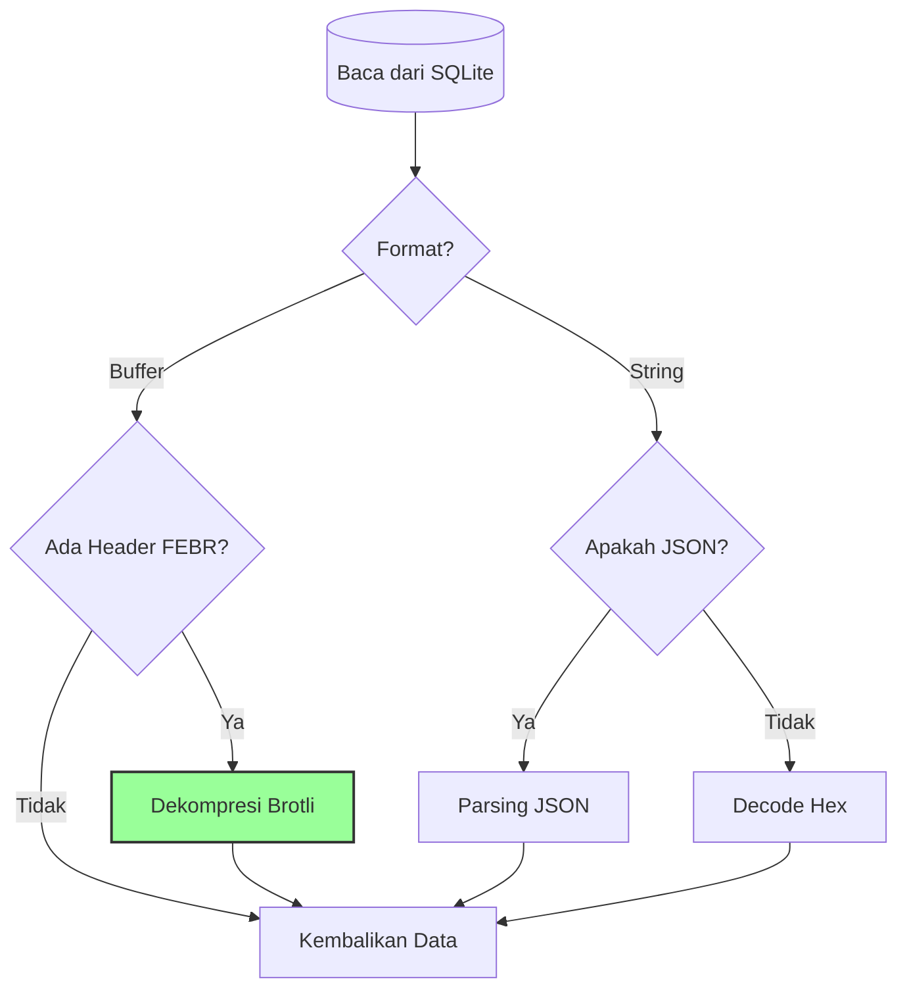

### Kompatibilitas Mundur {#backwards-compatibility}

Semua fungsi decode **otomatis mendeteksi** format penyimpanan:

| Format                | Metode Deteksi                       | Penanganan                                      |
| --------------------- | ---------------------------------- | ----------------------------------------------- |
| **Terkompresi Brotli** | Cek header ajaib "FEBR"             | Dekompresi dengan `zlib.brotliDecompressSync()` |
| **Buffer Mentah**      | `Buffer.isBuffer()` tanpa header    | Kembalikan apa adanya                           |
| **String Hex**         | Cek panjang genap + karakter [0-9a-f] | Decode dengan `Buffer.from(value, 'hex')`       |
| **String JSON**        | Cek karakter pertama `{` atau `[`   | Parsing dengan `JSON.parse()`                    |

Ini memastikan **tanpa kehilangan data** selama migrasi dari format lama ke baru.

### Statistik Penghematan Penyimpanan {#storage-savings-statistics}

**Penghematan yang diukur dari data produksi:**

| Tipe Data             | Format Lama             | Format Baru            | Penghematan |
| --------------------- | ----------------------- | ---------------------- | ----------- |
| **Isi lampiran**      | String hex-encoded (2x) | BLOB terkompresi Brotli | **50%**     |
| **Metadata pesan**    | Teks JSON               | BLOB terkompresi Brotli | **46-86%**  |
| **Flag kotak surat**  | Teks JSON               | BLOB terkompresi Brotli | **60-80%**  |

**Sumber:** [`helpers/migrate-storage-format.js`](https://github.com/forwardemail/forwardemail.net/blob/master/helpers/migrate-storage-format.js)

### Proses Migrasi {#migration-process}

Forward Email menyediakan migrasi otomatis dan idempoten dari format penyimpanan lama ke baru:
// Statistik migrasi yang dilacak:
{
  attachmentsMigrated: 0,
  messagesMigrated: 0,
  mailboxesMigrated: 0,
  bytesSaved: 0  // Total byte yang dihemat dari kompresi
}
```

**Langkah-langkah migrasi:**

1. Isi lampiran: encoding heksadesimal → BLOB native (penghematan 50%)
2. Metadata pesan: teks JSON → BLOB terkompresi brotli (penghematan 46-86%)
3. Flag kotak surat: teks JSON → BLOB terkompresi brotli (penghematan 60-80%)

**Sumber:** [`helpers/migrate-storage-format.js`](https://github.com/forwardemail/forwardemail.net/blob/master/helpers/migrate-storage-format.js)

---

### Efisiensi Penyimpanan Gabungan {#combined-storage-efficiency}

> \[!TIP]
> **Dampak Dunia Nyata:** Dengan deduplikasi lampiran + kompresi Brotli, pengguna Forward Email mendapatkan **penyimpanan efektif 2-3x lebih banyak** dibandingkan penyedia email tradisional.

**Contoh Skenario:**

Penyedia email tradisional (kotak surat 1GB):

* Ruang disk 1GB = 1GB email
* Tanpa deduplikasi: Lampiran yang sama disimpan 10 kali = pemborosan penyimpanan 10x
* Tanpa kompresi: Metadata JSON penuh disimpan = pemborosan penyimpanan 2-3x

Forward Email (kotak surat 1GB):

* Ruang disk 1GB ≈ **2-3GB email** (penyimpanan efektif)
* Deduplikasi: Lampiran yang sama disimpan sekali, direferensikan 10 kali
* Kompresi: penghematan 46-86% pada metadata, 50% pada lampiran
* Enkripsi: ChaCha20-Poly1305 (tanpa overhead penyimpanan)

**Tabel Perbandingan:**

| Penyedia          | Teknologi Penyimpanan                        | Penyimpanan Efektif (kotak surat 1GB) |
| ----------------- | -------------------------------------------- | ------------------------------------- |
| Gmail             | Tidak ada                                   | 1GB                                   |
| iCloud            | Tidak ada                                   | 1GB                                   |
| Outlook.com       | Tidak ada                                   | 1GB                                   |
| Fastmail          | Tidak ada                                   | 1GB                                   |
| ProtonMail        | Hanya enkripsi                              | 1GB                                   |
| Tutanota          | Hanya enkripsi                              | 1GB                                   |
| **Forward Email** | **Deduplikasi + Kompresi + Enkripsi**       | **2-3GB** ✨                           |

### Detail Implementasi Teknis {#technical-implementation-details}

**Performa:**

* Brotli level 4: Kompresi/dekompresi sub-milidetik
* Tidak ada penalti performa dari kompresi
* SQLite FTS5: Pencarian sub-50ms dengan NVMe SSD

**Keamanan:**

* Kompresi terjadi **setelah** enkripsi (database SQLite dienkripsi)
* Enkripsi ChaCha20-Poly1305 + kompresi Brotli
* Zero-knowledge: Hanya pengguna yang memiliki kata sandi dekripsi

**Kepatuhan RFC:**

* Pesan yang diambil terlihat **persis sama** seperti saat disimpan
* Tanda tangan DKIM tetap valid (konten terenkode terjaga)
* Tanda tangan GPG tetap valid (tidak ada modifikasi pada konten yang ditandatangani)

### Mengapa Penyedia Lain Tidak Melakukan Ini {#why-no-other-provider-does-this}

**Kompleksitas:**

* Membutuhkan integrasi mendalam dengan lapisan penyimpanan
* Kompatibilitas mundur sulit dicapai
* Migrasi dari format lama kompleks

**Kekhawatiran Performa:**

* Kompresi menambah beban CPU (diselesaikan dengan Brotli level 4)
* Dekompresi pada setiap pembacaan (diselesaikan dengan caching SQLite)

**Keunggulan Forward Email:**

* Dibangun dari awal dengan optimasi dalam pikiran
* SQLite memungkinkan manipulasi BLOB langsung
* Database terenkripsi per pengguna memungkinkan kompresi aman

---

---


## Fitur Modern {#modern-features}


## REST API Lengkap untuk Manajemen Email {#complete-rest-api-for-email-management}

> \[!TIP]
> Forward Email menyediakan REST API komprehensif dengan 39 endpoint untuk manajemen email secara programatik.

> \[!TIP]
> **Fitur Unik Industri:** Berbeda dengan semua layanan email lain, Forward Email menyediakan akses programatik lengkap ke kotak surat, kalender, kontak, pesan, dan folder Anda melalui REST API yang komprehensif. Ini adalah interaksi langsung dengan file database SQLite terenkripsi Anda yang menyimpan semua data Anda.

Forward Email menawarkan REST API lengkap yang memberikan akses tak tertandingi ke data email Anda. Tidak ada layanan email lain (termasuk Gmail, iCloud, Outlook, ProtonMail, Tuta, atau Fastmail) yang menawarkan tingkat akses database langsung dan komprehensif seperti ini.
**Dokumentasi API:** <https://forwardemail.net/en/email-api>

### Kategori API (39 Endpoint) {#api-categories-39-endpoints}

**1. Messages API** (5 endpoint) - Operasi CRUD penuh pada pesan email:

* `GET /v1/messages` - Daftar pesan dengan 15+ parameter pencarian lanjutan (tidak ada layanan lain yang menawarkan ini)
* `POST /v1/messages` - Buat/kirim pesan
* `GET /v1/messages/:id` - Ambil pesan
* `PUT /v1/messages/:id` - Perbarui pesan (flag, folder)
* `DELETE /v1/messages/:id` - Hapus pesan

*Contoh: Temukan semua faktur dari kuartal terakhir dengan lampiran:*

```bash
curl -u "alias@domain.com:password" \
  "https://api.forwardemail.net/v1/messages?q=subject:invoice+has:attachment+after:2024-01-01+before:2024-04-01"
```

Lihat [Dokumentasi Pencarian Lanjutan](https://forwardemail.net/en/email-api)

**2. Folders API** (5 endpoint) - Manajemen folder IMAP penuh melalui REST:

* `GET /v1/folders` - Daftar semua folder
* `POST /v1/folders` - Buat folder
* `GET /v1/folders/:id` - Ambil folder
* `PUT /v1/folders/:id` - Perbarui folder
* `DELETE /v1/folders/:id` - Hapus folder

**3. Contacts API** (5 endpoint) - Penyimpanan kontak CardDAV melalui REST:

* `GET /v1/contacts` - Daftar kontak
* `POST /v1/contacts` - Buat kontak (format vCard)
* `GET /v1/contacts/:id` - Ambil kontak
* `PUT /v1/contacts/:id` - Perbarui kontak
* `DELETE /v1/contacts/:id` - Hapus kontak

**4. Calendars API** (5 endpoint) - Manajemen kontainer kalender:

* `GET /v1/calendars` - Daftar kontainer kalender
* `POST /v1/calendars` - Buat kalender (misal, "Kalender Kerja", "Kalender Pribadi")
* `GET /v1/calendars/:id` - Ambil kalender
* `PUT /v1/calendars/:id` - Perbarui kalender
* `DELETE /v1/calendars/:id` - Hapus kalender

**5. Calendar Events API** (5 endpoint) - Penjadwalan acara dalam kalender:

* `GET /v1/calendar-events` - Daftar acara
* `POST /v1/calendar-events` - Buat acara dengan peserta
* `GET /v1/calendar-events/:id` - Ambil acara
* `PUT /v1/calendar-events/:id` - Perbarui acara
* `DELETE /v1/calendar-events/:id` - Hapus acara

*Contoh: Buat acara kalender:*

```bash
curl -u "alias@domain.com:password" \
  -X POST \
  -H "Content-Type: application/json" \
  -d '{"title":"Rapat Tim","start":"2024-12-20T10:00:00Z","attendees":["team@example.com"],"calendar_id":"calendar123"}' \
  https://api.forwardemail.net/v1/calendar-events
```

### Detail Teknis {#technical-details}

* **Autentikasi:** Autentikasi sederhana `alias:password` (tanpa kompleksitas OAuth)
* **Performa:** Waktu respons di bawah 50ms dengan SQLite FTS5 dan penyimpanan NVMe SSD
* **Zero Network Latency:** Akses database langsung, tidak melalui layanan eksternal

### Kasus Penggunaan Dunia Nyata {#real-world-use-cases}

* **Analitik Email:** Bangun dashboard kustom untuk melacak volume email, waktu respons, statistik pengirim

* **Alur Kerja Otomatis:** Memicu aksi berdasarkan isi email (pemrosesan faktur, tiket dukungan)

* **Integrasi CRM:** Sinkronkan percakapan email dengan CRM Anda secara otomatis

* **Kepatuhan & Penemuan:** Cari dan ekspor email untuk kebutuhan hukum/kepatuhan

* **Klien Email Kustom:** Bangun antarmuka email khusus untuk alur kerja Anda

* **Intelijen Bisnis:** Analisis pola komunikasi, tingkat respons, keterlibatan pelanggan

* **Manajemen Dokumen:** Ekstrak dan kategorikan lampiran secara otomatis

* [Dokumentasi Lengkap](https://forwardemail.net/en/email-api)

* [Referensi API Lengkap](https://forwardemail.net/en/email-api)

* [Panduan Pencarian Lanjutan](https://forwardemail.net/en/email-api)

* [30+ Contoh Integrasi](https://forwardemail.net/en/email-api)

* [Arsitektur Teknis](https://forwardemail.net/en/blog/docs/best-quantum-safe-encrypted-email-service)

Forward Email menawarkan REST API modern yang memberikan kontrol penuh atas akun email, domain, alias, dan pesan. API ini menjadi alternatif kuat untuk JMAP dan menyediakan fungsi di luar protokol email tradisional.

| Kategori                | Endpoint | Deskripsi                              |
| ----------------------- | -------- | ------------------------------------ |
| **Manajemen Akun**      | 8        | Akun pengguna, autentikasi, pengaturan |
| **Manajemen Domain**    | 12       | Domain kustom, DNS, verifikasi        |
| **Manajemen Alias**     | 6        | Alias email, penerusan, catch-all     |
| **Manajemen Pesan**     | 7        | Kirim, terima, cari, hapus pesan      |
| **Kalender & Kontak**   | 4        | Akses CalDAV/CardDAV via API          |
| **Log & Analitik**      | 2        | Log email, laporan pengiriman         |
### Fitur Utama API {#key-api-features}

**Pencarian Lanjutan:**

API menyediakan kemampuan pencarian yang kuat dengan sintaks kueri mirip Gmail:

```
GET /v1/messages?q=subject:invoice+has:attachment+after:2024-01-01+before:2024-04-01
```

**Operator Pencarian yang Didukung:**

* `from:` - Cari berdasarkan pengirim
* `to:` - Cari berdasarkan penerima
* `subject:` - Cari berdasarkan subjek
* `has:attachment` - Pesan dengan lampiran
* `is:unread` - Pesan yang belum dibaca
* `is:starred` - Pesan yang diberi bintang
* `after:` - Pesan setelah tanggal
* `before:` - Pesan sebelum tanggal
* `label:` - Pesan dengan label
* `filename:` - Nama file lampiran

**Manajemen Acara Kalender:**

```
GET /v1/calendar-events
POST /v1/calendar-events
PUT /v1/calendar-events/:id
DELETE /v1/calendar-events/:id
```

**Integrasi Webhook:**

API mendukung webhook untuk notifikasi waktu nyata dari kejadian email (diterima, dikirim, gagal, dll.).

**Autentikasi:**

* Autentikasi kunci API
* Dukungan OAuth 2.0
* Pembatasan laju: 1000 permintaan/jam

**Format Data:**

* Permintaan/respons JSON
* Desain RESTful
* Dukungan paginasi

**Keamanan:**

* Hanya HTTPS
* Rotasi kunci API
* Daftar putih IP (opsional)
* Penandatanganan permintaan (opsional)

### Arsitektur API {#api-architecture}

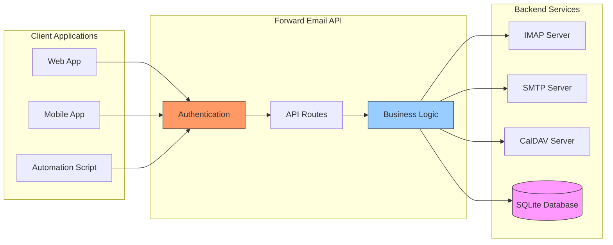

---


## Notifikasi Push iOS {#ios-push-notifications}

> \[!TIP]
> Forward Email mendukung notifikasi push iOS native melalui XAPPLEPUSHSERVICE untuk pengiriman email instan.

> \[!IMPORTANT]
> **Fitur Unik:** Forward Email adalah salah satu dari sedikit server email open-source yang mendukung notifikasi push iOS native untuk email, kontak, dan kalender melalui ekstensi IMAP `XAPPLEPUSHSERVICE`. Ini direkayasa balik dari protokol Apple dan menyediakan pengiriman instan ke perangkat iOS tanpa menguras baterai.

Forward Email mengimplementasikan ekstensi proprietary Apple XAPPLEPUSHSERVICE, menyediakan notifikasi push native untuk perangkat iOS tanpa memerlukan polling latar belakang.

### Cara Kerjanya {#how-it-works-1}

**XAPPLEPUSHSERVICE** adalah ekstensi IMAP non-standar yang memungkinkan aplikasi Mail iOS menerima notifikasi push instan saat email baru tiba.

Forward Email mengimplementasikan integrasi layanan Apple Push Notification (APNs) proprietary untuk IMAP, memungkinkan aplikasi Mail iOS menerima notifikasi push instan saat email baru tiba.

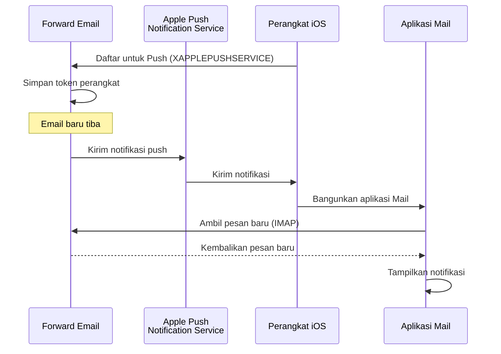

### Fitur Utama {#key-features}

**Pengiriman Instan:**

* Notifikasi push tiba dalam hitungan detik
* Tidak ada polling latar belakang yang menguras baterai
* Berfungsi bahkan saat aplikasi Mail ditutup

<!---->

* **Pengiriman Instan:** Email, acara kalender, dan kontak muncul di iPhone/iPad Anda segera, bukan berdasarkan jadwal polling
* **Hemat Baterai:** Menggunakan infrastruktur push Apple daripada mempertahankan koneksi IMAP terus-menerus
* **Push Berbasis Topik:** Mendukung notifikasi push untuk kotak surat tertentu, tidak hanya INBOX
* **Tidak Perlu Aplikasi Pihak Ketiga:** Berfungsi dengan aplikasi Mail, Kalender, dan Kontak iOS native
**Integrasi Native:**

* Terintegrasi dalam aplikasi Mail iOS
* Tidak memerlukan aplikasi pihak ketiga
* Pengalaman pengguna yang mulus

**Fokus Privasi:**

* Token perangkat dienkripsi
* Tidak ada konten pesan yang dikirim melalui APNS
* Hanya notifikasi "email baru" yang dikirim

**Efisien Baterai:**

* Tidak ada polling IMAP terus-menerus
* Perangkat tidur sampai notifikasi tiba
* Dampak baterai minimal

### Apa yang Membuat Ini Spesial {#what-makes-this-special}

> \[!IMPORTANT]
> Sebagian besar penyedia email tidak mendukung XAPPLEPUSHSERVICE, memaksa perangkat iOS untuk melakukan polling email baru setiap 15 menit.

Sebagian besar server email open-source (termasuk Dovecot, Postfix, Cyrus IMAP) TIDAK mendukung notifikasi push iOS. Pengguna harus:

* Menggunakan IMAP IDLE (menjaga koneksi tetap terbuka, menguras baterai)
* Menggunakan polling (memeriksa setiap 15-30 menit, notifikasi tertunda)
* Menggunakan aplikasi email proprietary dengan infrastruktur push sendiri

Forward Email menyediakan pengalaman notifikasi push instan yang sama seperti layanan komersial seperti Gmail, iCloud, dan Fastmail.

**Perbandingan dengan Penyedia Lain:**

| Penyedia          | Dukungan Push | Interval Polling | Dampak Baterai |
| ----------------- | ------------- | ---------------- | -------------- |
| **Forward Email** | ✅ Push Native | Instan           | Minimal        |
| Gmail             | ✅ Push Native | Instan           | Minimal        |
| iCloud            | ✅ Push Native | Instan           | Minimal        |
| Yahoo             | ✅ Push Native | Instan           | Minimal        |
| Outlook.com       | ❌ Polling    | 15 menit         | Sedang         |
| Fastmail          | ❌ Polling    | 15 menit         | Sedang         |
| ProtonMail        | ⚠️ Hanya Bridge | Melalui Bridge   | Tinggi         |
| Tutanota          | ❌ Hanya Aplikasi | N/A            | N/A            |

### Detail Implementasi {#implementation-details}

**Respons KAPABILITAS IMAP:**

```
* CAPABILITY IMAP4rev1 ... XAPPLEPUSHSERVICE ...
```

**Proses Registrasi:**

1. Aplikasi Mail iOS mendeteksi kemampuan XAPPLEPUSHSERVICE
2. Aplikasi mendaftarkan token perangkat ke Forward Email
3. Forward Email menyimpan token dan mengaitkannya dengan akun
4. Saat email baru tiba, Forward Email mengirim push melalui APNS
5. iOS membangunkan aplikasi Mail untuk mengambil pesan baru

**Keamanan:**

* Token perangkat dienkripsi saat disimpan
* Token kedaluwarsa dan diperbarui secara otomatis
* Tidak ada konten pesan yang terekspos ke APNS
* Enkripsi end-to-end tetap terjaga

<!---->

* **Ekstensi IMAP:** `XAPPLEPUSHSERVICE`
* **Kode Sumber:** [WildDuck Issue #711](https://github.com/zone-eu/wildduck/issues/711)
* **Pengaturan:** Otomatis - tidak perlu konfigurasi, langsung bekerja dengan aplikasi Mail iOS

### Perbandingan dengan Layanan Lain {#comparison-with-other-services}

| Layanan       | Dukungan Push iOS | Metode                                   |
| ------------- | ----------------- | ---------------------------------------- |
| Forward Email | ✅ Ya             | `XAPPLEPUSHSERVICE` (rekayasa balik)    |
| Gmail         | ✅ Ya             | Aplikasi Gmail proprietary + push Google |
| iCloud Mail   | ✅ Ya             | Integrasi native Apple                   |
| Outlook.com   | ✅ Ya             | Aplikasi Outlook proprietary + push Microsoft |
| Fastmail      | ✅ Ya             | `XAPPLEPUSHSERVICE`                      |
| Dovecot       | ❌ Tidak          | Hanya IMAP IDLE atau polling             |
| Postfix       | ❌ Tidak          | Hanya IMAP IDLE atau polling             |
| Cyrus IMAP    | ❌ Tidak          | Hanya IMAP IDLE atau polling             |

**Push Gmail:**

Gmail menggunakan sistem push proprietary yang hanya bekerja dengan aplikasi Gmail. Aplikasi Mail iOS harus melakukan polling ke server IMAP Gmail.

**Push iCloud:**

iCloud memiliki dukungan push native mirip Forward Email, tapi hanya untuk alamat @icloud.com.

**Outlook.com:**

Outlook.com tidak mendukung XAPPLEPUSHSERVICE, sehingga aplikasi Mail iOS harus polling setiap 15 menit.

**Fastmail:**

Fastmail tidak mendukung XAPPLEPUSHSERVICE. Pengguna harus menggunakan aplikasi Fastmail untuk notifikasi push atau menerima keterlambatan polling 15 menit.

---


## Pengujian dan Verifikasi {#testing-and-verification}


## Tes Kapabilitas Protokol {#protocol-capability-tests}
> \[!NOTE]
> Bagian ini menyediakan hasil dari pengujian kemampuan protokol terbaru kami, yang dilakukan pada 22 Januari 2026.

Bagian ini berisi respons CAPABILITY/CAPA/EHLO aktual dari semua penyedia yang diuji. Semua pengujian dilakukan pada **22 Januari 2026**.

Pengujian ini membantu memverifikasi dukungan yang diiklankan dan aktual untuk berbagai protokol email dan ekstensi di berbagai penyedia utama.

### Test Methodology {#test-methodology}

**Test Environment:**

* **Date:** 22 Januari 2026 pukul 02:37 UTC
* **Location:** instance AWS EC2
* **IPv4:** 54.167.216.197
* **IPv6:** 2600:4040:46da:9a00:b19e:3ad4:426c:2f48
* **Tools:** OpenSSL s_client, skrip bash

**Providers Tested:**

* Forward Email
* Gmail
* Outlook.com
* iCloud
* Fastmail
* Yahoo/AOL (Verizon)

### Test Scripts {#test-scripts}

Untuk transparansi penuh, skrip tepat yang digunakan untuk pengujian ini disediakan di bawah.

#### IMAP Capability Test Script {#imap-capability-test-script}

```bash
#!/bin/bash
# IMAP Capability Test Script
# Tests IMAP CAPABILITY for various email providers

echo "========================================="
echo "IMAP CAPABILITY TEST"
echo "Date: $(date -u +"%Y-%m-%d %H:%M:%S UTC")"
echo "========================================="
echo ""

# Gmail
echo "--- Gmail (imap.gmail.com:993) ---"
echo -e "a001 CAPABILITY\na002 LOGOUT" | timeout 10 openssl s_client -connect imap.gmail.com:993 -crlf -quiet 2>&1 | grep -A 20 "CAPABILITY"
echo ""

# Outlook.com
echo "--- Outlook.com (outlook.office365.com:993) ---"
echo -e "a001 CAPABILITY\na002 LOGOUT" | timeout 10 openssl s_client -connect outlook.office365.com:993 -crlf -quiet 2>&1 | grep -A 20 "CAPABILITY"
echo ""

# iCloud
echo "--- iCloud (imap.mail.me.com:993) ---"
echo -e "a001 CAPABILITY\na002 LOGOUT" | timeout 10 openssl s_client -connect imap.mail.me.com:993 -crlf -quiet 2>&1 | grep -A 20 "CAPABILITY"
echo ""

# Fastmail
echo "--- Fastmail (imap.fastmail.com:993) ---"
echo -e "a001 CAPABILITY\na002 LOGOUT" | timeout 10 openssl s_client -connect imap.fastmail.com:993 -crlf -quiet 2>&1 | grep -A 20 "CAPABILITY"
echo ""

# Yahoo
echo "--- Yahoo (imap.mail.yahoo.com:993) ---"
echo -e "a001 CAPABILITY\na002 LOGOUT" | timeout 10 openssl s_client -connect imap.mail.yahoo.com:993 -crlf -quiet 2>&1 | grep -A 20 "CAPABILITY"
echo ""

# Forward Email
echo "--- Forward Email (imap.forwardemail.net:993) ---"
echo -e "a001 CAPABILITY\na002 LOGOUT" | timeout 10 openssl s_client -connect imap.forwardemail.net:993 -crlf -quiet 2>&1 | grep -A 20 "CAPABILITY"
echo ""

echo "========================================="
echo "Test completed"
echo "========================================="
```

#### POP3 Capability Test Script {#pop3-capability-test-script}

```bash
#!/bin/bash
# POP3 Capability Test Script
# Tests POP3 CAPA for various email providers

echo "========================================="
echo "POP3 CAPABILITY TEST"
echo "Date: $(date -u +"%Y-%m-%d %H:%M:%S UTC")"
echo "========================================="
echo ""

# Gmail
echo "--- Gmail (pop.gmail.com:995) ---"
echo -e "CAPA\nQUIT" | timeout 10 openssl s_client -connect pop.gmail.com:995 -crlf -quiet 2>&1 | grep -A 20 "CAPA"
echo ""

# Outlook.com
echo "--- Outlook.com (outlook.office365.com:995) ---"
echo -e "CAPA\nQUIT" | timeout 10 openssl s_client -connect outlook.office365.com:995 -crlf -quiet 2>&1 | grep -A 20 "CAPA"
echo ""

# iCloud (Note: iCloud does not support POP3)
echo "--- iCloud (No POP3 support) ---"
echo "iCloud tidak mendukung POP3"
echo ""

# Fastmail
echo "--- Fastmail (pop.fastmail.com:995) ---"
echo -e "CAPA\nQUIT" | timeout 10 openssl s_client -connect pop.fastmail.com:995 -crlf -quiet 2>&1 | grep -A 20 "CAPA"
echo ""

# Yahoo
echo "--- Yahoo (pop.mail.yahoo.com:995) ---"
echo -e "CAPA\nQUIT" | timeout 10 openssl s_client -connect pop.mail.yahoo.com:995 -crlf -quiet 2>&1 | grep -A 20 "CAPA"
echo ""

# Forward Email
echo "--- Forward Email (pop3.forwardemail.net:995) ---"
echo -e "CAPA\nQUIT" | timeout 10 openssl s_client -connect pop3.forwardemail.net:995 -crlf -quiet 2>&1 | grep -A 20 "CAPA"
echo ""

echo "========================================="
echo "Test completed"
echo "========================================="
```
#### Skrip Tes Kapabilitas SMTP {#smtp-capability-test-script}

```bash
#!/bin/bash
# Skrip Tes Kapabilitas SMTP
# Menguji SMTP EHLO untuk berbagai penyedia email

echo "========================================="
echo "TES KAPABILITAS SMTP"
echo "Tanggal: $(date -u +"%Y-%m-%d %H:%M:%S UTC")"
echo "========================================="
echo ""

# Gmail
echo "--- Gmail (smtp.gmail.com:587) ---"
echo -e "EHLO test.com\nQUIT" | timeout 10 openssl s_client -connect smtp.gmail.com:587 -starttls smtp -crlf -quiet 2>&1 | grep -A 30 "250-"
echo ""

# Outlook.com
echo "--- Outlook.com (smtp.office365.com:587) ---"
echo -e "EHLO test.com\nQUIT" | timeout 10 openssl s_client -connect smtp.office365.com:587 -starttls smtp -crlf -quiet 2>&1 | grep -A 30 "250-"
echo ""

# iCloud
echo "--- iCloud (smtp.mail.me.com:587) ---"
echo -e "EHLO test.com\nQUIT" | timeout 10 openssl s_client -connect smtp.mail.me.com:587 -starttls smtp -crlf -quiet 2>&1 | grep -A 30 "250-"
echo ""

# Fastmail
echo "--- Fastmail (smtp.fastmail.com:587) ---"
echo -e "EHLO test.com\nQUIT" | timeout 10 openssl s_client -connect smtp.fastmail.com:587 -starttls smtp -crlf -quiet 2>&1 | grep -A 30 "250-"
echo ""

# Yahoo
echo "--- Yahoo (smtp.mail.yahoo.com:587) ---"
echo -e "EHLO test.com\nQUIT" | timeout 10 openssl s_client -connect smtp.mail.yahoo.com:587 -starttls smtp -crlf -quiet 2>&1 | grep -A 30 "250-"
echo ""

# Forward Email
echo "--- Forward Email (smtp.forwardemail.net:587) ---"
echo -e "EHLO test.com\nQUIT" | timeout 10 openssl s_client -connect smtp.forwardemail.net:587 -starttls smtp -crlf -quiet 2>&1 | grep -A 30 "250-"
echo ""

echo "========================================="
echo "Tes selesai"
echo "========================================="
```

### Ringkasan Hasil Tes {#test-results-summary}

#### IMAP (KAPABILITAS) {#imap-capability}

**Forward Email**

```
* CAPABILITY IMAP4rev1 AUTH=PLAIN AUTH=PLAIN-CLIENTTOKEN CHILDREN ENABLE ID IDLE NAMESPACE QUOTA SASL-IR UNSELECT XLIST XAPPLEPUSHSERVICE
```

**Gmail**

```
* CAPABILITY IMAP4rev1 UNSELECT IDLE NAMESPACE QUOTA ID XLIST CHILDREN X-GM-EXT-1 UIDPLUS COMPRESS=DEFLATE ENABLE MOVE CONDSTORE ESEARCH UTF8=ACCEPT LIST-EXTENDED LIST-STATUS LITERAL- SPECIAL-USE
```

**iCloud**

```
* OK [CAPABILITY XAPPLEPUSHSERVICE IMAP4 IMAP4rev1 SASL-IR AUTH=ATOKEN AUTH=PLAIN AUTH=ATOKEN2 AUTH=XOAUTH2]
```

**Outlook.com**

```
* CAPABILITY IMAP4rev1 AUTH=PLAIN AUTH=XOAUTH2 SASL-IR UIDPLUS ID UNSELECT CHILDREN IDLE NAMESPACE LITERAL+
```

**Fastmail**

```
* CAPABILITY IMAP4rev1 ACL ANNOTATE-EXPERIMENT-1 CATENATE CONDSTORE ENABLE ESEARCH ESORT I18NLEVEL=1 ID IDLE LIST-EXTENDED LIST-STATUS LITERAL+ LOGINDISABLED MULTIAPPEND NAMESPACE QRESYNC QUOTA RIGHTS=ektx SASL-IR SORT SPECIAL-USE THREAD=ORDEREDSUBJECT UIDPLUS UNSELECT WITHIN X-RENAME XLIST
```

**Yahoo/AOL (Verizon)**

```
* CAPABILITY IMAP4rev1 IDLE NAMESPACE QUOTA ID XLIST CHILDREN UIDPLUS MOVE CONDSTORE ESEARCH ENABLE LIST-EXTENDED LIST-STATUS LITERAL- SPECIAL-USE UNSELECT XAPPLEPUSHSERVICE
```

#### POP3 (CAPA) {#pop3-capa}

**Forward Email**

```
+OK
CAPA
TOP
USER
UIDL
EXPIRE 30
IMPLEMENTATION ForwardEmail
.
```

**Gmail**

```
+OK
CAPA
TOP
USER
UIDL
EXPIRE 30
IMPLEMENTATION Gpop
.
```

**Outlook.com**

```
+OK
CAPA
TOP
USER
UIDL
SASL PLAIN XOAUTH2
.
```

**Fastmail**

```
+OK
CAPA
TOP
USER
UIDL
EXPIRE 30
IMPLEMENTATION Cyrus
.
```

#### SMTP (EHLO) {#smtp-ehlo}

**Forward Email**

```
250-smtp.forwardemail.net
250-PIPELINING
250-SIZE 52428800
250-ETRN
250-STARTTLS
250-ENHANCEDSTATUSCODES
250-8BITMIME
250-DSN
250 CHUNKING
```

**Gmail**

```
250-smtp.gmail.com at your service
250-SIZE 35882577
250-8BITMIME
250-STARTTLS
250-ENHANCEDSTATUSCODES
250-PIPELINING
250-CHUNKING
250 SMTPUTF8
```

**Outlook.com**

```
250-SN4PR13CA0005.outlook.office365.com Hello [x.x.x.x]
250-SIZE 157286400
250-PIPELINING
250-DSN
250-ENHANCEDSTATUSCODES
250-STARTTLS
250-8BITMIME
250-BINARYMIME
250-CHUNKING
250 SMTPUTF8
```

**Fastmail**

```
250-smtp.fastmail.com
250-PIPELINING
250-SIZE 78643200
250-ETRN
250-STARTTLS
250-ENHANCEDSTATUSCODES
250-8BITMIME
250-DSN
250 CHUNKING
```

**Yahoo/AOL (Verizon)**

```
250-smtp.mail.yahoo.com
250-PIPELINING
250-SIZE 41943040
250-8BITMIME
250-ENHANCEDSTATUSCODES
250-STARTTLS
```
### Hasil Tes Detail {#detailed-test-results}

#### Hasil Tes IMAP {#imap-test-results}

**Gmail:**
`* CAPABILITY IMAP4rev1 UNSELECT IDLE NAMESPACE QUOTA ID XLIST CHILDREN X-GM-EXT-1 XYZZY SASL-IR AUTH=XOAUTH2 AUTH=PLAIN AUTH=PLAIN-CLIENTTOKEN AUTH=OAUTHBEARER`

**Outlook.com:**
`* CAPABILITY IMAP4 IMAP4rev1 AUTH=PLAIN AUTH=XOAUTH2 SASL-IR UIDPLUS ID UNSELECT CHILDREN IDLE NAMESPACE LITERAL+`

**iCloud:**
`* CAPABILITY XAPPLEPUSHSERVICE IMAP4 IMAP4rev1 SASL-IR AUTH=ATOKEN AUTH=PLAIN AUTH=ATOKEN2 AUTH=XOAUTH2`

**Fastmail:**
Koneksi habis waktu. Lihat catatan di bawah.

**Yahoo:**
`* CAPABILITY IMAP4rev1 SASL-IR AUTH=PLAIN AUTH=XOAUTH2 AUTH=OAUTHBEARER ID MOVE NAMESPACE XYMHIGHESTMODSEQ UIDPLUS LITERAL+ CHILDREN UNSELECT X-MSG-EXT OBJECTID IDLE ENABLE UIDONLY X-ALL-MAIL X-UIDONLY LIST-EXTENDED LIST-STATUS SPECIAL-USE PARTIAL APPENDLIMIT=41697280`

**Forward Email:**
`* CAPABILITY XAPPLEPUSHSERVICE IMAP4rev1 APPENDLIMIT=52428800 AUTH=PLAIN AUTH=PLAIN-CLIENTTOKEN CHILDREN CONDSTORE ENABLE ID IDLE MOVE NAMESPACE QUOTA SASL-IR SPECIAL-USE UIDPLUS UNSELECT UTF8=ACCEPT XLIST`

#### Hasil Tes POP3 {#pop3-test-results}

**Gmail:**
Koneksi tidak mengembalikan respons CAPA tanpa autentikasi.

**Outlook.com:**
Koneksi tidak mengembalikan respons CAPA tanpa autentikasi.

**iCloud:**
Tidak Didukung.

**Fastmail:**
Koneksi habis waktu. Lihat catatan di bawah.

**Yahoo:**
`+OK CAPA list follows... SASL PLAIN XOAUTH2`

**Forward Email:**
Koneksi tidak mengembalikan respons CAPA tanpa autentikasi.

#### Hasil Tes SMTP {#smtp-test-results}

**Gmail:**
`250-AUTH LOGIN PLAIN XOAUTH2 PLAIN-CLIENTTOKEN OAUTHBEARER XOAUTH`

**Outlook.com:**
`250-DSN`

**iCloud:**
`250-DSN`

**Fastmail:**
`250 AUTH PLAIN LOGIN XOAUTH2 OAUTHBEARER`

**Yahoo:**
`250 AUTH PLAIN LOGIN XOAUTH2 OAUTHBEARER`

**Forward Email:**
`250-DSN`, `250-REQUIRETLS`

### Catatan tentang Hasil Tes {#notes-on-test-results}

> \[!NOTE]
> Pengamatan penting dan keterbatasan dari hasil tes.

1. **Timeout Fastmail**: Koneksi Fastmail habis waktu selama pengujian, kemungkinan karena pembatasan laju atau pembatasan firewall dari IP server pengujian. Fastmail dikenal memiliki dukungan IMAP/POP3/SMTP yang kuat berdasarkan dokumentasi mereka.

2. **Respons CAPA POP3**: Beberapa penyedia (Gmail, Outlook.com, Forward Email) tidak mengembalikan respons CAPA tanpa autentikasi. Ini adalah praktik keamanan umum untuk server POP3.

3. **Dukungan DSN**: Hanya Outlook.com, iCloud, dan Forward Email yang secara eksplisit mengiklankan dukungan DSN dalam respons EHLO SMTP mereka. Ini tidak berarti penyedia lain tidak mendukung DSN, tetapi mereka tidak mengiklankannya.

4. **REQUIRETLS**: Hanya Forward Email yang secara eksplisit mengiklankan dukungan REQUIRETLS dengan kotak centang penegakan yang terlihat pengguna. Penyedia lain mungkin mendukungnya secara internal tetapi tidak mengiklankannya di EHLO.

5. **Lingkungan Tes**: Tes dilakukan dari instance AWS EC2 (IP: 54.167.216.197 IPv4, 2600:4040:46da:9a00:b19e:3ad4:426c:2f48 IPv6) pada 22 Januari 2026 pukul 02:37 UTC.

---


## Ringkasan {#summary}

Forward Email menyediakan dukungan protokol RFC yang komprehensif di semua standar email utama:

* **IMAP4rev1:** 16 RFC yang didukung dengan perbedaan yang disengaja didokumentasikan
* **POP3:** 4 RFC yang didukung dengan penghapusan permanen sesuai RFC
* **SMTP:** 11 ekstensi yang didukung termasuk SMTPUTF8, DSN, dan PIPELINING
* **Autentikasi:** DKIM, SPF, DMARC, ARC didukung penuh
* **Keamanan Transportasi:** MTA-STS dan REQUIRETLS didukung penuh, DANE dukungan parsial
* **Enkripsi:** OpenPGP v6 dan S/MIME didukung
* **Kalender:** CalDAV, CardDAV, dan VTODO didukung penuh
* **Akses API:** REST API lengkap dengan 39 endpoint untuk akses basis data langsung
* **Push iOS:** Notifikasi push native untuk email, kontak, dan kalender melalui `XAPPLEPUSHSERVICE`

### Pembeda Utama {#key-differentiators}

> \[!TIP]
> Forward Email menonjol dengan fitur unik yang tidak ditemukan di penyedia lain.

**Apa yang Membuat Forward Email Unik:**

1. **Enkripsi Quantum-Safe** - Satu-satunya penyedia dengan mailbox SQLite terenkripsi ChaCha20-Poly1305
2. **Arsitektur Zero-Knowledge** - Kata sandi Anda mengenkripsi mailbox Anda; kami tidak dapat mendekripsinya
3. **Domain Kustom Gratis** - Tidak ada biaya bulanan untuk email domain kustom
4. **Dukungan REQUIRETLS** - Kotak centang yang terlihat pengguna untuk menegakkan TLS di seluruh jalur pengiriman
5. **API Komprehensif** - 39 endpoint REST API untuk kontrol programatik penuh
6. **Notifikasi Push iOS** - Dukungan native XAPPLEPUSHSERVICE untuk pengiriman instan
7. **Open Source** - Kode sumber lengkap tersedia di GitHub
8. **Fokus Privasi** - Tidak ada penambangan data, tidak ada iklan, tidak ada pelacakan
* **Enkripsi Terisolasi:** Satu-satunya layanan email dengan kotak surat SQLite terenkripsi secara individual  
* **Kepatuhan RFC:** Memprioritaskan kepatuhan standar daripada kemudahan (misalnya, POP3 DELE)  
* **API Lengkap:** Akses programatik langsung ke semua data email  
* **Sumber Terbuka:** Implementasi yang sepenuhnya transparan  

**Ringkasan Dukungan Protokol:**  

| Kategori             | Tingkat Dukungan | Detail                                        |
| -------------------- | ------------- | --------------------------------------------- |
| **Protokol Inti**    | ✅ Sangat Baik | IMAP4rev1, POP3, SMTP didukung sepenuhnya    |
| **Protokol Modern**  | ⚠️ Sebagian   | Dukungan IMAP4rev2 sebagian, JMAP tidak didukung |
| **Keamanan**         | ✅ Sangat Baik | DKIM, SPF, DMARC, ARC, MTA-STS, REQUIRETLS   |
| **Enkripsi**         | ✅ Sangat Baik | OpenPGP, S/MIME, enkripsi SQLite              |
| **CalDAV/CardDAV**   | ✅ Sangat Baik | Sinkronisasi kalender dan kontak penuh        |
| **Penyaringan**      | ✅ Sangat Baik | Sieve (24 ekstensi) dan ManageSieve           |
| **API**              | ✅ Sangat Baik | 39 endpoint REST API                           |
| **Push**             | ✅ Sangat Baik | Notifikasi push iOS asli                       |
