# Supporto Protocollo Email RFC - Guida Completa a Standard & Specifiche {#email-rfc-protocol-support---complete-standards--specifications-guide}


## Indice {#table-of-contents}

* [Informazioni su Questo Documento](#about-this-document)
  * [Panoramica dell'Architettura](#architecture-overview)
* [Confronto Servizi Email - Supporto Protocollo & Conformità agli Standard RFC](#email-service-comparison---protocol-support--rfc-standards-compliance)
  * [Visualizzazione Supporto Protocollo](#protocol-support-visualization)
* [Protocolli Email Principali](#core-email-protocols)
  * [Flusso del Protocollo Email](#email-protocol-flow)
* [Protocollo Email IMAP4 e Estensioni](#imap4-email-protocol-and-extensions)
  * [Differenze del Protocollo IMAP rispetto alle Specifiche RFC](#imap-protocol-differences-from-rfc-specifications)
  * [Estensioni IMAP NON Supportate](#imap-extensions-not-supported)
* [Protocollo Email POP3 e Estensioni](#pop3-email-protocol-and-extensions)
  * [Differenze del Protocollo POP3 rispetto alle Specifiche RFC](#pop3-protocol-differences-from-rfc-specifications)
  * [Estensioni POP3 NON Supportate](#pop3-extensions-not-supported)
* [Protocollo Email SMTP e Estensioni](#smtp-email-protocol-and-extensions)
  * [Notifiche di Stato di Consegna (DSN)](#delivery-status-notifications-dsn)
  * [Supporto REQUIRETLS](#requiretls-support)
  * [Estensioni SMTP NON Supportate](#smtp-extensions-not-supported)
* [Protocollo Email JMAP](#jmap-email-protocol)
* [Sicurezza Email](#email-security)
  * [Architettura della Sicurezza Email](#email-security-architecture)
* [Protocolli di Autenticazione del Messaggio Email](#email-message-authentication-protocols)
  * [Supporto ai Protocolli di Autenticazione](#authentication-protocol-support)
  * [DKIM (DomainKeys Identified Mail)](#dkim-domainkeys-identified-mail)
  * [SPF (Sender Policy Framework)](#spf-sender-policy-framework)
  * [DMARC (Domain-based Message Authentication, Reporting & Conformance)](#dmarc-domain-based-message-authentication-reporting--conformance)
  * [ARC (Authenticated Received Chain)](#arc-authenticated-received-chain)
  * [Flusso di Autenticazione](#authentication-flow)
* [Protocolli di Sicurezza del Trasporto Email](#email-transport-security-protocols)
  * [Supporto alla Sicurezza del Trasporto](#transport-security-support)
  * [TLS (Transport Layer Security)](#tls-transport-layer-security)
  * [MTA-STS (Mail Transfer Agent Strict Transport Security)](#mta-sts-mail-transfer-agent-strict-transport-security)
  * [DANE (DNS-based Authentication of Named Entities)](#dane-dns-based-authentication-of-named-entities)
  * [REQUIRETLS](#requiretls)
  * [Flusso della Sicurezza del Trasporto](#transport-security-flow)
* [Crittografia del Messaggio Email](#email-message-encryption)
  * [Supporto alla Crittografia](#encryption-support)
  * [OpenPGP (Pretty Good Privacy)](#openpgp-pretty-good-privacy)
  * [S/MIME (Secure/Multipurpose Internet Mail Extensions)](#smime-securemultipurpose-internet-mail-extensions)
  * [Crittografia Casella di Posta SQLite](#sqlite-mailbox-encryption)
  * [Confronto Crittografia](#encryption-comparison)
  * [Flusso di Crittografia](#encryption-flow)
* [Funzionalità Estese](#extended-functionality)
* [Standard di Formato del Messaggio Email](#email-message-format-standards)
  * [Supporto agli Standard di Formato](#format-standards-support)
  * [MIME (Multipurpose Internet Mail Extensions)](#mime-multipurpose-internet-mail-extensions)
  * [SMTPUTF8 e Internazionalizzazione degli Indirizzi Email](#smtputf8-and-email-address-internationalization)
* [Protocolli per Calendari e Contatti](#calendaring-and-contacts-protocols)
  * [Supporto CalDAV e CardDAV](#caldav-and-carddav-support)
  * [CalDAV (Accesso al Calendario)](#caldav-calendar-access)
  * [CardDAV (Accesso ai Contatti)](#carddav-contact-access)
  * [Attività e Promemoria (CalDAV VTODO)](#tasks-and-reminders-caldav-vtodo)
  * [Flusso di Sincronizzazione CalDAV/CardDAV](#caldavcarddav-synchronization-flow)
  * [Estensioni Calendario NON Supportate](#calendaring-extensions-not-supported)
* [Filtraggio del Messaggio Email](#email-message-filtering)
  * [Sieve (RFC 5228)](#sieve-rfc-5228)
  * [ManageSieve (RFC 5804)](#managesieve-rfc-5804)
* [Ottimizzazione dello Storage](#storage-optimization)
  * [Architettura: Ottimizzazione dello Storage a Doppio Livello](#architecture-dual-layer-storage-optimization)
* [Deduplicazione Allegati](#attachment-deduplication)
  * [Come Funziona](#how-it-works)
  * [Flusso di Deduplicazione](#deduplication-flow)
  * [Sistema Magic Number](#magic-number-system)
  * [Differenze Chiave: WildDuck vs Forward Email](#key-differences-wildduck-vs-forward-email)
* [Compressione Brotli](#brotli-compression)
  * [Cosa Viene Compresso](#what-gets-compressed)
  * [Configurazione Compressione](#compression-configuration)
  * [Header Magico: "FEBR"](#magic-header-febr)
  * [Processo di Compressione](#compression-process)
  * [Processo di Decompressione](#decompression-process)
  * [Compatibilità Retroattiva](#backwards-compatibility)
  * [Statistiche di Risparmio di Storage](#storage-savings-statistics)
  * [Processo di Migrazione](#migration-process)
  * [Efficienza Combinata dello Storage](#combined-storage-efficiency)
  * [Dettagli Tecnici di Implementazione](#technical-implementation-details)
  * [Perché Nessun Altro Provider Lo Fa](#why-no-other-provider-does-this)
* [Funzionalità Moderne](#modern-features)
* [API REST Completa per la Gestione Email](#complete-rest-api-for-email-management)
  * [Categorie API (39 Endpoint)](#api-categories-39-endpoints)
  * [Dettagli Tecnici](#technical-details)
  * [Casi d'Uso Reali](#real-world-use-cases)
  * [Caratteristiche Chiave API](#key-api-features)
  * [Architettura API](#api-architecture)
* [Notifiche Push iOS](#ios-push-notifications)
  * [Come Funziona](#how-it-works-1)
  * [Caratteristiche Chiave](#key-features)
  * [Cosa Rende Questo Speciale](#what-makes-this-special)
  * [Dettagli di Implementazione](#implementation-details)
  * [Confronto con Altri Servizi](#comparison-with-other-services)
* [Test e Verifica](#testing-and-verification)
* [Test di Capacità del Protocollo](#protocol-capability-tests)
  * [Metodologia di Test](#test-methodology)
  * [Script di Test](#test-scripts)
  * [Sintesi dei Risultati dei Test](#test-results-summary)
  * [Risultati Dettagliati dei Test](#detailed-test-results)
  * [Note sui Risultati dei Test](#notes-on-test-results)
* [Riepilogo](#summary)
  * [Differenziatori Chiave](#key-differentiators)
## Informazioni su questo documento {#about-this-document}

Questo documento descrive il supporto del protocollo RFC (Request for Comments) per Forward Email. Poiché Forward Email utilizza [WildDuck](https://github.com/nodemailer/wildduck) come base per la funzionalità IMAP/POP3, il supporto del protocollo e le limitazioni documentate qui riflettono l'implementazione di WildDuck.

> \[!IMPORTANT]
> Forward Email utilizza [SQLite](https://sqlite.org/) per l'archiviazione dei messaggi invece di MongoDB (che WildDuck usava originariamente). Questo influisce su alcuni dettagli di implementazione documentati di seguito.

**Codice sorgente:** <https://github.com/forwardemail/forwardemail.net>

### Panoramica dell'architettura {#architecture-overview}

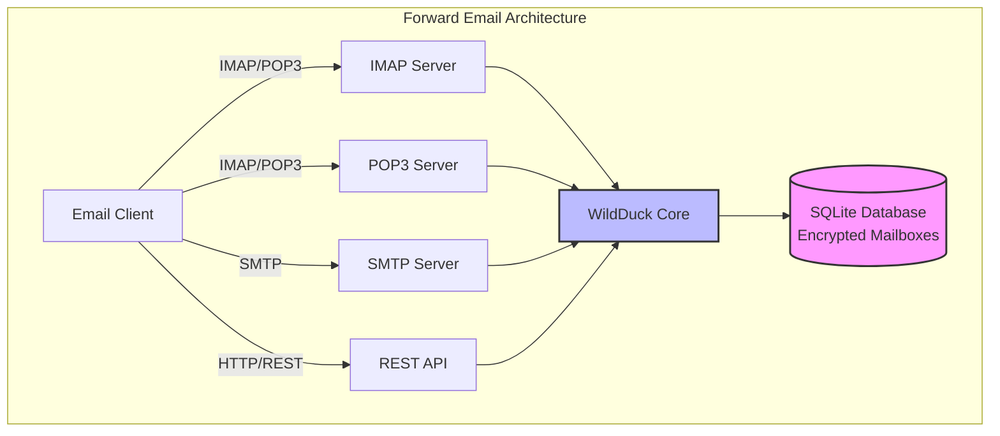

---


## Confronto tra servizi email - Supporto protocollo e conformità agli standard RFC {#email-service-comparison---protocol-support--rfc-standards-compliance}

> \[!IMPORTANT]
> **Crittografia sandboxed e resistente ai computer quantistici:** Forward Email è l'unico servizio email che memorizza cassette postali SQLite crittografate individualmente usando la tua password (che solo tu possiedi). Ogni casella è crittografata con [sqleet](https://github.com/resilar/sqleet) (ChaCha20-Poly1305), autonoma, sandboxed e portatile. Se dimentichi la password, perdi la casella - nemmeno Forward Email può recuperarla. Vedi [Quantum-Safe Encrypted Email](https://forwardemail.net/en/blog/docs/best-quantum-safe-encrypted-email-service) per dettagli.

Confronta il supporto dei protocolli email e l'implementazione degli standard RFC tra i principali provider email:

| Funzionalità                  | Forward Email                                                                                  | Postfix/Dovecot                                                                    | Gmail                                                                             | iCloud Mail                                           | Outlook.com                                                                                                                                                          | Fastmail                                                                                 | Yahoo/AOL (Verizon)                                                  | ProtonMail                                                                     | Tutanota                                                          |
| ----------------------------- | ---------------------------------------------------------------------------------------------- | ---------------------------------------------------------------------------------- | --------------------------------------------------------------------------------- | ----------------------------------------------------- | -------------------------------------------------------------------------------------------------------------------------------------------------------------------- | ---------------------------------------------------------------------------------------- | -------------------------------------------------------------------- | ------------------------------------------------------------------------------ | ----------------------------------------------------------------- |
| **Prezzo dominio personalizzato** | [Gratuito](https://forwardemail.net/en/pricing)                                               | [Gratuito](https://www.postfix.org/)                                              | [$7.20/mese](https://workspace.google.com/pricing)                               | [$0.99/mese](https://support.apple.com/en-us/102622)  | [$7.20/mese](https://www.microsoft.com/en-us/microsoft-365/business/microsoft-365-business-basic)                                                                      | [$5/mese](https://www.fastmail.com/pricing/)                                            | [$3.19/mese](https://www.turbify.com/mail)                            | [$4.99/mese](https://proton.me/mail/pricing)                                    | [$3.27/mese](https://tuta.com/pricing)                             |
| **IMAP4rev1 (RFC 3501)**      | ✅ [Supportato](#imap4-email-protocol-and-extensions)                                          | ✅ [Supportato](https://www.dovecot.org/)                                         | ✅ [Supportato](https://developers.google.com/workspace/gmail/imap/imap-extensions) | ✅ [Supportato](https://support.apple.com/en-us/102431) | ✅ [Supportato](https://support.microsoft.com/en-us/office/pop-imap-and-smtp-settings-for-outlook-com-d088b986-291d-42b8-9564-9c414e2aa040)                            | ✅ [Supportato](https://www.fastmail.help/hc/en-us/articles/1500000278382-Email-standards) | ✅ [Supportato](https://senders.yahooinc.com/developer/documentation/) | ⚠️ [Tramite Bridge](https://proton.me/support/imap-smtp-and-pop3-setup)           | ❌ Non supportato                                                |
| **IMAP4rev2 (RFC 9051)**      | ⚠️ [Parziale](https://forwardemail.net/en/blog/docs/best-quantum-safe-encrypted-email-service) | ⚠️ [Parziale](https://www.dovecot.org/)                                          | ⚠️ [31%](https://developers.google.com/workspace/gmail/imap/imap-extensions)     | ⚠️ [92%](https://support.apple.com/en-us/102431)     | ⚠️ [46%](https://support.microsoft.com/en-us/office/pop-imap-and-smtp-settings-for-outlook-com-d088b986-291d-42b8-9564-9c414e2aa040)                                 | ⚠️ [69%](https://www.fastmail.help/hc/en-us/articles/1500000278382-Email-standards)     | ⚠️ [85%](https://senders.yahooinc.com/developer/documentation/)     | ⚠️ [Tramite Bridge](https://proton.me/support/imap-smtp-and-pop3-setup)           | ❌ Non supportato                                                |
| **POP3 (RFC 1939)**           | ✅ [Supportato](#pop3-email-protocol-and-extensions)                                           | ✅ [Supportato](https://www.dovecot.org/)                                         | ✅ [Supportato](https://support.google.com/mail/answer/7104828)                   | ❌ Non supportato                                     | ✅ [Supportato](https://support.microsoft.com/en-us/office/pop-imap-and-smtp-settings-for-outlook-com-d088b986-291d-42b8-9564-9c414e2aa040)                            | ✅ [Supportato](https://www.fastmail.help/hc/en-us/articles/1500000278382-Email-standards) | ✅ [Supportato](https://help.yahoo.com/kb/SLN4075.html)               | ⚠️ [Tramite Bridge](https://proton.me/support/imap-smtp-and-pop3-setup)           | ❌ Non supportato                                                |
| **SMTP (RFC 5321)**           | ✅ [Supportato](#smtp-email-protocol-and-extensions)                                           | ✅ [Supportato](https://www.postfix.org/)                                         | ✅ [Supportato](https://support.google.com/mail/answer/7126229)                   | ✅ [Supportato](https://support.apple.com/en-us/102431) | ✅ [Supportato](https://support.microsoft.com/en-us/office/pop-imap-and-smtp-settings-for-outlook-com-d088b986-291d-42b8-9564-9c414e2aa040)                            | ✅ [Supportato](https://www.fastmail.help/hc/en-us/articles/1500000278382-Email-standards) | ✅ [Supportato](https://help.yahoo.com/kb/SLN4075.html)               | ⚠️ [Tramite Bridge](https://proton.me/support/imap-smtp-and-pop3-setup)           | ❌ Non supportato                                                |
| **JMAP (RFC 8620)**           | ❌ [Non supportato](#jmap-email-protocol)                                                      | ❌ Non supportato                                                                 | ❌ Non supportato                                                                | ❌ Non supportato                                     | ❌ Non supportato                                                                                                                                                      | ✅ [Supportato](https://www.fastmail.com/dev/)                                            | ❌ Non supportato                                                   | ❌ Non supportato                                                               | ❌ Non supportato                                                |
| **DKIM (RFC 6376)**           | ✅ [Supportato](#email-message-authentication-protocols)                                       | ✅ [Supportato](https://github.com/trusteddomainproject/OpenDKIM)                 | ✅ [Supportato](https://support.google.com/a/answer/174124)                       | ✅ [Supportato](https://support.apple.com/en-us/102431) | ✅ [Supportato](https://learn.microsoft.com/en-us/defender-office-365/email-authentication-dkim-configure)                                                             | ✅ [Supportato](https://www.fastmail.help/hc/en-us/articles/360060590573)                 | ✅ [Supportato](https://help.yahoo.com/kb/SLN25426.html)              | ✅ [Supportato](https://proton.me/support)                                      | ✅ [Supportato](https://tuta.com/support#dkim)                     |
| **SPF (RFC 7208)**            | ✅ [Supportato](#email-message-authentication-protocols)                                       | ✅ [Supportato](https://www.postfix.org/)                                         | ✅ [Supportato](https://support.google.com/a/answer/33786)                        | ✅ [Supportato](https://support.apple.com/en-us/102431) | ✅ [Supportato](https://learn.microsoft.com/en-us/microsoft-365/security/office-365-security/how-office-365-uses-spf-to-prevent-spoofing)                              | ✅ [Supportato](https://www.fastmail.help/hc/en-us/articles/360060590573)                 | ✅ [Supportato](https://help.yahoo.com/kb/SLN25426.html)              | ✅ [Supportato](https://proton.me/support)                                      | ✅ [Supportato](https://tuta.com/support#dkim)                     |
| **DMARC (RFC 7489)**          | ✅ [Supportato](#email-message-authentication-protocols)                                       | ✅ [Supportato](https://www.postfix.org/)                                         | ✅ [Supportato](https://support.google.com/a/answer/2466580)                      | ✅ [Supportato](https://support.apple.com/en-us/102431) | ✅ [Supportato](https://learn.microsoft.com/en-us/microsoft-365/security/office-365-security/use-dmarc-to-validate-email)                                              | ✅ [Supportato](https://www.fastmail.help/hc/en-us/articles/360060590573)                 | ✅ [Supportato](https://help.yahoo.com/kb/SLN25426.html)              | ✅ [Supportato](https://proton.me/support)                                      | ✅ [Supportato](https://tuta.com/support#dkim)                     |
| **ARC (RFC 8617)**            | ✅ [Supportato](#email-message-authentication-protocols)                                       | ✅ [Supportato](https://github.com/trusteddomainproject/OpenARC)                  | ✅ [Supportato](https://support.google.com/a/answer/2466580)                      | ❌ Non supportato                                     | ✅ [Supportato](https://learn.microsoft.com/en-us/defender-office-365/email-authentication-arc-configure)                                                              | ✅ [Supportato](https://www.fastmail.help/hc/en-us/articles/360060590573)                 | ✅ [Supportato](https://senders.yahooinc.com/developer/documentation/) | ✅ [Supportato](https://proton.me/blog/what-is-authenticated-received-chain-arc) | ❌ Non supportato                                                |
| **MTA-STS (RFC 8461)**        | ✅ [Supportato](#email-transport-security-protocols)                                           | ✅ [Supportato](https://www.postfix.org/)                                         | ✅ [Supportato](https://support.google.com/a/answer/9261504)                      | ✅ [Supportato](https://support.apple.com/en-us/102431) | ✅ [Supportato](https://learn.microsoft.com/en-us/defender-office-365/email-authentication-about)                                                                      | ✅ [Supportato](https://www.fastmail.help/hc/en-us/articles/360060590573)                 | ✅ [Supportato](https://senders.yahooinc.com/developer/documentation/) | ✅ [Supportato](https://proton.me/support)                                      | ✅ [Supportato](https://tuta.com/security)                         |
| **DANE (RFC 7671)**           | ✅ [Supportato](#email-transport-security-protocols)                                           | ✅ [Supportato](https://www.postfix.org/)                                         | ❌ Non supportato                                                                | ❌ Non supportato                                     | ❌ Non supportato                                                                                                                                                      | ❌ Non supportato                                                                         | ❌ Non supportato                                                   | ✅ [Supportato](https://proton.me/support)                                      | ✅ [Supportato](https://tuta.com/support#dane)                     |
| **DSN (RFC 3461)**            | ✅ [Supportato](#smtp-email-protocol-and-extensions)                                           | ✅ [Supportato](https://www.postfix.org/DSN_README.html)                          | ❌ Non supportato                                                                | ✅ [Supportato](#protocol-capability-tests)            | ✅ [Supportato](#protocol-capability-tests)                                                                                                                            | ⚠️ [Sconosciuto](https://www.fastmail.help/hc/en-us/articles/1500000278382-Email-standards) | ❌ Non supportato                                                   | ⚠️ [Tramite Bridge](https://proton.me/support/imap-smtp-and-pop3-setup)           | ❌ Non supportato                                                |
| **REQUIRETLS (RFC 8689)**     | ✅ [Supportato](#email-transport-security-protocols)                                           | ✅ [Supportato](https://www.postfix.org/TLS_README.html#server_require_tls)       | ⚠️ Sconosciuto                                                                   | ⚠️ Sconosciuto                                      | ⚠️ Sconosciuto                                                                                                                                                         | ⚠️ Sconosciuto                                                                          | ⚠️ Sconosciuto                                                    | ⚠️ [Tramite Bridge](https://proton.me/support/imap-smtp-and-pop3-setup)           | ❌ Non supportato                                                |
| **ManageSieve (RFC 5804)**    | ✅ [Supportato](#managesieve-rfc-5804)                                                         | ✅ [Supportato](https://doc.dovecot.org/admin_manual/pigeonhole_managesieve_server/) | ❌ Non supportato                                                                | ❌ Non supportato                                     | ❌ Non supportato                                                                                                                                                      | ✅ [Supportato](https://www.fastmail.help/hc/en-us/articles/360060590573)                 | ❌ Non supportato                                                   | ❌ Non supportato                                                               | ❌ Non supportato                                                |
| **OpenPGP (RFC 9580)**        | ✅ [Supportato](#email-message-encryption)                                                     | ⚠️ [Tramite Plugin](https://www.gnupg.org/)                                      | ⚠️ [Terze parti](https://github.com/google/end-to-end)                          | ⚠️ [Terze parti](https://gpgtools.org/)               | ⚠️ [Terze parti](https://gpg4win.org/)                                                                                                                               | ⚠️ [Terze parti](https://www.fastmail.help/hc/en-us/articles/360060590573)                | ⚠️ [Terze parti](https://help.yahoo.com/kb/SLN25426.html)           | ✅ [Nativo](https://proton.me/support/pgp-mime-pgp-inline)                     | ❌ Non supportato                                                |
| **S/MIME (RFC 8551)**         | ✅ [Supportato](#email-message-encryption)                                                     | ✅ [Supportato](https://www.openssl.org/)                                         | ✅ [Supportato](https://support.google.com/mail/answer/81126)                    | ✅ [Supportato](https://support.apple.com/en-us/102431) | ✅ [Supportato](https://support.microsoft.com/en-us/office/send-view-and-reply-to-encrypted-messages-in-outlook-for-pc-eaa43495-9bbb-4fca-922a-df90dee51980)           | ⚠️ [Parziale](https://www.fastmail.help/hc/en-us/articles/360060590573)                  | ❌ Non supportato                                                   | ✅ [Supportato](https://proton.me/support/pgp-mime-pgp-inline)                  | ❌ Non supportato                                                |
| **CalDAV (RFC 4791)**         | ✅ [Supportato](#calendaring-and-contacts-protocols)                                           | ✅ [Supportato](https://www.davical.org/)                                         | ✅ [Supportato](https://developers.google.com/calendar/caldav/v2/guide)          | ✅ [Supportato](https://support.apple.com/en-us/102431) | ❌ Non supportato                                                                                                                                                      | ✅ [Supportato](https://www.fastmail.help/hc/en-us/articles/360060590573)                 | ❌ Non supportato                                                   | ✅ [Tramite Bridge](https://proton.me/support/proton-calendar)                     | ❌ Non supportato                                                |
| **CardDAV (RFC 6352)**        | ✅ [Supportato](#calendaring-and-contacts-protocols)                                           | ✅ [Supportato](https://www.davical.org/)                                         | ✅ [Supportato](https://developers.google.com/people/carddav)                    | ✅ [Supportato](https://support.apple.com/en-us/102431) | ❌ Non supportato                                                                                                                                                      | ✅ [Supportato](https://www.fastmail.help/hc/en-us/articles/360060590573)                 | ❌ Non supportato                                                   | ✅ [Tramite Bridge](https://proton.me/support/proton-contacts)                     | ❌ Non supportato                                                |
| **Tasks (VTODO)**             | ✅ [Supportato](#tasks-and-reminders-caldav-vtodo)                                             | ✅ [Supportato](https://www.davical.org/)                                         | ❌ Non supportato                                                                | ✅ [Supportato](https://support.apple.com/en-us/102431) | ❌ Non supportato                                                                                                                                                      | ✅ [Supportato](https://www.fastmail.help/hc/en-us/articles/360060590573)                 | ❌ Non supportato                                                   | ❌ Non supportato                                                               | ❌ Non supportato                                                |
| **Sieve (RFC 5228)**          | ✅ [Supportato](#sieve-rfc-5228)                                                               | ✅ [Supportato](https://www.dovecot.org/)                                         | ❌ Non supportato                                                                | ❌ Non supportato                                     | ❌ Non supportato                                                                                                                                                      | ✅ [Supportato](https://www.fastmail.help/hc/en-us/articles/360060590573)                 | ❌ Non supportato                                                   | ❌ Non supportato                                                               | ❌ Non supportato                                                |
| **Catch-All**                 | ✅ [Supportato](https://forwardemail.net/en/faq#can-i-have-multiple-global-catch-all-recipients) | ✅ Supportato                                                                     | ✅ [Supportato](https://support.google.com/a/answer/4524505)                     | ❌ Non supportato                                     | ❌ [Non supportato](https://learn.microsoft.com/en-us/exchange/recipients-in-exchange-online/manage-mail-users)                                                        | ✅ [Supportato](https://www.fastmail.help/hc/en-us/articles/1500000278382-Email-standards) | ❌ Non supportato                                                   | ❌ Non supportato                                                               | ✅ [Supportato](https://tuta.com/support#catch-all-alias)          |
| **Alias illimitati**          | ✅ [Supportato](https://forwardemail.net/en/faq#advanced-features)                             | ✅ Supportato                                                                     | ✅ [Supportato](https://support.google.com/a/answer/33327)                       | ✅ [Supportato](https://support.apple.com/en-us/102431) | ✅ [Supportato](https://support.microsoft.com/en-us/office/add-or-remove-an-email-alias-in-outlook-com-459b1989-356d-40fa-a689-8f285b13f1f2)                           | ✅ [Supportato](https://www.fastmail.help/hc/en-us/articles/1500000278382-Email-standards) | ❌ Non supportato                                                   | ✅ [Supportato](https://proton.me/support/addresses-and-aliases)                | ✅ [Supportato](https://tuta.com/support#aliases)                  |
| **Autenticazione a due fattori** | ✅ [Supportato](https://forwardemail.net/en/faq#do-you-support-passkeys-and-webauthn)          | ✅ Supportato                                                                     | ✅ [Supportato](https://support.google.com/accounts/answer/185839)               | ✅ [Supportato](https://support.apple.com/en-us/102431) | ✅ [Supportato](https://support.microsoft.com/en-us/account-billing/how-to-use-two-step-verification-with-your-microsoft-account-c7910146-672f-01e9-50a0-93b4585e7eb4) | ✅ [Supportato](https://www.fastmail.help/hc/en-us/articles/1500000278382-Email-standards) | ✅ [Supportato](https://help.yahoo.com/kb/SLN5013.html)               | ✅ [Supportato](https://proton.me/support/two-factor-authentication-2fa)        | ✅ [Supportato](https://tuta.com/support#two-factor-authentication) |
| **Notifiche push**            | ✅ [Supportato](#ios-push-notifications)                                                       | ⚠️ Tramite Plugin                                                                | ✅ [Supportato](https://developers.google.com/gmail/api/guides/push)             | ✅ [Supportato](https://support.apple.com/en-us/102431) | ✅ [Supportato](https://learn.microsoft.com/en-us/graph/change-notifications-delivery-webhooks)                                                                        | ✅ [Supportato](https://www.fastmail.help/hc/en-us/articles/1500000278382-Email-standards) | ❌ Non supportato                                                   | ✅ [Supportato](https://proton.me/support/notifications)                        | ✅ [Supportato](https://tuta.com/support#push-notifications)         |
| **Calendario/Contatti desktop** | ✅ [Supportato](#calendaring-and-contacts-protocols)                                         | ✅ Supportato                                                                     | ✅ [Supportato](https://support.google.com/calendar)                             | ✅ [Supportato](https://support.apple.com/en-us/102431) | ✅ [Supportato](https://support.microsoft.com/en-us/office/calendar-and-contacts-in-outlook-com-d3e8a6e6-5c1f-4e3e-9f1e-7c0f0e0c0c0c)                                  | ✅ [Supportato](https://www.fastmail.help/hc/en-us/articles/1500000278382-Email-standards) | ❌ Non supportato                                                   | ✅ [Supportato](https://proton.me/support/proton-calendar)                      | ❌ Non supportato                                                |
| **Ricerca avanzata**          | ✅ [Supportato](https://forwardemail.net/en/email-api)                                         | ✅ Supportato                                                                     | ✅ [Supportato](https://support.google.com/mail/answer/7190)                     | ✅ [Supportato](https://support.apple.com/en-us/102431) | ✅ [Supportato](https://support.microsoft.com/en-us/office/search-for-email-messages-in-outlook-com-6f5f2e92-9d5e-4c4e-9b0e-0c0c0c0c0c0c)                              | ✅ [Supportato](https://www.fastmail.help/hc/en-us/articles/1500000278382-Email-standards) | ✅ [Supportato](https://help.yahoo.com/kb/SLN3561.html)               | ✅ [Supportato](https://proton.me/support/search-and-filters)                   | ✅ [Supportato](https://tuta.com/support)                            |
| **API/integrazioni**          | ✅ [39 Endpoint](https://forwardemail.net/en/email-api)                                        | ✅ Supportato                                                                     | ✅ [Supportato](https://developers.google.com/gmail/api)                         | ❌ Non supportato                                     | ✅ [Supportato](https://learn.microsoft.com/en-us/graph/api/resources/mail-api-overview)                                                                               | ✅ [Supportato](https://www.fastmail.help/hc/en-us/articles/1500000278382-Email-standards) | ❌ Non supportato                                                   | ✅ [Supportato](https://proton.me/support/proton-mail-api)                      | ❌ Non supportato                                                |
### Visualizzazione del Supporto ai Protocolli {#protocol-support-visualization}

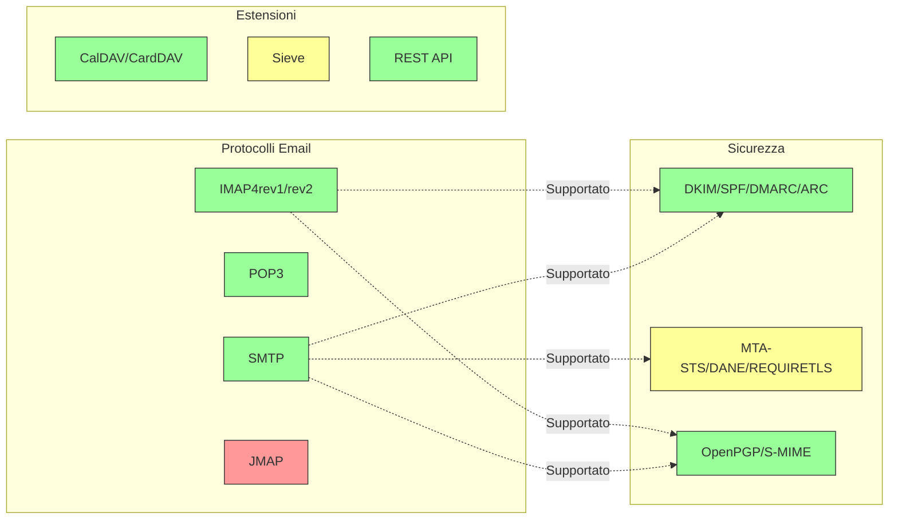

---


## Protocolli Email Principali {#core-email-protocols}

### Flusso del Protocollo Email {#email-protocol-flow}

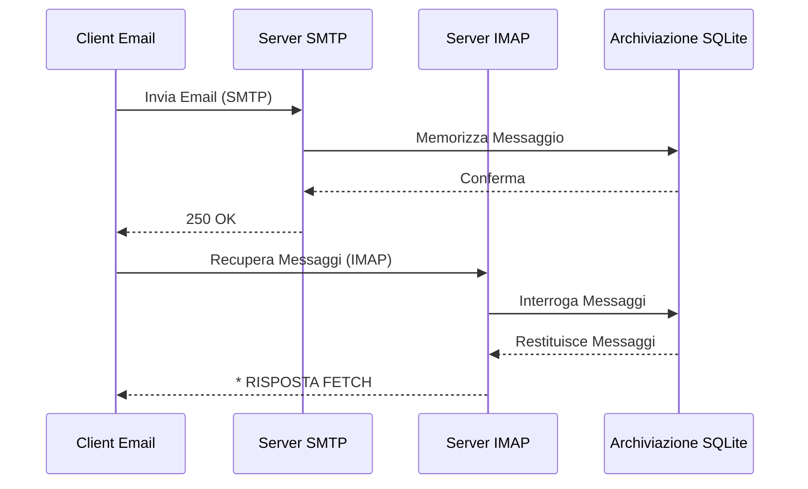


## Protocollo Email IMAP4 e Estensioni {#imap4-email-protocol-and-extensions}

> \[!NOTE]
> Forward Email supporta IMAP4rev1 (RFC 3501) con supporto parziale per le funzionalità di IMAP4rev2 (RFC 9051).

Forward Email fornisce un solido supporto IMAP4 tramite l'implementazione del server di posta WildDuck. Il server implementa IMAP4rev1 (RFC 3501) con supporto parziale per le estensioni di IMAP4rev2 (RFC 9051).

La funzionalità IMAP di Forward Email è fornita dalla dipendenza [WildDuck](https://github.com/nodemailer/wildduck). Sono supportati i seguenti RFC email:

| RFC                                                       | Titolo                                                           | Note sull'Implementazione                            |
| --------------------------------------------------------- | ---------------------------------------------------------------- | -------------------------------------------------- |
| [RFC 3501](https://datatracker.ietf.org/doc/html/rfc3501) | Internet Message Access Protocol (IMAP) - Versione 4rev1         | Supporto completo con differenze intenzionali (vedi sotto) |
| [RFC 2177](https://datatracker.ietf.org/doc/html/rfc2177) | Comando IMAP4 IDLE                                              | Notifiche push-style                                |
| [RFC 2342](https://datatracker.ietf.org/doc/html/rfc2342) | Namespace IMAP4                                                 | Supporto namespace caselle di posta                 |
| [RFC 2087](https://datatracker.ietf.org/doc/html/rfc2087) | Estensione IMAP4 QUOTA                                         | Gestione quota di archiviazione                      |
| [RFC 2971](https://datatracker.ietf.org/doc/html/rfc2971) | Estensione IMAP4 ID                                           | Identificazione client/server                        |
| [RFC 5161](https://datatracker.ietf.org/doc/html/rfc5161) | Estensione IMAP4 ENABLE                                       | Abilitazione estensioni IMAP                         |
| [RFC 4959](https://datatracker.ietf.org/doc/html/rfc4959) | Estensione IMAP per Risposta Iniziale Client SASL (SASL-IR)     | Risposta iniziale client                             |
| [RFC 3691](https://datatracker.ietf.org/doc/html/rfc3691) | Comando IMAP4 UNSELECT                                        | Chiudi casella senza EXPUNGE                         |
| [RFC 4315](https://datatracker.ietf.org/doc/html/rfc4315) | Estensione IMAP UIDPLUS                                       | Comandi UID migliorati                               |
| [RFC 7162](https://datatracker.ietf.org/doc/html/rfc7162) | Estensioni IMAP: Risincronizzazione rapida delle modifiche flag (CONDSTORE) | STORE condizionale                                  |
| [RFC 6154](https://datatracker.ietf.org/doc/html/rfc6154) | Estensione IMAP LIST per Caselle Speciali                      | Attributi speciali delle caselle                      |
| [RFC 6851](https://datatracker.ietf.org/doc/html/rfc6851) | Estensione IMAP MOVE                                         | Comando MOVE atomico                                 |
| [RFC 6855](https://datatracker.ietf.org/doc/html/rfc6855) | Supporto IMAP per UTF-8                                       | Supporto UTF-8                                       |
| [RFC 3348](https://datatracker.ietf.org/doc/html/rfc3348) | Estensione IMAP4 per Caselle Figlie                            | Informazioni caselle figlie                          |
| [RFC 7889](https://datatracker.ietf.org/doc/html/rfc7889) | Estensione IMAP4 per Pubblicizzare la Dimensione Massima di Upload (APPENDLIMIT) | Dimensione massima upload                            |
**Estensioni IMAP Supportate:**

| Estensione       | RFC          | Stato       | Descrizione                     |
| ---------------- | ------------ | ----------- | ------------------------------ |
| IDLE             | RFC 2177     | ✅ Supportata | Notifiche in stile push         |
| NAMESPACE        | RFC 2342     | ✅ Supportata | Supporto per namespace delle caselle |
| QUOTA            | RFC 2087     | ✅ Supportata | Gestione della quota di archiviazione |
| ID               | RFC 2971     | ✅ Supportata | Identificazione client/server   |
| ENABLE           | RFC 5161     | ✅ Supportata | Abilitazione delle estensioni IMAP |
| SASL-IR          | RFC 4959     | ✅ Supportata | Risposta iniziale del client    |
| UNSELECT         | RFC 3691     | ✅ Supportata | Chiudi casella senza EXPUNGE   |
| UIDPLUS          | RFC 4315     | ✅ Supportata | Comandi UID avanzati            |
| CONDSTORE        | RFC 7162     | ✅ Supportata | STORE condizionale              |
| SPECIAL-USE      | RFC 6154     | ✅ Supportata | Attributi speciali delle caselle|
| MOVE             | RFC 6851     | ✅ Supportata | Comando MOVE atomico            |
| UTF8=ACCEPT      | RFC 6855     | ✅ Supportata | Supporto UTF-8                 |
| CHILDREN         | RFC 3348     | ✅ Supportata | Informazioni sulle caselle figlie |
| APPENDLIMIT      | RFC 7889     | ✅ Supportata | Dimensione massima di upload    |
| XLIST            | Non-standard | ✅ Supportata | Elenco cartelle compatibile Gmail |
| XAPPLEPUSHSERVICE| Non-standard | ✅ Supportata | Apple Push Notification Service |

### Differenze del Protocollo IMAP rispetto alle Specifiche RFC {#imap-protocol-differences-from-rfc-specifications}

> \[!WARNING]
> Le seguenti differenze rispetto alle specifiche RFC possono influire sulla compatibilità del client.

Forward Email si discosta intenzionalmente da alcune specifiche RFC IMAP. Queste differenze sono ereditate da WildDuck e sono documentate di seguito:

* **Nessun flag \Recent:** Il flag `\Recent` non è implementato. Tutti i messaggi vengono restituiti senza questo flag.
* **RENAME non influisce sulle sottocartelle:** Quando si rinomina una cartella, le sottocartelle non vengono rinominate automaticamente. La gerarchia delle cartelle è piatta nel database.
* **INBOX non può essere rinominata:** [RFC 3501](https://datatracker.ietf.org/doc/html/rfc3501) permette di rinominare INBOX, ma Forward Email lo vieta esplicitamente. Vedi [codice sorgente WildDuck](https://github.com/nodemailer/wildduck/blob/master/imap-core/lib/commands/rename.js#L27).
* **Nessuna risposta FLAGS non sollecitata:** Quando i flag vengono modificati, non vengono inviate risposte FLAGS non sollecitate al client.
* **STORE restituisce NO per messaggi cancellati:** Tentare di modificare i flag su messaggi cancellati restituisce NO invece di ignorare silenziosamente.
* **CHARSET ignorato in SEARCH:** L'argomento `CHARSET` nei comandi SEARCH viene ignorato. Tutte le ricerche usano UTF-8.
* **Metadati MODSEQ ignorati:** I metadati `MODSEQ` nei comandi STORE vengono ignorati.
* **SEARCH TEXT e SEARCH BODY:** Forward Email utilizza [SQLite FTS5](https://www.sqlite.org/fts5.html) (Full-Text Search) invece della ricerca `$text` di MongoDB. Questo fornisce:
  * Supporto per l'operatore `NOT` (non supportato da MongoDB)
  * Risultati di ricerca ordinati per rilevanza
  * Prestazioni di ricerca sotto i 100ms su caselle di grandi dimensioni
* **Comportamento autoexpunge:** I messaggi contrassegnati con `\Deleted` vengono espunti automaticamente alla chiusura della casella.
* **Fedeltà del messaggio:** Alcune modifiche ai messaggi potrebbero non preservare esattamente la struttura originale del messaggio.

**Supporto Parziale IMAP4rev2:**

Forward Email implementa IMAP4rev1 (RFC 3501) con supporto parziale per IMAP4rev2 (RFC 9051). Le seguenti funzionalità IMAP4rev2 **non sono ancora supportate**:

* **LIST-STATUS** - Comandi LIST e STATUS combinati
* **LITERAL-** - Letterali non sincronizzanti (variante meno)
* **OBJECTID** - Identificatori unici degli oggetti
* **SAVEDATE** - Attributo data di salvataggio
* **REPLACE** - Sostituzione atomica del messaggio
* **UNAUTHENTICATE** - Chiudi autenticazione senza chiudere la connessione

**Gestione Rilassata della Struttura del Corpo:**

Forward Email utilizza una gestione "rilassata del corpo" per strutture MIME malformate, che può differire dall'interpretazione rigorosa delle RFC. Questo migliora la compatibilità con email reali che non rispettano perfettamente gli standard.
**Estensione METADATA (RFC 5464):**

L'estensione IMAP METADATA **non è supportata**. Per maggiori informazioni su questa estensione, vedere [RFC 5464](https://datatracker.ietf.org/doc/html/rfc5464). La discussione sull'aggiunta di questa funzionalità è disponibile in [WildDuck Issue #937](https://github.com/zone-eu/wildduck/issues/937).

### Estensioni IMAP NON Supportate {#imap-extensions-not-supported}

Le seguenti estensioni IMAP dal [Registro delle Capacità IMAP IANA](https://www.iana.org/assignments/imap-capabilities/imap-capabilities.xhtml) NON sono supportate:

| RFC                                                       | Titolo                                                                                                          | Motivo                                                                                                                                  |
| --------------------------------------------------------- | --------------------------------------------------------------------------------------------------------------- | --------------------------------------------------------------------------------------------------------------------------------------- |
| [RFC 2086](https://datatracker.ietf.org/doc/html/rfc2086) | Estensione IMAP4 ACL                                                                                            | Cartelle condivise non implementate. Vedi [WildDuck Issue #427](https://github.com/zone-eu/wildduck/issues/427)                         |
| [RFC 5256](https://datatracker.ietf.org/doc/html/rfc5256) | Estensioni IMAP SORT e THREAD                                                                                   | Threading implementato internamente ma non tramite protocollo RFC 5256. Vedi [WildDuck Issue #12](https://github.com/zone-eu/wildduck/issues/12) |
| [RFC 5162](https://datatracker.ietf.org/doc/html/rfc5162) | Estensioni IMAP4 per la Risincronizzazione Rapida della Casella (QRESYNC)                                        | Non implementato                                                                                                                         |
| [RFC 5464](https://datatracker.ietf.org/doc/html/rfc5464) | Estensione IMAP METADATA                                                                                        | Operazioni sui metadata ignorate. Vedi [documentazione WildDuck](https://datatracker.ietf.org/doc/html/rfc5464)                         |
| [RFC 5258](https://datatracker.ietf.org/doc/html/rfc5258) | Estensioni Comando LIST IMAP4                                                                                   | Non implementato                                                                                                                         |
| [RFC 5267](https://datatracker.ietf.org/doc/html/rfc5267) | Contesti per IMAP4                                                                                              | Non implementato                                                                                                                         |
| [RFC 5465](https://datatracker.ietf.org/doc/html/rfc5465) | Estensione IMAP NOTIFY                                                                                          | Non implementato                                                                                                                         |
| [RFC 5466](https://datatracker.ietf.org/doc/html/rfc5466) | Estensione IMAP4 FILTERS                                                                                        | Non implementato                                                                                                                         |
| [RFC 6203](https://datatracker.ietf.org/doc/html/rfc6203) | Estensione IMAP4 per la Ricerca Fuzzy                                                                           | Non implementato                                                                                                                         |
| [RFC 6785](https://datatracker.ietf.org/doc/html/rfc6785) | Raccomandazioni per l'Implementazione IMAP4                                                                     | Raccomandazioni non completamente seguite                                                                                              |
| [RFC 7162](https://datatracker.ietf.org/doc/html/rfc7162) | Estensioni IMAP: Risincronizzazione Rapida delle Modifiche ai Flag (CONDSTORE) e Risincronizzazione Rapida della Casella (QRESYNC) | Non implementato                                                                                                                         |
| [RFC 8437](https://datatracker.ietf.org/doc/html/rfc8437) | Estensione IMAP UNAUTHENTICATE per il Riutilizzo della Connessione                                             | Non implementato                                                                                                                         |
| [RFC 8438](https://datatracker.ietf.org/doc/html/rfc8438) | Estensione IMAP per STATUS=SIZE                                                                                 | Non implementato                                                                                                                         |
| [RFC 8457](https://datatracker.ietf.org/doc/html/rfc8457) | Parola chiave IMAP "$Important" e attributo di uso speciale "\Important"                                        | Non implementato                                                                                                                         |
| [RFC 8474](https://datatracker.ietf.org/doc/html/rfc8474) | Estensione IMAP per Identificatori di Oggetti                                                                   | Non implementato                                                                                                                         |
| [RFC 9051](https://datatracker.ietf.org/doc/html/rfc9051) | Protocollo di Accesso ai Messaggi Internet (IMAP) - Versione 4rev2                                              | Forward Email implementa IMAP4rev1 ([RFC 3501](https://datatracker.ietf.org/doc/html/rfc3501))                                           |
## Protocollo Email POP3 ed Estensioni {#pop3-email-protocol-and-extensions}

> \[!NOTE]
> Forward Email supporta POP3 (RFC 1939) con estensioni standard per il recupero delle email.

La funzionalità POP3 di Forward Email è fornita dalla dipendenza [WildDuck](https://github.com/nodemailer/wildduck). Sono supportati i seguenti RFC email:

| RFC                                                       | Titolo                                  | Note di Implementazione                             |
| --------------------------------------------------------- | --------------------------------------- | -------------------------------------------------- |
| [RFC 1939](https://datatracker.ietf.org/doc/html/rfc1939) | Post Office Protocol - Versione 3 (POP3) | Supporto completo con differenze intenzionali (vedi sotto) |
| [RFC 2595](https://datatracker.ietf.org/doc/html/rfc2595) | Uso di TLS con IMAP, POP3 e ACAP         | Supporto STARTTLS                                  |
| [RFC 2449](https://datatracker.ietf.org/doc/html/rfc2449) | Meccanismo di Estensione POP3            | Supporto comando CAPA                              |

Forward Email fornisce supporto POP3 per i client che preferiscono questo protocollo più semplice rispetto a IMAP. POP3 è ideale per utenti che vogliono scaricare le email su un singolo dispositivo e rimuoverle dal server.

**Estensioni POP3 Supportate:**

| Estensione | RFC      | Stato       | Descrizione                |
| ---------- | -------- | ----------- | -------------------------- |
| TOP        | RFC 1939 | ✅ Supportata | Recupero intestazioni messaggi |
| USER       | RFC 1939 | ✅ Supportata | Autenticazione con nome utente |
| UIDL       | RFC 1939 | ✅ Supportata | Identificatori unici dei messaggi |
| EXPIRE     | RFC 2449 | ✅ Supportata | Politica di scadenza dei messaggi |

### Differenze del Protocollo POP3 rispetto alle Specifiche RFC {#pop3-protocol-differences-from-rfc-specifications}

> \[!WARNING]
> POP3 ha limitazioni intrinseche rispetto a IMAP.

> \[!IMPORTANT]
> **Differenza Critica: Comportamento DELE POP3 di Forward Email vs WildDuck**
>
> Forward Email implementa la cancellazione permanente conforme a RFC per i comandi POP3 `DELE`, a differenza di WildDuck che sposta i messaggi nel Cestino.

**Comportamento di Forward Email** ([codice sorgente](https://github.com/forwardemail/forwardemail.net/blob/master/pop3-server.js)):

* `DELE` → `QUIT` cancella permanentemente i messaggi
* Segue esattamente la specifica [RFC 1939](https://datatracker.ietf.org/doc/html/rfc1939)
* Comportamento conforme a Dovecot (default), Postfix e altri server conformi agli standard

**Comportamento di WildDuck** ([discussione](https://github.com/zone-eu/wildduck/issues/937)):

* `DELE` → `QUIT` sposta i messaggi nel Cestino (simile a Gmail)
* Decisione progettuale intenzionale per la sicurezza dell’utente
* Non conforme a RFC ma previene la perdita accidentale di dati

**Perché Forward Email Differisce:**

* **Conformità RFC:** Rispetta la specifica [RFC 1939](https://datatracker.ietf.org/doc/html/rfc1939)
* **Aspettative Utente:** Il flusso download-e-cancella prevede la cancellazione permanente
* **Gestione Spazio:** Corretta liberazione dello spazio su disco
* **Interoperabilità:** Coerente con altri server conformi a RFC

> \[!NOTE]
> **Elenco Messaggi POP3:** Forward Email elenca TUTTI i messaggi dalla INBOX senza limiti. Questo differisce da WildDuck che limita a 250 messaggi di default. Vedi [codice sorgente](https://github.com/forwardemail/forwardemail.net/blob/master/pop3-server.js).

**Accesso da Singolo Dispositivo:**

POP3 è progettato per l’accesso da un singolo dispositivo. I messaggi vengono tipicamente scaricati e rimossi dal server, rendendolo inadatto alla sincronizzazione multi-dispositivo.

**Nessun Supporto per Cartelle:**

POP3 accede solo alla cartella INBOX. Altre cartelle (Posta Inviata, Bozze, Cestino, ecc.) non sono accessibili tramite POP3.

**Gestione Limitata dei Messaggi:**

POP3 fornisce solo il recupero e la cancellazione base dei messaggi. Funzionalità avanzate come flag, spostamento o ricerca dei messaggi non sono disponibili.

### Estensioni POP3 NON Supportate {#pop3-extensions-not-supported}

Le seguenti estensioni POP3 dal [Registro Meccanismo Estensione POP3 IANA](https://www.iana.org/assignments/pop3-extension-mechanism/pop3-extension-mechanism.xhtml) NON sono supportate:
| RFC                                                       | Titolo                                                 | Motivo                                  |
| --------------------------------------------------------- | ------------------------------------------------------- | --------------------------------------- |
| [RFC 6856](https://datatracker.ietf.org/doc/html/rfc6856) | Supporto del Protocollo Postale Versione 3 (POP3) per UTF-8 | Non implementato nel server POP3 di WildDuck |
| [RFC 2595](https://datatracker.ietf.org/doc/html/rfc2595) | Comando STLS                                           | Supportato solo STARTTLS, non STLS       |
| [RFC 3206](https://datatracker.ietf.org/doc/html/rfc3206) | Codici di Risposta SYS e AUTH POP                      | Non implementato                         |

---


## Protocollo Email SMTP ed Estensioni {#smtp-email-protocol-and-extensions}

> \[!NOTE]
> Forward Email supporta SMTP (RFC 5321) con estensioni moderne per una consegna email sicura e affidabile.

La funzionalità SMTP di Forward Email è fornita da più componenti: [smtp-server](https://github.com/nodemailer/smtp-server) (nodemailer), [zone-mta](https://github.com/zone-eu/zone-mta), e implementazioni personalizzate. Sono supportati i seguenti RFC email:

| RFC                                                       | Titolo                                                                          | Note di Implementazione             |
| --------------------------------------------------------- | ------------------------------------------------------------------------------- | ---------------------------------- |
| [RFC 5321](https://datatracker.ietf.org/doc/html/rfc5321) | Simple Mail Transfer Protocol (SMTP)                                            | Supporto completo                  |
| [RFC 3207](https://datatracker.ietf.org/doc/html/rfc3207) | Estensione del Servizio SMTP per SMTP Sicuro su Transport Layer Security (STARTTLS) | Supporto TLS/SSL                   |
| [RFC 4954](https://datatracker.ietf.org/doc/html/rfc4954) | Estensione del Servizio SMTP per l’Autenticazione (AUTH)                        | PLAIN, LOGIN, CRAM-MD5, XOAUTH2    |
| [RFC 6531](https://datatracker.ietf.org/doc/html/rfc6531) | Estensione SMTP per Email Internazionalizzate (SMTPUTF8)                        | Supporto nativo per indirizzi email unicode |
| [RFC 3461](https://datatracker.ietf.org/doc/html/rfc3461) | Estensione del Servizio SMTP per Notifiche di Stato di Consegna (DSN)           | Supporto completo DSN              |
| [RFC 3463](https://datatracker.ietf.org/doc/html/rfc3463) | Codici di Stato Avanzati del Sistema di Posta                                   | Codici di stato avanzati nelle risposte |
| [RFC 1870](https://datatracker.ietf.org/doc/html/rfc1870) | Estensione del Servizio SMTP per la Dichiarazione della Dimensione del Messaggio (SIZE) | Pubblicità della dimensione massima del messaggio |
| [RFC 2920](https://datatracker.ietf.org/doc/html/rfc2920) | Estensione del Servizio SMTP per il Pipelining dei Comandi (PIPELINING)         | Supporto pipelining dei comandi   |
| [RFC 1652](https://datatracker.ietf.org/doc/html/rfc1652) | Estensione del Servizio SMTP per il Trasporto MIME a 8 bit (8BITMIME)            | Supporto MIME a 8 bit              |
| [RFC 6152](https://datatracker.ietf.org/doc/html/rfc6152) | Estensione del Servizio SMTP per il Trasporto MIME a 8 bit                       | Supporto MIME a 8 bit              |
| [RFC 2034](https://datatracker.ietf.org/doc/html/rfc2034) | Estensione del Servizio SMTP per il Ritorno di Codici di Errore Avanzati (ENHANCEDSTATUSCODES) | Codici di stato avanzati           |

Forward Email implementa un server SMTP completo con supporto per estensioni moderne che migliorano sicurezza, affidabilità e funzionalità.

**Estensioni SMTP Supportate:**

| Estensione          | RFC      | Stato       | Descrizione                          |
| ------------------- | -------- | ----------- | ----------------------------------- |
| PIPELINING          | RFC 2920 | ✅ Supportata | Pipelining dei comandi               |
| SIZE                | RFC 1870 | ✅ Supportata | Dichiarazione della dimensione del messaggio (limite 52MB) |
| ETRN                | RFC 1985 | ✅ Supportata | Elaborazione remota della coda      |
| STARTTLS            | RFC 3207 | ✅ Supportata | Upgrade a TLS                       |
| ENHANCEDSTATUSCODES | RFC 2034 | ✅ Supportata | Codici di stato avanzati            |
| 8BITMIME            | RFC 6152 | ✅ Supportata | Trasporto MIME a 8 bit              |
| DSN                 | RFC 3461 | ✅ Supportata | Notifiche di Stato di Consegna      |
| CHUNKING            | RFC 3030 | ✅ Supportata | Trasferimento del messaggio a blocchi |
| SMTPUTF8            | RFC 6531 | ⚠️ Parziale  | Indirizzi email UTF-8 (parziale)    |
| REQUIRETLS          | RFC 8689 | ✅ Supportata | Richiesta TLS per la consegna       |
### Notifiche di Stato di Consegna (DSN) {#delivery-status-notifications-dsn}

> \[!TIP]
> DSN fornisce informazioni dettagliate sullo stato di consegna delle email inviate.

Forward Email supporta pienamente **DSN (RFC 3461)**, che consente ai mittenti di richiedere notifiche sullo stato di consegna. Questa funzionalità offre:

* **Notifiche di successo** quando i messaggi vengono consegnati
* **Notifiche di errore** con informazioni dettagliate sugli errori
* **Notifiche di ritardo** quando la consegna è temporaneamente ritardata

DSN è particolarmente utile per:

* Confermare la consegna di messaggi importanti
* Risolvere problemi di consegna
* Sistemi automatizzati di elaborazione email
* Requisiti di conformità e audit

### Supporto REQUIRETLS {#requiretls-support}

> \[!IMPORTANT]
> Forward Email è uno dei pochi provider che pubblicizza ed applica esplicitamente REQUIRETLS.

Forward Email supporta **REQUIRETLS (RFC 8689)**, che garantisce che i messaggi email vengano consegnati solo tramite connessioni crittografate TLS. Questo fornisce:

* **Crittografia end-to-end** per l'intero percorso di consegna
* **Applicazione visibile all’utente** tramite casella di controllo nel compositore email
* **Rifiuto dei tentativi di consegna non crittografata**
* **Maggiore sicurezza** per comunicazioni sensibili

### Estensioni SMTP NON Supportate {#smtp-extensions-not-supported}

Le seguenti estensioni SMTP dal [Registro delle Estensioni del Servizio SMTP IANA](https://www.iana.org/assignments/smtp) NON sono supportate:

| RFC                                                       | Titolo                                                                                             | Motivo                |
| --------------------------------------------------------- | ------------------------------------------------------------------------------------------------- | --------------------- |
| [RFC 4865](https://datatracker.ietf.org/doc/html/rfc4865) | Estensione del Servizio di Invio SMTP per il Rilascio Futuro di Messaggi (FUTURERELEASE)          | Non implementata      |
| [RFC 6710](https://datatracker.ietf.org/doc/html/rfc6710) | Estensione SMTP per Priorità di Trasferimento Messaggi (MT-PRIORITY)                              | Non implementata      |
| [RFC 7293](https://datatracker.ietf.org/doc/html/rfc7293) | Campo Intestazione Require-Recipient-Valid-Since e Estensione del Servizio SMTP                   | Non implementata      |
| [RFC 7372](https://datatracker.ietf.org/doc/html/rfc7372) | Codici di Stato di Autenticazione Email                                                           | Non completamente implementata |
| [RFC 4468](https://datatracker.ietf.org/doc/html/rfc4468) | Estensione BURL per Invio Messaggi                                                                | Non implementata      |
| [RFC 3030](https://datatracker.ietf.org/doc/html/rfc3030) | Estensioni del Servizio SMTP per Trasmissione di Messaggi MIME Grandi e Binari (CHUNKING, BINARYMIME) | Non implementata      |
| [RFC 2852](https://datatracker.ietf.org/doc/html/rfc2852) | Estensione del Servizio Deliver By SMTP                                                           | Non implementata      |

---


## Protocollo Email JMAP {#jmap-email-protocol}

> \[!CAUTION]
> JMAP **non è attualmente supportato** da Forward Email.

| RFC                                                       | Titolo                                     | Stato           | Motivo                                                                 |
| --------------------------------------------------------- | ----------------------------------------- | --------------- | ---------------------------------------------------------------------- |
| [RFC 8620](https://datatracker.ietf.org/doc/html/rfc8620) | The JSON Meta Application Protocol (JMAP) | ❌ Non Supportato | Forward Email utilizza IMAP/POP3/SMTP e una API REST completa invece  |

**JMAP (JSON Meta Application Protocol)** è un protocollo email moderno progettato per sostituire IMAP.

**Perché JMAP non è supportato:**

> "JMAP è una bestia che non avrebbe dovuto essere inventata. Cerca di convertire TCP/IMAP (già un protocollo pessimo secondo gli standard odierni) in HTTP/JSON, usando solo un trasporto diverso mantenendo lo spirito." — Andris Reinman, [Discussione HN](https://news.ycombinator.com/item?id=18890011)
> "JMAP ha più di 10 anni, e praticamente non c'è alcuna adozione" – Andris Reinman, [Discussione GitHub](https://github.com/zone-eu/wildduck/issues/2#issuecomment-1765190790)

Vedi anche commenti aggiuntivi su <https://hn.algolia.com/?dateRange=all&page=0&prefix=true&query=jmap%20andris&sort=byDate&type=comment>.

Forward Email attualmente si concentra nel fornire un eccellente supporto IMAP, POP3 e SMTP, insieme a una completa REST API per la gestione delle email. Il supporto JMAP potrebbe essere considerato in futuro in base alla domanda degli utenti e all’adozione nell’ecosistema.

**Alternativa:** Forward Email offre una [REST API Completa](#complete-rest-api-for-email-management) con 39 endpoint che fornisce funzionalità simili a JMAP per l’accesso programmatico alle email.

---


## Sicurezza Email {#email-security}

### Architettura della Sicurezza Email {#email-security-architecture}

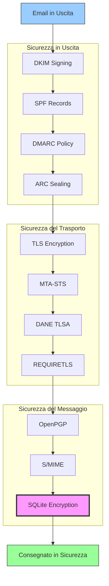


## Protocolli di Autenticazione dei Messaggi Email {#email-message-authentication-protocols}

> \[!NOTE]
> Forward Email implementa tutti i principali protocolli di autenticazione email per prevenire lo spoofing e garantire l’integrità del messaggio.

Forward Email utilizza la libreria [mailauth](https://github.com/postalsys/mailauth) per l’autenticazione delle email. Sono supportati i seguenti RFC:

| RFC                                                       | Titolo                                                                 | Note sull’Implementazione                                    |
| --------------------------------------------------------- | --------------------------------------------------------------------- | ------------------------------------------------------------ |
| [RFC 6376](https://datatracker.ietf.org/doc/html/rfc6376) | DomainKeys Identified Mail (DKIM) Signatures                          | Firma e verifica DKIM completa                               |
| [RFC 8463](https://datatracker.ietf.org/doc/html/rfc8463) | Un nuovo metodo di firma crittografica per DKIM (Ed25519-SHA256)      | Supporta sia algoritmi di firma RSA-SHA256 che Ed25519-SHA256 |
| [RFC 7208](https://datatracker.ietf.org/doc/html/rfc7208) | Sender Policy Framework (SPF)                                         | Validazione record SPF                                       |
| [RFC 7489](https://datatracker.ietf.org/doc/html/rfc7489) | Domain-based Message Authentication, Reporting, and Conformance (DMARC) | Applicazione della policy DMARC                              |
| [RFC 8617](https://datatracker.ietf.org/doc/html/rfc8617) | Authenticated Received Chain (ARC)                                    | Sigillatura e validazione ARC                                |

I protocolli di autenticazione email verificano che i messaggi provengano realmente dal mittente dichiarato e che non siano stati manomessi durante il transito.

### Supporto ai Protocolli di Autenticazione {#authentication-protocol-support}

| Protocollo | RFC      | Stato        | Descrizione                                                          |
| ---------- | -------- | ------------ | ------------------------------------------------------------------- |
| **DKIM**   | RFC 6376 | ✅ Supportato | DomainKeys Identified Mail - firme crittografiche                   |
| **SPF**    | RFC 7208 | ✅ Supportato | Sender Policy Framework - autorizzazione indirizzo IP               |
| **DMARC**  | RFC 7489 | ✅ Supportato | Domain-based Message Authentication - applicazione della policy     |
| **ARC**    | RFC 8617 | ✅ Supportato | Authenticated Received Chain - preserva l’autenticazione nei forward |
### DKIM (DomainKeys Identified Mail) {#dkim-domainkeys-identified-mail}

**DKIM** aggiunge una firma crittografica alle intestazioni delle email, permettendo ai destinatari di verificare che il messaggio sia stato autorizzato dal proprietario del dominio e non sia stato modificato durante il transito.

Forward Email utilizza [mailauth](https://github.com/postalsys/mailauth) per la firma e la verifica DKIM.

**Caratteristiche principali:**

* Firma DKIM automatica per tutti i messaggi in uscita
* Supporto per chiavi RSA e Ed25519
* Supporto per selettori multipli
* Verifica DKIM per i messaggi in arrivo

### SPF (Sender Policy Framework) {#spf-sender-policy-framework}

**SPF** consente ai proprietari di dominio di specificare quali indirizzi IP sono autorizzati a inviare email per conto del loro dominio.

**Caratteristiche principali:**

* Validazione del record SPF per i messaggi in arrivo
* Controllo SPF automatico con risultati dettagliati
* Supporto per i meccanismi include, redirect e all
* Politiche SPF configurabili per dominio

### DMARC (Domain-based Message Authentication, Reporting & Conformance) {#dmarc-domain-based-message-authentication-reporting--conformance}

**DMARC** si basa su SPF e DKIM per fornire l'applicazione delle politiche e la reportistica.

**Caratteristiche principali:**

* Applicazione della politica DMARC (none, quarantine, reject)
* Controllo di allineamento per SPF e DKIM
* Report aggregati DMARC
* Politiche DMARC per singolo dominio

### ARC (Authenticated Received Chain) {#arc-authenticated-received-chain}

**ARC** preserva i risultati dell'autenticazione email durante l'inoltro e le modifiche alle mailing list.

Forward Email utilizza la libreria [mailauth](https://github.com/postalsys/mailauth) per la verifica e la sigillatura ARC.

**Caratteristiche principali:**

* Sigillatura ARC per i messaggi inoltrati
* Validazione ARC per i messaggi in arrivo
* Verifica della catena attraverso più hop
* Preserva i risultati originali dell'autenticazione

### Authentication Flow {#authentication-flow}

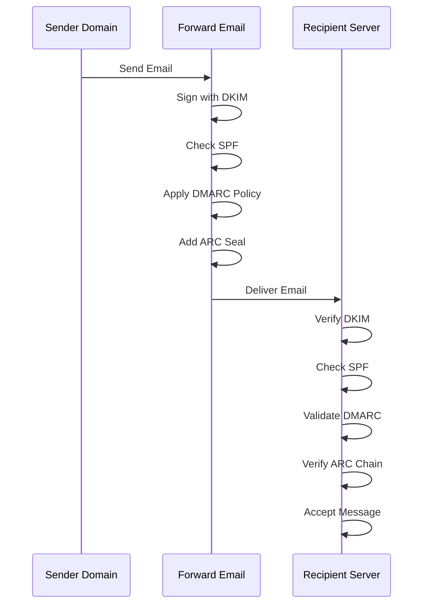

---


## Email Transport Security Protocols {#email-transport-security-protocols}

> \[!IMPORTANT]
> Forward Email implementa più livelli di sicurezza del trasporto per proteggere le email in transito.

Forward Email implementa protocolli moderni di sicurezza del trasporto:

| RFC                                                       | Titolo                                                                                              | Stato       | Note sull'implementazione                                                                                                                                                                                                                                                                      |
| --------------------------------------------------------- | -------------------------------------------------------------------------------------------------- | ----------- | --------------------------------------------------------------------------------------------------------------------------------------------------------------------------------------------------------------------------------------------------------------------------------------------- |
| [RFC 8461](https://datatracker.ietf.org/doc/html/rfc8461) | SMTP MTA Strict Transport Security (MTA-STS)                                                       | ✅ Supportato | Ampiamente utilizzato su server IMAP, SMTP e MX. Vedi [create-mta-sts-cache.js](https://github.com/forwardemail/forwardemail.net/blob/master/helpers/create-mta-sts-cache.js) e [get-transporter.js](https://github.com/forwardemail/forwardemail.net/blob/master/helpers/get-transporter.js) |
| [RFC 8460](https://datatracker.ietf.org/doc/html/rfc8460) | SMTP TLS Reporting                                                                                 | ✅ Supportato | Tramite la libreria [mailauth](https://github.com/postalsys/mailauth)                                                                                                                                                                                                                         |
| [RFC 7671](https://datatracker.ietf.org/doc/html/rfc7671) | The DNS-Based Authentication of Named Entities (DANE) Protocol: Updates and Operational Guidance   | ✅ Supportato | Verifica DANE completa per connessioni SMTP in uscita. Vedi [mx-connect PR #22](https://github.com/zone-eu/mx-connect/pull/22)                                                                                                                                                                |
| [RFC 6698](https://datatracker.ietf.org/doc/html/rfc6698) | The DNS-Based Authentication of Named Entities (DANE) Transport Layer Security (TLS) Protocol: TLSA | ✅ Supportato | Supporto completo RFC 6698: tipi di utilizzo PKIX-TA, PKIX-EE, DANE-TA, DANE-EE. Vedi [mx-connect PR #22](https://github.com/zone-eu/mx-connect/pull/22)                                                                                                                                       |
| [RFC 8314](https://datatracker.ietf.org/doc/html/rfc8314) | Cleartext Considered Obsolete: Use of Transport Layer Security (TLS) for Email Submission and Access | ✅ Supportato | TLS richiesto per tutte le connessioni                                                                                                                                                                                                                                                        |
| [RFC 8689](https://datatracker.ietf.org/doc/html/rfc8689) | SMTP Service Extension for Requiring TLS (REQUIRETLS)                                              | ✅ Supportato | Supporto completo per l'estensione SMTP REQUIRETLS e l'intestazione "TLS-Required"                                                                                                                                                                                                           |
I protocolli di sicurezza del trasporto garantiscono che i messaggi email siano crittografati e autenticati durante la trasmissione tra i server di posta.

### Supporto alla Sicurezza del Trasporto {#transport-security-support}

| Protocollo     | RFC      | Stato       | Descrizione                                      |
| -------------- | -------- | ----------- | ------------------------------------------------ |
| **TLS**        | RFC 8314 | ✅ Supportato | Transport Layer Security - Connessioni crittografate |
| **MTA-STS**    | RFC 8461 | ✅ Supportato | Mail Transfer Agent Strict Transport Security    |
| **DANE**       | RFC 7671 | ✅ Supportato | DNS-based Authentication of Named Entities       |
| **REQUIRETLS** | RFC 8689 | ✅ Supportato | Richiedi TLS per l'intero percorso di consegna   |

### TLS (Transport Layer Security) {#tls-transport-layer-security}

Forward Email applica la crittografia TLS per tutte le connessioni email (SMTP, IMAP, POP3).

**Caratteristiche principali:**

* Supporto TLS 1.2 e TLS 1.3
* Gestione automatica dei certificati
* Perfect Forward Secrecy (PFS)
* Solo suite di cifratura robuste

### MTA-STS (Mail Transfer Agent Strict Transport Security) {#mta-sts-mail-transfer-agent-strict-transport-security}

**MTA-STS** garantisce che le email vengano consegnate solo tramite connessioni crittografate TLS pubblicando una policy via HTTPS.

Forward Email implementa MTA-STS utilizzando [create-mta-sts-cache.js](https://github.com/forwardemail/forwardemail.net/blob/master/helpers/create-mta-sts-cache.js).

**Caratteristiche principali:**

* Pubblicazione automatica della policy MTA-STS
* Caching della policy per migliorare le prestazioni
* Prevenzione degli attacchi di downgrade
* Applicazione della validazione del certificato

### DANE (DNS-based Authentication of Named Entities) {#dane-dns-based-authentication-of-named-entities}

> \[!NOTE]
> Forward Email ora fornisce pieno supporto DANE per le connessioni SMTP in uscita.

**DANE** utilizza DNSSEC per pubblicare le informazioni del certificato TLS nel DNS, permettendo ai server di posta di verificare i certificati senza affidarsi alle autorità di certificazione.

**Caratteristiche principali:**

* ✅ Verifica completa DANE per connessioni SMTP in uscita
* ✅ Supporto completo RFC 6698: tipi di utilizzo PKIX-TA, PKIX-EE, DANE-TA, DANE-EE
* ✅ Verifica del certificato contro i record TLSA durante l'upgrade TLS
* ✅ Risoluzione TLSA parallela per più host MX
* ✅ Rilevamento automatico del `dns.resolveTlsa` nativo (Node.js v22.15.0+, v23.9.0+)
* ✅ Supporto resolver personalizzato per versioni Node.js più vecchie tramite [Tangerine](https://github.com/forwardemail/tangerine)
* Richiede domini firmati DNSSEC

> \[!TIP]
> **Dettagli di implementazione:** Il supporto DANE è stato aggiunto tramite [mx-connect PR #22](https://github.com/zone-eu/mx-connect/pull/22), che fornisce un supporto completo DANE/TLSA per le connessioni SMTP in uscita.

### REQUIRETLS {#requiretls}

> \[!TIP]
> Forward Email è uno dei pochi provider con supporto REQUIRETLS rivolto all'utente.

**REQUIRETLS** garantisce che i messaggi email vengano consegnati solo tramite connessioni crittografate TLS per l'intero percorso di consegna.

**Caratteristiche principali:**

* Casella di controllo visibile all'utente nel compositore email
* Rifiuto automatico delle consegne non crittografate
* Applicazione end-to-end di TLS
* Notifiche dettagliate in caso di fallimento

> \[!TIP]
> **Applicazione TLS visibile all'utente:** Forward Email fornisce una casella di controllo sotto **Il mio account > Domini > Impostazioni** per imporre TLS su tutte le connessioni in ingresso. Quando abilitata, questa funzione rifiuta qualsiasi email in ingresso non inviata tramite una connessione crittografata TLS con codice errore 530, garantendo che tutta la posta in arrivo sia crittografata in transito.

### Flusso della Sicurezza del Trasporto {#transport-security-flow}

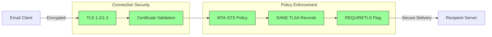
## Crittografia dei Messaggi Email {#email-message-encryption}

> \[!NOTE]
> Forward Email supporta sia OpenPGP che S/MIME per la crittografia end-to-end delle email.

Forward Email supporta la crittografia OpenPGP e S/MIME:

| RFC                                                       | Titolo                                                                                  | Stato       | Note sull'Implementazione                                                                                                                                                                            |
| --------------------------------------------------------- | --------------------------------------------------------------------------------------- | ----------- | ---------------------------------------------------------------------------------------------------------------------------------------------------------------------------------------------------- |
| [RFC 9580](https://datatracker.ietf.org/doc/html/rfc9580) | OpenPGP (sostituisce RFC 4880)                                                          | ✅ Supportato | Tramite integrazione con [OpenPGP.js v6+](https://github.com/openpgpjs/openpgpjs). Vedi [FAQ](https://forwardemail.net/en/faq#do-you-support-openpgpmime-end-to-end-encryption-e2ee-and-web-key-directory-wkd) |
| [RFC 8551](https://datatracker.ietf.org/doc/html/rfc8551) | Specifica dei Messaggi per Secure/Multipurpose Internet Mail Extensions (S/MIME) Versione 4.0 | ✅ Supportato | Supporta sia algoritmi RSA che ECC. Vedi [FAQ](https://forwardemail.net/en/faq#do-you-support-smime-encryption)                                                                                      |

I protocolli di crittografia dei messaggi proteggono il contenuto delle email dall'essere letto da chiunque tranne che dal destinatario previsto, anche se il messaggio viene intercettato durante il transito.

### Supporto alla Crittografia {#encryption-support}

| Protocollo  | RFC      | Stato       | Descrizione                                  |
| ----------- | -------- | ----------- | -------------------------------------------- |
| **OpenPGP** | RFC 9580 | ✅ Supportato | Pretty Good Privacy - crittografia a chiave pubblica  |
| **S/MIME**  | RFC 8551 | ✅ Supportato | Secure/Multipurpose Internet Mail Extensions |
| **WKD**     | Draft    | ✅ Supportato | Web Key Directory - scoperta automatica delle chiavi  |

### OpenPGP (Pretty Good Privacy) {#openpgp-pretty-good-privacy}

**OpenPGP** fornisce crittografia end-to-end utilizzando la crittografia a chiave pubblica. Forward Email supporta OpenPGP tramite il protocollo [Web Key Directory (WKD)](https://forwardemail.net/en/faq#do-you-support-openpgpmime-end-to-end-encryption-e2ee-and-web-key-directory-wkd).

**Caratteristiche Principali:**

* Scoperta automatica delle chiavi tramite WKD
* Supporto PGP/MIME per allegati crittografati
* Gestione delle chiavi tramite client email
* Compatibile con GPG, Mailvelope e altri strumenti OpenPGP

**Come Usare:**

1. Genera una coppia di chiavi PGP nel tuo client email
2. Carica la tua chiave pubblica nel WKD di Forward Email
3. La tua chiave sarà automaticamente reperibile dagli altri utenti
4. Invia e ricevi email crittografate senza problemi

### S/MIME (Secure/Multipurpose Internet Mail Extensions) {#smime-securemultipurpose-internet-mail-extensions}

**S/MIME** fornisce crittografia email e firme digitali utilizzando certificati X.509.

**Caratteristiche Principali:**

* Crittografia basata su certificati
* Firme digitali per l'autenticazione del messaggio
* Supporto nativo nella maggior parte dei client email
* Sicurezza di livello enterprise

**Come Usare:**

1. Ottieni un certificato S/MIME da un'Autorità di Certificazione
2. Installa il certificato nel tuo client email
3. Configura il client per crittografare/firma i messaggi
4. Scambia i certificati con i destinatari

### Crittografia della Casella di Posta SQLite {#sqlite-mailbox-encryption}

> \[!IMPORTANT]
> Forward Email fornisce un ulteriore livello di sicurezza con caselle di posta SQLite crittografate.

Oltre alla crittografia a livello di messaggio, Forward Email cripta intere caselle di posta utilizzando [sqleet](https://github.com/resilar/sqleet) (ChaCha20-Poly1305).

**Caratteristiche Principali:**

* **Crittografia basata su password** - Solo tu possiedi la password
* **Resistente al quantum** - Cifrario ChaCha20-Poly1305
* **Zero-knowledge** - Forward Email non può decriptare la tua casella di posta
* **Sandboxed** - Ogni casella è isolata e portabile
* **Irrecuperabile** - Se dimentichi la password, la casella è persa
### Confronto della Crittografia {#encryption-comparison}

| Caratteristica        | OpenPGP           | S/MIME             | Crittografia SQLite |
| --------------------- | ----------------- | ------------------ | ------------------- |
| **End-to-End**        | ✅ Sì             | ✅ Sì              | ✅ Sì               |
| **Gestione Chiavi**   | Autogestita       | Emessa da CA       | Basata su Password  |
| **Supporto Client**   | Richiede plugin   | Nativo             | Trasparente         |
| **Caso d'Uso**        | Personale         | Aziendale          | Archiviazione       |
| **Resistente al Quantum** | ⚠️ Dipende dalla chiave | ⚠️ Dipende dal certificato | ✅ Sì               |

### Flusso di Crittografia {#encryption-flow}

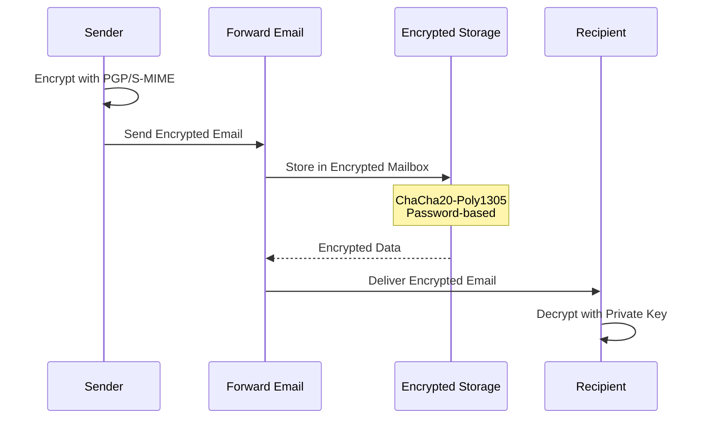

---


## Funzionalità Estese {#extended-functionality}


## Standard del Formato del Messaggio Email {#email-message-format-standards}

> \[!NOTE]
> Forward Email supporta standard moderni di formato email per contenuti ricchi e internazionalizzazione.

Forward Email supporta formati standard di messaggi email:

| RFC                                                       | Titolo                                                        | Note di Implementazione |
| --------------------------------------------------------- | ------------------------------------------------------------- | ----------------------- |
| [RFC 5322](https://datatracker.ietf.org/doc/html/rfc5322) | Formato del Messaggio Internet                                | Supporto completo       |
| [RFC 2045](https://datatracker.ietf.org/doc/html/rfc2045) | MIME Parte Uno: Formato dei Corpi dei Messaggi Internet       | Supporto completo MIME  |
| [RFC 2046](https://datatracker.ietf.org/doc/html/rfc2046) | MIME Parte Due: Tipi di Media                                 | Supporto completo MIME  |
| [RFC 2047](https://datatracker.ietf.org/doc/html/rfc2047) | MIME Parte Tre: Estensioni Header Messaggio per Testo Non ASCII | Supporto completo MIME  |
| [RFC 2048](https://datatracker.ietf.org/doc/html/rfc2048) | MIME Parte Quattro: Procedure di Registrazione                | Supporto completo MIME  |
| [RFC 2049](https://datatracker.ietf.org/doc/html/rfc2049) | MIME Parte Cinque: Criteri di Conformità ed Esempi            | Supporto completo MIME  |

Gli standard del formato email definiscono come i messaggi email sono strutturati, codificati e visualizzati.

### Supporto agli Standard di Formato {#format-standards-support}

| Standard           | RFC           | Stato       | Descrizione                          |
| ------------------ | ------------- | ----------- | ---------------------------------- |
| **MIME**           | RFC 2045-2049 | ✅ Supportato | Estensioni Multipurpose Internet Mail |
| **SMTPUTF8**       | RFC 6531      | ⚠️ Parziale  | Indirizzi email internazionalizzati |
| **EAI**            | RFC 6530      | ⚠️ Parziale  | Internazionalizzazione degli Indirizzi Email |
| **Formato Messaggio** | RFC 5322      | ✅ Supportato | Formato del Messaggio Internet      |
| **Sicurezza MIME** | RFC 1847      | ✅ Supportato | Multipart di Sicurezza per MIME      |

### MIME (Estensioni Multipurpose Internet Mail) {#mime-multipurpose-internet-mail-extensions}

**MIME** permette alle email di contenere più parti con tipi di contenuto differenti (testo, HTML, allegati, ecc.).

**Funzionalità MIME Supportate:**

* Messaggi multipart (mixed, alternative, related)
* Header Content-Type
* Content-Transfer-Encoding (7bit, 8bit, quoted-printable, base64)
* Immagini inline e allegati
* Contenuti HTML ricchi

### SMTPUTF8 e Internazionalizzazione degli Indirizzi Email {#smtputf8-and-email-address-internationalization}

> \[!WARNING]
> Il supporto SMTPUTF8 è parziale - non tutte le funzionalità sono completamente implementate.
**SMTPUTF8** consente agli indirizzi email di contenere caratteri non ASCII (ad esempio, `用户@例え.jp`).

**Stato attuale:**

* ⚠️ Supporto parziale per indirizzi email internazionalizzati
* ✅ Contenuto UTF-8 nei corpi dei messaggi
* ⚠️ Supporto limitato per le parti locali non ASCII

---


## Protocolli per Calendari e Contatti {#calendaring-and-contacts-protocols}

> \[!NOTE]
> Forward Email fornisce pieno supporto CalDAV e CardDAV per la sincronizzazione di calendari e contatti.

Forward Email supporta CalDAV e CardDAV tramite la libreria [caldav-adapter](https://github.com/forwardemail/caldav-adapter):

| RFC                                                       | Titolo                                                                   | Stato       | Note sull'implementazione                                                                                                                                                              |
| --------------------------------------------------------- | ------------------------------------------------------------------------ | ----------- | -------------------------------------------------------------------------------------------------------------------------------------------------------------------------------------- |
| [RFC 4791](https://datatracker.ietf.org/doc/html/rfc4791) | Estensioni Calendario per WebDAV (CalDAV)                               | ✅ Supportato | Accesso e gestione del calendario                                                                                                                                                      |
| [RFC 6352](https://datatracker.ietf.org/doc/html/rfc6352) | CardDAV: Estensioni vCard per WebDAV                                    | ✅ Supportato | Accesso e gestione dei contatti                                                                                                                                                         |
| [RFC 5545](https://datatracker.ietf.org/doc/html/rfc5545) | Specifica Core per Calendari e Pianificazione Internet (iCalendar)      | ✅ Supportato | Supporto formato iCalendar                                                                                                                                                              |
| [RFC 6350](https://datatracker.ietf.org/doc/html/rfc6350) | Specifica formato vCard                                                 | ✅ Supportato | Supporto formato vCard 4.0                                                                                                                                                              |
| [RFC 6638](https://datatracker.ietf.org/doc/html/rfc6638) | Estensioni di Pianificazione per CalDAV                                 | ✅ Supportato | Pianificazione CalDAV con supporto iMIP. Vedi [commit c4d1629](https://github.com/forwardemail/forwardemail.net/commit/c4d162975a49e38d76d68a032662e873a34a9b80)                         |
| [RFC 5546](https://datatracker.ietf.org/doc/html/rfc5546) | Protocollo di Interoperabilità Indipendente dal Trasporto per iCalendar (iTIP) | ✅ Supportato | Supporto iTIP per metodi REQUEST, REPLY, CANCEL e VFREEBUSY. Vedi [commit c4d1629](https://github.com/forwardemail/forwardemail.net/commit/c4d162975a49e38d76d68a032662e873a34a9b80)    |
| [RFC 6047](https://datatracker.ietf.org/doc/html/rfc6047) | Protocollo di Interoperabilità Basato su Messaggi iCalendar (iMIP)      | ✅ Supportato | Inviti a calendario via email con link di risposta. Vedi [commit c4d1629](https://github.com/forwardemail/forwardemail.net/commit/c4d162975a49e38d76d68a032662e873a34a9b80)              |

CalDAV e CardDAV sono protocolli che permettono di accedere, condividere e sincronizzare dati di calendari e contatti tra dispositivi.

### Supporto CalDAV e CardDAV {#caldav-and-carddav-support}

| Protocollo            | RFC      | Stato       | Descrizione                           |
| --------------------- | -------- | ----------- | ----------------------------------- |
| **CalDAV**            | RFC 4791 | ✅ Supportato | Accesso e sincronizzazione calendario |
| **CardDAV**           | RFC 6352 | ✅ Supportato | Accesso e sincronizzazione contatti   |
| **iCalendar**         | RFC 5545 | ✅ Supportato | Formato dati calendario              |
| **vCard**             | RFC 6350 | ✅ Supportato | Formato dati contatti                |
| **VTODO**             | RFC 5545 | ✅ Supportato | Supporto attività/promemoria         |
| **Pianificazione CalDAV** | RFC 6638 | ✅ Supportato | Estensioni per pianificazione calendario |
| **iTIP**              | RFC 5546 | ✅ Supportato | Interoperabilità indipendente dal trasporto |
| **iMIP**              | RFC 6047 | ✅ Supportato | Inviti a calendario via email        |
### CalDAV (Accesso al Calendario) {#caldav-calendar-access}

**CalDAV** ti permette di accedere e gestire i calendari da qualsiasi dispositivo o applicazione.

**Caratteristiche principali:**

* Sincronizzazione multi-dispositivo
* Calendari condivisi
* Sottoscrizioni ai calendari
* Inviti ed risposte agli eventi
* Eventi ricorrenti
* Supporto per i fusi orari

**Client compatibili:**

* Apple Calendar (macOS, iOS)
* Mozilla Thunderbird
* Evolution
* GNOME Calendar
* Qualsiasi client compatibile CalDAV

### CardDAV (Accesso ai Contatti) {#carddav-contact-access}

**CardDAV** ti permette di accedere e gestire i contatti da qualsiasi dispositivo o applicazione.

**Caratteristiche principali:**

* Sincronizzazione multi-dispositivo
* Rubriche condivise
* Gruppi di contatti
* Supporto per le foto
* Campi personalizzati
* Supporto vCard 4.0

**Client compatibili:**

* Apple Contacts (macOS, iOS)
* Mozilla Thunderbird
* Evolution
* GNOME Contacts
* Qualsiasi client compatibile CardDAV

### Attività e Promemoria (CalDAV VTODO) {#tasks-and-reminders-caldav-vtodo}

> \[!TIP]
> Forward Email supporta attività e promemoria tramite CalDAV VTODO.

**VTODO** fa parte del formato iCalendar e permette la gestione delle attività tramite CalDAV.

**Caratteristiche principali:**

* Creazione e gestione delle attività
* Date di scadenza e priorità
* Tracciamento del completamento delle attività
* Attività ricorrenti
* Liste/categorie di attività

**Client compatibili:**

* Apple Reminders (macOS, iOS)
* Mozilla Thunderbird (con Lightning)
* Evolution
* GNOME To Do
* Qualsiasi client CalDAV con supporto VTODO

### Flusso di Sincronizzazione CalDAV/CardDAV {#caldavcarddav-synchronization-flow}

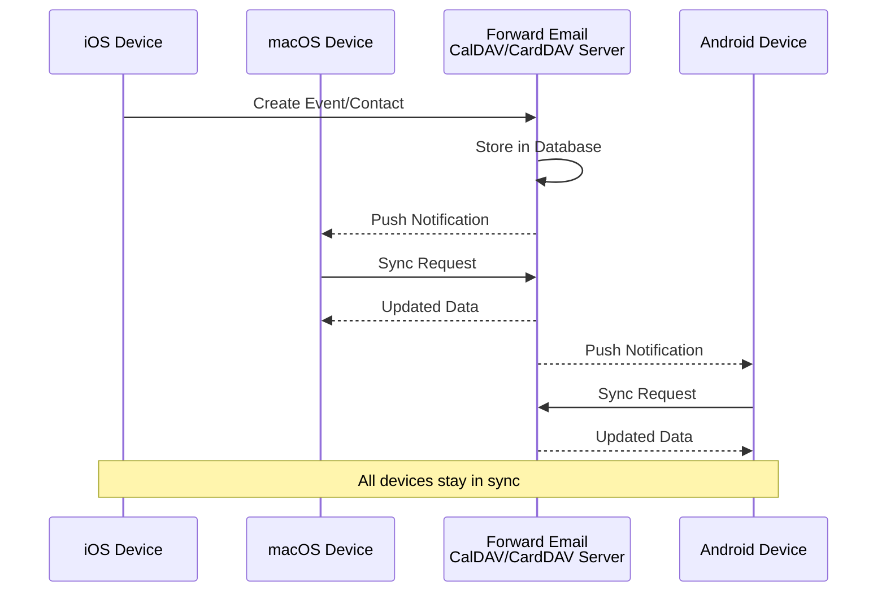

### Estensioni Calendario NON Supportate {#calendaring-extensions-not-supported}

Le seguenti estensioni calendario NON sono supportate:

| RFC                                                       | Titolo                                                               | Motivo                                                          |
| --------------------------------------------------------- | ------------------------------------------------------------------- | --------------------------------------------------------------- |
| [RFC 4918](https://datatracker.ietf.org/doc/html/rfc4918) | Estensioni HTTP per Web Distributed Authoring and Versioning (WebDAV) | CalDAV usa concetti WebDAV ma non implementa completamente RFC 4918 |
| [RFC 6578](https://datatracker.ietf.org/doc/html/rfc6578) | Sincronizzazione di Collezioni per WebDAV                            | Non implementato                                                |
| [RFC 3744](https://datatracker.ietf.org/doc/html/rfc3744) | Protocollo di Controllo Accessi WebDAV                               | Non implementato                                                |

---


## Filtraggio dei Messaggi Email {#email-message-filtering}

> \[!IMPORTANT]
> Forward Email fornisce **supporto completo per Sieve e ManageSieve** per il filtraggio delle email lato server. Crea regole potenti per ordinare, filtrare, inoltrare e rispondere automaticamente ai messaggi in arrivo.

### Sieve (RFC 5228) {#sieve-rfc-5228}

[Sieve](https://en.wikipedia.org/wiki/Sieve_\(mail_filtering_language\)) è un linguaggio di scripting standardizzato e potente per il filtraggio delle email lato server. Forward Email implementa un supporto completo per Sieve con 24 estensioni.

**Codice Sorgente:** [`helpers/sieve/`](https://github.com/forwardemail/forwardemail.net/tree/master/helpers/sieve)

#### RFC Core Sieve Supportati {#core-sieve-rfcs-supported}

| RFC                                                                                    | Titolo                                                         | Stato          |
| -------------------------------------------------------------------------------------- | ------------------------------------------------------------- | -------------- |
| [RFC 5228](https://datatracker.ietf.org/doc/html/rfc5228)                              | Sieve: Un linguaggio per il filtraggio delle email            | ✅ Supporto Completo |
| [RFC 5429](https://datatracker.ietf.org/doc/html/rfc5429)                              | Filtraggio Email Sieve: Estensioni Reject e Extended Reject   | ✅ Supporto Completo |
| [RFC 5230](https://datatracker.ietf.org/doc/html/rfc5230)                              | Filtraggio Email Sieve: Estensione Vacanze                    | ✅ Supporto Completo |
| [RFC 6131](https://datatracker.ietf.org/doc/html/rfc6131)                              | Estensione Vacanze Sieve: Parametro "Seconds"                  | ✅ Supporto Completo |
| [RFC 5232](https://datatracker.ietf.org/doc/html/rfc5232)                              | Filtraggio Email Sieve: Estensione Imap4flags                 | ✅ Supporto Completo |
| [RFC 5173](https://datatracker.ietf.org/doc/html/rfc5173)                              | Filtraggio Email Sieve: Estensione Body                        | ✅ Supporto Completo |
| [RFC 5229](https://datatracker.ietf.org/doc/html/rfc5229)                              | Filtraggio Email Sieve: Estensione Variabili                   | ✅ Supporto Completo |
| [RFC 5231](https://datatracker.ietf.org/doc/html/rfc5231)                              | Filtraggio Email Sieve: Estensione Relazionale                 | ✅ Supporto Completo |
| [RFC 4790](https://datatracker.ietf.org/doc/html/rfc4790)                              | Registro di Collazione dei Protocolli Applicativi Internet     | ✅ Supporto Completo |
| [RFC 3894](https://datatracker.ietf.org/doc/html/rfc3894)                              | Estensione Sieve: Copia senza Effetti Collaterali              | ✅ Supporto Completo |
| [RFC 5293](https://datatracker.ietf.org/doc/html/rfc5293)                              | Filtraggio Email Sieve: Estensione Editheader                  | ✅ Supporto Completo |
| [RFC 5260](https://datatracker.ietf.org/doc/html/rfc5260)                              | Filtraggio Email Sieve: Estensioni Data e Indice               | ✅ Supporto Completo |
| [RFC 5435](https://datatracker.ietf.org/doc/html/rfc5435)                              | Filtraggio Email Sieve: Estensione per Notifiche               | ✅ Supporto Completo |
| [RFC 5183](https://datatracker.ietf.org/doc/html/rfc5183)                              | Filtraggio Email Sieve: Estensione Ambiente                     | ✅ Supporto Completo |
| [RFC 5490](https://datatracker.ietf.org/doc/html/rfc5490)                              | Filtraggio Email Sieve: Estensioni per il Controllo dello Stato della Casella | ✅ Supporto Completo |
| [RFC 8579](https://datatracker.ietf.org/doc/html/rfc8579)                              | Filtraggio Email Sieve: Consegna a Caselle Special-Use         | ✅ Supporto Completo |
| [RFC 7352](https://datatracker.ietf.org/doc/html/rfc7352)                              | Filtraggio Email Sieve: Rilevamento di Consegne Duplicate      | ✅ Supporto Completo |
| [RFC 5463](https://datatracker.ietf.org/doc/html/rfc5463)                              | Filtraggio Email Sieve: Estensione Ihave                       | ✅ Supporto Completo |
| [RFC 5233](https://datatracker.ietf.org/doc/html/rfc5233)                              | Filtraggio Email Sieve: Estensione Subaddress                  | ✅ Supporto Completo |
| [draft-ietf-sieve-regex](https://datatracker.ietf.org/doc/html/draft-ietf-sieve-regex) | Filtraggio Email Sieve: Estensione Espressione Regolare        | ✅ Supporto Completo |
#### Estensioni Sieve Supportate {#supported-sieve-extensions}

| Estensione                   | Descrizione                              | Integrazione                                |
| ---------------------------- | ---------------------------------------- | ------------------------------------------ |
| `fileinto`                   | Inserisce i messaggi in cartelle specifiche | Messaggi archiviati nella cartella IMAP specificata |
| `reject` / `ereject`         | Rifiuta i messaggi con un errore          | Rifiuto SMTP con messaggio di bounce         |
| `vacation`                   | Risposte automatiche di assenza/ferie     | In coda tramite Emails.queue con limitazione di frequenza |
| `vacation-seconds`           | Intervalli di risposta di assenza più dettagliati | TTL dal parametro `:seconds`              |
| `imap4flags`                 | Imposta flag IMAP (\Seen, \Flagged, ecc.) | Flag applicati durante l'archiviazione del messaggio       |
| `envelope`                   | Testa mittente/destinatario dell'involucro | Accesso ai dati dell'involucro SMTP               |
| `body`                       | Testa il contenuto del corpo del messaggio | Corrispondenza completa del testo del corpo                    |
| `variables`                  | Memorizza e usa variabili negli script    | Espansione variabili con modificatori          |
| `relational`                 | Confronti relazionali                     | `:count`, `:value` con gt/lt/eq           |
| `comparator-i;ascii-numeric` | Confronti numerici                        | Confronto di stringhe numeriche                  |
| `copy`                       | Copia i messaggi durante il reindirizzamento | Flag `:copy` su fileinto/redirect          |
| `editheader`                 | Aggiunge o elimina intestazioni del messaggio | Intestazioni modificate prima dell'archiviazione            |
| `date`                       | Testa valori di data/ora                   | Test di `currentdate` e data nelle intestazioni        |
| `index`                      | Accesso a occorrenze specifiche delle intestazioni | `:index` per intestazioni multi-valore           |
| `regex`                      | Corrispondenza con espressioni regolari   | Supporto completo di regex nei test                |
| `enotify`                    | Invia notifiche                           | Notifiche `mailto:` tramite Emails.queue   |
| `environment`                | Accesso alle informazioni ambientali       | Dominio, host, remote-ip dalla sessione       |
| `mailbox`                    | Testa l'esistenza della casella postale   | Test `mailboxexists`                       |
| `special-use`                | Inserisce in caselle postali ad uso speciale | Mappa \Junk, \Trash, ecc. in cartelle        |
| `duplicate`                  | Rileva messaggi duplicati                  | Tracciamento duplicati basato su Redis             |
| `ihave`                      | Testa la disponibilità dell'estensione     | Verifica capacità a runtime                |
| `subaddress`                 | Accesso alle parti dell'indirizzo user+detail | Parti dell'indirizzo `:user` e `:detail`        |

#### Estensioni Sieve NON Supportate {#sieve-extensions-not-supported}

| Estensione                               | RFC                                                       | Motivo                                                           |
| --------------------------------------- | --------------------------------------------------------- | ---------------------------------------------------------------- |
| `include`                               | [RFC 6609](https://datatracker.ietf.org/doc/html/rfc6609) | Rischio di sicurezza (iniezione di script), richiede archiviazione globale degli script |
| `mboxmetadata` / `servermetadata`       | [RFC 5490](https://datatracker.ietf.org/doc/html/rfc5490) | Richiede estensione IMAP METADATA                                 |
| `fcc`                                   | [RFC 8580](https://datatracker.ietf.org/doc/html/rfc8580) | Richiede integrazione con cartella Posta inviata                  |
| `encoded-character`                     | [RFC 5228](https://datatracker.ietf.org/doc/html/rfc5228) | Necessarie modifiche al parser per la sintassi ${hex:}           |
| `foreverypart` / `mime` / `extracttext` | [RFC 5703](https://datatracker.ietf.org/doc/html/rfc5703) | Manipolazione complessa dell'albero MIME                          |
#### Flusso di Elaborazione Sieve {#sieve-processing-flow}

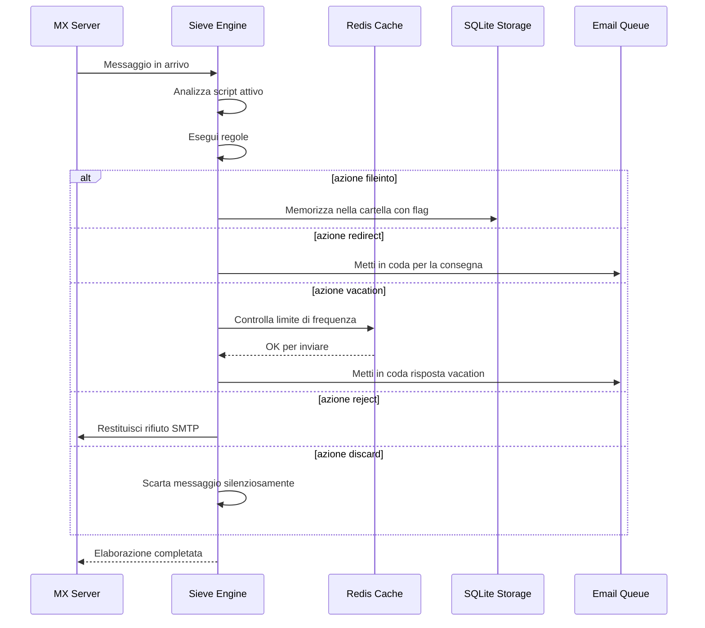

#### Funzionalità di Sicurezza {#security-features}

L'implementazione Sieve di Forward Email include protezioni di sicurezza complete:

* **Protezione CVE-2023-26430**: Previene loop di redirect e attacchi di mail bombing
* **Limitazione della frequenza**: Limiti su redirect (10/messaggio, 100/giorno) e risposte vacation
* **Controllo denylist**: Gli indirizzi di redirect sono controllati rispetto alla denylist
* **Header protetti**: DKIM, ARC e header di autenticazione non possono essere modificati tramite editheader
* **Limiti di dimensione script**: Viene imposto un limite massimo alla dimensione dello script
* **Timeout di esecuzione**: Gli script vengono terminati se superano il limite di tempo di esecuzione

#### Esempi di Script Sieve {#example-sieve-scripts}

**Archivia newsletter in una cartella:**

```sieve
require ["fileinto"];

if header :contains "List-Id" "newsletter" {
    fileinto "Newsletters";
}
```

**Risposta automatica vacation con temporizzazione dettagliata:**

```sieve
require ["vacation", "vacation-seconds"];

vacation :seconds 3600 :subject "Fuori sede"
    "Attualmente sono assente e risponderò entro 24 ore.";
```

**Filtraggio spam con flag:**

```sieve
require ["fileinto", "imap4flags"];

if header :contains "X-Spam-Status" "Yes" {
    setflag "\\Seen";
    fileinto "Junk";
}
```

**Filtraggio complesso con variabili:**

```sieve
require ["variables", "fileinto", "regex"];

if header :regex "From" "(.+)@example\\.com" {
    set :lower "sender" "${1}";
    fileinto "Contacts/${sender}";
}
```

> \[!TIP]
> Per documentazione completa, script di esempio e istruzioni di configurazione, vedi [FAQ: Supportate il filtraggio email Sieve?](/faq#do-you-support-sieve-email-filtering)

### ManageSieve (RFC 5804) {#managesieve-rfc-5804}

Forward Email fornisce pieno supporto al protocollo ManageSieve per la gestione remota degli script Sieve.

**Codice Sorgente:** [`managesieve-server.js`](https://github.com/forwardemail/forwardemail.net/blob/master/managesieve-server.js)

| RFC                                                       | Titolo                                         | Stato          |
| --------------------------------------------------------- | ---------------------------------------------- | -------------- |
| [RFC 5804](https://datatracker.ietf.org/doc/html/rfc5804) | Un protocollo per la gestione remota degli script Sieve | ✅ Supporto completo |

#### Configurazione Server ManageSieve {#managesieve-server-configuration}

| Impostazione            | Valore                  |
| ----------------------- | ----------------------- |
| **Server**              | `imap.forwardemail.net` |
| **Porta (STARTTLS)**    | `2190` (consigliata)    |
| **Porta (TLS implicito)** | `4190`                  |
| **Autenticazione**      | PLAIN (su TLS)          |

> **Nota:** La porta 2190 usa STARTTLS (upgrade da plain a TLS) ed è compatibile con la maggior parte dei client ManageSieve incluso [sieve-connect](https://github.com/philpennock/sieve-connect). La porta 4190 usa TLS implicito (TLS dall'inizio della connessione) per client che lo supportano.

#### Comandi ManageSieve Supportati {#supported-managesieve-commands}

| Comando        | Descrizione                             |
| -------------- | --------------------------------------- |
| `AUTHENTICATE` | Autenticazione usando il meccanismo PLAIN |
| `CAPABILITY`   | Elenca capacità ed estensioni del server |
| `HAVESPACE`    | Verifica se lo script può essere memorizzato |
| `PUTSCRIPT`    | Carica un nuovo script                  |
| `LISTSCRIPTS`  | Elenca tutti gli script con stato attivo |
| `SETACTIVE`    | Attiva uno script                       |
| `GETSCRIPT`    | Scarica uno script                      |
| `DELETESCRIPT` | Elimina uno script                      |
| `RENAMESCRIPT` | Rinomina uno script                     |
| `CHECKSCRIPT`  | Valida la sintassi dello script        |
| `NOOP`         | Mantiene viva la connessione            |
| `LOGOUT`       | Termina la sessione                     |
#### Client Compatibili ManageSieve {#compatible-managesieve-clients}

* **Thunderbird**: Supporto Sieve integrato tramite [componente aggiuntivo Sieve](https://addons.thunderbird.net/addon/sieve/)
* **Roundcube**: [Plugin ManageSieve](https://plugins.roundcube.net/packages/johndoh/sieve)
* **KMail**: Supporto ManageSieve nativo
* **sieve-connect**: Client da linea di comando
* **Qualsiasi client conforme a RFC 5804**

#### Flusso del Protocollo ManageSieve {#managesieve-protocol-flow}

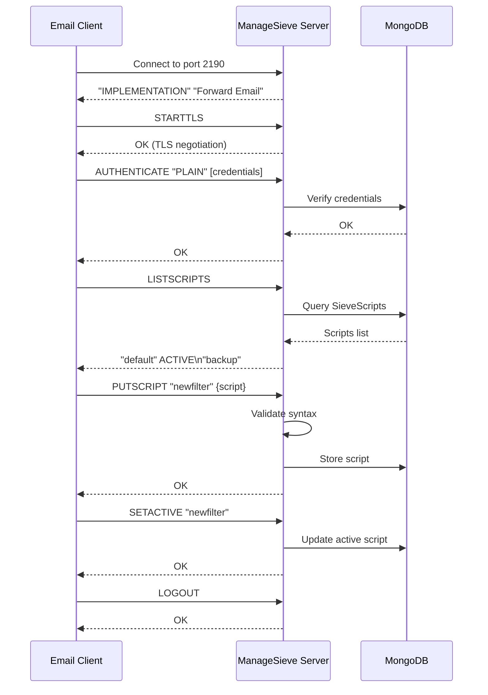

#### Interfaccia Web e API {#web-interface-and-api}

Oltre a ManageSieve, Forward Email offre:

* **Pannello Web**: Crea e gestisci script Sieve tramite l'interfaccia web in Il Mio Account → Domini → Alias → Script Sieve
* **REST API**: Accesso programmatico alla gestione degli script Sieve tramite la [API Forward Email](/api#sieve-scripts)

> \[!TIP]
> Per istruzioni dettagliate di configurazione e impostazione client, consulta [FAQ: Supportate il filtraggio email Sieve?](/faq#do-you-support-sieve-email-filtering)

---


## Ottimizzazione dello Storage {#storage-optimization}

> \[!IMPORTANT]
> **Tecnologia di Storage Pionieristica:** Forward Email è l'**unico provider email al mondo** che combina la deduplicazione degli allegati con la compressione Brotli sul contenuto delle email. Questa ottimizzazione a doppio livello ti offre uno **storage efficace 2-3 volte superiore** rispetto ai provider email tradizionali.

Forward Email implementa due tecniche rivoluzionarie di ottimizzazione dello storage che riducono drasticamente la dimensione della casella mantenendo piena conformità RFC e fedeltà del messaggio:

1. **Deduplicazione degli Allegati** - Elimina gli allegati duplicati in tutte le email
2. **Compressione Brotli** - Riduce lo storage dal 46% all'86% per i metadata e del 50% per gli allegati

### Architettura: Ottimizzazione dello Storage a Doppio Livello {#architecture-dual-layer-storage-optimization}

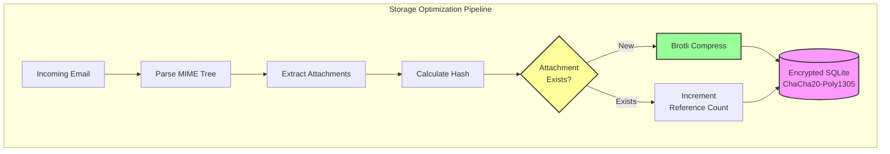

---


## Deduplicazione degli Allegati {#attachment-deduplication}

Forward Email implementa la deduplicazione degli allegati basandosi sull'[approccio comprovato di WildDuck](https://docs.wildduck.email/docs/in-depth/attachment-deduplication/), adattato per lo storage SQLite.

> \[!NOTE]
> **Cosa viene Deduplicato:** "Allegato" si riferisce al contenuto del nodo MIME **codificato** (base64 o quoted-printable), non al file decodificato. Questo preserva la validità delle firme DKIM e GPG.

### Come Funziona {#how-it-works}

**Implementazione Originale di WildDuck (MongoDB GridFS):**

> Il server IMAP Wild Duck deduplica gli allegati. "Allegato" in questo caso significa il contenuto del nodo mime codificato in base64 o quoted-printable, non il file decodificato. Anche se l'uso del contenuto codificato comporta molti falsi negativi (lo stesso file in email diverse potrebbe essere considerato allegato differente) è necessario per garantire la validità di diversi schemi di firma (DKIM, GPG ecc.). Un messaggio recuperato da Wild Duck appare esattamente uguale al messaggio che è stato memorizzato anche se Wild Duck analizza il messaggio in un oggetto ad albero e ricostruisce il messaggio al momento del recupero.
**Implementazione SQLite di Forward Email:**

Forward Email adatta questo approccio per l'archiviazione SQLite crittografata con il seguente processo:

1. **Calcolo Hash**: Quando viene trovato un allegato, viene calcolato un hash utilizzando la libreria [`rev-hash`](https://github.com/sindresorhus/rev-hash) dal corpo dell'allegato
2. **Ricerca**: Verifica se un allegato con hash corrispondente esiste nella tabella `Attachments`
3. **Conteggio Riferimenti**:
   * Se esiste: Incrementa il contatore di riferimento di 1 e il contatore magico di un numero casuale
   * Se nuovo: Crea una nuova voce allegato con contatore = 1
4. **Sicurezza Cancellazione**: Usa un sistema a doppio contatore (riferimento + magico) per prevenire falsi positivi
5. **Garbage Collection**: Gli allegati vengono eliminati immediatamente quando entrambi i contatori raggiungono zero

**Codice Sorgente:** [`helpers/attachment-storage.js`](https://github.com/forwardemail/forwardemail.net/blob/master/helpers/attachment-storage.js)

### Flusso di Deduplicazione {#deduplication-flow}

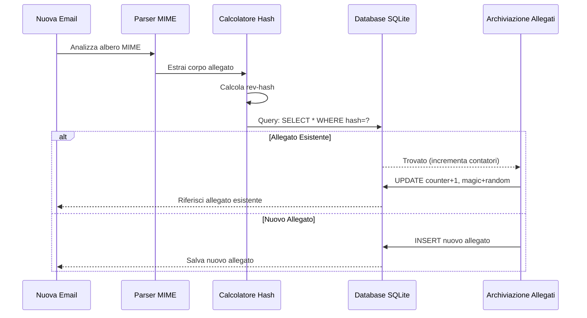

### Sistema del Numero Magico {#magic-number-system}

Forward Email utilizza il sistema del "numero magico" di WildDuck (ispirato da [Mail.ru](https://github.com/zone-eu/wildduck)) per prevenire falsi positivi durante la cancellazione:

* Ad ogni messaggio viene assegnato un **numero casuale**
* Il **contatore magico** dell'allegato viene incrementato di quel numero casuale quando il messaggio viene aggiunto
* Il contatore magico viene decrementato dello stesso numero quando il messaggio viene eliminato
* L'allegato viene eliminato solo quando **entrambi i contatori** (riferimento + magico) raggiungono zero

Questo sistema a doppio contatore garantisce che se qualcosa va storto durante la cancellazione (es. crash, errore di rete), l'allegato non venga eliminato prematuramente.

### Differenze Chiave: WildDuck vs Forward Email {#key-differences-wildduck-vs-forward-email}

| Funzionalità           | WildDuck (MongoDB)       | Forward Email (SQLite)       |
| ---------------------- | ------------------------ | ---------------------------- |
| **Backend di Archiviazione** | MongoDB GridFS (a blocchi) | SQLite BLOB (diretto)         |
| **Algoritmo Hash**     | SHA256                   | rev-hash (basato su SHA-256) |
| **Conteggio Riferimenti** | ✅ Sì                    | ✅ Sì                        |
| **Numeri Magici**      | ✅ Sì (ispirato a Mail.ru) | ✅ Sì (stesso sistema)        |
| **Garbage Collection** | Ritardata (job separato) | Immediata (a contatori zero) |
| **Compressione**       | ❌ Nessuna               | ✅ Brotli (vedi sotto)         |
| **Crittografia**       | ❌ Opzionale             | ✅ Sempre (ChaCha20-Poly1305) |

---


## Compressione Brotli {#brotli-compression}

> \[!IMPORTANT]
> **Prima al mondo:** Forward Email è l'**unico servizio email al mondo** che utilizza la compressione Brotli sul contenuto delle email. Questo fornisce un **risparmio di spazio del 46-86%** oltre alla deduplicazione degli allegati.

Forward Email implementa la compressione Brotli sia per i corpi degli allegati che per i metadati dei messaggi, offrendo enormi risparmi di spazio mantenendo la compatibilità retroattiva.

**Implementazione:** [`helpers/msgpack-helpers.js`](https://github.com/forwardemail/forwardemail.net/blob/master/helpers/msgpack-helpers.js)

### Cosa Viene Compresso {#what-gets-compressed}

**1. Corpi degli Allegati** (`encodeAttachmentBody`)

* **Vecchi formati**: stringa codificata in esadecimale (dimensione 2x) o Buffer raw
* **Nuovo formato**: Buffer compresso con Brotli con header magico "FEBR"
* **Decisione di compressione**: Comprimi solo se si risparmia spazio (considera header di 4 byte)
* **Risparmio di spazio**: Fino al **50%** (esadecimale → BLOB nativo)
**2. Metadati del Messaggio** (`encodeMetadata`)

Include: `mimeTree`, `headers`, `envelope`, `flags`

* **Vecchio formato**: stringa di testo JSON
* **Nuovo formato**: Buffer compresso con Brotli
* **Risparmio di spazio**: **46-86%** a seconda della complessità del messaggio

### Configurazione della Compressione {#compression-configuration}

```javascript
// Opzioni di compressione Brotli ottimizzate per la velocità (livello 4 è un buon compromesso)
const BROTLI_COMPRESS_OPTIONS = {
  params: {
    [zlib.constants.BROTLI_PARAM_QUALITY]: 4
  }
};
```

**Perché il Livello 4?**

* **Compressione/decompressione veloce**: elaborazione in meno di un millisecondo
* **Buon rapporto di compressione**: risparmio del 46-86%
* **Prestazioni bilanciate**: ottimale per operazioni email in tempo reale

### Intestazione Magica: "FEBR" {#magic-header-febr}

Forward Email utilizza un’intestazione magica di 4 byte per identificare i corpi degli allegati compressi:

```
"FEBR" = Forward Email BRotli
Hex: 0x46 0x45 0x42 0x52
```

**Perché un’intestazione magica?**

* **Rilevamento del formato**: identifica istantaneamente dati compressi o non compressi
* **Compatibilità retroattiva**: le vecchie stringhe esadecimali e i Buffer grezzi funzionano ancora
* **Evitare collisioni**: "FEBR" è improbabile che appaia all’inizio di dati legittimi di allegati

### Processo di Compressione {#compression-process}

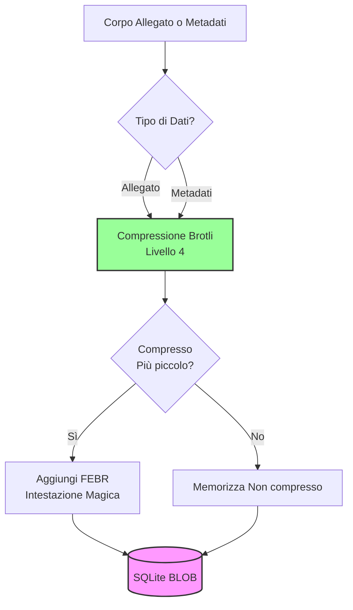

### Processo di Decompressione {#decompression-process}

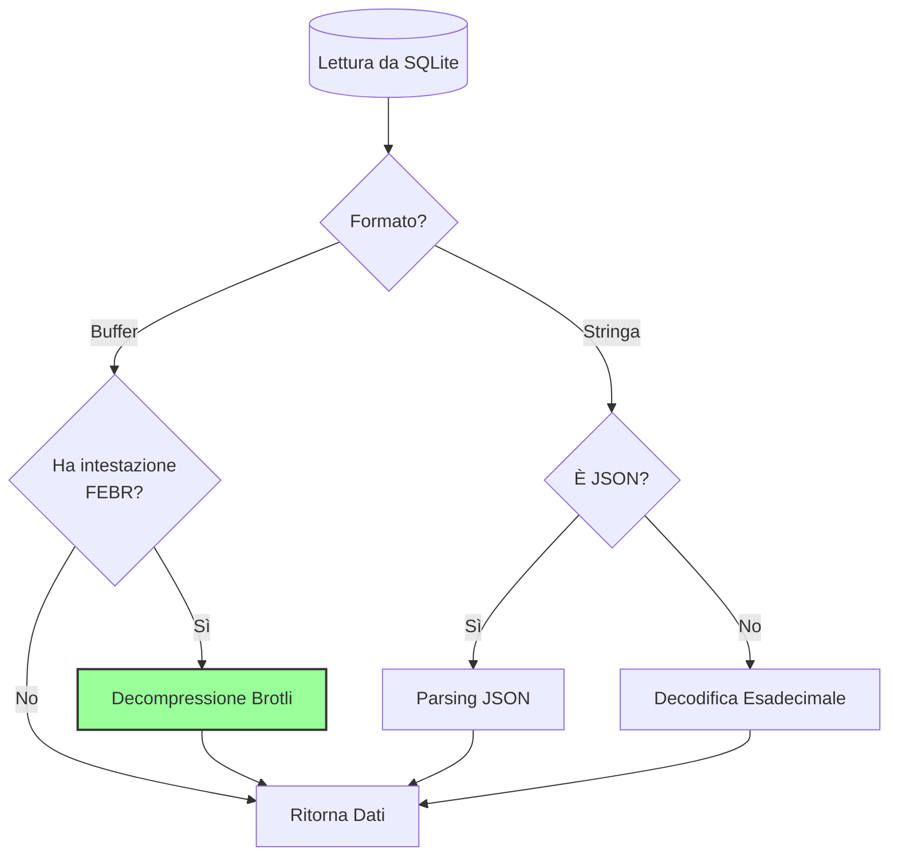

### Compatibilità Retroattiva {#backwards-compatibility}

Tutte le funzioni di decodifica **rilevano automaticamente** il formato di memorizzazione:

| Formato               | Metodo di Rilevamento                  | Gestione                                      |
| --------------------- | ------------------------------------ | --------------------------------------------- |
| **Compresso Brotli**  | Controllo intestazione magica "FEBR" | Decompressione con `zlib.brotliDecompressSync()` |
| **Buffer grezzo**     | `Buffer.isBuffer()` senza intestazione | Restituisce così com’è                         |
| **Stringa esadecimale** | Controllo lunghezza pari + caratteri [0-9a-f] | Decodifica con `Buffer.from(value, 'hex')`    |
| **Stringa JSON**      | Controllo primo carattere `{` o `[`   | Parsing con `JSON.parse()`                     |

Questo garantisce **zero perdita di dati** durante la migrazione dai vecchi ai nuovi formati di memorizzazione.

### Statistiche di Risparmio di Spazio {#storage-savings-statistics}

**Risparmi misurati su dati di produzione:**

| Tipo di Dati          | Vecchio Formato          | Nuovo Formato          | Risparmio  |
| --------------------- | ----------------------- | ---------------------- | ---------- |
| **Corpi allegati**    | Stringa esadecimale (2x) | BLOB compresso Brotli  | **50%**    |
| **Metadati messaggio** | Testo JSON               | BLOB compresso Brotli  | **46-86%** |
| **Flag casella**      | Testo JSON               | BLOB compresso Brotli  | **60-80%** |

**Fonte:** [`helpers/migrate-storage-format.js`](https://github.com/forwardemail/forwardemail.net/blob/master/helpers/migrate-storage-format.js)

### Processo di Migrazione {#migration-process}

Forward Email fornisce una migrazione automatica e idempotente dai vecchi ai nuovi formati di memorizzazione:
// Statistiche di migrazione tracciate:
{
  attachmentsMigrated: 0,
  messagesMigrated: 0,
  mailboxesMigrated: 0,
  bytesSaved: 0  // Totale byte risparmiati dalla compressione
}
```

**Passaggi della migrazione:**

1. Corpi degli allegati: codifica esadecimale → BLOB nativo (risparmio del 50%)
2. Metadati dei messaggi: testo JSON → BLOB compresso con brotli (risparmio 46-86%)
3. Flag della casella di posta: testo JSON → BLOB compresso con brotli (risparmio 60-80%)

**Fonte:** [`helpers/migrate-storage-format.js`](https://github.com/forwardemail/forwardemail.net/blob/master/helpers/migrate-storage-format.js)

---

### Efficienza di archiviazione combinata {#combined-storage-efficiency}

> \[!TIP]
> **Impatto reale:** Con la deduplicazione degli allegati + compressione Brotli, gli utenti di Forward Email ottengono **2-3 volte più spazio di archiviazione effettivo** rispetto ai fornitori di email tradizionali.

**Scenario di esempio:**

Fornitore di email tradizionale (casella da 1GB):

* 1GB di spazio su disco = 1GB di email
* Nessuna deduplicazione: stesso allegato memorizzato 10 volte = spreco di spazio 10x
* Nessuna compressione: metadati JSON completi memorizzati = spreco di spazio 2-3x

Forward Email (casella da 1GB):

* 1GB di spazio su disco ≈ **2-3GB di email** (archiviazione effettiva)
* Deduplicazione: stesso allegato memorizzato una volta, referenziato 10 volte
* Compressione: risparmio 46-86% sui metadati, 50% sugli allegati
* Crittografia: ChaCha20-Poly1305 (nessun sovraccarico di archiviazione)

**Tabella di confronto:**

| Fornitore         | Tecnologia di archiviazione                   | Archiviazione effettiva (casella 1GB) |
| ----------------- | --------------------------------------------- | ------------------------------------- |
| Gmail             | Nessuna                                      | 1GB                                   |
| iCloud            | Nessuna                                      | 1GB                                   |
| Outlook.com       | Nessuna                                      | 1GB                                   |
| Fastmail          | Nessuna                                      | 1GB                                   |
| ProtonMail        | Solo crittografia                            | 1GB                                   |
| Tutanota          | Solo crittografia                            | 1GB                                   |
| **Forward Email** | **Deduplicazione + Compressione + Crittografia** | **2-3GB** ✨                         |

### Dettagli tecnici di implementazione {#technical-implementation-details}

**Prestazioni:**

* Brotli livello 4: compressione/decompressione sotto il millisecondo
* Nessuna penalità di prestazioni dalla compressione
* SQLite FTS5: ricerca sotto i 50ms con NVMe SSD

**Sicurezza:**

* La compressione avviene **dopo** la crittografia (il database SQLite è crittografato)
* Crittografia ChaCha20-Poly1305 + compressione Brotli
* Zero-knowledge: solo l’utente possiede la password di decrittazione

**Conformità RFC:**

* I messaggi recuperati sono **esattamente uguali** a quelli memorizzati
* Le firme DKIM rimangono valide (contenuto codificato preservato)
* Le firme GPG rimangono valide (nessuna modifica al contenuto firmato)

### Perché nessun altro fornitore lo fa {#why-no-other-provider-does-this}

**Complessità:**

* Richiede integrazione profonda con il livello di archiviazione
* La compatibilità retroattiva è complessa
* La migrazione da formati vecchi è complessa

**Preoccupazioni sulle prestazioni:**

* La compressione aggiunge carico CPU (risolto con Brotli livello 4)
* Decompressione ad ogni lettura (risolto con caching SQLite)

**Vantaggio di Forward Email:**

* Costruito da zero con ottimizzazione in mente
* SQLite permette manipolazione diretta dei BLOB
* Database crittografati per utente permettono compressione sicura

---

---


## Funzionalità moderne {#modern-features}


## API REST completa per la gestione delle email {#complete-rest-api-for-email-management}

> \[!TIP]
> Forward Email fornisce una API REST completa con 39 endpoint per la gestione programmatica delle email.

> \[!TIP]
> **Caratteristica unica nel settore:** A differenza di ogni altro servizio email, Forward Email offre accesso programmatico completo alla tua casella, calendario, contatti, messaggi e cartelle tramite una API REST completa. Questa è un’interazione diretta con il file del database SQLite crittografato che memorizza tutti i tuoi dati.

Forward Email offre una API REST completa che fornisce un accesso senza precedenti ai tuoi dati email. Nessun altro servizio email (inclusi Gmail, iCloud, Outlook, ProtonMail, Tuta o Fastmail) offre questo livello di accesso diretto e completo al database.
**Documentazione API:** <https://forwardemail.net/en/email-api>

### Categorie API (39 Endpoint) {#api-categories-39-endpoints}

**1. Messages API** (5 endpoint) - Operazioni CRUD complete sui messaggi email:

* `GET /v1/messages` - Elenca i messaggi con 15+ parametri di ricerca avanzata (nessun altro servizio offre questo)
* `POST /v1/messages` - Crea/invia messaggi
* `GET /v1/messages/:id` - Recupera messaggio
* `PUT /v1/messages/:id` - Aggiorna messaggio (flag, cartelle)
* `DELETE /v1/messages/:id` - Elimina messaggio

*Esempio: Trova tutte le fatture dell'ultimo trimestre con allegati:*

```bash
curl -u "alias@domain.com:password" \
  "https://api.forwardemail.net/v1/messages?q=subject:invoice+has:attachment+after:2024-01-01+before:2024-04-01"
```

Vedi [Documentazione Ricerca Avanzata](https://forwardemail.net/en/email-api)

**2. Folders API** (5 endpoint) - Gestione completa delle cartelle IMAP via REST:

* `GET /v1/folders` - Elenca tutte le cartelle
* `POST /v1/folders` - Crea cartella
* `GET /v1/folders/:id` - Recupera cartella
* `PUT /v1/folders/:id` - Aggiorna cartella
* `DELETE /v1/folders/:id` - Elimina cartella

**3. Contacts API** (5 endpoint) - Archiviazione contatti CardDAV via REST:

* `GET /v1/contacts` - Elenca contatti
* `POST /v1/contacts` - Crea contatto (formato vCard)
* `GET /v1/contacts/:id` - Recupera contatto
* `PUT /v1/contacts/:id` - Aggiorna contatto
* `DELETE /v1/contacts/:id` - Elimina contatto

**4. Calendars API** (5 endpoint) - Gestione contenitori calendario:

* `GET /v1/calendars` - Elenca contenitori calendario
* `POST /v1/calendars` - Crea calendario (es. "Calendario Lavoro", "Calendario Personale")
* `GET /v1/calendars/:id` - Recupera calendario
* `PUT /v1/calendars/:id` - Aggiorna calendario
* `DELETE /v1/calendars/:id` - Elimina calendario

**5. Calendar Events API** (5 endpoint) - Pianificazione eventi all'interno dei calendari:

* `GET /v1/calendar-events` - Elenca eventi
* `POST /v1/calendar-events` - Crea evento con partecipanti
* `GET /v1/calendar-events/:id` - Recupera evento
* `PUT /v1/calendar-events/:id` - Aggiorna evento
* `DELETE /v1/calendar-events/:id` - Elimina evento

*Esempio: Crea un evento calendario:*

```bash
curl -u "alias@domain.com:password" \
  -X POST \
  -H "Content-Type: application/json" \
  -d '{"title":"Riunione di Team","start":"2024-12-20T10:00:00Z","attendees":["team@example.com"],"calendar_id":"calendar123"}' \
  https://api.forwardemail.net/v1/calendar-events
```

### Dettagli Tecnici {#technical-details}

* **Autenticazione:** Autenticazione semplice `alias:password` (senza complessità OAuth)
* **Prestazioni:** Tempi di risposta sotto i 50ms con SQLite FTS5 e storage NVMe SSD
* **Zero Latency di Rete:** Accesso diretto al database, non proxy tramite servizi esterni

### Casi d'Uso Reali {#real-world-use-cases}

* **Analisi Email:** Crea dashboard personalizzati per tracciare volume email, tempi di risposta, statistiche mittenti

* **Workflow Automatizzati:** Attiva azioni basate sul contenuto delle email (gestione fatture, ticket di supporto)

* **Integrazione CRM:** Sincronizza automaticamente le conversazioni email con il tuo CRM

* **Conformità & Discovery:** Cerca ed esporta email per requisiti legali/compliance

* **Client Email Personalizzati:** Costruisci interfacce email specializzate per il tuo flusso di lavoro

* **Business Intelligence:** Analizza modelli di comunicazione, tassi di risposta, coinvolgimento clienti

* **Gestione Documenti:** Estrai e categorizza automaticamente gli allegati

* [Documentazione Completa](https://forwardemail.net/en/email-api)

* [Riferimento Completo API](https://forwardemail.net/en/email-api)

* [Guida Ricerca Avanzata](https://forwardemail.net/en/email-api)

* [30+ Esempi di Integrazione](https://forwardemail.net/en/email-api)

* [Architettura Tecnica](https://forwardemail.net/en/blog/docs/best-quantum-safe-encrypted-email-service)

Forward Email offre una moderna API REST che fornisce il pieno controllo su account email, domini, alias e messaggi. Questa API rappresenta una potente alternativa a JMAP e offre funzionalità oltre i protocolli email tradizionali.

| Categoria               | Endpoint | Descrizione                             |
| ----------------------- | -------- | ------------------------------------- |
| **Gestione Account**    | 8        | Account utente, autenticazione, impostazioni |
| **Gestione Domini**     | 12       | Domini personalizzati, DNS, verifica  |
| **Gestione Alias**      | 6        | Alias email, inoltro, catch-all       |
| **Gestione Messaggi**   | 7        | Invia, ricevi, cerca, elimina messaggi|
| **Calendari & Contatti**| 4        | Accesso CalDAV/CardDAV via API         |
| **Log & Analisi**       | 2        | Log email, report di consegna          |
### Funzionalità Chiave dell'API {#key-api-features}

**Ricerca Avanzata:**

L'API offre potenti capacità di ricerca con una sintassi di query simile a Gmail:

```
GET /v1/messages?q=subject:invoice+has:attachment+after:2024-01-01+before:2024-04-01
```

**Operatori di Ricerca Supportati:**

* `from:` - Ricerca per mittente
* `to:` - Ricerca per destinatario
* `subject:` - Ricerca per oggetto
* `has:attachment` - Messaggi con allegati
* `is:unread` - Messaggi non letti
* `is:starred` - Messaggi contrassegnati
* `after:` - Messaggi dopo la data
* `before:` - Messaggi prima della data
* `label:` - Messaggi con etichetta
* `filename:` - Nome file allegato

**Gestione Eventi Calendario:**

```
GET /v1/calendar-events
POST /v1/calendar-events
PUT /v1/calendar-events/:id
DELETE /v1/calendar-events/:id
```

**Integrazioni Webhook:**

L'API supporta webhook per notifiche in tempo reale sugli eventi email (ricevute, inviate, rimbalzate, ecc.).

**Autenticazione:**

* Autenticazione con chiave API
* Supporto OAuth 2.0
* Limitazione richieste: 1000 richieste/ora

**Formato Dati:**

* Richieste/risposte JSON
* Design RESTful
* Supporto alla paginazione

**Sicurezza:**

* Solo HTTPS
* Rotazione chiave API
* Whitelist IP (opzionale)
* Firma delle richieste (opzionale)

### Architettura API {#api-architecture}

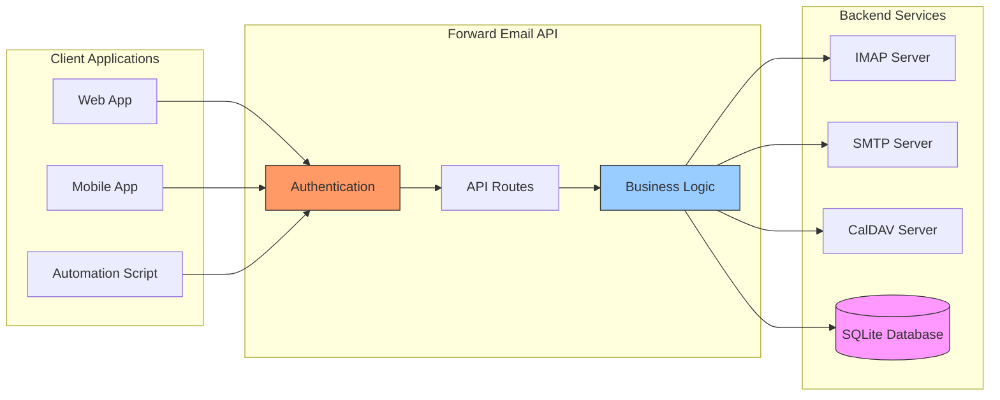

---


## Notifiche Push iOS {#ios-push-notifications}

> \[!TIP]
> Forward Email supporta notifiche push native iOS tramite XAPPLEPUSHSERVICE per la consegna istantanea delle email.

> \[!IMPORTANT]
> **Caratteristica Unica:** Forward Email è uno dei pochi server email open-source che supporta notifiche push native iOS per email, contatti e calendari tramite l’estensione IMAP `XAPPLEPUSHSERVICE`. Questa è stata reverse-engineerata dal protocollo Apple e fornisce consegna istantanea ai dispositivi iOS senza consumare batteria.

Forward Email implementa l’estensione proprietaria Apple XAPPLEPUSHSERVICE, fornendo notifiche push native per dispositivi iOS senza richiedere polling in background.

### Come Funziona {#how-it-works-1}

**XAPPLEPUSHSERVICE** è un’estensione IMAP non standard che permette all’app Mail di iOS di ricevere notifiche push istantanee all’arrivo di nuove email.

Forward Email implementa l’integrazione proprietaria del servizio Apple Push Notification (APNs) per IMAP, permettendo all’app Mail di iOS di ricevere notifiche push istantanee all’arrivo di nuove email.

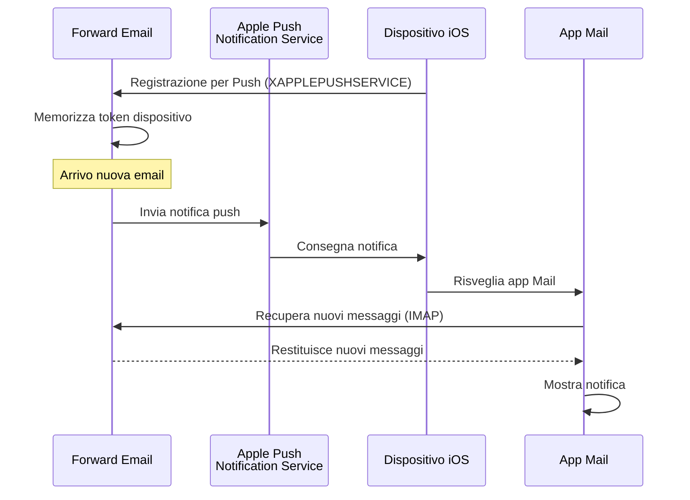

### Funzionalità Chiave {#key-features}

**Consegna Istantanea:**

* Le notifiche push arrivano in pochi secondi
* Nessun polling in background che consuma batteria
* Funziona anche quando l’app Mail è chiusa

<!---->

* **Consegna Istantanea:** Email, eventi calendario e contatti appaiono immediatamente su iPhone/iPad, non secondo un programma di polling
* **Efficiente per la Batteria:** Usa l’infrastruttura push di Apple invece di mantenere connessioni IMAP costanti
* **Push Basato su Argomenti:** Supporta notifiche push per caselle specifiche, non solo INBOX
* **Nessuna App di Terze Parti Necessaria:** Funziona con le app native Mail, Calendario e Contatti di iOS
**Integrazione Nativa:**

* Integrato nell'app Mail di iOS
* Nessuna app di terze parti richiesta
* Esperienza utente fluida

**Focalizzato sulla Privacy:**

* I token del dispositivo sono criptati
* Nessun contenuto del messaggio inviato tramite APNS
* Viene inviata solo la notifica di "nuova mail"

**Efficiente per la Batteria:**

* Nessun polling IMAP costante
* Il dispositivo resta in standby fino all'arrivo della notifica
* Impatto minimo sulla batteria

### Cosa Rende Questo Speciale {#what-makes-this-special}

> \[!IMPORTANT]
> La maggior parte dei provider email non supporta XAPPLEPUSHSERVICE, costringendo i dispositivi iOS a effettuare il polling per nuove mail ogni 15 minuti.

La maggior parte dei server email open-source (inclusi Dovecot, Postfix, Cyrus IMAP) NON supporta le notifiche push di iOS. Gli utenti devono scegliere tra:

* Usare IMAP IDLE (mantiene la connessione aperta, consuma batteria)
* Usare il polling (controlla ogni 15-30 minuti, notifiche ritardate)
* Usare app email proprietarie con la propria infrastruttura push

Forward Email offre la stessa esperienza di notifica push istantanea dei servizi commerciali come Gmail, iCloud e Fastmail.

**Confronto con Altri Provider:**

| Provider          | Supporto Push  | Intervallo Polling | Impatto Batteria |
| ----------------- | -------------- | ------------------ | ---------------- |
| **Forward Email** | ✅ Push Nativo  | Istantaneo         | Minimo           |
| Gmail             | ✅ Push Nativo  | Istantaneo         | Minimo           |
| iCloud            | ✅ Push Nativo  | Istantaneo         | Minimo           |
| Yahoo             | ✅ Push Nativo  | Istantaneo         | Minimo           |
| Outlook.com       | ❌ Polling     | 15 minuti          | Moderato         |
| Fastmail          | ❌ Polling     | 15 minuti          | Moderato         |
| ProtonMail        | ⚠️ Solo Bridge | Tramite Bridge     | Alto             |
| Tutanota          | ❌ Solo App    | N/D                | N/D              |

### Dettagli di Implementazione {#implementation-details}

**Risposta CAPABILITY IMAP:**

```
* CAPABILITY IMAP4rev1 ... XAPPLEPUSHSERVICE ...
```

**Processo di Registrazione:**

1. L'app Mail di iOS rileva la capacità XAPPLEPUSHSERVICE
2. L'app registra il token del dispositivo con Forward Email
3. Forward Email memorizza il token e lo associa all'account
4. Quando arriva una nuova mail, Forward Email invia la push tramite APNS
5. iOS risveglia l'app Mail per scaricare i nuovi messaggi

**Sicurezza:**

* I token del dispositivo sono criptati a riposo
* I token scadono e vengono aggiornati automaticamente
* Nessun contenuto del messaggio è esposto ad APNS
* Viene mantenuta la crittografia end-to-end

<!---->

* **Estensione IMAP:** `XAPPLEPUSHSERVICE`
* **Codice Sorgente:** [WildDuck Issue #711](https://github.com/zone-eu/wildduck/issues/711)
* **Configurazione:** Automatica - nessuna configurazione necessaria, funziona subito con l'app Mail di iOS

### Confronto con Altri Servizi {#comparison-with-other-services}

| Servizio      | Supporto Push iOS | Metodo                                   |
| ------------- | ----------------- | --------------------------------------- |
| Forward Email | ✅ Sì             | `XAPPLEPUSHSERVICE` (reverse-engineered) |
| Gmail         | ✅ Sì             | App Gmail proprietaria + push Google    |
| iCloud Mail   | ✅ Sì             | Integrazione nativa Apple                |
| Outlook.com   | ✅ Sì             | App Outlook proprietaria + push Microsoft |
| Fastmail      | ✅ Sì             | `XAPPLEPUSHSERVICE`                      |
| Dovecot       | ❌ No             | Solo IMAP IDLE o polling                 |
| Postfix       | ❌ No             | Solo IMAP IDLE o polling                 |
| Cyrus IMAP    | ❌ No             | Solo IMAP IDLE o polling                 |

**Push Gmail:**

Gmail usa un sistema push proprietario che funziona solo con l'app Gmail. L'app Mail di iOS deve effettuare il polling dei server IMAP di Gmail.

**Push iCloud:**

iCloud ha un supporto push nativo simile a Forward Email, ma solo per indirizzi @icloud.com.

**Outlook.com:**

Outlook.com non supporta XAPPLEPUSHSERVICE, quindi l'app Mail di iOS deve effettuare il polling ogni 15 minuti.

**Fastmail:**

Fastmail non supporta XAPPLEPUSHSERVICE. Gli utenti devono usare l'app Fastmail per le notifiche push o accettare i ritardi del polling di 15 minuti.

---


## Test e Verifica {#testing-and-verification}


## Test delle Capacità del Protocollo {#protocol-capability-tests}
> \[!NOTE]
> Questa sezione fornisce i risultati dei nostri ultimi test sulle capacità dei protocolli, condotti il 22 gennaio 2026.

Questa sezione contiene le risposte effettive CAPABILITY/CAPA/EHLO di tutti i provider testati. Tutti i test sono stati eseguiti il **22 gennaio 2026**.

Questi test aiutano a verificare il supporto dichiarato e reale per vari protocolli e estensioni email tra i principali provider.

### Metodologia del Test {#test-methodology}

**Ambiente di Test:**

* **Data:** 22 gennaio 2026 alle 02:37 UTC
* **Posizione:** istanza AWS EC2
* **IPv4:** 54.167.216.197
* **IPv6:** 2600:4040:46da:9a00:b19e:3ad4:426c:2f48
* **Strumenti:** OpenSSL s_client, script bash

**Provider Testati:**

* Forward Email
* Gmail
* Outlook.com
* iCloud
* Fastmail
* Yahoo/AOL (Verizon)

### Script di Test {#test-scripts}

Per completa trasparenza, di seguito sono forniti gli script esatti utilizzati per questi test.

#### Script di Test Capacità IMAP {#imap-capability-test-script}

```bash
#!/bin/bash
# IMAP Capability Test Script
# Tests IMAP CAPABILITY for various email providers

echo "========================================="
echo "IMAP CAPABILITY TEST"
echo "Date: $(date -u +"%Y-%m-%d %H:%M:%S UTC")"
echo "========================================="
echo ""

# Gmail
echo "--- Gmail (imap.gmail.com:993) ---"
echo -e "a001 CAPABILITY\na002 LOGOUT" | timeout 10 openssl s_client -connect imap.gmail.com:993 -crlf -quiet 2>&1 | grep -A 20 "CAPABILITY"
echo ""

# Outlook.com
echo "--- Outlook.com (outlook.office365.com:993) ---"
echo -e "a001 CAPABILITY\na002 LOGOUT" | timeout 10 openssl s_client -connect outlook.office365.com:993 -crlf -quiet 2>&1 | grep -A 20 "CAPABILITY"
echo ""

# iCloud
echo "--- iCloud (imap.mail.me.com:993) ---"
echo -e "a001 CAPABILITY\na002 LOGOUT" | timeout 10 openssl s_client -connect imap.mail.me.com:993 -crlf -quiet 2>&1 | grep -A 20 "CAPABILITY"
echo ""

# Fastmail
echo "--- Fastmail (imap.fastmail.com:993) ---"
echo -e "a001 CAPABILITY\na002 LOGOUT" | timeout 10 openssl s_client -connect imap.fastmail.com:993 -crlf -quiet 2>&1 | grep -A 20 "CAPABILITY"
echo ""

# Yahoo
echo "--- Yahoo (imap.mail.yahoo.com:993) ---"
echo -e "a001 CAPABILITY\na002 LOGOUT" | timeout 10 openssl s_client -connect imap.mail.yahoo.com:993 -crlf -quiet 2>&1 | grep -A 20 "CAPABILITY"
echo ""

# Forward Email
echo "--- Forward Email (imap.forwardemail.net:993) ---"
echo -e "a001 CAPABILITY\na002 LOGOUT" | timeout 10 openssl s_client -connect imap.forwardemail.net:993 -crlf -quiet 2>&1 | grep -A 20 "CAPABILITY"
echo ""

echo "========================================="
echo "Test completed"
echo "========================================="
```

#### Script di Test Capacità POP3 {#pop3-capability-test-script}

```bash
#!/bin/bash
# POP3 Capability Test Script
# Tests POP3 CAPA for various email providers

echo "========================================="
echo "POP3 CAPABILITY TEST"
echo "Date: $(date -u +"%Y-%m-%d %H:%M:%S UTC")"
echo "========================================="
echo ""

# Gmail
echo "--- Gmail (pop.gmail.com:995) ---"
echo -e "CAPA\nQUIT" | timeout 10 openssl s_client -connect pop.gmail.com:995 -crlf -quiet 2>&1 | grep -A 20 "CAPA"
echo ""

# Outlook.com
echo "--- Outlook.com (outlook.office365.com:995) ---"
echo -e "CAPA\nQUIT" | timeout 10 openssl s_client -connect outlook.office365.com:995 -crlf -quiet 2>&1 | grep -A 20 "CAPA"
echo ""

# iCloud (Nota: iCloud non supporta POP3)
echo "--- iCloud (No POP3 support) ---"
echo "iCloud non supporta POP3"
echo ""

# Fastmail
echo "--- Fastmail (pop.fastmail.com:995) ---"
echo -e "CAPA\nQUIT" | timeout 10 openssl s_client -connect pop.fastmail.com:995 -crlf -quiet 2>&1 | grep -A 20 "CAPA"
echo ""

# Yahoo
echo "--- Yahoo (pop.mail.yahoo.com:995) ---"
echo -e "CAPA\nQUIT" | timeout 10 openssl s_client -connect pop.mail.yahoo.com:995 -crlf -quiet 2>&1 | grep -A 20 "CAPA"
echo ""

# Forward Email
echo "--- Forward Email (pop3.forwardemail.net:995) ---"
echo -e "CAPA\nQUIT" | timeout 10 openssl s_client -connect pop3.forwardemail.net:995 -crlf -quiet 2>&1 | grep -A 20 "CAPA"
echo ""

echo "========================================="
echo "Test completed"
echo "========================================="
```
#### Script di Test delle Capacità SMTP {#smtp-capability-test-script}

```bash
#!/bin/bash
# Script di Test delle Capacità SMTP
# Testa SMTP EHLO per vari provider di posta elettronica

echo "========================================="
echo "TEST DELLE CAPACITÀ SMTP"
echo "Data: $(date -u +"%Y-%m-%d %H:%M:%S UTC")"
echo "========================================="
echo ""

# Gmail
echo "--- Gmail (smtp.gmail.com:587) ---"
echo -e "EHLO test.com\nQUIT" | timeout 10 openssl s_client -connect smtp.gmail.com:587 -starttls smtp -crlf -quiet 2>&1 | grep -A 30 "250-"
echo ""

# Outlook.com
echo "--- Outlook.com (smtp.office365.com:587) ---"
echo -e "EHLO test.com\nQUIT" | timeout 10 openssl s_client -connect smtp.office365.com:587 -starttls smtp -crlf -quiet 2>&1 | grep -A 30 "250-"
echo ""

# iCloud
echo "--- iCloud (smtp.mail.me.com:587) ---"
echo -e "EHLO test.com\nQUIT" | timeout 10 openssl s_client -connect smtp.mail.me.com:587 -starttls smtp -crlf -quiet 2>&1 | grep -A 30 "250-"
echo ""

# Fastmail
echo "--- Fastmail (smtp.fastmail.com:587) ---"
echo -e "EHLO test.com\nQUIT" | timeout 10 openssl s_client -connect smtp.fastmail.com:587 -starttls smtp -crlf -quiet 2>&1 | grep -A 30 "250-"
echo ""

# Yahoo
echo "--- Yahoo (smtp.mail.yahoo.com:587) ---"
echo -e "EHLO test.com\nQUIT" | timeout 10 openssl s_client -connect smtp.mail.yahoo.com:587 -starttls smtp -crlf -quiet 2>&1 | grep -A 30 "250-"
echo ""

# Forward Email
echo "--- Forward Email (smtp.forwardemail.net:587) ---"
echo -e "EHLO test.com\nQUIT" | timeout 10 openssl s_client -connect smtp.forwardemail.net:587 -starttls smtp -crlf -quiet 2>&1 | grep -A 30 "250-"
echo ""

echo "========================================="
echo "Test completato"
echo "========================================="
```

### Riepilogo dei Risultati del Test {#test-results-summary}

#### IMAP (CAPABILITY) {#imap-capability}

**Forward Email**

```
* CAPABILITY IMAP4rev1 AUTH=PLAIN AUTH=PLAIN-CLIENTTOKEN CHILDREN ENABLE ID IDLE NAMESPACE QUOTA SASL-IR UNSELECT XLIST XAPPLEPUSHSERVICE
```

**Gmail**

```
* CAPABILITY IMAP4rev1 UNSELECT IDLE NAMESPACE QUOTA ID XLIST CHILDREN X-GM-EXT-1 UIDPLUS COMPRESS=DEFLATE ENABLE MOVE CONDSTORE ESEARCH UTF8=ACCEPT LIST-EXTENDED LIST-STATUS LITERAL- SPECIAL-USE
```

**iCloud**

```
* OK [CAPABILITY XAPPLEPUSHSERVICE IMAP4 IMAP4rev1 SASL-IR AUTH=ATOKEN AUTH=PLAIN AUTH=ATOKEN2 AUTH=XOAUTH2]
```

**Outlook.com**

```
* CAPABILITY IMAP4rev1 AUTH=PLAIN AUTH=XOAUTH2 SASL-IR UIDPLUS ID UNSELECT CHILDREN IDLE NAMESPACE LITERAL+
```

**Fastmail**

```
* CAPABILITY IMAP4rev1 ACL ANNOTATE-EXPERIMENT-1 CATENATE CONDSTORE ENABLE ESEARCH ESORT I18NLEVEL=1 ID IDLE LIST-EXTENDED LIST-STATUS LITERAL+ LOGINDISABLED MULTIAPPEND NAMESPACE QRESYNC QUOTA RIGHTS=ektx SASL-IR SORT SPECIAL-USE THREAD=ORDEREDSUBJECT UIDPLUS UNSELECT WITHIN X-RENAME XLIST
```

**Yahoo/AOL (Verizon)**

```
* CAPABILITY IMAP4rev1 IDLE NAMESPACE QUOTA ID XLIST CHILDREN UIDPLUS MOVE CONDSTORE ESEARCH ENABLE LIST-EXTENDED LIST-STATUS LITERAL- SPECIAL-USE UNSELECT XAPPLEPUSHSERVICE
```

#### POP3 (CAPA) {#pop3-capa}

**Forward Email**

```
+OK
CAPA
TOP
USER
UIDL
EXPIRE 30
IMPLEMENTATION ForwardEmail
.
```

**Gmail**

```
+OK
CAPA
TOP
USER
UIDL
EXPIRE 30
IMPLEMENTATION Gpop
.
```

**Outlook.com**

```
+OK
CAPA
TOP
USER
UIDL
SASL PLAIN XOAUTH2
.
```

**Fastmail**

```
+OK
CAPA
TOP
USER
UIDL
EXPIRE 30
IMPLEMENTATION Cyrus
.
```

#### SMTP (EHLO) {#smtp-ehlo}

**Forward Email**

```
250-smtp.forwardemail.net
250-PIPELINING
250-SIZE 52428800
250-ETRN
250-STARTTLS
250-ENHANCEDSTATUSCODES
250-8BITMIME
250-DSN
250 CHUNKING
```

**Gmail**

```
250-smtp.gmail.com al tuo servizio
250-SIZE 35882577
250-8BITMIME
250-STARTTLS
250-ENHANCEDSTATUSCODES
250-PIPELINING
250-CHUNKING
250 SMTPUTF8
```

**Outlook.com**

```
250-SN4PR13CA0005.outlook.office365.com Ciao [x.x.x.x]
250-SIZE 157286400
250-PIPELINING
250-DSN
250-ENHANCEDSTATUSCODES
250-STARTTLS
250-8BITMIME
250-BINARYMIME
250-CHUNKING
250 SMTPUTF8
```

**Fastmail**

```
250-smtp.fastmail.com
250-PIPELINING
250-SIZE 78643200
250-ETRN
250-STARTTLS
250-ENHANCEDSTATUSCODES
250-8BITMIME
250-DSN
250 CHUNKING
```

**Yahoo/AOL (Verizon)**

```
250-smtp.mail.yahoo.com
250-PIPELINING
250-SIZE 41943040
250-8BITMIME
250-ENHANCEDSTATUSCODES
250-STARTTLS
```
### Risultati Dettagliati del Test {#detailed-test-results}

#### Risultati del Test IMAP {#imap-test-results}

**Gmail:**
`* CAPABILITY IMAP4rev1 UNSELECT IDLE NAMESPACE QUOTA ID XLIST CHILDREN X-GM-EXT-1 XYZZY SASL-IR AUTH=XOAUTH2 AUTH=PLAIN AUTH=PLAIN-CLIENTTOKEN AUTH=OAUTHBEARER`

**Outlook.com:**
`* CAPABILITY IMAP4 IMAP4rev1 AUTH=PLAIN AUTH=XOAUTH2 SASL-IR UIDPLUS ID UNSELECT CHILDREN IDLE NAMESPACE LITERAL+`

**iCloud:**
`* CAPABILITY XAPPLEPUSHSERVICE IMAP4 IMAP4rev1 SASL-IR AUTH=ATOKEN AUTH=PLAIN AUTH=ATOKEN2 AUTH=XOAUTH2`

**Fastmail:**
Connessione scaduta. Vedi note sotto.

**Yahoo:**
`* CAPABILITY IMAP4rev1 SASL-IR AUTH=PLAIN AUTH=XOAUTH2 AUTH=OAUTHBEARER ID MOVE NAMESPACE XYMHIGHESTMODSEQ UIDPLUS LITERAL+ CHILDREN UNSELECT X-MSG-EXT OBJECTID IDLE ENABLE UIDONLY X-ALL-MAIL X-UIDONLY LIST-EXTENDED LIST-STATUS SPECIAL-USE PARTIAL APPENDLIMIT=41697280`

**Forward Email:**
`* CAPABILITY XAPPLEPUSHSERVICE IMAP4rev1 APPENDLIMIT=52428800 AUTH=PLAIN AUTH=PLAIN-CLIENTTOKEN CHILDREN CONDSTORE ENABLE ID IDLE MOVE NAMESPACE QUOTA SASL-IR SPECIAL-USE UIDPLUS UNSELECT UTF8=ACCEPT XLIST`

#### Risultati del Test POP3 {#pop3-test-results}

**Gmail:**
La connessione non ha restituito risposta CAPA senza autenticazione.

**Outlook.com:**
La connessione non ha restituito risposta CAPA senza autenticazione.

**iCloud:**
Non supportato.

**Fastmail:**
Connessione scaduta. Vedi note sotto.

**Yahoo:**
`+OK CAPA list follows... SASL PLAIN XOAUTH2`

**Forward Email:**
La connessione non ha restituito risposta CAPA senza autenticazione.

#### Risultati del Test SMTP {#smtp-test-results}

**Gmail:**
`250-AUTH LOGIN PLAIN XOAUTH2 PLAIN-CLIENTTOKEN OAUTHBEARER XOAUTH`

**Outlook.com:**
`250-DSN`

**iCloud:**
`250-DSN`

**Fastmail:**
`250 AUTH PLAIN LOGIN XOAUTH2 OAUTHBEARER`

**Yahoo:**
`250 AUTH PLAIN LOGIN XOAUTH2 OAUTHBEARER`

**Forward Email:**
`250-DSN`, `250-REQUIRETLS`

### Note sui Risultati del Test {#notes-on-test-results}

> \[!NOTE]
> Osservazioni importanti e limitazioni dai risultati del test.

1. **Timeout Fastmail**: Le connessioni a Fastmail sono scadute durante i test, probabilmente a causa di limitazioni di velocità o restrizioni firewall dall’IP del server di test. Fastmail è noto per avere un supporto IMAP/POP3/SMTP robusto basato sulla loro documentazione.

2. **Risposte CAPA POP3**: Diversi provider (Gmail, Outlook.com, Forward Email) non hanno restituito risposte CAPA senza autenticazione. Questa è una pratica di sicurezza comune per i server POP3.

3. **Supporto DSN**: Solo Outlook.com, iCloud e Forward Email pubblicizzano esplicitamente il supporto DSN nelle risposte EHLO SMTP. Questo non significa necessariamente che altri provider non supportino DSN, ma semplicemente che non lo pubblicizzano.

4. **REQUIRETLS**: Solo Forward Email pubblicizza esplicitamente il supporto REQUIRETLS con una casella di controllo visibile all’utente per l’applicazione. Altri provider potrebbero supportarlo internamente ma non lo pubblicizzano in EHLO.

5. **Ambiente di Test**: I test sono stati condotti da un’istanza AWS EC2 (IP: 54.167.216.197 IPv4, 2600:4040:46da:9a00:b19e:3ad4:426c:2f48 IPv6) il 22 gennaio 2026 alle 02:37 UTC.

---


## Sommario {#summary}

Forward Email fornisce un supporto completo ai protocolli RFC per tutti i principali standard email:

* **IMAP4rev1:** 16 RFC supportati con differenze intenzionali documentate
* **POP3:** 4 RFC supportati con cancellazione permanente conforme RFC
* **SMTP:** 11 estensioni supportate inclusi SMTPUTF8, DSN e PIPELINING
* **Autenticazione:** DKIM, SPF, DMARC, ARC completamente supportati
* **Sicurezza del Trasporto:** MTA-STS e REQUIRETLS completamente supportati, supporto parziale DANE
* **Crittografia:** OpenPGP v6 e S/MIME supportati
* **Calendario:** CalDAV, CardDAV e VTODO completamente supportati
* **Accesso API:** API REST completa con 39 endpoint per accesso diretto al database
* **Push iOS:** Notifiche push native per email, contatti e calendari tramite `XAPPLEPUSHSERVICE`

### Differenziatori Chiave {#key-differentiators}

> \[!TIP]
> Forward Email si distingue per funzionalità uniche non presenti in altri provider.

**Cosa rende Forward Email unico:**

1. **Crittografia Quantum-Safe** - Unico provider con mailbox SQLite criptate ChaCha20-Poly1305
2. **Architettura Zero-Knowledge** - La tua password cripta la tua mailbox; noi non possiamo decifrarla
3. **Domini Personalizzati Gratuiti** - Nessun costo mensile per email su dominio personalizzato
4. **Supporto REQUIRETLS** - Casella di controllo visibile all’utente per imporre TLS su tutto il percorso di consegna
5. **API Completa** - 39 endpoint REST API per controllo programmatico completo
6. **Notifiche Push iOS** - Supporto nativo XAPPLEPUSHSERVICE per consegna istantanea
7. **Open Source** - Codice sorgente completo disponibile su GitHub
8. **Focalizzato sulla Privacy** - Nessun data mining, nessuna pubblicità, nessun tracciamento
* **Crittografia in Sandbox:** Unico servizio email con caselle SQLite crittografate individualmente  
* **Conformità RFC:** Priorità alla conformità agli standard rispetto alla comodità (es. POP3 DELE)  
* **API Completa:** Accesso programmatico diretto a tutti i dati email  
* **Open Source:** Implementazione completamente trasparente  

**Riepilogo Supporto Protocollo:**  

| Categoria            | Livello di Supporto | Dettagli                                      |
| -------------------- | ------------------- | --------------------------------------------- |
| **Protocolli Core**  | ✅ Eccellente       | IMAP4rev1, POP3, SMTP completamente supportati |
| **Protocolli Moderni** | ⚠️ Parziale         | Supporto parziale IMAP4rev2, JMAP non supportato |
| **Sicurezza**        | ✅ Eccellente       | DKIM, SPF, DMARC, ARC, MTA-STS, REQUIRETLS    |
| **Crittografia**     | ✅ Eccellente       | OpenPGP, S/MIME, crittografia SQLite          |
| **CalDAV/CardDAV**   | ✅ Eccellente       | Sincronizzazione completa di calendario e contatti |
| **Filtraggio**       | ✅ Eccellente       | Sieve (24 estensioni) e ManageSieve            |
| **API**              | ✅ Eccellente       | 39 endpoint REST API                           |
| **Push**             | ✅ Eccellente       | Notifiche push native iOS                      |
