# Email RFCプロトコルサポート - 完全な標準＆仕様ガイド {#email-rfc-protocol-support---complete-standards--specifications-guide}


## 目次 {#table-of-contents}

* [このドキュメントについて](#about-this-document)
  * [アーキテクチャ概要](#architecture-overview)
* [メールサービス比較 - プロトコルサポート＆RFC標準準拠](#email-service-comparison---protocol-support--rfc-standards-compliance)
  * [プロトコルサポートの可視化](#protocol-support-visualization)
* [コアメールプロトコル](#core-email-protocols)
  * [メールプロトコルフロー](#email-protocol-flow)
* [IMAP4メールプロトコルと拡張](#imap4-email-protocol-and-extensions)
  * [RFC仕様からのIMAPプロトコルの違い](#imap-protocol-differences-from-rfc-specifications)
  * [サポートされていないIMAP拡張](#imap-extensions-not-supported)
* [POP3メールプロトコルと拡張](#pop3-email-protocol-and-extensions)
  * [RFC仕様からのPOP3プロトコルの違い](#pop3-protocol-differences-from-rfc-specifications)
  * [サポートされていないPOP3拡張](#pop3-extensions-not-supported)
* [SMTPメールプロトコルと拡張](#smtp-email-protocol-and-extensions)
  * [配信状況通知（DSN）](#delivery-status-notifications-dsn)
  * [REQUIRETLSサポート](#requiretls-support)
  * [サポートされていないSMTP拡張](#smtp-extensions-not-supported)
* [JMAPメールプロトコル](#jmap-email-protocol)
* [メールセキュリティ](#email-security)
  * [メールセキュリティアーキテクチャ](#email-security-architecture)
* [メールメッセージ認証プロトコル](#email-message-authentication-protocols)
  * [認証プロトコルサポート](#authentication-protocol-support)
  * [DKIM（DomainKeys Identified Mail）](#dkim-domainkeys-identified-mail)
  * [SPF（Sender Policy Framework）](#spf-sender-policy-framework)
  * [DMARC（Domain-based Message Authentication, Reporting & Conformance）](#dmarc-domain-based-message-authentication-reporting--conformance)
  * [ARC（Authenticated Received Chain）](#arc-authenticated-received-chain)
  * [認証フロー](#authentication-flow)
* [メールトランスポートセキュリティプロトコル](#email-transport-security-protocols)
  * [トランスポートセキュリティサポート](#transport-security-support)
  * [TLS（Transport Layer Security）](#tls-transport-layer-security)
  * [MTA-STS（Mail Transfer Agent Strict Transport Security）](#mta-sts-mail-transfer-agent-strict-transport-security)
  * [DANE（DNS-based Authentication of Named Entities）](#dane-dns-based-authentication-of-named-entities)
  * [REQUIRETLS](#requiretls)
  * [トランスポートセキュリティフロー](#transport-security-flow)
* [メールメッセージ暗号化](#email-message-encryption)
  * [暗号化サポート](#encryption-support)
  * [OpenPGP（Pretty Good Privacy）](#openpgp-pretty-good-privacy)
  * [S/MIME（Secure/Multipurpose Internet Mail Extensions）](#smime-securemultipurpose-internet-mail-extensions)
  * [SQLiteメールボックス暗号化](#sqlite-mailbox-encryption)
  * [暗号化比較](#encryption-comparison)
  * [暗号化フロー](#encryption-flow)
* [拡張機能](#extended-functionality)
* [メールメッセージフォーマット標準](#email-message-format-standards)
  * [フォーマット標準サポート](#format-standards-support)
  * [MIME（Multipurpose Internet Mail Extensions）](#mime-multipurpose-internet-mail-extensions)
  * [SMTPUTF8とメールアドレスの国際化](#smtputf8-and-email-address-internationalization)
* [カレンダー＆連絡先プロトコル](#calendaring-and-contacts-protocols)
  * [CalDAVとCardDAVサポート](#caldav-and-carddav-support)
  * [CalDAV（カレンダーアクセス）](#caldav-calendar-access)
  * [CardDAV（連絡先アクセス）](#carddav-contact-access)
  * [タスクとリマインダー（CalDAV VTODO）](#tasks-and-reminders-caldav-vtodo)
  * [CalDAV/CardDAV同期フロー](#caldavcarddav-synchronization-flow)
  * [サポートされていないカレンダー拡張](#calendaring-extensions-not-supported)
* [メールメッセージフィルタリング](#email-message-filtering)
  * [Sieve（RFC 5228）](#sieve-rfc-5228)
  * [ManageSieve（RFC 5804）](#managesieve-rfc-5804)
* [ストレージ最適化](#storage-optimization)
  * [アーキテクチャ：二層ストレージ最適化](#architecture-dual-layer-storage-optimization)
* [添付ファイル重複排除](#attachment-deduplication)
  * [仕組み](#how-it-works)
  * [重複排除フロー](#deduplication-flow)
  * [マジックナンバーシステム](#magic-number-system)
  * [主な違い：WildDuck vs Forward Email](#key-differences-wildduck-vs-forward-email)
* [Brotli圧縮](#brotli-compression)
  * [圧縮対象](#what-gets-compressed)
  * [圧縮設定](#compression-configuration)
  * [マジックヘッダー：「FEBR」](#magic-header-febr)
  * [圧縮プロセス](#compression-process)
  * [解凍プロセス](#decompression-process)
  * [後方互換性](#backwards-compatibility)
  * [ストレージ節約統計](#storage-savings-statistics)
  * [移行プロセス](#migration-process)
  * [統合ストレージ効率](#combined-storage-efficiency)
  * [技術的実装詳細](#technical-implementation-details)
  * [なぜ他のプロバイダーはこれをしないのか](#why-no-other-provider-does-this)
* [最新機能](#modern-features)
* [メール管理のための完全REST API](#complete-rest-api-for-email-management)
  * [APIカテゴリ（39エンドポイント）](#api-categories-39-endpoints)
  * [技術的詳細](#technical-details)
  * [実際のユースケース](#real-world-use-cases)
  * [主要API機能](#key-api-features)
  * [APIアーキテクチャ](#api-architecture)
* [iOSプッシュ通知](#ios-push-notifications)
  * [仕組み](#how-it-works-1)
  * [主要機能](#key-features)
  * [特別な理由](#what-makes-this-special)
  * [実装詳細](#implementation-details)
  * [他サービスとの比較](#comparison-with-other-services)
* [テストと検証](#testing-and-verification)
* [プロトコル能力テスト](#protocol-capability-tests)
  * [テスト方法論](#test-methodology)
  * [テストスクリプト](#test-scripts)
  * [テスト結果概要](#test-results-summary)
  * [詳細テスト結果](#detailed-test-results)
  * [テスト結果に関する注意事項](#notes-on-test-results)
* [まとめ](#summary)
  * [主な差別化要因](#key-differentiators)
## このドキュメントについて {#about-this-document}

このドキュメントは Forward Email の RFC（Request for Comments）プロトコルサポートについて説明しています。Forward Email は IMAP/POP3 機能のために内部で [WildDuck](https://github.com/nodemailer/wildduck) を使用しているため、ここに記載されているプロトコルのサポートと制限は WildDuck の実装を反映しています。

> \[!IMPORTANT]
> Forward Email はメッセージストレージに MongoDB（WildDuck が元々使用していたもの）ではなく [SQLite](https://sqlite.org/) を使用しています。これにより、以下に記載されている特定の実装の詳細に影響があります。

**ソースコード:** <https://github.com/forwardemail/forwardemail.net>

### アーキテクチャ概要 {#architecture-overview}

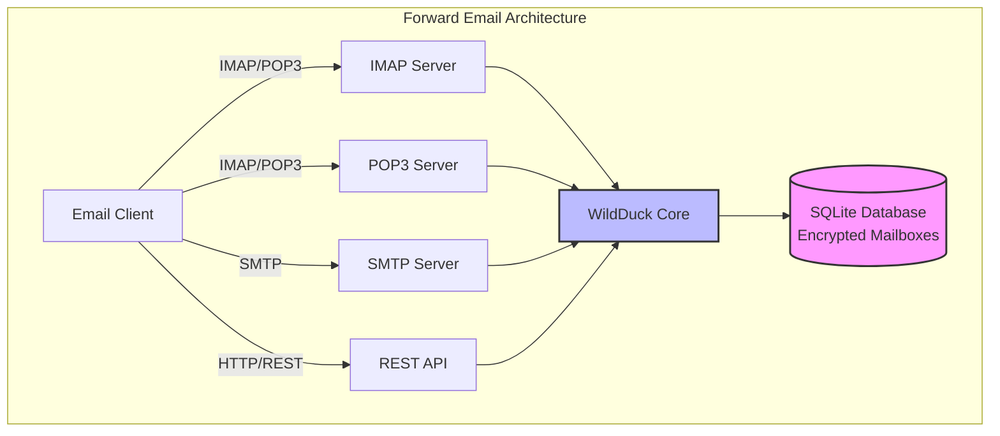

---


## メールサービス比較 - プロトコルサポートとRFC標準準拠 {#email-service-comparison---protocol-support--rfc-standards-compliance}

> \[!IMPORTANT]
> **サンドボックス化および量子耐性暗号化:** Forward Email は、あなたのパスワード（あなただけが知っている）を使って個別に暗号化された SQLite メールボックスを保存する唯一のメールサービスです。各メールボックスは [sqleet](https://github.com/resilar/sqleet)（ChaCha20-Poly1305）で暗号化されており、自己完結型でサンドボックス化され、ポータブルです。パスワードを忘れるとメールボックスを失い、Forward Email でも回復できません。詳細は [量子安全な暗号化メール](https://forwardemail.net/en/blog/docs/best-quantum-safe-encrypted-email-service) を参照してください。

主要なメールプロバイダー間のメールプロトコルサポートと RFC 標準の実装を比較します：

| 機能                          | Forward Email                                                                                  | Postfix/Dovecot                                                                    | Gmail                                                                             | iCloud Mail                                           | Outlook.com                                                                                                                                                          | Fastmail                                                                                 | Yahoo/AOL (Verizon)                                                  | ProtonMail                                                                     | Tutanota                                                          |
| ----------------------------- | ---------------------------------------------------------------------------------------------- | ---------------------------------------------------------------------------------- | --------------------------------------------------------------------------------- | ----------------------------------------------------- | -------------------------------------------------------------------------------------------------------------------------------------------------------------------- | ---------------------------------------------------------------------------------------- | -------------------------------------------------------------------- | ------------------------------------------------------------------------------ | ----------------------------------------------------------------- |
| **カスタムドメイン価格**       | [無料](https://forwardemail.net/en/pricing)                                                    | [無料](https://www.postfix.org/)                                                   | [$7.20/月](https://workspace.google.com/pricing)                                  | [$0.99/月](https://support.apple.com/en-us/102622)    | [$7.20/月](https://www.microsoft.com/en-us/microsoft-365/business/microsoft-365-business-basic)                                                                      | [$5/月](https://www.fastmail.com/pricing/)                                               | [$3.19/月](https://www.turbify.com/mail)                             | [$4.99/月](https://proton.me/mail/pricing)                                     | [$3.27/月](https://tuta.com/pricing)                              |
| **IMAP4rev1 (RFC 3501)**      | ✅ [サポート](#imap4-email-protocol-and-extensions)                                            | ✅ [サポート](https://www.dovecot.org/)                                            | ✅ [サポート](https://developers.google.com/workspace/gmail/imap/imap-extensions) | ✅ [サポート](https://support.apple.com/en-us/102431) | ✅ [サポート](https://support.microsoft.com/en-us/office/pop-imap-and-smtp-settings-for-outlook-com-d088b986-291d-42b8-9564-9c414e2aa040)                            | ✅ [サポート](https://www.fastmail.help/hc/en-us/articles/1500000278382-Email-standards) | ✅ [サポート](https://senders.yahooinc.com/developer/documentation/) | ⚠️ [ブリッジ経由](https://proton.me/support/imap-smtp-and-pop3-setup)            | ❌ サポートなし                                                   |
| **IMAP4rev2 (RFC 9051)**      | ⚠️ [部分的](https://forwardemail.net/en/blog/docs/best-quantum-safe-encrypted-email-service)  | ⚠️ [部分的](https://www.dovecot.org/)                                             | ⚠️ [31%](https://developers.google.com/workspace/gmail/imap/imap-extensions)      | ⚠️ [92%](https://support.apple.com/en-us/102431)      | ⚠️ [46%](https://support.microsoft.com/en-us/office/pop-imap-and-smtp-settings-for-outlook-com-d088b986-291d-42b8-9564-9c414e2aa040)                                 | ⚠️ [69%](https://www.fastmail.help/hc/en-us/articles/1500000278382-Email-standards)      | ⚠️ [85%](https://senders.yahooinc.com/developer/documentation/)      | ⚠️ [ブリッジ経由](https://proton.me/support/imap-smtp-and-pop3-setup)            | ❌ サポートなし                                                   |
| **POP3 (RFC 1939)**           | ✅ [サポート](#pop3-email-protocol-and-extensions)                                             | ✅ [サポート](https://www.dovecot.org/)                                            | ✅ [サポート](https://support.google.com/mail/answer/7104828)                     | ❌ サポートなし                                       | ✅ [サポート](https://support.microsoft.com/en-us/office/pop-imap-and-smtp-settings-for-outlook-com-d088b986-291d-42b8-9564-9c414e2aa040)                            | ✅ [サポート](https://www.fastmail.help/hc/en-us/articles/1500000278382-Email-standards) | ✅ [サポート](https://help.yahoo.com/kb/SLN4075.html)                | ⚠️ [ブリッジ経由](https://proton.me/support/imap-smtp-and-pop3-setup)            | ❌ サポートなし                                                   |
| **SMTP (RFC 5321)**           | ✅ [サポート](#smtp-email-protocol-and-extensions)                                             | ✅ [サポート](https://www.postfix.org/)                                            | ✅ [サポート](https://support.google.com/mail/answer/7126229)                     | ✅ [サポート](https://support.apple.com/en-us/102431) | ✅ [サポート](https://support.microsoft.com/en-us/office/pop-imap-and-smtp-settings-for-outlook-com-d088b986-291d-42b8-9564-9c414e2aa040)                            | ✅ [サポート](https://www.fastmail.help/hc/en-us/articles/1500000278382-Email-standards) | ✅ [サポート](https://help.yahoo.com/kb/SLN4075.html)                | ⚠️ [ブリッジ経由](https://proton.me/support/imap-smtp-and-pop3-setup)            | ❌ サポートなし                                                   |
| **JMAP (RFC 8620)**           | ❌ [サポートなし](#jmap-email-protocol)                                                        | ❌ サポートなし                                                                    | ❌ サポートなし                                                                   | ❌ サポートなし                                       | ❌ サポートなし                                                                                                                                                      | ✅ [サポート](https://www.fastmail.com/dev/)                                             | ❌ サポートなし                                                      | ❌ サポートなし                                                                | ❌ サポートなし                                                   |
| **DKIM (RFC 6376)**           | ✅ [サポート](#email-message-authentication-protocols)                                         | ✅ [サポート](https://github.com/trusteddomainproject/OpenDKIM)                    | ✅ [サポート](https://support.google.com/a/answer/174124)                         | ✅ [サポート](https://support.apple.com/en-us/102431) | ✅ [サポート](https://learn.microsoft.com/en-us/defender-office-365/email-authentication-dkim-configure)                                                             | ✅ [サポート](https://www.fastmail.help/hc/en-us/articles/360060590573)                  | ✅ [サポート](https://help.yahoo.com/kb/SLN25426.html)               | ✅ [サポート](https://proton.me/support)                                       | ✅ [サポート](https://tuta.com/support#dkim)                      |
| **SPF (RFC 7208)**            | ✅ [サポート](#email-message-authentication-protocols)                                         | ✅ [サポート](https://www.postfix.org/)                                            | ✅ [サポート](https://support.google.com/a/answer/33786)                          | ✅ [サポート](https://support.apple.com/en-us/102431) | ✅ [サポート](https://learn.microsoft.com/en-us/microsoft-365/security/office-365-security/how-office-365-uses-spf-to-prevent-spoofing)                              | ✅ [サポート](https://www.fastmail.help/hc/en-us/articles/360060590573)                  | ✅ [サポート](https://help.yahoo.com/kb/SLN25426.html)               | ✅ [サポート](https://proton.me/support)                                       | ✅ [サポート](https://tuta.com/support#dkim)                      |
| **DMARC (RFC 7489)**          | ✅ [サポート](#email-message-authentication-protocols)                                         | ✅ [サポート](https://www.postfix.org/)                                            | ✅ [サポート](https://support.google.com/a/answer/2466580)                        | ✅ [サポート](https://support.apple.com/en-us/102431) | ✅ [サポート](https://learn.microsoft.com/en-us/microsoft-365/security/office-365-security/use-dmarc-to-validate-email)                                              | ✅ [サポート](https://www.fastmail.help/hc/en-us/articles/360060590573)                  | ✅ [サポート](https://help.yahoo.com/kb/SLN25426.html)               | ✅ [サポート](https://proton.me/support)                                       | ✅ [サポート](https://tuta.com/support#dkim)                      |
| **ARC (RFC 8617)**            | ✅ [サポート](#email-message-authentication-protocols)                                         | ✅ [サポート](https://github.com/trusteddomainproject/OpenARC)                     | ✅ [サポート](https://support.google.com/a/answer/2466580)                        | ❌ サポートなし                                       | ✅ [サポート](https://learn.microsoft.com/en-us/defender-office-365/email-authentication-arc-configure)                                                              | ✅ [サポート](https://www.fastmail.help/hc/en-us/articles/360060590573)                  | ✅ [サポート](https://senders.yahooinc.com/developer/documentation/) | ✅ [サポート](https://proton.me/blog/what-is-authenticated-received-chain-arc) | ❌ サポートなし                                                   |
| **MTA-STS (RFC 8461)**        | ✅ [サポート](#email-transport-security-protocols)                                             | ✅ [サポート](https://www.postfix.org/)                                            | ✅ [サポート](https://support.google.com/a/answer/9261504)                        | ✅ [サポート](https://support.apple.com/en-us/102431) | ✅ [サポート](https://learn.microsoft.com/en-us/defender-office-365/email-authentication-about)                                                                      | ✅ [サポート](https://www.fastmail.help/hc/en-us/articles/360060590573)                  | ✅ [サポート](https://senders.yahooinc.com/developer/documentation/) | ✅ [サポート](https://proton.me/support)                                       | ✅ [サポート](https://tuta.com/security)                          |
| **DANE (RFC 7671)**           | ✅ [サポート](#email-transport-security-protocols)                                             | ✅ [サポート](https://www.postfix.org/)                                            | ❌ サポートなし                                                                   | ❌ サポートなし                                       | ❌ サポートなし                                                                                                                                                      | ❌ サポートなし                                                                          | ❌ サポートなし                                                      | ✅ [サポート](https://proton.me/support)                                       | ✅ [サポート](https://tuta.com/support#dane)                      |
| **DSN (RFC 3461)**            | ✅ [サポート](#smtp-email-protocol-and-extensions)                                             | ✅ [サポート](https://www.postfix.org/DSN_README.html)                             | ❌ サポートなし                                                                   | ✅ [サポート](#protocol-capability-tests)             | ✅ [サポート](#protocol-capability-tests)                                                                                                                            | ⚠️ [不明](https://www.fastmail.help/hc/en-us/articles/1500000278382-Email-standards)  | ❌ サポートなし                                                      | ⚠️ [ブリッジ経由](https://proton.me/support/imap-smtp-and-pop3-setup)            | ❌ サポートなし                                                   |
| **REQUIRETLS (RFC 8689)**     | ✅ [サポート](#email-transport-security-protocols)                                             | ✅ [サポート](https://www.postfix.org/TLS_README.html#server_require_tls)          | ⚠️ 不明                                                                            | ⚠️ 不明                                              | ⚠️ 不明                                                                                                                                                           | ⚠️ 不明                                                                               | ⚠️ 不明                                                             | ⚠️ [ブリッジ経由](https://proton.me/support/imap-smtp-and-pop3-setup)            | ❌ サポートなし                                                   |
| **ManageSieve (RFC 5804)**    | ✅ [サポート](#managesieve-rfc-5804)                                                           | ✅ [サポート](https://doc.dovecot.org/admin_manual/pigeonhole_managesieve_server/) | ❌ サポートなし                                                                   | ❌ サポートなし                                       | ❌ サポートなし                                                                                                                                                      | ✅ [サポート](https://www.fastmail.help/hc/en-us/articles/360060590573)                  | ❌ サポートなし                                                      | ❌ サポートなし                                                                | ❌ サポートなし                                                   |
| **OpenPGP (RFC 9580)**        | ✅ [サポート](#email-message-encryption)                                                       | ⚠️ [プラグイン経由](https://www.gnupg.org/)                                       | ⚠️ [サードパーティ](https://github.com/google/end-to-end)                        | ⚠️ [サードパーティ](https://gpgtools.org/)               | ⚠️ [サードパーティ](https://gpg4win.org/)                                                                                                                               | ⚠️ [サードパーティ](https://www.fastmail.help/hc/en-us/articles/360060590573)               | ⚠️ [サードパーティ](https://help.yahoo.com/kb/SLN25426.html)            | ✅ [ネイティブ](https://proton.me/support/pgp-mime-pgp-inline)                      | ❌ サポートなし                                                   |
| **S/MIME (RFC 8551)**         | ✅ [サポート](#email-message-encryption)                                                       | ✅ [サポート](https://www.openssl.org/)                                            | ✅ [サポート](https://support.google.com/mail/answer/81126)                       | ✅ [サポート](https://support.apple.com/en-us/102431) | ✅ [サポート](https://support.microsoft.com/en-us/office/send-view-and-reply-to-encrypted-messages-in-outlook-for-pc-eaa43495-9bbb-4fca-922a-df90dee51980)           | ⚠️ [部分的](https://www.fastmail.help/hc/en-us/articles/360060590573)                   | ❌ サポートなし                                                      | ✅ [サポート](https://proton.me/support/pgp-mime-pgp-inline)                   | ❌ サポートなし                                                   |
| **CalDAV (RFC 4791)**         | ✅ [サポート](#calendaring-and-contacts-protocols)                                             | ✅ [サポート](https://www.davical.org/)                                            | ✅ [サポート](https://developers.google.com/calendar/caldav/v2/guide)             | ✅ [サポート](https://support.apple.com/en-us/102431) | ❌ サポートなし                                                                                                                                                      | ✅ [サポート](https://www.fastmail.help/hc/en-us/articles/360060590573)                  | ❌ サポートなし                                                      | ✅ [ブリッジ経由](https://proton.me/support/proton-calendar)                      | ❌ サポートなし                                                   |
| **CardDAV (RFC 6352)**        | ✅ [サポート](#calendaring-and-contacts-protocols)                                             | ✅ [サポート](https://www.davical.org/)                                            | ✅ [サポート](https://developers.google.com/people/carddav)                       | ✅ [サポート](https://support.apple.com/en-us/102431) | ❌ サポートなし                                                                                                                                                      | ✅ [サポート](https://www.fastmail.help/hc/en-us/articles/360060590573)                  | ❌ サポートなし                                                      | ✅ [ブリッジ経由](https://proton.me/support/proton-contacts)                      | ❌ サポートなし                                                   |
| **タスク (VTODO)**             | ✅ [サポート](#tasks-and-reminders-caldav-vtodo)                                               | ✅ [サポート](https://www.davical.org/)                                            | ❌ サポートなし                                                                   | ✅ [サポート](https://support.apple.com/en-us/102431) | ❌ サポートなし                                                                                                                                                      | ✅ [サポート](https://www.fastmail.help/hc/en-us/articles/360060590573)                  | ❌ サポートなし                                                      | ❌ サポートなし                                                                | ❌ サポートなし                                                   |
| **Sieve (RFC 5228)**          | ✅ [サポート](#sieve-rfc-5228)                                                                 | ✅ [サポート](https://www.dovecot.org/)                                            | ❌ サポートなし                                                                   | ❌ サポートなし                                       | ❌ サポートなし                                                                                                                                                      | ✅ [サポート](https://www.fastmail.help/hc/en-us/articles/360060590573)                  | ❌ サポートなし                                                      | ❌ サポートなし                                                                | ❌ サポートなし                                                   |
| **Catch-All**                 | ✅ [サポート](https://forwardemail.net/en/faq#can-i-have-multiple-global-catch-all-recipients) | ✅ サポート                                                                        | ✅ [サポート](https://support.google.com/a/answer/4524505)                        | ❌ サポートなし                                       | ❌ [サポートなし](https://learn.microsoft.com/en-us/exchange/recipients-in-exchange-online/manage-mail-users)                                                        | ✅ [サポート](https://www.fastmail.help/hc/en-us/articles/1500000278382-Email-standards) | ❌ サポートなし                                                      | ❌ サポートなし                                                                | ✅ [サポート](https://tuta.com/support#catch-all-alias)           |
| **無制限エイリアス**           | ✅ [サポート](https://forwardemail.net/en/faq#advanced-features)                               | ✅ サポート                                                                        | ✅ [サポート](https://support.google.com/a/answer/33327)                          | ✅ [サポート](https://support.apple.com/en-us/102431) | ✅ [サポート](https://support.microsoft.com/en-us/office/add-or-remove-an-email-alias-in-outlook-com-459b1989-356d-40fa-a689-8f285b13f1f2)                           | ✅ [サポート](https://www.fastmail.help/hc/en-us/articles/1500000278382-Email-standards) | ❌ サポートなし                                                      | ✅ [サポート](https://proton.me/support/addresses-and-aliases)                 | ✅ [サポート](https://tuta.com/support#aliases)                   |
| **二要素認証**                 | ✅ [サポート](https://forwardemail.net/en/faq#do-you-support-passkeys-and-webauthn)            | ✅ サポート                                                                        | ✅ [サポート](https://support.google.com/accounts/answer/185839)                  | ✅ [サポート](https://support.apple.com/en-us/102431) | ✅ [サポート](https://support.microsoft.com/en-us/account-billing/how-to-use-two-step-verification-with-your-microsoft-account-c7910146-672f-01e9-50a0-93b4585e7eb4) | ✅ [サポート](https://www.fastmail.help/hc/en-us/articles/1500000278382-Email-standards) | ✅ [サポート](https://help.yahoo.com/kb/SLN5013.html)                | ✅ [サポート](https://proton.me/support/two-factor-authentication-2fa)         | ✅ [サポート](https://tuta.com/support#two-factor-authentication) |
| **プッシュ通知**               | ✅ [サポート](#ios-push-notifications)                                                         | ⚠️ プラグイン経由                                                                 | ✅ [サポート](https://developers.google.com/gmail/api/guides/push)                | ✅ [サポート](https://support.apple.com/en-us/102431) | ✅ [サポート](https://learn.microsoft.com/en-us/graph/change-notifications-delivery-webhooks)                                                                        | ✅ [サポート](https://www.fastmail.help/hc/en-us/articles/1500000278382-Email-standards) | ❌ サポートなし                                                      | ✅ [サポート](https://proton.me/support/notifications)                         | ✅ [サポート](https://tuta.com/support#push-notifications)        |
| **カレンダー/連絡先デスクトップ** | ✅ [サポート](#calendaring-and-contacts-protocols)                                             | ✅ サポート                                                                        | ✅ [サポート](https://support.google.com/calendar)                                | ✅ [サポート](https://support.apple.com/en-us/102431) | ✅ [サポート](https://support.microsoft.com/en-us/office/calendar-and-contacts-in-outlook-com-d3e8a6e6-5c1f-4e3e-9f1e-7c0f0e0c0c0c)                                  | ✅ [サポート](https://www.fastmail.help/hc/en-us/articles/1500000278382-Email-standards) | ❌ サポートなし                                                      | ✅ [サポート](https://proton.me/support/proton-calendar)                       | ❌ サポートなし                                                   |
| **高度な検索**               | ✅ [サポート](https://forwardemail.net/en/email-api)                                           | ✅ サポート                                                                        | ✅ [サポート](https://support.google.com/mail/answer/7190)                        | ✅ [サポート](https://support.apple.com/en-us/102431) | ✅ [サポート](https://support.microsoft.com/en-us/office/search-for-email-messages-in-outlook-com-6f5f2e92-9d5e-4c4e-9b0e-0c0c0c0c0c0c)                              | ✅ [サポート](https://www.fastmail.help/hc/en-us/articles/1500000278382-Email-standards) | ✅ [サポート](https://help.yahoo.com/kb/SLN3561.html)                | ✅ [サポート](https://proton.me/support/search-and-filters)                    | ✅ [サポート](https://tuta.com/support)                           |
| **API/統合**                 | ✅ [39 エンドポイント](https://forwardemail.net/en/email-api)                                  | ✅ サポート                                                                        | ✅ [サポート](https://developers.google.com/gmail/api)                            | ❌ サポートなし                                       | ✅ [サポート](https://learn.microsoft.com/en-us/graph/api/resources/mail-api-overview)                                                                               | ✅ [サポート](https://www.fastmail.help/hc/en-us/articles/1500000278382-Email-standards) | ❌ サポートなし                                                      | ✅ [サポート](https://proton.me/support/proton-mail-api)                       | ❌ サポートなし                                                   |
### プロトコルサポートの可視化 {#protocol-support-visualization}

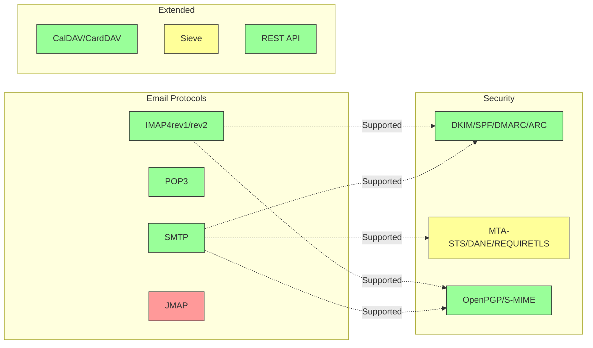

---


## コアメールプロトコル {#core-email-protocols}

### メールプロトコルのフロー {#email-protocol-flow}

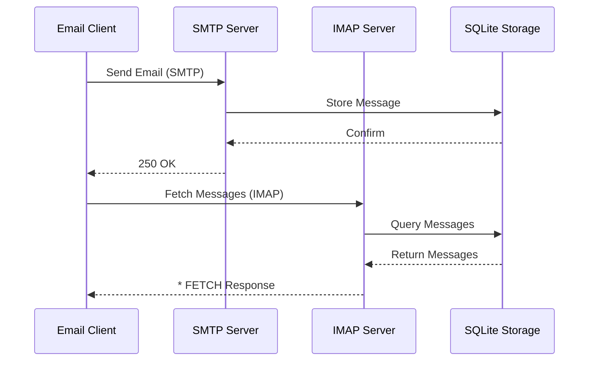


## IMAP4 メールプロトコルと拡張 {#imap4-email-protocol-and-extensions}

> \[!NOTE]
> Forward Email は IMAP4rev1 (RFC 3501) をサポートし、IMAP4rev2 (RFC 9051) の機能を部分的にサポートしています。

Forward Email は WildDuck メールサーバーの実装を通じて堅牢な IMAP4 サポートを提供します。このサーバーは IMAP4rev1 (RFC 3501) を実装し、IMAP4rev2 (RFC 9051) の拡張機能を部分的にサポートしています。

Forward Email の IMAP 機能は [WildDuck](https://github.com/nodemailer/wildduck) 依存関係によって提供されています。以下のメール RFC がサポートされています:

| RFC                                                       | タイトル                                                           | 実装に関する注記                                      |
| --------------------------------------------------------- | ----------------------------------------------------------------- | ----------------------------------------------------- |
| [RFC 3501](https://datatracker.ietf.org/doc/html/rfc3501) | インターネットメッセージアクセスプロトコル (IMAP) - バージョン4rev1 | 意図的な差異を含む完全サポート（下記参照）             |
| [RFC 2177](https://datatracker.ietf.org/doc/html/rfc2177) | IMAP4 IDLE コマンド                                               | プッシュスタイル通知                                  |
| [RFC 2342](https://datatracker.ietf.org/doc/html/rfc2342) | IMAP4 名前空間                                                  | メールボックス名前空間のサポート                      |
| [RFC 2087](https://datatracker.ietf.org/doc/html/rfc2087) | IMAP4 QUOTA 拡張                                                | ストレージクォータ管理                                |
| [RFC 2971](https://datatracker.ietf.org/doc/html/rfc2971) | IMAP4 ID 拡張                                                   | クライアント/サーバー識別                            |
| [RFC 5161](https://datatracker.ietf.org/doc/html/rfc5161) | IMAP4 ENABLE 拡張                                               | IMAP 拡張機能の有効化                                |
| [RFC 4959](https://datatracker.ietf.org/doc/html/rfc4959) | SASL 初期クライアント応答のための IMAP 拡張 (SASL-IR)             | 初期クライアント応答                                  |
| [RFC 3691](https://datatracker.ietf.org/doc/html/rfc3691) | IMAP4 UNSELECT コマンド                                         | EXPUNGE なしでメールボックスを閉じる                  |
| [RFC 4315](https://datatracker.ietf.org/doc/html/rfc4315) | IMAP UIDPLUS 拡張                                               | 拡張 UID コマンド                                    |
| [RFC 7162](https://datatracker.ietf.org/doc/html/rfc7162) | IMAP 拡張: クイックフラグ変更の再同期 (CONDSTORE)                | 条件付き STORE                                       |
| [RFC 6154](https://datatracker.ietf.org/doc/html/rfc6154) | 特殊用途メールボックスのための IMAP LIST 拡張                     | 特殊メールボックス属性                                |
| [RFC 6851](https://datatracker.ietf.org/doc/html/rfc6851) | IMAP MOVE 拡張                                                 | 原子 MOVE コマンド                                   |
| [RFC 6855](https://datatracker.ietf.org/doc/html/rfc6855) | UTF-8 対応のための IMAP サポート                                | UTF-8 サポート                                       |
| [RFC 3348](https://datatracker.ietf.org/doc/html/rfc3348) | IMAP4 子メールボックス拡張                                     | 子メールボックス情報                                  |
| [RFC 7889](https://datatracker.ietf.org/doc/html/rfc7889) | 最大アップロードサイズの広告のための IMAP4 拡張 (APPENDLIMIT)      | 最大アップロードサイズ                                |
**サポートされているIMAP拡張機能:**

| Extension         | RFC          | Status      | Description                     |
| ----------------- | ------------ | ----------- | ------------------------------- |
| IDLE              | RFC 2177     | ✅ Supported | プッシュスタイルの通知          |
| NAMESPACE         | RFC 2342     | ✅ Supported | メールボックスの名前空間サポート |
| QUOTA             | RFC 2087     | ✅ Supported | ストレージクォータ管理          |
| ID                | RFC 2971     | ✅ Supported | クライアント/サーバ識別         |
| ENABLE            | RFC 5161     | ✅ Supported | IMAP拡張機能の有効化            |
| SASL-IR           | RFC 4959     | ✅ Supported | 初期クライアント応答            |
| UNSELECT          | RFC 3691     | ✅ Supported | EXPUNGEなしでメールボックスを閉じる |
| UIDPLUS           | RFC 4315     | ✅ Supported | 拡張UIDコマンド                 |
| CONDSTORE         | RFC 7162     | ✅ Supported | 条件付きSTORE                  |
| SPECIAL-USE       | RFC 6154     | ✅ Supported | 特殊メールボックス属性          |
| MOVE              | RFC 6851     | ✅ Supported | 原子MOVEコマンド               |
| UTF8=ACCEPT       | RFC 6855     | ✅ Supported | UTF-8サポート                  |
| CHILDREN          | RFC 3348     | ✅ Supported | 子メールボックス情報            |
| APPENDLIMIT       | RFC 7889     | ✅ Supported | 最大アップロードサイズ          |
| XLIST             | 非標準       | ✅ Supported | Gmail互換のフォルダー一覧       |
| XAPPLEPUSHSERVICE | 非標準       | ✅ Supported | Apple Push Notification Service |

### RFC仕様からのIMAPプロトコルの違い {#imap-protocol-differences-from-rfc-specifications}

> \[!WARNING]
> 以下のRFC仕様からの違いはクライアントの互換性に影響を与える可能性があります。

Forward Emailは意図的にいくつかのIMAP RFC仕様から逸脱しています。これらの違いはWildDuckから継承されており、以下に記載されています:

* **\Recentフラグなし:** `\Recent`フラグは実装されていません。すべてのメッセージはこのフラグなしで返されます。
* **RENAMEはサブフォルダーに影響しない:** フォルダーの名前変更時にサブフォルダーは自動的に名前変更されません。データベース上のフォルダー階層はフラットです。
* **INBOXは名前変更不可:** [RFC 3501](https://datatracker.ietf.org/doc/html/rfc3501)ではINBOXの名前変更が許可されていますが、Forward Emailでは明示的に禁止されています。詳細は[WildDuckのソースコード](https://github.com/nodemailer/wildduck/blob/master/imap-core/lib/commands/rename.js#L27)を参照してください。
* **未承諾のFLAGS応答なし:** フラグが変更されても、クライアントに未承諾のFLAGS応答は送信されません。
* **削除済みメッセージに対するSTOREはNOを返す:** 削除済みメッセージのフラグ変更試行は無視されず、NOを返します。
* **SEARCHのCHARSETは無視される:** SEARCHコマンドの`CHARSET`引数は無視され、すべてUTF-8で検索されます。
* **STOREのMODSEQメタデータは無視される:** STOREコマンドの`MODSEQ`メタデータは無視されます。
* **SEARCH TEXTとSEARCH BODY:** Forward EmailはMongoDBの`$text`検索の代わりに[SQLite FTS5](https://www.sqlite.org/fts5.html)（全文検索）を使用しています。これにより以下が可能です:
  * `NOT`演算子のサポート（MongoDBは未対応）
  * ランク付けされた検索結果
  * 大規模メールボックスでも100ms未満の高速検索
* **自動エクスパunge動作:** `\Deleted`マークされたメッセージはメールボックス閉鎖時に自動的にエクスパungeされます。
* **メッセージの忠実性:** 一部のメッセージ変更は元のメッセージ構造を完全には保持しない場合があります。

**IMAP4rev2の部分サポート:**

Forward EmailはIMAP4rev1 (RFC 3501)を実装し、IMAP4rev2 (RFC 9051)の一部機能を部分的にサポートしています。以下のIMAP4rev2機能は**まだサポートされていません**:

* **LIST-STATUS** - LISTとSTATUSコマンドの統合
* **LITERAL-** - 非同期リテラル（マイナスバリアント）
* **OBJECTID** - 一意のオブジェクト識別子
* **SAVEDATE** - 保存日時属性
* **REPLACE** - 原子的メッセージ置換
* **UNAUTHENTICATE** - 接続を閉じずに認証解除

**緩やかなボディ構造の取り扱い:**

Forward Emailは不正なMIME構造に対して「緩やかなボディ」処理を行い、厳密なRFC解釈とは異なる場合があります。これは標準に完全には準拠しない実際のメールとの互換性を向上させます。
**METADATA拡張 (RFC 5464):**

IMAPのMETADATA拡張は**サポートされていません**。この拡張に関する詳細は[RFC 5464](https://datatracker.ietf.org/doc/html/rfc5464)をご覧ください。この機能追加に関する議論は[WildDuck Issue #937](https://github.com/zone-eu/wildduck/issues/937)にあります。

### サポートされていないIMAP拡張 {#imap-extensions-not-supported}

以下の[IANA IMAP Capabilities Registry](https://www.iana.org/assignments/imap-capabilities/imap-capabilities.xhtml)にあるIMAP拡張はサポートされていません:

| RFC                                                       | タイトル                                                                                                         | 理由                                                                                                                                  |
| --------------------------------------------------------- | --------------------------------------------------------------------------------------------------------------- | --------------------------------------------------------------------------------------------------------------------------------------- |
| [RFC 2086](https://datatracker.ietf.org/doc/html/rfc2086) | IMAP4 ACL拡張                                                                                                   | 共有フォルダは実装されていません。[WildDuck Issue #427](https://github.com/zone-eu/wildduck/issues/427)をご覧ください               |
| [RFC 5256](https://datatracker.ietf.org/doc/html/rfc5256) | IMAP SORTおよびTHREAD拡張                                                                                        | スレッド機能は内部的に実装されていますが、RFC 5256プロトコル経由ではありません。[WildDuck Issue #12](https://github.com/zone-eu/wildduck/issues/12)をご覧ください |
| [RFC 5162](https://datatracker.ietf.org/doc/html/rfc5162) | クイックメールボックス再同期のためのIMAP4拡張 (QRESYNC)                                                        | 実装されていません                                                                                                                     |
| [RFC 5464](https://datatracker.ietf.org/doc/html/rfc5464) | IMAP METADATA拡張                                                                                                | メタデータ操作は無視されます。[WildDuck documentation](https://datatracker.ietf.org/doc/html/rfc5464)をご覧ください                   |
| [RFC 5258](https://datatracker.ietf.org/doc/html/rfc5258) | IMAP4 LISTコマンド拡張                                                                                          | 実装されていません                                                                                                                     |
| [RFC 5267](https://datatracker.ietf.org/doc/html/rfc5267) | IMAP4のコンテキスト                                                                                              | 実装されていません                                                                                                                     |
| [RFC 5465](https://datatracker.ietf.org/doc/html/rfc5465) | IMAP NOTIFY拡張                                                                                                  | 実装されていません                                                                                                                     |
| [RFC 5466](https://datatracker.ietf.org/doc/html/rfc5466) | IMAP4 FILTERS拡張                                                                                                | 実装されていません                                                                                                                     |
| [RFC 6203](https://datatracker.ietf.org/doc/html/rfc6203) | IMAP4のあいまい検索拡張                                                                                          | 実装されていません                                                                                                                     |
| [RFC 6785](https://datatracker.ietf.org/doc/html/rfc6785) | IMAP4実装推奨                                                                                                    | 推奨事項は完全には遵守されていません                                                                                                  |
| [RFC 7162](https://datatracker.ietf.org/doc/html/rfc7162) | IMAP拡張: クイックフラグ変更再同期 (CONDSTORE) および クイックメールボックス再同期 (QRESYNC)                   | 実装されていません                                                                                                                     |
| [RFC 8437](https://datatracker.ietf.org/doc/html/rfc8437) | 接続再利用のためのIMAP UNAUTHENTICATE拡張                                                                       | 実装されていません                                                                                                                     |
| [RFC 8438](https://datatracker.ietf.org/doc/html/rfc8438) | STATUS=SIZEのためのIMAP拡張                                                                                      | 実装されていません                                                                                                                     |
| [RFC 8457](https://datatracker.ietf.org/doc/html/rfc8457) | IMAP "$Important"キーワードおよび"\Important"特別使用属性                                                       | 実装されていません                                                                                                                     |
| [RFC 8474](https://datatracker.ietf.org/doc/html/rfc8474) | オブジェクト識別子のためのIMAP拡張                                                                               | 実装されていません                                                                                                                     |
| [RFC 9051](https://datatracker.ietf.org/doc/html/rfc9051) | インターネットメッセージアクセスプロトコル (IMAP) - バージョン4rev2                                            | Forward EmailはIMAP4rev1 ([RFC 3501](https://datatracker.ietf.org/doc/html/rfc3501))を実装しています                                   |
## POP3メールプロトコルと拡張機能 {#pop3-email-protocol-and-extensions}

> \[!NOTE]
> Forward Emailは、標準的な拡張機能を備えたPOP3（RFC 1939）によるメール取得をサポートしています。

Forward EmailのPOP3機能は、[WildDuck](https://github.com/nodemailer/wildduck)依存関係によって提供されています。以下のメールRFCがサポートされています：

| RFC                                                       | タイトル                                   | 実装に関する注意事項                                  |
| --------------------------------------------------------- | --------------------------------------- | ----------------------------------------------------- |
| [RFC 1939](https://datatracker.ietf.org/doc/html/rfc1939) | Post Office Protocol - Version 3 (POP3) | 意図的な差異を含む完全サポート（下記参照）             |
| [RFC 2595](https://datatracker.ietf.org/doc/html/rfc2595) | Using TLS with IMAP, POP3 and ACAP      | STARTTLSサポート                                      |
| [RFC 2449](https://datatracker.ietf.org/doc/html/rfc2449) | POP3 Extension Mechanism                | CAPAコマンドサポート                                  |

Forward Emailは、IMAPよりもシンプルなこのプロトコルを好むクライアント向けにPOP3サポートを提供しています。POP3は、メールを単一のデバイスにダウンロードし、サーバーから削除したいユーザーに最適です。

**サポートされているPOP3拡張機能：**

| 拡張機能 | RFC      | ステータス      | 説明                      |
| --------- | -------- | -------------- | -------------------------- |
| TOP       | RFC 1939 | ✅ サポート済み | メッセージヘッダーの取得   |
| USER      | RFC 1939 | ✅ サポート済み | ユーザー名認証             |
| UIDL      | RFC 1939 | ✅ サポート済み | ユニークメッセージ識別子   |
| EXPIRE    | RFC 2449 | ✅ サポート済み | メッセージの有効期限ポリシー |

### RFC仕様からのPOP3プロトコルの差異 {#pop3-protocol-differences-from-rfc-specifications}

> \[!WARNING]
> POP3はIMAPに比べて固有の制限があります。

> \[!IMPORTANT]
> **重要な差異：Forward EmailとWildDuckのPOP3 DELE動作の違い**
>
> Forward Emailは、WildDuckとは異なり、POP3の`DELE`コマンドに対してRFC準拠の恒久的削除を実装しています。WildDuckはメッセージをゴミ箱に移動します。

**Forward Emailの動作**（[ソースコード](https://github.com/forwardemail/forwardemail.net/blob/master/pop3-server.js)）：

* `DELE` → `QUIT` でメッセージを恒久的に削除
* [RFC 1939](https://datatracker.ietf.org/doc/html/rfc1939)仕様に完全準拠
* Dovecot（デフォルト）、Postfix、その他の標準準拠サーバーの動作と一致

**WildDuckの動作**（[議論](https://github.com/zone-eu/wildduck/issues/937)）：

* `DELE` → `QUIT` でメッセージをゴミ箱に移動（Gmail風）
* ユーザーの安全性を考慮した意図的な設計決定
* RFC非準拠だが誤削除防止に寄与

**Forward Emailが異なる理由：**

* **RFC準拠：** [RFC 1939](https://datatracker.ietf.org/doc/html/rfc1939)仕様に従う
* **ユーザーの期待：** ダウンロードして削除するワークフローは恒久的削除を想定
* **ストレージ管理：** 適切なディスク容量の回収
* **相互運用性：** 他のRFC準拠サーバーと一貫性がある

> \[!NOTE]
> **POP3メッセージ一覧：** Forward EmailはINBOXの全メッセージを制限なく一覧表示します。これはWildDuckがデフォルトで250メッセージに制限しているのと異なります。詳細は[ソースコード](https://github.com/forwardemail/forwardemail.net/blob/master/pop3-server.js)を参照してください。

**単一デバイスアクセス：**

POP3は単一デバイスアクセスを想定しています。メッセージは通常ダウンロードされサーバーから削除されるため、複数デバイス間の同期には適していません。

**フォルダサポートなし：**

POP3はINBOXフォルダのみアクセス可能です。送信済み、下書き、ゴミ箱など他のフォルダはPOP3経由ではアクセスできません。

**限定的なメッセージ管理：**

POP3は基本的なメッセージ取得と削除のみを提供します。フラグ付け、移動、検索などの高度な機能は利用できません。

### サポートされていないPOP3拡張機能 {#pop3-extensions-not-supported}

[IANA POP3 Extension Mechanism Registry](https://www.iana.org/assignments/pop3-extension-mechanism/pop3-extension-mechanism.xhtml)にある以下のPOP3拡張機能はサポートされていません：
| RFC                                                       | タイトル                                               | 理由                                   |
| --------------------------------------------------------- | ----------------------------------------------------- | -------------------------------------- |
| [RFC 6856](https://datatracker.ietf.org/doc/html/rfc6856) | Post Office Protocol Version 3 (POP3) Support for UTF-8 | WildDuck POP3サーバーで未実装          |
| [RFC 2595](https://datatracker.ietf.org/doc/html/rfc2595) | STLSコマンド                                          | STARTTLSのみ対応、STLSは非対応          |
| [RFC 3206](https://datatracker.ietf.org/doc/html/rfc3206) | SYSおよびAUTH POP応答コード                           | 未実装                                 |

---


## SMTP Email Protocol and Extensions {#smtp-email-protocol-and-extensions}

> \[!NOTE]
> Forward Emailは、安全で信頼性の高いメール配信のための最新拡張を備えたSMTP（RFC 5321）をサポートしています。

Forward EmailのSMTP機能は複数のコンポーネントによって提供されています：[smtp-server](https://github.com/nodemailer/smtp-server)（nodemailer）、[zone-mta](https://github.com/zone-eu/zone-mta)、およびカスタム実装です。以下のメールRFCがサポートされています：

| RFC                                                       | タイトル                                                                         | 実装ノート                           |
| --------------------------------------------------------- | ------------------------------------------------------------------------------- | ------------------------------------ |
| [RFC 5321](https://datatracker.ietf.org/doc/html/rfc5321) | Simple Mail Transfer Protocol (SMTP)                                            | 完全サポート                       |
| [RFC 3207](https://datatracker.ietf.org/doc/html/rfc3207) | SMTP Service Extension for Secure SMTP over Transport Layer Security (STARTTLS) | TLS/SSLサポート                    |
| [RFC 4954](https://datatracker.ietf.org/doc/html/rfc4954) | SMTP Service Extension for Authentication (AUTH)                                | PLAIN、LOGIN、CRAM-MD5、XOAUTH2     |
| [RFC 6531](https://datatracker.ietf.org/doc/html/rfc6531) | SMTP Extension for Internationalized Email (SMTPUTF8)                           | ネイティブUnicodeメールアドレス対応 |
| [RFC 3461](https://datatracker.ietf.org/doc/html/rfc3461) | SMTP Service Extension for Delivery Status Notifications (DSN)                  | DSN完全対応                       |
| [RFC 3463](https://datatracker.ietf.org/doc/html/rfc3463) | Enhanced Mail System Status Codes                                               | 応答における拡張ステータスコード    |
| [RFC 1870](https://datatracker.ietf.org/doc/html/rfc1870) | SMTP Service Extension for Message Size Declaration (SIZE)                      | 最大メッセージサイズの通知          |
| [RFC 2920](https://datatracker.ietf.org/doc/html/rfc2920) | SMTP Service Extension for Command Pipelining (PIPELINING)                      | コマンドパイプライニング対応        |
| [RFC 1652](https://datatracker.ietf.org/doc/html/rfc1652) | SMTP Service Extension for 8bit-MIMEtransport (8BITMIME)                        | 8ビットMIME対応                   |
| [RFC 6152](https://datatracker.ietf.org/doc/html/rfc6152) | SMTP Service Extension for 8-bit MIME Transport                                 | 8ビットMIME対応                   |
| [RFC 2034](https://datatracker.ietf.org/doc/html/rfc2034) | SMTP Service Extension for Returning Enhanced Error Codes (ENHANCEDSTATUSCODES) | 拡張ステータスコード対応            |

Forward Emailは、セキュリティ、信頼性、機能性を強化する最新拡張をサポートしたフル機能のSMTPサーバーを実装しています。

**サポートされているSMTP拡張機能：**

| 拡張機能             | RFC      | ステータス    | 説明                                 |
| ------------------- | -------- | ------------ | ------------------------------------ |
| PIPELINING          | RFC 2920 | ✅ 対応済み  | コマンドパイプライニング             |
| SIZE                | RFC 1870 | ✅ 対応済み  | メッセージサイズ通知（52MB制限）     |
| ETRN                | RFC 1985 | ✅ 対応済み  | リモートキュー処理                   |
| STARTTLS            | RFC 3207 | ✅ 対応済み  | TLSへのアップグレード                |
| ENHANCEDSTATUSCODES | RFC 2034 | ✅ 対応済み  | 拡張ステータスコード                 |
| 8BITMIME            | RFC 6152 | ✅ 対応済み  | 8ビットMIME転送                     |
| DSN                 | RFC 3461 | ✅ 対応済み  | 配信状況通知                       |
| CHUNKING            | RFC 3030 | ✅ 対応済み  | チャンクメッセージ転送               |
| SMTPUTF8            | RFC 6531 | ⚠️ 部分対応 | UTF-8メールアドレス（部分対応）      |
| REQUIRETLS          | RFC 8689 | ✅ 対応済み  | 配信にTLSを必須                     |
### 配信状況通知 (DSN) {#delivery-status-notifications-dsn}

> \[!TIP]
> DSN は送信されたメールの詳細な配信状況情報を提供します。

Forward Email は **DSN (RFC 3461)** を完全にサポートしており、送信者が配信状況通知を要求できるようにします。この機能は以下を提供します：

* メッセージが配信された際の **成功通知**
* 詳細なエラー情報を含む **失敗通知**
* 配信が一時的に遅延した際の **遅延通知**

DSN は特に以下の用途に有用です：

* 重要なメッセージの配信確認
* 配信問題のトラブルシューティング
* 自動化されたメール処理システム
* コンプライアンスおよび監査要件

### REQUIRETLS サポート {#requiretls-support}

> \[!IMPORTANT]
> Forward Email は REQUIRETLS を明示的に宣伝し、強制する数少ないプロバイダーの一つです。

Forward Email は **REQUIRETLS (RFC 8689)** をサポートしており、メールメッセージが TLS 暗号化接続上でのみ配信されることを保証します。これにより以下が実現されます：

* 配信経路全体の **エンドツーエンド暗号化**
* メール作成画面のチェックボックスによる **ユーザー向け強制**
* 暗号化されていない配信試行の **拒否**
* 機密通信のための **強化されたセキュリティ**

### サポートされていない SMTP 拡張機能 {#smtp-extensions-not-supported}

[IANA SMTP Service Extensions Registry](https://www.iana.org/assignments/smtp) にある以下の SMTP 拡張機能はサポートされていません：

| RFC                                                       | タイトル                                                                                         | 理由                  |
| --------------------------------------------------------- | ------------------------------------------------------------------------------------------------- | --------------------- |
| [RFC 4865](https://datatracker.ietf.org/doc/html/rfc4865) | 将来メッセージリリースのための SMTP サブミッションサービス拡張 (FUTURERELEASE)                      | 未実装                |
| [RFC 6710](https://datatracker.ietf.org/doc/html/rfc6710) | メッセージ転送優先度のための SMTP 拡張 (MT-PRIORITY)                                              | 未実装                |
| [RFC 7293](https://datatracker.ietf.org/doc/html/rfc7293) | Require-Recipient-Valid-Since ヘッダーフィールドと SMTP サービス拡張                             | 未実装                |
| [RFC 7372](https://datatracker.ietf.org/doc/html/rfc7372) | Email Auth ステータスコード                                                                       | 完全には未実装        |
| [RFC 4468](https://datatracker.ietf.org/doc/html/rfc4468) | メッセージサブミッション BURL 拡張                                                               | 未実装                |
| [RFC 3030](https://datatracker.ietf.org/doc/html/rfc3030) | 大容量およびバイナリ MIME メッセージの送信のための SMTP サービス拡張 (CHUNKING, BINARYMIME)         | 未実装                |
| [RFC 2852](https://datatracker.ietf.org/doc/html/rfc2852) | Deliver By SMTP サービス拡張                                                                     | 未実装                |

---


## JMAP メールプロトコル {#jmap-email-protocol}

> \[!CAUTION]
> Forward Email は **現在 JMAP をサポートしていません**。

| RFC                                                       | タイトル                                   | ステータス        | 理由                                                                   |
| --------------------------------------------------------- | ----------------------------------------- | ----------------- | ---------------------------------------------------------------------- |
| [RFC 8620](https://datatracker.ietf.org/doc/html/rfc8620) | JSON メタアプリケーションプロトコル (JMAP) | ❌ サポートなし   | Forward Email は IMAP/POP3/SMTP と包括的な REST API を使用しています |

**JMAP (JSON Meta Application Protocol)** は IMAP に代わるモダンなメールプロトコルです。

**JMAP がサポートされていない理由：**

> 「JMAP は発明されるべきでなかった怪物です。TCP/IMAP（今日の基準では既に悪いプロトコル）を HTTP/JSON に変換しようとしており、異なるトランスポートを使いながらもその精神を保っています。」 — Andris Reinman, [HN Discussion](https://news.ycombinator.com/item?id=18890011)
> "JMAPは10年以上前から存在していますが、ほとんど採用されていません" – Andris Reinman, [GitHub Discussion](https://github.com/zone-eu/wildduck/issues/2#issuecomment-1765190790)

追加のコメントは <https://hn.algolia.com/?dateRange=all&page=0&prefix=true&query=jmap%20andris&sort=byDate&type=comment> もご覧ください。

Forward Emailは現在、優れたIMAP、POP3、SMTPサポートと、メール管理のための包括的なREST APIの提供に注力しています。JMAPのサポートは、ユーザーの需要やエコシステムの採用状況に応じて将来的に検討される可能性があります。

**代替案:** Forward Emailは、プログラムによるメールアクセスにおいてJMAPと同様の機能を提供する39のエンドポイントを持つ[完全なREST API](#complete-rest-api-for-email-management)を提供しています。

---


## Email Security {#email-security}

### Email Security Architecture {#email-security-architecture}

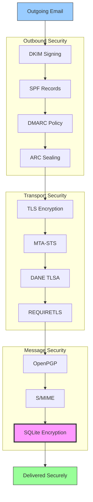


## Email Message Authentication Protocols {#email-message-authentication-protocols}

> \[!NOTE]
> Forward Emailは、なりすまし防止とメッセージの完全性を確保するために、主要なメール認証プロトコルをすべて実装しています。

Forward Emailはメール認証に[mailauth](https://github.com/postalsys/mailauth)ライブラリを使用しています。以下のRFCがサポートされています：

| RFC                                                       | タイトル                                                                 | 実装に関する注記                                               |
| --------------------------------------------------------- | ----------------------------------------------------------------------- | -------------------------------------------------------------- |
| [RFC 6376](https://datatracker.ietf.org/doc/html/rfc6376) | DomainKeys Identified Mail (DKIM)署名                                   | DKIM署名および検証を完全にサポート                             |
| [RFC 8463](https://datatracker.ietf.org/doc/html/rfc8463) | DKIMの新しい暗号署名方式（Ed25519-SHA256）                             | RSA-SHA256およびEd25519-SHA256署名アルゴリズムの両方をサポート |
| [RFC 7208](https://datatracker.ietf.org/doc/html/rfc7208) | Sender Policy Framework (SPF)                                           | SPFレコードの検証                                              |
| [RFC 7489](https://datatracker.ietf.org/doc/html/rfc7489) | ドメインベースメッセージ認証、報告、および適合性（DMARC）              | DMARCポリシーの適用                                           |
| [RFC 8617](https://datatracker.ietf.org/doc/html/rfc8617) | Authenticated Received Chain (ARC)                                     | ARCのシーリングおよび検証                                     |

メール認証プロトコルは、メッセージが送信者のものであることを検証し、転送中に改ざんされていないことを保証します。

### Authentication Protocol Support {#authentication-protocol-support}

| プロトコル  | RFC      | ステータス    | 説明                                                                 |
| --------- | -------- | ----------- | -------------------------------------------------------------------- |
| **DKIM**  | RFC 6376 | ✅ 対応済み | DomainKeys Identified Mail - 暗号署名                                |
| **SPF**   | RFC 7208 | ✅ 対応済み | Sender Policy Framework - IPアドレス認可                            |
| **DMARC** | RFC 7489 | ✅ 対応済み | ドメインベースメッセージ認証 - ポリシー適用                         |
| **ARC**   | RFC 8617 | ✅ 対応済み | Authenticated Received Chain - 転送間の認証情報保持                 |
### DKIM (DomainKeys Identified Mail) {#dkim-domainkeys-identified-mail}

**DKIM** はメールヘッダーに暗号署名を追加し、受信者がメッセージがドメイン所有者によって認可され、転送中に改ざんされていないことを検証できるようにします。

Forward Email は DKIM の署名と検証に [mailauth](https://github.com/postalsys/mailauth) を使用しています。

**主な特徴:**

* すべての送信メッセージに対する自動 DKIM 署名
* RSA および Ed25519 キーのサポート
* 複数セレクターのサポート
* 受信メッセージの DKIM 検証

### SPF (Sender Policy Framework) {#spf-sender-policy-framework}

**SPF** はドメイン所有者が自分のドメインを代表してメールを送信することを許可された IP アドレスを指定できるようにします。

**主な特徴:**

* 受信メッセージの SPF レコード検証
* 詳細な結果を伴う自動 SPF チェック
* include、redirect、および all メカニズムのサポート
* ドメインごとに設定可能な SPF ポリシー

### DMARC (Domain-based Message Authentication, Reporting & Conformance) {#dmarc-domain-based-message-authentication-reporting--conformance}

**DMARC** は SPF と DKIM を基にポリシーの適用とレポート機能を提供します。

**主な特徴:**

* DMARC ポリシーの適用（none、quarantine、reject）
* SPF と DKIM の整合性チェック
* DMARC 集計レポート
* ドメインごとの DMARC ポリシー

### ARC (Authenticated Received Chain) {#arc-authenticated-received-chain}

**ARC** は転送やメーリングリストの変更を経てもメール認証結果を保持します。

Forward Email は ARC の検証とシールに [mailauth](https://github.com/postalsys/mailauth) ライブラリを使用しています。

**主な特徴:**

* 転送メッセージの ARC シール
* 受信メッセージの ARC 検証
* 複数ホップにわたるチェーン検証
* 元の認証結果を保持

### Authentication Flow {#authentication-flow}

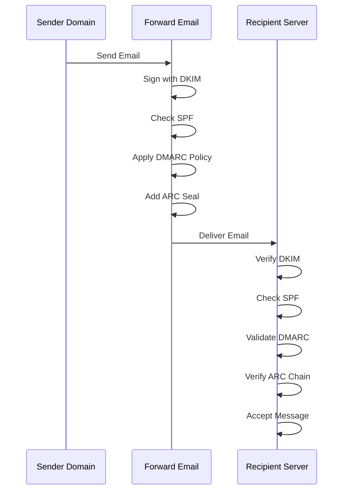

---


## Email Transport Security Protocols {#email-transport-security-protocols}

> \[!IMPORTANT]
> Forward Email は転送中のメールを保護するために複数層のトランスポートセキュリティを実装しています。

Forward Email は最新のトランスポートセキュリティプロトコルを実装しています:

| RFC                                                       | タイトル                                                                                             | ステータス   | 実装ノート                                                                                                                                                                                                                                                                                   |
| --------------------------------------------------------- | ---------------------------------------------------------------------------------------------------- | ----------- | --------------------------------------------------------------------------------------------------------------------------------------------------------------------------------------------------------------------------------------------------------------------------------------------- |
| [RFC 8461](https://datatracker.ietf.org/doc/html/rfc8461) | SMTP MTA Strict Transport Security (MTA-STS)                                                         | ✅ 対応済み | IMAP、SMTP、MX サーバーで広く使用されています。詳細は [create-mta-sts-cache.js](https://github.com/forwardemail/forwardemail.net/blob/master/helpers/create-mta-sts-cache.js) と [get-transporter.js](https://github.com/forwardemail/forwardemail.net/blob/master/helpers/get-transporter.js) を参照してください。 |
| [RFC 8460](https://datatracker.ietf.org/doc/html/rfc8460) | SMTP TLS Reporting                                                                                   | ✅ 対応済み | [mailauth](https://github.com/postalsys/mailauth) ライブラリ経由で対応                                                                                                                                                                                                                         |
| [RFC 7671](https://datatracker.ietf.org/doc/html/rfc7671) | The DNS-Based Authentication of Named Entities (DANE) Protocol: Updates and Operational Guidance     | ✅ 対応済み | 送信 SMTP 接続に対する完全な DANE 検証。詳細は [mx-connect PR #22](https://github.com/zone-eu/mx-connect/pull/22) を参照                                                                                                                                                                      |
| [RFC 6698](https://datatracker.ietf.org/doc/html/rfc6698) | The DNS-Based Authentication of Named Entities (DANE) Transport Layer Security (TLS) Protocol: TLSA  | ✅ 対応済み | RFC 6698 の完全対応：PKIX-TA、PKIX-EE、DANE-TA、DANE-EE 使用タイプ。詳細は [mx-connect PR #22](https://github.com/zone-eu/mx-connect/pull/22) を参照                                                                                                                                           |
| [RFC 8314](https://datatracker.ietf.org/doc/html/rfc8314) | Cleartext Considered Obsolete: Use of Transport Layer Security (TLS) for Email Submission and Access | ✅ 対応済み | すべての接続に TLS を必須化                                                                                                                                                                                                                                                                  |
| [RFC 8689](https://datatracker.ietf.org/doc/html/rfc8689) | SMTP Service Extension for Requiring TLS (REQUIRETLS)                                                | ✅ 対応済み | REQUIRETLS SMTP 拡張および "TLS-Required" ヘッダーの完全対応                                                                                                                                                                                                                                |
Transport security protocolsは、メールサーバー間の送信中にメールメッセージが暗号化および認証されることを保証します。

### Transport Security Support {#transport-security-support}

| プロトコル       | RFC      | ステータス      | 説明                                      |
| -------------- | -------- | ----------- | ------------------------------------------------ |
| **TLS**        | RFC 8314 | ✅ 対応済み | Transport Layer Security - 暗号化された接続 |
| **MTA-STS**    | RFC 8461 | ✅ 対応済み | Mail Transfer Agent Strict Transport Security    |
| **DANE**       | RFC 7671 | ✅ 対応済み | DNSベースの認証された名前付きエンティティ       |
| **REQUIRETLS** | RFC 8689 | ✅ 対応済み | 配信経路全体でTLSを必須にする             |

### TLS (Transport Layer Security) {#tls-transport-layer-security}

Forward Emailはすべてのメール接続（SMTP、IMAP、POP3）に対してTLS暗号化を強制します。

**主な特徴:**

* TLS 1.2およびTLS 1.3対応
* 自動証明書管理
* 完全前方秘匿性（PFS）
* 強力な暗号スイートのみ

### MTA-STS (Mail Transfer Agent Strict Transport Security) {#mta-sts-mail-transfer-agent-strict-transport-security}

**MTA-STS**は、HTTPS経由でポリシーを公開することで、メールがTLSで暗号化された接続のみで配信されることを保証します。

Forward Emailは[MTA-STSキャッシュ作成スクリプト](https://github.com/forwardemail/forwardemail.net/blob/master/helpers/create-mta-sts-cache.js)を使用してMTA-STSを実装しています。

**主な特徴:**

* 自動MTA-STSポリシー公開
* パフォーマンス向上のためのポリシーキャッシュ
* ダウングレード攻撃防止
* 証明書検証の強制

### DANE (DNS-based Authentication of Named Entities) {#dane-dns-based-authentication-of-named-entities}

> \[!NOTE]
> Forward Emailは現在、送信SMTP接続に対して完全なDANEサポートを提供しています。

**DANE**はDNSSECを利用してTLS証明書情報をDNSに公開し、メールサーバーが証明書機関に依存せずに証明書を検証できるようにします。

**主な特徴:**

* ✅ 送信SMTP接続に対する完全なDANE検証
* ✅ RFC 6698完全対応：PKIX-TA、PKIX-EE、DANE-TA、DANE-EE使用タイプ
* ✅ TLSアップグレード時のTLSAレコードに対する証明書検証
* ✅ 複数MXホストに対する並列TLSA解決
* ✅ ネイティブ`dns.resolveTlsa`の自動検出（Node.js v22.15.0+、v23.9.0+）
* ✅ 古いNode.jsバージョン向けのカスタムリゾルバサポート（[Tangerine](https://github.com/forwardemail/tangerine)経由）
* DNSSEC署名済みドメインが必要

> \[!TIP]
> **実装詳細:** DANEサポートは[mx-connect PR #22](https://github.com/zone-eu/mx-connect/pull/22)を通じて追加され、送信SMTP接続に対する包括的なDANE/TLSAサポートを提供します。

### REQUIRETLS {#requiretls}

> \[!TIP]
> Forward Emailはユーザー向けREQUIRETLSサポートを提供する数少ないプロバイダーの一つです。

**REQUIRETLS**は、メールメッセージが配信経路全体でTLS暗号化された接続のみで配信されることを保証します。

**主な特徴:**

* メール作成画面のユーザー向けチェックボックス
* 暗号化されていない配信の自動拒否
* エンドツーエンドTLS強制
* 詳細な失敗通知

> \[!TIP]
> **ユーザー向けTLS強制:** Forward Emailは**My Account > Domains > Settings**の下にすべての受信接続にTLSを強制するチェックボックスを提供しています。有効にすると、TLS暗号化されていない接続で送信された受信メールは530エラーコードで拒否され、すべての受信メールが転送中に暗号化されることを保証します。

### Transport Security Flow {#transport-security-flow}

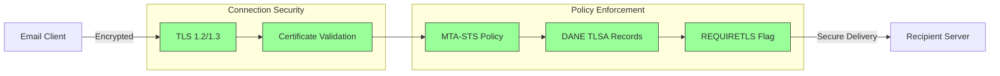
## Email Message Encryption {#email-message-encryption}

> \[!NOTE]
> Forward Email はエンドツーエンドのメール暗号化に OpenPGP と S/MIME の両方をサポートしています。

Forward Email は OpenPGP と S/MIME 暗号化をサポートしています:

| RFC                                                       | タイトル                                                                                 | ステータス  | 実装ノート                                                                                                                                                                                           |
| --------------------------------------------------------- | --------------------------------------------------------------------------------------- | ----------- | ---------------------------------------------------------------------------------------------------------------------------------------------------------------------------------------------------- |
| [RFC 9580](https://datatracker.ietf.org/doc/html/rfc9580) | OpenPGP (RFC 4880 の後継)                                                               | ✅ サポート | [OpenPGP.js v6+](https://github.com/openpgpjs/openpgpjs) 経由の統合。詳細は [FAQ](https://forwardemail.net/en/faq#do-you-support-openpgpmime-end-to-end-encryption-e2ee-and-web-key-directory-wkd) を参照してください |
| [RFC 8551](https://datatracker.ietf.org/doc/html/rfc8551) | Secure/Multipurpose Internet Mail Extensions (S/MIME) Version 4.0 メッセージ仕様          | ✅ サポート | RSA と ECC の両アルゴリズムをサポート。詳細は [FAQ](https://forwardemail.net/en/faq#do-you-support-smime-encryption) を参照してください                                                                 |

メッセージ暗号化プロトコルは、メッセージが転送中に傍受された場合でも、意図した受信者以外がメール内容を読むことができないように保護します。

### Encryption Support {#encryption-support}

| プロトコル  | RFC      | ステータス  | 説明                                         |
| ----------- | -------- | ----------- | -------------------------------------------- |
| **OpenPGP** | RFC 9580 | ✅ サポート | Pretty Good Privacy - 公開鍵暗号方式          |
| **S/MIME**  | RFC 8551 | ✅ サポート | Secure/Multipurpose Internet Mail Extensions |
| **WKD**     | Draft    | ✅ サポート | Web Key Directory - 自動鍵検出                 |

### OpenPGP (Pretty Good Privacy) {#openpgp-pretty-good-privacy}

**OpenPGP** は公開鍵暗号を用いたエンドツーエンド暗号化を提供します。Forward Email は [Web Key Directory (WKD)](https://forwardemail.net/en/faq#do-you-support-openpgpmime-end-to-end-encryption-e2ee-and-web-key-directory-wkd) プロトコルを通じて OpenPGP をサポートしています。

**主な特徴:**

* WKD による自動鍵検出
* 暗号化された添付ファイルのための PGP/MIME サポート
* メールクライアントによる鍵管理
* GPG、Mailvelope、その他の OpenPGP ツールと互換性あり

**使い方:**

1. メールクライアントで PGP 鍵ペアを生成する
2. 公開鍵を Forward Email の WKD にアップロードする
3. あなたの鍵は他のユーザーに自動的に検出可能になる
4. 暗号化メールの送受信をシームレスに行う

### S/MIME (Secure/Multipurpose Internet Mail Extensions) {#smime-securemultipurpose-internet-mail-extensions}

**S/MIME** は X.509 証明書を用いたメール暗号化とデジタル署名を提供します。

**主な特徴:**

* 証明書ベースの暗号化
* メッセージ認証のためのデジタル署名
* ほとんどのメールクライアントでネイティブサポート
* エンタープライズグレードのセキュリティ

**使い方:**

1. 証明書機関から S/MIME 証明書を取得する
2. メールクライアントに証明書をインストールする
3. メッセージの暗号化/署名をクライアントで設定する
4. 受信者と証明書を交換する

### SQLite Mailbox Encryption {#sqlite-mailbox-encryption}

> \[!IMPORTANT]
> Forward Email は暗号化された SQLite メールボックスによる追加のセキュリティ層を提供します。

メッセージレベルの暗号化に加え、Forward Email は [sqleet](https://github.com/resilar/sqleet) (ChaCha20-Poly1305) を使用してメールボックス全体を暗号化します。

**主な特徴:**

* **パスワードベースの暗号化** - パスワードはあなただけが知っています
* **量子耐性** - ChaCha20-Poly1305 暗号
* **ゼロ知識** - Forward Email はあなたのメールボックスを復号できません
* **サンドボックス化** - 各メールボックスは分離されポータブル
* **復旧不可** - パスワードを忘れるとメールボックスは失われます
### 暗号化比較 {#encryption-comparison}

| 機能                   | OpenPGP           | S/MIME             | SQLite暗号化       |
| --------------------- | ----------------- | ------------------ | ----------------- |
| **エンドツーエンド**    | ✅ はい            | ✅ はい             | ✅ はい            |
| **鍵管理**             | 自己管理           | CA発行             | パスワードベース   |
| **クライアントサポート** | プラグイン必要      | ネイティブ          | 透過的             |
| **ユースケース**        | 個人用             | 企業用             | ストレージ         |
| **量子耐性**           | ⚠️ 鍵による         | ⚠️ 証明書による      | ✅ はい            |

### 暗号化フロー {#encryption-flow}

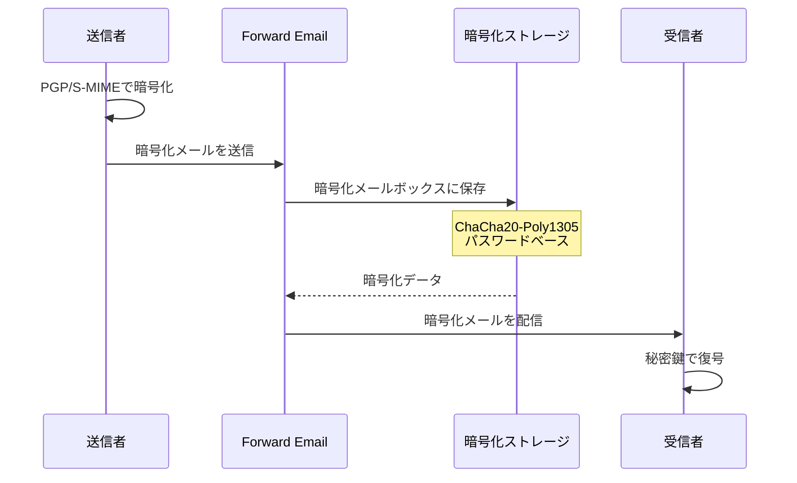

---


## 拡張機能 {#extended-functionality}


## メールメッセージフォーマット標準 {#email-message-format-standards}

> \[!NOTE]
> Forward Emailはリッチコンテンツと国際化のための最新のメールフォーマット標準をサポートしています。

Forward Emailは標準的なメールメッセージフォーマットをサポートしています：

| RFC                                                       | タイトル                                                       | 実装ノート           |
| --------------------------------------------------------- | ------------------------------------------------------------- | -------------------- |
| [RFC 5322](https://datatracker.ietf.org/doc/html/rfc5322) | インターネットメッセージフォーマット                         | フルサポート         |
| [RFC 2045](https://datatracker.ietf.org/doc/html/rfc2045) | MIME パート1: インターネットメッセージ本文のフォーマット      | フルMIMEサポート     |
| [RFC 2046](https://datatracker.ietf.org/doc/html/rfc2046) | MIME パート2: メディアタイプ                                   | フルMIMEサポート     |
| [RFC 2047](https://datatracker.ietf.org/doc/html/rfc2047) | MIME パート3: 非ASCIIテキストのためのメッセージヘッダー拡張   | フルMIMEサポート     |
| [RFC 2048](https://datatracker.ietf.org/doc/html/rfc2048) | MIME パート4: 登録手続き                                     | フルMIMEサポート     |
| [RFC 2049](https://datatracker.ietf.org/doc/html/rfc2049) | MIME パート5: 適合基準と例                                    | フルMIMEサポート     |

メールフォーマット標準は、メールメッセージの構造、エンコード、表示方法を定義します。

### フォーマット標準のサポート {#format-standards-support}

| 標準               | RFC           | 状態        | 説明                                 |
| ------------------ | ------------- | ----------- | ------------------------------------- |
| **MIME**           | RFC 2045-2049 | ✅ サポート | マルチパーパスインターネットメール拡張 |
| **SMTPUTF8**       | RFC 6531      | ⚠️ 部分的   | 国際化されたメールアドレス             |
| **EAI**            | RFC 6530      | ⚠️ 部分的   | メールアドレス国際化                   |
| **メッセージフォーマット** | RFC 5322      | ✅ サポート | インターネットメッセージフォーマット   |
| **MIMEセキュリティ**  | RFC 1847      | ✅ サポート | MIMEのセキュリティマルチパート         |

### MIME（マルチパーパスインターネットメール拡張） {#mime-multipurpose-internet-mail-extensions}

**MIME**は、メールに異なるコンテンツタイプ（テキスト、HTML、添付ファイルなど）を複数含めることを可能にします。

**サポートされているMIME機能：**

* マルチパートメッセージ（mixed、alternative、related）
* Content-Typeヘッダー
* Content-Transfer-Encoding（7bit、8bit、quoted-printable、base64）
* インライン画像と添付ファイル
* リッチHTMLコンテンツ

### SMTPUTF8とメールアドレス国際化 {#smtputf8-and-email-address-internationalization}

> \[!WARNING]
> SMTPUTF8のサポートは部分的です - すべての機能が完全に実装されているわけではありません。
**SMTPUTF8** は、メールアドレスに非ASCII文字（例：`用户@例え.jp`）を含めることを可能にします。

**現在の状況:**

* ⚠️ 国際化メールアドレスの部分的サポート
* ✅ メッセージ本文のUTF-8コンテンツ対応
* ⚠️ 非ASCIIローカルパートの限定的サポート

---


## カレンダーおよび連絡先プロトコル {#calendaring-and-contacts-protocols}

> \[!NOTE]
> Forward Email はカレンダーおよび連絡先の同期のために完全な CalDAV と CardDAV サポートを提供します。

Forward Email は [caldav-adapter](https://github.com/forwardemail/caldav-adapter) ライブラリを通じて CalDAV と CardDAV をサポートしています:

| RFC                                                       | タイトル                                                                   | 状態        | 実装ノート                                                                                                                                                                            |
| --------------------------------------------------------- | ------------------------------------------------------------------------- | ----------- | -------------------------------------------------------------------------------------------------------------------------------------------------------------------------------------- |
| [RFC 4791](https://datatracker.ietf.org/doc/html/rfc4791) | WebDAV のカレンダー拡張 (CalDAV)                                         | ✅ 対応済み | カレンダーのアクセスおよび管理                                                                                                                                                         |
| [RFC 6352](https://datatracker.ietf.org/doc/html/rfc6352) | CardDAV: WebDAV の vCard 拡張                                             | ✅ 対応済み | 連絡先のアクセスおよび管理                                                                                                                                                             |
| [RFC 5545](https://datatracker.ietf.org/doc/html/rfc5545) | インターネットカレンダーおよびスケジューリングコアオブジェクト仕様 (iCalendar) | ✅ 対応済み | iCalendar フォーマット対応                                                                                                                                                             |
| [RFC 6350](https://datatracker.ietf.org/doc/html/rfc6350) | vCard フォーマット仕様                                                    | ✅ 対応済み | vCard 4.0 フォーマット対応                                                                                                                                                             |
| [RFC 6638](https://datatracker.ietf.org/doc/html/rfc6638) | CalDAV のスケジューリング拡張                                            | ✅ 対応済み | iMIP 対応の CalDAV スケジューリング。詳細は [commit c4d1629](https://github.com/forwardemail/forwardemail.net/commit/c4d162975a49e38d76d68a032662e873a34a9b80) を参照                          |
| [RFC 5546](https://datatracker.ietf.org/doc/html/rfc5546) | iCalendar トランスポート非依存相互運用プロトコル (iTIP)                   | ✅ 対応済み | REQUEST、REPLY、CANCEL、VFREEBUSY メソッドの iTIP 対応。詳細は [commit c4d1629](https://github.com/forwardemail/forwardemail.net/commit/c4d162975a49e38d76d68a032662e873a34a9b80) を参照       |
| [RFC 6047](https://datatracker.ietf.org/doc/html/rfc6047) | iCalendar メッセージベース相互運用プロトコル (iMIP)                      | ✅ 対応済み | 返信リンク付きのメールベースカレンダー招待。詳細は [commit c4d1629](https://github.com/forwardemail/forwardemail.net/commit/c4d162975a49e38d76d68a032662e873a34a9b80) を参照                         |

CalDAV と CardDAV は、カレンダーおよび連絡先データをデバイス間でアクセス、共有、同期するためのプロトコルです。

### CalDAV と CardDAV のサポート {#caldav-and-carddav-support}

| プロトコル            | RFC      | 状態        | 説明                                  |
| --------------------- | -------- | ----------- | -------------------------------------- |
| **CalDAV**            | RFC 4791 | ✅ 対応済み | カレンダーのアクセスおよび同期          |
| **CardDAV**           | RFC 6352 | ✅ 対応済み | 連絡先のアクセスおよび同期              |
| **iCalendar**         | RFC 5545 | ✅ 対応済み | カレンダーデータフォーマット            |
| **vCard**             | RFC 6350 | ✅ 対応済み | 連絡先データフォーマット                |
| **VTODO**             | RFC 5545 | ✅ 対応済み | タスク／リマインダーのサポート          |
| **CalDAV Scheduling** | RFC 6638 | ✅ 対応済み | カレンダースケジューリング拡張          |
| **iTIP**              | RFC 5546 | ✅ 対応済み | トランスポート非依存の相互運用性         |
| **iMIP**              | RFC 6047 | ✅ 対応済み | メールベースのカレンダー招待            |
### CalDAV (カレンダーアクセス) {#caldav-calendar-access}

**CalDAV** は、任意のデバイスやアプリケーションからカレンダーにアクセスし管理することを可能にします。

**主な機能:**

* 複数デバイス間の同期
* 共有カレンダー
* カレンダー購読
* イベント招待と応答
* 繰り返しイベント
* タイムゾーン対応

**対応クライアント:**

* Apple カレンダー (macOS, iOS)
* Mozilla Thunderbird
* Evolution
* GNOME カレンダー
* 任意の CalDAV 対応クライアント

### CardDAV (連絡先アクセス) {#carddav-contact-access}

**CardDAV** は、任意のデバイスやアプリケーションから連絡先にアクセスし管理することを可能にします。

**主な機能:**

* 複数デバイス間の同期
* 共有アドレス帳
* 連絡先グループ
* 写真対応
* カスタムフィールド
* vCard 4.0 対応

**対応クライアント:**

* Apple 連絡先 (macOS, iOS)
* Mozilla Thunderbird
* Evolution
* GNOME 連絡先
* 任意の CardDAV 対応クライアント

### タスクとリマインダー (CalDAV VTODO) {#tasks-and-reminders-caldav-vtodo}

> \[!TIP]
> Forward Email は CalDAV VTODO を通じてタスクとリマインダーをサポートしています。

**VTODO** は iCalendar フォーマットの一部で、CalDAV を通じたタスク管理を可能にします。

**主な機能:**

* タスクの作成と管理
* 期限日と優先度
* タスク完了の追跡
* 繰り返しタスク
* タスクリスト/カテゴリ

**対応クライアント:**

* Apple リマインダー (macOS, iOS)
* Mozilla Thunderbird (Lightning 付き)
* Evolution
* GNOME To Do
* VTODO 対応の任意の CalDAV クライアント

### CalDAV/CardDAV 同期フロー {#caldavcarddav-synchronization-flow}

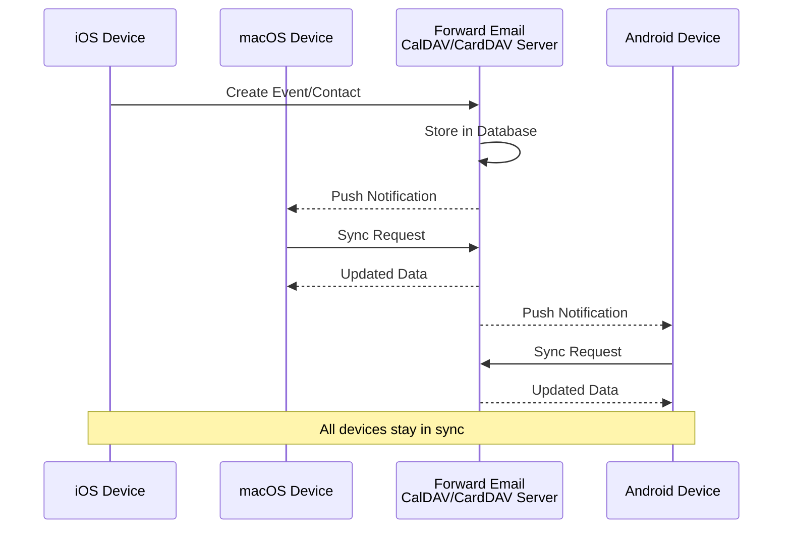

### サポートされていないカレンダー拡張機能 {#calendaring-extensions-not-supported}

以下のカレンダー拡張機能はサポートされていません:

| RFC                                                       | タイトル                                                             | 理由                                                            |
| --------------------------------------------------------- | --------------------------------------------------------------------- | --------------------------------------------------------------- |
| [RFC 4918](https://datatracker.ietf.org/doc/html/rfc4918) | Web分散作成およびバージョニングのためのHTTP拡張 (WebDAV)             | CalDAV は WebDAV の概念を使用しますが、RFC 4918 全体は実装していません |
| [RFC 6578](https://datatracker.ietf.org/doc/html/rfc6578) | WebDAV のコレクション同期                                           | 実装されていません                                               |
| [RFC 3744](https://datatracker.ietf.org/doc/html/rfc3744) | WebDAV アクセス制御プロトコル                                       | 実装されていません                                               |

---


## メールメッセージフィルタリング {#email-message-filtering}

> \[!IMPORTANT]
> Forward Email はサーバーサイドのメールフィルタリングに対して **完全な Sieve および ManageSieve サポート** を提供します。強力なルールを作成して、受信メッセージを自動的に仕分け、フィルタリング、転送、応答できます。

### Sieve (RFC 5228) {#sieve-rfc-5228}

[Sieve](https://en.wikipedia.org/wiki/Sieve_\(mail_filtering_language\)) は、サーバーサイドのメールフィルタリングのための標準化された強力なスクリプト言語です。Forward Email は 24 の拡張機能を備えた包括的な Sieve サポートを実装しています。

**ソースコード:** [`helpers/sieve/`](https://github.com/forwardemail/forwardemail.net/tree/master/helpers/sieve)

#### サポートされているコア Sieve RFC {#core-sieve-rfcs-supported}

| RFC                                                                                    | タイトル                                                       | ステータス       |
| -------------------------------------------------------------------------------------- | ------------------------------------------------------------- | -------------- |
| [RFC 5228](https://datatracker.ietf.org/doc/html/rfc5228)                              | Sieve: メールフィルタリング言語                               | ✅ 完全サポート |
| [RFC 5429](https://datatracker.ietf.org/doc/html/rfc5429)                              | Sieve メールフィルタリング: 拒否および拡張拒否拡張           | ✅ 完全サポート |
| [RFC 5230](https://datatracker.ietf.org/doc/html/rfc5230)                              | Sieve メールフィルタリング: バケーション拡張                 | ✅ 完全サポート |
| [RFC 6131](https://datatracker.ietf.org/doc/html/rfc6131)                              | Sieve バケーション拡張: "Seconds" パラメータ                  | ✅ 完全サポート |
| [RFC 5232](https://datatracker.ietf.org/doc/html/rfc5232)                              | Sieve メールフィルタリング: Imap4flags 拡張                   | ✅ 完全サポート |
| [RFC 5173](https://datatracker.ietf.org/doc/html/rfc5173)                              | Sieve メールフィルタリング: 本文拡張                           | ✅ 完全サポート |
| [RFC 5229](https://datatracker.ietf.org/doc/html/rfc5229)                              | Sieve メールフィルタリング: 変数拡張                           | ✅ 完全サポート |
| [RFC 5231](https://datatracker.ietf.org/doc/html/rfc5231)                              | Sieve メールフィルタリング: 関係拡張                           | ✅ 完全サポート |
| [RFC 4790](https://datatracker.ietf.org/doc/html/rfc4790)                              | インターネットアプリケーションプロトコル照合レジストリ       | ✅ 完全サポート |
| [RFC 3894](https://datatracker.ietf.org/doc/html/rfc3894)                              | Sieve 拡張: 副作用なしのコピー                                 | ✅ 完全サポート |
| [RFC 5293](https://datatracker.ietf.org/doc/html/rfc5293)                              | Sieve メールフィルタリング: Editheader 拡張                   | ✅ 完全サポート |
| [RFC 5260](https://datatracker.ietf.org/doc/html/rfc5260)                              | Sieve メールフィルタリング: 日付およびインデックス拡張       | ✅ 完全サポート |
| [RFC 5435](https://datatracker.ietf.org/doc/html/rfc5435)                              | Sieve メールフィルタリング: 通知のための拡張                   | ✅ 完全サポート |
| [RFC 5183](https://datatracker.ietf.org/doc/html/rfc5183)                              | Sieve メールフィルタリング: 環境拡張                           | ✅ 完全サポート |
| [RFC 5490](https://datatracker.ietf.org/doc/html/rfc5490)                              | Sieve メールフィルタリング: メールボックス状態チェック拡張   | ✅ 完全サポート |
| [RFC 8579](https://datatracker.ietf.org/doc/html/rfc8579)                              | Sieve メールフィルタリング: 特殊用途メールボックスへの配信   | ✅ 完全サポート |
| [RFC 7352](https://datatracker.ietf.org/doc/html/rfc7352)                              | Sieve メールフィルタリング: 重複配信の検出                     | ✅ 完全サポート |
| [RFC 5463](https://datatracker.ietf.org/doc/html/rfc5463)                              | Sieve メールフィルタリング: Ihave 拡張                        | ✅ 完全サポート |
| [RFC 5233](https://datatracker.ietf.org/doc/html/rfc5233)                              | Sieve メールフィルタリング: サブアドレス拡張                   | ✅ 完全サポート |
| [draft-ietf-sieve-regex](https://datatracker.ietf.org/doc/html/draft-ietf-sieve-regex) | Sieve メールフィルタリング: 正規表現拡張                       | ✅ 完全サポート |
#### サポートされているSieve拡張機能 {#supported-sieve-extensions}

| 拡張機能                      | 説明                                     | 統合                                      |
| ---------------------------- | ---------------------------------------- | ------------------------------------------ |
| `fileinto`                   | メッセージを特定のフォルダーに振り分ける | 指定されたIMAPフォルダーにメッセージを保存 |
| `reject` / `ereject`         | エラーでメッセージを拒否する              | バウンスメッセージ付きのSMTP拒否           |
| `vacation`                   | 自動応答（休暇/不在通知）                  | Emails.queue経由でキューイング、レート制限あり |
| `vacation-seconds`           | 細かい休暇応答間隔の指定                   | `:seconds`パラメータからTTLを取得          |
| `imap4flags`                 | IMAPフラグの設定（\Seen、\Flaggedなど）    | メッセージ保存時にフラグを適用              |
| `envelope`                   | エンベロープの送信者/受信者をテスト        | SMTPエンベロープデータへのアクセス          |
| `body`                       | メッセージ本文の内容をテスト                | 本文全体のテキストマッチング                |
| `variables`                  | スクリプト内で変数を保存・使用               | 修飾子付きの変数展開                        |
| `relational`                 | 関係演算子による比較                       | `:count`、` :value` とgt/lt/eq               |
| `comparator-i;ascii-numeric` | 数値比較                                  | 数値文字列の比較                            |
| `copy`                       | リダイレクト時にメッセージをコピー           | fileinto/redirectでの`:copy`フラグ           |
| `editheader`                 | メッセージヘッダーの追加・削除               | 保存前にヘッダーを修正                      |
| `date`                       | 日付/時刻の値をテスト                      | `currentdate`およびヘッダーの日付テスト      |
| `index`                      | 特定のヘッダーの出現回数にアクセス            | 複数値ヘッダーに対する`:index`               |
| `regex`                      | 正規表現マッチング                         | テストでの完全な正規表現サポート             |
| `enotify`                    | 通知の送信                               | Emails.queue経由の`mailto:`通知              |
| `environment`                | 環境情報へのアクセス                       | セッションからドメイン、ホスト、リモートIPを取得 |
| `mailbox`                    | メールボックスの存在をテスト                 | `mailboxexists`テスト                       |
| `special-use`                | 特殊用途メールボックスへの振り分け            | \Junk、\Trashなどをフォルダーにマッピング    |
| `duplicate`                  | 重複メッセージの検出                       | Redisベースの重複追跡                       |
| `ihave`                      | 拡張機能の利用可能性をテスト                 | 実行時の機能チェック                        |
| `subaddress`                 | user+detail形式のアドレス部分にアクセス       | `:user`および`:detail`アドレス部分           |

#### サポートされていないSieve拡張機能 {#sieve-extensions-not-supported}

| 拡張機能                               | RFC                                                       | 理由                                                             |
| --------------------------------------- | --------------------------------------------------------- | ---------------------------------------------------------------- |
| `include`                               | [RFC 6609](https://datatracker.ietf.org/doc/html/rfc6609) | セキュリティリスク（スクリプトインジェクション）、グローバルスクリプト保存が必要 |
| `mboxmetadata` / `servermetadata`       | [RFC 5490](https://datatracker.ietf.org/doc/html/rfc5490) | IMAP METADATA拡張が必要                                         |
| `fcc`                                   | [RFC 8580](https://datatracker.ietf.org/doc/html/rfc8580) | 送信済みフォルダーとの統合が必要                               |
| `encoded-character`                     | [RFC 5228](https://datatracker.ietf.org/doc/html/rfc5228) | `${hex:}`構文のためにパーサーの変更が必要                       |
| `foreverypart` / `mime` / `extracttext` | [RFC 5703](https://datatracker.ietf.org/doc/html/rfc5703) | 複雑なMIMEツリーの操作が必要                                   |
#### Sieve処理フロー {#sieve-processing-flow}

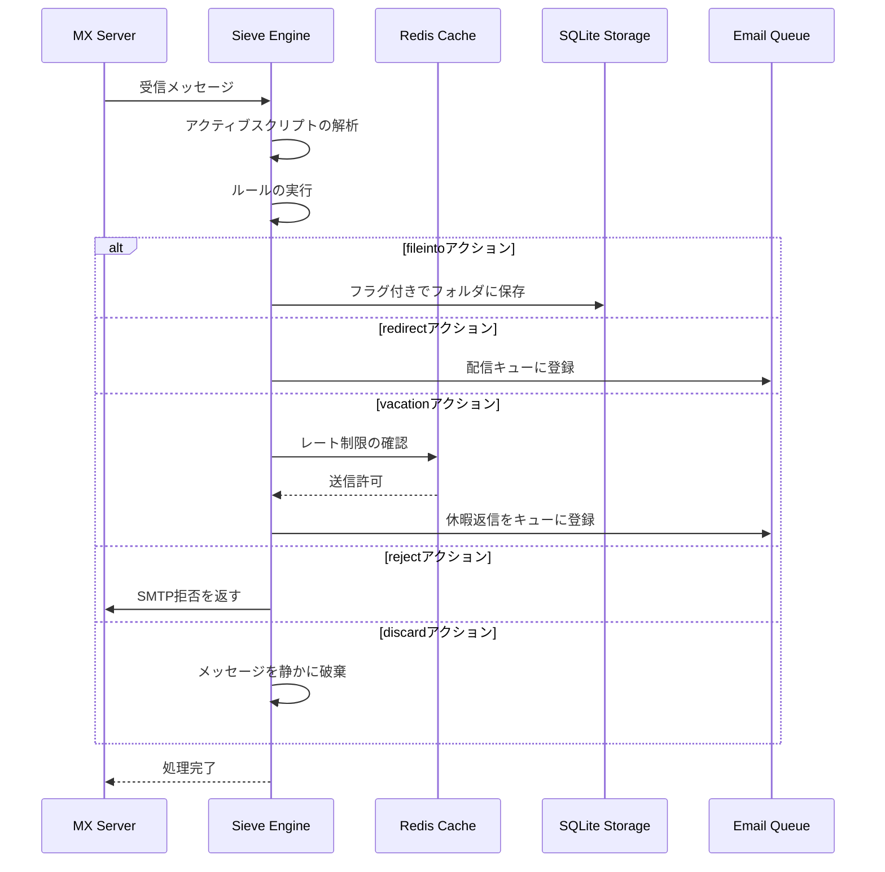

#### セキュリティ機能 {#security-features}

Forward EmailのSieve実装には包括的なセキュリティ保護が含まれています：

* **CVE-2023-26430保護**：リダイレクトループやメール爆撃攻撃を防止
* **レート制限**：リダイレクト（10通/メッセージ、100通/日）および休暇返信の制限
* **拒否リストチェック**：リダイレクト先アドレスを拒否リストと照合
* **保護されたヘッダー**：DKIM、ARC、および認証ヘッダーはeditheaderで変更不可
* **スクリプトサイズ制限**：最大スクリプトサイズを強制
* **実行タイムアウト**：実行時間が制限を超えた場合にスクリプトを終了

#### 例：Sieveスクリプト {#example-sieve-scripts}

**ニュースレターをフォルダに振り分ける：**

```sieve
require ["fileinto"];

if header :contains "List-Id" "newsletter" {
    fileinto "Newsletters";
}
```

**細かいタイミング設定の休暇自動応答：**

```sieve
require ["vacation", "vacation-seconds"];

vacation :seconds 3600 :subject "Out of Office"
    "現在不在のため、24時間以内に返信いたします。";
```

**フラグ付きスパムフィルタリング：**

```sieve
require ["fileinto", "imap4flags"];

if header :contains "X-Spam-Status" "Yes" {
    setflag "\\Seen";
    fileinto "Junk";
}
```

**変数を使った複雑なフィルタリング：**

```sieve
require ["variables", "fileinto", "regex"];

if header :regex "From" "(.+)@example\\.com" {
    set :lower "sender" "${1}";
    fileinto "Contacts/${sender}";
}
```

> \[!TIP]
> 完全なドキュメント、例スクリプト、設定手順については、[FAQ: Do you support Sieve email filtering?](/faq#do-you-support-sieve-email-filtering) をご覧ください

### ManageSieve (RFC 5804) {#managesieve-rfc-5804}

Forward EmailはSieveスクリプトをリモート管理するためのManageSieveプロトコルを完全にサポートしています。

**ソースコード:** [`managesieve-server.js`](https://github.com/forwardemail/forwardemail.net/blob/master/managesieve-server.js)

| RFC                                                       | タイトル                                         | ステータス       |
| --------------------------------------------------------- | ---------------------------------------------- | -------------- |
| [RFC 5804](https://datatracker.ietf.org/doc/html/rfc5804) | Sieveスクリプトをリモート管理するためのプロトコル | ✅ フルサポート |

#### ManageSieveサーバー設定 {#managesieve-server-configuration}

| 設定項目                 | 値                      |
| ----------------------- | ----------------------- |
| **サーバー**            | `imap.forwardemail.net` |
| **ポート (STARTTLS)**   | `2190` (推奨)           |
| **ポート (Implicit TLS)** | `4190`                  |
| **認証方式**            | PLAIN (TLS上で)          |

> **注意:** ポート2190はSTARTTLS（平文からTLSへのアップグレード）を使用し、[sieve-connect](https://github.com/philpennock/sieve-connect)を含むほとんどのManageSieveクライアントと互換性があります。ポート4190は暗黙のTLS（接続開始時からTLS）を使用し、それをサポートするクライアント向けです。

#### 対応ManageSieveコマンド {#supported-managesieve-commands}

| コマンド        | 説明                                   |
| -------------- | --------------------------------------- |
| `AUTHENTICATE` | PLAINメカニズムによる認証               |
| `CAPABILITY`   | サーバーの機能および拡張機能の一覧表示 |
| `HAVESPACE`    | スクリプトを保存可能か確認               |
| `PUTSCRIPT`    | 新しいスクリプトをアップロード           |
| `LISTSCRIPTS`  | すべてのスクリプトとアクティブ状態の一覧 |
| `SETACTIVE`    | スクリプトをアクティブ化                 |
| `GETSCRIPT`    | スクリプトをダウンロード                 |
| `DELETESCRIPT` | スクリプトを削除                         |
| `RENAMESCRIPT` | スクリプトの名前変更                     |
| `CHECKSCRIPT`  | スクリプトの構文検証                     |
| `NOOP`         | 接続を維持                             |
| `LOGOUT`       | セッション終了                         |
#### 対応ManageSieveクライアント {#compatible-managesieve-clients}

* **Thunderbird**: [Sieveアドオン](https://addons.thunderbird.net/addon/sieve/)による組み込みSieveサポート
* **Roundcube**: [ManageSieveプラグイン](https://plugins.roundcube.net/packages/johndoh/sieve)
* **KMail**: ネイティブManageSieveサポート
* **sieve-connect**: コマンドラインクライアント
* **RFC 5804準拠の任意のクライアント**

#### ManageSieveプロトコルフロー {#managesieve-protocol-flow}

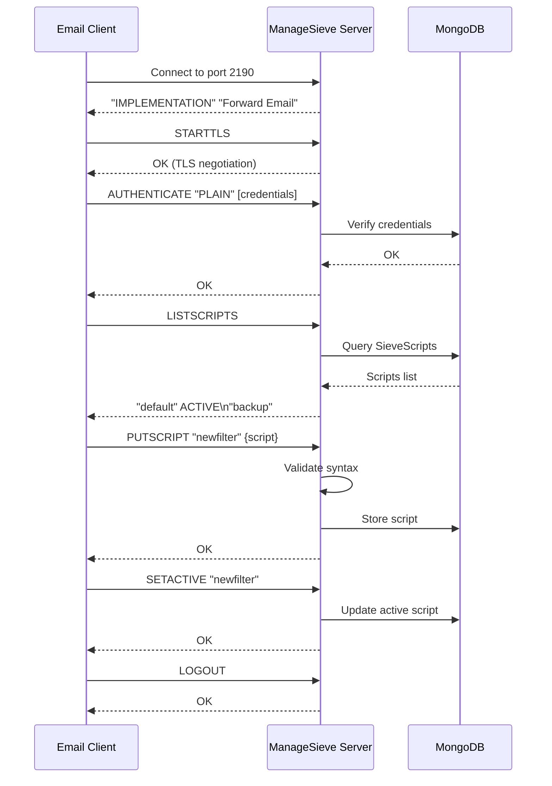

#### WebインターフェースとAPI {#web-interface-and-api}

ManageSieveに加えて、Forward Emailは以下を提供します：

* **Webダッシュボード**: My Account → Domains → Aliases → Sieve Scriptsでウェブインターフェースを通じてSieveスクリプトの作成と管理が可能
* **REST API**: [Forward Email API](/api#sieve-scripts)を通じたプログラムによるSieveスクリプト管理アクセス

> \[!TIP]
> 詳細なセットアップ手順とクライアント設定については、[FAQ: Sieveメールフィルタリングをサポートしていますか？](/faq#do-you-support-sieve-email-filtering)をご覧ください

---


## ストレージ最適化 {#storage-optimization}

> \[!IMPORTANT]
> **業界初のストレージ技術:** Forward Emailは、添付ファイルの重複排除とメールコンテンツのBrotli圧縮を組み合わせた**世界唯一のメールプロバイダー**です。この二重の最適化により、従来のメールプロバイダーと比べて**2～3倍の効果的なストレージ**を実現しています。

Forward Emailは、RFC準拠とメッセージの完全性を維持しつつ、メールボックスサイズを劇的に削減する2つの革新的なストレージ最適化技術を実装しています：

1. **添付ファイルの重複排除** - すべてのメール間で重複する添付ファイルを排除
2. **Brotli圧縮** - メタデータを46～86%、添付ファイルを50%削減

### アーキテクチャ：二重層ストレージ最適化 {#architecture-dual-layer-storage-optimization}

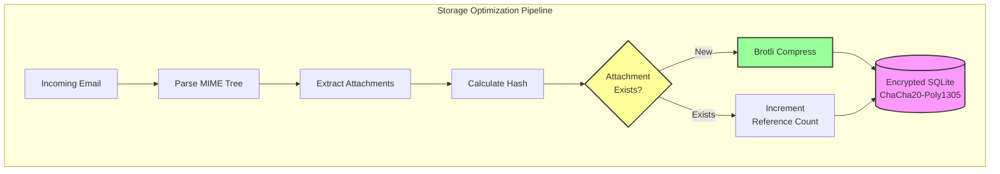

---


## 添付ファイルの重複排除 {#attachment-deduplication}

Forward Emailは、[WildDuckの実績ある手法](https://docs.wildduck.email/docs/in-depth/attachment-deduplication/)をSQLiteストレージ向けに適用した添付ファイルの重複排除を実装しています。

> \[!NOTE]
> **重複排除の対象:** 「添付ファイル」とは、デコードされたファイルではなく、**エンコードされた**MIMEノードの内容（base64またはquoted-printable）を指します。これによりDKIMおよびGPG署名の有効性が保持されます。

### 動作原理 {#how-it-works}

**WildDuckのオリジナル実装（MongoDB GridFS）:**

> Wild Duck IMAPサーバーは添付ファイルを重複排除します。この場合の「添付ファイル」とは、base64またはquoted-printableでエンコードされたmimeノードの内容を指し、デコードされたファイルではありません。エンコードされた内容を使用することで多くの偽陰性（異なるメール内の同一ファイルが異なる添付ファイルとしてカウントされる）が発生しますが、これは異なる署名方式（DKIM、GPGなど）の有効性を保証するために必要です。Wild Duckから取得したメッセージは、メッセージをツリー状のオブジェクトに解析し取得時に再構築しているにもかかわらず、保存されたメッセージとまったく同じに見えます。
**Forward EmailのSQLite実装:**

Forward Emailは暗号化されたSQLiteストレージに対して以下のプロセスでこのアプローチを適用しています:

1. **ハッシュ計算**: 添付ファイルが見つかった場合、添付ファイルの本文から[`rev-hash`](https://github.com/sindresorhus/rev-hash)ライブラリを使ってハッシュを計算します
2. **照会**: `Attachments`テーブルに一致するハッシュの添付ファイルが存在するか確認します
3. **参照カウント**:
   * 存在する場合: 参照カウンターを1増やし、マジックカウンターをランダムな数だけ増やします
   * 新規の場合: カウンター=1で新しい添付ファイルエントリを作成します
4. **削除の安全性**: 偽陽性を防ぐために二重カウンターシステム（参照＋マジック）を使用します
5. **ガベージコレクション**: 両方のカウンターがゼロになった時点で添付ファイルは即座に削除されます

**ソースコード:** [`helpers/attachment-storage.js`](https://github.com/forwardemail/forwardemail.net/blob/master/helpers/attachment-storage.js)

### 重複排除フロー {#deduplication-flow}

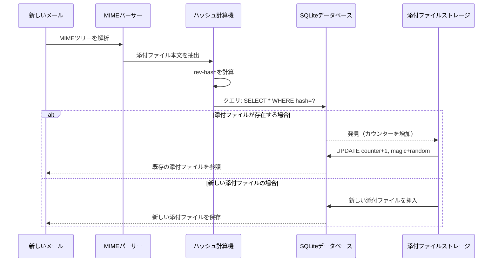

### マジックナンバーシステム {#magic-number-system}

Forward EmailはWildDuckの「マジックナンバー」システム（[Mail.ru](https://github.com/zone-eu/wildduck)に触発）を使用して削除時の偽陽性を防いでいます:

* すべてのメッセージに**ランダムな数値**が割り当てられます
* メッセージが追加されると添付ファイルの**マジックカウンター**はそのランダム数だけ増加します
* メッセージが削除されると同じ数だけマジックカウンターは減少します
* 添付ファイルは**両方のカウンター**（参照＋マジック）がゼロになった時のみ削除されます

この二重カウンターシステムにより、削除時に問題が発生した場合（例：クラッシュ、ネットワークエラー）でも添付ファイルが早期に削除されることを防ぎます。

### 主な違い: WildDuck vs Forward Email {#key-differences-wildduck-vs-forward-email}

| 機能                   | WildDuck (MongoDB)         | Forward Email (SQLite)         |
| ---------------------- | -------------------------- | ------------------------------ |
| **ストレージバックエンド** | MongoDB GridFS（チャンク化） | SQLite BLOB（直接）             |
| **ハッシュアルゴリズム**   | SHA256                     | rev-hash（SHA-256ベース）       |
| **参照カウント**         | ✅ あり                    | ✅ あり                        |
| **マジックナンバー**      | ✅ あり（Mail.ru由来）      | ✅ あり（同じシステム）          |
| **ガベージコレクション**  | 遅延（別ジョブ）           | 即時（カウンターゼロ時）         |
| **圧縮**                 | ❌ なし                   | ✅ Brotli（以下参照）            |
| **暗号化**               | ❌ 任意                   | ✅ 常時（ChaCha20-Poly1305）     |

---


## Brotli圧縮 {#brotli-compression}

> \[!IMPORTANT]
> **世界初:** Forward EmailはメールコンテンツにBrotli圧縮を使用する**世界で唯一のメールサービス**です。これにより添付ファイルの重複排除に加えて**46-86%のストレージ節約**が可能になります。

Forward Emailは添付ファイル本文とメッセージメタデータの両方にBrotli圧縮を実装し、大幅なストレージ節約を実現しつつ後方互換性を維持しています。

**実装:** [`helpers/msgpack-helpers.js`](https://github.com/forwardemail/forwardemail.net/blob/master/helpers/msgpack-helpers.js)

### 圧縮対象 {#what-gets-compressed}

**1. 添付ファイル本文** (`encodeAttachmentBody`)

* **旧フォーマット**: 16進エンコードされた文字列（サイズ2倍）または生のBuffer
* **新フォーマット**: "FEBR"マジックヘッダー付きのBrotli圧縮Buffer
* **圧縮判定**: 4バイトのヘッダーを考慮し、圧縮でサイズが小さくなる場合のみ圧縮
* **ストレージ節約**: 最大**50%**（16進→ネイティブBLOB）
**2. メッセージメタデータ** (`encodeMetadata`)

含まれるもの: `mimeTree`、`headers`、`envelope`、`flags`

* **旧フォーマット**: JSONテキスト文字列
* **新フォーマット**: Brotli圧縮されたBuffer
* **ストレージ節約率**: メッセージの複雑さにより**46-86%**

### 圧縮設定 {#compression-configuration}

```javascript
// 速度最適化されたBrotli圧縮オプション（レベル4はバランスが良い）
const BROTLI_COMPRESS_OPTIONS = {
  params: {
    [zlib.constants.BROTLI_PARAM_QUALITY]: 4
  }
};
```

**なぜレベル4？**

* **高速な圧縮/解凍**: ミリ秒未満の処理時間
* **良好な圧縮率**: 46-86%の節約
* **バランスの取れた性能**: リアルタイムメール処理に最適

### マジックヘッダー: "FEBR" {#magic-header-febr}

Forward Emailは圧縮された添付ファイルの本文を識別するために4バイトのマジックヘッダーを使用します：

```
"FEBR" = Forward Email BRotli
16進数: 0x46 0x45 0x42 0x52
```

**なぜマジックヘッダー？**

* **フォーマット検出**: 圧縮データか非圧縮データかを即座に識別
* **後方互換性**: 古い16進文字列や生のBufferも動作
* **衝突回避**: "FEBR"は正当な添付データの先頭に現れる可能性が低い

### 圧縮プロセス {#compression-process}

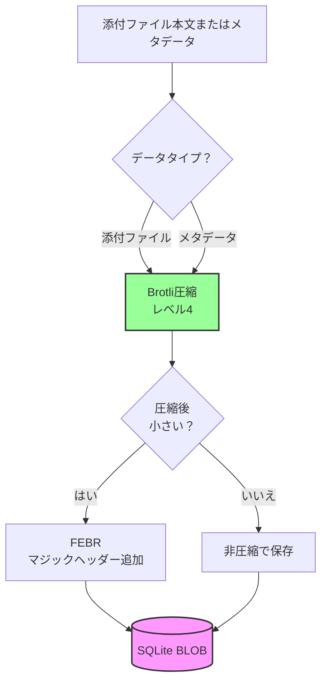

### 解凍プロセス {#decompression-process}

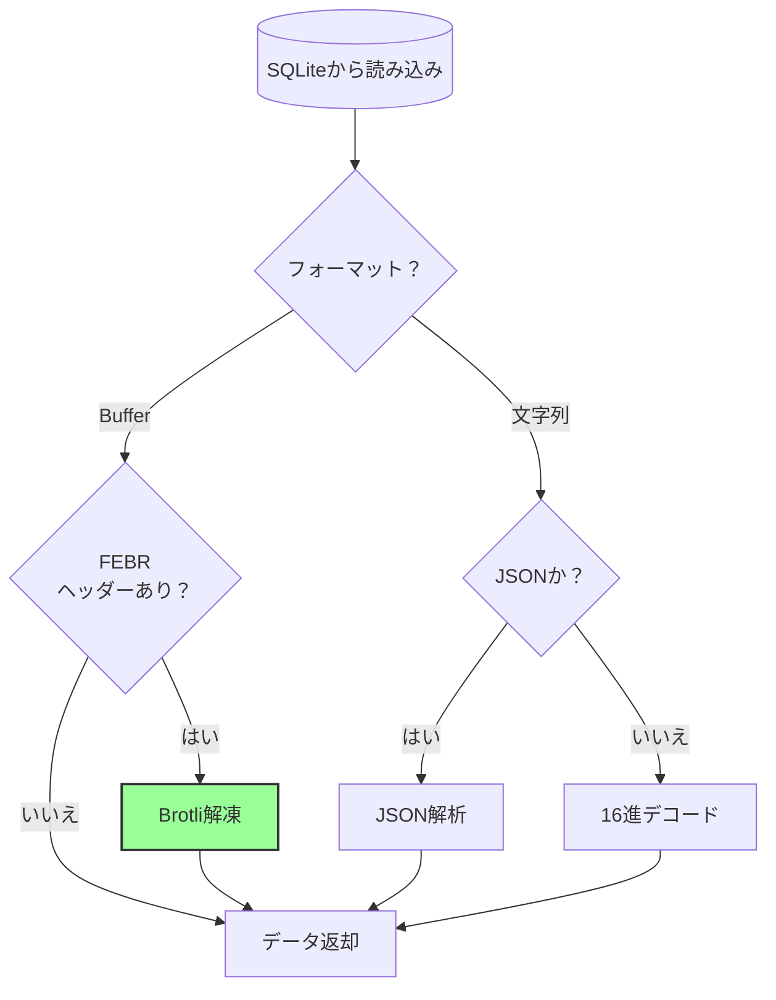

### 後方互換性 {#backwards-compatibility}

すべてのデコード関数はストレージフォーマットを**自動検出**します：

| フォーマット           | 検出方法                             | 処理内容                                      |
| --------------------- | ---------------------------------- | --------------------------------------------- |
| **Brotli圧縮**        | "FEBR"マジックヘッダーの有無確認   | `zlib.brotliDecompressSync()`で解凍           |
| **生のBuffer**        | マジックなしで`Buffer.isBuffer()`  | そのまま返す                                  |
| **16進文字列**        | 偶数長かつ[0-9a-f]文字の確認       | `Buffer.from(value, 'hex')`でデコード         |
| **JSON文字列**        | 最初の文字が`{`または`[`か確認      | `JSON.parse()`で解析                           |

これにより、旧フォーマットから新フォーマットへの移行時に**データ損失ゼロ**を保証します。

### ストレージ節約統計 {#storage-savings-statistics}

**本番データからの測定節約率：**

| データタイプ           | 旧フォーマット               | 新フォーマット             | 節約率      |
| --------------------- | ---------------------------- | -------------------------- | ---------- |
| **添付ファイル本文**   | 16進エンコード文字列（2倍）  | Brotli圧縮BLOB             | **50%**    |
| **メッセージメタデータ** | JSONテキスト                 | Brotli圧縮BLOB             | **46-86%** |
| **メールボックスフラグ** | JSONテキスト                 | Brotli圧縮BLOB             | **60-80%** |

**出典:** [`helpers/migrate-storage-format.js`](https://github.com/forwardemail/forwardemail.net/blob/master/helpers/migrate-storage-format.js)

### 移行プロセス {#migration-process}

Forward Emailは旧フォーマットから新フォーマットへの自動かつ冪等な移行を提供します：
// 移行統計の追跡:
{
  attachmentsMigrated: 0,
  messagesMigrated: 0,
  mailboxesMigrated: 0,
  bytesSaved: 0  // 圧縮によって節約された合計バイト数
}
```

**移行手順:**

1. 添付ファイルの本文: 16進エンコード → ネイティブBLOB（50%節約）
2. メッセージメタデータ: JSONテキスト → Brotli圧縮BLOB（46-86%節約）
3. メールボックスフラグ: JSONテキスト → Brotli圧縮BLOB（60-80%節約）

**ソース:** [`helpers/migrate-storage-format.js`](https://github.com/forwardemail/forwardemail.net/blob/master/helpers/migrate-storage-format.js)

---

### 統合ストレージ効率 {#combined-storage-efficiency}

> \[!TIP]
> **実際の効果:** 添付ファイルの重複排除＋Brotli圧縮により、Forward Emailユーザーは従来のメールプロバイダーと比べて**2〜3倍の実効ストレージ**を得られます。

**例示シナリオ:**

従来のメールプロバイダー（1GBメールボックス）:

* 1GBのディスク容量 = 1GBのメール
* 重複排除なし: 同じ添付ファイルが10回保存される = 10倍のストレージ無駄遣い
* 圧縮なし: フルJSONメタデータ保存 = 2〜3倍のストレージ無駄遣い

Forward Email（1GBメールボックス）:

* 1GBのディスク容量 ≈ **2〜3GBのメール**（実効ストレージ）
* 重複排除: 同じ添付ファイルは1回保存し、10回参照
* 圧縮: メタデータで46〜86%節約、添付ファイルで50%節約
* 暗号化: ChaCha20-Poly1305（ストレージオーバーヘッドなし）

**比較表:**

| プロバイダー       | ストレージ技術                              | 実効ストレージ（1GBメールボックス） |
| ----------------- | -------------------------------------------- | ------------------------------- |
| Gmail             | なし                                         | 1GB                             |
| iCloud            | なし                                         | 1GB                             |
| Outlook.com       | なし                                         | 1GB                             |
| Fastmail          | なし                                         | 1GB                             |
| ProtonMail        | 暗号化のみ                                   | 1GB                             |
| Tutanota          | 暗号化のみ                                   | 1GB                             |
| **Forward Email** | **重複排除＋圧縮＋暗号化**                    | **2〜3GB** ✨                   |

### 技術的実装詳細 {#technical-implementation-details}

**パフォーマンス:**

* Brotliレベル4: サブミリ秒の圧縮／解凍
* 圧縮によるパフォーマンスペナルティなし
* SQLite FTS5: NVMe SSDで50ms未満の検索

**セキュリティ:**

* 圧縮は**暗号化後**に実施（SQLiteデータベースは暗号化済み）
* ChaCha20-Poly1305暗号化＋Brotli圧縮
* ゼロ知識: 復号パスワードはユーザーのみが保持

**RFC準拠:**

* 取得したメッセージは保存時と**全く同じ**
* DKIM署名は有効なまま（エンコードされた内容を保持）
* GPG署名は有効なまま（署名対象の内容は変更なし）

### なぜ他のプロバイダーはこれをしないのか {#why-no-other-provider-does-this}

**複雑さ:**

* ストレージ層との深い統合が必要
* 後方互換性の確保が困難
* 古いフォーマットからの移行が複雑

**パフォーマンスの懸念:**

* 圧縮はCPU負荷を増やす（Brotliレベル4で解決）
* 読み込みごとの解凍（SQLiteのキャッシュで解決）

**Forward Emailの強み:**

* 最初から最適化を念頭に設計
* SQLiteは直接BLOB操作を可能にする
* ユーザーごとに暗号化されたデータベースで安全な圧縮を実現

---

---


## モダンな機能 {#modern-features}


## メール管理のための完全なREST API {#complete-rest-api-for-email-management}

> \[!TIP]
> Forward Emailはプログラムによるメール管理のために39のエンドポイントを持つ包括的なREST APIを提供しています。

> \[!TIP]
> **業界唯一の特徴:** 他のどのメールサービスとも異なり、Forward Emailはメールボックス、カレンダー、連絡先、メッセージ、フォルダへの完全なプログラムアクセスを包括的なREST APIを通じて提供します。これは、すべてのデータを格納する暗号化されたSQLiteデータベースファイルへの直接操作です。

Forward Emailは、メールデータへの前例のないアクセスを提供する完全なREST APIを提供します。Gmail、iCloud、Outlook、ProtonMail、Tuta、Fastmailを含む他のどのメールサービスも、このレベルの包括的で直接的なデータベースアクセスを提供していません。
**APIドキュメント:** <https://forwardemail.net/en/email-api>

### APIカテゴリ（39エンドポイント） {#api-categories-39-endpoints}

**1. メッセージAPI**（5エンドポイント） - メールメッセージの完全なCRUD操作：

* `GET /v1/messages` - 15以上の高度な検索パラメータでメッセージを一覧表示（他のサービスにはない機能）
* `POST /v1/messages` - メッセージの作成/送信
* `GET /v1/messages/:id` - メッセージの取得
* `PUT /v1/messages/:id` - メッセージの更新（フラグ、フォルダ）
* `DELETE /v1/messages/:id` - メッセージの削除

*例：添付ファイル付きの前四半期のすべての請求書を検索する場合：*

```bash
curl -u "alias@domain.com:password" \
  "https://api.forwardemail.net/v1/messages?q=subject:invoice+has:attachment+after:2024-01-01+before:2024-04-01"
```

[高度な検索ドキュメント](https://forwardemail.net/en/email-api)を参照してください

**2. フォルダAPI**（5エンドポイント） - REST経由の完全なIMAPフォルダ管理：

* `GET /v1/folders` - すべてのフォルダを一覧表示
* `POST /v1/folders` - フォルダを作成
* `GET /v1/folders/:id` - フォルダを取得
* `PUT /v1/folders/:id` - フォルダを更新
* `DELETE /v1/folders/:id` - フォルダを削除

**3. 連絡先API**（5エンドポイント） - REST経由のCardDAV連絡先ストレージ：

* `GET /v1/contacts` - 連絡先を一覧表示
* `POST /v1/contacts` - 連絡先を作成（vCard形式）
* `GET /v1/contacts/:id` - 連絡先を取得
* `PUT /v1/contacts/:id` - 連絡先を更新
* `DELETE /v1/contacts/:id` - 連絡先を削除

**4. カレンダーAPI**（5エンドポイント） - カレンダーコンテナ管理：

* `GET /v1/calendars` - カレンダーコンテナを一覧表示
* `POST /v1/calendars` - カレンダーを作成（例：「仕事用カレンダー」、「個人用カレンダー」）
* `GET /v1/calendars/:id` - カレンダーを取得
* `PUT /v1/calendars/:id` - カレンダーを更新
* `DELETE /v1/calendars/:id` - カレンダーを削除

**5. カレンダーイベントAPI**（5エンドポイント） - カレンダー内のイベントスケジューリング：

* `GET /v1/calendar-events` - イベントを一覧表示
* `POST /v1/calendar-events` - 参加者付きイベントを作成
* `GET /v1/calendar-events/:id` - イベントを取得
* `PUT /v1/calendar-events/:id` - イベントを更新
* `DELETE /v1/calendar-events/:id` - イベントを削除

*例：カレンダーイベントを作成する場合：*

```bash
curl -u "alias@domain.com:password" \
  -X POST \
  -H "Content-Type: application/json" \
  -d '{"title":"チームミーティング","start":"2024-12-20T10:00:00Z","attendees":["team@example.com"],"calendar_id":"calendar123"}' \
  https://api.forwardemail.net/v1/calendar-events
```

### 技術的詳細 {#technical-details}

* **認証:** シンプルな `alias:password` 認証（OAuthの複雑さなし）
* **パフォーマンス:** SQLite FTS5 と NVMe SSD ストレージによる50ms未満の応答時間
* **ゼロネットワーク遅延:** 外部サービスを経由しない直接データベースアクセス

### 実際のユースケース {#real-world-use-cases}

* **メール分析:** メール量、応答時間、送信者統計を追跡するカスタムダッシュボードの構築

* **自動化ワークフロー:** メール内容に基づくアクションのトリガー（請求書処理、サポートチケット）

* **CRM連携:** メール会話をCRMと自動同期

* **コンプライアンス＆ディスカバリー:** 法務・コンプライアンス要件のためのメール検索とエクスポート

* **カスタムメールクライアント:** ワークフローに特化したメールインターフェースの構築

* **ビジネスインテリジェンス:** 通信パターン、応答率、顧客エンゲージメントの分析

* **ドキュメント管理:** 添付ファイルの自動抽出と分類

* [完全なドキュメント](https://forwardemail.net/en/email-api)

* [完全なAPIリファレンス](https://forwardemail.net/en/email-api)

* [高度な検索ガイド](https://forwardemail.net/en/email-api)

* [30以上の統合例](https://forwardemail.net/en/email-api)

* [技術アーキテクチャ](https://forwardemail.net/en/blog/docs/best-quantum-safe-encrypted-email-service)

Forward Emailは、メールアカウント、ドメイン、エイリアス、メッセージを完全に制御できるモダンなREST APIを提供します。このAPIはJMAPの強力な代替手段であり、従来のメールプロトコルを超えた機能を提供します。

| カテゴリ                 | エンドポイント数 | 説明                                   |
| ----------------------- | -------------- | ------------------------------------- |
| **アカウント管理**       | 8              | ユーザーアカウント、認証、設定         |
| **ドメイン管理**         | 12             | カスタムドメイン、DNS、検証             |
| **エイリアス管理**       | 6              | メールエイリアス、転送、キャッチオール  |
| **メッセージ管理**       | 7              | メッセージの送受信、検索、削除          |
| **カレンダー＆連絡先**   | 4              | CalDAV/CardDAVアクセスAPI               |
| **ログ＆分析**           | 2              | メールログ、配信レポート                 |
### 主要なAPI機能 {#key-api-features}

**高度な検索:**

APIはGmailに似たクエリ構文を持つ強力な検索機能を提供します:

```
GET /v1/messages?q=subject:invoice+has:attachment+after:2024-01-01+before:2024-04-01
```

**サポートされている検索演算子:**

* `from:` - 送信者で検索
* `to:` - 受信者で検索
* `subject:` - 件名で検索
* `has:attachment` - 添付ファイル付きメッセージ
* `is:unread` - 未読メッセージ
* `is:starred` - スター付きメッセージ
* `after:` - 指定日以降のメッセージ
* `before:` - 指定日以前のメッセージ
* `label:` - ラベル付きメッセージ
* `filename:` - 添付ファイル名

**カレンダーイベント管理:**

```
GET /v1/calendar-events
POST /v1/calendar-events
PUT /v1/calendar-events/:id
DELETE /v1/calendar-events/:id
```

**Webhook統合:**

APIはメールイベント（受信、送信、バウンスなど）のリアルタイム通知のためのWebhookをサポートします。

**認証:**

* APIキー認証
* OAuth 2.0対応
* レート制限: 1時間あたり1000リクエスト

**データ形式:**

* JSONリクエスト/レスポンス
* RESTful設計
* ページネーション対応

**セキュリティ:**

* HTTPSのみ
* APIキーのローテーション
* IPホワイトリスト（オプション）
* リクエスト署名（オプション）

### APIアーキテクチャ {#api-architecture}

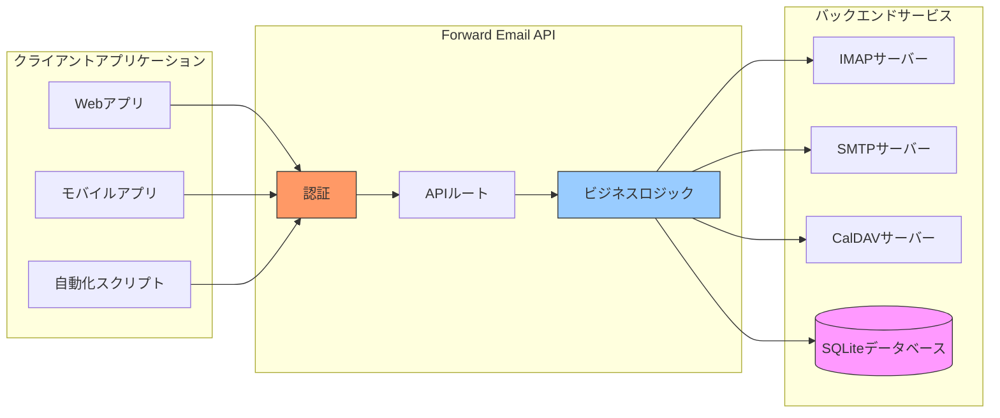

---


## iOSプッシュ通知 {#ios-push-notifications}

> \[!TIP]
> Forward EmailはXAPPLEPUSHSERVICEを通じてネイティブのiOSプッシュ通知をサポートし、即時のメール配信を実現します。

> \[!IMPORTANT]
> **ユニークな特徴:** Forward Emailは、メール、連絡先、カレンダーのネイティブiOSプッシュ通知を`XAPPLEPUSHSERVICE` IMAP拡張でサポートする数少ないオープンソースメールサーバーの一つです。これはAppleのプロトコルをリバースエンジニアリングしており、バッテリー消費なしにiOSデバイスへ即時配信を提供します。

Forward EmailはApple独自のXAPPLEPUSHSERVICE拡張を実装し、バックグラウンドポーリングを必要とせずiOSデバイス向けのネイティブプッシュ通知を提供します。

### 動作原理 {#how-it-works-1}

**XAPPLEPUSHSERVICE**は非標準のIMAP拡張で、新着メール到着時にiOSのメールアプリが即時プッシュ通知を受け取ることを可能にします。

Forward EmailはIMAP向けのApple Push Notification service (APNs) 統合を実装しており、新着メール到着時にiOSメールアプリが即時プッシュ通知を受け取れます。

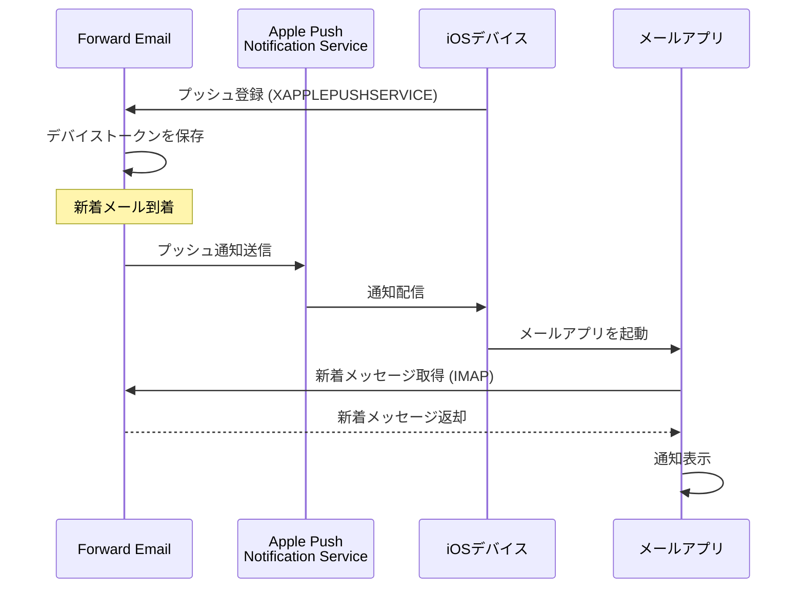

### 主な特徴 {#key-features}

**即時配信:**

* プッシュ通知は数秒以内に届く
* バッテリーを消耗するバックグラウンドポーリングなし
* メールアプリが閉じていても動作

<!---->

* **即時配信:** メール、カレンダーイベント、連絡先がポーリングスケジュールではなく即座にiPhone/iPadに表示される
* **バッテリー効率:** 常時IMAP接続を維持する代わりにAppleのプッシュインフラを利用
* **トピックベースプッシュ:** INBOXだけでなく特定のメールボックス向けのプッシュ通知をサポート
* **サードパーティアプリ不要:** ネイティブのiOSメール、カレンダー、連絡先アプリで動作
**ネイティブ統合:**

* iOSメールアプリに組み込み済み
* サードパーティアプリ不要
* シームレスなユーザー体験

**プライバシー重視:**

* デバイストークンは暗号化されている
* メッセージ内容はAPNS経由で送信されない
* 「新着メール」通知のみ送信される

**バッテリー効率:**

* 常時IMAPポーリングなし
* 通知が届くまでデバイスはスリープ状態
* バッテリーへの影響は最小限

### これが特別な理由 {#what-makes-this-special}

> \[!IMPORTANT]
> ほとんどのメールプロバイダーはXAPPLEPUSHSERVICEをサポートしておらず、iOSデバイスは15分ごとに新着メールをポーリングする必要があります。

ほとんどのオープンソースメールサーバー（Dovecot、Postfix、Cyrus IMAPを含む）はiOSプッシュ通知をサポートしていません。ユーザーは以下のいずれかを選択する必要があります：

* IMAP IDLEを使用（接続を維持し、バッテリーを消耗）
* ポーリングを使用（15〜30分ごとにチェック、通知が遅延）
* 独自のプッシュインフラを持つ専用メールアプリを使用

Forward EmailはGmail、iCloud、Fastmailなどの商用サービスと同様の即時プッシュ通知体験を提供します。

**他プロバイダーとの比較:**

| プロバイダー       | プッシュ対応      | ポーリング間隔    | バッテリー影響  |
| ----------------- | -------------- | -------------- | -------------- |
| **Forward Email** | ✅ ネイティブプッシュ | 即時           | 最小限         |
| Gmail             | ✅ ネイティブプッシュ | 即時           | 最小限         |
| iCloud            | ✅ ネイティブプッシュ | 即時           | 最小限         |
| Yahoo             | ✅ ネイティブプッシュ | 即時           | 最小限         |
| Outlook.com       | ❌ ポーリング      | 15分           | 中程度         |
| Fastmail          | ❌ ポーリング      | 15分           | 中程度         |
| ProtonMail        | ⚠️ ブリッジのみ    | ブリッジ経由    | 高い           |
| Tutanota          | ❌ アプリのみ      | 該当なし       | 該当なし       |

### 実装の詳細 {#implementation-details}

**IMAP CAPABILITYレスポンス:**

```
* CAPABILITY IMAP4rev1 ... XAPPLEPUSHSERVICE ...
```

**登録プロセス:**

1. iOSメールアプリがXAPPLEPUSHSERVICE機能を検出
2. アプリがForward Emailにデバイストークンを登録
3. Forward Emailがトークンを保存しアカウントに紐付け
4. 新着メール到着時にForward EmailがAPNS経由でプッシュ送信
5. iOSがメールアプリを起動し新着メッセージを取得

**セキュリティ:**

* デバイストークンは保存時に暗号化
* トークンは期限切れとなり自動更新される
* メッセージ内容はAPNSに公開されない
* エンドツーエンド暗号化を維持

<!---->

* **IMAP拡張:** `XAPPLEPUSHSERVICE`
* **ソースコード:** [WildDuck Issue #711](https://github.com/zone-eu/wildduck/issues/711)
* **セットアップ:** 自動 - 設定不要でiOSメールアプリで即利用可能

### 他サービスとの比較 {#comparison-with-other-services}

| サービス       | iOSプッシュ対応 | 方法                                     |
| ------------- | -------------- | ---------------------------------------- |
| Forward Email | ✅ 対応         | `XAPPLEPUSHSERVICE`（リバースエンジニアリング） |
| Gmail         | ✅ 対応         | 独自Gmailアプリ＋Googleプッシュ          |
| iCloud Mail   | ✅ 対応         | Apple純正統合                           |
| Outlook.com   | ✅ 対応         | 独自Outlookアプリ＋Microsoftプッシュ     |
| Fastmail      | ✅ 対応         | `XAPPLEPUSHSERVICE`                      |
| Dovecot       | ❌ 非対応       | IMAP IDLEまたはポーリングのみ             |
| Postfix       | ❌ 非対応       | IMAP IDLEまたはポーリングのみ             |
| Cyrus IMAP    | ❌ 非対応       | IMAP IDLEまたはポーリングのみ             |

**Gmailプッシュ:**

GmailはGmailアプリ専用の独自プッシュシステムを使用。iOSメールアプリはGmailのIMAPサーバーをポーリングする必要があります。

**iCloudプッシュ:**

iCloudはForward Emailと同様のネイティブプッシュをサポートしていますが、@icloud.comアドレスのみ対応です。

**Outlook.com:**

Outlook.comはXAPPLEPUSHSERVICEをサポートしておらず、iOSメールは15分ごとにポーリングします。

**Fastmail:**

FastmailはXAPPLEPUSHSERVICEをサポートしていません。プッシュ通知にはFastmailアプリを使用するか、15分間隔のポーリング遅延を受け入れる必要があります。

---


## テストと検証 {#testing-and-verification}


## プロトコル機能テスト {#protocol-capability-tests}
> \[!NOTE]
> このセクションでは、2026年1月22日に実施した最新のプロトコル機能テストの結果を提供します。

このセクションには、テスト対象のすべてのプロバイダーからの実際のCAPABILITY/CAPA/EHLO応答が含まれています。すべてのテストは**2026年1月22日**に実施されました。

これらのテストは、主要プロバイダー間でのさまざまなメールプロトコルおよび拡張機能の広告されたサポートと実際のサポートを検証するのに役立ちます。

### Test Methodology {#test-methodology}

**テスト環境:**

* **日付:** 2026年1月22日 02:37 UTC
* **場所:** AWS EC2インスタンス
* **IPv4:** 54.167.216.197
* **IPv6:** 2600:4040:46da:9a00:b19e:3ad4:426c:2f48
* **ツール:** OpenSSL s_client、bashスクリプト

**テスト対象プロバイダー:**

* Forward Email
* Gmail
* Outlook.com
* iCloud
* Fastmail
* Yahoo/AOL (Verizon)

### Test Scripts {#test-scripts}

完全な透明性のために、これらのテストに使用された正確なスクリプトを以下に示します。

#### IMAP Capability Test Script {#imap-capability-test-script}

```bash
#!/bin/bash
# IMAP Capability Test Script
# Tests IMAP CAPABILITY for various email providers

echo "========================================="
echo "IMAP CAPABILITY TEST"
echo "Date: $(date -u +"%Y-%m-%d %H:%M:%S UTC")"
echo "========================================="
echo ""

# Gmail
echo "--- Gmail (imap.gmail.com:993) ---"
echo -e "a001 CAPABILITY\na002 LOGOUT" | timeout 10 openssl s_client -connect imap.gmail.com:993 -crlf -quiet 2>&1 | grep -A 20 "CAPABILITY"
echo ""

# Outlook.com
echo "--- Outlook.com (outlook.office365.com:993) ---"
echo -e "a001 CAPABILITY\na002 LOGOUT" | timeout 10 openssl s_client -connect outlook.office365.com:993 -crlf -quiet 2>&1 | grep -A 20 "CAPABILITY"
echo ""

# iCloud
echo "--- iCloud (imap.mail.me.com:993) ---"
echo -e "a001 CAPABILITY\na002 LOGOUT" | timeout 10 openssl s_client -connect imap.mail.me.com:993 -crlf -quiet 2>&1 | grep -A 20 "CAPABILITY"
echo ""

# Fastmail
echo "--- Fastmail (imap.fastmail.com:993) ---"
echo -e "a001 CAPABILITY\na002 LOGOUT" | timeout 10 openssl s_client -connect imap.fastmail.com:993 -crlf -quiet 2>&1 | grep -A 20 "CAPABILITY"
echo ""

# Yahoo
echo "--- Yahoo (imap.mail.yahoo.com:993) ---"
echo -e "a001 CAPABILITY\na002 LOGOUT" | timeout 10 openssl s_client -connect imap.mail.yahoo.com:993 -crlf -quiet 2>&1 | grep -A 20 "CAPABILITY"
echo ""

# Forward Email
echo "--- Forward Email (imap.forwardemail.net:993) ---"
echo -e "a001 CAPABILITY\na002 LOGOUT" | timeout 10 openssl s_client -connect imap.forwardemail.net:993 -crlf -quiet 2>&1 | grep -A 20 "CAPABILITY"
echo ""

echo "========================================="
echo "Test completed"
echo "========================================="
```

#### POP3 Capability Test Script {#pop3-capability-test-script}

```bash
#!/bin/bash
# POP3 Capability Test Script
# Tests POP3 CAPA for various email providers

echo "========================================="
echo "POP3 CAPABILITY TEST"
echo "Date: $(date -u +"%Y-%m-%d %H:%M:%S UTC")"
echo "========================================="
echo ""

# Gmail
echo "--- Gmail (pop.gmail.com:995) ---"
echo -e "CAPA\nQUIT" | timeout 10 openssl s_client -connect pop.gmail.com:995 -crlf -quiet 2>&1 | grep -A 20 "CAPA"
echo ""

# Outlook.com
echo "--- Outlook.com (outlook.office365.com:995) ---"
echo -e "CAPA\nQUIT" | timeout 10 openssl s_client -connect outlook.office365.com:995 -crlf -quiet 2>&1 | grep -A 20 "CAPA"
echo ""

# iCloud (Note: iCloud does not support POP3)
echo "--- iCloud (No POP3 support) ---"
echo "iCloudはPOP3をサポートしていません"
echo ""

# Fastmail
echo "--- Fastmail (pop.fastmail.com:995) ---"
echo -e "CAPA\nQUIT" | timeout 10 openssl s_client -connect pop.fastmail.com:995 -crlf -quiet 2>&1 | grep -A 20 "CAPA"
echo ""

# Yahoo
echo "--- Yahoo (pop.mail.yahoo.com:995) ---"
echo -e "CAPA\nQUIT" | timeout 10 openssl s_client -connect pop.mail.yahoo.com:995 -crlf -quiet 2>&1 | grep -A 20 "CAPA"
echo ""

# Forward Email
echo "--- Forward Email (pop3.forwardemail.net:995) ---"
echo -e "CAPA\nQUIT" | timeout 10 openssl s_client -connect pop3.forwardemail.net:995 -crlf -quiet 2>&1 | grep -A 20 "CAPA"
echo ""

echo "========================================="
echo "Test completed"
echo "========================================="
```
#### SMTP機能テストスクリプト {#smtp-capability-test-script}

```bash
#!/bin/bash
# SMTP Capability Test Script
# Tests SMTP EHLO for various email providers

echo "========================================="
echo "SMTP CAPABILITY TEST"
echo "Date: $(date -u +"%Y-%m-%d %H:%M:%S UTC")"
echo "========================================="
echo ""

# Gmail
echo "--- Gmail (smtp.gmail.com:587) ---"
echo -e "EHLO test.com\nQUIT" | timeout 10 openssl s_client -connect smtp.gmail.com:587 -starttls smtp -crlf -quiet 2>&1 | grep -A 30 "250-"
echo ""

# Outlook.com
echo "--- Outlook.com (smtp.office365.com:587) ---"
echo -e "EHLO test.com\nQUIT" | timeout 10 openssl s_client -connect smtp.office365.com:587 -starttls smtp -crlf -quiet 2>&1 | grep -A 30 "250-"
echo ""

# iCloud
echo "--- iCloud (smtp.mail.me.com:587) ---"
echo -e "EHLO test.com\nQUIT" | timeout 10 openssl s_client -connect smtp.mail.me.com:587 -starttls smtp -crlf -quiet 2>&1 | grep -A 30 "250-"
echo ""

# Fastmail
echo "--- Fastmail (smtp.fastmail.com:587) ---"
echo -e "EHLO test.com\nQUIT" | timeout 10 openssl s_client -connect smtp.fastmail.com:587 -starttls smtp -crlf -quiet 2>&1 | grep -A 30 "250-"
echo ""

# Yahoo
echo "--- Yahoo (smtp.mail.yahoo.com:587) ---"
echo -e "EHLO test.com\nQUIT" | timeout 10 openssl s_client -connect smtp.mail.yahoo.com:587 -starttls smtp -crlf -quiet 2>&1 | grep -A 30 "250-"
echo ""

# Forward Email
echo "--- Forward Email (smtp.forwardemail.net:587) ---"
echo -e "EHLO test.com\nQUIT" | timeout 10 openssl s_client -connect smtp.forwardemail.net:587 -starttls smtp -crlf -quiet 2>&1 | grep -A 30 "250-"
echo ""

echo "========================================="
echo "Test completed"
echo "========================================="
```

### テスト結果の概要 {#test-results-summary}

#### IMAP (CAPABILITY) {#imap-capability}

**Forward Email**

```
* CAPABILITY IMAP4rev1 AUTH=PLAIN AUTH=PLAIN-CLIENTTOKEN CHILDREN ENABLE ID IDLE NAMESPACE QUOTA SASL-IR UNSELECT XLIST XAPPLEPUSHSERVICE
```

**Gmail**

```
* CAPABILITY IMAP4rev1 UNSELECT IDLE NAMESPACE QUOTA ID XLIST CHILDREN X-GM-EXT-1 UIDPLUS COMPRESS=DEFLATE ENABLE MOVE CONDSTORE ESEARCH UTF8=ACCEPT LIST-EXTENDED LIST-STATUS LITERAL- SPECIAL-USE
```

**iCloud**

```
* OK [CAPABILITY XAPPLEPUSHSERVICE IMAP4 IMAP4rev1 SASL-IR AUTH=ATOKEN AUTH=PLAIN AUTH=ATOKEN2 AUTH=XOAUTH2]
```

**Outlook.com**

```
* CAPABILITY IMAP4rev1 AUTH=PLAIN AUTH=XOAUTH2 SASL-IR UIDPLUS ID UNSELECT CHILDREN IDLE NAMESPACE LITERAL+
```

**Fastmail**

```
* CAPABILITY IMAP4rev1 ACL ANNOTATE-EXPERIMENT-1 CATENATE CONDSTORE ENABLE ESEARCH ESORT I18NLEVEL=1 ID IDLE LIST-EXTENDED LIST-STATUS LITERAL+ LOGINDISABLED MULTIAPPEND NAMESPACE QRESYNC QUOTA RIGHTS=ektx SASL-IR SORT SPECIAL-USE THREAD=ORDEREDSUBJECT UIDPLUS UNSELECT WITHIN X-RENAME XLIST
```

**Yahoo/AOL (Verizon)**

```
* CAPABILITY IMAP4rev1 IDLE NAMESPACE QUOTA ID XLIST CHILDREN UIDPLUS MOVE CONDSTORE ESEARCH ENABLE LIST-EXTENDED LIST-STATUS LITERAL- SPECIAL-USE UNSELECT XAPPLEPUSHSERVICE
```

#### POP3 (CAPA) {#pop3-capa}

**Forward Email**

```
+OK
CAPA
TOP
USER
UIDL
EXPIRE 30
IMPLEMENTATION ForwardEmail
.
```

**Gmail**

```
+OK
CAPA
TOP
USER
UIDL
EXPIRE 30
IMPLEMENTATION Gpop
.
```

**Outlook.com**

```
+OK
CAPA
TOP
USER
UIDL
SASL PLAIN XOAUTH2
.
```

**Fastmail**

```
+OK
CAPA
TOP
USER
UIDL
EXPIRE 30
IMPLEMENTATION Cyrus
.
```

#### SMTP (EHLO) {#smtp-ehlo}

**Forward Email**

```
250-smtp.forwardemail.net
250-PIPELINING
250-SIZE 52428800
250-ETRN
250-STARTTLS
250-ENHANCEDSTATUSCODES
250-8BITMIME
250-DSN
250 CHUNKING
```

**Gmail**

```
250-smtp.gmail.com at your service
250-SIZE 35882577
250-8BITMIME
250-STARTTLS
250-ENHANCEDSTATUSCODES
250-PIPELINING
250-CHUNKING
250 SMTPUTF8
```

**Outlook.com**

```
250-SN4PR13CA0005.outlook.office365.com Hello [x.x.x.x]
250-SIZE 157286400
250-PIPELINING
250-DSN
250-ENHANCEDSTATUSCODES
250-STARTTLS
250-8BITMIME
250-BINARYMIME
250-CHUNKING
250 SMTPUTF8
```

**Fastmail**

```
250-smtp.fastmail.com
250-PIPELINING
250-SIZE 78643200
250-ETRN
250-STARTTLS
250-ENHANCEDSTATUSCODES
250-8BITMIME
250-DSN
250 CHUNKING
```

**Yahoo/AOL (Verizon)**

```
250-smtp.mail.yahoo.com
250-PIPELINING
250-SIZE 41943040
250-8BITMIME
250-ENHANCEDSTATUSCODES
250-STARTTLS
```
### 詳細なテスト結果 {#detailed-test-results}

#### IMAP テスト結果 {#imap-test-results}

**Gmail:**
`* CAPABILITY IMAP4rev1 UNSELECT IDLE NAMESPACE QUOTA ID XLIST CHILDREN X-GM-EXT-1 XYZZY SASL-IR AUTH=XOAUTH2 AUTH=PLAIN AUTH=PLAIN-CLIENTTOKEN AUTH=OAUTHBEARER`

**Outlook.com:**
`* CAPABILITY IMAP4 IMAP4rev1 AUTH=PLAIN AUTH=XOAUTH2 SASL-IR UIDPLUS ID UNSELECT CHILDREN IDLE NAMESPACE LITERAL+`

**iCloud:**
`* CAPABILITY XAPPLEPUSHSERVICE IMAP4 IMAP4rev1 SASL-IR AUTH=ATOKEN AUTH=PLAIN AUTH=ATOKEN2 AUTH=XOAUTH2`

**Fastmail:**
接続がタイムアウトしました。以下の注記を参照してください。

**Yahoo:**
`* CAPABILITY IMAP4rev1 SASL-IR AUTH=PLAIN AUTH=XOAUTH2 AUTH=OAUTHBEARER ID MOVE NAMESPACE XYMHIGHESTMODSEQ UIDPLUS LITERAL+ CHILDREN UNSELECT X-MSG-EXT OBJECTID IDLE ENABLE UIDONLY X-ALL-MAIL X-UIDONLY LIST-EXTENDED LIST-STATUS SPECIAL-USE PARTIAL APPENDLIMIT=41697280`

**Forward Email:**
`* CAPABILITY XAPPLEPUSHSERVICE IMAP4rev1 APPENDLIMIT=52428800 AUTH=PLAIN AUTH=PLAIN-CLIENTTOKEN CHILDREN CONDSTORE ENABLE ID IDLE MOVE NAMESPACE QUOTA SASL-IR SPECIAL-USE UIDPLUS UNSELECT UTF8=ACCEPT XLIST`

#### POP3 テスト結果 {#pop3-test-results}

**Gmail:**
認証なしではCAPAレスポンスが返されませんでした。

**Outlook.com:**
認証なしではCAPAレスポンスが返されませんでした。

**iCloud:**
サポートされていません。

**Fastmail:**
接続がタイムアウトしました。以下の注記を参照してください。

**Yahoo:**
`+OK CAPA list follows... SASL PLAIN XOAUTH2`

**Forward Email:**
認証なしではCAPAレスポンスが返されませんでした。

#### SMTP テスト結果 {#smtp-test-results}

**Gmail:**
`250-AUTH LOGIN PLAIN XOAUTH2 PLAIN-CLIENTTOKEN OAUTHBEARER XOAUTH`

**Outlook.com:**
`250-DSN`

**iCloud:**
`250-DSN`

**Fastmail:**
`250 AUTH PLAIN LOGIN XOAUTH2 OAUTHBEARER`

**Yahoo:**
`250 AUTH PLAIN LOGIN XOAUTH2 OAUTHBEARER`

**Forward Email:**
`250-DSN`, `250-REQUIRETLS`

### テスト結果に関する注記 {#notes-on-test-results}

> \[!NOTE]
> テスト結果からの重要な観察事項と制限事項。

1. **Fastmailのタイムアウト**: Fastmailへの接続はテスト中にタイムアウトしました。これはテストサーバーのIPによるレート制限やファイアウォール制限が原因と考えられます。Fastmailはドキュメントに基づき、IMAP/POP3/SMTPのサポートが堅牢であることが知られています。

2. **POP3のCAPAレスポンス**: 複数のプロバイダー（Gmail、Outlook.com、Forward Email）は認証なしではCAPAレスポンスを返しませんでした。これはPOP3サーバーの一般的なセキュリティ対策です。

3. **DSNサポート**: Outlook.com、iCloud、Forward EmailのみがSMTP EHLOレスポンスで明示的にDSNサポートを広告しています。他のプロバイダーがDSNをサポートしていないわけではありませんが、広告はしていません。

4. **REQUIRETLS**: Forward Emailのみがユーザー向けのチェックボックスでTLSの強制を広告しています。他のプロバイダーは内部的にサポートしている可能性がありますが、EHLOで広告はしていません。

5. **テスト環境**: テストは2026年1月22日 02:37 UTCにAWS EC2インスタンス（IPv4: 54.167.216.197、IPv6: 2600:4040:46da:9a00:b19e:3ad4:426c:2f48）から実施されました。

---


## サマリー {#summary}

Forward Emailは主要なメール標準において包括的なRFCプロトコルサポートを提供しています：

* **IMAP4rev1:** 16のサポートRFCと意図的な差異のドキュメント
* **POP3:** 4つのサポートRFCとRFC準拠の恒久的削除
* **SMTP:** SMTPUTF8、DSN、PIPELININGを含む11の拡張サポート
* **認証:** DKIM、SPF、DMARC、ARCを完全サポート
* **トランスポートセキュリティ:** MTA-STSとREQUIRETLSを完全サポート、DANEは部分サポート
* **暗号化:** OpenPGP v6とS/MIMEをサポート
* **カレンダー:** CalDAV、CardDAV、VTODOを完全サポート
* **APIアクセス:** 39のエンドポイントを持つ完全なREST APIで直接データベースアクセス可能
* **iOSプッシュ:** `XAPPLEPUSHSERVICE`によるメール、連絡先、カレンダーのネイティブプッシュ通知

### 主要な差別化ポイント {#key-differentiators}

> \[!TIP]
> Forward Emailは他のプロバイダーにはないユニークな機能で際立っています。

**Forward Emailのユニークな特徴:**

1. **量子耐性暗号化** - ChaCha20-Poly1305で暗号化されたSQLiteメールボックスを提供する唯一のプロバイダー
2. **ゼロナレッジアーキテクチャ** - パスワードがメールボックスを暗号化し、当社は復号できません
3. **無料のカスタムドメイン** - カスタムドメインメールに月額料金なし
4. **REQUIRETLSサポート** - 配信経路全体でTLSを強制するユーザー向けチェックボックス
5. **包括的なAPI** - 39のREST APIエンドポイントによる完全なプログラム制御
6. **iOSプッシュ通知** - 即時配信のためのネイティブXAPPLEPUSHSERVICEサポート
7. **オープンソース** - GitHubで完全なソースコードを公開
8. **プライバシー重視** - データマイニングなし、広告なし、トラッキングなし
* **サンドボックス化された暗号化:** 個別に暗号化されたSQLiteメールボックスを持つ唯一のメールサービス
* **RFC準拠:** 使いやすさよりも標準準拠を優先（例：POP3 DELE）
* **完全なAPI:** すべてのメールデータへの直接プログラムアクセス
* **オープンソース:** 完全に透明な実装

**プロトコルサポート概要:**

| カテゴリ             | サポートレベル | 詳細                                         |
| -------------------- | ------------- | --------------------------------------------- |
| **コアプロトコル**   | ✅ 優秀       | IMAP4rev1、POP3、SMTPを完全サポート           |
| **最新プロトコル**   | ⚠️ 部分的     | IMAP4rev2部分サポート、JMAPは未対応           |
| **セキュリティ**     | ✅ 優秀       | DKIM、SPF、DMARC、ARC、MTA-STS、REQUIRETLS    |
| **暗号化**           | ✅ 優秀       | OpenPGP、S/MIME、SQLite暗号化                  |
| **CalDAV/CardDAV**   | ✅ 優秀       | カレンダーおよび連絡先の完全同期                |
| **フィルタリング**   | ✅ 優秀       | Sieve（24拡張）およびManageSieve               |
| **API**              | ✅ 優秀       | 39のREST APIエンドポイント                      |
| **プッシュ**         | ✅ 優秀       | ネイティブiOSプッシュ通知                        |
