# 이메일 RFC 프로토콜 지원 - 완전한 표준 및 사양 가이드 {#email-rfc-protocol-support---complete-standards--specifications-guide}


## 목차 {#table-of-contents}

* [이 문서에 대하여](#about-this-document)
  * [아키텍처 개요](#architecture-overview)
* [이메일 서비스 비교 - 프로토콜 지원 및 RFC 표준 준수](#email-service-comparison---protocol-support--rfc-standards-compliance)
  * [프로토콜 지원 시각화](#protocol-support-visualization)
* [핵심 이메일 프로토콜](#core-email-protocols)
  * [이메일 프로토콜 흐름](#email-protocol-flow)
* [IMAP4 이메일 프로토콜 및 확장](#imap4-email-protocol-and-extensions)
  * [RFC 사양과 다른 IMAP 프로토콜 차이점](#imap-protocol-differences-from-rfc-specifications)
  * [지원하지 않는 IMAP 확장](#imap-extensions-not-supported)
* [POP3 이메일 프로토콜 및 확장](#pop3-email-protocol-and-extensions)
  * [RFC 사양과 다른 POP3 프로토콜 차이점](#pop3-protocol-differences-from-rfc-specifications)
  * [지원하지 않는 POP3 확장](#pop3-extensions-not-supported)
* [SMTP 이메일 프로토콜 및 확장](#smtp-email-protocol-and-extensions)
  * [배달 상태 알림 (DSN)](#delivery-status-notifications-dsn)
  * [REQUIRETLS 지원](#requiretls-support)
  * [지원하지 않는 SMTP 확장](#smtp-extensions-not-supported)
* [JMAP 이메일 프로토콜](#jmap-email-protocol)
* [이메일 보안](#email-security)
  * [이메일 보안 아키텍처](#email-security-architecture)
* [이메일 메시지 인증 프로토콜](#email-message-authentication-protocols)
  * [인증 프로토콜 지원](#authentication-protocol-support)
  * [DKIM (도메인키 식별 메일)](#dkim-domainkeys-identified-mail)
  * [SPF (발신자 정책 프레임워크)](#spf-sender-policy-framework)
  * [DMARC (도메인 기반 메시지 인증, 보고 및 준수)](#dmarc-domain-based-message-authentication-reporting--conformance)
  * [ARC (인증된 수신 체인)](#arc-authenticated-received-chain)
  * [인증 흐름](#authentication-flow)
* [이메일 전송 보안 프로토콜](#email-transport-security-protocols)
  * [전송 보안 지원](#transport-security-support)
  * [TLS (전송 계층 보안)](#tls-transport-layer-security)
  * [MTA-STS (메일 전송 에이전트 엄격 전송 보안)](#mta-sts-mail-transfer-agent-strict-transport-security)
  * [DANE (명명된 엔터티의 DNS 기반 인증)](#dane-dns-based-authentication-of-named-entities)
  * [REQUIRETLS](#requiretls)
  * [전송 보안 흐름](#transport-security-flow)
* [이메일 메시지 암호화](#email-message-encryption)
  * [암호화 지원](#encryption-support)
  * [OpenPGP (프리티 굿 프라이버시)](#openpgp-pretty-good-privacy)
  * [S/MIME (보안/다목적 인터넷 메일 확장)](#smime-securemultipurpose-internet-mail-extensions)
  * [SQLite 메일박스 암호화](#sqlite-mailbox-encryption)
  * [암호화 비교](#encryption-comparison)
  * [암호화 흐름](#encryption-flow)
* [확장 기능](#extended-functionality)
* [이메일 메시지 형식 표준](#email-message-format-standards)
  * [형식 표준 지원](#format-standards-support)
  * [MIME (다목적 인터넷 메일 확장)](#mime-multipurpose-internet-mail-extensions)
  * [SMTPUTF8 및 이메일 주소 국제화](#smtputf8-and-email-address-internationalization)
* [캘린더 및 연락처 프로토콜](#calendaring-and-contacts-protocols)
  * [CalDAV 및 CardDAV 지원](#caldav-and-carddav-support)
  * [CalDAV (캘린더 접근)](#caldav-calendar-access)
  * [CardDAV (연락처 접근)](#carddav-contact-access)
  * [작업 및 알림 (CalDAV VTODO)](#tasks-and-reminders-caldav-vtodo)
  * [CalDAV/CardDAV 동기화 흐름](#caldavcarddav-synchronization-flow)
  * [지원하지 않는 캘린더 확장](#calendaring-extensions-not-supported)
* [이메일 메시지 필터링](#email-message-filtering)
  * [Sieve (RFC 5228)](#sieve-rfc-5228)
  * [ManageSieve (RFC 5804)](#managesieve-rfc-5804)
* [저장 최적화](#storage-optimization)
  * [아키텍처: 이중 계층 저장 최적화](#architecture-dual-layer-storage-optimization)
* [첨부파일 중복 제거](#attachment-deduplication)
  * [작동 원리](#how-it-works)
  * [중복 제거 흐름](#deduplication-flow)
  * [매직 넘버 시스템](#magic-number-system)
  * [주요 차이점: WildDuck vs Forward Email](#key-differences-wildduck-vs-forward-email)
* [Brotli 압축](#brotli-compression)
  * [압축 대상](#what-gets-compressed)
  * [압축 구성](#compression-configuration)
  * [매직 헤더: "FEBR"](#magic-header-febr)
  * [압축 과정](#compression-process)
  * [압축 해제 과정](#decompression-process)
  * [하위 호환성](#backwards-compatibility)
  * [저장 절감 통계](#storage-savings-statistics)
  * [마이그레이션 과정](#migration-process)
  * [통합 저장 효율성](#combined-storage-efficiency)
  * [기술 구현 세부사항](#technical-implementation-details)
  * [다른 제공업체가 하지 않는 이유](#why-no-other-provider-does-this)
* [최신 기능](#modern-features)
* [이메일 관리를 위한 완전한 REST API](#complete-rest-api-for-email-management)
  * [API 카테고리 (39개 엔드포인트)](#api-categories-39-endpoints)
  * [기술 세부사항](#technical-details)
  * [실제 사용 사례](#real-world-use-cases)
  * [주요 API 기능](#key-api-features)
  * [API 아키텍처](#api-architecture)
* [iOS 푸시 알림](#ios-push-notifications)
  * [작동 원리](#how-it-works-1)
  * [주요 기능](#key-features)
  * [특별한 점](#what-makes-this-special)
  * [구현 세부사항](#implementation-details)
  * [다른 서비스와의 비교](#comparison-with-other-services)
* [테스트 및 검증](#testing-and-verification)
* [프로토콜 기능 테스트](#protocol-capability-tests)
  * [테스트 방법론](#test-methodology)
  * [테스트 스크립트](#test-scripts)
  * [테스트 결과 요약](#test-results-summary)
  * [상세 테스트 결과](#detailed-test-results)
  * [테스트 결과에 대한 주의사항](#notes-on-test-results)
* [요약](#summary)
  * [주요 차별점](#key-differentiators)
## 이 문서에 대하여 {#about-this-document}

이 문서는 Forward Email의 RFC(Request for Comments) 프로토콜 지원에 대해 설명합니다. Forward Email은 IMAP/POP3 기능을 위해 내부적으로 [WildDuck](https://github.com/nodemailer/wildduck)을 사용하므로, 여기 문서화된 프로토콜 지원 및 제한 사항은 WildDuck의 구현을 반영합니다.

> \[!IMPORTANT]
> Forward Email은 메시지 저장에 MongoDB 대신 [SQLite](https://sqlite.org/)를 사용합니다(원래 WildDuck이 사용하던 것). 이는 아래 문서화된 특정 구현 세부사항에 영향을 미칩니다.

**소스 코드:** <https://github.com/forwardemail/forwardemail.net>

### 아키텍처 개요 {#architecture-overview}

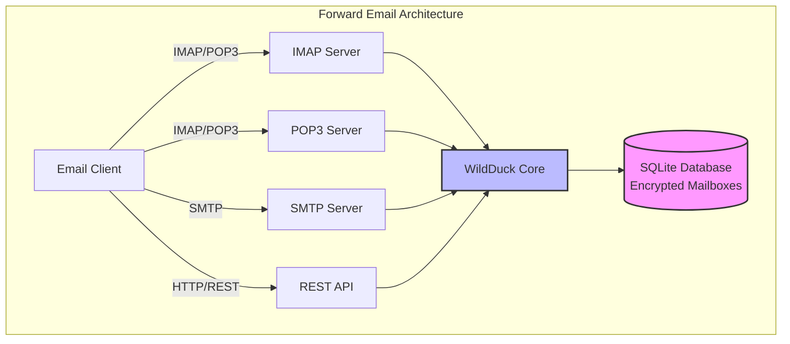

---


## 이메일 서비스 비교 - 프로토콜 지원 및 RFC 표준 준수 {#email-service-comparison---protocol-support--rfc-standards-compliance}

> \[!IMPORTANT]
> **샌드박스 및 양자 내성 암호화:** Forward Email은 사용자의 비밀번호(사용자만 알고 있음)를 사용해 개별적으로 암호화된 SQLite 메일박스를 저장하는 유일한 이메일 서비스입니다. 각 메일박스는 [sqleet](https://github.com/resilar/sqleet)(ChaCha20-Poly1305)로 암호화되어 자체 포함, 샌드박스화, 휴대 가능하며, 비밀번호를 잊으면 메일박스를 복구할 수 없습니다(Forward Email도 복구 불가). 자세한 내용은 [양자 안전 암호화 이메일](https://forwardemail.net/en/blog/docs/best-quantum-safe-encrypted-email-service)을 참조하세요.

주요 이메일 제공업체별 이메일 프로토콜 지원 및 RFC 표준 구현 비교:

| 기능                          | Forward Email                                                                                  | Postfix/Dovecot                                                                    | Gmail                                                                             | iCloud Mail                                           | Outlook.com                                                                                                                                                          | Fastmail                                                                                 | Yahoo/AOL (Verizon)                                                  | ProtonMail                                                                     | Tutanota                                                          |
| ----------------------------- | ---------------------------------------------------------------------------------------------- | ---------------------------------------------------------------------------------- | --------------------------------------------------------------------------------- | ----------------------------------------------------- | -------------------------------------------------------------------------------------------------------------------------------------------------------------------- | ---------------------------------------------------------------------------------------- | -------------------------------------------------------------------- | ------------------------------------------------------------------------------ | ----------------------------------------------------------------- |
| **맞춤 도메인 가격**          | [무료](https://forwardemail.net/en/pricing)                                                    | [무료](https://www.postfix.org/)                                                   | [$7.20/월](https://workspace.google.com/pricing)                                  | [$0.99/월](https://support.apple.com/en-us/102622)    | [$7.20/월](https://www.microsoft.com/en-us/microsoft-365/business/microsoft-365-business-basic)                                                                      | [$5/월](https://www.fastmail.com/pricing/)                                               | [$3.19/월](https://www.turbify.com/mail)                             | [$4.99/월](https://proton.me/mail/pricing)                                     | [$3.27/월](https://tuta.com/pricing)                              |
| **IMAP4rev1 (RFC 3501)**      | ✅ [지원됨](#imap4-email-protocol-and-extensions)                                              | ✅ [지원됨](https://www.dovecot.org/)                                              | ✅ [지원됨](https://developers.google.com/workspace/gmail/imap/imap-extensions)   | ✅ [지원됨](https://support.apple.com/en-us/102431)   | ✅ [지원됨](https://support.microsoft.com/en-us/office/pop-imap-and-smtp-settings-for-outlook-com-d088b986-291d-42b8-9564-9c414e2aa040)                            | ✅ [지원됨](https://www.fastmail.help/hc/en-us/articles/1500000278382-Email-standards) | ✅ [지원됨](https://senders.yahooinc.com/developer/documentation/) | ⚠️ [브리지 통해](https://proton.me/support/imap-smtp-and-pop3-setup)            | ❌ 지원 안 함                                                   |
| **IMAP4rev2 (RFC 9051)**      | ⚠️ [부분 지원](https://forwardemail.net/en/blog/docs/best-quantum-safe-encrypted-email-service) | ⚠️ [부분 지원](https://www.dovecot.org/)                                           | ⚠️ [31% 지원](https://developers.google.com/workspace/gmail/imap/imap-extensions) | ⚠️ [92% 지원](https://support.apple.com/en-us/102431) | ⚠️ [46% 지원](https://support.microsoft.com/en-us/office/pop-imap-and-smtp-settings-for-outlook-com-d088b986-291d-42b8-9564-9c414e2aa040)                         | ⚠️ [69% 지원](https://www.fastmail.help/hc/en-us/articles/1500000278382-Email-standards) | ⚠️ [85% 지원](https://senders.yahooinc.com/developer/documentation/)      | ⚠️ [브리지 통해](https://proton.me/support/imap-smtp-and-pop3-setup)            | ❌ 지원 안 함                                                   |
| **POP3 (RFC 1939)**           | ✅ [지원됨](#pop3-email-protocol-and-extensions)                                               | ✅ [지원됨](https://www.dovecot.org/)                                              | ✅ [지원됨](https://support.google.com/mail/answer/7104828)                       | ❌ 지원 안 함                                         | ✅ [지원됨](https://support.microsoft.com/en-us/office/pop-imap-and-smtp-settings-for-outlook-com-d088b986-291d-42b8-9564-9c414e2aa040)                            | ✅ [지원됨](https://www.fastmail.help/hc/en-us/articles/1500000278382-Email-standards) | ✅ [지원됨](https://help.yahoo.com/kb/SLN4075.html)                | ⚠️ [브리지 통해](https://proton.me/support/imap-smtp-and-pop3-setup)            | ❌ 지원 안 함                                                   |
| **SMTP (RFC 5321)**           | ✅ [지원됨](#smtp-email-protocol-and-extensions)                                               | ✅ [지원됨](https://www.postfix.org/)                                              | ✅ [지원됨](https://support.google.com/mail/answer/7126229)                       | ✅ [지원됨](https://support.apple.com/en-us/102431)   | ✅ [지원됨](https://support.microsoft.com/en-us/office/pop-imap-and-smtp-settings-for-outlook-com-d088b986-291d-42b8-9564-9c414e2aa040)                            | ✅ [지원됨](https://www.fastmail.help/hc/en-us/articles/1500000278382-Email-standards) | ✅ [지원됨](https://help.yahoo.com/kb/SLN4075.html)                | ⚠️ [브리지 통해](https://proton.me/support/imap-smtp-and-pop3-setup)            | ❌ 지원 안 함                                                   |
| **JMAP (RFC 8620)**           | ❌ [지원 안 함](#jmap-email-protocol)                                                          | ❌ 지원 안 함                                                                      | ❌ 지원 안 함                                                                     | ❌ 지원 안 함                                         | ❌ 지원 안 함                                                                                                                                                        | ✅ [지원됨](https://www.fastmail.com/dev/)                                             | ❌ 지원 안 함                                                      | ❌ 지원 안 함                                                                | ❌ 지원 안 함                                                   |
| **DKIM (RFC 6376)**           | ✅ [지원됨](#email-message-authentication-protocols)                                           | ✅ [지원됨](https://github.com/trusteddomainproject/OpenDKIM)                      | ✅ [지원됨](https://support.google.com/a/answer/174124)                           | ✅ [지원됨](https://support.apple.com/en-us/102431)   | ✅ [지원됨](https://learn.microsoft.com/en-us/defender-office-365/email-authentication-dkim-configure)                                                           | ✅ [지원됨](https://www.fastmail.help/hc/en-us/articles/360060590573)                  | ✅ [지원됨](https://help.yahoo.com/kb/SLN25426.html)               | ✅ [지원됨](https://proton.me/support)                                       | ✅ [지원됨](https://tuta.com/support#dkim)                      |
| **SPF (RFC 7208)**            | ✅ [지원됨](#email-message-authentication-protocols)                                           | ✅ [지원됨](https://www.postfix.org/)                                              | ✅ [지원됨](https://support.google.com/a/answer/33786)                            | ✅ [지원됨](https://support.apple.com/en-us/102431)   | ✅ [지원됨](https://learn.microsoft.com/en-us/microsoft-365/security/office-365-security/how-office-365-uses-spf-to-prevent-spoofing)                            | ✅ [지원됨](https://www.fastmail.help/hc/en-us/articles/360060590573)                  | ✅ [지원됨](https://help.yahoo.com/kb/SLN25426.html)               | ✅ [지원됨](https://proton.me/support)                                       | ✅ [지원됨](https://tuta.com/support#dkim)                      |
| **DMARC (RFC 7489)**          | ✅ [지원됨](#email-message-authentication-protocols)                                           | ✅ [지원됨](https://www.postfix.org/)                                              | ✅ [지원됨](https://support.google.com/a/answer/2466580)                          | ✅ [지원됨](https://support.apple.com/en-us/102431)   | ✅ [지원됨](https://learn.microsoft.com/en-us/microsoft-365/security/office-365-security/use-dmarc-to-validate-email)                                            | ✅ [지원됨](https://www.fastmail.help/hc/en-us/articles/360060590573)                  | ✅ [지원됨](https://help.yahoo.com/kb/SLN25426.html)               | ✅ [지원됨](https://proton.me/support)                                       | ✅ [지원됨](https://tuta.com/support#dkim)                      |
| **ARC (RFC 8617)**            | ✅ [지원됨](#email-message-authentication-protocols)                                           | ✅ [지원됨](https://github.com/trusteddomainproject/OpenARC)                       | ✅ [지원됨](https://support.google.com/a/answer/2466580)                          | ❌ 지원 안 함                                         | ✅ [지원됨](https://learn.microsoft.com/en-us/defender-office-365/email-authentication-arc-configure)                                                            | ✅ [지원됨](https://www.fastmail.help/hc/en-us/articles/360060590573)                  | ✅ [지원됨](https://senders.yahooinc.com/developer/documentation/) | ✅ [지원됨](https://proton.me/blog/what-is-authenticated-received-chain-arc) | ❌ 지원 안 함                                                   |
| **MTA-STS (RFC 8461)**        | ✅ [지원됨](#email-transport-security-protocols)                                               | ✅ [지원됨](https://www.postfix.org/)                                              | ✅ [지원됨](https://support.google.com/a/answer/9261504)                          | ✅ [지원됨](https://support.apple.com/en-us/102431)   | ✅ [지원됨](https://learn.microsoft.com/en-us/defender-office-365/email-authentication-about)                                                                    | ✅ [지원됨](https://www.fastmail.help/hc/en-us/articles/360060590573)                  | ✅ [지원됨](https://senders.yahooinc.com/developer/documentation/) | ✅ [지원됨](https://proton.me/support)                                       | ✅ [지원됨](https://tuta.com/security)                          |
| **DANE (RFC 7671)**           | ✅ [지원됨](#email-transport-security-protocols)                                               | ✅ [지원됨](https://www.postfix.org/)                                              | ❌ 지원 안 함                                                                     | ❌ 지원 안 함                                         | ❌ 지원 안 함                                                                                                                                                        | ❌ 지원 안 함                                                                          | ❌ 지원 안 함                                                      | ✅ [지원됨](https://proton.me/support)                                       | ✅ [지원됨](https://tuta.com/support#dane)                      |
| **DSN (RFC 3461)**            | ✅ [지원됨](#smtp-email-protocol-and-extensions)                                               | ✅ [지원됨](https://www.postfix.org/DSN_README.html)                               | ❌ 지원 안 함                                                                     | ✅ [지원됨](#protocol-capability-tests)               | ✅ [지원됨](#protocol-capability-tests)                                                                                                                          | ⚠️ [불명확](https://www.fastmail.help/hc/en-us/articles/1500000278382-Email-standards)  | ❌ 지원 안 함                                                      | ⚠️ [브리지 통해](https://proton.me/support/imap-smtp-and-pop3-setup)            | ❌ 지원 안 함                                                   |
| **REQUIRETLS (RFC 8689)**     | ✅ [지원됨](#email-transport-security-protocols)                                               | ✅ [지원됨](https://www.postfix.org/TLS_README.html#server_require_tls)            | ⚠️ 불명확                                                                         | ⚠️ 불명확                                            | ⚠️ 불명확                                                                                                                                                         | ⚠️ 불명확                                                                               | ⚠️ 불명확                                                           | ⚠️ [브리지 통해](https://proton.me/support/imap-smtp-and-pop3-setup)            | ❌ 지원 안 함                                                   |
| **ManageSieve (RFC 5804)**    | ✅ [지원됨](#managesieve-rfc-5804)                                                             | ✅ [지원됨](https://doc.dovecot.org/admin_manual/pigeonhole_managesieve_server/)   | ❌ 지원 안 함                                                                     | ❌ 지원 안 함                                         | ❌ 지원 안 함                                                                                                                                                        | ✅ [지원됨](https://www.fastmail.help/hc/en-us/articles/360060590573)                  | ❌ 지원 안 함                                                      | ❌ 지원 안 함                                                                | ❌ 지원 안 함                                                   |
| **OpenPGP (RFC 9580)**        | ✅ [지원됨](#email-message-encryption)                                                         | ⚠️ [플러그인 통해](https://www.gnupg.org/)                                        | ⚠️ [서드파티](https://github.com/google/end-to-end)                              | ⚠️ [서드파티](https://gpgtools.org/)                 | ⚠️ [서드파티](https://gpg4win.org/)                                                                                                                                 | ⚠️ [서드파티](https://www.fastmail.help/hc/en-us/articles/360060590573)               | ⚠️ [서드파티](https://help.yahoo.com/kb/SLN25426.html)            | ✅ [네이티브](https://proton.me/support/pgp-mime-pgp-inline)                      | ❌ 지원 안 함                                                   |
| **S/MIME (RFC 8551)**         | ✅ [지원됨](#email-message-encryption)                                                         | ✅ [지원됨](https://www.openssl.org/)                                              | ✅ [지원됨](https://support.google.com/mail/answer/81126)                         | ✅ [지원됨](https://support.apple.com/en-us/102431)   | ✅ [지원됨](https://support.microsoft.com/en-us/office/send-view-and-reply-to-encrypted-messages-in-outlook-for-pc-eaa43495-9bbb-4fca-922a-df90dee51980)           | ⚠️ [부분 지원](https://www.fastmail.help/hc/en-us/articles/360060590573)               | ❌ 지원 안 함                                                      | ✅ [지원됨](https://proton.me/support/pgp-mime-pgp-inline)                   | ❌ 지원 안 함                                                   |
| **CalDAV (RFC 4791)**         | ✅ [지원됨](#calendaring-and-contacts-protocols)                                               | ✅ [지원됨](https://www.davical.org/)                                              | ✅ [지원됨](https://developers.google.com/calendar/caldav/v2/guide)               | ✅ [지원됨](https://support.apple.com/en-us/102431)   | ❌ 지원 안 함                                                                                                                                                        | ✅ [지원됨](https://www.fastmail.help/hc/en-us/articles/360060590573)                  | ❌ 지원 안 함                                                      | ✅ [브리지 통해](https://proton.me/support/proton-calendar)                      | ❌ 지원 안 함                                                   |
| **CardDAV (RFC 6352)**        | ✅ [지원됨](#calendaring-and-contacts-protocols)                                               | ✅ [지원됨](https://www.davical.org/)                                              | ✅ [지원됨](https://developers.google.com/people/carddav)                         | ✅ [지원됨](https://support.apple.com/en-us/102431)   | ❌ 지원 안 함                                                                                                                                                        | ✅ [지원됨](https://www.fastmail.help/hc/en-us/articles/360060590573)                  | ❌ 지원 안 함                                                      | ✅ [브리지 통해](https://proton.me/support/proton-contacts)                      | ❌ 지원 안 함                                                   |
| **작업 (VTODO)**              | ✅ [지원됨](#tasks-and-reminders-caldav-vtodo)                                                 | ✅ [지원됨](https://www.davical.org/)                                              | ❌ 지원 안 함                                                                     | ✅ [지원됨](https://support.apple.com/en-us/102431)   | ❌ 지원 안 함                                                                                                                                                        | ✅ [지원됨](https://www.fastmail.help/hc/en-us/articles/360060590573)                  | ❌ 지원 안 함                                                      | ❌ 지원 안 함                                                                | ❌ 지원 안 함                                                   |
| **Sieve (RFC 5228)**          | ✅ [지원됨](#sieve-rfc-5228)                                                                   | ✅ [지원됨](https://www.dovecot.org/)                                              | ❌ 지원 안 함                                                                     | ❌ 지원 안 함                                         | ❌ 지원 안 함                                                                                                                                                        | ✅ [지원됨](https://www.fastmail.help/hc/en-us/articles/360060590573)                  | ❌ 지원 안 함                                                      | ❌ 지원 안 함                                                                | ❌ 지원 안 함                                                   |
| **Catch-All**                 | ✅ [지원됨](https://forwardemail.net/en/faq#can-i-have-multiple-global-catch-all-recipients)   | ✅ 지원됨                                                                          | ✅ [지원됨](https://support.google.com/a/answer/4524505)                          | ❌ 지원 안 함                                         | ❌ [지원 안 함](https://learn.microsoft.com/en-us/exchange/recipients-in-exchange-online/manage-mail-users)                                                      | ✅ [지원됨](https://www.fastmail.help/hc/en-us/articles/1500000278382-Email-standards) | ❌ 지원 안 함                                                      | ❌ 지원 안 함                                                                | ✅ [지원됨](https://tuta.com/support#catch-all-alias)           |
| **무제한 별칭**               | ✅ [지원됨](https://forwardemail.net/en/faq#advanced-features)                                 | ✅ 지원됨                                                                          | ✅ [지원됨](https://support.google.com/a/answer/33327)                            | ✅ [지원됨](https://support.apple.com/en-us/102431)   | ✅ [지원됨](https://support.microsoft.com/en-us/office/add-or-remove-an-email-alias-in-outlook-com-459b1989-356d-40fa-a689-8f285b13f1f2)                         | ✅ [지원됨](https://www.fastmail.help/hc/en-us/articles/1500000278382-Email-standards) | ❌ 지원 안 함                                                      | ✅ [지원됨](https://proton.me/support/addresses-and-aliases)                 | ✅ [지원됨](https://tuta.com/support#aliases)                   |
| **이중 인증**                | ✅ [지원됨](https://forwardemail.net/en/faq#do-you-support-passkeys-and-webauthn)              | ✅ 지원됨                                                                          | ✅ [지원됨](https://support.google.com/accounts/answer/185839)                    | ✅ [지원됨](https://support.apple.com/en-us/102431)   | ✅ [지원됨](https://support.microsoft.com/en-us/account-billing/how-to-use-two-step-verification-with-your-microsoft-account-c7910146-672f-01e9-50a0-93b4585e7eb4) | ✅ [지원됨](https://www.fastmail.help/hc/en-us/articles/1500000278382-Email-standards) | ✅ [지원됨](https://help.yahoo.com/kb/SLN5013.html)                | ✅ [지원됨](https://proton.me/support/two-factor-authentication-2fa)         | ✅ [지원됨](https://tuta.com/support#two-factor-authentication) |
| **푸시 알림**                | ✅ [지원됨](#ios-push-notifications)                                                           | ⚠️ 플러그인 통해                                                                   | ✅ [지원됨](https://developers.google.com/gmail/api/guides/push)                  | ✅ [지원됨](https://support.apple.com/en-us/102431)   | ✅ [지원됨](https://learn.microsoft.com/en-us/graph/change-notifications-delivery-webhooks)                                                                      | ✅ [지원됨](https://www.fastmail.help/hc/en-us/articles/1500000278382-Email-standards) | ❌ 지원 안 함                                                      | ✅ [지원됨](https://proton.me/support/notifications)                         | ✅ [지원됨](https://tuta.com/support#push-notifications)        |
| **캘린더/연락처 데스크톱**   | ✅ [지원됨](#calendaring-and-contacts-protocols)                                               | ✅ 지원됨                                                                          | ✅ [지원됨](https://support.google.com/calendar)                                  | ✅ [지원됨](https://support.apple.com/en-us/102431)   | ✅ [지원됨](https://support.microsoft.com/en-us/office/calendar-and-contacts-in-outlook-com-d3e8a6e6-5c1f-4e3e-9f1e-7c0f0e0c0c0c)                                | ✅ [지원됨](https://www.fastmail.help/hc/en-us/articles/1500000278382-Email-standards) | ❌ 지원 안 함                                                      | ✅ [지원됨](https://proton.me/support/proton-calendar)                       | ❌ 지원 안 함                                                   |
| **고급 검색**                | ✅ [지원됨](https://forwardemail.net/en/email-api)                                             | ✅ 지원됨                                                                          | ✅ [지원됨](https://support.google.com/mail/answer/7190)                          | ✅ [지원됨](https://support.apple.com/en-us/102431)   | ✅ [지원됨](https://support.microsoft.com/en-us/office/search-for-email-messages-in-outlook-com-6f5f2e92-9d5e-4c4e-9b0e-0c0c0c0c0c0c)                            | ✅ [지원됨](https://www.fastmail.help/hc/en-us/articles/1500000278382-Email-standards) | ✅ [지원됨](https://help.yahoo.com/kb/SLN3561.html)                | ✅ [지원됨](https://proton.me/support/search-and-filters)                    | ✅ [지원됨](https://tuta.com/support)                           |
| **API/통합**                 | ✅ [39개 엔드포인트](https://forwardemail.net/en/email-api)                                    | ✅ 지원됨                                                                          | ✅ [지원됨](https://developers.google.com/gmail/api)                              | ❌ 지원 안 함                                         | ✅ [지원됨](https://learn.microsoft.com/en-us/graph/api/resources/mail-api-overview)                                                                             | ✅ [지원됨](https://www.fastmail.help/hc/en-us/articles/1500000278382-Email-standards) | ❌ 지원 안 함                                                      | ✅ [지원됨](https://proton.me/support/proton-mail-api)                       | ❌ 지원 안 함                                                   |
### 프로토콜 지원 시각화 {#protocol-support-visualization}

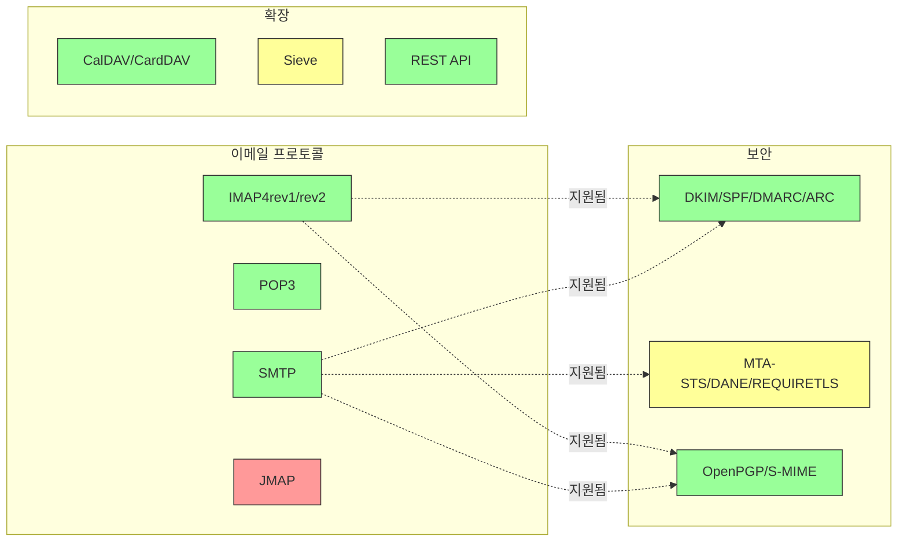

---


## 핵심 이메일 프로토콜 {#core-email-protocols}

### 이메일 프로토콜 흐름 {#email-protocol-flow}

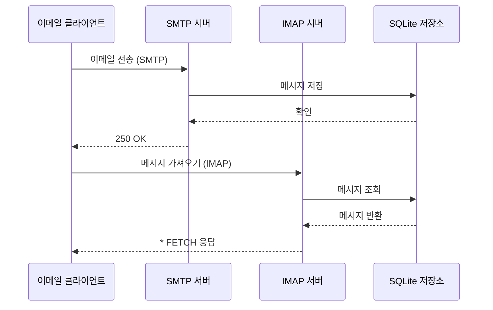


## IMAP4 이메일 프로토콜 및 확장 {#imap4-email-protocol-and-extensions}

> \[!NOTE]
> Forward Email은 IMAP4rev1 (RFC 3501)을 지원하며 IMAP4rev2 (RFC 9051) 기능을 부분적으로 지원합니다.

Forward Email은 WildDuck 메일 서버 구현을 통해 강력한 IMAP4 지원을 제공합니다. 서버는 IMAP4rev1 (RFC 3501)을 구현하며 IMAP4rev2 (RFC 9051) 확장을 부분적으로 지원합니다.

Forward Email의 IMAP 기능은 [WildDuck](https://github.com/nodemailer/wildduck) 의존성을 통해 제공됩니다. 다음 이메일 RFC들이 지원됩니다:

| RFC                                                       | 제목                                                             | 구현 참고사항                                         |
| --------------------------------------------------------- | ----------------------------------------------------------------- | ----------------------------------------------------- |
| [RFC 3501](https://datatracker.ietf.org/doc/html/rfc3501) | 인터넷 메시지 접근 프로토콜 (IMAP) - 버전 4rev1                   | 의도된 차이점과 함께 완전 지원 (아래 참조)             |
| [RFC 2177](https://datatracker.ietf.org/doc/html/rfc2177) | IMAP4 IDLE 명령                                                  | 푸시 스타일 알림                                     |
| [RFC 2342](https://datatracker.ietf.org/doc/html/rfc2342) | IMAP4 네임스페이스                                             | 메일박스 네임스페이스 지원                           |
| [RFC 2087](https://datatracker.ietf.org/doc/html/rfc2087) | IMAP4 쿼터 확장                                                 | 저장 용량 쿼터 관리                                 |
| [RFC 2971](https://datatracker.ietf.org/doc/html/rfc2971) | IMAP4 ID 확장                                                  | 클라이언트/서버 식별                                 |
| [RFC 5161](https://datatracker.ietf.org/doc/html/rfc5161) | IMAP4 ENABLE 확장                                              | IMAP 확장 활성화                                    |
| [RFC 4959](https://datatracker.ietf.org/doc/html/rfc4959) | SASL 초기 클라이언트 응답을 위한 IMAP 확장 (SASL-IR)             | 초기 클라이언트 응답                                 |
| [RFC 3691](https://datatracker.ietf.org/doc/html/rfc3691) | IMAP4 UNSELECT 명령                                            | EXPUNGE 없이 메일박스 닫기                           |
| [RFC 4315](https://datatracker.ietf.org/doc/html/rfc4315) | IMAP UIDPLUS 확장                                              | 향상된 UID 명령                                     |
| [RFC 7162](https://datatracker.ietf.org/doc/html/rfc7162) | IMAP 확장: 빠른 플래그 변경 재동기화 (CONDSTORE)                 | 조건부 STORE                                        |
| [RFC 6154](https://datatracker.ietf.org/doc/html/rfc6154) | 특수 용도 메일박스를 위한 IMAP LIST 확장                        | 특수 메일박스 속성                                  |
| [RFC 6851](https://datatracker.ietf.org/doc/html/rfc6851) | IMAP MOVE 확장                                                | 원자적 MOVE 명령                                    |
| [RFC 6855](https://datatracker.ietf.org/doc/html/rfc6855) | UTF-8 지원 IMAP                                              | UTF-8 지원                                         |
| [RFC 3348](https://datatracker.ietf.org/doc/html/rfc3348) | IMAP4 자식 메일박스 확장                                       | 자식 메일박스 정보                                  |
| [RFC 7889](https://datatracker.ietf.org/doc/html/rfc7889) | 최대 업로드 크기 광고를 위한 IMAP4 확장 (APPENDLIMIT)           | 최대 업로드 크기                                   |
**지원되는 IMAP 확장 기능:**

| Extension         | RFC          | Status      | Description                     |
| ----------------- | ------------ | ----------- | ------------------------------- |
| IDLE              | RFC 2177     | ✅ 지원됨   | 푸시 스타일 알림                |
| NAMESPACE         | RFC 2342     | ✅ 지원됨   | 메일박스 네임스페이스 지원      |
| QUOTA             | RFC 2087     | ✅ 지원됨   | 저장 용량 할당량 관리           |
| ID                | RFC 2971     | ✅ 지원됨   | 클라이언트/서버 식별            |
| ENABLE            | RFC 5161     | ✅ 지원됨   | IMAP 확장 기능 활성화           |
| SASL-IR           | RFC 4959     | ✅ 지원됨   | 초기 클라이언트 응답            |
| UNSELECT          | RFC 3691     | ✅ 지원됨   | EXPUNGE 없이 메일박스 닫기      |
| UIDPLUS           | RFC 4315     | ✅ 지원됨   | 향상된 UID 명령어               |
| CONDSTORE         | RFC 7162     | ✅ 지원됨   | 조건부 STORE                   |
| SPECIAL-USE       | RFC 6154     | ✅ 지원됨   | 특수 메일박스 속성              |
| MOVE              | RFC 6851     | ✅ 지원됨   | 원자적 MOVE 명령어              |
| UTF8=ACCEPT       | RFC 6855     | ✅ 지원됨   | UTF-8 지원                     |
| CHILDREN          | RFC 3348     | ✅ 지원됨   | 하위 메일박스 정보              |
| APPENDLIMIT       | RFC 7889     | ✅ 지원됨   | 최대 업로드 크기                |
| XLIST             | 비표준       | ✅ 지원됨   | Gmail 호환 폴더 목록            |
| XAPPLEPUSHSERVICE | 비표준       | ✅ 지원됨   | Apple 푸시 알림 서비스          |

### RFC 명세와 다른 IMAP 프로토콜 차이점 {#imap-protocol-differences-from-rfc-specifications}

> \[!WARNING]
> 다음 RFC 명세와의 차이점은 클라이언트 호환성에 영향을 줄 수 있습니다.

Forward Email은 일부 IMAP RFC 명세와 의도적으로 다르게 구현되어 있습니다. 이러한 차이점은 WildDuck에서 상속되었으며 아래에 문서화되어 있습니다:

* **\Recent 플래그 없음:** `\Recent` 플래그는 구현되어 있지 않습니다. 모든 메시지는 이 플래그 없이 반환됩니다.
* **RENAME이 하위 폴더에 영향 없음:** 폴더 이름 변경 시 하위 폴더는 자동으로 이름이 변경되지 않습니다. 데이터베이스 내 폴더 계층 구조는 평면 구조입니다.
* **INBOX는 이름 변경 불가:** [RFC 3501](https://datatracker.ietf.org/doc/html/rfc3501)은 INBOX 이름 변경을 허용하지만, Forward Email은 명시적으로 이를 금지합니다. 자세한 내용은 [WildDuck 소스 코드](https://github.com/nodemailer/wildduck/blob/master/imap-core/lib/commands/rename.js#L27)를 참조하세요.
* **비요청 FLAGS 응답 없음:** 플래그가 변경되어도 클라이언트에 비요청 FLAGS 응답이 전송되지 않습니다.
* **삭제된 메시지에 대해 STORE가 NO 반환:** 삭제된 메시지의 플래그를 수정하려고 하면 무시하지 않고 NO를 반환합니다.
* **SEARCH에서 CHARSET 무시:** SEARCH 명령어의 `CHARSET` 인자는 무시됩니다. 모든 검색은 UTF-8을 사용합니다.
* **STORE 명령어의 MODSEQ 메타데이터 무시:** `MODSEQ` 메타데이터는 무시됩니다.
* **SEARCH TEXT 및 SEARCH BODY:** Forward Email은 MongoDB의 `$text` 검색 대신 [SQLite FTS5](https://www.sqlite.org/fts5.html) (전문 검색)를 사용합니다. 이로 인해 다음이 가능합니다:
  * `NOT` 연산자 지원 (MongoDB는 지원하지 않음)
  * 랭킹된 검색 결과 제공
  * 대용량 메일박스에서 100ms 미만의 검색 성능
* **자동 삭제(expunge) 동작:** `\Deleted`로 표시된 메시지는 메일박스가 닫힐 때 자동으로 삭제됩니다.
* **메시지 충실도:** 일부 메시지 수정은 원본 메시지 구조를 정확히 보존하지 않을 수 있습니다.

**IMAP4rev2 부분 지원:**

Forward Email은 IMAP4rev1 (RFC 3501)을 구현하며 IMAP4rev2 (RFC 9051)의 일부 기능만 지원합니다. 다음 IMAP4rev2 기능은 **아직 지원되지 않습니다**:

* **LIST-STATUS** - LIST와 STATUS 명령어 결합
* **LITERAL-** - 비동기 리터럴 (마이너스 변형)
* **OBJECTID** - 고유 객체 식별자
* **SAVEDATE** - 저장 날짜 속성
* **REPLACE** - 원자적 메시지 교체
* **UNAUTHENTICATE** - 연결 종료 없이 인증 종료

**완화된 본문 구조 처리:**

Forward Email은 엄격한 RFC 해석과 다를 수 있는 "완화된 본문" 처리를 사용합니다. 이는 표준에 완벽히 부합하지 않는 실제 이메일과의 호환성을 향상시킵니다.
**METADATA 확장 (RFC 5464):**

IMAP METADATA 확장은 **지원되지 않습니다**. 이 확장에 대한 자세한 내용은 [RFC 5464](https://datatracker.ietf.org/doc/html/rfc5464)를 참조하세요. 이 기능 추가에 대한 논의는 [WildDuck Issue #937](https://github.com/zone-eu/wildduck/issues/937)에서 확인할 수 있습니다.

### 지원되지 않는 IMAP 확장 {#imap-extensions-not-supported}

다음은 [IANA IMAP Capabilities Registry](https://www.iana.org/assignments/imap-capabilities/imap-capabilities.xhtml)에 있는 IMAP 확장 중 지원되지 않는 항목입니다:

| RFC                                                       | 제목                                                                                                           | 이유                                                                                                                                  |
| --------------------------------------------------------- | --------------------------------------------------------------------------------------------------------------- | --------------------------------------------------------------------------------------------------------------------------------------- |
| [RFC 2086](https://datatracker.ietf.org/doc/html/rfc2086) | IMAP4 ACL 확장                                                                                             | 공유 폴더 미구현. [WildDuck Issue #427](https://github.com/zone-eu/wildduck/issues/427) 참조                               |
| [RFC 5256](https://datatracker.ietf.org/doc/html/rfc5256) | IMAP SORT 및 THREAD 확장                                                                                 | 스레딩은 내부적으로 구현되었으나 RFC 5256 프로토콜을 통해서는 구현되지 않음. [WildDuck Issue #12](https://github.com/zone-eu/wildduck/issues/12) 참조 |
| [RFC 5162](https://datatracker.ietf.org/doc/html/rfc5162) | 빠른 메일박스 재동기화(QRESYNC)를 위한 IMAP4 확장                                                  | 미구현                                                                                                                         |
| [RFC 5464](https://datatracker.ietf.org/doc/html/rfc5464) | IMAP METADATA 확장                                                                                         | 메타데이터 작업 무시됨. [WildDuck 문서](https://datatracker.ietf.org/doc/html/rfc5464) 참조                                |
| [RFC 5258](https://datatracker.ietf.org/doc/html/rfc5258) | IMAP4 LIST 명령 확장                                                                                   | 미구현                                                                                                                         |
| [RFC 5267](https://datatracker.ietf.org/doc/html/rfc5267) | IMAP4 컨텍스트                                                                                              | 미구현                                                                                                                         |
| [RFC 5465](https://datatracker.ietf.org/doc/html/rfc5465) | IMAP NOTIFY 확장                                                                                           | 미구현                                                                                                                         |
| [RFC 5466](https://datatracker.ietf.org/doc/html/rfc5466) | IMAP4 필터 확장                                                                                         | 미구현                                                                                                                         |
| [RFC 6203](https://datatracker.ietf.org/doc/html/rfc6203) | 퍼지 검색을 위한 IMAP4 확장                                                                                | 미구현                                                                                                                         |
| [RFC 6785](https://datatracker.ietf.org/doc/html/rfc6785) | IMAP4 구현 권고사항                                                                            | 권고사항 완전 준수하지 않음                                                                                                      |
| [RFC 7162](https://datatracker.ietf.org/doc/html/rfc7162) | IMAP 확장: 빠른 플래그 변경 재동기화(CONDSTORE) 및 빠른 메일박스 재동기화(QRESYNC) | 미구현                                                                                                                         |
| [RFC 8437](https://datatracker.ietf.org/doc/html/rfc8437) | 연결 재사용을 위한 IMAP UNAUTHENTICATE 확장                                                              | 미구현                                                                                                                         |
| [RFC 8438](https://datatracker.ietf.org/doc/html/rfc8438) | STATUS=SIZE를 위한 IMAP 확장                                                                                  | 미구현                                                                                                                         |
| [RFC 8457](https://datatracker.ietf.org/doc/html/rfc8457) | IMAP "$Important" 키워드 및 "\Important" 특수 사용 속성                                                | 미구현                                                                                                                         |
| [RFC 8474](https://datatracker.ietf.org/doc/html/rfc8474) | 객체 식별자를 위한 IMAP 확장                                                                           | 미구현                                                                                                                         |
| [RFC 9051](https://datatracker.ietf.org/doc/html/rfc9051) | 인터넷 메시지 액세스 프로토콜 (IMAP) - 버전 4rev2                                                         | Forward Email은 IMAP4rev1 ([RFC 3501](https://datatracker.ietf.org/doc/html/rfc3501))을 구현합니다                                          |
## POP3 이메일 프로토콜 및 확장 {#pop3-email-protocol-and-extensions}

> \[!NOTE]
> Forward Email은 이메일 수신을 위한 표준 확장 기능이 포함된 POP3 (RFC 1939)를 지원합니다.

Forward Email의 POP3 기능은 [WildDuck](https://github.com/nodemailer/wildduck) 의존성에 의해 제공됩니다. 다음 이메일 RFC들이 지원됩니다:

| RFC                                                       | 제목                                    | 구현 참고사항                                         |
| --------------------------------------------------------- | --------------------------------------- | ----------------------------------------------------- |
| [RFC 1939](https://datatracker.ietf.org/doc/html/rfc1939) | 우편국 프로토콜 - 버전 3 (POP3)          | 의도된 차이점이 있는 완전 지원 (아래 참조)             |
| [RFC 2595](https://datatracker.ietf.org/doc/html/rfc2595) | IMAP, POP3 및 ACAP에서 TLS 사용           | STARTTLS 지원                                        |
| [RFC 2449](https://datatracker.ietf.org/doc/html/rfc2449) | POP3 확장 메커니즘                       | CAPA 명령 지원                                      |

Forward Email은 IMAP보다 이 간단한 프로토콜을 선호하는 클라이언트를 위해 POP3 지원을 제공합니다. POP3는 이메일을 단일 장치로 다운로드하고 서버에서 삭제하려는 사용자에게 이상적입니다.

**지원되는 POP3 확장:**

| 확장     | RFC      | 상태        | 설명                       |
| -------- | -------- | ----------- | -------------------------- |
| TOP      | RFC 1939 | ✅ 지원됨   | 메시지 헤더 조회           |
| USER     | RFC 1939 | ✅ 지원됨   | 사용자 이름 인증           |
| UIDL     | RFC 1939 | ✅ 지원됨   | 고유 메시지 식별자         |
| EXPIRE   | RFC 2449 | ✅ 지원됨   | 메시지 만료 정책           |

### RFC 명세와 다른 POP3 프로토콜 차이점 {#pop3-protocol-differences-from-rfc-specifications}

> \[!WARNING]
> POP3는 IMAP에 비해 고유한 제한 사항이 있습니다.

> \[!IMPORTANT]
> **중요 차이점: Forward Email과 WildDuck POP3 DELE 동작**
>
> Forward Email은 POP3 `DELE` 명령에 대해 RFC 준수 영구 삭제를 구현하는 반면, WildDuck은 메시지를 휴지통으로 이동시킵니다.

**Forward Email 동작** ([소스 코드](https://github.com/forwardemail/forwardemail.net/blob/master/pop3-server.js)):

* `DELE` → `QUIT` 명령 시 메시지를 영구 삭제
* [RFC 1939](https://datatracker.ietf.org/doc/html/rfc1939) 명세를 정확히 따름
* Dovecot(기본), Postfix 및 기타 표준 준수 서버와 동일한 동작

**WildDuck 동작** ([논의](https://github.com/zone-eu/wildduck/issues/937)):

* `DELE` → `QUIT` 명령 시 메시지를 휴지통으로 이동 (Gmail과 유사)
* 사용자 안전을 위한 의도된 설계 결정
* RFC 비준수지만 실수로 인한 데이터 손실 방지

**Forward Email이 다른 이유:**

* **RFC 준수:** [RFC 1939](https://datatracker.ietf.org/doc/html/rfc1939) 명세를 준수
* **사용자 기대:** 다운로드 후 삭제 워크플로우는 영구 삭제를 기대
* **저장 공간 관리:** 적절한 디스크 공간 회수
* **상호 운용성:** 다른 RFC 준수 서버와 일관성 유지

> \[!NOTE]
> **POP3 메시지 목록:** Forward Email은 INBOX의 모든 메시지를 제한 없이 나열합니다. 이는 기본적으로 250개 메시지로 제한하는 WildDuck과 다릅니다. [소스 코드](https://github.com/forwardemail/forwardemail.net/blob/master/pop3-server.js) 참조.

**단일 장치 접근:**

POP3는 단일 장치 접근을 위해 설계되었습니다. 메시지는 일반적으로 다운로드 후 서버에서 삭제되어 다중 장치 동기화에는 적합하지 않습니다.

**폴더 지원 없음:**

POP3는 INBOX 폴더만 접근합니다. 다른 폴더(보낸 편지함, 임시 보관함, 휴지통 등)는 POP3를 통해 접근할 수 없습니다.

**제한된 메시지 관리:**

POP3는 기본적인 메시지 조회 및 삭제만 제공합니다. 플래그 지정, 이동, 검색과 같은 고급 기능은 지원하지 않습니다.

### 지원하지 않는 POP3 확장 {#pop3-extensions-not-supported}

다음 POP3 확장들은 [IANA POP3 Extension Mechanism Registry](https://www.iana.org/assignments/pop3-extension-mechanism/pop3-extension-mechanism.xhtml)에서 정의되었으나 지원되지 않습니다:
| RFC                                                       | 제목                                                   | 이유                                  |
| --------------------------------------------------------- | ------------------------------------------------------- | --------------------------------------- |
| [RFC 6856](https://datatracker.ietf.org/doc/html/rfc6856) | UTF-8 지원을 위한 우체국 프로토콜 버전 3 (POP3)          | WildDuck POP3 서버에 구현되지 않음       |
| [RFC 2595](https://datatracker.ietf.org/doc/html/rfc2595) | STLS 명령어                                            | STARTTLS만 지원, STLS는 미지원           |
| [RFC 3206](https://datatracker.ietf.org/doc/html/rfc3206) | SYS 및 AUTH POP 응답 코드                              | 구현되지 않음                         |

---


## SMTP 이메일 프로토콜 및 확장 {#smtp-email-protocol-and-extensions}

> \[!NOTE]
> Forward Email은 안전하고 신뢰할 수 있는 이메일 전달을 위한 최신 확장을 포함한 SMTP (RFC 5321)를 지원합니다.

Forward Email의 SMTP 기능은 여러 구성 요소에 의해 제공됩니다: [smtp-server](https://github.com/nodemailer/smtp-server) (nodemailer), [zone-mta](https://github.com/zone-eu/zone-mta), 그리고 맞춤 구현체들. 다음 이메일 RFC들이 지원됩니다:

| RFC                                                       | 제목                                                                           | 구현 노트                           |
| --------------------------------------------------------- | ------------------------------------------------------------------------------- | ------------------------------------ |
| [RFC 5321](https://datatracker.ietf.org/doc/html/rfc5321) | 간단한 메일 전송 프로토콜 (SMTP)                                               | 완전 지원                         |
| [RFC 3207](https://datatracker.ietf.org/doc/html/rfc3207) | 전송 계층 보안(STARTTLS)을 위한 SMTP 서비스 확장                              | TLS/SSL 지원                      |
| [RFC 4954](https://datatracker.ietf.org/doc/html/rfc4954) | 인증(AUTH)을 위한 SMTP 서비스 확장                                             | PLAIN, LOGIN, CRAM-MD5, XOAUTH2      |
| [RFC 6531](https://datatracker.ietf.org/doc/html/rfc6531) | 국제화 이메일(SMTPUTF8)을 위한 SMTP 확장                                      | 네이티브 유니코드 이메일 주소 지원 |
| [RFC 3461](https://datatracker.ietf.org/doc/html/rfc3461) | 배달 상태 알림(DSN)을 위한 SMTP 서비스 확장                                   | 완전한 DSN 지원                     |
| [RFC 3463](https://datatracker.ietf.org/doc/html/rfc3463) | 향상된 메일 시스템 상태 코드                                                   | 응답 내 향상된 상태 코드             |
| [RFC 1870](https://datatracker.ietf.org/doc/html/rfc1870) | 메시지 크기 선언(SIZE)을 위한 SMTP 서비스 확장                                | 최대 메시지 크기 광고               |
| [RFC 2920](https://datatracker.ietf.org/doc/html/rfc2920) | 명령어 파이프라이닝(PIPELINING)을 위한 SMTP 서비스 확장                       | 명령어 파이프라이닝 지원           |
| [RFC 1652](https://datatracker.ietf.org/doc/html/rfc1652) | 8비트 MIME 전송(8BITMIME)을 위한 SMTP 서비스 확장                             | 8비트 MIME 지원                   |
| [RFC 6152](https://datatracker.ietf.org/doc/html/rfc6152) | 8비트 MIME 전송을 위한 SMTP 서비스 확장                                       | 8비트 MIME 지원                   |
| [RFC 2034](https://datatracker.ietf.org/doc/html/rfc2034) | 향상된 오류 코드 반환(ENHANCEDSTATUSCODES)을 위한 SMTP 서비스 확장            | 향상된 상태 코드                  |

Forward Email은 보안, 신뢰성 및 기능을 향상시키는 최신 확장을 지원하는 완전한 기능의 SMTP 서버를 구현합니다.

**지원되는 SMTP 확장:**

| 확장               | RFC      | 상태        | 설명                               |
| ------------------- | -------- | ----------- | ------------------------------------- |
| PIPELINING          | RFC 2920 | ✅ 지원     | 명령어 파이프라이닝                    |
| SIZE                | RFC 1870 | ✅ 지원     | 메시지 크기 선언 (52MB 제한)           |
| ETRN                | RFC 1985 | ✅ 지원     | 원격 큐 처리                         |
| STARTTLS            | RFC 3207 | ✅ 지원     | TLS 업그레이드                      |
| ENHANCEDSTATUSCODES | RFC 2034 | ✅ 지원     | 향상된 상태 코드                     |
| 8BITMIME            | RFC 6152 | ✅ 지원     | 8비트 MIME 전송                      |
| DSN                 | RFC 3461 | ✅ 지원     | 배달 상태 알림                       |
| CHUNKING            | RFC 3030 | ✅ 지원     | 청크 메시지 전송                     |
| SMTPUTF8            | RFC 6531 | ⚠️ 부분 지원 | UTF-8 이메일 주소 (부분 지원)          |
| REQUIRETLS          | RFC 8689 | ✅ 지원     | 배달 시 TLS 요구                     |
### 배달 상태 알림 (DSN) {#delivery-status-notifications-dsn}

> \[!TIP]
> DSN은 발송된 이메일에 대한 상세한 배달 상태 정보를 제공합니다.

Forward Email은 발신자가 배달 상태 알림을 요청할 수 있는 **DSN (RFC 3461)** 을 완벽하게 지원합니다. 이 기능은 다음을 제공합니다:

* 메시지가 배달되었을 때의 **성공 알림**
* 상세한 오류 정보가 포함된 **실패 알림**
* 배달이 일시적으로 지연될 때의 **지연 알림**

DSN은 특히 다음에 유용합니다:

* 중요한 메시지 배달 확인
* 배달 문제 해결
* 자동화된 이메일 처리 시스템
* 준수 및 감사 요구사항

### REQUIRETLS 지원 {#requiretls-support}

> \[!IMPORTANT]
> Forward Email은 REQUIRETLS를 명시적으로 광고하고 적용하는 몇 안 되는 제공업체 중 하나입니다.

Forward Email은 이메일 메시지가 TLS 암호화된 연결을 통해서만 배달되도록 보장하는 **REQUIRETLS (RFC 8689)** 를 지원합니다. 이 기능은 다음을 제공합니다:

* 전체 배달 경로에 대한 **종단 간 암호화**
* 이메일 작성기에서 체크박스를 통한 **사용자 대상 적용**
* 암호화되지 않은 배달 시도의 **거부**
* 민감한 통신에 대한 **강화된 보안**

### 지원하지 않는 SMTP 확장 {#smtp-extensions-not-supported}

다음은 [IANA SMTP 서비스 확장 레지스트리](https://www.iana.org/assignments/smtp)의 SMTP 확장 중 지원하지 않는 항목입니다:

| RFC                                                       | 제목                                                                                             | 사유                  |
| --------------------------------------------------------- | ------------------------------------------------------------------------------------------------- | --------------------- |
| [RFC 4865](https://datatracker.ietf.org/doc/html/rfc4865) | 미래 메시지 공개를 위한 SMTP 제출 서비스 확장 (FUTURERELEASE)                                    | 구현되지 않음          |
| [RFC 6710](https://datatracker.ietf.org/doc/html/rfc6710) | 메시지 전송 우선순위용 SMTP 확장 (MT-PRIORITY)                                                  | 구현되지 않음          |
| [RFC 7293](https://datatracker.ietf.org/doc/html/rfc7293) | Require-Recipient-Valid-Since 헤더 필드 및 SMTP 서비스 확장                                     | 구현되지 않음          |
| [RFC 7372](https://datatracker.ietf.org/doc/html/rfc7372) | 이메일 인증 상태 코드                                                                           | 완전 구현되지 않음     |
| [RFC 4468](https://datatracker.ietf.org/doc/html/rfc4468) | 메시지 제출 BURL 확장                                                                           | 구현되지 않음          |
| [RFC 3030](https://datatracker.ietf.org/doc/html/rfc3030) | 대용량 및 바이너리 MIME 메시지 전송용 SMTP 서비스 확장 (CHUNKING, BINARYMIME)                    | 구현되지 않음          |
| [RFC 2852](https://datatracker.ietf.org/doc/html/rfc2852) | Deliver By SMTP 서비스 확장                                                                     | 구현되지 않음          |

---


## JMAP 이메일 프로토콜 {#jmap-email-protocol}

> \[!CAUTION]
> JMAP은 Forward Email에서 **현재 지원하지 않습니다**.

| RFC                                                       | 제목                                     | 상태            | 사유                                                                   |
| --------------------------------------------------------- | ----------------------------------------- | --------------- | ---------------------------------------------------------------------- |
| [RFC 8620](https://datatracker.ietf.org/doc/html/rfc8620) | JSON 메타 애플리케이션 프로토콜 (JMAP)    | ❌ 지원 안 함    | Forward Email은 IMAP/POP3/SMTP 및 포괄적인 REST API를 대신 사용합니다 |

**JMAP (JSON 메타 애플리케이션 프로토콜)** 은 IMAP을 대체하기 위해 설계된 최신 이메일 프로토콜입니다.

**JMAP이 지원되지 않는 이유:**

> "JMAP은 발명되지 말았어야 할 괴물입니다. 이미 오늘날 기준으로도 나쁜 프로토콜인 TCP/IMAP을 HTTP/JSON으로 변환하려고 하며, 단지 다른 전송 방식을 사용하면서 본질은 유지하려고 합니다." — Andris Reinman, [HN 토론](https://news.ycombinator.com/item?id=18890011)
> "JMAP는 10년이 넘었지만 거의 채택된 사례가 없다" – Andris Reinman, [GitHub Discussion](https://github.com/zone-eu/wildduck/issues/2#issuecomment-1765190790)

추가 의견은 <https://hn.algolia.com/?dateRange=all&page=0&prefix=true&query=jmap%20andris&sort=byDate&type=comment>에서도 확인할 수 있습니다.

Forward Email은 현재 우수한 IMAP, POP3, SMTP 지원과 함께 이메일 관리를 위한 포괄적인 REST API 제공에 중점을 두고 있습니다. JMAP 지원은 사용자 수요와 생태계 채택에 따라 향후 고려될 수 있습니다.

**대안:** Forward Email은 39개의 엔드포인트를 갖춘 [완전한 REST API](#complete-rest-api-for-email-management)를 제공하여 프로그래밍 방식의 이메일 접근에 대해 JMAP과 유사한 기능을 제공합니다.

---


## 이메일 보안 {#email-security}

### 이메일 보안 아키텍처 {#email-security-architecture}

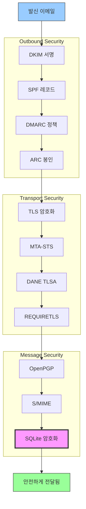


## 이메일 메시지 인증 프로토콜 {#email-message-authentication-protocols}

> \[!NOTE]
> Forward Email은 스푸핑 방지 및 메시지 무결성 보장을 위해 모든 주요 이메일 인증 프로토콜을 구현합니다.

Forward Email은 이메일 인증을 위해 [mailauth](https://github.com/postalsys/mailauth) 라이브러리를 사용합니다. 다음 RFC들이 지원됩니다:

| RFC                                                       | 제목                                                                   | 구현 참고사항                                                  |
| --------------------------------------------------------- | ----------------------------------------------------------------------- | -------------------------------------------------------------- |
| [RFC 6376](https://datatracker.ietf.org/doc/html/rfc6376) | 도메인키 식별 메일(DKIM) 서명                                         | 완전한 DKIM 서명 및 검증                                       |
| [RFC 8463](https://datatracker.ietf.org/doc/html/rfc8463) | DKIM을 위한 새로운 암호화 서명 방식 (Ed25519-SHA256)                   | RSA-SHA256 및 Ed25519-SHA256 서명 알고리즘 모두 지원           |
| [RFC 7208](https://datatracker.ietf.org/doc/html/rfc7208) | 발신자 정책 프레임워크(SPF)                                           | SPF 레코드 검증                                               |
| [RFC 7489](https://datatracker.ietf.org/doc/html/rfc7489) | 도메인 기반 메시지 인증, 보고 및 준수(DMARC)                           | DMARC 정책 시행                                               |
| [RFC 8617](https://datatracker.ietf.org/doc/html/rfc8617) | 인증된 수신 체인(ARC)                                                  | ARC 봉인 및 검증                                              |

이메일 인증 프로토콜은 메시지가 주장된 발신자로부터 실제로 온 것인지, 전송 중 변조되지 않았는지를 검증합니다.

### 인증 프로토콜 지원 {#authentication-protocol-support}

| 프로토콜  | RFC      | 상태        | 설명                                                                 |
| --------- | -------- | ----------- | -------------------------------------------------------------------- |
| **DKIM**  | RFC 6376 | ✅ 지원     | 도메인키 식별 메일 - 암호화 서명                                     |
| **SPF**   | RFC 7208 | ✅ 지원     | 발신자 정책 프레임워크 - IP 주소 권한 부여                          |
| **DMARC** | RFC 7489 | ✅ 지원     | 도메인 기반 메시지 인증 - 정책 시행                                 |
| **ARC**   | RFC 8617 | ✅ 지원     | 인증된 수신 체인 - 전달 과정에서 인증 유지                          |
### DKIM (DomainKeys Identified Mail) {#dkim-domainkeys-identified-mail}

**DKIM**은 이메일 헤더에 암호화 서명을 추가하여 수신자가 메시지가 도메인 소유자에 의해 승인되었으며 전송 중에 변경되지 않았음을 확인할 수 있게 합니다.

Forward Email은 DKIM 서명 및 검증을 위해 [mailauth](https://github.com/postalsys/mailauth)를 사용합니다.

**주요 기능:**

* 모든 발신 메시지에 대한 자동 DKIM 서명
* RSA 및 Ed25519 키 지원
* 다중 선택자 지원
* 수신 메시지에 대한 DKIM 검증

### SPF (Sender Policy Framework) {#spf-sender-policy-framework}

**SPF**는 도메인 소유자가 자신의 도메인을 대신하여 이메일을 보낼 수 있는 IP 주소를 지정할 수 있게 합니다.

**주요 기능:**

* 수신 메시지에 대한 SPF 레코드 검증
* 상세 결과를 포함한 자동 SPF 검사
* include, redirect, all 메커니즘 지원
* 도메인별 구성 가능한 SPF 정책

### DMARC (Domain-based Message Authentication, Reporting & Conformance) {#dmarc-domain-based-message-authentication-reporting--conformance}

**DMARC**는 SPF와 DKIM을 기반으로 정책 시행 및 보고 기능을 제공합니다.

**주요 기능:**

* DMARC 정책 시행 (none, quarantine, reject)
* SPF 및 DKIM 정렬 검사
* DMARC 집계 보고
* 도메인별 DMARC 정책

### ARC (Authenticated Received Chain) {#arc-authenticated-received-chain}

**ARC**는 전달 및 메일링 리스트 수정 과정에서 이메일 인증 결과를 보존합니다.

Forward Email은 ARC 검증 및 봉인을 위해 [mailauth](https://github.com/postalsys/mailauth) 라이브러리를 사용합니다.

**주요 기능:**

* 전달된 메시지에 대한 ARC 봉인
* 수신 메시지에 대한 ARC 검증
* 다중 홉에 걸친 체인 검증
* 원본 인증 결과 보존

### Authentication Flow {#authentication-flow}

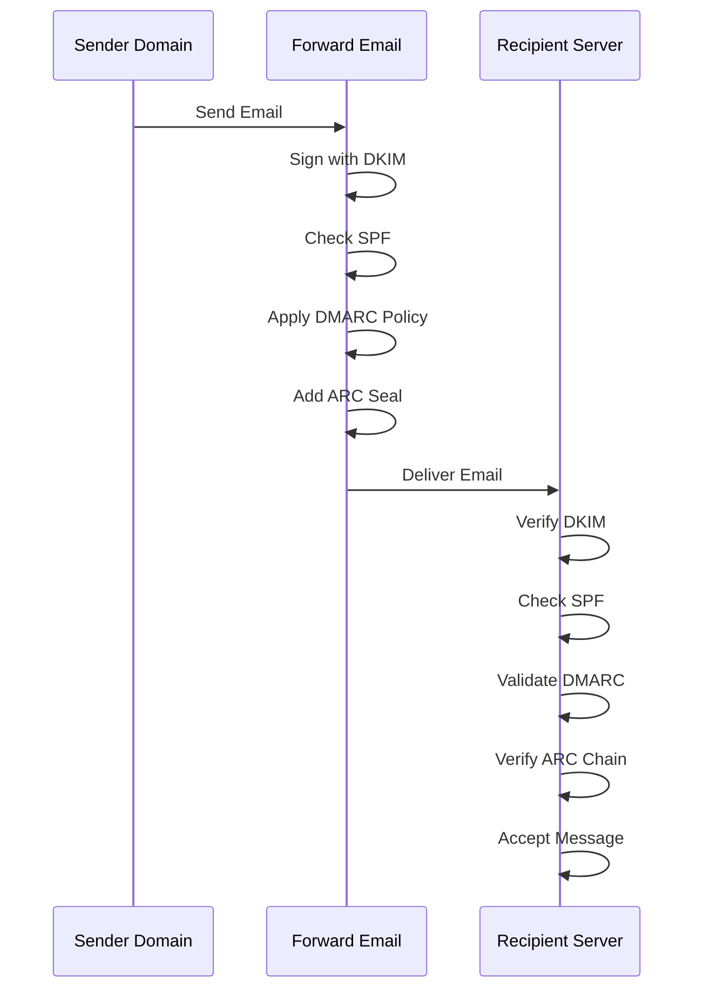

---


## Email Transport Security Protocols {#email-transport-security-protocols}

> \[!IMPORTANT]
> Forward Email은 전송 중인 이메일을 보호하기 위해 여러 계층의 전송 보안을 구현합니다.

Forward Email은 최신 전송 보안 프로토콜을 구현합니다:

| RFC                                                       | 제목                                                                                                 | 상태        | 구현 노트                                                                                                                                                                                                                                                                                     |
| --------------------------------------------------------- | ---------------------------------------------------------------------------------------------------- | ----------- | --------------------------------------------------------------------------------------------------------------------------------------------------------------------------------------------------------------------------------------------------------------------------------------------- |
| [RFC 8461](https://datatracker.ietf.org/doc/html/rfc8461) | SMTP MTA Strict Transport Security (MTA-STS)                                                         | ✅ 지원됨   | IMAP, SMTP, MX 서버에서 광범위하게 사용됨. [create-mta-sts-cache.js](https://github.com/forwardemail/forwardemail.net/blob/master/helpers/create-mta-sts-cache.js) 및 [get-transporter.js](https://github.com/forwardemail/forwardemail.net/blob/master/helpers/get-transporter.js) 참고 |
| [RFC 8460](https://datatracker.ietf.org/doc/html/rfc8460) | SMTP TLS Reporting                                                                                   | ✅ 지원됨   | [mailauth](https://github.com/postalsys/mailauth) 라이브러리를 통해                                                                                                                                                                                                                           |
| [RFC 7671](https://datatracker.ietf.org/doc/html/rfc7671) | 명명된 엔터티의 DNS 기반 인증(DANE) 프로토콜: 업데이트 및 운영 지침                                  | ✅ 지원됨   | 발신 SMTP 연결에 대한 완전한 DANE 검증. [mx-connect PR #22](https://github.com/zone-eu/mx-connect/pull/22) 참고                                                                                                                                                                              |
| [RFC 6698](https://datatracker.ietf.org/doc/html/rfc6698) | 명명된 엔터티의 DNS 기반 인증(DANE) 전송 계층 보안(TLS) 프로토콜: TLSA                              | ✅ 지원됨   | RFC 6698 완전 지원: PKIX-TA, PKIX-EE, DANE-TA, DANE-EE 사용 유형. [mx-connect PR #22](https://github.com/zone-eu/mx-connect/pull/22) 참고                                                                                                                                                     |
| [RFC 8314](https://datatracker.ietf.org/doc/html/rfc8314) | 평문은 구식으로 간주됨: 이메일 제출 및 접근을 위한 전송 계층 보안(TLS) 사용                         | ✅ 지원됨   | 모든 연결에 TLS 필수                                                                                                                                                                                                                                                                           |
| [RFC 8689](https://datatracker.ietf.org/doc/html/rfc8689) | TLS 요구를 위한 SMTP 서비스 확장(REQUIRETLS)                                                        | ✅ 지원됨   | REQUIRETLS SMTP 확장 및 "TLS-Required" 헤더 완전 지원                                                                                                                                                                                                                                         |
전송 보안 프로토콜은 메일 서버 간 전송 중 이메일 메시지가 암호화되고 인증되도록 보장합니다.

### Transport Security Support {#transport-security-support}

| 프로토콜       | RFC      | 상태        | 설명                                             |
| -------------- | -------- | ----------- | ------------------------------------------------ |
| **TLS**        | RFC 8314 | ✅ 지원됨   | 전송 계층 보안 - 암호화된 연결                    |
| **MTA-STS**    | RFC 8461 | ✅ 지원됨   | 메일 전송 에이전트 엄격 전송 보안                  |
| **DANE**       | RFC 7671 | ✅ 지원됨   | 명명된 엔터티의 DNS 기반 인증                      |
| **REQUIRETLS** | RFC 8689 | ✅ 지원됨   | 전체 전달 경로에 대해 TLS 요구                      |

### TLS (Transport Layer Security) {#tls-transport-layer-security}

Forward Email은 모든 이메일 연결(SMTP, IMAP, POP3)에 대해 TLS 암호화를 강제합니다.

**주요 기능:**

* TLS 1.2 및 TLS 1.3 지원
* 자동 인증서 관리
* 완벽한 순방향 비밀성 (PFS)
* 강력한 암호화 스위트만 사용

### MTA-STS (Mail Transfer Agent Strict Transport Security) {#mta-sts-mail-transfer-agent-strict-transport-security}

**MTA-STS**는 HTTPS를 통해 정책을 게시하여 이메일이 TLS로 암호화된 연결을 통해서만 전달되도록 보장합니다.

Forward Email은 [create-mta-sts-cache.js](https://github.com/forwardemail/forwardemail.net/blob/master/helpers/create-mta-sts-cache.js)를 사용하여 MTA-STS를 구현합니다.

**주요 기능:**

* 자동 MTA-STS 정책 게시
* 성능 향상을 위한 정책 캐싱
* 다운그레이드 공격 방지
* 인증서 검증 강제

### DANE (DNS-based Authentication of Named Entities) {#dane-dns-based-authentication-of-named-entities}

> \[!NOTE]
> Forward Email은 이제 아웃바운드 SMTP 연결에 대해 완전한 DANE 지원을 제공합니다.

**DANE**은 DNSSEC를 사용하여 DNS에 TLS 인증서 정보를 게시하며, 이를 통해 메일 서버가 인증 기관에 의존하지 않고 인증서를 검증할 수 있습니다.

**주요 기능:**

* ✅ 아웃바운드 SMTP 연결에 대한 완전한 DANE 검증
* ✅ RFC 6698 완전 지원: PKIX-TA, PKIX-EE, DANE-TA, DANE-EE 사용 유형
* ✅ TLS 업그레이드 중 TLSA 레코드에 대한 인증서 검증
* ✅ 여러 MX 호스트에 대한 병렬 TLSA 해석
* ✅ 네이티브 `dns.resolveTlsa` 자동 감지 (Node.js v22.15.0+, v23.9.0+)
* ✅ [Tangerine](https://github.com/forwardemail/tangerine)을 통한 구버전 Node.js용 커스텀 리졸버 지원
* DNSSEC 서명 도메인 필요

> \[!TIP]
> **구현 세부사항:** DANE 지원은 아웃바운드 SMTP 연결에 대한 포괄적인 DANE/TLSA 지원을 제공하는 [mx-connect PR #22](https://github.com/zone-eu/mx-connect/pull/22)를 통해 추가되었습니다.

### REQUIRETLS {#requiretls}

> \[!TIP]
> Forward Email은 사용자 대상 REQUIRETLS 지원을 제공하는 몇 안 되는 제공업체 중 하나입니다.

**REQUIRETLS**는 전체 전달 경로에 대해 이메일 메시지가 TLS로 암호화된 연결을 통해서만 전달되도록 보장합니다.

**주요 기능:**

* 이메일 작성기 내 사용자 대상 체크박스
* 암호화되지 않은 전달 자동 거부
* 종단 간 TLS 강제 적용
* 상세 실패 알림

> \[!TIP]
> **사용자 대상 TLS 강제 적용:** Forward Email은 **내 계정 > 도메인 > 설정** 아래에 모든 수신 연결에 대해 TLS를 강제하는 체크박스를 제공합니다. 활성화 시, 이 기능은 TLS로 암호화되지 않은 모든 수신 이메일을 530 오류 코드와 함께 거부하여 모든 수신 메일이 전송 중 암호화되도록 보장합니다.

### Transport Security Flow {#transport-security-flow}

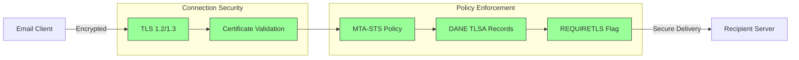
## 이메일 메시지 암호화 {#email-message-encryption}

> \[!NOTE]
> Forward Email은 종단 간 이메일 암호화를 위해 OpenPGP와 S/MIME을 모두 지원합니다.

Forward Email은 OpenPGP와 S/MIME 암호화를 지원합니다:

| RFC                                                       | 제목                                                                                     | 상태        | 구현 참고사항                                                                                                                                                                                        |
| --------------------------------------------------------- | --------------------------------------------------------------------------------------- | ----------- | -------------------------------------------------------------------------------------------------------------------------------------------------------------------------------------------------- |
| [RFC 9580](https://datatracker.ietf.org/doc/html/rfc9580) | OpenPGP (RFC 4880을 대체함)                                                              | ✅ 지원됨   | [OpenPGP.js v6+](https://github.com/openpgpjs/openpgpjs) 통합을 통해 지원됩니다. 자세한 내용은 [FAQ](https://forwardemail.net/en/faq#do-you-support-openpgpmime-end-to-end-encryption-e2ee-and-web-key-directory-wkd) 참조 |
| [RFC 8551](https://datatracker.ietf.org/doc/html/rfc8551) | 보안/다목적 인터넷 메일 확장 (S/MIME) 버전 4.0 메시지 명세                                | ✅ 지원됨   | RSA 및 ECC 알고리즘 모두 지원. 자세한 내용은 [FAQ](https://forwardemail.net/en/faq#do-you-support-smime-encryption) 참조                                                                             |

메시지 암호화 프로토콜은 메시지가 전송 중 가로채지더라도 의도된 수신자 외에는 이메일 내용을 읽을 수 없도록 보호합니다.

### 암호화 지원 {#encryption-support}

| 프로토콜    | RFC      | 상태        | 설명                                         |
| ----------- | -------- | ----------- | -------------------------------------------- |
| **OpenPGP** | RFC 9580 | ✅ 지원됨   | Pretty Good Privacy - 공개 키 암호화          |
| **S/MIME**  | RFC 8551 | ✅ 지원됨   | 보안/다목적 인터넷 메일 확장                   |
| **WKD**     | Draft    | ✅ 지원됨   | 웹 키 디렉터리 - 자동 키 검색                  |

### OpenPGP (Pretty Good Privacy) {#openpgp-pretty-good-privacy}

**OpenPGP**는 공개 키 암호화를 사용하여 종단 간 암호화를 제공합니다. Forward Email은 [웹 키 디렉터리(WKD)](https://forwardemail.net/en/faq#do-you-support-openpgpmime-end-to-end-encryption-e2ee-and-web-key-directory-wkd) 프로토콜을 통해 OpenPGP를 지원합니다.

**주요 기능:**

* WKD를 통한 자동 키 검색
* 암호화된 첨부파일을 위한 PGP/MIME 지원
* 이메일 클라이언트를 통한 키 관리
* GPG, Mailvelope 및 기타 OpenPGP 도구와 호환

**사용 방법:**

1. 이메일 클라이언트에서 PGP 키 쌍 생성
2. 공개 키를 Forward Email의 WKD에 업로드
3. 다른 사용자가 자동으로 키를 검색 가능
4. 암호화된 이메일을 원활하게 송수신

### S/MIME (보안/다목적 인터넷 메일 확장) {#smime-securemultipurpose-internet-mail-extensions}

**S/MIME**는 X.509 인증서를 사용하여 이메일 암호화 및 디지털 서명을 제공합니다.

**주요 기능:**

* 인증서 기반 암호화
* 메시지 인증을 위한 디지털 서명
* 대부분 이메일 클라이언트에서 기본 지원
* 기업 수준의 보안

**사용 방법:**

1. 인증 기관에서 S/MIME 인증서 획득
2. 이메일 클라이언트에 인증서 설치
3. 클라이언트를 설정하여 메시지 암호화/서명 구성
4. 수신자와 인증서 교환

### SQLite 메일박스 암호화 {#sqlite-mailbox-encryption}

> \[!IMPORTANT]
> Forward Email은 암호화된 SQLite 메일박스를 통해 추가 보안 계층을 제공합니다.

메시지 수준 암호화 외에도 Forward Email은 [sqleet](https://github.com/resilar/sqleet) (ChaCha20-Poly1305)를 사용하여 전체 메일박스를 암호화합니다.

**주요 기능:**

* **비밀번호 기반 암호화** - 비밀번호는 오직 사용자만 알고 있음
* **양자 내성** - ChaCha20-Poly1305 암호화 방식
* **제로 지식** - Forward Email은 메일박스를 복호화할 수 없음
* **샌드박스 처리** - 각 메일박스는 격리되고 휴대 가능
* **복구 불가** - 비밀번호를 잊으면 메일박스를 복구할 수 없음
### 암호화 비교 {#encryption-comparison}

| 기능                  | OpenPGP           | S/MIME             | SQLite 암호화       |
| --------------------- | ----------------- | ------------------ | ----------------- |
| **종단 간 암호화**    | ✅ 예              | ✅ 예               | ✅ 예              |
| **키 관리**           | 자체 관리          | CA 발급             | 비밀번호 기반       |
| **클라이언트 지원**   | 플러그인 필요      | 기본 내장           | 투명 처리           |
| **사용 사례**         | 개인용             | 기업용              | 저장소              |
| **양자 내성**         | ⚠️ 키에 따라 다름  | ⚠️ 인증서에 따라 다름 | ✅ 예              |

### 암호화 흐름 {#encryption-flow}

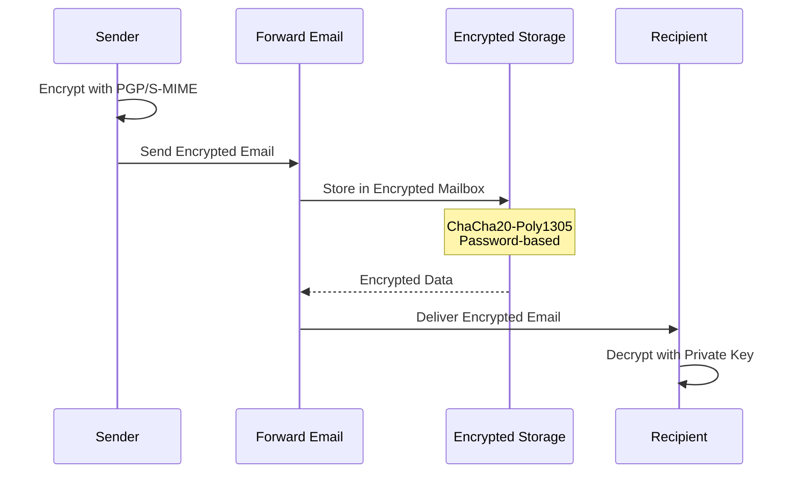

---


## 확장 기능 {#extended-functionality}


## 이메일 메시지 형식 표준 {#email-message-format-standards}

> \[!NOTE]
> Forward Email은 풍부한 콘텐츠와 국제화를 위한 최신 이메일 형식 표준을 지원합니다.

Forward Email은 표준 이메일 메시지 형식을 지원합니다:

| RFC                                                       | 제목                                                           | 구현 노트            |
| --------------------------------------------------------- | ------------------------------------------------------------- | -------------------- |
| [RFC 5322](https://datatracker.ietf.org/doc/html/rfc5322) | 인터넷 메시지 형식                                            | 완전 지원            |
| [RFC 2045](https://datatracker.ietf.org/doc/html/rfc2045) | MIME 파트 1: 인터넷 메시지 본문 형식                           | 완전 MIME 지원       |
| [RFC 2046](https://datatracker.ietf.org/doc/html/rfc2046) | MIME 파트 2: 미디어 유형                                       | 완전 MIME 지원       |
| [RFC 2047](https://datatracker.ietf.org/doc/html/rfc2047) | MIME 파트 3: 비 ASCII 텍스트용 메시지 헤더 확장                | 완전 MIME 지원       |
| [RFC 2048](https://datatracker.ietf.org/doc/html/rfc2048) | MIME 파트 4: 등록 절차                                         | 완전 MIME 지원       |
| [RFC 2049](https://datatracker.ietf.org/doc/html/rfc2049) | MIME 파트 5: 적합성 기준 및 예제                               | 완전 MIME 지원       |

이메일 형식 표준은 이메일 메시지가 어떻게 구조화되고, 인코딩되며, 표시되는지를 정의합니다.

### 형식 표준 지원 {#format-standards-support}

| 표준                | RFC           | 상태        | 설명                                |
| ------------------- | ------------- | ----------- | ---------------------------------- |
| **MIME**            | RFC 2045-2049 | ✅ 지원     | 다목적 인터넷 메일 확장             |
| **SMTPUTF8**        | RFC 6531      | ⚠️ 부분 지원 | 국제화된 이메일 주소                |
| **EAI**             | RFC 6530      | ⚠️ 부분 지원 | 이메일 주소 국제화                  |
| **메시지 형식**     | RFC 5322      | ✅ 지원     | 인터넷 메시지 형식                  |
| **MIME 보안**       | RFC 1847      | ✅ 지원     | MIME용 보안 멀티파트               |

### MIME (다목적 인터넷 메일 확장) {#mime-multipurpose-internet-mail-extensions}

**MIME**은 이메일이 서로 다른 콘텐츠 유형(텍스트, HTML, 첨부파일 등)을 포함할 수 있도록 합니다.

**지원되는 MIME 기능:**

* 멀티파트 메시지 (mixed, alternative, related)
* Content-Type 헤더
* Content-Transfer-Encoding (7bit, 8bit, quoted-printable, base64)
* 인라인 이미지 및 첨부파일
* 풍부한 HTML 콘텐츠

### SMTPUTF8 및 이메일 주소 국제화 {#smtputf8-and-email-address-internationalization}

> \[!WARNING]
> SMTPUTF8 지원은 부분적입니다 - 모든 기능이 완전히 구현된 것은 아닙니다.
**SMTPUTF8**는 이메일 주소에 비ASCII 문자를 포함할 수 있도록 허용합니다(예: `用户@例え.jp`).

**현재 상태:**

* ⚠️ 국제화된 이메일 주소에 대한 부분적 지원
* ✅ 메시지 본문 내 UTF-8 콘텐츠 지원
* ⚠️ 비ASCII 로컬 파트에 대한 제한적 지원

---


## 일정 및 연락처 프로토콜 {#calendaring-and-contacts-protocols}

> \[!NOTE]
> Forward Email은 일정 및 연락처 동기화를 위해 완전한 CalDAV 및 CardDAV 지원을 제공합니다.

Forward Email은 [caldav-adapter](https://github.com/forwardemail/caldav-adapter) 라이브러리를 통해 CalDAV 및 CardDAV를 지원합니다:

| RFC                                                       | 제목                                                                      | 상태        | 구현 노트                                                                                                                                                                             |
| --------------------------------------------------------- | ------------------------------------------------------------------------- | ----------- | -------------------------------------------------------------------------------------------------------------------------------------------------------------------------------------- |
| [RFC 4791](https://datatracker.ietf.org/doc/html/rfc4791) | WebDAV 일정 확장 (CalDAV)                                                 | ✅ 지원됨   | 일정 접근 및 관리                                                                                                                                                                      |
| [RFC 6352](https://datatracker.ietf.org/doc/html/rfc6352) | CardDAV: WebDAV에 대한 vCard 확장                                         | ✅ 지원됨   | 연락처 접근 및 관리                                                                                                                                                                    |
| [RFC 5545](https://datatracker.ietf.org/doc/html/rfc5545) | 인터넷 일정 및 예약 핵심 객체 명세 (iCalendar)                            | ✅ 지원됨   | iCalendar 형식 지원                                                                                                                                                                   |
| [RFC 6350](https://datatracker.ietf.org/doc/html/rfc6350) | vCard 형식 명세                                                           | ✅ 지원됨   | vCard 4.0 형식 지원                                                                                                                                                                   |
| [RFC 6638](https://datatracker.ietf.org/doc/html/rfc6638) | CalDAV 일정 예약 확장                                                     | ✅ 지원됨   | iMIP 지원이 포함된 CalDAV 일정 예약. [커밋 c4d1629](https://github.com/forwardemail/forwardemail.net/commit/c4d162975a49e38d76d68a032662e873a34a9b80) 참조                            |
| [RFC 5546](https://datatracker.ietf.org/doc/html/rfc5546) | iCalendar 전송 독립 상호운용 프로토콜 (iTIP)                             | ✅ 지원됨   | REQUEST, REPLY, CANCEL, VFREEBUSY 메서드에 대한 iTIP 지원. [커밋 c4d1629](https://github.com/forwardemail/forwardemail.net/commit/c4d162975a49e38d76d68a032662e873a34a9b80) 참조 |
| [RFC 6047](https://datatracker.ietf.org/doc/html/rfc6047) | iCalendar 메시지 기반 상호운용 프로토콜 (iMIP)                           | ✅ 지원됨   | 응답 링크가 포함된 이메일 기반 일정 초대. [커밋 c4d1629](https://github.com/forwardemail/forwardemail.net/commit/c4d162975a49e38d76d68a032662e873a34a9b80) 참조                     |

CalDAV 및 CardDAV는 일정 및 연락처 데이터를 장치 간에 접근, 공유 및 동기화할 수 있게 하는 프로토콜입니다.

### CalDAV 및 CardDAV 지원 {#caldav-and-carddav-support}

| 프로토콜              | RFC      | 상태        | 설명                                  |
| --------------------- | -------- | ----------- | ------------------------------------ |
| **CalDAV**            | RFC 4791 | ✅ 지원됨   | 일정 접근 및 동기화                   |
| **CardDAV**           | RFC 6352 | ✅ 지원됨   | 연락처 접근 및 동기화                 |
| **iCalendar**         | RFC 5545 | ✅ 지원됨   | 일정 데이터 형식                     |
| **vCard**             | RFC 6350 | ✅ 지원됨   | 연락처 데이터 형식                   |
| **VTODO**             | RFC 5545 | ✅ 지원됨   | 작업/알림 지원                      |
| **CalDAV 일정 예약**  | RFC 6638 | ✅ 지원됨   | 일정 예약 확장                      |
| **iTIP**              | RFC 5546 | ✅ 지원됨   | 전송 독립 상호운용                   |
| **iMIP**              | RFC 6047 | ✅ 지원됨   | 이메일 기반 일정 초대                |
### CalDAV (캘린더 접근) {#caldav-calendar-access}

**CalDAV**는 모든 기기나 애플리케이션에서 캘린더에 접근하고 관리할 수 있게 해줍니다.

**주요 기능:**

* 다중 기기 동기화
* 공유 캘린더
* 캘린더 구독
* 이벤트 초대 및 응답
* 반복 이벤트
* 시간대 지원

**호환 클라이언트:**

* Apple 캘린더 (macOS, iOS)
* Mozilla Thunderbird
* Evolution
* GNOME 캘린더
* 모든 CalDAV 호환 클라이언트

### CardDAV (연락처 접근) {#carddav-contact-access}

**CardDAV**는 모든 기기나 애플리케이션에서 연락처에 접근하고 관리할 수 있게 해줍니다.

**주요 기능:**

* 다중 기기 동기화
* 공유 주소록
* 연락처 그룹
* 사진 지원
* 사용자 정의 필드
* vCard 4.0 지원

**호환 클라이언트:**

* Apple 연락처 (macOS, iOS)
* Mozilla Thunderbird
* Evolution
* GNOME 연락처
* 모든 CardDAV 호환 클라이언트

### 작업 및 알림 (CalDAV VTODO) {#tasks-and-reminders-caldav-vtodo}

> \[!TIP]
> Forward Email은 CalDAV VTODO를 통해 작업 및 알림을 지원합니다.

**VTODO**는 iCalendar 형식의 일부로, CalDAV를 통한 작업 관리를 가능하게 합니다.

**주요 기능:**

* 작업 생성 및 관리
* 마감일 및 우선순위
* 작업 완료 추적
* 반복 작업
* 작업 목록/카테고리

**호환 클라이언트:**

* Apple 알림 (macOS, iOS)
* Mozilla Thunderbird (Lightning 포함)
* Evolution
* GNOME 할 일
* VTODO를 지원하는 모든 CalDAV 클라이언트

### CalDAV/CardDAV 동기화 흐름 {#caldavcarddav-synchronization-flow}

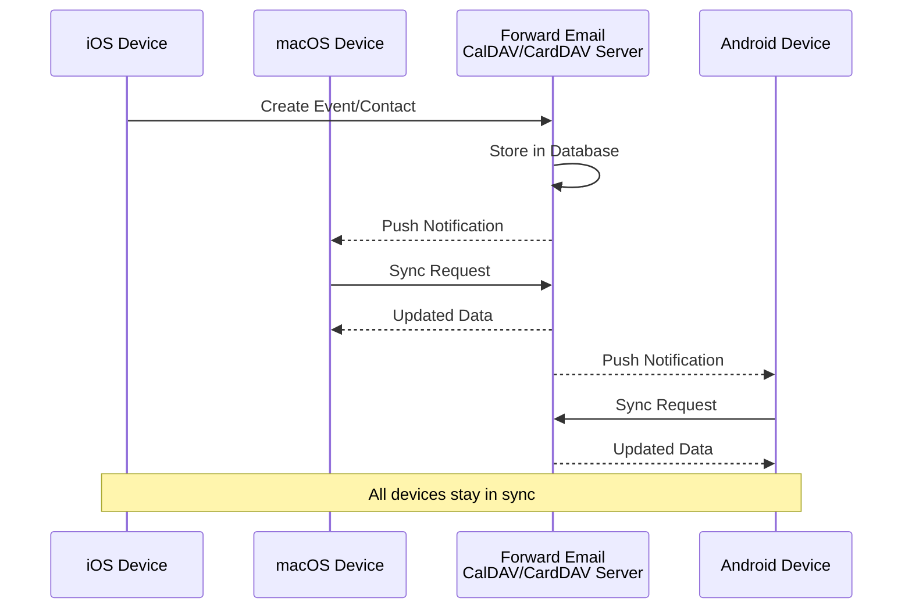

### 지원하지 않는 캘린더 확장 기능 {#calendaring-extensions-not-supported}

다음 캘린더 확장 기능은 지원되지 않습니다:

| RFC                                                       | 제목                                                                | 이유                                                            |
| --------------------------------------------------------- | ------------------------------------------------------------------- | --------------------------------------------------------------- |
| [RFC 4918](https://datatracker.ietf.org/doc/html/rfc4918) | 웹 분산 저작 및 버전 관리용 HTTP 확장 (WebDAV)                      | CalDAV는 WebDAV 개념을 사용하지만 RFC 4918 전체를 구현하지 않음 |
| [RFC 6578](https://datatracker.ietf.org/doc/html/rfc6578) | WebDAV를 위한 컬렉션 동기화                                         | 구현되지 않음                                                   |
| [RFC 3744](https://datatracker.ietf.org/doc/html/rfc3744) | WebDAV 접근 제어 프로토콜                                           | 구현되지 않음                                                   |

---


## 이메일 메시지 필터링 {#email-message-filtering}

> \[!IMPORTANT]
> Forward Email은 서버 측 이메일 필터링을 위해 **완전한 Sieve 및 ManageSieve 지원**을 제공합니다. 강력한 규칙을 만들어 들어오는 메시지를 자동으로 분류, 필터링, 전달 및 응답할 수 있습니다.

### Sieve (RFC 5228) {#sieve-rfc-5228}

[Sieve](https://en.wikipedia.org/wiki/Sieve_\(mail_filtering_language\))는 서버 측 이메일 필터링을 위한 표준화된 강력한 스크립팅 언어입니다. Forward Email은 24개의 확장 기능을 포함한 포괄적인 Sieve 지원을 구현합니다.

**소스 코드:** [`helpers/sieve/`](https://github.com/forwardemail/forwardemail.net/tree/master/helpers/sieve)

#### 지원하는 핵심 Sieve RFC {#core-sieve-rfcs-supported}

| RFC                                                                                    | 제목                                                         | 상태           |
| -------------------------------------------------------------------------------------- | ------------------------------------------------------------ | -------------- |
| [RFC 5228](https://datatracker.ietf.org/doc/html/rfc5228)                              | Sieve: 이메일 필터링 언어                                    | ✅ 완전 지원    |
| [RFC 5429](https://datatracker.ietf.org/doc/html/rfc5429)                              | Sieve 이메일 필터링: 거부 및 확장 거부 확장                  | ✅ 완전 지원    |
| [RFC 5230](https://datatracker.ietf.org/doc/html/rfc5230)                              | Sieve 이메일 필터링: 부재중 확장                             | ✅ 완전 지원    |
| [RFC 6131](https://datatracker.ietf.org/doc/html/rfc6131)                              | Sieve 부재중 확장: "초" 매개변수                            | ✅ 완전 지원    |
| [RFC 5232](https://datatracker.ietf.org/doc/html/rfc5232)                              | Sieve 이메일 필터링: Imap4flags 확장                         | ✅ 완전 지원    |
| [RFC 5173](https://datatracker.ietf.org/doc/html/rfc5173)                              | Sieve 이메일 필터링: 본문 확장                               | ✅ 완전 지원    |
| [RFC 5229](https://datatracker.ietf.org/doc/html/rfc5229)                              | Sieve 이메일 필터링: 변수 확장                               | ✅ 완전 지원    |
| [RFC 5231](https://datatracker.ietf.org/doc/html/rfc5231)                              | Sieve 이메일 필터링: 관계형 확장                             | ✅ 완전 지원    |
| [RFC 4790](https://datatracker.ietf.org/doc/html/rfc4790)                              | 인터넷 애플리케이션 프로토콜 정렬 레지스트리                 | ✅ 완전 지원    |
| [RFC 3894](https://datatracker.ietf.org/doc/html/rfc3894)                              | Sieve 확장: 부작용 없는 복사                                | ✅ 완전 지원    |
| [RFC 5293](https://datatracker.ietf.org/doc/html/rfc5293)                              | Sieve 이메일 필터링: Editheader 확장                         | ✅ 완전 지원    |
| [RFC 5260](https://datatracker.ietf.org/doc/html/rfc5260)                              | Sieve 이메일 필터링: 날짜 및 인덱스 확장                     | ✅ 완전 지원    |
| [RFC 5435](https://datatracker.ietf.org/doc/html/rfc5435)                              | Sieve 이메일 필터링: 알림 확장                               | ✅ 완전 지원    |
| [RFC 5183](https://datatracker.ietf.org/doc/html/rfc5183)                              | Sieve 이메일 필터링: 환경 확장                               | ✅ 완전 지원    |
| [RFC 5490](https://datatracker.ietf.org/doc/html/rfc5490)                              | Sieve 이메일 필터링: 메일박스 상태 확인 확장                | ✅ 완전 지원    |
| [RFC 8579](https://datatracker.ietf.org/doc/html/rfc8579)                              | Sieve 이메일 필터링: 특수 용도 메일박스 배달                 | ✅ 완전 지원    |
| [RFC 7352](https://datatracker.ietf.org/doc/html/rfc7352)                              | Sieve 이메일 필터링: 중복 배달 감지                         | ✅ 완전 지원    |
| [RFC 5463](https://datatracker.ietf.org/doc/html/rfc5463)                              | Sieve 이메일 필터링: Ihave 확장                              | ✅ 완전 지원    |
| [RFC 5233](https://datatracker.ietf.org/doc/html/rfc5233)                              | Sieve 이메일 필터링: 서브주소 확장                           | ✅ 완전 지원    |
| [draft-ietf-sieve-regex](https://datatracker.ietf.org/doc/html/draft-ietf-sieve-regex) | Sieve 이메일 필터링: 정규 표현식 확장                        | ✅ 완전 지원    |
#### 지원되는 Sieve 확장 {#supported-sieve-extensions}

| 확장                         | 설명                                    | 통합                                      |
| ---------------------------- | ---------------------------------------- | ------------------------------------------ |
| `fileinto`                   | 메시지를 특정 폴더에 저장                  | 지정된 IMAP 폴더에 메시지 저장               |
| `reject` / `ereject`         | 오류와 함께 메시지 거부                    | 바운스 메시지와 함께 SMTP 거부               |
| `vacation`                   | 자동 휴가/부재중 회신                      | Emails.queue를 통한 큐잉 및 속도 제한 적용    |
| `vacation-seconds`           | 세밀한 휴가 응답 간격                       | `:seconds` 매개변수로 TTL 설정                |
| `imap4flags`                 | IMAP 플래그 설정 (\Seen, \Flagged 등)       | 메시지 저장 시 플래그 적용                     |
| `envelope`                   | 송신자/수신자 봉투 테스트                   | SMTP 봉투 데이터 접근                          |
| `body`                       | 메시지 본문 내용 테스트                     | 전체 본문 텍스트 매칭                          |
| `variables`                  | 스크립트 내 변수 저장 및 사용                | 수정자가 포함된 변수 확장                       |
| `relational`                 | 관계형 비교                                | gt/lt/eq와 함께 `:count`, `:value` 사용        |
| `comparator-i;ascii-numeric` | 숫자 비교                                 | 숫자 문자열 비교                              |
| `copy`                       | 리디렉션 시 메시지 복사                      | fileinto/redirect에 `:copy` 플래그 사용         |
| `editheader`                 | 메시지 헤더 추가 또는 삭제                   | 저장 전 헤더 수정                              |
| `date`                       | 날짜/시간 값 테스트                         | `currentdate` 및 헤더 날짜 테스트               |
| `index`                      | 특정 헤더 발생 횟수 접근                     | 다중 값 헤더에 `:index` 사용                    |
| `regex`                      | 정규 표현식 매칭                            | 테스트에서 전체 정규식 지원                      |
| `enotify`                    | 알림 전송                                 | Emails.queue를 통한 `mailto:` 알림               |
| `environment`                | 환경 정보 접근                             | 세션에서 도메인, 호스트, 원격 IP 정보 접근        |
| `mailbox`                    | 메일박스 존재 여부 테스트                    | `mailboxexists` 테스트                          |
| `special-use`                | 특수 용도 메일박스에 저장                    | \Junk, \Trash 등 특수 폴더 매핑                  |
| `duplicate`                  | 중복 메시지 감지                           | Redis 기반 중복 추적                            |
| `ihave`                      | 확장 기능 사용 가능 여부 테스트               | 런타임 기능 확인                               |
| `subaddress`                 | 사용자+상세 주소 부분 접근                    | 주소의 `:user` 및 `:detail` 부분                  |

#### 지원되지 않는 Sieve 확장 {#sieve-extensions-not-supported}

| 확장                                  | RFC                                                       | 이유                                                             |
| ------------------------------------- | --------------------------------------------------------- | ---------------------------------------------------------------- |
| `include`                            | [RFC 6609](https://datatracker.ietf.org/doc/html/rfc6609) | 보안 위험(스크립트 인젝션), 전역 스크립트 저장 필요               |
| `mboxmetadata` / `servermetadata`    | [RFC 5490](https://datatracker.ietf.org/doc/html/rfc5490) | IMAP METADATA 확장 필요                                          |
| `fcc`                                | [RFC 8580](https://datatracker.ietf.org/doc/html/rfc8580) | 발신함 폴더 통합 필요                                            |
| `encoded-character`                  | [RFC 5228](https://datatracker.ietf.org/doc/html/rfc5228) | `${hex:}` 구문에 대한 파서 변경 필요                             |
| `foreverypart` / `mime` / `extracttext` | [RFC 5703](https://datatracker.ietf.org/doc/html/rfc5703) | 복잡한 MIME 트리 조작                                            |
#### Sieve 처리 흐름 {#sieve-processing-flow}

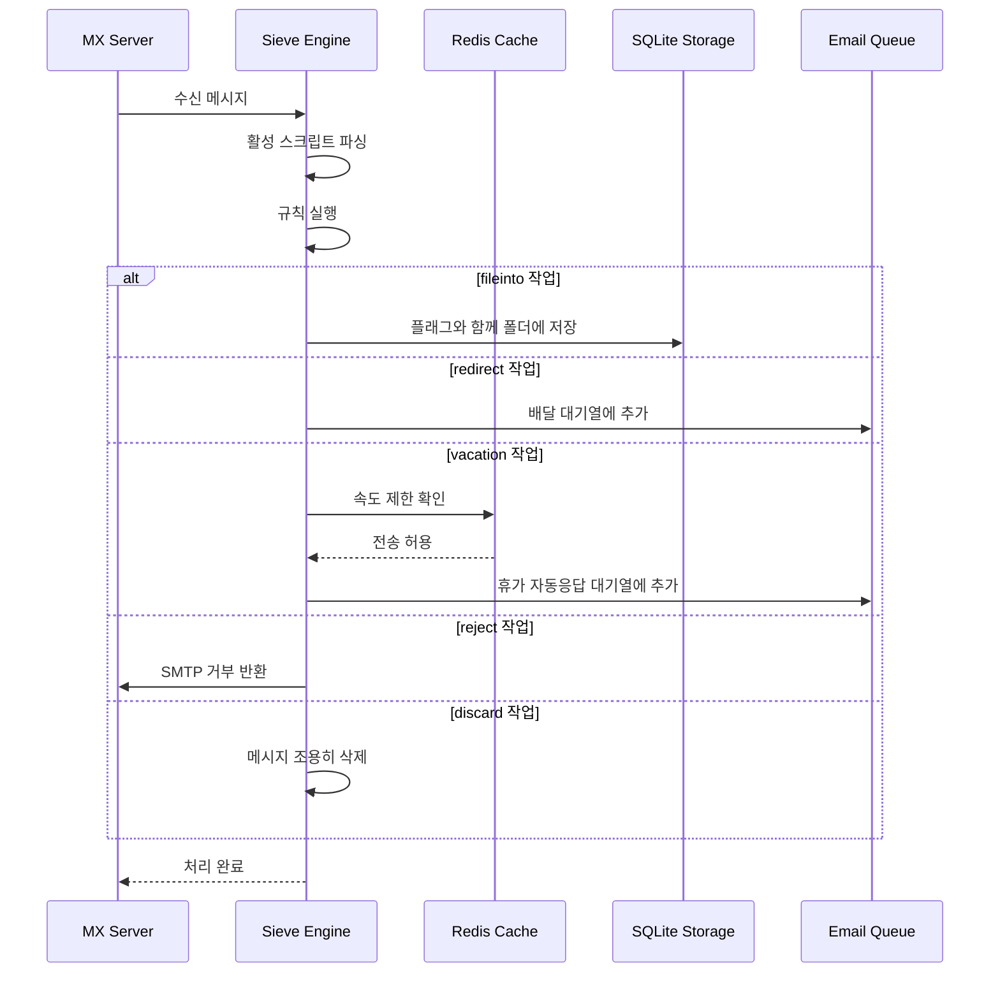

#### 보안 기능 {#security-features}

Forward Email의 Sieve 구현은 포괄적인 보안 보호 기능을 포함합니다:

* **CVE-2023-26430 보호**: 리디렉션 루프 및 메일 폭탄 공격 방지
* **속도 제한**: 리디렉션(메시지당 10회, 하루 100회) 및 휴가 자동응답 제한
* **거부 목록 확인**: 리디렉션 주소를 거부 목록과 대조
* **보호된 헤더**: DKIM, ARC 및 인증 헤더는 editheader를 통해 수정 불가
* **스크립트 크기 제한**: 최대 스크립트 크기 적용
* **실행 시간 제한**: 실행 시간이 초과되면 스크립트 종료

#### 예제 Sieve 스크립트 {#example-sieve-scripts}

**뉴스레터를 폴더에 저장:**

```sieve
require ["fileinto"];

if header :contains "List-Id" "newsletter" {
    fileinto "Newsletters";
}
```

**세밀한 타이밍 설정이 가능한 휴가 자동응답:**

```sieve
require ["vacation", "vacation-seconds"];

vacation :seconds 3600 :subject "Out of Office"
    "현재 자리를 비웠으며 24시간 내에 답변드리겠습니다.";
```

**플래그를 이용한 스팸 필터링:**

```sieve
require ["fileinto", "imap4flags"];

if header :contains "X-Spam-Status" "Yes" {
    setflag "\\Seen";
    fileinto "Junk";
}
```

**변수를 이용한 복잡한 필터링:**

```sieve
require ["variables", "fileinto", "regex"];

if header :regex "From" "(.+)@example\\.com" {
    set :lower "sender" "${1}";
    fileinto "Contacts/${sender}";
}
```

> \[!TIP]
> 전체 문서, 예제 스크립트 및 구성 지침은 [FAQ: Sieve 이메일 필터링을 지원하나요?](/faq#do-you-support-sieve-email-filtering)에서 확인하세요.

### ManageSieve (RFC 5804) {#managesieve-rfc-5804}

Forward Email은 Sieve 스크립트를 원격으로 관리하기 위한 ManageSieve 프로토콜을 완벽하게 지원합니다.

**소스 코드:** [`managesieve-server.js`](https://github.com/forwardemail/forwardemail.net/blob/master/managesieve-server.js)

| RFC                                                       | 제목                                           | 상태           |
| --------------------------------------------------------- | ---------------------------------------------- | -------------- |
| [RFC 5804](https://datatracker.ietf.org/doc/html/rfc5804) | Sieve 스크립트 원격 관리를 위한 프로토콜       | ✅ 완전 지원    |

#### ManageSieve 서버 구성 {#managesieve-server-configuration}

| 설정                    | 값                      |
| ----------------------- | ----------------------- |
| **서버**                | `imap.forwardemail.net` |
| **포트 (STARTTLS)**     | `2190` (권장)           |
| **포트 (암시적 TLS)**   | `4190`                  |
| **인증**                | PLAIN (TLS 위에서)      |

> **참고:** 포트 2190은 STARTTLS(평문에서 TLS로 업그레이드)를 사용하며 [sieve-connect](https://github.com/philpennock/sieve-connect)를 포함한 대부분의 ManageSieve 클라이언트와 호환됩니다. 포트 4190은 암시적 TLS(연결 시작부터 TLS)를 사용하며 이를 지원하는 클라이언트용입니다.

#### 지원되는 ManageSieve 명령어 {#supported-managesieve-commands}

| 명령어          | 설명                                   |
| -------------- | ------------------------------------- |
| `AUTHENTICATE` | PLAIN 메커니즘을 사용한 인증           |
| `CAPABILITY`   | 서버 기능 및 확장 목록 조회             |
| `HAVESPACE`    | 스크립트 저장 가능 여부 확인            |
| `PUTSCRIPT`    | 새 스크립트 업로드                     |
| `LISTSCRIPTS`  | 모든 스크립트 및 활성 상태 목록 조회    |
| `SETACTIVE`    | 스크립트 활성화                       |
| `GETSCRIPT`    | 스크립트 다운로드                     |
| `DELETESCRIPT` | 스크립트 삭제                         |
| `RENAMESCRIPT` | 스크립트 이름 변경                    |
| `CHECKSCRIPT`  | 스크립트 문법 검사                    |
| `NOOP`         | 연결 유지                           |
| `LOGOUT`       | 세션 종료                           |
#### 호환 가능한 ManageSieve 클라이언트 {#compatible-managesieve-clients}

* **Thunderbird**: [Sieve 애드온](https://addons.thunderbird.net/addon/sieve/)을 통한 내장 Sieve 지원
* **Roundcube**: [ManageSieve 플러그인](https://plugins.roundcube.net/packages/johndoh/sieve)
* **KMail**: 네이티브 ManageSieve 지원
* **sieve-connect**: 커맨드라인 클라이언트
* **모든 RFC 5804 준수 클라이언트**

#### ManageSieve 프로토콜 흐름 {#managesieve-protocol-flow}

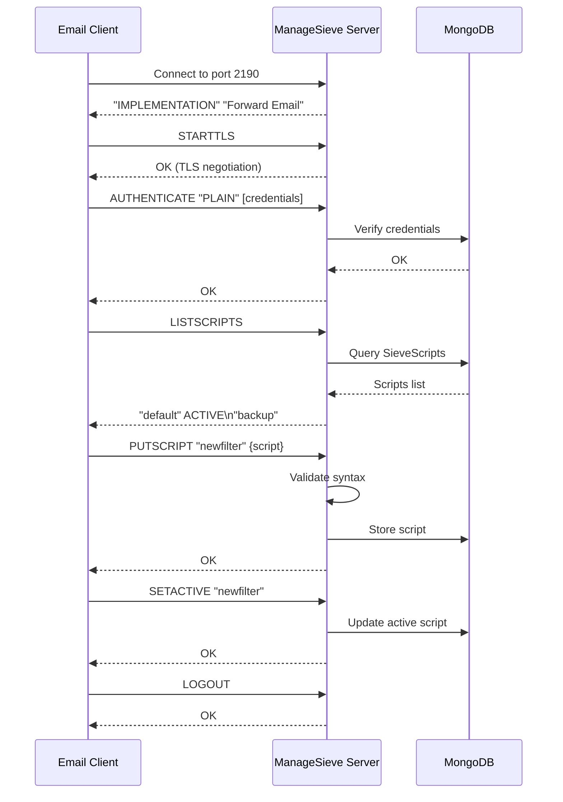

#### 웹 인터페이스 및 API {#web-interface-and-api}

ManageSieve 외에도 Forward Email은 다음을 제공합니다:

* **웹 대시보드**: 내 계정 → 도메인 → 별칭 → Sieve 스크립트에서 웹 인터페이스를 통해 Sieve 스크립트를 생성 및 관리
* **REST API**: [Forward Email API](/api#sieve-scripts)를 통한 Sieve 스크립트 관리 프로그래밍 접근

> \[!TIP]
> 자세한 설정 지침과 클라이언트 구성은 [FAQ: Sieve 이메일 필터링을 지원하나요?](/faq#do-you-support-sieve-email-filtering)를 참조하세요

---


## 저장소 최적화 {#storage-optimization}

> \[!IMPORTANT]
> **업계 최초 저장 기술:** Forward Email은 이메일 콘텐츠에 대한 첨부파일 중복 제거와 Brotli 압축을 결합한 **세계 유일의 이메일 제공업체**입니다. 이중 최적화로 기존 이메일 제공업체 대비 **2-3배 더 효과적인 저장 공간**을 제공합니다.

Forward Email은 완전한 RFC 준수와 메시지 완전성을 유지하면서 메일박스 크기를 획기적으로 줄이는 두 가지 혁신적인 저장소 최적화 기술을 구현합니다:

1. **첨부파일 중복 제거** - 모든 이메일에서 중복 첨부파일 제거
2. **Brotli 압축** - 메타데이터는 46-86%, 첨부파일은 50% 저장 공간 절감

### 아키텍처: 이중 레이어 저장소 최적화 {#architecture-dual-layer-storage-optimization}

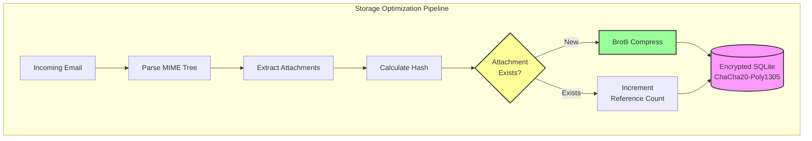

---


## 첨부파일 중복 제거 {#attachment-deduplication}

Forward Email은 SQLite 저장소에 맞게 조정된 [WildDuck의 검증된 접근법](https://docs.wildduck.email/docs/in-depth/attachment-deduplication/)을 기반으로 첨부파일 중복 제거를 구현합니다.

> \[!NOTE]
> **중복 제거 대상:** "첨부파일"은 디코딩된 파일이 아닌 **인코딩된** MIME 노드 내용(베이스64 또는 quoted-printable)을 의미합니다. 이는 DKIM 및 GPG 서명 유효성을 보존합니다.

### 작동 방식 {#how-it-works}

**WildDuck의 원래 구현 (MongoDB GridFS):**

> Wild Duck IMAP 서버는 첨부파일을 중복 제거합니다. 여기서 "첨부파일"은 디코딩된 파일이 아닌 베이스64 또는 quoted-printable로 인코딩된 MIME 노드 내용을 의미합니다. 인코딩된 내용을 사용하면 동일한 파일이 다른 이메일에서 다른 첨부파일로 인식되는 경우가 많아 거짓 부정(false negatives)이 많지만, 이는 다양한 서명 방식(DKIM, GPG 등)의 유효성을 보장하는 데 필요합니다. Wild Duck에서 가져온 메시지는 메시지를 트리 구조 객체로 파싱하고 다시 빌드함에도 불구하고 저장된 메시지와 정확히 동일하게 보입니다.
**Forward Email의 SQLite 구현:**

Forward Email은 암호화된 SQLite 저장을 위해 다음과 같은 프로세스를 적용합니다:

1. **해시 계산**: 첨부파일이 발견되면, 첨부파일 본문에서 [`rev-hash`](https://github.com/sindresorhus/rev-hash) 라이브러리를 사용하여 해시를 계산합니다
2. **조회**: `Attachments` 테이블에서 일치하는 해시를 가진 첨부파일이 있는지 확인합니다
3. **참조 카운팅**:
   * 존재하는 경우: 참조 카운터를 1 증가시키고 매직 카운터를 임의의 숫자만큼 증가시킵니다
   * 새로운 경우: 카운터 = 1로 새 첨부파일 항목을 생성합니다
4. **삭제 안전성**: 잘못된 삭제를 방지하기 위해 이중 카운터 시스템(참조 + 매직)을 사용합니다
5. **가비지 컬렉션**: 두 카운터가 모두 0이 되면 첨부파일을 즉시 삭제합니다

**소스 코드:** [`helpers/attachment-storage.js`](https://github.com/forwardemail/forwardemail.net/blob/master/helpers/attachment-storage.js)

### 중복 제거 흐름 {#deduplication-flow}

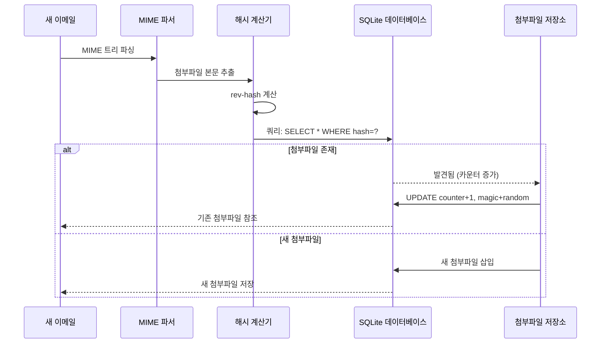

### 매직 넘버 시스템 {#magic-number-system}

Forward Email은 삭제 시 잘못된 삭제를 방지하기 위해 WildDuck의 "매직 넘버" 시스템([Mail.ru](https://github.com/zone-eu/wildduck)에서 영감을 받음)을 사용합니다:

* 모든 메시지에 **임의의 숫자**가 할당됩니다
* 메시지가 추가될 때 첨부파일의 **매직 카운터**가 그 임의의 숫자만큼 증가합니다
* 메시지가 삭제될 때 매직 카운터가 같은 숫자만큼 감소합니다
* 첨부파일은 **두 카운터**(참조 + 매직)가 모두 0이 될 때만 삭제됩니다

이 이중 카운터 시스템은 삭제 중 오류(예: 크래시, 네트워크 오류)가 발생해도 첨부파일이 조기 삭제되지 않도록 보장합니다.

### 주요 차이점: WildDuck vs Forward Email {#key-differences-wildduck-vs-forward-email}

| 기능                   | WildDuck (MongoDB)        | Forward Email (SQLite)       |
| ---------------------- | ------------------------- | ---------------------------- |
| **저장 백엔드**        | MongoDB GridFS (청크 단위) | SQLite BLOB (직접 저장)       |
| **해시 알고리즘**       | SHA256                    | rev-hash (SHA-256 기반)       |
| **참조 카운팅**         | ✅ 있음                   | ✅ 있음                      |
| **매직 넘버**           | ✅ 있음 (Mail.ru 영감)     | ✅ 있음 (동일 시스템)          |
| **가비지 컬렉션**       | 지연 처리 (별도 작업)      | 즉시 처리 (카운터 0 시)       |
| **압축**                | ❌ 없음                   | ✅ Brotli (아래 참조)          |
| **암호화**              | ❌ 선택 사항              | ✅ 항상 적용 (ChaCha20-Poly1305) |

---


## Brotli 압축 {#brotli-compression}

> \[!IMPORTANT]
> **세계 최초:** Forward Email은 이메일 콘텐츠에 Brotli 압축을 사용하는 **세계 유일의 이메일 서비스**입니다. 이는 첨부파일 중복 제거에 더해 **46-86% 저장 공간 절감**을 제공합니다.

Forward Email은 첨부파일 본문과 메시지 메타데이터 모두에 Brotli 압축을 적용하여 대규모 저장 공간 절감을 제공하면서도 이전 버전과의 호환성을 유지합니다.

**구현:** [`helpers/msgpack-helpers.js`](https://github.com/forwardemail/forwardemail.net/blob/master/helpers/msgpack-helpers.js)

### 압축 대상 {#what-gets-compressed}

**1. 첨부파일 본문** (`encodeAttachmentBody`)

* **구형 포맷**: 16진수 인코딩 문자열 (크기 2배) 또는 원시 Buffer
* **신형 포맷**: "FEBR" 매직 헤더가 붙은 Brotli 압축 Buffer
* **압축 결정**: 공간 절감이 있을 때만 압축 (4바이트 헤더 포함 고려)
* **저장 공간 절감**: 최대 **50%** (16진수 → 네이티브 BLOB)
**2. 메시지 메타데이터** (`encodeMetadata`)

포함: `mimeTree`, `headers`, `envelope`, `flags`

* **기존 형식**: JSON 텍스트 문자열
* **새 형식**: Brotli 압축된 Buffer
* **저장 공간 절감**: 메시지 복잡도에 따라 **46-86%**

### 압축 구성 {#compression-configuration}

```javascript
// 속도에 최적화된 Brotli 압축 옵션 (레벨 4가 좋은 균형)
const BROTLI_COMPRESS_OPTIONS = {
  params: {
    [zlib.constants.BROTLI_PARAM_QUALITY]: 4
  }
};
```

**왜 레벨 4인가?**

* **빠른 압축/압축 해제**: 밀리초 미만 처리
* **좋은 압축률**: 46-86% 절감
* **균형 잡힌 성능**: 실시간 이메일 작업에 최적

### 매직 헤더: "FEBR" {#magic-header-febr}

Forward Email은 압축된 첨부 파일 본문을 식별하기 위해 4바이트 매직 헤더를 사용합니다:

```
"FEBR" = Forward Email BRotli
Hex: 0x46 0x45 0x42 0x52
```

**왜 매직 헤더인가?**

* **형식 감지**: 압축된 데이터와 비압축 데이터를 즉시 구분
* **하위 호환성**: 기존 16진수 문자열과 원시 Buffer도 여전히 작동
* **충돌 방지**: "FEBR"은 정상 첨부 데이터 시작 부분에 나타날 가능성이 낮음

### 압축 프로세스 {#compression-process}

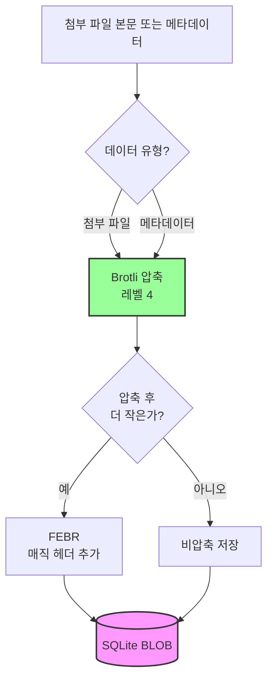

### 압축 해제 프로세스 {#decompression-process}

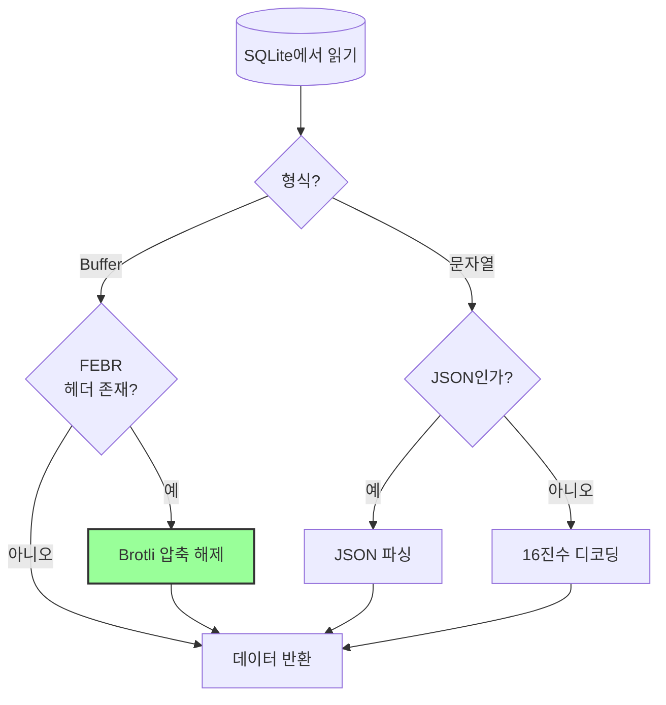

### 하위 호환성 {#backwards-compatibility}

모든 디코드 함수는 저장 형식을 **자동 감지**합니다:

| 형식                  | 감지 방법                             | 처리 방식                                    |
| --------------------- | ------------------------------------ | --------------------------------------------- |
| **Brotli 압축**       | "FEBR" 매직 헤더 확인                | `zlib.brotliDecompressSync()`로 압축 해제    |
| **원시 Buffer**       | 매직 헤더 없이 `Buffer.isBuffer()` 확인 | 그대로 반환                                  |
| **16진수 문자열**     | 짝수 길이 + [0-9a-f] 문자 확인       | `Buffer.from(value, 'hex')`로 디코딩          |
| **JSON 문자열**       | 첫 문자가 `{` 또는 `[`인지 확인       | `JSON.parse()`로 파싱                         |

이로써 기존 저장 형식에서 새 저장 형식으로 마이그레이션 시 **데이터 손실 제로**를 보장합니다.

### 저장 공간 절감 통계 {#storage-savings-statistics}

**운영 데이터에서 측정된 절감율:**

| 데이터 유형           | 기존 형식               | 새 형식                | 절감율     |
| --------------------- | ----------------------- | ---------------------- | ---------- |
| **첨부 파일 본문**    | 16진수 인코딩 문자열 (2배) | Brotli 압축 BLOB       | **50%**    |
| **메시지 메타데이터** | JSON 텍스트             | Brotli 압축 BLOB       | **46-86%** |
| **메일박스 플래그**   | JSON 텍스트             | Brotli 압축 BLOB       | **60-80%** |

**출처:** [`helpers/migrate-storage-format.js`](https://github.com/forwardemail/forwardemail.net/blob/master/helpers/migrate-storage-format.js)

### 마이그레이션 프로세스 {#migration-process}

Forward Email은 기존 저장 형식에서 새 저장 형식으로 자동으로, 멱등적으로 마이그레이션을 제공합니다:
// 마이그레이션 통계 추적:
{
  attachmentsMigrated: 0,
  messagesMigrated: 0,
  mailboxesMigrated: 0,
  bytesSaved: 0  // 압축으로 절약된 총 바이트 수
}
```

**마이그레이션 단계:**

1. 첨부 파일 본문: 16진수 인코딩 → 네이티브 BLOB (50% 절약)
2. 메시지 메타데이터: JSON 텍스트 → brotli 압축 BLOB (46-86% 절약)
3. 메일박스 플래그: JSON 텍스트 → brotli 압축 BLOB (60-80% 절약)

**출처:** [`helpers/migrate-storage-format.js`](https://github.com/forwardemail/forwardemail.net/blob/master/helpers/migrate-storage-format.js)

---

### 결합된 저장 효율 {#combined-storage-efficiency}

> \[!TIP]
> **실제 영향:** 첨부 파일 중복 제거 + Brotli 압축을 통해 Forward Email 사용자는 기존 이메일 제공업체 대비 **2-3배 더 효과적인 저장 공간**을 얻습니다.

**예시 시나리오:**

기존 이메일 제공업체 (1GB 메일박스):

* 1GB 디스크 공간 = 1GB 이메일
* 중복 제거 없음: 동일 첨부 파일 10회 저장 = 10배 저장 공간 낭비
* 압축 없음: 전체 JSON 메타데이터 저장 = 2-3배 저장 공간 낭비

Forward Email (1GB 메일박스):

* 1GB 디스크 공간 ≈ **2-3GB 이메일** (효과적인 저장 공간)
* 중복 제거: 동일 첨부 파일 1회 저장, 10회 참조
* 압축: 메타데이터 46-86% 절약, 첨부 파일 50% 절약
* 암호화: ChaCha20-Poly1305 (저장 공간 오버헤드 없음)

**비교 표:**

| 제공업체          | 저장 기술                                    | 효과적인 저장 공간 (1GB 메일박스) |
| ----------------- | -------------------------------------------- | ------------------------------- |
| Gmail             | 없음                                         | 1GB                             |
| iCloud            | 없음                                         | 1GB                             |
| Outlook.com       | 없음                                         | 1GB                             |
| Fastmail          | 없음                                         | 1GB                             |
| ProtonMail        | 암호화만                                     | 1GB                             |
| Tutanota          | 암호화만                                     | 1GB                             |
| **Forward Email** | **중복 제거 + 압축 + 암호화**                 | **2-3GB** ✨                     |

### 기술 구현 세부사항 {#technical-implementation-details}

**성능:**

* Brotli 레벨 4: 밀리초 미만 압축/해제
* 압축으로 인한 성능 저하 없음
* SQLite FTS5: NVMe SSD에서 50ms 미만 검색

**보안:**

* 압축은 **암호화 후**에 수행됨 (SQLite 데이터베이스 암호화됨)
* ChaCha20-Poly1305 암호화 + Brotli 압축
* 제로 지식: 복호화 비밀번호는 사용자만 보유

**RFC 준수:**

* 검색된 메시지는 저장된 것과 **정확히 동일**
* DKIM 서명 유효 (인코딩된 내용 보존)
* GPG 서명 유효 (서명된 내용 변경 없음)

### 왜 다른 제공업체는 이 방식을 사용하지 않는가 {#why-no-other-provider-does-this}

**복잡성:**

* 저장 계층과 깊은 통합 필요
* 이전 버전과의 호환성 문제
* 이전 포맷에서의 마이그레이션 복잡

**성능 문제:**

* 압축은 CPU 부하 증가 (Brotli 레벨 4로 해결)
* 매번 읽을 때 압축 해제 필요 (SQLite 캐싱으로 해결)

**Forward Email의 장점:**

* 최적화를 염두에 두고 처음부터 설계
* SQLite는 직접 BLOB 조작 가능
* 사용자별 암호화 데이터베이스로 안전한 압축 가능

---

---


## 최신 기능 {#modern-features}


## 이메일 관리를 위한 완전한 REST API {#complete-rest-api-for-email-management}

> \[!TIP]
> Forward Email은 프로그래밍 방식 이메일 관리를 위한 39개 엔드포인트를 갖춘 포괄적인 REST API를 제공합니다.

> \[!TIP]
> **독특한 업계 기능:** 다른 모든 이메일 서비스와 달리 Forward Email은 포괄적인 REST API를 통해 메일박스, 캘린더, 연락처, 메시지, 폴더에 대한 완전한 프로그래밍 접근을 제공합니다. 이는 모든 데이터를 저장하는 암호화된 SQLite 데이터베이스 파일과의 직접 상호작용입니다.

Forward Email은 이메일 데이터에 대한 전례 없는 접근을 제공하는 완전한 REST API를 제공합니다. Gmail, iCloud, Outlook, ProtonMail, Tuta, Fastmail을 포함한 다른 어떤 이메일 서비스도 이 수준의 포괄적이고 직접적인 데이터베이스 접근을 제공하지 않습니다.
**API 문서:** <https://forwardemail.net/en/email-api>

### API 카테고리 (39 엔드포인트) {#api-categories-39-endpoints}

**1. 메시지 API** (5 엔드포인트) - 이메일 메시지에 대한 전체 CRUD 작업:

* `GET /v1/messages` - 15개 이상의 고급 검색 매개변수로 메시지 목록 조회 (다른 서비스에서는 제공하지 않음)
* `POST /v1/messages` - 메시지 생성/전송
* `GET /v1/messages/:id` - 메시지 조회
* `PUT /v1/messages/:id` - 메시지 업데이트 (플래그, 폴더)
* `DELETE /v1/messages/:id` - 메시지 삭제

*예시: 첨부파일이 있는 지난 분기 모든 인보이스 찾기:*

```bash
curl -u "alias@domain.com:password" \
  "https://api.forwardemail.net/v1/messages?q=subject:invoice+has:attachment+after:2024-01-01+before:2024-04-01"
```

[고급 검색 문서](https://forwardemail.net/en/email-api) 참조

**2. 폴더 API** (5 엔드포인트) - REST를 통한 전체 IMAP 폴더 관리:

* `GET /v1/folders` - 모든 폴더 목록 조회
* `POST /v1/folders` - 폴더 생성
* `GET /v1/folders/:id` - 폴더 조회
* `PUT /v1/folders/:id` - 폴더 업데이트
* `DELETE /v1/folders/:id` - 폴더 삭제

**3. 연락처 API** (5 엔드포인트) - REST를 통한 CardDAV 연락처 저장:

* `GET /v1/contacts` - 연락처 목록 조회
* `POST /v1/contacts` - 연락처 생성 (vCard 형식)
* `GET /v1/contacts/:id` - 연락처 조회
* `PUT /v1/contacts/:id` - 연락처 업데이트
* `DELETE /v1/contacts/:id` - 연락처 삭제

**4. 캘린더 API** (5 엔드포인트) - 캘린더 컨테이너 관리:

* `GET /v1/calendars` - 캘린더 컨테이너 목록 조회
* `POST /v1/calendars` - 캘린더 생성 (예: "업무 캘린더", "개인 캘린더")
* `GET /v1/calendars/:id` - 캘린더 조회
* `PUT /v1/calendars/:id` - 캘린더 업데이트
* `DELETE /v1/calendars/:id` - 캘린더 삭제

**5. 캘린더 이벤트 API** (5 엔드포인트) - 캘린더 내 이벤트 일정 관리:

* `GET /v1/calendar-events` - 이벤트 목록 조회
* `POST /v1/calendar-events` - 참석자가 포함된 이벤트 생성
* `GET /v1/calendar-events/:id` - 이벤트 조회
* `PUT /v1/calendar-events/:id` - 이벤트 업데이트
* `DELETE /v1/calendar-events/:id` - 이벤트 삭제

*예시: 캘린더 이벤트 생성:*

```bash
curl -u "alias@domain.com:password" \
  -X POST \
  -H "Content-Type: application/json" \
  -d '{"title":"팀 미팅","start":"2024-12-20T10:00:00Z","attendees":["team@example.com"],"calendar_id":"calendar123"}' \
  https://api.forwardemail.net/v1/calendar-events
```

### 기술 세부사항 {#technical-details}

* **인증:** 간단한 `alias:password` 인증 (OAuth 복잡성 없음)
* **성능:** SQLite FTS5 및 NVMe SSD 스토리지로 50ms 미만 응답 시간
* **제로 네트워크 지연:** 외부 서비스 프록시 없이 직접 데이터베이스 접근

### 실제 사용 사례 {#real-world-use-cases}

* **이메일 분석:** 이메일 볼륨, 응답 시간, 발신자 통계 추적을 위한 맞춤 대시보드 구축

* **자동화 워크플로우:** 이메일 내용 기반 작업 트리거 (인보이스 처리, 지원 티켓)

* **CRM 통합:** 이메일 대화를 CRM과 자동 동기화

* **규정 준수 및 검색:** 법적/규정 요구사항을 위한 이메일 검색 및 내보내기

* **맞춤형 이메일 클라이언트:** 워크플로우에 특화된 이메일 인터페이스 구축

* **비즈니스 인텔리전스:** 커뮤니케이션 패턴, 응답률, 고객 참여 분석

* **문서 관리:** 첨부파일 자동 추출 및 분류

* [전체 문서](https://forwardemail.net/en/email-api)

* [전체 API 참조](https://forwardemail.net/en/email-api)

* [고급 검색 가이드](https://forwardemail.net/en/email-api)

* [30+ 통합 예제](https://forwardemail.net/en/email-api)

* [기술 아키텍처](https://forwardemail.net/en/blog/docs/best-quantum-safe-encrypted-email-service)

Forward Email은 이메일 계정, 도메인, 별칭 및 메시지에 대한 완전한 제어를 제공하는 현대적인 REST API를 제공합니다. 이 API는 JMAP에 대한 강력한 대안이며 전통적인 이메일 프로토콜을 넘어서는 기능을 제공합니다.

| 카테고리                 | 엔드포인트 수 | 설명                                  |
| ----------------------- | ------------ | ----------------------------------- |
| **계정 관리**            | 8            | 사용자 계정, 인증, 설정               |
| **도메인 관리**          | 12           | 맞춤 도메인, DNS, 검증               |
| **별칭 관리**            | 6            | 이메일 별칭, 전달, 캐치올             |
| **메시지 관리**          | 7            | 메시지 전송, 수신, 검색, 삭제         |
| **캘린더 및 연락처**     | 4            | API를 통한 CalDAV/CardDAV 접근        |
| **로그 및 분석**          | 2            | 이메일 로그, 배달 보고서              |
### 주요 API 기능 {#key-api-features}

**고급 검색:**

API는 Gmail과 유사한 쿼리 구문을 사용하여 강력한 검색 기능을 제공합니다:

```
GET /v1/messages?q=subject:invoice+has:attachment+after:2024-01-01+before:2024-04-01
```

**지원되는 검색 연산자:**

* `from:` - 발신자별 검색
* `to:` - 수신자별 검색
* `subject:` - 제목별 검색
* `has:attachment` - 첨부파일이 있는 메시지
* `is:unread` - 읽지 않은 메시지
* `is:starred` - 별표 표시된 메시지
* `after:` - 지정 날짜 이후 메시지
* `before:` - 지정 날짜 이전 메시지
* `label:` - 라벨이 붙은 메시지
* `filename:` - 첨부파일 이름

**캘린더 이벤트 관리:**

```
GET /v1/calendar-events
POST /v1/calendar-events
PUT /v1/calendar-events/:id
DELETE /v1/calendar-events/:id
```

**웹훅 통합:**

API는 이메일 이벤트(수신, 발신, 반송 등)에 대한 실시간 알림을 위한 웹훅을 지원합니다.

**인증:**

* API 키 인증
* OAuth 2.0 지원
* 요청 제한: 시간당 1000회

**데이터 형식:**

* JSON 요청/응답
* RESTful 설계
* 페이지네이션 지원

**보안:**

* HTTPS 전용
* API 키 교체
* IP 화이트리스트(선택 사항)
* 요청 서명(선택 사항)

### API 아키텍처 {#api-architecture}

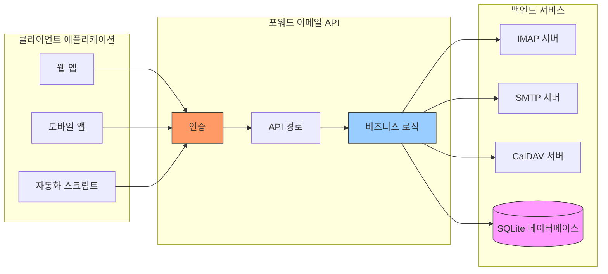

---


## iOS 푸시 알림 {#ios-push-notifications}

> \[!TIP]
> 포워드 이메일은 XAPPLEPUSHSERVICE를 통해 네이티브 iOS 푸시 알림을 지원하여 즉각적인 이메일 전달을 제공합니다.

> \[!IMPORTANT]
> **고유 기능:** 포워드 이메일은 `XAPPLEPUSHSERVICE` IMAP 확장을 통해 이메일, 연락처, 캘린더에 대한 네이티브 iOS 푸시 알림을 지원하는 몇 안 되는 오픈 소스 이메일 서버 중 하나입니다. 이는 Apple 프로토콜을 역설계한 것으로, 배터리 소모 없이 iOS 기기에 즉시 전달됩니다.

포워드 이메일은 Apple의 독점 XAPPLEPUSHSERVICE 확장을 구현하여 백그라운드 폴링 없이 iOS 기기에 네이티브 푸시 알림을 제공합니다.

### 작동 원리 {#how-it-works-1}

**XAPPLEPUSHSERVICE**는 iOS 메일 앱이 새 이메일 도착 시 즉시 푸시 알림을 받을 수 있도록 하는 비표준 IMAP 확장입니다.

포워드 이메일은 IMAP용 Apple 푸시 알림 서비스(APNs) 통합을 구현하여 iOS 메일 앱이 새 이메일 도착 시 즉시 푸시 알림을 받을 수 있게 합니다.

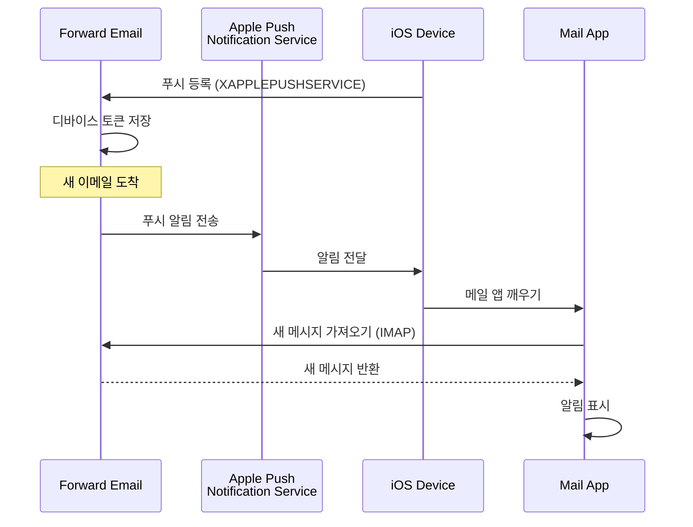

### 주요 기능 {#key-features}

**즉각적인 전달:**

* 푸시 알림이 몇 초 내에 도착
* 배터리를 소모하는 백그라운드 폴링 없음
* 메일 앱이 닫혀 있어도 작동

<!---->

* **즉각적인 전달:** 이메일, 캘린더 이벤트, 연락처가 폴링 일정이 아닌 즉시 iPhone/iPad에 표시됩니다
* **배터리 효율적:** 지속적인 IMAP 연결 유지 대신 Apple 푸시 인프라 사용
* **주제 기반 푸시:** INBOX뿐 아니라 특정 메일박스에 대한 푸시 알림 지원
* **서드파티 앱 불필요:** 네이티브 iOS 메일, 캘린더, 연락처 앱과 호환됨
**네이티브 통합:**

* iOS 메일 앱에 내장
* 타사 앱 불필요
* 원활한 사용자 경험

**개인정보 보호 중심:**

* 디바이스 토큰 암호화
* APNS를 통한 메시지 내용 전송 없음
* "새 메일" 알림만 전송

**배터리 효율적:**

* 지속적인 IMAP 폴링 없음
* 알림 도착 시까지 디바이스 대기
* 최소한의 배터리 영향

### 이것이 특별한 이유 {#what-makes-this-special}

> \[!IMPORTANT]
> 대부분의 이메일 제공업체는 XAPPLEPUSHSERVICE를 지원하지 않아 iOS 기기가 15분마다 새 메일을 폴링하도록 강제합니다.

대부분의 오픈 소스 이메일 서버(예: Dovecot, Postfix, Cyrus IMAP)는 iOS 푸시 알림을 지원하지 않습니다. 사용자는 다음 중 하나를 선택해야 합니다:

* IMAP IDLE 사용 (연결 유지, 배터리 소모)
* 폴링 사용 (15-30분마다 확인, 알림 지연)
* 자체 푸시 인프라가 있는 독점 이메일 앱 사용

Forward Email은 Gmail, iCloud, Fastmail과 같은 상용 서비스와 동일한 즉각적인 푸시 알림 경험을 제공합니다.

**다른 제공업체와의 비교:**

| 제공업체          | 푸시 지원       | 폴링 간격        | 배터리 영향     |
| ----------------- | -------------- | ---------------- | -------------- |
| **Forward Email** | ✅ 네이티브 푸시 | 즉시             | 최소           |
| Gmail             | ✅ 네이티브 푸시 | 즉시             | 최소           |
| iCloud            | ✅ 네이티브 푸시 | 즉시             | 최소           |
| Yahoo             | ✅ 네이티브 푸시 | 즉시             | 최소           |
| Outlook.com       | ❌ 폴링          | 15분             | 보통           |
| Fastmail          | ❌ 폴링          | 15분             | 보통           |
| ProtonMail        | ⚠️ 브리지 전용   | 브리지 통해       | 높음           |
| Tutanota          | ❌ 앱 전용       | 해당 없음         | 해당 없음       |

### 구현 세부사항 {#implementation-details}

**IMAP CAPABILITY 응답:**

```
* CAPABILITY IMAP4rev1 ... XAPPLEPUSHSERVICE ...
```

**등록 과정:**

1. iOS 메일 앱이 XAPPLEPUSHSERVICE 기능 감지
2. 앱이 Forward Email에 디바이스 토큰 등록
3. Forward Email이 토큰 저장 및 계정과 연동
4. 새 메일 도착 시 Forward Email이 APNS를 통해 푸시 전송
5. iOS가 메일 앱을 깨워 새 메시지 가져오기

**보안:**

* 디바이스 토큰은 저장 시 암호화됨
* 토큰은 만료되며 자동 갱신됨
* 메시지 내용은 APNS에 노출되지 않음
* 종단 간 암호화 유지

<!---->

* **IMAP 확장:** `XAPPLEPUSHSERVICE`
* **소스 코드:** [WildDuck Issue #711](https://github.com/zone-eu/wildduck/issues/711)
* **설정:** 자동 - 별도 설정 불필요, iOS 메일 앱과 바로 작동

### 다른 서비스와의 비교 {#comparison-with-other-services}

| 서비스         | iOS 푸시 지원    | 방식                                     |
| ------------- | ---------------- | ---------------------------------------- |
| Forward Email | ✅ 예             | `XAPPLEPUSHSERVICE` (역공학)             |
| Gmail         | ✅ 예             | 독점 Gmail 앱 + Google 푸시               |
| iCloud Mail   | ✅ 예             | 네이티브 Apple 통합                       |
| Outlook.com   | ✅ 예             | 독점 Outlook 앱 + Microsoft 푸시          |
| Fastmail      | ✅ 예             | `XAPPLEPUSHSERVICE`                        |
| Dovecot       | ❌ 아니오         | IMAP IDLE 또는 폴링만                      |
| Postfix       | ❌ 아니오         | IMAP IDLE 또는 폴링만                      |
| Cyrus IMAP    | ❌ 아니오         | IMAP IDLE 또는 폴링만                      |

**Gmail 푸시:**

Gmail은 Gmail 앱에서만 작동하는 독점 푸시 시스템을 사용합니다. iOS 메일 앱은 Gmail IMAP 서버를 폴링해야 합니다.

**iCloud 푸시:**

iCloud는 Forward Email과 유사한 네이티브 푸시 지원을 제공하지만, @icloud.com 주소에만 해당됩니다.

**Outlook.com:**

Outlook.com은 XAPPLEPUSHSERVICE를 지원하지 않아 iOS 메일이 15분마다 폴링해야 합니다.

**Fastmail:**

Fastmail은 XAPPLEPUSHSERVICE를 지원하지 않습니다. 사용자는 Fastmail 앱을 사용해 푸시 알림을 받거나 15분 폴링 지연을 감수해야 합니다.

---


## 테스트 및 검증 {#testing-and-verification}


## 프로토콜 기능 테스트 {#protocol-capability-tests}
> \[!NOTE]
> 이 섹션은 2026년 1월 22일에 수행된 최신 프로토콜 기능 테스트 결과를 제공합니다.

이 섹션에는 테스트된 모든 제공업체의 실제 CAPABILITY/CAPA/EHLO 응답이 포함되어 있습니다. 모든 테스트는 **2026년 1월 22일**에 실행되었습니다.

이 테스트는 주요 제공업체 전반에 걸쳐 다양한 이메일 프로토콜 및 확장 기능에 대한 광고된 지원과 실제 지원을 확인하는 데 도움이 됩니다.

### Test Methodology {#test-methodology}

**테스트 환경:**

* **날짜:** 2026년 1월 22일 02:37 UTC
* **위치:** AWS EC2 인스턴스
* **IPv4:** 54.167.216.197
* **IPv6:** 2600:4040:46da:9a00:b19e:3ad4:426c:2f48
* **도구:** OpenSSL s_client, bash 스크립트

**테스트된 제공업체:**

* Forward Email
* Gmail
* Outlook.com
* iCloud
* Fastmail
* Yahoo/AOL (Verizon)

### Test Scripts {#test-scripts}

완전한 투명성을 위해, 이 테스트에 사용된 정확한 스크립트가 아래에 제공됩니다.

#### IMAP Capability Test Script {#imap-capability-test-script}

```bash
#!/bin/bash
# IMAP Capability Test Script
# Tests IMAP CAPABILITY for various email providers

echo "========================================="
echo "IMAP CAPABILITY TEST"
echo "Date: $(date -u +"%Y-%m-%d %H:%M:%S UTC")"
echo "========================================="
echo ""

# Gmail
echo "--- Gmail (imap.gmail.com:993) ---"
echo -e "a001 CAPABILITY\na002 LOGOUT" | timeout 10 openssl s_client -connect imap.gmail.com:993 -crlf -quiet 2>&1 | grep -A 20 "CAPABILITY"
echo ""

# Outlook.com
echo "--- Outlook.com (outlook.office365.com:993) ---"
echo -e "a001 CAPABILITY\na002 LOGOUT" | timeout 10 openssl s_client -connect outlook.office365.com:993 -crlf -quiet 2>&1 | grep -A 20 "CAPABILITY"
echo ""

# iCloud
echo "--- iCloud (imap.mail.me.com:993) ---"
echo -e "a001 CAPABILITY\na002 LOGOUT" | timeout 10 openssl s_client -connect imap.mail.me.com:993 -crlf -quiet 2>&1 | grep -A 20 "CAPABILITY"
echo ""

# Fastmail
echo "--- Fastmail (imap.fastmail.com:993) ---"
echo -e "a001 CAPABILITY\na002 LOGOUT" | timeout 10 openssl s_client -connect imap.fastmail.com:993 -crlf -quiet 2>&1 | grep -A 20 "CAPABILITY"
echo ""

# Yahoo
echo "--- Yahoo (imap.mail.yahoo.com:993) ---"
echo -e "a001 CAPABILITY\na002 LOGOUT" | timeout 10 openssl s_client -connect imap.mail.yahoo.com:993 -crlf -quiet 2>&1 | grep -A 20 "CAPABILITY"
echo ""

# Forward Email
echo "--- Forward Email (imap.forwardemail.net:993) ---"
echo -e "a001 CAPABILITY\na002 LOGOUT" | timeout 10 openssl s_client -connect imap.forwardemail.net:993 -crlf -quiet 2>&1 | grep -A 20 "CAPABILITY"
echo ""

echo "========================================="
echo "Test completed"
echo "========================================="
```

#### POP3 Capability Test Script {#pop3-capability-test-script}

```bash
#!/bin/bash
# POP3 Capability Test Script
# Tests POP3 CAPA for various email providers

echo "========================================="
echo "POP3 CAPABILITY TEST"
echo "Date: $(date -u +"%Y-%m-%d %H:%M:%S UTC")"
echo "========================================="
echo ""

# Gmail
echo "--- Gmail (pop.gmail.com:995) ---"
echo -e "CAPA\nQUIT" | timeout 10 openssl s_client -connect pop.gmail.com:995 -crlf -quiet 2>&1 | grep -A 20 "CAPA"
echo ""

# Outlook.com
echo "--- Outlook.com (outlook.office365.com:995) ---"
echo -e "CAPA\nQUIT" | timeout 10 openssl s_client -connect outlook.office365.com:995 -crlf -quiet 2>&1 | grep -A 20 "CAPA"
echo ""

# iCloud (Note: iCloud does not support POP3)
echo "--- iCloud (No POP3 support) ---"
echo "iCloud는 POP3를 지원하지 않습니다"
echo ""

# Fastmail
echo "--- Fastmail (pop.fastmail.com:995) ---"
echo -e "CAPA\nQUIT" | timeout 10 openssl s_client -connect pop.fastmail.com:995 -crlf -quiet 2>&1 | grep -A 20 "CAPA"
echo ""

# Yahoo
echo "--- Yahoo (pop.mail.yahoo.com:995) ---"
echo -e "CAPA\nQUIT" | timeout 10 openssl s_client -connect pop.mail.yahoo.com:995 -crlf -quiet 2>&1 | grep -A 20 "CAPA"
echo ""

# Forward Email
echo "--- Forward Email (pop3.forwardemail.net:995) ---"
echo -e "CAPA\nQUIT" | timeout 10 openssl s_client -connect pop3.forwardemail.net:995 -crlf -quiet 2>&1 | grep -A 20 "CAPA"
echo ""

echo "========================================="
echo "Test completed"
echo "========================================="
```
#### SMTP 기능 테스트 스크립트 {#smtp-capability-test-script}

```bash
#!/bin/bash
# SMTP 기능 테스트 스크립트
# 다양한 이메일 제공자의 SMTP EHLO 테스트

echo "========================================="
echo "SMTP 기능 테스트"
echo "날짜: $(date -u +"%Y-%m-%d %H:%M:%S UTC")"
echo "========================================="
echo ""

# Gmail
echo "--- Gmail (smtp.gmail.com:587) ---"
echo -e "EHLO test.com\nQUIT" | timeout 10 openssl s_client -connect smtp.gmail.com:587 -starttls smtp -crlf -quiet 2>&1 | grep -A 30 "250-"
echo ""

# Outlook.com
echo "--- Outlook.com (smtp.office365.com:587) ---"
echo -e "EHLO test.com\nQUIT" | timeout 10 openssl s_client -connect smtp.office365.com:587 -starttls smtp -crlf -quiet 2>&1 | grep -A 30 "250-"
echo ""

# iCloud
echo "--- iCloud (smtp.mail.me.com:587) ---"
echo -e "EHLO test.com\nQUIT" | timeout 10 openssl s_client -connect smtp.mail.me.com:587 -starttls smtp -crlf -quiet 2>&1 | grep -A 30 "250-"
echo ""

# Fastmail
echo "--- Fastmail (smtp.fastmail.com:587) ---"
echo -e "EHLO test.com\nQUIT" | timeout 10 openssl s_client -connect smtp.fastmail.com:587 -starttls smtp -crlf -quiet 2>&1 | grep -A 30 "250-"
echo ""

# Yahoo
echo "--- Yahoo (smtp.mail.yahoo.com:587) ---"
echo -e "EHLO test.com\nQUIT" | timeout 10 openssl s_client -connect smtp.mail.yahoo.com:587 -starttls smtp -crlf -quiet 2>&1 | grep -A 30 "250-"
echo ""

# Forward Email
echo "--- Forward Email (smtp.forwardemail.net:587) ---"
echo -e "EHLO test.com\nQUIT" | timeout 10 openssl s_client -connect smtp.forwardemail.net:587 -starttls smtp -crlf -quiet 2>&1 | grep -A 30 "250-"
echo ""

echo "========================================="
echo "테스트 완료"
echo "========================================="
```

### 테스트 결과 요약 {#test-results-summary}

#### IMAP (기능) {#imap-capability}

**Forward Email**

```
* CAPABILITY IMAP4rev1 AUTH=PLAIN AUTH=PLAIN-CLIENTTOKEN CHILDREN ENABLE ID IDLE NAMESPACE QUOTA SASL-IR UNSELECT XLIST XAPPLEPUSHSERVICE
```

**Gmail**

```
* CAPABILITY IMAP4rev1 UNSELECT IDLE NAMESPACE QUOTA ID XLIST CHILDREN X-GM-EXT-1 UIDPLUS COMPRESS=DEFLATE ENABLE MOVE CONDSTORE ESEARCH UTF8=ACCEPT LIST-EXTENDED LIST-STATUS LITERAL- SPECIAL-USE
```

**iCloud**

```
* OK [CAPABILITY XAPPLEPUSHSERVICE IMAP4 IMAP4rev1 SASL-IR AUTH=ATOKEN AUTH=PLAIN AUTH=ATOKEN2 AUTH=XOAUTH2]
```

**Outlook.com**

```
* CAPABILITY IMAP4rev1 AUTH=PLAIN AUTH=XOAUTH2 SASL-IR UIDPLUS ID UNSELECT CHILDREN IDLE NAMESPACE LITERAL+
```

**Fastmail**

```
* CAPABILITY IMAP4rev1 ACL ANNOTATE-EXPERIMENT-1 CATENATE CONDSTORE ENABLE ESEARCH ESORT I18NLEVEL=1 ID IDLE LIST-EXTENDED LIST-STATUS LITERAL+ LOGINDISABLED MULTIAPPEND NAMESPACE QRESYNC QUOTA RIGHTS=ektx SASL-IR SORT SPECIAL-USE THREAD=ORDEREDSUBJECT UIDPLUS UNSELECT WITHIN X-RENAME XLIST
```

**Yahoo/AOL (Verizon)**

```
* CAPABILITY IMAP4rev1 IDLE NAMESPACE QUOTA ID XLIST CHILDREN UIDPLUS MOVE CONDSTORE ESEARCH ENABLE LIST-EXTENDED LIST-STATUS LITERAL- SPECIAL-USE UNSELECT XAPPLEPUSHSERVICE
```

#### POP3 (기능) {#pop3-capa}

**Forward Email**

```
+OK
CAPA
TOP
USER
UIDL
EXPIRE 30
IMPLEMENTATION ForwardEmail
.
```

**Gmail**

```
+OK
CAPA
TOP
USER
UIDL
EXPIRE 30
IMPLEMENTATION Gpop
.
```

**Outlook.com**

```
+OK
CAPA
TOP
USER
UIDL
SASL PLAIN XOAUTH2
.
```

**Fastmail**

```
+OK
CAPA
TOP
USER
UIDL
EXPIRE 30
IMPLEMENTATION Cyrus
.
```

#### SMTP (EHLO) {#smtp-ehlo}

**Forward Email**

```
250-smtp.forwardemail.net
250-PIPELINING
250-SIZE 52428800
250-ETRN
250-STARTTLS
250-ENHANCEDSTATUSCODES
250-8BITMIME
250-DSN
250 CHUNKING
```

**Gmail**

```
250-smtp.gmail.com at your service
250-SIZE 35882577
250-8BITMIME
250-STARTTLS
250-ENHANCEDSTATUSCODES
250-PIPELINING
250-CHUNKING
250 SMTPUTF8
```

**Outlook.com**

```
250-SN4PR13CA0005.outlook.office365.com Hello [x.x.x.x]
250-SIZE 157286400
250-PIPELINING
250-DSN
250-ENHANCEDSTATUSCODES
250-STARTTLS
250-8BITMIME
250-BINARYMIME
250-CHUNKING
250 SMTPUTF8
```

**Fastmail**

```
250-smtp.fastmail.com
250-PIPELINING
250-SIZE 78643200
250-ETRN
250-STARTTLS
250-ENHANCEDSTATUSCODES
250-8BITMIME
250-DSN
250 CHUNKING
```

**Yahoo/AOL (Verizon)**

```
250-smtp.mail.yahoo.com
250-PIPELINING
250-SIZE 41943040
250-8BITMIME
250-ENHANCEDSTATUSCODES
250-STARTTLS
```
### 상세 테스트 결과 {#detailed-test-results}

#### IMAP 테스트 결과 {#imap-test-results}

**Gmail:**
`* CAPABILITY IMAP4rev1 UNSELECT IDLE NAMESPACE QUOTA ID XLIST CHILDREN X-GM-EXT-1 XYZZY SASL-IR AUTH=XOAUTH2 AUTH=PLAIN AUTH=PLAIN-CLIENTTOKEN AUTH=OAUTHBEARER`

**Outlook.com:**
`* CAPABILITY IMAP4 IMAP4rev1 AUTH=PLAIN AUTH=XOAUTH2 SASL-IR UIDPLUS ID UNSELECT CHILDREN IDLE NAMESPACE LITERAL+`

**iCloud:**
`* CAPABILITY XAPPLEPUSHSERVICE IMAP4 IMAP4rev1 SASL-IR AUTH=ATOKEN AUTH=PLAIN AUTH=ATOKEN2 AUTH=XOAUTH2`

**Fastmail:**
연결 시간이 초과되었습니다. 아래 메모를 참조하세요.

**Yahoo:**
`* CAPABILITY IMAP4rev1 SASL-IR AUTH=PLAIN AUTH=XOAUTH2 AUTH=OAUTHBEARER ID MOVE NAMESPACE XYMHIGHESTMODSEQ UIDPLUS LITERAL+ CHILDREN UNSELECT X-MSG-EXT OBJECTID IDLE ENABLE UIDONLY X-ALL-MAIL X-UIDONLY LIST-EXTENDED LIST-STATUS SPECIAL-USE PARTIAL APPENDLIMIT=41697280`

**Forward Email:**
`* CAPABILITY XAPPLEPUSHSERVICE IMAP4rev1 APPENDLIMIT=52428800 AUTH=PLAIN AUTH=PLAIN-CLIENTTOKEN CHILDREN CONDSTORE ENABLE ID IDLE MOVE NAMESPACE QUOTA SASL-IR SPECIAL-USE UIDPLUS UNSELECT UTF8=ACCEPT XLIST`

#### POP3 테스트 결과 {#pop3-test-results}

**Gmail:**
인증 없이 CAPA 응답을 반환하지 않았습니다.

**Outlook.com:**
인증 없이 CAPA 응답을 반환하지 않았습니다.

**iCloud:**
지원하지 않음.

**Fastmail:**
연결 시간이 초과되었습니다. 아래 메모를 참조하세요.

**Yahoo:**
`+OK CAPA list follows... SASL PLAIN XOAUTH2`

**Forward Email:**
인증 없이 CAPA 응답을 반환하지 않았습니다.

#### SMTP 테스트 결과 {#smtp-test-results}

**Gmail:**
`250-AUTH LOGIN PLAIN XOAUTH2 PLAIN-CLIENTTOKEN OAUTHBEARER XOAUTH`

**Outlook.com:**
`250-DSN`

**iCloud:**
`250-DSN`

**Fastmail:**
`250 AUTH PLAIN LOGIN XOAUTH2 OAUTHBEARER`

**Yahoo:**
`250 AUTH PLAIN LOGIN XOAUTH2 OAUTHBEARER`

**Forward Email:**
`250-DSN`, `250-REQUIRETLS`

### 테스트 결과에 대한 메모 {#notes-on-test-results}

> \[!NOTE]
> 테스트 결과에서 중요한 관찰 사항 및 제한 사항입니다.

1. **Fastmail 타임아웃**: Fastmail 연결이 테스트 중에 시간 초과되었습니다. 이는 테스트 서버 IP의 속도 제한 또는 방화벽 제한 때문일 가능성이 높습니다. Fastmail은 문서에 따르면 강력한 IMAP/POP3/SMTP 지원을 제공합니다.

2. **POP3 CAPA 응답**: 여러 제공자(Gmail, Outlook.com, Forward Email)는 인증 없이 CAPA 응답을 반환하지 않았습니다. 이는 POP3 서버에서 일반적인 보안 관행입니다.

3. **DSN 지원**: Outlook.com, iCloud, Forward Email만 SMTP EHLO 응답에서 DSN 지원을 명시적으로 광고합니다. 이는 다른 제공자가 DSN을 지원하지 않는다는 의미는 아니지만 광고하지 않는다는 뜻입니다.

4. **REQUIRETLS**: Forward Email만 사용자 인터페이스에서 강제 적용 체크박스와 함께 REQUIRETLS 지원을 명시적으로 광고합니다. 다른 제공자는 내부적으로 지원할 수 있으나 EHLO에서 광고하지 않습니다.

5. **테스트 환경**: 테스트는 2026년 1월 22일 02:37 UTC에 AWS EC2 인스턴스(IP: 54.167.216.197 IPv4, 2600:4040:46da:9a00:b19e:3ad4:426c:2f48 IPv6)에서 수행되었습니다.

---


## 요약 {#summary}

Forward Email은 모든 주요 이메일 표준에 걸쳐 포괄적인 RFC 프로토콜 지원을 제공합니다:

* **IMAP4rev1:** 의도된 차이점이 문서화된 16개의 지원 RFC
* **POP3:** RFC 준수 영구 삭제를 포함한 4개의 지원 RFC
* **SMTP:** SMTPUTF8, DSN, PIPELINING을 포함한 11개의 지원 확장
* **인증:** DKIM, SPF, DMARC, ARC 완전 지원
* **전송 보안:** MTA-STS 및 REQUIRETLS 완전 지원, DANE 부분 지원
* **암호화:** OpenPGP v6 및 S/MIME 지원
* **캘린더:** CalDAV, CardDAV, VTODO 완전 지원
* **API 접근:** 직접 데이터베이스 접근을 위한 39개 엔드포인트의 완전한 REST API
* **iOS 푸시:** `XAPPLEPUSHSERVICE`를 통한 이메일, 연락처, 캘린더의 네이티브 푸시 알림

### 주요 차별점 {#key-differentiators}

> \[!TIP]
> Forward Email은 다른 제공자에서는 찾기 힘든 독특한 기능으로 돋보입니다.

**Forward Email의 고유한 점:**

1. **양자 내성 암호화** - ChaCha20-Poly1305로 암호화된 SQLite 메일박스를 제공하는 유일한 제공자
2. **제로 지식 아키텍처** - 비밀번호가 메일박스를 암호화하며, 저희는 복호화할 수 없습니다
3. **무료 맞춤 도메인** - 맞춤 도메인 이메일에 월별 요금 없음
4. **REQUIRETLS 지원** - 전체 전달 경로에 TLS 강제 적용을 위한 사용자 인터페이스 체크박스
5. **포괄적인 API** - 완전한 프로그래밍 제어를 위한 39개의 REST API 엔드포인트
6. **iOS 푸시 알림** - 즉각적인 전달을 위한 네이티브 XAPPLEPUSHSERVICE 지원
7. **오픈 소스** - GitHub에서 전체 소스 코드 제공
8. **개인정보 보호 중심** - 데이터 수집, 광고, 추적 없음
* **샌드박스 암호화:** 개별적으로 암호화된 SQLite 메일박스를 제공하는 유일한 이메일 서비스  
* **RFC 준수:** 편의성보다 표준 준수를 우선시함 (예: POP3 DELE)  
* **완전한 API:** 모든 이메일 데이터에 대한 직접 프로그래밍 접근  
* **오픈 소스:** 완전 투명한 구현  

**프로토콜 지원 요약:**  

| 카테고리             | 지원 수준    | 세부 사항                                      |
| -------------------- | ------------ | --------------------------------------------- |
| **핵심 프로토콜**    | ✅ 우수      | IMAP4rev1, POP3, SMTP 완전 지원                |
| **최신 프로토콜**    | ⚠️ 부분 지원 | IMAP4rev2 부분 지원, JMAP 미지원                |
| **보안**             | ✅ 우수      | DKIM, SPF, DMARC, ARC, MTA-STS, REQUIRETLS     |
| **암호화**           | ✅ 우수      | OpenPGP, S/MIME, SQLite 암호화                  |
| **CalDAV/CardDAV**   | ✅ 우수      | 완전한 캘린더 및 연락처 동기화                   |
| **필터링**           | ✅ 우수      | Sieve (24개 확장) 및 ManageSieve                |
| **API**              | ✅ 우수      | 39개 REST API 엔드포인트                         |
| **푸시**             | ✅ 우수      | 네이티브 iOS 푸시 알림                           |
