# E-mail RFC Protocol Ondersteuning - Complete Standaarden & Specificaties Gids {#email-rfc-protocol-support---complete-standards--specifications-guide}


## Inhoudsopgave {#table-of-contents}

* [Over Dit Document](#about-this-document)
  * [Architectuuroverzicht](#architecture-overview)
* [Vergelijking van E-maildiensten - Protocolondersteuning & RFC Standaarden Naleving](#email-service-comparison---protocol-support--rfc-standards-compliance)
  * [Visualisatie van Protocolondersteuning](#protocol-support-visualization)
* [Kern E-mailprotocollen](#core-email-protocols)
  * [E-mailprotocol Stroom](#email-protocol-flow)
* [IMAP4 E-mailprotocol en Extensies](#imap4-email-protocol-and-extensions)
  * [IMAP Protocol Verschillen met RFC Specificaties](#imap-protocol-differences-from-rfc-specifications)
  * [IMAP Extensies NIET Ondersteund](#imap-extensions-not-supported)
* [POP3 E-mailprotocol en Extensies](#pop3-email-protocol-and-extensions)
  * [POP3 Protocol Verschillen met RFC Specificaties](#pop3-protocol-differences-from-rfc-specifications)
  * [POP3 Extensies NIET Ondersteund](#pop3-extensions-not-supported)
* [SMTP E-mailprotocol en Extensies](#smtp-email-protocol-and-extensions)
  * [Bezorgstatusmeldingen (DSN)](#delivery-status-notifications-dsn)
  * [REQUIRETLS Ondersteuning](#requiretls-support)
  * [SMTP Extensies NIET Ondersteund](#smtp-extensions-not-supported)
* [JMAP E-mailprotocol](#jmap-email-protocol)
* [E-mailbeveiliging](#email-security)
  * [Architectuur van E-mailbeveiliging](#email-security-architecture)
* [E-mailbericht Authenticatieprotocollen](#email-message-authentication-protocols)
  * [Ondersteuning Authenticatieprotocollen](#authentication-protocol-support)
  * [DKIM (DomainKeys Identified Mail)](#dkim-domainkeys-identified-mail)
  * [SPF (Sender Policy Framework)](#spf-sender-policy-framework)
  * [DMARC (Domain-based Message Authentication, Reporting & Conformance)](#dmarc-domain-based-message-authentication-reporting--conformance)
  * [ARC (Authenticated Received Chain)](#arc-authenticated-received-chain)
  * [Authenticatiestroom](#authentication-flow)
* [E-mail Transportbeveiligingsprotocollen](#email-transport-security-protocols)
  * [Ondersteuning Transportbeveiliging](#transport-security-support)
  * [TLS (Transport Layer Security)](#tls-transport-layer-security)
  * [MTA-STS (Mail Transfer Agent Strict Transport Security)](#mta-sts-mail-transfer-agent-strict-transport-security)
  * [DANE (DNS-based Authentication of Named Entities)](#dane-dns-based-authentication-of-named-entities)
  * [REQUIRETLS](#requiretls)
  * [Transportbeveiligingsstroom](#transport-security-flow)
* [E-mailberichtversleuteling](#email-message-encryption)
  * [Ondersteuning Versleuteling](#encryption-support)
  * [OpenPGP (Pretty Good Privacy)](#openpgp-pretty-good-privacy)
  * [S/MIME (Secure/Multipurpose Internet Mail Extensions)](#smime-securemultipurpose-internet-mail-extensions)
  * [SQLite Mailbox Versleuteling](#sqlite-mailbox-encryption)
  * [Vergelijking Versleuteling](#encryption-comparison)
  * [Versleutelingsstroom](#encryption-flow)
* [Uitgebreide Functionaliteit](#extended-functionality)
* [E-mailberichtformaat Standaarden](#email-message-format-standards)
  * [Ondersteuning Formaatstandaarden](#format-standards-support)
  * [MIME (Multipurpose Internet Mail Extensions)](#mime-multipurpose-internet-mail-extensions)
  * [SMTPUTF8 en Internationalisering van E-mailadressen](#smtputf8-and-email-address-internationalization)
* [Agenda- en Contactprotocollen](#calendaring-and-contacts-protocols)
  * [CalDAV en CardDAV Ondersteuning](#caldav-and-carddav-support)
  * [CalDAV (Agenda Toegang)](#caldav-calendar-access)
  * [CardDAV (Contact Toegang)](#carddav-contact-access)
  * [Taken en Herinneringen (CalDAV VTODO)](#tasks-and-reminders-caldav-vtodo)
  * [CalDAV/CardDAV Synchronisatiestroom](#caldavcarddav-synchronization-flow)
  * [Agenda Extensies NIET Ondersteund](#calendaring-extensions-not-supported)
* [E-mailberichtfiltering](#email-message-filtering)
  * [Sieve (RFC 5228)](#sieve-rfc-5228)
  * [ManageSieve (RFC 5804)](#managesieve-rfc-5804)
* [Opslagoptimalisatie](#storage-optimization)
  * [Architectuur: Dual-Layer Opslagoptimalisatie](#architecture-dual-layer-storage-optimization)
* [Bijlage Deduplicatie](#attachment-deduplication)
  * [Hoe Het Werkt](#how-it-works)
  * [Deduplicatiestroom](#deduplication-flow)
  * [Magic Number Systeem](#magic-number-system)
  * [Belangrijkste Verschillen: WildDuck vs Forward Email](#key-differences-wildduck-vs-forward-email)
* [Brotli Compressie](#brotli-compression)
  * [Wat Wordt Gecomprimeerd](#what-gets-compressed)
  * [Compressieconfiguratie](#compression-configuration)
  * [Magic Header: "FEBR"](#magic-header-febr)
  * [Compressieproces](#compression-process)
  * [Decompressieproces](#decompression-process)
  * [Achterwaartse Compatibiliteit](#backwards-compatibility)
  * [Statistieken Opslagbesparing](#storage-savings-statistics)
  * [Migratieproces](#migration-process)
  * [Gecombineerde Opslagefficiëntie](#combined-storage-efficiency)
  * [Technische Implementatiedetails](#technical-implementation-details)
  * [Waarom Geen Andere Provider Dit Doet](#why-no-other-provider-does-this)
* [Moderne Functies](#modern-features)
* [Complete REST API voor E-mailbeheer](#complete-rest-api-for-email-management)
  * [API Categorieën (39 Eindpunten)](#api-categories-39-endpoints)
  * [Technische Details](#technical-details)
  * [Praktijkvoorbeelden](#real-world-use-cases)
  * [Belangrijkste API Kenmerken](#key-api-features)
  * [API Architectuur](#api-architecture)
* [iOS Pushmeldingen](#ios-push-notifications)
  * [Hoe Het Werkt](#how-it-works-1)
  * [Belangrijkste Kenmerken](#key-features)
  * [Wat Dit Speciaal Maakt](#what-makes-this-special)
  * [Implementatiedetails](#implementation-details)
  * [Vergelijking met Andere Diensten](#comparison-with-other-services)
* [Testen en Verificatie](#testing-and-verification)
* [Protocol Capaciteitstests](#protocol-capability-tests)
  * [Testmethodologie](#test-methodology)
  * [Testscripts](#test-scripts)
  * [Samenvatting Testresultaten](#test-results-summary)
  * [Gedetailleerde Testresultaten](#detailed-test-results)
  * [Opmerkingen over Testresultaten](#notes-on-test-results)
* [Samenvatting](#summary)
  * [Belangrijkste Onderscheidende Kenmerken](#key-differentiators)
## Over Dit Document {#about-this-document}

Dit document beschrijft de RFC (Request for Comments) protocolondersteuning voor Forward Email. Omdat Forward Email onder de motorkap [WildDuck](https://github.com/nodemailer/wildduck) gebruikt voor IMAP/POP3-functionaliteit, weerspiegelen de hier gedocumenteerde protocolondersteuning en beperkingen de implementatie van WildDuck.

> \[!IMPORTANT]
> Forward Email gebruikt [SQLite](https://sqlite.org/) voor berichtopslag in plaats van MongoDB (dat WildDuck oorspronkelijk gebruikte). Dit beïnvloedt bepaalde implementatiedetails die hieronder zijn gedocumenteerd.

**Broncode:** <https://github.com/forwardemail/forwardemail.net>

### Architectuuroverzicht {#architecture-overview}

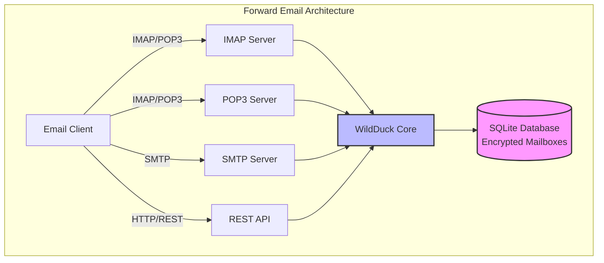

---


## Vergelijking E-maildiensten - Protocolondersteuning & RFC-standaarden naleving {#email-service-comparison---protocol-support--rfc-standards-compliance}

> \[!IMPORTANT]
> **Sandboxed en Quantum-bestendige Encryptie:** Forward Email is de enige e-maildienst die individueel versleutelde SQLite-mailboxen opslaat met jouw wachtwoord (dat alleen jij hebt). Elke mailbox is versleuteld met [sqleet](https://github.com/resilar/sqleet) (ChaCha20-Poly1305), zelfvoorzienend, sandboxed en draagbaar. Als je je wachtwoord vergeet, verlies je je mailbox - zelfs Forward Email kan deze niet herstellen. Zie [Quantum-Safe Encrypted Email](https://forwardemail.net/en/blog/docs/best-quantum-safe-encrypted-email-service) voor details.

Vergelijk e-mailprotocolondersteuning en RFC-standaarden implementatie bij grote e-mailproviders:

| Functie                       | Forward Email                                                                                  | Postfix/Dovecot                                                                    | Gmail                                                                             | iCloud Mail                                           | Outlook.com                                                                                                                                                          | Fastmail                                                                                 | Yahoo/AOL (Verizon)                                                  | ProtonMail                                                                     | Tutanota                                                          |
| ----------------------------- | ---------------------------------------------------------------------------------------------- | ---------------------------------------------------------------------------------- | --------------------------------------------------------------------------------- | ----------------------------------------------------- | -------------------------------------------------------------------------------------------------------------------------------------------------------------------- | ---------------------------------------------------------------------------------------- | -------------------------------------------------------------------- | ------------------------------------------------------------------------------ | ----------------------------------------------------------------- |
| **Prijs Aangepast Domein**    | [Gratis](https://forwardemail.net/en/pricing)                                                  | [Gratis](https://www.postfix.org/)                                                 | [$7.20/maand](https://workspace.google.com/pricing)                              | [$0.99/maand](https://support.apple.com/en-us/102622) | [$7.20/maand](https://www.microsoft.com/en-us/microsoft-365/business/microsoft-365-business-basic)                                                                    | [$5/maand](https://www.fastmail.com/pricing/)                                             | [$3.19/maand](https://www.turbify.com/mail)                           | [$4.99/maand](https://proton.me/mail/pricing)                                   | [$3.27/maand](https://tuta.com/pricing)                            |
| **IMAP4rev1 (RFC 3501)**      | ✅ [Ondersteund](#imap4-email-protocol-and-extensions)                                         | ✅ [Ondersteund](https://www.dovecot.org/)                                        | ✅ [Ondersteund](https://developers.google.com/workspace/gmail/imap/imap-extensions) | ✅ [Ondersteund](https://support.apple.com/en-us/102431) | ✅ [Ondersteund](https://support.microsoft.com/en-us/office/pop-imap-and-smtp-settings-for-outlook-com-d088b986-291d-42b8-9564-9c414e2aa040)                          | ✅ [Ondersteund](https://www.fastmail.help/hc/en-us/articles/1500000278382-Email-standards) | ✅ [Ondersteund](https://senders.yahooinc.com/developer/documentation/) | ⚠️ [Via Bridge](https://proton.me/support/imap-smtp-and-pop3-setup)              | ❌ Niet Ondersteund                                               |
| **IMAP4rev2 (RFC 9051)**      | ⚠️ [Gedeeltelijk](https://forwardemail.net/en/blog/docs/best-quantum-safe-encrypted-email-service) | ⚠️ [Gedeeltelijk](https://www.dovecot.org/)                                       | ⚠️ [31%](https://developers.google.com/workspace/gmail/imap/imap-extensions)      | ⚠️ [92%](https://support.apple.com/en-us/102431)      | ⚠️ [46%](https://support.microsoft.com/en-us/office/pop-imap-and-smtp-settings-for-outlook-com-d088b986-291d-42b8-9564-9c414e2aa040)                               | ⚠️ [69%](https://www.fastmail.help/hc/en-us/articles/1500000278382-Email-standards)      | ⚠️ [85%](https://senders.yahooinc.com/developer/documentation/)      | ⚠️ [Via Bridge](https://proton.me/support/imap-smtp-and-pop3-setup)              | ❌ Niet Ondersteund                                               |
| **POP3 (RFC 1939)**           | ✅ [Ondersteund](#pop3-email-protocol-and-extensions)                                          | ✅ [Ondersteund](https://www.dovecot.org/)                                        | ✅ [Ondersteund](https://support.google.com/mail/answer/7104828)                   | ❌ Niet Ondersteund                                   | ✅ [Ondersteund](https://support.microsoft.com/en-us/office/pop-imap-and-smtp-settings-for-outlook-com-d088b986-291d-42b8-9564-9c414e2aa040)                          | ✅ [Ondersteund](https://www.fastmail.help/hc/en-us/articles/1500000278382-Email-standards) | ✅ [Ondersteund](https://help.yahoo.com/kb/SLN4075.html)              | ⚠️ [Via Bridge](https://proton.me/support/imap-smtp-and-pop3-setup)              | ❌ Niet Ondersteund                                               |
| **SMTP (RFC 5321)**           | ✅ [Ondersteund](#smtp-email-protocol-and-extensions)                                          | ✅ [Ondersteund](https://www.postfix.org/)                                        | ✅ [Ondersteund](https://support.google.com/mail/answer/7126229)                   | ✅ [Ondersteund](https://support.apple.com/en-us/102431) | ✅ [Ondersteund](https://support.microsoft.com/en-us/office/pop-imap-and-smtp-settings-for-outlook-com-d088b986-291d-42b8-9564-9c414e2aa040)                          | ✅ [Ondersteund](https://www.fastmail.help/hc/en-us/articles/1500000278382-Email-standards) | ✅ [Ondersteund](https://help.yahoo.com/kb/SLN4075.html)              | ⚠️ [Via Bridge](https://proton.me/support/imap-smtp-and-pop3-setup)              | ❌ Niet Ondersteund                                               |
| **JMAP (RFC 8620)**           | ❌ [Niet Ondersteund](#jmap-email-protocol)                                                    | ❌ Niet Ondersteund                                                                | ❌ Niet Ondersteund                                                               | ❌ Niet Ondersteund                                   | ❌ Niet Ondersteund                                                                                                                                                  | ✅ [Ondersteund](https://www.fastmail.com/dev/)                                           | ❌ Niet Ondersteund                                                  | ❌ Niet Ondersteund                                                              | ❌ Niet Ondersteund                                               |
| **DKIM (RFC 6376)**           | ✅ [Ondersteund](#email-message-authentication-protocols)                                     | ✅ [Ondersteund](https://github.com/trusteddomainproject/OpenDKIM)                | ✅ [Ondersteund](https://support.google.com/a/answer/174124)                       | ✅ [Ondersteund](https://support.apple.com/en-us/102431) | ✅ [Ondersteund](https://learn.microsoft.com/en-us/defender-office-365/email-authentication-dkim-configure)                                                           | ✅ [Ondersteund](https://www.fastmail.help/hc/en-us/articles/360060590573)                | ✅ [Ondersteund](https://help.yahoo.com/kb/SLN25426.html)             | ✅ [Ondersteund](https://proton.me/support)                                     | ✅ [Ondersteund](https://tuta.com/support#dkim)                    |
| **SPF (RFC 7208)**            | ✅ [Ondersteund](#email-message-authentication-protocols)                                     | ✅ [Ondersteund](https://www.postfix.org/)                                        | ✅ [Ondersteund](https://support.google.com/a/answer/33786)                        | ✅ [Ondersteund](https://support.apple.com/en-us/102431) | ✅ [Ondersteund](https://learn.microsoft.com/en-us/microsoft-365/security/office-365-security/how-office-365-uses-spf-to-prevent-spoofing)                            | ✅ [Ondersteund](https://www.fastmail.help/hc/en-us/articles/360060590573)                | ✅ [Ondersteund](https://help.yahoo.com/kb/SLN25426.html)             | ✅ [Ondersteund](https://proton.me/support)                                     | ✅ [Ondersteund](https://tuta.com/support#dkim)                    |
| **DMARC (RFC 7489)**          | ✅ [Ondersteund](#email-message-authentication-protocols)                                     | ✅ [Ondersteund](https://www.postfix.org/)                                        | ✅ [Ondersteund](https://support.google.com/a/answer/2466580)                      | ✅ [Ondersteund](https://support.apple.com/en-us/102431) | ✅ [Ondersteund](https://learn.microsoft.com/en-us/microsoft-365/security/office-365-security/use-dmarc-to-validate-email)                                            | ✅ [Ondersteund](https://www.fastmail.help/hc/en-us/articles/360060590573)                | ✅ [Ondersteund](https://help.yahoo.com/kb/SLN25426.html)             | ✅ [Ondersteund](https://proton.me/support)                                     | ✅ [Ondersteund](https://tuta.com/support#dkim)                    |
| **ARC (RFC 8617)**            | ✅ [Ondersteund](#email-message-authentication-protocols)                                     | ✅ [Ondersteund](https://github.com/trusteddomainproject/OpenARC)                 | ✅ [Ondersteund](https://support.google.com/a/answer/2466580)                      | ❌ Niet Ondersteund                                   | ✅ [Ondersteund](https://learn.microsoft.com/en-us/defender-office-365/email-authentication-arc-configure)                                                            | ✅ [Ondersteund](https://www.fastmail.help/hc/en-us/articles/360060590573)                | ✅ [Ondersteund](https://senders.yahooinc.com/developer/documentation/) | ✅ [Ondersteund](https://proton.me/blog/what-is-authenticated-received-chain-arc) | ❌ Niet Ondersteund                                               |
| **MTA-STS (RFC 8461)**        | ✅ [Ondersteund](#email-transport-security-protocols)                                         | ✅ [Ondersteund](https://www.postfix.org/)                                        | ✅ [Ondersteund](https://support.google.com/a/answer/9261504)                      | ✅ [Ondersteund](https://support.apple.com/en-us/102431) | ✅ [Ondersteund](https://learn.microsoft.com/en-us/defender-office-365/email-authentication-about)                                                                    | ✅ [Ondersteund](https://www.fastmail.help/hc/en-us/articles/360060590573)                | ✅ [Ondersteund](https://senders.yahooinc.com/developer/documentation/) | ✅ [Ondersteund](https://proton.me/support)                                     | ✅ [Ondersteund](https://tuta.com/security)                        |
| **DANE (RFC 7671)**           | ✅ [Ondersteund](#email-transport-security-protocols)                                         | ✅ [Ondersteund](https://www.postfix.org/)                                        | ❌ Niet Ondersteund                                                               | ❌ Niet Ondersteund                                   | ❌ Niet Ondersteund                                                                                                                                                  | ❌ Niet Ondersteund                                                                        | ❌ Niet Ondersteund                                                  | ✅ [Ondersteund](https://proton.me/support)                                     | ✅ [Ondersteund](https://tuta.com/support#dane)                    |
| **DSN (RFC 3461)**            | ✅ [Ondersteund](#smtp-email-protocol-and-extensions)                                        | ✅ [Ondersteund](https://www.postfix.org/DSN_README.html)                         | ❌ Niet Ondersteund                                                               | ✅ [Ondersteund](#protocol-capability-tests)           | ✅ [Ondersteund](#protocol-capability-tests)                                                                                                                          | ⚠️ [Onbekend](https://www.fastmail.help/hc/en-us/articles/1500000278382-Email-standards)  | ❌ Niet Ondersteund                                                  | ⚠️ [Via Bridge](https://proton.me/support/imap-smtp-and-pop3-setup)              | ❌ Niet Ondersteund                                               |
| **REQUIRETLS (RFC 8689)**     | ✅ [Ondersteund](#email-transport-security-protocols)                                         | ✅ [Ondersteund](https://www.postfix.org/TLS_README.html#server_require_tls)      | ⚠️ Onbekend                                                                      | ⚠️ Onbekend                                          | ⚠️ Onbekend                                                                                                                                                         | ⚠️ Onbekend                                                                             | ⚠️ Onbekend                                                         | ⚠️ [Via Bridge](https://proton.me/support/imap-smtp-and-pop3-setup)              | ❌ Niet Ondersteund                                               |
| **ManageSieve (RFC 5804)**    | ✅ [Ondersteund](#managesieve-rfc-5804)                                                      | ✅ [Ondersteund](https://doc.dovecot.org/admin_manual/pigeonhole_managesieve_server/) | ❌ Niet Ondersteund                                                               | ❌ Niet Ondersteund                                   | ❌ Niet Ondersteund                                                                                                                                                  | ✅ [Ondersteund](https://www.fastmail.help/hc/en-us/articles/360060590573)                | ❌ Niet Ondersteund                                                  | ❌ Niet Ondersteund                                                              | ❌ Niet Ondersteund                                               |
| **OpenPGP (RFC 9580)**        | ✅ [Ondersteund](#email-message-encryption)                                                  | ⚠️ [Via Plugins](https://www.gnupg.org/)                                         | ⚠️ [Derde partij](https://github.com/google/end-to-end)                          | ⚠️ [Derde partij](https://gpgtools.org/)             | ⚠️ [Derde partij](https://gpg4win.org/)                                                                                                                             | ⚠️ [Derde partij](https://www.fastmail.help/hc/en-us/articles/360060590573)               | ⚠️ [Derde partij](https://help.yahoo.com/kb/SLN25426.html)            | ✅ [Native](https://proton.me/support/pgp-mime-pgp-inline)                      | ❌ Niet Ondersteund                                               |
| **S/MIME (RFC 8551)**         | ✅ [Ondersteund](#email-message-encryption)                                                  | ✅ [Ondersteund](https://www.openssl.org/)                                        | ✅ [Ondersteund](https://support.google.com/mail/answer/81126)                   | ✅ [Ondersteund](https://support.apple.com/en-us/102431) | ✅ [Ondersteund](https://support.microsoft.com/en-us/office/send-view-and-reply-to-encrypted-messages-in-outlook-for-pc-eaa43495-9bbb-4fca-922a-df90dee51980)         | ⚠️ [Gedeeltelijk](https://www.fastmail.help/hc/en-us/articles/360060590573)               | ❌ Niet Ondersteund                                                  | ✅ [Ondersteund](https://proton.me/support/pgp-mime-pgp-inline)                   | ❌ Niet Ondersteund                                               |
| **CalDAV (RFC 4791)**         | ✅ [Ondersteund](#calendaring-and-contacts-protocols)                                       | ✅ [Ondersteund](https://www.davical.org/)                                        | ✅ [Ondersteund](https://developers.google.com/calendar/caldav/v2/guide)         | ✅ [Ondersteund](https://support.apple.com/en-us/102431) | ❌ Niet Ondersteund                                                                                                                                                  | ✅ [Ondersteund](https://www.fastmail.help/hc/en-us/articles/360060590573)                | ❌ Niet Ondersteund                                                  | ✅ [Via Bridge](https://proton.me/support/proton-calendar)                      | ❌ Niet Ondersteund                                               |
| **CardDAV (RFC 6352)**        | ✅ [Ondersteund](#calendaring-and-contacts-protocols)                                       | ✅ [Ondersteund](https://www.davical.org/)                                        | ✅ [Ondersteund](https://developers.google.com/people/carddav)                   | ✅ [Ondersteund](https://support.apple.com/en-us/102431) | ❌ Niet Ondersteund                                                                                                                                                  | ✅ [Ondersteund](https://www.fastmail.help/hc/en-us/articles/360060590573)                | ❌ Niet Ondersteund                                                  | ✅ [Via Bridge](https://proton.me/support/proton-contacts)                      | ❌ Niet Ondersteund                                               |
| **Taken (VTODO)**             | ✅ [Ondersteund](#tasks-and-reminders-caldav-vtodo)                                         | ✅ [Ondersteund](https://www.davical.org/)                                        | ❌ Niet Ondersteund                                                               | ✅ [Ondersteund](https://support.apple.com/en-us/102431) | ❌ Niet Ondersteund                                                                                                                                                  | ✅ [Ondersteund](https://www.fastmail.help/hc/en-us/articles/360060590573)                | ❌ Niet Ondersteund                                                  | ❌ Niet Ondersteund                                                              | ❌ Niet Ondersteund                                               |
| **Sieve (RFC 5228)**          | ✅ [Ondersteund](#sieve-rfc-5228)                                                           | ✅ [Ondersteund](https://www.dovecot.org/)                                        | ❌ Niet Ondersteund                                                               | ❌ Niet Ondersteund                                   | ❌ Niet Ondersteund                                                                                                                                                  | ✅ [Ondersteund](https://www.fastmail.help/hc/en-us/articles/360060590573)                | ❌ Niet Ondersteund                                                  | ❌ Niet Ondersteund                                                              | ❌ Niet Ondersteund                                               |
| **Catch-All**                 | ✅ [Ondersteund](https://forwardemail.net/en/faq#can-i-have-multiple-global-catch-all-recipients) | ✅ Ondersteund                                                                    | ✅ [Ondersteund](https://support.google.com/a/answer/4524505)                    | ❌ Niet Ondersteund                                   | ❌ [Niet Ondersteund](https://learn.microsoft.com/en-us/exchange/recipients-in-exchange-online/manage-mail-users)                                                    | ✅ [Ondersteund](https://www.fastmail.help/hc/en-us/articles/1500000278382-Email-standards) | ❌ Niet Ondersteund                                                  | ❌ Niet Ondersteund                                                              | ✅ [Ondersteund](https://tuta.com/support#catch-all-alias)           |
| **Onbeperkte Aliassen**      | ✅ [Ondersteund](https://forwardemail.net/en/faq#advanced-features)                         | ✅ Ondersteund                                                                    | ✅ [Ondersteund](https://support.google.com/a/answer/33327)                      | ✅ [Ondersteund](https://support.apple.com/en-us/102431) | ✅ [Ondersteund](https://support.microsoft.com/en-us/office/add-or-remove-an-email-alias-in-outlook-com-459b1989-356d-40fa-a689-8f285b13f1f2)                         | ✅ [Ondersteund](https://www.fastmail.help/hc/en-us/articles/1500000278382-Email-standards) | ❌ Niet Ondersteund                                                  | ✅ [Ondersteund](https://proton.me/support/addresses-and-aliases)               | ✅ [Ondersteund](https://tuta.com/support#aliases)                 |
| **Twee-Factor Authenticatie** | ✅ [Ondersteund](https://forwardemail.net/en/faq#do-you-support-passkeys-and-webauthn)      | ✅ Ondersteund                                                                    | ✅ [Ondersteund](https://support.google.com/accounts/answer/185839)              | ✅ [Ondersteund](https://support.apple.com/en-us/102431) | ✅ [Ondersteund](https://support.microsoft.com/en-us/account-billing/how-to-use-two-step-verification-with-your-microsoft-account-c7910146-672f-01e9-50a0-93b4585e7eb4) | ✅ [Ondersteund](https://www.fastmail.help/hc/en-us/articles/1500000278382-Email-standards) | ✅ [Ondersteund](https://help.yahoo.com/kb/SLN5013.html)              | ✅ [Ondersteund](https://proton.me/support/two-factor-authentication-2fa)       | ✅ [Ondersteund](https://tuta.com/support#two-factor-authentication) |
| **Pushmeldingen**            | ✅ [Ondersteund](#ios-push-notifications)                                                   | ⚠️ Via Plugins                                                                   | ✅ [Ondersteund](https://developers.google.com/gmail/api/guides/push)            | ✅ [Ondersteund](https://support.apple.com/en-us/102431) | ✅ [Ondersteund](https://learn.microsoft.com/en-us/graph/change-notifications-delivery-webhooks)                                                                      | ✅ [Ondersteund](https://www.fastmail.help/hc/en-us/articles/1500000278382-Email-standards) | ❌ Niet Ondersteund                                                  | ✅ [Ondersteund](https://proton.me/support/notifications)                       | ✅ [Ondersteund](https://tuta.com/support#push-notifications)      |
| **Agenda/Contacten Desktop** | ✅ [Ondersteund](#calendaring-and-contacts-protocols)                                       | ✅ Ondersteund                                                                    | ✅ [Ondersteund](https://support.google.com/calendar)                            | ✅ [Ondersteund](https://support.apple.com/en-us/102431) | ✅ [Ondersteund](https://support.microsoft.com/en-us/office/calendar-and-contacts-in-outlook-com-d3e8a6e6-5c1f-4e3e-9f1e-7c0f0e0c0c0c)                                | ✅ [Ondersteund](https://www.fastmail.help/hc/en-us/articles/1500000278382-Email-standards) | ❌ Niet Ondersteund                                                  | ✅ [Ondersteund](https://proton.me/support/proton-calendar)                     | ❌ Niet Ondersteund                                               |
| **Geavanceerd Zoeken**       | ✅ [Ondersteund](https://forwardemail.net/en/email-api)                                     | ✅ Ondersteund                                                                    | ✅ [Ondersteund](https://support.google.com/mail/answer/7190)                    | ✅ [Ondersteund](https://support.apple.com/en-us/102431) | ✅ [Ondersteund](https://support.microsoft.com/en-us/office/search-for-email-messages-in-outlook-com-6f5f2e92-9d5e-4c4e-9b0e-0c0c0c0c0c0c)                            | ✅ [Ondersteund](https://www.fastmail.help/hc/en-us/articles/1500000278382-Email-standards) | ✅ [Ondersteund](https://help.yahoo.com/kb/SLN3561.html)                | ✅ [Ondersteund](https://proton.me/support/search-and-filters)                  | ✅ [Ondersteund](https://tuta.com/support)                           |
| **API/Integraties**          | ✅ [39 Endpoints](https://forwardemail.net/en/email-api)                                    | ✅ Ondersteund                                                                    | ✅ [Ondersteund](https://developers.google.com/gmail/api)                        | ❌ Niet Ondersteund                                   | ✅ [Ondersteund](https://learn.microsoft.com/en-us/graph/api/resources/mail-api-overview)                                                                             | ✅ [Ondersteund](https://www.fastmail.help/hc/en-us/articles/1500000278382-Email-standards) | ❌ Niet Ondersteund                                                  | ✅ [Ondersteund](https://proton.me/support/proton-mail-api)                     | ❌ Niet Ondersteund                                               |
### Protocolondersteuning Visualisatie {#protocol-support-visualization}

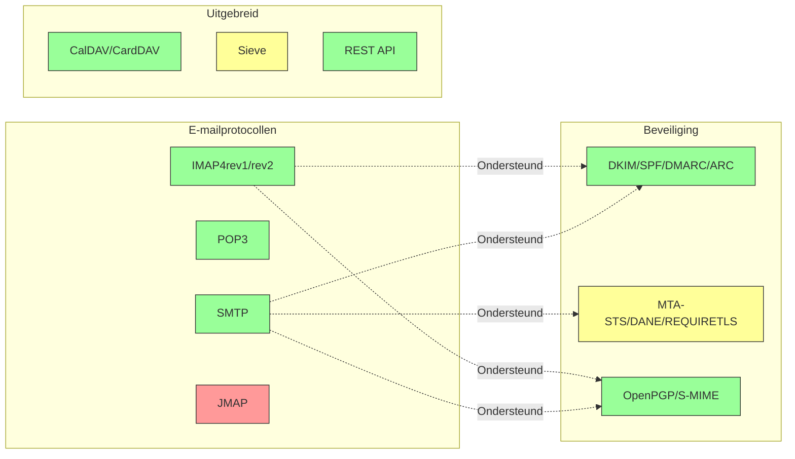

---


## Kern E-mailprotocollen {#core-email-protocols}

### E-mailprotocol Stroom {#email-protocol-flow}

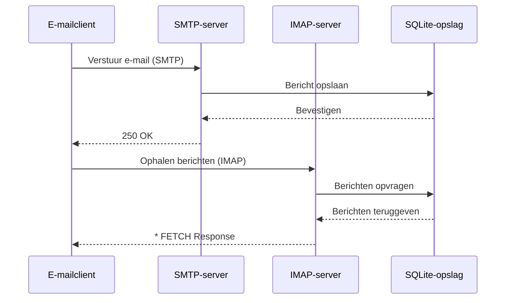


## IMAP4 E-mailprotocol en Extensies {#imap4-email-protocol-and-extensions}

> \[!NOTE]
> Forward Email ondersteunt IMAP4rev1 (RFC 3501) met gedeeltelijke ondersteuning voor IMAP4rev2 (RFC 9051) functies.

Forward Email biedt robuuste IMAP4-ondersteuning via de WildDuck mailserver-implementatie. De server implementeert IMAP4rev1 (RFC 3501) met gedeeltelijke ondersteuning voor IMAP4rev2 (RFC 9051) extensies.

De IMAP-functionaliteit van Forward Email wordt geleverd door de [WildDuck](https://github.com/nodemailer/wildduck) afhankelijkheid. De volgende e-mail RFC's worden ondersteund:

| RFC                                                       | Titel                                                             | Implementatienotities                                  |
| --------------------------------------------------------- | ----------------------------------------------------------------- | ----------------------------------------------------- |
| [RFC 3501](https://datatracker.ietf.org/doc/html/rfc3501) | Internet Message Access Protocol (IMAP) - Versie 4rev1            | Volledige ondersteuning met opzettelijke verschillen (zie hieronder) |
| [RFC 2177](https://datatracker.ietf.org/doc/html/rfc2177) | IMAP4 IDLE-commando                                               | Push-stijl notificaties                                |
| [RFC 2342](https://datatracker.ietf.org/doc/html/rfc2342) | IMAP4 Namespace                                                  | Ondersteuning mailbox-namespace                         |
| [RFC 2087](https://datatracker.ietf.org/doc/html/rfc2087) | IMAP4 QUOTA-extensie                                             | Beheer opslagquota                                     |
| [RFC 2971](https://datatracker.ietf.org/doc/html/rfc2971) | IMAP4 ID-extensie                                                | Client/server identificatie                            |
| [RFC 5161](https://datatracker.ietf.org/doc/html/rfc5161) | IMAP4 ENABLE-extensie                                            | IMAP-extensies inschakelen                             |
| [RFC 4959](https://datatracker.ietf.org/doc/html/rfc4959) | IMAP-extensie voor SASL Initial Client Response (SASL-IR)         | Initiële clientrespons                                 |
| [RFC 3691](https://datatracker.ietf.org/doc/html/rfc3691) | IMAP4 UNSELECT-commando                                          | Mailbox sluiten zonder EXPUNGE                         |
| [RFC 4315](https://datatracker.ietf.org/doc/html/rfc4315) | IMAP UIDPLUS-extensie                                            | Verbeterde UID-commando's                              |
| [RFC 7162](https://datatracker.ietf.org/doc/html/rfc7162) | IMAP-extensies: Snelle vlagwijzigingen Resynchronisatie (CONDSTORE) | Conditionele STORE                                     |
| [RFC 6154](https://datatracker.ietf.org/doc/html/rfc6154) | IMAP LIST-extensie voor Special-Use Mailboxes                    | Speciale mailboxattributen                             |
| [RFC 6851](https://datatracker.ietf.org/doc/html/rfc6851) | IMAP MOVE-extensie                                               | Atomair MOVE-commando                                  |
| [RFC 6855](https://datatracker.ietf.org/doc/html/rfc6855) | IMAP-ondersteuning voor UTF-8                                    | UTF-8 ondersteuning                                    |
| [RFC 3348](https://datatracker.ietf.org/doc/html/rfc3348) | IMAP4 Child Mailbox-extensie                                     | Informatie over child mailbox                          |
| [RFC 7889](https://datatracker.ietf.org/doc/html/rfc7889) | IMAP4-extensie voor het adverteren van maximale uploadgrootte (APPENDLIMIT) | Maximale uploadgrootte                                 |
**Ondersteunde IMAP-extensies:**

| Extensie         | RFC          | Status      | Beschrijving                   |
| ----------------- | ------------ | ----------- | ----------------------------- |
| IDLE              | RFC 2177     | ✅ Ondersteund | Push-stijl notificaties        |
| NAMESPACE         | RFC 2342     | ✅ Ondersteund | Mailbox namespace ondersteuning |
| QUOTA             | RFC 2087     | ✅ Ondersteund | Opslagquotabeheer              |
| ID                | RFC 2971     | ✅ Ondersteund | Client/server identificatie    |
| ENABLE            | RFC 5161     | ✅ Ondersteund | IMAP-extensies inschakelen     |
| SASL-IR           | RFC 4959     | ✅ Ondersteund | Initiële clientrespons         |
| UNSELECT          | RFC 3691     | ✅ Ondersteund | Sluit mailbox zonder EXPUNGE  |
| UIDPLUS           | RFC 4315     | ✅ Ondersteund | Verbeterde UID-commando's      |
| CONDSTORE         | RFC 7162     | ✅ Ondersteund | Conditionele STORE             |
| SPECIAL-USE       | RFC 6154     | ✅ Ondersteund | Speciale mailboxattributen     |
| MOVE              | RFC 6851     | ✅ Ondersteund | Atomair MOVE-commando          |
| UTF8=ACCEPT       | RFC 6855     | ✅ Ondersteund | UTF-8 ondersteuning            |
| CHILDREN          | RFC 3348     | ✅ Ondersteund | Informatie over submailboxen  |
| APPENDLIMIT       | RFC 7889     | ✅ Ondersteund | Maximale uploadgrootte         |
| XLIST             | Niet-standaard | ✅ Ondersteund | Gmail-compatibele mappenlijst  |
| XAPPLEPUSHSERVICE | Niet-standaard | ✅ Ondersteund | Apple Push Notification Service |

### IMAP Protocolverschillen ten opzichte van RFC-specificaties {#imap-protocol-differences-from-rfc-specifications}

> \[!WARNING]
> De volgende verschillen ten opzichte van RFC-specificaties kunnen de compatibiliteit met clients beïnvloeden.

Forward Email wijkt bewust af van sommige IMAP RFC-specificaties. Deze verschillen zijn overgenomen van WildDuck en worden hieronder gedocumenteerd:

* **Geen \Recent vlag:** De `\Recent` vlag is niet geïmplementeerd. Alle berichten worden zonder deze vlag teruggegeven.
* **RENAME beïnvloedt submappen niet:** Bij het hernoemen van een map worden submappen niet automatisch hernoemd. De maphierarchie is vlak in de database.
* **INBOX kan niet worden hernoemd:** [RFC 3501](https://datatracker.ietf.org/doc/html/rfc3501) staat het hernoemen van INBOX toe, maar Forward Email verbiedt dit expliciet. Zie [WildDuck broncode](https://github.com/nodemailer/wildduck/blob/master/imap-core/lib/commands/rename.js#L27).
* **Geen unsolicited FLAGS-responses:** Wanneer vlaggen worden gewijzigd, worden er geen unsolicited FLAGS-responses naar de client gestuurd.
* **STORE geeft NO terug voor verwijderde berichten:** Pogingen om vlaggen te wijzigen op verwijderde berichten geven NO terug in plaats van dit stilzwijgend te negeren.
* **CHARSET wordt genegeerd in SEARCH:** Het `CHARSET` argument in SEARCH-commando's wordt genegeerd. Alle zoekopdrachten gebruiken UTF-8.
* **MODSEQ metadata wordt genegeerd:** `MODSEQ` metadata in STORE-commando's wordt genegeerd.
* **SEARCH TEXT en SEARCH BODY:** Forward Email gebruikt [SQLite FTS5](https://www.sqlite.org/fts5.html) (Full-Text Search) in plaats van MongoDB's `$text` zoekfunctie. Dit biedt:
  * Ondersteuning voor de `NOT` operator (MongoDB ondersteunt dit niet)
  * Gerangschikte zoekresultaten
  * Zoekprestaties onder de 100ms op grote mailboxen
* **Autoexpunge gedrag:** Berichten gemarkeerd met `\Deleted` worden automatisch verwijderd wanneer de mailbox wordt gesloten.
* **Berichtgetrouwheid:** Sommige berichtwijzigingen behouden mogelijk niet de exacte originele berichtstructuur.

**IMAP4rev2 Gedeeltelijke Ondersteuning:**

Forward Email implementeert IMAP4rev1 (RFC 3501) met gedeeltelijke IMAP4rev2 (RFC 9051) ondersteuning. De volgende IMAP4rev2-functies worden **nog niet ondersteund**:

* **LIST-STATUS** - Gecombineerde LIST en STATUS commando's
* **LITERAL-** - Niet-synchroniserende literals (minus variant)
* **OBJECTID** - Unieke objectidentificatoren
* **SAVEDATE** - Opslagdatum attribuut
* **REPLACE** - Atomair berichtvervangingscommando
* **UNAUTHENTICATE** - Authenticatie sluiten zonder verbinding te sluiten

**Ontspannen Body-structuur Afhandeling:**

Forward Email gebruikt "ontspannen body"-afhandeling voor malformed MIME-structuren, wat kan afwijken van strikte RFC-interpretatie. Dit verbetert de compatibiliteit met e-mails uit de praktijk die niet perfect aan de standaarden voldoen.
**METADATA-extensie (RFC 5464):**

De IMAP METADATA-extensie wordt **niet ondersteund**. Voor meer informatie over deze extensie, zie [RFC 5464](https://datatracker.ietf.org/doc/html/rfc5464). Discussie over het toevoegen van deze functie is te vinden in [WildDuck Issue #937](https://github.com/zone-eu/wildduck/issues/937).

### IMAP-extensies NIET ondersteund {#imap-extensions-not-supported}

De volgende IMAP-extensies uit het [IANA IMAP Capabilities Registry](https://www.iana.org/assignments/imap-capabilities/imap-capabilities.xhtml) worden NIET ondersteund:

| RFC                                                       | Titel                                                                                                           | Reden                                                                                                                                  |
| --------------------------------------------------------- | --------------------------------------------------------------------------------------------------------------- | --------------------------------------------------------------------------------------------------------------------------------------- |
| [RFC 2086](https://datatracker.ietf.org/doc/html/rfc2086) | IMAP4 ACL-extensie                                                                                              | Gedeelde mappen niet geïmplementeerd. Zie [WildDuck Issue #427](https://github.com/zone-eu/wildduck/issues/427)                         |
| [RFC 5256](https://datatracker.ietf.org/doc/html/rfc5256) | IMAP SORT- en THREAD-extensies                                                                                  | Threading intern geïmplementeerd maar niet via RFC 5256-protocol. Zie [WildDuck Issue #12](https://github.com/zone-eu/wildduck/issues/12) |
| [RFC 5162](https://datatracker.ietf.org/doc/html/rfc5162) | IMAP4-extensies voor snelle mailboxresynchronisatie (QRESYNC)                                                  | Niet geïmplementeerd                                                                                                                    |
| [RFC 5464](https://datatracker.ietf.org/doc/html/rfc5464) | IMAP METADATA-extensie                                                                                          | Metadata-operaties genegeerd. Zie [WildDuck-documentatie](https://datatracker.ietf.org/doc/html/rfc5464)                                |
| [RFC 5258](https://datatracker.ietf.org/doc/html/rfc5258) | IMAP4 LIST-commando-extensies                                                                                   | Niet geïmplementeerd                                                                                                                    |
| [RFC 5267](https://datatracker.ietf.org/doc/html/rfc5267) | Contexten voor IMAP4                                                                                            | Niet geïmplementeerd                                                                                                                    |
| [RFC 5465](https://datatracker.ietf.org/doc/html/rfc5465) | IMAP NOTIFY-extensie                                                                                            | Niet geïmplementeerd                                                                                                                    |
| [RFC 5466](https://datatracker.ietf.org/doc/html/rfc5466) | IMAP4 FILTERS-extensie                                                                                          | Niet geïmplementeerd                                                                                                                    |
| [RFC 6203](https://datatracker.ietf.org/doc/html/rfc6203) | IMAP4-extensie voor fuzzy search                                                                                | Niet geïmplementeerd                                                                                                                    |
| [RFC 6785](https://datatracker.ietf.org/doc/html/rfc6785) | IMAP4-implementatie-aanbevelingen                                                                               | Aanbevelingen niet volledig gevolgd                                                                                                    |
| [RFC 7162](https://datatracker.ietf.org/doc/html/rfc7162) | IMAP-extensies: snelle vlagwijzigingen resynchronisatie (CONDSTORE) en snelle mailboxresynchronisatie (QRESYNC) | Niet geïmplementeerd                                                                                                                    |
| [RFC 8437](https://datatracker.ietf.org/doc/html/rfc8437) | IMAP UNAUTHENTICATE-extensie voor hergebruik van verbinding                                                     | Niet geïmplementeerd                                                                                                                    |
| [RFC 8438](https://datatracker.ietf.org/doc/html/rfc8438) | IMAP-extensie voor STATUS=SIZE                                                                                  | Niet geïmplementeerd                                                                                                                    |
| [RFC 8457](https://datatracker.ietf.org/doc/html/rfc8457) | IMAP "$Important"-trefwoord en "\Important" special-use attribuut                                               | Niet geïmplementeerd                                                                                                                    |
| [RFC 8474](https://datatracker.ietf.org/doc/html/rfc8474) | IMAP-extensie voor objectidentifiers                                                                            | Niet geïmplementeerd                                                                                                                    |
| [RFC 9051](https://datatracker.ietf.org/doc/html/rfc9051) | Internet Message Access Protocol (IMAP) - versie 4rev2                                                          | Forward Email implementeert IMAP4rev1 ([RFC 3501](https://datatracker.ietf.org/doc/html/rfc3501))                                        |
## POP3 E-mailprotocol en Extensies {#pop3-email-protocol-and-extensions}

> \[!NOTE]
> Forward Email ondersteunt POP3 (RFC 1939) met standaard extensies voor e-mailophaling.

De POP3-functionaliteit van Forward Email wordt geleverd door de [WildDuck](https://github.com/nodemailer/wildduck) dependency. De volgende e-mail RFC's worden ondersteund:

| RFC                                                       | Titel                                   | Implementatie-opmerkingen                           |
| --------------------------------------------------------- | --------------------------------------- | -------------------------------------------------- |
| [RFC 1939](https://datatracker.ietf.org/doc/html/rfc1939) | Post Office Protocol - Versie 3 (POP3) | Volledige ondersteuning met opzettelijke verschillen (zie hieronder) |
| [RFC 2595](https://datatracker.ietf.org/doc/html/rfc2595) | Gebruik van TLS met IMAP, POP3 en ACAP  | STARTTLS-ondersteuning                             |
| [RFC 2449](https://datatracker.ietf.org/doc/html/rfc2449) | POP3 Extensie Mechanisme                 | CAPA-commando ondersteuning                        |

Forward Email biedt POP3-ondersteuning voor clients die dit eenvoudigere protocol verkiezen boven IMAP. POP3 is ideaal voor gebruikers die e-mails willen downloaden naar één apparaat en deze van de server willen verwijderen.

**Ondersteunde POP3 Extensies:**

| Extensie  | RFC      | Status       | Beschrijving               |
| --------- | -------- | ------------ | -------------------------- |
| TOP       | RFC 1939 | ✅ Ondersteund | Ophalen van berichtkoppen  |
| USER      | RFC 1939 | ✅ Ondersteund | Gebruikersnaam authenticatie |
| UIDL      | RFC 1939 | ✅ Ondersteund | Unieke berichtidentificaties |
| EXPIRE    | RFC 2449 | ✅ Ondersteund | Berichtvervalbeleid         |

### POP3 Protocolverschillen ten opzichte van RFC-specificaties {#pop3-protocol-differences-from-rfc-specifications}

> \[!WARNING]
> POP3 heeft inherente beperkingen vergeleken met IMAP.

> \[!IMPORTANT]
> **Kritisch Verschil: Forward Email vs WildDuck POP3 DELE Gedrag**
>
> Forward Email implementeert RFC-conforme permanente verwijdering voor POP3 `DELE`-commando's, in tegenstelling tot WildDuck dat berichten naar de Prullenbak verplaatst.

**Gedrag van Forward Email** ([broncode](https://github.com/forwardemail/forwardemail.net/blob/master/pop3-server.js)):

* `DELE` → `QUIT` verwijdert berichten permanent
* Volgt exact de [RFC 1939](https://datatracker.ietf.org/doc/html/rfc1939) specificatie
* Komt overeen met het gedrag van Dovecot (standaard), Postfix en andere RFC-conforme servers

**Gedrag van WildDuck** ([discussie](https://github.com/zone-eu/wildduck/issues/937)):

* `DELE` → `QUIT` verplaatst berichten naar Prullenbak (Gmail-achtig)
* Opzettelijke ontwerpkeuze voor gebruikersveiligheid
* Niet RFC-conform maar voorkomt per ongeluk dataverlies

**Waarom Forward Email afwijkt:**

* **RFC-conformiteit:** Houdt zich aan de [RFC 1939](https://datatracker.ietf.org/doc/html/rfc1939) specificatie
* **Gebruikersverwachtingen:** Download-en-verwijder workflow verwacht permanente verwijdering
* **Opslagbeheer:** Correcte vrijgave van schijfruimte
* **Interoperabiliteit:** Consistent met andere RFC-conforme servers

> \[!NOTE]
> **POP3 Berichtlijst:** Forward Email toont ALLE berichten uit de INBOX zonder limiet. Dit verschilt van WildDuck dat standaard beperkt tot 250 berichten. Zie [broncode](https://github.com/forwardemail/forwardemail.net/blob/master/pop3-server.js).

**Toegang via één apparaat:**

POP3 is ontworpen voor toegang via één apparaat. Berichten worden meestal gedownload en van de server verwijderd, waardoor het ongeschikt is voor synchronisatie over meerdere apparaten.

**Geen mapondersteuning:**

POP3 heeft alleen toegang tot de INBOX-map. Andere mappen (Verzonden, Concepten, Prullenbak, etc.) zijn niet toegankelijk via POP3.

**Beperkt berichtbeheer:**

POP3 biedt basisfunctionaliteit voor het ophalen en verwijderen van berichten. Geavanceerde functies zoals markeren, verplaatsen of zoeken van berichten zijn niet beschikbaar.

### POP3 Extensies NIET Ondersteund {#pop3-extensions-not-supported}

De volgende POP3-extensies uit het [IANA POP3 Extension Mechanism Register](https://www.iana.org/assignments/pop3-extension-mechanism/pop3-extension-mechanism.xhtml) worden NIET ondersteund:
| RFC                                                       | Titel                                                   | Reden                                  |
| --------------------------------------------------------- | ------------------------------------------------------- | --------------------------------------- |
| [RFC 6856](https://datatracker.ietf.org/doc/html/rfc6856) | Post Office Protocol Versie 3 (POP3) Ondersteuning voor UTF-8 | Niet geïmplementeerd in WildDuck POP3-server |
| [RFC 2595](https://datatracker.ietf.org/doc/html/rfc2595) | STLS-commando                                           | Alleen STARTTLS ondersteund, niet STLS  |
| [RFC 3206](https://datatracker.ietf.org/doc/html/rfc3206) | De SYS- en AUTH POP-responscodes                        | Niet geïmplementeerd                     |

---


## SMTP Email Protocol en Extensies {#smtp-email-protocol-and-extensions}

> \[!NOTE]
> Forward Email ondersteunt SMTP (RFC 5321) met moderne extensies voor veilige en betrouwbare e-mailbezorging.

De SMTP-functionaliteit van Forward Email wordt geleverd door meerdere componenten: [smtp-server](https://github.com/nodemailer/smtp-server) (nodemailer), [zone-mta](https://github.com/zone-eu/zone-mta), en aangepaste implementaties. De volgende e-mail RFC's worden ondersteund:

| RFC                                                       | Titel                                                                           | Implementatie-opmerkingen           |
| --------------------------------------------------------- | ------------------------------------------------------------------------------- | ------------------------------------ |
| [RFC 5321](https://datatracker.ietf.org/doc/html/rfc5321) | Simple Mail Transfer Protocol (SMTP)                                            | Volledige ondersteuning              |
| [RFC 3207](https://datatracker.ietf.org/doc/html/rfc3207) | SMTP Service Extension for Secure SMTP over Transport Layer Security (STARTTLS) | TLS/SSL-ondersteuning                |
| [RFC 4954](https://datatracker.ietf.org/doc/html/rfc4954) | SMTP Service Extension for Authentication (AUTH)                                | PLAIN, LOGIN, CRAM-MD5, XOAUTH2      |
| [RFC 6531](https://datatracker.ietf.org/doc/html/rfc6531) | SMTP Extension for Internationalized Email (SMTPUTF8)                           | Native ondersteuning voor unicode e-mailadressen |
| [RFC 3461](https://datatracker.ietf.org/doc/html/rfc3461) | SMTP Service Extension for Delivery Status Notifications (DSN)                  | Volledige DSN-ondersteuning          |
| [RFC 3463](https://datatracker.ietf.org/doc/html/rfc3463) | Enhanced Mail System Status Codes                                               | Verbeterde statuscodes in antwoorden |
| [RFC 1870](https://datatracker.ietf.org/doc/html/rfc1870) | SMTP Service Extension for Message Size Declaration (SIZE)                      | Advertentie van maximale berichtgrootte |
| [RFC 2920](https://datatracker.ietf.org/doc/html/rfc2920) | SMTP Service Extension for Command Pipelining (PIPELINING)                      | Ondersteuning voor command pipelining |
| [RFC 1652](https://datatracker.ietf.org/doc/html/rfc1652) | SMTP Service Extension for 8bit-MIMEtransport (8BITMIME)                        | 8-bit MIME-ondersteuning             |
| [RFC 6152](https://datatracker.ietf.org/doc/html/rfc6152) | SMTP Service Extension for 8-bit MIME Transport                                 | 8-bit MIME-ondersteuning             |
| [RFC 2034](https://datatracker.ietf.org/doc/html/rfc2034) | SMTP Service Extension for Returning Enhanced Error Codes (ENHANCEDSTATUSCODES) | Verbeterde statuscodes               |

Forward Email implementeert een volledig uitgeruste SMTP-server met ondersteuning voor moderne extensies die de beveiliging, betrouwbaarheid en functionaliteit verbeteren.

**Ondersteunde SMTP-extensies:**

| Extensie            | RFC      | Status      | Beschrijving                         |
| ------------------- | -------- | ----------- | ----------------------------------- |
| PIPELINING          | RFC 2920 | ✅ Ondersteund | Command pipelining                  |
| SIZE                | RFC 1870 | ✅ Ondersteund | Declaratie van berichtgrootte (limiet 52MB) |
| ETRN                | RFC 1985 | ✅ Ondersteund | Verwerking van externe wachtrij    |
| STARTTLS            | RFC 3207 | ✅ Ondersteund | Upgrade naar TLS                    |
| ENHANCEDSTATUSCODES | RFC 2034 | ✅ Ondersteund | Verbeterde statuscodes             |
| 8BITMIME            | RFC 6152 | ✅ Ondersteund | 8-bit MIME transport               |
| DSN                 | RFC 3461 | ✅ Ondersteund | Delivery Status Notifications      |
| CHUNKING            | RFC 3030 | ✅ Ondersteund | Overdracht van berichten in stukken |
| SMTPUTF8            | RFC 6531 | ⚠️ Gedeeltelijk | UTF-8 e-mailadressen (gedeeltelijk) |
| REQUIRETLS          | RFC 8689 | ✅ Ondersteund | Vereist TLS voor bezorging         |
### Delivery Status Notifications (DSN) {#delivery-status-notifications-dsn}

> \[!TIP]
> DSN biedt gedetailleerde informatie over de afleverstatus van verzonden e-mails.

Forward Email ondersteunt volledig **DSN (RFC 3461)**, waarmee afzenders afleveringsstatusmeldingen kunnen opvragen. Deze functie biedt:

* **Succesmeldingen** wanneer berichten zijn afgeleverd
* **Foutmeldingen** met gedetailleerde foutinformatie
* **Vertragingmeldingen** wanneer de aflevering tijdelijk is vertraagd

DSN is vooral nuttig voor:

* Bevestigen van de aflevering van belangrijke berichten
* Problemen met aflevering oplossen
* Geautomatiseerde e-mailverwerkende systemen
* Naleving en auditvereisten

### REQUIRETLS Support {#requiretls-support}

> \[!IMPORTANT]
> Forward Email is een van de weinige providers die expliciet REQUIRETLS adverteert en afdwingt.

Forward Email ondersteunt **REQUIRETLS (RFC 8689)**, wat ervoor zorgt dat e-mailberichten alleen via TLS-versleutelde verbindingen worden afgeleverd. Dit biedt:

* **End-to-end encryptie** voor het gehele afleverpad
* **Gebruikersgerichte afdwinging** via een selectievakje in de e-mailcomposer
* **Afwijzing van onbeveiligde afleverpogingen**
* **Verbeterde beveiliging** voor gevoelige communicatie

### SMTP Extensions NOT Supported {#smtp-extensions-not-supported}

De volgende SMTP-extensies uit het [IANA SMTP Service Extensions Registry](https://www.iana.org/assignments/smtp) worden NIET ondersteund:

| RFC                                                       | Titel                                                                                             | Reden                 |
| --------------------------------------------------------- | ------------------------------------------------------------------------------------------------- | --------------------- |
| [RFC 4865](https://datatracker.ietf.org/doc/html/rfc4865) | SMTP Submission Service Extension for Future Message Release (FUTURERELEASE)                      | Niet geïmplementeerd  |
| [RFC 6710](https://datatracker.ietf.org/doc/html/rfc6710) | SMTP Extension for Message Transfer Priorities (MT-PRIORITY)                                      | Niet geïmplementeerd  |
| [RFC 7293](https://datatracker.ietf.org/doc/html/rfc7293) | The Require-Recipient-Valid-Since Header Field and SMTP Service Extension                         | Niet geïmplementeerd  |
| [RFC 7372](https://datatracker.ietf.org/doc/html/rfc7372) | Email Auth Status Codes                                                                           | Niet volledig geïmplementeerd |
| [RFC 4468](https://datatracker.ietf.org/doc/html/rfc4468) | Message Submission BURL Extension                                                                 | Niet geïmplementeerd  |
| [RFC 3030](https://datatracker.ietf.org/doc/html/rfc3030) | SMTP Service Extensions for Transmission of Large and Binary MIME Messages (CHUNKING, BINARYMIME) | Niet geïmplementeerd  |
| [RFC 2852](https://datatracker.ietf.org/doc/html/rfc2852) | Deliver By SMTP Service Extension                                                                 | Niet geïmplementeerd  |

---


## JMAP Email Protocol {#jmap-email-protocol}

> \[!CAUTION]
> JMAP wordt **momenteel niet ondersteund** door Forward Email.

| RFC                                                       | Titel                                     | Status          | Reden                                                                 |
| --------------------------------------------------------- | ----------------------------------------- | --------------- | ---------------------------------------------------------------------- |
| [RFC 8620](https://datatracker.ietf.org/doc/html/rfc8620) | The JSON Meta Application Protocol (JMAP) | ❌ Niet ondersteund | Forward Email gebruikt in plaats daarvan IMAP/POP3/SMTP en een uitgebreide REST API |

**JMAP (JSON Meta Application Protocol)** is een modern e-mailprotocol ontworpen ter vervanging van IMAP.

**Waarom JMAP niet wordt ondersteund:**

> "JMAP is een beest dat nooit had moeten worden uitgevonden. Het probeert TCP/IMAP (dat al een slecht protocol is volgens de huidige maatstaven) om te zetten in HTTP/JSON, gewoon met een ander transport terwijl de geest behouden blijft." — Andris Reinman, [HN Discussion](https://news.ycombinator.com/item?id=18890011)
> "JMAP is meer dan 10 jaar oud, en er is bijna geen adoptie" – Andris Reinman, [GitHub Discussion](https://github.com/zone-eu/wildduck/issues/2#issuecomment-1765190790)

Zie ook aanvullende opmerkingen op <https://hn.algolia.com/?dateRange=all&page=0&prefix=true&query=jmap%20andris&sort=byDate&type=comment>.

Forward Email richt zich momenteel op het bieden van uitstekende IMAP-, POP3- en SMTP-ondersteuning, samen met een uitgebreide REST API voor e-mailbeheer. JMAP-ondersteuning kan in de toekomst worden overwogen op basis van gebruikersvraag en adoptie in het ecosysteem.

**Alternatief:** Forward Email biedt een [Complete REST API](#complete-rest-api-for-email-management) met 39 eindpunten die vergelijkbare functionaliteit biedt als JMAP voor programmatische e-mailtoegang.

---


## E-mailbeveiliging {#email-security}

### Architectuur van e-mailbeveiliging {#email-security-architecture}

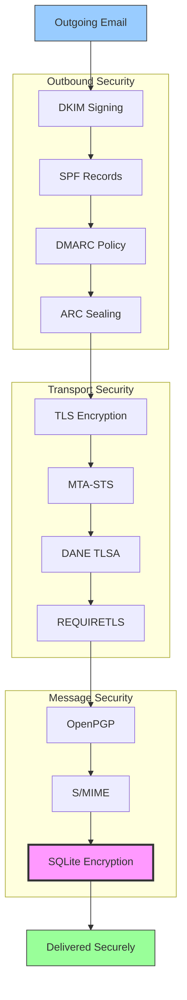


## E-mailbericht Authenticatieprotocollen {#email-message-authentication-protocols}

> \[!NOTE]
> Forward Email implementeert alle belangrijke e-mailauthenticatieprotocollen om spoofing te voorkomen en de integriteit van berichten te waarborgen.

Forward Email gebruikt de [mailauth](https://github.com/postalsys/mailauth) bibliotheek voor e-mailauthenticatie. De volgende RFC's worden ondersteund:

| RFC                                                       | Titel                                                                   | Implementatienotities                                         |
| --------------------------------------------------------- | ----------------------------------------------------------------------- | -------------------------------------------------------------- |
| [RFC 6376](https://datatracker.ietf.org/doc/html/rfc6376) | DomainKeys Identified Mail (DKIM) Handtekeningen                        | Volledige DKIM ondertekening en verificatie                   |
| [RFC 8463](https://datatracker.ietf.org/doc/html/rfc8463) | Een nieuwe cryptografische handtekeningmethode voor DKIM (Ed25519-SHA256) | Ondersteunt zowel RSA-SHA256 als Ed25519-SHA256 ondertekeningsalgoritmen |
| [RFC 7208](https://datatracker.ietf.org/doc/html/rfc7208) | Sender Policy Framework (SPF)                                           | Validatie van SPF-records                                      |
| [RFC 7489](https://datatracker.ietf.org/doc/html/rfc7489) | Domain-based Message Authentication, Reporting, and Conformance (DMARC) | Handhaving van DMARC-beleid                                    |
| [RFC 8617](https://datatracker.ietf.org/doc/html/rfc8617) | Authenticated Received Chain (ARC)                                      | ARC sealing en validatie                                       |

E-mailauthenticatieprotocollen verifiëren dat berichten daadwerkelijk van de opgegeven afzender afkomstig zijn en niet zijn gewijzigd tijdens het transport.

### Ondersteuning van authenticatieprotocollen {#authentication-protocol-support}

| Protocol  | RFC      | Status      | Beschrijving                                                          |
| --------- | -------- | ----------- | -------------------------------------------------------------------- |
| **DKIM**  | RFC 6376 | ✅ Ondersteund | DomainKeys Identified Mail - Cryptografische handtekeningen          |
| **SPF**   | RFC 7208 | ✅ Ondersteund | Sender Policy Framework - IP-adres autorisatie                       |
| **DMARC** | RFC 7489 | ✅ Ondersteund | Domain-based Message Authentication - Handhaving van beleid          |
| **ARC**   | RFC 8617 | ✅ Ondersteund | Authenticated Received Chain - Behoud van authenticatie over forwards |
### DKIM (DomainKeys Identified Mail) {#dkim-domainkeys-identified-mail}

**DKIM** voegt een cryptografische handtekening toe aan e-mailheaders, waardoor ontvangers kunnen verifiëren dat het bericht is geautoriseerd door de domeineigenaar en niet is gewijzigd tijdens het transport.

Forward Email gebruikt [mailauth](https://github.com/postalsys/mailauth) voor DKIM ondertekening en verificatie.

**Belangrijkste kenmerken:**

* Automatische DKIM ondertekening voor alle uitgaande berichten
* Ondersteuning voor RSA- en Ed25519-sleutels
* Ondersteuning voor meerdere selectors
* DKIM verificatie voor inkomende berichten

### SPF (Sender Policy Framework) {#spf-sender-policy-framework}

**SPF** stelt domeineigenaren in staat om aan te geven welke IP-adressen gemachtigd zijn om e-mail te verzenden namens hun domein.

**Belangrijkste kenmerken:**

* Validatie van SPF-records voor inkomende berichten
* Automatische SPF-controle met gedetailleerde resultaten
* Ondersteuning voor include-, redirect- en all-mechanismen
* Configureerbare SPF-beleid per domein

### DMARC (Domain-based Message Authentication, Reporting & Conformance) {#dmarc-domain-based-message-authentication-reporting--conformance}

**DMARC** bouwt voort op SPF en DKIM om beleidsafdwinging en rapportage te bieden.

**Belangrijkste kenmerken:**

* DMARC beleidsafdwinging (none, quarantine, reject)
* Uitlijning controle voor SPF en DKIM
* DMARC aggregatierapportage
* Per-domein DMARC-beleid

### ARC (Authenticated Received Chain) {#arc-authenticated-received-chain}

**ARC** behoudt e-mail authenticatieresultaten bij doorsturen en wijzigingen door mailinglijsten.

Forward Email gebruikt de [mailauth](https://github.com/postalsys/mailauth) bibliotheek voor ARC verificatie en sealing.

**Belangrijkste kenmerken:**

* ARC sealing voor doorgestuurde berichten
* ARC validatie voor inkomende berichten
* Kettingverificatie over meerdere hops
* Behoudt originele authenticatieresultaten

### Authenticatie Stroom {#authentication-flow}

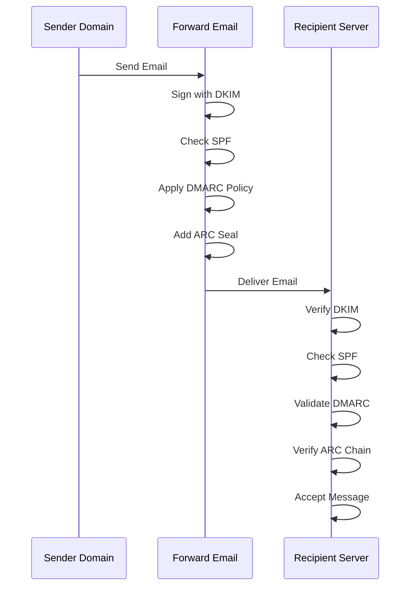

---


## E-mail Transportbeveiligingsprotocollen {#email-transport-security-protocols}

> \[!IMPORTANT]
> Forward Email implementeert meerdere lagen transportbeveiliging om e-mails tijdens transport te beschermen.

Forward Email implementeert moderne transportbeveiligingsprotocollen:

| RFC                                                       | Titel                                                                                               | Status      | Implementatie Opmerkingen                                                                                                                                                                                                                                                                      |
| --------------------------------------------------------- | -------------------------------------------------------------------------------------------------- | ----------- | --------------------------------------------------------------------------------------------------------------------------------------------------------------------------------------------------------------------------------------------------------------------------------------------- |
| [RFC 8461](https://datatracker.ietf.org/doc/html/rfc8461) | SMTP MTA Strict Transport Security (MTA-STS)                                                       | ✅ Supported | Uitgebreid gebruikt op IMAP-, SMTP- en MX-servers. Zie [create-mta-sts-cache.js](https://github.com/forwardemail/forwardemail.net/blob/master/helpers/create-mta-sts-cache.js) en [get-transporter.js](https://github.com/forwardemail/forwardemail.net/blob/master/helpers/get-transporter.js) |
| [RFC 8460](https://datatracker.ietf.org/doc/html/rfc8460) | SMTP TLS Reporting                                                                                 | ✅ Supported | Via [mailauth](https://github.com/postalsys/mailauth) bibliotheek                                                                                                                                                                                                                              |
| [RFC 7671](https://datatracker.ietf.org/doc/html/rfc7671) | The DNS-Based Authentication of Named Entities (DANE) Protocol: Updates and Operational Guidance   | ✅ Supported | Volledige DANE verificatie voor uitgaande SMTP-verbindingen. Zie [mx-connect PR #22](https://github.com/zone-eu/mx-connect/pull/22)                                                                                                                                                            |
| [RFC 6698](https://datatracker.ietf.org/doc/html/rfc6698) | The DNS-Based Authentication of Named Entities (DANE) Transport Layer Security (TLS) Protocol: TLSA | ✅ Supported | Volledige RFC 6698 ondersteuning: PKIX-TA, PKIX-EE, DANE-TA, DANE-EE gebruikstypen. Zie [mx-connect PR #22](https://github.com/zone-eu/mx-connect/pull/22)                                                                                                                                     |
| [RFC 8314](https://datatracker.ietf.org/doc/html/rfc8314) | Cleartext Considered Obsolete: Use of Transport Layer Security (TLS) for Email Submission and Access | ✅ Supported | TLS vereist voor alle verbindingen                                                                                                                                                                                                                                                            |
| [RFC 8689](https://datatracker.ietf.org/doc/html/rfc8689) | SMTP Service Extension for Requiring TLS (REQUIRETLS)                                              | ✅ Supported | Volledige ondersteuning voor REQUIRETLS SMTP-extensie en "TLS-Required" header                                                                                                                                                                                                                 |
Transportbeveiligingsprotocollen zorgen ervoor dat e-mailberichten worden versleuteld en geverifieerd tijdens de overdracht tussen mailservers.

### Transport Security Support {#transport-security-support}

| Protocol       | RFC      | Status      | Beschrijving                                    |
| -------------- | -------- | ----------- | ------------------------------------------------ |
| **TLS**        | RFC 8314 | ✅ Ondersteund | Transport Layer Security - Versleutelde verbindingen |
| **MTA-STS**    | RFC 8461 | ✅ Ondersteund | Mail Transfer Agent Strict Transport Security    |
| **DANE**       | RFC 7671 | ✅ Ondersteund | DNS-based Authentication of Named Entities       |
| **REQUIRETLS** | RFC 8689 | ✅ Ondersteund | Vereist TLS voor het gehele bezorgtraject        |

### TLS (Transport Layer Security) {#tls-transport-layer-security}

Forward Email handhaaft TLS-versleuteling voor alle e-mailverbindingen (SMTP, IMAP, POP3).

**Belangrijkste kenmerken:**

* Ondersteuning voor TLS 1.2 en TLS 1.3
* Automatisch certificaatbeheer
* Perfect Forward Secrecy (PFS)
* Alleen sterke cipher suites

### MTA-STS (Mail Transfer Agent Strict Transport Security) {#mta-sts-mail-transfer-agent-strict-transport-security}

**MTA-STS** zorgt ervoor dat e-mail alleen wordt afgeleverd via TLS-versleutelde verbindingen door een beleid te publiceren via HTTPS.

Forward Email implementeert MTA-STS met behulp van [create-mta-sts-cache.js](https://github.com/forwardemail/forwardemail.net/blob/master/helpers/create-mta-sts-cache.js).

**Belangrijkste kenmerken:**

* Automatische publicatie van MTA-STS beleid
* Caching van beleid voor betere prestaties
* Preventie van downgrade-aanvallen
* Handhaving van certificaatvalidatie

### DANE (DNS-based Authentication of Named Entities) {#dane-dns-based-authentication-of-named-entities}

> \[!NOTE]
> Forward Email biedt nu volledige DANE-ondersteuning voor uitgaande SMTP-verbindingen.

**DANE** gebruikt DNSSEC om TLS-certificaatinformatie in DNS te publiceren, waardoor mailservers certificaten kunnen verifiëren zonder afhankelijk te zijn van certificeringsinstanties.

**Belangrijkste kenmerken:**

* ✅ Volledige DANE-verificatie voor uitgaande SMTP-verbindingen
* ✅ Volledige RFC 6698-ondersteuning: PKIX-TA, PKIX-EE, DANE-TA, DANE-EE gebruikstypen
* ✅ Certificaatverificatie tegen TLSA-records tijdens TLS-upgrade
* ✅ Parallelle TLSA-resolutie voor meerdere MX-hosts
* ✅ Automatische detectie van native `dns.resolveTlsa` (Node.js v22.15.0+, v23.9.0+)
* ✅ Ondersteuning voor aangepaste resolver voor oudere Node.js-versies via [Tangerine](https://github.com/forwardemail/tangerine)
* Vereist DNSSEC-ondertekende domeinen

> \[!TIP]
> **Implementatiedetails:** DANE-ondersteuning is toegevoegd via [mx-connect PR #22](https://github.com/zone-eu/mx-connect/pull/22), die uitgebreide DANE/TLSA-ondersteuning biedt voor uitgaande SMTP-verbindingen.

### REQUIRETLS {#requiretls}

> \[!TIP]
> Forward Email is een van de weinige providers met gebruikersgerichte REQUIRETLS-ondersteuning.

**REQUIRETLS** zorgt ervoor dat e-mailberichten alleen worden afgeleverd via TLS-versleutelde verbindingen voor het gehele bezorgtraject.

**Belangrijkste kenmerken:**

* Gebruikersgerichte checkbox in e-mailcomposer
* Automatische afwijzing van onbeveiligde bezorging
* End-to-end TLS-handhaving
* Gedetailleerde foutmeldingen

> \[!TIP]
> **Gebruikersgerichte TLS-handhaving:** Forward Email biedt een checkbox onder **Mijn Account > Domeinen > Instellingen** om TLS af te dwingen voor alle inkomende verbindingen. Wanneer ingeschakeld, weigert deze functie elke inkomende e-mail die niet via een TLS-versleutelde verbinding is verzonden met een 530-foutcode, waardoor alle binnenkomende mail versleuteld wordt verzonden.

### Transport Security Flow {#transport-security-flow}

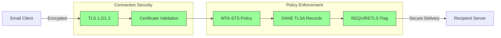
## E-mailberichtversleuteling {#email-message-encryption}

> \[!NOTE]
> Forward Email ondersteunt zowel OpenPGP als S/MIME voor end-to-end e-mailversleuteling.

Forward Email ondersteunt OpenPGP- en S/MIME-versleuteling:

| RFC                                                       | Titel                                                                                   | Status      | Implementatie-opmerkingen                                                                                                                                                                           |
| --------------------------------------------------------- | --------------------------------------------------------------------------------------- | ----------- | -------------------------------------------------------------------------------------------------------------------------------------------------------------------------------------------------- |
| [RFC 9580](https://datatracker.ietf.org/doc/html/rfc9580) | OpenPGP (vervangt RFC 4880)                                                             | ✅ Ondersteund | Via [OpenPGP.js v6+](https://github.com/openpgpjs/openpgpjs) integratie. Zie [FAQ](https://forwardemail.net/en/faq#do-you-support-openpgpmime-end-to-end-encryption-e2ee-and-web-key-directory-wkd) |
| [RFC 8551](https://datatracker.ietf.org/doc/html/rfc8551) | Secure/Multipurpose Internet Mail Extensions (S/MIME) Versie 4.0 Berichtspecificatie      | ✅ Ondersteund | Zowel RSA- als ECC-algoritmen ondersteund. Zie [FAQ](https://forwardemail.net/en/faq#do-you-support-smime-encryption)                                                                              |

Berichtversleutelingsprotocollen beschermen de inhoud van e-mails zodat alleen de bedoelde ontvanger deze kan lezen, zelfs als het bericht tijdens het transport wordt onderschept.

### Versleutelingsondersteuning {#encryption-support}

| Protocol    | RFC      | Status      | Beschrijving                                |
| ----------- | -------- | ----------- | -------------------------------------------- |
| **OpenPGP** | RFC 9580 | ✅ Ondersteund | Pretty Good Privacy - Publieke sleutelversleuteling |
| **S/MIME**  | RFC 8551 | ✅ Ondersteund | Secure/Multipurpose Internet Mail Extensions |
| **WKD**     | Draft    | ✅ Ondersteund | Web Key Directory - Automatische sleutelontdekking |

### OpenPGP (Pretty Good Privacy) {#openpgp-pretty-good-privacy}

**OpenPGP** biedt end-to-end versleuteling met behulp van publieke sleutelcryptografie. Forward Email ondersteunt OpenPGP via het [Web Key Directory (WKD)](https://forwardemail.net/en/faq#do-you-support-openpgpmime-end-to-end-encryption-e2ee-and-web-key-directory-wkd) protocol.

**Belangrijkste kenmerken:**

* Automatische sleutelontdekking via WKD
* PGP/MIME-ondersteuning voor versleutelde bijlagen
* Sleutelbeheer via e-mailclient
* Compatibel met GPG, Mailvelope en andere OpenPGP-tools

**Hoe te gebruiken:**

1. Genereer een PGP-sleutelpaar in je e-mailclient
2. Upload je publieke sleutel naar Forward Email's WKD
3. Je sleutel is automatisch vindbaar voor andere gebruikers
4. Verstuur en ontvang versleutelde e-mails moeiteloos

### S/MIME (Secure/Multipurpose Internet Mail Extensions) {#smime-securemultipurpose-internet-mail-extensions}

**S/MIME** biedt e-mailversleuteling en digitale handtekeningen met behulp van X.509-certificaten.

**Belangrijkste kenmerken:**

* Certificaat-gebaseerde versleuteling
* Digitale handtekeningen voor berichtauthenticatie
* Native ondersteuning in de meeste e-mailclients
* Beveiliging op ondernemingsniveau

**Hoe te gebruiken:**

1. Verkrijg een S/MIME-certificaat van een Certificeringsinstantie
2. Installeer het certificaat in je e-mailclient
3. Configureer je client om berichten te versleutelen/ondertekenen
4. Wissel certificaten uit met ontvangers

### SQLite Mailbox Versleuteling {#sqlite-mailbox-encryption}

> \[!IMPORTANT]
> Forward Email biedt een extra beveiligingslaag met versleutelde SQLite-mailboxen.

Naast berichtniveau-versleuteling versleutelt Forward Email volledige mailboxen met behulp van [sqleet](https://github.com/resilar/sqleet) (ChaCha20-Poly1305).

**Belangrijkste kenmerken:**

* **Wachtwoord-gebaseerde versleuteling** - Alleen jij hebt het wachtwoord
* **Quantum-bestendig** - ChaCha20-Poly1305-cijfer
* **Zero-knowledge** - Forward Email kan je mailbox niet ontsleutelen
* **Sandboxed** - Elke mailbox is geïsoleerd en draagbaar
* **Onherstelbaar** - Als je je wachtwoord vergeet, is je mailbox verloren
### Encryptie Vergelijking {#encryption-comparison}

| Kenmerk               | OpenPGP           | S/MIME             | SQLite Encryptie  |
| --------------------- | ----------------- | ------------------ | ----------------- |
| **End-to-End**        | ✅ Ja              | ✅ Ja               | ✅ Ja              |
| **Sleutelbeheer**     | Zelf beheerd      | CA-uitgegeven      | Wachtwoord-gebaseerd |
| **Client Ondersteuning** | Vereist plugin   | Native             | Transparant       |
| **Gebruikssituatie**  | Persoonlijk       | Zakelijk           | Opslag            |
| **Quantum-bestendig** | ⚠️ Afhankelijk van sleutel | ⚠️ Afhankelijk van certificaat | ✅ Ja              |

### Encryptie Stroom {#encryption-flow}

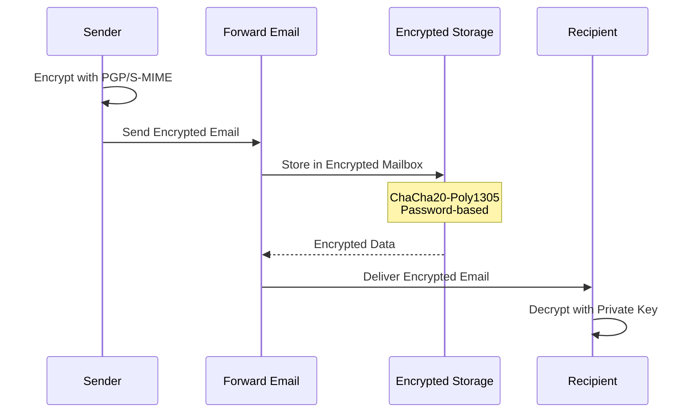

---


## Uitgebreide Functionaliteit {#extended-functionality}


## E-mail Bericht Formaat Standaarden {#email-message-format-standards}

> \[!NOTE]
> Forward Email ondersteunt moderne e-mail formaat standaarden voor rijke inhoud en internationalisering.

Forward Email ondersteunt standaard e-mail berichtformaten:

| RFC                                                       | Titel                                                         | Implementatie Notities |
| --------------------------------------------------------- | ------------------------------------------------------------- | --------------------- |
| [RFC 5322](https://datatracker.ietf.org/doc/html/rfc5322) | Internet Bericht Formaat                                      | Volledige ondersteuning |
| [RFC 2045](https://datatracker.ietf.org/doc/html/rfc2045) | MIME Deel Eén: Formaat van Internet Bericht Lichamen          | Volledige MIME ondersteuning |
| [RFC 2046](https://datatracker.ietf.org/doc/html/rfc2046) | MIME Deel Twee: Media Types                                   | Volledige MIME ondersteuning |
| [RFC 2047](https://datatracker.ietf.org/doc/html/rfc2047) | MIME Deel Drie: Bericht Header Extensies voor Niet-ASCII Tekst | Volledige MIME ondersteuning |
| [RFC 2048](https://datatracker.ietf.org/doc/html/rfc2048) | MIME Deel Vier: Registratie Procedures                        | Volledige MIME ondersteuning |
| [RFC 2049](https://datatracker.ietf.org/doc/html/rfc2049) | MIME Deel Vijf: Conformiteitscriteria en Voorbeelden          | Volledige MIME ondersteuning |

E-mail formaat standaarden definiëren hoe e-mailberichten zijn gestructureerd, gecodeerd en weergegeven.

### Ondersteuning Formaat Standaarden {#format-standards-support}

| Standaard          | RFC           | Status      | Beschrijving                          |
| ------------------ | ------------- | ----------- | ----------------------------------- |
| **MIME**           | RFC 2045-2049 | ✅ Ondersteund | Multipurpose Internet Mail Extensions |
| **SMTPUTF8**       | RFC 6531      | ⚠️ Gedeeltelijk | Geïntegreerde e-mailadressen         |
| **EAI**            | RFC 6530      | ⚠️ Gedeeltelijk | E-mail Adres Internationalisering    |
| **Bericht Formaat**| RFC 5322      | ✅ Ondersteund | Internet Bericht Formaat             |
| **MIME Beveiliging** | RFC 1847    | ✅ Ondersteund | Beveiligings-Multiparts voor MIME    |

### MIME (Multipurpose Internet Mail Extensions) {#mime-multipurpose-internet-mail-extensions}

**MIME** maakt het mogelijk dat e-mails meerdere delen bevatten met verschillende inhoudstypen (tekst, HTML, bijlagen, enz.).

**Ondersteunde MIME Kenmerken:**

* Meerdelige berichten (mixed, alternative, related)
* Content-Type headers
* Content-Transfer-Encoding (7bit, 8bit, quoted-printable, base64)
* Inline afbeeldingen en bijlagen
* Rijke HTML-inhoud

### SMTPUTF8 en E-mail Adres Internationalisering {#smtputf8-and-email-address-internationalization}

> \[!WARNING]
> SMTPUTF8 ondersteuning is gedeeltelijk - niet alle functies zijn volledig geïmplementeerd.
**SMTPUTF8** maakt het mogelijk dat e-mailadressen niet-ASCII tekens bevatten (bijv. `用户@例え.jp`).

**Huidige status:**

* ⚠️ Gedeeltelijke ondersteuning voor geïnternationaliseerde e-mailadressen
* ✅ UTF-8 inhoud in berichtlichamen
* ⚠️ Beperkte ondersteuning voor niet-ASCII lokale delen

---


## Agenda- en Contactprotocollen {#calendaring-and-contacts-protocols}

> \[!NOTE]
> Forward Email biedt volledige CalDAV- en CardDAV-ondersteuning voor agenda- en contactensynchronisatie.

Forward Email ondersteunt CalDAV en CardDAV via de [caldav-adapter](https://github.com/forwardemail/caldav-adapter) bibliotheek:

| RFC                                                       | Titel                                                                    | Status      | Implementatie-opmerkingen                                                                                                                                                              |
| --------------------------------------------------------- | ------------------------------------------------------------------------ | ----------- | -------------------------------------------------------------------------------------------------------------------------------------------------------------------------------------- |
| [RFC 4791](https://datatracker.ietf.org/doc/html/rfc4791) | Agenda-uitbreidingen voor WebDAV (CalDAV)                               | ✅ Ondersteund | Toegang tot en beheer van agenda's                                                                                                                                                      |
| [RFC 6352](https://datatracker.ietf.org/doc/html/rfc6352) | CardDAV: vCard-uitbreidingen voor WebDAV                                | ✅ Ondersteund | Toegang tot en beheer van contacten                                                                                                                                                     |
| [RFC 5545](https://datatracker.ietf.org/doc/html/rfc5545) | Internet Agenda- en Planning Core Object Specificatie (iCalendar)       | ✅ Ondersteund | Ondersteuning voor iCalendar-formaat                                                                                                                                                    |
| [RFC 6350](https://datatracker.ietf.org/doc/html/rfc6350) | vCard Formaat Specificatie                                              | ✅ Ondersteund | Ondersteuning voor vCard 4.0 formaat                                                                                                                                                     |
| [RFC 6638](https://datatracker.ietf.org/doc/html/rfc6638) | Planning-uitbreidingen voor CalDAV                                      | ✅ Ondersteund | CalDAV planning met iMIP ondersteuning. Zie [commit c4d1629](https://github.com/forwardemail/forwardemail.net/commit/c4d162975a49e38d76d68a032662e873a34a9b80)                            |
| [RFC 5546](https://datatracker.ietf.org/doc/html/rfc5546) | iCalendar Transport-Onafhankelijk Interoperabiliteitsprotocol (iTIP)   | ✅ Ondersteund | iTIP ondersteuning voor REQUEST, REPLY, CANCEL en VFREEBUSY methoden. Zie [commit c4d1629](https://github.com/forwardemail/forwardemail.net/commit/c4d162975a49e38d76d68a032662e873a34a9b80) |
| [RFC 6047](https://datatracker.ietf.org/doc/html/rfc6047) | iCalendar Berichtgebaseerd Interoperabiliteitsprotocol (iMIP)          | ✅ Ondersteund | E-mail gebaseerde agenda-uitnodigingen met responslinks. Zie [commit c4d1629](https://github.com/forwardemail/forwardemail.net/commit/c4d162975a49e38d76d68a032662e873a34a9b80)           |

CalDAV en CardDAV zijn protocollen die het mogelijk maken om agenda- en contactgegevens te openen, te delen en te synchroniseren tussen apparaten.

### CalDAV- en CardDAV-ondersteuning {#caldav-and-carddav-support}

| Protocol              | RFC      | Status      | Beschrijving                          |
| --------------------- | -------- | ----------- | ----------------------------------- |
| **CalDAV**            | RFC 4791 | ✅ Ondersteund | Toegang tot en synchronisatie van agenda's |
| **CardDAV**           | RFC 6352 | ✅ Ondersteund | Toegang tot en synchronisatie van contacten |
| **iCalendar**         | RFC 5545 | ✅ Ondersteund | Agenda gegevensformaat               |
| **vCard**             | RFC 6350 | ✅ Ondersteund | Contactgegevensformaat               |
| **VTODO**             | RFC 5545 | ✅ Ondersteund | Ondersteuning voor taken/herinneringen |
| **CalDAV Planning**   | RFC 6638 | ✅ Ondersteund | Uitbreidingen voor agenda-planning  |
| **iTIP**              | RFC 5546 | ✅ Ondersteund | Transport-onafhankelijke interoperabiliteit |
| **iMIP**              | RFC 6047 | ✅ Ondersteund | E-mail gebaseerde agenda-uitnodigingen |
### CalDAV (Agenda Toegang) {#caldav-calendar-access}

**CalDAV** stelt je in staat om agenda's te openen en beheren vanaf elk apparaat of elke applicatie.

**Belangrijkste Kenmerken:**

* Synchronisatie op meerdere apparaten
* Gedeelde agenda's
* Agenda-abonnementen
* Evenementuitnodigingen en reacties
* Terugkerende evenementen
* Tijdzone-ondersteuning

**Compatibele Clients:**

* Apple Agenda (macOS, iOS)
* Mozilla Thunderbird
* Evolution
* GNOME Agenda
* Elke CalDAV-compatibele client

### CardDAV (Contact Toegang) {#carddav-contact-access}

**CardDAV** stelt je in staat om contacten te openen en beheren vanaf elk apparaat of elke applicatie.

**Belangrijkste Kenmerken:**

* Synchronisatie op meerdere apparaten
* Gedeelde adresboeken
* Contactgroepen
* Foto-ondersteuning
* Aangepaste velden
* vCard 4.0 ondersteuning

**Compatibele Clients:**

* Apple Contacten (macOS, iOS)
* Mozilla Thunderbird
* Evolution
* GNOME Contacten
* Elke CardDAV-compatibele client

### Taken en Herinneringen (CalDAV VTODO) {#tasks-and-reminders-caldav-vtodo}

> \[!TIP]
> Forward Email ondersteunt taken en herinneringen via CalDAV VTODO.

**VTODO** is onderdeel van het iCalendar-formaat en maakt taakbeheer mogelijk via CalDAV.

**Belangrijkste Kenmerken:**

* Taak aanmaken en beheren
* Vervaldatums en prioriteiten
* Volgen van taakvoltooiing
* Terugkerende taken
* Takenlijsten/categorieën

**Compatibele Clients:**

* Apple Herinneringen (macOS, iOS)
* Mozilla Thunderbird (met Lightning)
* Evolution
* GNOME To Do
* Elke CalDAV-client met VTODO-ondersteuning

### CalDAV/CardDAV Synchronisatie Stroom {#caldavcarddav-synchronization-flow}

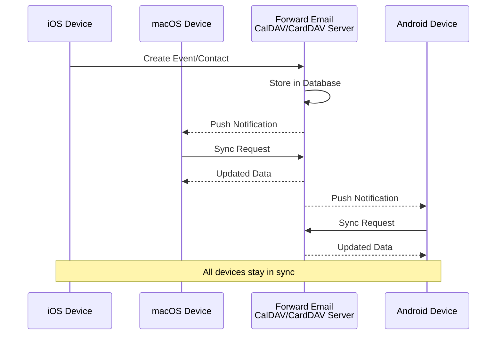

### Niet-ondersteunde Agenda-uitbreidingen {#calendaring-extensions-not-supported}

De volgende agenda-uitbreidingen worden NIET ondersteund:

| RFC                                                       | Titel                                                                | Reden                                                           |
| --------------------------------------------------------- | -------------------------------------------------------------------- | --------------------------------------------------------------- |
| [RFC 4918](https://datatracker.ietf.org/doc/html/rfc4918) | HTTP-uitbreidingen voor Web Distributed Authoring en Versioning (WebDAV) | CalDAV gebruikt WebDAV-concepten maar implementeert niet de volledige RFC 4918 |
| [RFC 6578](https://datatracker.ietf.org/doc/html/rfc6578) | Collectiesynchronisatie voor WebDAV                                  | Niet geïmplementeerd                                            |
| [RFC 3744](https://datatracker.ietf.org/doc/html/rfc3744) | WebDAV Access Control Protocol                                       | Niet geïmplementeerd                                            |

---


## E-mailberichtfiltering {#email-message-filtering}

> \[!IMPORTANT]
> Forward Email biedt **volledige Sieve- en ManageSieve-ondersteuning** voor server-side e-mailfiltering. Maak krachtige regels om binnenkomende berichten automatisch te sorteren, filteren, doorsturen en beantwoorden.

### Sieve (RFC 5228) {#sieve-rfc-5228}

[Sieve](https://en.wikipedia.org/wiki/Sieve_\(mail_filtering_language\)) is een gestandaardiseerde, krachtige scripttaal voor server-side e-mailfiltering. Forward Email implementeert uitgebreide Sieve-ondersteuning met 24 extensies.

**Broncode:** [`helpers/sieve/`](https://github.com/forwardemail/forwardemail.net/tree/master/helpers/sieve)

#### Ondersteunde Kern-Sieve RFC's {#core-sieve-rfcs-supported}

| RFC                                                                                    | Titel                                                         | Status         |
| -------------------------------------------------------------------------------------- | ------------------------------------------------------------- | -------------- |
| [RFC 5228](https://datatracker.ietf.org/doc/html/rfc5228)                              | Sieve: Een e-mailfiltertaal                                   | ✅ Volledige ondersteuning |
| [RFC 5429](https://datatracker.ietf.org/doc/html/rfc5429)                              | Sieve e-mailfilteren: Reject en Extended Reject extensies    | ✅ Volledige ondersteuning |
| [RFC 5230](https://datatracker.ietf.org/doc/html/rfc5230)                              | Sieve e-mailfilteren: Vakantie-extensie                      | ✅ Volledige ondersteuning |
| [RFC 6131](https://datatracker.ietf.org/doc/html/rfc6131)                              | Sieve vakantie-extensie: "Seconds" parameter                  | ✅ Volledige ondersteuning |
| [RFC 5232](https://datatracker.ietf.org/doc/html/rfc5232)                              | Sieve e-mailfilteren: Imap4flags extensie                     | ✅ Volledige ondersteuning |
| [RFC 5173](https://datatracker.ietf.org/doc/html/rfc5173)                              | Sieve e-mailfilteren: Body extensie                           | ✅ Volledige ondersteuning |
| [RFC 5229](https://datatracker.ietf.org/doc/html/rfc5229)                              | Sieve e-mailfilteren: Variabelen extensie                     | ✅ Volledige ondersteuning |
| [RFC 5231](https://datatracker.ietf.org/doc/html/rfc5231)                              | Sieve e-mailfilteren: Relationele extensie                    | ✅ Volledige ondersteuning |
| [RFC 4790](https://datatracker.ietf.org/doc/html/rfc4790)                              | Internet Application Protocol Collation Registry              | ✅ Volledige ondersteuning |
| [RFC 3894](https://datatracker.ietf.org/doc/html/rfc3894)                              | Sieve extensie: Kopiëren zonder bijwerkingen                  | ✅ Volledige ondersteuning |
| [RFC 5293](https://datatracker.ietf.org/doc/html/rfc5293)                              | Sieve e-mailfilteren: Editheader extensie                     | ✅ Volledige ondersteuning |
| [RFC 5260](https://datatracker.ietf.org/doc/html/rfc5260)                              | Sieve e-mailfilteren: Datum- en indexextensies                | ✅ Volledige ondersteuning |
| [RFC 5435](https://datatracker.ietf.org/doc/html/rfc5435)                              | Sieve e-mailfilteren: Extensie voor notificaties              | ✅ Volledige ondersteuning |
| [RFC 5183](https://datatracker.ietf.org/doc/html/rfc5183)                              | Sieve e-mailfilteren: Omgevings-extensie                      | ✅ Volledige ondersteuning |
| [RFC 5490](https://datatracker.ietf.org/doc/html/rfc5490)                              | Sieve e-mailfilteren: Extensies voor mailboxstatuscontrole    | ✅ Volledige ondersteuning |
| [RFC 8579](https://datatracker.ietf.org/doc/html/rfc8579)                              | Sieve e-mailfilteren: Bezorging aan speciale mailboxen       | ✅ Volledige ondersteuning |
| [RFC 7352](https://datatracker.ietf.org/doc/html/rfc7352)                              | Sieve e-mailfilteren: Detectie van dubbele bezorgingen        | ✅ Volledige ondersteuning |
| [RFC 5463](https://datatracker.ietf.org/doc/html/rfc5463)                              | Sieve e-mailfilteren: Ihave extensie                          | ✅ Volledige ondersteuning |
| [RFC 5233](https://datatracker.ietf.org/doc/html/rfc5233)                              | Sieve e-mailfilteren: Subaddress extensie                     | ✅ Volledige ondersteuning |
| [draft-ietf-sieve-regex](https://datatracker.ietf.org/doc/html/draft-ietf-sieve-regex) | Sieve e-mailfilteren: Regular Expression extensie             | ✅ Volledige ondersteuning |
#### Ondersteunde Sieve-extensies {#supported-sieve-extensions}

| Extensie                    | Beschrijving                              | Integratie                                |
| ---------------------------- | ---------------------------------------- | ------------------------------------------ |
| `fileinto`                   | Plaats berichten in specifieke mappen      | Berichten opgeslagen in opgegeven IMAP-map   |
| `reject` / `ereject`         | Weiger berichten met een foutmelding            | SMTP-afwijzing met bouncebericht         |
| `vacation`                   | Automatische vakantie/afwezigheidsantwoorden | In wachtrij via Emails.queue met snelheidsbeperking |
| `vacation-seconds`           | Fijnmazige vakantieantwoordintervallen | TTL vanuit `:seconds` parameter              |
| `imap4flags`                 | Stel IMAP-vlaggen in (\Seen, \Flagged, enz.)   | Vlaggen toegepast tijdens berichtopslag       |
| `envelope`                   | Test afzender/ontvanger van envelop           | Toegang tot SMTP-envelopgegevens               |
| `body`                       | Test inhoud van berichttekst                | Volledige tekstmatching                    |
| `variables`                  | Sla variabelen op en gebruik ze in scripts       | Variabele expansie met modificatoren          |
| `relational`                 | Relationele vergelijkingen                   | `:count`, `:value` met gt/lt/eq           |
| `comparator-i;ascii-numeric` | Numerieke vergelijkingen                      | Numerieke tekenreeksvergelijking                  |
| `copy`                       | Kopieer berichten tijdens doorsturen          | `:copy` vlag bij fileinto/redirect          |
| `editheader`                 | Voeg headers toe of verwijder ze            | Headers aangepast vóór opslag            |
| `date`                       | Test datum/tijd waarden                    | `currentdate` en header datum tests        |
| `index`                      | Toegang tot specifieke header-voorkomens       | `:index` voor headers met meerdere waarden           |
| `regex`                      | Regular expression matching              | Volledige regex-ondersteuning in tests                |
| `enotify`                    | Verstuur notificaties                       | `mailto:` notificaties via Emails.queue   |
| `environment`                | Toegang tot omgevingsinformatie           | Domein, host, remote-ip vanuit sessie       |
| `mailbox`                    | Test of mailbox bestaat                   | `mailboxexists` test                       |
| `special-use`                | Plaats in speciale mailboxen          | Koppelt \Junk, \Trash, enz. aan mappen        |
| `duplicate`                  | Detecteer dubbele berichten                | Redis-gebaseerde duplicaattracking             |
| `ihave`                      | Test op beschikbaarheid van extensie          | Runtime capaciteitscontrole                |
| `subaddress`                 | Toegang tot user+detail adresdelen         | `:user` en `:detail` adresdelen        |

#### Niet-ondersteunde Sieve-extensies {#sieve-extensions-not-supported}

| Extensie                               | RFC                                                       | Reden                                                           |
| --------------------------------------- | --------------------------------------------------------- | ---------------------------------------------------------------- |
| `include`                               | [RFC 6609](https://datatracker.ietf.org/doc/html/rfc6609) | Beveiligingsrisico (scriptinjectie), vereist globale scriptopslag |
| `mboxmetadata` / `servermetadata`       | [RFC 5490](https://datatracker.ietf.org/doc/html/rfc5490) | Vereist IMAP METADATA-extensie                                 |
| `fcc`                                   | [RFC 8580](https://datatracker.ietf.org/doc/html/rfc8580) | Vereist integratie met Verzonden-map                                 |
| `encoded-character`                     | [RFC 5228](https://datatracker.ietf.org/doc/html/rfc5228) | Parserwijzigingen vereist voor ${hex:} syntax                       |
| `foreverypart` / `mime` / `extracttext` | [RFC 5703](https://datatracker.ietf.org/doc/html/rfc5703) | Complexe MIME-boommanipulatie                                   |
#### Sieve Verwerkingsstroom {#sieve-processing-flow}

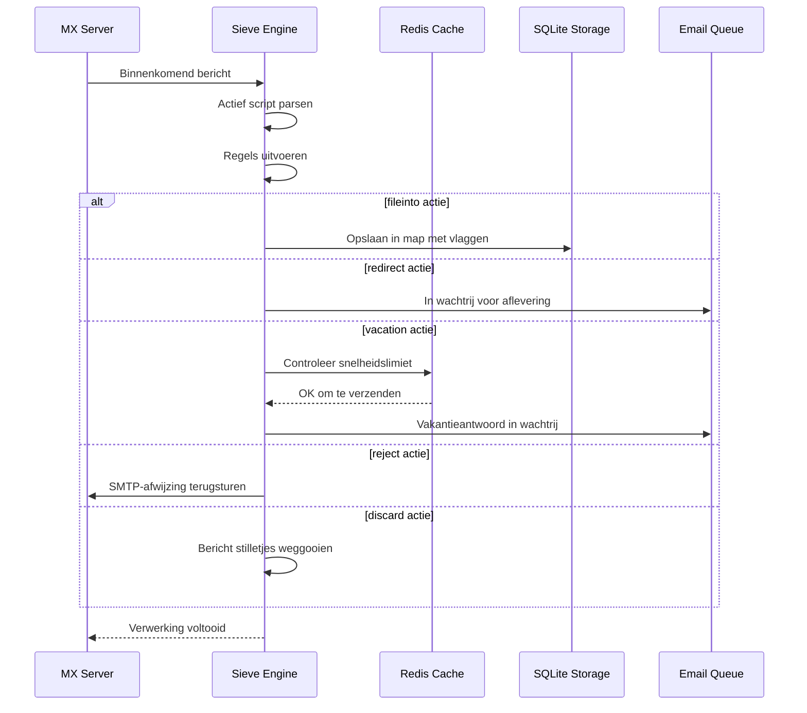

#### Beveiligingsfuncties {#security-features}

De Sieve-implementatie van Forward Email bevat uitgebreide beveiligingsmaatregelen:

* **CVE-2023-26430 Bescherming**: Voorkomt redirect-lussen en mail bombing aanvallen
* **Snelheidslimieten**: Limieten op redirects (10/bericht, 100/dag) en vakantieantwoorden
* **Denylist Controle**: Redirect-adressen worden gecontroleerd tegen denylist
* **Beschermde Headers**: DKIM, ARC en authenticatieheaders kunnen niet worden aangepast via editheader
* **Scriptgrootte Limieten**: Maximale scriptgrootte wordt afgedwongen
* **Uitvoeringstijd Limieten**: Scripts worden beëindigd als uitvoeringstijd limiet wordt overschreden

#### Voorbeeld Sieve Scripts {#example-sieve-scripts}

**Nieuwsbrieven in een map plaatsen:**

```sieve
require ["fileinto"];

if header :contains "List-Id" "newsletter" {
    fileinto "Newsletters";
}
```

**Vakantie automatische beantwoorder met fijnmazige timing:**

```sieve
require ["vacation", "vacation-seconds"];

vacation :seconds 3600 :subject "Out of Office"
    "Ik ben momenteel afwezig en zal binnen 24 uur reageren.";
```

**Spamfiltering met vlaggen:**

```sieve
require ["fileinto", "imap4flags"];

if header :contains "X-Spam-Status" "Yes" {
    setflag "\\Seen";
    fileinto "Junk";
}
```

**Complexe filtering met variabelen:**

```sieve
require ["variables", "fileinto", "regex"];

if header :regex "From" "(.+)@example\\.com" {
    set :lower "sender" "${1}";
    fileinto "Contacts/${sender}";
}
```

> \[!TIP]
> Voor volledige documentatie, voorbeeldscripts en configuratie-instructies, zie [FAQ: Ondersteunt u Sieve e-mailfiltering?](/faq#do-you-support-sieve-email-filtering)

### ManageSieve (RFC 5804) {#managesieve-rfc-5804}

Forward Email biedt volledige ManageSieve protocolondersteuning voor het op afstand beheren van Sieve scripts.

**Broncode:** [`managesieve-server.js`](https://github.com/forwardemail/forwardemail.net/blob/master/managesieve-server.js)

| RFC                                                       | Titel                                          | Status         |
| --------------------------------------------------------- | ---------------------------------------------- | -------------- |
| [RFC 5804](https://datatracker.ietf.org/doc/html/rfc5804) | Een protocol voor het op afstand beheren van Sieve scripts | ✅ Volledige ondersteuning |

#### ManageSieve Server Configuratie {#managesieve-server-configuration}

| Instelling              | Waarde                  |
| ----------------------- | ----------------------- |
| **Server**              | `imap.forwardemail.net` |
| **Poort (STARTTLS)**    | `2190` (aanbevolen)     |
| **Poort (Implicit TLS)**| `4190`                  |
| **Authenticatie**       | PLAIN (over TLS)        |

> **Opmerking:** Poort 2190 gebruikt STARTTLS (upgrade van plain naar TLS) en is compatibel met de meeste ManageSieve clients, inclusief [sieve-connect](https://github.com/philpennock/sieve-connect). Poort 4190 gebruikt implicit TLS (TLS vanaf het begin van de verbinding) voor clients die dit ondersteunen.

#### Ondersteunde ManageSieve Commando's {#supported-managesieve-commands}

| Commando       | Beschrijving                           |
| -------------- | ------------------------------------ |
| `AUTHENTICATE` | Authenticeren met PLAIN mechanisme    |
| `CAPABILITY`   | Lijst van servermogelijkheden en extensies |
| `HAVESPACE`    | Controleren of script kan worden opgeslagen |
| `PUTSCRIPT`    | Uploaden van een nieuw script         |
| `LISTSCRIPTS`  | Lijst van alle scripts met actieve status |
| `SETACTIVE`    | Activeren van een script              |
| `GETSCRIPT`    | Downloaden van een script             |
| `DELETESCRIPT` | Verwijderen van een script            |
| `RENAMESCRIPT` | Hernoemen van een script              |
| `CHECKSCRIPT`  | Valideren van scriptsyntaxis          |
| `NOOP`         | Verbinding actief houden              |
| `LOGOUT`       | Sessie beëindigen                     |
#### Compatibele ManageSieve Clients {#compatible-managesieve-clients}

* **Thunderbird**: Ingebouwde Sieve-ondersteuning via de [Sieve add-on](https://addons.thunderbird.net/addon/sieve/)
* **Roundcube**: [ManageSieve plugin](https://plugins.roundcube.net/packages/johndoh/sieve)
* **KMail**: Native ManageSieve-ondersteuning
* **sieve-connect**: Commandoregelclient
* **Elke RFC 5804 conforme client**

#### ManageSieve Protocol Flow {#managesieve-protocol-flow}

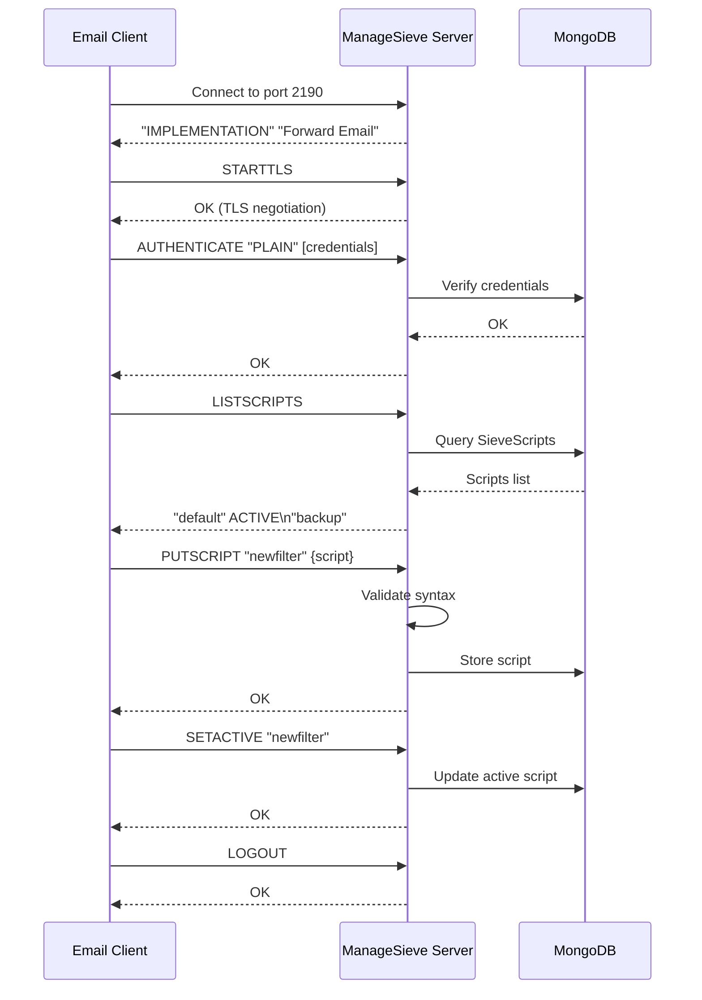

#### Web Interface and API {#web-interface-and-api}

Naast ManageSieve biedt Forward Email:

* **Web Dashboard**: Maak en beheer Sieve-scripts via de webinterface bij Mijn Account → Domeinen → Aliassen → Sieve Scripts
* **REST API**: Programmatic toegang tot Sieve-scriptbeheer via de [Forward Email API](/api#sieve-scripts)

> \[!TIP]
> Voor gedetailleerde installatie-instructies en clientconfiguratie, zie [FAQ: Ondersteunt u Sieve e-mailfiltering?](/faq#do-you-support-sieve-email-filtering)

---


## Opslagoptimalisatie {#storage-optimization}

> \[!IMPORTANT]
> **Eerste in de industrie opslagtechnologie:** Forward Email is de **enige e-mailprovider ter wereld** die bijlage-deduplicatie combineert met Brotli-compressie op e-mailinhoud. Deze dubbele optimalisatie geeft je **2-3x meer effectieve opslag** vergeleken met traditionele e-mailproviders.

Forward Email implementeert twee revolutionaire opslagoptimalisatietechnieken die de mailboxgrootte drastisch verminderen terwijl volledige RFC-naleving en berichtgetrouwheid behouden blijven:

1. **Bijlage-deduplicatie** - Elimineert dubbele bijlagen over alle e-mails heen
2. **Brotli-compressie** - Vermindert opslag met 46-86% voor metadata en 50% voor bijlagen

### Architectuur: Dubbele Laag Opslagoptimalisatie {#architecture-dual-layer-storage-optimization}

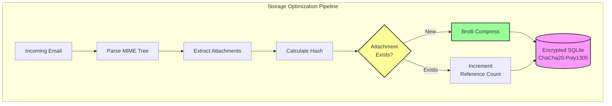

---


## Bijlage-deduplicatie {#attachment-deduplication}

Forward Email implementeert bijlage-deduplicatie gebaseerd op de [bewezen aanpak van WildDuck](https://docs.wildduck.email/docs/in-depth/attachment-deduplication/), aangepast voor SQLite-opslag.

> \[!NOTE]
> **Wat wordt gededupliceerd:** "Bijlage" verwijst naar de **gecodeerde** MIME-node-inhoud (base64 of quoted-printable), niet het gedecodeerde bestand. Dit behoudt de geldigheid van DKIM- en GPG-handtekeningen.

### Hoe het werkt {#how-it-works}

**WildDuck's originele implementatie (MongoDB GridFS):**

> Wild Duck IMAP-server dedupliceert bijlagen. "Bijlage" betekent in dit geval de base64- of quoted-printable-gecodeerde mime-node-inhoud, niet het gedecodeerde bestand. Hoewel het gebruik van gecodeerde inhoud veel false negatives veroorzaakt (hetzelfde bestand in verschillende e-mails kan als verschillende bijlage worden geteld), is dit nodig om de geldigheid van verschillende handtekeningmethoden (DKIM, GPG, enz.) te garanderen. Een bericht dat van Wild Duck wordt opgehaald, ziet er precies hetzelfde uit als het bericht dat is opgeslagen, ook al parseert Wild Duck het bericht in een boomachtige structuur en bouwt het bericht opnieuw op bij het ophalen.
**Forward Email's SQLite-implementatie:**

Forward Email past deze aanpak aan voor versleutelde SQLite-opslag met het volgende proces:

1. **Hash-berekening**: Wanneer een bijlage wordt gevonden, wordt een hash berekend met behulp van de [`rev-hash`](https://github.com/sindresorhus/rev-hash) bibliotheek van de bijlage-inhoud
2. **Opzoeken**: Controleren of een bijlage met een overeenkomende hash bestaat in de tabel `Attachments`
3. **Referentietelling**:
   * Als deze bestaat: Verhoog referentieteller met 1 en magische teller met een willekeurig getal
   * Als nieuw: Maak een nieuwe bijlagevermelding aan met teller = 1
4. **Veiligheid bij verwijderen**: Gebruikt een dual-teller systeem (referentie + magisch) om valse positieven te voorkomen
5. **Garbage Collection**: Bijlagen worden onmiddellijk verwijderd wanneer beide tellers nul bereiken

**Broncode:** [`helpers/attachment-storage.js`](https://github.com/forwardemail/forwardemail.net/blob/master/helpers/attachment-storage.js)

### Deduplicatieproces {#deduplication-flow}

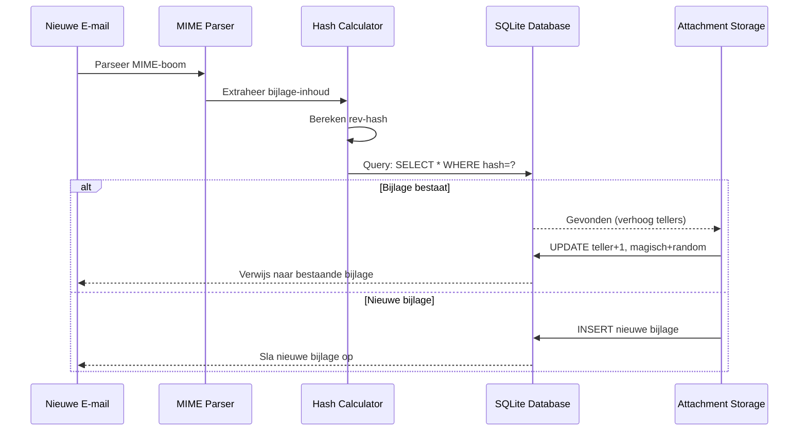

### Magisch Getallensysteem {#magic-number-system}

Forward Email gebruikt WildDuck's "magisch getal" systeem (geïnspireerd door [Mail.ru](https://github.com/zone-eu/wildduck)) om valse positieven bij verwijderen te voorkomen:

* Elk bericht krijgt een **willekeurig getal** toegewezen
* De **magische teller** van de bijlage wordt verhoogd met dat willekeurige getal wanneer het bericht wordt toegevoegd
* De magische teller wordt verlaagd met hetzelfde getal wanneer het bericht wordt verwijderd
* De bijlage wordt alleen verwijderd wanneer **beide tellers** (referentie + magisch) nul bereiken

Dit dual-teller systeem zorgt ervoor dat als er iets misgaat tijdens het verwijderen (bijv. crash, netwerkfout), de bijlage niet voortijdig wordt verwijderd.

### Belangrijkste verschillen: WildDuck vs Forward Email {#key-differences-wildduck-vs-forward-email}

| Kenmerk                | WildDuck (MongoDB)       | Forward Email (SQLite)       |
| ---------------------- | ------------------------ | ---------------------------- |
| **Opslag Backend**     | MongoDB GridFS (in stukken) | SQLite BLOB (direct)         |
| **Hash-algoritme**     | SHA256                   | rev-hash (gebaseerd op SHA-256) |
| **Referentietelling**  | ✅ Ja                    | ✅ Ja                        |
| **Magische getallen**  | ✅ Ja (Mail.ru geïnspireerd) | ✅ Ja (zelfde systeem)          |
| **Garbage Collection** | Uitgesteld (apart proces) | Direct (bij nul tellers)     |
| **Compressie**         | ❌ Geen                  | ✅ Brotli (zie hieronder)    |
| **Encryptie**          | ❌ Optioneel             | ✅ Altijd (ChaCha20-Poly1305) |

---


## Brotli-compressie {#brotli-compression}

> \[!IMPORTANT]
> **Wereldprimeur:** Forward Email is de **enige e-maildienst ter wereld** die Brotli-compressie gebruikt op e-mailinhoud. Dit levert **46-86% opslagbesparing** bovenop bijlage-deduplicatie.

Forward Email implementeert Brotli-compressie voor zowel bijlage-inhoud als berichtmetadata, wat enorme opslagbesparingen oplevert terwijl de achterwaartse compatibiliteit behouden blijft.

**Implementatie:** [`helpers/msgpack-helpers.js`](https://github.com/forwardemail/forwardemail.net/blob/master/helpers/msgpack-helpers.js)

### Wat wordt gecomprimeerd {#what-gets-compressed}

**1. Bijlage-inhoud** (`encodeAttachmentBody`)

* **Oude formaten**: Hex-gecodeerde string (2x grootte) of raw Buffer
* **Nieuw formaat**: Brotli-gecomprimeerde Buffer met "FEBR" magische header
* **Compressiebeslissing**: Comprimeert alleen als het ruimte bespaart (houdt rekening met 4-byte header)
* **Opslagbesparing**: Tot **50%** (hex → native BLOB)
**2. Bericht Metadata** (`encodeMetadata`)

Bevat: `mimeTree`, `headers`, `envelope`, `flags`

* **Oud formaat**: JSON tekststring
* **Nieuw formaat**: Brotli-gecomprimeerde Buffer
* **Opslagbesparing**: **46-86%** afhankelijk van de complexiteit van het bericht

### Compressie Configuratie {#compression-configuration}

```javascript
// Brotli compressie opties geoptimaliseerd voor snelheid (niveau 4 is een goede balans)
const BROTLI_COMPRESS_OPTIONS = {
  params: {
    [zlib.constants.BROTLI_PARAM_QUALITY]: 4
  }
};
```

**Waarom Niveau 4?**

* **Snelle compressie/decompressie**: Sub-millisecond verwerking
* **Goede compressieverhouding**: 46-86% besparing
* **Gebalanceerde prestaties**: Optimaal voor realtime e-mail operaties

### Magic Header: "FEBR" {#magic-header-febr}

Forward Email gebruikt een 4-byte magic header om gecomprimeerde bijlage-inhoud te identificeren:

```
"FEBR" = Forward Email BRotli
Hex: 0x46 0x45 0x42 0x52
```

**Waarom een magic header?**

* **Formaatdetectie**: Direct gecomprimeerde vs ongecomprimeerde data identificeren
* **Achterwaartse compatibiliteit**: Oude hex strings en ruwe Buffers werken nog steeds
* **Botsingsvermijding**: "FEBR" zal waarschijnlijk niet aan het begin van legitieme bijlagegegevens voorkomen

### Compressie Proces {#compression-process}

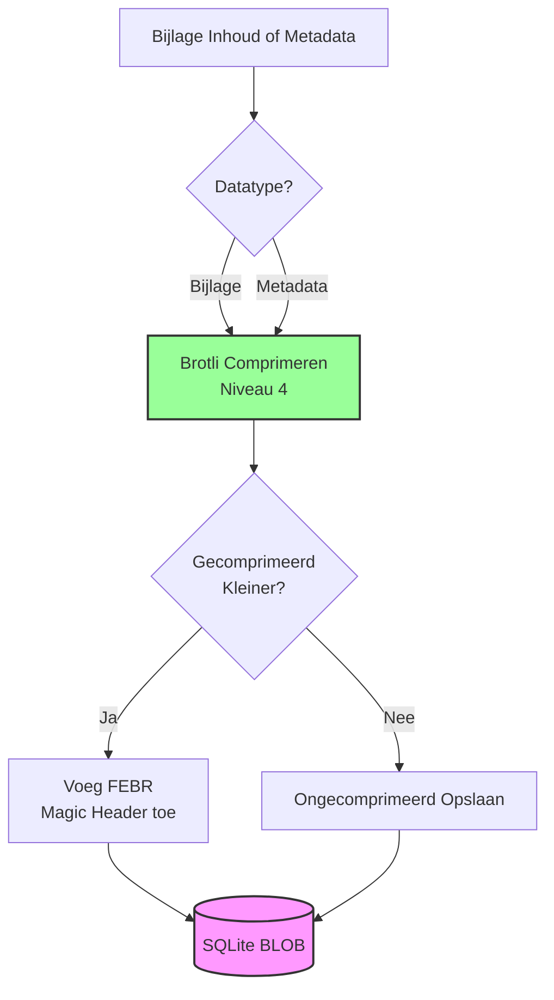

### Decompressie Proces {#decompression-process}

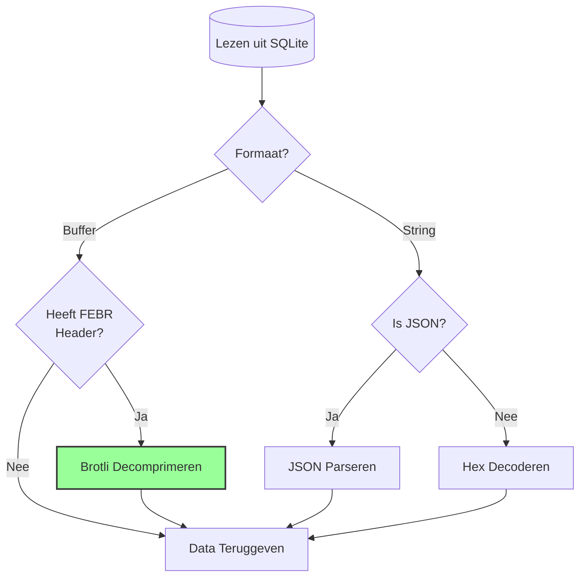

### Achterwaartse Compatibiliteit {#backwards-compatibility}

Alle decode functies **detecteren automatisch** het opslagformaat:

| Formaat               | Detectiemethode                      | Afhandeling                                   |
| --------------------- | ---------------------------------- | --------------------------------------------- |
| **Brotli-gecomprimeerd** | Controleren op "FEBR" magic header | Decomprimeren met `zlib.brotliDecompressSync()` |
| **Ruwe Buffer**        | `Buffer.isBuffer()` zonder magic    | Ongewijzigd teruggeven                         |
| **Hex string**         | Controleren op even lengte + [0-9a-f] tekens | Decoderen met `Buffer.from(value, 'hex')`     |
| **JSON string**        | Controleren op eerste karakter `{` of `[` | Parseren met `JSON.parse()`                    |

Dit zorgt voor **nul dataverlies** tijdens migratie van oude naar nieuwe opslagformaten.

### Opslagbesparingsstatistieken {#storage-savings-statistics}

**Gemeten besparingen uit productiedata:**

| Datatype              | Oud Formaat             | Nieuw Formaat          | Besparing  |
| --------------------- | ----------------------- | --------------------- | ---------- |
| **Bijlage-inhoud**    | Hex-gecodeerde string (2x) | Brotli-gecomprimeerde BLOB | **50%**    |
| **Bericht metadata**  | JSON tekst              | Brotli-gecomprimeerde BLOB | **46-86%** |
| **Mailbox flags**     | JSON tekst              | Brotli-gecomprimeerde BLOB | **60-80%** |

**Bron:** [`helpers/migrate-storage-format.js`](https://github.com/forwardemail/forwardemail.net/blob/master/helpers/migrate-storage-format.js)

### Migratie Proces {#migration-process}

Forward Email biedt automatische, idempotente migratie van oude naar nieuwe opslagformaten:
// Migratiestatistieken bijgehouden:
{
  attachmentsMigrated: 0,
  messagesMigrated: 0,
  mailboxesMigrated: 0,
  bytesSaved: 0  // Totaal aantal bytes bespaard door compressie
}
```

**Migratiestappen:**

1. Bijlage-inhoud: hex-codering → native BLOB (50% besparing)
2. Berichtmetadata: JSON-tekst → brotli-gecomprimeerde BLOB (46-86% besparing)
3. Postvakvlaggen: JSON-tekst → brotli-gecomprimeerde BLOB (60-80% besparing)

**Bron:** [`helpers/migrate-storage-format.js`](https://github.com/forwardemail/forwardemail.net/blob/master/helpers/migrate-storage-format.js)

---

### Gecombineerde opslag efficiëntie {#combined-storage-efficiency}

> \[!TIP]
> **Reële impact:** Met bijlage-deduplicatie + Brotli-compressie krijgen Forward Email-gebruikers **2-3x effectievere opslag** vergeleken met traditionele e-mailproviders.

**Voorbeeldscenario:**

Traditionele e-mailprovider (1GB postvak):

* 1GB schijfruimte = 1GB aan e-mails
* Geen deduplicatie: Zelfde bijlage 10 keer opgeslagen = 10x opslagverspilling
* Geen compressie: Volledige JSON-metadata opgeslagen = 2-3x opslagverspilling

Forward Email (1GB postvak):

* 1GB schijfruimte ≈ **2-3GB aan e-mails** (effectieve opslag)
* Deduplicatie: Zelfde bijlage één keer opgeslagen, 10 keer gerefereerd
* Compressie: 46-86% besparing op metadata, 50% op bijlagen
* Encryptie: ChaCha20-Poly1305 (geen opslagoverhead)

**Vergelijkingstabel:**

| Provider          | Opslagtechnologie                           | Effectieve opslag (1GB postvak) |
| ----------------- | -------------------------------------------- | ------------------------------- |
| Gmail             | Geen                                         | 1GB                             |
| iCloud            | Geen                                         | 1GB                             |
| Outlook.com       | Geen                                         | 1GB                             |
| Fastmail          | Geen                                         | 1GB                             |
| ProtonMail        | Alleen encryptie                             | 1GB                             |
| Tutanota          | Alleen encryptie                             | 1GB                             |
| **Forward Email** | **Deduplicatie + Compressie + Encryptie**   | **2-3GB** ✨                     |

### Technische implementatiedetails {#technical-implementation-details}

**Prestaties:**

* Brotli niveau 4: Compressie/decompressie in sub-milliseconden
* Geen prestatieverlies door compressie
* SQLite FTS5: Zoekopdrachten onder 50ms met NVMe SSD

**Beveiliging:**

* Compressie gebeurt **na** encryptie (SQLite database is versleuteld)
* ChaCha20-Poly1305 encryptie + Brotli compressie
* Zero-knowledge: Alleen gebruiker heeft het decryptiewachtwoord

**RFC-naleving:**

* Opgehaalde berichten zien er **exact hetzelfde** uit als opgeslagen
* DKIM-handtekeningen blijven geldig (gecodeerde inhoud behouden)
* GPG-handtekeningen blijven geldig (geen wijziging aan ondertekende inhoud)

### Waarom geen andere provider dit doet {#why-no-other-provider-does-this}

**Complexiteit:**

* Vereist diepe integratie met opslaglaag
* Achterwaartse compatibiliteit is uitdagend
* Migratie van oude formaten is complex

**Prestatiezorgen:**

* Compressie voegt CPU-overhead toe (opgelost met Brotli niveau 4)
* Decompressie bij elke leesactie (opgelost met SQLite caching)

**Voordeel van Forward Email:**

* Vanaf de grond af aan gebouwd met optimalisatie in gedachten
* SQLite maakt directe BLOB-manipulatie mogelijk
* Versleutelde per-gebruiker databases maken veilige compressie mogelijk

---

---


## Moderne functies {#modern-features}


## Volledige REST API voor e-mailbeheer {#complete-rest-api-for-email-management}

> \[!TIP]
> Forward Email biedt een uitgebreide REST API met 39 eindpunten voor programmatisch e-mailbeheer.

> \[!TIP]
> **Unieke functie in de industrie:** In tegenstelling tot alle andere e-mailservices biedt Forward Email volledige programmatische toegang tot je postvak, agenda, contacten, berichten en mappen via een uitgebreide REST API. Dit is directe interactie met je versleutelde SQLite databasebestand waarin al je data is opgeslagen.

Forward Email biedt een complete REST API die ongekende toegang geeft tot je e-mailgegevens. Geen enkele andere e-mailservice (inclusief Gmail, iCloud, Outlook, ProtonMail, Tuta of Fastmail) biedt dit niveau van uitgebreide, directe database-toegang.
**API Documentatie:** <https://forwardemail.net/en/email-api>

### API Categorieën (39 Eindpunten) {#api-categories-39-endpoints}

**1. Berichten API** (5 eindpunten) - Volledige CRUD-bewerkingen op e-mailberichten:

* `GET /v1/messages` - Lijst berichten met 15+ geavanceerde zoekparameters (geen andere dienst biedt dit)
* `POST /v1/messages` - Berichten aanmaken/verzenden
* `GET /v1/messages/:id` - Bericht ophalen
* `PUT /v1/messages/:id` - Bericht bijwerken (vlaggen, mappen)
* `DELETE /v1/messages/:id` - Bericht verwijderen

*Voorbeeld: Vind alle facturen van het afgelopen kwartaal met bijlagen:*

```bash
curl -u "alias@domain.com:password" \
  "https://api.forwardemail.net/v1/messages?q=subject:invoice+has:attachment+after:2024-01-01+before:2024-04-01"
```

Zie [Geavanceerde Zoekdocumentatie](https://forwardemail.net/en/email-api)

**2. Mappen API** (5 eindpunten) - Volledig IMAP mapbeheer via REST:

* `GET /v1/folders` - Lijst alle mappen
* `POST /v1/folders` - Map aanmaken
* `GET /v1/folders/:id` - Map ophalen
* `PUT /v1/folders/:id` - Map bijwerken
* `DELETE /v1/folders/:id` - Map verwijderen

**3. Contacten API** (5 eindpunten) - CardDAV contactopslag via REST:

* `GET /v1/contacts` - Lijst contacten
* `POST /v1/contacts` - Contact aanmaken (vCard-formaat)
* `GET /v1/contacts/:id` - Contact ophalen
* `PUT /v1/contacts/:id` - Contact bijwerken
* `DELETE /v1/contacts/:id` - Contact verwijderen

**4. Agenda's API** (5 eindpunten) - Beheer van agendacontainers:

* `GET /v1/calendars` - Lijst agendacontainers
* `POST /v1/calendars` - Agenda aanmaken (bijv. "Werkagenda", "Persoonlijke agenda")
* `GET /v1/calendars/:id` - Agenda ophalen
* `PUT /v1/calendars/:id` - Agenda bijwerken
* `DELETE /v1/calendars/:id` - Agenda verwijderen

**5. Agenda-evenementen API** (5 eindpunten) - Evenementplanning binnen agenda's:

* `GET /v1/calendar-events` - Lijst evenementen
* `POST /v1/calendar-events` - Evenement aanmaken met deelnemers
* `GET /v1/calendar-events/:id` - Evenement ophalen
* `PUT /v1/calendar-events/:id` - Evenement bijwerken
* `DELETE /v1/calendar-events/:id` - Evenement verwijderen

*Voorbeeld: Maak een agenda-evenement aan:*

```bash
curl -u "alias@domain.com:password" \
  -X POST \
  -H "Content-Type: application/json" \
  -d '{"title":"Teamvergadering","start":"2024-12-20T10:00:00Z","attendees":["team@example.com"],"calendar_id":"calendar123"}' \
  https://api.forwardemail.net/v1/calendar-events
```

### Technische Details {#technical-details}

* **Authenticatie:** Eenvoudige `alias:password` authenticatie (geen OAuth-complexiteit)
* **Prestaties:** Reactietijden onder 50ms met SQLite FTS5 en NVMe SSD opslag
* **Nul Netwerkvertraging:** Directe database-toegang, niet via externe diensten

### Praktische Toepassingen {#real-world-use-cases}

* **E-mailanalyse:** Bouw aangepaste dashboards die e-mailvolume, reactietijden, afzenderstatistieken bijhouden

* **Geautomatiseerde Workflows:** Acties triggeren op basis van e-mailinhoud (factuurverwerking, supporttickets)

* **CRM Integratie:** Synchroniseer e-mailconversaties automatisch met je CRM

* **Compliance & Discovery:** Zoek en exporteer e-mails voor juridische/compliance vereisten

* **Aangepaste E-mailclients:** Bouw gespecialiseerde e-mailinterfaces voor je workflow

* **Business Intelligence:** Analyseer communicatiepatronen, responstijden, klantbetrokkenheid

* **Documentbeheer:** Extraheer en categoriseer bijlagen automatisch

* [Volledige Documentatie](https://forwardemail.net/en/email-api)

* [Volledige API Referentie](https://forwardemail.net/en/email-api)

* [Geavanceerde Zoekgids](https://forwardemail.net/en/email-api)

* [30+ Integratievoorbeelden](https://forwardemail.net/en/email-api)

* [Technische Architectuur](https://forwardemail.net/en/blog/docs/best-quantum-safe-encrypted-email-service)

Forward Email biedt een moderne REST API die volledige controle geeft over e-mailaccounts, domeinen, aliassen en berichten. Deze API is een krachtig alternatief voor JMAP en biedt functionaliteit die verder gaat dan traditionele e-mailprotocollen.

| Categorie               | Eindpunten | Beschrijving                           |
| ----------------------- | --------- | ------------------------------------ |
| **Accountbeheer**       | 8         | Gebruikersaccounts, authenticatie, instellingen |
| **Domeinbeheer**        | 12        | Aangepaste domeinen, DNS, verificatie |
| **Aliasbeheer**         | 6         | E-mailaliassen, doorsturen, catch-all |
| **Berichtenbeheer**     | 7         | Verzenden, ontvangen, zoeken, verwijderen van berichten |
| **Agenda & Contacten**  | 4         | CalDAV/CardDAV toegang via API        |
| **Logs & Analyse**      | 2         | E-maillogs, bezorgingsrapporten       |
### Belangrijkste API-functies {#key-api-features}

**Geavanceerd zoeken:**

De API biedt krachtige zoekmogelijkheden met een query-syntaxis vergelijkbaar met Gmail:

```
GET /v1/messages?q=subject:invoice+has:attachment+after:2024-01-01+before:2024-04-01
```

**Ondersteunde zoekoperatoren:**

* `from:` - Zoeken op afzender
* `to:` - Zoeken op ontvanger
* `subject:` - Zoeken op onderwerp
* `has:attachment` - Berichten met bijlagen
* `is:unread` - Ongelezen berichten
* `is:starred` - Gemarkeerde berichten
* `after:` - Berichten na datum
* `before:` - Berichten voor datum
* `label:` - Berichten met label
* `filename:` - Bestandsnaam van bijlage

**Beheer van agenda-afspraken:**

```
GET /v1/calendar-events
POST /v1/calendar-events
PUT /v1/calendar-events/:id
DELETE /v1/calendar-events/:id
```

**Webhook-integraties:**

De API ondersteunt webhooks voor realtime meldingen van e-mailgebeurtenissen (ontvangen, verzonden, gebounced, enz.).

**Authenticatie:**

* API-sleutel authenticatie
* OAuth 2.0 ondersteuning
* Rate limiting: 1000 verzoeken/uur

**Dataformaat:**

* JSON verzoek/antwoord
* RESTful ontwerp
* Ondersteuning voor paginering

**Beveiliging:**

* Alleen HTTPS
* Rotatie van API-sleutels
* IP-whitelisting (optioneel)
* Ondertekening van verzoeken (optioneel)

### API-architectuur {#api-architecture}

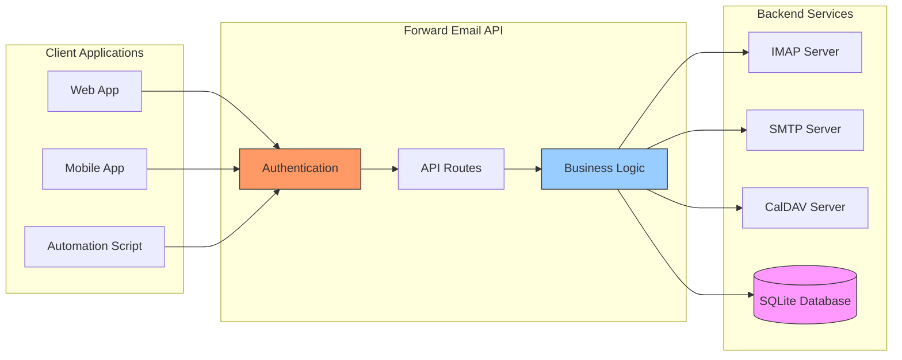

---


## iOS Pushmeldingen {#ios-push-notifications}

> \[!TIP]
> Forward Email ondersteunt native iOS pushmeldingen via XAPPLEPUSHSERVICE voor directe e-mailbezorging.

> \[!IMPORTANT]
> **Unieke functie:** Forward Email is een van de weinige open-source e-mailservers die native iOS pushmeldingen ondersteunt voor e-mail, contacten en agenda's via de `XAPPLEPUSHSERVICE` IMAP-extensie. Dit is reverse-engineered van het Apple-protocol en zorgt voor directe bezorging op iOS-apparaten zonder batterijverbruik.

Forward Email implementeert de propriëtaire XAPPLEPUSHSERVICE-extensie van Apple, die native pushmeldingen voor iOS-apparaten biedt zonder dat achtergrondpolling nodig is.

### Hoe het werkt {#how-it-works-1}

**XAPPLEPUSHSERVICE** is een niet-standaard IMAP-extensie die het iOS Mail-app mogelijk maakt om directe pushmeldingen te ontvangen wanneer nieuwe e-mails binnenkomen.

Forward Email implementeert de propriëtaire Apple Push Notification service (APNs) integratie voor IMAP, waardoor de iOS Mail-app directe pushmeldingen ontvangt bij nieuwe e-mails.

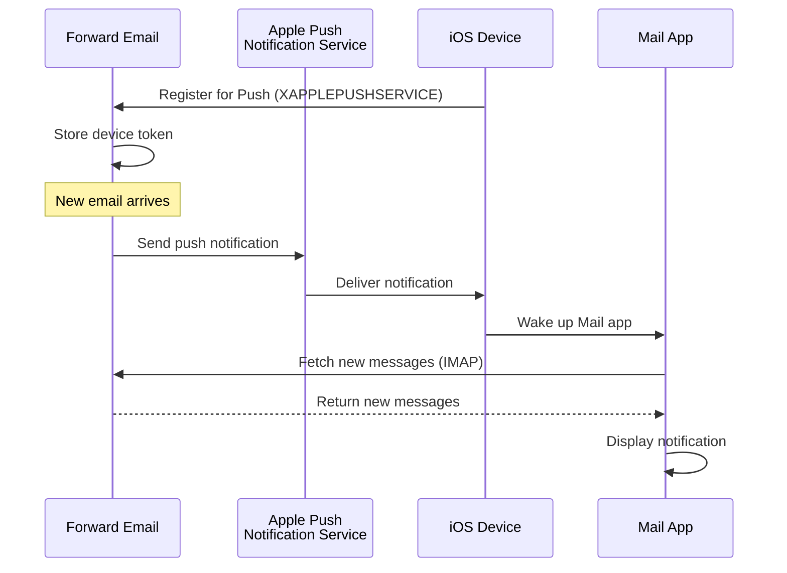

### Belangrijkste functies {#key-features}

**Directe bezorging:**

* Pushmeldingen komen binnen enkele seconden aan
* Geen batterijslurpende achtergrondpolling
* Werkt zelfs als de Mail-app gesloten is

<!---->

* **Directe bezorging:** E-mails, agenda-afspraken en contacten verschijnen direct op je iPhone/iPad, niet volgens een polling-schema
* **Batterijvriendelijk:** Maakt gebruik van Apple's push-infrastructuur in plaats van constante IMAP-verbindingen te onderhouden
* **Onderwerp-gebaseerde push:** Ondersteunt pushmeldingen voor specifieke mailboxen, niet alleen INBOX
* **Geen apps van derden nodig:** Werkt met de native iOS Mail-, Agenda- en Contacten-apps
**Native Integratie:**

* Ingebouwd in de iOS Mail-app
* Geen apps van derden nodig
* Naadloze gebruikerservaring

**Privacygericht:**

* Apparaattokens zijn versleuteld
* Geen berichtinhoud via APNS verzonden
* Alleen "nieuwe mail" melding verzonden

**Batterijzuinig:**

* Geen constante IMAP-polling
* Apparaat slaapt tot notificatie binnenkomt
* Minimale batterijimpact

### Wat Maakt Dit Speciaal {#what-makes-this-special}

> \[!IMPORTANT]
> De meeste e-mailproviders ondersteunen XAPPLEPUSHSERVICE niet, waardoor iOS-apparaten elke 15 minuten moeten polleren op nieuwe mail.

De meeste open-source e-mailservers (inclusief Dovecot, Postfix, Cyrus IMAP) ondersteunen GEEN iOS pushmeldingen. Gebruikers moeten ofwel:

* IMAP IDLE gebruiken (houdt verbinding open, verbruikt batterij)
* Polling gebruiken (controleert elke 15-30 minuten, vertraagde meldingen)
* Proprietaire e-mailapps gebruiken met eigen pushinfrastructuur

Forward Email biedt dezelfde directe pushmeldingservaring als commerciële diensten zoals Gmail, iCloud en Fastmail.

**Vergelijking met Andere Providers:**

| Provider          | Push Ondersteuning | Polling Interval | Batterijimpact |
| ----------------- | ------------------ | ---------------- | -------------- |
| **Forward Email** | ✅ Native Push     | Direct           | Minimaal       |
| Gmail             | ✅ Native Push     | Direct           | Minimaal       |
| iCloud            | ✅ Native Push     | Direct           | Minimaal       |
| Yahoo             | ✅ Native Push     | Direct           | Minimaal       |
| Outlook.com       | ❌ Polling        | 15 minuten       | Gemiddeld      |
| Fastmail          | ❌ Polling        | 15 minuten       | Gemiddeld      |
| ProtonMail        | ⚠️ Alleen Bridge   | Via Bridge       | Hoog           |
| Tutanota          | ❌ Alleen App     | N.v.t.           | N.v.t.         |

### Implementatiedetails {#implementation-details}

**IMAP CAPABILITY Response:**

```
* CAPABILITY IMAP4rev1 ... XAPPLEPUSHSERVICE ...
```

**Registratieproces:**

1. iOS Mail-app detecteert XAPPLEPUSHSERVICE-capaciteit
2. App registreert apparaattoken bij Forward Email
3. Forward Email slaat token op en koppelt aan account
4. Bij nieuwe mail stuurt Forward Email push via APNS
5. iOS wekt Mail-app om nieuwe berichten op te halen

**Beveiliging:**

* Apparaattokens zijn versleuteld in opslag
* Tokens verlopen en worden automatisch vernieuwd
* Geen berichtinhoud blootgesteld aan APNS
* End-to-end encryptie blijft behouden

<!---->

* **IMAP Extensie:** `XAPPLEPUSHSERVICE`
* **Broncode:** [WildDuck Issue #711](https://github.com/zone-eu/wildduck/issues/711)
* **Setup:** Automatisch - geen configuratie nodig, werkt direct met iOS Mail-app

### Vergelijking met Andere Diensten {#comparison-with-other-services}

| Dienst        | iOS Push Ondersteuning | Methode                                   |
| ------------- | ---------------------- | ---------------------------------------- |
| Forward Email | ✅ Ja                  | `XAPPLEPUSHSERVICE` (reverse-engineered) |
| Gmail         | ✅ Ja                  | Proprietaire Gmail-app + Google push      |
| iCloud Mail   | ✅ Ja                  | Native Apple-integratie                   |
| Outlook.com   | ✅ Ja                  | Proprietaire Outlook-app + Microsoft push |
| Fastmail      | ✅ Ja                  | `XAPPLEPUSHSERVICE`                      |
| Dovecot       | ❌ Nee                 | Alleen IMAP IDLE of polling               |
| Postfix       | ❌ Nee                 | Alleen IMAP IDLE of polling               |
| Cyrus IMAP    | ❌ Nee                 | Alleen IMAP IDLE of polling               |

**Gmail Push:**

Gmail gebruikt een proprietary push-systeem dat alleen werkt met de Gmail-app. De iOS Mail-app moet Gmail IMAP-servers polleren.

**iCloud Push:**

iCloud heeft native push-ondersteuning vergelijkbaar met Forward Email, maar alleen voor @icloud.com-adressen.

**Outlook.com:**

Outlook.com ondersteunt XAPPLEPUSHSERVICE niet, waardoor iOS Mail elke 15 minuten moet polleren.

**Fastmail:**

Fastmail ondersteunt XAPPLEPUSHSERVICE niet. Gebruikers moeten de Fastmail-app gebruiken voor pushmeldingen of accepteren dat polling elke 15 minuten plaatsvindt.

---


## Testen en Verificatie {#testing-and-verification}


## Protocol Capaciteitstests {#protocol-capability-tests}
> \[!NOTE]
> Deze sectie geeft de resultaten van onze laatste protocolmogelijkhedentests, uitgevoerd op 22 januari 2026.

Deze sectie bevat de daadwerkelijke CAPABILITY/CAPA/EHLO-antwoorden van alle geteste providers. Alle tests zijn uitgevoerd op **22 januari 2026**.

Deze tests helpen bij het verifiëren van de geadverteerde en daadwerkelijke ondersteuning voor verschillende e-mailprotocollen en extensies bij grote providers.

### Testmethodologie {#test-methodology}

**Testomgeving:**

* **Datum:** 22 januari 2026 om 02:37 UTC
* **Locatie:** AWS EC2-instance
* **IPv4:** 54.167.216.197
* **IPv6:** 2600:4040:46da:9a00:b19e:3ad4:426c:2f48
* **Tools:** OpenSSL s_client, bash-scripts

**Geteste providers:**

* Forward Email
* Gmail
* Outlook.com
* iCloud
* Fastmail
* Yahoo/AOL (Verizon)

### Testscripts {#test-scripts}

Voor volledige transparantie worden hieronder de exacte scripts weergegeven die voor deze tests zijn gebruikt.

#### IMAP Capability Test Script {#imap-capability-test-script}

```bash
#!/bin/bash
# IMAP Capability Test Script
# Tests IMAP CAPABILITY for various email providers

echo "========================================="
echo "IMAP CAPABILITY TEST"
echo "Date: $(date -u +"%Y-%m-%d %H:%M:%S UTC")"
echo "========================================="
echo ""

# Gmail
echo "--- Gmail (imap.gmail.com:993) ---"
echo -e "a001 CAPABILITY\na002 LOGOUT" | timeout 10 openssl s_client -connect imap.gmail.com:993 -crlf -quiet 2>&1 | grep -A 20 "CAPABILITY"
echo ""

# Outlook.com
echo "--- Outlook.com (outlook.office365.com:993) ---"
echo -e "a001 CAPABILITY\na002 LOGOUT" | timeout 10 openssl s_client -connect outlook.office365.com:993 -crlf -quiet 2>&1 | grep -A 20 "CAPABILITY"
echo ""

# iCloud
echo "--- iCloud (imap.mail.me.com:993) ---"
echo -e "a001 CAPABILITY\na002 LOGOUT" | timeout 10 openssl s_client -connect imap.mail.me.com:993 -crlf -quiet 2>&1 | grep -A 20 "CAPABILITY"
echo ""

# Fastmail
echo "--- Fastmail (imap.fastmail.com:993) ---"
echo -e "a001 CAPABILITY\na002 LOGOUT" | timeout 10 openssl s_client -connect imap.fastmail.com:993 -crlf -quiet 2>&1 | grep -A 20 "CAPABILITY"
echo ""

# Yahoo
echo "--- Yahoo (imap.mail.yahoo.com:993) ---"
echo -e "a001 CAPABILITY\na002 LOGOUT" | timeout 10 openssl s_client -connect imap.mail.yahoo.com:993 -crlf -quiet 2>&1 | grep -A 20 "CAPABILITY"
echo ""

# Forward Email
echo "--- Forward Email (imap.forwardemail.net:993) ---"
echo -e "a001 CAPABILITY\na002 LOGOUT" | timeout 10 openssl s_client -connect imap.forwardemail.net:993 -crlf -quiet 2>&1 | grep -A 20 "CAPABILITY"
echo ""

echo "========================================="
echo "Test completed"
echo "========================================="
```

#### POP3 Capability Test Script {#pop3-capability-test-script}

```bash
#!/bin/bash
# POP3 Capability Test Script
# Tests POP3 CAPA for various email providers

echo "========================================="
echo "POP3 CAPABILITY TEST"
echo "Date: $(date -u +"%Y-%m-%d %H:%M:%S UTC")"
echo "========================================="
echo ""

# Gmail
echo "--- Gmail (pop.gmail.com:995) ---"
echo -e "CAPA\nQUIT" | timeout 10 openssl s_client -connect pop.gmail.com:995 -crlf -quiet 2>&1 | grep -A 20 "CAPA"
echo ""

# Outlook.com
echo "--- Outlook.com (outlook.office365.com:995) ---"
echo -e "CAPA\nQUIT" | timeout 10 openssl s_client -connect outlook.office365.com:995 -crlf -quiet 2>&1 | grep -A 20 "CAPA"
echo ""

# iCloud (Opmerking: iCloud ondersteunt geen POP3)
echo "--- iCloud (Geen POP3-ondersteuning) ---"
echo "iCloud ondersteunt geen POP3"
echo ""

# Fastmail
echo "--- Fastmail (pop.fastmail.com:995) ---"
echo -e "CAPA\nQUIT" | timeout 10 openssl s_client -connect pop.fastmail.com:995 -crlf -quiet 2>&1 | grep -A 20 "CAPA"
echo ""

# Yahoo
echo "--- Yahoo (pop.mail.yahoo.com:995) ---"
echo -e "CAPA\nQUIT" | timeout 10 openssl s_client -connect pop.mail.yahoo.com:995 -crlf -quiet 2>&1 | grep -A 20 "CAPA"
echo ""

# Forward Email
echo "--- Forward Email (pop3.forwardemail.net:995) ---"
echo -e "CAPA\nQUIT" | timeout 10 openssl s_client -connect pop3.forwardemail.net:995 -crlf -quiet 2>&1 | grep -A 20 "CAPA"
echo ""

echo "========================================="
echo "Test completed"
echo "========================================="
```
#### SMTP Capability Test Script {#smtp-capability-test-script}

```bash
#!/bin/bash
# SMTP Capability Test Script
# Tests SMTP EHLO for various email providers

echo "========================================="
echo "SMTP CAPABILITY TEST"
echo "Date: $(date -u +"%Y-%m-%d %H:%M:%S UTC")"
echo "========================================="
echo ""

# Gmail
echo "--- Gmail (smtp.gmail.com:587) ---"
echo -e "EHLO test.com\nQUIT" | timeout 10 openssl s_client -connect smtp.gmail.com:587 -starttls smtp -crlf -quiet 2>&1 | grep -A 30 "250-"
echo ""

# Outlook.com
echo "--- Outlook.com (smtp.office365.com:587) ---"
echo -e "EHLO test.com\nQUIT" | timeout 10 openssl s_client -connect smtp.office365.com:587 -starttls smtp -crlf -quiet 2>&1 | grep -A 30 "250-"
echo ""

# iCloud
echo "--- iCloud (smtp.mail.me.com:587) ---"
echo -e "EHLO test.com\nQUIT" | timeout 10 openssl s_client -connect smtp.mail.me.com:587 -starttls smtp -crlf -quiet 2>&1 | grep -A 30 "250-"
echo ""

# Fastmail
echo "--- Fastmail (smtp.fastmail.com:587) ---"
echo -e "EHLO test.com\nQUIT" | timeout 10 openssl s_client -connect smtp.fastmail.com:587 -starttls smtp -crlf -quiet 2>&1 | grep -A 30 "250-"
echo ""

# Yahoo
echo "--- Yahoo (smtp.mail.yahoo.com:587) ---"
echo -e "EHLO test.com\nQUIT" | timeout 10 openssl s_client -connect smtp.mail.yahoo.com:587 -starttls smtp -crlf -quiet 2>&1 | grep -A 30 "250-"
echo ""

# Forward Email
echo "--- Forward Email (smtp.forwardemail.net:587) ---"
echo -e "EHLO test.com\nQUIT" | timeout 10 openssl s_client -connect smtp.forwardemail.net:587 -starttls smtp -crlf -quiet 2>&1 | grep -A 30 "250-"
echo ""

echo "========================================="
echo "Test completed"
echo "========================================="
```

### Samenvatting van de testresultaten {#test-results-summary}

#### IMAP (CAPABILITY) {#imap-capability}

**Forward Email**

```
* CAPABILITY IMAP4rev1 AUTH=PLAIN AUTH=PLAIN-CLIENTTOKEN CHILDREN ENABLE ID IDLE NAMESPACE QUOTA SASL-IR UNSELECT XLIST XAPPLEPUSHSERVICE
```

**Gmail**

```
* CAPABILITY IMAP4rev1 UNSELECT IDLE NAMESPACE QUOTA ID XLIST CHILDREN X-GM-EXT-1 UIDPLUS COMPRESS=DEFLATE ENABLE MOVE CONDSTORE ESEARCH UTF8=ACCEPT LIST-EXTENDED LIST-STATUS LITERAL- SPECIAL-USE
```

**iCloud**

```
* OK [CAPABILITY XAPPLEPUSHSERVICE IMAP4 IMAP4rev1 SASL-IR AUTH=ATOKEN AUTH=PLAIN AUTH=ATOKEN2 AUTH=XOAUTH2]
```

**Outlook.com**

```
* CAPABILITY IMAP4rev1 AUTH=PLAIN AUTH=XOAUTH2 SASL-IR UIDPLUS ID UNSELECT CHILDREN IDLE NAMESPACE LITERAL+
```

**Fastmail**

```
* CAPABILITY IMAP4rev1 ACL ANNOTATE-EXPERIMENT-1 CATENATE CONDSTORE ENABLE ESEARCH ESORT I18NLEVEL=1 ID IDLE LIST-EXTENDED LIST-STATUS LITERAL+ LOGINDISABLED MULTIAPPEND NAMESPACE QRESYNC QUOTA RIGHTS=ektx SASL-IR SORT SPECIAL-USE THREAD=ORDEREDSUBJECT UIDPLUS UNSELECT WITHIN X-RENAME XLIST
```

**Yahoo/AOL (Verizon)**

```
* CAPABILITY IMAP4rev1 IDLE NAMESPACE QUOTA ID XLIST CHILDREN UIDPLUS MOVE CONDSTORE ESEARCH ENABLE LIST-EXTENDED LIST-STATUS LITERAL- SPECIAL-USE UNSELECT XAPPLEPUSHSERVICE
```

#### POP3 (CAPA) {#pop3-capa}

**Forward Email**

```
+OK
CAPA
TOP
USER
UIDL
EXPIRE 30
IMPLEMENTATION ForwardEmail
.
```

**Gmail**

```
+OK
CAPA
TOP
USER
UIDL
EXPIRE 30
IMPLEMENTATION Gpop
.
```

**Outlook.com**

```
+OK
CAPA
TOP
USER
UIDL
SASL PLAIN XOAUTH2
.
```

**Fastmail**

```
+OK
CAPA
TOP
USER
UIDL
EXPIRE 30
IMPLEMENTATION Cyrus
.
```

#### SMTP (EHLO) {#smtp-ehlo}

**Forward Email**

```
250-smtp.forwardemail.net
250-PIPELINING
250-SIZE 52428800
250-ETRN
250-STARTTLS
250-ENHANCEDSTATUSCODES
250-8BITMIME
250-DSN
250 CHUNKING
```

**Gmail**

```
250-smtp.gmail.com at your service
250-SIZE 35882577
250-8BITMIME
250-STARTTLS
250-ENHANCEDSTATUSCODES
250-PIPELINING
250-CHUNKING
250 SMTPUTF8
```

**Outlook.com**

```
250-SN4PR13CA0005.outlook.office365.com Hello [x.x.x.x]
250-SIZE 157286400
250-PIPELINING
250-DSN
250-ENHANCEDSTATUSCODES
250-STARTTLS
250-8BITMIME
250-BINARYMIME
250-CHUNKING
250 SMTPUTF8
```

**Fastmail**

```
250-smtp.fastmail.com
250-PIPELINING
250-SIZE 78643200
250-ETRN
250-STARTTLS
250-ENHANCEDSTATUSCODES
250-8BITMIME
250-DSN
250 CHUNKING
```

**Yahoo/AOL (Verizon)**

```
250-smtp.mail.yahoo.com
250-PIPELINING
250-SIZE 41943040
250-8BITMIME
250-ENHANCEDSTATUSCODES
250-STARTTLS
```
### Gedetailleerde Testresultaten {#detailed-test-results}

#### IMAP Testresultaten {#imap-test-results}

**Gmail:**
`* CAPABILITY IMAP4rev1 UNSELECT IDLE NAMESPACE QUOTA ID XLIST CHILDREN X-GM-EXT-1 XYZZY SASL-IR AUTH=XOAUTH2 AUTH=PLAIN AUTH=PLAIN-CLIENTTOKEN AUTH=OAUTHBEARER`

**Outlook.com:**
`* CAPABILITY IMAP4 IMAP4rev1 AUTH=PLAIN AUTH=XOAUTH2 SASL-IR UIDPLUS ID UNSELECT CHILDREN IDLE NAMESPACE LITERAL+`

**iCloud:**
`* CAPABILITY XAPPLEPUSHSERVICE IMAP4 IMAP4rev1 SASL-IR AUTH=ATOKEN AUTH=PLAIN AUTH=ATOKEN2 AUTH=XOAUTH2`

**Fastmail:**
Verbinding time-out. Zie onderstaande opmerkingen.

**Yahoo:**
`* CAPABILITY IMAP4rev1 SASL-IR AUTH=PLAIN AUTH=XOAUTH2 AUTH=OAUTHBEARER ID MOVE NAMESPACE XYMHIGHESTMODSEQ UIDPLUS LITERAL+ CHILDREN UNSELECT X-MSG-EXT OBJECTID IDLE ENABLE UIDONLY X-ALL-MAIL X-UIDONLY LIST-EXTENDED LIST-STATUS SPECIAL-USE PARTIAL APPENDLIMIT=41697280`

**Forward Email:**
`* CAPABILITY XAPPLEPUSHSERVICE IMAP4rev1 APPENDLIMIT=52428800 AUTH=PLAIN AUTH=PLAIN-CLIENTTOKEN CHILDREN CONDSTORE ENABLE ID IDLE MOVE NAMESPACE QUOTA SASL-IR SPECIAL-USE UIDPLUS UNSELECT UTF8=ACCEPT XLIST`

#### POP3 Testresultaten {#pop3-test-results}

**Gmail:**
Verbinding gaf geen CAPA-respons zonder authenticatie.

**Outlook.com:**
Verbinding gaf geen CAPA-respons zonder authenticatie.

**iCloud:**
Niet ondersteund.

**Fastmail:**
Verbinding time-out. Zie onderstaande opmerkingen.

**Yahoo:**
`+OK CAPA list follows... SASL PLAIN XOAUTH2`

**Forward Email:**
Verbinding gaf geen CAPA-respons zonder authenticatie.

#### SMTP Testresultaten {#smtp-test-results}

**Gmail:**
`250-AUTH LOGIN PLAIN XOAUTH2 PLAIN-CLIENTTOKEN OAUTHBEARER XOAUTH`

**Outlook.com:**
`250-DSN`

**iCloud:**
`250-DSN`

**Fastmail:**
`250 AUTH PLAIN LOGIN XOAUTH2 OAUTHBEARER`

**Yahoo:**
`250 AUTH PLAIN LOGIN XOAUTH2 OAUTHBEARER`

**Forward Email:**
`250-DSN`, `250-REQUIRETLS`

### Opmerkingen over Testresultaten {#notes-on-test-results}

> \[!NOTE]
> Belangrijke observaties en beperkingen uit de testresultaten.

1. **Fastmail Time-outs**: Fastmail-verbindingen liepen vast tijdens het testen, waarschijnlijk door rate limiting of firewallbeperkingen van het testserver-IP. Fastmail staat bekend om robuuste IMAP/POP3/SMTP-ondersteuning volgens hun documentatie.

2. **POP3 CAPA-responsen**: Verschillende providers (Gmail, Outlook.com, Forward Email) gaven geen CAPA-respons zonder authenticatie. Dit is een gebruikelijke beveiligingspraktijk voor POP3-servers.

3. **DSN-ondersteuning**: Alleen Outlook.com, iCloud en Forward Email adverteren expliciet DSN-ondersteuning in hun SMTP EHLO-responsen. Dit betekent niet noodzakelijk dat andere providers DSN niet ondersteunen, maar zij adverteren het niet.

4. **REQUIRETLS**: Alleen Forward Email adverteert expliciet REQUIRETLS-ondersteuning met een gebruikersgerichte handhavingscheckbox. Andere providers ondersteunen het mogelijk intern, maar adverteren het niet in EHLO.

5. **Testomgeving**: Tests werden uitgevoerd vanaf een AWS EC2-instance (IP: 54.167.216.197 IPv4, 2600:4040:46da:9a00:b19e:3ad4:426c:2f48 IPv6) op 22 januari 2026 om 02:37 UTC.

---


## Samenvatting {#summary}

Forward Email biedt uitgebreide RFC-protocolondersteuning voor alle belangrijke e-mailstandaarden:

* **IMAP4rev1:** 16 ondersteunde RFC's met gedocumenteerde opzettelijke verschillen
* **POP3:** 4 ondersteunde RFC's met RFC-conforme permanente verwijdering
* **SMTP:** 11 ondersteunde extensies waaronder SMTPUTF8, DSN en PIPELINING
* **Authenticatie:** DKIM, SPF, DMARC, ARC volledig ondersteund
* **Transportbeveiliging:** MTA-STS en REQUIRETLS volledig ondersteund, DANE gedeeltelijke ondersteuning
* **Encryptie:** OpenPGP v6 en S/MIME ondersteund
* **Agenda:** CalDAV, CardDAV en VTODO volledig ondersteund
* **API-toegang:** Volledige REST API met 39 endpoints voor directe database-toegang
* **iOS Push:** Native pushmeldingen voor e-mail, contacten en agenda's via `XAPPLEPUSHSERVICE`

### Belangrijkste Onderscheidende Kenmerken {#key-differentiators}

> \[!TIP]
> Forward Email valt op met unieke functies die andere providers niet hebben.

**Wat Forward Email Uniek Maakt:**

1. **Quantum-veilige Encryptie** - Enige provider met ChaCha20-Poly1305 versleutelde SQLite-mailboxen
2. **Zero-Knowledge Architectuur** - Je wachtwoord versleutelt je mailbox; wij kunnen het niet ontsleutelen
3. **Gratis Aangepaste Domeinen** - Geen maandelijkse kosten voor e-mail op aangepaste domeinen
4. **REQUIRETLS Ondersteuning** - Gebruikersgerichte checkbox om TLS voor het hele afleverpad af te dwingen
5. **Uitgebreide API** - 39 REST API endpoints voor volledige programmatische controle
6. **iOS Pushmeldingen** - Native XAPPLEPUSHSERVICE-ondersteuning voor directe levering
7. **Open Source** - Volledige broncode beschikbaar op GitHub
8. **Privacygericht** - Geen datamining, geen advertenties, geen tracking
* **Sandboxed Encryptie:** Enige e-mailservice met individueel versleutelde SQLite-mailboxen  
* **RFC-naleving:** Geeft prioriteit aan standaardconformiteit boven gemak (bijv. POP3 DELE)  
* **Volledige API:** Directe programmatische toegang tot alle e-mailgegevens  
* **Open Source:** Volledig transparante implementatie  

**Samenvatting Protocolondersteuning:**  

| Categorie            | Ondersteuningsniveau | Details                                       |
| -------------------- | -------------------- | --------------------------------------------- |
| **Kernprotocollen**   | ✅ Uitstekend         | IMAP4rev1, POP3, SMTP volledig ondersteund    |
| **Moderne Protocollen** | ⚠️ Gedeeltelijk     | IMAP4rev2 gedeeltelijke ondersteuning, JMAP niet ondersteund |
| **Beveiliging**       | ✅ Uitstekend         | DKIM, SPF, DMARC, ARC, MTA-STS, REQUIRETLS    |
| **Encryptie**         | ✅ Uitstekend         | OpenPGP, S/MIME, SQLite-encryptie              |
| **CalDAV/CardDAV**    | ✅ Uitstekend         | Volledige agenda- en contactensynchronisatie  |
| **Filtering**         | ✅ Uitstekend         | Sieve (24 extensies) en ManageSieve            |
| **API**               | ✅ Uitstekend         | 39 REST API-eindpunten                          |
| **Push**              | ✅ Uitstekend         | Native iOS pushmeldingen                        |
