# E-post RFC-protokollstøtte - Komplett guide til standarder og spesifikasjoner {#email-rfc-protocol-support---complete-standards--specifications-guide}


## Innholdsfortegnelse {#table-of-contents}

* [Om dette dokumentet](#about-this-document)
  * [Arkitekturoversikt](#architecture-overview)
* [Sammenligning av e-posttjenester - protokollstøtte og RFC-standarders samsvar](#email-service-comparison---protocol-support--rfc-standards-compliance)
  * [Visualisering av protokollstøtte](#protocol-support-visualization)
* [Kjerneprotokoller for e-post](#core-email-protocols)
  * [Flyt for e-postprotokoll](#email-protocol-flow)
* [IMAP4 e-postprotokoll og utvidelser](#imap4-email-protocol-and-extensions)
  * [Forskjeller i IMAP-protokollen fra RFC-spesifikasjoner](#imap-protocol-differences-from-rfc-specifications)
  * [IMAP-utvidelser SOM IKKE STØTTES](#imap-extensions-not-supported)
* [POP3 e-postprotokoll og utvidelser](#pop3-email-protocol-and-extensions)
  * [Forskjeller i POP3-protokollen fra RFC-spesifikasjoner](#pop3-protocol-differences-from-rfc-specifications)
  * [POP3-utvidelser SOM IKKE STØTTES](#pop3-extensions-not-supported)
* [SMTP e-postprotokoll og utvidelser](#smtp-email-protocol-and-extensions)
  * [Leveringsstatusvarsler (DSN)](#delivery-status-notifications-dsn)
  * [REQUIRETLS-støtte](#requiretls-support)
  * [SMTP-utvidelser SOM IKKE STØTTES](#smtp-extensions-not-supported)
* [JMAP e-postprotokoll](#jmap-email-protocol)
* [E-postsikkerhet](#email-security)
  * [Arkitektur for e-postsikkerhet](#email-security-architecture)
* [Protokoller for autentisering av e-postmeldinger](#email-message-authentication-protocols)
  * [Støtte for autentiseringsprotokoller](#authentication-protocol-support)
  * [DKIM (DomainKeys Identified Mail)](#dkim-domainkeys-identified-mail)
  * [SPF (Sender Policy Framework)](#spf-sender-policy-framework)
  * [DMARC (Domain-based Message Authentication, Reporting & Conformance)](#dmarc-domain-based-message-authentication-reporting--conformance)
  * [ARC (Authenticated Received Chain)](#arc-authenticated-received-chain)
  * [Autentiseringsflyt](#authentication-flow)
* [Transportprotokoller for e-postsikkerhet](#email-transport-security-protocols)
  * [Støtte for transportbeskyttelse](#transport-security-support)
  * [TLS (Transport Layer Security)](#tls-transport-layer-security)
  * [MTA-STS (Mail Transfer Agent Strict Transport Security)](#mta-sts-mail-transfer-agent-strict-transport-security)
  * [DANE (DNS-basert autentisering av navngitte enheter)](#dane-dns-based-authentication-of-named-entities)
  * [REQUIRETLS](#requiretls)
  * [Flyt for transportbeskyttelse](#transport-security-flow)
* [Kryptering av e-postmeldinger](#email-message-encryption)
  * [Støtte for kryptering](#encryption-support)
  * [OpenPGP (Pretty Good Privacy)](#openpgp-pretty-good-privacy)
  * [S/MIME (Secure/Multipurpose Internet Mail Extensions)](#smime-securemultipurpose-internet-mail-extensions)
  * [SQLite-kryptering av postkasse](#sqlite-mailbox-encryption)
  * [Sammenligning av kryptering](#encryption-comparison)
  * [Krypteringsflyt](#encryption-flow)
* [Utvidet funksjonalitet](#extended-functionality)
* [Standarder for e-postmeldingsformat](#email-message-format-standards)
  * [Støtte for formatstandarder](#format-standards-support)
  * [MIME (Multipurpose Internet Mail Extensions)](#mime-multipurpose-internet-mail-extensions)
  * [SMTPUTF8 og internasjonalisering av e-postadresser](#smtputf8-and-email-address-internationalization)
* [Kalender- og kontaktprotokoller](#calendaring-and-contacts-protocols)
  * [Støtte for CalDAV og CardDAV](#caldav-and-carddav-support)
  * [CalDAV (kalendertilgang)](#caldav-calendar-access)
  * [CardDAV (kontakt-tilgang)](#carddav-contact-access)
  * [Oppgaver og påminnelser (CalDAV VTODO)](#tasks-and-reminders-caldav-vtodo)
  * [Synkroniseringsflyt for CalDAV/CardDAV](#caldavcarddav-synchronization-flow)
  * [Kalenderutvidelser SOM IKKE STØTTES](#calendaring-extensions-not-supported)
* [Filtrering av e-postmeldinger](#email-message-filtering)
  * [Sieve (RFC 5228)](#sieve-rfc-5228)
  * [ManageSieve (RFC 5804)](#managesieve-rfc-5804)
* [Lagringsoptimalisering](#storage-optimization)
  * [Arkitektur: To-lags lagringsoptimalisering](#architecture-dual-layer-storage-optimization)
* [Vedlegg-deduplisering](#attachment-deduplication)
  * [Hvordan det fungerer](#how-it-works)
  * [Dedupliseringsflyt](#deduplication-flow)
  * [Magisk nummersystem](#magic-number-system)
  * [Viktige forskjeller: WildDuck vs Forward Email](#key-differences-wildduck-vs-forward-email)
* [Brotli-komprimering](#brotli-compression)
  * [Hva som komprimeres](#what-gets-compressed)
  * [Konfigurasjon av komprimering](#compression-configuration)
  * [Magisk header: "FEBR"](#magic-header-febr)
  * [Komprimeringsprosess](#compression-process)
  * [Dekompprimeringsprosess](#decompression-process)
  * [Bakoverkompatibilitet](#backwards-compatibility)
  * [Statistikk for lagringsbesparelser](#storage-savings-statistics)
  * [Migreringsprosess](#migration-process)
  * [Kombinert lagringseffektivitet](#combined-storage-efficiency)
  * [Tekniske implementasjonsdetaljer](#technical-implementation-details)
  * [Hvorfor ingen andre tilbydere gjør dette](#why-no-other-provider-does-this)
* [Moderne funksjoner](#modern-features)
* [Fullstendig REST API for e-posthåndtering](#complete-rest-api-for-email-management)
  * [API-kategorier (39 endepunkter)](#api-categories-39-endpoints)
  * [Tekniske detaljer](#technical-details)
  * [Reelle brukstilfeller](#real-world-use-cases)
  * [Viktige API-funksjoner](#key-api-features)
  * [API-arkitektur](#api-architecture)
* [Push-varsler for iOS](#ios-push-notifications)
  * [Hvordan det fungerer](#how-it-works-1)
  * [Nøkkelfunksjoner](#key-features)
  * [Hva som gjør dette spesielt](#what-makes-this-special)
  * [Implementasjonsdetaljer](#implementation-details)
  * [Sammenligning med andre tjenester](#comparison-with-other-services)
* [Testing og verifisering](#testing-and-verification)
* [Tester av protokollkapasitet](#protocol-capability-tests)
  * [Testmetodikk](#test-methodology)
  * [Testskript](#test-scripts)
  * [Oppsummering av testresultater](#test-results-summary)
  * [Detaljerte testresultater](#detailed-test-results)
  * [Notater om testresultater](#notes-on-test-results)
* [Oppsummering](#summary)
  * [Viktige differensieringspunkter](#key-differentiators)
## Om dette dokumentet {#about-this-document}

Dette dokumentet skisserer RFC (Request for Comments) protokollstøtte for Forward Email. Siden Forward Email bruker [WildDuck](https://github.com/nodemailer/wildduck) under panseret for IMAP/POP3-funksjonalitet, reflekterer protokollstøtten og begrensningene dokumentert her WildDucks implementering.

> \[!IMPORTANT]
> Forward Email bruker [SQLite](https://sqlite.org/) for meldingslagring i stedet for MongoDB (som WildDuck opprinnelig brukte). Dette påvirker enkelte implementasjonsdetaljer dokumentert nedenfor.

**Kildekode:** <https://github.com/forwardemail/forwardemail.net>

### Arkitekturoversikt {#architecture-overview}

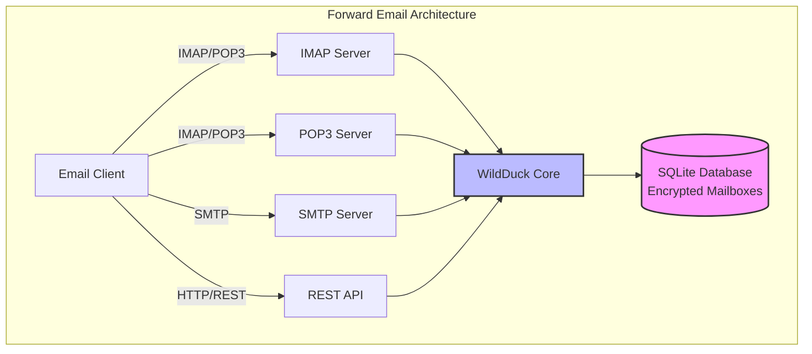

---


## Sammenligning av e-posttjenester - Protokollstøtte & RFC-standarders samsvar {#email-service-comparison---protocol-support--rfc-standards-compliance}

> \[!IMPORTANT]
> **Sandboxet og kvantesikker kryptering:** Forward Email er den eneste e-posttjenesten som lagrer individuelt krypterte SQLite-postbokser med ditt passord (som kun du har). Hver postboks er kryptert med [sqleet](https://github.com/resilar/sqleet) (ChaCha20-Poly1305), selvstendig, sandboxet og bærbar. Hvis du glemmer passordet ditt, mister du postboksen – ikke engang Forward Email kan gjenopprette den. Se [Quantum-Safe Encrypted Email](https://forwardemail.net/en/blog/docs/best-quantum-safe-encrypted-email-service) for detaljer.

Sammenlign e-postprotokollstøtte og RFC-standardimplementering på tvers av store e-postleverandører:

| Funksjon                      | Forward Email                                                                                  | Postfix/Dovecot                                                                    | Gmail                                                                             | iCloud Mail                                           | Outlook.com                                                                                                                                                          | Fastmail                                                                                 | Yahoo/AOL (Verizon)                                                  | ProtonMail                                                                     | Tutanota                                                          |
| ----------------------------- | ---------------------------------------------------------------------------------------------- | ---------------------------------------------------------------------------------- | --------------------------------------------------------------------------------- | ----------------------------------------------------- | -------------------------------------------------------------------------------------------------------------------------------------------------------------------- | ---------------------------------------------------------------------------------------- | -------------------------------------------------------------------- | ------------------------------------------------------------------------------ | ----------------------------------------------------------------- |
| **Pris for egendefinert domene** | [Gratis](https://forwardemail.net/en/pricing)                                                    | [Gratis](https://www.postfix.org/)                                                   | [$7.20/mnd](https://workspace.google.com/pricing)                                  | [$0.99/mnd](https://support.apple.com/en-us/102622)    | [$7.20/mnd](https://www.microsoft.com/en-us/microsoft-365/business/microsoft-365-business-basic)                                                                      | [$5/mnd](https://www.fastmail.com/pricing/)                                               | [$3.19/mnd](https://www.turbify.com/mail)                             | [$4.99/mnd](https://proton.me/mail/pricing)                                     | [$3.27/mnd](https://tuta.com/pricing)                              |
| **IMAP4rev1 (RFC 3501)**      | ✅ [Støttet](#imap4-email-protocol-and-extensions)                                            | ✅ [Støttet](https://www.dovecot.org/)                                            | ✅ [Støttet](https://developers.google.com/workspace/gmail/imap/imap-extensions) | ✅ [Støttet](https://support.apple.com/en-us/102431) | ✅ [Støttet](https://support.microsoft.com/en-us/office/pop-imap-and-smtp-settings-for-outlook-com-d088b986-291d-42b8-9564-9c414e2aa040)                            | ✅ [Støttet](https://www.fastmail.help/hc/en-us/articles/1500000278382-Email-standards) | ✅ [Støttet](https://senders.yahooinc.com/developer/documentation/) | ⚠️ [Via Bridge](https://proton.me/support/imap-smtp-and-pop3-setup)            | ❌ Ikke støttet                                                   |
| **IMAP4rev2 (RFC 9051)**      | ⚠️ [Delvis](https://forwardemail.net/en/blog/docs/best-quantum-safe-encrypted-email-service)  | ⚠️ [Delvis](https://www.dovecot.org/)                                             | ⚠️ [31%](https://developers.google.com/workspace/gmail/imap/imap-extensions)      | ⚠️ [92%](https://support.apple.com/en-us/102431)      | ⚠️ [46%](https://support.microsoft.com/en-us/office/pop-imap-and-smtp-settings-for-outlook-com-d088b986-291d-42b8-9564-9c414e2aa040)                                 | ⚠️ [69%](https://www.fastmail.help/hc/en-us/articles/1500000278382-Email-standards)      | ⚠️ [85%](https://senders.yahooinc.com/developer/documentation/)      | ⚠️ [Via Bridge](https://proton.me/support/imap-smtp-and-pop3-setup)            | ❌ Ikke støttet                                                   |
| **POP3 (RFC 1939)**           | ✅ [Støttet](#pop3-email-protocol-and-extensions)                                             | ✅ [Støttet](https://www.dovecot.org/)                                            | ✅ [Støttet](https://support.google.com/mail/answer/7104828)                     | ❌ Ikke støttet                                       | ✅ [Støttet](https://support.microsoft.com/en-us/office/pop-imap-and-smtp-settings-for-outlook-com-d088b986-291d-42b8-9564-9c414e2aa040)                            | ✅ [Støttet](https://www.fastmail.help/hc/en-us/articles/1500000278382-Email-standards) | ✅ [Støttet](https://help.yahoo.com/kb/SLN4075.html)                | ⚠️ [Via Bridge](https://proton.me/support/imap-smtp-and-pop3-setup)            | ❌ Ikke støttet                                                   |
| **SMTP (RFC 5321)**           | ✅ [Støttet](#smtp-email-protocol-and-extensions)                                             | ✅ [Støttet](https://www.postfix.org/)                                            | ✅ [Støttet](https://support.google.com/mail/answer/7126229)                     | ✅ [Støttet](https://support.apple.com/en-us/102431) | ✅ [Støttet](https://support.microsoft.com/en-us/office/pop-imap-and-smtp-settings-for-outlook-com-d088b986-291d-42b8-9564-9c414e2aa040)                            | ✅ [Støttet](https://www.fastmail.help/hc/en-us/articles/1500000278382-Email-standards) | ✅ [Støttet](https://help.yahoo.com/kb/SLN4075.html)                | ⚠️ [Via Bridge](https://proton.me/support/imap-smtp-and-pop3-setup)            | ❌ Ikke støttet                                                   |
| **JMAP (RFC 8620)**           | ❌ [Ikke støttet](#jmap-email-protocol)                                                        | ❌ Ikke støttet                                                                    | ❌ Ikke støttet                                                                   | ❌ Ikke støttet                                       | ❌ Ikke støttet                                                                                                                                                      | ✅ [Støttet](https://www.fastmail.com/dev/)                                             | ❌ Ikke støttet                                                      | ❌ Ikke støttet                                                                | ❌ Ikke støttet                                                   |
| **DKIM (RFC 6376)**           | ✅ [Støttet](#email-message-authentication-protocols)                                         | ✅ [Støttet](https://github.com/trusteddomainproject/OpenDKIM)                    | ✅ [Støttet](https://support.google.com/a/answer/174124)                         | ✅ [Støttet](https://support.apple.com/en-us/102431) | ✅ [Støttet](https://learn.microsoft.com/en-us/defender-office-365/email-authentication-dkim-configure)                                                             | ✅ [Støttet](https://www.fastmail.help/hc/en-us/articles/360060590573)                  | ✅ [Støttet](https://help.yahoo.com/kb/SLN25426.html)               | ✅ [Støttet](https://proton.me/support)                                       | ✅ [Støttet](https://tuta.com/support#dkim)                      |
| **SPF (RFC 7208)**            | ✅ [Støttet](#email-message-authentication-protocols)                                         | ✅ [Støttet](https://www.postfix.org/)                                            | ✅ [Støttet](https://support.google.com/a/answer/33786)                          | ✅ [Støttet](https://support.apple.com/en-us/102431) | ✅ [Støttet](https://learn.microsoft.com/en-us/microsoft-365/security/office-365-security/how-office-365-uses-spf-to-prevent-spoofing)                              | ✅ [Støttet](https://www.fastmail.help/hc/en-us/articles/360060590573)                  | ✅ [Støttet](https://help.yahoo.com/kb/SLN25426.html)               | ✅ [Støttet](https://proton.me/support)                                       | ✅ [Støttet](https://tuta.com/support#dkim)                      |
| **DMARC (RFC 7489)**          | ✅ [Støttet](#email-message-authentication-protocols)                                         | ✅ [Støttet](https://www.postfix.org/)                                            | ✅ [Støttet](https://support.google.com/a/answer/2466580)                        | ✅ [Støttet](https://support.apple.com/en-us/102431) | ✅ [Støttet](https://learn.microsoft.com/en-us/microsoft-365/security/office-365-security/use-dmarc-to-validate-email)                                              | ✅ [Støttet](https://www.fastmail.help/hc/en-us/articles/360060590573)                  | ✅ [Støttet](https://help.yahoo.com/kb/SLN25426.html)               | ✅ [Støttet](https://proton.me/support)                                       | ✅ [Støttet](https://tuta.com/support#dkim)                      |
| **ARC (RFC 8617)**            | ✅ [Støttet](#email-message-authentication-protocols)                                         | ✅ [Støttet](https://github.com/trusteddomainproject/OpenARC)                     | ✅ [Støttet](https://support.google.com/a/answer/2466580)                        | ❌ Ikke støttet                                       | ✅ [Støttet](https://learn.microsoft.com/en-us/defender-office-365/email-authentication-arc-configure)                                                              | ✅ [Støttet](https://www.fastmail.help/hc/en-us/articles/360060590573)                  | ✅ [Støttet](https://senders.yahooinc.com/developer/documentation/) | ✅ [Støttet](https://proton.me/blog/what-is-authenticated-received-chain-arc) | ❌ Ikke støttet                                                   |
| **MTA-STS (RFC 8461)**        | ✅ [Støttet](#email-transport-security-protocols)                                             | ✅ [Støttet](https://www.postfix.org/)                                            | ✅ [Støttet](https://support.google.com/a/answer/9261504)                        | ✅ [Støttet](https://support.apple.com/en-us/102431) | ✅ [Støttet](https://learn.microsoft.com/en-us/defender-office-365/email-authentication-about)                                                                      | ✅ [Støttet](https://www.fastmail.help/hc/en-us/articles/360060590573)                  | ✅ [Støttet](https://senders.yahooinc.com/developer/documentation/) | ✅ [Støttet](https://proton.me/support)                                       | ✅ [Støttet](https://tuta.com/security)                          |
| **DANE (RFC 7671)**           | ✅ [Støttet](#email-transport-security-protocols)                                             | ✅ [Støttet](https://www.postfix.org/)                                            | ❌ Ikke støttet                                                                   | ❌ Ikke støttet                                       | ❌ Ikke støttet                                                                                                                                                      | ❌ Ikke støttet                                                                          | ❌ Ikke støttet                                                      | ✅ [Støttet](https://proton.me/support)                                       | ✅ [Støttet](https://tuta.com/support#dane)                      |
| **DSN (RFC 3461)**            | ✅ [Støttet](#smtp-email-protocol-and-extensions)                                             | ✅ [Støttet](https://www.postfix.org/DSN_README.html)                             | ❌ Ikke støttet                                                                   | ✅ [Støttet](#protocol-capability-tests)             | ✅ [Støttet](#protocol-capability-tests)                                                                                                                            | ⚠️ [Ukjent](https://www.fastmail.help/hc/en-us/articles/1500000278382-Email-standards)  | ❌ Ikke støttet                                                      | ⚠️ [Via Bridge](https://proton.me/support/imap-smtp-and-pop3-setup)            | ❌ Ikke støttet                                                   |
| **REQUIRETLS (RFC 8689)**     | ✅ [Støttet](#email-transport-security-protocols)                                             | ✅ [Støttet](https://www.postfix.org/TLS_README.html#server_require_tls)          | ⚠️ Ukjent                                                                        | ⚠️ Ukjent                                            | ⚠️ Ukjent                                                                                                                                                           | ⚠️ Ukjent                                                                               | ⚠️ Ukjent                                                           | ⚠️ [Via Bridge](https://proton.me/support/imap-smtp-and-pop3-setup)            | ❌ Ikke støttet                                                   |
| **ManageSieve (RFC 5804)**    | ✅ [Støttet](#managesieve-rfc-5804)                                                           | ✅ [Støttet](https://doc.dovecot.org/admin_manual/pigeonhole_managesieve_server/) | ❌ Ikke støttet                                                                   | ❌ Ikke støttet                                       | ❌ Ikke støttet                                                                                                                                                      | ✅ [Støttet](https://www.fastmail.help/hc/en-us/articles/360060590573)                  | ❌ Ikke støttet                                                      | ❌ Ikke støttet                                                                | ❌ Ikke støttet                                                   |
| **OpenPGP (RFC 9580)**        | ✅ [Støttet](#email-message-encryption)                                                       | ⚠️ [Via Plugins](https://www.gnupg.org/)                                           | ⚠️ [Tredjepart](https://github.com/google/end-to-end)                            | ⚠️ [Tredjepart](https://gpgtools.org/)               | ⚠️ [Tredjepart](https://gpg4win.org/)                                                                                                                               | ⚠️ [Tredjepart](https://www.fastmail.help/hc/en-us/articles/360060590573)               | ⚠️ [Tredjepart](https://help.yahoo.com/kb/SLN25426.html)            | ✅ [Innebygd](https://proton.me/support/pgp-mime-pgp-inline)                      | ❌ Ikke støttet                                                   |
| **S/MIME (RFC 8551)**         | ✅ [Støttet](#email-message-encryption)                                                       | ✅ [Støttet](https://www.openssl.org/)                                            | ✅ [Støttet](https://support.google.com/mail/answer/81126)                       | ✅ [Støttet](https://support.apple.com/en-us/102431) | ✅ [Støttet](https://support.microsoft.com/en-us/office/send-view-and-reply-to-encrypted-messages-in-outlook-for-pc-eaa43495-9bbb-4fca-922a-df90dee51980)           | ⚠️ [Delvis](https://www.fastmail.help/hc/en-us/articles/360060590573)                   | ❌ Ikke støttet                                                      | ✅ [Støttet](https://proton.me/support/pgp-mime-pgp-inline)                   | ❌ Ikke støttet                                                   |
| **CalDAV (RFC 4791)**         | ✅ [Støttet](#calendaring-and-contacts-protocols)                                             | ✅ [Støttet](https://www.davical.org/)                                            | ✅ [Støttet](https://developers.google.com/calendar/caldav/v2/guide)             | ✅ [Støttet](https://support.apple.com/en-us/102431) | ❌ Ikke støttet                                                                                                                                                      | ✅ [Støttet](https://www.fastmail.help/hc/en-us/articles/360060590573)                  | ❌ Ikke støttet                                                      | ✅ [Via Bridge](https://proton.me/support/proton-calendar)                      | ❌ Ikke støttet                                                   |
| **CardDAV (RFC 6352)**        | ✅ [Støttet](#calendaring-and-contacts-protocols)                                             | ✅ [Støttet](https://www.davical.org/)                                            | ✅ [Støttet](https://developers.google.com/people/carddav)                       | ✅ [Støttet](https://support.apple.com/en-us/102431) | ❌ Ikke støttet                                                                                                                                                      | ✅ [Støttet](https://www.fastmail.help/hc/en-us/articles/360060590573)                  | ❌ Ikke støttet                                                      | ✅ [Via Bridge](https://proton.me/support/proton-contacts)                      | ❌ Ikke støttet                                                   |
| **Oppgaver (VTODO)**          | ✅ [Støttet](#tasks-and-reminders-caldav-vtodo)                                               | ✅ [Støttet](https://www.davical.org/)                                            | ❌ Ikke støttet                                                                   | ✅ [Støttet](https://support.apple.com/en-us/102431) | ❌ Ikke støttet                                                                                                                                                      | ✅ [Støttet](https://www.fastmail.help/hc/en-us/articles/360060590573)                  | ❌ Ikke støttet                                                      | ❌ Ikke støttet                                                                | ❌ Ikke støttet                                                   |
| **Sieve (RFC 5228)**          | ✅ [Støttet](#sieve-rfc-5228)                                                                 | ✅ [Støttet](https://www.dovecot.org/)                                            | ❌ Ikke støttet                                                                   | ❌ Ikke støttet                                       | ❌ Ikke støttet                                                                                                                                                      | ✅ [Støttet](https://www.fastmail.help/hc/en-us/articles/360060590573)                  | ❌ Ikke støttet                                                      | ❌ Ikke støttet                                                                | ❌ Ikke støttet                                                   |
| **Catch-All**                 | ✅ [Støttet](https://forwardemail.net/en/faq#can-i-have-multiple-global-catch-all-recipients) | ✅ Støttet                                                                        | ✅ [Støttet](https://support.google.com/a/answer/4524505)                        | ❌ Ikke støttet                                       | ❌ [Ikke støttet](https://learn.microsoft.com/en-us/exchange/recipients-in-exchange-online/manage-mail-users)                                                        | ✅ [Støttet](https://www.fastmail.help/hc/en-us/articles/1500000278382-Email-standards) | ❌ Ikke støttet                                                      | ❌ Ikke støttet                                                                | ✅ [Støttet](https://tuta.com/support#catch-all-alias)           |
| **Ubegrensede aliaser**       | ✅ [Støttet](https://forwardemail.net/en/faq#advanced-features)                               | ✅ Støttet                                                                        | ✅ [Støttet](https://support.google.com/a/answer/33327)                          | ✅ [Støttet](https://support.apple.com/en-us/102431) | ✅ [Støttet](https://support.microsoft.com/en-us/office/add-or-remove-an-email-alias-in-outlook-com-459b1989-356d-40fa-a689-8f285b13f1f2)                           | ✅ [Støttet](https://www.fastmail.help/hc/en-us/articles/1500000278382-Email-standards) | ❌ Ikke støttet                                                      | ✅ [Støttet](https://proton.me/support/addresses-and-aliases)                 | ✅ [Støttet](https://tuta.com/support#aliases)                   |
| **To-faktor autentisering**   | ✅ [Støttet](https://forwardemail.net/en/faq#do-you-support-passkeys-and-webauthn)            | ✅ Støttet                                                                        | ✅ [Støttet](https://support.google.com/accounts/answer/185839)                  | ✅ [Støttet](https://support.apple.com/en-us/102431) | ✅ [Støttet](https://support.microsoft.com/en-us/account-billing/how-to-use-two-step-verification-with-your-microsoft-account-c7910146-672f-01e9-50a0-93b4585e7eb4) | ✅ [Støttet](https://www.fastmail.help/hc/en-us/articles/1500000278382-Email-standards) | ✅ [Støttet](https://help.yahoo.com/kb/SLN5013.html)                | ✅ [Støttet](https://proton.me/support/two-factor-authentication-2fa)         | ✅ [Støttet](https://tuta.com/support#two-factor-authentication) |
| **Push-varsler**              | ✅ [Støttet](#ios-push-notifications)                                                         | ⚠️ Via Plugins                                                                     | ✅ [Støttet](https://developers.google.com/gmail/api/guides/push)                | ✅ [Støttet](https://support.apple.com/en-us/102431) | ✅ [Støttet](https://learn.microsoft.com/en-us/graph/change-notifications-delivery-webhooks)                                                                        | ✅ [Støttet](https://www.fastmail.help/hc/en-us/articles/1500000278382-Email-standards) | ❌ Ikke støttet                                                      | ✅ [Støttet](https://proton.me/support/notifications)                         | ✅ [Støttet](https://tuta.com/support#push-notifications)        |
| **Kalender/Kontakter på skrivebord** | ✅ [Støttet](#calendaring-and-contacts-protocols)                                             | ✅ Støttet                                                                        | ✅ [Støttet](https://support.google.com/calendar)                                | ✅ [Støttet](https://support.apple.com/en-us/102431) | ✅ [Støttet](https://support.microsoft.com/en-us/office/calendar-and-contacts-in-outlook-com-d3e8a6e6-5c1f-4e3e-9f1e-7c0f0e0c0c0c)                                  | ✅ [Støttet](https://www.fastmail.help/hc/en-us/articles/1500000278382-Email-standards) | ❌ Ikke støttet                                                      | ✅ [Støttet](https://proton.me/support/proton-calendar)                       | ❌ Ikke støttet                                                   |
| **Avansert søk**              | ✅ [Støttet](https://forwardemail.net/en/email-api)                                           | ✅ Støttet                                                                        | ✅ [Støttet](https://support.google.com/mail/answer/7190)                        | ✅ [Støttet](https://support.apple.com/en-us/102431) | ✅ [Støttet](https://support.microsoft.com/en-us/office/search-for-email-messages-in-outlook-com-6f5f2e92-9d5e-4c4e-9b0e-0c0c0c0c0c0c)                              | ✅ [Støttet](https://www.fastmail.help/hc/en-us/articles/1500000278382-Email-standards) | ✅ [Støttet](https://help.yahoo.com/kb/SLN3561.html)                | ✅ [Støttet](https://proton.me/support/search-and-filters)                    | ✅ [Støttet](https://tuta.com/support)                           |
| **API/Integrasjoner**         | ✅ [39 Endepunkter](https://forwardemail.net/en/email-api)                                        | ✅ Støttet                                                                        | ✅ [Støttet](https://developers.google.com/gmail/api)                            | ❌ Ikke støttet                                       | ✅ [Støttet](https://learn.microsoft.com/en-us/graph/api/resources/mail-api-overview)                                                                               | ✅ [Støttet](https://www.fastmail.help/hc/en-us/articles/1500000278382-Email-standards) | ❌ Ikke støttet                                                      | ✅ [Støttet](https://proton.me/support/proton-mail-api)                       | ❌ Ikke støttet                                                   |
### Visualisering av protokollstøtte {#protocol-support-visualization}

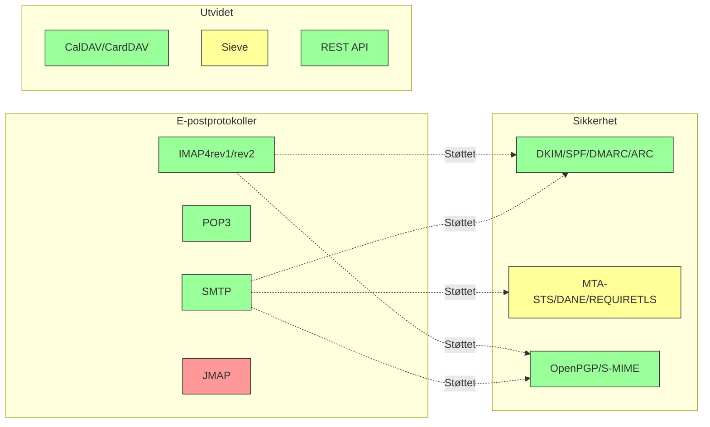

---


## Kjerneprotokoller for e-post {#core-email-protocols}

### Flyt for e-postprotokoll {#email-protocol-flow}

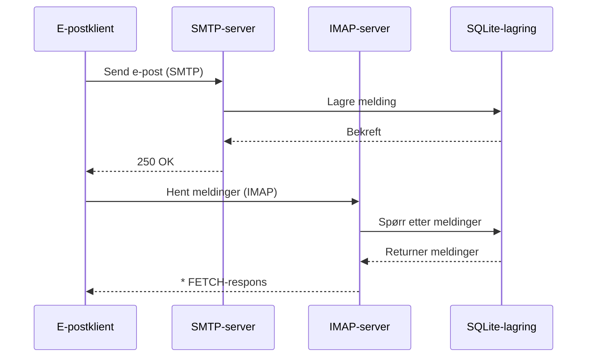


## IMAP4 e-postprotokoll og utvidelser {#imap4-email-protocol-and-extensions}

> \[!NOTE]
> Forward Email støtter IMAP4rev1 (RFC 3501) med delvis støtte for IMAP4rev2 (RFC 9051)-funksjoner.

Forward Email tilbyr robust IMAP4-støtte gjennom WildDuck-mailserver-implementasjonen. Serveren implementerer IMAP4rev1 (RFC 3501) med delvis støtte for IMAP4rev2 (RFC 9051)-utvidelser.

Forward Emails IMAP-funksjonalitet leveres av [WildDuck](https://github.com/nodemailer/wildduck)-avhengigheten. Følgende e-post-RFC-er støttes:

| RFC                                                       | Tittel                                                           | Implementasjonsnotater                                |
| --------------------------------------------------------- | ---------------------------------------------------------------- | ----------------------------------------------------- |
| [RFC 3501](https://datatracker.ietf.org/doc/html/rfc3501) | Internet Message Access Protocol (IMAP) - Versjon 4rev1          | Full støtte med bevisste forskjeller (se nedenfor)   |
| [RFC 2177](https://datatracker.ietf.org/doc/html/rfc2177) | IMAP4 IDLE-kommando                                              | Push-stil varslinger                                  |
| [RFC 2342](https://datatracker.ietf.org/doc/html/rfc2342) | IMAP4 Namespace                                                 | Støtte for postkassenavnrom                            |
| [RFC 2087](https://datatracker.ietf.org/doc/html/rfc2087) | IMAP4 QUOTA-utvidelse                                           | Håndtering av lagringskvoter                          |
| [RFC 2971](https://datatracker.ietf.org/doc/html/rfc2971) | IMAP4 ID-utvidelse                                              | Klient/server-identifikasjon                          |
| [RFC 5161](https://datatracker.ietf.org/doc/html/rfc5161) | IMAP4 ENABLE-utvidelse                                          | Aktiver IMAP-utvidelser                               |
| [RFC 4959](https://datatracker.ietf.org/doc/html/rfc4959) | IMAP-utvidelse for SASL Initial Client Response (SASL-IR)       | Initial klientrespons                                 |
| [RFC 3691](https://datatracker.ietf.org/doc/html/rfc3691) | IMAP4 UNSELECT-kommando                                        | Lukk postkasse uten EXPUNGE                           |
| [RFC 4315](https://datatracker.ietf.org/doc/html/rfc4315) | IMAP UIDPLUS-utvidelse                                         | Forbedrede UID-kommando                                |
| [RFC 7162](https://datatracker.ietf.org/doc/html/rfc7162) | IMAP-utvidelser: Rask flagg-endring resynkronisering (CONDSTORE) | Betinget STORE                                        |
| [RFC 6154](https://datatracker.ietf.org/doc/html/rfc6154) | IMAP LIST-utvidelse for spesialbruk-postkasser                  | Spesielle postkasseattributter                         |
| [RFC 6851](https://datatracker.ietf.org/doc/html/rfc6851) | IMAP MOVE-utvidelse                                            | Atomisk MOVE-kommando                                 |
| [RFC 6855](https://datatracker.ietf.org/doc/html/rfc6855) | IMAP-støtte for UTF-8                                          | UTF-8-støtte                                          |
| [RFC 3348](https://datatracker.ietf.org/doc/html/rfc3348) | IMAP4 Child Mailbox-utvidelse                                  | Informasjon om underpostkasser                         |
| [RFC 7889](https://datatracker.ietf.org/doc/html/rfc7889) | IMAP4-utvidelse for annonsering av maksimal opplastingsstørrelse (APPENDLIMIT) | Maksimal opplastingsstørrelse                          |
**Støttede IMAP-utvidelser:**

| Utvidelse         | RFC          | Status      | Beskrivelse                     |
| ----------------- | ------------ | ----------- | ------------------------------- |
| IDLE              | RFC 2177     | ✅ Støttet  | Push-stil varslinger            |
| NAMESPACE         | RFC 2342     | ✅ Støttet  | Støtte for postkassenavnrom     |
| QUOTA             | RFC 2087     | ✅ Støttet  | Lagringskvotastyring            |
| ID                | RFC 2971     | ✅ Støttet  | Klient/server identifikasjon    |
| ENABLE            | RFC 5161     | ✅ Støttet  | Aktiver IMAP-utvidelser         |
| SASL-IR           | RFC 4959     | ✅ Støttet  | Initial klientrespons           |
| UNSELECT          | RFC 3691     | ✅ Støttet  | Lukk postkasse uten EXPUNGE    |
| UIDPLUS           | RFC 4315     | ✅ Støttet  | Forbedrede UID-kommandoer       |
| CONDSTORE         | RFC 7162     | ✅ Støttet  | Betinget STORE                 |
| SPECIAL-USE       | RFC 6154     | ✅ Støttet  | Spesielle postkasseattributter  |
| MOVE              | RFC 6851     | ✅ Støttet  | Atomisk MOVE-kommando           |
| UTF8=ACCEPT       | RFC 6855     | ✅ Støttet  | UTF-8 støtte                   |
| CHILDREN          | RFC 3348     | ✅ Støttet  | Informasjon om underpostkasser  |
| APPENDLIMIT       | RFC 7889     | ✅ Støttet  | Maksimal opplastingsstørrelse   |
| XLIST             | Ikke-standard| ✅ Støttet  | Gmail-kompatibel mappelisting   |
| XAPPLEPUSHSERVICE | Ikke-standard| ✅ Støttet  | Apple Push Notification Service |

### IMAP-protokollforskjeller fra RFC-spesifikasjoner {#imap-protocol-differences-from-rfc-specifications}

> \[!WARNING]
> Følgende forskjeller fra RFC-spesifikasjoner kan påvirke klientkompatibilitet.

Forward Email avviker bevisst fra noen IMAP RFC-spesifikasjoner. Disse forskjellene er arvet fra WildDuck og dokumentert nedenfor:

* **Ingen \Recent-flagg:** `\Recent`-flagget er ikke implementert. Alle meldinger returneres uten dette flagget.
* **RENAME påvirker ikke undermapper:** Når en mappe gis nytt navn, blir ikke undermapper automatisk omdøpt. Mappestrukturen er flat i databasen.
* **INBOX kan ikke gis nytt navn:** [RFC 3501](https://datatracker.ietf.org/doc/html/rfc3501) tillater å gi INBOX nytt navn, men Forward Email forbyr dette eksplisitt. Se [WildDuck kildekode](https://github.com/nodemailer/wildduck/blob/master/imap-core/lib/commands/rename.js#L27).
* **Ingen uoppfordrede FLAGS-responser:** Når flagg endres, sendes ingen uoppfordrede FLAGS-responser til klienten.
* **STORE returnerer NO for slettede meldinger:** Forsøk på å endre flagg på slettede meldinger returnerer NO i stedet for å ignorere stille.
* **CHARSET ignoreres i SEARCH:** `CHARSET`-argumentet i SEARCH-kommandoer ignoreres. Alle søk bruker UTF-8.
* **MODSEQ metadata ignoreres:** `MODSEQ` metadata i STORE-kommandoer ignoreres.
* **SEARCH TEXT og SEARCH BODY:** Forward Email bruker [SQLite FTS5](https://www.sqlite.org/fts5.html) (Full-Text Search) i stedet for MongoDBs `$text`-søk. Dette gir:
  * Støtte for `NOT`-operator (MongoDB støtter ikke dette)
  * Rangert søkeresultat
  * Søkeytelse under 100 ms på store postkasser
* **Autoexpunge-adferd:** Meldinger merket med `\Deleted` blir automatisk slettet når postkassen lukkes.
* **Meldingsnøyaktighet:** Noen meldingsendringer kan ikke bevare den eksakte opprinnelige meldingsstrukturen.

**Delvis støtte for IMAP4rev2:**

Forward Email implementerer IMAP4rev1 (RFC 3501) med delvis støtte for IMAP4rev2 (RFC 9051). Følgende IMAP4rev2-funksjoner er **ikke støttet ennå**:

* **LIST-STATUS** - Kombinerte LIST- og STATUS-kommandoer
* **LITERAL-** - Ikke-synkroniserende litteraler (minusvariant)
* **OBJECTID** - Unike objektidentifikatorer
* **SAVEDATE** - Lagre dato-attributt
* **REPLACE** - Atomisk meldingserstatning
* **UNAUTHENTICATE** - Avslutt autentisering uten å lukke tilkobling

**Avslappet håndtering av meldingsstruktur:**

Forward Email bruker "avslappet kroppshåndtering" for feilaktige MIME-strukturer, som kan avvike fra streng RFC-tolkning. Dette forbedrer kompatibiliteten med virkelige e-poster som ikke følger standardene perfekt.
**METADATA-utvidelse (RFC 5464):**

IMAP METADATA-utvidelsen er **ikke støttet**. For mer informasjon om denne utvidelsen, se [RFC 5464](https://datatracker.ietf.org/doc/html/rfc5464). Diskusjon om å legge til denne funksjonen finnes i [WildDuck Issue #937](https://github.com/zone-eu/wildduck/issues/937).

### IMAP-utvidelser SOM IKKE ER STØTTET {#imap-extensions-not-supported}

Følgende IMAP-utvidelser fra [IANA IMAP Capabilities Registry](https://www.iana.org/assignments/imap-capabilities/imap-capabilities.xhtml) er IKKE støttet:

| RFC                                                       | Tittel                                                                                                          | Årsak                                                                                                                                  |
| --------------------------------------------------------- | --------------------------------------------------------------------------------------------------------------- | --------------------------------------------------------------------------------------------------------------------------------------- |
| [RFC 2086](https://datatracker.ietf.org/doc/html/rfc2086) | IMAP4 ACL-utvidelse                                                                                             | Delte mapper ikke implementert. Se [WildDuck Issue #427](https://github.com/zone-eu/wildduck/issues/427)                               |
| [RFC 5256](https://datatracker.ietf.org/doc/html/rfc5256) | IMAP SORT og THREAD-utvidelser                                                                                  | Tråding implementert internt, men ikke via RFC 5256-protokollen. Se [WildDuck Issue #12](https://github.com/zone-eu/wildduck/issues/12) |
| [RFC 5162](https://datatracker.ietf.org/doc/html/rfc5162) | IMAP4-utvidelser for rask om-synkronisering av postkasse (QRESYNC)                                              | Ikke implementert                                                                                                                       |
| [RFC 5464](https://datatracker.ietf.org/doc/html/rfc5464) | IMAP METADATA-utvidelse                                                                                         | Metadata-operasjoner ignorert. Se [WildDuck dokumentasjon](https://datatracker.ietf.org/doc/html/rfc5464)                              |
| [RFC 5258](https://datatracker.ietf.org/doc/html/rfc5258) | IMAP4 LIST-kommando-utvidelser                                                                                  | Ikke implementert                                                                                                                       |
| [RFC 5267](https://datatracker.ietf.org/doc/html/rfc5267) | Kontekster for IMAP4                                                                                            | Ikke implementert                                                                                                                       |
| [RFC 5465](https://datatracker.ietf.org/doc/html/rfc5465) | IMAP NOTIFY-utvidelse                                                                                           | Ikke implementert                                                                                                                       |
| [RFC 5466](https://datatracker.ietf.org/doc/html/rfc5466) | IMAP4 FILTERS-utvidelse                                                                                         | Ikke implementert                                                                                                                       |
| [RFC 6203](https://datatracker.ietf.org/doc/html/rfc6203) | IMAP4-utvidelse for fuzzy-søk                                                                                   | Ikke implementert                                                                                                                       |
| [RFC 6785](https://datatracker.ietf.org/doc/html/rfc6785) | IMAP4 implementeringsanbefalinger                                                                               | Anbefalinger ikke fullt ut fulgt                                                                                                       |
| [RFC 7162](https://datatracker.ietf.org/doc/html/rfc7162) | IMAP-utvidelser: Rask synkronisering av flagg-endringer (CONDSTORE) og rask om-synkronisering av postkasse (QRESYNC) | Ikke implementert                                                                                                                       |
| [RFC 8437](https://datatracker.ietf.org/doc/html/rfc8437) | IMAP UNAUTHENTICATE-utvidelse for gjenbruk av tilkobling                                                        | Ikke implementert                                                                                                                       |
| [RFC 8438](https://datatracker.ietf.org/doc/html/rfc8438) | IMAP-utvidelse for STATUS=SIZE                                                                                  | Ikke implementert                                                                                                                       |
| [RFC 8457](https://datatracker.ietf.org/doc/html/rfc8457) | IMAP "$Important"-nøkkelord og "\Important" spesial-bruksattributt                                              | Ikke implementert                                                                                                                       |
| [RFC 8474](https://datatracker.ietf.org/doc/html/rfc8474) | IMAP-utvidelse for objektidentifikatorer                                                                        | Ikke implementert                                                                                                                       |
| [RFC 9051](https://datatracker.ietf.org/doc/html/rfc9051) | Internet Message Access Protocol (IMAP) - Versjon 4rev2                                                         | Forward Email implementerer IMAP4rev1 ([RFC 3501](https://datatracker.ietf.org/doc/html/rfc3501))                                        |
## POP3 Email-protokoll og utvidelser {#pop3-email-protocol-and-extensions}

> \[!NOTE]
> Forward Email støtter POP3 (RFC 1939) med standardutvidelser for e-posthenting.

Forward Emails POP3-funksjonalitet leveres av avhengigheten [WildDuck](https://github.com/nodemailer/wildduck). Følgende e-post-RFC-er støttes:

| RFC                                                       | Tittel                                  | Implementasjonsnotater                              |
| --------------------------------------------------------- | --------------------------------------- | -------------------------------------------------- |
| [RFC 1939](https://datatracker.ietf.org/doc/html/rfc1939) | Post Office Protocol - Versjon 3 (POP3) | Full støtte med bevisste forskjeller (se nedenfor) |
| [RFC 2595](https://datatracker.ietf.org/doc/html/rfc2595) | Bruk av TLS med IMAP, POP3 og ACAP      | STARTTLS-støtte                                    |
| [RFC 2449](https://datatracker.ietf.org/doc/html/rfc2449) | POP3 Extension Mechanism                | CAPA-kommando-støtte                               |

Forward Email tilbyr POP3-støtte for klienter som foretrekker denne enklere protokollen fremfor IMAP. POP3 er ideelt for brukere som ønsker å laste ned e-post til én enkelt enhet og fjerne dem fra serveren.

**Støttede POP3-utvidelser:**

| Utvidelse | RFC      | Status      | Beskrivelse                |
| --------- | -------- | ----------- | -------------------------- |
| TOP       | RFC 1939 | ✅ Støttet  | Hent meldingens overskrifter |
| USER      | RFC 1939 | ✅ Støttet  | Brukernavn-autentisering   |
| UIDL      | RFC 1939 | ✅ Støttet  | Unike meldingsidentifikatorer |
| EXPIRE    | RFC 2449 | ✅ Støttet  | Meldingens utløpspolicy    |

### POP3-protokollforskjeller fra RFC-spesifikasjoner {#pop3-protocol-differences-from-rfc-specifications}

> \[!WARNING]
> POP3 har iboende begrensninger sammenlignet med IMAP.

> \[!IMPORTANT]
> **Kritisk forskjell: Forward Email vs WildDuck POP3 DELE-adferd**
>
> Forward Email implementerer RFC-kompatibel permanent sletting for POP3 `DELE`-kommandoer, i motsetning til WildDuck som flytter meldinger til Papirkurven.

**Forward Email-adferd** ([kildekode](https://github.com/forwardemail/forwardemail.net/blob/master/pop3-server.js)):

* `DELE` → `QUIT` sletter meldinger permanent
* Følger [RFC 1939](https://datatracker.ietf.org/doc/html/rfc1939) spesifikasjon nøyaktig
* Matcher adferden til Dovecot (standard), Postfix og andre standardkompatible servere

**WildDuck-adferd** ([diskusjon](https://github.com/zone-eu/wildduck/issues/937)):

* `DELE` → `QUIT` flytter meldinger til Papirkurven (Gmail-lignende)
* Bevisst designvalg for brukersikkerhet
* Ikke RFC-kompatibelt, men forhindrer utilsiktet datatap

**Hvorfor Forward Email skiller seg ut:**

* **RFC-kompatibilitet:** Følger [RFC 1939](https://datatracker.ietf.org/doc/html/rfc1939) spesifikasjon
* **Brukerforventninger:** Last ned-og-slett-arbeidsflyt forventer permanent sletting
* **Lagringshåndtering:** Korrekt frigjøring av diskplass
* **Interoperabilitet:** Konsistent med andre RFC-kompatible servere

> \[!NOTE]
> **POP3 meldingsliste:** Forward Email viser ALLE meldinger fra INBOX uten begrensning. Dette skiller seg fra WildDuck som som standard begrenser til 250 meldinger. Se [kildekode](https://github.com/forwardemail/forwardemail.net/blob/master/pop3-server.js).

**Enhetsadgang:**

POP3 er designet for tilgang fra én enhet. Meldinger lastes vanligvis ned og fjernes fra serveren, noe som gjør det uegnet for synkronisering på flere enheter.

**Ingen mappe-støtte:**

POP3 gir kun tilgang til INBOX-mappen. Andre mapper (Sendt, Kladd, Papirkurv osv.) er ikke tilgjengelige via POP3.

**Begrenset meldingshåndtering:**

POP3 tilbyr grunnleggende henting og sletting av meldinger. Avanserte funksjoner som flagging, flytting eller søk i meldinger er ikke tilgjengelig.

### POP3-utvidelser SOM IKKE STØTTES {#pop3-extensions-not-supported}

Følgende POP3-utvidelser fra [IANA POP3 Extension Mechanism Registry](https://www.iana.org/assignments/pop3-extension-mechanism/pop3-extension-mechanism.xhtml) støttes IKKE:
| RFC                                                       | Tittel                                                 | Årsak                                  |
| --------------------------------------------------------- | ------------------------------------------------------- | --------------------------------------- |
| [RFC 6856](https://datatracker.ietf.org/doc/html/rfc6856) | Post Office Protocol Versjon 3 (POP3) Støtte for UTF-8 | Ikke implementert i WildDuck POP3-server |
| [RFC 2595](https://datatracker.ietf.org/doc/html/rfc2595) | STLS-kommando                                          | Kun STARTTLS støttet, ikke STLS         |
| [RFC 3206](https://datatracker.ietf.org/doc/html/rfc3206) | SYS- og AUTH POP-responskoder                          | Ikke implementert                       |

---


## SMTP Email Protocol and Extensions {#smtp-email-protocol-and-extensions}

> \[!NOTE]
> Forward Email støtter SMTP (RFC 5321) med moderne utvidelser for sikker og pålitelig e-postlevering.

Forward Emails SMTP-funksjonalitet leveres av flere komponenter: [smtp-server](https://github.com/nodemailer/smtp-server) (nodemailer), [zone-mta](https://github.com/zone-eu/zone-mta), og egendefinerte implementasjoner. Følgende e-post-RFC-er støttes:

| RFC                                                       | Tittel                                                                          | Implementasjonsnotater              |
| --------------------------------------------------------- | ------------------------------------------------------------------------------- | ------------------------------------ |
| [RFC 5321](https://datatracker.ietf.org/doc/html/rfc5321) | Simple Mail Transfer Protocol (SMTP)                                            | Full støtte                         |
| [RFC 3207](https://datatracker.ietf.org/doc/html/rfc3207) | SMTP Service Extension for Secure SMTP over Transport Layer Security (STARTTLS) | TLS/SSL-støtte                     |
| [RFC 4954](https://datatracker.ietf.org/doc/html/rfc4954) | SMTP Service Extension for Authentication (AUTH)                                | PLAIN, LOGIN, CRAM-MD5, XOAUTH2     |
| [RFC 6531](https://datatracker.ietf.org/doc/html/rfc6531) | SMTP Extension for Internationalized Email (SMTPUTF8)                           | Innfødt støtte for unicode e-postadresser |
| [RFC 3461](https://datatracker.ietf.org/doc/html/rfc3461) | SMTP Service Extension for Delivery Status Notifications (DSN)                  | Full DSN-støtte                    |
| [RFC 3463](https://datatracker.ietf.org/doc/html/rfc3463) | Enhanced Mail System Status Codes                                               | Forbedrede statuskoder i svar       |
| [RFC 1870](https://datatracker.ietf.org/doc/html/rfc1870) | SMTP Service Extension for Message Size Declaration (SIZE)                      | Maksimal meldingsstørrelse annonsert |
| [RFC 2920](https://datatracker.ietf.org/doc/html/rfc2920) | SMTP Service Extension for Command Pipelining (PIPELINING)                      | Støtte for kommando-pipelining      |
| [RFC 1652](https://datatracker.ietf.org/doc/html/rfc1652) | SMTP Service Extension for 8bit-MIMEtransport (8BITMIME)                        | 8-bit MIME-støtte                   |
| [RFC 6152](https://datatracker.ietf.org/doc/html/rfc6152) | SMTP Service Extension for 8-bit MIME Transport                                 | 8-bit MIME-støtte                   |
| [RFC 2034](https://datatracker.ietf.org/doc/html/rfc2034) | SMTP Service Extension for Returning Enhanced Error Codes (ENHANCEDSTATUSCODES) | Forbedrede statuskoder              |

Forward Email implementerer en fullverdig SMTP-server med støtte for moderne utvidelser som forbedrer sikkerhet, pålitelighet og funksjonalitet.

**Støttede SMTP-utvidelser:**

| Utvidelse           | RFC      | Status      | Beskrivelse                          |
| ------------------- | -------- | ----------- | ----------------------------------- |
| PIPELINING          | RFC 2920 | ✅ Støttet  | Kommando-pipelining                 |
| SIZE                | RFC 1870 | ✅ Støttet  | Meldingsstørrelsesdeklarasjon (52MB grense) |
| ETRN                | RFC 1985 | ✅ Støttet  | Fjernbehandling av kø               |
| STARTTLS            | RFC 3207 | ✅ Støttet  | Oppgradering til TLS                |
| ENHANCEDSTATUSCODES | RFC 2034 | ✅ Støttet  | Forbedrede statuskoder              |
| 8BITMIME            | RFC 6152 | ✅ Støttet  | 8-bit MIME transport                |
| DSN                 | RFC 3461 | ✅ Støttet  | Leveringsstatusvarsler              |
| CHUNKING            | RFC 3030 | ✅ Støttet  | Overføring av meldinger i biter     |
| SMTPUTF8            | RFC 6531 | ⚠️ Delvis   | UTF-8 e-postadresser (delvis)       |
| REQUIRETLS          | RFC 8689 | ✅ Støttet  | Krev TLS for levering               |
### Leveringsstatusvarsler (DSN) {#delivery-status-notifications-dsn}

> \[!TIP]
> DSN gir detaljert informasjon om leveringsstatus for sendte e-poster.

Forward Email støtter fullt ut **DSN (RFC 3461)**, som lar avsendere be om varsler om leveringsstatus. Denne funksjonen gir:

* **Varsler om suksess** når meldinger er levert
* **Varsler om feil** med detaljert feilinformasjon
* **Varsler om forsinkelse** når levering midlertidig er forsinket

DSN er spesielt nyttig for:

* Bekreftelse av viktig meldingsoverlevering
* Feilsøking av leveringsproblemer
* Automatiserte e-postbehandlingssystemer
* Overholdelse og revisjonskrav

### REQUIRETLS-støtte {#requiretls-support}

> \[!IMPORTANT]
> Forward Email er en av få leverandører som eksplisitt annonserer og håndhever REQUIRETLS.

Forward Email støtter **REQUIRETLS (RFC 8689)**, som sikrer at e-postmeldinger kun leveres over TLS-krypterte tilkoblinger. Dette gir:

* **Ende-til-ende-kryptering** for hele leveringsveien
* **Brukervendt håndheving** via avkrysningsboks i e-postkomponisten
* **Avvisning av ukrypterte leveringsforsøk**
* **Forbedret sikkerhet** for sensitive kommunikasjoner

### SMTP-utvidelser som IKKE støttes {#smtp-extensions-not-supported}

Følgende SMTP-utvidelser fra [IANA SMTP Service Extensions Registry](https://www.iana.org/assignments/smtp) støttes IKKE:

| RFC                                                       | Tittel                                                                                           | Årsak                |
| --------------------------------------------------------- | ------------------------------------------------------------------------------------------------- | --------------------- |
| [RFC 4865](https://datatracker.ietf.org/doc/html/rfc4865) | SMTP Submission Service Extension for Future Message Release (FUTURERELEASE)                      | Ikke implementert     |
| [RFC 6710](https://datatracker.ietf.org/doc/html/rfc6710) | SMTP Extension for Message Transfer Priorities (MT-PRIORITY)                                      | Ikke implementert     |
| [RFC 7293](https://datatracker.ietf.org/doc/html/rfc7293) | The Require-Recipient-Valid-Since Header Field and SMTP Service Extension                         | Ikke implementert     |
| [RFC 7372](https://datatracker.ietf.org/doc/html/rfc7372) | Email Auth Status Codes                                                                           | Ikke fullstendig implementert |
| [RFC 4468](https://datatracker.ietf.org/doc/html/rfc4468) | Message Submission BURL Extension                                                                 | Ikke implementert     |
| [RFC 3030](https://datatracker.ietf.org/doc/html/rfc3030) | SMTP Service Extensions for Transmission of Large and Binary MIME Messages (CHUNKING, BINARYMIME) | Ikke implementert     |
| [RFC 2852](https://datatracker.ietf.org/doc/html/rfc2852) | Deliver By SMTP Service Extension                                                                 | Ikke implementert     |

---


## JMAP e-postprotokoll {#jmap-email-protocol}

> \[!CAUTION]
> JMAP støttes **ikke for øyeblikket** av Forward Email.

| RFC                                                       | Tittel                                   | Status          | Årsak                                                                 |
| --------------------------------------------------------- | ----------------------------------------- | --------------- | ---------------------------------------------------------------------- |
| [RFC 8620](https://datatracker.ietf.org/doc/html/rfc8620) | The JSON Meta Application Protocol (JMAP) | ❌ Ikke støttet | Forward Email bruker IMAP/POP3/SMTP og en omfattende REST API i stedet |

**JMAP (JSON Meta Application Protocol)** er en moderne e-postprotokoll designet for å erstatte IMAP.

**Hvorfor JMAP ikke støttes:**

> "JMAP er et beist som ikke burde ha blitt oppfunnet. Det prøver å konvertere TCP/IMAP (allerede en dårlig protokoll etter dagens standarder) til HTTP/JSON, bare ved å bruke en annen transport mens ånden beholdes." — Andris Reinman, [HN Discussion](https://news.ycombinator.com/item?id=18890011)
> "JMAP er mer enn 10 år gammelt, og det er nesten ingen adopsjon i det hele tatt" – Andris Reinman, [GitHub Discussion](https://github.com/zone-eu/wildduck/issues/2#issuecomment-1765190790)

Se også flere kommentarer på <https://hn.algolia.com/?dateRange=all&page=0&prefix=true&query=jmap%20andris&sort=byDate&type=comment>.

Forward Email fokuserer for øyeblikket på å tilby utmerket IMAP-, POP3- og SMTP-støtte, sammen med et omfattende REST API for e-posthåndtering. JMAP-støtte kan vurderes i fremtiden basert på brukeretterspørsel og økosystemadopsjon.

**Alternativ:** Forward Email tilbyr et [Fullstendig REST API](#complete-rest-api-for-email-management) med 39 endepunkter som gir lignende funksjonalitet som JMAP for programmatisk e-posttilgang.

---


## E-postsikkerhet {#email-security}

### E-postsikkerhetsarkitektur {#email-security-architecture}

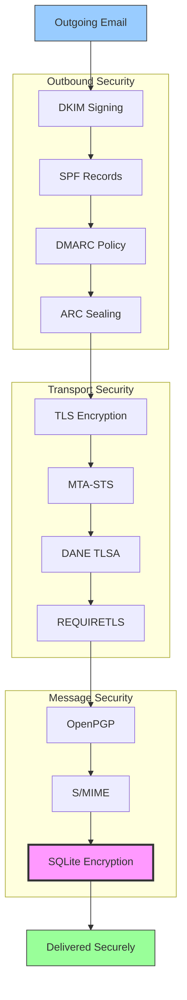


## E-postmeldingsautentiseringsprotokoller {#email-message-authentication-protocols}

> \[!NOTE]
> Forward Email implementerer alle viktige e-postautentiseringsprotokoller for å forhindre forfalskning og sikre meldingsintegritet.

Forward Email bruker [mailauth](https://github.com/postalsys/mailauth)-biblioteket for e-postautentisering. Følgende RFC-er støttes:

| RFC                                                       | Tittel                                                                 | Implementasjonsnotater                                        |
| --------------------------------------------------------- | --------------------------------------------------------------------- | ------------------------------------------------------------- |
| [RFC 6376](https://datatracker.ietf.org/doc/html/rfc6376) | DomainKeys Identified Mail (DKIM) Signaturer                          | Full DKIM-signering og verifisering                           |
| [RFC 8463](https://datatracker.ietf.org/doc/html/rfc8463) | En ny kryptografisk signaturmetode for DKIM (Ed25519-SHA256)          | Støtter både RSA-SHA256 og Ed25519-SHA256 signaturalgoritmer |
| [RFC 7208](https://datatracker.ietf.org/doc/html/rfc7208) | Sender Policy Framework (SPF)                                         | Validering av SPF-poster                                      |
| [RFC 7489](https://datatracker.ietf.org/doc/html/rfc7489) | Domain-basert meldingsautentisering, rapportering og samsvar (DMARC) | Håndheving av DMARC-policy                                    |
| [RFC 8617](https://datatracker.ietf.org/doc/html/rfc8617) | Authenticated Received Chain (ARC)                                    | ARC-forsegling og validering                                  |

E-postautentiseringsprotokoller verifiserer at meldinger virkelig kommer fra den påståtte avsenderen og ikke har blitt tuklet med under overføringen.

### Støtte for autentiseringsprotokoller {#authentication-protocol-support}

| Protokoll | RFC      | Status       | Beskrivelse                                                          |
| --------- | -------- | ------------ | ------------------------------------------------------------------- |
| **DKIM**  | RFC 6376 | ✅ Støttet   | DomainKeys Identified Mail - Kryptografiske signaturer             |
| **SPF**   | RFC 7208 | ✅ Støttet   | Sender Policy Framework - Autorisasjon av IP-adresse               |
| **DMARC** | RFC 7489 | ✅ Støttet   | Domain-basert meldingsautentisering - Policyhåndheving             |
| **ARC**   | RFC 8617 | ✅ Støttet   | Authenticated Received Chain - Bevarer autentisering ved videresending |
### DKIM (DomainKeys Identified Mail) {#dkim-domainkeys-identified-mail}

**DKIM** legger til en kryptografisk signatur i e-postoverskrifter, som lar mottakere verifisere at meldingen var autorisert av domeneeieren og ikke har blitt endret underveis.

Forward Email bruker [mailauth](https://github.com/postalsys/mailauth) for DKIM-signering og verifisering.

**Nøkkelfunksjoner:**

* Automatisk DKIM-signering for alle utgående meldinger
* Støtte for RSA- og Ed25519-nøkler
* Støtte for flere selektorer
* DKIM-verifisering for innkommende meldinger

### SPF (Sender Policy Framework) {#spf-sender-policy-framework}

**SPF** lar domeneeiere spesifisere hvilke IP-adresser som er autorisert til å sende e-post på vegne av deres domene.

**Nøkkelfunksjoner:**

* Validering av SPF-poster for innkommende meldinger
* Automatisk SPF-sjekk med detaljerte resultater
* Støtte for include-, redirect- og all-mekanismer
* Konfigurerbare SPF-policyer per domene

### DMARC (Domain-based Message Authentication, Reporting & Conformance) {#dmarc-domain-based-message-authentication-reporting--conformance}

**DMARC** bygger på SPF og DKIM for å tilby policyhåndhevelse og rapportering.

**Nøkkelfunksjoner:**

* Håndhevelse av DMARC-policy (none, quarantine, reject)
* Justeringssjekk for SPF og DKIM
* DMARC aggregerte rapporter
* DMARC-policyer per domene

### ARC (Authenticated Received Chain) {#arc-authenticated-received-chain}

**ARC** bevarer e-postautentiseringsresultater gjennom videresending og endringer i mailinglister.

Forward Email bruker [mailauth](https://github.com/postalsys/mailauth)-biblioteket for ARC-verifisering og -forsegling.

**Nøkkelfunksjoner:**

* ARC-forsegling for videresendte meldinger
* ARC-validering for innkommende meldinger
* Kjedeverifisering over flere hopp
* Bevarer opprinnelige autentiseringsresultater

### Authentication Flow {#authentication-flow}

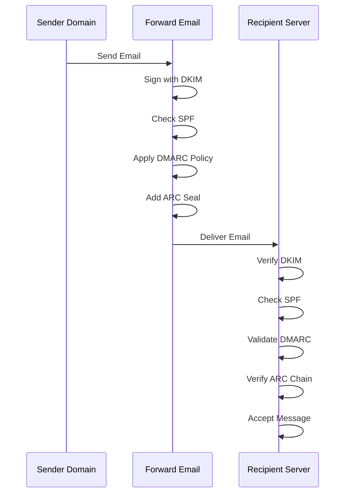

---


## Email Transport Security Protocols {#email-transport-security-protocols}

> \[!IMPORTANT]
> Forward Email implementerer flere lag med transport-sikkerhet for å beskytte e-poster under overføring.

Forward Email implementerer moderne transport-sikkerhetsprotokoller:

| RFC                                                       | Tittel                                                                                              | Status      | Implementasjonsnotater                                                                                                                                                                                                                                                                          |
| --------------------------------------------------------- | -------------------------------------------------------------------------------------------------- | ----------- | --------------------------------------------------------------------------------------------------------------------------------------------------------------------------------------------------------------------------------------------------------------------------------------------- |
| [RFC 8461](https://datatracker.ietf.org/doc/html/rfc8461) | SMTP MTA Strict Transport Security (MTA-STS)                                                       | ✅ Støttet  | Bredt brukt på IMAP-, SMTP- og MX-servere. Se [create-mta-sts-cache.js](https://github.com/forwardemail/forwardemail.net/blob/master/helpers/create-mta-sts-cache.js) og [get-transporter.js](https://github.com/forwardemail/forwardemail.net/blob/master/helpers/get-transporter.js)           |
| [RFC 8460](https://datatracker.ietf.org/doc/html/rfc8460) | SMTP TLS Reporting                                                                                 | ✅ Støttet  | Via [mailauth](https://github.com/postalsys/mailauth)-biblioteket                                                                                                                                                                                                                              |
| [RFC 7671](https://datatracker.ietf.org/doc/html/rfc7671) | The DNS-Based Authentication of Named Entities (DANE) Protocol: Updates and Operational Guidance   | ✅ Støttet  | Full DANE-verifisering for utgående SMTP-tilkoblinger. Se [mx-connect PR #22](https://github.com/zone-eu/mx-connect/pull/22)                                                                                                                                                                  |
| [RFC 6698](https://datatracker.ietf.org/doc/html/rfc6698) | The DNS-Based Authentication of Named Entities (DANE) Transport Layer Security (TLS) Protocol: TLSA | ✅ Støttet  | Full RFC 6698-støtte: PKIX-TA, PKIX-EE, DANE-TA, DANE-EE brukstyper. Se [mx-connect PR #22](https://github.com/zone-eu/mx-connect/pull/22)                                                                                                                                                     |
| [RFC 8314](https://datatracker.ietf.org/doc/html/rfc8314) | Cleartext Considered Obsolete: Use of Transport Layer Security (TLS) for Email Submission and Access | ✅ Støttet  | TLS kreves for alle tilkoblinger                                                                                                                                                                                                                                                              |
| [RFC 8689](https://datatracker.ietf.org/doc/html/rfc8689) | SMTP Service Extension for Requiring TLS (REQUIRETLS)                                              | ✅ Støttet  | Full støtte for REQUIRETLS SMTP-utvidelsen og "TLS-Required"-header                                                                                                                                                                                                                           |
Transport sikkerhetsprotokoller sikrer at e-postmeldinger er kryptert og autentisert under overføring mellom e-postservere.

### Transport Security Support {#transport-security-support}

| Protokoll     | RFC      | Status      | Beskrivelse                                      |
| -------------- | -------- | ----------- | ------------------------------------------------ |
| **TLS**        | RFC 8314 | ✅ Støttet  | Transport Layer Security - Krypterte tilkoblinger |
| **MTA-STS**    | RFC 8461 | ✅ Støttet  | Mail Transfer Agent Strict Transport Security    |
| **DANE**       | RFC 7671 | ✅ Støttet  | DNS-basert autentisering av navngitte enheter    |
| **REQUIRETLS** | RFC 8689 | ✅ Støttet  | Krev TLS for hele leveringsveien                  |

### TLS (Transport Layer Security) {#tls-transport-layer-security}

Forward Email håndhever TLS-kryptering for alle e-posttilkoblinger (SMTP, IMAP, POP3).

**Nøkkelfunksjoner:**

* Støtte for TLS 1.2 og TLS 1.3
* Automatisk sertifikathåndtering
* Perfect Forward Secrecy (PFS)
* Kun sterke krypteringssett

### MTA-STS (Mail Transfer Agent Strict Transport Security) {#mta-sts-mail-transfer-agent-strict-transport-security}

**MTA-STS** sikrer at e-post kun leveres over TLS-krypterte tilkoblinger ved å publisere en policy via HTTPS.

Forward Email implementerer MTA-STS ved hjelp av [create-mta-sts-cache.js](https://github.com/forwardemail/forwardemail.net/blob/master/helpers/create-mta-sts-cache.js).

**Nøkkelfunksjoner:**

* Automatisk publisering av MTA-STS-policy
* Policy-caching for ytelse
* Forebygging av nedgraderingsangrep
* Håndheving av sertifikatvalidering

### DANE (DNS-based Authentication of Named Entities) {#dane-dns-based-authentication-of-named-entities}

> \[!NOTE]
> Forward Email tilbyr nå full DANE-støtte for utgående SMTP-tilkoblinger.

**DANE** bruker DNSSEC for å publisere TLS-sertifikatinformasjon i DNS, noe som gjør at e-postservere kan verifisere sertifikater uten å stole på sertifiseringsinstanser.

**Nøkkelfunksjoner:**

* ✅ Full DANE-verifisering for utgående SMTP-tilkoblinger
* ✅ Full RFC 6698-støtte: PKIX-TA, PKIX-EE, DANE-TA, DANE-EE brukstyper
* ✅ Sertifikatverifisering mot TLSA-poster under TLS-oppgradering
* ✅ Parallell TLSA-oppløsning for flere MX-verter
* ✅ Automatisk deteksjon av native `dns.resolveTlsa` (Node.js v22.15.0+, v23.9.0+)
* ✅ Støtte for egendefinert resolver for eldre Node.js-versjoner via [Tangerine](https://github.com/forwardemail/tangerine)
* Krever DNSSEC-signerte domener

> \[!TIP]
> **Implementasjonsdetaljer:** DANE-støtte ble lagt til via [mx-connect PR #22](https://github.com/zone-eu/mx-connect/pull/22), som gir omfattende DANE/TLSA-støtte for utgående SMTP-tilkoblinger.

### REQUIRETLS {#requiretls}

> \[!TIP]
> Forward Email er en av få leverandører med brukerrettet REQUIRETLS-støtte.

**REQUIRETLS** sikrer at e-postmeldinger kun leveres over TLS-krypterte tilkoblinger for hele leveringsveien.

**Nøkkelfunksjoner:**

* Brukervennlig avkrysningsboks i e-postkomponisten
* Automatisk avvisning av ukryptert levering
* End-to-end TLS-håndheving
* Detaljerte feilmeldinger

> \[!TIP]
> **Brukerrettet TLS-håndheving:** Forward Email tilbyr en avkrysningsboks under **Min konto > Domener > Innstillinger** for å håndheve TLS for alle innkommende tilkoblinger. Når aktivert, avviser denne funksjonen all innkommende e-post som ikke sendes over en TLS-kryptert tilkobling med feilkode 530, og sikrer at all innkommende post er kryptert under overføring.

### Transport Security Flow {#transport-security-flow}

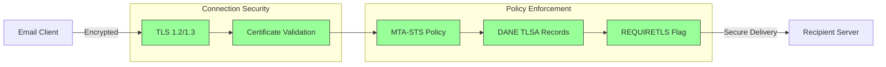
## E-postmeldingkryptering {#email-message-encryption}

> \[!NOTE]
> Forward Email støtter både OpenPGP og S/MIME for ende-til-ende e-postkryptering.

Forward Email støtter OpenPGP og S/MIME-kryptering:

| RFC                                                       | Tittel                                                                                  | Status      | Implementasjonsnotater                                                                                                                                                                               |
| --------------------------------------------------------- | --------------------------------------------------------------------------------------- | ----------- | ---------------------------------------------------------------------------------------------------------------------------------------------------------------------------------------------------- |
| [RFC 9580](https://datatracker.ietf.org/doc/html/rfc9580) | OpenPGP (erstatter RFC 4880)                                                           | ✅ Støttet  | Via [OpenPGP.js v6+](https://github.com/openpgpjs/openpgpjs) integrasjon. Se [FAQ](https://forwardemail.net/en/faq#do-you-support-openpgpmime-end-to-end-encryption-e2ee-and-web-key-directory-wkd) |
| [RFC 8551](https://datatracker.ietf.org/doc/html/rfc8551) | Secure/Multipurpose Internet Mail Extensions (S/MIME) Versjon 4.0 Meldingsspesifikasjon | ✅ Støttet  | Både RSA og ECC-algoritmer støttes. Se [FAQ](https://forwardemail.net/en/faq#do-you-support-smime-encryption)                                                                                        |

Meldingskrypteringsprotokoller beskytter e-postinnhold fra å bli lest av andre enn den tiltenkte mottakeren, selv om meldingen blir avlyttet under overføring.

### Krypteringsstøtte {#encryption-support}

| Protokoll   | RFC      | Status      | Beskrivelse                                  |
| ----------- | -------- | ----------- | -------------------------------------------- |
| **OpenPGP** | RFC 9580 | ✅ Støttet  | Pretty Good Privacy - Offentlig nøkkelkryptering  |
| **S/MIME**  | RFC 8551 | ✅ Støttet  | Secure/Multipurpose Internet Mail Extensions |
| **WKD**     | Draft    | ✅ Støttet  | Web Key Directory - Automatisk nøkkeloppdagelse  |

### OpenPGP (Pretty Good Privacy) {#openpgp-pretty-good-privacy}

**OpenPGP** gir ende-til-ende kryptering ved bruk av offentlig nøkkelkryptografi. Forward Email støtter OpenPGP gjennom [Web Key Directory (WKD)](https://forwardemail.net/en/faq#do-you-support-openpgpmime-end-to-end-encryption-e2ee-and-web-key-directory-wkd)-protokollen.

**Nøkkelfunksjoner:**

* Automatisk nøkkeloppdagelse via WKD
* PGP/MIME-støtte for krypterte vedlegg
* Nøkkelhåndtering gjennom e-postklient
* Kompatibel med GPG, Mailvelope og andre OpenPGP-verktøy

**Hvordan bruke:**

1. Generer et PGP-nøkkelpar i e-postklienten din
2. Last opp din offentlige nøkkel til Forward Emails WKD
3. Nøkkelen din blir automatisk oppdagbar for andre brukere
4. Send og motta krypterte e-poster sømløst

### S/MIME (Secure/Multipurpose Internet Mail Extensions) {#smime-securemultipurpose-internet-mail-extensions}

**S/MIME** gir e-postkryptering og digitale signaturer ved bruk av X.509-sertifikater.

**Nøkkelfunksjoner:**

* Sertifikatbasert kryptering
* Digitale signaturer for meldingsautentisering
* Innebygd støtte i de fleste e-postklienter
* Sikkerhet på bedriftsnivå

**Hvordan bruke:**

1. Skaff et S/MIME-sertifikat fra en sertifikatutsteder
2. Installer sertifikatet i e-postklienten din
3. Konfigurer klienten til å kryptere/signere meldinger
4. Bytt sertifikater med mottakere

### SQLite Mailbox-kryptering {#sqlite-mailbox-encryption}

> \[!IMPORTANT]
> Forward Email tilbyr et ekstra sikkerhetslag med krypterte SQLite-postbokser.

I tillegg til meldingsnivåkryptering krypterer Forward Email hele postbokser ved bruk av [sqleet](https://github.com/resilar/sqleet) (ChaCha20-Poly1305).

**Nøkkelfunksjoner:**

* **Passordbasert kryptering** - Kun du har passordet
* **Kvantemotstandsdyktig** - ChaCha20-Poly1305-kryptering
* **Null-kunnskap** - Forward Email kan ikke dekryptere postboksen din
* **Sandboxet** - Hver postboks er isolert og bærbar
* **Uopprettelig** - Hvis du glemmer passordet, går postboksen tapt
### Krypteringssammenligning {#encryption-comparison}

| Funksjon              | OpenPGP           | S/MIME             | SQLite-kryptering |
| --------------------- | ----------------- | ------------------ | ----------------- |
| **Ende-til-ende**     | ✅ Ja             | ✅ Ja              | ✅ Ja             |
| **Nøkkelhåndtering**  | Selvstyrt         | CA-utstedt         | Passordbasert     |
| **Klientstøtte**      | Krever plugin     | Innebygd           | Transparent       |
| **Brukstilfelle**     | Personlig         | Bedrift            | Lagring           |
| **Kvantemotstandsdyktig** | ⚠️ Avhenger av nøkkel | ⚠️ Avhenger av sertifikat | ✅ Ja             |

### Krypteringsflyt {#encryption-flow}

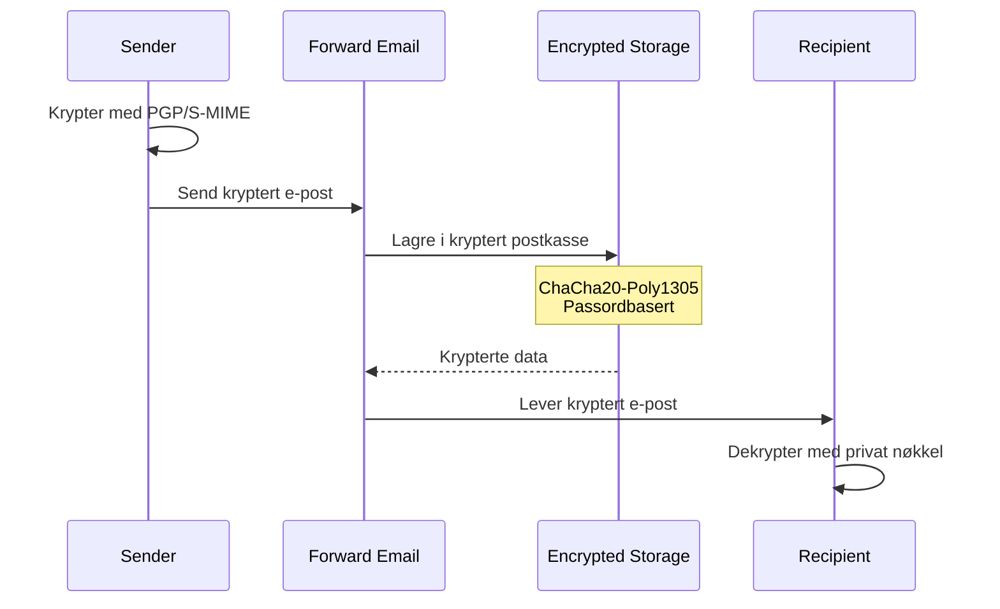

---


## Utvidet funksjonalitet {#extended-functionality}


## Standarder for e-postmeldingsformat {#email-message-format-standards}

> \[!NOTE]
> Forward Email støtter moderne e-postformatstandarder for rikt innhold og internasjonalisering.

Forward Email støtter standard e-postmeldingsformater:

| RFC                                                       | Tittel                                                        | Implementasjonsnotater |
| --------------------------------------------------------- | ------------------------------------------------------------- | ---------------------- |
| [RFC 5322](https://datatracker.ietf.org/doc/html/rfc5322) | Internet Message Format                                       | Full støtte            |
| [RFC 2045](https://datatracker.ietf.org/doc/html/rfc2045) | MIME Del én: Format for internettmeldingskropper             | Full MIME-støtte       |
| [RFC 2046](https://datatracker.ietf.org/doc/html/rfc2046) | MIME Del to: Mediatyper                                       | Full MIME-støtte       |
| [RFC 2047](https://datatracker.ietf.org/doc/html/rfc2047) | MIME Del tre: Meldingsheaderutvidelser for ikke-ASCII-tekst  | Full MIME-støtte       |
| [RFC 2048](https://datatracker.ietf.org/doc/html/rfc2048) | MIME Del fire: Registreringsprosedyrer                        | Full MIME-støtte       |
| [RFC 2049](https://datatracker.ietf.org/doc/html/rfc2049) | MIME Del fem: Samsvarskriterier og eksempler                  | Full MIME-støtte       |

E-postformatstandarder definerer hvordan e-postmeldinger struktureres, kodes og vises.

### Støtte for formatstandarder {#format-standards-support}

| Standard           | RFC           | Status      | Beskrivelse                          |
| ------------------ | ------------- | ----------- | ---------------------------------- |
| **MIME**           | RFC 2045-2049 | ✅ Støttet  | Multipurpose Internet Mail Extensions |
| **SMTPUTF8**       | RFC 6531      | ⚠️ Delvis   | Internasjonaliserte e-postadresser  |
| **EAI**            | RFC 6530      | ⚠️ Delvis   | Internasjonalisering av e-postadresser |
| **Meldingsformat** | RFC 5322      | ✅ Støttet  | Internet Message Format             |
| **MIME-sikkerhet** | RFC 1847      | ✅ Støttet  | Sikkerhetsmultipart for MIME        |

### MIME (Multipurpose Internet Mail Extensions) {#mime-multipurpose-internet-mail-extensions}

**MIME** gjør det mulig for e-poster å inneholde flere deler med forskjellige innholdstyper (tekst, HTML, vedlegg osv.).

**Støttede MIME-funksjoner:**

* Multipart-meldinger (mixed, alternative, related)
* Content-Type-headere
* Content-Transfer-Encoding (7bit, 8bit, quoted-printable, base64)
* Inline-bilder og vedlegg
* Rikt HTML-innhold

### SMTPUTF8 og internasjonalisering av e-postadresser {#smtputf8-and-email-address-internationalization}

> \[!WARNING]
> SMTPUTF8-støtten er delvis – ikke alle funksjoner er fullt implementert.
**SMTPUTF8** tillater e-postadresser å inneholde ikke-ASCII-tegn (f.eks. `用户@例え.jp`).

**Nåværende status:**

* ⚠️ Delvis støtte for internasjonaliserte e-postadresser
* ✅ UTF-8-innhold i meldingskropper
* ⚠️ Begrenset støtte for ikke-ASCII lokale deler

---


## Kalender- og kontaktprotokoller {#calendaring-and-contacts-protocols}

> \[!NOTE]
> Forward Email tilbyr full CalDAV- og CardDAV-støtte for kalender- og kontaktsynkronisering.

Forward Email støtter CalDAV og CardDAV via [caldav-adapter](https://github.com/forwardemail/caldav-adapter)-biblioteket:

| RFC                                                       | Tittel                                                                   | Status      | Implementasjonsnotater                                                                                                                                                                |
| --------------------------------------------------------- | ----------------------------------------------------------------------- | ----------- | ------------------------------------------------------------------------------------------------------------------------------------------------------------------------------------- |
| [RFC 4791](https://datatracker.ietf.org/doc/html/rfc4791) | Kalenderutvidelser til WebDAV (CalDAV)                                  | ✅ Støttet  | Tilgang til og administrasjon av kalender                                                                                                                                             |
| [RFC 6352](https://datatracker.ietf.org/doc/html/rfc6352) | CardDAV: vCard-utvidelser til WebDAV                                    | ✅ Støttet  | Tilgang til og administrasjon av kontakter                                                                                                                                             |
| [RFC 5545](https://datatracker.ietf.org/doc/html/rfc5545) | Internet Calendaring and Scheduling Core Object Specification (iCalendar) | ✅ Støttet  | Støtte for iCalendar-format                                                                                                                                                            |
| [RFC 6350](https://datatracker.ietf.org/doc/html/rfc6350) | vCard Format Specification                                              | ✅ Støttet  | Støtte for vCard 4.0-format                                                                                                                                                            |
| [RFC 6638](https://datatracker.ietf.org/doc/html/rfc6638) | Scheduling Extensions to CalDAV                                         | ✅ Støttet  | CalDAV-planlegging med iMIP-støtte. Se [commit c4d1629](https://github.com/forwardemail/forwardemail.net/commit/c4d162975a49e38d76d68a032662e873a34a9b80)                            |
| [RFC 5546](https://datatracker.ietf.org/doc/html/rfc5546) | iCalendar Transport-Independent Interoperability Protocol (iTIP)        | ✅ Støttet  | iTIP-støtte for REQUEST, REPLY, CANCEL og VFREEBUSY-metoder. Se [commit c4d1629](https://github.com/forwardemail/forwardemail.net/commit/c4d162975a49e38d76d68a032662e873a34a9b80) |
| [RFC 6047](https://datatracker.ietf.org/doc/html/rfc6047) | iCalendar Message-Based Interoperability Protocol (iMIP)                | ✅ Støttet  | E-postbaserte kalenderinvitasjoner med svarlenker. Se [commit c4d1629](https://github.com/forwardemail/forwardemail.net/commit/c4d162975a49e38d76d68a032662e873a34a9b80)           |

CalDAV og CardDAV er protokoller som tillater at kalender- og kontaktdata kan aksesseres, deles og synkroniseres på tvers av enheter.

### CalDAV- og CardDAV-støtte {#caldav-and-carddav-support}

| Protokoll             | RFC      | Status      | Beskrivelse                           |
| --------------------- | -------- | ----------- | ----------------------------------- |
| **CalDAV**            | RFC 4791 | ✅ Støttet  | Tilgang til og synkronisering av kalender |
| **CardDAV**           | RFC 6352 | ✅ Støttet  | Tilgang til og synkronisering av kontakter |
| **iCalendar**         | RFC 5545 | ✅ Støttet  | Kalenderdataformat                   |
| **vCard**             | RFC 6350 | ✅ Støttet  | Kontaktdataformat                   |
| **VTODO**             | RFC 5545 | ✅ Støttet  | Støtte for oppgaver/påminnelser     |
| **CalDAV Scheduling** | RFC 6638 | ✅ Støttet  | Kalenderplanleggingsutvidelser       |
| **iTIP**              | RFC 5546 | ✅ Støttet  | Transportuavhengig interoperabilitet |
| **iMIP**              | RFC 6047 | ✅ Støttet  | E-postbaserte kalenderinvitasjoner   |
### CalDAV (Kalendertilgang) {#caldav-calendar-access}

**CalDAV** lar deg få tilgang til og administrere kalendere fra hvilken som helst enhet eller applikasjon.

**Nøkkelfunksjoner:**

* Synkronisering på flere enheter
* Delte kalendere
* Kalenderabonnementer
* Invitasjoner til hendelser og svar
* Gjentakende hendelser
* Støtte for tidssoner

**Kompatible klienter:**

* Apple Kalender (macOS, iOS)
* Mozilla Thunderbird
* Evolution
* GNOME Kalender
* Enhver CalDAV-kompatibel klient

### CardDAV (Kontakt-tilgang) {#carddav-contact-access}

**CardDAV** lar deg få tilgang til og administrere kontakter fra hvilken som helst enhet eller applikasjon.

**Nøkkelfunksjoner:**

* Synkronisering på flere enheter
* Delte adressebøker
* Kontaktgrupper
* Støtte for bilder
* Egne felter
* Støtte for vCard 4.0

**Kompatible klienter:**

* Apple Kontakter (macOS, iOS)
* Mozilla Thunderbird
* Evolution
* GNOME Kontakter
* Enhver CardDAV-kompatibel klient

### Oppgaver og påminnelser (CalDAV VTODO) {#tasks-and-reminders-caldav-vtodo}

> \[!TIP]
> Forward Email støtter oppgaver og påminnelser gjennom CalDAV VTODO.

**VTODO** er en del av iCalendar-formatet og tillater oppgavehåndtering via CalDAV.

**Nøkkelfunksjoner:**

* Opprettelse og administrasjon av oppgaver
* Forfallsdatoer og prioriteringer
* Sporing av fullførte oppgaver
* Gjentakende oppgaver
* Oppgavelister/kategorier

**Kompatible klienter:**

* Apple Påminnelser (macOS, iOS)
* Mozilla Thunderbird (med Lightning)
* Evolution
* GNOME To Do
* Enhver CalDAV-klient med VTODO-støtte

### CalDAV/CardDAV synkroniseringsflyt {#caldavcarddav-synchronization-flow}

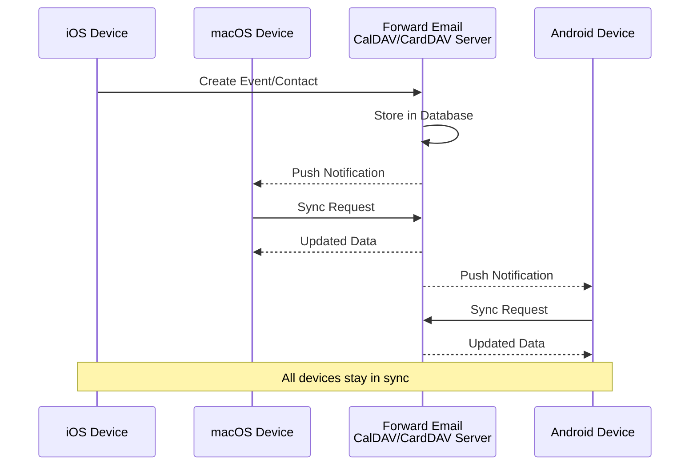

### Kalenderutvidelser SOM IKKE STØTTES {#calendaring-extensions-not-supported}

Følgende kalenderutvidelser støttes IKKE:

| RFC                                                       | Tittel                                                              | Årsak                                                           |
| --------------------------------------------------------- | ------------------------------------------------------------------- | ---------------------------------------------------------------- |
| [RFC 4918](https://datatracker.ietf.org/doc/html/rfc4918) | HTTP Extensions for Web Distributed Authoring and Versioning (WebDAV) | CalDAV bruker WebDAV-konsepter, men implementerer ikke hele RFC 4918 |
| [RFC 6578](https://datatracker.ietf.org/doc/html/rfc6578) | Collection Synchronization for WebDAV                               | Ikke implementert                                               |
| [RFC 3744](https://datatracker.ietf.org/doc/html/rfc3744) | WebDAV Access Control Protocol                                      | Ikke implementert                                               |

---


## E-postmeldingfiltrering {#email-message-filtering}

> \[!IMPORTANT]
> Forward Email tilbyr **full støtte for Sieve og ManageSieve** for serverbasert e-postfiltrering. Lag kraftige regler for automatisk sortering, filtrering, videresending og svar på innkommende meldinger.

### Sieve (RFC 5228) {#sieve-rfc-5228}

[Sieve](https://en.wikipedia.org/wiki/Sieve_\(mail_filtering_language\)) er et standardisert, kraftig skriptspråk for serverbasert e-postfiltrering. Forward Email implementerer omfattende støtte for Sieve med 24 utvidelser.

**Kildekode:** [`helpers/sieve/`](https://github.com/forwardemail/forwardemail.net/tree/master/helpers/sieve)

#### Støttede kjerne-Sieve RFC-er {#core-sieve-rfcs-supported}

| RFC                                                                                    | Tittel                                                        | Status         |
| -------------------------------------------------------------------------------------- | ------------------------------------------------------------- | -------------- |
| [RFC 5228](https://datatracker.ietf.org/doc/html/rfc5228)                              | Sieve: Et e-postfiltreringsspråk                             | ✅ Full støtte  |
| [RFC 5429](https://datatracker.ietf.org/doc/html/rfc5429)                              | Sieve e-postfiltrering: Reject og Extended Reject Extensions | ✅ Full støtte  |
| [RFC 5230](https://datatracker.ietf.org/doc/html/rfc5230)                              | Sieve e-postfiltrering: Ferieutvidelse                        | ✅ Full støtte  |
| [RFC 6131](https://datatracker.ietf.org/doc/html/rfc6131)                              | Sieve ferieutvidelse: "Seconds"-parameter                     | ✅ Full støtte  |
| [RFC 5232](https://datatracker.ietf.org/doc/html/rfc5232)                              | Sieve e-postfiltrering: Imap4flags-utvidelse                  | ✅ Full støtte  |
| [RFC 5173](https://datatracker.ietf.org/doc/html/rfc5173)                              | Sieve e-postfiltrering: Body-utvidelse                        | ✅ Full støtte  |
| [RFC 5229](https://datatracker.ietf.org/doc/html/rfc5229)                              | Sieve e-postfiltrering: Variabelutvidelse                     | ✅ Full støtte  |
| [RFC 5231](https://datatracker.ietf.org/doc/html/rfc5231)                              | Sieve e-postfiltrering: Relasjonsutvidelse                    | ✅ Full støtte  |
| [RFC 4790](https://datatracker.ietf.org/doc/html/rfc4790)                              | Internet Application Protocol Collation Registry               | ✅ Full støtte  |
| [RFC 3894](https://datatracker.ietf.org/doc/html/rfc3894)                              | Sieve-utvidelse: Kopiering uten bivirkninger                  | ✅ Full støtte  |
| [RFC 5293](https://datatracker.ietf.org/doc/html/rfc5293)                              | Sieve e-postfiltrering: Editheader-utvidelse                  | ✅ Full støtte  |
| [RFC 5260](https://datatracker.ietf.org/doc/html/rfc5260)                              | Sieve e-postfiltrering: Dato- og indeksutvidelser             | ✅ Full støtte  |
| [RFC 5435](https://datatracker.ietf.org/doc/html/rfc5435)                              | Sieve e-postfiltrering: Utvidelse for varsler                 | ✅ Full støtte  |
| [RFC 5183](https://datatracker.ietf.org/doc/html/rfc5183)                              | Sieve e-postfiltrering: Miljøutvidelse                        | ✅ Full støtte  |
| [RFC 5490](https://datatracker.ietf.org/doc/html/rfc5490)                              | Sieve e-postfiltrering: Utvidelser for sjekking av postkassestatus | ✅ Full støtte  |
| [RFC 8579](https://datatracker.ietf.org/doc/html/rfc8579)                              | Sieve e-postfiltrering: Levering til spesialbruk-postkasser  | ✅ Full støtte  |
| [RFC 7352](https://datatracker.ietf.org/doc/html/rfc7352)                              | Sieve e-postfiltrering: Oppdaging av duplikatleveranser       | ✅ Full støtte  |
| [RFC 5463](https://datatracker.ietf.org/doc/html/rfc5463)                              | Sieve e-postfiltrering: Ihave-utvidelse                       | ✅ Full støtte  |
| [RFC 5233](https://datatracker.ietf.org/doc/html/rfc5233)                              | Sieve e-postfiltrering: Subaddress-utvidelse                  | ✅ Full støtte  |
| [draft-ietf-sieve-regex](https://datatracker.ietf.org/doc/html/draft-ietf-sieve-regex) | Sieve e-postfiltrering: Regulært uttrykk-utvidelse            | ✅ Full støtte  |
#### Støttede Sieve-utvidelser {#supported-sieve-extensions}

| Utvidelse                    | Beskrivelse                              | Integrasjon                                |
| ---------------------------- | ---------------------------------------- | ------------------------------------------ |
| `fileinto`                   | Filtrer meldinger til spesifikke mapper | Meldinger lagres i angitt IMAP-mappe       |
| `reject` / `ereject`         | Avvis meldinger med en feil              | SMTP-avvisning med feilmelding             |
| `vacation`                   | Automatiske ferie-/fraværssvar           | Køes via Emails.queue med hastighetsbegrensning |
| `vacation-seconds`           | Finmasket ferie-responsintervaller       | TTL fra `:seconds`-parameter                |
| `imap4flags`                 | Sett IMAP-flagg (\Seen, \Flagged, osv.)  | Flagg anvendt under lagring av melding     |
| `envelope`                   | Test av avsender/mottaker i konvolutt    | Tilgang til SMTP-konvoluttdata              |
| `body`                       | Test innhold i meldingskropp              | Full tekstsamsvar i kropp                   |
| `variables`                  | Lagre og bruk variabler i skript          | Variabelekspansjon med modifikatorer       |
| `relational`                 | Relasjonelle sammenligninger              | `:count`, `:value` med gt/lt/eq             |
| `comparator-i;ascii-numeric` | Numeriske sammenligninger                 | Numerisk strengsammenligning                 |
| `copy`                       | Kopier meldinger ved videresending        | `:copy`-flagg på fileinto/redirect          |
| `editheader`                 | Legg til eller slett meldingsoverskrifter | Overskrifter endres før lagring             |
| `date`                       | Test dato-/tidverdier                      | `currentdate` og overskriftsdato-tester     |
| `index`                      | Tilgang til spesifikke forekomster av overskrifter | `:index` for flerverdige overskrifter       |
| `regex`                      | Regulært uttrykk-matching                  | Full regex-støtte i tester                   |
| `enotify`                    | Send varsler                              | `mailto:`-varsler via Emails.queue           |
| `environment`                | Tilgang til miljøinformasjon               | Domene, vert, ekstern IP fra sesjon          |
| `mailbox`                    | Test for postkasseeksistens                | `mailboxexists`-test                         |
| `special-use`                | Filtrer til spesialbruk-postkasser         | Mapper \Junk, \Trash, osv. til mapper        |
| `duplicate`                  | Oppdag duplikatmeldinger                   | Redis-basert duplikatsporing                  |
| `ihave`                      | Test for tilgjengelighet av utvidelse      | Kjøretidskapabilitetssjekk                    |
| `subaddress`                 | Tilgang til bruker+detalj-adressedeler     | `:user` og `:detail` adressedelene            |

#### Sieve-utvidelser SOM IKKE ER STØTTET {#sieve-extensions-not-supported}

| Utvidelse                               | RFC                                                       | Årsak                                                           |
| --------------------------------------- | --------------------------------------------------------- | ---------------------------------------------------------------- |
| `include`                               | [RFC 6609](https://datatracker.ietf.org/doc/html/rfc6609) | Sikkerhetsrisiko (skriptinjeksjon), krever global skriptlagring |
| `mboxmetadata` / `servermetadata`       | [RFC 5490](https://datatracker.ietf.org/doc/html/rfc5490) | Krever IMAP METADATA-utvidelse                                 |
| `fcc`                                   | [RFC 8580](https://datatracker.ietf.org/doc/html/rfc8580) | Krever integrasjon med Sendt-mappe                             |
| `encoded-character`                     | [RFC 5228](https://datatracker.ietf.org/doc/html/rfc5228) | Parserendringer kreves for ${hex:}-syntaks                     |
| `foreverypart` / `mime` / `extracttext` | [RFC 5703](https://datatracker.ietf.org/doc/html/rfc5703) | Kompleks MIME-trestrukturmanipulering                          |
#### Sieve-behandlingsflyt {#sieve-processing-flow}

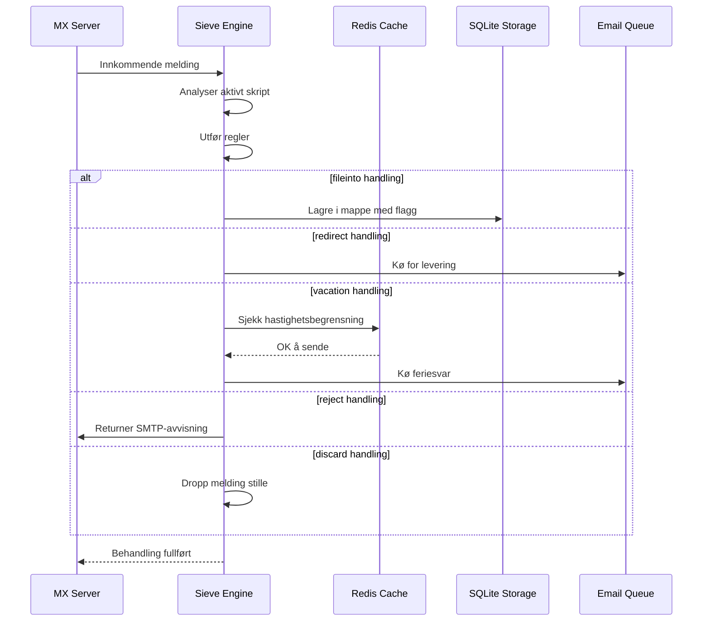

#### Sikkerhetsfunksjoner {#security-features}

Forward Email sin Sieve-implementasjon inkluderer omfattende sikkerhetsbeskyttelser:

* **CVE-2023-26430-beskyttelse**: Forhindrer omdirigeringssløyfer og mail bombing-angrep
* **Hastighetsbegrensning**: Begrensninger på omdirigeringer (10/melding, 100/dag) og feriesvar
* **Denylist-sjekk**: Omdirigeringsadresser sjekkes mot denylist
* **Beskyttede overskrifter**: DKIM, ARC og autentiseringsoverskrifter kan ikke endres via editheader
* **Skriptstørrelsesgrenser**: Maksimal skriptstørrelse håndheves
* **Utførelsestidsavbrudd**: Skript termineres hvis utførelsen overskrider tidsgrense

#### Eksempel på Sieve-skript {#example-sieve-scripts}

**Filtrer nyhetsbrev til en mappe:**

```sieve
require ["fileinto"];

if header :contains "List-Id" "newsletter" {
    fileinto "Newsletters";
}
```

**Ferieautomatisk svar med finmasket timing:**

```sieve
require ["vacation", "vacation-seconds"];

vacation :seconds 3600 :subject "Out of Office"
    "Jeg er for øyeblikket borte og vil svare innen 24 timer.";
```

**Spamfiltrering med flagg:**

```sieve
require ["fileinto", "imap4flags"];

if header :contains "X-Spam-Status" "Yes" {
    setflag "\\Seen";
    fileinto "Junk";
}
```

**Kompleks filtrering med variabler:**

```sieve
require ["variables", "fileinto", "regex"];

if header :regex "From" "(.+)@example\\.com" {
    set :lower "sender" "${1}";
    fileinto "Contacts/${sender}";
}
```

> \[!TIP]
> For fullstendig dokumentasjon, eksempelskript og konfigurasjonsinstruksjoner, se [FAQ: Støtter dere Sieve e-postfiltrering?](/faq#do-you-support-sieve-email-filtering)

### ManageSieve (RFC 5804) {#managesieve-rfc-5804}

Forward Email tilbyr full støtte for ManageSieve-protokollen for fjernstyrt administrasjon av Sieve-skript.

**Kildekode:** [`managesieve-server.js`](https://github.com/forwardemail/forwardemail.net/blob/master/managesieve-server.js)

| RFC                                                       | Tittel                                         | Status         |
| --------------------------------------------------------- | ---------------------------------------------- | -------------- |
| [RFC 5804](https://datatracker.ietf.org/doc/html/rfc5804) | En protokoll for fjernstyrt administrasjon av Sieve-skript | ✅ Full støtte |

#### ManageSieve-serverkonfigurasjon {#managesieve-server-configuration}

| Innstilling             | Verdi                   |
| ----------------------- | ----------------------- |
| **Server**              | `imap.forwardemail.net` |
| **Port (STARTTLS)**     | `2190` (anbefalt)       |
| **Port (Implicit TLS)** | `4190`                  |
| **Autentisering**       | PLAIN (over TLS)        |

> **Merk:** Port 2190 bruker STARTTLS (oppgradering fra vanlig til TLS) og er kompatibel med de fleste ManageSieve-klienter inkludert [sieve-connect](https://github.com/philpennock/sieve-connect). Port 4190 bruker implicit TLS (TLS fra tilkoblingsstart) for klienter som støtter det.

#### Støttede ManageSieve-kommandoer {#supported-managesieve-commands}

| Kommando       | Beskrivelse                             |
| -------------- | --------------------------------------- |
| `AUTHENTICATE` | Autentiser med PLAIN-mekanisme          |
| `CAPABILITY`   | List serverkapasiteter og utvidelser    |
| `HAVESPACE`    | Sjekk om skript kan lagres              |
| `PUTSCRIPT`    | Last opp et nytt skript                  |
| `LISTSCRIPTS`  | List alle skript med aktiv status       |
| `SETACTIVE`    | Aktiver et skript                       |
| `GETSCRIPT`    | Last ned et skript                      |
| `DELETESCRIPT` | Slett et skript                        |
| `RENAMESCRIPT` | Gi nytt navn til et skript              |
| `CHECKSCRIPT`  | Valider skriptsyntaks                   |
| `NOOP`         | Hold tilkoblingen aktiv                  |
| `LOGOUT`       | Avslutt økt                            |
#### Kompatible ManageSieve-klienter {#compatible-managesieve-clients}

* **Thunderbird**: Innebygd Sieve-støtte via [Sieve add-on](https://addons.thunderbird.net/addon/sieve/)
* **Roundcube**: [ManageSieve-plugin](https://plugins.roundcube.net/packages/johndoh/sieve)
* **KMail**: Native ManageSieve-støtte
* **sieve-connect**: Kommandolinjeklient
* **Enhver RFC 5804-kompatibel klient**

#### ManageSieve-protokollflyt {#managesieve-protocol-flow}

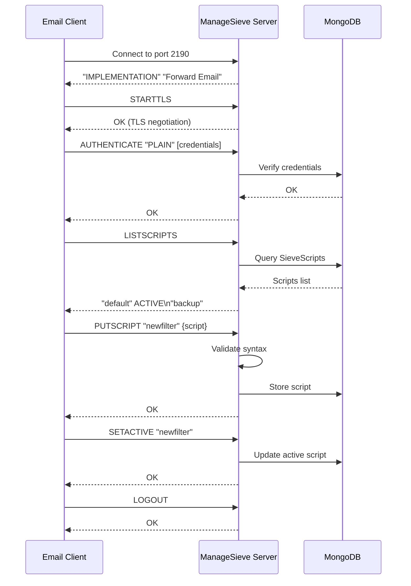

#### Webgrensesnitt og API {#web-interface-and-api}

I tillegg til ManageSieve tilbyr Forward Email:

* **Web Dashboard**: Opprett og administrer Sieve-skript gjennom webgrensesnittet på Min konto → Domener → Alias → Sieve-skript
* **REST API**: Programmatisk tilgang til administrasjon av Sieve-skript via [Forward Email API](/api#sieve-scripts)

> \[!TIP]
> For detaljerte oppsettinstruksjoner og klientkonfigurasjon, se [FAQ: Støtter dere Sieve e-postfiltrering?](/faq#do-you-support-sieve-email-filtering)

---


## Lagringsoptimalisering {#storage-optimization}

> \[!IMPORTANT]
> **Bransjens første lagringsteknologi:** Forward Email er den **eneste e-postleverandøren i verden** som kombinerer vedleggsduplisering med Brotli-komprimering på e-postinnhold. Denne to-lags optimaliseringen gir deg **2-3 ganger mer effektiv lagring** sammenlignet med tradisjonelle e-postleverandører.

Forward Email implementerer to revolusjonerende lagringsoptimaliseringsteknikker som dramatisk reduserer postkassestørrelsen samtidig som full RFC-kompatibilitet og meldingsnøyaktighet opprettholdes:

1. **Vedleggsduplisering** - Eliminerer dupliserte vedlegg på tvers av alle e-poster
2. **Brotli-komprimering** - Reduserer lagring med 46-86 % for metadata og 50 % for vedlegg

### Arkitektur: To-lags lagringsoptimalisering {#architecture-dual-layer-storage-optimization}

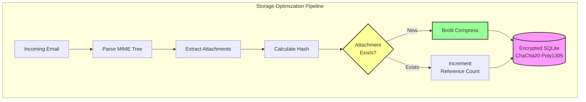

---


## Vedleggsduplisering {#attachment-deduplication}

Forward Email implementerer vedleggsduplisering basert på [WildDucks velprøvde tilnærming](https://docs.wildduck.email/docs/in-depth/attachment-deduplication/), tilpasset for SQLite-lagring.

> \[!NOTE]
> **Hva som blir duplisert:** "Vedlegg" refererer til **kodet** MIME-nodeinnhold (base64 eller quoted-printable), ikke den dekodede filen. Dette bevarer gyldigheten til DKIM- og GPG-signaturer.

### Hvordan det fungerer {#how-it-works}

**WildDucks originale implementering (MongoDB GridFS):**

> Wild Duck IMAP-server dupliserer vedlegg. "Vedlegg" i dette tilfellet betyr base64- eller quoted-printable-kodet mime-nodeinnhold, ikke den dekodede filen. Selv om bruk av kodet innhold medfører mange falske negativer (samme fil i forskjellige e-poster kan telles som forskjellige vedlegg), er det nødvendig for å garantere gyldigheten av ulike signaturskjemaer (DKIM, GPG osv.). En melding hentet fra Wild Duck ser nøyaktig lik ut som meldingen som ble lagret, selv om Wild Duck parser meldingen til et tre-lignende objekt og bygger opp meldingen på nytt ved henting.
**Forward Emails SQLite-implementasjon:**

Forward Email tilpasser denne tilnærmingen for kryptert SQLite-lagring med følgende prosess:

1. **Hash-beregning**: Når et vedlegg finnes, beregnes en hash ved hjelp av [`rev-hash`](https://github.com/sindresorhus/rev-hash)-biblioteket fra vedleggets innhold
2. **Oppslag**: Sjekk om et vedlegg med matchende hash finnes i `Attachments`-tabellen
3. **Referansetelling**:
   * Hvis finnes: Øk referanseteller med 1 og magisk teller med et tilfeldig tall
   * Hvis nytt: Opprett ny vedleggsoppføring med teller = 1
4. **Slettesikkerhet**: Bruker et dobbelt-tellersystem (referanse + magisk) for å forhindre falske positiver
5. **Søppelrydding**: Vedlegg slettes umiddelbart når begge tellere når null

**Kildekode:** [`helpers/attachment-storage.js`](https://github.com/forwardemail/forwardemail.net/blob/master/helpers/attachment-storage.js)

### Dedupliseringsflyt {#deduplication-flow}

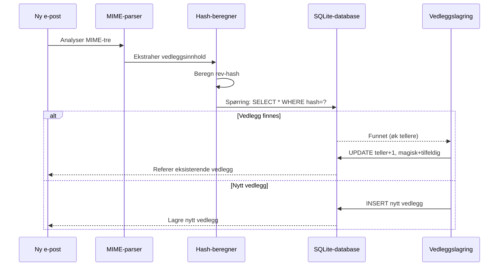

### Magisk tall-system {#magic-number-system}

Forward Email bruker WildDucks "magiske tall"-system (inspirert av [Mail.ru](https://github.com/zone-eu/wildduck)) for å forhindre falske positiver ved sletting:

* Hver melding får et **tilfeldig tall** tildelt
* Vedleggets **magiske teller** økes med dette tilfeldige tallet når meldingen legges til
* Den magiske telleren reduseres med samme tall når meldingen slettes
* Vedlegget slettes kun når **begge tellerne** (referanse + magisk) når null

Dette dobbelt-tellersystemet sikrer at hvis noe går galt under sletting (f.eks. krasj, nettverksfeil), blir ikke vedlegget slettet for tidlig.

### Viktige forskjeller: WildDuck vs Forward Email {#key-differences-wildduck-vs-forward-email}

| Funksjon               | WildDuck (MongoDB)       | Forward Email (SQLite)       |
| ---------------------- | ------------------------ | ---------------------------- |
| **Lagringsbackend**    | MongoDB GridFS (delt opp) | SQLite BLOB (direkte)        |
| **Hash-algoritme**     | SHA256                   | rev-hash (basert på SHA-256) |
| **Referansetelling**   | ✅ Ja                    | ✅ Ja                        |
| **Magiske tall**       | ✅ Ja (Mail.ru-inspirert) | ✅ Ja (samme system)          |
| **Søppelrydding**      | Forsinket (separat jobb) | Umiddelbar (ved null tellere)|
| **Kompresjon**         | ❌ Ingen                 | ✅ Brotli (se nedenfor)       |
| **Kryptering**         | ❌ Valgfritt             | ✅ Alltid (ChaCha20-Poly1305) |

---


## Brotli-komprimering {#brotli-compression}

> \[!IMPORTANT]
> **Verdens første:** Forward Email er den **eneste e-posttjenesten i verden** som bruker Brotli-komprimering på e-postinnhold. Dette gir **46-86 % lagringsbesparelse** i tillegg til deduplisering av vedlegg.

Forward Email implementerer Brotli-komprimering for både vedleggsinnhold og meldingsmetadata, noe som gir enorme lagringsbesparelser samtidig som bakoverkompatibilitet opprettholdes.

**Implementasjon:** [`helpers/msgpack-helpers.js`](https://github.com/forwardemail/forwardemail.net/blob/master/helpers/msgpack-helpers.js)

### Hva som komprimeres {#what-gets-compressed}

**1. Vedleggsinnhold** (`encodeAttachmentBody`)

* **Gamle formater**: Hex-kodet streng (2x størrelse) eller rå Buffer
* **Nytt format**: Brotli-komprimert Buffer med "FEBR" magisk header
* **Kompresjonsbeslutning**: Komprimerer kun hvis det sparer plass (tar hensyn til 4-bytes header)
* **Lagringsbesparelse**: Opptil **50 %** (hex → native BLOB)
**2. Meldingsmetadata** (`encodeMetadata`)

Inkluderer: `mimeTree`, `headers`, `envelope`, `flags`

* **Gammelt format**: JSON tekststreng
* **Nytt format**: Brotli-komprimert Buffer
* **Lagringsbesparelse**: **46-86%** avhengig av meldingens kompleksitet

### Komprimeringskonfigurasjon {#compression-configuration}

```javascript
// Brotli komprimeringsvalg optimalisert for hastighet (nivå 4 er en god balanse)
const BROTLI_COMPRESS_OPTIONS = {
  params: {
    [zlib.constants.BROTLI_PARAM_QUALITY]: 4
  }
};
```

**Hvorfor nivå 4?**

* **Rask komprimering/dekomprimering**: Under millisekund prosessering
* **God komprimeringsrate**: 46-86% besparelse
* **Balansert ytelse**: Optimalt for sanntids e-postoperasjoner

### Magisk header: "FEBR" {#magic-header-febr}

Forward Email bruker en 4-bytes magisk header for å identifisere komprimerte vedleggsinnhold:

```
"FEBR" = Forward Email BRotli
Hex: 0x46 0x45 0x42 0x52
```

**Hvorfor en magisk header?**

* **Formatgjenkjenning**: Umiddelbart identifisere komprimert vs ukomprimert data
* **Bakoverkompatibilitet**: Gamle hex-strenger og rå Buffere fungerer fortsatt
* **Unngå kollisjoner**: "FEBR" er usannsynlig å dukke opp i starten av legitimt vedleggsdata

### Komprimeringsprosess {#compression-process}

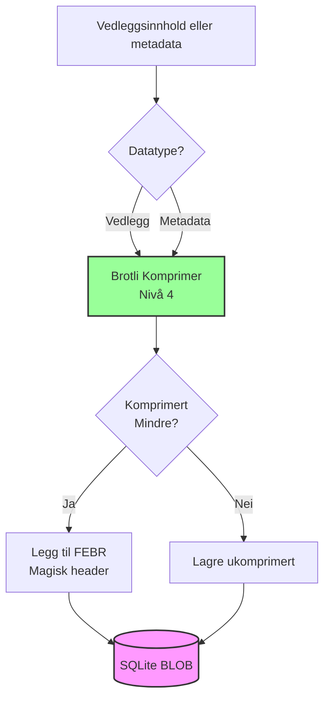

### Dekompresjonsprosess {#decompression-process}

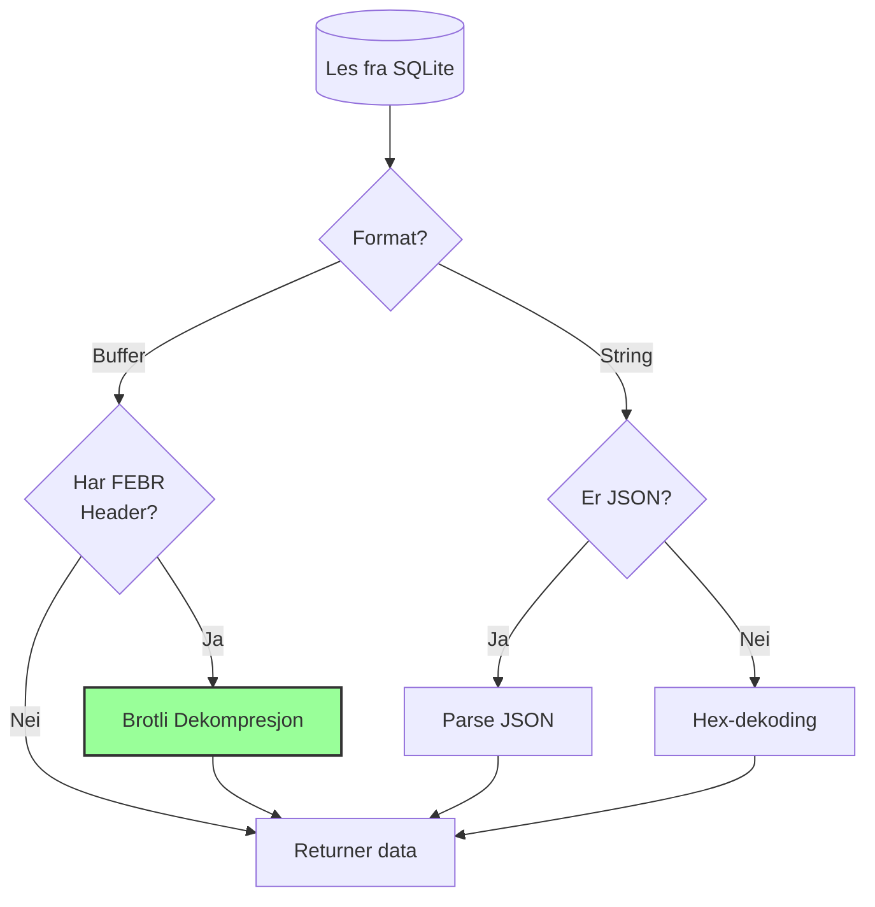

### Bakoverkompatibilitet {#backwards-compatibility}

Alle dekodefunksjoner **auto-gjenkjenner** lagringsformatet:

| Format                | Gjenkjenningsmetode                  | Håndtering                                    |
| --------------------- | ----------------------------------- | --------------------------------------------- |
| **Brotli-komprimert** | Sjekk for "FEBR" magisk header      | Dekompresjon med `zlib.brotliDecompressSync()` |
| **Rå Buffer**         | `Buffer.isBuffer()` uten magisk     | Returner som det er                           |
| **Hex-streng**        | Sjekk for jevn lengde + [0-9a-f] tegn | Dekod med `Buffer.from(value, 'hex')`         |
| **JSON-streng**       | Sjekk for `{` eller `[` som første tegn | Parse med `JSON.parse()`                       |

Dette sikrer **null datatap** under migrering fra gamle til nye lagringsformater.

### Statistikk for lagringsbesparelse {#storage-savings-statistics}

**Målte besparelser fra produksjonsdata:**

| Datatype              | Gammelt format          | Nytt format            | Besparelse |
| --------------------- | ----------------------- | ---------------------- | ---------- |
| **Vedleggsinnhold**   | Hex-kodet streng (2x)   | Brotli-komprimert BLOB | **50%**    |
| **Meldingsmetadata**  | JSON tekst              | Brotli-komprimert BLOB | **46-86%** |
| **Postkasseflagg**    | JSON tekst              | Brotli-komprimert BLOB | **60-80%** |

**Kilde:** [`helpers/migrate-storage-format.js`](https://github.com/forwardemail/forwardemail.net/blob/master/helpers/migrate-storage-format.js)

### Migreringsprosess {#migration-process}

Forward Email tilbyr automatisk, idempotent migrering fra gamle til nye lagringsformater:
// Migrasjonsstatistikk sporet:
{
  attachmentsMigrated: 0,
  messagesMigrated: 0,
  mailboxesMigrated: 0,
  bytesSaved: 0  // Totalt antall byte spart fra komprimering
}
```

**Migrasjonstrinn:**

1. Vedleggsinnhold: hex-koding → native BLOB (50 % besparelse)
2. Meldingsmetadata: JSON-tekst → brotli-komprimert BLOB (46–86 % besparelse)
3. Postkasseflagg: JSON-tekst → brotli-komprimert BLOB (60–80 % besparelse)

**Kilde:** [`helpers/migrate-storage-format.js`](https://github.com/forwardemail/forwardemail.net/blob/master/helpers/migrate-storage-format.js)

---

### Kombinert lagringseffektivitet {#combined-storage-efficiency}

> \[!TIP]
> **Reell effekt:** Med vedleggsduplisering + Brotli-komprimering får Forward Email-brukere **2–3 ganger mer effektiv lagring** sammenlignet med tradisjonelle e-postleverandører.

**Eksempelscenario:**

Tradisjonell e-postleverandør (1 GB postkasse):

* 1 GB diskplass = 1 GB e-post
* Ingen duplisering: Samme vedlegg lagret 10 ganger = 10x lagringssløsing
* Ingen komprimering: Full JSON-metadata lagret = 2–3x lagringssløsing

Forward Email (1 GB postkasse):

* 1 GB diskplass ≈ **2–3 GB e-post** (effektiv lagring)
* Duplisering: Samme vedlegg lagret én gang, referert 10 ganger
* Komprimering: 46–86 % besparelse på metadata, 50 % på vedlegg
* Kryptering: ChaCha20-Poly1305 (ingen lagringskostnad)

**Sammenligningstabell:**

| Leverandør        | Lagringsteknologi                            | Effektiv lagring (1 GB postkasse) |
| ----------------- | -------------------------------------------- | --------------------------------- |
| Gmail             | Ingen                                        | 1 GB                             |
| iCloud            | Ingen                                        | 1 GB                             |
| Outlook.com       | Ingen                                        | 1 GB                             |
| Fastmail          | Ingen                                        | 1 GB                             |
| ProtonMail        | Kun kryptering                               | 1 GB                             |
| Tutanota          | Kun kryptering                               | 1 GB                             |
| **Forward Email** | **Duplisering + Komprimering + Kryptering** | **2–3 GB** ✨                     |

### Tekniske implementasjonsdetaljer {#technical-implementation-details}

**Ytelse:**

* Brotli nivå 4: Komprimering/dekomprimering under millisekund
* Ingen ytelsesstraff fra komprimering
* SQLite FTS5: Søketid under 50 ms med NVMe SSD

**Sikkerhet:**

* Komprimering skjer **etter** kryptering (SQLite-databasen er kryptert)
* ChaCha20-Poly1305-kryptering + Brotli-komprimering
* Null-kunnskap: Kun bruker har dekrypteringspassord

**RFC-kompatibilitet:**

* Meldinger hentet ser **helt like ut** som lagret
* DKIM-signaturer forblir gyldige (kodet innhold bevart)
* GPG-signaturer forblir gyldige (ingen endring av signert innhold)

### Hvorfor ingen andre leverandører gjør dette {#why-no-other-provider-does-this}

**Kompleksitet:**

* Krever dyp integrasjon med lagringslaget
* Bakoverkompatibilitet er utfordrende
* Migrasjon fra gamle formater er kompleks

**Ytelsesbekymringer:**

* Komprimering legger til CPU-overhead (løst med Brotli nivå 4)
* Dekomprimering ved hver lesing (løst med SQLite-caching)

**Forward Emails fordel:**

* Bygget fra grunnen av med optimalisering i tankene
* SQLite tillater direkte BLOB-manipulering
* Krypterte brukerbaserte databaser muliggjør sikker komprimering

---

---


## Moderne funksjoner {#modern-features}


## Komplett REST API for e-posthåndtering {#complete-rest-api-for-email-management}

> \[!TIP]
> Forward Email tilbyr et omfattende REST API med 39 endepunkter for programmatisk e-posthåndtering.

> \[!TIP]
> **Unik bransjefunksjon:** I motsetning til alle andre e-posttjenester gir Forward Email full programmatisk tilgang til postkassen, kalenderen, kontaktene, meldingene og mappene dine via et omfattende REST API. Dette er direkte interaksjon med din krypterte SQLite-databasefil som lagrer alle dataene dine.

Forward Email tilbyr et komplett REST API som gir enestående tilgang til e-postdataene dine. Ingen andre e-posttjenester (inkludert Gmail, iCloud, Outlook, ProtonMail, Tuta eller Fastmail) tilbyr dette nivået av omfattende, direkte database-tilgang.
**API-dokumentasjon:** <https://forwardemail.net/en/email-api>

### API-kategorier (39 endepunkter) {#api-categories-39-endpoints}

**1. Meldings-API** (5 endepunkter) - Full CRUD-operasjoner på e-postmeldinger:

* `GET /v1/messages` - List meldinger med 15+ avanserte søkeparametere (ingen annen tjeneste tilbyr dette)
* `POST /v1/messages` - Opprett/send meldinger
* `GET /v1/messages/:id` - Hent melding
* `PUT /v1/messages/:id` - Oppdater melding (flagg, mapper)
* `DELETE /v1/messages/:id` - Slett melding

*Eksempel: Finn alle fakturaer fra forrige kvartal med vedlegg:*

```bash
curl -u "alias@domain.com:password" \
  "https://api.forwardemail.net/v1/messages?q=subject:invoice+has:attachment+after:2024-01-01+before:2024-04-01"
```

Se [Avansert søkedokumentasjon](https://forwardemail.net/en/email-api)

**2. Mapper-API** (5 endepunkter) - Full IMAP-mappehåndtering via REST:

* `GET /v1/folders` - List alle mapper
* `POST /v1/folders` - Opprett mappe
* `GET /v1/folders/:id` - Hent mappe
* `PUT /v1/folders/:id` - Oppdater mappe
* `DELETE /v1/folders/:id` - Slett mappe

**3. Kontakter-API** (5 endepunkter) - CardDAV kontaktlagring via REST:

* `GET /v1/contacts` - List kontakter
* `POST /v1/contacts` - Opprett kontakt (vCard-format)
* `GET /v1/contacts/:id` - Hent kontakt
* `PUT /v1/contacts/:id` - Oppdater kontakt
* `DELETE /v1/contacts/:id` - Slett kontakt

**4. Kalender-API** (5 endepunkter) - Kalenderbeholderhåndtering:

* `GET /v1/calendars` - List kalenderbeholdere
* `POST /v1/calendars` - Opprett kalender (f.eks. "Arbeidskalender", "Personlig kalender")
* `GET /v1/calendars/:id` - Hent kalender
* `PUT /v1/calendars/:id` - Oppdater kalender
* `DELETE /v1/calendars/:id` - Slett kalender

**5. Kalenderhendelser-API** (5 endepunkter) - Hendelsesplanlegging i kalendere:

* `GET /v1/calendar-events` - List hendelser
* `POST /v1/calendar-events` - Opprett hendelse med deltakere
* `GET /v1/calendar-events/:id` - Hent hendelse
* `PUT /v1/calendar-events/:id` - Oppdater hendelse
* `DELETE /v1/calendar-events/:id` - Slett hendelse

*Eksempel: Opprett en kalenderhendelse:*

```bash
curl -u "alias@domain.com:password" \
  -X POST \
  -H "Content-Type: application/json" \
  -d '{"title":"Team Meeting","start":"2024-12-20T10:00:00Z","attendees":["team@example.com"],"calendar_id":"calendar123"}' \
  https://api.forwardemail.net/v1/calendar-events
```

### Tekniske detaljer {#technical-details}

* **Autentisering:** Enkel `alias:password` autentisering (ingen OAuth-kompleksitet)
* **Ytelse:** Under 50 ms responstid med SQLite FTS5 og NVMe SSD-lagring
* **Null nettverkslatens:** Direkte database-tilgang, ikke via eksterne tjenester

### Virkelige bruksområder {#real-world-use-cases}

* **E-postanalyse:** Bygg tilpassede dashbord som sporer e-postvolum, responstider, avsenderstatistikk

* **Automatiserte arbeidsflyter:** Utløs handlinger basert på e-postinnhold (fakturahåndtering, supportsaker)

* **CRM-integrasjon:** Synkroniser e-postsamtaler med CRM automatisk

* **Samsvar og oppdagelse:** Søk og eksporter e-poster for juridiske/samsvarskrav

* **Tilpassede e-postklienter:** Bygg spesialiserte e-postgrensesnitt for din arbeidsflyt

* **Forretningsintelligens:** Analyser kommunikasjonsmønstre, responshastigheter, kundetilfredshet

* **Dokumenthåndtering:** Ekstraher og kategoriser vedlegg automatisk

* [Fullstendig dokumentasjon](https://forwardemail.net/en/email-api)

* [Fullstendig API-referanse](https://forwardemail.net/en/email-api)

* [Avansert søkeguide](https://forwardemail.net/en/email-api)

* [30+ integrasjonseksempler](https://forwardemail.net/en/email-api)

* [Teknisk arkitektur](https://forwardemail.net/en/blog/docs/best-quantum-safe-encrypted-email-service)

Forward Email tilbyr en moderne REST API som gir full kontroll over e-postkontoer, domener, aliaser og meldinger. Denne API-en fungerer som et kraftig alternativ til JMAP og tilbyr funksjonalitet utover tradisjonelle e-postprotokoller.

| Kategori                | Endepunkter | Beskrivelse                             |
| ----------------------- | --------- | --------------------------------------- |
| **Konto-administrasjon**  | 8         | Brukerkontoer, autentisering, innstillinger |
| **Domene-administrasjon**   | 12        | Egne domener, DNS, verifisering       |
| **Alias-administrasjon**    | 6         | E-postaliaser, videresending, catch-all    |
| **Meldings-administrasjon**  | 7         | Send, motta, søk, slett meldinger  |
| **Kalender & Kontakter** | 4         | CalDAV/CardDAV-tilgang via API           |
| **Logger & Analyse**    | 2         | E-postlogger, leveringsrapporter            |
### Viktige API-funksjoner {#key-api-features}

**Avansert søk:**

API-en tilbyr kraftige søkemuligheter med spørringssyntaks lik Gmail:

```
GET /v1/messages?q=subject:invoice+has:attachment+after:2024-01-01+before:2024-04-01
```

**Støttede søkeoperatorer:**

* `from:` - Søk etter avsender
* `to:` - Søk etter mottaker
* `subject:` - Søk etter emne
* `has:attachment` - Meldinger med vedlegg
* `is:unread` - Uleste meldinger
* `is:starred` - Stjernemerkede meldinger
* `after:` - Meldinger etter dato
* `before:` - Meldinger før dato
* `label:` - Meldinger med etikett
* `filename:` - Vedleggsfilnavn

**Kalenderhendelsesadministrasjon:**

```
GET /v1/calendar-events
POST /v1/calendar-events
PUT /v1/calendar-events/:id
DELETE /v1/calendar-events/:id
```

**Webhook-integrasjoner:**

API-en støtter webhooks for sanntidsvarsler om e-posthendelser (mottatt, sendt, avvist, osv.).

**Autentisering:**

* API-nøkkelautentisering
* OAuth 2.0-støtte
* Ratebegrensning: 1000 forespørsler/time

**Dataformat:**

* JSON forespørsel/svar
* RESTful design
* Støtte for paginering

**Sikkerhet:**

* Kun HTTPS
* Rotasjon av API-nøkler
* IP-hvitlisting (valgfritt)
* Signering av forespørsler (valgfritt)

### API-arkitektur {#api-architecture}

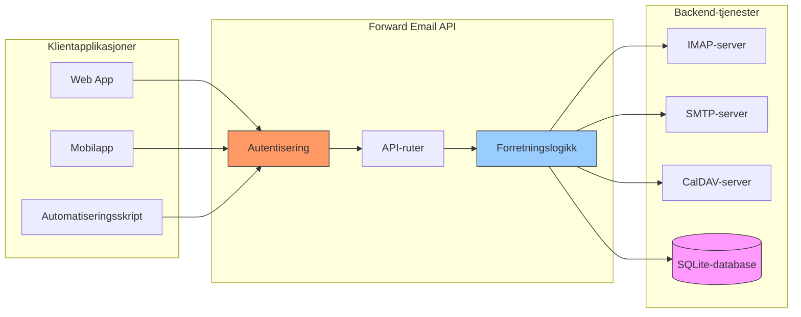

---


## iOS Push-varsler {#ios-push-notifications}

> \[!TIP]
> Forward Email støtter native iOS push-varsler gjennom XAPPLEPUSHSERVICE for umiddelbar e-postlevering.

> \[!IMPORTANT]
> **Unik funksjon:** Forward Email er en av få open-source e-postservere som støtter native iOS push-varsler for e-post, kontakter og kalendere via `XAPPLEPUSHSERVICE` IMAP-utvidelsen. Denne ble reversert fra Apples protokoll og gir umiddelbar levering til iOS-enheter uten batteridrenering.

Forward Email implementerer Apples proprietære XAPPLEPUSHSERVICE-utvidelse, som gir native push-varsler for iOS-enheter uten behov for bakgrunnspolling.

### Hvordan det fungerer {#how-it-works-1}

**XAPPLEPUSHSERVICE** er en ikke-standard IMAP-utvidelse som lar iOS Mail-appen motta umiddelbare push-varsler når nye e-poster ankommer.

Forward Email implementerer den proprietære Apple Push Notification service (APNs)-integrasjonen for IMAP, som gjør at iOS Mail-appen kan motta umiddelbare push-varsler når nye e-poster ankommer.

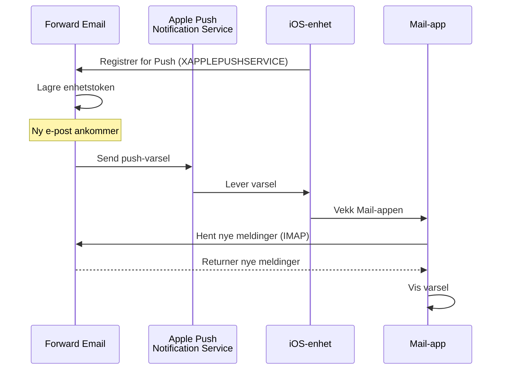

### Nøkkelfunksjoner {#key-features}

**Umiddelbar levering:**

* Push-varsler kommer innen sekunder
* Ingen batteridrenerende bakgrunnspolling
* Fungerer selv når Mail-appen er lukket

<!---->

* **Umiddelbar levering:** E-poster, kalenderhendelser og kontakter vises på din iPhone/iPad umiddelbart, ikke etter en polling-plan
* **Batterivennlig:** Bruker Apples push-infrastruktur i stedet for å opprettholde konstante IMAP-tilkoblinger
* **Emnebasert push:** Støtter push-varsler for spesifikke postbokser, ikke bare INBOX
* **Ingen tredjepartsapper nødvendig:** Fungerer med native iOS Mail-, Kalender- og Kontakter-apper
**Native integrasjon:**

* Innebygd i iOS Mail-app
* Ingen tredjepartsapper kreves
* Sømløs brukeropplevelse

**Personvernfokusert:**

* Enhetstokener er kryptert
* Ingen meldingsinnhold sendes gjennom APNS
* Kun "ny e-post" varsel sendes

**Batterivennlig:**

* Ingen konstant IMAP-polling
* Enheten sover til varsel ankommer
* Minimal batteripåvirkning

### Hva gjør dette spesielt {#what-makes-this-special}

> \[!IMPORTANT]
> De fleste e-postleverandører støtter ikke XAPPLEPUSHSERVICE, noe som tvinger iOS-enheter til å poll'e etter ny e-post hvert 15. minutt.

De fleste open-source e-postservere (inkludert Dovecot, Postfix, Cyrus IMAP) støtter IKKE iOS push-varsler. Brukere må enten:

* Bruke IMAP IDLE (holder tilkobling åpen, tapper batteri)
* Bruke polling (sjekker hvert 15-30 minutt, forsinkede varsler)
* Bruke proprietære e-postapper med egen push-infrastruktur

Forward Email gir samme øyeblikkelige push-varselopplevelse som kommersielle tjenester som Gmail, iCloud og Fastmail.

**Sammenligning med andre leverandører:**

| Leverandør       | Push-støtte    | Polling-intervall | Batteripåvirkning |
| ---------------- | -------------- | ----------------- | ----------------- |
| **Forward Email**| ✅ Native Push | Øyeblikkelig      | Minimal           |
| Gmail            | ✅ Native Push | Øyeblikkelig      | Minimal           |
| iCloud           | ✅ Native Push | Øyeblikkelig      | Minimal           |
| Yahoo            | ✅ Native Push | Øyeblikkelig      | Minimal           |
| Outlook.com      | ❌ Polling     | 15 minutter       | Moderat           |
| Fastmail         | ❌ Polling     | 15 minutter       | Moderat           |
| ProtonMail       | ⚠️ Kun via bro | Via bro           | Høy               |
| Tutanota         | ❌ Kun app    | Ikke aktuelt      | Ikke aktuelt      |

### Implementasjonsdetaljer {#implementation-details}

**IMAP CAPABILITY-respons:**

```
* CAPABILITY IMAP4rev1 ... XAPPLEPUSHSERVICE ...
```

**Registreringsprosess:**

1. iOS Mail-app oppdager XAPPLEPUSHSERVICE-funksjonalitet
2. Appen registrerer enhetstoken hos Forward Email
3. Forward Email lagrer token og knytter den til konto
4. Når ny e-post ankommer, sender Forward Email push via APNS
5. iOS vekker Mail-appen for å hente nye meldinger

**Sikkerhet:**

* Enhetstokener er kryptert i hvilemodus
* Token utløper og fornyes automatisk
* Ingen meldingsinnhold eksponeres for APNS
* Ende-til-ende-kryptering opprettholdes

<!---->

* **IMAP-utvidelse:** `XAPPLEPUSHSERVICE`
* **Kildekode:** [WildDuck Issue #711](https://github.com/zone-eu/wildduck/issues/711)
* **Oppsett:** Automatisk - ingen konfigurasjon nødvendig, fungerer rett ut av boksen med iOS Mail-app

### Sammenligning med andre tjenester {#comparison-with-other-services}

| Tjeneste      | iOS Push-støtte | Metode                                   |
| ------------- | --------------- | ---------------------------------------- |
| Forward Email | ✅ Ja           | `XAPPLEPUSHSERVICE` (reverse-engineered) |
| Gmail         | ✅ Ja           | Proprietær Gmail-app + Google push       |
| iCloud Mail   | ✅ Ja           | Native Apple-integrasjon                  |
| Outlook.com   | ✅ Ja           | Proprietær Outlook-app + Microsoft push  |
| Fastmail      | ✅ Ja           | `XAPPLEPUSHSERVICE`                       |
| Dovecot       | ❌ Nei          | Kun IMAP IDLE eller polling               |
| Postfix       | ❌ Nei          | Kun IMAP IDLE eller polling               |
| Cyrus IMAP    | ❌ Nei          | Kun IMAP IDLE eller polling               |

**Gmail Push:**

Gmail bruker et proprietært push-system som kun fungerer med Gmail-appen. iOS Mail-app må poll'e Gmail IMAP-servere.

**iCloud Push:**

iCloud har native push-støtte lik Forward Email, men kun for @icloud.com-adresser.

**Outlook.com:**

Outlook.com støtter ikke XAPPLEPUSHSERVICE, og krever at iOS Mail poll'er hvert 15. minutt.

**Fastmail:**

Fastmail støtter ikke XAPPLEPUSHSERVICE. Brukere må bruke Fastmail-appen for push-varsler eller akseptere 15-minutters pollingforsinkelser.

---


## Testing og verifisering {#testing-and-verification}


## Protokollkapabilitetstester {#protocol-capability-tests}
> \[!NOTE]
> Denne seksjonen gir resultatene av våre siste protokollkapabilitetstester, utført 22. januar 2026.

Denne seksjonen inneholder de faktiske CAPABILITY/CAPA/EHLO-svarene fra alle testede leverandører. Alle tester ble kjørt **22. januar 2026**.

Disse testene hjelper med å verifisere den annonserte og faktiske støtten for ulike e-postprotokoller og utvidelser hos store leverandører.

### Testmetodikk {#test-methodology}

**Testmiljø:**

* **Dato:** 22. januar 2026 kl. 02:37 UTC
* **Lokasjon:** AWS EC2-instans
* **IPv4:** 54.167.216.197
* **IPv6:** 2600:4040:46da:9a00:b19e:3ad4:426c:2f48
* **Verktøy:** OpenSSL s_client, bash-skript

**Testede leverandører:**

* Forward Email
* Gmail
* Outlook.com
* iCloud
* Fastmail
* Yahoo/AOL (Verizon)

### Testskript {#test-scripts}

For full åpenhet er de eksakte skriptene som ble brukt for disse testene oppgitt nedenfor.

#### IMAP Capability Test Script {#imap-capability-test-script}

```bash
#!/bin/bash
# IMAP Capability Test Script
# Tests IMAP CAPABILITY for various email providers

echo "========================================="
echo "IMAP CAPABILITY TEST"
echo "Date: $(date -u +"%Y-%m-%d %H:%M:%S UTC")"
echo "========================================="
echo ""

# Gmail
echo "--- Gmail (imap.gmail.com:993) ---"
echo -e "a001 CAPABILITY\na002 LOGOUT" | timeout 10 openssl s_client -connect imap.gmail.com:993 -crlf -quiet 2>&1 | grep -A 20 "CAPABILITY"
echo ""

# Outlook.com
echo "--- Outlook.com (outlook.office365.com:993) ---"
echo -e "a001 CAPABILITY\na002 LOGOUT" | timeout 10 openssl s_client -connect outlook.office365.com:993 -crlf -quiet 2>&1 | grep -A 20 "CAPABILITY"
echo ""

# iCloud
echo "--- iCloud (imap.mail.me.com:993) ---"
echo -e "a001 CAPABILITY\na002 LOGOUT" | timeout 10 openssl s_client -connect imap.mail.me.com:993 -crlf -quiet 2>&1 | grep -A 20 "CAPABILITY"
echo ""

# Fastmail
echo "--- Fastmail (imap.fastmail.com:993) ---"
echo -e "a001 CAPABILITY\na002 LOGOUT" | timeout 10 openssl s_client -connect imap.fastmail.com:993 -crlf -quiet 2>&1 | grep -A 20 "CAPABILITY"
echo ""

# Yahoo
echo "--- Yahoo (imap.mail.yahoo.com:993) ---"
echo -e "a001 CAPABILITY\na002 LOGOUT" | timeout 10 openssl s_client -connect imap.mail.yahoo.com:993 -crlf -quiet 2>&1 | grep -A 20 "CAPABILITY"
echo ""

# Forward Email
echo "--- Forward Email (imap.forwardemail.net:993) ---"
echo -e "a001 CAPABILITY\na002 LOGOUT" | timeout 10 openssl s_client -connect imap.forwardemail.net:993 -crlf -quiet 2>&1 | grep -A 20 "CAPABILITY"
echo ""

echo "========================================="
echo "Test completed"
echo "========================================="
```

#### POP3 Capability Test Script {#pop3-capability-test-script}

```bash
#!/bin/bash
# POP3 Capability Test Script
# Tests POP3 CAPA for various email providers

echo "========================================="
echo "POP3 CAPABILITY TEST"
echo "Date: $(date -u +"%Y-%m-%d %H:%M:%S UTC")"
echo "========================================="
echo ""

# Gmail
echo "--- Gmail (pop.gmail.com:995) ---"
echo -e "CAPA\nQUIT" | timeout 10 openssl s_client -connect pop.gmail.com:995 -crlf -quiet 2>&1 | grep -A 20 "CAPA"
echo ""

# Outlook.com
echo "--- Outlook.com (outlook.office365.com:995) ---"
echo -e "CAPA\nQUIT" | timeout 10 openssl s_client -connect outlook.office365.com:995 -crlf -quiet 2>&1 | grep -A 20 "CAPA"
echo ""

# iCloud (Merk: iCloud støtter ikke POP3)
echo "--- iCloud (Ingen POP3-støtte) ---"
echo "iCloud støtter ikke POP3"
echo ""

# Fastmail
echo "--- Fastmail (pop.fastmail.com:995) ---"
echo -e "CAPA\nQUIT" | timeout 10 openssl s_client -connect pop.fastmail.com:995 -crlf -quiet 2>&1 | grep -A 20 "CAPA"
echo ""

# Yahoo
echo "--- Yahoo (pop.mail.yahoo.com:995) ---"
echo -e "CAPA\nQUIT" | timeout 10 openssl s_client -connect pop.mail.yahoo.com:995 -crlf -quiet 2>&1 | grep -A 20 "CAPA"
echo ""

# Forward Email
echo "--- Forward Email (pop3.forwardemail.net:995) ---"
echo -e "CAPA\nQUIT" | timeout 10 openssl s_client -connect pop3.forwardemail.net:995 -crlf -quiet 2>&1 | grep -A 20 "CAPA"
echo ""

echo "========================================="
echo "Test completed"
echo "========================================="
```
#### SMTP Capability Test Script {#smtp-capability-test-script}

```bash
#!/bin/bash
# SMTP Capability Test Script
# Tester SMTP EHLO for ulike e-postleverandører

echo "========================================="
echo "SMTP KAPABILITETSTEST"
echo "Dato: $(date -u +"%Y-%m-%d %H:%M:%S UTC")"
echo "========================================="
echo ""

# Gmail
echo "--- Gmail (smtp.gmail.com:587) ---"
echo -e "EHLO test.com\nQUIT" | timeout 10 openssl s_client -connect smtp.gmail.com:587 -starttls smtp -crlf -quiet 2>&1 | grep -A 30 "250-"
echo ""

# Outlook.com
echo "--- Outlook.com (smtp.office365.com:587) ---"
echo -e "EHLO test.com\nQUIT" | timeout 10 openssl s_client -connect smtp.office365.com:587 -starttls smtp -crlf -quiet 2>&1 | grep -A 30 "250-"
echo ""

# iCloud
echo "--- iCloud (smtp.mail.me.com:587) ---"
echo -e "EHLO test.com\nQUIT" | timeout 10 openssl s_client -connect smtp.mail.me.com:587 -starttls smtp -crlf -quiet 2>&1 | grep -A 30 "250-"
echo ""

# Fastmail
echo "--- Fastmail (smtp.fastmail.com:587) ---"
echo -e "EHLO test.com\nQUIT" | timeout 10 openssl s_client -connect smtp.fastmail.com:587 -starttls smtp -crlf -quiet 2>&1 | grep -A 30 "250-"
echo ""

# Yahoo
echo "--- Yahoo (smtp.mail.yahoo.com:587) ---"
echo -e "EHLO test.com\nQUIT" | timeout 10 openssl s_client -connect smtp.mail.yahoo.com:587 -starttls smtp -crlf -quiet 2>&1 | grep -A 30 "250-"
echo ""

# Forward Email
echo "--- Forward Email (smtp.forwardemail.net:587) ---"
echo -e "EHLO test.com\nQUIT" | timeout 10 openssl s_client -connect smtp.forwardemail.net:587 -starttls smtp -crlf -quiet 2>&1 | grep -A 30 "250-"
echo ""

echo "========================================="
echo "Test fullført"
echo "========================================="
```

### Test Results Summary {#test-results-summary}

#### IMAP (CAPABILITY) {#imap-capability}

**Forward Email**

```
* CAPABILITY IMAP4rev1 AUTH=PLAIN AUTH=PLAIN-CLIENTTOKEN CHILDREN ENABLE ID IDLE NAMESPACE QUOTA SASL-IR UNSELECT XLIST XAPPLEPUSHSERVICE
```

**Gmail**

```
* CAPABILITY IMAP4rev1 UNSELECT IDLE NAMESPACE QUOTA ID XLIST CHILDREN X-GM-EXT-1 UIDPLUS COMPRESS=DEFLATE ENABLE MOVE CONDSTORE ESEARCH UTF8=ACCEPT LIST-EXTENDED LIST-STATUS LITERAL- SPECIAL-USE
```

**iCloud**

```
* OK [CAPABILITY XAPPLEPUSHSERVICE IMAP4 IMAP4rev1 SASL-IR AUTH=ATOKEN AUTH=PLAIN AUTH=ATOKEN2 AUTH=XOAUTH2]
```

**Outlook.com**

```
* CAPABILITY IMAP4rev1 AUTH=PLAIN AUTH=XOAUTH2 SASL-IR UIDPLUS ID UNSELECT CHILDREN IDLE NAMESPACE LITERAL+
```

**Fastmail**

```
* CAPABILITY IMAP4rev1 ACL ANNOTATE-EXPERIMENT-1 CATENATE CONDSTORE ENABLE ESEARCH ESORT I18NLEVEL=1 ID IDLE LIST-EXTENDED LIST-STATUS LITERAL+ LOGINDISABLED MULTIAPPEND NAMESPACE QRESYNC QUOTA RIGHTS=ektx SASL-IR SORT SPECIAL-USE THREAD=ORDEREDSUBJECT UIDPLUS UNSELECT WITHIN X-RENAME XLIST
```

**Yahoo/AOL (Verizon)**

```
* CAPABILITY IMAP4rev1 IDLE NAMESPACE QUOTA ID XLIST CHILDREN UIDPLUS MOVE CONDSTORE ESEARCH ENABLE LIST-EXTENDED LIST-STATUS LITERAL- SPECIAL-USE UNSELECT XAPPLEPUSHSERVICE
```

#### POP3 (CAPA) {#pop3-capa}

**Forward Email**

```
+OK
CAPA
TOP
USER
UIDL
EXPIRE 30
IMPLEMENTATION ForwardEmail
.
```

**Gmail**

```
+OK
CAPA
TOP
USER
UIDL
EXPIRE 30
IMPLEMENTATION Gpop
.
```

**Outlook.com**

```
+OK
CAPA
TOP
USER
UIDL
SASL PLAIN XOAUTH2
.
```

**Fastmail**

```
+OK
CAPA
TOP
USER
UIDL
EXPIRE 30
IMPLEMENTATION Cyrus
.
```

#### SMTP (EHLO) {#smtp-ehlo}

**Forward Email**

```
250-smtp.forwardemail.net
250-PIPELINING
250-SIZE 52428800
250-ETRN
250-STARTTLS
250-ENHANCEDSTATUSCODES
250-8BITMIME
250-DSN
250 CHUNKING
```

**Gmail**

```
250-smtp.gmail.com at your service
250-SIZE 35882577
250-8BITMIME
250-STARTTLS
250-ENHANCEDSTATUSCODES
250-PIPELINING
250-CHUNKING
250 SMTPUTF8
```

**Outlook.com**

```
250-SN4PR13CA0005.outlook.office365.com Hello [x.x.x.x]
250-SIZE 157286400
250-PIPELINING
250-DSN
250-ENHANCEDSTATUSCODES
250-STARTTLS
250-8BITMIME
250-BINARYMIME
250-CHUNKING
250 SMTPUTF8
```

**Fastmail**

```
250-smtp.fastmail.com
250-PIPELINING
250-SIZE 78643200
250-ETRN
250-STARTTLS
250-ENHANCEDSTATUSCODES
250-8BITMIME
250-DSN
250 CHUNKING
```

**Yahoo/AOL (Verizon)**

```
250-smtp.mail.yahoo.com
250-PIPELINING
250-SIZE 41943040
250-8BITMIME
250-ENHANCEDSTATUSCODES
250-STARTTLS
```
### Detaljerte testresultater {#detailed-test-results}

#### IMAP testresultater {#imap-test-results}

**Gmail:**
`* CAPABILITY IMAP4rev1 UNSELECT IDLE NAMESPACE QUOTA ID XLIST CHILDREN X-GM-EXT-1 XYZZY SASL-IR AUTH=XOAUTH2 AUTH=PLAIN AUTH=PLAIN-CLIENTTOKEN AUTH=OAUTHBEARER`

**Outlook.com:**
`* CAPABILITY IMAP4 IMAP4rev1 AUTH=PLAIN AUTH=XOAUTH2 SASL-IR UIDPLUS ID UNSELECT CHILDREN IDLE NAMESPACE LITERAL+`

**iCloud:**
`* CAPABILITY XAPPLEPUSHSERVICE IMAP4 IMAP4rev1 SASL-IR AUTH=ATOKEN AUTH=PLAIN AUTH=ATOKEN2 AUTH=XOAUTH2`

**Fastmail:**
Tilkoblingen tidsavbrøt. Se notater nedenfor.

**Yahoo:**
`* CAPABILITY IMAP4rev1 SASL-IR AUTH=PLAIN AUTH=XOAUTH2 AUTH=OAUTHBEARER ID MOVE NAMESPACE XYMHIGHESTMODSEQ UIDPLUS LITERAL+ CHILDREN UNSELECT X-MSG-EXT OBJECTID IDLE ENABLE UIDONLY X-ALL-MAIL X-UIDONLY LIST-EXTENDED LIST-STATUS SPECIAL-USE PARTIAL APPENDLIMIT=41697280`

**Forward Email:**
`* CAPABILITY XAPPLEPUSHSERVICE IMAP4rev1 APPENDLIMIT=52428800 AUTH=PLAIN AUTH=PLAIN-CLIENTTOKEN CHILDREN CONDSTORE ENABLE ID IDLE MOVE NAMESPACE QUOTA SASL-IR SPECIAL-USE UIDPLUS UNSELECT UTF8=ACCEPT XLIST`

#### POP3 testresultater {#pop3-test-results}

**Gmail:**
Tilkoblingen returnerte ikke CAPA-respons uten autentisering.

**Outlook.com:**
Tilkoblingen returnerte ikke CAPA-respons uten autentisering.

**iCloud:**
Ikke støttet.

**Fastmail:**
Tilkoblingen tidsavbrøt. Se notater nedenfor.

**Yahoo:**
`+OK CAPA list follows... SASL PLAIN XOAUTH2`

**Forward Email:**
Tilkoblingen returnerte ikke CAPA-respons uten autentisering.

#### SMTP testresultater {#smtp-test-results}

**Gmail:**
`250-AUTH LOGIN PLAIN XOAUTH2 PLAIN-CLIENTTOKEN OAUTHBEARER XOAUTH`

**Outlook.com:**
`250-DSN`

**iCloud:**
`250-DSN`

**Fastmail:**
`250 AUTH PLAIN LOGIN XOAUTH2 OAUTHBEARER`

**Yahoo:**
`250 AUTH PLAIN LOGIN XOAUTH2 OAUTHBEARER`

**Forward Email:**
`250-DSN`, `250-REQUIRETLS`

### Notater om testresultater {#notes-on-test-results}

> \[!NOTE]
> Viktige observasjoner og begrensninger fra testresultatene.

1. **Fastmail tidsavbrudd**: Fastmail-tilkoblinger tidsavbrøt under testing, sannsynligvis på grunn av ratebegrensning eller brannmurrestriksjoner fra testserverens IP. Fastmail er kjent for å ha robust IMAP/POP3/SMTP-støtte basert på deres dokumentasjon.

2. **POP3 CAPA-responser**: Flere tilbydere (Gmail, Outlook.com, Forward Email) returnerte ikke CAPA-responser uten autentisering. Dette er vanlig sikkerhetspraksis for POP3-servere.

3. **DSN-støtte**: Kun Outlook.com, iCloud og Forward Email annonserer eksplisitt DSN-støtte i sine SMTP EHLO-responser. Dette betyr ikke nødvendigvis at andre tilbydere ikke støtter DSN, men de annonserer det ikke.

4. **REQUIRETLS**: Kun Forward Email annonserer eksplisitt REQUIRETLS-støtte med en brukerrettet håndhevingsboks. Andre tilbydere kan støtte det internt, men annonserer det ikke i EHLO.

5. **Testmiljø**: Tester ble utført fra AWS EC2-instans (IP: 54.167.216.197 IPv4, 2600:4040:46da:9a00:b19e:3ad4:426c:2f48 IPv6) den 22. januar 2026 kl. 02:37 UTC.

---


## Sammendrag {#summary}

Forward Email tilbyr omfattende RFC-protokollstøtte på tvers av alle store e-poststandarder:

* **IMAP4rev1:** 16 støttede RFC-er med dokumenterte bevisste forskjeller
* **POP3:** 4 støttede RFC-er med RFC-kompatibel permanent sletting
* **SMTP:** 11 støttede utvidelser inkludert SMTPUTF8, DSN og PIPELINING
* **Autentisering:** DKIM, SPF, DMARC, ARC fullt støttet
* **Transport-sikkerhet:** MTA-STS og REQUIRETLS fullt støttet, DANE delvis støtte
* **Kryptering:** OpenPGP v6 og S/MIME støttet
* **Kalender:** CalDAV, CardDAV og VTODO fullt støttet
* **API-tilgang:** Komplett REST API med 39 endepunkter for direkte database-tilgang
* **iOS Push:** Native push-varsler for e-post, kontakter og kalendere via `XAPPLEPUSHSERVICE`

### Viktige differensieringspunkter {#key-differentiators}

> \[!TIP]
> Forward Email skiller seg ut med unike funksjoner som ikke finnes hos andre tilbydere.

**Hva gjør Forward Email unikt:**

1. **Kvantesikker kryptering** – Eneste tilbyder med ChaCha20-Poly1305-krypterte SQLite-postbokser
2. **Null-kunnskaps-arkitektur** – Ditt passord krypterer postboksen; vi kan ikke dekryptere den
3. **Gratis egendefinerte domener** – Ingen månedlige avgifter for egendefinert domenepost
4. **REQUIRETLS-støtte** – Brukerrettet avkrysningsboks for å håndheve TLS for hele leveringskjeden
5. **Omfattende API** – 39 REST API-endepunkter for full programmatisk kontroll
6. **iOS push-varsler** – Native XAPPLEPUSHSERVICE-støtte for umiddelbar levering
7. **Open Source** – Full kildekode tilgjengelig på GitHub
8. **Personvernfokusert** – Ingen datainnsamling, ingen annonser, ingen sporing
* **Sandboxet Kryptering:** Den eneste e-posttjenesten med individuelt krypterte SQLite-postbokser
* **RFC-kompatibilitet:** Prioriterer standardoverholdelse fremfor bekvemmelighet (f.eks. POP3 DELE)
* **Fullstendig API:** Direkte programmatisk tilgang til all e-postdata
* **Åpen Kildekode:** Fullstendig transparent implementering

**Sammendrag av protokollstøtte:**

| Kategori             | Støttenivå   | Detaljer                                      |
| -------------------- | ------------ | --------------------------------------------- |
| **Kjerneprotokoller** | ✅ Utmerket  | IMAP4rev1, POP3, SMTP fullt støttet           |
| **Moderne protokoller** | ⚠️ Delvis   | IMAP4rev2 delvis støtte, JMAP ikke støttet    |
| **Sikkerhet**         | ✅ Utmerket  | DKIM, SPF, DMARC, ARC, MTA-STS, REQUIRETLS    |
| **Kryptering**        | ✅ Utmerket  | OpenPGP, S/MIME, SQLite-kryptering             |
| **CalDAV/CardDAV**    | ✅ Utmerket  | Full kalender- og kontakt-synkronisering       |
| **Filtrering**        | ✅ Utmerket  | Sieve (24 utvidelser) og ManageSieve           |
| **API**               | ✅ Utmerket  | 39 REST API-endepunkter                         |
| **Push**              | ✅ Utmerket  | Native iOS push-varsler                         |
