# Wsparcie protokołów RFC dla poczty e-mail - Kompletny przewodnik po standardach i specyfikacjach {#email-rfc-protocol-support---complete-standards--specifications-guide}


## Spis treści {#table-of-contents}

* [O tym dokumencie](#about-this-document)
  * [Przegląd architektury](#architecture-overview)
* [Porównanie usług e-mail - wsparcie protokołów i zgodność ze standardami RFC](#email-service-comparison---protocol-support--rfc-standards-compliance)
  * [Wizualizacja wsparcia protokołów](#protocol-support-visualization)
* [Podstawowe protokoły e-mail](#core-email-protocols)
  * [Przepływ protokołu e-mail](#email-protocol-flow)
* [Protokół e-mail IMAP4 i rozszerzenia](#imap4-email-protocol-and-extensions)
  * [Różnice protokołu IMAP względem specyfikacji RFC](#imap-protocol-differences-from-rfc-specifications)
  * [Rozszerzenia IMAP NIE wspierane](#imap-extensions-not-supported)
* [Protokół e-mail POP3 i rozszerzenia](#pop3-email-protocol-and-extensions)
  * [Różnice protokołu POP3 względem specyfikacji RFC](#pop3-protocol-differences-from-rfc-specifications)
  * [Rozszerzenia POP3 NIE wspierane](#pop3-extensions-not-supported)
* [Protokół e-mail SMTP i rozszerzenia](#smtp-email-protocol-and-extensions)
  * [Powiadomienia o statusie dostarczenia (DSN)](#delivery-status-notifications-dsn)
  * [Wsparcie REQUIRETLS](#requiretls-support)
  * [Rozszerzenia SMTP NIE wspierane](#smtp-extensions-not-supported)
* [Protokół e-mail JMAP](#jmap-email-protocol)
* [Bezpieczeństwo e-mail](#email-security)
  * [Architektura bezpieczeństwa e-mail](#email-security-architecture)
* [Protokoły uwierzytelniania wiadomości e-mail](#email-message-authentication-protocols)
  * [Wsparcie protokołów uwierzytelniania](#authentication-protocol-support)
  * [DKIM (DomainKeys Identified Mail)](#dkim-domainkeys-identified-mail)
  * [SPF (Sender Policy Framework)](#spf-sender-policy-framework)
  * [DMARC (Domain-based Message Authentication, Reporting & Conformance)](#dmarc-domain-based-message-authentication-reporting--conformance)
  * [ARC (Authenticated Received Chain)](#arc-authenticated-received-chain)
  * [Przepływ uwierzytelniania](#authentication-flow)
* [Protokoły zabezpieczeń transportu e-mail](#email-transport-security-protocols)
  * [Wsparcie zabezpieczeń transportu](#transport-security-support)
  * [TLS (Transport Layer Security)](#tls-transport-layer-security)
  * [MTA-STS (Mail Transfer Agent Strict Transport Security)](#mta-sts-mail-transfer-agent-strict-transport-security)
  * [DANE (DNS-based Authentication of Named Entities)](#dane-dns-based-authentication-of-named-entities)
  * [REQUIRETLS](#requiretls)
  * [Przepływ zabezpieczeń transportu](#transport-security-flow)
* [Szyfrowanie wiadomości e-mail](#email-message-encryption)
  * [Wsparcie szyfrowania](#encryption-support)
  * [OpenPGP (Pretty Good Privacy)](#openpgp-pretty-good-privacy)
  * [S/MIME (Secure/Multipurpose Internet Mail Extensions)](#smime-securemultipurpose-internet-mail-extensions)
  * [Szyfrowanie skrzynki pocztowej SQLite](#sqlite-mailbox-encryption)
  * [Porównanie szyfrowania](#encryption-comparison)
  * [Przepływ szyfrowania](#encryption-flow)
* [Rozszerzona funkcjonalność](#extended-functionality)
* [Standardy formatu wiadomości e-mail](#email-message-format-standards)
  * [Wsparcie standardów formatu](#format-standards-support)
  * [MIME (Multipurpose Internet Mail Extensions)](#mime-multipurpose-internet-mail-extensions)
  * [SMTPUTF8 i internacjonalizacja adresów e-mail](#smtputf8-and-email-address-internationalization)
* [Protokoły kalendarza i kontaktów](#calendaring-and-contacts-protocols)
  * [Wsparcie CalDAV i CardDAV](#caldav-and-carddav-support)
  * [CalDAV (dostęp do kalendarza)](#caldav-calendar-access)
  * [CardDAV (dostęp do kontaktów)](#carddav-contact-access)
  * [Zadania i przypomnienia (CalDAV VTODO)](#tasks-and-reminders-caldav-vtodo)
  * [Przepływ synchronizacji CalDAV/CardDAV](#caldavcarddav-synchronization-flow)
  * [Rozszerzenia kalendarza NIE wspierane](#calendaring-extensions-not-supported)
* [Filtrowanie wiadomości e-mail](#email-message-filtering)
  * [Sieve (RFC 5228)](#sieve-rfc-5228)
  * [ManageSieve (RFC 5804)](#managesieve-rfc-5804)
* [Optymalizacja przechowywania](#storage-optimization)
  * [Architektura: optymalizacja przechowywania dwuwarstwowego](#architecture-dual-layer-storage-optimization)
* [Dedupikacja załączników](#attachment-deduplication)
  * [Jak to działa](#how-it-works)
  * [Przepływ deduplikacji](#deduplication-flow)
  * [System magicznych liczb](#magic-number-system)
  * [Kluczowe różnice: WildDuck vs Forward Email](#key-differences-wildduck-vs-forward-email)
* [Kompresja Brotli](#brotli-compression)
  * [Co jest kompresowane](#what-gets-compressed)
  * [Konfiguracja kompresji](#compression-configuration)
  * [Magiczny nagłówek: "FEBR"](#magic-header-febr)
  * [Proces kompresji](#compression-process)
  * [Proces dekompresji](#decompression-process)
  * [Zgodność wsteczna](#backwards-compatibility)
  * [Statystyki oszczędności miejsca](#storage-savings-statistics)
  * [Proces migracji](#migration-process)
  * [Połączona efektywność przechowywania](#combined-storage-efficiency)
  * [Szczegóły technicznej implementacji](#technical-implementation-details)
  * [Dlaczego żaden inny dostawca tego nie robi](#why-no-other-provider-does-this)
* [Nowoczesne funkcje](#modern-features)
* [Kompletny REST API do zarządzania pocztą e-mail](#complete-rest-api-for-email-management)
  * [Kategorie API (39 punktów końcowych)](#api-categories-39-endpoints)
  * [Szczegóły techniczne](#technical-details)
  * [Przykłady zastosowań w praktyce](#real-world-use-cases)
  * [Kluczowe cechy API](#key-api-features)
  * [Architektura API](#api-architecture)
* [Powiadomienia push na iOS](#ios-push-notifications)
  * [Jak to działa](#how-it-works-1)
  * [Kluczowe cechy](#key-features)
  * [Co czyni to wyjątkowym](#what-makes-this-special)
  * [Szczegóły implementacji](#implementation-details)
  * [Porównanie z innymi usługami](#comparison-with-other-services)
* [Testowanie i weryfikacja](#testing-and-verification)
* [Testy możliwości protokołu](#protocol-capability-tests)
  * [Metodologia testów](#test-methodology)
  * [Skrypty testowe](#test-scripts)
  * [Podsumowanie wyników testów](#test-results-summary)
  * [Szczegółowe wyniki testów](#detailed-test-results)
  * [Uwagi dotyczące wyników testów](#notes-on-test-results)
* [Podsumowanie](#summary)
  * [Kluczowe wyróżniki](#key-differentiators)
## O tym dokumencie {#about-this-document}

Ten dokument opisuje wsparcie protokołu RFC (Request for Comments) dla Forward Email. Ponieważ Forward Email korzysta pod spodem z [WildDuck](https://github.com/nodemailer/wildduck) do funkcjonalności IMAP/POP3, wsparcie protokołu i ograniczenia opisane tutaj odzwierciedlają implementację WildDuck.

> \[!IMPORTANT]
> Forward Email używa [SQLite](https://sqlite.org/) do przechowywania wiadomości zamiast MongoDB (którego pierwotnie używał WildDuck). Ma to wpływ na niektóre szczegóły implementacji opisane poniżej.

**Kod źródłowy:** <https://github.com/forwardemail/forwardemail.net>

### Przegląd architektury {#architecture-overview}

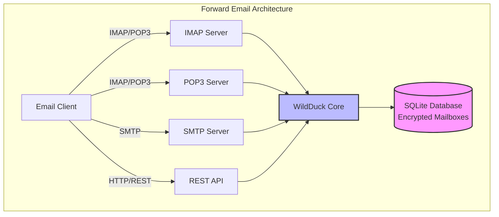

---


## Porównanie usług e-mail – wsparcie protokołów i zgodność ze standardami RFC {#email-service-comparison---protocol-support--rfc-standards-compliance}

> \[!IMPORTANT]
> **Szyfrowanie w piaskownicy i odporne na komputery kwantowe:** Forward Email to jedyna usługa e-mail, która przechowuje indywidualnie zaszyfrowane skrzynki SQLite za pomocą Twojego hasła (które znasz tylko Ty). Każda skrzynka jest szyfrowana za pomocą [sqleet](https://github.com/resilar/sqleet) (ChaCha20-Poly1305), samodzielna, odizolowana i przenośna. Jeśli zapomnisz hasła, tracisz skrzynkę – nawet Forward Email nie może jej odzyskać. Szczegóły znajdziesz w [Quantum-Safe Encrypted Email](https://forwardemail.net/en/blog/docs/best-quantum-safe-encrypted-email-service).

Porównaj wsparcie protokołów e-mail i implementację standardów RFC wśród głównych dostawców e-mail:

| Funkcja                      | Forward Email                                                                                  | Postfix/Dovecot                                                                    | Gmail                                                                             | iCloud Mail                                           | Outlook.com                                                                                                                                                          | Fastmail                                                                                 | Yahoo/AOL (Verizon)                                                  | ProtonMail                                                                     | Tutanota                                                          |
| ---------------------------- | ---------------------------------------------------------------------------------------------- | ---------------------------------------------------------------------------------- | --------------------------------------------------------------------------------- | ----------------------------------------------------- | -------------------------------------------------------------------------------------------------------------------------------------------------------------------- | ---------------------------------------------------------------------------------------- | -------------------------------------------------------------------- | ------------------------------------------------------------------------------ | ----------------------------------------------------------------- |
| **Cena domeny niestandardowej** | [Darmowa](https://forwardemail.net/en/pricing)                                                | [Darmowa](https://www.postfix.org/)                                               | [$7.20/mies](https://workspace.google.com/pricing)                               | [$0.99/mies](https://support.apple.com/en-us/102622)  | [$7.20/mies](https://www.microsoft.com/en-us/microsoft-365/business/microsoft-365-business-basic)                                                                      | [$5/mies](https://www.fastmail.com/pricing/)                                             | [$3.19/mies](https://www.turbify.com/mail)                           | [$4.99/mies](https://proton.me/mail/pricing)                                   | [$3.27/mies](https://tuta.com/pricing)                            |
| **IMAP4rev1 (RFC 3501)**     | ✅ [Obsługiwany](#imap4-email-protocol-and-extensions)                                         | ✅ [Obsługiwany](https://www.dovecot.org/)                                        | ✅ [Obsługiwany](https://developers.google.com/workspace/gmail/imap/imap-extensions) | ✅ [Obsługiwany](https://support.apple.com/en-us/102431) | ✅ [Obsługiwany](https://support.microsoft.com/en-us/office/pop-imap-and-smtp-settings-for-outlook-com-d088b986-291d-42b8-9564-9c414e2aa040)                            | ✅ [Obsługiwany](https://www.fastmail.help/hc/en-us/articles/1500000278382-Email-standards) | ✅ [Obsługiwany](https://senders.yahooinc.com/developer/documentation/) | ⚠️ [Przez Bridge](https://proton.me/support/imap-smtp-and-pop3-setup)          | ❌ Nieobsługiwany                                                 |
| **IMAP4rev2 (RFC 9051)**     | ⚠️ [Częściowo](https://forwardemail.net/en/blog/docs/best-quantum-safe-encrypted-email-service) | ⚠️ [Częściowo](https://www.dovecot.org/)                                         | ⚠️ [31%](https://developers.google.com/workspace/gmail/imap/imap-extensions)      | ⚠️ [92%](https://support.apple.com/en-us/102431)      | ⚠️ [46%](https://support.microsoft.com/en-us/office/pop-imap-and-smtp-settings-for-outlook-com-d088b986-291d-42b8-9564-9c414e2aa040)                                 | ⚠️ [69%](https://www.fastmail.help/hc/en-us/articles/1500000278382-Email-standards)      | ⚠️ [85%](https://senders.yahooinc.com/developer/documentation/)      | ⚠️ [Przez Bridge](https://proton.me/support/imap-smtp-and-pop3-setup)          | ❌ Nieobsługiwany                                                 |
| **POP3 (RFC 1939)**          | ✅ [Obsługiwany](#pop3-email-protocol-and-extensions)                                          | ✅ [Obsługiwany](https://www.dovecot.org/)                                        | ✅ [Obsługiwany](https://support.google.com/mail/answer/7104828)                  | ❌ Nieobsługiwany                                     | ✅ [Obsługiwany](https://support.microsoft.com/en-us/office/pop-imap-and-smtp-settings-for-outlook-com-d088b986-291d-42b8-9564-9c414e2aa040)                            | ✅ [Obsługiwany](https://www.fastmail.help/hc/en-us/articles/1500000278382-Email-standards) | ✅ [Obsługiwany](https://help.yahoo.com/kb/SLN4075.html)              | ⚠️ [Przez Bridge](https://proton.me/support/imap-smtp-and-pop3-setup)          | ❌ Nieobsługiwany                                                 |
| **SMTP (RFC 5321)**          | ✅ [Obsługiwany](#smtp-email-protocol-and-extensions)                                          | ✅ [Obsługiwany](https://www.postfix.org/)                                        | ✅ [Obsługiwany](https://support.google.com/mail/answer/7126229)                  | ✅ [Obsługiwany](https://support.apple.com/en-us/102431) | ✅ [Obsługiwany](https://support.microsoft.com/en-us/office/pop-imap-and-smtp-settings-for-outlook-com-d088b986-291d-42b8-9564-9c414e2aa040)                            | ✅ [Obsługiwany](https://www.fastmail.help/hc/en-us/articles/1500000278382-Email-standards) | ✅ [Obsługiwany](https://help.yahoo.com/kb/SLN4075.html)              | ⚠️ [Przez Bridge](https://proton.me/support/imap-smtp-and-pop3-setup)          | ❌ Nieobsługiwany                                                 |
| **JMAP (RFC 8620)**          | ❌ [Nieobsługiwany](#jmap-email-protocol)                                                     | ❌ Nieobsługiwany                                                                  | ❌ Nieobsługiwany                                                                 | ❌ Nieobsługiwany                                     | ❌ Nieobsługiwany                                                                                                                                                      | ✅ [Obsługiwany](https://www.fastmail.com/dev/)                                           | ❌ Nieobsługiwany                                                    | ❌ Nieobsługiwany                                                              | ❌ Nieobsługiwany                                                 |
| **DKIM (RFC 6376)**          | ✅ [Obsługiwany](#email-message-authentication-protocols)                                     | ✅ [Obsługiwany](https://github.com/trusteddomainproject/OpenDKIM)                | ✅ [Obsługiwany](https://support.google.com/a/answer/174124)                      | ✅ [Obsługiwany](https://support.apple.com/en-us/102431) | ✅ [Obsługiwany](https://learn.microsoft.com/en-us/defender-office-365/email-authentication-dkim-configure)                                                             | ✅ [Obsługiwany](https://www.fastmail.help/hc/en-us/articles/360060590573)                | ✅ [Obsługiwany](https://help.yahoo.com/kb/SLN25426.html)             | ✅ [Obsługiwany](https://proton.me/support)                                     | ✅ [Obsługiwany](https://tuta.com/support#dkim)                    |
| **SPF (RFC 7208)**           | ✅ [Obsługiwany](#email-message-authentication-protocols)                                     | ✅ [Obsługiwany](https://www.postfix.org/)                                        | ✅ [Obsługiwany](https://support.google.com/a/answer/33786)                       | ✅ [Obsługiwany](https://support.apple.com/en-us/102431) | ✅ [Obsługiwany](https://learn.microsoft.com/en-us/microsoft-365/security/office-365-security/how-office-365-uses-spf-to-prevent-spoofing)                              | ✅ [Obsługiwany](https://www.fastmail.help/hc/en-us/articles/360060590573)                | ✅ [Obsługiwany](https://help.yahoo.com/kb/SLN25426.html)             | ✅ [Obsługiwany](https://proton.me/support)                                     | ✅ [Obsługiwany](https://tuta.com/support#dkim)                    |
| **DMARC (RFC 7489)**         | ✅ [Obsługiwany](#email-message-authentication-protocols)                                     | ✅ [Obsługiwany](https://www.postfix.org/)                                        | ✅ [Obsługiwany](https://support.google.com/a/answer/2466580)                     | ✅ [Obsługiwany](https://support.apple.com/en-us/102431) | ✅ [Obsługiwany](https://learn.microsoft.com/en-us/microsoft-365/security/office-365-security/use-dmarc-to-validate-email)                                              | ✅ [Obsługiwany](https://www.fastmail.help/hc/en-us/articles/360060590573)                | ✅ [Obsługiwany](https://help.yahoo.com/kb/SLN25426.html)             | ✅ [Obsługiwany](https://proton.me/support)                                     | ✅ [Obsługiwany](https://tuta.com/support#dkim)                    |
| **ARC (RFC 8617)**           | ✅ [Obsługiwany](#email-message-authentication-protocols)                                     | ✅ [Obsługiwany](https://github.com/trusteddomainproject/OpenARC)                 | ✅ [Obsługiwany](https://support.google.com/a/answer/2466580)                     | ❌ Nieobsługiwany                                     | ✅ [Obsługiwany](https://learn.microsoft.com/en-us/defender-office-365/email-authentication-arc-configure)                                                              | ✅ [Obsługiwany](https://www.fastmail.help/hc/en-us/articles/360060590573)                | ✅ [Obsługiwany](https://senders.yahooinc.com/developer/documentation/) | ✅ [Obsługiwany](https://proton.me/blog/what-is-authenticated-received-chain-arc) | ❌ Nieobsługiwany                                                 |
| **MTA-STS (RFC 8461)**       | ✅ [Obsługiwany](#email-transport-security-protocols)                                         | ✅ [Obsługiwany](https://www.postfix.org/)                                        | ✅ [Obsługiwany](https://support.google.com/a/answer/9261504)                     | ✅ [Obsługiwany](https://support.apple.com/en-us/102431) | ✅ [Obsługiwany](https://learn.microsoft.com/en-us/defender-office-365/email-authentication-about)                                                                      | ✅ [Obsługiwany](https://www.fastmail.help/hc/en-us/articles/360060590573)                | ✅ [Obsługiwany](https://senders.yahooinc.com/developer/documentation/) | ✅ [Obsługiwany](https://proton.me/support)                                     | ✅ [Obsługiwany](https://tuta.com/security)                        |
| **DANE (RFC 7671)**          | ✅ [Obsługiwany](#email-transport-security-protocols)                                         | ✅ [Obsługiwany](https://www.postfix.org/)                                        | ❌ Nieobsługiwany                                                                 | ❌ Nieobsługiwany                                     | ❌ Nieobsługiwany                                                                                                                                                      | ❌ Nieobsługiwany                                                                        | ❌ Nieobsługiwany                                                    | ✅ [Obsługiwany](https://proton.me/support)                                     | ✅ [Obsługiwany](https://tuta.com/support#dane)                    |
| **DSN (RFC 3461)**           | ✅ [Obsługiwany](#smtp-email-protocol-and-extensions)                                         | ✅ [Obsługiwany](https://www.postfix.org/DSN_README.html)                         | ❌ Nieobsługiwany                                                                 | ✅ [Obsługiwany](#protocol-capability-tests)           | ✅ [Obsługiwany](#protocol-capability-tests)                                                                                                                            | ⚠️ [Nieznany](https://www.fastmail.help/hc/en-us/articles/1500000278382-Email-standards)  | ❌ Nieobsługiwany                                                    | ⚠️ [Przez Bridge](https://proton.me/support/imap-smtp-and-pop3-setup)          | ❌ Nieobsługiwany                                                 |
| **REQUIRETLS (RFC 8689)**    | ✅ [Obsługiwany](#email-transport-security-protocols)                                         | ✅ [Obsługiwany](https://www.postfix.org/TLS_README.html#server_require_tls)      | ⚠️ Nieznany                                                                       | ⚠️ Nieznany                                          | ⚠️ Nieznany                                                                                                                                                           | ⚠️ Nieznany                                                                             | ⚠️ Nieznany                                                         | ⚠️ [Przez Bridge](https://proton.me/support/imap-smtp-and-pop3-setup)          | ❌ Nieobsługiwany                                                 |
| **ManageSieve (RFC 5804)**   | ✅ [Obsługiwany](#managesieve-rfc-5804)                                                       | ✅ [Obsługiwany](https://doc.dovecot.org/admin_manual/pigeonhole_managesieve_server/) | ❌ Nieobsługiwany                                                                 | ❌ Nieobsługiwany                                     | ❌ Nieobsługiwany                                                                                                                                                      | ✅ [Obsługiwany](https://www.fastmail.help/hc/en-us/articles/360060590573)                | ❌ Nieobsługiwany                                                    | ❌ Nieobsługiwany                                                              | ❌ Nieobsługiwany                                                 |
| **OpenPGP (RFC 9580)**       | ✅ [Obsługiwany](#email-message-encryption)                                                   | ⚠️ [Przez wtyczki](https://www.gnupg.org/)                                       | ⚠️ [Zewnętrzny](https://github.com/google/end-to-end)                            | ⚠️ [Zewnętrzny](https://gpgtools.org/)                 | ⚠️ [Zewnętrzny](https://gpg4win.org/)                                                                                                                               | ⚠️ [Zewnętrzny](https://www.fastmail.help/hc/en-us/articles/360060590573)                 | ⚠️ [Zewnętrzny](https://help.yahoo.com/kb/SLN25426.html)              | ✅ [Natywny](https://proton.me/support/pgp-mime-pgp-inline)                      | ❌ Nieobsługiwany                                                 |
| **S/MIME (RFC 8551)**        | ✅ [Obsługiwany](#email-message-encryption)                                                   | ✅ [Obsługiwany](https://www.openssl.org/)                                        | ✅ [Obsługiwany](https://support.google.com/mail/answer/81126)                   | ✅ [Obsługiwany](https://support.apple.com/en-us/102431) | ✅ [Obsługiwany](https://support.microsoft.com/en-us/office/send-view-and-reply-to-encrypted-messages-in-outlook-for-pc-eaa43495-9bbb-4fca-922a-df90dee51980)           | ⚠️ [Częściowo](https://www.fastmail.help/hc/en-us/articles/360060590573)                 | ❌ Nieobsługiwany                                                    | ✅ [Obsługiwany](https://proton.me/support/pgp-mime-pgp-inline)                   | ❌ Nieobsługiwany                                                 |
| **CalDAV (RFC 4791)**        | ✅ [Obsługiwany](#calendaring-and-contacts-protocols)                                         | ✅ [Obsługiwany](https://www.davical.org/)                                        | ✅ [Obsługiwany](https://developers.google.com/calendar/caldav/v2/guide)         | ✅ [Obsługiwany](https://support.apple.com/en-us/102431) | ❌ Nieobsługiwany                                                                                                                                                      | ✅ [Obsługiwany](https://www.fastmail.help/hc/en-us/articles/360060590573)                | ❌ Nieobsługiwany                                                    | ✅ [Przez Bridge](https://proton.me/support/proton-calendar)                      | ❌ Nieobsługiwany                                                 |
| **CardDAV (RFC 6352)**       | ✅ [Obsługiwany](#calendaring-and-contacts-protocols)                                         | ✅ [Obsługiwany](https://www.davical.org/)                                        | ✅ [Obsługiwany](https://developers.google.com/people/carddav)                   | ✅ [Obsługiwany](https://support.apple.com/en-us/102431) | ❌ Nieobsługiwany                                                                                                                                                      | ✅ [Obsługiwany](https://www.fastmail.help/hc/en-us/articles/360060590573)                | ❌ Nieobsługiwany                                                    | ✅ [Przez Bridge](https://proton.me/support/proton-contacts)                      | ❌ Nieobsługiwany                                                 |
| **Zadania (VTODO)**          | ✅ [Obsługiwany](#tasks-and-reminders-caldav-vtodo)                                           | ✅ [Obsługiwany](https://www.davical.org/)                                        | ❌ Nieobsługiwany                                                                 | ✅ [Obsługiwany](https://support.apple.com/en-us/102431) | ❌ Nieobsługiwany                                                                                                                                                      | ✅ [Obsługiwany](https://www.fastmail.help/hc/en-us/articles/360060590573)                | ❌ Nieobsługiwany                                                    | ❌ Nieobsługiwany                                                              | ❌ Nieobsługiwany                                                 |
| **Sieve (RFC 5228)**         | ✅ [Obsługiwany](#sieve-rfc-5228)                                                             | ✅ [Obsługiwany](https://www.dovecot.org/)                                        | ❌ Nieobsługiwany                                                                 | ❌ Nieobsługiwany                                     | ❌ Nieobsługiwany                                                                                                                                                      | ✅ [Obsługiwany](https://www.fastmail.help/hc/en-us/articles/360060590573)                | ❌ Nieobsługiwany                                                    | ❌ Nieobsługiwany                                                              | ❌ Nieobsługiwany                                                 |
| **Catch-All**                | ✅ [Obsługiwany](https://forwardemail.net/en/faq#can-i-have-multiple-global-catch-all-recipients) | ✅ Obsługiwany                                                                    | ✅ [Obsługiwany](https://support.google.com/a/answer/4524505)                    | ❌ Nieobsługiwany                                     | ❌ [Nieobsługiwany](https://learn.microsoft.com/en-us/exchange/recipients-in-exchange-online/manage-mail-users)                                                        | ✅ [Obsługiwany](https://www.fastmail.help/hc/en-us/articles/1500000278382-Email-standards) | ❌ Nieobsługiwany                                                    | ❌ Nieobsługiwany                                                              | ✅ [Obsługiwany](https://tuta.com/support#catch-all-alias)         |
| **Nieograniczona liczba aliasów** | ✅ [Obsługiwany](https://forwardemail.net/en/faq#advanced-features)                           | ✅ Obsługiwany                                                                    | ✅ [Obsługiwany](https://support.google.com/a/answer/33327)                      | ✅ [Obsługiwany](https://support.apple.com/en-us/102431) | ✅ [Obsługiwany](https://support.microsoft.com/en-us/office/add-or-remove-an-email-alias-in-outlook-com-459b1989-356d-40fa-a689-8f285b13f1f2)                           | ✅ [Obsługiwany](https://www.fastmail.help/hc/en-us/articles/1500000278382-Email-standards) | ❌ Nieobsługiwany                                                    | ✅ [Obsługiwany](https://proton.me/support/addresses-and-aliases)               | ✅ [Obsługiwany](https://tuta.com/support#aliases)                 |
| **Uwierzytelnianie dwuskładnikowe** | ✅ [Obsługiwany](https://forwardemail.net/en/faq#do-you-support-passkeys-and-webauthn)        | ✅ Obsługiwany                                                                    | ✅ [Obsługiwany](https://support.google.com/accounts/answer/185839)              | ✅ [Obsługiwany](https://support.apple.com/en-us/102431) | ✅ [Obsługiwany](https://support.microsoft.com/en-us/account-billing/how-to-use-two-step-verification-with-your-microsoft-account-c7910146-672f-01e9-50a0-93b4585e7eb4) | ✅ [Obsługiwany](https://www.fastmail.help/hc/en-us/articles/1500000278382-Email-standards) | ✅ [Obsługiwany](https://help.yahoo.com/kb/SLN5013.html)            | ✅ [Obsługiwany](https://proton.me/support/two-factor-authentication-2fa)       | ✅ [Obsługiwany](https://tuta.com/support#two-factor-authentication) |
| **Powiadomienia push**       | ✅ [Obsługiwany](#ios-push-notifications)                                                     | ⚠️ Przez wtyczki                                                                  | ✅ [Obsługiwany](https://developers.google.com/gmail/api/guides/push)            | ✅ [Obsługiwany](https://support.apple.com/en-us/102431) | ✅ [Obsługiwany](https://learn.microsoft.com/en-us/graph/change-notifications-delivery-webhooks)                                                                        | ✅ [Obsługiwany](https://www.fastmail.help/hc/en-us/articles/1500000278382-Email-standards) | ❌ Nieobsługiwany                                                    | ✅ [Obsługiwany](https://proton.me/support/notifications)                       | ✅ [Obsługiwany](https://tuta.com/support#push-notifications)      |
| **Kalendarz/Kontakty na komputerze** | ✅ [Obsługiwany](#calendaring-and-contacts-protocols)                                       | ✅ Obsługiwany                                                                    | ✅ [Obsługiwany](https://support.google.com/calendar)                            | ✅ [Obsługiwany](https://support.apple.com/en-us/102431) | ✅ [Obsługiwany](https://support.microsoft.com/en-us/office/calendar-and-contacts-in-outlook-com-d3e8a6e6-5c1f-4e3e-9f1e-7c0f0e0c0c0c)                                  | ✅ [Obsługiwany](https://www.fastmail.help/hc/en-us/articles/1500000278382-Email-standards) | ❌ Nieobsługiwany                                                    | ✅ [Obsługiwany](https://proton.me/support/proton-calendar)                     | ❌ Nieobsługiwany                                                 |
| **Zaawansowane wyszukiwanie** | ✅ [Obsługiwany](https://forwardemail.net/en/email-api)                                       | ✅ Obsługiwany                                                                    | ✅ [Obsługiwany](https://support.google.com/mail/answer/7190)                    | ✅ [Obsługiwany](https://support.apple.com/en-us/102431) | ✅ [Obsługiwany](https://support.microsoft.com/en-us/office/search-for-email-messages-in-outlook-com-6f5f2e92-9d5e-4c4e-9b0e-0c0c0c0c0c0c)                              | ✅ [Obsługiwany](https://www.fastmail.help/hc/en-us/articles/1500000278382-Email-standards) | ✅ [Obsługiwany](https://help.yahoo.com/kb/SLN3561.html)              | ✅ [Obsługiwany](https://proton.me/support/search-and-filters)                  | ✅ [Obsługiwany](https://tuta.com/support)                         |
| **API/Integracje**           | ✅ [39 punktów końcowych](https://forwardemail.net/en/email-api)                              | ✅ Obsługiwany                                                                    | ✅ [Obsługiwany](https://developers.google.com/gmail/api)                        | ❌ Nieobsługiwany                                     | ✅ [Obsługiwany](https://learn.microsoft.com/en-us/graph/api/resources/mail-api-overview)                                                                               | ✅ [Obsługiwany](https://www.fastmail.help/hc/en-us/articles/1500000278382-Email-standards) | ❌ Nieobsługiwany                                                    | ✅ [Obsługiwany](https://proton.me/support/proton-mail-api)                     | ❌ Nieobsługiwany                                                 |
### Wizualizacja wsparcia protokołów {#protocol-support-visualization}

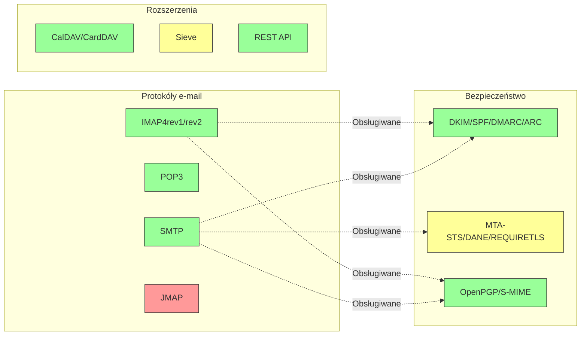

---


## Podstawowe protokoły e-mail {#core-email-protocols}

### Przepływ protokołu e-mail {#email-protocol-flow}

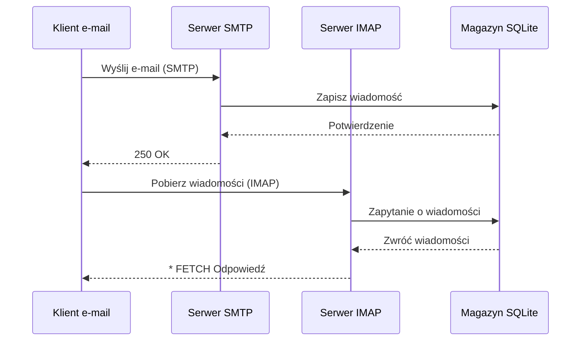


## Protokół e-mail IMAP4 i rozszerzenia {#imap4-email-protocol-and-extensions}

> \[!NOTE]
> Forward Email obsługuje IMAP4rev1 (RFC 3501) z częściowym wsparciem funkcji IMAP4rev2 (RFC 9051).

Forward Email zapewnia solidne wsparcie IMAP4 dzięki implementacji serwera pocztowego WildDuck. Serwer implementuje IMAP4rev1 (RFC 3501) z częściowym wsparciem rozszerzeń IMAP4rev2 (RFC 9051).

Funkcjonalność IMAP w Forward Email jest zapewniana przez zależność [WildDuck](https://github.com/nodemailer/wildduck). Obsługiwane są następujące RFC dotyczące poczty e-mail:

| RFC                                                       | Tytuł                                                             | Uwagi dotyczące implementacji                         |
| --------------------------------------------------------- | ----------------------------------------------------------------- | ----------------------------------------------------- |
| [RFC 3501](https://datatracker.ietf.org/doc/html/rfc3501) | Internet Message Access Protocol (IMAP) - Wersja 4rev1            | Pełne wsparcie z celowymi różnicami (patrz poniżej)   |
| [RFC 2177](https://datatracker.ietf.org/doc/html/rfc2177) | Komenda IMAP4 IDLE                                               | Powiadomienia push                                    |
| [RFC 2342](https://datatracker.ietf.org/doc/html/rfc2342) | Przestrzeń nazw IMAP4                                            | Wsparcie przestrzeni nazw skrzynek                     |
| [RFC 2087](https://datatracker.ietf.org/doc/html/rfc2087) | Rozszerzenie IMAP4 QUOTA                                         | Zarządzanie limitami przestrzeni                       |
| [RFC 2971](https://datatracker.ietf.org/doc/html/rfc2971) | Rozszerzenie IMAP4 ID                                           | Identyfikacja klienta/serwera                          |
| [RFC 5161](https://datatracker.ietf.org/doc/html/rfc5161) | Rozszerzenie IMAP4 ENABLE                                       | Włączanie rozszerzeń IMAP                              |
| [RFC 4959](https://datatracker.ietf.org/doc/html/rfc4959) | Rozszerzenie IMAP dla początkowej odpowiedzi klienta SASL (SASL-IR) | Początkowa odpowiedź klienta                           |
| [RFC 3691](https://datatracker.ietf.org/doc/html/rfc3691) | Komenda IMAP4 UNSELECT                                         | Zamknięcie skrzynki bez EXPUNGE                        |
| [RFC 4315](https://datatracker.ietf.org/doc/html/rfc4315) | Rozszerzenie IMAP UIDPLUS                                       | Rozszerzone komendy UID                                |
| [RFC 7162](https://datatracker.ietf.org/doc/html/rfc7162) | Rozszerzenia IMAP: Szybka synchronizacja zmian flag (CONDSTORE) | Conditional STORE                                     |
| [RFC 6154](https://datatracker.ietf.org/doc/html/rfc6154) | Rozszerzenie IMAP LIST dla skrzynek specjalnego przeznaczenia   | Specjalne atrybuty skrzynek                            |
| [RFC 6851](https://datatracker.ietf.org/doc/html/rfc6851) | Rozszerzenie IMAP MOVE                                         | Atomowa komenda MOVE                                   |
| [RFC 6855](https://datatracker.ietf.org/doc/html/rfc6855) | Wsparcie IMAP dla UTF-8                                        | Wsparcie UTF-8                                        |
| [RFC 3348](https://datatracker.ietf.org/doc/html/rfc3348) | Rozszerzenie IMAP4 dla skrzynek podrzędnych                     | Informacje o skrzynkach podrzędnych                    |
| [RFC 7889](https://datatracker.ietf.org/doc/html/rfc7889) | Rozszerzenie IMAP4 dla reklamowania maksymalnego rozmiaru przesyłanego pliku (APPENDLIMIT) | Maksymalny rozmiar przesyłanego pliku                  |
**Obsługiwane rozszerzenia IMAP:**

| Rozszerzenie      | RFC          | Status      | Opis                           |
| ----------------- | ------------ | ----------- | ------------------------------ |
| IDLE              | RFC 2177     | ✅ Obsługiwane | Powiadomienia push             |
| NAMESPACE         | RFC 2342     | ✅ Obsługiwane | Obsługa przestrzeni nazw skrzynek |
| QUOTA             | RFC 2087     | ✅ Obsługiwane | Zarządzanie limitem pamięci    |
| ID                | RFC 2971     | ✅ Obsługiwane | Identyfikacja klient/serwer    |
| ENABLE            | RFC 5161     | ✅ Obsługiwane | Włączanie rozszerzeń IMAP      |
| SASL-IR           | RFC 4959     | ✅ Obsługiwane | Początkowa odpowiedź klienta   |
| UNSELECT          | RFC 3691     | ✅ Obsługiwane | Zamknięcie skrzynki bez EXPUNGE |
| UIDPLUS           | RFC 4315     | ✅ Obsługiwane | Rozszerzone polecenia UID      |
| CONDSTORE         | RFC 7162     | ✅ Obsługiwane | Warunkowy STORE                |
| SPECIAL-USE       | RFC 6154     | ✅ Obsługiwane | Specjalne atrybuty skrzynek   |
| MOVE              | RFC 6851     | ✅ Obsługiwane | Atomowe polecenie MOVE         |
| UTF8=ACCEPT       | RFC 6855     | ✅ Obsługiwane | Obsługa UTF-8                  |
| CHILDREN          | RFC 3348     | ✅ Obsługiwane | Informacje o podfolderach      |
| APPENDLIMIT       | RFC 7889     | ✅ Obsługiwane | Maksymalny rozmiar przesyłanego pliku |
| XLIST             | Niestandardowe | ✅ Obsługiwane | Lista folderów kompatybilna z Gmailem |
| XAPPLEPUSHSERVICE | Niestandardowe | ✅ Obsługiwane | Usługa powiadomień push Apple |

### Różnice protokołu IMAP względem specyfikacji RFC {#imap-protocol-differences-from-rfc-specifications}

> \[!WARNING]
> Poniższe różnice względem specyfikacji RFC mogą wpływać na kompatybilność klienta.

Forward Email celowo odbiega od niektórych specyfikacji IMAP RFC. Różnice te są dziedziczone po WildDuck i zostały opisane poniżej:

* **Brak flagi \Recent:** Flaga `\Recent` nie jest zaimplementowana. Wszystkie wiadomości zwracane są bez tej flagi.
* **RENAME nie wpływa na podfoldery:** Podczas zmiany nazwy folderu podfoldery nie są automatycznie zmieniane. Hierarchia folderów jest płaska w bazie danych.
* **INBOX nie może być zmieniony:** [RFC 3501](https://datatracker.ietf.org/doc/html/rfc3501) dopuszcza zmianę nazwy INBOX, ale Forward Email wyraźnie tego zabrania. Zobacz [kod źródłowy WildDuck](https://github.com/nodemailer/wildduck/blob/master/imap-core/lib/commands/rename.js#L27).
* **Brak niezamówionych odpowiedzi FLAGS:** Po zmianie flag nie są wysyłane niezamówione odpowiedzi FLAGS do klienta.
* **STORE zwraca NO dla usuniętych wiadomości:** Próba modyfikacji flag usuniętych wiadomości zwraca NO zamiast ignorować ją cicho.
* **CHARSET ignorowany w SEARCH:** Argument `CHARSET` w poleceniach SEARCH jest ignorowany. Wszystkie wyszukiwania używają UTF-8.
* **Metadane MODSEQ ignorowane:** Metadane `MODSEQ` w poleceniach STORE są ignorowane.
* **SEARCH TEXT i SEARCH BODY:** Forward Email używa [SQLite FTS5](https://www.sqlite.org/fts5.html) (pełnotekstowe wyszukiwanie) zamiast wyszukiwania `$text` w MongoDB. Zapewnia to:
  * Obsługę operatora `NOT` (MongoDB tego nie wspiera)
  * Wyniki wyszukiwania z rankingiem
  * Wydajność wyszukiwania poniżej 100 ms na dużych skrzynkach
* **Zachowanie autoexpunge:** Wiadomości oznaczone jako `\Deleted` są automatycznie usuwane po zamknięciu skrzynki.
* **Wierność wiadomości:** Niektóre modyfikacje wiadomości mogą nie zachować dokładnej oryginalnej struktury wiadomości.

**Częściowe wsparcie IMAP4rev2:**

Forward Email implementuje IMAP4rev1 (RFC 3501) z częściowym wsparciem IMAP4rev2 (RFC 9051). Następujące funkcje IMAP4rev2 **nie są jeszcze obsługiwane**:

* **LIST-STATUS** - Połączone polecenia LIST i STATUS
* **LITERAL-** - Literały niesynchronizujące (wariant minus)
* **OBJECTID** - Unikalne identyfikatory obiektów
* **SAVEDATE** - Atrybut daty zapisu
* **REPLACE** - Atomowa zamiana wiadomości
* **UNAUTHENTICATE** - Zamknięcie uwierzytelnienia bez zamykania połączenia

**Luźne przetwarzanie struktury treści:**

Forward Email stosuje „luźne” przetwarzanie struktury treści dla niepoprawnych struktur MIME, co może różnić się od ścisłej interpretacji RFC. Poprawia to kompatybilność z rzeczywistymi wiadomościami, które nie zawsze idealnie spełniają standardy.
**Rozszerzenie METADATA (RFC 5464):**

Rozszerzenie IMAP METADATA **nie jest obsługiwane**. Więcej informacji o tym rozszerzeniu znajduje się w [RFC 5464](https://datatracker.ietf.org/doc/html/rfc5464). Dyskusję na temat dodania tej funkcji można znaleźć w [WildDuck Issue #937](https://github.com/zone-eu/wildduck/issues/937).

### Rozszerzenia IMAP NIEOBSŁUGIWANE {#imap-extensions-not-supported}

Następujące rozszerzenia IMAP z [IANA IMAP Capabilities Registry](https://www.iana.org/assignments/imap-capabilities/imap-capabilities.xhtml) NIE są obsługiwane:

| RFC                                                       | Tytuł                                                                                                           | Powód                                                                                                                                  |
| --------------------------------------------------------- | --------------------------------------------------------------------------------------------------------------- | --------------------------------------------------------------------------------------------------------------------------------------- |
| [RFC 2086](https://datatracker.ietf.org/doc/html/rfc2086) | Rozszerzenie IMAP4 ACL                                                                                          | Foldery współdzielone niezaimplementowane. Zobacz [WildDuck Issue #427](https://github.com/zone-eu/wildduck/issues/427)                 |
| [RFC 5256](https://datatracker.ietf.org/doc/html/rfc5256) | Rozszerzenia IMAP SORT i THREAD                                                                                  | Wątkowanie zaimplementowane wewnętrznie, ale nie przez protokół RFC 5256. Zobacz [WildDuck Issue #12](https://github.com/zone-eu/wildduck/issues/12) |
| [RFC 5162](https://datatracker.ietf.org/doc/html/rfc5162) | Rozszerzenia IMAP4 dla szybkiej resynchronizacji skrzynek (QRESYNC)                                              | Niezaimplementowane                                                                                                                     |
| [RFC 5464](https://datatracker.ietf.org/doc/html/rfc5464) | Rozszerzenie IMAP METADATA                                                                                       | Operacje na metadanych ignorowane. Zobacz [dokumentację WildDuck](https://datatracker.ietf.org/doc/html/rfc5464)                       |
| [RFC 5258](https://datatracker.ietf.org/doc/html/rfc5258) | Rozszerzenia polecenia IMAP4 LIST                                                                                | Niezaimplementowane                                                                                                                     |
| [RFC 5267](https://datatracker.ietf.org/doc/html/rfc5267) | Konteksty dla IMAP4                                                                                              | Niezaimplementowane                                                                                                                     |
| [RFC 5465](https://datatracker.ietf.org/doc/html/rfc5465) | Rozszerzenie IMAP NOTIFY                                                                                        | Niezaimplementowane                                                                                                                     |
| [RFC 5466](https://datatracker.ietf.org/doc/html/rfc5466) | Rozszerzenie IMAP4 FILTERS                                                                                       | Niezaimplementowane                                                                                                                     |
| [RFC 6203](https://datatracker.ietf.org/doc/html/rfc6203) | Rozszerzenie IMAP4 dla wyszukiwania rozmytego                                                                   | Niezaimplementowane                                                                                                                     |
| [RFC 6785](https://datatracker.ietf.org/doc/html/rfc6785) | Rekomendacje dotyczące implementacji IMAP4                                                                       | Rekomendacje nie są w pełni przestrzegane                                                                                             |
| [RFC 7162](https://datatracker.ietf.org/doc/html/rfc7162) | Rozszerzenia IMAP: szybka resynchronizacja zmian flag (CONDSTORE) i szybka resynchronizacja skrzynek (QRESYNC)   | Niezaimplementowane                                                                                                                     |
| [RFC 8437](https://datatracker.ietf.org/doc/html/rfc8437) | Rozszerzenie IMAP UNAUTHENTICATE dla ponownego użycia połączenia                                                | Niezaimplementowane                                                                                                                     |
| [RFC 8438](https://datatracker.ietf.org/doc/html/rfc8438) | Rozszerzenie IMAP dla STATUS=SIZE                                                                                | Niezaimplementowane                                                                                                                     |
| [RFC 8457](https://datatracker.ietf.org/doc/html/rfc8457) | IMAP "$Important" Keyword i specjalny atrybut użycia "\Important"                                                | Niezaimplementowane                                                                                                                     |
| [RFC 8474](https://datatracker.ietf.org/doc/html/rfc8474) | Rozszerzenie IMAP dla identyfikatorów obiektów                                                                   | Niezaimplementowane                                                                                                                     |
| [RFC 9051](https://datatracker.ietf.org/doc/html/rfc9051) | Protokół dostępu do wiadomości internetowych (IMAP) - wersja 4rev2                                               | Forward Email implementuje IMAP4rev1 ([RFC 3501](https://datatracker.ietf.org/doc/html/rfc3501))                                        |
## Protokół POP3 i rozszerzenia {#pop3-email-protocol-and-extensions}

> \[!NOTE]
> Forward Email obsługuje POP3 (RFC 1939) ze standardowymi rozszerzeniami do pobierania poczty.

Funkcjonalność POP3 w Forward Email jest zapewniona przez zależność [WildDuck](https://github.com/nodemailer/wildduck). Obsługiwane są następujące RFC dotyczące poczty:

| RFC                                                       | Tytuł                                   | Uwagi dotyczące implementacji                       |
| --------------------------------------------------------- | --------------------------------------- | -------------------------------------------------- |
| [RFC 1939](https://datatracker.ietf.org/doc/html/rfc1939) | Protokół pocztowy - wersja 3 (POP3)    | Pełne wsparcie z celowymi różnicami (patrz poniżej) |
| [RFC 2595](https://datatracker.ietf.org/doc/html/rfc2595) | Używanie TLS z IMAP, POP3 i ACAP        | Wsparcie STARTTLS                                  |
| [RFC 2449](https://datatracker.ietf.org/doc/html/rfc2449) | Mechanizm rozszerzeń POP3                | Wsparcie polecenia CAPA                            |

Forward Email zapewnia wsparcie POP3 dla klientów, którzy wolą ten prostszy protokół zamiast IMAP. POP3 jest idealny dla użytkowników, którzy chcą pobrać wiadomości na jedno urządzenie i usunąć je z serwera.

**Obsługiwane rozszerzenia POP3:**

| Rozszerzenie | RFC      | Status      | Opis                       |
| ------------ | -------- | ----------- | -------------------------- |
| TOP          | RFC 1939 | ✅ Obsługiwane | Pobieranie nagłówków wiadomości |
| USER         | RFC 1939 | ✅ Obsługiwane | Uwierzytelnianie nazwy użytkownika |
| UIDL         | RFC 1939 | ✅ Obsługiwane | Unikalne identyfikatory wiadomości |
| EXPIRE       | RFC 2449 | ✅ Obsługiwane | Polityka wygasania wiadomości |

### Różnice protokołu POP3 względem specyfikacji RFC {#pop3-protocol-differences-from-rfc-specifications}

> \[!WARNING]
> POP3 ma wrodzone ograniczenia w porównaniu do IMAP.

> \[!IMPORTANT]
> **Kluczowa różnica: zachowanie polecenia DELE w Forward Email vs WildDuck POP3**
>
> Forward Email implementuje zgodne z RFC trwałe usuwanie wiadomości dla poleceń POP3 `DELE`, w przeciwieństwie do WildDuck, który przenosi wiadomości do Kosza.

**Zachowanie Forward Email** ([kod źródłowy](https://github.com/forwardemail/forwardemail.net/blob/master/pop3-server.js)):

* `DELE` → `QUIT` trwale usuwa wiadomości
* Dokładne przestrzeganie specyfikacji [RFC 1939](https://datatracker.ietf.org/doc/html/rfc1939)
* Zachowanie zgodne z serwerami Dovecot (domyślny), Postfix i innymi zgodnymi ze standardami

**Zachowanie WildDuck** ([dyskusja](https://github.com/zone-eu/wildduck/issues/937)):

* `DELE` → `QUIT` przenosi wiadomości do Kosza (podobnie jak Gmail)
* Świadoma decyzja projektowa dla bezpieczeństwa użytkownika
* Niezgodne z RFC, ale zapobiega przypadkowej utracie danych

**Dlaczego Forward Email różni się:**

* **Zgodność z RFC:** Przestrzega specyfikacji [RFC 1939](https://datatracker.ietf.org/doc/html/rfc1939)
* **Oczekiwania użytkowników:** Przepływ pracy pobierz-i-usun oczekuje trwałego usunięcia
* **Zarządzanie przestrzenią dyskową:** Właściwe zwalnianie miejsca na dysku
* **Interoperacyjność:** Spójne z innymi serwerami zgodnymi z RFC

> \[!NOTE]
> **Lista wiadomości POP3:** Forward Email wyświetla WSZYSTKIE wiadomości z INBOX bez limitu. Różni się to od WildDuck, który domyślnie ogranicza do 250 wiadomości. Zobacz [kod źródłowy](https://github.com/forwardemail/forwardemail.net/blob/master/pop3-server.js).

**Dostęp z pojedynczego urządzenia:**

POP3 jest zaprojektowany do dostępu z pojedynczego urządzenia. Wiadomości są zazwyczaj pobierane i usuwane z serwera, co czyni go nieodpowiednim do synchronizacji na wielu urządzeniach.

**Brak wsparcia dla folderów:**

POP3 uzyskuje dostęp tylko do folderu INBOX. Inne foldery (Wysłane, Robocze, Kosz itp.) nie są dostępne przez POP3.

**Ograniczone zarządzanie wiadomościami:**

POP3 zapewnia podstawowe pobieranie i usuwanie wiadomości. Zaawansowane funkcje, takie jak oznaczanie, przenoszenie czy wyszukiwanie wiadomości, nie są dostępne.

### Rozszerzenia POP3 NIEOBSŁUGIWANE {#pop3-extensions-not-supported}

Następujące rozszerzenia POP3 z [Rejestru mechanizmu rozszerzeń POP3 IANA](https://www.iana.org/assignments/pop3-extension-mechanism/pop3-extension-mechanism.xhtml) NIE są obsługiwane:
| RFC                                                       | Tytuł                                                   | Powód                                  |
| --------------------------------------------------------- | ------------------------------------------------------- | --------------------------------------- |
| [RFC 6856](https://datatracker.ietf.org/doc/html/rfc6856) | Post Office Protocol Version 3 (POP3) Support for UTF-8 | Niezaimplementowane w serwerze WildDuck POP3 |
| [RFC 2595](https://datatracker.ietf.org/doc/html/rfc2595) | Komenda STLS                                            | Obsługiwany tylko STARTTLS, nie STLS    |
| [RFC 3206](https://datatracker.ietf.org/doc/html/rfc3206) | Kody odpowiedzi SYS i AUTH POP                           | Niezaimplementowane                     |

---


## Protokół SMTP i rozszerzenia {#smtp-email-protocol-and-extensions}

> \[!NOTE]
> Forward Email obsługuje SMTP (RFC 5321) z nowoczesnymi rozszerzeniami dla bezpiecznej i niezawodnej dostawy e-maili.

Funkcjonalność SMTP w Forward Email zapewniają różne komponenty: [smtp-server](https://github.com/nodemailer/smtp-server) (nodemailer), [zone-mta](https://github.com/zone-eu/zone-mta) oraz własne implementacje. Obsługiwane są następujące RFC dotyczące e-maili:

| RFC                                                       | Tytuł                                                                           | Uwagi dotyczące implementacji        |
| --------------------------------------------------------- | ------------------------------------------------------------------------------- | ------------------------------------ |
| [RFC 5321](https://datatracker.ietf.org/doc/html/rfc5321) | Simple Mail Transfer Protocol (SMTP)                                            | Pełne wsparcie                      |
| [RFC 3207](https://datatracker.ietf.org/doc/html/rfc3207) | SMTP Service Extension for Secure SMTP over Transport Layer Security (STARTTLS) | Wsparcie TLS/SSL                    |
| [RFC 4954](https://datatracker.ietf.org/doc/html/rfc4954) | SMTP Service Extension for Authentication (AUTH)                                | PLAIN, LOGIN, CRAM-MD5, XOAUTH2      |
| [RFC 6531](https://datatracker.ietf.org/doc/html/rfc6531) | SMTP Extension for Internationalized Email (SMTPUTF8)                           | Wsparcie natywnych adresów e-mail Unicode |
| [RFC 3461](https://datatracker.ietf.org/doc/html/rfc3461) | SMTP Service Extension for Delivery Status Notifications (DSN)                  | Pełne wsparcie DSN                   |
| [RFC 3463](https://datatracker.ietf.org/doc/html/rfc3463) | Enhanced Mail System Status Codes                                               | Rozszerzone kody statusu w odpowiedziach |
| [RFC 1870](https://datatracker.ietf.org/doc/html/rfc1870) | SMTP Service Extension for Message Size Declaration (SIZE)                      | Reklama maksymalnego rozmiaru wiadomości |
| [RFC 2920](https://datatracker.ietf.org/doc/html/rfc2920) | SMTP Service Extension for Command Pipelining (PIPELINING)                      | Wsparcie pipeliningu komend          |
| [RFC 1652](https://datatracker.ietf.org/doc/html/rfc1652) | SMTP Service Extension for 8bit-MIMEtransport (8BITMIME)                        | Wsparcie 8-bitowego MIME             |
| [RFC 6152](https://datatracker.ietf.org/doc/html/rfc6152) | SMTP Service Extension for 8-bit MIME Transport                                 | Wsparcie 8-bitowego MIME             |
| [RFC 2034](https://datatracker.ietf.org/doc/html/rfc2034) | SMTP Service Extension for Returning Enhanced Error Codes (ENHANCEDSTATUSCODES) | Rozszerzone kody statusu             |

Forward Email implementuje w pełni funkcjonalny serwer SMTP z obsługą nowoczesnych rozszerzeń zwiększających bezpieczeństwo, niezawodność i funkcjonalność.

**Obsługiwane rozszerzenia SMTP:**

| Rozszerzenie       | RFC      | Status      | Opis                                |
| ------------------ | -------- | ----------- | ---------------------------------- |
| PIPELINING         | RFC 2920 | ✅ Obsługiwane | Pipelining komend                   |
| SIZE               | RFC 1870 | ✅ Obsługiwane | Deklaracja rozmiaru wiadomości (limit 52MB) |
| ETRN               | RFC 1985 | ✅ Obsługiwane | Zdalne przetwarzanie kolejki       |
| STARTTLS           | RFC 3207 | ✅ Obsługiwane | Uaktualnienie do TLS                |
| ENHANCEDSTATUSCODES| RFC 2034 | ✅ Obsługiwane | Rozszerzone kody statusu            |
| 8BITMIME           | RFC 6152 | ✅ Obsługiwane | Transport 8-bitowego MIME           |
| DSN                | RFC 3461 | ✅ Obsługiwane | Powiadomienia o statusie dostarczenia |
| CHUNKING           | RFC 3030 | ✅ Obsługiwane | Transfer wiadomości w kawałkach     |
| SMTPUTF8           | RFC 6531 | ⚠️ Częściowo | Adresy e-mail w UTF-8 (częściowo)  |
| REQUIRETLS         | RFC 8689 | ✅ Obsługiwane | Wymaganie TLS dla dostarczenia      |
### Powiadomienia o statusie dostarczenia (DSN) {#delivery-status-notifications-dsn}

> \[!TIP]
> DSN dostarcza szczegółowe informacje o statusie dostarczenia wysłanych wiadomości e-mail.

Forward Email w pełni obsługuje **DSN (RFC 3461)**, które pozwala nadawcom na żądanie powiadomień o statusie dostarczenia. Ta funkcja zapewnia:

* **Powiadomienia o sukcesie** gdy wiadomości zostaną dostarczone
* **Powiadomienia o błędzie** z szczegółowymi informacjami o błędach
* **Powiadomienia o opóźnieniu** gdy dostarczenie jest tymczasowo opóźnione

DSN jest szczególnie przydatne do:

* Potwierdzania dostarczenia ważnych wiadomości
* Rozwiązywania problemów z dostarczeniem
* Zautomatyzowanych systemów przetwarzania e-maili
* Wymagań zgodności i audytu

### Wsparcie REQUIRETLS {#requiretls-support}

> \[!IMPORTANT]
> Forward Email jest jednym z nielicznych dostawców, którzy wyraźnie reklamują i wymuszają REQUIRETLS.

Forward Email obsługuje **REQUIRETLS (RFC 8689)**, które zapewnia, że wiadomości e-mail są dostarczane wyłącznie przez połączenia szyfrowane TLS. Zapewnia to:

* **Szyfrowanie end-to-end** na całej ścieżce dostarczenia
* **Wymuszanie widoczne dla użytkownika** poprzez pole wyboru w komponencie wiadomości e-mail
* **Odrzucanie prób dostarczenia bez szyfrowania**
* **Zwiększone bezpieczeństwo** dla wrażliwych komunikacji

### Nieobsługiwane rozszerzenia SMTP {#smtp-extensions-not-supported}

Następujące rozszerzenia SMTP z [IANA SMTP Service Extensions Registry](https://www.iana.org/assignments/smtp) NIE są obsługiwane:

| RFC                                                       | Tytuł                                                                                             | Powód                 |
| --------------------------------------------------------- | ------------------------------------------------------------------------------------------------- | --------------------- |
| [RFC 4865](https://datatracker.ietf.org/doc/html/rfc4865) | SMTP Submission Service Extension for Future Message Release (FUTURERELEASE)                      | Niezaimplementowane    |
| [RFC 6710](https://datatracker.ietf.org/doc/html/rfc6710) | SMTP Extension for Message Transfer Priorities (MT-PRIORITY)                                      | Niezaimplementowane    |
| [RFC 7293](https://datatracker.ietf.org/doc/html/rfc7293) | The Require-Recipient-Valid-Since Header Field and SMTP Service Extension                         | Niezaimplementowane    |
| [RFC 7372](https://datatracker.ietf.org/doc/html/rfc7372) | Email Auth Status Codes                                                                           | Nie w pełni zaimplementowane |
| [RFC 4468](https://datatracker.ietf.org/doc/html/rfc4468) | Message Submission BURL Extension                                                                 | Niezaimplementowane    |
| [RFC 3030](https://datatracker.ietf.org/doc/html/rfc3030) | SMTP Service Extensions for Transmission of Large and Binary MIME Messages (CHUNKING, BINARYMIME) | Niezaimplementowane    |
| [RFC 2852](https://datatracker.ietf.org/doc/html/rfc2852) | Deliver By SMTP Service Extension                                                                 | Niezaimplementowane    |

---


## Protokół e-mail JMAP {#jmap-email-protocol}

> \[!CAUTION]
> JMAP **nie jest obecnie obsługiwany** przez Forward Email.

| RFC                                                       | Tytuł                                     | Status          | Powód                                                                 |
| --------------------------------------------------------- | ----------------------------------------- | --------------- | -------------------------------------------------------------------- |
| [RFC 8620](https://datatracker.ietf.org/doc/html/rfc8620) | The JSON Meta Application Protocol (JMAP) | ❌ Nieobsługiwany | Forward Email używa zamiast tego IMAP/POP3/SMTP oraz kompleksowego REST API |

**JMAP (JSON Meta Application Protocol)** to nowoczesny protokół e-mail zaprojektowany jako zamiennik IMAP.

**Dlaczego JMAP nie jest obsługiwany:**

> "JMAP to bestia, której nie powinno się było wynajdywać. Próbuje przekształcić TCP/IMAP (już zły protokół według dzisiejszych standardów) w HTTP/JSON, po prostu używając innego transportu, zachowując ducha." — Andris Reinman, [HN Discussion](https://news.ycombinator.com/item?id=18890011)
> "JMAP ma ponad 10 lat i prawie wcale nie jest stosowany" – Andris Reinman, [GitHub Discussion](https://github.com/zone-eu/wildduck/issues/2#issuecomment-1765190790)

Zobacz także dodatkowe komentarze na <https://hn.algolia.com/?dateRange=all&page=0&prefix=true&query=jmap%20andris&sort=byDate&type=comment>.

Forward Email obecnie koncentruje się na zapewnieniu doskonałego wsparcia dla IMAP, POP3 i SMTP oraz kompleksowego REST API do zarządzania pocztą elektroniczną. Wsparcie dla JMAP może być rozważone w przyszłości w zależności od zapotrzebowania użytkowników i adopcji w ekosystemie.

**Alternatywa:** Forward Email oferuje [Kompletny REST API](#complete-rest-api-for-email-management) z 39 punktami końcowymi, który zapewnia podobną funkcjonalność do JMAP dla programowego dostępu do poczty.

---


## Bezpieczeństwo poczty elektronicznej {#email-security}

### Architektura bezpieczeństwa poczty elektronicznej {#email-security-architecture}

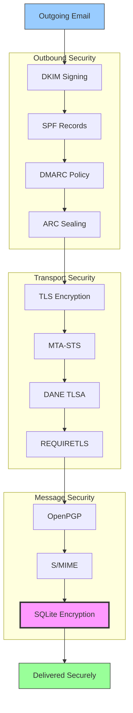


## Protokoły uwierzytelniania wiadomości e-mail {#email-message-authentication-protocols}

> \[!NOTE]
> Forward Email implementuje wszystkie główne protokoły uwierzytelniania poczty elektronicznej, aby zapobiegać podszywaniu się i zapewnić integralność wiadomości.

Forward Email korzysta z biblioteki [mailauth](https://github.com/postalsys/mailauth) do uwierzytelniania poczty elektronicznej. Obsługiwane są następujące RFC:

| RFC                                                       | Tytuł                                                                   | Uwagi dotyczące implementacji                                  |
| --------------------------------------------------------- | ----------------------------------------------------------------------- | -------------------------------------------------------------- |
| [RFC 6376](https://datatracker.ietf.org/doc/html/rfc6376) | DomainKeys Identified Mail (DKIM) Signatures                            | Pełne podpisywanie i weryfikacja DKIM                          |
| [RFC 8463](https://datatracker.ietf.org/doc/html/rfc8463) | Nowa metoda podpisu kryptograficznego dla DKIM (Ed25519-SHA256)         | Obsługuje algorytmy podpisu RSA-SHA256 i Ed25519-SHA256       |
| [RFC 7208](https://datatracker.ietf.org/doc/html/rfc7208) | Sender Policy Framework (SPF)                                           | Walidacja rekordów SPF                                         |
| [RFC 7489](https://datatracker.ietf.org/doc/html/rfc7489) | Domain-based Message Authentication, Reporting, and Conformance (DMARC) | Egzekwowanie polityki DMARC                                   |
| [RFC 8617](https://datatracker.ietf.org/doc/html/rfc8617) | Authenticated Received Chain (ARC)                                      | Uszczelnianie i weryfikacja ARC                               |

Protokoły uwierzytelniania poczty elektronicznej weryfikują, czy wiadomości rzeczywiście pochodzą od deklarowanego nadawcy i nie zostały zmienione podczas przesyłania.

### Wsparcie protokołów uwierzytelniania {#authentication-protocol-support}

| Protokół  | RFC      | Status      | Opis                                                                 |
| --------- | -------- | ----------- | -------------------------------------------------------------------- |
| **DKIM**  | RFC 6376 | ✅ Obsługiwany | DomainKeys Identified Mail - podpisy kryptograficzne                |
| **SPF**   | RFC 7208 | ✅ Obsługiwany | Sender Policy Framework - autoryzacja adresu IP                     |
| **DMARC** | RFC 7489 | ✅ Obsługiwany | Domain-based Message Authentication - egzekwowanie polityki         |
| **ARC**   | RFC 8617 | ✅ Obsługiwany | Authenticated Received Chain - zachowanie uwierzytelnienia przy przekazywaniu |
### DKIM (DomainKeys Identified Mail) {#dkim-domainkeys-identified-mail}

**DKIM** dodaje kryptograficzny podpis do nagłówków e-mail, pozwalając odbiorcom zweryfikować, że wiadomość została autoryzowana przez właściciela domeny i nie została zmodyfikowana podczas przesyłania.

Forward Email używa [mailauth](https://github.com/postalsys/mailauth) do podpisywania i weryfikacji DKIM.

**Kluczowe funkcje:**

* Automatyczne podpisywanie DKIM dla wszystkich wychodzących wiadomości
* Obsługa kluczy RSA i Ed25519
* Obsługa wielu selektorów
* Weryfikacja DKIM dla wiadomości przychodzących

### SPF (Sender Policy Framework) {#spf-sender-policy-framework}

**SPF** pozwala właścicielom domen określić, które adresy IP są uprawnione do wysyłania e-maili w imieniu ich domeny.

**Kluczowe funkcje:**

* Walidacja rekordu SPF dla wiadomości przychodzących
* Automatyczne sprawdzanie SPF z szczegółowymi wynikami
* Obsługa mechanizmów include, redirect i all
* Konfigurowalne polityki SPF dla każdej domeny

### DMARC (Domain-based Message Authentication, Reporting & Conformance) {#dmarc-domain-based-message-authentication-reporting--conformance}

**DMARC** opiera się na SPF i DKIM, aby zapewnić egzekwowanie polityk i raportowanie.

**Kluczowe funkcje:**

* Egzekwowanie polityki DMARC (none, quarantine, reject)
* Sprawdzanie wyrównania dla SPF i DKIM
* Raportowanie zbiorcze DMARC
* Polityki DMARC dla poszczególnych domen

### ARC (Authenticated Received Chain) {#arc-authenticated-received-chain}

**ARC** zachowuje wyniki uwierzytelniania e-maili podczas przekazywania i modyfikacji na listach mailingowych.

Forward Email używa biblioteki [mailauth](https://github.com/postalsys/mailauth) do weryfikacji i zabezpieczania ARC.

**Kluczowe funkcje:**

* Zabezpieczanie ARC dla przekazywanych wiadomości
* Weryfikacja ARC dla wiadomości przychodzących
* Weryfikacja łańcucha przez wiele przeskoków
* Zachowuje oryginalne wyniki uwierzytelniania

### Authentication Flow {#authentication-flow}

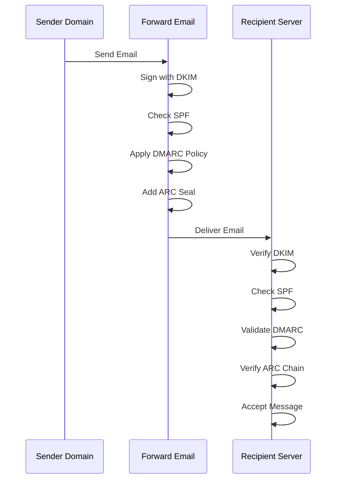

---


## Email Transport Security Protocols {#email-transport-security-protocols}

> \[!IMPORTANT]
> Forward Email implementuje wielowarstwowe zabezpieczenia transportu, aby chronić e-maile podczas przesyłania.

Forward Email implementuje nowoczesne protokoły zabezpieczeń transportu:

| RFC                                                       | Tytuł                                                                                                | Status      | Uwagi dotyczące implementacji                                                                                                                                                                                                                                                                |
| --------------------------------------------------------- | ---------------------------------------------------------------------------------------------------- | ----------- | --------------------------------------------------------------------------------------------------------------------------------------------------------------------------------------------------------------------------------------------------------------------------------------------- |
| [RFC 8461](https://datatracker.ietf.org/doc/html/rfc8461) | SMTP MTA Strict Transport Security (MTA-STS)                                                         | ✅ Obsługiwany | Szeroko stosowany na serwerach IMAP, SMTP i MX. Zobacz [create-mta-sts-cache.js](https://github.com/forwardemail/forwardemail.net/blob/master/helpers/create-mta-sts-cache.js) oraz [get-transporter.js](https://github.com/forwardemail/forwardemail.net/blob/master/helpers/get-transporter.js) |
| [RFC 8460](https://datatracker.ietf.org/doc/html/rfc8460) | SMTP TLS Reporting                                                                                   | ✅ Obsługiwany | Poprzez bibliotekę [mailauth](https://github.com/postalsys/mailauth)                                                                                                                                                                                                                         |
| [RFC 7671](https://datatracker.ietf.org/doc/html/rfc7671) | The DNS-Based Authentication of Named Entities (DANE) Protocol: Updates and Operational Guidance     | ✅ Obsługiwany | Pełna weryfikacja DANE dla wychodzących połączeń SMTP. Zobacz [mx-connect PR #22](https://github.com/zone-eu/mx-connect/pull/22)                                                                                                                                                              |
| [RFC 6698](https://datatracker.ietf.org/doc/html/rfc6698) | The DNS-Based Authentication of Named Entities (DANE) Transport Layer Security (TLS) Protocol: TLSA  | ✅ Obsługiwany | Pełne wsparcie RFC 6698: typy użycia PKIX-TA, PKIX-EE, DANE-TA, DANE-EE. Zobacz [mx-connect PR #22](https://github.com/zone-eu/mx-connect/pull/22)                                                                                                                                             |
| [RFC 8314](https://datatracker.ietf.org/doc/html/rfc8314) | Cleartext Considered Obsolete: Use of Transport Layer Security (TLS) for Email Submission and Access | ✅ Obsługiwany | TLS wymagany dla wszystkich połączeń                                                                                                                                                                                                                                                        |
| [RFC 8689](https://datatracker.ietf.org/doc/html/rfc8689) | SMTP Service Extension for Requiring TLS (REQUIRETLS)                                                | ✅ Obsługiwany | Pełne wsparcie rozszerzenia SMTP REQUIRETLS oraz nagłówka "TLS-Required"                                                                                                                                                                                                                     |
Protokoły bezpieczeństwa transportu zapewniają, że wiadomości e-mail są szyfrowane i uwierzytelniane podczas przesyłania między serwerami pocztowymi.

### Transport Security Support {#transport-security-support}

| Protocol       | RFC      | Status      | Description                                      |
| -------------- | -------- | ----------- | ------------------------------------------------ |
| **TLS**        | RFC 8314 | ✅ Supported | Transport Layer Security - Połączenia szyfrowane |
| **MTA-STS**    | RFC 8461 | ✅ Supported | Mail Transfer Agent Strict Transport Security    |
| **DANE**       | RFC 7671 | ✅ Supported | DNS-based Authentication of Named Entities       |
| **REQUIRETLS** | RFC 8689 | ✅ Supported | Wymagaj TLS dla całej ścieżki dostarczenia       |

### TLS (Transport Layer Security) {#tls-transport-layer-security}

Forward Email wymusza szyfrowanie TLS dla wszystkich połączeń e-mail (SMTP, IMAP, POP3).

**Kluczowe cechy:**

* Obsługa TLS 1.2 i TLS 1.3
* Automatyczne zarządzanie certyfikatami
* Perfect Forward Secrecy (PFS)
* Tylko silne zestawy szyfrów

### MTA-STS (Mail Transfer Agent Strict Transport Security) {#mta-sts-mail-transfer-agent-strict-transport-security}

**MTA-STS** zapewnia, że e-mail jest dostarczany wyłącznie przez połączenia szyfrowane TLS, publikując politykę przez HTTPS.

Forward Email implementuje MTA-STS za pomocą [create-mta-sts-cache.js](https://github.com/forwardemail/forwardemail.net/blob/master/helpers/create-mta-sts-cache.js).

**Kluczowe cechy:**

* Automatyczna publikacja polityki MTA-STS
* Buforowanie polityki dla wydajności
* Zapobieganie atakom downgrade
* Wymuszanie walidacji certyfikatów

### DANE (DNS-based Authentication of Named Entities) {#dane-dns-based-authentication-of-named-entities}

> \[!NOTE]
> Forward Email zapewnia teraz pełne wsparcie DANE dla wychodzących połączeń SMTP.

**DANE** wykorzystuje DNSSEC do publikowania informacji o certyfikatach TLS w DNS, umożliwiając serwerom pocztowym weryfikację certyfikatów bez polegania na urzędach certyfikacji.

**Kluczowe cechy:**

* ✅ Pełna weryfikacja DANE dla wychodzących połączeń SMTP
* ✅ Pełne wsparcie RFC 6698: typy użycia PKIX-TA, PKIX-EE, DANE-TA, DANE-EE
* ✅ Weryfikacja certyfikatów względem rekordów TLSA podczas aktualizacji TLS
* ✅ Równoległe rozwiązywanie TLSA dla wielu hostów MX
* ✅ Automatyczne wykrywanie natywnego `dns.resolveTlsa` (Node.js v22.15.0+, v23.9.0+)
* ✅ Wsparcie niestandardowego resolvera dla starszych wersji Node.js przez [Tangerine](https://github.com/forwardemail/tangerine)
* Wymaga domen podpisanych DNSSEC

> \[!TIP]
> **Szczegóły implementacji:** Wsparcie DANE zostało dodane przez [mx-connect PR #22](https://github.com/zone-eu/mx-connect/pull/22), który zapewnia kompleksowe wsparcie DANE/TLSA dla wychodzących połączeń SMTP.

### REQUIRETLS {#requiretls}

> \[!TIP]
> Forward Email jest jednym z nielicznych dostawców oferujących wsparcie REQUIRETLS widoczne dla użytkownika.

**REQUIRETLS** zapewnia, że wiadomości e-mail są dostarczane wyłącznie przez połączenia szyfrowane TLS na całej ścieżce dostarczenia.

**Kluczowe cechy:**

* Widoczny dla użytkownika checkbox w komponencie wiadomości e-mail
* Automatyczne odrzucanie nieszyfrowanego dostarczenia
* Wymuszanie TLS end-to-end
* Szczegółowe powiadomienia o błędach

> \[!TIP]
> **Wymuszanie TLS widoczne dla użytkownika:** Forward Email udostępnia checkbox w sekcji **Moje konto > Domeny > Ustawienia** do wymuszania TLS dla wszystkich połączeń przychodzących. Po włączeniu funkcji, każde przychodzące e-mail nie wysłane przez połączenie szyfrowane TLS jest odrzucane z kodem błędu 530, zapewniając, że cała poczta przychodząca jest szyfrowana w tranzycie.

### Transport Security Flow {#transport-security-flow}

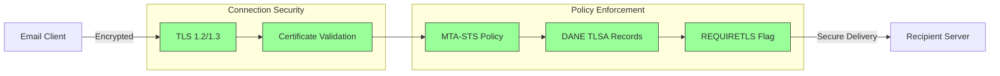
## Szyfrowanie wiadomości e-mail {#email-message-encryption}

> \[!NOTE]
> Forward Email obsługuje zarówno OpenPGP, jak i S/MIME do szyfrowania wiadomości e-mail end-to-end.

Forward Email obsługuje szyfrowanie OpenPGP i S/MIME:

| RFC                                                       | Tytuł                                                                                   | Status      | Uwagi dotyczące implementacji                                                                                                                                                                        |
| --------------------------------------------------------- | --------------------------------------------------------------------------------------- | ----------- | -------------------------------------------------------------------------------------------------------------------------------------------------------------------------------------------------- |
| [RFC 9580](https://datatracker.ietf.org/doc/html/rfc9580) | OpenPGP (zastępuje RFC 4880)                                                            | ✅ Obsługiwany | Poprzez integrację z [OpenPGP.js v6+](https://github.com/openpgpjs/openpgpjs). Zobacz [FAQ](https://forwardemail.net/en/faq#do-you-support-openpgpmime-end-to-end-encryption-e2ee-and-web-key-directory-wkd) |
| [RFC 8551](https://datatracker.ietf.org/doc/html/rfc8551) | Secure/Multipurpose Internet Mail Extensions (S/MIME) Wersja 4.0 Specyfikacja wiadomości | ✅ Obsługiwany | Obsługa zarówno algorytmów RSA, jak i ECC. Zobacz [FAQ](https://forwardemail.net/en/faq#do-you-support-smime-encryption)                                                                             |

Protokoły szyfrowania wiadomości chronią zawartość e-maila przed odczytaniem przez kogokolwiek poza zamierzonym odbiorcą, nawet jeśli wiadomość zostanie przechwycona podczas przesyłania.

### Obsługa szyfrowania {#encryption-support}

| Protokół   | RFC      | Status      | Opis                                         |
| ---------- | -------- | ----------- | -------------------------------------------- |
| **OpenPGP**| RFC 9580 | ✅ Obsługiwany | Pretty Good Privacy - szyfrowanie kluczem publicznym |
| **S/MIME** | RFC 8551 | ✅ Obsługiwany | Secure/Multipurpose Internet Mail Extensions |
| **WKD**    | Draft    | ✅ Obsługiwany | Web Key Directory - automatyczne wykrywanie kluczy |

### OpenPGP (Pretty Good Privacy) {#openpgp-pretty-good-privacy}

**OpenPGP** zapewnia szyfrowanie end-to-end z wykorzystaniem kryptografii klucza publicznego. Forward Email obsługuje OpenPGP poprzez protokół [Web Key Directory (WKD)](https://forwardemail.net/en/faq#do-you-support-openpgpmime-end-to-end-encryption-e2ee-and-web-key-directory-wkd).

**Kluczowe cechy:**

* Automatyczne wykrywanie kluczy przez WKD
* Obsługa PGP/MIME dla zaszyfrowanych załączników
* Zarządzanie kluczami przez klienta poczty
* Kompatybilność z GPG, Mailvelope i innymi narzędziami OpenPGP

**Jak używać:**

1. Wygeneruj parę kluczy PGP w swoim kliencie poczty
2. Prześlij swój klucz publiczny do WKD Forward Email
3. Twój klucz jest automatycznie wykrywalny przez innych użytkowników
4. Wysyłaj i odbieraj zaszyfrowane e-maile bezproblemowo

### S/MIME (Secure/Multipurpose Internet Mail Extensions) {#smime-securemultipurpose-internet-mail-extensions}

**S/MIME** zapewnia szyfrowanie e-maili i podpisy cyfrowe z wykorzystaniem certyfikatów X.509.

**Kluczowe cechy:**

* Szyfrowanie oparte na certyfikatach
* Podpisy cyfrowe do uwierzytelniania wiadomości
* Wsparcie natywne w większości klientów poczty
* Bezpieczeństwo klasy korporacyjnej

**Jak używać:**

1. Uzyskaj certyfikat S/MIME od Urzędu Certyfikacji
2. Zainstaluj certyfikat w swoim kliencie poczty
3. Skonfiguruj klienta do szyfrowania/podpisywania wiadomości
4. Wymień certyfikaty z odbiorcami

### Szyfrowanie skrzynki pocztowej SQLite {#sqlite-mailbox-encryption}

> \[!IMPORTANT]
> Forward Email zapewnia dodatkową warstwę bezpieczeństwa dzięki szyfrowanym skrzynkom pocztowym SQLite.

Poza szyfrowaniem na poziomie wiadomości, Forward Email szyfruje całe skrzynki pocztowe za pomocą [sqleet](https://github.com/resilar/sqleet) (ChaCha20-Poly1305).

**Kluczowe cechy:**

* **Szyfrowanie oparte na haśle** - Tylko Ty znasz hasło
* **Odporność na komputery kwantowe** - szyfr ChaCha20-Poly1305
* **Zero-knowledge** - Forward Email nie może odszyfrować Twojej skrzynki
* **Izolacja** - Każda skrzynka jest odizolowana i przenośna
* **Nieodwracalność** - Jeśli zapomnisz hasło, skrzynka zostanie utracona
### Porównanie szyfrowania {#encryption-comparison}

| Funkcja               | OpenPGP           | S/MIME             | Szyfrowanie SQLite |
| --------------------- | ----------------- | ------------------ | ----------------- |
| **End-to-End**        | ✅ Tak             | ✅ Tak              | ✅ Tak             |
| **Zarządzanie kluczami** | Samodzielne      | Wydane przez CA    | Oparte na haśle    |
| **Wsparcie klienta**  | Wymaga wtyczki    | Natywne            | Przezroczyste      |
| **Zastosowanie**      | Osobiste          | Korporacyjne       | Przechowywanie     |
| **Odporność na kwanty** | ⚠️ Zależy od klucza | ⚠️ Zależy od certyfikatu | ✅ Tak             |

### Przebieg szyfrowania {#encryption-flow}

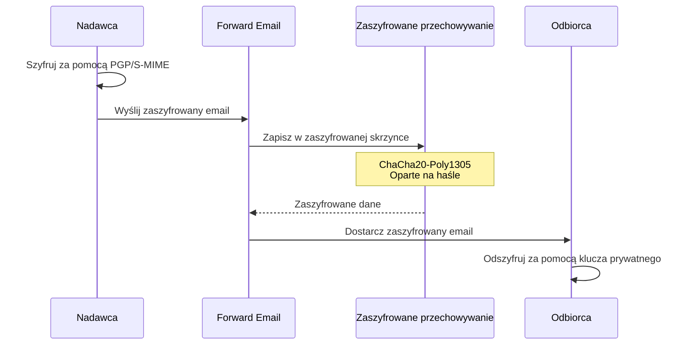

---


## Rozszerzona funkcjonalność {#extended-functionality}


## Standardy formatu wiadomości email {#email-message-format-standards}

> \[!NOTE]
> Forward Email obsługuje nowoczesne standardy formatu wiadomości email dla bogatej zawartości i internacjonalizacji.

Forward Email obsługuje standardowe formaty wiadomości email:

| RFC                                                       | Tytuł                                                         | Uwagi dotyczące implementacji |
| --------------------------------------------------------- | ------------------------------------------------------------- | ----------------------------- |
| [RFC 5322](https://datatracker.ietf.org/doc/html/rfc5322) | Format wiadomości internetowej                                 | Pełne wsparcie                |
| [RFC 2045](https://datatracker.ietf.org/doc/html/rfc2045) | MIME Część pierwsza: Format ciał wiadomości internetowych     | Pełne wsparcie MIME           |
| [RFC 2046](https://datatracker.ietf.org/doc/html/rfc2046) | MIME Część druga: Typy mediów                                 | Pełne wsparcie MIME           |
| [RFC 2047](https://datatracker.ietf.org/doc/html/rfc2047) | MIME Część trzecia: Rozszerzenia nagłówków dla tekstu nie-ASCII | Pełne wsparcie MIME           |
| [RFC 2048](https://datatracker.ietf.org/doc/html/rfc2048) | MIME Część czwarta: Procedury rejestracji                     | Pełne wsparcie MIME           |
| [RFC 2049](https://datatracker.ietf.org/doc/html/rfc2049) | MIME Część piąta: Kryteria zgodności i przykłady              | Pełne wsparcie MIME           |

Standardy formatu wiadomości definiują, jak wiadomości email są strukturyzowane, kodowane i wyświetlane.

### Wsparcie standardów formatu {#format-standards-support}

| Standard           | RFC           | Status      | Opis                                |
| ------------------ | ------------- | ----------- | ---------------------------------- |
| **MIME**           | RFC 2045-2049 | ✅ Obsługiwany | Rozszerzenia wielozadaniowej poczty internetowej |
| **SMTPUTF8**       | RFC 6531      | ⚠️ Częściowe | Internacjonalizacja adresów email  |
| **EAI**            | RFC 6530      | ⚠️ Częściowe | Internacjonalizacja adresów email  |
| **Format wiadomości** | RFC 5322    | ✅ Obsługiwany | Format wiadomości internetowej     |
| **Bezpieczeństwo MIME** | RFC 1847  | ✅ Obsługiwany | Bezpieczne części MIME              |

### MIME (Rozszerzenia wielozadaniowej poczty internetowej) {#mime-multipurpose-internet-mail-extensions}

**MIME** pozwala na zawieranie w emailach wielu części o różnych typach zawartości (tekst, HTML, załączniki itp.).

**Obsługiwane funkcje MIME:**

* Wiadomości wieloczęściowe (mixed, alternative, related)
* Nagłówki Content-Type
* Kodowanie Content-Transfer-Encoding (7bit, 8bit, quoted-printable, base64)
* Obrazy i załączniki w linii
* Bogata zawartość HTML

### SMTPUTF8 i internacjonalizacja adresów email {#smtputf8-and-email-address-internationalization}

> \[!WARNING]
> Wsparcie SMTPUTF8 jest częściowe - nie wszystkie funkcje są w pełni zaimplementowane.
**SMTPUTF8** pozwala na używanie w adresach e-mail znaków spoza ASCII (np. `用户@例え.jp`).

**Aktualny status:**

* ⚠️ Częściowe wsparcie dla internacjonalizowanych adresów e-mail
* ✅ Treść w UTF-8 w ciałach wiadomości
* ⚠️ Ograniczone wsparcie dla części lokalnych spoza ASCII

---


## Protokoły kalendarzy i kontaktów {#calendaring-and-contacts-protocols}

> \[!NOTE]
> Forward Email zapewnia pełne wsparcie CalDAV i CardDAV do synchronizacji kalendarzy i kontaktów.

Forward Email obsługuje CalDAV i CardDAV za pomocą biblioteki [caldav-adapter](https://github.com/forwardemail/caldav-adapter):

| RFC                                                       | Tytuł                                                                    | Status      | Uwagi dotyczące implementacji                                                                                                                                                          |
| --------------------------------------------------------- | ------------------------------------------------------------------------ | ----------- | -------------------------------------------------------------------------------------------------------------------------------------------------------------------------------------- |
| [RFC 4791](https://datatracker.ietf.org/doc/html/rfc4791) | Rozszerzenia kalendarza do WebDAV (CalDAV)                              | ✅ Obsługiwany | Dostęp i zarządzanie kalendarzem                                                                                                                                                       |
| [RFC 6352](https://datatracker.ietf.org/doc/html/rfc6352) | CardDAV: rozszerzenia vCard do WebDAV                                   | ✅ Obsługiwany | Dostęp i zarządzanie kontaktami                                                                                                                                                        |
| [RFC 5545](https://datatracker.ietf.org/doc/html/rfc5545) | Internetowy format kalendarza i harmonogramu (iCalendar)                | ✅ Obsługiwany | Wsparcie formatu iCalendar                                                                                                                                                             |
| [RFC 6350](https://datatracker.ietf.org/doc/html/rfc6350) | Specyfikacja formatu vCard                                              | ✅ Obsługiwany | Wsparcie formatu vCard 4.0                                                                                                                                                             |
| [RFC 6638](https://datatracker.ietf.org/doc/html/rfc6638) | Rozszerzenia harmonogramu do CalDAV                                     | ✅ Obsługiwany | Harmonogramowanie CalDAV z obsługą iMIP. Zobacz [commit c4d1629](https://github.com/forwardemail/forwardemail.net/commit/c4d162975a49e38d76d68a032662e873a34a9b80)                    |
| [RFC 5546](https://datatracker.ietf.org/doc/html/rfc5546) | Protokół interoperacyjności niezależny od transportu iCalendar (iTIP)   | ✅ Obsługiwany | Wsparcie iTIP dla metod REQUEST, REPLY, CANCEL i VFREEBUSY. Zobacz [commit c4d1629](https://github.com/forwardemail/forwardemail.net/commit/c4d162975a49e38d76d68a032662e873a34a9b80) |
| [RFC 6047](https://datatracker.ietf.org/doc/html/rfc6047) | Protokół interoperacyjności iCalendar oparty na wiadomościach (iMIP)    | ✅ Obsługiwany | Zaproszenia kalendarzowe oparte na e-mail z linkami do odpowiedzi. Zobacz [commit c4d1629](https://github.com/forwardemail/forwardemail.net/commit/c4d162975a49e38d76d68a032662e873a34a9b80) |

CalDAV i CardDAV to protokoły umożliwiające dostęp, udostępnianie i synchronizację danych kalendarza i kontaktów na różnych urządzeniach.

### Wsparcie CalDAV i CardDAV {#caldav-and-carddav-support}

| Protokół              | RFC      | Status      | Opis                                  |
| --------------------- | -------- | ----------- | ------------------------------------ |
| **CalDAV**            | RFC 4791 | ✅ Obsługiwany | Dostęp i synchronizacja kalendarza   |
| **CardDAV**           | RFC 6352 | ✅ Obsługiwany | Dostęp i synchronizacja kontaktów    |
| **iCalendar**         | RFC 5545 | ✅ Obsługiwany | Format danych kalendarza              |
| **vCard**             | RFC 6350 | ✅ Obsługiwany | Format danych kontaktów               |
| **VTODO**             | RFC 5545 | ✅ Obsługiwany | Wsparcie zadań/przypomnień           |
| **Harmonogramowanie CalDAV** | RFC 6638 | ✅ Obsługiwany | Rozszerzenia harmonogramowania       |
| **iTIP**              | RFC 5546 | ✅ Obsługiwany | Interoperacyjność niezależna od transportu |
| **iMIP**              | RFC 6047 | ✅ Obsługiwany | Zaproszenia kalendarzowe oparte na e-mail |
### CalDAV (Dostęp do kalendarza) {#caldav-calendar-access}

**CalDAV** pozwala na dostęp i zarządzanie kalendarzami z dowolnego urządzenia lub aplikacji.

**Kluczowe funkcje:**

* Synchronizacja na wielu urządzeniach
* Wspólne kalendarze
* Subskrypcje kalendarzy
* Zaproszenia na wydarzenia i odpowiedzi
* Wydarzenia cykliczne
* Obsługa stref czasowych

**Kompatybilni klienci:**

* Apple Calendar (macOS, iOS)
* Mozilla Thunderbird
* Evolution
* GNOME Calendar
* Każdy klient zgodny z CalDAV

### CardDAV (Dostęp do kontaktów) {#carddav-contact-access}

**CardDAV** pozwala na dostęp i zarządzanie kontaktami z dowolnego urządzenia lub aplikacji.

**Kluczowe funkcje:**

* Synchronizacja na wielu urządzeniach
* Wspólne książki adresowe
* Grupy kontaktów
* Obsługa zdjęć
* Pola niestandardowe
* Obsługa vCard 4.0

**Kompatybilni klienci:**

* Apple Contacts (macOS, iOS)
* Mozilla Thunderbird
* Evolution
* GNOME Contacts
* Każdy klient zgodny z CardDAV

### Zadania i przypomnienia (CalDAV VTODO) {#tasks-and-reminders-caldav-vtodo}

> \[!TIP]
> Forward Email obsługuje zadania i przypomnienia przez CalDAV VTODO.

**VTODO** jest częścią formatu iCalendar i pozwala na zarządzanie zadaniami przez CalDAV.

**Kluczowe funkcje:**

* Tworzenie i zarządzanie zadaniami
* Terminy i priorytety
* Śledzenie ukończenia zadań
* Zadania cykliczne
* Listy/kategorie zadań

**Kompatybilni klienci:**

* Apple Reminders (macOS, iOS)
* Mozilla Thunderbird (z Lightning)
* Evolution
* GNOME To Do
* Każdy klient CalDAV z obsługą VTODO

### Przepływ synchronizacji CalDAV/CardDAV {#caldavcarddav-synchronization-flow}

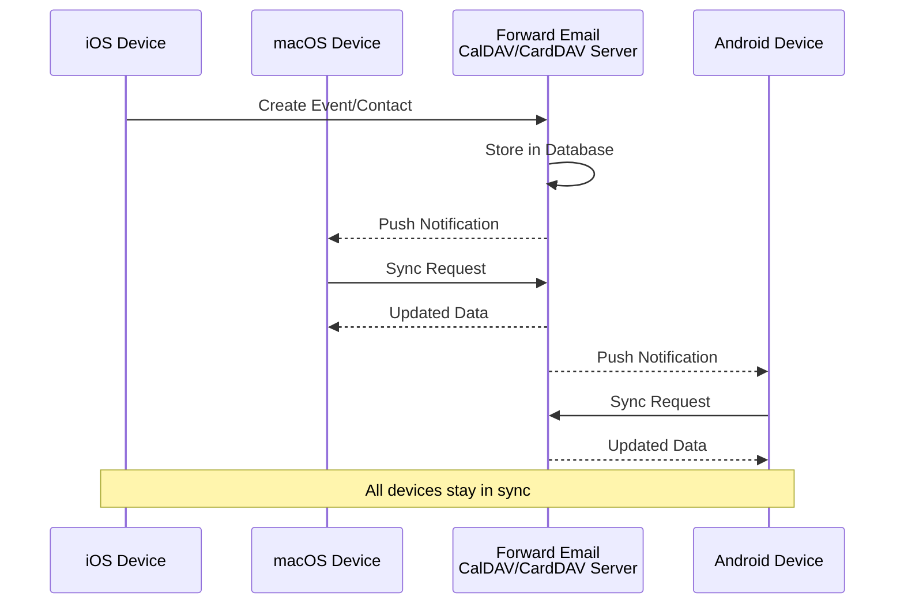

### Rozszerzenia kalendarza NIEOBSŁUGIWANE {#calendaring-extensions-not-supported}

Następujące rozszerzenia kalendarza NIE są obsługiwane:

| RFC                                                       | Tytuł                                                               | Powód                                                           |
| --------------------------------------------------------- | ------------------------------------------------------------------- | --------------------------------------------------------------- |
| [RFC 4918](https://datatracker.ietf.org/doc/html/rfc4918) | HTTP Extensions for Web Distributed Authoring and Versioning (WebDAV) | CalDAV używa koncepcji WebDAV, ale nie implementuje pełnego RFC 4918 |
| [RFC 6578](https://datatracker.ietf.org/doc/html/rfc6578) | Collection Synchronization for WebDAV                               | Nie zaimplementowano                                            |
| [RFC 3744](https://datatracker.ietf.org/doc/html/rfc3744) | WebDAV Access Control Protocol                                      | Nie zaimplementowano                                            |

---


## Filtrowanie wiadomości e-mail {#email-message-filtering}

> \[!IMPORTANT]
> Forward Email zapewnia **pełne wsparcie dla Sieve i ManageSieve** do filtrowania wiadomości po stronie serwera. Twórz potężne reguły do automatycznego sortowania, filtrowania, przekazywania i odpowiadania na przychodzące wiadomości.

### Sieve (RFC 5228) {#sieve-rfc-5228}

[Sieve](https://en.wikipedia.org/wiki/Sieve_\(mail_filtering_language\)) to ustandaryzowany, potężny język skryptowy do filtrowania wiadomości po stronie serwera. Forward Email implementuje kompleksowe wsparcie Sieve z 24 rozszerzeniami.

**Kod źródłowy:** [`helpers/sieve/`](https://github.com/forwardemail/forwardemail.net/tree/master/helpers/sieve)

#### Obsługiwane podstawowe RFC Sieve {#core-sieve-rfcs-supported}

| RFC                                                                                    | Tytuł                                                         | Status         |
| -------------------------------------------------------------------------------------- | ------------------------------------------------------------- | -------------- |
| [RFC 5228](https://datatracker.ietf.org/doc/html/rfc5228)                              | Sieve: Język filtrowania wiadomości e-mail                    | ✅ Pełne wsparcie |
| [RFC 5429](https://datatracker.ietf.org/doc/html/rfc5429)                              | Sieve Email Filtering: Reject and Extended Reject Extensions  | ✅ Pełne wsparcie |
| [RFC 5230](https://datatracker.ietf.org/doc/html/rfc5230)                              | Sieve Email Filtering: Vacation Extension                     | ✅ Pełne wsparcie |
| [RFC 6131](https://datatracker.ietf.org/doc/html/rfc6131)                              | Sieve Vacation Extension: "Seconds" Parameter                 | ✅ Pełne wsparcie |
| [RFC 5232](https://datatracker.ietf.org/doc/html/rfc5232)                              | Sieve Email Filtering: Imap4flags Extension                   | ✅ Pełne wsparcie |
| [RFC 5173](https://datatracker.ietf.org/doc/html/rfc5173)                              | Sieve Email Filtering: Body Extension                         | ✅ Pełne wsparcie |
| [RFC 5229](https://datatracker.ietf.org/doc/html/rfc5229)                              | Sieve Email Filtering: Variables Extension                    | ✅ Pełne wsparcie |
| [RFC 5231](https://datatracker.ietf.org/doc/html/rfc5231)                              | Sieve Email Filtering: Relational Extension                   | ✅ Pełne wsparcie |
| [RFC 4790](https://datatracker.ietf.org/doc/html/rfc4790)                              | Internet Application Protocol Collation Registry              | ✅ Pełne wsparcie |
| [RFC 3894](https://datatracker.ietf.org/doc/html/rfc3894)                              | Sieve Extension: Copying Without Side Effects                 | ✅ Pełne wsparcie |
| [RFC 5293](https://datatracker.ietf.org/doc/html/rfc5293)                              | Sieve Email Filtering: Editheader Extension                   | ✅ Pełne wsparcie |
| [RFC 5260](https://datatracker.ietf.org/doc/html/rfc5260)                              | Sieve Email Filtering: Date and Index Extensions              | ✅ Pełne wsparcie |
| [RFC 5435](https://datatracker.ietf.org/doc/html/rfc5435)                              | Sieve Email Filtering: Extension for Notifications            | ✅ Pełne wsparcie |
| [RFC 5183](https://datatracker.ietf.org/doc/html/rfc5183)                              | Sieve Email Filtering: Environment Extension                  | ✅ Pełne wsparcie |
| [RFC 5490](https://datatracker.ietf.org/doc/html/rfc5490)                              | Sieve Email Filtering: Extensions for Checking Mailbox Status | ✅ Pełne wsparcie |
| [RFC 8579](https://datatracker.ietf.org/doc/html/rfc8579)                              | Sieve Email Filtering: Delivering to Special-Use Mailboxes    | ✅ Pełne wsparcie |
| [RFC 7352](https://datatracker.ietf.org/doc/html/rfc7352)                              | Sieve Email Filtering: Detecting Duplicate Deliveries         | ✅ Pełne wsparcie |
| [RFC 5463](https://datatracker.ietf.org/doc/html/rfc5463)                              | Sieve Email Filtering: Ihave Extension                        | ✅ Pełne wsparcie |
| [RFC 5233](https://datatracker.ietf.org/doc/html/rfc5233)                              | Sieve Email Filtering: Subaddress Extension                   | ✅ Pełne wsparcie |
| [draft-ietf-sieve-regex](https://datatracker.ietf.org/doc/html/draft-ietf-sieve-regex) | Sieve Email Filtering: Regular Expression Extension           | ✅ Pełne wsparcie |
#### Obsługiwane rozszerzenia Sieve {#supported-sieve-extensions}

| Rozszerzenie                 | Opis                                    | Integracja                                  |
| ---------------------------- | ---------------------------------------- | -------------------------------------------- |
| `fileinto`                   | Przenoszenie wiadomości do określonych folderów | Wiadomości przechowywane w wskazanym folderze IMAP |
| `reject` / `ereject`         | Odrzucanie wiadomości z komunikatem o błędzie | Odrzucenie SMTP z wiadomością zwrotną       |
| `vacation`                   | Automatyczne odpowiedzi urlopowe/poza biurem | Kolejkowane przez Emails.queue z ograniczeniem szybkości |
| `vacation-seconds`           | Dokładne interwały odpowiedzi urlopowej | TTL z parametru `:seconds`                   |
| `imap4flags`                 | Ustawianie flag IMAP (\Seen, \Flagged itd.) | Flagi stosowane podczas przechowywania wiadomości |
| `envelope`                   | Testowanie nadawcy/odbiorcy koperty       | Dostęp do danych koperty SMTP                 |
| `body`                       | Testowanie zawartości treści wiadomości  | Dopasowanie pełnego tekstu treści             |
| `variables`                  | Przechowywanie i używanie zmiennych w skryptach | Rozwijanie zmiennych z modyfikatorami         |
| `relational`                 | Porównania relacyjne                      | `:count`, `:value` z gt/lt/eq                  |
| `comparator-i;ascii-numeric` | Porównania numeryczne                     | Porównanie ciągów numerycznych                  |
| `copy`                       | Kopiowanie wiadomości podczas przekierowywania | Flaga `:copy` przy fileinto/redirect           |
| `editheader`                 | Dodawanie lub usuwanie nagłówków wiadomości | Modyfikacja nagłówków przed przechowywaniem   |
| `date`                       | Testowanie wartości daty/czasu            | Testy `currentdate` i daty nagłówka            |
| `index`                      | Dostęp do konkretnych wystąpień nagłówków | `:index` dla nagłówków wielowartościowych      |
| `regex`                      | Dopasowywanie wyrażeń regularnych          | Pełne wsparcie regex w testach                  |
| `enotify`                    | Wysyłanie powiadomień                      | Powiadomienia `mailto:` przez Emails.queue      |
| `environment`                | Dostęp do informacji o środowisku          | Domeny, host, remote-ip z sesji                  |
| `mailbox`                    | Testowanie istnienia skrzynki pocztowej    | Test `mailboxexists`                             |
| `special-use`                | Przenoszenie do specjalnych skrzynek pocztowych | Mapowanie \Junk, \Trash itd. na foldery          |
| `duplicate`                  | Wykrywanie zduplikowanych wiadomości       | Śledzenie duplikatów oparte na Redis             |
| `ihave`                      | Testowanie dostępności rozszerzenia         | Sprawdzanie możliwości w czasie wykonywania     |
| `subaddress`                 | Dostęp do części adresu user+detail         | Części adresu `:user` i `:detail`                 |

#### Rozszerzenia Sieve NIEOBSŁUGIWANE {#sieve-extensions-not-supported}

| Rozszerzenie                               | RFC                                                       | Powód                                                            |
| ------------------------------------------ | --------------------------------------------------------- | ---------------------------------------------------------------- |
| `include`                                 | [RFC 6609](https://datatracker.ietf.org/doc/html/rfc6609) | Ryzyko bezpieczeństwa (wstrzyknięcie skryptu), wymaga globalnego przechowywania skryptów |
| `mboxmetadata` / `servermetadata`          | [RFC 5490](https://datatracker.ietf.org/doc/html/rfc5490) | Wymaga rozszerzenia IMAP METADATA                               |
| `fcc`                                     | [RFC 8580](https://datatracker.ietf.org/doc/html/rfc8580) | Wymaga integracji z folderem Wysłane                            |
| `encoded-character`                       | [RFC 5228](https://datatracker.ietf.org/doc/html/rfc5228) | Wymaga zmian w parserze dla składni ${hex:}                     |
| `foreverypart` / `mime` / `extracttext`   | [RFC 5703](https://datatracker.ietf.org/doc/html/rfc5703) | Złożona manipulacja drzewem MIME                                |
#### Przepływ przetwarzania Sieve {#sieve-processing-flow}

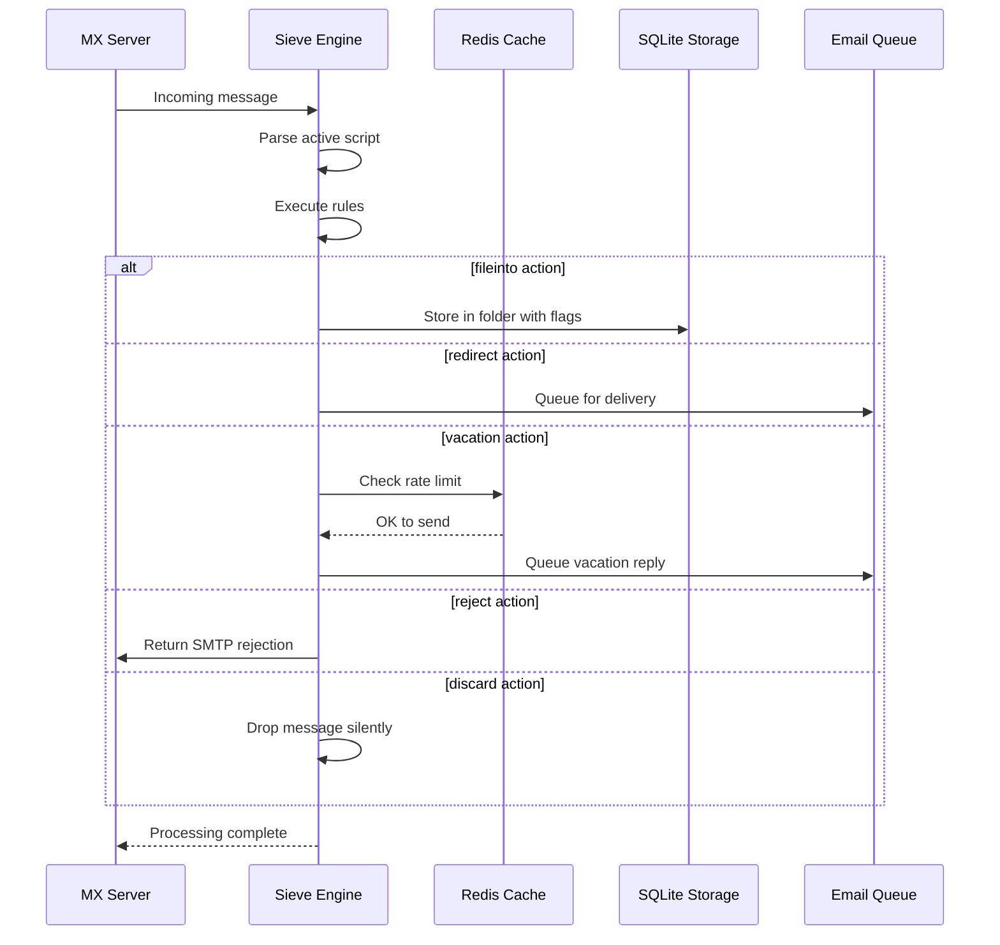

#### Funkcje bezpieczeństwa {#security-features}

Implementacja Sieve w Forward Email zawiera kompleksowe zabezpieczenia:

* **Ochrona przed CVE-2023-26430**: Zapobiega pętlom przekierowań i atakom mail bombing
* **Ograniczenia szybkości**: Limity przekierowań (10/wiadomość, 100/dzień) oraz odpowiedzi wakacyjnych
* **Sprawdzanie denylisty**: Adresy przekierowań sprawdzane względem denylisty
* **Chronione nagłówki**: Nagłówki DKIM, ARC i uwierzytelniania nie mogą być modyfikowane przez editheader
* **Limity rozmiaru skryptu**: Wymuszany maksymalny rozmiar skryptu
* **Limity czasu wykonania**: Skrypty przerywane, jeśli przekroczą limit czasu wykonania

#### Przykładowe skrypty Sieve {#example-sieve-scripts}

**Przenoszenie newsletterów do folderu:**

```sieve
require ["fileinto"];

if header :contains "List-Id" "newsletter" {
    fileinto "Newsletters";
}
```

**Automatyczna odpowiedź wakacyjna z precyzyjnym czasem:**

```sieve
require ["vacation", "vacation-seconds"];

vacation :seconds 3600 :subject "Out of Office"
    "I'm currently away and will respond within 24 hours.";
```

**Filtrowanie spamu z flagami:**

```sieve
require ["fileinto", "imap4flags"];

if header :contains "X-Spam-Status" "Yes" {
    setflag "\\Seen";
    fileinto "Junk";
}
```

**Złożone filtrowanie z użyciem zmiennych:**

```sieve
require ["variables", "fileinto", "regex"];

if header :regex "From" "(.+)@example\\.com" {
    set :lower "sender" "${1}";
    fileinto "Contacts/${sender}";
}
```

> \[!TIP]
> Pełną dokumentację, przykładowe skrypty oraz instrukcje konfiguracji znajdziesz w [FAQ: Czy obsługujecie filtrowanie wiadomości Sieve?](/faq#do-you-support-sieve-email-filtering)

### ManageSieve (RFC 5804) {#managesieve-rfc-5804}

Forward Email zapewnia pełne wsparcie protokołu ManageSieve do zdalnego zarządzania skryptami Sieve.

**Kod źródłowy:** [`managesieve-server.js`](https://github.com/forwardemail/forwardemail.net/blob/master/managesieve-server.js)

| RFC                                                       | Tytuł                                          | Status         |
| --------------------------------------------------------- | ---------------------------------------------- | -------------- |
| [RFC 5804](https://datatracker.ietf.org/doc/html/rfc5804) | Protokół do zdalnego zarządzania skryptami Sieve | ✅ Pełne wsparcie |

#### Konfiguracja serwera ManageSieve {#managesieve-server-configuration}

| Ustawienie              | Wartość                 |
| ----------------------- | ----------------------- |
| **Serwer**              | `imap.forwardemail.net` |
| **Port (STARTTLS)**     | `2190` (zalecany)       |
| **Port (Implicit TLS)** | `4190`                  |
| **Uwierzytelnianie**    | PLAIN (przez TLS)       |

> **Uwaga:** Port 2190 używa STARTTLS (upgrade z plain do TLS) i jest kompatybilny z większością klientów ManageSieve, w tym z [sieve-connect](https://github.com/philpennock/sieve-connect). Port 4190 używa implicit TLS (TLS od początku połączenia) dla klientów, którzy to obsługują.

#### Obsługiwane polecenia ManageSieve {#supported-managesieve-commands}

| Polecenie      | Opis                                   |
| -------------- | ------------------------------------- |
| `AUTHENTICATE` | Uwierzytelnianie za pomocą mechanizmu PLAIN |
| `CAPABILITY`   | Lista możliwości i rozszerzeń serwera |
| `HAVESPACE`    | Sprawdzenie, czy skrypt może zostać zapisany |
| `PUTSCRIPT`    | Przesłanie nowego skryptu             |
| `LISTSCRIPTS`  | Lista wszystkich skryptów z aktywnym statusem |
| `SETACTIVE`    | Aktywacja skryptu                     |
| `GETSCRIPT`    | Pobranie skryptu                      |
| `DELETESCRIPT` | Usunięcie skryptu                    |
| `RENAMESCRIPT` | Zmiana nazwy skryptu                 |
| `CHECKSCRIPT`  | Walidacja składni skryptu             |
| `NOOP`         | Utrzymanie połączenia przy życiu      |
| `LOGOUT`       | Zakończenie sesji                    |
#### Kompatybilni klienci ManageSieve {#compatible-managesieve-clients}

* **Thunderbird**: Wbudowane wsparcie dla Sieve za pomocą [dodatku Sieve](https://addons.thunderbird.net/addon/sieve/)
* **Roundcube**: [wtyczka ManageSieve](https://plugins.roundcube.net/packages/johndoh/sieve)
* **KMail**: Natywne wsparcie ManageSieve
* **sieve-connect**: Klient wiersza poleceń
* **Każdy klient zgodny z RFC 5804**

#### Przebieg protokołu ManageSieve {#managesieve-protocol-flow}

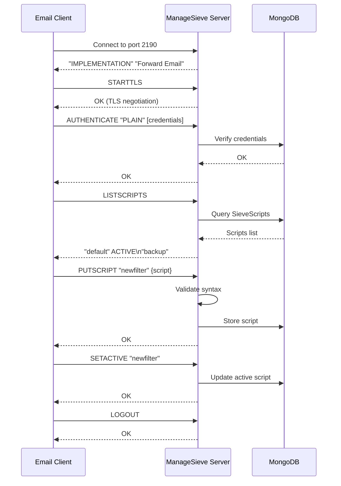

#### Interfejs webowy i API {#web-interface-and-api}

Oprócz ManageSieve, Forward Email oferuje:

* **Panel webowy**: Twórz i zarządzaj skryptami Sieve przez interfejs webowy w Moje konto → Domeny → Aliasy → Skrypty Sieve
* **REST API**: Programowy dostęp do zarządzania skryptami Sieve przez [Forward Email API](/api#sieve-scripts)

> \[!TIP]
> Szczegółowe instrukcje konfiguracji i ustawień klienta znajdziesz w [FAQ: Czy obsługujecie filtrowanie emaili za pomocą Sieve?](/faq#do-you-support-sieve-email-filtering)

---


## Optymalizacja przechowywania {#storage-optimization}

> \[!IMPORTANT]
> **Pierwsza w branży technologia przechowywania:** Forward Email jest **jedynym dostawcą poczty na świecie**, który łączy deduplikację załączników z kompresją Brotli zawartości emaili. Ta dwuwarstwowa optymalizacja daje Ci **2-3 razy więcej efektywnej przestrzeni dyskowej** w porównaniu do tradycyjnych dostawców poczty.

Forward Email wdraża dwie rewolucyjne techniki optymalizacji przechowywania, które drastycznie zmniejszają rozmiar skrzynki pocztowej, zachowując pełną zgodność z RFC i integralność wiadomości:

1. **Deduplikacja załączników** – eliminuje duplikaty załączników we wszystkich emailach
2. **Kompresja Brotli** – zmniejsza zajętość miejsca o 46-86% dla metadanych i 50% dla załączników

### Architektura: Dwuwarstwowa optymalizacja przechowywania {#architecture-dual-layer-storage-optimization}

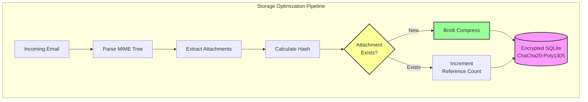

---


## Deduplikacja załączników {#attachment-deduplication}

Forward Email wdraża deduplikację załączników opartą na [sprawdzonym podejściu WildDuck](https://docs.wildduck.email/docs/in-depth/attachment-deduplication/), dostosowanym do przechowywania w SQLite.

> \[!NOTE]
> **Co jest deduplikowane:** „Załącznik” odnosi się do **zakodowanej** zawartości węzła MIME (base64 lub quoted-printable), a nie do zdekodowanego pliku. Zapewnia to zachowanie ważności podpisów DKIM i GPG.

### Jak to działa {#how-it-works}

**Oryginalna implementacja WildDuck (MongoDB GridFS):**

> Serwer IMAP Wild Duck deduplikuje załączniki. „Załącznik” w tym przypadku oznacza zawartość węzła MIME zakodowaną base64 lub quoted-printable, a nie zdekodowany plik. Chociaż użycie zakodowanej zawartości powoduje wiele fałszywych negatywów (ten sam plik w różnych emailach może być liczony jako różne załączniki), jest to konieczne, aby zagwarantować ważność różnych schematów podpisów (DKIM, GPG itd.). Wiadomość pobrana z Wild Duck wygląda dokładnie tak samo jak wiadomość, która została zapisana, mimo że Wild Duck parsuje wiadomość do struktury drzewiastej i odbudowuje wiadomość podczas pobierania.
**Implementacja SQLite w Forward Email:**

Forward Email adaptuje to podejście dla zaszyfrowanego przechowywania SQLite według następującego procesu:

1. **Obliczanie hasha**: Gdy zostanie znaleziony załącznik, hash jest obliczany za pomocą biblioteki [`rev-hash`](https://github.com/sindresorhus/rev-hash) na podstawie treści załącznika
2. **Wyszukiwanie**: Sprawdzenie, czy załącznik o pasującym hashu istnieje w tabeli `Attachments`
3. **Liczenie referencji**:
   * Jeśli istnieje: Zwiększ licznik referencji o 1 oraz licznik magiczny o losową liczbę
   * Jeśli nowy: Utwórz nowy wpis załącznika z licznikiem = 1
4. **Bezpieczeństwo usuwania**: Używa systemu podwójnych liczników (referencyjny + magiczny), aby zapobiec fałszywym trafieniom
5. **Zbieranie śmieci**: Załączniki są usuwane natychmiast, gdy oba liczniki osiągną zero

**Kod źródłowy:** [`helpers/attachment-storage.js`](https://github.com/forwardemail/forwardemail.net/blob/master/helpers/attachment-storage.js)

### Przebieg deduplikacji {#deduplication-flow}

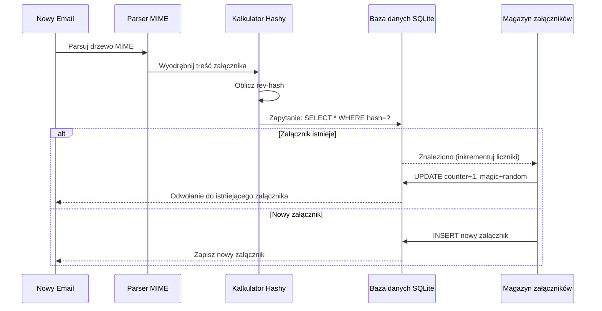

### System liczb magicznych {#magic-number-system}

Forward Email używa systemu "liczb magicznych" WildDuck (zainspirowanego przez [Mail.ru](https://github.com/zone-eu/wildduck)) aby zapobiec fałszywym trafieniom podczas usuwania:

* Każdej wiadomości przypisywana jest **losowa liczba**
* **Licznik magiczny** załącznika jest zwiększany o tę losową liczbę, gdy wiadomość jest dodawana
* Licznik magiczny jest zmniejszany o tę samą liczbę, gdy wiadomość jest usuwana
* Załącznik jest usuwany tylko wtedy, gdy **oba liczniki** (referencyjny + magiczny) osiągną zero

Ten system podwójnych liczników zapewnia, że jeśli coś pójdzie nie tak podczas usuwania (np. awaria, błąd sieci), załącznik nie zostanie usunięty przedwcześnie.

### Kluczowe różnice: WildDuck vs Forward Email {#key-differences-wildduck-vs-forward-email}

| Funkcja                | WildDuck (MongoDB)       | Forward Email (SQLite)       |
| ---------------------- | ------------------------ | ---------------------------- |
| **Backend przechowywania** | MongoDB GridFS (dzielony na kawałki) | SQLite BLOB (bezpośredni)    |
| **Algorytm haszujący** | SHA256                   | rev-hash (oparty na SHA-256) |
| **Liczenie referencji** | ✅ Tak                   | ✅ Tak                       |
| **Liczby magiczne**    | ✅ Tak (Mail.ru zainspirowane) | ✅ Tak (ten sam system)       |
| **Zbieranie śmieci**  | Opóźnione (osobne zadanie) | Natychmiastowe (przy zerowych licznikach) |
| **Kompresja**          | ❌ Brak                  | ✅ Brotli (patrz niżej)       |
| **Szyfrowanie**        | ❌ Opcjonalne            | ✅ Zawsze (ChaCha20-Poly1305) |

---


## Kompresja Brotli {#brotli-compression}

> \[!IMPORTANT]
> **Pierwszy na świecie:** Forward Email jest **jedyną usługą e-mail na świecie**, która używa kompresji Brotli na zawartości e-maili. Zapewnia to **46-86% oszczędności miejsca** oprócz deduplikacji załączników.

Forward Email implementuje kompresję Brotli zarówno dla treści załączników, jak i metadanych wiadomości, zapewniając ogromne oszczędności miejsca przy zachowaniu kompatybilności wstecznej.

**Implementacja:** [`helpers/msgpack-helpers.js`](https://github.com/forwardemail/forwardemail.net/blob/master/helpers/msgpack-helpers.js)

### Co jest kompresowane {#what-gets-compressed}

**1. Treści załączników** (`encodeAttachmentBody`)

* **Stare formaty**: ciąg znaków zakodowany w hex (2x rozmiar) lub surowy Buffer
* **Nowy format**: Buffer skompresowany Brotli z nagłówkiem magicznym "FEBR"
* **Decyzja o kompresji**: Kompresuje tylko jeśli oszczędza miejsce (uwzględnia 4-bajtowy nagłówek)
* **Oszczędności miejsca**: Do **50%** (hex → natywny BLOB)
**2. Metadane wiadomości** (`encodeMetadata`)

Zawiera: `mimeTree`, `headers`, `envelope`, `flags`

* **Stary format**: tekst JSON
* **Nowy format**: bufor skompresowany Brotli
* **Oszczędność miejsca**: **46-86%** w zależności od złożoności wiadomości

### Konfiguracja kompresji {#compression-configuration}

```javascript
// Opcje kompresji Brotli zoptymalizowane pod kątem szybkości (poziom 4 to dobry kompromis)
const BROTLI_COMPRESS_OPTIONS = {
  params: {
    [zlib.constants.BROTLI_PARAM_QUALITY]: 4
  }
};
```

**Dlaczego poziom 4?**

* **Szybka kompresja/dekompresja**: przetwarzanie poniżej milisekundy
* **Dobry współczynnik kompresji**: oszczędność 46-86%
* **Zrównoważona wydajność**: optymalna dla operacji e-mail w czasie rzeczywistym

### Magiczny nagłówek: "FEBR" {#magic-header-febr}

Forward Email używa 4-bajtowego magicznego nagłówka do identyfikacji skompresowanych treści załączników:

```
"FEBR" = Forward Email BRotli
Hex: 0x46 0x45 0x42 0x52
```

**Dlaczego magiczny nagłówek?**

* **Wykrywanie formatu**: natychmiastowa identyfikacja danych skompresowanych i nieskompresowanych
* **Zachowanie kompatybilności wstecznej**: stare ciągi hex i surowe bufory nadal działają
* **Unikanie kolizji**: "FEBR" jest mało prawdopodobne, aby pojawiło się na początku prawidłowych danych załącznika

### Proces kompresji {#compression-process}

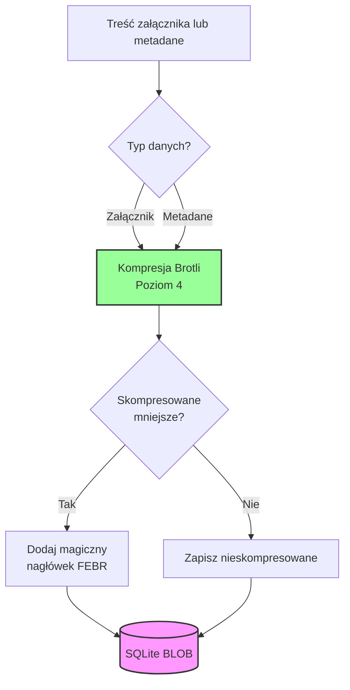

### Proces dekompresji {#decompression-process}

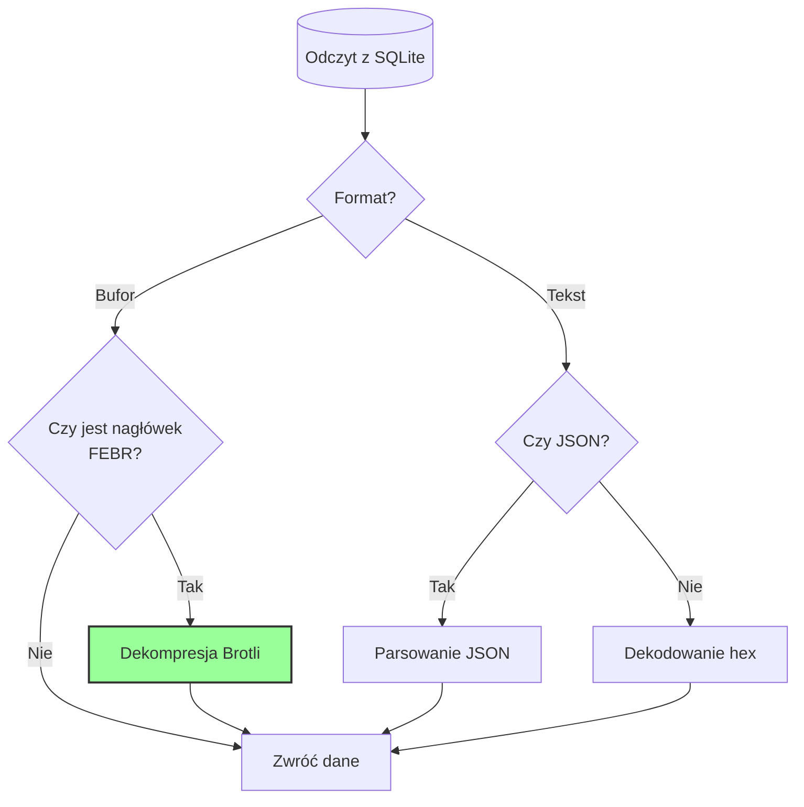

### Kompatybilność wsteczna {#backwards-compatibility}

Wszystkie funkcje dekodujące **automatycznie wykrywają** format przechowywania:

| Format                | Metoda wykrywania                    | Obsługa                                      |
| --------------------- | ----------------------------------- | -------------------------------------------- |
| **Skompresowany Brotli** | Sprawdzenie magicznego nagłówka "FEBR" | Dekompresja za pomocą `zlib.brotliDecompressSync()` |
| **Surowy bufor**        | `Buffer.isBuffer()` bez nagłówka     | Zwrócenie bez zmian                          |
| **Ciąg hex**            | Sprawdzenie parzystej długości + znaki [0-9a-f] | Dekodowanie `Buffer.from(value, 'hex')`      |
| **Ciąg JSON**           | Sprawdzenie pierwszego znaku `{` lub `[` | Parsowanie `JSON.parse()`                     |

Zapewnia to **brak utraty danych** podczas migracji ze starych do nowych formatów przechowywania.

### Statystyki oszczędności miejsca {#storage-savings-statistics}

**Zmierzona oszczędność na podstawie danych produkcyjnych:**

| Typ danych            | Stary format             | Nowy format            | Oszczędność |
| --------------------- | ----------------------- | --------------------- | ----------- |
| **Treści załączników** | ciąg hex (2x)            | skompresowany BLOB Brotli | **50%**     |
| **Metadane wiadomości**| tekst JSON               | skompresowany BLOB Brotli | **46-86%**  |
| **Flagi skrzynki**     | tekst JSON               | skompresowany BLOB Brotli | **60-80%**  |

**Źródło:** [`helpers/migrate-storage-format.js`](https://github.com/forwardemail/forwardemail.net/blob/master/helpers/migrate-storage-format.js)

### Proces migracji {#migration-process}

Forward Email zapewnia automatyczną, idempotentną migrację ze starych do nowych formatów przechowywania:
// Statystyki migracji śledzone:
{
  attachmentsMigrated: 0,
  messagesMigrated: 0,
  mailboxesMigrated: 0,
  bytesSaved: 0  // Całkowita liczba bajtów zaoszczędzonych dzięki kompresji
}
```

**Kroki migracji:**

1. Treści załączników: kodowanie szesnastkowe → natywny BLOB (50% oszczędności)
2. Metadane wiadomości: tekst JSON → BLOB skompresowany Brotli (46-86% oszczędności)
3. Flagi skrzynki pocztowej: tekst JSON → BLOB skompresowany Brotli (60-80% oszczędności)

**Źródło:** [`helpers/migrate-storage-format.js`](https://github.com/forwardemail/forwardemail.net/blob/master/helpers/migrate-storage-format.js)

---

### Wydajność połączonego przechowywania {#combined-storage-efficiency}

> \[!TIP]
> **Rzeczywisty wpływ:** Dzięki deduplikacji załączników + kompresji Brotli użytkownicy Forward Email uzyskują **2-3x bardziej efektywne przechowywanie** w porównaniu do tradycyjnych dostawców poczty.

**Przykładowy scenariusz:**

Tradycyjny dostawca poczty (skrzynka 1GB):

* 1GB miejsca na dysku = 1GB wiadomości
* Brak deduplikacji: Ten sam załącznik przechowywany 10 razy = 10x marnotrawstwo miejsca
* Brak kompresji: Pełne metadane JSON przechowywane = 2-3x marnotrawstwo miejsca

Forward Email (skrzynka 1GB):

* 1GB miejsca na dysku ≈ **2-3GB wiadomości** (efektywne przechowywanie)
* Deduplikacja: Ten sam załącznik przechowywany raz, odwoływany 10 razy
* Kompresja: 46-86% oszczędności na metadanych, 50% na załącznikach
* Szyfrowanie: ChaCha20-Poly1305 (bez narzutu na miejsce)

**Tabela porównawcza:**

| Dostawca          | Technologia przechowywania                   | Efektywne przechowywanie (skrzynka 1GB) |
| ----------------- | -------------------------------------------- | --------------------------------------- |
| Gmail             | Brak                                         | 1GB                                     |
| iCloud            | Brak                                         | 1GB                                     |
| Outlook.com       | Brak                                         | 1GB                                     |
| Fastmail          | Brak                                         | 1GB                                     |
| ProtonMail        | Tylko szyfrowanie                            | 1GB                                     |
| Tutanota          | Tylko szyfrowanie                            | 1GB                                     |
| **Forward Email** | **Deduplikacja + Kompresja + Szyfrowanie**  | **2-3GB** ✨                             |

### Szczegóły technicznej implementacji {#technical-implementation-details}

**Wydajność:**

* Brotli poziom 4: kompresja/dekompresja poniżej milisekundy
* Brak spadku wydajności z powodu kompresji
* SQLite FTS5: wyszukiwanie poniżej 50ms na NVMe SSD

**Bezpieczeństwo:**

* Kompresja odbywa się **po** szyfrowaniu (baza SQLite jest zaszyfrowana)
* Szyfrowanie ChaCha20-Poly1305 + kompresja Brotli
* Zero-knowledge: tylko użytkownik posiada hasło do odszyfrowania

**Zgodność z RFC:**

* Pobierane wiadomości wyglądają **dokładnie tak samo** jak przechowywane
* Podpisy DKIM pozostają ważne (zachowana zakodowana zawartość)
* Podpisy GPG pozostają ważne (brak modyfikacji podpisanej zawartości)

### Dlaczego żaden inny dostawca tego nie robi {#why-no-other-provider-does-this}

**Złożoność:**

* Wymaga głębokiej integracji z warstwą przechowywania
* Trudna kompatybilność wsteczna
* Migracja ze starych formatów jest skomplikowana

**Obawy dotyczące wydajności:**

* Kompresja dodaje obciążenie CPU (rozwiązane dzięki Brotli poziom 4)
* Dekompresja przy każdym odczycie (rozwiązane dzięki cache SQLite)

**Przewaga Forward Email:**

* Zbudowany od podstaw z myślą o optymalizacji
* SQLite pozwala na bezpośrednią manipulację BLOB
* Zaszyfrowane bazy danych na użytkownika umożliwiają bezpieczną kompresję

---

---


## Nowoczesne funkcje {#modern-features}


## Kompletny REST API do zarządzania pocztą {#complete-rest-api-for-email-management}

> \[!TIP]
> Forward Email oferuje kompleksowe REST API z 39 endpointami do programowego zarządzania pocztą.

> \[!TIP]
> **Unikalna cecha branżowa:** W przeciwieństwie do wszystkich innych usług e-mail, Forward Email zapewnia pełny programowy dostęp do Twojej skrzynki, kalendarza, kontaktów, wiadomości i folderów za pomocą kompleksowego REST API. To bezpośrednia interakcja z zaszyfrowanym plikiem bazy SQLite przechowującym wszystkie Twoje dane.

Forward Email oferuje kompletny REST API, który zapewnia bezprecedensowy dostęp do Twoich danych e-mail. Żadna inna usługa e-mail (w tym Gmail, iCloud, Outlook, ProtonMail, Tuta czy Fastmail) nie oferuje takiego poziomu kompleksowego, bezpośredniego dostępu do bazy danych.
**Dokumentacja API:** <https://forwardemail.net/en/email-api>

### Kategorie API (39 punktów końcowych) {#api-categories-39-endpoints}

**1. API Wiadomości** (5 punktów końcowych) - Pełne operacje CRUD na wiadomościach e-mail:

* `GET /v1/messages` - Lista wiadomości z 15+ zaawansowanymi parametrami wyszukiwania (żaden inny serwis tego nie oferuje)
* `POST /v1/messages` - Tworzenie/wysyłanie wiadomości
* `GET /v1/messages/:id` - Pobierz wiadomość
* `PUT /v1/messages/:id` - Aktualizuj wiadomość (flagi, foldery)
* `DELETE /v1/messages/:id` - Usuń wiadomość

*Przykład: Znajdź wszystkie faktury z ostatniego kwartału z załącznikami:*

```bash
curl -u "alias@domain.com:password" \
  "https://api.forwardemail.net/v1/messages?q=subject:invoice+has:attachment+after:2024-01-01+before:2024-04-01"
```

Zobacz [Dokumentację Zaawansowanego Wyszukiwania](https://forwardemail.net/en/email-api)

**2. API Folderów** (5 punktów końcowych) - Pełne zarządzanie folderami IMAP przez REST:

* `GET /v1/folders` - Lista wszystkich folderów
* `POST /v1/folders` - Utwórz folder
* `GET /v1/folders/:id` - Pobierz folder
* `PUT /v1/folders/:id` - Aktualizuj folder
* `DELETE /v1/folders/:id` - Usuń folder

**3. API Kontaktów** (5 punktów końcowych) - Przechowywanie kontaktów CardDAV przez REST:

* `GET /v1/contacts` - Lista kontaktów
* `POST /v1/contacts` - Utwórz kontakt (format vCard)
* `GET /v1/contacts/:id` - Pobierz kontakt
* `PUT /v1/contacts/:id` - Aktualizuj kontakt
* `DELETE /v1/contacts/:id` - Usuń kontakt

**4. API Kalendarzy** (5 punktów końcowych) - Zarządzanie kontenerami kalendarzy:

* `GET /v1/calendars` - Lista kontenerów kalendarzy
* `POST /v1/calendars` - Utwórz kalendarz (np. "Kalendarz Pracy", "Kalendarz Osobisty")
* `GET /v1/calendars/:id` - Pobierz kalendarz
* `PUT /v1/calendars/:id` - Aktualizuj kalendarz
* `DELETE /v1/calendars/:id` - Usuń kalendarz

**5. API Wydarzeń Kalendarza** (5 punktów końcowych) - Planowanie wydarzeń w kalendarzach:

* `GET /v1/calendar-events` - Lista wydarzeń
* `POST /v1/calendar-events` - Utwórz wydarzenie z uczestnikami
* `GET /v1/calendar-events/:id` - Pobierz wydarzenie
* `PUT /v1/calendar-events/:id` - Aktualizuj wydarzenie
* `DELETE /v1/calendar-events/:id` - Usuń wydarzenie

*Przykład: Utwórz wydarzenie w kalendarzu:*

```bash
curl -u "alias@domain.com:password" \
  -X POST \
  -H "Content-Type: application/json" \
  -d '{"title":"Spotkanie zespołu","start":"2024-12-20T10:00:00Z","attendees":["team@example.com"],"calendar_id":"calendar123"}' \
  https://api.forwardemail.net/v1/calendar-events
```

### Szczegóły techniczne {#technical-details}

* **Uwierzytelnianie:** Proste uwierzytelnianie `alias:password` (bez złożoności OAuth)
* **Wydajność:** Czas odpowiedzi poniżej 50 ms dzięki SQLite FTS5 i pamięci NVMe SSD
* **Brak opóźnień sieciowych:** Bezpośredni dostęp do bazy danych, bez pośrednictwa zewnętrznych usług

### Przykłady zastosowań w praktyce {#real-world-use-cases}

* **Analiza e-maili:** Twórz niestandardowe pulpity śledzące wolumen e-maili, czasy odpowiedzi, statystyki nadawców

* **Automatyczne przepływy pracy:** Wyzwalaj akcje na podstawie treści e-maili (przetwarzanie faktur, zgłoszenia wsparcia)

* **Integracja CRM:** Automatyczna synchronizacja rozmów e-mail z CRM

* **Zgodność i odkrywanie:** Wyszukiwanie i eksport e-maili dla wymagań prawnych/zgodności

* **Niestandardowe klienty e-mail:** Twórz specjalistyczne interfejsy e-mail dla swojego workflow

* **Business Intelligence:** Analizuj wzorce komunikacji, wskaźniki odpowiedzi, zaangażowanie klientów

* **Zarządzanie dokumentami:** Automatyczne wyodrębnianie i kategoryzacja załączników

* [Pełna dokumentacja](https://forwardemail.net/en/email-api)

* [Pełny referencyjny API](https://forwardemail.net/en/email-api)

* [Przewodnik po zaawansowanym wyszukiwaniu](https://forwardemail.net/en/email-api)

* [30+ przykładów integracji](https://forwardemail.net/en/email-api)

* [Architektura techniczna](https://forwardemail.net/en/blog/docs/best-quantum-safe-encrypted-email-service)

Forward Email oferuje nowoczesne REST API, które zapewnia pełną kontrolę nad kontami e-mail, domenami, aliasami i wiadomościami. To API stanowi potężną alternatywę dla JMAP i oferuje funkcjonalności wykraczające poza tradycyjne protokoły e-mail.

| Kategoria               | Punkty końcowe | Opis                                   |
| ----------------------- | -------------- | ------------------------------------- |
| **Zarządzanie kontem**  | 8              | Konta użytkowników, uwierzytelnianie, ustawienia |
| **Zarządzanie domeną**  | 12             | Domeny niestandardowe, DNS, weryfikacja |
| **Zarządzanie aliasami**| 6              | Aliasy e-mail, przekierowania, catch-all |
| **Zarządzanie wiadomościami** | 7        | Wysyłanie, odbieranie, wyszukiwanie, usuwanie wiadomości |
| **Kalendarze i kontakty** | 4             | Dostęp CalDAV/CardDAV przez API       |
| **Logi i analityka**    | 2              | Logi e-mail, raporty dostarczenia     |
### Kluczowe funkcje API {#key-api-features}

**Zaawansowane wyszukiwanie:**

API oferuje potężne możliwości wyszukiwania z składnią zapytań podobną do Gmail:

```
GET /v1/messages?q=subject:invoice+has:attachment+after:2024-01-01+before:2024-04-01
```

**Obsługiwane operatory wyszukiwania:**

* `from:` - Wyszukiwanie po nadawcy
* `to:` - Wyszukiwanie po odbiorcy
* `subject:` - Wyszukiwanie po temacie
* `has:attachment` - Wiadomości z załącznikami
* `is:unread` - Nieprzeczytane wiadomości
* `is:starred` - Oznaczone gwiazdką wiadomości
* `after:` - Wiadomości po dacie
* `before:` - Wiadomości przed datą
* `label:` - Wiadomości z etykietą
* `filename:` - Nazwa pliku załącznika

**Zarządzanie wydarzeniami kalendarza:**

```
GET /v1/calendar-events
POST /v1/calendar-events
PUT /v1/calendar-events/:id
DELETE /v1/calendar-events/:id
```

**Integracje Webhook:**

API obsługuje webhooki do powiadomień w czasie rzeczywistym o zdarzeniach e-mail (odebrane, wysłane, zwrócone itp.).

**Uwierzytelnianie:**

* Uwierzytelnianie kluczem API
* Obsługa OAuth 2.0
* Ograniczenie liczby zapytań: 1000 zapytań/godzinę

**Format danych:**

* Żądania/odpowiedzi w formacie JSON
* Projekt RESTful
* Obsługa paginacji

**Bezpieczeństwo:**

* Tylko HTTPS
* Rotacja kluczy API
* Biała lista adresów IP (opcjonalnie)
* Podpisywanie żądań (opcjonalnie)

### Architektura API {#api-architecture}

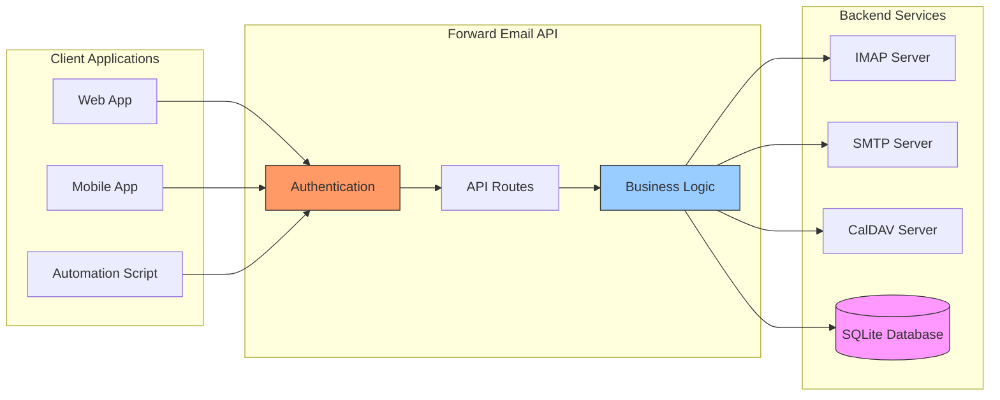

---


## Powiadomienia push iOS {#ios-push-notifications}

> \[!TIP]
> Forward Email obsługuje natywne powiadomienia push iOS przez XAPPLEPUSHSERVICE dla natychmiastowej dostawy e-maili.

> \[!IMPORTANT]
> **Unikalna funkcja:** Forward Email jest jednym z nielicznych otwartoźródłowych serwerów e-mail, które obsługują natywne powiadomienia push iOS dla e-maili, kontaktów i kalendarzy za pomocą rozszerzenia IMAP `XAPPLEPUSHSERVICE`. Zostało to odtworzone na podstawie protokołu Apple i zapewnia natychmiastową dostawę na urządzenia iOS bez zużycia baterii.

Forward Email implementuje własnościowe rozszerzenie Apple XAPPLEPUSHSERVICE, zapewniając natywne powiadomienia push dla urządzeń iOS bez konieczności tła odpytywania.

### Jak to działa {#how-it-works-1}

**XAPPLEPUSHSERVICE** to niestandardowe rozszerzenie IMAP, które pozwala aplikacji Mail na iOS otrzymywać natychmiastowe powiadomienia push, gdy pojawią się nowe e-maile.

Forward Email implementuje własnościową integrację Apple Push Notification service (APNs) dla IMAP, umożliwiając aplikacji Mail na iOS otrzymywanie natychmiastowych powiadomień push o nowych wiadomościach.

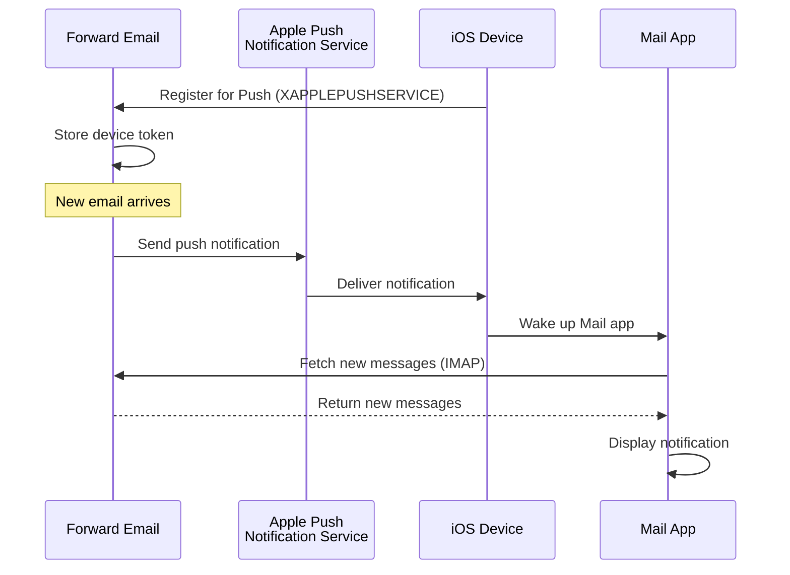

### Kluczowe funkcje {#key-features}

**Natychmiastowa dostawa:**

* Powiadomienia push przychodzą w ciągu sekund
* Brak energochłonnego odpytywania w tle
* Działa nawet gdy aplikacja Mail jest zamknięta

<!---->

* **Natychmiastowa dostawa:** E-maile, wydarzenia kalendarza i kontakty pojawiają się na iPhonie/iPadzie natychmiast, a nie według harmonogramu odpytywania
* **Oszczędność baterii:** Wykorzystuje infrastrukturę push Apple zamiast utrzymywania stałych połączeń IMAP
* **Push oparte na tematach:** Obsługuje powiadomienia push dla konkretnych skrzynek, nie tylko INBOX
* **Brak potrzeby aplikacji firm trzecich:** Działa z natywnymi aplikacjami Mail, Kalendarz i Kontakty na iOS
**Natychmiastowa integracja:**

* Wbudowana w aplikację Mail na iOS
* Nie wymaga aplikacji firm trzecich
* Płynne doświadczenie użytkownika

**Skoncentrowane na prywatności:**

* Tokeny urządzeń są szyfrowane
* Żadna treść wiadomości nie jest przesyłana przez APNS
* Wysyłane jest tylko powiadomienie o "nowej poczcie"

**Efektywność baterii:**

* Brak ciągłego odpytywania IMAP
* Urządzenie śpi do momentu nadejścia powiadomienia
* Minimalny wpływ na baterię

### Co czyni to wyjątkowym {#what-makes-this-special}

> \[!IMPORTANT]
> Większość dostawców poczty nie obsługuje XAPPLEPUSHSERVICE, zmuszając urządzenia iOS do odpytywania o nową pocztę co 15 minut.

Większość serwerów pocztowych open-source (w tym Dovecot, Postfix, Cyrus IMAP) NIE obsługuje powiadomień push na iOS. Użytkownicy muszą albo:

* Korzystać z IMAP IDLE (utrzymuje otwarte połączenie, zużywa baterię)
* Korzystać z odpytywania (sprawdza co 15-30 minut, opóźnione powiadomienia)
* Korzystać z własnych aplikacji pocztowych z własną infrastrukturą push

Forward Email zapewnia takie samo natychmiastowe powiadomienie push jak usługi komercyjne, takie jak Gmail, iCloud i Fastmail.

**Porównanie z innymi dostawcami:**

| Dostawca          | Obsługa push  | Interwał odpytywania | Wpływ na baterię |
| ----------------- | ------------- | -------------------- | ---------------- |
| **Forward Email** | ✅ Natychmiastowy push | Natychmiastowy       | Minimalny        |
| Gmail             | ✅ Natychmiastowy push | Natychmiastowy       | Minimalny        |
| iCloud            | ✅ Natychmiastowy push | Natychmiastowy       | Minimalny        |
| Yahoo             | ✅ Natychmiastowy push | Natychmiastowy       | Minimalny        |
| Outlook.com       | ❌ Odpytywanie         | 15 minut             | Umiarkowany      |
| Fastmail          | ❌ Odpytywanie         | 15 minut             | Umiarkowany      |
| ProtonMail        | ⚠️ Tylko przez Bridge  | Przez Bridge         | Wysoki           |
| Tutanota          | ❌ Tylko aplikacja     | N/D                  | N/D              |

### Szczegóły implementacji {#implementation-details}

**Odpowiedź CAPABILITY IMAP:**

```
* CAPABILITY IMAP4rev1 ... XAPPLEPUSHSERVICE ...
```

**Proces rejestracji:**

1. Aplikacja Mail na iOS wykrywa możliwość XAPPLEPUSHSERVICE
2. Aplikacja rejestruje token urządzenia w Forward Email
3. Forward Email przechowuje token i kojarzy go z kontem
4. Gdy nadejdzie nowa poczta, Forward Email wysyła powiadomienie push przez APNS
5. iOS budzi aplikację Mail, aby pobrała nowe wiadomości

**Bezpieczeństwo:**

* Tokeny urządzeń są szyfrowane w stanie spoczynku
* Tokeny wygasają i są automatycznie odnawiane
* Żadna treść wiadomości nie jest ujawniana APNS
* Zachowane jest szyfrowanie end-to-end

<!---->

* **Rozszerzenie IMAP:** `XAPPLEPUSHSERVICE`
* **Kod źródłowy:** [WildDuck Issue #711](https://github.com/zone-eu/wildduck/issues/711)
* **Konfiguracja:** Automatyczna - brak potrzeby konfiguracji, działa od razu z aplikacją Mail na iOS

### Porównanie z innymi usługami {#comparison-with-other-services}

| Usługa        | Obsługa push na iOS | Metoda                                    |
| ------------- | ------------------- | ----------------------------------------- |
| Forward Email | ✅ Tak              | `XAPPLEPUSHSERVICE` (odwrotna inżynieria) |
| Gmail         | ✅ Tak              | Własna aplikacja Gmail + push Google      |
| iCloud Mail   | ✅ Tak              | Natywna integracja Apple                   |
| Outlook.com   | ✅ Tak              | Własna aplikacja Outlook + push Microsoft |
| Fastmail      | ✅ Tak              | `XAPPLEPUSHSERVICE`                        |
| Dovecot       | ❌ Nie              | Tylko IMAP IDLE lub odpytywanie            |
| Postfix       | ❌ Nie              | Tylko IMAP IDLE lub odpytywanie            |
| Cyrus IMAP    | ❌ Nie              | Tylko IMAP IDLE lub odpytywanie            |

**Push Gmail:**

Gmail używa własnego systemu push, który działa tylko z aplikacją Gmail. Aplikacja Mail na iOS musi odpytywać serwery IMAP Gmaila.

**Push iCloud:**

iCloud ma natywną obsługę push podobną do Forward Email, ale tylko dla adresów @icloud.com.

**Outlook.com:**

Outlook.com nie obsługuje XAPPLEPUSHSERVICE, co wymaga od aplikacji Mail na iOS odpytywania co 15 minut.

**Fastmail:**

Fastmail nie obsługuje XAPPLEPUSHSERVICE. Użytkownicy muszą korzystać z aplikacji Fastmail, aby otrzymywać powiadomienia push lub zaakceptować opóźnienia wynikające z odpytywania co 15 minut.

---


## Testowanie i weryfikacja {#testing-and-verification}


## Testy możliwości protokołu {#protocol-capability-tests}
> \[!NOTE]
> Ta sekcja zawiera wyniki naszych najnowszych testów możliwości protokołu, przeprowadzonych 22 stycznia 2026 roku.

Ta sekcja zawiera rzeczywiste odpowiedzi CAPABILITY/CAPA/EHLO od wszystkich testowanych dostawców. Wszystkie testy zostały przeprowadzone **22 stycznia 2026 roku**.

Testy te pomagają zweryfikować deklarowane i rzeczywiste wsparcie dla różnych protokołów i rozszerzeń poczty elektronicznej wśród głównych dostawców.

### Metodologia testów {#test-methodology}

**Środowisko testowe:**

* **Data:** 22 stycznia 2026 o 02:37 UTC
* **Lokalizacja:** instancja AWS EC2
* **IPv4:** 54.167.216.197
* **IPv6:** 2600:4040:46da:9a00:b19e:3ad4:426c:2f48
* **Narzędzia:** OpenSSL s_client, skrypty bash

**Testowani dostawcy:**

* Forward Email
* Gmail
* Outlook.com
* iCloud
* Fastmail
* Yahoo/AOL (Verizon)

### Skrypty testowe {#test-scripts}

Dla pełnej przejrzystości poniżej podano dokładne skrypty użyte do tych testów.

#### Skrypt testu możliwości IMAP {#imap-capability-test-script}

```bash
#!/bin/bash
# IMAP Capability Test Script
# Tests IMAP CAPABILITY for various email providers

echo "========================================="
echo "IMAP CAPABILITY TEST"
echo "Date: $(date -u +"%Y-%m-%d %H:%M:%S UTC")"
echo "========================================="
echo ""

# Gmail
echo "--- Gmail (imap.gmail.com:993) ---"
echo -e "a001 CAPABILITY\na002 LOGOUT" | timeout 10 openssl s_client -connect imap.gmail.com:993 -crlf -quiet 2>&1 | grep -A 20 "CAPABILITY"
echo ""

# Outlook.com
echo "--- Outlook.com (outlook.office365.com:993) ---"
echo -e "a001 CAPABILITY\na002 LOGOUT" | timeout 10 openssl s_client -connect outlook.office365.com:993 -crlf -quiet 2>&1 | grep -A 20 "CAPABILITY"
echo ""

# iCloud
echo "--- iCloud (imap.mail.me.com:993) ---"
echo -e "a001 CAPABILITY\na002 LOGOUT" | timeout 10 openssl s_client -connect imap.mail.me.com:993 -crlf -quiet 2>&1 | grep -A 20 "CAPABILITY"
echo ""

# Fastmail
echo "--- Fastmail (imap.fastmail.com:993) ---"
echo -e "a001 CAPABILITY\na002 LOGOUT" | timeout 10 openssl s_client -connect imap.fastmail.com:993 -crlf -quiet 2>&1 | grep -A 20 "CAPABILITY"
echo ""

# Yahoo
echo "--- Yahoo (imap.mail.yahoo.com:993) ---"
echo -e "a001 CAPABILITY\na002 LOGOUT" | timeout 10 openssl s_client -connect imap.mail.yahoo.com:993 -crlf -quiet 2>&1 | grep -A 20 "CAPABILITY"
echo ""

# Forward Email
echo "--- Forward Email (imap.forwardemail.net:993) ---"
echo -e "a001 CAPABILITY\na002 LOGOUT" | timeout 10 openssl s_client -connect imap.forwardemail.net:993 -crlf -quiet 2>&1 | grep -A 20 "CAPABILITY"
echo ""

echo "========================================="
echo "Test completed"
echo "========================================="
```

#### Skrypt testu możliwości POP3 {#pop3-capability-test-script}

```bash
#!/bin/bash
# POP3 Capability Test Script
# Tests POP3 CAPA for various email providers

echo "========================================="
echo "POP3 CAPABILITY TEST"
echo "Date: $(date -u +"%Y-%m-%d %H:%M:%S UTC")"
echo "========================================="
echo ""

# Gmail
echo "--- Gmail (pop.gmail.com:995) ---"
echo -e "CAPA\nQUIT" | timeout 10 openssl s_client -connect pop.gmail.com:995 -crlf -quiet 2>&1 | grep -A 20 "CAPA"
echo ""

# Outlook.com
echo "--- Outlook.com (outlook.office365.com:995) ---"
echo -e "CAPA\nQUIT" | timeout 10 openssl s_client -connect outlook.office365.com:995 -crlf -quiet 2>&1 | grep -A 20 "CAPA"
echo ""

# iCloud (Uwaga: iCloud nie obsługuje POP3)
echo "--- iCloud (No POP3 support) ---"
echo "iCloud nie obsługuje POP3"
echo ""

# Fastmail
echo "--- Fastmail (pop.fastmail.com:995) ---"
echo -e "CAPA\nQUIT" | timeout 10 openssl s_client -connect pop.fastmail.com:995 -crlf -quiet 2>&1 | grep -A 20 "CAPA"
echo ""

# Yahoo
echo "--- Yahoo (pop.mail.yahoo.com:995) ---"
echo -e "CAPA\nQUIT" | timeout 10 openssl s_client -connect pop.mail.yahoo.com:995 -crlf -quiet 2>&1 | grep -A 20 "CAPA"
echo ""

# Forward Email
echo "--- Forward Email (pop3.forwardemail.net:995) ---"
echo -e "CAPA\nQUIT" | timeout 10 openssl s_client -connect pop3.forwardemail.net:995 -crlf -quiet 2>&1 | grep -A 20 "CAPA"
echo ""

echo "========================================="
echo "Test completed"
echo "========================================="
```
#### Skrypt testowy możliwości SMTP {#smtp-capability-test-script}

```bash
#!/bin/bash
# Skrypt testowy możliwości SMTP
# Testuje SMTP EHLO dla różnych dostawców poczty

echo "========================================="
echo "TEST MOŻLIWOŚCI SMTP"
echo "Data: $(date -u +"%Y-%m-%d %H:%M:%S UTC")"
echo "========================================="
echo ""

# Gmail
echo "--- Gmail (smtp.gmail.com:587) ---"
echo -e "EHLO test.com\nQUIT" | timeout 10 openssl s_client -connect smtp.gmail.com:587 -starttls smtp -crlf -quiet 2>&1 | grep -A 30 "250-"
echo ""

# Outlook.com
echo "--- Outlook.com (smtp.office365.com:587) ---"
echo -e "EHLO test.com\nQUIT" | timeout 10 openssl s_client -connect smtp.office365.com:587 -starttls smtp -crlf -quiet 2>&1 | grep -A 30 "250-"
echo ""

# iCloud
echo "--- iCloud (smtp.mail.me.com:587) ---"
echo -e "EHLO test.com\nQUIT" | timeout 10 openssl s_client -connect smtp.mail.me.com:587 -starttls smtp -crlf -quiet 2>&1 | grep -A 30 "250-"
echo ""

# Fastmail
echo "--- Fastmail (smtp.fastmail.com:587) ---"
echo -e "EHLO test.com\nQUIT" | timeout 10 openssl s_client -connect smtp.fastmail.com:587 -starttls smtp -crlf -quiet 2>&1 | grep -A 30 "250-"
echo ""

# Yahoo
echo "--- Yahoo (smtp.mail.yahoo.com:587) ---"
echo -e "EHLO test.com\nQUIT" | timeout 10 openssl s_client -connect smtp.mail.yahoo.com:587 -starttls smtp -crlf -quiet 2>&1 | grep -A 30 "250-"
echo ""

# Forward Email
echo "--- Forward Email (smtp.forwardemail.net:587) ---"
echo -e "EHLO test.com\nQUIT" | timeout 10 openssl s_client -connect smtp.forwardemail.net:587 -starttls smtp -crlf -quiet 2>&1 | grep -A 30 "250-"
echo ""

echo "========================================="
echo "Test zakończony"
echo "========================================="
```

### Podsumowanie wyników testu {#test-results-summary}

#### IMAP (MOŻLIWOŚCI) {#imap-capability}

**Forward Email**

```
* CAPABILITY IMAP4rev1 AUTH=PLAIN AUTH=PLAIN-CLIENTTOKEN CHILDREN ENABLE ID IDLE NAMESPACE QUOTA SASL-IR UNSELECT XLIST XAPPLEPUSHSERVICE
```

**Gmail**

```
* CAPABILITY IMAP4rev1 UNSELECT IDLE NAMESPACE QUOTA ID XLIST CHILDREN X-GM-EXT-1 UIDPLUS COMPRESS=DEFLATE ENABLE MOVE CONDSTORE ESEARCH UTF8=ACCEPT LIST-EXTENDED LIST-STATUS LITERAL- SPECIAL-USE
```

**iCloud**

```
* OK [CAPABILITY XAPPLEPUSHSERVICE IMAP4 IMAP4rev1 SASL-IR AUTH=ATOKEN AUTH=PLAIN AUTH=ATOKEN2 AUTH=XOAUTH2]
```

**Outlook.com**

```
* CAPABILITY IMAP4rev1 AUTH=PLAIN AUTH=XOAUTH2 SASL-IR UIDPLUS ID UNSELECT CHILDREN IDLE NAMESPACE LITERAL+
```

**Fastmail**

```
* CAPABILITY IMAP4rev1 ACL ANNOTATE-EXPERIMENT-1 CATENATE CONDSTORE ENABLE ESEARCH ESORT I18NLEVEL=1 ID IDLE LIST-EXTENDED LIST-STATUS LITERAL+ LOGINDISABLED MULTIAPPEND NAMESPACE QRESYNC QUOTA RIGHTS=ektx SASL-IR SORT SPECIAL-USE THREAD=ORDEREDSUBJECT UIDPLUS UNSELECT WITHIN X-RENAME XLIST
```

**Yahoo/AOL (Verizon)**

```
* CAPABILITY IMAP4rev1 IDLE NAMESPACE QUOTA ID XLIST CHILDREN UIDPLUS MOVE CONDSTORE ESEARCH ENABLE LIST-EXTENDED LIST-STATUS LITERAL- SPECIAL-USE UNSELECT XAPPLEPUSHSERVICE
```

#### POP3 (CAPA) {#pop3-capa}

**Forward Email**

```
+OK
CAPA
TOP
USER
UIDL
EXPIRE 30
IMPLEMENTATION ForwardEmail
.
```

**Gmail**

```
+OK
CAPA
TOP
USER
UIDL
EXPIRE 30
IMPLEMENTATION Gpop
.
```

**Outlook.com**

```
+OK
CAPA
TOP
USER
UIDL
SASL PLAIN XOAUTH2
.
```

**Fastmail**

```
+OK
CAPA
TOP
USER
UIDL
EXPIRE 30
IMPLEMENTATION Cyrus
.
```

#### SMTP (EHLO) {#smtp-ehlo}

**Forward Email**

```
250-smtp.forwardemail.net
250-PIPELINING
250-SIZE 52428800
250-ETRN
250-STARTTLS
250-ENHANCEDSTATUSCODES
250-8BITMIME
250-DSN
250 CHUNKING
```

**Gmail**

```
250-smtp.gmail.com at your service
250-SIZE 35882577
250-8BITMIME
250-STARTTLS
250-ENHANCEDSTATUSCODES
250-PIPELINING
250-CHUNKING
250 SMTPUTF8
```

**Outlook.com**

```
250-SN4PR13CA0005.outlook.office365.com Hello [x.x.x.x]
250-SIZE 157286400
250-PIPELINING
250-DSN
250-ENHANCEDSTATUSCODES
250-STARTTLS
250-8BITMIME
250-BINARYMIME
250-CHUNKING
250 SMTPUTF8
```

**Fastmail**

```
250-smtp.fastmail.com
250-PIPELINING
250-SIZE 78643200
250-ETRN
250-STARTTLS
250-ENHANCEDSTATUSCODES
250-8BITMIME
250-DSN
250 CHUNKING
```

**Yahoo/AOL (Verizon)**

```
250-smtp.mail.yahoo.com
250-PIPELINING
250-SIZE 41943040
250-8BITMIME
250-ENHANCEDSTATUSCODES
250-STARTTLS
```
### Szczegółowe Wyniki Testów {#detailed-test-results}

#### Wyniki Testów IMAP {#imap-test-results}

**Gmail:**
`* CAPABILITY IMAP4rev1 UNSELECT IDLE NAMESPACE QUOTA ID XLIST CHILDREN X-GM-EXT-1 XYZZY SASL-IR AUTH=XOAUTH2 AUTH=PLAIN AUTH=PLAIN-CLIENTTOKEN AUTH=OAUTHBEARER`

**Outlook.com:**
`* CAPABILITY IMAP4 IMAP4rev1 AUTH=PLAIN AUTH=XOAUTH2 SASL-IR UIDPLUS ID UNSELECT CHILDREN IDLE NAMESPACE LITERAL+`

**iCloud:**
`* CAPABILITY XAPPLEPUSHSERVICE IMAP4 IMAP4rev1 SASL-IR AUTH=ATOKEN AUTH=PLAIN AUTH=ATOKEN2 AUTH=XOAUTH2`

**Fastmail:**
Połączenie przekroczyło limit czasu. Zobacz uwagi poniżej.

**Yahoo:**
`* CAPABILITY IMAP4rev1 SASL-IR AUTH=PLAIN AUTH=XOAUTH2 AUTH=OAUTHBEARER ID MOVE NAMESPACE XYMHIGHESTMODSEQ UIDPLUS LITERAL+ CHILDREN UNSELECT X-MSG-EXT OBJECTID IDLE ENABLE UIDONLY X-ALL-MAIL X-UIDONLY LIST-EXTENDED LIST-STATUS SPECIAL-USE PARTIAL APPENDLIMIT=41697280`

**Forward Email:**
`* CAPABILITY XAPPLEPUSHSERVICE IMAP4rev1 APPENDLIMIT=52428800 AUTH=PLAIN AUTH=PLAIN-CLIENTTOKEN CHILDREN CONDSTORE ENABLE ID IDLE MOVE NAMESPACE QUOTA SASL-IR SPECIAL-USE UIDPLUS UNSELECT UTF8=ACCEPT XLIST`

#### Wyniki Testów POP3 {#pop3-test-results}

**Gmail:**
Połączenie nie zwróciło odpowiedzi CAPA bez uwierzytelnienia.

**Outlook.com:**
Połączenie nie zwróciło odpowiedzi CAPA bez uwierzytelnienia.

**iCloud:**
Nieobsługiwane.

**Fastmail:**
Połączenie przekroczyło limit czasu. Zobacz uwagi poniżej.

**Yahoo:**
`+OK CAPA list follows... SASL PLAIN XOAUTH2`

**Forward Email:**
Połączenie nie zwróciło odpowiedzi CAPA bez uwierzytelnienia.

#### Wyniki Testów SMTP {#smtp-test-results}

**Gmail:**
`250-AUTH LOGIN PLAIN XOAUTH2 PLAIN-CLIENTTOKEN OAUTHBEARER XOAUTH`

**Outlook.com:**
`250-DSN`

**iCloud:**
`250-DSN`

**Fastmail:**
`250 AUTH PLAIN LOGIN XOAUTH2 OAUTHBEARER`

**Yahoo:**
`250 AUTH PLAIN LOGIN XOAUTH2 OAUTHBEARER`

**Forward Email:**
`250-DSN`, `250-REQUIRETLS`

### Uwagi do Wyników Testów {#notes-on-test-results}

> \[!NOTE]
> Ważne obserwacje i ograniczenia wynikające z testów.

1. **Timeouty Fastmail**: Połączenia z Fastmail przekroczyły limit czasu podczas testów, prawdopodobnie z powodu ograniczeń szybkości lub zapór sieciowych na IP serwera testowego. Fastmail jest znany z solidnego wsparcia IMAP/POP3/SMTP na podstawie ich dokumentacji.

2. **Odpowiedzi CAPA POP3**: Kilku dostawców (Gmail, Outlook.com, Forward Email) nie zwróciło odpowiedzi CAPA bez uwierzytelnienia. Jest to powszechna praktyka bezpieczeństwa dla serwerów POP3.

3. **Wsparcie DSN**: Tylko Outlook.com, iCloud i Forward Email wyraźnie reklamują wsparcie DSN w odpowiedziach SMTP EHLO. Nie oznacza to, że inni dostawcy nie obsługują DSN, ale nie reklamują tego.

4. **REQUIRETLS**: Tylko Forward Email wyraźnie reklamuje wsparcie REQUIRETLS z widocznym dla użytkownika polem wyboru wymuszającym TLS. Inni dostawcy mogą to wspierać wewnętrznie, ale nie reklamują tego w EHLO.

5. **Środowisko testowe**: Testy przeprowadzono z instancji AWS EC2 (IP: 54.167.216.197 IPv4, 2600:4040:46da:9a00:b19e:3ad4:426c:2f48 IPv6) 22 stycznia 2026 o 02:37 UTC.

---


## Podsumowanie {#summary}

Forward Email zapewnia kompleksowe wsparcie protokołów RFC dla wszystkich głównych standardów pocztowych:

* **IMAP4rev1:** 16 obsługiwanych RFC z udokumentowanymi celowymi różnicami
* **POP3:** 4 obsługiwane RFC z usuwaniem trwałym zgodnym z RFC
* **SMTP:** 11 obsługiwanych rozszerzeń, w tym SMTPUTF8, DSN i PIPELINING
* **Uwierzytelnianie:** Pełne wsparcie DKIM, SPF, DMARC, ARC
* **Bezpieczeństwo transportu:** Pełne wsparcie MTA-STS i REQUIRETLS, częściowe wsparcie DANE
* **Szyfrowanie:** Wsparcie OpenPGP v6 i S/MIME
* **Kalendarze:** Pełne wsparcie CalDAV, CardDAV i VTODO
* **Dostęp API:** Kompletny REST API z 39 punktami końcowymi do bezpośredniego dostępu do bazy danych
* **Push iOS:** Natychmiastowe powiadomienia push dla poczty, kontaktów i kalendarzy przez `XAPPLEPUSHSERVICE`

### Kluczowe Cechy Wyróżniające {#key-differentiators}

> \[!TIP]
> Forward Email wyróżnia się unikalnymi funkcjami, których nie znajdziesz u innych dostawców.

**Co wyróżnia Forward Email:**

1. **Szyfrowanie Quantum-Safe** – jedyny dostawca z zaszyfrowanymi skrzynkami SQLite ChaCha20-Poly1305
2. **Architektura Zero-Knowledge** – Twoje hasło szyfruje skrzynkę; nie możemy jej odszyfrować
3. **Darmowe domeny niestandardowe** – brak miesięcznych opłat za e-mail na własnej domenie
4. **Wsparcie REQUIRETLS** – widoczne dla użytkownika pole wyboru wymuszające TLS na całej ścieżce dostarczenia
5. **Kompleksowe API** – 39 punktów końcowych REST API do pełnej kontroli programistycznej
6. **Powiadomienia push iOS** – natywne wsparcie XAPPLEPUSHSERVICE dla natychmiastowej dostawy
7. **Open Source** – pełny kod źródłowy dostępny na GitHub
8. **Skupienie na prywatności** – brak analizy danych, brak reklam, brak śledzenia
* **Szyfrowanie w piaskownicy:** Jedyna usługa e-mail z indywidualnie szyfrowanymi skrzynkami SQLite  
* **Zgodność z RFC:** Priorytetem jest zgodność ze standardami nad wygodą (np. POP3 DELE)  
* **Kompletny API:** Bezpośredni dostęp programistyczny do wszystkich danych e-mail  
* **Open Source:** W pełni przejrzysta implementacja  

**Podsumowanie wsparcia protokołów:**  

| Kategoria            | Poziom wsparcia | Szczegóły                                      |
| -------------------- | --------------- | ---------------------------------------------- |
| **Protokoły podstawowe** | ✅ Doskonałe    | Pełne wsparcie IMAP4rev1, POP3, SMTP           |
| **Protokoły nowoczesne** | ⚠️ Częściowe   | Częściowe wsparcie IMAP4rev2, brak wsparcia JMAP |
| **Bezpieczeństwo**    | ✅ Doskonałe    | DKIM, SPF, DMARC, ARC, MTA-STS, REQUIRETLS     |
| **Szyfrowanie**       | ✅ Doskonałe    | OpenPGP, S/MIME, szyfrowanie SQLite             |
| **CalDAV/CardDAV**    | ✅ Doskonałe    | Pełna synchronizacja kalendarza i kontaktów     |
| **Filtrowanie**       | ✅ Doskonałe    | Sieve (24 rozszerzenia) oraz ManageSieve        |
| **API**               | ✅ Doskonałe    | 39 punktów końcowych REST API                    |
| **Push**              | ✅ Doskonałe    | Natywne powiadomienia push na iOS                |
