# Suporte a Protocolos RFC de Email - Guia Completo de Padrões e Especificações {#email-rfc-protocol-support---complete-standards--specifications-guide}


## Índice {#table-of-contents}

* [Sobre Este Documento](#about-this-document)
  * [Visão Geral da Arquitetura](#architecture-overview)
* [Comparação de Serviços de Email - Suporte a Protocolos & Conformidade com Padrões RFC](#email-service-comparison---protocol-support--rfc-standards-compliance)
  * [Visualização do Suporte a Protocolos](#protocol-support-visualization)
* [Protocolos Principais de Email](#core-email-protocols)
  * [Fluxo do Protocolo de Email](#email-protocol-flow)
* [Protocolo de Email IMAP4 e Extensões](#imap4-email-protocol-and-extensions)
  * [Diferenças do Protocolo IMAP em Relação às Especificações RFC](#imap-protocol-differences-from-rfc-specifications)
  * [Extensões IMAP NÃO Suportadas](#imap-extensions-not-supported)
* [Protocolo de Email POP3 e Extensões](#pop3-email-protocol-and-extensions)
  * [Diferenças do Protocolo POP3 em Relação às Especificações RFC](#pop3-protocol-differences-from-rfc-specifications)
  * [Extensões POP3 NÃO Suportadas](#pop3-extensions-not-supported)
* [Protocolo de Email SMTP e Extensões](#smtp-email-protocol-and-extensions)
  * [Notificações de Status de Entrega (DSN)](#delivery-status-notifications-dsn)
  * [Suporte REQUIRETLS](#requiretls-support)
  * [Extensões SMTP NÃO Suportadas](#smtp-extensions-not-supported)
* [Protocolo de Email JMAP](#jmap-email-protocol)
* [Segurança de Email](#email-security)
  * [Arquitetura de Segurança de Email](#email-security-architecture)
* [Protocolos de Autenticação de Mensagens de Email](#email-message-authentication-protocols)
  * [Suporte a Protocolos de Autenticação](#authentication-protocol-support)
  * [DKIM (DomainKeys Identified Mail)](#dkim-domainkeys-identified-mail)
  * [SPF (Sender Policy Framework)](#spf-sender-policy-framework)
  * [DMARC (Autenticação, Relatórios e Conformidade Baseados em Domínio)](#dmarc-domain-based-message-authentication-reporting--conformance)
  * [ARC (Authenticated Received Chain)](#arc-authenticated-received-chain)
  * [Fluxo de Autenticação](#authentication-flow)
* [Protocolos de Segurança no Transporte de Email](#email-transport-security-protocols)
  * [Suporte à Segurança no Transporte](#transport-security-support)
  * [TLS (Transport Layer Security)](#tls-transport-layer-security)
  * [MTA-STS (Mail Transfer Agent Strict Transport Security)](#mta-sts-mail-transfer-agent-strict-transport-security)
  * [DANE (Autenticação DNS de Entidades Nomeadas)](#dane-dns-based-authentication-of-named-entities)
  * [REQUIRETLS](#requiretls)
  * [Fluxo de Segurança no Transporte](#transport-security-flow)
* [Criptografia de Mensagens de Email](#email-message-encryption)
  * [Suporte à Criptografia](#encryption-support)
  * [OpenPGP (Pretty Good Privacy)](#openpgp-pretty-good-privacy)
  * [S/MIME (Secure/Multipurpose Internet Mail Extensions)](#smime-securemultipurpose-internet-mail-extensions)
  * [Criptografia de Caixa Postal SQLite](#sqlite-mailbox-encryption)
  * [Comparação de Criptografia](#encryption-comparison)
  * [Fluxo de Criptografia](#encryption-flow)
* [Funcionalidade Estendida](#extended-functionality)
* [Padrões de Formato de Mensagem de Email](#email-message-format-standards)
  * [Suporte a Padrões de Formato](#format-standards-support)
  * [MIME (Multipurpose Internet Mail Extensions)](#mime-multipurpose-internet-mail-extensions)
  * [SMTPUTF8 e Internacionalização de Endereços de Email](#smtputf8-and-email-address-internationalization)
* [Protocolos de Calendário e Contatos](#calendaring-and-contacts-protocols)
  * [Suporte CalDAV e CardDAV](#caldav-and-carddav-support)
  * [CalDAV (Acesso a Calendário)](#caldav-calendar-access)
  * [CardDAV (Acesso a Contatos)](#carddav-contact-access)
  * [Tarefas e Lembretes (CalDAV VTODO)](#tasks-and-reminders-caldav-vtodo)
  * [Fluxo de Sincronização CalDAV/CardDAV](#caldavcarddav-synchronization-flow)
  * [Extensões de Calendário NÃO Suportadas](#calendaring-extensions-not-supported)
* [Filtragem de Mensagens de Email](#email-message-filtering)
  * [Sieve (RFC 5228)](#sieve-rfc-5228)
  * [ManageSieve (RFC 5804)](#managesieve-rfc-5804)
* [Otimização de Armazenamento](#storage-optimization)
  * [Arquitetura: Otimização de Armazenamento em Duas Camadas](#architecture-dual-layer-storage-optimization)
* [Desduplicação de Anexos](#attachment-deduplication)
  * [Como Funciona](#how-it-works)
  * [Fluxo de Desduplicação](#deduplication-flow)
  * [Sistema de Número Mágico](#magic-number-system)
  * [Principais Diferenças: WildDuck vs Forward Email](#key-differences-wildduck-vs-forward-email)
* [Compressão Brotli](#brotli-compression)
  * [O Que é Comprimido](#what-gets-compressed)
  * [Configuração de Compressão](#compression-configuration)
  * [Cabeçalho Mágico: "FEBR"](#magic-header-febr)
  * [Processo de Compressão](#compression-process)
  * [Processo de Descompressão](#decompression-process)
  * [Compatibilidade Retroativa](#backwards-compatibility)
  * [Estatísticas de Economia de Armazenamento](#storage-savings-statistics)
  * [Processo de Migração](#migration-process)
  * [Eficiência Combinada de Armazenamento](#combined-storage-efficiency)
  * [Detalhes Técnicos da Implementação](#technical-implementation-details)
  * [Por Que Nenhum Outro Provedor Faz Isso](#why-no-other-provider-does-this)
* [Recursos Modernos](#modern-features)
* [API REST Completa para Gerenciamento de Email](#complete-rest-api-for-email-management)
  * [Categorias da API (39 Endpoints)](#api-categories-39-endpoints)
  * [Detalhes Técnicos](#technical-details)
  * [Casos de Uso no Mundo Real](#real-world-use-cases)
  * [Principais Recursos da API](#key-api-features)
  * [Arquitetura da API](#api-architecture)
* [Notificações Push iOS](#ios-push-notifications)
  * [Como Funciona](#how-it-works-1)
  * [Principais Recursos](#key-features)
  * [O Que Torna Isso Especial](#what-makes-this-special)
  * [Detalhes da Implementação](#implementation-details)
  * [Comparação com Outros Serviços](#comparison-with-other-services)
* [Testes e Verificação](#testing-and-verification)
* [Testes de Capacidade de Protocolo](#protocol-capability-tests)
  * [Metodologia de Teste](#test-methodology)
  * [Scripts de Teste](#test-scripts)
  * [Resumo dos Resultados dos Testes](#test-results-summary)
  * [Resultados Detalhados dos Testes](#detailed-test-results)
  * [Notas Sobre os Resultados dos Testes](#notes-on-test-results)
* [Resumo](#summary)
  * [Principais Diferenciais](#key-differentiators)
## Sobre Este Documento {#about-this-document}

Este documento descreve o suporte ao protocolo RFC (Request for Comments) para o Forward Email. Como o Forward Email utiliza o [WildDuck](https://github.com/nodemailer/wildduck) nos bastidores para a funcionalidade IMAP/POP3, o suporte ao protocolo e as limitações documentadas aqui refletem a implementação do WildDuck.

> \[!IMPORTANT]
> O Forward Email usa [SQLite](https://sqlite.org/) para armazenamento de mensagens em vez do MongoDB (que o WildDuck usava originalmente). Isso afeta certos detalhes de implementação documentados abaixo.

**Código Fonte:** <https://github.com/forwardemail/forwardemail.net>

### Visão Geral da Arquitetura {#architecture-overview}

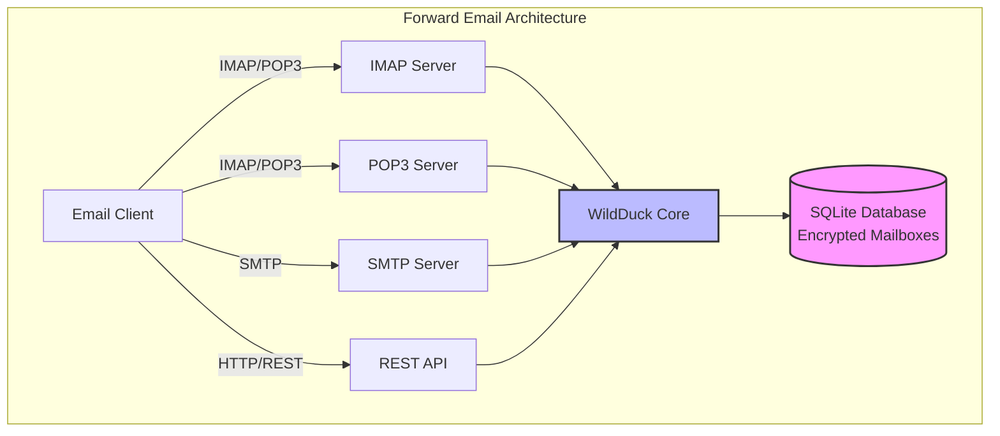

---


## Comparação de Serviços de Email - Suporte a Protocolos & Conformidade com Padrões RFC {#email-service-comparison---protocol-support--rfc-standards-compliance}

> \[!IMPORTANT]
> **Criptografia Sandboxed e Resistente a Computação Quântica:** O Forward Email é o único serviço de email que armazena caixas postais SQLite individualmente criptografadas usando sua senha (que só você possui). Cada caixa postal é criptografada com [sqleet](https://github.com/resilar/sqleet) (ChaCha20-Poly1305), autocontida, sandboxed e portátil. Se você esquecer sua senha, perde sua caixa postal - nem mesmo o Forward Email pode recuperá-la. Veja [Email Criptografado Seguro contra Computação Quântica](https://forwardemail.net/en/blog/docs/best-quantum-safe-encrypted-email-service) para detalhes.

Compare o suporte a protocolos de email e a implementação dos padrões RFC entre os principais provedores de email:

| Recurso                      | Forward Email                                                                                  | Postfix/Dovecot                                                                    | Gmail                                                                             | iCloud Mail                                           | Outlook.com                                                                                                                                                          | Fastmail                                                                                 | Yahoo/AOL (Verizon)                                                  | ProtonMail                                                                     | Tutanota                                                          |
| ---------------------------- | ---------------------------------------------------------------------------------------------- | ---------------------------------------------------------------------------------- | --------------------------------------------------------------------------------- | ----------------------------------------------------- | -------------------------------------------------------------------------------------------------------------------------------------------------------------------- | ---------------------------------------------------------------------------------------- | -------------------------------------------------------------------- | ------------------------------------------------------------------------------ | ----------------------------------------------------------------- |
| **Preço Domínio Personalizado** | [Grátis](https://forwardemail.net/en/pricing)                                                  | [Grátis](https://www.postfix.org/)                                                 | [$7.20/mês](https://workspace.google.com/pricing)                                | [$0.99/mês](https://support.apple.com/en-us/102622)    | [$7.20/mês](https://www.microsoft.com/en-us/microsoft-365/business/microsoft-365-business-basic)                                                                      | [$5/mês](https://www.fastmail.com/pricing/)                                               | [$3.19/mês](https://www.turbify.com/mail)                             | [$4.99/mês](https://proton.me/mail/pricing)                                     | [$3.27/mês](https://tuta.com/pricing)                              |
| **IMAP4rev1 (RFC 3501)**     | ✅ [Suportado](#imap4-email-protocol-and-extensions)                                            | ✅ [Suportado](https://www.dovecot.org/)                                          | ✅ [Suportado](https://developers.google.com/workspace/gmail/imap/imap-extensions) | ✅ [Suportado](https://support.apple.com/en-us/102431) | ✅ [Suportado](https://support.microsoft.com/en-us/office/pop-imap-and-smtp-settings-for-outlook-com-d088b986-291d-42b8-9564-9c414e2aa040)                            | ✅ [Suportado](https://www.fastmail.help/hc/en-us/articles/1500000278382-Email-standards) | ✅ [Suportado](https://senders.yahooinc.com/developer/documentation/) | ⚠️ [Via Bridge](https://proton.me/support/imap-smtp-and-pop3-setup)            | ❌ Não Suportado                                                 |
| **IMAP4rev2 (RFC 9051)**     | ⚠️ [Parcial](https://forwardemail.net/en/blog/docs/best-quantum-safe-encrypted-email-service)  | ⚠️ [Parcial](https://www.dovecot.org/)                                           | ⚠️ [31%](https://developers.google.com/workspace/gmail/imap/imap-extensions)      | ⚠️ [92%](https://support.apple.com/en-us/102431)      | ⚠️ [46%](https://support.microsoft.com/en-us/office/pop-imap-and-smtp-settings-for-outlook-com-d088b986-291d-42b8-9564-9c414e2aa040)                                 | ⚠️ [69%](https://www.fastmail.help/hc/en-us/articles/1500000278382-Email-standards)      | ⚠️ [85%](https://senders.yahooinc.com/developer/documentation/)      | ⚠️ [Via Bridge](https://proton.me/support/imap-smtp-and-pop3-setup)            | ❌ Não Suportado                                                 |
| **POP3 (RFC 1939)**          | ✅ [Suportado](#pop3-email-protocol-and-extensions)                                             | ✅ [Suportado](https://www.dovecot.org/)                                          | ✅ [Suportado](https://support.google.com/mail/answer/7104828)                   | ❌ Não Suportado                                     | ✅ [Suportado](https://support.microsoft.com/en-us/office/pop-imap-and-smtp-settings-for-outlook-com-d088b986-291d-42b8-9564-9c414e2aa040)                            | ✅ [Suportado](https://www.fastmail.help/hc/en-us/articles/1500000278382-Email-standards) | ✅ [Suportado](https://help.yahoo.com/kb/SLN4075.html)                | ⚠️ [Via Bridge](https://proton.me/support/imap-smtp-and-pop3-setup)            | ❌ Não Suportado                                                 |
| **SMTP (RFC 5321)**          | ✅ [Suportado](#smtp-email-protocol-and-extensions)                                             | ✅ [Suportado](https://www.postfix.org/)                                          | ✅ [Suportado](https://support.google.com/mail/answer/7126229)                   | ✅ [Suportado](https://support.apple.com/en-us/102431) | ✅ [Suportado](https://support.microsoft.com/en-us/office/pop-imap-and-smtp-settings-for-outlook-com-d088b986-291d-42b8-9564-9c414e2aa040)                            | ✅ [Suportado](https://www.fastmail.help/hc/en-us/articles/1500000278382-Email-standards) | ✅ [Suportado](https://help.yahoo.com/kb/SLN4075.html)                | ⚠️ [Via Bridge](https://proton.me/support/imap-smtp-and-pop3-setup)            | ❌ Não Suportado                                                 |
| **JMAP (RFC 8620)**          | ❌ [Não Suportado](#jmap-email-protocol)                                                        | ❌ Não Suportado                                                                  | ❌ Não Suportado                                                                 | ❌ Não Suportado                                     | ❌ Não Suportado                                                                                                                                                      | ✅ [Suportado](https://www.fastmail.com/dev/)                                             | ❌ Não Suportado                                                    | ❌ Não Suportado                                                              | ❌ Não Suportado                                                 |
| **DKIM (RFC 6376)**          | ✅ [Suportado](#email-message-authentication-protocols)                                         | ✅ [Suportado](https://github.com/trusteddomainproject/OpenDKIM)                  | ✅ [Suportado](https://support.google.com/a/answer/174124)                       | ✅ [Suportado](https://support.apple.com/en-us/102431) | ✅ [Suportado](https://learn.microsoft.com/en-us/defender-office-365/email-authentication-dkim-configure)                                                             | ✅ [Suportado](https://www.fastmail.help/hc/en-us/articles/360060590573)                  | ✅ [Suportado](https://help.yahoo.com/kb/SLN25426.html)             | ✅ [Suportado](https://proton.me/support)                                       | ✅ [Suportado](https://tuta.com/support#dkim)                    |
| **SPF (RFC 7208)**           | ✅ [Suportado](#email-message-authentication-protocols)                                         | ✅ [Suportado](https://www.postfix.org/)                                          | ✅ [Suportado](https://support.google.com/a/answer/33786)                        | ✅ [Suportado](https://support.apple.com/en-us/102431) | ✅ [Suportado](https://learn.microsoft.com/en-us/microsoft-365/security/office-365-security/how-office-365-uses-spf-to-prevent-spoofing)                              | ✅ [Suportado](https://www.fastmail.help/hc/en-us/articles/360060590573)                  | ✅ [Suportado](https://help.yahoo.com/kb/SLN25426.html)             | ✅ [Suportado](https://proton.me/support)                                       | ✅ [Suportado](https://tuta.com/support#dkim)                    |
| **DMARC (RFC 7489)**         | ✅ [Suportado](#email-message-authentication-protocols)                                         | ✅ [Suportado](https://www.postfix.org/)                                          | ✅ [Suportado](https://support.google.com/a/answer/2466580)                      | ✅ [Suportado](https://support.apple.com/en-us/102431) | ✅ [Suportado](https://learn.microsoft.com/en-us/microsoft-365/security/office-365-security/use-dmarc-to-validate-email)                                              | ✅ [Suportado](https://www.fastmail.help/hc/en-us/articles/360060590573)                  | ✅ [Suportado](https://help.yahoo.com/kb/SLN25426.html)             | ✅ [Suportado](https://proton.me/support)                                       | ✅ [Suportado](https://tuta.com/support#dkim)                    |
| **ARC (RFC 8617)**           | ✅ [Suportado](#email-message-authentication-protocols)                                         | ✅ [Suportado](https://github.com/trusteddomainproject/OpenARC)                   | ✅ [Suportado](https://support.google.com/a/answer/2466580)                      | ❌ Não Suportado                                     | ✅ [Suportado](https://learn.microsoft.com/en-us/defender-office-365/email-authentication-arc-configure)                                                              | ✅ [Suportado](https://www.fastmail.help/hc/en-us/articles/360060590573)                  | ✅ [Suportado](https://senders.yahooinc.com/developer/documentation/) | ✅ [Suportado](https://proton.me/blog/what-is-authenticated-received-chain-arc) | ❌ Não Suportado                                                 |
| **MTA-STS (RFC 8461)**       | ✅ [Suportado](#email-transport-security-protocols)                                             | ✅ [Suportado](https://www.postfix.org/)                                          | ✅ [Suportado](https://support.google.com/a/answer/9261504)                      | ✅ [Suportado](https://support.apple.com/en-us/102431) | ✅ [Suportado](https://learn.microsoft.com/en-us/defender-office-365/email-authentication-about)                                                                      | ✅ [Suportado](https://www.fastmail.help/hc/en-us/articles/360060590573)                  | ✅ [Suportado](https://senders.yahooinc.com/developer/documentation/) | ✅ [Suportado](https://proton.me/support)                                       | ✅ [Suportado](https://tuta.com/security)                        |
| **DANE (RFC 7671)**          | ✅ [Suportado](#email-transport-security-protocols)                                             | ✅ [Suportado](https://www.postfix.org/)                                          | ❌ Não Suportado                                                                 | ❌ Não Suportado                                     | ❌ Não Suportado                                                                                                                                                      | ❌ Não Suportado                                                                        | ❌ Não Suportado                                                    | ✅ [Suportado](https://proton.me/support)                                       | ✅ [Suportado](https://tuta.com/support#dane)                    |
| **DSN (RFC 3461)**           | ✅ [Suportado](#smtp-email-protocol-and-extensions)                                             | ✅ [Suportado](https://www.postfix.org/DSN_README.html)                           | ❌ Não Suportado                                                                 | ✅ [Suportado](#protocol-capability-tests)             | ✅ [Suportado](#protocol-capability-tests)                                                                                                                            | ⚠️ [Desconhecido](https://www.fastmail.help/hc/en-us/articles/1500000278382-Email-standards)  | ❌ Não Suportado                                                    | ⚠️ [Via Bridge](https://proton.me/support/imap-smtp-and-pop3-setup)            | ❌ Não Suportado                                                 |
| **REQUIRETLS (RFC 8689)**    | ✅ [Suportado](#email-transport-security-protocols)                                             | ✅ [Suportado](https://www.postfix.org/TLS_README.html#server_require_tls)        | ⚠️ Desconhecido                                                                  | ⚠️ Desconhecido                                      | ⚠️ Desconhecido                                                                                                                                                       | ⚠️ Desconhecido                                                                         | ⚠️ Desconhecido                                                     | ⚠️ [Via Bridge](https://proton.me/support/imap-smtp-and-pop3-setup)            | ❌ Não Suportado                                                 |
| **ManageSieve (RFC 5804)**   | ✅ [Suportado](#managesieve-rfc-5804)                                                           | ✅ [Suportado](https://doc.dovecot.org/admin_manual/pigeonhole_managesieve_server/) | ❌ Não Suportado                                                                 | ❌ Não Suportado                                     | ❌ Não Suportado                                                                                                                                                      | ✅ [Suportado](https://www.fastmail.help/hc/en-us/articles/360060590573)                  | ❌ Não Suportado                                                    | ❌ Não Suportado                                                              | ❌ Não Suportado                                                 |
| **OpenPGP (RFC 9580)**       | ✅ [Suportado](#email-message-encryption)                                                       | ⚠️ [Via Plugins](https://www.gnupg.org/)                                         | ⚠️ [Terceiros](https://github.com/google/end-to-end)                            | ⚠️ [Terceiros](https://gpgtools.org/)                 | ⚠️ [Terceiros](https://gpg4win.org/)                                                                                                                                 | ⚠️ [Terceiros](https://www.fastmail.help/hc/en-us/articles/360060590573)                 | ⚠️ [Terceiros](https://help.yahoo.com/kb/SLN25426.html)              | ✅ [Nativo](https://proton.me/support/pgp-mime-pgp-inline)                      | ❌ Não Suportado                                                 |
| **S/MIME (RFC 8551)**        | ✅ [Suportado](#email-message-encryption)                                                       | ✅ [Suportado](https://www.openssl.org/)                                          | ✅ [Suportado](https://support.google.com/mail/answer/81126)                     | ✅ [Suportado](https://support.apple.com/en-us/102431) | ✅ [Suportado](https://support.microsoft.com/en-us/office/send-view-and-reply-to-encrypted-messages-in-outlook-for-pc-eaa43495-9bbb-4fca-922a-df90dee51980)           | ⚠️ [Parcial](https://www.fastmail.help/hc/en-us/articles/360060590573)                   | ❌ Não Suportado                                                    | ✅ [Suportado](https://proton.me/support/pgp-mime-pgp-inline)                   | ❌ Não Suportado                                                 |
| **CalDAV (RFC 4791)**        | ✅ [Suportado](#calendaring-and-contacts-protocols)                                             | ✅ [Suportado](https://www.davical.org/)                                          | ✅ [Suportado](https://developers.google.com/calendar/caldav/v2/guide)           | ✅ [Suportado](https://support.apple.com/en-us/102431) | ❌ Não Suportado                                                                                                                                                      | ✅ [Suportado](https://www.fastmail.help/hc/en-us/articles/360060590573)                  | ❌ Não Suportado                                                    | ✅ [Via Bridge](https://proton.me/support/proton-calendar)                      | ❌ Não Suportado                                                 |
| **CardDAV (RFC 6352)**       | ✅ [Suportado](#calendaring-and-contacts-protocols)                                             | ✅ [Suportado](https://www.davical.org/)                                          | ✅ [Suportado](https://developers.google.com/people/carddav)                     | ✅ [Suportado](https://support.apple.com/en-us/102431) | ❌ Não Suportado                                                                                                                                                      | ✅ [Suportado](https://www.fastmail.help/hc/en-us/articles/360060590573)                  | ❌ Não Suportado                                                    | ✅ [Via Bridge](https://proton.me/support/proton-contacts)                      | ❌ Não Suportado                                                 |
| **Tarefas (VTODO)**          | ✅ [Suportado](#tasks-and-reminders-caldav-vtodo)                                               | ✅ [Suportado](https://www.davical.org/)                                          | ❌ Não Suportado                                                                 | ✅ [Suportado](https://support.apple.com/en-us/102431) | ❌ Não Suportado                                                                                                                                                      | ✅ [Suportado](https://www.fastmail.help/hc/en-us/articles/360060590573)                  | ❌ Não Suportado                                                    | ❌ Não Suportado                                                              | ❌ Não Suportado                                                 |
| **Sieve (RFC 5228)**         | ✅ [Suportado](#sieve-rfc-5228)                                                                 | ✅ [Suportado](https://www.dovecot.org/)                                          | ❌ Não Suportado                                                                 | ❌ Não Suportado                                     | ❌ Não Suportado                                                                                                                                                      | ✅ [Suportado](https://www.fastmail.help/hc/en-us/articles/360060590573)                  | ❌ Não Suportado                                                    | ❌ Não Suportado                                                              | ❌ Não Suportado                                                 |
| **Catch-All**                | ✅ [Suportado](https://forwardemail.net/en/faq#can-i-have-multiple-global-catch-all-recipients) | ✅ Suportado                                                                      | ✅ [Suportado](https://support.google.com/a/answer/4524505)                      | ❌ Não Suportado                                     | ❌ [Não Suportado](https://learn.microsoft.com/en-us/exchange/recipients-in-exchange-online/manage-mail-users)                                                        | ✅ [Suportado](https://www.fastmail.help/hc/en-us/articles/1500000278382-Email-standards) | ❌ Não Suportado                                                    | ❌ Não Suportado                                                              | ✅ [Suportado](https://tuta.com/support#catch-all-alias)           |
| **Aliases Ilimitados**       | ✅ [Suportado](https://forwardemail.net/en/faq#advanced-features)                               | ✅ Suportado                                                                      | ✅ [Suportado](https://support.google.com/a/answer/33327)                        | ✅ [Suportado](https://support.apple.com/en-us/102431) | ✅ [Suportado](https://support.microsoft.com/en-us/office/add-or-remove-an-email-alias-in-outlook-com-459b1989-356d-40fa-a689-8f285b13f1f2)                           | ✅ [Suportado](https://www.fastmail.help/hc/en-us/articles/1500000278382-Email-standards) | ❌ Não Suportado                                                    | ✅ [Suportado](https://proton.me/support/addresses-and-aliases)                 | ✅ [Suportado](https://tuta.com/support#aliases)                   |
| **Autenticação em Dois Fatores** | ✅ [Suportado](https://forwardemail.net/en/faq#do-you-support-passkeys-and-webauthn)            | ✅ Suportado                                                                      | ✅ [Suportado](https://support.google.com/accounts/answer/185839)                | ✅ [Suportado](https://support.apple.com/en-us/102431) | ✅ [Suportado](https://support.microsoft.com/en-us/account-billing/how-to-use-two-step-verification-with-your-microsoft-account-c7910146-672f-01e9-50a0-93b4585e7eb4) | ✅ [Suportado](https://www.fastmail.help/hc/en-us/articles/1500000278382-Email-standards) | ✅ [Suportado](https://help.yahoo.com/kb/SLN5013.html)              | ✅ [Suportado](https://proton.me/support/two-factor-authentication-2fa)         | ✅ [Suportado](https://tuta.com/support#two-factor-authentication) |
| **Notificações Push**        | ✅ [Suportado](#ios-push-notifications)                                                         | ⚠️ Via Plugins                                                                   | ✅ [Suportado](https://developers.google.com/gmail/api/guides/push)              | ✅ [Suportado](https://support.apple.com/en-us/102431) | ✅ [Suportado](https://learn.microsoft.com/en-us/graph/change-notifications-delivery-webhooks)                                                                        | ✅ [Suportado](https://www.fastmail.help/hc/en-us/articles/1500000278382-Email-standards) | ❌ Não Suportado                                                    | ✅ [Suportado](https://proton.me/support/notifications)                         | ✅ [Suportado](https://tuta.com/support#push-notifications)        |
| **Calendário/Contatos Desktop** | ✅ [Suportado](#calendaring-and-contacts-protocols)                                             | ✅ Suportado                                                                      | ✅ [Suportado](https://support.google.com/calendar)                              | ✅ [Suportado](https://support.apple.com/en-us/102431) | ✅ [Suportado](https://support.microsoft.com/en-us/office/calendar-and-contacts-in-outlook-com-d3e8a6e6-5c1f-4e3e-9f1e-7c0f0e0c0c0c)                                  | ✅ [Suportado](https://www.fastmail.help/hc/en-us/articles/1500000278382-Email-standards) | ❌ Não Suportado                                                    | ✅ [Suportado](https://proton.me/support/proton-calendar)                       | ❌ Não Suportado                                                 |
| **Busca Avançada**           | ✅ [Suportado](https://forwardemail.net/en/email-api)                                           | ✅ Suportado                                                                      | ✅ [Suportado](https://support.google.com/mail/answer/7190)                      | ✅ [Suportado](https://support.apple.com/en-us/102431) | ✅ [Suportado](https://support.microsoft.com/en-us/office/search-for-email-messages-in-outlook-com-6f5f2e92-9d5e-4c4e-9b0e-0c0c0c0c0c0c)                              | ✅ [Suportado](https://www.fastmail.help/hc/en-us/articles/1500000278382-Email-standards) | ✅ [Suportado](https://help.yahoo.com/kb/SLN3561.html)                | ✅ [Suportado](https://proton.me/support/search-and-filters)                    | ✅ [Suportado](https://tuta.com/support)                           |
| **API/Integrações**          | ✅ [39 Endpoints](https://forwardemail.net/en/email-api)                                        | ✅ Suportado                                                                      | ✅ [Suportado](https://developers.google.com/gmail/api)                          | ❌ Não Suportado                                     | ✅ [Suportado](https://learn.microsoft.com/en-us/graph/api/resources/mail-api-overview)                                                                               | ✅ [Suportado](https://www.fastmail.help/hc/en-us/articles/1500000278382-Email-standards) | ❌ Não Suportado                                                    | ✅ [Suportado](https://proton.me/support/proton-mail-api)                       | ❌ Não Suportado                                                 |
### Visualização do Suporte ao Protocolo {#protocol-support-visualization}

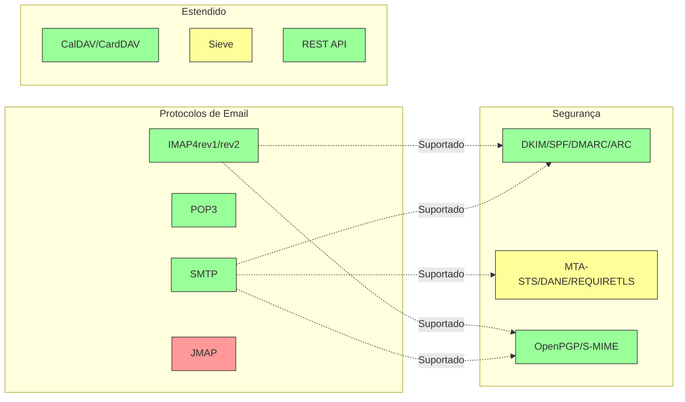

---


## Protocolos de Email Principais {#core-email-protocols}

### Fluxo do Protocolo de Email {#email-protocol-flow}

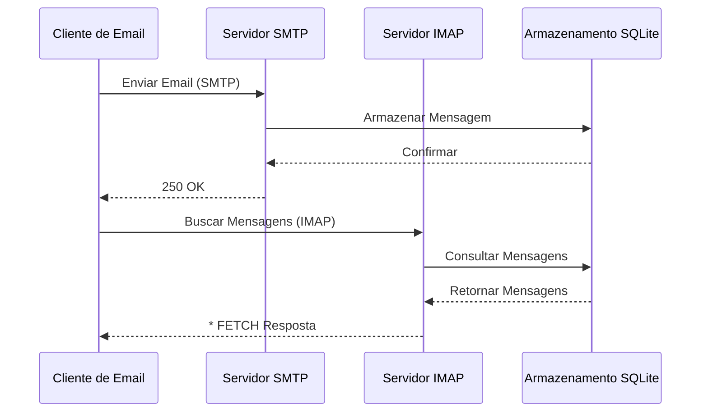


## Protocolo de Email IMAP4 e Extensões {#imap4-email-protocol-and-extensions}

> \[!NOTE]
> Forward Email suporta IMAP4rev1 (RFC 3501) com suporte parcial para recursos do IMAP4rev2 (RFC 9051).

Forward Email oferece suporte robusto ao IMAP4 através da implementação do servidor de email WildDuck. O servidor implementa IMAP4rev1 (RFC 3501) com suporte parcial para extensões do IMAP4rev2 (RFC 9051).

A funcionalidade IMAP do Forward Email é fornecida pela dependência [WildDuck](https://github.com/nodemailer/wildduck). Os seguintes RFCs de email são suportados:

| RFC                                                       | Título                                                            | Notas de Implementação                              |
| --------------------------------------------------------- | ----------------------------------------------------------------- | -------------------------------------------------- |
| [RFC 3501](https://datatracker.ietf.org/doc/html/rfc3501) | Protocolo de Acesso a Mensagens na Internet (IMAP) - Versão 4rev1 | Suporte completo com diferenças intencionais (veja abaixo) |
| [RFC 2177](https://datatracker.ietf.org/doc/html/rfc2177) | Comando IMAP4 IDLE                                               | Notificações estilo push                            |
| [RFC 2342](https://datatracker.ietf.org/doc/html/rfc2342) | Namespace IMAP4                                                  | Suporte a namespace de caixas postais              |
| [RFC 2087](https://datatracker.ietf.org/doc/html/rfc2087) | Extensão IMAP4 QUOTA                                            | Gerenciamento de cotas de armazenamento            |
| [RFC 2971](https://datatracker.ietf.org/doc/html/rfc2971) | Extensão IMAP4 ID                                              | Identificação cliente/servidor                      |
| [RFC 5161](https://datatracker.ietf.org/doc/html/rfc5161) | Extensão IMAP4 ENABLE                                          | Habilitar extensões IMAP                            |
| [RFC 4959](https://datatracker.ietf.org/doc/html/rfc4959) | Extensão IMAP para Resposta Inicial do Cliente SASL (SASL-IR)    | Resposta inicial do cliente                         |
| [RFC 3691](https://datatracker.ietf.org/doc/html/rfc3691) | Comando IMAP4 UNSELECT                                         | Fechar caixa postal sem EXPUNGE                     |
| [RFC 4315](https://datatracker.ietf.org/doc/html/rfc4315) | Extensão IMAP UIDPLUS                                          | Comandos UID aprimorados                            |
| [RFC 7162](https://datatracker.ietf.org/doc/html/rfc7162) | Extensões IMAP: Rápida Ressincronização de Alterações de Flags (CONDSTORE) | STORE condicional                                  |
| [RFC 6154](https://datatracker.ietf.org/doc/html/rfc6154) | Extensão IMAP LIST para Caixas Postais de Uso Especial          | Atributos especiais de caixa postal                 |
| [RFC 6851](https://datatracker.ietf.org/doc/html/rfc6851) | Extensão IMAP MOVE                                            | Comando MOVE atômico                                |
| [RFC 6855](https://datatracker.ietf.org/doc/html/rfc6855) | Suporte IMAP para UTF-8                                        | Suporte a UTF-8                                     |
| [RFC 3348](https://datatracker.ietf.org/doc/html/rfc3348) | Extensão IMAP4 para Caixa Postal Filha                          | Informações de caixa postal filha                   |
| [RFC 7889](https://datatracker.ietf.org/doc/html/rfc7889) | Extensão IMAP4 para Publicidade do Tamanho Máximo de Upload (APPENDLIMIT) | Tamanho máximo de upload                            |
**Extensões IMAP Suportadas:**

| Extensão         | RFC          | Status      | Descrição                      |
| ----------------- | ------------ | ----------- | ------------------------------ |
| IDLE              | RFC 2177     | ✅ Suportado | Notificações estilo push       |
| NAMESPACE         | RFC 2342     | ✅ Suportado | Suporte a namespace de caixas  |
| QUOTA             | RFC 2087     | ✅ Suportado | Gerenciamento de cota de armazenamento |
| ID                | RFC 2971     | ✅ Suportado | Identificação cliente/servidor |
| ENABLE            | RFC 5161     | ✅ Suportado | Habilitar extensões IMAP       |
| SASL-IR           | RFC 4959     | ✅ Suportado | Resposta inicial do cliente    |
| UNSELECT          | RFC 3691     | ✅ Suportado | Fechar caixa sem EXPUNGE       |
| UIDPLUS           | RFC 4315     | ✅ Suportado | Comandos UID aprimorados       |
| CONDSTORE         | RFC 7162     | ✅ Suportado | STORE condicional              |
| SPECIAL-USE       | RFC 6154     | ✅ Suportado | Atributos especiais de caixa   |
| MOVE              | RFC 6851     | ✅ Suportado | Comando MOVE atômico           |
| UTF8=ACCEPT       | RFC 6855     | ✅ Suportado | Suporte a UTF-8                |
| CHILDREN          | RFC 3348     | ✅ Suportado | Informação de caixas filhas    |
| APPENDLIMIT       | RFC 7889     | ✅ Suportado | Tamanho máximo de upload       |
| XLIST             | Não padrão   | ✅ Suportado | Listagem de pastas compatível com Gmail |
| XAPPLEPUSHSERVICE | Não padrão   | ✅ Suportado | Serviço de Notificação Push da Apple |

### Diferenças do Protocolo IMAP em Relação às Especificações RFC {#imap-protocol-differences-from-rfc-specifications}

> \[!WARNING]
> As seguintes diferenças em relação às especificações RFC podem afetar a compatibilidade do cliente.

Forward Email intencionalmente se desvia de algumas especificações RFC do IMAP. Essas diferenças são herdadas do WildDuck e estão documentadas abaixo:

* **Sem flag \Recent:** A flag `\Recent` não é implementada. Todas as mensagens são retornadas sem essa flag.
* **RENAME não afeta subpastas:** Ao renomear uma pasta, as subpastas não são renomeadas automaticamente. A hierarquia de pastas é plana no banco de dados.
* **INBOX não pode ser renomeada:** [RFC 3501](https://datatracker.ietf.org/doc/html/rfc3501) permite renomear INBOX, mas Forward Email proíbe explicitamente. Veja [código-fonte do WildDuck](https://github.com/nodemailer/wildduck/blob/master/imap-core/lib/commands/rename.js#L27).
* **Sem respostas FLAGS não solicitadas:** Quando flags são alteradas, nenhuma resposta FLAGS não solicitada é enviada ao cliente.
* **STORE retorna NO para mensagens deletadas:** Tentativas de modificar flags em mensagens deletadas retornam NO em vez de ignorar silenciosamente.
* **CHARSET ignorado em SEARCH:** O argumento `CHARSET` nos comandos SEARCH é ignorado. Todas as buscas usam UTF-8.
* **Metadados MODSEQ ignorados:** Metadados `MODSEQ` nos comandos STORE são ignorados.
* **SEARCH TEXT e SEARCH BODY:** Forward Email usa [SQLite FTS5](https://www.sqlite.org/fts5.html) (Busca de Texto Completo) em vez da busca `$text` do MongoDB. Isso oferece:
  * Suporte ao operador `NOT` (não suportado pelo MongoDB)
  * Resultados de busca ranqueados
  * Performance de busca abaixo de 100ms em caixas grandes
* **Comportamento autoexpunge:** Mensagens marcadas com `\Deleted` são automaticamente expurgadas ao fechar a caixa.
* **Fidelidade da mensagem:** Algumas modificações podem não preservar a estrutura exata da mensagem original.

**Suporte Parcial ao IMAP4rev2:**

Forward Email implementa IMAP4rev1 (RFC 3501) com suporte parcial ao IMAP4rev2 (RFC 9051). As seguintes funcionalidades do IMAP4rev2 **ainda não são suportadas**:

* **LIST-STATUS** - Comando combinado LIST e STATUS
* **LITERAL-** - Literais não sincronizados (variante menos)
* **OBJECTID** - Identificadores únicos de objeto
* **SAVEDATE** - Atributo de data de salvamento
* **REPLACE** - Substituição atômica de mensagem
* **UNAUTHENTICATE** - Encerrar autenticação sem fechar conexão

**Tratamento Relaxado da Estrutura do Corpo:**

Forward Email usa tratamento "relaxado" para estruturas MIME malformadas, que pode diferir da interpretação estrita das RFCs. Isso melhora a compatibilidade com e-mails do mundo real que não seguem perfeitamente os padrões.
**Extensão METADATA (RFC 5464):**

A extensão METADATA do IMAP **não é suportada**. Para mais informações sobre esta extensão, consulte [RFC 5464](https://datatracker.ietf.org/doc/html/rfc5464). Discussões sobre a adição deste recurso podem ser encontradas em [WildDuck Issue #937](https://github.com/zone-eu/wildduck/issues/937).

### Extensões IMAP NÃO Suportadas {#imap-extensions-not-supported}

As seguintes extensões IMAP do [Registro de Capacidades IMAP da IANA](https://www.iana.org/assignments/imap-capabilities/imap-capabilities.xhtml) NÃO são suportadas:

| RFC                                                       | Título                                                                                                          | Motivo                                                                                                                                  |
| --------------------------------------------------------- | --------------------------------------------------------------------------------------------------------------- | --------------------------------------------------------------------------------------------------------------------------------------- |
| [RFC 2086](https://datatracker.ietf.org/doc/html/rfc2086) | Extensão ACL do IMAP4                                                                                            | Pastas compartilhadas não implementadas. Veja [WildDuck Issue #427](https://github.com/zone-eu/wildduck/issues/427)                     |
| [RFC 5256](https://datatracker.ietf.org/doc/html/rfc5256) | Extensões IMAP SORT e THREAD                                                                                     | Encadeamento implementado internamente, mas não via protocolo RFC 5256. Veja [WildDuck Issue #12](https://github.com/zone-eu/wildduck/issues/12) |
| [RFC 5162](https://datatracker.ietf.org/doc/html/rfc5162) | Extensões IMAP4 para Ressincronização Rápida de Caixa de Correio (QRESYNC)                                       | Não implementado                                                                                                                         |
| [RFC 5464](https://datatracker.ietf.org/doc/html/rfc5464) | Extensão METADATA do IMAP                                                                                        | Operações de metadata ignoradas. Veja [documentação WildDuck](https://datatracker.ietf.org/doc/html/rfc5464)                            |
| [RFC 5258](https://datatracker.ietf.org/doc/html/rfc5258) | Extensões do Comando LIST do IMAP4                                                                               | Não implementado                                                                                                                         |
| [RFC 5267](https://datatracker.ietf.org/doc/html/rfc5267) | Contextos para IMAP4                                                                                             | Não implementado                                                                                                                         |
| [RFC 5465](https://datatracker.ietf.org/doc/html/rfc5465) | Extensão IMAP NOTIFY                                                                                            | Não implementado                                                                                                                         |
| [RFC 5466](https://datatracker.ietf.org/doc/html/rfc5466) | Extensão IMAP4 FILTERS                                                                                           | Não implementado                                                                                                                         |
| [RFC 6203](https://datatracker.ietf.org/doc/html/rfc6203) | Extensão IMAP4 para Busca Fuzzy                                                                                  | Não implementado                                                                                                                         |
| [RFC 6785](https://datatracker.ietf.org/doc/html/rfc6785) | Recomendações de Implementação IMAP4                                                                             | Recomendações não totalmente seguidas                                                                                                   |
| [RFC 7162](https://datatracker.ietf.org/doc/html/rfc7162) | Extensões IMAP: Ressincronização Rápida de Mudanças de Flags (CONDSTORE) e Ressincronização Rápida de Caixa (QRESYNC) | Não implementado                                                                                                                         |
| [RFC 8437](https://datatracker.ietf.org/doc/html/rfc8437) | Extensão IMAP UNAUTHENTICATE para Reutilização de Conexão                                                       | Não implementado                                                                                                                         |
| [RFC 8438](https://datatracker.ietf.org/doc/html/rfc8438) | Extensão IMAP para STATUS=SIZE                                                                                   | Não implementado                                                                                                                         |
| [RFC 8457](https://datatracker.ietf.org/doc/html/rfc8457) | Palavra-chave "$Important" do IMAP e Atributo de Uso Especial "\Important"                                       | Não implementado                                                                                                                         |
| [RFC 8474](https://datatracker.ietf.org/doc/html/rfc8474) | Extensão IMAP para Identificadores de Objetos                                                                    | Não implementado                                                                                                                         |
| [RFC 9051](https://datatracker.ietf.org/doc/html/rfc9051) | Protocolo de Acesso a Mensagens da Internet (IMAP) - Versão 4rev2                                               | Forward Email implementa IMAP4rev1 ([RFC 3501](https://datatracker.ietf.org/doc/html/rfc3501))                                            |
## Protocolo de Email POP3 e Extensões {#pop3-email-protocol-and-extensions}

> \[!NOTE]
> Forward Email suporta POP3 (RFC 1939) com extensões padrão para recuperação de email.

A funcionalidade POP3 do Forward Email é fornecida pela dependência [WildDuck](https://github.com/nodemailer/wildduck). Os seguintes RFCs de email são suportados:

| RFC                                                       | Título                                  | Notas de Implementação                              |
| --------------------------------------------------------- | --------------------------------------- | -------------------------------------------------- |
| [RFC 1939](https://datatracker.ietf.org/doc/html/rfc1939) | Protocolo de Correio - Versão 3 (POP3) | Suporte completo com diferenças intencionais (veja abaixo) |
| [RFC 2595](https://datatracker.ietf.org/doc/html/rfc2595) | Uso de TLS com IMAP, POP3 e ACAP        | Suporte STARTTLS                                   |
| [RFC 2449](https://datatracker.ietf.org/doc/html/rfc2449) | Mecanismo de Extensão POP3               | Suporte ao comando CAPA                             |

O Forward Email fornece suporte POP3 para clientes que preferem este protocolo mais simples em vez do IMAP. POP3 é ideal para usuários que desejam baixar emails para um único dispositivo e removê-los do servidor.

**Extensões POP3 Suportadas:**

| Extensão | RFC      | Status      | Descrição                  |
| --------- | -------- | ----------- | -------------------------- |
| TOP       | RFC 1939 | ✅ Suportado | Recuperar cabeçalhos de mensagens |
| USER      | RFC 1939 | ✅ Suportado | Autenticação por nome de usuário |
| UIDL      | RFC 1939 | ✅ Suportado | Identificadores únicos de mensagens |
| EXPIRE    | RFC 2449 | ✅ Suportado | Política de expiração de mensagens |

### Diferenças do Protocolo POP3 em Relação às Especificações RFC {#pop3-protocol-differences-from-rfc-specifications}

> \[!WARNING]
> POP3 possui limitações inerentes em comparação ao IMAP.

> \[!IMPORTANT]
> **Diferença Crítica: Comportamento DELE do POP3 no Forward Email vs WildDuck**
>
> O Forward Email implementa exclusão permanente conforme RFC para comandos POP3 `DELE`, diferente do WildDuck que move mensagens para a Lixeira.

**Comportamento do Forward Email** ([código-fonte](https://github.com/forwardemail/forwardemail.net/blob/master/pop3-server.js)):

* `DELE` → `QUIT` exclui mensagens permanentemente
* Segue exatamente a especificação do [RFC 1939](https://datatracker.ietf.org/doc/html/rfc1939)
* Compatível com o comportamento do Dovecot (padrão), Postfix e outros servidores conformes ao padrão

**Comportamento do WildDuck** ([discussão](https://github.com/zone-eu/wildduck/issues/937)):

* `DELE` → `QUIT` move mensagens para a Lixeira (estilo Gmail)
* Decisão de design intencional para segurança do usuário
* Não conforme ao RFC, mas evita perda acidental de dados

**Por que o Forward Email Difere:**

* **Conformidade com RFC:** Adere à especificação do [RFC 1939](https://datatracker.ietf.org/doc/html/rfc1939)
* **Expectativas do Usuário:** Fluxo de baixar e deletar espera exclusão permanente
* **Gerenciamento de Armazenamento:** Reaproveitamento adequado do espaço em disco
* **Interoperabilidade:** Consistente com outros servidores conformes ao RFC

> \[!NOTE]
> **Listagem de Mensagens POP3:** O Forward Email lista TODAS as mensagens da INBOX sem limite. Isso difere do WildDuck que limita a 250 mensagens por padrão. Veja [código-fonte](https://github.com/forwardemail/forwardemail.net/blob/master/pop3-server.js).

**Acesso por Dispositivo Único:**

POP3 é projetado para acesso por dispositivo único. As mensagens são tipicamente baixadas e removidas do servidor, tornando-o inadequado para sincronização entre múltiplos dispositivos.

**Sem Suporte a Pastas:**

POP3 acessa apenas a pasta INBOX. Outras pastas (Enviados, Rascunhos, Lixeira, etc.) não são acessíveis via POP3.

**Gerenciamento Limitado de Mensagens:**

POP3 oferece recuperação e exclusão básicas de mensagens. Recursos avançados como sinalização, movimentação ou busca de mensagens não estão disponíveis.

### Extensões POP3 NÃO Suportadas {#pop3-extensions-not-supported}

As seguintes extensões POP3 do [Registro de Mecanismo de Extensão POP3 da IANA](https://www.iana.org/assignments/pop3-extension-mechanism/pop3-extension-mechanism.xhtml) NÃO são suportadas:
| RFC                                                       | Título                                                  | Motivo                                  |
| --------------------------------------------------------- | ------------------------------------------------------- | --------------------------------------- |
| [RFC 6856](https://datatracker.ietf.org/doc/html/rfc6856) | Suporte ao Protocolo de Correio Versão 3 (POP3) para UTF-8 | Não implementado no servidor POP3 WildDuck |
| [RFC 2595](https://datatracker.ietf.org/doc/html/rfc2595) | Comando STLS                                           | Apenas STARTTLS suportado, não STLS      |
| [RFC 3206](https://datatracker.ietf.org/doc/html/rfc3206) | Códigos de Resposta SYS e AUTH POP                      | Não implementado                         |

---


## Protocolo de Email SMTP e Extensões {#smtp-email-protocol-and-extensions}

> \[!NOTE]
> Forward Email suporta SMTP (RFC 5321) com extensões modernas para entrega de email segura e confiável.

A funcionalidade SMTP do Forward Email é fornecida por múltiplos componentes: [smtp-server](https://github.com/nodemailer/smtp-server) (nodemailer), [zone-mta](https://github.com/zone-eu/zone-mta) e implementações personalizadas. Os seguintes RFCs de email são suportados:

| RFC                                                       | Título                                                                           | Notas de Implementação              |
| --------------------------------------------------------- | ------------------------------------------------------------------------------- | ------------------------------------ |
| [RFC 5321](https://datatracker.ietf.org/doc/html/rfc5321) | Protocolo Simples de Transferência de Correio (SMTP)                            | Suporte completo                    |
| [RFC 3207](https://datatracker.ietf.org/doc/html/rfc3207) | Extensão do Serviço SMTP para SMTP Seguro sobre Transport Layer Security (STARTTLS) | Suporte TLS/SSL                    |
| [RFC 4954](https://datatracker.ietf.org/doc/html/rfc4954) | Extensão do Serviço SMTP para Autenticação (AUTH)                               | PLAIN, LOGIN, CRAM-MD5, XOAUTH2     |
| [RFC 6531](https://datatracker.ietf.org/doc/html/rfc6531) | Extensão SMTP para Email Internacionalizado (SMTPUTF8)                          | Suporte nativo a endereços de email unicode |
| [RFC 3461](https://datatracker.ietf.org/doc/html/rfc3461) | Extensão do Serviço SMTP para Notificações de Status de Entrega (DSN)           | Suporte completo a DSN              |
| [RFC 3463](https://datatracker.ietf.org/doc/html/rfc3463) | Códigos de Status Aprimorados do Sistema de Correio                             | Códigos de status aprimorados nas respostas |
| [RFC 1870](https://datatracker.ietf.org/doc/html/rfc1870) | Extensão do Serviço SMTP para Declaração do Tamanho da Mensagem (SIZE)          | Anúncio do tamanho máximo da mensagem |
| [RFC 2920](https://datatracker.ietf.org/doc/html/rfc2920) | Extensão do Serviço SMTP para Encadeamento de Comandos (PIPELINING)             | Suporte a encadeamento de comandos  |
| [RFC 1652](https://datatracker.ietf.org/doc/html/rfc1652) | Extensão do Serviço SMTP para Transporte MIME 8bit (8BITMIME)                    | Suporte a MIME 8-bit                |
| [RFC 6152](https://datatracker.ietf.org/doc/html/rfc6152) | Extensão do Serviço SMTP para Transporte MIME 8-bit                             | Suporte a MIME 8-bit                |
| [RFC 2034](https://datatracker.ietf.org/doc/html/rfc2034) | Extensão do Serviço SMTP para Retorno de Códigos de Erro Aprimorados (ENHANCEDSTATUSCODES) | Códigos de status aprimorados      |

O Forward Email implementa um servidor SMTP completo com suporte a extensões modernas que aprimoram segurança, confiabilidade e funcionalidade.

**Extensões SMTP Suportadas:**

| Extensão            | RFC      | Status      | Descrição                           |
| ------------------- | -------- | ----------- | ------------------------------------- |
| PIPELINING          | RFC 2920 | ✅ Suportado | Encadeamento de comandos             |
| SIZE                | RFC 1870 | ✅ Suportado | Declaração do tamanho da mensagem (limite de 52MB) |
| ETRN                | RFC 1985 | ✅ Suportado | Processamento remoto da fila         |
| STARTTLS            | RFC 3207 | ✅ Suportado | Atualização para TLS                 |
| ENHANCEDSTATUSCODES | RFC 2034 | ✅ Suportado | Códigos de status aprimorados       |
| 8BITMIME            | RFC 6152 | ✅ Suportado | Transporte MIME 8-bit                |
| DSN                 | RFC 3461 | ✅ Suportado | Notificações de Status de Entrega   |
| CHUNKING            | RFC 3030 | ✅ Suportado | Transferência de mensagem em partes |
| SMTPUTF8            | RFC 6531 | ⚠️ Parcial  | Endereços de email UTF-8 (parcial)  |
| REQUIRETLS          | RFC 8689 | ✅ Suportado | Exigir TLS para entrega             |
### Notificações de Status de Entrega (DSN) {#delivery-status-notifications-dsn}

> \[!TIP]
> DSN fornece informações detalhadas sobre o status de entrega de e-mails enviados.

Forward Email suporta totalmente **DSN (RFC 3461)**, que permite aos remetentes solicitar notificações de status de entrega. Este recurso fornece:

* **Notificações de sucesso** quando as mensagens são entregues
* **Notificações de falha** com informações detalhadas sobre erros
* **Notificações de atraso** quando a entrega está temporariamente atrasada

DSN é particularmente útil para:

* Confirmar a entrega de mensagens importantes
* Solucionar problemas de entrega
* Sistemas automatizados de processamento de e-mails
* Requisitos de conformidade e auditoria

### Suporte a REQUIRETLS {#requiretls-support}

> \[!IMPORTANT]
> Forward Email é um dos poucos provedores que anuncia explicitamente e aplica REQUIRETLS.

Forward Email suporta **REQUIRETLS (RFC 8689)**, que garante que as mensagens de e-mail sejam entregues apenas por conexões criptografadas com TLS. Isso proporciona:

* **Criptografia de ponta a ponta** para todo o caminho de entrega
* **Aplicação visível ao usuário** via caixa de seleção no compositor de e-mails
* **Rejeição de tentativas de entrega não criptografadas**
* **Segurança aprimorada** para comunicações sensíveis

### Extensões SMTP NÃO Suportadas {#smtp-extensions-not-supported}

As seguintes extensões SMTP do [Registro de Extensões de Serviço SMTP da IANA](https://www.iana.org/assignments/smtp) NÃO são suportadas:

| RFC                                                       | Título                                                                                            | Motivo                |
| --------------------------------------------------------- | ------------------------------------------------------------------------------------------------- | --------------------- |
| [RFC 4865](https://datatracker.ietf.org/doc/html/rfc4865) | Extensão de Serviço de Submissão SMTP para Liberação Futura de Mensagens (FUTURERELEASE)          | Não implementada      |
| [RFC 6710](https://datatracker.ietf.org/doc/html/rfc6710) | Extensão SMTP para Prioridades de Transferência de Mensagens (MT-PRIORITY)                        | Não implementada      |
| [RFC 7293](https://datatracker.ietf.org/doc/html/rfc7293) | Campo de Cabeçalho Require-Recipient-Valid-Since e Extensão de Serviço SMTP                       | Não implementada      |
| [RFC 7372](https://datatracker.ietf.org/doc/html/rfc7372) | Códigos de Status de Autenticação de E-mail                                                     | Não totalmente implementada |
| [RFC 4468](https://datatracker.ietf.org/doc/html/rfc4468) | Extensão BURL para Submissão de Mensagens                                                       | Não implementada      |
| [RFC 3030](https://datatracker.ietf.org/doc/html/rfc3030) | Extensões de Serviço SMTP para Transmissão de Mensagens MIME Grandes e Binárias (CHUNKING, BINARYMIME) | Não implementada      |
| [RFC 2852](https://datatracker.ietf.org/doc/html/rfc2852) | Extensão de Serviço Deliver By SMTP                                                             | Não implementada      |

---


## Protocolo de E-mail JMAP {#jmap-email-protocol}

> \[!CAUTION]
> JMAP **não é atualmente suportado** pelo Forward Email.

| RFC                                                       | Título                                     | Status          | Motivo                                                                 |
| --------------------------------------------------------- | ----------------------------------------- | --------------- | ---------------------------------------------------------------------- |
| [RFC 8620](https://datatracker.ietf.org/doc/html/rfc8620) | Protocolo de Aplicação Meta JSON (JMAP)  | ❌ Não Suportado | Forward Email usa IMAP/POP3/SMTP e uma API REST abrangente em vez disso |

**JMAP (Protocolo de Aplicação Meta JSON)** é um protocolo moderno de e-mail projetado para substituir o IMAP.

**Por que o JMAP não é suportado:**

> "JMAP é uma fera que não deveria ter sido inventada. Ele tenta converter TCP/IMAP (já um protocolo ruim pelos padrões atuais) em HTTP/JSON, apenas usando um transporte diferente enquanto mantém o espírito." — Andris Reinman, [Discussão no HN](https://news.ycombinator.com/item?id=18890011)
> "JMAP tem mais de 10 anos, e quase não há adoção alguma" – Andris Reinman, [Discussão no GitHub](https://github.com/zone-eu/wildduck/issues/2#issuecomment-1765190790)

Veja também comentários adicionais em <https://hn.algolia.com/?dateRange=all&page=0&prefix=true&query=jmap%20andris&sort=byDate&type=comment>.

O Forward Email atualmente foca em fornecer excelente suporte a IMAP, POP3 e SMTP, junto com uma API REST abrangente para gerenciamento de e-mails. O suporte a JMAP pode ser considerado no futuro com base na demanda dos usuários e na adoção do ecossistema.

**Alternativa:** O Forward Email oferece uma [API REST Completa](#complete-rest-api-for-email-management) com 39 endpoints que fornece funcionalidade similar ao JMAP para acesso programático a e-mails.

---


## Segurança de Email {#email-security}

### Arquitetura de Segurança de Email {#email-security-architecture}

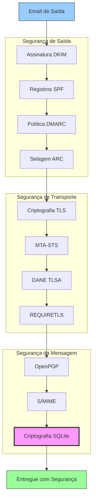


## Protocolos de Autenticação de Mensagens de Email {#email-message-authentication-protocols}

> \[!NOTE]
> O Forward Email implementa todos os principais protocolos de autenticação de email para prevenir falsificação e garantir a integridade da mensagem.

O Forward Email usa a biblioteca [mailauth](https://github.com/postalsys/mailauth) para autenticação de email. Os seguintes RFCs são suportados:

| RFC                                                       | Título                                                                 | Notas de Implementação                                       |
| --------------------------------------------------------- | --------------------------------------------------------------------- | ------------------------------------------------------------ |
| [RFC 6376](https://datatracker.ietf.org/doc/html/rfc6376) | Assinaturas DomainKeys Identified Mail (DKIM)                         | Assinatura e verificação DKIM completas                      |
| [RFC 8463](https://datatracker.ietf.org/doc/html/rfc8463) | Um Novo Método de Assinatura Criptográfica para DKIM (Ed25519-SHA256) | Suporta algoritmos de assinatura RSA-SHA256 e Ed25519-SHA256 |
| [RFC 7208](https://datatracker.ietf.org/doc/html/rfc7208) | Sender Policy Framework (SPF)                                         | Validação de registro SPF                                    |
| [RFC 7489](https://datatracker.ietf.org/doc/html/rfc7489) | Autenticação, Relatórios e Conformidade de Mensagens Baseadas em Domínio (DMARC) | Aplicação da política DMARC                                  |
| [RFC 8617](https://datatracker.ietf.org/doc/html/rfc8617) | Cadeia Recebida Autenticada (ARC)                                     | Selagem e validação ARC                                      |

Os protocolos de autenticação de email verificam que as mensagens são genuinamente do remetente declarado e que não foram alteradas durante o trânsito.

### Suporte a Protocolos de Autenticação {#authentication-protocol-support}

| Protocolo | RFC      | Status       | Descrição                                                            |
| --------- | -------- | ------------ | -------------------------------------------------------------------- |
| **DKIM**  | RFC 6376 | ✅ Suportado | DomainKeys Identified Mail - Assinaturas criptográficas             |
| **SPF**   | RFC 7208 | ✅ Suportado | Sender Policy Framework - Autorização de endereço IP                |
| **DMARC** | RFC 7489 | ✅ Suportado | Autenticação de Mensagens Baseada em Domínio - Aplicação de política |
| **ARC**   | RFC 8617 | ✅ Suportado | Cadeia Recebida Autenticada - Preservar autenticação em encaminhamentos |
### DKIM (DomainKeys Identified Mail) {#dkim-domainkeys-identified-mail}

**DKIM** adiciona uma assinatura criptográfica aos cabeçalhos de e-mail, permitindo que os destinatários verifiquem se a mensagem foi autorizada pelo proprietário do domínio e não foi modificada durante o trânsito.

Forward Email usa [mailauth](https://github.com/postalsys/mailauth) para assinatura e verificação DKIM.

**Principais Recursos:**

* Assinatura DKIM automática para todas as mensagens de saída
* Suporte para chaves RSA e Ed25519
* Suporte para múltiplos seletores
* Verificação DKIM para mensagens recebidas

### SPF (Sender Policy Framework) {#spf-sender-policy-framework}

**SPF** permite que os proprietários de domínios especifiquem quais endereços IP estão autorizados a enviar e-mails em nome de seu domínio.

**Principais Recursos:**

* Validação de registro SPF para mensagens recebidas
* Verificação SPF automática com resultados detalhados
* Suporte para mecanismos include, redirect e all
* Políticas SPF configuráveis por domínio

### DMARC (Domain-based Message Authentication, Reporting & Conformance) {#dmarc-domain-based-message-authentication-reporting--conformance}

**DMARC** baseia-se em SPF e DKIM para fornecer aplicação de políticas e relatórios.

**Principais Recursos:**

* Aplicação de políticas DMARC (none, quarantine, reject)
* Verificação de alinhamento para SPF e DKIM
* Relatórios agregados DMARC
* Políticas DMARC por domínio

### ARC (Authenticated Received Chain) {#arc-authenticated-received-chain}

**ARC** preserva os resultados da autenticação de e-mail durante o encaminhamento e modificações em listas de discussão.

Forward Email usa a biblioteca [mailauth](https://github.com/postalsys/mailauth) para verificação e selagem ARC.

**Principais Recursos:**

* Selagem ARC para mensagens encaminhadas
* Validação ARC para mensagens recebidas
* Verificação da cadeia através de múltiplos saltos
* Preserva os resultados originais da autenticação

### Fluxo de Autenticação {#authentication-flow}

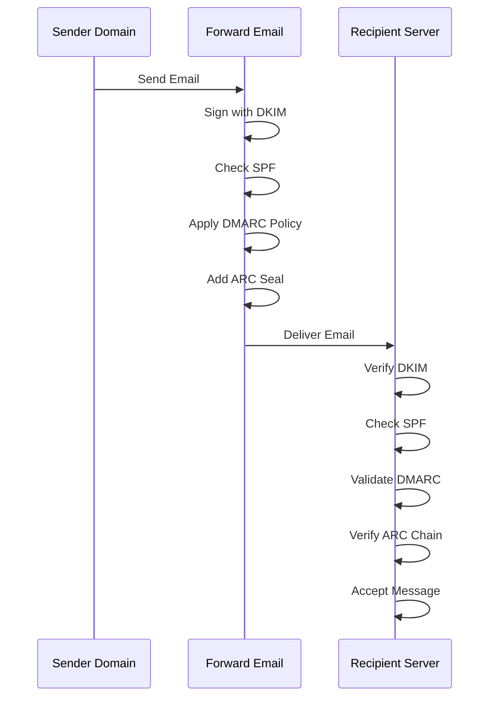

---


## Protocolos de Segurança de Transporte de Email {#email-transport-security-protocols}

> \[!IMPORTANT]
> Forward Email implementa múltiplas camadas de segurança de transporte para proteger os e-mails em trânsito.

Forward Email implementa protocolos modernos de segurança de transporte:

| RFC                                                       | Título                                                                                              | Status      | Notas de Implementação                                                                                                                                                                                                                                                                          |
| --------------------------------------------------------- | -------------------------------------------------------------------------------------------------- | ----------- | --------------------------------------------------------------------------------------------------------------------------------------------------------------------------------------------------------------------------------------------------------------------------------------------- |
| [RFC 8461](https://datatracker.ietf.org/doc/html/rfc8461) | SMTP MTA Strict Transport Security (MTA-STS)                                                       | ✅ Suportado | Amplamente usado em servidores IMAP, SMTP e MX. Veja [create-mta-sts-cache.js](https://github.com/forwardemail/forwardemail.net/blob/master/helpers/create-mta-sts-cache.js) e [get-transporter.js](https://github.com/forwardemail/forwardemail.net/blob/master/helpers/get-transporter.js) |
| [RFC 8460](https://datatracker.ietf.org/doc/html/rfc8460) | SMTP TLS Reporting                                                                                 | ✅ Suportado | Via biblioteca [mailauth](https://github.com/postalsys/mailauth)                                                                                                                                                                                                                               |
| [RFC 7671](https://datatracker.ietf.org/doc/html/rfc7671) | O Protocolo DNS-Based Authentication of Named Entities (DANE): Atualizações e Orientações Operacionais | ✅ Suportado | Verificação completa DANE para conexões SMTP de saída. Veja [mx-connect PR #22](https://github.com/zone-eu/mx-connect/pull/22)                                                                                                                                                                  |
| [RFC 6698](https://datatracker.ietf.org/doc/html/rfc6698) | O Protocolo DNS-Based Authentication of Named Entities (DANE) Transport Layer Security (TLS): TLSA | ✅ Suportado | Suporte completo ao RFC 6698: tipos de uso PKIX-TA, PKIX-EE, DANE-TA, DANE-EE. Veja [mx-connect PR #22](https://github.com/zone-eu/mx-connect/pull/22)                                                                                                                                         |
| [RFC 8314](https://datatracker.ietf.org/doc/html/rfc8314) | Texto Claro Considerado Obsoleto: Uso de Transport Layer Security (TLS) para Submissão e Acesso de Email | ✅ Suportado | TLS obrigatório para todas as conexões                                                                                                                                                                                                                                                          |
| [RFC 8689](https://datatracker.ietf.org/doc/html/rfc8689) | Extensão de Serviço SMTP para Requerer TLS (REQUIRETLS)                                            | ✅ Suportado | Suporte completo para extensão SMTP REQUIRETLS e cabeçalho "TLS-Required"                                                                                                                                                                                                                      |
Protocolos de segurança de transporte garantem que mensagens de email sejam criptografadas e autenticadas durante a transmissão entre servidores de email.

### Suporte à Segurança de Transporte {#transport-security-support}

| Protocolo     | RFC      | Status      | Descrição                                        |
| -------------- | -------- | ----------- | ------------------------------------------------ |
| **TLS**        | RFC 8314 | ✅ Suportado | Transport Layer Security - Conexões criptografadas |
| **MTA-STS**    | RFC 8461 | ✅ Suportado | Mail Transfer Agent Strict Transport Security    |
| **DANE**       | RFC 7671 | ✅ Suportado | Autenticação baseada em DNS de Entidades Nomeadas |
| **REQUIRETLS** | RFC 8689 | ✅ Suportado | Exigir TLS para todo o caminho de entrega         |

### TLS (Transport Layer Security) {#tls-transport-layer-security}

Forward Email aplica criptografia TLS para todas as conexões de email (SMTP, IMAP, POP3).

**Principais Recursos:**

* Suporte a TLS 1.2 e TLS 1.3
* Gerenciamento automático de certificados
* Perfect Forward Secrecy (PFS)
* Apenas suítes de cifra fortes

### MTA-STS (Mail Transfer Agent Strict Transport Security) {#mta-sts-mail-transfer-agent-strict-transport-security}

**MTA-STS** garante que o email seja entregue apenas por conexões criptografadas com TLS ao publicar uma política via HTTPS.

Forward Email implementa MTA-STS usando [create-mta-sts-cache.js](https://github.com/forwardemail/forwardemail.net/blob/master/helpers/create-mta-sts-cache.js).

**Principais Recursos:**

* Publicação automática da política MTA-STS
* Cache da política para desempenho
* Prevenção contra ataques de downgrade
* Aplicação da validação de certificados

### DANE (DNS-based Authentication of Named Entities) {#dane-dns-based-authentication-of-named-entities}

> \[!NOTE]
> Forward Email agora oferece suporte completo a DANE para conexões SMTP de saída.

**DANE** usa DNSSEC para publicar informações do certificado TLS no DNS, permitindo que servidores de email verifiquem certificados sem depender de autoridades certificadoras.

**Principais Recursos:**

* ✅ Verificação completa de DANE para conexões SMTP de saída
* ✅ Suporte completo ao RFC 6698: tipos de uso PKIX-TA, PKIX-EE, DANE-TA, DANE-EE
* ✅ Verificação de certificado contra registros TLSA durante upgrade TLS
* ✅ Resolução TLSA paralela para múltiplos hosts MX
* ✅ Detecção automática do `dns.resolveTlsa` nativo (Node.js v22.15.0+, v23.9.0+)
* ✅ Suporte a resolvedor customizado para versões antigas do Node.js via [Tangerine](https://github.com/forwardemail/tangerine)
* Requer domínios assinados com DNSSEC

> \[!TIP]
> **Detalhes da Implementação:** O suporte a DANE foi adicionado via [mx-connect PR #22](https://github.com/zone-eu/mx-connect/pull/22), que fornece suporte abrangente a DANE/TLSA para conexões SMTP de saída.

### REQUIRETLS {#requiretls}

> \[!TIP]
> Forward Email é um dos poucos provedores com suporte REQUIRETLS voltado para o usuário.

**REQUIRETLS** garante que mensagens de email sejam entregues apenas por conexões criptografadas com TLS durante todo o caminho de entrega.

**Principais Recursos:**

* Caixa de seleção voltada para o usuário no compositor de email
* Rejeição automática de entregas não criptografadas
* Aplicação de TLS ponta a ponta
* Notificações detalhadas de falha

> \[!TIP]
> **Aplicação de TLS para o Usuário:** Forward Email oferece uma caixa de seleção em **Minha Conta > Domínios > Configurações** para aplicar TLS em todas as conexões de entrada. Quando ativado, esse recurso rejeita qualquer email recebido que não tenha sido enviado por uma conexão criptografada com TLS com código de erro 530, garantindo que todo o correio recebido esteja criptografado em trânsito.

### Fluxo de Segurança de Transporte {#transport-security-flow}

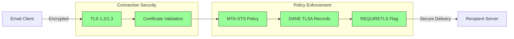
## Criptografia de Mensagens de Email {#email-message-encryption}

> \[!NOTE]
> Forward Email suporta tanto OpenPGP quanto S/MIME para criptografia de email de ponta a ponta.

Forward Email suporta criptografia OpenPGP e S/MIME:

| RFC                                                       | Título                                                                                  | Status      | Notas de Implementação                                                                                                                                                                               |
| --------------------------------------------------------- | --------------------------------------------------------------------------------------- | ----------- | ---------------------------------------------------------------------------------------------------------------------------------------------------------------------------------------------------- |
| [RFC 9580](https://datatracker.ietf.org/doc/html/rfc9580) | OpenPGP (substitui RFC 4880)                                                            | ✅ Suportado | Via integração [OpenPGP.js v6+](https://github.com/openpgpjs/openpgpjs). Veja [FAQ](https://forwardemail.net/en/faq#do-you-support-openpgpmime-end-to-end-encryption-e2ee-and-web-key-directory-wkd) |
| [RFC 8551](https://datatracker.ietf.org/doc/html/rfc8551) | Secure/Multipurpose Internet Mail Extensions (S/MIME) Versão 4.0 Especificação de Mensagem | ✅ Suportado | Suporta algoritmos RSA e ECC. Veja [FAQ](https://forwardemail.net/en/faq#do-you-support-smime-encryption)                                                                                            |

Protocolos de criptografia de mensagens protegem o conteúdo do email para que somente o destinatário pretendido possa ler, mesmo que a mensagem seja interceptada durante o trânsito.

### Suporte à Criptografia {#encryption-support}

| Protocolo   | RFC      | Status      | Descrição                                   |
| ----------- | -------- | ----------- | -------------------------------------------- |
| **OpenPGP** | RFC 9580 | ✅ Suportado | Pretty Good Privacy - Criptografia de chave pública |
| **S/MIME**  | RFC 8551 | ✅ Suportado | Secure/Multipurpose Internet Mail Extensions |
| **WKD**     | Draft    | ✅ Suportado | Web Key Directory - Descoberta automática de chaves |

### OpenPGP (Pretty Good Privacy) {#openpgp-pretty-good-privacy}

**OpenPGP** fornece criptografia de ponta a ponta usando criptografia de chave pública. Forward Email suporta OpenPGP através do protocolo [Web Key Directory (WKD)](https://forwardemail.net/en/faq#do-you-support-openpgpmime-end-to-end-encryption-e2ee-and-web-key-directory-wkd).

**Principais Características:**

* Descoberta automática de chaves via WKD
* Suporte PGP/MIME para anexos criptografados
* Gerenciamento de chaves pelo cliente de email
* Compatível com GPG, Mailvelope e outras ferramentas OpenPGP

**Como Usar:**

1. Gere um par de chaves PGP no seu cliente de email
2. Faça upload da sua chave pública no WKD do Forward Email
3. Sua chave fica automaticamente disponível para outros usuários
4. Envie e receba emails criptografados sem complicações

### S/MIME (Secure/Multipurpose Internet Mail Extensions) {#smime-securemultipurpose-internet-mail-extensions}

**S/MIME** fornece criptografia de email e assinaturas digitais usando certificados X.509.

**Principais Características:**

* Criptografia baseada em certificado
* Assinaturas digitais para autenticação da mensagem
* Suporte nativo na maioria dos clientes de email
* Segurança de nível empresarial

**Como Usar:**

1. Obtenha um certificado S/MIME de uma Autoridade Certificadora
2. Instale o certificado no seu cliente de email
3. Configure seu cliente para criptografar/assinar mensagens
4. Troque certificados com os destinatários

### Criptografia de Caixa de Correio SQLite {#sqlite-mailbox-encryption}

> \[!IMPORTANT]
> Forward Email oferece uma camada adicional de segurança com caixas de correio SQLite criptografadas.

Além da criptografia no nível da mensagem, Forward Email criptografa caixas de correio inteiras usando [sqleet](https://github.com/resilar/sqleet) (ChaCha20-Poly1305).

**Principais Características:**

* **Criptografia baseada em senha** - Somente você possui a senha
* **Resistente a computação quântica** - Cifra ChaCha20-Poly1305
* **Zero conhecimento** - Forward Email não pode descriptografar sua caixa de correio
* **Isolada** - Cada caixa de correio é isolada e portátil
* **Irrecuperável** - Se você esquecer sua senha, sua caixa de correio será perdida
### Comparação de Criptografia {#encryption-comparison}

| Recurso               | OpenPGP           | S/MIME             | Criptografia SQLite |
| --------------------- | ----------------- | ------------------ | ------------------- |
| **Fim a Fim**         | ✅ Sim             | ✅ Sim              | ✅ Sim              |
| **Gerenciamento de Chaves** | Autogerenciado    | Emitido por CA     | Baseado em Senha    |
| **Suporte ao Cliente** | Requer plugin     | Nativo             | Transparente        |
| **Caso de Uso**       | Pessoal           | Empresarial        | Armazenamento       |
| **Resistente a Quantum** | ⚠️ Depende da chave | ⚠️ Depende do certificado | ✅ Sim              |

### Fluxo de Criptografia {#encryption-flow}

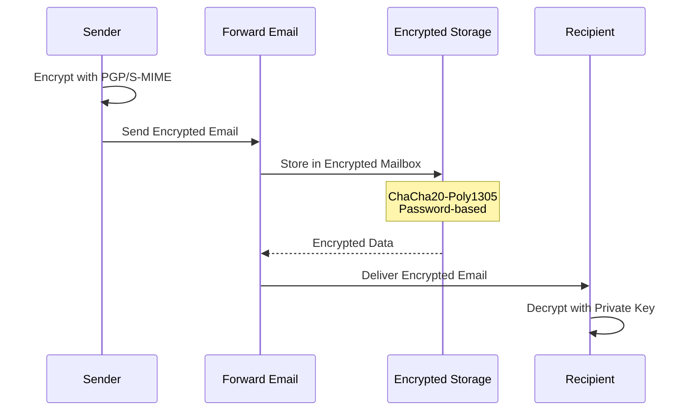

---


## Funcionalidade Estendida {#extended-functionality}


## Padrões de Formato de Mensagem de Email {#email-message-format-standards}

> \[!NOTE]
> Forward Email suporta padrões modernos de formato de email para conteúdo rico e internacionalização.

Forward Email suporta formatos padrão de mensagens de email:

| RFC                                                       | Título                                                        | Notas de Implementação |
| --------------------------------------------------------- | ------------------------------------------------------------- | ---------------------- |
| [RFC 5322](https://datatracker.ietf.org/doc/html/rfc5322) | Formato de Mensagem na Internet                               | Suporte completo       |
| [RFC 2045](https://datatracker.ietf.org/doc/html/rfc2045) | MIME Parte Um: Formato dos Corpos de Mensagens na Internet    | Suporte completo a MIME |
| [RFC 2046](https://datatracker.ietf.org/doc/html/rfc2046) | MIME Parte Dois: Tipos de Mídia                               | Suporte completo a MIME |
| [RFC 2047](https://datatracker.ietf.org/doc/html/rfc2047) | MIME Parte Três: Extensões de Cabeçalho de Mensagem para Texto Não ASCII | Suporte completo a MIME |
| [RFC 2048](https://datatracker.ietf.org/doc/html/rfc2048) | MIME Parte Quatro: Procedimentos de Registro                  | Suporte completo a MIME |
| [RFC 2049](https://datatracker.ietf.org/doc/html/rfc2049) | MIME Parte Cinco: Critérios de Conformidade e Exemplos        | Suporte completo a MIME |

Os padrões de formato de email definem como as mensagens de email são estruturadas, codificadas e exibidas.

### Suporte a Padrões de Formato {#format-standards-support}

| Padrão             | RFC           | Status      | Descrição                            |
| ------------------ | ------------- | ----------- | ---------------------------------- |
| **MIME**           | RFC 2045-2049 | ✅ Suportado | Extensões Multipropósito para Correio na Internet |
| **SMTPUTF8**       | RFC 6531      | ⚠️ Parcial  | Endereços de email internacionalizados |
| **EAI**            | RFC 6530      | ⚠️ Parcial  | Internacionalização de Endereços de Email |
| **Formato de Mensagem** | RFC 5322      | ✅ Suportado | Formato de Mensagem na Internet    |
| **Segurança MIME** | RFC 1847      | ✅ Suportado | Multiparts de Segurança para MIME  |

### MIME (Extensões Multipropósito para Correio na Internet) {#mime-multipurpose-internet-mail-extensions}

**MIME** permite que emails contenham múltiplas partes com diferentes tipos de conteúdo (texto, HTML, anexos, etc.).

**Recursos MIME Suportados:**

* Mensagens multipartes (misto, alternativa, relacionado)
* Cabeçalhos Content-Type
* Content-Transfer-Encoding (7bit, 8bit, quoted-printable, base64)
* Imagens embutidas e anexos
* Conteúdo HTML rico

### SMTPUTF8 e Internacionalização de Endereços de Email {#smtputf8-and-email-address-internationalization}

> \[!WARNING]
> O suporte a SMTPUTF8 é parcial - nem todos os recursos estão totalmente implementados.
**SMTPUTF8** permite que endereços de email contenham caracteres não ASCII (ex.: `用户@例え.jp`).

**Status Atual:**

* ⚠️ Suporte parcial para endereços de email internacionalizados
* ✅ Conteúdo UTF-8 em corpos de mensagens
* ⚠️ Suporte limitado para partes locais não ASCII

---


## Protocolos de Calendário e Contatos {#calendaring-and-contacts-protocols}

> \[!NOTE]
> Forward Email oferece suporte completo a CalDAV e CardDAV para sincronização de calendários e contatos.

Forward Email suporta CalDAV e CardDAV via a biblioteca [caldav-adapter](https://github.com/forwardemail/caldav-adapter):

| RFC                                                       | Título                                                                   | Status      | Notas de Implementação                                                                                                                                                                |
| --------------------------------------------------------- | ------------------------------------------------------------------------- | ----------- | -------------------------------------------------------------------------------------------------------------------------------------------------------------------------------------- |
| [RFC 4791](https://datatracker.ietf.org/doc/html/rfc4791) | Extensões de Calendário para WebDAV (CalDAV)                             | ✅ Suportado | Acesso e gerenciamento de calendários                                                                                                                                                  |
| [RFC 6352](https://datatracker.ietf.org/doc/html/rfc6352) | CardDAV: Extensões vCard para WebDAV                                     | ✅ Suportado | Acesso e gerenciamento de contatos                                                                                                                                                     |
| [RFC 5545](https://datatracker.ietf.org/doc/html/rfc5545) | Especificação Principal de Agendamento e Calendário na Internet (iCalendar) | ✅ Suportado | Suporte ao formato iCalendar                                                                                                                                                            |
| [RFC 6350](https://datatracker.ietf.org/doc/html/rfc6350) | Especificação do Formato vCard                                           | ✅ Suportado | Suporte ao formato vCard 4.0                                                                                                                                                            |
| [RFC 6638](https://datatracker.ietf.org/doc/html/rfc6638) | Extensões de Agendamento para CalDAV                                     | ✅ Suportado | Agendamento CalDAV com suporte a iMIP. Veja [commit c4d1629](https://github.com/forwardemail/forwardemail.net/commit/c4d162975a49e38d76d68a032662e873a34a9b80)                            |
| [RFC 5546](https://datatracker.ietf.org/doc/html/rfc5546) | Protocolo de Interoperabilidade Independente de Transporte para iCalendar (iTIP) | ✅ Suportado | Suporte iTIP para métodos REQUEST, REPLY, CANCEL e VFREEBUSY. Veja [commit c4d1629](https://github.com/forwardemail/forwardemail.net/commit/c4d162975a49e38d76d68a032662e873a34a9b80) |
| [RFC 6047](https://datatracker.ietf.org/doc/html/rfc6047) | Protocolo de Interoperabilidade Baseado em Mensagens iCalendar (iMIP)    | ✅ Suportado | Convites de calendário por email com links de resposta. Veja [commit c4d1629](https://github.com/forwardemail/forwardemail.net/commit/c4d162975a49e38d76d68a032662e873a34a9b80)           |

CalDAV e CardDAV são protocolos que permitem que dados de calendário e contatos sejam acessados, compartilhados e sincronizados entre dispositivos.

### Suporte a CalDAV e CardDAV {#caldav-and-carddav-support}

| Protocolo             | RFC      | Status      | Descrição                             |
| --------------------- | -------- | ----------- | ----------------------------------- |
| **CalDAV**            | RFC 4791 | ✅ Suportado | Acesso e sincronização de calendários |
| **CardDAV**           | RFC 6352 | ✅ Suportado | Acesso e sincronização de contatos    |
| **iCalendar**         | RFC 5545 | ✅ Suportado | Formato de dados de calendário        |
| **vCard**             | RFC 6350 | ✅ Suportado | Formato de dados de contatos          |
| **VTODO**             | RFC 5545 | ✅ Suportado | Suporte a tarefas/lembretes           |
| **Agendamento CalDAV**| RFC 6638 | ✅ Suportado | Extensões de agendamento para CalDAV  |
| **iTIP**              | RFC 5546 | ✅ Suportado | Interoperabilidade independente de transporte |
| **iMIP**              | RFC 6047 | ✅ Suportado | Convites de calendário baseados em email |
### CalDAV (Acesso ao Calendário) {#caldav-calendar-access}

**CalDAV** permite que você acesse e gerencie calendários de qualquer dispositivo ou aplicação.

**Principais Recursos:**

* Sincronização multi-dispositivo
* Calendários compartilhados
* Assinaturas de calendário
* Convites e respostas a eventos
* Eventos recorrentes
* Suporte a fusos horários

**Clientes Compatíveis:**

* Apple Calendar (macOS, iOS)
* Mozilla Thunderbird
* Evolution
* GNOME Calendar
* Qualquer cliente compatível com CalDAV

### CardDAV (Acesso a Contatos) {#carddav-contact-access}

**CardDAV** permite que você acesse e gerencie contatos de qualquer dispositivo ou aplicação.

**Principais Recursos:**

* Sincronização multi-dispositivo
* Catálogos de endereços compartilhados
* Grupos de contatos
* Suporte a fotos
* Campos personalizados
* Suporte a vCard 4.0

**Clientes Compatíveis:**

* Apple Contacts (macOS, iOS)
* Mozilla Thunderbird
* Evolution
* GNOME Contacts
* Qualquer cliente compatível com CardDAV

### Tarefas e Lembretes (CalDAV VTODO) {#tasks-and-reminders-caldav-vtodo}

> \[!TIP]
> Forward Email suporta tarefas e lembretes através do CalDAV VTODO.

**VTODO** faz parte do formato iCalendar e permite o gerenciamento de tarefas via CalDAV.

**Principais Recursos:**

* Criação e gerenciamento de tarefas
* Datas de vencimento e prioridades
* Rastreamento de conclusão de tarefas
* Tarefas recorrentes
* Listas/categorias de tarefas

**Clientes Compatíveis:**

* Apple Reminders (macOS, iOS)
* Mozilla Thunderbird (com Lightning)
* Evolution
* GNOME To Do
* Qualquer cliente CalDAV com suporte a VTODO

### Fluxo de Sincronização CalDAV/CardDAV {#caldavcarddav-synchronization-flow}

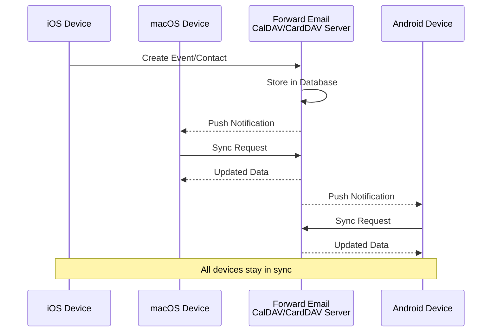

### Extensões de Calendário NÃO Suportadas {#calendaring-extensions-not-supported}

As seguintes extensões de calendário NÃO são suportadas:

| RFC                                                       | Título                                                              | Motivo                                                          |
| --------------------------------------------------------- | ------------------------------------------------------------------- | --------------------------------------------------------------- |
| [RFC 4918](https://datatracker.ietf.org/doc/html/rfc4918) | Extensões HTTP para Autoria e Versionamento Distribuído na Web (WebDAV) | CalDAV usa conceitos WebDAV mas não implementa o RFC 4918 completo |
| [RFC 6578](https://datatracker.ietf.org/doc/html/rfc6578) | Sincronização de Coleções para WebDAV                               | Não implementado                                                |
| [RFC 3744](https://datatracker.ietf.org/doc/html/rfc3744) | Protocolo de Controle de Acesso WebDAV                              | Não implementado                                                |

---


## Filtragem de Mensagens de Email {#email-message-filtering}

> \[!IMPORTANT]
> Forward Email fornece **suporte completo a Sieve e ManageSieve** para filtragem de email no lado do servidor. Crie regras poderosas para classificar, filtrar, encaminhar e responder automaticamente às mensagens recebidas.

### Sieve (RFC 5228) {#sieve-rfc-5228}

[Sieve](https://en.wikipedia.org/wiki/Sieve_\(mail_filtering_language\)) é uma linguagem de script padronizada e poderosa para filtragem de email no lado do servidor. Forward Email implementa suporte abrangente a Sieve com 24 extensões.

**Código Fonte:** [`helpers/sieve/`](https://github.com/forwardemail/forwardemail.net/tree/master/helpers/sieve)

#### RFCs Principais do Sieve Suportados {#core-sieve-rfcs-supported}

| RFC                                                                                    | Título                                                        | Status         |
| -------------------------------------------------------------------------------------- | ------------------------------------------------------------- | -------------- |
| [RFC 5228](https://datatracker.ietf.org/doc/html/rfc5228)                              | Sieve: Uma Linguagem de Filtragem de Email                    | ✅ Suporte Completo |
| [RFC 5429](https://datatracker.ietf.org/doc/html/rfc5429)                              | Filtragem de Email Sieve: Extensões Reject e Extended Reject | ✅ Suporte Completo |
| [RFC 5230](https://datatracker.ietf.org/doc/html/rfc5230)                              | Filtragem de Email Sieve: Extensão de Férias                  | ✅ Suporte Completo |
| [RFC 6131](https://datatracker.ietf.org/doc/html/rfc6131)                              | Extensão de Férias Sieve: Parâmetro "Seconds"                  | ✅ Suporte Completo |
| [RFC 5232](https://datatracker.ietf.org/doc/html/rfc5232)                              | Filtragem de Email Sieve: Extensão Imap4flags                  | ✅ Suporte Completo |
| [RFC 5173](https://datatracker.ietf.org/doc/html/rfc5173)                              | Filtragem de Email Sieve: Extensão Body                        | ✅ Suporte Completo |
| [RFC 5229](https://datatracker.ietf.org/doc/html/rfc5229)                              | Filtragem de Email Sieve: Extensão de Variáveis               | ✅ Suporte Completo |
| [RFC 5231](https://datatracker.ietf.org/doc/html/rfc5231)                              | Filtragem de Email Sieve: Extensão Relacional                  | ✅ Suporte Completo |
| [RFC 4790](https://datatracker.ietf.org/doc/html/rfc4790)                              | Registro de Colação de Protocolo de Aplicação Internet         | ✅ Suporte Completo |
| [RFC 3894](https://datatracker.ietf.org/doc/html/rfc3894)                              | Extensão Sieve: Cópia Sem Efeitos Colaterais                   | ✅ Suporte Completo |
| [RFC 5293](https://datatracker.ietf.org/doc/html/rfc5293)                              | Filtragem de Email Sieve: Extensão Editheader                  | ✅ Suporte Completo |
| [RFC 5260](https://datatracker.ietf.org/doc/html/rfc5260)                              | Filtragem de Email Sieve: Extensões de Data e Índice           | ✅ Suporte Completo |
| [RFC 5435](https://datatracker.ietf.org/doc/html/rfc5435)                              | Filtragem de Email Sieve: Extensão para Notificações           | ✅ Suporte Completo |
| [RFC 5183](https://datatracker.ietf.org/doc/html/rfc5183)                              | Filtragem de Email Sieve: Extensão de Ambiente                 | ✅ Suporte Completo |
| [RFC 5490](https://datatracker.ietf.org/doc/html/rfc5490)                              | Filtragem de Email Sieve: Extensões para Verificação do Status da Caixa Postal | ✅ Suporte Completo |
| [RFC 8579](https://datatracker.ietf.org/doc/html/rfc8579)                              | Filtragem de Email Sieve: Entrega para Caixas Postais de Uso Especial | ✅ Suporte Completo |
| [RFC 7352](https://datatracker.ietf.org/doc/html/rfc7352)                              | Filtragem de Email Sieve: Detecção de Entregas Duplicadas      | ✅ Suporte Completo |
| [RFC 5463](https://datatracker.ietf.org/doc/html/rfc5463)                              | Filtragem de Email Sieve: Extensão Ihave                       | ✅ Suporte Completo |
| [RFC 5233](https://datatracker.ietf.org/doc/html/rfc5233)                              | Filtragem de Email Sieve: Extensão Subaddress                  | ✅ Suporte Completo |
| [draft-ietf-sieve-regex](https://datatracker.ietf.org/doc/html/draft-ietf-sieve-regex) | Filtragem de Email Sieve: Extensão de Expressão Regular        | ✅ Suporte Completo |
#### Extensões Sieve Suportadas {#supported-sieve-extensions}

| Extensão                    | Descrição                              | Integração                                |
| ---------------------------- | ---------------------------------------- | ------------------------------------------ |
| `fileinto`                   | Arquivar mensagens em pastas específicas      | Mensagens armazenadas na pasta IMAP especificada   |
| `reject` / `ereject`         | Rejeitar mensagens com um erro            | Rejeição SMTP com mensagem de retorno         |
| `vacation`                   | Respostas automáticas de férias/ausência | Enfileiradas via Emails.queue com limitação de taxa |
| `vacation-seconds`           | Intervalos detalhados para resposta de férias | TTL a partir do parâmetro `:seconds`              |
| `imap4flags`                 | Definir flags IMAP (\Seen, \Flagged, etc.)   | Flags aplicadas durante o armazenamento da mensagem       |
| `envelope`                   | Testar remetente/destinatário do envelope           | Acesso aos dados do envelope SMTP               |
| `body`                       | Testar conteúdo do corpo da mensagem                | Correspondência de texto completo do corpo                    |
| `variables`                  | Armazenar e usar variáveis em scripts       | Expansão de variáveis com modificadores          |
| `relational`                 | Comparações relacionais                   | `:count`, `:value` com gt/lt/eq           |
| `comparator-i;ascii-numeric` | Comparações numéricas                      | Comparação de strings numéricas                  |
| `copy`                       | Copiar mensagens enquanto redireciona          | Flag `:copy` em fileinto/redirect          |
| `editheader`                 | Adicionar ou deletar cabeçalhos de mensagem            | Cabeçalhos modificados antes do armazenamento            |
| `date`                       | Testar valores de data/hora                    | Testes com `currentdate` e data do cabeçalho        |
| `index`                      | Acessar ocorrências específicas de cabeçalhos       | `:index` para cabeçalhos com múltiplos valores           |
| `regex`                      | Correspondência com expressões regulares              | Suporte completo a regex em testes                |
| `enotify`                    | Enviar notificações                       | Notificações `mailto:` via Emails.queue   |
| `environment`                | Acessar informações do ambiente           | Domínio, host, remote-ip da sessão       |
| `mailbox`                    | Testar existência de caixa postal                   | Teste `mailboxexists`                       |
| `special-use`                | Arquivar em caixas postais de uso especial          | Mapeia \Junk, \Trash, etc. para pastas        |
| `duplicate`                  | Detectar mensagens duplicadas                | Rastreamento de duplicatas baseado em Redis             |
| `ihave`                      | Testar disponibilidade da extensão          | Verificação de capacidade em tempo de execução                |
| `subaddress`                 | Acessar partes do endereço user+detail         | Partes do endereço `:user` e `:detail`        |

#### Extensões Sieve NÃO Suportadas {#sieve-extensions-not-supported}

| Extensão                               | RFC                                                       | Motivo                                                           |
| --------------------------------------- | --------------------------------------------------------- | ---------------------------------------------------------------- |
| `include`                               | [RFC 6609](https://datatracker.ietf.org/doc/html/rfc6609) | Risco de segurança (injeção de script), requer armazenamento global de scripts |
| `mboxmetadata` / `servermetadata`       | [RFC 5490](https://datatracker.ietf.org/doc/html/rfc5490) | Requer extensão IMAP METADATA                                 |
| `fcc`                                   | [RFC 8580](https://datatracker.ietf.org/doc/html/rfc8580) | Requer integração com pasta Enviados                                 |
| `encoded-character`                     | [RFC 5228](https://datatracker.ietf.org/doc/html/rfc5228) | Alterações no parser necessárias para sintaxe ${hex:}                       |
| `foreverypart` / `mime` / `extracttext` | [RFC 5703](https://datatracker.ietf.org/doc/html/rfc5703) | Manipulação complexa da árvore MIME                                   |
#### Fluxo de Processamento Sieve {#sieve-processing-flow}

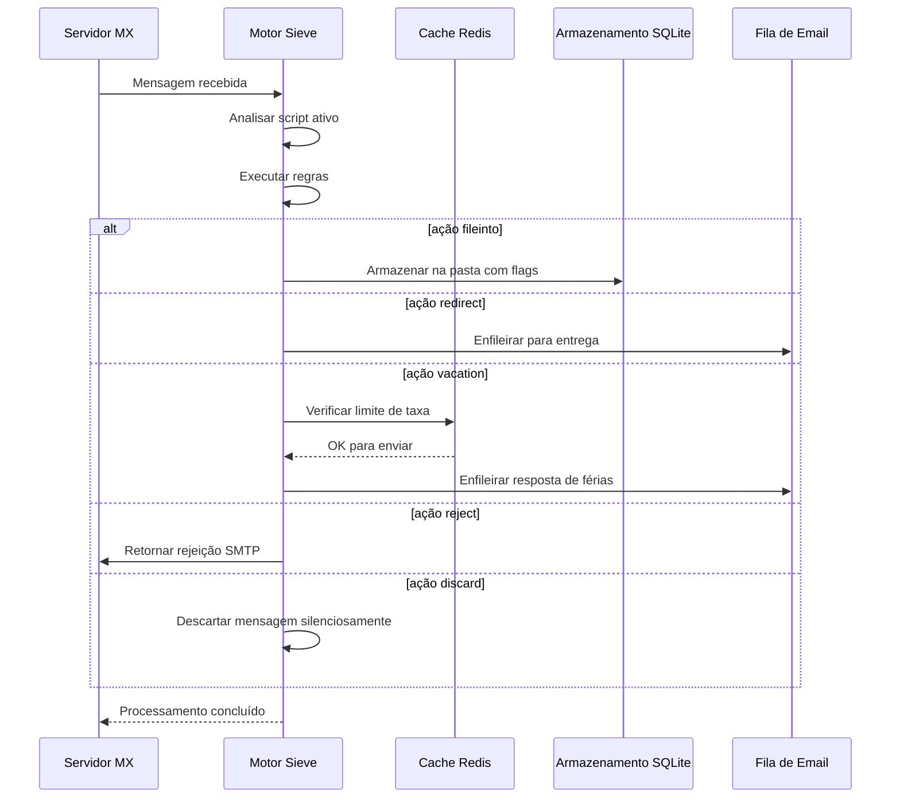

#### Recursos de Segurança {#security-features}

A implementação Sieve do Forward Email inclui proteções de segurança abrangentes:

* **Proteção CVE-2023-26430**: Previne loops de redirecionamento e ataques de mail bombing
* **Limitação de Taxa**: Limites em redirecionamentos (10/mensagem, 100/dia) e respostas de férias
* **Verificação de Lista de Negação**: Endereços de redirecionamento verificados contra lista de negação
* **Cabeçalhos Protegidos**: Cabeçalhos DKIM, ARC e de autenticação não podem ser modificados via editheader
* **Limites de Tamanho de Script**: Tamanho máximo de script aplicado
* **Timeouts de Execução**: Scripts terminados se a execução exceder o limite de tempo

#### Exemplos de Scripts Sieve {#example-sieve-scripts}

**Arquivar newsletters em uma pasta:**

```sieve
require ["fileinto"];

if header :contains "List-Id" "newsletter" {
    fileinto "Newsletters";
}
```

**Resposta automática de férias com temporização detalhada:**

```sieve
require ["vacation", "vacation-seconds"];

vacation :seconds 3600 :subject "Fora do Escritório"
    "Estou ausente no momento e responderei em até 24 horas.";
```

**Filtragem de spam com flags:**

```sieve
require ["fileinto", "imap4flags"];

if header :contains "X-Spam-Status" "Yes" {
    setflag "\\Seen";
    fileinto "Junk";
}
```

**Filtragem complexa com variáveis:**

```sieve
require ["variables", "fileinto", "regex"];

if header :regex "From" "(.+)@example\\.com" {
    set :lower "sender" "${1}";
    fileinto "Contacts/${sender}";
}
```

> \[!TIP]
> Para documentação completa, scripts de exemplo e instruções de configuração, veja [FAQ: Você suporta filtragem de email Sieve?](/faq#do-you-support-sieve-email-filtering)

### ManageSieve (RFC 5804) {#managesieve-rfc-5804}

O Forward Email oferece suporte completo ao protocolo ManageSieve para gerenciamento remoto de scripts Sieve.

**Código Fonte:** [`managesieve-server.js`](https://github.com/forwardemail/forwardemail.net/blob/master/managesieve-server.js)

| RFC                                                       | Título                                         | Status         |
| --------------------------------------------------------- | ---------------------------------------------- | -------------- |
| [RFC 5804](https://datatracker.ietf.org/doc/html/rfc5804) | Um Protocolo para Gerenciamento Remoto de Scripts Sieve | ✅ Suporte Completo |

#### Configuração do Servidor ManageSieve {#managesieve-server-configuration}

| Configuração            | Valor                   |
| ----------------------- | ----------------------- |
| **Servidor**            | `imap.forwardemail.net` |
| **Porta (STARTTLS)**    | `2190` (recomendado)    |
| **Porta (TLS Implícito)** | `4190`                  |
| **Autenticação**        | PLAIN (sobre TLS)       |

> **Nota:** A porta 2190 usa STARTTLS (upgrade de plain para TLS) e é compatível com a maioria dos clientes ManageSieve incluindo [sieve-connect](https://github.com/philpennock/sieve-connect). A porta 4190 usa TLS implícito (TLS desde o início da conexão) para clientes que o suportam.

#### Comandos ManageSieve Suportados {#supported-managesieve-commands}

| Comando        | Descrição                              |
| -------------- | ------------------------------------- |
| `AUTHENTICATE` | Autenticar usando mecanismo PLAIN     |
| `CAPABILITY`   | Listar capacidades e extensões do servidor |
| `HAVESPACE`    | Verificar se o script pode ser armazenado |
| `PUTSCRIPT`    | Enviar um novo script                  |
| `LISTSCRIPTS`  | Listar todos os scripts com status ativo |
| `SETACTIVE`    | Ativar um script                      |
| `GETSCRIPT`    | Baixar um script                      |
| `DELETESCRIPT` | Excluir um script                     |
| `RENAMESCRIPT` | Renomear um script                    |
| `CHECKSCRIPT`  | Validar sintaxe do script             |
| `NOOP`         | Manter conexão ativa                  |
| `LOGOUT`       | Encerrar sessão                      |
#### Clientes Compatíveis com ManageSieve {#compatible-managesieve-clients}

* **Thunderbird**: Suporte Sieve embutido via [add-on Sieve](https://addons.thunderbird.net/addon/sieve/)
* **Roundcube**: [plugin ManageSieve](https://plugins.roundcube.net/packages/johndoh/sieve)
* **KMail**: Suporte nativo ManageSieve
* **sieve-connect**: Cliente de linha de comando
* **Qualquer cliente compatível com RFC 5804**

#### Fluxo do Protocolo ManageSieve {#managesieve-protocol-flow}

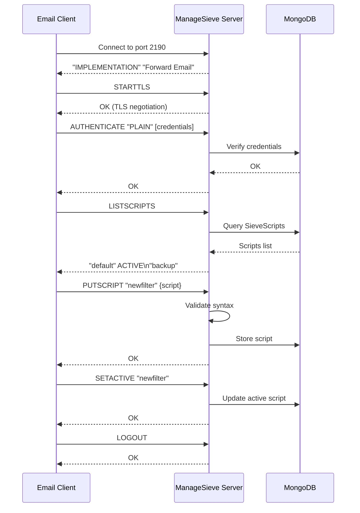

#### Interface Web e API {#web-interface-and-api}

Além do ManageSieve, o Forward Email oferece:

* **Painel Web**: Crie e gerencie scripts Sieve através da interface web em Minha Conta → Domínios → Aliases → Scripts Sieve
* **API REST**: Acesso programático ao gerenciamento de scripts Sieve via a [API Forward Email](/api#sieve-scripts)

> \[!TIP]
> Para instruções detalhadas de configuração e configuração do cliente, veja [FAQ: Vocês suportam filtragem de email Sieve?](/faq#do-you-support-sieve-email-filtering)

---


## Otimização de Armazenamento {#storage-optimization}

> \[!IMPORTANT]
> **Tecnologia de Armazenamento Pioneira na Indústria:** O Forward Email é o **único provedor de email no mundo** que combina desduplicação de anexos com compressão Brotli no conteúdo do email. Essa otimização em duas camadas oferece **2-3x mais armazenamento efetivo** comparado a provedores tradicionais de email.

O Forward Email implementa duas técnicas revolucionárias de otimização de armazenamento que reduzem drasticamente o tamanho da caixa de correio mantendo total conformidade com RFC e fidelidade da mensagem:

1. **Desduplicação de Anexos** - Elimina anexos duplicados em todos os emails
2. **Compressão Brotli** - Reduz o armazenamento em 46-86% para metadados e 50% para anexos

### Arquitetura: Otimização de Armazenamento em Duas Camadas {#architecture-dual-layer-storage-optimization}

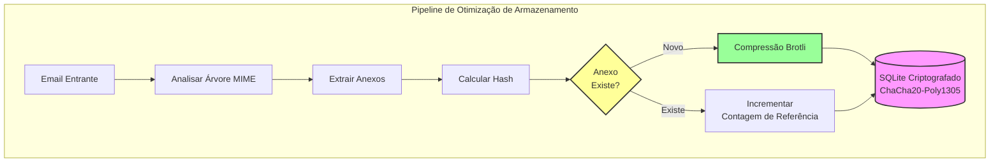

---


## Desduplicação de Anexos {#attachment-deduplication}

O Forward Email implementa desduplicação de anexos baseada na [abordagem comprovada do WildDuck](https://docs.wildduck.email/docs/in-depth/attachment-deduplication/), adaptada para armazenamento SQLite.

> \[!NOTE]
> **O que é Desduplicado:** "Anexo" refere-se ao conteúdo do nó MIME **codificado** (base64 ou quoted-printable), não ao arquivo decodificado. Isso preserva a validade das assinaturas DKIM e GPG.

### Como Funciona {#how-it-works}

**Implementação Original do WildDuck (MongoDB GridFS):**

> O servidor IMAP Wild Duck desduplica anexos. "Anexo" neste caso significa o conteúdo do nó mime codificado em base64 ou quoted-printable, não o arquivo decodificado. Embora usar conteúdo codificado gere muitos falsos negativos (o mesmo arquivo em emails diferentes pode ser contado como anexos diferentes), isso é necessário para garantir a validade de diferentes esquemas de assinatura (DKIM, GPG etc.). Uma mensagem recuperada do Wild Duck parece exatamente igual à mensagem que foi armazenada, mesmo que o Wild Duck analise a mensagem em um objeto em forma de árvore e reconstrua a mensagem ao recuperar.
**Implementação SQLite do Forward Email:**

O Forward Email adapta essa abordagem para armazenamento SQLite criptografado com o seguinte processo:

1. **Cálculo de Hash**: Quando um anexo é encontrado, um hash é calculado usando a biblioteca [`rev-hash`](https://github.com/sindresorhus/rev-hash) a partir do corpo do anexo
2. **Consulta**: Verifica se um anexo com hash correspondente existe na tabela `Attachments`
3. **Contagem de Referências**:
   * Se existir: Incrementa o contador de referência em 1 e o contador mágico por um número aleatório
   * Se for novo: Cria uma nova entrada de anexo com contador = 1
4. **Segurança na Exclusão**: Usa sistema de contadores duplos (referência + mágico) para evitar falsos positivos
5. **Coleta de Lixo**: Anexos são deletados imediatamente quando ambos os contadores chegam a zero

**Código Fonte:** [`helpers/attachment-storage.js`](https://github.com/forwardemail/forwardemail.net/blob/master/helpers/attachment-storage.js)

### Fluxo de Deduplicação {#deduplication-flow}

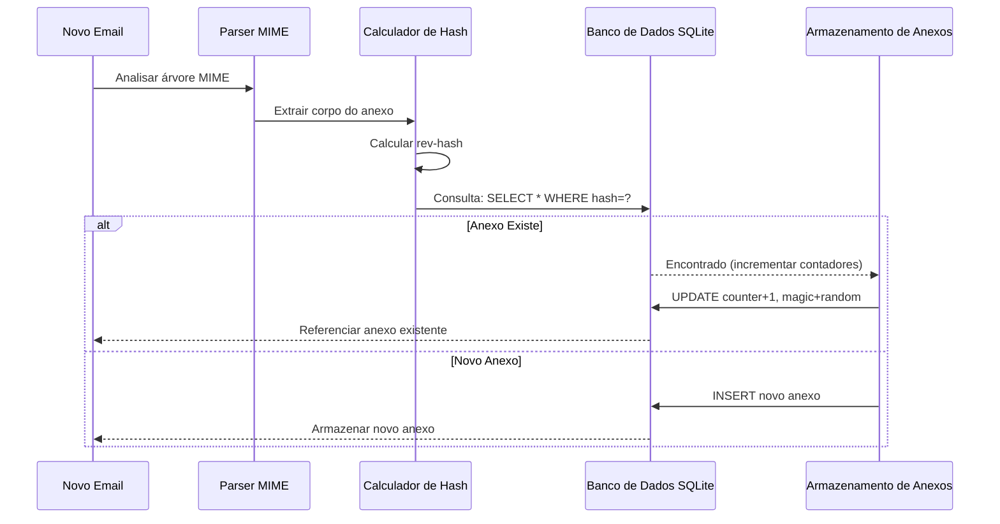

### Sistema de Número Mágico {#magic-number-system}

O Forward Email usa o sistema de "número mágico" do WildDuck (inspirado pelo [Mail.ru](https://github.com/zone-eu/wildduck)) para evitar falsos positivos durante a exclusão:

* Cada mensagem recebe um **número aleatório** atribuído
* O **contador mágico** do anexo é incrementado por esse número aleatório quando a mensagem é adicionada
* O contador mágico é decrementado pelo mesmo número quando a mensagem é deletada
* O anexo só é deletado quando **ambos os contadores** (referência + mágico) chegam a zero

Esse sistema de contadores duplos garante que, se algo der errado durante a exclusão (ex: crash, erro de rede), o anexo não seja deletado prematuramente.

### Diferenças Principais: WildDuck vs Forward Email {#key-differences-wildduck-vs-forward-email}

| Recurso                | WildDuck (MongoDB)       | Forward Email (SQLite)       |
| ---------------------- | ------------------------ | ---------------------------- |
| **Backend de Armazenamento** | MongoDB GridFS (fragmentado) | SQLite BLOB (direto)         |
| **Algoritmo de Hash**  | SHA256                   | rev-hash (baseado em SHA-256)|
| **Contagem de Referências** | ✅ Sim                    | ✅ Sim                        |
| **Números Mágicos**    | ✅ Sim (inspirado no Mail.ru) | ✅ Sim (mesmo sistema)          |
| **Coleta de Lixo**     | Retardada (job separado) | Imediata (quando contadores zero) |
| **Compressão**         | ❌ Nenhuma               | ✅ Brotli (veja abaixo)         |
| **Criptografia**       | ❌ Opcional              | ✅ Sempre (ChaCha20-Poly1305)   |

---


## Compressão Brotli {#brotli-compression}

> \[!IMPORTANT]
> **Primeiro do Mundo:** O Forward Email é o **único serviço de email no mundo** que usa compressão Brotli no conteúdo do email. Isso proporciona **46-86% de economia de armazenamento** além da deduplicação de anexos.

O Forward Email implementa compressão Brotli tanto para os corpos dos anexos quanto para os metadados das mensagens, oferecendo enorme economia de armazenamento mantendo compatibilidade retroativa.

**Implementação:** [`helpers/msgpack-helpers.js`](https://github.com/forwardemail/forwardemail.net/blob/master/helpers/msgpack-helpers.js)

### O Que é Comprimido {#what-gets-compressed}

**1. Corpos dos Anexos** (`encodeAttachmentBody`)

* **Formatos antigos**: String codificada em Hex (2x tamanho) ou Buffer bruto
* **Formato novo**: Buffer comprimido com Brotli com cabeçalho mágico "FEBR"
* **Decisão de compressão**: Comprime somente se economizar espaço (considera cabeçalho de 4 bytes)
* **Economia de armazenamento**: Até **50%** (hex → BLOB nativo)
**2. Metadados da Mensagem** (`encodeMetadata`)

Inclui: `mimeTree`, `headers`, `envelope`, `flags`

* **Formato antigo**: string de texto JSON
* **Formato novo**: Buffer comprimido com Brotli
* **Economia de armazenamento**: **46-86%** dependendo da complexidade da mensagem

### Configuração de Compressão {#compression-configuration}

```javascript
// Opções de compressão Brotli otimizadas para velocidade (nível 4 é um bom equilíbrio)
const BROTLI_COMPRESS_OPTIONS = {
  params: {
    [zlib.constants.BROTLI_PARAM_QUALITY]: 4
  }
};
```

**Por que o Nível 4?**

* **Compressão/descompressão rápida**: Processamento em sub-milisegundos
* **Boa taxa de compressão**: economia de 46-86%
* **Desempenho equilibrado**: Ótimo para operações de email em tempo real

### Cabeçalho Mágico: "FEBR" {#magic-header-febr}

Forward Email usa um cabeçalho mágico de 4 bytes para identificar corpos de anexos comprimidos:

```
"FEBR" = Forward Email BRotli
Hex: 0x46 0x45 0x42 0x52
```

**Por que um cabeçalho mágico?**

* **Detecção de formato**: Identifica instantaneamente dados comprimidos vs não comprimidos
* **Compatibilidade retroativa**: Strings hex antigas e Buffers brutos ainda funcionam
* **Evita colisões**: "FEBR" é improvável de aparecer no início de dados legítimos de anexo

### Processo de Compressão {#compression-process}

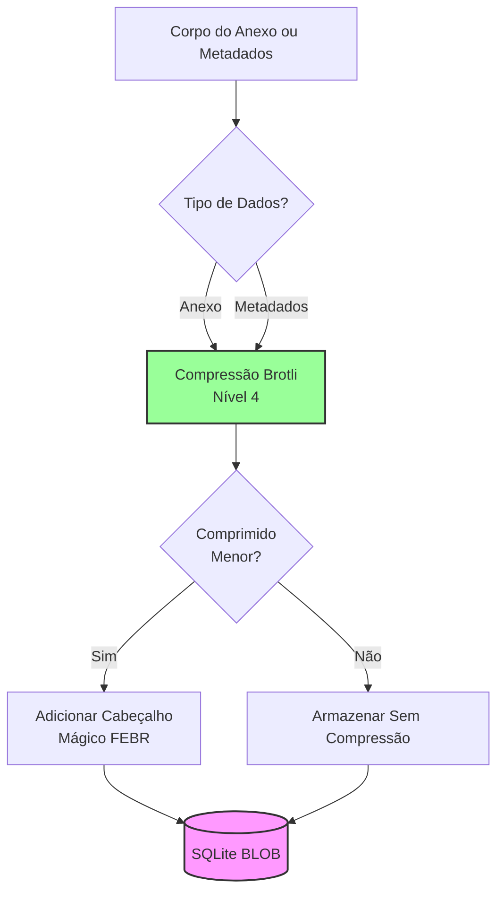

### Processo de Descompressão {#decompression-process}

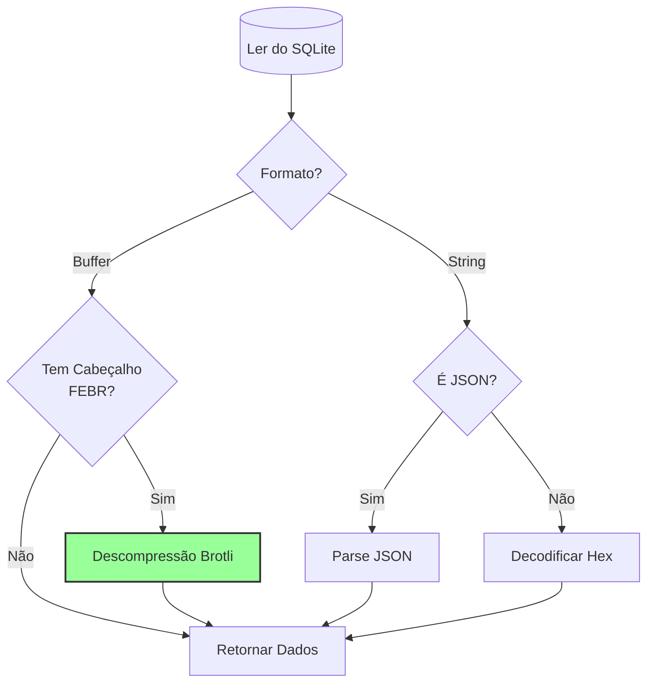

### Compatibilidade Retroativa {#backwards-compatibility}

Todas as funções de decodificação **detectam automaticamente** o formato de armazenamento:

| Formato               | Método de Detecção                    | Tratamento                                   |
| --------------------- | ----------------------------------- | -------------------------------------------- |
| **Comprimido com Brotli** | Verificar cabeçalho mágico "FEBR"    | Descomprimir com `zlib.brotliDecompressSync()` |
| **Buffer bruto**       | `Buffer.isBuffer()` sem cabeçalho     | Retornar como está                           |
| **String hex**         | Verificar comprimento par + caracteres [0-9a-f] | Decodificar com `Buffer.from(value, 'hex')`  |
| **String JSON**        | Verificar primeiro caractere `{` ou `[` | Parsear com `JSON.parse()`                   |

Isso garante **zero perda de dados** durante a migração dos formatos antigos para os novos.

### Estatísticas de Economia de Armazenamento {#storage-savings-statistics}

**Economias medidas a partir de dados de produção:**

| Tipo de Dados         | Formato Antigo          | Formato Novo           | Economia   |
| --------------------- | ----------------------- | ---------------------- | ---------- |
| **Corpos de anexos**  | String codificada em hex (2x) | BLOB comprimido com Brotli | **50%**    |
| **Metadados da mensagem** | Texto JSON              | BLOB comprimido com Brotli | **46-86%** |
| **Flags da caixa postal** | Texto JSON              | BLOB comprimido com Brotli | **60-80%** |

**Fonte:** [`helpers/migrate-storage-format.js`](https://github.com/forwardemail/forwardemail.net/blob/master/helpers/migrate-storage-format.js)

### Processo de Migração {#migration-process}

Forward Email fornece migração automática e idempotente dos formatos antigos para os novos:
// Estatísticas de migração rastreadas:
{
  attachmentsMigrated: 0,
  messagesMigrated: 0,
  mailboxesMigrated: 0,
  bytesSaved: 0  // Total de bytes economizados com compressão
}
```

**Etapas da migração:**

1. Corpos de anexos: codificação hexadecimal → BLOB nativo (50% de economia)
2. Metadados da mensagem: texto JSON → BLOB comprimido com brotli (46-86% de economia)
3. Flags da caixa de correio: texto JSON → BLOB comprimido com brotli (60-80% de economia)

**Fonte:** [`helpers/migrate-storage-format.js`](https://github.com/forwardemail/forwardemail.net/blob/master/helpers/migrate-storage-format.js)

---

### Eficiência Combinada de Armazenamento {#combined-storage-efficiency}

> \[!TIP]
> **Impacto no Mundo Real:** Com deduplicação de anexos + compressão Brotli, usuários do Forward Email obtêm **2-3x mais armazenamento efetivo** comparado a provedores tradicionais de email.

**Cenário de Exemplo:**

Provedor de email tradicional (caixa de correio de 1GB):

* 1GB de espaço em disco = 1GB de emails
* Sem deduplicação: Mesmo anexo armazenado 10 vezes = 10x desperdício de armazenamento
* Sem compressão: Metadados JSON completos armazenados = 2-3x desperdício de armazenamento

Forward Email (caixa de correio de 1GB):

* 1GB de espaço em disco ≈ **2-3GB de emails** (armazenamento efetivo)
* Deduplicação: Mesmo anexo armazenado uma vez, referenciado 10 vezes
* Compressão: 46-86% de economia nos metadados, 50% nos anexos
* Criptografia: ChaCha20-Poly1305 (sem overhead de armazenamento)

**Tabela de Comparação:**

| Provedor          | Tecnologia de Armazenamento                   | Armazenamento Efetivo (caixa de 1GB) |
| ----------------- | ---------------------------------------------- | ------------------------------------ |
| Gmail             | Nenhuma                                       | 1GB                                 |
| iCloud            | Nenhuma                                       | 1GB                                 |
| Outlook.com       | Nenhuma                                       | 1GB                                 |
| Fastmail          | Nenhuma                                       | 1GB                                 |
| ProtonMail        | Apenas criptografia                            | 1GB                                 |
| Tutanota          | Apenas criptografia                            | 1GB                                 |
| **Forward Email** | **Deduplicação + Compressão + Criptografia** | **2-3GB** ✨                         |

### Detalhes Técnicos da Implementação {#technical-implementation-details}

**Performance:**

* Brotli nível 4: Compressão/descompressão em sub-milisegundos
* Sem penalidade de performance pela compressão
* SQLite FTS5: Busca em menos de 50ms com NVMe SSD

**Segurança:**

* Compressão ocorre **após** a criptografia (banco SQLite é criptografado)
* Criptografia ChaCha20-Poly1305 + compressão Brotli
* Zero-knowledge: Apenas o usuário possui a senha de descriptografia

**Conformidade com RFC:**

* Mensagens recuperadas são **exatamente iguais** às armazenadas
* Assinaturas DKIM permanecem válidas (conteúdo codificado preservado)
* Assinaturas GPG permanecem válidas (sem modificação no conteúdo assinado)

### Por Que Nenhum Outro Provedor Faz Isso {#why-no-other-provider-does-this}

**Complexidade:**

* Requer integração profunda com a camada de armazenamento
* Compatibilidade retroativa é desafiadora
* Migração de formatos antigos é complexa

**Preocupações de Performance:**

* Compressão adiciona overhead de CPU (resolvido com Brotli nível 4)
* Descompressão a cada leitura (resolvido com cache do SQLite)

**Vantagem do Forward Email:**

* Construído do zero com otimização em mente
* SQLite permite manipulação direta de BLOBs
* Bancos criptografados por usuário permitem compressão segura

---

---


## Recursos Modernos {#modern-features}


## API REST Completa para Gerenciamento de Email {#complete-rest-api-for-email-management}

> \[!TIP]
> Forward Email oferece uma API REST abrangente com 39 endpoints para gerenciamento programático de emails.

> \[!TIP]
> **Recurso Único na Indústria:** Diferente de todos os outros serviços de email, o Forward Email oferece acesso programático completo à sua caixa de correio, calendário, contatos, mensagens e pastas via uma API REST abrangente. Esta é uma interação direta com seu arquivo de banco de dados SQLite criptografado que armazena todos os seus dados.

O Forward Email oferece uma API REST completa que proporciona acesso sem precedentes aos seus dados de email. Nenhum outro serviço de email (incluindo Gmail, iCloud, Outlook, ProtonMail, Tuta ou Fastmail) oferece esse nível de acesso direto e abrangente ao banco de dados.
**Documentação da API:** <https://forwardemail.net/en/email-api>

### Categorias da API (39 Endpoints) {#api-categories-39-endpoints}

**1. API de Mensagens** (5 endpoints) - Operações CRUD completas em mensagens de email:

* `GET /v1/messages` - Listar mensagens com 15+ parâmetros avançados de busca (nenhum outro serviço oferece isso)
* `POST /v1/messages` - Criar/enviar mensagens
* `GET /v1/messages/:id` - Recuperar mensagem
* `PUT /v1/messages/:id` - Atualizar mensagem (flags, pastas)
* `DELETE /v1/messages/:id` - Excluir mensagem

*Exemplo: Encontrar todas as faturas do último trimestre com anexos:*

```bash
curl -u "alias@domain.com:password" \
  "https://api.forwardemail.net/v1/messages?q=subject:invoice+has:attachment+after:2024-01-01+before:2024-04-01"
```

Veja [Documentação de Busca Avançada](https://forwardemail.net/en/email-api)

**2. API de Pastas** (5 endpoints) - Gerenciamento completo de pastas IMAP via REST:

* `GET /v1/folders` - Listar todas as pastas
* `POST /v1/folders` - Criar pasta
* `GET /v1/folders/:id` - Recuperar pasta
* `PUT /v1/folders/:id` - Atualizar pasta
* `DELETE /v1/folders/:id` - Excluir pasta

**3. API de Contatos** (5 endpoints) - Armazenamento de contatos CardDAV via REST:

* `GET /v1/contacts` - Listar contatos
* `POST /v1/contacts` - Criar contato (formato vCard)
* `GET /v1/contacts/:id` - Recuperar contato
* `PUT /v1/contacts/:id` - Atualizar contato
* `DELETE /v1/contacts/:id` - Excluir contato

**4. API de Calendários** (5 endpoints) - Gerenciamento de contêineres de calendário:

* `GET /v1/calendars` - Listar contêineres de calendário
* `POST /v1/calendars` - Criar calendário (ex.: "Calendário de Trabalho", "Calendário Pessoal")
* `GET /v1/calendars/:id` - Recuperar calendário
* `PUT /v1/calendars/:id` - Atualizar calendário
* `DELETE /v1/calendars/:id` - Excluir calendário

**5. API de Eventos de Calendário** (5 endpoints) - Agendamento de eventos dentro dos calendários:

* `GET /v1/calendar-events` - Listar eventos
* `POST /v1/calendar-events` - Criar evento com participantes
* `GET /v1/calendar-events/:id` - Recuperar evento
* `PUT /v1/calendar-events/:id` - Atualizar evento
* `DELETE /v1/calendar-events/:id` - Excluir evento

*Exemplo: Criar um evento de calendário:*

```bash
curl -u "alias@domain.com:password" \
  -X POST \
  -H "Content-Type: application/json" \
  -d '{"title":"Reunião de Equipe","start":"2024-12-20T10:00:00Z","attendees":["team@example.com"],"calendar_id":"calendar123"}' \
  https://api.forwardemail.net/v1/calendar-events
```

### Detalhes Técnicos {#technical-details}

* **Autenticação:** Autenticação simples `alias:password` (sem complexidade OAuth)
* **Performance:** Tempos de resposta abaixo de 50ms com SQLite FTS5 e armazenamento NVMe SSD
* **Latência Zero de Rede:** Acesso direto ao banco de dados, sem proxy por serviços externos

### Casos de Uso no Mundo Real {#real-world-use-cases}

* **Análise de Email:** Construir dashboards personalizados para acompanhar volume de emails, tempos de resposta, estatísticas de remetentes

* **Fluxos de Trabalho Automatizados:** Acionar ações baseadas no conteúdo do email (processamento de faturas, tickets de suporte)

* **Integração com CRM:** Sincronizar conversas de email com seu CRM automaticamente

* **Conformidade & Descoberta:** Buscar e exportar emails para requisitos legais/de conformidade

* **Clientes de Email Personalizados:** Construir interfaces de email especializadas para seu fluxo de trabalho

* **Inteligência de Negócios:** Analisar padrões de comunicação, taxas de resposta, engajamento de clientes

* **Gerenciamento de Documentos:** Extrair e categorizar anexos automaticamente

* [Documentação Completa](https://forwardemail.net/en/email-api)

* [Referência Completa da API](https://forwardemail.net/en/email-api)

* [Guia de Busca Avançada](https://forwardemail.net/en/email-api)

* [30+ Exemplos de Integração](https://forwardemail.net/en/email-api)

* [Arquitetura Técnica](https://forwardemail.net/en/blog/docs/best-quantum-safe-encrypted-email-service)

Forward Email oferece uma API REST moderna que fornece controle total sobre contas de email, domínios, aliases e mensagens. Esta API serve como uma alternativa poderosa ao JMAP e oferece funcionalidades além dos protocolos tradicionais de email.

| Categoria               | Endpoints | Descrição                              |
| ----------------------- | --------- | ------------------------------------ |
| **Gerenciamento de Conta** | 8         | Contas de usuário, autenticação, configurações |
| **Gerenciamento de Domínio** | 12        | Domínios personalizados, DNS, verificação |
| **Gerenciamento de Alias** | 6         | Aliases de email, encaminhamento, catch-all |
| **Gerenciamento de Mensagens** | 7         | Enviar, receber, buscar, excluir mensagens |
| **Calendário & Contatos** | 4         | Acesso CalDAV/CardDAV via API        |
| **Logs & Análises**      | 2         | Logs de email, relatórios de entrega |
### Principais Recursos da API {#key-api-features}

**Pesquisa Avançada:**

A API oferece poderosas capacidades de busca com sintaxe de consulta semelhante ao Gmail:

```
GET /v1/messages?q=subject:invoice+has:attachment+after:2024-01-01+before:2024-04-01
```

**Operadores de Pesquisa Suportados:**

* `from:` - Pesquisa por remetente
* `to:` - Pesquisa por destinatário
* `subject:` - Pesquisa por assunto
* `has:attachment` - Mensagens com anexos
* `is:unread` - Mensagens não lidas
* `is:starred` - Mensagens marcadas com estrela
* `after:` - Mensagens após a data
* `before:` - Mensagens antes da data
* `label:` - Mensagens com etiqueta
* `filename:` - Nome do arquivo do anexo

**Gerenciamento de Eventos de Calendário:**

```
GET /v1/calendar-events
POST /v1/calendar-events
PUT /v1/calendar-events/:id
DELETE /v1/calendar-events/:id
```

**Integrações com Webhook:**

A API suporta webhooks para notificações em tempo real de eventos de email (recebidos, enviados, rejeitados, etc.).

**Autenticação:**

* Autenticação por chave de API
* Suporte a OAuth 2.0
* Limite de requisições: 1000 requisições/hora

**Formato de Dados:**

* Requisição/resposta em JSON
* Design RESTful
* Suporte a paginação

**Segurança:**

* Apenas HTTPS
* Rotação de chave de API
* Lista branca de IPs (opcional)
* Assinatura de requisição (opcional)

### Arquitetura da API {#api-architecture}

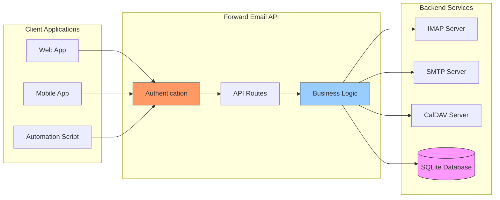

---


## Notificações Push no iOS {#ios-push-notifications}

> \[!TIP]
> Forward Email suporta notificações push nativas no iOS através do XAPPLEPUSHSERVICE para entrega instantânea de emails.

> \[!IMPORTANT]
> **Recurso Exclusivo:** Forward Email é um dos poucos servidores de email open-source que suporta notificações push nativas no iOS para emails, contatos e calendários via a extensão IMAP `XAPPLEPUSHSERVICE`. Isso foi engenharia reversa do protocolo da Apple e fornece entrega instantânea para dispositivos iOS sem drenar a bateria.

Forward Email implementa a extensão proprietária XAPPLEPUSHSERVICE da Apple, fornecendo notificações push nativas para dispositivos iOS sem necessidade de polling em segundo plano.

### Como Funciona {#how-it-works-1}

**XAPPLEPUSHSERVICE** é uma extensão IMAP não padrão que permite ao app Mail do iOS receber notificações push instantâneas quando novos emails chegam.

Forward Email implementa a integração proprietária do serviço de Notificações Push da Apple (APNs) para IMAP, permitindo que o app Mail do iOS receba notificações push instantâneas quando novos emails chegam.

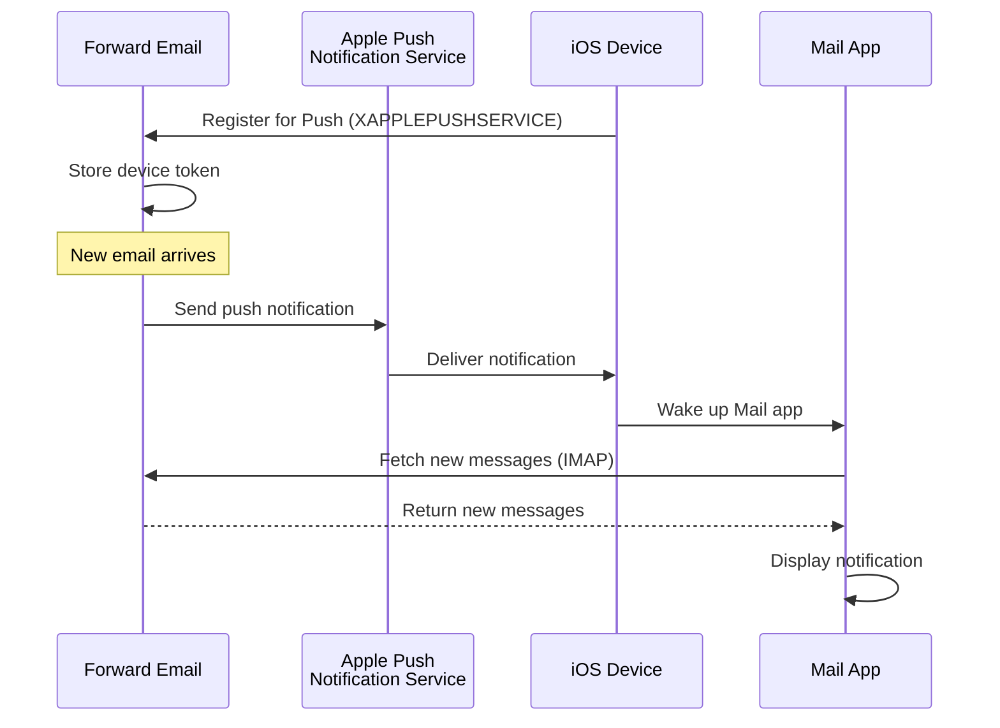

### Recursos Principais {#key-features}

**Entrega Instantânea:**

* Notificações push chegam em segundos
* Sem polling em segundo plano que consome bateria
* Funciona mesmo com o app Mail fechado

<!---->

* **Entrega Instantânea:** Emails, eventos de calendário e contatos aparecem no seu iPhone/iPad imediatamente, não em um cronograma de polling
* **Eficiente para Bateria:** Usa a infraestrutura de push da Apple em vez de manter conexões IMAP constantes
* **Push Baseado em Tópicos:** Suporta notificações push para caixas de correio específicas, não apenas INBOX
* **Sem Apps de Terceiros Necessários:** Funciona com os apps nativos Mail, Calendário e Contatos do iOS
**Integração Nativa:**

* Integrado ao app Mail do iOS
* Nenhum app de terceiros necessário
* Experiência de usuário fluida

**Focado em Privacidade:**

* Tokens do dispositivo são criptografados
* Nenhum conteúdo de mensagem enviado via APNS
* Apenas notificação de "novo email" enviada

**Eficiente em Bateria:**

* Sem polling constante IMAP
* Dispositivo dorme até chegar notificação
* Impacto mínimo na bateria

### O Que Torna Isso Especial {#what-makes-this-special}

> \[!IMPORTANT]
> A maioria dos provedores de email não suporta XAPPLEPUSHSERVICE, forçando dispositivos iOS a fazer polling para novos emails a cada 15 minutos.

A maioria dos servidores de email open-source (incluindo Dovecot, Postfix, Cyrus IMAP) NÃO suporta notificações push no iOS. Usuários devem:

* Usar IMAP IDLE (mantém conexão aberta, consome bateria)
* Usar polling (verifica a cada 15-30 minutos, notificações atrasadas)
* Usar apps proprietários de email com sua própria infraestrutura push

Forward Email oferece a mesma experiência de notificação push instantânea que serviços comerciais como Gmail, iCloud e Fastmail.

**Comparação com Outros Provedores:**

| Provedor          | Suporte Push  | Intervalo de Polling | Impacto na Bateria |
| ----------------- | ------------- | -------------------- | ------------------ |
| **Forward Email** | ✅ Push Nativo | Instantâneo          | Mínimo             |
| Gmail             | ✅ Push Nativo | Instantâneo          | Mínimo             |
| iCloud            | ✅ Push Nativo | Instantâneo          | Mínimo             |
| Yahoo             | ✅ Push Nativo | Instantâneo          | Mínimo             |
| Outlook.com       | ❌ Polling    | 15 minutos           | Moderado           |
| Fastmail          | ❌ Polling    | 15 minutos           | Moderado           |
| ProtonMail        | ⚠️ Apenas Bridge | Via Bridge          | Alto               |
| Tutanota          | ❌ Apenas App | N/A                  | N/A                |

### Detalhes da Implementação {#implementation-details}

**Resposta CAPABILITY IMAP:**

```
* CAPABILITY IMAP4rev1 ... XAPPLEPUSHSERVICE ...
```

**Processo de Registro:**

1. App Mail do iOS detecta a capacidade XAPPLEPUSHSERVICE
2. App registra token do dispositivo com Forward Email
3. Forward Email armazena token e associa à conta
4. Quando chega novo email, Forward Email envia push via APNS
5. iOS acorda o app Mail para buscar novas mensagens

**Segurança:**

* Tokens do dispositivo são criptografados em repouso
* Tokens expiram e são atualizados automaticamente
* Nenhum conteúdo de mensagem exposto ao APNS
* Criptografia ponta a ponta mantida

<!---->

* **Extensão IMAP:** `XAPPLEPUSHSERVICE`
* **Código Fonte:** [WildDuck Issue #711](https://github.com/zone-eu/wildduck/issues/711)
* **Configuração:** Automática - sem necessidade de configuração, funciona imediatamente com o app Mail do iOS

### Comparação com Outros Serviços {#comparison-with-other-services}

| Serviço       | Suporte Push iOS | Método                                   |
| ------------- | ---------------- | ---------------------------------------- |
| Forward Email | ✅ Sim           | `XAPPLEPUSHSERVICE` (engenharia reversa) |
| Gmail         | ✅ Sim           | App Gmail proprietário + push Google     |
| iCloud Mail   | ✅ Sim           | Integração nativa Apple                   |
| Outlook.com   | ✅ Sim           | App Outlook proprietário + push Microsoft|
| Fastmail      | ✅ Sim           | `XAPPLEPUSHSERVICE`                       |
| Dovecot       | ❌ Não           | Apenas IMAP IDLE ou polling               |
| Postfix       | ❌ Não           | Apenas IMAP IDLE ou polling               |
| Cyrus IMAP    | ❌ Não           | Apenas IMAP IDLE ou polling               |

**Push do Gmail:**

Gmail usa sistema push proprietário que funciona apenas com o app Gmail. O app Mail do iOS deve fazer polling nos servidores IMAP do Gmail.

**Push do iCloud:**

iCloud tem suporte push nativo similar ao Forward Email, mas apenas para endereços @icloud.com.

**Outlook.com:**

Outlook.com não suporta XAPPLEPUSHSERVICE, exigindo que o Mail do iOS faça polling a cada 15 minutos.

**Fastmail:**

Fastmail não suporta XAPPLEPUSHSERVICE. Usuários devem usar o app Fastmail para notificações push ou aceitar atrasos de polling de 15 minutos.

---


## Testes e Verificação {#testing-and-verification}


## Testes de Capacidade do Protocolo {#protocol-capability-tests}
> \[!NOTE]
> Esta seção fornece os resultados dos nossos testes mais recentes de capacidade de protocolo, realizados em 22 de janeiro de 2026.

Esta seção contém as respostas reais de CAPABILITY/CAPA/EHLO de todos os provedores testados. Todos os testes foram realizados em **22 de janeiro de 2026**.

Estes testes ajudam a verificar o suporte anunciado e real para vários protocolos e extensões de email entre os principais provedores.

### Metodologia de Teste {#test-methodology}

**Ambiente de Teste:**

* **Data:** 22 de janeiro de 2026 às 02:37 UTC
* **Localização:** instância AWS EC2
* **IPv4:** 54.167.216.197
* **IPv6:** 2600:4040:46da:9a00:b19e:3ad4:426c:2f48
* **Ferramentas:** OpenSSL s_client, scripts bash

**Provedores Testados:**

* Forward Email
* Gmail
* Outlook.com
* iCloud
* Fastmail
* Yahoo/AOL (Verizon)

### Scripts de Teste {#test-scripts}

Para total transparência, os scripts exatos usados para estes testes são fornecidos abaixo.

#### Script de Teste de Capacidade IMAP {#imap-capability-test-script}

```bash
#!/bin/bash
# IMAP Capability Test Script
# Tests IMAP CAPABILITY for various email providers

echo "========================================="
echo "IMAP CAPABILITY TEST"
echo "Date: $(date -u +"%Y-%m-%d %H:%M:%S UTC")"
echo "========================================="
echo ""

# Gmail
echo "--- Gmail (imap.gmail.com:993) ---"
echo -e "a001 CAPABILITY\na002 LOGOUT" | timeout 10 openssl s_client -connect imap.gmail.com:993 -crlf -quiet 2>&1 | grep -A 20 "CAPABILITY"
echo ""

# Outlook.com
echo "--- Outlook.com (outlook.office365.com:993) ---"
echo -e "a001 CAPABILITY\na002 LOGOUT" | timeout 10 openssl s_client -connect outlook.office365.com:993 -crlf -quiet 2>&1 | grep -A 20 "CAPABILITY"
echo ""

# iCloud
echo "--- iCloud (imap.mail.me.com:993) ---"
echo -e "a001 CAPABILITY\na002 LOGOUT" | timeout 10 openssl s_client -connect imap.mail.me.com:993 -crlf -quiet 2>&1 | grep -A 20 "CAPABILITY"
echo ""

# Fastmail
echo "--- Fastmail (imap.fastmail.com:993) ---"
echo -e "a001 CAPABILITY\na002 LOGOUT" | timeout 10 openssl s_client -connect imap.fastmail.com:993 -crlf -quiet 2>&1 | grep -A 20 "CAPABILITY"
echo ""

# Yahoo
echo "--- Yahoo (imap.mail.yahoo.com:993) ---"
echo -e "a001 CAPABILITY\na002 LOGOUT" | timeout 10 openssl s_client -connect imap.mail.yahoo.com:993 -crlf -quiet 2>&1 | grep -A 20 "CAPABILITY"
echo ""

# Forward Email
echo "--- Forward Email (imap.forwardemail.net:993) ---"
echo -e "a001 CAPABILITY\na002 LOGOUT" | timeout 10 openssl s_client -connect imap.forwardemail.net:993 -crlf -quiet 2>&1 | grep -A 20 "CAPABILITY"
echo ""

echo "========================================="
echo "Test completed"
echo "========================================="
```

#### Script de Teste de Capacidade POP3 {#pop3-capability-test-script}

```bash
#!/bin/bash
# POP3 Capability Test Script
# Tests POP3 CAPA for various email providers

echo "========================================="
echo "POP3 CAPABILITY TEST"
echo "Date: $(date -u +"%Y-%m-%d %H:%M:%S UTC")"
echo "========================================="
echo ""

# Gmail
echo "--- Gmail (pop.gmail.com:995) ---"
echo -e "CAPA\nQUIT" | timeout 10 openssl s_client -connect pop.gmail.com:995 -crlf -quiet 2>&1 | grep -A 20 "CAPA"
echo ""

# Outlook.com
echo "--- Outlook.com (outlook.office365.com:995) ---"
echo -e "CAPA\nQUIT" | timeout 10 openssl s_client -connect outlook.office365.com:995 -crlf -quiet 2>&1 | grep -A 20 "CAPA"
echo ""

# iCloud (Nota: iCloud não suporta POP3)
echo "--- iCloud (No POP3 support) ---"
echo "iCloud não suporta POP3"
echo ""

# Fastmail
echo "--- Fastmail (pop.fastmail.com:995) ---"
echo -e "CAPA\nQUIT" | timeout 10 openssl s_client -connect pop.fastmail.com:995 -crlf -quiet 2>&1 | grep -A 20 "CAPA"
echo ""

# Yahoo
echo "--- Yahoo (pop.mail.yahoo.com:995) ---"
echo -e "CAPA\nQUIT" | timeout 10 openssl s_client -connect pop.mail.yahoo.com:995 -crlf -quiet 2>&1 | grep -A 20 "CAPA"
echo ""

# Forward Email
echo "--- Forward Email (pop3.forwardemail.net:995) ---"
echo -e "CAPA\nQUIT" | timeout 10 openssl s_client -connect pop3.forwardemail.net:995 -crlf -quiet 2>&1 | grep -A 20 "CAPA"
echo ""

echo "========================================="
echo "Test completed"
echo "========================================="
```
#### Script de Teste de Capacidade SMTP {#smtp-capability-test-script}

```bash
#!/bin/bash
# Script de Teste de Capacidade SMTP
# Testa EHLO SMTP para vários provedores de email

echo "========================================="
echo "TESTE DE CAPACIDADE SMTP"
echo "Data: $(date -u +"%Y-%m-%d %H:%M:%S UTC")"
echo "========================================="
echo ""

# Gmail
echo "--- Gmail (smtp.gmail.com:587) ---"
echo -e "EHLO test.com\nQUIT" | timeout 10 openssl s_client -connect smtp.gmail.com:587 -starttls smtp -crlf -quiet 2>&1 | grep -A 30 "250-"
echo ""

# Outlook.com
echo "--- Outlook.com (smtp.office365.com:587) ---"
echo -e "EHLO test.com\nQUIT" | timeout 10 openssl s_client -connect smtp.office365.com:587 -starttls smtp -crlf -quiet 2>&1 | grep -A 30 "250-"
echo ""

# iCloud
echo "--- iCloud (smtp.mail.me.com:587) ---"
echo -e "EHLO test.com\nQUIT" | timeout 10 openssl s_client -connect smtp.mail.me.com:587 -starttls smtp -crlf -quiet 2>&1 | grep -A 30 "250-"
echo ""

# Fastmail
echo "--- Fastmail (smtp.fastmail.com:587) ---"
echo -e "EHLO test.com\nQUIT" | timeout 10 openssl s_client -connect smtp.fastmail.com:587 -starttls smtp -crlf -quiet 2>&1 | grep -A 30 "250-"
echo ""

# Yahoo
echo "--- Yahoo (smtp.mail.yahoo.com:587) ---"
echo -e "EHLO test.com\nQUIT" | timeout 10 openssl s_client -connect smtp.mail.yahoo.com:587 -starttls smtp -crlf -quiet 2>&1 | grep -A 30 "250-"
echo ""

# Forward Email
echo "--- Forward Email (smtp.forwardemail.net:587) ---"
echo -e "EHLO test.com\nQUIT" | timeout 10 openssl s_client -connect smtp.forwardemail.net:587 -starttls smtp -crlf -quiet 2>&1 | grep -A 30 "250-"
echo ""

echo "========================================="
echo "Teste concluído"
echo "========================================="
```

### Resumo dos Resultados do Teste {#test-results-summary}

#### IMAP (CAPABILITY) {#imap-capability}

**Forward Email**

```
* CAPABILITY IMAP4rev1 AUTH=PLAIN AUTH=PLAIN-CLIENTTOKEN CHILDREN ENABLE ID IDLE NAMESPACE QUOTA SASL-IR UNSELECT XLIST XAPPLEPUSHSERVICE
```

**Gmail**

```
* CAPABILITY IMAP4rev1 UNSELECT IDLE NAMESPACE QUOTA ID XLIST CHILDREN X-GM-EXT-1 UIDPLUS COMPRESS=DEFLATE ENABLE MOVE CONDSTORE ESEARCH UTF8=ACCEPT LIST-EXTENDED LIST-STATUS LITERAL- SPECIAL-USE
```

**iCloud**

```
* OK [CAPABILITY XAPPLEPUSHSERVICE IMAP4 IMAP4rev1 SASL-IR AUTH=ATOKEN AUTH=PLAIN AUTH=ATOKEN2 AUTH=XOAUTH2]
```

**Outlook.com**

```
* CAPABILITY IMAP4rev1 AUTH=PLAIN AUTH=XOAUTH2 SASL-IR UIDPLUS ID UNSELECT CHILDREN IDLE NAMESPACE LITERAL+
```

**Fastmail**

```
* CAPABILITY IMAP4rev1 ACL ANNOTATE-EXPERIMENT-1 CATENATE CONDSTORE ENABLE ESEARCH ESORT I18NLEVEL=1 ID IDLE LIST-EXTENDED LIST-STATUS LITERAL+ LOGINDISABLED MULTIAPPEND NAMESPACE QRESYNC QUOTA RIGHTS=ektx SASL-IR SORT SPECIAL-USE THREAD=ORDEREDSUBJECT UIDPLUS UNSELECT WITHIN X-RENAME XLIST
```

**Yahoo/AOL (Verizon)**

```
* CAPABILITY IMAP4rev1 IDLE NAMESPACE QUOTA ID XLIST CHILDREN UIDPLUS MOVE CONDSTORE ESEARCH ENABLE LIST-EXTENDED LIST-STATUS LITERAL- SPECIAL-USE UNSELECT XAPPLEPUSHSERVICE
```

#### POP3 (CAPA) {#pop3-capa}

**Forward Email**

```
+OK
CAPA
TOP
USER
UIDL
EXPIRE 30
IMPLEMENTATION ForwardEmail
.
```

**Gmail**

```
+OK
CAPA
TOP
USER
UIDL
EXPIRE 30
IMPLEMENTATION Gpop
.
```

**Outlook.com**

```
+OK
CAPA
TOP
USER
UIDL
SASL PLAIN XOAUTH2
.
```

**Fastmail**

```
+OK
CAPA
TOP
USER
UIDL
EXPIRE 30
IMPLEMENTATION Cyrus
.
```

#### SMTP (EHLO) {#smtp-ehlo}

**Forward Email**

```
250-smtp.forwardemail.net
250-PIPELINING
250-SIZE 52428800
250-ETRN
250-STARTTLS
250-ENHANCEDSTATUSCODES
250-8BITMIME
250-DSN
250 CHUNKING
```

**Gmail**

```
250-smtp.gmail.com at your service
250-SIZE 35882577
250-8BITMIME
250-STARTTLS
250-ENHANCEDSTATUSCODES
250-PIPELINING
250-CHUNKING
250 SMTPUTF8
```

**Outlook.com**

```
250-SN4PR13CA0005.outlook.office365.com Hello [x.x.x.x]
250-SIZE 157286400
250-PIPELINING
250-DSN
250-ENHANCEDSTATUSCODES
250-STARTTLS
250-8BITMIME
250-BINARYMIME
250-CHUNKING
250 SMTPUTF8
```

**Fastmail**

```
250-smtp.fastmail.com
250-PIPELINING
250-SIZE 78643200
250-ETRN
250-STARTTLS
250-ENHANCEDSTATUSCODES
250-8BITMIME
250-DSN
250 CHUNKING
```

**Yahoo/AOL (Verizon)**

```
250-smtp.mail.yahoo.com
250-PIPELINING
250-SIZE 41943040
250-8BITMIME
250-ENHANCEDSTATUSCODES
250-STARTTLS
```
### Resultados Detalhados dos Testes {#detailed-test-results}

#### Resultados do Teste IMAP {#imap-test-results}

**Gmail:**
`* CAPABILITY IMAP4rev1 UNSELECT IDLE NAMESPACE QUOTA ID XLIST CHILDREN X-GM-EXT-1 XYZZY SASL-IR AUTH=XOAUTH2 AUTH=PLAIN AUTH=PLAIN-CLIENTTOKEN AUTH=OAUTHBEARER`

**Outlook.com:**
`* CAPABILITY IMAP4 IMAP4rev1 AUTH=PLAIN AUTH=XOAUTH2 SASL-IR UIDPLUS ID UNSELECT CHILDREN IDLE NAMESPACE LITERAL+`

**iCloud:**
`* CAPABILITY XAPPLEPUSHSERVICE IMAP4 IMAP4rev1 SASL-IR AUTH=ATOKEN AUTH=PLAIN AUTH=ATOKEN2 AUTH=XOAUTH2`

**Fastmail:**
Tempo de conexão esgotado. Veja as notas abaixo.

**Yahoo:**
`* CAPABILITY IMAP4rev1 SASL-IR AUTH=PLAIN AUTH=XOAUTH2 AUTH=OAUTHBEARER ID MOVE NAMESPACE XYMHIGHESTMODSEQ UIDPLUS LITERAL+ CHILDREN UNSELECT X-MSG-EXT OBJECTID IDLE ENABLE UIDONLY X-ALL-MAIL X-UIDONLY LIST-EXTENDED LIST-STATUS SPECIAL-USE PARTIAL APPENDLIMIT=41697280`

**Forward Email:**
`* CAPABILITY XAPPLEPUSHSERVICE IMAP4rev1 APPENDLIMIT=52428800 AUTH=PLAIN AUTH=PLAIN-CLIENTTOKEN CHILDREN CONDSTORE ENABLE ID IDLE MOVE NAMESPACE QUOTA SASL-IR SPECIAL-USE UIDPLUS UNSELECT UTF8=ACCEPT XLIST`

#### Resultados do Teste POP3 {#pop3-test-results}

**Gmail:**
A conexão não retornou resposta CAPA sem autenticação.

**Outlook.com:**
A conexão não retornou resposta CAPA sem autenticação.

**iCloud:**
Não suportado.

**Fastmail:**
Tempo de conexão esgotado. Veja as notas abaixo.

**Yahoo:**
`+OK CAPA list follows... SASL PLAIN XOAUTH2`

**Forward Email:**
A conexão não retornou resposta CAPA sem autenticação.

#### Resultados do Teste SMTP {#smtp-test-results}

**Gmail:**
`250-AUTH LOGIN PLAIN XOAUTH2 PLAIN-CLIENTTOKEN OAUTHBEARER XOAUTH`

**Outlook.com:**
`250-DSN`

**iCloud:**
`250-DSN`

**Fastmail:**
`250 AUTH PLAIN LOGIN XOAUTH2 OAUTHBEARER`

**Yahoo:**
`250 AUTH PLAIN LOGIN XOAUTH2 OAUTHBEARER`

**Forward Email:**
`250-DSN`, `250-REQUIRETLS`

### Notas sobre os Resultados dos Testes {#notes-on-test-results}

> \[!NOTE]
> Observações importantes e limitações dos resultados dos testes.

1. **Timeouts do Fastmail**: As conexões com o Fastmail expiraram durante os testes, provavelmente devido a limitações de taxa ou restrições de firewall do IP do servidor de teste. O Fastmail é conhecido por ter suporte robusto a IMAP/POP3/SMTP conforme sua documentação.

2. **Respostas CAPA do POP3**: Vários provedores (Gmail, Outlook.com, Forward Email) não retornaram respostas CAPA sem autenticação. Esta é uma prática comum de segurança para servidores POP3.

3. **Suporte a DSN**: Apenas Outlook.com, iCloud e Forward Email anunciam explicitamente suporte a DSN nas respostas EHLO do SMTP. Isso não significa necessariamente que outros provedores não suportem DSN, mas eles não o anunciam.

4. **REQUIRETLS**: Apenas Forward Email anuncia explicitamente suporte a REQUIRETLS com caixa de seleção para aplicação pelo usuário. Outros provedores podem suportar internamente, mas não anunciam no EHLO.

5. **Ambiente de Teste**: Os testes foram realizados a partir de uma instância AWS EC2 (IP: 54.167.216.197 IPv4, 2600:4040:46da:9a00:b19e:3ad4:426c:2f48 IPv6) em 22 de janeiro de 2026 às 02:37 UTC.

---


## Resumo {#summary}

Forward Email oferece suporte abrangente aos protocolos RFC em todos os principais padrões de e-mail:

* **IMAP4rev1:** 16 RFCs suportadas com diferenças intencionais documentadas
* **POP3:** 4 RFCs suportadas com exclusão permanente conforme RFC
* **SMTP:** 11 extensões suportadas incluindo SMTPUTF8, DSN e PIPELINING
* **Autenticação:** DKIM, SPF, DMARC, ARC totalmente suportados
* **Segurança de Transporte:** MTA-STS e REQUIRETLS totalmente suportados, DANE suporte parcial
* **Criptografia:** OpenPGP v6 e S/MIME suportados
* **Calendário:** CalDAV, CardDAV e VTODO totalmente suportados
* **Acesso API:** API REST completa com 39 endpoints para acesso direto ao banco de dados
* **Push iOS:** Notificações push nativas para e-mail, contatos e calendários via `XAPPLEPUSHSERVICE`

### Diferenciais Chave {#key-differentiators}

> \[!TIP]
> Forward Email se destaca com recursos únicos não encontrados em outros provedores.

**O que torna o Forward Email único:**

1. **Criptografia Quantum-Safe** - Único provedor com caixas de correio SQLite criptografadas com ChaCha20-Poly1305
2. **Arquitetura Zero-Knowledge** - Sua senha criptografa sua caixa de correio; nós não podemos descriptografá-la
3. **Domínios Personalizados Gratuitos** - Sem taxas mensais para e-mail com domínio personalizado
4. **Suporte REQUIRETLS** - Caixa de seleção para o usuário aplicar TLS em todo o caminho de entrega
5. **API Abrangente** - 39 endpoints REST API para controle programático completo
6. **Notificações Push iOS** - Suporte nativo XAPPLEPUSHSERVICE para entrega instantânea
7. **Código Aberto** - Código-fonte completo disponível no GitHub
8. **Foco em Privacidade** - Sem mineração de dados, sem anúncios, sem rastreamento
* **Criptografia em Sandbox:** Único serviço de email com caixas de correio SQLite criptografadas individualmente  
* **Conformidade com RFC:** Prioriza conformidade com padrões em vez de conveniência (ex.: POP3 DELE)  
* **API Completa:** Acesso programático direto a todos os dados de email  
* **Código Aberto:** Implementação totalmente transparente  

**Resumo do Suporte a Protocolos:**  

| Categoria            | Nível de Suporte | Detalhes                                      |
| -------------------- | ---------------- | --------------------------------------------- |
| **Protocolos Core**  | ✅ Excelente     | IMAP4rev1, POP3, SMTP totalmente suportados  |
| **Protocolos Modernos** | ⚠️ Parcial      | Suporte parcial a IMAP4rev2, JMAP não suportado |
| **Segurança**        | ✅ Excelente     | DKIM, SPF, DMARC, ARC, MTA-STS, REQUIRETLS    |
| **Criptografia**     | ✅ Excelente     | OpenPGP, S/MIME, criptografia SQLite          |
| **CalDAV/CardDAV**   | ✅ Excelente     | Sincronização completa de calendário e contatos |
| **Filtragem**        | ✅ Excelente     | Sieve (24 extensões) e ManageSieve             |
| **API**              | ✅ Excelente     | 39 endpoints REST API                          |
| **Push**             | ✅ Excelente     | Notificações push nativas para iOS            |
