# Поддержка протоколов Email RFC - Полное руководство по стандартам и спецификациям {#email-rfc-protocol-support---complete-standards--specifications-guide}


## Содержание {#table-of-contents}

* [О документе](#about-this-document)
  * [Обзор архитектуры](#architecture-overview)
* [Сравнение почтовых сервисов - поддержка протоколов и соответствие стандартам RFC](#email-service-comparison---protocol-support--rfc-standards-compliance)
  * [Визуализация поддержки протоколов](#protocol-support-visualization)
* [Основные почтовые протоколы](#core-email-protocols)
  * [Поток протокола электронной почты](#email-protocol-flow)
* [Протокол электронной почты IMAP4 и расширения](#imap4-email-protocol-and-extensions)
  * [Отличия протокола IMAP от спецификаций RFC](#imap-protocol-differences-from-rfc-specifications)
  * [Расширения IMAP, НЕ поддерживаемые](#imap-extensions-not-supported)
* [Протокол электронной почты POP3 и расширения](#pop3-email-protocol-and-extensions)
  * [Отличия протокола POP3 от спецификаций RFC](#pop3-protocol-differences-from-rfc-specifications)
  * [Расширения POP3, НЕ поддерживаемые](#pop3-extensions-not-supported)
* [Протокол электронной почты SMTP и расширения](#smtp-email-protocol-and-extensions)
  * [Уведомления о статусе доставки (DSN)](#delivery-status-notifications-dsn)
  * [Поддержка REQUIRETLS](#requiretls-support)
  * [Расширения SMTP, НЕ поддерживаемые](#smtp-extensions-not-supported)
* [Протокол электронной почты JMAP](#jmap-email-protocol)
* [Безопасность электронной почты](#email-security)
  * [Архитектура безопасности электронной почты](#email-security-architecture)
* [Протоколы аутентификации сообщений электронной почты](#email-message-authentication-protocols)
  * [Поддержка протоколов аутентификации](#authentication-protocol-support)
  * [DKIM (DomainKeys Identified Mail)](#dkim-domainkeys-identified-mail)
  * [SPF (Sender Policy Framework)](#spf-sender-policy-framework)
  * [DMARC (Domain-based Message Authentication, Reporting & Conformance)](#dmarc-domain-based-message-authentication-reporting--conformance)
  * [ARC (Authenticated Received Chain)](#arc-authenticated-received-chain)
  * [Поток аутентификации](#authentication-flow)
* [Протоколы транспортной безопасности электронной почты](#email-transport-security-protocols)
  * [Поддержка транспортной безопасности](#transport-security-support)
  * [TLS (Transport Layer Security)](#tls-transport-layer-security)
  * [MTA-STS (Mail Transfer Agent Strict Transport Security)](#mta-sts-mail-transfer-agent-strict-transport-security)
  * [DANE (DNS-based Authentication of Named Entities)](#dane-dns-based-authentication-of-named-entities)
  * [REQUIRETLS](#requiretls)
  * [Поток транспортной безопасности](#transport-security-flow)
* [Шифрование сообщений электронной почты](#email-message-encryption)
  * [Поддержка шифрования](#encryption-support)
  * [OpenPGP (Pretty Good Privacy)](#openpgp-pretty-good-privacy)
  * [S/MIME (Secure/Multipurpose Internet Mail Extensions)](#smime-securemultipurpose-internet-mail-extensions)
  * [Шифрование почтового ящика SQLite](#sqlite-mailbox-encryption)
  * [Сравнение шифрования](#encryption-comparison)
  * [Поток шифрования](#encryption-flow)
* [Расширенный функционал](#extended-functionality)
* [Стандарты формата сообщений электронной почты](#email-message-format-standards)
  * [Поддержка стандартов формата](#format-standards-support)
  * [MIME (Multipurpose Internet Mail Extensions)](#mime-multipurpose-internet-mail-extensions)
  * [SMTPUTF8 и интернационализация адресов электронной почты](#smtputf8-and-email-address-internationalization)
* [Протоколы календарей и контактов](#calendaring-and-contacts-protocols)
  * [Поддержка CalDAV и CardDAV](#caldav-and-carddav-support)
  * [CalDAV (доступ к календарю)](#caldav-calendar-access)
  * [CardDAV (доступ к контактам)](#carddav-contact-access)
  * [Задачи и напоминания (CalDAV VTODO)](#tasks-and-reminders-caldav-vtodo)
  * [Поток синхронизации CalDAV/CardDAV](#caldavcarddav-synchronization-flow)
  * [Расширения календарей, НЕ поддерживаемые](#calendaring-extensions-not-supported)
* [Фильтрация сообщений электронной почты](#email-message-filtering)
  * [Sieve (RFC 5228)](#sieve-rfc-5228)
  * [ManageSieve (RFC 5804)](#managesieve-rfc-5804)
* [Оптимизация хранения](#storage-optimization)
  * [Архитектура: оптимизация хранения с двумя уровнями](#architecture-dual-layer-storage-optimization)
* [Дедупликация вложений](#attachment-deduplication)
  * [Как это работает](#how-it-works)
  * [Поток дедупликации](#deduplication-flow)
  * [Система Magic Number](#magic-number-system)
  * [Ключевые отличия: WildDuck vs Forward Email](#key-differences-wildduck-vs-forward-email)
* [Сжатие Brotli](#brotli-compression)
  * [Что сжимается](#what-gets-compressed)
  * [Настройка сжатия](#compression-configuration)
  * [Магический заголовок: "FEBR"](#magic-header-febr)
  * [Процесс сжатия](#compression-process)
  * [Процесс распаковки](#decompression-process)
  * [Обратная совместимость](#backwards-compatibility)
  * [Статистика экономии места](#storage-savings-statistics)
  * [Процесс миграции](#migration-process)
  * [Общая эффективность хранения](#combined-storage-efficiency)
  * [Технические детали реализации](#technical-implementation-details)
  * [Почему ни один другой провайдер так не делает](#why-no-other-provider-does-this)
* [Современные функции](#modern-features)
* [Полный REST API для управления электронной почтой](#complete-rest-api-for-email-management)
  * [Категории API (39 конечных точек)](#api-categories-39-endpoints)
  * [Технические детали](#technical-details)
  * [Реальные сценарии использования](#real-world-use-cases)
  * [Ключевые особенности API](#key-api-features)
  * [Архитектура API](#api-architecture)
* [Push-уведомления iOS](#ios-push-notifications)
  * [Как это работает](#how-it-works-1)
  * [Ключевые особенности](#key-features)
  * [Что делает это особенным](#what-makes-this-special)
  * [Детали реализации](#implementation-details)
  * [Сравнение с другими сервисами](#comparison-with-other-services)
* [Тестирование и проверка](#testing-and-verification)
* [Тесты возможностей протоколов](#protocol-capability-tests)
  * [Методология тестирования](#test-methodology)
  * [Тестовые скрипты](#test-scripts)
  * [Краткое резюме результатов тестов](#test-results-summary)
  * [Подробные результаты тестов](#detailed-test-results)
  * [Примечания к результатам тестов](#notes-on-test-results)
* [Резюме](#summary)
  * [Ключевые отличия](#key-differentiators)
## Об этом документе {#about-this-document}

В этом документе описывается поддержка протоколов RFC (Request for Comments) для Forward Email. Поскольку Forward Email использует [WildDuck](https://github.com/nodemailer/wildduck) для функциональности IMAP/POP3, поддержка протоколов и ограничения, описанные здесь, отражают реализацию WildDuck.

> \[!IMPORTANT]
> Forward Email использует [SQLite](https://sqlite.org/) для хранения сообщений вместо MongoDB (которую изначально использовал WildDuck). Это влияет на некоторые детали реализации, описанные ниже.

**Исходный код:** <https://github.com/forwardemail/forwardemail.net>

### Обзор архитектуры {#architecture-overview}

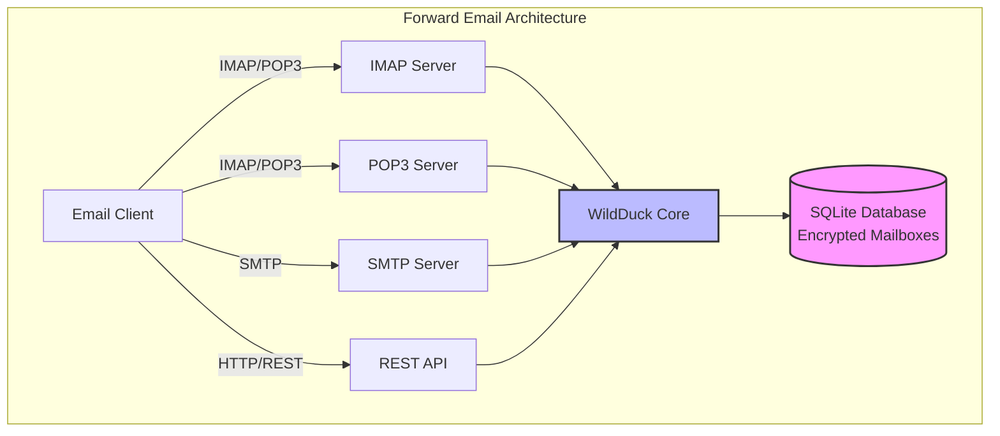

---


## Сравнение почтовых сервисов — поддержка протоколов и соответствие стандартам RFC {#email-service-comparison---protocol-support--rfc-standards-compliance}

> \[!IMPORTANT]
> **Песочница и квантово-устойчивое шифрование:** Forward Email — единственный почтовый сервис, который хранит индивидуально зашифрованные почтовые ящики SQLite с использованием вашего пароля (который есть только у вас). Каждый почтовый ящик зашифрован с помощью [sqleet](https://github.com/resilar/sqleet) (ChaCha20-Poly1305), автономен, изолирован и портативен. Если вы забудете пароль, вы потеряете доступ к почтовому ящику — даже Forward Email не сможет его восстановить. Подробнее смотрите в разделе [Quantum-Safe Encrypted Email](https://forwardemail.net/en/blog/docs/best-quantum-safe-encrypted-email-service).

Сравните поддержку почтовых протоколов и реализацию стандартов RFC у основных почтовых провайдеров:

| Функция                      | Forward Email                                                                                  | Postfix/Dovecot                                                                    | Gmail                                                                             | iCloud Mail                                           | Outlook.com                                                                                                                                                          | Fastmail                                                                                 | Yahoo/AOL (Verizon)                                                  | ProtonMail                                                                     | Tutanota                                                          |
| ---------------------------- | ---------------------------------------------------------------------------------------------- | ---------------------------------------------------------------------------------- | --------------------------------------------------------------------------------- | ----------------------------------------------------- | -------------------------------------------------------------------------------------------------------------------------------------------------------------------- | ---------------------------------------------------------------------------------------- | -------------------------------------------------------------------- | ------------------------------------------------------------------------------ | ----------------------------------------------------------------- |
| **Цена за собственный домен**| [Бесплатно](https://forwardemail.net/en/pricing)                                               | [Бесплатно](https://www.postfix.org/)                                             | [$7.20/мес](https://workspace.google.com/pricing)                                | [$0.99/мес](https://support.apple.com/en-us/102622)    | [$7.20/мес](https://www.microsoft.com/en-us/microsoft-365/business/microsoft-365-business-basic)                                                                      | [$5/мес](https://www.fastmail.com/pricing/)                                               | [$3.19/мес](https://www.turbify.com/mail)                             | [$4.99/мес](https://proton.me/mail/pricing)                                     | [$3.27/мес](https://tuta.com/pricing)                              |
| **IMAP4rev1 (RFC 3501)**     | ✅ [Поддерживается](#imap4-email-protocol-and-extensions)                                      | ✅ [Поддерживается](https://www.dovecot.org/)                                     | ✅ [Поддерживается](https://developers.google.com/workspace/gmail/imap/imap-extensions) | ✅ [Поддерживается](https://support.apple.com/en-us/102431) | ✅ [Поддерживается](https://support.microsoft.com/en-us/office/pop-imap-and-smtp-settings-for-outlook-com-d088b986-291d-42b8-9564-9c414e2aa040)                            | ✅ [Поддерживается](https://www.fastmail.help/hc/en-us/articles/1500000278382-Email-standards) | ✅ [Поддерживается](https://senders.yahooinc.com/developer/documentation/) | ⚠️ [Через Bridge](https://proton.me/support/imap-smtp-and-pop3-setup)            | ❌ Не поддерживается                                               |
| **IMAP4rev2 (RFC 9051)**     | ⚠️ [Частично](https://forwardemail.net/en/blog/docs/best-quantum-safe-encrypted-email-service) | ⚠️ [Частично](https://www.dovecot.org/)                                           | ⚠️ [31%](https://developers.google.com/workspace/gmail/imap/imap-extensions)      | ⚠️ [92%](https://support.apple.com/en-us/102431)      | ⚠️ [46%](https://support.microsoft.com/en-us/office/pop-imap-and-smtp-settings-for-outlook-com-d088b986-291d-42b8-9564-9c414e2aa040)                                 | ⚠️ [69%](https://www.fastmail.help/hc/en-us/articles/1500000278382-Email-standards)      | ⚠️ [85%](https://senders.yahooinc.com/developer/documentation/)      | ⚠️ [Через Bridge](https://proton.me/support/imap-smtp-and-pop3-setup)            | ❌ Не поддерживается                                               |
| **POP3 (RFC 1939)**          | ✅ [Поддерживается](#pop3-email-protocol-and-extensions)                                       | ✅ [Поддерживается](https://www.dovecot.org/)                                     | ✅ [Поддерживается](https://support.google.com/mail/answer/7104828)               | ❌ Не поддерживается                                   | ✅ [Поддерживается](https://support.microsoft.com/en-us/office/pop-imap-and-smtp-settings-for-outlook-com-d088b986-291d-42b8-9564-9c414e2aa040)                            | ✅ [Поддерживается](https://www.fastmail.help/hc/en-us/articles/1500000278382-Email-standards) | ✅ [Поддерживается](https://help.yahoo.com/kb/SLN4075.html)                | ⚠️ [Через Bridge](https://proton.me/support/imap-smtp-and-pop3-setup)            | ❌ Не поддерживается                                               |
| **SMTP (RFC 5321)**          | ✅ [Поддерживается](#smtp-email-protocol-and-extensions)                                       | ✅ [Поддерживается](https://www.postfix.org/)                                     | ✅ [Поддерживается](https://support.google.com/mail/answer/7126229)               | ✅ [Поддерживается](https://support.apple.com/en-us/102431) | ✅ [Поддерживается](https://support.microsoft.com/en-us/office/pop-imap-and-smtp-settings-for-outlook-com-d088b986-291d-42b8-9564-9c414e2aa040)                            | ✅ [Поддерживается](https://www.fastmail.help/hc/en-us/articles/1500000278382-Email-standards) | ✅ [Поддерживается](https://help.yahoo.com/kb/SLN4075.html)                | ⚠️ [Через Bridge](https://proton.me/support/imap-smtp-and-pop3-setup)            | ❌ Не поддерживается                                               |
| **JMAP (RFC 8620)**          | ❌ [Не поддерживается](#jmap-email-protocol)                                                  | ❌ Не поддерживается                                                              | ❌ Не поддерживается                                                             | ❌ Не поддерживается                                   | ❌ Не поддерживается                                                                                                                                                  | ✅ [Поддерживается](https://www.fastmail.com/dev/)                                             | ❌ Не поддерживается                                                  | ❌ Не поддерживается                                                            | ❌ Не поддерживается                                               |
| **DKIM (RFC 6376)**          | ✅ [Поддерживается](#email-message-authentication-protocols)                                   | ✅ [Поддерживается](https://github.com/trusteddomainproject/OpenDKIM)              | ✅ [Поддерживается](https://support.google.com/a/answer/174124)                   | ✅ [Поддерживается](https://support.apple.com/en-us/102431) | ✅ [Поддерживается](https://learn.microsoft.com/en-us/defender-office-365/email-authentication-dkim-configure)                                                             | ✅ [Поддерживается](https://www.fastmail.help/hc/en-us/articles/360060590573)                  | ✅ [Поддерживается](https://help.yahoo.com/kb/SLN25426.html)               | ✅ [Поддерживается](https://proton.me/support)                                       | ✅ [Поддерживается](https://tuta.com/support#dkim)                      |
| **SPF (RFC 7208)**           | ✅ [Поддерживается](#email-message-authentication-protocols)                                   | ✅ [Поддерживается](https://www.postfix.org/)                                     | ✅ [Поддерживается](https://support.google.com/a/answer/33786)                    | ✅ [Поддерживается](https://support.apple.com/en-us/102431) | ✅ [Поддерживается](https://learn.microsoft.com/en-us/microsoft-365/security/office-365-security/how-office-365-uses-spf-to-prevent-spoofing)                              | ✅ [Поддерживается](https://www.fastmail.help/hc/en-us/articles/360060590573)                  | ✅ [Поддерживается](https://help.yahoo.com/kb/SLN25426.html)               | ✅ [Поддерживается](https://proton.me/support)                                       | ✅ [Поддерживается](https://tuta.com/support#dkim)                      |
| **DMARC (RFC 7489)**         | ✅ [Поддерживается](#email-message-authentication-protocols)                                   | ✅ [Поддерживается](https://www.postfix.org/)                                     | ✅ [Поддерживается](https://support.google.com/a/answer/2466580)                  | ✅ [Поддерживается](https://support.apple.com/en-us/102431) | ✅ [Поддерживается](https://learn.microsoft.com/en-us/microsoft-365/security/office-365-security/use-dmarc-to-validate-email)                                              | ✅ [Поддерживается](https://www.fastmail.help/hc/en-us/articles/360060590573)                  | ✅ [Поддерживается](https://help.yahoo.com/kb/SLN25426.html)               | ✅ [Поддерживается](https://proton.me/support)                                       | ✅ [Поддерживается](https://tuta.com/support#dkim)                      |
| **ARC (RFC 8617)**           | ✅ [Поддерживается](#email-message-authentication-protocols)                                   | ✅ [Поддерживается](https://github.com/trusteddomainproject/OpenARC)               | ✅ [Поддерживается](https://support.google.com/a/answer/2466580)                  | ❌ Не поддерживается                                   | ✅ [Поддерживается](https://learn.microsoft.com/en-us/defender-office-365/email-authentication-arc-configure)                                                              | ✅ [Поддерживается](https://www.fastmail.help/hc/en-us/articles/360060590573)                  | ✅ [Поддерживается](https://senders.yahooinc.com/developer/documentation/) | ✅ [Поддерживается](https://proton.me/blog/what-is-authenticated-received-chain-arc) | ❌ Не поддерживается                                               |
| **MTA-STS (RFC 8461)**       | ✅ [Поддерживается](#email-transport-security-protocols)                                       | ✅ [Поддерживается](https://www.postfix.org/)                                     | ✅ [Поддерживается](https://support.google.com/a/answer/9261504)                  | ✅ [Поддерживается](https://support.apple.com/en-us/102431) | ✅ [Поддерживается](https://learn.microsoft.com/en-us/defender-office-365/email-authentication-about)                                                                      | ✅ [Поддерживается](https://www.fastmail.help/hc/en-us/articles/360060590573)                  | ✅ [Поддерживается](https://senders.yahooinc.com/developer/documentation/) | ✅ [Поддерживается](https://proton.me/support)                                       | ✅ [Поддерживается](https://tuta.com/security)                          |
| **DANE (RFC 7671)**          | ✅ [Поддерживается](#email-transport-security-protocols)                                       | ✅ [Поддерживается](https://www.postfix.org/)                                     | ❌ Не поддерживается                                                             | ❌ Не поддерживается                                   | ❌ Не поддерживается                                                                                                                                                  | ❌ Не поддерживается                                                                          | ❌ Не поддерживается                                                  | ✅ [Поддерживается](https://proton.me/support)                                       | ✅ [Поддерживается](https://tuta.com/support#dane)                      |
| **DSN (RFC 3461)**           | ✅ [Поддерживается](#smtp-email-protocol-and-extensions)                                       | ✅ [Поддерживается](https://www.postfix.org/DSN_README.html)                      | ❌ Не поддерживается                                                             | ✅ [Поддерживается](#protocol-capability-tests)         | ✅ [Поддерживается](#protocol-capability-tests)                                                                                                                            | ⚠️ [Неизвестно](https://www.fastmail.help/hc/en-us/articles/1500000278382-Email-standards)  | ❌ Не поддерживается                                                  | ⚠️ [Через Bridge](https://proton.me/support/imap-smtp-and-pop3-setup)            | ❌ Не поддерживается                                               |
| **REQUIRETLS (RFC 8689)**    | ✅ [Поддерживается](#email-transport-security-protocols)                                       | ✅ [Поддерживается](https://www.postfix.org/TLS_README.html#server_require_tls)    | ⚠️ Неизвестно                                                                    | ⚠️ Неизвестно                                        | ⚠️ Неизвестно                                                                                                                                                         | ⚠️ Неизвестно                                                                             | ⚠️ Неизвестно                                                       | ⚠️ [Через Bridge](https://proton.me/support/imap-smtp-and-pop3-setup)            | ❌ Не поддерживается                                               |
| **ManageSieve (RFC 5804)**   | ✅ [Поддерживается](#managesieve-rfc-5804)                                                     | ✅ [Поддерживается](https://doc.dovecot.org/admin_manual/pigeonhole_managesieve_server/) | ❌ Не поддерживается                                                             | ❌ Не поддерживается                                   | ❌ Не поддерживается                                                                                                                                                  | ✅ [Поддерживается](https://www.fastmail.help/hc/en-us/articles/360060590573)                  | ❌ Не поддерживается                                                  | ❌ Не поддерживается                                                            | ❌ Не поддерживается                                               |
| **OpenPGP (RFC 9580)**       | ✅ [Поддерживается](#email-message-encryption)                                                 | ⚠️ [Через плагины](https://www.gnupg.org/)                                       | ⚠️ [Сторонние](https://github.com/google/end-to-end)                             | ⚠️ [Сторонние](https://gpgtools.org/)                 | ⚠️ [Сторонние](https://gpg4win.org/)                                                                                                                                 | ⚠️ [Сторонние](https://www.fastmail.help/hc/en-us/articles/360060590573)                   | ⚠️ [Сторонние](https://help.yahoo.com/kb/SLN25426.html)              | ✅ [Нативная поддержка](https://proton.me/support/pgp-mime-pgp-inline)              | ❌ Не поддерживается                                               |
| **S/MIME (RFC 8551)**        | ✅ [Поддерживается](#email-message-encryption)                                                 | ✅ [Поддерживается](https://www.openssl.org/)                                     | ✅ [Поддерживается](https://support.google.com/mail/answer/81126)                 | ✅ [Поддерживается](https://support.apple.com/en-us/102431) | ✅ [Поддерживается](https://support.microsoft.com/en-us/office/send-view-and-reply-to-encrypted-messages-in-outlook-for-pc-eaa43495-9bbb-4fca-922a-df90dee51980)           | ⚠️ [Частично](https://www.fastmail.help/hc/en-us/articles/360060590573)                   | ❌ Не поддерживается                                                  | ✅ [Поддерживается](https://proton.me/support/pgp-mime-pgp-inline)                   | ❌ Не поддерживается                                               |
| **CalDAV (RFC 4791)**        | ✅ [Поддерживается](#calendaring-and-contacts-protocols)                                       | ✅ [Поддерживается](https://www.davical.org/)                                     | ✅ [Поддерживается](https://developers.google.com/calendar/caldav/v2/guide)       | ✅ [Поддерживается](https://support.apple.com/en-us/102431) | ❌ Не поддерживается                                                                                                                                                  | ✅ [Поддерживается](https://www.fastmail.help/hc/en-us/articles/360060590573)                  | ❌ Не поддерживается                                                  | ✅ [Через Bridge](https://proton.me/support/proton-calendar)                      | ❌ Не поддерживается                                               |
| **CardDAV (RFC 6352)**       | ✅ [Поддерживается](#calendaring-and-contacts-protocols)                                       | ✅ [Поддерживается](https://www.davical.org/)                                     | ✅ [Поддерживается](https://developers.google.com/people/carddav)                 | ✅ [Поддерживается](https://support.apple.com/en-us/102431) | ❌ Не поддерживается                                                                                                                                                  | ✅ [Поддерживается](https://www.fastmail.help/hc/en-us/articles/360060590573)                  | ❌ Не поддерживается                                                  | ✅ [Через Bridge](https://proton.me/support/proton-contacts)                      | ❌ Не поддерживается                                               |
| **Задачи (VTODO)**           | ✅ [Поддерживается](#tasks-and-reminders-caldav-vtodo)                                         | ✅ [Поддерживается](https://www.davical.org/)                                     | ❌ Не поддерживается                                                             | ✅ [Поддерживается](https://support.apple.com/en-us/102431) | ❌ Не поддерживается                                                                                                                                                  | ✅ [Поддерживается](https://www.fastmail.help/hc/en-us/articles/360060590573)                  | ❌ Не поддерживается                                                  | ❌ Не поддерживается                                                            | ❌ Не поддерживается                                               |
| **Sieve (RFC 5228)**         | ✅ [Поддерживается](#sieve-rfc-5228)                                                           | ✅ [Поддерживается](https://www.dovecot.org/)                                     | ❌ Не поддерживается                                                             | ❌ Не поддерживается                                   | ❌ Не поддерживается                                                                                                                                                  | ✅ [Поддерживается](https://www.fastmail.help/hc/en-us/articles/360060590573)                  | ❌ Не поддерживается                                                  | ❌ Не поддерживается                                                            | ❌ Не поддерживается                                               |
| **Catch-All**                | ✅ [Поддерживается](https://forwardemail.net/en/faq#can-i-have-multiple-global-catch-all-recipients) | ✅ Поддерживается                                                                  | ✅ [Поддерживается](https://support.google.com/a/answer/4524505)                  | ❌ Не поддерживается                                   | ❌ [Не поддерживается](https://learn.microsoft.com/en-us/exchange/recipients-in-exchange-online/manage-mail-users)                                                        | ✅ [Поддерживается](https://www.fastmail.help/hc/en-us/articles/1500000278382-Email-standards) | ❌ Не поддерживается                                                  | ❌ Не поддерживается                                                            | ✅ [Поддерживается](https://tuta.com/support#catch-all-alias)           |
| **Неограниченное количество алиасов** | ✅ [Поддерживается](https://forwardemail.net/en/faq#advanced-features)                   | ✅ Поддерживается                                                                  | ✅ [Поддерживается](https://support.google.com/a/answer/33327)                    | ✅ [Поддерживается](https://support.apple.com/en-us/102431) | ✅ [Поддерживается](https://support.microsoft.com/en-us/office/add-or-remove-an-email-alias-in-outlook-com-459b1989-356d-40fa-a689-8f285b13f1f2)                           | ✅ [Поддерживается](https://www.fastmail.help/hc/en-us/articles/1500000278382-Email-standards) | ❌ Не поддерживается                                                  | ✅ [Поддерживается](https://proton.me/support/addresses-and-aliases)                 | ✅ [Поддерживается](https://tuta.com/support#aliases)                   |
| **Двухфакторная аутентификация** | ✅ [Поддерживается](https://forwardemail.net/en/faq#do-you-support-passkeys-and-webauthn)  | ✅ Поддерживается                                                                  | ✅ [Поддерживается](https://support.google.com/accounts/answer/185839)            | ✅ [Поддерживается](https://support.apple.com/en-us/102431) | ✅ [Поддерживается](https://support.microsoft.com/en-us/account-billing/how-to-use-two-step-verification-with-your-microsoft-account-c7910146-672f-01e9-50a0-93b4585e7eb4) | ✅ [Поддерживается](https://www.fastmail.help/hc/en-us/articles/1500000278382-Email-standards) | ✅ [Поддерживается](https://help.yahoo.com/kb/SLN5013.html)                | ✅ [Поддерживается](https://proton.me/support/two-factor-authentication-2fa)         | ✅ [Поддерживается](https://tuta.com/support#two-factor-authentication) |
| **Push-уведомления**         | ✅ [Поддерживается](#ios-push-notifications)                                                   | ⚠️ Через плагины                                                                  | ✅ [Поддерживается](https://developers.google.com/gmail/api/guides/push)          | ✅ [Поддерживается](https://support.apple.com/en-us/102431) | ✅ [Поддерживается](https://learn.microsoft.com/en-us/graph/change-notifications-delivery-webhooks)                                                                        | ✅ [Поддерживается](https://www.fastmail.help/hc/en-us/articles/1500000278382-Email-standards) | ❌ Не поддерживается                                                  | ✅ [Поддерживается](https://proton.me/support/notifications)                         | ✅ [Поддерживается](https://tuta.com/support#push-notifications)        |
| **Работа с календарём и контактами на ПК** | ✅ [Поддерживается](#calendaring-and-contacts-protocols)                               | ✅ Поддерживается                                                                  | ✅ [Поддерживается](https://support.google.com/calendar)                          | ✅ [Поддерживается](https://support.apple.com/en-us/102431) | ✅ [Поддерживается](https://support.microsoft.com/en-us/office/calendar-and-contacts-in-outlook-com-d3e8a6e6-5c1f-4e3e-9f1e-7c0f0e0c0c0c)                                  | ✅ [Поддерживается](https://www.fastmail.help/hc/en-us/articles/1500000278382-Email-standards) | ❌ Не поддерживается                                                  | ✅ [Поддерживается](https://proton.me/support/proton-calendar)                       | ❌ Не поддерживается                                               |
| **Расширенный поиск**        | ✅ [Поддерживается](https://forwardemail.net/en/email-api)                                     | ✅ Поддерживается                                                                  | ✅ [Поддерживается](https://support.google.com/mail/answer/7190)                  | ✅ [Поддерживается](https://support.apple.com/en-us/102431) | ✅ [Поддерживается](https://support.microsoft.com/en-us/office/search-for-email-messages-in-outlook-com-6f5f2e92-9d5e-4c4e-9b0e-0c0c0c0c0c0c)                              | ✅ [Поддерживается](https://www.fastmail.help/hc/en-us/articles/1500000278382-Email-standards) | ✅ [Поддерживается](https://help.yahoo.com/kb/SLN3561.html)                | ✅ [Поддерживается](https://proton.me/support/search-and-filters)                    | ✅ [Поддерживается](https://tuta.com/support)                           |
| **API/Интеграции**           | ✅ [39 эндпоинтов](https://forwardemail.net/en/email-api)                                      | ✅ Поддерживается                                                                  | ✅ [Поддерживается](https://developers.google.com/gmail/api)                      | ❌ Не поддерживается                                   | ✅ [Поддерживается](https://learn.microsoft.com/en-us/graph/api/resources/mail-api-overview)                                                                               | ✅ [Поддерживается](https://www.fastmail.help/hc/en-us/articles/1500000278382-Email-standards) | ❌ Не поддерживается                                                  | ✅ [Поддерживается](https://proton.me/support/proton-mail-api)                       | ❌ Не поддерживается                                               |
### Визуализация поддержки протоколов {#protocol-support-visualization}

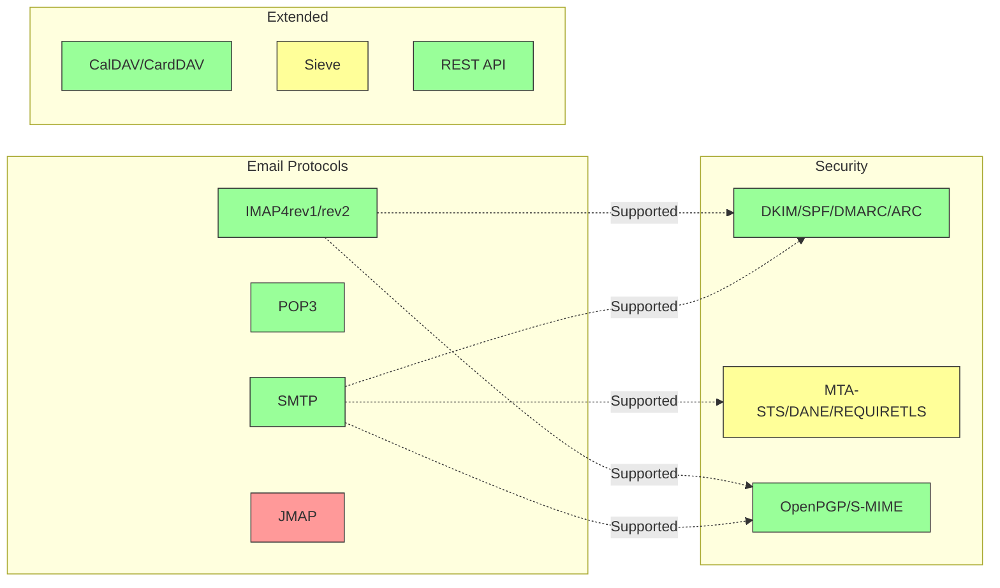

---


## Основные почтовые протоколы {#core-email-protocols}

### Поток почтового протокола {#email-protocol-flow}

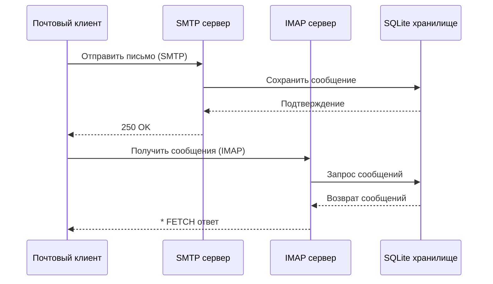


## Протокол IMAP4 и расширения {#imap4-email-protocol-and-extensions}

> \[!NOTE]
> Forward Email поддерживает IMAP4rev1 (RFC 3501) с частичной поддержкой функций IMAP4rev2 (RFC 9051).

Forward Email обеспечивает надежную поддержку IMAP4 через реализацию почтового сервера WildDuck. Сервер реализует IMAP4rev1 (RFC 3501) с частичной поддержкой расширений IMAP4rev2 (RFC 9051).

Функциональность IMAP в Forward Email обеспечивается зависимостью [WildDuck](https://github.com/nodemailer/wildduck). Поддерживаются следующие RFC для электронной почты:

| RFC                                                       | Название                                                          | Примечания по реализации                              |
| --------------------------------------------------------- | ----------------------------------------------------------------- | ----------------------------------------------------- |
| [RFC 3501](https://datatracker.ietf.org/doc/html/rfc3501) | Протокол доступа к интернет-сообщениям (IMAP) - версия 4rev1      | Полная поддержка с намеренными отличиями (см. ниже)  |
| [RFC 2177](https://datatracker.ietf.org/doc/html/rfc2177) | Команда IMAP4 IDLE                                               | Уведомления в режиме push                              |
| [RFC 2342](https://datatracker.ietf.org/doc/html/rfc2342) | Пространство имён IMAP4                                          | Поддержка пространства имён почтовых ящиков          |
| [RFC 2087](https://datatracker.ietf.org/doc/html/rfc2087) | Расширение квот IMAP4                                           | Управление квотами хранения                           |
| [RFC 2971](https://datatracker.ietf.org/doc/html/rfc2971) | Расширение идентификации IMAP4                                  | Идентификация клиента/сервера                         |
| [RFC 5161](https://datatracker.ietf.org/doc/html/rfc5161) | Расширение IMAP4 ENABLE                                        | Включение расширений IMAP                             |
| [RFC 4959](https://datatracker.ietf.org/doc/html/rfc4959) | Расширение IMAP для начального ответа клиента SASL (SASL-IR)      | Начальный ответ клиента                               |
| [RFC 3691](https://datatracker.ietf.org/doc/html/rfc3691) | Команда IMAP4 UNSELECT                                        | Закрытие почтового ящика без EXPUNGE                  |
| [RFC 4315](https://datatracker.ietf.org/doc/html/rfc4315) | Расширение IMAP UIDPLUS                                        | Расширенные команды UID                               |
| [RFC 7162](https://datatracker.ietf.org/doc/html/rfc7162) | Расширения IMAP: Быстрая ресинхронизация изменений флагов (CONDSTORE) | Условное STORE                                        |
| [RFC 6154](https://datatracker.ietf.org/doc/html/rfc6154) | Расширение IMAP LIST для специальных почтовых ящиков             | Атрибуты специальных почтовых ящиков                  |
| [RFC 6851](https://datatracker.ietf.org/doc/html/rfc6851) | Расширение IMAP MOVE                                         | Атомарная команда MOVE                                |
| [RFC 6855](https://datatracker.ietf.org/doc/html/rfc6855) | Поддержка UTF-8 в IMAP                                        | Поддержка UTF-8                                       |
| [RFC 3348](https://datatracker.ietf.org/doc/html/rfc3348) | Расширение IMAP4 для дочерних почтовых ящиков                    | Информация о дочерних почтовых ящиках                  |
| [RFC 7889](https://datatracker.ietf.org/doc/html/rfc7889) | Расширение IMAP4 для объявления максимального размера загрузки (APPENDLIMIT) | Максимальный размер загрузки                           |
**Поддерживаемые расширения IMAP:**

| Расширение       | RFC          | Статус       | Описание                       |
| ---------------- | ------------ | ------------ | ------------------------------ |
| IDLE             | RFC 2177     | ✅ Поддерживается | Уведомления в режиме push       |
| NAMESPACE        | RFC 2342     | ✅ Поддерживается | Поддержка пространств имён почтовых ящиков |
| QUOTA            | RFC 2087     | ✅ Поддерживается | Управление квотами хранения    |
| ID               | RFC 2971     | ✅ Поддерживается | Идентификация клиента/сервера  |
| ENABLE           | RFC 5161     | ✅ Поддерживается | Включение расширений IMAP      |
| SASL-IR          | RFC 4959     | ✅ Поддерживается | Начальный ответ клиента        |
| UNSELECT         | RFC 3691     | ✅ Поддерживается | Закрытие почтового ящика без EXPUNGE |
| UIDPLUS          | RFC 4315     | ✅ Поддерживается | Расширенные команды UID        |
| CONDSTORE        | RFC 7162     | ✅ Поддерживается | Условный STORE                 |
| SPECIAL-USE      | RFC 6154     | ✅ Поддерживается | Специальные атрибуты почтовых ящиков |
| MOVE             | RFC 6851     | ✅ Поддерживается | Атомарная команда MOVE         |
| UTF8=ACCEPT      | RFC 6855     | ✅ Поддерживается | Поддержка UTF-8                |
| CHILDREN         | RFC 3348     | ✅ Поддерживается | Информация о дочерних почтовых ящиках |
| APPENDLIMIT      | RFC 7889     | ✅ Поддерживается | Максимальный размер загрузки   |
| XLIST            | Не стандарт | ✅ Поддерживается | Совместимый с Gmail список папок |
| XAPPLEPUSHSERVICE| Не стандарт | ✅ Поддерживается | Служба уведомлений Apple Push  |

### Отличия протокола IMAP от спецификаций RFC {#imap-protocol-differences-from-rfc-specifications}

> \[!WARNING]
> Следующие отличия от спецификаций RFC могут повлиять на совместимость клиента.

Forward Email намеренно отклоняется от некоторых спецификаций IMAP RFC. Эти отличия унаследованы от WildDuck и задокументированы ниже:

* **Отсутствует флаг \Recent:** Флаг `\Recent` не реализован. Все сообщения возвращаются без этого флага.
* **RENAME не влияет на подпапки:** При переименовании папки подпапки не переименовываются автоматически. Иерархия папок в базе данных плоская.
* **INBOX нельзя переименовывать:** [RFC 3501](https://datatracker.ietf.org/doc/html/rfc3501) разрешает переименование INBOX, но Forward Email явно запрещает это. См. [исходный код WildDuck](https://github.com/nodemailer/wildduck/blob/master/imap-core/lib/commands/rename.js#L27).
* **Нет непрошенных ответов FLAGS:** При изменении флагов клиенту не отправляются непрошенные ответы FLAGS.
* **STORE возвращает NO для удалённых сообщений:** Попытка изменить флаги у удалённых сообщений возвращает NO вместо игнорирования.
* **CHARSET игнорируется в SEARCH:** Аргумент `CHARSET` в командах SEARCH игнорируется. Все поиски выполняются в UTF-8.
* **Метаданные MODSEQ игнорируются:** Метаданные `MODSEQ` в командах STORE игнорируются.
* **SEARCH TEXT и SEARCH BODY:** Forward Email использует [SQLite FTS5](https://www.sqlite.org/fts5.html) (полнотекстовый поиск) вместо поиска `$text` в MongoDB. Это обеспечивает:
  * Поддержку оператора `NOT` (MongoDB не поддерживает)
  * Ранжированные результаты поиска
  * Производительность поиска менее 100 мс на больших почтовых ящиках
* **Поведение автоэкспанджа:** Сообщения с флагом `\Deleted` автоматически удаляются при закрытии почтового ящика.
* **Сохранность сообщений:** Некоторые изменения сообщений могут не сохранять точную оригинальную структуру сообщения.

**Частичная поддержка IMAP4rev2:**

Forward Email реализует IMAP4rev1 (RFC 3501) с частичной поддержкой IMAP4rev2 (RFC 9051). Следующие функции IMAP4rev2 **ещё не поддерживаются**:

* **LIST-STATUS** — объединённые команды LIST и STATUS
* **LITERAL-** — несинхронизирующие литералы (вариант с минусом)
* **OBJECTID** — уникальные идентификаторы объектов
* **SAVEDATE** — атрибут даты сохранения
* **REPLACE** — атомарная замена сообщения
* **UNAUTHENTICATE** — завершение аутентификации без закрытия соединения

**Ослабленная обработка структуры тела:**

Forward Email использует «ослабленную» обработку тела для некорректных MIME-структур, что может отличаться от строгой интерпретации RFC. Это улучшает совместимость с реальными письмами, которые не полностью соответствуют стандартам.
**Расширение METADATA (RFC 5464):**

Расширение IMAP METADATA **не поддерживается**. Для получения дополнительной информации об этом расширении смотрите [RFC 5464](https://datatracker.ietf.org/doc/html/rfc5464). Обсуждение добавления этой функции можно найти в [WildDuck Issue #937](https://github.com/zone-eu/wildduck/issues/937).

### Расширения IMAP, которые НЕ поддерживаются {#imap-extensions-not-supported}

Следующие расширения IMAP из [Реестра возможностей IMAP IANA](https://www.iana.org/assignments/imap-capabilities/imap-capabilities.xhtml) НЕ поддерживаются:

| RFC                                                       | Название                                                                                                        | Причина                                                                                                                                  |
| --------------------------------------------------------- | --------------------------------------------------------------------------------------------------------------- | --------------------------------------------------------------------------------------------------------------------------------------- |
| [RFC 2086](https://datatracker.ietf.org/doc/html/rfc2086) | Расширение IMAP4 ACL                                                                                            | Общие папки не реализованы. См. [WildDuck Issue #427](https://github.com/zone-eu/wildduck/issues/427)                                   |
| [RFC 5256](https://datatracker.ietf.org/doc/html/rfc5256) | Расширения IMAP SORT и THREAD                                                                                   | Потоковая обработка реализована внутренне, но не через протокол RFC 5256. См. [WildDuck Issue #12](https://github.com/zone-eu/wildduck/issues/12) |
| [RFC 5162](https://datatracker.ietf.org/doc/html/rfc5162) | Расширения IMAP4 для быстрой ресинхронизации почтового ящика (QRESYNC)                                           | Не реализовано                                                                                                                           |
| [RFC 5464](https://datatracker.ietf.org/doc/html/rfc5464) | Расширение IMAP METADATA                                                                                        | Операции с метаданными игнорируются. См. [документацию WildDuck](https://datatracker.ietf.org/doc/html/rfc5464)                         |
| [RFC 5258](https://datatracker.ietf.org/doc/html/rfc5258) | Расширения команды IMAP4 LIST                                                                                   | Не реализовано                                                                                                                           |
| [RFC 5267](https://datatracker.ietf.org/doc/html/rfc5267) | Контексты для IMAP4                                                                                            | Не реализовано                                                                                                                           |
| [RFC 5465](https://datatracker.ietf.org/doc/html/rfc5465) | Расширение IMAP NOTIFY                                                                                          | Не реализовано                                                                                                                           |
| [RFC 5466](https://datatracker.ietf.org/doc/html/rfc5466) | Расширение IMAP4 FILTERS                                                                                        | Не реализовано                                                                                                                           |
| [RFC 6203](https://datatracker.ietf.org/doc/html/rfc6203) | Расширение IMAP4 для нечеткого поиска                                                                           | Не реализовано                                                                                                                           |
| [RFC 6785](https://datatracker.ietf.org/doc/html/rfc6785) | Рекомендации по реализации IMAP4                                                                                | Рекомендации выполнены не полностью                                                                                                     |
| [RFC 7162](https://datatracker.ietf.org/doc/html/rfc7162) | Расширения IMAP: быстрая ресинхронизация изменений флагов (CONDSTORE) и быстрая ресинхронизация почтового ящика (QRESYNC) | Не реализовано                                                                                                                           |
| [RFC 8437](https://datatracker.ietf.org/doc/html/rfc8437) | Расширение IMAP UNAUTHENTICATE для повторного использования соединения                                         | Не реализовано                                                                                                                           |
| [RFC 8438](https://datatracker.ietf.org/doc/html/rfc8438) | Расширение IMAP для STATUS=SIZE                                                                                 | Не реализовано                                                                                                                           |
| [RFC 8457](https://datatracker.ietf.org/doc/html/rfc8457) | Ключевое слово IMAP "$Important" и специальный атрибут "\Important"                                            | Не реализовано                                                                                                                           |
| [RFC 8474](https://datatracker.ietf.org/doc/html/rfc8474) | Расширение IMAP для идентификаторов объектов                                                                    | Не реализовано                                                                                                                           |
| [RFC 9051](https://datatracker.ietf.org/doc/html/rfc9051) | Протокол доступа к интернет-сообщениям (IMAP) - версия 4rev2                                                   | Forward Email реализует IMAP4rev1 ([RFC 3501](https://datatracker.ietf.org/doc/html/rfc3501))                                            |
## Протокол электронной почты POP3 и расширения {#pop3-email-protocol-and-extensions}

> \[!NOTE]
> Forward Email поддерживает POP3 (RFC 1939) со стандартными расширениями для получения электронной почты.

Функциональность POP3 в Forward Email обеспечивается зависимостью [WildDuck](https://github.com/nodemailer/wildduck). Поддерживаются следующие RFC для электронной почты:

| RFC                                                       | Название                                | Примечания по реализации                           |
| --------------------------------------------------------- | --------------------------------------- | ------------------------------------------------- |
| [RFC 1939](https://datatracker.ietf.org/doc/html/rfc1939) | Протокол почтового офиса - версия 3 (POP3) | Полная поддержка с намеренными отличиями (см. ниже) |
| [RFC 2595](https://datatracker.ietf.org/doc/html/rfc2595) | Использование TLS с IMAP, POP3 и ACAP   | Поддержка STARTTLS                                |
| [RFC 2449](https://datatracker.ietf.org/doc/html/rfc2449) | Механизм расширений POP3                 | Поддержка команды CAPA                             |

Forward Email предоставляет поддержку POP3 для клиентов, которые предпочитают этот более простой протокол вместо IMAP. POP3 идеально подходит для пользователей, которые хотят скачать письма на одно устройство и удалить их с сервера.

**Поддерживаемые расширения POP3:**

| Расширение | RFC      | Статус       | Описание                   |
| ---------- | -------- | ------------ | -------------------------- |
| TOP        | RFC 1939 | ✅ Поддерживается | Получение заголовков сообщений |
| USER       | RFC 1939 | ✅ Поддерживается | Аутентификация по имени пользователя |
| UIDL       | RFC 1939 | ✅ Поддерживается | Уникальные идентификаторы сообщений |
| EXPIRE     | RFC 2449 | ✅ Поддерживается | Политика истечения срока сообщений |

### Отличия протокола POP3 от спецификаций RFC {#pop3-protocol-differences-from-rfc-specifications}

> \[!WARNING]
> POP3 имеет присущие ограничения по сравнению с IMAP.

> \[!IMPORTANT]
> **Критическое отличие: поведение команды DELE в Forward Email и WildDuck POP3**
>
> Forward Email реализует постоянное удаление в соответствии с RFC для команд POP3 `DELE`, в отличие от WildDuck, который перемещает сообщения в корзину.

**Поведение Forward Email** ([исходный код](https://github.com/forwardemail/forwardemail.net/blob/master/pop3-server.js)):

* `DELE` → `QUIT` навсегда удаляет сообщения
* Точное соответствие спецификации [RFC 1939](https://datatracker.ietf.org/doc/html/rfc1939)
* Совпадает с поведением Dovecot (по умолчанию), Postfix и других серверов, соответствующих стандартам

**Поведение WildDuck** ([обсуждение](https://github.com/zone-eu/wildduck/issues/937)):

* `DELE` → `QUIT` перемещает сообщения в корзину (аналог Gmail)
* Намеренное решение для безопасности пользователя
* Не соответствует RFC, но предотвращает случайную потерю данных

**Почему Forward Email отличается:**

* **Соответствие RFC:** Соблюдение спецификации [RFC 1939](https://datatracker.ietf.org/doc/html/rfc1939)
* **Ожидания пользователей:** Рабочий процесс «скачать и удалить» предполагает постоянное удаление
* **Управление хранилищем:** Правильное освобождение дискового пространства
* **Совместимость:** Соответствие другим серверам, поддерживающим RFC

> \[!NOTE]
> **Список сообщений POP3:** Forward Email отображает ВСЕ сообщения из INBOX без ограничений. Это отличается от WildDuck, который по умолчанию ограничивает список 250 сообщениями. См. [исходный код](https://github.com/forwardemail/forwardemail.net/blob/master/pop3-server.js).

**Доступ с одного устройства:**

POP3 предназначен для доступа с одного устройства. Сообщения обычно скачиваются и удаляются с сервера, что делает протокол неподходящим для синхронизации между несколькими устройствами.

**Отсутствие поддержки папок:**

POP3 работает только с папкой INBOX. Другие папки (Отправленные, Черновики, Корзина и т.д.) недоступны через POP3.

**Ограниченное управление сообщениями:**

POP3 предоставляет базовое получение и удаление сообщений. Расширенные функции, такие как пометка, перемещение или поиск сообщений, недоступны.

### Расширения POP3, которые НЕ поддерживаются {#pop3-extensions-not-supported}

Следующие расширения POP3 из [Реестра механизмов расширений POP3 IANA](https://www.iana.org/assignments/pop3-extension-mechanism/pop3-extension-mechanism.xhtml) НЕ поддерживаются:
| RFC                                                       | Заголовок                                              | Причина                                |
| --------------------------------------------------------- | ------------------------------------------------------ | ------------------------------------- |
| [RFC 6856](https://datatracker.ietf.org/doc/html/rfc6856) | Поддержка UTF-8 в протоколе Post Office Protocol Version 3 (POP3) | Не реализовано в сервере WildDuck POP3 |
| [RFC 2595](https://datatracker.ietf.org/doc/html/rfc2595) | Команда STLS                                           | Поддерживается только STARTTLS, не STLS |
| [RFC 3206](https://datatracker.ietf.org/doc/html/rfc3206) | Коды ответа SYS и AUTH POP                             | Не реализовано                        |

---


## SMTP Email Protocol and Extensions {#smtp-email-protocol-and-extensions}

> \[!NOTE]
> Forward Email поддерживает SMTP (RFC 5321) с современными расширениями для безопасной и надежной доставки электронной почты.

Функциональность SMTP в Forward Email обеспечивается несколькими компонентами: [smtp-server](https://github.com/nodemailer/smtp-server) (nodemailer), [zone-mta](https://github.com/zone-eu/zone-mta) и собственными реализациями. Поддерживаются следующие RFC для электронной почты:

| RFC                                                       | Заголовок                                                                        | Примечания по реализации           |
| --------------------------------------------------------- | -------------------------------------------------------------------------------- | ---------------------------------- |
| [RFC 5321](https://datatracker.ietf.org/doc/html/rfc5321) | Простой протокол передачи почты (SMTP)                                          | Полная поддержка                   |
| [RFC 3207](https://datatracker.ietf.org/doc/html/rfc3207) | Расширение SMTP для безопасного SMTP поверх TLS (STARTTLS)                       | Поддержка TLS/SSL                  |
| [RFC 4954](https://datatracker.ietf.org/doc/html/rfc4954) | Расширение SMTP для аутентификации (AUTH)                                       | PLAIN, LOGIN, CRAM-MD5, XOAUTH2    |
| [RFC 6531](https://datatracker.ietf.org/doc/html/rfc6531) | Расширение SMTP для интернационализированной почты (SMTPUTF8)                    | Поддержка адресов электронной почты в Unicode |
| [RFC 3461](https://datatracker.ietf.org/doc/html/rfc3461) | Расширение SMTP для уведомлений о статусе доставки (DSN)                         | Полная поддержка DSN               |
| [RFC 3463](https://datatracker.ietf.org/doc/html/rfc3463) | Расширенные коды состояния почтовой системы                                     | Расширенные коды состояния в ответах |
| [RFC 1870](https://datatracker.ietf.org/doc/html/rfc1870) | Расширение SMTP для объявления размера сообщения (SIZE)                          | Объявление максимального размера сообщения |
| [RFC 2920](https://datatracker.ietf.org/doc/html/rfc2920) | Расширение SMTP для конвейерной обработки команд (PIPELINING)                   | Поддержка конвейерной обработки команд |
| [RFC 1652](https://datatracker.ietf.org/doc/html/rfc1652) | Расширение SMTP для 8-битной MIME передачи (8BITMIME)                            | Поддержка 8-битной MIME            |
| [RFC 6152](https://datatracker.ietf.org/doc/html/rfc6152) | Расширение SMTP для 8-битной MIME передачи                                      | Поддержка 8-битной MIME            |
| [RFC 2034](https://datatracker.ietf.org/doc/html/rfc2034) | Расширение SMTP для возврата расширенных кодов ошибок (ENHANCEDSTATUSCODES)      | Расширенные коды состояния         |

Forward Email реализует полнофункциональный SMTP-сервер с поддержкой современных расширений, которые повышают безопасность, надежность и функциональность.

**Поддерживаемые расширения SMTP:**

| Расширение          | RFC      | Статус       | Описание                            |
| ------------------- | -------- | ------------ | ---------------------------------- |
| PIPELINING          | RFC 2920 | ✅ Поддерживается | Конвейерная обработка команд       |
| SIZE                | RFC 1870 | ✅ Поддерживается | Объявление размера сообщения (лимит 52 МБ) |
| ETRN                | RFC 1985 | ✅ Поддерживается | Удалённая обработка очереди         |
| STARTTLS            | RFC 3207 | ✅ Поддерживается | Переход на TLS                     |
| ENHANCEDSTATUSCODES | RFC 2034 | ✅ Поддерживается | Расширенные коды состояния          |
| 8BITMIME            | RFC 6152 | ✅ Поддерживается | 8-битная MIME передача              |
| DSN                 | RFC 3461 | ✅ Поддерживается | Уведомления о статусе доставки      |
| CHUNKING            | RFC 3030 | ✅ Поддерживается | Передача сообщений по частям        |
| SMTPUTF8            | RFC 6531 | ⚠️ Частично    | Адреса электронной почты в UTF-8 (частично) |
| REQUIRETLS          | RFC 8689 | ✅ Поддерживается | Требование TLS для доставки         |
### Уведомления о статусе доставки (DSN) {#delivery-status-notifications-dsn}

> \[!TIP]
> DSN предоставляет подробную информацию о статусе доставки отправленных писем.

Forward Email полностью поддерживает **DSN (RFC 3461)**, который позволяет отправителям запрашивать уведомления о статусе доставки. Эта функция предоставляет:

* **Уведомления об успешной доставке** сообщений
* **Уведомления о сбоях** с подробной информацией об ошибках
* **Уведомления о задержках**, когда доставка временно задерживается

DSN особенно полезен для:

* Подтверждения доставки важных сообщений
* Устранения проблем с доставкой
* Автоматизированных систем обработки электронной почты
* Требований соответствия и аудита

### Поддержка REQUIRETLS {#requiretls-support}

> \[!IMPORTANT]
> Forward Email — один из немногих провайдеров, который явно рекламирует и применяет REQUIRETLS.

Forward Email поддерживает **REQUIRETLS (RFC 8689)**, который гарантирует, что электронные сообщения доставляются только по зашифрованным TLS-соединениям. Это обеспечивает:

* **Конечное шифрование** на всем пути доставки
* **Принудительное применение для пользователя** через флажок в редакторе письма
* **Отклонение попыток незашифрованной доставки**
* **Повышенную безопасность** для конфиденциальных коммуникаций

### Расширения SMTP, которые НЕ поддерживаются {#smtp-extensions-not-supported}

Следующие расширения SMTP из [IANA SMTP Service Extensions Registry](https://www.iana.org/assignments/smtp) НЕ поддерживаются:

| RFC                                                       | Название                                                                                         | Причина               |
| --------------------------------------------------------- | ------------------------------------------------------------------------------------------------- | --------------------- |
| [RFC 4865](https://datatracker.ietf.org/doc/html/rfc4865) | SMTP Submission Service Extension for Future Message Release (FUTURERELEASE)                      | Не реализовано        |
| [RFC 6710](https://datatracker.ietf.org/doc/html/rfc6710) | SMTP Extension for Message Transfer Priorities (MT-PRIORITY)                                      | Не реализовано        |
| [RFC 7293](https://datatracker.ietf.org/doc/html/rfc7293) | The Require-Recipient-Valid-Since Header Field and SMTP Service Extension                         | Не реализовано        |
| [RFC 7372](https://datatracker.ietf.org/doc/html/rfc7372) | Email Auth Status Codes                                                                           | Не полностью реализовано |
| [RFC 4468](https://datatracker.ietf.org/doc/html/rfc4468) | Message Submission BURL Extension                                                                 | Не реализовано        |
| [RFC 3030](https://datatracker.ietf.org/doc/html/rfc3030) | SMTP Service Extensions for Transmission of Large and Binary MIME Messages (CHUNKING, BINARYMIME) | Не реализовано        |
| [RFC 2852](https://datatracker.ietf.org/doc/html/rfc2852) | Deliver By SMTP Service Extension                                                                 | Не реализовано        |

---


## Протокол электронной почты JMAP {#jmap-email-protocol}

> \[!CAUTION]
> JMAP **в настоящее время не поддерживается** Forward Email.

| RFC                                                       | Название                                  | Статус          | Причина                                                                 |
| --------------------------------------------------------- | ----------------------------------------- | --------------- | ---------------------------------------------------------------------- |
| [RFC 8620](https://datatracker.ietf.org/doc/html/rfc8620) | The JSON Meta Application Protocol (JMAP) | ❌ Не поддерживается | Forward Email использует IMAP/POP3/SMTP и комплексный REST API вместо него |

**JMAP (JSON Meta Application Protocol)** — современный протокол электронной почты, предназначенный для замены IMAP.

**Почему JMAP не поддерживается:**

> "JMAP — это зверь, которого не следовало изобретать. Он пытается преобразовать TCP/IMAP (уже плохой протокол по сегодняшним меркам) в HTTP/JSON, просто используя другой транспорт, сохраняя при этом суть." — Андрис Рейнман, [HN Discussion](https://news.ycombinator.com/item?id=18890011)
> "JMAP существует более 10 лет, и практически не используется" – Андрис Рейнман, [GitHub Discussion](https://github.com/zone-eu/wildduck/issues/2#issuecomment-1765190790)

Также смотрите дополнительные комментарии на <https://hn.algolia.com/?dateRange=all&page=0&prefix=true&query=jmap%20andris&sort=byDate&type=comment>.

Forward Email в настоящее время сосредоточен на предоставлении отличной поддержки IMAP, POP3 и SMTP, а также комплексного REST API для управления электронной почтой. Поддержка JMAP может быть рассмотрена в будущем в зависимости от спроса пользователей и принятия в экосистеме.

**Альтернатива:** Forward Email предлагает [Полный REST API](#complete-rest-api-for-email-management) с 39 конечными точками, который обеспечивает функциональность, аналогичную JMAP, для программного доступа к электронной почте.

---


## Безопасность электронной почты {#email-security}

### Архитектура безопасности электронной почты {#email-security-architecture}

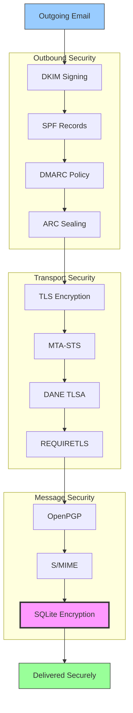


## Протоколы аутентификации сообщений электронной почты {#email-message-authentication-protocols}

> \[!NOTE]
> Forward Email реализует все основные протоколы аутентификации электронной почты для предотвращения подделки и обеспечения целостности сообщений.

Forward Email использует библиотеку [mailauth](https://github.com/postalsys/mailauth) для аутентификации электронной почты. Поддерживаются следующие RFC:

| RFC                                                       | Название                                                                | Примечания по реализации                                      |
| --------------------------------------------------------- | ----------------------------------------------------------------------- | -------------------------------------------------------------- |
| [RFC 6376](https://datatracker.ietf.org/doc/html/rfc6376) | DomainKeys Identified Mail (DKIM) Подписи                               | Полная подпись и проверка DKIM                                 |
| [RFC 8463](https://datatracker.ietf.org/doc/html/rfc8463) | Новый криптографический метод подписи для DKIM (Ed25519-SHA256)         | Поддержка алгоритмов подписи RSA-SHA256 и Ed25519-SHA256       |
| [RFC 7208](https://datatracker.ietf.org/doc/html/rfc7208) | Sender Policy Framework (SPF)                                           | Проверка SPF записей                                           |
| [RFC 7489](https://datatracker.ietf.org/doc/html/rfc7489) | Аутентификация сообщений на основе домена, отчетность и соответствие (DMARC) | Применение политики DMARC                                      |
| [RFC 8617](https://datatracker.ietf.org/doc/html/rfc8617) | Authenticated Received Chain (ARC)                                      | Запечатывание и проверка ARC                                   |

Протоколы аутентификации электронной почты проверяют, что сообщения действительно отправлены заявленным отправителем и не были изменены в процессе передачи.

### Поддержка протоколов аутентификации {#authentication-protocol-support}

| Протокол  | RFC      | Статус      | Описание                                                             |
| --------- | -------- | ----------- | -------------------------------------------------------------------- |
| **DKIM**  | RFC 6376 | ✅ Поддерживается | DomainKeys Identified Mail - Криптографические подписи              |
| **SPF**   | RFC 7208 | ✅ Поддерживается | Sender Policy Framework - Авторизация IP-адреса                     |
| **DMARC** | RFC 7489 | ✅ Поддерживается | Аутентификация сообщений на основе домена - Применение политики     |
| **ARC**   | RFC 8617 | ✅ Поддерживается | Authenticated Received Chain - Сохранение аутентификации при пересылках |
### DKIM (DomainKeys Identified Mail) {#dkim-domainkeys-identified-mail}

**DKIM** добавляет криптографическую подпись к заголовкам электронной почты, позволяя получателям проверить, что сообщение было авторизовано владельцем домена и не было изменено в процессе передачи.

Forward Email использует [mailauth](https://github.com/postalsys/mailauth) для подписи и проверки DKIM.

**Основные функции:**

* Автоматическая подпись DKIM для всех исходящих сообщений
* Поддержка ключей RSA и Ed25519
* Поддержка нескольких селекторов
* Проверка DKIM для входящих сообщений

### SPF (Sender Policy Framework) {#spf-sender-policy-framework}

**SPF** позволяет владельцам доменов указывать, какие IP-адреса уполномочены отправлять электронную почту от имени их домена.

**Основные функции:**

* Проверка SPF-записей для входящих сообщений
* Автоматическая проверка SPF с подробными результатами
* Поддержка механизмов include, redirect и all
* Настраиваемые политики SPF для каждого домена

### DMARC (Domain-based Message Authentication, Reporting & Conformance) {#dmarc-domain-based-message-authentication-reporting--conformance}

**DMARC** основывается на SPF и DKIM для обеспечения применения политики и отчетности.

**Основные функции:**

* Применение политики DMARC (none, quarantine, reject)
* Проверка выравнивания для SPF и DKIM
* Сводная отчетность DMARC
* Политики DMARC для каждого домена

### ARC (Authenticated Received Chain) {#arc-authenticated-received-chain}

**ARC** сохраняет результаты аутентификации электронной почты при пересылке и изменениях в рассылочных списках.

Forward Email использует библиотеку [mailauth](https://github.com/postalsys/mailauth) для проверки и запечатывания ARC.

**Основные функции:**

* Запечатывание ARC для пересылаемых сообщений
* Проверка ARC для входящих сообщений
* Проверка цепочки через несколько переходов
* Сохранение исходных результатов аутентификации

### Authentication Flow {#authentication-flow}

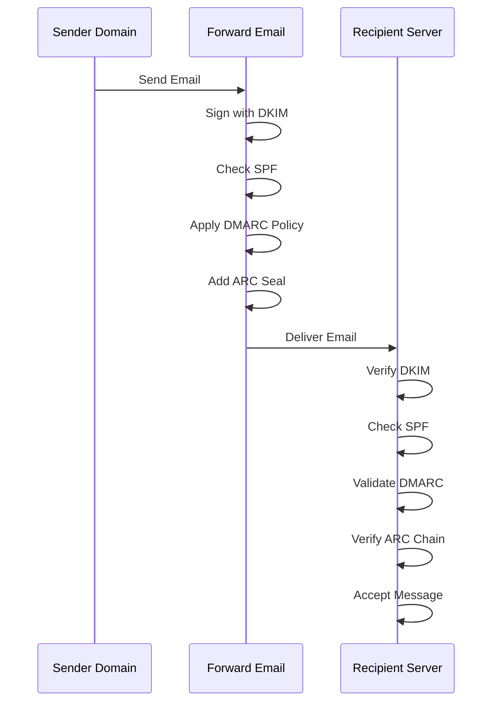

---


## Email Transport Security Protocols {#email-transport-security-protocols}

> \[!IMPORTANT]
> Forward Email реализует несколько уровней транспортной безопасности для защиты писем в процессе передачи.

Forward Email реализует современные протоколы транспортной безопасности:

| RFC                                                       | Название                                                                                             | Статус      | Примечания по реализации                                                                                                                                                                                                                                                                       |
| --------------------------------------------------------- | -------------------------------------------------------------------------------------------------- | ----------- | --------------------------------------------------------------------------------------------------------------------------------------------------------------------------------------------------------------------------------------------------------------------------------------------- |
| [RFC 8461](https://datatracker.ietf.org/doc/html/rfc8461) | SMTP MTA Strict Transport Security (MTA-STS)                                                       | ✅ Поддерживается | Широко используется на серверах IMAP, SMTP и MX. См. [create-mta-sts-cache.js](https://github.com/forwardemail/forwardemail.net/blob/master/helpers/create-mta-sts-cache.js) и [get-transporter.js](https://github.com/forwardemail/forwardemail.net/blob/master/helpers/get-transporter.js) |
| [RFC 8460](https://datatracker.ietf.org/doc/html/rfc8460) | SMTP TLS Reporting                                                                                 | ✅ Поддерживается | Через библиотеку [mailauth](https://github.com/postalsys/mailauth)                                                                                                                                                                                                                            |
| [RFC 7671](https://datatracker.ietf.org/doc/html/rfc7671) | Протокол аутентификации именованных сущностей на основе DNS (DANE): обновления и рекомендации по эксплуатации | ✅ Поддерживается | Полная проверка DANE для исходящих SMTP-соединений. См. [mx-connect PR #22](https://github.com/zone-eu/mx-connect/pull/22)                                                                                                                                                                   |
| [RFC 6698](https://datatracker.ietf.org/doc/html/rfc6698) | Протокол аутентификации именованных сущностей на основе DNS (DANE) для транспортного уровня безопасности (TLS): TLSA | ✅ Поддерживается | Полная поддержка RFC 6698: типы использования PKIX-TA, PKIX-EE, DANE-TA, DANE-EE. См. [mx-connect PR #22](https://github.com/zone-eu/mx-connect/pull/22)                                                                                                                                      |
| [RFC 8314](https://datatracker.ietf.org/doc/html/rfc8314) | Явный текст считается устаревшим: использование TLS для отправки и доступа к электронной почте       | ✅ Поддерживается | TLS обязателен для всех соединений                                                                                                                                                                                                                                                            |
| [RFC 8689](https://datatracker.ietf.org/doc/html/rfc8689) | Расширение SMTP для обязательного использования TLS (REQUIRETLS)                                   | ✅ Поддерживается | Полная поддержка расширения SMTP REQUIRETLS и заголовка "TLS-Required"                                                                                                                                                                                                                         |
Протоколы транспортной безопасности обеспечивают шифрование и аутентификацию электронных сообщений во время передачи между почтовыми серверами.

### Поддержка транспортной безопасности {#transport-security-support}

| Протокол      | RFC      | Статус      | Описание                                         |
| ------------- | -------- | ----------- | ------------------------------------------------ |
| **TLS**       | RFC 8314 | ✅ Поддерживается | Transport Layer Security - зашифрованные соединения |
| **MTA-STS**   | RFC 8461 | ✅ Поддерживается | Mail Transfer Agent Strict Transport Security    |
| **DANE**      | RFC 7671 | ✅ Поддерживается | DNS-based Authentication of Named Entities       |
| **REQUIRETLS**| RFC 8689 | ✅ Поддерживается | Требовать TLS для всего пути доставки             |

### TLS (Transport Layer Security) {#tls-transport-layer-security}

Forward Email применяет шифрование TLS для всех почтовых соединений (SMTP, IMAP, POP3).

**Основные возможности:**

* Поддержка TLS 1.2 и TLS 1.3
* Автоматическое управление сертификатами
* Perfect Forward Secrecy (PFS)
* Только сильные наборы шифров

### MTA-STS (Mail Transfer Agent Strict Transport Security) {#mta-sts-mail-transfer-agent-strict-transport-security}

**MTA-STS** гарантирует, что почта доставляется только по зашифрованным TLS-соединениям, публикуя политику через HTTPS.

Forward Email реализует MTA-STS с помощью [create-mta-sts-cache.js](https://github.com/forwardemail/forwardemail.net/blob/master/helpers/create-mta-sts-cache.js).

**Основные возможности:**

* Автоматическая публикация политики MTA-STS
* Кэширование политики для повышения производительности
* Защита от атак понижения уровня безопасности
* Принудительная проверка сертификатов

### DANE (DNS-based Authentication of Named Entities) {#dane-dns-based-authentication-of-named-entities}

> \[!NOTE]
> Forward Email теперь полностью поддерживает DANE для исходящих SMTP-соединений.

**DANE** использует DNSSEC для публикации информации о TLS-сертификатах в DNS, позволяя почтовым серверам проверять сертификаты без зависимости от центров сертификации.

**Основные возможности:**

* ✅ Полная проверка DANE для исходящих SMTP-соединений
* ✅ Полная поддержка RFC 6698: типы использования PKIX-TA, PKIX-EE, DANE-TA, DANE-EE
* ✅ Проверка сертификатов по записям TLSA при обновлении TLS
* ✅ Параллельное разрешение TLSA для нескольких MX-хостов
* ✅ Автоматическое обнаружение нативного `dns.resolveTlsa` (Node.js v22.15.0+, v23.9.0+)
* ✅ Поддержка пользовательских резолверов для старых версий Node.js через [Tangerine](https://github.com/forwardemail/tangerine)
* Требуются домены с подписью DNSSEC

> \[!TIP]
> **Детали реализации:** Поддержка DANE была добавлена через [mx-connect PR #22](https://github.com/zone-eu/mx-connect/pull/22), который обеспечивает комплексную поддержку DANE/TLSA для исходящих SMTP-соединений.

### REQUIRETLS {#requiretls}

> \[!TIP]
> Forward Email — один из немногих провайдеров с поддержкой REQUIRETLS, доступной пользователям.

**REQUIRETLS** гарантирует, что сообщения электронной почты доставляются только по зашифрованным TLS-соединениям на всем пути доставки.

**Основные возможности:**

* Флажок для пользователя в компоновщике писем
* Автоматический отказ от незашифрованной доставки
* Принудительное сквозное шифрование TLS
* Подробные уведомления о сбоях

> \[!TIP]
> **Принудительное применение TLS для пользователей:** Forward Email предоставляет флажок в разделе **Мой аккаунт > Домены > Настройки** для принудительного использования TLS для всех входящих соединений. При включении эта функция отклоняет любые входящие письма, отправленные без TLS, с кодом ошибки 530, обеспечивая шифрование всей входящей почты при передаче.

### Поток транспортной безопасности {#transport-security-flow}

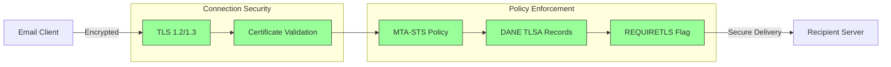
## Шифрование электронных сообщений {#email-message-encryption}

> \[!NOTE]
> Forward Email поддерживает как OpenPGP, так и S/MIME для сквозного шифрования электронной почты.

Forward Email поддерживает шифрование OpenPGP и S/MIME:

| RFC                                                       | Название                                                                                | Статус      | Примечания по реализации                                                                                                                                                                            |
| --------------------------------------------------------- | --------------------------------------------------------------------------------------- | ----------- | -------------------------------------------------------------------------------------------------------------------------------------------------------------------------------------------------- |
| [RFC 9580](https://datatracker.ietf.org/doc/html/rfc9580) | OpenPGP (заменяет RFC 4880)                                                             | ✅ Поддерживается | Через интеграцию [OpenPGP.js v6+](https://github.com/openpgpjs/openpgpjs). См. [FAQ](https://forwardemail.net/en/faq#do-you-support-openpgpmime-end-to-end-encryption-e2ee-and-web-key-directory-wkd) |
| [RFC 8551](https://datatracker.ietf.org/doc/html/rfc8551) | Secure/Multipurpose Internet Mail Extensions (S/MIME) Версия 4.0 Спецификация сообщений | ✅ Поддерживается | Поддерживаются алгоритмы RSA и ECC. См. [FAQ](https://forwardemail.net/en/faq#do-you-support-smime-encryption)                                                                                      |

Протоколы шифрования сообщений защищают содержимое электронной почты от прочтения кем-либо, кроме предполагаемого получателя, даже если сообщение перехвачено во время передачи.

### Поддержка шифрования {#encryption-support}

| Протокол   | RFC      | Статус      | Описание                                    |
| ---------- | -------- | ----------- | -------------------------------------------- |
| **OpenPGP**| RFC 9580 | ✅ Поддерживается | Pretty Good Privacy - шифрование с открытым ключом |
| **S/MIME** | RFC 8551 | ✅ Поддерживается | Secure/Multipurpose Internet Mail Extensions |
| **WKD**    | Draft    | ✅ Поддерживается | Web Key Directory - автоматическое обнаружение ключей |

### OpenPGP (Pretty Good Privacy) {#openpgp-pretty-good-privacy}

**OpenPGP** обеспечивает сквозное шифрование с использованием криптографии с открытым ключом. Forward Email поддерживает OpenPGP через протокол [Web Key Directory (WKD)](https://forwardemail.net/en/faq#do-you-support-openpgpmime-end-to-end-encryption-e2ee-and-web-key-directory-wkd).

**Основные возможности:**

* Автоматическое обнаружение ключей через WKD
* Поддержка PGP/MIME для зашифрованных вложений
* Управление ключами через почтовый клиент
* Совместимость с GPG, Mailvelope и другими инструментами OpenPGP

**Как использовать:**

1. Создайте пару ключей PGP в вашем почтовом клиенте
2. Загрузите ваш открытый ключ в WKD Forward Email
3. Ваш ключ автоматически доступен другим пользователям
4. Отправляйте и получайте зашифрованные письма без проблем

### S/MIME (Secure/Multipurpose Internet Mail Extensions) {#smime-securemultipurpose-internet-mail-extensions}

**S/MIME** обеспечивает шифрование электронной почты и цифровые подписи с использованием сертификатов X.509.

**Основные возможности:**

* Шифрование на основе сертификатов
* Цифровые подписи для аутентификации сообщений
* Родная поддержка в большинстве почтовых клиентов
* Безопасность корпоративного уровня

**Как использовать:**

1. Получите сертификат S/MIME у удостоверяющего центра
2. Установите сертификат в ваш почтовый клиент
3. Настройте клиент для шифрования/подписи сообщений
4. Обменивайтесь сертификатами с получателями

### Шифрование почтового ящика SQLite {#sqlite-mailbox-encryption}

> \[!IMPORTANT]
> Forward Email предоставляет дополнительный уровень безопасности с зашифрованными почтовыми ящиками SQLite.

Помимо шифрования на уровне сообщений, Forward Email шифрует целые почтовые ящики с помощью [sqleet](https://github.com/resilar/sqleet) (ChaCha20-Poly1305).

**Основные возможности:**

* **Шифрование на основе пароля** — пароль известен только вам
* **Квантовая устойчивость** — шифр ChaCha20-Poly1305
* **Нулевая осведомленность** — Forward Email не может расшифровать ваш почтовый ящик
* **Изолированность** — каждый почтовый ящик изолирован и портативен
* **Невосстановимость** — если вы забудете пароль, почтовый ящик будет утерян
### Сравнение шифрования {#encryption-comparison}

| Особенность           | OpenPGP           | S/MIME             | Шифрование SQLite |
| --------------------- | ----------------- | ------------------ | ----------------- |
| **Конечное шифрование** | ✅ Да             | ✅ Да              | ✅ Да             |
| **Управление ключами** | Самостоятельное   | Выдано УЦ          | На основе пароля  |
| **Поддержка клиента**  | Требуется плагин  | Встроенная         | Прозрачное        |
| **Сценарий использования** | Личное          | Корпоративное      | Хранение          |
| **Квантовая устойчивость** | ⚠️ Зависит от ключа | ⚠️ Зависит от сертификата | ✅ Да             |

### Процесс шифрования {#encryption-flow}

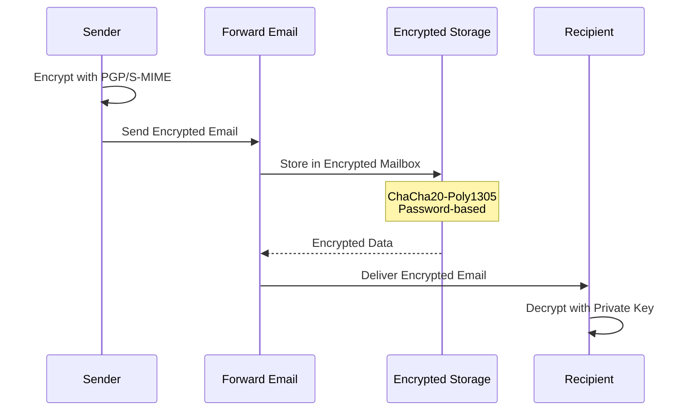

---


## Расширенный функционал {#extended-functionality}


## Стандарты формата электронных сообщений {#email-message-format-standards}

> \[!NOTE]
> Forward Email поддерживает современные стандарты формата электронной почты для богатого контента и интернационализации.

Forward Email поддерживает стандартные форматы электронных сообщений:

| RFC                                                       | Название                                                     | Примечания по реализации |
| --------------------------------------------------------- | ------------------------------------------------------------ | ------------------------ |
| [RFC 5322](https://datatracker.ietf.org/doc/html/rfc5322) | Формат интернет-сообщений                                    | Полная поддержка         |
| [RFC 2045](https://datatracker.ietf.org/doc/html/rfc2045) | MIME Часть первая: Формат тел интернет-сообщений            | Полная поддержка MIME    |
| [RFC 2046](https://datatracker.ietf.org/doc/html/rfc2046) | MIME Часть вторая: Медиа-типы                                | Полная поддержка MIME    |
| [RFC 2047](https://datatracker.ietf.org/doc/html/rfc2047) | MIME Часть третья: Расширения заголовков сообщений для не-ASCII текста | Полная поддержка MIME    |
| [RFC 2048](https://datatracker.ietf.org/doc/html/rfc2048) | MIME Часть четвёртая: Процедуры регистрации                  | Полная поддержка MIME    |
| [RFC 2049](https://datatracker.ietf.org/doc/html/rfc2049) | MIME Часть пятая: Критерии соответствия и примеры            | Полная поддержка MIME    |

Стандарты формата электронной почты определяют, как структурируются, кодируются и отображаются электронные сообщения.

### Поддержка стандартов формата {#format-standards-support}

| Стандарт           | RFC           | Статус      | Описание                             |
| ------------------ | ------------- | ----------- | ----------------------------------- |
| **MIME**           | RFC 2045-2049 | ✅ Поддерживается | Многоцелевые расширения интернет-почты |
| **SMTPUTF8**       | RFC 6531      | ⚠️ Частично | Интернационализированные адреса электронной почты |
| **EAI**            | RFC 6530      | ⚠️ Частично | Интернационализация адресов электронной почты |
| **Формат сообщений** | RFC 5322      | ✅ Поддерживается | Формат интернет-сообщений           |
| **Безопасность MIME** | RFC 1847      | ✅ Поддерживается | Безопасные мультичасти для MIME     |

### MIME (Многоцелевые расширения интернет-почты) {#mime-multipurpose-internet-mail-extensions}

**MIME** позволяет электронным письмам содержать несколько частей с разными типами содержимого (текст, HTML, вложения и т.д.).

**Поддерживаемые функции MIME:**

* Многочастные сообщения (mixed, alternative, related)
* Заголовки Content-Type
* Кодировки Content-Transfer-Encoding (7bit, 8bit, quoted-printable, base64)
* Встроенные изображения и вложения
* Богатый HTML-контент

### SMTPUTF8 и интернационализация адресов электронной почты {#smtputf8-and-email-address-internationalization}

> \[!WARNING]
> Поддержка SMTPUTF8 частичная — не все функции реализованы полностью.
**SMTPUTF8** позволяет адресам электронной почты содержать не-ASCII символы (например, `用户@例え.jp`).

**Текущий статус:**

* ⚠️ Частичная поддержка интернационализированных адресов электронной почты
* ✅ UTF-8 содержимое в теле сообщений
* ⚠️ Ограниченная поддержка не-ASCII локальных частей

---


## Протоколы календарей и контактов {#calendaring-and-contacts-protocols}

> \[!NOTE]
> Forward Email обеспечивает полную поддержку CalDAV и CardDAV для синхронизации календарей и контактов.

Forward Email поддерживает CalDAV и CardDAV через библиотеку [caldav-adapter](https://github.com/forwardemail/caldav-adapter):

| RFC                                                       | Название                                                                 | Статус      | Примечания по реализации                                                                                                                                                              |
| --------------------------------------------------------- | ----------------------------------------------------------------------- | ----------- | -------------------------------------------------------------------------------------------------------------------------------------------------------------------------------------- |
| [RFC 4791](https://datatracker.ietf.org/doc/html/rfc4791) | Расширения календарей для WebDAV (CalDAV)                              | ✅ Поддерживается | Доступ и управление календарём                                                                                                                                                         |
| [RFC 6352](https://datatracker.ietf.org/doc/html/rfc6352) | CardDAV: расширения vCard для WebDAV                                   | ✅ Поддерживается | Доступ и управление контактами                                                                                                                                                         |
| [RFC 5545](https://datatracker.ietf.org/doc/html/rfc5545) | Основной объект спецификации интернет-календарей и планирования (iCalendar) | ✅ Поддерживается | Поддержка формата iCalendar                                                                                                                                                            |
| [RFC 6350](https://datatracker.ietf.org/doc/html/rfc6350) | Спецификация формата vCard                                             | ✅ Поддерживается | Поддержка формата vCard 4.0                                                                                                                                                            |
| [RFC 6638](https://datatracker.ietf.org/doc/html/rfc6638) | Расширения планирования для CalDAV                                     | ✅ Поддерживается | Планирование в CalDAV с поддержкой iMIP. См. [коммит c4d1629](https://github.com/forwardemail/forwardemail.net/commit/c4d162975a49e38d76d68a032662e873a34a9b80)                            |
| [RFC 5546](https://datatracker.ietf.org/doc/html/rfc5546) | Протокол транспортно-независимой совместимости iCalendar (iTIP)       | ✅ Поддерживается | Поддержка iTIP для методов REQUEST, REPLY, CANCEL и VFREEBUSY. См. [коммит c4d1629](https://github.com/forwardemail/forwardemail.net/commit/c4d162975a49e38d76d68a032662e873a34a9b80) |
| [RFC 6047](https://datatracker.ietf.org/doc/html/rfc6047) | Протокол совместимости на основе сообщений iCalendar (iMIP)           | ✅ Поддерживается | Приглашения на календарь по электронной почте с ссылками для ответа. См. [коммит c4d1629](https://github.com/forwardemail/forwardemail.net/commit/c4d162975a49e38d76d68a032662e873a34a9b80)           |

CalDAV и CardDAV — это протоколы, которые позволяют получать доступ, обмениваться и синхронизировать данные календарей и контактов между устройствами.

### Поддержка CalDAV и CardDAV {#caldav-and-carddav-support}

| Протокол              | RFC      | Статус      | Описание                             |
| --------------------- | -------- | ----------- | ---------------------------------- |
| **CalDAV**            | RFC 4791 | ✅ Поддерживается | Доступ и синхронизация календаря    |
| **CardDAV**           | RFC 6352 | ✅ Поддерживается | Доступ и синхронизация контактов    |
| **iCalendar**         | RFC 5545 | ✅ Поддерживается | Формат данных календаря             |
| **vCard**             | RFC 6350 | ✅ Поддерживается | Формат данных контактов             |
| **VTODO**             | RFC 5545 | ✅ Поддерживается | Поддержка задач/напоминаний         |
| **Планирование CalDAV** | RFC 6638 | ✅ Поддерживается | Расширения планирования календаря   |
| **iTIP**              | RFC 5546 | ✅ Поддерживается | Транспортно-независимая совместимость |
| **iMIP**              | RFC 6047 | ✅ Поддерживается | Приглашения на календарь по электронной почте |
### CalDAV (Доступ к календарю) {#caldav-calendar-access}

**CalDAV** позволяет получать доступ и управлять календарями с любого устройства или приложения.

**Основные возможности:**

* Синхронизация между устройствами
* Общие календари
* Подписки на календари
* Приглашения на события и ответы на них
* Повторяющиеся события
* Поддержка часовых поясов

**Совместимые клиенты:**

* Apple Calendar (macOS, iOS)
* Mozilla Thunderbird
* Evolution
* GNOME Calendar
* Любой клиент, совместимый с CalDAV

### CardDAV (Доступ к контактам) {#carddav-contact-access}

**CardDAV** позволяет получать доступ и управлять контактами с любого устройства или приложения.

**Основные возможности:**

* Синхронизация между устройствами
* Общие адресные книги
* Группы контактов
* Поддержка фотографий
* Пользовательские поля
* Поддержка vCard 4.0

**Совместимые клиенты:**

* Apple Contacts (macOS, iOS)
* Mozilla Thunderbird
* Evolution
* GNOME Contacts
* Любой клиент, совместимый с CardDAV

### Задачи и напоминания (CalDAV VTODO) {#tasks-and-reminders-caldav-vtodo}

> \[!TIP]
> Forward Email поддерживает задачи и напоминания через CalDAV VTODO.

**VTODO** является частью формата iCalendar и позволяет управлять задачами через CalDAV.

**Основные возможности:**

* Создание и управление задачами
* Сроки выполнения и приоритеты
* Отслеживание выполнения задач
* Повторяющиеся задачи
* Списки/категории задач

**Совместимые клиенты:**

* Apple Reminders (macOS, iOS)
* Mozilla Thunderbird (с Lightning)
* Evolution
* GNOME To Do
* Любой клиент CalDAV с поддержкой VTODO

### Поток синхронизации CalDAV/CardDAV {#caldavcarddav-synchronization-flow}

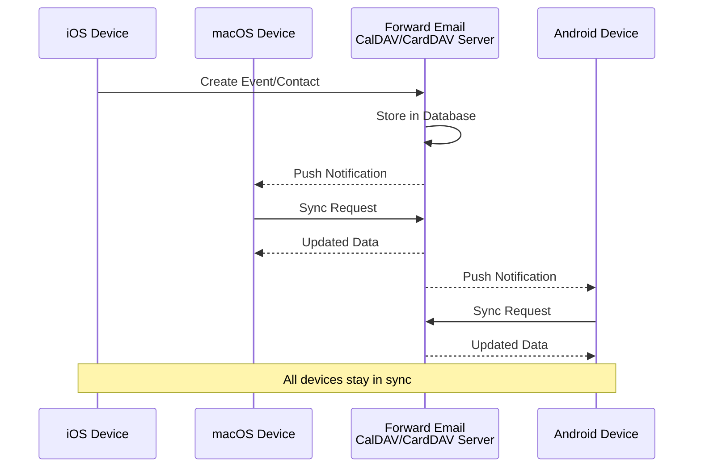

### Расширения календаря, НЕ поддерживаемые {#calendaring-extensions-not-supported}

Следующие расширения календаря НЕ поддерживаются:

| RFC                                                       | Название                                                            | Причина                                                         |
| --------------------------------------------------------- | ------------------------------------------------------------------- | ---------------------------------------------------------------- |
| [RFC 4918](https://datatracker.ietf.org/doc/html/rfc4918) | HTTP Extensions for Web Distributed Authoring and Versioning (WebDAV) | CalDAV использует концепции WebDAV, но не реализует полный RFC 4918 |
| [RFC 6578](https://datatracker.ietf.org/doc/html/rfc6578) | Collection Synchronization for WebDAV                               | Не реализовано                                                  |
| [RFC 3744](https://datatracker.ietf.org/doc/html/rfc3744) | WebDAV Access Control Protocol                                      | Не реализовано                                                  |

---


## Фильтрация сообщений электронной почты {#email-message-filtering}

> \[!IMPORTANT]
> Forward Email предоставляет **полную поддержку Sieve и ManageSieve** для серверной фильтрации электронной почты. Создавайте мощные правила для автоматической сортировки, фильтрации, пересылки и ответа на входящие сообщения.

### Sieve (RFC 5228) {#sieve-rfc-5228}

[Sieve](https://en.wikipedia.org/wiki/Sieve_\(mail_filtering_language\)) — это стандартизированный, мощный язык сценариев для серверной фильтрации электронной почты. Forward Email реализует всестороннюю поддержку Sieve с 24 расширениями.

**Исходный код:** [`helpers/sieve/`](https://github.com/forwardemail/forwardemail.net/tree/master/helpers/sieve)

#### Основные поддерживаемые RFC для Sieve {#core-sieve-rfcs-supported}

| RFC                                                                                    | Название                                                       | Статус          |
| -------------------------------------------------------------------------------------- | ------------------------------------------------------------- | --------------- |
| [RFC 5228](https://datatracker.ietf.org/doc/html/rfc5228)                              | Sieve: Язык фильтрации электронной почты                      | ✅ Полная поддержка |
| [RFC 5429](https://datatracker.ietf.org/doc/html/rfc5429)                              | Sieve Email Filtering: Reject and Extended Reject Extensions  | ✅ Полная поддержка |
| [RFC 5230](https://datatracker.ietf.org/doc/html/rfc5230)                              | Sieve Email Filtering: Vacation Extension                     | ✅ Полная поддержка |
| [RFC 6131](https://datatracker.ietf.org/doc/html/rfc6131)                              | Sieve Vacation Extension: "Seconds" Parameter                 | ✅ Полная поддержка |
| [RFC 5232](https://datatracker.ietf.org/doc/html/rfc5232)                              | Sieve Email Filtering: Imap4flags Extension                   | ✅ Полная поддержка |
| [RFC 5173](https://datatracker.ietf.org/doc/html/rfc5173)                              | Sieve Email Filtering: Body Extension                         | ✅ Полная поддержка |
| [RFC 5229](https://datatracker.ietf.org/doc/html/rfc5229)                              | Sieve Email Filtering: Variables Extension                    | ✅ Полная поддержка |
| [RFC 5231](https://datatracker.ietf.org/doc/html/rfc5231)                              | Sieve Email Filtering: Relational Extension                   | ✅ Полная поддержка |
| [RFC 4790](https://datatracker.ietf.org/doc/html/rfc4790)                              | Internet Application Protocol Collation Registry              | ✅ Полная поддержка |
| [RFC 3894](https://datatracker.ietf.org/doc/html/rfc3894)                              | Sieve Extension: Copying Without Side Effects                 | ✅ Полная поддержка |
| [RFC 5293](https://datatracker.ietf.org/doc/html/rfc5293)                              | Sieve Email Filtering: Editheader Extension                   | ✅ Полная поддержка |
| [RFC 5260](https://datatracker.ietf.org/doc/html/rfc5260)                              | Sieve Email Filtering: Date and Index Extensions              | ✅ Полная поддержка |
| [RFC 5435](https://datatracker.ietf.org/doc/html/rfc5435)                              | Sieve Email Filtering: Extension for Notifications            | ✅ Полная поддержка |
| [RFC 5183](https://datatracker.ietf.org/doc/html/rfc5183)                              | Sieve Email Filtering: Environment Extension                  | ✅ Полная поддержка |
| [RFC 5490](https://datatracker.ietf.org/doc/html/rfc5490)                              | Sieve Email Filtering: Extensions for Checking Mailbox Status | ✅ Полная поддержка |
| [RFC 8579](https://datatracker.ietf.org/doc/html/rfc8579)                              | Sieve Email Filtering: Delivering to Special-Use Mailboxes    | ✅ Полная поддержка |
| [RFC 7352](https://datatracker.ietf.org/doc/html/rfc7352)                              | Sieve Email Filtering: Detecting Duplicate Deliveries         | ✅ Полная поддержка |
| [RFC 5463](https://datatracker.ietf.org/doc/html/rfc5463)                              | Sieve Email Filtering: Ihave Extension                        | ✅ Полная поддержка |
| [RFC 5233](https://datatracker.ietf.org/doc/html/rfc5233)                              | Sieve Email Filtering: Subaddress Extension                   | ✅ Полная поддержка |
| [draft-ietf-sieve-regex](https://datatracker.ietf.org/doc/html/draft-ietf-sieve-regex) | Sieve Email Filtering: Regular Expression Extension           | ✅ Полная поддержка |
#### Поддерживаемые расширения Sieve {#supported-sieve-extensions}

| Расширение                   | Описание                                | Интеграция                                  |
| ---------------------------- | ---------------------------------------- | -------------------------------------------- |
| `fileinto`                   | Помещать сообщения в определённые папки | Сообщения сохраняются в указанной папке IMAP |
| `reject` / `ereject`         | Отклонять сообщения с ошибкой            | Отклонение SMTP с сообщением о возврате       |
| `vacation`                   | Автоматические ответы в отпуске/вне офиса | Очередь через Emails.queue с ограничением скорости |
| `vacation-seconds`           | Точные интервалы ответов в отпуске        | Время жизни из параметра `:seconds`           |
| `imap4flags`                 | Устанавливать флаги IMAP (\Seen, \Flagged и др.) | Флаги применяются при сохранении сообщения    |
| `envelope`                   | Проверять отправителя/получателя конверта | Доступ к данным SMTP конверта                  |
| `body`                       | Проверять содержимое тела сообщения       | Полное совпадение текста тела                   |
| `variables`                  | Хранить и использовать переменные в скриптах | Расширение переменных с модификаторами         |
| `relational`                 | Реляционные сравнения                     | `:count`, `:value` с gt/lt/eq                   |
| `comparator-i;ascii-numeric` | Числовые сравнения                        | Сравнение числовых строк                        |
| `copy`                       | Копировать сообщения при переадресации    | Флаг `:copy` для fileinto/redirect              |
| `editheader`                 | Добавлять или удалять заголовки сообщений | Заголовки изменяются перед сохранением          |
| `date`                       | Проверять значения даты/времени            | Тесты `currentdate` и даты заголовка             |
| `index`                      | Доступ к конкретным вхождениям заголовков | `:index` для заголовков с несколькими значениями |
| `regex`                      | Сопоставление с регулярными выражениями    | Полная поддержка регулярных выражений в тестах  |
| `enotify`                    | Отправлять уведомления                     | Уведомления `mailto:` через Emails.queue         |
| `environment`                | Доступ к информации об окружении           | Домен, хост, удалённый IP из сессии              |
| `mailbox`                    | Проверять существование почтового ящика   | Тест `mailboxexists`                              |
| `special-use`                | Помещать в почтовые ящики специального назначения | Отображение \Junk, \Trash и др. в папки           |
| `duplicate`                  | Обнаруживать дублирующиеся сообщения       | Отслеживание дубликатов на основе Redis          |
| `ihave`                      | Проверять доступность расширения           | Проверка возможностей во время выполнения         |
| `subaddress`                 | Доступ к частям адреса user+detail          | Части адреса `:user` и `:detail`                   |

#### Расширения Sieve, НЕ поддерживаемые {#sieve-extensions-not-supported}

| Расширение                               | RFC                                                       | Причина                                                           |
| --------------------------------------- | --------------------------------------------------------- | ---------------------------------------------------------------- |
| `include`                               | [RFC 6609](https://datatracker.ietf.org/doc/html/rfc6609) | Риск безопасности (инъекция скриптов), требуется глобальное хранение скриптов |
| `mboxmetadata` / `servermetadata`       | [RFC 5490](https://datatracker.ietf.org/doc/html/rfc5490) | Требуется расширение IMAP METADATA                                 |
| `fcc`                                   | [RFC 8580](https://datatracker.ietf.org/doc/html/rfc8580) | Требуется интеграция с папкой Отправленные                           |
| `encoded-character`                     | [RFC 5228](https://datatracker.ietf.org/doc/html/rfc5228) | Требуются изменения парсера для синтаксиса ${hex:}                  |
| `foreverypart` / `mime` / `extracttext` | [RFC 5703](https://datatracker.ietf.org/doc/html/rfc5703) | Сложная обработка MIME-дерева                                       |
#### Поток обработки Sieve {#sieve-processing-flow}

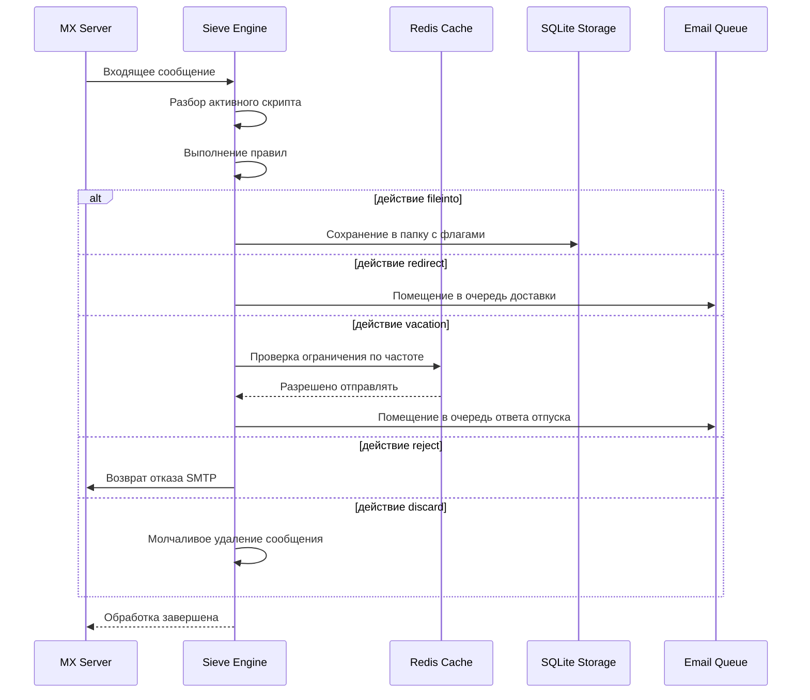

#### Функции безопасности {#security-features}

Реализация Sieve в Forward Email включает комплексные меры безопасности:

* **Защита от CVE-2023-26430**: предотвращает циклы перенаправления и атаки с почтовым бомбометанием
* **Ограничение частоты**: лимиты на перенаправления (10/сообщение, 100/день) и ответы отпуска
* **Проверка в черном списке**: адреса перенаправления проверяются по черному списку
* **Защищённые заголовки**: заголовки DKIM, ARC и аутентификации нельзя изменить через editheader
* **Ограничения размера скрипта**: применяется максимальный размер скрипта
* **Тайм-ауты выполнения**: скрипты прерываются при превышении лимита времени

#### Примеры скриптов Sieve {#example-sieve-scripts}

**Поместить рассылки в папку:**

```sieve
require ["fileinto"];

if header :contains "List-Id" "newsletter" {
    fileinto "Newsletters";
}
```

**Автоответчик отпуска с точным временем:**

```sieve
require ["vacation", "vacation-seconds"];

vacation :seconds 3600 :subject "Out of Office"
    "Я сейчас отсутствую и отвечу в течение 24 часов.";
```

**Фильтрация спама с флагами:**

```sieve
require ["fileinto", "imap4flags"];

if header :contains "X-Spam-Status" "Yes" {
    setflag "\\Seen";
    fileinto "Junk";
}
```

**Сложная фильтрация с переменными:**

```sieve
require ["variables", "fileinto", "regex"];

if header :regex "From" "(.+)@example\\.com" {
    set :lower "sender" "${1}";
    fileinto "Contacts/${sender}";
}
```

> \[!TIP]
> Для полной документации, примеров скриптов и инструкций по настройке смотрите [FAQ: Поддерживаете ли вы фильтрацию почты Sieve?](/faq#do-you-support-sieve-email-filtering)

### ManageSieve (RFC 5804) {#managesieve-rfc-5804}

Forward Email предоставляет полную поддержку протокола ManageSieve для удалённого управления скриптами Sieve.

**Исходный код:** [`managesieve-server.js`](https://github.com/forwardemail/forwardemail.net/blob/master/managesieve-server.js)

| RFC                                                       | Название                                       | Статус         |
| --------------------------------------------------------- | ---------------------------------------------- | -------------- |
| [RFC 5804](https://datatracker.ietf.org/doc/html/rfc5804) | Протокол для удалённого управления скриптами Sieve | ✅ Полная поддержка |

#### Конфигурация сервера ManageSieve {#managesieve-server-configuration}

| Параметр                | Значение                 |
| ----------------------- | ------------------------ |
| **Сервер**              | `imap.forwardemail.net`  |
| **Порт (STARTTLS)**     | `2190` (рекомендуется)   |
| **Порт (Implicit TLS)** | `4190`                   |
| **Аутентификация**      | PLAIN (через TLS)        |

> **Примечание:** Порт 2190 использует STARTTLS (переход с plain на TLS) и совместим с большинством клиентов ManageSieve, включая [sieve-connect](https://github.com/philpennock/sieve-connect). Порт 4190 использует implicit TLS (TLS с начала соединения) для клиентов, которые это поддерживают.

#### Поддерживаемые команды ManageSieve {#supported-managesieve-commands}

| Команда        | Описание                              |
| -------------- | ------------------------------------ |
| `AUTHENTICATE` | Аутентификация с использованием механизма PLAIN |
| `CAPABILITY`   | Список возможностей и расширений сервера |
| `HAVESPACE`    | Проверка возможности сохранить скрипт |
| `PUTSCRIPT`    | Загрузка нового скрипта              |
| `LISTSCRIPTS`  | Список всех скриптов с указанием активного |
| `SETACTIVE`    | Активация скрипта                    |
| `GETSCRIPT`    | Загрузка скрипта                    |
| `DELETESCRIPT` | Удаление скрипта                    |
| `RENAMESCRIPT` | Переименование скрипта              |
| `CHECKSCRIPT`  | Проверка синтаксиса скрипта         |
| `NOOP`         | Поддержание соединения в активном состоянии |
| `LOGOUT`       | Завершение сессии                   |
#### Совместимые клиенты ManageSieve {#compatible-managesieve-clients}

* **Thunderbird**: Встроенная поддержка Sieve через [Sieve add-on](https://addons.thunderbird.net/addon/sieve/)
* **Roundcube**: [Плагин ManageSieve](https://plugins.roundcube.net/packages/johndoh/sieve)
* **KMail**: Родная поддержка ManageSieve
* **sieve-connect**: Клиент командной строки
* **Любой клиент, соответствующий RFC 5804**

#### Процесс протокола ManageSieve {#managesieve-protocol-flow}

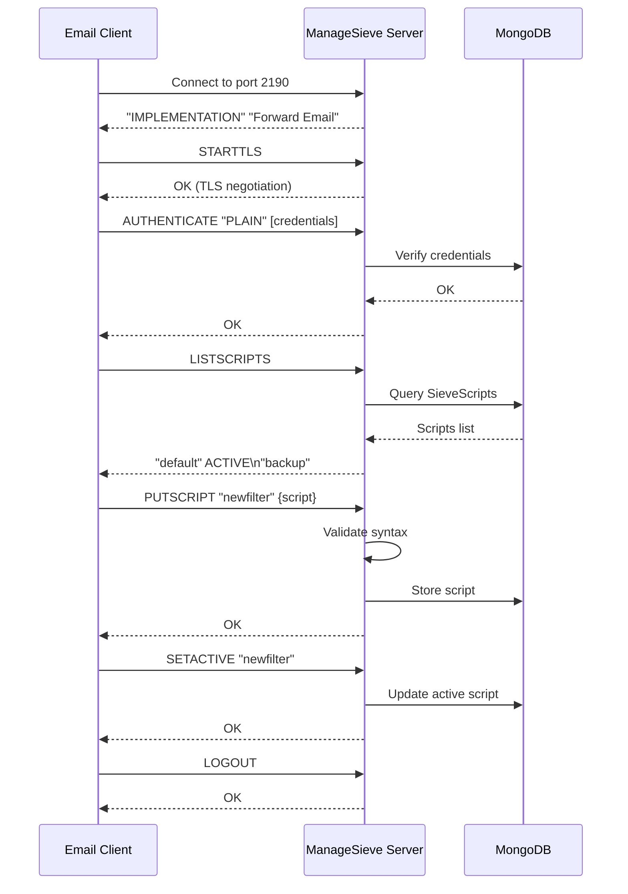

#### Веб-интерфейс и API {#web-interface-and-api}

Помимо ManageSieve, Forward Email предоставляет:

* **Веб-панель управления**: Создавайте и управляйте скриптами Sieve через веб-интерфейс в Мой аккаунт → Домены → Псевдонимы → Скрипты Sieve
* **REST API**: Программный доступ к управлению скриптами Sieve через [Forward Email API](/api#sieve-scripts)

> \[!TIP]
> Для подробных инструкций по настройке и конфигурации клиентов смотрите [FAQ: Поддерживаете ли вы фильтрацию почты с помощью Sieve?](/faq#do-you-support-sieve-email-filtering)

---


## Оптимизация хранения {#storage-optimization}

> \[!IMPORTANT]
> **Первая в отрасли технология хранения:** Forward Email — **единственный в мире почтовый провайдер**, который сочетает дедупликацию вложений с компрессией Brotli для содержимого писем. Эта двухслойная оптимизация обеспечивает вам **в 2-3 раза больше эффективного пространства хранения** по сравнению с традиционными почтовыми провайдерами.

Forward Email реализует две революционные техники оптимизации хранения, которые значительно уменьшают размер почтового ящика при полном соблюдении RFC и сохранении целостности сообщений:

1. **Дедупликация вложений** — устраняет дублирующиеся вложения во всех письмах
2. **Компрессия Brotli** — уменьшает объем хранения на 46-86% для метаданных и на 50% для вложений

### Архитектура: двухслойная оптимизация хранения {#architecture-dual-layer-storage-optimization}

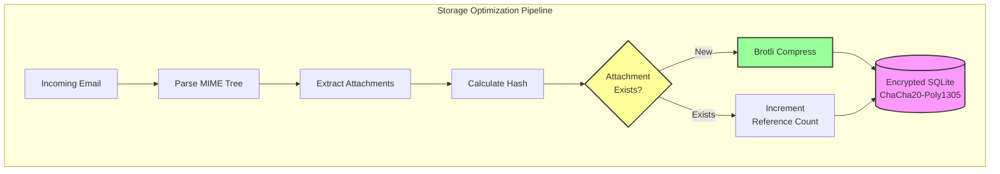

---


## Дедупликация вложений {#attachment-deduplication}

Forward Email реализует дедупликацию вложений на основе [проверенного подхода WildDuck](https://docs.wildduck.email/docs/in-depth/attachment-deduplication/), адаптированного для хранения в SQLite.

> \[!NOTE]
> **Что дедуплицируется:** «Вложение» означает **закодированное** содержимое MIME-узла (base64 или quoted-printable), а не декодированный файл. Это сохраняет валидность подписей DKIM и GPG.

### Как это работает {#how-it-works}

**Оригинальная реализация WildDuck (MongoDB GridFS):**

> IMAP-сервер Wild Duck выполняет дедупликацию вложений. «Вложение» в данном случае означает содержимое MIME-узла, закодированное в base64 или quoted-printable, а не декодированный файл. Хотя использование закодированного содержимого приводит к множеству ложных отрицательных срабатываний (один и тот же файл в разных письмах может считаться разными вложениями), это необходимо для гарантии корректности различных схем подписей (DKIM, GPG и т.д.). Сообщение, полученное из Wild Duck, выглядит точно так же, как и сохраненное, несмотря на то, что Wild Duck разбирает сообщение в древовидный объект и восстанавливает сообщение при получении.
**Реализация SQLite в Forward Email:**

Forward Email адаптирует этот подход для зашифрованного хранения в SQLite с помощью следующего процесса:

1. **Вычисление хэша**: При обнаружении вложения вычисляется хэш с использованием библиотеки [`rev-hash`](https://github.com/sindresorhus/rev-hash) из тела вложения
2. **Поиск**: Проверяется, существует ли вложение с совпадающим хэшем в таблице `Attachments`
3. **Подсчет ссылок**:
   * Если существует: Увеличивается счетчик ссылок на 1 и магический счетчик на случайное число
   * Если новое: Создается новая запись вложения со счетчиком = 1
4. **Безопасность удаления**: Используется система с двумя счетчиками (ссылки + магический) для предотвращения ложных срабатываний
5. **Сборка мусора**: Вложения удаляются сразу, когда оба счетчика достигают нуля

**Исходный код:** [`helpers/attachment-storage.js`](https://github.com/forwardemail/forwardemail.net/blob/master/helpers/attachment-storage.js)

### Поток дедупликации {#deduplication-flow}

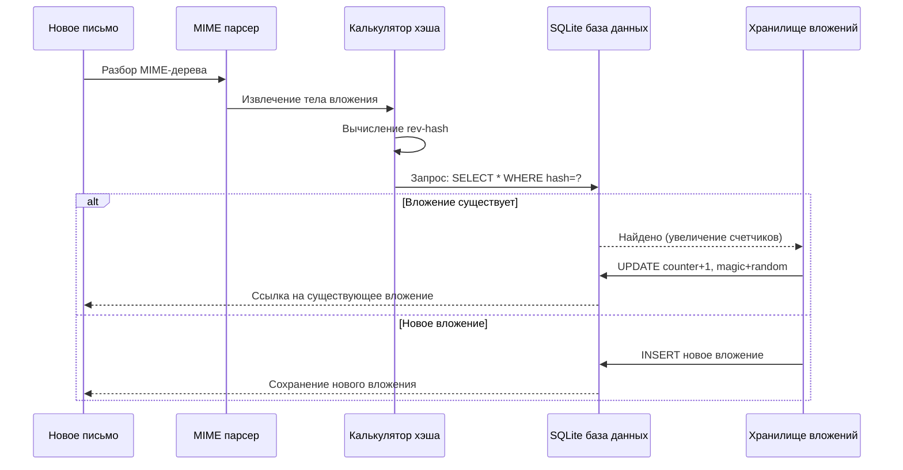

### Система магических чисел {#magic-number-system}

Forward Email использует систему "магических чисел" WildDuck (вдохновленную [Mail.ru](https://github.com/zone-eu/wildduck)) для предотвращения ложных срабатываний при удалении:

* Каждому сообщению присваивается **случайное число**
* Магический счетчик вложения увеличивается на это случайное число при добавлении сообщения
* Магический счетчик уменьшается на то же число при удалении сообщения
* Вложение удаляется только когда **оба счетчика** (ссылок + магический) достигают нуля

Эта система с двумя счетчиками гарантирует, что если что-то пойдет не так при удалении (например, сбой, ошибка сети), вложение не будет удалено преждевременно.

### Ключевые отличия: WildDuck vs Forward Email {#key-differences-wildduck-vs-forward-email}

| Особенность             | WildDuck (MongoDB)       | Forward Email (SQLite)       |
| ---------------------- | ------------------------ | ---------------------------- |
| **Хранилище**          | MongoDB GridFS (разбитое) | SQLite BLOB (прямое)         |
| **Алгоритм хэширования** | SHA256                   | rev-hash (на основе SHA-256) |
| **Подсчет ссылок**     | ✅ Да                     | ✅ Да                        |
| **Магические числа**   | ✅ Да (вдохновлено Mail.ru) | ✅ Да (та же система)         |
| **Сборка мусора**      | Отложенная (отдельная задача) | Немедленная (при нулевых счетчиках) |
| **Сжатие**             | ❌ Нет                    | ✅ Brotli (см. ниже)          |
| **Шифрование**         | ❌ Опционально             | ✅ Всегда (ChaCha20-Poly1305) |

---


## Сжатие Brotli {#brotli-compression}

> \[!IMPORTANT]
> **Первое в мире:** Forward Email — **единственный в мире почтовый сервис**, который использует сжатие Brotli для содержимого писем. Это обеспечивает **экономию места от 46 до 86%** поверх дедупликации вложений.

Forward Email реализует сжатие Brotli как для тел вложений, так и для метаданных сообщений, обеспечивая значительную экономию места при сохранении обратной совместимости.

**Реализация:** [`helpers/msgpack-helpers.js`](https://github.com/forwardemail/forwardemail.net/blob/master/helpers/msgpack-helpers.js)

### Что сжимается {#what-gets-compressed}

**1. Тела вложений** (`encodeAttachmentBody`)

* **Старые форматы**: Строка в шестнадцатеричном формате (увеличение размера в 2 раза) или сырой Buffer
* **Новый формат**: Buffer, сжатый Brotli с магической шапкой "FEBR"
* **Решение о сжатии**: Сжимается только если это экономит место (учитывая 4-байтовый заголовок)
* **Экономия места**: До **50%** (hex → нативный BLOB)
**2. Метаданные сообщения** (`encodeMetadata`)

Включает: `mimeTree`, `headers`, `envelope`, `flags`

* **Старый формат**: JSON строка текста
* **Новый формат**: Buffer, сжатый Brotli
* **Экономия места**: **46-86%** в зависимости от сложности сообщения

### Конфигурация сжатия {#compression-configuration}

```javascript
// Опции сжатия Brotli, оптимизированные для скорости (уровень 4 — хороший баланс)
const BROTLI_COMPRESS_OPTIONS = {
  params: {
    [zlib.constants.BROTLI_PARAM_QUALITY]: 4
  }
};
```

**Почему уровень 4?**

* **Быстрое сжатие/распаковка**: обработка за доли миллисекунды
* **Хорошее сжатие**: экономия 46-86%
* **Сбалансированная производительность**: оптимально для операций с электронной почтой в реальном времени

### Магический заголовок: "FEBR" {#magic-header-febr}

Forward Email использует 4-байтовый магический заголовок для идентификации сжатых тел вложений:

```
"FEBR" = Forward Email BRotli
Hex: 0x46 0x45 0x42 0x52
```

**Зачем нужен магический заголовок?**

* **Определение формата**: мгновенно отличать сжатые данные от несжатых
* **Обратная совместимость**: старые hex-строки и необработанные Buffers продолжают работать
* **Избежание коллизий**: "FEBR" маловероятно встретится в начале легитимных данных вложений

### Процесс сжатия {#compression-process}

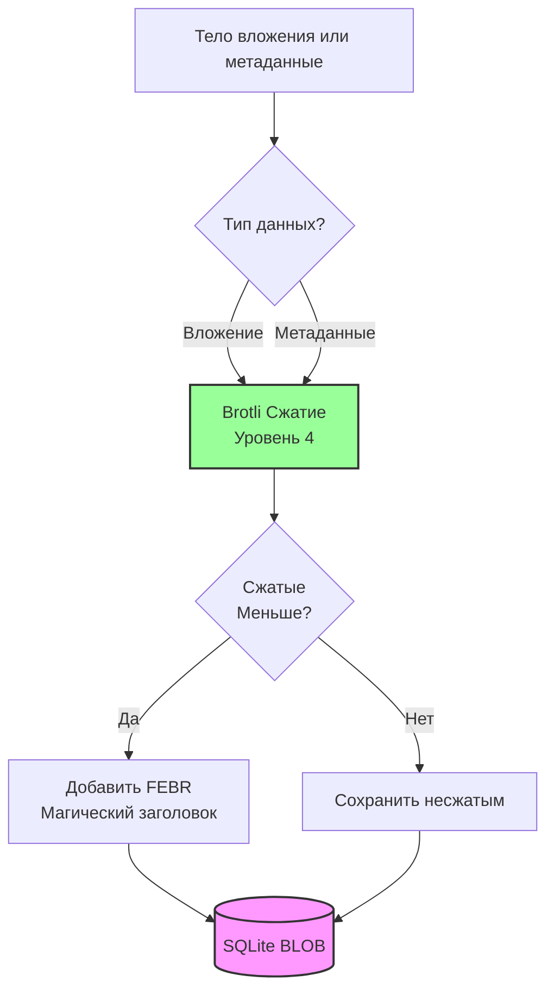

### Процесс распаковки {#decompression-process}

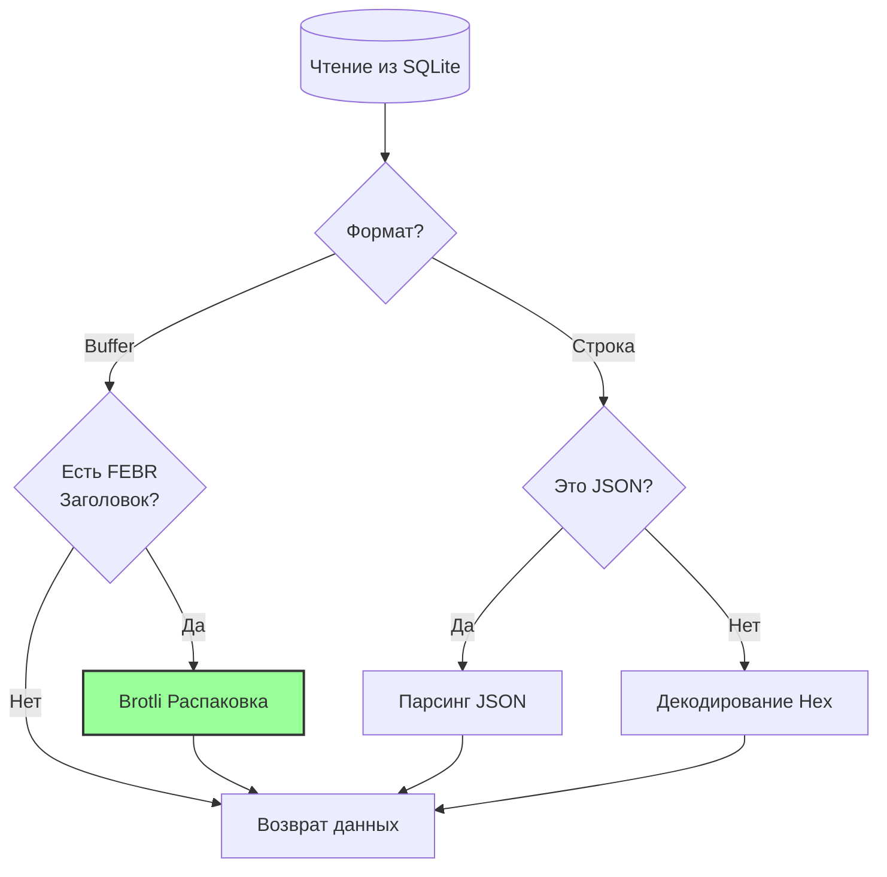

### Обратная совместимость {#backwards-compatibility}

Все функции декодирования **автоматически определяют** формат хранения:

| Формат                | Метод определения                    | Обработка                                     |
| --------------------- | ---------------------------------- | --------------------------------------------- |
| **Сжатый Brotli**     | Проверка магического заголовка "FEBR" | Распаковка с помощью `zlib.brotliDecompressSync()` |
| **Необработанный Buffer** | `Buffer.isBuffer()` без магии       | Возврат как есть                              |
| **Hex-строка**        | Проверка чётной длины + символов [0-9a-f] | Декодирование через `Buffer.from(value, 'hex')` |
| **JSON-строка**       | Проверка первого символа `{` или `[` | Парсинг через `JSON.parse()`                   |

Это гарантирует **нулевую потерю данных** при миграции со старых на новые форматы хранения.

### Статистика экономии места {#storage-savings-statistics}

**Измеренная экономия на производственных данных:**

| Тип данных            | Старый формат           | Новый формат           | Экономия  |
| --------------------- | ----------------------- | ---------------------- | --------- |
| **Тела вложений**     | Hex-кодированная строка (2x) | Сжатый Brotli BLOB     | **50%**   |
| **Метаданные сообщений** | JSON текст              | Сжатый Brotli BLOB     | **46-86%**|
| **Флаги почтового ящика** | JSON текст              | Сжатый Brotli BLOB     | **60-80%**|

**Источник:** [`helpers/migrate-storage-format.js`](https://github.com/forwardemail/forwardemail.net/blob/master/helpers/migrate-storage-format.js)

### Процесс миграции {#migration-process}

Forward Email предоставляет автоматическую, идемпотентную миграцию со старых на новые форматы хранения:
// Отслеживаемая статистика миграции:
{
  attachmentsMigrated: 0,
  messagesMigrated: 0,
  mailboxesMigrated: 0,
  bytesSaved: 0  // Общее количество байт, сэкономленных за счет сжатия
}
```

**Шаги миграции:**

1. Тела вложений: шестнадцатеричное кодирование → нативный BLOB (экономия 50%)
2. Метаданные сообщений: JSON-текст → BLOB, сжатый Brotli (экономия 46-86%)
3. Флаги почтового ящика: JSON-текст → BLOB, сжатый Brotli (экономия 60-80%)

**Источник:** [`helpers/migrate-storage-format.js`](https://github.com/forwardemail/forwardemail.net/blob/master/helpers/migrate-storage-format.js)

---

### Эффективность комбинированного хранения {#combined-storage-efficiency}

> \[!TIP]
> **Реальное влияние:** Благодаря дедупликации вложений и сжатию Brotli пользователи Forward Email получают **в 2-3 раза более эффективное хранение**, чем у традиционных почтовых провайдеров.

**Пример сценария:**

Традиционный почтовый провайдер (почтовый ящик 1 ГБ):

* 1 ГБ дискового пространства = 1 ГБ писем
* Нет дедупликации: одно и то же вложение хранится 10 раз = 10-кратная потеря места
* Нет сжатия: полные JSON-метаданные хранятся = 2-3-кратная потеря места

Forward Email (почтовый ящик 1 ГБ):

* 1 ГБ дискового пространства ≈ **2-3 ГБ писем** (эффективное хранение)
* Дедупликация: одно и то же вложение хранится один раз, ссылаются 10 раз
* Сжатие: экономия 46-86% на метаданных, 50% на вложениях
* Шифрование: ChaCha20-Poly1305 (без накладных расходов на хранение)

**Таблица сравнения:**

| Провайдер         | Технология хранения                         | Эффективное хранение (почтовый ящик 1 ГБ) |
| ----------------- | -------------------------------------------- | ----------------------------------------- |
| Gmail             | Нет                                         | 1 ГБ                                      |
| iCloud            | Нет                                         | 1 ГБ                                      |
| Outlook.com       | Нет                                         | 1 ГБ                                      |
| Fastmail          | Нет                                         | 1 ГБ                                      |
| ProtonMail        | Только шифрование                            | 1 ГБ                                      |
| Tutanota          | Только шифрование                            | 1 ГБ                                      |
| **Forward Email** | **Дедупликация + Сжатие + Шифрование**      | **2-3 ГБ** ✨                              |

### Технические детали реализации {#technical-implementation-details}

**Производительность:**

* Brotli уровень 4: сжатие/распаковка за доли миллисекунды
* Нет потерь производительности из-за сжатия
* SQLite FTS5: поиск менее 50 мс на NVMe SSD

**Безопасность:**

* Сжатие происходит **после** шифрования (база данных SQLite зашифрована)
* Шифрование ChaCha20-Poly1305 + сжатие Brotli
* Нулевая осведомленность: пароль для расшифровки есть только у пользователя

**Соответствие RFC:**

* Получаемые сообщения выглядят **точно так же**, как и сохранённые
* Подписи DKIM остаются валидными (кодированный контент сохранён)
* Подписи GPG остаются валидными (контент, подписанный, не изменён)

### Почему ни один другой провайдер этого не делает {#why-no-other-provider-does-this}

**Сложность:**

* Требуется глубокая интеграция с уровнем хранения
* Обеспечение обратной совместимости сложно
* Миграция со старых форматов сложна

**Проблемы с производительностью:**

* Сжатие добавляет нагрузку на CPU (решено с помощью Brotli уровня 4)
* Распаковка при каждом чтении (решено кэшированием SQLite)

**Преимущество Forward Email:**

* Создан с нуля с учётом оптимизации
* SQLite позволяет напрямую работать с BLOB
* Зашифрованные базы данных на пользователя обеспечивают безопасное сжатие

---

---


## Современные функции {#modern-features}


## Полный REST API для управления электронной почтой {#complete-rest-api-for-email-management}

> \[!TIP]
> Forward Email предоставляет полный REST API с 39 конечными точками для программного управления электронной почтой.

> \[!TIP]
> **Уникальная особенность отрасли:** В отличие от всех остальных почтовых сервисов, Forward Email предоставляет полный программный доступ к вашему почтовому ящику, календарю, контактам, сообщениям и папкам через полный REST API. Это прямое взаимодействие с вашим зашифрованным файлом базы данных SQLite, в котором хранятся все ваши данные.

Forward Email предлагает полный REST API, обеспечивающий беспрецедентный доступ к вашим данным электронной почты. Ни один другой почтовый сервис (включая Gmail, iCloud, Outlook, ProtonMail, Tuta или Fastmail) не предлагает такого уровня комплексного прямого доступа к базе данных.
**Документация API:** <https://forwardemail.net/en/email-api>

### Категории API (39 конечных точек) {#api-categories-39-endpoints}

**1. API сообщений** (5 конечных точек) - Полные операции CRUD с электронными сообщениями:

* `GET /v1/messages` - Список сообщений с 15+ расширенными параметрами поиска (никакой другой сервис этого не предлагает)
* `POST /v1/messages` - Создание/отправка сообщений
* `GET /v1/messages/:id` - Получение сообщения
* `PUT /v1/messages/:id` - Обновление сообщения (флаги, папки)
* `DELETE /v1/messages/:id` - Удаление сообщения

*Пример: Найти все счета за последний квартал с вложениями:*

```bash
curl -u "alias@domain.com:password" \
  "https://api.forwardemail.net/v1/messages?q=subject:invoice+has:attachment+after:2024-01-01+before:2024-04-01"
```

См. [Документация по расширенному поиску](https://forwardemail.net/en/email-api)

**2. API папок** (5 конечных точек) - Полное управление папками IMAP через REST:

* `GET /v1/folders` - Список всех папок
* `POST /v1/folders` - Создание папки
* `GET /v1/folders/:id` - Получение папки
* `PUT /v1/folders/:id` - Обновление папки
* `DELETE /v1/folders/:id` - Удаление папки

**3. API контактов** (5 конечных точек) - Хранение контактов CardDAV через REST:

* `GET /v1/contacts` - Список контактов
* `POST /v1/contacts` - Создание контакта (формат vCard)
* `GET /v1/contacts/:id` - Получение контакта
* `PUT /v1/contacts/:id` - Обновление контакта
* `DELETE /v1/contacts/:id` - Удаление контакта

**4. API календарей** (5 конечных точек) - Управление контейнерами календарей:

* `GET /v1/calendars` - Список контейнеров календарей
* `POST /v1/calendars` - Создание календаря (например, «Рабочий календарь», «Личный календарь»)
* `GET /v1/calendars/:id` - Получение календаря
* `PUT /v1/calendars/:id` - Обновление календаря
* `DELETE /v1/calendars/:id` - Удаление календаря

**5. API событий календаря** (5 конечных точек) - Планирование событий в календарях:

* `GET /v1/calendar-events` - Список событий
* `POST /v1/calendar-events` - Создание события с участниками
* `GET /v1/calendar-events/:id` - Получение события
* `PUT /v1/calendar-events/:id` - Обновление события
* `DELETE /v1/calendar-events/:id` - Удаление события

*Пример: Создать событие в календаре:*

```bash
curl -u "alias@domain.com:password" \
  -X POST \
  -H "Content-Type: application/json" \
  -d '{"title":"Командное собрание","start":"2024-12-20T10:00:00Z","attendees":["team@example.com"],"calendar_id":"calendar123"}' \
  https://api.forwardemail.net/v1/calendar-events
```

### Технические детали {#technical-details}

* **Аутентификация:** Простая аутентификация `alias:password` (без сложности OAuth)
* **Производительность:** Время отклика менее 50 мс с использованием SQLite FTS5 и NVMe SSD
* **Нулевая задержка сети:** Прямой доступ к базе данных, без проксирования через внешние сервисы

### Практические сценарии использования {#real-world-use-cases}

* **Аналитика электронной почты:** Создание пользовательских панелей для отслеживания объема писем, времени ответа, статистики отправителей

* **Автоматизация рабочих процессов:** Запуск действий на основе содержимого писем (обработка счетов, заявки в поддержку)

* **Интеграция с CRM:** Автоматическая синхронизация переписки с вашей CRM

* **Соответствие требованиям и поиск:** Поиск и экспорт писем для юридических/комплаенс требований

* **Пользовательские почтовые клиенты:** Создание специализированных интерфейсов электронной почты для вашего рабочего процесса

* **Бизнес-аналитика:** Анализ коммуникационных паттернов, скорости ответов, вовлеченности клиентов

* **Управление документами:** Автоматический извлечение и категоризация вложений

* [Полная документация](https://forwardemail.net/en/email-api)

* [Полный справочник API](https://forwardemail.net/en/email-api)

* [Руководство по расширенному поиску](https://forwardemail.net/en/email-api)

* [30+ примеров интеграций](https://forwardemail.net/en/email-api)

* [Техническая архитектура](https://forwardemail.net/en/blog/docs/best-quantum-safe-encrypted-email-service)

Forward Email предлагает современный REST API, который обеспечивает полный контроль над учетными записями электронной почты, доменами, алиасами и сообщениями. Этот API является мощной альтернативой JMAP и предоставляет функциональность, выходящую за рамки традиционных почтовых протоколов.

| Категория               | Конечные точки | Описание                              |
| ----------------------- | -------------- | ----------------------------------- |
| **Управление аккаунтом** | 8              | Пользовательские аккаунты, аутентификация, настройки |
| **Управление доменом**   | 12             | Пользовательские домены, DNS, проверка |
| **Управление алиасами**  | 6              | Почтовые алиасы, переадресация, catch-all |
| **Управление сообщениями** | 7            | Отправка, получение, поиск, удаление сообщений |
| **Календари и контакты** | 4              | Доступ CalDAV/CardDAV через API     |
| **Логи и аналитика**     | 2              | Логи почты, отчеты о доставке       |
### Основные возможности API {#key-api-features}

**Расширенный поиск:**

API предоставляет мощные возможности поиска с синтаксисом запросов, похожим на Gmail:

```
GET /v1/messages?q=subject:invoice+has:attachment+after:2024-01-01+before:2024-04-01
```

**Поддерживаемые операторы поиска:**

* `from:` - Поиск по отправителю
* `to:` - Поиск по получателю
* `subject:` - Поиск по теме
* `has:attachment` - Сообщения с вложениями
* `is:unread` - Непрочитанные сообщения
* `is:starred` - Помеченные сообщения
* `after:` - Сообщения после даты
* `before:` - Сообщения до даты
* `label:` - Сообщения с меткой
* `filename:` - Имя файла вложения

**Управление событиями календаря:**

```
GET /v1/calendar-events
POST /v1/calendar-events
PUT /v1/calendar-events/:id
DELETE /v1/calendar-events/:id
```

**Интеграции с вебхуками:**

API поддерживает вебхуки для уведомлений в реальном времени о событиях электронной почты (получено, отправлено, отклонено и т.д.).

**Аутентификация:**

* Аутентификация с помощью API ключа
* Поддержка OAuth 2.0
* Ограничение скорости: 1000 запросов в час

**Формат данных:**

* JSON запрос/ответ
* RESTful дизайн
* Поддержка пагинации

**Безопасность:**

* Только HTTPS
* Ротация API ключей
* Белый список IP (опционально)
* Подпись запросов (опционально)

### Архитектура API {#api-architecture}

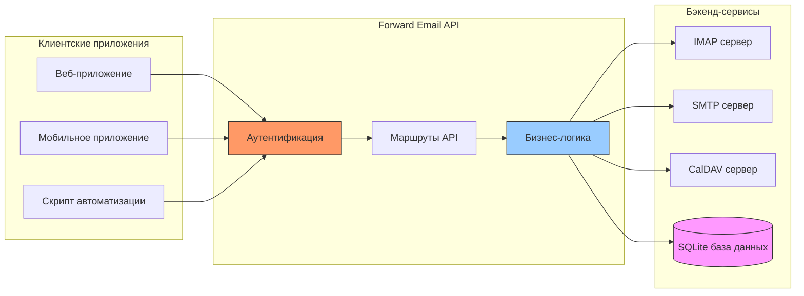

---


## Push-уведомления iOS {#ios-push-notifications}

> \[!TIP]
> Forward Email поддерживает нативные push-уведомления iOS через XAPPLEPUSHSERVICE для мгновенной доставки писем.

> \[!IMPORTANT]
> **Уникальная функция:** Forward Email — один из немногих open-source почтовых серверов, поддерживающих нативные push-уведомления iOS для почты, контактов и календарей через расширение IMAP `XAPPLEPUSHSERVICE`. Это было реверс-инжиниринг протокола Apple и обеспечивает мгновенную доставку на устройства iOS без разряда батареи.

Forward Email реализует проприетарное расширение Apple XAPPLEPUSHSERVICE, обеспечивая нативные push-уведомления для устройств iOS без необходимости фонового опроса.

### Как это работает {#how-it-works-1}

**XAPPLEPUSHSERVICE** — нестандартное расширение IMAP, позволяющее приложению Mail на iOS получать мгновенные push-уведомления при поступлении новых писем.

Forward Email реализует интеграцию с проприетарным сервисом Apple Push Notification (APNs) для IMAP, позволяя приложению Mail на iOS получать мгновенные push-уведомления при поступлении новых писем.

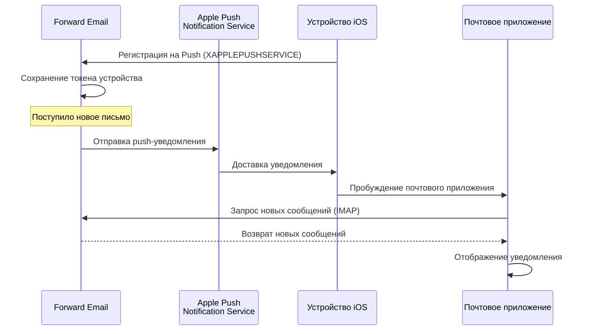

### Ключевые особенности {#key-features}

**Мгновенная доставка:**

* Push-уведомления приходят в течение секунд
* Нет фонового опроса, разряжающего батарею
* Работает даже при закрытом почтовом приложении

<!---->

* **Мгновенная доставка:** Письма, события календаря и контакты появляются на вашем iPhone/iPad сразу, а не по расписанию опроса
* **Энергоэффективность:** Использует инфраструктуру push Apple вместо постоянных IMAP-соединений
* **Push по темам:** Поддержка push-уведомлений для конкретных почтовых ящиков, а не только INBOX
* **Без сторонних приложений:** Работает с нативными приложениями iOS Mail, Calendar и Contacts
**Нативная интеграция:**

* Встроено в приложение iOS Mail
* Не требуются сторонние приложения
* Бесшовный пользовательский опыт

**Ориентировано на конфиденциальность:**

* Токены устройств зашифрованы
* Содержимое сообщений не передается через APNS
* Отправляется только уведомление о "новой почте"

**Энергоэффективность:**

* Нет постоянного опроса IMAP
* Устройство спит до получения уведомления
* Минимальное влияние на батарею

### Что делает это особенным {#what-makes-this-special}

> \[!IMPORTANT]
> Большинство почтовых провайдеров не поддерживают XAPPLEPUSHSERVICE, заставляя устройства iOS опрашивать почту каждые 15 минут.

Большинство open-source почтовых серверов (включая Dovecot, Postfix, Cyrus IMAP) НЕ поддерживают push-уведомления iOS. Пользователи вынуждены либо:

* Использовать IMAP IDLE (поддерживает открытое соединение, расходует батарею)
* Использовать опрос (проверка каждые 15-30 минут, задержка уведомлений)
* Использовать проприетарные почтовые приложения с собственной инфраструктурой push

Forward Email обеспечивает такой же мгновенный опыт push-уведомлений, как коммерческие сервисы, например Gmail, iCloud и Fastmail.

**Сравнение с другими провайдерами:**

| Провайдер         | Поддержка Push | Интервал опроса | Влияние на батарею |
| ----------------- | -------------- | --------------- | ------------------ |
| **Forward Email** | ✅ Нативный Push | Мгновенно       | Минимальное        |
| Gmail             | ✅ Нативный Push | Мгновенно       | Минимальное        |
| iCloud            | ✅ Нативный Push | Мгновенно       | Минимальное        |
| Yahoo             | ✅ Нативный Push | Мгновенно       | Минимальное        |
| Outlook.com       | ❌ Опрос        | 15 минут        | Среднее            |
| Fastmail          | ❌ Опрос        | 15 минут        | Среднее            |
| ProtonMail        | ⚠️ Только через Bridge | Через Bridge | Высокое            |
| Tutanota          | ❌ Только приложение | Н/Д           | Н/Д                |

### Детали реализации {#implementation-details}

**Ответ IMAP CAPABILITY:**

```
* CAPABILITY IMAP4rev1 ... XAPPLEPUSHSERVICE ...
```

**Процесс регистрации:**

1. Приложение iOS Mail обнаруживает возможность XAPPLEPUSHSERVICE
2. Приложение регистрирует токен устройства в Forward Email
3. Forward Email сохраняет токен и связывает его с аккаунтом
4. При поступлении новой почты Forward Email отправляет push через APNS
5. iOS пробуждает приложение Mail для получения новых сообщений

**Безопасность:**

* Токены устройств зашифрованы в состоянии покоя
* Токены истекают и обновляются автоматически
* Содержимое сообщений не раскрывается APNS
* Поддерживается сквозное шифрование

<!---->

* **Расширение IMAP:** `XAPPLEPUSHSERVICE`
* **Исходный код:** [WildDuck Issue #711](https://github.com/zone-eu/wildduck/issues/711)
* **Настройка:** Автоматическая — не требует конфигурации, работает из коробки с приложением iOS Mail

### Сравнение с другими сервисами {#comparison-with-other-services}

| Сервис        | Поддержка iOS Push | Метод                                   |
| ------------- | ------------------ | -------------------------------------- |
| Forward Email | ✅ Да              | `XAPPLEPUSHSERVICE` (обратная разработка) |
| Gmail         | ✅ Да              | Проприетарное приложение Gmail + Google push |
| iCloud Mail   | ✅ Да              | Нативная интеграция Apple              |
| Outlook.com   | ✅ Да              | Проприетарное приложение Outlook + Microsoft push |
| Fastmail      | ✅ Да              | `XAPPLEPUSHSERVICE`                     |
| Dovecot       | ❌ Нет             | Только IMAP IDLE или опрос              |
| Postfix       | ❌ Нет             | Только IMAP IDLE или опрос              |
| Cyrus IMAP    | ❌ Нет             | Только IMAP IDLE или опрос              |

**Push Gmail:**

Gmail использует проприетарную систему push, которая работает только с приложением Gmail. Приложение iOS Mail должно опрашивать IMAP-серверы Gmail.

**Push iCloud:**

iCloud имеет нативную поддержку push, аналогичную Forward Email, но только для адресов @icloud.com.

**Outlook.com:**

Outlook.com не поддерживает XAPPLEPUSHSERVICE, поэтому iOS Mail опрашивает почту каждые 15 минут.

**Fastmail:**

Fastmail не поддерживает XAPPLEPUSHSERVICE. Пользователи должны использовать приложение Fastmail для push-уведомлений или принимать задержки при опросе каждые 15 минут.

---


## Тестирование и проверка {#testing-and-verification}


## Тесты возможностей протокола {#protocol-capability-tests}
> \[!NOTE]
> В этом разделе представлены результаты наших последних тестов возможностей протоколов, проведённых 22 января 2026 года.

В этом разделе содержатся фактические ответы CAPABILITY/CAPA/EHLO от всех протестированных провайдеров. Все тесты были проведены **22 января 2026 года**.

Эти тесты помогают проверить заявленную и фактическую поддержку различных почтовых протоколов и расширений у основных провайдеров.

### Методология тестирования {#test-methodology}

**Тестовая среда:**

* **Дата:** 22 января 2026 года, 02:37 UTC
* **Местоположение:** экземпляр AWS EC2
* **IPv4:** 54.167.216.197
* **IPv6:** 2600:4040:46da:9a00:b19e:3ad4:426c:2f48
* **Инструменты:** OpenSSL s_client, bash-скрипты

**Тестируемые провайдеры:**

* Forward Email
* Gmail
* Outlook.com
* iCloud
* Fastmail
* Yahoo/AOL (Verizon)

### Тестовые скрипты {#test-scripts}

Для полной прозрачности ниже приведены точные скрипты, использованные для этих тестов.

#### Скрипт теста возможностей IMAP {#imap-capability-test-script}

```bash
#!/bin/bash
# IMAP Capability Test Script
# Tests IMAP CAPABILITY for various email providers

echo "========================================="
echo "IMAP CAPABILITY TEST"
echo "Date: $(date -u +"%Y-%m-%d %H:%M:%S UTC")"
echo "========================================="
echo ""

# Gmail
echo "--- Gmail (imap.gmail.com:993) ---"
echo -e "a001 CAPABILITY\na002 LOGOUT" | timeout 10 openssl s_client -connect imap.gmail.com:993 -crlf -quiet 2>&1 | grep -A 20 "CAPABILITY"
echo ""

# Outlook.com
echo "--- Outlook.com (outlook.office365.com:993) ---"
echo -e "a001 CAPABILITY\na002 LOGOUT" | timeout 10 openssl s_client -connect outlook.office365.com:993 -crlf -quiet 2>&1 | grep -A 20 "CAPABILITY"
echo ""

# iCloud
echo "--- iCloud (imap.mail.me.com:993) ---"
echo -e "a001 CAPABILITY\na002 LOGOUT" | timeout 10 openssl s_client -connect imap.mail.me.com:993 -crlf -quiet 2>&1 | grep -A 20 "CAPABILITY"
echo ""

# Fastmail
echo "--- Fastmail (imap.fastmail.com:993) ---"
echo -e "a001 CAPABILITY\na002 LOGOUT" | timeout 10 openssl s_client -connect imap.fastmail.com:993 -crlf -quiet 2>&1 | grep -A 20 "CAPABILITY"
echo ""

# Yahoo
echo "--- Yahoo (imap.mail.yahoo.com:993) ---"
echo -e "a001 CAPABILITY\na002 LOGOUT" | timeout 10 openssl s_client -connect imap.mail.yahoo.com:993 -crlf -quiet 2>&1 | grep -A 20 "CAPABILITY"
echo ""

# Forward Email
echo "--- Forward Email (imap.forwardemail.net:993) ---"
echo -e "a001 CAPABILITY\na002 LOGOUT" | timeout 10 openssl s_client -connect imap.forwardemail.net:993 -crlf -quiet 2>&1 | grep -A 20 "CAPABILITY"
echo ""

echo "========================================="
echo "Test completed"
echo "========================================="
```

#### Скрипт теста возможностей POP3 {#pop3-capability-test-script}

```bash
#!/bin/bash
# POP3 Capability Test Script
# Tests POP3 CAPA for various email providers

echo "========================================="
echo "POP3 CAPABILITY TEST"
echo "Date: $(date -u +"%Y-%m-%d %H:%M:%S UTC")"
echo "========================================="
echo ""

# Gmail
echo "--- Gmail (pop.gmail.com:995) ---"
echo -e "CAPA\nQUIT" | timeout 10 openssl s_client -connect pop.gmail.com:995 -crlf -quiet 2>&1 | grep -A 20 "CAPA"
echo ""

# Outlook.com
echo "--- Outlook.com (outlook.office365.com:995) ---"
echo -e "CAPA\nQUIT" | timeout 10 openssl s_client -connect outlook.office365.com:995 -crlf -quiet 2>&1 | grep -A 20 "CAPA"
echo ""

# iCloud (Примечание: iCloud не поддерживает POP3)
echo "--- iCloud (No POP3 support) ---"
echo "iCloud не поддерживает POP3"
echo ""

# Fastmail
echo "--- Fastmail (pop.fastmail.com:995) ---"
echo -e "CAPA\nQUIT" | timeout 10 openssl s_client -connect pop.fastmail.com:995 -crlf -quiet 2>&1 | grep -A 20 "CAPA"
echo ""

# Yahoo
echo "--- Yahoo (pop.mail.yahoo.com:995) ---"
echo -e "CAPA\nQUIT" | timeout 10 openssl s_client -connect pop.mail.yahoo.com:995 -crlf -quiet 2>&1 | grep -A 20 "CAPA"
echo ""

# Forward Email
echo "--- Forward Email (pop3.forwardemail.net:995) ---"
echo -e "CAPA\nQUIT" | timeout 10 openssl s_client -connect pop3.forwardemail.net:995 -crlf -quiet 2>&1 | grep -A 20 "CAPA"
echo ""

echo "========================================="
echo "Test completed"
echo "========================================="
```
#### Скрипт тестирования возможностей SMTP {#smtp-capability-test-script}

```bash
#!/bin/bash
# Скрипт тестирования возможностей SMTP
# Тестирует SMTP EHLO для различных почтовых провайдеров

echo "========================================="
echo "ТЕСТ ВОЗМОЖНОСТЕЙ SMTP"
echo "Дата: $(date -u +"%Y-%m-%d %H:%M:%S UTC")"
echo "========================================="
echo ""

# Gmail
echo "--- Gmail (smtp.gmail.com:587) ---"
echo -e "EHLO test.com\nQUIT" | timeout 10 openssl s_client -connect smtp.gmail.com:587 -starttls smtp -crlf -quiet 2>&1 | grep -A 30 "250-"
echo ""

# Outlook.com
echo "--- Outlook.com (smtp.office365.com:587) ---"
echo -e "EHLO test.com\nQUIT" | timeout 10 openssl s_client -connect smtp.office365.com:587 -starttls smtp -crlf -quiet 2>&1 | grep -A 30 "250-"
echo ""

# iCloud
echo "--- iCloud (smtp.mail.me.com:587) ---"
echo -e "EHLO test.com\nQUIT" | timeout 10 openssl s_client -connect smtp.mail.me.com:587 -starttls smtp -crlf -quiet 2>&1 | grep -A 30 "250-"
echo ""

# Fastmail
echo "--- Fastmail (smtp.fastmail.com:587) ---"
echo -e "EHLO test.com\nQUIT" | timeout 10 openssl s_client -connect smtp.fastmail.com:587 -starttls smtp -crlf -quiet 2>&1 | grep -A 30 "250-"
echo ""

# Yahoo
echo "--- Yahoo (smtp.mail.yahoo.com:587) ---"
echo -e "EHLO test.com\nQUIT" | timeout 10 openssl s_client -connect smtp.mail.yahoo.com:587 -starttls smtp -crlf -quiet 2>&1 | grep -A 30 "250-"
echo ""

# Forward Email
echo "--- Forward Email (smtp.forwardemail.net:587) ---"
echo -e "EHLO test.com\nQUIT" | timeout 10 openssl s_client -connect smtp.forwardemail.net:587 -starttls smtp -crlf -quiet 2>&1 | grep -A 30 "250-"
echo ""

echo "========================================="
echo "Тест завершён"
echo "========================================="
```

### Итоги тестирования {#test-results-summary}

#### IMAP (ВОЗМОЖНОСТИ) {#imap-capability}

**Forward Email**

```
* CAPABILITY IMAP4rev1 AUTH=PLAIN AUTH=PLAIN-CLIENTTOKEN CHILDREN ENABLE ID IDLE NAMESPACE QUOTA SASL-IR UNSELECT XLIST XAPPLEPUSHSERVICE
```

**Gmail**

```
* CAPABILITY IMAP4rev1 UNSELECT IDLE NAMESPACE QUOTA ID XLIST CHILDREN X-GM-EXT-1 UIDPLUS COMPRESS=DEFLATE ENABLE MOVE CONDSTORE ESEARCH UTF8=ACCEPT LIST-EXTENDED LIST-STATUS LITERAL- SPECIAL-USE
```

**iCloud**

```
* OK [CAPABILITY XAPPLEPUSHSERVICE IMAP4 IMAP4rev1 SASL-IR AUTH=ATOKEN AUTH=PLAIN AUTH=ATOKEN2 AUTH=XOAUTH2]
```

**Outlook.com**

```
* CAPABILITY IMAP4rev1 AUTH=PLAIN AUTH=XOAUTH2 SASL-IR UIDPLUS ID UNSELECT CHILDREN IDLE NAMESPACE LITERAL+
```

**Fastmail**

```
* CAPABILITY IMAP4rev1 ACL ANNOTATE-EXPERIMENT-1 CATENATE CONDSTORE ENABLE ESEARCH ESORT I18NLEVEL=1 ID IDLE LIST-EXTENDED LIST-STATUS LITERAL+ LOGINDISABLED MULTIAPPEND NAMESPACE QRESYNC QUOTA RIGHTS=ektx SASL-IR SORT SPECIAL-USE THREAD=ORDEREDSUBJECT UIDPLUS UNSELECT WITHIN X-RENAME XLIST
```

**Yahoo/AOL (Verizon)**

```
* CAPABILITY IMAP4rev1 IDLE NAMESPACE QUOTA ID XLIST CHILDREN UIDPLUS MOVE CONDSTORE ESEARCH ENABLE LIST-EXTENDED LIST-STATUS LITERAL- SPECIAL-USE UNSELECT XAPPLEPUSHSERVICE
```

#### POP3 (CAPA) {#pop3-capa}

**Forward Email**

```
+OK
CAPA
TOP
USER
UIDL
EXPIRE 30
IMPLEMENTATION ForwardEmail
.
```

**Gmail**

```
+OK
CAPA
TOP
USER
UIDL
EXPIRE 30
IMPLEMENTATION Gpop
.
```

**Outlook.com**

```
+OK
CAPA
TOP
USER
UIDL
SASL PLAIN XOAUTH2
.
```

**Fastmail**

```
+OK
CAPA
TOP
USER
UIDL
EXPIRE 30
IMPLEMENTATION Cyrus
.
```

#### SMTP (EHLO) {#smtp-ehlo}

**Forward Email**

```
250-smtp.forwardemail.net
250-PIPELINING
250-SIZE 52428800
250-ETRN
250-STARTTLS
250-ENHANCEDSTATUSCODES
250-8BITMIME
250-DSN
250 CHUNKING
```

**Gmail**

```
250-smtp.gmail.com at your service
250-SIZE 35882577
250-8BITMIME
250-STARTTLS
250-ENHANCEDSTATUSCODES
250-PIPELINING
250-CHUNKING
250 SMTPUTF8
```

**Outlook.com**

```
250-SN4PR13CA0005.outlook.office365.com Hello [x.x.x.x]
250-SIZE 157286400
250-PIPELINING
250-DSN
250-ENHANCEDSTATUSCODES
250-STARTTLS
250-8BITMIME
250-BINARYMIME
250-CHUNKING
250 SMTPUTF8
```

**Fastmail**

```
250-smtp.fastmail.com
250-PIPELINING
250-SIZE 78643200
250-ETRN
250-STARTTLS
250-ENHANCEDSTATUSCODES
250-8BITMIME
250-DSN
250 CHUNKING
```

**Yahoo/AOL (Verizon)**

```
250-smtp.mail.yahoo.com
250-PIPELINING
250-SIZE 41943040
250-8BITMIME
250-ENHANCEDSTATUSCODES
250-STARTTLS
```
### Подробные результаты тестирования {#detailed-test-results}

#### Результаты тестирования IMAP {#imap-test-results}

**Gmail:**
`* CAPABILITY IMAP4rev1 UNSELECT IDLE NAMESPACE QUOTA ID XLIST CHILDREN X-GM-EXT-1 XYZZY SASL-IR AUTH=XOAUTH2 AUTH=PLAIN AUTH=PLAIN-CLIENTTOKEN AUTH=OAUTHBEARER`

**Outlook.com:**
`* CAPABILITY IMAP4 IMAP4rev1 AUTH=PLAIN AUTH=XOAUTH2 SASL-IR UIDPLUS ID UNSELECT CHILDREN IDLE NAMESPACE LITERAL+`

**iCloud:**
`* CAPABILITY XAPPLEPUSHSERVICE IMAP4 IMAP4rev1 SASL-IR AUTH=ATOKEN AUTH=PLAIN AUTH=ATOKEN2 AUTH=XOAUTH2`

**Fastmail:**
Время ожидания соединения истекло. См. примечания ниже.

**Yahoo:**
`* CAPABILITY IMAP4rev1 SASL-IR AUTH=PLAIN AUTH=XOAUTH2 AUTH=OAUTHBEARER ID MOVE NAMESPACE XYMHIGHESTMODSEQ UIDPLUS LITERAL+ CHILDREN UNSELECT X-MSG-EXT OBJECTID IDLE ENABLE UIDONLY X-ALL-MAIL X-UIDONLY LIST-EXTENDED LIST-STATUS SPECIAL-USE PARTIAL APPENDLIMIT=41697280`

**Forward Email:**
`* CAPABILITY XAPPLEPUSHSERVICE IMAP4rev1 APPENDLIMIT=52428800 AUTH=PLAIN AUTH=PLAIN-CLIENTTOKEN CHILDREN CONDSTORE ENABLE ID IDLE MOVE NAMESPACE QUOTA SASL-IR SPECIAL-USE UIDPLUS UNSELECT UTF8=ACCEPT XLIST`

#### Результаты тестирования POP3 {#pop3-test-results}

**Gmail:**
Соединение не вернуло ответ CAPA без аутентификации.

**Outlook.com:**
Соединение не вернуло ответ CAPA без аутентификации.

**iCloud:**
Не поддерживается.

**Fastmail:**
Время ожидания соединения истекло. См. примечания ниже.

**Yahoo:**
`+OK CAPA list follows... SASL PLAIN XOAUTH2`

**Forward Email:**
Соединение не вернуло ответ CAPA без аутентификации.

#### Результаты тестирования SMTP {#smtp-test-results}

**Gmail:**
`250-AUTH LOGIN PLAIN XOAUTH2 PLAIN-CLIENTTOKEN OAUTHBEARER XOAUTH`

**Outlook.com:**
`250-DSN`

**iCloud:**
`250-DSN`

**Fastmail:**
`250 AUTH PLAIN LOGIN XOAUTH2 OAUTHBEARER`

**Yahoo:**
`250 AUTH PLAIN LOGIN XOAUTH2 OAUTHBEARER`

**Forward Email:**
`250-DSN`, `250-REQUIRETLS`

### Примечания к результатам тестирования {#notes-on-test-results}

> \[!NOTE]
> Важные наблюдения и ограничения, выявленные в ходе тестирования.

1. **Тайм-ауты Fastmail**: Соединения с Fastmail прерывались по тайм-ауту во время тестирования, вероятно, из-за ограничения скорости или ограничений брандмауэра с IP-адреса тестового сервера. Из документации известно, что Fastmail имеет надежную поддержку IMAP/POP3/SMTP.

2. **Ответы CAPA для POP3**: Несколько провайдеров (Gmail, Outlook.com, Forward Email) не возвращали ответы CAPA без аутентификации. Это распространённая практика безопасности для POP3 серверов.

3. **Поддержка DSN**: Только Outlook.com, iCloud и Forward Email явно указывают поддержку DSN в ответах SMTP EHLO. Это не означает, что другие провайдеры не поддерживают DSN, но они не рекламируют это.

4. **REQUIRETLS**: Только Forward Email явно указывает поддержку REQUIRETLS с пользовательским флажком для принудительного использования TLS. Другие провайдеры могут поддерживать это внутренне, но не рекламируют в EHLO.

5. **Тестовая среда**: Тесты проводились с экземпляра AWS EC2 (IP: 54.167.216.197 IPv4, 2600:4040:46da:9a00:b19e:3ad4:426c:2f48 IPv6) 22 января 2026 года в 02:37 UTC.

---


## Резюме {#summary}

Forward Email обеспечивает всестороннюю поддержку протоколов RFC для всех основных стандартов электронной почты:

* **IMAP4rev1:** 16 поддерживаемых RFC с задокументированными намеренными отличиями
* **POP3:** 4 поддерживаемых RFC с постоянным удалением в соответствии с RFC
* **SMTP:** 11 поддерживаемых расширений, включая SMTPUTF8, DSN и PIPELINING
* **Аутентификация:** Полная поддержка DKIM, SPF, DMARC, ARC
* **Безопасность транспорта:** Полная поддержка MTA-STS и REQUIRETLS, частичная поддержка DANE
* **Шифрование:** Поддержка OpenPGP v6 и S/MIME
* **Календарь:** Полная поддержка CalDAV, CardDAV и VTODO
* **Доступ к API:** Полный REST API с 39 конечными точками для прямого доступа к базе данных
* **Push-уведомления iOS:** Родные push-уведомления для почты, контактов и календарей через `XAPPLEPUSHSERVICE`

### Ключевые отличия {#key-differentiators}

> \[!TIP]
> Forward Email выделяется уникальными функциями, отсутствующими у других провайдеров.

**Что делает Forward Email уникальным:**

1. **Квантово-безопасное шифрование** — единственный провайдер с зашифрованными почтовыми ящиками SQLite на ChaCha20-Poly1305
2. **Архитектура с нулевым знанием** — ваш пароль шифрует почтовый ящик; мы не можем его расшифровать
3. **Бесплатные пользовательские домены** — отсутствие ежемесячных платежей за почту на собственном домене
4. **Поддержка REQUIRETLS** — пользовательский флажок для принудительного использования TLS на всем пути доставки
5. **Всесторонний API** — 39 REST API конечных точек для полного программного управления
6. **Push-уведомления iOS** — нативная поддержка XAPPLEPUSHSERVICE для мгновенной доставки
7. **Открытый исходный код** — полный исходный код доступен на GitHub
8. **Ориентация на конфиденциальность** — отсутствие майнинга данных, рекламы и отслеживания
* **Изолированное шифрование:** Единственный почтовый сервис с индивидуально зашифрованными SQLite почтовыми ящиками  
* **Соответствие RFC:** Приоритет стандартизации над удобством (например, POP3 DELE)  
* **Полный API:** Прямой программный доступ ко всем данным электронной почты  
* **Открытый исходный код:** Полностью прозрачная реализация  

**Краткое описание поддержки протоколов:**  

| Категория            | Уровень поддержки | Подробности                                   |
| -------------------- | ----------------- | --------------------------------------------- |
| **Основные протоколы** | ✅ Отлично        | Полная поддержка IMAP4rev1, POP3, SMTP       |
| **Современные протоколы** | ⚠️ Частично     | Частичная поддержка IMAP4rev2, JMAP не поддерживается |
| **Безопасность**      | ✅ Отлично        | DKIM, SPF, DMARC, ARC, MTA-STS, REQUIRETLS   |
| **Шифрование**        | ✅ Отлично        | OpenPGP, S/MIME, шифрование SQLite           |
| **CalDAV/CardDAV**    | ✅ Отлично        | Полная синхронизация календарей и контактов  |
| **Фильтрация**        | ✅ Отлично        | Sieve (24 расширения) и ManageSieve           |
| **API**               | ✅ Отлично        | 39 REST API эндпоинтов                        |
| **Push**              | ✅ Отлично        | Родные push-уведомления iOS                   |
