# E-post RFC-protokollstöd - Komplett guide för standarder & specifikationer {#email-rfc-protocol-support---complete-standards--specifications-guide}


## Innehållsförteckning {#table-of-contents}

* [Om detta dokument](#about-this-document)
  * [Arkitekturöversikt](#architecture-overview)
* [Jämförelse av e-posttjänster - Protokollstöd & efterlevnad av RFC-standarder](#email-service-comparison---protocol-support--rfc-standards-compliance)
  * [Visualisering av protokollstöd](#protocol-support-visualization)
* [Kärnprotokoll för e-post](#core-email-protocols)
  * [E-postprotokollflöde](#email-protocol-flow)
* [IMAP4 e-postprotokoll och tillägg](#imap4-email-protocol-and-extensions)
  * [Skillnader i IMAP-protokoll från RFC-specifikationer](#imap-protocol-differences-from-rfc-specifications)
  * [IMAP-tillägg som INTE stöds](#imap-extensions-not-supported)
* [POP3 e-postprotokoll och tillägg](#pop3-email-protocol-and-extensions)
  * [Skillnader i POP3-protokoll från RFC-specifikationer](#pop3-protocol-differences-from-rfc-specifications)
  * [POP3-tillägg som INTE stöds](#pop3-extensions-not-supported)
* [SMTP e-postprotokoll och tillägg](#smtp-email-protocol-and-extensions)
  * [Leveransstatusmeddelanden (DSN)](#delivery-status-notifications-dsn)
  * [REQUIRETLS-stöd](#requiretls-support)
  * [SMTP-tillägg som INTE stöds](#smtp-extensions-not-supported)
* [JMAP e-postprotokoll](#jmap-email-protocol)
* [E-postsäkerhet](#email-security)
  * [E-postsäkerhetsarkitektur](#email-security-architecture)
* [Autentiseringsprotokoll för e-postmeddelanden](#email-message-authentication-protocols)
  * [Stöd för autentiseringsprotokoll](#authentication-protocol-support)
  * [DKIM (DomainKeys Identified Mail)](#dkim-domainkeys-identified-mail)
  * [SPF (Sender Policy Framework)](#spf-sender-policy-framework)
  * [DMARC (Domain-based Message Authentication, Reporting & Conformance)](#dmarc-domain-based-message-authentication-reporting--conformance)
  * [ARC (Authenticated Received Chain)](#arc-authenticated-received-chain)
  * [Autentiseringsflöde](#authentication-flow)
* [Transportprotokoll för e-postsäkerhet](#email-transport-security-protocols)
  * [Stöd för transportssäkerhet](#transport-security-support)
  * [TLS (Transport Layer Security)](#tls-transport-layer-security)
  * [MTA-STS (Mail Transfer Agent Strict Transport Security)](#mta-sts-mail-transfer-agent-strict-transport-security)
  * [DANE (DNS-based Authentication of Named Entities)](#dane-dns-based-authentication-of-named-entities)
  * [REQUIRETLS](#requiretls)
  * [Transportssäkerhetsflöde](#transport-security-flow)
* [Kryptering av e-postmeddelanden](#email-message-encryption)
  * [Stöd för kryptering](#encryption-support)
  * [OpenPGP (Pretty Good Privacy)](#openpgp-pretty-good-privacy)
  * [S/MIME (Secure/Multipurpose Internet Mail Extensions)](#smime-securemultipurpose-internet-mail-extensions)
  * [SQLite Mailbox-kryptering](#sqlite-mailbox-encryption)
  * [Jämförelse av kryptering](#encryption-comparison)
  * [Krypteringsflöde](#encryption-flow)
* [Utökad funktionalitet](#extended-functionality)
* [Standarder för e-postmeddelandeformat](#email-message-format-standards)
  * [Stöd för formatstandarder](#format-standards-support)
  * [MIME (Multipurpose Internet Mail Extensions)](#mime-multipurpose-internet-mail-extensions)
  * [SMTPUTF8 och internationell e-postadresshantering](#smtputf8-and-email-address-internationalization)
* [Kalender- och kontaktprotokoll](#calendaring-and-contacts-protocols)
  * [Stöd för CalDAV och CardDAV](#caldav-and-carddav-support)
  * [CalDAV (Kalendertillgång)](#caldav-calendar-access)
  * [CardDAV (Kontaktåtkomst)](#carddav-contact-access)
  * [Uppgifter och påminnelser (CalDAV VTODO)](#tasks-and-reminders-caldav-vtodo)
  * [Synkroniseringsflöde för CalDAV/CardDAV](#caldavcarddav-synchronization-flow)
  * [Kalendertillägg som INTE stöds](#calendaring-extensions-not-supported)
* [Filtrering av e-postmeddelanden](#email-message-filtering)
  * [Sieve (RFC 5228)](#sieve-rfc-5228)
  * [ManageSieve (RFC 5804)](#managesieve-rfc-5804)
* [Lagringsoptimering](#storage-optimization)
  * [Arkitektur: Dubbellagers lagringsoptimering](#architecture-dual-layer-storage-optimization)
* [Borttagning av dubbletter i bilagor](#attachment-deduplication)
  * [Hur det fungerar](#how-it-works)
  * [Flöde för borttagning av dubbletter](#deduplication-flow)
  * [Magiskt nummersystem](#magic-number-system)
  * [Viktiga skillnader: WildDuck vs Forward Email](#key-differences-wildduck-vs-forward-email)
* [Brotli-komprimering](#brotli-compression)
  * [Vad som komprimeras](#what-gets-compressed)
  * [Konfiguration av komprimering](#compression-configuration)
  * [Magisk header: "FEBR"](#magic-header-febr)
  * [Komprimeringsprocess](#compression-process)
  * [Dekomprimeringsprocess](#decompression-process)
  * [Bakåtkompatibilitet](#backwards-compatibility)
  * [Statistik för lagringsbesparingar](#storage-savings-statistics)
  * [Migreringsprocess](#migration-process)
  * [Kombinerad lagringseffektivitet](#combined-storage-efficiency)
  * [Tekniska implementeringsdetaljer](#technical-implementation-details)
  * [Varför ingen annan leverantör gör detta](#why-no-other-provider-does-this)
* [Moderna funktioner](#modern-features)
* [Fullständig REST API för e-posthantering](#complete-rest-api-for-email-management)
  * [API-kategorier (39 slutpunkter)](#api-categories-39-endpoints)
  * [Tekniska detaljer](#technical-details)
  * [Verkliga användningsfall](#real-world-use-cases)
  * [Viktiga API-funktioner](#key-api-features)
  * [API-arkitektur](#api-architecture)
* [Push-notiser för iOS](#ios-push-notifications)
  * [Hur det fungerar](#how-it-works-1)
  * [Viktiga funktioner](#key-features)
  * [Vad som gör detta speciellt](#what-makes-this-special)
  * [Implementeringsdetaljer](#implementation-details)
  * [Jämförelse med andra tjänster](#comparison-with-other-services)
* [Testning och verifiering](#testing-and-verification)
* [Tester av protokollkapacitet](#protocol-capability-tests)
  * [Testmetodik](#test-methodology)
  * [Testskript](#test-scripts)
  * [Sammanfattning av testresultat](#test-results-summary)
  * [Detaljerade testresultat](#detailed-test-results)
  * [Anteckningar om testresultat](#notes-on-test-results)
* [Sammanfattning](#summary)
  * [Viktiga differentierare](#key-differentiators)
## Om detta dokument {#about-this-document}

Detta dokument beskriver RFC (Request for Comments) protokollstöd för Forward Email. Eftersom Forward Email använder [WildDuck](https://github.com/nodemailer/wildduck) under huven för IMAP/POP3-funktionalitet, speglar protokollstödet och begränsningarna som dokumenteras här WildDucks implementation.

> \[!IMPORTANT]
> Forward Email använder [SQLite](https://sqlite.org/) för meddelandelagring istället för MongoDB (som WildDuck ursprungligen använde). Detta påverkar vissa implementeringsdetaljer som dokumenteras nedan.

**Källkod:** <https://github.com/forwardemail/forwardemail.net>

### Arkitekturöversikt {#architecture-overview}

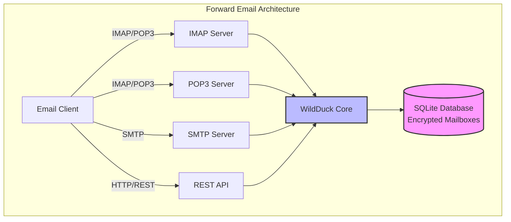

---


## Jämförelse av e-posttjänster - Protokollstöd & RFC-standarders efterlevnad {#email-service-comparison---protocol-support--rfc-standards-compliance}

> \[!IMPORTANT]
> **Sandboxad och kvantsäker kryptering:** Forward Email är den enda e-posttjänsten som lagrar individuellt krypterade SQLite-mailboxar med ditt lösenord (som bara du har). Varje mailbox är krypterad med [sqleet](https://github.com/resilar/sqleet) (ChaCha20-Poly1305), självständig, sandboxad och portabel. Om du glömmer ditt lösenord förlorar du din mailbox – inte ens Forward Email kan återställa den. Se [Quantum-Safe Encrypted Email](https://forwardemail.net/en/blog/docs/best-quantum-safe-encrypted-email-service) för detaljer.

Jämför e-postprotokollstöd och RFC-standarders implementering hos stora e-postleverantörer:

| Funktion                      | Forward Email                                                                                  | Postfix/Dovecot                                                                    | Gmail                                                                             | iCloud Mail                                           | Outlook.com                                                                                                                                                          | Fastmail                                                                                 | Yahoo/AOL (Verizon)                                                  | ProtonMail                                                                     | Tutanota                                                          |
| ----------------------------- | ---------------------------------------------------------------------------------------------- | ---------------------------------------------------------------------------------- | --------------------------------------------------------------------------------- | ----------------------------------------------------- | -------------------------------------------------------------------------------------------------------------------------------------------------------------------- | ---------------------------------------------------------------------------------------- | -------------------------------------------------------------------- | ------------------------------------------------------------------------------ | ----------------------------------------------------------------- |
| **Pris för egen domän**       | [Gratis](https://forwardemail.net/en/pricing)                                                  | [Gratis](https://www.postfix.org/)                                                 | [$7.20/mån](https://workspace.google.com/pricing)                                | [$0.99/mån](https://support.apple.com/en-us/102622)    | [$7.20/mån](https://www.microsoft.com/en-us/microsoft-365/business/microsoft-365-business-basic)                                                                      | [$5/mån](https://www.fastmail.com/pricing/)                                               | [$3.19/mån](https://www.turbify.com/mail)                             | [$4.99/mån](https://proton.me/mail/pricing)                                     | [$3.27/mån](https://tuta.com/pricing)                              |
| **IMAP4rev1 (RFC 3501)**      | ✅ [Stöds](#imap4-email-protocol-and-extensions)                                              | ✅ [Stöds](https://www.dovecot.org/)                                               | ✅ [Stöds](https://developers.google.com/workspace/gmail/imap/imap-extensions)    | ✅ [Stöds](https://support.apple.com/en-us/102431)     | ✅ [Stöds](https://support.microsoft.com/en-us/office/pop-imap-and-smtp-settings-for-outlook-com-d088b986-291d-42b8-9564-9c414e2aa040)                            | ✅ [Stöds](https://www.fastmail.help/hc/en-us/articles/1500000278382-Email-standards) | ✅ [Stöds](https://senders.yahooinc.com/developer/documentation/) | ⚠️ [Via Bridge](https://proton.me/support/imap-smtp-and-pop3-setup)            | ❌ Stöds inte                                                   |
| **IMAP4rev2 (RFC 9051)**      | ⚠️ [Delvis](https://forwardemail.net/en/blog/docs/best-quantum-safe-encrypted-email-service)  | ⚠️ [Delvis](https://www.dovecot.org/)                                              | ⚠️ [31%](https://developers.google.com/workspace/gmail/imap/imap-extensions)     | ⚠️ [92%](https://support.apple.com/en-us/102431)       | ⚠️ [46%](https://support.microsoft.com/en-us/office/pop-imap-and-smtp-settings-for-outlook-com-d088b986-291d-42b8-9564-9c414e2aa040)                                 | ⚠️ [69%](https://www.fastmail.help/hc/en-us/articles/1500000278382-Email-standards)     | ⚠️ [85%](https://senders.yahooinc.com/developer/documentation/)      | ⚠️ [Via Bridge](https://proton.me/support/imap-smtp-and-pop3-setup)            | ❌ Stöds inte                                                   |
| **POP3 (RFC 1939)**           | ✅ [Stöds](#pop3-email-protocol-and-extensions)                                               | ✅ [Stöds](https://www.dovecot.org/)                                               | ✅ [Stöds](https://support.google.com/mail/answer/7104828)                       | ❌ Stöds inte                                         | ✅ [Stöds](https://support.microsoft.com/en-us/office/pop-imap-and-smtp-settings-for-outlook-com-d088b986-291d-42b8-9564-9c414e2aa040)                            | ✅ [Stöds](https://www.fastmail.help/hc/en-us/articles/1500000278382-Email-standards) | ✅ [Stöds](https://help.yahoo.com/kb/SLN4075.html)                | ⚠️ [Via Bridge](https://proton.me/support/imap-smtp-and-pop3-setup)            | ❌ Stöds inte                                                   |
| **SMTP (RFC 5321)**           | ✅ [Stöds](#smtp-email-protocol-and-extensions)                                               | ✅ [Stöds](https://www.postfix.org/)                                               | ✅ [Stöds](https://support.google.com/mail/answer/7126229)                       | ✅ [Stöds](https://support.apple.com/en-us/102431)     | ✅ [Stöds](https://support.microsoft.com/en-us/office/pop-imap-and-smtp-settings-for-outlook-com-d088b986-291d-42b8-9564-9c414e2aa040)                            | ✅ [Stöds](https://www.fastmail.help/hc/en-us/articles/1500000278382-Email-standards) | ✅ [Stöds](https://help.yahoo.com/kb/SLN4075.html)                | ⚠️ [Via Bridge](https://proton.me/support/imap-smtp-and-pop3-setup)            | ❌ Stöds inte                                                   |
| **JMAP (RFC 8620)**           | ❌ [Stöds inte](#jmap-email-protocol)                                                        | ❌ Stöds inte                                                                      | ❌ Stöds inte                                                                     | ❌ Stöds inte                                         | ❌ Stöds inte                                                                                                                                                      | ✅ [Stöds](https://www.fastmail.com/dev/)                                             | ❌ Stöds inte                                                      | ❌ Stöds inte                                                                | ❌ Stöds inte                                                   |
| **DKIM (RFC 6376)**           | ✅ [Stöds](#email-message-authentication-protocols)                                         | ✅ [Stöds](https://github.com/trusteddomainproject/OpenDKIM)                      | ✅ [Stöds](https://support.google.com/a/answer/174124)                           | ✅ [Stöds](https://support.apple.com/en-us/102431)     | ✅ [Stöds](https://learn.microsoft.com/en-us/defender-office-365/email-authentication-dkim-configure)                                                             | ✅ [Stöds](https://www.fastmail.help/hc/en-us/articles/360060590573)                  | ✅ [Stöds](https://help.yahoo.com/kb/SLN25426.html)               | ✅ [Stöds](https://proton.me/support)                                       | ✅ [Stöds](https://tuta.com/support#dkim)                      |
| **SPF (RFC 7208)**            | ✅ [Stöds](#email-message-authentication-protocols)                                         | ✅ [Stöds](https://www.postfix.org/)                                               | ✅ [Stöds](https://support.google.com/a/answer/33786)                            | ✅ [Stöds](https://support.apple.com/en-us/102431)     | ✅ [Stöds](https://learn.microsoft.com/en-us/microsoft-365/security/office-365-security/how-office-365-uses-spf-to-prevent-spoofing)                              | ✅ [Stöds](https://www.fastmail.help/hc/en-us/articles/360060590573)                  | ✅ [Stöds](https://help.yahoo.com/kb/SLN25426.html)               | ✅ [Stöds](https://proton.me/support)                                       | ✅ [Stöds](https://tuta.com/support#dkim)                      |
| **DMARC (RFC 7489)**          | ✅ [Stöds](#email-message-authentication-protocols)                                         | ✅ [Stöds](https://www.postfix.org/)                                               | ✅ [Stöds](https://support.google.com/a/answer/2466580)                          | ✅ [Stöds](https://support.apple.com/en-us/102431)     | ✅ [Stöds](https://learn.microsoft.com/en-us/microsoft-365/security/office-365-security/use-dmarc-to-validate-email)                                              | ✅ [Stöds](https://www.fastmail.help/hc/en-us/articles/360060590573)                  | ✅ [Stöds](https://help.yahoo.com/kb/SLN25426.html)               | ✅ [Stöds](https://proton.me/support)                                       | ✅ [Stöds](https://tuta.com/support#dkim)                      |
| **ARC (RFC 8617)**            | ✅ [Stöds](#email-message-authentication-protocols)                                         | ✅ [Stöds](https://github.com/trusteddomainproject/OpenARC)                       | ✅ [Stöds](https://support.google.com/a/answer/2466580)                          | ❌ Stöds inte                                         | ✅ [Stöds](https://learn.microsoft.com/en-us/defender-office-365/email-authentication-arc-configure)                                                              | ✅ [Stöds](https://www.fastmail.help/hc/en-us/articles/360060590573)                  | ✅ [Stöds](https://senders.yahooinc.com/developer/documentation/) | ✅ [Stöds](https://proton.me/blog/what-is-authenticated-received-chain-arc) | ❌ Stöds inte                                                   |
| **MTA-STS (RFC 8461)**        | ✅ [Stöds](#email-transport-security-protocols)                                             | ✅ [Stöds](https://www.postfix.org/)                                               | ✅ [Stöds](https://support.google.com/a/answer/9261504)                          | ✅ [Stöds](https://support.apple.com/en-us/102431)     | ✅ [Stöds](https://learn.microsoft.com/en-us/defender-office-365/email-authentication-about)                                                                      | ✅ [Stöds](https://www.fastmail.help/hc/en-us/articles/360060590573)                  | ✅ [Stöds](https://senders.yahooinc.com/developer/documentation/) | ✅ [Stöds](https://proton.me/support)                                       | ✅ [Stöds](https://tuta.com/security)                          |
| **DANE (RFC 7671)**           | ✅ [Stöds](#email-transport-security-protocols)                                             | ✅ [Stöds](https://www.postfix.org/)                                               | ❌ Stöds inte                                                                     | ❌ Stöds inte                                         | ❌ Stöds inte                                                                                                                                                      | ❌ Stöds inte                                                                          | ❌ Stöds inte                                                      | ✅ [Stöds](https://proton.me/support)                                       | ✅ [Stöds](https://tuta.com/support#dane)                      |
| **DSN (RFC 3461)**            | ✅ [Stöds](#smtp-email-protocol-and-extensions)                                             | ✅ [Stöds](https://www.postfix.org/DSN_README.html)                               | ❌ Stöds inte                                                                     | ✅ [Stöds](#protocol-capability-tests)                 | ✅ [Stöds](#protocol-capability-tests)                                                                                                                            | ⚠️ [Okänt](https://www.fastmail.help/hc/en-us/articles/1500000278382-Email-standards)  | ❌ Stöds inte                                                      | ⚠️ [Via Bridge](https://proton.me/support/imap-smtp-and-pop3-setup)            | ❌ Stöds inte                                                   |
| **REQUIRETLS (RFC 8689)**     | ✅ [Stöds](#email-transport-security-protocols)                                             | ✅ [Stöds](https://www.postfix.org/TLS_README.html#server_require_tls)            | ⚠️ Okänt                                                                          | ⚠️ Okänt                                              | ⚠️ Okänt                                                                                                                                                           | ⚠️ Okänt                                                                               | ⚠️ Okänt                                                           | ⚠️ [Via Bridge](https://proton.me/support/imap-smtp-and-pop3-setup)            | ❌ Stöds inte                                                   |
| **ManageSieve (RFC 5804)**    | ✅ [Stöds](#managesieve-rfc-5804)                                                           | ✅ [Stöds](https://doc.dovecot.org/admin_manual/pigeonhole_managesieve_server/)   | ❌ Stöds inte                                                                     | ❌ Stöds inte                                         | ❌ Stöds inte                                                                                                                                                      | ✅ [Stöds](https://www.fastmail.help/hc/en-us/articles/360060590573)                  | ❌ Stöds inte                                                      | ❌ Stöds inte                                                                | ❌ Stöds inte                                                   |
| **OpenPGP (RFC 9580)**        | ✅ [Stöds](#email-message-encryption)                                                       | ⚠️ [Via Plugins](https://www.gnupg.org/)                                         | ⚠️ [Tredjepart](https://github.com/google/end-to-end)                            | ⚠️ [Tredjepart](https://gpgtools.org/)                 | ⚠️ [Tredjepart](https://gpg4win.org/)                                                                                                                               | ⚠️ [Tredjepart](https://www.fastmail.help/hc/en-us/articles/360060590573)             | ⚠️ [Tredjepart](https://help.yahoo.com/kb/SLN25426.html)            | ✅ [Inbyggt](https://proton.me/support/pgp-mime-pgp-inline)                      | ❌ Stöds inte                                                   |
| **S/MIME (RFC 8551)**         | ✅ [Stöds](#email-message-encryption)                                                       | ✅ [Stöds](https://www.openssl.org/)                                             | ✅ [Stöds](https://support.google.com/mail/answer/81126)                         | ✅ [Stöds](https://support.apple.com/en-us/102431)     | ✅ [Stöds](https://support.microsoft.com/en-us/office/send-view-and-reply-to-encrypted-messages-in-outlook-for-pc-eaa43495-9bbb-4fca-922a-df90dee51980)           | ⚠️ [Delvis](https://www.fastmail.help/hc/en-us/articles/360060590573)                 | ❌ Stöds inte                                                      | ✅ [Stöds](https://proton.me/support/pgp-mime-pgp-inline)                   | ❌ Stöds inte                                                   |
| **CalDAV (RFC 4791)**         | ✅ [Stöds](#calendaring-and-contacts-protocols)                                             | ✅ [Stöds](https://www.davical.org/)                                             | ✅ [Stöds](https://developers.google.com/calendar/caldav/v2/guide)               | ✅ [Stöds](https://support.apple.com/en-us/102431)     | ❌ Stöds inte                                                                                                                                                      | ✅ [Stöds](https://www.fastmail.help/hc/en-us/articles/360060590573)                  | ❌ Stöds inte                                                      | ✅ [Via Bridge](https://proton.me/support/proton-calendar)                      | ❌ Stöds inte                                                   |
| **CardDAV (RFC 6352)**        | ✅ [Stöds](#calendaring-and-contacts-protocols)                                             | ✅ [Stöds](https://www.davical.org/)                                             | ✅ [Stöds](https://developers.google.com/people/carddav)                         | ✅ [Stöds](https://support.apple.com/en-us/102431)     | ❌ Stöds inte                                                                                                                                                      | ✅ [Stöds](https://www.fastmail.help/hc/en-us/articles/360060590573)                  | ❌ Stöds inte                                                      | ✅ [Via Bridge](https://proton.me/support/proton-contacts)                      | ❌ Stöds inte                                                   |
| **Uppgifter (VTODO)**         | ✅ [Stöds](#tasks-and-reminders-caldav-vtodo)                                               | ✅ [Stöds](https://www.davical.org/)                                             | ❌ Stöds inte                                                                     | ✅ [Stöds](https://support.apple.com/en-us/102431)     | ❌ Stöds inte                                                                                                                                                      | ✅ [Stöds](https://www.fastmail.help/hc/en-us/articles/360060590573)                  | ❌ Stöds inte                                                      | ❌ Stöds inte                                                                | ❌ Stöds inte                                                   |
| **Sieve (RFC 5228)**          | ✅ [Stöds](#sieve-rfc-5228)                                                                 | ✅ [Stöds](https://www.dovecot.org/)                                             | ❌ Stöds inte                                                                     | ❌ Stöds inte                                         | ❌ Stöds inte                                                                                                                                                      | ✅ [Stöds](https://www.fastmail.help/hc/en-us/articles/360060590573)                  | ❌ Stöds inte                                                      | ❌ Stöds inte                                                                | ❌ Stöds inte                                                   |
| **Catch-All**                 | ✅ [Stöds](https://forwardemail.net/en/faq#can-i-have-multiple-global-catch-all-recipients) | ✅ Stöds                                                                           | ✅ [Stöds](https://support.google.com/a/answer/4524505)                          | ❌ Stöds inte                                         | ❌ [Stöds inte](https://learn.microsoft.com/en-us/exchange/recipients-in-exchange-online/manage-mail-users)                                                        | ✅ [Stöds](https://www.fastmail.help/hc/en-us/articles/1500000278382-Email-standards) | ❌ Stöds inte                                                      | ❌ Stöds inte                                                                | ✅ [Stöds](https://tuta.com/support#catch-all-alias)           |
| **Obegränsade alias**         | ✅ [Stöds](https://forwardemail.net/en/faq#advanced-features)                               | ✅ Stöds                                                                           | ✅ [Stöds](https://support.google.com/a/answer/33327)                            | ✅ [Stöds](https://support.apple.com/en-us/102431)     | ✅ [Stöds](https://support.microsoft.com/en-us/office/add-or-remove-an-email-alias-in-outlook-com-459b1989-356d-40fa-a689-8f285b13f1f2)                           | ✅ [Stöds](https://www.fastmail.help/hc/en-us/articles/1500000278382-Email-standards) | ❌ Stöds inte                                                      | ✅ [Stöds](https://proton.me/support/addresses-and-aliases)                 | ✅ [Stöds](https://tuta.com/support#aliases)                   |
| **Tvåfaktorsautentisering**   | ✅ [Stöds](https://forwardemail.net/en/faq#do-you-support-passkeys-and-webauthn)            | ✅ Stöds                                                                           | ✅ [Stöds](https://support.google.com/accounts/answer/185839)                    | ✅ [Stöds](https://support.apple.com/en-us/102431)     | ✅ [Stöds](https://support.microsoft.com/en-us/account-billing/how-to-use-two-step-verification-with-your-microsoft-account-c7910146-672f-01e9-50a0-93b4585e7eb4) | ✅ [Stöds](https://www.fastmail.help/hc/en-us/articles/1500000278382-Email-standards) | ✅ [Stöds](https://help.yahoo.com/kb/SLN5013.html)                | ✅ [Stöds](https://proton.me/support/two-factor-authentication-2fa)         | ✅ [Stöds](https://tuta.com/support#two-factor-authentication) |
| **Push-notiser**             | ✅ [Stöds](#ios-push-notifications)                                                         | ⚠️ Via plugins                                                                     | ✅ [Stöds](https://developers.google.com/gmail/api/guides/push)                  | ✅ [Stöds](https://support.apple.com/en-us/102431)     | ✅ [Stöds](https://learn.microsoft.com/en-us/graph/change-notifications-delivery-webhooks)                                                                        | ✅ [Stöds](https://www.fastmail.help/hc/en-us/articles/1500000278382-Email-standards) | ❌ Stöds inte                                                      | ✅ [Stöds](https://proton.me/support/notifications)                         | ✅ [Stöds](https://tuta.com/support#push-notifications)        |
| **Kalender-/kontaktprogram** | ✅ [Stöds](#calendaring-and-contacts-protocols)                                             | ✅ Stöds                                                                           | ✅ [Stöds](https://support.google.com/calendar)                                  | ✅ [Stöds](https://support.apple.com/en-us/102431)     | ✅ [Stöds](https://support.microsoft.com/en-us/office/calendar-and-contacts-in-outlook-com-d3e8a6e6-5c1f-4e3e-9f1e-7c0f0e0c0c0c)                                  | ✅ [Stöds](https://www.fastmail.help/hc/en-us/articles/1500000278382-Email-standards) | ❌ Stöds inte                                                      | ✅ [Stöds](https://proton.me/support/proton-calendar)                       | ❌ Stöds inte                                                   |
| **Avancerad sökning**         | ✅ [Stöds](https://forwardemail.net/en/email-api)                                           | ✅ Stöds                                                                           | ✅ [Stöds](https://support.google.com/mail/answer/7190)                          | ✅ [Stöds](https://support.apple.com/en-us/102431)     | ✅ [Stöds](https://support.microsoft.com/en-us/office/search-for-email-messages-in-outlook-com-6f5f2e92-9d5e-4c4e-9b0e-0c0c0c0c0c0c)                              | ✅ [Stöds](https://www.fastmail.help/hc/en-us/articles/1500000278382-Email-standards) | ✅ [Stöds](https://help.yahoo.com/kb/SLN3561.html)                | ✅ [Stöds](https://proton.me/support/search-and-filters)                    | ✅ [Stöds](https://tuta.com/support)                           |
| **API/Integrationer**         | ✅ [39 Endpoints](https://forwardemail.net/en/email-api)                                    | ✅ Stöds                                                                           | ✅ [Stöds](https://developers.google.com/gmail/api)                              | ❌ Stöds inte                                         | ✅ [Stöds](https://learn.microsoft.com/en-us/graph/api/resources/mail-api-overview)                                                                               | ✅ [Stöds](https://www.fastmail.help/hc/en-us/articles/1500000278382-Email-standards) | ❌ Stöds inte                                                      | ✅ [Stöds](https://proton.me/support/proton-mail-api)                       | ❌ Stöds inte                                                   |
### Protocol Support Visualization {#protocol-support-visualization}

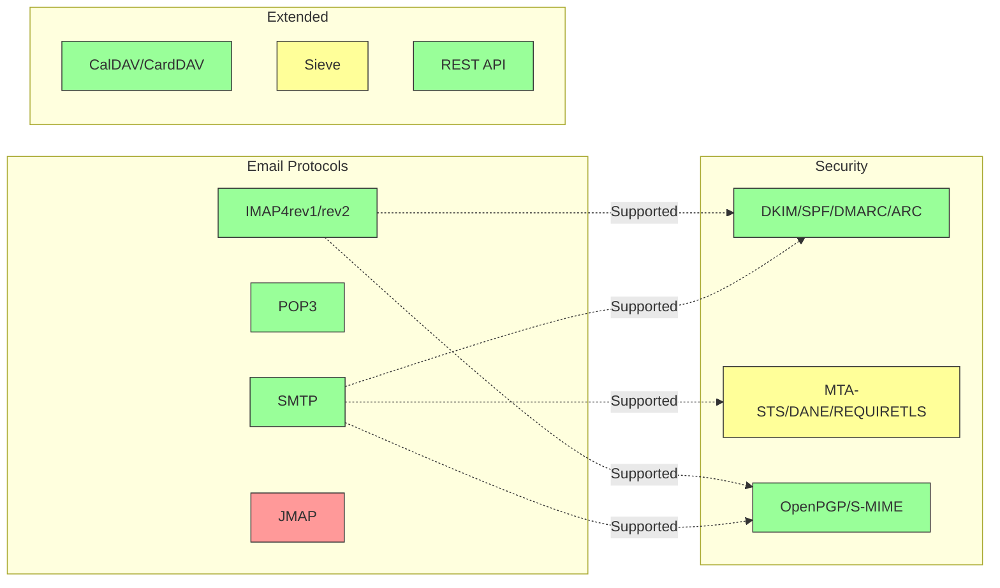

---


## Kärnprotokoll för e-post {#core-email-protocols}

### Flöde för e-postprotokoll {#email-protocol-flow}

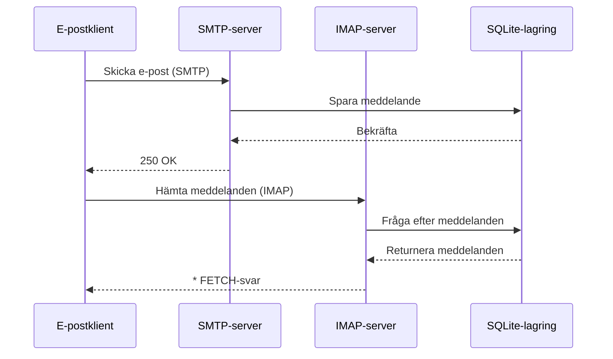


## IMAP4 e-postprotokoll och tillägg {#imap4-email-protocol-and-extensions}

> \[!NOTE]
> Forward Email stödjer IMAP4rev1 (RFC 3501) med delvis stöd för IMAP4rev2 (RFC 9051) funktioner.

Forward Email erbjuder robust IMAP4-stöd genom WildDuck-mailserver-implementeringen. Servern implementerar IMAP4rev1 (RFC 3501) med delvis stöd för IMAP4rev2 (RFC 9051) tillägg.

Forward Emails IMAP-funktionalitet tillhandahålls av beroendet [WildDuck](https://github.com/nodemailer/wildduck). Följande e-post-RFC:er stöds:

| RFC                                                       | Titel                                                             | Implementationsanteckningar                           |
| --------------------------------------------------------- | ----------------------------------------------------------------- | ----------------------------------------------------- |
| [RFC 3501](https://datatracker.ietf.org/doc/html/rfc3501) | Internet Message Access Protocol (IMAP) - Version 4rev1           | Fullt stöd med avsiktliga skillnader (se nedan)       |
| [RFC 2177](https://datatracker.ietf.org/doc/html/rfc2177) | IMAP4 IDLE-kommando                                               | Push-stil notifikationer                              |
| [RFC 2342](https://datatracker.ietf.org/doc/html/rfc2342) | IMAP4 Namespace                                                  | Stöd för mailbox-namnrymder                           |
| [RFC 2087](https://datatracker.ietf.org/doc/html/rfc2087) | IMAP4 QUOTA-tillägg                                              | Hantering av lagringskvoter                           |
| [RFC 2971](https://datatracker.ietf.org/doc/html/rfc2971) | IMAP4 ID-tillägg                                                | Klient/server identifiering                           |
| [RFC 5161](https://datatracker.ietf.org/doc/html/rfc5161) | IMAP4 ENABLE-tillägg                                            | Aktivera IMAP-tillägg                                 |
| [RFC 4959](https://datatracker.ietf.org/doc/html/rfc4959) | IMAP-tillägg för SASL Initial Client Response (SASL-IR)          | Initial klientrespons                                 |
| [RFC 3691](https://datatracker.ietf.org/doc/html/rfc3691) | IMAP4 UNSELECT-kommando                                         | Stäng mailbox utan EXPUNGE                            |
| [RFC 4315](https://datatracker.ietf.org/doc/html/rfc4315) | IMAP UIDPLUS-tillägg                                           | Förbättrade UID-kommandon                             |
| [RFC 7162](https://datatracker.ietf.org/doc/html/rfc7162) | IMAP-tillägg: Snabba flaggändringsresynkronisering (CONDSTORE)   | Villkorlig STORE                                      |
| [RFC 6154](https://datatracker.ietf.org/doc/html/rfc6154) | IMAP LIST-tillägg för specialanvända mailboxar                   | Specialattribut för mailboxar                         |
| [RFC 6851](https://datatracker.ietf.org/doc/html/rfc6851) | IMAP MOVE-tillägg                                               | Atomiskt MOVE-kommando                                |
| [RFC 6855](https://datatracker.ietf.org/doc/html/rfc6855) | IMAP-stöd för UTF-8                                            | UTF-8-stöd                                           |
| [RFC 3348](https://datatracker.ietf.org/doc/html/rfc3348) | IMAP4 Child Mailbox-tillägg                                     | Information om underordnade mailboxar                |
| [RFC 7889](https://datatracker.ietf.org/doc/html/rfc7889) | IMAP4-tillägg för annonsering av maximal uppladdningsstorlek (APPENDLIMIT) | Maximal uppladdningsstorlek                           |
**Stödda IMAP-tillägg:**

| Tillägg           | RFC          | Status      | Beskrivning                    |
| ----------------- | ------------ | ----------- | ------------------------------ |
| IDLE              | RFC 2177     | ✅ Stöds    | Push-stil notifikationer       |
| NAMESPACE         | RFC 2342     | ✅ Stöds    | Stöd för mailbox-namnrymder    |
| QUOTA             | RFC 2087     | ✅ Stöds    | Hantering av lagringskvoter    |
| ID                | RFC 2971     | ✅ Stöds    | Klient/server identifiering    |
| ENABLE            | RFC 5161     | ✅ Stöds    | Aktivera IMAP-tillägg          |
| SASL-IR           | RFC 4959     | ✅ Stöds    | Initial klientrespons          |
| UNSELECT          | RFC 3691     | ✅ Stöds    | Stäng mailbox utan EXPUNGE     |
| UIDPLUS           | RFC 4315     | ✅ Stöds    | Förbättrade UID-kommandon      |
| CONDSTORE         | RFC 7162     | ✅ Stöds    | Villkorlig STORE               |
| SPECIAL-USE       | RFC 6154     | ✅ Stöds    | Speciella mailbox-attribut     |
| MOVE              | RFC 6851     | ✅ Stöds    | Atomiskt MOVE-kommando         |
| UTF8=ACCEPT       | RFC 6855     | ✅ Stöds    | UTF-8-stöd                    |
| CHILDREN          | RFC 3348     | ✅ Stöds    | Information om undermappar     |
| APPENDLIMIT       | RFC 7889     | ✅ Stöds    | Maximal uppladdningsstorlek    |
| XLIST             | Icke-standard| ✅ Stöds    | Gmail-kompatibel mapp-listning |
| XAPPLEPUSHSERVICE | Icke-standard| ✅ Stöds    | Apple Push Notification Service |

### IMAP-protokollskillnader från RFC-specifikationer {#imap-protocol-differences-from-rfc-specifications}

> \[!WARNING]
> Följande skillnader från RFC-specifikationer kan påverka klientkompatibilitet.

Forward Email avviker medvetet från vissa IMAP RFC-specifikationer. Dessa skillnader ärvdes från WildDuck och dokumenteras nedan:

* **Ingen \Recent-flagga:** `\Recent`-flaggan är inte implementerad. Alla meddelanden returneras utan denna flagga.
* **RENAME påverkar inte undermappar:** Vid namnbyte av en mapp byts inte undermappar automatiskt. Mappstrukturen är platt i databasen.
* **INBOX kan inte bytas namn på:** [RFC 3501](https://datatracker.ietf.org/doc/html/rfc3501) tillåter namnbyte av INBOX, men Forward Email förbjuder detta uttryckligen. Se [WildDuck källkod](https://github.com/nodemailer/wildduck/blob/master/imap-core/lib/commands/rename.js#L27).
* **Inga oombedda FLAGS-svar:** När flaggor ändras skickas inga oombedda FLAGS-svar till klienten.
* **STORE returnerar NO för borttagna meddelanden:** Försök att ändra flaggor på borttagna meddelanden returnerar NO istället för att tyst ignorera.
* **CHARSET ignoreras i SEARCH:** `CHARSET`-argumentet i SEARCH-kommandon ignoreras. Alla sökningar använder UTF-8.
* **MODSEQ metadata ignoreras:** `MODSEQ`-metadata i STORE-kommandon ignoreras.
* **SEARCH TEXT och SEARCH BODY:** Forward Email använder [SQLite FTS5](https://www.sqlite.org/fts5.html) (Full-Text Search) istället för MongoDB:s `$text`-sökning. Detta ger:
  * Stöd för `NOT`-operatorn (MongoDB stödjer inte detta)
  * Rankade sökresultat
  * Sökprestanda under 100 ms på stora mailboxar
* **Autoexpunge-beteende:** Meddelanden markerade med `\Deleted` rensas automatiskt när mailboxen stängs.
* **Meddelandetrohet:** Vissa ändringar av meddelanden kan göra att den exakta ursprungliga meddelandestrukturen inte bevaras.

**Delvis stöd för IMAP4rev2:**

Forward Email implementerar IMAP4rev1 (RFC 3501) med delvis stöd för IMAP4rev2 (RFC 9051). Följande IMAP4rev2-funktioner stöds **inte ännu**:

* **LIST-STATUS** - Kombinerade LIST- och STATUS-kommandon
* **LITERAL-** - Icke-synkroniserande literals (minusvariant)
* **OBJECTID** - Unika objektidentifierare
* **SAVEDATE** - Attribut för spardatum
* **REPLACE** - Atomisk meddelandeersättning
* **UNAUTHENTICATE** - Avsluta autentisering utan att stänga anslutningen

**Avslappnad hantering av meddelandekroppsstruktur:**

Forward Email använder "avslappnad kroppshantering" för felaktiga MIME-strukturer, vilket kan skilja sig från strikt RFC-tolkning. Detta förbättrar kompatibiliteten med verkliga e-postmeddelanden som inte helt följer standarderna.
**METADATA Extension (RFC 5464):**

IMAP METADATA-tillägget stöds **inte**. För mer information om detta tillägg, se [RFC 5464](https://datatracker.ietf.org/doc/html/rfc5464). Diskussion om att lägga till denna funktion finns i [WildDuck Issue #937](https://github.com/zone-eu/wildduck/issues/937).

### IMAP Extensions NOT Supported {#imap-extensions-not-supported}

Följande IMAP-tillägg från [IANA IMAP Capabilities Registry](https://www.iana.org/assignments/imap-capabilities/imap-capabilities.xhtml) stöds INTE:

| RFC                                                       | Titel                                                                                                           | Orsak                                                                                                                                  |
| --------------------------------------------------------- | --------------------------------------------------------------------------------------------------------------- | --------------------------------------------------------------------------------------------------------------------------------------- |
| [RFC 2086](https://datatracker.ietf.org/doc/html/rfc2086) | IMAP4 ACL extension                                                                                             | Delade mappar är inte implementerade. Se [WildDuck Issue #427](https://github.com/zone-eu/wildduck/issues/427)                         |
| [RFC 5256](https://datatracker.ietf.org/doc/html/rfc5256) | IMAP SORT and THREAD Extensions                                                                                 | Trådning implementerad internt men inte via RFC 5256-protokollet. Se [WildDuck Issue #12](https://github.com/zone-eu/wildduck/issues/12) |
| [RFC 5162](https://datatracker.ietf.org/doc/html/rfc5162) | IMAP4 Extensions for Quick Mailbox Resynchronization (QRESYNC)                                                  | Ej implementerat                                                                                                                        |
| [RFC 5464](https://datatracker.ietf.org/doc/html/rfc5464) | IMAP METADATA Extension                                                                                         | Metadataoperationer ignoreras. Se [WildDuck documentation](https://datatracker.ietf.org/doc/html/rfc5464)                              |
| [RFC 5258](https://datatracker.ietf.org/doc/html/rfc5258) | IMAP4 LIST Command Extensions                                                                                   | Ej implementerat                                                                                                                        |
| [RFC 5267](https://datatracker.ietf.org/doc/html/rfc5267) | Contexts for IMAP4                                                                                              | Ej implementerat                                                                                                                        |
| [RFC 5465](https://datatracker.ietf.org/doc/html/rfc5465) | IMAP NOTIFY Extension                                                                                           | Ej implementerat                                                                                                                        |
| [RFC 5466](https://datatracker.ietf.org/doc/html/rfc5466) | IMAP4 FILTERS Extension                                                                                         | Ej implementerat                                                                                                                        |
| [RFC 6203](https://datatracker.ietf.org/doc/html/rfc6203) | IMAP4 Extension for Fuzzy Search                                                                                | Ej implementerat                                                                                                                        |
| [RFC 6785](https://datatracker.ietf.org/doc/html/rfc6785) | IMAP4 Implementation Recommendations                                                                            | Rekommendationer följda inte fullt ut                                                                                                  |
| [RFC 7162](https://datatracker.ietf.org/doc/html/rfc7162) | IMAP Extensions: Quick Flag Changes Resynchronization (CONDSTORE) and Quick Mailbox Resynchronization (QRESYNC) | Ej implementerat                                                                                                                        |
| [RFC 8437](https://datatracker.ietf.org/doc/html/rfc8437) | IMAP UNAUTHENTICATE Extension for Connection Reuse                                                              | Ej implementerat                                                                                                                        |
| [RFC 8438](https://datatracker.ietf.org/doc/html/rfc8438) | IMAP Extension for STATUS=SIZE                                                                                  | Ej implementerat                                                                                                                        |
| [RFC 8457](https://datatracker.ietf.org/doc/html/rfc8457) | IMAP "$Important" Keyword and "\Important" Special-Use Attribute                                                | Ej implementerat                                                                                                                        |
| [RFC 8474](https://datatracker.ietf.org/doc/html/rfc8474) | IMAP Extension for Object Identifiers                                                                           | Ej implementerat                                                                                                                        |
| [RFC 9051](https://datatracker.ietf.org/doc/html/rfc9051) | Internet Message Access Protocol (IMAP) - Version 4rev2                                                         | Forward Email implementerar IMAP4rev1 ([RFC 3501](https://datatracker.ietf.org/doc/html/rfc3501))                                        |
## POP3 Email Protocol and Extensions {#pop3-email-protocol-and-extensions}

> \[!NOTE]
> Forward Email stöder POP3 (RFC 1939) med standardförlängningar för e-posthämtning.

Forward Emails POP3-funktionalitet tillhandahålls av beroendet [WildDuck](https://github.com/nodemailer/wildduck). Följande e-post-RFC:er stöds:

| RFC                                                       | Titel                                   | Implementationsanteckningar                          |
| --------------------------------------------------------- | --------------------------------------- | --------------------------------------------------- |
| [RFC 1939](https://datatracker.ietf.org/doc/html/rfc1939) | Post Office Protocol - Version 3 (POP3) | Fullt stöd med avsiktliga skillnader (se nedan)     |
| [RFC 2595](https://datatracker.ietf.org/doc/html/rfc2595) | Using TLS with IMAP, POP3 and ACAP      | STARTTLS-stöd                                       |
| [RFC 2449](https://datatracker.ietf.org/doc/html/rfc2449) | POP3 Extension Mechanism                | CAPA-kommandostöd                                   |

Forward Email tillhandahåller POP3-stöd för klienter som föredrar detta enklare protokoll framför IMAP. POP3 är idealiskt för användare som vill ladda ner e-post till en enhet och ta bort dem från servern.

**Stödda POP3-förlängningar:**

| Förlängning | RFC      | Status      | Beskrivning                |
| ----------- | -------- | ----------- | -------------------------- |
| TOP         | RFC 1939 | ✅ Stöds    | Hämta meddelandehuvuden    |
| USER        | RFC 1939 | ✅ Stöds    | Användarautentisering      |
| UIDL        | RFC 1939 | ✅ Stöds    | Unika meddelandeidentifierare |
| EXPIRE      | RFC 2449 | ✅ Stöds    | Policy för meddelandeutgång |

### POP3 Protocol Differences from RFC Specifications {#pop3-protocol-differences-from-rfc-specifications}

> \[!WARNING]
> POP3 har inneboende begränsningar jämfört med IMAP.

> \[!IMPORTANT]
> **Kritisk skillnad: Forward Email vs WildDuck POP3 DELE-beteende**
>
> Forward Email implementerar RFC-kompatibel permanent borttagning för POP3 `DELE`-kommandon, till skillnad från WildDuck som flyttar meddelanden till papperskorgen.

**Forward Email-beteende** ([källkod](https://github.com/forwardemail/forwardemail.net/blob/master/pop3-server.js)):

* `DELE` → `QUIT` tar permanent bort meddelanden
* Följer [RFC 1939](https://datatracker.ietf.org/doc/html/rfc1939) specifikation exakt
* Matchar beteendet hos Dovecot (standard), Postfix och andra standardkompatibla servrar

**WildDuck-beteende** ([diskussion](https://github.com/zone-eu/wildduck/issues/937)):

* `DELE` → `QUIT` flyttar meddelanden till papperskorgen (Gmail-liknande)
* Avsiktligt designbeslut för användarsäkerhet
* Icke-RFC-kompatibelt men förhindrar oavsiktlig dataförlust

**Varför Forward Email skiljer sig:**

* **RFC-efterlevnad:** Följer [RFC 1939](https://datatracker.ietf.org/doc/html/rfc1939) specifikation
* **Användarförväntningar:** Nedladdnings-och-radera-arbetsflöde förväntar sig permanent borttagning
* **Lagringshantering:** Korrekt återvinning av diskutrymme
* **Interoperabilitet:** Konsekvent med andra RFC-kompatibla servrar

> \[!NOTE]
> **POP3 Meddelandelista:** Forward Email listar ALLA meddelanden från INBOX utan begränsning. Detta skiljer sig från WildDuck som som standard begränsar till 250 meddelanden. Se [källkod](https://github.com/forwardemail/forwardemail.net/blob/master/pop3-server.js).

**Enhetsåtkomst:**

POP3 är designat för åtkomst från en enhet. Meddelanden laddas vanligtvis ner och tas bort från servern, vilket gör det olämpligt för synkronisering över flera enheter.

**Ingen mappstöd:**

POP3 ger endast åtkomst till INBOX-mappen. Andra mappar (Skickat, Utkast, Papperskorg etc.) är inte tillgängliga via POP3.

**Begränsad meddelandehantering:**

POP3 erbjuder grundläggande hämtning och borttagning av meddelanden. Avancerade funktioner som flaggning, flyttning eller sökning av meddelanden är inte tillgängliga.

### POP3 Extensions NOT Supported {#pop3-extensions-not-supported}

Följande POP3-förlängningar från [IANA POP3 Extension Mechanism Registry](https://www.iana.org/assignments/pop3-extension-mechanism/pop3-extension-mechanism.xhtml) stöds INTE:
| RFC                                                       | Titel                                                  | Orsak                                   |
| --------------------------------------------------------- | ------------------------------------------------------ | --------------------------------------- |
| [RFC 6856](https://datatracker.ietf.org/doc/html/rfc6856) | Post Office Protocol Version 3 (POP3) Support for UTF-8 | Inte implementerad i WildDuck POP3-server |
| [RFC 2595](https://datatracker.ietf.org/doc/html/rfc2595) | STLS-kommandot                                         | Endast STARTTLS stöds, inte STLS        |
| [RFC 3206](https://datatracker.ietf.org/doc/html/rfc3206) | The SYS and AUTH POP Response Codes                     | Inte implementerad                      |

---


## SMTP Email Protocol and Extensions {#smtp-email-protocol-and-extensions}

> \[!NOTE]
> Forward Email stöder SMTP (RFC 5321) med moderna tillägg för säker och pålitlig e-postleverans.

Forward Emails SMTP-funktionalitet tillhandahålls av flera komponenter: [smtp-server](https://github.com/nodemailer/smtp-server) (nodemailer), [zone-mta](https://github.com/zone-eu/zone-mta) och egna implementationer. Följande e-post-RFC:er stöds:

| RFC                                                       | Titel                                                                            | Implementationsanteckningar          |
| --------------------------------------------------------- | -------------------------------------------------------------------------------- | ------------------------------------ |
| [RFC 5321](https://datatracker.ietf.org/doc/html/rfc5321) | Simple Mail Transfer Protocol (SMTP)                                             | Fullt stöd                          |
| [RFC 3207](https://datatracker.ietf.org/doc/html/rfc3207) | SMTP Service Extension for Secure SMTP over Transport Layer Security (STARTTLS)  | TLS/SSL-stöd                       |
| [RFC 4954](https://datatracker.ietf.org/doc/html/rfc4954) | SMTP Service Extension for Authentication (AUTH)                                 | PLAIN, LOGIN, CRAM-MD5, XOAUTH2     |
| [RFC 6531](https://datatracker.ietf.org/doc/html/rfc6531) | SMTP Extension for Internationalized Email (SMTPUTF8)                            | Inbyggt stöd för Unicode-e-postadresser |
| [RFC 3461](https://datatracker.ietf.org/doc/html/rfc3461) | SMTP Service Extension for Delivery Status Notifications (DSN)                   | Fullt DSN-stöd                     |
| [RFC 3463](https://datatracker.ietf.org/doc/html/rfc3463) | Enhanced Mail System Status Codes                                                | Förbättrade statuskoder i svar      |
| [RFC 1870](https://datatracker.ietf.org/doc/html/rfc1870) | SMTP Service Extension for Message Size Declaration (SIZE)                       | Maximal meddelandestorlek annonsering |
| [RFC 2920](https://datatracker.ietf.org/doc/html/rfc2920) | SMTP Service Extension for Command Pipelining (PIPELINING)                       | Stöd för kommandopipelining         |
| [RFC 1652](https://datatracker.ietf.org/doc/html/rfc1652) | SMTP Service Extension for 8bit-MIMEtransport (8BITMIME)                         | Stöd för 8-bitars MIME              |
| [RFC 6152](https://datatracker.ietf.org/doc/html/rfc6152) | SMTP Service Extension for 8-bit MIME Transport                                  | Stöd för 8-bitars MIME              |
| [RFC 2034](https://datatracker.ietf.org/doc/html/rfc2034) | SMTP Service Extension for Returning Enhanced Error Codes (ENHANCEDSTATUSCODES)  | Förbättrade statuskoder             |

Forward Email implementerar en fullfjädrad SMTP-server med stöd för moderna tillägg som förbättrar säkerhet, tillförlitlighet och funktionalitet.

**Stödda SMTP-tillägg:**

| Tillägg             | RFC      | Status      | Beskrivning                          |
| ------------------- | -------- | ----------- | ----------------------------------- |
| PIPELINING          | RFC 2920 | ✅ Stöds    | Kommandopipelining                  |
| SIZE                | RFC 1870 | ✅ Stöds    | Meddelandestorleksdeklaration (52MB gräns) |
| ETRN                | RFC 1985 | ✅ Stöds    | Fjärrköhantering                   |
| STARTTLS            | RFC 3207 | ✅ Stöds    | Uppgradering till TLS              |
| ENHANCEDSTATUSCODES | RFC 2034 | ✅ Stöds    | Förbättrade statuskoder            |
| 8BITMIME            | RFC 6152 | ✅ Stöds    | 8-bitars MIME-transport            |
| DSN                 | RFC 3461 | ✅ Stöds    | Leveransstatusmeddelanden          |
| CHUNKING            | RFC 3030 | ✅ Stöds    | Uppdelad meddelandeöverföring     |
| SMTPUTF8            | RFC 6531 | ⚠️ Delvis   | UTF-8 e-postadresser (delvis)      |
| REQUIRETLS          | RFC 8689 | ✅ Stöds    | Kräver TLS för leverans            |
### Leveransstatusmeddelanden (DSN) {#delivery-status-notifications-dsn}

> \[!TIP]
> DSN ger detaljerad information om leveransstatus för skickade e-postmeddelanden.

Forward Email stödjer fullt ut **DSN (RFC 3461)**, vilket tillåter avsändare att begära leveransstatusmeddelanden. Denna funktion ger:

* **Meddelanden om framgång** när meddelanden levereras
* **Meddelanden om fel** med detaljerad felinformation
* **Meddelanden om fördröjning** när leverans tillfälligt försenas

DSN är särskilt användbart för:

* Bekräftelse av leverans av viktiga meddelanden
* Felsökning av leveransproblem
* Automatiserade e-posthanteringssystem
* Efterlevnad och revisionskrav

### Stöd för REQUIRETLS {#requiretls-support}

> \[!IMPORTANT]
> Forward Email är en av få leverantörer som uttryckligen annonserar och tillämpar REQUIRETLS.

Forward Email stödjer **REQUIRETLS (RFC 8689)**, vilket säkerställer att e-postmeddelanden endast levereras över TLS-krypterade anslutningar. Detta ger:

* **End-to-end-kryptering** för hela leveransvägen
* **Användarvänlig tillämpning** via kryssruta i e-postkompositören
* **Avvisande av okrypterade leveransförsök**
* **Förbättrad säkerhet** för känslig kommunikation

### SMTP-tillägg som INTE stöds {#smtp-extensions-not-supported}

Följande SMTP-tillägg från [IANA SMTP Service Extensions Registry](https://www.iana.org/assignments/smtp) stöds INTE:

| RFC                                                       | Titel                                                                                             | Orsak                 |
| --------------------------------------------------------- | ------------------------------------------------------------------------------------------------- | --------------------- |
| [RFC 4865](https://datatracker.ietf.org/doc/html/rfc4865) | SMTP Submission Service Extension for Future Message Release (FUTURERELEASE)                      | Ej implementerat      |
| [RFC 6710](https://datatracker.ietf.org/doc/html/rfc6710) | SMTP Extension for Message Transfer Priorities (MT-PRIORITY)                                      | Ej implementerat      |
| [RFC 7293](https://datatracker.ietf.org/doc/html/rfc7293) | The Require-Recipient-Valid-Since Header Field and SMTP Service Extension                         | Ej implementerat      |
| [RFC 7372](https://datatracker.ietf.org/doc/html/rfc7372) | Email Auth Status Codes                                                                           | Ej fullt implementerat|
| [RFC 4468](https://datatracker.ietf.org/doc/html/rfc4468) | Message Submission BURL Extension                                                                 | Ej implementerat      |
| [RFC 3030](https://datatracker.ietf.org/doc/html/rfc3030) | SMTP Service Extensions for Transmission of Large and Binary MIME Messages (CHUNKING, BINARYMIME) | Ej implementerat      |
| [RFC 2852](https://datatracker.ietf.org/doc/html/rfc2852) | Deliver By SMTP Service Extension                                                                 | Ej implementerat      |

---


## JMAP E-postprotokoll {#jmap-email-protocol}

> \[!CAUTION]
> JMAP stöds **inte för närvarande** av Forward Email.

| RFC                                                       | Titel                                     | Status          | Orsak                                                                 |
| --------------------------------------------------------- | ----------------------------------------- | --------------- | ---------------------------------------------------------------------- |
| [RFC 8620](https://datatracker.ietf.org/doc/html/rfc8620) | The JSON Meta Application Protocol (JMAP) | ❌ Ej stödd     | Forward Email använder istället IMAP/POP3/SMTP och ett omfattande REST API |

**JMAP (JSON Meta Application Protocol)** är ett modernt e-postprotokoll designat för att ersätta IMAP.

**Varför JMAP inte stöds:**

> "JMAP är ett odjur som aldrig borde ha uppfunnits. Det försöker konvertera TCP/IMAP (redan ett dåligt protokoll enligt dagens standarder) till HTTP/JSON, bara med en annan transport medan andan bevaras." — Andris Reinman, [HN Discussion](https://news.ycombinator.com/item?id=18890011)
> "JMAP är mer än 10 år gammalt, och det finns nästan ingen adoption alls" – Andris Reinman, [GitHub Discussion](https://github.com/zone-eu/wildduck/issues/2#issuecomment-1765190790)

Se även ytterligare kommentarer på <https://hn.algolia.com/?dateRange=all&page=0&prefix=true&query=jmap%20andris&sort=byDate&type=comment>.

Forward Email fokuserar för närvarande på att erbjuda utmärkt IMAP-, POP3- och SMTP-stöd, tillsammans med ett omfattande REST API för e-posthantering. JMAP-stöd kan övervägas i framtiden baserat på användarnas efterfrågan och ekosystemets adoption.

**Alternativ:** Forward Email erbjuder ett [Fullständigt REST API](#complete-rest-api-for-email-management) med 39 endpoints som ger liknande funktionalitet som JMAP för programmatisk e-poståtkomst.

---


## E-postsäkerhet {#email-security}

### E-postsäkerhetsarkitektur {#email-security-architecture}

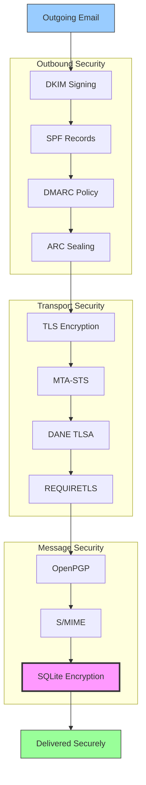


## E-postmeddelandeautentiseringsprotokoll {#email-message-authentication-protocols}

> \[!NOTE]
> Forward Email implementerar alla större e-postautentiseringsprotokoll för att förhindra förfalskning och säkerställa meddelandets integritet.

Forward Email använder biblioteket [mailauth](https://github.com/postalsys/mailauth) för e-postautentisering. Följande RFC:er stöds:

| RFC                                                       | Titel                                                                   | Implementationsanteckningar                                    |
| --------------------------------------------------------- | ----------------------------------------------------------------------- | -------------------------------------------------------------- |
| [RFC 6376](https://datatracker.ietf.org/doc/html/rfc6376) | DomainKeys Identified Mail (DKIM) Signaturer                           | Fullständig DKIM-signering och verifiering                     |
| [RFC 8463](https://datatracker.ietf.org/doc/html/rfc8463) | En ny kryptografisk signaturmetod för DKIM (Ed25519-SHA256)             | Stöder både RSA-SHA256 och Ed25519-SHA256 signeringsalgoritmer |
| [RFC 7208](https://datatracker.ietf.org/doc/html/rfc7208) | Sender Policy Framework (SPF)                                           | Validering av SPF-poster                                       |
| [RFC 7489](https://datatracker.ietf.org/doc/html/rfc7489) | Domain-based Message Authentication, Reporting, and Conformance (DMARC) | DMARC-policyimplementering                                     |
| [RFC 8617](https://datatracker.ietf.org/doc/html/rfc8617) | Authenticated Received Chain (ARC)                                      | ARC-sigillering och verifiering                                |

E-postautentiseringsprotokoll verifierar att meddelanden verkligen kommer från den angivna avsändaren och att de inte har manipulerats under överföringen.

### Stöd för autentiseringsprotokoll {#authentication-protocol-support}

| Protokoll | RFC      | Status       | Beskrivning                                                          |
| --------- | -------- | ------------ | ------------------------------------------------------------------- |
| **DKIM**  | RFC 6376 | ✅ Stöds     | DomainKeys Identified Mail - Kryptografiska signaturer             |
| **SPF**   | RFC 7208 | ✅ Stöds     | Sender Policy Framework - Auktorisation av IP-adress               |
| **DMARC** | RFC 7489 | ✅ Stöds     | Domain-based Message Authentication - Policyimplementering         |
| **ARC**   | RFC 8617 | ✅ Stöds     | Authenticated Received Chain - Bevarar autentisering över vidarebefordringar |
### DKIM (DomainKeys Identified Mail) {#dkim-domainkeys-identified-mail}

**DKIM** lägger till en kryptografisk signatur i e-posthuvuden, vilket gör det möjligt för mottagare att verifiera att meddelandet auktoriserats av domänägaren och inte har ändrats under överföringen.

Forward Email använder [mailauth](https://github.com/postalsys/mailauth) för DKIM-signering och verifiering.

**Huvudfunktioner:**

* Automatisk DKIM-signering för alla utgående meddelanden
* Stöd för RSA- och Ed25519-nycklar
* Stöd för flera selektorer
* DKIM-verifiering för inkommande meddelanden

### SPF (Sender Policy Framework) {#spf-sender-policy-framework}

**SPF** tillåter domänägare att specificera vilka IP-adresser som är auktoriserade att skicka e-post för deras domän.

**Huvudfunktioner:**

* SPF-postvalidering för inkommande meddelanden
* Automatisk SPF-kontroll med detaljerade resultat
* Stöd för mekanismerna include, redirect och all
* Konfigurerbara SPF-policyer per domän

### DMARC (Domain-based Message Authentication, Reporting & Conformance) {#dmarc-domain-based-message-authentication-reporting--conformance}

**DMARC** bygger på SPF och DKIM för att tillhandahålla policytillämpning och rapportering.

**Huvudfunktioner:**

* Tillämpning av DMARC-policy (none, quarantine, reject)
* Kontroll av anpassning för SPF och DKIM
* DMARC-aggregerade rapporter
* DMARC-policyer per domän

### ARC (Authenticated Received Chain) {#arc-authenticated-received-chain}

**ARC** bevarar autentiseringsresultat för e-post över vidarebefordran och ändringar i mailinglistor.

Forward Email använder [mailauth](https://github.com/postalsys/mailauth)-biblioteket för ARC-verifiering och försegling.

**Huvudfunktioner:**

* ARC-försegling för vidarebefordrade meddelanden
* ARC-validering för inkommande meddelanden
* Kedjeverifiering över flera hopp
* Bevarar ursprungliga autentiseringsresultat

### Authentication Flow {#authentication-flow}

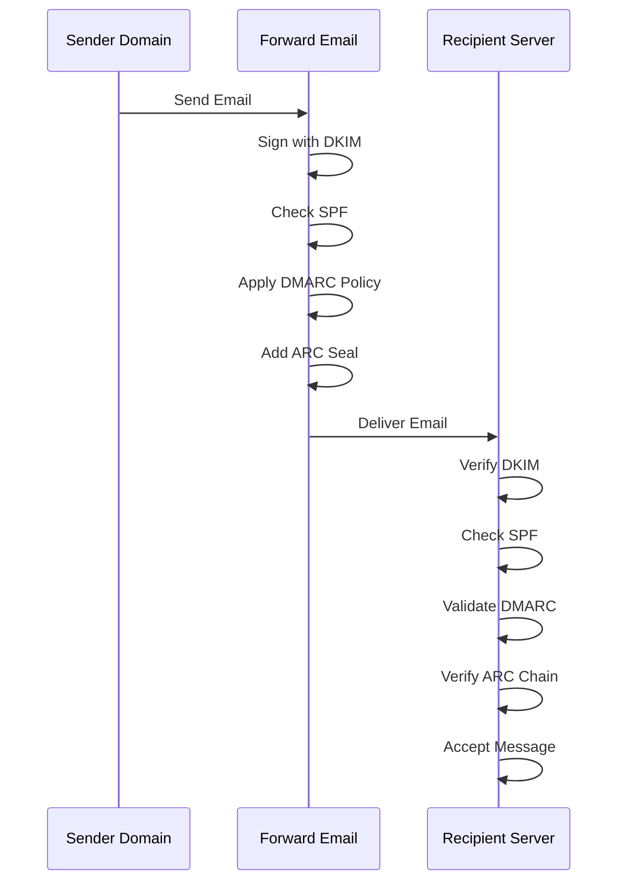

---


## Email Transport Security Protocols {#email-transport-security-protocols}

> \[!IMPORTANT]
> Forward Email implementerar flera lager av transportskydd för att skydda e-post under överföring.

Forward Email implementerar moderna transportskyddsprotokoll:

| RFC                                                       | Titel                                                                                               | Status      | Implementationsanteckningar                                                                                                                                                                                                                                                                     |
| --------------------------------------------------------- | -------------------------------------------------------------------------------------------------- | ----------- | ---------------------------------------------------------------------------------------------------------------------------------------------------------------------------------------------------------------------------------------------------------------------------------------------- |
| [RFC 8461](https://datatracker.ietf.org/doc/html/rfc8461) | SMTP MTA Strict Transport Security (MTA-STS)                                                       | ✅ Supported | Används omfattande på IMAP-, SMTP- och MX-servrar. Se [create-mta-sts-cache.js](https://github.com/forwardemail/forwardemail.net/blob/master/helpers/create-mta-sts-cache.js) och [get-transporter.js](https://github.com/forwardemail/forwardemail.net/blob/master/helpers/get-transporter.js) |
| [RFC 8460](https://datatracker.ietf.org/doc/html/rfc8460) | SMTP TLS Reporting                                                                                 | ✅ Supported | Via [mailauth](https://github.com/postalsys/mailauth)-biblioteket                                                                                                                                                                                                                               |
| [RFC 7671](https://datatracker.ietf.org/doc/html/rfc7671) | The DNS-Based Authentication of Named Entities (DANE) Protocol: Updates and Operational Guidance   | ✅ Supported | Fullständig DANE-verifiering för utgående SMTP-anslutningar. Se [mx-connect PR #22](https://github.com/zone-eu/mx-connect/pull/22)                                                                                                                                                              |
| [RFC 6698](https://datatracker.ietf.org/doc/html/rfc6698) | The DNS-Based Authentication of Named Entities (DANE) Transport Layer Security (TLS) Protocol: TLSA | ✅ Supported | Fullt stöd för RFC 6698: PKIX-TA, PKIX-EE, DANE-TA, DANE-EE användartyper. Se [mx-connect PR #22](https://github.com/zone-eu/mx-connect/pull/22)                                                                                                                                                 |
| [RFC 8314](https://datatracker.ietf.org/doc/html/rfc8314) | Cleartext Considered Obsolete: Use of Transport Layer Security (TLS) for Email Submission and Access | ✅ Supported | TLS krävs för alla anslutningar                                                                                                                                                                                                                                                               |
| [RFC 8689](https://datatracker.ietf.org/doc/html/rfc8689) | SMTP Service Extension for Requiring TLS (REQUIRETLS)                                              | ✅ Supported | Fullt stöd för REQUIRETLS SMTP-tillägg och "TLS-Required"-header                                                                                                                                                                                                                               |
Transport säkerhetsprotokoll säkerställer att e-postmeddelanden är krypterade och autentiserade under överföring mellan e-postservrar.

### Transport Security Support {#transport-security-support}

| Protokoll     | RFC      | Status      | Beskrivning                                     |
| -------------- | -------- | ----------- | ------------------------------------------------ |
| **TLS**        | RFC 8314 | ✅ Stöds    | Transport Layer Security - Krypterade anslutningar |
| **MTA-STS**    | RFC 8461 | ✅ Stöds    | Mail Transfer Agent Strict Transport Security    |
| **DANE**       | RFC 7671 | ✅ Stöds    | DNS-baserad autentisering av namngivna enheter   |
| **REQUIRETLS** | RFC 8689 | ✅ Stöds    | Kräver TLS för hela leveransvägen                 |

### TLS (Transport Layer Security) {#tls-transport-layer-security}

Forward Email kräver TLS-kryptering för alla e-postanslutningar (SMTP, IMAP, POP3).

**Nyckelfunktioner:**

* Stöd för TLS 1.2 och TLS 1.3
* Automatisk certifikathantering
* Perfect Forward Secrecy (PFS)
* Endast starka chifferuppsättningar

### MTA-STS (Mail Transfer Agent Strict Transport Security) {#mta-sts-mail-transfer-agent-strict-transport-security}

**MTA-STS** säkerställer att e-post endast levereras över TLS-krypterade anslutningar genom att publicera en policy via HTTPS.

Forward Email implementerar MTA-STS med hjälp av [create-mta-sts-cache.js](https://github.com/forwardemail/forwardemail.net/blob/master/helpers/create-mta-sts-cache.js).

**Nyckelfunktioner:**

* Automatisk publicering av MTA-STS-policy
* Policylagring för bättre prestanda
* Skydd mot nedgraderingsattacker
* Tvingad certifikatvalidering

### DANE (DNS-based Authentication of Named Entities) {#dane-dns-based-authentication-of-named-entities}

> \[!NOTE]
> Forward Email erbjuder nu fullständigt DANE-stöd för utgående SMTP-anslutningar.

**DANE** använder DNSSEC för att publicera TLS-certifikatinformation i DNS, vilket gör det möjligt för e-postservrar att verifiera certifikat utan att förlita sig på certifikatutfärdare.

**Nyckelfunktioner:**

* ✅ Fullständig DANE-verifiering för utgående SMTP-anslutningar
* ✅ Fullt stöd för RFC 6698: PKIX-TA, PKIX-EE, DANE-TA, DANE-EE användartyper
* ✅ Certifikatverifiering mot TLSA-poster vid TLS-uppgradering
* ✅ Parallell TLSA-upplösning för flera MX-värdar
* ✅ Automatisk upptäckt av inbyggd `dns.resolveTlsa` (Node.js v22.15.0+, v23.9.0+)
* ✅ Stöd för anpassad resolver för äldre Node.js-versioner via [Tangerine](https://github.com/forwardemail/tangerine)
* Kräver DNSSEC-signerade domäner

> \[!TIP]
> **Implementeringsdetaljer:** DANE-stöd lades till via [mx-connect PR #22](https://github.com/zone-eu/mx-connect/pull/22), som tillhandahåller omfattande DANE/TLSA-stöd för utgående SMTP-anslutningar.

### REQUIRETLS {#requiretls}

> \[!TIP]
> Forward Email är en av få leverantörer med användarvänligt REQUIRETLS-stöd.

**REQUIRETLS** säkerställer att e-postmeddelanden endast levereras över TLS-krypterade anslutningar för hela leveransvägen.

**Nyckelfunktioner:**

* Användarvänlig kryssruta i e-postkompositören
* Automatisk avvisning av okrypterad leverans
* End-to-end TLS-tillämpning
* Detaljerade felmeddelanden

> \[!TIP]
> **Användarvänlig TLS-tillämpning:** Forward Email erbjuder en kryssruta under **Mitt konto > Domäner > Inställningar** för att tvinga TLS för alla inkommande anslutningar. När den är aktiverad avvisar denna funktion all inkommande e-post som inte skickas över en TLS-krypterad anslutning med felkod 530, vilket säkerställer att all inkommande post är krypterad under överföring.

### Transport Security Flow {#transport-security-flow}

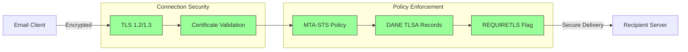
## E-postmeddelande Kryptering {#email-message-encryption}

> \[!NOTE]
> Forward Email stöder både OpenPGP och S/MIME för end-to-end e-postkryptering.

Forward Email stöder OpenPGP och S/MIME-kryptering:

| RFC                                                       | Titel                                                                                   | Status      | Implementationsanteckningar                                                                                                                                                                          |
| --------------------------------------------------------- | --------------------------------------------------------------------------------------- | ----------- | ---------------------------------------------------------------------------------------------------------------------------------------------------------------------------------------------------- |
| [RFC 9580](https://datatracker.ietf.org/doc/html/rfc9580) | OpenPGP (ersätter RFC 4880)                                                             | ✅ Stöds    | Via [OpenPGP.js v6+](https://github.com/openpgpjs/openpgpjs) integration. Se [FAQ](https://forwardemail.net/en/faq#do-you-support-openpgpmime-end-to-end-encryption-e2ee-and-web-key-directory-wkd) |
| [RFC 8551](https://datatracker.ietf.org/doc/html/rfc8551) | Secure/Multipurpose Internet Mail Extensions (S/MIME) Version 4.0 Meddelandespecifikation | ✅ Stöds    | Både RSA och ECC-algoritmer stöds. Se [FAQ](https://forwardemail.net/en/faq#do-you-support-smime-encryption)                                                                                          |

Meddelandekrypteringsprotokoll skyddar e-postinnehåll från att läsas av någon annan än den avsedda mottagaren, även om meddelandet fångas upp under överföringen.

### Krypteringsstöd {#encryption-support}

| Protokoll   | RFC      | Status      | Beskrivning                                  |
| ----------- | -------- | ----------- | -------------------------------------------- |
| **OpenPGP** | RFC 9580 | ✅ Stöds    | Pretty Good Privacy - Offentlig nyckelkryptering |
| **S/MIME**  | RFC 8551 | ✅ Stöds    | Secure/Multipurpose Internet Mail Extensions |
| **WKD**     | Draft    | ✅ Stöds    | Web Key Directory - Automatisk nyckelupptäckt |

### OpenPGP (Pretty Good Privacy) {#openpgp-pretty-good-privacy}

**OpenPGP** tillhandahåller end-to-end-kryptering med hjälp av offentlig nyckelkryptografi. Forward Email stöder OpenPGP genom protokollet [Web Key Directory (WKD)](https://forwardemail.net/en/faq#do-you-support-openpgpmime-end-to-end-encryption-e2ee-and-web-key-directory-wkd).

**Huvudfunktioner:**

* Automatisk nyckelupptäckt via WKD
* PGP/MIME-stöd för krypterade bilagor
* Nyckelhantering via e-postklient
* Kompatibel med GPG, Mailvelope och andra OpenPGP-verktyg

**Hur man använder:**

1. Generera ett PGP-nyckelpar i din e-postklient
2. Ladda upp din offentliga nyckel till Forward Emails WKD
3. Din nyckel blir automatiskt upptäckbar av andra användare
4. Skicka och ta emot krypterade e-postmeddelanden smidigt

### S/MIME (Secure/Multipurpose Internet Mail Extensions) {#smime-securemultipurpose-internet-mail-extensions}

**S/MIME** tillhandahåller e-postkryptering och digitala signaturer med hjälp av X.509-certifikat.

**Huvudfunktioner:**

* Certifikatbaserad kryptering
* Digitala signaturer för meddelandeautentisering
* Inbyggt stöd i de flesta e-postklienter
* Säkerhet i företagsklass

**Hur man använder:**

1. Skaffa ett S/MIME-certifikat från en certifikatutfärdare
2. Installera certifikatet i din e-postklient
3. Konfigurera din klient för att kryptera/signera meddelanden
4. Byt certifikat med mottagare

### SQLite Mailbox Kryptering {#sqlite-mailbox-encryption}

> \[!IMPORTANT]
> Forward Email erbjuder ett extra säkerhetslager med krypterade SQLite-postlådor.

Utöver meddelandenivå-kryptering krypterar Forward Email hela postlådor med hjälp av [sqleet](https://github.com/resilar/sqleet) (ChaCha20-Poly1305).

**Huvudfunktioner:**

* **Lösenordsbaserad kryptering** - Endast du har lösenordet
* **Kvantresistent** - ChaCha20-Poly1305-chiffer
* **Zero-knowledge** - Forward Email kan inte dekryptera din postlåda
* **Sandboxad** - Varje postlåda är isolerad och portabel
* **Oåterkallelig** - Om du glömmer ditt lösenord går din postlåda förlorad
### Krypteringsjämförelse {#encryption-comparison}

| Funktion              | OpenPGP           | S/MIME             | SQLite Encryption |
| --------------------- | ----------------- | ------------------ | ----------------- |
| **End-to-End**        | ✅ Ja             | ✅ Ja              | ✅ Ja             |
| **Nyckelhantering**   | Självhanterad     | CA-utgiven         | Lösenordsbaserad  |
| **Klientstöd**        | Kräver plugin     | Inbyggt            | Transparent       |
| **Användningsfall**   | Personligt        | Företag            | Lagring           |
| **Kvantresistent**    | ⚠️ Beror på nyckel | ⚠️ Beror på certifikat | ✅ Ja             |

### Krypteringsflöde {#encryption-flow}

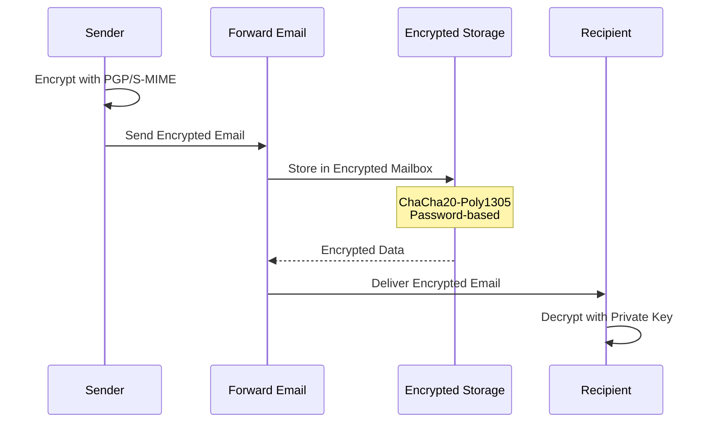

---


## Utökad Funktionalitet {#extended-functionality}


## Standarder för e-postmeddelandeformat {#email-message-format-standards}

> \[!NOTE]
> Forward Email stödjer moderna standarder för e-postformat för rikt innehåll och internationalisering.

Forward Email stödjer standardformat för e-postmeddelanden:

| RFC                                                       | Titel                                                         | Implementationsanteckningar |
| --------------------------------------------------------- | ------------------------------------------------------------- | --------------------------- |
| [RFC 5322](https://datatracker.ietf.org/doc/html/rfc5322) | Internetmeddelandeformat                                      | Fullt stöd                  |
| [RFC 2045](https://datatracker.ietf.org/doc/html/rfc2045) | MIME Del Ett: Format för Internetmeddelandekroppar           | Fullt MIME-stöd             |
| [RFC 2046](https://datatracker.ietf.org/doc/html/rfc2046) | MIME Del Två: Mediatyper                                      | Fullt MIME-stöd             |
| [RFC 2047](https://datatracker.ietf.org/doc/html/rfc2047) | MIME Del Tre: Meddelandehuvudtillägg för icke-ASCII-text      | Fullt MIME-stöd             |
| [RFC 2048](https://datatracker.ietf.org/doc/html/rfc2048) | MIME Del Fyra: Registreringsprocedurer                        | Fullt MIME-stöd             |
| [RFC 2049](https://datatracker.ietf.org/doc/html/rfc2049) | MIME Del Fem: Konformitetskriterier och exempel               | Fullt MIME-stöd             |

E-postformatstandarder definierar hur e-postmeddelanden struktureras, kodas och visas.

### Stöd för formatstandarder {#format-standards-support}

| Standard           | RFC           | Status      | Beskrivning                          |
| ------------------ | ------------- | ----------- | ----------------------------------- |
| **MIME**           | RFC 2045-2049 | ✅ Stöds    | Multipurpose Internet Mail Extensions |
| **SMTPUTF8**       | RFC 6531      | ⚠️ Delvis   | Internationaliserade e-postadresser  |
| **EAI**            | RFC 6530      | ⚠️ Delvis   | Internationalisering av e-postadresser |
| **Meddelandeformat** | RFC 5322    | ✅ Stöds    | Internetmeddelandeformat             |
| **MIME-säkerhet**  | RFC 1847      | ✅ Stöds    | Säkerhetsmultipart för MIME          |

### MIME (Multipurpose Internet Mail Extensions) {#mime-multipurpose-internet-mail-extensions}

**MIME** tillåter att e-post innehåller flera delar med olika innehållstyper (text, HTML, bilagor, etc.).

**Stödda MIME-funktioner:**

* Multipart-meddelanden (mixed, alternative, related)
* Content-Type-rubriker
* Content-Transfer-Encoding (7bit, 8bit, quoted-printable, base64)
* Inbäddade bilder och bilagor
* Rikt HTML-innehåll

### SMTPUTF8 och internationalisering av e-postadresser {#smtputf8-and-email-address-internationalization}

> \[!WARNING]
> SMTPUTF8-stödet är delvis – inte alla funktioner är fullt implementerade.
**SMTPUTF8** tillåter e-postadresser att innehålla icke-ASCII-tecken (t.ex. `用户@例え.jp`).

**Aktuell status:**

* ⚠️ Delvis stöd för internationaliserade e-postadresser
* ✅ UTF-8-innehåll i meddelandekroppar
* ⚠️ Begränsat stöd för icke-ASCII lokala delar

---


## Kalender- och kontaktprotokoll {#calendaring-and-contacts-protocols}

> \[!NOTE]
> Forward Email erbjuder fullständigt stöd för CalDAV och CardDAV för kalender- och kontaktsynkronisering.

Forward Email stödjer CalDAV och CardDAV via [caldav-adapter](https://github.com/forwardemail/caldav-adapter)-biblioteket:

| RFC                                                       | Titel                                                                     | Status      | Implementationsanteckningar                                                                                                                                                           |
| --------------------------------------------------------- | ------------------------------------------------------------------------- | ----------- | -------------------------------------------------------------------------------------------------------------------------------------------------------------------------------------- |
| [RFC 4791](https://datatracker.ietf.org/doc/html/rfc4791) | Kalenderförlängningar till WebDAV (CalDAV)                               | ✅ Stöds    | Kalenderåtkomst och hantering                                                                                                                                                         |
| [RFC 6352](https://datatracker.ietf.org/doc/html/rfc6352) | CardDAV: vCard-förlängningar till WebDAV                                 | ✅ Stöds    | Kontaktåtkomst och hantering                                                                                                                                                          |
| [RFC 5545](https://datatracker.ietf.org/doc/html/rfc5545) | Internetkalender och schemaläggning Kärnobjektspecifikation (iCalendar)  | ✅ Stöds    | Stöd för iCalendar-format                                                                                                                                                             |
| [RFC 6350](https://datatracker.ietf.org/doc/html/rfc6350) | vCard-formatspecifikation                                                | ✅ Stöds    | Stöd för vCard 4.0-format                                                                                                                                                             |
| [RFC 6638](https://datatracker.ietf.org/doc/html/rfc6638) | Schemaläggningsförlängningar till CalDAV                                 | ✅ Stöds    | CalDAV-schemaläggning med iMIP-stöd. Se [commit c4d1629](https://github.com/forwardemail/forwardemail.net/commit/c4d162975a49e38d76d68a032662e873a34a9b80)                            |
| [RFC 5546](https://datatracker.ietf.org/doc/html/rfc5546) | iCalendar Transportoberoende Interoperabilitetsprotokoll (iTIP)          | ✅ Stöds    | iTIP-stöd för REQUEST, REPLY, CANCEL och VFREEBUSY-metoder. Se [commit c4d1629](https://github.com/forwardemail/forwardemail.net/commit/c4d162975a49e38d76d68a032662e873a34a9b80) |
| [RFC 6047](https://datatracker.ietf.org/doc/html/rfc6047) | iCalendar Meddelandebaserat Interoperabilitetsprotokoll (iMIP)            | ✅ Stöds    | E-postbaserade kalenderinbjudningar med svarslänkar. Se [commit c4d1629](https://github.com/forwardemail/forwardemail.net/commit/c4d162975a49e38d76d68a032662e873a34a9b80)           |

CalDAV och CardDAV är protokoll som tillåter kalender- och kontaktdata att nås, delas och synkroniseras över enheter.

### Stöd för CalDAV och CardDAV {#caldav-and-carddav-support}

| Protokoll             | RFC      | Status      | Beskrivning                          |
| --------------------- | -------- | ----------- | ----------------------------------- |
| **CalDAV**            | RFC 4791 | ✅ Stöds    | Kalenderåtkomst och synkronisering  |
| **CardDAV**           | RFC 6352 | ✅ Stöds    | Kontaktåtkomst och synkronisering   |
| **iCalendar**         | RFC 5545 | ✅ Stöds    | Kalenderdataformat                   |
| **vCard**             | RFC 6350 | ✅ Stöds    | Kontaktdatformat                    |
| **VTODO**             | RFC 5545 | ✅ Stöds    | Stöd för uppgifter/påminnelser      |
| **CalDAV Scheduling** | RFC 6638 | ✅ Stöds    | Kalender-schemaläggningsförlängningar |
| **iTIP**              | RFC 5546 | ✅ Stöds    | Transportoberoende interoperabilitet |
| **iMIP**              | RFC 6047 | ✅ Stöds    | E-postbaserade kalenderinbjudningar |
### CalDAV (Kalendertillgång) {#caldav-calendar-access}

**CalDAV** låter dig komma åt och hantera kalendrar från vilken enhet eller applikation som helst.

**Huvudfunktioner:**

* Synkronisering över flera enheter
* Delade kalendrar
* Kalenderprenumerationer
* Evenemangsinbjudningar och svar
* Återkommande evenemang
* Stöd för tidszoner

**Kompatibla klienter:**

* Apple Kalender (macOS, iOS)
* Mozilla Thunderbird
* Evolution
* GNOME Kalender
* Alla CalDAV-kompatibla klienter

### CardDAV (Kontaktåtkomst) {#carddav-contact-access}

**CardDAV** låter dig komma åt och hantera kontakter från vilken enhet eller applikation som helst.

**Huvudfunktioner:**

* Synkronisering över flera enheter
* Delade adressböcker
* Kontaktgrupper
* Fotostöd
* Anpassade fält
* Stöd för vCard 4.0

**Kompatibla klienter:**

* Apple Kontakter (macOS, iOS)
* Mozilla Thunderbird
* Evolution
* GNOME Kontakter
* Alla CardDAV-kompatibla klienter

### Uppgifter och Påminnelser (CalDAV VTODO) {#tasks-and-reminders-caldav-vtodo}

> \[!TIP]
> Forward Email stödjer uppgifter och påminnelser via CalDAV VTODO.

**VTODO** är en del av iCalendar-formatet och möjliggör uppgiftshantering via CalDAV.

**Huvudfunktioner:**

* Skapa och hantera uppgifter
* Förfallodatum och prioriteringar
* Spårning av uppgiftsavslut
* Återkommande uppgifter
* Uppgiftslistor/kategorier

**Kompatibla klienter:**

* Apple Påminnelser (macOS, iOS)
* Mozilla Thunderbird (med Lightning)
* Evolution
* GNOME To Do
* Alla CalDAV-klienter med VTODO-stöd

### CalDAV/CardDAV Synkroniseringsflöde {#caldavcarddav-synchronization-flow}

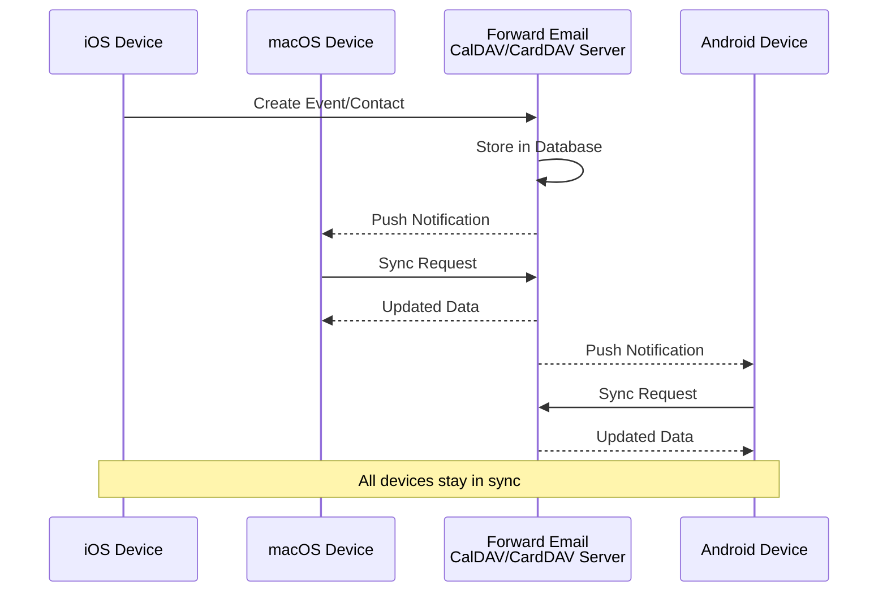

### Kalenderförlängningar SOM INTE stöds {#calendaring-extensions-not-supported}

Följande kalenderförlängningar stöds INTE:

| RFC                                                       | Titel                                                                | Orsak                                                           |
| --------------------------------------------------------- | -------------------------------------------------------------------- | ---------------------------------------------------------------- |
| [RFC 4918](https://datatracker.ietf.org/doc/html/rfc4918) | HTTP Extensions for Web Distributed Authoring and Versioning (WebDAV) | CalDAV använder WebDAV-koncept men implementerar inte hela RFC 4918 |
| [RFC 6578](https://datatracker.ietf.org/doc/html/rfc6578) | Collection Synchronization for WebDAV                                | Ej implementerat                                                |
| [RFC 3744](https://datatracker.ietf.org/doc/html/rfc3744) | WebDAV Access Control Protocol                                       | Ej implementerat                                                |

---


## E-postmeddelandefiltrering {#email-message-filtering}

> \[!IMPORTANT]
> Forward Email erbjuder **fullt stöd för Sieve och ManageSieve** för serverbaserad e-postfiltrering. Skapa kraftfulla regler för att automatiskt sortera, filtrera, vidarebefordra och svara på inkommande meddelanden.

### Sieve (RFC 5228) {#sieve-rfc-5228}

[Sieve](https://en.wikipedia.org/wiki/Sieve_\(mail_filtering_language\)) är ett standardiserat, kraftfullt skriptspråk för serverbaserad e-postfiltrering. Forward Email implementerar omfattande stöd för Sieve med 24 tillägg.

**Källkod:** [`helpers/sieve/`](https://github.com/forwardemail/forwardemail.net/tree/master/helpers/sieve)

#### Stödda kärn-Sieve RFC:er {#core-sieve-rfcs-supported}

| RFC                                                                                    | Titel                                                        | Status          |
| -------------------------------------------------------------------------------------- | ------------------------------------------------------------ | --------------- |
| [RFC 5228](https://datatracker.ietf.org/doc/html/rfc5228)                              | Sieve: An Email Filtering Language                           | ✅ Fullt stöd    |
| [RFC 5429](https://datatracker.ietf.org/doc/html/rfc5429)                              | Sieve Email Filtering: Reject and Extended Reject Extensions | ✅ Fullt stöd    |
| [RFC 5230](https://datatracker.ietf.org/doc/html/rfc5230)                              | Sieve Email Filtering: Vacation Extension                    | ✅ Fullt stöd    |
| [RFC 6131](https://datatracker.ietf.org/doc/html/rfc6131)                              | Sieve Vacation Extension: "Seconds" Parameter                | ✅ Fullt stöd    |
| [RFC 5232](https://datatracker.ietf.org/doc/html/rfc5232)                              | Sieve Email Filtering: Imap4flags Extension                  | ✅ Fullt stöd    |
| [RFC 5173](https://datatracker.ietf.org/doc/html/rfc5173)                              | Sieve Email Filtering: Body Extension                        | ✅ Fullt stöd    |
| [RFC 5229](https://datatracker.ietf.org/doc/html/rfc5229)                              | Sieve Email Filtering: Variables Extension                   | ✅ Fullt stöd    |
| [RFC 5231](https://datatracker.ietf.org/doc/html/rfc5231)                              | Sieve Email Filtering: Relational Extension                  | ✅ Fullt stöd    |
| [RFC 4790](https://datatracker.ietf.org/doc/html/rfc4790)                              | Internet Application Protocol Collation Registry             | ✅ Fullt stöd    |
| [RFC 3894](https://datatracker.ietf.org/doc/html/rfc3894)                              | Sieve Extension: Copying Without Side Effects                | ✅ Fullt stöd    |
| [RFC 5293](https://datatracker.ietf.org/doc/html/rfc5293)                              | Sieve Email Filtering: Editheader Extension                  | ✅ Fullt stöd    |
| [RFC 5260](https://datatracker.ietf.org/doc/html/rfc5260)                              | Sieve Email Filtering: Date and Index Extensions             | ✅ Fullt stöd    |
| [RFC 5435](https://datatracker.ietf.org/doc/html/rfc5435)                              | Sieve Email Filtering: Extension for Notifications           | ✅ Fullt stöd    |
| [RFC 5183](https://datatracker.ietf.org/doc/html/rfc5183)                              | Sieve Email Filtering: Environment Extension                 | ✅ Fullt stöd    |
| [RFC 5490](https://datatracker.ietf.org/doc/html/rfc5490)                              | Sieve Email Filtering: Extensions for Checking Mailbox Status| ✅ Fullt stöd    |
| [RFC 8579](https://datatracker.ietf.org/doc/html/rfc8579)                              | Sieve Email Filtering: Delivering to Special-Use Mailboxes   | ✅ Fullt stöd    |
| [RFC 7352](https://datatracker.ietf.org/doc/html/rfc7352)                              | Sieve Email Filtering: Detecting Duplicate Deliveries        | ✅ Fullt stöd    |
| [RFC 5463](https://datatracker.ietf.org/doc/html/rfc5463)                              | Sieve Email Filtering: Ihave Extension                       | ✅ Fullt stöd    |
| [RFC 5233](https://datatracker.ietf.org/doc/html/rfc5233)                              | Sieve Email Filtering: Subaddress Extension                  | ✅ Fullt stöd    |
| [draft-ietf-sieve-regex](https://datatracker.ietf.org/doc/html/draft-ietf-sieve-regex) | Sieve Email Filtering: Regular Expression Extension          | ✅ Fullt stöd    |
#### Stödda Sieve-tillägg {#supported-sieve-extensions}

| Tillägg                      | Beskrivning                              | Integration                                |
| ---------------------------- | ---------------------------------------- | ------------------------------------------ |
| `fileinto`                   | Placera meddelanden i specifika mappar  | Meddelanden lagras i angiven IMAP-mapp    |
| `reject` / `ereject`         | Avvisa meddelanden med ett fel           | SMTP-avvisning med returmeddelande        |
| `vacation`                   | Automatiska semester-/frånvarosvar       | Köas via Emails.queue med hastighetsbegränsning |
| `vacation-seconds`           | Finjusterade intervall för semester-svar | TTL från `:seconds`-parametern             |
| `imap4flags`                 | Sätt IMAP-flaggor (\Seen, \Flagged, etc.) | Flaggor appliceras vid meddelandelagring  |
| `envelope`                   | Testa avsändare/mottagare i kuvertet     | Tillgång till SMTP-kuvertdatan             |
| `body`                       | Testa meddelandets innehåll i kroppen    | Fullständig textmatchning i meddelandekroppen |
| `variables`                  | Spara och använd variabler i skript      | Variabelexpansion med modifierare          |
| `relational`                 | Relationella jämförelser                   | `:count`, `:value` med gt/lt/eq             |
| `comparator-i;ascii-numeric` | Numeriska jämförelser                      | Numerisk strängjämförelse                   |
| `copy`                       | Kopiera meddelanden vid omdirigering     | `:copy`-flagga på fileinto/redirect         |
| `editheader`                 | Lägg till eller ta bort meddelandehuvuden | Huvuden modifieras före lagring             |
| `date`                       | Testa datum-/tidvärden                     | `currentdate` och datumtest i huvuden       |
| `index`                      | Åtkomst till specifika förekomster av huvud | `:index` för flervärda huvuden               |
| `regex`                      | Reguljära uttrycksmatchningar              | Fullt regex-stöd i tester                    |
| `enotify`                    | Skicka aviseringar                         | `mailto:`-aviseringar via Emails.queue       |
| `environment`                | Åtkomst till miljöinformation              | Domän, värd, remote-ip från session          |
| `mailbox`                    | Testa om brevlåda finns                     | `mailboxexists`-test                         |
| `special-use`                | Placera i specialanvända brevlådor          | Kartlägger \Junk, \Trash, etc. till mappar   |
| `duplicate`                  | Upptäck dubblettmeddelanden                 | Redis-baserad dubblettspårning               |
| `ihave`                      | Testa tillgänglighet av tillägg              | Kontroll av kapabilitet i körning             |
| `subaddress`                 | Åtkomst till delar av user+detail-adress     | `:user` och `:detail` adressdelar             |

#### Sieve-tillägg som INTE stöds {#sieve-extensions-not-supported}

| Tillägg                               | RFC                                                       | Orsak                                                           |
| ------------------------------------- | --------------------------------------------------------- | ---------------------------------------------------------------- |
| `include`                             | [RFC 6609](https://datatracker.ietf.org/doc/html/rfc6609) | Säkerhetsrisk (skriptinjektion), kräver global skriptlagring    |
| `mboxmetadata` / `servermetadata`     | [RFC 5490](https://datatracker.ietf.org/doc/html/rfc5490) | Kräver IMAP METADATA-tillägg                                    |
| `fcc`                                 | [RFC 8580](https://datatracker.ietf.org/doc/html/rfc8580) | Kräver integration med Skickat-mapp                            |
| `encoded-character`                   | [RFC 5228](https://datatracker.ietf.org/doc/html/rfc5228) | Parserändringar krävs för ${hex:}-syntax                        |
| `foreverypart` / `mime` / `extracttext` | [RFC 5703](https://datatracker.ietf.org/doc/html/rfc5703) | Komplex MIME-trädmanipulation                                  |
#### Sieve Processing Flow {#sieve-processing-flow}

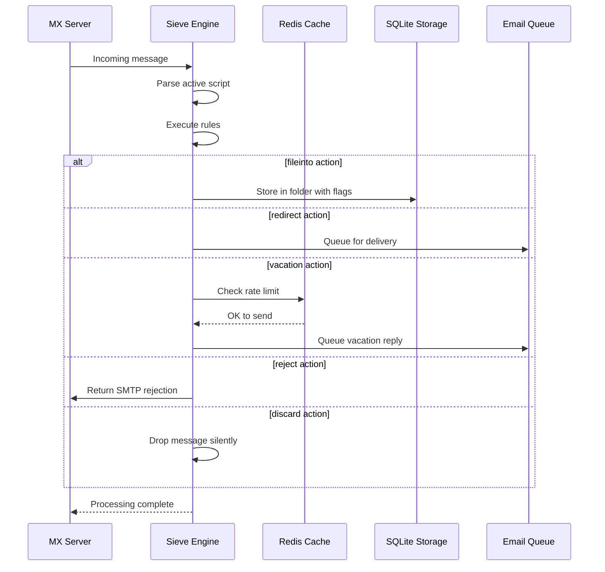

#### Security Features {#security-features}

Forward Email's Sieve-implementering inkluderar omfattande säkerhetsskydd:

* **CVE-2023-26430-skydd**: Förhindrar omdirigeringsloopar och mailbombningsattacker
* **Begränsning av hastighet**: Begränsningar för omdirigeringar (10/meddelande, 100/dag) och semester-svar
* **Kontroll av nekad lista**: Omdirigeringsadresser kontrolleras mot nekad lista
* **Skyddade rubriker**: DKIM, ARC och autentiseringsrubriker kan inte ändras via editheader
* **Begränsningar för skriptstorlek**: Maximal skriptstorlek upprätthålls
* **Timeout för exekvering**: Skript avslutas om exekvering överskrider tidsgräns

#### Example Sieve Scripts {#example-sieve-scripts}

**Filtrera nyhetsbrev till en mapp:**

```sieve
require ["fileinto"];

if header :contains "List-Id" "newsletter" {
    fileinto "Newsletters";
}
```

**Semester-autosvar med finjusterad tid:**

```sieve
require ["vacation", "vacation-seconds"];

vacation :seconds 3600 :subject "Out of Office"
    "I'm currently away and will respond within 24 hours.";
```

**Spamfiltrering med flaggor:**

```sieve
require ["fileinto", "imap4flags"];

if header :contains "X-Spam-Status" "Yes" {
    setflag "\\Seen";
    fileinto "Junk";
}
```

**Komplex filtrering med variabler:**

```sieve
require ["variables", "fileinto", "regex"];

if header :regex "From" "(.+)@example\\.com" {
    set :lower "sender" "${1}";
    fileinto "Contacts/${sender}";
}
```

> \[!TIP]
> För fullständig dokumentation, exempel på skript och konfigurationsinstruktioner, se [FAQ: Do you support Sieve email filtering?](/faq#do-you-support-sieve-email-filtering)

### ManageSieve (RFC 5804) {#managesieve-rfc-5804}

Forward Email erbjuder fullständigt stöd för ManageSieve-protokollet för fjärrhantering av Sieve-skript.

**Källkod:** [`managesieve-server.js`](https://github.com/forwardemail/forwardemail.net/blob/master/managesieve-server.js)

| RFC                                                       | Titel                                         | Status         |
| --------------------------------------------------------- | --------------------------------------------- | -------------- |
| [RFC 5804](https://datatracker.ietf.org/doc/html/rfc5804) | Ett protokoll för fjärrhantering av Sieve-skript | ✅ Fullt stöd |

#### ManageSieve Server Configuration {#managesieve-server-configuration}

| Inställning             | Värde                   |
| ----------------------- | ----------------------- |
| **Server**              | `imap.forwardemail.net` |
| **Port (STARTTLS)**     | `2190` (rekommenderat)  |
| **Port (Implicit TLS)** | `4190`                  |
| **Autentisering**       | PLAIN (över TLS)        |

> **Notera:** Port 2190 använder STARTTLS (uppgradering från plain till TLS) och är kompatibel med de flesta ManageSieve-klienter inklusive [sieve-connect](https://github.com/philpennock/sieve-connect). Port 4190 använder implicit TLS (TLS från anslutningsstart) för klienter som stödjer det.

#### Supported ManageSieve Commands {#supported-managesieve-commands}

| Kommando       | Beskrivning                            |
| -------------- | ------------------------------------- |
| `AUTHENTICATE` | Autentisera med PLAIN-mekanism        |
| `CAPABILITY`   | Lista serverns kapabiliteter och tillägg |
| `HAVESPACE`    | Kontrollera om skript kan sparas       |
| `PUTSCRIPT`    | Ladda upp ett nytt skript              |
| `LISTSCRIPTS`  | Lista alla skript med aktiv status     |
| `SETACTIVE`    | Aktivera ett skript                    |
| `GETSCRIPT`    | Ladda ner ett skript                   |
| `DELETESCRIPT` | Ta bort ett skript                     |
| `RENAMESCRIPT` | Byt namn på ett skript                 |
| `CHECKSCRIPT`  | Validera skriptsyntax                  |
| `NOOP`         | Håll anslutningen aktiv                |
| `LOGOUT`       | Avsluta session                       |
#### Kompatibla ManageSieve-klienter {#compatible-managesieve-clients}

* **Thunderbird**: Inbyggt Sieve-stöd via [Sieve-tillägg](https://addons.thunderbird.net/addon/sieve/)
* **Roundcube**: [ManageSieve-plugin](https://plugins.roundcube.net/packages/johndoh/sieve)
* **KMail**: Inbyggt ManageSieve-stöd
* **sieve-connect**: Kommandoradsklient
* **Vilken som helst RFC 5804-kompatibel klient**

#### ManageSieve-protokollflöde {#managesieve-protocol-flow}

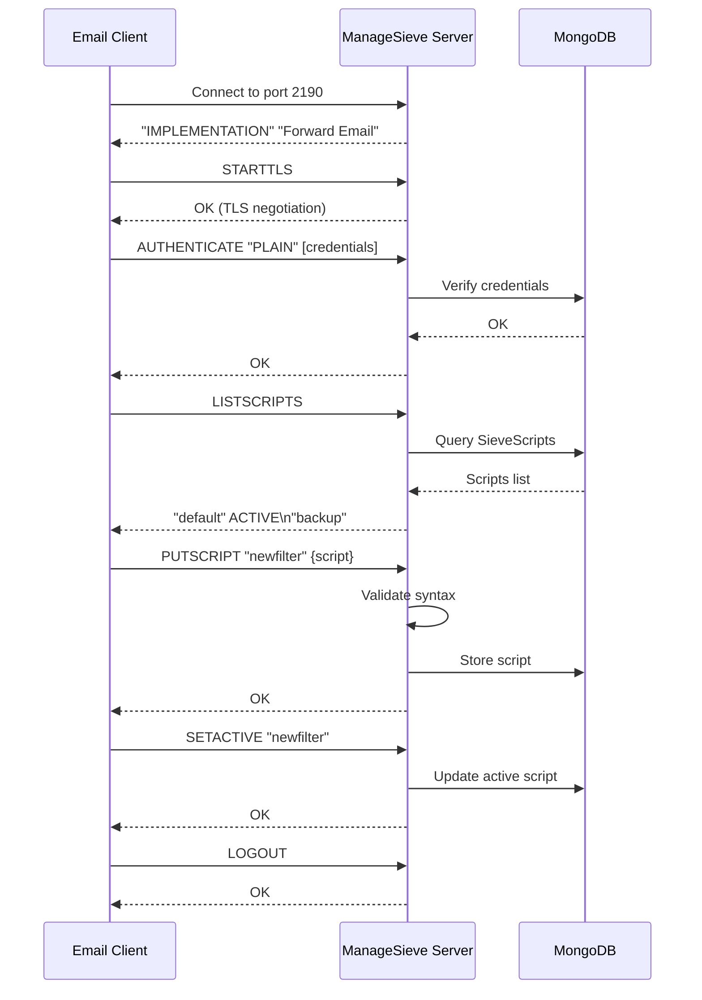

#### Webbgränssnitt och API {#web-interface-and-api}

Utöver ManageSieve erbjuder Forward Email:

* **Webbpanel**: Skapa och hantera Sieve-skript via webbgränssnittet under Mitt konto → Domäner → Aliaser → Sieve-skript
* **REST API**: Programmerbar åtkomst till hantering av Sieve-skript via [Forward Email API](/api#sieve-scripts)

> \[!TIP]
> För detaljerade installationsinstruktioner och klientkonfiguration, se [FAQ: Stöder ni Sieve e-postfiltrering?](/faq#do-you-support-sieve-email-filtering)

---


## Lagringsoptimering {#storage-optimization}

> \[!IMPORTANT]
> **Branschens första lagringsteknologi:** Forward Email är den **enda e-postleverantören i världen** som kombinerar bilagdeduplicering med Brotli-komprimering på e-postinnehåll. Denna dubbellagersoptimering ger dig **2-3 gånger mer effektiv lagring** jämfört med traditionella e-postleverantörer.

Forward Email implementerar två revolutionerande lagringsoptimeringstekniker som dramatiskt minskar brevlådans storlek samtidigt som full RFC-efterlevnad och meddelandets integritet bibehålls:

1. **Bilagdeduplicering** - Eliminerar dubbletter av bilagor över alla e-postmeddelanden
2. **Brotli-komprimering** - Minskar lagringsbehovet med 46-86 % för metadata och 50 % för bilagor

### Arkitektur: Dubbellagers lagringsoptimering {#architecture-dual-layer-storage-optimization}

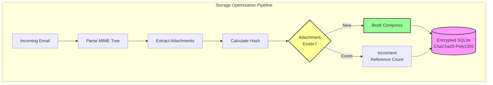

---


## Bilagdeduplicering {#attachment-deduplication}

Forward Email implementerar bilagdeduplicering baserat på [WildDucks beprövade metod](https://docs.wildduck.email/docs/in-depth/attachment-deduplication/), anpassad för SQLite-lagring.

> \[!NOTE]
> **Vad som dedupliceras:** "Bilaga" avser de **kodade** MIME-nodinnehållen (base64 eller quoted-printable), inte den avkodade filen. Detta bevarar giltigheten för DKIM- och GPG-signaturer.

### Hur det fungerar {#how-it-works}

**WildDucks ursprungliga implementation (MongoDB GridFS):**

> Wild Duck IMAP-server deduplicerar bilagor. "Bilaga" i detta fall betyder de base64- eller quoted-printable-kodade MIME-nodinnehållen, inte den avkodade filen. Även om användning av kodat innehåll innebär många falska negativa (samma fil i olika e-postmeddelanden kan räknas som olika bilagor) är det nödvändigt för att garantera giltigheten för olika signaturscheman (DKIM, GPG etc.). Ett meddelande hämtat från Wild Duck ser exakt likadant ut som det meddelande som lagrades, även om Wild Duck analyserar meddelandet till ett trädliknande objekt och bygger upp meddelandet igen vid hämtning.
**Forward Emails SQLite-implementering:**

Forward Email anpassar detta tillvägagångssätt för krypterad SQLite-lagring med följande process:

1. **Hashberäkning**: När en bilaga hittas beräknas en hash med hjälp av biblioteket [`rev-hash`](https://github.com/sindresorhus/rev-hash) från bilagans innehåll
2. **Uppslagning**: Kontrollera om en bilaga med matchande hash finns i tabellen `Attachments`
3. **Referensräkning**:
   * Om finns: Öka referensräknaren med 1 och magiräknaren med ett slumpmässigt tal
   * Om ny: Skapa ny bilagepost med räknare = 1
4. **Säker borttagning**: Använder ett dubbelt räknarsystem (referens + magi) för att förhindra falska positiva
5. **Skräpinsamling**: Bilagor tas bort omedelbart när båda räknarna når noll

**Källkod:** [`helpers/attachment-storage.js`](https://github.com/forwardemail/forwardemail.net/blob/master/helpers/attachment-storage.js)

### Dedupliceringsflöde {#deduplication-flow}

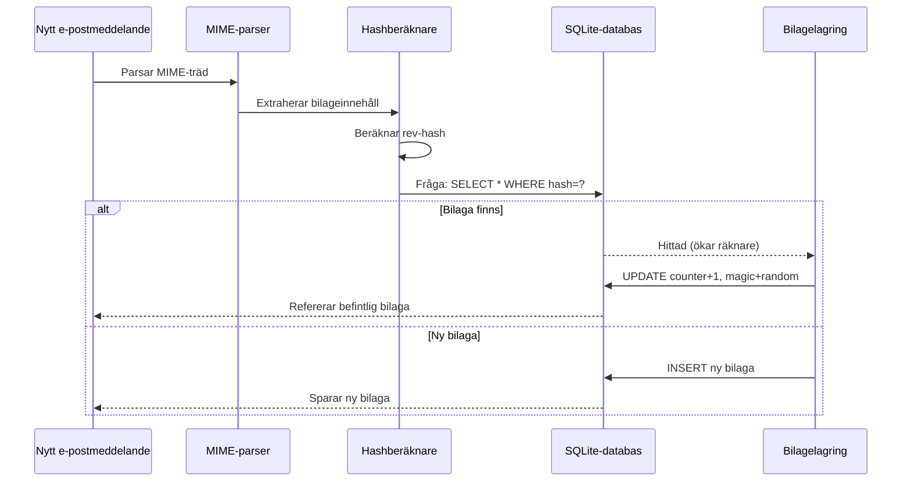

### Magitalssystem {#magic-number-system}

Forward Email använder WildDucks "magitalssystem" (inspirerat av [Mail.ru](https://github.com/zone-eu/wildduck)) för att förhindra falska positiva vid borttagning:

* Varje meddelande tilldelas ett **slumpmässigt tal**
* Bilagans **magiräknare** ökas med det slumpmässiga talet när meddelandet läggs till
* Magiräknaren minskas med samma tal när meddelandet tas bort
* Bilagan tas endast bort när **båda räknarna** (referens + magi) når noll

Detta dubbla räknarsystem säkerställer att om något går fel vid borttagning (t.ex. krasch, nätverksfel) tas inte bilagan bort i förtid.

### Viktiga skillnader: WildDuck vs Forward Email {#key-differences-wildduck-vs-forward-email}

| Funktion               | WildDuck (MongoDB)        | Forward Email (SQLite)       |
| ---------------------- | ------------------------- | ---------------------------- |
| **Lagringsbackend**    | MongoDB GridFS (uppdelad) | SQLite BLOB (direkt)         |
| **Hash-algoritm**      | SHA256                    | rev-hash (baserad på SHA-256)|
| **Referensräkning**    | ✅ Ja                     | ✅ Ja                       |
| **Magital**            | ✅ Ja (Mail.ru-inspirerat) | ✅ Ja (samma system)         |
| **Skräpinsamling**     | Fördröjd (separat jobb)   | Omedelbar (vid nollräknare) |
| **Komprimering**       | ❌ Ingen                  | ✅ Brotli (se nedan)          |
| **Kryptering**         | ❌ Valfri                 | ✅ Alltid (ChaCha20-Poly1305) |

---


## Brotli-komprimering {#brotli-compression}

> \[!IMPORTANT]
> **Världens första:** Forward Email är den **enda e-posttjänsten i världen** som använder Brotli-komprimering på e-postinnehåll. Detta ger **46-86% lagringsbesparing** utöver bilagededuplicering.

Forward Email implementerar Brotli-komprimering för både bilageinnehåll och meddelandemetadata, vilket ger enorma lagringsbesparingar samtidigt som bakåtkompatibilitet bibehålls.

**Implementering:** [`helpers/msgpack-helpers.js`](https://github.com/forwardemail/forwardemail.net/blob/master/helpers/msgpack-helpers.js)

### Vad som komprimeras {#what-gets-compressed}

**1. Bilageinnehåll** (`encodeAttachmentBody`)

* **Gamla format**: Hex-kodad sträng (2x storlek) eller rå Buffer
* **Nytt format**: Brotli-komprimerad Buffer med "FEBR" magirubrik
* **Komprimeringsbeslut**: Komprimerar endast om det sparar utrymme (räknar med 4-bytes rubrik)
* **Lagringsbesparing**: Upp till **50%** (hex → native BLOB)
**2. Meddelandemetadata** (`encodeMetadata`)

Inkluderar: `mimeTree`, `headers`, `envelope`, `flags`

* **Gammalt format**: JSON-textsträng
* **Nytt format**: Brotli-komprimerad Buffer
* **Lagringsbesparing**: **46-86%** beroende på meddelandets komplexitet

### Komprimeringskonfiguration {#compression-configuration}

```javascript
// Brotli-komprimeringsalternativ optimerade för hastighet (nivå 4 är en bra balans)
const BROTLI_COMPRESS_OPTIONS = {
  params: {
    [zlib.constants.BROTLI_PARAM_QUALITY]: 4
  }
};
```

**Varför nivå 4?**

* **Snabb komprimering/dekomprimering**: Under millisekund i bearbetningstid
* **Bra komprimeringsförhållande**: 46-86% besparing
* **Balanserad prestanda**: Optimalt för realtids-e-posthantering

### Magisk header: "FEBR" {#magic-header-febr}

Forward Email använder en 4-byte magisk header för att identifiera komprimerade bilagor:

```
"FEBR" = Forward Email BRotli
Hex: 0x46 0x45 0x42 0x52
```

**Varför en magisk header?**

* **Formatdetektion**: Identifiera om data är komprimerad eller okomprimerad direkt
* **Bakåtkompatibilitet**: Gamla hex-strängar och råa Buffers fungerar fortfarande
* **Kollisionundvikande**: "FEBR" är osannolikt att förekomma i början av legitim bilagedata

### Komprimeringsprocess {#compression-process}

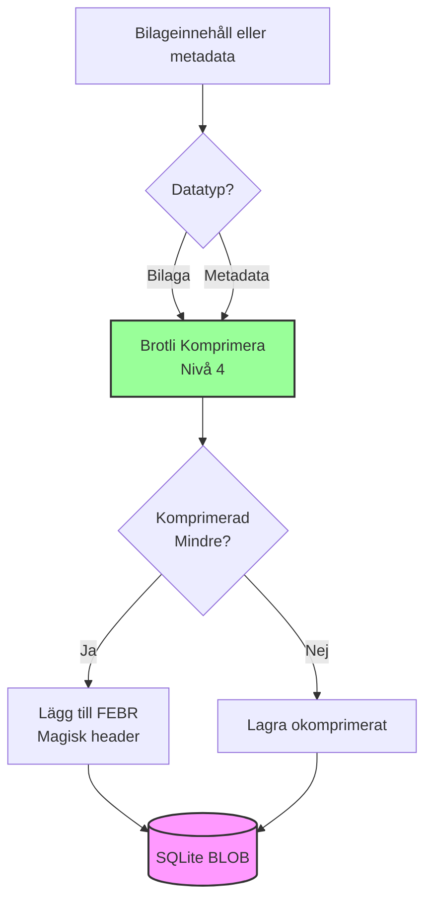

### Dekomprimeringsprocess {#decompression-process}

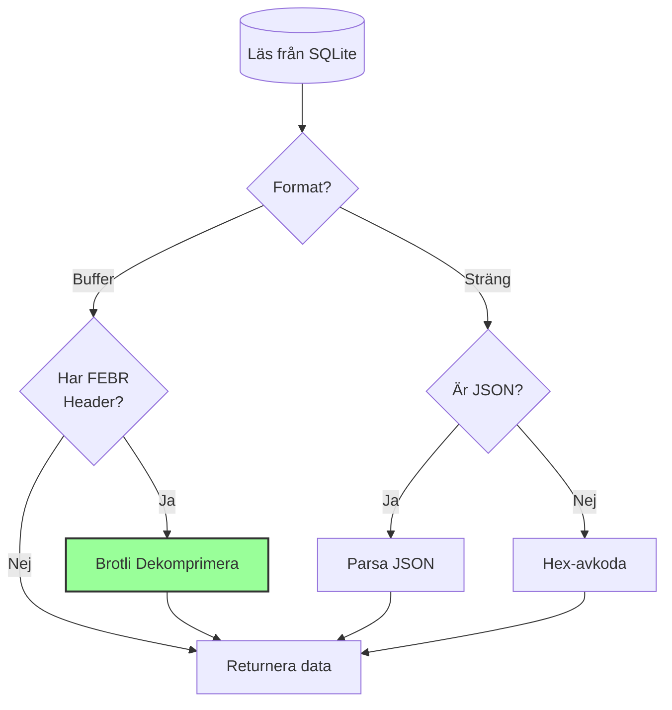

### Bakåtkompatibilitet {#backwards-compatibility}

Alla avkodningsfunktioner **upptäcker automatiskt** lagringsformatet:

| Format                | Upptäcktsmetod                       | Hantering                                      |
| --------------------- | ----------------------------------- | ---------------------------------------------- |
| **Brotli-komprimerad** | Kontrollera "FEBR" magisk header    | Dekomprimera med `zlib.brotliDecompressSync()` |
| **Rå Buffer**         | `Buffer.isBuffer()` utan magisk header | Returnera som den är                          |
| **Hex-sträng**        | Kontrollera jämn längd + [0-9a-f] tecken | Avkoda med `Buffer.from(value, 'hex')`         |
| **JSON-sträng**       | Kontrollera om första tecknet är `{` eller `[` | Parsas med `JSON.parse()`                      |

Detta säkerställer **noll dataförlust** vid migrering från gamla till nya lagringsformat.

### Statistik över lagringsbesparingar {#storage-savings-statistics}

**Uppmätta besparingar från produktionsdata:**

| Datatyp               | Gammalt format          | Nytt format            | Besparing  |
| --------------------- | ----------------------- | ---------------------- | ---------- |
| **Bilageinnehåll**    | Hex-kodad sträng (2x)   | Brotli-komprimerad BLOB | **50%**    |
| **Meddelandemetadata**| JSON-text               | Brotli-komprimerad BLOB | **46-86%** |
| **Mailbox-flaggor**   | JSON-text               | Brotli-komprimerad BLOB | **60-80%** |

**Källa:** [`helpers/migrate-storage-format.js`](https://github.com/forwardemail/forwardemail.net/blob/master/helpers/migrate-storage-format.js)

### Migreringsprocess {#migration-process}

Forward Email erbjuder automatisk, idempotent migrering från gamla till nya lagringsformat:
// Migreringsstatistik spårad:
{
  attachmentsMigrated: 0,
  messagesMigrated: 0,
  mailboxesMigrated: 0,
  bytesSaved: 0  // Totalt antal byte sparade från komprimering
}
```

**Migreringssteg:**

1. Bilagorsinnehåll: hex-kodning → inbyggd BLOB (50% besparing)
2. Meddelandemetadata: JSON-text → brotli-komprimerad BLOB (46-86% besparing)
3. Brevlådeflaggor: JSON-text → brotli-komprimerad BLOB (60-80% besparing)

**Källa:** [`helpers/migrate-storage-format.js`](https://github.com/forwardemail/forwardemail.net/blob/master/helpers/migrate-storage-format.js)

---

### Kombinerad lagringseffektivitet {#combined-storage-efficiency}

> \[!TIP]
> **Verklig påverkan:** Med bilagorsdeduplicering + Brotli-komprimering får Forward Email-användare **2-3x mer effektiv lagring** jämfört med traditionella e-postleverantörer.

**Exempelscenario:**

Traditionell e-postleverantör (1GB brevlåda):

* 1GB diskutrymme = 1GB e-post
* Ingen deduplicering: Samma bilaga lagrad 10 gånger = 10x lagringsspill
* Ingen komprimering: Full JSON-metadata lagrad = 2-3x lagringsspill

Forward Email (1GB brevlåda):

* 1GB diskutrymme ≈ **2-3GB e-post** (effektiv lagring)
* Deduplicering: Samma bilaga lagrad en gång, refererad 10 gånger
* Komprimering: 46-86% besparing på metadata, 50% på bilagor
* Kryptering: ChaCha20-Poly1305 (ingen lagringsöverbelastning)

**Jämförelsetabell:**

| Leverantör       | Lagringsteknologi                            | Effektiv lagring (1GB brevlåda) |
| ---------------- | -------------------------------------------- | ------------------------------- |
| Gmail            | Ingen                                        | 1GB                             |
| iCloud           | Ingen                                        | 1GB                             |
| Outlook.com      | Ingen                                        | 1GB                             |
| Fastmail         | Ingen                                        | 1GB                             |
| ProtonMail       | Endast kryptering                            | 1GB                             |
| Tutanota         | Endast kryptering                            | 1GB                             |
| **Forward Email**| **Deduplicering + Komprimering + Kryptering** | **2-3GB** ✨                     |

### Tekniska implementeringsdetaljer {#technical-implementation-details}

**Prestanda:**

* Brotli nivå 4: Komprimering/dekomprimering under millisekund
* Ingen prestandapåverkan från komprimering
* SQLite FTS5: Sökning under 50 ms med NVMe SSD

**Säkerhet:**

* Komprimering sker **efter** kryptering (SQLite-databasen är krypterad)
* ChaCha20-Poly1305-kryptering + Brotli-komprimering
* Zero-knowledge: Endast användaren har dekrypteringslösenordet

**RFC-efterlevnad:**

* Hämtade meddelanden ser **exakt likadana** ut som lagrade
* DKIM-signaturer förblir giltiga (kodad innehåll bevaras)
* GPG-signaturer förblir giltiga (ingen ändring av signerat innehåll)

### Varför ingen annan leverantör gör detta {#why-no-other-provider-does-this}

**Komplexitet:**

* Kräver djup integration med lagringslager
* Bakåtkompatibilitet är utmanande
* Migrering från gamla format är komplex

**Prestandabekymmer:**

* Komprimering lägger till CPU-belastning (lösts med Brotli nivå 4)
* Dekomprimering vid varje läsning (lösts med SQLite-cache)

**Forward Emails fördel:**

* Byggt från grunden med optimering i åtanke
* SQLite tillåter direkt BLOB-manipulation
* Krypterade användardatabaser möjliggör säker komprimering

---

---


## Moderna funktioner {#modern-features}


## Komplett REST API för e-posthantering {#complete-rest-api-for-email-management}

> \[!TIP]
> Forward Email erbjuder ett omfattande REST API med 39 endpoints för programmatisk e-posthantering.

> \[!TIP]
> **Unik branschfunktion:** Till skillnad från alla andra e-posttjänster erbjuder Forward Email fullständig programmatisk åtkomst till din brevlåda, kalender, kontakter, meddelanden och mappar via ett omfattande REST API. Detta är direkt interaktion med din krypterade SQLite-databasfil som lagrar all din data.

Forward Email erbjuder ett komplett REST API som ger enastående åtkomst till dina e-postdata. Ingen annan e-posttjänst (inklusive Gmail, iCloud, Outlook, ProtonMail, Tuta eller Fastmail) erbjuder denna nivå av omfattande, direkt databasåtkomst.
**API-dokumentation:** <https://forwardemail.net/en/email-api>

### API-kategorier (39 slutpunkter) {#api-categories-39-endpoints}

**1. Meddelanden API** (5 slutpunkter) - Fullständiga CRUD-operationer på e-postmeddelanden:

* `GET /v1/messages` - Lista meddelanden med 15+ avancerade sökparametrar (ingen annan tjänst erbjuder detta)
* `POST /v1/messages` - Skapa/skicka meddelanden
* `GET /v1/messages/:id` - Hämta meddelande
* `PUT /v1/messages/:id` - Uppdatera meddelande (flaggor, mappar)
* `DELETE /v1/messages/:id` - Radera meddelande

*Exempel: Hitta alla fakturor från förra kvartalet med bilagor:*

```bash
curl -u "alias@domain.com:password" \
  "https://api.forwardemail.net/v1/messages?q=subject:invoice+has:attachment+after:2024-01-01+before:2024-04-01"
```

Se [Avancerad sökdokumentation](https://forwardemail.net/en/email-api)

**2. Mappar API** (5 slutpunkter) - Fullständig IMAP-mapphantering via REST:

* `GET /v1/folders` - Lista alla mappar
* `POST /v1/folders` - Skapa mapp
* `GET /v1/folders/:id` - Hämta mapp
* `PUT /v1/folders/:id` - Uppdatera mapp
* `DELETE /v1/folders/:id` - Radera mapp

**3. Kontakter API** (5 slutpunkter) - CardDAV kontaktlagring via REST:

* `GET /v1/contacts` - Lista kontakter
* `POST /v1/contacts` - Skapa kontakt (vCard-format)
* `GET /v1/contacts/:id` - Hämta kontakt
* `PUT /v1/contacts/:id` - Uppdatera kontakt
* `DELETE /v1/contacts/:id` - Radera kontakt

**4. Kalendrar API** (5 slutpunkter) - Hantering av kalenderbehållare:

* `GET /v1/calendars` - Lista kalenderbehållare
* `POST /v1/calendars` - Skapa kalender (t.ex. "Arbetskalender", "Personlig kalender")
* `GET /v1/calendars/:id` - Hämta kalender
* `PUT /v1/calendars/:id` - Uppdatera kalender
* `DELETE /v1/calendars/:id` - Radera kalender

**5. Kalenderhändelser API** (5 slutpunkter) - Schemaläggning av händelser inom kalendrar:

* `GET /v1/calendar-events` - Lista händelser
* `POST /v1/calendar-events` - Skapa händelse med deltagare
* `GET /v1/calendar-events/:id` - Hämta händelse
* `PUT /v1/calendar-events/:id` - Uppdatera händelse
* `DELETE /v1/calendar-events/:id` - Radera händelse

*Exempel: Skapa en kalenderhändelse:*

```bash
curl -u "alias@domain.com:password" \
  -X POST \
  -H "Content-Type: application/json" \
  -d '{"title":"Team Meeting","start":"2024-12-20T10:00:00Z","attendees":["team@example.com"],"calendar_id":"calendar123"}' \
  https://api.forwardemail.net/v1/calendar-events
```

### Tekniska detaljer {#technical-details}

* **Autentisering:** Enkel `alias:password` autentisering (ingen OAuth-komplexitet)
* **Prestanda:** Svarstider under 50 ms med SQLite FTS5 och NVMe SSD-lagring
* **Noll nätverksfördröjning:** Direkt databasåtkomst, inte proxad via externa tjänster

### Verkliga användningsfall {#real-world-use-cases}

* **E-postanalys:** Bygg anpassade instrumentpaneler som spårar e-postvolym, svarstider, avsändarstatistik

* **Automatiserade arbetsflöden:** Trigga åtgärder baserat på e-postinnehåll (fakturahantering, supportärenden)

* **CRM-integration:** Synkronisera e-postkonversationer med ditt CRM automatiskt

* **Efterlevnad & upptäckt:** Sök och exportera e-post för juridiska/efterlevnadskrav

* **Anpassade e-postklienter:** Bygg specialiserade e-postgränssnitt för ditt arbetsflöde

* **Business Intelligence:** Analysera kommunikationsmönster, svarsfrekvenser, kundengagemang

* **Dokumenthantering:** Extrahera och kategorisera bilagor automatiskt

* [Fullständig dokumentation](https://forwardemail.net/en/email-api)

* [Fullständig API-referens](https://forwardemail.net/en/email-api)

* [Guide för avancerad sökning](https://forwardemail.net/en/email-api)

* [30+ integrations-exempel](https://forwardemail.net/en/email-api)

* [Teknisk arkitektur](https://forwardemail.net/en/blog/docs/best-quantum-safe-encrypted-email-service)

Forward Email erbjuder ett modernt REST API som ger full kontroll över e-postkonton, domäner, alias och meddelanden. Detta API fungerar som ett kraftfullt alternativ till JMAP och erbjuder funktionalitet utöver traditionella e-postprotokoll.

| Kategori                | Slutpunkter | Beskrivning                             |
| ----------------------- | ----------- | ------------------------------------- |
| **Kontohantering**      | 8           | Användarkonton, autentisering, inställningar |
| **Domänhantering**      | 12          | Anpassade domäner, DNS, verifiering   |
| **Alias-hantering**     | 6           | E-postalias, vidarebefordran, catch-all |
| **Meddelandehantering** | 7           | Skicka, ta emot, söka, radera meddelanden |
| **Kalender & Kontakter**| 4           | CalDAV/CardDAV-åtkomst via API         |
| **Loggar & Analys**     | 2           | E-postloggar, leveransrapporter       |
### Viktiga API-funktioner {#key-api-features}

**Avancerad sökning:**

API:et erbjuder kraftfulla sökfunktioner med frågesyntax liknande Gmail:

```
GET /v1/messages?q=subject:invoice+has:attachment+after:2024-01-01+before:2024-04-01
```

**Stödda sökoperatorer:**

* `from:` - Sök efter avsändare
* `to:` - Sök efter mottagare
* `subject:` - Sök efter ämne
* `has:attachment` - Meddelanden med bilagor
* `is:unread` - Olästa meddelanden
* `is:starred` - Stjärnmärkta meddelanden
* `after:` - Meddelanden efter datum
* `before:` - Meddelanden före datum
* `label:` - Meddelanden med etikett
* `filename:` - Bilagans filnamn

**Hantera kalenderhändelser:**

```
GET /v1/calendar-events
POST /v1/calendar-events
PUT /v1/calendar-events/:id
DELETE /v1/calendar-events/:id
```

**Webhook-integrationer:**

API:et stödjer webhooks för realtidsnotifikationer av e-posthändelser (mottaget, skickat, studsat, etc.).

**Autentisering:**

* API-nyckelautentisering
* OAuth 2.0-stöd
* Hastighetsbegränsning: 1000 förfrågningar/timme

**Dataformat:**

* JSON för förfrågningar/svar
* RESTful design
* Stöd för paginering

**Säkerhet:**

* Endast HTTPS
* Rotation av API-nycklar
* IP-vitlistning (valfritt)
* Signering av förfrågningar (valfritt)

### API-arkitektur {#api-architecture}

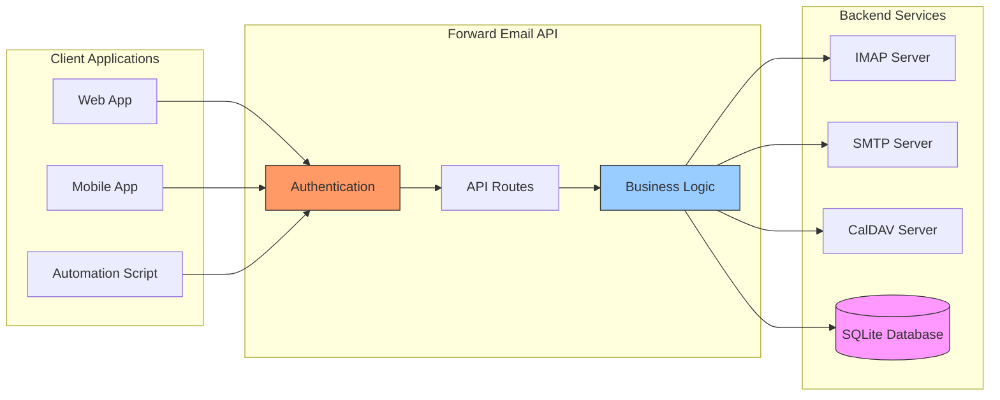

---


## iOS Push-notiser {#ios-push-notifications}

> \[!TIP]
> Forward Email stödjer inbyggda iOS push-notiser via XAPPLEPUSHSERVICE för omedelbar e-postleverans.

> \[!IMPORTANT]
> **Unik funktion:** Forward Email är en av få open-source e-postservrar som stödjer inbyggda iOS push-notiser för e-post, kontakter och kalendrar via `XAPPLEPUSHSERVICE` IMAP-tillägget. Detta är omvänt konstruerat från Apples protokoll och ger omedelbar leverans till iOS-enheter utan batteriförbrukning.

Forward Email implementerar Apples proprietära XAPPLEPUSHSERVICE-tillägg, vilket ger inbyggda push-notiser för iOS-enheter utan behov av bakgrunds-polling.

### Hur det fungerar {#how-it-works-1}

**XAPPLEPUSHSERVICE** är ett icke-standard IMAP-tillägg som tillåter iOS Mail-app att ta emot omedelbara push-notiser när nya e-postmeddelanden anländer.

Forward Email implementerar Apples proprietära Push Notification service (APNs) integration för IMAP, vilket gör att iOS Mail-app kan ta emot omedelbara push-notiser när nya e-postmeddelanden anländer.

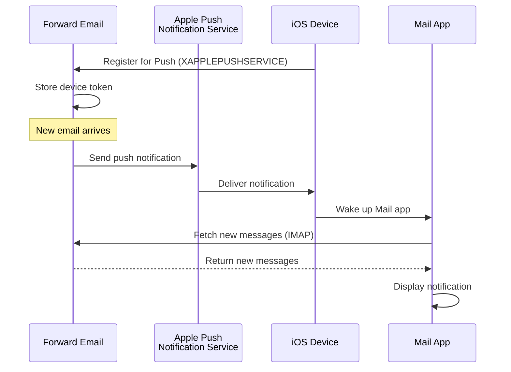

### Viktiga funktioner {#key-features}

**Omedelbar leverans:**

* Push-notiser anländer inom sekunder
* Ingen batterikrävande bakgrundspolling
* Fungerar även när Mail-appen är stängd

<!---->

* **Omedelbar leverans:** E-post, kalenderhändelser och kontakter visas på din iPhone/iPad direkt, inte enligt ett pollingschema
* **Batterisnål:** Använder Apples push-infrastruktur istället för att upprätthålla ständiga IMAP-anslutningar
* **Ämnesbaserad push:** Stödjer push-notiser för specifika brevlådor, inte bara INBOX
* **Inga tredjepartsappar krävs:** Fungerar med de inbyggda iOS-apparna Mail, Kalender och Kontakter
**Inbyggd integration:**

* Inbyggd i iOS Mail-app
* Inga tredjepartsappar krävs
* Sömlös användarupplevelse

**Integritet i fokus:**

* Enhetstoken är krypterade
* Inget meddelandeinnehåll skickas via APNS
* Endast "nytt mail"-notifikation skickas

**Batterisnål:**

* Ingen konstant IMAP-polling
* Enheten sover tills notifikation anländer
* Minimal batteripåverkan

### Vad gör detta speciellt {#what-makes-this-special}

> \[!IMPORTANT]
> De flesta e-postleverantörer stödjer inte XAPPLEPUSHSERVICE, vilket tvingar iOS-enheter att poll:a efter nytt mail var 15:e minut.

De flesta open-source e-postservrar (inklusive Dovecot, Postfix, Cyrus IMAP) stödjer INTE iOS push-notifikationer. Användare måste antingen:

* Använda IMAP IDLE (håller anslutningen öppen, tömmer batteri)
* Använda polling (kontrollerar var 15-30:e minut, fördröjda notifikationer)
* Använda proprietära e-postappar med egen push-infrastruktur

Forward Email erbjuder samma omedelbara push-notifikationsupplevelse som kommersiella tjänster som Gmail, iCloud och Fastmail.

**Jämförelse med andra leverantörer:**

| Leverantör       | Push-stöd      | Pollingintervall | Batteripåverkan |
| ---------------- | -------------- | ---------------- | -------------- |
| **Forward Email** | ✅ Inbyggd Push | Omedelbar        | Minimal        |
| Gmail            | ✅ Inbyggd Push | Omedelbar        | Minimal        |
| iCloud           | ✅ Inbyggd Push | Omedelbar        | Minimal        |
| Yahoo            | ✅ Inbyggd Push | Omedelbar        | Minimal        |
| Outlook.com      | ❌ Polling     | 15 minuter       | Måttlig        |
| Fastmail         | ❌ Polling     | 15 minuter       | Måttlig        |
| ProtonMail       | ⚠️ Endast Bridge | Via Bridge       | Hög            |
| Tutanota         | ❌ Endast app  | N/A              | N/A            |

### Implementeringsdetaljer {#implementation-details}

**IMAP CAPABILITY-svar:**

```
* CAPABILITY IMAP4rev1 ... XAPPLEPUSHSERVICE ...
```

**Registreringsprocess:**

1. iOS Mail-app upptäcker XAPPLEPUSHSERVICE-funktionalitet
2. Appen registrerar enhetstoken hos Forward Email
3. Forward Email sparar token och kopplar den till konto
4. När nytt mail anländer skickar Forward Email push via APNS
5. iOS väcker Mail-appen för att hämta nya meddelanden

**Säkerhet:**

* Enhetstoken är krypterade i vila
* Token går ut och förnyas automatiskt
* Inget meddelandeinnehåll exponeras för APNS
* End-to-end-kryptering bibehålls

<!---->

* **IMAP Extension:** `XAPPLEPUSHSERVICE`
* **Källkod:** [WildDuck Issue #711](https://github.com/zone-eu/wildduck/issues/711)
* **Installation:** Automatisk - ingen konfiguration behövs, fungerar direkt med iOS Mail-app

### Jämförelse med andra tjänster {#comparison-with-other-services}

| Tjänst        | iOS Push-stöd   | Metod                                    |
| ------------- | --------------- | ---------------------------------------- |
| Forward Email | ✅ Ja           | `XAPPLEPUSHSERVICE` (reverse-engineered) |
| Gmail         | ✅ Ja           | Proprietär Gmail-app + Google push       |
| iCloud Mail   | ✅ Ja           | Inbyggd Apple-integration                 |
| Outlook.com   | ✅ Ja           | Proprietär Outlook-app + Microsoft push  |
| Fastmail      | ✅ Ja           | `XAPPLEPUSHSERVICE`                       |
| Dovecot       | ❌ Nej          | Endast IMAP IDLE eller polling            |
| Postfix       | ❌ Nej          | Endast IMAP IDLE eller polling            |
| Cyrus IMAP    | ❌ Nej          | Endast IMAP IDLE eller polling            |

**Gmail Push:**

Gmail använder ett proprietärt push-system som endast fungerar med Gmail-appen. iOS Mail-app måste poll:a Gmail IMAP-servrar.

**iCloud Push:**

iCloud har inbyggt push-stöd liknande Forward Email, men endast för @icloud.com-adresser.

**Outlook.com:**

Outlook.com stödjer inte XAPPLEPUSHSERVICE, vilket kräver att iOS Mail poll:ar var 15:e minut.

**Fastmail:**

Fastmail stödjer inte XAPPLEPUSHSERVICE. Användare måste använda Fastmail-appen för push-notifikationer eller acceptera 15-minuters pollingfördröjningar.

---


## Testning och verifiering {#testing-and-verification}


## Protokollkapacitetstester {#protocol-capability-tests}
> \[!NOTE]
> Denna sektion visar resultaten från våra senaste tester av protokollfunktioner, utförda den 22 januari 2026.

Denna sektion innehåller de faktiska CAPABILITY/CAPA/EHLO-svaren från alla testade leverantörer. Alla tester kördes den **22 januari 2026**.

Dessa tester hjälper till att verifiera den annonserade och faktiska stödet för olika e-postprotokoll och tillägg hos stora leverantörer.

### Testmetodik {#test-methodology}

**Testmiljö:**

* **Datum:** 22 januari 2026 kl 02:37 UTC
* **Plats:** AWS EC2-instans
* **IPv4:** 54.167.216.197
* **IPv6:** 2600:4040:46da:9a00:b19e:3ad4:426c:2f48
* **Verktyg:** OpenSSL s_client, bash-skript

**Testade leverantörer:**

* Forward Email
* Gmail
* Outlook.com
* iCloud
* Fastmail
* Yahoo/AOL (Verizon)

### Testskript {#test-scripts}

För full transparens tillhandahålls de exakta skripten som användes för dessa tester nedan.

#### IMAP Capability Test Script {#imap-capability-test-script}

```bash
#!/bin/bash
# IMAP Capability Test Script
# Tests IMAP CAPABILITY for various email providers

echo "========================================="
echo "IMAP CAPABILITY TEST"
echo "Date: $(date -u +"%Y-%m-%d %H:%M:%S UTC")"
echo "========================================="
echo ""

# Gmail
echo "--- Gmail (imap.gmail.com:993) ---"
echo -e "a001 CAPABILITY\na002 LOGOUT" | timeout 10 openssl s_client -connect imap.gmail.com:993 -crlf -quiet 2>&1 | grep -A 20 "CAPABILITY"
echo ""

# Outlook.com
echo "--- Outlook.com (outlook.office365.com:993) ---"
echo -e "a001 CAPABILITY\na002 LOGOUT" | timeout 10 openssl s_client -connect outlook.office365.com:993 -crlf -quiet 2>&1 | grep -A 20 "CAPABILITY"
echo ""

# iCloud
echo "--- iCloud (imap.mail.me.com:993) ---"
echo -e "a001 CAPABILITY\na002 LOGOUT" | timeout 10 openssl s_client -connect imap.mail.me.com:993 -crlf -quiet 2>&1 | grep -A 20 "CAPABILITY"
echo ""

# Fastmail
echo "--- Fastmail (imap.fastmail.com:993) ---"
echo -e "a001 CAPABILITY\na002 LOGOUT" | timeout 10 openssl s_client -connect imap.fastmail.com:993 -crlf -quiet 2>&1 | grep -A 20 "CAPABILITY"
echo ""

# Yahoo
echo "--- Yahoo (imap.mail.yahoo.com:993) ---"
echo -e "a001 CAPABILITY\na002 LOGOUT" | timeout 10 openssl s_client -connect imap.mail.yahoo.com:993 -crlf -quiet 2>&1 | grep -A 20 "CAPABILITY"
echo ""

# Forward Email
echo "--- Forward Email (imap.forwardemail.net:993) ---"
echo -e "a001 CAPABILITY\na002 LOGOUT" | timeout 10 openssl s_client -connect imap.forwardemail.net:993 -crlf -quiet 2>&1 | grep -A 20 "CAPABILITY"
echo ""

echo "========================================="
echo "Test completed"
echo "========================================="
```

#### POP3 Capability Test Script {#pop3-capability-test-script}

```bash
#!/bin/bash
# POP3 Capability Test Script
# Tests POP3 CAPA for various email providers

echo "========================================="
echo "POP3 CAPABILITY TEST"
echo "Date: $(date -u +"%Y-%m-%d %H:%M:%S UTC")"
echo "========================================="
echo ""

# Gmail
echo "--- Gmail (pop.gmail.com:995) ---"
echo -e "CAPA\nQUIT" | timeout 10 openssl s_client -connect pop.gmail.com:995 -crlf -quiet 2>&1 | grep -A 20 "CAPA"
echo ""

# Outlook.com
echo "--- Outlook.com (outlook.office365.com:995) ---"
echo -e "CAPA\nQUIT" | timeout 10 openssl s_client -connect outlook.office365.com:995 -crlf -quiet 2>&1 | grep -A 20 "CAPA"
echo ""

# iCloud (Note: iCloud does not support POP3)
echo "--- iCloud (No POP3 support) ---"
echo "iCloud stöder inte POP3"
echo ""

# Fastmail
echo "--- Fastmail (pop.fastmail.com:995) ---"
echo -e "CAPA\nQUIT" | timeout 10 openssl s_client -connect pop.fastmail.com:995 -crlf -quiet 2>&1 | grep -A 20 "CAPA"
echo ""

# Yahoo
echo "--- Yahoo (pop.mail.yahoo.com:995) ---"
echo -e "CAPA\nQUIT" | timeout 10 openssl s_client -connect pop.mail.yahoo.com:995 -crlf -quiet 2>&1 | grep -A 20 "CAPA"
echo ""

# Forward Email
echo "--- Forward Email (pop3.forwardemail.net:995) ---"
echo -e "CAPA\nQUIT" | timeout 10 openssl s_client -connect pop3.forwardemail.net:995 -crlf -quiet 2>&1 | grep -A 20 "CAPA"
echo ""

echo "========================================="
echo "Test completed"
echo "========================================="
```
#### SMTP Capability Test Script {#smtp-capability-test-script}

```bash
#!/bin/bash
# SMTP Capability Test Script
# Tests SMTP EHLO for various email providers

echo "========================================="
echo "SMTP KAPABILITETSTEST"
echo "Datum: $(date -u +"%Y-%m-%d %H:%M:%S UTC")"
echo "========================================="
echo ""

# Gmail
echo "--- Gmail (smtp.gmail.com:587) ---"
echo -e "EHLO test.com\nQUIT" | timeout 10 openssl s_client -connect smtp.gmail.com:587 -starttls smtp -crlf -quiet 2>&1 | grep -A 30 "250-"
echo ""

# Outlook.com
echo "--- Outlook.com (smtp.office365.com:587) ---"
echo -e "EHLO test.com\nQUIT" | timeout 10 openssl s_client -connect smtp.office365.com:587 -starttls smtp -crlf -quiet 2>&1 | grep -A 30 "250-"
echo ""

# iCloud
echo "--- iCloud (smtp.mail.me.com:587) ---"
echo -e "EHLO test.com\nQUIT" | timeout 10 openssl s_client -connect smtp.mail.me.com:587 -starttls smtp -crlf -quiet 2>&1 | grep -A 30 "250-"
echo ""

# Fastmail
echo "--- Fastmail (smtp.fastmail.com:587) ---"
echo -e "EHLO test.com\nQUIT" | timeout 10 openssl s_client -connect smtp.fastmail.com:587 -starttls smtp -crlf -quiet 2>&1 | grep -A 30 "250-"
echo ""

# Yahoo
echo "--- Yahoo (smtp.mail.yahoo.com:587) ---"
echo -e "EHLO test.com\nQUIT" | timeout 10 openssl s_client -connect smtp.mail.yahoo.com:587 -starttls smtp -crlf -quiet 2>&1 | grep -A 30 "250-"
echo ""

# Forward Email
echo "--- Forward Email (smtp.forwardemail.net:587) ---"
echo -e "EHLO test.com\nQUIT" | timeout 10 openssl s_client -connect smtp.forwardemail.net:587 -starttls smtp -crlf -quiet 2>&1 | grep -A 30 "250-"
echo ""

echo "========================================="
echo "Test slutförd"
echo "========================================="
```

### Test Results Summary {#test-results-summary}

#### IMAP (CAPABILITY) {#imap-capability}

**Forward Email**

```
* CAPABILITY IMAP4rev1 AUTH=PLAIN AUTH=PLAIN-CLIENTTOKEN CHILDREN ENABLE ID IDLE NAMESPACE QUOTA SASL-IR UNSELECT XLIST XAPPLEPUSHSERVICE
```

**Gmail**

```
* CAPABILITY IMAP4rev1 UNSELECT IDLE NAMESPACE QUOTA ID XLIST CHILDREN X-GM-EXT-1 UIDPLUS COMPRESS=DEFLATE ENABLE MOVE CONDSTORE ESEARCH UTF8=ACCEPT LIST-EXTENDED LIST-STATUS LITERAL- SPECIAL-USE
```

**iCloud**

```
* OK [CAPABILITY XAPPLEPUSHSERVICE IMAP4 IMAP4rev1 SASL-IR AUTH=ATOKEN AUTH=PLAIN AUTH=ATOKEN2 AUTH=XOAUTH2]
```

**Outlook.com**

```
* CAPABILITY IMAP4rev1 AUTH=PLAIN AUTH=XOAUTH2 SASL-IR UIDPLUS ID UNSELECT CHILDREN IDLE NAMESPACE LITERAL+
```

**Fastmail**

```
* CAPABILITY IMAP4rev1 ACL ANNOTATE-EXPERIMENT-1 CATENATE CONDSTORE ENABLE ESEARCH ESORT I18NLEVEL=1 ID IDLE LIST-EXTENDED LIST-STATUS LITERAL+ LOGINDISABLED MULTIAPPEND NAMESPACE QRESYNC QUOTA RIGHTS=ektx SASL-IR SORT SPECIAL-USE THREAD=ORDEREDSUBJECT UIDPLUS UNSELECT WITHIN X-RENAME XLIST
```

**Yahoo/AOL (Verizon)**

```
* CAPABILITY IMAP4rev1 IDLE NAMESPACE QUOTA ID XLIST CHILDREN UIDPLUS MOVE CONDSTORE ESEARCH ENABLE LIST-EXTENDED LIST-STATUS LITERAL- SPECIAL-USE UNSELECT XAPPLEPUSHSERVICE
```

#### POP3 (CAPA) {#pop3-capa}

**Forward Email**

```
+OK
CAPA
TOP
USER
UIDL
EXPIRE 30
IMPLEMENTATION ForwardEmail
.
```

**Gmail**

```
+OK
CAPA
TOP
USER
UIDL
EXPIRE 30
IMPLEMENTATION Gpop
.
```

**Outlook.com**

```
+OK
CAPA
TOP
USER
UIDL
SASL PLAIN XOAUTH2
.
```

**Fastmail**

```
+OK
CAPA
TOP
USER
UIDL
EXPIRE 30
IMPLEMENTATION Cyrus
.
```

#### SMTP (EHLO) {#smtp-ehlo}

**Forward Email**

```
250-smtp.forwardemail.net
250-PIPELINING
250-SIZE 52428800
250-ETRN
250-STARTTLS
250-ENHANCEDSTATUSCODES
250-8BITMIME
250-DSN
250 CHUNKING
```

**Gmail**

```
250-smtp.gmail.com at your service
250-SIZE 35882577
250-8BITMIME
250-STARTTLS
250-ENHANCEDSTATUSCODES
250-PIPELINING
250-CHUNKING
250 SMTPUTF8
```

**Outlook.com**

```
250-SN4PR13CA0005.outlook.office365.com Hello [x.x.x.x]
250-SIZE 157286400
250-PIPELINING
250-DSN
250-ENHANCEDSTATUSCODES
250-STARTTLS
250-8BITMIME
250-BINARYMIME
250-CHUNKING
250 SMTPUTF8
```

**Fastmail**

```
250-smtp.fastmail.com
250-PIPELINING
250-SIZE 78643200
250-ETRN
250-STARTTLS
250-ENHANCEDSTATUSCODES
250-8BITMIME
250-DSN
250 CHUNKING
```

**Yahoo/AOL (Verizon)**

```
250-smtp.mail.yahoo.com
250-PIPELINING
250-SIZE 41943040
250-8BITMIME
250-ENHANCEDSTATUSCODES
250-STARTTLS
```
### Detaljerade testresultat {#detailed-test-results}

#### IMAP-testresultat {#imap-test-results}

**Gmail:**
`* CAPABILITY IMAP4rev1 UNSELECT IDLE NAMESPACE QUOTA ID XLIST CHILDREN X-GM-EXT-1 XYZZY SASL-IR AUTH=XOAUTH2 AUTH=PLAIN AUTH=PLAIN-CLIENTTOKEN AUTH=OAUTHBEARER`

**Outlook.com:**
`* CAPABILITY IMAP4 IMAP4rev1 AUTH=PLAIN AUTH=XOAUTH2 SASL-IR UIDPLUS ID UNSELECT CHILDREN IDLE NAMESPACE LITERAL+`

**iCloud:**
`* CAPABILITY XAPPLEPUSHSERVICE IMAP4 IMAP4rev1 SASL-IR AUTH=ATOKEN AUTH=PLAIN AUTH=ATOKEN2 AUTH=XOAUTH2`

**Fastmail:**
Anslutningen tidsutlöste. Se anteckningar nedan.

**Yahoo:**
`* CAPABILITY IMAP4rev1 SASL-IR AUTH=PLAIN AUTH=XOAUTH2 AUTH=OAUTHBEARER ID MOVE NAMESPACE XYMHIGHESTMODSEQ UIDPLUS LITERAL+ CHILDREN UNSELECT X-MSG-EXT OBJECTID IDLE ENABLE UIDONLY X-ALL-MAIL X-UIDONLY LIST-EXTENDED LIST-STATUS SPECIAL-USE PARTIAL APPENDLIMIT=41697280`

**Forward Email:**
`* CAPABILITY XAPPLEPUSHSERVICE IMAP4rev1 APPENDLIMIT=52428800 AUTH=PLAIN AUTH=PLAIN-CLIENTTOKEN CHILDREN CONDSTORE ENABLE ID IDLE MOVE NAMESPACE QUOTA SASL-IR SPECIAL-USE UIDPLUS UNSELECT UTF8=ACCEPT XLIST`

#### POP3-testresultat {#pop3-test-results}

**Gmail:**
Anslutningen returnerade inte CAPA-svar utan autentisering.

**Outlook.com:**
Anslutningen returnerade inte CAPA-svar utan autentisering.

**iCloud:**
Ej stöd.

**Fastmail:**
Anslutningen tidsutlöste. Se anteckningar nedan.

**Yahoo:**
`+OK CAPA list follows... SASL PLAIN XOAUTH2`

**Forward Email:**
Anslutningen returnerade inte CAPA-svar utan autentisering.

#### SMTP-testresultat {#smtp-test-results}

**Gmail:**
`250-AUTH LOGIN PLAIN XOAUTH2 PLAIN-CLIENTTOKEN OAUTHBEARER XOAUTH`

**Outlook.com:**
`250-DSN`

**iCloud:**
`250-DSN`

**Fastmail:**
`250 AUTH PLAIN LOGIN XOAUTH2 OAUTHBEARER`

**Yahoo:**
`250 AUTH PLAIN LOGIN XOAUTH2 OAUTHBEARER`

**Forward Email:**
`250-DSN`, `250-REQUIRETLS`

### Anteckningar om testresultaten {#notes-on-test-results}

> \[!NOTE]
> Viktiga observationer och begränsningar från testresultaten.

1. **Fastmail-tidsutlösningar**: Fastmail-anslutningar tidsutlöste under testningen, sannolikt på grund av hastighetsbegränsningar eller brandväggsrestriktioner från testserverns IP. Fastmail är känt för att ha robust IMAP/POP3/SMTP-stöd baserat på deras dokumentation.

2. **POP3 CAPA-svar**: Flera leverantörer (Gmail, Outlook.com, Forward Email) returnerade inte CAPA-svar utan autentisering. Detta är en vanlig säkerhetspraxis för POP3-servrar.

3. **DSN-stöd**: Endast Outlook.com, iCloud och Forward Email annonserar uttryckligen DSN-stöd i sina SMTP EHLO-svar. Detta betyder inte nödvändigtvis att andra leverantörer inte stödjer DSN, men de annonserar det inte.

4. **REQUIRETLS**: Endast Forward Email annonserar uttryckligen REQUIRETLS-stöd med en användarvänlig kryssruta för efterlevnad. Andra leverantörer kan stödja det internt men annonserar det inte i EHLO.

5. **Testmiljö**: Tester genomfördes från en AWS EC2-instans (IP: 54.167.216.197 IPv4, 2600:4040:46da:9a00:b19e:3ad4:426c:2f48 IPv6) den 22 januari 2026 kl. 02:37 UTC.

---


## Sammanfattning {#summary}

Forward Email erbjuder omfattande RFC-protokollstöd över alla större e-poststandarder:

* **IMAP4rev1:** 16 stödda RFC:er med avsiktliga skillnader dokumenterade
* **POP3:** 4 stödda RFC:er med RFC-kompatibel permanent borttagning
* **SMTP:** 11 stödda tillägg inklusive SMTPUTF8, DSN och PIPELINING
* **Autentisering:** DKIM, SPF, DMARC, ARC fullt stöd
* **Transport Säkerhet:** MTA-STS och REQUIRETLS fullt stöd, DANE delvis stöd
* **Kryptering:** OpenPGP v6 och S/MIME stöd
* **Kalender:** CalDAV, CardDAV och VTODO fullt stöd
* **API-åtkomst:** Komplett REST API med 39 slutpunkter för direkt databasåtkomst
* **iOS-push:** Inbyggda push-notiser för e-post, kontakter och kalendrar via `XAPPLEPUSHSERVICE`

### Viktiga differentierare {#key-differentiators}

> \[!TIP]
> Forward Email utmärker sig med unika funktioner som inte finns hos andra leverantörer.

**Vad som gör Forward Email unikt:**

1. **Quantum-säker kryptering** – Enda leverantören med ChaCha20-Poly1305-krypterade SQLite-postlådor
2. **Zero-Knowledge-arkitektur** – Ditt lösenord krypterar din postlåda; vi kan inte dekryptera den
3. **Gratis anpassade domäner** – Inga månadsavgifter för e-post med anpassad domän
4. **REQUIRETLS-stöd** – Användarvänlig kryssruta för att kräva TLS för hela leveransvägen
5. **Omfattande API** – 39 REST API-slutpunkter för full programmatisk kontroll
6. **iOS-pushnotiser** – Inbyggt XAPPLEPUSHSERVICE-stöd för omedelbar leverans
7. **Öppen källkod** – Full källkod tillgänglig på GitHub
8. **Integritetsfokuserad** – Ingen datainsamling, inga annonser, ingen spårning
* **Sandboxad kryptering:** Enda e-posttjänsten med individuellt krypterade SQLite-postlådor  
* **RFC-efterlevnad:** Prioriterar standardefterlevnad över bekvämlighet (t.ex. POP3 DELE)  
* **Fullständig API:** Direkt programmatisk åtkomst till all e-postdata  
* **Öppen källkod:** Fullt transparent implementation  

**Sammanfattning av protokollstöd:**  

| Kategori             | Stödnivå     | Detaljer                                      |
| -------------------- | ------------ | --------------------------------------------- |
| **Kärnprotokoll**     | ✅ Utmärkt    | IMAP4rev1, POP3, SMTP fullt stöd              |
| **Moderna protokoll** | ⚠️ Delvis    | IMAP4rev2 delvis stöd, JMAP ej stöd            |
| **Säkerhet**          | ✅ Utmärkt    | DKIM, SPF, DMARC, ARC, MTA-STS, REQUIRETLS    |
| **Kryptering**        | ✅ Utmärkt    | OpenPGP, S/MIME, SQLite-kryptering             |
| **CalDAV/CardDAV**    | ✅ Utmärkt    | Fullständig kalender- och kontakt-synkronisering |
| **Filtrering**        | ✅ Utmärkt    | Sieve (24 tillägg) och ManageSieve             |
| **API**               | ✅ Utmärkt    | 39 REST API-endpoints                           |
| **Push**              | ✅ Utmärkt    | Inbyggda push-notiser för iOS                   |
