# การสนับสนุนโปรโตคอล RFC อีเมล - คู่มือมาตรฐานและข้อกำหนดฉบับสมบูรณ์ {#email-rfc-protocol-support---complete-standards--specifications-guide}


## สารบัญ {#table-of-contents}

* [เกี่ยวกับเอกสารนี้](#about-this-document)
  * [ภาพรวมสถาปัตยกรรม](#architecture-overview)
* [การเปรียบเทียบบริการอีเมล - การสนับสนุนโปรโตคอล & การปฏิบัติตามมาตรฐาน RFC](#email-service-comparison---protocol-support--rfc-standards-compliance)
  * [การแสดงภาพการสนับสนุนโปรโตคอล](#protocol-support-visualization)
* [โปรโตคอลอีเมลหลัก](#core-email-protocols)
  * [ลำดับการทำงานของโปรโตคอลอีเมล](#email-protocol-flow)
* [โปรโตคอลอีเมล IMAP4 และส่วนขยาย](#imap4-email-protocol-and-extensions)
  * [ความแตกต่างของโปรโตคอล IMAP จากข้อกำหนด RFC](#imap-protocol-differences-from-rfc-specifications)
  * [ส่วนขยาย IMAP ที่ไม่รองรับ](#imap-extensions-not-supported)
* [โปรโตคอลอีเมล POP3 และส่วนขยาย](#pop3-email-protocol-and-extensions)
  * [ความแตกต่างของโปรโตคอล POP3 จากข้อกำหนด RFC](#pop3-protocol-differences-from-rfc-specifications)
  * [ส่วนขยาย POP3 ที่ไม่รองรับ](#pop3-extensions-not-supported)
* [โปรโตคอลอีเมล SMTP และส่วนขยาย](#smtp-email-protocol-and-extensions)
  * [การแจ้งเตือนสถานะการส่ง (DSN)](#delivery-status-notifications-dsn)
  * [การสนับสนุน REQUIRETLS](#requiretls-support)
  * [ส่วนขยาย SMTP ที่ไม่รองรับ](#smtp-extensions-not-supported)
* [โปรโตคอลอีเมล JMAP](#jmap-email-protocol)
* [ความปลอดภัยของอีเมล](#email-security)
  * [สถาปัตยกรรมความปลอดภัยของอีเมล](#email-security-architecture)
* [โปรโตคอลการตรวจสอบสิทธิ์ข้อความอีเมล](#email-message-authentication-protocols)
  * [การสนับสนุนโปรโตคอลการตรวจสอบสิทธิ์](#authentication-protocol-support)
  * [DKIM (DomainKeys Identified Mail)](#dkim-domainkeys-identified-mail)
  * [SPF (Sender Policy Framework)](#spf-sender-policy-framework)
  * [DMARC (Domain-based Message Authentication, Reporting & Conformance)](#dmarc-domain-based-message-authentication-reporting--conformance)
  * [ARC (Authenticated Received Chain)](#arc-authenticated-received-chain)
  * [ลำดับการตรวจสอบสิทธิ์](#authentication-flow)
* [โปรโตคอลความปลอดภัยการส่งอีเมล](#email-transport-security-protocols)
  * [การสนับสนุนความปลอดภัยการส่ง](#transport-security-support)
  * [TLS (Transport Layer Security)](#tls-transport-layer-security)
  * [MTA-STS (Mail Transfer Agent Strict Transport Security)](#mta-sts-mail-transfer-agent-strict-transport-security)
  * [DANE (DNS-based Authentication of Named Entities)](#dane-dns-based-authentication-of-named-entities)
  * [REQUIRETLS](#requiretls)
  * [ลำดับการทำงานความปลอดภัยการส่ง](#transport-security-flow)
* [การเข้ารหัสข้อความอีเมล](#email-message-encryption)
  * [การสนับสนุนการเข้ารหัส](#encryption-support)
  * [OpenPGP (Pretty Good Privacy)](#openpgp-pretty-good-privacy)
  * [S/MIME (Secure/Multipurpose Internet Mail Extensions)](#smime-securemultipurpose-internet-mail-extensions)
  * [การเข้ารหัสกล่องจดหมาย SQLite](#sqlite-mailbox-encryption)
  * [การเปรียบเทียบการเข้ารหัส](#encryption-comparison)
  * [ลำดับการเข้ารหัส](#encryption-flow)
* [ฟังก์ชันขยาย](#extended-functionality)
* [มาตรฐานรูปแบบข้อความอีเมล](#email-message-format-standards)
  * [การสนับสนุนมาตรฐานรูปแบบ](#format-standards-support)
  * [MIME (Multipurpose Internet Mail Extensions)](#mime-multipurpose-internet-mail-extensions)
  * [SMTPUTF8 และการทำให้ที่อยู่อีเมลเป็นสากล](#smtputf8-and-email-address-internationalization)
* [โปรโตคอลปฏิทินและรายชื่อผู้ติดต่อ](#calendaring-and-contacts-protocols)
  * [การสนับสนุน CalDAV และ CardDAV](#caldav-and-carddav-support)
  * [CalDAV (การเข้าถึงปฏิทิน)](#caldav-calendar-access)
  * [CardDAV (การเข้าถึงรายชื่อผู้ติดต่อ)](#carddav-contact-access)
  * [งานและการเตือนความจำ (CalDAV VTODO)](#tasks-and-reminders-caldav-vtodo)
  * [ลำดับการซิงโครไนซ์ CalDAV/CardDAV](#caldavcarddav-synchronization-flow)
  * [ส่วนขยายปฏิทินที่ไม่รองรับ](#calendaring-extensions-not-supported)
* [การกรองข้อความอีเมล](#email-message-filtering)
  * [Sieve (RFC 5228)](#sieve-rfc-5228)
  * [ManageSieve (RFC 5804)](#managesieve-rfc-5804)
* [การเพิ่มประสิทธิภาพการจัดเก็บ](#storage-optimization)
  * [สถาปัตยกรรม: การเพิ่มประสิทธิภาพการจัดเก็บสองชั้น](#architecture-dual-layer-storage-optimization)
* [การลดการซ้ำซ้อนของไฟล์แนบ](#attachment-deduplication)
  * [วิธีการทำงาน](#how-it-works)
  * [ลำดับการลดการซ้ำซ้อน](#deduplication-flow)
  * [ระบบหมายเลขเวทมนตร์](#magic-number-system)
  * [ความแตกต่างสำคัญ: WildDuck กับ Forward Email](#key-differences-wildduck-vs-forward-email)
* [การบีบอัด Brotli](#brotli-compression)
  * [สิ่งที่ถูกบีบอัด](#what-gets-compressed)
  * [การตั้งค่าการบีบอัด](#compression-configuration)
  * [หัวเวทมนตร์: "FEBR"](#magic-header-febr)
  * [กระบวนการบีบอัด](#compression-process)
  * [กระบวนการคลายการบีบอัด](#decompression-process)
  * [ความเข้ากันได้ย้อนหลัง](#backwards-compatibility)
  * [สถิติการประหยัดพื้นที่จัดเก็บ](#storage-savings-statistics)
  * [กระบวนการย้ายข้อมูล](#migration-process)
  * [ประสิทธิภาพการจัดเก็บรวม](#combined-storage-efficiency)
  * [รายละเอียดการดำเนินการทางเทคนิค](#technical-implementation-details)
  * [ทำไมผู้ให้บริการรายอื่นจึงไม่ทำเช่นนี้](#why-no-other-provider-does-this)
* [ฟีเจอร์สมัยใหม่](#modern-features)
* [REST API ครบวงจรสำหรับการจัดการอีเมล](#complete-rest-api-for-email-management)
  * [หมวดหมู่ API (39 จุดสิ้นสุด)](#api-categories-39-endpoints)
  * [รายละเอียดทางเทคนิค](#technical-details)
  * [กรณีการใช้งานจริง](#real-world-use-cases)
  * [ฟีเจอร์หลักของ API](#key-api-features)
  * [สถาปัตยกรรม API](#api-architecture)
* [การแจ้งเตือนแบบพุชบน iOS](#ios-push-notifications)
  * [วิธีการทำงาน](#how-it-works-1)
  * [ฟีเจอร์หลัก](#key-features)
  * [สิ่งที่ทำให้พิเศษ](#what-makes-this-special)
  * [รายละเอียดการดำเนินการ](#implementation-details)
  * [การเปรียบเทียบกับบริการอื่น](#comparison-with-other-services)
* [การทดสอบและการตรวจสอบ](#testing-and-verification)
* [การทดสอบความสามารถของโปรโตคอล](#protocol-capability-tests)
  * [วิธีการทดสอบ](#test-methodology)
  * [สคริปต์ทดสอบ](#test-scripts)
  * [สรุปผลการทดสอบ](#test-results-summary)
  * [ผลการทดสอบโดยละเอียด](#detailed-test-results)
  * [หมายเหตุเกี่ยวกับผลการทดสอบ](#notes-on-test-results)
* [สรุป](#summary)
  * [จุดแตกต่างสำคัญ](#key-differentiators)
## About This Document {#about-this-document}

เอกสารนี้สรุปโปรโตคอล RFC (Request for Comments) ที่รองรับสำหรับ Forward Email เนื่องจาก Forward Email ใช้ [WildDuck](https://github.com/nodemailer/wildduck) เป็นพื้นฐานสำหรับฟังก์ชัน IMAP/POP3 การรองรับโปรโตคอลและข้อจำกัดที่ระบุไว้ที่นี่จึงสะท้อนการใช้งานของ WildDuck

> \[!IMPORTANT]
> Forward Email ใช้ [SQLite](https://sqlite.org/) สำหรับการจัดเก็บข้อความแทน MongoDB (ซึ่ง WildDuck ใช้เดิม) ซึ่งส่งผลต่อรายละเอียดการใช้งานบางอย่างที่ระบุไว้ด้านล่าง

**Source Code:** <https://github.com/forwardemail/forwardemail.net>

### Architecture Overview {#architecture-overview}

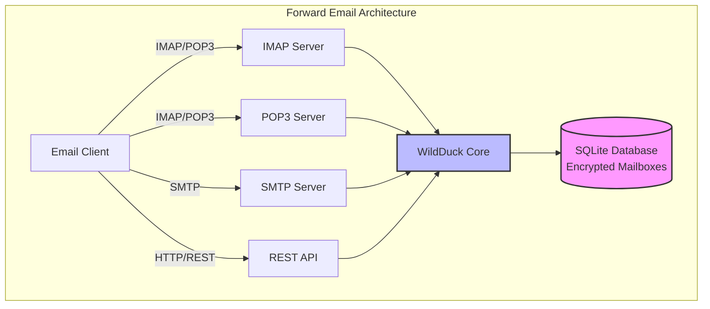

---


## Email Service Comparison - Protocol Support & RFC Standards Compliance {#email-service-comparison---protocol-support--rfc-standards-compliance}

> \[!IMPORTANT]
> **การเข้ารหัสแบบ Sandboxed และ Quantum-resistant:** Forward Email เป็นบริการอีเมลเพียงบริการเดียวที่จัดเก็บกล่องจดหมาย SQLite ที่เข้ารหัสแยกกันโดยใช้รหัสผ่านของคุณ (ซึ่งมีเพียงคุณเท่านั้นที่มี) แต่ละกล่องจดหมายถูกเข้ารหัสด้วย [sqleet](https://github.com/resilar/sqleet) (ChaCha20-Poly1305) แบบแยกตัว, sandboxed และพกพาได้ หากคุณลืมรหัสผ่าน คุณจะสูญเสียกล่องจดหมายของคุณ — แม้แต่ Forward Email ก็ไม่สามารถกู้คืนได้ ดูรายละเอียดได้ที่ [Quantum-Safe Encrypted Email](https://forwardemail.net/en/blog/docs/best-quantum-safe-encrypted-email-service)

เปรียบเทียบการรองรับโปรโตคอลอีเมลและการปฏิบัติตามมาตรฐาน RFC ระหว่างผู้ให้บริการอีเมลหลัก:

| Feature                       | Forward Email                                                                                  | Postfix/Dovecot                                                                    | Gmail                                                                             | iCloud Mail                                           | Outlook.com                                                                                                                                                          | Fastmail                                                                                 | Yahoo/AOL (Verizon)                                                  | ProtonMail                                                                     | Tutanota                                                          |
| ----------------------------- | ---------------------------------------------------------------------------------------------- | ---------------------------------------------------------------------------------- | --------------------------------------------------------------------------------- | ----------------------------------------------------- | -------------------------------------------------------------------------------------------------------------------------------------------------------------------- | ---------------------------------------------------------------------------------------- | -------------------------------------------------------------------- | ------------------------------------------------------------------------------ | ----------------------------------------------------------------- |
| **Custom Domain Price**       | [ฟรี](https://forwardemail.net/en/pricing)                                                    | [ฟรี](https://www.postfix.org/)                                                   | [$7.20/เดือน](https://workspace.google.com/pricing)                                  | [$0.99/เดือน](https://support.apple.com/en-us/102622)    | [$7.20/เดือน](https://www.microsoft.com/en-us/microsoft-365/business/microsoft-365-business-basic)                                                                      | [$5/เดือน](https://www.fastmail.com/pricing/)                                               | [$3.19/เดือน](https://www.turbify.com/mail)                             | [$4.99/เดือน](https://proton.me/mail/pricing)                                     | [$3.27/เดือน](https://tuta.com/pricing)                              |
| **IMAP4rev1 (RFC 3501)**      | ✅ [รองรับ](#imap4-email-protocol-and-extensions)                                            | ✅ [รองรับ](https://www.dovecot.org/)                                            | ✅ [รองรับ](https://developers.google.com/workspace/gmail/imap/imap-extensions) | ✅ [รองรับ](https://support.apple.com/en-us/102431) | ✅ [รองรับ](https://support.microsoft.com/en-us/office/pop-imap-and-smtp-settings-for-outlook-com-d088b986-291d-42b8-9564-9c414e2aa040)                            | ✅ [รองรับ](https://www.fastmail.help/hc/en-us/articles/1500000278382-Email-standards) | ✅ [รองรับ](https://senders.yahooinc.com/developer/documentation/) | ⚠️ [ผ่าน Bridge](https://proton.me/support/imap-smtp-and-pop3-setup)            | ❌ ไม่รองรับ                                                   |
| **IMAP4rev2 (RFC 9051)**      | ⚠️ [บางส่วน](https://forwardemail.net/en/blog/docs/best-quantum-safe-encrypted-email-service)  | ⚠️ [บางส่วน](https://www.dovecot.org/)                                             | ⚠️ [31%](https://developers.google.com/workspace/gmail/imap/imap-extensions)      | ⚠️ [92%](https://support.apple.com/en-us/102431)      | ⚠️ [46%](https://support.microsoft.com/en-us/office/pop-imap-and-smtp-settings-for-outlook-com-d088b986-291d-42b8-9564-9c414e2aa040)                                 | ⚠️ [69%](https://www.fastmail.help/hc/en-us/articles/1500000278382-Email-standards)      | ⚠️ [85%](https://senders.yahooinc.com/developer/documentation/)      | ⚠️ [ผ่าน Bridge](https://proton.me/support/imap-smtp-and-pop3-setup)            | ❌ ไม่รองรับ                                                   |
| **POP3 (RFC 1939)**           | ✅ [รองรับ](#pop3-email-protocol-and-extensions)                                             | ✅ [รองรับ](https://www.dovecot.org/)                                            | ✅ [รองรับ](https://support.google.com/mail/answer/7104828)                     | ❌ ไม่รองรับ                                       | ✅ [รองรับ](https://support.microsoft.com/en-us/office/pop-imap-and-smtp-settings-for-outlook-com-d088b986-291d-42b8-9564-9c414e2aa040)                            | ✅ [รองรับ](https://www.fastmail.help/hc/en-us/articles/1500000278382-Email-standards) | ✅ [รองรับ](https://help.yahoo.com/kb/SLN4075.html)                | ⚠️ [ผ่าน Bridge](https://proton.me/support/imap-smtp-and-pop3-setup)            | ❌ ไม่รองรับ                                                   |
| **SMTP (RFC 5321)**           | ✅ [รองรับ](#smtp-email-protocol-and-extensions)                                             | ✅ [รองรับ](https://www.postfix.org/)                                            | ✅ [รองรับ](https://support.google.com/mail/answer/7126229)                     | ✅ [รองรับ](https://support.apple.com/en-us/102431) | ✅ [รองรับ](https://support.microsoft.com/en-us/office/pop-imap-and-smtp-settings-for-outlook-com-d088b986-291d-42b8-9564-9c414e2aa040)                            | ✅ [รองรับ](https://www.fastmail.help/hc/en-us/articles/1500000278382-Email-standards) | ✅ [รองรับ](https://help.yahoo.com/kb/SLN4075.html)                | ⚠️ [ผ่าน Bridge](https://proton.me/support/imap-smtp-and-pop3-setup)            | ❌ ไม่รองรับ                                                   |
| **JMAP (RFC 8620)**           | ❌ [ไม่รองรับ](#jmap-email-protocol)                                                        | ❌ ไม่รองรับ                                                                    | ❌ ไม่รองรับ                                                                   | ❌ ไม่รองรับ                                       | ❌ ไม่รองรับ                                                                                                                                                      | ✅ [รองรับ](https://www.fastmail.com/dev/)                                             | ❌ ไม่รองรับ                                                      | ❌ ไม่รองรับ                                                                | ❌ ไม่รองรับ                                                   |
| **DKIM (RFC 6376)**           | ✅ [รองรับ](#email-message-authentication-protocols)                                         | ✅ [รองรับ](https://github.com/trusteddomainproject/OpenDKIM)                    | ✅ [รองรับ](https://support.google.com/a/answer/174124)                         | ✅ [รองรับ](https://support.apple.com/en-us/102431) | ✅ [รองรับ](https://learn.microsoft.com/en-us/defender-office-365/email-authentication-dkim-configure)                                                             | ✅ [รองรับ](https://www.fastmail.help/hc/en-us/articles/360060590573)                  | ✅ [รองรับ](https://help.yahoo.com/kb/SLN25426.html)               | ✅ [รองรับ](https://proton.me/support)                                       | ✅ [รองรับ](https://tuta.com/support#dkim)                      |
| **SPF (RFC 7208)**            | ✅ [รองรับ](#email-message-authentication-protocols)                                         | ✅ [รองรับ](https://www.postfix.org/)                                            | ✅ [รองรับ](https://support.google.com/a/answer/33786)                          | ✅ [รองรับ](https://support.apple.com/en-us/102431) | ✅ [รองรับ](https://learn.microsoft.com/en-us/microsoft-365/security/office-365-security/how-office-365-uses-spf-to-prevent-spoofing)                              | ✅ [รองรับ](https://www.fastmail.help/hc/en-us/articles/360060590573)                  | ✅ [รองรับ](https://help.yahoo.com/kb/SLN25426.html)               | ✅ [รองรับ](https://proton.me/support)                                       | ✅ [รองรับ](https://tuta.com/support#dkim)                      |
| **DMARC (RFC 7489)**          | ✅ [รองรับ](#email-message-authentication-protocols)                                         | ✅ [รองรับ](https://www.postfix.org/)                                            | ✅ [รองรับ](https://support.google.com/a/answer/2466580)                        | ✅ [รองรับ](https://support.apple.com/en-us/102431) | ✅ [รองรับ](https://learn.microsoft.com/en-us/microsoft-365/security/office-365-security/use-dmarc-to-validate-email)                                              | ✅ [รองรับ](https://www.fastmail.help/hc/en-us/articles/360060590573)                  | ✅ [รองรับ](https://help.yahoo.com/kb/SLN25426.html)               | ✅ [รองรับ](https://proton.me/support)                                       | ✅ [รองรับ](https://tuta.com/support#dkim)                      |
| **ARC (RFC 8617)**            | ✅ [รองรับ](#email-message-authentication-protocols)                                         | ✅ [รองรับ](https://github.com/trusteddomainproject/OpenARC)                     | ✅ [รองรับ](https://support.google.com/a/answer/2466580)                        | ❌ ไม่รองรับ                                       | ✅ [รองรับ](https://learn.microsoft.com/en-us/defender-office-365/email-authentication-arc-configure)                                                              | ✅ [รองรับ](https://www.fastmail.help/hc/en-us/articles/360060590573)                  | ✅ [รองรับ](https://senders.yahooinc.com/developer/documentation/) | ✅ [รองรับ](https://proton.me/blog/what-is-authenticated-received-chain-arc) | ❌ ไม่รองรับ                                                   |
| **MTA-STS (RFC 8461)**        | ✅ [รองรับ](#email-transport-security-protocols)                                             | ✅ [รองรับ](https://www.postfix.org/)                                            | ✅ [รองรับ](https://support.google.com/a/answer/9261504)                        | ✅ [รองรับ](https://support.apple.com/en-us/102431) | ✅ [รองรับ](https://learn.microsoft.com/en-us/defender-office-365/email-authentication-about)                                                                      | ✅ [รองรับ](https://www.fastmail.help/hc/en-us/articles/360060590573)                  | ✅ [รองรับ](https://senders.yahooinc.com/developer/documentation/) | ✅ [รองรับ](https://proton.me/support)                                       | ✅ [รองรับ](https://tuta.com/security)                          |
| **DANE (RFC 7671)**           | ✅ [รองรับ](#email-transport-security-protocols)                                             | ✅ [รองรับ](https://www.postfix.org/)                                            | ❌ ไม่รองรับ                                                                   | ❌ ไม่รองรับ                                       | ❌ ไม่รองรับ                                                                                                                                                      | ❌ ไม่รองรับ                                                                          | ❌ ไม่รองรับ                                                      | ✅ [รองรับ](https://proton.me/support)                                       | ✅ [รองรับ](https://tuta.com/support#dane)                      |
| **DSN (RFC 3461)**            | ✅ [รองรับ](#smtp-email-protocol-and-extensions)                                             | ✅ [รองรับ](https://www.postfix.org/DSN_README.html)                             | ❌ ไม่รองรับ                                                                   | ✅ [รองรับ](#protocol-capability-tests)             | ✅ [รองรับ](#protocol-capability-tests)                                                                                                                            | ⚠️ [ไม่ทราบ](https://www.fastmail.help/hc/en-us/articles/1500000278382-Email-standards)  | ❌ ไม่รองรับ                                                      | ⚠️ [ผ่าน Bridge](https://proton.me/support/imap-smtp-and-pop3-setup)            | ❌ ไม่รองรับ                                                   |
| **REQUIRETLS (RFC 8689)**     | ✅ [รองรับ](#email-transport-security-protocols)                                             | ✅ [รองรับ](https://www.postfix.org/TLS_README.html#server_require_tls)          | ⚠️ ไม่ทราบ                                                                        | ⚠️ ไม่ทราบ                                            | ⚠️ ไม่ทราบ                                                                                                                                                           | ⚠️ ไม่ทราบ                                                                               | ⚠️ ไม่ทราบ                                                           | ⚠️ [ผ่าน Bridge](https://proton.me/support/imap-smtp-and-pop3-setup)            | ❌ ไม่รองรับ                                                   |
| **ManageSieve (RFC 5804)**    | ✅ [รองรับ](#managesieve-rfc-5804)                                                           | ✅ [รองรับ](https://doc.dovecot.org/admin_manual/pigeonhole_managesieve_server/) | ❌ ไม่รองรับ                                                                   | ❌ ไม่รองรับ                                       | ❌ ไม่รองรับ                                                                                                                                                      | ✅ [รองรับ](https://www.fastmail.help/hc/en-us/articles/360060590573)                  | ❌ ไม่รองรับ                                                      | ❌ ไม่รองรับ                                                                | ❌ ไม่รองรับ                                                   |
| **OpenPGP (RFC 9580)**        | ✅ [รองรับ](#email-message-encryption)                                                       | ⚠️ [ผ่าน Plugins](https://www.gnupg.org/)                                           | ⚠️ [บุคคลที่สาม](https://github.com/google/end-to-end)                            | ⚠️ [บุคคลที่สาม](https://gpgtools.org/)               | ⚠️ [บุคคลที่สาม](https://gpg4win.org/)                                                                                                                               | ⚠️ [บุคคลที่สาม](https://www.fastmail.help/hc/en-us/articles/360060590573)               | ⚠️ [บุคคลที่สาม](https://help.yahoo.com/kb/SLN25426.html)            | ✅ [เนทีฟ](https://proton.me/support/pgp-mime-pgp-inline)                      | ❌ ไม่รองรับ                                                   |
| **S/MIME (RFC 8551)**         | ✅ [รองรับ](#email-message-encryption)                                                       | ✅ [รองรับ](https://www.openssl.org/)                                            | ✅ [รองรับ](https://support.google.com/mail/answer/81126)                       | ✅ [รองรับ](https://support.apple.com/en-us/102431) | ✅ [รองรับ](https://support.microsoft.com/en-us/office/send-view-and-reply-to-encrypted-messages-in-outlook-for-pc-eaa43495-9bbb-4fca-922a-df90dee51980)           | ⚠️ [บางส่วน](https://www.fastmail.help/hc/en-us/articles/360060590573)                   | ❌ ไม่รองรับ                                                      | ✅ [รองรับ](https://proton.me/support/pgp-mime-pgp-inline)                   | ❌ ไม่รองรับ                                                   |
| **CalDAV (RFC 4791)**         | ✅ [รองรับ](#calendaring-and-contacts-protocols)                                             | ✅ [รองรับ](https://www.davical.org/)                                            | ✅ [รองรับ](https://developers.google.com/calendar/caldav/v2/guide)             | ✅ [รองรับ](https://support.apple.com/en-us/102431) | ❌ ไม่รองรับ                                                                                                                                                      | ✅ [รองรับ](https://www.fastmail.help/hc/en-us/articles/360060590573)                  | ❌ ไม่รองรับ                                                      | ✅ [ผ่าน Bridge](https://proton.me/support/proton-calendar)                      | ❌ ไม่รองรับ                                                   |
| **CardDAV (RFC 6352)**        | ✅ [รองรับ](#calendaring-and-contacts-protocols)                                             | ✅ [รองรับ](https://www.davical.org/)                                            | ✅ [รองรับ](https://developers.google.com/people/carddav)                       | ✅ [รองรับ](https://support.apple.com/en-us/102431) | ❌ ไม่รองรับ                                                                                                                                                      | ✅ [รองรับ](https://www.fastmail.help/hc/en-us/articles/360060590573)                  | ❌ ไม่รองรับ                                                      | ✅ [ผ่าน Bridge](https://proton.me/support/proton-contacts)                      | ❌ ไม่รองรับ                                                   |
| **Tasks (VTODO)**             | ✅ [รองรับ](#tasks-and-reminders-caldav-vtodo)                                               | ✅ [รองรับ](https://www.davical.org/)                                            | ❌ ไม่รองรับ                                                                   | ✅ [รองรับ](https://support.apple.com/en-us/102431) | ❌ ไม่รองรับ                                                                                                                                                      | ✅ [รองรับ](https://www.fastmail.help/hc/en-us/articles/360060590573)                  | ❌ ไม่รองรับ                                                      | ❌ ไม่รองรับ                                                                | ❌ ไม่รองรับ                                                   |
| **Sieve (RFC 5228)**          | ✅ [รองรับ](#sieve-rfc-5228)                                                                 | ✅ [รองรับ](https://www.dovecot.org/)                                            | ❌ ไม่รองรับ                                                                   | ❌ ไม่รองรับ                                       | ❌ ไม่รองรับ                                                                                                                                                      | ✅ [รองรับ](https://www.fastmail.help/hc/en-us/articles/360060590573)                  | ❌ ไม่รองรับ                                                      | ❌ ไม่รองรับ                                                                | ❌ ไม่รองรับ                                                   |
| **Catch-All**                 | ✅ [รองรับ](https://forwardemail.net/en/faq#can-i-have-multiple-global-catch-all-recipients) | ✅ รองรับ                                                                        | ✅ [รองรับ](https://support.google.com/a/answer/4524505)                        | ❌ ไม่รองรับ                                       | ❌ [ไม่รองรับ](https://learn.microsoft.com/en-us/exchange/recipients-in-exchange-online/manage-mail-users)                                                        | ✅ [รองรับ](https://www.fastmail.help/hc/en-us/articles/1500000278382-Email-standards) | ❌ ไม่รองรับ                                                      | ❌ ไม่รองรับ                                                                | ✅ [รองรับ](https://tuta.com/support#catch-all-alias)           |
| **Unlimited Aliases**         | ✅ [รองรับ](https://forwardemail.net/en/faq#advanced-features)                               | ✅ รองรับ                                                                        | ✅ [รองรับ](https://support.google.com/a/answer/33327)                          | ✅ [รองรับ](https://support.apple.com/en-us/102431) | ✅ [รองรับ](https://support.microsoft.com/en-us/office/add-or-remove-an-email-alias-in-outlook-com-459b1989-356d-40fa-a689-8f285b13f1f2)                           | ✅ [รองรับ](https://www.fastmail.help/hc/en-us/articles/1500000278382-Email-standards) | ❌ ไม่รองรับ                                                      | ✅ [รองรับ](https://proton.me/support/addresses-and-aliases)                 | ✅ [รองรับ](https://tuta.com/support#aliases)                   |
| **Two-Factor Auth**           | ✅ [รองรับ](https://forwardemail.net/en/faq#do-you-support-passkeys-and-webauthn)            | ✅ รองรับ                                                                        | ✅ [รองรับ](https://support.google.com/accounts/answer/185839)                  | ✅ [รองรับ](https://support.apple.com/en-us/102431) | ✅ [รองรับ](https://support.microsoft.com/en-us/account-billing/how-to-use-two-step-verification-with-your-microsoft-account-c7910146-672f-01e9-50a0-93b4585e7eb4) | ✅ [รองรับ](https://www.fastmail.help/hc/en-us/articles/1500000278382-Email-standards) | ✅ [รองรับ](https://help.yahoo.com/kb/SLN5013.html)                | ✅ [รองรับ](https://proton.me/support/two-factor-authentication-2fa)         | ✅ [รองรับ](https://tuta.com/support#two-factor-authentication) |
| **Push Notifications**        | ✅ [รองรับ](#ios-push-notifications)                                                         | ⚠️ ผ่าน Plugins                                                                     | ✅ [รองรับ](https://developers.google.com/gmail/api/guides/push)                | ✅ [รองรับ](https://support.apple.com/en-us/102431) | ✅ [รองรับ](https://learn.microsoft.com/en-us/graph/change-notifications-delivery-webhooks)                                                                        | ✅ [รองรับ](https://www.fastmail.help/hc/en-us/articles/1500000278382-Email-standards) | ❌ ไม่รองรับ                                                      | ✅ [รองรับ](https://proton.me/support/notifications)                         | ✅ [รองรับ](https://tuta.com/support#push-notifications)        |
| **Calendar/Contacts Desktop** | ✅ [รองรับ](#calendaring-and-contacts-protocols)                                             | ✅ รองรับ                                                                        | ✅ [รองรับ](https://support.google.com/calendar)                                | ✅ [รองรับ](https://support.apple.com/en-us/102431) | ✅ [รองรับ](https://support.microsoft.com/en-us/office/calendar-and-contacts-in-outlook-com-d3e8a6e6-5c1f-4e3e-9f1e-7c0f0e0c0c0c)                                  | ✅ [รองรับ](https://www.fastmail.help/hc/en-us/articles/1500000278382-Email-standards) | ❌ ไม่รองรับ                                                      | ✅ [รองรับ](https://proton.me/support/proton-calendar)                       | ❌ ไม่รองรับ                                                   |
| **Advanced Search**           | ✅ [รองรับ](https://forwardemail.net/en/email-api)                                           | ✅ รองรับ                                                                        | ✅ [รองรับ](https://support.google.com/mail/answer/7190)                        | ✅ [รองรับ](https://support.apple.com/en-us/102431) | ✅ [รองรับ](https://support.microsoft.com/en-us/office/search-for-email-messages-in-outlook-com-6f5f2e92-9d5e-4c4e-9b0e-0c0c0c0c0c0c)                              | ✅ [รองรับ](https://www.fastmail.help/hc/en-us/articles/1500000278382-Email-standards) | ✅ [รองรับ](https://help.yahoo.com/kb/SLN3561.html)                | ✅ [รองรับ](https://proton.me/support/search-and-filters)                    | ✅ [รองรับ](https://tuta.com/support)                           |
| **API/Integrations**          | ✅ [39 Endpoints](https://forwardemail.net/en/email-api)                                        | ✅ รองรับ                                                                        | ✅ [รองรับ](https://developers.google.com/gmail/api)                            | ❌ ไม่รองรับ                                       | ✅ [รองรับ](https://learn.microsoft.com/en-us/graph/api/resources/mail-api-overview)                                                                               | ✅ [รองรับ](https://www.fastmail.help/hc/en-us/articles/1500000278382-Email-standards) | ❌ ไม่รองรับ                                                      | ✅ [รองรับ](https://proton.me/support/proton-mail-api)                       | ❌ ไม่รองรับ                                                   |
### Protocol Support Visualization {#protocol-support-visualization}

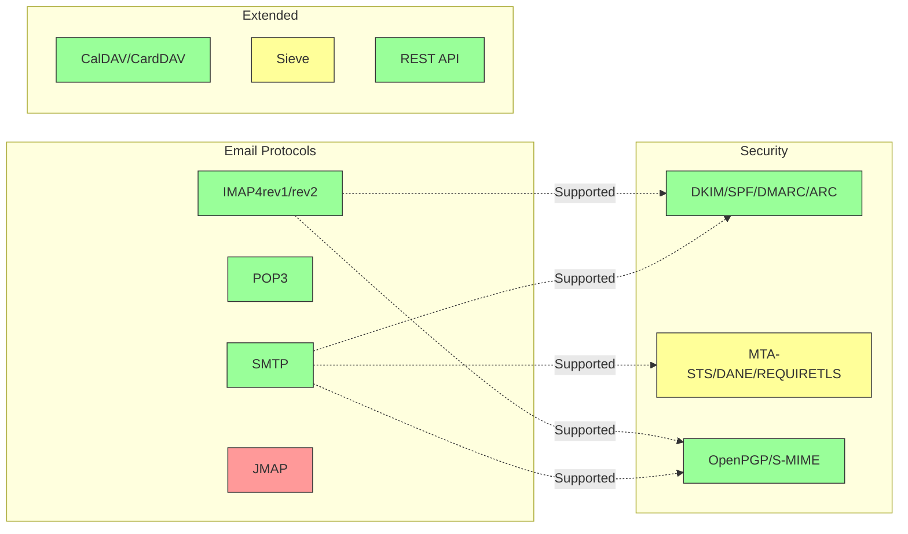

---


## โปรโตคอลอีเมลหลัก {#core-email-protocols}

### การไหลของโปรโตคอลอีเมล {#email-protocol-flow}

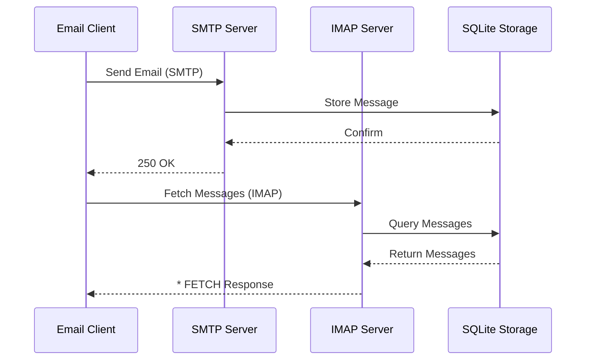


## โปรโตคอลอีเมล IMAP4 และส่วนขยาย {#imap4-email-protocol-and-extensions}

> \[!NOTE]
> Forward Email รองรับ IMAP4rev1 (RFC 3501) พร้อมการรองรับบางส่วนสำหรับฟีเจอร์ IMAP4rev2 (RFC 9051)

Forward Email ให้การรองรับ IMAP4 อย่างแข็งแกร่งผ่านการใช้งานเซิร์ฟเวอร์เมล WildDuck เซิร์ฟเวอร์นี้ใช้งาน IMAP4rev1 (RFC 3501) พร้อมการรองรับบางส่วนสำหรับส่วนขยาย IMAP4rev2 (RFC 9051)

ฟังก์ชัน IMAP ของ Forward Email ถูกจัดเตรียมโดย [WildDuck](https://github.com/nodemailer/wildduck) ซึ่งเป็นไลบรารีที่ใช้ โดย RFC อีเมลต่อไปนี้ได้รับการรองรับ:

| RFC                                                       | ชื่อเรื่อง                                                        | หมายเหตุการใช้งาน                                    |
| --------------------------------------------------------- | ----------------------------------------------------------------- | ----------------------------------------------------- |
| [RFC 3501](https://datatracker.ietf.org/doc/html/rfc3501) | Internet Message Access Protocol (IMAP) - Version 4rev1           | รองรับเต็มรูปแบบพร้อมความแตกต่างที่ตั้งใจไว้ (ดูด้านล่าง) |
| [RFC 2177](https://datatracker.ietf.org/doc/html/rfc2177) | คำสั่ง IMAP4 IDLE                                               | การแจ้งเตือนแบบ push                                  |
| [RFC 2342](https://datatracker.ietf.org/doc/html/rfc2342) | IMAP4 Namespace                                                  | การรองรับ namespace ของกล่องจดหมาย                   |
| [RFC 2087](https://datatracker.ietf.org/doc/html/rfc2087) | ส่วนขยาย IMAP4 QUOTA                                            | การจัดการโควต้าพื้นที่จัดเก็บ                          |
| [RFC 2971](https://datatracker.ietf.org/doc/html/rfc2971) | ส่วนขยาย IMAP4 ID                                              | การระบุไคลเอนต์/เซิร์ฟเวอร์                            |
| [RFC 5161](https://datatracker.ietf.org/doc/html/rfc5161) | ส่วนขยาย IMAP4 ENABLE                                          | เปิดใช้งานส่วนขยาย IMAP                               |
| [RFC 4959](https://datatracker.ietf.org/doc/html/rfc4959) | ส่วนขยาย IMAP สำหรับ SASL Initial Client Response (SASL-IR)     | การตอบสนองเริ่มต้นของไคลเอนต์                         |
| [RFC 3691](https://datatracker.ietf.org/doc/html/rfc3691) | คำสั่ง IMAP4 UNSELECT                                          | ปิดกล่องจดหมายโดยไม่ต้อง EXPUNGE                      |
| [RFC 4315](https://datatracker.ietf.org/doc/html/rfc4315) | ส่วนขยาย IMAP UIDPLUS                                          | คำสั่ง UID ที่ปรับปรุง                                  |
| [RFC 7162](https://datatracker.ietf.org/doc/html/rfc7162) | ส่วนขยาย IMAP: การเปลี่ยนแปลงแฟล็กอย่างรวดเร็ว (CONDSTORE)    | การจัดเก็บแบบมีเงื่อนไข                                |
| [RFC 6154](https://datatracker.ietf.org/doc/html/rfc6154) | ส่วนขยาย IMAP LIST สำหรับกล่องจดหมายใช้งานพิเศษ               | คุณสมบัติพิเศษของกล่องจดหมาย                          |
| [RFC 6851](https://datatracker.ietf.org/doc/html/rfc6851) | ส่วนขยาย IMAP MOVE                                            | คำสั่ง MOVE แบบอะตอม                                  |
| [RFC 6855](https://datatracker.ietf.org/doc/html/rfc6855) | การรองรับ IMAP สำหรับ UTF-8                                     | รองรับ UTF-8                                           |
| [RFC 3348](https://datatracker.ietf.org/doc/html/rfc3348) | ส่วนขยาย IMAP4 Child Mailbox                                  | ข้อมูลกล่องจดหมายลูก                                  |
| [RFC 7889](https://datatracker.ietf.org/doc/html/rfc7889) | ส่วนขยาย IMAP4 สำหรับการโฆษณาขนาดอัปโหลดสูงสุด (APPENDLIMIT) | ขนาดอัปโหลดสูงสุด                                    |
**ส่วนขยาย IMAP ที่รองรับ:**

| Extension         | RFC          | Status      | Description                     |
| ----------------- | ------------ | ----------- | ------------------------------- |
| IDLE              | RFC 2177     | ✅ Supported | การแจ้งเตือนแบบพุช              |
| NAMESPACE         | RFC 2342     | ✅ Supported | การรองรับ namespace ของกล่องจดหมาย |
| QUOTA             | RFC 2087     | ✅ Supported | การจัดการโควต้าเก็บข้อมูล       |
| ID                | RFC 2971     | ✅ Supported | การระบุไคลเอนต์/เซิร์ฟเวอร์     |
| ENABLE            | RFC 5161     | ✅ Supported | เปิดใช้งานส่วนขยาย IMAP         |
| SASL-IR           | RFC 4959     | ✅ Supported | การตอบสนองไคลเอนต์เริ่มต้น      |
| UNSELECT          | RFC 3691     | ✅ Supported | ปิดกล่องจดหมายโดยไม่ใช้ EXPUNGE |
| UIDPLUS           | RFC 4315     | ✅ Supported | คำสั่ง UID ที่ปรับปรุงแล้ว       |
| CONDSTORE         | RFC 7162     | ✅ Supported | การจัดเก็บแบบมีเงื่อนไข          |
| SPECIAL-USE       | RFC 6154     | ✅ Supported | คุณสมบัติพิเศษของกล่องจดหมาย   |
| MOVE              | RFC 6851     | ✅ Supported | คำสั่ง MOVE แบบอะตอมิก           |
| UTF8=ACCEPT       | RFC 6855     | ✅ Supported | รองรับ UTF-8                    |
| CHILDREN          | RFC 3348     | ✅ Supported | ข้อมูลกล่องจดหมายย่อย           |
| APPENDLIMIT       | RFC 7889     | ✅ Supported | ขนาดอัปโหลดสูงสุด               |
| XLIST             | Non-standard | ✅ Supported | รายการโฟลเดอร์ที่เข้ากันได้กับ Gmail |
| XAPPLEPUSHSERVICE | Non-standard | ✅ Supported | บริการแจ้งเตือนพุชของ Apple     |

### ความแตกต่างของโปรโตคอล IMAP จากข้อกำหนด RFC {#imap-protocol-differences-from-rfc-specifications}

> \[!WARNING]
> ความแตกต่างจากข้อกำหนด RFC ต่อไปนี้อาจส่งผลต่อความเข้ากันได้ของไคลเอนต์

Forward Email ตั้งใจเบี่ยงเบนจากข้อกำหนด RFC บางส่วนของ IMAP ความแตกต่างเหล่านี้สืบทอดมาจาก WildDuck และได้บันทึกไว้ดังนี้:

* **ไม่มีแฟล็ก \Recent:** แฟล็ก `\Recent` ไม่ได้ถูกใช้งาน ข้อความทั้งหมดจะถูกส่งกลับโดยไม่มีแฟล็กนี้
* **RENAME ไม่ส่งผลต่อโฟลเดอร์ย่อย:** เมื่อเปลี่ยนชื่อโฟลเดอร์ โฟลเดอร์ย่อยจะไม่ถูกเปลี่ยนชื่อโดยอัตโนมัติ โครงสร้างโฟลเดอร์ในฐานข้อมูลเป็นแบบแบน
* **ไม่สามารถเปลี่ยนชื่อ INBOX ได้:** [RFC 3501](https://datatracker.ietf.org/doc/html/rfc3501) อนุญาตให้เปลี่ยนชื่อ INBOX แต่ Forward Email ห้ามอย่างชัดเจน ดูได้ที่ [ซอร์สโค้ด WildDuck](https://github.com/nodemailer/wildduck/blob/master/imap-core/lib/commands/rename.js#L27)
* **ไม่มีการตอบกลับ FLAGS แบบไม่ร้องขอ:** เมื่อแฟล็กถูกเปลี่ยน จะไม่มีการส่ง FLAGS ตอบกลับแบบไม่ร้องขอไปยังไคลเอนต์
* **STORE คืนค่า NO สำหรับข้อความที่ถูกลบ:** การพยายามแก้ไขแฟล็กของข้อความที่ถูกลบจะคืนค่า NO แทนที่จะเพิกเฉยอย่างเงียบ ๆ
* **ละเลย CHARSET ในคำสั่ง SEARCH:** อาร์กิวเมนต์ `CHARSET` ในคำสั่ง SEARCH จะถูกละเลย การค้นหาทั้งหมดใช้ UTF-8
* **ละเลย metadata MODSEQ:** metadata `MODSEQ` ในคำสั่ง STORE จะถูกละเลย
* **SEARCH TEXT และ SEARCH BODY:** Forward Email ใช้ [SQLite FTS5](https://www.sqlite.org/fts5.html) (การค้นหาข้อความเต็ม) แทนการค้นหา `$text` ของ MongoDB ซึ่งให้:
  * รองรับตัวดำเนินการ `NOT` (MongoDB ไม่รองรับ)
  * ผลลัพธ์การค้นหาที่จัดอันดับ
  * ประสิทธิภาพการค้นหาต่ำกว่า 100ms บนกล่องจดหมายขนาดใหญ่
* **พฤติกรรม Autoexpunge:** ข้อความที่ถูกทำเครื่องหมายด้วย `\Deleted` จะถูกลบออกโดยอัตโนมัติเมื่อปิดกล่องจดหมาย
* **ความสมบูรณ์ของข้อความ:** การแก้ไขข้อความบางอย่างอาจไม่รักษาโครงสร้างข้อความต้นฉบับอย่างแม่นยำ

**การรองรับ IMAP4rev2 แบบบางส่วน:**

Forward Email ใช้ IMAP4rev1 (RFC 3501) พร้อมการรองรับ IMAP4rev2 (RFC 9051) แบบบางส่วน ฟีเจอร์ IMAP4rev2 ต่อไปนี้ **ยังไม่รองรับ**:

* **LIST-STATUS** - คำสั่ง LIST และ STATUS รวมกัน
* **LITERAL-** - ตัวอักษรแบบไม่ซิงโครไนซ์ (แบบลบ)
* **OBJECTID** - ตัวระบุวัตถุเฉพาะ
* **SAVEDATE** - แอตทริบิวต์วันที่บันทึก
* **REPLACE** - การแทนที่ข้อความแบบอะตอมิก
* **UNAUTHENTICATE** - ปิดการยืนยันตัวตนโดยไม่ปิดการเชื่อมต่อ

**การจัดการโครงสร้างเนื้อหาที่ผ่อนคลาย:**

Forward Email ใช้การจัดการ "โครงสร้างเนื้อหาที่ผ่อนคลาย" สำหรับโครงสร้าง MIME ที่ผิดรูป ซึ่งอาจแตกต่างจากการตีความ RFC อย่างเข้มงวด วิธีนี้ช่วยเพิ่มความเข้ากันได้กับอีเมลในโลกจริงที่ไม่ได้เป็นไปตามมาตรฐานอย่างสมบูรณ์แบบ
**ส่วนขยาย METADATA (RFC 5464):**

ส่วนขยาย IMAP METADATA **ไม่รองรับ** สำหรับข้อมูลเพิ่มเติมเกี่ยวกับส่วนขยายนี้ ดูที่ [RFC 5464](https://datatracker.ietf.org/doc/html/rfc5464) การอภิปรายเกี่ยวกับการเพิ่มฟีเจอร์นี้สามารถดูได้ที่ [WildDuck Issue #937](https://github.com/zone-eu/wildduck/issues/937)

### ส่วนขยาย IMAP ที่ไม่รองรับ {#imap-extensions-not-supported}

ส่วนขยาย IMAP ต่อไปนี้จาก [IANA IMAP Capabilities Registry](https://www.iana.org/assignments/imap-capabilities/imap-capabilities.xhtml) **ไม่รองรับ**:

| RFC                                                       | ชื่อเรื่อง                                                                                                      | เหตุผล                                                                                                                                  |
| --------------------------------------------------------- | --------------------------------------------------------------------------------------------------------------- | --------------------------------------------------------------------------------------------------------------------------------------- |
| [RFC 2086](https://datatracker.ietf.org/doc/html/rfc2086) | ส่วนขยาย IMAP4 ACL                                                                                              | โฟลเดอร์ที่แชร์ยังไม่ถูกนำมาใช้ ดูที่ [WildDuck Issue #427](https://github.com/zone-eu/wildduck/issues/427)                             |
| [RFC 5256](https://datatracker.ietf.org/doc/html/rfc5256) | ส่วนขยาย IMAP SORT และ THREAD                                                                                   | การจัดกลุ่มข้อความ (threading) ถูกนำมาใช้ภายในแต่ไม่ผ่านโปรโตคอล RFC 5256 ดูที่ [WildDuck Issue #12](https://github.com/zone-eu/wildduck/issues/12) |
| [RFC 5162](https://datatracker.ietf.org/doc/html/rfc5162) | ส่วนขยาย IMAP4 สำหรับการซิงโครไนซ์กล่องจดหมายอย่างรวดเร็ว (QRESYNC)                                          | ยังไม่ถูกนำมาใช้                                                                                                                         |
| [RFC 5464](https://datatracker.ietf.org/doc/html/rfc5464) | ส่วนขยาย IMAP METADATA                                                                                          | การดำเนินการ metadata ถูกละเลย ดูที่ [เอกสาร WildDuck](https://datatracker.ietf.org/doc/html/rfc5464)                                |
| [RFC 5258](https://datatracker.ietf.org/doc/html/rfc5258) | ส่วนขยายคำสั่ง IMAP4 LIST                                                                                       | ยังไม่ถูกนำมาใช้                                                                                                                         |
| [RFC 5267](https://datatracker.ietf.org/doc/html/rfc5267) | Contexts สำหรับ IMAP4                                                                                            | ยังไม่ถูกนำมาใช้                                                                                                                         |
| [RFC 5465](https://datatracker.ietf.org/doc/html/rfc5465) | ส่วนขยาย IMAP NOTIFY                                                                                            | ยังไม่ถูกนำมาใช้                                                                                                                         |
| [RFC 5466](https://datatracker.ietf.org/doc/html/rfc5466) | ส่วนขยาย IMAP4 FILTERS                                                                                          | ยังไม่ถูกนำมาใช้                                                                                                                         |
| [RFC 6203](https://datatracker.ietf.org/doc/html/rfc6203) | ส่วนขยาย IMAP4 สำหรับการค้นหาแบบฟัซซี่ (Fuzzy Search)                                                         | ยังไม่ถูกนำมาใช้                                                                                                                         |
| [RFC 6785](https://datatracker.ietf.org/doc/html/rfc6785) | คำแนะนำการใช้งาน IMAP4                                                                                        | คำแนะนำยังไม่ถูกปฏิบัติตามอย่างครบถ้วน                                                                                                |
| [RFC 7162](https://datatracker.ietf.org/doc/html/rfc7162) | ส่วนขยาย IMAP: การซิงโครไนซ์การเปลี่ยนแปลงแฟล็กอย่างรวดเร็ว (CONDSTORE) และการซิงโครไนซ์กล่องจดหมายอย่างรวดเร็ว (QRESYNC) | ยังไม่ถูกนำมาใช้                                                                                                                         |
| [RFC 8437](https://datatracker.ietf.org/doc/html/rfc8437) | ส่วนขยาย IMAP UNAUTHENTICATE สำหรับการใช้การเชื่อมต่อซ้ำ                                                      | ยังไม่ถูกนำมาใช้                                                                                                                         |
| [RFC 8438](https://datatracker.ietf.org/doc/html/rfc8438) | ส่วนขยาย IMAP สำหรับ STATUS=SIZE                                                                                | ยังไม่ถูกนำมาใช้                                                                                                                         |
| [RFC 8457](https://datatracker.ietf.org/doc/html/rfc8457) | คีย์เวิร์ด IMAP "$Important" และแอตทริบิวต์การใช้งานพิเศษ "\Important"                                         | ยังไม่ถูกนำมาใช้                                                                                                                         |
| [RFC 8474](https://datatracker.ietf.org/doc/html/rfc8474) | ส่วนขยาย IMAP สำหรับตัวระบุวัตถุ (Object Identifiers)                                                          | ยังไม่ถูกนำมาใช้                                                                                                                         |
| [RFC 9051](https://datatracker.ietf.org/doc/html/rfc9051) | โปรโตคอลการเข้าถึงข้อความอินเทอร์เน็ต (IMAP) - เวอร์ชัน 4rev2                                                 | Forward Email ใช้ IMAP4rev1 ([RFC 3501](https://datatracker.ietf.org/doc/html/rfc3501))                                                |
## โปรโตคอลอีเมล POP3 และส่วนขยาย {#pop3-email-protocol-and-extensions}

> \[!NOTE]
> Forward Email รองรับ POP3 (RFC 1939) พร้อมส่วนขยายมาตรฐานสำหรับการดึงอีเมล

ฟังก์ชัน POP3 ของ Forward Email ถูกจัดเตรียมโดย [WildDuck](https://github.com/nodemailer/wildduck) ที่เป็น dependency รองรับ RFC อีเมลดังต่อไปนี้:

| RFC                                                       | ชื่อเรื่อง                              | หมายเหตุการใช้งาน                                  |
| --------------------------------------------------------- | --------------------------------------- | ----------------------------------------------------- |
| [RFC 1939](https://datatracker.ietf.org/doc/html/rfc1939) | Post Office Protocol - Version 3 (POP3) | รองรับเต็มรูปแบบพร้อมความแตกต่างที่ตั้งใจไว้ (ดูด้านล่าง) |
| [RFC 2595](https://datatracker.ietf.org/doc/html/rfc2595) | การใช้ TLS กับ IMAP, POP3 และ ACAP      | รองรับ STARTTLS                                      |
| [RFC 2449](https://datatracker.ietf.org/doc/html/rfc2449) | กลไกส่วนขยาย POP3                      | รองรับคำสั่ง CAPA                                    |

Forward Email ให้การสนับสนุน POP3 สำหรับไคลเอนต์ที่ชอบโปรโตคอลที่ง่ายกว่านี้แทน IMAP POP3 เหมาะสำหรับผู้ใช้ที่ต้องการดาวน์โหลดอีเมลไปยังอุปกรณ์เดียวและลบออกจากเซิร์ฟเวอร์

**ส่วนขยาย POP3 ที่รองรับ:**

| ส่วนขยาย | RFC      | สถานะ       | คำอธิบาย                  |
| --------- | -------- | ----------- | -------------------------- |
| TOP       | RFC 1939 | ✅ รองรับ    | ดึงหัวข้อข้อความ          |
| USER      | RFC 1939 | ✅ รองรับ    | การยืนยันตัวตนด้วยชื่อผู้ใช้ |
| UIDL      | RFC 1939 | ✅ รองรับ    | ตัวระบุข้อความเฉพาะ       |
| EXPIRE    | RFC 2449 | ✅ รองรับ    | นโยบายหมดอายุข้อความ      |

### ความแตกต่างของโปรโตคอล POP3 จากข้อกำหนด RFC {#pop3-protocol-differences-from-rfc-specifications}

> \[!WARNING]
> POP3 มีข้อจำกัดโดยธรรมชาติเมื่อเทียบกับ IMAP

> \[!IMPORTANT]
> **ความแตกต่างสำคัญ: พฤติกรรม POP3 DELE ของ Forward Email กับ WildDuck**
>
> Forward Email ใช้การลบถาวรตาม RFC สำหรับคำสั่ง POP3 `DELE` ต่างจาก WildDuck ที่ย้ายข้อความไปยังถังขยะ

**พฤติกรรมของ Forward Email** ([ซอร์สโค้ด](https://github.com/forwardemail/forwardemail.net/blob/master/pop3-server.js)):

* `DELE` → `QUIT` ลบข้อความถาวร
* ปฏิบัติตามข้อกำหนด [RFC 1939](https://datatracker.ietf.org/doc/html/rfc1939) อย่างเคร่งครัด
* พฤติกรรมเหมือนกับ Dovecot (ค่าเริ่มต้น), Postfix และเซิร์ฟเวอร์ที่เป็นไปตามมาตรฐานอื่นๆ

**พฤติกรรมของ WildDuck** ([อภิปราย](https://github.com/zone-eu/wildduck/issues/937)):

* `DELE` → `QUIT` ย้ายข้อความไปยังถังขยะ (เหมือน Gmail)
* การออกแบบโดยตั้งใจเพื่อความปลอดภัยของผู้ใช้
* ไม่เป็นไปตาม RFC แต่ป้องกันการสูญหายของข้อมูลโดยไม่ตั้งใจ

**เหตุผลที่ Forward Email แตกต่าง:**

* **ปฏิบัติตาม RFC:** ยึดตามข้อกำหนด [RFC 1939](https://datatracker.ietf.org/doc/html/rfc1939)
* **ความคาดหวังของผู้ใช้:** กระบวนการดาวน์โหลดและลบคาดหวังการลบถาวร
* **การจัดการพื้นที่เก็บข้อมูล:** คืนพื้นที่ดิสก์อย่างเหมาะสม
* **ความเข้ากันได้:** สอดคล้องกับเซิร์ฟเวอร์อื่นที่เป็นไปตาม RFC

> \[!NOTE]
> **การแสดงรายการข้อความ POP3:** Forward Email แสดงรายการข้อความทั้งหมดจาก INBOX โดยไม่มีข้อจำกัด แตกต่างจาก WildDuck ที่จำกัดไว้ที่ 250 ข้อความโดยค่าเริ่มต้น ดู [ซอร์สโค้ด](https://github.com/forwardemail/forwardemail.net/blob/master/pop3-server.js)

**การเข้าถึงอุปกรณ์เดียว:**

POP3 ถูกออกแบบมาเพื่อการเข้าถึงอุปกรณ์เดียว ข้อความมักจะถูกดาวน์โหลดและลบออกจากเซิร์ฟเวอร์ ทำให้ไม่เหมาะสำหรับการซิงโครไนซ์หลายอุปกรณ์

**ไม่มีการสนับสนุนโฟลเดอร์:**

POP3 เข้าถึงได้เฉพาะโฟลเดอร์ INBOX เท่านั้น โฟลเดอร์อื่นๆ (ส่ง, ฉบับร่าง, ถังขยะ ฯลฯ) ไม่สามารถเข้าถึงผ่าน POP3 ได้

**การจัดการข้อความที่จำกัด:**

POP3 ให้การดึงและลบข้อความพื้นฐาน ฟีเจอร์ขั้นสูงเช่น การติดธง, การย้าย หรือการค้นหาข้อความไม่มีให้ใช้งาน

### ส่วนขยาย POP3 ที่ไม่รองรับ {#pop3-extensions-not-supported}

ส่วนขยาย POP3 ต่อไปนี้จาก [IANA POP3 Extension Mechanism Registry](https://www.iana.org/assignments/pop3-extension-mechanism/pop3-extension-mechanism.xhtml) ไม่ได้รับการสนับสนุน:
| RFC                                                       | หัวข้อ                                                   | เหตุผล                                  |
| --------------------------------------------------------- | ------------------------------------------------------- | --------------------------------------- |
| [RFC 6856](https://datatracker.ietf.org/doc/html/rfc6856) | โปรโตคอลไปรษณีย์เวอร์ชัน 3 (POP3) รองรับ UTF-8         | ไม่ได้ถูกนำไปใช้ในเซิร์ฟเวอร์ WildDuck POP3 |
| [RFC 2595](https://datatracker.ietf.org/doc/html/rfc2595) | คำสั่ง STLS                                              | รองรับเฉพาะ STARTTLS ไม่รองรับ STLS     |
| [RFC 3206](https://datatracker.ietf.org/doc/html/rfc3206) | รหัสตอบกลับ SYS และ AUTH POP                             | ไม่ได้ถูกนำไปใช้                         |

---


## โปรโตคอลอีเมล SMTP และส่วนขยาย {#smtp-email-protocol-and-extensions}

> \[!NOTE]
> Forward Email รองรับ SMTP (RFC 5321) พร้อมส่วนขยายสมัยใหม่สำหรับการส่งอีเมลที่ปลอดภัยและเชื่อถือได้

ฟังก์ชัน SMTP ของ Forward Email ถูกจัดเตรียมโดยหลายส่วนประกอบ: [smtp-server](https://github.com/nodemailer/smtp-server) (nodemailer), [zone-mta](https://github.com/zone-eu/zone-mta), และการใช้งานที่กำหนดเอง RFC อีเมลต่อไปนี้ได้รับการสนับสนุน:

| RFC                                                       | หัวข้อ                                                                           | หมายเหตุการใช้งาน                 |
| --------------------------------------------------------- | ------------------------------------------------------------------------------- | ------------------------------------ |
| [RFC 5321](https://datatracker.ietf.org/doc/html/rfc5321) | โปรโตคอลส่งเมลอย่างง่าย (SMTP)                                                | รองรับเต็มรูปแบบ                   |
| [RFC 3207](https://datatracker.ietf.org/doc/html/rfc3207) | ส่วนขยายบริการ SMTP สำหรับ SMTP ที่ปลอดภัยผ่าน Transport Layer Security (STARTTLS) | รองรับ TLS/SSL                    |
| [RFC 4954](https://datatracker.ietf.org/doc/html/rfc4954) | ส่วนขยายบริการ SMTP สำหรับการพิสูจน์ตัวตน (AUTH)                              | PLAIN, LOGIN, CRAM-MD5, XOAUTH2      |
| [RFC 6531](https://datatracker.ietf.org/doc/html/rfc6531) | ส่วนขยาย SMTP สำหรับอีเมลที่รองรับสากล (SMTPUTF8)                             | รองรับที่อยู่อีเมลยูนิโค้ดโดยตรง    |
| [RFC 3461](https://datatracker.ietf.org/doc/html/rfc3461) | ส่วนขยายบริการ SMTP สำหรับการแจ้งสถานะการส่ง (DSN)                           | รองรับ DSN เต็มรูปแบบ              |
| [RFC 3463](https://datatracker.ietf.org/doc/html/rfc3463) | รหัสสถานะระบบเมลที่ปรับปรุงแล้ว                                               | รหัสสถานะที่ปรับปรุงในคำตอบ        |
| [RFC 1870](https://datatracker.ietf.org/doc/html/rfc1870) | ส่วนขยายบริการ SMTP สำหรับการประกาศขนาดข้อความ (SIZE)                        | ประกาศขนาดข้อความสูงสุด            |
| [RFC 2920](https://datatracker.ietf.org/doc/html/rfc2920) | ส่วนขยายบริการ SMTP สำหรับการส่งคำสั่งแบบต่อเนื่อง (PIPELINING)               | รองรับการส่งคำสั่งแบบต่อเนื่อง      |
| [RFC 1652](https://datatracker.ietf.org/doc/html/rfc1652) | ส่วนขยายบริการ SMTP สำหรับการส่ง MIME แบบ 8 บิต (8BITMIME)                    | รองรับ MIME แบบ 8 บิต              |
| [RFC 6152](https://datatracker.ietf.org/doc/html/rfc6152) | ส่วนขยายบริการ SMTP สำหรับการส่ง MIME แบบ 8 บิต                              | รองรับ MIME แบบ 8 บิต              |
| [RFC 2034](https://datatracker.ietf.org/doc/html/rfc2034) | ส่วนขยายบริการ SMTP สำหรับการส่งรหัสข้อผิดพลาดที่ปรับปรุงแล้ว (ENHANCEDSTATUSCODES) | รหัสสถานะที่ปรับปรุง               |

Forward Email ใช้งานเซิร์ฟเวอร์ SMTP ที่มีฟีเจอร์ครบถ้วนพร้อมรองรับส่วนขยายสมัยใหม่ที่เพิ่มความปลอดภัย ความน่าเชื่อถือ และฟังก์ชันการทำงาน

**ส่วนขยาย SMTP ที่รองรับ:**

| ส่วนขยาย           | RFC      | สถานะ       | คำอธิบาย                           |
| ------------------- | -------- | ----------- | ------------------------------------- |
| PIPELINING          | RFC 2920 | ✅ รองรับ    | การส่งคำสั่งแบบต่อเนื่อง              |
| SIZE                | RFC 1870 | ✅ รองรับ    | การประกาศขนาดข้อความ (จำกัด 52MB)    |
| ETRN                | RFC 1985 | ✅ รองรับ    | การประมวลผลคิวระยะไกล               |
| STARTTLS            | RFC 3207 | ✅ รองรับ    | การอัปเกรดเป็น TLS                   |
| ENHANCEDSTATUSCODES | RFC 2034 | ✅ รองรับ    | รหัสสถานะที่ปรับปรุงแล้ว             |
| 8BITMIME            | RFC 6152 | ✅ รองรับ    | การส่ง MIME แบบ 8 บิต                |
| DSN                 | RFC 3461 | ✅ รองรับ    | การแจ้งสถานะการส่ง                   |
| CHUNKING            | RFC 3030 | ✅ รองรับ    | การส่งข้อความแบบแบ่งส่วน             |
| SMTPUTF8            | RFC 6531 | ⚠️ บางส่วน  | ที่อยู่อีเมล UTF-8 (บางส่วน)          |
| REQUIRETLS          | RFC 8689 | ✅ รองรับ    | ต้องใช้ TLS สำหรับการส่ง             |
### การแจ้งสถานะการจัดส่ง (DSN) {#delivery-status-notifications-dsn}

> \[!TIP]
> DSN ให้ข้อมูลสถานะการจัดส่งโดยละเอียดสำหรับอีเมลที่ส่งไป

Forward Email รองรับ **DSN (RFC 3461)** อย่างเต็มที่ ซึ่งช่วยให้ผู้ส่งสามารถขอการแจ้งเตือนสถานะการจัดส่งได้ ฟีเจอร์นี้ให้:

* **การแจ้งเตือนความสำเร็จ** เมื่อข้อความถูกจัดส่ง
* **การแจ้งเตือนความล้มเหลว** พร้อมข้อมูลข้อผิดพลาดโดยละเอียด
* **การแจ้งเตือนความล่าช้า** เมื่อการจัดส่งถูกเลื่อนชั่วคราว

DSN มีประโยชน์โดยเฉพาะสำหรับ:

* ยืนยันการจัดส่งข้อความสำคัญ
* แก้ไขปัญหาการจัดส่ง
* ระบบประมวลผลอีเมลอัตโนมัติ
* ข้อกำหนดการปฏิบัติตามและการตรวจสอบ

### การสนับสนุน REQUIRETLS {#requiretls-support}

> \[!IMPORTANT]
> Forward Email เป็นหนึ่งในผู้ให้บริการไม่กี่รายที่ประกาศและบังคับใช้ REQUIRETLS อย่างชัดเจน

Forward Email รองรับ **REQUIRETLS (RFC 8689)** ซึ่งรับประกันว่าอีเมลจะถูกจัดส่งผ่านการเชื่อมต่อที่เข้ารหัสด้วย TLS เท่านั้น ซึ่งให้:

* **การเข้ารหัสแบบ end-to-end** สำหรับเส้นทางการจัดส่งทั้งหมด
* **การบังคับใช้ที่ผู้ใช้เห็นได้** ผ่านช่องทำเครื่องหมายในตัวเขียนอีเมล
* **การปฏิเสธความพยายามจัดส่งที่ไม่เข้ารหัส**
* **ความปลอดภัยที่เพิ่มขึ้น** สำหรับการสื่อสารที่ละเอียดอ่อน

### ส่วนขยาย SMTP ที่ไม่รองรับ {#smtp-extensions-not-supported}

ส่วนขยาย SMTP ต่อไปนี้จาก [IANA SMTP Service Extensions Registry](https://www.iana.org/assignments/smtp) ไม่ได้รับการสนับสนุน:

| RFC                                                       | ชื่อ                                                                                              | เหตุผล                |
| --------------------------------------------------------- | ------------------------------------------------------------------------------------------------- | --------------------- |
| [RFC 4865](https://datatracker.ietf.org/doc/html/rfc4865) | ส่วนขยายบริการส่ง SMTP สำหรับการปล่อยข้อความในอนาคต (FUTURERELEASE)                            | ยังไม่ได้นำมาใช้     |
| [RFC 6710](https://datatracker.ietf.org/doc/html/rfc6710) | ส่วนขยาย SMTP สำหรับลำดับความสำคัญการส่งข้อความ (MT-PRIORITY)                                  | ยังไม่ได้นำมาใช้     |
| [RFC 7293](https://datatracker.ietf.org/doc/html/rfc7293) | ฟิลด์หัวข้อ Require-Recipient-Valid-Since และส่วนขยายบริการ SMTP                               | ยังไม่ได้นำมาใช้     |
| [RFC 7372](https://datatracker.ietf.org/doc/html/rfc7372) | รหัสสถานะการตรวจสอบอีเมล                                                                         | ยังไม่ได้นำมาใช้เต็มที่ |
| [RFC 4468](https://datatracker.ietf.org/doc/html/rfc4468) | ส่วนขยาย BURL สำหรับการส่งข้อความ                                                               | ยังไม่ได้นำมาใช้     |
| [RFC 3030](https://datatracker.ietf.org/doc/html/rfc3030) | ส่วนขยายบริการ SMTP สำหรับการส่งข้อความ MIME ขนาดใหญ่และไบนารี (CHUNKING, BINARYMIME)          | ยังไม่ได้นำมาใช้     |
| [RFC 2852](https://datatracker.ietf.org/doc/html/rfc2852) | ส่วนขยายบริการ Deliver By SMTP                                                                  | ยังไม่ได้นำมาใช้     |

---


## โปรโตคอลอีเมล JMAP {#jmap-email-protocol}

> \[!CAUTION]
> JMAP **ยังไม่รองรับ** โดย Forward Email

| RFC                                                       | ชื่อ                                     | สถานะ          | เหตุผล                                                                 |
| --------------------------------------------------------- | ----------------------------------------- | --------------- | ---------------------------------------------------------------------- |
| [RFC 8620](https://datatracker.ietf.org/doc/html/rfc8620) | โปรโตคอล JSON Meta Application (JMAP)   | ❌ ไม่รองรับ    | Forward Email ใช้ IMAP/POP3/SMTP และ REST API ที่ครอบคลุมแทน          |

**JMAP (JSON Meta Application Protocol)** คือโปรโตคอลอีเมลสมัยใหม่ที่ออกแบบมาเพื่อแทนที่ IMAP

**เหตุผลที่ไม่รองรับ JMAP:**

> "JMAP เป็นสัตว์ร้ายที่ไม่ควรถูกคิดค้น มันพยายามแปลง TCP/IMAP (ซึ่งเป็นโปรโตคอลที่แย่ตามมาตรฐานปัจจุบัน) เป็น HTTP/JSON โดยใช้การขนส่งที่ต่างกันแต่ยังคงจิตวิญญาณเดิมไว้" — Andris Reinman, [HN Discussion](https://news.ycombinator.com/item?id=18890011)
> "JMAP มีอายุมากกว่า 10 ปีแล้ว และแทบจะไม่มีการนำไปใช้เลย" – Andris Reinman, [GitHub Discussion](https://github.com/zone-eu/wildduck/issues/2#issuecomment-1765190790)

ดูความคิดเห็นเพิ่มเติมได้ที่ <https://hn.algolia.com/?dateRange=all&page=0&prefix=true&query=jmap%20andris&sort=byDate&type=comment>

Forward Email ปัจจุบันมุ่งเน้นการให้บริการ IMAP, POP3 และ SMTP ที่ยอดเยี่ยม พร้อมกับ REST API ครบวงจรสำหรับการจัดการอีเมล การสนับสนุน JMAP อาจพิจารณาในอนาคตตามความต้องการของผู้ใช้และการนำไปใช้ในระบบนิเวศ

**ทางเลือก:** Forward Email มี [Complete REST API](#complete-rest-api-for-email-management) ที่มี 39 endpoints ซึ่งให้ฟังก์ชันการทำงานที่คล้ายกับ JMAP สำหรับการเข้าถึงอีเมลแบบโปรแกรมมิ่ง

---


## ความปลอดภัยของอีเมล {#email-security}

### สถาปัตยกรรมความปลอดภัยของอีเมล {#email-security-architecture}

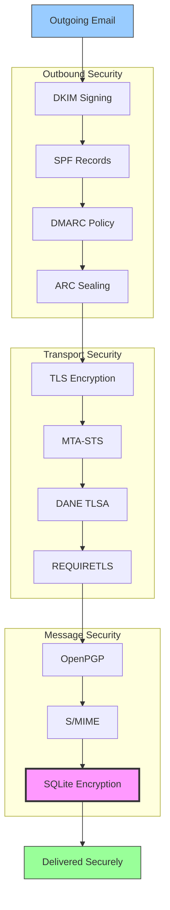


## โปรโตคอลการตรวจสอบสิทธิ์ข้อความอีเมล {#email-message-authentication-protocols}

> \[!NOTE]
> Forward Email ใช้โปรโตคอลการตรวจสอบสิทธิ์อีเมลหลักทั้งหมดเพื่อป้องกันการปลอมแปลงและรับประกันความสมบูรณ์ของข้อความ

Forward Email ใช้ไลบรารี [mailauth](https://github.com/postalsys/mailauth) สำหรับการตรวจสอบสิทธิ์อีเมล รองรับ RFC ดังต่อไปนี้:

| RFC                                                       | ชื่อเรื่อง                                                               | หมายเหตุการใช้งาน                                             |
| --------------------------------------------------------- | ----------------------------------------------------------------------- | -------------------------------------------------------------- |
| [RFC 6376](https://datatracker.ietf.org/doc/html/rfc6376) | ลายเซ็น DomainKeys Identified Mail (DKIM)                              | การลงลายเซ็นและตรวจสอบ DKIM แบบเต็มรูปแบบ                    |
| [RFC 8463](https://datatracker.ietf.org/doc/html/rfc8463) | วิธีการลงลายเซ็นเข้ารหัสใหม่สำหรับ DKIM (Ed25519-SHA256)               | รองรับอัลกอริทึมการลงลายเซ็น RSA-SHA256 และ Ed25519-SHA256  |
| [RFC 7208](https://datatracker.ietf.org/doc/html/rfc7208) | กรอบนโยบายผู้ส่ง (SPF)                                                 | การตรวจสอบระเบียน SPF                                         |
| [RFC 7489](https://datatracker.ietf.org/doc/html/rfc7489) | การตรวจสอบสิทธิ์ข้อความตามโดเมน การรายงาน และการปฏิบัติตามนโยบาย (DMARC) | การบังคับใช้นโยบาย DMARC                                      |
| [RFC 8617](https://datatracker.ietf.org/doc/html/rfc8617) | โซ่การรับรองสิทธิ์ที่ตรวจสอบแล้ว (ARC)                               | การปิดผนึกและตรวจสอบ ARC                                     |

โปรโตคอลการตรวจสอบสิทธิ์อีเมลช่วยยืนยันว่า ข้อความมาจากผู้ส่งที่อ้างสิทธิ์จริงและไม่ได้ถูกแก้ไขระหว่างทาง

### การสนับสนุนโปรโตคอลการตรวจสอบสิทธิ์ {#authentication-protocol-support}

| โปรโตคอล  | RFC      | สถานะ       | คำอธิบาย                                                             |
| --------- | -------- | ----------- | -------------------------------------------------------------------- |
| **DKIM**  | RFC 6376 | ✅ สนับสนุน | DomainKeys Identified Mail - ลายเซ็นเข้ารหัส                         |
| **SPF**   | RFC 7208 | ✅ สนับสนุน | กรอบนโยบายผู้ส่ง - การอนุญาตที่อยู่ IP                              |
| **DMARC** | RFC 7489 | ✅ สนับสนุน | การตรวจสอบสิทธิ์ข้อความตามโดเมน - การบังคับใช้นโยบาย               |
| **ARC**   | RFC 8617 | ✅ สนับสนุน | โซ่การรับรองสิทธิ์ที่ตรวจสอบแล้ว - รักษาการตรวจสอบสิทธิ์ข้ามการส่งต่อ |
### DKIM (DomainKeys Identified Mail) {#dkim-domainkeys-identified-mail}

**DKIM** เพิ่มลายเซ็นเข้ารหัสไปยังส่วนหัวของอีเมล ช่วยให้ผู้รับสามารถตรวจสอบได้ว่าข้อความได้รับอนุญาตจากเจ้าของโดเมนและไม่ได้ถูกแก้ไขระหว่างทาง

Forward Email ใช้ [mailauth](https://github.com/postalsys/mailauth) สำหรับการลงลายเซ็นและการตรวจสอบ DKIM

**คุณสมบัติหลัก:**

* การลงลายเซ็น DKIM อัตโนมัติสำหรับข้อความขาออกทั้งหมด
* รองรับคีย์ RSA และ Ed25519
* รองรับตัวเลือกหลายตัว
* การตรวจสอบ DKIM สำหรับข้อความขาเข้า

### SPF (Sender Policy Framework) {#spf-sender-policy-framework}

**SPF** ช่วยให้เจ้าของโดเมนกำหนดได้ว่า IP ใดได้รับอนุญาตให้ส่งอีเมลในนามของโดเมนของตน

**คุณสมบัติหลัก:**

* การตรวจสอบระเบียน SPF สำหรับข้อความขาเข้า
* การตรวจสอบ SPF อัตโนมัติพร้อมผลลัพธ์โดยละเอียด
* รองรับกลไก include, redirect และ all
* นโยบาย SPF ที่กำหนดได้ต่อโดเมน

### DMARC (Domain-based Message Authentication, Reporting & Conformance) {#dmarc-domain-based-message-authentication-reporting--conformance}

**DMARC** สร้างขึ้นบน SPF และ DKIM เพื่อให้มีการบังคับใช้นโยบายและรายงาน

**คุณสมบัติหลัก:**

* การบังคับใช้นโยบาย DMARC (none, quarantine, reject)
* การตรวจสอบความสอดคล้องของ SPF และ DKIM
* รายงานสรุป DMARC
* นโยบาย DMARC ต่อโดเมน

### ARC (Authenticated Received Chain) {#arc-authenticated-received-chain}

**ARC** รักษาผลลัพธ์การตรวจสอบอีเมลไว้แม้ผ่านการส่งต่อและการแก้ไขรายการเมล

Forward Email ใช้ไลบรารี [mailauth](https://github.com/postalsys/mailauth) สำหรับการตรวจสอบและประทับตรา ARC

**คุณสมบัติหลัก:**

* การประทับตรา ARC สำหรับข้อความที่ถูกส่งต่อ
* การตรวจสอบ ARC สำหรับข้อความขาเข้า
* การตรวจสอบห่วงโซ่ผ่านหลายจุดส่งต่อ
* รักษาผลลัพธ์การตรวจสอบเดิมไว้

### Authentication Flow {#authentication-flow}

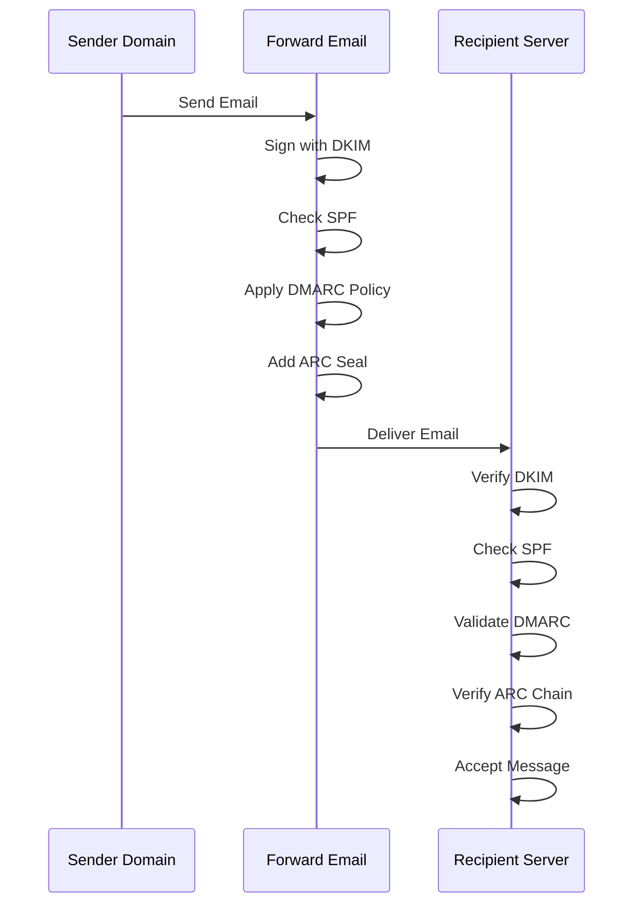

---


## Email Transport Security Protocols {#email-transport-security-protocols}

> \[!IMPORTANT]
> Forward Email ใช้ชั้นความปลอดภัยหลายชั้นสำหรับการส่งข้อมูลเพื่อปกป้องอีเมลในระหว่างการส่ง

Forward Email ใช้โปรโตคอลความปลอดภัยการส่งข้อมูลสมัยใหม่:

| RFC                                                       | Title                                                                                                | Status      | Implementation Notes                                                                                                                                                                                                                                                                          |
| --------------------------------------------------------- | ---------------------------------------------------------------------------------------------------- | ----------- | --------------------------------------------------------------------------------------------------------------------------------------------------------------------------------------------------------------------------------------------------------------------------------------------- |
| [RFC 8461](https://datatracker.ietf.org/doc/html/rfc8461) | SMTP MTA Strict Transport Security (MTA-STS)                                                         | ✅ Supported | ใช้งานอย่างกว้างขวางบนเซิร์ฟเวอร์ IMAP, SMTP และ MX ดูได้ที่ [create-mta-sts-cache.js](https://github.com/forwardemail/forwardemail.net/blob/master/helpers/create-mta-sts-cache.js) และ [get-transporter.js](https://github.com/forwardemail/forwardemail.net/blob/master/helpers/get-transporter.js) |
| [RFC 8460](https://datatracker.ietf.org/doc/html/rfc8460) | SMTP TLS Reporting                                                                                   | ✅ Supported | ผ่านไลบรารี [mailauth](https://github.com/postalsys/mailauth)                                                                                                                                                                                                                                 |
| [RFC 7671](https://datatracker.ietf.org/doc/html/rfc7671) | The DNS-Based Authentication of Named Entities (DANE) Protocol: Updates and Operational Guidance     | ✅ Supported | การตรวจสอบ DANE เต็มรูปแบบสำหรับการเชื่อมต่อ SMTP ขาออก ดูได้ที่ [mx-connect PR #22](https://github.com/zone-eu/mx-connect/pull/22)                                                                                                                                                                  |
| [RFC 6698](https://datatracker.ietf.org/doc/html/rfc6698) | The DNS-Based Authentication of Named Entities (DANE) Transport Layer Security (TLS) Protocol: TLSA  | ✅ Supported | รองรับ RFC 6698 เต็มรูปแบบ: ประเภทการใช้งาน PKIX-TA, PKIX-EE, DANE-TA, DANE-EE ดูได้ที่ [mx-connect PR #22](https://github.com/zone-eu/mx-connect/pull/22)                                                                                                                                                 |
| [RFC 8314](https://datatracker.ietf.org/doc/html/rfc8314) | Cleartext Considered Obsolete: Use of Transport Layer Security (TLS) for Email Submission and Access | ✅ Supported | ต้องใช้ TLS สำหรับการเชื่อมต่อทั้งหมด                                                                                                                                                                                                                                                              |
| [RFC 8689](https://datatracker.ietf.org/doc/html/rfc8689) | SMTP Service Extension for Requiring TLS (REQUIRETLS)                                                | ✅ Supported | รองรับเต็มรูปแบบสำหรับส่วนขยาย SMTP REQUIRETLS และส่วนหัว "TLS-Required"                                                                                                                                                                                                                          |
โปรโตคอลความปลอดภัยการส่งข้อมูลช่วยให้มั่นใจได้ว่าข้อความอีเมลถูกเข้ารหัสและตรวจสอบความถูกต้องในระหว่างการส่งผ่านระหว่างเซิร์ฟเวอร์เมล

### การสนับสนุนความปลอดภัยการส่งข้อมูล {#transport-security-support}

| โปรโตคอล       | RFC      | สถานะ       | คำอธิบาย                                         |
| -------------- | -------- | ----------- | ------------------------------------------------ |
| **TLS**        | RFC 8314 | ✅ สนับสนุน | Transport Layer Security - การเชื่อมต่อที่เข้ารหัส  |
| **MTA-STS**    | RFC 8461 | ✅ สนับสนุน | Mail Transfer Agent Strict Transport Security    |
| **DANE**       | RFC 7671 | ✅ สนับสนุน | DNS-based Authentication of Named Entities       |
| **REQUIRETLS** | RFC 8689 | ✅ สนับสนุน | ต้องใช้ TLS ตลอดเส้นทางการส่ง                   |

### TLS (Transport Layer Security) {#tls-transport-layer-security}

Forward Email บังคับใช้การเข้ารหัส TLS สำหรับการเชื่อมต่ออีเมลทั้งหมด (SMTP, IMAP, POP3)

**คุณสมบัติหลัก:**

* รองรับ TLS 1.2 และ TLS 1.3
* การจัดการใบรับรองอัตโนมัติ
* Perfect Forward Secrecy (PFS)
* ใช้ชุดรหัสที่แข็งแกร่งเท่านั้น

### MTA-STS (Mail Transfer Agent Strict Transport Security) {#mta-sts-mail-transfer-agent-strict-transport-security}

**MTA-STS** ช่วยให้มั่นใจว่าอีเมลจะถูกส่งผ่านการเชื่อมต่อที่เข้ารหัส TLS เท่านั้นโดยการเผยแพร่นโยบายผ่าน HTTPS

Forward Email ใช้ MTA-STS โดยใช้ [create-mta-sts-cache.js](https://github.com/forwardemail/forwardemail.net/blob/master/helpers/create-mta-sts-cache.js)

**คุณสมบัติหลัก:**

* การเผยแพร่นโยบาย MTA-STS อัตโนมัติ
* แคชนโยบายเพื่อประสิทธิภาพ
* ป้องกันการโจมตีแบบลดระดับความปลอดภัย (downgrade attack)
* บังคับใช้การตรวจสอบใบรับรอง

### DANE (DNS-based Authentication of Named Entities) {#dane-dns-based-authentication-of-named-entities}

> \[!NOTE]
> Forward Email ตอนนี้ให้การสนับสนุน DANE เต็มรูปแบบสำหรับการเชื่อมต่อ SMTP ขาออก

**DANE** ใช้ DNSSEC ในการเผยแพร่ข้อมูลใบรับรอง TLS ใน DNS ทำให้เซิร์ฟเวอร์เมลสามารถตรวจสอบใบรับรองได้โดยไม่ต้องพึ่งพาหน่วยงานออกใบรับรอง

**คุณสมบัติหลัก:**

* ✅ การตรวจสอบ DANE เต็มรูปแบบสำหรับการเชื่อมต่อ SMTP ขาออก
* ✅ รองรับ RFC 6698 เต็มรูปแบบ: ประเภทการใช้งาน PKIX-TA, PKIX-EE, DANE-TA, DANE-EE
* ✅ การตรวจสอบใบรับรองกับระเบียน TLSA ในระหว่างการอัปเกรด TLS
* ✅ การแก้ไข TLSA แบบขนานสำหรับโฮสต์ MX หลายตัว
* ✅ ตรวจจับอัตโนมัติ `dns.resolveTlsa` แบบเนทีฟ (Node.js v22.15.0+, v23.9.0+)
* ✅ รองรับตัวแก้ไขแบบกำหนดเองสำหรับ Node.js เวอร์ชันเก่าผ่าน [Tangerine](https://github.com/forwardemail/tangerine)
* ต้องใช้โดเมนที่เซ็นชื่อด้วย DNSSEC

> \[!TIP]
> **รายละเอียดการใช้งาน:** การสนับสนุน DANE ถูกเพิ่มผ่าน [mx-connect PR #22](https://github.com/zone-eu/mx-connect/pull/22) ซึ่งให้การสนับสนุน DANE/TLSA ครบถ้วนสำหรับการเชื่อมต่อ SMTP ขาออก

### REQUIRETLS {#requiretls}

> \[!TIP]
> Forward Email เป็นหนึ่งในผู้ให้บริการไม่กี่รายที่มีการสนับสนุน REQUIRETLS สำหรับผู้ใช้

**REQUIRETLS** ช่วยให้มั่นใจว่าอีเมลจะถูกส่งผ่านการเชื่อมต่อที่เข้ารหัส TLS ตลอดเส้นทางการส่ง

**คุณสมบัติหลัก:**

* ช่องทำเครื่องหมายสำหรับผู้ใช้ในตัวเขียนอีเมล
* ปฏิเสธการส่งที่ไม่ได้เข้ารหัสโดยอัตโนมัติ
* บังคับใช้ TLS แบบครบวงจร
* แจ้งเตือนความล้มเหลวอย่างละเอียด

> \[!TIP]
> **การบังคับใช้ TLS สำหรับผู้ใช้:** Forward Email มีช่องทำเครื่องหมายใน **บัญชีของฉัน > โดเมน > การตั้งค่า** เพื่อบังคับใช้ TLS สำหรับการเชื่อมต่อขาเข้าทั้งหมด เมื่อเปิดใช้งาน ฟีเจอร์นี้จะปฏิเสธอีเมลขาเข้าที่ไม่ได้ส่งผ่านการเชื่อมต่อที่เข้ารหัส TLS ด้วยรหัสข้อผิดพลาด 530 เพื่อให้มั่นใจว่าอีเมลขาเข้าทั้งหมดถูกเข้ารหัสในระหว่างการส่ง

### โฟลว์ความปลอดภัยการส่งข้อมูล {#transport-security-flow}

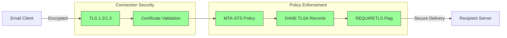
## การเข้ารหัสข้อความอีเมล {#email-message-encryption}

> \[!NOTE]
> Forward Email รองรับทั้ง OpenPGP และ S/MIME สำหรับการเข้ารหัสอีเมลแบบ end-to-end

Forward Email รองรับการเข้ารหัส OpenPGP และ S/MIME:

| RFC                                                       | ชื่อเรื่อง                                                                                  | สถานะ       | หมายเหตุการใช้งาน                                                                                                                                                                                    |
| --------------------------------------------------------- | ------------------------------------------------------------------------------------------ | ----------- | ---------------------------------------------------------------------------------------------------------------------------------------------------------------------------------------------------- |
| [RFC 9580](https://datatracker.ietf.org/doc/html/rfc9580) | OpenPGP (แทนที่ RFC 4880)                                                                   | ✅ รองรับ    | ผ่านการผสานรวม [OpenPGP.js v6+](https://github.com/openpgpjs/openpgpjs) ดูที่ [FAQ](https://forwardemail.net/en/faq#do-you-support-openpgpmime-end-to-end-encryption-e2ee-and-web-key-directory-wkd) |
| [RFC 8551](https://datatracker.ietf.org/doc/html/rfc8551) | Secure/Multipurpose Internet Mail Extensions (S/MIME) เวอร์ชัน 4.0 ข้อกำหนดข้อความ          | ✅ รองรับ    | รองรับทั้งอัลกอริทึม RSA และ ECC ดูที่ [FAQ](https://forwardemail.net/en/faq#do-you-support-smime-encryption)                                                                                         |

โปรโตคอลการเข้ารหัสข้อความช่วยปกป้องเนื้อหาอีเมลจากการถูกอ่านโดยบุคคลอื่นนอกจากผู้รับที่ตั้งใจไว้ แม้ว่าข้อความจะถูกดักจับระหว่างทางก็ตาม

### การรองรับการเข้ารหัส {#encryption-support}

| โปรโตคอล    | RFC      | สถานะ       | คำอธิบาย                                   |
| ----------- | -------- | ----------- | -------------------------------------------- |
| **OpenPGP** | RFC 9580 | ✅ รองรับ    | Pretty Good Privacy - การเข้ารหัสกุญแจสาธารณะ  |
| **S/MIME**  | RFC 8551 | ✅ รองรับ    | Secure/Multipurpose Internet Mail Extensions |
| **WKD**     | Draft    | ✅ รองรับ    | Web Key Directory - การค้นหากุญแจอัตโนมัติ    |

### OpenPGP (Pretty Good Privacy) {#openpgp-pretty-good-privacy}

**OpenPGP** ให้การเข้ารหัสแบบ end-to-end โดยใช้การเข้ารหัสกุญแจสาธารณะ Forward Email รองรับ OpenPGP ผ่านโปรโตคอล [Web Key Directory (WKD)](https://forwardemail.net/en/faq#do-you-support-openpgpmime-end-to-end-encryption-e2ee-and-web-key-directory-wkd)

**คุณสมบัติหลัก:**

* ค้นหากุญแจอัตโนมัติผ่าน WKD
* รองรับ PGP/MIME สำหรับไฟล์แนบที่เข้ารหัส
* การจัดการกุญแจผ่านโปรแกรมอีเมล
* เข้ากันได้กับ GPG, Mailvelope และเครื่องมือ OpenPGP อื่นๆ

**วิธีใช้งาน:**

1. สร้างคู่กุญแจ PGP ในโปรแกรมอีเมลของคุณ
2. อัปโหลดกุญแจสาธารณะของคุณไปยัง WKD ของ Forward Email
3. กุญแจของคุณจะถูกค้นหาได้โดยอัตโนมัติโดยผู้ใช้รายอื่น
4. ส่งและรับอีเมลที่เข้ารหัสได้อย่างราบรื่น

### S/MIME (Secure/Multipurpose Internet Mail Extensions) {#smime-securemultipurpose-internet-mail-extensions}

**S/MIME** ให้การเข้ารหัสอีเมลและลายเซ็นดิจิทัลโดยใช้ใบรับรอง X.509

**คุณสมบัติหลัก:**

* การเข้ารหัสโดยใช้ใบรับรอง
* ลายเซ็นดิจิทัลสำหรับการตรวจสอบข้อความ
* รองรับโดยโปรแกรมอีเมลส่วนใหญ่โดยตรง
* ความปลอดภัยระดับองค์กร

**วิธีใช้งาน:**

1. ขอใบรับรอง S/MIME จากหน่วยงานออกใบรับรอง
2. ติดตั้งใบรับรองในโปรแกรมอีเมลของคุณ
3. ตั้งค่าโปรแกรมให้เข้ารหัส/ลงลายเซ็นข้อความ
4. แลกเปลี่ยนใบรับรองกับผู้รับ

### การเข้ารหัสกล่องจดหมาย SQLite {#sqlite-mailbox-encryption}

> \[!IMPORTANT]
> Forward Email มอบชั้นความปลอดภัยเพิ่มเติมด้วยการเข้ารหัสกล่องจดหมาย SQLite

นอกเหนือจากการเข้ารหัสระดับข้อความแล้ว Forward Email ยังเข้ารหัสกล่องจดหมายทั้งหมดโดยใช้ [sqleet](https://github.com/resilar/sqleet) (ChaCha20-Poly1305)

**คุณสมบัติหลัก:**

* **การเข้ารหัสด้วยรหัสผ่าน** - มีเพียงคุณเท่านั้นที่มีรหัสผ่าน
* **ต้านทานควอนตัม** - การเข้ารหัส ChaCha20-Poly1305
* **ความรู้เป็นศูนย์** - Forward Email ไม่สามารถถอดรหัสกล่องจดหมายของคุณได้
* **แยกเป็น sandbox** - แต่ละกล่องจดหมายถูกแยกและพกพาได้
* **ไม่สามารถกู้คืนได้** - หากคุณลืมรหัสผ่าน กล่องจดหมายของคุณจะสูญหาย
### การเปรียบเทียบการเข้ารหัส {#encryption-comparison}

| คุณสมบัติ              | OpenPGP           | S/MIME             | การเข้ารหัส SQLite |
| --------------------- | ----------------- | ------------------ | ----------------- |
| **แบบ End-to-End**    | ✅ ใช่             | ✅ ใช่              | ✅ ใช่             |
| **การจัดการกุญแจ**    | จัดการเอง          | ออกโดย CA          | ใช้รหัสผ่าน       |
| **การรองรับไคลเอนต์** | ต้องใช้ปลั๊กอิน    | รองรับในตัว         | โปร่งใส           |
| **กรณีการใช้งาน**     | ส่วนบุคคล          | องค์กร             | การจัดเก็บ        |
| **ต้านทานควอนตัม**   | ⚠️ ขึ้นกับกุญแจ    | ⚠️ ขึ้นกับใบรับรอง | ✅ ใช่             |

### กระบวนการเข้ารหัส {#encryption-flow}

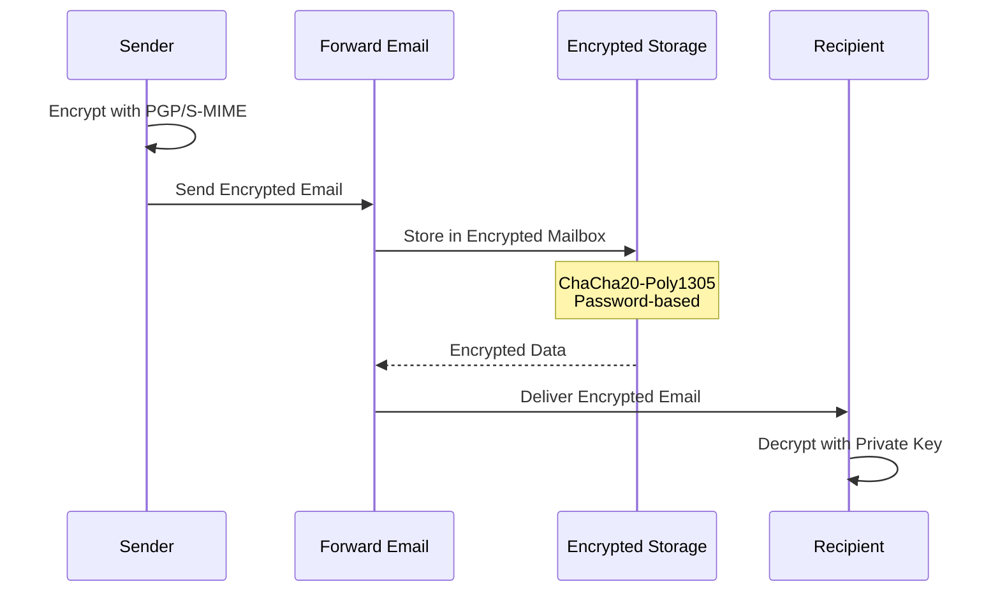

---


## ฟังก์ชันขยาย {#extended-functionality}


## มาตรฐานรูปแบบข้อความอีเมล {#email-message-format-standards}

> \[!NOTE]
> Forward Email รองรับมาตรฐานรูปแบบอีเมลสมัยใหม่สำหรับเนื้อหาที่หลากหลายและการรองรับหลายภาษา

Forward Email รองรับรูปแบบข้อความอีเมลมาตรฐาน:

| RFC                                                       | ชื่อเรื่อง                                                   | หมายเหตุการใช้งาน    |
| --------------------------------------------------------- | ------------------------------------------------------------- | -------------------- |
| [RFC 5322](https://datatracker.ietf.org/doc/html/rfc5322) | รูปแบบข้อความอินเทอร์เน็ต                                     | รองรับเต็มรูปแบบ     |
| [RFC 2045](https://datatracker.ietf.org/doc/html/rfc2045) | MIME ตอนที่หนึ่ง: รูปแบบของเนื้อความอินเทอร์เน็ต             | รองรับ MIME เต็มรูปแบบ |
| [RFC 2046](https://datatracker.ietf.org/doc/html/rfc2046) | MIME ตอนที่สอง: ประเภทสื่อ                                   | รองรับ MIME เต็มรูปแบบ |
| [RFC 2047](https://datatracker.ietf.org/doc/html/rfc2047) | MIME ตอนที่สาม: ส่วนขยายหัวข้อข้อความสำหรับข้อความที่ไม่ใช่ ASCII | รองรับ MIME เต็มรูปแบบ |
| [RFC 2048](https://datatracker.ietf.org/doc/html/rfc2048) | MIME ตอนที่สี่: ขั้นตอนการลงทะเบียน                          | รองรับ MIME เต็มรูปแบบ |
| [RFC 2049](https://datatracker.ietf.org/doc/html/rfc2049) | MIME ตอนที่ห้า: เกณฑ์การปฏิบัติตามและตัวอย่าง               | รองรับ MIME เต็มรูปแบบ |

มาตรฐานรูปแบบอีเมลกำหนดวิธีการจัดโครงสร้าง การเข้ารหัส และการแสดงผลข้อความอีเมล

### การรองรับมาตรฐานรูปแบบ {#format-standards-support}

| มาตรฐาน            | RFC           | สถานะ       | คำอธิบาย                           |
| ------------------ | ------------- | ----------- | --------------------------------- |
| **MIME**           | RFC 2045-2049 | ✅ รองรับ    | ส่วนขยายอีเมลอินเทอร์เน็ตแบบอเนกประสงค์ |
| **SMTPUTF8**       | RFC 6531      | ⚠️ รองรับบางส่วน | ที่อยู่อีเมลแบบสากล               |
| **EAI**            | RFC 6530      | ⚠️ รองรับบางส่วน | การสากลของที่อยู่อีเมล            |
| **รูปแบบข้อความ**  | RFC 5322      | ✅ รองรับ    | รูปแบบข้อความอินเทอร์เน็ต          |
| **ความปลอดภัย MIME** | RFC 1847      | ✅ รองรับ    | ส่วนประกอบความปลอดภัยสำหรับ MIME  |

### MIME (ส่วนขยายอีเมลอินเทอร์เน็ตแบบอเนกประสงค์) {#mime-multipurpose-internet-mail-extensions}

**MIME** ช่วยให้อีเมลประกอบด้วยหลายส่วนที่มีประเภทเนื้อหาต่างกัน (ข้อความ, HTML, ไฟล์แนบ ฯลฯ)

**คุณสมบัติ MIME ที่รองรับ:**

* ข้อความหลายส่วน (mixed, alternative, related)
* หัวข้อ Content-Type
* การเข้ารหัส Content-Transfer-Encoding (7bit, 8bit, quoted-printable, base64)
* รูปภาพและไฟล์แนบแบบฝังในเนื้อหา
* เนื้อหา HTML ที่หลากหลาย

### SMTPUTF8 และการสากลของที่อยู่อีเมล {#smtputf8-and-email-address-internationalization}

> \[!WARNING]
> การรองรับ SMTPUTF8 เป็นบางส่วน - ไม่ได้ใช้งานฟีเจอร์ทั้งหมดอย่างเต็มที่
**SMTPUTF8** อนุญาตให้อีเมลแอดเดรสมีอักขระที่ไม่ใช่ ASCII (เช่น `用户@例え.jp`)

**สถานะปัจจุบัน:**

* ⚠️ รองรับบางส่วนสำหรับอีเมลแอดเดรสที่มีการใช้อักขระนานาชาติ
* ✅ เนื้อหา UTF-8 ในเนื้อความของข้อความ
* ⚠️ รองรับจำกัดสำหรับส่วนท้องถิ่นที่ไม่ใช่ ASCII

---


## โปรโตคอลปฏิทินและรายชื่อ {#calendaring-and-contacts-protocols}

> \[!NOTE]
> Forward Email ให้การสนับสนุนเต็มรูปแบบสำหรับ CalDAV และ CardDAV สำหรับการซิงโครไนซ์ปฏิทินและรายชื่อ

Forward Email รองรับ CalDAV และ CardDAV ผ่านไลบรารี [caldav-adapter](https://github.com/forwardemail/caldav-adapter):

| RFC                                                       | ชื่อเรื่อง                                                                | สถานะ       | หมายเหตุการใช้งาน                                                                                                                                                                    |
| --------------------------------------------------------- | ------------------------------------------------------------------------- | ----------- | -------------------------------------------------------------------------------------------------------------------------------------------------------------------------------------- |
| [RFC 4791](https://datatracker.ietf.org/doc/html/rfc4791) | ส่วนขยายปฏิทินสำหรับ WebDAV (CalDAV)                                    | ✅ รองรับ    | การเข้าถึงและจัดการปฏิทิน                                                                                                                                                            |
| [RFC 6352](https://datatracker.ietf.org/doc/html/rfc6352) | CardDAV: ส่วนขยาย vCard สำหรับ WebDAV                                    | ✅ รองรับ    | การเข้าถึงและจัดการรายชื่อ                                                                                                                                                            |
| [RFC 5545](https://datatracker.ietf.org/doc/html/rfc5545) | การกำหนดวัตถุหลักสำหรับการปฏิทินและการนัดหมายบนอินเทอร์เน็ต (iCalendar) | ✅ รองรับ    | การสนับสนุนรูปแบบ iCalendar                                                                                                                                                           |
| [RFC 6350](https://datatracker.ietf.org/doc/html/rfc6350) | การกำหนดรูปแบบ vCard                                                    | ✅ รองรับ    | การสนับสนุนรูปแบบ vCard 4.0                                                                                                                                                           |
| [RFC 6638](https://datatracker.ietf.org/doc/html/rfc6638) | ส่วนขยายการนัดหมายสำหรับ CalDAV                                        | ✅ รองรับ    | การนัดหมาย CalDAV พร้อมการสนับสนุน iMIP ดู [commit c4d1629](https://github.com/forwardemail/forwardemail.net/commit/c4d162975a49e38d76d68a032662e873a34a9b80)                            |
| [RFC 5546](https://datatracker.ietf.org/doc/html/rfc5546) | โปรโตคอลความสามารถในการทำงานร่วมกันแบบไม่ขึ้นกับการขนส่งของ iCalendar (iTIP) | ✅ รองรับ    | การสนับสนุน iTIP สำหรับคำสั่ง REQUEST, REPLY, CANCEL และ VFREEBUSY ดู [commit c4d1629](https://github.com/forwardemail/forwardemail.net/commit/c4d162975a49e38d76d68a032662e873a34a9b80) |
| [RFC 6047](https://datatracker.ietf.org/doc/html/rfc6047) | โปรโตคอลความสามารถในการทำงานร่วมกันแบบข้อความของ iCalendar (iMIP)    | ✅ รองรับ    | การเชิญปฏิทินผ่านอีเมลพร้อมลิงก์ตอบกลับ ดู [commit c4d1629](https://github.com/forwardemail/forwardemail.net/commit/c4d162975a49e38d76d68a032662e873a34a9b80)                         |

CalDAV และ CardDAV เป็นโปรโตคอลที่อนุญาตให้เข้าถึง แชร์ และซิงโครไนซ์ข้อมูลปฏิทินและรายชื่อระหว่างอุปกรณ์ต่างๆ

### การสนับสนุน CalDAV และ CardDAV {#caldav-and-carddav-support}

| โปรโตคอล              | RFC      | สถานะ       | คำอธิบาย                             |
| --------------------- | -------- | ----------- | -------------------------------------- |
| **CalDAV**            | RFC 4791 | ✅ รองรับ    | การเข้าถึงและซิงโครไนซ์ปฏิทิน          |
| **CardDAV**           | RFC 6352 | ✅ รองรับ    | การเข้าถึงและซิงโครไนซ์รายชื่อ           |
| **iCalendar**         | RFC 5545 | ✅ รองรับ    | รูปแบบข้อมูลปฏิทิน                     |
| **vCard**             | RFC 6350 | ✅ รองรับ    | รูปแบบข้อมูลรายชื่อ                    |
| **VTODO**             | RFC 5545 | ✅ รองรับ    | การสนับสนุนงาน/การเตือนความจำ           |
| **CalDAV Scheduling** | RFC 6638 | ✅ รองรับ    | ส่วนขยายการนัดหมายปฏิทิน               |
| **iTIP**              | RFC 5546 | ✅ รองรับ    | ความสามารถในการทำงานร่วมกันแบบไม่ขึ้นกับการขนส่ง |
| **iMIP**              | RFC 6047 | ✅ รองรับ    | การเชิญปฏิทินผ่านอีเมล                  |
### CalDAV (การเข้าถึงปฏิทิน) {#caldav-calendar-access}

**CalDAV** ช่วยให้คุณเข้าถึงและจัดการปฏิทินจากอุปกรณ์หรือแอปพลิเคชันใดก็ได้

**คุณสมบัติหลัก:**

* การซิงโครไนซ์หลายอุปกรณ์
* ปฏิทินที่แชร์ร่วมกัน
* การสมัครรับปฏิทิน
* การเชิญและตอบรับกิจกรรม
* กิจกรรมที่เกิดซ้ำ
* รองรับเขตเวลา

**ไคลเอนต์ที่รองรับ:**

* Apple Calendar (macOS, iOS)
* Mozilla Thunderbird
* Evolution
* GNOME Calendar
* ไคลเอนต์ที่รองรับ CalDAV ใดๆ

### CardDAV (การเข้าถึงรายชื่อผู้ติดต่อ) {#carddav-contact-access}

**CardDAV** ช่วยให้คุณเข้าถึงและจัดการรายชื่อผู้ติดต่อจากอุปกรณ์หรือแอปพลิเคชันใดก็ได้

**คุณสมบัติหลัก:**

* การซิงโครไนซ์หลายอุปกรณ์
* สมุดที่อยู่ที่แชร์ร่วมกัน
* กลุ่มผู้ติดต่อ
* รองรับรูปภาพ
* ฟิลด์ที่กำหนดเอง
* รองรับ vCard 4.0

**ไคลเอนต์ที่รองรับ:**

* Apple Contacts (macOS, iOS)
* Mozilla Thunderbird
* Evolution
* GNOME Contacts
* ไคลเอนต์ที่รองรับ CardDAV ใดๆ

### งานและการแจ้งเตือน (CalDAV VTODO) {#tasks-and-reminders-caldav-vtodo}

> \[!TIP]
> Forward Email รองรับงานและการแจ้งเตือนผ่าน CalDAV VTODO

**VTODO** เป็นส่วนหนึ่งของรูปแบบ iCalendar และช่วยให้จัดการงานผ่าน CalDAV ได้

**คุณสมบัติหลัก:**

* การสร้างและจัดการงาน
* กำหนดวันครบกำหนดและลำดับความสำคัญ
* ติดตามสถานะงานที่เสร็จสมบูรณ์
* งานที่เกิดซ้ำ
* รายการ/หมวดหมู่งาน

**ไคลเอนต์ที่รองรับ:**

* Apple Reminders (macOS, iOS)
* Mozilla Thunderbird (พร้อม Lightning)
* Evolution
* GNOME To Do
* ไคลเอนต์ CalDAV ใดๆ ที่รองรับ VTODO

### กระบวนการซิงโครไนซ์ CalDAV/CardDAV {#caldavcarddav-synchronization-flow}

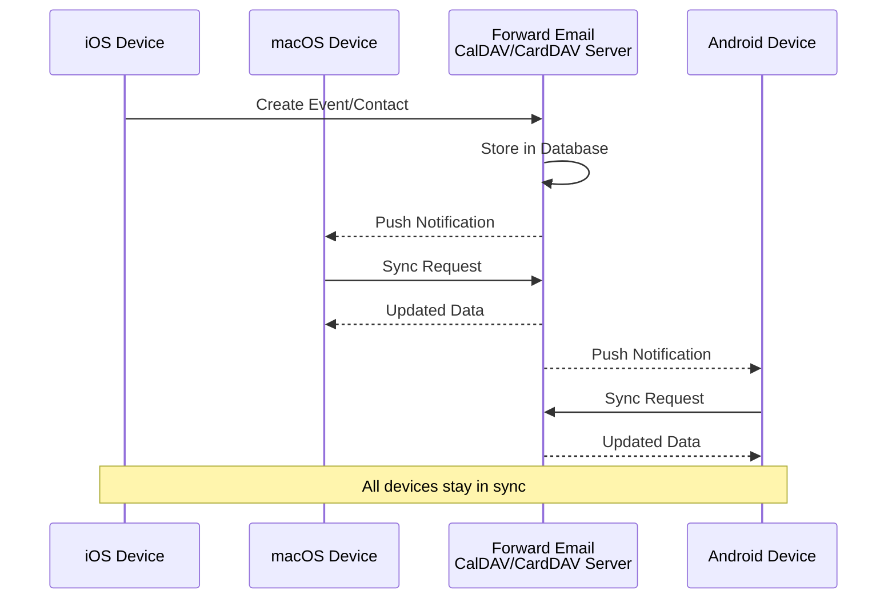

### ส่วนขยายปฏิทินที่ไม่รองรับ {#calendaring-extensions-not-supported}

ส่วนขยายปฏิทินต่อไปนี้ **ไม่รองรับ:**

| RFC                                                       | ชื่อเรื่อง                                                            | เหตุผล                                                          |
| --------------------------------------------------------- | --------------------------------------------------------------------- | --------------------------------------------------------------- |
| [RFC 4918](https://datatracker.ietf.org/doc/html/rfc4918) | HTTP Extensions for Web Distributed Authoring and Versioning (WebDAV) | CalDAV ใช้แนวคิด WebDAV แต่ไม่ได้ใช้งาน RFC 4918 เต็มรูปแบบ     |
| [RFC 6578](https://datatracker.ietf.org/doc/html/rfc6578) | Collection Synchronization for WebDAV                                 | ยังไม่ได้ใช้งาน                                                 |
| [RFC 3744](https://datatracker.ietf.org/doc/html/rfc3744) | WebDAV Access Control Protocol                                        | ยังไม่ได้ใช้งาน                                                 |

---


## การกรองข้อความอีเมล {#email-message-filtering}

> \[!IMPORTANT]
> Forward Email มี **การรองรับ Sieve และ ManageSieve เต็มรูปแบบ** สำหรับการกรองอีเมลฝั่งเซิร์ฟเวอร์ สร้างกฎที่ทรงพลังเพื่อจัดเรียง กรอง ส่งต่อ และตอบกลับข้อความที่เข้ามาโดยอัตโนมัติ

### Sieve (RFC 5228) {#sieve-rfc-5228}

[Sieve](https://en.wikipedia.org/wiki/Sieve_\(mail_filtering_language\)) เป็นภาษาสคริปต์ที่ได้มาตรฐานและทรงพลังสำหรับการกรองอีเมลฝั่งเซิร์ฟเวอร์ Forward Email ใช้งาน Sieve อย่างครบถ้วนพร้อมส่วนขยาย 24 รายการ

**ซอร์สโค้ด:** [`helpers/sieve/`](https://github.com/forwardemail/forwardemail.net/tree/master/helpers/sieve)

#### RFC หลักของ Sieve ที่รองรับ {#core-sieve-rfcs-supported}

| RFC                                                                                    | ชื่อเรื่อง                                                    | สถานะ          |
| -------------------------------------------------------------------------------------- | ------------------------------------------------------------- | -------------- |
| [RFC 5228](https://datatracker.ietf.org/doc/html/rfc5228)                              | Sieve: ภาษาในการกรองอีเมล                                    | ✅ รองรับเต็มรูปแบบ |
| [RFC 5429](https://datatracker.ietf.org/doc/html/rfc5429)                              | ส่วนขยายการปฏิเสธและปฏิเสธแบบขยายของการกรองอีเมล         | ✅ รองรับเต็มรูปแบบ |
| [RFC 5230](https://datatracker.ietf.org/doc/html/rfc5230)                              | ส่วนขยายการลาพักร้อนของการกรองอีเมล                         | ✅ รองรับเต็มรูปแบบ |
| [RFC 6131](https://datatracker.ietf.org/doc/html/rfc6131)                              | ส่วนขยายลาพักร้อน: พารามิเตอร์ "วินาที"                     | ✅ รองรับเต็มรูปแบบ |
| [RFC 5232](https://datatracker.ietf.org/doc/html/rfc5232)                              | ส่วนขยาย Imap4flags ของการกรองอีเมล                           | ✅ รองรับเต็มรูปแบบ |
| [RFC 5173](https://datatracker.ietf.org/doc/html/rfc5173)                              | ส่วนขยายเนื้อหาของการกรองอีเมล                               | ✅ รองรับเต็มรูปแบบ |
| [RFC 5229](https://datatracker.ietf.org/doc/html/rfc5229)                              | ส่วนขยายตัวแปรของการกรองอีเมล                                | ✅ รองรับเต็มรูปแบบ |
| [RFC 5231](https://datatracker.ietf.org/doc/html/rfc5231)                              | ส่วนขยายเชิงสัมพันธ์ของการกรองอีเมล                           | ✅ รองรับเต็มรูปแบบ |
| [RFC 4790](https://datatracker.ietf.org/doc/html/rfc4790)                              | Internet Application Protocol Collation Registry              | ✅ รองรับเต็มรูปแบบ |
| [RFC 3894](https://datatracker.ietf.org/doc/html/rfc3894)                              | ส่วนขยายการคัดลอกโดยไม่มีผลข้างเคียง                         | ✅ รองรับเต็มรูปแบบ |
| [RFC 5293](https://datatracker.ietf.org/doc/html/rfc5293)                              | ส่วนขยาย Editheader ของการกรองอีเมล                           | ✅ รองรับเต็มรูปแบบ |
| [RFC 5260](https://datatracker.ietf.org/doc/html/rfc5260)                              | ส่วนขยายวันที่และดัชนีของการกรองอีเมล                        | ✅ รองรับเต็มรูปแบบ |
| [RFC 5435](https://datatracker.ietf.org/doc/html/rfc5435)                              | ส่วนขยายสำหรับการแจ้งเตือนของการกรองอีเมล                    | ✅ รองรับเต็มรูปแบบ |
| [RFC 5183](https://datatracker.ietf.org/doc/html/rfc5183)                              | ส่วนขยายสภาพแวดล้อมของการกรองอีเมล                          | ✅ รองรับเต็มรูปแบบ |
| [RFC 5490](https://datatracker.ietf.org/doc/html/rfc5490)                              | ส่วนขยายสำหรับการตรวจสอบสถานะกล่องจดหมายของการกรองอีเมล    | ✅ รองรับเต็มรูปแบบ |
| [RFC 8579](https://datatracker.ietf.org/doc/html/rfc8579)                              | การกรองอีเมล: การส่งไปยังกล่องจดหมายที่ใช้พิเศษ              | ✅ รองรับเต็มรูปแบบ |
| [RFC 7352](https://datatracker.ietf.org/doc/html/rfc7352)                              | การกรองอีเมล: การตรวจจับการส่งซ้ำ                              | ✅ รองรับเต็มรูปแบบ |
| [RFC 5463](https://datatracker.ietf.org/doc/html/rfc5463)                              | ส่วนขยาย Ihave ของการกรองอีเมล                                | ✅ รองรับเต็มรูปแบบ |
| [RFC 5233](https://datatracker.ietf.org/doc/html/rfc5233)                              | ส่วนขยาย Subaddress ของการกรองอีเมล                           | ✅ รองรับเต็มรูปแบบ |
| [draft-ietf-sieve-regex](https://datatracker.ietf.org/doc/html/draft-ietf-sieve-regex) | ส่วนขยายการกรองอีเมลด้วยนิพจน์ปกติ (Regular Expression)     | ✅ รองรับเต็มรูปแบบ |
#### ส่วนขยาย Sieve ที่รองรับ {#supported-sieve-extensions}

| Extension                    | คำอธิบาย                              | การผสานรวม                                |
| ---------------------------- | ---------------------------------------- | ------------------------------------------ |
| `fileinto`                   | จัดเก็บข้อความลงในโฟลเดอร์เฉพาะ      | ข้อความถูกเก็บในโฟลเดอร์ IMAP ที่ระบุ   |
| `reject` / `ereject`         | ปฏิเสธข้อความพร้อมข้อผิดพลาด            | การปฏิเสธ SMTP พร้อมข้อความเด้งกลับ         |
| `vacation`                   | ตอบกลับอัตโนมัติเมื่อลาหยุด/ไม่อยู่สำนักงาน | คิวผ่าน Emails.queue พร้อมจำกัดอัตรา          |
| `vacation-seconds`           | ช่วงเวลาตอบกลับลาหยุดละเอียด             | TTL จากพารามิเตอร์ `:seconds`              |
| `imap4flags`                 | ตั้งค่า IMAP flags (\Seen, \Flagged, ฯลฯ)   | ธงถูกตั้งค่าระหว่างการเก็บข้อความ             |
| `envelope`                   | ทดสอบผู้ส่ง/ผู้รับในซองจดหมาย           | เข้าถึงข้อมูลซองจดหมาย SMTP               |
| `body`                       | ทดสอบเนื้อหาข้อความ                    | การจับคู่ข้อความเต็ม                        |
| `variables`                  | เก็บและใช้ตัวแปรในสคริปต์               | การขยายตัวแปรพร้อมตัวแก้ไข                  |
| `relational`                 | การเปรียบเทียบเชิงสัมพันธ์               | `:count`, `:value` กับ gt/lt/eq           |
| `comparator-i;ascii-numeric` | การเปรียบเทียบเชิงตัวเลข                | การเปรียบเทียบสตริงตัวเลข                  |
| `copy`                       | คัดลอกข้อความขณะเปลี่ยนเส้นทาง           | ธง `:copy` บน fileinto/redirect          |
| `editheader`                 | เพิ่มหรือลบหัวข้อข้อความ                | หัวข้อถูกแก้ไขก่อนการเก็บ                  |
| `date`                       | ทดสอบค่าของวันที่/เวลา                   | การทดสอบ `currentdate` และวันที่ในหัวข้อ    |
| `index`                      | เข้าถึงการเกิดขึ้นของหัวข้อเฉพาะ         | `:index` สำหรับหัวข้อที่มีหลายค่า           |
| `regex`                      | การจับคู่ด้วยนิพจน์ปกติ                  | รองรับนิพจน์ปกติเต็มรูปแบบในการทดสอบ       |
| `enotify`                    | ส่งการแจ้งเตือน                        | การแจ้งเตือน `mailto:` ผ่าน Emails.queue   |
| `environment`                | เข้าถึงข้อมูลสภาพแวดล้อม                | โดเมน, โฮสต์, remote-ip จากเซสชัน          |
| `mailbox`                    | ทดสอบการมีอยู่ของกล่องจดหมาย             | การทดสอบ `mailboxexists`                   |
| `special-use`                | จัดเก็บลงกล่องจดหมายพิเศษ               | แผนที่ \Junk, \Trash, ฯลฯ ไปยังโฟลเดอร์    |
| `duplicate`                  | ตรวจจับข้อความซ้ำ                      | การติดตามซ้ำโดยใช้ Redis                    |
| `ihave`                      | ทดสอบการมีอยู่ของส่วนขยาย               | การตรวจสอบความสามารถในเวลารัน              |
| `subaddress`                 | เข้าถึงส่วนที่อยู่ user+detail            | ส่วนที่อยู่ `:user` และ `:detail`            |

#### ส่วนขยาย Sieve ที่ไม่รองรับ {#sieve-extensions-not-supported}

| Extension                               | RFC                                                       | เหตุผล                                                           |
| --------------------------------------- | --------------------------------------------------------- | ---------------------------------------------------------------- |
| `include`                               | [RFC 6609](https://datatracker.ietf.org/doc/html/rfc6609) | ความเสี่ยงด้านความปลอดภัย (การแทรกสคริปต์), ต้องการที่เก็บสคริปต์ระดับโลก |
| `mboxmetadata` / `servermetadata`       | [RFC 5490](https://datatracker.ietf.org/doc/html/rfc5490) | ต้องการส่วนขยาย IMAP METADATA                                 |
| `fcc`                                   | [RFC 8580](https://datatracker.ietf.org/doc/html/rfc8580) | ต้องการการผสานรวมโฟลเดอร์ Sent                                 |
| `encoded-character`                     | [RFC 5228](https://datatracker.ietf.org/doc/html/rfc5228) | ต้องการการเปลี่ยนแปลงตัวแยกวิเคราะห์สำหรับไวยากรณ์ ${hex:}    |
| `foreverypart` / `mime` / `extracttext` | [RFC 5703](https://datatracker.ietf.org/doc/html/rfc5703) | การจัดการโครงสร้าง MIME ที่ซับซ้อน                             |
#### Sieve Processing Flow {#sieve-processing-flow}

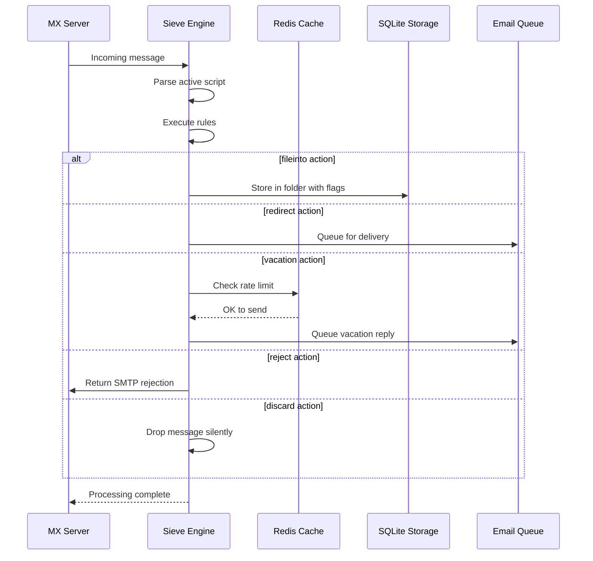

#### Security Features {#security-features}

การใช้งาน Sieve ของ Forward Email มีการป้องกันความปลอดภัยอย่างครอบคลุม:

* **การป้องกัน CVE-2023-26430**: ป้องกันการวนลูปการเปลี่ยนเส้นทางและการโจมตีแบบ mail bombing
* **การจำกัดอัตรา**: จำกัดการเปลี่ยนเส้นทาง (10/ข้อความ, 100/วัน) และการตอบกลับช่วงวันหยุด
* **การตรวจสอบรายการปฏิเสธ**: ที่อยู่เปลี่ยนเส้นทางถูกตรวจสอบกับรายการปฏิเสธ
* **หัวข้อที่ได้รับการป้องกัน**: หัวข้อ DKIM, ARC และการตรวจสอบสิทธิ์ไม่สามารถแก้ไขผ่าน editheader ได้
* **ขนาดสคริปต์จำกัด**: บังคับใช้ขนาดสคริปต์สูงสุด
* **หมดเวลาการทำงาน**: สคริปต์จะถูกยุติหากการทำงานเกินเวลาที่กำหนด

#### Example Sieve Scripts {#example-sieve-scripts}

**จัดเก็บจดหมายข่าวลงในโฟลเดอร์:**

```sieve
require ["fileinto"];

if header :contains "List-Id" "newsletter" {
    fileinto "Newsletters";
}
```

**ตอบกลับอัตโนมัติช่วงวันหยุดด้วยการตั้งเวลาละเอียด:**

```sieve
require ["vacation", "vacation-seconds"];

vacation :seconds 3600 :subject "Out of Office"
    "I'm currently away and will respond within 24 hours.";
```

**กรองสแปมด้วยธง:**

```sieve
require ["fileinto", "imap4flags"];

if header :contains "X-Spam-Status" "Yes" {
    setflag "\\Seen";
    fileinto "Junk";
}
```

**กรองซับซ้อนด้วยตัวแปร:**

```sieve
require ["variables", "fileinto", "regex"];

if header :regex "From" "(.+)@example\\.com" {
    set :lower "sender" "${1}";
    fileinto "Contacts/${sender}";
}
```

> \[!TIP]
> สำหรับเอกสารฉบับสมบูรณ์ สคริปต์ตัวอย่าง และคำแนะนำการตั้งค่า ดูที่ [FAQ: คุณรองรับการกรองอีเมลด้วย Sieve หรือไม่?](/faq#do-you-support-sieve-email-filtering)

### ManageSieve (RFC 5804) {#managesieve-rfc-5804}

Forward Email ให้การสนับสนุนโปรโตคอล ManageSieve อย่างเต็มรูปแบบสำหรับการจัดการสคริปต์ Sieve ระยะไกล

**ซอร์สโค้ด:** [`managesieve-server.js`](https://github.com/forwardemail/forwardemail.net/blob/master/managesieve-server.js)

| RFC                                                       | Title                                          | Status         |
| --------------------------------------------------------- | ---------------------------------------------- | -------------- |
| [RFC 5804](https://datatracker.ietf.org/doc/html/rfc5804) | โปรโตคอลสำหรับการจัดการสคริปต์ Sieve ระยะไกล | ✅ รองรับเต็มรูปแบบ |

#### ManageSieve Server Configuration {#managesieve-server-configuration}

| Setting                 | Value                   |
| ----------------------- | ----------------------- |
| **Server**              | `imap.forwardemail.net` |
| **Port (STARTTLS)**     | `2190` (แนะนำ)          |
| **Port (Implicit TLS)** | `4190`                  |
| **Authentication**      | PLAIN (ผ่าน TLS)        |

> **หมายเหตุ:** พอร์ต 2190 ใช้ STARTTLS (อัปเกรดจาก plain เป็น TLS) และเข้ากันได้กับไคลเอนต์ ManageSieve ส่วนใหญ่รวมถึง [sieve-connect](https://github.com/philpennock/sieve-connect) พอร์ต 4190 ใช้ implicit TLS (TLS ตั้งแต่เริ่มเชื่อมต่อ) สำหรับไคลเอนต์ที่รองรับ

#### Supported ManageSieve Commands {#supported-managesieve-commands}

| Command        | Description                             |
| -------------- | --------------------------------------- |
| `AUTHENTICATE` | ยืนยันตัวตนโดยใช้กลไก PLAIN           |
| `CAPABILITY`   | แสดงรายการความสามารถและส่วนขยายของเซิร์ฟเวอร์ |
| `HAVESPACE`    | ตรวจสอบว่าสามารถเก็บสคริปต์ได้หรือไม่ |
| `PUTSCRIPT`    | อัปโหลดสคริปต์ใหม่                    |
| `LISTSCRIPTS`  | แสดงรายการสคริปต์ทั้งหมดพร้อมสถานะใช้งาน |
| `SETACTIVE`    | เปิดใช้งานสคริปต์                     |
| `GETSCRIPT`    | ดาวน์โหลดสคริปต์                     |
| `DELETESCRIPT` | ลบสคริปต์                           |
| `RENAMESCRIPT` | เปลี่ยนชื่อสคริปต์                   |
| `CHECKSCRIPT`  | ตรวจสอบไวยากรณ์สคริปต์               |
| `NOOP`         | รักษาการเชื่อมต่อให้คงอยู่            |
| `LOGOUT`       | สิ้นสุดเซสชัน                        |
#### ลูกค้า ManageSieve ที่เข้ากันได้ {#compatible-managesieve-clients}

* **Thunderbird**: รองรับ Sieve ในตัวผ่าน [Sieve add-on](https://addons.thunderbird.net/addon/sieve/)
* **Roundcube**: [ปลั๊กอิน ManageSieve](https://plugins.roundcube.net/packages/johndoh/sieve)
* **KMail**: รองรับ ManageSieve โดยเนทีฟ
* **sieve-connect**: ลูกค้าคำสั่งบรรทัดคำสั่ง
* **ลูกค้าใด ๆ ที่เป็นไปตาม RFC 5804**

#### การไหลของโปรโตคอล ManageSieve {#managesieve-protocol-flow}

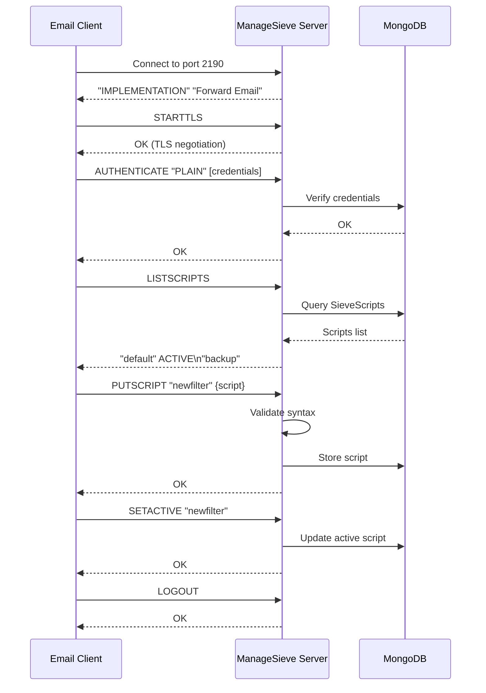

#### เว็บอินเทอร์เฟซและ API {#web-interface-and-api}

นอกจาก ManageSieve แล้ว Forward Email ยังมี:

* **แดชบอร์ดเว็บ**: สร้างและจัดการสคริปต์ Sieve ผ่านเว็บอินเทอร์เฟซที่ My Account → Domains → Aliases → Sieve Scripts
* **REST API**: การเข้าถึงการจัดการสคริปต์ Sieve ผ่านโปรแกรมโดยใช้ [Forward Email API](/api#sieve-scripts)

> \[!TIP]
> สำหรับคำแนะนำการตั้งค่าและการกำหนดค่าลูกค้าโดยละเอียด ดูที่ [FAQ: คุณรองรับการกรองอีเมลด้วย Sieve หรือไม่?](/faq#do-you-support-sieve-email-filtering)

---


## การเพิ่มประสิทธิภาพการจัดเก็บ {#storage-optimization}

> \[!IMPORTANT]
> **เทคโนโลยีการจัดเก็บอันดับหนึ่งในอุตสาหกรรม:** Forward Email เป็น **ผู้ให้บริการอีเมลรายเดียวในโลก** ที่ผสานการลบข้อมูลแนบซ้ำกับการบีบอัด Brotli บนเนื้อหาอีเมล การเพิ่มประสิทธิภาพสองชั้นนี้ทำให้คุณมี **พื้นที่จัดเก็บที่มีประสิทธิภาพมากขึ้น 2-3 เท่า** เมื่อเทียบกับผู้ให้บริการอีเมลแบบดั้งเดิม

Forward Email ใช้เทคนิคการเพิ่มประสิทธิภาพการจัดเก็บสองแบบที่ปฏิวัติวงการ ซึ่งลดขนาดกล่องจดหมายอย่างมากในขณะที่ยังคงความสอดคล้องกับ RFC และความถูกต้องของข้อความอย่างเต็มที่:

1. **การลบข้อมูลแนบซ้ำ** - กำจัดไฟล์แนบที่ซ้ำกันในอีเมลทั้งหมด
2. **การบีบอัด Brotli** - ลดพื้นที่จัดเก็บ 46-86% สำหรับเมตาดาต้า และ 50% สำหรับไฟล์แนบ

### สถาปัตยกรรม: การเพิ่มประสิทธิภาพการจัดเก็บสองชั้น {#architecture-dual-layer-storage-optimization}

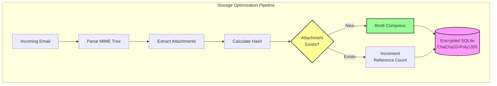

---


## การลบข้อมูลแนบซ้ำ {#attachment-deduplication}

Forward Email ใช้วิธีการลบข้อมูลแนบซ้ำตาม [แนวทางที่พิสูจน์แล้วของ WildDuck](https://docs.wildduck.email/docs/in-depth/attachment-deduplication/) ซึ่งปรับใช้สำหรับการจัดเก็บ SQLite

> \[!NOTE]
> **สิ่งที่ถูกลบซ้ำ:** "ไฟล์แนบ" หมายถึงเนื้อหาโหนด MIME ที่ **เข้ารหัส** (base64 หรือ quoted-printable) ไม่ใช่ไฟล์ที่ถอดรหัสแล้ว ซึ่งช่วยรักษาความถูกต้องของลายเซ็น DKIM และ GPG

### วิธีการทำงาน {#how-it-works}

**การใช้งานต้นฉบับของ WildDuck (MongoDB GridFS):**

> เซิร์ฟเวอร์ IMAP ของ Wild Duck จะลบข้อมูลแนบซ้ำ "ไฟล์แนบ" ในกรณีนี้หมายถึงเนื้อหาโหนด mime ที่เข้ารหัสแบบ base64 หรือ quoted-printable ไม่ใช่ไฟล์ที่ถอดรหัสแล้ว แม้ว่าการใช้เนื้อหาที่เข้ารหัสจะทำให้เกิดผลลบเท็จจำนวนมาก (ไฟล์เดียวกันในอีเมลต่าง ๆ อาจถูกนับเป็นไฟล์แนบต่างกัน) แต่จำเป็นเพื่อรับประกันความถูกต้องของรูปแบบลายเซ็นต่าง ๆ (DKIM, GPG ฯลฯ) ข้อความที่ดึงมาจาก Wild Duck จะเหมือนกับข้อความที่ถูกจัดเก็บไว้แม้ว่า Wild Duck จะวิเคราะห์ข้อความเป็นวัตถุแบบต้นไม้และสร้างข้อความขึ้นใหม่เมื่อดึงข้อมูล
**การใช้งาน SQLite ของ Forward Email:**

Forward Email ปรับใช้แนวทางนี้สำหรับการจัดเก็บ SQLite แบบเข้ารหัสด้วยกระบวนการดังนี้:

1. **การคำนวณแฮช**: เมื่อพบไฟล์แนบ จะคำนวณแฮชโดยใช้ไลบรารี [`rev-hash`](https://github.com/sindresorhus/rev-hash) จากเนื้อหาไฟล์แนบ
2. **การค้นหา**: ตรวจสอบว่าไฟล์แนบที่มีแฮชตรงกันมีอยู่ในตาราง `Attachments` หรือไม่
3. **การนับอ้างอิง**:
   * หากมีอยู่: เพิ่มตัวนับอ้างอิงขึ้น 1 และตัวนับเวทมนตร์ด้วยจำนวนสุ่ม
   * หากใหม่: สร้างรายการไฟล์แนบใหม่โดยตั้งค่าตัวนับ = 1
4. **ความปลอดภัยในการลบ**: ใช้ระบบตัวนับคู่ (อ้างอิง + เวทมนตร์) เพื่อป้องกันผลบวกเท็จ
5. **การเก็บขยะ**: ไฟล์แนบจะถูกลบทันทีเมื่อทั้งสองตัวนับเป็นศูนย์

**ซอร์สโค้ด:** [`helpers/attachment-storage.js`](https://github.com/forwardemail/forwardemail.net/blob/master/helpers/attachment-storage.js)

### กระบวนการ Deduplication {#deduplication-flow}

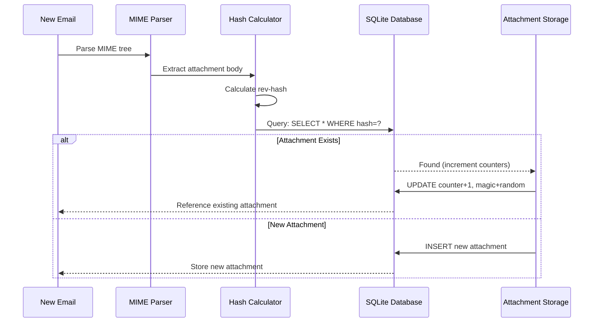

### ระบบตัวเลขเวทมนตร์ {#magic-number-system}

Forward Email ใช้ระบบ "ตัวเลขเวทมนตร์" ของ WildDuck (ได้รับแรงบันดาลใจจาก [Mail.ru](https://github.com/zone-eu/wildduck)) เพื่อป้องกันผลบวกเท็จระหว่างการลบ:

* ทุกข้อความจะได้รับ **ตัวเลขสุ่ม** กำกับ
* ตัวนับเวทมนตร์ของไฟล์แนบจะถูกเพิ่มขึ้นด้วยตัวเลขสุ่มนั้นเมื่อเพิ่มข้อความ
* ตัวนับเวทมนตร์จะถูกลดลงด้วยตัวเลขเดียวกันเมื่อข้อความถูกลบ
* ไฟล์แนบจะถูกลบก็ต่อเมื่อ **ทั้งสองตัวนับ** (อ้างอิง + เวทมนตร์) เป็นศูนย์

ระบบตัวนับคู่แบบนี้ช่วยให้มั่นใจได้ว่าหากเกิดข้อผิดพลาดระหว่างการลบ (เช่น ระบบล่ม, ข้อผิดพลาดเครือข่าย) ไฟล์แนบจะไม่ถูกลบก่อนเวลาอันควร

### ความแตกต่างหลัก: WildDuck กับ Forward Email {#key-differences-wildduck-vs-forward-email}

| คุณสมบัติ               | WildDuck (MongoDB)        | Forward Email (SQLite)       |
| ---------------------- | ------------------------- | ---------------------------- |
| **ระบบจัดเก็บข้อมูล**  | MongoDB GridFS (แบ่งชิ้น) | SQLite BLOB (ตรง)            |
| **อัลกอริทึมแฮช**     | SHA256                    | rev-hash (อิง SHA-256)       |
| **การนับอ้างอิง**      | ✅ ใช่                    | ✅ ใช่                       |
| **ตัวเลขเวทมนตร์**     | ✅ ใช่ (ได้รับแรงบันดาลใจจาก Mail.ru) | ✅ ใช่ (ระบบเดียวกัน)        |
| **การเก็บขยะ**         | ล่าช้า (งานแยกต่างหาก)   | ทันที (เมื่อทั้งสองตัวนับเป็นศูนย์) |
| **การบีบอัด**          | ❌ ไม่มี                  | ✅ Brotli (ดูด้านล่าง)       |
| **การเข้ารหัส**        | ❌ ตัวเลือก               | ✅ เสมอ (ChaCha20-Poly1305)  |

---


## การบีบอัด Brotli {#brotli-compression}

> \[!IMPORTANT]
> **ครั้งแรกของโลก:** Forward Email คือ **บริการอีเมลเพียงหนึ่งเดียวในโลก** ที่ใช้การบีบอัด Brotli กับเนื้อหาอีเมล ซึ่งช่วยให้ประหยัดพื้นที่จัดเก็บได้ถึง **46-86%** นอกเหนือจากการ deduplication ไฟล์แนบ

Forward Email ใช้การบีบอัด Brotli กับทั้งเนื้อหาไฟล์แนบและข้อมูลเมตาของข้อความ เพื่อประหยัดพื้นที่จัดเก็บอย่างมหาศาลพร้อมกับรักษาความเข้ากันได้ย้อนหลัง

**การใช้งาน:** [`helpers/msgpack-helpers.js`](https://github.com/forwardemail/forwardemail.net/blob/master/helpers/msgpack-helpers.js)

### สิ่งที่ถูกบีบอัด {#what-gets-compressed}

**1. เนื้อหาไฟล์แนบ** (`encodeAttachmentBody`)

* **รูปแบบเก่า**: สตริงเข้ารหัสแบบ Hex (ขนาดเพิ่ม 2 เท่า) หรือ Buffer ดิบ
* **รูปแบบใหม่**: Buffer บีบอัดด้วย Brotli พร้อมส่วนหัวเวทมนตร์ "FEBR"
* **การตัดสินใจบีบอัด**: บีบอัดเฉพาะเมื่อช่วยประหยัดพื้นที่ (คำนึงถึงส่วนหัว 4 ไบต์)
* **การประหยัดพื้นที่จัดเก็บ**: สูงสุดถึง **50%** (จาก hex → BLOB ดั้งเดิม)
**2. ข้อมูลเมตาของข้อความ** (`encodeMetadata`)

ประกอบด้วย: `mimeTree`, `headers`, `envelope`, `flags`

* **รูปแบบเก่า**: สตริงข้อความ JSON
* **รูปแบบใหม่**: Buffer บีบอัดด้วย Brotli
* **การประหยัดพื้นที่จัดเก็บ**: **46-86%** ขึ้นอยู่กับความซับซ้อนของข้อความ

### การตั้งค่าการบีบอัด {#compression-configuration}

```javascript
// ตัวเลือกการบีบอัด Brotli ที่ปรับให้เหมาะกับความเร็ว (ระดับ 4 เป็นสมดุลที่ดี)
const BROTLI_COMPRESS_OPTIONS = {
  params: {
    [zlib.constants.BROTLI_PARAM_QUALITY]: 4
  }
};
```

**ทำไมต้องระดับ 4?**

* **บีบอัด/คลายบีบอัดเร็ว**: ประมวลผลในระดับมิลลิวินาทีต่ำกว่า
* **อัตราการบีบอัดดี**: ประหยัด 46-86%
* **ประสิทธิภาพสมดุล**: เหมาะสำหรับการทำงานอีเมลแบบเรียลไทม์

### หัวเวทมนตร์: "FEBR" {#magic-header-febr}

Forward Email ใช้หัวเวทมนตร์ 4 ไบต์เพื่อระบุเนื้อหาที่แนบซึ่งถูกบีบอัด:

```
"FEBR" = Forward Email BRotli
เลขฐานสิบหก: 0x46 0x45 0x42 0x52
```

**ทำไมต้องมีหัวเวทมนตร์?**

* **ตรวจจับรูปแบบ**: ระบุข้อมูลบีบอัดกับไม่บีบอัดได้ทันที
* **ความเข้ากันได้ย้อนหลัง**: สตริงเลขฐานสิบหกเก่าและ Buffer ดิบยังใช้งานได้
* **หลีกเลี่ยงการชนกัน**: "FEBR" ไม่ค่อยปรากฏที่จุดเริ่มต้นของข้อมูลแนบที่ถูกต้อง

### กระบวนการบีบอัด {#compression-process}

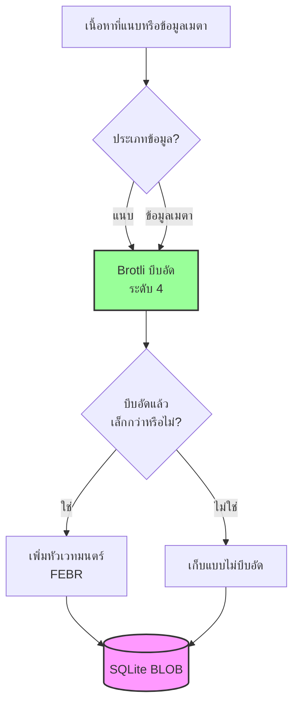

### กระบวนการคลายบีบอัด {#decompression-process}

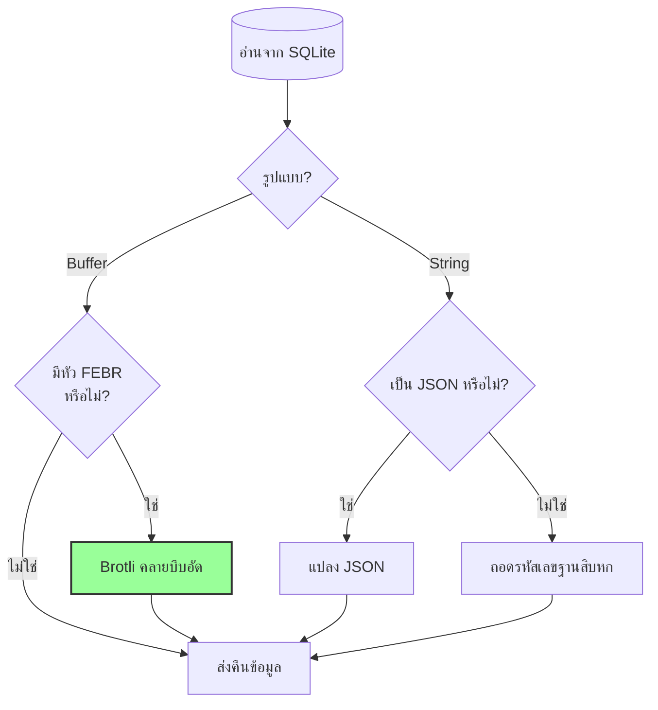

### ความเข้ากันได้ย้อนหลัง {#backwards-compatibility}

ฟังก์ชันถอดรหัสทั้งหมด **ตรวจจับรูปแบบการจัดเก็บโดยอัตโนมัติ**:

| รูปแบบ                | วิธีตรวจจับ                          | การจัดการ                                     |
| --------------------- | ----------------------------------- | --------------------------------------------- |
| **บีบอัดด้วย Brotli** | ตรวจสอบหัวเวทมนตร์ "FEBR"          | คลายบีบอัดด้วย `zlib.brotliDecompressSync()` |
| **Buffer ดิบ**        | `Buffer.isBuffer()` ไม่มีหัวเวทมนตร์ | ส่งคืนตามเดิม                                |
| **สตริงเลขฐานสิบหก** | ตรวจสอบความยาวคู่ + ตัวอักษร [0-9a-f] | ถอดรหัสด้วย `Buffer.from(value, 'hex')`       |
| **สตริง JSON**        | ตรวจสอบตัวอักษรแรกเป็น `{` หรือ `[` | แปลงด้วย `JSON.parse()`                       |

สิ่งนี้รับประกัน **ไม่มีการสูญเสียข้อมูล** ในระหว่างการย้ายจากรูปแบบเก่าไปยังรูปแบบใหม่

### สถิติการประหยัดพื้นที่จัดเก็บ {#storage-savings-statistics}

**การวัดการประหยัดจากข้อมูลจริง:**

| ประเภทข้อมูล          | รูปแบบเก่า              | รูปแบบใหม่             | การประหยัด |
| --------------------- | ----------------------- | ---------------------- | ---------- |
| **เนื้อหาที่แนบ**    | สตริงเข้ารหัสเลขฐานสิบหก (2 เท่า) | BLOB บีบอัดด้วย Brotli | **50%**    |
| **ข้อมูลเมตาของข้อความ** | ข้อความ JSON            | BLOB บีบอัดด้วย Brotli | **46-86%** |
| **ธงกล่องจดหมาย**    | ข้อความ JSON            | BLOB บีบอัดด้วย Brotli | **60-80%** |

**แหล่งที่มา:** [`helpers/migrate-storage-format.js`](https://github.com/forwardemail/forwardemail.net/blob/master/helpers/migrate-storage-format.js)

### กระบวนการย้ายข้อมูล {#migration-process}

Forward Email มีการย้ายข้อมูลอัตโนมัติและทำซ้ำได้จากรูปแบบเก่าไปยังรูปแบบใหม่:
// สถิติการย้ายข้อมูลที่ติดตาม:
{
  attachmentsMigrated: 0,
  messagesMigrated: 0,
  mailboxesMigrated: 0,
  bytesSaved: 0  // จำนวนไบต์ที่ประหยัดได้จากการบีบอัดทั้งหมด
}
```

**ขั้นตอนการย้ายข้อมูล:**

1. เนื้อหาของไฟล์แนบ: การเข้ารหัสแบบฐานสิบหก → BLOB ดั้งเดิม (ประหยัด 50%)
2. เมตาดาต้าของข้อความ: ข้อความ JSON → BLOB บีบอัดด้วย brotli (ประหยัด 46-86%)
3. ธงของกล่องจดหมาย: ข้อความ JSON → BLOB บีบอัดด้วย brotli (ประหยัด 60-80%)

**แหล่งที่มา:** [`helpers/migrate-storage-format.js`](https://github.com/forwardemail/forwardemail.net/blob/master/helpers/migrate-storage-format.js)

---

### ประสิทธิภาพการจัดเก็บรวม {#combined-storage-efficiency}

> \[!TIP]
> **ผลกระทบในโลกจริง:** ด้วยการกำจัดไฟล์แนบซ้ำ + การบีบอัด Brotli ผู้ใช้ Forward Email จะได้รับ **พื้นที่จัดเก็บที่มีประสิทธิภาพมากขึ้น 2-3 เท่า** เมื่อเทียบกับผู้ให้บริการอีเมลแบบดั้งเดิม

**ตัวอย่างสถานการณ์:**

ผู้ให้บริการอีเมลแบบดั้งเดิม (กล่องจดหมาย 1GB):

* พื้นที่ดิสก์ 1GB = อีเมล 1GB
* ไม่มีการกำจัดซ้ำ: ไฟล์แนบเดียวกันเก็บ 10 ครั้ง = เสียพื้นที่จัดเก็บ 10 เท่า
* ไม่มีการบีบอัด: เมตาดาต้า JSON เต็มรูปแบบเก็บ = เสียพื้นที่จัดเก็บ 2-3 เท่า

Forward Email (กล่องจดหมาย 1GB):

* พื้นที่ดิสก์ 1GB ≈ **อีเมล 2-3GB** (พื้นที่จัดเก็บที่มีประสิทธิภาพ)
* การกำจัดซ้ำ: ไฟล์แนบเดียวกันเก็บครั้งเดียว อ้างอิง 10 ครั้ง
* การบีบอัด: ประหยัด 46-86% สำหรับเมตาดาต้า, 50% สำหรับไฟล์แนบ
* การเข้ารหัส: ChaCha20-Poly1305 (ไม่มีภาระพื้นที่จัดเก็บเพิ่ม)

**ตารางเปรียบเทียบ:**

| ผู้ให้บริการ      | เทคโนโลยีการจัดเก็บ                          | พื้นที่จัดเก็บที่มีประสิทธิภาพ (กล่องจดหมาย 1GB) |
| ----------------- | -------------------------------------------- | ----------------------------------------------- |
| Gmail             | ไม่มี                                        | 1GB                                             |
| iCloud            | ไม่มี                                        | 1GB                                             |
| Outlook.com       | ไม่มี                                        | 1GB                                             |
| Fastmail          | ไม่มี                                        | 1GB                                             |
| ProtonMail        | เข้ารหัสเท่านั้น                             | 1GB                                             |
| Tutanota          | เข้ารหัสเท่านั้น                             | 1GB                                             |
| **Forward Email** | **การกำจัดซ้ำ + การบีบอัด + การเข้ารหัส**   | **2-3GB** ✨                                     |

### รายละเอียดการใช้งานทางเทคนิค {#technical-implementation-details}

**ประสิทธิภาพ:**

* Brotli ระดับ 4: การบีบอัด/แตกไฟล์ในเวลาต่ำกว่าหนึ่งมิลลิวินาที
* ไม่มีผลกระทบต่อประสิทธิภาพจากการบีบอัด
* SQLite FTS5: การค้นหาภายใน 50ms บน NVMe SSD

**ความปลอดภัย:**

* การบีบอัดเกิดขึ้น **หลังจาก** การเข้ารหัส (ฐานข้อมูล SQLite ถูกเข้ารหัส)
* การเข้ารหัส ChaCha20-Poly1305 + การบีบอัด Brotli
* ความรู้เป็นศูนย์: มีเพียงผู้ใช้เท่านั้นที่มีรหัสผ่านถอดรหัส

**การปฏิบัติตาม RFC:**

* ข้อความที่ดึงมาจะดู **เหมือนเดิมเป๊ะ** กับที่เก็บไว้
* ลายเซ็น DKIM ยังคงถูกต้อง (เนื้อหาที่เข้ารหัสยังคงอยู่)
* ลายเซ็น GPG ยังคงถูกต้อง (ไม่มีการแก้ไขเนื้อหาที่ลงลายเซ็น)

### ทำไมไม่มีผู้ให้บริการรายอื่นทำแบบนี้ {#why-no-other-provider-does-this}

**ความซับซ้อน:**

* ต้องการการผสานลึกกับชั้นจัดเก็บข้อมูล
* ความเข้ากันได้ย้อนหลังเป็นเรื่องท้าทาย
* การย้ายจากรูปแบบเก่าซับซ้อน

**ข้อกังวลเรื่องประสิทธิภาพ:**

* การบีบอัดเพิ่มภาระ CPU (แก้ไขด้วย Brotli ระดับ 4)
* การแตกไฟล์ทุกครั้งที่อ่าน (แก้ไขด้วยการแคช SQLite)

**ข้อได้เปรียบของ Forward Email:**

* สร้างขึ้นตั้งแต่ต้นโดยคำนึงถึงการเพิ่มประสิทธิภาพ
* SQLite อนุญาตให้จัดการ BLOB โดยตรง
* ฐานข้อมูลเข้ารหัสต่อผู้ใช้ช่วยให้บีบอัดได้อย่างปลอดภัย

---

---


## ฟีเจอร์สมัยใหม่ {#modern-features}


## REST API ครบวงจรสำหรับการจัดการอีเมล {#complete-rest-api-for-email-management}

> \[!TIP]
> Forward Email มี REST API ครบถ้วนพร้อม 39 จุดเชื่อมต่อสำหรับการจัดการอีเมลแบบโปรแกรม

> \[!TIP]
> **ฟีเจอร์เฉพาะในอุตสาหกรรม:** แตกต่างจากบริการอีเมลอื่น ๆ Forward Email ให้การเข้าถึงโปรแกรมแบบเต็มรูปแบบกับกล่องจดหมาย ปฏิทิน รายชื่อ ข้อความ และโฟลเดอร์ของคุณผ่าน REST API ครบวงจร นี่คือการโต้ตอบโดยตรงกับไฟล์ฐานข้อมูล SQLite ที่เข้ารหัสซึ่งเก็บข้อมูลทั้งหมดของคุณ

Forward Email เสนอ REST API ครบวงจรที่ให้การเข้าถึงข้อมูลอีเมลของคุณอย่างไม่เคยมีมาก่อน ไม่มีบริการอีเมลใด (รวมถึง Gmail, iCloud, Outlook, ProtonMail, Tuta หรือ Fastmail) ที่ให้การเข้าถึงฐานข้อมูลโดยตรงและครบถ้วนในระดับนี้ได้เลย
**เอกสาร API:** <https://forwardemail.net/en/email-api>

### หมวดหมู่ API (39 จุดสิ้นสุด) {#api-categories-39-endpoints}

**1. Messages API** (5 จุดสิ้นสุด) - การดำเนินการ CRUD ครบถ้วนบนข้อความอีเมล:

* `GET /v1/messages` - แสดงรายการข้อความพร้อมพารามิเตอร์ค้นหาขั้นสูงกว่า 15 รายการ (ไม่มีบริการอื่นใดที่มี)
* `POST /v1/messages` - สร้าง/ส่งข้อความ
* `GET /v1/messages/:id` - ดึงข้อความ
* `PUT /v1/messages/:id` - อัปเดตข้อความ (ธง, โฟลเดอร์)
* `DELETE /v1/messages/:id` - ลบข้อความ

*ตัวอย่าง: ค้นหาทุกใบแจ้งหนี้จากไตรมาสที่ผ่านมาโดยมีไฟล์แนบ:*

```bash
curl -u "alias@domain.com:password" \
  "https://api.forwardemail.net/v1/messages?q=subject:invoice+has:attachment+after:2024-01-01+before:2024-04-01"
```

ดู [เอกสารการค้นหาขั้นสูง](https://forwardemail.net/en/email-api)

**2. Folders API** (5 จุดสิ้นสุด) - การจัดการโฟลเดอร์ IMAP ครบถ้วนผ่าน REST:

* `GET /v1/folders` - แสดงรายการโฟลเดอร์ทั้งหมด
* `POST /v1/folders` - สร้างโฟลเดอร์
* `GET /v1/folders/:id` - ดึงข้อมูลโฟลเดอร์
* `PUT /v1/folders/:id` - อัปเดตโฟลเดอร์
* `DELETE /v1/folders/:id` - ลบโฟลเดอร์

**3. Contacts API** (5 จุดสิ้นสุด) - การจัดเก็บรายชื่อติดต่อแบบ CardDAV ผ่าน REST:

* `GET /v1/contacts` - แสดงรายชื่อผู้ติดต่อ
* `POST /v1/contacts` - สร้างผู้ติดต่อ (รูปแบบ vCard)
* `GET /v1/contacts/:id` - ดึงข้อมูลผู้ติดต่อ
* `PUT /v1/contacts/:id` - อัปเดตผู้ติดต่อ
* `DELETE /v1/contacts/:id` - ลบผู้ติดต่อ

**4. Calendars API** (5 จุดสิ้นสุด) - การจัดการคอนเทนเนอร์ปฏิทิน:

* `GET /v1/calendars` - แสดงรายการคอนเทนเนอร์ปฏิทิน
* `POST /v1/calendars` - สร้างปฏิทิน (เช่น "ปฏิทินงาน", "ปฏิทินส่วนตัว")
* `GET /v1/calendars/:id` - ดึงข้อมูลปฏิทิน
* `PUT /v1/calendars/:id` - อัปเดตปฏิทิน
* `DELETE /v1/calendars/:id` - ลบปฏิทิน

**5. Calendar Events API** (5 จุดสิ้นสุด) - การจัดตารางเหตุการณ์ภายในปฏิทิน:

* `GET /v1/calendar-events` - แสดงรายการเหตุการณ์
* `POST /v1/calendar-events` - สร้างเหตุการณ์พร้อมผู้เข้าร่วม
* `GET /v1/calendar-events/:id` - ดึงข้อมูลเหตุการณ์
* `PUT /v1/calendar-events/:id` - อัปเดตเหตุการณ์
* `DELETE /v1/calendar-events/:id` - ลบเหตุการณ์

*ตัวอย่าง: สร้างเหตุการณ์ในปฏิทิน:*

```bash
curl -u "alias@domain.com:password" \
  -X POST \
  -H "Content-Type: application/json" \
  -d '{"title":"ประชุมทีม","start":"2024-12-20T10:00:00Z","attendees":["team@example.com"],"calendar_id":"calendar123"}' \
  https://api.forwardemail.net/v1/calendar-events
```

### รายละเอียดทางเทคนิค {#technical-details}

* **การตรวจสอบสิทธิ์:** การตรวจสอบสิทธิ์แบบง่าย `alias:password` (ไม่มีความซับซ้อนของ OAuth)
* **ประสิทธิภาพ:** เวลาตอบสนองต่ำกว่า 50ms ด้วย SQLite FTS5 และการจัดเก็บ NVMe SSD
* **ความหน่วงของเครือข่ายเป็นศูนย์:** เข้าถึงฐานข้อมูลโดยตรง ไม่ผ่านบริการภายนอก

### กรณีการใช้งานในโลกจริง {#real-world-use-cases}

* **การวิเคราะห์อีเมล:** สร้างแดชบอร์ดกำหนดเองเพื่อติดตามปริมาณอีเมล, เวลาตอบกลับ, สถิติผู้ส่ง

* **เวิร์กโฟลว์อัตโนมัติ:** เรียกใช้งานตามเนื้อหาอีเมล (การประมวลผลใบแจ้งหนี้, ตั๋วสนับสนุน)

* **การผสานรวม CRM:** ซิงค์บทสนทนาอีเมลกับ CRM ของคุณโดยอัตโนมัติ

* **การปฏิบัติตามกฎระเบียบ & การค้นหา:** ค้นหาและส่งออกอีเมลสำหรับข้อกำหนดทางกฎหมาย/การปฏิบัติตาม

* **ไคลเอนต์อีเมลแบบกำหนดเอง:** สร้างอินเทอร์เฟซอีเมลเฉพาะสำหรับเวิร์กโฟลว์ของคุณ

* **ธุรกิจอัจฉริยะ:** วิเคราะห์รูปแบบการสื่อสาร, อัตราการตอบกลับ, การมีส่วนร่วมของลูกค้า

* **การจัดการเอกสาร:** ดึงและจัดหมวดหมู่ไฟล์แนบโดยอัตโนมัติ

* [เอกสารครบถ้วน](https://forwardemail.net/en/email-api)

* [เอกสารอ้างอิง API ครบถ้วน](https://forwardemail.net/en/email-api)

* [คู่มือการค้นหาขั้นสูง](https://forwardemail.net/en/email-api)

* [ตัวอย่างการผสานรวมกว่า 30 รายการ](https://forwardemail.net/en/email-api)

* [สถาปัตยกรรมทางเทคนิค](https://forwardemail.net/en/blog/docs/best-quantum-safe-encrypted-email-service)

Forward Email มี REST API สมัยใหม่ที่ให้การควบคุมเต็มรูปแบบเหนือบัญชีอีเมล, โดเมน, อลิอาส และข้อความ API นี้เป็นทางเลือกที่ทรงพลังแทน JMAP และให้ฟังก์ชันการทำงานที่เกินกว่าระเบียบวิธีอีเมลแบบดั้งเดิม

| หมวดหมู่               | จุดสิ้นสุด | คำอธิบาย                              |
| ----------------------- | --------- | --------------------------------------- |
| **การจัดการบัญชี**      | 8         | บัญชีผู้ใช้, การตรวจสอบสิทธิ์, การตั้งค่า |
| **การจัดการโดเมน**      | 12        | โดเมนที่กำหนดเอง, DNS, การยืนยัน          |
| **การจัดการอลิอาส**     | 6         | อีเมลอลิอาส, การส่งต่อ, catch-all         |
| **การจัดการข้อความ**    | 7         | ส่ง, รับ, ค้นหา, ลบข้อความ               |
| **ปฏิทิน & รายชื่อ**    | 4         | การเข้าถึง CalDAV/CardDAV ผ่าน API        |
| **บันทึก & การวิเคราะห์** | 2         | บันทึกอีเมล, รายงานการจัดส่ง              |
### คุณสมบัติหลักของ API {#key-api-features}

**การค้นหาขั้นสูง:**

API มีความสามารถในการค้นหาที่ทรงพลังด้วยไวยากรณ์การค้นหาคล้ายกับ Gmail:

```
GET /v1/messages?q=subject:invoice+has:attachment+after:2024-01-01+before:2024-04-01
```

**ตัวดำเนินการค้นหาที่รองรับ:**

* `from:` - ค้นหาตามผู้ส่ง
* `to:` - ค้นหาตามผู้รับ
* `subject:` - ค้นหาตามหัวเรื่อง
* `has:attachment` - ข้อความที่มีไฟล์แนบ
* `is:unread` - ข้อความที่ยังไม่ได้อ่าน
* `is:starred` - ข้อความที่ติดดาว
* `after:` - ข้อความหลังวันที่
* `before:` - ข้อความก่อนวันที่
* `label:` - ข้อความที่มีป้ายกำกับ
* `filename:` - ชื่อไฟล์แนบ

**การจัดการกิจกรรมปฏิทิน:**

```
GET /v1/calendar-events
POST /v1/calendar-events
PUT /v1/calendar-events/:id
DELETE /v1/calendar-events/:id
```

**การรวม Webhook:**

API รองรับ webhook สำหรับการแจ้งเตือนเหตุการณ์อีเมลแบบเรียลไทม์ (รับ ส่ง ตีกลับ ฯลฯ)

**การรับรองความถูกต้อง:**

* การรับรองความถูกต้องด้วย API key
* รองรับ OAuth 2.0
* จำกัดอัตราการร้องขอ: 1000 คำขอต่อชั่วโมง

**รูปแบบข้อมูล:**

* คำขอ/การตอบกลับแบบ JSON
* ออกแบบแบบ RESTful
* รองรับการแบ่งหน้า

**ความปลอดภัย:**

* ใช้ HTTPS เท่านั้น
* การหมุนเวียน API key
* การอนุญาต IP (เลือกใช้)
* การลงลายมือชื่อคำขอ (เลือกใช้)

### สถาปัตยกรรม API {#api-architecture}

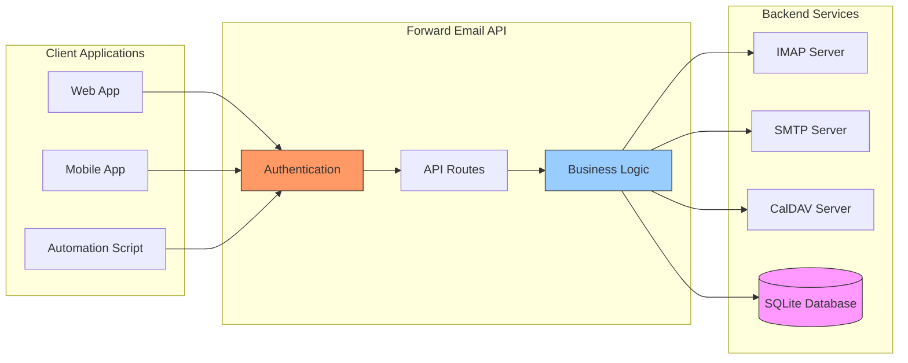

---


## การแจ้งเตือนแบบ Push บน iOS {#ios-push-notifications}

> \[!TIP]
> Forward Email รองรับการแจ้งเตือนแบบ push บน iOS โดยตรงผ่าน XAPPLEPUSHSERVICE สำหรับการส่งอีเมลทันที

> \[!IMPORTANT]
> **คุณสมบัติพิเศษ:** Forward Email เป็นหนึ่งในเซิร์ฟเวอร์อีเมลโอเพนซอร์สไม่กี่ตัวที่รองรับการแจ้งเตือนแบบ push บน iOS โดยตรงสำหรับอีเมล รายชื่อผู้ติดต่อ และปฏิทินผ่านส่วนขยาย IMAP `XAPPLEPUSHSERVICE` ซึ่งถูกวิเคราะห์ย้อนกลับจากโปรโตคอลของ Apple และมอบการส่งทันทีไปยังอุปกรณ์ iOS โดยไม่ทำให้แบตเตอรี่หมดเร็ว

Forward Email ใช้ส่วนขยายเฉพาะของ Apple คือ XAPPLEPUSHSERVICE เพื่อให้การแจ้งเตือนแบบ push บนอุปกรณ์ iOS โดยไม่ต้องใช้การดึงข้อมูลเบื้องหลัง

### วิธีการทำงาน {#how-it-works-1}

**XAPPLEPUSHSERVICE** เป็นส่วนขยาย IMAP ที่ไม่เป็นมาตรฐานซึ่งช่วยให้แอป Mail บน iOS รับการแจ้งเตือนแบบ push ทันทีเมื่อมีอีเมลใหม่เข้ามา

Forward Email ใช้การรวมบริการแจ้งเตือนแบบ push ของ Apple (APNs) สำหรับ IMAP เพื่อให้แอป Mail บน iOS รับการแจ้งเตือนแบบ push ทันทีเมื่อมีอีเมลใหม่เข้ามา

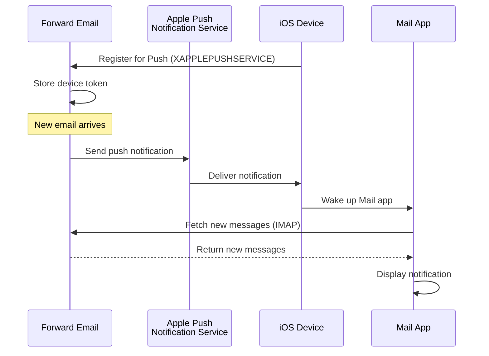

### คุณสมบัติหลัก {#key-features}

**การส่งทันที:**

* การแจ้งเตือนแบบ push มาถึงภายในไม่กี่วินาที
* ไม่มีการดึงข้อมูลเบื้องหลังที่ทำให้แบตเตอรี่หมดเร็ว
* ทำงานได้แม้แอป Mail ปิดอยู่

<!---->

* **การส่งทันที:** อีเมล กิจกรรมปฏิทิน และรายชื่อผู้ติดต่อปรากฏบน iPhone/iPad ของคุณทันที ไม่ใช่ตามตารางการดึงข้อมูล
* **ประหยัดแบตเตอรี่:** ใช้โครงสร้างพื้นฐานการแจ้งเตือนแบบ push ของ Apple แทนการเชื่อมต่อ IMAP อย่างต่อเนื่อง
* **การแจ้งเตือนแบบหัวข้อ:** รองรับการแจ้งเตือนแบบ push สำหรับกล่องจดหมายเฉพาะ ไม่ใช่แค่ INBOX
* **ไม่ต้องใช้แอปของบุคคลที่สาม:** ทำงานร่วมกับแอป Mail, Calendar และ Contacts บน iOS โดยตรง
**การผสานรวมแบบเนทีฟ:**

* รวมอยู่ในแอป iOS Mail
* ไม่ต้องใช้แอปของบุคคลที่สาม
* ประสบการณ์ผู้ใช้ที่ราบรื่น

**เน้นความเป็นส่วนตัว:**

* โทเค็นอุปกรณ์ถูกเข้ารหัส
* ไม่มีการส่งเนื้อหาข้อความผ่าน APNS
* ส่งเฉพาะการแจ้งเตือน "เมลใหม่"

**ประหยัดแบตเตอรี่:**

* ไม่มีการตรวจสอบ IMAP อย่างต่อเนื่อง
* อุปกรณ์เข้าสู่โหมดพักจนกว่าจะมีการแจ้งเตือน
* ผลกระทบต่อแบตเตอรี่น้อยที่สุด

### สิ่งที่ทำให้สิ่งนี้พิเศษ {#what-makes-this-special}

> \[!IMPORTANT]
> ผู้ให้บริการอีเมลส่วนใหญ่ไม่รองรับ XAPPLEPUSHSERVICE ทำให้อุปกรณ์ iOS ต้องตรวจสอบเมลใหม่ทุก 15 นาที

เซิร์ฟเวอร์อีเมลโอเพนซอร์สส่วนใหญ่ (รวมถึง Dovecot, Postfix, Cyrus IMAP) ไม่รองรับการแจ้งเตือนแบบพุชของ iOS ผู้ใช้ต้องเลือก:

* ใช้ IMAP IDLE (คงการเชื่อมต่อไว้ ทำให้แบตเตอรี่หมดเร็ว)
* ใช้การตรวจสอบ (polling) (ตรวจสอบทุก 15-30 นาที แจ้งเตือนล่าช้า)
* ใช้แอปอีเมลเฉพาะที่มีโครงสร้างพื้นฐานพุชของตัวเอง

Forward Email มอบประสบการณ์การแจ้งเตือนแบบพุชทันทีเหมือนบริการเชิงพาณิชย์อย่าง Gmail, iCloud และ Fastmail

**เปรียบเทียบกับผู้ให้บริการอื่น:**

| ผู้ให้บริการ       | รองรับพุช       | ช่วงเวลาตรวจสอบ | ผลกระทบต่อแบตเตอรี่ |
| ----------------- | -------------- | ---------------- | -------------------- |
| **Forward Email** | ✅ พุชเนทีฟ    | ทันที            | น้อยที่สุด           |
| Gmail             | ✅ พุชเนทีฟ    | ทันที            | น้อยที่สุด           |
| iCloud            | ✅ พุชเนทีฟ    | ทันที            | น้อยที่สุด           |
| Yahoo             | ✅ พุชเนทีฟ    | ทันที            | น้อยที่สุด           |
| Outlook.com       | ❌ ตรวจสอบ     | 15 นาที          | ปานกลาง             |
| Fastmail          | ❌ ตรวจสอบ     | 15 นาที          | ปานกลาง             |
| ProtonMail        | ⚠️ ใช้เฉพาะบริดจ์ | ผ่านบริดจ์       | สูง                  |
| Tutanota          | ❌ ใช้เฉพาะแอป | ไม่ระบุ          | ไม่ระบุ              |

### รายละเอียดการใช้งาน {#implementation-details}

**การตอบสนองความสามารถ IMAP:**

```
* CAPABILITY IMAP4rev1 ... XAPPLEPUSHSERVICE ...
```

**กระบวนการลงทะเบียน:**

1. แอป iOS Mail ตรวจพบความสามารถ XAPPLEPUSHSERVICE
2. แอปลงทะเบียนโทเค็นอุปกรณ์กับ Forward Email
3. Forward Email เก็บโทเค็นและเชื่อมโยงกับบัญชี
4. เมื่อมีเมลใหม่ Forward Email ส่งพุชผ่าน APNS
5. iOS ปลุกแอป Mail เพื่อดึงข้อความใหม่

**ความปลอดภัย:**

* โทเค็นอุปกรณ์ถูกเข้ารหัสขณะเก็บ
* โทเค็นหมดอายุและรีเฟรชอัตโนมัติ
* ไม่มีการเปิดเผยเนื้อหาข้อความต่อ APNS
* รักษาการเข้ารหัสแบบ end-to-end

<!---->

* **ส่วนขยาย IMAP:** `XAPPLEPUSHSERVICE`
* **ซอร์สโค้ด:** [WildDuck Issue #711](https://github.com/zone-eu/wildduck/issues/711)
* **การตั้งค่า:** อัตโนมัติ - ไม่ต้องตั้งค่าเพิ่มเติม ใช้งานได้ทันทีกับแอป iOS Mail

### เปรียบเทียบกับบริการอื่น {#comparison-with-other-services}

| บริการ         | รองรับพุช iOS   | วิธีการ                                  |
| ------------- | -------------- | ---------------------------------------- |
| Forward Email | ✅ ใช่          | `XAPPLEPUSHSERVICE` (วิศวกรรมย้อนกลับ) |
| Gmail         | ✅ ใช่          | แอป Gmail เฉพาะ + พุชของ Google         |
| iCloud Mail   | ✅ ใช่          | การผสานรวมของ Apple แบบเนทีฟ            |
| Outlook.com   | ✅ ใช่          | แอป Outlook เฉพาะ + พุชของ Microsoft    |
| Fastmail      | ✅ ใช่          | `XAPPLEPUSHSERVICE`                      |
| Dovecot       | ❌ ไม่          | ใช้ IMAP IDLE หรือ polling เท่านั้น      |
| Postfix       | ❌ ไม่          | ใช้ IMAP IDLE หรือ polling เท่านั้น      |
| Cyrus IMAP    | ❌ ไม่          | ใช้ IMAP IDLE หรือ polling เท่านั้น      |

**พุชของ Gmail:**

Gmail ใช้ระบบพุชเฉพาะที่ทำงานได้เฉพาะกับแอป Gmail เท่านั้น แอป iOS Mail ต้องตรวจสอบเซิร์ฟเวอร์ IMAP ของ Gmail

**พุชของ iCloud:**

iCloud มีการรองรับพุชแบบเนทีฟคล้าย Forward Email แต่รองรับเฉพาะที่อยู่อีเมล @icloud.com เท่านั้น

**Outlook.com:**

Outlook.com ไม่รองรับ XAPPLEPUSHSERVICE ทำให้แอป iOS Mail ต้องตรวจสอบทุก 15 นาที

**Fastmail:**

Fastmail ไม่รองรับ XAPPLEPUSHSERVICE ผู้ใช้ต้องใช้แอป Fastmail สำหรับการแจ้งเตือนพุช หรือยอมรับความล่าช้าจากการตรวจสอบทุก 15 นาที

---


## การทดสอบและการตรวจสอบ {#testing-and-verification}


## การทดสอบความสามารถของโปรโตคอล {#protocol-capability-tests}
> \[!NOTE]
> ส่วนนี้แสดงผลลัพธ์ของการทดสอบความสามารถของโปรโตคอลล่าสุดของเรา ซึ่งดำเนินการเมื่อวันที่ 22 มกราคม 2026

ส่วนนี้ประกอบด้วยการตอบกลับ CAPABILITY/CAPA/EHLO ที่แท้จริงจากผู้ให้บริการที่ทดสอบทั้งหมด การทดสอบทั้งหมดดำเนินการในวันที่ **22 มกราคม 2026**

การทดสอบเหล่านี้ช่วยยืนยันการสนับสนุนที่ประกาศไว้และการสนับสนุนจริงสำหรับโปรโตคอลและส่วนขยายอีเมลต่างๆ ในผู้ให้บริการหลัก

### Test Methodology {#test-methodology}

**สภาพแวดล้อมการทดสอบ:**

* **วันที่:** 22 มกราคม 2026 เวลา 02:37 UTC
* **สถานที่:** อินสแตนซ์ AWS EC2
* **IPv4:** 54.167.216.197
* **IPv6:** 2600:4040:46da:9a00:b19e:3ad4:426c:2f48
* **เครื่องมือ:** OpenSSL s_client, สคริปต์ bash

**ผู้ให้บริการที่ทดสอบ:**

* Forward Email
* Gmail
* Outlook.com
* iCloud
* Fastmail
* Yahoo/AOL (Verizon)

### Test Scripts {#test-scripts}

เพื่อความโปร่งใสอย่างเต็มที่ สคริปต์ที่ใช้สำหรับการทดสอบเหล่านี้ถูกจัดเตรียมไว้ด้านล่าง

#### IMAP Capability Test Script {#imap-capability-test-script}

```bash
#!/bin/bash
# IMAP Capability Test Script
# Tests IMAP CAPABILITY for various email providers

echo "========================================="
echo "IMAP CAPABILITY TEST"
echo "Date: $(date -u +"%Y-%m-%d %H:%M:%S UTC")"
echo "========================================="
echo ""

# Gmail
echo "--- Gmail (imap.gmail.com:993) ---"
echo -e "a001 CAPABILITY\na002 LOGOUT" | timeout 10 openssl s_client -connect imap.gmail.com:993 -crlf -quiet 2>&1 | grep -A 20 "CAPABILITY"
echo ""

# Outlook.com
echo "--- Outlook.com (outlook.office365.com:993) ---"
echo -e "a001 CAPABILITY\na002 LOGOUT" | timeout 10 openssl s_client -connect outlook.office365.com:993 -crlf -quiet 2>&1 | grep -A 20 "CAPABILITY"
echo ""

# iCloud
echo "--- iCloud (imap.mail.me.com:993) ---"
echo -e "a001 CAPABILITY\na002 LOGOUT" | timeout 10 openssl s_client -connect imap.mail.me.com:993 -crlf -quiet 2>&1 | grep -A 20 "CAPABILITY"
echo ""

# Fastmail
echo "--- Fastmail (imap.fastmail.com:993) ---"
echo -e "a001 CAPABILITY\na002 LOGOUT" | timeout 10 openssl s_client -connect imap.fastmail.com:993 -crlf -quiet 2>&1 | grep -A 20 "CAPABILITY"
echo ""

# Yahoo
echo "--- Yahoo (imap.mail.yahoo.com:993) ---"
echo -e "a001 CAPABILITY\na002 LOGOUT" | timeout 10 openssl s_client -connect imap.mail.yahoo.com:993 -crlf -quiet 2>&1 | grep -A 20 "CAPABILITY"
echo ""

# Forward Email
echo "--- Forward Email (imap.forwardemail.net:993) ---"
echo -e "a001 CAPABILITY\na002 LOGOUT" | timeout 10 openssl s_client -connect imap.forwardemail.net:993 -crlf -quiet 2>&1 | grep -A 20 "CAPABILITY"
echo ""

echo "========================================="
echo "Test completed"
echo "========================================="
```

#### POP3 Capability Test Script {#pop3-capability-test-script}

```bash
#!/bin/bash
# POP3 Capability Test Script
# Tests POP3 CAPA for various email providers

echo "========================================="
echo "POP3 CAPABILITY TEST"
echo "Date: $(date -u +"%Y-%m-%d %H:%M:%S UTC")"
echo "========================================="
echo ""

# Gmail
echo "--- Gmail (pop.gmail.com:995) ---"
echo -e "CAPA\nQUIT" | timeout 10 openssl s_client -connect pop.gmail.com:995 -crlf -quiet 2>&1 | grep -A 20 "CAPA"
echo ""

# Outlook.com
echo "--- Outlook.com (outlook.office365.com:995) ---"
echo -e "CAPA\nQUIT" | timeout 10 openssl s_client -connect outlook.office365.com:995 -crlf -quiet 2>&1 | grep -A 20 "CAPA"
echo ""

# iCloud (Note: iCloud does not support POP3)
echo "--- iCloud (No POP3 support) ---"
echo "iCloud does not support POP3"
echo ""

# Fastmail
echo "--- Fastmail (pop.fastmail.com:995) ---"
echo -e "CAPA\nQUIT" | timeout 10 openssl s_client -connect pop.fastmail.com:995 -crlf -quiet 2>&1 | grep -A 20 "CAPA"
echo ""

# Yahoo
echo "--- Yahoo (pop.mail.yahoo.com:995) ---"
echo -e "CAPA\nQUIT" | timeout 10 openssl s_client -connect pop.mail.yahoo.com:995 -crlf -quiet 2>&1 | grep -A 20 "CAPA"
echo ""

# Forward Email
echo "--- Forward Email (pop3.forwardemail.net:995) ---"
echo -e "CAPA\nQUIT" | timeout 10 openssl s_client -connect pop3.forwardemail.net:995 -crlf -quiet 2>&1 | grep -A 20 "CAPA"
echo ""

echo "========================================="
echo "Test completed"
echo "========================================="
```
#### สคริปต์ทดสอบความสามารถ SMTP {#smtp-capability-test-script}

```bash
#!/bin/bash
# สคริปต์ทดสอบความสามารถ SMTP
# ทดสอบ SMTP EHLO สำหรับผู้ให้บริการอีเมลต่างๆ

echo "========================================="
echo "การทดสอบความสามารถ SMTP"
echo "วันที่: $(date -u +"%Y-%m-%d %H:%M:%S UTC")"
echo "========================================="
echo ""

# Gmail
echo "--- Gmail (smtp.gmail.com:587) ---"
echo -e "EHLO test.com\nQUIT" | timeout 10 openssl s_client -connect smtp.gmail.com:587 -starttls smtp -crlf -quiet 2>&1 | grep -A 30 "250-"
echo ""

# Outlook.com
echo "--- Outlook.com (smtp.office365.com:587) ---"
echo -e "EHLO test.com\nQUIT" | timeout 10 openssl s_client -connect smtp.office365.com:587 -starttls smtp -crlf -quiet 2>&1 | grep -A 30 "250-"
echo ""

# iCloud
echo "--- iCloud (smtp.mail.me.com:587) ---"
echo -e "EHLO test.com\nQUIT" | timeout 10 openssl s_client -connect smtp.mail.me.com:587 -starttls smtp -crlf -quiet 2>&1 | grep -A 30 "250-"
echo ""

# Fastmail
echo "--- Fastmail (smtp.fastmail.com:587) ---"
echo -e "EHLO test.com\nQUIT" | timeout 10 openssl s_client -connect smtp.fastmail.com:587 -starttls smtp -crlf -quiet 2>&1 | grep -A 30 "250-"
echo ""

# Yahoo
echo "--- Yahoo (smtp.mail.yahoo.com:587) ---"
echo -e "EHLO test.com\nQUIT" | timeout 10 openssl s_client -connect smtp.mail.yahoo.com:587 -starttls smtp -crlf -quiet 2>&1 | grep -A 30 "250-"
echo ""

# Forward Email
echo "--- Forward Email (smtp.forwardemail.net:587) ---"
echo -e "EHLO test.com\nQUIT" | timeout 10 openssl s_client -connect smtp.forwardemail.net:587 -starttls smtp -crlf -quiet 2>&1 | grep -A 30 "250-"
echo ""

echo "========================================="
echo "การทดสอบเสร็จสิ้น"
echo "========================================="
```

### สรุปผลการทดสอบ {#test-results-summary}

#### IMAP (CAPABILITY) {#imap-capability}

**Forward Email**

```
* CAPABILITY IMAP4rev1 AUTH=PLAIN AUTH=PLAIN-CLIENTTOKEN CHILDREN ENABLE ID IDLE NAMESPACE QUOTA SASL-IR UNSELECT XLIST XAPPLEPUSHSERVICE
```

**Gmail**

```
* CAPABILITY IMAP4rev1 UNSELECT IDLE NAMESPACE QUOTA ID XLIST CHILDREN X-GM-EXT-1 UIDPLUS COMPRESS=DEFLATE ENABLE MOVE CONDSTORE ESEARCH UTF8=ACCEPT LIST-EXTENDED LIST-STATUS LITERAL- SPECIAL-USE
```

**iCloud**

```
* OK [CAPABILITY XAPPLEPUSHSERVICE IMAP4 IMAP4rev1 SASL-IR AUTH=ATOKEN AUTH=PLAIN AUTH=ATOKEN2 AUTH=XOAUTH2]
```

**Outlook.com**

```
* CAPABILITY IMAP4rev1 AUTH=PLAIN AUTH=XOAUTH2 SASL-IR UIDPLUS ID UNSELECT CHILDREN IDLE NAMESPACE LITERAL+
```

**Fastmail**

```
* CAPABILITY IMAP4rev1 ACL ANNOTATE-EXPERIMENT-1 CATENATE CONDSTORE ENABLE ESEARCH ESORT I18NLEVEL=1 ID IDLE LIST-EXTENDED LIST-STATUS LITERAL+ LOGINDISABLED MULTIAPPEND NAMESPACE QRESYNC QUOTA RIGHTS=ektx SASL-IR SORT SPECIAL-USE THREAD=ORDEREDSUBJECT UIDPLUS UNSELECT WITHIN X-RENAME XLIST
```

**Yahoo/AOL (Verizon)**

```
* CAPABILITY IMAP4rev1 IDLE NAMESPACE QUOTA ID XLIST CHILDREN UIDPLUS MOVE CONDSTORE ESEARCH ENABLE LIST-EXTENDED LIST-STATUS LITERAL- SPECIAL-USE UNSELECT XAPPLEPUSHSERVICE
```

#### POP3 (CAPA) {#pop3-capa}

**Forward Email**

```
+OK
CAPA
TOP
USER
UIDL
EXPIRE 30
IMPLEMENTATION ForwardEmail
.
```

**Gmail**

```
+OK
CAPA
TOP
USER
UIDL
EXPIRE 30
IMPLEMENTATION Gpop
.
```

**Outlook.com**

```
+OK
CAPA
TOP
USER
UIDL
SASL PLAIN XOAUTH2
.
```

**Fastmail**

```
+OK
CAPA
TOP
USER
UIDL
EXPIRE 30
IMPLEMENTATION Cyrus
.
```

#### SMTP (EHLO) {#smtp-ehlo}

**Forward Email**

```
250-smtp.forwardemail.net
250-PIPELINING
250-SIZE 52428800
250-ETRN
250-STARTTLS
250-ENHANCEDSTATUSCODES
250-8BITMIME
250-DSN
250 CHUNKING
```

**Gmail**

```
250-smtp.gmail.com at your service
250-SIZE 35882577
250-8BITMIME
250-STARTTLS
250-ENHANCEDSTATUSCODES
250-PIPELINING
250-CHUNKING
250 SMTPUTF8
```

**Outlook.com**

```
250-SN4PR13CA0005.outlook.office365.com Hello [x.x.x.x]
250-SIZE 157286400
250-PIPELINING
250-DSN
250-ENHANCEDSTATUSCODES
250-STARTTLS
250-8BITMIME
250-BINARYMIME
250-CHUNKING
250 SMTPUTF8
```

**Fastmail**

```
250-smtp.fastmail.com
250-PIPELINING
250-SIZE 78643200
250-ETRN
250-STARTTLS
250-ENHANCEDSTATUSCODES
250-8BITMIME
250-DSN
250 CHUNKING
```

**Yahoo/AOL (Verizon)**

```
250-smtp.mail.yahoo.com
250-PIPELINING
250-SIZE 41943040
250-8BITMIME
250-ENHANCEDSTATUSCODES
250-STARTTLS
```
### Detailed Test Results {#detailed-test-results}

#### IMAP Test Results {#imap-test-results}

**Gmail:**
`* CAPABILITY IMAP4rev1 UNSELECT IDLE NAMESPACE QUOTA ID XLIST CHILDREN X-GM-EXT-1 XYZZY SASL-IR AUTH=XOAUTH2 AUTH=PLAIN AUTH=PLAIN-CLIENTTOKEN AUTH=OAUTHBEARER`

**Outlook.com:**
`* CAPABILITY IMAP4 IMAP4rev1 AUTH=PLAIN AUTH=XOAUTH2 SASL-IR UIDPLUS ID UNSELECT CHILDREN IDLE NAMESPACE LITERAL+`

**iCloud:**
`* CAPABILITY XAPPLEPUSHSERVICE IMAP4 IMAP4rev1 SASL-IR AUTH=ATOKEN AUTH=PLAIN AUTH=ATOKEN2 AUTH=XOAUTH2`

**Fastmail:**
การเชื่อมต่อหมดเวลา โปรดดูหมายเหตุด้านล่าง

**Yahoo:**
`* CAPABILITY IMAP4rev1 SASL-IR AUTH=PLAIN AUTH=XOAUTH2 AUTH=OAUTHBEARER ID MOVE NAMESPACE XYMHIGHESTMODSEQ UIDPLUS LITERAL+ CHILDREN UNSELECT X-MSG-EXT OBJECTID IDLE ENABLE UIDONLY X-ALL-MAIL X-UIDONLY LIST-EXTENDED LIST-STATUS SPECIAL-USE PARTIAL APPENDLIMIT=41697280`

**Forward Email:**
`* CAPABILITY XAPPLEPUSHSERVICE IMAP4rev1 APPENDLIMIT=52428800 AUTH=PLAIN AUTH=PLAIN-CLIENTTOKEN CHILDREN CONDSTORE ENABLE ID IDLE MOVE NAMESPACE QUOTA SASL-IR SPECIAL-USE UIDPLUS UNSELECT UTF8=ACCEPT XLIST`

#### POP3 Test Results {#pop3-test-results}

**Gmail:**
การเชื่อมต่อไม่ได้ส่งคืนการตอบสนอง CAPA โดยไม่ต้องยืนยันตัวตน

**Outlook.com:**
การเชื่อมต่อไม่ได้ส่งคืนการตอบสนอง CAPA โดยไม่ต้องยืนยันตัวตน

**iCloud:**
ไม่รองรับ

**Fastmail:**
การเชื่อมต่อหมดเวลา โปรดดูหมายเหตุด้านล่าง

**Yahoo:**
`+OK CAPA list follows... SASL PLAIN XOAUTH2`

**Forward Email:**
การเชื่อมต่อไม่ได้ส่งคืนการตอบสนอง CAPA โดยไม่ต้องยืนยันตัวตน

#### SMTP Test Results {#smtp-test-results}

**Gmail:**
`250-AUTH LOGIN PLAIN XOAUTH2 PLAIN-CLIENTTOKEN OAUTHBEARER XOAUTH`

**Outlook.com:**
`250-DSN`

**iCloud:**
`250-DSN`

**Fastmail:**
`250 AUTH PLAIN LOGIN XOAUTH2 OAUTHBEARER`

**Yahoo:**
`250 AUTH PLAIN LOGIN XOAUTH2 OAUTHBEARER`

**Forward Email:**
`250-DSN`, `250-REQUIRETLS`

### Notes on Test Results {#notes-on-test-results}

> \[!NOTE]
> ข้อสังเกตและข้อจำกัดสำคัญจากผลการทดสอบ

1. **Fastmail Timeouts**: การเชื่อมต่อ Fastmail หมดเวลาในระหว่างการทดสอบ อาจเกิดจากการจำกัดอัตราหรือข้อจำกัดไฟร์วอลล์จาก IP เซิร์ฟเวอร์ทดสอบ Fastmail เป็นที่รู้จักว่ามีการสนับสนุน IMAP/POP3/SMTP อย่างแข็งแกร่งตามเอกสารของพวกเขา

2. **POP3 CAPA Responses**: ผู้ให้บริการหลายราย (Gmail, Outlook.com, Forward Email) ไม่ส่งคืนการตอบสนอง CAPA โดยไม่ต้องยืนยันตัวตน ซึ่งเป็นแนวปฏิบัติด้านความปลอดภัยทั่วไปสำหรับเซิร์ฟเวอร์ POP3

3. **DSN Support**: มีเพียง Outlook.com, iCloud และ Forward Email เท่านั้นที่ประกาศสนับสนุน DSN อย่างชัดเจนในคำตอบ EHLO ของ SMTP ซึ่งไม่ได้หมายความว่าผู้ให้บริการอื่นไม่รองรับ DSN แต่พวกเขาไม่ได้ประกาศ

4. **REQUIRETLS**: มีเพียง Forward Email เท่านั้นที่ประกาศสนับสนุน REQUIRETLS พร้อมช่องทำเครื่องหมายบังคับใช้สำหรับผู้ใช้ ผู้ให้บริการอื่นอาจรองรับภายในแต่ไม่ประกาศใน EHLO

5. **Test Environment**: การทดสอบดำเนินการจากอินสแตนซ์ AWS EC2 (IP: 54.167.216.197 IPv4, 2600:4040:46da:9a00:b19e:3ad4:426c:2f48 IPv6) เมื่อวันที่ 22 มกราคม 2026 เวลา 02:37 UTC

---


## Summary {#summary}

Forward Email ให้การสนับสนุนโปรโตคอล RFC ครอบคลุมในมาตรฐานอีเมลหลักทั้งหมด:

* **IMAP4rev1:** รองรับ RFC 16 ฉบับพร้อมความแตกต่างที่ตั้งใจไว้และมีเอกสารประกอบ
* **POP3:** รองรับ RFC 4 ฉบับพร้อมการลบถาวรที่เป็นไปตาม RFC
* **SMTP:** รองรับส่วนขยาย 11 รายการรวมถึง SMTPUTF8, DSN และ PIPELINING
* **Authentication:** รองรับเต็มที่ DKIM, SPF, DMARC, ARC
* **Transport Security:** รองรับเต็มที่ MTA-STS และ REQUIRETLS รองรับบางส่วน DANE
* **Encryption:** รองรับ OpenPGP v6 และ S/MIME
* **Calendaring:** รองรับเต็มที่ CalDAV, CardDAV และ VTODO
* **API Access:** มี REST API ครบถ้วนพร้อม 39 จุดเชื่อมต่อสำหรับเข้าถึงฐานข้อมูลโดยตรง
* **iOS Push:** การแจ้งเตือนแบบ native สำหรับอีเมล, รายชื่อ และปฏิทินผ่าน `XAPPLEPUSHSERVICE`

### Key Differentiators {#key-differentiators}

> \[!TIP]
> Forward Email โดดเด่นด้วยคุณสมบัติพิเศษที่หาไม่ได้จากผู้ให้บริการรายอื่น

**สิ่งที่ทำให้ Forward Email แตกต่าง:**

1. **Quantum-Safe Encryption** - ผู้ให้บริการเดียวที่มีกล่องจดหมาย SQLite เข้ารหัสด้วย ChaCha20-Poly1305
2. **Zero-Knowledge Architecture** - รหัสผ่านของคุณเข้ารหัสกล่องจดหมายของคุณ; เราไม่สามารถถอดรหัสได้
3. **Free Custom Domains** - ไม่มีค่าธรรมเนียมรายเดือนสำหรับอีเมลโดเมนที่กำหนดเอง
4. **REQUIRETLS Support** - ช่องทำเครื่องหมายสำหรับผู้ใช้เพื่อบังคับใช้ TLS ตลอดเส้นทางการส่ง
5. **Comprehensive API** - มี REST API 39 จุดเชื่อมต่อสำหรับการควบคุมแบบโปรแกรมเต็มรูปแบบ
6. **iOS Push Notifications** - รองรับ native XAPPLEPUSHSERVICE สำหรับการส่งทันที
7. **Open Source** - โค้ดต้นฉบับทั้งหมดเปิดเผยบน GitHub
8. **Privacy-Focused** - ไม่มีการขุดข้อมูล, ไม่มีโฆษณา, ไม่มีการติดตาม
* **การเข้ารหัสแบบแซนด์บ็อกซ์:** บริการอีเมลเพียงบริการเดียวที่มีกล่องจดหมาย SQLite เข้ารหัสแยกแต่ละกล่อง
* **การปฏิบัติตาม RFC:** ให้ความสำคัญกับการปฏิบัติตามมาตรฐานมากกว่าความสะดวก (เช่น POP3 DELE)
* **API ครบถ้วน:** เข้าถึงข้อมูลอีเมลทั้งหมดโดยตรงผ่านโปรแกรม
* **โอเพนซอร์ส:** การดำเนินการที่โปร่งใสเต็มรูปแบบ

**สรุปการรองรับโปรโตคอล:**

| หมวดหมู่             | ระดับการรองรับ | รายละเอียด                                      |
| -------------------- | ------------- | --------------------------------------------- |
| **โปรโตคอลหลัก**    | ✅ ดีเยี่ยม    | รองรับ IMAP4rev1, POP3, SMTP อย่างเต็มที่       |
| **โปรโตคอลสมัยใหม่** | ⚠️ บางส่วน    | รองรับ IMAP4rev2 บางส่วน, ไม่รองรับ JMAP       |
| **ความปลอดภัย**      | ✅ ดีเยี่ยม    | DKIM, SPF, DMARC, ARC, MTA-STS, REQUIRETLS      |
| **การเข้ารหัส**      | ✅ ดีเยี่ยม    | OpenPGP, S/MIME, การเข้ารหัส SQLite             |
| **CalDAV/CardDAV**   | ✅ ดีเยี่ยม    | ซิงค์ปฏิทินและรายชื่ออย่างเต็มรูปแบบ           |
| **การกรอง**          | ✅ ดีเยี่ยม    | Sieve (ส่วนขยาย 24 รายการ) และ ManageSieve      |
| **API**              | ✅ ดีเยี่ยม    | 39 จุดสิ้นสุด REST API                          |
| **การแจ้งเตือนแบบพุช** | ✅ ดีเยี่ยม    | การแจ้งเตือนพุชบน iOS แบบเนทีฟ                  |
