# E-posta RFC Protokol Desteği - Tam Standartlar ve Spesifikasyonlar Rehberi {#email-rfc-protocol-support---complete-standards--specifications-guide}


## İçindekiler {#table-of-contents}

* [Bu Belge Hakkında](#about-this-document)
  * [Mimari Genel Bakış](#architecture-overview)
* [E-posta Servisi Karşılaştırması - Protokol Desteği & RFC Standartlarına Uyum](#email-service-comparison---protocol-support--rfc-standards-compliance)
  * [Protokol Desteği Görselleştirmesi](#protocol-support-visualization)
* [Temel E-posta Protokolleri](#core-email-protocols)
  * [E-posta Protokol Akışı](#email-protocol-flow)
* [IMAP4 E-posta Protokolü ve Uzantıları](#imap4-email-protocol-and-extensions)
  * [IMAP Protokolünün RFC Spesifikasyonlarından Farkları](#imap-protocol-differences-from-rfc-specifications)
  * [Desteklenmeyen IMAP Uzantıları](#imap-extensions-not-supported)
* [POP3 E-posta Protokolü ve Uzantıları](#pop3-email-protocol-and-extensions)
  * [POP3 Protokolünün RFC Spesifikasyonlarından Farkları](#pop3-protocol-differences-from-rfc-specifications)
  * [Desteklenmeyen POP3 Uzantıları](#pop3-extensions-not-supported)
* [SMTP E-posta Protokolü ve Uzantıları](#smtp-email-protocol-and-extensions)
  * [Teslim Durumu Bildirimleri (DSN)](#delivery-status-notifications-dsn)
  * [REQUIRETLS Desteği](#requiretls-support)
  * [Desteklenmeyen SMTP Uzantıları](#smtp-extensions-not-supported)
* [JMAP E-posta Protokolü](#jmap-email-protocol)
* [E-posta Güvenliği](#email-security)
  * [E-posta Güvenlik Mimarisi](#email-security-architecture)
* [E-posta Mesajı Kimlik Doğrulama Protokolleri](#email-message-authentication-protocols)
  * [Kimlik Doğrulama Protokol Desteği](#authentication-protocol-support)
  * [DKIM (DomainKeys Identified Mail)](#dkim-domainkeys-identified-mail)
  * [SPF (Sender Policy Framework)](#spf-sender-policy-framework)
  * [DMARC (Domain-based Message Authentication, Reporting & Conformance)](#dmarc-domain-based-message-authentication-reporting--conformance)
  * [ARC (Authenticated Received Chain)](#arc-authenticated-received-chain)
  * [Kimlik Doğrulama Akışı](#authentication-flow)
* [E-posta Taşıma Güvenlik Protokolleri](#email-transport-security-protocols)
  * [Taşıma Güvenliği Desteği](#transport-security-support)
  * [TLS (Transport Layer Security)](#tls-transport-layer-security)
  * [MTA-STS (Mail Transfer Agent Strict Transport Security)](#mta-sts-mail-transfer-agent-strict-transport-security)
  * [DANE (DNS-based Authentication of Named Entities)](#dane-dns-based-authentication-of-named-entities)
  * [REQUIRETLS](#requiretls)
  * [Taşıma Güvenliği Akışı](#transport-security-flow)
* [E-posta Mesajı Şifreleme](#email-message-encryption)
  * [Şifreleme Desteği](#encryption-support)
  * [OpenPGP (Pretty Good Privacy)](#openpgp-pretty-good-privacy)
  * [S/MIME (Secure/Multipurpose Internet Mail Extensions)](#smime-securemultipurpose-internet-mail-extensions)
  * [SQLite Posta Kutusu Şifreleme](#sqlite-mailbox-encryption)
  * [Şifreleme Karşılaştırması](#encryption-comparison)
  * [Şifreleme Akışı](#encryption-flow)
* [Genişletilmiş İşlevsellik](#extended-functionality)
* [E-posta Mesaj Formatı Standartları](#email-message-format-standards)
  * [Format Standartları Desteği](#format-standards-support)
  * [MIME (Multipurpose Internet Mail Extensions)](#mime-multipurpose-internet-mail-extensions)
  * [SMTPUTF8 ve E-posta Adresi Uluslararasılaştırması](#smtputf8-and-email-address-internationalization)
* [Takvim ve Kişiler Protokolleri](#calendaring-and-contacts-protocols)
  * [CalDAV ve CardDAV Desteği](#caldav-and-carddav-support)
  * [CalDAV (Takvim Erişimi)](#caldav-calendar-access)
  * [CardDAV (Kişi Erişimi)](#carddav-contact-access)
  * [Görevler ve Hatırlatıcılar (CalDAV VTODO)](#tasks-and-reminders-caldav-vtodo)
  * [CalDAV/CardDAV Senkronizasyon Akışı](#caldavcarddav-synchronization-flow)
  * [Desteklenmeyen Takvim Uzantıları](#calendaring-extensions-not-supported)
* [E-posta Mesajı Filtreleme](#email-message-filtering)
  * [Sieve (RFC 5228)](#sieve-rfc-5228)
  * [ManageSieve (RFC 5804)](#managesieve-rfc-5804)
* [Depolama Optimizasyonu](#storage-optimization)
  * [Mimari: Çift Katmanlı Depolama Optimizasyonu](#architecture-dual-layer-storage-optimization)
* [Ek Dosya Tekilleştirme](#attachment-deduplication)
  * [Nasıl Çalışır](#how-it-works)
  * [Tekilleştirme Akışı](#deduplication-flow)
  * [Sihirli Numara Sistemi](#magic-number-system)
  * [Temel Farklar: WildDuck vs Forward Email](#key-differences-wildduck-vs-forward-email)
* [Brotli Sıkıştırma](#brotli-compression)
  * [Neler Sıkıştırılır](#what-gets-compressed)
  * [Sıkıştırma Yapılandırması](#compression-configuration)
  * [Sihirli Başlık: "FEBR"](#magic-header-febr)
  * [Sıkıştırma Süreci](#compression-process)
  * [Açma Süreci](#decompression-process)
  * [Geriye Dönük Uyumluluk](#backwards-compatibility)
  * [Depolama Tasarrufu İstatistikleri](#storage-savings-statistics)
  * [Geçiş Süreci](#migration-process)
  * [Birleşik Depolama Verimliliği](#combined-storage-efficiency)
  * [Teknik Uygulama Detayları](#technical-implementation-details)
  * [Neden Başka Hiçbir Sağlayıcı Bunu Yapmıyor](#why-no-other-provider-does-this)
* [Modern Özellikler](#modern-features)
* [E-posta Yönetimi için Tam REST API](#complete-rest-api-for-email-management)
  * [API Kategorileri (39 Uç Nokta)](#api-categories-39-endpoints)
  * [Teknik Detaylar](#technical-details)
  * [Gerçek Dünya Kullanım Senaryoları](#real-world-use-cases)
  * [Anahtar API Özellikleri](#key-api-features)
  * [API Mimarisi](#api-architecture)
* [iOS Push Bildirimleri](#ios-push-notifications)
  * [Nasıl Çalışır](#how-it-works-1)
  * [Anahtar Özellikler](#key-features)
  * [Bunu Özel Kılan Nedir](#what-makes-this-special)
  * [Uygulama Detayları](#implementation-details)
  * [Diğer Servislerle Karşılaştırma](#comparison-with-other-services)
* [Test ve Doğrulama](#testing-and-verification)
* [Protokol Yetenek Testleri](#protocol-capability-tests)
  * [Test Metodolojisi](#test-methodology)
  * [Test Betikleri](#test-scripts)
  * [Test Sonuçları Özeti](#test-results-summary)
  * [Detaylı Test Sonuçları](#detailed-test-results)
  * [Test Sonuçları Notları](#notes-on-test-results)
* [Özet](#summary)
  * [Anahtar Farklılaştırıcılar](#key-differentiators)
## Bu Belge Hakkında {#about-this-document}

Bu belge, Forward Email için RFC (Yorumlar Talebi) protokol desteğini özetlemektedir. Forward Email, IMAP/POP3 işlevselliği için altında [WildDuck](https://github.com/nodemailer/wildduck) kullandığından, burada belgelenen protokol desteği ve sınırlamalar WildDuck'ın uygulamasını yansıtmaktadır.

> \[!IMPORTANT]
> Forward Email, mesaj depolama için MongoDB yerine [SQLite](https://sqlite.org/) kullanır (WildDuck başlangıçta MongoDB kullanıyordu). Bu, aşağıda belgelenen bazı uygulama detaylarını etkiler.

**Kaynak Kodu:** <https://github.com/forwardemail/forwardemail.net>

### Mimari Genel Bakış {#architecture-overview}

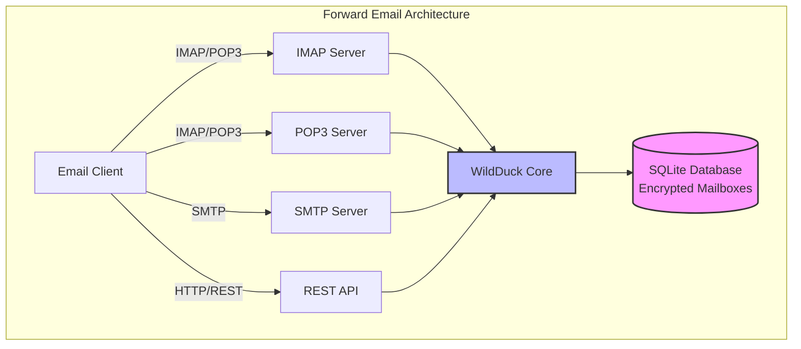

---


## E-posta Servisi Karşılaştırması - Protokol Desteği & RFC Standartlarına Uyum {#email-service-comparison---protocol-support--rfc-standards-compliance}

> \[!IMPORTANT]
> **Sandboxlanmış ve Kuantum Dirençli Şifreleme:** Forward Email, şifrenizi kullanarak bireysel olarak şifrelenmiş SQLite posta kutularını depolayan tek e-posta servisidir (şifre sadece sizde vardır). Her posta kutusu [sqleet](https://github.com/resilar/sqleet) (ChaCha20-Poly1305) ile şifrelenmiş, kendi içinde bağımsız, sandboxlanmış ve taşınabilirdir. Şifrenizi unutursanız posta kutunuzu kaybedersiniz - Forward Email bile kurtaramaz. Detaylar için [Quantum-Safe Encrypted Email](https://forwardemail.net/en/blog/docs/best-quantum-safe-encrypted-email-service) sayfasına bakınız.

Büyük e-posta sağlayıcıları arasında e-posta protokol desteği ve RFC standartlarının uygulanmasını karşılaştırın:

| Özellik                       | Forward Email                                                                                  | Postfix/Dovecot                                                                    | Gmail                                                                             | iCloud Mail                                           | Outlook.com                                                                                                                                                          | Fastmail                                                                                 | Yahoo/AOL (Verizon)                                                  | ProtonMail                                                                     | Tutanota                                                          |
| ----------------------------- | ---------------------------------------------------------------------------------------------- | ---------------------------------------------------------------------------------- | --------------------------------------------------------------------------------- | ----------------------------------------------------- | -------------------------------------------------------------------------------------------------------------------------------------------------------------------- | ---------------------------------------------------------------------------------------- | -------------------------------------------------------------------- | ------------------------------------------------------------------------------ | ----------------------------------------------------------------- |
| **Özel Alan Adı Ücreti**       | [Ücretsiz](https://forwardemail.net/en/pricing)                                                | [Ücretsiz](https://www.postfix.org/)                                              | [$7.20/ay](https://workspace.google.com/pricing)                                 | [$0.99/ay](https://support.apple.com/en-us/102622)    | [$7.20/ay](https://www.microsoft.com/en-us/microsoft-365/business/microsoft-365-business-basic)                                                                      | [$5/ay](https://www.fastmail.com/pricing/)                                               | [$3.19/ay](https://www.turbify.com/mail)                             | [$4.99/ay](https://proton.me/mail/pricing)                                     | [$3.27/ay](https://tuta.com/pricing)                              |
| **IMAP4rev1 (RFC 3501)**      | ✅ [Destekleniyor](#imap4-email-protocol-and-extensions)                                        | ✅ [Destekleniyor](https://www.dovecot.org/)                                       | ✅ [Destekleniyor](https://developers.google.com/workspace/gmail/imap/imap-extensions) | ✅ [Destekleniyor](https://support.apple.com/en-us/102431) | ✅ [Destekleniyor](https://support.microsoft.com/en-us/office/pop-imap-and-smtp-settings-for-outlook-com-d088b986-291d-42b8-9564-9c414e2aa040)                            | ✅ [Destekleniyor](https://www.fastmail.help/hc/en-us/articles/1500000278382-Email-standards) | ✅ [Destekleniyor](https://senders.yahooinc.com/developer/documentation/) | ⚠️ [Köprü Üzerinden](https://proton.me/support/imap-smtp-and-pop3-setup)            | ❌ Desteklenmiyor                                                 |
| **IMAP4rev2 (RFC 9051)**      | ⚠️ [Kısmi](https://forwardemail.net/en/blog/docs/best-quantum-safe-encrypted-email-service)    | ⚠️ [Kısmi](https://www.dovecot.org/)                                              | ⚠️ [%31](https://developers.google.com/workspace/gmail/imap/imap-extensions)      | ⚠️ [%92](https://support.apple.com/en-us/102431)      | ⚠️ [%46](https://support.microsoft.com/en-us/office/pop-imap-and-smtp-settings-for-outlook-com-d088b986-291d-42b8-9564-9c414e2aa040)                                 | ⚠️ [%69](https://www.fastmail.help/hc/en-us/articles/1500000278382-Email-standards)      | ⚠️ [%85](https://senders.yahooinc.com/developer/documentation/)      | ⚠️ [Köprü Üzerinden](https://proton.me/support/imap-smtp-and-pop3-setup)            | ❌ Desteklenmiyor                                                 |
| **POP3 (RFC 1939)**           | ✅ [Destekleniyor](#pop3-email-protocol-and-extensions)                                         | ✅ [Destekleniyor](https://www.dovecot.org/)                                       | ✅ [Destekleniyor](https://support.google.com/mail/answer/7104828)                 | ❌ Desteklenmiyor                                     | ✅ [Destekleniyor](https://support.microsoft.com/en-us/office/pop-imap-and-smtp-settings-for-outlook-com-d088b986-291d-42b8-9564-9c414e2aa040)                            | ✅ [Destekleniyor](https://www.fastmail.help/hc/en-us/articles/1500000278382-Email-standards) | ✅ [Destekleniyor](https://help.yahoo.com/kb/SLN4075.html)                | ⚠️ [Köprü Üzerinden](https://proton.me/support/imap-smtp-and-pop3-setup)            | ❌ Desteklenmiyor                                                 |
| **SMTP (RFC 5321)**           | ✅ [Destekleniyor](#smtp-email-protocol-and-extensions)                                         | ✅ [Destekleniyor](https://www.postfix.org/)                                       | ✅ [Destekleniyor](https://support.google.com/mail/answer/7126229)                 | ✅ [Destekleniyor](https://support.apple.com/en-us/102431) | ✅ [Destekleniyor](https://support.microsoft.com/en-us/office/pop-imap-and-smtp-settings-for-outlook-com-d088b986-291d-42b8-9564-9c414e2aa040)                            | ✅ [Destekleniyor](https://www.fastmail.help/hc/en-us/articles/1500000278382-Email-standards) | ✅ [Destekleniyor](https://help.yahoo.com/kb/SLN4075.html)                | ⚠️ [Köprü Üzerinden](https://proton.me/support/imap-smtp-and-pop3-setup)            | ❌ Desteklenmiyor                                                 |
| **JMAP (RFC 8620)**           | ❌ [Desteklenmiyor](#jmap-email-protocol)                                                      | ❌ Desteklenmiyor                                                                   | ❌ Desteklenmiyor                                                                  | ❌ Desteklenmiyor                                     | ❌ Desteklenmiyor                                                                                                                                                      | ✅ [Destekleniyor](https://www.fastmail.com/dev/)                                             | ❌ Desteklenmiyor                                                    | ❌ Desteklenmiyor                                                                | ❌ Desteklenmiyor                                                 |
| **DKIM (RFC 6376)**           | ✅ [Destekleniyor](#email-message-authentication-protocols)                                     | ✅ [Destekleniyor](https://github.com/trusteddomainproject/OpenDKIM)               | ✅ [Destekleniyor](https://support.google.com/a/answer/174124)                     | ✅ [Destekleniyor](https://support.apple.com/en-us/102431) | ✅ [Destekleniyor](https://learn.microsoft.com/en-us/defender-office-365/email-authentication-dkim-configure)                                                             | ✅ [Destekleniyor](https://www.fastmail.help/hc/en-us/articles/360060590573)                  | ✅ [Destekleniyor](https://help.yahoo.com/kb/SLN25426.html)               | ✅ [Destekleniyor](https://proton.me/support)                                       | ✅ [Destekleniyor](https://tuta.com/support#dkim)                      |
| **SPF (RFC 7208)**            | ✅ [Destekleniyor](#email-message-authentication-protocols)                                     | ✅ [Destekleniyor](https://www.postfix.org/)                                       | ✅ [Destekleniyor](https://support.google.com/a/answer/33786)                      | ✅ [Destekleniyor](https://support.apple.com/en-us/102431) | ✅ [Destekleniyor](https://learn.microsoft.com/en-us/microsoft-365/security/office-365-security/how-office-365-uses-spf-to-prevent-spoofing)                              | ✅ [Destekleniyor](https://www.fastmail.help/hc/en-us/articles/360060590573)                  | ✅ [Destekleniyor](https://help.yahoo.com/kb/SLN25426.html)               | ✅ [Destekleniyor](https://proton.me/support)                                       | ✅ [Destekleniyor](https://tuta.com/support#dkim)                      |
| **DMARC (RFC 7489)**          | ✅ [Destekleniyor](#email-message-authentication-protocols)                                     | ✅ [Destekleniyor](https://www.postfix.org/)                                       | ✅ [Destekleniyor](https://support.google.com/a/answer/2466580)                    | ✅ [Destekleniyor](https://support.apple.com/en-us/102431) | ✅ [Destekleniyor](https://learn.microsoft.com/en-us/microsoft-365/security/office-365-security/use-dmarc-to-validate-email)                                              | ✅ [Destekleniyor](https://www.fastmail.help/hc/en-us/articles/360060590573)                  | ✅ [Destekleniyor](https://help.yahoo.com/kb/SLN25426.html)               | ✅ [Destekleniyor](https://proton.me/support)                                       | ✅ [Destekleniyor](https://tuta.com/support#dkim)                      |
| **ARC (RFC 8617)**            | ✅ [Destekleniyor](#email-message-authentication-protocols)                                     | ✅ [Destekleniyor](https://github.com/trusteddomainproject/OpenARC)                | ✅ [Destekleniyor](https://support.google.com/a/answer/2466580)                    | ❌ Desteklenmiyor                                     | ✅ [Destekleniyor](https://learn.microsoft.com/en-us/defender-office-365/email-authentication-arc-configure)                                                              | ✅ [Destekleniyor](https://www.fastmail.help/hc/en-us/articles/360060590573)                  | ✅ [Destekleniyor](https://senders.yahooinc.com/developer/documentation/) | ✅ [Destekleniyor](https://proton.me/blog/what-is-authenticated-received-chain-arc) | ❌ Desteklenmiyor                                                 |
| **MTA-STS (RFC 8461)**        | ✅ [Destekleniyor](#email-transport-security-protocols)                                         | ✅ [Destekleniyor](https://www.postfix.org/)                                       | ✅ [Destekleniyor](https://support.google.com/a/answer/9261504)                    | ✅ [Destekleniyor](https://support.apple.com/en-us/102431) | ✅ [Destekleniyor](https://learn.microsoft.com/en-us/defender-office-365/email-authentication-about)                                                                      | ✅ [Destekleniyor](https://www.fastmail.help/hc/en-us/articles/360060590573)                  | ✅ [Destekleniyor](https://senders.yahooinc.com/developer/documentation/) | ✅ [Destekleniyor](https://proton.me/support)                                       | ✅ [Destekleniyor](https://tuta.com/security)                          |
| **DANE (RFC 7671)**           | ✅ [Destekleniyor](#email-transport-security-protocols)                                         | ✅ [Destekleniyor](https://www.postfix.org/)                                       | ❌ Desteklenmiyor                                                                  | ❌ Desteklenmiyor                                     | ❌ Desteklenmiyor                                                                                                                                                      | ❌ Desteklenmiyor                                                                          | ❌ Desteklenmiyor                                                    | ✅ [Destekleniyor](https://proton.me/support)                                       | ✅ [Destekleniyor](https://tuta.com/support#dane)                      |
| **DSN (RFC 3461)**            | ✅ [Destekleniyor](#smtp-email-protocol-and-extensions)                                         | ✅ [Destekleniyor](https://www.postfix.org/DSN_README.html)                        | ❌ Desteklenmiyor                                                                  | ✅ [Destekleniyor](#protocol-capability-tests)           | ✅ [Destekleniyor](#protocol-capability-tests)                                                                                                                            | ⚠️ [Bilinmiyor](https://www.fastmail.help/hc/en-us/articles/1500000278382-Email-standards)  | ❌ Desteklenmiyor                                                    | ⚠️ [Köprü Üzerinden](https://proton.me/support/imap-smtp-and-pop3-setup)            | ❌ Desteklenmiyor                                                 |
| **REQUIRETLS (RFC 8689)**     | ✅ [Destekleniyor](#email-transport-security-protocols)                                         | ✅ [Destekleniyor](https://www.postfix.org/TLS_README.html#server_require_tls)     | ⚠️ Bilinmiyor                                                                     | ⚠️ Bilinmiyor                                        | ⚠️ Bilinmiyor                                                                                                                                                           | ⚠️ Bilinmiyor                                                                             | ⚠️ Bilinmiyor                                                       | ⚠️ [Köprü Üzerinden](https://proton.me/support/imap-smtp-and-pop3-setup)            | ❌ Desteklenmiyor                                                 |
| **ManageSieve (RFC 5804)**    | ✅ [Destekleniyor](#managesieve-rfc-5804)                                                       | ✅ [Destekleniyor](https://doc.dovecot.org/admin_manual/pigeonhole_managesieve_server/) | ❌ Desteklenmiyor                                                                  | ❌ Desteklenmiyor                                     | ❌ Desteklenmiyor                                                                                                                                                      | ✅ [Destekleniyor](https://www.fastmail.help/hc/en-us/articles/360060590573)                  | ❌ Desteklenmiyor                                                    | ❌ Desteklenmiyor                                                                | ❌ Desteklenmiyor                                                 |
| **OpenPGP (RFC 9580)**        | ✅ [Destekleniyor](#email-message-encryption)                                                   | ⚠️ [Eklentilerle](https://www.gnupg.org/)                                         | ⚠️ [Üçüncü taraf](https://github.com/google/end-to-end)                          | ⚠️ [Üçüncü taraf](https://gpgtools.org/)               | ⚠️ [Üçüncü taraf](https://gpg4win.org/)                                                                                                                               | ⚠️ [Üçüncü taraf](https://www.fastmail.help/hc/en-us/articles/360060590573)               | ⚠️ [Üçüncü taraf](https://help.yahoo.com/kb/SLN25426.html)            | ✅ [Yerel](https://proton.me/support/pgp-mime-pgp-inline)                      | ❌ Desteklenmiyor                                                 |
| **S/MIME (RFC 8551)**         | ✅ [Destekleniyor](#email-message-encryption)                                                   | ✅ [Destekleniyor](https://www.openssl.org/)                                       | ✅ [Destekleniyor](https://support.google.com/mail/answer/81126)                 | ✅ [Destekleniyor](https://support.apple.com/en-us/102431) | ✅ [Destekleniyor](https://support.microsoft.com/en-us/office/send-view-and-reply-to-encrypted-messages-in-outlook-for-pc-eaa43495-9bbb-4fca-922a-df90dee51980)           | ⚠️ [Kısmi](https://www.fastmail.help/hc/en-us/articles/360060590573)                   | ❌ Desteklenmiyor                                                    | ✅ [Destekleniyor](https://proton.me/support/pgp-mime-pgp-inline)                   | ❌ Desteklenmiyor                                                 |
| **CalDAV (RFC 4791)**         | ✅ [Destekleniyor](#calendaring-and-contacts-protocols)                                         | ✅ [Destekleniyor](https://www.davical.org/)                                       | ✅ [Destekleniyor](https://developers.google.com/calendar/caldav/v2/guide)       | ✅ [Destekleniyor](https://support.apple.com/en-us/102431) | ❌ Desteklenmiyor                                                                                                                                                      | ✅ [Destekleniyor](https://www.fastmail.help/hc/en-us/articles/360060590573)                  | ❌ Desteklenmiyor                                                    | ✅ [Köprü Üzerinden](https://proton.me/support/proton-calendar)                      | ❌ Desteklenmiyor                                                 |
| **CardDAV (RFC 6352)**        | ✅ [Destekleniyor](#calendaring-and-contacts-protocols)                                         | ✅ [Destekleniyor](https://www.davical.org/)                                       | ✅ [Destekleniyor](https://developers.google.com/people/carddav)                 | ✅ [Destekleniyor](https://support.apple.com/en-us/102431) | ❌ Desteklenmiyor                                                                                                                                                      | ✅ [Destekleniyor](https://www.fastmail.help/hc/en-us/articles/360060590573)                  | ❌ Desteklenmiyor                                                    | ✅ [Köprü Üzerinden](https://proton.me/support/proton-contacts)                      | ❌ Desteklenmiyor                                                 |
| **Görevler (VTODO)**          | ✅ [Destekleniyor](#tasks-and-reminders-caldav-vtodo)                                           | ✅ [Destekleniyor](https://www.davical.org/)                                       | ❌ Desteklenmiyor                                                                  | ✅ [Destekleniyor](https://support.apple.com/en-us/102431) | ❌ Desteklenmiyor                                                                                                                                                      | ✅ [Destekleniyor](https://www.fastmail.help/hc/en-us/articles/360060590573)                  | ❌ Desteklenmiyor                                                    | ❌ Desteklenmiyor                                                                | ❌ Desteklenmiyor                                                 |
| **Sieve (RFC 5228)**          | ✅ [Destekleniyor](#sieve-rfc-5228)                                                             | ✅ [Destekleniyor](https://www.dovecot.org/)                                       | ❌ Desteklenmiyor                                                                  | ❌ Desteklenmiyor                                     | ❌ Desteklenmiyor                                                                                                                                                      | ✅ [Destekleniyor](https://www.fastmail.help/hc/en-us/articles/360060590573)                  | ❌ Desteklenmiyor                                                    | ❌ Desteklenmiyor                                                                | ❌ Desteklenmiyor                                                 |
| **Catch-All**                 | ✅ [Destekleniyor](https://forwardemail.net/en/faq#can-i-have-multiple-global-catch-all-recipients) | ✅ Destekleniyor                                                                    | ✅ [Destekleniyor](https://support.google.com/a/answer/4524505)                  | ❌ Desteklenmiyor                                     | ❌ [Desteklenmiyor](https://learn.microsoft.com/en-us/exchange/recipients-in-exchange-online/manage-mail-users)                                                        | ✅ [Destekleniyor](https://www.fastmail.help/hc/en-us/articles/1500000278382-Email-standards) | ❌ Desteklenmiyor                                                    | ❌ Desteklenmiyor                                                                | ✅ [Destekleniyor](https://tuta.com/support#catch-all-alias)           |
| **Sınırsız Takma Adlar**      | ✅ [Destekleniyor](https://forwardemail.net/en/faq#advanced-features)                           | ✅ Destekleniyor                                                                    | ✅ [Destekleniyor](https://support.google.com/a/answer/33327)                    | ✅ [Destekleniyor](https://support.apple.com/en-us/102431) | ✅ [Destekleniyor](https://support.microsoft.com/en-us/office/add-or-remove-an-email-alias-in-outlook-com-459b1989-356d-40fa-a689-8f285b13f1f2)                           | ✅ [Destekleniyor](https://www.fastmail.help/hc/en-us/articles/1500000278382-Email-standards) | ❌ Desteklenmiyor                                                    | ✅ [Destekleniyor](https://proton.me/support/addresses-and-aliases)                 | ✅ [Destekleniyor](https://tuta.com/support#aliases)                   |
| **İki Faktörlü Kimlik Doğrulama** | ✅ [Destekleniyor](https://forwardemail.net/en/faq#do-you-support-passkeys-and-webauthn)        | ✅ Destekleniyor                                                                    | ✅ [Destekleniyor](https://support.google.com/accounts/answer/185839)            | ✅ [Destekleniyor](https://support.apple.com/en-us/102431) | ✅ [Destekleniyor](https://support.microsoft.com/en-us/account-billing/how-to-use-two-step-verification-with-your-microsoft-account-c7910146-672f-01e9-50a0-93b4585e7eb4) | ✅ [Destekleniyor](https://www.fastmail.help/hc/en-us/articles/1500000278382-Email-standards) | ✅ [Destekleniyor](https://help.yahoo.com/kb/SLN5013.html)                | ✅ [Destekleniyor](https://proton.me/support/two-factor-authentication-2fa)         | ✅ [Destekleniyor](https://tuta.com/support#two-factor-authentication) |
| **Push Bildirimleri**         | ✅ [Destekleniyor](#ios-push-notifications)                                                     | ⚠️ Eklentilerle                                                                     | ✅ [Destekleniyor](https://developers.google.com/gmail/api/guides/push)          | ✅ [Destekleniyor](https://support.apple.com/en-us/102431) | ✅ [Destekleniyor](https://learn.microsoft.com/en-us/graph/change-notifications-delivery-webhooks)                                                                        | ✅ [Destekleniyor](https://www.fastmail.help/hc/en-us/articles/1500000278382-Email-standards) | ❌ Desteklenmiyor                                                    | ✅ [Destekleniyor](https://proton.me/support/notifications)                         | ✅ [Destekleniyor](https://tuta.com/support#push-notifications)        |
| **Takvim/Rehber Masaüstü**   | ✅ [Destekleniyor](#calendaring-and-contacts-protocols)                                         | ✅ Destekleniyor                                                                    | ✅ [Destekleniyor](https://support.google.com/calendar)                          | ✅ [Destekleniyor](https://support.apple.com/en-us/102431) | ✅ [Destekleniyor](https://support.microsoft.com/en-us/office/calendar-and-contacts-in-outlook-com-d3e8a6e6-5c1f-4e3e-9f1e-7c0f0e0c0c0c)                                  | ✅ [Destekleniyor](https://www.fastmail.help/hc/en-us/articles/1500000278382-Email-standards) | ❌ Desteklenmiyor                                                    | ✅ [Destekleniyor](https://proton.me/support/proton-calendar)                       | ❌ Desteklenmiyor                                                 |
| **Gelişmiş Arama**            | ✅ [Destekleniyor](https://forwardemail.net/en/email-api)                                       | ✅ Destekleniyor                                                                    | ✅ [Destekleniyor](https://support.google.com/mail/answer/7190)                  | ✅ [Destekleniyor](https://support.apple.com/en-us/102431) | ✅ [Destekleniyor](https://support.microsoft.com/en-us/office/search-for-email-messages-in-outlook-com-6f5f2e92-9d5e-4c4e-9b0e-0c0c0c0c0c0c)                              | ✅ [Destekleniyor](https://www.fastmail.help/hc/en-us/articles/1500000278382-Email-standards) | ✅ [Destekleniyor](https://help.yahoo.com/kb/SLN3561.html)                | ✅ [Destekleniyor](https://proton.me/support/search-and-filters)                    | ✅ [Destekleniyor](https://tuta.com/support)                           |
| **API/Entegrasyonlar**        | ✅ [39 Uç Nokta](https://forwardemail.net/en/email-api)                                         | ✅ Destekleniyor                                                                    | ✅ [Destekleniyor](https://developers.google.com/gmail/api)                      | ❌ Desteklenmiyor                                     | ✅ [Destekleniyor](https://learn.microsoft.com/en-us/graph/api/resources/mail-api-overview)                                                                               | ✅ [Destekleniyor](https://www.fastmail.help/hc/en-us/articles/1500000278382-Email-standards) | ❌ Desteklenmiyor                                                    | ✅ [Destekleniyor](https://proton.me/support/proton-mail-api)                       | ❌ Desteklenmiyor                                                 |
### Protokol Desteği Görselleştirmesi {#protocol-support-visualization}

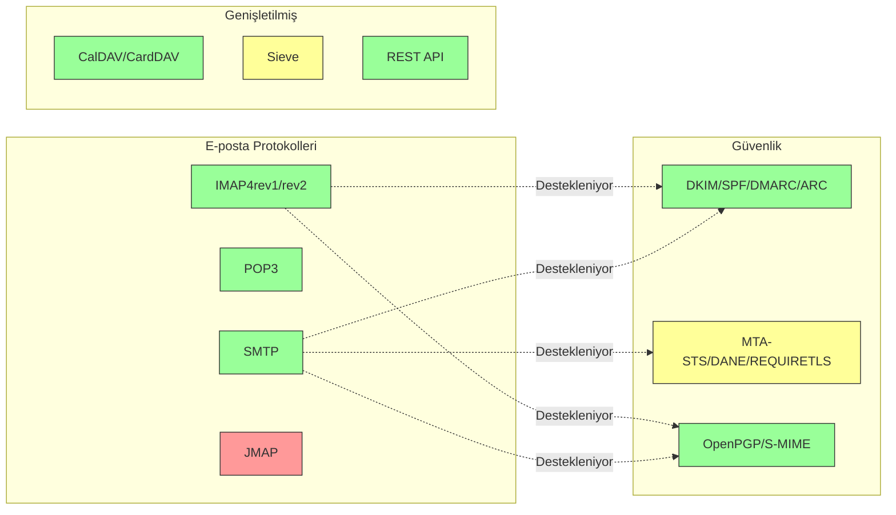

---


## Temel E-posta Protokolleri {#core-email-protocols}

### E-posta Protokol Akışı {#email-protocol-flow}

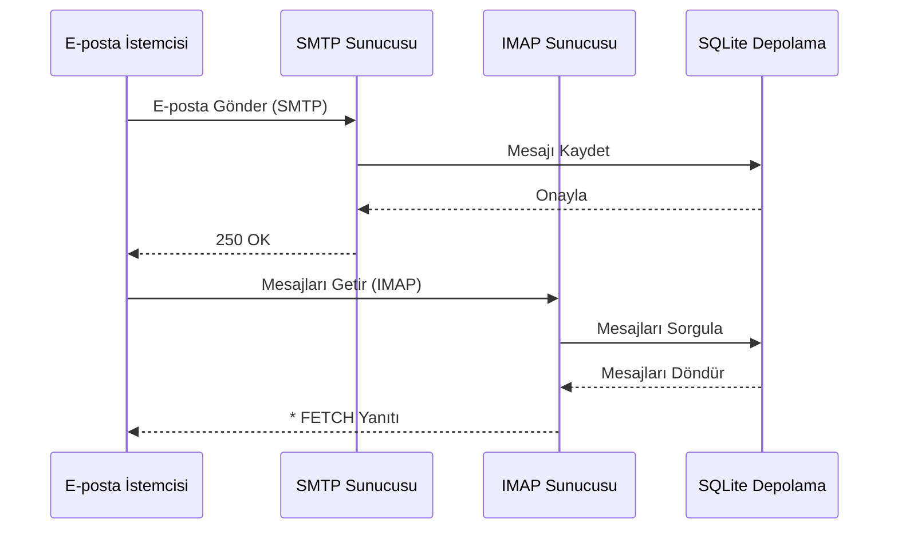


## IMAP4 E-posta Protokolü ve Uzantıları {#imap4-email-protocol-and-extensions}

> \[!NOTE]
> Forward Email, IMAP4rev1 (RFC 3501) ve IMAP4rev2 (RFC 9051) özelliklerinin kısmi desteği ile uyumludur.

Forward Email, WildDuck posta sunucusu uygulaması aracılığıyla sağlam IMAP4 desteği sunar. Sunucu, IMAP4rev1 (RFC 3501) protokolünü IMAP4rev2 (RFC 9051) uzantılarının kısmi desteği ile uygular.

Forward Email'in IMAP işlevselliği, [WildDuck](https://github.com/nodemailer/wildduck) bağımlılığı tarafından sağlanmaktadır. Aşağıdaki e-posta RFC'leri desteklenmektedir:

| RFC                                                       | Başlık                                                           | Uygulama Notları                                     |
| --------------------------------------------------------- | ---------------------------------------------------------------- | ---------------------------------------------------- |
| [RFC 3501](https://datatracker.ietf.org/doc/html/rfc3501) | İnternet Mesaj Erişim Protokolü (IMAP) - Sürüm 4rev1             | Tam destek, kasıtlı farklılıklar ile (aşağıya bakınız) |
| [RFC 2177](https://datatracker.ietf.org/doc/html/rfc2177) | IMAP4 IDLE komutu                                                | Push tarzı bildirimler                               |
| [RFC 2342](https://datatracker.ietf.org/doc/html/rfc2342) | IMAP4 Ad Alanı                                                  | Posta kutusu ad alanı desteği                         |
| [RFC 2087](https://datatracker.ietf.org/doc/html/rfc2087) | IMAP4 QUOTA uzantısı                                            | Depolama kota yönetimi                               |
| [RFC 2971](https://datatracker.ietf.org/doc/html/rfc2971) | IMAP4 ID uzantısı                                               | İstemci/sunucu tanımlaması                            |
| [RFC 5161](https://datatracker.ietf.org/doc/html/rfc5161) | IMAP4 ENABLE Uzantısı                                           | IMAP uzantılarını etkinleştirme                       |
| [RFC 4959](https://datatracker.ietf.org/doc/html/rfc4959) | SASL İlk İstemci Yanıtına Yönelik IMAP Uzantısı (SASL-IR)        | İlk istemci yanıtı                                   |
| [RFC 3691](https://datatracker.ietf.org/doc/html/rfc3691) | IMAP4 UNSELECT komutu                                           | EXPUNGE olmadan posta kutusunu kapatma               |
| [RFC 4315](https://datatracker.ietf.org/doc/html/rfc4315) | IMAP UIDPLUS uzantısı                                           | Gelişmiş UID komutları                                |
| [RFC 7162](https://datatracker.ietf.org/doc/html/rfc7162) | IMAP Uzantıları: Hızlı Bayrak Değişiklikleri Yeniden Senkronizasyonu (CONDSTORE) | Koşullu STORE                                        |
| [RFC 6154](https://datatracker.ietf.org/doc/html/rfc6154) | Özel Kullanım Posta Kutuları için IMAP LIST Uzantısı             | Özel posta kutusu özellikleri                         |
| [RFC 6851](https://datatracker.ietf.org/doc/html/rfc6851) | IMAP MOVE Uzantısı                                              | Atomik MOVE komutu                                   |
| [RFC 6855](https://datatracker.ietf.org/doc/html/rfc6855) | UTF-8 için IMAP Desteği                                         | UTF-8 desteği                                        |
| [RFC 3348](https://datatracker.ietf.org/doc/html/rfc3348) | IMAP4 Alt Posta Kutusu Uzantısı                                 | Alt posta kutusu bilgisi                             |
| [RFC 7889](https://datatracker.ietf.org/doc/html/rfc7889) | Maksimum Yükleme Boyutunu Bildirmek için IMAP4 Uzantısı (APPENDLIMIT) | Maksimum yükleme boyutu                              |
**Desteklenen IMAP Uzantıları:**

| Uzantı            | RFC          | Durum       | Açıklama                       |
| ----------------- | ------------ | ----------- | ----------------------------- |
| IDLE              | RFC 2177     | ✅ Destekleniyor | Push tarzı bildirimler         |
| NAMESPACE         | RFC 2342     | ✅ Destekleniyor | Posta kutusu isim alanı desteği |
| QUOTA             | RFC 2087     | ✅ Destekleniyor | Depolama kotası yönetimi       |
| ID                | RFC 2971     | ✅ Destekleniyor | İstemci/sunucu kimlik doğrulama |
| ENABLE            | RFC 5161     | ✅ Destekleniyor | IMAP uzantılarını etkinleştir  |
| SASL-IR           | RFC 4959     | ✅ Destekleniyor | İlk istemci yanıtı             |
| UNSELECT          | RFC 3691     | ✅ Destekleniyor | EXPUNGE olmadan posta kutusunu kapatma |
| UIDPLUS           | RFC 4315     | ✅ Destekleniyor | Gelişmiş UID komutları         |
| CONDSTORE         | RFC 7162     | ✅ Destekleniyor | Koşullu STORE                 |
| SPECIAL-USE       | RFC 6154     | ✅ Destekleniyor | Özel posta kutusu öznitelikleri |
| MOVE              | RFC 6851     | ✅ Destekleniyor | Atomik MOVE komutu            |
| UTF8=ACCEPT       | RFC 6855     | ✅ Destekleniyor | UTF-8 desteği                 |
| CHILDREN          | RFC 3348     | ✅ Destekleniyor | Alt posta kutusu bilgisi      |
| APPENDLIMIT       | RFC 7889     | ✅ Destekleniyor | Maksimum yükleme boyutu       |
| XLIST             | Standart dışı | ✅ Destekleniyor | Gmail uyumlu klasör listesi   |
| XAPPLEPUSHSERVICE | Standart dışı | ✅ Destekleniyor | Apple Push Bildirim Servisi   |

### RFC Spesifikasyonlarından IMAP Protokol Farkları {#imap-protocol-differences-from-rfc-specifications}

> \[!WARNING]
> Aşağıdaki RFC spesifikasyonlarından farklılıklar istemci uyumluluğunu etkileyebilir.

Forward Email, bazı IMAP RFC spesifikasyonlarından kasıtlı olarak sapmaktadır. Bu farklılıklar WildDuck'tan miras alınmış olup aşağıda belgelenmiştir:

* **\Recent bayrağı yok:** `\Recent` bayrağı uygulanmamıştır. Tüm mesajlar bu bayraksız olarak döndürülür.
* **RENAME alt klasörleri etkilemez:** Bir klasör yeniden adlandırıldığında, alt klasörler otomatik olarak yeniden adlandırılmaz. Klasör hiyerarşisi veritabanında düz yapıdadır.
* **INBOX yeniden adlandırılamaz:** [RFC 3501](https://datatracker.ietf.org/doc/html/rfc3501) INBOX'un yeniden adlandırılmasına izin verirken, Forward Email bunu açıkça yasaklar. Bkz. [WildDuck kaynak kodu](https://github.com/nodemailer/wildduck/blob/master/imap-core/lib/commands/rename.js#L27).
* **İzinsiz FLAGS yanıtları yok:** Bayraklar değiştirildiğinde, istemciye izinsiz FLAGS yanıtları gönderilmez.
* **STORE silinmiş mesajlar için NO döner:** Silinmiş mesajların bayraklarını değiştirmeye çalışmak, sessizce yok saymak yerine NO döner.
* **SEARCH'te CHARSET göz ardı edilir:** SEARCH komutlarındaki `CHARSET` argümanı göz ardı edilir. Tüm aramalar UTF-8 kullanır.
* **MODSEQ meta verisi göz ardı edilir:** STORE komutlarındaki `MODSEQ` meta verisi dikkate alınmaz.
* **SEARCH TEXT ve SEARCH BODY:** Forward Email, MongoDB'nin `$text` araması yerine [SQLite FTS5](https://www.sqlite.org/fts5.html) (Tam Metin Arama) kullanır. Bu şunları sağlar:
  * `NOT` operatörü desteği (MongoDB desteklemez)
  * Sıralı arama sonuçları
  * Büyük posta kutularında 100ms altı arama performansı
* **Otomatik expunge davranışı:** `\Deleted` olarak işaretlenen mesajlar posta kutusu kapatıldığında otomatik olarak expunge edilir.
* **Mesaj bütünlüğü:** Bazı mesaj değişiklikleri orijinal mesaj yapısını tam olarak korumayabilir.

**IMAP4rev2 Kısmi Destek:**

Forward Email, IMAP4rev1 (RFC 3501) uygular ve IMAP4rev2 (RFC 9051) özelliklerinin bir kısmını destekler. Aşağıdaki IMAP4rev2 özellikleri **henüz desteklenmemektedir**:

* **LIST-STATUS** - Birleşik LIST ve STATUS komutları
* **LITERAL-** - Senkronize olmayan literal'ler (eksi varyant)
* **OBJECTID** - Benzersiz nesne kimlikleri
* **SAVEDATE** - Kaydetme tarihi özniteliği
* **REPLACE** - Atomik mesaj değiştirme
* **UNAUTHENTICATE** - Bağlantıyı kapatmadan kimlik doğrulamayı sonlandırma

**Gevşek Gövde Yapısı İşleme:**

Forward Email, hatalı MIME yapıları için "gevşek gövde" işleme kullanır; bu, katı RFC yorumundan farklı olabilir. Bu, standartlara tam uymayan gerçek dünya e-postalarıyla uyumluluğu artırır.
**METADATA Uzantısı (RFC 5464):**

IMAP METADATA uzantısı **desteklenmemektedir**. Bu uzantı hakkında daha fazla bilgi için [RFC 5464](https://datatracker.ietf.org/doc/html/rfc5464) sayfasına bakınız. Bu özelliğin eklenmesiyle ilgili tartışma [WildDuck Issue #937](https://github.com/zone-eu/wildduck/issues/937) adresinde bulunabilir.

### Desteklenmeyen IMAP Uzantıları {#imap-extensions-not-supported}

Aşağıdaki IMAP uzantıları [IANA IMAP Capabilities Registry](https://www.iana.org/assignments/imap-capabilities/imap-capabilities.xhtml) listesinden desteklenmemektedir:

| RFC                                                       | Başlık                                                                                                          | Sebep                                                                                                                                  |
| --------------------------------------------------------- | --------------------------------------------------------------------------------------------------------------- | --------------------------------------------------------------------------------------------------------------------------------------- |
| [RFC 2086](https://datatracker.ietf.org/doc/html/rfc2086) | IMAP4 ACL uzantısı                                                                                              | Paylaşılan klasörler uygulanmamıştır. Bkz. [WildDuck Issue #427](https://github.com/zone-eu/wildduck/issues/427)                        |
| [RFC 5256](https://datatracker.ietf.org/doc/html/rfc5256) | IMAP SORT ve THREAD Uzantıları                                                                                   | Threading dahili olarak uygulanmıştır ancak RFC 5256 protokolü ile değil. Bkz. [WildDuck Issue #12](https://github.com/zone-eu/wildduck/issues/12) |
| [RFC 5162](https://datatracker.ietf.org/doc/html/rfc5162) | IMAP4 Hızlı Klasör Yeniden Senkronizasyonu (QRESYNC) Uzantıları                                                  | Uygulanmamıştır                                                                                                                        |
| [RFC 5464](https://datatracker.ietf.org/doc/html/rfc5464) | IMAP METADATA Uzantısı                                                                                          | Metadata işlemleri göz ardı edilmektedir. Bkz. [WildDuck dokümantasyonu](https://datatracker.ietf.org/doc/html/rfc5464)                 |
| [RFC 5258](https://datatracker.ietf.org/doc/html/rfc5258) | IMAP4 LIST Komut Uzantıları                                                                                     | Uygulanmamıştır                                                                                                                        |
| [RFC 5267](https://datatracker.ietf.org/doc/html/rfc5267) | IMAP4 için Bağlamlar                                                                                            | Uygulanmamıştır                                                                                                                        |
| [RFC 5465](https://datatracker.ietf.org/doc/html/rfc5465) | IMAP NOTIFY Uzantısı                                                                                            | Uygulanmamıştır                                                                                                                        |
| [RFC 5466](https://datatracker.ietf.org/doc/html/rfc5466) | IMAP4 FİLTRELER Uzantısı                                                                                        | Uygulanmamıştır                                                                                                                        |
| [RFC 6203](https://datatracker.ietf.org/doc/html/rfc6203) | IMAP4 Bulanık Arama Uzantısı                                                                                    | Uygulanmamıştır                                                                                                                        |
| [RFC 6785](https://datatracker.ietf.org/doc/html/rfc6785) | IMAP4 Uygulama Önerileri                                                                                        | Öneriler tam olarak takip edilmemiştir                                                                                                |
| [RFC 7162](https://datatracker.ietf.org/doc/html/rfc7162) | IMAP Uzantıları: Hızlı Bayrak Değişiklikleri Yeniden Senkronizasyonu (CONDSTORE) ve Hızlı Klasör Yeniden Senkronizasyonu (QRESYNC) | Uygulanmamıştır                                                                                                                        |
| [RFC 8437](https://datatracker.ietf.org/doc/html/rfc8437) | Bağlantı Yeniden Kullanımı için IMAP UNAUTHENTICATE Uzantısı                                                    | Uygulanmamıştır                                                                                                                        |
| [RFC 8438](https://datatracker.ietf.org/doc/html/rfc8438) | STATUS=SIZE için IMAP Uzantısı                                                                                   | Uygulanmamıştır                                                                                                                        |
| [RFC 8457](https://datatracker.ietf.org/doc/html/rfc8457) | IMAP "$Important" Anahtar Kelimesi ve "\Important" Özel Kullanım Özelliği                                        | Uygulanmamıştır                                                                                                                        |
| [RFC 8474](https://datatracker.ietf.org/doc/html/rfc8474) | Nesne Tanımlayıcıları için IMAP Uzantısı                                                                        | Uygulanmamıştır                                                                                                                        |
| [RFC 9051](https://datatracker.ietf.org/doc/html/rfc9051) | İnternet Mesaj Erişim Protokolü (IMAP) - Sürüm 4rev2                                                            | Forward Email IMAP4rev1 ([RFC 3501](https://datatracker.ietf.org/doc/html/rfc3501)) uygular                                            |
## POP3 E-posta Protokolü ve Uzantıları {#pop3-email-protocol-and-extensions}

> \[!NOTE]
> Forward Email, e-posta alımı için standart uzantılarla POP3 (RFC 1939) desteği sunar.

Forward Email'in POP3 işlevselliği [WildDuck](https://github.com/nodemailer/wildduck) bağımlılığı tarafından sağlanmaktadır. Aşağıdaki e-posta RFC'leri desteklenmektedir:

| RFC                                                       | Başlık                                  | Uygulama Notları                                    |
| --------------------------------------------------------- | --------------------------------------- | --------------------------------------------------- |
| [RFC 1939](https://datatracker.ietf.org/doc/html/rfc1939) | Posta Ofisi Protokolü - Sürüm 3 (POP3) | Tam destek, kasıtlı farklılıklar ile (aşağıya bakınız) |
| [RFC 2595](https://datatracker.ietf.org/doc/html/rfc2595) | IMAP, POP3 ve ACAP ile TLS Kullanımı    | STARTTLS desteği                                    |
| [RFC 2449](https://datatracker.ietf.org/doc/html/rfc2449) | POP3 Uzantı Mekanizması                 | CAPA komutu desteği                                 |

Forward Email, IMAP yerine bu daha basit protokolü tercih eden istemciler için POP3 desteği sağlar. POP3, e-postaları tek bir cihaza indirip sunucudan kaldırmak isteyen kullanıcılar için idealdir.

**Desteklenen POP3 Uzantıları:**

| Uzantı   | RFC      | Durum       | Açıklama                   |
| -------- | -------- | ----------- | -------------------------- |
| TOP      | RFC 1939 | ✅ Destekli | Mesaj başlıklarını alma    |
| USER     | RFC 1939 | ✅ Destekli | Kullanıcı adı doğrulama    |
| UIDL     | RFC 1939 | ✅ Destekli | Benzersiz mesaj tanımlayıcıları |
| EXPIRE   | RFC 2449 | ✅ Destekli | Mesaj son kullanma politikası |

### POP3 Protokolünün RFC Spesifikasyonlarından Farkları {#pop3-protocol-differences-from-rfc-specifications}

> \[!WARNING]
> POP3, IMAP'e kıyasla doğasında sınırlamalara sahiptir.

> \[!IMPORTANT]
> **Kritik Fark: Forward Email ve WildDuck POP3 DELE Davranışı**
>
> Forward Email, POP3 `DELE` komutları için RFC uyumlu kalıcı silme uygular; WildDuck ise mesajları Çöp Kutusuna taşır.

**Forward Email Davranışı** ([kaynak kodu](https://github.com/forwardemail/forwardemail.net/blob/master/pop3-server.js)):

* `DELE` → `QUIT` mesajları kalıcı olarak siler
* [RFC 1939](https://datatracker.ietf.org/doc/html/rfc1939) spesifikasyonuna tam uyum sağlar
* Dovecot (varsayılan), Postfix ve diğer standart uyumlu sunucularla aynı davranışı gösterir

**WildDuck Davranışı** ([tartışma](https://github.com/zone-eu/wildduck/issues/937)):

* `DELE` → `QUIT` mesajları Çöp Kutusuna taşır (Gmail benzeri)
* Kullanıcı güvenliği için kasıtlı tasarım kararı
* RFC uyumlu değil ancak kazara veri kaybını önler

**Neden Forward Email Farklıdır:**

* **RFC Uyumu:** [RFC 1939](https://datatracker.ietf.org/doc/html/rfc1939) spesifikasyonuna bağlı kalır
* **Kullanıcı Beklentileri:** İndir ve sil iş akışı kalıcı silmeyi bekler
* **Depolama Yönetimi:** Disk alanının doğru şekilde geri kazanılması
* **Uyumluluk:** Diğer RFC uyumlu sunucularla tutarlılık

> \[!NOTE]
> **POP3 Mesaj Listesi:** Forward Email, INBOX'taki TÜM mesajları sınır olmadan listeler. Bu, varsayılan olarak 250 mesajla sınırlayan WildDuck'tan farklıdır. Bakınız [kaynak kodu](https://github.com/forwardemail/forwardemail.net/blob/master/pop3-server.js).

**Tek Cihaz Erişimi:**

POP3, tek cihaz erişimi için tasarlanmıştır. Mesajlar genellikle indirilir ve sunucudan kaldırılır, bu nedenle çoklu cihaz senkronizasyonu için uygun değildir.

**Klasör Desteği Yoktur:**

POP3 yalnızca INBOX klasörüne erişir. Diğer klasörler (Gönderilen, Taslaklar, Çöp Kutusu vb.) POP3 üzerinden erişilebilir değildir.

**Sınırlı Mesaj Yönetimi:**

POP3 temel mesaj alma ve silme sağlar. Bayraklama, taşıma veya mesaj arama gibi gelişmiş özellikler mevcut değildir.

### Desteklenmeyen POP3 Uzantıları {#pop3-extensions-not-supported}

Aşağıdaki POP3 uzantıları [IANA POP3 Uzantı Mekanizması Kaydı](https://www.iana.org/assignments/pop3-extension-mechanism/pop3-extension-mechanism.xhtml) tarafından belirtilmiş olup desteklenmemektedir:
| RFC                                                       | Başlık                                                | Sebep                                  |
| --------------------------------------------------------- | ----------------------------------------------------- | ------------------------------------- |
| [RFC 6856](https://datatracker.ietf.org/doc/html/rfc6856) | Posta Ofisi Protokolü Sürüm 3 (POP3) için UTF-8 Desteği | WildDuck POP3 sunucusunda uygulanmamış |
| [RFC 2595](https://datatracker.ietf.org/doc/html/rfc2595) | STLS komutu                                           | Sadece STARTTLS destekleniyor, STLS değil |
| [RFC 3206](https://datatracker.ietf.org/doc/html/rfc3206) | SYS ve AUTH POP Yanıt Kodları                          | Uygulanmamış                         |

---


## SMTP E-posta Protokolü ve Uzantıları {#smtp-email-protocol-and-extensions}

> \[!NOTE]
> Forward Email, güvenli ve güvenilir e-posta teslimatı için modern uzantılarla birlikte SMTP (RFC 5321) destekler.

Forward Email'in SMTP işlevselliği birden fazla bileşen tarafından sağlanır: [smtp-server](https://github.com/nodemailer/smtp-server) (nodemailer), [zone-mta](https://github.com/zone-eu/zone-mta) ve özel uygulamalar. Aşağıdaki e-posta RFC'leri desteklenmektedir:

| RFC                                                       | Başlık                                                                           | Uygulama Notları                   |
| --------------------------------------------------------- | -------------------------------------------------------------------------------- | --------------------------------- |
| [RFC 5321](https://datatracker.ietf.org/doc/html/rfc5321) | Basit Posta Aktarım Protokolü (SMTP)                                             | Tam destek                       |
| [RFC 3207](https://datatracker.ietf.org/doc/html/rfc3207) | Taşıma Katmanı Güvenliği Üzerinden Güvenli SMTP için SMTP Hizmet Uzantısı (STARTTLS) | TLS/SSL desteği                  |
| [RFC 4954](https://datatracker.ietf.org/doc/html/rfc4954) | Kimlik Doğrulama için SMTP Hizmet Uzantısı (AUTH)                                | PLAIN, LOGIN, CRAM-MD5, XOAUTH2  |
| [RFC 6531](https://datatracker.ietf.org/doc/html/rfc6531) | Uluslararasılaştırılmış E-posta için SMTP Uzantısı (SMTPUTF8)                     | Yerel unicode e-posta adresi desteği |
| [RFC 3461](https://datatracker.ietf.org/doc/html/rfc3461) | Teslimat Durumu Bildirimleri için SMTP Hizmet Uzantısı (DSN)                     | Tam DSN desteği                  |
| [RFC 3463](https://datatracker.ietf.org/doc/html/rfc3463) | Gelişmiş Posta Sistemi Durum Kodları                                            | Yanıtlarda gelişmiş durum kodları |
| [RFC 1870](https://datatracker.ietf.org/doc/html/rfc1870) | Mesaj Boyutu Bildirimi için SMTP Hizmet Uzantısı (SIZE)                         | Maksimum mesaj boyutu bildirimi   |
| [RFC 2920](https://datatracker.ietf.org/doc/html/rfc2920) | Komut Boru Hattı için SMTP Hizmet Uzantısı (PIPELINING)                         | Komut boru hattı desteği          |
| [RFC 1652](https://datatracker.ietf.org/doc/html/rfc1652) | 8bit-MIME taşıma için SMTP Hizmet Uzantısı (8BITMIME)                           | 8-bit MIME desteği                |
| [RFC 6152](https://datatracker.ietf.org/doc/html/rfc6152) | 8-bit MIME Taşıma için SMTP Hizmet Uzantısı                                    | 8-bit MIME desteği                |
| [RFC 2034](https://datatracker.ietf.org/doc/html/rfc2034) | Gelişmiş Hata Kodları Döndürme için SMTP Hizmet Uzantısı (ENHANCEDSTATUSCODES)   | Gelişmiş durum kodları            |

Forward Email, güvenlik, güvenilirlik ve işlevselliği artıran modern uzantılarla tam özellikli bir SMTP sunucusu uygular.

**Desteklenen SMTP Uzantıları:**

| Uzantı              | RFC      | Durum       | Açıklama                            |
| ------------------- | -------- | ----------- | ---------------------------------- |
| PIPELINING          | RFC 2920 | ✅ Destekleniyor | Komut boru hattı                   |
| SIZE                | RFC 1870 | ✅ Destekleniyor | Mesaj boyutu bildirimi (52MB sınırı) |
| ETRN                | RFC 1985 | ✅ Destekleniyor | Uzaktan kuyruk işleme              |
| STARTTLS            | RFC 3207 | ✅ Destekleniyor | TLS'ye yükseltme                  |
| ENHANCEDSTATUSCODES | RFC 2034 | ✅ Destekleniyor | Gelişmiş durum kodları             |
| 8BITMIME            | RFC 6152 | ✅ Destekleniyor | 8-bit MIME taşıma                 |
| DSN                 | RFC 3461 | ✅ Destekleniyor | Teslimat Durumu Bildirimleri       |
| CHUNKING            | RFC 3030 | ✅ Destekleniyor | Parçalı mesaj transferi            |
| SMTPUTF8            | RFC 6531 | ⚠️ Kısmi    | UTF-8 e-posta adresleri (kısmi)    |
| REQUIRETLS          | RFC 8689 | ✅ Destekleniyor | Teslimat için TLS zorunluluğu       |
### Teslimat Durumu Bildirimleri (DSN) {#delivery-status-notifications-dsn}

> \[!TIP]
> DSN, gönderilen e-postalar için ayrıntılı teslimat durumu bilgisi sağlar.

Forward Email, göndericilerin teslimat durumu bildirimleri talep etmesine olanak tanıyan **DSN (RFC 3461)** özelliğini tam olarak destekler. Bu özellik şunları sağlar:

* Mesajlar teslim edildiğinde **başarı bildirimleri**
* Ayrıntılı hata bilgisi içeren **başarısızlık bildirimleri**
* Teslimat geçici olarak geciktiğinde **gecikme bildirimleri**

DSN özellikle şunlar için faydalıdır:

* Önemli mesajların teslimatının teyit edilmesi
* Teslimat sorunlarının giderilmesi
* Otomatik e-posta işleme sistemleri
* Uyumluluk ve denetim gereksinimleri

### REQUIRETLS Desteği {#requiretls-support}

> \[!IMPORTANT]
> Forward Email, REQUIRETLS'yi açıkça duyuran ve zorunlu kılan birkaç sağlayıcıdan biridir.

Forward Email, e-posta mesajlarının yalnızca TLS şifreli bağlantılar üzerinden teslim edilmesini sağlayan **REQUIRETLS (RFC 8689)** özelliğini destekler. Bu özellik şunları sağlar:

* Tüm teslimat yolu için **uçtan uca şifreleme**
* E-posta oluşturucuda kullanıcıya yönelik **zorunluluk onayı** (checkbox)
* Şifrelenmemiş teslimat girişimlerinin **reddedilmesi**
* Hassas iletişimler için **artırılmış güvenlik**

### Desteklenmeyen SMTP Uzantıları {#smtp-extensions-not-supported}

Aşağıdaki [IANA SMTP Servis Uzantıları Kaydı](https://www.iana.org/assignments/smtp) içindeki SMTP uzantıları desteklenmemektedir:

| RFC                                                       | Başlık                                                                                           | Sebep                |
| --------------------------------------------------------- | ------------------------------------------------------------------------------------------------- | --------------------- |
| [RFC 4865](https://datatracker.ietf.org/doc/html/rfc4865) | Gelecekteki Mesaj Yayını için SMTP Gönderim Servis Uzantısı (FUTURERELEASE)                      | Uygulanmadı          |
| [RFC 6710](https://datatracker.ietf.org/doc/html/rfc6710) | Mesaj Transfer Öncelikleri için SMTP Uzantısı (MT-PRIORITY)                                      | Uygulanmadı          |
| [RFC 7293](https://datatracker.ietf.org/doc/html/rfc7293) | Require-Recipient-Valid-Since Başlık Alanı ve SMTP Servis Uzantısı                               | Uygulanmadı          |
| [RFC 7372](https://datatracker.ietf.org/doc/html/rfc7372) | E-posta Kimlik Doğrulama Durum Kodları                                                          | Tam olarak uygulanmadı|
| [RFC 4468](https://datatracker.ietf.org/doc/html/rfc4468) | Mesaj Gönderim BURL Uzantısı                                                                     | Uygulanmadı          |
| [RFC 3030](https://datatracker.ietf.org/doc/html/rfc3030) | Büyük ve İkili MIME Mesajlarının Gönderimi için SMTP Servis Uzantıları (CHUNKING, BINARYMIME)    | Uygulanmadı          |
| [RFC 2852](https://datatracker.ietf.org/doc/html/rfc2852) | SMTP Servis Uzantısı ile Teslim Etme Zamanı                                                     | Uygulanmadı          |

---


## JMAP E-posta Protokolü {#jmap-email-protocol}

> \[!CAUTION]
> JMAP şu anda Forward Email tarafından **desteklenmemektedir**.

| RFC                                                       | Başlık                                     | Durum           | Sebep                                                                 |
| --------------------------------------------------------- | ----------------------------------------- | --------------- | -------------------------------------------------------------------- |
| [RFC 8620](https://datatracker.ietf.org/doc/html/rfc8620) | JSON Meta Uygulama Protokolü (JMAP)       | ❌ Desteklenmiyor | Forward Email bunun yerine IMAP/POP3/SMTP ve kapsamlı bir REST API kullanır |

**JMAP (JSON Meta Uygulama Protokolü)**, IMAP'in yerini almak üzere tasarlanmış modern bir e-posta protokolüdür.

**JMAP'in Desteklenmemesinin Nedeni:**

> "JMAP, icat edilmemesi gereken bir canavar. TCP/IMAP'i (bugünün standartlarına göre zaten kötü bir protokol) HTTP/JSON'a dönüştürmeye çalışıyor, sadece farklı bir taşıma kullanarak ruhunu koruyor." — Andris Reinman, [HN Tartışması](https://news.ycombinator.com/item?id=18890011)
> "JMAP 10 yıldan fazla bir süredir var ve neredeyse hiç benimsenme yok" – Andris Reinman, [GitHub Tartışması](https://github.com/zone-eu/wildduck/issues/2#issuecomment-1765190790)

Ayrıca ek yorumlar için <https://hn.algolia.com/?dateRange=all&page=0&prefix=true&query=jmap%20andris&sort=byDate&type=comment> adresine bakınız.

Forward Email şu anda mükemmel IMAP, POP3 ve SMTP desteği sağlamaya odaklanmakta olup, e-posta yönetimi için kapsamlı bir REST API sunmaktadır. JMAP desteği, kullanıcı talebi ve ekosistem benimsenmesine bağlı olarak gelecekte değerlendirilebilir.

**Alternatif:** Forward Email, programatik e-posta erişimi için JMAP ile benzer işlevsellik sunan 39 uç noktaya sahip [Tam REST API](#complete-rest-api-for-email-management) sunar.

---


## E-posta Güvenliği {#email-security}

### E-posta Güvenlik Mimarisi {#email-security-architecture}

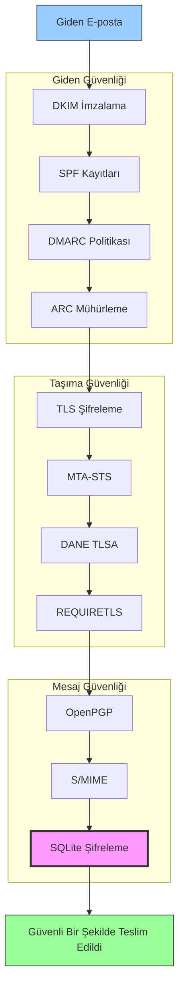


## E-posta Mesajı Doğrulama Protokolleri {#email-message-authentication-protocols}

> \[!NOTE]
> Forward Email, sahtekarlığı önlemek ve mesaj bütünlüğünü sağlamak için tüm önemli e-posta doğrulama protokollerini uygular.

Forward Email, e-posta doğrulaması için [mailauth](https://github.com/postalsys/mailauth) kütüphanesini kullanır. Desteklenen RFC'ler şunlardır:

| RFC                                                       | Başlık                                                                 | Uygulama Notları                                             |
| --------------------------------------------------------- | --------------------------------------------------------------------- | ------------------------------------------------------------ |
| [RFC 6376](https://datatracker.ietf.org/doc/html/rfc6376) | DomainKeys Identified Mail (DKIM) İmzaları                            | Tam DKIM imzalama ve doğrulama                               |
| [RFC 8463](https://datatracker.ietf.org/doc/html/rfc8463) | DKIM için Yeni Bir Kriptografik İmza Yöntemi (Ed25519-SHA256)         | Hem RSA-SHA256 hem de Ed25519-SHA256 imzalama algoritmalarını destekler |
| [RFC 7208](https://datatracker.ietf.org/doc/html/rfc7208) | Gönderen Politika Çerçevesi (SPF)                                    | SPF kayıt doğrulaması                                        |
| [RFC 7489](https://datatracker.ietf.org/doc/html/rfc7489) | Alan Tabanlı Mesaj Doğrulama, Raporlama ve Uyum (DMARC)               | DMARC politika uygulaması                                    |
| [RFC 8617](https://datatracker.ietf.org/doc/html/rfc8617) | Doğrulanmış Alınan Zinciri (ARC)                                     | ARC mühürleme ve doğrulama                                  |

E-posta doğrulama protokolleri, mesajların gerçekten iddia edilen göndericiden geldiğini ve iletim sırasında değiştirilmediğini doğrular.

### Doğrulama Protokolü Desteği {#authentication-protocol-support}

| Protokol  | RFC      | Durum       | Açıklama                                                            |
| --------- | -------- | ----------- | ------------------------------------------------------------------ |
| **DKIM**  | RFC 6376 | ✅ Destekleniyor | DomainKeys Identified Mail - Kriptografik imzalar                  |
| **SPF**   | RFC 7208 | ✅ Destekleniyor | Gönderen Politika Çerçevesi - IP adresi yetkilendirmesi           |
| **DMARC** | RFC 7489 | ✅ Destekleniyor | Alan Tabanlı Mesaj Doğrulama - Politika uygulaması                 |
| **ARC**   | RFC 8617 | ✅ Destekleniyor | Doğrulanmış Alınan Zinciri - İletiler arası doğrulamanın korunması |
### DKIM (DomainKeys Identified Mail) {#dkim-domainkeys-identified-mail}

**DKIM**, e-posta başlıklarına kriptografik bir imza ekleyerek alıcıların mesajın alan adı sahibi tarafından yetkilendirildiğini ve iletim sırasında değiştirilmediğini doğrulamasını sağlar.

Forward Email, DKIM imzalama ve doğrulama için [mailauth](https://github.com/postalsys/mailauth) kullanır.

**Temel Özellikler:**

* Tüm giden mesajlar için otomatik DKIM imzalama
* RSA ve Ed25519 anahtar desteği
* Çoklu seçici desteği
* Gelen mesajlar için DKIM doğrulaması

### SPF (Sender Policy Framework) {#spf-sender-policy-framework}

**SPF**, alan adı sahiplerinin alan adları adına e-posta göndermeye yetkili IP adreslerini belirtmelerine olanak tanır.

**Temel Özellikler:**

* Gelen mesajlar için SPF kaydı doğrulaması
* Ayrıntılı sonuçlarla otomatik SPF kontrolü
* include, redirect ve all mekanizmaları desteği
* Alan adına göre yapılandırılabilir SPF politikaları

### DMARC (Domain-based Message Authentication, Reporting & Conformance) {#dmarc-domain-based-message-authentication-reporting--conformance}

**DMARC**, SPF ve DKIM üzerine inşa edilerek politika uygulama ve raporlama sağlar.

**Temel Özellikler:**

* DMARC politika uygulaması (none, quarantine, reject)
* SPF ve DKIM için hizalama kontrolü
* DMARC toplu raporlama
* Alan adına göre DMARC politikaları

### ARC (Authenticated Received Chain) {#arc-authenticated-received-chain}

**ARC**, e-posta kimlik doğrulama sonuçlarını yönlendirme ve posta listesi değişiklikleri boyunca korur.

Forward Email, ARC doğrulama ve mühürleme için [mailauth](https://github.com/postalsys/mailauth) kütüphanesini kullanır.

**Temel Özellikler:**

* Yönlendirilmiş mesajlar için ARC mühürleme
* Gelen mesajlar için ARC doğrulama
* Birden fazla atlama boyunca zincir doğrulaması
* Orijinal kimlik doğrulama sonuçlarını korur

### Authentication Flow {#authentication-flow}

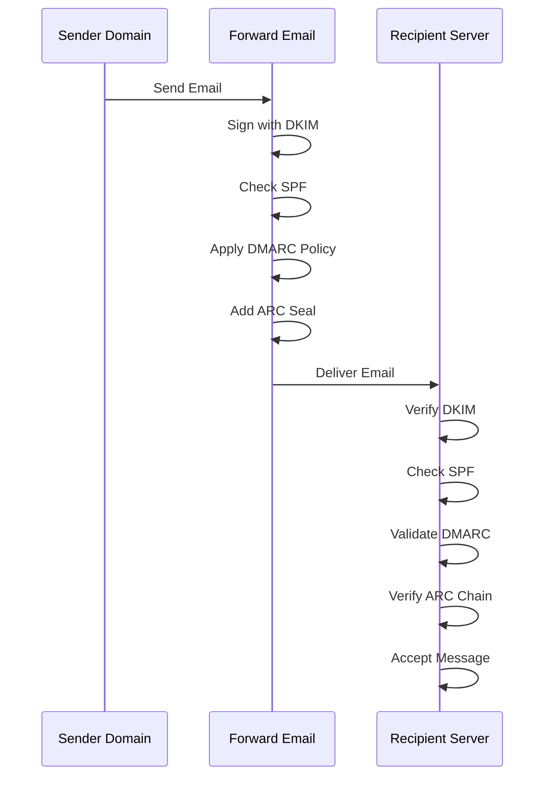

---


## Email Transport Security Protocols {#email-transport-security-protocols}

> \[!IMPORTANT]
> Forward Email, iletim halindeki e-postaları korumak için birden fazla katmanlı taşıma güvenliği uygular.

Forward Email, modern taşıma güvenliği protokollerini uygular:

| RFC                                                       | Başlık                                                                                              | Durum       | Uygulama Notları                                                                                                                                                                                                                                                                              |
| --------------------------------------------------------- | -------------------------------------------------------------------------------------------------- | ----------- | --------------------------------------------------------------------------------------------------------------------------------------------------------------------------------------------------------------------------------------------------------------------------------------------- |
| [RFC 8461](https://datatracker.ietf.org/doc/html/rfc8461) | SMTP MTA Strict Transport Security (MTA-STS)                                                       | ✅ Destekleniyor | IMAP, SMTP ve MX sunucularında yaygın olarak kullanılır. Bkz. [create-mta-sts-cache.js](https://github.com/forwardemail/forwardemail.net/blob/master/helpers/create-mta-sts-cache.js) ve [get-transporter.js](https://github.com/forwardemail/forwardemail.net/blob/master/helpers/get-transporter.js) |
| [RFC 8460](https://datatracker.ietf.org/doc/html/rfc8460) | SMTP TLS Reporting                                                                                 | ✅ Destekleniyor | [mailauth](https://github.com/postalsys/mailauth) kütüphanesi aracılığıyla                                                                                                                                                                                                                   |
| [RFC 7671](https://datatracker.ietf.org/doc/html/rfc7671) | The DNS-Based Authentication of Named Entities (DANE) Protocol: Updates and Operational Guidance   | ✅ Destekleniyor | Giden SMTP bağlantıları için tam DANE doğrulaması. Bkz. [mx-connect PR #22](https://github.com/zone-eu/mx-connect/pull/22)                                                                                                                                                                    |
| [RFC 6698](https://datatracker.ietf.org/doc/html/rfc6698) | The DNS-Based Authentication of Named Entities (DANE) Transport Layer Security (TLS) Protocol: TLSA| ✅ Destekleniyor | Tam RFC 6698 desteği: PKIX-TA, PKIX-EE, DANE-TA, DANE-EE kullanım türleri. Bkz. [mx-connect PR #22](https://github.com/zone-eu/mx-connect/pull/22)                                                                                                                                               |
| [RFC 8314](https://datatracker.ietf.org/doc/html/rfc8314) | Cleartext Considered Obsolete: Use of Transport Layer Security (TLS) for Email Submission and Access| ✅ Destekleniyor | Tüm bağlantılar için TLS zorunludur                                                                                                                                                                                                                                                          |
| [RFC 8689](https://datatracker.ietf.org/doc/html/rfc8689) | SMTP Service Extension for Requiring TLS (REQUIRETLS)                                              | ✅ Destekleniyor | REQUIRETLS SMTP uzantısı ve "TLS-Required" başlığı için tam destek                                                                                                                                                                                                                            |
Taşıma güvenlik protokolleri, e-posta mesajlarının posta sunucuları arasında iletim sırasında şifrelenmesini ve kimlik doğrulamasını sağlar.

### Taşıma Güvenliği Desteği {#transport-security-support}

| Protokol      | RFC      | Durum       | Açıklama                                         |
| ------------- | -------- | ----------- | ------------------------------------------------ |
| **TLS**       | RFC 8314 | ✅ Destekleniyor | Taşıma Katmanı Güvenliği - Şifreli bağlantılar   |
| **MTA-STS**   | RFC 8461 | ✅ Destekleniyor | Posta Aktarım Aracısı Sıkı Taşıma Güvenliği      |
| **DANE**      | RFC 7671 | ✅ Destekleniyor | İsimlendirilmiş Varlıkların DNS Tabanlı Doğrulaması |
| **REQUIRETLS**| RFC 8689 | ✅ Destekleniyor | Tüm teslimat yolu için TLS gerektirir             |

### TLS (Taşıma Katmanı Güvenliği) {#tls-transport-layer-security}

Forward Email, tüm e-posta bağlantıları (SMTP, IMAP, POP3) için TLS şifrelemesini zorunlu kılar.

**Temel Özellikler:**

* TLS 1.2 ve TLS 1.3 desteği
* Otomatik sertifika yönetimi
* Mükemmel İleri Gizlilik (PFS)
* Sadece güçlü şifreleme takımları

### MTA-STS (Posta Aktarım Aracısı Sıkı Taşıma Güvenliği) {#mta-sts-mail-transfer-agent-strict-transport-security}

**MTA-STS**, e-postanın yalnızca TLS ile şifrelenmiş bağlantılar üzerinden teslim edilmesini HTTPS üzerinden bir politika yayınlayarak sağlar.

Forward Email, MTA-STS'yi [create-mta-sts-cache.js](https://github.com/forwardemail/forwardemail.net/blob/master/helpers/create-mta-sts-cache.js) kullanarak uygular.

**Temel Özellikler:**

* Otomatik MTA-STS politika yayını
* Performans için politika önbellekleme
* Düşürme saldırısı önleme
* Sertifika doğrulama zorunluluğu

### DANE (İsimlendirilmiş Varlıkların DNS Tabanlı Doğrulaması) {#dane-dns-based-authentication-of-named-entities}

> \[!NOTE]
> Forward Email artık giden SMTP bağlantıları için tam DANE desteği sağlar.

**DANE**, TLS sertifika bilgilerini DNS'te yayınlamak için DNSSEC kullanır ve posta sunucularının sertifika otoritelerine güvenmeden sertifikaları doğrulamasına olanak tanır.

**Temel Özellikler:**

* ✅ Giden SMTP bağlantıları için tam DANE doğrulaması
* ✅ Tam RFC 6698 desteği: PKIX-TA, PKIX-EE, DANE-TA, DANE-EE kullanım türleri
* ✅ TLS yükseltme sırasında TLSA kayıtlarına karşı sertifika doğrulaması
* ✅ Birden fazla MX sunucusu için paralel TLSA çözümlemesi
* ✅ Yerel `dns.resolveTlsa` otomatik algılama (Node.js v22.15.0+, v23.9.0+)
* ✅ Eski Node.js sürümleri için [Tangerine](https://github.com/forwardemail/tangerine) üzerinden özel çözümleyici desteği
* DNSSEC ile imzalanmış alan adları gerektirir

> \[!TIP]
> **Uygulama Detayları:** DANE desteği, giden SMTP bağlantıları için kapsamlı DANE/TLSA desteği sağlayan [mx-connect PR #22](https://github.com/zone-eu/mx-connect/pull/22) ile eklendi.

### REQUIRETLS {#requiretls}

> \[!TIP]
> Forward Email, kullanıcıya yönelik REQUIRETLS desteği sunan az sayıdaki sağlayıcıdan biridir.

**REQUIRETLS**, e-posta mesajlarının tüm teslimat yolu boyunca yalnızca TLS ile şifrelenmiş bağlantılar üzerinden teslim edilmesini sağlar.

**Temel Özellikler:**

* E-posta oluşturucuda kullanıcıya yönelik onay kutusu
* Şifrelenmemiş teslimatın otomatik reddi
* Uçtan uca TLS zorunluluğu
* Ayrıntılı hata bildirimleri

> \[!TIP]
> **Kullanıcıya Yönelik TLS Zorunluluğu:** Forward Email, **Hesabım > Alan Adları > Ayarlar** altında tüm gelen bağlantılar için TLS zorunluluğu sağlayan bir onay kutusu sunar. Etkinleştirildiğinde, bu özellik TLS ile şifrelenmemiş herhangi bir gelen e-postayı 530 hata kodu ile reddeder ve tüm gelen postanın iletim sırasında şifreli olmasını garanti eder.

### Taşıma Güvenliği Akışı {#transport-security-flow}

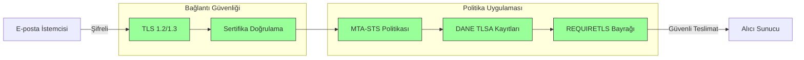
## E-posta Mesaj Şifreleme {#email-message-encryption}

> \[!NOTE]
> Forward Email, uçtan uca e-posta şifrelemesi için hem OpenPGP hem de S/MIME desteği sunar.

Forward Email, OpenPGP ve S/MIME şifrelemesini destekler:

| RFC                                                       | Başlık                                                                                  | Durum       | Uygulama Notları                                                                                                                                                                                    |
| --------------------------------------------------------- | --------------------------------------------------------------------------------------- | ----------- | -------------------------------------------------------------------------------------------------------------------------------------------------------------------------------------------------- |
| [RFC 9580](https://datatracker.ietf.org/doc/html/rfc9580) | OpenPGP (RFC 4880'in yerini alır)                                                       | ✅ Destekleniyor | [OpenPGP.js v6+](https://github.com/openpgpjs/openpgpjs) entegrasyonu ile. Bakınız [SSS](https://forwardemail.net/en/faq#do-you-support-openpgpmime-end-to-end-encryption-e2ee-and-web-key-directory-wkd) |
| [RFC 8551](https://datatracker.ietf.org/doc/html/rfc8551) | Güvenli/Çok Amaçlı İnternet Posta Uzantıları (S/MIME) Sürüm 4.0 Mesaj Spesifikasyonu     | ✅ Destekleniyor | Hem RSA hem ECC algoritmaları desteklenir. Bakınız [SSS](https://forwardemail.net/en/faq#do-you-support-smime-encryption)                                                                             |

Mesaj şifreleme protokolleri, mesaj transit sırasında ele geçirilse bile, e-posta içeriğinin yalnızca hedef alıcı tarafından okunmasını sağlar.

### Şifreleme Desteği {#encryption-support}

| Protokol    | RFC      | Durum       | Açıklama                                    |
| ----------- | -------- | ----------- | -------------------------------------------- |
| **OpenPGP** | RFC 9580 | ✅ Destekleniyor | Pretty Good Privacy - Açık anahtarlı şifreleme |
| **S/MIME**  | RFC 8551 | ✅ Destekleniyor | Güvenli/Çok Amaçlı İnternet Posta Uzantıları  |
| **WKD**     | Taslak   | ✅ Destekleniyor | Web Anahtar Dizini - Otomatik anahtar keşfi   |

### OpenPGP (Pretty Good Privacy) {#openpgp-pretty-good-privacy}

**OpenPGP**, açık anahtarlı kriptografi kullanarak uçtan uca şifreleme sağlar. Forward Email, [Web Key Directory (WKD)](https://forwardemail.net/en/faq#do-you-support-openpgpmime-end-to-end-encryption-e2ee-and-web-key-directory-wkd) protokolü aracılığıyla OpenPGP'yi destekler.

**Temel Özellikler:**

* WKD üzerinden otomatik anahtar keşfi
* Şifreli ekler için PGP/MIME desteği
* E-posta istemcisi üzerinden anahtar yönetimi
* GPG, Mailvelope ve diğer OpenPGP araçları ile uyumlu

**Nasıl Kullanılır:**

1. E-posta istemcinizde bir PGP anahtar çifti oluşturun
2. Açık anahtarınızı Forward Email'in WKD'sine yükleyin
3. Anahtarınız diğer kullanıcılar tarafından otomatik olarak keşfedilir
4. Şifreli e-postalar gönderip alın, sorunsuzca kullanın

### S/MIME (Secure/Multipurpose Internet Mail Extensions) {#smime-securemultipurpose-internet-mail-extensions}

**S/MIME**, X.509 sertifikaları kullanarak e-posta şifreleme ve dijital imzalar sağlar.

**Temel Özellikler:**

* Sertifika tabanlı şifreleme
* Mesaj doğrulaması için dijital imzalar
* Çoğu e-posta istemcisinde yerel destek
* Kurumsal düzeyde güvenlik

**Nasıl Kullanılır:**

1. Bir Sertifika Otoritesinden S/MIME sertifikası alın
2. Sertifikayı e-posta istemcinize yükleyin
3. İstemcinizi mesajları şifrelemek/imzalamak için yapılandırın
4. Alıcılarla sertifikalarınızı değiş tokuş edin

### SQLite Posta Kutusu Şifreleme {#sqlite-mailbox-encryption}

> \[!IMPORTANT]
> Forward Email, şifrelenmiş SQLite posta kutuları ile ek bir güvenlik katmanı sağlar.

Mesaj düzeyindeki şifrelemenin ötesinde, Forward Email tüm posta kutularını [sqleet](https://github.com/resilar/sqleet) (ChaCha20-Poly1305) kullanarak şifreler.

**Temel Özellikler:**

* **Parola tabanlı şifreleme** - Parolaya sadece siz sahipsiniz
* **Kuantum dirençli** - ChaCha20-Poly1305 şifreleme algoritması
* **Sıfır bilgi** - Forward Email posta kutunuzu çözemiyor
* **Sandbox'lı** - Her posta kutusu izole ve taşınabilir
* **Kurtarılamaz** - Parolanızı unutursanız posta kutunuz kaybolur
### Şifreleme Karşılaştırması {#encryption-comparison}

| Özellik               | OpenPGP           | S/MIME             | SQLite Şifreleme  |
| --------------------- | ----------------- | ------------------ | ----------------- |
| **Uçtan Uca**         | ✅ Evet            | ✅ Evet             | ✅ Evet            |
| **Anahtar Yönetimi**  | Kendi yönetimi    | CA tarafından verilmiş | Parola tabanlı    |
| **İstemci Desteği**   | Eklenti gerektirir | Yerel              | Şeffaf            |
| **Kullanım Alanı**    | Kişisel           | Kurumsal           | Depolama          |
| **Kuantum Dirençli**  | ⚠️ Anahtara bağlı | ⚠️ Sertifikaya bağlı | ✅ Evet            |

### Şifreleme Akışı {#encryption-flow}

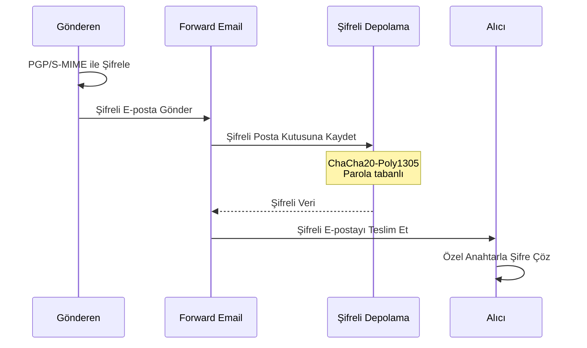

---


## Genişletilmiş İşlevsellik {#extended-functionality}


## E-posta Mesaj Formatı Standartları {#email-message-format-standards}

> \[!NOTE]
> Forward Email, zengin içerik ve uluslararasılaştırma için modern e-posta format standartlarını destekler.

Forward Email standart e-posta mesaj formatlarını destekler:

| RFC                                                       | Başlık                                                        | Uygulama Notları    |
| --------------------------------------------------------- | ------------------------------------------------------------- | ------------------- |
| [RFC 5322](https://datatracker.ietf.org/doc/html/rfc5322) | İnternet Mesaj Formatı                                        | Tam destek          |
| [RFC 2045](https://datatracker.ietf.org/doc/html/rfc2045) | MIME Bölüm Bir: İnternet Mesaj Gövdelerinin Formatı           | Tam MIME desteği    |
| [RFC 2046](https://datatracker.ietf.org/doc/html/rfc2046) | MIME Bölüm İki: Medya Türleri                                 | Tam MIME desteği    |
| [RFC 2047](https://datatracker.ietf.org/doc/html/rfc2047) | MIME Bölüm Üç: ASCII Olmayan Metin için Mesaj Başlık Uzantıları | Tam MIME desteği    |
| [RFC 2048](https://datatracker.ietf.org/doc/html/rfc2048) | MIME Bölüm Dört: Kayıt Prosedürleri                           | Tam MIME desteği    |
| [RFC 2049](https://datatracker.ietf.org/doc/html/rfc2049) | MIME Bölüm Beş: Uyum Kriterleri ve Örnekler                   | Tam MIME desteği    |

E-posta format standartları, e-posta mesajlarının nasıl yapılandırıldığı, kodlandığı ve görüntülendiğini tanımlar.

### Format Standartları Desteği {#format-standards-support}

| Standart           | RFC           | Durum       | Açıklama                             |
| ------------------ | ------------- | ----------- | ----------------------------------- |
| **MIME**           | RFC 2045-2049 | ✅ Destekleniyor | Çok Amaçlı İnternet Posta Uzantıları |
| **SMTPUTF8**       | RFC 6531      | ⚠️ Kısmi    | Uluslararasılaştırılmış e-posta adresleri |
| **EAI**            | RFC 6530      | ⚠️ Kısmi    | E-posta Adresi Uluslararasılaştırması |
| **Mesaj Formatı**  | RFC 5322      | ✅ Destekleniyor | İnternet Mesaj Formatı              |
| **MIME Güvenliği** | RFC 1847      | ✅ Destekleniyor | MIME için Güvenlik Çok Parçaları    |

### MIME (Çok Amaçlı İnternet Posta Uzantıları) {#mime-multipurpose-internet-mail-extensions}

**MIME**, e-postaların farklı içerik türlerine (metin, HTML, ekler vb.) sahip birden çok bölüm içermesine olanak tanır.

**Desteklenen MIME Özellikleri:**

* Çok parçalı mesajlar (karışık, alternatif, ilişkili)
* Content-Type başlıkları
* Content-Transfer-Encoding (7bit, 8bit, quoted-printable, base64)
* Satır içi resimler ve ekler
* Zengin HTML içeriği

### SMTPUTF8 ve E-posta Adresi Uluslararasılaştırması {#smtputf8-and-email-address-internationalization}

> \[!WARNING]
> SMTPUTF8 desteği kısmi - tüm özellikler tam olarak uygulanmamıştır.
**SMTPUTF8**, e-posta adreslerinin ASCII olmayan karakterler içermesine izin verir (örneğin, `用户@例え.jp`).

**Mevcut Durum:**

* ⚠️ Uluslararasılaştırılmış e-posta adresleri için kısmi destek
* ✅ Mesaj gövdelerinde UTF-8 içeriği
* ⚠️ ASCII olmayan yerel parçalar için sınırlı destek

---


## Takvim ve Kişiler Protokolleri {#calendaring-and-contacts-protocols}

> \[!NOTE]
> Forward Email, takvim ve kişi senkronizasyonu için tam CalDAV ve CardDAV desteği sağlar.

Forward Email, [caldav-adapter](https://github.com/forwardemail/caldav-adapter) kütüphanesi aracılığıyla CalDAV ve CardDAV destekler:

| RFC                                                       | Başlık                                                                   | Durum       | Uygulama Notları                                                                                                                                                                      |
| --------------------------------------------------------- | ------------------------------------------------------------------------- | ----------- | ------------------------------------------------------------------------------------------------------------------------------------------------------------------------------------- |
| [RFC 4791](https://datatracker.ietf.org/doc/html/rfc4791) | WebDAV için Takvim Uzantıları (CalDAV)                                   | ✅ Destekleniyor | Takvim erişimi ve yönetimi                                                                                                                                                            |
| [RFC 6352](https://datatracker.ietf.org/doc/html/rfc6352) | CardDAV: WebDAV için vCard Uzantıları                                    | ✅ Destekleniyor | Kişi erişimi ve yönetimi                                                                                                                                                               |
| [RFC 5545](https://datatracker.ietf.org/doc/html/rfc5545) | İnternet Takvim ve Planlama Temel Nesne Spesifikasyonu (iCalendar)       | ✅ Destekleniyor | iCalendar format desteği                                                                                                                                                               |
| [RFC 6350](https://datatracker.ietf.org/doc/html/rfc6350) | vCard Format Spesifikasyonu                                              | ✅ Destekleniyor | vCard 4.0 format desteği                                                                                                                                                               |
| [RFC 6638](https://datatracker.ietf.org/doc/html/rfc6638) | CalDAV için Planlama Uzantıları                                          | ✅ Destekleniyor | iMIP desteği ile CalDAV planlaması. Bkz. [commit c4d1629](https://github.com/forwardemail/forwardemail.net/commit/c4d162975a49e38d76d68a032662e873a34a9b80)                            |
| [RFC 5546](https://datatracker.ietf.org/doc/html/rfc5546) | iCalendar Taşıma Bağımsız Birlikte Çalışabilirlik Protokolü (iTIP)       | ✅ Destekleniyor | REQUEST, REPLY, CANCEL ve VFREEBUSY yöntemleri için iTIP desteği. Bkz. [commit c4d1629](https://github.com/forwardemail/forwardemail.net/commit/c4d162975a49e38d76d68a032662e873a34a9b80) |
| [RFC 6047](https://datatracker.ietf.org/doc/html/rfc6047) | iCalendar Mesaj Tabanlı Birlikte Çalışabilirlik Protokolü (iMIP)          | ✅ Destekleniyor | Yanıt bağlantıları içeren e-posta tabanlı takvim davetiyeleri. Bkz. [commit c4d1629](https://github.com/forwardemail/forwardemail.net/commit/c4d162975a49e38d76d68a032662e873a34a9b80)           |

CalDAV ve CardDAV, takvim ve kişi verilerinin cihazlar arasında erişilmesini, paylaşılmasını ve senkronize edilmesini sağlayan protokollerdir.

### CalDAV ve CardDAV Desteği {#caldav-and-carddav-support}

| Protokol              | RFC      | Durum       | Açıklama                             |
| --------------------- | -------- | ----------- | ---------------------------------- |
| **CalDAV**            | RFC 4791 | ✅ Destekleniyor | Takvim erişimi ve senkronizasyonu   |
| **CardDAV**           | RFC 6352 | ✅ Destekleniyor | Kişi erişimi ve senkronizasyonu      |
| **iCalendar**         | RFC 5545 | ✅ Destekleniyor | Takvim veri formatı                 |
| **vCard**             | RFC 6350 | ✅ Destekleniyor | Kişi veri formatı                   |
| **VTODO**             | RFC 5545 | ✅ Destekleniyor | Görev/hatırlatma desteği            |
| **CalDAV Planlama**   | RFC 6638 | ✅ Destekleniyor | Takvim planlama uzantıları          |
| **iTIP**              | RFC 5546 | ✅ Destekleniyor | Taşıma-bağımsız birlikte çalışabilirlik |
| **iMIP**              | RFC 6047 | ✅ Destekleniyor | E-posta tabanlı takvim davetiyeleri |
### CalDAV (Takvim Erişimi) {#caldav-calendar-access}

**CalDAV**, herhangi bir cihaz veya uygulamadan takvimlere erişmenizi ve yönetmenizi sağlar.

**Temel Özellikler:**

* Çoklu cihaz senkronizasyonu
* Paylaşılan takvimler
* Takvim abonelikleri
* Etkinlik davetleri ve yanıtları
* Tekrarlayan etkinlikler
* Saat dilimi desteği

**Uyumlu İstemciler:**

* Apple Takvim (macOS, iOS)
* Mozilla Thunderbird
* Evolution
* GNOME Takvim
* Herhangi bir CalDAV uyumlu istemci

### CardDAV (Kişi Erişimi) {#carddav-contact-access}

**CardDAV**, herhangi bir cihaz veya uygulamadan kişilere erişmenizi ve yönetmenizi sağlar.

**Temel Özellikler:**

* Çoklu cihaz senkronizasyonu
* Paylaşılan adres defterleri
* Kişi grupları
* Fotoğraf desteği
* Özel alanlar
* vCard 4.0 desteği

**Uyumlu İstemciler:**

* Apple Kişiler (macOS, iOS)
* Mozilla Thunderbird
* Evolution
* GNOME Kişiler
* Herhangi bir CardDAV uyumlu istemci

### Görevler ve Hatırlatıcılar (CalDAV VTODO) {#tasks-and-reminders-caldav-vtodo}

> \[!TIP]
> Forward Email, CalDAV VTODO aracılığıyla görevler ve hatırlatıcıları destekler.

**VTODO**, iCalendar formatının bir parçasıdır ve CalDAV üzerinden görev yönetimine olanak tanır.

**Temel Özellikler:**

* Görev oluşturma ve yönetimi
* Son tarihler ve öncelikler
* Görev tamamlama takibi
* Tekrarlayan görevler
* Görev listeleri/kategorileri

**Uyumlu İstemciler:**

* Apple Hatırlatıcılar (macOS, iOS)
* Mozilla Thunderbird (Lightning ile)
* Evolution
* GNOME To Do
* VTODO desteği olan herhangi bir CalDAV istemcisi

### CalDAV/CardDAV Senkronizasyon Akışı {#caldavcarddav-synchronization-flow}

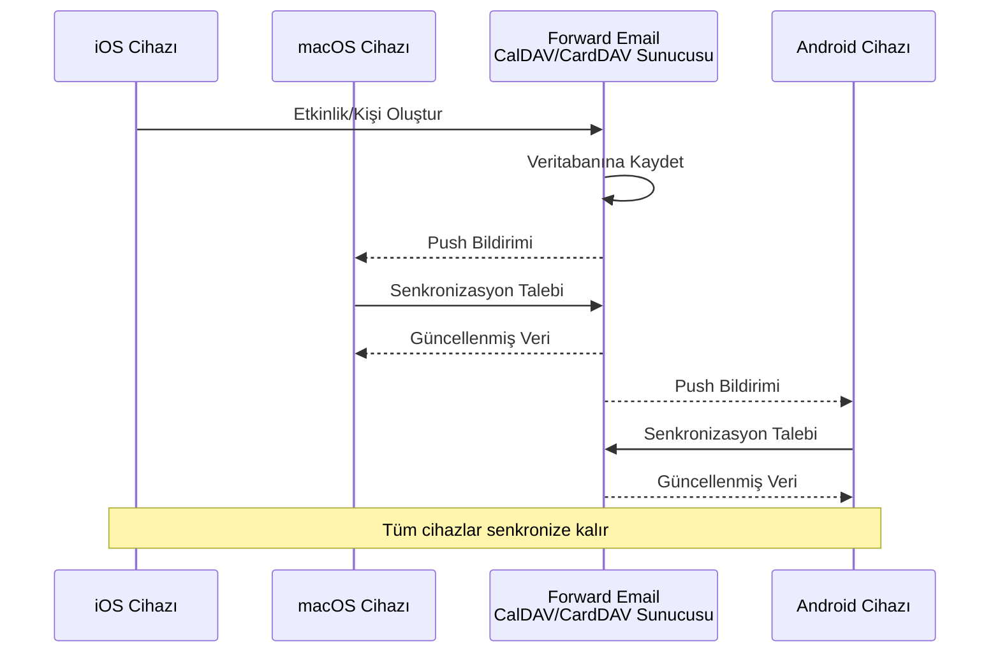

### Desteklenmeyen Takvim Uzantıları {#calendaring-extensions-not-supported}

Aşağıdaki takvim uzantıları DESTEKLENMEMEKTEDİR:

| RFC                                                       | Başlık                                                              | Sebep                                                           |
| --------------------------------------------------------- | ------------------------------------------------------------------- | ---------------------------------------------------------------- |
| [RFC 4918](https://datatracker.ietf.org/doc/html/rfc4918) | Web Dağıtımlı Yazarlık ve Sürümleme için HTTP Uzantıları (WebDAV)    | CalDAV WebDAV kavramlarını kullanır ancak tam RFC 4918'i uygulamaz |
| [RFC 6578](https://datatracker.ietf.org/doc/html/rfc6578) | WebDAV için Koleksiyon Senkronizasyonu                              | Uygulanmamıştır                                                |
| [RFC 3744](https://datatracker.ietf.org/doc/html/rfc3744) | WebDAV Erişim Kontrol Protokolü                                     | Uygulanmamıştır                                                |

---


## E-posta Mesaj Filtreleme {#email-message-filtering}

> \[!IMPORTANT]
> Forward Email, sunucu tarafı e-posta filtreleme için **tam Sieve ve ManageSieve desteği** sağlar. Gelen mesajları otomatik olarak sıralamak, filtrelemek, iletmek ve yanıtlamak için güçlü kurallar oluşturun.

### Sieve (RFC 5228) {#sieve-rfc-5228}

[Sieve](https://en.wikipedia.org/wiki/Sieve_\(mail_filtering_language\)), sunucu tarafı e-posta filtreleme için standartlaştırılmış, güçlü bir betik dilidir. Forward Email, 24 uzantı ile kapsamlı Sieve desteği uygular.

**Kaynak Kodu:** [`helpers/sieve/`](https://github.com/forwardemail/forwardemail.net/tree/master/helpers/sieve)

#### Desteklenen Temel Sieve RFC'leri {#core-sieve-rfcs-supported}

| RFC                                                                                    | Başlık                                                        | Durum          |
| -------------------------------------------------------------------------------------- | ------------------------------------------------------------- | -------------- |
| [RFC 5228](https://datatracker.ietf.org/doc/html/rfc5228)                              | Sieve: Bir E-posta Filtreleme Dili                            | ✅ Tam Destek  |
| [RFC 5429](https://datatracker.ietf.org/doc/html/rfc5429)                              | Sieve E-posta Filtreleme: Reddetme ve Genişletilmiş Reddetme Uzantıları | ✅ Tam Destek  |
| [RFC 5230](https://datatracker.ietf.org/doc/html/rfc5230)                              | Sieve E-posta Filtreleme: Tatil Uzantısı                      | ✅ Tam Destek  |
| [RFC 6131](https://datatracker.ietf.org/doc/html/rfc6131)                              | Sieve Tatil Uzantısı: "Seconds" Parametresi                   | ✅ Tam Destek  |
| [RFC 5232](https://datatracker.ietf.org/doc/html/rfc5232)                              | Sieve E-posta Filtreleme: Imap4flags Uzantısı                 | ✅ Tam Destek  |
| [RFC 5173](https://datatracker.ietf.org/doc/html/rfc5173)                              | Sieve E-posta Filtreleme: Gövde Uzantısı                      | ✅ Tam Destek  |
| [RFC 5229](https://datatracker.ietf.org/doc/html/rfc5229)                              | Sieve E-posta Filtreleme: Değişkenler Uzantısı                | ✅ Tam Destek  |
| [RFC 5231](https://datatracker.ietf.org/doc/html/rfc5231)                              | Sieve E-posta Filtreleme: İlişkisel Uzantı                    | ✅ Tam Destek  |
| [RFC 4790](https://datatracker.ietf.org/doc/html/rfc4790)                              | İnternet Uygulama Protokolü Sıralama Kaydı                     | ✅ Tam Destek  |
| [RFC 3894](https://datatracker.ietf.org/doc/html/rfc3894)                              | Sieve Uzantısı: Yan Etkiler Olmadan Kopyalama                  | ✅ Tam Destek  |
| [RFC 5293](https://datatracker.ietf.org/doc/html/rfc5293)                              | Sieve E-posta Filtreleme: Editheader Uzantısı                 | ✅ Tam Destek  |
| [RFC 5260](https://datatracker.ietf.org/doc/html/rfc5260)                              | Sieve E-posta Filtreleme: Tarih ve İndeks Uzantıları          | ✅ Tam Destek  |
| [RFC 5435](https://datatracker.ietf.org/doc/html/rfc5435)                              | Sieve E-posta Filtreleme: Bildirimler için Uzantı             | ✅ Tam Destek  |
| [RFC 5183](https://datatracker.ietf.org/doc/html/rfc5183)                              | Sieve E-posta Filtreleme: Ortam Uzantısı                      | ✅ Tam Destek  |
| [RFC 5490](https://datatracker.ietf.org/doc/html/rfc5490)                              | Sieve E-posta Filtreleme: Posta Kutusu Durumu Kontrolü Uzantıları | ✅ Tam Destek  |
| [RFC 8579](https://datatracker.ietf.org/doc/html/rfc8579)                              | Sieve E-posta Filtreleme: Özel Kullanım Posta Kutularına Teslim | ✅ Tam Destek  |
| [RFC 7352](https://datatracker.ietf.org/doc/html/rfc7352)                              | Sieve E-posta Filtreleme: Çift Teslimatları Tespit Etme       | ✅ Tam Destek  |
| [RFC 5463](https://datatracker.ietf.org/doc/html/rfc5463)                              | Sieve E-posta Filtreleme: Ihave Uzantısı                      | ✅ Tam Destek  |
| [RFC 5233](https://datatracker.ietf.org/doc/html/rfc5233)                              | Sieve E-posta Filtreleme: Altadres Uzantısı                   | ✅ Tam Destek  |
| [draft-ietf-sieve-regex](https://datatracker.ietf.org/doc/html/draft-ietf-sieve-regex) | Sieve E-posta Filtreleme: Düzenli İfade Uzantısı              | ✅ Tam Destek  |
#### Desteklenen Sieve Uzantıları {#supported-sieve-extensions}

| Uzantı                      | Açıklama                                | Entegrasyon                                |
| ---------------------------- | ---------------------------------------- | ------------------------------------------ |
| `fileinto`                   | Mesajları belirli klasörlere dosyalama  | Mesajlar belirtilen IMAP klasöründe saklanır |
| `reject` / `ereject`         | Mesajları hata ile reddetme              | SMTP reddi ve geri dönen mesaj             |
| `vacation`                   | Otomatik tatil/ofis dışı yanıtları       | Emails.queue ile sıraya alınır, oran sınırlaması ile |
| `vacation-seconds`           | İnce ayarlı tatil yanıt aralıkları       | `:seconds` parametresinden TTL             |
| `imap4flags`                 | IMAP bayraklarını ayarlama (\Seen, \Flagged, vb.) | Mesaj saklama sırasında bayraklar uygulanır |
| `envelope`                   | Zarf gönderen/alıcı testi                 | SMTP zarf verilerine erişim                  |
| `body`                       | Mesaj gövdesi içeriğini test etme         | Tam gövde metni eşleştirme                   |
| `variables`                  | Betiklerde değişken saklama ve kullanma  | Değişken genişletme ve modifikasyonlar      |
| `relational`                 | İlişkisel karşılaştırmalar                | `:count`, `:value` ile gt/lt/eq              |
| `comparator-i;ascii-numeric` | Sayısal karşılaştırmalar                   | Sayısal dize karşılaştırması                  |
| `copy`                       | Yönlendirme sırasında mesajları kopyalama | fileinto/redirect üzerinde `:copy` bayrağı   |
| `editheader`                 | Mesaj başlıklarını ekleme veya silme      | Saklamadan önce başlıklar değiştirilir       |
| `date`                       | Tarih/saat değerlerini test etme           | `currentdate` ve başlık tarih testleri        |
| `index`                      | Belirli başlık tekrarlarına erişim         | Çok değerli başlıklar için `:index`           |
| `regex`                      | Düzenli ifade eşleştirme                   | Testlerde tam regex desteği                    |
| `enotify`                    | Bildirim gönderme                          | Emails.queue üzerinden `mailto:` bildirimleri |
| `environment`                | Ortam bilgilerine erişim                    | Oturumdan domain, host, remote-ip             |
| `mailbox`                    | Posta kutusu varlığını test etme            | `mailboxexists` testi                          |
| `special-use`                | Özel kullanım posta kutularına dosyalama   | \Junk, \Trash vb. klasörlere eşleme            |
| `duplicate`                  | Çift mesajları tespit etme                   | Redis tabanlı çift takip                       |
| `ihave`                      | Uzantı kullanılabilirliğini test etme        | Çalışma zamanı yetenek kontrolü                |
| `subaddress`                 | Kullanıcı+detay adres parçalarına erişim     | `:user` ve `:detail` adres parçaları          |

#### Desteklenmeyen Sieve Uzantıları {#sieve-extensions-not-supported}

| Uzantı                               | RFC                                                       | Sebep                                                           |
| ------------------------------------- | --------------------------------------------------------- | ---------------------------------------------------------------- |
| `include`                            | [RFC 6609](https://datatracker.ietf.org/doc/html/rfc6609) | Güvenlik riski (betik enjeksiyonu), global betik depolama gerektirir |
| `mboxmetadata` / `servermetadata`    | [RFC 5490](https://datatracker.ietf.org/doc/html/rfc5490) | IMAP METADATA uzantısı gerektirir                              |
| `fcc`                                | [RFC 8580](https://datatracker.ietf.org/doc/html/rfc8580) | Gönderilenler klasörü entegrasyonu gerektirir                  |
| `encoded-character`                  | [RFC 5228](https://datatracker.ietf.org/doc/html/rfc5228) | `${hex:}` sözdizimi için ayrıştırıcı değişiklikleri gerekir    |
| `foreverypart` / `mime` / `extracttext` | [RFC 5703](https://datatracker.ietf.org/doc/html/rfc5703) | Karmaşık MIME ağacı manipülasyonu                              |
#### Eleme İşleme Akışı {#sieve-processing-flow}

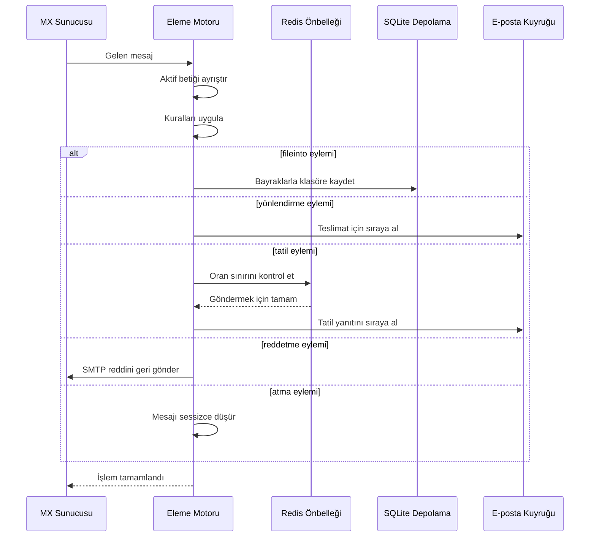

#### Güvenlik Özellikleri {#security-features}

Forward Email'in Eleme uygulaması kapsamlı güvenlik korumaları içerir:

* **CVE-2023-26430 Koruması**: Yönlendirme döngülerini ve posta bombardımanı saldırılarını önler
* **Oran Sınırlandırması**: Yönlendirmelerde (10/mesaj, 100/gün) ve tatil yanıtlarında sınırlar
* **Engelleme Listesi Kontrolü**: Yönlendirme adresleri engelleme listesine karşı kontrol edilir
* **Korunan Başlıklar**: DKIM, ARC ve kimlik doğrulama başlıkları editheader ile değiştirilemez
* **Betiğin Boyut Sınırları**: Maksimum betik boyutu uygulanır
* **Çalışma Süresi Aşımı**: Çalışma süresi sınırı aşılırsa betikler sonlandırılır

#### Örnek Eleme Betikleri {#example-sieve-scripts}

**Bültenleri bir klasöre dosyalama:**

```sieve
require ["fileinto"];

if header :contains "List-Id" "newsletter" {
    fileinto "Newsletters";
}
```

**İnce ayarlı zamanlamalı tatil otomatik yanıtlayıcısı:**

```sieve
require ["vacation", "vacation-seconds"];

vacation :seconds 3600 :subject "Ofiste Değilim"
    "Şu anda uzaktayım ve 24 saat içinde yanıt vereceğim.";
```

**Bayraklarla spam filtreleme:**

```sieve
require ["fileinto", "imap4flags"];

if header :contains "X-Spam-Status" "Yes" {
    setflag "\\Seen";
    fileinto "Junk";
}
```

**Değişkenlerle karmaşık filtreleme:**

```sieve
require ["variables", "fileinto", "regex"];

if header :regex "From" "(.+)@example\\.com" {
    set :lower "sender" "${1}";
    fileinto "Contacts/${sender}";
}
```

> \[!TIP]
> Tam dokümantasyon, örnek betikler ve yapılandırma talimatları için [SSS: Eleme e-posta filtrelemesini destekliyor musunuz?](/faq#do-you-support-sieve-email-filtering) sayfasına bakınız.

### ManageSieve (RFC 5804) {#managesieve-rfc-5804}

Forward Email, Eleme betiklerini uzaktan yönetmek için tam ManageSieve protokol desteği sağlar.

**Kaynak Kodu:** [`managesieve-server.js`](https://github.com/forwardemail/forwardemail.net/blob/master/managesieve-server.js)

| RFC                                                       | Başlık                                         | Durum          |
| --------------------------------------------------------- | ---------------------------------------------- | -------------- |
| [RFC 5804](https://datatracker.ietf.org/doc/html/rfc5804) | Eleme Betiklerini Uzaktan Yönetmek İçin Protokol | ✅ Tam Destek  |

#### ManageSieve Sunucu Yapılandırması {#managesieve-server-configuration}

| Ayar                    | Değer                   |
| ----------------------- | ----------------------- |
| **Sunucu**              | `imap.forwardemail.net` |
| **Port (STARTTLS)**     | `2190` (önerilen)       |
| **Port (Gizli TLS)**    | `4190`                  |
| **Kimlik Doğrulama**    | PLAIN (TLS üzerinden)   |

> **Not:** 2190 portu STARTTLS kullanır (düz bağlantıdan TLS'ye yükseltme) ve [sieve-connect](https://github.com/philpennock/sieve-connect) dahil çoğu ManageSieve istemcisi ile uyumludur. 4190 portu ise bağlantı başlangıcından itibaren TLS (gizli TLS) kullanır ve bu özelliği destekleyen istemciler içindir.

#### Desteklenen ManageSieve Komutları {#supported-managesieve-commands}

| Komut          | Açıklama                               |
| -------------- | ------------------------------------- |
| `AUTHENTICATE` | PLAIN mekanizması ile kimlik doğrulama |
| `CAPABILITY`   | Sunucu yetenekleri ve uzantıları listeler |
| `HAVESPACE`    | Betiğin saklanabilirliğini kontrol eder |
| `PUTSCRIPT`    | Yeni betik yükler                      |
| `LISTSCRIPTS`  | Tüm betikleri ve aktif durumlarını listeler |
| `SETACTIVE`    | Bir betiği aktif yapar                 |
| `GETSCRIPT`    | Betiği indirir                        |
| `DELETESCRIPT` | Betiği siler                         |
| `RENAMESCRIPT` | Betiğin adını değiştirir              |
| `CHECKSCRIPT`  | Betik sözdizimini doğrular            |
| `NOOP`         | Bağlantıyı canlı tutar                |
| `LOGOUT`       | Oturumu sonlandırır                   |
#### Uyumlu ManageSieve İstemcileri {#compatible-managesieve-clients}

* **Thunderbird**: [Sieve eklentisi](https://addons.thunderbird.net/addon/sieve/) aracılığıyla yerleşik Sieve desteği
* **Roundcube**: [ManageSieve eklentisi](https://plugins.roundcube.net/packages/johndoh/sieve)
* **KMail**: Yerel ManageSieve desteği
* **sieve-connect**: Komut satırı istemcisi
* **Herhangi bir RFC 5804 uyumlu istemci**

#### ManageSieve Protokol Akışı {#managesieve-protocol-flow}

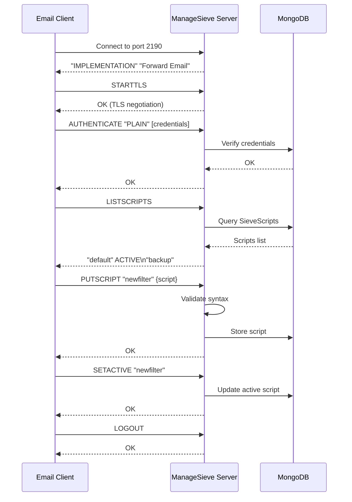

#### Web Arayüzü ve API {#web-interface-and-api}

ManageSieve'e ek olarak, Forward Email şunları sağlar:

* **Web Kontrol Paneli**: My Account → Domains → Aliases → Sieve Scripts üzerinden web arayüzü ile Sieve betikleri oluşturma ve yönetme
* **REST API**: [Forward Email API](/api#sieve-scripts) aracılığıyla programatik Sieve betik yönetimi erişimi

> \[!TIP]
> Detaylı kurulum talimatları ve istemci yapılandırması için bkz. [SSS: Sieve e-posta filtrelemesini destekliyor musunuz?](/faq#do-you-support-sieve-email-filtering)

---


## Depolama Optimizasyonu {#storage-optimization}

> \[!IMPORTANT]
> **Sektörde Bir İlk Depolama Teknolojisi:** Forward Email, e-posta içeriğinde Brotli sıkıştırması ile ek dosya çoğaltmalarını birleştiren **dünyadaki tek e-posta sağlayıcısıdır**. Bu çift katmanlı optimizasyon, geleneksel e-posta sağlayıcılarına kıyasla size **2-3 kat daha etkili depolama** sağlar.

Forward Email, tam RFC uyumluluğu ve mesaj bütünlüğünü koruyarak posta kutusu boyutunu dramatik şekilde azaltan iki devrim niteliğinde depolama optimizasyonu tekniği uygular:

1. **Ek Dosya Çoğaltma Önleme** - Tüm e-postalar arasında yinelenen ek dosyaları ortadan kaldırır
2. **Brotli Sıkıştırma** - Meta verilerde %46-86, ek dosyalarda %50 depolama azaltımı sağlar

### Mimari: Çift Katmanlı Depolama Optimizasyonu {#architecture-dual-layer-storage-optimization}

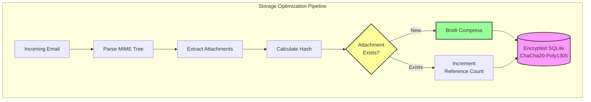

---


## Ek Dosya Çoğaltma Önleme {#attachment-deduplication}

Forward Email, SQLite depolama için uyarlanmış [WildDuck'un kanıtlanmış yaklaşımı](https://docs.wildduck.email/docs/in-depth/attachment-deduplication/) temelinde ek dosya çoğaltma önleme uygular.

> \[!NOTE]
> **Çoğaltılan Nedir:** "Ek dosya", kodlanmış MIME düğüm içeriği anlamına gelir (base64 veya quoted-printable), çözümlenmiş dosya değil. Bu, DKIM ve GPG imza geçerliliğini korur.

### Nasıl Çalışır {#how-it-works}

**WildDuck'un Orijinal Uygulaması (MongoDB GridFS):**

> Wild Duck IMAP sunucusu ek dosyaları çoğaltmaz. Buradaki "ek dosya", base64 veya quoted-printable kodlanmış mime düğüm içeriği anlamına gelir, çözümlenmiş dosya değil. Kodlanmış içerik kullanmak birçok yanlış negatif (aynı dosyanın farklı e-postalarda farklı ek dosya olarak sayılması) anlamına gelse de, farklı imza şemalarının (DKIM, GPG vb.) geçerliliğini garanti etmek için gereklidir. Wild Duck'tan alınan bir mesaj, mesajı ağaç benzeri bir nesneye ayrıştırıp geri oluşturmasına rağmen, saklanan mesajla tamamen aynıdır.
**Forward Email'in SQLite Uygulaması:**

Forward Email, şifreli SQLite depolama için bu yaklaşımı aşağıdaki süreçle uyarlamaktadır:

1. **Hash Hesaplama**: Bir ek bulunduğunda, ek gövdesinden [`rev-hash`](https://github.com/sindresorhus/rev-hash) kütüphanesi kullanılarak bir hash hesaplanır
2. **Arama**: `Attachments` tablosunda eşleşen hash'e sahip bir ek olup olmadığı kontrol edilir
3. **Referans Sayımı**:
   * Varsa: Referans sayacı 1 artırılır ve sihirli sayaç rastgele bir sayı ile artırılır
   * Yeni ise: Sayaç = 1 olan yeni bir ek girişi oluşturulur
4. **Silme Güvenliği**: Yanlış pozitifleri önlemek için çift sayaç sistemi (referans + sihirli) kullanılır
5. **Çöp Toplama**: Her iki sayaç sıfıra ulaştığında ekler hemen silinir

**Kaynak Kodu:** [`helpers/attachment-storage.js`](https://github.com/forwardemail/forwardemail.net/blob/master/helpers/attachment-storage.js)

### Çoğaltma Önleme Akışı {#deduplication-flow}

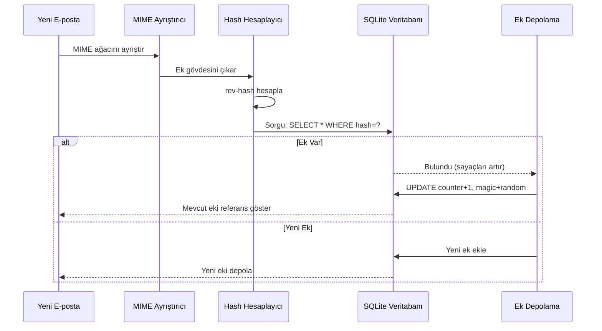

### Sihirli Sayı Sistemi {#magic-number-system}

Forward Email, silme sırasında yanlış pozitifleri önlemek için WildDuck'ın "sihirli sayı" sistemini ([Mail.ru](https://github.com/zone-eu/wildduck) ilham alınarak) kullanır:

* Her mesaja **rastgele bir sayı** atanır
* Mesaj eklendiğinde ekin **sihirli sayacı** bu rastgele sayı kadar artırılır
* Mesaj silindiğinde sihirli sayaç aynı sayı kadar azaltılır
* Ek ancak **her iki sayaç** (referans + sihirli) sıfıra ulaştığında silinir

Bu çift sayaç sistemi, silme sırasında bir sorun (örneğin, çökme, ağ hatası) olursa ekin erken silinmesini engeller.

### Temel Farklar: WildDuck vs Forward Email {#key-differences-wildduck-vs-forward-email}

| Özellik                | WildDuck (MongoDB)       | Forward Email (SQLite)       |
| ---------------------- | ------------------------ | ---------------------------- |
| **Depolama Altyapısı** | MongoDB GridFS (parçalı) | SQLite BLOB (doğrudan)       |
| **Hash Algoritması**   | SHA256                   | rev-hash (SHA-256 tabanlı)  |
| **Referans Sayımı**    | ✅ Evet                   | ✅ Evet                      |
| **Sihirli Sayılar**    | ✅ Evet (Mail.ru ilhamlı) | ✅ Evet (aynı sistem)        |
| **Çöp Toplama**        | Gecikmeli (ayrı iş)      | Anında (sayaç sıfırda)       |
| **Sıkıştırma**         | ❌ Yok                   | ✅ Brotli (aşağıya bakınız)  |
| **Şifreleme**          | ❌ İsteğe bağlı          | ✅ Her zaman (ChaCha20-Poly1305) |

---


## Brotli Sıkıştırma {#brotli-compression}

> \[!IMPORTANT]
> **Dünyanın İlkleri:** Forward Email, e-posta içeriğinde Brotli sıkıştırma kullanan **dünyadaki tek e-posta servisidir**. Bu, ek çoğaltma önlemenin üstüne **%46-86 arasında depolama tasarrufu** sağlar.

Forward Email, hem ek gövdeleri hem de mesaj meta verileri için Brotli sıkıştırmayı uygular; bu sayede büyük depolama tasarrufu sağlarken geriye dönük uyumluluğu korur.

**Uygulama:** [`helpers/msgpack-helpers.js`](https://github.com/forwardemail/forwardemail.net/blob/master/helpers/msgpack-helpers.js)

### Neler Sıkıştırılır {#what-gets-compressed}

**1. Ek Gövdeleri** (`encodeAttachmentBody`)

* **Eski formatlar**: Hex kodlu string (2 kat boyut) veya ham Buffer
* **Yeni format**: "FEBR" sihirli başlığı ile Brotli sıkıştırılmış Buffer
* **Sıkıştırma kararı**: Sadece yer tasarrufu sağlıyorsa sıkıştırır (4 baytlık başlık dikkate alınır)
* **Depolama tasarrufu**: %50'ye kadar (hex → yerel BLOB)
**2. Mesaj Meta Verisi** (`encodeMetadata`)

İçerir: `mimeTree`, `headers`, `envelope`, `flags`

* **Eski format**: JSON metin dizisi
* **Yeni format**: Brotli ile sıkıştırılmış Buffer
* **Depolama tasarrufu**: Mesaj karmaşıklığına bağlı olarak **%46-86**

### Sıkıştırma Yapılandırması {#compression-configuration}

```javascript
// Hız için optimize edilmiş Brotli sıkıştırma seçenekleri (seviye 4 iyi bir denge)
const BROTLI_COMPRESS_OPTIONS = {
  params: {
    [zlib.constants.BROTLI_PARAM_QUALITY]: 4
  }
};
```

**Neden Seviye 4?**

* **Hızlı sıkıştırma/açma**: Milisaniyeden kısa işlem süresi
* **İyi sıkıştırma oranı**: %46-86 tasarruf
* **Dengeli performans**: Gerçek zamanlı e-posta işlemleri için optimal

### Sihirli Başlık: "FEBR" {#magic-header-febr}

Forward Email, sıkıştırılmış ek gövdelerini tanımlamak için 4 baytlık sihirli başlık kullanır:

```
"FEBR" = Forward Email BRotli
Hex: 0x46 0x45 0x42 0x52
```

**Neden sihirli başlık?**

* **Format tespiti**: Sıkıştırılmış ve sıkıştırılmamış veriyi anında ayırt eder
* **Geriye dönük uyumluluk**: Eski hex dizileri ve ham Bufferlar hala çalışır
* **Çakışma önleme**: "FEBR" meşru ek verilerinin başında görünmesi olası değildir

### Sıkıştırma Süreci {#compression-process}

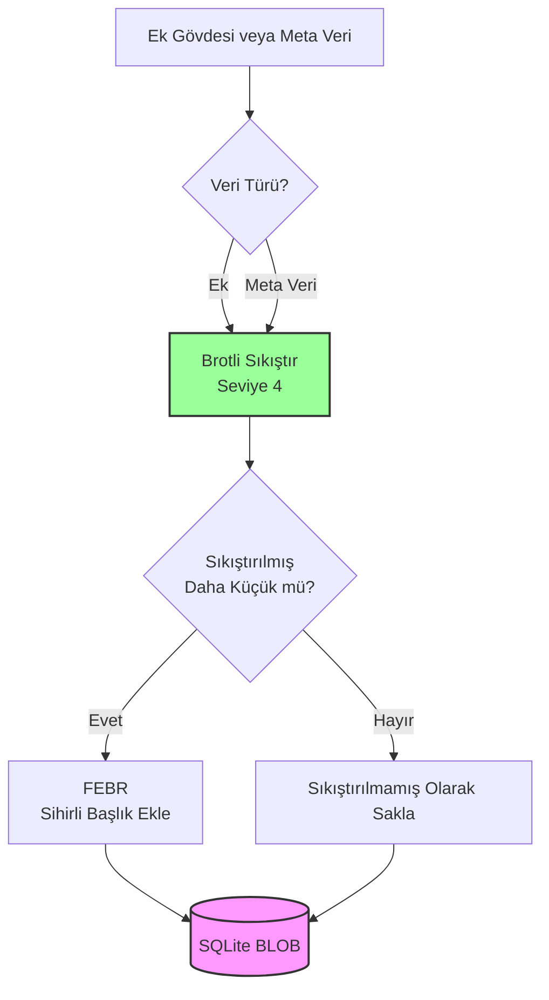

### Açma Süreci {#decompression-process}

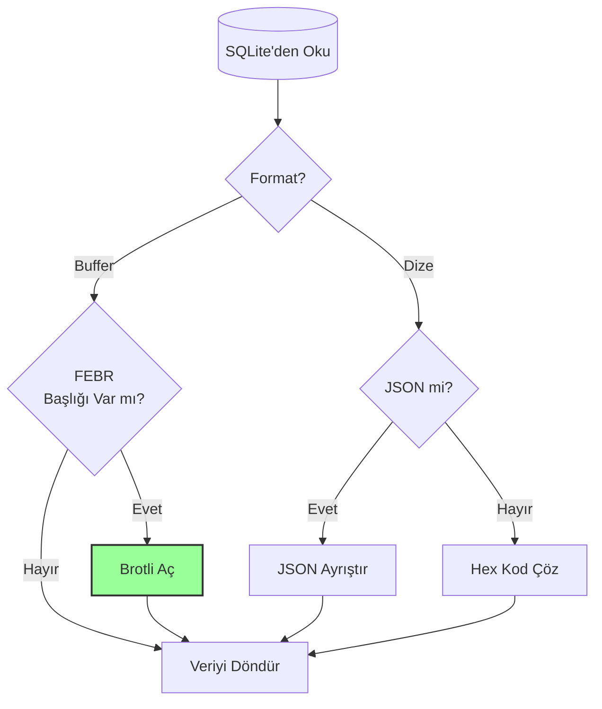

### Geriye Dönük Uyumluluk {#backwards-compatibility}

Tüm decode fonksiyonları **depolama formatını otomatik algılar**:

| Format                | Algılama Yöntemi                      | İşlem                                         |
| --------------------- | ------------------------------------ | --------------------------------------------- |
| **Brotli sıkıştırılmış** | "FEBR" sihirli başlığı kontrolü      | `zlib.brotliDecompressSync()` ile aç           |
| **Ham Buffer**        | Sihirli başlıksız `Buffer.isBuffer()` | Olduğu gibi döndür                            |
| **Hex dizesi**        | Çift uzunluk + [0-9a-f] karakter kontrolü | `Buffer.from(value, 'hex')` ile kod çöz       |
| **JSON dizesi**       | İlk karakter `{` veya `[` kontrolü    | `JSON.parse()` ile ayrıştır                    |

Bu, eski depolama formatlarından yeni formatlara geçişte **sıfır veri kaybı** sağlar.

### Depolama Tasarrufu İstatistikleri {#storage-savings-statistics}

**Üretim verilerinden ölçülen tasarruflar:**

| Veri Türü             | Eski Format             | Yeni Format            | Tasarruf   |
| --------------------- | ----------------------- | ---------------------- | ---------- |
| **Ek gövdeleri**      | Hex kodlu dize (2x)     | Brotli sıkıştırılmış BLOB | **%50**    |
| **Mesaj meta verisi**  | JSON metin              | Brotli sıkıştırılmış BLOB | **%46-86** |
| **Posta kutusu bayrakları** | JSON metin              | Brotli sıkıştırılmış BLOB | **%60-80** |

**Kaynak:** [`helpers/migrate-storage-format.js`](https://github.com/forwardemail/forwardemail.net/blob/master/helpers/migrate-storage-format.js)

### Geçiş Süreci {#migration-process}

Forward Email, eski depolama formatlarından yeni formatlara otomatik, idempotent geçiş sağlar:
// Takip edilen göç istatistikleri:
{
  attachmentsMigrated: 0,
  messagesMigrated: 0,
  mailboxesMigrated: 0,
  bytesSaved: 0  // Sıkıştırmadan toplam tasarruf edilen bayt
}
```

**Göç adımları:**

1. Eklenti gövdeleri: hex kodlama → yerel BLOB ( %50 tasarruf)
2. Mesaj meta verisi: JSON metni → brotli sıkıştırılmış BLOB (%46-86 tasarruf)
3. Posta kutusu bayrakları: JSON metni → brotli sıkıştırılmış BLOB (%60-80 tasarruf)

**Kaynak:** [`helpers/migrate-storage-format.js`](https://github.com/forwardemail/forwardemail.net/blob/master/helpers/migrate-storage-format.js)

---

### Birleşik Depolama Verimliliği {#combined-storage-efficiency}

> \[!TIP]
> **Gerçek Dünya Etkisi:** Eklenti çoğaltma + Brotli sıkıştırma ile Forward Email kullanıcıları, geleneksel e-posta sağlayıcılarına kıyasla **2-3 kat daha etkili depolama** elde eder.

**Örnek Senaryo:**

Geleneksel e-posta sağlayıcısı (1GB posta kutusu):

* 1GB disk alanı = 1GB e-posta
* Çoğaltma yok: Aynı eklenti 10 kez saklanır = 10 kat depolama israfı
* Sıkıştırma yok: Tam JSON meta veri saklanır = 2-3 kat depolama israfı

Forward Email (1GB posta kutusu):

* 1GB disk alanı ≈ **2-3GB e-posta** (etkili depolama)
* Çoğaltma: Aynı eklenti bir kez saklanır, 10 kez referans verilir
* Sıkıştırma: Meta veride %46-86, eklentilerde %50 tasarruf
* Şifreleme: ChaCha20-Poly1305 (depolama yükü yok)

**Karşılaştırma Tablosu:**

| Sağlayıcı          | Depolama Teknolojisi                         | Etkili Depolama (1GB posta kutusu) |
| ------------------ | -------------------------------------------- | --------------------------------- |
| Gmail              | Yok                                          | 1GB                              |
| iCloud             | Yok                                          | 1GB                              |
| Outlook.com        | Yok                                          | 1GB                              |
| Fastmail           | Yok                                          | 1GB                              |
| ProtonMail         | Sadece şifreleme                             | 1GB                              |
| Tutanota           | Sadece şifreleme                             | 1GB                              |
| **Forward Email**  | **Çoğaltma + Sıkıştırma + Şifreleme**       | **2-3GB** ✨                      |

### Teknik Uygulama Detayları {#technical-implementation-details}

**Performans:**

* Brotli seviye 4: Milisaniyenin altında sıkıştırma/açma
* Sıkıştırmadan performans kaybı yok
* SQLite FTS5: NVMe SSD ile 50ms altı arama

**Güvenlik:**

* Sıkıştırma **şifrelemeden sonra** gerçekleşir (SQLite veritabanı şifreli)
* ChaCha20-Poly1305 şifreleme + Brotli sıkıştırma
* Sıfır bilgi: Şifre çözme parolası sadece kullanıcıda

**RFC Uyumluluğu:**

* Alınan mesajlar saklandığı gibi **tam olarak aynı** görünür
* DKIM imzaları geçerliliğini korur (kodlanmış içerik korunur)
* GPG imzaları geçerliliğini korur (imzalanan içerik değiştirilmez)

### Neden Başka Hiçbir Sağlayıcı Bunu Yapmıyor {#why-no-other-provider-does-this}

**Karmaşıklık:**

* Depolama katmanıyla derin entegrasyon gerektirir
* Geriye dönük uyumluluk zordur
* Eski formatlardan göç karmaşıktır

**Performans endişeleri:**

* Sıkıştırma CPU yükü ekler (Brotli seviye 4 ile çözüldü)
* Her okuma işleminde açma (SQLite önbellekleme ile çözüldü)

**Forward Email'in Avantajı:**

* Baştan sona optimizasyon düşünülerek inşa edildi
* SQLite doğrudan BLOB manipülasyonuna izin verir
* Kullanıcı başına şifreli veritabanları güvenli sıkıştırma sağlar

---

---


## Modern Özellikler {#modern-features}


## E-posta Yönetimi için Tam REST API {#complete-rest-api-for-email-management}

> \[!TIP]
> Forward Email, programatik e-posta yönetimi için 39 uç noktaya sahip kapsamlı bir REST API sağlar.

> \[!TIP]
> **Benzersiz Sektör Özelliği:** Diğer tüm e-posta servislerinin aksine, Forward Email posta kutunuz, takviminiz, kişileriniz, mesajlarınız ve klasörlerinize kapsamlı bir REST API aracılığıyla tam programatik erişim sunar. Bu, tüm verilerinizi depolayan şifreli SQLite veritabanı dosyanızla doğrudan etkileşimdir.

Forward Email, e-posta verilerinize eşi benzeri görülmemiş erişim sağlayan tam bir REST API sunar. Gmail, iCloud, Outlook, ProtonMail, Tuta veya Fastmail dahil hiçbir başka e-posta servisi bu düzeyde kapsamlı, doğrudan veritabanı erişimi sunmaz.
**API Dokümantasyonu:** <https://forwardemail.net/en/email-api>

### API Kategorileri (39 Uç Nokta) {#api-categories-39-endpoints}

**1. Mesajlar API'si** (5 uç nokta) - E-posta mesajları üzerinde tam CRUD işlemleri:

* `GET /v1/messages` - 15+ gelişmiş arama parametresi ile mesajları listele (başka hiçbir servis bunu sunmaz)
* `POST /v1/messages` - Mesaj oluştur/gönder
* `GET /v1/messages/:id` - Mesajı al
* `PUT /v1/messages/:id` - Mesajı güncelle (bayraklar, klasörler)
* `DELETE /v1/messages/:id` - Mesajı sil

*Örnek: Geçen çeyreğe ait ekli tüm faturaları bul:*

```bash
curl -u "alias@domain.com:password" \
  "https://api.forwardemail.net/v1/messages?q=subject:invoice+has:attachment+after:2024-01-01+before:2024-04-01"
```

Bkz. [Gelişmiş Arama Dokümantasyonu](https://forwardemail.net/en/email-api)

**2. Klasörler API'si** (5 uç nokta) - REST üzerinden tam IMAP klasör yönetimi:

* `GET /v1/folders` - Tüm klasörleri listele
* `POST /v1/folders` - Klasör oluştur
* `GET /v1/folders/:id` - Klasörü al
* `PUT /v1/folders/:id` - Klasörü güncelle
* `DELETE /v1/folders/:id` - Klasörü sil

**3. Kişiler API'si** (5 uç nokta) - REST üzerinden CardDAV kişi depolama:

* `GET /v1/contacts` - Kişileri listele
* `POST /v1/contacts` - Kişi oluştur (vCard formatında)
* `GET /v1/contacts/:id` - Kişiyi al
* `PUT /v1/contacts/:id` - Kişiyi güncelle
* `DELETE /v1/contacts/:id` - Kişiyi sil

**4. Takvimler API'si** (5 uç nokta) - Takvim konteyner yönetimi:

* `GET /v1/calendars` - Takvim konteynerlerini listele
* `POST /v1/calendars` - Takvim oluştur (örneğin, "İş Takvimi", "Kişisel Takvim")
* `GET /v1/calendars/:id` - Takvimi al
* `PUT /v1/calendars/:id` - Takvimi güncelle
* `DELETE /v1/calendars/:id` - Takvimi sil

**5. Takvim Etkinlikleri API'si** (5 uç nokta) - Takvimler içinde etkinlik planlama:

* `GET /v1/calendar-events` - Etkinlikleri listele
* `POST /v1/calendar-events` - Katılımcılarla etkinlik oluştur
* `GET /v1/calendar-events/:id` - Etkinliği al
* `PUT /v1/calendar-events/:id` - Etkinliği güncelle
* `DELETE /v1/calendar-events/:id` - Etkinliği sil

*Örnek: Takvim etkinliği oluştur:*

```bash
curl -u "alias@domain.com:password" \
  -X POST \
  -H "Content-Type: application/json" \
  -d '{"title":"Takım Toplantısı","start":"2024-12-20T10:00:00Z","attendees":["team@example.com"],"calendar_id":"calendar123"}' \
  https://api.forwardemail.net/v1/calendar-events
```

### Teknik Detaylar {#technical-details}

* **Kimlik Doğrulama:** Basit `alias:password` kimlik doğrulama (OAuth karmaşası yok)
* **Performans:** SQLite FTS5 ve NVMe SSD depolama ile 50ms altı yanıt süreleri
* **Sıfır Ağ Gecikmesi:** Harici servisler üzerinden proxy olmadan doğrudan veritabanı erişimi

### Gerçek Dünya Kullanım Senaryoları {#real-world-use-cases}

* **E-posta Analitiği:** E-posta hacmi, yanıt süreleri, gönderen istatistiklerini takip eden özel panolar oluşturun

* **Otomatik İş Akışları:** E-posta içeriğine göre tetiklenen işlemler (fatura işleme, destek talepleri)

* **CRM Entegrasyonu:** E-posta konuşmalarını CRM'inizle otomatik senkronize edin

* **Uyumluluk & Keşif:** Yasal/uyumluluk gereksinimleri için e-postaları arayın ve dışa aktarın

* **Özel E-posta İstemcileri:** İş akışınıza özel e-posta arayüzleri oluşturun

* **İş Zekası:** İletişim kalıplarını, yanıt oranlarını, müşteri etkileşimini analiz edin

* **Doküman Yönetimi:** Ekleri otomatik olarak çıkarın ve kategorize edin

* [Tam Dokümantasyon](https://forwardemail.net/en/email-api)

* [Tam API Referansı](https://forwardemail.net/en/email-api)

* [Gelişmiş Arama Kılavuzu](https://forwardemail.net/en/email-api)

* [30+ Entegrasyon Örneği](https://forwardemail.net/en/email-api)

* [Teknik Mimari](https://forwardemail.net/en/blog/docs/best-quantum-safe-encrypted-email-service)

Forward Email, e-posta hesapları, alan adları, takma adlar ve mesajlar üzerinde tam kontrol sağlayan modern bir REST API sunar. Bu API, JMAP'e güçlü bir alternatif olarak hizmet verir ve geleneksel e-posta protokollerinin ötesinde işlevsellik sağlar.

| Kategori                | Uç Noktalar | Açıklama                             |
| ----------------------- | --------- | --------------------------------------- |
| **Hesap Yönetimi**      | 8         | Kullanıcı hesapları, kimlik doğrulama, ayarlar |
| **Alan Adı Yönetimi**   | 12        | Özel alan adları, DNS, doğrulama       |
| **Takma Ad Yönetimi**   | 6         | E-posta takma adları, yönlendirme, catch-all    |
| **Mesaj Yönetimi**      | 7         | Mesaj gönderme, alma, arama, silme  |
| **Takvim & Kişiler**   | 4         | CalDAV/CardDAV API erişimi           |
| **Kayıtlar & Analitik** | 2         | E-posta kayıtları, teslimat raporları            |
### Temel API Özellikleri {#key-api-features}

**Gelişmiş Arama:**

API, Gmail'e benzer sorgu sözdizimi ile güçlü arama yetenekleri sunar:

```
GET /v1/messages?q=subject:invoice+has:attachment+after:2024-01-01+before:2024-04-01
```

**Desteklenen Arama Operatörleri:**

* `from:` - Gönderen bazında arama
* `to:` - Alıcı bazında arama
* `subject:` - Konu bazında arama
* `has:attachment` - Ekli mesajlar
* `is:unread` - Okunmamış mesajlar
* `is:starred` - Yıldızlı mesajlar
* `after:` - Tarihten sonraki mesajlar
* `before:` - Tarihten önceki mesajlar
* `label:` - Etiketli mesajlar
* `filename:` - Ek dosya adı

**Takvim Etkinliği Yönetimi:**

```
GET /v1/calendar-events
POST /v1/calendar-events
PUT /v1/calendar-events/:id
DELETE /v1/calendar-events/:id
```

**Webhook Entegrasyonları:**

API, e-posta olayları (alındı, gönderildi, geri döndü vb.) için gerçek zamanlı bildirimler sağlayan webhook'ları destekler.

**Kimlik Doğrulama:**

* API anahtarı kimlik doğrulaması
* OAuth 2.0 desteği
* Oran sınırlaması: Saatte 1000 istek

**Veri Formatı:**

* JSON istek/yanıt
* RESTful tasarım
* Sayfalama desteği

**Güvenlik:**

* Sadece HTTPS
* API anahtarı rotasyonu
* IP beyaz listeleme (isteğe bağlı)
* İstek imzalama (isteğe bağlı)

### API Mimarisi {#api-architecture}

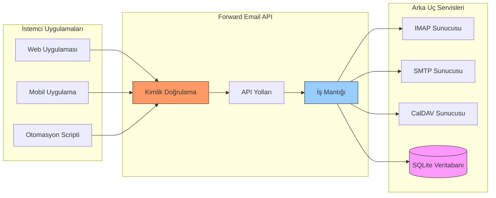

---


## iOS Push Bildirimleri {#ios-push-notifications}

> \[!TIP]
> Forward Email, anlık e-posta teslimi için XAPPLEPUSHSERVICE aracılığıyla yerel iOS push bildirimlerini destekler.

> \[!IMPORTANT]
> **Benzersiz Özellik:** Forward Email, `XAPPLEPUSHSERVICE` IMAP uzantısı aracılığıyla e-posta, kişiler ve takvimler için yerel iOS push bildirimlerini destekleyen birkaç açık kaynaklı e-posta sunucusundan biridir. Bu, Apple'ın protokolünden tersine mühendislik ile elde edilmiştir ve iOS cihazlarına pil tüketimi olmadan anlık teslimat sağlar.

Forward Email, Apple'ın özel XAPPLEPUSHSERVICE uzantısını uygular ve arka plan sorgulaması gerektirmeden iOS cihazları için yerel push bildirimleri sağlar.

### Nasıl Çalışır {#how-it-works-1}

**XAPPLEPUSHSERVICE**, iOS Mail uygulamasının yeni e-postalar geldiğinde anlık push bildirimleri almasını sağlayan standart dışı bir IMAP uzantısıdır.

Forward Email, iOS Mail uygulamasının yeni e-postalar geldiğinde anlık push bildirimleri almasını sağlayan Apple Push Notification service (APNs) entegrasyonunu IMAP için uygular.

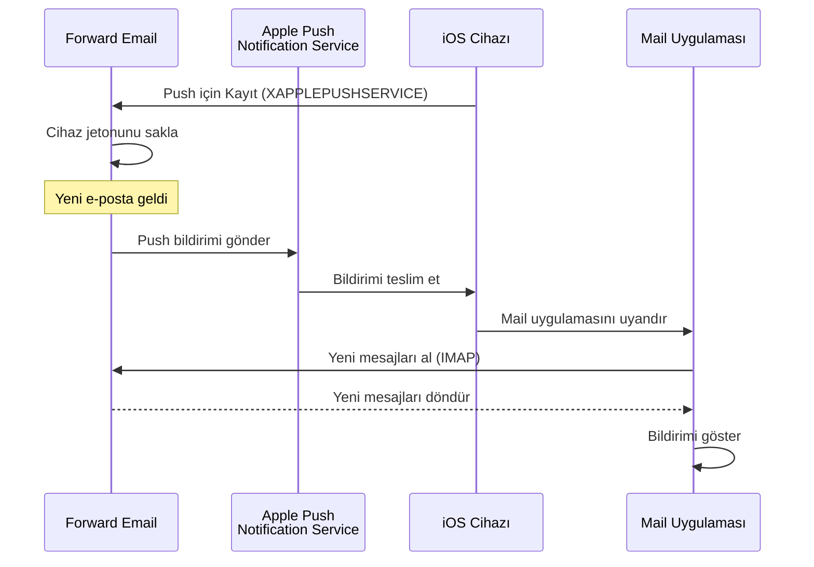

### Temel Özellikler {#key-features}

**Anlık Teslimat:**

* Push bildirimleri saniyeler içinde gelir
* Pil tüketen arka plan sorgulaması yok
* Mail uygulaması kapalıyken bile çalışır

<!---->

* **Anlık Teslimat:** E-postalar, takvim etkinlikleri ve kişiler iPhone/iPad'inizde hemen görünür, sorgulama planında değil
* **Pil Verimli:** Sürekli IMAP bağlantıları yerine Apple'ın push altyapısını kullanır
* **Konu Bazlı Push:** Sadece INBOX değil, belirli posta kutuları için push bildirimlerini destekler
* **Üçüncü Parti Uygulama Gerektirmez:** Yerel iOS Mail, Takvim ve Kişiler uygulamaları ile çalışır
**Yerel Entegrasyon:**

* iOS Mail uygulamasına entegre
* Üçüncü taraf uygulama gerektirmez
* Kesintisiz kullanıcı deneyimi

**Gizlilik Odaklı:**

* Cihaz tokenları şifrelenir
* APNS üzerinden mesaj içeriği gönderilmez
* Sadece "yeni posta" bildirimi gönderilir

**Pil Verimli:**

* Sürekli IMAP sorgulaması yok
* Cihaz bildirim gelene kadar uyur
* Minimum pil etkisi

### Bunu Özel Kılan Nedir {#what-makes-this-special}

> \[!IMPORTANT]
> Çoğu e-posta sağlayıcısı XAPPLEPUSHSERVICE'i desteklemez, bu da iOS cihazlarının her 15 dakikada bir yeni posta için sorgulama yapmasını zorunlu kılar.

Çoğu açık kaynaklı e-posta sunucusu (Dovecot, Postfix, Cyrus IMAP dahil) iOS push bildirimlerini desteklemez. Kullanıcılar ya:

* IMAP IDLE kullanmak zorundadır (bağlantıyı açık tutar, pil tüketir)
* Sorgulama kullanmak zorundadır (her 15-30 dakikada kontrol eder, bildirimler gecikir)
* Kendi push altyapısına sahip özel e-posta uygulamalarını kullanmak zorundadır

Forward Email, Gmail, iCloud ve Fastmail gibi ticari servislerle aynı anlık push bildirim deneyimini sunar.

**Diğer Sağlayıcılarla Karşılaştırma:**

| Sağlayıcı        | Push Desteği   | Sorgulama Aralığı | Pil Etkisi     |
| ---------------- | -------------- | ----------------- | -------------- |
| **Forward Email** | ✅ Yerel Push  | Anlık             | Minimum        |
| Gmail             | ✅ Yerel Push  | Anlık             | Minimum        |
| iCloud            | ✅ Yerel Push  | Anlık             | Minimum        |
| Yahoo             | ✅ Yerel Push  | Anlık             | Minimum        |
| Outlook.com       | ❌ Sorgulama   | 15 dakika         | Orta           |
| Fastmail          | ❌ Sorgulama   | 15 dakika         | Orta           |
| ProtonMail        | ⚠️ Sadece Köprü| Köprü Üzerinden   | Yüksek         |
| Tutanota          | ❌ Sadece Uygulama | Uygulanamaz    | Uygulanamaz    |

### Uygulama Detayları {#implementation-details}

**IMAP CAPABILITY Yanıtı:**

```
* CAPABILITY IMAP4rev1 ... XAPPLEPUSHSERVICE ...
```

**Kayıt Süreci:**

1. iOS Mail uygulaması XAPPLEPUSHSERVICE yeteneğini algılar
2. Uygulama cihaz tokenını Forward Email'e kaydeder
3. Forward Email tokenı saklar ve hesapla ilişkilendirir
4. Yeni posta geldiğinde Forward Email APNS üzerinden push gönderir
5. iOS Mail uygulamasını yeni mesajları almak için uyandırır

**Güvenlik:**

* Cihaz tokenları dinlenme halinde şifrelenir
* Tokenlar süresi dolduğunda otomatik yenilenir
* Mesaj içeriği APNS'ye ifşa edilmez
* Uçtan uca şifreleme korunur

<!---->

* **IMAP Uzantısı:** `XAPPLEPUSHSERVICE`
* **Kaynak Kodu:** [WildDuck Issue #711](https://github.com/zone-eu/wildduck/issues/711)
* **Kurulum:** Otomatik - yapılandırma gerekmez, iOS Mail uygulaması ile kutudan çıkar çıkmaz çalışır

### Diğer Servislerle Karşılaştırma {#comparison-with-other-services}

| Servis        | iOS Push Desteği | Yöntem                                   |
| ------------- | ---------------- | ---------------------------------------- |
| Forward Email | ✅ Evet          | `XAPPLEPUSHSERVICE` (tersine mühendislik) |
| Gmail         | ✅ Evet          | Özel Gmail uygulaması + Google push      |
| iCloud Mail   | ✅ Evet          | Yerel Apple entegrasyonu                 |
| Outlook.com   | ✅ Evet          | Özel Outlook uygulaması + Microsoft push |
| Fastmail      | ✅ Evet          | `XAPPLEPUSHSERVICE`                      |
| Dovecot       | ❌ Hayır         | Sadece IMAP IDLE veya sorgulama          |
| Postfix       | ❌ Hayır         | Sadece IMAP IDLE veya sorgulama          |
| Cyrus IMAP    | ❌ Hayır         | Sadece IMAP IDLE veya sorgulama          |

**Gmail Push:**

Gmail, sadece Gmail uygulamasıyla çalışan özel bir push sistemi kullanır. iOS Mail uygulaması Gmail IMAP sunucularını sorgulamak zorundadır.

**iCloud Push:**

iCloud, Forward Email'e benzer yerel push desteğine sahiptir, ancak sadece @icloud.com adresleri için geçerlidir.

**Outlook.com:**

Outlook.com XAPPLEPUSHSERVICE'i desteklemez, bu nedenle iOS Mail her 15 dakikada bir sorgulama yapmak zorundadır.

**Fastmail:**

Fastmail XAPPLEPUSHSERVICE'i desteklemez. Kullanıcılar push bildirimleri için Fastmail uygulamasını kullanmalı veya 15 dakikalık sorgulama gecikmesini kabul etmelidir.

---


## Test ve Doğrulama {#testing-and-verification}


## Protokol Yeteneği Testleri {#protocol-capability-tests}
> \[!NOTE]
> Bu bölüm, 22 Ocak 2026 tarihinde gerçekleştirilen en son protokol yetenek testlerimizin sonuçlarını sunmaktadır.

Bu bölüm, test edilen tüm sağlayıcılardan alınan gerçek CAPABILITY/CAPA/EHLO yanıtlarını içermektedir. Tüm testler **22 Ocak 2026** tarihinde yapılmıştır.

Bu testler, büyük sağlayıcılar arasında çeşitli e-posta protokolleri ve uzantılarının ilan edilen ve gerçek desteklerini doğrulamaya yardımcı olur.

### Test Metodolojisi {#test-methodology}

**Test Ortamı:**

* **Tarih:** 22 Ocak 2026, 02:37 UTC
* **Konum:** AWS EC2 örneği
* **IPv4:** 54.167.216.197
* **IPv6:** 2600:4040:46da:9a00:b19e:3ad4:426c:2f48
* **Araçlar:** OpenSSL s_client, bash betikleri

**Test Edilen Sağlayıcılar:**

* Forward Email
* Gmail
* Outlook.com
* iCloud
* Fastmail
* Yahoo/AOL (Verizon)

### Test Betikleri {#test-scripts}

Tam şeffaflık için, bu testlerde kullanılan tam betikler aşağıda verilmiştir.

#### IMAP Yetenek Test Betiği {#imap-capability-test-script}

```bash
#!/bin/bash
# IMAP Capability Test Script
# Tests IMAP CAPABILITY for various email providers

echo "========================================="
echo "IMAP CAPABILITY TEST"
echo "Date: $(date -u +"%Y-%m-%d %H:%M:%S UTC")"
echo "========================================="
echo ""

# Gmail
echo "--- Gmail (imap.gmail.com:993) ---"
echo -e "a001 CAPABILITY\na002 LOGOUT" | timeout 10 openssl s_client -connect imap.gmail.com:993 -crlf -quiet 2>&1 | grep -A 20 "CAPABILITY"
echo ""

# Outlook.com
echo "--- Outlook.com (outlook.office365.com:993) ---"
echo -e "a001 CAPABILITY\na002 LOGOUT" | timeout 10 openssl s_client -connect outlook.office365.com:993 -crlf -quiet 2>&1 | grep -A 20 "CAPABILITY"
echo ""

# iCloud
echo "--- iCloud (imap.mail.me.com:993) ---"
echo -e "a001 CAPABILITY\na002 LOGOUT" | timeout 10 openssl s_client -connect imap.mail.me.com:993 -crlf -quiet 2>&1 | grep -A 20 "CAPABILITY"
echo ""

# Fastmail
echo "--- Fastmail (imap.fastmail.com:993) ---"
echo -e "a001 CAPABILITY\na002 LOGOUT" | timeout 10 openssl s_client -connect imap.fastmail.com:993 -crlf -quiet 2>&1 | grep -A 20 "CAPABILITY"
echo ""

# Yahoo
echo "--- Yahoo (imap.mail.yahoo.com:993) ---"
echo -e "a001 CAPABILITY\na002 LOGOUT" | timeout 10 openssl s_client -connect imap.mail.yahoo.com:993 -crlf -quiet 2>&1 | grep -A 20 "CAPABILITY"
echo ""

# Forward Email
echo "--- Forward Email (imap.forwardemail.net:993) ---"
echo -e "a001 CAPABILITY\na002 LOGOUT" | timeout 10 openssl s_client -connect imap.forwardemail.net:993 -crlf -quiet 2>&1 | grep -A 20 "CAPABILITY"
echo ""

echo "========================================="
echo "Test completed"
echo "========================================="
```

#### POP3 Yetenek Test Betiği {#pop3-capability-test-script}

```bash
#!/bin/bash
# POP3 Capability Test Script
# Tests POP3 CAPA for various email providers

echo "========================================="
echo "POP3 CAPABILITY TEST"
echo "Date: $(date -u +"%Y-%m-%d %H:%M:%S UTC")"
echo "========================================="
echo ""

# Gmail
echo "--- Gmail (pop.gmail.com:995) ---"
echo -e "CAPA\nQUIT" | timeout 10 openssl s_client -connect pop.gmail.com:995 -crlf -quiet 2>&1 | grep -A 20 "CAPA"
echo ""

# Outlook.com
echo "--- Outlook.com (outlook.office365.com:995) ---"
echo -e "CAPA\nQUIT" | timeout 10 openssl s_client -connect outlook.office365.com:995 -crlf -quiet 2>&1 | grep -A 20 "CAPA"
echo ""

# iCloud (Not: iCloud POP3 desteklemez)
echo "--- iCloud (POP3 desteği yok) ---"
echo "iCloud POP3 desteklememektedir"
echo ""

# Fastmail
echo "--- Fastmail (pop.fastmail.com:995) ---"
echo -e "CAPA\nQUIT" | timeout 10 openssl s_client -connect pop.fastmail.com:995 -crlf -quiet 2>&1 | grep -A 20 "CAPA"
echo ""

# Yahoo
echo "--- Yahoo (pop.mail.yahoo.com:995) ---"
echo -e "CAPA\nQUIT" | timeout 10 openssl s_client -connect pop.mail.yahoo.com:995 -crlf -quiet 2>&1 | grep -A 20 "CAPA"
echo ""

# Forward Email
echo "--- Forward Email (pop3.forwardemail.net:995) ---"
echo -e "CAPA\nQUIT" | timeout 10 openssl s_client -connect pop3.forwardemail.net:995 -crlf -quiet 2>&1 | grep -A 20 "CAPA"
echo ""

echo "========================================="
echo "Test completed"
echo "========================================="
```
#### SMTP Yetenek Testi Betiği {#smtp-capability-test-script}

```bash
#!/bin/bash
# SMTP Yetenek Testi Betiği
# Çeşitli e-posta sağlayıcıları için SMTP EHLO testleri yapar

echo "========================================="
echo "SMTP YETENEK TESTİ"
echo "Tarih: $(date -u +"%Y-%m-%d %H:%M:%S UTC")"
echo "========================================="
echo ""

# Gmail
echo "--- Gmail (smtp.gmail.com:587) ---"
echo -e "EHLO test.com\nQUIT" | timeout 10 openssl s_client -connect smtp.gmail.com:587 -starttls smtp -crlf -quiet 2>&1 | grep -A 30 "250-"
echo ""

# Outlook.com
echo "--- Outlook.com (smtp.office365.com:587) ---"
echo -e "EHLO test.com\nQUIT" | timeout 10 openssl s_client -connect smtp.office365.com:587 -starttls smtp -crlf -quiet 2>&1 | grep -A 30 "250-"
echo ""

# iCloud
echo "--- iCloud (smtp.mail.me.com:587) ---"
echo -e "EHLO test.com\nQUIT" | timeout 10 openssl s_client -connect smtp.mail.me.com:587 -starttls smtp -crlf -quiet 2>&1 | grep -A 30 "250-"
echo ""

# Fastmail
echo "--- Fastmail (smtp.fastmail.com:587) ---"
echo -e "EHLO test.com\nQUIT" | timeout 10 openssl s_client -connect smtp.fastmail.com:587 -starttls smtp -crlf -quiet 2>&1 | grep -A 30 "250-"
echo ""

# Yahoo
echo "--- Yahoo (smtp.mail.yahoo.com:587) ---"
echo -e "EHLO test.com\nQUIT" | timeout 10 openssl s_client -connect smtp.mail.yahoo.com:587 -starttls smtp -crlf -quiet 2>&1 | grep -A 30 "250-"
echo ""

# Forward Email
echo "--- Forward Email (smtp.forwardemail.net:587) ---"
echo -e "EHLO test.com\nQUIT" | timeout 10 openssl s_client -connect smtp.forwardemail.net:587 -starttls smtp -crlf -quiet 2>&1 | grep -A 30 "250-"
echo ""

echo "========================================="
echo "Test tamamlandı"
echo "========================================="
```

### Test Sonuçları Özeti {#test-results-summary}

#### IMAP (YETENEK) {#imap-capability}

**Forward Email**

```
* CAPABILITY IMAP4rev1 AUTH=PLAIN AUTH=PLAIN-CLIENTTOKEN CHILDREN ENABLE ID IDLE NAMESPACE QUOTA SASL-IR UNSELECT XLIST XAPPLEPUSHSERVICE
```

**Gmail**

```
* CAPABILITY IMAP4rev1 UNSELECT IDLE NAMESPACE QUOTA ID XLIST CHILDREN X-GM-EXT-1 UIDPLUS COMPRESS=DEFLATE ENABLE MOVE CONDSTORE ESEARCH UTF8=ACCEPT LIST-EXTENDED LIST-STATUS LITERAL- SPECIAL-USE
```

**iCloud**

```
* OK [CAPABILITY XAPPLEPUSHSERVICE IMAP4 IMAP4rev1 SASL-IR AUTH=ATOKEN AUTH=PLAIN AUTH=ATOKEN2 AUTH=XOAUTH2]
```

**Outlook.com**

```
* CAPABILITY IMAP4rev1 AUTH=PLAIN AUTH=XOAUTH2 SASL-IR UIDPLUS ID UNSELECT CHILDREN IDLE NAMESPACE LITERAL+
```

**Fastmail**

```
* CAPABILITY IMAP4rev1 ACL ANNOTATE-EXPERIMENT-1 CATENATE CONDSTORE ENABLE ESEARCH ESORT I18NLEVEL=1 ID IDLE LIST-EXTENDED LIST-STATUS LITERAL+ LOGINDISABLED MULTIAPPEND NAMESPACE QRESYNC QUOTA RIGHTS=ektx SASL-IR SORT SPECIAL-USE THREAD=ORDEREDSUBJECT UIDPLUS UNSELECT WITHIN X-RENAME XLIST
```

**Yahoo/AOL (Verizon)**

```
* CAPABILITY IMAP4rev1 IDLE NAMESPACE QUOTA ID XLIST CHILDREN UIDPLUS MOVE CONDSTORE ESEARCH ENABLE LIST-EXTENDED LIST-STATUS LITERAL- SPECIAL-USE UNSELECT XAPPLEPUSHSERVICE
```

#### POP3 (CAPA) {#pop3-capa}

**Forward Email**

```
+OK
CAPA
TOP
USER
UIDL
EXPIRE 30
IMPLEMENTATION ForwardEmail
.
```

**Gmail**

```
+OK
CAPA
TOP
USER
UIDL
EXPIRE 30
IMPLEMENTATION Gpop
.
```

**Outlook.com**

```
+OK
CAPA
TOP
USER
UIDL
SASL PLAIN XOAUTH2
.
```

**Fastmail**

```
+OK
CAPA
TOP
USER
UIDL
EXPIRE 30
IMPLEMENTATION Cyrus
.
```

#### SMTP (EHLO) {#smtp-ehlo}

**Forward Email**

```
250-smtp.forwardemail.net
250-PIPELINING
250-SIZE 52428800
250-ETRN
250-STARTTLS
250-ENHANCEDSTATUSCODES
250-8BITMIME
250-DSN
250 CHUNKING
```

**Gmail**

```
250-smtp.gmail.com at your service
250-SIZE 35882577
250-8BITMIME
250-STARTTLS
250-ENHANCEDSTATUSCODES
250-PIPELINING
250-CHUNKING
250 SMTPUTF8
```

**Outlook.com**

```
250-SN4PR13CA0005.outlook.office365.com Hello [x.x.x.x]
250-SIZE 157286400
250-PIPELINING
250-DSN
250-ENHANCEDSTATUSCODES
250-STARTTLS
250-8BITMIME
250-BINARYMIME
250-CHUNKING
250 SMTPUTF8
```

**Fastmail**

```
250-smtp.fastmail.com
250-PIPELINING
250-SIZE 78643200
250-ETRN
250-STARTTLS
250-ENHANCEDSTATUSCODES
250-8BITMIME
250-DSN
250 CHUNKING
```

**Yahoo/AOL (Verizon)**

```
250-smtp.mail.yahoo.com
250-PIPELINING
250-SIZE 41943040
250-8BITMIME
250-ENHANCEDSTATUSCODES
250-STARTTLS
```
### Detaylı Test Sonuçları {#detailed-test-results}

#### IMAP Test Sonuçları {#imap-test-results}

**Gmail:**
`* CAPABILITY IMAP4rev1 UNSELECT IDLE NAMESPACE QUOTA ID XLIST CHILDREN X-GM-EXT-1 XYZZY SASL-IR AUTH=XOAUTH2 AUTH=PLAIN AUTH=PLAIN-CLIENTTOKEN AUTH=OAUTHBEARER`

**Outlook.com:**
`* CAPABILITY IMAP4 IMAP4rev1 AUTH=PLAIN AUTH=XOAUTH2 SASL-IR UIDPLUS ID UNSELECT CHILDREN IDLE NAMESPACE LITERAL+`

**iCloud:**
`* CAPABILITY XAPPLEPUSHSERVICE IMAP4 IMAP4rev1 SASL-IR AUTH=ATOKEN AUTH=PLAIN AUTH=ATOKEN2 AUTH=XOAUTH2`

**Fastmail:**
Bağlantı zaman aşımına uğradı. Aşağıdaki notlara bakınız.

**Yahoo:**
`* CAPABILITY IMAP4rev1 SASL-IR AUTH=PLAIN AUTH=XOAUTH2 AUTH=OAUTHBEARER ID MOVE NAMESPACE XYMHIGHESTMODSEQ UIDPLUS LITERAL+ CHILDREN UNSELECT X-MSG-EXT OBJECTID IDLE ENABLE UIDONLY X-ALL-MAIL X-UIDONLY LIST-EXTENDED LIST-STATUS SPECIAL-USE PARTIAL APPENDLIMIT=41697280`

**Forward Email:**
`* CAPABILITY XAPPLEPUSHSERVICE IMAP4rev1 APPENDLIMIT=52428800 AUTH=PLAIN AUTH=PLAIN-CLIENTTOKEN CHILDREN CONDSTORE ENABLE ID IDLE MOVE NAMESPACE QUOTA SASL-IR SPECIAL-USE UIDPLUS UNSELECT UTF8=ACCEPT XLIST`

#### POP3 Test Sonuçları {#pop3-test-results}

**Gmail:**
Bağlantı kimlik doğrulaması olmadan CAPA yanıtı döndürmedi.

**Outlook.com:**
Bağlantı kimlik doğrulaması olmadan CAPA yanıtı döndürmedi.

**iCloud:**
Desteklenmiyor.

**Fastmail:**
Bağlantı zaman aşımına uğradı. Aşağıdaki notlara bakınız.

**Yahoo:**
`+OK CAPA list follows... SASL PLAIN XOAUTH2`

**Forward Email:**
Bağlantı kimlik doğrulaması olmadan CAPA yanıtı döndürmedi.

#### SMTP Test Sonuçları {#smtp-test-results}

**Gmail:**
`250-AUTH LOGIN PLAIN XOAUTH2 PLAIN-CLIENTTOKEN OAUTHBEARER XOAUTH`

**Outlook.com:**
`250-DSN`

**iCloud:**
`250-DSN`

**Fastmail:**
`250 AUTH PLAIN LOGIN XOAUTH2 OAUTHBEARER`

**Yahoo:**
`250 AUTH PLAIN LOGIN XOAUTH2 OAUTHBEARER`

**Forward Email:**
`250-DSN`, `250-REQUIRETLS`

### Test Sonuçları Hakkında Notlar {#notes-on-test-results}

> \[!NOTE]
> Test sonuçlarından önemli gözlemler ve sınırlamalar.

1. **Fastmail Zaman Aşımı:** Fastmail bağlantıları test sırasında zaman aşımına uğradı, muhtemelen test sunucusu IP'sinden kaynaklanan hız sınırlaması veya güvenlik duvarı kısıtlamaları nedeniyle. Fastmail, belgelerine göre sağlam IMAP/POP3/SMTP desteğine sahiptir.

2. **POP3 CAPA Yanıtları:** Bazı sağlayıcılar (Gmail, Outlook.com, Forward Email) kimlik doğrulaması olmadan CAPA yanıtı döndürmedi. Bu, POP3 sunucuları için yaygın bir güvenlik uygulamasıdır.

3. **DSN Desteği:** Yalnızca Outlook.com, iCloud ve Forward Email SMTP EHLO yanıtlarında DSN desteğini açıkça bildiriyor. Bu, diğer sağlayıcıların DSN desteklemediği anlamına gelmez, sadece bunu duyurmadıkları anlamına gelir.

4. **REQUIRETLS:** Yalnızca Forward Email, kullanıcıya yönelik zorunlu TLS desteğini onay kutusuyla açıkça bildiriyor. Diğer sağlayıcılar dahili olarak destekleyebilir ancak EHLO'da duyurmazlar.

5. **Test Ortamı:** Testler 22 Ocak 2026, 02:37 UTC tarihinde AWS EC2 örneğinden (IP: 54.167.216.197 IPv4, 2600:4040:46da:9a00:b19e:3ad4:426c:2f48 IPv6) gerçekleştirildi.

---


## Özet {#summary}

Forward Email, tüm büyük e-posta standartlarında kapsamlı RFC protokol desteği sunar:

* **IMAP4rev1:** 16 desteklenen RFC, belgelenmiş kasıtlı farklılıklarla
* **POP3:** RFC uyumlu kalıcı silme ile 4 desteklenen RFC
* **SMTP:** SMTPUTF8, DSN ve PIPELINING dahil 11 desteklenen uzantı
* **Kimlik Doğrulama:** DKIM, SPF, DMARC, ARC tam destekli
* **Taşıma Güvenliği:** MTA-STS ve REQUIRETLS tam destekli, DANE kısmi destekli
* **Şifreleme:** OpenPGP v6 ve S/MIME destekli
* **Takvim:** CalDAV, CardDAV ve VTODO tam destekli
* **API Erişimi:** Doğrudan veritabanı erişimi için 39 uç noktalı tam REST API
* **iOS Push:** E-posta, kişiler ve takvimler için yerel push bildirimleri `XAPPLEPUSHSERVICE` aracılığıyla

### Temel Farklılaştırıcılar {#key-differentiators}

> \[!TIP]
> Forward Email, diğer sağlayıcılarda bulunmayan benzersiz özelliklerle öne çıkar.

**Forward Email'i Benzersiz Kılanlar:**

1. **Kuantum Güvenli Şifreleme** - ChaCha20-Poly1305 şifreli SQLite posta kutularına sahip tek sağlayıcı
2. **Sıfır Bilgi Mimarisi** - Şifreniz posta kutunuzu şifreler; biz çözemeyiz
3. **Ücretsiz Özel Alan Adları** - Özel alan adı e-postası için aylık ücret yok
4. **REQUIRETLS Desteği** - Tüm teslimat yolu için TLS zorunluluğunu kullanıcıya yönelik onay kutusuyla uygular
5. **Kapsamlı API** - Tam programatik kontrol için 39 REST API uç noktası
6. **iOS Push Bildirimleri** - Anında teslimat için yerel XAPPLEPUSHSERVICE desteği
7. **Açık Kaynak** - Tam kaynak kodu GitHub’da mevcut
8. **Gizlilik Odaklı** - Veri madenciliği yok, reklam yok, takip yok
* **Sandboxed Şifreleme:** Bireysel olarak şifrelenmiş SQLite posta kutularına sahip tek e-posta servisi
* **RFC Uyumluluğu:** Kolaylıktan çok standartlara uyumu önceliklendirir (örneğin, POP3 DELE)
* **Tam API:** Tüm e-posta verilerine doğrudan programatik erişim
* **Açık Kaynak:** Tam şeffaf uygulama

**Protokol Destek Özeti:**

| Kategori             | Destek Seviyesi | Detaylar                                      |
| -------------------- | --------------- | --------------------------------------------- |
| **Temel Protokoller** | ✅ Mükemmel     | IMAP4rev1, POP3, SMTP tam desteklenir         |
| **Modern Protokoller**| ⚠️ Kısmi       | IMAP4rev2 kısmi destek, JMAP desteklenmez     |
| **Güvenlik**         | ✅ Mükemmel     | DKIM, SPF, DMARC, ARC, MTA-STS, REQUIRETLS    |
| **Şifreleme**        | ✅ Mükemmel     | OpenPGP, S/MIME, SQLite şifreleme              |
| **CalDAV/CardDAV**   | ✅ Mükemmel     | Tam takvim ve kişi senkronizasyonu             |
| **Filtreleme**       | ✅ Mükemmel     | Sieve (24 uzantı) ve ManageSieve               |
| **API**              | ✅ Mükemmel     | 39 REST API uç noktası                          |
| **Push**             | ✅ Mükemmel     | Yerel iOS push bildirimleri                     |
