# Підтримка Email RFC Протоколів - Повний Посібник зі Стандартів та Специфікацій {#email-rfc-protocol-support---complete-standards--specifications-guide}


## Зміст {#table-of-contents}

* [Про цей документ](#about-this-document)
  * [Огляд архітектури](#architecture-overview)
* [Порівняння поштових сервісів - підтримка протоколів та відповідність стандартам RFC](#email-service-comparison---protocol-support--rfc-standards-compliance)
  * [Візуалізація підтримки протоколів](#protocol-support-visualization)
* [Основні поштові протоколи](#core-email-protocols)
  * [Потік поштового протоколу](#email-protocol-flow)
* [IMAP4 поштовий протокол та розширення](#imap4-email-protocol-and-extensions)
  * [Відмінності протоколу IMAP від специфікацій RFC](#imap-protocol-differences-from-rfc-specifications)
  * [Розширення IMAP, які НЕ підтримуються](#imap-extensions-not-supported)
* [POP3 поштовий протокол та розширення](#pop3-email-protocol-and-extensions)
  * [Відмінності протоколу POP3 від специфікацій RFC](#pop3-protocol-differences-from-rfc-specifications)
  * [Розширення POP3, які НЕ підтримуються](#pop3-extensions-not-supported)
* [SMTP поштовий протокол та розширення](#smtp-email-protocol-and-extensions)
  * [Сповіщення про статус доставки (DSN)](#delivery-status-notifications-dsn)
  * [Підтримка REQUIRETLS](#requiretls-support)
  * [Розширення SMTP, які НЕ підтримуються](#smtp-extensions-not-supported)
* [JMAP поштовий протокол](#jmap-email-protocol)
* [Безпека електронної пошти](#email-security)
  * [Архітектура безпеки електронної пошти](#email-security-architecture)
* [Протоколи автентифікації поштових повідомлень](#email-message-authentication-protocols)
  * [Підтримка протоколів автентифікації](#authentication-protocol-support)
  * [DKIM (DomainKeys Identified Mail)](#dkim-domainkeys-identified-mail)
  * [SPF (Sender Policy Framework)](#spf-sender-policy-framework)
  * [DMARC (Domain-based Message Authentication, Reporting & Conformance)](#dmarc-domain-based-message-authentication-reporting--conformance)
  * [ARC (Authenticated Received Chain)](#arc-authenticated-received-chain)
  * [Потік автентифікації](#authentication-flow)
* [Протоколи безпеки транспорту електронної пошти](#email-transport-security-protocols)
  * [Підтримка безпеки транспорту](#transport-security-support)
  * [TLS (Transport Layer Security)](#tls-transport-layer-security)
  * [MTA-STS (Mail Transfer Agent Strict Transport Security)](#mta-sts-mail-transfer-agent-strict-transport-security)
  * [DANE (DNS-based Authentication of Named Entities)](#dane-dns-based-authentication-of-named-entities)
  * [REQUIRETLS](#requiretls)
  * [Потік безпеки транспорту](#transport-security-flow)
* [Шифрування поштових повідомлень](#email-message-encryption)
  * [Підтримка шифрування](#encryption-support)
  * [OpenPGP (Pretty Good Privacy)](#openpgp-pretty-good-privacy)
  * [S/MIME (Secure/Multipurpose Internet Mail Extensions)](#smime-securemultipurpose-internet-mail-extensions)
  * [Шифрування поштової скриньки SQLite](#sqlite-mailbox-encryption)
  * [Порівняння шифрування](#encryption-comparison)
  * [Потік шифрування](#encryption-flow)
* [Розширена функціональність](#extended-functionality)
* [Стандарти формату поштових повідомлень](#email-message-format-standards)
  * [Підтримка стандартів формату](#format-standards-support)
  * [MIME (Multipurpose Internet Mail Extensions)](#mime-multipurpose-internet-mail-extensions)
  * [SMTPUTF8 та інтернаціоналізація адрес електронної пошти](#smtputf8-and-email-address-internationalization)
* [Протоколи календарів та контактів](#calendaring-and-contacts-protocols)
  * [Підтримка CalDAV та CardDAV](#caldav-and-carddav-support)
  * [CalDAV (доступ до календаря)](#caldav-calendar-access)
  * [CardDAV (доступ до контактів)](#carddav-contact-access)
  * [Завдання та нагадування (CalDAV VTODO)](#tasks-and-reminders-caldav-vtodo)
  * [Потік синхронізації CalDAV/CardDAV](#caldavcarddav-synchronization-flow)
  * [Розширення календарів, які НЕ підтримуються](#calendaring-extensions-not-supported)
* [Фільтрація поштових повідомлень](#email-message-filtering)
  * [Sieve (RFC 5228)](#sieve-rfc-5228)
  * [ManageSieve (RFC 5804)](#managesieve-rfc-5804)
* [Оптимізація зберігання](#storage-optimization)
  * [Архітектура: оптимізація зберігання з двошаровою структурою](#architecture-dual-layer-storage-optimization)
* [Дедуплікація вкладень](#attachment-deduplication)
  * [Як це працює](#how-it-works)
  * [Потік дедуплікації](#deduplication-flow)
  * [Система магічних номерів](#magic-number-system)
  * [Ключові відмінності: WildDuck проти Forward Email](#key-differences-wildduck-vs-forward-email)
* [Стиснення Brotli](#brotli-compression)
  * [Що стискається](#what-gets-compressed)
  * [Налаштування стиснення](#compression-configuration)
  * [Магічний заголовок: "FEBR"](#magic-header-febr)
  * [Процес стиснення](#compression-process)
  * [Процес розпакування](#decompression-process)
  * [Зворотна сумісність](#backwards-compatibility)
  * [Статистика економії місця](#storage-savings-statistics)
  * [Процес міграції](#migration-process)
  * [Комбінована ефективність зберігання](#combined-storage-efficiency)
  * [Технічні деталі реалізації](#technical-implementation-details)
  * [Чому жоден інший провайдер цього не робить](#why-no-other-provider-does-this)
* [Сучасні функції](#modern-features)
* [Повний REST API для керування електронною поштою](#complete-rest-api-for-email-management)
  * [Категорії API (39 кінцевих точок)](#api-categories-39-endpoints)
  * [Технічні деталі](#technical-details)
  * [Реальні сценарії використання](#real-world-use-cases)
  * [Ключові функції API](#key-api-features)
  * [Архітектура API](#api-architecture)
* [Push-повідомлення iOS](#ios-push-notifications)
  * [Як це працює](#how-it-works-1)
  * [Ключові функції](#key-features)
  * [Що робить це особливим](#what-makes-this-special)
  * [Деталі реалізації](#implementation-details)
  * [Порівняння з іншими сервісами](#comparison-with-other-services)
* [Тестування та перевірка](#testing-and-verification)
* [Тести можливостей протоколів](#protocol-capability-tests)
  * [Методологія тестування](#test-methodology)
  * [Тестові скрипти](#test-scripts)
  * [Підсумок результатів тестів](#test-results-summary)
  * [Детальні результати тестів](#detailed-test-results)
  * [Примітки щодо результатів тестів](#notes-on-test-results)
* [Підсумок](#summary)
  * [Ключові відмінності](#key-differentiators)
## Про цей документ {#about-this-document}

Цей документ описує підтримку протоколу RFC (Request for Comments) для Forward Email. Оскільки Forward Email використовує [WildDuck](https://github.com/nodemailer/wildduck) під капотом для функціональності IMAP/POP3, підтримка протоколу та обмеження, задокументовані тут, відображають реалізацію WildDuck.

> \[!IMPORTANT]
> Forward Email використовує [SQLite](https://sqlite.org/) для зберігання повідомлень замість MongoDB (який спочатку використовував WildDuck). Це впливає на певні деталі реалізації, описані нижче.

**Вихідний код:** <https://github.com/forwardemail/forwardemail.net>

### Огляд архітектури {#architecture-overview}

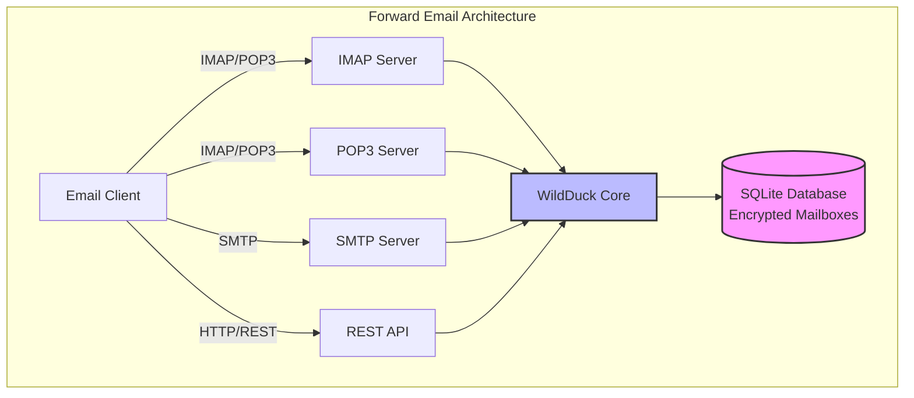

---


## Порівняння поштових сервісів - підтримка протоколів та відповідність стандартам RFC {#email-service-comparison---protocol-support--rfc-standards-compliance}

> \[!IMPORTANT]
> **Пісочниця та квантово-стійке шифрування:** Forward Email — єдиний поштовий сервіс, який зберігає індивідуально зашифровані поштові скриньки SQLite за допомогою вашого пароля (який є тільки у вас). Кожна скринька зашифрована за допомогою [sqleet](https://github.com/resilar/sqleet) (ChaCha20-Poly1305), автономна, ізольована та портативна. Якщо ви забудете пароль, ви втратите скриньку — навіть Forward Email не зможе її відновити. Деталі дивіться у [Quantum-Safe Encrypted Email](https://forwardemail.net/en/blog/docs/best-quantum-safe-encrypted-email-service).

Порівняйте підтримку поштових протоколів та реалізацію стандартів RFC серед основних поштових провайдерів:

| Функція                      | Forward Email                                                                                  | Postfix/Dovecot                                                                    | Gmail                                                                             | iCloud Mail                                           | Outlook.com                                                                                                                                                          | Fastmail                                                                                 | Yahoo/AOL (Verizon)                                                  | ProtonMail                                                                     | Tutanota                                                          |
| ---------------------------- | ---------------------------------------------------------------------------------------------- | ---------------------------------------------------------------------------------- | --------------------------------------------------------------------------------- | ----------------------------------------------------- | -------------------------------------------------------------------------------------------------------------------------------------------------------------------- | ---------------------------------------------------------------------------------------- | -------------------------------------------------------------------- | ------------------------------------------------------------------------------ | ----------------------------------------------------------------- |
| **Ціна за власний домен**    | [Безкоштовно](https://forwardemail.net/en/pricing)                                            | [Безкоштовно](https://www.postfix.org/)                                           | [$7.20/міс](https://workspace.google.com/pricing)                                | [$0.99/міс](https://support.apple.com/en-us/102622)    | [$7.20/міс](https://www.microsoft.com/en-us/microsoft-365/business/microsoft-365-business-basic)                                                                      | [$5/міс](https://www.fastmail.com/pricing/)                                               | [$3.19/міс](https://www.turbify.com/mail)                             | [$4.99/міс](https://proton.me/mail/pricing)                                     | [$3.27/міс](https://tuta.com/pricing)                              |
| **IMAP4rev1 (RFC 3501)**     | ✅ [Підтримується](#imap4-email-protocol-and-extensions)                                       | ✅ [Підтримується](https://www.dovecot.org/)                                       | ✅ [Підтримується](https://developers.google.com/workspace/gmail/imap/imap-extensions) | ✅ [Підтримується](https://support.apple.com/en-us/102431) | ✅ [Підтримується](https://support.microsoft.com/en-us/office/pop-imap-and-smtp-settings-for-outlook-com-d088b986-291d-42b8-9564-9c414e2aa040)                            | ✅ [Підтримується](https://www.fastmail.help/hc/en-us/articles/1500000278382-Email-standards) | ✅ [Підтримується](https://senders.yahooinc.com/developer/documentation/) | ⚠️ [Через Bridge](https://proton.me/support/imap-smtp-and-pop3-setup)            | ❌ Не підтримується                                               |
| **IMAP4rev2 (RFC 9051)**     | ⚠️ [Частково](https://forwardemail.net/en/blog/docs/best-quantum-safe-encrypted-email-service) | ⚠️ [Частково](https://www.dovecot.org/)                                           | ⚠️ [31%](https://developers.google.com/workspace/gmail/imap/imap-extensions)      | ⚠️ [92%](https://support.apple.com/en-us/102431)      | ⚠️ [46%](https://support.microsoft.com/en-us/office/pop-imap-and-smtp-settings-for-outlook-com-d088b986-291d-42b8-9564-9c414e2aa040)                                 | ⚠️ [69%](https://www.fastmail.help/hc/en-us/articles/1500000278382-Email-standards)      | ⚠️ [85%](https://senders.yahooinc.com/developer/documentation/)      | ⚠️ [Через Bridge](https://proton.me/support/imap-smtp-and-pop3-setup)            | ❌ Не підтримується                                               |
| **POP3 (RFC 1939)**          | ✅ [Підтримується](#pop3-email-protocol-and-extensions)                                        | ✅ [Підтримується](https://www.dovecot.org/)                                       | ✅ [Підтримується](https://support.google.com/mail/answer/7104828)                 | ❌ Не підтримується                                   | ✅ [Підтримується](https://support.microsoft.com/en-us/office/pop-imap-and-smtp-settings-for-outlook-com-d088b986-291d-42b8-9564-9c414e2aa040)                            | ✅ [Підтримується](https://www.fastmail.help/hc/en-us/articles/1500000278382-Email-standards) | ✅ [Підтримується](https://help.yahoo.com/kb/SLN4075.html)                | ⚠️ [Через Bridge](https://proton.me/support/imap-smtp-and-pop3-setup)            | ❌ Не підтримується                                               |
| **SMTP (RFC 5321)**          | ✅ [Підтримується](#smtp-email-protocol-and-extensions)                                        | ✅ [Підтримується](https://www.postfix.org/)                                       | ✅ [Підтримується](https://support.google.com/mail/answer/7126229)                 | ✅ [Підтримується](https://support.apple.com/en-us/102431) | ✅ [Підтримується](https://support.microsoft.com/en-us/office/pop-imap-and-smtp-settings-for-outlook-com-d088b986-291d-42b8-9564-9c414e2aa040)                            | ✅ [Підтримується](https://www.fastmail.help/hc/en-us/articles/1500000278382-Email-standards) | ✅ [Підтримується](https://help.yahoo.com/kb/SLN4075.html)                | ⚠️ [Через Bridge](https://proton.me/support/imap-smtp-and-pop3-setup)            | ❌ Не підтримується                                               |
| **JMAP (RFC 8620)**          | ❌ [Не підтримується](#jmap-email-protocol)                                                   | ❌ Не підтримується                                                                | ❌ Не підтримується                                                               | ❌ Не підтримується                                   | ❌ Не підтримується                                                                                                                                                  | ✅ [Підтримується](https://www.fastmail.com/dev/)                                             | ❌ Не підтримується                                                  | ❌ Не підтримується                                                              | ❌ Не підтримується                                               |
| **DKIM (RFC 6376)**          | ✅ [Підтримується](#email-message-authentication-protocols)                                   | ✅ [Підтримується](https://github.com/trusteddomainproject/OpenDKIM)               | ✅ [Підтримується](https://support.google.com/a/answer/174124)                     | ✅ [Підтримується](https://support.apple.com/en-us/102431) | ✅ [Підтримується](https://learn.microsoft.com/en-us/defender-office-365/email-authentication-dkim-configure)                                                           | ✅ [Підтримується](https://www.fastmail.help/hc/en-us/articles/360060590573)                  | ✅ [Підтримується](https://help.yahoo.com/kb/SLN25426.html)               | ✅ [Підтримується](https://proton.me/support)                                       | ✅ [Підтримується](https://tuta.com/support#dkim)                      |
| **SPF (RFC 7208)**           | ✅ [Підтримується](#email-message-authentication-protocols)                                   | ✅ [Підтримується](https://www.postfix.org/)                                       | ✅ [Підтримується](https://support.google.com/a/answer/33786)                      | ✅ [Підтримується](https://support.apple.com/en-us/102431) | ✅ [Підтримується](https://learn.microsoft.com/en-us/microsoft-365/security/office-365-security/how-office-365-uses-spf-to-prevent-spoofing)                            | ✅ [Підтримується](https://www.fastmail.help/hc/en-us/articles/360060590573)                  | ✅ [Підтримується](https://help.yahoo.com/kb/SLN25426.html)               | ✅ [Підтримується](https://proton.me/support)                                       | ✅ [Підтримується](https://tuta.com/support#dkim)                      |
| **DMARC (RFC 7489)**         | ✅ [Підтримується](#email-message-authentication-protocols)                                   | ✅ [Підтримується](https://www.postfix.org/)                                       | ✅ [Підтримується](https://support.google.com/a/answer/2466580)                    | ✅ [Підтримується](https://support.apple.com/en-us/102431) | ✅ [Підтримується](https://learn.microsoft.com/en-us/microsoft-365/security/office-365-security/use-dmarc-to-validate-email)                                            | ✅ [Підтримується](https://www.fastmail.help/hc/en-us/articles/360060590573)                  | ✅ [Підтримується](https://help.yahoo.com/kb/SLN25426.html)               | ✅ [Підтримується](https://proton.me/support)                                       | ✅ [Підтримується](https://tuta.com/support#dkim)                      |
| **ARC (RFC 8617)**           | ✅ [Підтримується](#email-message-authentication-protocols)                                   | ✅ [Підтримується](https://github.com/trusteddomainproject/OpenARC)                | ✅ [Підтримується](https://support.google.com/a/answer/2466580)                    | ❌ Не підтримується                                   | ✅ [Підтримується](https://learn.microsoft.com/en-us/defender-office-365/email-authentication-arc-configure)                                                            | ✅ [Підтримується](https://www.fastmail.help/hc/en-us/articles/360060590573)                  | ✅ [Підтримується](https://senders.yahooinc.com/developer/documentation/) | ✅ [Підтримується](https://proton.me/blog/what-is-authenticated-received-chain-arc) | ❌ Не підтримується                                               |
| **MTA-STS (RFC 8461)**       | ✅ [Підтримується](#email-transport-security-protocols)                                       | ✅ [Підтримується](https://www.postfix.org/)                                       | ✅ [Підтримується](https://support.google.com/a/answer/9261504)                    | ✅ [Підтримується](https://support.apple.com/en-us/102431) | ✅ [Підтримується](https://learn.microsoft.com/en-us/defender-office-365/email-authentication-about)                                                                    | ✅ [Підтримується](https://www.fastmail.help/hc/en-us/articles/360060590573)                  | ✅ [Підтримується](https://senders.yahooinc.com/developer/documentation/) | ✅ [Підтримується](https://proton.me/support)                                       | ✅ [Підтримується](https://tuta.com/security)                          |
| **DANE (RFC 7671)**          | ✅ [Підтримується](#email-transport-security-protocols)                                       | ✅ [Підтримується](https://www.postfix.org/)                                       | ❌ Не підтримується                                                               | ❌ Не підтримується                                   | ❌ Не підтримується                                                                                                                                                  | ❌ Не підтримується                                                                      | ❌ Не підтримується                                                  | ✅ [Підтримується](https://proton.me/support)                                       | ✅ [Підтримується](https://tuta.com/support#dane)                      |
| **DSN (RFC 3461)**           | ✅ [Підтримується](#smtp-email-protocol-and-extensions)                                       | ✅ [Підтримується](https://www.postfix.org/DSN_README.html)                        | ❌ Не підтримується                                                               | ✅ [Підтримується](#protocol-capability-tests)           | ✅ [Підтримується](#protocol-capability-tests)                                                                                                                        | ⚠️ [Невідомо](https://www.fastmail.help/hc/en-us/articles/1500000278382-Email-standards)  | ❌ Не підтримується                                                  | ⚠️ [Через Bridge](https://proton.me/support/imap-smtp-and-pop3-setup)            | ❌ Не підтримується                                               |
| **REQUIRETLS (RFC 8689)**    | ✅ [Підтримується](#email-transport-security-protocols)                                       | ✅ [Підтримується](https://www.postfix.org/TLS_README.html#server_require_tls)      | ⚠️ Невідомо                                                                       | ⚠️ Невідомо                                          | ⚠️ Невідомо                                                                                                                                                         | ⚠️ Невідомо                                                                             | ⚠️ Невідомо                                                         | ⚠️ [Через Bridge](https://proton.me/support/imap-smtp-and-pop3-setup)            | ❌ Не підтримується                                               |
| **ManageSieve (RFC 5804)**   | ✅ [Підтримується](#managesieve-rfc-5804)                                                     | ✅ [Підтримується](https://doc.dovecot.org/admin_manual/pigeonhole_managesieve_server/) | ❌ Не підтримується                                                               | ❌ Не підтримується                                   | ❌ Не підтримується                                                                                                                                                  | ✅ [Підтримується](https://www.fastmail.help/hc/en-us/articles/360060590573)                  | ❌ Не підтримується                                                  | ❌ Не підтримується                                                              | ❌ Не підтримується                                               |
| **OpenPGP (RFC 9580)**       | ✅ [Підтримується](#email-message-encryption)                                                 | ⚠️ [Через плагіни](https://www.gnupg.org/)                                        | ⚠️ [Сторонні](https://github.com/google/end-to-end)                              | ⚠️ [Сторонні](https://gpgtools.org/)                   | ⚠️ [Сторонні](https://gpg4win.org/)                                                                                                                                 | ⚠️ [Сторонні](https://www.fastmail.help/hc/en-us/articles/360060590573)                   | ⚠️ [Сторонні](https://help.yahoo.com/kb/SLN25426.html)              | ✅ [Вбудоване](https://proton.me/support/pgp-mime-pgp-inline)                      | ❌ Не підтримується                                               |
| **S/MIME (RFC 8551)**        | ✅ [Підтримується](#email-message-encryption)                                                 | ✅ [Підтримується](https://www.openssl.org/)                                       | ✅ [Підтримується](https://support.google.com/mail/answer/81126)                 | ✅ [Підтримується](https://support.apple.com/en-us/102431) | ✅ [Підтримується](https://support.microsoft.com/en-us/office/send-view-and-reply-to-encrypted-messages-in-outlook-for-pc-eaa43495-9bbb-4fca-922a-df90dee51980)         | ⚠️ [Частково](https://www.fastmail.help/hc/en-us/articles/360060590573)                   | ❌ Не підтримується                                                  | ✅ [Підтримується](https://proton.me/support/pgp-mime-pgp-inline)                   | ❌ Не підтримується                                               |
| **CalDAV (RFC 4791)**        | ✅ [Підтримується](#calendaring-and-contacts-protocols)                                       | ✅ [Підтримується](https://www.davical.org/)                                       | ✅ [Підтримується](https://developers.google.com/calendar/caldav/v2/guide)       | ✅ [Підтримується](https://support.apple.com/en-us/102431) | ❌ Не підтримується                                                                                                                                                  | ✅ [Підтримується](https://www.fastmail.help/hc/en-us/articles/360060590573)                  | ❌ Не підтримується                                                  | ✅ [Через Bridge](https://proton.me/support/proton-calendar)                      | ❌ Не підтримується                                               |
| **CardDAV (RFC 6352)**       | ✅ [Підтримується](#calendaring-and-contacts-protocols)                                       | ✅ [Підтримується](https://www.davical.org/)                                       | ✅ [Підтримується](https://developers.google.com/people/carddav)                 | ✅ [Підтримується](https://support.apple.com/en-us/102431) | ❌ Не підтримується                                                                                                                                                  | ✅ [Підтримується](https://www.fastmail.help/hc/en-us/articles/360060590573)                  | ❌ Не підтримується                                                  | ✅ [Через Bridge](https://proton.me/support/proton-contacts)                      | ❌ Не підтримується                                               |
| **Завдання (VTODO)**         | ✅ [Підтримується](#tasks-and-reminders-caldav-vtodo)                                         | ✅ [Підтримується](https://www.davical.org/)                                       | ❌ Не підтримується                                                               | ✅ [Підтримується](https://support.apple.com/en-us/102431) | ❌ Не підтримується                                                                                                                                                  | ✅ [Підтримується](https://www.fastmail.help/hc/en-us/articles/360060590573)                  | ❌ Не підтримується                                                  | ❌ Не підтримується                                                              | ❌ Не підтримується                                               |
| **Sieve (RFC 5228)**         | ✅ [Підтримується](#sieve-rfc-5228)                                                           | ✅ [Підтримується](https://www.dovecot.org/)                                       | ❌ Не підтримується                                                               | ❌ Не підтримується                                   | ❌ Не підтримується                                                                                                                                                  | ✅ [Підтримується](https://www.fastmail.help/hc/en-us/articles/360060590573)                  | ❌ Не підтримується                                                  | ❌ Не підтримується                                                              | ❌ Не підтримується                                               |
| **Catch-All**                | ✅ [Підтримується](https://forwardemail.net/en/faq#can-i-have-multiple-global-catch-all-recipients) | ✅ Підтримується                                                                    | ✅ [Підтримується](https://support.google.com/a/answer/4524505)                  | ❌ Не підтримується                                   | ❌ [Не підтримується](https://learn.microsoft.com/en-us/exchange/recipients-in-exchange-online/manage-mail-users)                                                    | ✅ [Підтримується](https://www.fastmail.help/hc/en-us/articles/1500000278382-Email-standards) | ❌ Не підтримується                                                  | ❌ Не підтримується                                                              | ✅ [Підтримується](https://tuta.com/support#catch-all-alias)           |
| **Необмежена кількість псевдонімів** | ✅ [Підтримується](https://forwardemail.net/en/faq#advanced-features)                       | ✅ Підтримується                                                                    | ✅ [Підтримується](https://support.google.com/a/answer/33327)                    | ✅ [Підтримується](https://support.apple.com/en-us/102431) | ✅ [Підтримується](https://support.microsoft.com/en-us/office/add-or-remove-an-email-alias-in-outlook-com-459b1989-356d-40fa-a689-8f285b13f1f2)                         | ✅ [Підтримується](https://www.fastmail.help/hc/en-us/articles/1500000278382-Email-standards) | ❌ Не підтримується                                                  | ✅ [Підтримується](https://proton.me/support/addresses-and-aliases)                 | ✅ [Підтримується](https://tuta.com/support#aliases)                   |
| **Двофакторна автентифікація** | ✅ [Підтримується](https://forwardemail.net/en/faq#do-you-support-passkeys-and-webauthn)      | ✅ Підтримується                                                                    | ✅ [Підтримується](https://support.google.com/accounts/answer/185839)            | ✅ [Підтримується](https://support.apple.com/en-us/102431) | ✅ [Підтримується](https://support.microsoft.com/en-us/account-billing/how-to-use-two-step-verification-with-your-microsoft-account-c7910146-672f-01e9-50a0-93b4585e7eb4) | ✅ [Підтримується](https://www.fastmail.help/hc/en-us/articles/1500000278382-Email-standards) | ✅ [Підтримується](https://help.yahoo.com/kb/SLN5013.html)                | ✅ [Підтримується](https://proton.me/support/two-factor-authentication-2fa)         | ✅ [Підтримується](https://tuta.com/support#two-factor-authentication) |
| **Push-повідомлення**        | ✅ [Підтримується](#ios-push-notifications)                                                   | ⚠️ Через плагіни                                                                   | ✅ [Підтримується](https://developers.google.com/gmail/api/guides/push)          | ✅ [Підтримується](https://support.apple.com/en-us/102431) | ✅ [Підтримується](https://learn.microsoft.com/en-us/graph/change-notifications-delivery-webhooks)                                                                    | ✅ [Підтримується](https://www.fastmail.help/hc/en-us/articles/1500000278382-Email-standards) | ❌ Не підтримується                                                  | ✅ [Підтримується](https://proton.me/support/notifications)                         | ✅ [Підтримується](https://tuta.com/support#push-notifications)        |
| **Календар/Контакти на десктопі** | ✅ [Підтримується](#calendaring-and-contacts-protocols)                                   | ✅ Підтримується                                                                    | ✅ [Підтримується](https://support.google.com/calendar)                          | ✅ [Підтримується](https://support.apple.com/en-us/102431) | ✅ [Підтримується](https://support.microsoft.com/en-us/office/calendar-and-contacts-in-outlook-com-d3e8a6e6-5c1f-4e3e-9f1e-7c0f0e0c0c0c)                                | ✅ [Підтримується](https://www.fastmail.help/hc/en-us/articles/1500000278382-Email-standards) | ❌ Не підтримується                                                  | ✅ [Підтримується](https://proton.me/support/proton-calendar)                       | ❌ Не підтримується                                               |
| **Розширений пошук**         | ✅ [Підтримується](https://forwardemail.net/en/email-api)                                     | ✅ Підтримується                                                                    | ✅ [Підтримується](https://support.google.com/mail/answer/7190)                  | ✅ [Підтримується](https://support.apple.com/en-us/102431) | ✅ [Підтримується](https://support.microsoft.com/en-us/office/search-for-email-messages-in-outlook-com-6f5f2e92-9d5e-4c4e-9b0e-0c0c0c0c0c0c)                            | ✅ [Підтримується](https://www.fastmail.help/hc/en-us/articles/1500000278382-Email-standards) | ✅ [Підтримується](https://help.yahoo.com/kb/SLN3561.html)                | ✅ [Підтримується](https://proton.me/support/search-and-filters)                    | ✅ [Підтримується](https://tuta.com/support)                           |
| **API/Інтеграції**           | ✅ [39 кінцевих точок](https://forwardemail.net/en/email-api)                                | ✅ Підтримується                                                                    | ✅ [Підтримується](https://developers.google.com/gmail/api)                      | ❌ Не підтримується                                   | ✅ [Підтримується](https://learn.microsoft.com/en-us/graph/api/resources/mail-api-overview)                                                                             | ✅ [Підтримується](https://www.fastmail.help/hc/en-us/articles/1500000278382-Email-standards) | ❌ Не підтримується                                                  | ✅ [Підтримується](https://proton.me/support/proton-mail-api)                       | ❌ Не підтримується                                               |
### Візуалізація підтримки протоколів {#protocol-support-visualization}

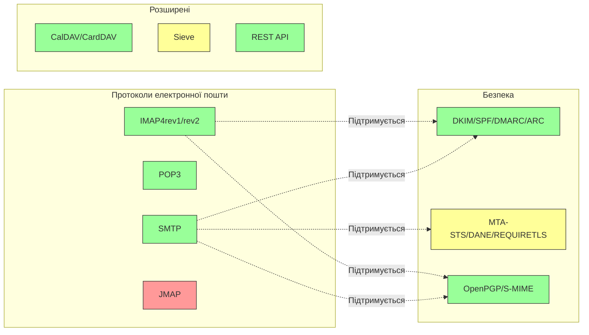

---


## Основні протоколи електронної пошти {#core-email-protocols}

### Потік протоколу електронної пошти {#email-protocol-flow}

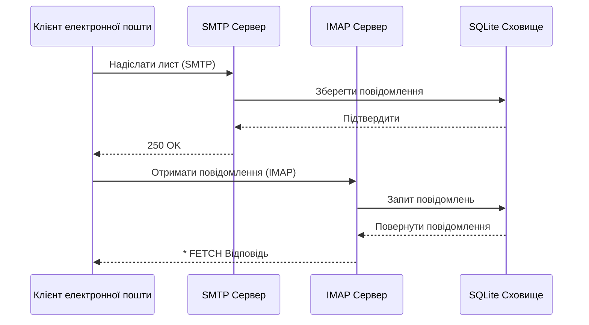


## Протокол електронної пошти IMAP4 та розширення {#imap4-email-protocol-and-extensions}

> \[!NOTE]
> Forward Email підтримує IMAP4rev1 (RFC 3501) з частковою підтримкою функцій IMAP4rev2 (RFC 9051).

Forward Email забезпечує надійну підтримку IMAP4 через реалізацію поштового сервера WildDuck. Сервер реалізує IMAP4rev1 (RFC 3501) з частковою підтримкою розширень IMAP4rev2 (RFC 9051).

Функціональність IMAP у Forward Email забезпечується залежністю [WildDuck](https://github.com/nodemailer/wildduck). Підтримуються наступні RFC для електронної пошти:

| RFC                                                       | Назва                                                             | Примітки щодо реалізації                             |
| --------------------------------------------------------- | ----------------------------------------------------------------- | ----------------------------------------------------- |
| [RFC 3501](https://datatracker.ietf.org/doc/html/rfc3501) | Протокол доступу до інтернет-повідомлень (IMAP) - Версія 4rev1    | Повна підтримка з навмисними відмінностями (див. нижче) |
| [RFC 2177](https://datatracker.ietf.org/doc/html/rfc2177) | Команда IMAP4 IDLE                                               | Push-сповіщення                                     |
| [RFC 2342](https://datatracker.ietf.org/doc/html/rfc2342) | Простір імен IMAP4                                              | Підтримка простору імен поштових скриньок           |
| [RFC 2087](https://datatracker.ietf.org/doc/html/rfc2087) | Розширення IMAP4 QUOTA                                         | Управління квотами сховища                           |
| [RFC 2971](https://datatracker.ietf.org/doc/html/rfc2971) | Розширення IMAP4 ID                                           | Ідентифікація клієнта/сервера                        |
| [RFC 5161](https://datatracker.ietf.org/doc/html/rfc5161) | Розширення IMAP4 ENABLE                                       | Увімкнення розширень IMAP                            |
| [RFC 4959](https://datatracker.ietf.org/doc/html/rfc4959) | Розширення IMAP для початкової відповіді клієнта SASL (SASL-IR) | Початкова відповідь клієнта                           |
| [RFC 3691](https://datatracker.ietf.org/doc/html/rfc3691) | Команда IMAP4 UNSELECT                                        | Закриття скриньки без EXPUNGE                        |
| [RFC 4315](https://datatracker.ietf.org/doc/html/rfc4315) | Розширення IMAP UIDPLUS                                      | Покращені команди UID                                |
| [RFC 7162](https://datatracker.ietf.org/doc/html/rfc7162) | Розширення IMAP: Швидка ресинхронізація змін прапорців (CONDSTORE) | Умовне збереження (STORE)                            |
| [RFC 6154](https://datatracker.ietf.org/doc/html/rfc6154) | Розширення IMAP LIST для спеціальних поштових скриньок        | Атрибути спеціальних скриньок                        |
| [RFC 6851](https://datatracker.ietf.org/doc/html/rfc6851) | Розширення IMAP MOVE                                        | Атомарна команда MOVE                                |
| [RFC 6855](https://datatracker.ietf.org/doc/html/rfc6855) | Підтримка IMAP для UTF-8                                     | Підтримка UTF-8                                      |
| [RFC 3348](https://datatracker.ietf.org/doc/html/rfc3348) | Розширення IMAP4 для дочірніх скриньок                        | Інформація про дочірні скриньки                       |
| [RFC 7889](https://datatracker.ietf.org/doc/html/rfc7889) | Розширення IMAP4 для оголошення максимальної величини завантаження (APPENDLIMIT) | Максимальний розмір завантаження                      |
**Підтримувані розширення IMAP:**

| Розширення       | RFC          | Статус      | Опис                           |
| ---------------- | ------------ | ----------- | ------------------------------ |
| IDLE             | RFC 2177     | ✅ Підтримується | Push-сповіщення                |
| NAMESPACE        | RFC 2342     | ✅ Підтримується | Підтримка простору імен поштових скриньок |
| QUOTA            | RFC 2087     | ✅ Підтримується | Керування квотою сховища       |
| ID               | RFC 2971     | ✅ Підтримується | Ідентифікація клієнта/сервера  |
| ENABLE           | RFC 5161     | ✅ Підтримується | Увімкнення розширень IMAP      |
| SASL-IR          | RFC 4959     | ✅ Підтримується | Початкова відповідь клієнта    |
| UNSELECT         | RFC 3691     | ✅ Підтримується | Закриття скриньки без EXPUNGE |
| UIDPLUS          | RFC 4315     | ✅ Підтримується | Розширені команди UID          |
| CONDSTORE        | RFC 7162     | ✅ Підтримується | Умовне збереження (STORE)      |
| SPECIAL-USE      | RFC 6154     | ✅ Підтримується | Спеціальні атрибути скриньок   |
| MOVE             | RFC 6851     | ✅ Підтримується | Атомарна команда MOVE          |
| UTF8=ACCEPT      | RFC 6855     | ✅ Підтримується | Підтримка UTF-8                |
| CHILDREN         | RFC 3348     | ✅ Підтримується | Інформація про дочірні скриньки |
| APPENDLIMIT      | RFC 7889     | ✅ Підтримується | Максимальний розмір завантаження |
| XLIST            | Нестандартне | ✅ Підтримується | Сумісний зі списком папок Gmail |
| XAPPLEPUSHSERVICE| Нестандартне | ✅ Підтримується | Сервіс Apple Push Notification |

### Відмінності протоколу IMAP від специфікацій RFC {#imap-protocol-differences-from-rfc-specifications}

> \[!WARNING]
> Наступні відмінності від специфікацій RFC можуть вплинути на сумісність клієнтів.

Forward Email навмисно відхиляється від деяких специфікацій IMAP RFC. Ці відмінності успадковані від WildDuck і задокументовані нижче:

* **Відсутній прапорець \Recent:** Прапорець `\Recent` не реалізований. Всі повідомлення повертаються без цього прапорця.
* **RENAME не впливає на підпапки:** При перейменуванні папки підпапки не перейменовуються автоматично. Ієрархія папок у базі даних плоска.
* **INBOX не можна перейменувати:** [RFC 3501](https://datatracker.ietf.org/doc/html/rfc3501) дозволяє перейменовувати INBOX, але Forward Email це явно забороняє. Див. [код WildDuck](https://github.com/nodemailer/wildduck/blob/master/imap-core/lib/commands/rename.js#L27).
* **Відсутні непрохання FLAGS-відповіді:** При зміні прапорців клієнту не надсилаються непрохання FLAGS-відповіді.
* **STORE повертає NO для видалених повідомлень:** Спроба змінити прапорці у видалених повідомленнях повертає NO замість ігнорування.
* **CHARSET ігнорується в SEARCH:** Аргумент `CHARSET` у командах SEARCH ігнорується. Всі пошуки виконуються з використанням UTF-8.
* **MODSEQ метадані ігноруються:** Метадані `MODSEQ` у командах STORE ігноруються.
* **SEARCH TEXT та SEARCH BODY:** Forward Email використовує [SQLite FTS5](https://www.sqlite.org/fts5.html) (повнотекстовий пошук) замість пошуку `$text` у MongoDB. Це забезпечує:
  * Підтримку оператора `NOT` (MongoDB не підтримує)
  * Ранжування результатів пошуку
  * Пошук менше ніж за 100 мс у великих скриньках
* **Поведение autoexpunge:** Повідомлення з прапорцем `\Deleted` автоматично видаляються при закритті скриньки.
* **Точність повідомлень:** Деякі зміни повідомлень можуть не зберігати точну оригінальну структуру повідомлення.

**Часткова підтримка IMAP4rev2:**

Forward Email реалізує IMAP4rev1 (RFC 3501) з частковою підтримкою IMAP4rev2 (RFC 9051). Наступні функції IMAP4rev2 **ще не підтримуються**:

* **LIST-STATUS** - Об’єднані команди LIST і STATUS
* **LITERAL-** - Несинхронізовані літерали (мінус варіант)
* **OBJECTID** - Унікальні ідентифікатори об’єктів
* **SAVEDATE** - Атрибут дати збереження
* **REPLACE** - Атомарна заміна повідомлення
* **UNAUTHENTICATE** - Закриття автентифікації без закриття з’єднання

**Розслаблене оброблення структури тіла:**

Forward Email використовує "розслаблене" оброблення тіла для пошкоджених MIME-структур, що може відрізнятися від суворої інтерпретації RFC. Це покращує сумісність з реальними листами, які не ідеально відповідають стандартам.
**Розширення METADATA (RFC 5464):**

Розширення IMAP METADATA **не підтримується**. Для отримання додаткової інформації про це розширення див. [RFC 5464](https://datatracker.ietf.org/doc/html/rfc5464). Обговорення додавання цієї функції можна знайти у [WildDuck Issue #937](https://github.com/zone-eu/wildduck/issues/937).

### Розширення IMAP, ЯКІ НЕ ПІДТРИМУЮТЬСЯ {#imap-extensions-not-supported}

Наступні розширення IMAP із [реєстру можливостей IMAP IANA](https://www.iana.org/assignments/imap-capabilities/imap-capabilities.xhtml) НЕ підтримуються:

| RFC                                                       | Назва                                                                                                           | Причина                                                                                                                                  |
| --------------------------------------------------------- | --------------------------------------------------------------------------------------------------------------- | --------------------------------------------------------------------------------------------------------------------------------------- |
| [RFC 2086](https://datatracker.ietf.org/doc/html/rfc2086) | Розширення IMAP4 ACL                                                                                            | Спільні папки не реалізовані. Див. [WildDuck Issue #427](https://github.com/zone-eu/wildduck/issues/427)                               |
| [RFC 5256](https://datatracker.ietf.org/doc/html/rfc5256) | Розширення IMAP SORT та THREAD                                                                                  | Потокова обробка реалізована внутрішньо, але не через протокол RFC 5256. Див. [WildDuck Issue #12](https://github.com/zone-eu/wildduck/issues/12) |
| [RFC 5162](https://datatracker.ietf.org/doc/html/rfc5162) | Розширення IMAP4 для швидкої ресинхронізації поштової скриньки (QRESYNC)                                         | Не реалізовано                                                                                                                         |
| [RFC 5464](https://datatracker.ietf.org/doc/html/rfc5464) | Розширення IMAP METADATA                                                                                        | Операції з метаданими ігноруються. Див. [документацію WildDuck](https://datatracker.ietf.org/doc/html/rfc5464)                         |
| [RFC 5258](https://datatracker.ietf.org/doc/html/rfc5258) | Розширення команди IMAP4 LIST                                                                                   | Не реалізовано                                                                                                                         |
| [RFC 5267](https://datatracker.ietf.org/doc/html/rfc5267) | Контексти для IMAP4                                                                                              | Не реалізовано                                                                                                                         |
| [RFC 5465](https://datatracker.ietf.org/doc/html/rfc5465) | Розширення IMAP NOTIFY                                                                                           | Не реалізовано                                                                                                                         |
| [RFC 5466](https://datatracker.ietf.org/doc/html/rfc5466) | Розширення IMAP4 FILTERS                                                                                        | Не реалізовано                                                                                                                         |
| [RFC 6203](https://datatracker.ietf.org/doc/html/rfc6203) | Розширення IMAP4 для нечіткого пошуку                                                                           | Не реалізовано                                                                                                                         |
| [RFC 6785](https://datatracker.ietf.org/doc/html/rfc6785) | Рекомендації щодо реалізації IMAP4                                                                               | Рекомендації не повністю дотримані                                                                                                    |
| [RFC 7162](https://datatracker.ietf.org/doc/html/rfc7162) | Розширення IMAP: швидка ресинхронізація змін прапорців (CONDSTORE) та швидка ресинхронізація поштової скриньки (QRESYNC) | Не реалізовано                                                                                                                         |
| [RFC 8437](https://datatracker.ietf.org/doc/html/rfc8437) | Розширення IMAP UNAUTHENTICATE для повторного використання з’єднання                                           | Не реалізовано                                                                                                                         |
| [RFC 8438](https://datatracker.ietf.org/doc/html/rfc8438) | Розширення IMAP для STATUS=SIZE                                                                                  | Не реалізовано                                                                                                                         |
| [RFC 8457](https://datatracker.ietf.org/doc/html/rfc8457) | Ключове слово IMAP "$Important" та спеціальний атрибут "\Important"                                            | Не реалізовано                                                                                                                         |
| [RFC 8474](https://datatracker.ietf.org/doc/html/rfc8474) | Розширення IMAP для ідентифікаторів об’єктів                                                                    | Не реалізовано                                                                                                                         |
| [RFC 9051](https://datatracker.ietf.org/doc/html/rfc9051) | Протокол доступу до повідомлень в Інтернеті (IMAP) - версія 4rev2                                              | Forward Email реалізує IMAP4rev1 ([RFC 3501](https://datatracker.ietf.org/doc/html/rfc3501))                                           |
## Протокол POP3 для електронної пошти та розширення {#pop3-email-protocol-and-extensions}

> \[!NOTE]
> Forward Email підтримує POP3 (RFC 1939) зі стандартними розширеннями для отримання електронної пошти.

Функціональність POP3 у Forward Email забезпечується залежністю [WildDuck](https://github.com/nodemailer/wildduck). Підтримуються наступні RFC для електронної пошти:

| RFC                                                       | Назва                                   | Примітки щодо реалізації                          |
| --------------------------------------------------------- | --------------------------------------- | ------------------------------------------------ |
| [RFC 1939](https://datatracker.ietf.org/doc/html/rfc1939) | Протокол поштового офісу - Версія 3 (POP3) | Повна підтримка з навмисними відмінностями (див. нижче) |
| [RFC 2595](https://datatracker.ietf.org/doc/html/rfc2595) | Використання TLS з IMAP, POP3 та ACAP    | Підтримка STARTTLS                               |
| [RFC 2449](https://datatracker.ietf.org/doc/html/rfc2449) | Механізм розширень POP3                  | Підтримка команди CAPA                            |

Forward Email надає підтримку POP3 для клієнтів, які віддають перевагу цьому простішому протоколу замість IMAP. POP3 ідеально підходить для користувачів, які хочуть завантажувати листи на один пристрій і видаляти їх із сервера.

**Підтримувані розширення POP3:**

| Розширення | RFC      | Статус      | Опис                       |
| --------- | -------- | ----------- | -------------------------- |
| TOP       | RFC 1939 | ✅ Підтримується | Отримання заголовків повідомлень |
| USER      | RFC 1939 | ✅ Підтримується | Аутентифікація за ім’ям користувача |
| UIDL      | RFC 1939 | ✅ Підтримується | Унікальні ідентифікатори повідомлень |
| EXPIRE    | RFC 2449 | ✅ Підтримується | Політика терміну дії повідомлень |

### Відмінності протоколу POP3 від специфікацій RFC {#pop3-protocol-differences-from-rfc-specifications}

> \[!WARNING]
> POP3 має вроджені обмеження порівняно з IMAP.

> \[!IMPORTANT]
> **Критична відмінність: поведінка Forward Email vs WildDuck при команді POP3 DELE**
>
> Forward Email реалізує відповідне RFC постійне видалення для команд POP3 `DELE`, на відміну від WildDuck, який переміщує повідомлення до кошика.

**Поведінка Forward Email** ([джерело коду](https://github.com/forwardemail/forwardemail.net/blob/master/pop3-server.js)):

* `DELE` → `QUIT` постійно видаляє повідомлення
* Точно відповідає специфікації [RFC 1939](https://datatracker.ietf.org/doc/html/rfc1939)
* Відповідає поведінці Dovecot (за замовчуванням), Postfix та інших серверів, що відповідають стандартам

**Поведінка WildDuck** ([обговорення](https://github.com/zone-eu/wildduck/issues/937)):

* `DELE` → `QUIT` переміщує повідомлення до кошика (подібно до Gmail)
* Навмисне рішення для безпеки користувача
* Не відповідає RFC, але запобігає випадковій втраті даних

**Чому Forward Email відрізняється:**

* **Відповідність RFC:** Дотримується специфікації [RFC 1939](https://datatracker.ietf.org/doc/html/rfc1939)
* **Очікування користувачів:** Робочий процес завантаження та видалення передбачає постійне видалення
* **Управління сховищем:** Правильне звільнення дискового простору
* **Сумісність:** Узгоджено з іншими серверами, що відповідають RFC

> \[!NOTE]
> **Перелік повідомлень POP3:** Forward Email перелічує ВСІ повідомлення з INBOX без обмежень. Це відрізняється від WildDuck, який за замовчуванням обмежує до 250 повідомлень. Див. [джерело коду](https://github.com/forwardemail/forwardemail.net/blob/master/pop3-server.js).

**Доступ з одного пристрою:**

POP3 призначений для доступу з одного пристрою. Повідомлення зазвичай завантажуються і видаляються з сервера, що робить його непридатним для синхронізації між кількома пристроями.

**Відсутність підтримки папок:**

POP3 отримує доступ лише до папки INBOX. Інші папки (Відправлені, Чернетки, Кошик тощо) через POP3 недоступні.

**Обмежене керування повідомленнями:**

POP3 забезпечує базове отримання та видалення повідомлень. Розширені функції, такі як позначення, переміщення або пошук повідомлень, недоступні.

### Розширення POP3, які НЕ підтримуються {#pop3-extensions-not-supported}

Наступні розширення POP3 з [реєстру механізму розширень POP3 IANA](https://www.iana.org/assignments/pop3-extension-mechanism/pop3-extension-mechanism.xhtml) НЕ підтримуються:
| RFC                                                       | Назва                                                  | Причина                                |
| --------------------------------------------------------- | ------------------------------------------------------- | --------------------------------------- |
| [RFC 6856](https://datatracker.ietf.org/doc/html/rfc6856) | Підтримка UTF-8 у протоколі Post Office Protocol версії 3 (POP3) | Не реалізовано у сервері WildDuck POP3 |
| [RFC 2595](https://datatracker.ietf.org/doc/html/rfc2595) | Команда STLS                                           | Підтримується лише STARTTLS, не STLS    |
| [RFC 3206](https://datatracker.ietf.org/doc/html/rfc3206) | Коди відповіді SYS та AUTH POP                         | Не реалізовано                         |

---


## SMTP Email Protocol and Extensions {#smtp-email-protocol-and-extensions}

> \[!NOTE]
> Forward Email підтримує SMTP (RFC 5321) з сучасними розширеннями для безпечної та надійної доставки електронної пошти.

Функціональність SMTP у Forward Email забезпечується кількома компонентами: [smtp-server](https://github.com/nodemailer/smtp-server) (nodemailer), [zone-mta](https://github.com/zone-eu/zone-mta) та власними реалізаціями. Підтримуються наступні RFC для електронної пошти:

| RFC                                                       | Назва                                                                            | Примітки щодо реалізації           |
| --------------------------------------------------------- | -------------------------------------------------------------------------------- | ---------------------------------- |
| [RFC 5321](https://datatracker.ietf.org/doc/html/rfc5321) | Протокол простого пересилання пошти (SMTP)                                      | Повна підтримка                   |
| [RFC 3207](https://datatracker.ietf.org/doc/html/rfc3207) | Розширення SMTP для безпечного SMTP через Transport Layer Security (STARTTLS)    | Підтримка TLS/SSL                 |
| [RFC 4954](https://datatracker.ietf.org/doc/html/rfc4954) | Розширення SMTP для аутентифікації (AUTH)                                       | PLAIN, LOGIN, CRAM-MD5, XOAUTH2   |
| [RFC 6531](https://datatracker.ietf.org/doc/html/rfc6531) | Розширення SMTP для інтернаціоналізованої електронної пошти (SMTPUTF8)           | Підтримка нативних юнікод-адрес   |
| [RFC 3461](https://datatracker.ietf.org/doc/html/rfc3461) | Розширення SMTP для повідомлень про статус доставки (DSN)                        | Повна підтримка DSN               |
| [RFC 3463](https://datatracker.ietf.org/doc/html/rfc3463) | Покращені коди стану поштової системи                                           | Покращені коди стану у відповідях |
| [RFC 1870](https://datatracker.ietf.org/doc/html/rfc1870) | Розширення SMTP для оголошення розміру повідомлення (SIZE)                       | Оголошення максимального розміру повідомлення |
| [RFC 2920](https://datatracker.ietf.org/doc/html/rfc2920) | Розширення SMTP для конвеєрної обробки команд (PIPELINING)                       | Підтримка конвеєрної обробки команд |
| [RFC 1652](https://datatracker.ietf.org/doc/html/rfc1652) | Розширення SMTP для 8-бітного MIME-транспорту (8BITMIME)                         | Підтримка 8-бітного MIME          |
| [RFC 6152](https://datatracker.ietf.org/doc/html/rfc6152) | Розширення SMTP для 8-бітного MIME-транспорту                                   | Підтримка 8-бітного MIME          |
| [RFC 2034](https://datatracker.ietf.org/doc/html/rfc2034) | Розширення SMTP для повернення покращених кодів помилок (ENHANCEDSTATUSCODES)    | Покращені коди стану              |

Forward Email реалізує повнофункціональний SMTP-сервер із підтримкою сучасних розширень, що підвищують безпеку, надійність та функціональність.

**Підтримувані розширення SMTP:**

| Розширення          | RFC      | Статус       | Опис                                |
| ------------------- | -------- | ------------ | ----------------------------------- |
| PIPELINING          | RFC 2920 | ✅ Підтримується | Конвеєрна обробка команд            |
| SIZE                | RFC 1870 | ✅ Підтримується | Оголошення розміру повідомлення (обмеження 52 МБ) |
| ETRN                | RFC 1985 | ✅ Підтримується | Віддалена обробка черги             |
| STARTTLS            | RFC 3207 | ✅ Підтримується | Підвищення до TLS                   |
| ENHANCEDSTATUSCODES | RFC 2034 | ✅ Підтримується | Покращені коди стану                |
| 8BITMIME            | RFC 6152 | ✅ Підтримується | 8-бітний MIME транспорт             |
| DSN                 | RFC 3461 | ✅ Підтримується | Повідомлення про статус доставки    |
| CHUNKING            | RFC 3030 | ✅ Підтримується | Передача повідомлень частинами      |
| SMTPUTF8            | RFC 6531 | ⚠️ Частково   | UTF-8 адреси електронної пошти (частково) |
| REQUIRETLS          | RFC 8689 | ✅ Підтримується | Вимога TLS для доставки             |
### Сповіщення про статус доставки (DSN) {#delivery-status-notifications-dsn}

> \[!TIP]
> DSN надає детальну інформацію про статус доставки надісланих електронних листів.

Forward Email повністю підтримує **DSN (RFC 3461)**, що дозволяє відправникам запитувати сповіщення про статус доставки. Ця функція надає:

* **Сповіщення про успішну доставку** повідомлень
* **Сповіщення про помилки** з детальною інформацією про помилки
* **Сповіщення про затримку**, коли доставка тимчасово затримується

DSN особливо корисний для:

* Підтвердження доставки важливих повідомлень
* Вирішення проблем з доставкою
* Автоматизованих систем обробки електронної пошти
* Вимог відповідності та аудиту

### Підтримка REQUIRETLS {#requiretls-support}

> \[!IMPORTANT]
> Forward Email — один із небагатьох провайдерів, який явно рекламує та застосовує REQUIRETLS.

Forward Email підтримує **REQUIRETLS (RFC 8689)**, що гарантує доставку електронних листів лише через TLS-зашифровані з’єднання. Це забезпечує:

* **Кінцеве шифрування** для всього шляху доставки
* **Застосування для користувача** через прапорець у композиторі листів
* **Відхилення спроб недешифрованої доставки**
* **Підвищену безпеку** для конфіденційних комунікацій

### SMTP розширення, які НЕ підтримуються {#smtp-extensions-not-supported}

Наступні SMTP розширення з [IANA SMTP Service Extensions Registry](https://www.iana.org/assignments/smtp) НЕ підтримуються:

| RFC                                                       | Назва                                                                                             | Причина               |
| --------------------------------------------------------- | ------------------------------------------------------------------------------------------------- | --------------------- |
| [RFC 4865](https://datatracker.ietf.org/doc/html/rfc4865) | SMTP Submission Service Extension for Future Message Release (FUTURERELEASE)                      | Не реалізовано        |
| [RFC 6710](https://datatracker.ietf.org/doc/html/rfc6710) | SMTP Extension for Message Transfer Priorities (MT-PRIORITY)                                      | Не реалізовано        |
| [RFC 7293](https://datatracker.ietf.org/doc/html/rfc7293) | The Require-Recipient-Valid-Since Header Field and SMTP Service Extension                         | Не реалізовано        |
| [RFC 7372](https://datatracker.ietf.org/doc/html/rfc7372) | Email Auth Status Codes                                                                           | Не повністю реалізовано |
| [RFC 4468](https://datatracker.ietf.org/doc/html/rfc4468) | Message Submission BURL Extension                                                                 | Не реалізовано        |
| [RFC 3030](https://datatracker.ietf.org/doc/html/rfc3030) | SMTP Service Extensions for Transmission of Large and Binary MIME Messages (CHUNKING, BINARYMIME) | Не реалізовано        |
| [RFC 2852](https://datatracker.ietf.org/doc/html/rfc2852) | Deliver By SMTP Service Extension                                                                 | Не реалізовано        |

---


## Протокол електронної пошти JMAP {#jmap-email-protocol}

> \[!CAUTION]
> JMAP **поки що не підтримується** Forward Email.

| RFC                                                       | Назва                                     | Статус          | Причина                                                                 |
| --------------------------------------------------------- | ----------------------------------------- | --------------- | ---------------------------------------------------------------------- |
| [RFC 8620](https://datatracker.ietf.org/doc/html/rfc8620) | The JSON Meta Application Protocol (JMAP) | ❌ Не підтримується | Forward Email використовує IMAP/POP3/SMTP та комплексний REST API замість |

**JMAP (JSON Meta Application Protocol)** — сучасний протокол електронної пошти, розроблений для заміни IMAP.

**Чому JMAP не підтримується:**

> "JMAP — це звір, якого не слід було винаходити. Він намагається перетворити TCP/IMAP (вже поганий протокол за сучасними стандартами) у HTTP/JSON, просто використовуючи інший транспорт, зберігаючи суть." — Андріс Рейнман, [HN Discussion](https://news.ycombinator.com/item?id=18890011)
> "JMAP існує понад 10 років, і практично не має жодного впровадження" – Андріс Рейнман, [GitHub Discussion](https://github.com/zone-eu/wildduck/issues/2#issuecomment-1765190790)

Також дивіться додаткові коментарі на <https://hn.algolia.com/?dateRange=all&page=0&prefix=true&query=jmap%20andris&sort=byDate&type=comment>.

Forward Email наразі зосереджений на наданні відмінної підтримки IMAP, POP3 та SMTP, а також комплексного REST API для керування електронною поштою. Підтримка JMAP може бути розглянута в майбутньому залежно від попиту користувачів та впровадження в екосистемі.

**Альтернатива:** Forward Email пропонує [Повний REST API](#complete-rest-api-for-email-management) з 39 кінцевими точками, який забезпечує подібний функціонал до JMAP для програмного доступу до електронної пошти.

---


## Безпека електронної пошти {#email-security}

### Архітектура безпеки електронної пошти {#email-security-architecture}

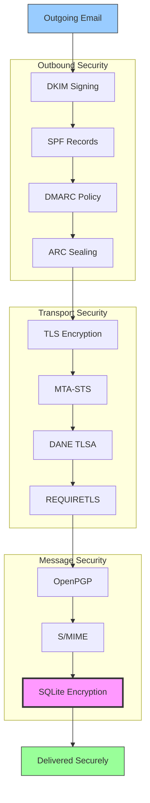


## Протоколи автентифікації електронних повідомлень {#email-message-authentication-protocols}

> \[!NOTE]
> Forward Email реалізує всі основні протоколи автентифікації електронної пошти для запобігання підробці та забезпечення цілісності повідомлень.

Forward Email використовує бібліотеку [mailauth](https://github.com/postalsys/mailauth) для автентифікації електронної пошти. Підтримуються наступні RFC:

| RFC                                                       | Назва                                                                   | Примітки щодо реалізації                                     |
| --------------------------------------------------------- | ----------------------------------------------------------------------- | ------------------------------------------------------------ |
| [RFC 6376](https://datatracker.ietf.org/doc/html/rfc6376) | DomainKeys Identified Mail (DKIM) Підписи                               | Повний підпис DKIM та перевірка                              |
| [RFC 8463](https://datatracker.ietf.org/doc/html/rfc8463) | Новий криптографічний метод підпису для DKIM (Ed25519-SHA256)          | Підтримує алгоритми підпису RSA-SHA256 та Ed25519-SHA256    |
| [RFC 7208](https://datatracker.ietf.org/doc/html/rfc7208) | Sender Policy Framework (SPF)                                           | Перевірка записів SPF                                       |
| [RFC 7489](https://datatracker.ietf.org/doc/html/rfc7489) | Domain-based Message Authentication, Reporting, and Conformance (DMARC) | Застосування політики DMARC                                 |
| [RFC 8617](https://datatracker.ietf.org/doc/html/rfc8617) | Authenticated Received Chain (ARC)                                      | Запечатування та перевірка ARC                              |

Протоколи автентифікації електронної пошти перевіряють, що повідомлення справді надійшло від заявленого відправника і не було змінене під час передачі.

### Підтримка протоколів автентифікації {#authentication-protocol-support}

| Протокол  | RFC      | Статус      | Опис                                                                 |
| --------- | -------- | ----------- | -------------------------------------------------------------------- |
| **DKIM**  | RFC 6376 | ✅ Підтримується | DomainKeys Identified Mail - Криптографічні підписи                  |
| **SPF**   | RFC 7208 | ✅ Підтримується | Sender Policy Framework - Авторизація IP-адрес                       |
| **DMARC** | RFC 7489 | ✅ Підтримується | Domain-based Message Authentication - Застосування політики          |
| **ARC**   | RFC 8617 | ✅ Підтримується | Authenticated Received Chain - Збереження автентифікації при пересиланні |
### DKIM (DomainKeys Identified Mail) {#dkim-domainkeys-identified-mail}

**DKIM** додає криптографічний підпис до заголовків електронної пошти, що дозволяє отримувачам перевірити, що повідомлення було авторизоване власником домену і не було змінене під час передачі.

Forward Email використовує [mailauth](https://github.com/postalsys/mailauth) для підписання та перевірки DKIM.

**Основні функції:**

* Автоматичне підписання DKIM для всіх вихідних повідомлень
* Підтримка ключів RSA та Ed25519
* Підтримка кількох селекторів
* Перевірка DKIM для вхідних повідомлень

### SPF (Sender Policy Framework) {#spf-sender-policy-framework}

**SPF** дозволяє власникам доменів вказувати, які IP-адреси уповноважені надсилати електронну пошту від імені їх домену.

**Основні функції:**

* Перевірка SPF записів для вхідних повідомлень
* Автоматична перевірка SPF з детальними результатами
* Підтримка механізмів include, redirect та all
* Налаштовувані політики SPF для кожного домену

### DMARC (Domain-based Message Authentication, Reporting & Conformance) {#dmarc-domain-based-message-authentication-reporting--conformance}

**DMARC** базується на SPF та DKIM для забезпечення застосування політик та звітності.

**Основні функції:**

* Застосування політик DMARC (none, quarantine, reject)
* Перевірка вирівнювання SPF та DKIM
* Аггреговані звіти DMARC
* Політики DMARC для кожного домену

### ARC (Authenticated Received Chain) {#arc-authenticated-received-chain}

**ARC** зберігає результати автентифікації електронної пошти при пересиланні та змінах у розсилках.

Forward Email використовує бібліотеку [mailauth](https://github.com/postalsys/mailauth) для перевірки та запечатування ARC.

**Основні функції:**

* Запечатування ARC для пересланих повідомлень
* Перевірка ARC для вхідних повідомлень
* Перевірка ланцюга через кілька пересилань
* Збереження оригінальних результатів автентифікації

### Authentication Flow {#authentication-flow}

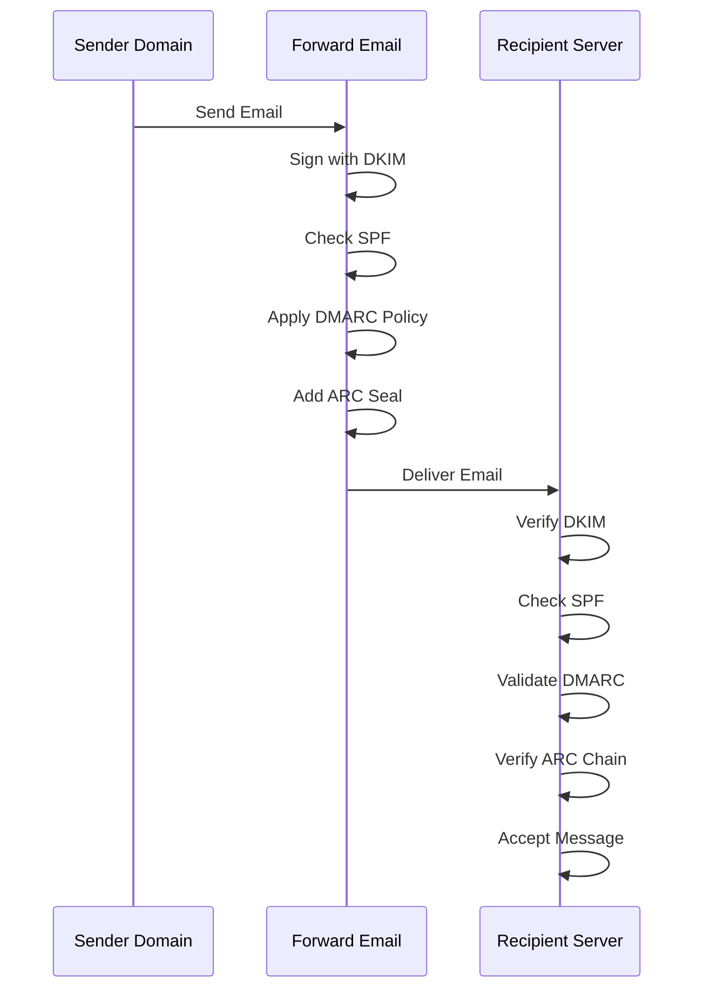

---


## Email Transport Security Protocols {#email-transport-security-protocols}

> \[!IMPORTANT]
> Forward Email реалізовує кілька рівнів захисту транспорту для захисту електронних листів під час передачі.

Forward Email реалізовує сучасні протоколи безпеки транспорту:

| RFC                                                       | Title                                                                                                | Status      | Implementation Notes                                                                                                                                                                                                                                                                          |
| --------------------------------------------------------- | ---------------------------------------------------------------------------------------------------- | ----------- | --------------------------------------------------------------------------------------------------------------------------------------------------------------------------------------------------------------------------------------------------------------------------------------------- |
| [RFC 8461](https://datatracker.ietf.org/doc/html/rfc8461) | SMTP MTA Strict Transport Security (MTA-STS)                                                         | ✅ Supported | Широко використовується на IMAP, SMTP та MX серверах. Див. [create-mta-sts-cache.js](https://github.com/forwardemail/forwardemail.net/blob/master/helpers/create-mta-sts-cache.js) та [get-transporter.js](https://github.com/forwardemail/forwardemail.net/blob/master/helpers/get-transporter.js) |
| [RFC 8460](https://datatracker.ietf.org/doc/html/rfc8460) | SMTP TLS Reporting                                                                                   | ✅ Supported | Через бібліотеку [mailauth](https://github.com/postalsys/mailauth)                                                                                                                                                                                                                            |
| [RFC 7671](https://datatracker.ietf.org/doc/html/rfc7671) | The DNS-Based Authentication of Named Entities (DANE) Protocol: Updates and Operational Guidance     | ✅ Supported | Повна перевірка DANE для вихідних SMTP-з’єднань. Див. [mx-connect PR #22](https://github.com/zone-eu/mx-connect/pull/22)                                                                                                                                                                    |
| [RFC 6698](https://datatracker.ietf.org/doc/html/rfc6698) | The DNS-Based Authentication of Named Entities (DANE) Transport Layer Security (TLS) Protocol: TLSA  | ✅ Supported | Повна підтримка RFC 6698: типи використання PKIX-TA, PKIX-EE, DANE-TA, DANE-EE. Див. [mx-connect PR #22](https://github.com/zone-eu/mx-connect/pull/22)                                                                                                                                     |
| [RFC 8314](https://datatracker.ietf.org/doc/html/rfc8314) | Cleartext Considered Obsolete: Use of Transport Layer Security (TLS) for Email Submission and Access | ✅ Supported | TLS обов’язковий для всіх з’єднань                                                                                                                                                                                                                                                           |
| [RFC 8689](https://datatracker.ietf.org/doc/html/rfc8689) | SMTP Service Extension for Requiring TLS (REQUIRETLS)                                                | ✅ Supported | Повна підтримка розширення SMTP REQUIRETLS та заголовка "TLS-Required"                                                                                                                                                                                                                        |
Протоколи безпеки транспорту забезпечують шифрування та автентифікацію електронних повідомлень під час передачі між поштовими серверами.

### Transport Security Support {#transport-security-support}

| Протокол      | RFC      | Статус      | Опис                                             |
| ------------- | -------- | ----------- | ------------------------------------------------ |
| **TLS**       | RFC 8314 | ✅ Підтримується | Transport Layer Security - зашифровані з’єднання |
| **MTA-STS**   | RFC 8461 | ✅ Підтримується | Mail Transfer Agent Strict Transport Security    |
| **DANE**      | RFC 7671 | ✅ Підтримується | DNS-based Authentication of Named Entities       |
| **REQUIRETLS**| RFC 8689 | ✅ Підтримується | Вимога TLS для всього шляху доставки              |

### TLS (Transport Layer Security) {#tls-transport-layer-security}

Forward Email застосовує шифрування TLS для всіх поштових з’єднань (SMTP, IMAP, POP3).

**Ключові особливості:**

* Підтримка TLS 1.2 та TLS 1.3
* Автоматичне керування сертифікатами
* Ідеальна секретність вперед (Perfect Forward Secrecy, PFS)
* Використання лише сильних наборів шифрів

### MTA-STS (Mail Transfer Agent Strict Transport Security) {#mta-sts-mail-transfer-agent-strict-transport-security}

**MTA-STS** гарантує, що електронна пошта доставляється лише через TLS-зашифровані з’єднання шляхом публікації політики через HTTPS.

Forward Email реалізує MTA-STS за допомогою [create-mta-sts-cache.js](https://github.com/forwardemail/forwardemail.net/blob/master/helpers/create-mta-sts-cache.js).

**Ключові особливості:**

* Автоматична публікація політики MTA-STS
* Кешування політики для підвищення продуктивності
* Запобігання атакам пониження рівня захисту
* Примусова перевірка сертифікатів

### DANE (DNS-based Authentication of Named Entities) {#dane-dns-based-authentication-of-named-entities}

> \[!NOTE]
> Forward Email тепер повністю підтримує DANE для вихідних SMTP-з’єднань.

**DANE** використовує DNSSEC для публікації інформації про TLS-сертифікати в DNS, що дозволяє поштовим серверам перевіряти сертифікати без покладання на центри сертифікації.

**Ключові особливості:**

* ✅ Повна перевірка DANE для вихідних SMTP-з’єднань
* ✅ Повна підтримка RFC 6698: типи використання PKIX-TA, PKIX-EE, DANE-TA, DANE-EE
* ✅ Перевірка сертифікатів за записами TLSA під час оновлення TLS
* ✅ Паралельне розв’язання TLSA для кількох MX-хостів
* ✅ Автоматичне виявлення нативного `dns.resolveTlsa` (Node.js v22.15.0+, v23.9.0+)
* ✅ Підтримка користувацьких резолверів для старіших версій Node.js через [Tangerine](https://github.com/forwardemail/tangerine)
* Вимагає домени з підписом DNSSEC

> \[!TIP]
> **Деталі реалізації:** Підтримка DANE була додана через [mx-connect PR #22](https://github.com/zone-eu/mx-connect/pull/22), що забезпечує комплексну підтримку DANE/TLSA для вихідних SMTP-з’єднань.

### REQUIRETLS {#requiretls}

> \[!TIP]
> Forward Email — один із небагатьох провайдерів із підтримкою REQUIRETLS для користувачів.

**REQUIRETLS** гарантує, що електронні повідомлення доставляються лише через TLS-зашифровані з’єднання на всьому шляху доставки.

**Ключові особливості:**

* Прапорець для користувача в композиторі листів
* Автоматичне відхилення незашифрованої доставки
* Примусове наскрізне шифрування TLS
* Детальні сповіщення про помилки

> \[!TIP]
> **Примусове застосування TLS для користувача:** Forward Email надає прапорець у розділі **My Account > Domains > Settings** для примусового застосування TLS для всіх вхідних з’єднань. Якщо увімкнено, ця функція відхиляє будь-яку вхідну пошту, що не надіслана через TLS-зашифроване з’єднання, з кодом помилки 530, забезпечуючи шифрування всієї вхідної пошти під час передачі.

### Transport Security Flow {#transport-security-flow}

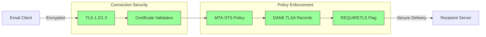
## Шифрування електронних повідомлень {#email-message-encryption}

> \[!NOTE]
> Forward Email підтримує як OpenPGP, так і S/MIME для наскрізного шифрування електронної пошти.

Forward Email підтримує шифрування OpenPGP та S/MIME:

| RFC                                                       | Назва                                                                                   | Статус      | Примітки щодо реалізації                                                                                                                                                                            |
| --------------------------------------------------------- | --------------------------------------------------------------------------------------- | ----------- | -------------------------------------------------------------------------------------------------------------------------------------------------------------------------------------------------- |
| [RFC 9580](https://datatracker.ietf.org/doc/html/rfc9580) | OpenPGP (замінює RFC 4880)                                                              | ✅ Підтримується | Через інтеграцію [OpenPGP.js v6+](https://github.com/openpgpjs/openpgpjs). Див. [FAQ](https://forwardemail.net/en/faq#do-you-support-openpgpmime-end-to-end-encryption-e2ee-and-web-key-directory-wkd) |
| [RFC 8551](https://datatracker.ietf.org/doc/html/rfc8551) | Secure/Multipurpose Internet Mail Extensions (S/MIME) Версія 4.0 Специфікація повідомлення | ✅ Підтримується | Підтримуються алгоритми RSA та ECC. Див. [FAQ](https://forwardemail.net/en/faq#do-you-support-smime-encryption)                                                                                     |

Протоколи шифрування повідомлень захищають вміст електронної пошти від прочитання будь-ким, крім призначеного отримувача, навіть якщо повідомлення перехоплено під час передачі.

### Підтримка шифрування {#encryption-support}

| Протокол   | RFC      | Статус      | Опис                                         |
| ---------- | -------- | ----------- | -------------------------------------------- |
| **OpenPGP**| RFC 9580 | ✅ Підтримується | Pretty Good Privacy - шифрування з відкритим ключем |
| **S/MIME** | RFC 8551 | ✅ Підтримується | Secure/Multipurpose Internet Mail Extensions |
| **WKD**    | Draft    | ✅ Підтримується | Web Key Directory - автоматичне виявлення ключів |

### OpenPGP (Pretty Good Privacy) {#openpgp-pretty-good-privacy}

**OpenPGP** забезпечує наскрізне шифрування за допомогою криптографії з відкритим ключем. Forward Email підтримує OpenPGP через протокол [Web Key Directory (WKD)](https://forwardemail.net/en/faq#do-you-support-openpgpmime-end-to-end-encryption-e2ee-and-web-key-directory-wkd).

**Основні можливості:**

* Автоматичне виявлення ключів через WKD
* Підтримка PGP/MIME для зашифрованих вкладень
* Керування ключами через поштовий клієнт
* Сумісність з GPG, Mailvelope та іншими інструментами OpenPGP

**Як користуватися:**

1. Згенеруйте пару ключів PGP у вашому поштовому клієнті
2. Завантажте свій публічний ключ у WKD Forward Email
3. Ваш ключ автоматично доступний для інших користувачів
4. Надсилайте та отримуйте зашифровані листи без проблем

### S/MIME (Secure/Multipurpose Internet Mail Extensions) {#smime-securemultipurpose-internet-mail-extensions}

**S/MIME** забезпечує шифрування електронної пошти та цифрові підписи за допомогою сертифікатів X.509.

**Основні можливості:**

* Шифрування на основі сертифікатів
* Цифрові підписи для автентифікації повідомлень
* Вбудована підтримка у більшості поштових клієнтів
* Безпека корпоративного рівня

**Як користуватися:**

1. Отримайте сертифікат S/MIME від Центру сертифікації
2. Встановіть сертифікат у ваш поштовий клієнт
3. Налаштуйте клієнт для шифрування/підпису повідомлень
4. Обмінюйтеся сертифікатами з отримувачами

### Шифрування поштової скриньки SQLite {#sqlite-mailbox-encryption}

> \[!IMPORTANT]
> Forward Email забезпечує додатковий рівень безпеки за допомогою зашифрованих поштових скриньок SQLite.

Окрім шифрування на рівні повідомлень, Forward Email шифрує цілі поштові скриньки за допомогою [sqleet](https://github.com/resilar/sqleet) (ChaCha20-Poly1305).

**Основні можливості:**

* **Шифрування на основі пароля** - пароль відомий лише вам
* **Квантова стійкість** - шифр ChaCha20-Poly1305
* **Нульове знання** - Forward Email не може розшифрувати вашу поштову скриньку
* **Ізольованість** - кожна скринька ізольована та портативна
* **Неможливість відновлення** - якщо ви забудете пароль, поштову скриньку буде втрачено
### Порівняння шифрування {#encryption-comparison}

| Функція               | OpenPGP           | S/MIME             | Шифрування SQLite |
| --------------------- | ----------------- | ------------------ | ----------------- |
| **End-to-End**        | ✅ Так             | ✅ Так              | ✅ Так             |
| **Управління ключами** | Самокероване      | Видається ЦС        | На основі пароля  |
| **Підтримка клієнтів** | Потрібен плагін   | Вбудована           | Прозоре           |
| **Випадок використання** | Особисте          | Корпоративне        | Зберігання        |
| **Квантова стійкість** | ⚠️ Залежить від ключа | ⚠️ Залежить від сертифіката | ✅ Так             |

### Потік шифрування {#encryption-flow}

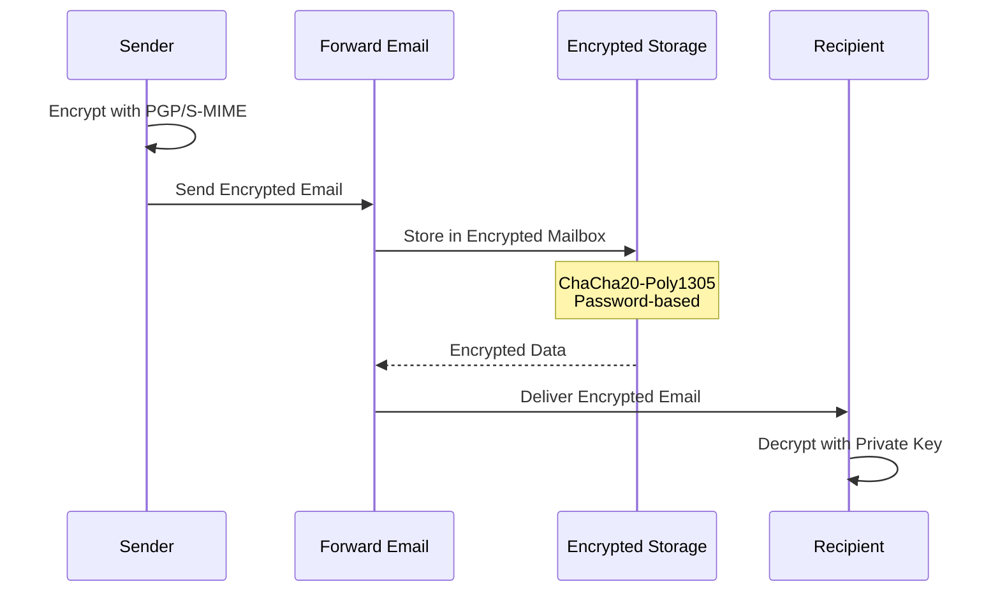

---


## Розширена функціональність {#extended-functionality}


## Стандарти формату електронних повідомлень {#email-message-format-standards}

> \[!NOTE]
> Forward Email підтримує сучасні стандарти формату електронної пошти для багатого контенту та інтернаціоналізації.

Forward Email підтримує стандартні формати електронних повідомлень:

| RFC                                                       | Назва                                                         | Примітки щодо впровадження |
| --------------------------------------------------------- | ------------------------------------------------------------- | -------------------------- |
| [RFC 5322](https://datatracker.ietf.org/doc/html/rfc5322) | Формат Інтернет-повідомлень                                   | Повна підтримка            |
| [RFC 2045](https://datatracker.ietf.org/doc/html/rfc2045) | MIME Частина перша: Формат тіл Інтернет-повідомлень           | Повна підтримка MIME       |
| [RFC 2046](https://datatracker.ietf.org/doc/html/rfc2046) | MIME Частина друга: Типи медіа                                | Повна підтримка MIME       |
| [RFC 2047](https://datatracker.ietf.org/doc/html/rfc2047) | MIME Частина третя: Розширення заголовків повідомлень для не-ASCII тексту | Повна підтримка MIME       |
| [RFC 2048](https://datatracker.ietf.org/doc/html/rfc2048) | MIME Частина четверта: Процедури реєстрації                   | Повна підтримка MIME       |
| [RFC 2049](https://datatracker.ietf.org/doc/html/rfc2049) | MIME Частина п’ята: Критерії відповідності та приклади        | Повна підтримка MIME       |

Стандарти формату електронної пошти визначають, як структуровані, кодуються та відображаються електронні повідомлення.

### Підтримка стандартів формату {#format-standards-support}

| Стандарт           | RFC           | Статус      | Опис                                |
| ------------------ | ------------- | ----------- | ---------------------------------- |
| **MIME**           | RFC 2045-2049 | ✅ Підтримується | Багатофункціональні розширення Інтернет-пошти |
| **SMTPUTF8**       | RFC 6531      | ⚠️ Часткова  | Інтернаціоналізовані адреси електронної пошти |
| **EAI**            | RFC 6530      | ⚠️ Часткова  | Інтернаціоналізація адрес електронної пошти |
| **Формат повідомлення** | RFC 5322      | ✅ Підтримується | Формат Інтернет-повідомлень        |
| **Безпека MIME**   | RFC 1847      | ✅ Підтримується | Безпека мультипартів для MIME      |

### MIME (Багатофункціональні розширення Інтернет-пошти) {#mime-multipurpose-internet-mail-extensions}

**MIME** дозволяє електронним листам містити кілька частин з різними типами контенту (текст, HTML, вкладення тощо).

**Підтримувані функції MIME:**

* Багаточастинні повідомлення (mixed, alternative, related)
* Заголовки Content-Type
* Кодування Content-Transfer-Encoding (7bit, 8bit, quoted-printable, base64)
* Вбудовані зображення та вкладення
* Багатий HTML-контент

### SMTPUTF8 та інтернаціоналізація адрес електронної пошти {#smtputf8-and-email-address-internationalization}

> \[!WARNING]
> Підтримка SMTPUTF8 часткова — не всі функції повністю реалізовані.
**SMTPUTF8** дозволяє електронним адресам містити не-ASCII символи (наприклад, `用户@例え.jp`).

**Поточний стан:**

* ⚠️ Часткова підтримка інтернаціоналізованих електронних адрес
* ✅ UTF-8 вміст у тілі повідомлень
* ⚠️ Обмежена підтримка не-ASCII локальних частин

---


## Протоколи календарів і контактів {#calendaring-and-contacts-protocols}

> \[!NOTE]
> Forward Email забезпечує повну підтримку CalDAV і CardDAV для синхронізації календарів і контактів.

Forward Email підтримує CalDAV і CardDAV через бібліотеку [caldav-adapter](https://github.com/forwardemail/caldav-adapter):

| RFC                                                       | Назва                                                                    | Статус      | Примітки щодо реалізації                                                                                                                                                              |
| --------------------------------------------------------- | ------------------------------------------------------------------------ | ----------- | ------------------------------------------------------------------------------------------------------------------------------------------------------------------------------------- |
| [RFC 4791](https://datatracker.ietf.org/doc/html/rfc4791) | Розширення календарів для WebDAV (CalDAV)                               | ✅ Підтримується | Доступ і керування календарем                                                                                                                                                         |
| [RFC 6352](https://datatracker.ietf.org/doc/html/rfc6352) | CardDAV: розширення vCard для WebDAV                                    | ✅ Підтримується | Доступ і керування контактами                                                                                                                                                         |
| [RFC 5545](https://datatracker.ietf.org/doc/html/rfc5545) | Основна специфікація інтернет-календарів і планування (iCalendar)       | ✅ Підтримується | Підтримка формату iCalendar                                                                                                                                                           |
| [RFC 6350](https://datatracker.ietf.org/doc/html/rfc6350) | Специфікація формату vCard                                              | ✅ Підтримується | Підтримка формату vCard 4.0                                                                                                                                                           |
| [RFC 6638](https://datatracker.ietf.org/doc/html/rfc6638) | Розширення планування для CalDAV                                        | ✅ Підтримується | Планування CalDAV з підтримкою iMIP. Див. [commit c4d1629](https://github.com/forwardemail/forwardemail.net/commit/c4d162975a49e38d76d68a032662e873a34a9b80)                            |
| [RFC 5546](https://datatracker.ietf.org/doc/html/rfc5546) | Протокол незалежної від транспорту взаємодії iCalendar (iTIP)           | ✅ Підтримується | Підтримка iTIP для методів REQUEST, REPLY, CANCEL і VFREEBUSY. Див. [commit c4d1629](https://github.com/forwardemail/forwardemail.net/commit/c4d162975a49e38d76d68a032662e873a34a9b80) |
| [RFC 6047](https://datatracker.ietf.org/doc/html/rfc6047) | Протокол взаємодії на основі повідомлень iCalendar (iMIP)               | ✅ Підтримується | Запрошення на календар по електронній пошті з посиланнями для відповіді. Див. [commit c4d1629](https://github.com/forwardemail/forwardemail.net/commit/c4d162975a49e38d76d68a032662e873a34a9b80) |

CalDAV і CardDAV — це протоколи, які дозволяють отримувати доступ, ділитися та синхронізувати дані календарів і контактів між пристроями.

### Підтримка CalDAV і CardDAV {#caldav-and-carddav-support}

| Протокол              | RFC      | Статус      | Опис                                  |
| --------------------- | -------- | ----------- | ------------------------------------ |
| **CalDAV**            | RFC 4791 | ✅ Підтримується | Доступ і синхронізація календаря      |
| **CardDAV**           | RFC 6352 | ✅ Підтримується | Доступ і синхронізація контактів      |
| **iCalendar**         | RFC 5545 | ✅ Підтримується | Формат даних календаря                |
| **vCard**             | RFC 6350 | ✅ Підтримується | Формат даних контактів                |
| **VTODO**             | RFC 5545 | ✅ Підтримується | Підтримка завдань/нагадувань          |
| **Планування CalDAV** | RFC 6638 | ✅ Підтримується | Розширення планування календаря       |
| **iTIP**              | RFC 5546 | ✅ Підтримується | Незалежна від транспорту взаємодія    |
| **iMIP**              | RFC 6047 | ✅ Підтримується | Запрошення на календар по електронній пошті |
### CalDAV (Доступ до календаря) {#caldav-calendar-access}

**CalDAV** дозволяє отримувати доступ і керувати календарями з будь-якого пристрою або додатку.

**Основні можливості:**

* Синхронізація між кількома пристроями
* Спільні календарі
* Підписки на календарі
* Запрошення на події та відповіді на них
* Повторювані події
* Підтримка часових поясів

**Сумісні клієнти:**

* Apple Calendar (macOS, iOS)
* Mozilla Thunderbird
* Evolution
* GNOME Calendar
* Будь-який клієнт, сумісний з CalDAV

### CardDAV (Доступ до контактів) {#carddav-contact-access}

**CardDAV** дозволяє отримувати доступ і керувати контактами з будь-якого пристрою або додатку.

**Основні можливості:**

* Синхронізація між кількома пристроями
* Спільні адресні книги
* Групи контактів
* Підтримка фотографій
* Користувацькі поля
* Підтримка vCard 4.0

**Сумісні клієнти:**

* Apple Contacts (macOS, iOS)
* Mozilla Thunderbird
* Evolution
* GNOME Contacts
* Будь-який клієнт, сумісний з CardDAV

### Завдання та нагадування (CalDAV VTODO) {#tasks-and-reminders-caldav-vtodo}

> \[!TIP]
> Forward Email підтримує завдання та нагадування через CalDAV VTODO.

**VTODO** є частиною формату iCalendar і дозволяє керувати завданнями через CalDAV.

**Основні можливості:**

* Створення та керування завданнями
* Дати виконання та пріоритети
* Відстеження виконання завдань
* Повторювані завдання
* Списки/категорії завдань

**Сумісні клієнти:**

* Apple Reminders (macOS, iOS)
* Mozilla Thunderbird (з Lightning)
* Evolution
* GNOME To Do
* Будь-який клієнт CalDAV з підтримкою VTODO

### Потік синхронізації CalDAV/CardDAV {#caldavcarddav-synchronization-flow}

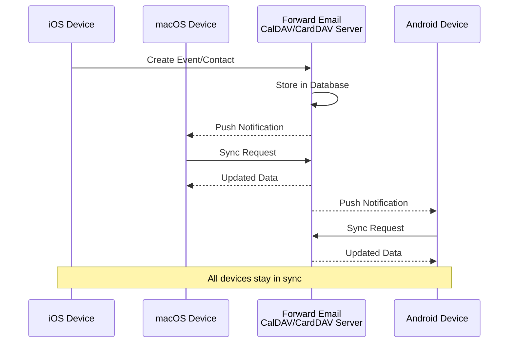

### Розширення календаря, які НЕ підтримуються {#calendaring-extensions-not-supported}

Наступні розширення календаря НЕ підтримуються:

| RFC                                                       | Назва                                                               | Причина                                                         |
| --------------------------------------------------------- | ------------------------------------------------------------------- | --------------------------------------------------------------- |
| [RFC 4918](https://datatracker.ietf.org/doc/html/rfc4918) | HTTP Extensions for Web Distributed Authoring and Versioning (WebDAV) | CalDAV використовує концепції WebDAV, але не реалізує повністю RFC 4918 |
| [RFC 6578](https://datatracker.ietf.org/doc/html/rfc6578) | Collection Synchronization for WebDAV                               | Не реалізовано                                                  |
| [RFC 3744](https://datatracker.ietf.org/doc/html/rfc3744) | WebDAV Access Control Protocol                                      | Не реалізовано                                                  |

---


## Фільтрація електронних повідомлень {#email-message-filtering}

> \[!IMPORTANT]
> Forward Email надає **повну підтримку Sieve та ManageSieve** для серверної фільтрації електронної пошти. Створюйте потужні правила для автоматичного сортування, фільтрації, пересилання та відповіді на вхідні повідомлення.

### Sieve (RFC 5228) {#sieve-rfc-5228}

[Sieve](https://en.wikipedia.org/wiki/Sieve_\(mail_filtering_language\)) — це стандартизована, потужна мова сценаріїв для серверної фільтрації електронної пошти. Forward Email реалізує всебічну підтримку Sieve з 24 розширеннями.

**Вихідний код:** [`helpers/sieve/`](https://github.com/forwardemail/forwardemail.net/tree/master/helpers/sieve)

#### Підтримувані основні RFC Sieve {#core-sieve-rfcs-supported}

| RFC                                                                                    | Назва                                                         | Статус         |
| -------------------------------------------------------------------------------------- | ------------------------------------------------------------- | -------------- |
| [RFC 5228](https://datatracker.ietf.org/doc/html/rfc5228)                              | Sieve: Мова фільтрації електронної пошти                      | ✅ Повна підтримка |
| [RFC 5429](https://datatracker.ietf.org/doc/html/rfc5429)                              | Розширення Sieve для відхилення та розширеного відхилення      | ✅ Повна підтримка |
| [RFC 5230](https://datatracker.ietf.org/doc/html/rfc5230)                              | Розширення Sieve для відпустки                                 | ✅ Повна підтримка |
| [RFC 6131](https://datatracker.ietf.org/doc/html/rfc6131)                              | Розширення Sieve для відпустки: параметр "Seconds"             | ✅ Повна підтримка |
| [RFC 5232](https://datatracker.ietf.org/doc/html/rfc5232)                              | Розширення Sieve для прапорців Imap4flags                      | ✅ Повна підтримка |
| [RFC 5173](https://datatracker.ietf.org/doc/html/rfc5173)                              | Розширення Sieve для тіла повідомлення                         | ✅ Повна підтримка |
| [RFC 5229](https://datatracker.ietf.org/doc/html/rfc5229)                              | Розширення Sieve для змінних                                   | ✅ Повна підтримка |
| [RFC 5231](https://datatracker.ietf.org/doc/html/rfc5231)                              | Розширення Sieve для відношень                                 | ✅ Повна підтримка |
| [RFC 4790](https://datatracker.ietf.org/doc/html/rfc4790)                              | Реєстр колацій протоколів інтернет-застосунків                 | ✅ Повна підтримка |
| [RFC 3894](https://datatracker.ietf.org/doc/html/rfc3894)                              | Розширення Sieve: копіювання без побічних ефектів              | ✅ Повна підтримка |
| [RFC 5293](https://datatracker.ietf.org/doc/html/rfc5293)                              | Розширення Sieve для редагування заголовків                    | ✅ Повна підтримка |
| [RFC 5260](https://datatracker.ietf.org/doc/html/rfc5260)                              | Розширення Sieve для дати та індексів                          | ✅ Повна підтримка |
| [RFC 5435](https://datatracker.ietf.org/doc/html/rfc5435)                              | Розширення Sieve для сповіщень                                 | ✅ Повна підтримка |
| [RFC 5183](https://datatracker.ietf.org/doc/html/rfc5183)                              | Розширення Sieve для середовища                                | ✅ Повна підтримка |
| [RFC 5490](https://datatracker.ietf.org/doc/html/rfc5490)                              | Розширення Sieve для перевірки статусу поштової скриньки      | ✅ Повна підтримка |
| [RFC 8579](https://datatracker.ietf.org/doc/html/rfc8579)                              | Розширення Sieve для доставки до спеціальних поштових скриньок | ✅ Повна підтримка |
| [RFC 7352](https://datatracker.ietf.org/doc/html/rfc7352)                              | Розширення Sieve для виявлення дублюючих доставок             | ✅ Повна підтримка |
| [RFC 5463](https://datatracker.ietf.org/doc/html/rfc5463)                              | Розширення Sieve Ihave                                         | ✅ Повна підтримка |
| [RFC 5233](https://datatracker.ietf.org/doc/html/rfc5233)                              | Розширення Sieve для субадресації                              | ✅ Повна підтримка |
| [draft-ietf-sieve-regex](https://datatracker.ietf.org/doc/html/draft-ietf-sieve-regex) | Розширення Sieve для регулярних виразів                        | ✅ Повна підтримка |
#### Підтримувані розширення Sieve {#supported-sieve-extensions}

| Розширення                   | Опис                                    | Інтеграція                                  |
| ---------------------------- | ---------------------------------------- | -------------------------------------------- |
| `fileinto`                   | Поміщення повідомлень у конкретні папки | Повідомлення зберігаються у вказаній папці IMAP |
| `reject` / `ereject`         | Відхилення повідомлень з помилкою        | Відхилення SMTP з повідомленням про повернення |
| `vacation`                   | Автоматичні відповіді під час відпустки/відсутності | Черга через Emails.queue з обмеженням частоти |
| `vacation-seconds`           | Точні інтервали відповіді під час відпустки | TTL з параметра `:seconds`                   |
| `imap4flags`                 | Встановлення прапорців IMAP (\Seen, \Flagged тощо) | Прапорці застосовуються під час збереження повідомлення |
| `envelope`                   | Перевірка відправника/одержувача конверта | Доступ до даних SMTP конверта                |
| `body`                       | Перевірка вмісту тіла повідомлення      | Повне співпадіння тексту тіла                 |
| `variables`                  | Збереження та використання змінних у скриптах | Розгортання змінних з модифікаторами          |
| `relational`                 | Реляційні порівняння                     | `:count`, `:value` з gt/lt/eq                 |
| `comparator-i;ascii-numeric` | Числові порівняння                       | Порівняння числових рядків                     |
| `copy`                       | Копіювання повідомлень під час перенаправлення | Прапорець `:copy` для fileinto/redirect       |
| `editheader`                 | Додавання або видалення заголовків повідомлення | Заголовки змінюються перед збереженням         |
| `date`                       | Перевірка значень дати/часу              | Тести `currentdate` та дати заголовків         |
| `index`                      | Доступ до конкретних входжень заголовків | `:index` для багатозначних заголовків          |
| `regex`                      | Пошук за регулярними виразами            | Повна підтримка regex у тестах                  |
| `enotify`                    | Надсилання сповіщень                      | Сповіщення `mailto:` через Emails.queue         |
| `environment`                | Доступ до інформації про середовище      | Домен, хост, віддалена IP з сесії               |
| `mailbox`                    | Перевірка існування поштової скриньки   | Тест `mailboxexists`                            |
| `special-use`                | Поміщення у спеціальні поштові скриньки  | Відображення \Junk, \Trash тощо у папки         |
| `duplicate`                  | Виявлення дублікатів повідомлень         | Відстеження дублікатів на основі Redis          |
| `ihave`                      | Перевірка доступності розширення         | Перевірка можливостей під час виконання          |
| `subaddress`                 | Доступ до частин адреси user+detail      | Частини адреси `:user` та `:detail`              |

#### Розширення Sieve, які НЕ підтримуються {#sieve-extensions-not-supported}

| Розширення                               | RFC                                                       | Причина                                                           |
| --------------------------------------- | --------------------------------------------------------- | ---------------------------------------------------------------- |
| `include`                               | [RFC 6609](https://datatracker.ietf.org/doc/html/rfc6609) | Ризик безпеки (ін’єкція скриптів), потребує глобального збереження скриптів |
| `mboxmetadata` / `servermetadata`       | [RFC 5490](https://datatracker.ietf.org/doc/html/rfc5490) | Потребує розширення IMAP METADATA                                 |
| `fcc`                                   | [RFC 8580](https://datatracker.ietf.org/doc/html/rfc8580) | Потребує інтеграції з папкою Відправлені                          |
| `encoded-character`                     | [RFC 5228](https://datatracker.ietf.org/doc/html/rfc5228) | Потрібні зміни парсера для синтаксису ${hex:}                     |
| `foreverypart` / `mime` / `extracttext` | [RFC 5703](https://datatracker.ietf.org/doc/html/rfc5703) | Складна маніпуляція MIME-деревом                                  |
#### Потік обробки Sieve {#sieve-processing-flow}

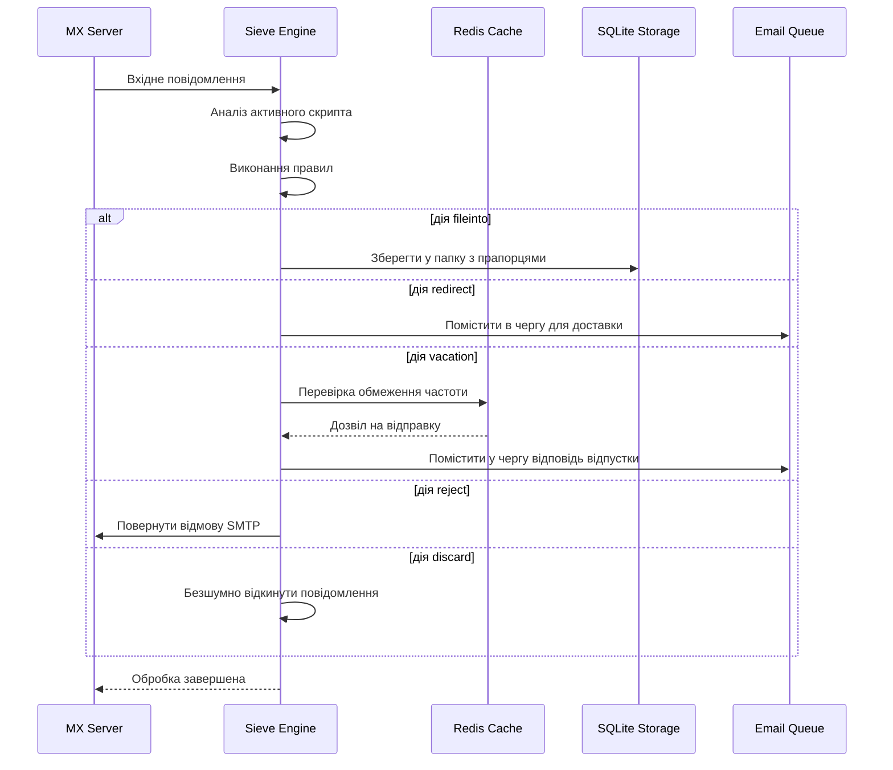

#### Функції безпеки {#security-features}

Реалізація Sieve у Forward Email включає комплексні заходи безпеки:

* **Захист від CVE-2023-26430**: Запобігає циклам перенаправлень та атакам поштового бомбардування
* **Обмеження частоти**: Ліміти на перенаправлення (10/повідомлення, 100/день) та відповіді відпустки
* **Перевірка заборонених адрес**: Адреси перенаправлення перевіряються за забороненим списком
* **Захищені заголовки**: Заголовки DKIM, ARC та автентифікації не можна змінювати через editheader
* **Обмеження розміру скрипта**: Встановлено максимальний розмір скрипта
* **Таймаути виконання**: Скрипти припиняються, якщо час виконання перевищує ліміт

#### Приклади скриптів Sieve {#example-sieve-scripts}

**Поміщення розсилок у папку:**

```sieve
require ["fileinto"];

if header :contains "List-Id" "newsletter" {
    fileinto "Newsletters";
}
```

**Автовідповідач відпустки з точним таймінгом:**

```sieve
require ["vacation", "vacation-seconds"];

vacation :seconds 3600 :subject "Out of Office"
    "Я зараз відсутній і відповім протягом 24 годин.";
```

**Фільтрація спаму з прапорцями:**

```sieve
require ["fileinto", "imap4flags"];

if header :contains "X-Spam-Status" "Yes" {
    setflag "\\Seen";
    fileinto "Junk";
}
```

**Складне фільтрування з використанням змінних:**

```sieve
require ["variables", "fileinto", "regex"];

if header :regex "From" "(.+)@example\\.com" {
    set :lower "sender" "${1}";
    fileinto "Contacts/${sender}";
}
```

> \[!TIP]
> Для повної документації, прикладів скриптів та інструкцій з налаштування дивіться [FAQ: Чи підтримуєте ви фільтрацію пошти Sieve?](/faq#do-you-support-sieve-email-filtering)

### ManageSieve (RFC 5804) {#managesieve-rfc-5804}

Forward Email надає повну підтримку протоколу ManageSieve для віддаленого керування скриптами Sieve.

**Вихідний код:** [`managesieve-server.js`](https://github.com/forwardemail/forwardemail.net/blob/master/managesieve-server.js)

| RFC                                                       | Назва                                         | Статус         |
| --------------------------------------------------------- | --------------------------------------------- | -------------- |
| [RFC 5804](https://datatracker.ietf.org/doc/html/rfc5804) | Протокол для віддаленого керування скриптами Sieve | ✅ Повна підтримка |

#### Конфігурація сервера ManageSieve {#managesieve-server-configuration}

| Налаштування            | Значення                |
| ----------------------- | ----------------------- |
| **Сервер**              | `imap.forwardemail.net` |
| **Порт (STARTTLS)**     | `2190` (рекомендовано)  |
| **Порт (Implicit TLS)** | `4190`                  |
| **Аутентифікація**      | PLAIN (через TLS)       |

> **Примітка:** Порт 2190 використовує STARTTLS (покращення з plain до TLS) і сумісний з більшістю клієнтів ManageSieve, включно з [sieve-connect](https://github.com/philpennock/sieve-connect). Порт 4190 використовує implicit TLS (TLS з початку з’єднання) для клієнтів, які це підтримують.

#### Підтримувані команди ManageSieve {#supported-managesieve-commands}

| Команда        | Опис                                   |
| -------------- | ------------------------------------- |
| `AUTHENTICATE` | Аутентифікація за допомогою механізму PLAIN |
| `CAPABILITY`   | Перелік можливостей та розширень сервера |
| `HAVESPACE`    | Перевірка, чи можна зберегти скрипт  |
| `PUTSCRIPT`    | Завантаження нового скрипта           |
| `LISTSCRIPTS`  | Перелік усіх скриптів з активним статусом |
| `SETACTIVE`    | Активувати скрипт                     |
| `GETSCRIPT`    | Завантажити скрипт                    |
| `DELETESCRIPT` | Видалити скрипт                      |
| `RENAMESCRIPT` | Перейменувати скрипт                  |
| `CHECKSCRIPT`  | Перевірка синтаксису скрипта          |
| `NOOP`         | Підтримувати з’єднання активним       |
| `LOGOUT`       | Завершити сесію                      |
#### Сумісні клієнти ManageSieve {#compatible-managesieve-clients}

* **Thunderbird**: Вбудована підтримка Sieve через [Sieve додаток](https://addons.thunderbird.net/addon/sieve/)
* **Roundcube**: [ManageSieve плагін](https://plugins.roundcube.net/packages/johndoh/sieve)
* **KMail**: Рідна підтримка ManageSieve
* **sieve-connect**: Клієнт командного рядка
* **Будь-який клієнт, що відповідає RFC 5804**

#### Потік протоколу ManageSieve {#managesieve-protocol-flow}

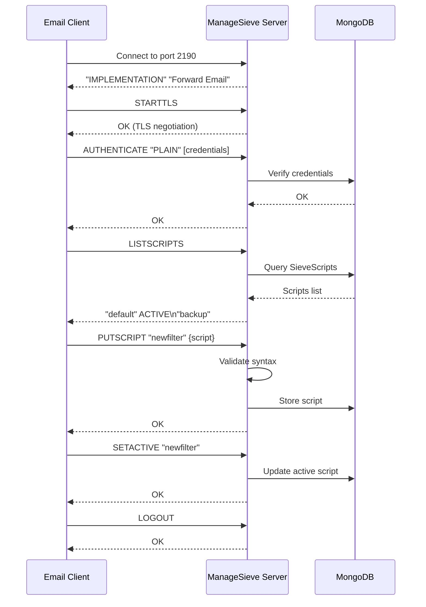

#### Веб-інтерфейс та API {#web-interface-and-api}

Окрім ManageSieve, Forward Email надає:

* **Веб-панель**: Створення та керування Sieve скриптами через веб-інтерфейс у Мій акаунт → Домени → Псевдоніми → Sieve скрипти
* **REST API**: Програмний доступ до керування Sieve скриптами через [Forward Email API](/api#sieve-scripts)

> \[!TIP]
> Для детальних інструкцій з налаштування та конфігурації клієнта дивіться [FAQ: Чи підтримуєте ви фільтрацію електронної пошти за допомогою Sieve?](/faq#do-you-support-sieve-email-filtering)

---


## Оптимізація зберігання {#storage-optimization}

> \[!IMPORTANT]
> **Перший у галузі технологія зберігання:** Forward Email — це **єдиний поштовий провайдер у світі**, який поєднує дедуплікацію вкладень із стисненням Brotli вмісту електронної пошти. Ця двошарова оптимізація дає вам **в 2-3 рази більше ефективного зберігання** порівняно з традиційними поштовими провайдерами.

Forward Email реалізує дві революційні техніки оптимізації зберігання, які суттєво зменшують розмір поштової скриньки, зберігаючи повну відповідність RFC та цілісність повідомлень:

1. **Дедуплікація вкладень** — усуває дублікати вкладень у всіх листах
2. **Стиснення Brotli** — зменшує обсяг зберігання на 46-86% для метаданих і на 50% для вкладень

### Архітектура: двошарова оптимізація зберігання {#architecture-dual-layer-storage-optimization}

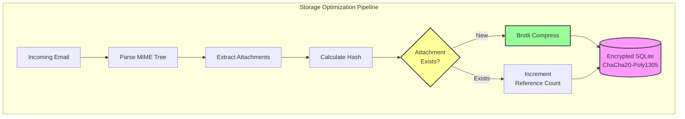

---


## Дедуплікація вкладень {#attachment-deduplication}

Forward Email реалізує дедуплікацію вкладень на основі [перевіреного підходу WildDuck](https://docs.wildduck.email/docs/in-depth/attachment-deduplication/), адаптованого для зберігання в SQLite.

> \[!NOTE]
> **Що дедуплікується:** "Вкладення" означає **закодований** вміст MIME-вузла (base64 або quoted-printable), а не декодований файл. Це зберігає дійсність підписів DKIM та GPG.

### Як це працює {#how-it-works}

**Оригінальна реалізація WildDuck (MongoDB GridFS):**

> IMAP сервер Wild Duck виконує дедуплікацію вкладень. "Вкладення" в цьому випадку означає base64 або quoted-printable закодований вміст MIME-вузла, а не декодований файл. Хоча використання закодованого вмісту призводить до багатьох хибних негативів (той самий файл у різних листах може вважатися різними вкладеннями), це необхідно для гарантії дійсності різних схем підписів (DKIM, GPG тощо). Повідомлення, отримане з Wild Duck, виглядає точно так само, як і повідомлення, що зберігалося, хоча Wild Duck розбирає повідомлення у вигляді дерева об’єктів і відновлює повідомлення при отриманні.
**Реалізація SQLite у Forward Email:**

Forward Email адаптує цей підхід для зашифрованого зберігання SQLite за наступним процесом:

1. **Обчислення хешу**: Коли знаходиться вкладення, хеш обчислюється за допомогою бібліотеки [`rev-hash`](https://github.com/sindresorhus/rev-hash) з тіла вкладення
2. **Пошук**: Перевірка, чи існує вкладення з відповідним хешем у таблиці `Attachments`
3. **Підрахунок посилань**:
   * Якщо існує: Збільшити лічильник посилань на 1 і магічний лічильник на випадкове число
   * Якщо нове: Створити новий запис вкладення з лічильником = 1
4. **Безпека видалення**: Використовує систему подвійних лічильників (посилання + магічний) для запобігання хибним спрацьовуванням
5. **Збір сміття**: Вкладення видаляються негайно, коли обидва лічильники досягають нуля

**Вихідний код:** [`helpers/attachment-storage.js`](https://github.com/forwardemail/forwardemail.net/blob/master/helpers/attachment-storage.js)

### Потік дедуплікації {#deduplication-flow}

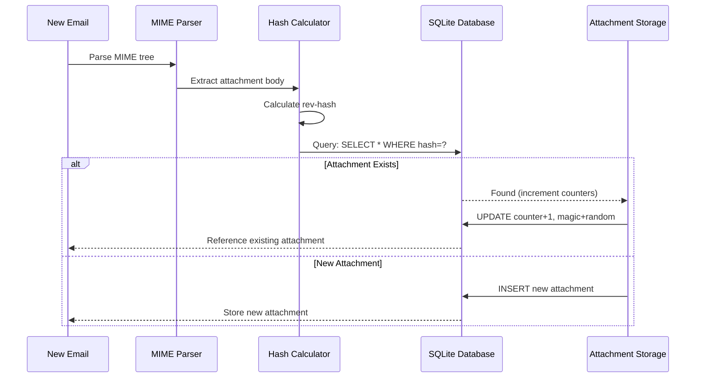

### Система магічних чисел {#magic-number-system}

Forward Email використовує систему "магічних чисел" WildDuck (натхненну [Mail.ru](https://github.com/zone-eu/wildduck)) для запобігання хибним спрацьовуванням під час видалення:

* Кожному повідомленню присвоюється **випадкове число**
* Магічний лічильник вкладення збільшується на це випадкове число при додаванні повідомлення
* Магічний лічильник зменшується на те саме число при видаленні повідомлення
* Вкладення видаляється лише коли **обидва лічильники** (посилання + магічний) досягають нуля

Ця система подвійних лічильників гарантує, що якщо щось піде не так під час видалення (наприклад, збій, помилка мережі), вкладення не буде видалено передчасно.

### Ключові відмінності: WildDuck vs Forward Email {#key-differences-wildduck-vs-forward-email}

| Функція                | WildDuck (MongoDB)       | Forward Email (SQLite)       |
| ---------------------- | ------------------------ | ---------------------------- |
| **Сховище**            | MongoDB GridFS (порційно) | SQLite BLOB (прямо)          |
| **Алгоритм хешування** | SHA256                   | rev-hash (на основі SHA-256) |
| **Підрахунок посилань**| ✅ Так                   | ✅ Так                       |
| **Магічні числа**      | ✅ Так (натхненна Mail.ru) | ✅ Так (та сама система)      |
| **Збір сміття**        | Відкладена (окреме завдання) | Негайна (при нульових лічильниках) |
| **Стиснення**          | ❌ Відсутнє               | ✅ Brotli (див. нижче)        |
| **Шифрування**         | ❌ Опціонально            | ✅ Завжди (ChaCha20-Poly1305) |

---


## Стиснення Brotli {#brotli-compression}

> \[!IMPORTANT]
> **Світова Прем'єра:** Forward Email — це **єдиний у світі поштовий сервіс**, який використовує стиснення Brotli для вмісту електронної пошти. Це забезпечує **економію місця від 46 до 86%** поверх дедуплікації вкладень.

Forward Email реалізує стиснення Brotli як для тіл вкладень, так і для метаданих повідомлень, забезпечуючи значну економію місця при збереженні сумісності з попередніми версіями.

**Реалізація:** [`helpers/msgpack-helpers.js`](https://github.com/forwardemail/forwardemail.net/blob/master/helpers/msgpack-helpers.js)

### Що стискається {#what-gets-compressed}

**1. Тіла вкладень** (`encodeAttachmentBody`)

* **Старі формати**: Hex-кодований рядок (в 2 рази більший розмір) або сирий Buffer
* **Новий формат**: Brotli-стиснутий Buffer з магічним заголовком "FEBR"
* **Рішення про стиснення**: Стискає лише якщо це економить місце (враховує 4-байтовий заголовок)
* **Економія місця**: До **50%** (hex → нативний BLOB)
**2. Метадані повідомлення** (`encodeMetadata`)

Включає: `mimeTree`, `headers`, `envelope`, `flags`

* **Старий формат**: JSON текстовий рядок
* **Новий формат**: Buffer, стиснутий Brotli
* **Економія місця**: **46-86%** залежно від складності повідомлення

### Налаштування стиснення {#compression-configuration}

```javascript
// Параметри стиснення Brotli, оптимізовані для швидкості (рівень 4 — хороший баланс)
const BROTLI_COMPRESS_OPTIONS = {
  params: {
    [zlib.constants.BROTLI_PARAM_QUALITY]: 4
  }
};
```

**Чому рівень 4?**

* **Швидке стиснення/розпакування**: Обробка за субмілісекунди
* **Хороше співвідношення стиснення**: економія 46-86%
* **Збалансована продуктивність**: оптимально для операцій з електронною поштою в реальному часі

### Магічний заголовок: "FEBR" {#magic-header-febr}

Forward Email використовує 4-байтовий магічний заголовок для ідентифікації стиснутих тіл вкладень:

```
"FEBR" = Forward Email BRotli
Hex: 0x46 0x45 0x42 0x52
```

**Навіщо магічний заголовок?**

* **Виявлення формату**: миттєво визначає стиснені чи нестиснені дані
* **Зворотна сумісність**: старі hex-рядки та сирі Buffers все ще працюють
* **Уникнення колізій**: "FEBR" малоймовірно з’явиться на початку легітимних даних вкладення

### Процес стиснення {#compression-process}

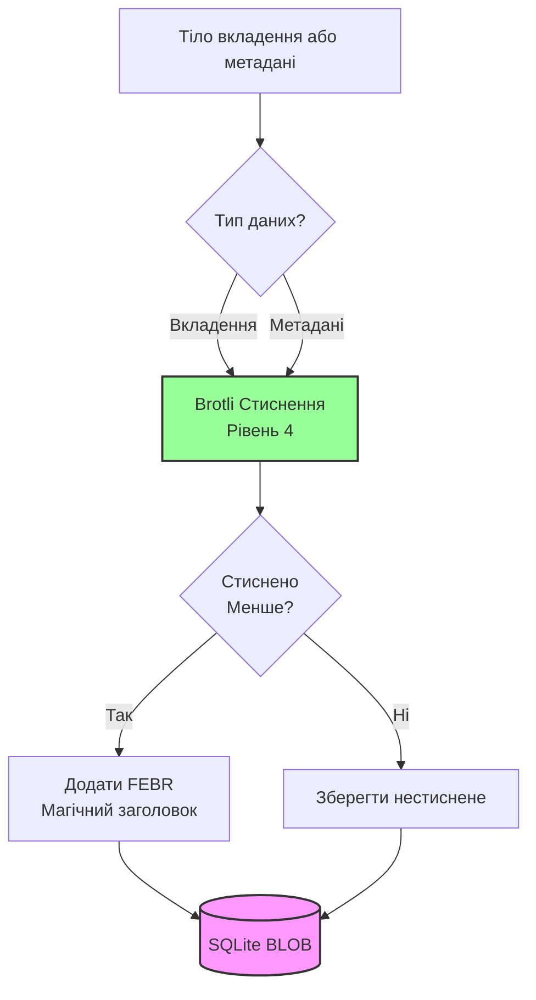

### Процес розпакування {#decompression-process}

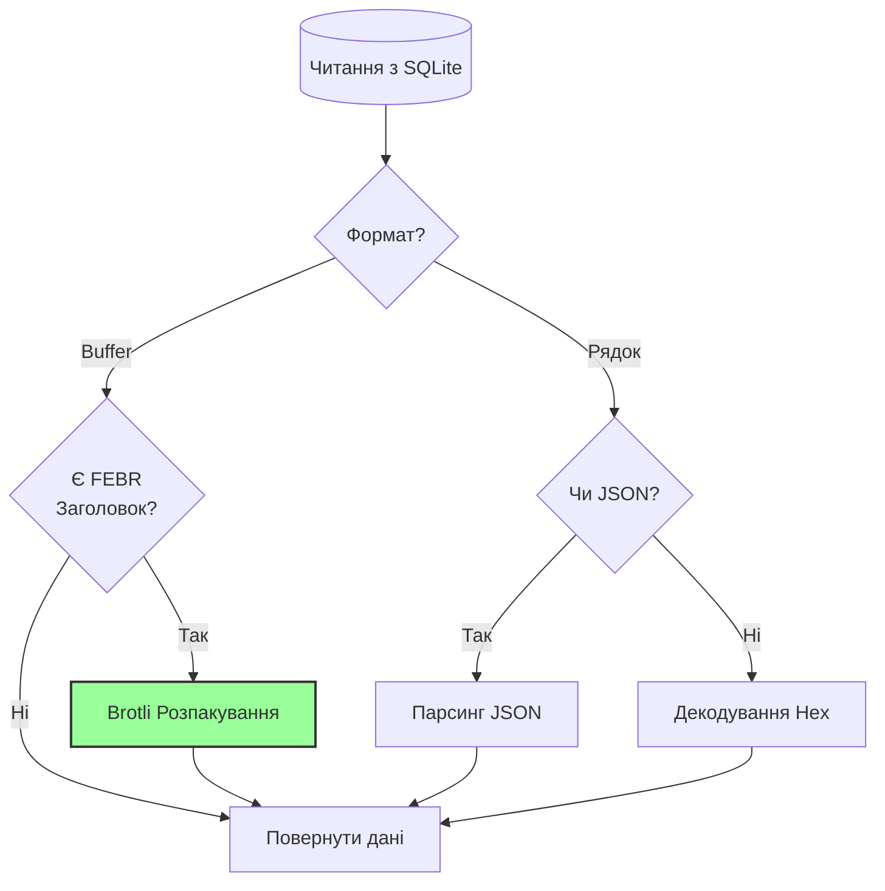

### Зворотна сумісність {#backwards-compatibility}

Всі функції декодування **автоматично визначають** формат зберігання:

| Формат                | Метод виявлення                      | Обробка                                      |
| --------------------- | ---------------------------------- | -------------------------------------------- |
| **Стиснення Brotli**  | Перевірка магічного заголовка "FEBR" | Розпакування за допомогою `zlib.brotliDecompressSync()` |
| **Сирий Buffer**      | `Buffer.isBuffer()` без магічного заголовка | Повертається без змін                         |
| **Hex рядок**         | Перевірка парної довжини + символів [0-9a-f] | Декодування через `Buffer.from(value, 'hex')` |
| **JSON рядок**        | Перевірка першого символу `{` або `[` | Парсинг через `JSON.parse()`                  |

Це гарантує **нульову втрату даних** під час міграції зі старих форматів у нові.

### Статистика економії місця {#storage-savings-statistics}

**Виміряна економія на основі продуктивних даних:**

| Тип даних             | Старий формат           | Новий формат           | Економія  |
| --------------------- | ---------------------- | --------------------- | --------- |
| **Тіла вкладень**     | Hex-кодований рядок (2x) | Стиснутий Brotli BLOB | **50%**   |
| **Метадані повідомлень** | JSON текст             | Стиснутий Brotli BLOB | **46-86%**|
| **Прапорці поштової скриньки** | JSON текст             | Стиснутий Brotli BLOB | **60-80%**|

**Джерело:** [`helpers/migrate-storage-format.js`](https://github.com/forwardemail/forwardemail.net/blob/master/helpers/migrate-storage-format.js)

### Процес міграції {#migration-process}

Forward Email забезпечує автоматичну, ідемпотентну міграцію зі старих у нові формати зберігання:
// Статистика міграції відстежується:
{
  attachmentsMigrated: 0,
  messagesMigrated: 0,
  mailboxesMigrated: 0,
  bytesSaved: 0  // Загальна кількість байтів, збережених завдяки стисненню
}
```

**Кроки міграції:**

1. Тіла вкладень: шістнадцяткове кодування → нативний BLOB (економія 50%)
2. Метадані повідомлень: JSON текст → BLOB, стиснений Brotli (економія 46-86%)
3. Прапорці поштової скриньки: JSON текст → BLOB, стиснений Brotli (економія 60-80%)

**Джерело:** [`helpers/migrate-storage-format.js`](https://github.com/forwardemail/forwardemail.net/blob/master/helpers/migrate-storage-format.js)

---

### Ефективність комбінованого зберігання {#combined-storage-efficiency}

> \[!TIP]
> **Реальний вплив:** Завдяки дедуплікації вкладень + стисненню Brotli користувачі Forward Email отримують **в 2-3 рази ефективніше зберігання**, порівняно з традиційними поштовими провайдерами.

**Приклад сценарію:**

Традиційний поштовий провайдер (поштова скринька 1ГБ):

* 1ГБ дискового простору = 1ГБ листів
* Без дедуплікації: однаковий вкладений файл зберігається 10 разів = 10-кратне марнування простору
* Без стиснення: повні JSON метадані зберігаються = 2-3-кратне марнування простору

Forward Email (поштова скринька 1ГБ):

* 1ГБ дискового простору ≈ **2-3ГБ листів** (ефективне зберігання)
* Дедуплікація: однаковий вкладений файл зберігається один раз, посилається 10 разів
* Стиснення: 46-86% економії на метаданих, 50% на вкладеннях
* Шифрування: ChaCha20-Poly1305 (без накладних витрат на зберігання)

**Таблиця порівняння:**

| Провайдер         | Технологія зберігання                       | Ефективне зберігання (поштова скринька 1ГБ) |
| ----------------- | -------------------------------------------- | -------------------------------------------- |
| Gmail             | Відсутня                                    | 1ГБ                                         |
| iCloud            | Відсутня                                    | 1ГБ                                         |
| Outlook.com       | Відсутня                                    | 1ГБ                                         |
| Fastmail          | Відсутня                                    | 1ГБ                                         |
| ProtonMail        | Лише шифрування                             | 1ГБ                                         |
| Tutanota          | Лише шифрування                             | 1ГБ                                         |
| **Forward Email** | **Дедуплікація + Стиснення + Шифрування** | **2-3ГБ** ✨                                 |

### Технічні деталі реалізації {#technical-implementation-details}

**Продуктивність:**

* Brotli рівень 4: стиснення/розпакування за субмілісекунди
* Відсутність штрафу за продуктивність через стиснення
* SQLite FTS5: пошук менше 50 мс на NVMe SSD

**Безпека:**

* Стиснення відбувається **після** шифрування (база даних SQLite зашифрована)
* Шифрування ChaCha20-Poly1305 + стиснення Brotli
* Нульове знання: лише користувач має пароль для розшифрування

**Відповідність RFC:**

* Отримані повідомлення виглядають **точно так само**, як і збережені
* Підписи DKIM залишаються дійсними (збережено кодування вмісту)
* Підписи GPG залишаються дійсними (без змін підписаного вмісту)

### Чому жоден інший провайдер цього не робить {#why-no-other-provider-does-this}

**Складність:**

* Потрібна глибока інтеграція з шаром зберігання
* Зворотна сумісність складна
* Міграція зі старих форматів складна

**Проблеми з продуктивністю:**

* Стиснення додає навантаження на CPU (вирішено Brotli рівень 4)
* Розпакування при кожному читанні (вирішено кешуванням SQLite)

**Перевага Forward Email:**

* Побудовано з нуля з урахуванням оптимізації
* SQLite дозволяє пряме маніпулювання BLOB
* Зашифровані бази даних для кожного користувача дозволяють безпечне стиснення

---

---


## Сучасні функції {#modern-features}


## Повний REST API для керування електронною поштою {#complete-rest-api-for-email-management}

> \[!TIP]
> Forward Email надає комплексний REST API з 39 кінцевими точками для програмного керування електронною поштою.

> \[!TIP]
> **Унікальна галузева функція:** На відміну від усіх інших поштових сервісів, Forward Email надає повний програмний доступ до вашої поштової скриньки, календаря, контактів, повідомлень і папок через комплексний REST API. Це прямий доступ до вашого зашифрованого файлу бази даних SQLite, що зберігає всі ваші дані.

Forward Email пропонує повний REST API, який забезпечує безпрецедентний доступ до ваших поштових даних. Жоден інший поштовий сервіс (включно з Gmail, iCloud, Outlook, ProtonMail, Tuta або Fastmail) не пропонує такого рівня комплексного, прямого доступу до бази даних.
**Документація API:** <https://forwardemail.net/en/email-api>

### Категорії API (39 кінцевих точок) {#api-categories-39-endpoints}

**1. Messages API** (5 кінцевих точок) - Повний CRUD для електронних повідомлень:

* `GET /v1/messages` - Список повідомлень з 15+ розширеними параметрами пошуку (жоден інший сервіс цього не пропонує)
* `POST /v1/messages` - Створення/відправка повідомлень
* `GET /v1/messages/:id` - Отримати повідомлення
* `PUT /v1/messages/:id` - Оновити повідомлення (позначки, папки)
* `DELETE /v1/messages/:id` - Видалити повідомлення

*Приклад: Знайти всі рахунки за останній квартал з вкладеннями:*

```bash
curl -u "alias@domain.com:password" \
  "https://api.forwardemail.net/v1/messages?q=subject:invoice+has:attachment+after:2024-01-01+before:2024-04-01"
```

Див. [Документація розширеного пошуку](https://forwardemail.net/en/email-api)

**2. Folders API** (5 кінцевих точок) - Повне керування IMAP-папками через REST:

* `GET /v1/folders` - Список усіх папок
* `POST /v1/folders` - Створити папку
* `GET /v1/folders/:id` - Отримати папку
* `PUT /v1/folders/:id` - Оновити папку
* `DELETE /v1/folders/:id` - Видалити папку

**3. Contacts API** (5 кінцевих точок) - Зберігання контактів CardDAV через REST:

* `GET /v1/contacts` - Список контактів
* `POST /v1/contacts` - Створити контакт (формат vCard)
* `GET /v1/contacts/:id` - Отримати контакт
* `PUT /v1/contacts/:id` - Оновити контакт
* `DELETE /v1/contacts/:id` - Видалити контакт

**4. Calendars API** (5 кінцевих точок) - Керування календарними контейнерами:

* `GET /v1/calendars` - Список календарних контейнерів
* `POST /v1/calendars` - Створити календар (наприклад, "Робочий календар", "Особистий календар")
* `GET /v1/calendars/:id` - Отримати календар
* `PUT /v1/calendars/:id` - Оновити календар
* `DELETE /v1/calendars/:id` - Видалити календар

**5. Calendar Events API** (5 кінцевих точок) - Планування подій у календарях:

* `GET /v1/calendar-events` - Список подій
* `POST /v1/calendar-events` - Створити подію з учасниками
* `GET /v1/calendar-events/:id` - Отримати подію
* `PUT /v1/calendar-events/:id` - Оновити подію
* `DELETE /v1/calendar-events/:id` - Видалити подію

*Приклад: Створити подію в календарі:*

```bash
curl -u "alias@domain.com:password" \
  -X POST \
  -H "Content-Type: application/json" \
  -d '{"title":"Team Meeting","start":"2024-12-20T10:00:00Z","attendees":["team@example.com"],"calendar_id":"calendar123"}' \
  https://api.forwardemail.net/v1/calendar-events
```

### Технічні деталі {#technical-details}

* **Аутентифікація:** Проста аутентифікація `alias:password` (без складнощів OAuth)
* **Продуктивність:** Час відповіді менше 50 мс з SQLite FTS5 та NVMe SSD зберіганням
* **Нульова затримка мережі:** Прямий доступ до бази даних, без проксування через зовнішні сервіси

### Реальні сценарії використання {#real-world-use-cases}

* **Аналітика електронної пошти:** Створення кастомних панелей для відстеження обсягу пошти, часу відповіді, статистики відправників

* **Автоматизовані робочі процеси:** Тригери дій на основі вмісту листів (обробка рахунків, підтримка заявок)

* **Інтеграція з CRM:** Автоматична синхронізація листування з CRM

* **Відповідність та пошук:** Пошук і експорт листів для юридичних/регуляторних вимог

* **Кастомні поштові клієнти:** Створення спеціалізованих інтерфейсів для вашого робочого процесу

* **Бізнес-аналітика:** Аналіз комунікаційних патернів, швидкості відповіді, залучення клієнтів

* **Управління документами:** Автоматичне вилучення та категоризація вкладень

* [Повна документація](https://forwardemail.net/en/email-api)

* [Повний API Reference](https://forwardemail.net/en/email-api)

* [Посібник з розширеного пошуку](https://forwardemail.net/en/email-api)

* [30+ прикладів інтеграції](https://forwardemail.net/en/email-api)

* [Технічна архітектура](https://forwardemail.net/en/blog/docs/best-quantum-safe-encrypted-email-service)

Forward Email пропонує сучасний REST API, який забезпечує повний контроль над обліковими записами електронної пошти, доменами, псевдонімами та повідомленнями. Цей API є потужною альтернативою JMAP і надає функціональність, що виходить за межі традиційних поштових протоколів.

| Категорія               | Кінцеві точки | Опис                                   |
| ----------------------- | ------------- | ------------------------------------- |
| **Управління обліковим записом** | 8           | Користувацькі облікові записи, аутентифікація, налаштування |
| **Управління доменом**  | 12            | Користувацькі домени, DNS, верифікація |
| **Управління псевдонімами** | 6           | Псевдоніми електронної пошти, переадресація, catch-all |
| **Управління повідомленнями** | 7           | Відправка, отримання, пошук, видалення повідомлень |
| **Календарі та контакти** | 4             | Доступ CalDAV/CardDAV через API       |
| **Логи та аналітика**   | 2             | Логи електронної пошти, звіти про доставку |
### Основні можливості API {#key-api-features}

**Розширений пошук:**

API надає потужні можливості пошуку з синтаксисом запитів, схожим на Gmail:

```
GET /v1/messages?q=subject:invoice+has:attachment+after:2024-01-01+before:2024-04-01
```

**Підтримувані оператори пошуку:**

* `from:` - Пошук за відправником
* `to:` - Пошук за отримувачем
* `subject:` - Пошук за темою
* `has:attachment` - Повідомлення з вкладеннями
* `is:unread` - Непрочитані повідомлення
* `is:starred` - Позначені зірочкою повідомлення
* `after:` - Повідомлення після дати
* `before:` - Повідомлення до дати
* `label:` - Повідомлення з міткою
* `filename:` - Ім'я файлу вкладення

**Управління подіями календаря:**

```
GET /v1/calendar-events
POST /v1/calendar-events
PUT /v1/calendar-events/:id
DELETE /v1/calendar-events/:id
```

**Інтеграції через вебхуки:**

API підтримує вебхуки для миттєвих сповіщень про події електронної пошти (отримано, надіслано, повернено тощо).

**Аутентифікація:**

* Аутентифікація за API ключем
* Підтримка OAuth 2.0
* Обмеження швидкості: 1000 запитів/годину

**Формат даних:**

* JSON запити/відповіді
* RESTful дизайн
* Підтримка пагінації

**Безпека:**

* Тільки HTTPS
* Ротація API ключів
* Білий список IP (опційно)
* Підписування запитів (опційно)

### Архітектура API {#api-architecture}

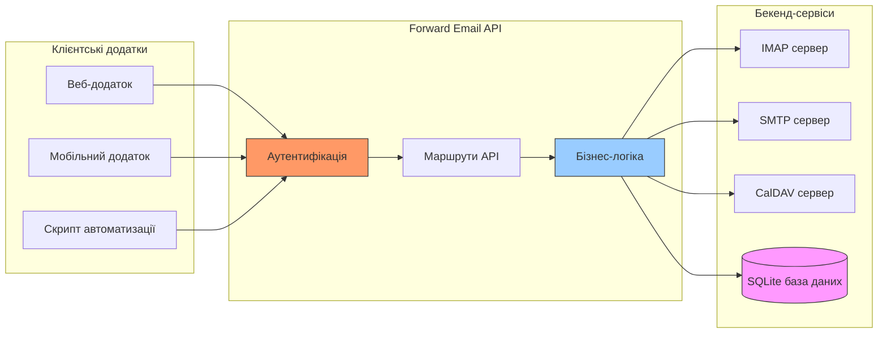

---


## Push-повідомлення iOS {#ios-push-notifications}

> \[!TIP]
> Forward Email підтримує нативні push-повідомлення iOS через XAPPLEPUSHSERVICE для миттєвої доставки електронної пошти.

> \[!IMPORTANT]
> **Унікальна особливість:** Forward Email — один із небагатьох open-source поштових серверів, який підтримує нативні push-повідомлення iOS для пошти, контактів і календарів через розширення IMAP `XAPPLEPUSHSERVICE`. Це було відтворено з протоколу Apple і забезпечує миттєву доставку на пристрої iOS без витрат батареї.

Forward Email реалізує власне розширення Apple XAPPLEPUSHSERVICE, забезпечуючи нативні push-повідомлення для пристроїв iOS без необхідності фонових опитувань.

### Як це працює {#how-it-works-1}

**XAPPLEPUSHSERVICE** — нестандартне розширення IMAP, яке дозволяє додатку Mail на iOS отримувати миттєві push-повідомлення при надходженні нових листів.

Forward Email реалізує власну інтеграцію служби Apple Push Notification (APNs) для IMAP, що дозволяє додатку Mail на iOS отримувати миттєві push-повідомлення при надходженні нових листів.

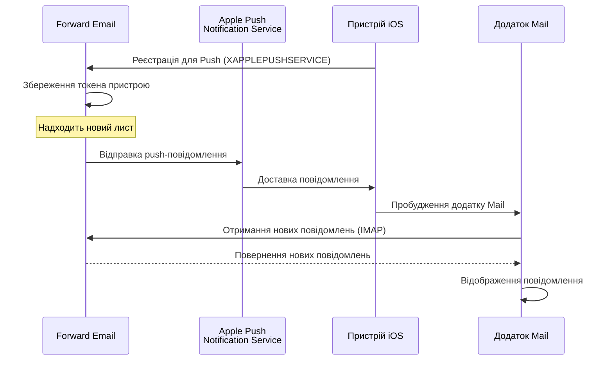

### Ключові особливості {#key-features}

**Миттєва доставка:**

* Push-повідомлення надходять за секунди
* Відсутнє енергозатратне фонове опитування
* Працює навіть коли додаток Mail закритий

<!---->

* **Миттєва доставка:** Листи, події календаря та контакти з’являються на вашому iPhone/iPad одразу, а не за розкладом опитування
* **Енергоефективність:** Використовує інфраструктуру push Apple замість постійних IMAP-з’єднань
* **Push за темами:** Підтримує push-повідомлення для конкретних поштових скриньок, а не лише INBOX
* **Без сторонніх додатків:** Працює з нативними додатками iOS Mail, Calendar і Contacts
**Нативна інтеграція:**

* Вбудовано в додаток iOS Mail
* Не потрібні сторонні додатки
* Безшовний користувацький досвід

**Орієнтовано на конфіденційність:**

* Токени пристроїв зашифровані
* Вміст повідомлень не надсилається через APNS
* Надсилається лише сповіщення про "нову пошту"

**Енергоефективність:**

* Відсутнє постійне опитування IMAP
* Пристрій спить до отримання сповіщення
* Мінімальний вплив на батарею

### Що робить це особливим {#what-makes-this-special}

> \[!IMPORTANT]
> Більшість поштових провайдерів не підтримують XAPPLEPUSHSERVICE, змушуючи пристрої iOS опитувати пошту кожні 15 хвилин.

Більшість поштових серверів з відкритим кодом (включно з Dovecot, Postfix, Cyrus IMAP) НЕ підтримують push-сповіщення iOS. Користувачі повинні або:

* Використовувати IMAP IDLE (підтримує відкритий зв’язок, швидко розряджає батарею)
* Використовувати опитування (перевірка кожні 15-30 хвилин, затримка сповіщень)
* Використовувати пропрієтарні поштові додатки з власною push-інфраструктурою

Forward Email забезпечує той самий миттєвий досвід push-сповіщень, як і комерційні сервіси, такі як Gmail, iCloud та Fastmail.

**Порівняння з іншими провайдерами:**

| Провайдер         | Підтримка Push | Інтервал опитування | Вплив на батарею |
| ----------------- | -------------- | ------------------- | ---------------- |
| **Forward Email** | ✅ Нативний Push | Миттєвий            | Мінімальний      |
| Gmail             | ✅ Нативний Push | Миттєвий            | Мінімальний      |
| iCloud            | ✅ Нативний Push | Миттєвий            | Мінімальний      |
| Yahoo             | ✅ Нативний Push | Миттєвий            | Мінімальний      |
| Outlook.com       | ❌ Опитування   | 15 хвилин           | Помірний         |
| Fastmail          | ❌ Опитування   | 15 хвилин           | Помірний         |
| ProtonMail        | ⚠️ Лише через Bridge | Через Bridge       | Високий          |
| Tutanota          | ❌ Лише додаток | Н/Д                 | Н/Д              |

### Деталі реалізації {#implementation-details}

**Відповідь IMAP CAPABILITY:**

```
* CAPABILITY IMAP4rev1 ... XAPPLEPUSHSERVICE ...
```

**Процес реєстрації:**

1. Додаток iOS Mail виявляє можливість XAPPLEPUSHSERVICE
2. Додаток реєструє токен пристрою у Forward Email
3. Forward Email зберігає токен і пов’язує його з обліковим записом
4. Коли надходить нова пошта, Forward Email надсилає push через APNS
5. iOS пробуджує додаток Mail для отримання нових повідомлень

**Безпека:**

* Токени пристроїв зашифровані у стані збереження
* Токени автоматично оновлюються після закінчення терміну дії
* Вміст повідомлень не передається APNS
* Підтримується наскрізне шифрування

<!---->

* **Розширення IMAP:** `XAPPLEPUSHSERVICE`
* **Вихідний код:** [WildDuck Issue #711](https://github.com/zone-eu/wildduck/issues/711)
* **Налаштування:** Автоматичне — не потребує конфігурації, працює з коробки з додатком iOS Mail

### Порівняння з іншими сервісами {#comparison-with-other-services}

| Сервіс        | Підтримка iOS Push | Метод                                   |
| ------------- | ------------------ | -------------------------------------- |
| Forward Email | ✅ Так             | `XAPPLEPUSHSERVICE` (зворотна розробка) |
| Gmail         | ✅ Так             | Пропрієтарний додаток Gmail + Google push |
| iCloud Mail   | ✅ Так             | Нативна інтеграція Apple               |
| Outlook.com   | ✅ Так             | Пропрієтарний додаток Outlook + Microsoft push |
| Fastmail      | ✅ Так             | `XAPPLEPUSHSERVICE`                     |
| Dovecot       | ❌ Ні              | Лише IMAP IDLE або опитування          |
| Postfix       | ❌ Ні              | Лише IMAP IDLE або опитування          |
| Cyrus IMAP    | ❌ Ні              | Лише IMAP IDLE або опитування          |

**Gmail Push:**

Gmail використовує пропрієтарну систему push, яка працює лише з додатком Gmail. Додаток iOS Mail мусить опитувати сервери Gmail IMAP.

**iCloud Push:**

iCloud має нативну підтримку push, схожу на Forward Email, але лише для адрес @icloud.com.

**Outlook.com:**

Outlook.com не підтримує XAPPLEPUSHSERVICE, тому додаток iOS Mail мусить опитувати пошту кожні 15 хвилин.

**Fastmail:**

Fastmail не підтримує XAPPLEPUSHSERVICE. Користувачі повинні використовувати додаток Fastmail для push-сповіщень або погоджуватися на затримки опитування в 15 хвилин.

---


## Тестування та перевірка {#testing-and-verification}


## Тести можливостей протоколу {#protocol-capability-tests}
> \[!NOTE]
> Цей розділ містить результати наших останніх тестів можливостей протоколів, проведених 22 січня 2026 року.

Цей розділ містить фактичні відповіді CAPABILITY/CAPA/EHLO від усіх протестованих провайдерів. Всі тести були проведені **22 січня 2026 року**.

Ці тести допомагають перевірити заявлену та фактичну підтримку різних поштових протоколів і розширень у провідних провайдерів.

### Методологія тестування {#test-methodology}

**Тестове середовище:**

* **Дата:** 22 січня 2026 року о 02:37 UTC
* **Локація:** інстанс AWS EC2
* **IPv4:** 54.167.216.197
* **IPv6:** 2600:4040:46da:9a00:b19e:3ad4:426c:2f48
* **Інструменти:** OpenSSL s_client, bash-скрипти

**Протестовані провайдери:**

* Forward Email
* Gmail
* Outlook.com
* iCloud
* Fastmail
* Yahoo/AOL (Verizon)

### Тестові скрипти {#test-scripts}

Для повної прозорості нижче наведені точні скрипти, які використовувалися для цих тестів.

#### Скрипт тестування можливостей IMAP {#imap-capability-test-script}

```bash
#!/bin/bash
# IMAP Capability Test Script
# Tests IMAP CAPABILITY for various email providers

echo "========================================="
echo "IMAP CAPABILITY TEST"
echo "Date: $(date -u +"%Y-%m-%d %H:%M:%S UTC")"
echo "========================================="
echo ""

# Gmail
echo "--- Gmail (imap.gmail.com:993) ---"
echo -e "a001 CAPABILITY\na002 LOGOUT" | timeout 10 openssl s_client -connect imap.gmail.com:993 -crlf -quiet 2>&1 | grep -A 20 "CAPABILITY"
echo ""

# Outlook.com
echo "--- Outlook.com (outlook.office365.com:993) ---"
echo -e "a001 CAPABILITY\na002 LOGOUT" | timeout 10 openssl s_client -connect outlook.office365.com:993 -crlf -quiet 2>&1 | grep -A 20 "CAPABILITY"
echo ""

# iCloud
echo "--- iCloud (imap.mail.me.com:993) ---"
echo -e "a001 CAPABILITY\na002 LOGOUT" | timeout 10 openssl s_client -connect imap.mail.me.com:993 -crlf -quiet 2>&1 | grep -A 20 "CAPABILITY"
echo ""

# Fastmail
echo "--- Fastmail (imap.fastmail.com:993) ---"
echo -e "a001 CAPABILITY\na002 LOGOUT" | timeout 10 openssl s_client -connect imap.fastmail.com:993 -crlf -quiet 2>&1 | grep -A 20 "CAPABILITY"
echo ""

# Yahoo
echo "--- Yahoo (imap.mail.yahoo.com:993) ---"
echo -e "a001 CAPABILITY\na002 LOGOUT" | timeout 10 openssl s_client -connect imap.mail.yahoo.com:993 -crlf -quiet 2>&1 | grep -A 20 "CAPABILITY"
echo ""

# Forward Email
echo "--- Forward Email (imap.forwardemail.net:993) ---"
echo -e "a001 CAPABILITY\na002 LOGOUT" | timeout 10 openssl s_client -connect imap.forwardemail.net:993 -crlf -quiet 2>&1 | grep -A 20 "CAPABILITY"
echo ""

echo "========================================="
echo "Test completed"
echo "========================================="
```

#### Скрипт тестування можливостей POP3 {#pop3-capability-test-script}

```bash
#!/bin/bash
# POP3 Capability Test Script
# Tests POP3 CAPA for various email providers

echo "========================================="
echo "POP3 CAPABILITY TEST"
echo "Date: $(date -u +"%Y-%m-%d %H:%M:%S UTC")"
echo "========================================="
echo ""

# Gmail
echo "--- Gmail (pop.gmail.com:995) ---"
echo -e "CAPA\nQUIT" | timeout 10 openssl s_client -connect pop.gmail.com:995 -crlf -quiet 2>&1 | grep -A 20 "CAPA"
echo ""

# Outlook.com
echo "--- Outlook.com (outlook.office365.com:995) ---"
echo -e "CAPA\nQUIT" | timeout 10 openssl s_client -connect outlook.office365.com:995 -crlf -quiet 2>&1 | grep -A 20 "CAPA"
echo ""

# iCloud (Примітка: iCloud не підтримує POP3)
echo "--- iCloud (No POP3 support) ---"
echo "iCloud не підтримує POP3"
echo ""

# Fastmail
echo "--- Fastmail (pop.fastmail.com:995) ---"
echo -e "CAPA\nQUIT" | timeout 10 openssl s_client -connect pop.fastmail.com:995 -crlf -quiet 2>&1 | grep -A 20 "CAPA"
echo ""

# Yahoo
echo "--- Yahoo (pop.mail.yahoo.com:995) ---"
echo -e "CAPA\nQUIT" | timeout 10 openssl s_client -connect pop.mail.yahoo.com:995 -crlf -quiet 2>&1 | grep -A 20 "CAPA"
echo ""

# Forward Email
echo "--- Forward Email (pop3.forwardemail.net:995) ---"
echo -e "CAPA\nQUIT" | timeout 10 openssl s_client -connect pop3.forwardemail.net:995 -crlf -quiet 2>&1 | grep -A 20 "CAPA"
echo ""

echo "========================================="
echo "Test completed"
echo "========================================="
```
#### Скрипт тестування можливостей SMTP {#smtp-capability-test-script}

```bash
#!/bin/bash
# SMTP Capability Test Script
# Tests SMTP EHLO for various email providers

echo "========================================="
echo "ТЕСТ МОЖЛИВОСТЕЙ SMTP"
echo "Дата: $(date -u +"%Y-%m-%d %H:%M:%S UTC")"
echo "========================================="
echo ""

# Gmail
echo "--- Gmail (smtp.gmail.com:587) ---"
echo -e "EHLO test.com\nQUIT" | timeout 10 openssl s_client -connect smtp.gmail.com:587 -starttls smtp -crlf -quiet 2>&1 | grep -A 30 "250-"
echo ""

# Outlook.com
echo "--- Outlook.com (smtp.office365.com:587) ---"
echo -e "EHLO test.com\nQUIT" | timeout 10 openssl s_client -connect smtp.office365.com:587 -starttls smtp -crlf -quiet 2>&1 | grep -A 30 "250-"
echo ""

# iCloud
echo "--- iCloud (smtp.mail.me.com:587) ---"
echo -e "EHLO test.com\nQUIT" | timeout 10 openssl s_client -connect smtp.mail.me.com:587 -starttls smtp -crlf -quiet 2>&1 | grep -A 30 "250-"
echo ""

# Fastmail
echo "--- Fastmail (smtp.fastmail.com:587) ---"
echo -e "EHLO test.com\nQUIT" | timeout 10 openssl s_client -connect smtp.fastmail.com:587 -starttls smtp -crlf -quiet 2>&1 | grep -A 30 "250-"
echo ""

# Yahoo
echo "--- Yahoo (smtp.mail.yahoo.com:587) ---"
echo -e "EHLO test.com\nQUIT" | timeout 10 openssl s_client -connect smtp.mail.yahoo.com:587 -starttls smtp -crlf -quiet 2>&1 | grep -A 30 "250-"
echo ""

# Forward Email
echo "--- Forward Email (smtp.forwardemail.net:587) ---"
echo -e "EHLO test.com\nQUIT" | timeout 10 openssl s_client -connect smtp.forwardemail.net:587 -starttls smtp -crlf -quiet 2>&1 | grep -A 30 "250-"
echo ""

echo "========================================="
echo "Тест завершено"
echo "========================================="
```

### Підсумок результатів тестування {#test-results-summary}

#### IMAP (МОЖЛИВОСТІ) {#imap-capability}

**Forward Email**

```
* CAPABILITY IMAP4rev1 AUTH=PLAIN AUTH=PLAIN-CLIENTTOKEN CHILDREN ENABLE ID IDLE NAMESPACE QUOTA SASL-IR UNSELECT XLIST XAPPLEPUSHSERVICE
```

**Gmail**

```
* CAPABILITY IMAP4rev1 UNSELECT IDLE NAMESPACE QUOTA ID XLIST CHILDREN X-GM-EXT-1 UIDPLUS COMPRESS=DEFLATE ENABLE MOVE CONDSTORE ESEARCH UTF8=ACCEPT LIST-EXTENDED LIST-STATUS LITERAL- SPECIAL-USE
```

**iCloud**

```
* OK [CAPABILITY XAPPLEPUSHSERVICE IMAP4 IMAP4rev1 SASL-IR AUTH=ATOKEN AUTH=PLAIN AUTH=ATOKEN2 AUTH=XOAUTH2]
```

**Outlook.com**

```
* CAPABILITY IMAP4rev1 AUTH=PLAIN AUTH=XOAUTH2 SASL-IR UIDPLUS ID UNSELECT CHILDREN IDLE NAMESPACE LITERAL+
```

**Fastmail**

```
* CAPABILITY IMAP4rev1 ACL ANNOTATE-EXPERIMENT-1 CATENATE CONDSTORE ENABLE ESEARCH ESORT I18NLEVEL=1 ID IDLE LIST-EXTENDED LIST-STATUS LITERAL+ LOGINDISABLED MULTIAPPEND NAMESPACE QRESYNC QUOTA RIGHTS=ektx SASL-IR SORT SPECIAL-USE THREAD=ORDEREDSUBJECT UIDPLUS UNSELECT WITHIN X-RENAME XLIST
```

**Yahoo/AOL (Verizon)**

```
* CAPABILITY IMAP4rev1 IDLE NAMESPACE QUOTA ID XLIST CHILDREN UIDPLUS MOVE CONDSTORE ESEARCH ENABLE LIST-EXTENDED LIST-STATUS LITERAL- SPECIAL-USE UNSELECT XAPPLEPUSHSERVICE
```

#### POP3 (CAPA) {#pop3-capa}

**Forward Email**

```
+OK
CAPA
TOP
USER
UIDL
EXPIRE 30
IMPLEMENTATION ForwardEmail
.
```

**Gmail**

```
+OK
CAPA
TOP
USER
UIDL
EXPIRE 30
IMPLEMENTATION Gpop
.
```

**Outlook.com**

```
+OK
CAPA
TOP
USER
UIDL
SASL PLAIN XOAUTH2
.
```

**Fastmail**

```
+OK
CAPA
TOP
USER
UIDL
EXPIRE 30
IMPLEMENTATION Cyrus
.
```

#### SMTP (EHLO) {#smtp-ehlo}

**Forward Email**

```
250-smtp.forwardemail.net
250-PIPELINING
250-SIZE 52428800
250-ETRN
250-STARTTLS
250-ENHANCEDSTATUSCODES
250-8BITMIME
250-DSN
250 CHUNKING
```

**Gmail**

```
250-smtp.gmail.com at your service
250-SIZE 35882577
250-8BITMIME
250-STARTTLS
250-ENHANCEDSTATUSCODES
250-PIPELINING
250-CHUNKING
250 SMTPUTF8
```

**Outlook.com**

```
250-SN4PR13CA0005.outlook.office365.com Hello [x.x.x.x]
250-SIZE 157286400
250-PIPELINING
250-DSN
250-ENHANCEDSTATUSCODES
250-STARTTLS
250-8BITMIME
250-BINARYMIME
250-CHUNKING
250 SMTPUTF8
```

**Fastmail**

```
250-smtp.fastmail.com
250-PIPELINING
250-SIZE 78643200
250-ETRN
250-STARTTLS
250-ENHANCEDSTATUSCODES
250-8BITMIME
250-DSN
250 CHUNKING
```

**Yahoo/AOL (Verizon)**

```
250-smtp.mail.yahoo.com
250-PIPELINING
250-SIZE 41943040
250-8BITMIME
250-ENHANCEDSTATUSCODES
250-STARTTLS
```
### Детальні результати тестування {#detailed-test-results}

#### Результати тестування IMAP {#imap-test-results}

**Gmail:**
`* CAPABILITY IMAP4rev1 UNSELECT IDLE NAMESPACE QUOTA ID XLIST CHILDREN X-GM-EXT-1 XYZZY SASL-IR AUTH=XOAUTH2 AUTH=PLAIN AUTH=PLAIN-CLIENTTOKEN AUTH=OAUTHBEARER`

**Outlook.com:**
`* CAPABILITY IMAP4 IMAP4rev1 AUTH=PLAIN AUTH=XOAUTH2 SASL-IR UIDPLUS ID UNSELECT CHILDREN IDLE NAMESPACE LITERAL+`

**iCloud:**
`* CAPABILITY XAPPLEPUSHSERVICE IMAP4 IMAP4rev1 SASL-IR AUTH=ATOKEN AUTH=PLAIN AUTH=ATOKEN2 AUTH=XOAUTH2`

**Fastmail:**
Час очікування з'єднання вичерпано. Дивіться примітки нижче.

**Yahoo:**
`* CAPABILITY IMAP4rev1 SASL-IR AUTH=PLAIN AUTH=XOAUTH2 AUTH=OAUTHBEARER ID MOVE NAMESPACE XYMHIGHESTMODSEQ UIDPLUS LITERAL+ CHILDREN UNSELECT X-MSG-EXT OBJECTID IDLE ENABLE UIDONLY X-ALL-MAIL X-UIDONLY LIST-EXTENDED LIST-STATUS SPECIAL-USE PARTIAL APPENDLIMIT=41697280`

**Forward Email:**
`* CAPABILITY XAPPLEPUSHSERVICE IMAP4rev1 APPENDLIMIT=52428800 AUTH=PLAIN AUTH=PLAIN-CLIENTTOKEN CHILDREN CONDSTORE ENABLE ID IDLE MOVE NAMESPACE QUOTA SASL-IR SPECIAL-USE UIDPLUS UNSELECT UTF8=ACCEPT XLIST`

#### Результати тестування POP3 {#pop3-test-results}

**Gmail:**
З'єднання не повернуло відповідь CAPA без автентифікації.

**Outlook.com:**
З'єднання не повернуло відповідь CAPA без автентифікації.

**iCloud:**
Не підтримується.

**Fastmail:**
Час очікування з'єднання вичерпано. Дивіться примітки нижче.

**Yahoo:**
`+OK CAPA list follows... SASL PLAIN XOAUTH2`

**Forward Email:**
З'єднання не повернуло відповідь CAPA без автентифікації.

#### Результати тестування SMTP {#smtp-test-results}

**Gmail:**
`250-AUTH LOGIN PLAIN XOAUTH2 PLAIN-CLIENTTOKEN OAUTHBEARER XOAUTH`

**Outlook.com:**
`250-DSN`

**iCloud:**
`250-DSN`

**Fastmail:**
`250 AUTH PLAIN LOGIN XOAUTH2 OAUTHBEARER`

**Yahoo:**
`250 AUTH PLAIN LOGIN XOAUTH2 OAUTHBEARER`

**Forward Email:**
`250-DSN`, `250-REQUIRETLS`

### Примітки до результатів тестування {#notes-on-test-results}

> \[!NOTE]
> Важливі спостереження та обмеження з результатів тестування.

1. **Таймаути Fastmail**: З'єднання з Fastmail завершувалися таймаутом під час тестування, ймовірно через обмеження швидкості або обмеження брандмауера з боку IP тестового сервера. Відомо, що Fastmail має надійну підтримку IMAP/POP3/SMTP згідно з їхньою документацією.

2. **Відповіді CAPA POP3**: Декілька провайдерів (Gmail, Outlook.com, Forward Email) не повертали відповіді CAPA без автентифікації. Це поширена практика безпеки для POP3 серверів.

3. **Підтримка DSN**: Лише Outlook.com, iCloud та Forward Email явно рекламують підтримку DSN у своїх SMTP EHLO відповідях. Це не означає, що інші провайдери не підтримують DSN, але вони не рекламують це.

4. **REQUIRETLS**: Лише Forward Email явно рекламує підтримку REQUIRETLS з можливістю користувацького включення через чекбокс. Інші провайдери можуть підтримувати це внутрішньо, але не рекламують у EHLO.

5. **Тестове середовище**: Тести проводилися з інстансу AWS EC2 (IP: 54.167.216.197 IPv4, 2600:4040:46da:9a00:b19e:3ad4:426c:2f48 IPv6) 22 січня 2026 року о 02:37 UTC.

---


## Резюме {#summary}

Forward Email забезпечує всебічну підтримку протоколів RFC для всіх основних стандартів електронної пошти:

* **IMAP4rev1:** 16 підтримуваних RFC з задокументованими навмисними відмінностями
* **POP3:** 4 підтримуваних RFC з відповідністю RFC для постійного видалення
* **SMTP:** 11 підтримуваних розширень, включно з SMTPUTF8, DSN та PIPELINING
* **Аутентифікація:** Повна підтримка DKIM, SPF, DMARC, ARC
* **Безпека транспорту:** Повна підтримка MTA-STS та REQUIRETLS, часткова підтримка DANE
* **Шифрування:** Підтримка OpenPGP v6 та S/MIME
* **Календарі:** Повна підтримка CalDAV, CardDAV та VTODO
* **Доступ через API:** Повний REST API з 39 кінцевими точками для прямого доступу до бази даних
* **Push iOS:** Рідні push-повідомлення для пошти, контактів і календарів через `XAPPLEPUSHSERVICE`

### Ключові відмінності {#key-differentiators}

> \[!TIP]
> Forward Email вирізняється унікальними функціями, яких немає у інших провайдерів.

**Що робить Forward Email унікальним:**

1. **Квантово-безпечне шифрування** – єдиний провайдер з зашифрованими поштовими скриньками SQLite на ChaCha20-Poly1305
2. **Архітектура з нульовим знанням** – ваш пароль шифрує вашу поштову скриньку; ми не можемо її розшифрувати
3. **Безкоштовні власні домени** – відсутність щомісячних платежів за пошту на власному домені
4. **Підтримка REQUIRETLS** – користувацький чекбокс для примусового застосування TLS на всьому шляху доставки
5. **Всебічний API** – 39 REST API кінцевих точок для повного програмного контролю
6. **Push-повідомлення iOS** – рідна підтримка XAPPLEPUSHSERVICE для миттєвої доставки
7. **Відкритий код** – повний вихідний код доступний на GitHub
8. **Орієнтація на конфіденційність** – без збору даних, без реклами, без відстеження
* **Пісочниця шифрування:** Єдина поштова служба з індивідуально зашифрованими SQLite поштовими скриньками
* **Відповідність RFC:** Віддає пріоритет дотриманню стандартів над зручністю (наприклад, POP3 DELE)
* **Повний API:** Прямий програмний доступ до всіх даних електронної пошти
* **Відкритий код:** Повністю прозора реалізація

**Підсумок підтримки протоколів:**

| Категорія            | Рівень підтримки | Деталі                                        |
| -------------------- | ---------------- | --------------------------------------------- |
| **Основні протоколи** | ✅ Відмінно      | Повна підтримка IMAP4rev1, POP3, SMTP         |
| **Сучасні протоколи** | ⚠️ Частково      | Часткова підтримка IMAP4rev2, JMAP не підтримується |
| **Безпека**           | ✅ Відмінно      | DKIM, SPF, DMARC, ARC, MTA-STS, REQUIRETLS    |
| **Шифрування**        | ✅ Відмінно      | OpenPGP, S/MIME, шифрування SQLite            |
| **CalDAV/CardDAV**    | ✅ Відмінно      | Повна синхронізація календарів і контактів    |
| **Фільтрація**        | ✅ Відмінно      | Sieve (24 розширення) та ManageSieve           |
| **API**               | ✅ Відмінно      | 39 REST API кінцевих точок                     |
| **Push**              | ✅ Відмінно      | Вбудовані push-повідомлення iOS                |
