# Hỗ Trợ Giao Thức RFC Email - Hướng Dẫn Tiêu Chuẩn & Đặc Tả Hoàn Chỉnh {#email-rfc-protocol-support---complete-standards--specifications-guide}


## Mục Lục {#table-of-contents}

* [Về Tài Liệu Này](#about-this-document)
  * [Tổng Quan Kiến Trúc](#architecture-overview)
* [So Sánh Dịch Vụ Email - Hỗ Trợ Giao Thức & Tuân Thủ Tiêu Chuẩn RFC](#email-service-comparison---protocol-support--rfc-standards-compliance)
  * [Minh Họa Hỗ Trợ Giao Thức](#protocol-support-visualization)
* [Các Giao Thức Email Cốt Lõi](#core-email-protocols)
  * [Luồng Giao Thức Email](#email-protocol-flow)
* [Giao Thức Email IMAP4 và Các Mở Rộng](#imap4-email-protocol-and-extensions)
  * [Sự Khác Biệt Giao Thức IMAP So Với Đặc Tả RFC](#imap-protocol-differences-from-rfc-specifications)
  * [Các Mở Rộng IMAP KHÔNG Được Hỗ Trợ](#imap-extensions-not-supported)
* [Giao Thức Email POP3 và Các Mở Rộng](#pop3-email-protocol-and-extensions)
  * [Sự Khác Biệt Giao Thức POP3 So Với Đặc Tả RFC](#pop3-protocol-differences-from-rfc-specifications)
  * [Các Mở Rộng POP3 KHÔNG Được Hỗ Trợ](#pop3-extensions-not-supported)
* [Giao Thức Email SMTP và Các Mở Rộng](#smtp-email-protocol-and-extensions)
  * [Thông Báo Trạng Thái Giao Hàng (DSN)](#delivery-status-notifications-dsn)
  * [Hỗ Trợ REQUIRETLS](#requiretls-support)
  * [Các Mở Rộng SMTP KHÔNG Được Hỗ Trợ](#smtp-extensions-not-supported)
* [Giao Thức Email JMAP](#jmap-email-protocol)
* [Bảo Mật Email](#email-security)
  * [Kiến Trúc Bảo Mật Email](#email-security-architecture)
* [Giao Thức Xác Thực Thư Điện Tử](#email-message-authentication-protocols)
  * [Hỗ Trợ Giao Thức Xác Thực](#authentication-protocol-support)
  * [DKIM (DomainKeys Identified Mail)](#dkim-domainkeys-identified-mail)
  * [SPF (Sender Policy Framework)](#spf-sender-policy-framework)
  * [DMARC (Xác Thực, Báo Cáo & Tuân Thủ Dựa Trên Tên Miền)](#dmarc-domain-based-message-authentication-reporting--conformance)
  * [ARC (Chuỗi Nhận Thư Đã Xác Thực)](#arc-authenticated-received-chain)
  * [Luồng Xác Thực](#authentication-flow)
* [Giao Thức Bảo Mật Vận Chuyển Email](#email-transport-security-protocols)
  * [Hỗ Trợ Bảo Mật Vận Chuyển](#transport-security-support)
  * [TLS (Transport Layer Security)](#tls-transport-layer-security)
  * [MTA-STS (Bảo Mật Vận Chuyển Nghiêm Ngặt Cho Mail Transfer Agent)](#mta-sts-mail-transfer-agent-strict-transport-security)
  * [DANE (Xác Thực Dựa Trên DNS Cho Thực Thể Được Đặt Tên)](#dane-dns-based-authentication-of-named-entities)
  * [REQUIRETLS](#requiretls)
  * [Luồng Bảo Mật Vận Chuyển](#transport-security-flow)
* [Mã Hóa Thư Điện Tử](#email-message-encryption)
  * [Hỗ Trợ Mã Hóa](#encryption-support)
  * [OpenPGP (Pretty Good Privacy)](#openpgp-pretty-good-privacy)
  * [S/MIME (Secure/Multipurpose Internet Mail Extensions)](#smime-securemultipurpose-internet-mail-extensions)
  * [Mã Hóa Hộp Thư SQLite](#sqlite-mailbox-encryption)
  * [So Sánh Mã Hóa](#encryption-comparison)
  * [Luồng Mã Hóa](#encryption-flow)
* [Chức Năng Mở Rộng](#extended-functionality)
* [Tiêu Chuẩn Định Dạng Thư Điện Tử](#email-message-format-standards)
  * [Hỗ Trợ Tiêu Chuẩn Định Dạng](#format-standards-support)
  * [MIME (Multipurpose Internet Mail Extensions)](#mime-multipurpose-internet-mail-extensions)
  * [SMTPUTF8 và Quốc Tế Hóa Địa Chỉ Email](#smtputf8-and-email-address-internationalization)
* [Giao Thức Lịch và Danh Bạ](#calendaring-and-contacts-protocols)
  * [Hỗ Trợ CalDAV và CardDAV](#caldav-and-carddav-support)
  * [CalDAV (Truy Cập Lịch)](#caldav-calendar-access)
  * [CardDAV (Truy Cập Danh Bạ)](#carddav-contact-access)
  * [Công Việc và Nhắc Nhở (CalDAV VTODO)](#tasks-and-reminders-caldav-vtodo)
  * [Luồng Đồng Bộ CalDAV/CardDAV](#caldavcarddav-synchronization-flow)
  * [Các Mở Rộng Lịch KHÔNG Được Hỗ Trợ](#calendaring-extensions-not-supported)
* [Lọc Thư Điện Tử](#email-message-filtering)
  * [Sieve (RFC 5228)](#sieve-rfc-5228)
  * [ManageSieve (RFC 5804)](#managesieve-rfc-5804)
* [Tối Ưu Lưu Trữ](#storage-optimization)
  * [Kiến Trúc: Tối Ưu Lưu Trữ Hai Lớp](#architecture-dual-layer-storage-optimization)
* [Loại Bỏ Trùng Lặp Tệp Đính Kèm](#attachment-deduplication)
  * [Cách Hoạt Động](#how-it-works)
  * [Luồng Loại Bỏ Trùng Lặp](#deduplication-flow)
  * [Hệ Thống Magic Number](#magic-number-system)
  * [Khác Biệt Chính: WildDuck vs Forward Email](#key-differences-wildduck-vs-forward-email)
* [Nén Brotli](#brotli-compression)
  * [Những Gì Được Nén](#what-gets-compressed)
  * [Cấu Hình Nén](#compression-configuration)
  * [Magic Header: "FEBR"](#magic-header-febr)
  * [Quy Trình Nén](#compression-process)
  * [Quy Trình Giải Nén](#decompression-process)
  * [Tương Thích Ngược](#backwards-compatibility)
  * [Thống Kê Tiết Kiệm Lưu Trữ](#storage-savings-statistics)
  * [Quy Trình Di Cư](#migration-process)
  * [Hiệu Quả Lưu Trữ Kết Hợp](#combined-storage-efficiency)
  * [Chi Tiết Triển Khai Kỹ Thuật](#technical-implementation-details)
  * [Tại Sao Không Nhà Cung Cấp Nào Khác Làm Điều Này](#why-no-other-provider-does-this)
* [Tính Năng Hiện Đại](#modern-features)
* [REST API Hoàn Chỉnh Quản Lý Email](#complete-rest-api-for-email-management)
  * [Các Loại API (39 Điểm Cuối)](#api-categories-39-endpoints)
  * [Chi Tiết Kỹ Thuật](#technical-details)
  * [Các Trường Hợp Sử Dụng Thực Tế](#real-world-use-cases)
  * [Tính Năng Chính Của API](#key-api-features)
  * [Kiến Trúc API](#api-architecture)
* [Thông Báo Đẩy iOS](#ios-push-notifications)
  * [Cách Hoạt Động](#how-it-works-1)
  * [Tính Năng Chính](#key-features)
  * [Điều Gì Làm Điều Này Đặc Biệt](#what-makes-this-special)
  * [Chi Tiết Triển Khai](#implementation-details)
  * [So Sánh Với Các Dịch Vụ Khác](#comparison-with-other-services)
* [Kiểm Tra và Xác Minh](#testing-and-verification)
* [Kiểm Tra Khả Năng Giao Thức](#protocol-capability-tests)
  * [Phương Pháp Kiểm Tra](#test-methodology)
  * [Kịch Bản Kiểm Tra](#test-scripts)
  * [Tóm Tắt Kết Quả Kiểm Tra](#test-results-summary)
  * [Kết Quả Kiểm Tra Chi Tiết](#detailed-test-results)
  * [Ghi Chú Về Kết Quả Kiểm Tra](#notes-on-test-results)
* [Tóm Tắt](#summary)
  * [Điểm Khác Biệt Chính](#key-differentiators)
## Về Tài Liệu Này {#about-this-document}

Tài liệu này trình bày hỗ trợ giao thức RFC (Request for Comments) cho Forward Email. Vì Forward Email sử dụng [WildDuck](https://github.com/nodemailer/wildduck) làm nền tảng cho chức năng IMAP/POP3, nên hỗ trợ giao thức và các giới hạn được ghi trong đây phản ánh việc triển khai của WildDuck.

> \[!IMPORTANT]
> Forward Email sử dụng [SQLite](https://sqlite.org/) để lưu trữ tin nhắn thay vì MongoDB (mà WildDuck ban đầu sử dụng). Điều này ảnh hưởng đến một số chi tiết triển khai được ghi dưới đây.

**Mã Nguồn:** <https://github.com/forwardemail/forwardemail.net>

### Tổng Quan Kiến Trúc {#architecture-overview}

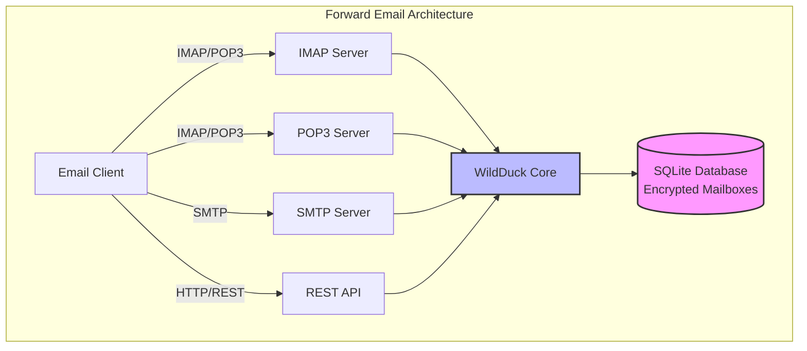

---


## So Sánh Dịch Vụ Email - Hỗ Trợ Giao Thức & Tuân Thủ Tiêu Chuẩn RFC {#email-service-comparison---protocol-support--rfc-standards-compliance}

> \[!IMPORTANT]
> **Mã Hóa Kháng Lượng Tử và Được Cách Ly:** Forward Email là dịch vụ email duy nhất lưu trữ các hộp thư SQLite được mã hóa riêng biệt bằng mật khẩu của bạn (chỉ bạn mới có). Mỗi hộp thư được mã hóa bằng [sqleet](https://github.com/resilar/sqleet) (ChaCha20-Poly1305), tự chứa, được cách ly và có thể di động. Nếu bạn quên mật khẩu, bạn sẽ mất hộp thư - ngay cả Forward Email cũng không thể khôi phục. Xem [Quantum-Safe Encrypted Email](https://forwardemail.net/en/blog/docs/best-quantum-safe-encrypted-email-service) để biết chi tiết.

So sánh hỗ trợ giao thức email và việc triển khai tiêu chuẩn RFC giữa các nhà cung cấp email lớn:

| Tính Năng                     | Forward Email                                                                                  | Postfix/Dovecot                                                                    | Gmail                                                                             | iCloud Mail                                           | Outlook.com                                                                                                                                                          | Fastmail                                                                                 | Yahoo/AOL (Verizon)                                                  | ProtonMail                                                                     | Tutanota                                                          |
| ----------------------------- | ---------------------------------------------------------------------------------------------- | ---------------------------------------------------------------------------------- | --------------------------------------------------------------------------------- | ----------------------------------------------------- | -------------------------------------------------------------------------------------------------------------------------------------------------------------------- | ---------------------------------------------------------------------------------------- | -------------------------------------------------------------------- | ------------------------------------------------------------------------------ | ----------------------------------------------------------------- |
| **Giá Tên Miền Tùy Chỉnh**    | [Miễn phí](https://forwardemail.net/en/pricing)                                               | [Miễn phí](https://www.postfix.org/)                                              | [$7.20/tháng](https://workspace.google.com/pricing)                              | [$0.99/tháng](https://support.apple.com/en-us/102622) | [$7.20/tháng](https://www.microsoft.com/en-us/microsoft-365/business/microsoft-365-business-basic)                                                                      | [$5/tháng](https://www.fastmail.com/pricing/)                                            | [$3.19/tháng](https://www.turbify.com/mail)                          | [$4.99/tháng](https://proton.me/mail/pricing)                                  | [$3.27/tháng](https://tuta.com/pricing)                            |
| **IMAP4rev1 (RFC 3501)**      | ✅ [Hỗ trợ](#imap4-email-protocol-and-extensions)                                             | ✅ [Hỗ trợ](https://www.dovecot.org/)                                             | ✅ [Hỗ trợ](https://developers.google.com/workspace/gmail/imap/imap-extensions)   | ✅ [Hỗ trợ](https://support.apple.com/en-us/102431)   | ✅ [Hỗ trợ](https://support.microsoft.com/en-us/office/pop-imap-and-smtp-settings-for-outlook-com-d088b986-291d-42b8-9564-9c414e2aa040)                            | ✅ [Hỗ trợ](https://www.fastmail.help/hc/en-us/articles/1500000278382-Email-standards)  | ✅ [Hỗ trợ](https://senders.yahooinc.com/developer/documentation/)    | ⚠️ [Qua Bridge](https://proton.me/support/imap-smtp-and-pop3-setup)             | ❌ Không Hỗ Trợ                                                  |
| **IMAP4rev2 (RFC 9051)**      | ⚠️ [Một phần](https://forwardemail.net/en/blog/docs/best-quantum-safe-encrypted-email-service) | ⚠️ [Một phần](https://www.dovecot.org/)                                          | ⚠️ [31%](https://developers.google.com/workspace/gmail/imap/imap-extensions)     | ⚠️ [92%](https://support.apple.com/en-us/102431)     | ⚠️ [46%](https://support.microsoft.com/en-us/office/pop-imap-and-smtp-settings-for-outlook-com-d088b986-291d-42b8-9564-9c414e2aa040)                                 | ⚠️ [69%](https://www.fastmail.help/hc/en-us/articles/1500000278382-Email-standards)   | ⚠️ [85%](https://senders.yahooinc.com/developer/documentation/)       | ⚠️ [Qua Bridge](https://proton.me/support/imap-smtp-and-pop3-setup)             | ❌ Không Hỗ Trợ                                                  |
| **POP3 (RFC 1939)**           | ✅ [Hỗ trợ](#pop3-email-protocol-and-extensions)                                              | ✅ [Hỗ trợ](https://www.dovecot.org/)                                             | ✅ [Hỗ trợ](https://support.google.com/mail/answer/7104828)                      | ❌ Không Hỗ Trợ                                      | ✅ [Hỗ trợ](https://support.microsoft.com/en-us/office/pop-imap-and-smtp-settings-for-outlook-com-d088b986-291d-42b8-9564-9c414e2aa040)                            | ✅ [Hỗ trợ](https://www.fastmail.help/hc/en-us/articles/1500000278382-Email-standards)  | ✅ [Hỗ trợ](https://help.yahoo.com/kb/SLN4075.html)                   | ⚠️ [Qua Bridge](https://proton.me/support/imap-smtp-and-pop3-setup)             | ❌ Không Hỗ Trợ                                                  |
| **SMTP (RFC 5321)**           | ✅ [Hỗ trợ](#smtp-email-protocol-and-extensions)                                              | ✅ [Hỗ trợ](https://www.postfix.org/)                                             | ✅ [Hỗ trợ](https://support.google.com/mail/answer/7126229)                      | ✅ [Hỗ trợ](https://support.apple.com/en-us/102431)   | ✅ [Hỗ trợ](https://support.microsoft.com/en-us/office/pop-imap-and-smtp-settings-for-outlook-com-d088b986-291d-42b8-9564-9c414e2aa040)                            | ✅ [Hỗ trợ](https://www.fastmail.help/hc/en-us/articles/1500000278382-Email-standards)  | ✅ [Hỗ trợ](https://help.yahoo.com/kb/SLN4075.html)                   | ⚠️ [Qua Bridge](https://proton.me/support/imap-smtp-and-pop3-setup)             | ❌ Không Hỗ Trợ                                                  |
| **JMAP (RFC 8620)**           | ❌ [Không Hỗ Trợ](#jmap-email-protocol)                                                       | ❌ Không Hỗ Trợ                                                                   | ❌ Không Hỗ Trợ                                                                    | ❌ Không Hỗ Trợ                                      | ❌ Không Hỗ Trợ                                                                                                                                                      | ✅ [Hỗ trợ](https://www.fastmail.com/dev/)                                            | ❌ Không Hỗ Trợ                                                     | ❌ Không Hỗ Trợ                                                               | ❌ Không Hỗ Trợ                                                  |
| **DKIM (RFC 6376)**           | ✅ [Hỗ trợ](#email-message-authentication-protocols)                                        | ✅ [Hỗ trợ](https://github.com/trusteddomainproject/OpenDKIM)                     | ✅ [Hỗ trợ](https://support.google.com/a/answer/174124)                          | ✅ [Hỗ trợ](https://support.apple.com/en-us/102431)   | ✅ [Hỗ trợ](https://learn.microsoft.com/en-us/defender-office-365/email-authentication-dkim-configure)                                                             | ✅ [Hỗ trợ](https://www.fastmail.help/hc/en-us/articles/360060590573)                 | ✅ [Hỗ trợ](https://help.yahoo.com/kb/SLN25426.html)                  | ✅ [Hỗ trợ](https://proton.me/support)                                      | ✅ [Hỗ trợ](https://tuta.com/support#dkim)                         |
| **SPF (RFC 7208)**            | ✅ [Hỗ trợ](#email-message-authentication-protocols)                                        | ✅ [Hỗ trợ](https://www.postfix.org/)                                             | ✅ [Hỗ trợ](https://support.google.com/a/answer/33786)                           | ✅ [Hỗ trợ](https://support.apple.com/en-us/102431)   | ✅ [Hỗ trợ](https://learn.microsoft.com/en-us/microsoft-365/security/office-365-security/how-office-365-uses-spf-to-prevent-spoofing)                              | ✅ [Hỗ trợ](https://www.fastmail.help/hc/en-us/articles/360060590573)                 | ✅ [Hỗ trợ](https://help.yahoo.com/kb/SLN25426.html)                  | ✅ [Hỗ trợ](https://proton.me/support)                                      | ✅ [Hỗ trợ](https://tuta.com/support#dkim)                         |
| **DMARC (RFC 7489)**          | ✅ [Hỗ trợ](#email-message-authentication-protocols)                                        | ✅ [Hỗ trợ](https://www.postfix.org/)                                             | ✅ [Hỗ trợ](https://support.google.com/a/answer/2466580)                         | ✅ [Hỗ trợ](https://support.apple.com/en-us/102431)   | ✅ [Hỗ trợ](https://learn.microsoft.com/en-us/microsoft-365/security/office-365-security/use-dmarc-to-validate-email)                                              | ✅ [Hỗ trợ](https://www.fastmail.help/hc/en-us/articles/360060590573)                 | ✅ [Hỗ trợ](https://help.yahoo.com/kb/SLN25426.html)                  | ✅ [Hỗ trợ](https://proton.me/support)                                      | ✅ [Hỗ trợ](https://tuta.com/support#dkim)                         |
| **ARC (RFC 8617)**            | ✅ [Hỗ trợ](#email-message-authentication-protocols)                                        | ✅ [Hỗ trợ](https://github.com/trusteddomainproject/OpenARC)                      | ✅ [Hỗ trợ](https://support.google.com/a/answer/2466580)                         | ❌ Không Hỗ Trợ                                      | ✅ [Hỗ trợ](https://learn.microsoft.com/en-us/defender-office-365/email-authentication-arc-configure)                                                              | ✅ [Hỗ trợ](https://www.fastmail.help/hc/en-us/articles/360060590573)                 | ✅ [Hỗ trợ](https://senders.yahooinc.com/developer/documentation/)    | ✅ [Hỗ trợ](https://proton.me/blog/what-is-authenticated-received-chain-arc) | ❌ Không Hỗ Trợ                                                  |
| **MTA-STS (RFC 8461)**        | ✅ [Hỗ trợ](#email-transport-security-protocols)                                            | ✅ [Hỗ trợ](https://www.postfix.org/)                                             | ✅ [Hỗ trợ](https://support.google.com/a/answer/9261504)                         | ✅ [Hỗ trợ](https://support.apple.com/en-us/102431)   | ✅ [Hỗ trợ](https://learn.microsoft.com/en-us/defender-office-365/email-authentication-about)                                                                      | ✅ [Hỗ trợ](https://www.fastmail.help/hc/en-us/articles/360060590573)                 | ✅ [Hỗ trợ](https://senders.yahooinc.com/developer/documentation/)    | ✅ [Hỗ trợ](https://proton.me/support)                                      | ✅ [Hỗ trợ](https://tuta.com/security)                            |
| **DANE (RFC 7671)**           | ✅ [Hỗ trợ](#email-transport-security-protocols)                                            | ✅ [Hỗ trợ](https://www.postfix.org/)                                             | ❌ Không Hỗ Trợ                                                                    | ❌ Không Hỗ Trợ                                      | ❌ Không Hỗ Trợ                                                                                                                                                      | ❌ Không Hỗ Trợ                                                                         | ❌ Không Hỗ Trợ                                                     | ✅ [Hỗ trợ](https://proton.me/support)                                      | ✅ [Hỗ trợ](https://tuta.com/support#dane)                         |
| **DSN (RFC 3461)**            | ✅ [Hỗ trợ](#smtp-email-protocol-and-extensions)                                            | ✅ [Hỗ trợ](https://www.postfix.org/DSN_README.html)                              | ❌ Không Hỗ Trợ                                                                    | ✅ [Hỗ trợ](#protocol-capability-tests)                 | ✅ [Hỗ trợ](#protocol-capability-tests)                                                                                                                            | ⚠️ [Không rõ](https://www.fastmail.help/hc/en-us/articles/1500000278382-Email-standards) | ❌ Không Hỗ Trợ                                                     | ⚠️ [Qua Bridge](https://proton.me/support/imap-smtp-and-pop3-setup)             | ❌ Không Hỗ Trợ                                                  |
| **REQUIRETLS (RFC 8689)**     | ✅ [Hỗ trợ](#email-transport-security-protocols)                                            | ✅ [Hỗ trợ](https://www.postfix.org/TLS_README.html#server_require_tls)           | ⚠️ Không rõ                                                                       | ⚠️ Không rõ                                         | ⚠️ Không rõ                                                                                                                                                           | ⚠️ Không rõ                                                                            | ⚠️ Không rõ                                                        | ⚠️ [Qua Bridge](https://proton.me/support/imap-smtp-and-pop3-setup)             | ❌ Không Hỗ Trợ                                                  |
| **ManageSieve (RFC 5804)**    | ✅ [Hỗ trợ](#managesieve-rfc-5804)                                                          | ✅ [Hỗ trợ](https://doc.dovecot.org/admin_manual/pigeonhole_managesieve_server/)  | ❌ Không Hỗ Trợ                                                                    | ❌ Không Hỗ Trợ                                      | ❌ Không Hỗ Trợ                                                                                                                                                      | ✅ [Hỗ trợ](https://www.fastmail.help/hc/en-us/articles/360060590573)                 | ❌ Không Hỗ Trợ                                                     | ❌ Không Hỗ Trợ                                                               | ❌ Không Hỗ Trợ                                                  |
| **OpenPGP (RFC 9580)**        | ✅ [Hỗ trợ](#email-message-encryption)                                                      | ⚠️ [Qua Plugins](https://www.gnupg.org/)                                         | ⚠️ [Bên thứ ba](https://github.com/google/end-to-end)                            | ⚠️ [Bên thứ ba](https://gpgtools.org/)                | ⚠️ [Bên thứ ba](https://gpg4win.org/)                                                                                                                               | ⚠️ [Bên thứ ba](https://www.fastmail.help/hc/en-us/articles/360060590573)              | ⚠️ [Bên thứ ba](https://help.yahoo.com/kb/SLN25426.html)             | ✅ [Bản địa](https://proton.me/support/pgp-mime-pgp-inline)                     | ❌ Không Hỗ Trợ                                                  |
| **S/MIME (RFC 8551)**         | ✅ [Hỗ trợ](#email-message-encryption)                                                      | ✅ [Hỗ trợ](https://www.openssl.org/)                                            | ✅ [Hỗ trợ](https://support.google.com/mail/answer/81126)                        | ✅ [Hỗ trợ](https://support.apple.com/en-us/102431)   | ✅ [Hỗ trợ](https://support.microsoft.com/en-us/office/send-view-and-reply-to-encrypted-messages-in-outlook-for-pc-eaa43495-9bbb-4fca-922a-df90dee51980)           | ⚠️ [Một phần](https://www.fastmail.help/hc/en-us/articles/360060590573)                | ❌ Không Hỗ Trợ                                                     | ✅ [Hỗ trợ](https://proton.me/support/pgp-mime-pgp-inline)                    | ❌ Không Hỗ Trợ                                                  |
| **CalDAV (RFC 4791)**         | ✅ [Hỗ trợ](#calendaring-and-contacts-protocols)                                            | ✅ [Hỗ trợ](https://www.davical.org/)                                             | ✅ [Hỗ trợ](https://developers.google.com/calendar/caldav/v2/guide)              | ✅ [Hỗ trợ](https://support.apple.com/en-us/102431)   | ❌ Không Hỗ Trợ                                                                                                                                                      | ✅ [Hỗ trợ](https://www.fastmail.help/hc/en-us/articles/360060590573)                 | ❌ Không Hỗ Trợ                                                     | ✅ [Qua Bridge](https://proton.me/support/proton-calendar)                     | ❌ Không Hỗ Trợ                                                  |
| **CardDAV (RFC 6352)**        | ✅ [Hỗ trợ](#calendaring-and-contacts-protocols)                                            | ✅ [Hỗ trợ](https://www.davical.org/)                                             | ✅ [Hỗ trợ](https://developers.google.com/people/carddav)                        | ✅ [Hỗ trợ](https://support.apple.com/en-us/102431)   | ❌ Không Hỗ Trợ                                                                                                                                                      | ✅ [Hỗ trợ](https://www.fastmail.help/hc/en-us/articles/360060590573)                 | ❌ Không Hỗ Trợ                                                     | ✅ [Qua Bridge](https://proton.me/support/proton-contacts)                     | ❌ Không Hỗ Trợ                                                  |
| **Tasks (VTODO)**             | ✅ [Hỗ trợ](#tasks-and-reminders-caldav-vtodo)                                              | ✅ [Hỗ trợ](https://www.davical.org/)                                             | ❌ Không Hỗ Trợ                                                                    | ✅ [Hỗ trợ](https://support.apple.com/en-us/102431)   | ❌ Không Hỗ Trợ                                                                                                                                                      | ✅ [Hỗ trợ](https://www.fastmail.help/hc/en-us/articles/360060590573)                 | ❌ Không Hỗ Trợ                                                     | ❌ Không Hỗ Trợ                                                               | ❌ Không Hỗ Trợ                                                  |
| **Sieve (RFC 5228)**          | ✅ [Hỗ trợ](#sieve-rfc-5228)                                                                | ✅ [Hỗ trợ](https://www.dovecot.org/)                                             | ❌ Không Hỗ Trợ                                                                    | ❌ Không Hỗ Trợ                                      | ❌ Không Hỗ Trợ                                                                                                                                                      | ✅ [Hỗ trợ](https://www.fastmail.help/hc/en-us/articles/360060590573)                 | ❌ Không Hỗ Trợ                                                     | ❌ Không Hỗ Trợ                                                               | ❌ Không Hỗ Trợ                                                  |
| **Catch-All**                 | ✅ [Hỗ trợ](https://forwardemail.net/en/faq#can-i-have-multiple-global-catch-all-recipients) | ✅ Hỗ trợ                                                                         | ✅ [Hỗ trợ](https://support.google.com/a/answer/4524505)                         | ❌ Không Hỗ Trợ                                      | ❌ [Không Hỗ Trợ](https://learn.microsoft.com/en-us/exchange/recipients-in-exchange-online/manage-mail-users)                                                        | ✅ [Hỗ trợ](https://www.fastmail.help/hc/en-us/articles/1500000278382-Email-standards) | ❌ Không Hỗ Trợ                                                     | ❌ Không Hỗ Trợ                                                               | ✅ [Hỗ trợ](https://tuta.com/support#catch-all-alias)            |
| **Alias Không Giới Hạn**     | ✅ [Hỗ trợ](https://forwardemail.net/en/faq#advanced-features)                              | ✅ Hỗ trợ                                                                         | ✅ [Hỗ trợ](https://support.google.com/a/answer/33327)                           | ✅ [Hỗ trợ](https://support.apple.com/en-us/102431)   | ✅ [Hỗ trợ](https://support.microsoft.com/en-us/office/add-or-remove-an-email-alias-in-outlook-com-459b1989-356d-40fa-a689-8f285b13f1f2)                           | ✅ [Hỗ trợ](https://www.fastmail.help/hc/en-us/articles/1500000278382-Email-standards) | ❌ Không Hỗ Trợ                                                     | ✅ [Hỗ trợ](https://proton.me/support/addresses-and-aliases)                | ✅ [Hỗ trợ](https://tuta.com/support#aliases)                    |
| **Xác Thực Hai Yếu Tố**      | ✅ [Hỗ trợ](https://forwardemail.net/en/faq#do-you-support-passkeys-and-webauthn)             | ✅ Hỗ trợ                                                                         | ✅ [Hỗ trợ](https://support.google.com/accounts/answer/185839)                   | ✅ [Hỗ trợ](https://support.apple.com/en-us/102431)   | ✅ [Hỗ trợ](https://support.microsoft.com/en-us/account-billing/how-to-use-two-step-verification-with-your-microsoft-account-c7910146-672f-01e9-50a0-93b4585e7eb4) | ✅ [Hỗ trợ](https://www.fastmail.help/hc/en-us/articles/1500000278382-Email-standards) | ✅ [Hỗ trợ](https://help.yahoo.com/kb/SLN5013.html)                 | ✅ [Hỗ trợ](https://proton.me/support/two-factor-authentication-2fa)        | ✅ [Hỗ trợ](https://tuta.com/support#two-factor-authentication)  |
| **Thông Báo Đẩy**             | ✅ [Hỗ trợ](#ios-push-notifications)                                                        | ⚠️ Qua Plugins                                                                    | ✅ [Hỗ trợ](https://developers.google.com/gmail/api/guides/push)                 | ✅ [Hỗ trợ](https://support.apple.com/en-us/102431)   | ✅ [Hỗ trợ](https://learn.microsoft.com/en-us/graph/change-notifications-delivery-webhooks)                                                                        | ✅ [Hỗ trợ](https://www.fastmail.help/hc/en-us/articles/1500000278382-Email-standards) | ❌ Không Hỗ Trợ                                                     | ✅ [Hỗ trợ](https://proton.me/support/notifications)                        | ✅ [Hỗ trợ](https://tuta.com/support#push-notifications)         |
| **Lịch/ Danh Bạ Trên Máy Tính** | ✅ [Hỗ trợ](#calendaring-and-contacts-protocols)                                         | ✅ Hỗ trợ                                                                         | ✅ [Hỗ trợ](https://support.google.com/calendar)                                 | ✅ [Hỗ trợ](https://support.apple.com/en-us/102431)   | ✅ [Hỗ trợ](https://support.microsoft.com/en-us/office/calendar-and-contacts-in-outlook-com-d3e8a6e6-5c1f-4e3e-9f1e-7c0f0e0c0c0c)                                  | ✅ [Hỗ trợ](https://www.fastmail.help/hc/en-us/articles/1500000278382-Email-standards) | ❌ Không Hỗ Trợ                                                     | ✅ [Hỗ trợ](https://proton.me/support/proton-calendar)                      | ❌ Không Hỗ Trợ                                                  |
| **Tìm Kiếm Nâng Cao**         | ✅ [Hỗ trợ](https://forwardemail.net/en/email-api)                                          | ✅ Hỗ trợ                                                                         | ✅ [Hỗ trợ](https://support.google.com/mail/answer/7190)                         | ✅ [Hỗ trợ](https://support.apple.com/en-us/102431)   | ✅ [Hỗ trợ](https://support.microsoft.com/en-us/office/search-for-email-messages-in-outlook-com-6f5f2e92-9d5e-4c4e-9b0e-0c0c0c0c0c0c)                              | ✅ [Hỗ trợ](https://www.fastmail.help/hc/en-us/articles/1500000278382-Email-standards) | ✅ [Hỗ trợ](https://help.yahoo.com/kb/SLN3561.html)                 | ✅ [Hỗ trợ](https://proton.me/support/search-and-filters)                   | ✅ [Hỗ trợ](https://tuta.com/support)                            |
| **API/ Tích Hợp**             | ✅ [39 Endpoints](https://forwardemail.net/en/email-api)                                   | ✅ Hỗ trợ                                                                         | ✅ [Hỗ trợ](https://developers.google.com/gmail/api)                             | ❌ Không Hỗ Trợ                                      | ✅ [Hỗ trợ](https://learn.microsoft.com/en-us/graph/api/resources/mail-api-overview)                                                                               | ✅ [Hỗ trợ](https://www.fastmail.help/hc/en-us/articles/1500000278382-Email-standards) | ❌ Không Hỗ Trợ                                                     | ✅ [Hỗ trợ](https://proton.me/support/proton-mail-api)                      | ❌ Không Hỗ Trợ                                                  |
### Hiển Thị Hỗ Trợ Giao Thức {#protocol-support-visualization}

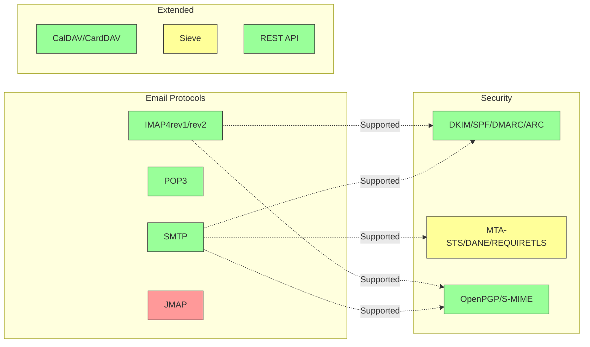

---


## Giao Thức Email Cốt Lõi {#core-email-protocols}

### Luồng Giao Thức Email {#email-protocol-flow}

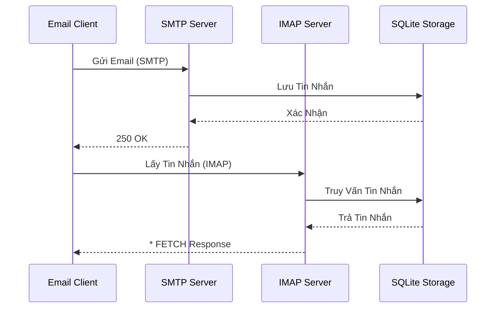


## Giao Thức Email IMAP4 và Các Mở Rộng {#imap4-email-protocol-and-extensions}

> \[!NOTE]
> Forward Email hỗ trợ IMAP4rev1 (RFC 3501) với hỗ trợ một phần cho các tính năng IMAP4rev2 (RFC 9051).

Forward Email cung cấp hỗ trợ IMAP4 mạnh mẽ thông qua việc triển khai máy chủ thư WildDuck. Máy chủ này thực thi IMAP4rev1 (RFC 3501) với hỗ trợ một phần cho các mở rộng IMAP4rev2 (RFC 9051).

Chức năng IMAP của Forward Email được cung cấp bởi phụ thuộc [WildDuck](https://github.com/nodemailer/wildduck). Các RFC email sau được hỗ trợ:

| RFC                                                       | Tiêu đề                                                          | Ghi chú Triển khai                                   |
| --------------------------------------------------------- | ---------------------------------------------------------------- | --------------------------------------------------- |
| [RFC 3501](https://datatracker.ietf.org/doc/html/rfc3501) | Internet Message Access Protocol (IMAP) - Phiên bản 4rev1        | Hỗ trợ đầy đủ với các khác biệt có chủ ý (xem bên dưới) |
| [RFC 2177](https://datatracker.ietf.org/doc/html/rfc2177) | Lệnh IMAP4 IDLE                                                 | Thông báo theo kiểu đẩy                             |
| [RFC 2342](https://datatracker.ietf.org/doc/html/rfc2342) | Không gian tên IMAP4                                            | Hỗ trợ không gian tên hộp thư                       |
| [RFC 2087](https://datatracker.ietf.org/doc/html/rfc2087) | Mở rộng IMAP4 QUOTA                                            | Quản lý hạn mức lưu trữ                             |
| [RFC 2971](https://datatracker.ietf.org/doc/html/rfc2971) | Mở rộng IMAP4 ID                                              | Xác định máy khách/máy chủ                          |
| [RFC 5161](https://datatracker.ietf.org/doc/html/rfc5161) | Mở rộng IMAP4 ENABLE                                         | Kích hoạt các mở rộng IMAP                          |
| [RFC 4959](https://datatracker.ietf.org/doc/html/rfc4959) | Mở rộng IMAP cho Phản hồi Khởi đầu Máy khách SASL (SASL-IR)     | Phản hồi khởi đầu của máy khách                      |
| [RFC 3691](https://datatracker.ietf.org/doc/html/rfc3691) | Lệnh IMAP4 UNSELECT                                           | Đóng hộp thư mà không EXPUNGE                       |
| [RFC 4315](https://datatracker.ietf.org/doc/html/rfc4315) | Mở rộng IMAP UIDPLUS                                         | Các lệnh UID nâng cao                               |
| [RFC 7162](https://datatracker.ietf.org/doc/html/rfc7162) | Mở rộng IMAP: Đồng bộ lại Thay đổi Cờ Nhanh (CONDSTORE)          | STORE có điều kiện                                  |
| [RFC 6154](https://datatracker.ietf.org/doc/html/rfc6154) | Mở rộng IMAP LIST cho Hộp Thư Sử Dụng Đặc Biệt                   | Thuộc tính hộp thư đặc biệt                         |
| [RFC 6851](https://datatracker.ietf.org/doc/html/rfc6851) | Mở rộng IMAP MOVE                                            | Lệnh MOVE nguyên tử                                 |
| [RFC 6855](https://datatracker.ietf.org/doc/html/rfc6855) | Hỗ trợ IMAP cho UTF-8                                         | Hỗ trợ UTF-8                                       |
| [RFC 3348](https://datatracker.ietf.org/doc/html/rfc3348) | Mở rộng IMAP4 Child Mailbox                                  | Thông tin hộp thư con                              |
| [RFC 7889](https://datatracker.ietf.org/doc/html/rfc7889) | Mở rộng IMAP4 cho Quảng Cáo Kích Thước Tải Lên Tối Đa (APPENDLIMIT) | Kích thước tải lên tối đa                           |
**Các phần mở rộng IMAP được hỗ trợ:**

| Extension         | RFC          | Trạng thái  | Mô tả                          |
| ----------------- | ------------ | ----------- | ------------------------------- |
| IDLE              | RFC 2177     | ✅ Được hỗ trợ | Thông báo theo kiểu đẩy          |
| NAMESPACE         | RFC 2342     | ✅ Được hỗ trợ | Hỗ trợ không gian tên hộp thư    |
| QUOTA             | RFC 2087     | ✅ Được hỗ trợ | Quản lý hạn mức lưu trữ          |
| ID                | RFC 2971     | ✅ Được hỗ trợ | Xác định máy khách/máy chủ       |
| ENABLE            | RFC 5161     | ✅ Được hỗ trợ | Kích hoạt các phần mở rộng IMAP  |
| SASL-IR           | RFC 4959     | ✅ Được hỗ trợ | Phản hồi ban đầu của máy khách   |
| UNSELECT          | RFC 3691     | ✅ Được hỗ trợ | Đóng hộp thư mà không EXPUNGE   |
| UIDPLUS           | RFC 4315     | ✅ Được hỗ trợ | Các lệnh UID nâng cao            |
| CONDSTORE         | RFC 7162     | ✅ Được hỗ trợ | STORE có điều kiện               |
| SPECIAL-USE       | RFC 6154     | ✅ Được hỗ trợ | Thuộc tính đặc biệt của hộp thư  |
| MOVE              | RFC 6851     | ✅ Được hỗ trợ | Lệnh MOVE nguyên tử              |
| UTF8=ACCEPT       | RFC 6855     | ✅ Được hỗ trợ | Hỗ trợ UTF-8                    |
| CHILDREN          | RFC 3348     | ✅ Được hỗ trợ | Thông tin hộp thư con            |
| APPENDLIMIT       | RFC 7889     | ✅ Được hỗ trợ | Kích thước tải lên tối đa        |
| XLIST             | Phi tiêu chuẩn | ✅ Được hỗ trợ | Liệt kê thư mục tương thích Gmail |
| XAPPLEPUSHSERVICE | Phi tiêu chuẩn | ✅ Được hỗ trợ | Dịch vụ Thông báo Đẩy của Apple  |

### Sự khác biệt giao thức IMAP so với các đặc tả RFC {#imap-protocol-differences-from-rfc-specifications}

> \[!WARNING]
> Các khác biệt sau so với đặc tả RFC có thể ảnh hưởng đến khả năng tương thích của máy khách.

Forward Email cố ý khác biệt so với một số đặc tả IMAP RFC. Những khác biệt này kế thừa từ WildDuck và được ghi lại dưới đây:

* **Không có cờ \Recent:** Cờ `\Recent` không được triển khai. Tất cả các tin nhắn được trả về mà không có cờ này.
* **RENAME không ảnh hưởng đến thư mục con:** Khi đổi tên một thư mục, các thư mục con không tự động đổi tên. Cấu trúc thư mục phẳng trong cơ sở dữ liệu.
* **INBOX không thể đổi tên:** [RFC 3501](https://datatracker.ietf.org/doc/html/rfc3501) cho phép đổi tên INBOX, nhưng Forward Email rõ ràng cấm điều này. Xem [mã nguồn WildDuck](https://github.com/nodemailer/wildduck/blob/master/imap-core/lib/commands/rename.js#L27).
* **Không có phản hồi FLAGS không yêu cầu:** Khi cờ thay đổi, không gửi phản hồi FLAGS không yêu cầu đến máy khách.
* **STORE trả về NO cho tin nhắn đã xóa:** Cố gắng sửa đổi cờ trên tin nhắn đã xóa trả về NO thay vì bỏ qua im lặng.
* **CHARSET bị bỏ qua trong SEARCH:** Tham số `CHARSET` trong lệnh SEARCH bị bỏ qua. Tất cả tìm kiếm sử dụng UTF-8.
* **Metadata MODSEQ bị bỏ qua:** Metadata `MODSEQ` trong lệnh STORE bị bỏ qua.
* **SEARCH TEXT và SEARCH BODY:** Forward Email sử dụng [SQLite FTS5](https://www.sqlite.org/fts5.html) (Tìm kiếm toàn văn bản) thay vì tìm kiếm `$text` của MongoDB. Điều này cung cấp:
  * Hỗ trợ toán tử `NOT` (MongoDB không hỗ trợ)
  * Kết quả tìm kiếm được xếp hạng
  * Hiệu suất tìm kiếm dưới 100ms trên các hộp thư lớn
* **Hành vi tự động expunge:** Tin nhắn đánh dấu `\Deleted` sẽ tự động bị expunge khi đóng hộp thư.
* **Độ trung thực của tin nhắn:** Một số sửa đổi tin nhắn có thể không giữ nguyên cấu trúc tin nhắn gốc chính xác.

**Hỗ trợ một phần IMAP4rev2:**

Forward Email triển khai IMAP4rev1 (RFC 3501) với hỗ trợ một phần IMAP4rev2 (RFC 9051). Các tính năng IMAP4rev2 sau đây **chưa được hỗ trợ**:

* **LIST-STATUS** - Kết hợp lệnh LIST và STATUS
* **LITERAL-** - Literal không đồng bộ (biến thể trừ)
* **OBJECTID** - Định danh đối tượng duy nhất
* **SAVEDATE** - Thuộc tính ngày lưu
* **REPLACE** - Thay thế tin nhắn nguyên tử
* **UNAUTHENTICATE** - Đóng xác thực mà không đóng kết nối

**Xử lý cấu trúc thân thư thư giãn:**

Forward Email sử dụng xử lý "thân thư thư giãn" cho các cấu trúc MIME bị lỗi, có thể khác với cách hiểu nghiêm ngặt theo RFC. Điều này cải thiện khả năng tương thích với các email thực tế không hoàn toàn tuân thủ tiêu chuẩn.
**Phần mở rộng METADATA (RFC 5464):**

Phần mở rộng METADATA của IMAP **không được hỗ trợ**. Để biết thêm thông tin về phần mở rộng này, xem [RFC 5464](https://datatracker.ietf.org/doc/html/rfc5464). Thảo luận về việc thêm tính năng này có thể được tìm thấy trong [WildDuck Issue #937](https://github.com/zone-eu/wildduck/issues/937).

### Các phần mở rộng IMAP KHÔNG được hỗ trợ {#imap-extensions-not-supported}

Các phần mở rộng IMAP sau từ [IANA IMAP Capabilities Registry](https://www.iana.org/assignments/imap-capabilities/imap-capabilities.xhtml) KHÔNG được hỗ trợ:

| RFC                                                       | Tiêu đề                                                                                                         | Lý do                                                                                                                                  |
| --------------------------------------------------------- | --------------------------------------------------------------------------------------------------------------- | --------------------------------------------------------------------------------------------------------------------------------------- |
| [RFC 2086](https://datatracker.ietf.org/doc/html/rfc2086) | Phần mở rộng ACL của IMAP4                                                                                       | Thư mục chia sẻ chưa được triển khai. Xem [WildDuck Issue #427](https://github.com/zone-eu/wildduck/issues/427)                        |
| [RFC 5256](https://datatracker.ietf.org/doc/html/rfc5256) | Phần mở rộng IMAP SORT và THREAD                                                                                 | Tính năng threading được triển khai nội bộ nhưng không qua giao thức RFC 5256. Xem [WildDuck Issue #12](https://github.com/zone-eu/wildduck/issues/12) |
| [RFC 5162](https://datatracker.ietf.org/doc/html/rfc5162) | Phần mở rộng IMAP4 cho Đồng bộ lại Hộp thư Nhanh (QRESYNC)                                                       | Chưa được triển khai                                                                                                                   |
| [RFC 5464](https://datatracker.ietf.org/doc/html/rfc5464) | Phần mở rộng METADATA của IMAP                                                                                   | Các thao tác metadata bị bỏ qua. Xem [tài liệu WildDuck](https://datatracker.ietf.org/doc/html/rfc5464)                                 |
| [RFC 5258](https://datatracker.ietf.org/doc/html/rfc5258) | Phần mở rộng Lệnh LIST của IMAP4                                                                                 | Chưa được triển khai                                                                                                                   |
| [RFC 5267](https://datatracker.ietf.org/doc/html/rfc5267) | Ngữ cảnh cho IMAP4                                                                                               | Chưa được triển khai                                                                                                                   |
| [RFC 5465](https://datatracker.ietf.org/doc/html/rfc5465) | Phần mở rộng NOTIFY của IMAP                                                                                      | Chưa được triển khai                                                                                                                   |
| [RFC 5466](https://datatracker.ietf.org/doc/html/rfc5466) | Phần mở rộng FILTERS của IMAP4                                                                                    | Chưa được triển khai                                                                                                                   |
| [RFC 6203](https://datatracker.ietf.org/doc/html/rfc6203) | Phần mở rộng IMAP4 cho Tìm kiếm Mờ                                                                               | Chưa được triển khai                                                                                                                   |
| [RFC 6785](https://datatracker.ietf.org/doc/html/rfc6785) | Khuyến nghị Triển khai IMAP4                                                                                      | Các khuyến nghị chưa được tuân thủ đầy đủ                                                                                             |
| [RFC 7162](https://datatracker.ietf.org/doc/html/rfc7162) | Các phần mở rộng IMAP: Đồng bộ lại Thay đổi Cờ Nhanh (CONDSTORE) và Đồng bộ lại Hộp thư Nhanh (QRESYNC)            | Chưa được triển khai                                                                                                                   |
| [RFC 8437](https://datatracker.ietf.org/doc/html/rfc8437) | Phần mở rộng UNAUTHENTICATE của IMAP cho Tái sử dụng Kết nối                                                     | Chưa được triển khai                                                                                                                   |
| [RFC 8438](https://datatracker.ietf.org/doc/html/rfc8438) | Phần mở rộng IMAP cho STATUS=SIZE                                                                                 | Chưa được triển khai                                                                                                                   |
| [RFC 8457](https://datatracker.ietf.org/doc/html/rfc8457) | Từ khóa "$Important" và Thuộc tính Sử dụng đặc biệt "\Important" của IMAP                                         | Chưa được triển khai                                                                                                                   |
| [RFC 8474](https://datatracker.ietf.org/doc/html/rfc8474) | Phần mở rộng IMAP cho Định danh Đối tượng                                                                         | Chưa được triển khai                                                                                                                   |
| [RFC 9051](https://datatracker.ietf.org/doc/html/rfc9051) | Giao thức Truy cập Thư điện tử Internet (IMAP) - Phiên bản 4rev2                                                 | Forward Email triển khai IMAP4rev1 ([RFC 3501](https://datatracker.ietf.org/doc/html/rfc3501))                                          |
## Giao Thức Email POP3 và Các Mở Rộng {#pop3-email-protocol-and-extensions}

> \[!NOTE]
> Forward Email hỗ trợ POP3 (RFC 1939) với các mở rộng tiêu chuẩn để truy xuất email.

Chức năng POP3 của Forward Email được cung cấp bởi thư viện [WildDuck](https://github.com/nodemailer/wildduck). Các RFC email sau được hỗ trợ:

| RFC                                                       | Tiêu đề                                | Ghi chú triển khai                                  |
| --------------------------------------------------------- | ------------------------------------- | -------------------------------------------------- |
| [RFC 1939](https://datatracker.ietf.org/doc/html/rfc1939) | Giao Thức Bưu Điện - Phiên bản 3 (POP3) | Hỗ trợ đầy đủ với các khác biệt có chủ ý (xem bên dưới) |
| [RFC 2595](https://datatracker.ietf.org/doc/html/rfc2595) | Sử dụng TLS với IMAP, POP3 và ACAP    | Hỗ trợ STARTTLS                                    |
| [RFC 2449](https://datatracker.ietf.org/doc/html/rfc2449) | Cơ chế Mở rộng POP3                    | Hỗ trợ lệnh CAPA                                   |

Forward Email cung cấp hỗ trợ POP3 cho các khách hàng ưa thích giao thức đơn giản này thay vì IMAP. POP3 lý tưởng cho người dùng muốn tải email về một thiết bị duy nhất và xóa chúng khỏi máy chủ.

**Các Mở Rộng POP3 Được Hỗ Trợ:**

| Mở rộng  | RFC      | Trạng thái   | Mô tả                      |
| -------- | -------- | ------------ | -------------------------- |
| TOP      | RFC 1939 | ✅ Hỗ trợ    | Lấy tiêu đề tin nhắn       |
| USER     | RFC 1939 | ✅ Hỗ trợ    | Xác thực tên người dùng    |
| UIDL     | RFC 1939 | ✅ Hỗ trợ    | Định danh tin nhắn duy nhất |
| EXPIRE   | RFC 2449 | ✅ Hỗ trợ    | Chính sách hết hạn tin nhắn |

### Khác Biệt Giao Thức POP3 So Với Đặc Tả RFC {#pop3-protocol-differences-from-rfc-specifications}

> \[!WARNING]
> POP3 có những hạn chế vốn có so với IMAP.

> \[!IMPORTANT]
> **Khác biệt quan trọng: Hành vi DELE của Forward Email so với WildDuck POP3**
>
> Forward Email thực hiện xóa vĩnh viễn theo chuẩn RFC cho lệnh POP3 `DELE`, khác với WildDuck là di chuyển tin nhắn vào Thùng rác.

**Hành vi của Forward Email** ([mã nguồn](https://github.com/forwardemail/forwardemail.net/blob/master/pop3-server.js)):

* `DELE` → `QUIT` xóa vĩnh viễn tin nhắn
* Tuân thủ chính xác đặc tả [RFC 1939](https://datatracker.ietf.org/doc/html/rfc1939)
* Giống với hành vi của Dovecot (mặc định), Postfix và các máy chủ tuân thủ chuẩn khác

**Hành vi của WildDuck** ([thảo luận](https://github.com/zone-eu/wildduck/issues/937)):

* `DELE` → `QUIT` di chuyển tin nhắn vào Thùng rác (giống Gmail)
* Quyết định thiết kế có chủ ý để bảo vệ người dùng
* Không tuân thủ RFC nhưng ngăn ngừa mất dữ liệu vô ý

**Tại sao Forward Email khác biệt:**

* **Tuân thủ RFC:** Theo đúng đặc tả [RFC 1939](https://datatracker.ietf.org/doc/html/rfc1939)
* **Kỳ vọng người dùng:** Quy trình tải về và xóa mong muốn xóa vĩnh viễn
* **Quản lý lưu trữ:** Giải phóng không gian đĩa đúng cách
* **Tương thích:** Phù hợp với các máy chủ tuân thủ RFC khác

> \[!NOTE]
> **Liệt kê tin nhắn POP3:** Forward Email liệt kê TẤT CẢ tin nhắn từ INBOX không giới hạn. Điều này khác với WildDuck giới hạn 250 tin nhắn mặc định. Xem [mã nguồn](https://github.com/forwardemail/forwardemail.net/blob/master/pop3-server.js).

**Truy cập Thiết Bị Đơn Lẻ:**

POP3 được thiết kế cho truy cập thiết bị đơn lẻ. Tin nhắn thường được tải về và xóa khỏi máy chủ, không phù hợp cho đồng bộ đa thiết bị.

**Không Hỗ Trợ Thư Mục:**

POP3 chỉ truy cập thư mục INBOX. Các thư mục khác (Đã gửi, Bản nháp, Thùng rác, v.v.) không thể truy cập qua POP3.

**Quản Lý Tin Nhắn Hạn Chế:**

POP3 chỉ cung cấp chức năng lấy và xóa tin nhắn cơ bản. Các tính năng nâng cao như đánh dấu, di chuyển hoặc tìm kiếm tin nhắn không có.

### Các Mở Rộng POP3 KHÔNG ĐƯỢC HỖ TRỢ {#pop3-extensions-not-supported}

Các mở rộng POP3 sau từ [IANA POP3 Extension Mechanism Registry](https://www.iana.org/assignments/pop3-extension-mechanism/pop3-extension-mechanism.xhtml) KHÔNG được hỗ trợ:
| RFC                                                       | Tiêu đề                                               | Lý do                                  |
| --------------------------------------------------------- | ----------------------------------------------------- | ------------------------------------- |
| [RFC 6856](https://datatracker.ietf.org/doc/html/rfc6856) | Hỗ trợ Phiên bản 3 của Giao thức Hộp thư (POP3) cho UTF-8 | Không được triển khai trong máy chủ WildDuck POP3 |
| [RFC 2595](https://datatracker.ietf.org/doc/html/rfc2595) | Lệnh STLS                                            | Chỉ hỗ trợ STARTTLS, không hỗ trợ STLS |
| [RFC 3206](https://datatracker.ietf.org/doc/html/rfc3206) | Mã phản hồi SYS và AUTH POP                          | Không được triển khai                 |

---


## Giao thức Email SMTP và các Tiện ích mở rộng {#smtp-email-protocol-and-extensions}

> \[!NOTE]
> Forward Email hỗ trợ SMTP (RFC 5321) với các tiện ích mở rộng hiện đại để gửi email an toàn và đáng tin cậy.

Chức năng SMTP của Forward Email được cung cấp bởi nhiều thành phần: [smtp-server](https://github.com/nodemailer/smtp-server) (nodemailer), [zone-mta](https://github.com/zone-eu/zone-mta), và các triển khai tùy chỉnh. Các RFC email sau được hỗ trợ:

| RFC                                                       | Tiêu đề                                                                           | Ghi chú Triển khai                 |
| --------------------------------------------------------- | --------------------------------------------------------------------------------- | --------------------------------- |
| [RFC 5321](https://datatracker.ietf.org/doc/html/rfc5321) | Giao thức Truyền Thư Điện tử Đơn giản (SMTP)                                     | Hỗ trợ đầy đủ                     |
| [RFC 3207](https://datatracker.ietf.org/doc/html/rfc3207) | Tiện ích mở rộng SMTP cho SMTP an toàn qua Transport Layer Security (STARTTLS)    | Hỗ trợ TLS/SSL                   |
| [RFC 4954](https://datatracker.ietf.org/doc/html/rfc4954) | Tiện ích mở rộng SMTP cho Xác thực (AUTH)                                        | PLAIN, LOGIN, CRAM-MD5, XOAUTH2  |
| [RFC 6531](https://datatracker.ietf.org/doc/html/rfc6531) | Tiện ích mở rộng SMTP cho Email Quốc tế hóa (SMTPUTF8)                           | Hỗ trợ địa chỉ email unicode gốc  |
| [RFC 3461](https://datatracker.ietf.org/doc/html/rfc3461) | Tiện ích mở rộng SMTP cho Thông báo Trạng thái Giao hàng (DSN)                   | Hỗ trợ DSN đầy đủ                |
| [RFC 3463](https://datatracker.ietf.org/doc/html/rfc3463) | Mã Trạng thái Hệ thống Thư Nâng cao                                             | Mã trạng thái nâng cao trong phản hồi |
| [RFC 1870](https://datatracker.ietf.org/doc/html/rfc1870) | Tiện ích mở rộng SMTP cho Khai báo Kích thước Thư (SIZE)                         | Quảng bá kích thước thư tối đa    |
| [RFC 2920](https://datatracker.ietf.org/doc/html/rfc2920) | Tiện ích mở rộng SMTP cho Xử lý Lệnh Nối tiếp (PIPELINING)                       | Hỗ trợ nối tiếp lệnh              |
| [RFC 1652](https://datatracker.ietf.org/doc/html/rfc1652) | Tiện ích mở rộng SMTP cho truyền MIME 8bit (8BITMIME)                            | Hỗ trợ MIME 8-bit                |
| [RFC 6152](https://datatracker.ietf.org/doc/html/rfc6152) | Tiện ích mở rộng SMTP cho Truyền MIME 8-bit                                     | Hỗ trợ MIME 8-bit                |
| [RFC 2034](https://datatracker.ietf.org/doc/html/rfc2034) | Tiện ích mở rộng SMTP cho Trả về Mã Lỗi Nâng cao (ENHANCEDSTATUSCODES)           | Mã trạng thái nâng cao           |

Forward Email triển khai một máy chủ SMTP đầy đủ tính năng với hỗ trợ các tiện ích mở rộng hiện đại giúp tăng cường bảo mật, độ tin cậy và chức năng.

**Tiện ích mở rộng SMTP được hỗ trợ:**

| Tiện ích mở rộng    | RFC      | Trạng thái    | Mô tả                                |
| ------------------- | -------- | ------------ | ----------------------------------- |
| PIPELINING          | RFC 2920 | ✅ Hỗ trợ    | Xử lý nối tiếp lệnh                  |
| SIZE                | RFC 1870 | ✅ Hỗ trợ    | Khai báo kích thước thư (giới hạn 52MB) |
| ETRN                | RFC 1985 | ✅ Hỗ trợ    | Xử lý hàng đợi từ xa                 |
| STARTTLS            | RFC 3207 | ✅ Hỗ trợ    | Nâng cấp lên TLS                    |
| ENHANCEDSTATUSCODES | RFC 2034 | ✅ Hỗ trợ    | Mã trạng thái nâng cao              |
| 8BITMIME            | RFC 6152 | ✅ Hỗ trợ    | Truyền MIME 8-bit                   |
| DSN                 | RFC 3461 | ✅ Hỗ trợ    | Thông báo Trạng thái Giao hàng      |
| CHUNKING            | RFC 3030 | ✅ Hỗ trợ    | Truyền thư theo khối                 |
| SMTPUTF8            | RFC 6531 | ⚠️ Một phần | Địa chỉ email UTF-8 (một phần)       |
| REQUIRETLS          | RFC 8689 | ✅ Hỗ trợ    | Yêu cầu TLS cho việc gửi thư         |
### Thông Báo Trạng Thái Giao Hàng (DSN) {#delivery-status-notifications-dsn}

> \[!TIP]
> DSN cung cấp thông tin chi tiết về trạng thái giao hàng cho các email đã gửi.

Forward Email hoàn toàn hỗ trợ **DSN (RFC 3461)**, cho phép người gửi yêu cầu thông báo trạng thái giao hàng. Tính năng này cung cấp:

* **Thông báo thành công** khi tin nhắn được giao
* **Thông báo thất bại** với thông tin lỗi chi tiết
* **Thông báo trì hoãn** khi việc giao hàng bị tạm thời trì hoãn

DSN đặc biệt hữu ích cho:

* Xác nhận việc giao tin nhắn quan trọng
* Khắc phục sự cố giao hàng
* Hệ thống xử lý email tự động
* Yêu cầu tuân thủ và kiểm toán

### Hỗ Trợ REQUIRETLS {#requiretls-support}

> \[!IMPORTANT]
> Forward Email là một trong số ít nhà cung cấp công khai quảng bá và thực thi REQUIRETLS.

Forward Email hỗ trợ **REQUIRETLS (RFC 8689)**, đảm bảo các tin nhắn email chỉ được giao qua kết nối được mã hóa TLS. Điều này cung cấp:

* **Mã hóa đầu cuối** cho toàn bộ đường truyền giao hàng
* **Thực thi hướng đến người dùng** qua hộp kiểm trong trình soạn thảo email
* **Từ chối các cố gắng giao hàng không mã hóa**
* **Tăng cường bảo mật** cho các giao tiếp nhạy cảm

### Các Mở Rộng SMTP KHÔNG Hỗ Trợ {#smtp-extensions-not-supported}

Các mở rộng SMTP sau từ [IANA SMTP Service Extensions Registry](https://www.iana.org/assignments/smtp) KHÔNG được hỗ trợ:

| RFC                                                       | Tiêu đề                                                                                          | Lý do                 |
| --------------------------------------------------------- | ------------------------------------------------------------------------------------------------ | --------------------- |
| [RFC 4865](https://datatracker.ietf.org/doc/html/rfc4865) | Mở rộng Dịch vụ Gửi SMTP cho Phát hành Tin nhắn Tương lai (FUTURERELEASE)                         | Chưa triển khai       |
| [RFC 6710](https://datatracker.ietf.org/doc/html/rfc6710) | Mở rộng SMTP cho Ưu tiên Chuyển Tin nhắn (MT-PRIORITY)                                          | Chưa triển khai       |
| [RFC 7293](https://datatracker.ietf.org/doc/html/rfc7293) | Trường Header Require-Recipient-Valid-Since và Mở rộng Dịch vụ SMTP                              | Chưa triển khai       |
| [RFC 7372](https://datatracker.ietf.org/doc/html/rfc7372) | Mã Trạng thái Xác thực Email                                                                    | Chưa triển khai đầy đủ|
| [RFC 4468](https://datatracker.ietf.org/doc/html/rfc4468) | Mở rộng BURL Gửi Tin nhắn                                                                       | Chưa triển khai       |
| [RFC 3030](https://datatracker.ietf.org/doc/html/rfc3030) | Mở rộng Dịch vụ SMTP cho Truyền Tin nhắn MIME Lớn và Nhị phân (CHUNKING, BINARYMIME)             | Chưa triển khai       |
| [RFC 2852](https://datatracker.ietf.org/doc/html/rfc2852) | Mở rộng Dịch vụ Giao Hàng Theo Thời Gian SMTP                                                   | Chưa triển khai       |

---


## Giao Thức Email JMAP {#jmap-email-protocol}

> \[!CAUTION]
> JMAP **hiện không được hỗ trợ** bởi Forward Email.

| RFC                                                       | Tiêu đề                                   | Trạng thái       | Lý do                                                                 |
| --------------------------------------------------------- | ----------------------------------------- | ---------------- | -------------------------------------------------------------------- |
| [RFC 8620](https://datatracker.ietf.org/doc/html/rfc8620) | Giao Thức Ứng Dụng Meta JSON (JMAP)       | ❌ Không Hỗ Trợ  | Forward Email sử dụng IMAP/POP3/SMTP và một REST API toàn diện thay thế |

**JMAP (Giao Thức Ứng Dụng Meta JSON)** là một giao thức email hiện đại được thiết kế để thay thế IMAP.

**Tại sao JMAP không được hỗ trợ:**

> "JMAP là một thứ quái vật không nên được phát minh. Nó cố gắng chuyển đổi TCP/IMAP (đã là một giao thức tệ theo tiêu chuẩn hiện nay) thành HTTP/JSON, chỉ sử dụng một phương thức truyền tải khác trong khi giữ nguyên tinh thần." — Andris Reinman, [HN Discussion](https://news.ycombinator.com/item?id=18890011)
> "JMAP đã hơn 10 năm tuổi, và gần như không có sự áp dụng nào cả" – Andris Reinman, [GitHub Discussion](https://github.com/zone-eu/wildduck/issues/2#issuecomment-1765190790)

Xem thêm các bình luận bổ sung tại <https://hn.algolia.com/?dateRange=all&page=0&prefix=true&query=jmap%20andris&sort=byDate&type=comment>.

Forward Email hiện tập trung vào việc cung cấp hỗ trợ IMAP, POP3 và SMTP xuất sắc, cùng với một REST API toàn diện để quản lý email. Hỗ trợ JMAP có thể được xem xét trong tương lai dựa trên nhu cầu người dùng và sự áp dụng trong hệ sinh thái.

**Thay thế:** Forward Email cung cấp một [REST API Hoàn chỉnh](#complete-rest-api-for-email-management) với 39 điểm cuối cung cấp chức năng tương tự JMAP cho truy cập email theo lập trình.

---


## Bảo Mật Email {#email-security}

### Kiến Trúc Bảo Mật Email {#email-security-architecture}

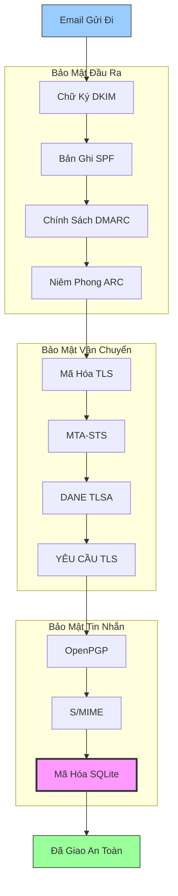


## Các Giao Thức Xác Thực Tin Nhắn Email {#email-message-authentication-protocols}

> \[!NOTE]
> Forward Email triển khai tất cả các giao thức xác thực email chính để ngăn chặn giả mạo và đảm bảo tính toàn vẹn của tin nhắn.

Forward Email sử dụng thư viện [mailauth](https://github.com/postalsys/mailauth) cho xác thực email. Các RFC sau được hỗ trợ:

| RFC                                                       | Tiêu Đề                                                                | Ghi Chú Triển Khai                                           |
| --------------------------------------------------------- | --------------------------------------------------------------------- | ------------------------------------------------------------ |
| [RFC 6376](https://datatracker.ietf.org/doc/html/rfc6376) | Chữ Ký Mail Định Danh DomainKeys (DKIM)                              | Ký và xác minh DKIM đầy đủ                                   |
| [RFC 8463](https://datatracker.ietf.org/doc/html/rfc8463) | Phương Pháp Chữ Ký Mã Hóa Mới cho DKIM (Ed25519-SHA256)              | Hỗ trợ cả thuật toán ký RSA-SHA256 và Ed25519-SHA256         |
| [RFC 7208](https://datatracker.ietf.org/doc/html/rfc7208) | Khung Chính Sách Người Gửi (SPF)                                     | Xác thực bản ghi SPF                                         |
| [RFC 7489](https://datatracker.ietf.org/doc/html/rfc7489) | Xác Thực Tin Nhắn Dựa Trên Domain, Báo Cáo và Tuân Thủ (DMARC)       | Thực thi chính sách DMARC                                    |
| [RFC 8617](https://datatracker.ietf.org/doc/html/rfc8617) | Chuỗi Nhận Xác Thực (ARC)                                           | Niêm phong và xác minh ARC                                   |

Các giao thức xác thực email xác minh rằng tin nhắn thực sự đến từ người gửi được khai báo và không bị thay đổi trong quá trình truyền.

### Hỗ Trợ Giao Thức Xác Thực {#authentication-protocol-support}

| Giao Thức | RFC      | Trạng Thái   | Mô Tả                                                                |
| --------- | -------- | ------------ | ------------------------------------------------------------------- |
| **DKIM**  | RFC 6376 | ✅ Hỗ Trợ    | DomainKeys Identified Mail - Chữ ký mã hóa                          |
| **SPF**   | RFC 7208 | ✅ Hỗ Trợ    | Sender Policy Framework - Ủy quyền địa chỉ IP                      |
| **DMARC** | RFC 7489 | ✅ Hỗ Trợ    | Xác Thực Tin Nhắn Dựa Trên Domain - Thực thi chính sách            |
| **ARC**   | RFC 8617 | ✅ Hỗ Trợ    | Chuỗi Nhận Xác Thực - Bảo toàn xác thực qua các lần chuyển tiếp    |
### DKIM (DomainKeys Identified Mail) {#dkim-domainkeys-identified-mail}

**DKIM** thêm chữ ký mật mã vào tiêu đề email, cho phép người nhận xác minh rằng tin nhắn đã được chủ sở hữu tên miền ủy quyền và không bị chỉnh sửa trong quá trình truyền.

Forward Email sử dụng [mailauth](https://github.com/postalsys/mailauth) để ký và xác minh DKIM.

**Tính năng chính:**

* Tự động ký DKIM cho tất cả các tin nhắn gửi đi
* Hỗ trợ khóa RSA và Ed25519
* Hỗ trợ nhiều selector
* Xác minh DKIM cho các tin nhắn đến

### SPF (Sender Policy Framework) {#spf-sender-policy-framework}

**SPF** cho phép chủ sở hữu tên miền chỉ định các địa chỉ IP được phép gửi email thay mặt cho tên miền của họ.

**Tính năng chính:**

* Xác thực bản ghi SPF cho các tin nhắn đến
* Kiểm tra SPF tự động với kết quả chi tiết
* Hỗ trợ các cơ chế include, redirect và all
* Chính sách SPF có thể cấu hình theo từng tên miền

### DMARC (Domain-based Message Authentication, Reporting & Conformance) {#dmarc-domain-based-message-authentication-reporting--conformance}

**DMARC** xây dựng dựa trên SPF và DKIM để cung cấp thực thi chính sách và báo cáo.

**Tính năng chính:**

* Thực thi chính sách DMARC (none, quarantine, reject)
* Kiểm tra căn chỉnh cho SPF và DKIM
* Báo cáo tổng hợp DMARC
* Chính sách DMARC theo từng tên miền

### ARC (Authenticated Received Chain) {#arc-authenticated-received-chain}

**ARC** bảo tồn kết quả xác thực email qua các bước chuyển tiếp và sửa đổi danh sách gửi thư.

Forward Email sử dụng thư viện [mailauth](https://github.com/postalsys/mailauth) để xác minh và đóng dấu ARC.

**Tính năng chính:**

* Đóng dấu ARC cho các tin nhắn được chuyển tiếp
* Xác thực ARC cho các tin nhắn đến
* Xác minh chuỗi qua nhiều bước chuyển tiếp
* Bảo tồn kết quả xác thực gốc

### Authentication Flow {#authentication-flow}

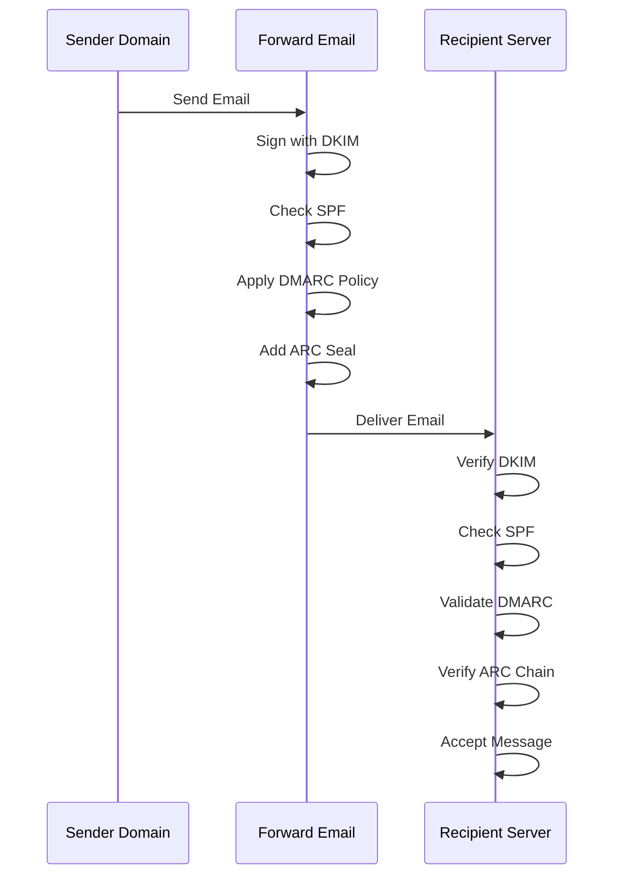

---


## Email Transport Security Protocols {#email-transport-security-protocols}

> \[!IMPORTANT]
> Forward Email triển khai nhiều lớp bảo mật truyền tải để bảo vệ email trong quá trình truyền.

Forward Email triển khai các giao thức bảo mật truyền tải hiện đại:

| RFC                                                       | Title                                                                                                | Status      | Implementation Notes                                                                                                                                                                                                                                                                          |
| --------------------------------------------------------- | ---------------------------------------------------------------------------------------------------- | ----------- | --------------------------------------------------------------------------------------------------------------------------------------------------------------------------------------------------------------------------------------------------------------------------------------------- |
| [RFC 8461](https://datatracker.ietf.org/doc/html/rfc8461) | SMTP MTA Strict Transport Security (MTA-STS)                                                         | ✅ Supported | Được sử dụng rộng rãi trên các máy chủ IMAP, SMTP và MX. Xem [create-mta-sts-cache.js](https://github.com/forwardemail/forwardemail.net/blob/master/helpers/create-mta-sts-cache.js) và [get-transporter.js](https://github.com/forwardemail/forwardemail.net/blob/master/helpers/get-transporter.js) |
| [RFC 8460](https://datatracker.ietf.org/doc/html/rfc8460) | SMTP TLS Reporting                                                                                   | ✅ Supported | Qua thư viện [mailauth](https://github.com/postalsys/mailauth)                                                                                                                                                                                                                                 |
| [RFC 7671](https://datatracker.ietf.org/doc/html/rfc7671) | The DNS-Based Authentication of Named Entities (DANE) Protocol: Updates and Operational Guidance     | ✅ Supported | Xác minh DANE đầy đủ cho các kết nối SMTP gửi đi. Xem [mx-connect PR #22](https://github.com/zone-eu/mx-connect/pull/22)                                                                                                                                                                  |
| [RFC 6698](https://datatracker.ietf.org/doc/html/rfc6698) | The DNS-Based Authentication of Named Entities (DANE) Transport Layer Security (TLS) Protocol: TLSA  | ✅ Supported | Hỗ trợ đầy đủ RFC 6698: các loại sử dụng PKIX-TA, PKIX-EE, DANE-TA, DANE-EE. Xem [mx-connect PR #22](https://github.com/zone-eu/mx-connect/pull/22)                                                                                                                                         |
| [RFC 8314](https://datatracker.ietf.org/doc/html/rfc8314) | Cleartext Considered Obsolete: Use of Transport Layer Security (TLS) for Email Submission and Access | ✅ Supported | Yêu cầu TLS cho tất cả các kết nối                                                                                                                                                                                                                                                              |
| [RFC 8689](https://datatracker.ietf.org/doc/html/rfc8689) | SMTP Service Extension for Requiring TLS (REQUIRETLS)                                                | ✅ Supported | Hỗ trợ đầy đủ phần mở rộng SMTP REQUIRETLS và header "TLS-Required"                                                                                                                                                                                                                          |
Các giao thức bảo mật truyền tải đảm bảo rằng các tin nhắn email được mã hóa và xác thực trong quá trình truyền giữa các máy chủ thư.

### Hỗ trợ Bảo mật Truyền tải {#transport-security-support}

| Giao thức      | RFC      | Trạng thái  | Mô tả                                            |
| -------------- | -------- | ----------- | ------------------------------------------------ |
| **TLS**        | RFC 8314 | ✅ Hỗ trợ   | Transport Layer Security - Kết nối được mã hóa    |
| **MTA-STS**    | RFC 8461 | ✅ Hỗ trợ   | Mail Transfer Agent Strict Transport Security    |
| **DANE**       | RFC 7671 | ✅ Hỗ trợ   | DNS-based Authentication of Named Entities       |
| **REQUIRETLS** | RFC 8689 | ✅ Hỗ trợ   | Yêu cầu TLS cho toàn bộ đường truyền              |

### TLS (Transport Layer Security) {#tls-transport-layer-security}

Forward Email thực thi mã hóa TLS cho tất cả các kết nối email (SMTP, IMAP, POP3).

**Các tính năng chính:**

* Hỗ trợ TLS 1.2 và TLS 1.3
* Quản lý chứng chỉ tự động
* Perfect Forward Secrecy (PFS)
* Chỉ sử dụng các bộ mã hóa mạnh

### MTA-STS (Mail Transfer Agent Strict Transport Security) {#mta-sts-mail-transfer-agent-strict-transport-security}

**MTA-STS** đảm bảo rằng email chỉ được gửi qua các kết nối được mã hóa TLS bằng cách công bố chính sách qua HTTPS.

Forward Email triển khai MTA-STS sử dụng [create-mta-sts-cache.js](https://github.com/forwardemail/forwardemail.net/blob/master/helpers/create-mta-sts-cache.js).

**Các tính năng chính:**

* Tự động công bố chính sách MTA-STS
* Bộ nhớ đệm chính sách để tăng hiệu suất
* Ngăn chặn tấn công hạ cấp
* Thực thi xác thực chứng chỉ

### DANE (DNS-based Authentication of Named Entities) {#dane-dns-based-authentication-of-named-entities}

> \[!NOTE]
> Forward Email hiện cung cấp hỗ trợ đầy đủ DANE cho các kết nối SMTP đi.

**DANE** sử dụng DNSSEC để công bố thông tin chứng chỉ TLS trong DNS, cho phép các máy chủ thư xác minh chứng chỉ mà không cần dựa vào các cơ quan cấp chứng chỉ.

**Các tính năng chính:**

* ✅ Xác minh DANE đầy đủ cho các kết nối SMTP đi
* ✅ Hỗ trợ đầy đủ RFC 6698: các loại sử dụng PKIX-TA, PKIX-EE, DANE-TA, DANE-EE
* ✅ Xác minh chứng chỉ dựa trên bản ghi TLSA trong quá trình nâng cấp TLS
* ✅ Giải quyết TLSA song song cho nhiều máy chủ MX
* ✅ Tự động phát hiện `dns.resolveTlsa` gốc (Node.js v22.15.0+, v23.9.0+)
* ✅ Hỗ trợ bộ phân giải tùy chỉnh cho các phiên bản Node.js cũ hơn qua [Tangerine](https://github.com/forwardemail/tangerine)
* Yêu cầu các miền được ký DNSSEC

> \[!TIP]
> **Chi tiết triển khai:** Hỗ trợ DANE được thêm qua [mx-connect PR #22](https://github.com/zone-eu/mx-connect/pull/22), cung cấp hỗ trợ toàn diện DANE/TLSA cho các kết nối SMTP đi.

### REQUIRETLS {#requiretls}

> \[!TIP]
> Forward Email là một trong số ít nhà cung cấp hỗ trợ REQUIRETLS dành cho người dùng.

**REQUIRETLS** đảm bảo rằng các tin nhắn email chỉ được gửi qua các kết nối được mã hóa TLS cho toàn bộ đường truyền.

**Các tính năng chính:**

* Hộp kiểm dành cho người dùng trong trình soạn thảo email
* Tự động từ chối các lần gửi không mã hóa
* Thực thi TLS đầu cuối
* Thông báo lỗi chi tiết

> \[!TIP]
> **Thực thi TLS dành cho người dùng:** Forward Email cung cấp một hộp kiểm trong **My Account > Domains > Settings** để thực thi TLS cho tất cả các kết nối đến. Khi bật, tính năng này sẽ từ chối mọi email đến không được gửi qua kết nối mã hóa TLS với mã lỗi 530, đảm bảo tất cả thư đến đều được mã hóa khi truyền.

### Luồng Bảo mật Truyền tải {#transport-security-flow}

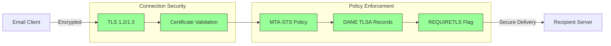
## Mã hóa Tin nhắn Email {#email-message-encryption}

> \[!NOTE]
> Forward Email hỗ trợ cả OpenPGP và S/MIME cho mã hóa email đầu-cuối.

Forward Email hỗ trợ mã hóa OpenPGP và S/MIME:

| RFC                                                       | Tiêu đề                                                                                 | Trạng thái  | Ghi chú Triển khai                                                                                                                                                                                   |
| --------------------------------------------------------- | --------------------------------------------------------------------------------------- | ----------- | ---------------------------------------------------------------------------------------------------------------------------------------------------------------------------------------------------- |
| [RFC 9580](https://datatracker.ietf.org/doc/html/rfc9580) | OpenPGP (thay thế RFC 4880)                                                             | ✅ Hỗ trợ   | Qua tích hợp [OpenPGP.js v6+](https://github.com/openpgpjs/openpgpjs). Xem [FAQ](https://forwardemail.net/en/faq#do-you-support-openpgpmime-end-to-end-encryption-e2ee-and-web-key-directory-wkd) |
| [RFC 8551](https://datatracker.ietf.org/doc/html/rfc8551) | Secure/Multipurpose Internet Mail Extensions (S/MIME) Phiên bản 4.0 Thông số Tin nhắn    | ✅ Hỗ trợ   | Hỗ trợ cả thuật toán RSA và ECC. Xem [FAQ](https://forwardemail.net/en/faq#do-you-support-smime-encryption)                                                                                          |

Giao thức mã hóa tin nhắn bảo vệ nội dung email khỏi bị đọc bởi bất kỳ ai ngoài người nhận dự kiến, ngay cả khi tin nhắn bị chặn trong quá trình truyền.

### Hỗ trợ Mã hóa {#encryption-support}

| Giao thức   | RFC      | Trạng thái  | Mô tả                                        |
| ----------- | -------- | ----------- | -------------------------------------------- |
| **OpenPGP** | RFC 9580 | ✅ Hỗ trợ   | Pretty Good Privacy - Mã hóa khóa công khai  |
| **S/MIME**  | RFC 8551 | ✅ Hỗ trợ   | Secure/Multipurpose Internet Mail Extensions |
| **WKD**     | Draft    | ✅ Hỗ trợ   | Web Key Directory - Tự động phát hiện khóa   |

### OpenPGP (Pretty Good Privacy) {#openpgp-pretty-good-privacy}

**OpenPGP** cung cấp mã hóa đầu-cuối sử dụng mật mã khóa công khai. Forward Email hỗ trợ OpenPGP thông qua giao thức [Web Key Directory (WKD)](https://forwardemail.net/en/faq#do-you-support-openpgpmime-end-to-end-encryption-e2ee-and-web-key-directory-wkd).

**Tính năng chính:**

* Tự động phát hiện khóa qua WKD
* Hỗ trợ PGP/MIME cho tệp đính kèm được mã hóa
* Quản lý khóa qua trình khách email
* Tương thích với GPG, Mailvelope và các công cụ OpenPGP khác

**Cách sử dụng:**

1. Tạo cặp khóa PGP trong trình khách email của bạn
2. Tải khóa công khai lên WKD của Forward Email
3. Khóa của bạn được người dùng khác tự động phát hiện
4. Gửi và nhận email mã hóa một cách liền mạch

### S/MIME (Secure/Multipurpose Internet Mail Extensions) {#smime-securemultipurpose-internet-mail-extensions}

**S/MIME** cung cấp mã hóa email và chữ ký số sử dụng chứng chỉ X.509.

**Tính năng chính:**

* Mã hóa dựa trên chứng chỉ
* Chữ ký số để xác thực tin nhắn
* Hỗ trợ gốc trong hầu hết trình khách email
* Bảo mật cấp doanh nghiệp

**Cách sử dụng:**

1. Lấy chứng chỉ S/MIME từ một Cơ quan cấp chứng chỉ
2. Cài đặt chứng chỉ trong trình khách email của bạn
3. Cấu hình trình khách để mã hóa/ký tin nhắn
4. Trao đổi chứng chỉ với người nhận

### Mã hóa Hộp thư SQLite {#sqlite-mailbox-encryption}

> \[!IMPORTANT]
> Forward Email cung cấp một lớp bảo mật bổ sung với hộp thư SQLite được mã hóa.

Ngoài mã hóa cấp độ tin nhắn, Forward Email mã hóa toàn bộ hộp thư sử dụng [sqleet](https://github.com/resilar/sqleet) (ChaCha20-Poly1305).

**Tính năng chính:**

* **Mã hóa dựa trên mật khẩu** - Chỉ bạn có mật khẩu
* **Kháng lượng tử** - Thuật toán ChaCha20-Poly1305
* **Không biết gì** - Forward Email không thể giải mã hộp thư của bạn
* **Cách ly** - Mỗi hộp thư được cô lập và có thể di động
* **Không thể phục hồi** - Nếu bạn quên mật khẩu, hộp thư của bạn sẽ mất hoàn toàn
### So sánh Mã hóa {#encryption-comparison}

| Tính năng             | OpenPGP           | S/MIME             | Mã hóa SQLite     |
| --------------------- | ----------------- | ------------------ | ----------------- |
| **End-to-End**        | ✅ Có             | ✅ Có              | ✅ Có             |
| **Quản lý Khóa**      | Tự quản lý        | Do CA cấp          | Dựa trên Mật khẩu |
| **Hỗ trợ Khách hàng** | Cần plugin        | Tích hợp sẵn       | Minh bạch         |
| **Trường hợp sử dụng**| Cá nhân           | Doanh nghiệp       | Lưu trữ           |
| **Kháng lượng tử**    | ⚠️ Tùy khóa       | ⚠️ Tùy chứng chỉ   | ✅ Có             |

### Luồng Mã hóa {#encryption-flow}

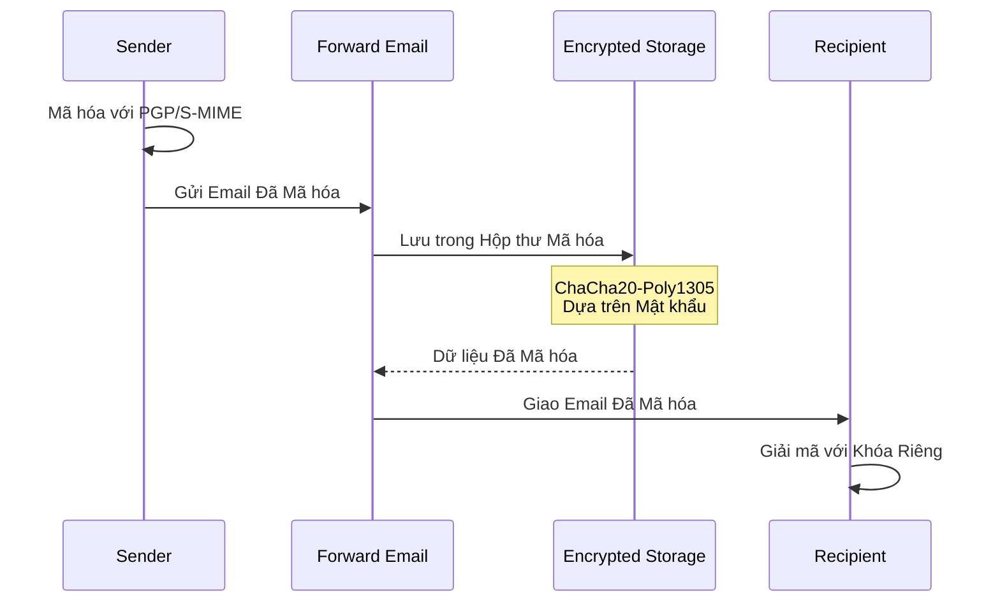

---


## Chức năng Mở rộng {#extended-functionality}


## Tiêu chuẩn Định dạng Tin nhắn Email {#email-message-format-standards}

> \[!NOTE]
> Forward Email hỗ trợ các tiêu chuẩn định dạng email hiện đại cho nội dung phong phú và quốc tế hóa.

Forward Email hỗ trợ các định dạng tin nhắn email tiêu chuẩn:

| RFC                                                       | Tiêu đề                                                       | Ghi chú Triển khai   |
| --------------------------------------------------------- | ------------------------------------------------------------- | -------------------- |
| [RFC 5322](https://datatracker.ietf.org/doc/html/rfc5322) | Định dạng Tin nhắn Internet                                   | Hỗ trợ đầy đủ        |
| [RFC 2045](https://datatracker.ietf.org/doc/html/rfc2045) | MIME Phần Một: Định dạng Thân Tin nhắn Internet               | Hỗ trợ MIME đầy đủ   |
| [RFC 2046](https://datatracker.ietf.org/doc/html/rfc2046) | MIME Phần Hai: Các loại phương tiện                            | Hỗ trợ MIME đầy đủ   |
| [RFC 2047](https://datatracker.ietf.org/doc/html/rfc2047) | MIME Phần Ba: Mở rộng Tiêu đề Tin nhắn cho Văn bản Không ASCII| Hỗ trợ MIME đầy đủ   |
| [RFC 2048](https://datatracker.ietf.org/doc/html/rfc2048) | MIME Phần Bốn: Thủ tục Đăng ký                                | Hỗ trợ MIME đầy đủ   |
| [RFC 2049](https://datatracker.ietf.org/doc/html/rfc2049) | MIME Phần Năm: Tiêu chí Tuân thủ và Ví dụ                      | Hỗ trợ MIME đầy đủ   |

Tiêu chuẩn định dạng email xác định cách cấu trúc, mã hóa và hiển thị các tin nhắn email.

### Hỗ trợ Tiêu chuẩn Định dạng {#format-standards-support}

| Tiêu chuẩn         | RFC           | Trạng thái   | Mô tả                                |
| ------------------ | ------------- | ------------ | ------------------------------------ |
| **MIME**           | RFC 2045-2049 | ✅ Hỗ trợ    | Phần mở rộng thư điện tử đa năng     |
| **SMTPUTF8**       | RFC 6531      | ⚠️ Một phần  | Địa chỉ email quốc tế hóa            |
| **EAI**            | RFC 6530      | ⚠️ Một phần  | Quốc tế hóa Địa chỉ Email            |
| **Định dạng Tin nhắn** | RFC 5322  | ✅ Hỗ trợ    | Định dạng Tin nhắn Internet          |
| **Bảo mật MIME**   | RFC 1847      | ✅ Hỗ trợ    | Các phần bảo mật cho MIME             |

### MIME (Phần mở rộng thư điện tử đa năng) {#mime-multipurpose-internet-mail-extensions}

**MIME** cho phép email chứa nhiều phần với các loại nội dung khác nhau (văn bản, HTML, tệp đính kèm, v.v.).

**Các tính năng MIME được hỗ trợ:**

* Tin nhắn đa phần (mixed, alternative, related)
* Tiêu đề Content-Type
* Mã hóa Content-Transfer-Encoding (7bit, 8bit, quoted-printable, base64)
* Hình ảnh và tệp đính kèm nội tuyến
* Nội dung HTML phong phú

### SMTPUTF8 và Quốc tế hóa Địa chỉ Email {#smtputf8-and-email-address-internationalization}

> \[!WARNING]
> Hỗ trợ SMTPUTF8 là một phần - không phải tất cả các tính năng đều được triển khai đầy đủ.
**SMTPUTF8** cho phép địa chỉ email chứa các ký tự không phải ASCII (ví dụ, `用户@例え.jp`).

**Tình trạng hiện tại:**

* ⚠️ Hỗ trợ một phần cho địa chỉ email quốc tế hóa
* ✅ Nội dung UTF-8 trong thân tin nhắn
* ⚠️ Hỗ trợ hạn chế cho phần local không phải ASCII

---


## Giao thức Lịch và Danh bạ {#calendaring-and-contacts-protocols}

> \[!NOTE]
> Forward Email cung cấp hỗ trợ đầy đủ CalDAV và CardDAV cho đồng bộ lịch và danh bạ.

Forward Email hỗ trợ CalDAV và CardDAV thông qua thư viện [caldav-adapter](https://github.com/forwardemail/caldav-adapter):

| RFC                                                       | Tiêu đề                                                                  | Tình trạng  | Ghi chú triển khai                                                                                                                                                                     |
| --------------------------------------------------------- | ------------------------------------------------------------------------- | ----------- | -------------------------------------------------------------------------------------------------------------------------------------------------------------------------------------- |
| [RFC 4791](https://datatracker.ietf.org/doc/html/rfc4791) | Mở rộng Lịch cho WebDAV (CalDAV)                                         | ✅ Được hỗ trợ | Truy cập và quản lý lịch                                                                                                                                                               |
| [RFC 6352](https://datatracker.ietf.org/doc/html/rfc6352) | CardDAV: Mở rộng vCard cho WebDAV                                        | ✅ Được hỗ trợ | Truy cập và quản lý danh bạ                                                                                                                                                            |
| [RFC 5545](https://datatracker.ietf.org/doc/html/rfc5545) | Đặc tả Đối tượng Lịch và Lập lịch Internet (iCalendar)                   | ✅ Được hỗ trợ | Hỗ trợ định dạng iCalendar                                                                                                                                                             |
| [RFC 6350](https://datatracker.ietf.org/doc/html/rfc6350) | Đặc tả Định dạng vCard                                                   | ✅ Được hỗ trợ | Hỗ trợ định dạng vCard 4.0                                                                                                                                                             |
| [RFC 6638](https://datatracker.ietf.org/doc/html/rfc6638) | Mở rộng Lập lịch cho CalDAV                                              | ✅ Được hỗ trợ | Lập lịch CalDAV với hỗ trợ iMIP. Xem [commit c4d1629](https://github.com/forwardemail/forwardemail.net/commit/c4d162975a49e38d76d68a032662e873a34a9b80)                              |
| [RFC 5546](https://datatracker.ietf.org/doc/html/rfc5546) | Giao thức Tương tác Độc lập Vận chuyển iCalendar (iTIP)                 | ✅ Được hỗ trợ | Hỗ trợ iTIP cho các phương thức REQUEST, REPLY, CANCEL và VFREEBUSY. Xem [commit c4d1629](https://github.com/forwardemail/forwardemail.net/commit/c4d162975a49e38d76d68a032662e873a34a9b80) |
| [RFC 6047](https://datatracker.ietf.org/doc/html/rfc6047) | Giao thức Tương tác Dựa trên Tin nhắn iCalendar (iMIP)                  | ✅ Được hỗ trợ | Lời mời lịch dựa trên email với các liên kết phản hồi. Xem [commit c4d1629](https://github.com/forwardemail/forwardemail.net/commit/c4d162975a49e38d76d68a032662e873a34a9b80)           |

CalDAV và CardDAV là các giao thức cho phép dữ liệu lịch và danh bạ được truy cập, chia sẻ và đồng bộ trên các thiết bị.

### Hỗ trợ CalDAV và CardDAV {#caldav-and-carddav-support}

| Giao thức             | RFC      | Tình trạng  | Mô tả                                 |
| --------------------- | -------- | ----------- | ------------------------------------ |
| **CalDAV**            | RFC 4791 | ✅ Được hỗ trợ | Truy cập và đồng bộ lịch              |
| **CardDAV**           | RFC 6352 | ✅ Được hỗ trợ | Truy cập và đồng bộ danh bạ           |
| **iCalendar**         | RFC 5545 | ✅ Được hỗ trợ | Định dạng dữ liệu lịch                |
| **vCard**             | RFC 6350 | ✅ Được hỗ trợ | Định dạng dữ liệu danh bạ             |
| **VTODO**             | RFC 5545 | ✅ Được hỗ trợ | Hỗ trợ tác vụ/nhắc nhở                |
| **Lập lịch CalDAV**   | RFC 6638 | ✅ Được hỗ trợ | Mở rộng lập lịch CalDAV               |
| **iTIP**              | RFC 5546 | ✅ Được hỗ trợ | Tương tác độc lập vận chuyển          |
| **iMIP**              | RFC 6047 | ✅ Được hỗ trợ | Lời mời lịch dựa trên email           |
### CalDAV (Truy cập Lịch) {#caldav-calendar-access}

**CalDAV** cho phép bạn truy cập và quản lý lịch từ bất kỳ thiết bị hoặc ứng dụng nào.

**Tính năng chính:**

* Đồng bộ đa thiết bị
* Lịch chia sẻ
* Đăng ký lịch
* Lời mời sự kiện và phản hồi
* Sự kiện định kỳ
* Hỗ trợ múi giờ

**Khách hàng tương thích:**

* Apple Calendar (macOS, iOS)
* Mozilla Thunderbird
* Evolution
* GNOME Calendar
* Bất kỳ khách hàng tương thích CalDAV nào

### CardDAV (Truy cập Danh bạ) {#carddav-contact-access}

**CardDAV** cho phép bạn truy cập và quản lý danh bạ từ bất kỳ thiết bị hoặc ứng dụng nào.

**Tính năng chính:**

* Đồng bộ đa thiết bị
* Sổ địa chỉ chia sẻ
* Nhóm danh bạ
* Hỗ trợ ảnh
* Trường tùy chỉnh
* Hỗ trợ vCard 4.0

**Khách hàng tương thích:**

* Apple Contacts (macOS, iOS)
* Mozilla Thunderbird
* Evolution
* GNOME Contacts
* Bất kỳ khách hàng tương thích CardDAV nào

### Công việc và Nhắc nhở (CalDAV VTODO) {#tasks-and-reminders-caldav-vtodo}

> \[!TIP]
> Forward Email hỗ trợ công việc và nhắc nhở thông qua CalDAV VTODO.

**VTODO** là một phần của định dạng iCalendar và cho phép quản lý công việc qua CalDAV.

**Tính năng chính:**

* Tạo và quản lý công việc
* Ngày đến hạn và ưu tiên
* Theo dõi hoàn thành công việc
* Công việc định kỳ
* Danh sách/loại công việc

**Khách hàng tương thích:**

* Apple Reminders (macOS, iOS)
* Mozilla Thunderbird (với Lightning)
* Evolution
* GNOME To Do
* Bất kỳ khách hàng CalDAV nào hỗ trợ VTODO

### Luồng Đồng bộ CalDAV/CardDAV {#caldavcarddav-synchronization-flow}

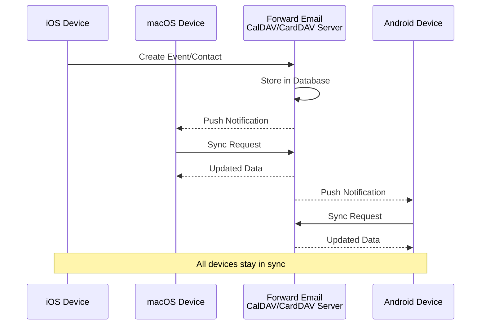

### Các phần mở rộng Lịch KHÔNG được hỗ trợ {#calendaring-extensions-not-supported}

Các phần mở rộng lịch sau KHÔNG được hỗ trợ:

| RFC                                                       | Tiêu đề                                                             | Lý do                                                          |
| --------------------------------------------------------- | ------------------------------------------------------------------- | -------------------------------------------------------------- |
| [RFC 4918](https://datatracker.ietf.org/doc/html/rfc4918) | HTTP Extensions for Web Distributed Authoring and Versioning (WebDAV) | CalDAV sử dụng các khái niệm WebDAV nhưng không triển khai đầy đủ RFC 4918 |
| [RFC 6578](https://datatracker.ietf.org/doc/html/rfc6578) | Collection Synchronization for WebDAV                               | Chưa được triển khai                                           |
| [RFC 3744](https://datatracker.ietf.org/doc/html/rfc3744) | WebDAV Access Control Protocol                                      | Chưa được triển khai                                           |

---


## Lọc Tin nhắn Email {#email-message-filtering}

> \[!IMPORTANT]
> Forward Email cung cấp **hỗ trợ đầy đủ Sieve và ManageSieve** cho lọc email phía máy chủ. Tạo các quy tắc mạnh mẽ để tự động phân loại, lọc, chuyển tiếp và phản hồi các tin nhắn đến.

### Sieve (RFC 5228) {#sieve-rfc-5228}

[Sieve](https://en.wikipedia.org/wiki/Sieve_\(mail_filtering_language\)) là một ngôn ngữ kịch bản chuẩn hóa, mạnh mẽ cho lọc email phía máy chủ. Forward Email triển khai hỗ trợ Sieve toàn diện với 24 phần mở rộng.

**Mã nguồn:** [`helpers/sieve/`](https://github.com/forwardemail/forwardemail.net/tree/master/helpers/sieve)

#### Các RFC Sieve cốt lõi được hỗ trợ {#core-sieve-rfcs-supported}

| RFC                                                                                    | Tiêu đề                                                       | Trạng thái       |
| -------------------------------------------------------------------------------------- | ------------------------------------------------------------- | ---------------- |
| [RFC 5228](https://datatracker.ietf.org/doc/html/rfc5228)                              | Sieve: Ngôn ngữ Lọc Email                                     | ✅ Hỗ trợ đầy đủ  |
| [RFC 5429](https://datatracker.ietf.org/doc/html/rfc5429)                              | Sieve Email Filtering: Reject and Extended Reject Extensions  | ✅ Hỗ trợ đầy đủ  |
| [RFC 5230](https://datatracker.ietf.org/doc/html/rfc5230)                              | Sieve Email Filtering: Vacation Extension                     | ✅ Hỗ trợ đầy đủ  |
| [RFC 6131](https://datatracker.ietf.org/doc/html/rfc6131)                              | Sieve Vacation Extension: Tham số "Seconds"                   | ✅ Hỗ trợ đầy đủ  |
| [RFC 5232](https://datatracker.ietf.org/doc/html/rfc5232)                              | Sieve Email Filtering: Imap4flags Extension                   | ✅ Hỗ trợ đầy đủ  |
| [RFC 5173](https://datatracker.ietf.org/doc/html/rfc5173)                              | Sieve Email Filtering: Body Extension                         | ✅ Hỗ trợ đầy đủ  |
| [RFC 5229](https://datatracker.ietf.org/doc/html/rfc5229)                              | Sieve Email Filtering: Variables Extension                    | ✅ Hỗ trợ đầy đủ  |
| [RFC 5231](https://datatracker.ietf.org/doc/html/rfc5231)                              | Sieve Email Filtering: Relational Extension                   | ✅ Hỗ trợ đầy đủ  |
| [RFC 4790](https://datatracker.ietf.org/doc/html/rfc4790)                              | Internet Application Protocol Collation Registry              | ✅ Hỗ trợ đầy đủ  |
| [RFC 3894](https://datatracker.ietf.org/doc/html/rfc3894)                              | Sieve Extension: Copying Without Side Effects                 | ✅ Hỗ trợ đầy đủ  |
| [RFC 5293](https://datatracker.ietf.org/doc/html/rfc5293)                              | Sieve Email Filtering: Editheader Extension                   | ✅ Hỗ trợ đầy đủ  |
| [RFC 5260](https://datatracker.ietf.org/doc/html/rfc5260)                              | Sieve Email Filtering: Date and Index Extensions              | ✅ Hỗ trợ đầy đủ  |
| [RFC 5435](https://datatracker.ietf.org/doc/html/rfc5435)                              | Sieve Email Filtering: Extension for Notifications            | ✅ Hỗ trợ đầy đủ  |
| [RFC 5183](https://datatracker.ietf.org/doc/html/rfc5183)                              | Sieve Email Filtering: Environment Extension                  | ✅ Hỗ trợ đầy đủ  |
| [RFC 5490](https://datatracker.ietf.org/doc/html/rfc5490)                              | Sieve Email Filtering: Extensions for Checking Mailbox Status | ✅ Hỗ trợ đầy đủ  |
| [RFC 8579](https://datatracker.ietf.org/doc/html/rfc8579)                              | Sieve Email Filtering: Delivering to Special-Use Mailboxes    | ✅ Hỗ trợ đầy đủ  |
| [RFC 7352](https://datatracker.ietf.org/doc/html/rfc7352)                              | Sieve Email Filtering: Detecting Duplicate Deliveries         | ✅ Hỗ trợ đầy đủ  |
| [RFC 5463](https://datatracker.ietf.org/doc/html/rfc5463)                              | Sieve Email Filtering: Ihave Extension                        | ✅ Hỗ trợ đầy đủ  |
| [RFC 5233](https://datatracker.ietf.org/doc/html/rfc5233)                              | Sieve Email Filtering: Subaddress Extension                   | ✅ Hỗ trợ đầy đủ  |
| [draft-ietf-sieve-regex](https://datatracker.ietf.org/doc/html/draft-ietf-sieve-regex) | Sieve Email Filtering: Regular Expression Extension           | ✅ Hỗ trợ đầy đủ  |
#### Các phần mở rộng Sieve được hỗ trợ {#supported-sieve-extensions}

| Phần mở rộng                 | Mô tả                                   | Tích hợp                                  |
| ---------------------------- | ---------------------------------------- | ------------------------------------------ |
| `fileinto`                   | Lưu thư vào các thư mục cụ thể            | Thư được lưu trong thư mục IMAP chỉ định    |
| `reject` / `ereject`         | Từ chối thư với lỗi                      | Từ chối SMTP kèm thông báo trả lại          |
| `vacation`                   | Trả lời tự động khi nghỉ/vắng mặt         | Xếp hàng qua Emails.queue với giới hạn tốc độ |
| `vacation-seconds`           | Khoảng thời gian trả lời nghỉ chi tiết    | TTL từ tham số `:seconds`                   |
| `imap4flags`                 | Đặt cờ IMAP (\Seen, \Flagged, v.v.)      | Cờ được áp dụng khi lưu thư                   |
| `envelope`                   | Kiểm tra người gửi/người nhận phong bì   | Truy cập dữ liệu phong bì SMTP               |
| `body`                       | Kiểm tra nội dung thân thư                 | So khớp toàn bộ văn bản thân thư             |
| `variables`                  | Lưu và sử dụng biến trong kịch bản        | Mở rộng biến với các bộ điều chỉnh           |
| `relational`                 | So sánh quan hệ                          | `:count`, `:value` với gt/lt/eq               |
| `comparator-i;ascii-numeric` | So sánh số học                          | So sánh chuỗi số học                          |
| `copy`                       | Sao chép thư khi chuyển tiếp              | Cờ `:copy` trên fileinto/redirect             |
| `editheader`                 | Thêm hoặc xóa tiêu đề thư                  | Tiêu đề được chỉnh sửa trước khi lưu          |
| `date`                       | Kiểm tra giá trị ngày/giờ                  | Kiểm tra `currentdate` và ngày tiêu đề        |
| `index`                      | Truy cập các lần xuất hiện tiêu đề cụ thể | `:index` cho tiêu đề đa giá trị                |
| `regex`                      | So khớp biểu thức chính quy               | Hỗ trợ đầy đủ regex trong kiểm tra             |
| `enotify`                    | Gửi thông báo                            | Thông báo `mailto:` qua Emails.queue           |
| `environment`                | Truy cập thông tin môi trường             | Tên miền, máy chủ, IP từ phiên làm việc        |
| `mailbox`                    | Kiểm tra sự tồn tại hộp thư                | Kiểm tra `mailboxexists`                      |
| `special-use`                | Lưu vào các hộp thư đặc biệt               | Ánh xạ \Junk, \Trash, v.v. thành thư mục       |
| `duplicate`                  | Phát hiện thư trùng lặp                    | Theo dõi trùng lặp dựa trên Redis              |
| `ihave`                      | Kiểm tra khả năng phần mở rộng             | Kiểm tra khả năng chạy thời gian thực           |
| `subaddress`                 | Truy cập các phần địa chỉ user+detail      | Các phần địa chỉ `:user` và `:detail`           |

#### Các phần mở rộng Sieve KHÔNG được hỗ trợ {#sieve-extensions-not-supported}

| Phần mở rộng                         | RFC                                                       | Lý do                                                           |
| ----------------------------------- | --------------------------------------------------------- | ---------------------------------------------------------------- |
| `include`                           | [RFC 6609](https://datatracker.ietf.org/doc/html/rfc6609) | Rủi ro bảo mật (chèn mã độc), yêu cầu lưu trữ kịch bản toàn cục |
| `mboxmetadata` / `servermetadata`   | [RFC 5490](https://datatracker.ietf.org/doc/html/rfc5490) | Yêu cầu phần mở rộng METADATA của IMAP                           |
| `fcc`                               | [RFC 8580](https://datatracker.ietf.org/doc/html/rfc8580) | Yêu cầu tích hợp thư mục Sent                                    |
| `encoded-character`                 | [RFC 5228](https://datatracker.ietf.org/doc/html/rfc5228) | Cần thay đổi trình phân tích cú pháp cho cú pháp ${hex:}         |
| `foreverypart` / `mime` / `extracttext` | [RFC 5703](https://datatracker.ietf.org/doc/html/rfc5703) | Xử lý cây MIME phức tạp                                         |
#### Luồng Xử Lý Sieve {#sieve-processing-flow}

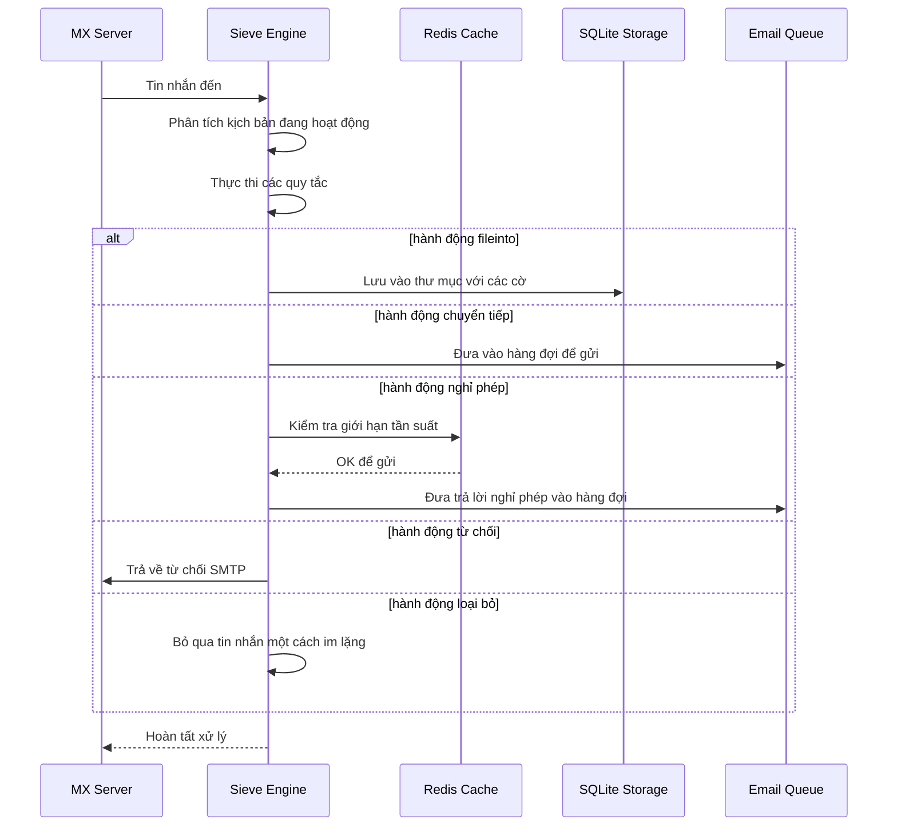

#### Tính Năng Bảo Mật {#security-features}

Triển khai Sieve của Forward Email bao gồm các biện pháp bảo mật toàn diện:

* **Bảo vệ CVE-2023-26430**: Ngăn chặn vòng lặp chuyển tiếp và tấn công mail bombing
* **Giới hạn tần suất**: Giới hạn chuyển tiếp (10/tin nhắn, 100/ngày) và trả lời nghỉ phép
* **Kiểm tra danh sách chặn**: Địa chỉ chuyển tiếp được kiểm tra với danh sách chặn
* **Tiêu đề được bảo vệ**: Tiêu đề DKIM, ARC và xác thực không thể bị chỉnh sửa qua editheader
* **Giới hạn kích thước kịch bản**: Áp dụng kích thước tối đa cho kịch bản
* **Giới hạn thời gian thực thi**: Kịch bản bị dừng nếu vượt quá giới hạn thời gian

#### Ví Dụ Kịch Bản Sieve {#example-sieve-scripts}

**Lưu bản tin vào thư mục:**

```sieve
require ["fileinto"];

if header :contains "List-Id" "newsletter" {
    fileinto "Newsletters";
}
```

**Trả lời tự động nghỉ phép với thời gian chi tiết:**

```sieve
require ["vacation", "vacation-seconds"];

vacation :seconds 3600 :subject "Out of Office"
    "Tôi hiện đang vắng mặt và sẽ phản hồi trong vòng 24 giờ.";
```

**Lọc thư rác với cờ:**

```sieve
require ["fileinto", "imap4flags"];

if header :contains "X-Spam-Status" "Yes" {
    setflag "\\Seen";
    fileinto "Junk";
}
```

**Lọc phức tạp với biến:**

```sieve
require ["variables", "fileinto", "regex"];

if header :regex "From" "(.+)@example\\.com" {
    set :lower "sender" "${1}";
    fileinto "Contacts/${sender}";
}
```

> \[!TIP]
> Để xem tài liệu đầy đủ, các kịch bản ví dụ và hướng dẫn cấu hình, xem [FAQ: Bạn có hỗ trợ lọc email bằng Sieve không?](/faq#do-you-support-sieve-email-filtering)

### ManageSieve (RFC 5804) {#managesieve-rfc-5804}

Forward Email cung cấp hỗ trợ đầy đủ giao thức ManageSieve để quản lý kịch bản Sieve từ xa.

**Mã nguồn:** [`managesieve-server.js`](https://github.com/forwardemail/forwardemail.net/blob/master/managesieve-server.js)

| RFC                                                       | Tiêu đề                                        | Trạng thái      |
| --------------------------------------------------------- | ---------------------------------------------- | -------------- |
| [RFC 5804](https://datatracker.ietf.org/doc/html/rfc5804) | Giao thức Quản lý Kịch bản Sieve từ xa         | ✅ Hỗ trợ đầy đủ |

#### Cấu Hình Máy Chủ ManageSieve {#managesieve-server-configuration}

| Cài đặt                 | Giá trị                  |
| ----------------------- | ------------------------ |
| **Máy chủ**             | `imap.forwardemail.net`  |
| **Cổng (STARTTLS)**     | `2190` (khuyến nghị)     |
| **Cổng (TLS ẩn danh)**  | `4190`                   |
| **Xác thực**            | PLAIN (qua TLS)          |

> **Lưu ý:** Cổng 2190 sử dụng STARTTLS (nâng cấp từ kết nối thường sang TLS) và tương thích với hầu hết các client ManageSieve bao gồm [sieve-connect](https://github.com/philpennock/sieve-connect). Cổng 4190 sử dụng TLS ẩn danh (TLS ngay từ đầu kết nối) cho các client hỗ trợ.

#### Các Lệnh ManageSieve Hỗ Trợ {#supported-managesieve-commands}

| Lệnh           | Mô tả                                  |
| -------------- | ------------------------------------- |
| `AUTHENTICATE` | Xác thực bằng cơ chế PLAIN             |
| `CAPABILITY`   | Liệt kê khả năng và phần mở rộng máy chủ |
| `HAVESPACE`    | Kiểm tra xem có thể lưu kịch bản không |
| `PUTSCRIPT`    | Tải lên kịch bản mới                   |
| `LISTSCRIPTS`  | Liệt kê tất cả kịch bản và trạng thái hoạt động |
| `SETACTIVE`    | Kích hoạt một kịch bản                 |
| `GETSCRIPT`    | Tải xuống kịch bản                     |
| `DELETESCRIPT` | Xóa kịch bản                          |
| `RENAMESCRIPT` | Đổi tên kịch bản                      |
| `CHECKSCRIPT`  | Kiểm tra cú pháp kịch bản              |
| `NOOP`         | Giữ kết nối hoạt động                  |
| `LOGOUT`       | Kết thúc phiên làm việc                |
#### Các Client ManageSieve Tương Thích {#compatible-managesieve-clients}

* **Thunderbird**: Hỗ trợ Sieve tích hợp qua [Sieve add-on](https://addons.thunderbird.net/addon/sieve/)
* **Roundcube**: [Plugin ManageSieve](https://plugins.roundcube.net/packages/johndoh/sieve)
* **KMail**: Hỗ trợ ManageSieve gốc
* **sieve-connect**: Client dòng lệnh
* **Bất kỳ client nào tuân thủ RFC 5804**

#### Luồng Giao Thức ManageSieve {#managesieve-protocol-flow}

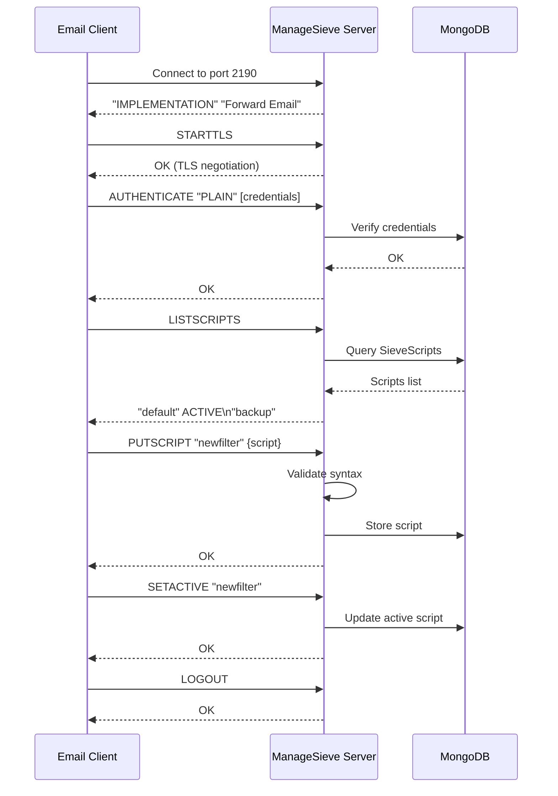

#### Giao Diện Web và API {#web-interface-and-api}

Ngoài ManageSieve, Forward Email còn cung cấp:

* **Bảng Điều Khiển Web**: Tạo và quản lý các script Sieve qua giao diện web tại My Account → Domains → Aliases → Sieve Scripts
* **REST API**: Truy cập lập trình để quản lý script Sieve qua [Forward Email API](/api#sieve-scripts)

> \[!TIP]
> Để biết hướng dẫn thiết lập chi tiết và cấu hình client, xem [FAQ: Bạn có hỗ trợ lọc email bằng Sieve không?](/faq#do-you-support-sieve-email-filtering)

---


## Tối Ưu Lưu Trữ {#storage-optimization}

> \[!IMPORTANT]
> **Công Nghệ Lưu Trữ Đầu Tiên Trong Ngành:** Forward Email là **nhà cung cấp email duy nhất trên thế giới** kết hợp giữa loại bỏ trùng lặp tệp đính kèm và nén Brotli trên nội dung email. Tối ưu hai lớp này giúp bạn có **dung lượng lưu trữ hiệu quả gấp 2-3 lần** so với các nhà cung cấp email truyền thống.

Forward Email triển khai hai kỹ thuật tối ưu lưu trữ đột phá giúp giảm đáng kể kích thước hộp thư trong khi vẫn đảm bảo tuân thủ đầy đủ RFC và giữ nguyên độ chính xác của tin nhắn:

1. **Loại bỏ trùng lặp tệp đính kèm** - Loại bỏ các tệp đính kèm trùng lặp trên tất cả các email
2. **Nén Brotli** - Giảm dung lượng lưu trữ 46-86% cho metadata và 50% cho tệp đính kèm

### Kiến Trúc: Tối Ưu Lưu Trữ Hai Lớp {#architecture-dual-layer-storage-optimization}

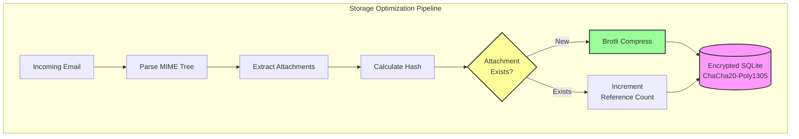

---


## Loại Bỏ Trùng Lặp Tệp Đính Kèm {#attachment-deduplication}

Forward Email triển khai loại bỏ trùng lặp tệp đính kèm dựa trên [phương pháp đã được chứng minh của WildDuck](https://docs.wildduck.email/docs/in-depth/attachment-deduplication/), được điều chỉnh cho lưu trữ SQLite.

> \[!NOTE]
> **Điều được loại bỏ trùng lặp:** "Tệp đính kèm" đề cập đến nội dung node MIME **đã được mã hóa** (base64 hoặc quoted-printable), không phải tệp đã giải mã. Điều này giữ nguyên tính hợp lệ của chữ ký DKIM và GPG.

### Cách Hoạt Động {#how-it-works}

**Triển khai gốc của WildDuck (MongoDB GridFS):**

> Máy chủ IMAP Wild Duck loại bỏ trùng lặp tệp đính kèm. "Tệp đính kèm" trong trường hợp này có nghĩa là nội dung node mime được mã hóa base64 hoặc quoted-printable, không phải tệp đã giải mã. Mặc dù sử dụng nội dung đã mã hóa dẫn đến nhiều trường hợp âm tính giả (cùng một tệp trong các email khác nhau có thể được tính là các tệp đính kèm khác nhau) nhưng điều này cần thiết để đảm bảo tính hợp lệ của các phương thức ký khác nhau (DKIM, GPG, v.v.). Một tin nhắn lấy từ Wild Duck trông hoàn toàn giống với tin nhắn đã được lưu trữ mặc dù Wild Duck phân tích tin nhắn thành một đối tượng dạng cây và xây dựng lại tin nhắn khi lấy ra.
**Triển khai SQLite của Forward Email:**

Forward Email áp dụng phương pháp này cho lưu trữ SQLite được mã hóa với quy trình sau:

1. **Tính toán Hash**: Khi tìm thấy tệp đính kèm, một hash được tính bằng thư viện [`rev-hash`](https://github.com/sindresorhus/rev-hash) từ nội dung tệp đính kèm
2. **Tra cứu**: Kiểm tra xem có tệp đính kèm với hash trùng khớp trong bảng `Attachments` hay không
3. **Đếm tham chiếu**:
   * Nếu tồn tại: Tăng bộ đếm tham chiếu lên 1 và bộ đếm magic lên một số ngẫu nhiên
   * Nếu mới: Tạo mục tệp đính kèm mới với bộ đếm = 1
4. **An toàn khi xóa**: Sử dụng hệ thống bộ đếm kép (tham chiếu + magic) để ngăn ngừa kết quả dương tính giả
5. **Thu gom rác**: Tệp đính kèm được xóa ngay lập tức khi cả hai bộ đếm đều về 0

**Mã nguồn:** [`helpers/attachment-storage.js`](https://github.com/forwardemail/forwardemail.net/blob/master/helpers/attachment-storage.js)

### Luồng loại trùng {#deduplication-flow}

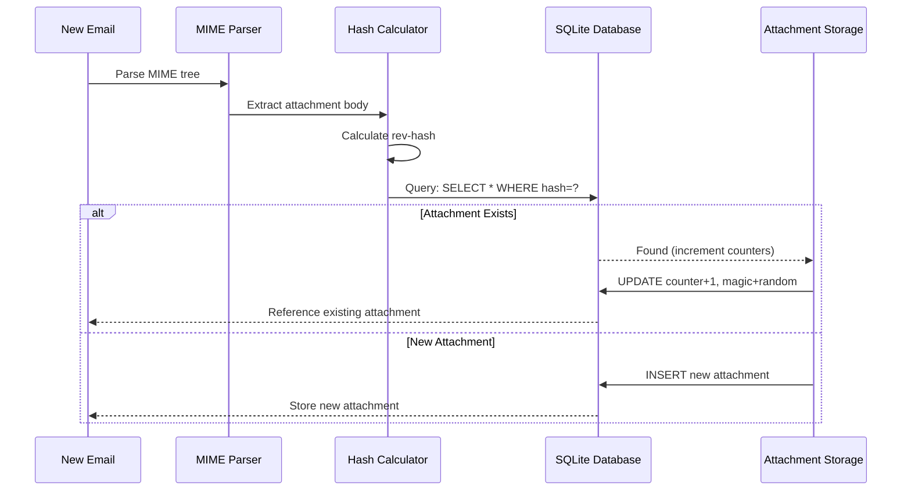

### Hệ thống số magic {#magic-number-system}

Forward Email sử dụng hệ thống "số magic" của WildDuck (lấy cảm hứng từ [Mail.ru](https://github.com/zone-eu/wildduck)) để ngăn ngừa kết quả dương tính giả khi xóa:

* Mỗi tin nhắn được gán một **số ngẫu nhiên**
* Bộ đếm **magic** của tệp đính kèm được tăng lên bằng số ngẫu nhiên đó khi tin nhắn được thêm vào
* Bộ đếm magic được giảm đi bằng số đó khi tin nhắn bị xóa
* Tệp đính kèm chỉ bị xóa khi **cả hai bộ đếm** (tham chiếu + magic) đều về 0

Hệ thống bộ đếm kép này đảm bảo rằng nếu có sự cố xảy ra trong quá trình xóa (ví dụ: sự cố, lỗi mạng), tệp đính kèm sẽ không bị xóa sớm.

### Sự khác biệt chính: WildDuck vs Forward Email {#key-differences-wildduck-vs-forward-email}

| Tính năng              | WildDuck (MongoDB)       | Forward Email (SQLite)       |
| ---------------------- | ------------------------ | ---------------------------- |
| **Lưu trữ Backend**    | MongoDB GridFS (chia khúc) | SQLite BLOB (trực tiếp)      |
| **Thuật toán Hash**    | SHA256                   | rev-hash (dựa trên SHA-256)  |
| **Đếm tham chiếu**    | ✅ Có                     | ✅ Có                        |
| **Số magic**           | ✅ Có (lấy cảm hứng Mail.ru) | ✅ Có (hệ thống tương tự)     |
| **Thu gom rác**        | Trì hoãn (công việc riêng) | Ngay lập tức (khi bộ đếm về 0) |
| **Nén**                | ❌ Không                  | ✅ Brotli (xem bên dưới)      |
| **Mã hóa**              | ❌ Tùy chọn               | ✅ Luôn luôn (ChaCha20-Poly1305) |

---


## Nén Brotli {#brotli-compression}

> \[!IMPORTANT]
> **Lần đầu tiên trên thế giới:** Forward Email là **dịch vụ email duy nhất trên thế giới** sử dụng nén Brotli trên nội dung email. Điều này mang lại **tiết kiệm lưu trữ 46-86%** bên cạnh việc loại trùng tệp đính kèm.

Forward Email triển khai nén Brotli cho cả nội dung tệp đính kèm và metadata tin nhắn, cung cấp tiết kiệm lưu trữ lớn đồng thời duy trì khả năng tương thích ngược.

**Triển khai:** [`helpers/msgpack-helpers.js`](https://github.com/forwardemail/forwardemail.net/blob/master/helpers/msgpack-helpers.js)

### Những gì được nén {#what-gets-compressed}

**1. Nội dung tệp đính kèm** (`encodeAttachmentBody`)

* **Định dạng cũ**: Chuỗi mã hóa hex (kích thước gấp 2 lần) hoặc Buffer thô
* **Định dạng mới**: Buffer nén Brotli với tiêu đề magic "FEBR"
* **Quyết định nén**: Chỉ nén nếu tiết kiệm không gian (tính cả tiêu đề 4 byte)
* **Tiết kiệm lưu trữ**: Lên đến **50%** (hex → BLOB gốc)
**2. Siêu dữ liệu Tin nhắn** (`encodeMetadata`)

Bao gồm: `mimeTree`, `headers`, `envelope`, `flags`

* **Định dạng cũ**: Chuỗi văn bản JSON
* **Định dạng mới**: Buffer nén Brotli
* **Tiết kiệm lưu trữ**: **46-86%** tùy thuộc vào độ phức tạp của tin nhắn

### Cấu hình Nén {#compression-configuration}

```javascript
// Tùy chọn nén Brotli tối ưu cho tốc độ (cấp độ 4 là sự cân bằng tốt)
const BROTLI_COMPRESS_OPTIONS = {
  params: {
    [zlib.constants.BROTLI_PARAM_QUALITY]: 4
  }
};
```

**Tại sao chọn Cấp độ 4?**

* **Nén/giải nén nhanh**: Xử lý dưới mili giây
* **Tỷ lệ nén tốt**: Tiết kiệm 46-86%
* **Hiệu suất cân bằng**: Tối ưu cho các hoạt động email thời gian thực

### Magic Header: "FEBR" {#magic-header-febr}

Forward Email sử dụng một magic header 4 byte để nhận diện các phần thân đính kèm đã nén:

```
"FEBR" = Forward Email BRotli
Hex: 0x46 0x45 0x42 0x52
```

**Tại sao cần magic header?**

* **Phát hiện định dạng**: Nhận diện ngay lập tức dữ liệu đã nén hay chưa nén
* **Tương thích ngược**: Chuỗi hex cũ và Buffer thô vẫn hoạt động
* **Tránh xung đột**: "FEBR" khó xuất hiện ở đầu dữ liệu đính kèm hợp lệ

### Quy trình Nén {#compression-process}

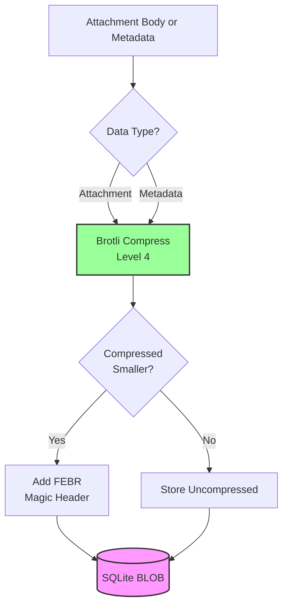

### Quy trình Giải nén {#decompression-process}

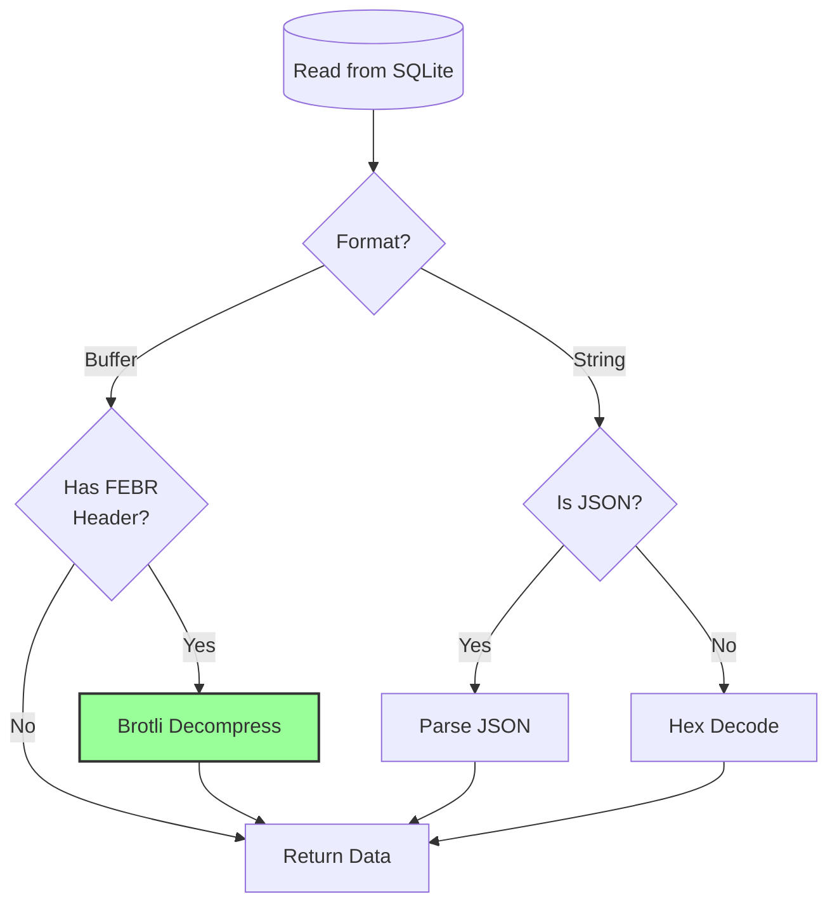

### Tương thích ngược {#backwards-compatibility}

Tất cả các hàm giải mã **tự động phát hiện** định dạng lưu trữ:

| Định dạng             | Phương pháp phát hiện                 | Xử lý                                        |
| --------------------- | ------------------------------------ | --------------------------------------------- |
| **Nén Brotli**        | Kiểm tra magic header "FEBR"          | Giải nén với `zlib.brotliDecompressSync()`   |
| **Buffer thô**        | `Buffer.isBuffer()` không có magic    | Trả về nguyên trạng                           |
| **Chuỗi Hex**         | Kiểm tra độ dài chẵn + ký tự [0-9a-f] | Giải mã với `Buffer.from(value, 'hex')`       |
| **Chuỗi JSON**        | Kiểm tra ký tự đầu tiên là `{` hoặc `[` | Phân tích với `JSON.parse()`                  |

Điều này đảm bảo **không mất dữ liệu** trong quá trình chuyển đổi từ định dạng cũ sang mới.

### Thống kê Tiết kiệm Lưu trữ {#storage-savings-statistics}

**Tiết kiệm đo được từ dữ liệu thực tế:**

| Loại dữ liệu          | Định dạng cũ            | Định dạng mới           | Tiết kiệm  |
| --------------------- | ----------------------- | ---------------------- | ---------- |
| **Thân đính kèm**     | Chuỗi mã hóa hex (2x)   | BLOB nén Brotli        | **50%**    |
| **Siêu dữ liệu tin nhắn** | Văn bản JSON           | BLOB nén Brotli        | **46-86%** |
| **Cờ hộp thư**        | Văn bản JSON            | BLOB nén Brotli        | **60-80%** |

**Nguồn:** [`helpers/migrate-storage-format.js`](https://github.com/forwardemail/forwardemail.net/blob/master/helpers/migrate-storage-format.js)

### Quy trình Di cư {#migration-process}

Forward Email cung cấp quá trình di cư tự động, idempotent từ định dạng lưu trữ cũ sang mới:
// Thống kê di chuyển được theo dõi:
{
  attachmentsMigrated: 0,
  messagesMigrated: 0,
  mailboxesMigrated: 0,
  bytesSaved: 0  // Tổng số byte tiết kiệm được từ nén
}
```

**Các bước di chuyển:**

1. Nội dung tệp đính kèm: mã hóa hex → BLOB gốc (tiết kiệm 50%)
2. Siêu dữ liệu tin nhắn: văn bản JSON → BLOB nén brotli (tiết kiệm 46-86%)
3. Cờ hộp thư: văn bản JSON → BLOB nén brotli (tiết kiệm 60-80%)

**Nguồn:** [`helpers/migrate-storage-format.js`](https://github.com/forwardemail/forwardemail.net/blob/master/helpers/migrate-storage-format.js)

---

### Hiệu quả lưu trữ kết hợp {#combined-storage-efficiency}

> \[!TIP]
> **Tác động thực tế:** Với việc loại bỏ trùng lặp tệp đính kèm + nén Brotli, người dùng Forward Email nhận được **lưu trữ hiệu quả gấp 2-3 lần** so với các nhà cung cấp email truyền thống.

**Tình huống ví dụ:**

Nhà cung cấp email truyền thống (hộp thư 1GB):

* 1GB dung lượng đĩa = 1GB email
* Không loại bỏ trùng lặp: Tệp đính kèm giống nhau lưu 10 lần = lãng phí lưu trữ gấp 10 lần
* Không nén: Siêu dữ liệu JSON đầy đủ được lưu = lãng phí lưu trữ gấp 2-3 lần

Forward Email (hộp thư 1GB):

* 1GB dung lượng đĩa ≈ **2-3GB email** (lưu trữ hiệu quả)
* Loại bỏ trùng lặp: Tệp đính kèm giống nhau lưu một lần, tham chiếu 10 lần
* Nén: Tiết kiệm 46-86% siêu dữ liệu, 50% tệp đính kèm
* Mã hóa: ChaCha20-Poly1305 (không tăng dung lượng lưu trữ)

**Bảng so sánh:**

| Nhà cung cấp      | Công nghệ lưu trữ                            | Lưu trữ hiệu quả (hộp thư 1GB) |
| ----------------- | -------------------------------------------- | ------------------------------- |
| Gmail             | Không                                        | 1GB                             |
| iCloud            | Không                                        | 1GB                             |
| Outlook.com       | Không                                        | 1GB                             |
| Fastmail          | Không                                        | 1GB                             |
| ProtonMail        | Chỉ mã hóa                                   | 1GB                             |
| Tutanota          | Chỉ mã hóa                                   | 1GB                             |
| **Forward Email** | **Loại bỏ trùng lặp + Nén + Mã hóa**         | **2-3GB** ✨                     |

### Chi tiết triển khai kỹ thuật {#technical-implementation-details}

**Hiệu suất:**

* Brotli cấp 4: Nén/giải nén dưới mili giây
* Không ảnh hưởng hiệu suất do nén
* SQLite FTS5: Tìm kiếm dưới 50ms với NVMe SSD

**Bảo mật:**

* Nén xảy ra **sau** mã hóa (cơ sở dữ liệu SQLite được mã hóa)
* Mã hóa ChaCha20-Poly1305 + nén Brotli
* Không kiến thức: Chỉ người dùng có mật khẩu giải mã

**Tuân thủ RFC:**

* Tin nhắn lấy ra trông **chính xác như** khi lưu trữ
* Chữ ký DKIM vẫn hợp lệ (nội dung mã hóa được giữ nguyên)
* Chữ ký GPG vẫn hợp lệ (không sửa đổi nội dung đã ký)

### Tại sao không nhà cung cấp nào khác làm được điều này {#why-no-other-provider-does-this}

**Độ phức tạp:**

* Yêu cầu tích hợp sâu với lớp lưu trữ
* Tương thích ngược khó khăn
* Di chuyển từ định dạng cũ phức tạp

**Lo ngại về hiệu suất:**

* Nén thêm tải CPU (đã giải quyết với Brotli cấp 4)
* Giải nén mỗi lần đọc (đã giải quyết với bộ nhớ đệm SQLite)

**Ưu thế của Forward Email:**

* Xây dựng từ đầu với tối ưu hóa trong tâm trí
* SQLite cho phép thao tác trực tiếp BLOB
* Cơ sở dữ liệu mã hóa theo người dùng cho phép nén an toàn

---

---


## Tính năng hiện đại {#modern-features}


## REST API hoàn chỉnh cho quản lý email {#complete-rest-api-for-email-management}

> \[!TIP]
> Forward Email cung cấp REST API toàn diện với 39 điểm cuối để quản lý email theo lập trình.

> \[!TIP]
> **Tính năng độc đáo trong ngành:** Khác với mọi dịch vụ email khác, Forward Email cung cấp truy cập lập trình đầy đủ vào hộp thư, lịch, danh bạ, tin nhắn và thư mục của bạn thông qua REST API toàn diện. Đây là tương tác trực tiếp với tệp cơ sở dữ liệu SQLite được mã hóa lưu trữ tất cả dữ liệu của bạn.

Forward Email cung cấp REST API hoàn chỉnh cho phép truy cập chưa từng có vào dữ liệu email của bạn. Không dịch vụ email nào khác (bao gồm Gmail, iCloud, Outlook, ProtonMail, Tuta hay Fastmail) cung cấp mức độ truy cập cơ sở dữ liệu trực tiếp toàn diện như vậy.
**Tài liệu API:** <https://forwardemail.net/en/email-api>

### Các danh mục API (39 điểm cuối) {#api-categories-39-endpoints}

**1. Messages API** (5 điểm cuối) - Thao tác CRUD đầy đủ trên các tin nhắn email:

* `GET /v1/messages` - Liệt kê tin nhắn với hơn 15 tham số tìm kiếm nâng cao (không dịch vụ nào khác có)
* `POST /v1/messages` - Tạo/gửi tin nhắn
* `GET /v1/messages/:id` - Lấy tin nhắn
* `PUT /v1/messages/:id` - Cập nhật tin nhắn (cờ, thư mục)
* `DELETE /v1/messages/:id` - Xóa tin nhắn

*Ví dụ: Tìm tất cả hóa đơn từ quý trước có tệp đính kèm:*

```bash
curl -u "alias@domain.com:password" \
  "https://api.forwardemail.net/v1/messages?q=subject:invoice+has:attachment+after:2024-01-01+before:2024-04-01"
```

Xem [Tài liệu Tìm kiếm Nâng cao](https://forwardemail.net/en/email-api)

**2. Folders API** (5 điểm cuối) - Quản lý thư mục IMAP đầy đủ qua REST:

* `GET /v1/folders` - Liệt kê tất cả thư mục
* `POST /v1/folders` - Tạo thư mục
* `GET /v1/folders/:id` - Lấy thư mục
* `PUT /v1/folders/:id` - Cập nhật thư mục
* `DELETE /v1/folders/:id` - Xóa thư mục

**3. Contacts API** (5 điểm cuối) - Lưu trữ danh bạ CardDAV qua REST:

* `GET /v1/contacts` - Liệt kê danh bạ
* `POST /v1/contacts` - Tạo danh bạ (định dạng vCard)
* `GET /v1/contacts/:id` - Lấy danh bạ
* `PUT /v1/contacts/:id` - Cập nhật danh bạ
* `DELETE /v1/contacts/:id` - Xóa danh bạ

**4. Calendars API** (5 điểm cuối) - Quản lý bộ lịch:

* `GET /v1/calendars` - Liệt kê bộ lịch
* `POST /v1/calendars` - Tạo lịch (ví dụ: "Lịch Công việc", "Lịch Cá nhân")
* `GET /v1/calendars/:id` - Lấy lịch
* `PUT /v1/calendars/:id` - Cập nhật lịch
* `DELETE /v1/calendars/:id` - Xóa lịch

**5. Calendar Events API** (5 điểm cuối) - Lên lịch sự kiện trong các lịch:

* `GET /v1/calendar-events` - Liệt kê sự kiện
* `POST /v1/calendar-events` - Tạo sự kiện với người tham dự
* `GET /v1/calendar-events/:id` - Lấy sự kiện
* `PUT /v1/calendar-events/:id` - Cập nhật sự kiện
* `DELETE /v1/calendar-events/:id` - Xóa sự kiện

*Ví dụ: Tạo một sự kiện lịch:*

```bash
curl -u "alias@domain.com:password" \
  -X POST \
  -H "Content-Type: application/json" \
  -d '{"title":"Cuộc họp nhóm","start":"2024-12-20T10:00:00Z","attendees":["team@example.com"],"calendar_id":"calendar123"}' \
  https://api.forwardemail.net/v1/calendar-events
```

### Chi tiết kỹ thuật {#technical-details}

* **Xác thực:** Xác thực đơn giản `alias:password` (không phức tạp như OAuth)
* **Hiệu năng:** Thời gian phản hồi dưới 50ms với SQLite FTS5 và lưu trữ NVMe SSD
* **Không độ trễ mạng:** Truy cập trực tiếp cơ sở dữ liệu, không qua dịch vụ bên ngoài

### Các trường hợp sử dụng thực tế {#real-world-use-cases}

* **Phân tích Email:** Xây dựng bảng điều khiển tùy chỉnh theo dõi khối lượng email, thời gian phản hồi, thống kê người gửi

* **Quy trình tự động:** Kích hoạt hành động dựa trên nội dung email (xử lý hóa đơn, vé hỗ trợ)

* **Tích hợp CRM:** Đồng bộ cuộc trò chuyện email với CRM của bạn tự động

* **Tuân thủ & Khám phá:** Tìm kiếm và xuất email cho yêu cầu pháp lý/tuân thủ

* **Khách hàng Email tùy chỉnh:** Xây dựng giao diện email chuyên biệt cho quy trình làm việc của bạn

* **Trí tuệ doanh nghiệp:** Phân tích mẫu giao tiếp, tỷ lệ phản hồi, tương tác khách hàng

* **Quản lý tài liệu:** Trích xuất và phân loại tệp đính kèm tự động

* [Tài liệu đầy đủ](https://forwardemail.net/en/email-api)

* [Tham khảo API đầy đủ](https://forwardemail.net/en/email-api)

* [Hướng dẫn Tìm kiếm Nâng cao](https://forwardemail.net/en/email-api)

* [Hơn 30 ví dụ tích hợp](https://forwardemail.net/en/email-api)

* [Kiến trúc kỹ thuật](https://forwardemail.net/en/blog/docs/best-quantum-safe-encrypted-email-service)

Forward Email cung cấp một REST API hiện đại cho phép kiểm soát đầy đủ tài khoản email, tên miền, bí danh và tin nhắn. API này là một lựa chọn mạnh mẽ thay thế cho JMAP và cung cấp chức năng vượt trội so với các giao thức email truyền thống.

| Danh mục                | Điểm cuối | Mô tả                                  |
| ----------------------- | --------- | ------------------------------------- |
| **Quản lý tài khoản**   | 8         | Tài khoản người dùng, xác thực, cài đặt |
| **Quản lý tên miền**    | 12        | Tên miền tùy chỉnh, DNS, xác minh     |
| **Quản lý bí danh**     | 6         | Bí danh email, chuyển tiếp, catch-all |
| **Quản lý tin nhắn**    | 7         | Gửi, nhận, tìm kiếm, xóa tin nhắn     |
| **Lịch & Danh bạ**      | 4         | Truy cập CalDAV/CardDAV qua API       |
| **Nhật ký & Phân tích** | 2         | Nhật ký email, báo cáo giao hàng      |
### Tính Năng Chính của API {#key-api-features}

**Tìm Kiếm Nâng Cao:**

API cung cấp khả năng tìm kiếm mạnh mẽ với cú pháp truy vấn tương tự Gmail:

```
GET /v1/messages?q=subject:invoice+has:attachment+after:2024-01-01+before:2024-04-01
```

**Các Toán Tử Tìm Kiếm Hỗ Trợ:**

* `from:` - Tìm kiếm theo người gửi
* `to:` - Tìm kiếm theo người nhận
* `subject:` - Tìm kiếm theo chủ đề
* `has:attachment` - Tin nhắn có tệp đính kèm
* `is:unread` - Tin nhắn chưa đọc
* `is:starred` - Tin nhắn được đánh dấu sao
* `after:` - Tin nhắn sau ngày
* `before:` - Tin nhắn trước ngày
* `label:` - Tin nhắn có nhãn
* `filename:` - Tên tệp đính kèm

**Quản Lý Sự Kiện Lịch:**

```
GET /v1/calendar-events
POST /v1/calendar-events
PUT /v1/calendar-events/:id
DELETE /v1/calendar-events/:id
```

**Tích Hợp Webhook:**

API hỗ trợ webhook để nhận thông báo thời gian thực về các sự kiện email (đã nhận, đã gửi, bị trả lại, v.v.).

**Xác Thực:**

* Xác thực bằng khóa API
* Hỗ trợ OAuth 2.0
* Giới hạn tần suất: 1000 yêu cầu/giờ

**Định Dạng Dữ Liệu:**

* Yêu cầu/phản hồi JSON
* Thiết kế RESTful
* Hỗ trợ phân trang

**Bảo Mật:**

* Chỉ dùng HTTPS
* Xoay vòng khóa API
* Danh sách trắng IP (tùy chọn)
* Ký yêu cầu (tùy chọn)

### Kiến Trúc API {#api-architecture}

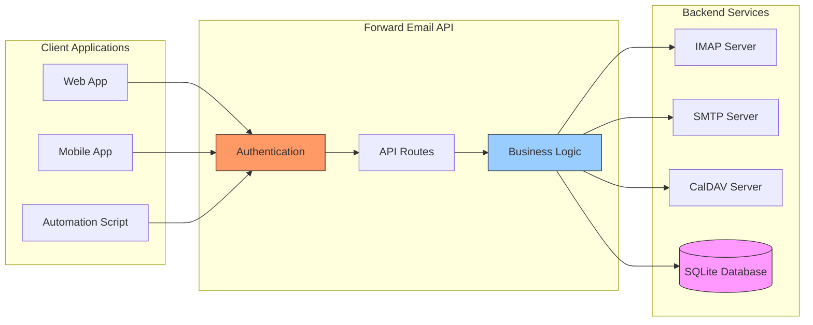

---


## Thông Báo Đẩy iOS {#ios-push-notifications}

> \[!TIP]
> Forward Email hỗ trợ thông báo đẩy iOS gốc thông qua XAPPLEPUSHSERVICE để gửi email ngay lập tức.

> \[!IMPORTANT]
> **Tính Năng Độc Đáo:** Forward Email là một trong số ít máy chủ email mã nguồn mở hỗ trợ thông báo đẩy iOS gốc cho email, danh bạ và lịch qua phần mở rộng IMAP `XAPPLEPUSHSERVICE`. Điều này được đảo ngược từ giao thức của Apple và cung cấp giao hàng tức thì đến thiết bị iOS mà không làm hao pin.

Forward Email triển khai phần mở rộng độc quyền XAPPLEPUSHSERVICE của Apple, cung cấp thông báo đẩy gốc cho thiết bị iOS mà không cần phải kiểm tra nền.

### Cách Hoạt Động {#how-it-works-1}

**XAPPLEPUSHSERVICE** là phần mở rộng IMAP không chuẩn cho phép ứng dụng Mail trên iOS nhận thông báo đẩy tức thì khi có email mới đến.

Forward Email triển khai tích hợp dịch vụ Thông báo Đẩy Apple (APNs) độc quyền cho IMAP, cho phép ứng dụng Mail trên iOS nhận thông báo đẩy tức thì khi có email mới đến.

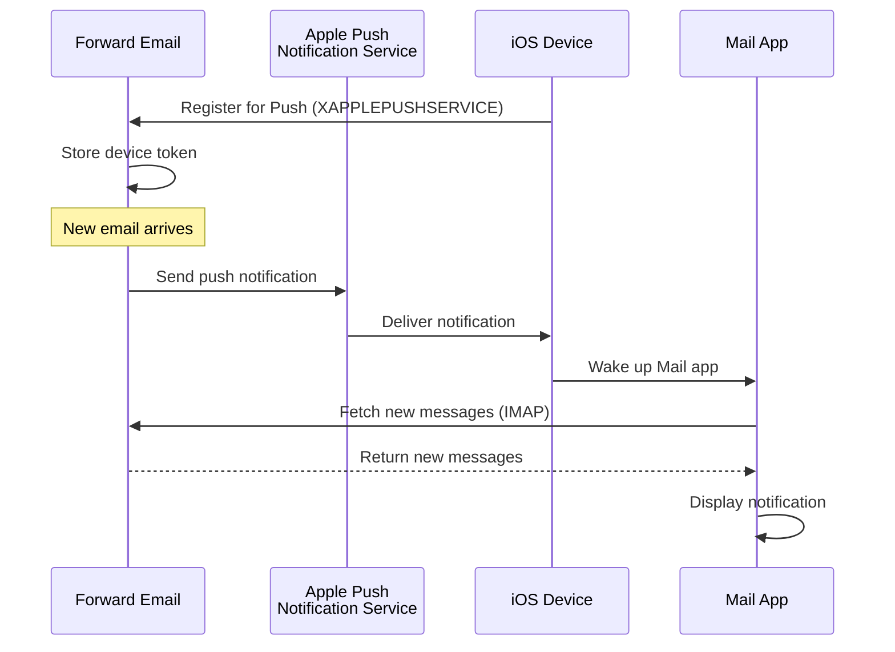

### Tính Năng Chính {#key-features}

**Giao Hàng Tức Thì:**

* Thông báo đẩy đến trong vài giây
* Không hao pin do kiểm tra nền liên tục
* Hoạt động ngay cả khi ứng dụng Mail đóng

<!---->

* **Giao Hàng Tức Thì:** Email, sự kiện lịch và danh bạ xuất hiện trên iPhone/iPad của bạn ngay lập tức, không theo lịch kiểm tra định kỳ
* **Tiết Kiệm Pin:** Sử dụng hạ tầng đẩy của Apple thay vì duy trì kết nối IMAP liên tục
* **Đẩy Theo Chủ Đề:** Hỗ trợ thông báo đẩy cho các hộp thư cụ thể, không chỉ INBOX
* **Không Cần Ứng Dụng Bên Thứ Ba:** Hoạt động với ứng dụng Mail, Lịch và Danh bạ gốc trên iOS
**Tích Hợp Gốc:**

* Được tích hợp sẵn trong ứng dụng Mail của iOS
* Không cần ứng dụng bên thứ ba
* Trải nghiệm người dùng liền mạch

**Tập Trung Vào Quyền Riêng Tư:**

* Token thiết bị được mã hóa
* Không gửi nội dung tin nhắn qua APNS
* Chỉ gửi thông báo "thư mới"

**Tiết Kiệm Pin:**

* Không kiểm tra IMAP liên tục
* Thiết bị ngủ cho đến khi có thông báo đến
* Tác động pin tối thiểu

### Điều Gì Làm Cho Điều Này Đặc Biệt {#what-makes-this-special}

> \[!IMPORTANT]
> Hầu hết nhà cung cấp email không hỗ trợ XAPPLEPUSHSERVICE, buộc thiết bị iOS phải kiểm tra thư mới mỗi 15 phút.

Hầu hết các máy chủ email mã nguồn mở (bao gồm Dovecot, Postfix, Cyrus IMAP) KHÔNG hỗ trợ thông báo đẩy iOS. Người dùng phải:

* Sử dụng IMAP IDLE (giữ kết nối mở, hao pin)
* Sử dụng polling (kiểm tra mỗi 15-30 phút, thông báo bị trễ)
* Sử dụng ứng dụng email độc quyền với hạ tầng đẩy riêng

Forward Email cung cấp trải nghiệm thông báo đẩy tức thì tương tự như các dịch vụ thương mại như Gmail, iCloud và Fastmail.

**So Sánh Với Các Nhà Cung Cấp Khác:**

| Nhà Cung Cấp      | Hỗ Trợ Đẩy    | Khoảng Thời Gian Polling | Tác Động Pin   |
| ----------------- | ------------- | ----------------------- | -------------- |
| **Forward Email** | ✅ Đẩy Gốc    | Tức thì                 | Tối thiểu      |
| Gmail             | ✅ Đẩy Gốc    | Tức thì                 | Tối thiểu      |
| iCloud            | ✅ Đẩy Gốc    | Tức thì                 | Tối thiểu      |
| Yahoo             | ✅ Đẩy Gốc    | Tức thì                 | Tối thiểu      |
| Outlook.com       | ❌ Polling    | 15 phút                 | Trung bình     |
| Fastmail          | ❌ Polling    | 15 phút                 | Trung bình     |
| ProtonMail        | ⚠️ Chỉ qua Bridge | Qua Bridge             | Cao            |
| Tutanota          | ❌ Chỉ ứng dụng | N/A                     | N/A            |

### Chi Tiết Triển Khai {#implementation-details}

**Phản Hồi IMAP CAPABILITY:**

```
* CAPABILITY IMAP4rev1 ... XAPPLEPUSHSERVICE ...
```

**Quy Trình Đăng Ký:**

1. Ứng dụng Mail iOS phát hiện khả năng XAPPLEPUSHSERVICE
2. Ứng dụng đăng ký token thiết bị với Forward Email
3. Forward Email lưu token và liên kết với tài khoản
4. Khi có thư mới, Forward Email gửi đẩy qua APNS
5. iOS đánh thức ứng dụng Mail để lấy thư mới

**Bảo Mật:**

* Token thiết bị được mã hóa khi lưu trữ
* Token hết hạn và được làm mới tự động
* Không tiết lộ nội dung tin nhắn cho APNS
* Duy trì mã hóa đầu cuối

<!---->

* **Mở Rộng IMAP:** `XAPPLEPUSHSERVICE`
* **Mã Nguồn:** [WildDuck Issue #711](https://github.com/zone-eu/wildduck/issues/711)
* **Cài Đặt:** Tự động - không cần cấu hình, hoạt động ngay với ứng dụng Mail iOS

### So Sánh Với Các Dịch Vụ Khác {#comparison-with-other-services}

| Dịch Vụ       | Hỗ Trợ Đẩy iOS | Phương Thức                              |
| ------------- | -------------- | --------------------------------------- |
| Forward Email | ✅ Có          | `XAPPLEPUSHSERVICE` (đảo ngược)         |
| Gmail         | ✅ Có          | Ứng dụng Gmail độc quyền + đẩy Google    |
| iCloud Mail   | ✅ Có          | Tích hợp gốc của Apple                   |
| Outlook.com   | ✅ Có          | Ứng dụng Outlook độc quyền + đẩy Microsoft |
| Fastmail      | ✅ Có          | `XAPPLEPUSHSERVICE`                      |
| Dovecot       | ❌ Không       | Chỉ IMAP IDLE hoặc polling               |
| Postfix       | ❌ Không       | Chỉ IMAP IDLE hoặc polling               |
| Cyrus IMAP    | ❌ Không       | Chỉ IMAP IDLE hoặc polling               |

**Đẩy Gmail:**

Gmail sử dụng hệ thống đẩy độc quyền chỉ hoạt động với ứng dụng Gmail. Ứng dụng Mail iOS phải kiểm tra máy chủ IMAP của Gmail.

**Đẩy iCloud:**

iCloud có hỗ trợ đẩy gốc tương tự Forward Email, nhưng chỉ dành cho địa chỉ @icloud.com.

**Outlook.com:**

Outlook.com không hỗ trợ XAPPLEPUSHSERVICE, yêu cầu ứng dụng Mail iOS phải kiểm tra mỗi 15 phút.

**Fastmail:**

Fastmail không hỗ trợ XAPPLEPUSHSERVICE. Người dùng phải dùng ứng dụng Fastmail để nhận thông báo đẩy hoặc chấp nhận độ trễ polling 15 phút.

---


## Kiểm Tra Và Xác Minh {#testing-and-verification}


## Kiểm Tra Khả Năng Giao Thức {#protocol-capability-tests}
> \[!NOTE]
> Phần này cung cấp kết quả của các bài kiểm tra khả năng giao thức mới nhất của chúng tôi, được thực hiện vào ngày 22 tháng 1 năm 2026.

Phần này chứa các phản hồi CAPABILITY/CAPA/EHLO thực tế từ tất cả các nhà cung cấp đã được kiểm tra. Tất cả các bài kiểm tra được thực hiện vào **ngày 22 tháng 1 năm 2026**.

Các bài kiểm tra này giúp xác minh sự hỗ trợ được quảng cáo và thực tế cho các giao thức email và các phần mở rộng khác nhau trên các nhà cung cấp lớn.

### Phương pháp kiểm tra {#test-methodology}

**Môi trường kiểm tra:**

* **Ngày:** 22 tháng 1 năm 2026 lúc 02:37 UTC
* **Vị trí:** Phiên bản AWS EC2
* **IPv4:** 54.167.216.197
* **IPv6:** 2600:4040:46da:9a00:b19e:3ad4:426c:2f48
* **Công cụ:** OpenSSL s_client, các script bash

**Các nhà cung cấp được kiểm tra:**

* Forward Email
* Gmail
* Outlook.com
* iCloud
* Fastmail
* Yahoo/AOL (Verizon)

### Các script kiểm tra {#test-scripts}

Để minh bạch hoàn toàn, các script chính xác được sử dụng cho các bài kiểm tra này được cung cấp bên dưới.

#### Script kiểm tra khả năng IMAP {#imap-capability-test-script}

```bash
#!/bin/bash
# IMAP Capability Test Script
# Tests IMAP CAPABILITY for various email providers

echo "========================================="
echo "IMAP CAPABILITY TEST"
echo "Date: $(date -u +"%Y-%m-%d %H:%M:%S UTC")"
echo "========================================="
echo ""

# Gmail
echo "--- Gmail (imap.gmail.com:993) ---"
echo -e "a001 CAPABILITY\na002 LOGOUT" | timeout 10 openssl s_client -connect imap.gmail.com:993 -crlf -quiet 2>&1 | grep -A 20 "CAPABILITY"
echo ""

# Outlook.com
echo "--- Outlook.com (outlook.office365.com:993) ---"
echo -e "a001 CAPABILITY\na002 LOGOUT" | timeout 10 openssl s_client -connect outlook.office365.com:993 -crlf -quiet 2>&1 | grep -A 20 "CAPABILITY"
echo ""

# iCloud
echo "--- iCloud (imap.mail.me.com:993) ---"
echo -e "a001 CAPABILITY\na002 LOGOUT" | timeout 10 openssl s_client -connect imap.mail.me.com:993 -crlf -quiet 2>&1 | grep -A 20 "CAPABILITY"
echo ""

# Fastmail
echo "--- Fastmail (imap.fastmail.com:993) ---"
echo -e "a001 CAPABILITY\na002 LOGOUT" | timeout 10 openssl s_client -connect imap.fastmail.com:993 -crlf -quiet 2>&1 | grep -A 20 "CAPABILITY"
echo ""

# Yahoo
echo "--- Yahoo (imap.mail.yahoo.com:993) ---"
echo -e "a001 CAPABILITY\na002 LOGOUT" | timeout 10 openssl s_client -connect imap.mail.yahoo.com:993 -crlf -quiet 2>&1 | grep -A 20 "CAPABILITY"
echo ""

# Forward Email
echo "--- Forward Email (imap.forwardemail.net:993) ---"
echo -e "a001 CAPABILITY\na002 LOGOUT" | timeout 10 openssl s_client -connect imap.forwardemail.net:993 -crlf -quiet 2>&1 | grep -A 20 "CAPABILITY"
echo ""

echo "========================================="
echo "Test completed"
echo "========================================="
```

#### Script kiểm tra khả năng POP3 {#pop3-capability-test-script}

```bash
#!/bin/bash
# POP3 Capability Test Script
# Tests POP3 CAPA for various email providers

echo "========================================="
echo "POP3 CAPABILITY TEST"
echo "Date: $(date -u +"%Y-%m-%d %H:%M:%S UTC")"
echo "========================================="
echo ""

# Gmail
echo "--- Gmail (pop.gmail.com:995) ---"
echo -e "CAPA\nQUIT" | timeout 10 openssl s_client -connect pop.gmail.com:995 -crlf -quiet 2>&1 | grep -A 20 "CAPA"
echo ""

# Outlook.com
echo "--- Outlook.com (outlook.office365.com:995) ---"
echo -e "CAPA\nQUIT" | timeout 10 openssl s_client -connect outlook.office365.com:995 -crlf -quiet 2>&1 | grep -A 20 "CAPA"
echo ""

# iCloud (Lưu ý: iCloud không hỗ trợ POP3)
echo "--- iCloud (No POP3 support) ---"
echo "iCloud does not support POP3"
echo ""

# Fastmail
echo "--- Fastmail (pop.fastmail.com:995) ---"
echo -e "CAPA\nQUIT" | timeout 10 openssl s_client -connect pop.fastmail.com:995 -crlf -quiet 2>&1 | grep -A 20 "CAPA"
echo ""

# Yahoo
echo "--- Yahoo (pop.mail.yahoo.com:995) ---"
echo -e "CAPA\nQUIT" | timeout 10 openssl s_client -connect pop.mail.yahoo.com:995 -crlf -quiet 2>&1 | grep -A 20 "CAPA"
echo ""

# Forward Email
echo "--- Forward Email (pop3.forwardemail.net:995) ---"
echo -e "CAPA\nQUIT" | timeout 10 openssl s_client -connect pop3.forwardemail.net:995 -crlf -quiet 2>&1 | grep -A 20 "CAPA"
echo ""

echo "========================================="
echo "Test completed"
echo "========================================="
```
#### SMTP Capability Test Script {#smtp-capability-test-script}

```bash
#!/bin/bash
# SMTP Capability Test Script
# Tests SMTP EHLO for various email providers

echo "========================================="
echo "KIỂM TRA KHẢ NĂNG SMTP"
echo "Date: $(date -u +"%Y-%m-%d %H:%M:%S UTC")"
echo "========================================="
echo ""

# Gmail
echo "--- Gmail (smtp.gmail.com:587) ---"
echo -e "EHLO test.com\nQUIT" | timeout 10 openssl s_client -connect smtp.gmail.com:587 -starttls smtp -crlf -quiet 2>&1 | grep -A 30 "250-"
echo ""

# Outlook.com
echo "--- Outlook.com (smtp.office365.com:587) ---"
echo -e "EHLO test.com\nQUIT" | timeout 10 openssl s_client -connect smtp.office365.com:587 -starttls smtp -crlf -quiet 2>&1 | grep -A 30 "250-"
echo ""

# iCloud
echo "--- iCloud (smtp.mail.me.com:587) ---"
echo -e "EHLO test.com\nQUIT" | timeout 10 openssl s_client -connect smtp.mail.me.com:587 -starttls smtp -crlf -quiet 2>&1 | grep -A 30 "250-"
echo ""

# Fastmail
echo "--- Fastmail (smtp.fastmail.com:587) ---"
echo -e "EHLO test.com\nQUIT" | timeout 10 openssl s_client -connect smtp.fastmail.com:587 -starttls smtp -crlf -quiet 2>&1 | grep -A 30 "250-"
echo ""

# Yahoo
echo "--- Yahoo (smtp.mail.yahoo.com:587) ---"
echo -e "EHLO test.com\nQUIT" | timeout 10 openssl s_client -connect smtp.mail.yahoo.com:587 -starttls smtp -crlf -quiet 2>&1 | grep -A 30 "250-"
echo ""

# Forward Email
echo "--- Forward Email (smtp.forwardemail.net:587) ---"
echo -e "EHLO test.com\nQUIT" | timeout 10 openssl s_client -connect smtp.forwardemail.net:587 -starttls smtp -crlf -quiet 2>&1 | grep -A 30 "250-"
echo ""

echo "========================================="
echo "Kiểm tra hoàn tất"
echo "========================================="
```

### Test Results Summary {#test-results-summary}

#### IMAP (CAPABILITY) {#imap-capability}

**Forward Email**

```
* CAPABILITY IMAP4rev1 AUTH=PLAIN AUTH=PLAIN-CLIENTTOKEN CHILDREN ENABLE ID IDLE NAMESPACE QUOTA SASL-IR UNSELECT XLIST XAPPLEPUSHSERVICE
```

**Gmail**

```
* CAPABILITY IMAP4rev1 UNSELECT IDLE NAMESPACE QUOTA ID XLIST CHILDREN X-GM-EXT-1 UIDPLUS COMPRESS=DEFLATE ENABLE MOVE CONDSTORE ESEARCH UTF8=ACCEPT LIST-EXTENDED LIST-STATUS LITERAL- SPECIAL-USE
```

**iCloud**

```
* OK [CAPABILITY XAPPLEPUSHSERVICE IMAP4 IMAP4rev1 SASL-IR AUTH=ATOKEN AUTH=PLAIN AUTH=ATOKEN2 AUTH=XOAUTH2]
```

**Outlook.com**

```
* CAPABILITY IMAP4rev1 AUTH=PLAIN AUTH=XOAUTH2 SASL-IR UIDPLUS ID UNSELECT CHILDREN IDLE NAMESPACE LITERAL+
```

**Fastmail**

```
* CAPABILITY IMAP4rev1 ACL ANNOTATE-EXPERIMENT-1 CATENATE CONDSTORE ENABLE ESEARCH ESORT I18NLEVEL=1 ID IDLE LIST-EXTENDED LIST-STATUS LITERAL+ LOGINDISABLED MULTIAPPEND NAMESPACE QRESYNC QUOTA RIGHTS=ektx SASL-IR SORT SPECIAL-USE THREAD=ORDEREDSUBJECT UIDPLUS UNSELECT WITHIN X-RENAME XLIST
```

**Yahoo/AOL (Verizon)**

```
* CAPABILITY IMAP4rev1 IDLE NAMESPACE QUOTA ID XLIST CHILDREN UIDPLUS MOVE CONDSTORE ESEARCH ENABLE LIST-EXTENDED LIST-STATUS LITERAL- SPECIAL-USE UNSELECT XAPPLEPUSHSERVICE
```

#### POP3 (CAPA) {#pop3-capa}

**Forward Email**

```
+OK
CAPA
TOP
USER
UIDL
EXPIRE 30
IMPLEMENTATION ForwardEmail
.
```

**Gmail**

```
+OK
CAPA
TOP
USER
UIDL
EXPIRE 30
IMPLEMENTATION Gpop
.
```

**Outlook.com**

```
+OK
CAPA
TOP
USER
UIDL
SASL PLAIN XOAUTH2
.
```

**Fastmail**

```
+OK
CAPA
TOP
USER
UIDL
EXPIRE 30
IMPLEMENTATION Cyrus
.
```

#### SMTP (EHLO) {#smtp-ehlo}

**Forward Email**

```
250-smtp.forwardemail.net
250-PIPELINING
250-SIZE 52428800
250-ETRN
250-STARTTLS
250-ENHANCEDSTATUSCODES
250-8BITMIME
250-DSN
250 CHUNKING
```

**Gmail**

```
250-smtp.gmail.com at your service
250-SIZE 35882577
250-8BITMIME
250-STARTTLS
250-ENHANCEDSTATUSCODES
250-PIPELINING
250-CHUNKING
250 SMTPUTF8
```

**Outlook.com**

```
250-SN4PR13CA0005.outlook.office365.com Hello [x.x.x.x]
250-SIZE 157286400
250-PIPELINING
250-DSN
250-ENHANCEDSTATUSCODES
250-STARTTLS
250-8BITMIME
250-BINARYMIME
250-CHUNKING
250 SMTPUTF8
```

**Fastmail**

```
250-smtp.fastmail.com
250-PIPELINING
250-SIZE 78643200
250-ETRN
250-STARTTLS
250-ENHANCEDSTATUSCODES
250-8BITMIME
250-DSN
250 CHUNKING
```

**Yahoo/AOL (Verizon)**

```
250-smtp.mail.yahoo.com
250-PIPELINING
250-SIZE 41943040
250-8BITMIME
250-ENHANCEDSTATUSCODES
250-STARTTLS
```
### Kết Quả Kiểm Tra Chi Tiết {#detailed-test-results}

#### Kết Quả Kiểm Tra IMAP {#imap-test-results}

**Gmail:**
`* CAPABILITY IMAP4rev1 UNSELECT IDLE NAMESPACE QUOTA ID XLIST CHILDREN X-GM-EXT-1 XYZZY SASL-IR AUTH=XOAUTH2 AUTH=PLAIN AUTH=PLAIN-CLIENTTOKEN AUTH=OAUTHBEARER`

**Outlook.com:**
`* CAPABILITY IMAP4 IMAP4rev1 AUTH=PLAIN AUTH=XOAUTH2 SASL-IR UIDPLUS ID UNSELECT CHILDREN IDLE NAMESPACE LITERAL+`

**iCloud:**
`* CAPABILITY XAPPLEPUSHSERVICE IMAP4 IMAP4rev1 SASL-IR AUTH=ATOKEN AUTH=PLAIN AUTH=ATOKEN2 AUTH=XOAUTH2`

**Fastmail:**
Kết nối hết thời gian chờ. Xem ghi chú bên dưới.

**Yahoo:**
`* CAPABILITY IMAP4rev1 SASL-IR AUTH=PLAIN AUTH=XOAUTH2 AUTH=OAUTHBEARER ID MOVE NAMESPACE XYMHIGHESTMODSEQ UIDPLUS LITERAL+ CHILDREN UNSELECT X-MSG-EXT OBJECTID IDLE ENABLE UIDONLY X-ALL-MAIL X-UIDONLY LIST-EXTENDED LIST-STATUS SPECIAL-USE PARTIAL APPENDLIMIT=41697280`

**Forward Email:**
`* CAPABILITY XAPPLEPUSHSERVICE IMAP4rev1 APPENDLIMIT=52428800 AUTH=PLAIN AUTH=PLAIN-CLIENTTOKEN CHILDREN CONDSTORE ENABLE ID IDLE MOVE NAMESPACE QUOTA SASL-IR SPECIAL-USE UIDPLUS UNSELECT UTF8=ACCEPT XLIST`

#### Kết Quả Kiểm Tra POP3 {#pop3-test-results}

**Gmail:**
Kết nối không trả về phản hồi CAPA nếu không xác thực.

**Outlook.com:**
Kết nối không trả về phản hồi CAPA nếu không xác thực.

**iCloud:**
Không hỗ trợ.

**Fastmail:**
Kết nối hết thời gian chờ. Xem ghi chú bên dưới.

**Yahoo:**
`+OK CAPA list follows... SASL PLAIN XOAUTH2`

**Forward Email:**
Kết nối không trả về phản hồi CAPA nếu không xác thực.

#### Kết Quả Kiểm Tra SMTP {#smtp-test-results}

**Gmail:**
`250-AUTH LOGIN PLAIN XOAUTH2 PLAIN-CLIENTTOKEN OAUTHBEARER XOAUTH`

**Outlook.com:**
`250-DSN`

**iCloud:**
`250-DSN`

**Fastmail:**
`250 AUTH PLAIN LOGIN XOAUTH2 OAUTHBEARER`

**Yahoo:**
`250 AUTH PLAIN LOGIN XOAUTH2 OAUTHBEARER`

**Forward Email:**
`250-DSN`, `250-REQUIRETLS`

### Ghi Chú Về Kết Quả Kiểm Tra {#notes-on-test-results}

> \[!NOTE]
> Những quan sát và giới hạn quan trọng từ kết quả kiểm tra.

1. **Fastmail Hết Thời Gian Chờ**: Kết nối Fastmail bị hết thời gian chờ trong quá trình kiểm tra, có thể do giới hạn tần suất hoặc hạn chế tường lửa từ IP máy chủ kiểm tra. Fastmail được biết đến với hỗ trợ IMAP/POP3/SMTP mạnh mẽ dựa trên tài liệu của họ.

2. **Phản Hồi CAPA POP3**: Một số nhà cung cấp (Gmail, Outlook.com, Forward Email) không trả về phản hồi CAPA nếu không xác thực. Đây là thực hành bảo mật phổ biến cho máy chủ POP3.

3. **Hỗ Trợ DSN**: Chỉ Outlook.com, iCloud và Forward Email công khai hỗ trợ DSN trong phản hồi EHLO SMTP của họ. Điều này không nhất thiết có nghĩa các nhà cung cấp khác không hỗ trợ DSN, nhưng họ không quảng cáo nó.

4. **REQUIRETLS**: Chỉ Forward Email công khai hỗ trợ REQUIRETLS với hộp kiểm bắt buộc người dùng. Các nhà cung cấp khác có thể hỗ trợ nội bộ nhưng không quảng cáo trong EHLO.

5. **Môi Trường Kiểm Tra**: Các kiểm tra được thực hiện từ phiên bản AWS EC2 (IP: 54.167.216.197 IPv4, 2600:4040:46da:9a00:b19e:3ad4:426c:2f48 IPv6) vào ngày 22 tháng 1 năm 2026 lúc 02:37 UTC.

---


## Tóm Tắt {#summary}

Forward Email cung cấp hỗ trợ giao thức RFC toàn diện trên tất cả các tiêu chuẩn email chính:

* **IMAP4rev1:** 16 RFC được hỗ trợ với các khác biệt có chủ đích được ghi chép
* **POP3:** 4 RFC được hỗ trợ với xóa vĩnh viễn tuân thủ RFC
* **SMTP:** 11 phần mở rộng được hỗ trợ bao gồm SMTPUTF8, DSN, và PIPELINING
* **Xác Thực:** Hỗ trợ đầy đủ DKIM, SPF, DMARC, ARC
* **Bảo Mật Vận Chuyển:** Hỗ trợ đầy đủ MTA-STS và REQUIRETLS, hỗ trợ một phần DANE
* **Mã Hóa:** Hỗ trợ OpenPGP v6 và S/MIME
* **Lịch:** Hỗ trợ đầy đủ CalDAV, CardDAV, và VTODO
* **Truy Cập API:** API REST hoàn chỉnh với 39 điểm cuối cho truy cập cơ sở dữ liệu trực tiếp
* **Đẩy iOS:** Thông báo đẩy gốc cho email, danh bạ và lịch qua `XAPPLEPUSHSERVICE`

### Điểm Khác Biệt Chính {#key-differentiators}

> \[!TIP]
> Forward Email nổi bật với các tính năng độc đáo không có ở các nhà cung cấp khác.

**Điều Gì Làm Forward Email Đặc Biệt:**

1. **Mã Hóa An Toàn Lượng Tử** - Nhà cung cấp duy nhất với hộp thư SQLite mã hóa ChaCha20-Poly1305
2. **Kiến Trúc Không Biết Gì** - Mật khẩu của bạn mã hóa hộp thư; chúng tôi không thể giải mã
3. **Tên Miền Tùy Chỉnh Miễn Phí** - Không phí hàng tháng cho email tên miền tùy chỉnh
4. **Hỗ Trợ REQUIRETLS** - Hộp kiểm bắt buộc người dùng để thực thi TLS cho toàn bộ đường truyền
5. **API Toàn Diện** - 39 điểm cuối REST API cho kiểm soát lập trình đầy đủ
6. **Thông Báo Đẩy iOS** - Hỗ trợ gốc XAPPLEPUSHSERVICE cho giao hàng tức thì
7. **Mã Nguồn Mở** - Mã nguồn đầy đủ có trên GitHub
8. **Tập Trung Vào Quyền Riêng Tư** - Không khai thác dữ liệu, không quảng cáo, không theo dõi
* **Mã hóa trong môi trường cách ly:** Duy nhất dịch vụ email với hộp thư SQLite được mã hóa riêng lẻ  
* **Tuân thủ RFC:** Ưu tiên tuân thủ tiêu chuẩn hơn sự tiện lợi (ví dụ: POP3 DELE)  
* **API hoàn chỉnh:** Truy cập lập trình trực tiếp đến tất cả dữ liệu email  
* **Mã nguồn mở:** Triển khai hoàn toàn minh bạch  

**Tóm tắt hỗ trợ giao thức:**  

| Danh mục             | Mức độ hỗ trợ | Chi tiết                                       |
| -------------------- | ------------- | --------------------------------------------- |
| **Giao thức cốt lõi**   | ✅ Xuất sắc   | Hỗ trợ đầy đủ IMAP4rev1, POP3, SMTP           |
| **Giao thức hiện đại** | ⚠️ Một phần    | Hỗ trợ một phần IMAP4rev2, không hỗ trợ JMAP  |
| **Bảo mật**           | ✅ Xuất sắc   | DKIM, SPF, DMARC, ARC, MTA-STS, REQUIRETLS    |
| **Mã hóa**            | ✅ Xuất sắc   | OpenPGP, S/MIME, mã hóa SQLite                 |
| **CalDAV/CardDAV**    | ✅ Xuất sắc   | Đồng bộ lịch và danh bạ đầy đủ                  |
| **Lọc**               | ✅ Xuất sắc   | Sieve (24 tiện ích mở rộng) và ManageSieve     |
| **API**               | ✅ Xuất sắc   | 39 điểm cuối REST API                           |
| **Push**              | ✅ Xuất sắc   | Thông báo đẩy gốc trên iOS                      |
