# 电子邮件 RFC 协议支持 - 完整标准与规范指南 {#email-rfc-protocol-support---complete-standards--specifications-guide}


## 目录 {#table-of-contents}

* [关于本文档](#about-this-document)
  * [架构概述](#architecture-overview)
* [电子邮件服务比较 - 协议支持与 RFC 标准合规性](#email-service-comparison---protocol-support--rfc-standards-compliance)
  * [协议支持可视化](#protocol-support-visualization)
* [核心电子邮件协议](#core-email-protocols)
  * [电子邮件协议流程](#email-protocol-flow)
* [IMAP4 电子邮件协议及扩展](#imap4-email-protocol-and-extensions)
  * [IMAP 协议与 RFC 规范的差异](#imap-protocol-differences-from-rfc-specifications)
  * [不支持的 IMAP 扩展](#imap-extensions-not-supported)
* [POP3 电子邮件协议及扩展](#pop3-email-protocol-and-extensions)
  * [POP3 协议与 RFC 规范的差异](#pop3-protocol-differences-from-rfc-specifications)
  * [不支持的 POP3 扩展](#pop3-extensions-not-supported)
* [SMTP 电子邮件协议及扩展](#smtp-email-protocol-and-extensions)
  * [投递状态通知（DSN）](#delivery-status-notifications-dsn)
  * [REQUIRETLS 支持](#requiretls-support)
  * [不支持的 SMTP 扩展](#smtp-extensions-not-supported)
* [JMAP 电子邮件协议](#jmap-email-protocol)
* [电子邮件安全](#email-security)
  * [电子邮件安全架构](#email-security-architecture)
* [电子邮件消息认证协议](#email-message-authentication-protocols)
  * [认证协议支持](#authentication-protocol-support)
  * [DKIM（域密钥识别邮件）](#dkim-domainkeys-identified-mail)
  * [SPF（发件人策略框架）](#spf-sender-policy-framework)
  * [DMARC（基于域的消息认证、报告与一致性）](#dmarc-domain-based-message-authentication-reporting--conformance)
  * [ARC（认证接收链）](#arc-authenticated-received-chain)
  * [认证流程](#authentication-flow)
* [电子邮件传输安全协议](#email-transport-security-protocols)
  * [传输安全支持](#transport-security-support)
  * [TLS（传输层安全）](#tls-transport-layer-security)
  * [MTA-STS（邮件传输代理严格传输安全）](#mta-sts-mail-transfer-agent-strict-transport-security)
  * [DANE（基于 DNS 的命名实体认证）](#dane-dns-based-authentication-of-named-entities)
  * [REQUIRETLS](#requiretls)
  * [传输安全流程](#transport-security-flow)
* [电子邮件消息加密](#email-message-encryption)
  * [加密支持](#encryption-support)
  * [OpenPGP（非常好的隐私保护）](#openpgp-pretty-good-privacy)
  * [S/MIME（安全/多用途互联网邮件扩展）](#smime-securemultipurpose-internet-mail-extensions)
  * [SQLite 邮箱加密](#sqlite-mailbox-encryption)
  * [加密比较](#encryption-comparison)
  * [加密流程](#encryption-flow)
* [扩展功能](#extended-functionality)
* [电子邮件消息格式标准](#email-message-format-standards)
  * [格式标准支持](#format-standards-support)
  * [MIME（多用途互联网邮件扩展）](#mime-multipurpose-internet-mail-extensions)
  * [SMTPUTF8 与电子邮件地址国际化](#smtputf8-and-email-address-internationalization)
* [日历与联系人协议](#calendaring-and-contacts-protocols)
  * [CalDAV 与 CardDAV 支持](#caldav-and-carddav-support)
  * [CalDAV（日历访问）](#caldav-calendar-access)
  * [CardDAV（联系人访问）](#carddav-contact-access)
  * [任务与提醒（CalDAV VTODO）](#tasks-and-reminders-caldav-vtodo)
  * [CalDAV/CardDAV 同步流程](#caldavcarddav-synchronization-flow)
  * [不支持的日历扩展](#calendaring-extensions-not-supported)
* [电子邮件消息过滤](#email-message-filtering)
  * [Sieve（RFC 5228）](#sieve-rfc-5228)
  * [ManageSieve（RFC 5804）](#managesieve-rfc-5804)
* [存储优化](#storage-optimization)
  * [架构：双层存储优化](#architecture-dual-layer-storage-optimization)
* [附件去重](#attachment-deduplication)
  * [工作原理](#how-it-works)
  * [去重流程](#deduplication-flow)
  * [魔术数字系统](#magic-number-system)
  * [关键差异：WildDuck 与 Forward Email](#key-differences-wildduck-vs-forward-email)
* [Brotli 压缩](#brotli-compression)
  * [压缩内容](#what-gets-compressed)
  * [压缩配置](#compression-configuration)
  * [魔术头："FEBR"](#magic-header-febr)
  * [压缩过程](#compression-process)
  * [解压过程](#decompression-process)
  * [向后兼容性](#backwards-compatibility)
  * [存储节省统计](#storage-savings-statistics)
  * [迁移过程](#migration-process)
  * [综合存储效率](#combined-storage-efficiency)
  * [技术实现细节](#technical-implementation-details)
  * [为什么其他服务商不这样做](#why-no-other-provider-does-this)
* [现代功能](#modern-features)
* [完整的电子邮件管理 REST API](#complete-rest-api-for-email-management)
  * [API 分类（39 个端点）](#api-categories-39-endpoints)
  * [技术细节](#technical-details)
  * [实际应用案例](#real-world-use-cases)
  * [关键 API 功能](#key-api-features)
  * [API 架构](#api-architecture)
* [iOS 推送通知](#ios-push-notifications)
  * [工作原理](#how-it-works-1)
  * [关键功能](#key-features)
  * [特别之处](#what-makes-this-special)
  * [实现细节](#implementation-details)
  * [与其他服务的比较](#comparison-with-other-services)
* [测试与验证](#testing-and-verification)
* [协议能力测试](#protocol-capability-tests)
  * [测试方法](#test-methodology)
  * [测试脚本](#test-scripts)
  * [测试结果摘要](#test-results-summary)
  * [详细测试结果](#detailed-test-results)
  * [测试结果说明](#notes-on-test-results)
* [总结](#summary)
  * [关键差异点](#key-differentiators)
## 关于本文档 {#about-this-document}

本文档概述了 Forward Email 对 RFC（请求评论）协议的支持。由于 Forward Email 在底层使用了 [WildDuck](https://github.com/nodemailer/wildduck) 来实现 IMAP/POP3 功能，因此此处记录的协议支持和限制反映了 WildDuck 的实现情况。

> \[!IMPORTANT]
> Forward Email 使用 [SQLite](https://sqlite.org/) 进行消息存储，而非 WildDuck 最初使用的 MongoDB。这会影响下面记录的某些实现细节。

**源代码：** <https://github.com/forwardemail/forwardemail.net>

### 架构概览 {#architecture-overview}

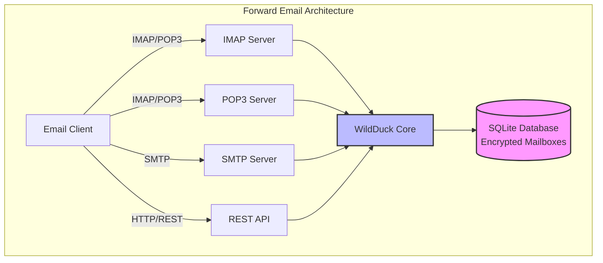

---


## 邮件服务比较 - 协议支持与 RFC 标准合规性 {#email-service-comparison---protocol-support--rfc-standards-compliance}

> \[!IMPORTANT]
> **沙箱化且抗量子加密：** Forward Email 是唯一一个使用您的密码（仅您拥有）对 SQLite 邮箱进行单独加密的邮件服务。每个邮箱均使用 [sqleet](https://github.com/resilar/sqleet)（ChaCha20-Poly1305）加密，自包含、沙箱化且可移植。如果您忘记密码，将无法找回邮箱，连 Forward Email 也无法恢复。详情请参见 [量子安全加密邮件](https://forwardemail.net/en/blog/docs/best-quantum-safe-encrypted-email-service)。

比较主要邮件提供商的邮件协议支持和 RFC 标准实现：

| 功能                          | Forward Email                                                                                  | Postfix/Dovecot                                                                    | Gmail                                                                             | iCloud 邮箱                                           | Outlook.com                                                                                                                                                          | Fastmail                                                                                 | Yahoo/AOL (Verizon)                                                  | ProtonMail                                                                     | Tutanota                                                          |
| ----------------------------- | ---------------------------------------------------------------------------------------------- | ---------------------------------------------------------------------------------- | --------------------------------------------------------------------------------- | ----------------------------------------------------- | -------------------------------------------------------------------------------------------------------------------------------------------------------------------- | ---------------------------------------------------------------------------------------- | -------------------------------------------------------------------- | ------------------------------------------------------------------------------ | ----------------------------------------------------------------- |
| **自定义域价格**               | [免费](https://forwardemail.net/en/pricing)                                                    | [免费](https://www.postfix.org/)                                                   | [$7.20/月](https://workspace.google.com/pricing)                                  | [$0.99/月](https://support.apple.com/en-us/102622)    | [$7.20/月](https://www.microsoft.com/en-us/microsoft-365/business/microsoft-365-business-basic)                                                                      | [$5/月](https://www.fastmail.com/pricing/)                                               | [$3.19/月](https://www.turbify.com/mail)                             | [$4.99/月](https://proton.me/mail/pricing)                                     | [$3.27/月](https://tuta.com/pricing)                              |
| **IMAP4rev1 (RFC 3501)**      | ✅ [支持](#imap4-email-protocol-and-extensions)                                                | ✅ [支持](https://www.dovecot.org/)                                                | ✅ [支持](https://developers.google.com/workspace/gmail/imap/imap-extensions)     | ✅ [支持](https://support.apple.com/en-us/102431)     | ✅ [支持](https://support.microsoft.com/en-us/office/pop-imap-and-smtp-settings-for-outlook-com-d088b986-291d-42b8-9564-9c414e2aa040)                            | ✅ [支持](https://www.fastmail.help/hc/en-us/articles/1500000278382-Email-standards)     | ✅ [支持](https://senders.yahooinc.com/developer/documentation/)      | ⚠️ [通过桥接](https://proton.me/support/imap-smtp-and-pop3-setup)            | ❌ 不支持                                                        |
| **IMAP4rev2 (RFC 9051)**      | ⚠️ [部分支持](https://forwardemail.net/en/blog/docs/best-quantum-safe-encrypted-email-service) | ⚠️ [部分支持](https://www.dovecot.org/)                                           | ⚠️ [31%](https://developers.google.com/workspace/gmail/imap/imap-extensions)      | ⚠️ [92%](https://support.apple.com/en-us/102431)      | ⚠️ [46%](https://support.microsoft.com/en-us/office/pop-imap-and-smtp-settings-for-outlook-com-d088b986-291d-42b8-9564-9c414e2aa040)                                 | ⚠️ [69%](https://www.fastmail.help/hc/en-us/articles/1500000278382-Email-standards)     | ⚠️ [85%](https://senders.yahooinc.com/developer/documentation/)      | ⚠️ [通过桥接](https://proton.me/support/imap-smtp-and-pop3-setup)            | ❌ 不支持                                                        |
| **POP3 (RFC 1939)**           | ✅ [支持](#pop3-email-protocol-and-extensions)                                                 | ✅ [支持](https://www.dovecot.org/)                                                | ✅ [支持](https://support.google.com/mail/answer/7104828)                         | ❌ 不支持                                             | ✅ [支持](https://support.microsoft.com/en-us/office/pop-imap-and-smtp-settings-for-outlook-com-d088b986-291d-42b8-9564-9c414e2aa040)                            | ✅ [支持](https://www.fastmail.help/hc/en-us/articles/1500000278382-Email-standards)     | ✅ [支持](https://help.yahoo.com/kb/SLN4075.html)                    | ⚠️ [通过桥接](https://proton.me/support/imap-smtp-and-pop3-setup)            | ❌ 不支持                                                        |
| **SMTP (RFC 5321)**           | ✅ [支持](#smtp-email-protocol-and-extensions)                                                 | ✅ [支持](https://www.postfix.org/)                                                | ✅ [支持](https://support.google.com/mail/answer/7126229)                         | ✅ [支持](https://support.apple.com/en-us/102431)     | ✅ [支持](https://support.microsoft.com/en-us/office/pop-imap-and-smtp-settings-for-outlook-com-d088b986-291d-42b8-9564-9c414e2aa040)                            | ✅ [支持](https://www.fastmail.help/hc/en-us/articles/1500000278382-Email-standards)     | ✅ [支持](https://help.yahoo.com/kb/SLN4075.html)                    | ⚠️ [通过桥接](https://proton.me/support/imap-smtp-and-pop3-setup)            | ❌ 不支持                                                        |
| **JMAP (RFC 8620)**           | ❌ [不支持](#jmap-email-protocol)                                                              | ❌ 不支持                                                                          | ❌ 不支持                                                                         | ❌ 不支持                                             | ❌ 不支持                                                                                                                                                            | ✅ [支持](https://www.fastmail.com/dev/)                                             | ❌ 不支持                                                          | ❌ 不支持                                                                    | ❌ 不支持                                                        |
| **DKIM (RFC 6376)**           | ✅ [支持](#email-message-authentication-protocols)                                             | ✅ [支持](https://github.com/trusteddomainproject/OpenDKIM)                        | ✅ [支持](https://support.google.com/a/answer/174124)                             | ✅ [支持](https://support.apple.com/en-us/102431)     | ✅ [支持](https://learn.microsoft.com/en-us/defender-office-365/email-authentication-dkim-configure)                                                             | ✅ [支持](https://www.fastmail.help/hc/en-us/articles/360060590573)                    | ✅ [支持](https://help.yahoo.com/kb/SLN25426.html)                 | ✅ [支持](https://proton.me/support)                                         | ✅ [支持](https://tuta.com/support#dkim)                            |
| **SPF (RFC 7208)**            | ✅ [支持](#email-message-authentication-protocols)                                             | ✅ [支持](https://www.postfix.org/)                                                | ✅ [支持](https://support.google.com/a/answer/33786)                              | ✅ [支持](https://support.apple.com/en-us/102431)     | ✅ [支持](https://learn.microsoft.com/en-us/microsoft-365/security/office-365-security/how-office-365-uses-spf-to-prevent-spoofing)                              | ✅ [支持](https://www.fastmail.help/hc/en-us/articles/360060590573)                    | ✅ [支持](https://help.yahoo.com/kb/SLN25426.html)                 | ✅ [支持](https://proton.me/support)                                         | ✅ [支持](https://tuta.com/support#dkim)                            |
| **DMARC (RFC 7489)**          | ✅ [支持](#email-message-authentication-protocols)                                             | ✅ [支持](https://www.postfix.org/)                                                | ✅ [支持](https://support.google.com/a/answer/2466580)                            | ✅ [支持](https://support.apple.com/en-us/102431)     | ✅ [支持](https://learn.microsoft.com/en-us/microsoft-365/security/office-365-security/use-dmarc-to-validate-email)                                              | ✅ [支持](https://www.fastmail.help/hc/en-us/articles/360060590573)                    | ✅ [支持](https://help.yahoo.com/kb/SLN25426.html)                 | ✅ [支持](https://proton.me/support)                                         | ✅ [支持](https://tuta.com/support#dkim)                            |
| **ARC (RFC 8617)**            | ✅ [支持](#email-message-authentication-protocols)                                             | ✅ [支持](https://github.com/trusteddomainproject/OpenARC)                         | ✅ [支持](https://support.google.com/a/answer/2466580)                            | ❌ 不支持                                             | ✅ [支持](https://learn.microsoft.com/en-us/defender-office-365/email-authentication-arc-configure)                                                              | ✅ [支持](https://www.fastmail.help/hc/en-us/articles/360060590573)                    | ✅ [支持](https://senders.yahooinc.com/developer/documentation/)   | ✅ [支持](https://proton.me/blog/what-is-authenticated-received-chain-arc) | ❌ 不支持                                                        |
| **MTA-STS (RFC 8461)**        | ✅ [支持](#email-transport-security-protocols)                                                 | ✅ [支持](https://www.postfix.org/)                                                | ✅ [支持](https://support.google.com/a/answer/9261504)                            | ✅ [支持](https://support.apple.com/en-us/102431)     | ✅ [支持](https://learn.microsoft.com/en-us/defender-office-365/email-authentication-about)                                                                      | ✅ [支持](https://www.fastmail.help/hc/en-us/articles/360060590573)                    | ✅ [支持](https://senders.yahooinc.com/developer/documentation/)   | ✅ [支持](https://proton.me/support)                                         | ✅ [支持](https://tuta.com/security)                              |
| **DANE (RFC 7671)**           | ✅ [支持](#email-transport-security-protocols)                                                 | ✅ [支持](https://www.postfix.org/)                                                | ❌ 不支持                                                                         | ❌ 不支持                                             | ❌ 不支持                                                                                                                                                            | ❌ 不支持                                                                            | ❌ 不支持                                                          | ✅ [支持](https://proton.me/support)                                         | ✅ [支持](https://tuta.com/support#dane)                            |
| **DSN (RFC 3461)**            | ✅ [支持](#smtp-email-protocol-and-extensions)                                                 | ✅ [支持](https://www.postfix.org/DSN_README.html)                                 | ❌ 不支持                                                                         | ✅ [支持](#protocol-capability-tests)                   | ✅ [支持](#protocol-capability-tests)                                                                                                                            | ⚠️ [未知](https://www.fastmail.help/hc/en-us/articles/1500000278382-Email-standards)  | ❌ 不支持                                                          | ⚠️ [通过桥接](https://proton.me/support/imap-smtp-and-pop3-setup)            | ❌ 不支持                                                        |
| **REQUIRETLS (RFC 8689)**     | ✅ [支持](#email-transport-security-protocols)                                                 | ✅ [支持](https://www.postfix.org/TLS_README.html#server_require_tls)              | ⚠️ 未知                                                                           | ⚠️ 未知                                              | ⚠️ 未知                                                                                                                                                             | ⚠️ 未知                                                                             | ⚠️ 未知                                                           | ⚠️ [通过桥接](https://proton.me/support/imap-smtp-and-pop3-setup)            | ❌ 不支持                                                        |
| **ManageSieve (RFC 5804)**    | ✅ [支持](#managesieve-rfc-5804)                                                               | ✅ [支持](https://doc.dovecot.org/admin_manual/pigeonhole_managesieve_server/)     | ❌ 不支持                                                                         | ❌ 不支持                                             | ❌ 不支持                                                                                                                                                            | ✅ [支持](https://www.fastmail.help/hc/en-us/articles/360060590573)                    | ❌ 不支持                                                          | ❌ 不支持                                                                    | ❌ 不支持                                                        |
| **OpenPGP (RFC 9580)**        | ✅ [支持](#email-message-encryption)                                                           | ⚠️ [通过插件](https://www.gnupg.org/)                                             | ⚠️ [第三方](https://github.com/google/end-to-end)                                | ⚠️ [第三方](https://gpgtools.org/)                     | ⚠️ [第三方](https://gpg4win.org/)                                                                                                                               | ⚠️ [第三方](https://www.fastmail.help/hc/en-us/articles/360060590573)                 | ⚠️ [第三方](https://help.yahoo.com/kb/SLN25426.html)              | ✅ [原生](https://proton.me/support/pgp-mime-pgp-inline)                      | ❌ 不支持                                                        |
| **S/MIME (RFC 8551)**         | ✅ [支持](#email-message-encryption)                                                           | ✅ [支持](https://www.openssl.org/)                                                | ✅ [支持](https://support.google.com/mail/answer/81126)                           | ✅ [支持](https://support.apple.com/en-us/102431)     | ✅ [支持](https://support.microsoft.com/en-us/office/send-view-and-reply-to-encrypted-messages-in-outlook-for-pc-eaa43495-9bbb-4fca-922a-df90dee51980)           | ⚠️ [部分支持](https://www.fastmail.help/hc/en-us/articles/360060590573)                 | ❌ 不支持                                                          | ✅ [支持](https://proton.me/support/pgp-mime-pgp-inline)                   | ❌ 不支持                                                        |
| **CalDAV (RFC 4791)**         | ✅ [支持](#calendaring-and-contacts-protocols)                                                 | ✅ [支持](https://www.davical.org/)                                                | ✅ [支持](https://developers.google.com/calendar/caldav/v2/guide)                 | ✅ [支持](https://support.apple.com/en-us/102431)     | ❌ 不支持                                                                                                                                                            | ✅ [支持](https://www.fastmail.help/hc/en-us/articles/360060590573)                    | ❌ 不支持                                                          | ✅ [通过桥接](https://proton.me/support/proton-calendar)                      | ❌ 不支持                                                        |
| **CardDAV (RFC 6352)**        | ✅ [支持](#calendaring-and-contacts-protocols)                                                 | ✅ [支持](https://www.davical.org/)                                                | ✅ [支持](https://developers.google.com/people/carddav)                           | ✅ [支持](https://support.apple.com/en-us/102431)     | ❌ 不支持                                                                                                                                                            | ✅ [支持](https://www.fastmail.help/hc/en-us/articles/360060590573)                    | ❌ 不支持                                                          | ✅ [通过桥接](https://proton.me/support/proton-contacts)                      | ❌ 不支持                                                        |
| **任务 (VTODO)**               | ✅ [支持](#tasks-and-reminders-caldav-vtodo)                                                   | ✅ [支持](https://www.davical.org/)                                                | ❌ 不支持                                                                         | ✅ [支持](https://support.apple.com/en-us/102431)     | ❌ 不支持                                                                                                                                                            | ✅ [支持](https://www.fastmail.help/hc/en-us/articles/360060590573)                    | ❌ 不支持                                                          | ❌ 不支持                                                                    | ❌ 不支持                                                        |
| **Sieve (RFC 5228)**          | ✅ [支持](#sieve-rfc-5228)                                                                     | ✅ [支持](https://www.dovecot.org/)                                                | ❌ 不支持                                                                         | ❌ 不支持                                             | ❌ 不支持                                                                                                                                                            | ✅ [支持](https://www.fastmail.help/hc/en-us/articles/360060590573)                    | ❌ 不支持                                                          | ❌ 不支持                                                                    | ❌ 不支持                                                        |
| **Catch-All**                 | ✅ [支持](https://forwardemail.net/en/faq#can-i-have-multiple-global-catch-all-recipients)     | ✅ 支持                                                                            | ✅ [支持](https://support.google.com/a/answer/4524505)                            | ❌ 不支持                                             | ❌ [不支持](https://learn.microsoft.com/en-us/exchange/recipients-in-exchange-online/manage-mail-users)                                                        | ✅ [支持](https://www.fastmail.help/hc/en-us/articles/1500000278382-Email-standards)   | ❌ 不支持                                                          | ❌ 不支持                                                                    | ✅ [支持](https://tuta.com/support#catch-all-alias)             |
| **无限别名**                  | ✅ [支持](https://forwardemail.net/en/faq#advanced-features)                                   | ✅ 支持                                                                            | ✅ [支持](https://support.google.com/a/answer/33327)                              | ✅ [支持](https://support.apple.com/en-us/102431)     | ✅ [支持](https://support.microsoft.com/en-us/office/add-or-remove-an-email-alias-in-outlook-com-459b1989-356d-40fa-a689-8f285b13f1f2)                           | ✅ [支持](https://www.fastmail.help/hc/en-us/articles/1500000278382-Email-standards)   | ❌ 不支持                                                          | ✅ [支持](https://proton.me/support/addresses-and-aliases)                   | ✅ [支持](https://tuta.com/support#aliases)                       |
| **双因素认证**                | ✅ [支持](https://forwardemail.net/en/faq#do-you-support-passkeys-and-webauthn)                | ✅ 支持                                                                            | ✅ [支持](https://support.google.com/accounts/answer/185839)                      | ✅ [支持](https://support.apple.com/en-us/102431)     | ✅ [支持](https://support.microsoft.com/en-us/account-billing/how-to-use-two-step-verification-with-your-microsoft-account-c7910146-672f-01e9-50a0-93b4585e7eb4) | ✅ [支持](https://www.fastmail.help/hc/en-us/articles/1500000278382-Email-standards) | ✅ [支持](https://help.yahoo.com/kb/SLN5013.html)                  | ✅ [支持](https://proton.me/support/two-factor-authentication-2fa)         | ✅ [支持](https://tuta.com/support#two-factor-authentication)       |
| **推送通知**                  | ✅ [支持](#ios-push-notifications)                                                             | ⚠️ 通过插件                                                                        | ✅ [支持](https://developers.google.com/gmail/api/guides/push)                    | ✅ [支持](https://support.apple.com/en-us/102431)     | ✅ [支持](https://learn.microsoft.com/en-us/graph/change-notifications-delivery-webhooks)                                                                        | ✅ [支持](https://www.fastmail.help/hc/en-us/articles/1500000278382-Email-standards)   | ❌ 不支持                                                          | ✅ [支持](https://proton.me/support/notifications)                         | ✅ [支持](https://tuta.com/support#push-notifications)            |
| **日历/联系人桌面支持**       | ✅ [支持](#calendaring-and-contacts-protocols)                                                 | ✅ 支持                                                                            | ✅ [支持](https://support.google.com/calendar)                                    | ✅ [支持](https://support.apple.com/en-us/102431)     | ✅ [支持](https://support.microsoft.com/en-us/office/calendar-and-contacts-in-outlook-com-d3e8a6e6-5c1f-4e3e-9f1e-7c0f0e0c0c0c)                                  | ✅ [支持](https://www.fastmail.help/hc/en-us/articles/1500000278382-Email-standards)   | ❌ 不支持                                                          | ✅ [支持](https://proton.me/support/proton-calendar)                       | ❌ 不支持                                                        |
| **高级搜索**                  | ✅ [支持](https://forwardemail.net/en/email-api)                                               | ✅ 支持                                                                            | ✅ [支持](https://support.google.com/mail/answer/7190)                            | ✅ [支持](https://support.apple.com/en-us/102431)     | ✅ [支持](https://support.microsoft.com/en-us/office/search-for-email-messages-in-outlook-com-6f5f2e92-9d5e-4c4e-9b0e-0c0c0c0c0c0c)                              | ✅ [支持](https://www.fastmail.help/hc/en-us/articles/1500000278382-Email-standards)   | ✅ [支持](https://help.yahoo.com/kb/SLN3561.html)                  | ✅ [支持](https://proton.me/support/search-and-filters)                    | ✅ [支持](https://tuta.com/support)                               |
| **API/集成**                 | ✅ [39 个端点](https://forwardemail.net/en/email-api)                                          | ✅ 支持                                                                            | ✅ [支持](https://developers.google.com/gmail/api)                                | ❌ 不支持                                             | ✅ [支持](https://learn.microsoft.com/en-us/graph/api/resources/mail-api-overview)                                                                               | ✅ [支持](https://www.fastmail.help/hc/en-us/articles/1500000278382-Email-standards)   | ❌ 不支持                                                          | ✅ [支持](https://proton.me/support/proton-mail-api)                       | ❌ 不支持                                                        |
### 协议支持可视化 {#protocol-support-visualization}

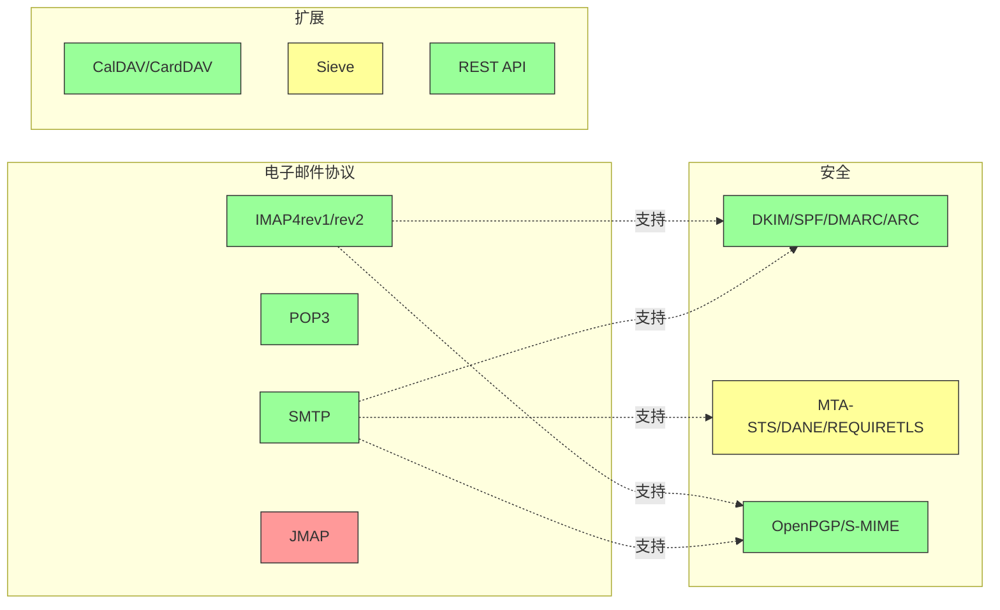

---


## 核心电子邮件协议 {#core-email-protocols}

### 电子邮件协议流程 {#email-protocol-flow}

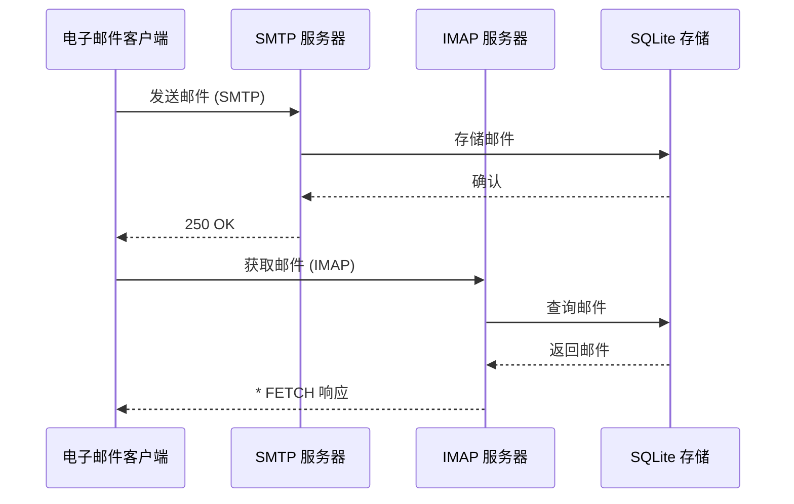


## IMAP4 电子邮件协议及扩展 {#imap4-email-protocol-and-extensions}

> \[!NOTE]
> Forward Email 支持 IMAP4rev1 (RFC 3501)，并部分支持 IMAP4rev2 (RFC 9051) 功能。

Forward Email 通过 WildDuck 邮件服务器实现提供了强大的 IMAP4 支持。该服务器实现了 IMAP4rev1 (RFC 3501)，并部分支持 IMAP4rev2 (RFC 9051) 扩展。

Forward Email 的 IMAP 功能由 [WildDuck](https://github.com/nodemailer/wildduck) 依赖提供。支持以下电子邮件 RFC：

| RFC                                                       | 标题                                                             | 实现说明                                              |
| --------------------------------------------------------- | ----------------------------------------------------------------- | ----------------------------------------------------- |
| [RFC 3501](https://datatracker.ietf.org/doc/html/rfc3501) | 互联网消息访问协议 (IMAP) - 版本 4rev1                            | 完全支持，带有有意差异（见下文）                      |
| [RFC 2177](https://datatracker.ietf.org/doc/html/rfc2177) | IMAP4 IDLE 命令                                                  | 推送式通知                                            |
| [RFC 2342](https://datatracker.ietf.org/doc/html/rfc2342) | IMAP4 命名空间                                                  | 邮箱命名空间支持                                      |
| [RFC 2087](https://datatracker.ietf.org/doc/html/rfc2087) | IMAP4 配额扩展                                                  | 存储配额管理                                          |
| [RFC 2971](https://datatracker.ietf.org/doc/html/rfc2971) | IMAP4 ID 扩展                                                  | 客户端/服务器标识                                    |
| [RFC 5161](https://datatracker.ietf.org/doc/html/rfc5161) | IMAP4 ENABLE 扩展                                              | 启用 IMAP 扩展                                        |
| [RFC 4959](https://datatracker.ietf.org/doc/html/rfc4959) | IMAP SASL 初始客户端响应扩展 (SASL-IR)                           | 初始客户端响应                                        |
| [RFC 3691](https://datatracker.ietf.org/doc/html/rfc3691) | IMAP4 UNSELECT 命令                                            | 关闭邮箱但不执行 EXPUNGE                              |
| [RFC 4315](https://datatracker.ietf.org/doc/html/rfc4315) | IMAP UIDPLUS 扩展                                              | 增强的 UID 命令                                      |
| [RFC 7162](https://datatracker.ietf.org/doc/html/rfc7162) | IMAP 扩展：快速标志更改重新同步 (CONDSTORE)                      | 条件 STORE                                           |
| [RFC 6154](https://datatracker.ietf.org/doc/html/rfc6154) | IMAP 特殊用途邮箱列表扩展                                      | 特殊邮箱属性                                        |
| [RFC 6851](https://datatracker.ietf.org/doc/html/rfc6851) | IMAP MOVE 扩展                                                | 原子 MOVE 命令                                      |
| [RFC 6855](https://datatracker.ietf.org/doc/html/rfc6855) | IMAP 支持 UTF-8                                              | UTF-8 支持                                          |
| [RFC 3348](https://datatracker.ietf.org/doc/html/rfc3348) | IMAP4 子邮箱扩展                                              | 子邮箱信息                                          |
| [RFC 7889](https://datatracker.ietf.org/doc/html/rfc7889) | IMAP4 广告最大上传大小扩展 (APPENDLIMIT)                         | 最大上传大小                                        |
**支持的 IMAP 扩展：**

| Extension         | RFC          | Status      | Description                     |
| ----------------- | ------------ | ----------- | ------------------------------- |
| IDLE              | RFC 2177     | ✅ Supported | 推送式通知                      |
| NAMESPACE         | RFC 2342     | ✅ Supported | 邮箱命名空间支持                |
| QUOTA             | RFC 2087     | ✅ Supported | 存储配额管理                   |
| ID                | RFC 2971     | ✅ Supported | 客户端/服务器身份识别          |
| ENABLE            | RFC 5161     | ✅ Supported | 启用 IMAP 扩展                 |
| SASL-IR           | RFC 4959     | ✅ Supported | 初始客户端响应                 |
| UNSELECT          | RFC 3691     | ✅ Supported | 关闭邮箱但不执行 EXPUNGE       |
| UIDPLUS           | RFC 4315     | ✅ Supported | 增强的 UID 命令                |
| CONDSTORE         | RFC 7162     | ✅ Supported | 条件 STORE                    |
| SPECIAL-USE       | RFC 6154     | ✅ Supported | 特殊邮箱属性                   |
| MOVE              | RFC 6851     | ✅ Supported | 原子 MOVE 命令                |
| UTF8=ACCEPT       | RFC 6855     | ✅ Supported | UTF-8 支持                    |
| CHILDREN          | RFC 3348     | ✅ Supported | 子邮箱信息                    |
| APPENDLIMIT       | RFC 7889     | ✅ Supported | 最大上传大小                  |
| XLIST             | 非标准       | ✅ Supported | 兼容 Gmail 的文件夹列表        |
| XAPPLEPUSHSERVICE | 非标准       | ✅ Supported | Apple 推送通知服务             |

### IMAP 协议与 RFC 规范的差异 {#imap-protocol-differences-from-rfc-specifications}

> \[!WARNING]
> 以下与 RFC 规范的差异可能影响客户端兼容性。

Forward Email 有意偏离了一些 IMAP RFC 规范。这些差异继承自 WildDuck，具体如下：

* **无 \Recent 标志：** 未实现 `\Recent` 标志。所有邮件均不带此标志返回。
* **重命名不影响子文件夹：** 重命名文件夹时，子文件夹不会自动重命名。数据库中的文件夹层级是扁平的。
* **INBOX 不可重命名：** [RFC 3501](https://datatracker.ietf.org/doc/html/rfc3501) 允许重命名 INBOX，但 Forward Email 明确禁止。详见 [WildDuck 源代码](https://github.com/nodemailer/wildduck/blob/master/imap-core/lib/commands/rename.js#L27)。
* **无非请求 FLAGS 响应：** 标志更改时，不会向客户端发送非请求的 FLAGS 响应。
* **对已删除邮件的 STORE 返回 NO：** 尝试修改已删除邮件的标志时返回 NO，而非静默忽略。
* **SEARCH 中忽略 CHARSET：** SEARCH 命令中的 `CHARSET` 参数被忽略。所有搜索均使用 UTF-8。
* **忽略 STORE 中的 MODSEQ 元数据：** STORE 命令中的 `MODSEQ` 元数据被忽略。
* **SEARCH TEXT 和 SEARCH BODY：** Forward Email 使用 [SQLite FTS5](https://www.sqlite.org/fts5.html)（全文搜索）替代 MongoDB 的 `$text` 搜索，提供：
  * 支持 `NOT` 操作符（MongoDB 不支持）
  * 排名搜索结果
  * 大邮箱下亚 100 毫秒的搜索性能
* **自动清理行为：** 标记为 `\Deleted` 的邮件在关闭邮箱时自动清理。
* **邮件保真度：** 某些邮件修改可能无法完全保留原始邮件结构。

**IMAP4rev2 部分支持：**

Forward Email 实现了 IMAP4rev1（RFC 3501）并部分支持 IMAP4rev2（RFC 9051）。以下 IMAP4rev2 功能**尚未支持**：

* **LIST-STATUS** - 组合 LIST 和 STATUS 命令
* **LITERAL-** - 非同步字面量（减号变体）
* **OBJECTID** - 唯一对象标识符
* **SAVEDATE** - 保存日期属性
* **REPLACE** - 原子消息替换
* **UNAUTHENTICATE** - 关闭认证但不关闭连接

**宽松的正文结构处理：**

Forward Email 对格式错误的 MIME 结构使用“宽松正文”处理，可能与严格的 RFC 解释不同。这提高了对现实中不完全符合标准邮件的兼容性。
**METADATA 扩展 (RFC 5464)：**

IMAP METADATA 扩展**不支持**。有关此扩展的更多信息，请参见 [RFC 5464](https://datatracker.ietf.org/doc/html/rfc5464)。关于添加此功能的讨论可见于 [WildDuck Issue #937](https://github.com/zone-eu/wildduck/issues/937)。

### 不支持的 IMAP 扩展 {#imap-extensions-not-supported}

以下来自 [IANA IMAP Capabilities Registry](https://www.iana.org/assignments/imap-capabilities/imap-capabilities.xhtml) 的 IMAP 扩展**不支持**：

| RFC                                                       | 标题                                                                                                           | 原因                                                                                                                                  |
| --------------------------------------------------------- | --------------------------------------------------------------------------------------------------------------- | --------------------------------------------------------------------------------------------------------------------------------------- |
| [RFC 2086](https://datatracker.ietf.org/doc/html/rfc2086) | IMAP4 ACL 扩展                                                                                                  | 未实现共享文件夹。详见 [WildDuck Issue #427](https://github.com/zone-eu/wildduck/issues/427)                                           |
| [RFC 5256](https://datatracker.ietf.org/doc/html/rfc5256) | IMAP SORT 和 THREAD 扩展                                                                                        | 线程功能内部实现，但不通过 RFC 5256 协议。详见 [WildDuck Issue #12](https://github.com/zone-eu/wildduck/issues/12)                      |
| [RFC 5162](https://datatracker.ietf.org/doc/html/rfc5162) | IMAP4 快速邮箱重新同步扩展 (QRESYNC)                                                                           | 未实现                                                                                                                                |
| [RFC 5464](https://datatracker.ietf.org/doc/html/rfc5464) | IMAP METADATA 扩展                                                                                              | 忽略元数据操作。详见 [WildDuck 文档](https://datatracker.ietf.org/doc/html/rfc5464)                                                    |
| [RFC 5258](https://datatracker.ietf.org/doc/html/rfc5258) | IMAP4 LIST 命令扩展                                                                                            | 未实现                                                                                                                                |
| [RFC 5267](https://datatracker.ietf.org/doc/html/rfc5267) | IMAP4 上下文                                                                                                   | 未实现                                                                                                                                |
| [RFC 5465](https://datatracker.ietf.org/doc/html/rfc5465) | IMAP NOTIFY 扩展                                                                                                | 未实现                                                                                                                                |
| [RFC 5466](https://datatracker.ietf.org/doc/html/rfc5466) | IMAP4 过滤器扩展                                                                                                | 未实现                                                                                                                                |
| [RFC 6203](https://datatracker.ietf.org/doc/html/rfc6203) | IMAP4 模糊搜索扩展                                                                                              | 未实现                                                                                                                                |
| [RFC 6785](https://datatracker.ietf.org/doc/html/rfc6785) | IMAP4 实现建议                                                                                                  | 建议未完全遵循                                                                                                                        |
| [RFC 7162](https://datatracker.ietf.org/doc/html/rfc7162) | IMAP 扩展：快速标志变更重新同步 (CONDSTORE) 和快速邮箱重新同步 (QRESYNC)                                       | 未实现                                                                                                                                |
| [RFC 8437](https://datatracker.ietf.org/doc/html/rfc8437) | IMAP UNAUTHENTICATE 扩展用于连接重用                                                                            | 未实现                                                                                                                                |
| [RFC 8438](https://datatracker.ietf.org/doc/html/rfc8438) | IMAP STATUS=SIZE 扩展                                                                                            | 未实现                                                                                                                                |
| [RFC 8457](https://datatracker.ietf.org/doc/html/rfc8457) | IMAP “$Important” 关键字和 “\Important” 特殊用途属性                                                           | 未实现                                                                                                                                |
| [RFC 8474](https://datatracker.ietf.org/doc/html/rfc8474) | IMAP 对象标识符扩展                                                                                            | 未实现                                                                                                                                |
| [RFC 9051](https://datatracker.ietf.org/doc/html/rfc9051) | 互联网邮件访问协议 (IMAP) - 版本 4rev2                                                                          | Forward Email 实现 IMAP4rev1 ([RFC 3501](https://datatracker.ietf.org/doc/html/rfc3501))                                               |
## POP3 邮件协议及扩展 {#pop3-email-protocol-and-extensions}

> \[!NOTE]
> Forward Email 支持 POP3（RFC 1939）及用于邮件检索的标准扩展。

Forward Email 的 POP3 功能由 [WildDuck](https://github.com/nodemailer/wildduck) 依赖提供。支持以下邮件 RFC：

| RFC                                                       | 标题                                   | 实现说明                                              |
| --------------------------------------------------------- | --------------------------------------- | ----------------------------------------------------- |
| [RFC 1939](https://datatracker.ietf.org/doc/html/rfc1939) | 邮局协议 - 版本 3 (POP3)                 | 完全支持，带有有意的差异（见下文）                     |
| [RFC 2595](https://datatracker.ietf.org/doc/html/rfc2595) | 在 IMAP、POP3 和 ACAP 中使用 TLS          | 支持 STARTTLS                                        |
| [RFC 2449](https://datatracker.ietf.org/doc/html/rfc2449) | POP3 扩展机制                            | 支持 CAPA 命令                                       |

Forward Email 为偏好此更简单协议而非 IMAP 的客户端提供 POP3 支持。POP3 适合希望将邮件下载到单一设备并从服务器删除的用户。

**支持的 POP3 扩展：**

| 扩展     | RFC      | 状态        | 描述                       |
| -------- | -------- | ----------- | -------------------------- |
| TOP      | RFC 1939 | ✅ 支持     | 检索邮件头                 |
| USER     | RFC 1939 | ✅ 支持     | 用户名认证                 |
| UIDL     | RFC 1939 | ✅ 支持     | 唯一邮件标识符             |
| EXPIRE   | RFC 2449 | ✅ 支持     | 邮件过期策略               |

### POP3 协议与 RFC 规范的差异 {#pop3-protocol-differences-from-rfc-specifications}

> \[!WARNING]
> POP3 相较于 IMAP 有固有的限制。

> \[!IMPORTANT]
> **关键差异：Forward Email 与 WildDuck POP3 DELE 行为**
>
> Forward Email 对 POP3 `DELE` 命令实现了 RFC 兼容的永久删除，而 WildDuck 则是将邮件移至垃圾箱。

**Forward Email 行为**（[源代码](https://github.com/forwardemail/forwardemail.net/blob/master/pop3-server.js)）：

* `DELE` → `QUIT` 永久删除邮件
* 完全遵循 [RFC 1939](https://datatracker.ietf.org/doc/html/rfc1939) 规范
* 行为与 Dovecot（默认）、Postfix 及其他符合标准的服务器一致

**WildDuck 行为**（[讨论](https://github.com/zone-eu/wildduck/issues/937)）：

* `DELE` → `QUIT` 将邮件移至垃圾箱（类似 Gmail）
* 出于用户安全的有意设计决策
* 不符合 RFC，但防止意外数据丢失

**Forward Email 不同的原因：**

* **RFC 兼容性：** 遵守 [RFC 1939](https://datatracker.ietf.org/doc/html/rfc1939) 规范
* **用户预期：** 下载后删除的工作流程期望永久删除
* **存储管理：** 合理回收磁盘空间
* **互操作性：** 与其他符合 RFC 的服务器保持一致

> \[!NOTE]
> **POP3 邮件列表：** Forward Email 列出 INBOX 中的所有邮件，无限制。此行为不同于 WildDuck 默认限制为 250 封邮件。详见 [源代码](https://github.com/forwardemail/forwardemail.net/blob/master/pop3-server.js)。

**单设备访问：**

POP3 设计用于单设备访问。邮件通常被下载后从服务器删除，不适合多设备同步。

**无文件夹支持：**

POP3 仅访问 INBOX 文件夹。其他文件夹（已发送、草稿、垃圾箱等）无法通过 POP3 访问。

**有限的邮件管理：**

POP3 仅提供基本的邮件检索和删除功能。不支持标记、移动或搜索邮件等高级功能。

### 不支持的 POP3 扩展 {#pop3-extensions-not-supported}

以下来自 [IANA POP3 扩展机制注册表](https://www.iana.org/assignments/pop3-extension-mechanism/pop3-extension-mechanism.xhtml) 的 POP3 扩展不被支持：
| RFC                                                       | 标题                                                   | 原因                                  |
| --------------------------------------------------------- | ------------------------------------------------------- | --------------------------------------- |
| [RFC 6856](https://datatracker.ietf.org/doc/html/rfc6856) | 支持 UTF-8 的邮局协议版本 3 (POP3)                      | WildDuck POP3 服务器未实现               |
| [RFC 2595](https://datatracker.ietf.org/doc/html/rfc2595) | STLS 命令                                              | 仅支持 STARTTLS，不支持 STLS             |
| [RFC 3206](https://datatracker.ietf.org/doc/html/rfc3206) | SYS 和 AUTH POP 响应代码                               | 未实现                                 |

---


## SMTP 邮件协议及扩展 {#smtp-email-protocol-and-extensions}

> \[!NOTE]
> Forward Email 支持带有现代扩展的 SMTP (RFC 5321)，以实现安全且可靠的邮件传输。

Forward Email 的 SMTP 功能由多个组件提供：[smtp-server](https://github.com/nodemailer/smtp-server)（nodemailer）、[zone-mta](https://github.com/zone-eu/zone-mta) 以及自定义实现。支持以下邮件 RFC：

| RFC                                                       | 标题                                                                           | 实现说明                             |
| --------------------------------------------------------- | ------------------------------------------------------------------------------- | ------------------------------------ |
| [RFC 5321](https://datatracker.ietf.org/doc/html/rfc5321) | 简单邮件传输协议 (SMTP)                                                        | 完全支持                           |
| [RFC 3207](https://datatracker.ietf.org/doc/html/rfc3207) | 基于传输层安全协议的安全 SMTP 服务扩展 (STARTTLS)                             | 支持 TLS/SSL                       |
| [RFC 4954](https://datatracker.ietf.org/doc/html/rfc4954) | SMTP 认证服务扩展 (AUTH)                                                       | 支持 PLAIN、LOGIN、CRAM-MD5、XOAUTH2 |
| [RFC 6531](https://datatracker.ietf.org/doc/html/rfc6531) | 国际化邮件的 SMTP 扩展 (SMTPUTF8)                                             | 原生支持 Unicode 邮箱地址           |
| [RFC 3461](https://datatracker.ietf.org/doc/html/rfc3461) | 传递状态通知的 SMTP 服务扩展 (DSN)                                            | 完全支持 DSN                       |
| [RFC 3463](https://datatracker.ietf.org/doc/html/rfc3463) | 增强邮件系统状态码                                                            | 响应中支持增强状态码               |
| [RFC 1870](https://datatracker.ietf.org/doc/html/rfc1870) | 邮件大小声明的 SMTP 服务扩展 (SIZE)                                           | 支持最大邮件大小声明               |
| [RFC 2920](https://datatracker.ietf.org/doc/html/rfc2920) | 命令流水线的 SMTP 服务扩展 (PIPELINING)                                       | 支持命令流水线                     |
| [RFC 1652](https://datatracker.ietf.org/doc/html/rfc1652) | 8位 MIME 传输的 SMTP 服务扩展 (8BITMIME)                                      | 支持 8 位 MIME                     |
| [RFC 6152](https://datatracker.ietf.org/doc/html/rfc6152) | 8 位 MIME 传输的 SMTP 服务扩展                                                | 支持 8 位 MIME                     |
| [RFC 2034](https://datatracker.ietf.org/doc/html/rfc2034) | 返回增强错误代码的 SMTP 服务扩展 (ENHANCEDSTATUSCODES)                         | 支持增强状态码                     |

Forward Email 实现了功能完善的 SMTP 服务器，支持增强安全性、可靠性和功能性的现代扩展。

**支持的 SMTP 扩展：**

| 扩展                 | RFC      | 状态        | 描述                                 |
| ------------------- | -------- | ----------- | ------------------------------------- |
| PIPELINING          | RFC 2920 | ✅ 支持     | 命令流水线                           |
| SIZE                | RFC 1870 | ✅ 支持     | 邮件大小声明（52MB 限制）            |
| ETRN                | RFC 1985 | ✅ 支持     | 远程队列处理                         |
| STARTTLS            | RFC 3207 | ✅ 支持     | 升级到 TLS                          |
| ENHANCEDSTATUSCODES | RFC 2034 | ✅ 支持     | 增强状态码                         |
| 8BITMIME            | RFC 6152 | ✅ 支持     | 8 位 MIME 传输                      |
| DSN                 | RFC 3461 | ✅ 支持     | 传递状态通知                       |
| CHUNKING            | RFC 3030 | ✅ 支持     | 分块消息传输                       |
| SMTPUTF8            | RFC 6531 | ⚠️ 部分支持 | UTF-8 邮箱地址（部分支持）           |
| REQUIRETLS          | RFC 8689 | ✅ 支持     | 传递时要求 TLS                     |
### 传递状态通知 (DSN) {#delivery-status-notifications-dsn}

> \[!TIP]
> DSN 提供已发送邮件的详细传递状态信息。

Forward Email 完全支持 **DSN (RFC 3461)**，允许发送者请求传递状态通知。此功能提供：

* **成功通知** 当邮件成功传递时
* **失败通知** 包含详细错误信息
* **延迟通知** 当传递暂时延迟时

DSN 特别适用于：

* 确认重要邮件的传递
* 解决传递问题
* 自动化邮件处理系统
* 合规和审计需求

### REQUIRETLS 支持 {#requiretls-support}

> \[!IMPORTANT]
> Forward Email 是少数明确宣传并强制执行 REQUIRETLS 的提供商之一。

Forward Email 支持 **REQUIRETLS (RFC 8689)**，确保邮件仅通过 TLS 加密连接传递。此功能提供：

* **端到端加密** 保障整个传递路径
* **用户界面强制** 通过邮件撰写器中的复选框实现
* **拒绝未加密传递** 尝试
* **增强安全性** 保护敏感通信

### 不支持的 SMTP 扩展 {#smtp-extensions-not-supported}

以下来自 [IANA SMTP 服务扩展注册表](https://www.iana.org/assignments/smtp) 的 SMTP 扩展不被支持：

| RFC                                                       | 标题                                                                                             | 原因                  |
| --------------------------------------------------------- | ------------------------------------------------------------------------------------------------- | --------------------- |
| [RFC 4865](https://datatracker.ietf.org/doc/html/rfc4865) | SMTP 提交服务扩展，用于未来消息发布 (FUTURERELEASE)                                              | 未实现                |
| [RFC 6710](https://datatracker.ietf.org/doc/html/rfc6710) | SMTP 消息传输优先级扩展 (MT-PRIORITY)                                                            | 未实现                |
| [RFC 7293](https://datatracker.ietf.org/doc/html/rfc7293) | Require-Recipient-Valid-Since 头字段及 SMTP 服务扩展                                             | 未实现                |
| [RFC 7372](https://datatracker.ietf.org/doc/html/rfc7372) | 邮件认证状态码                                                                                   | 未完全实现            |
| [RFC 4468](https://datatracker.ietf.org/doc/html/rfc4468) | 消息提交 BURL 扩展                                                                               | 未实现                |
| [RFC 3030](https://datatracker.ietf.org/doc/html/rfc3030) | 用于传输大型和二进制 MIME 消息的 SMTP 服务扩展 (CHUNKING, BINARYMIME)                            | 未实现                |
| [RFC 2852](https://datatracker.ietf.org/doc/html/rfc2852) | 按时传递 SMTP 服务扩展                                                                           | 未实现                |

---


## JMAP 邮件协议 {#jmap-email-protocol}

> \[!CAUTION]
> Forward Email **当前不支持** JMAP。

| RFC                                                       | 标题                                     | 状态            | 原因                                                                 |
| --------------------------------------------------------- | ----------------------------------------- | --------------- | ---------------------------------------------------------------------- |
| [RFC 8620](https://datatracker.ietf.org/doc/html/rfc8620) | JSON 元应用协议 (JMAP)                     | ❌ 不支持       | Forward Email 使用 IMAP/POP3/SMTP 以及全面的 REST API 代替           |

**JMAP (JSON 元应用协议)** 是一种旨在替代 IMAP 的现代邮件协议。

**为何不支持 JMAP：**

> “JMAP 是一个本不该被发明的怪物。它试图将 TCP/IMAP（按今天标准已经是个糟糕的协议）转换成 HTTP/JSON，只是换了传输方式，但保持了原有的精神。” — Andris Reinman，[HN 讨论](https://news.ycombinator.com/item?id=18890011)
> “JMAP 已经有超过 10 年的历史，但几乎没有任何采用” – Andris Reinman，[GitHub 讨论](https://github.com/zone-eu/wildduck/issues/2#issuecomment-1765190790)

另请参见 <https://hn.algolia.com/?dateRange=all&page=0&prefix=true&query=jmap%20andris&sort=byDate&type=comment> 上的更多评论。

Forward Email 目前专注于提供出色的 IMAP、POP3 和 SMTP 支持，以及用于邮件管理的全面 REST API。未来可能会根据用户需求和生态系统的采用情况考虑支持 JMAP。

**替代方案：** Forward Email 提供了一个包含 39 个端点的[完整 REST API](#complete-rest-api-for-email-management)，为编程访问邮件提供了与 JMAP 类似的功能。

---


## 邮件安全 {#email-security}

### 邮件安全架构 {#email-security-architecture}

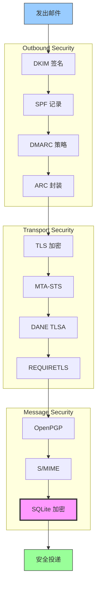


## 邮件消息认证协议 {#email-message-authentication-protocols}

> \[!NOTE]
> Forward Email 实现了所有主要的邮件认证协议，以防止伪造并确保消息完整性。

Forward Email 使用 [mailauth](https://github.com/postalsys/mailauth) 库进行邮件认证。支持以下 RFC：

| RFC                                                       | 标题                                                                   | 实现说明                                                       |
| --------------------------------------------------------- | ----------------------------------------------------------------------- | -------------------------------------------------------------- |
| [RFC 6376](https://datatracker.ietf.org/doc/html/rfc6376) | 域密钥识别邮件 (DKIM) 签名                                             | 完整的 DKIM 签名和验证                                         |
| [RFC 8463](https://datatracker.ietf.org/doc/html/rfc8463) | DKIM 的新加密签名方法 (Ed25519-SHA256)                                 | 支持 RSA-SHA256 和 Ed25519-SHA256 签名算法                     |
| [RFC 7208](https://datatracker.ietf.org/doc/html/rfc7208) | 发送方策略框架 (SPF)                                                   | SPF 记录验证                                                   |
| [RFC 7489](https://datatracker.ietf.org/doc/html/rfc7489) | 基于域的消息认证、报告和一致性 (DMARC)                                 | DMARC 策略执行                                                 |
| [RFC 8617](https://datatracker.ietf.org/doc/html/rfc8617) | 认证接收链 (ARC)                                                       | ARC 封装和验证                                                 |

邮件认证协议验证消息确实来自声明的发送者，且在传输过程中未被篡改。

### 认证协议支持 {#authentication-protocol-support}

| 协议      | RFC      | 状态        | 描述                                                                 |
| --------- | -------- | ----------- | -------------------------------------------------------------------- |
| **DKIM**  | RFC 6376 | ✅ 支持     | 域密钥识别邮件 - 加密签名                                            |
| **SPF**   | RFC 7208 | ✅ 支持     | 发送方策略框架 - IP 地址授权                                         |
| **DMARC** | RFC 7489 | ✅ 支持     | 基于域的消息认证 - 策略执行                                          |
| **ARC**   | RFC 8617 | ✅ 支持     | 认证接收链 - 保持转发过程中的认证信息                                |
### DKIM (域密钥识别邮件) {#dkim-domainkeys-identified-mail}

**DKIM** 在邮件头中添加加密签名，允许收件人验证邮件是否由域所有者授权发送且在传输过程中未被篡改。

Forward Email 使用 [mailauth](https://github.com/postalsys/mailauth) 进行 DKIM 签名和验证。

**主要功能：**

* 所有外发邮件自动进行 DKIM 签名
* 支持 RSA 和 Ed25519 密钥
* 支持多个选择器
* 入站邮件的 DKIM 验证

### SPF (发件人策略框架) {#spf-sender-policy-framework}

**SPF** 允许域所有者指定哪些 IP 地址被授权代表其域发送邮件。

**主要功能：**

* 入站邮件的 SPF 记录验证
* 自动 SPF 检查并提供详细结果
* 支持 include、redirect 和 all 机制
* 每个域可配置 SPF 策略

### DMARC (基于域的消息认证、报告与一致性) {#dmarc-domain-based-message-authentication-reporting--conformance}

**DMARC** 基于 SPF 和 DKIM，提供策略执行和报告功能。

**主要功能：**

* DMARC 策略执行（无、隔离、拒绝）
* SPF 和 DKIM 的对齐检查
* DMARC 汇总报告
* 每个域的 DMARC 策略

### ARC (认证接收链) {#arc-authenticated-received-chain}

**ARC** 保留邮件认证结果，确保转发和邮件列表修改后仍能验证。

Forward Email 使用 [mailauth](https://github.com/postalsys/mailauth) 库进行 ARC 验证和封装。

**主要功能：**

* 转发邮件的 ARC 封装
* 入站邮件的 ARC 验证
* 多跳链路验证
* 保留原始认证结果

### 认证流程 {#authentication-flow}

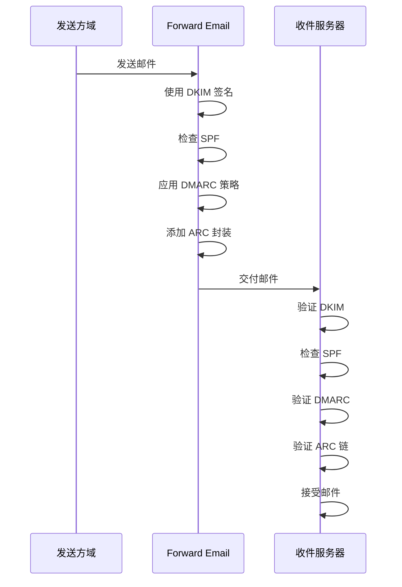

---


## 邮件传输安全协议 {#email-transport-security-protocols}

> \[!IMPORTANT]
> Forward Email 实现了多层传输安全，保护邮件在传输过程中的安全。

Forward Email 实现了现代传输安全协议：

| RFC                                                       | 标题                                                                                                 | 状态        | 实现说明                                                                                                                                                                                                                                                                                     |
| --------------------------------------------------------- | ---------------------------------------------------------------------------------------------------- | ----------- | --------------------------------------------------------------------------------------------------------------------------------------------------------------------------------------------------------------------------------------------------------------------------------------------- |
| [RFC 8461](https://datatracker.ietf.org/doc/html/rfc8461) | SMTP MTA 严格传输安全 (MTA-STS)                                                                      | ✅ 支持     | 广泛应用于 IMAP、SMTP 和 MX 服务器。参见 [create-mta-sts-cache.js](https://github.com/forwardemail/forwardemail.net/blob/master/helpers/create-mta-sts-cache.js) 和 [get-transporter.js](https://github.com/forwardemail/forwardemail.net/blob/master/helpers/get-transporter.js) |
| [RFC 8460](https://datatracker.ietf.org/doc/html/rfc8460) | SMTP TLS 报告                                                                                        | ✅ 支持     | 通过 [mailauth](https://github.com/postalsys/mailauth) 库实现                                                                                                                                                                                                                                 |
| [RFC 7671](https://datatracker.ietf.org/doc/html/rfc7671) | 基于 DNS 的命名实体认证 (DANE) 协议：更新与操作指南                                                 | ✅ 支持     | 出站 SMTP 连接的完整 DANE 验证。参见 [mx-connect PR #22](https://github.com/zone-eu/mx-connect/pull/22)                                                                                                                                                                                    |
| [RFC 6698](https://datatracker.ietf.org/doc/html/rfc6698) | 基于 DNS 的命名实体认证 (DANE) 传输层安全 (TLS) 协议：TLSA                                          | ✅ 支持     | 完整支持 RFC 6698：PKIX-TA、PKIX-EE、DANE-TA、DANE-EE 使用类型。参见 [mx-connect PR #22](https://github.com/zone-eu/mx-connect/pull/22)                                                                                                                                                     |
| [RFC 8314](https://datatracker.ietf.org/doc/html/rfc8314) | 明文被视为过时：邮件提交和访问使用传输层安全 (TLS)                                                  | ✅ 支持     | 所有连接均要求使用 TLS                                                                                                                                                                                                                                                                       |
| [RFC 8689](https://datatracker.ietf.org/doc/html/rfc8689) | SMTP 服务扩展以要求 TLS (REQUIRETLS)                                                                | ✅ 支持     | 完全支持 REQUIRETLS SMTP 扩展和 “TLS-Required” 头部                                                                                                                                                                                                                                        |
传输安全协议确保电子邮件在邮件服务器之间传输时被加密和认证。

### 传输安全支持 {#transport-security-support}

| 协议           | RFC      | 状态        | 描述                                             |
| -------------- | -------- | ----------- | ------------------------------------------------ |
| **TLS**        | RFC 8314 | ✅ 支持     | 传输层安全 - 加密连接                             |
| **MTA-STS**    | RFC 8461 | ✅ 支持     | 邮件传输代理严格传输安全                         |
| **DANE**       | RFC 7671 | ✅ 支持     | 基于 DNS 的命名实体认证                           |
| **REQUIRETLS** | RFC 8689 | ✅ 支持     | 要求整个传输路径使用 TLS                          |

### TLS（传输层安全） {#tls-transport-layer-security}

Forward Email 强制所有电子邮件连接（SMTP、IMAP、POP3）使用 TLS 加密。

**主要特性：**

* 支持 TLS 1.2 和 TLS 1.3
* 自动证书管理
* 完美前向保密（PFS）
* 仅使用强加密套件

### MTA-STS（邮件传输代理严格传输安全） {#mta-sts-mail-transfer-agent-strict-transport-security}

**MTA-STS** 通过 HTTPS 发布策略，确保电子邮件仅通过 TLS 加密连接传输。

Forward Email 使用 [create-mta-sts-cache.js](https://github.com/forwardemail/forwardemail.net/blob/master/helpers/create-mta-sts-cache.js) 实现 MTA-STS。

**主要特性：**

* 自动发布 MTA-STS 策略
* 策略缓存以提升性能
* 防止降级攻击
* 强制证书验证

### DANE（基于 DNS 的命名实体认证） {#dane-dns-based-authentication-of-named-entities}

> \[!NOTE]
> Forward Email 现已为出站 SMTP 连接提供完整的 DANE 支持。

**DANE** 利用 DNSSEC 在 DNS 中发布 TLS 证书信息，使邮件服务器无需依赖证书颁发机构即可验证证书。

**主要特性：**

* ✅ 出站 SMTP 连接的完整 DANE 验证
* ✅ 完整支持 RFC 6698：PKIX-TA、PKIX-EE、DANE-TA、DANE-EE 使用类型
* ✅ TLS 升级期间对 TLSA 记录的证书验证
* ✅ 多个 MX 主机的并行 TLSA 解析
* ✅ 自动检测原生 `dns.resolveTlsa`（Node.js v22.15.0+，v23.9.0+）
* ✅ 通过 [Tangerine](https://github.com/forwardemail/tangerine) 支持旧版 Node.js 的自定义解析器
* 需要 DNSSEC 签名的域名

> \[!TIP]
> **实现细节：** DANE 支持通过 [mx-connect PR #22](https://github.com/zone-eu/mx-connect/pull/22) 添加，提供了出站 SMTP 连接的全面 DANE/TLSA 支持。

### REQUIRETLS {#requiretls}

> \[!TIP]
> Forward Email 是少数提供面向用户的 REQUIRETLS 支持的服务商之一。

**REQUIRETLS** 确保电子邮件仅通过整个传输路径上的 TLS 加密连接传输。

**主要特性：**

* 邮件撰写器中的用户界面复选框
* 自动拒绝未加密传输
* 端到端 TLS 强制执行
* 详细的失败通知

> \[!TIP]
> **面向用户的 TLS 强制执行：** Forward Email 在 **我的账户 > 域名 > 设置** 下提供复选框，用于强制所有入站连接使用 TLS。启用后，该功能会拒绝任何未通过 TLS 加密连接发送的入站邮件，并返回 530 错误代码，确保所有传入邮件在传输过程中均被加密。

### 传输安全流程 {#transport-security-flow}

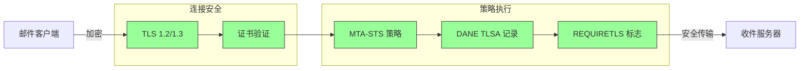
## 电子邮件消息加密 {#email-message-encryption}

> \[!NOTE]
> Forward Email 支持 OpenPGP 和 S/MIME 两种端到端邮件加密方式。

Forward Email 支持 OpenPGP 和 S/MIME 加密：

| RFC                                                       | 标题                                                                                     | 状态        | 实现说明                                                                                                                                                                                           |
| --------------------------------------------------------- | --------------------------------------------------------------------------------------- | ----------- | -------------------------------------------------------------------------------------------------------------------------------------------------------------------------------------------------- |
| [RFC 9580](https://datatracker.ietf.org/doc/html/rfc9580) | OpenPGP（取代 RFC 4880）                                                                 | ✅ 支持     | 通过 [OpenPGP.js v6+](https://github.com/openpgpjs/openpgpjs) 集成。详见 [FAQ](https://forwardemail.net/en/faq#do-you-support-openpgpmime-end-to-end-encryption-e2ee-and-web-key-directory-wkd) |
| [RFC 8551](https://datatracker.ietf.org/doc/html/rfc8551) | 安全/多用途互联网邮件扩展（S/MIME）版本 4.0 消息规范                                     | ✅ 支持     | 支持 RSA 和 ECC 算法。详见 [FAQ](https://forwardemail.net/en/faq#do-you-support-smime-encryption)                                                                                                  |

消息加密协议保护邮件内容，确保除了预期收件人外，任何人即使在传输过程中截获邮件也无法读取。

### 加密支持 {#encryption-support}

| 协议        | RFC      | 状态        | 描述                                         |
| ----------- | -------- | ----------- | -------------------------------------------- |
| **OpenPGP** | RFC 9580 | ✅ 支持     | Pretty Good Privacy - 公钥加密                |
| **S/MIME**  | RFC 8551 | ✅ 支持     | 安全/多用途互联网邮件扩展                      |
| **WKD**     | 草案     | ✅ 支持     | Web Key Directory - 自动密钥发现               |

### OpenPGP（Pretty Good Privacy）{#openpgp-pretty-good-privacy}

**OpenPGP** 使用公钥密码学提供端到端加密。Forward Email 通过 [Web Key Directory (WKD)](https://forwardemail.net/en/faq#do-you-support-openpgpmime-end-to-end-encryption-e2ee-and-web-key-directory-wkd) 协议支持 OpenPGP。

**主要特点：**

* 通过 WKD 自动发现密钥
* 支持 PGP/MIME 加密附件
* 通过邮件客户端管理密钥
* 兼容 GPG、Mailvelope 及其他 OpenPGP 工具

**使用方法：**

1. 在邮件客户端生成 PGP 密钥对
2. 将公钥上传至 Forward Email 的 WKD
3. 你的密钥可被其他用户自动发现
4. 无缝发送和接收加密邮件

### S/MIME（安全/多用途互联网邮件扩展）{#smime-securemultipurpose-internet-mail-extensions}

**S/MIME** 使用 X.509 证书提供邮件加密和数字签名。

**主要特点：**

* 基于证书的加密
* 用于消息认证的数字签名
* 大多数邮件客户端原生支持
* 企业级安全保障

**使用方法：**

1. 从证书颁发机构获取 S/MIME 证书
2. 在邮件客户端安装证书
3. 配置客户端进行加密/签名邮件
4. 与收件人交换证书

### SQLite 邮箱加密 {#sqlite-mailbox-encryption}

> \[!IMPORTANT]
> Forward Email 提供额外的安全层，使用加密的 SQLite 邮箱。

除了消息级别加密外，Forward Email 使用 [sqleet](https://github.com/resilar/sqleet)（ChaCha20-Poly1305）加密整个邮箱。

**主要特点：**

* **基于密码的加密** - 只有你知道密码
* **抗量子攻击** - ChaCha20-Poly1305 密码算法
* **零知识** - Forward Email 无法解密你的邮箱
* **沙箱隔离** - 每个邮箱独立且可移植
* **不可恢复** - 忘记密码即无法找回邮箱
### 加密比较 {#encryption-comparison}

| 功能                 | OpenPGP           | S/MIME             | SQLite 加密        |
| --------------------- | ----------------- | ------------------ | ----------------- |
| **端到端**            | ✅ 是              | ✅ 是               | ✅ 是              |
| **密钥管理**          | 自主管理          | CA 签发            | 基于密码          |
| **客户端支持**        | 需要插件          | 原生支持            | 透明支持          |
| **使用场景**          | 个人              | 企业                | 存储              |
| **抗量子攻击**        | ⚠️ 取决于密钥      | ⚠️ 取决于证书       | ✅ 是              |

### 加密流程 {#encryption-flow}

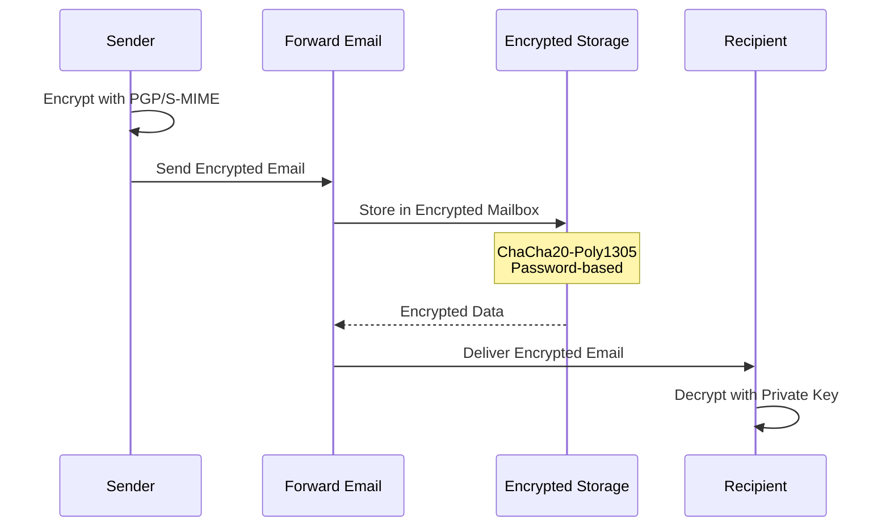

---


## 扩展功能 {#extended-functionality}


## 邮件消息格式标准 {#email-message-format-standards}

> \[!NOTE]
> Forward Email 支持现代邮件格式标准，以实现丰富内容和国际化。

Forward Email 支持标准邮件消息格式：

| RFC                                                       | 标题                                                         | 实现说明             |
| --------------------------------------------------------- | ------------------------------------------------------------- | -------------------- |
| [RFC 5322](https://datatracker.ietf.org/doc/html/rfc5322) | 互联网消息格式                                               | 完全支持             |
| [RFC 2045](https://datatracker.ietf.org/doc/html/rfc2045) | MIME 第一部分：互联网消息体格式                              | 完全支持 MIME        |
| [RFC 2046](https://datatracker.ietf.org/doc/html/rfc2046) | MIME 第二部分：媒体类型                                      | 完全支持 MIME        |
| [RFC 2047](https://datatracker.ietf.org/doc/html/rfc2047) | MIME 第三部分：非 ASCII 文本的消息头扩展                    | 完全支持 MIME        |
| [RFC 2048](https://datatracker.ietf.org/doc/html/rfc2048) | MIME 第四部分：注册程序                                      | 完全支持 MIME        |
| [RFC 2049](https://datatracker.ietf.org/doc/html/rfc2049) | MIME 第五部分：符合性标准和示例                              | 完全支持 MIME        |

邮件格式标准定义了邮件消息的结构、编码和显示方式。

### 格式标准支持 {#format-standards-support}

| 标准               | RFC           | 状态        | 描述                                 |
| ------------------ | ------------- | ----------- | ------------------------------------- |
| **MIME**           | RFC 2045-2049 | ✅ 支持     | 多用途互联网邮件扩展                 |
| **SMTPUTF8**       | RFC 6531      | ⚠️ 部分支持 | 国际化邮件地址                       |
| **EAI**            | RFC 6530      | ⚠️ 部分支持 | 邮件地址国际化                      |
| **消息格式**       | RFC 5322      | ✅ 支持     | 互联网消息格式                     |
| **MIME 安全**      | RFC 1847      | ✅ 支持     | MIME 的安全多部分                   |

### MIME（多用途互联网邮件扩展） {#mime-multipurpose-internet-mail-extensions}

**MIME** 允许邮件包含多部分不同内容类型（文本、HTML、附件等）。

**支持的 MIME 功能：**

* 多部分消息（混合、替代、相关）
* Content-Type 头
* Content-Transfer-Encoding（7bit、8bit、quoted-printable、base64）
* 内联图片和附件
* 丰富的 HTML 内容

### SMTPUTF8 和邮件地址国际化 {#smtputf8-and-email-address-internationalization}

> \[!WARNING]
> SMTPUTF8 支持为部分支持 - 并非所有功能均已完全实现。
**SMTPUTF8** 允许电子邮件地址包含非 ASCII 字符（例如，`用户@例え.jp`）。

**当前状态：**

* ⚠️ 对国际化电子邮件地址的部分支持
* ✅ 消息正文中的 UTF-8 内容
* ⚠️ 对非 ASCII 本地部分的有限支持

---


## 日历和联系人协议 {#calendaring-and-contacts-protocols}

> \[!NOTE]
> Forward Email 提供完整的 CalDAV 和 CardDAV 支持，用于日历和联系人同步。

Forward Email 通过 [caldav-adapter](https://github.com/forwardemail/caldav-adapter) 库支持 CalDAV 和 CardDAV：

| RFC                                                       | 标题                                                                     | 状态        | 实现说明                                                                                                                                                                              |
| --------------------------------------------------------- | ------------------------------------------------------------------------- | ----------- | ------------------------------------------------------------------------------------------------------------------------------------------------------------------------------------- |
| [RFC 4791](https://datatracker.ietf.org/doc/html/rfc4791) | WebDAV 的日历扩展 (CalDAV)                                               | ✅ 支持     | 日历访问和管理                                                                                                                                                                        |
| [RFC 6352](https://datatracker.ietf.org/doc/html/rfc6352) | CardDAV：WebDAV 的 vCard 扩展                                            | ✅ 支持     | 联系人访问和管理                                                                                                                                                                      |
| [RFC 5545](https://datatracker.ietf.org/doc/html/rfc5545) | 互联网日历和调度核心对象规范 (iCalendar)                                 | ✅ 支持     | iCalendar 格式支持                                                                                                                                                                    |
| [RFC 6350](https://datatracker.ietf.org/doc/html/rfc6350) | vCard 格式规范                                                           | ✅ 支持     | vCard 4.0 格式支持                                                                                                                                                                    |
| [RFC 6638](https://datatracker.ietf.org/doc/html/rfc6638) | CalDAV 的调度扩展                                                        | ✅ 支持     | 带有 iMIP 支持的 CalDAV 调度。参见 [commit c4d1629](https://github.com/forwardemail/forwardemail.net/commit/c4d162975a49e38d76d68a032662e873a34a9b80)                            |
| [RFC 5546](https://datatracker.ietf.org/doc/html/rfc5546) | iCalendar 传输无关互操作协议 (iTIP)                                     | ✅ 支持     | 支持 REQUEST、REPLY、CANCEL 和 VFREEBUSY 方法的 iTIP。参见 [commit c4d1629](https://github.com/forwardemail/forwardemail.net/commit/c4d162975a49e38d76d68a032662e873a34a9b80) |
| [RFC 6047](https://datatracker.ietf.org/doc/html/rfc6047) | 基于消息的 iCalendar 互操作协议 (iMIP)                                  | ✅ 支持     | 基于电子邮件的日历邀请及响应链接。参见 [commit c4d1629](https://github.com/forwardemail/forwardemail.net/commit/c4d162975a49e38d76d68a032662e873a34a9b80)                         |

CalDAV 和 CardDAV 是允许跨设备访问、共享和同步日历及联系人数据的协议。

### CalDAV 和 CardDAV 支持 {#caldav-and-carddav-support}

| 协议                  | RFC      | 状态        | 描述                                  |
| --------------------- | -------- | ----------- | ------------------------------------- |
| **CalDAV**            | RFC 4791 | ✅ 支持     | 日历访问和同步                        |
| **CardDAV**           | RFC 6352 | ✅ 支持     | 联系人访问和同步                      |
| **iCalendar**         | RFC 5545 | ✅ 支持     | 日历数据格式                         |
| **vCard**             | RFC 6350 | ✅ 支持     | 联系人数据格式                       |
| **VTODO**             | RFC 5545 | ✅ 支持     | 任务/提醒支持                       |
| **CalDAV 调度**       | RFC 6638 | ✅ 支持     | 日历调度扩展                        |
| **iTIP**              | RFC 5546 | ✅ 支持     | 传输无关的互操作性                   |
| **iMIP**              | RFC 6047 | ✅ 支持     | 基于电子邮件的日历邀请               |
### CalDAV（日历访问）{#caldav-calendar-access}

**CalDAV** 允许您从任何设备或应用程序访问和管理日历。

**主要功能：**

* 多设备同步
* 共享日历
* 日历订阅
* 事件邀请和响应
* 重复事件
* 时区支持

**兼容客户端：**

* Apple 日历（macOS，iOS）
* Mozilla Thunderbird
* Evolution
* GNOME 日历
* 任何支持 CalDAV 的客户端

### CardDAV（联系人访问）{#carddav-contact-access}

**CardDAV** 允许您从任何设备或应用程序访问和管理联系人。

**主要功能：**

* 多设备同步
* 共享地址簿
* 联系人分组
* 照片支持
* 自定义字段
* vCard 4.0 支持

**兼容客户端：**

* Apple 联系人（macOS，iOS）
* Mozilla Thunderbird
* Evolution
* GNOME 联系人
* 任何支持 CardDAV 的客户端

### 任务和提醒（CalDAV VTODO）{#tasks-and-reminders-caldav-vtodo}

> \[!TIP]
> Forward Email 通过 CalDAV VTODO 支持任务和提醒。

**VTODO** 是 iCalendar 格式的一部分，允许通过 CalDAV 进行任务管理。

**主要功能：**

* 任务创建和管理
* 截止日期和优先级
* 任务完成跟踪
* 重复任务
* 任务列表/类别

**兼容客户端：**

* Apple 提醒事项（macOS，iOS）
* Mozilla Thunderbird（配合 Lightning）
* Evolution
* GNOME 待办事项
* 任何支持 VTODO 的 CalDAV 客户端

### CalDAV/CardDAV 同步流程 {#caldavcarddav-synchronization-flow}

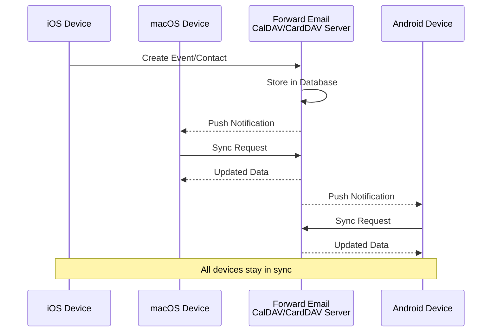

### 不支持的日历扩展 {#calendaring-extensions-not-supported}

以下日历扩展不被支持：

| RFC                                                       | 标题                                                                 | 原因                                                          |
| --------------------------------------------------------- | --------------------------------------------------------------------- | ------------------------------------------------------------- |
| [RFC 4918](https://datatracker.ietf.org/doc/html/rfc4918) | 用于 Web 分布式创作和版本控制的 HTTP 扩展（WebDAV）                   | CalDAV 使用 WebDAV 概念但未实现完整的 RFC 4918                 |
| [RFC 6578](https://datatracker.ietf.org/doc/html/rfc6578) | WebDAV 的集合同步                                                    | 未实现                                                         |
| [RFC 3744](https://datatracker.ietf.org/doc/html/rfc3744) | WebDAV 访问控制协议                                                  | 未实现                                                         |

---


## 邮件消息过滤 {#email-message-filtering}

> \[!IMPORTANT]
> Forward Email 提供 **完整的 Sieve 和 ManageSieve 支持**，用于服务器端邮件过滤。创建强大的规则，自动分类、过滤、转发和响应来信。

### Sieve（RFC 5228）{#sieve-rfc-5228}

[Sieve](https://en.wikipedia.org/wiki/Sieve_\(mail_filtering_language\)) 是一种标准化的强大脚本语言，用于服务器端邮件过滤。Forward Email 实现了包含 24 个扩展的全面 Sieve 支持。

**源代码：** [`helpers/sieve/`](https://github.com/forwardemail/forwardemail.net/tree/master/helpers/sieve)

#### 支持的核心 Sieve RFC {#core-sieve-rfcs-supported}

| RFC                                                                                    | 标题                                                         | 状态           |
| -------------------------------------------------------------------------------------- | ------------------------------------------------------------- | -------------- |
| [RFC 5228](https://datatracker.ietf.org/doc/html/rfc5228)                              | Sieve：一种邮件过滤语言                                      | ✅ 完全支持     |
| [RFC 5429](https://datatracker.ietf.org/doc/html/rfc5429)                              | Sieve 邮件过滤：拒绝和扩展拒绝扩展                            | ✅ 完全支持     |
| [RFC 5230](https://datatracker.ietf.org/doc/html/rfc5230)                              | Sieve 邮件过滤：假期扩展                                      | ✅ 完全支持     |
| [RFC 6131](https://datatracker.ietf.org/doc/html/rfc6131)                              | Sieve 假期扩展：“秒”参数                                     | ✅ 完全支持     |
| [RFC 5232](https://datatracker.ietf.org/doc/html/rfc5232)                              | Sieve 邮件过滤：Imap4flags 扩展                              | ✅ 完全支持     |
| [RFC 5173](https://datatracker.ietf.org/doc/html/rfc5173)                              | Sieve 邮件过滤：正文扩展                                      | ✅ 完全支持     |
| [RFC 5229](https://datatracker.ietf.org/doc/html/rfc5229)                              | Sieve 邮件过滤：变量扩展                                      | ✅ 完全支持     |
| [RFC 5231](https://datatracker.ietf.org/doc/html/rfc5231)                              | Sieve 邮件过滤：关系扩展                                      | ✅ 完全支持     |
| [RFC 4790](https://datatracker.ietf.org/doc/html/rfc4790)                              | 互联网应用协议排序注册表                                      | ✅ 完全支持     |
| [RFC 3894](https://datatracker.ietf.org/doc/html/rfc3894)                              | Sieve 扩展：无副作用复制                                     | ✅ 完全支持     |
| [RFC 5293](https://datatracker.ietf.org/doc/html/rfc5293)                              | Sieve 邮件过滤：编辑头扩展                                    | ✅ 完全支持     |
| [RFC 5260](https://datatracker.ietf.org/doc/html/rfc5260)                              | Sieve 邮件过滤：日期和索引扩展                                | ✅ 完全支持     |
| [RFC 5435](https://datatracker.ietf.org/doc/html/rfc5435)                              | Sieve 邮件过滤：通知扩展                                      | ✅ 完全支持     |
| [RFC 5183](https://datatracker.ietf.org/doc/html/rfc5183)                              | Sieve 邮件过滤：环境扩展                                      | ✅ 完全支持     |
| [RFC 5490](https://datatracker.ietf.org/doc/html/rfc5490)                              | Sieve 邮件过滤：检查邮箱状态的扩展                            | ✅ 完全支持     |
| [RFC 8579](https://datatracker.ietf.org/doc/html/rfc8579)                              | Sieve 邮件过滤：投递到特殊用途邮箱                            | ✅ 完全支持     |
| [RFC 7352](https://datatracker.ietf.org/doc/html/rfc7352)                              | Sieve 邮件过滤：检测重复投递                                  | ✅ 完全支持     |
| [RFC 5463](https://datatracker.ietf.org/doc/html/rfc5463)                              | Sieve 邮件过滤：Ihave 扩展                                   | ✅ 完全支持     |
| [RFC 5233](https://datatracker.ietf.org/doc/html/rfc5233)                              | Sieve 邮件过滤：子地址扩展                                   | ✅ 完全支持     |
| [draft-ietf-sieve-regex](https://datatracker.ietf.org/doc/html/draft-ietf-sieve-regex) | Sieve 邮件过滤：正则表达式扩展                               | ✅ 完全支持     |
#### 支持的 Sieve 扩展 {#supported-sieve-extensions}

| 扩展                         | 描述                                   | 集成                                      |
| ---------------------------- | -------------------------------------- | ----------------------------------------- |
| `fileinto`                   | 将邮件归档到指定文件夹                   | 邮件存储在指定的 IMAP 文件夹中               |
| `reject` / `ereject`         | 拒绝邮件并返回错误                       | SMTP 拒绝并带有退信消息                       |
| `vacation`                   | 自动假期/离开回复                        | 通过 Emails.queue 排队并限速                   |
| `vacation-seconds`           | 细粒度假期响应间隔                       | 从 `:seconds` 参数获取 TTL                   |
| `imap4flags`                 | 设置 IMAP 标记（\Seen, \Flagged 等）    | 在邮件存储时应用标记                          |
| `envelope`                   | 测试信封发件人/收件人                     | 访问 SMTP 信封数据                           |
| `body`                       | 测试邮件正文内容                         | 完整正文文本匹配                             |
| `variables`                  | 在脚本中存储和使用变量                    | 带修饰符的变量扩展                           |
| `relational`                 | 关系比较                               | 使用 gt/lt/eq 的 `:count`、`:value`          |
| `comparator-i;ascii-numeric` | 数值比较                               | 数字字符串比较                              |
| `copy`                       | 重定向时复制邮件                         | 在 fileinto/redirect 上使用 `:copy` 标志      |
| `editheader`                 | 添加或删除邮件头                         | 存储前修改邮件头                             |
| `date`                       | 测试日期/时间值                         | `currentdate` 和邮件头日期测试                 |
| `index`                      | 访问特定邮件头出现次数                     | 多值邮件头使用 `:index`                      |
| `regex`                      | 正则表达式匹配                          | 测试中支持完整正则表达式                       |
| `enotify`                    | 发送通知                               | 通过 Emails.queue 发送 `mailto:` 通知          |
| `environment`                | 访问环境信息                           | 会话中的域、主机、远程 IP                      |
| `mailbox`                    | 测试邮箱是否存在                         | `mailboxexists` 测试                         |
| `special-use`                | 归档到特殊用途邮箱                        | 映射 \Junk、\Trash 等到文件夹                   |
| `duplicate`                  | 检测重复邮件                           | 基于 Redis 的重复检测                         |
| `ihave`                      | 测试扩展可用性                          | 运行时能力检查                              |
| `subaddress`                 | 访问 user+detail 地址部分                | `:user` 和 `:detail` 地址部分                  |

#### 不支持的 Sieve 扩展 {#sieve-extensions-not-supported}

| 扩展                                   | RFC                                                        | 原因                                                             |
| ------------------------------------- | ---------------------------------------------------------- | ---------------------------------------------------------------- |
| `include`                             | [RFC 6609](https://datatracker.ietf.org/doc/html/rfc6609)  | 安全风险（脚本注入），需要全局脚本存储                             |
| `mboxmetadata` / `servermetadata`     | [RFC 5490](https://datatracker.ietf.org/doc/html/rfc5490)  | 需要 IMAP METADATA 扩展                                           |
| `fcc`                                 | [RFC 8580](https://datatracker.ietf.org/doc/html/rfc8580)  | 需要已发送文件夹集成                                             |
| `encoded-character`                   | [RFC 5228](https://datatracker.ietf.org/doc/html/rfc5228)  | 解析器需支持 `${hex:}` 语法的更改                                 |
| `foreverypart` / `mime` / `extracttext` | [RFC 5703](https://datatracker.ietf.org/doc/html/rfc5703)  | 复杂的 MIME 树操作                                               |
#### 筛选器处理流程 {#sieve-processing-flow}

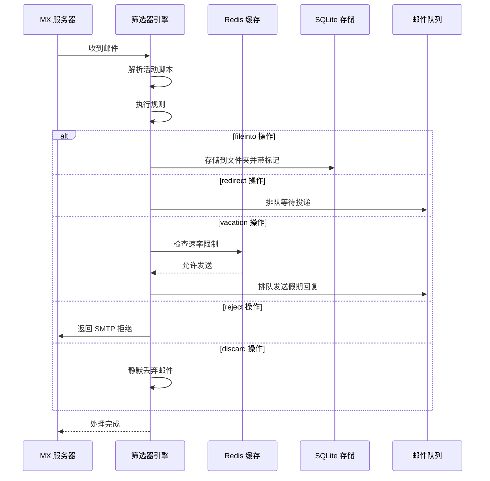

#### 安全特性 {#security-features}

Forward Email 的筛选器实现包含全面的安全保护：

* **CVE-2023-26430 保护**：防止重定向循环和邮件轰炸攻击
* **速率限制**：重定向限制（每封邮件10次，每天100次）和假期回复限制
* **拒绝列表检查**：重定向地址会检查拒绝列表
* **受保护的头部**：DKIM、ARC 和认证头部不能通过 editheader 修改
* **脚本大小限制**：强制最大脚本大小
* **执行超时**：执行时间超过限制时终止脚本

#### 示例筛选器脚本 {#example-sieve-scripts}

**将新闻通讯归档到文件夹：**

```sieve
require ["fileinto"];

if header :contains "List-Id" "newsletter" {
    fileinto "Newsletters";
}
```

**带有细粒度时间控制的假期自动回复：**

```sieve
require ["vacation", "vacation-seconds"];

vacation :seconds 3600 :subject "外出中"
    "我目前不在，会在24小时内回复。";
```

**带标记的垃圾邮件过滤：**

```sieve
require ["fileinto", "imap4flags"];

if header :contains "X-Spam-Status" "Yes" {
    setflag "\\Seen";
    fileinto "Junk";
}
```

**使用变量的复杂过滤：**

```sieve
require ["variables", "fileinto", "regex"];

if header :regex "From" "(.+)@example\\.com" {
    set :lower "sender" "${1}";
    fileinto "Contacts/${sender}";
}
```

> \[!TIP]
> 有关完整文档、示例脚本和配置说明，请参见 [FAQ：你们支持筛选器邮件过滤吗？](/faq#do-you-support-sieve-email-filtering)

### ManageSieve (RFC 5804) {#managesieve-rfc-5804}

Forward Email 提供完整的 ManageSieve 协议支持，用于远程管理筛选器脚本。

**源代码：** [`managesieve-server.js`](https://github.com/forwardemail/forwardemail.net/blob/master/managesieve-server.js)

| RFC                                                       | 标题                                           | 状态           |
| --------------------------------------------------------- | ---------------------------------------------- | -------------- |
| [RFC 5804](https://datatracker.ietf.org/doc/html/rfc5804) | 远程管理筛选器脚本的协议                       | ✅ 完全支持    |

#### ManageSieve 服务器配置 {#managesieve-server-configuration}

| 设置                     | 值                      |
| ----------------------- | ----------------------- |
| **服务器**              | `imap.forwardemail.net` |
| **端口（STARTTLS）**     | `2190`（推荐）          |
| **端口（隐式 TLS）**     | `4190`                  |
| **认证方式**            | PLAIN（通过 TLS）       |

> **注意：** 端口 2190 使用 STARTTLS（从明文升级到 TLS），兼容大多数 ManageSieve 客户端，包括 [sieve-connect](https://github.com/philpennock/sieve-connect)。端口 4190 使用隐式 TLS（连接开始即 TLS），适用于支持该方式的客户端。

#### 支持的 ManageSieve 命令 {#supported-managesieve-commands}

| 命令           | 描述                                   |
| -------------- | -------------------------------------- |
| `AUTHENTICATE` | 使用 PLAIN 机制进行认证                 |
| `CAPABILITY`   | 列出服务器功能和扩展                   |
| `HAVESPACE`    | 检查是否有空间存储脚本                 |
| `PUTSCRIPT`    | 上传新脚本                            |
| `LISTSCRIPTS`  | 列出所有脚本及其激活状态               |
| `SETACTIVE`    | 激活脚本                             |
| `GETSCRIPT`    | 下载脚本                             |
| `DELETESCRIPT` | 删除脚本                             |
| `RENAMESCRIPT` | 重命名脚本                           |
| `CHECKSCRIPT`  | 验证脚本语法                         |
| `NOOP`         | 保持连接活跃                         |
| `LOGOUT`       | 结束会话                             |
#### 兼容的 ManageSieve 客户端 {#compatible-managesieve-clients}

* **Thunderbird**：通过 [Sieve 插件](https://addons.thunderbird.net/addon/sieve/) 内置支持 Sieve
* **Roundcube**：[ManageSieve 插件](https://plugins.roundcube.net/packages/johndoh/sieve)
* **KMail**：原生 ManageSieve 支持
* **sieve-connect**：命令行客户端
* **任何符合 RFC 5804 的客户端**

#### ManageSieve 协议流程 {#managesieve-protocol-flow}

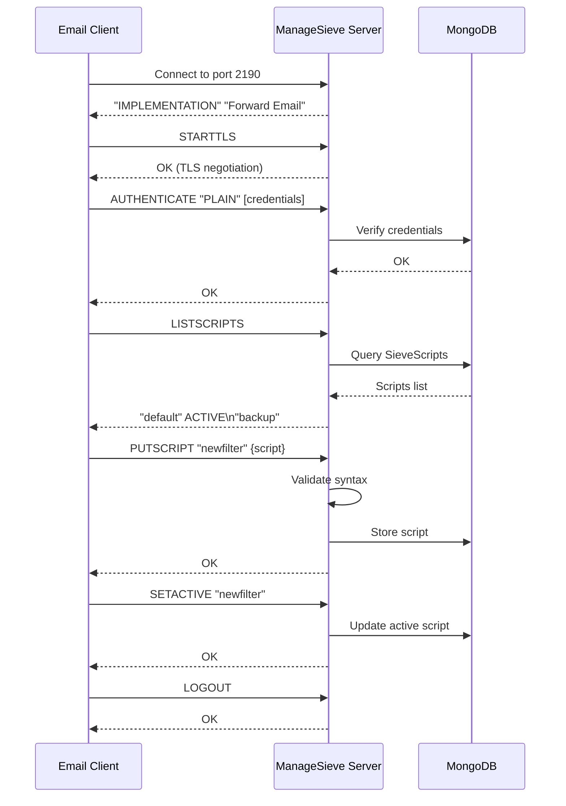

#### Web 界面和 API {#web-interface-and-api}

除了 ManageSieve，Forward Email 还提供：

* **Web 控制面板**：通过网页界面在 我的账户 → 域名 → 别名 → Sieve 脚本 创建和管理 Sieve 脚本
* **REST API**：通过 [Forward Email API](/api#sieve-scripts) 以编程方式访问 Sieve 脚本管理

> \[!TIP]
> 有关详细的设置说明和客户端配置，请参见 [常见问题：你们支持 Sieve 邮件过滤吗？](/faq#do-you-support-sieve-email-filtering)

---


## 存储优化 {#storage-optimization}

> \[!IMPORTANT]
> **行业首创存储技术：** Forward Email 是 **全球唯一** 将附件去重与 Brotli 压缩邮件内容相结合的邮件服务商。这种双层优化使您获得比传统邮件服务商 **2-3 倍更高效的存储空间**。

Forward Email 实现了两项革命性的存储优化技术，显著减少邮箱大小，同时保持完全的 RFC 兼容性和邮件完整性：

1. **附件去重** - 消除所有邮件中的重复附件
2. **Brotli 压缩** - 元数据减少 46-86%，附件减少 50%

### 架构：双层存储优化 {#architecture-dual-layer-storage-optimization}

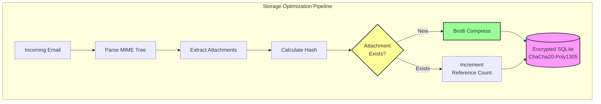

---


## 附件去重 {#attachment-deduplication}

Forward Email 基于 [WildDuck 的成熟方案](https://docs.wildduck.email/docs/in-depth/attachment-deduplication/)，并针对 SQLite 存储进行了适配，实现了附件去重。

> \[!NOTE]
> **去重对象说明：**“附件”指的是 **编码后的** MIME 节点内容（base64 或 quoted-printable），而非解码后的文件。这保证了 DKIM 和 GPG 签名的有效性。

### 工作原理 {#how-it-works}

**WildDuck 的原始实现（MongoDB GridFS）：**

> Wild Duck IMAP 服务器对附件进行去重。“附件”在这里指的是 base64 或 quoted-printable 编码的 MIME 节点内容，而非解码后的文件。虽然使用编码内容会导致较多误判（同一文件在不同邮件中可能被视为不同附件），但这是保证不同签名方案（DKIM、GPG 等）有效性的必要条件。从 Wild Duck 检索的邮件与存储时完全一致，尽管 Wild Duck 会将邮件解析成树状对象并在检索时重建邮件。
**Forward Email 的 SQLite 实现：**

Forward Email 采用以下流程实现加密的 SQLite 存储：

1. **哈希计算**：发现附件时，使用 [`rev-hash`](https://github.com/sindresorhus/rev-hash) 库从附件内容计算哈希
2. **查找**：检查 `Attachments` 表中是否存在匹配哈希的附件
3. **引用计数**：
   * 如果存在：引用计数加 1，魔法计数加随机数
   * 如果是新附件：创建新附件条目，计数器 = 1
4. **删除安全**：使用双计数器系统（引用 + 魔法）防止误删
5. **垃圾回收**：当两个计数器均为零时，立即删除附件

**源代码：** [`helpers/attachment-storage.js`](https://github.com/forwardemail/forwardemail.net/blob/master/helpers/attachment-storage.js)

### 去重流程 {#deduplication-flow}

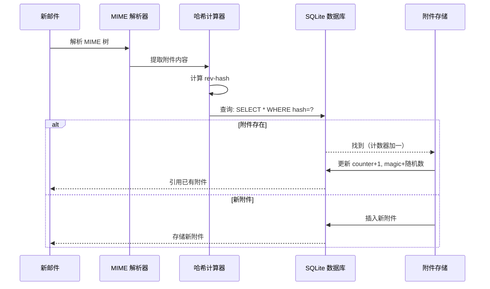

### 魔法数字系统 {#magic-number-system}

Forward Email 使用 WildDuck 的“魔法数字”系统（灵感来自 [Mail.ru](https://github.com/zone-eu/wildduck)），防止删除时误删：

* 每条消息分配一个 **随机数**
* 添加消息时，附件的 **魔法计数器** 增加该随机数
* 删除消息时，魔法计数器减少相同的数字
* 仅当 **两个计数器**（引用 + 魔法）均为零时，才删除附件

该双计数器系统确保删除过程中若发生异常（如崩溃、网络错误），附件不会被过早删除。

### 关键差异：WildDuck vs Forward Email {#key-differences-wildduck-vs-forward-email}

| 功能                   | WildDuck (MongoDB)         | Forward Email (SQLite)       |
| ---------------------- | -------------------------- | ---------------------------- |
| **存储后端**           | MongoDB GridFS（分块存储） | SQLite BLOB（直接存储）       |
| **哈希算法**           | SHA256                     | rev-hash（基于 SHA-256）      |
| **引用计数**           | ✅ 是                      | ✅ 是                        |
| **魔法数字**           | ✅ 是（Mail.ru 灵感）       | ✅ 是（相同系统）             |
| **垃圾回收**           | 延迟（独立任务）           | 立即（计数器为零时）          |
| **压缩**               | ❌ 无                      | ✅ Brotli（见下文）            |
| **加密**               | ❌ 可选                    | ✅ 始终（ChaCha20-Poly1305）  |

---


## Brotli 压缩 {#brotli-compression}

> \[!IMPORTANT]
> **世界首创：** Forward Email 是**全球唯一**对邮件内容使用 Brotli 压缩的邮件服务。这在附件去重基础上，提供了**46-86% 的存储节省**。

Forward Email 对附件内容和消息元数据均实现了 Brotli 压缩，极大节省存储空间，同时保持向后兼容。

**实现代码：** [`helpers/msgpack-helpers.js`](https://github.com/forwardemail/forwardemail.net/blob/master/helpers/msgpack-helpers.js)

### 压缩内容 {#what-gets-compressed}

**1. 附件内容** (`encodeAttachmentBody`)

* **旧格式**：十六进制编码字符串（体积翻倍）或原始 Buffer
* **新格式**：带有 "FEBR" 魔法头的 Brotli 压缩 Buffer
* **压缩决策**：仅在节省空间时压缩（考虑 4 字节头）
* **存储节省**：最高可达 **50%**（十六进制 → 原生 BLOB）
**2. 消息元数据** (`encodeMetadata`)

包含：`mimeTree`、`headers`、`envelope`、`flags`

* **旧格式**：JSON 文本字符串
* **新格式**：Brotli 压缩的 Buffer
* **存储节省**：根据消息复杂度节省 **46-86%**

### 压缩配置 {#compression-configuration}

```javascript
// Brotli 压缩选项，优化速度（等级 4 是良好平衡）
const BROTLI_COMPRESS_OPTIONS = {
  params: {
    [zlib.constants.BROTLI_PARAM_QUALITY]: 4
  }
};
```

**为什么选择等级 4？**

* **快速压缩/解压**：亚毫秒级处理
* **良好压缩率**：节省 46-86%
* **性能平衡**：适合实时邮件操作的最佳选择

### 魔术头："FEBR" {#magic-header-febr}

Forward Email 使用 4 字节魔术头来识别压缩的附件内容：

```
"FEBR" = Forward Email BRotli
十六进制：0x46 0x45 0x42 0x52
```

**为什么要魔术头？**

* **格式检测**：即时识别压缩与未压缩数据
* **向后兼容**：旧的十六进制字符串和原始 Buffer 仍然可用
* **避免冲突**："FEBR" 不太可能出现在合法附件数据开头

### 压缩流程 {#compression-process}

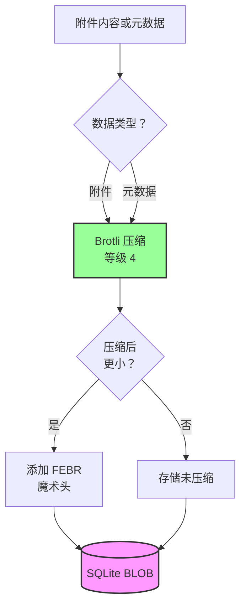

### 解压流程 {#decompression-process}

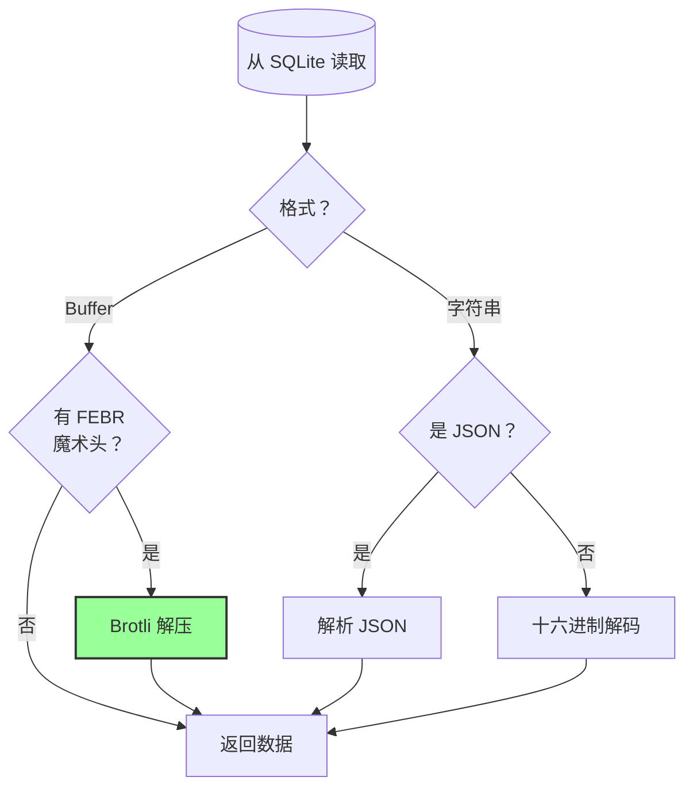

### 向后兼容 {#backwards-compatibility}

所有解码函数**自动检测**存储格式：

| 格式                  | 检测方法                             | 处理方式                                      |
| --------------------- | ---------------------------------- | --------------------------------------------- |
| **Brotli 压缩**       | 检查 "FEBR" 魔术头                  | 使用 `zlib.brotliDecompressSync()` 解压       |
| **原始 Buffer**       | `Buffer.isBuffer()` 且无魔术头      | 原样返回                                      |
| **十六进制字符串**    | 检查长度为偶数且包含 [0-9a-f] 字符 | 使用 `Buffer.from(value, 'hex')` 解码         |
| **JSON 字符串**       | 首字符为 `{` 或 `[`                 | 使用 `JSON.parse()` 解析                       |

确保从旧存储格式迁移到新格式时**零数据丢失**。

### 存储节省统计 {#storage-savings-statistics}

**基于生产数据的测量节省：**

| 数据类型               | 旧格式                   | 新格式                  | 节省比例   |
| --------------------- | ------------------------ | ----------------------- | ---------- |
| **附件内容**           | 十六进制编码字符串（2 倍） | Brotli 压缩 BLOB        | **50%**    |
| **消息元数据**         | JSON 文本                | Brotli 压缩 BLOB        | **46-86%** |
| **邮箱标记**           | JSON 文本                | Brotli 压缩 BLOB        | **60-80%** |

**来源：** [`helpers/migrate-storage-format.js`](https://github.com/forwardemail/forwardemail.net/blob/master/helpers/migrate-storage-format.js)

### 迁移流程 {#migration-process}

Forward Email 提供从旧存储格式到新存储格式的自动、幂等迁移：
// 迁移统计跟踪：
{
  attachmentsMigrated: 0,
  messagesMigrated: 0,
  mailboxesMigrated: 0,
  bytesSaved: 0  // 压缩节省的总字节数
}
```

**迁移步骤：**

1. 附件内容：十六进制编码 → 原生 BLOB（节省 50%）
2. 消息元数据：JSON 文本 → Brotli 压缩 BLOB（节省 46-86%）
3. 邮箱标记：JSON 文本 → Brotli 压缩 BLOB（节省 60-80%）

**来源：** [`helpers/migrate-storage-format.js`](https://github.com/forwardemail/forwardemail.net/blob/master/helpers/migrate-storage-format.js)

---

### 综合存储效率 {#combined-storage-efficiency}

> \[!TIP]
> **实际影响：** 通过附件去重 + Brotli 压缩，Forward Email 用户获得比传统邮件服务商 **2-3 倍更高的有效存储容量**。

**示例场景：**

传统邮件服务商（1GB 邮箱）：

* 1GB 磁盘空间 = 1GB 邮件
* 无去重：同一附件存储 10 次 = 10 倍存储浪费
* 无压缩：完整 JSON 元数据存储 = 2-3 倍存储浪费

Forward Email（1GB 邮箱）：

* 1GB 磁盘空间 ≈ **2-3GB 邮件**（有效存储）
* 去重：同一附件存储一次，引用 10 次
* 压缩：元数据节省 46-86%，附件节省 50%
* 加密：ChaCha20-Poly1305（无存储开销）

**对比表：**

| 服务商            | 存储技术                                    | 有效存储（1GB 邮箱）           |
| ----------------- | -------------------------------------------- | ----------------------------- |
| Gmail             | 无                                         | 1GB                           |
| iCloud            | 无                                         | 1GB                           |
| Outlook.com       | 无                                         | 1GB                           |
| Fastmail          | 无                                         | 1GB                           |
| ProtonMail        | 仅加密                                     | 1GB                           |
| Tutanota          | 仅加密                                     | 1GB                           |
| **Forward Email** | **去重 + 压缩 + 加密**                       | **2-3GB** ✨                   |

### 技术实现细节 {#technical-implementation-details}

**性能：**

* Brotli 4 级压缩：亚毫秒级压缩/解压
* 压缩无性能损耗
* SQLite FTS5：NVMe SSD 下搜索低于 50ms

**安全性：**

* 压缩发生在加密之后（SQLite 数据库已加密）
* ChaCha20-Poly1305 加密 + Brotli 压缩
* 零知识：只有用户拥有解密密码

**RFC 合规性：**

* 检索的消息与存储的内容 **完全一致**
* DKIM 签名保持有效（编码内容未变）
* GPG 签名保持有效（签名内容未修改）

### 为什么其他服务商不这样做 {#why-no-other-provider-does-this}

**复杂性：**

* 需要与存储层深度集成
* 向后兼容性具有挑战
* 旧格式迁移复杂

**性能顾虑：**

* 压缩增加 CPU 负载（通过 Brotli 4 级解决）
* 每次读取都需解压（通过 SQLite 缓存解决）

**Forward Email 的优势：**

* 从零开始构建，优化为核心目标
* SQLite 支持直接操作 BLOB
* 每用户加密数据库支持安全压缩

---

---


## 现代功能 {#modern-features}


## 完整的邮件管理 REST API {#complete-rest-api-for-email-management}

> \[!TIP]
> Forward Email 提供包含 39 个端点的全面 REST API，实现程序化邮件管理。

> \[!TIP]
> **行业独有功能：** 与其他所有邮件服务不同，Forward Email 通过全面的 REST API 提供对邮箱、日历、联系人、邮件和文件夹的完整程序化访问。这是对存储所有数据的加密 SQLite 数据库文件的直接操作。

Forward Email 提供完整的 REST API，带来前所未有的邮件数据访问权限。没有其他邮件服务（包括 Gmail、iCloud、Outlook、ProtonMail、Tuta 或 Fastmail）能提供如此全面、直接的数据库访问。
**API 文档:** <https://forwardemail.net/en/email-api>

### API 分类（39 个端点）{#api-categories-39-endpoints}

**1. 消息 API**（5 个端点）- 对电子邮件消息的完整 CRUD 操作：

* `GET /v1/messages` - 列出消息，支持 15+ 高级搜索参数（其他服务无此功能）
* `POST /v1/messages` - 创建/发送消息
* `GET /v1/messages/:id` - 获取消息
* `PUT /v1/messages/:id` - 更新消息（标记、文件夹）
* `DELETE /v1/messages/:id` - 删除消息

*示例：查找上季度所有带附件的发票：*

```bash
curl -u "alias@domain.com:password" \
  "https://api.forwardemail.net/v1/messages?q=subject:invoice+has:attachment+after:2024-01-01+before:2024-04-01"
```

参见 [高级搜索文档](https://forwardemail.net/en/email-api)

**2. 文件夹 API**（5 个端点）- 通过 REST 完整管理 IMAP 文件夹：

* `GET /v1/folders` - 列出所有文件夹
* `POST /v1/folders` - 创建文件夹
* `GET /v1/folders/:id` - 获取文件夹
* `PUT /v1/folders/:id` - 更新文件夹
* `DELETE /v1/folders/:id` - 删除文件夹

**3. 联系人 API**（5 个端点）- 通过 REST 管理 CardDAV 联系人存储：

* `GET /v1/contacts` - 列出联系人
* `POST /v1/contacts` - 创建联系人（vCard 格式）
* `GET /v1/contacts/:id` - 获取联系人
* `PUT /v1/contacts/:id` - 更新联系人
* `DELETE /v1/contacts/:id` - 删除联系人

**4. 日历 API**（5 个端点）- 日历容器管理：

* `GET /v1/calendars` - 列出日历容器
* `POST /v1/calendars` - 创建日历（例如，“工作日历”、“个人日历”）
* `GET /v1/calendars/:id` - 获取日历
* `PUT /v1/calendars/:id` - 更新日历
* `DELETE /v1/calendars/:id` - 删除日历

**5. 日历事件 API**（5 个端点）- 日历中的事件调度：

* `GET /v1/calendar-events` - 列出事件
* `POST /v1/calendar-events` - 创建带参与者的事件
* `GET /v1/calendar-events/:id` - 获取事件
* `PUT /v1/calendar-events/:id` - 更新事件
* `DELETE /v1/calendar-events/:id` - 删除事件

*示例：创建一个日历事件：*

```bash
curl -u "alias@domain.com:password" \
  -X POST \
  -H "Content-Type: application/json" \
  -d '{"title":"团队会议","start":"2024-12-20T10:00:00Z","attendees":["team@example.com"],"calendar_id":"calendar123"}' \
  https://api.forwardemail.net/v1/calendar-events
```

### 技术细节 {#technical-details}

* **认证：** 简单的 `alias:password` 认证（无 OAuth 复杂性）
* **性能：** 使用 SQLite FTS5 和 NVMe SSD 存储，响应时间低于 50ms
* **零网络延迟：** 直接访问数据库，不通过外部服务代理

### 真实应用场景 {#real-world-use-cases}

* **邮件分析：** 构建自定义仪表盘，跟踪邮件量、响应时间、发件人统计

* **自动化工作流：** 根据邮件内容触发操作（发票处理、支持工单）

* **CRM 集成：** 自动同步邮件对话到您的 CRM

* **合规与发现：** 搜索并导出邮件以满足法律/合规要求

* **定制邮件客户端：** 为您的工作流程构建专用邮件界面

* **商业智能：** 分析沟通模式、响应率、客户参与度

* **文档管理：** 自动提取和分类附件

* [完整文档](https://forwardemail.net/en/email-api)

* [完整 API 参考](https://forwardemail.net/en/email-api)

* [高级搜索指南](https://forwardemail.net/en/email-api)

* [30+ 集成示例](https://forwardemail.net/en/email-api)

* [技术架构](https://forwardemail.net/en/blog/docs/best-quantum-safe-encrypted-email-service)

Forward Email 提供了现代 REST API，全面控制电子邮件账户、域名、别名和消息。该 API 是 JMAP 的强大替代方案，功能超越传统邮件协议。

| 分类                     | 端点数    | 描述                                   |
| ----------------------- | --------- | --------------------------------------- |
| **账户管理**             | 8         | 用户账户、认证、设置                     |
| **域名管理**             | 12        | 自定义域名、DNS、验证                     |
| **别名管理**             | 6         | 邮件别名、转发、通配符                     |
| **消息管理**             | 7         | 发送、接收、搜索、删除消息                 |
| **日历与联系人**         | 4         | 通过 API 访问 CalDAV/CardDAV               |
| **日志与分析**           | 2         | 邮件日志、投递报告                         |
### 关键 API 功能 {#key-api-features}

**高级搜索：**

该 API 提供强大的搜索功能，查询语法类似于 Gmail：

```
GET /v1/messages?q=subject:invoice+has:attachment+after:2024-01-01+before:2024-04-01
```

**支持的搜索操作符：**

* `from:` - 按发件人搜索
* `to:` - 按收件人搜索
* `subject:` - 按主题搜索
* `has:attachment` - 带附件的邮件
* `is:unread` - 未读邮件
* `is:starred` - 标星邮件
* `after:` - 指定日期之后的邮件
* `before:` - 指定日期之前的邮件
* `label:` - 带标签的邮件
* `filename:` - 附件文件名

**日历事件管理：**

```
GET /v1/calendar-events
POST /v1/calendar-events
PUT /v1/calendar-events/:id
DELETE /v1/calendar-events/:id
```

**Webhook 集成：**

该 API 支持 webhook，用于实时通知邮件事件（接收、发送、退信等）。

**认证：**

* API 密钥认证
* 支持 OAuth 2.0
* 速率限制：每小时 1000 次请求

**数据格式：**

* JSON 请求/响应
* RESTful 设计
* 支持分页

**安全性：**

* 仅支持 HTTPS
* API 密钥轮换
* IP 白名单（可选）
* 请求签名（可选）

### API 架构 {#api-architecture}

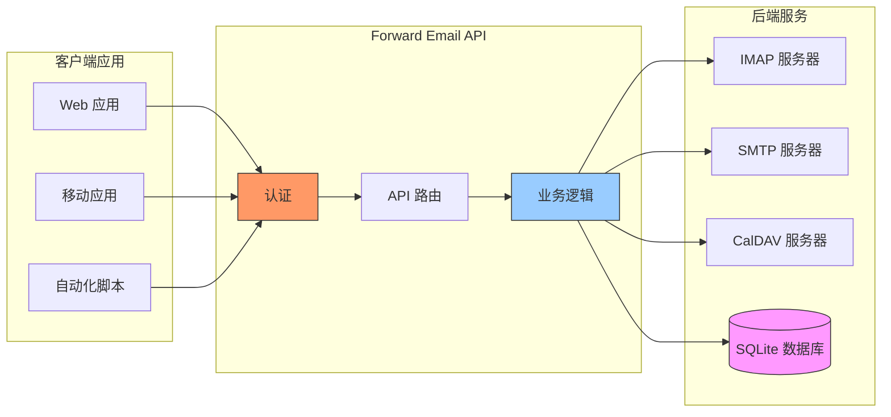

---


## iOS 推送通知 {#ios-push-notifications}

> \[!TIP]
> Forward Email 通过 XAPPLEPUSHSERVICE 支持原生 iOS 推送通知，实现即时邮件传递。

> \[!IMPORTANT]
> **独特功能：** Forward Email 是少数支持通过 `XAPPLEPUSHSERVICE` IMAP 扩展实现邮件、联系人和日历的原生 iOS 推送通知的开源邮件服务器之一。该功能是通过逆向苹果协议实现，能为 iOS 设备提供即时推送且不耗电。

Forward Email 实现了苹果专有的 XAPPLEPUSHSERVICE 扩展，为 iOS 设备提供原生推送通知，无需后台轮询。

### 工作原理 {#how-it-works-1}

**XAPPLEPUSHSERVICE** 是一个非标准的 IMAP 扩展，允许 iOS 邮件应用在新邮件到达时接收即时推送通知。

Forward Email 实现了苹果推送通知服务（APNs）与 IMAP 的集成，使 iOS 邮件应用能在新邮件到达时接收即时推送通知。

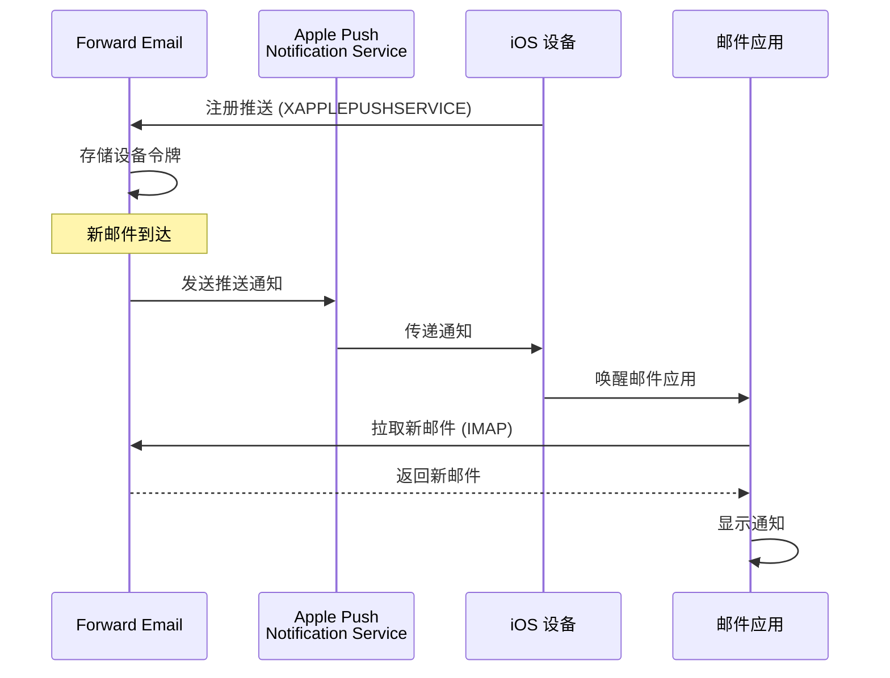

### 主要功能 {#key-features}

**即时传递：**

* 推送通知秒级到达
* 无需耗电的后台轮询
* 即使邮件应用关闭也能工作

<!---->

* **即时传递：** 邮件、日历事件和联系人会立即出现在您的 iPhone/iPad 上，而非轮询式更新
* **节能高效：** 使用苹果推送基础设施，避免持续保持 IMAP 连接
* **基于主题的推送：** 支持特定邮箱的推送通知，而不仅限于收件箱
* **无需第三方应用：** 兼容原生 iOS 邮件、日历和联系人应用
**原生集成：**

* 内置于 iOS 邮件应用
* 无需第三方应用
* 无缝的用户体验

**注重隐私：**

* 设备令牌加密存储
* 不通过 APNS 发送邮件内容
* 仅发送“新邮件”通知

**节能高效：**

* 无需持续 IMAP 轮询
* 设备休眠直到收到通知
* 极小的电池影响

### 这有什么特别之处 {#what-makes-this-special}

> \[!IMPORTANT]
> 大多数邮件服务提供商不支持 XAPPLEPUSHSERVICE，迫使 iOS 设备每 15 分钟轮询新邮件。

大多数开源邮件服务器（包括 Dovecot、Postfix、Cyrus IMAP）不支持 iOS 推送通知。用户必须：

* 使用 IMAP IDLE（保持连接，耗电）
* 使用轮询（每 15-30 分钟检查，通知延迟）
* 使用自带推送基础设施的专有邮件应用

Forward Email 提供与 Gmail、iCloud 和 Fastmail 等商业服务相同的即时推送通知体验。

**与其他服务商的比较：**

| 服务商            | 推送支持       | 轮询间隔         | 电池影响       |
| ----------------- | -------------- | ---------------- | -------------- |
| **Forward Email** | ✅ 原生推送    | 即时             | 极小           |
| Gmail             | ✅ 原生推送    | 即时             | 极小           |
| iCloud            | ✅ 原生推送    | 即时             | 极小           |
| Yahoo             | ✅ 原生推送    | 即时             | 极小           |
| Outlook.com       | ❌ 轮询        | 15 分钟          | 中等           |
| Fastmail          | ❌ 轮询        | 15 分钟          | 中等           |
| ProtonMail        | ⚠️ 仅桥接     | 通过桥接         | 高             |
| Tutanota          | ❌ 仅应用      | 不适用           | 不适用         |

### 实现细节 {#implementation-details}

**IMAP CAPABILITY 响应：**

```
* CAPABILITY IMAP4rev1 ... XAPPLEPUSHSERVICE ...
```

**注册流程：**

1. iOS 邮件应用检测到 XAPPLEPUSHSERVICE 功能
2. 应用向 Forward Email 注册设备令牌
3. Forward Email 存储令牌并关联账户
4. 新邮件到达时，Forward Email 通过 APNS 发送推送
5. iOS 唤醒邮件应用以获取新邮件

**安全性：**

* 设备令牌静态加密存储
* 令牌自动过期并刷新
* 不向 APNS 透露邮件内容
* 保持端到端加密

<!---->

* **IMAP 扩展：** `XAPPLEPUSHSERVICE`
* **源码：** [WildDuck Issue #711](https://github.com/zone-eu/wildduck/issues/711)
* **设置：** 自动 - 无需配置，开箱即用，兼容 iOS 邮件应用

### 与其他服务的比较 {#comparison-with-other-services}

| 服务           | iOS 推送支持    | 方式                                      |
| -------------- | --------------- | ----------------------------------------- |
| Forward Email  | ✅ 支持         | `XAPPLEPUSHSERVICE`（逆向工程实现）       |
| Gmail          | ✅ 支持         | 专有 Gmail 应用 + Google 推送             |
| iCloud 邮箱    | ✅ 支持         | 苹果原生集成                              |
| Outlook.com    | ✅ 支持         | 专有 Outlook 应用 + Microsoft 推送        |
| Fastmail       | ✅ 支持         | `XAPPLEPUSHSERVICE`                       |
| Dovecot        | ❌ 不支持       | 仅 IMAP IDLE 或轮询                       |
| Postfix        | ❌ 不支持       | 仅 IMAP IDLE 或轮询                       |
| Cyrus IMAP     | ❌ 不支持       | 仅 IMAP IDLE 或轮询                       |

**Gmail 推送：**

Gmail 使用专有推送系统，仅适用于 Gmail 应用。iOS 邮件应用必须轮询 Gmail IMAP 服务器。

**iCloud 推送：**

iCloud 提供类似 Forward Email 的原生推送支持，但仅限 @icloud.com 地址。

**Outlook.com：**

Outlook.com 不支持 XAPPLEPUSHSERVICE，iOS 邮件应用需每 15 分钟轮询一次。

**Fastmail：**

Fastmail 不支持 XAPPLEPUSHSERVICE。用户必须使用 Fastmail 应用接收推送，或接受 15 分钟轮询延迟。

---


## 测试与验证 {#testing-and-verification}


## 协议能力测试 {#protocol-capability-tests}
> \[!NOTE]
> 本节提供了我们于2026年1月22日进行的最新协议能力测试结果。

本节包含所有测试提供商的实际CAPABILITY/CAPA/EHLO响应。所有测试均于**2026年1月22日**进行。

这些测试有助于验证主要提供商对各种电子邮件协议和扩展的宣传支持与实际支持情况。

### 测试方法 {#test-methodology}

**测试环境：**

* **日期：** 2026年1月22日 02:37 UTC
* **地点：** AWS EC2 实例
* **IPv4：** 54.167.216.197
* **IPv6：** 2600:4040:46da:9a00:b19e:3ad4:426c:2f48
* **工具：** OpenSSL s_client，bash 脚本

**测试提供商：**

* Forward Email
* Gmail
* Outlook.com
* iCloud
* Fastmail
* Yahoo/AOL（Verizon）

### 测试脚本 {#test-scripts}

为确保完全透明，以下提供了用于这些测试的准确脚本。

#### IMAP 能力测试脚本 {#imap-capability-test-script}

```bash
#!/bin/bash
# IMAP Capability Test Script
# Tests IMAP CAPABILITY for various email providers

echo "========================================="
echo "IMAP CAPABILITY TEST"
echo "Date: $(date -u +"%Y-%m-%d %H:%M:%S UTC")"
echo "========================================="
echo ""

# Gmail
echo "--- Gmail (imap.gmail.com:993) ---"
echo -e "a001 CAPABILITY\na002 LOGOUT" | timeout 10 openssl s_client -connect imap.gmail.com:993 -crlf -quiet 2>&1 | grep -A 20 "CAPABILITY"
echo ""

# Outlook.com
echo "--- Outlook.com (outlook.office365.com:993) ---"
echo -e "a001 CAPABILITY\na002 LOGOUT" | timeout 10 openssl s_client -connect outlook.office365.com:993 -crlf -quiet 2>&1 | grep -A 20 "CAPABILITY"
echo ""

# iCloud
echo "--- iCloud (imap.mail.me.com:993) ---"
echo -e "a001 CAPABILITY\na002 LOGOUT" | timeout 10 openssl s_client -connect imap.mail.me.com:993 -crlf -quiet 2>&1 | grep -A 20 "CAPABILITY"
echo ""

# Fastmail
echo "--- Fastmail (imap.fastmail.com:993) ---"
echo -e "a001 CAPABILITY\na002 LOGOUT" | timeout 10 openssl s_client -connect imap.fastmail.com:993 -crlf -quiet 2>&1 | grep -A 20 "CAPABILITY"
echo ""

# Yahoo
echo "--- Yahoo (imap.mail.yahoo.com:993) ---"
echo -e "a001 CAPABILITY\na002 LOGOUT" | timeout 10 openssl s_client -connect imap.mail.yahoo.com:993 -crlf -quiet 2>&1 | grep -A 20 "CAPABILITY"
echo ""

# Forward Email
echo "--- Forward Email (imap.forwardemail.net:993) ---"
echo -e "a001 CAPABILITY\na002 LOGOUT" | timeout 10 openssl s_client -connect imap.forwardemail.net:993 -crlf -quiet 2>&1 | grep -A 20 "CAPABILITY"
echo ""

echo "========================================="
echo "Test completed"
echo "========================================="
```

#### POP3 能力测试脚本 {#pop3-capability-test-script}

```bash
#!/bin/bash
# POP3 Capability Test Script
# Tests POP3 CAPA for various email providers

echo "========================================="
echo "POP3 CAPABILITY TEST"
echo "Date: $(date -u +"%Y-%m-%d %H:%M:%S UTC")"
echo "========================================="
echo ""

# Gmail
echo "--- Gmail (pop.gmail.com:995) ---"
echo -e "CAPA\nQUIT" | timeout 10 openssl s_client -connect pop.gmail.com:995 -crlf -quiet 2>&1 | grep -A 20 "CAPA"
echo ""

# Outlook.com
echo "--- Outlook.com (outlook.office365.com:995) ---"
echo -e "CAPA\nQUIT" | timeout 10 openssl s_client -connect outlook.office365.com:995 -crlf -quiet 2>&1 | grep -A 20 "CAPA"
echo ""

# iCloud (注意：iCloud 不支持 POP3)
echo "--- iCloud (No POP3 support) ---"
echo "iCloud does not support POP3"
echo ""

# Fastmail
echo "--- Fastmail (pop.fastmail.com:995) ---"
echo -e "CAPA\nQUIT" | timeout 10 openssl s_client -connect pop.fastmail.com:995 -crlf -quiet 2>&1 | grep -A 20 "CAPA"
echo ""

# Yahoo
echo "--- Yahoo (pop.mail.yahoo.com:995) ---"
echo -e "CAPA\nQUIT" | timeout 10 openssl s_client -connect pop.mail.yahoo.com:995 -crlf -quiet 2>&1 | grep -A 20 "CAPA"
echo ""

# Forward Email
echo "--- Forward Email (pop3.forwardemail.net:995) ---"
echo -e "CAPA\nQUIT" | timeout 10 openssl s_client -connect pop3.forwardemail.net:995 -crlf -quiet 2>&1 | grep -A 20 "CAPA"
echo ""

echo "========================================="
echo "Test completed"
echo "========================================="
```
#### SMTP 功能测试脚本 {#smtp-capability-test-script}

```bash
#!/bin/bash
# SMTP 功能测试脚本
# 测试各种邮件提供商的 SMTP EHLO

echo "========================================="
echo "SMTP 功能测试"
echo "日期: $(date -u +"%Y-%m-%d %H:%M:%S UTC")"
echo "========================================="
echo ""

# Gmail
echo "--- Gmail (smtp.gmail.com:587) ---"
echo -e "EHLO test.com\nQUIT" | timeout 10 openssl s_client -connect smtp.gmail.com:587 -starttls smtp -crlf -quiet 2>&1 | grep -A 30 "250-"
echo ""

# Outlook.com
echo "--- Outlook.com (smtp.office365.com:587) ---"
echo -e "EHLO test.com\nQUIT" | timeout 10 openssl s_client -connect smtp.office365.com:587 -starttls smtp -crlf -quiet 2>&1 | grep -A 30 "250-"
echo ""

# iCloud
echo "--- iCloud (smtp.mail.me.com:587) ---"
echo -e "EHLO test.com\nQUIT" | timeout 10 openssl s_client -connect smtp.mail.me.com:587 -starttls smtp -crlf -quiet 2>&1 | grep -A 30 "250-"
echo ""

# Fastmail
echo "--- Fastmail (smtp.fastmail.com:587) ---"
echo -e "EHLO test.com\nQUIT" | timeout 10 openssl s_client -connect smtp.fastmail.com:587 -starttls smtp -crlf -quiet 2>&1 | grep -A 30 "250-"
echo ""

# Yahoo
echo "--- Yahoo (smtp.mail.yahoo.com:587) ---"
echo -e "EHLO test.com\nQUIT" | timeout 10 openssl s_client -connect smtp.mail.yahoo.com:587 -starttls smtp -crlf -quiet 2>&1 | grep -A 30 "250-"
echo ""

# Forward Email
echo "--- Forward Email (smtp.forwardemail.net:587) ---"
echo -e "EHLO test.com\nQUIT" | timeout 10 openssl s_client -connect smtp.forwardemail.net:587 -starttls smtp -crlf -quiet 2>&1 | grep -A 30 "250-"
echo ""

echo "========================================="
echo "测试完成"
echo "========================================="
```

### 测试结果摘要 {#test-results-summary}

#### IMAP (CAPABILITY) {#imap-capability}

**Forward Email**

```
* CAPABILITY IMAP4rev1 AUTH=PLAIN AUTH=PLAIN-CLIENTTOKEN CHILDREN ENABLE ID IDLE NAMESPACE QUOTA SASL-IR UNSELECT XLIST XAPPLEPUSHSERVICE
```

**Gmail**

```
* CAPABILITY IMAP4rev1 UNSELECT IDLE NAMESPACE QUOTA ID XLIST CHILDREN X-GM-EXT-1 UIDPLUS COMPRESS=DEFLATE ENABLE MOVE CONDSTORE ESEARCH UTF8=ACCEPT LIST-EXTENDED LIST-STATUS LITERAL- SPECIAL-USE
```

**iCloud**

```
* OK [CAPABILITY XAPPLEPUSHSERVICE IMAP4 IMAP4rev1 SASL-IR AUTH=ATOKEN AUTH=PLAIN AUTH=ATOKEN2 AUTH=XOAUTH2]
```

**Outlook.com**

```
* CAPABILITY IMAP4rev1 AUTH=PLAIN AUTH=XOAUTH2 SASL-IR UIDPLUS ID UNSELECT CHILDREN IDLE NAMESPACE LITERAL+
```

**Fastmail**

```
* CAPABILITY IMAP4rev1 ACL ANNOTATE-EXPERIMENT-1 CATENATE CONDSTORE ENABLE ESEARCH ESORT I18NLEVEL=1 ID IDLE LIST-EXTENDED LIST-STATUS LITERAL+ LOGINDISABLED MULTIAPPEND NAMESPACE QRESYNC QUOTA RIGHTS=ektx SASL-IR SORT SPECIAL-USE THREAD=ORDEREDSUBJECT UIDPLUS UNSELECT WITHIN X-RENAME XLIST
```

**Yahoo/AOL (Verizon)**

```
* CAPABILITY IMAP4rev1 IDLE NAMESPACE QUOTA ID XLIST CHILDREN UIDPLUS MOVE CONDSTORE ESEARCH ENABLE LIST-EXTENDED LIST-STATUS LITERAL- SPECIAL-USE UNSELECT XAPPLEPUSHSERVICE
```

#### POP3 (CAPA) {#pop3-capa}

**Forward Email**

```
+OK
CAPA
TOP
USER
UIDL
EXPIRE 30
IMPLEMENTATION ForwardEmail
.
```

**Gmail**

```
+OK
CAPA
TOP
USER
UIDL
EXPIRE 30
IMPLEMENTATION Gpop
.
```

**Outlook.com**

```
+OK
CAPA
TOP
USER
UIDL
SASL PLAIN XOAUTH2
.
```

**Fastmail**

```
+OK
CAPA
TOP
USER
UIDL
EXPIRE 30
IMPLEMENTATION Cyrus
.
```

#### SMTP (EHLO) {#smtp-ehlo}

**Forward Email**

```
250-smtp.forwardemail.net
250-PIPELINING
250-SIZE 52428800
250-ETRN
250-STARTTLS
250-ENHANCEDSTATUSCODES
250-8BITMIME
250-DSN
250 CHUNKING
```

**Gmail**

```
250-smtp.gmail.com at your service
250-SIZE 35882577
250-8BITMIME
250-STARTTLS
250-ENHANCEDSTATUSCODES
250-PIPELINING
250-CHUNKING
250 SMTPUTF8
```

**Outlook.com**

```
250-SN4PR13CA0005.outlook.office365.com Hello [x.x.x.x]
250-SIZE 157286400
250-PIPELINING
250-DSN
250-ENHANCEDSTATUSCODES
250-STARTTLS
250-8BITMIME
250-BINARYMIME
250-CHUNKING
250 SMTPUTF8
```

**Fastmail**

```
250-smtp.fastmail.com
250-PIPELINING
250-SIZE 78643200
250-ETRN
250-STARTTLS
250-ENHANCEDSTATUSCODES
250-8BITMIME
250-DSN
250 CHUNKING
```

**Yahoo/AOL (Verizon)**

```
250-smtp.mail.yahoo.com
250-PIPELINING
250-SIZE 41943040
250-8BITMIME
250-ENHANCEDSTATUSCODES
250-STARTTLS
```
### 详细测试结果 {#detailed-test-results}

#### IMAP 测试结果 {#imap-test-results}

**Gmail:**
`* CAPABILITY IMAP4rev1 UNSELECT IDLE NAMESPACE QUOTA ID XLIST CHILDREN X-GM-EXT-1 XYZZY SASL-IR AUTH=XOAUTH2 AUTH=PLAIN AUTH=PLAIN-CLIENTTOKEN AUTH=OAUTHBEARER`

**Outlook.com:**
`* CAPABILITY IMAP4 IMAP4rev1 AUTH=PLAIN AUTH=XOAUTH2 SASL-IR UIDPLUS ID UNSELECT CHILDREN IDLE NAMESPACE LITERAL+`

**iCloud:**
`* CAPABILITY XAPPLEPUSHSERVICE IMAP4 IMAP4rev1 SASL-IR AUTH=ATOKEN AUTH=PLAIN AUTH=ATOKEN2 AUTH=XOAUTH2`

**Fastmail:**
连接超时。详见下方说明。

**Yahoo:**
`* CAPABILITY IMAP4rev1 SASL-IR AUTH=PLAIN AUTH=XOAUTH2 AUTH=OAUTHBEARER ID MOVE NAMESPACE XYMHIGHESTMODSEQ UIDPLUS LITERAL+ CHILDREN UNSELECT X-MSG-EXT OBJECTID IDLE ENABLE UIDONLY X-ALL-MAIL X-UIDONLY LIST-EXTENDED LIST-STATUS SPECIAL-USE PARTIAL APPENDLIMIT=41697280`

**Forward Email:**
`* CAPABILITY XAPPLEPUSHSERVICE IMAP4rev1 APPENDLIMIT=52428800 AUTH=PLAIN AUTH=PLAIN-CLIENTTOKEN CHILDREN CONDSTORE ENABLE ID IDLE MOVE NAMESPACE QUOTA SASL-IR SPECIAL-USE UIDPLUS UNSELECT UTF8=ACCEPT XLIST`

#### POP3 测试结果 {#pop3-test-results}

**Gmail:**
未认证时连接未返回 CAPA 响应。

**Outlook.com:**
未认证时连接未返回 CAPA 响应。

**iCloud:**
不支持。

**Fastmail:**
连接超时。详见下方说明。

**Yahoo:**
`+OK CAPA list follows... SASL PLAIN XOAUTH2`

**Forward Email:**
未认证时连接未返回 CAPA 响应。

#### SMTP 测试结果 {#smtp-test-results}

**Gmail:**
`250-AUTH LOGIN PLAIN XOAUTH2 PLAIN-CLIENTTOKEN OAUTHBEARER XOAUTH`

**Outlook.com:**
`250-DSN`

**iCloud:**
`250-DSN`

**Fastmail:**
`250 AUTH PLAIN LOGIN XOAUTH2 OAUTHBEARER`

**Yahoo:**
`250 AUTH PLAIN LOGIN XOAUTH2 OAUTHBEARER`

**Forward Email:**
`250-DSN`, `250-REQUIRETLS`

### 测试结果说明 {#notes-on-test-results}

> \[!NOTE]
> 测试结果中的重要观察和限制。

1. **Fastmail 超时**：测试过程中 Fastmail 连接超时，可能是由于测试服务器 IP 的速率限制或防火墙限制。根据其文档，Fastmail 在 IMAP/POP3/SMTP 支持方面表现强大。

2. **POP3 CAPA 响应**：多个提供商（Gmail、Outlook.com、Forward Email）在未认证时未返回 CAPA 响应。这是 POP3 服务器常见的安全措施。

3. **DSN 支持**：只有 Outlook.com、iCloud 和 Forward Email 在 SMTP EHLO 响应中明确声明支持 DSN。这并不意味着其他提供商不支持 DSN，只是他们未公开声明。

4. **REQUIRETLS**：只有 Forward Email 明确声明支持 REQUIRETLS，并提供用户界面复选框强制执行。其他提供商可能内部支持，但未在 EHLO 中声明。

5. **测试环境**：测试于 2026 年 1 月 22 日 02:37 UTC 从 AWS EC2 实例（IPv4：54.167.216.197，IPv6：2600:4040:46da:9a00:b19e:3ad4:426c:2f48）进行。

---


## 总结 {#summary}

Forward Email 在所有主流电子邮件标准中提供全面的 RFC 协议支持：

* **IMAP4rev1：** 支持 16 个 RFC，且有意记录差异
* **POP3：** 支持 4 个 RFC，符合 RFC 的永久删除
* **SMTP：** 支持 11 个扩展，包括 SMTPUTF8、DSN 和 PIPELINING
* **认证：** 完全支持 DKIM、SPF、DMARC、ARC
* **传输安全：** 完全支持 MTA-STS 和 REQUIRETLS，部分支持 DANE
* **加密：** 支持 OpenPGP v6 和 S/MIME
* **日历：** 完全支持 CalDAV、CardDAV 和 VTODO
* **API 访问：** 完整 REST API，包含 39 个端点，支持直接数据库访问
* **iOS 推送：** 通过 `XAPPLEPUSHSERVICE` 原生支持邮件、联系人和日历推送通知

### 关键差异点 {#key-differentiators}

> \[!TIP]
> Forward Email 以其他提供商没有的独特功能脱颖而出。

**Forward Email 的独特之处：**

1. **量子安全加密** — 唯一提供 ChaCha20-Poly1305 加密 SQLite 邮箱的服务商
2. **零知识架构** — 您的密码加密邮箱，我们无法解密
3. **免费自定义域名** — 自定义域名邮箱无月费
4. **REQUIRETLS 支持** — 用户界面复选框强制执行整个传输路径的 TLS
5. **全面 API** — 39 个 REST API 端点，实现完全程序化控制
6. **iOS 推送通知** — 原生支持 XAPPLEPUSHSERVICE，实现即时推送
7. **开源** — 完整源码托管于 GitHub
8. **隐私优先** — 无数据挖掘，无广告，无追踪
* **沙箱加密：** 唯一支持单独加密 SQLite 邮箱的邮件服务
* **RFC 合规：** 优先遵循标准而非便利性（例如 POP3 DELE）
* **完整 API：** 直接编程访问所有邮件数据
* **开源：** 完全透明的实现

**协议支持摘要：**

| 分类                 | 支持级别     | 详情                                         |
| -------------------- | ------------ | -------------------------------------------- |
| **核心协议**         | ✅ 优秀       | 完全支持 IMAP4rev1、POP3、SMTP               |
| **现代协议**         | ⚠️ 部分支持  | 部分支持 IMAP4rev2，不支持 JMAP               |
| **安全性**           | ✅ 优秀       | 支持 DKIM、SPF、DMARC、ARC、MTA-STS、REQUIRETLS |
| **加密**             | ✅ 优秀       | 支持 OpenPGP、S/MIME、SQLite 加密             |
| **CalDAV/CardDAV**   | ✅ 优秀       | 完整的日历和联系人同步                         |
| **过滤**             | ✅ 优秀       | 支持 Sieve（24 个扩展）和 ManageSieve         |
| **API**              | ✅ 优秀       | 39 个 REST API 端点                           |
| **推送**             | ✅ 优秀       | 原生 iOS 推送通知                             |
