# Email RFC Protocol Support - Complete Standards & Specifications Guide


## Table of Contents

* [About This Document](#about-this-document)
  * [Architecture Overview](#architecture-overview)
* [Email Service Comparison - Protocol Support & RFC Standards Compliance](#email-service-comparison---protocol-support--rfc-standards-compliance)
  * [Protocol Support Visualization](#protocol-support-visualization)
* [Core Email Protocols](#core-email-protocols)
  * [Email Protocol Flow](#email-protocol-flow)
* [IMAP4 Email Protocol and Extensions](#imap4-email-protocol-and-extensions)
  * [IMAP Protocol Differences from RFC Specifications](#imap-protocol-differences-from-rfc-specifications)
  * [IMAP Extensions NOT Supported](#imap-extensions-not-supported)
* [POP3 Email Protocol and Extensions](#pop3-email-protocol-and-extensions)
  * [POP3 Protocol Differences from RFC Specifications](#pop3-protocol-differences-from-rfc-specifications)
  * [POP3 Extensions NOT Supported](#pop3-extensions-not-supported)
* [SMTP Email Protocol and Extensions](#smtp-email-protocol-and-extensions)
  * [Delivery Status Notifications (DSN)](#delivery-status-notifications-dsn)
  * [REQUIRETLS Support](#requiretls-support)
  * [SMTP Extensions NOT Supported](#smtp-extensions-not-supported)
* [JMAP Email Protocol](#jmap-email-protocol)
* [Email Security](#email-security)
  * [Email Security Architecture](#email-security-architecture)
* [Email Message Authentication Protocols](#email-message-authentication-protocols)
  * [Authentication Protocol Support](#authentication-protocol-support)
  * [DKIM (DomainKeys Identified Mail)](#dkim-domainkeys-identified-mail)
  * [SPF (Sender Policy Framework)](#spf-sender-policy-framework)
  * [DMARC (Domain-based Message Authentication, Reporting & Conformance)](#dmarc-domain-based-message-authentication-reporting--conformance)
  * [ARC (Authenticated Received Chain)](#arc-authenticated-received-chain)
  * [Authentication Flow](#authentication-flow)
* [Email Transport Security Protocols](#email-transport-security-protocols)
  * [Transport Security Support](#transport-security-support)
  * [TLS (Transport Layer Security)](#tls-transport-layer-security)
  * [MTA-STS (Mail Transfer Agent Strict Transport Security)](#mta-sts-mail-transfer-agent-strict-transport-security)
  * [DANE (DNS-based Authentication of Named Entities)](#dane-dns-based-authentication-of-named-entities)
  * [REQUIRETLS](#requiretls)
  * [Transport Security Flow](#transport-security-flow)
* [Email Message Encryption](#email-message-encryption)
  * [Encryption Support](#encryption-support)
  * [OpenPGP (Pretty Good Privacy)](#openpgp-pretty-good-privacy)
  * [S/MIME (Secure/Multipurpose Internet Mail Extensions)](#smime-securemultipurpose-internet-mail-extensions)
  * [SQLite Mailbox Encryption](#sqlite-mailbox-encryption)
  * [Encryption Comparison](#encryption-comparison)
  * [Encryption Flow](#encryption-flow)
* [Extended Functionality](#extended-functionality)
* [Email Message Format Standards](#email-message-format-standards)
  * [Format Standards Support](#format-standards-support)
  * [MIME (Multipurpose Internet Mail Extensions)](#mime-multipurpose-internet-mail-extensions)
  * [SMTPUTF8 and Email Address Internationalization](#smtputf8-and-email-address-internationalization)
* [Calendaring and Contacts Protocols](#calendaring-and-contacts-protocols)
  * [CalDAV and CardDAV Support](#caldav-and-carddav-support)
  * [CalDAV (Calendar Access)](#caldav-calendar-access)
  * [CardDAV (Contact Access)](#carddav-contact-access)
  * [Tasks and Reminders (CalDAV VTODO)](#tasks-and-reminders-caldav-vtodo)
  * [CalDAV/CardDAV Synchronization Flow](#caldavcarddav-synchronization-flow)
  * [Calendaring Extensions NOT Supported](#calendaring-extensions-not-supported)
* [Email Message Filtering](#email-message-filtering)
  * [Sieve (RFC 5228)](#sieve-rfc-5228)
  * [ManageSieve (RFC 5804)](#managesieve-rfc-5804)
* [Storage Optimization](#storage-optimization)
  * [Architecture: Dual-Layer Storage Optimization](#architecture-dual-layer-storage-optimization)
* [Attachment Deduplication](#attachment-deduplication)
  * [How It Works](#how-it-works)
  * [Deduplication Flow](#deduplication-flow)
  * [Magic Number System](#magic-number-system)
  * [Key Differences: WildDuck vs Forward Email](#key-differences-wildduck-vs-forward-email)
* [Brotli Compression](#brotli-compression)
  * [What Gets Compressed](#what-gets-compressed)
  * [Compression Configuration](#compression-configuration)
  * [Magic Header: "FEBR"](#magic-header-febr)
  * [Compression Process](#compression-process)
  * [Decompression Process](#decompression-process)
  * [Backwards Compatibility](#backwards-compatibility)
  * [Storage Savings Statistics](#storage-savings-statistics)
  * [Migration Process](#migration-process)
  * [Combined Storage Efficiency](#combined-storage-efficiency)
  * [Technical Implementation Details](#technical-implementation-details)
  * [Why No Other Provider Does This](#why-no-other-provider-does-this)
* [Modern Features](#modern-features)
* [Complete REST API for Email Management](#complete-rest-api-for-email-management)
  * [API Categories (39 Endpoints)](#api-categories-39-endpoints)
  * [Technical Details](#technical-details)
  * [Real-World Use Cases](#real-world-use-cases)
  * [Key API Features](#key-api-features)
  * [API Architecture](#api-architecture)
* [iOS Push Notifications](#ios-push-notifications)
  * [How It Works](#how-it-works-1)
  * [Key Features](#key-features)
  * [What Makes This Special](#what-makes-this-special)
  * [Implementation Details](#implementation-details)
  * [Comparison with Other Services](#comparison-with-other-services)
* [Testing and Verification](#testing-and-verification)
* [Protocol Capability Tests](#protocol-capability-tests)
  * [Test Methodology](#test-methodology)
  * [Test Scripts](#test-scripts)
  * [Test Results Summary](#test-results-summary)
  * [Detailed Test Results](#detailed-test-results)
  * [Notes on Test Results](#notes-on-test-results)
* [Summary](#summary)
  * [Key Differentiators](#key-differentiators)


## About This Document

This document outlines the RFC (Request for Comments) protocol support for Forward Email. Since Forward Email uses [WildDuck](https://github.com/nodemailer/wildduck) under the hood for IMAP/POP3 functionality, the protocol support and limitations documented here reflect WildDuck's implementation.

> \[!IMPORTANT]
> Forward Email uses [SQLite](https://sqlite.org/) for message storage instead of MongoDB (which WildDuck originally used). This affects certain implementation details documented below.

**Source Code:** <https://github.com/forwardemail/forwardemail.net>

### Architecture Overview

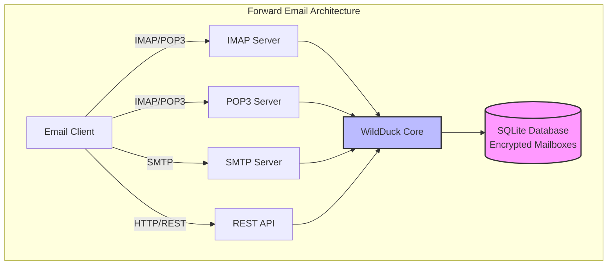

---


## Email Service Comparison - Protocol Support & RFC Standards Compliance

> \[!IMPORTANT]
> **Sandboxed and Quantum-resistant Encryption:** Forward Email is the only email service that stores individually encrypted SQLite mailboxes using your password (which only you have). Each mailbox is encrypted with [sqleet](https://github.com/resilar/sqleet) (ChaCha20-Poly1305), self-contained, sandboxed, and portable. If you forget your password, you lose your mailbox - not even Forward Email can recover it. See [Quantum-Safe Encrypted Email](https://forwardemail.net/en/blog/docs/best-quantum-safe-encrypted-email-service) for details.

Compare email protocol support and RFC standards implementation across major email providers:

| Feature                       | Forward Email                                                                                  | Postfix/Dovecot                                                                    | Gmail                                                                             | iCloud Mail                                           | Outlook.com                                                                                                                                                          | Fastmail                                                                                 | Yahoo/AOL (Verizon)                                                  | ProtonMail                                                                     | Tutanota                                                          |
| ----------------------------- | ---------------------------------------------------------------------------------------------- | ---------------------------------------------------------------------------------- | --------------------------------------------------------------------------------- | ----------------------------------------------------- | -------------------------------------------------------------------------------------------------------------------------------------------------------------------- | ---------------------------------------------------------------------------------------- | -------------------------------------------------------------------- | ------------------------------------------------------------------------------ | ----------------------------------------------------------------- |
| **Custom Domain Price**       | [Free](https://forwardemail.net/en/pricing)                                                    | [Free](https://www.postfix.org/)                                                   | [$7.20/mo](https://workspace.google.com/pricing)                                  | [$0.99/mo](https://support.apple.com/en-us/102622)    | [$7.20/mo](https://www.microsoft.com/en-us/microsoft-365/business/microsoft-365-business-basic)                                                                      | [$5/mo](https://www.fastmail.com/pricing/)                                               | [$3.19/mo](https://www.turbify.com/mail)                             | [$4.99/mo](https://proton.me/mail/pricing)                                     | [$3.27/mo](https://tuta.com/pricing)                              |
| **IMAP4rev1 (RFC 3501)**      | ✅ [Supported](#imap4-email-protocol-and-extensions)                                            | ✅ [Supported](https://www.dovecot.org/)                                            | ✅ [Supported](https://developers.google.com/workspace/gmail/imap/imap-extensions) | ✅ [Supported](https://support.apple.com/en-us/102431) | ✅ [Supported](https://support.microsoft.com/en-us/office/pop-imap-and-smtp-settings-for-outlook-com-d088b986-291d-42b8-9564-9c414e2aa040)                            | ✅ [Supported](https://www.fastmail.help/hc/en-us/articles/1500000278382-Email-standards) | ✅ [Supported](https://senders.yahooinc.com/developer/documentation/) | ⚠️ [Via Bridge](https://proton.me/support/imap-smtp-and-pop3-setup)            | ❌ Not Supported                                                   |
| **IMAP4rev2 (RFC 9051)**      | ⚠️ [Partial](https://forwardemail.net/en/blog/docs/best-quantum-safe-encrypted-email-service)  | ⚠️ [Partial](https://www.dovecot.org/)                                             | ⚠️ [31%](https://developers.google.com/workspace/gmail/imap/imap-extensions)      | ⚠️ [92%](https://support.apple.com/en-us/102431)      | ⚠️ [46%](https://support.microsoft.com/en-us/office/pop-imap-and-smtp-settings-for-outlook-com-d088b986-291d-42b8-9564-9c414e2aa040)                                 | ⚠️ [69%](https://www.fastmail.help/hc/en-us/articles/1500000278382-Email-standards)      | ⚠️ [85%](https://senders.yahooinc.com/developer/documentation/)      | ⚠️ [Via Bridge](https://proton.me/support/imap-smtp-and-pop3-setup)            | ❌ Not Supported                                                   |
| **POP3 (RFC 1939)**           | ✅ [Supported](#pop3-email-protocol-and-extensions)                                             | ✅ [Supported](https://www.dovecot.org/)                                            | ✅ [Supported](https://support.google.com/mail/answer/7104828)                     | ❌ Not Supported                                       | ✅ [Supported](https://support.microsoft.com/en-us/office/pop-imap-and-smtp-settings-for-outlook-com-d088b986-291d-42b8-9564-9c414e2aa040)                            | ✅ [Supported](https://www.fastmail.help/hc/en-us/articles/1500000278382-Email-standards) | ✅ [Supported](https://help.yahoo.com/kb/SLN4075.html)                | ⚠️ [Via Bridge](https://proton.me/support/imap-smtp-and-pop3-setup)            | ❌ Not Supported                                                   |
| **SMTP (RFC 5321)**           | ✅ [Supported](#smtp-email-protocol-and-extensions)                                             | ✅ [Supported](https://www.postfix.org/)                                            | ✅ [Supported](https://support.google.com/mail/answer/7126229)                     | ✅ [Supported](https://support.apple.com/en-us/102431) | ✅ [Supported](https://support.microsoft.com/en-us/office/pop-imap-and-smtp-settings-for-outlook-com-d088b986-291d-42b8-9564-9c414e2aa040)                            | ✅ [Supported](https://www.fastmail.help/hc/en-us/articles/1500000278382-Email-standards) | ✅ [Supported](https://help.yahoo.com/kb/SLN4075.html)                | ⚠️ [Via Bridge](https://proton.me/support/imap-smtp-and-pop3-setup)            | ❌ Not Supported                                                   |
| **JMAP (RFC 8620)**           | ❌ [Not Supported](#jmap-email-protocol)                                                        | ❌ Not Supported                                                                    | ❌ Not Supported                                                                   | ❌ Not Supported                                       | ❌ Not Supported                                                                                                                                                      | ✅ [Supported](https://www.fastmail.com/dev/)                                             | ❌ Not Supported                                                      | ❌ Not Supported                                                                | ❌ Not Supported                                                   |
| **DKIM (RFC 6376)**           | ✅ [Supported](#email-message-authentication-protocols)                                         | ✅ [Supported](https://github.com/trusteddomainproject/OpenDKIM)                    | ✅ [Supported](https://support.google.com/a/answer/174124)                         | ✅ [Supported](https://support.apple.com/en-us/102431) | ✅ [Supported](https://learn.microsoft.com/en-us/defender-office-365/email-authentication-dkim-configure)                                                             | ✅ [Supported](https://www.fastmail.help/hc/en-us/articles/360060590573)                  | ✅ [Supported](https://help.yahoo.com/kb/SLN25426.html)               | ✅ [Supported](https://proton.me/support)                                       | ✅ [Supported](https://tuta.com/support#dkim)                      |
| **SPF (RFC 7208)**            | ✅ [Supported](#email-message-authentication-protocols)                                         | ✅ [Supported](https://www.postfix.org/)                                            | ✅ [Supported](https://support.google.com/a/answer/33786)                          | ✅ [Supported](https://support.apple.com/en-us/102431) | ✅ [Supported](https://learn.microsoft.com/en-us/microsoft-365/security/office-365-security/how-office-365-uses-spf-to-prevent-spoofing)                              | ✅ [Supported](https://www.fastmail.help/hc/en-us/articles/360060590573)                  | ✅ [Supported](https://help.yahoo.com/kb/SLN25426.html)               | ✅ [Supported](https://proton.me/support)                                       | ✅ [Supported](https://tuta.com/support#dkim)                      |
| **DMARC (RFC 7489)**          | ✅ [Supported](#email-message-authentication-protocols)                                         | ✅ [Supported](https://www.postfix.org/)                                            | ✅ [Supported](https://support.google.com/a/answer/2466580)                        | ✅ [Supported](https://support.apple.com/en-us/102431) | ✅ [Supported](https://learn.microsoft.com/en-us/microsoft-365/security/office-365-security/use-dmarc-to-validate-email)                                              | ✅ [Supported](https://www.fastmail.help/hc/en-us/articles/360060590573)                  | ✅ [Supported](https://help.yahoo.com/kb/SLN25426.html)               | ✅ [Supported](https://proton.me/support)                                       | ✅ [Supported](https://tuta.com/support#dkim)                      |
| **ARC (RFC 8617)**            | ✅ [Supported](#email-message-authentication-protocols)                                         | ✅ [Supported](https://github.com/trusteddomainproject/OpenARC)                     | ✅ [Supported](https://support.google.com/a/answer/2466580)                        | ❌ Not Supported                                       | ✅ [Supported](https://learn.microsoft.com/en-us/defender-office-365/email-authentication-arc-configure)                                                              | ✅ [Supported](https://www.fastmail.help/hc/en-us/articles/360060590573)                  | ✅ [Supported](https://senders.yahooinc.com/developer/documentation/) | ✅ [Supported](https://proton.me/blog/what-is-authenticated-received-chain-arc) | ❌ Not Supported                                                   |
| **MTA-STS (RFC 8461)**        | ✅ [Supported](#email-transport-security-protocols)                                             | ✅ [Supported](https://www.postfix.org/)                                            | ✅ [Supported](https://support.google.com/a/answer/9261504)                        | ✅ [Supported](https://support.apple.com/en-us/102431) | ✅ [Supported](https://learn.microsoft.com/en-us/defender-office-365/email-authentication-about)                                                                      | ✅ [Supported](https://www.fastmail.help/hc/en-us/articles/360060590573)                  | ✅ [Supported](https://senders.yahooinc.com/developer/documentation/) | ✅ [Supported](https://proton.me/support)                                       | ✅ [Supported](https://tuta.com/security)                          |
| **DANE (RFC 7671)**           | ⚠️ [Partial](#email-transport-security-protocols)                                              | ✅ [Supported](https://www.postfix.org/)                                            | ❌ Not Supported                                                                   | ❌ Not Supported                                       | ❌ Not Supported                                                                                                                                                      | ❌ Not Supported                                                                          | ❌ Not Supported                                                      | ✅ [Supported](https://proton.me/support)                                       | ✅ [Supported](https://tuta.com/support#dane)                      |
| **DSN (RFC 3461)**            | ✅ [Supported](#smtp-email-protocol-and-extensions)                                             | ✅ [Supported](https://www.postfix.org/DSN_README.html)                             | ❌ Not Supported                                                                   | ✅ [Supported](#protocol-capability-tests)             | ✅ [Supported](#protocol-capability-tests)                                                                                                                            | ⚠️ [Unknown](https://www.fastmail.help/hc/en-us/articles/1500000278382-Email-standards)  | ❌ Not Supported                                                      | ⚠️ [Via Bridge](https://proton.me/support/imap-smtp-and-pop3-setup)            | ❌ Not Supported                                                   |
| **REQUIRETLS (RFC 8689)**     | ✅ [Supported](#email-transport-security-protocols)                                             | ✅ [Supported](https://www.postfix.org/TLS_README.html#server_require_tls)          | ⚠️ Unknown                                                                        | ⚠️ Unknown                                            | ⚠️ Unknown                                                                                                                                                           | ⚠️ Unknown                                                                               | ⚠️ Unknown                                                           | ⚠️ [Via Bridge](https://proton.me/support/imap-smtp-and-pop3-setup)            | ❌ Not Supported                                                   |
| **ManageSieve (RFC 5804)**    | ❌ Not Supported                                                                                | ✅ [Supported](https://doc.dovecot.org/admin_manual/pigeonhole_managesieve_server/) | ❌ Not Supported                                                                   | ❌ Not Supported                                       | ❌ Not Supported                                                                                                                                                      | ✅ [Supported](https://www.fastmail.help/hc/en-us/articles/360060590573)                  | ❌ Not Supported                                                      | ❌ Not Supported                                                                | ❌ Not Supported                                                   |
| **OpenPGP (RFC 9580)**        | ✅ [Supported](#email-message-encryption)                                                       | ⚠️ [Via Plugins](https://www.gnupg.org/)                                           | ⚠️ [Third-party](https://github.com/google/end-to-end)                            | ⚠️ [Third-party](https://gpgtools.org/)               | ⚠️ [Third-party](https://gpg4win.org/)                                                                                                                               | ⚠️ [Third-party](https://www.fastmail.help/hc/en-us/articles/360060590573)               | ⚠️ [Third-party](https://help.yahoo.com/kb/SLN25426.html)            | ✅ [Native](https://proton.me/support/pgp-mime-pgp-inline)                      | ❌ Not Supported                                                   |
| **S/MIME (RFC 8551)**         | ✅ [Supported](#email-message-encryption)                                                       | ✅ [Supported](https://www.openssl.org/)                                            | ✅ [Supported](https://support.google.com/mail/answer/81126)                       | ✅ [Supported](https://support.apple.com/en-us/102431) | ✅ [Supported](https://support.microsoft.com/en-us/office/send-view-and-reply-to-encrypted-messages-in-outlook-for-pc-eaa43495-9bbb-4fca-922a-df90dee51980)           | ⚠️ [Partial](https://www.fastmail.help/hc/en-us/articles/360060590573)                   | ❌ Not Supported                                                      | ✅ [Supported](https://proton.me/support/pgp-mime-pgp-inline)                   | ❌ Not Supported                                                   |
| **CalDAV (RFC 4791)**         | ✅ [Supported](#calendaring-and-contacts-protocols)                                             | ✅ [Supported](https://www.davical.org/)                                            | ✅ [Supported](https://developers.google.com/calendar/caldav/v2/guide)             | ✅ [Supported](https://support.apple.com/en-us/102431) | ❌ Not Supported                                                                                                                                                      | ✅ [Supported](https://www.fastmail.help/hc/en-us/articles/360060590573)                  | ❌ Not Supported                                                      | ✅ [Via Bridge](https://proton.me/support/proton-calendar)                      | ❌ Not Supported                                                   |
| **CardDAV (RFC 6352)**        | ✅ [Supported](#calendaring-and-contacts-protocols)                                             | ✅ [Supported](https://www.davical.org/)                                            | ✅ [Supported](https://developers.google.com/people/carddav)                       | ✅ [Supported](https://support.apple.com/en-us/102431) | ❌ Not Supported                                                                                                                                                      | ✅ [Supported](https://www.fastmail.help/hc/en-us/articles/360060590573)                  | ❌ Not Supported                                                      | ✅ [Via Bridge](https://proton.me/support/proton-contacts)                      | ❌ Not Supported                                                   |
| **Tasks (VTODO)**             | ✅ [Supported](#tasks-and-reminders-caldav-vtodo)                                               | ✅ [Supported](https://www.davical.org/)                                            | ❌ Not Supported                                                                   | ✅ [Supported](https://support.apple.com/en-us/102431) | ❌ Not Supported                                                                                                                                                      | ✅ [Supported](https://www.fastmail.help/hc/en-us/articles/360060590573)                  | ❌ Not Supported                                                      | ❌ Not Supported                                                                | ❌ Not Supported                                                   |
| **Sieve (RFC 5228)**          | ⚠️ [Future](#email-message-filtering)                                                          | ✅ [Supported](https://www.dovecot.org/)                                            | ❌ Not Supported                                                                   | ❌ Not Supported                                       | ❌ Not Supported                                                                                                                                                      | ✅ [Supported](https://www.fastmail.help/hc/en-us/articles/360060590573)                  | ❌ Not Supported                                                      | ❌ Not Supported                                                                | ❌ Not Supported                                                   |
| **Catch-All**                 | ✅ [Supported](https://forwardemail.net/en/faq#can-i-have-multiple-global-catch-all-recipients) | ✅ Supported                                                                        | ✅ [Supported](https://support.google.com/a/answer/4524505)                        | ❌ Not Supported                                       | ❌ [Not Supported](https://learn.microsoft.com/en-us/exchange/recipients-in-exchange-online/manage-mail-users)                                                        | ✅ [Supported](https://www.fastmail.help/hc/en-us/articles/1500000278382-Email-standards) | ❌ Not Supported                                                      | ❌ Not Supported                                                                | ✅ [Supported](https://tuta.com/support#catch-all-alias)           |
| **Unlimited Aliases**         | ✅ [Supported](https://forwardemail.net/en/faq#advanced-features)                               | ✅ Supported                                                                        | ✅ [Supported](https://support.google.com/a/answer/33327)                          | ✅ [Supported](https://support.apple.com/en-us/102431) | ✅ [Supported](https://support.microsoft.com/en-us/office/add-or-remove-an-email-alias-in-outlook-com-459b1989-356d-40fa-a689-8f285b13f1f2)                           | ✅ [Supported](https://www.fastmail.help/hc/en-us/articles/1500000278382-Email-standards) | ❌ Not Supported                                                      | ✅ [Supported](https://proton.me/support/addresses-and-aliases)                 | ✅ [Supported](https://tuta.com/support#aliases)                   |
| **Two-Factor Auth**           | ✅ [Supported](https://forwardemail.net/en/faq#do-you-support-passkeys-and-webauthn)            | ✅ Supported                                                                        | ✅ [Supported](https://support.google.com/accounts/answer/185839)                  | ✅ [Supported](https://support.apple.com/en-us/102431) | ✅ [Supported](https://support.microsoft.com/en-us/account-billing/how-to-use-two-step-verification-with-your-microsoft-account-c7910146-672f-01e9-50a0-93b4585e7eb4) | ✅ [Supported](https://www.fastmail.help/hc/en-us/articles/1500000278382-Email-standards) | ✅ [Supported](https://help.yahoo.com/kb/SLN5013.html)                | ✅ [Supported](https://proton.me/support/two-factor-authentication-2fa)         | ✅ [Supported](https://tuta.com/support#two-factor-authentication) |
| **Push Notifications**        | ✅ [Supported](#ios-push-notifications)                                                         | ⚠️ Via Plugins                                                                     | ✅ [Supported](https://developers.google.com/gmail/api/guides/push)                | ✅ [Supported](https://support.apple.com/en-us/102431) | ✅ [Supported](https://learn.microsoft.com/en-us/graph/change-notifications-delivery-webhooks)                                                                        | ✅ [Supported](https://www.fastmail.help/hc/en-us/articles/1500000278382-Email-standards) | ❌ Not Supported                                                      | ✅ [Supported](https://proton.me/support/notifications)                         | ✅ [Supported](https://tuta.com/support#push-notifications)        |
| **Calendar/Contacts Desktop** | ✅ [Supported](#calendaring-and-contacts-protocols)                                             | ✅ Supported                                                                        | ✅ [Supported](https://support.google.com/calendar)                                | ✅ [Supported](https://support.apple.com/en-us/102431) | ✅ [Supported](https://support.microsoft.com/en-us/office/calendar-and-contacts-in-outlook-com-d3e8a6e6-5c1f-4e3e-9f1e-7c0f0e0c0c0c)                                  | ✅ [Supported](https://www.fastmail.help/hc/en-us/articles/1500000278382-Email-standards) | ❌ Not Supported                                                      | ✅ [Supported](https://proton.me/support/proton-calendar)                       | ❌ Not Supported                                                   |
| **Advanced Search**           | ✅ [Supported](https://forwardemail.net/en/email-api)                                           | ✅ Supported                                                                        | ✅ [Supported](https://support.google.com/mail/answer/7190)                        | ✅ [Supported](https://support.apple.com/en-us/102431) | ✅ [Supported](https://support.microsoft.com/en-us/office/search-for-email-messages-in-outlook-com-6f5f2e92-9d5e-4c4e-9b0e-0c0c0c0c0c0c)                              | ✅ [Supported](https://www.fastmail.help/hc/en-us/articles/1500000278382-Email-standards) | ✅ [Supported](https://help.yahoo.com/kb/SLN3561.html)                | ✅ [Supported](https://proton.me/support/search-and-filters)                    | ✅ [Supported](https://tuta.com/support)                           |
| **API/Integrations**          | ✅ [39 Endpoints](https://forwardemail.net/en/email-api)                                        | ✅ Supported                                                                        | ✅ [Supported](https://developers.google.com/gmail/api)                            | ❌ Not Supported                                       | ✅ [Supported](https://learn.microsoft.com/en-us/graph/api/resources/mail-api-overview)                                                                               | ✅ [Supported](https://www.fastmail.help/hc/en-us/articles/1500000278382-Email-standards) | ❌ Not Supported                                                      | ✅ [Supported](https://proton.me/support/proton-mail-api)                       | ❌ Not Supported                                                   |

### Protocol Support Visualization

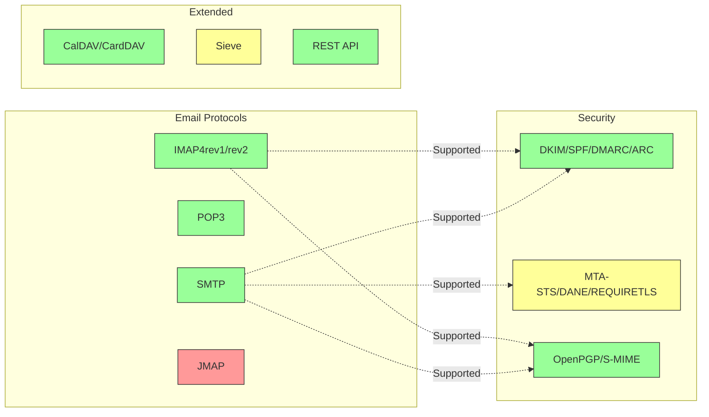

---


## Core Email Protocols

### Email Protocol Flow

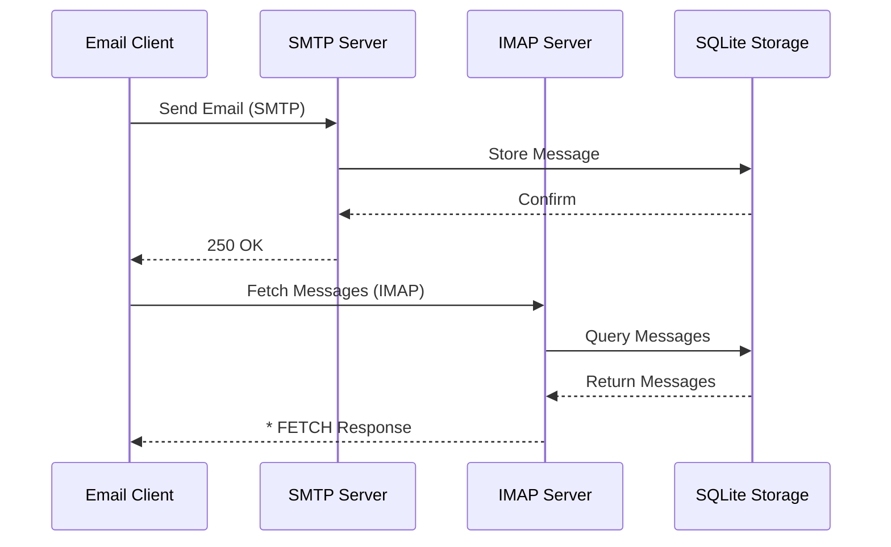


## IMAP4 Email Protocol and Extensions

> \[!NOTE]
> Forward Email supports IMAP4rev1 (RFC 3501) with partial support for IMAP4rev2 (RFC 9051) features.

Forward Email provides robust IMAP4 support through the WildDuck mail server implementation. The server implements IMAP4rev1 (RFC 3501) with partial support for IMAP4rev2 (RFC 9051) extensions.

Forward Email's IMAP functionality is provided by the [WildDuck](https://github.com/nodemailer/wildduck) dependency. The following email RFCs are supported:

| RFC                                                       | Title                                                             | Implementation Notes                                  |
| --------------------------------------------------------- | ----------------------------------------------------------------- | ----------------------------------------------------- |
| [RFC 3501](https://datatracker.ietf.org/doc/html/rfc3501) | Internet Message Access Protocol (IMAP) - Version 4rev1           | Full support with intentional differences (see below) |
| [RFC 2177](https://datatracker.ietf.org/doc/html/rfc2177) | IMAP4 IDLE command                                                | Push-style notifications                              |
| [RFC 2342](https://datatracker.ietf.org/doc/html/rfc2342) | IMAP4 Namespace                                                   | Mailbox namespace support                             |
| [RFC 2087](https://datatracker.ietf.org/doc/html/rfc2087) | IMAP4 QUOTA extension                                             | Storage quota management                              |
| [RFC 2971](https://datatracker.ietf.org/doc/html/rfc2971) | IMAP4 ID extension                                                | Client/server identification                          |
| [RFC 5161](https://datatracker.ietf.org/doc/html/rfc5161) | IMAP4 ENABLE Extension                                            | Enable IMAP extensions                                |
| [RFC 4959](https://datatracker.ietf.org/doc/html/rfc4959) | IMAP Extension for SASL Initial Client Response (SASL-IR)         | Initial client response                               |
| [RFC 3691](https://datatracker.ietf.org/doc/html/rfc3691) | IMAP4 UNSELECT command                                            | Close mailbox without EXPUNGE                         |
| [RFC 4315](https://datatracker.ietf.org/doc/html/rfc4315) | IMAP UIDPLUS extension                                            | Enhanced UID commands                                 |
| [RFC 7162](https://datatracker.ietf.org/doc/html/rfc7162) | IMAP Extensions: Quick Flag Changes Resynchronization (CONDSTORE) | Conditional STORE                                     |
| [RFC 6154](https://datatracker.ietf.org/doc/html/rfc6154) | IMAP LIST Extension for Special-Use Mailboxes                     | Special mailbox attributes                            |
| [RFC 6851](https://datatracker.ietf.org/doc/html/rfc6851) | IMAP MOVE Extension                                               | Atomic MOVE command                                   |
| [RFC 6855](https://datatracker.ietf.org/doc/html/rfc6855) | IMAP Support for UTF-8                                            | UTF-8 support                                         |
| [RFC 3348](https://datatracker.ietf.org/doc/html/rfc3348) | IMAP4 Child Mailbox Extension                                     | Child mailbox information                             |
| [RFC 7889](https://datatracker.ietf.org/doc/html/rfc7889) | IMAP4 Extension for Advertising Maximum Upload Size (APPENDLIMIT) | Maximum upload size                                   |

**Supported IMAP Extensions:**

| Extension         | RFC          | Status      | Description                     |
| ----------------- | ------------ | ----------- | ------------------------------- |
| IDLE              | RFC 2177     | ✅ Supported | Push-style notifications        |
| NAMESPACE         | RFC 2342     | ✅ Supported | Mailbox namespace support       |
| QUOTA             | RFC 2087     | ✅ Supported | Storage quota management        |
| ID                | RFC 2971     | ✅ Supported | Client/server identification    |
| ENABLE            | RFC 5161     | ✅ Supported | Enable IMAP extensions          |
| SASL-IR           | RFC 4959     | ✅ Supported | Initial client response         |
| UNSELECT          | RFC 3691     | ✅ Supported | Close mailbox without EXPUNGE   |
| UIDPLUS           | RFC 4315     | ✅ Supported | Enhanced UID commands           |
| CONDSTORE         | RFC 7162     | ✅ Supported | Conditional STORE               |
| SPECIAL-USE       | RFC 6154     | ✅ Supported | Special mailbox attributes      |
| MOVE              | RFC 6851     | ✅ Supported | Atomic MOVE command             |
| UTF8=ACCEPT       | RFC 6855     | ✅ Supported | UTF-8 support                   |
| CHILDREN          | RFC 3348     | ✅ Supported | Child mailbox information       |
| APPENDLIMIT       | RFC 7889     | ✅ Supported | Maximum upload size             |
| XLIST             | Non-standard | ✅ Supported | Gmail-compatible folder listing |
| XAPPLEPUSHSERVICE | Non-standard | ✅ Supported | Apple Push Notification Service |

### IMAP Protocol Differences from RFC Specifications

> \[!WARNING]
> The following differences from RFC specifications may affect client compatibility.

Forward Email intentionally deviates from some IMAP RFC specifications. These differences are inherited from WildDuck and are documented below:

* **No \Recent flag:** The `\Recent` flag is not implemented. All messages are returned without this flag.
* **RENAME doesn't affect subfolders:** When renaming a folder, subfolders are not automatically renamed. The folder hierarchy is flat in the database.
* **INBOX cannot be renamed:** [RFC 3501](https://datatracker.ietf.org/doc/html/rfc3501) permits renaming INBOX, but Forward Email explicitly prohibits it. See [WildDuck source code](https://github.com/nodemailer/wildduck/blob/master/imap-core/lib/commands/rename.js#L27).
* **No unsolicited FLAGS responses:** When flags are changed, no unsolicited FLAGS responses are sent to the client.
* **STORE returns NO for deleted messages:** Attempting to modify flags on deleted messages returns NO instead of silently ignoring.
* **CHARSET ignored in SEARCH:** The `CHARSET` argument in SEARCH commands is ignored. All searches use UTF-8.
* **MODSEQ metadata ignored:** `MODSEQ` metadata in STORE commands is ignored.
* **SEARCH TEXT and SEARCH BODY:** Forward Email uses [SQLite FTS5](https://www.sqlite.org/fts5.html) (Full-Text Search) instead of MongoDB's `$text` search. This provides:
  * Support for `NOT` operator (MongoDB doesn't support this)
  * Ranked search results
  * Sub-100ms search performance on large mailboxes
* **Autoexpunge behavior:** Messages marked with `\Deleted` are automatically expunged when the mailbox is closed.
* **Message fidelity:** Some message modifications may not preserve the exact original message structure.

**IMAP4rev2 Partial Support:**

Forward Email implements IMAP4rev1 (RFC 3501) with partial IMAP4rev2 (RFC 9051) support. The following IMAP4rev2 features are **not yet supported**:

* **LIST-STATUS** - Combined LIST and STATUS commands
* **LITERAL-** - Non-synchronizing literals (minus variant)
* **OBJECTID** - Unique object identifiers
* **SAVEDATE** - Save date attribute
* **REPLACE** - Atomic message replacement
* **UNAUTHENTICATE** - Close authentication without closing connection

**Relaxed Body Structure Handling:**

Forward Email uses "relaxed body" handling for malformed MIME structures, which may differ from strict RFC interpretation. This improves compatibility with real-world emails that don't perfectly conform to standards.

**METADATA Extension (RFC 5464):**

The IMAP METADATA extension is **not supported**. For more information about this extension, see [RFC 5464](https://datatracker.ietf.org/doc/html/rfc5464). Discussion about adding this feature can be found in [WildDuck Issue #937](https://github.com/zone-eu/wildduck/issues/937).

### IMAP Extensions NOT Supported

The following IMAP extensions from the [IANA IMAP Capabilities Registry](https://www.iana.org/assignments/imap-capabilities/imap-capabilities.xhtml) are NOT supported:

| RFC                                                       | Title                                                                                                           | Reason                                                                                                                                  |
| --------------------------------------------------------- | --------------------------------------------------------------------------------------------------------------- | --------------------------------------------------------------------------------------------------------------------------------------- |
| [RFC 2086](https://datatracker.ietf.org/doc/html/rfc2086) | IMAP4 ACL extension                                                                                             | Shared folders not implemented. See [WildDuck Issue #427](https://github.com/zone-eu/wildduck/issues/427)                               |
| [RFC 5256](https://datatracker.ietf.org/doc/html/rfc5256) | IMAP SORT and THREAD Extensions                                                                                 | Threading implemented internally but not via RFC 5256 protocol. See [WildDuck Issue #12](https://github.com/zone-eu/wildduck/issues/12) |
| [RFC 5162](https://datatracker.ietf.org/doc/html/rfc5162) | IMAP4 Extensions for Quick Mailbox Resynchronization (QRESYNC)                                                  | Not implemented                                                                                                                         |
| [RFC 5464](https://datatracker.ietf.org/doc/html/rfc5464) | IMAP METADATA Extension                                                                                         | Metadata operations ignored. See [WildDuck documentation](https://datatracker.ietf.org/doc/html/rfc5464)                                |
| [RFC 5258](https://datatracker.ietf.org/doc/html/rfc5258) | IMAP4 LIST Command Extensions                                                                                   | Not implemented                                                                                                                         |
| [RFC 5267](https://datatracker.ietf.org/doc/html/rfc5267) | Contexts for IMAP4                                                                                              | Not implemented                                                                                                                         |
| [RFC 5465](https://datatracker.ietf.org/doc/html/rfc5465) | IMAP NOTIFY Extension                                                                                           | Not implemented                                                                                                                         |
| [RFC 5466](https://datatracker.ietf.org/doc/html/rfc5466) | IMAP4 FILTERS Extension                                                                                         | Not implemented                                                                                                                         |
| [RFC 6203](https://datatracker.ietf.org/doc/html/rfc6203) | IMAP4 Extension for Fuzzy Search                                                                                | Not implemented                                                                                                                         |
| [RFC 6785](https://datatracker.ietf.org/doc/html/rfc6785) | IMAP4 Implementation Recommendations                                                                            | Recommendations not fully followed                                                                                                      |
| [RFC 7162](https://datatracker.ietf.org/doc/html/rfc7162) | IMAP Extensions: Quick Flag Changes Resynchronization (CONDSTORE) and Quick Mailbox Resynchronization (QRESYNC) | Not implemented                                                                                                                         |
| [RFC 8437](https://datatracker.ietf.org/doc/html/rfc8437) | IMAP UNAUTHENTICATE Extension for Connection Reuse                                                              | Not implemented                                                                                                                         |
| [RFC 8438](https://datatracker.ietf.org/doc/html/rfc8438) | IMAP Extension for STATUS=SIZE                                                                                  | Not implemented                                                                                                                         |
| [RFC 8457](https://datatracker.ietf.org/doc/html/rfc8457) | IMAP "$Important" Keyword and "\Important" Special-Use Attribute                                                | Not implemented                                                                                                                         |
| [RFC 8474](https://datatracker.ietf.org/doc/html/rfc8474) | IMAP Extension for Object Identifiers                                                                           | Not implemented                                                                                                                         |
| [RFC 9051](https://datatracker.ietf.org/doc/html/rfc9051) | Internet Message Access Protocol (IMAP) - Version 4rev2                                                         | Forward Email implements IMAP4rev1 ([RFC 3501](https://datatracker.ietf.org/doc/html/rfc3501))                                          |

---


## POP3 Email Protocol and Extensions

> \[!NOTE]
> Forward Email supports POP3 (RFC 1939) with standard extensions for email retrieval.

Forward Email's POP3 functionality is provided by the [WildDuck](https://github.com/nodemailer/wildduck) dependency. The following email RFCs are supported:

| RFC                                                       | Title                                   | Implementation Notes                                  |
| --------------------------------------------------------- | --------------------------------------- | ----------------------------------------------------- |
| [RFC 1939](https://datatracker.ietf.org/doc/html/rfc1939) | Post Office Protocol - Version 3 (POP3) | Full support with intentional differences (see below) |
| [RFC 2595](https://datatracker.ietf.org/doc/html/rfc2595) | Using TLS with IMAP, POP3 and ACAP      | STARTTLS support                                      |
| [RFC 2449](https://datatracker.ietf.org/doc/html/rfc2449) | POP3 Extension Mechanism                | CAPA command support                                  |

Forward Email provides POP3 support for clients that prefer this simpler protocol over IMAP. POP3 is ideal for users who want to download emails to a single device and remove them from the server.

**Supported POP3 Extensions:**

| Extension | RFC      | Status      | Description                |
| --------- | -------- | ----------- | -------------------------- |
| TOP       | RFC 1939 | ✅ Supported | Retrieve message headers   |
| USER      | RFC 1939 | ✅ Supported | Username authentication    |
| UIDL      | RFC 1939 | ✅ Supported | Unique message identifiers |
| EXPIRE    | RFC 2449 | ✅ Supported | Message expiration policy  |

### POP3 Protocol Differences from RFC Specifications

> \[!WARNING]
> POP3 has inherent limitations compared to IMAP.

> \[!IMPORTANT]
> **Critical Difference: Forward Email vs WildDuck POP3 DELE Behavior**
>
> Forward Email implements RFC-compliant permanent deletion for POP3 `DELE` commands, unlike WildDuck which moves messages to Trash.

**Forward Email Behavior** ([source code](https://github.com/forwardemail/forwardemail.net/blob/master/pop3-server.js)):

* `DELE` → `QUIT` permanently deletes messages
* Follows [RFC 1939](https://datatracker.ietf.org/doc/html/rfc1939) specification exactly
* Matches behavior of Dovecot (default), Postfix, and other standards-compliant servers

**WildDuck Behavior** ([discussion](https://github.com/zone-eu/wildduck/issues/937)):

* `DELE` → `QUIT` moves messages to Trash (Gmail-like)
* Intentional design decision for user safety
* Non-RFC-compliant but prevents accidental data loss

**Why Forward Email Differs:**

* **RFC Compliance:** Adheres to [RFC 1939](https://datatracker.ietf.org/doc/html/rfc1939) specification
* **User Expectations:** Download-and-delete workflow expects permanent deletion
* **Storage Management:** Proper disk space reclamation
* **Interoperability:** Consistent with other RFC-compliant servers

> \[!NOTE]
> **POP3 Message Listing:** Forward Email lists ALL messages from INBOX with no limit. This differs from WildDuck which limits to 250 messages by default. See [source code](https://github.com/forwardemail/forwardemail.net/blob/master/pop3-server.js).

**Single-Device Access:**

POP3 is designed for single-device access. Messages are typically downloaded and removed from the server, making it unsuitable for multi-device synchronization.

**No Folder Support:**

POP3 only accesses the INBOX folder. Other folders (Sent, Drafts, Trash, etc.) are not accessible via POP3.

**Limited Message Management:**

POP3 provides basic message retrieval and deletion. Advanced features like flagging, moving, or searching messages are not available.

### POP3 Extensions NOT Supported

The following POP3 extensions from the [IANA POP3 Extension Mechanism Registry](https://www.iana.org/assignments/pop3-extension-mechanism/pop3-extension-mechanism.xhtml) are NOT supported:

| RFC                                                       | Title                                                   | Reason                                  |
| --------------------------------------------------------- | ------------------------------------------------------- | --------------------------------------- |
| [RFC 6856](https://datatracker.ietf.org/doc/html/rfc6856) | Post Office Protocol Version 3 (POP3) Support for UTF-8 | Not implemented in WildDuck POP3 server |
| [RFC 2595](https://datatracker.ietf.org/doc/html/rfc2595) | STLS command                                            | Only STARTTLS supported, not STLS       |
| [RFC 3206](https://datatracker.ietf.org/doc/html/rfc3206) | The SYS and AUTH POP Response Codes                     | Not implemented                         |

---


## SMTP Email Protocol and Extensions

> \[!NOTE]
> Forward Email supports SMTP (RFC 5321) with modern extensions for secure and reliable email delivery.

Forward Email's SMTP functionality is provided by multiple components: [smtp-server](https://github.com/nodemailer/smtp-server) (nodemailer), [zone-mta](https://github.com/zone-eu/zone-mta), and custom implementations. The following email RFCs are supported:

| RFC                                                       | Title                                                                           | Implementation Notes                 |
| --------------------------------------------------------- | ------------------------------------------------------------------------------- | ------------------------------------ |
| [RFC 5321](https://datatracker.ietf.org/doc/html/rfc5321) | Simple Mail Transfer Protocol (SMTP)                                            | Full support                         |
| [RFC 3207](https://datatracker.ietf.org/doc/html/rfc3207) | SMTP Service Extension for Secure SMTP over Transport Layer Security (STARTTLS) | TLS/SSL support                      |
| [RFC 4954](https://datatracker.ietf.org/doc/html/rfc4954) | SMTP Service Extension for Authentication (AUTH)                                | PLAIN, LOGIN, CRAM-MD5, XOAUTH2      |
| [RFC 6531](https://datatracker.ietf.org/doc/html/rfc6531) | SMTP Extension for Internationalized Email (SMTPUTF8)                           | Native unicode email address support |
| [RFC 3461](https://datatracker.ietf.org/doc/html/rfc3461) | SMTP Service Extension for Delivery Status Notifications (DSN)                  | Full DSN support                     |
| [RFC 3463](https://datatracker.ietf.org/doc/html/rfc3463) | Enhanced Mail System Status Codes                                               | Enhanced status codes in responses   |
| [RFC 1870](https://datatracker.ietf.org/doc/html/rfc1870) | SMTP Service Extension for Message Size Declaration (SIZE)                      | Maximum message size advertisement   |
| [RFC 2920](https://datatracker.ietf.org/doc/html/rfc2920) | SMTP Service Extension for Command Pipelining (PIPELINING)                      | Command pipelining support           |
| [RFC 1652](https://datatracker.ietf.org/doc/html/rfc1652) | SMTP Service Extension for 8bit-MIMEtransport (8BITMIME)                        | 8-bit MIME support                   |
| [RFC 6152](https://datatracker.ietf.org/doc/html/rfc6152) | SMTP Service Extension for 8-bit MIME Transport                                 | 8-bit MIME support                   |
| [RFC 2034](https://datatracker.ietf.org/doc/html/rfc2034) | SMTP Service Extension for Returning Enhanced Error Codes (ENHANCEDSTATUSCODES) | Enhanced status codes                |

Forward Email implements a full-featured SMTP server with support for modern extensions that enhance security, reliability, and functionality.

**Supported SMTP Extensions:**

| Extension           | RFC      | Status      | Description                           |
| ------------------- | -------- | ----------- | ------------------------------------- |
| PIPELINING          | RFC 2920 | ✅ Supported | Command pipelining                    |
| SIZE                | RFC 1870 | ✅ Supported | Message size declaration (52MB limit) |
| ETRN                | RFC 1985 | ✅ Supported | Remote queue processing               |
| STARTTLS            | RFC 3207 | ✅ Supported | Upgrade to TLS                        |
| ENHANCEDSTATUSCODES | RFC 2034 | ✅ Supported | Enhanced status codes                 |
| 8BITMIME            | RFC 6152 | ✅ Supported | 8-bit MIME transport                  |
| DSN                 | RFC 3461 | ✅ Supported | Delivery Status Notifications         |
| CHUNKING            | RFC 3030 | ✅ Supported | Chunked message transfer              |
| SMTPUTF8            | RFC 6531 | ⚠️ Partial  | UTF-8 email addresses (partial)       |
| REQUIRETLS          | RFC 8689 | ✅ Supported | Require TLS for delivery              |

### Delivery Status Notifications (DSN)

> \[!TIP]
> DSN provides detailed delivery status information for sent emails.

Forward Email fully supports **DSN (RFC 3461)**, which allows senders to request delivery status notifications. This feature provides:

* **Success notifications** when messages are delivered
* **Failure notifications** with detailed error information
* **Delay notifications** when delivery is temporarily delayed

DSN is particularly useful for:

* Confirming important message delivery
* Troubleshooting delivery issues
* Automated email processing systems
* Compliance and audit requirements

### REQUIRETLS Support

> \[!IMPORTANT]
> Forward Email is one of the few providers that explicitly advertises and enforces REQUIRETLS.

Forward Email supports **REQUIRETLS (RFC 8689)**, which ensures that email messages are only delivered over TLS-encrypted connections. This provides:

* **End-to-end encryption** for the entire delivery path
* **User-facing enforcement** via checkbox in email composer
* **Rejection of unencrypted delivery** attempts
* **Enhanced security** for sensitive communications

### SMTP Extensions NOT Supported

The following SMTP extensions from the [IANA SMTP Service Extensions Registry](https://www.iana.org/assignments/smtp) are NOT supported:

| RFC                                                       | Title                                                                                             | Reason                |
| --------------------------------------------------------- | ------------------------------------------------------------------------------------------------- | --------------------- |
| [RFC 4865](https://datatracker.ietf.org/doc/html/rfc4865) | SMTP Submission Service Extension for Future Message Release (FUTURERELEASE)                      | Not implemented       |
| [RFC 6710](https://datatracker.ietf.org/doc/html/rfc6710) | SMTP Extension for Message Transfer Priorities (MT-PRIORITY)                                      | Not implemented       |
| [RFC 7293](https://datatracker.ietf.org/doc/html/rfc7293) | The Require-Recipient-Valid-Since Header Field and SMTP Service Extension                         | Not implemented       |
| [RFC 7372](https://datatracker.ietf.org/doc/html/rfc7372) | Email Auth Status Codes                                                                           | Not fully implemented |
| [RFC 4468](https://datatracker.ietf.org/doc/html/rfc4468) | Message Submission BURL Extension                                                                 | Not implemented       |
| [RFC 3030](https://datatracker.ietf.org/doc/html/rfc3030) | SMTP Service Extensions for Transmission of Large and Binary MIME Messages (CHUNKING, BINARYMIME) | Not implemented       |
| [RFC 2852](https://datatracker.ietf.org/doc/html/rfc2852) | Deliver By SMTP Service Extension                                                                 | Not implemented       |

---


## JMAP Email Protocol

> \[!CAUTION]
> JMAP is **not currently supported** by Forward Email.

| RFC                                                       | Title                                     | Status          | Reason                                                                 |
| --------------------------------------------------------- | ----------------------------------------- | --------------- | ---------------------------------------------------------------------- |
| [RFC 8620](https://datatracker.ietf.org/doc/html/rfc8620) | The JSON Meta Application Protocol (JMAP) | ❌ Not Supported | Forward Email uses IMAP/POP3/SMTP and a comprehensive REST API instead |

**JMAP (JSON Meta Application Protocol)** is a modern email protocol designed to replace IMAP.

**Why JMAP is Not Supported:**

> "JMAP is a beast that should not have been invented. It tries to convert TCP/IMAP (already a bad protocol by todays standards) into HTTP/JSON, just using a different transport while keeping the spirit." — Andris Reinman, [HN Discussion](https://news.ycombinator.com/item?id=18890011)

> "JMAP is more than 10 years old, and there is almost no adoption at all" – Andris Reinman, [GitHub Discussion](https://github.com/zone-eu/wildduck/issues/2#issuecomment-1765190790)

Also see additional comments at <https://hn.algolia.com/?dateRange=all&page=0&prefix=true&query=jmap%20andris&sort=byDate&type=comment>.

Forward Email currently focuses on providing excellent IMAP, POP3, and SMTP support, along with a comprehensive REST API for email management. JMAP support may be considered in the future based on user demand and ecosystem adoption.

**Alternative:** Forward Email offers a [Complete REST API](#complete-rest-api-for-email-management) with 39 endpoints that provides similar functionality to JMAP for programmatic email access.

---


## Email Security

### Email Security Architecture

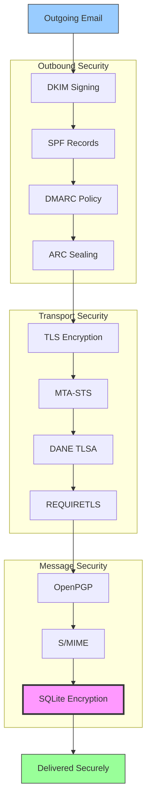


## Email Message Authentication Protocols

> \[!NOTE]
> Forward Email implements all major email authentication protocols to prevent spoofing and ensure message integrity.

Forward Email uses the [mailauth](https://github.com/postalsys/mailauth) library for email authentication. The following RFCs are supported:

| RFC                                                       | Title                                                                   | Implementation Notes                                           |
| --------------------------------------------------------- | ----------------------------------------------------------------------- | -------------------------------------------------------------- |
| [RFC 6376](https://datatracker.ietf.org/doc/html/rfc6376) | DomainKeys Identified Mail (DKIM) Signatures                            | Full DKIM signing and verification                             |
| [RFC 8463](https://datatracker.ietf.org/doc/html/rfc8463) | A New Cryptographic Signature Method for DKIM (Ed25519-SHA256)          | Supports both RSA-SHA256 and Ed25519-SHA256 signing algorithms |
| [RFC 7208](https://datatracker.ietf.org/doc/html/rfc7208) | Sender Policy Framework (SPF)                                           | SPF record validation                                          |
| [RFC 7489](https://datatracker.ietf.org/doc/html/rfc7489) | Domain-based Message Authentication, Reporting, and Conformance (DMARC) | DMARC policy enforcement                                       |
| [RFC 8617](https://datatracker.ietf.org/doc/html/rfc8617) | Authenticated Received Chain (ARC)                                      | ARC sealing and validation                                     |

Email authentication protocols verify that messages are genuinely from the claimed sender and haven't been tampered with during transit.

### Authentication Protocol Support

| Protocol  | RFC      | Status      | Description                                                            |
| --------- | -------- | ----------- | ---------------------------------------------------------------------- |
| **DKIM**  | RFC 6376 | ✅ Supported | DomainKeys Identified Mail - Cryptographic signatures                  |
| **SPF**   | RFC 7208 | ✅ Supported | Sender Policy Framework - IP address authorization                     |
| **DMARC** | RFC 7489 | ✅ Supported | Domain-based Message Authentication - Policy enforcement               |
| **ARC**   | RFC 8617 | ✅ Supported | Authenticated Received Chain - Preserve authentication across forwards |

### DKIM (DomainKeys Identified Mail)

**DKIM** adds a cryptographic signature to email headers, allowing recipients to verify that the message was authorized by the domain owner and hasn't been modified in transit.

Forward Email uses [mailauth](https://github.com/postalsys/mailauth) for DKIM signing and verification.

**Key Features:**

* Automatic DKIM signing for all outbound messages
* Support for RSA and Ed25519 keys
* Multiple selector support
* DKIM verification for inbound messages

### SPF (Sender Policy Framework)

**SPF** allows domain owners to specify which IP addresses are authorized to send email on behalf of their domain.

**Key Features:**

* SPF record validation for inbound messages
* Automatic SPF checking with detailed results
* Support for include, redirect, and all mechanisms
* Configurable SPF policies per domain

### DMARC (Domain-based Message Authentication, Reporting & Conformance)

**DMARC** builds on SPF and DKIM to provide policy enforcement and reporting.

**Key Features:**

* DMARC policy enforcement (none, quarantine, reject)
* Alignment checking for SPF and DKIM
* DMARC aggregate reporting
* Per-domain DMARC policies

### ARC (Authenticated Received Chain)

**ARC** preserves email authentication results across forwarding and mailing list modifications.

Forward Email uses the [mailauth](https://github.com/postalsys/mailauth) library for ARC verification and sealing.

**Key Features:**

* ARC sealing for forwarded messages
* ARC validation for inbound messages
* Chain verification across multiple hops
* Preserves original authentication results

### Authentication Flow

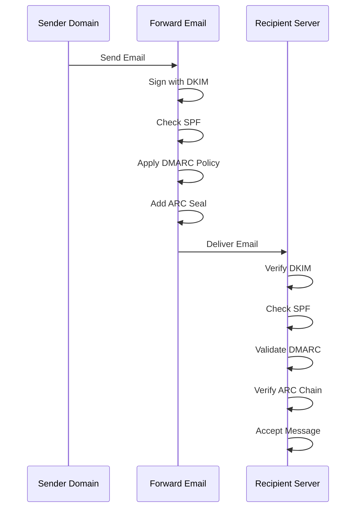

---


## Email Transport Security Protocols

> \[!IMPORTANT]
> Forward Email implements multiple layers of transport security to protect emails in transit.

Forward Email implements modern transport security protocols:

| RFC                                                       | Title                                                                                                | Status      | Implementation Notes                                                                                                                                                                                                                                                                          |
| --------------------------------------------------------- | ---------------------------------------------------------------------------------------------------- | ----------- | --------------------------------------------------------------------------------------------------------------------------------------------------------------------------------------------------------------------------------------------------------------------------------------------- |
| [RFC 8461](https://datatracker.ietf.org/doc/html/rfc8461) | SMTP MTA Strict Transport Security (MTA-STS)                                                         | ✅ Supported | Extensively used on IMAP, SMTP, and MX servers. See [create-mta-sts-cache.js](https://github.com/forwardemail/forwardemail.net/blob/master/helpers/create-mta-sts-cache.js) and [get-transporter.js](https://github.com/forwardemail/forwardemail.net/blob/master/helpers/get-transporter.js) |
| [RFC 8460](https://datatracker.ietf.org/doc/html/rfc8460) | SMTP TLS Reporting                                                                                   | ✅ Supported | Via [mailauth](https://github.com/postalsys/mailauth) library                                                                                                                                                                                                                                 |
| [RFC 7671](https://datatracker.ietf.org/doc/html/rfc7671) | The DNS-Based Authentication of Named Entities (DANE) Protocol: Updates and Operational Guidance     | ⚠️ Partial  | Custom TLSA resolver implemented (`Tangerine.resolveTlsa`) but not yet used for DANE validation                                                                                                                                                                                               |
| [RFC 6698](https://datatracker.ietf.org/doc/html/rfc6698) | The DNS-Based Authentication of Named Entities (DANE) Transport Layer Security (TLS) Protocol: TLSA  | ⚠️ Partial  | TLSA resolution available but DANE not fully implemented                                                                                                                                                                                                                                      |
| [RFC 8314](https://datatracker.ietf.org/doc/html/rfc8314) | Cleartext Considered Obsolete: Use of Transport Layer Security (TLS) for Email Submission and Access | ✅ Supported | TLS required for all connections                                                                                                                                                                                                                                                              |
| [RFC 8689](https://datatracker.ietf.org/doc/html/rfc8689) | SMTP Service Extension for Requiring TLS (REQUIRETLS)                                                | ✅ Supported | Full support for REQUIRETLS SMTP extension and "TLS-Required" header                                                                                                                                                                                                                          |

Transport security protocols ensure that email messages are encrypted and authenticated during transmission between mail servers.

### Transport Security Support

| Protocol       | RFC      | Status      | Description                                      |
| -------------- | -------- | ----------- | ------------------------------------------------ |
| **TLS**        | RFC 8314 | ✅ Supported | Transport Layer Security - Encrypted connections |
| **MTA-STS**    | RFC 8461 | ✅ Supported | Mail Transfer Agent Strict Transport Security    |
| **DANE**       | RFC 7671 | ⚠️ Partial  | DNS-based Authentication of Named Entities       |
| **REQUIRETLS** | RFC 8689 | ✅ Supported | Require TLS for entire delivery path             |

### TLS (Transport Layer Security)

Forward Email enforces TLS encryption for all email connections (SMTP, IMAP, POP3).

**Key Features:**

* TLS 1.2 and TLS 1.3 support
* Automatic certificate management
* Perfect Forward Secrecy (PFS)
* Strong cipher suites only

### MTA-STS (Mail Transfer Agent Strict Transport Security)

**MTA-STS** ensures that email is only delivered over TLS-encrypted connections by publishing a policy via HTTPS.

Forward Email implements MTA-STS using [create-mta-sts-cache.js](https://github.com/forwardemail/forwardemail.net/blob/master/helpers/create-mta-sts-cache.js).

**Key Features:**

* Automatic MTA-STS policy publication
* Policy caching for performance
* Downgrade attack prevention
* Certificate validation enforcement

### DANE (DNS-based Authentication of Named Entities)

> \[!WARNING]
> DANE support is partial - outbound only, not enforced for inbound.

**DANE** uses DNSSEC to publish TLS certificate information in DNS, allowing mail servers to verify certificates without relying on certificate authorities.

**Current Status:**

* ⚠️ Partial support for outbound delivery
* ❌ Not enforced for inbound delivery
* Requires DNSSEC-signed domains

> \[!TIP]
> **Future DANE Support:** Full DANE support may be possible in the future if Node.js releases TLSA support. See [nodejs/node#39569](https://github.com/nodejs/node/issues/39569).

### REQUIRETLS

> \[!TIP]
> Forward Email is one of the few providers with user-facing REQUIRETLS support.

**REQUIRETLS** ensures that email messages are only delivered over TLS-encrypted connections for the entire delivery path.

**Key Features:**

* User-facing checkbox in email composer
* Automatic rejection of unencrypted delivery
* End-to-end TLS enforcement
* Detailed failure notifications

> \[!TIP]
> **User-Facing TLS Enforcement:** Forward Email provides a checkbox under **My Account > Domains > Settings** to enforce TLS for all inbound connections. When enabled, this feature rejects any inbound email not sent over a TLS-encrypted connection with a 530 error code, ensuring all incoming mail is encrypted in transit.

### Transport Security Flow

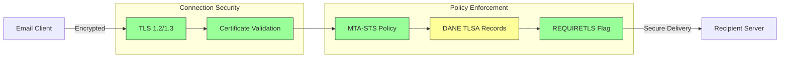

---


## Email Message Encryption

> \[!NOTE]
> Forward Email supports both OpenPGP and S/MIME for end-to-end email encryption.

Forward Email supports OpenPGP and S/MIME encryption:

| RFC                                                       | Title                                                                                   | Status      | Implementation Notes                                                                                                                                                                                 |
| --------------------------------------------------------- | --------------------------------------------------------------------------------------- | ----------- | ---------------------------------------------------------------------------------------------------------------------------------------------------------------------------------------------------- |
| [RFC 9580](https://datatracker.ietf.org/doc/html/rfc9580) | OpenPGP (supersedes RFC 4880)                                                           | ✅ Supported | Via [OpenPGP.js v6+](https://github.com/openpgpjs/openpgpjs) integration. See [FAQ](https://forwardemail.net/en/faq#do-you-support-openpgpmime-end-to-end-encryption-e2ee-and-web-key-directory-wkd) |
| [RFC 8551](https://datatracker.ietf.org/doc/html/rfc8551) | Secure/Multipurpose Internet Mail Extensions (S/MIME) Version 4.0 Message Specification | ✅ Supported | Both RSA and ECC algorithms supported. See [FAQ](https://forwardemail.net/en/faq#do-you-support-smime-encryption)                                                                                    |

Message encryption protocols protect email content from being read by anyone except the intended recipient, even if the message is intercepted during transit.

### Encryption Support

| Protocol    | RFC      | Status      | Description                                  |
| ----------- | -------- | ----------- | -------------------------------------------- |
| **OpenPGP** | RFC 9580 | ✅ Supported | Pretty Good Privacy - Public key encryption  |
| **S/MIME**  | RFC 8551 | ✅ Supported | Secure/Multipurpose Internet Mail Extensions |
| **WKD**     | Draft    | ✅ Supported | Web Key Directory - Automatic key discovery  |

### OpenPGP (Pretty Good Privacy)

**OpenPGP** provides end-to-end encryption using public key cryptography. Forward Email supports OpenPGP through the [Web Key Directory (WKD)](https://forwardemail.net/en/faq#do-you-support-openpgpmime-end-to-end-encryption-e2ee-and-web-key-directory-wkd) protocol.

**Key Features:**

* Automatic key discovery via WKD
* PGP/MIME support for encrypted attachments
* Key management through email client
* Compatible with GPG, Mailvelope, and other OpenPGP tools

**How to Use:**

1. Generate a PGP key pair in your email client
2. Upload your public key to Forward Email's WKD
3. Your key is automatically discoverable by other users
4. Send and receive encrypted emails seamlessly

### S/MIME (Secure/Multipurpose Internet Mail Extensions)

**S/MIME** provides email encryption and digital signatures using X.509 certificates.

**Key Features:**

* Certificate-based encryption
* Digital signatures for message authentication
* Native support in most email clients
* Enterprise-grade security

**How to Use:**

1. Obtain an S/MIME certificate from a Certificate Authority
2. Install the certificate in your email client
3. Configure your client to encrypt/sign messages
4. Exchange certificates with recipients

### SQLite Mailbox Encryption

> \[!IMPORTANT]
> Forward Email provides an additional layer of security with encrypted SQLite mailboxes.

Beyond message-level encryption, Forward Email encrypts entire mailboxes using [sqleet](https://github.com/resilar/sqleet) (ChaCha20-Poly1305).

**Key Features:**

* **Password-based encryption** - Only you have the password
* **Quantum-resistant** - ChaCha20-Poly1305 cipher
* **Zero-knowledge** - Forward Email cannot decrypt your mailbox
* **Sandboxed** - Each mailbox is isolated and portable
* **Unrecoverable** - If you forget your password, your mailbox is lost

### Encryption Comparison

| Feature               | OpenPGP           | S/MIME             | SQLite Encryption |
| --------------------- | ----------------- | ------------------ | ----------------- |
| **End-to-End**        | ✅ Yes             | ✅ Yes              | ✅ Yes             |
| **Key Management**    | Self-managed      | CA-issued          | Password-based    |
| **Client Support**    | Requires plugin   | Native             | Transparent       |
| **Use Case**          | Personal          | Enterprise         | Storage           |
| **Quantum-Resistant** | ⚠️ Depends on key | ⚠️ Depends on cert | ✅ Yes             |

### Encryption Flow

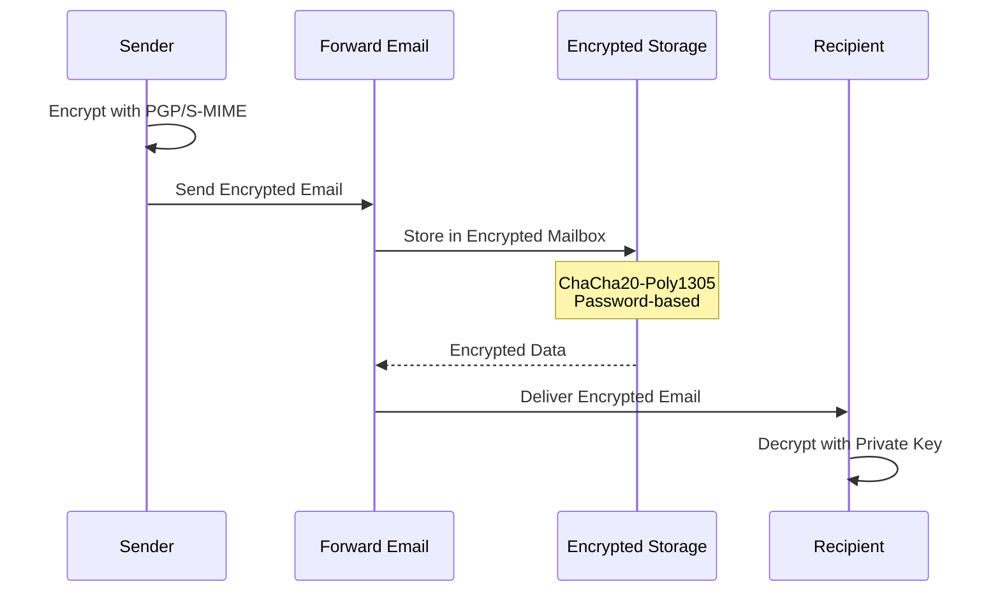

---


## Extended Functionality


## Email Message Format Standards

> \[!NOTE]
> Forward Email supports modern email format standards for rich content and internationalization.

Forward Email supports standard email message formats:

| RFC                                                       | Title                                                         | Implementation Notes |
| --------------------------------------------------------- | ------------------------------------------------------------- | -------------------- |
| [RFC 5322](https://datatracker.ietf.org/doc/html/rfc5322) | Internet Message Format                                       | Full support         |
| [RFC 2045](https://datatracker.ietf.org/doc/html/rfc2045) | MIME Part One: Format of Internet Message Bodies              | Full MIME support    |
| [RFC 2046](https://datatracker.ietf.org/doc/html/rfc2046) | MIME Part Two: Media Types                                    | Full MIME support    |
| [RFC 2047](https://datatracker.ietf.org/doc/html/rfc2047) | MIME Part Three: Message Header Extensions for Non-ASCII Text | Full MIME support    |
| [RFC 2048](https://datatracker.ietf.org/doc/html/rfc2048) | MIME Part Four: Registration Procedures                       | Full MIME support    |
| [RFC 2049](https://datatracker.ietf.org/doc/html/rfc2049) | MIME Part Five: Conformance Criteria and Examples             | Full MIME support    |

Email format standards define how email messages are structured, encoded, and displayed.

### Format Standards Support

| Standard           | RFC           | Status      | Description                           |
| ------------------ | ------------- | ----------- | ------------------------------------- |
| **MIME**           | RFC 2045-2049 | ✅ Supported | Multipurpose Internet Mail Extensions |
| **SMTPUTF8**       | RFC 6531      | ⚠️ Partial  | Internationalized email addresses     |
| **EAI**            | RFC 6530      | ⚠️ Partial  | Email Address Internationalization    |
| **Message Format** | RFC 5322      | ✅ Supported | Internet Message Format               |
| **MIME Security**  | RFC 1847      | ✅ Supported | Security Multiparts for MIME          |

### MIME (Multipurpose Internet Mail Extensions)

**MIME** allows emails to contain multiple parts with different content types (text, HTML, attachments, etc.).

**Supported MIME Features:**

* Multipart messages (mixed, alternative, related)
* Content-Type headers
* Content-Transfer-Encoding (7bit, 8bit, quoted-printable, base64)
* Inline images and attachments
* Rich HTML content

### SMTPUTF8 and Email Address Internationalization

> \[!WARNING]
> SMTPUTF8 support is partial - not all features are fully implemented.

**SMTPUTF8** allows email addresses to contain non-ASCII characters (e.g., `用户@例え.jp`).

**Current Status:**

* ⚠️ Partial support for internationalized email addresses
* ✅ UTF-8 content in message bodies
* ⚠️ Limited support for non-ASCII local parts

---


## Calendaring and Contacts Protocols

> \[!NOTE]
> Forward Email provides full CalDAV and CardDAV support for calendar and contact synchronization.

Forward Email supports CalDAV and CardDAV via the [caldav-adapter](https://github.com/forwardemail/caldav-adapter) library:

| RFC                                                       | Title                                                                     | Status      | Implementation Notes           |
| --------------------------------------------------------- | ------------------------------------------------------------------------- | ----------- | ------------------------------ |
| [RFC 4791](https://datatracker.ietf.org/doc/html/rfc4791) | Calendaring Extensions to WebDAV (CalDAV)                                 | ✅ Supported | Calendar access and management |
| [RFC 6352](https://datatracker.ietf.org/doc/html/rfc6352) | CardDAV: vCard Extensions to WebDAV                                       | ✅ Supported | Contact access and management  |
| [RFC 5545](https://datatracker.ietf.org/doc/html/rfc5545) | Internet Calendaring and Scheduling Core Object Specification (iCalendar) | ✅ Supported | iCalendar format support       |
| [RFC 6350](https://datatracker.ietf.org/doc/html/rfc6350) | vCard Format Specification                                                | ✅ Supported | vCard 4.0 format support       |

CalDAV and CardDAV are protocols that allow calendar and contact data to be accessed, shared, and synchronized across devices.

### CalDAV and CardDAV Support

| Protocol      | RFC      | Status      | Description                         |
| ------------- | -------- | ----------- | ----------------------------------- |
| **CalDAV**    | RFC 4791 | ✅ Supported | Calendar access and synchronization |
| **CardDAV**   | RFC 6352 | ✅ Supported | Contact access and synchronization  |
| **iCalendar** | RFC 5545 | ✅ Supported | Calendar data format                |
| **vCard**     | RFC 6350 | ✅ Supported | Contact data format                 |
| **VTODO**     | RFC 5545 | ✅ Supported | Task/reminder support               |

### CalDAV (Calendar Access)

**CalDAV** allows you to access and manage calendars from any device or application.

**Key Features:**

* Multi-device synchronization
* Shared calendars
* Calendar subscriptions
* Event invitations and responses
* Recurring events
* Timezone support

**Compatible Clients:**

* Apple Calendar (macOS, iOS)
* Mozilla Thunderbird
* Evolution
* GNOME Calendar
* Any CalDAV-compatible client

### CardDAV (Contact Access)

**CardDAV** allows you to access and manage contacts from any device or application.

**Key Features:**

* Multi-device synchronization
* Shared address books
* Contact groups
* Photo support
* Custom fields
* vCard 4.0 support

**Compatible Clients:**

* Apple Contacts (macOS, iOS)
* Mozilla Thunderbird
* Evolution
* GNOME Contacts
* Any CardDAV-compatible client

### Tasks and Reminders (CalDAV VTODO)

> \[!TIP]
> Forward Email supports tasks and reminders through CalDAV VTODO.

**VTODO** is part of the iCalendar format and allows task management through CalDAV.

**Key Features:**

* Task creation and management
* Due dates and priorities
* Task completion tracking
* Recurring tasks
* Task lists/categories

**Compatible Clients:**

* Apple Reminders (macOS, iOS)
* Mozilla Thunderbird (with Lightning)
* Evolution
* GNOME To Do
* Any CalDAV client with VTODO support

### CalDAV/CardDAV Synchronization Flow

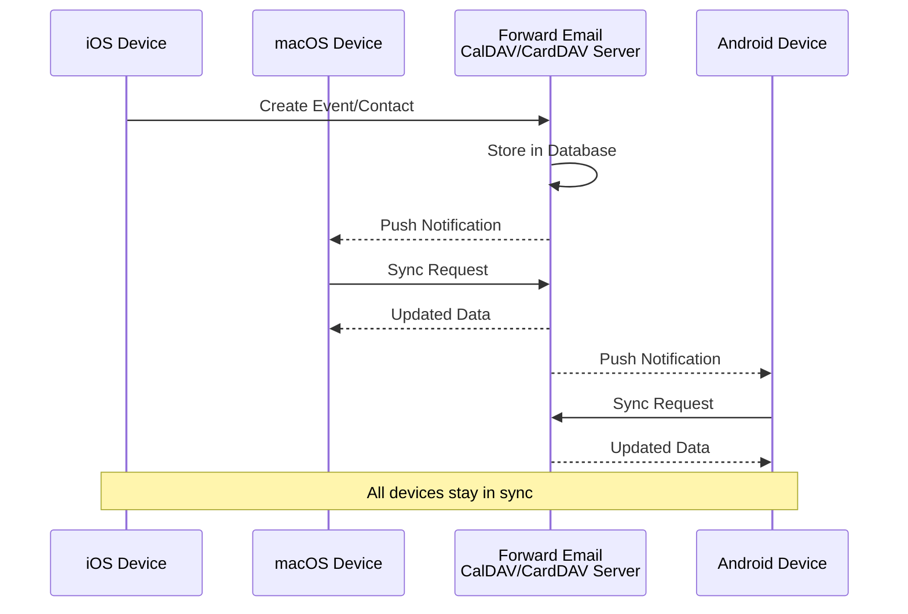

### Calendaring Extensions NOT Supported

The following calendaring extensions are NOT supported:

| RFC                                                       | Title                                                                 | Reason                                                                              |
| --------------------------------------------------------- | --------------------------------------------------------------------- | ----------------------------------------------------------------------------------- |
| [RFC 5546](https://datatracker.ietf.org/doc/html/rfc5546) | iCalendar Transport-Independent Interoperability Protocol (iTIP)      | Not implemented in [caldav-adapter](https://github.com/forwardemail/caldav-adapter) |
| [RFC 6047](https://datatracker.ietf.org/doc/html/rfc6047) | iCalendar Message-Based Interoperability Protocol (iMIP)              | Not implemented in [caldav-adapter](https://github.com/forwardemail/caldav-adapter) |
| [RFC 4918](https://datatracker.ietf.org/doc/html/rfc4918) | HTTP Extensions for Web Distributed Authoring and Versioning (WebDAV) | CalDAV uses WebDAV concepts but doesn't implement full RFC 4918                     |
| [RFC 6578](https://datatracker.ietf.org/doc/html/rfc6578) | Collection Synchronization for WebDAV                                 | Not implemented                                                                     |
| [RFC 3744](https://datatracker.ietf.org/doc/html/rfc3744) | WebDAV Access Control Protocol                                        | Not implemented                                                                     |

---


## Email Message Filtering

> \[!CAUTION]
> Sieve and ManageSieve are **not currently supported** but are planned for future implementation.

### Sieve (RFC 5228)

| RFC                                                       | Title                              | Status    | Reason                                                                                                                                                                              |
| --------------------------------------------------------- | ---------------------------------- | --------- | ----------------------------------------------------------------------------------------------------------------------------------------------------------------------------------- |
| [RFC 5228](https://datatracker.ietf.org/doc/html/rfc5228) | Sieve: An Email Filtering Language | ⚠️ Future | Not currently supported. May be implemented in the future. See [GitHub Discussion #337](https://github.com/forwardemail/forwardemail.net/discussions/337) to subscribe for updates. |

Email filtering protocols allow users to create server-side rules for automatically processing incoming messages.

**Sieve** is a powerful email filtering language that allows users to create complex rules for message processing.

**Planned Features:**

* Server-side filtering rules
* Automatic message sorting
* Vacation auto-responders
* Spam filtering
* Forwarding rules
* Custom actions

**Why Not Supported Yet:**

Forward Email currently focuses on providing a user-friendly web interface for email filtering. Sieve support is planned for future implementation to provide advanced users with more powerful filtering capabilities.

**Workaround:**

Use Forward Email's [web-based filtering interface](https://forwardemail.net/en/faq#how-do-i-set-up-a-vacation-responder-out-of-office-auto-responder) to create filtering rules through the dashboard.

> \[!TIP]
> **Vacation Responder Alternative:** While Sieve is not yet supported, Forward Email provides a built-in vacation responder feature that's superior to traditional Sieve vacation filters. It includes:
>
> * Automatic DKIM signature addition
> * Connection issue prevention (SSL/TLS with legacy servers)
> * Open WKD and PGP encryption support
> * Intelligent rate limiting (once per sender every 4 days, like Gmail)
> * Abuse prevention (filters postmaster, auto-submitted headers, mailing lists)
> * Requires proper outbound SMTP setup (DKIM, DMARC, Return-Path)
>
> **Configuration:** My Account → Domains → Aliases
>
> * Start/end date configuration
> * Subject limit: 100 characters
> * Message limit: 1000 characters
>
> See [FAQ: How do I set up a vacation responder?](https://forwardemail.net/en/faq#how-do-i-set-up-a-vacation-responder-out-of-office-auto-responder)

### ManageSieve (RFC 5804)

| RFC                                                       | Title                                          | Status          | Reason                |
| --------------------------------------------------------- | ---------------------------------------------- | --------------- | --------------------- |
| [RFC 5804](https://datatracker.ietf.org/doc/html/rfc5804) | A Protocol for Remotely Managing Sieve Scripts | ❌ Not Supported | Sieve not implemented |

**ManageSieve** is a protocol for remotely managing Sieve scripts.

**Planned Features:**

* Remote script management
* Script validation
* Multiple script support
* Script activation/deactivation

**Current Status:**

ManageSieve support is planned for future implementation alongside Sieve. For more information about ManageSieve, see [Dovecot's ManageSieve documentation](https://doc.dovecot.org/admin_manual/pigeonhole_managesieve_server/).

---


## Storage Optimization

> \[!IMPORTANT]
> **Industry-First Storage Technology:** Forward Email is the **only email provider in the world** that combines attachment deduplication with Brotli compression on email content. This dual-layer optimization gives you **2-3x more effective storage** compared to traditional email providers.

Forward Email implements two revolutionary storage optimization techniques that dramatically reduce mailbox size while maintaining full RFC compliance and message fidelity:

1. **Attachment Deduplication** - Eliminates duplicate attachments across all emails
2. **Brotli Compression** - Reduces storage by 46-86% for metadata and 50% for attachments

### Architecture: Dual-Layer Storage Optimization

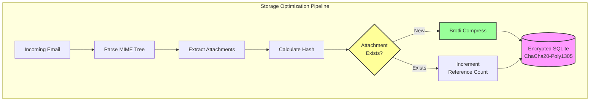

---


## Attachment Deduplication

Forward Email implements attachment deduplication based on [WildDuck's proven approach](https://docs.wildduck.email/docs/in-depth/attachment-deduplication/), adapted for SQLite storage.

> \[!NOTE]
> **What is Deduplicated:** "Attachment" refers to the **encoded** MIME node contents (base64 or quoted-printable), not the decoded file. This preserves DKIM and GPG signature validity.

### How It Works

**WildDuck's Original Implementation (MongoDB GridFS):**

> Wild Duck IMAP server de-duplicates attachments. "Attachment" in this case means the base64 or quoted-printable encoded mime node contents, not the decoded file. Even though using encoded content means a lot of false negatives (the same file in different emails might be counted as different attachment) it is needed to guarantee the validity of different signature schemes (DKIM, GPG etc.). A message retrieved from Wild Duck looks exactly the same as the message that was stored even though Wild Duck parses the message into a tree-like object and rebuilds the message when retrieving.

**Forward Email's SQLite Implementation:**

Forward Email adapts this approach for encrypted SQLite storage with the following process:

1. **Hash Calculation**: When an attachment is found, a hash is calculated using the [`rev-hash`](https://github.com/sindresorhus/rev-hash) library from the attachment body
2. **Lookup**: Check if an attachment with matching hash exists in the `Attachments` table
3. **Reference Counting**:
   * If exists: Increment reference counter by 1 and magic counter by random number
   * If new: Create new attachment entry with counter = 1
4. **Deletion Safety**: Uses dual-counter system (reference + magic) to prevent false positives
5. **Garbage Collection**: Attachments are deleted immediately when both counters reach zero

**Source Code:** [`helpers/attachment-storage.js`](https://github.com/forwardemail/forwardemail.net/blob/master/helpers/attachment-storage.js)

### Deduplication Flow

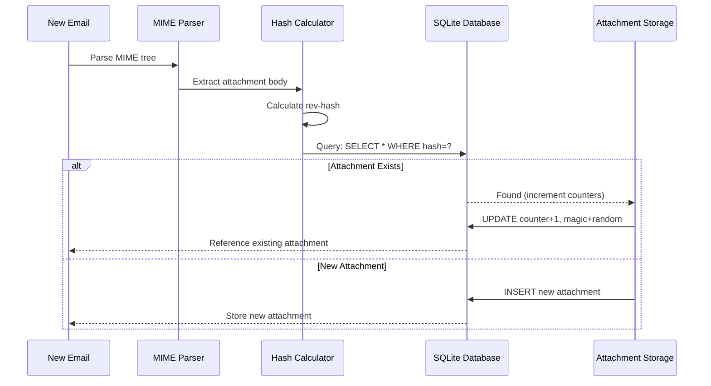

### Magic Number System

Forward Email uses WildDuck's "magic number" system (inspired by [Mail.ru](https://github.com/zone-eu/wildduck)) to prevent false positives during deletion:

* Every message gets a **random number** assigned
* Attachment's **magic counter** is incremented by that random number when message is added
* Magic counter is decremented by the same number when message is deleted
* Attachment is only deleted when **both counters** (reference + magic) reach zero

This dual-counter system ensures that if something goes wrong during deletion (e.g., crash, network error), the attachment is not deleted prematurely.

### Key Differences: WildDuck vs Forward Email

| Feature                | WildDuck (MongoDB)       | Forward Email (SQLite)       |
| ---------------------- | ------------------------ | ---------------------------- |
| **Storage Backend**    | MongoDB GridFS (chunked) | SQLite BLOB (direct)         |
| **Hash Algorithm**     | SHA256                   | rev-hash (SHA-256 based)     |
| **Reference Counting** | ✅ Yes                    | ✅ Yes                        |
| **Magic Numbers**      | ✅ Yes (Mail.ru inspired) | ✅ Yes (same system)          |
| **Garbage Collection** | Delayed (separate job)   | Immediate (on zero counters) |
| **Compression**        | ❌ None                   | ✅ Brotli (see below)         |
| **Encryption**         | ❌ Optional               | ✅ Always (ChaCha20-Poly1305) |

---


## Brotli Compression

> \[!IMPORTANT]
> **World's First:** Forward Email is the **only email service in the world** that uses Brotli compression on email content. This provides **46-86% storage savings** on top of attachment deduplication.

Forward Email implements Brotli compression for both attachment bodies and message metadata, providing massive storage savings while maintaining backwards compatibility.

**Implementation:** [`helpers/msgpack-helpers.js`](https://github.com/forwardemail/forwardemail.net/blob/master/helpers/msgpack-helpers.js)

### What Gets Compressed

**1. Attachment Bodies** (`encodeAttachmentBody`)

* **Old formats**: Hex-encoded string (2x size) or raw Buffer
* **New format**: Brotli-compressed Buffer with "FEBR" magic header
* **Compression decision**: Only compresses if it saves space (accounts for 4-byte header)
* **Storage savings**: Up to **50%** (hex → native BLOB)

**2. Message Metadata** (`encodeMetadata`)

Includes: `mimeTree`, `headers`, `envelope`, `flags`

* **Old format**: JSON text string
* **New format**: Brotli-compressed Buffer
* **Storage savings**: **46-86%** depending on message complexity

### Compression Configuration

```javascript
// Brotli compression options optimized for speed (level 4 is a good balance)
const BROTLI_COMPRESS_OPTIONS = {
  params: {
    [zlib.constants.BROTLI_PARAM_QUALITY]: 4
  }
};
```

**Why Level 4?**

* **Fast compression/decompression**: Sub-millisecond processing
* **Good compression ratio**: 46-86% savings
* **Balanced performance**: Optimal for real-time email operations

### Magic Header: "FEBR"

Forward Email uses a 4-byte magic header to identify compressed attachment bodies:

```
"FEBR" = Forward Email BRotli
Hex: 0x46 0x45 0x42 0x52
```

**Why a magic header?**

* **Format detection**: Instantly identify compressed vs uncompressed data
* **Backwards compatibility**: Old hex strings and raw Buffers still work
* **Collision avoidance**: "FEBR" is unlikely to appear at the start of legitimate attachment data

### Compression Process

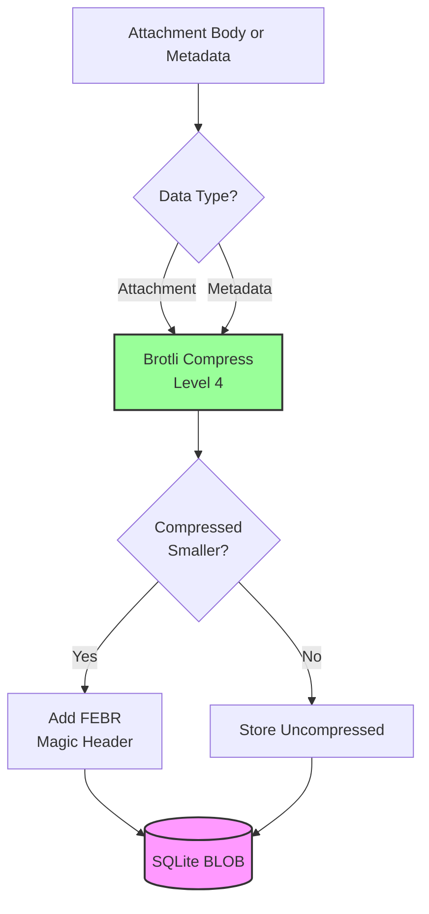

### Decompression Process

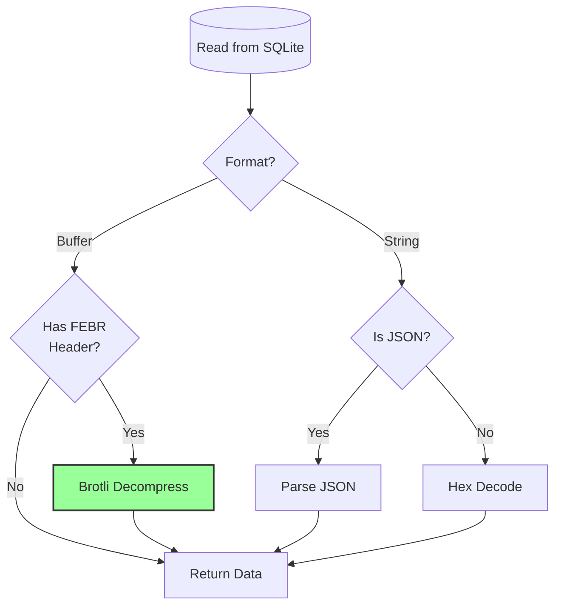

### Backwards Compatibility

All decode functions **auto-detect** the storage format:

| Format                | Detection Method                       | Handling                                      |
| --------------------- | -------------------------------------- | --------------------------------------------- |
| **Brotli-compressed** | Check for "FEBR" magic header          | Decompress with `zlib.brotliDecompressSync()` |
| **Raw Buffer**        | `Buffer.isBuffer()` without magic      | Return as-is                                  |
| **Hex string**        | Check for even length + [0-9a-f] chars | Decode with `Buffer.from(value, 'hex')`       |
| **JSON string**       | Check for `{` or `[` first character   | Parse with `JSON.parse()`                     |

This ensures **zero data loss** during migration from old to new storage formats.

### Storage Savings Statistics

**Measured savings from production data:**

| Data Type             | Old Format              | New Format             | Savings    |
| --------------------- | ----------------------- | ---------------------- | ---------- |
| **Attachment bodies** | Hex-encoded string (2x) | Brotli-compressed BLOB | **50%**    |
| **Message metadata**  | JSON text               | Brotli-compressed BLOB | **46-86%** |
| **Mailbox flags**     | JSON text               | Brotli-compressed BLOB | **60-80%** |

**Source:** [`helpers/migrate-storage-format.js`](https://github.com/forwardemail/forwardemail.net/blob/master/helpers/migrate-storage-format.js)

### Migration Process

Forward Email provides automatic, idempotent migration from old to new storage formats:

```javascript
// Migration statistics tracked:
{
  attachmentsMigrated: 0,
  messagesMigrated: 0,
  mailboxesMigrated: 0,
  bytesSaved: 0  // Total bytes saved from compression
}
```

**Migration steps:**

1. Attachment bodies: hex encoding → native BLOB (50% savings)
2. Message metadata: JSON text → brotli-compressed BLOB (46-86% savings)
3. Mailbox flags: JSON text → brotli-compressed BLOB (60-80% savings)

**Source:** [`helpers/migrate-storage-format.js`](https://github.com/forwardemail/forwardemail.net/blob/master/helpers/migrate-storage-format.js)

---

### Combined Storage Efficiency

> \[!TIP]
> **Real-World Impact:** With attachment deduplication + Brotli compression, Forward Email users get **2-3x more effective storage** compared to traditional email providers.

**Example Scenario:**

Traditional email provider (1GB mailbox):

* 1GB disk space = 1GB of emails
* No deduplication: Same attachment stored 10 times = 10x storage waste
* No compression: Full JSON metadata stored = 2-3x storage waste

Forward Email (1GB mailbox):

* 1GB disk space ≈ **2-3GB of emails** (effective storage)
* Deduplication: Same attachment stored once, referenced 10 times
* Compression: 46-86% savings on metadata, 50% on attachments
* Encryption: ChaCha20-Poly1305 (no storage overhead)

**Comparison Table:**

| Provider          | Storage Technology                           | Effective Storage (1GB mailbox) |
| ----------------- | -------------------------------------------- | ------------------------------- |
| Gmail             | None                                         | 1GB                             |
| iCloud            | None                                         | 1GB                             |
| Outlook.com       | None                                         | 1GB                             |
| Fastmail          | None                                         | 1GB                             |
| ProtonMail        | Encryption only                              | 1GB                             |
| Tutanota          | Encryption only                              | 1GB                             |
| **Forward Email** | **Deduplication + Compression + Encryption** | **2-3GB** ✨                     |

### Technical Implementation Details

**Performance:**

* Brotli level 4: Sub-millisecond compression/decompression
* No performance penalty from compression
* SQLite FTS5: Sub-50ms search with NVMe SSD

**Security:**

* Compression happens **after** encryption (SQLite database is encrypted)
* ChaCha20-Poly1305 encryption + Brotli compression
* Zero-knowledge: Only user has decryption password

**RFC Compliance:**

* Messages retrieved look **exactly the same** as stored
* DKIM signatures remain valid (encoded content preserved)
* GPG signatures remain valid (no modification to signed content)

### Why No Other Provider Does This

**Complexity:**

* Requires deep integration with storage layer
* Backwards compatibility is challenging
* Migration from old formats is complex

**Performance concerns:**

* Compression adds CPU overhead (solved with Brotli level 4)
* Decompression on every read (solved with SQLite caching)

**Forward Email's Advantage:**

* Built from the ground up with optimization in mind
* SQLite allows direct BLOB manipulation
* Encrypted per-user databases enable safe compression

---

---


## Modern Features


## Complete REST API for Email Management

> \[!TIP]
> Forward Email provides a comprehensive REST API with 39 endpoints for programmatic email management.

> \[!TIP]
> **Unique Industry Feature:** Unlike every other email service, Forward Email provides complete programmatic access to your mailbox, calendar, contacts, messages, and folders via a comprehensive REST API. This is direct interaction with your encrypted SQLite database file storing all your data.

Forward Email offers a complete REST API that provides unprecedented access to your email data. No other email service (including Gmail, iCloud, Outlook, ProtonMail, Tuta, or Fastmail) offers this level of comprehensive, direct database access.

**API Documentation:** <https://forwardemail.net/en/email-api>

### API Categories (39 Endpoints)

**1. Messages API** (5 endpoints) - Full CRUD operations on email messages:

* `GET /v1/messages` - List messages with 15+ advanced search parameters (no other service offers this)
* `POST /v1/messages` - Create/send messages
* `GET /v1/messages/:id` - Retrieve message
* `PUT /v1/messages/:id` - Update message (flags, folders)
* `DELETE /v1/messages/:id` - Delete message

*Example: Find all invoices from last quarter with attachments:*

```bash
curl -u "alias@domain.com:password" \
  "https://api.forwardemail.net/v1/messages?q=subject:invoice+has:attachment+after:2024-01-01+before:2024-04-01"
```

See [Advanced Search Documentation](https://forwardemail.net/en/email-api)

**2. Folders API** (5 endpoints) - Full IMAP folder management via REST:

* `GET /v1/folders` - List all folders
* `POST /v1/folders` - Create folder
* `GET /v1/folders/:id` - Retrieve folder
* `PUT /v1/folders/:id` - Update folder
* `DELETE /v1/folders/:id` - Delete folder

**3. Contacts API** (5 endpoints) - CardDAV contact storage via REST:

* `GET /v1/contacts` - List contacts
* `POST /v1/contacts` - Create contact (vCard format)
* `GET /v1/contacts/:id` - Retrieve contact
* `PUT /v1/contacts/:id` - Update contact
* `DELETE /v1/contacts/:id` - Delete contact

**4. Calendars API** (5 endpoints) - Calendar container management:

* `GET /v1/calendars` - List calendar containers
* `POST /v1/calendars` - Create calendar (e.g., "Work Calendar", "Personal Calendar")
* `GET /v1/calendars/:id` - Retrieve calendar
* `PUT /v1/calendars/:id` - Update calendar
* `DELETE /v1/calendars/:id` - Delete calendar

**5. Calendar Events API** (5 endpoints) - Event scheduling within calendars:

* `GET /v1/calendar-events` - List events
* `POST /v1/calendar-events` - Create event with attendees
* `GET /v1/calendar-events/:id` - Retrieve event
* `PUT /v1/calendar-events/:id` - Update event
* `DELETE /v1/calendar-events/:id` - Delete event

*Example: Create a calendar event:*

```bash
curl -u "alias@domain.com:password" \
  -X POST \
  -H "Content-Type: application/json" \
  -d '{"title":"Team Meeting","start":"2024-12-20T10:00:00Z","attendees":["team@example.com"],"calendar_id":"calendar123"}' \
  https://api.forwardemail.net/v1/calendar-events
```

### Technical Details

* **Authentication:** Simple `alias:password` authentication (no OAuth complexity)
* **Performance:** Sub-50ms response times with SQLite FTS5 and NVMe SSD storage
* **Zero Network Latency:** Direct database access, not proxied through external services

### Real-World Use Cases

* **Email Analytics:** Build custom dashboards tracking email volume, response times, sender statistics

* **Automated Workflows:** Trigger actions based on email content (invoice processing, support tickets)

* **CRM Integration:** Sync email conversations with your CRM automatically

* **Compliance & Discovery:** Search and export emails for legal/compliance requirements

* **Custom Email Clients:** Build specialized email interfaces for your workflow

* **Business Intelligence:** Analyze communication patterns, response rates, customer engagement

* **Document Management:** Extract and categorize attachments automatically

* [Complete Documentation](https://forwardemail.net/en/email-api)

* [Complete API Reference](https://forwardemail.net/en/email-api)

* [Advanced Search Guide](https://forwardemail.net/en/email-api)

* [30+ Integration Examples](https://forwardemail.net/en/email-api)

* [Technical Architecture](https://forwardemail.net/en/blog/docs/best-quantum-safe-encrypted-email-service)

Forward Email offers a modern REST API that provides full control over email accounts, domains, aliases, and messages. This API serves as a powerful alternative to JMAP and provides functionality beyond traditional email protocols.

| Category                | Endpoints | Description                             |
| ----------------------- | --------- | --------------------------------------- |
| **Account Management**  | 8         | User accounts, authentication, settings |
| **Domain Management**   | 12        | Custom domains, DNS, verification       |
| **Alias Management**    | 6         | Email aliases, forwarding, catch-all    |
| **Message Management**  | 7         | Send, receive, search, delete messages  |
| **Calendar & Contacts** | 4         | CalDAV/CardDAV access via API           |
| **Logs & Analytics**    | 2         | Email logs, delivery reports            |

### Key API Features

**Advanced Search:**

The API provides powerful search capabilities with query syntax similar to Gmail:

```
GET /v1/messages?q=subject:invoice+has:attachment+after:2024-01-01+before:2024-04-01
```

**Supported Search Operators:**

* `from:` - Search by sender
* `to:` - Search by recipient
* `subject:` - Search by subject
* `has:attachment` - Messages with attachments
* `is:unread` - Unread messages
* `is:starred` - Starred messages
* `after:` - Messages after date
* `before:` - Messages before date
* `label:` - Messages with label
* `filename:` - Attachment filename

**Calendar Event Management:**

```
GET /v1/calendar-events
POST /v1/calendar-events
PUT /v1/calendar-events/:id
DELETE /v1/calendar-events/:id
```

**Webhook Integrations:**

The API supports webhooks for real-time notifications of email events (received, sent, bounced, etc.).

**Authentication:**

* API key authentication
* OAuth 2.0 support
* Rate limiting: 1000 requests/hour

**Data Format:**

* JSON request/response
* RESTful design
* Pagination support

**Security:**

* HTTPS only
* API key rotation
* IP whitelisting (optional)
* Request signing (optional)

### API Architecture

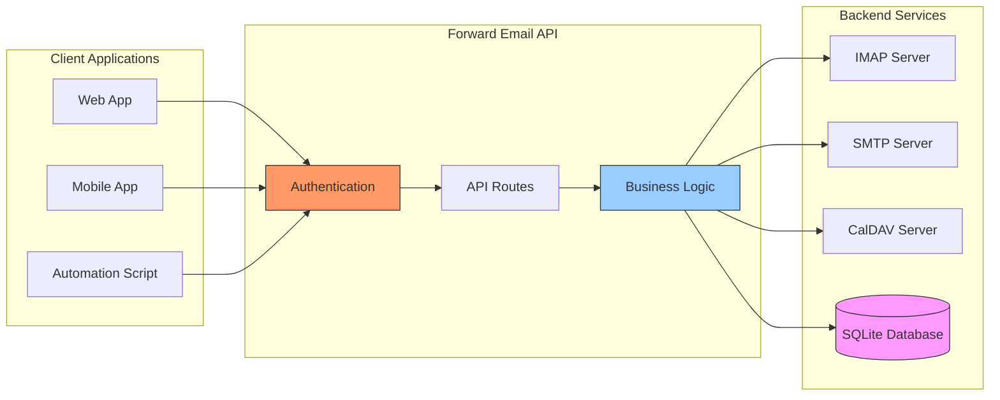

---


## iOS Push Notifications

> \[!TIP]
> Forward Email supports native iOS push notifications through XAPPLEPUSHSERVICE for instant email delivery.

> \[!IMPORTANT]
> **Unique Feature:** Forward Email is one of the few open-source email servers that supports native iOS push notifications for email, contacts, and calendars via the `XAPPLEPUSHSERVICE` IMAP extension. This was reverse-engineered from Apple's protocol and provides instant delivery to iOS devices without battery drain.

Forward Email implements Apple's proprietary XAPPLEPUSHSERVICE extension, providing native push notifications for iOS devices without requiring background polling.

### How It Works

**XAPPLEPUSHSERVICE** is a non-standard IMAP extension that allows iOS Mail app to receive instant push notifications when new emails arrive.

Forward Email implements the proprietary Apple Push Notification service (APNs) integration for IMAP, allowing iOS Mail app to receive instant push notifications when new emails arrive.

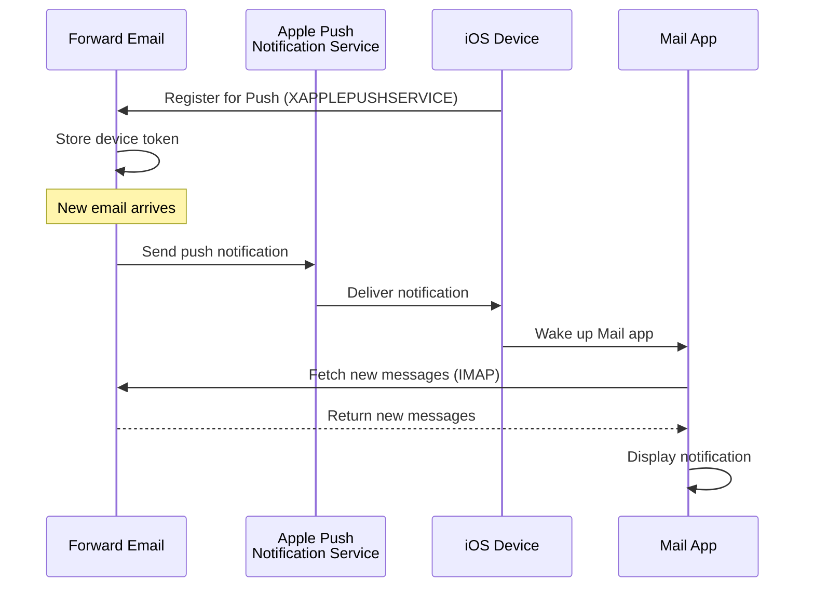

### Key Features

**Instant Delivery:**

* Push notifications arrive within seconds
* No battery-draining background polling
* Works even when Mail app is closed

<!---->

* **Instant Delivery:** Emails, calendar events, and contacts appear on your iPhone/iPad immediately, not on a polling schedule
* **Battery Efficient:** Uses Apple's push infrastructure instead of maintaining constant IMAP connections
* **Topic-Based Push:** Supports push notifications for specific mailboxes, not just INBOX
* **No Third-Party Apps Required:** Works with the native iOS Mail, Calendar, and Contacts apps

**Native Integration:**

* Built into iOS Mail app
* No third-party apps required
* Seamless user experience

**Privacy-Focused:**

* Device tokens are encrypted
* No message content sent through APNS
* Only "new mail" notification sent

**Battery Efficient:**

* No constant IMAP polling
* Device sleeps until notification arrives
* Minimal battery impact

### What Makes This Special

> \[!IMPORTANT]
> Most email providers don't support XAPPLEPUSHSERVICE, forcing iOS devices to poll for new mail every 15 minutes.

Most open-source email servers (including Dovecot, Postfix, Cyrus IMAP) do NOT support iOS push notifications. Users must either:

* Use IMAP IDLE (keeps connection open, drains battery)
* Use polling (checks every 15-30 minutes, delayed notifications)
* Use proprietary email apps with their own push infrastructure

Forward Email provides the same instant push notification experience as commercial services like Gmail, iCloud, and Fastmail.

**Comparison with Other Providers:**

| Provider          | Push Support   | Polling Interval | Battery Impact |
| ----------------- | -------------- | ---------------- | -------------- |
| **Forward Email** | ✅ Native Push  | Instant          | Minimal        |
| Gmail             | ✅ Native Push  | Instant          | Minimal        |
| iCloud            | ✅ Native Push  | Instant          | Minimal        |
| Yahoo             | ✅ Native Push  | Instant          | Minimal        |
| Outlook.com       | ❌ Polling      | 15 minutes       | Moderate       |
| Fastmail          | ❌ Polling      | 15 minutes       | Moderate       |
| ProtonMail        | ⚠️ Bridge only | Via Bridge       | High           |
| Tutanota          | ❌ App only     | N/A              | N/A            |

### Implementation Details

**IMAP CAPABILITY Response:**

```
* CAPABILITY IMAP4rev1 ... XAPPLEPUSHSERVICE ...
```

**Registration Process:**

1. iOS Mail app detects XAPPLEPUSHSERVICE capability
2. App registers device token with Forward Email
3. Forward Email stores token and associates with account
4. When new mail arrives, Forward Email sends push via APNS
5. iOS wakes up Mail app to fetch new messages

**Security:**

* Device tokens are encrypted at rest
* Tokens expire and are refreshed automatically
* No message content exposed to APNS
* End-to-end encryption maintained

<!---->

* **IMAP Extension:** `XAPPLEPUSHSERVICE`
* **Source Code:** [WildDuck Issue #711](https://github.com/zone-eu/wildduck/issues/711)
* **Setup:** Automatic - no configuration needed, works out of the box with iOS Mail app

### Comparison with Other Services

| Service       | iOS Push Support | Method                                   |
| ------------- | ---------------- | ---------------------------------------- |
| Forward Email | ✅ Yes            | `XAPPLEPUSHSERVICE` (reverse-engineered) |
| Gmail         | ✅ Yes            | Proprietary Gmail app + Google push      |
| iCloud Mail   | ✅ Yes            | Native Apple integration                 |
| Outlook.com   | ✅ Yes            | Proprietary Outlook app + Microsoft push |
| Fastmail      | ✅ Yes            | `XAPPLEPUSHSERVICE`                      |
| Dovecot       | ❌ No             | IMAP IDLE or polling only                |
| Postfix       | ❌ No             | IMAP IDLE or polling only                |
| Cyrus IMAP    | ❌ No             | IMAP IDLE or polling only                |

**Gmail Push:**

Gmail uses a proprietary push system that only works with the Gmail app. iOS Mail app must poll Gmail IMAP servers.

**iCloud Push:**

iCloud has native push support similar to Forward Email, but only for @icloud.com addresses.

**Outlook.com:**

Outlook.com does not support XAPPLEPUSHSERVICE, requiring iOS Mail to poll every 15 minutes.

**Fastmail:**

Fastmail does not support XAPPLEPUSHSERVICE. Users must use the Fastmail app for push notifications or accept 15-minute polling delays.

---


## Testing and Verification


## Protocol Capability Tests

> \[!NOTE]
> This section provides the results of our latest protocol capability tests, conducted on January 22, 2026.

This section contains the actual CAPABILITY/CAPA/EHLO responses from all tested providers. All tests were run on **January 22, 2026**.

These tests help verify the advertised and actual support for various email protocols and extensions across major providers.

### Test Methodology

**Test Environment:**

* **Date:** January 22, 2026 at 02:37 UTC
* **Location:** AWS EC2 instance
* **IPv4:** 54.167.216.197
* **IPv6:** 2600:4040:46da:9a00:b19e:3ad4:426c:2f48
* **Tools:** OpenSSL s\_client, bash scripts

**Providers Tested:**

* Forward Email
* Gmail
* Outlook.com
* iCloud
* Fastmail
* Yahoo/AOL (Verizon)

### Test Scripts

For full transparency, the exact scripts used for these tests are provided below.

#### IMAP Capability Test Script

```bash
#!/bin/bash
# IMAP Capability Test Script
# Tests IMAP CAPABILITY for various email providers

echo "========================================="
echo "IMAP CAPABILITY TEST"
echo "Date: $(date -u +"%Y-%m-%d %H:%M:%S UTC")"
echo "========================================="
echo ""

# Gmail
echo "--- Gmail (imap.gmail.com:993) ---"
echo -e "a001 CAPABILITY\na002 LOGOUT" | timeout 10 openssl s_client -connect imap.gmail.com:993 -crlf -quiet 2>&1 | grep -A 20 "CAPABILITY"
echo ""

# Outlook.com
echo "--- Outlook.com (outlook.office365.com:993) ---"
echo -e "a001 CAPABILITY\na002 LOGOUT" | timeout 10 openssl s_client -connect outlook.office365.com:993 -crlf -quiet 2>&1 | grep -A 20 "CAPABILITY"
echo ""

# iCloud
echo "--- iCloud (imap.mail.me.com:993) ---"
echo -e "a001 CAPABILITY\na002 LOGOUT" | timeout 10 openssl s_client -connect imap.mail.me.com:993 -crlf -quiet 2>&1 | grep -A 20 "CAPABILITY"
echo ""

# Fastmail
echo "--- Fastmail (imap.fastmail.com:993) ---"
echo -e "a001 CAPABILITY\na002 LOGOUT" | timeout 10 openssl s_client -connect imap.fastmail.com:993 -crlf -quiet 2>&1 | grep -A 20 "CAPABILITY"
echo ""

# Yahoo
echo "--- Yahoo (imap.mail.yahoo.com:993) ---"
echo -e "a001 CAPABILITY\na002 LOGOUT" | timeout 10 openssl s_client -connect imap.mail.yahoo.com:993 -crlf -quiet 2>&1 | grep -A 20 "CAPABILITY"
echo ""

# Forward Email
echo "--- Forward Email (imap.forwardemail.net:993) ---"
echo -e "a001 CAPABILITY\na002 LOGOUT" | timeout 10 openssl s_client -connect imap.forwardemail.net:993 -crlf -quiet 2>&1 | grep -A 20 "CAPABILITY"
echo ""

echo "========================================="
echo "Test completed"
echo "========================================="
```

#### POP3 Capability Test Script

```bash
#!/bin/bash
# POP3 Capability Test Script
# Tests POP3 CAPA for various email providers

echo "========================================="
echo "POP3 CAPABILITY TEST"
echo "Date: $(date -u +"%Y-%m-%d %H:%M:%S UTC")"
echo "========================================="
echo ""

# Gmail
echo "--- Gmail (pop.gmail.com:995) ---"
echo -e "CAPA\nQUIT" | timeout 10 openssl s_client -connect pop.gmail.com:995 -crlf -quiet 2>&1 | grep -A 20 "CAPA"
echo ""

# Outlook.com
echo "--- Outlook.com (outlook.office365.com:995) ---"
echo -e "CAPA\nQUIT" | timeout 10 openssl s_client -connect outlook.office365.com:995 -crlf -quiet 2>&1 | grep -A 20 "CAPA"
echo ""

# iCloud (Note: iCloud does not support POP3)
echo "--- iCloud (No POP3 support) ---"
echo "iCloud does not support POP3"
echo ""

# Fastmail
echo "--- Fastmail (pop.fastmail.com:995) ---"
echo -e "CAPA\nQUIT" | timeout 10 openssl s_client -connect pop.fastmail.com:995 -crlf -quiet 2>&1 | grep -A 20 "CAPA"
echo ""

# Yahoo
echo "--- Yahoo (pop.mail.yahoo.com:995) ---"
echo -e "CAPA\nQUIT" | timeout 10 openssl s_client -connect pop.mail.yahoo.com:995 -crlf -quiet 2>&1 | grep -A 20 "CAPA"
echo ""

# Forward Email
echo "--- Forward Email (pop3.forwardemail.net:995) ---"
echo -e "CAPA\nQUIT" | timeout 10 openssl s_client -connect pop3.forwardemail.net:995 -crlf -quiet 2>&1 | grep -A 20 "CAPA"
echo ""

echo "========================================="
echo "Test completed"
echo "========================================="
```

#### SMTP Capability Test Script

```bash
#!/bin/bash
# SMTP Capability Test Script
# Tests SMTP EHLO for various email providers

echo "========================================="
echo "SMTP CAPABILITY TEST"
echo "Date: $(date -u +"%Y-%m-%d %H:%M:%S UTC")"
echo "========================================="
echo ""

# Gmail
echo "--- Gmail (smtp.gmail.com:587) ---"
echo -e "EHLO test.com\nQUIT" | timeout 10 openssl s_client -connect smtp.gmail.com:587 -starttls smtp -crlf -quiet 2>&1 | grep -A 30 "250-"
echo ""

# Outlook.com
echo "--- Outlook.com (smtp.office365.com:587) ---"
echo -e "EHLO test.com\nQUIT" | timeout 10 openssl s_client -connect smtp.office365.com:587 -starttls smtp -crlf -quiet 2>&1 | grep -A 30 "250-"
echo ""

# iCloud
echo "--- iCloud (smtp.mail.me.com:587) ---"
echo -e "EHLO test.com\nQUIT" | timeout 10 openssl s_client -connect smtp.mail.me.com:587 -starttls smtp -crlf -quiet 2>&1 | grep -A 30 "250-"
echo ""

# Fastmail
echo "--- Fastmail (smtp.fastmail.com:587) ---"
echo -e "EHLO test.com\nQUIT" | timeout 10 openssl s_client -connect smtp.fastmail.com:587 -starttls smtp -crlf -quiet 2>&1 | grep -A 30 "250-"
echo ""

# Yahoo
echo "--- Yahoo (smtp.mail.yahoo.com:587) ---"
echo -e "EHLO test.com\nQUIT" | timeout 10 openssl s_client -connect smtp.mail.yahoo.com:587 -starttls smtp -crlf -quiet 2>&1 | grep -A 30 "250-"
echo ""

# Forward Email
echo "--- Forward Email (smtp.forwardemail.net:587) ---"
echo -e "EHLO test.com\nQUIT" | timeout 10 openssl s_client -connect smtp.forwardemail.net:587 -starttls smtp -crlf -quiet 2>&1 | grep -A 30 "250-"
echo ""

echo "========================================="
echo "Test completed"
echo "========================================="
```

### Test Results Summary

#### IMAP (CAPABILITY)

**Forward Email**

```
* CAPABILITY IMAP4rev1 AUTH=PLAIN AUTH=PLAIN-CLIENTTOKEN CHILDREN ENABLE ID IDLE NAMESPACE QUOTA SASL-IR UNSELECT XLIST XAPPLEPUSHSERVICE
```

**Gmail**

```
* CAPABILITY IMAP4rev1 UNSELECT IDLE NAMESPACE QUOTA ID XLIST CHILDREN X-GM-EXT-1 UIDPLUS COMPRESS=DEFLATE ENABLE MOVE CONDSTORE ESEARCH UTF8=ACCEPT LIST-EXTENDED LIST-STATUS LITERAL- SPECIAL-USE
```

**iCloud**

```
* OK [CAPABILITY XAPPLEPUSHSERVICE IMAP4 IMAP4rev1 SASL-IR AUTH=ATOKEN AUTH=PLAIN AUTH=ATOKEN2 AUTH=XOAUTH2]
```

**Outlook.com**

```
* CAPABILITY IMAP4rev1 AUTH=PLAIN AUTH=XOAUTH2 SASL-IR UIDPLUS ID UNSELECT CHILDREN IDLE NAMESPACE LITERAL+
```

**Fastmail**

```
* CAPABILITY IMAP4rev1 ACL ANNOTATE-EXPERIMENT-1 CATENATE CONDSTORE ENABLE ESEARCH ESORT I18NLEVEL=1 ID IDLE LIST-EXTENDED LIST-STATUS LITERAL+ LOGINDISABLED MULTIAPPEND NAMESPACE QRESYNC QUOTA RIGHTS=ektx SASL-IR SORT SPECIAL-USE THREAD=ORDEREDSUBJECT UIDPLUS UNSELECT WITHIN X-RENAME XLIST
```

**Yahoo/AOL (Verizon)**

```
* CAPABILITY IMAP4rev1 IDLE NAMESPACE QUOTA ID XLIST CHILDREN UIDPLUS MOVE CONDSTORE ESEARCH ENABLE LIST-EXTENDED LIST-STATUS LITERAL- SPECIAL-USE UNSELECT XAPPLEPUSHSERVICE
```

#### POP3 (CAPA)

**Forward Email**

```
+OK
CAPA
TOP
USER
UIDL
EXPIRE 30
IMPLEMENTATION ForwardEmail
.
```

**Gmail**

```
+OK
CAPA
TOP
USER
UIDL
EXPIRE 30
IMPLEMENTATION Gpop
.
```

**Outlook.com**

```
+OK
CAPA
TOP
USER
UIDL
SASL PLAIN XOAUTH2
.
```

**Fastmail**

```
+OK
CAPA
TOP
USER
UIDL
EXPIRE 30
IMPLEMENTATION Cyrus
.
```

#### SMTP (EHLO)

**Forward Email**

```
250-smtp.forwardemail.net
250-PIPELINING
250-SIZE 52428800
250-ETRN
250-STARTTLS
250-ENHANCEDSTATUSCODES
250-8BITMIME
250-DSN
250 CHUNKING
```

**Gmail**

```
250-smtp.gmail.com at your service
250-SIZE 35882577
250-8BITMIME
250-STARTTLS
250-ENHANCEDSTATUSCODES
250-PIPELINING
250-CHUNKING
250 SMTPUTF8
```

**Outlook.com**

```
250-SN4PR13CA0005.outlook.office365.com Hello [x.x.x.x]
250-SIZE 157286400
250-PIPELINING
250-DSN
250-ENHANCEDSTATUSCODES
250-STARTTLS
250-8BITMIME
250-BINARYMIME
250-CHUNKING
250 SMTPUTF8
```

**Fastmail**

```
250-smtp.fastmail.com
250-PIPELINING
250-SIZE 78643200
250-ETRN
250-STARTTLS
250-ENHANCEDSTATUSCODES
250-8BITMIME
250-DSN
250 CHUNKING
```

**Yahoo/AOL (Verizon)**

```
250-smtp.mail.yahoo.com
250-PIPELINING
250-SIZE 41943040
250-8BITMIME
250-ENHANCEDSTATUSCODES
250-STARTTLS
```

### Detailed Test Results

#### IMAP Test Results

**Gmail:**
`* CAPABILITY IMAP4rev1 UNSELECT IDLE NAMESPACE QUOTA ID XLIST CHILDREN X-GM-EXT-1 XYZZY SASL-IR AUTH=XOAUTH2 AUTH=PLAIN AUTH=PLAIN-CLIENTTOKEN AUTH=OAUTHBEARER`

**Outlook.com:**
`* CAPABILITY IMAP4 IMAP4rev1 AUTH=PLAIN AUTH=XOAUTH2 SASL-IR UIDPLUS ID UNSELECT CHILDREN IDLE NAMESPACE LITERAL+`

**iCloud:**
`* CAPABILITY XAPPLEPUSHSERVICE IMAP4 IMAP4rev1 SASL-IR AUTH=ATOKEN AUTH=PLAIN AUTH=ATOKEN2 AUTH=XOAUTH2`

**Fastmail:**
Connection timed out. See notes below.

**Yahoo:**
`* CAPABILITY IMAP4rev1 SASL-IR AUTH=PLAIN AUTH=XOAUTH2 AUTH=OAUTHBEARER ID MOVE NAMESPACE XYMHIGHESTMODSEQ UIDPLUS LITERAL+ CHILDREN UNSELECT X-MSG-EXT OBJECTID IDLE ENABLE UIDONLY X-ALL-MAIL X-UIDONLY LIST-EXTENDED LIST-STATUS SPECIAL-USE PARTIAL APPENDLIMIT=41697280`

**Forward Email:**
`* CAPABILITY XAPPLEPUSHSERVICE IMAP4rev1 APPENDLIMIT=52428800 AUTH=PLAIN AUTH=PLAIN-CLIENTTOKEN CHILDREN CONDSTORE ENABLE ID IDLE MOVE NAMESPACE QUOTA SASL-IR SPECIAL-USE UIDPLUS UNSELECT UTF8=ACCEPT XLIST`

#### POP3 Test Results

**Gmail:**
Connection did not return CAPA response without authentication.

**Outlook.com:**
Connection did not return CAPA response without authentication.

**iCloud:**
Not Supported.

**Fastmail:**
Connection timed out. See notes below.

**Yahoo:**
`+OK CAPA list follows... SASL PLAIN XOAUTH2`

**Forward Email:**
Connection did not return CAPA response without authentication.

#### SMTP Test Results

**Gmail:**
`250-AUTH LOGIN PLAIN XOAUTH2 PLAIN-CLIENTTOKEN OAUTHBEARER XOAUTH`

**Outlook.com:**
`250-DSN`

**iCloud:**
`250-DSN`

**Fastmail:**
`250 AUTH PLAIN LOGIN XOAUTH2 OAUTHBEARER`

**Yahoo:**
`250 AUTH PLAIN LOGIN XOAUTH2 OAUTHBEARER`

**Forward Email:**
`250-DSN`, `250-REQUIRETLS`

### Notes on Test Results

> \[!NOTE]
> Important observations and limitations from the test results.

1. **Fastmail Timeouts**: Fastmail connections timed out during testing, likely due to rate limiting or firewall restrictions from the test server IP. Fastmail is known to have robust IMAP/POP3/SMTP support based on their documentation.

2. **POP3 CAPA Responses**: Several providers (Gmail, Outlook.com, Forward Email) did not return CAPA responses without authentication. This is common security practice for POP3 servers.

3. **DSN Support**: Only Outlook.com, iCloud, and Forward Email explicitly advertise DSN support in their SMTP EHLO responses. This doesn't necessarily mean other providers don't support DSN, but they don't advertise it.

4. **REQUIRETLS**: Only Forward Email explicitly advertises REQUIRETLS support with user-facing enforcement checkbox. Other providers may support it internally but don't advertise it in EHLO.

5. **Test Environment**: Tests were conducted from AWS EC2 instance (IP: 54.167.216.197 IPv4, 2600:4040:46da:9a00:b19e:3ad4:426c:2f48 IPv6) on January 22, 2026 at 02:37 UTC.

---


## Summary

Forward Email provides comprehensive RFC protocol support across all major email standards:

* **IMAP4rev1:** 16 supported RFCs with intentional differences documented
* **POP3:** 4 supported RFCs with RFC-compliant permanent deletion
* **SMTP:** 11 supported extensions including SMTPUTF8, DSN, and PIPELINING
* **Authentication:** DKIM, SPF, DMARC, ARC fully supported
* **Transport Security:** MTA-STS and REQUIRETLS fully supported, DANE partial support
* **Encryption:** OpenPGP v6 and S/MIME supported
* **Calendaring:** CalDAV, CardDAV, and VTODO fully supported
* **API Access:** Complete REST API with 39 endpoints for direct database access
* **iOS Push:** Native push notifications for email, contacts, and calendars via `XAPPLEPUSHSERVICE`

### Key Differentiators

> \[!TIP]
> Forward Email stands out with unique features not found in other providers.

**What Makes Forward Email Unique:**

1. **Quantum-Safe Encryption** - Only provider with ChaCha20-Poly1305 encrypted SQLite mailboxes
2. **Zero-Knowledge Architecture** - Your password encrypts your mailbox; we can't decrypt it
3. **Free Custom Domains** - No monthly fees for custom domain email
4. **REQUIRETLS Support** - User-facing checkbox to enforce TLS for entire delivery path
5. **Comprehensive API** - 39 REST API endpoints for full programmatic control
6. **iOS Push Notifications** - Native XAPPLEPUSHSERVICE support for instant delivery
7. **Open Source** - Full source code available on GitHub
8. **Privacy-Focused** - No data mining, no ads, no tracking

* **Sandboxed Encryption:** Only email service with individually encrypted SQLite mailboxes
* **RFC Compliance:** Prioritizes standards compliance over convenience (e.g., POP3 DELE)
* **Complete API:** Direct programmatic access to all email data
* **Open Source:** Fully transparent implementation

**Protocol Support Summary:**

| Category             | Support Level | Details                                       |
| -------------------- | ------------- | --------------------------------------------- |
| **Core Protocols**   | ✅ Excellent   | IMAP4rev1, POP3, SMTP fully supported         |
| **Modern Protocols** | ⚠️ Partial    | IMAP4rev2 partial support, JMAP not supported |
| **Security**         | ✅ Excellent   | DKIM, SPF, DMARC, ARC, MTA-STS, REQUIRETLS    |
| **Encryption**       | ✅ Excellent   | OpenPGP, S/MIME, SQLite encryption            |
| **CalDAV/CardDAV**   | ✅ Excellent   | Full calendar and contact sync                |
| **Filtering**        | ⚠️ Future     | Sieve and ManageSieve planned                 |
| **API**              | ✅ Excellent   | 39 REST API endpoints                         |
| **Push**             | ✅ Excellent   | Native iOS push notifications                 |
