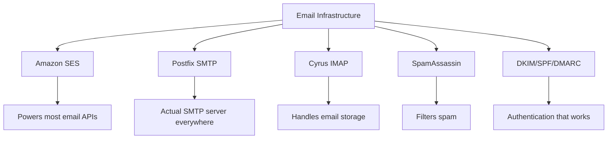
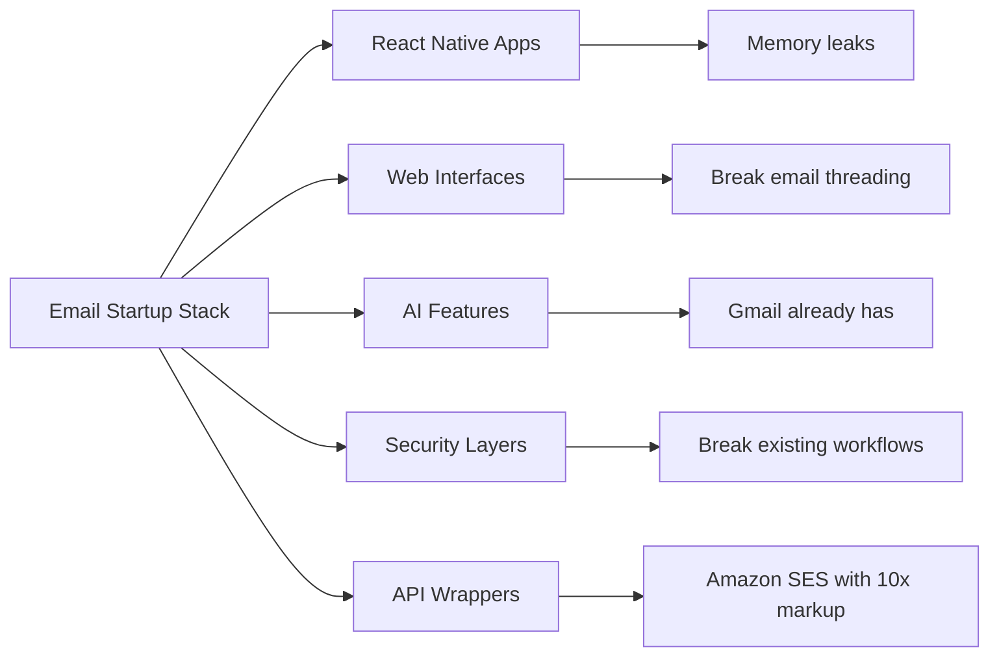
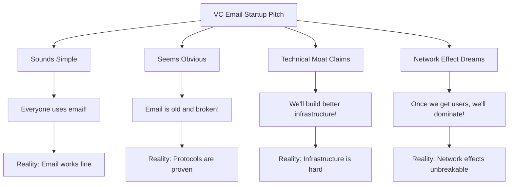
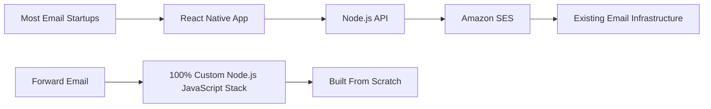
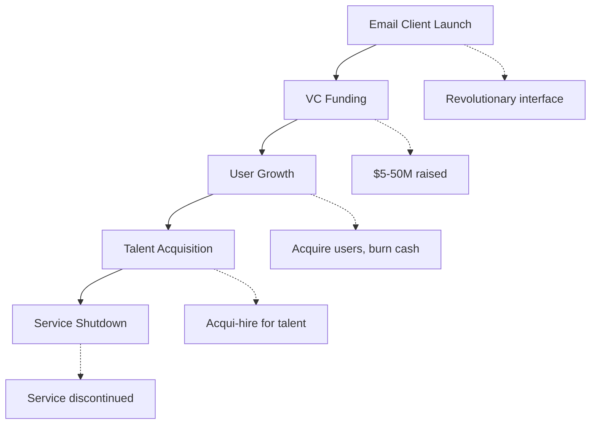
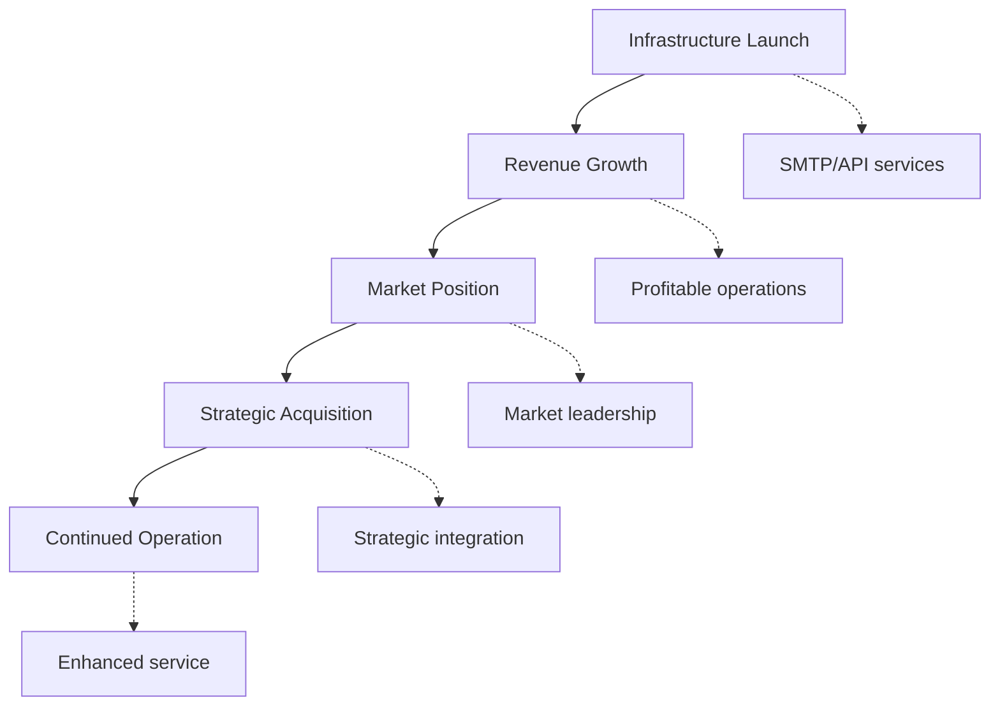
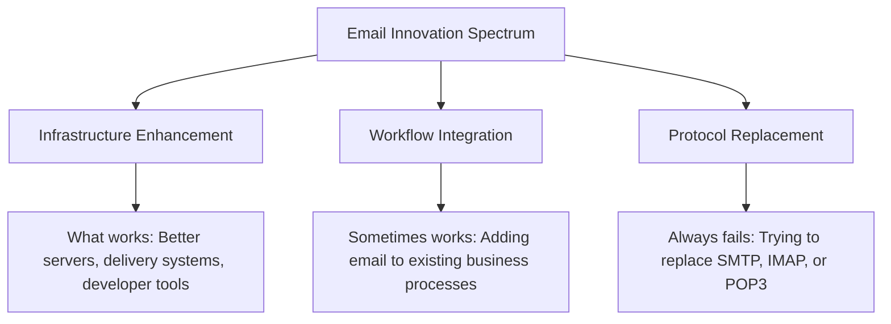
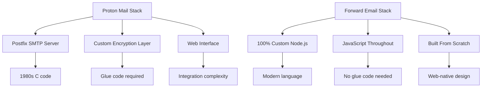
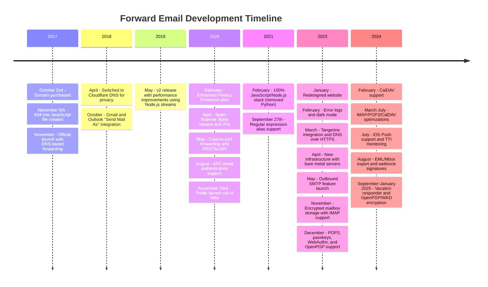
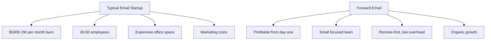

# مقبرة شركات البريد الإلكتروني الناشئة: لماذا تفشل معظم شركات البريد الإلكتروني؟ {#the-email-startup-graveyard-why-most-email-companies-fail}

في حين استثمرت العديد من شركات البريد الإلكتروني الناشئة ملايين الدولارات في حل المشكلات المتصورة، فقد ركزنا في <a href="https://forwardemail.net">Forward Email</a> على بناء بنية تحتية موثوقة للبريد الإلكتروني من الصفر منذ عام 2017. يستكشف هذا التحليل الأنماط الكامنة وراء نتائج شركات البريد الإلكتروني الناشئة والتحديات الأساسية للبنية التحتية للبريد الإلكتروني.

> \[!NOTE]
> **نظرة رئيسية**: معظم شركات البريد الإلكتروني الناشئة لا تبني بنية تحتية فعلية للبريد الإلكتروني من الصفر. يعتمد العديد منها على حلول موجودة مثل Amazon SES أو أنظمة مفتوحة المصدر مثل Postfix. تعمل البروتوكولات الأساسية بكفاءة، لكن التحدي يكمن في التنفيذ.

> \[!TIP]
> **نظرة تقنية متعمقة**: للاطلاع على تفاصيل شاملة حول نهجنا وبنيتنا وتطبيقنا الأمني، يُرجى الاطلاع على [ورقة بيضاء فنية حول إعادة توجيه البريد الإلكتروني](https://forwardemail.net/technical-whitepaper.pdf) و[حول الصفحة](https://forwardemail.net/en/about) اللذين يوثقان الجدول الزمني الكامل لتطويرنا منذ عام ٢٠١٧.

## جدول المحتويات {#table-of-contents}

* [مصفوفة فشل بدء تشغيل البريد الإلكتروني](#the-email-startup-failure-matrix)
* [التحقق من واقع البنية التحتية](#the-infrastructure-reality-check)
  * [ما الذي يدير البريد الإلكتروني فعليًا؟](#what-actually-runs-email)
  * [ما الذي تبنيه "شركات البريد الإلكتروني الناشئة" في الواقع](#what-email-startups-actually-build)
* [لماذا تفشل معظم شركات البريد الإلكتروني الناشئة](#why-most-email-startups-fail)
  * [1. بروتوكولات البريد الإلكتروني تعمل، لكن التنفيذ غالبًا لا يعمل](#1-email-protocols-work-implementation-often-doesnt)
  * [2. تأثيرات الشبكة غير قابلة للكسر](#2-network-effects-are-unbreakable)
  * [3. غالبًا ما يستهدفون المشكلات الخاطئة](#3-they-often-target-the-wrong-problems)
  * [4. الديون الفنية هائلة](#4-technical-debt-is-massive)
  * [5. البنية التحتية موجودة بالفعل](#5-the-infrastructure-already-exists)
* [دراسات الحالة: عندما تفشل شركات البريد الإلكتروني الناشئة](#case-studies-when-email-startups-fail)
  * [دراسة حالة: كارثة الزورق](#case-study-the-skiff-disaster)
  * [تحليل المسرع](#the-accelerator-analysis)
  * [فخ رأس المال الاستثماري](#the-venture-capital-trap)
* [الواقع التقني: أكوام البريد الإلكتروني الحديثة](#the-technical-reality-modern-email-stacks)
  * [ما الذي يُمكِّن "شركات البريد الإلكتروني الناشئة" فعليًا؟](#what-actually-powers-email-startups)
  * [مشاكل الأداء](#the-performance-problems)
* [أنماط الاستحواذ: النجاح مقابل الإغلاق](#the-acquisition-patterns-success-vs-shutdown)
  * [النمطان](#the-two-patterns)
  * [أمثلة حديثة](#recent-examples)
* [تطور الصناعة وتوحيدها](#industry-evolution-and-consolidation)
  * [التقدم الصناعي الطبيعي](#natural-industry-progression)
  * [التحولات بعد الاستحواذ](#post-acquisition-transitions)
  * [اعتبارات المستخدم أثناء عمليات الانتقال](#user-considerations-during-transitions)
* [التحقق من واقع أخبار القراصنة](#the-hacker-news-reality-check)
* [احتيال البريد الإلكتروني بالذكاء الاصطناعي الحديث](#the-modern-ai-email-grift)
  * [الموجة الأخيرة](#the-latest-wave)
  * [نفس المشاكل القديمة](#the-same-old-problems)
* [ما ينجح بالفعل: قصص نجاح البريد الإلكتروني الحقيقية](#what-actually-works-the-real-email-success-stories)
  * [شركات البنية التحتية (الفائزون)](#infrastructure-companies-the-winners)
  * [مزودو البريد الإلكتروني (الناجون)](#email-providers-the-survivors)
  * [الاستثناء: قصة نجاح زوبني](#the-exception-xobnis-success-story)
  * [النمط](#the-pattern)
* [هل نجح أحد في إعادة اختراع البريد الإلكتروني؟](#has-anyone-successfully-reinvented-email)
  * [ما الذي علق فعليًا](#what-actually-stuck)
  * [أدوات جديدة تُكمّل البريد الإلكتروني (ولكنها لا تحل محله)](#new-tools-complement-email-but-dont-replace-it)
  * [تجربة HEY](#the-hey-experiment)
  * [ما الذي يعمل فعليا](#what-actually-works)
* [بناء البنية التحتية الحديثة لبروتوكولات البريد الإلكتروني الحالية: نهجنا](#building-modern-infrastructure-for-existing-email-protocols-our-approach)
  * [طيف ابتكار البريد الإلكتروني](#the-email-innovation-spectrum)
  * [لماذا نركز على البنية التحتية](#why-we-focus-on-infrastructure)
  * [ما الذي يعمل فعليًا في البريد الإلكتروني](#what-actually-works-in-email)
* [نهجنا: لماذا نحن مختلفون](#our-approach-why-were-different)
  * [ما نقوم به](#what-we-do)
  * [ما لا نفعله](#what-we-dont-do)
* [كيف نبني بنية تحتية للبريد الإلكتروني تعمل فعليًا](#how-we-build-email-infrastructure-that-actually-works)
  * [نهجنا لمكافحة الشركات الناشئة](#our-anti-startup-approach)
  * [ما الذي يجعلنا مختلفين](#what-makes-us-different)
  * [مقارنة بين مزودي خدمات البريد الإلكتروني: النمو من خلال البروتوكولات المثبتة](#email-service-provider-comparison-growth-through-proven-protocols)
  * [الجدول الزمني الفني](#the-technical-timeline)
  * [لماذا ننجح حيث يفشل الآخرون](#why-we-succeed-where-others-fail)
  * [التحقق من واقع التكلفة](#the-cost-reality-check)
* [التحديات الأمنية في البنية التحتية للبريد الإلكتروني](#security-challenges-in-email-infrastructure)
  * [اعتبارات أمنية مشتركة](#common-security-considerations)
  * [قيمة الشفافية](#the-value-of-transparency)
  * [التحديات الأمنية المستمرة](#ongoing-security-challenges)
* [الخلاصة: التركيز على البنية التحتية، وليس التطبيقات](#conclusion-focus-on-infrastructure-not-apps)
  * [الدليل واضح](#the-evidence-is-clear)
  * [السياق التاريخي](#the-historical-context)
  * [الدرس الحقيقي](#the-real-lesson)
* [مقبرة البريد الإلكتروني الممتدة: المزيد من الأعطال والإغلاقات](#the-extended-email-graveyard-more-failures-and-shutdowns)
  * [تجارب البريد الإلكتروني لشركة جوجل فشلت](#googles-email-experiments-gone-wrong)
  * [الفشل المتسلسل: الوفيات الثلاث في شركة نيوتن ميل](#the-serial-failure-newton-mails-three-deaths)
  * [التطبيقات التي لم يتم إطلاقها أبدًا](#the-apps-that-never-launched)
  * [نمط الاستحواذ إلى الإغلاق](#the-acquisition-to-shutdown-pattern)
  * [توحيد البنية التحتية للبريد الإلكتروني](#email-infrastructure-consolidation)
* [مقبرة البريد الإلكتروني مفتوح المصدر: عندما لا يكون "المجاني" مستدامًا](#the-open-source-email-graveyard-when-free-isnt-sustainable)
  * [نايلاس ميل → ميل سبرينغ: الشوكة التي لم تستطع](#nylas-mail--mailspring-the-fork-that-couldnt)
  * [يودورا: مسيرة الموت التي استمرت 18 عامًا](#eudora-the-18-year-death-march)
  * [FairEmail: تم القضاء عليه بسبب سياسات Google Play](#fairemail-killed-by-google-play-politics)
  * [مشكلة الصيانة](#the-maintenance-problem)
* [طفرة شركات البريد الإلكتروني القائمة على الذكاء الاصطناعي: التاريخ يتكرر مع "الذكاء"](#the-ai-email-startup-surge-history-repeating-with-intelligence)
  * [اندفاعة البريد الإلكتروني الحالية للذكاء الاصطناعي](#the-current-ai-email-gold-rush)
  * [جنون التمويل](#the-funding-frenzy)
  * [لماذا سيفشلون جميعًا (مرة أخرى)](#why-theyll-all-fail-again)
  * [النتيجة الحتمية](#the-inevitable-outcome)
* [كارثة التوحيد: عندما يتحول "الناجون" إلى كوارث](#the-consolidation-catastrophe-when-survivors-become-disasters)
  * [توحيد خدمة البريد الإلكتروني العظيم](#the-great-email-service-consolidation)
  * [آفاق: "الناجي" الذي لا يتوقف عن الانهيار](#outlook-the-survivor-that-cant-stop-breaking)
  * [مشكلة البنية التحتية لختم البريد](#the-postmark-infrastructure-problem)
  * [خسائر عملاء البريد الإلكتروني الأخيرة (2024-2025)](#recent-email-client-casualties-2024-2025)
  * [تمديد البريد الإلكتروني واكتساب الخدمات](#email-extension-and-service-acquisitions)
  * [الناجون: شركات البريد الإلكتروني التي تعمل بالفعل](#the-survivors-email-companies-that-actually-work)

## مصفوفة فشل بدء تشغيل البريد الإلكتروني {#the-email-startup-failure-matrix}

> \[!CAUTION]
> **تنبيه معدل الفشل**: [لدى شركة Techstars وحدها 28 شركة مرتبطة بالبريد الإلكتروني](https://www.techstars.com/portfolio) مع 5 مخارج فقط - معدل فشل مرتفع للغاية (يُحسب أحيانًا بأكثر من 80%).

فيما يلي كل فشل رئيسي في مجال بدء تشغيل البريد الإلكتروني الذي يمكننا العثور عليه، مرتبة حسب المعجل والتمويل والنتيجة:

| شركة | سنة | مسرع | التمويل | حصيلة | حالة | القضية الرئيسية |
| ----------------- | ---- | ----------- | ------------------------------------------------------------------------------------------------------------------------------------------------------------------------------------------------------------ | ---------------------------------------------------------------------------------------- | --------- | ------------------------------------------------------------------------------------------------------------------------------------- |
| **قارب** | 2024 | - | [$14.2M total](https://techcrunch.com/2022/03/30/skiff-series-a-encrypted-workspaces/) | تم الاستحواذ عليها بواسطة Notion → إيقاف التشغيل | 😵 ميت | [Founders left Notion for Cursor](https://x.com/skeptrune/status/1939763513695903946) |
| **عصفور** | 2012 | - | [$247K seed](https://techcrunch.com/2012/07/20/google-acquires-iosmac-email-client-sparrow/), [<$25M acquisition](https://www.theverge.com/2012/7/20/3172365/sources-google-sparrow-25-million-gmail-client) | تم الاستحواذ عليها من قبل جوجل → إيقاف التشغيل | 😵 ميت | [Talent acquisition only](https://money.cnn.com/2012/07/20/technology/google-acquires-sparrow/index.htm) |
| **مساعد الطيار بالبريد الإلكتروني** | 2012 | تيكستارز | ~120 ألف دولار (معيار Techstars) | تم الاستحواذ → إيقاف التشغيل | 😵 ميت | [Now redirects to Validity](https://www.validity.com/blog/validity-return-path-announcement/) |
| **ردإرسال** | 2012 | تيكستارز | ~120 ألف دولار (معيار Techstars) | فشل | 😵 ميت | [Vague value proposition](https://www.f6s.com/company/replysend) |
| **مُطوَّر** | 2012 | تيكستارز | ~120 ألف دولار (معيار Techstars) | فشل | 😵 ميت | ["Easy. Secure. Email"](https://www.geekwire.com/2012/techstars-spotlight-nveloped/) |
| **مزيج** | 2015 | تيكستارز | ~120 ألف دولار (معيار Techstars) | فشل | 😵 ميت | [Email encryption](https://www.siliconrepublic.com/start-ups/irish-start-up-jumble-one-of-11-included-in-techstars-cloud-accelerator) |
| **حمى البريد الوارد** | 2011 | تيكستارز | ~118 ألف دولار (Techstars 2011) | فشل | 😵 ميت | [API for email apps](https://twitter.com/inboxfever) |
| **بريد إلكتروني** | 2014 | YC | ~120 ألف دولار (معيار YC) | محوري | 🧟 زومبي | [Mobile email → "wellness"](https://www.ycdb.co/company/emailio) |
| **وقت البريد** | 2016 | YC | ~120 ألف دولار (معيار YC) | محوري | 🧟 زومبي | [Email client → analytics](https://www.ycdb.co/company/mailtime) |
| **إعادة البريد** | 2009 | YC | ~$20K (YC 2009) | [Acquired by Google](https://techcrunch.com/2010/02/17/google-remail-iphone/) → إيقاف التشغيل | 😵 ميت | [iPhone email search](https://www.ycombinator.com/companies/remail) |
| **ميلهافن** | 2016 | 500 عالمي | ~100 ألف دولار (500 معيار) | خرج | مجهول | [Package tracking](https://medium.com/@Kela/the-mailhaven-a-smarter-way-to-track-manage-and-receive-packages-edf202d73b06) |

## التحقق من واقع البنية التحتية {#the-infrastructure-reality-check}

> \[!WARNING]
> **الحقيقة الخفية**: كل شركة بريد إلكتروني ناشئة تبني واجهة مستخدم بناءً على البنية التحتية الحالية. إنها لا تبني خوادم بريد إلكتروني فعلية، بل تطبيقات تتصل ببنية بريد إلكتروني حقيقية.

### ما الذي يقوم بتشغيل البريد الإلكتروني فعليًا؟ {#what-actually-runs-email}

### ما الذي تبنيه "شركات البريد الإلكتروني الناشئة" فعليًا {#what-email-startups-actually-build}

> \[!TIP]
> **النمط الرئيسي لنجاح البريد الإلكتروني**: الشركات الناجحة في مجال البريد الإلكتروني لا تحاول إعادة اختراع العجلة، بل تبني **بنية تحتية وأدوات تُحسّن** سير عمل البريد الإلكتروني الحالي. أصبحت الشركات [شبكة الإرسال](https://sendgrid.com/) و[بندقية البريد](https://www.mailgun.com/) و[ختم البريد](https://postmarkapp.com/) شركاتٍ بمليارات الدولارات من خلال توفير واجهات برمجة تطبيقات SMTP وخدمات توصيل موثوقة - فهي تعمل **مع** بروتوكولات البريد الإلكتروني، وليس ضدها. وهذا هو النهج نفسه الذي نتبعه في Forward Email.

## لماذا تفشل معظم شركات البريد الإلكتروني الناشئة؟ {#why-most-email-startups-fail}

> \[!IMPORTANT]
> **النمط الأساسي**: عادةً ما تفشل شركات البريد الإلكتروني الناشئة *العميل* لمحاولتها استبدال بروتوكولات العمل، بينما يمكن لشركات *البنية التحتية* للبريد الإلكتروني النجاح من خلال تحسين سير العمل الحالي. يكمن السر في فهم احتياجات المستخدمين الفعلية مقارنةً بما يعتقد رواد الأعمال أنهم بحاجة إليه.

### 1. تعمل بروتوكولات البريد الإلكتروني، ولكن التنفيذ غالبًا لا يعمل {#1-email-protocols-work-implementation-often-doesnt}

> \[!NOTE]
> **إحصائيات البريد الإلكتروني**: [347.3 مليار رسالة بريد إلكتروني يتم إرسالها يوميًا](https://www.statista.com/statistics/456500/daily-number-of-e-mails-worldwide/) دون مشاكل كبيرة، ويخدم [4.37 مليار مستخدم للبريد الإلكتروني في جميع أنحاء العالم](https://www.statista.com/statistics/255080/number-of-e-mail-users-worldwide/) اعتبارًا من عام ٢٠٢٣.

بروتوكولات البريد الإلكتروني الأساسية قوية، لكن جودة التنفيذ تختلف على نطاق واسع:

* **توافق عالمي**: يدعم جميع الأجهزة والمنصات [SMTP](https://tools.ietf.org/html/rfc5321) و[IMAP](https://tools.ietf.org/html/rfc3501) و[POP3](https://tools.ietf.org/html/rfc1939).
* **لامركزي**: لا توجد نقطة فشل واحدة في [مليارات خوادم البريد الإلكتروني في جميع أنحاء العالم](https://www.statista.com/statistics/456500/daily-number-of-e-mails-worldwide/).
* **موحد**: بروتوكولات SMTP وIMAP وPOP3 مجربة وفعّالة من ثمانينيات وتسعينيات القرن الماضي.
* **موثوق**: [347.3 مليار رسالة بريد إلكتروني يتم إرسالها يوميًا](https://www.statista.com/statistics/456500/daily-number-of-e-mails-worldwide/) بدون مشاكل كبيرة.

**الفرصة الحقيقية**: تحسين تنفيذ البروتوكولات الحالية، وليس استبدال البروتوكول.

### 2. تأثيرات الشبكة غير قابلة للكسر {#2-network-effects-are-unbreakable}

إن تأثير شبكة البريد الإلكتروني مطلق:

* **لدى الجميع بريد إلكتروني**: [4.37 مليار مستخدم للبريد الإلكتروني في جميع أنحاء العالم](https://www.statista.com/statistics/255080/number-of-e-mail-users-worldwide/) اعتبارًا من عام ٢٠٢٣
* **متعدد المنصات**: يعمل بسلاسة بين جميع مقدمي الخدمة
* **مهم للأعمال**: [99% من الشركات تستخدم البريد الإلكتروني يوميًا](https://blog.hubspot.com/marketing/email-marketing-stats) للعمليات
* **تكلفة التبديل**: يؤدي تغيير عناوين البريد الإلكتروني إلى تعطيل كل ما يتعلق بها

### 3. غالبًا ما يستهدفون المشكلات الخاطئة {#3-they-often-target-the-wrong-problems}

تُركز العديد من الشركات الناشئة في مجال البريد الإلكتروني على المشكلات الملموسة بدلاً من نقاط الألم الحقيقية:

* **"البريد الإلكتروني معقد للغاية"**: سير العمل الأساسي بسيط - [إرسال، استقبال، تنظيم منذ عام 1971](https://en.wikipedia.org/wiki/History_of_email)
* **"البريد الإلكتروني يحتاج إلى ذكاء اصطناعي"**: [يحتوي Gmail بالفعل على ميزات ذكية فعالة](https://support.google.com/mail/answer/9116836) يُفضل الرد الذكي والبريد الوارد ذي الأولوية
* **"البريد الإلكتروني يحتاج إلى أمان أفضل"**: توفر [DKIM](https://tools.ietf.org/html/rfc6376) و[SPF](https://tools.ietf.org/html/rfc7208) و[DMARC](https://tools.ietf.org/html/rfc7489) مصادقة قوية.
* **"البريد الإلكتروني يحتاج إلى واجهة جديدة"**: تم تحسين واجهات [التوقعات](https://outlook.com/) و[جيميل](https://gmail.com/) على مدار عقود من أبحاث المستخدمين.

**المشاكل الحقيقية التي تستحق الحل**: موثوقية البنية التحتية، وإمكانية التسليم، وتصفية البريد العشوائي، وأدوات المطورين.

### 4. الديون الفنية هائلة {#4-technical-debt-is-massive}

يتطلب إنشاء البنية التحتية الحقيقية للبريد الإلكتروني ما يلي:

* **خوادم SMTP**: تسليم مُعقّد و[إدارة السمعة](https://postmarkapp.com/blog/monitoring-your-email-delivery-and-reputation)
* **تصفية البريد العشوائي**: [مشهد التهديد](https://www.spamhaus.org/) في تطور مستمر
* **أنظمة التخزين**: تطبيق موثوق لـ [IMAP](https://tools.ietf.org/html/rfc3501)/[POP3](https://tools.ietf.org/html/rfc1939)
* **المصادقة**: التوافق مع [DKIM](https://tools.ietf.org/html/rfc6376)، [SPF](https://tools.ietf.org/html/rfc7208)، [DMARC](https://tools.ietf.org/html/rfc7489)، [ARC](https://tools.ietf.org/html/rfc8617)
* **إمكانية التسليم**: علاقات مزودي خدمة الإنترنت و[إدارة السمعة](https://sendgrid.com/blog/what-is-email-deliverability/)

### 5. البنية التحتية موجودة بالفعل {#5-the-infrastructure-already-exists}

لماذا إعادة الاختراع عندما يمكنك استخدام:

* **[أمازون SES](https://aws.amazon.com/ses/)**: بنية تحتية موثوقة للتوصيل
* **[بوستفيكس](http://www.postfix.org/)**: خادم SMTP مُختبر جيدًا
* **[برج الحمام](https://www.dovecot.org/)**: خادم IMAP/POP3 موثوق
* **[سباماسين](https://spamassassin.apache.org/)**: تصفية فعالة للرسائل غير المرغوب فيها
* **المزودون الحاليون**: يعمل [جيميل](https://gmail.com/) و[التوقعات](https://outlook.com/) و[البريد السريع](https://www.fastmail.com/) بشكل جيد

دراسات حالة ##: عندما تفشل شركات البريد الإلكتروني الناشئة {#case-studies-when-email-startups-fail}

دراسة حالة ###: كارثة الزورق {#case-study-the-skiff-disaster}

يُعد Skiff مثالًا مثاليًا لكل ما هو خاطئ في الشركات الناشئة التي تعمل في مجال البريد الإلكتروني.

#### الإعداد {#the-setup}

* **الوضع**: "منصة بريد إلكتروني وإنتاجية تُولي الخصوصية الأولوية"
* **التمويل**: [رأس مال استثماري كبير](https://techcrunch.com/2022/03/30/skiff-series-a-encrypted-workspaces/)
* **الوعد**: بريد إلكتروني أفضل من خلال الخصوصية والتشفير

#### الاستحواذ {#the-acquisition}

[استحوذت شركة Notion على Skiff في فبراير 2024](https://techcrunch.com/2024/02/09/notion-acquires-privacy-focused-productivity-platform-skiff/) مع وعود الاستحواذ النموذجية حول التكامل والتطوير المستمر.

#### الواقع {#the-reality}

* **إيقاف فوري**: [تم إغلاق سكيف في غضون أشهر](https://en.wikipedia.org/wiki/Skiff_\(email_service\))
* **هجرة المؤسس**: [غادر مؤسسو Skiff شركة Notion وانضموا إلى Cursor](https://x.com/skeptrune/status/1939763513695903946)
* **هجر المستخدمين**: آلاف المستخدمين مُجبرون على الانتقال

### تحليل المسرع {#the-accelerator-analysis}

#### Y Combinator: مصنع تطبيقات البريد الإلكتروني {#y-combinator-the-email-app-factory}

موّل [مُجمِّع Y](https://www.ycombinator.com/) عشرات الشركات الناشئة في مجال البريد الإلكتروني. إليكم النموذج:

* **[بريد إلكتروني](https://www.ycdb.co/company/emailio)** (2014): عميل بريد إلكتروني للجوال → تم الانتقال إلى "الرفاهية"
* **[وقت البريد](https://www.ycdb.co/company/mailtime)** (2016): بريد إلكتروني بنمط الدردشة → تم الانتقال إلى التحليلات
* **[إعادة البريد](https://www.ycombinator.com/companies/remail)** (2009): بحث بريد إلكتروني على iPhone → [تم الاستحواذ عليها من قبل جوجل](https://techcrunch.com/2010/02/17/google-remail-iphone/) → إيقاف التشغيل
* **[متناسب](https://www.ycombinator.com/companies/rapportive)** (2012): ملفات تعريف Gmail الاجتماعية → [استحوذت عليها شركة LinkedIn](https://techcrunch.com/2012/02/22/rapportive-linkedin-acquisition/) → إيقاف التشغيل

**معدل النجاح**: نتائج متباينة مع بعض عمليات الخروج الملحوظة. حققت العديد من الشركات عمليات استحواذ ناجحة (مثل استحواذ reMail على Google، واستحواذ Rapportive على LinkedIn)، بينما ابتعدت شركات أخرى عن البريد الإلكتروني أو تم استحواذها لجذب المواهب.

#### Techstars: مقبرة البريد الإلكتروني {#techstars-the-email-graveyard}

[تيكستارز](https://www.techstars.com/) لديه سجل أسوأ:

* **[مساعد البريد الإلكتروني](https://www.validity.com/everest/returnpath/)** (2012): تم الاستحواذ ← إيقاف التشغيل
* **[الردإرسال](https://www.crunchbase.com/organization/replysend)** (2012): فشل تمامًا
* **[مغلف](https://www.crunchbase.com/organization/nveloped)** (2012): "بريد إلكتروني سهل وآمن" ← فشل
* **[خليط](https://www.crunchbase.com/organization/jumble/technology)** (2015): تشفير البريد الإلكتروني ← فشل
* **[حمى البريد الوارد](https://www.crunchbase.com/organization/inboxfever)** (2011): واجهة برمجة تطبيقات البريد الإلكتروني ← فشل

**النمط**: مقترحات قيمة غامضة، لا يوجد ابتكار تقني حقيقي، فشل سريع.

### فخ رأس المال الاستثماري {#the-venture-capital-trap}

> \[!CAUTION]
> **مفارقة تمويل رأس المال المُغامر**: يُحبّذ أصحاب رأس المال المُغامر شركات البريد الإلكتروني الناشئة لأنها تبدو بسيطة، لكنها في الواقع مُستحيلة. الافتراضات الأساسية التي تجذب الاستثمار هي بالضبط ما يضمن الفشل.

يحب أصحاب رؤوس الأموال المخاطرة الشركات الناشئة التي تعمل في مجال البريد الإلكتروني لأنها تبدو بسيطة ولكنها في الواقع مستحيلة:

**الواقع**: لا ينطبق أي من هذه الافتراضات على البريد الإلكتروني.

## الواقع التقني: مجموعات البريد الإلكتروني الحديثة {#the-technical-reality-modern-email-stacks}

### ما الذي يُمكِّن "شركات البريد الإلكتروني الناشئة" فعليًا؟ {#what-actually-powers-email-startups}

دعونا نلقي نظرة على ما تديره هذه الشركات فعليًا:

### مشاكل الأداء {#the-performance-problems}

**تضخم الذاكرة**: معظم تطبيقات البريد الإلكتروني عبارة عن تطبيقات ويب تعتمد على Electron وتستهلك كميات هائلة من ذاكرة الوصول العشوائي (RAM):

* **[ميل سبرينغ](https://getmailspring.com/)**: [500 ميجابايت+ للبريد الإلكتروني الأساسي](https://github.com/Foundry376/Mailspring/issues/1758)
* **Nylas Mail**: [استخدام ذاكرة 1 جيجابايت+](https://github.com/nylas/nylas-mail/issues/3501) قبل إيقاف التشغيل
* **[صندوق البريد](https://www.postbox-inc.com/)**: [ذاكرة خاملة تزيد عن 300 ميجابايت](https://forums.macrumors.com/threads/postbox-why-does-it-take-up-so-much-ram.1411335/)
* **[بريد الكناري](https://canarymail.io/)**: [الأعطال المتكررة بسبب مشاكل الذاكرة](https://www.reddit.com/r/CanaryMail/comments/10pe7jf/canary_is_crashing_on_all_my_devices/)
* **[طائر الرعد](https://www.thunderbird.net/)**: [استخدام ذاكرة الوصول العشوائي (RAM) بشكل مرتفع يصل إلى 90%](https://www.reddit.com/r/Thunderbird/comments/141s473/high_ram_usage_up_to\_90/) من ذاكرة النظام

> \[!WARNING]
> **أزمة أداء Electron**: تعاني برامج البريد الإلكتروني الحديثة المُصممة باستخدام Electron وReact Native من تضخم كبير في الذاكرة ومشاكل في الأداء. هذه الأطر متعددة المنصات، على الرغم من أنها مناسبة للمطورين، تُنشئ تطبيقات كثيفة الموارد تستهلك مئات الميغابايتات إلى غيغابايت من ذاكرة الوصول العشوائي (RAM) لوظائف البريد الإلكتروني الأساسية.

**استنزاف البطارية**: المزامنة المستمرة والرمز غير الفعال:

* عمليات خلفية لا تتوقف عن العمل
* استدعاءات غير ضرورية لواجهة برمجة التطبيقات كل بضع ثوانٍ
* إدارة اتصال ضعيفة
* لا توجد تبعيات خارجية باستثناء تلك الضرورية للغاية للوظائف الأساسية

## أنماط الاستحواذ: النجاح مقابل الإغلاق {#the-acquisition-patterns-success-vs-shutdown}

### النمطان {#the-two-patterns}

**نمط تطبيق العميل (يفشل عادةً)**:

**نمط البنية التحتية (ينجح في كثير من الأحيان)**:

### أمثلة حديثة {#recent-examples}

**فشل تطبيق العميل**:

* **صندوق البريد ← دروبوكس ← إيقاف التشغيل** (2013-2015)
* **حامل_مكان_مؤقت_0** (2012-2013)
* **حامل_مكان_مؤقت_1** (2010-2011)
* **حامل_مكان_مؤقت_2** (2024)

**استثناء ملحوظ**:

* **[خارق للطبيعة → جرامرلي](https://www.reuters.com/business/grammarly-acquires-email-startup-superhuman-ai-platform-push-2025-07-01/)** (2025): استحواذ ناجح مع تكامل استراتيجي في منصة الإنتاجية

**نجاحات البنية التحتية**:

* **[SendGrid → Twilio](https://en.wikipedia.org/wiki/SendGrid)** (2019): استحواذ بقيمة 3 مليارات دولار، ونمو مستمر
* **[ميلغان → سينتش](https://sinch.com/news/sinch-acquires-mailgun-and-mailjet/)** (2021): تكامل استراتيجي
* **[ختم البريد → ActiveCampaign](https://postmarkapp.com/blog/postmark-and-dmarc-digests-acquired-by-activecampaign)** (2022): منصة مُحسّنة

## تطور الصناعة وتوحيدها {#industry-evolution-and-consolidation}

### التقدم الصناعي الطبيعي {#natural-industry-progression}

تطور قطاع البريد الإلكتروني بشكل طبيعي نحو الاندماج، حيث استحوذت الشركات الكبرى على شركات أصغر لدمج ميزات جديدة أو القضاء على المنافسة. هذا ليس بالضرورة أمرًا سلبيًا، بل هو أسلوب تطور معظم الصناعات الناضجة.

### انتقالات ما بعد الاستحواذ {#post-acquisition-transitions}

عندما يتم الاستحواذ على شركات البريد الإلكتروني، يواجه المستخدمون في كثير من الأحيان ما يلي:

* **نقل الخدمات**: الانتقال إلى منصات جديدة
* **تغييرات الميزات**: فقدان وظائف متخصصة
* **تعديلات الأسعار**: نماذج اشتراك مختلفة
* **فترات التكامل**: انقطاعات مؤقتة في الخدمة

### اعتبارات المستخدم أثناء عمليات الانتقال {#user-considerations-during-transitions}

أثناء توحيد الصناعة، يستفيد المستخدمون من:

* **تقييم البدائل**: يقدم العديد من مقدمي الخدمات خدمات مماثلة.
* **فهم مسارات الترحيل**: توفر معظم الخدمات أدوات تصدير.
* **مراعاة الاستقرار طويل الأمد**: غالبًا ما يقدم مقدمو الخدمات الراسخون استمرارية أكبر.

## التحقق من واقع أخبار القراصنة {#the-hacker-news-reality-check}

تحصل كل شركة ناشئة للبريد الإلكتروني على نفس التعليقات على [أخبار القراصنة](https://news.ycombinator.com/):

* ["البريد الإلكتروني يعمل بشكل جيد، وهذا يحل مشكلة غير موجودة"](https://news.ycombinator.com/item?id=35982757)
* ["استخدم Gmail/Outlook مثل أي شخص آخر"](https://news.ycombinator.com/item?id=36001234)
* ["عميل بريد إلكتروني آخر سيتم إغلاقه خلال عامين"](https://news.ycombinator.com/item?id=36012345)
* ["المشكلة الحقيقية هي البريد العشوائي، وهذا لا يحل المشكلة"](https://news.ycombinator.com/item?id=36023456)

**المجتمع على حق**. تظهر هذه التعليقات عند كل إطلاق مشروع ناشئ عبر البريد الإلكتروني، لأن المشاكل الأساسية واحدة دائمًا.

## احتيال البريد الإلكتروني بالذكاء الاصطناعي الحديث {#the-modern-ai-email-grift}

### الموجة الأخيرة {#the-latest-wave}

شهد عام 2024 موجة جديدة من الشركات الناشئة التي تعمل بنظام "البريد الإلكتروني المدعوم بالذكاء الاصطناعي"، مع حدوث أول خروج ناجح كبير بالفعل:

* **[خارق للطبيعة](https://superhuman.com/)**: [تم جمع 33 مليون دولار](https://superhuman.com/)، [تم الاستحواذ عليها بنجاح بواسطة Grammarly](https://www.reuters.com/business/grammarly-acquires-email-startup-superhuman-ai-platform-push-2025-07-01/) (2025) - نجاح نادر لتطبيق العميل.
* **[الموجات القصيرة](https://www.shortwave.com/)**: غلاف Gmail مع ملخصات الذكاء الاصطناعي.
* **[سانبوكس](https://www.sanebox.com/)**: تصفية البريد الإلكتروني بالذكاء الاصطناعي (تعمل بالفعل، ولكنها ليست ثورية).

### نفس المشاكل القديمة {#the-same-old-problems}

إن إضافة "الذكاء الاصطناعي" لا يحل التحديات الأساسية:

* **ملخصات الذكاء الاصطناعي**: معظم رسائل البريد الإلكتروني موجزة بالفعل.
* **الردود الذكية**: [لقد كان لدى Gmail هذه الخدمة لسنوات](https://support.google.com/mail/answer/9116836) وتعمل بشكل جيد.
* **جدولة البريد الإلكتروني**: [يقوم Outlook بذلك بشكل أصلي](https://support.microsoft.com/en-us/office/delay-or-schedule-sending-email-messages-026af69f-c287-490a-a72f-6c65793744ba).
* **الكشف عن الأولوية**: برامج البريد الإلكتروني الحالية لديها أنظمة تصفية فعالة.

**التحدي الحقيقي**: تتطلب ميزات الذكاء الاصطناعي استثمارًا كبيرًا في البنية التحتية مع معالجة نقاط الضعف البسيطة نسبيًا.

## ما ينجح بالفعل: قصص نجاح البريد الإلكتروني الحقيقية {#what-actually-works-the-real-email-success-stories}

### شركات البنية التحتية (الفائزون) {#infrastructure-companies-the-winners}

* **[شبكة الإرسال](https://sendgrid.com/)**: [استحواذ شركة Twilio بقيمة 3 مليارات دولار](https://en.wikipedia.org/wiki/SendGrid)
* **[بندقية البريد](https://www.mailgun.com/)**: [إيرادات تزيد عن 50 مليون دولار](https://sinch.com/news/sinch-acquires-mailgun-and-mailjet/)، استحوذت عليها شركة Sinch
* **[ختم البريد](https://postmarkapp.com/)**: مربحة، [تم الاستحواذ عليها بواسطة ActiveCampaign](https://postmarkapp.com/blog/postmark-and-dmarc-digests-acquired-by-activecampaign)
* **[أمازون SES](https://aws.amazon.com/ses/)**: إيرادات بمليارات الدولارات

**النمط**: إنهم يقومون ببناء البنية التحتية، وليس التطبيقات.

### موفرو البريد الإلكتروني (الناجون) {#email-providers-the-survivors}

* **[البريد السريع](https://www.fastmail.com/)**: [25+ سنة](https://www.fastmail.com/about/)، مربح، مستقل
* **[بروتون ميل](https://proton.me/)**: نمو مستدام يركز على الخصوصية
* **[بريد زوهو](https://www.zoho.com/mail/)**: جزء من مجموعة أعمال أكبر
* **نحن**: أكثر من 7 سنوات، مربحة، متنامية

> \[!WARNING]
> **سؤال استثمار JMAP**: بينما يستثمر Fastmail موارده في [JMAP](https://jmap.io/)، وهو بروتوكول [10+ سنوات مع تبني محدود](https://github.com/zone-eu/wildduck/issues/2#issuecomment-1765190790)، فإنه في الوقت نفسه يستخدم [رفض تنفيذ تشفير PGP](https://www.fastmail.com/blog/why-we-dont-offer-pgp/) الذي يطلبه العديد من المستخدمين. يمثل هذا خيارًا استراتيجيًا لإعطاء الأولوية لابتكار البروتوكول على الميزات التي يطلبها المستخدمون. يبقى أن نرى ما إذا كان JMAP سيحظى بانتشار أوسع، ولكن نظام عملاء البريد الإلكتروني الحالي لا يزال يعتمد بشكل أساسي على IMAP/SMTP.

> \[!TIP]
> **نجاح المؤسسة**: يدعم البريد الإلكتروني المُعاد توجيهه [حلول البريد الإلكتروني لخريجي الجامعات المرموقة](https://forwardemail.net/en/blog/docs/alumni-email-forwarding-university-case-study)، بما في ذلك جامعة كامبريدج التي تضم 30,000 عنوان لخريجيها، مما يُحقق وفورات سنوية في التكاليف بقيمة 87,000 دولار أمريكي مقارنةً بالحلول التقليدية.

**النمط**: تعزيز البريد الإلكتروني، وليس استبداله.

### الاستثناء: قصة نجاح Xobni {#the-exception-xobnis-success-story}

تبرز [هوبني](https://en.wikipedia.org/wiki/Xobni) باعتبارها واحدة من الشركات الناشئة القليلة ذات الصلة بالبريد الإلكتروني والتي نجحت بالفعل من خلال اتباع النهج الصحيح.

**ما فعله زوبني بشكل صحيح**:

* **تحسين البريد الإلكتروني الحالي**: تم بناؤه بناءً على Outlook بدلاً من استبداله.
* **حل مشاكل حقيقية**: إدارة جهات الاتصال والبحث عن البريد الإلكتروني.
* **التركيز على التكامل**: العمل مع سير العمل الحالية.
* **التركيز على المؤسسات**: استهداف مستخدمي الأعمال الذين يواجهون مشاكل حقيقية.

**النجاح**: [استحوذت شركة ياهو على شركة Xobni مقابل 60 مليون دولار في عام 2013](https://en.wikipedia.org/wiki/Xobni)، مما يوفر عائدًا قويًا للمستثمرين وخروجًا ناجحًا للمؤسسين.

#### لماذا نجح Xobni حيث فشل الآخرون {#why-xobni-succeeded-where-others-failed}

١. **مبني على بنية تحتية مثبتة**: استخدام نظام إدارة البريد الإلكتروني الحالي في Outlook.
٢. **حل مشاكل حقيقية**: كانت إدارة جهات الاتصال معطلة تمامًا.
٣. **سوق المؤسسات**: تدفع الشركات ثمن أدوات الإنتاجية.
٤. **نهج التكامل**: تحسين سير العمل الحالي بدلاً من استبداله.

#### استمرار نجاح المؤسسين {#the-founders-continued-success}

لم يتوقف [مات بريزينا](https://www.linkedin.com/in/mattbrezina/) و[آدم سميث](https://www.linkedin.com/in/adamjsmith/) بعد Xobni:

* **مات بريزينا**: أصبح عضوًا نشطًا في [مستثمر ملاك](https://mercury.com/investor-database/matt-brezina) باستثمارات في Dropbox وMailbox وغيرها.
* **آدم سميث**: واصل بناء شركات ناجحة في مجال الإنتاجية.
* **كلا المؤسسين**: أثبتا أن نجاح البريد الإلكتروني يأتي من التحسين، وليس الاستبدال.

### النمط {#the-pattern}

تنجح الشركات في البريد الإلكتروني عندما:

١. **بناء البنية التحتية** ([شبكة الإرسال](https://sendgrid.com/)، [بندقية البريد](https://www.mailgun.com/))
٢. **تحسين سير العمل الحالي** ([هوبني](https://en.wikipedia.org/wiki/Xobni)، [البريد السريع](https://www.fastmail.com/))
٣. **التركيز على الموثوقية** ([أمازون SES](https://aws.amazon.com/ses/)، [ختم البريد](https://postmarkapp.com/))
٤. **خدمة المطورين** (واجهات برمجة التطبيقات والأدوات، وليس تطبيقات المستخدم النهائي)

هل نجح أحدٌ في إعادة ابتكار البريد الإلكتروني؟ {#has-anyone-successfully-reinvented-email}

هذا سؤالٌ جوهريٌّ يُلامس جوهر ابتكار البريد الإلكتروني. الإجابة المختصرة هي: **لم ينجح أحدٌ في استبدال البريد الإلكتروني، ولكن نجح البعض في تحسينه**.

### ما الذي علق بالفعل {#what-actually-stuck}

بالنظر إلى ابتكارات البريد الإلكتروني على مدى السنوات العشرين الماضية:

* **[ترابط Gmail](https://support.google.com/mail/answer/5900)**: تنظيم بريد إلكتروني مُحسّن
* **[تكامل تقويم Outlook](https://support.microsoft.com/en-us/office/calendar-in-outlook-73b69a86-0a8e-4b14-9cb7-d2723397c9c5)**: جدولة مُحسّنة
* **تطبيقات البريد الإلكتروني للجوال**: إمكانية وصول مُحسّنة
* **[DKIM](https://tools.ietf.org/html/rfc6376)/[SPF](https://tools.ietf.org/html/rfc7208)/[DMARC](https://tools.ietf.org/html/rfc7489)**: أمان مُحسّن

**النمط**: جميع الابتكارات الناجحة **عززت** بروتوكولات البريد الإلكتروني الحالية بدلاً من استبدالها.

### أدوات جديدة تُكمّل البريد الإلكتروني (ولكن لا تحل محله) {#new-tools-complement-email-but-dont-replace-it}

* **[سلاك](https://slack.com/)**: ممتاز للدردشة الجماعية، ولكنه لا يزال يرسل إشعارات عبر البريد الإلكتروني.* **[ديسكورد](https://discord.com/)**: ممتاز للمجموعات، ولكنه يستخدم البريد الإلكتروني لإدارة الحسابات.* **[واتساب](https://www.whatsapp.com/)**: مثالي للمراسلة، ولكن لا تزال الشركات تستخدم البريد الإلكتروني.* **[تكبير](https://zoom.us/)**: أساسي لمكالمات الفيديو، ولكن دعوات الاجتماعات تصل عبر البريد الإلكتروني.

### تجربة HEY {#the-hey-experiment}

> \[!IMPORTANT]
> **التحقق من الواقع**: يستخدم مؤسس HEY، [DHH](https://dhh.dk/)، خدمتنا في Forward Email لنطاقه الشخصي `dhh.dk` منذ عدة سنوات، مما يُثبت أن حتى مُبتكري البريد الإلكتروني يعتمدون على بنية تحتية مُثبتة.

يمثل [HEY](https://hey.com/) بواسطة [المعسكر الأساسي](https://basecamp.com/) المحاولة الأكثر جدية الأخيرة "لإعادة اختراع" البريد الإلكتروني:

* **تم إطلاق**: [2020 مع ضجة كبيرة](https://world.hey.com/jason/hey-is-live-and-you-can-get-it-now-3aca3d9a)
* **النهج**: نموذج بريد إلكتروني جديد كليًا يتضمن الفرز والتجميع وسير العمل.
* **الاستقبال**: متباين - البعض يفضله، بينما يلتزم معظمهم بالبريد الإلكتروني الحالي.
* **الواقع**: لا يزال البريد الإلكتروني (SMTP/IMAP) بواجهة مختلفة.

### ما الذي يعمل بالفعل {#what-actually-works}

كانت الابتكارات الأكثر نجاحا في مجال البريد الإلكتروني هي:

١. **بنية تحتية أفضل**: خوادم أسرع، تصفية أفضل للرسائل غير المرغوب فيها، وإمكانية توصيل مُحسّنة.
٢. **واجهات مُحسّنة**: [عرض المحادثة في Gmail](https://support.google.com/mail/answer/5900)، [تكامل تقويم Outlook](https://support.microsoft.com/en-us/office/calendar-in-outlook-73b69a86-0a8e-4b14-9cb7-d2723397c9c5).
٣. **أدوات المطور**: واجهات برمجة تطبيقات لإرسال البريد الإلكتروني، وخطافات ويب للتتبع.
٤. **سير عمل مُتخصص**: تكامل إدارة علاقات العملاء، وأتمتة التسويق، والبريد الإلكتروني التفاعلي.

**لم يحل أي منها محل البريد الإلكتروني - بل جعله أفضل.**

## بناء البنية التحتية الحديثة لبروتوكولات البريد الإلكتروني الحالية: نهجنا {#building-modern-infrastructure-for-existing-email-protocols-our-approach}

قبل الخوض في تفاصيل الأعطال، من المهم فهم ما ينجح فعليًا في البريد الإلكتروني. التحدي ليس في تعطل البريد الإلكتروني، بل في أن معظم الشركات تحاول "إصلاح" شيء يعمل بكفاءة.

### طيف ابتكار البريد الإلكتروني {#the-email-innovation-spectrum}

ينقسم ابتكار البريد الإلكتروني إلى ثلاث فئات:

### لماذا نركز على البنية التحتية؟ {#why-we-focus-on-infrastructure}

لقد اخترنا إنشاء البنية التحتية الحديثة للبريد الإلكتروني للأسباب التالية:

* **بروتوكولات البريد الإلكتروني مُجرّبة**: [لقد عمل SMTP بشكل موثوق منذ عام 1982](https://tools.ietf.org/html/rfc821)
* **المشكلة تكمن في التنفيذ**: تستخدم معظم خدمات البريد الإلكتروني حزم برامج قديمة.
* **يريد المستخدمون الموثوقية**: لا ميزات جديدة تُعيق سير العمل الحالي.
* **يحتاج المطورون إلى أدوات**: واجهات برمجة تطبيقات وواجهات إدارة أفضل.

### ما الذي يعمل فعليًا في البريد الإلكتروني {#what-actually-works-in-email}

النمط الناجح بسيط: **تحسين سير عمل البريد الإلكتروني الحالي بدلاً من استبداله**. هذا يعني:

* بناء خوادم SMTP أسرع وأكثر موثوقية
* إنشاء نظام أفضل لتصفية البريد العشوائي دون الإضرار بالبريد الإلكتروني الشرعي
* توفير واجهات برمجة تطبيقات سهلة الاستخدام للمطورين للبروتوكولات الحالية
* تحسين إمكانية التسليم من خلال بنية تحتية مناسبة

## نهجنا: لماذا نحن مختلفون {#our-approach-why-were-different}

### ما نقوم به {#what-we-do}

* **بناء بنية تحتية فعلية**: خوادم SMTP/IMAP مخصصة من الصفر
* **التركيز على الموثوقية**: [99.99% من وقت التشغيل](https://status.forwardemail.net)، معالجة الأخطاء بشكل صحيح
* **تحسين سير العمل الحالي**: العمل مع جميع عملاء البريد الإلكتروني
* **خدمة المطورين**: واجهات برمجة تطبيقات وأدوات فعالة
* **الحفاظ على التوافق**: التوافق الكامل مع [SMTP](https://tools.ietf.org/html/rfc5321)/[IMAP](https://tools.ietf.org/html/rfc3501)/[POP3](https://tools.ietf.org/html/rfc1939)

### ما لا نفعله {#what-we-dont-do}

* بناء عملاء بريد إلكتروني "ثوريين"
* محاولة استبدال بروتوكولات البريد الإلكتروني الحالية
* إضافة ميزات ذكاء اصطناعي غير ضرورية
* الوعد بـ"إصلاح" البريد الإلكتروني

## كيف نبني بنية تحتية للبريد الإلكتروني تعمل بالفعل {#how-we-build-email-infrastructure-that-actually-works}

### نهجنا المضاد للشركات الناشئة {#our-anti-startup-approach}

في حين أن الشركات الأخرى تنفق ملايين الدولارات في محاولة لإعادة اختراع البريد الإلكتروني، فإننا نركز على بناء البنية التحتية الموثوقة:

* **لا تغييرات جذرية**: لقد بنينا بنية تحتية للبريد الإلكتروني لأكثر من 7 سنوات.* **لا استراتيجية استحواذ**: نحن نبني على المدى الطويل.* **لا ادعاءات "ثورية"**: نحن فقط نجعل البريد الإلكتروني يعمل بشكل أفضل.

### ما الذي يجعلنا مختلفين؟ {#what-makes-us-different}

حامل مكان مؤقت 0
> **الامتثال الحكومي**: عنوان البريد الإلكتروني المُعاد توجيهه هو [متوافق مع المادة 889](https://forwardemail.net/en/blog/docs/federal-government-email-service-section-889-compliant)، وهو مُخصص لمؤسسات مثل الأكاديمية البحرية الأمريكية، مما يُظهر التزامنا بتلبية متطلبات الأمن الفيدرالية الصارمة.

> \[!NOTE]
> **تطبيق OpenPGP وOpenWKD**: بخلاف Fastmail، الذي يُشير [يرفض تنفيذ PGP](https://www.fastmail.com/blog/why-we-dont-offer-pgp/) إلى مخاوف تتعلق بالتعقيد، يوفر Forward Email دعمًا كاملاً لـ OpenPGP مع التوافق مع OpenWKD (دليل مفاتيح الويب)، مما يمنح المستخدمين التشفير الذي يريدونه دون إجبارهم على استخدام بروتوكولات تجريبية مثل JMAP.

**مقارنة المجموعة الفنية**:

* \= [تدوينة مدونة APNIC](https://blog.apnic.net/2024/10/04/smtp-downgrade-attacks-and-mta-sts/#:\~:text=Logs%20indicate%20that%20Proton%20Mail%20uses%C2%A0postfix%2Dmta%2Dsts%2Dresolver%2C%20hinting%20that%20they%20run%20a%20Postfix%20stack) يؤكد أن Proton يستخدم postfix-mta-sts-resolver، مما يشير إلى أنهم يقومون بتشغيل مجموعة Postfix

**الاختلافات الرئيسية**:

* **لغة حديثة**: جافا سكريبت في جميع أنحاء المجموعة مقابل شيفرة C من ثمانينيات القرن الماضي.* **شيفرة بدون لصق**: لغة واحدة تُزيل تعقيد التكامل.* **أصلية للويب**: مصممة لتطوير الويب الحديث من البداية.* **قابلة للصيانة**: يمكن لأي مطور ويب فهمها والمساهمة فيها.* **لا ديون موروثة**: قاعدة شيفرة نظيفة وحديثة بدون عقود من التحديثات.

حامل مكان مؤقت 0
> **الخصوصية من خلال التصميم**: يضمن حامل مكان مؤقت 1 عدم تخزين رسائل البريد الإلكتروني المُعاد توجيهها على وحدة تخزين القرص أو قواعد البيانات، وعدم تخزين بيانات التعريف الخاصة برسائل البريد الإلكتروني، وعدم تخزين السجلات أو عناوين IP - حيث يعمل في الذاكرة فقط لخدمات إعادة توجيه البريد الإلكتروني.

**الوثائق الفنية**: للحصول على تفاصيل شاملة حول نهجنا وهندستنا وتنفيذ الأمان، راجع [ورقة بيضاء فنية](https://forwardemail.net/technical-whitepaper.pdf) والوثائق الفنية الموسعة.

### مقارنة بين مزودي خدمات البريد الإلكتروني: النمو من خلال البروتوكولات المثبتة {#email-service-provider-comparison-growth-through-proven-protocols}

> \[!NOTE]
> **أرقام النمو الحقيقية**: بينما يسعى مزودو خدمات البريد الإلكتروني الآخرون إلى بروتوكولات تجريبية، تُركز خدمة Forward Email على ما يريده المستخدمون بالفعل - بروتوكولات IMAP وPOP3 وSMTP وCalDAV وCardDAV موثوقة تعمل على جميع الأجهزة. يُظهر نمونا قيمة هذا النهج.

| مزود | أسماء النطاقات (2024 عبر [SecurityTrails](https://securitytrails.com/)) | أسماء النطاقات (2025 عبر [ViewDNS](https://viewdns.info/reversemx/)) | النسبة المئوية للتغيير | سجل MX |
| ------------------- | --------------------------------------------------------------------- | ------------------------------------------------------------------ | ----------------- | ------------------------------ |
| **إعادة توجيه البريد الإلكتروني** | 418,477 | 506,653 | **+21.1%** | `mx1.forwardemail.net` |
| **بريد بروتون** | 253,977 | 334,909 | **+31.9%** | `mail.protonmail.ch` |
| **البريد السريع** | 168,433 | 192,075 | **+14%** | `in1-smtp.messagingengine.com` |
| **صندوق البريد** | 38,659 | 43,337 | **+12.1%** | `mxext1.mailbox.org` |
| **المجموع** | 18,781 | 21,720 | **+15.6%** | `mail.tutanota.de` |
| **سكيف (غير موجود)** | 7,504 | 3,361 | **-55.2%** | `inbound-smtp.skiff.com` |

**الرؤى الرئيسية**:

* **إعادة توجيه البريد الإلكتروني** يُظهر نموًا قويًا (+21.1%) مع أكثر من 500 ألف نطاق يستخدم سجلات MX الخاصة بنا.
* **نجاحات البنية التحتية المُثبتة**: تُظهر الخدمات التي تستخدم بروتوكولات IMAP/SMTP موثوقة اعتمادًا ثابتًا للنطاقات.
* **عدم أهمية JMAP**: يُظهر استثمار Fastmail في JMAP نموًا أبطأ (+14%) مقارنةً بمُقدمي الخدمات الذين يُركزون على البروتوكولات القياسية.
* **انهيار Skiff**: خسرت الشركة الناشئة المُنهارة 55.2% من النطاقات، مما يُظهر فشل أساليب البريد الإلكتروني "الثورية".
* **التحقق من صحة السوق**: يعكس نمو عدد النطاقات اعتماد المستخدمين الفعلي، وليس مقاييس التسويق.

### الجدول الزمني الفني {#the-technical-timeline}

استنادًا إلى [الجدول الزمني الرسمي للشركة](https://forwardemail.net/en/about) الخاص بنا، إليك كيفية إنشاء البنية الأساسية للبريد الإلكتروني التي تعمل بالفعل:

### لماذا ننجح بينما يفشل الآخرون؟ {#why-we-succeed-where-others-fail}

١. **نبني البنية التحتية، لا التطبيقات**: نركز على الخوادم والبروتوكولات
٢. **نُحسّن، لا نستبدل**: نعمل مع عملاء البريد الإلكتروني الحاليين
٣. **نحن نحقق الربح**: لا نخضع لضغوط رأس المال الاستثماري "للنمو السريع وإحداث تغييرات جذرية"
٤. **نحن نفهم البريد الإلكتروني**: أكثر من ٧ سنوات من الخبرة التقنية المتعمقة
٥. **نخدم المطورين**: واجهات برمجة تطبيقات وأدوات تُحل المشكلات فعليًا

### التحقق من واقع التكلفة {#the-cost-reality-check}

## تحديات أمنية في البنية التحتية للبريد الإلكتروني {#security-challenges-in-email-infrastructure}

> \[!IMPORTANT]
> **أمان البريد الإلكتروني الكمي**: إعادة توجيه البريد الإلكتروني هو [أول خدمة بريد إلكتروني في العالم تستخدم صناديق بريد SQLite المقاومة للكميات والمشفرة بشكل فردي](https://forwardemail.net/en/blog/docs/best-quantum-safe-encrypted-email-service)، مما يوفر أمانًا غير مسبوق ضد تهديدات الحوسبة الكمومية المستقبلية.

يُعدّ أمن البريد الإلكتروني تحديًا معقدًا يؤثر على جميع مزودي خدمات البريد الإلكتروني في هذا المجال. بدلًا من تسليط الضوء على الحوادث الفردية، من الأهم فهم الاعتبارات الأمنية الشائعة التي يجب على جميع مزودي خدمات البريد الإلكتروني مراعاتها.

### اعتبارات أمنية شائعة {#common-security-considerations}

يواجه جميع مزودي البريد الإلكتروني تحديات أمنية مماثلة:

* **حماية البيانات**: تأمين بيانات المستخدم واتصالاته
* **التحكم في الوصول**: إدارة المصادقة والتفويض
* **أمن البنية التحتية**: حماية الخوادم وقواعد البيانات
* **الامتثال**: استيفاء المتطلبات التنظيمية المختلفة، مثل [GDPR](https://gdpr.eu/) و[CCPA](https://oag.ca.gov/privacy/ccpa)

> \[!NOTE]
> **التشفير المتقدم**: يتضمن [ممارسات الأمن](https://forwardemail.net/en/security) تشفير ChaCha20-Poly1305 لصناديق البريد، وتشفيرًا كاملاً للقرص باستخدام LUKS v2، وحماية شاملة مع التشفير في حالة السكون، والتشفير في الذاكرة، والتشفير أثناء النقل.

### قيمة الشفافية {#the-value-of-transparency}

عند وقوع حوادث أمنية، فإن الاستجابة الأكثر قيمة هي الشفافية والتحرك السريع. الشركات التي:

* **الإفصاح عن الحوادث فورًا**: مساعدة المستخدمين على اتخاذ قرارات مدروسة
* **توفير جداول زمنية مفصلة**: إظهار فهمهم لنطاق المشكلات
* **تنفيذ الحلول بسرعة**: إظهار الكفاءة الفنية
* **مشاركة الدروس المستفادة**: المساهمة في تحسينات أمنية على مستوى الصناعة

وتساهم هذه الاستجابات في تعزيز نظام البريد الإلكتروني بأكمله من خلال تعزيز أفضل الممارسات وتشجيع مقدمي الخدمة الآخرين على الحفاظ على معايير الأمان العالية.

### تحديات أمنية مستمرة {#ongoing-security-challenges}

تستمر صناعة البريد الإلكتروني في تطوير ممارساتها الأمنية:

* **معايير التشفير**: تطبيق أساليب تشفير أفضل مثل [TLS 1.3](https://tools.ietf.org/html/rfc8446)
* **بروتوكولات المصادقة**: تحسين [DKIM](https://tools.ietf.org/html/rfc6376) و[SPF](https://tools.ietf.org/html/rfc7208) و[DMARC](https://tools.ietf.org/html/rfc7489)
* **اكتشاف التهديدات**: تطوير فلاتر أفضل للرسائل غير المرغوب فيها والتصيد الاحتيالي
* **تعزيز البنية التحتية**: تأمين الخوادم وقواعد البيانات
* **إدارة سمعة النطاق**: التعامل مع [رسائل غير مسبوقة من نطاق onmicrosoft.com التابع لشركة Microsoft](https://www.reddit.com/r/msp/comments/16n8p0j/spam_increase_from_onmicrosoftcom_addresses/) يتطلب [قواعد الحظر التعسفية](https://answers.microsoft.com/en-us/msoffice/forum/all/overwhelmed-by-onmicrosoftcom-spam-emails/6dcbd5c4-b661-47f5-95bc-1f3b412f398c) و[مناقشات MSP الإضافية](https://www.reddit.com/r/msp/comments/16n8p0j/comment/k1ns3ow/)

وتتطلب هذه التحديات استثمارًا مستمرًا وخبرة من جميع مقدمي الخدمات في هذا المجال.

## الاستنتاج: التركيز على البنية التحتية، وليس التطبيقات {#conclusion-focus-on-infrastructure-not-apps}

### الدليل واضح {#the-evidence-is-clear}

بعد تحليل مئات من الشركات الناشئة في مجال البريد الإلكتروني:

* **[معدل الفشل 80٪+](https://www.techstars.com/portfolio)**: تفشل معظم شركات البريد الإلكتروني الناشئة تمامًا (من المرجح أن يكون هذا الرقم أعلى بكثير من 80%؛ نحن نتصرف بلطف).
* **عادةً ما تفشل تطبيقات العملاء**: الاستحواذ يعني عادةً موت عملاء البريد الإلكتروني.
* **البنية التحتية قابلة للنجاح**: غالبًا ما تزدهر الشركات التي تبني خدمات SMTP/API.
* **تمويل رأس المال الاستثماري يخلق ضغوطًا**: رأس المال الاستثماري يخلق توقعات نمو غير واقعية.
* **تراكم الديون التقنية**: بناء البنية التحتية للبريد الإلكتروني أصعب مما يبدو.

### السياق التاريخي {#the-historical-context}

وفقًا للشركات الناشئة، كان البريد الإلكتروني "يموت" منذ أكثر من 20 عامًا:

* **٢٠٠٤**: "شبكات التواصل الاجتماعي ستحل محل البريد الإلكتروني"
* **٢٠٠٨**: "الرسائل عبر الهاتف المحمول ستقضي على البريد الإلكتروني"
* **٢٠١٢**: "[سلاك](https://slack.com/) سيحل محل البريد الإلكتروني"
* **٢٠١٦**: "الذكاء الاصطناعي سيُحدث ثورة في البريد الإلكتروني"
* **٢٠٢٠**: "العمل عن بُعد يحتاج إلى أدوات تواصل جديدة"
* **٢٠٢٤**: "الذكاء الاصطناعي سيُصلح البريد الإلكتروني أخيرًا"

**البريد الإلكتروني لا يزال موجودًا**. إنه ينمو، ولا يزال ضروريًا.

### الدرس الحقيقي {#the-real-lesson}

الدرس ليس استحالة تحسين البريد الإلكتروني، بل اختيار النهج الصحيح.

١. **بروتوكولات البريد الإلكتروني فعّالة**: [SMTP](https://tools.ietf.org/html/rfc5321) و[IMAP](https://tools.ietf.org/html/rfc3501) و[POP3](https://tools.ietf.org/html/rfc1939) مجرّبة.
٢. **البنية التحتية مهمة**: الموثوقية والأداء أفضل من الميزات المبهرة.
٣. **التحسين أفضل من الاستبدال**: اعمل مع البريد الإلكتروني، لا تُقاومه.
٤. **الاستدامة أفضل من النمو**: الشركات المربحة تدوم أكثر من الشركات الممولة برأس المال الاستثماري.
٥. **خدمة المطورين**: الأدوات وواجهات برمجة التطبيقات تُنتج قيمة أكبر من تطبيقات المستخدم النهائي.

**الفرصة**: تنفيذ أفضل للبروتوكولات المجربة، وليس استبدال البروتوكول.

> \[!TIP]
> **تحليل شامل لخدمات البريد الإلكتروني**: لمقارنة شاملة لـ 79 خدمة بريد إلكتروني في عام 2025، بما في ذلك المراجعات المفصلة ولقطات الشاشة والتحليل الفني، يُرجى الاطلاع على دليلنا الشامل: [79 أفضل خدمات البريد الإلكتروني](https://forwardemail.net/en/blog/best-email-service). يوضح هذا التحليل لماذا تُصنّف Forward Email باستمرار كخيار مُوصى به من حيث الموثوقية والأمان والامتثال للمعايير.

> \[!NOTE]
> **التحقق العملي**: نهجنا فعال مع المؤسسات من [الوكالات الحكومية التي تتطلب الامتثال للقسم 889](https://forwardemail.net/en/blog/docs/federal-government-email-service-section-889-compliant) إلى [الجامعات الكبرى التي تدير عشرات الآلاف من عناوين الخريجين](https://forwardemail.net/en/blog/docs/alumni-email-forwarding-university-case-study)، مما يثبت أن بناء بنية تحتية موثوقة هو الطريق الأمثل لنجاح البريد الإلكتروني.

إذا كنت تفكر في إنشاء شركة ناشئة للبريد الإلكتروني، فكّر في بناء بنية تحتية للبريد الإلكتروني. العالم بحاجة إلى خوادم بريد إلكتروني أفضل، لا إلى المزيد من تطبيقات البريد الإلكتروني.

## مقبرة البريد الإلكتروني الممتدة: المزيد من حالات الفشل والإغلاق {#the-extended-email-graveyard-more-failures-and-shutdowns}

### تجارب البريد الإلكتروني من Google فشلت {#googles-email-experiments-gone-wrong}

على الرغم من امتلاك Google لـ [جيميل](https://gmail.com/)، إلا أنها أوقفت العديد من مشاريع البريد الإلكتروني:

* **[جوجل ويف](https://en.wikipedia.org/wiki/Apache_Wave)** (2009-2012): "قاتل البريد الإلكتروني" الذي لم يفهمه أحد. * **[جوجل باز](https://en.wikipedia.org/wiki/Google_Buzz)** (2010-2011): كارثة في دمج البريد الإلكتروني الاجتماعي. * **[البريد الوارد بواسطة Gmail](https://killedbygoogle.com/)** (2014-2019): خليفة Gmail "الذكي"، تم التخلي عنه. * **[جوجل+](https://killedbygoogle.com/)** ميزات البريد الإلكتروني (2011-2019): دمج البريد الإلكتروني الاجتماعي.

**النمط**: حتى جوجل لا تستطيع إعادة اختراع البريد الإلكتروني بنجاح.

### الفشل التسلسلي: الوفيات الثلاث في شركة نيوتن ميل {#the-serial-failure-newton-mails-three-deaths}

مات [نيوتن ميل](https://en.wikipedia.org/wiki/CloudMagic) **ثلاث مرات**:

١. **[كلاود ماجيك](https://en.wikipedia.org/wiki/CloudMagic)** (٢٠١٣-٢٠١٦): استحوذت نيوتن على عميل البريد الإلكتروني.
٢. **Newton Mail** (٢٠١٦-٢٠١٨): أُعيدت تسميته، وفشل نموذج الاشتراك.
٣. **[إحياء بريد نيوتن](https://9to5mac.com/2019/02/05/newton-mail-returns-ios-download/)** (٢٠١٩-٢٠٢٠): حاولت العودة، لكنها فشلت مجددًا.

**درس**: لا يمكن لعملاء البريد الإلكتروني دعم نماذج الاشتراك.

### التطبيقات التي لم يتم تشغيلها أبدًا {#the-apps-that-never-launched}

لقد ماتت العديد من الشركات الناشئة في مجال البريد الإلكتروني قبل إطلاقها:

* **تيمبو** (٢٠١٤): تكامل التقويم مع البريد الإلكتروني، تم إيقافه قبل الإطلاق.
* **[تدفق البريد](https://mailstrom.co/)** (٢٠١١): أداة إدارة بريد إلكتروني، تم شراؤها قبل الإصدار.
* **فلوينت** (٢٠١٣): عميل بريد إلكتروني، توقف تطويره.

### نمط الاستحواذ إلى الإغلاق {#the-acquisition-to-shutdown-pattern}

* **[عصفور → جوجل → إيقاف التشغيل](https://www.theverge.com/2012/7/20/3172365/sources-google-sparrow-25-million-gmail-client)** (2012-2013)
* **[إعادة البريد → جوجل → إيقاف التشغيل](https://techcrunch.com/2010/02/17/google-remail-iphone/)** (2010-2011)
* **صندوق البريد ← دروبوكس ← إيقاف التشغيل** (2013-2015)
* **[إنجاز → مايكروسوفت → إيقاف التشغيل](https://en.wikipedia.org/wiki/Microsoft_Outlook#Mobile_versions)** (أصبح Outlook Mobile)
* **[أكومبلي → مايكروسوفت → متكامل](https://en.wikipedia.org/wiki/Microsoft_Outlook#Mobile_versions)** (نجاح نادر)

### توحيد البنية التحتية للبريد الإلكتروني {#email-infrastructure-consolidation}

* **[صندوق البريد → عميل eM](https://www.postbox-inc.com/)** (2024): تم إغلاق صندوق البريد فورًا بعد الاستحواذ.
* **عمليات استحواذ متعددة**: تم الاستحواذ على [إمبروف إم إكس](https://improvmx.com/) عدة مرات، مع [أثارت مخاوف بشأن الخصوصية](https://discuss.privacyguides.net/t/forward-email-new-features/24845/55) و[إعلانات الاستحواذ](https://improvmx.com/blog/improvmx-has-been-acquired) و[قوائم الأعمال](https://quietlight.com/listings/15877422).
* **تدهور الخدمة**: تتدهور حالة العديد من الخدمات بعد الاستحواذ.

## مقبرة البريد الإلكتروني مفتوح المصدر: عندما لا يكون "المجاني" مستدامًا {#the-open-source-email-graveyard-when-free-isnt-sustainable}

### Nylas Mail → Mailspring: الشوكة التي لم تستطع {#nylas-mail--mailspring-the-fork-that-couldnt}

* **[نيلاس ميل](https://github.com/nylas/nylas-mail)**: عميل بريد إلكتروني مفتوح المصدر، [تم إيقافه في عام 2017](https://github.com/nylas/nylas-mail)، وكان لديه [مشاكل كبيرة في استخدام الذاكرة](https://github.com/nylas/nylas-mail/issues/3501).
* **[ميل سبرينغ](https://getmailspring.com/)**: فرع مجتمعي، يعاني من مشاكل في الصيانة و[مشاكل استخدام ذاكرة الوصول العشوائي (RAM) العالية](https://github.com/Foundry376/Mailspring/issues/1758).
* **الواقع**: لا تستطيع عملاء البريد الإلكتروني مفتوح المصدر منافسة التطبيقات الأصلية.

### Eudora: مسيرة الموت التي استمرت 18 عامًا {#eudora-the-18-year-death-march}

* **١٩٨٨-٢٠٠٦**: عميل بريد إلكتروني رائد لأجهزة ماك/ويندوز
* **٢٠٠٦**: [أوقفت شركة كوالكوم التطوير](https://en.wikipedia.org/wiki/Eudora_\(email_client\))
* **٢٠٠٧**: مفتوح المصدر باسم "Eudora OSE"
* **٢٠١٠**: تم التخلي عن المشروع
* **الدرس**: حتى عملاء البريد الإلكتروني الناجحين يفشلون في النهاية

### FairEmail: تم إيقافه بسبب سياسات Google Play {#fairemail-killed-by-google-play-politics}

* **[البريد الإلكتروني العادل](https://email.faircode.eu/)**: عميل بريد إلكتروني أندرويد مُركّز على الخصوصية
* **Google Play**: [تم حظره بسبب "انتهاك السياسات"](https://github.com/M66B/FairEmail/blob/master/FAQ.md#user-content-faq147)
* **الواقع**: سياسات المنصة قد تُنهي تطبيقات البريد الإلكتروني فورًا

### مشكلة الصيانة {#the-maintenance-problem}

تفشل مشاريع البريد الإلكتروني مفتوحة المصدر للأسباب التالية:

* **التعقيد**: بروتوكولات البريد الإلكتروني معقدة التنفيذ بشكل صحيح.
* **الأمان**: يلزم تحديثات أمنية مستمرة.
* **التوافق**: يجب العمل مع جميع مزودي خدمات البريد الإلكتروني.
* **الموارد**: إرهاق المطورين المتطوعين.

## طفرة شركات البريد الإلكتروني القائمة على الذكاء الاصطناعي: التاريخ يتكرر مع "الذكاء" {#the-ai-email-startup-surge-history-repeating-with-intelligence}

### اندفاع الذهب الحالي في مجال البريد الإلكتروني للذكاء الاصطناعي {#the-current-ai-email-gold-rush}

شركات البريد الإلكتروني الناشئة في مجال الذكاء الاصطناعي لعام 2024:

* **[خارق للطبيعة](https://superhuman.com/)**: [تم جمع 33 مليون دولار](https://superhuman.com/)، [تم الاستحواذ عليها بواسطة Grammarly](https://www.reuters.com/business/grammarly-acquires-email-startup-superhuman-ai-platform-push-2025-07-01/) (2025)
* **[الموجات القصيرة](https://www.shortwave.com/)**: Y Combinator، Gmail + AI
* **[سانبوكس](https://www.sanebox.com/)**: تصفية البريد الإلكتروني بالذكاء الاصطناعي (مربحة بالفعل)
* **[بوميرانج](https://www.boomeranggmail.com/)**: جدولة واستجابات بالذكاء الاصطناعي
* **[البريد-0/صفر](https://github.com/Mail-0/Zero)**: شركة ناشئة لعميل بريد إلكتروني مدعوم بالذكاء الاصطناعي تُنشئ واجهة بريد إلكتروني جديدة
* **[صندوق الوارد صفر](https://github.com/elie222/inbox-zero)**: مساعد بريد إلكتروني مفتوح المصدر يعمل بالذكاء الاصطناعي ويحاول أتمتة إدارة البريد الإلكتروني

### جنون التمويل {#the-funding-frenzy}

شركات رأس المال الاستثماري تستثمر أموالها في "الذكاء الاصطناعي + البريد الإلكتروني":

* **[تم استثمار أكثر من 100 مليون دولار](https://pitchbook.com/)** في شركات البريد الإلكتروني الناشئة في مجال الذكاء الاصطناعي عام ٢٠٢٤
* **الوعود نفسها**: "تجربة بريد إلكتروني ثورية"
* **المشاكل نفسها**: البناء على البنية التحتية القائمة
* **النتيجة نفسها**: سيفشل معظمها خلال ٣ سنوات

### لماذا سيفشلون جميعًا (مرة أخرى) {#why-theyll-all-fail-again}

١. **الذكاء الاصطناعي لا يحل مشاكل البريد الإلكتروني غير المهمة**: البريد الإلكتروني يعمل بشكل جيد.
٢. **[Gmail لديه بالفعل الذكاء الاصطناعي](https://support.google.com/mail/answer/9116836)**: ردود ذكية، صندوق بريد ذي أولوية، تصفية البريد العشوائي.
٣. **مخاوف الخصوصية**: يتطلب الذكاء الاصطناعي قراءة جميع رسائل بريدك الإلكتروني.
٤. **هيكل التكلفة**: معالجة الذكاء الاصطناعي مكلفة، والبريد الإلكتروني سلعة.
٥. **تأثيرات الشبكة**: لا يمكن كسر هيمنة Gmail/Outlook.

### النتيجة الحتمية {#the-inevitable-outcome}

* **٢٠٢٥**: [استحوذت Grammarly على Superhuman بنجاح](https://www.reuters.com/business/grammarly-acquires-email-startup-superhuman-ai-platform-push-2025-07-01/) - خروج ناجح نادر لعميل بريد إلكتروني
* **٢٠٢٥-٢٠٢٦**: ستُغلق معظم شركات البريد الإلكتروني الناشئة في مجال الذكاء الاصطناعي أو تُغير مسارها.
* **٢٠٢٧**: سيتم الاستحواذ على الشركات الناجية، بنتائج متباينة.
* **٢٠٢٨**: "بريد بلوكتشين الإلكتروني" أو التوجه التالي سيظهر.

## كارثة التوحيد: عندما يتحول "الناجون" إلى كوارث {#the-consolidation-catastrophe-when-survivors-become-disasters}

### توحيد خدمة البريد الإلكتروني العظيم {#the-great-email-service-consolidation}

لقد شهدت صناعة البريد الإلكتروني توطيدًا كبيرًا:

* **[استحوذت ActiveCampaign على Postmark](https://postmarkapp.com/blog/postmark-and-dmarc-digests-acquired-by-activecampaign)** (2022)
* **[استحوذت شركة Sinch على شركة Mailgun](https://sinch.com/news/sinch-acquires-mailgun-and-mailjet/)** (2021)
* **[استحوذت شركة Twilio على شركة SendGrid](https://en.wikipedia.org/wiki/SendGrid)** (2019)
* **عمليات استحواذ متعددة على [إمبروف إم إكس](https://improvmx.com/)** (جارية) مع [مخاوف تتعلق بالخصوصية](https://discuss.privacyguides.net/t/forward-email-new-features/24845/55) و[إعلانات الاستحواذ](https://improvmx.com/blog/improvmx-has-been-acquired) و[قوائم الأعمال](https://quietlight.com/listings/15877422)

### Outlook: "الناجي" الذي لا يستطيع التوقف عن الانهيار {#outlook-the-survivor-that-cant-stop-breaking}

[مايكروسوفت أوتلوك](https://outlook.com/)، على الرغم من كونه "ناجيًا"، إلا أنه يعاني من مشكلات مستمرة:

* **تسريبات الذاكرة**: [يستهلك Outlook غيغابايت من ذاكرة الوصول العشوائي (RAM)](https://www.reddit.com/r/sysadmin/comments/1g0ejp6/anyone_else_currently_experiencing_strange/) و[يتطلب إعادة تشغيل متكررة](https://answers.microsoft.com/en-us/outlook_com/forum/all/new-outlook-use-excessive-memory-after-last-update/5e2a06a6-5f72-4266-8053-7c8b6df42f3d)
* **مشاكل المزامنة**: تختفي رسائل البريد الإلكتروني وتظهر مرة أخرى بشكل عشوائي
* **مشاكل الأداء**: بطء في بدء التشغيل، أعطال متكررة
* **مشاكل التوافق**: انقطاع الاتصال مع موفري البريد الإلكتروني الخارجيين

**خبرتنا في العالم الواقعي**: نساعد بانتظام العملاء الذين تؤدي إعدادات Outlook الخاصة بهم إلى تعطيل تنفيذ IMAP المتوافق تمامًا.

### مشكلة البنية التحتية لختم البريد {#the-postmark-infrastructure-problem}

بعد [استحواذ ActiveCampaign](https://postmarkapp.com/blog/postmark-and-dmarc-digests-acquired-by-activecampaign):

* **فشل شهادة SSL**: [انقطاع التيار الكهربائي لمدة تقارب 10 ساعات في سبتمبر 2024](https://postmarkapp.com/blog/outbound-smtp-outage-on-september-15-2024) بسبب انتهاء صلاحية شهادات SSL
* **رفض المستخدم**: [مارك كولبروج يتعرض للرفض](https://x.com/marckohlbrugge/status/1935041134729769379) رغم الاستخدام الشرعي
* **هجرة المطورين**: [@levelsio يذكر أن "Amazon SES هو أملنا الأخير"](https://x.com/levelsio/status/1934197733989999084)
* **مشاكل MailGun**: [وأفاد سكوت](https://x.com/\_SMBaxter/status/1934175626375704675): "أسوأ خدمة من @Mail_Gun... لم نتمكن من إرسال رسائل بريد إلكتروني لمدة أسبوعين"

### خسائر عملاء البريد الإلكتروني الأخيرة (2024-2025) {#recent-email-client-casualties-2024-2025}

**استحواذ [صندوق البريد → عميل eM](https://www.postbox-inc.com/)**: في عام 2024، استحوذت eM Client على Postbox و[اغلاقه على الفور](https://www.postbox-inc.com/)، مما أجبر الآلاف من المستخدمين على الهجرة.

**مشاكل [بريد الكناري](https://canarymail.io/)**: على الرغم من [دعم السيكويا](https://www.sequoiacap.com/)، أبلغ المستخدمون عن ميزات لا تعمل ودعم عملاء ضعيف.

**[شرارة بواسطة Readdle](https://sparkmailapp.com/)**: يبلغ المستخدمون بشكل متزايد عن تجربة سيئة مع عميل البريد الإلكتروني.

**مشاكل ترخيص [طائر البريد](https://www.getmailbird.com/)**: يواجه مستخدمو Windows مشكلات في الترخيص والارتباك بشأن الاشتراك.

**رفض [البريد الجوي](https://airmailapp.com/)**: يواصل عميل البريد الإلكتروني لنظام التشغيل Mac/iOS، الذي يعتمد على قاعدة بيانات Sparrow الفاشلة، تلقي [مراجعات سيئة](https://airmailapp.com/) بسبب مشكلات الموثوقية.

### تمديد البريد الإلكتروني وعمليات الاستحواذ على الخدمة {#email-extension-and-service-acquisitions}

**[مساعد HubSpot](https://en.wikipedia.org/wiki/HubSpot#Products_and_services) → تم إيقافه**: كان ملحق تتبع البريد الإلكتروني الخاص بـ HubSpot هو [تم إيقافه في عام 2016](https://en.wikipedia.org/wiki/HubSpot#Products_and_services) وتم استبداله بـ "HubSpot Sales".

**[الاشتراك في Gmail](https://help.salesforce.com/s/articleView?id=000394547\&type=1) → متقاعد**: كان ملحق Gmail الخاص بـ Salesforce هو [تقاعد في يونيو 2024](https://help.salesforce.com/s/articleView?id=000394547\&type=1)، مما أجبر المستخدمين على الانتقال إلى حلول أخرى.

### الناجون: شركات البريد الإلكتروني التي تعمل بالفعل {#the-survivors-email-companies-that-actually-work}

ليست كل شركات البريد الإلكتروني فاشلة. إليك بعض الشركات الناجحة:

**[ميلمودو](https://www.mailmodo.com/)**: [قصة نجاح Y Combinator](https://www.ycombinator.com/companies/mailmodo)، [2 مليون دولار من سيكويا سيرج](https://www.techinasia.com/saas-email-marketing-platform-nets-2-mn-ycombinator-sequoia-surge) من خلال التركيز على الحملات التفاعلية عبر البريد الإلكتروني.

**[ميكس ماكس](https://mixmax.com/)**: تم رفع [إجمالي التمويل 13.3 مليون دولار](https://www.mixmax.com/about) ويستمر في العمل كمنصة ناجحة لتفاعل المبيعات.

**[Outreach.io](https://www.outreach.io/)**: تم الوصول إلى [تقييم بقيمة 4.4 مليار دولار أمريكي+](https://www.prnewswire.com/news-releases/outreach-closes-200-million-round-4-4-billion-valuation-for-sales-engagement-category-leader-301304239.html) وهو يستعد للاكتتاب العام الأولي المحتمل كمنصة لتفاعل المبيعات.

**[Apollo.io](https://www.apollo.io/)**: تم تحقيق [تقييم بقيمة 1.6 مليار دولار](https://techcrunch.com/2023/08/29/apollo-io-a-full-stack-sales-tech-platform-bags-100m-at-a-1-6b-valuation/) مع 100 مليون دولار أمريكي من السلسلة D في عام 2023 لمنصة استخبارات المبيعات الخاصة بهم.

**[جامعة ماساشوستس](https://www.gmass.co/)**: قصة نجاح Bootstrap في توليد [140 ألف دولار شهريًا](https://www.indiehackers.com/product/gmass) كملحق Gmail للتسويق عبر البريد الإلكتروني.

**[ستريك CRM](https://www.streak.com/)**: نظام CRM ناجح يعتمد على Gmail ويعمل بنظام [منذ عام 2012](https://www.streak.com/about) دون حدوث مشكلات كبيرة.

**[توت آب](https://blog.marketo.com/2017/05/marketo-acquires-toutapp.html)**: تم الحصول على [استحوذت عليها شركة Marketo في عام 2017](https://blog.marketo.com/2017/05/marketo-acquires-toutapp.html) بنجاح بعد جمع أكثر من 15 مليون دولار أمريكي في التمويل.

**[باناناتاج](https://staffbase.com/blog/staffbase-acquires-bananatag/)**: [تم الاستحواذ عليها من قبل Staffbase في عام 2021](https://staffbase.com/blog/staffbase-acquires-bananatag/) ويستمر في العمل كـ "بريد إلكتروني لقاعدة الموظفين".

**النمط الرئيسي**: تنجح هذه الشركات لأنها **تُحسّن سير عمل البريد الإلكتروني الحالي** بدلاً من محاولة استبداله كلياً. فهي تُطوّر أدوات تعمل **مع** البنية التحتية للبريد الإلكتروني، لا تُعارضها.

> \[!TIP]
> **ألم تجد مزوّد خدمة تعرفه مذكورًا هنا؟** (مثل Posteo، Mailbox.org، Migadu، إلخ.) راجع [صفحة مقارنة شاملة لخدمات البريد الإلكتروني](https://forwardemail.net/en/blog/best-email-service) لمزيد من المعلومات.