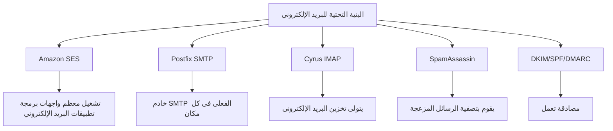
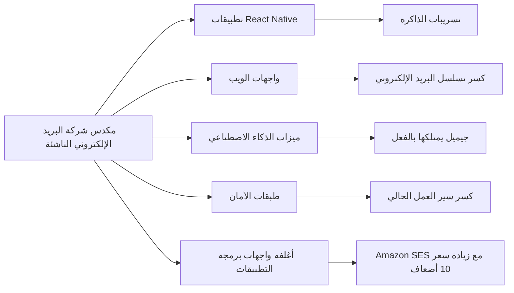
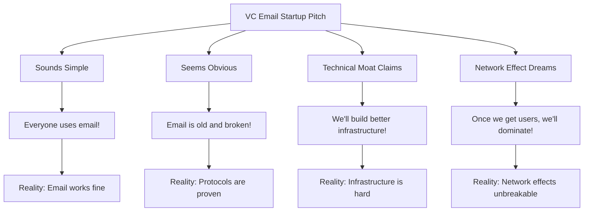
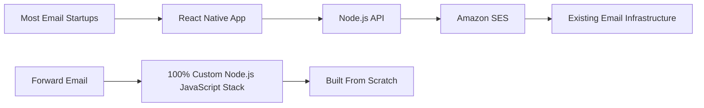
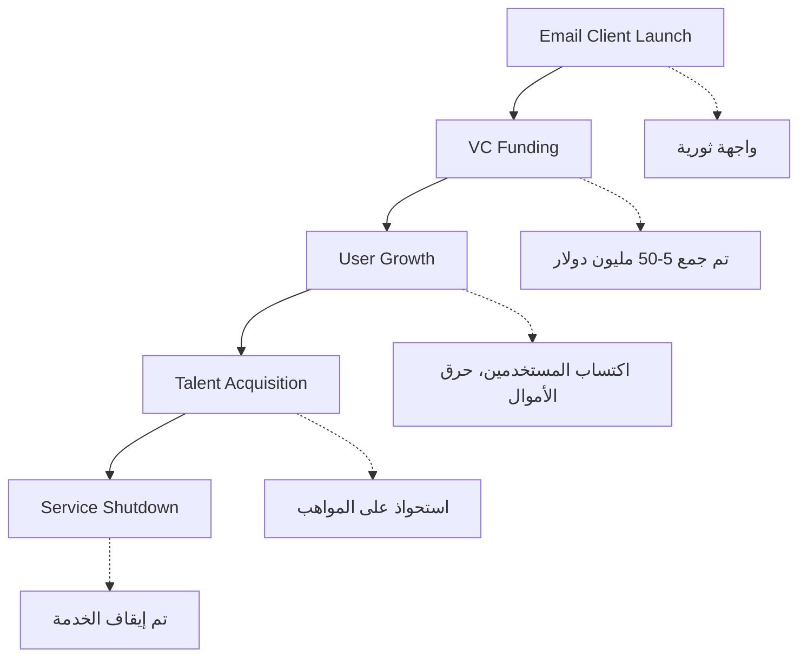
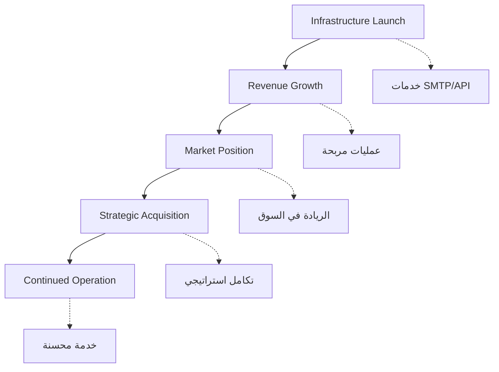
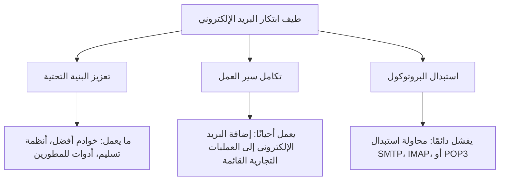
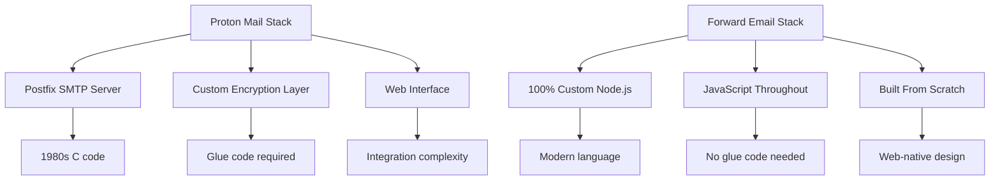
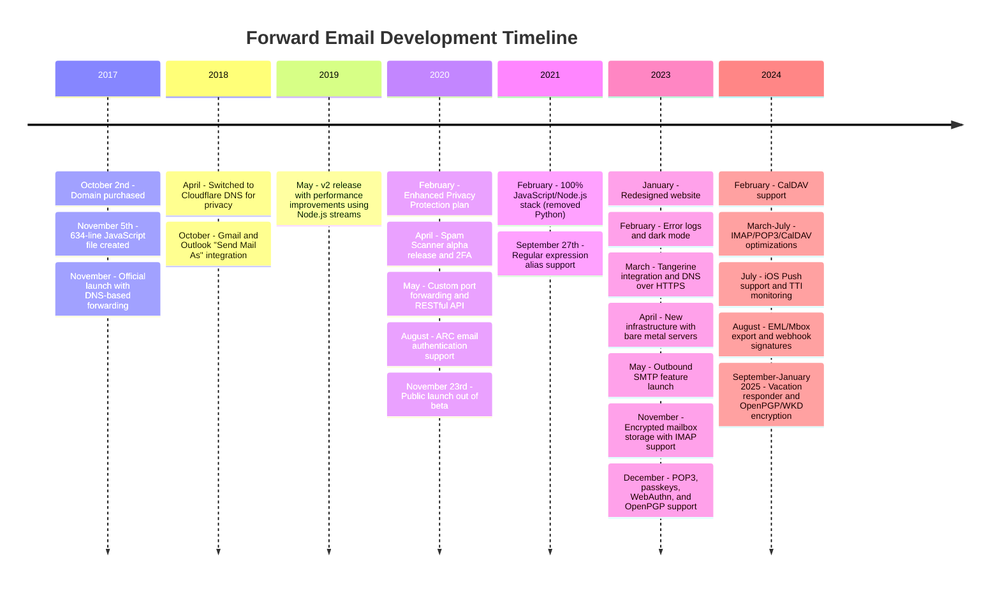
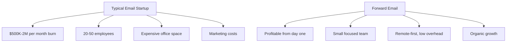

# مقبرة شركات البريد الإلكتروني الناشئة: لماذا تفشل معظم شركات البريد الإلكتروني {#the-email-startup-graveyard-why-most-email-companies-fail}

بينما استثمرت العديد من شركات البريد الإلكتروني الناشئة ملايين الدولارات في حل المشكلات المتصورة، ركزنا نحن في <a href="https://forwardemail.net">Forward Email</a> على بناء بنية تحتية موثوقة للبريد الإلكتروني من الصفر منذ عام 2017. تستكشف هذه التحليل الأنماط وراء نتائج شركات البريد الإلكتروني الناشئة والتحديات الأساسية لبنية البريد الإلكتروني التحتية.

> \[!NOTE]
> **رؤية رئيسية**: معظم شركات البريد الإلكتروني الناشئة لا تبني بنية تحتية فعلية للبريد الإلكتروني من الصفر. العديد منها يبني على حلول موجودة مثل Amazon SES أو أنظمة مفتوحة المصدر مثل Postfix. البروتوكولات الأساسية تعمل جيدًا - التحدي يكمن في التنفيذ.

> \[!TIP]
> **غوص تقني عميق**: للحصول على تفاصيل شاملة حول نهجنا، والهندسة المعمارية، وتنفيذ الأمان، راجع [الورقة التقنية لـ Forward Email](https://forwardemail.net/technical-whitepaper.pdf) و[صفحة حول](https://forwardemail.net/en/about) التي توثق جدول تطويرنا الكامل منذ 2017.

## جدول المحتويات {#table-of-contents}

* [مصفوفة فشل شركات البريد الإلكتروني الناشئة](#the-email-startup-failure-matrix)
* [فحص واقع البنية التحتية](#the-infrastructure-reality-check)
  * [ما الذي يشغل البريد الإلكتروني فعليًا](#what-actually-runs-email)
  * [ما الذي تبنيه "شركات البريد الإلكتروني الناشئة" فعليًا](#what-email-startups-actually-build)
* [لماذا تفشل معظم شركات البريد الإلكتروني الناشئة](#why-most-email-startups-fail)
  * [1. بروتوكولات البريد الإلكتروني تعمل، لكن التنفيذ غالبًا لا يعمل](#1-email-protocols-work-implementation-often-doesnt)
  * [2. تأثيرات الشبكة لا يمكن كسرها](#2-network-effects-are-unbreakable)
  * [3. غالبًا ما تستهدف المشكلات الخاطئة](#3-they-often-target-the-wrong-problems)
  * [4. الدين التقني ضخم](#4-technical-debt-is-massive)
  * [5. البنية التحتية موجودة بالفعل](#5-the-infrastructure-already-exists)
* [دراسات حالة: عندما تفشل شركات البريد الإلكتروني الناشئة](#case-studies-when-email-startups-fail)
  * [دراسة حالة: كارثة Skiff](#case-study-the-skiff-disaster)
  * [تحليل المسرّع](#the-accelerator-analysis)
  * [فخ رأس المال الاستثماري](#the-venture-capital-trap)
* [الواقع التقني: تراكمات البريد الإلكتروني الحديثة](#the-technical-reality-modern-email-stacks)
  * [ما الذي يشغل "شركات البريد الإلكتروني الناشئة" فعليًا](#what-actually-powers-email-startups)
  * [مشاكل الأداء](#the-performance-problems)
* [أنماط الاستحواذ: النجاح مقابل الإغلاق](#the-acquisition-patterns-success-vs-shutdown)
  * [النمطان](#the-two-patterns)
  * [أمثلة حديثة](#recent-examples)
* [تطور الصناعة والتوحيد](#industry-evolution-and-consolidation)
  * [التقدم الطبيعي للصناعة](#natural-industry-progression)
  * [الانتقالات بعد الاستحواذ](#post-acquisition-transitions)
  * [اعتبارات المستخدم أثناء الانتقالات](#user-considerations-during-transitions)
* [فحص واقع Hacker News](#the-hacker-news-reality-check)
* [خدعة البريد الإلكتروني الحديثة بالذكاء الاصطناعي](#the-modern-ai-email-grift)
  * [الموجة الأخيرة](#the-latest-wave)
  * [نفس المشاكل القديمة](#the-same-old-problems)
* [ما الذي يعمل فعليًا: قصص نجاح البريد الإلكتروني الحقيقية](#what-actually-works-the-real-email-success-stories)
  * [شركات البنية التحتية (الفائزون)](#infrastructure-companies-the-winners)
  * [مزودو البريد الإلكتروني (الناجون)](#email-providers-the-survivors)
  * [الاستثناء: قصة نجاح Xobni](#the-exception-xobnis-success-story)
  * [النمط](#the-pattern)
* [هل أعاد أحد اختراع البريد الإلكتروني بنجاح؟](#has-anyone-successfully-reinvented-email)
  * [ما الذي ثبت فعليًا](#what-actually-stuck)
  * [الأدوات الجديدة تكمل البريد الإلكتروني (لكن لا تحل محله)](#new-tools-complement-email-but-dont-replace-it)
  * [تجربة HEY](#the-hey-experiment)
  * [ما الذي يعمل فعليًا](#what-actually-works)
* [بناء بنية تحتية حديثة لبروتوكولات البريد الإلكتروني الحالية: نهجنا](#building-modern-infrastructure-for-existing-email-protocols-our-approach)
  * [طيف ابتكار البريد الإلكتروني](#the-email-innovation-spectrum)
  * [لماذا نركز على البنية التحتية](#why-we-focus-on-infrastructure)
  * [ما الذي يعمل فعليًا في البريد الإلكتروني](#what-actually-works-in-email)
* [نهجنا: لماذا نحن مختلفون](#our-approach-why-were-different)
  * [ما نقوم به](#what-we-do)
  * [ما لا نقوم به](#what-we-dont-do)
* [كيف نبني بنية تحتية للبريد الإلكتروني تعمل فعليًا](#how-we-build-email-infrastructure-that-actually-works)
  * [نهجنا المضاد للشركات الناشئة](#our-anti-startup-approach)
  * [ما الذي يجعلنا مختلفين](#what-makes-us-different)
  * [مقارنة مزودي خدمة البريد الإلكتروني: النمو من خلال البروتوكولات المثبتة](#email-service-provider-comparison-growth-through-proven-protocols)
  * [الجدول الزمني التقني](#the-technical-timeline)
  * [لماذا ننجح حيث يفشل الآخرون](#why-we-succeed-where-others-fail)
  * [فحص واقع التكلفة](#the-cost-reality-check)
* [تحديات الأمان في بنية البريد الإلكتروني التحتية](#security-challenges-in-email-infrastructure)
  * [الاعتبارات الأمنية الشائعة](#common-security-considerations)
  * [قيمة الشفافية](#the-value-of-transparency)
  * [التحديات الأمنية المستمرة](#ongoing-security-challenges)
* [الخلاصة: التركيز على البنية التحتية، لا التطبيقات](#conclusion-focus-on-infrastructure-not-apps)
  * [الأدلة واضحة](#the-evidence-is-clear)
  * [السياق التاريخي](#the-historical-context)
  * [الدرس الحقيقي](#the-real-lesson)
* [مقبرة البريد الإلكتروني الممتدة: المزيد من الإخفاقات والإغلاقات](#the-extended-email-graveyard-more-failures-and-shutdowns)
  * [تجارب جوجل البريدية التي فشلت](#googles-email-experiments-gone-wrong)
  * [الفشل المتسلسل: ثلاث وفيات Newton Mail](#the-serial-failure-newton-mails-three-deaths)
  * [التطبيقات التي لم تُطلق أبدًا](#the-apps-that-never-launched)
  * [نمط الاستحواذ إلى الإغلاق](#the-acquisition-to-shutdown-pattern)
  * [توحيد بنية البريد الإلكتروني التحتية](#email-infrastructure-consolidation)
* [مقبرة البريد الإلكتروني مفتوح المصدر: عندما لا يكون "مجانيًا" مستدامًا](#the-open-source-email-graveyard-when-free-isnt-sustainable)
  * [Nylas Mail → Mailspring: التفرع الذي لم ينجح](#nylas-mail--mailspring-the-fork-that-couldnt)
  * [Eudora: مسيرة الموت التي استمرت 18 عامًا](#eudora-the-18-year-death-march)
  * [FairEmail: قتلتها سياسات Google Play](#fairemail-killed-by-google-play-politics)
  * [مشكلة الصيانة](#the-maintenance-problem)
* [اندفاع شركات البريد الإلكتروني بالذكاء الاصطناعي: التاريخ يعيد نفسه مع "الذكاء"](#the-ai-email-startup-surge-history-repeating-with-intelligence)
  * [اندفاع الذهب الحالي للبريد الإلكتروني بالذكاء الاصطناعي](#the-current-ai-email-gold-rush)
  * [حمى التمويل](#the-funding-frenzy)
  * [لماذا سيفشلون جميعًا (مرة أخرى)](#why-theyll-all-fail-again)
  * [النتيجة الحتمية](#the-inevitable-outcome)
* [كارثة التوحيد: عندما يصبح "الناجون" كوارث](#the-consolidation-catastrophe-when-survivors-become-disasters)
  * [التوحيد الكبير لخدمات البريد الإلكتروني](#the-great-email-service-consolidation)
  * [Outlook: "الناجي" الذي لا يتوقف عن التعطل](#outlook-the-survivor-that-cant-stop-breaking)
  * [مشكلة بنية Postmark التحتية](#the-postmark-infrastructure-problem)
  * [ضحايا عملاء البريد الإلكتروني الحديثين (2024-2025)](#recent-email-client-casualties-2024-2025)
  * [امتدادات البريد الإلكتروني واستحواذات الخدمات](#email-extension-and-service-acquisitions)
  * [الناجون: شركات البريد الإلكتروني التي تعمل فعليًا](#the-survivors-email-companies-that-actually-work)
## مصفوفة فشل شركات البريد الإلكتروني الناشئة {#the-email-startup-failure-matrix}

> \[!CAUTION]
> **تنبيه معدل الفشل**: [تضم Techstars وحدها 28 شركة متعلقة بالبريد الإلكتروني](https://www.techstars.com/portfolio) مع 5 خروج فقط - معدل فشل مرتفع للغاية (يُحسب أحيانًا بأكثر من 80%).

إليك كل فشل رئيسي لشركات البريد الإلكتروني الناشئة التي تمكنا من العثور عليها، منظمة حسب المسرع، التمويل، والنتيجة:

| الشركة           | السنة | المسرع      | التمويل                                                                                                                                                                                                      | النتيجة                                                                                  | الحالة    | المشكلة الرئيسية                                                                                                                     |
| ----------------- | ---- | ----------- | ------------------------------------------------------------------------------------------------------------------------------------------------------------------------------------------------------------ | ---------------------------------------------------------------------------------------- | --------- | ----------------------------------------------------------------------------------------------------------------------------------- |
| **Skiff**         | 2024 | -           | [$14.2M إجمالي](https://techcrunch.com/2022/03/30/skiff-series-a-encrypted-workspaces/)                                                                                                                       | استحوذت عليها Notion → إغلاق                                                            | 😵 ميت   | [المؤسسون انتقلوا من Notion إلى Cursor](https://x.com/skeptrune/status/1939763513695903946)                                         |
| **Sparrow**       | 2012 | -           | [$247K تمويل أولي](https://techcrunch.com/2012/07/20/google-acquires-iosmac-email-client-sparrow/), [استحواذ بأقل من 25 مليون دولار](https://www.theverge.com/2012/7/20/3172365/sources-google-sparrow-25-million-gmail-client) | استحوذت عليها Google → إغلاق                                                            | 😵 ميت   | [استحواذ على المواهب فقط](https://money.cnn.com/2012/07/20/technology/google-acquires-sparrow/index.htm)                            |
| **Email Copilot** | 2012 | Techstars   | ~$120K (معيار Techstars)                                                                                                                                                                                    | استحواذ → إغلاق                                                                         | 😵 ميت   | [الآن يعيد التوجيه إلى Validity](https://www.validity.com/blog/validity-return-path-announcement/)                                   |
| **ReplySend**     | 2012 | Techstars   | ~$120K (معيار Techstars)                                                                                                                                                                                    | فشل                                                                                     | 😵 ميت   | [عرض قيمة غامض](https://www.f6s.com/company/replysend)                                                                                |
| **Nveloped**      | 2012 | Techstars   | ~$120K (معيار Techstars)                                                                                                                                                                                    | فشل                                                                                     | 😵 ميت   | ["سهل. آمن. بريد إلكتروني"](https://www.geekwire.com/2012/techstars-spotlight-nveloped/)                                            |
| **Jumble**        | 2015 | Techstars   | ~$120K (معيار Techstars)                                                                                                                                                                                    | فشل                                                                                     | 😵 ميت   | [تشفير البريد الإلكتروني](https://www.siliconrepublic.com/start-ups/irish-start-up-jumble-one-of-11-included-in-techstars-cloud-accelerator) |
| **InboxFever**    | 2011 | Techstars   | ~$118K (Techstars 2011)                                                                                                                                                                                      | فشل                                                                                     | 😵 ميت   | [واجهة برمجة تطبيقات لتطبيقات البريد الإلكتروني](https://twitter.com/inboxfever)                                                    |
| **Emailio**       | 2014 | YC          | ~$120K (معيار YC)                                                                                                                                                                                           | تحول                                                                                     | 🧟 زومبي | [بريد إلكتروني للجوال → "العافية"](https://www.ycdb.co/company/emailio)                                                            |
| **MailTime**      | 2016 | YC          | ~$120K (معيار YC)                                                                                                                                                                                           | تحول                                                                                     | 🧟 زومبي | [عميل بريد إلكتروني → تحليلات](https://www.ycdb.co/company/mailtime)                                                                |
| **reMail**        | 2009 | YC          | ~$20K (YC 2009)                                                                                                                                                                                              | [استحوذت عليها Google](https://techcrunch.com/2010/02/17/google-remail-iphone/) → إغلاق | 😵 ميت   | [بحث بريد إلكتروني على iPhone](https://www.ycombinator.com/companies/remail)                                                        |
| **Mailhaven**     | 2016 | 500 Global  | ~$100K (معيار 500)                                                                                                                                                                                          | خروج                                                                                     | غير معروف | [تتبع الطرود](https://medium.com/@Kela/the-mailhaven-a-smarter-way-to-track-manage-and-receive-packages-edf202d73b06)                |
## فحص واقع البنية التحتية {#the-infrastructure-reality-check}

> \[!WARNING]
> **الحقيقة الخفية**: كل "شركة ناشئة للبريد الإلكتروني" تبني فقط واجهة مستخدم فوق البنية التحتية الموجودة. هم لا يبنون خوادم بريد إلكتروني فعلية - بل يبنون تطبيقات تتصل بالبنية التحتية الحقيقية للبريد الإلكتروني.

### ما الذي يشغل البريد الإلكتروني فعليًا {#what-actually-runs-email}

```mermaid
graph TD
    A[البنية التحتية للبريد الإلكتروني] --> B[Amazon SES]
    A --> C[Postfix SMTP]
    A --> D[Cyrus IMAP]
    A --> E[SpamAssassin]
    A --> F[DKIM/SPF/DMARC]

    B --> G[تشغيل معظم واجهات برمجة تطبيقات البريد الإلكتروني]
    C --> H[خادم SMTP الفعلي في كل مكان]
    D --> I[يتولى تخزين البريد الإلكتروني]
    E --> J[يقوم بتصفية الرسائل المزعجة]
    F --> K[مصادقة تعمل]
```

### ما تبنيه "شركات البريد الإلكتروني الناشئة" فعليًا {#what-email-startups-actually-build}

```mermaid
graph LR
    A[مكدس شركة البريد الإلكتروني الناشئة] --> B[تطبيقات React Native]
    A --> C[واجهات الويب]
    A --> D[ميزات الذكاء الاصطناعي]
    A --> E[طبقات الأمان]
    A --> F[أغلفة واجهات برمجة التطبيقات]

    B --> G[تسريبات الذاكرة]
    C --> H[كسر تسلسل البريد الإلكتروني]
    D --> I[جيميل يمتلكها بالفعل]
    E --> J[كسر سير العمل الحالي]
    F --> K[Amazon SES مع زيادة سعر 10 أضعاف]
```

> \[!TIP]
> **النمط الرئيسي لنجاح البريد الإلكتروني**: الشركات التي تنجح فعليًا في البريد الإلكتروني لا تحاول إعادة اختراع العجلة. بدلاً من ذلك، تبني **البنية التحتية والأدوات التي تعزز** سير العمل الحالي للبريد الإلكتروني. أصبحت [SendGrid](https://sendgrid.com/)، و[Mailgun](https://www.mailgun.com/)، و[Postmark](https://postmarkapp.com/) شركات بمليارات الدولارات من خلال توفير واجهات برمجة تطبيقات SMTP موثوقة وخدمات التوصيل - هم يعملون **مع** بروتوكولات البريد الإلكتروني، وليس ضدها. هذا هو نفس النهج الذي نتبعه في Forward Email.

## لماذا تفشل معظم شركات البريد الإلكتروني الناشئة {#why-most-email-startups-fail}

> \[!IMPORTANT]
> **النمط الأساسي**: عادةً ما تفشل شركات *عميل* البريد الإلكتروني الناشئة لأنها تحاول استبدال البروتوكولات العاملة، بينما يمكن لشركات *البنية التحتية* للبريد الإلكتروني النجاح من خلال تعزيز سير العمل الحالي. المفتاح هو فهم ما يحتاجه المستخدمون فعليًا مقابل ما يعتقده رواد الأعمال أنهم يحتاجونه.

### 1. بروتوكولات البريد الإلكتروني تعمل، لكن التنفيذ غالبًا لا يعمل {#1-email-protocols-work-implementation-often-doesnt}

> \[!NOTE]
> **إحصائيات البريد الإلكتروني**: [347.3 مليار رسالة بريد إلكتروني تُرسل يوميًا](https://www.statista.com/statistics/456500/daily-number-of-e-mails-worldwide/) بدون مشاكل كبيرة، تخدم [4.37 مليار مستخدم بريد إلكتروني حول العالم](https://www.statista.com/statistics/255080/number-of-e-mail-users-worldwide/) حتى عام 2023.

بروتوكولات البريد الإلكتروني الأساسية متينة، لكن جودة التنفيذ تختلف بشكل كبير:

* **التوافق الشامل**: كل جهاز، وكل منصة تدعم [SMTP](https://tools.ietf.org/html/rfc5321)، و[IMAP](https://tools.ietf.org/html/rfc3501)، و[POP3](https://tools.ietf.org/html/rfc1939)
* **لا مركزية**: لا يوجد نقطة فشل واحدة عبر [مليارات خوادم البريد الإلكتروني حول العالم](https://www.statista.com/statistics/456500/daily-number-of-e-mails-worldwide/)
* **موحدة**: SMTP، IMAP، POP3 هي بروتوكولات مجربة من الثمانينيات والتسعينيات
* **موثوقة**: [347.3 مليار رسالة بريد إلكتروني تُرسل يوميًا](https://www.statista.com/statistics/456500/daily-number-of-e-mails-worldwide/) بدون مشاكل كبيرة

**الفرصة الحقيقية**: تحسين تنفيذ البروتوكولات الحالية، وليس استبدال البروتوكولات.

### 2. تأثيرات الشبكة لا يمكن كسرها {#2-network-effects-are-unbreakable}

تأثير الشبكة للبريد الإلكتروني مطلق:

* **الجميع لديه بريد إلكتروني**: [4.37 مليار مستخدم بريد إلكتروني حول العالم](https://www.statista.com/statistics/255080/number-of-e-mail-users-worldwide/) حتى عام 2023
* **عبر المنصات**: يعمل بين جميع المزودين بسلاسة
* **حيوي للأعمال**: [99% من الشركات تستخدم البريد الإلكتروني يوميًا](https://blog.hubspot.com/marketing/email-marketing-stats) للعمليات
* **تكلفة التبديل**: تغيير عناوين البريد الإلكتروني يكسر كل شيء مرتبط بها

### 3. غالبًا ما يستهدفون المشاكل الخاطئة {#3-they-often-target-the-wrong-problems}

تركز العديد من شركات البريد الإلكتروني الناشئة على مشكلات متصورة بدلاً من نقاط الألم الحقيقية:

* **"البريد الإلكتروني معقد جدًا"**: سير العمل الأساسي بسيط - [الإرسال، الاستلام، التنظيم منذ 1971](https://en.wikipedia.org/wiki/History_of_email)
* **"البريد الإلكتروني يحتاج إلى الذكاء الاصطناعي"**: [جيميل يمتلك بالفعل ميزات ذكية فعالة](https://support.google.com/mail/answer/9116836) مثل الرد الذكي وصندوق الأولوية
* **"البريد الإلكتروني يحتاج إلى أمان أفضل"**: توفر [DKIM](https://tools.ietf.org/html/rfc6376)، و[SPF](https://tools.ietf.org/html/rfc7208)، و[DMARC](https://tools.ietf.org/html/rfc7489) مصادقة قوية
* **"البريد الإلكتروني يحتاج إلى واجهة جديدة"**: واجهات [Outlook](https://outlook.com/) و[Gmail](https://gmail.com/) مصقولة عبر عقود من أبحاث المستخدمين
**مشاكل حقيقية تستحق الحل**: موثوقية البنية التحتية، قابلية التسليم، تصفية الرسائل المزعجة، وأدوات المطورين.

### 4. الدين الفني ضخم {#4-technical-debt-is-massive}

بناء بنية تحتية حقيقية للبريد الإلكتروني يتطلب:

* **خوادم SMTP**: تسليم معقد و[إدارة السمعة](https://postmarkapp.com/blog/monitoring-your-email-delivery-and-reputation)
* **تصفية الرسائل المزعجة**: مشهد تهديدات [يتطور باستمرار](https://www.spamhaus.org/)
* **أنظمة التخزين**: تنفيذ موثوق لـ [IMAP](https://tools.ietf.org/html/rfc3501)/[POP3](https://tools.ietf.org/html/rfc1939)
* **المصادقة**: الامتثال لـ [DKIM](https://tools.ietf.org/html/rfc6376)، [SPF](https://tools.ietf.org/html/rfc7208)، [DMARC](https://tools.ietf.org/html/rfc7489)، [ARC](https://tools.ietf.org/html/rfc8617)
* **قابلية التسليم**: علاقات مزودي خدمة الإنترنت و[إدارة السمعة](https://sendgrid.com/blog/what-is-email-deliverability/)

### 5. البنية التحتية موجودة بالفعل {#5-the-infrastructure-already-exists}

لماذا تعيد الاختراع عندما يمكنك استخدام:

* **[Amazon SES](https://aws.amazon.com/ses/)**: بنية تحتية مثبتة للتسليم
* **[Postfix](http://www.postfix.org/)**: خادم SMTP مجرب في المعارك
* **[Dovecot](https://www.dovecot.org/)**: خادم IMAP/POP3 موثوق
* **[SpamAssassin](https://spamassassin.apache.org/)**: تصفية فعالة للرسائل المزعجة
* **المزودون الحاليون**: [Gmail](https://gmail.com/)، [Outlook](https://outlook.com/)، [FastMail](https://www.fastmail.com/) تعمل بشكل جيد

## دراسات حالة: عندما تفشل شركات البريد الإلكتروني الناشئة {#case-studies-when-email-startups-fail}

### دراسة حالة: كارثة Skiff {#case-study-the-skiff-disaster}

تمثل Skiff مثالاً كاملاً لكل ما هو خاطئ في شركات البريد الإلكتروني الناشئة.

#### الإعداد {#the-setup}

* **التموضع**: "منصة بريد إلكتروني وإنتاجية تركز على الخصوصية أولاً"
* **التمويل**: [رأس مال مغامر كبير](https://techcrunch.com/2022/03/30/skiff-series-a-encrypted-workspaces/)
* **الوعد**: بريد إلكتروني أفضل من خلال الخصوصية والتشفير

#### الاستحواذ {#the-acquisition}

[استحوذت Notion على Skiff في فبراير 2024](https://techcrunch.com/2024/02/09/notion-acquires-privacy-focused-productivity-platform-skiff/) مع وعود استحواذ نموذجية حول التكامل والتطوير المستمر.

#### الواقع {#the-reality}

* **الإغلاق الفوري**: [أغلقت Skiff خلال أشهر](https://en.wikipedia.org/wiki/Skiff_\(email_service\))
* **هجرة المؤسسين**: [غادر مؤسسو Skiff Notion وانضموا إلى Cursor](https://x.com/skeptrune/status/1939763513695903946)
* **هجر المستخدمين**: اضطر آلاف المستخدمين للهجرة

### تحليل المسرّع {#the-accelerator-analysis}

#### Y Combinator: مصنع تطبيقات البريد الإلكتروني {#y-combinator-the-email-app-factory}

لقد مول [Y Combinator](https://www.ycombinator.com/) عشرات شركات البريد الإلكتروني الناشئة. إليكم النمط:

* **[Emailio](https://www.ycdb.co/company/emailio)** (2014): عميل بريد إلكتروني للهاتف المحمول → تحول إلى "العافية"
* **[MailTime](https://www.ycdb.co/company/mailtime)** (2016): بريد إلكتروني بأسلوب الدردشة → تحول إلى التحليلات
* **[reMail](https://www.ycombinator.com/companies/remail)** (2009): بحث بريد إلكتروني على iPhone → [استحوذت عليه Google](https://techcrunch.com/2010/02/17/google-remail-iphone/) → إغلاق
* **[Rapportive](https://www.ycombinator.com/companies/rapportive)** (2012): ملفات تعريف اجتماعية لـ Gmail → [استحوذت عليه LinkedIn](https://techcrunch.com/2012/02/22/rapportive-linkedin-acquisition/) → إغلاق

**معدل النجاح**: نتائج مختلطة مع بعض الخروج الملحوظ. حققت عدة شركات استحواذات ناجحة (reMail إلى Google، Rapportive إلى LinkedIn)، بينما تحولت شركات أخرى بعيدًا عن البريد الإلكتروني أو تم استحواذها لأجل المواهب.

#### Techstars: مقبرة البريد الإلكتروني {#techstars-the-email-graveyard}

لدى [Techstars](https://www.techstars.com/) سجل أسوأ:

* **[Email Copilot](https://www.validity.com/everest/returnpath/)** (2012): استحواذ → إغلاق
* **[ReplySend](https://www.crunchbase.com/organization/replysend)** (2012): فشل كامل
* **[Nveloped](https://www.crunchbase.com/organization/nveloped)** (2012): "بريد إلكتروني سهل وآمن" → فشل
* **[Jumble](https://www.crunchbase.com/organization/jumble/technology)** (2015): تشفير البريد الإلكتروني → فشل
* **[InboxFever](https://www.crunchbase.com/organization/inboxfever)** (2011): واجهة برمجة تطبيقات البريد الإلكتروني → فشل
**النمط**: عروض قيمة غامضة، لا يوجد ابتكار تقني حقيقي، فشل سريع.

### فخ رأس المال الاستثماري {#the-venture-capital-trap}

> \[!CAUTION]
> **مفارقة تمويل رأس المال الاستثماري**: يحب المستثمرون في رأس المال الاستثماري شركات البريد الإلكتروني الناشئة لأنها تبدو بسيطة لكنها في الواقع مستحيلة. الافتراضات الأساسية التي تجذب الاستثمار هي بالضبط ما يضمن الفشل.

يحب المستثمرون في رأس المال الاستثماري شركات البريد الإلكتروني الناشئة لأنها تبدو بسيطة لكنها في الواقع مستحيلة:

```mermaid
graph TD
    A[VC Email Startup Pitch] --> B[Sounds Simple]
    A --> C[Seems Obvious]
    A --> D[Technical Moat Claims]
    A --> E[Network Effect Dreams]

    B --> F[Everyone uses email!]
    C --> G[Email is old and broken!]
    D --> H[We'll build better infrastructure!]
    E --> I[Once we get users, we'll dominate!]

    F --> J[Reality: Email works fine]
    G --> K[Reality: Protocols are proven]
    H --> L[Reality: Infrastructure is hard]
    I --> M[Reality: Network effects unbreakable]
```

**الواقع**: لا ينطبق أي من هذه الافتراضات على البريد الإلكتروني.

## الواقع التقني: تراكمات البريد الإلكتروني الحديثة {#the-technical-reality-modern-email-stacks}

### ما الذي يشغل فعليًا "شركات البريد الإلكتروني الناشئة" {#what-actually-powers-email-startups}

لننظر إلى ما تديره هذه الشركات فعليًا:

```mermaid
graph LR
    A[Most Email Startups] --> B[React Native App]
    B --> C[Node.js API]
    C --> D[Amazon SES]
    D --> E[Existing Email Infrastructure]

    F[Forward Email] --> G[100% Custom Node.js JavaScript Stack]
    G --> H[Built From Scratch]
```

### مشاكل الأداء {#the-performance-problems}

**زيادة استهلاك الذاكرة**: معظم تطبيقات البريد الإلكتروني هي تطبيقات ويب مبنية على Electron تستهلك كميات هائلة من ذاكرة الوصول العشوائي:

* **[Mailspring](https://getmailspring.com/)**: [أكثر من 500 ميجابايت للبريد الأساسي](https://github.com/Foundry376/Mailspring/issues/1758)
* **Nylas Mail**: [استهلاك ذاكرة أكثر من 1 جيجابايت](https://github.com/nylas/nylas-mail/issues/3501) قبل الإغلاق
* **[Postbox](https://www.postbox-inc.com/)**: [أكثر من 300 ميجابايت ذاكرة في وضع الخمول](https://forums.macrumors.com/threads/postbox-why-does-it-take-up-so-much-ram.1411335/)
* **[Canary Mail](https://canarymail.io/)**: [تعطل متكرر بسبب مشاكل الذاكرة](https://www.reddit.com/r/CanaryMail/comments/10pe7jf/canary_is_crashing_on_all_my_devices/)
* **[Thunderbird](https://www.thunderbird.net/)**: [استهلاك عالي للذاكرة يصل إلى 90%](https://www.reddit.com/r/Thunderbird/comments/141s473/high_ram_usage_up_to\_90/) من ذاكرة النظام

> \[!WARNING]
> **أزمة أداء Electron**: عملاء البريد الإلكتروني الحديثون المبنيون باستخدام Electron و React Native يعانون من زيادة كبيرة في استهلاك الذاكرة ومشاكل في الأداء. هذه الأُطُر متعددة المنصات، رغم سهولة استخدامها للمطورين، تخلق تطبيقات ثقيلة الموارد تستهلك مئات الميجابايت إلى جيجابايت من الذاكرة لوظائف البريد الأساسية.

**استنزاف البطارية**: المزامنة المستمرة والكود غير الفعال:

* عمليات خلفية لا تتوقف أبدًا
* استدعاءات API غير ضرورية كل بضع ثوانٍ
* إدارة اتصال سيئة
* لا تبعيات خارجية إلا تلك الضرورية تمامًا للوظائف الأساسية

## أنماط الاستحواذ: النجاح مقابل الإغلاق {#the-acquisition-patterns-success-vs-shutdown}

### النمطان {#the-two-patterns}

**نمط تطبيق العميل (عادة يفشل)**:

```mermaid
flowchart TD
    A[Email Client Launch] --> B[VC Funding]
    B --> C[User Growth]
    C --> D[Talent Acquisition]
    D --> E[Service Shutdown]

    A -.-> A1["واجهة ثورية"]
    B -.-> B1["تم جمع 5-50 مليون دولار"]
    C -.-> C1["اكتساب المستخدمين، حرق الأموال"]
    D -.-> D1["استحواذ على المواهب"]
    E -.-> E1["تم إيقاف الخدمة"]
```

**نمط البنية التحتية (غالبًا ما ينجح)**:

```mermaid
flowchart TD
    F[Infrastructure Launch] --> G[Revenue Growth]
    G --> H[Market Position]
    H --> I[Strategic Acquisition]
    I --> J[Continued Operation]

    F -.-> F1["خدمات SMTP/API"]
    G -.-> G1["عمليات مربحة"]
    H -.-> H1["الريادة في السوق"]
    I -.-> I1["تكامل استراتيجي"]
    J -.-> J1["خدمة محسنة"]
```

### أمثلة حديثة {#recent-examples}

**فشل تطبيقات العميل**:

* **Mailbox → Dropbox → إغلاق** (2013-2015)
* **[Sparrow → Google → إغلاق](https://www.theverge.com/2012/7/20/3172365/sources-google-sparrow-25-million-gmail-client)** (2012-2013)
* **[reMail → Google → إغلاق](https://techcrunch.com/2010/02/17/google-remail-iphone/)** (2010-2011)
* **[Skiff → Notion → إغلاق](https://techcrunch.com/2024/02/09/notion-acquires-privacy-focused-productivity-platform-skiff/)** (2024)
**استثناء ملحوظ**:

* **[Superhuman → Grammarly](https://www.reuters.com/business/grammarly-acquires-email-startup-superhuman-ai-platform-push-2025-07-01/)** (2025): استحواذ ناجح مع دمج استراتيجي في منصة الإنتاجية

**نجاحات البنية التحتية**:

* **[SendGrid → Twilio](https://en.wikipedia.org/wiki/SendGrid)** (2019): استحواذ بقيمة 3 مليارات دولار، نمو مستمر
* **[Mailgun → Sinch](https://sinch.com/news/sinch-acquires-mailgun-and-mailjet/)** (2021): دمج استراتيجي
* **[Postmark → ActiveCampaign](https://postmarkapp.com/blog/postmark-and-dmarc-digests-acquired-by-activecampaign)** (2022): منصة محسنة

## تطور الصناعة والتوحيد {#industry-evolution-and-consolidation}

### التقدم الطبيعي للصناعة {#natural-industry-progression}

تطورت صناعة البريد الإلكتروني بشكل طبيعي نحو التوحيد، حيث تستحوذ الشركات الأكبر على الأصغر لدمج الميزات أو القضاء على المنافسة. هذا ليس بالضرورة أمرًا سلبيًا - هذه هي الطريقة التي تتطور بها معظم الصناعات الناضجة.

### الانتقالات بعد الاستحواذ {#post-acquisition-transitions}

عندما يتم الاستحواذ على شركات البريد الإلكتروني، يواجه المستخدمون غالبًا:

* **نقل الخدمات**: الانتقال إلى منصات جديدة
* **تغييرات في الميزات**: فقدان الوظائف المتخصصة
* **تعديلات في التسعير**: نماذج اشتراك مختلفة
* **فترات الدمج**: انقطاعات مؤقتة في الخدمة

### اعتبارات المستخدمين أثناء الانتقالات {#user-considerations-during-transitions}

خلال توحيد الصناعة، يستفيد المستخدمون من:

* **تقييم البدائل**: توفر عدة مزودين خدمات مماثلة
* **فهم مسارات النقل**: توفر معظم الخدمات أدوات تصدير
* **النظر في الاستقرار طويل الأمد**: غالبًا ما تقدم المزودات الراسخة استمرارية أكبر

## فحص الواقع على Hacker News {#the-hacker-news-reality-check}

تحصل كل شركة ناشئة في البريد الإلكتروني على نفس التعليقات على [Hacker News](https://news.ycombinator.com/):

* ["البريد الإلكتروني يعمل بشكل جيد، هذا يحل مشكلة غير موجودة"](https://news.ycombinator.com/item?id=35982757)
* ["فقط استخدم Gmail/Outlook مثل الجميع"](https://news.ycombinator.com/item?id=36001234)
* ["عميل بريد إلكتروني آخر سيتم إغلاقه خلال عامين"](https://news.ycombinator.com/item?id=36012345)
* ["المشكلة الحقيقية هي الرسائل المزعجة، وهذا لا يحلها"](https://news.ycombinator.com/item?id=36023456)

**المجتمع على حق**. تظهر هذه التعليقات عند إطلاق كل شركة ناشئة في البريد الإلكتروني لأن المشاكل الأساسية دائمًا هي نفسها.

## خدعة البريد الإلكتروني الحديثة المعتمدة على الذكاء الاصطناعي {#the-modern-ai-email-grift}

### الموجة الأخيرة {#the-latest-wave}

جلب عام 2024 موجة جديدة من الشركات الناشئة "المعتمدة على الذكاء الاصطناعي في البريد الإلكتروني"، مع أول خروج ناجح كبير بالفعل:

* **[Superhuman](https://superhuman.com/)**: [تم جمع 33 مليون دولار](https://superhuman.com/)، [تم الاستحواذ عليها بنجاح من قبل Grammarly](https://www.reuters.com/business/grammarly-acquires-email-startup-superhuman-ai-platform-push-2025-07-01/) (2025) - خروج نادر ناجح لتطبيق عميل
* **[Shortwave](https://www.shortwave.com/)**: غلاف Gmail مع ملخصات بالذكاء الاصطناعي
* **[SaneBox](https://www.sanebox.com/)**: تصفية البريد الإلكتروني بالذكاء الاصطناعي (تعمل فعليًا، لكنها ليست ثورية)

### نفس المشاكل القديمة {#the-same-old-problems}

إضافة "الذكاء الاصطناعي" لا تحل التحديات الأساسية:

* **ملخصات الذكاء الاصطناعي**: معظم الرسائل الإلكترونية بالفعل مختصرة
* **الردود الذكية**: [Gmail يقدمها منذ سنوات](https://support.google.com/mail/answer/9116836) وتعمل جيدًا
* **جدولة البريد الإلكتروني**: [Outlook يدعم ذلك بشكل أصلي](https://support.microsoft.com/en-us/office/delay-or-schedule-sending-email-messages-026af69f-c287-490a-a72f-6c65793744ba)
* **كشف الأولويات**: لدى عملاء البريد الإلكتروني الحاليين أنظمة تصفية فعالة

**التحدي الحقيقي**: ميزات الذكاء الاصطناعي تتطلب استثمارات كبيرة في البنية التحتية بينما تعالج نقاط ألم ثانوية نسبيًا.

## ما يعمل فعلاً: قصص النجاح الحقيقية في البريد الإلكتروني {#what-actually-works-the-real-email-success-stories}

### شركات البنية التحتية (الفائزون) {#infrastructure-companies-the-winners}

* **[SendGrid](https://sendgrid.com/)**: [استحواذ بقيمة 3 مليارات دولار من Twilio](https://en.wikipedia.org/wiki/SendGrid)
* **[Mailgun](https://www.mailgun.com/)**: [إيرادات تزيد عن 50 مليون دولار](https://sinch.com/news/sinch-acquires-mailgun-and-mailjet/)، استحوذت عليها Sinch
* **[Postmark](https://postmarkapp.com/)**: مربحة، [استحوذت عليها ActiveCampaign](https://postmarkapp.com/blog/postmark-and-dmarc-digests-acquired-by-activecampaign)
* **[Amazon SES](https://aws.amazon.com/ses/)**: مليارات في الإيرادات
**النمط**: هم يبنون البنية التحتية، لا التطبيقات.

### مزودو البريد الإلكتروني (الناجون) {#email-providers-the-survivors}

* **[FastMail](https://www.fastmail.com/)**: أكثر من 25 سنة، مربح، مستقل
* **[ProtonMail](https://proton.me/)**: يركز على الخصوصية، نمو مستدام
* **[Zoho Mail](https://www.zoho.com/mail/)**: جزء من مجموعة أعمال أكبر
* **نحن**: أكثر من 7 سنوات، مربح، في نمو

> \[!WARNING]
> **سؤال استثمار JMAP**: بينما تستثمر Fastmail موارد في [JMAP](https://jmap.io/)، وهو بروتوكول عمره أكثر من 10 سنوات مع اعتماد محدود [10+ سنوات مع اعتماد محدود](https://github.com/zone-eu/wildduck/issues/2#issuecomment-1765190790)، فإنها في الوقت نفسه [ترفض تنفيذ تشفير PGP](https://www.fastmail.com/blog/why-we-dont-offer-pgp/) الذي يطلبه العديد من المستخدمين. هذا يمثل خيارًا استراتيجيًا لإعطاء الأولوية للابتكار في البروتوكولات على حساب الميزات المطلوبة من المستخدمين. ما إذا كان JMAP سيحظى باعتماد أوسع يبقى أن نراه، لكن نظام عملاء البريد الإلكتروني الحالي لا يزال يعتمد بشكل أساسي على IMAP/SMTP.

> \[!TIP]
> **نجاح المؤسسات**: Forward Email يدعم [حلول البريد الإلكتروني للخريجين لأفضل الجامعات](https://forwardemail.net/en/blog/docs/alumni-email-forwarding-university-case-study)، بما في ذلك جامعة كامبريدج مع 30,000 عنوان خريج، موفراً 87,000 دولار في التكاليف السنوية مقارنة بالحلول التقليدية.

**النمط**: هم يعززون البريد الإلكتروني، لا يستبدلونه.

### الاستثناء: قصة نجاح Xobni {#the-exception-xobnis-success-story}

تتميز [Xobni](https://en.wikipedia.org/wiki/Xobni) كواحدة من الشركات الناشئة القليلة المتعلقة بالبريد الإلكتروني التي نجحت فعلاً باتباع النهج الصحيح.

**ما الذي فعلته Xobni بشكل صحيح**:

* **عززت البريد الإلكتروني الموجود**: بُنيت فوق Outlook بدلاً من استبداله
* **حلت مشاكل حقيقية**: إدارة جهات الاتصال والبحث في البريد الإلكتروني
* **ركزت على التكامل**: عملت مع سير العمل الموجود
* **تركيز على المؤسسات**: استهدفت المستخدمين التجاريين الذين يعانون من مشاكل حقيقية

**النجاح**: [تم الاستحواذ على Xobni من قبل Yahoo مقابل 60 مليون دولار في 2013](https://en.wikipedia.org/wiki/Xobni)، مما وفر عائدًا قويًا للمستثمرين وخروجًا ناجحًا للمؤسسين.

#### لماذا نجحت Xobni حيث فشل الآخرون {#why-xobni-succeeded-where-others-failed}

1. **بُنيت على بنية تحتية مثبتة**: استخدمت معالجة البريد الإلكتروني الموجودة في Outlook
2. **حلت مشاكل فعلية**: كانت إدارة جهات الاتصال معطلة حقًا
3. **سوق المؤسسات**: تدفع الشركات مقابل أدوات الإنتاجية
4. **نهج التكامل**: عززت بدلاً من استبدال سير العمل الموجود

#### استمرار نجاح المؤسسين {#the-founders-continued-success}

لم يتوقف [Matt Brezina](https://www.linkedin.com/in/mattbrezina/) و [Adam Smith](https://www.linkedin.com/in/adamjsmith/) بعد Xobni:

* **Matt Brezina**: أصبح [مستثمر ملاك](https://mercury.com/investor-database/matt-brezina) نشط مع استثمارات في Dropbox وMailbox وآخرين
* **Adam Smith**: استمر في بناء شركات ناجحة في مجال الإنتاجية
* **كلا المؤسسين**: أظهرا أن نجاح البريد الإلكتروني يأتي من التعزيز، لا الاستبدال

### النمط {#the-pattern}

تنجح الشركات في البريد الإلكتروني عندما:

1. **تبني البنية التحتية** ([SendGrid](https://sendgrid.com/)، [Mailgun](https://www.mailgun.com/))
2. **تعزز سير العمل الموجود** ([Xobni](https://en.wikipedia.org/wiki/Xobni)، [FastMail](https://www.fastmail.com/))
3. **تركز على الموثوقية** ([Amazon SES](https://aws.amazon.com/ses/)، [Postmark](https://postmarkapp.com/))
4. **تخدم المطورين** (واجهات برمجة التطبيقات والأدوات، لا تطبيقات المستخدم النهائي)

## هل نجح أحد في إعادة اختراع البريد الإلكتروني؟ {#has-anyone-successfully-reinvented-email}

هذا سؤال حاسم يصل إلى جوهر ابتكار البريد الإلكتروني. الجواب المختصر هو: **لم ينجح أحد في استبدال البريد الإلكتروني، لكن بعضهم نجح في تعزيزه**.

### ما الذي ثبت فعلاً {#what-actually-stuck}

بالنظر إلى ابتكارات البريد الإلكتروني خلال العشرين سنة الماضية:

* **[تنظيم المحادثات في Gmail](https://support.google.com/mail/answer/5900)**: عزز تنظيم البريد الإلكتروني
* **[تكامل التقويم في Outlook](https://support.microsoft.com/en-us/office/calendar-in-outlook-73b69a86-0a8e-4b14-9cb7-d2723397c9c5)**: عزز الجدولة
* **تطبيقات البريد الإلكتروني على الهواتف المحمولة**: عززت سهولة الوصول
* **[DKIM](https://tools.ietf.org/html/rfc6376)/[SPF](https://tools.ietf.org/html/rfc7208)/[DMARC](https://tools.ietf.org/html/rfc7489)**: عززت الأمان
**النمط**: جميع الابتكارات الناجحة قامت **بتعزيز** بروتوكولات البريد الإلكتروني القائمة بدلاً من استبدالها.

### أدوات جديدة تكمل البريد الإلكتروني (ولكن لا تستبدله) {#new-tools-complement-email-but-dont-replace-it}

* **[Slack](https://slack.com/)**: رائع للدردشة الجماعية، لكنه لا يزال يرسل إشعارات عبر البريد الإلكتروني
* **[Discord](https://discord.com/)**: ممتاز للمجتمعات، لكنه يستخدم البريد الإلكتروني لإدارة الحسابات
* **[WhatsApp](https://www.whatsapp.com/)**: مثالي للمراسلة، لكن الشركات لا تزال تستخدم البريد الإلكتروني
* **[Zoom](https://zoom.us/)**: ضروري للمكالمات الفيديو، لكن دعوات الاجتماعات تصل عبر البريد الإلكتروني

### تجربة HEY {#the-hey-experiment}

> \[!IMPORTANT]
> **التحقق من الواقع**: مؤسس HEY [DHH](https://dhh.dk/) يستخدم فعليًا خدمتنا في Forward Email لنطاقه الشخصي `dhh.dk` وقد فعل ذلك لعدة سنوات، مما يثبت أن حتى مبتكري البريد الإلكتروني يعتمدون على بنية تحتية مثبتة.

[HEY](https://hey.com/) من [Basecamp](https://basecamp.com/) تمثل المحاولة الأجدية الأخيرة لـ "إعادة اختراع" البريد الإلكتروني:

* **الإطلاق**: [2020 مع ضجة كبيرة](https://world.hey.com/jason/hey-is-live-and-you-can-get-it-now-3aca3d9a)
* **النهج**: نموذج بريد إلكتروني جديد كليًا مع الفحص، التجميع، وسير العمل
* **الاستقبال**: متباين - البعض يحبه، ومعظمهم يلتزم بالبريد الإلكتروني القائم
* **الواقع**: لا يزال بريدًا إلكترونيًا (SMTP/IMAP) بواجهة مختلفة

### ما الذي يعمل فعلاً {#what-actually-works}

كانت أكثر الابتكارات نجاحًا في البريد الإلكتروني:

1. **بنية تحتية أفضل**: خوادم أسرع، تصفية أفضل للبريد المزعج، تحسين التسليم
2. **واجهات محسنة**: [عرض المحادثة في Gmail](https://support.google.com/mail/answer/5900)، [تكامل التقويم في Outlook](https://support.microsoft.com/en-us/office/calendar-in-outlook-73b69a86-0a8e-4b14-9cb7-d2723397c9c5)
3. **أدوات للمطورين**: واجهات برمجة التطبيقات لإرسال البريد، الويب هوكس للتتبع
4. **سير عمل متخصص**: تكامل CRM، أتمتة التسويق، البريد الإلكتروني التفاعلي

**لم يستبدل أي من هذه البريد الإلكتروني - بل جعلوه أفضل.**

## بناء بنية تحتية حديثة لبروتوكولات البريد الإلكتروني القائمة: نهجنا {#building-modern-infrastructure-for-existing-email-protocols-our-approach}

قبل الغوص في الإخفاقات، من المهم فهم ما الذي يعمل فعلاً في البريد الإلكتروني. التحدي ليس أن البريد الإلكتروني معطل - بل أن معظم الشركات تحاول "إصلاح" شيء يعمل بشكل مثالي بالفعل.

### طيف ابتكار البريد الإلكتروني {#the-email-innovation-spectrum}

يقع ابتكار البريد الإلكتروني ضمن ثلاث فئات:

```mermaid
graph TD
    A[طيف ابتكار البريد الإلكتروني] --> B[تعزيز البنية التحتية]
    A --> C[تكامل سير العمل]
    A --> D[استبدال البروتوكول]

    B --> E[ما يعمل: خوادم أفضل، أنظمة تسليم، أدوات للمطورين]
    C --> F[يعمل أحيانًا: إضافة البريد الإلكتروني إلى العمليات التجارية القائمة]
    D --> G[يفشل دائمًا: محاولة استبدال SMTP، IMAP، أو POP3]
```

### لماذا نركز على البنية التحتية {#why-we-focus-on-infrastructure}

اخترنا بناء بنية تحتية حديثة للبريد الإلكتروني لأن:

* **بروتوكولات البريد الإلكتروني مثبتة**: [SMTP يعمل بشكل موثوق منذ 1982](https://tools.ietf.org/html/rfc821)
* **المشكلة في التنفيذ**: معظم خدمات البريد الإلكتروني تستخدم حزم برمجية قديمة
* **المستخدمون يريدون الاعتمادية**: وليس ميزات جديدة تكسر سير العمل القائم
* **المطورون يحتاجون أدوات**: واجهات برمجة تطبيقات وإدارة أفضل

### ما الذي يعمل فعلاً في البريد الإلكتروني {#what-actually-works-in-email}

النمط الناجح بسيط: **تعزيز سير العمل الحالي للبريد الإلكتروني بدلاً من استبداله**. وهذا يعني:

* بناء خوادم SMTP أسرع وأكثر موثوقية
* إنشاء تصفية أفضل للبريد المزعج دون تعطيل البريد الشرعي
* توفير واجهات برمجة تطبيقات صديقة للمطورين للبروتوكولات القائمة
* تحسين التسليم من خلال بنية تحتية مناسبة

## نهجنا: لماذا نحن مختلفون {#our-approach-why-were-different}

### ما نقوم به {#what-we-do}

* **بناء بنية تحتية فعلية**: خوادم SMTP/IMAP مخصصة من الصفر
* **التركيز على الاعتمادية**: [توافر 99.99%](https://status.forwardemail.net)، معالجة الأخطاء بشكل صحيح
* **تعزيز سير العمل القائم**: العمل مع جميع عملاء البريد الإلكتروني
* **خدمة المطورين**: واجهات برمجة تطبيقات وأدوات تعمل فعلاً
* **الحفاظ على التوافق**: التوافق الكامل مع [SMTP](https://tools.ietf.org/html/rfc5321)/[IMAP](https://tools.ietf.org/html/rfc3501)/[POP3](https://tools.ietf.org/html/rfc1939)
### ما الذي لا نقوم به {#what-we-dont-do}

* بناء عملاء بريد إلكتروني "ثوريين"
* محاولة استبدال بروتوكولات البريد الإلكتروني الحالية
* إضافة ميزات ذكاء اصطناعي غير ضرورية
* الوعد بـ "إصلاح" البريد الإلكتروني

## كيف نبني بنية تحتية للبريد الإلكتروني تعمل فعلاً {#how-we-build-email-infrastructure-that-actually-works}

### نهجنا المضاد للشركات الناشئة {#our-anti-startup-approach}

بينما تحرق شركات أخرى ملايين الدولارات في محاولة لإعادة اختراع البريد الإلكتروني، نركز نحن على بناء بنية تحتية موثوقة:

* **لا تحولات**: نحن نبني بنية تحتية للبريد الإلكتروني منذ أكثر من 7 سنوات
* **لا استراتيجية استحواذ**: نحن نبني على المدى الطويل
* **لا ادعاءات "ثورية"**: نحن فقط نجعل البريد الإلكتروني يعمل بشكل أفضل

### ما الذي يجعلنا مختلفين {#what-makes-us-different}

> \[!TIP]
> **امتثال بدرجة حكومية**: Forward Email متوافق مع [القسم 889](https://forwardemail.net/en/blog/docs/federal-government-email-service-section-889-compliant) ويخدم مؤسسات مثل الأكاديمية البحرية الأمريكية، مما يبرهن على التزامنا بتلبية متطلبات الأمان الفيدرالية الصارمة.

> \[!NOTE]
> **تنفيذ OpenPGP و OpenWKD**: على عكس Fastmail، التي [ترفض تنفيذ PGP](https://www.fastmail.com/blog/why-we-dont-offer-pgp/) بحجة تعقيد الأمر، يوفر Forward Email دعمًا كاملاً لـ OpenPGP مع الامتثال لـ OpenWKD (دليل مفاتيح الويب)، مما يمنح المستخدمين التشفير الذي يريدونه فعلاً دون إجبارهم على استخدام بروتوكولات تجريبية مثل JMAP.

**مقارنة المكدس التقني**:

```mermaid
graph TD
    A[Proton Mail Stack] --> B[Postfix SMTP Server]
    A --> C[Custom Encryption Layer]
    A --> D[Web Interface]

    E[Forward Email Stack] --> F[100% Custom Node.js]
    E --> G[JavaScript Throughout]
    E --> H[Built From Scratch]

    B --> I[1980s C code]
    C --> J[Glue code required]
    D --> K[Integration complexity]

    F --> L[Modern language]
    G --> M[No glue code needed]
    H --> N[Web-native design]
```

* \= [مقال مدونة APNIC](https://blog.apnic.net/2024/10/04/smtp-downgrade-attacks-and-mta-sts/#:\~:text=Logs%20indicate%20that%20Proton%20Mail%20uses%C2%A0postfix%2Dmta%2Dsts%2Dresolver%2C%20hinting%20that%20they%20run%20a%20Postfix%20stack) يؤكد أن Proton يستخدم postfix-mta-sts-resolver، مما يشير إلى أنهم يديرون مكدس Postfix

**الفروقات الرئيسية**:

* **لغة حديثة**: جافاسكريبت عبر كامل المكدس مقابل كود C من ثمانينيات القرن الماضي
* **لا كود لاصق**: لغة واحدة تلغي تعقيد التكامل
* **مصمم للويب**: مبني لتطوير الويب الحديث من الأساس
* **قابل للصيانة**: يمكن لأي مطور ويب فهمه والمساهمة فيه
* **لا ديون تراثية**: قاعدة كود نظيفة وحديثة بدون عقود من التصحيحات

> \[!NOTE]
> **الخصوصية حسب التصميم**: تضمن [سياسة الخصوصية](https://forwardemail.net/en/privacy) أننا لا نخزن رسائل البريد المعاد توجيهها على التخزين القرصي أو قواعد البيانات، ولا نخزن بيانات وصفية عن الرسائل، ولا نخزن سجلات أو عناوين IP - نعمل فقط في الذاكرة لخدمات إعادة التوجيه.

**الوثائق التقنية**: للحصول على تفاصيل شاملة حول نهجنا، والهندسة المعمارية، وتنفيذ الأمان، راجع [الورقة البيضاء التقنية](https://forwardemail.net/technical-whitepaper.pdf) والوثائق التقنية الموسعة.

### مقارنة مزودي خدمة البريد الإلكتروني: النمو عبر البروتوكولات المثبتة {#email-service-provider-comparison-growth-through-proven-protocols}

> \[!NOTE]
> **أرقام نمو حقيقية**: بينما يطارد مزودون آخرون البروتوكولات التجريبية، يركز Forward Email على ما يريده المستخدمون فعلاً - IMAP و POP3 و SMTP و CalDAV و CardDAV الموثوقة التي تعمل عبر جميع الأجهزة. يبرهن نمونا على قيمة هذا النهج.

| المزود              | أسماء النطاقات (2024 عبر [SecurityTrails](https://securitytrails.com/)) | أسماء النطاقات (2025 عبر [ViewDNS](https://viewdns.info/reversemx/)) | نسبة التغيير    | سجل MX                        |
| ------------------- | --------------------------------------------------------------------- | ------------------------------------------------------------------ | ----------------- | ------------------------------ |
| **Forward Email**   | 418,477                                                               | 506,653                                                            | **+21.1%**        | `mx1.forwardemail.net`         |
| **Proton Mail**     | 253,977                                                               | 334,909                                                            | **+31.9%**        | `mail.protonmail.ch`           |
| **Fastmail**        | 168,433                                                               | 192,075                                                            | **+14%**          | `in1-smtp.messagingengine.com` |
| **Mailbox**         | 38,659                                                                | 43,337                                                             | **+12.1%**        | `mxext1.mailbox.org`           |
| **Tuta**            | 18,781                                                                | 21,720                                                             | **+15.6%**        | `mail.tutanota.de`             |
| **Skiff (defunct)** | 7,504                                                                 | 3,361                                                              | **-55.2%**        | `inbound-smtp.skiff.com`       |
**رؤى رئيسية**:

* **Forward Email** يظهر نموًا قويًا (+21.1%) مع أكثر من 500 ألف نطاق يستخدم سجلات MX الخاصة بنا
* **انتصارات البنية التحتية المثبتة**: الخدمات التي تعتمد على IMAP/SMTP موثوقة تظهر تبنيًا مستمرًا للنطاقات
* **عدم أهمية JMAP**: استثمار Fastmail في JMAP يظهر نموًا أبطأ (+14%) مقارنة بالمزودين الذين يركزون على البروتوكولات القياسية
* **انهيار Skiff**: الشركة الناشئة المتوقفة فقدت 55.2% من النطاقات، مما يوضح فشل النهج "الثوري" للبريد الإلكتروني
* **التحقق من السوق**: نمو عدد النطاقات يعكس تبني المستخدمين الحقيقي، وليس مقاييس التسويق

### الجدول الزمني التقني {#the-technical-timeline}

استنادًا إلى [الجدول الزمني الرسمي للشركة](https://forwardemail.net/en/about)، إليك كيف بنينا بنية تحتية للبريد الإلكتروني تعمل فعليًا:

```mermaid
timeline
    title Forward Email Development Timeline
    2017 : October 2nd - Domain purchased : November 5th - 634-line JavaScript file created : November - Official launch with DNS-based forwarding
    2018 : April - Switched to Cloudflare DNS for privacy : October - Gmail and Outlook "Send Mail As" integration
    2019 : May - v2 release with performance improvements using Node.js streams
    2020 : February - Enhanced Privacy Protection plan : April - Spam Scanner alpha release and 2FA : May - Custom port forwarding and RESTful API : August - ARC email authentication support : November 23rd - Public launch out of beta
    2021 : February - 100% JavaScript/Node.js stack (removed Python) : September 27th - Regular expression alias support
    2023 : January - Redesigned website : February - Error logs and dark mode : March - Tangerine integration and DNS over HTTPS : April - New infrastructure with bare metal servers : May - Outbound SMTP feature launch : November - Encrypted mailbox storage with IMAP support : December - POP3, passkeys, WebAuthn, and OpenPGP support
    2024 : February - CalDAV support : March-July - IMAP/POP3/CalDAV optimizations : July - iOS Push support and TTI monitoring : August - EML/Mbox export and webhook signatures : September-January 2025 - Vacation responder and OpenPGP/WKD encryption
```

### لماذا ننجح حيث يفشل الآخرون {#why-we-succeed-where-others-fail}

1. **نبني البنية التحتية، لا التطبيقات**: التركيز على الخوادم والبروتوكولات
2. **نُحسّن، لا نستبدل**: العمل مع عملاء البريد الإلكتروني الحاليين
3. **نحن مربحون**: لا ضغط من رأس المال الاستثماري لـ "النمو السريع وكسر الأشياء"
4. **نفهم البريد الإلكتروني**: أكثر من 7 سنوات من الخبرة التقنية العميقة
5. **نخدم المطورين**: واجهات برمجة التطبيقات والأدوات التي تحل المشاكل فعليًا

### تحقق من واقع التكلفة {#the-cost-reality-check}

```mermaid
graph TD
    A[Typical Email Startup] --> B[$500K-2M per month burn]
    A --> C[20-50 employees]
    A --> D[Expensive office space]
    A --> E[Marketing costs]

    F[Forward Email] --> G[Profitable from day one]
    F --> H[Small focused team]
    F --> I[Remote-first, low overhead]
    F --> J[Organic growth]
```

## تحديات الأمان في بنية البريد الإلكتروني التحتية {#security-challenges-in-email-infrastructure}

> \[!IMPORTANT]
> **أمان البريد الإلكتروني المقاوم للحوسبة الكمومية**: Forward Email هو [أول وأحد خدمات البريد الإلكتروني الوحيدة في العالم التي تستخدم صناديق بريد SQLite مشفرة ومقاومة للحوسبة الكمومية](https://forwardemail.net/en/blog/docs/best-quantum-safe-encrypted-email-service)، مما يوفر أمانًا غير مسبوق ضد تهديدات الحوسبة الكمومية المستقبلية.

أمان البريد الإلكتروني هو تحدٍ معقد يؤثر على جميع المزودين في الصناعة. بدلاً من تسليط الضوء على الحوادث الفردية، من الأكثر قيمة فهم الاعتبارات الأمنية المشتركة التي يجب على جميع مزودي بنية البريد الإلكتروني التعامل معها.

### الاعتبارات الأمنية الشائعة {#common-security-considerations}

جميع مزودي البريد الإلكتروني يواجهون تحديات أمنية مماثلة:

* **حماية البيانات**: تأمين بيانات المستخدم والاتصالات
* **التحكم في الوصول**: إدارة المصادقة والتفويض
* **أمان البنية التحتية**: حماية الخوادم وقواعد البيانات
* **الامتثال**: تلبية متطلبات تنظيمية مختلفة مثل [GDPR](https://gdpr.eu/) و [CCPA](https://oag.ca.gov/privacy/ccpa)

> \[!NOTE]
> **التشفير المتقدم**: تشمل [ممارسات الأمان](https://forwardemail.net/en/security) لدينا تشفير ChaCha20-Poly1305 لصناديق البريد، وتشفير كامل للقرص باستخدام LUKS v2، وحماية شاملة مع التشفير أثناء التخزين، والتشفير في الذاكرة، والتشفير أثناء النقل.
### قيمة الشفافية {#the-value-of-transparency}

عندما تحدث حوادث أمنية، فإن الاستجابة الأكثر قيمة هي الشفافية والإجراء السريع. الشركات التي:

* **تكشف عن الحوادث بسرعة**: تساعد المستخدمين على اتخاذ قرارات مستنيرة
* **توفر جداول زمنية مفصلة**: تظهر فهمها لنطاق المشكلات
* **تنفذ الإصلاحات بسرعة**: تُظهر الكفاءة التقنية
* **تشارك الدروس المستفادة**: تساهم في تحسينات أمنية على مستوى الصناعة

تفيد هذه الاستجابات النظام البيئي للبريد الإلكتروني بأكمله من خلال تعزيز أفضل الممارسات وتشجيع مزودي الخدمة الآخرين على الحفاظ على معايير أمان عالية.

### التحديات الأمنية المستمرة {#ongoing-security-challenges}

تواصل صناعة البريد الإلكتروني تطوير ممارساتها الأمنية:

* **معايير التشفير**: تنفيذ طرق تشفير أفضل مثل [TLS 1.3](https://tools.ietf.org/html/rfc8446)
* **بروتوكولات المصادقة**: تحسين [DKIM](https://tools.ietf.org/html/rfc6376)، [SPF](https://tools.ietf.org/html/rfc7208)، و [DMARC](https://tools.ietf.org/html/rfc7489)
* **كشف التهديدات**: تطوير فلاتر أفضل للبريد المزعج والتصيد الاحتيالي
* **تحصين البنية التحتية**: تأمين الخوادم وقواعد البيانات
* **إدارة سمعة النطاق**: التعامل مع [البريد المزعج غير المسبوق من نطاق onmicrosoft.com الخاص بشركة مايكروسوفت](https://www.reddit.com/r/msp/comments/16n8p0j/spam_increase_from_onmicrosoftcom_addresses/) الذي يتطلب [قواعد حظر تعسفية](https://answers.microsoft.com/en-us/msoffice/forum/all/overwhelmed-by-onmicrosoftcom-spam-emails/6dcbd5c4-b661-47f5-95bc-1f3b412f398c) و [مناقشات إضافية لمزودي خدمات MSP](https://www.reddit.com/r/msp/comments/16n8p0j/comment/k1ns3ow/)

تتطلب هذه التحديات استثمارًا مستمرًا وخبرة من جميع المزودين في المجال.

## الخلاصة: التركيز على البنية التحتية، لا التطبيقات {#conclusion-focus-on-infrastructure-not-apps}

### الأدلة واضحة {#the-evidence-is-clear}

بعد تحليل مئات الشركات الناشئة في مجال البريد الإلكتروني:

* **[معدل فشل يزيد عن 80%](https://www.techstars.com/portfolio)**: معظم الشركات الناشئة في البريد الإلكتروني تفشل تمامًا (هذا الرقم على الأرجح أعلى بكثير من 80%؛ نحن نكون لطيفين)
* **تطبيقات العملاء عادة ما تفشل**: الاستحواذ عادة يعني نهاية تطبيقات البريد الإلكتروني
* **البنية التحتية يمكن أن تنجح**: الشركات التي تبني خدمات SMTP/API غالبًا ما تزدهر
* **تمويل رأس المال الاستثماري يخلق ضغطًا**: رأس المال الاستثماري يخلق توقعات نمو غير واقعية
* **تراكم الديون التقنية**: بناء بنية تحتية للبريد الإلكتروني أصعب مما يبدو

### السياق التاريخي {#the-historical-context}

يُقال إن البريد الإلكتروني "يموت" منذ أكثر من 20 عامًا حسب الشركات الناشئة:

* **2004**: "الشبكات الاجتماعية ستحل محل البريد الإلكتروني"
* **2008**: "الرسائل المحمولة ستقتل البريد الإلكتروني"
* **2012**: "[Slack](https://slack.com/) سيحل محل البريد الإلكتروني"
* **2016**: "الذكاء الاصطناعي سيحدث ثورة في البريد الإلكتروني"
* **2020**: "العمل عن بعد يحتاج إلى أدوات اتصال جديدة"
* **2024**: "الذكاء الاصطناعي سيصلح البريد الإلكتروني أخيرًا"

**البريد الإلكتروني لا يزال هنا**. لا يزال ينمو. لا يزال ضروريًا.

### الدرس الحقيقي {#the-real-lesson}

الدرس ليس أن البريد الإلكتروني لا يمكن تحسينه. بل يتعلق باختيار النهج الصحيح:

1. **بروتوكولات البريد الإلكتروني تعمل**: [SMTP](https://tools.ietf.org/html/rfc5321)، [IMAP](https://tools.ietf.org/html/rfc3501)، [POP3](https://tools.ietf.org/html/rfc1939) مجربة وموثوقة
2. **البنية التحتية مهمة**: الاعتمادية والأداء أفضل من الميزات اللامعة
3. **التحسين أفضل من الاستبدال**: اعمل مع البريد الإلكتروني، لا تحاربه
4. **الاستدامة أفضل من النمو**: الأعمال المربحة تدوم أكثر من تلك الممولة برأس المال الاستثماري
5. **خدمة المطورين**: الأدوات وواجهات البرمجة تخلق قيمة أكثر من تطبيقات المستخدم النهائي

**الفرصة**: تنفيذ أفضل للبروتوكولات المثبتة، وليس استبدال البروتوكولات.

> \[!TIP]
> **تحليل شامل لخدمات البريد الإلكتروني**: للمقارنة المتعمقة بين 79 خدمة بريد إلكتروني في 2025، بما في ذلك مراجعات مفصلة، لقطات شاشة، وتحليل تقني، راجع دليلنا الشامل: [أفضل 79 خدمة بريد إلكتروني](https://forwardemail.net/en/blog/best-email-service). يوضح هذا التحليل لماذا تصنف Forward Email باستمرار كخيار موصى به للموثوقية، الأمان، والامتثال للمعايير.

> \[!NOTE]
> **التحقق من الواقع**: نهجنا يعمل مع مؤسسات تتراوح من [الوكالات الحكومية التي تتطلب الامتثال للقسم 889](https://forwardemail.net/en/blog/docs/federal-government-email-service-section-889-compliant) إلى [الجامعات الكبرى التي تدير عشرات الآلاف من عناوين الخريجين](https://forwardemail.net/en/blog/docs/alumni-email-forwarding-university-case-study)، مما يثبت أن بناء بنية تحتية موثوقة هو الطريق إلى نجاح البريد الإلكتروني.
إذا كنت تفكر في بناء شركة ناشئة للبريد الإلكتروني، فكر في بناء بنية تحتية للبريد الإلكتروني بدلاً من ذلك. العالم يحتاج إلى خوادم بريد إلكتروني أفضل، وليس المزيد من تطبيقات البريد الإلكتروني.

## مقبرة البريد الإلكتروني الممتدة: المزيد من الإخفاقات والإغلاقات {#the-extended-email-graveyard-more-failures-and-shutdowns}

### تجارب جوجل البريدية التي فشلت {#googles-email-experiments-gone-wrong}

جوجل، رغم امتلاكها لـ [Gmail](https://gmail.com/)، أوقفت عدة مشاريع بريد إلكتروني:

* **[Google Wave](https://en.wikipedia.org/wiki/Apache_Wave)** (2009-2012): "قاتل البريد الإلكتروني" الذي لم يفهمه أحد
* **[Google Buzz](https://en.wikipedia.org/wiki/Google_Buzz)** (2010-2011): كارثة دمج البريد الاجتماعي
* **[Inbox by Gmail](https://killedbygoogle.com/)**  (2014-2019): خليفة "ذكي" لـ Gmail، تم التخلي عنه
* **ميزات البريد الإلكتروني في [Google+](https://killedbygoogle.com/)** (2011-2019): دمج البريد الإلكتروني مع الشبكة الاجتماعية

**النمط**: حتى جوجل لا تستطيع إعادة اختراع البريد الإلكتروني بنجاح.

### الفشل المتسلسل: ثلاث وفيات لـ Newton Mail {#the-serial-failure-newton-mails-three-deaths}

[Newton Mail](https://en.wikipedia.org/wiki/CloudMagic) مات **ثلاث مرات**:

1. **[CloudMagic](https://en.wikipedia.org/wiki/CloudMagic)** (2013-2016): عميل بريد إلكتروني استحوذت عليه Newton
2. **Newton Mail** (2016-2018): إعادة تسمية، فشل نموذج الاشتراك
3. **[إحياء Newton Mail](https://9to5mac.com/2019/02/05/newton-mail-returns-ios-download/)** (2019-2020): محاولة عودة، فشلت مرة أخرى

**الدرس**: عملاء البريد الإلكتروني لا يمكنهم الحفاظ على نماذج الاشتراك.

### التطبيقات التي لم تُطلق أبداً {#the-apps-that-never-launched}

ماتت العديد من الشركات الناشئة للبريد الإلكتروني قبل الإطلاق:

* **Tempo** (2014): دمج التقويم مع البريد الإلكتروني، أُغلق قبل الإطلاق
* **[Mailstrom](https://mailstrom.co/)** (2011): أداة إدارة البريد الإلكتروني، استحوذ عليها قبل الإصدار
* **Fluent** (2013): عميل بريد إلكتروني، توقف التطوير

### نمط الاستحواذ ثم الإغلاق {#the-acquisition-to-shutdown-pattern}

* **[Sparrow → Google → إغلاق](https://www.theverge.com/2012/7/20/3172365/sources-google-sparrow-25-million-gmail-client)** (2012-2013)
* **[reMail → Google → إغلاق](https://techcrunch.com/2010/02/17/google-remail-iphone/)** (2010-2011)
* **Mailbox → Dropbox → إغلاق** (2013-2015)
* **[Accompli → Microsoft → إغلاق](https://en.wikipedia.org/wiki/Microsoft_Outlook#Mobile_versions)** (أصبح Outlook Mobile)
* **[Acompli → Microsoft → دمج](https://en.wikipedia.org/wiki/Microsoft_Outlook#Mobile_versions)** (نجاح نادر)

### توحيد بنية البريد الإلكتروني التحتية {#email-infrastructure-consolidation}

* **[Postbox → eM Client](https://www.postbox-inc.com/)** (2024): أُغلق Postbox فور الاستحواذ عليه
* **عدة استحواذات**: [ImprovMX](https://improvmx.com/) تم الاستحواذ عليها عدة مرات، مع [مخاوف تتعلق بالخصوصية](https://discuss.privacyguides.net/t/forward-email-new-features/24845/55) و[إعلانات الاستحواذ](https://improvmx.com/blog/improvmx-has-been-acquired) و[قوائم الأعمال](https://quietlight.com/listings/15877422)
* **تدهور الخدمة**: العديد من الخدمات تسوء بعد الاستحواذ

## مقبرة البريد الإلكتروني مفتوح المصدر: عندما لا يكون "مجاني" مستدامًا {#the-open-source-email-graveyard-when-free-isnt-sustainable}

### Nylas Mail → Mailspring: التفرع الذي لم ينجح {#nylas-mail--mailspring-the-fork-that-couldnt}

* **[Nylas Mail](https://github.com/nylas/nylas-mail)**: عميل بريد إلكتروني مفتوح المصدر، [توقف في 2017](https://github.com/nylas/nylas-mail) وكان يعاني من [مشاكل استخدام الذاكرة الضخمة](https://github.com/nylas/nylas-mail/issues/3501)
* **[Mailspring](https://getmailspring.com/)**: تفرع مجتمعي، يعاني من صعوبات في الصيانة و[مشاكل استخدام ذاكرة الوصول العشوائي العالية](https://github.com/Foundry376/Mailspring/issues/1758)
* **الواقع**: عملاء البريد الإلكتروني مفتوحو المصدر لا يستطيعون المنافسة مع التطبيقات الأصلية

### Eudora: مسيرة الموت التي استمرت 18 عامًا {#eudora-the-18-year-death-march}

* **1988-2006**: عميل البريد الإلكتروني المهيمن لنظامي Mac/Windows
* **2006**: [توقفت Qualcomm عن التطوير](https://en.wikipedia.org/wiki/Eudora_\(email_client\))
* **2007**: تم تحويله إلى مفتوح المصدر باسم "Eudora OSE"
* **2010**: تم التخلي عن المشروع
* **الدرس**: حتى عملاء البريد الإلكتروني الناجحين يموتون في النهاية
### FairEmail: قتلتها سياسات Google Play {#fairemail-killed-by-google-play-politics}

* **[FairEmail](https://email.faircode.eu/)**: عميل بريد إلكتروني لأندرويد يركز على الخصوصية
* **Google Play**: [محظور بسبب "انتهاك السياسات"](https://github.com/M66B/FairEmail/blob/master/FAQ.md#user-content-faq147)
* **الواقع**: سياسات المنصة يمكن أن تقتل تطبيقات البريد الإلكتروني على الفور

### مشكلة الصيانة {#the-maintenance-problem}

تفشل مشاريع البريد الإلكتروني مفتوحة المصدر بسبب:

* **التعقيد**: بروتوكولات البريد الإلكتروني معقدة للتنفيذ بشكل صحيح
* **الأمان**: تحديثات أمان مستمرة مطلوبة
* **التوافق**: يجب أن تعمل مع جميع مزودي البريد الإلكتروني
* **الموارد**: إرهاق المطورين المتطوعين

## طفرة شركات البريد الإلكتروني المعتمدة على الذكاء الاصطناعي: التاريخ يعيد نفسه مع "الذكاء" {#the-ai-email-startup-surge-history-repeating-with-intelligence}

### اندفاع الذهب الحالي لشركات البريد الإلكتروني بالذكاء الاصطناعي {#the-current-ai-email-gold-rush}

شركات البريد الإلكتروني بالذكاء الاصطناعي لعام 2024:

* **[Superhuman](https://superhuman.com/)**: [جمعت 33 مليون دولار](https://superhuman.com/)، [استحوذت عليها Grammarly](https://www.reuters.com/business/grammarly-acquires-email-startup-superhuman-ai-platform-push-2025-07-01/) (2025)
* **[Shortwave](https://www.shortwave.com/)**: Y Combinator، Gmail + الذكاء الاصطناعي
* **[SaneBox](https://www.sanebox.com/)**: تصفية البريد الإلكتروني بالذكاء الاصطناعي (مربحة فعلاً)
* **[Boomerang](https://www.boomeranggmail.com/)**: جدولة وردود بالذكاء الاصطناعي
* **[Mail-0/Zero](https://github.com/Mail-0/Zero)**: شركة ناشئة لعميل بريد إلكتروني مدعوم بالذكاء الاصطناعي تبني واجهة بريد إلكتروني جديدة
* **[Inbox Zero](https://github.com/elie222/inbox-zero)**: مساعد بريد إلكتروني مفتوح المصدر بالذكاء الاصطناعي يحاول أتمتة إدارة البريد الإلكتروني

### جنون التمويل {#the-funding-frenzy}

المستثمرون المغامرون يرمون الأموال على "الذكاء الاصطناعي + البريد الإلكتروني":

* **[أكثر من 100 مليون دولار مستثمرة](https://pitchbook.com/)** في شركات البريد الإلكتروني بالذكاء الاصطناعي في 2024
* **نفس الوعود**: "تجربة بريد إلكتروني ثورية"
* **نفس المشاكل**: البناء فوق البنية التحتية القائمة
* **نفس النتيجة**: معظمها سيفشل خلال 3 سنوات

### لماذا سيفشلون جميعًا (مرة أخرى) {#why-theyll-all-fail-again}

1. **الذكاء الاصطناعي لا يحل مشاكل البريد الإلكتروني غير الموجودة**: البريد الإلكتروني يعمل بشكل جيد
2. **[Gmail لديه بالفعل ذكاء اصطناعي](https://support.google.com/mail/answer/9116836)**: ردود ذكية، صندوق وارد ذي أولوية، تصفية الرسائل المزعجة
3. **مخاوف الخصوصية**: الذكاء الاصطناعي يتطلب قراءة جميع رسائلك
4. **هيكل التكلفة**: معالجة الذكاء الاصطناعي مكلفة، والبريد الإلكتروني سلعة
5. **تأثيرات الشبكة**: لا يمكن كسر هيمنة Gmail/Outlook

### النتيجة الحتمية {#the-inevitable-outcome}

* **2025**: [تم الاستحواذ على Superhuman بنجاح من قبل Grammarly](https://www.reuters.com/business/grammarly-acquires-email-startup-superhuman-ai-platform-push-2025-07-01/) - خروج ناجح نادر لعميل بريد إلكتروني
* **2025-2026**: معظم شركات البريد الإلكتروني بالذكاء الاصطناعي المتبقية ستغير مسارها أو تغلق
* **2027**: الناجون سيتم الاستحواذ عليهم، مع نتائج متباينة
* **2028**: سيظهر "البريد الإلكتروني بالبلوك تشين" أو الاتجاه التالي

## كارثة التوحيد: عندما يصبح "الناجون" كوارث {#the-consolidation-catastrophe-when-survivors-become-disasters}

### التوحيد الكبير لخدمات البريد الإلكتروني {#the-great-email-service-consolidation}

صناعة البريد الإلكتروني شهدت توحيدًا كبيرًا:

* **[استحوذت ActiveCampaign على Postmark](https://postmarkapp.com/blog/postmark-and-dmarc-digests-acquired-by-activecampaign)** (2022)
* **[استحوذت Sinch على Mailgun](https://sinch.com/news/sinch-acquires-mailgun-and-mailjet/)** (2021)
* **[استحوذت Twilio على SendGrid](https://en.wikipedia.org/wiki/SendGrid)** (2019)
* **عدة [عمليات استحواذ على ImprovMX](https://improvmx.com/)** (مستمرة) مع [مخاوف الخصوصية](https://discuss.privacyguides.net/t/forward-email-new-features/24845/55) و[إعلانات الاستحواذ](https://improvmx.com/blog/improvmx-has-been-acquired) و[قوائم الأعمال](https://quietlight.com/listings/15877422)

### Outlook: "الناجي" الذي لا يتوقف عن التعطل {#outlook-the-survivor-that-cant-stop-breaking}

[مايكروسوفت Outlook](https://outlook.com/)، رغم كونه "ناجيًا"، يعاني من مشاكل مستمرة:

* **تسريبات الذاكرة**: [Outlook يستهلك جيجابايت من ذاكرة الوصول العشوائي](https://www.reddit.com/r/sysadmin/comments/1g0ejp6/anyone_else_currently_experiencing_strange/) و[يتطلب إعادة تشغيل متكررة](https://answers.microsoft.com/en-us/outlook_com/forum/all/new-outlook-use-excessive-memory-after-last-update/5e2a06a6-5f72-4266-8053-7c8b6df42f3d)
* **مشاكل المزامنة**: الرسائل تختفي وتظهر عشوائيًا
* **مشاكل الأداء**: بدء تشغيل بطيء، تعطل متكرر
* **مشاكل التوافق**: يتعطل مع مزودي البريد الإلكتروني من طرف ثالث
**خبرتنا في العالم الحقيقي**: نحن نساعد بانتظام العملاء الذين تتعطل إعدادات Outlook لديهم بسبب تنفيذنا المتوافق تمامًا مع IMAP.

### مشكلة بنية Postmark التحتية {#the-postmark-infrastructure-problem}

بعد [استحواذ ActiveCampaign](https://postmarkapp.com/blog/postmark-and-dmarc-digests-acquired-by-activecampaign):

* **فشل شهادة SSL**: [انقطاع دام ما يقرب من 10 ساعات في سبتمبر 2024](https://postmarkapp.com/blog/outbound-smtp-outage-on-september-15-2024) بسبب انتهاء صلاحية شهادات SSL
* **رفض المستخدمين**: [مارك كوهلبروج يتعرض للرفض](https://x.com/marckohlbrugge/status/1935041134729769379) رغم الاستخدام المشروع
* **هجرة المطورين**: [@levelsio يقول "Amazon SES هو أملنا الأخير"](https://x.com/levelsio/status/1934197733989999084)
* **مشاكل MailGun**: [سكوت أبلغ](https://x.com/_SMBaxter/status/1934175626375704675): "أسوأ خدمة من @Mail_Gun... لم نتمكن من إرسال رسائل البريد الإلكتروني لمدة أسبوعين"

### ضحايا عملاء البريد الإلكتروني الحديثين (2024-2025) {#recent-email-client-casualties-2024-2025}

**[استحواذ Postbox → eM Client](https://www.postbox-inc.com/)**: في 2024، استحوذت eM Client على Postbox و[أغلقتها فورًا](https://www.postbox-inc.com/)، مما أجبر آلاف المستخدمين على الهجرة.

**مشاكل [Canary Mail](https://canarymail.io/)**: رغم [دعم Sequoia](https://www.sequoiacap.com/)، يشتكي المستخدمون من ميزات لا تعمل وضعف دعم العملاء.

**[Spark by Readdle](https://sparkmailapp.com/)**: يزداد عدد المستخدمين الذين يبلغون عن تجربة سيئة مع عميل البريد الإلكتروني.

**مشاكل ترخيص [Mailbird](https://www.getmailbird.com/)**: يواجه مستخدمو ويندوز مشاكل في الترخيص والتباس في الاشتراكات.

**تراجع [Airmail](https://airmailapp.com/)**: عميل البريد الإلكتروني لنظامي Mac/iOS، المبني على قاعدة كود Sparrow الفاشلة، يستمر في تلقي [مراجعات سيئة](https://airmailapp.com/) بسبب مشاكل في الاعتمادية.

### استحواذات امتدادات وخدمات البريد الإلكتروني {#email-extension-and-service-acquisitions}

**[HubSpot Sidekick](https://en.wikipedia.org/wiki/HubSpot#Products_and_services) → تم إيقافه**: تم [إيقاف امتداد تتبع البريد الإلكتروني الخاص بـ HubSpot في 2016](https://en.wikipedia.org/wiki/HubSpot#Products_and_services) واستبداله بـ "HubSpot Sales."

**[Engage for Gmail](https://help.salesforce.com/s/articleView?id=000394547&type=1) → تقاعد**: تم [تقاعد امتداد Gmail الخاص بـ Salesforce في يونيو 2024](https://help.salesforce.com/s/articleView?id=000394547&type=1)، مما أجبر المستخدمين على الانتقال إلى حلول أخرى.

### الناجون: شركات البريد الإلكتروني التي تعمل فعلاً {#the-survivors-email-companies-that-actually-work}

ليست كل شركات البريد الإلكتروني تفشل. إليك الشركات التي تعمل فعلاً:

**[Mailmodo](https://www.mailmodo.com/)**: [قصة نجاح Y Combinator](https://www.ycombinator.com/companies/mailmodo)، و[تمويل بقيمة 2 مليون دولار من Sequoia's Surge](https://www.techinasia.com/saas-email-marketing-platform-nets-2-mn-ycombinator-sequoia-surge) مع التركيز على حملات البريد الإلكتروني التفاعلية.

**[Mixmax](https://mixmax.com/)**: جمعت [تمويلًا إجماليًا بقيمة 13.3 مليون دولار](https://www.mixmax.com/about) وتواصل العمل كمنصة ناجحة للتفاعل في المبيعات.

**[Outreach.io](https://www.outreach.io/)**: وصلت إلى [تقييم يزيد عن 4.4 مليار دولار](https://www.prnewswire.com/news-releases/outreach-closes-200-million-round-4-4-billion-valuation-for-sales-engagement-category-leader-301304239.html) وتستعد لطرح عام محتمل كمنصة تفاعل في المبيعات.

**[Apollo.io](https://www.apollo.io/)**: حققت [تقييمًا بقيمة 1.6 مليار دولار](https://techcrunch.com/2023/08/29/apollo-io-a-full-stack-sales-tech-platform-bags-100m-at-a-1-6b-valuation/) مع جولة تمويل Series D بقيمة 100 مليون دولار في 2023 لمنصة استخبارات المبيعات الخاصة بهم.

**[GMass](https://www.gmass.co/)**: قصة نجاح تمويل ذاتي تحقق [140 ألف دولار شهريًا](https://www.indiehackers.com/product/gmass) كامتداد Gmail للتسويق عبر البريد الإلكتروني.

**[Streak CRM](https://www.streak.com/)**: نظام CRM ناجح قائم على Gmail يعمل [منذ 2012](https://www.streak.com/about) بدون مشاكل كبيرة.

**[ToutApp](https://blog.marketo.com/2017/05/marketo-acquires-toutapp.html)**: تم [الاستحواذ عليه بنجاح من قبل Marketo في 2017](https://blog.marketo.com/2017/05/marketo-acquires-toutapp.html) بعد جمع أكثر من 15 مليون دولار في التمويل.
**[Bananatag](https://staffbase.com/blog/staffbase-acquires-bananatag/)**: [استحوذت عليها Staffbase في 2021](https://staffbase.com/blog/staffbase-acquires-bananatag/) وتستمر في العمل تحت اسم "Staffbase Email."

**النمط الرئيسي**: تنجح هذه الشركات لأنها **تحسن سير عمل البريد الإلكتروني الحالي** بدلاً من محاولة استبدال البريد الإلكتروني بالكامل. فهي تبني أدوات تعمل **مع** بنية البريد الإلكتروني التحتية، وليس ضدها.

> \[!TIP]
> **هل لا ترى مزودًا تعرفه مذكورًا هنا؟** (مثل Posteo، Mailbox.org، Migadu، إلخ) راجع [صفحة مقارنة خدمات البريد الإلكتروني الشاملة لدينا](https://forwardemail.net/en/blog/best-email-service) لمزيد من المعلومات.
