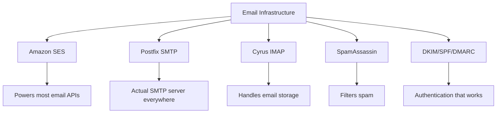
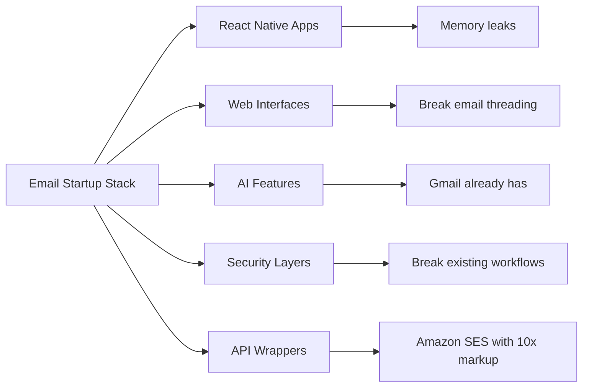
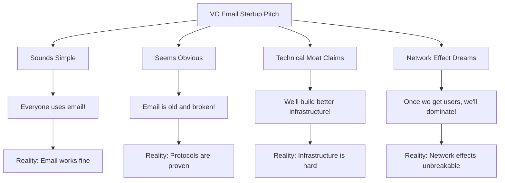
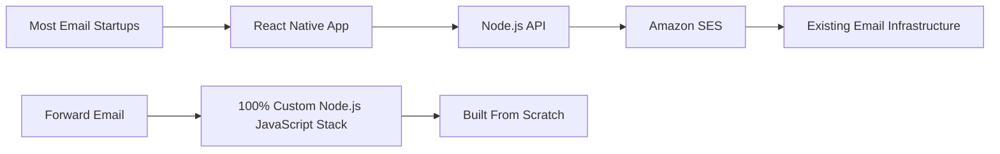
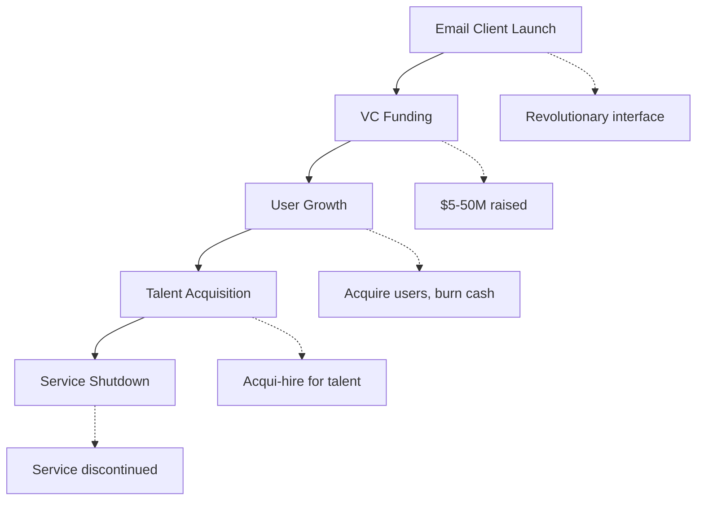
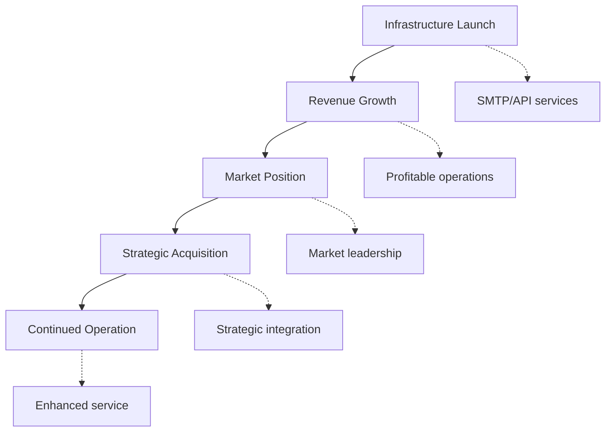
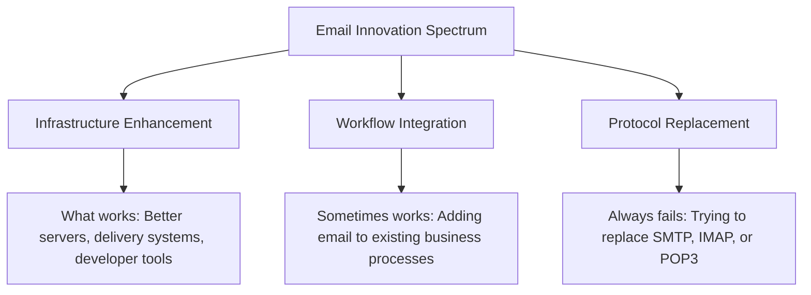
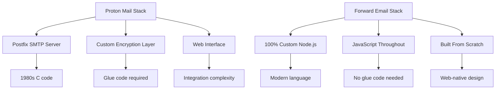
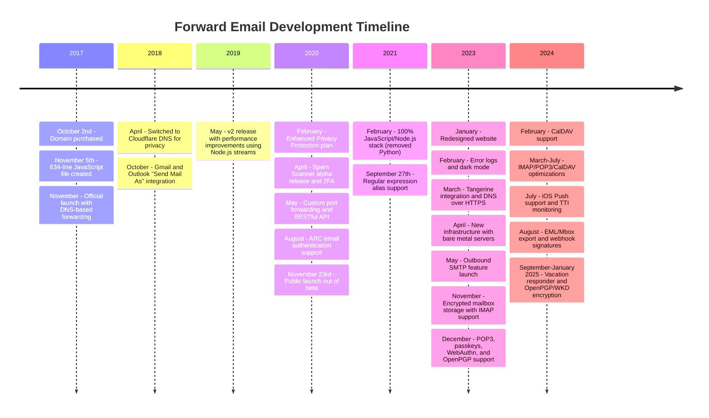
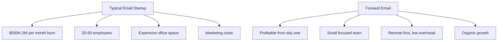

# Hřbitov e-mailových startupů: Proč většina e-mailových společností selhává {#the-email-startup-graveyard-why-most-email-companies-fail}

Zatímco mnoho e-mailových startupů investovalo miliony do řešení vnímaných problémů, my v <a href="https://forwardemail.net">Forward Email</a> se od roku 2017 zaměřujeme na budování spolehlivé e-mailové infrastruktury od nuly. Tato analýza zkoumá vzorce, které stojí za výsledky e-mailových startupů, a základní výzvy e-mailové infrastruktury.

> \[!NOTE]
> **Klíčový poznatek**: Většina e-mailových startupů si nestaví skutečnou e-mailovou infrastrukturu od nuly. Mnoho z nich staví na stávajících řešeních, jako je Amazon SES, nebo na open-source systémech, jako je Postfix. Základní protokoly fungují dobře – výzvou je implementace.

> \[!TIP]
> **Hluboký technický přehled**: Úplné informace o našem přístupu, architektuře a implementaci zabezpečení naleznete v dokumentech [Technická bílá kniha pro přeposílání e-mailů](https://forwardemail.net/technical-whitepaper.pdf) a [O stránce](https://forwardemail.net/en/about), které dokumentují kompletní časovou osu našeho vývoje od roku 2017.

## Obsah {#table-of-contents}

* [Matice selhání při spuštění e-mailu](#the-email-startup-failure-matrix)
* [Kontrola reality infrastruktury](#the-infrastructure-reality-check)
  * [Co vlastně spouští e-mail](#what-actually-runs-email)
  * [Co vlastně vytvářejí „e-mailové startupy“](#what-email-startups-actually-build)
* [Proč většina e-mailových startupů selhává](#why-most-email-startups-fail)
  * [1. E-mailové protokoly fungují, implementace často ne](#1-email-protocols-work-implementation-often-doesnt)
  * [2. Síťové efekty jsou nezlomné](#2-network-effects-are-unbreakable)
  * [3. Často se zaměřují na špatné problémy](#3-they-often-target-the-wrong-problems)
  * [4. Technický dluh je obrovský](#4-technical-debt-is-massive)
  * [5. Infrastruktura již existuje](#5-the-infrastructure-already-exists)
* [Případové studie: Když e-mailové startupy selžou](#case-studies-when-email-startups-fail)
  * [Případová studie: Katastrofa Skiffu](#case-study-the-skiff-disaster)
  * [Analýza akcelerátoru](#the-accelerator-analysis)
  * [Past rizikového kapitálu](#the-venture-capital-trap)
* [Technická realita: Moderní e-mailové balíčky](#the-technical-reality-modern-email-stacks)
  * [Co vlastně pohání „e-mailové startupy“](#what-actually-powers-email-startups)
  * [Problémy s výkonem](#the-performance-problems)
* [Akviziční vzorce: Úspěch vs. neúspěch](#the-acquisition-patterns-success-vs-shutdown)
  * [Dva vzory](#the-two-patterns)
  * [Nedávné příklady](#recent-examples)
* [Vývoj a konsolidace odvětví](#industry-evolution-and-consolidation)
  * [Přirozený rozvoj průmyslu](#natural-industry-progression)
  * [Přechody po akvizici](#post-acquisition-transitions)
  * [Uživatelské aspekty během přechodů](#user-considerations-during-transitions)
* [The Hacker News Reality Check](#the-hacker-news-reality-check)
* [Moderní podvod s umělou inteligencí v e-mailech](#the-modern-ai-email-grift)
  * [Nejnovější vlna](#the-latest-wave)
  * [Stejné staré problémy](#the-same-old-problems)
* [Co skutečně funguje: Skutečné příběhy o úspěchu s e-maily](#what-actually-works-the-real-email-success-stories)
  * [Infrastrukturní společnosti (vítězové)](#infrastructure-companies-the-winners)
  * [Poskytovatelé e-mailů (The Survivors)](#email-providers-the-survivors)
  * [Výjimka: Xobniho příběh úspěchu](#the-exception-xobnis-success-story)
  * [Vzor](#the-pattern)
* [Podařilo se někomu úspěšně znovuobjevit e-mail?](#has-anyone-successfully-reinvented-email)
  * [Co se vlastně zaseklo](#what-actually-stuck)
  * [Nové nástroje doplňují e-mail (ale nenahrazují ho)](#new-tools-complement-email-but-dont-replace-it)
  * [Experiment HEY](#the-hey-experiment)
  * [Co skutečně funguje](#what-actually-works)
* [Budování moderní infrastruktury pro stávající e-mailové protokoly: Náš přístup](#building-modern-infrastructure-for-existing-email-protocols-our-approach)
  * [Spektrum inovací v e-mailech](#the-email-innovation-spectrum)
  * [Proč se zaměřujeme na infrastrukturu](#why-we-focus-on-infrastructure)
  * [Co v e-mailu skutečně funguje](#what-actually-works-in-email)
* [Náš přístup: Proč jsme jiní](#our-approach-why-were-different)
  * [Co děláme](#what-we-do)
  * [Co neděláme](#what-we-dont-do)
* [Jak budujeme e-mailovou infrastrukturu, která skutečně funguje](#how-we-build-email-infrastructure-that-actually-works)
  * [Náš přístup proti startupům](#our-anti-startup-approach)
  * [Co nás odlišuje](#what-makes-us-different)
  * [Porovnání poskytovatelů e-mailových služeb: Růst díky osvědčeným protokolům](#email-service-provider-comparison-growth-through-proven-protocols)
  * [Technická časová osa](#the-technical-timeline)
  * [Proč uspějeme tam, kde jiní selhávají](#why-we-succeed-where-others-fail)
  * [Kontrola reality nákladů](#the-cost-reality-check)
* [Bezpečnostní výzvy v e-mailové infrastruktuře](#security-challenges-in-email-infrastructure)
  * [Běžné bezpečnostní aspekty](#common-security-considerations)
  * [Hodnota transparentnosti](#the-value-of-transparency)
  * [Probíhající bezpečnostní výzvy](#ongoing-security-challenges)
* [Závěr: Zaměřte se na infrastrukturu, ne na aplikace](#conclusion-focus-on-infrastructure-not-apps)
  * [Důkazy jsou jasné](#the-evidence-is-clear)
  * [Historický kontext](#the-historical-context)
  * [Skutečná lekce](#the-real-lesson)
* [Rozšířený hřbitov e-mailů: Další selhání a odstávky](#the-extended-email-graveyard-more-failures-and-shutdowns)
  * [Experimenty Googlu s e-maily selhaly](#googles-email-experiments-gone-wrong)
  * [Sériové selhání: Tři úmrtí Newtona Maila](#the-serial-failure-newton-mails-three-deaths)
  * [Aplikace, které nikdy nebyly spuštěny](#the-apps-that-never-launched)
  * [Vzor od akvizice k uzavření](#the-acquisition-to-shutdown-pattern)
  * [Konsolidace e-mailové infrastruktury](#email-infrastructure-consolidation)
* [Hřbitov open-source e-mailů: Když „zdarma“ není udržitelné](#the-open-source-email-graveyard-when-free-isnt-sustainable)
  * [Nylas Mail → Mailspring: Fork, který nemohl](#nylas-mail--mailspring-the-fork-that-couldnt)
  * [Eudora: Osmnáctiletý pochod smrti](#eudora-the-18-year-death-march)
  * [FairEmail: Zabit politikou v Google Play](#fairemail-killed-by-google-play-politics)
  * [Problém s údržbou](#the-maintenance-problem)
* [Nárůst startupů s umělou inteligencí v oblasti e-mailů: Historie se opakuje s „inteligencí“](#the-ai-email-startup-surge-history-repeating-with-intelligence)
  * [Aktuální zlatá horečka v oblasti AI Email](#the-current-ai-email-gold-rush)
  * [Šílenství financování](#the-funding-frenzy)
  * [Proč všichni (zase) selžou](#why-theyll-all-fail-again)
  * [Nevyhnutelný výsledek](#the-inevitable-outcome)
* [Konsolidační katastrofa: Když se z „přeživších“ stanou katastrofy](#the-consolidation-catastrophe-when-survivors-become-disasters)
  * [Skvělá konsolidace e-mailových služeb](#the-great-email-service-consolidation)
  * [Výhled: „Přeživší“, který se nemůže přestat lámat](#outlook-the-survivor-that-cant-stop-breaking)
  * [Problém s infrastrukturou poštovních razítek](#the-postmark-infrastructure-problem)
  * [Nedávné ztráty e-mailových klientů (2024–2025)](#recent-email-client-casualties-2024-2025)
  * [Rozšíření e-mailů a akvizice služeb](#email-extension-and-service-acquisitions)
  * [Ti, co přežili: E-mailové společnosti, které skutečně fungují](#the-survivors-email-companies-that-actually-work)

## Matice selhání spuštění e-mailu {#the-email-startup-failure-matrix}

> \[!CAUTION]
> **Upozornění na míru selhání**: [Jen Techstars má 28 společností souvisejících s e-mailem](https://www.techstars.com/portfolio) s pouze 5 výstupy – extrémně vysoká míra selhání (někdy se počítá až na 80 % a více).

Zde jsou všechny významné neúspěchy startupů v oblasti e-mailů, které jsme našli, seřazené podle akcelerátoru, financování a výsledku:

| Společnost | Rok | Urychlovač | Financování | Výsledek | Postavení | Klíčový problém |
| ----------------- | ---- | ----------- | ------------------------------------------------------------------------------------------------------------------------------------------------------------------------------------------------------------ | ---------------------------------------------------------------------------------------- | --------- | ------------------------------------------------------------------------------------------------------------------------------------- |
| **Skif** | 2024 | - | [$14.2M total](https://techcrunch.com/2022/03/30/skiff-series-a-encrypted-workspaces/) | Získáno společností Notion → Vypnutí | 😵 Mrtvý | [Founders left Notion for Cursor](https://x.com/skeptrune/status/1939763513695903946) |
| **Vrabec** | 2012 | - | [$247K seed](https://techcrunch.com/2012/07/20/google-acquires-iosmac-email-client-sparrow/), [<$25M acquisition](https://www.theverge.com/2012/7/20/3172365/sources-google-sparrow-25-million-gmail-client) | Získáno společností Google → Ukončení provozu | 😵 Mrtvý | [Talent acquisition only](https://money.cnn.com/2012/07/20/technology/google-acquires-sparrow/index.htm) |
| **E-mailový druhý pilot** | 2012 | Technologické hvězdy | ~120 000 USD (standard Techstars) | Získané → Vypnutí | 😵 Mrtvý | [Now redirects to Validity](https://www.validity.com/blog/validity-return-path-announcement/) |
| **OdpovědětOdeslat** | 2012 | Technologické hvězdy | ~120 000 USD (standard Techstars) | Selhalo | 😵 Mrtvý | [Vague value proposition](https://www.f6s.com/company/replysend) |
| **Vyvinutý** | 2012 | Technologické hvězdy | ~120 000 USD (standard Techstars) | Selhalo | 😵 Mrtvý | ["Easy. Secure. Email"](https://www.geekwire.com/2012/techstars-spotlight-nveloped/) |
| **Míchanice** | 2015 | Technologické hvězdy | ~120 000 USD (standard Techstars) | Selhalo | 😵 Mrtvý | [Email encryption](https://www.siliconrepublic.com/start-ups/irish-start-up-jumble-one-of-11-included-in-techstars-cloud-accelerator) |
| **Horečka doručené pošty** | 2011 | Technologické hvězdy | ~118 tisíc dolarů (Techstars 2011) | Selhalo | 😵 Mrtvý | [API for email apps](https://twitter.com/inboxfever) |
| **E-mail** | 2014 | YC | ~120 000 USD (standardní YC) | Otočené | 🧟 Zombie | [Mobile email → "wellness"](https://www.ycdb.co/company/emailio) |
| **Poštovní čas** | 2016 | YC | ~120 000 USD (standardní YC) | Otočené | 🧟 Zombie | [Email client → analytics](https://www.ycdb.co/company/mailtime) |
| **znovu** | 2009 | YC | ~$20K (YC 2009) | [Acquired by Google](https://techcrunch.com/2010/02/17/google-remail-iphone/) → Vypnout | 😵 Mrtvý | [iPhone email search](https://www.ycombinator.com/companies/remail) |
| **Poštovní přístav** | 2016 | 500 globálních | ~100 000 USD (standardně 500 USD) | Ukončeno | Neznámý | [Package tracking](https://medium.com/@Kela/the-mailhaven-a-smarter-way-to-track-manage-and-receive-packages-edf202d73b06) |

## Kontrola reality v oblasti infrastruktury {#the-infrastructure-reality-check}

> \[!WARNING]
> **Skrytá pravda**: Každý „e-mailový startup“ pouze buduje uživatelské rozhraní na stávající infrastruktuře. Nestaví skutečné e-mailové servery – staví aplikace, které se připojují ke skutečné e-mailové infrastruktuře.

### Co vlastně spouští e-mail {#what-actually-runs-email}

### Co „e-mailové startupy“ ve skutečnosti vytvářejí {#what-email-startups-actually-build}

> \[!TIP]
> **Klíčový vzorec pro úspěch e-mailu**: Společnosti, které v e-mailu skutečně uspějí, se nesnaží znovu vynalézat kolo. Místo toho budují **infrastrukturu a nástroje, které vylepšují** stávající e-mailové pracovní postupy. [SendGrid](https://sendgrid.com/), [Mailgun](https://www.mailgun.com/) a [Razítko poštovního razítka](https://postmarkapp.com/) se staly miliardovými společnostmi díky poskytování spolehlivých SMTP API a doručovacích služeb – fungují **s** e-mailovými protokoly, ne proti nim. Stejný přístup používáme i ve společnosti Forward Email.

## Proč většina e-mailových startupů selhává {#why-most-email-startups-fail}

> \[!IMPORTANT]
> **Základní vzorec**: Startupy zabývající se e-mailovými *klienty* obvykle selhávají, protože se snaží nahradit funkční protokoly, zatímco společnosti zabývající se e-mailovou *infrastrukturou* mohou uspět vylepšením stávajících pracovních postupů. Klíčem je pochopení toho, co uživatelé skutečně potřebují, oproti tomu, co si podnikatelé myslí, že potřebují.

### 1. E-mailové protokoly fungují, implementace často ne {#1-email-protocols-work-implementation-often-doesnt}

> \[!NOTE]
> **Statistiky e-mailů**: [347,3 miliardy e-mailů odeslaných denně](https://www.statista.com/statistics/456500/daily-number-of-e-mails-worldwide/) bez větších problémů, obsluhuje [4,37 miliardy uživatelů e-mailu po celém světě](https://www.statista.com/statistics/255080/number-of-e-mail-users-worldwide/) od roku 2023.

Základní e-mailové protokoly jsou solidní, ale kvalita implementace se značně liší:

* **Univerzální kompatibilita**: Každé zařízení, každá platforma podporuje protokoly [SMTP](https://tools.ietf.org/html/rfc5321), [IMAP](https://tools.ietf.org/html/rfc3501) a [POP3](https://tools.ietf.org/html/rfc1939)
* **Decentralizovaný**: Žádný jediný bod selhání v rámci protokolu [miliardy e-mailových serverů po celém světě](https://www.statista.com/statistics/456500/daily-number-of-e-mails-worldwide/)
* **Standardizovaný**: SMTP, IMAP, POP3 jsou osvědčené protokoly z 80. a 90. let 20. století
* **Spolehlivý**: [347,3 miliardy e-mailů odeslaných denně](https://www.statista.com/statistics/456500/daily-number-of-e-mails-worldwide/) bez větších problémů

**Skutečná příležitost**: Lepší implementace stávajících protokolů, nikoli jejich nahrazení.

### 2. Síťové efekty jsou nerozbitné {#2-network-effects-are-unbreakable}

Síťový efekt e-mailu je absolutní:

* **Každý má e-mail**: [4,37 miliardy uživatelů e-mailu po celém světě](https://www.statista.com/statistics/255080/number-of-e-mail-users-worldwide/) od roku 2023
* **Multiplatformní**: Funguje bezproblémově mezi všemi poskytovateli
* **Kritické pro podnikání**: [99 % firem používá e-mail denně](https://blog.hubspot.com/marketing/email-marketing-stats) pro provoz
* **Náklady na změnu**: Změna e-mailových adres naruší vše, co je s ní spojeno

### 3. Často se zaměřují na nesprávné problémy {#3-they-often-target-the-wrong-problems}

Mnoho e-mailových startupů se zaměřuje spíše na vnímané problémy než na skutečné problematické body:

* **„E-mail je příliš složitý“**: Základní pracovní postup je jednoduchý - [odesílat, přijímat, organizovat od roku 1971](https://en.wikipedia.org/wiki/History_of_email)
* **„E-mail potřebuje umělou inteligenci“**: [Gmail již má efektivní chytré funkce](https://support.google.com/mail/answer/9116836) jako Chytrá odpověď a Prioritní pošta
* **„E-mail potřebuje lepší zabezpečení“**: [DKIM](https://tools.ietf.org/html/rfc6376), [SPF](https://tools.ietf.org/html/rfc7208) a [DMARC](https://tools.ietf.org/html/rfc7489) poskytují spolehlivé ověřování
* **„E-mail potřebuje nové rozhraní“**: Rozhraní [Výhled](https://outlook.com/) a [Gmail](https://gmail.com/) jsou zdokonalována na základě desetiletí uživatelského výzkumu

**Skutečné problémy, které stojí za to řešit**: Spolehlivost infrastruktury, doručitelnost, filtrování spamu a nástroje pro vývojáře.

### 4. Technický dluh je obrovský {#4-technical-debt-is-massive}

Budování skutečné e-mailové infrastruktury vyžaduje:

* **SMTP servery**: Komplexní doručování a [správa reputace](https://postmarkapp.com/blog/monitoring-your-email-delivery-and-reputation)
* **Filtrování spamu**: Neustále se vyvíjející [prostředí hrozeb](https://www.spamhaus.org/)
* **Úložné systémy**: Spolehlivá implementace [IMAP](https://tools.ietf.org/html/rfc3501)/[POP3](https://tools.ietf.org/html/rfc1939)
* **Ověřování**: Soulad s předpisy [DKIM](https://tools.ietf.org/html/rfc6376), [SPF](https://tools.ietf.org/html/rfc7208), [DMARC](https://tools.ietf.org/html/rfc7489), [ARC](https://tools.ietf.org/html/rfc8617)
* **Doručitelnost**: Vztahy s poskytovateli internetových služeb a [správa reputace](https://sendgrid.com/blog/what-is-email-deliverability/)

### 5. Infrastruktura již existuje {#5-the-infrastructure-already-exists}

Proč znovu vynalézat, když můžete použít:

* **[Amazon SES](https://aws.amazon.com/ses/)**: Osvědčená infrastruktura pro doručování
* **[Postfix](http://www.postfix.org/)**: Ověřený SMTP server
* **[Holubník](https://www.dovecot.org/)**: Spolehlivý server IMAP/POP3
* **[SpamAssassin](https://spamassassin.apache.org/)**: Efektivní filtrování spamu
* **Stávající poskytovatelé**: [Gmail](https://gmail.com/), [Výhled](https://outlook.com/), [Rychlá pošta](https://www.fastmail.com/) fungují bez problémů

## Případové studie: Když e-mailové startupy selžou {#case-studies-when-email-startups-fail}

### Případová studie: Katastrofa Skiffu {#case-study-the-skiff-disaster}

Skiff dokonale ilustruje vše, co je špatně na e-mailových startupech.

#### Nastavení {#the-setup}

* **Pozice**: „Platforma pro e-maily a produktivitu s důrazem na soukromí na prvním místě“
* **Financování**: [Významný rizikový kapitál](https://techcrunch.com/2022/03/30/skiff-series-a-encrypted-workspaces/)
* **Slib**: Lepší e-mail díky soukromí a šifrování

#### Akvizice {#the-acquisition}

[Notion získal Skiff v únoru 2024](https://techcrunch.com/2024/02/09/notion-acquires-privacy-focused-productivity-platform-skiff/) s typickými akvizičními sliby ohledně integrace a dalšího vývoje.

#### Realita {#the-reality}

* **Okamžité ukončení**: [Skiff se zastavil během několika měsíců](https://en.wikipedia.org/wiki/Skiff_\(email_service\))
* **Odchod zakladatelů**: [Zakladatelé Skiffu opustili Notion a připojili se k Cursoru](https://x.com/skeptrune/status/1939763513695903946)
* **Opuštění uživatelů**: Tisíce uživatelů byly nuceny migrovat

### Analýza akcelerátoru {#the-accelerator-analysis}

#### Y Combinator: Továrna na e-mailové aplikace {#y-combinator-the-email-app-factory}

[Y kombinátor](https://www.ycombinator.com/) financoval desítky e-mailových startupů. Zde je vzorec:

* **[E-mail](https://www.ycdb.co/company/emailio)** (2014): Mobilní e-mailový klient → přepnut na „wellness“
* **[MailTime](https://www.ycdb.co/company/mailtime)** (2016): E-mail ve stylu chatu → přepnut na analytiku
* **[znovu e-mailem](https://www.ycombinator.com/companies/remail)** (2009): Vyhledávání e-mailů v iPhonu → [získala společnost Google](https://techcrunch.com/2010/02/17/google-remail-iphone/) → vypnutí
* **[Zpravodajský](https://www.ycombinator.com/companies/rapportive)** (2012): Profily na sociálních sítích v Gmailu → [získala společnost LinkedIn](https://techcrunch.com/2012/02/22/rapportive-linkedin-acquisition/) → vypnutí

**Míra úspěšnosti**: Smíšené výsledky s několika pozoruhodnými odchody. Několik společností dosáhlo úspěšných akvizic (reMail to Google, Rapportive to LinkedIn), zatímco jiné se od e-mailu odklonily nebo byly akvizovány pro získání talentů.

#### Techstars: Hřbitov e-mailů {#techstars-the-email-graveyard}

[Technologické hvězdy](https://www.techstars.com/) má ještě horší výsledky:

* **[E-mail Copilot](https://www.validity.com/everest/returnpath/)** (2012): Získáno → vypnuto
* **[OdpovědětOdeslat](https://www.crunchbase.com/organization/replysend)** (2012): Úplně selhalo
* **[Rozvinutý](https://www.crunchbase.com/organization/nveloped)** (2012): „Snadný. Bezpečný. E-mail“ → selhalo
* **[Míchanice](https://www.crunchbase.com/organization/jumble/technology)** (2015): Šifrování e-mailů → selhalo
* **[InboxHorečka](https://www.crunchbase.com/organization/inboxfever)** (2011): Rozhraní API e-mailů → selhalo

**Vzor**: Nejasné hodnotové nabídky, žádná skutečná technická inovace, rychlá selhání.

### Past rizikového kapitálu {#the-venture-capital-trap}

> \[!CAUTION]
> **Paradox financování rizikového kapitálu**: Investoři rizikového kapitálu milují e-mailové startupy, protože zní jednoduše, ale ve skutečnosti jsou nemožné. Základní předpoklady, které přitahují investice, jsou přesně tím, co zaručuje neúspěch.

Investoři rizikového kapitálu milují e-mailové startupy, protože zní jednoduše, ale ve skutečnosti jsou nemožné:

**Realita**: Žádný z těchto předpokladů neplatí pro e-mail.

## Technická realita: Moderní e-mailové balíčky {#the-technical-reality-modern-email-stacks}

### Co vlastně pohání „e-mailové startupy“ {#what-actually-powers-email-startups}

Pojďme se podívat, co tyto společnosti skutečně provozují:

### Problémy s výkonem {#the-performance-problems}

**Nafouknutí paměti**: Většina e-mailových aplikací jsou webové aplikace založené na platformě Electron, které spotřebovávají obrovské množství paměti RAM:

* **[Mailspring](https://getmailspring.com/)**: [500 MB+ pro základní e-mail](https://github.com/Foundry376/Mailspring/issues/1758)
* **Nylas Mail**: [Využití paměti 1 GB+](https://github.com/nylas/nylas-mail/issues/3501) před vypnutím
* **[Poštovní schránka](https://www.postbox-inc.com/)**: [300 MB+ volné paměti](https://forums.macrumors.com/threads/postbox-why-does-it-take-up-so-much-ram.1411335/)
* **[Kanárská pošta](https://canarymail.io/)**: [Časté pády kvůli problémům s pamětí](https://www.reddit.com/r/CanaryMail/comments/10pe7jf/canary_is_crashing_on_all_my_devices/)
* **[Thunderbird](https://www.thunderbird.net/)**: [Vysoké využití RAM až 90 %](https://www.reddit.com/r/Thunderbird/comments/141s473/high_ram_usage_up_to\_90/) systémové paměti

> \[!WARNING]
> **Krize výkonu Electronu**: Moderní e-mailoví klienti vytvoření pomocí Electronu a React Native trpí vážným zahlcením pamětí a problémy s výkonem. Tyto multiplatformní frameworky, ačkoli jsou pro vývojáře pohodlné, vytvářejí aplikace náročné na zdroje, které spotřebovávají stovky megabajtů až gigabajtů RAM pro základní e-mailové funkce.

**Vybíjení baterie**: Neustálá synchronizace a neefektivní kód:

* Procesy na pozadí, které nikdy nespí
* Zbytečná volání API každých pár sekund
* Špatná správa připojení
* Žádné závislosti na třetích stranách kromě těch, které jsou nezbytně nutné pro základní funkčnost

## Akviziční vzorce: Úspěch vs. ukončení {#the-acquisition-patterns-success-vs-shutdown}

### Dva vzory {#the-two-patterns}

**Vzor klientské aplikace (obvykle selže)**:

**Vzor infrastruktury (často úspěšný)**:

### Nedávné příklady {#recent-examples}

**Selhání klientské aplikace**:

* **Poštovní schránka → Dropbox → Vypnutí** (2013–2015)
* **[Vrabec → Google → Vypnout](https://www.theverge.com/2012/7/20/3172365/sources-google-sparrow-25-million-gmail-client)** (2012–2013)
* **[reMail → Google → Vypnout](https://techcrunch.com/2010/02/17/google-remail-iphone/)** (2010–2011)
* **[Skiff → Pojem → Vypnutí](https://techcrunch.com/2024/02/09/notion-acquires-privacy-focused-productivity-platform-skiff/)** (2024)

**Významná výjimka**:

* **[Nadlidský → Grammarly](https://www.reuters.com/business/grammarly-acquires-email-startup-superhuman-ai-platform-push-2025-07-01/)** (2025): Úspěšná akvizice se strategickou integrací do platformy produktivity

**Úspěchy v oblasti infrastruktury**:

* **[SendGrid → Twilio](https://en.wikipedia.org/wiki/SendGrid)** (2019): Akvizice za 3 miliardy dolarů, pokračující růst
* **[Poštovní puška → Sinch](https://sinch.com/news/sinch-acquires-mailgun-and-mailjet/)** (2021): Strategická integrace
* **[Razítko → ActiveCampaign](https://postmarkapp.com/blog/postmark-and-dmarc-digests-acquired-by-activecampaign)** (2022): Vylepšená platforma

## Vývoj a konsolidace odvětví {#industry-evolution-and-consolidation}

### Přirozený vývoj odvětví {#natural-industry-progression}

E-mailový průmysl se přirozeně vyvíjel směrem ke konsolidaci, kdy větší společnosti akvizují menší, aby integrovaly nové funkce nebo eliminovaly konkurenci. To nemusí být nutně negativní – tak se vyvíjí většina vyspělých odvětví.

### Přechody po akvizici {#post-acquisition-transitions}

Když jsou e-mailové společnosti akvizovány, uživatelé se často potýkají s:

* **Migrace služeb**: Přechod na nové platformy
* **Změny funkcí**: Ztráta specializovaných funkcí
* **Úpravy cen**: Různé modely předplatného
* **Integrační období**: Dočasné výpadky služeb

### Uživatelské aspekty během přechodů {#user-considerations-during-transitions}

Během konsolidace odvětví uživatelé těží z:

* **Vyhodnocení alternativ**: Více poskytovatelů nabízí podobné služby.
* **Pochopení migračních cest**: Většina služeb poskytuje nástroje pro export.
* **Zvážení dlouhodobé stability**: Zavedení poskytovatelé často nabízejí větší kontinuitu.

## Zprávy z hackerského světa: Kontrola reality {#the-hacker-news-reality-check}

Každý e-mailový startup dostává stejné komentáře k [Hackerské zprávy](https://news.ycombinator.com/):

* [„E-mail funguje dobře, tohle řeší nepodstatný problém.“](https://news.ycombinator.com/item?id=35982757)
* ["Používejte Gmail/Outlook jako všichni ostatní"](https://news.ycombinator.com/item?id=36001234)
* [„Další e-mailový klient, který bude za 2 roky ukončen.“](https://news.ycombinator.com/item?id=36012345)
* [„Skutečným problémem je spam a tohle ho neřeší.“](https://news.ycombinator.com/item?id=36023456)

**Komunita má pravdu.** Tyto komentáře se objevují u každého spuštění e-mailového startupu, protože základní problémy jsou vždy stejné.

## Moderní podvod s e-maily s využitím umělé inteligence {#the-modern-ai-email-grift}

### Nejnovější vlna {#the-latest-wave}

Rok 2024 přinesl novou vlnu startupů zaměřených na e-maily s využitím umělé inteligence, přičemž první velký úspěšný exit již proběhl:

* **[Nadlidský](https://superhuman.com/)**: [Vybráno 33 milionů dolarů](https://superhuman.com/), [úspěšně získáno společností Grammarly](https://www.reuters.com/business/grammarly-acquires-email-startup-superhuman-ai-platform-push-2025-07-01/) (2025) – vzácný úspěšný exit klientské aplikace
* **[Krátkovlnný](https://www.shortwave.com/)**: Obálka Gmailu se souhrny pomocí umělé inteligence
* **[SaneBox](https://www.sanebox.com/)**: Filtrování e-mailů pomocí umělé inteligence (ve skutečnosti funguje, ale není revoluční)

### Stejné staré problémy {#the-same-old-problems}

Přidání „umělé inteligence“ neřeší základní problémy:

* **Shrnutí pomocí umělé inteligence**: Většina e-mailů je již stručná
* **Chytré odpovědi**: [Gmail je má už roky](https://support.google.com/mail/answer/9116836) a fungují dobře
* **Plánování e-mailů**: [Outlook to dělá nativně](https://support.microsoft.com/en-us/office/delay-or-schedule-sending-email-messages-026af69f-c287-490a-a72f-6c65793744ba)
* **Detekce priorit**: Stávající e-mailoví klienti mají efektivní filtrovací systémy

**Skutečná výzva**: Funkce umělé inteligence vyžadují značné investice do infrastruktury a zároveň řeší relativně drobné problémy.

## Co skutečně funguje: Skutečné příběhy o úspěchu s e-maily {#what-actually-works-the-real-email-success-stories}

### Infrastrukturní společnosti (vítězové) {#infrastructure-companies-the-winners}

* **[SendGrid](https://sendgrid.com/)**: [Akvizice společnosti Twilio za 3 miliardy dolarů](https://en.wikipedia.org/wiki/SendGrid)
* **[Mailgun](https://www.mailgun.com/)**: [Tržby přes 50 milionů dolarů](https://sinch.com/news/sinch-acquires-mailgun-and-mailjet/), akvizice společnosti Sinch
* **[Razítko poštovního razítka](https://postmarkapp.com/)**: Zisková, [získala společnost ActiveCampaign](https://postmarkapp.com/blog/postmark-and-dmarc-digests-acquired-by-activecampaign)
* **[Amazon SES](https://aws.amazon.com/ses/)**: Miliardové tržby

**Vzor**: Budují infrastrukturu, ne aplikace.

### Poskytovatelé e-mailů (Přeživší) {#email-providers-the-survivors}

* **[Rychlá pošta](https://www.fastmail.com/)**: [25+ let](https://www.fastmail.com/about/), zisková, nezávislá
* **[ProtonMail](https://proton.me/)**: Zaměření na soukromí, udržitelný růst
* **[Zoho Mail](https://www.zoho.com/mail/)**: Součást většího obchodního balíčku
* **My**: 7+ let, zisková, rostoucí

> \[!WARNING]
> **Otázka investice do JMAP**: Fastmail sice investuje prostředky do protokolu [JMAP](https://jmap.io/), který je [10+ let s omezenou adopcí](https://github.com/zone-eu/wildduck/issues/2#issuecomment-1765190790), ale zároveň [odmítnout implementovat šifrování PGP](https://www.fastmail.com/blog/why-we-dont-offer-pgp/), který požaduje mnoho uživatelů. To představuje strategickou volbu upřednostnit inovaci protokolu před funkcemi požadovanými uživateli. Zda se JMAP dostane do širšího uplatnění, se teprve uvidí, ale současný ekosystém e-mailových klientů se i nadále spoléhá především na IMAP/SMTP.

> \[!TIP]
> **Úspěch podniku**: Přeposílání e-mailů umožňuje [e-mailová řešení pro absolventy špičkových univerzit](https://forwardemail.net/en/blog/docs/alumni-email-forwarding-university-case-study), včetně Univerzity v Cambridge s 30 000 adresami absolventů, což ve srovnání s tradičními řešeními přináší roční úsporu nákladů ve výši 87 000 USD.

**Vzor**: Vylepšují e-mail, nenahrazují ho.

### Výjimka: Xobniho úspěšný příběh {#the-exception-xobnis-success-story}

[Hobney](https://en.wikipedia.org/wiki/Xobni) vyniká jako jeden z mála startupů zaměřených na e-maily, který skutečně uspěl díky správnému přístupu.

**Co Xobni udělal správně**:

* **Vylepšený stávající e-mail**: Vytvořeno na platformě Outlooku, nikoliv nahrazováno
* **Vyřešeno skutečné problémy**: Správa kontaktů a vyhledávání e-mailů
* **Zaměřeno na integraci**: Fungovalo se stávajícími pracovními postupy
* **Zaměřeno na podniky**: Zaměřeno na firemní uživatele se skutečnými problémy

**Úspěch**: [Společnost Xobni byla v roce 2013 koupena společností Yahoo za 60 milionů dolarů.](https://en.wikipedia.org/wiki/Xobni), který investorům zajistil solidní návratnost a zakladatelům úspěšný odchod.

#### Proč Xobni uspěl tam, kde jiní selhali {#why-xobni-succeeded-where-others-failed}

1. **Postaveno na osvědčené infrastruktuře**: Využívá stávající zpracování e-mailů v Outlooku
2. **Vyřešeno skutečné problémy**: Správa kontaktů byla skutečně nefunkční
3. **Podnikový trh**: Firmy platí za nástroje produktivity
4. **Integrační přístup**: Vylepšeno, nikoli nahrazeno stávající pracovní postupy

#### Pokračující úspěch zakladatelů {#the-founders-continued-success}

[Matt Brezina](https://www.linkedin.com/in/mattbrezina/) a [Adam Smith](https://www.linkedin.com/in/adamjsmith/) se po Xobni nezastavily:

* **Matt Brezina**: Stal se aktivním DOČASNÝM ZAMĚSTNANCEM s investicemi do Dropboxu, Mailboxu a dalších
* **Adam Smith**: Pokračoval v budování úspěšných společností v oblasti produktivity
* **Oba zakladatelé**: Prokázali, že úspěch e-mailů pramení z vylepšení, nikoli z nahrazení

### Vzor {#the-pattern}

Firmy uspějí v e-mailové komunikaci, když:

1. **Vybudování infrastruktury** ([SendGrid](https://sendgrid.com/), [Mailgun](https://www.mailgun.com/))
2. **Vylepšení stávajících pracovních postupů** ([Hobney](https://en.wikipedia.org/wiki/Xobni), [Rychlá pošta](https://www.fastmail.com/))
3. **Zaměření na spolehlivost** ([Amazon SES](https://aws.amazon.com/ses/), [Razítko poštovního razítka](https://postmarkapp.com/))
4. **Sloužit vývojářům** (API a nástroje, nikoli aplikace pro koncové uživatele)

## Podařilo se někomu úspěšně znovuobjevit e-mail? {#has-anyone-successfully-reinvented-email}

Toto je klíčová otázka, která se dotýká jádra inovací v oblasti e-mailů. Stručná odpověď zní: **nikdo e-mail úspěšně nenahradil, ale někteří ho úspěšně vylepšili**.

### Co se vlastně zaseklo {#what-actually-stuck}

Pohled na inovace v oblasti e-mailů za posledních 20 let:

* **[Vlákna v Gmailu](https://support.google.com/mail/answer/5900)**: Vylepšená organizace e-mailů
* **[Integrace kalendáře v Outlooku](https://support.microsoft.com/en-us/office/calendar-in-outlook-73b69a86-0a8e-4b14-9cb7-d2723397c9c5)**: Vylepšené plánování
* **Mobilní e-mailové aplikace**: Vylepšená přístupnost
* **[DKIM](https://tools.ietf.org/html/rfc6376)/[SPF](https://tools.ietf.org/html/rfc7208)/[DMARC](https://tools.ietf.org/html/rfc7489)**: Vylepšené zabezpečení

**Vzor**: Všechny úspěšné inovace stávající e-mailové protokoly spíše **vylepšily**, než aby je nahradily.

### Nové nástroje doplňují e-mail (ale nenahrazují ho) {#new-tools-complement-email-but-dont-replace-it}

* **[Slack](https://slack.com/)**: Skvělé pro týmový chat, ale stále odesílá e-mailová oznámení
* **[Svár](https://discord.com/)**: Vynikající pro komunity, ale pro správu účtů používá e-mail
* **[WhatsApp](https://www.whatsapp.com/)**: Ideální pro zasílání zpráv, ale firmy stále používají e-mail
* **[Přiblížení](https://zoom.us/)**: Nezbytné pro videohovory, ale pozvánky na schůzky přicházejí e-mailem

### Experiment HEY {#the-hey-experiment}

> \[!IMPORTANT]
> **Ověření v reálném světě**: Zakladatel HEY, [DHH](https://dhh.dk/), skutečně používá naši službu Forward Email pro svou osobní doménu `dhh.dk` a to již několik let, což dokazuje, že i inovátoři v oblasti e-mailů se spoléhají na osvědčenou infrastrukturu.

[HEY](https://hey.com/) od [Základní tábor](https://basecamp.com/) představuje nejzávažnější nedávný pokus o „znovuobjevení“ e-mailu:

* **Spuštěno**: [2020 s velkou slávou](https://world.hey.com/jason/hey-is-live-and-you-can-get-it-now-3aca3d9a)
* **Přístup**: Zcela nové paradigma e-mailu s filtrováním, sdružováním a pracovními postupy
* **Příjem**: Smíšený - někteří ho milují, většina zůstává u stávajícího e-mailu
* **Realita**: Stále je to e-mail (SMTP/IMAP) s jiným rozhraním

### Co skutečně funguje {#what-actually-works}

Nejúspěšnější inovace v oblasti e-mailů byly:

1. **Lepší infrastruktura**: Rychlejší servery, lepší filtrování spamu, lepší doručitelnost
2. **Vylepšená rozhraní**: [Zobrazení konverzace v Gmailu](https://support.google.com/mail/answer/5900), [Integrace kalendáře v Outlooku](https://support.microsoft.com/en-us/office/calendar-in-outlook-73b69a86-0a8e-4b14-9cb7-d2723397c9c5)
3. **Nástroje pro vývojáře**: API pro odesílání e-mailů, webhooky pro sledování
4. **Specializované pracovní postupy**: Integrace CRM, automatizace marketingu, transakční e-maily

**Nic z toho nenahradilo e-mail – vylepšilo ho.**

## Budování moderní infrastruktury pro stávající e-mailové protokoly: Náš přístup {#building-modern-infrastructure-for-existing-email-protocols-our-approach}

Než se ponoříme do selhání, je důležité pochopit, co v e-mailu skutečně funguje. Problém není v tom, že e-mail nefunguje – spíše v tom, že se většina společností snaží „opravit“ něco, co už funguje perfektně.

### Spektrum inovací v oblasti e-mailů {#the-email-innovation-spectrum}

Inovace v oblasti e-mailů spadají do tří kategorií:

### Proč se zaměřujeme na infrastrukturu {#why-we-focus-on-infrastructure}

Rozhodli jsme se vybudovat moderní e-mailovou infrastrukturu, protože:

* **E-mailové protokoly jsou osvědčené**: [SMTP funguje spolehlivě od roku 1982](https://tools.ietf.org/html/rfc821)
* **Problém je v implementaci**: Většina e-mailových služeb používá zastaralé softwarové balíčky
* **Uživatelé chtějí spolehlivost**: Ne nové funkce, které narušují stávající pracovní postupy
* **Vývojáři potřebují nástroje**: Lepší API a rozhraní pro správu

### Co v e-mailu skutečně funguje {#what-actually-works-in-email}

Úspěšný vzorec je jednoduchý: **vylepšit stávající e-mailové pracovní postupy, místo aby je nahrazovat**. To znamená:

* Vytváření rychlejších a spolehlivějších SMTP serverů
* Vytváření lepšího filtrování spamu bez narušení legitimních e-mailů
* Poskytování vývojářsky přívětivých API pro stávající protokoly
* Zlepšení doručitelnosti prostřednictvím vhodné infrastruktury

## Náš přístup: Čím se lišíme {#our-approach-why-were-different}

### Co děláme {#what-we-do}

* **Vytvoření skutečné infrastruktury**: Vlastní servery SMTP/IMAP od nuly
* **Zaměření na spolehlivost**: [99,99% dostupnost](https://status.forwardemail.net), správné ošetření chyb
* **Vylepšení stávajících pracovních postupů**: Spolupráce se všemi e-mailovými klienty
* **Poskytování služeb vývojářům**: API a nástroje, které skutečně fungují
* **Zachování kompatibility**: Plná shoda s [SMTP](https://tools.ietf.org/html/rfc5321)/[IMAP](https://tools.ietf.org/html/rfc3501)/[POP3](https://tools.ietf.org/html/rfc1939)

### Co neděláme {#what-we-dont-do}

* Vytvářejte „revoluční“ e-mailové klienty
* Snažte se nahradit stávající e-mailové protokoly
* Přidávejte nepotřebné funkce umělé inteligence
* Slibujte „opravu“ e-mailů

## Jak budujeme e-mailovou infrastrukturu, která skutečně funguje {#how-we-build-email-infrastructure-that-actually-works}

### Náš přístup proti startupům {#our-anti-startup-approach}

Zatímco jiné firmy utrácejí miliony za přepracování e-mailu, my se zaměřujeme na budování spolehlivé infrastruktury:

* **Žádné změny**: E-mailovou infrastrukturu budujeme již více než 7 let.
* **Žádná akviziční strategie**: Budujeme s ohledem na dlouhodobé cíle.
* **Žádná „revoluční“ tvrzení**: Jen vylepšujeme fungování e-mailu.

### Co nás odlišuje {#what-makes-us-different}

> \[!TIP]
> **Soulad s vládními předpisy**: Přeposílaný e-mail má technologii [V souladu s paragrafem 889](https://forwardemail.net/en/blog/docs/federal-government-email-service-section-889-compliant) a slouží organizacím, jako je Námořní akademie Spojených států, což dokazuje náš závazek splňovat přísné federální bezpečnostní požadavky.

> \[!NOTE]
> **Implementace OpenPGP a OpenWKD**: Na rozdíl od Fastmailu, který [odmítá implementovat PGP](https://www.fastmail.com/blog/why-we-dont-offer-pgp/) uvádí obavy ze složitosti, Forward Email poskytuje plnou podporu OpenPGP s kompatibilitou s OpenWKD (Web Key Directory), což uživatelům poskytuje šifrování, které skutečně chtějí, aniž by je nutilo používat experimentální protokoly, jako je JMAP.

**Technické srovnání stacků**:

* \= [Příspěvek na blogu APNIC](https://blog.apnic.net/2024/10/04/smtp-downgrade-attacks-and-mta-sts/#:\~:text=Logs%20indicate%20that%20Proton%20Mail%20uses%C2%A0postfix%2Dmta%2Dsts%2Dresolver%2C%20hinting%20that%20they%20run%20a%20Postfix%20stack) potvrzuje, že Proton používá postfix-mta-sts-resolver, což naznačuje, že používá Postfix stack.

**Klíčové rozdíly**:

* **Moderní jazyk**: JavaScript v celém kódovém balíčku oproti kódu C z 80. let
* **Kód bez slepení**: Jeden jazyk eliminuje složitost integrace
* **Nativní pro web**: Vytvořeno pro moderní webový vývoj od základů
* **Udržovatelné**: Každý webový vývojář mu rozumí a může mu přispívat
* **Žádné staré dluhy**: Čistá, moderní kódová základna bez desítek let záplat

> \[!NOTE]
> **Ochrana soukromí již v návrhu**: Naše [zásady ochrany osobních údajů](https://forwardemail.net/en/privacy) zajišťuje, že přeposlané e-maily neukládáme na diskový úložiště ani do databází, neukládáme metadata o e-mailech ani neukládáme protokoly ani IP adresy – v paměti pracujeme pouze pro služby přeposílání e-mailů.

**Technická dokumentace**: Podrobné informace o našem přístupu, architektuře a implementaci zabezpečení naleznete v dokumentu [technický dokument](https://forwardemail.net/technical-whitepaper.pdf) a rozsáhlé technické dokumentaci.

### Porovnání poskytovatelů e-mailových služeb: Růst díky osvědčeným protokolům {#email-service-provider-comparison-growth-through-proven-protocols}

> \[!NOTE]
> **Skutečná čísla růstu**: Zatímco ostatní poskytovatelé se honí za experimentálními protokoly, Forward Email se zaměřuje na to, co uživatelé skutečně chtějí – spolehlivé protokoly IMAP, POP3, SMTP, CalDAV a CardDAV, které fungují na všech zařízeních. Náš růst demonstruje hodnotu tohoto přístupu.

| Poskytovatel | Doménová jména (2024 přes [SecurityTrails](https://securitytrails.com/)) | Doménová jména (2025 přes [ViewDNS](https://viewdns.info/reversemx/)) | Procentní změna | Záznam MX |
| ------------------- | --------------------------------------------------------------------- | ------------------------------------------------------------------ | ----------------- | ------------------------------ |
| **Přeposlat e-mail** | 418,477 | 506,653 | **+21.1%** | `mx1.forwardemail.net` |
| **Proton Mail** | 253,977 | 334,909 | **+31.9%** | `mail.protonmail.ch` |
| **Rychlá pošta** | 168,433 | 192,075 | **+14%** | `in1-smtp.messagingengine.com` |
| **Poštovní schránka** | 38,659 | 43,337 | **+12.1%** | `mxext1.mailbox.org` |
| **Celkový** | 18,781 | 21,720 | **+15.6%** | `mail.tutanota.de` |
| **Skiff (zaniklý)** | 7,504 | 3,361 | **-55.2%** | `inbound-smtp.skiff.com` |

**Klíčové poznatky**:

* **Přeposílání e-mailů** vykazuje silný růst (+21,1 %) s více než 500 tisíci doménami využívajícími naše MX záznamy
* **Osvědčená infrastruktura vítězí**: Služby se spolehlivým protokolem IMAP/SMTP vykazují konzistentní přijetí domén
* **Nerelevantnost JMAP**: Investice Fastmailu do JMAP vykazuje pomalejší růst (+14 %) ve srovnání s poskytovateli zaměřenými na standardní protokoly
* **Kolaps Skiffu**: Zaniklý startup ztratil 55,2 % domén, což demonstruje selhání „revolučních“ e-mailových přístupů
* **Ověření trhu**: Růst počtu domén odráží skutečné přijetí uživateli, nikoli marketingové metriky

### Technická časová osa {#the-technical-timeline}

Na základě našeho [oficiální časová osa společnosti](https://forwardemail.net/en/about) jsme takto vybudovali e-mailovou infrastrukturu, která skutečně funguje:

### Proč uspějeme tam, kde jiní selhávají {#why-we-succeed-where-others-fail}

1. **Budujeme infrastrukturu, ne aplikace**: Zaměřujeme se na servery a protokoly
2. **Vylepšujeme, nenahrazujeme**: Spolupracujeme se stávajícími e-mailovými klienty
3. **Jsme ziskoví**: Žádný tlak ze strany VC na „rychlý růst a ničení“
4. **Rozumíme e-mailu**: Více než 7 let hlubokých technických zkušeností
5. **Sloužíme vývojářům**: API a nástroje, které skutečně řeší problémy

### Kontrola reálných nákladů {#the-cost-reality-check}

## Bezpečnostní výzvy v e-mailové infrastruktuře {#security-challenges-in-email-infrastructure}

> \[!IMPORTANT]
> **Zabezpečení e-mailů zabezpečené kvantovou technologií**: Přeposílání e-mailů je [První a jediná e-mailová služba na světě, která používá kvantově odolné a individuálně šifrované poštovní schránky SQLite](https://forwardemail.net/en/blog/docs/best-quantum-safe-encrypted-email-service) a poskytuje bezprecedentní zabezpečení proti budoucím hrozbám kvantových výpočtů.

Zabezpečení e-mailů je komplexní výzva, která se dotýká všech poskytovatelů v oboru. Spíše než zdůrazňovat jednotlivé incidenty je cennější pochopit společné bezpečnostní aspekty, kterými se musí všichni poskytovatelé e-mailové infrastruktury zabývat.

### Běžné bezpečnostní aspekty {#common-security-considerations}

Všichni poskytovatelé e-mailu čelí podobným bezpečnostním výzvám:

* **Ochrana dat**: Zabezpečení uživatelských dat a komunikace
* **Řízení přístupu**: Správa ověřování a autorizace
* **Zabezpečení infrastruktury**: Ochrana serverů a databází
* **Shoda s předpisy**: Splnění různých regulačních požadavků, jako jsou [GDPR](https://gdpr.eu/) a [CCPA](https://oag.ca.gov/privacy/ccpa)

> \[!NOTE]
> **Pokročilé šifrování**: Naše [bezpečnostní postupy](https://forwardemail.net/en/security) zahrnují šifrování ChaCha20-Poly1305 pro poštovní schránky, šifrování celého disku pomocí LUKS v2 a komplexní ochranu pomocí šifrování v klidu, šifrování v paměti a šifrování během přenosu.

### Hodnota transparentnosti {#the-value-of-transparency}

Když dojde k bezpečnostním incidentům, nejcennější reakcí je transparentnost a rychlá akce. Společnosti, které:

* **Okamžitě zveřejňovat incidenty**: Pomáhat uživatelům činit informovaná rozhodnutí
* **Poskytovat podrobné časové harmonogramy**: Ukazovat, že rozumí rozsahu problémů
* **Rychle implementovat opravy**: Prokazovat technickou kompetenci
* **Sdílet získané poznatky**: Přispívat k vylepšením zabezpečení v celém odvětví

Tyto reakce prospívají celému e-mailovému ekosystému tím, že propagují osvědčené postupy a povzbuzují ostatní poskytovatele k dodržování vysokých bezpečnostních standardů.

### Probíhající bezpečnostní výzvy {#ongoing-security-challenges}

E-mailový průmysl neustále vyvíjí své bezpečnostní postupy:

* **Šifrovací standardy**: Implementace lepších šifrovacích metod, jako je [TLS 1.3](https://tools.ietf.org/html/rfc8446)
* **Autentizační protokoly**: Vylepšení [DKIM](https://tools.ietf.org/html/rfc6376), [SPF](https://tools.ietf.org/html/rfc7208) a [DMARC](https://tools.ietf.org/html/rfc7489)
* **Detekce hrozeb**: Vývoj lepších filtrů spamu a phishingu
* **Posilování infrastruktury**: Zabezpečení serverů a databází
* **Správa reputace domény**: Řešení [bezprecedentní spam z domény onmicrosoft.com společnosti Microsoft](https://www.reddit.com/r/msp/comments/16n8p0j/spam_increase_from_onmicrosoftcom_addresses/) vyžadující [libovolná pravidla blokování](https://answers.microsoft.com/en-us/msoffice/forum/all/overwhelmed-by-onmicrosoftcom-spam-emails/6dcbd5c4-b661-47f5-95bc-1f3b412f398c) a [další diskuse o MSP](https://www.reddit.com/r/msp/comments/16n8p0j/comment/k1ns3ow/)

Tyto výzvy vyžadují neustálé investice a odborné znalosti od všech poskytovatelů v dané oblasti.

## Závěr: Zaměřte se na infrastrukturu, nikoli na aplikace {#conclusion-focus-on-infrastructure-not-apps}

### Důkazy jsou jasné {#the-evidence-is-clear}

Po analýze stovek e-mailových startupů:

* **[Míra selhání 80 % a více](https://www.techstars.com/portfolio)**: Většina e-mailových startupů zcela selže (toto číslo je pravděpodobně MNOHEM vyšší než 80 %; jsme milí)
* **Klientské aplikace obvykle selžou**: Akvizice obvykle znamená pro e-mailové klienty smrt
* **Infrastruktura může uspět**: Společnosti, které budují služby SMTP/API, často prosperují
* **Financování rizikovým kapitálem vytváří tlak**: Rizikový kapitál vytváří nerealistická očekávání růstu
* **Hromadí se technický dluh**: Budování e-mailové infrastruktury je těžší, než se zdá

### Historický kontext {#the-historical-context}

Podle startupů e-mail „umírá“ už více než 20 let:

* **2004**: „Sociální sítě nahradí e-mail“
* **2008**: „Mobilní zasílání zpráv zničí e-mail“
* **2012**: „[Slack](https://slack.com/) nahradí e-mail“
* **2016**: „Umělá inteligence způsobí revoluci v e-mailu“
* **2020**: „Práce na dálku potřebuje nové komunikační nástroje“
* **2024**: „Umělá inteligence konečně opraví e-mail“

**E-mail je stále tady**. Stále se rozvíjí. Je stále nezbytný.

### Skutečná lekce {#the-real-lesson}

Ponaučení nespočívá v tom, že e-mail nelze vylepšit. Jde o to zvolit správný přístup:

1. **E-mailové protokoly fungují**: [SMTP](https://tools.ietf.org/html/rfc5321), [IMAP](https://tools.ietf.org/html/rfc3501), [POP3](https://tools.ietf.org/html/rfc1939) jsou prověřené v praxi
2. **Infrastruktura je důležitá**: Spolehlivost a výkon porážejí okázalé funkce
3. **Vylepšení poráží nahrazení**: Pracujte s e-mailem, nebojujte s ním
4. **Udržitelnost poráží růst**: Ziskové podniky přežívají ty financované rizikovým kapitálem
5. **Slouží vývojářům**: Nástroje a API vytvářejí větší hodnotu než aplikace pro koncové uživatele

**Příležitost**: Lepší implementace osvědčených protokolů, nikoli jejich nahrazování.

> \[!TIP]
> **Komplexní analýza e-mailových služeb**: Podrobné srovnání 79 e-mailových služeb v roce 2025, včetně podrobných recenzí, snímků obrazovky a technické analýzy, naleznete v našem komplexním průvodci: [79 nejlepších e-mailových služeb](https://forwardemail.net/en/blog/best-email-service). Tato analýza ukazuje, proč se Forward Email trvale řadí mezi doporučené volby z hlediska spolehlivosti, zabezpečení a dodržování standardů.

> \[!NOTE]
> **Ověření v reálném světě**: Náš přístup funguje pro organizace od [vládní agentury vyžadující dodržování § 889](https://forwardemail.net/en/blog/docs/federal-government-email-service-section-889-compliant) do [velké univerzity spravující desítky tisíc adres absolventů](https://forwardemail.net/en/blog/docs/alumni-email-forwarding-university-case-study) a dokazuje, že budování spolehlivé infrastruktury je cestou k úspěchu v oblasti e-mailů.

Pokud uvažujete o založení e-mailového startupu, zvažte raději budování e-mailové infrastruktury. Svět potřebuje lepší e-mailové servery, ne více e-mailových aplikací.

## Rozšířený e-mailový hřbitov: Další selhání a odstávky {#the-extended-email-graveyard-more-failures-and-shutdowns}

### Experimenty Googlu s e-maily selhaly {#googles-email-experiments-gone-wrong}

Google, přestože vlastní [Gmail](https://gmail.com/), ukončil několik e-mailových projektů:

* **[Google Wave](https://en.wikipedia.org/wiki/Apache_Wave)** (2009–2012): „Zabiják e-mailů“, kterému nikdo nerozuměl
* **[Google Buzz](https://en.wikipedia.org/wiki/Google_Buzz)** (2010–2011): Katastrofa v integraci sociálních sítí e-mailů
* **[Doručená pošta od Gmailu](https://killedbygoogle.com/)** (2014–2019): „Chytrý“ nástupce Gmailu, opuštěný
* **[Google+](https://killedbygoogle.com/)** Funkce e-mailů (2011–2019): Integrace sociálních sítí e-mailů

**Vzor**: Ani Google nedokáže úspěšně znovuobjevit e-mail.

### Sériové selhání: Tři úmrtí Newtona Mail {#the-serial-failure-newton-mails-three-deaths}

[Newtonova pošta](https://en.wikipedia.org/wiki/CloudMagic) zemřel **třikrát**:

1. **[CloudMagic](https://en.wikipedia.org/wiki/CloudMagic)** (2013–2016): E-mailový klient odkoupen společností Newton
2. **Newton Mail** (2016–2018): Změněna značka, model předplatného selhal
3. **[Newton Mail Revival](https://9to5mac.com/2019/02/05/newton-mail-returns-ios-download/)** (2019–2020): Pokus o návrat, opět selhal

**Ponaučení**: E-mailoví klienti nemohou podporovat modely předplatného.

### Aplikace, které nikdy nebyly spuštěny {#the-apps-that-never-launched}

Mnoho e-mailových startupů zaniklo ještě před spuštěním:

* **Tempo** (2014): Integrace kalendáře a e-mailu, před vydáním ukončena
* **[Stream pošty](https://mailstrom.co/)** (2011): Nástroj pro správu e-mailů, pořízen před vydáním
* **Fluent** (2013): E-mailový klient, vývoj zastaven

### Vzor od akvizice do vypnutí {#the-acquisition-to-shutdown-pattern}

* **[Vrabec → Google → Vypnout](https://www.theverge.com/2012/7/20/3172365/sources-google-sparrow-25-million-gmail-client)** (2012–2013)
* **[reMail → Google → Vypnout](https://techcrunch.com/2010/02/17/google-remail-iphone/)** (2010–2011)
* **Poštovní schránka → Dropbox → Vypnutí** (2013–2015)
* **[Dokončeno → Microsoft → Vypnout](https://en.wikipedia.org/wiki/Microsoft_Outlook#Mobile_versions)** (z Outlooku Mobile)
* **[Acompli → Microsoft → Integrovaný](https://en.wikipedia.org/wiki/Microsoft_Outlook#Mobile_versions)** (vzácný úspěch)

### Konsolidace e-mailové infrastruktury {#email-infrastructure-consolidation}

* **[Poštovní schránka → eM klient](https://www.postbox-inc.com/)** (2024): Poštovní schránka okamžitě po akvizici vypnuta
* **Vícenásobné akvizice**: [ImprovMX](https://improvmx.com/) byla získána několikrát, s [vznesené obavy o soukromí](https://discuss.privacyguides.net/t/forward-email-new-features/24845/55) a [oznámení o akvizicích](https://improvmx.com/blog/improvmx-has-been-acquired) a [firemní zápisy](https://quietlight.com/listings/15877422)
* **Zhoršení služeb**: Mnoho služeb se po akvizici zhorší

## Hřbitov open-source e-mailů: Když „zdarma“ není udržitelné {#the-open-source-email-graveyard-when-free-isnt-sustainable}

### Nylas Mail → Mailspring: Fork, který nemohl {#nylas-mail--mailspring-the-fork-that-couldnt}

* **[Nylasova pošta](https://github.com/nylas/nylas-mail)**: Open-source e-mailový klient, [ukončeno v roce 2017](https://github.com/nylas/nylas-mail) a měl [problémy s masivním využitím paměti](https://github.com/nylas/nylas-mail/issues/3501)
* **[Mailspring](https://getmailspring.com/)**: Komunitní fork, potíže s údržbou a [problémy s vysokým využitím RAM](https://github.com/Foundry376/Mailspring/issues/1758)
* **Realita**: Open-source e-mailoví klienti nemohou konkurovat nativním aplikacím

### Eudora: Osmnáctiletý pochod smrti {#eudora-the-18-year-death-march}

* **1988-2006**: Dominantní e-mailový klient pro Mac/Windows
* **2006**: [Qualcomm zastavil vývoj](https://en.wikipedia.org/wiki/Eudora_\(email_client\))
* **2007**: Open-source jako „Eudora OSE“
* **2010**: Projekt opuštěn
* **Ponaučení**: I úspěšní e-mailoví klienti nakonec zaniknou

### FairEmail: Zabit politikou na Google Play {#fairemail-killed-by-google-play-politics}

* **[FairEmail](https://email.faircode.eu/)**: E-mailový klient pro Android zaměřený na soukromí
* **Google Play**: [Zakázáno za „porušení pravidel“](https://github.com/M66B/FairEmail/blob/master/FAQ.md#user-content-faq147)
* **Realita**: Zásady platformy mohou okamžitě ukončit e-mailové aplikace

### Problém s údržbou {#the-maintenance-problem}

Open-source e-mailové projekty selhávají, protože:

* **Složitost**: Správná implementace e-mailových protokolů je složitá.
* **Zabezpečení**: Vyžadují se neustálé aktualizace zabezpečení.
* **Kompatibilita**: Musí fungovat se všemi poskytovateli e-mailu.
* **Zdroje**: Syndrom vyhoření dobrovolných vývojářů.

## Nárůst počtu startupů zaměřených na e-maily s umělou inteligencí: Historie se opakuje s „inteligencí“ {#the-ai-email-startup-surge-history-repeating-with-intelligence}

### Aktuální zlatá horečka pro e-maily s umělou inteligencí {#the-current-ai-email-gold-rush}

Startupy zabývající se umělou inteligencí v roce 2024:

* **[Nadlidský](https://superhuman.com/)**: [Vybráno 33 milionů dolarů](https://superhuman.com/), [získala společnost Grammarly](https://www.reuters.com/business/grammarly-acquires-email-startup-superhuman-ai-platform-push-2025-07-01/) (2025)
* **[Krátkovlnný](https://www.shortwave.com/)**: Y Combinator, Gmail + AI
* **[SaneBox](https://www.sanebox.com/)**: Filtrování e-mailů pomocí AI (ve skutečnosti ziskové)
* **[Bumerang](https://www.boomeranggmail.com/)**: Plánování a odpovědi pomocí AI
* **[Pošta-0/Nula](https://github.com/Mail-0/Zero)**: Startup s e-mailovým klientem poháněným AI vytváří další e-mailové rozhraní
* **[Doručená pošta nula](https://github.com/elie222/inbox-zero)**: Open-source e-mailový asistent s AI, který se pokouší automatizovat správu e-mailů

### Šílenství financování {#the-funding-frenzy}

Investoři rizikového kapitálu investují do „AI + e-mail“:

* **[Investováno přes 100 milionů dolarů](https://pitchbook.com/)** v počtu startupů zaměřených na e-maily s umělou inteligencí v roce 2024
* **Stejné sliby**: „Revoluční e-mailový zážitek“
* **Stejné problémy**: Stavba na stávající infrastruktuře
* **Stejný výsledek**: Většina z nich selže do 3 let

### Proč všichni (zase) selžou {#why-theyll-all-fail-again}

1. **Umělá inteligence neřeší problémy e-mailu**: E-mail funguje dobře
2. **[Gmail už má umělou inteligenci](https://support.google.com/mail/answer/9116836)**: Chytré odpovědi, prioritní složka, filtrování spamu
3. **Obavy o soukromí**: Umělá inteligence vyžaduje čtení všech vašich e-mailů
4. **Struktura nákladů**: Zpracování pomocí umělé inteligence je drahé, e-mail je komodita
5. **Síťové efekty**: Nelze prolomit dominanci Gmailu/Outlooku

### Nevyhnutelný výsledek {#the-inevitable-outcome}

* **2025**: [Grammarly úspěšně získalo Superhumana](https://www.reuters.com/business/grammarly-acquires-email-startup-superhuman-ai-platform-push-2025-07-01/) - vzácný úspěšný exit pro e-mailového klienta
* **2025-2026**: Většina zbývajících startupů zaměřených na e-maily s umělou inteligencí se změní nebo ukončí činnost
* **2027**: Ti, co přežili, budou akvizováni, se smíšenými výsledky
* **2028**: Objeví se „blockchainový e-mail“ aneb další trend

## Konsolidační katastrofa: Když se z „přeživších“ stanou katastrofy {#the-consolidation-catastrophe-when-survivors-become-disasters}

### Skvělá konsolidace e-mailových služeb {#the-great-email-service-consolidation}

E-mailový průmysl se dramaticky konsolidoval:

* **[ActiveCampaign získal poštovní razítko](https://postmarkapp.com/blog/postmark-and-dmarc-digests-acquired-by-activecampaign)** (2022)
* **[Sinch získal Mailgun](https://sinch.com/news/sinch-acquires-mailgun-and-mailjet/)** (2021)
* **[Twilio získalo SendGrid](https://en.wikipedia.org/wiki/SendGrid)** (2019)
* **Více akvizic [ImprovMX](https://improvmx.com/)** (probíhající) s [obavy o soukromí](https://discuss.privacyguides.net/t/forward-email-new-features/24845/55), [oznámení o akvizicích](https://improvmx.com/blog/improvmx-has-been-acquired) a [firemní zápisy](https://quietlight.com/listings/15877422)

### Výhled: „Přeživší“, který se nemůže zastavit v lámání {#outlook-the-survivor-that-cant-stop-breaking}

[Microsoft Outlook](https://outlook.com/), přestože je „přeživší“, má neustálé problémy:

* **Úniky paměti**: [Outlook spotřebovává gigabajty paměti RAM](https://www.reddit.com/r/sysadmin/comments/1g0ejp6/anyone_else_currently_experiencing_strange/) a [vyžaduje časté restarty](https://answers.microsoft.com/en-us/outlook_com/forum/all/new-outlook-use-excessive-memory-after-last-update/5e2a06a6-5f72-4266-8053-7c8b6df42f3d)
* **Problémy se synchronizací**: E-maily mizí a znovu se objevují náhodně
* **Problémy s výkonem**: Pomalé spouštění, časté pády
* **Problémy s kompatibilitou**: Přerušení spolupráce s poskytovateli e-mailu třetích stran

**Naše zkušenosti z praxe**: Pravidelně pomáháme zákazníkům, jejichž nastavení Outlooku narušuje naši dokonale kompatibilní implementaci protokolu IMAP.

### Problém s infrastrukturou poštovních razítek {#the-postmark-infrastructure-problem}

Po [Akvizice společnosti ActiveCampaign](https://postmarkapp.com/blog/postmark-and-dmarc-digests-acquired-by-activecampaign):

* **Selhání SSL certifikátu**: [Téměř 10hodinový výpadek v září 2024](https://postmarkapp.com/blog/outbound-smtp-outage-on-september-15-2024) z důvodu vypršení platnosti SSL certifikátů
* **Odmítnutí uživatelů**: [Marc Köhlbrugge byl odmítnut](https://x.com/marckohlbrugge/status/1935041134729769379) navzdory legitimnímu použití
* **Exodus vývojářů**: [@levelsio uvádí: „Amazon SES je naše poslední naděje“](https://x.com/levelsio/status/1934197733989999084)
* **Problémy s MailGunem**: [Scott hlásil](https://x.com/\_SMBaxter/status/1934175626375704675): „Nejhorší služba od @Mail_Gun... už 2 týdny nemůžeme posílat e-maily“

### Nedávné ztráty e-mailových klientů (2024–2025) {#recent-email-client-casualties-2024-2025}

**Akvizice [Poštovní schránka → eM klient](https://www.postbox-inc.com/)**: V roce 2024 společnost eM Client získala společnosti Postbox a [okamžitě to vypněte](https://www.postbox-inc.com/), což donutilo tisíce uživatelů k migraci.

Problémy s **[Kanárská pošta](https://canarymail.io/)**: Navzdory chybě [Podkladová strana sekvoje](https://www.sequoiacap.com/) uživatelé hlásí nefunkční funkce a špatnou zákaznickou podporu.

**[Spark od Readdle](https://sparkmailapp.com/)**: Uživatelé stále častěji hlásí špatnou zkušenost s e-mailovým klientem.

**[Poštář](https://www.getmailbird.com/) Problémy s licencováním**: Uživatelé systému Windows se potýkají s problémy s licencováním a nejasnostmi ohledně předplatného.

**[Letecká pošta](https://airmailapp.com/) Zamítnutí**: E-mailový klient pro Mac/iOS, založený na neúspěšné kódové základně Sparrow, nadále dostává chybu [špatné recenze](https://airmailapp.com/) z důvodu problémů se spolehlivostí.

### Rozšíření e-mailů a akvizice služeb {#email-extension-and-service-acquisitions}

**[Pomocník HubSpotu](https://en.wikipedia.org/wiki/HubSpot#Products_and_services) → Ukončeno**: Rozšíření pro sledování e-mailů HubSpot bylo [ukončeno v roce 2016](https://en.wikipedia.org/wiki/HubSpot#Products_and_services) a bylo nahrazeno rozšířením „HubSpot Sales“.

**[Engage pro Gmail](https://help.salesforce.com/s/articleView?id=000394547\&type=1) → Ukončeno**: Rozšíření Gmailu od Salesforce bylo [odešel do důchodu v červnu 2024](https://help.salesforce.com/s/articleView?id=000394547\&type=1), což nutilo uživatele migrovat na jiná řešení.

### Přeživší: E-mailové společnosti, které skutečně fungují {#the-survivors-email-companies-that-actually-work}

Ne všechny e-mailové společnosti selhávají. Zde jsou ty, které skutečně fungují:

**[Mailmodo](https://www.mailmodo.com/)**: [Úspěšný příběh Y Combinatoru](https://www.ycombinator.com/companies/mailmodo), [2 miliony dolarů z investice Sequoia's Surge](https://www.techinasia.com/saas-email-marketing-platform-nets-2-mn-ycombinator-sequoia-surge) se zaměřením na interaktivní e-mailové kampaně.

**[Mixmax](https://mixmax.com/)**: Získáno [Celkové financování 13,3 milionu dolarů](https://www.mixmax.com/about) a platforma pro zapojení zákazníků nadále funguje jako úspěšná.

**[Outreach.io](https://www.outreach.io/)**: Dosáhlo se [Ocenění přes 4,4 miliardy dolarů](https://www.prnewswire.com/news-releases/outreach-closes-200-million-round-4-4-billion-valuation-for-sales-engagement-category-leader-301304239.html) a připravuje se na potenciální IPO jako platforma pro zapojení prodeje.

**[Apollo.io](https://www.apollo.io/)**: Dosáhli jsme úrovně [Ocenění 1,6 miliardy dolarů](https://techcrunch.com/2023/08/29/apollo-io-a-full-stack-sales-tech-platform-bags-100m-at-a-1-6b-valuation/) s investicemi do série D ve výši 100 milionů dolarů v roce 2023 pro jejich platformu pro prodejní informace.

**[GMass](https://www.gmass.co/)**: Příběh úspěchu Bootstrapu, který generuje [140 tisíc dolarů měsíčně](https://www.indiehackers.com/product/gmass) jako rozšíření Gmailu pro e-mailový marketing.

**[CRM systém Streak](https://www.streak.com/)**: Úspěšný CRM systém založený na Gmailu, který běží [od roku 2012](https://www.streak.com/about) bez větších problémů.

**[ToutApp](https://blog.marketo.com/2017/05/marketo-acquires-toutapp.html)**: Úspěšně [získala společnost Marketo v roce 2017](https://blog.marketo.com/2017/05/marketo-acquires-toutapp.html) po získání finančních prostředků ve výši více než 15 milionů dolarů.

**[Banánag](https://staffbase.com/blog/staffbase-acquires-bananatag/)**: [Získáno společností Staffbase v roce 2021](https://staffbase.com/blog/staffbase-acquires-bananatag/) a nadále funguje jako „e-mail Staffbase“.

**Klíčový vzorec**: Tyto společnosti uspějí, protože **vylepšují stávající e-mailové pracovní postupy**, spíše než aby se snažily e-mail zcela nahradit. Vytvářejí nástroje, které fungují **s** e-mailovou infrastrukturou, nikoli proti ní.

> \[!TIP]
> **Nevidíte zde žádného poskytovatele, kterého znáte?** (např. Posteo, Mailbox.org, Migadu atd.) Více informací naleznete v našem [komplexní stránka s porovnáním e-mailových služeb](https://forwardemail.net/en/blog/best-email-service).