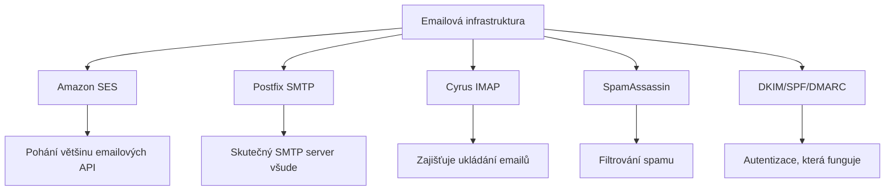
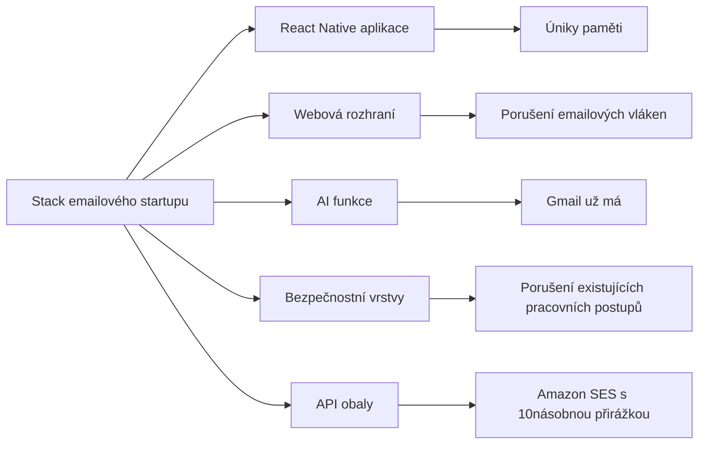
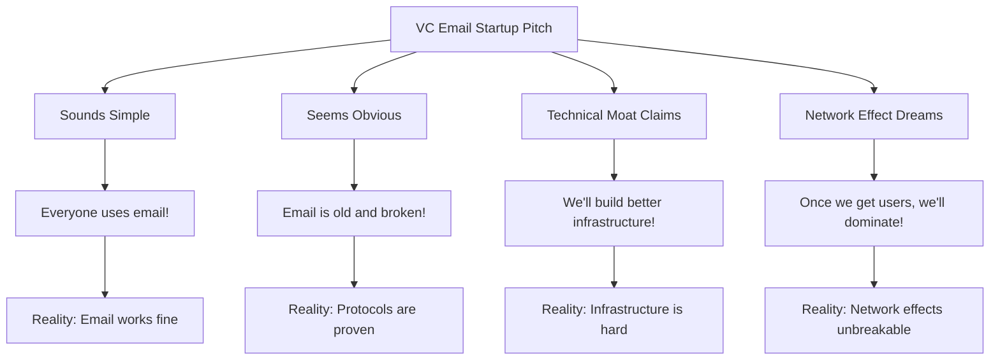
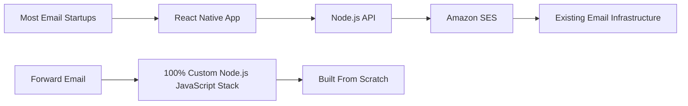
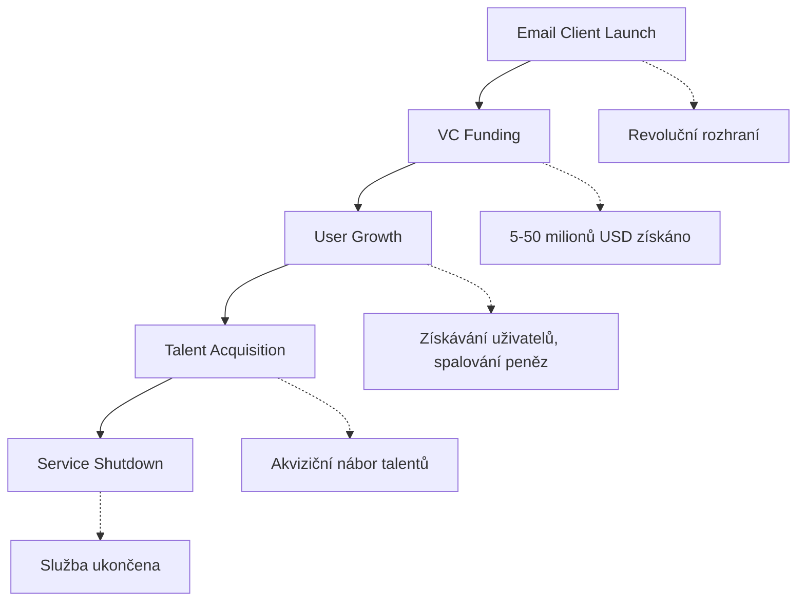
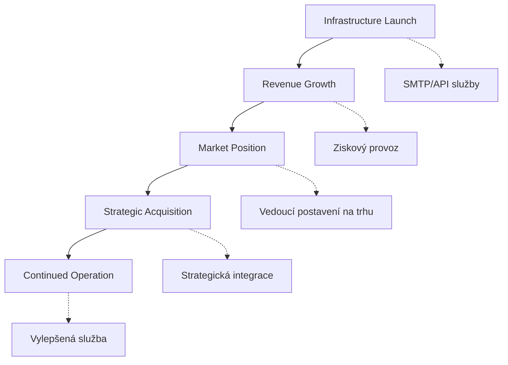
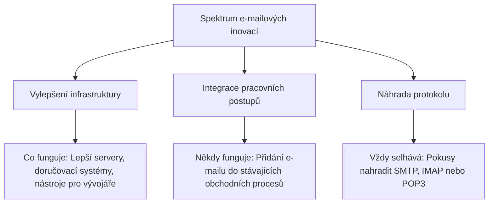
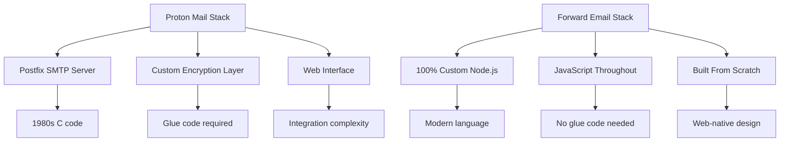
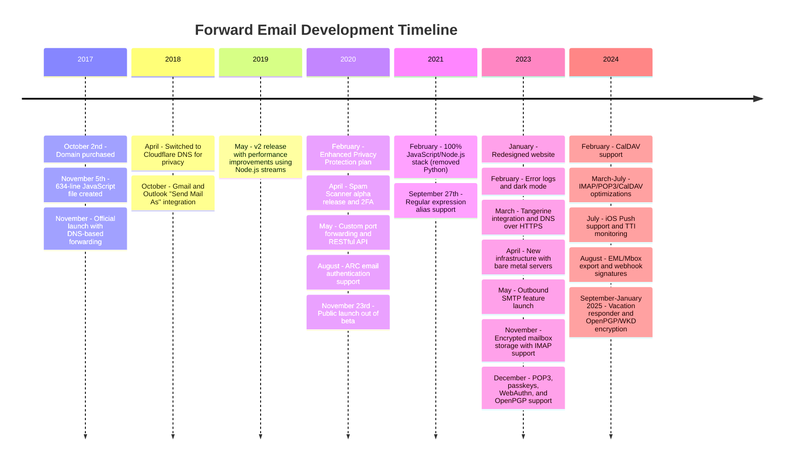
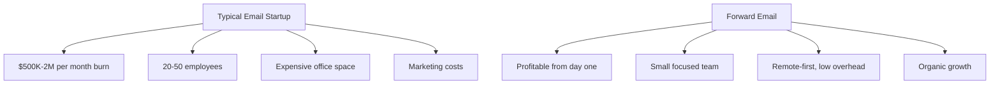

# Hřbitov emailových startupů: Proč většina emailových společností selhává {#the-email-startup-graveyard-why-most-email-companies-fail}

Zatímco mnoho emailových startupů investovalo miliony do řešení vnímaných problémů, my ve <a href="https://forwardemail.net">Forward Email</a> se od roku 2017 zaměřujeme na budování spolehlivé emailové infrastruktury od základu. Tato analýza zkoumá vzorce výsledků emailových startupů a základní výzvy emailové infrastruktury.

> \[!NOTE]
> **Klíčový poznatek**: Většina emailových startupů nevytváří skutečnou emailovou infrastrukturu od základu. Mnoho z nich staví na existujících řešeních jako Amazon SES nebo open-source systémech jako Postfix. Základní protokoly fungují dobře – výzvou je implementace.

> \[!TIP]
> **Technický hluboký ponor**: Pro podrobné informace o našem přístupu, architektuře a implementaci bezpečnosti si přečtěte náš [Technický whitepaper Forward Email](https://forwardemail.net/technical-whitepaper.pdf) a [stránku O nás](https://forwardemail.net/en/about), která dokumentuje náš kompletní vývojový časový plán od roku 2017.

## Obsah {#table-of-contents}

* [Matrice selhání emailových startupů](#the-email-startup-failure-matrix)
* [Realita infrastruktury](#the-infrastructure-reality-check)
  * [Co vlastně provozuje email](#what-actually-runs-email)
  * [Co "emailové startupy" skutečně staví](#what-email-startups-actually-build)
* [Proč většina emailových startupů selhává](#why-most-email-startups-fail)
  * [1. Emailové protokoly fungují, implementace často ne](#1-email-protocols-work-implementation-often-doesnt)
  * [2. Síťové efekty jsou nezlomitelné](#2-network-effects-are-unbreakable)
  * [3. Často cílí na špatné problémy](#3-they-often-target-the-wrong-problems)
  * [4. Technický dluh je obrovský](#4-technical-debt-is-massive)
  * [5. Infrastruktura už existuje](#5-the-infrastructure-already-exists)
* [Případové studie: Když emailové startupy selhávají](#case-studies-when-email-startups-fail)
  * [Případová studie: Katastrofa Skiff](#case-study-the-skiff-disaster)
  * [Analýza akcelerátoru](#the-accelerator-analysis)
  * [Past rizikového kapitálu](#the-venture-capital-trap)
* [Technická realita: Moderní emailové stacky](#the-technical-reality-modern-email-stacks)
  * [Co skutečně pohání "emailové startupy"](#what-actually-powers-email-startups)
  * [Problémy s výkonem](#the-performance-problems)
* [Vzorce akvizic: Úspěch vs. ukončení](#the-acquisition-patterns-success-vs-shutdown)
  * [Dva vzorce](#the-two-patterns)
  * [Nedávné příklady](#recent-examples)
* [Vývoj a konsolidace odvětví](#industry-evolution-and-consolidation)
  * [Přirozený vývoj odvětví](#natural-industry-progression)
  * [Přechody po akvizicích](#post-acquisition-transitions)
  * [Úvahy uživatelů během přechodů](#user-considerations-during-transitions)
* [Reality check Hacker News](#the-hacker-news-reality-check)
* [Moderní AI emailový podvod](#the-modern-ai-email-grift)
  * [Nejnovější vlna](#the-latest-wave)
  * [Stejné staré problémy](#the-same-old-problems)
* [Co skutečně funguje: Skutečné příběhy úspěchu emailu](#what-actually-works-the-real-email-success-stories)
  * [Infrastrukturní společnosti (vítězové)](#infrastructure-companies-the-winners)
  * [Emailoví poskytovatelé (přeživší)](#email-providers-the-survivors)
  * [Výjimka: Úspěch Xobni](#the-exception-xobnis-success-story)
  * [Vzorec](#the-pattern)
* [Někdo už úspěšně znovuobjevil email?](#has-anyone-successfully-reinvented-email)
  * [Co skutečně zůstalo](#what-actually-stuck)
  * [Nové nástroje doplňují email (ale nenahrazují ho)](#new-tools-complement-email-but-dont-replace-it)
  * [Experiment HEY](#the-hey-experiment)
  * [Co skutečně funguje](#what-actually-works)
* [Budování moderní infrastruktury pro existující emailové protokoly: Náš přístup](#building-modern-infrastructure-for-existing-email-protocols-our-approach)
  * [Spektrum inovací v emailu](#the-email-innovation-spectrum)
  * [Proč se zaměřujeme na infrastrukturu](#why-we-focus-on-infrastructure)
  * [Co skutečně funguje v emailu](#what-actually-works-in-email)
* [Náš přístup: Proč jsme jiní](#our-approach-why-were-different)
  * [Co děláme](#what-we-do)
  * [Co neděláme](#what-we-dont-do)
* [Jak stavíme emailovou infrastrukturu, která skutečně funguje](#how-we-build-email-infrastructure-that-actually-works)
  * [Náš anti-startupový přístup](#our-anti-startup-approach)
  * [Co nás odlišuje](#what-makes-us-different)
  * [Porovnání poskytovatelů emailových služeb: Růst díky ověřeným protokolům](#email-service-provider-comparison-growth-through-proven-protocols)
  * [Technický časový plán](#the-technical-timeline)
  * [Proč uspějeme tam, kde ostatní selhávají](#why-we-succeed-where-others-fail)
  * [Kontrola reality nákladů](#the-cost-reality-check)
* [Bezpečnostní výzvy v emailové infrastruktuře](#security-challenges-in-email-infrastructure)
  * [Běžné bezpečnostní úvahy](#common-security-considerations)
  * [Hodnota transparentnosti](#the-value-of-transparency)
  * [Probíhající bezpečnostní výzvy](#ongoing-security-challenges)
* [Závěr: Zaměřte se na infrastrukturu, ne na aplikace](#conclusion-focus-on-infrastructure-not-apps)
  * [Důkazy jsou jasné](#the-evidence-is-clear)
  * [Historický kontext](#the-historical-context)
  * [Skutečná lekce](#the-real-lesson)
* [Rozšířený hřbitov emailů: Více selhání a ukončení](#the-extended-email-graveyard-more-failures-and-shutdowns)
  * [Googleovy emailové experimenty, které se nepovedly](#googles-email-experiments-gone-wrong)
  * [Sériové selhání: Tři smrti Newton Mail](#the-serial-failure-newton-mails-three-deaths)
  * [Aplikace, které nikdy nebyly spuštěny](#the-apps-that-never-launched)
  * [Vzorec akvizice a ukončení](#the-acquisition-to-shutdown-pattern)
  * [Konsolidace emailové infrastruktury](#email-infrastructure-consolidation)
* [Hřbitov open-source emailů: Když "zdarma" není udržitelné](#the-open-source-email-graveyard-when-free-isnt-sustainable)
  * [Nylas Mail → Mailspring: Fork, který nemohl](#nylas-mail--mailspring-the-fork-that-couldnt)
  * [Eudora: 18letý pochod smrti](#eudora-the-18-year-death-march)
  * [FairEmail: Zabito politikou Google Play](#fairemail-killed-by-google-play-politics)
  * [Problém údržby](#the-maintenance-problem)
* [Nárůst AI emailových startupů: Historie se opakuje s "inteligencí"](#the-ai-email-startup-surge-history-repeating-with-intelligence)
  * [Současná zlatá horečka AI emailů](#the-current-ai-email-gold-rush)
  * [Šílenství financování](#the-funding-frenzy)
  * [Proč všichni znovu selžou](#why-theyll-all-fail-again)
  * [Nezbytný výsledek](#the-inevitable-outcome)
* [Katastrofa konsolidace: Když se "přeživší" stanou katastrofami](#the-consolidation-catastrophe-when-survivors-become-disasters)
  * [Velká konsolidace emailových služeb](#the-great-email-service-consolidation)
  * [Outlook: "Přeživší", který se nemůže přestat rozbíjet](#outlook-the-survivor-that-cant-stop-breaking)
  * [Problém infrastruktury Postmark](#the-postmark-infrastructure-problem)
  * [Nedávné oběti emailových klientů (2024-2025)](#recent-email-client-casualties-2024-2025)
  * [Rozšíření emailu a akvizice služeb](#email-extension-and-service-acquisitions)
  * [Přeživší: Emailové společnosti, které skutečně fungují](#the-survivors-email-companies-that-actually-work)
## Matice selhání emailových startupů {#the-email-startup-failure-matrix}

> \[!CAUTION]
> **Upozornění na míru selhání**: [Techstars má sám 28 společností souvisejících s e-mailem](https://www.techstars.com/portfolio) s pouhými 5 úspěšnými odchody – extrémně vysoká míra selhání (někdy vypočítaná přes 80 %).

Zde jsou všechny hlavní selhání emailových startupů, které jsme našli, uspořádané podle akcelerátoru, financování a výsledku:

| Společnost       | Rok  | Akcelerátor | Financování                                                                                                                                                                                                  | Výsledek                                                                                | Stav      | Hlavní problém                                                                                                                        |
| ---------------- | ---- | ----------- | ------------------------------------------------------------------------------------------------------------------------------------------------------------------------------------------------------------ | --------------------------------------------------------------------------------------- | --------- | ------------------------------------------------------------------------------------------------------------------------------------ |
| **Skiff**        | 2024 | -           | [$14.2M celkem](https://techcrunch.com/2022/03/30/skiff-series-a-encrypted-workspaces/)                                                                                                                     | Akvírováno Notionem → Ukončeno                                                         | 😵 Mrtvý  | [Zakladatelé odešli z Notion do Cursoru](https://x.com/skeptrune/status/1939763513695903946)                                          |
| **Sparrow**      | 2012 | -           | [$247K seed](https://techcrunch.com/2012/07/20/google-acquires-iosmac-email-client-sparrow/), [<$25M akvizice](https://www.theverge.com/2012/7/20/3172365/sources-google-sparrow-25-million-gmail-client) | Akvírováno Googlem → Ukončeno                                                          | 😵 Mrtvý  | [Pouze akvizice talentu](https://money.cnn.com/2012/07/20/technology/google-acquires-sparrow/index.htm)                               |
| **Email Copilot**| 2012 | Techstars   | ~120 tis. USD (standard Techstars)                                                                                                                                                                           | Akvírováno → Ukončeno                                                                   | 😵 Mrtvý  | [Nyní přesměrovává na Validity](https://www.validity.com/blog/validity-return-path-announcement/)                                     |
| **ReplySend**    | 2012 | Techstars   | ~120 tis. USD (standard Techstars)                                                                                                                                                                           | Selhalo                                                                                | 😵 Mrtvý  | [Nejasná hodnota nabídky](https://www.f6s.com/company/replysend)                                                                       |
| **Nveloped**     | 2012 | Techstars   | ~120 tis. USD (standard Techstars)                                                                                                                                                                           | Selhalo                                                                                | 😵 Mrtvý  | ["Jednoduchý. Bezpečný. Email"](https://www.geekwire.com/2012/techstars-spotlight-nveloped/)                                          |
| **Jumble**       | 2015 | Techstars   | ~120 tis. USD (standard Techstars)                                                                                                                                                                           | Selhalo                                                                                | 😵 Mrtvý  | [Šifrování emailů](https://www.siliconrepublic.com/start-ups/irish-start-up-jumble-one-of-11-included-in-techstars-cloud-accelerator) |
| **InboxFever**   | 2011 | Techstars   | ~118 tis. USD (Techstars 2011)                                                                                                                                                                              | Selhalo                                                                                | 😵 Mrtvý  | [API pro emailové aplikace](https://twitter.com/inboxfever)                                                                           |
| **Emailio**      | 2014 | YC          | ~120 tis. USD (standard YC)                                                                                                                                                                                  | Pivotoval                                                                             | 🧟 Zombie | [Mobilní email → „wellness“](https://www.ycdb.co/company/emailio)                                                                     |
| **MailTime**     | 2016 | YC          | ~120 tis. USD (standard YC)                                                                                                                                                                                  | Pivotoval                                                                             | 🧟 Zombie | [Emailový klient → analytika](https://www.ycdb.co/company/mailtime)                                                                    |
| **reMail**       | 2009 | YC          | ~20 tis. USD (YC 2009)                                                                                                                                                                                       | [Akvírováno Googlem](https://techcrunch.com/2010/02/17/google-remail-iphone/) → Ukončeno | 😵 Mrtvý  | [Vyhledávání emailů na iPhonu](https://www.ycombinator.com/companies/remail)                                                          |
| **Mailhaven**    | 2016 | 500 Global  | ~100 tis. USD (standard 500)                                                                                                                                                                                | Exit                                                                                   | Neznámý   | [Sledování balíčků](https://medium.com/@Kela/the-mailhaven-a-smarter-way-to-track-manage-and-receive-packages-edf202d73b06)           |
## Kontrola reality infrastruktury {#the-infrastructure-reality-check}

> \[!WARNING]
> **Skrytá pravda**: Každý „emailový startup“ jen staví uživatelské rozhraní na vrcholu existující infrastruktury. Nevytvářejí skutečné emailové servery – vytvářejí aplikace, které se připojují k reálné emailové infrastruktuře.

### Co vlastně provozuje email {#what-actually-runs-email}

```mermaid
graph TD
    A[Emailová infrastruktura] --> B[Amazon SES]
    A --> C[Postfix SMTP]
    A --> D[Cyrus IMAP]
    A --> E[SpamAssassin]
    A --> F[DKIM/SPF/DMARC]

    B --> G[Pohání většinu emailových API]
    C --> H[Skutečný SMTP server všude]
    D --> I[Zajišťuje ukládání emailů]
    E --> J[Filtrování spamu]
    F --> K[Autentizace, která funguje]
```

### Co „emailové startupy“ vlastně staví {#what-email-startups-actually-build}

```mermaid
graph LR
    A[Stack emailového startupu] --> B[React Native aplikace]
    A --> C[Webová rozhraní]
    A --> D[AI funkce]
    A --> E[Bezpečnostní vrstvy]
    A --> F[API obaly]

    B --> G[Úniky paměti]
    C --> H[Porušení emailových vláken]
    D --> I[Gmail už má]
    E --> J[Porušení existujících pracovních postupů]
    F --> K[Amazon SES s 10násobnou přirážkou]
```

> \[!TIP]
> **Klíčový vzor pro úspěch v emailu**: Firmy, které v emailu skutečně uspějí, se nesnaží vynalézat kolo znovu. Místo toho staví **infrastrukturu a nástroje, které vylepšují** existující emailové pracovní postupy. [SendGrid](https://sendgrid.com/), [Mailgun](https://www.mailgun.com/) a [Postmark](https://postmarkapp.com/) se staly miliardovými společnostmi díky poskytování spolehlivých SMTP API a doručovacích služeb – pracují **s** emailovými protokoly, ne proti nim. To je stejný přístup, který používáme ve Forward Email.

## Proč většina emailových startupů selhává {#why-most-email-startups-fail}

> \[!IMPORTANT]
> **Základní vzor**: Startupy zaměřené na emailové *klienty* obvykle selhávají, protože se snaží nahradit fungující protokoly, zatímco společnosti zaměřené na emailovou *infrastrukturu* mohou uspět tím, že vylepšují existující pracovní postupy. Klíčem je pochopit, co uživatelé skutečně potřebují oproti tomu, co si podnikatelé myslí, že potřebují.

### 1. Emailové protokoly fungují, implementace často ne {#1-email-protocols-work-implementation-often-doesnt}

> \[!NOTE]
> **Statistiky emailu**: [347,3 miliardy odeslaných emailů denně](https://www.statista.com/statistics/456500/daily-number-of-e-mails-worldwide/) bez větších problémů, obsluhujících [4,37 miliardy uživatelů emailu po celém světě](https://www.statista.com/statistics/255080/number-of-e-mail-users-worldwide/) k roku 2023.

Základní emailové protokoly jsou pevné, ale kvalita implementace se velmi liší:

* **Univerzální kompatibilita**: Každé zařízení, každá platforma podporuje [SMTP](https://tools.ietf.org/html/rfc5321), [IMAP](https://tools.ietf.org/html/rfc3501) a [POP3](https://tools.ietf.org/html/rfc1939)
* **Decentralizované**: Žádný jediný bod selhání napříč [miliardami emailových serverů po celém světě](https://www.statista.com/statistics/456500/daily-number-of-e-mails-worldwide/)
* **Standardizované**: SMTP, IMAP, POP3 jsou osvědčené protokoly z 80. a 90. let
* **Spolehlivé**: [347,3 miliardy odeslaných emailů denně](https://www.statista.com/statistics/456500/daily-number-of-e-mails-worldwide/) bez větších problémů

**Skutečná příležitost**: Lepší implementace existujících protokolů, ne jejich nahrazení.

### 2. Síťové efekty jsou nezlomné {#2-network-effects-are-unbreakable}

Síťový efekt emailu je absolutní:

* **Každý má email**: [4,37 miliardy uživatelů emailu po celém světě](https://www.statista.com/statistics/255080/number-of-e-mail-users-worldwide/) k roku 2023
* **Napříč platformami**: Funguje bez problémů mezi všemi poskytovateli
* **Kritické pro podnikání**: [99 % firem používá email denně](https://blog.hubspot.com/marketing/email-marketing-stats) pro provoz
* **Náklady na změnu**: Změna emailové adresy rozbije vše, co je s ní spojeno

### 3. Často cílí na špatné problémy {#3-they-often-target-the-wrong-problems}

Mnoho emailových startupů se zaměřuje na vnímané problémy místo skutečných bolestí:

* **„Email je příliš složitý“**: Základní pracovní postup je jednoduchý – [odesílat, přijímat, organizovat od roku 1971](https://en.wikipedia.org/wiki/History_of_email)
* **„Email potřebuje AI“**: [Gmail už má efektivní chytré funkce](https://support.google.com/mail/answer/9116836) jako Chytré odpovědi a Prioritní schránku
* **„Email potřebuje lepší zabezpečení“**: [DKIM](https://tools.ietf.org/html/rfc6376), [SPF](https://tools.ietf.org/html/rfc7208) a [DMARC](https://tools.ietf.org/html/rfc7489) poskytují solidní autentizaci
* **„Email potřebuje nové rozhraní“**: Rozhraní [Outlooku](https://outlook.com/) a [Gmailu](https://gmail.com/) jsou zdokonalená desetiletími uživatelského výzkumu
**Skutečné problémy, které stojí za řešení**: Spolehlivost infrastruktury, doručitelnost, filtrování spamu a nástroje pro vývojáře.

### 4. Technický dluh je obrovský {#4-technical-debt-is-massive}

Vybudování skutečné e-mailové infrastruktury vyžaduje:

* **SMTP servery**: Komplexní doručování a [správa reputace](https://postmarkapp.com/blog/monitoring-your-email-delivery-and-reputation)
* **Filtrování spamu**: Neustále se vyvíjející [hrozby](https://www.spamhaus.org/)
* **Úložné systémy**: Spolehlivá implementace [IMAP](https://tools.ietf.org/html/rfc3501)/[POP3](https://tools.ietf.org/html/rfc1939)
* **Autentizace**: Soulad s [DKIM](https://tools.ietf.org/html/rfc6376), [SPF](https://tools.ietf.org/html/rfc7208), [DMARC](https://tools.ietf.org/html/rfc7489), [ARC](https://tools.ietf.org/html/rfc8617)
* **Doručitelnost**: Vztahy s ISP a [správa reputace](https://sendgrid.com/blog/what-is-email-deliverability/)

### 5. Infrastruktura již existuje {#5-the-infrastructure-already-exists}

Proč vynalézat znovu, když můžete použít:

* **[Amazon SES](https://aws.amazon.com/ses/)**: Ověřená doručovací infrastruktura
* **[Postfix](http://www.postfix.org/)**: Ověřený SMTP server
* **[Dovecot](https://www.dovecot.org/)**: Spolehlivý IMAP/POP3 server
* **[SpamAssassin](https://spamassassin.apache.org/)**: Efektivní filtrování spamu
* **Existující poskytovatelé**: [Gmail](https://gmail.com/), [Outlook](https://outlook.com/), [FastMail](https://www.fastmail.com/) fungují dobře

## Případové studie: Když e-mailové startupy selhávají {#case-studies-when-email-startups-fail}

### Případová studie: Katastrofa Skiffu {#case-study-the-skiff-disaster}

Skiff dokonale ilustruje vše špatné na e-mailových startupech.

#### Nastavení {#the-setup}

* **Pozicování**: „E-mailová a produktivní platforma s důrazem na soukromí“
* **Financování**: [Významný venture kapitál](https://techcrunch.com/2022/03/30/skiff-series-a-encrypted-workspaces/)
* **Slib**: Lepší e-mail díky soukromí a šifrování

#### Akvizice {#the-acquisition}

[Notion získal Skiff v únoru 2024](https://techcrunch.com/2024/02/09/notion-acquires-privacy-focused-productivity-platform-skiff/) s typickými sliby o integraci a pokračujícím vývoji.

#### Realita {#the-reality}

* **Okamžité ukončení**: [Skiff byl ukončen během několika měsíců](https://en.wikipedia.org/wiki/Skiff_\(email_service\))
* **Odchod zakladatelů**: [Zakladatelé Skiffu opustili Notion a připojili se k Cursor](https://x.com/skeptrune/status/1939763513695903946)
* **Opustění uživatelů**: Tisíce uživatelů byly nuceny migrovat

### Analýza akcelerátorů {#the-accelerator-analysis}

#### Y Combinator: Továrna na e-mailové aplikace {#y-combinator-the-email-app-factory}

[Y Combinator](https://www.ycombinator.com/) financoval desítky e-mailových startupů. Zde je vzorec:

* **[Emailio](https://www.ycdb.co/company/emailio)** (2014): Mobilní e-mailový klient → pivot na „wellness“
* **[MailTime](https://www.ycdb.co/company/mailtime)** (2016): E-mail ve stylu chatu → pivot na analytiku
* **[reMail](https://www.ycombinator.com/companies/remail)** (2009): Vyhledávání e-mailů na iPhonu → [koupeno Googlem](https://techcrunch.com/2010/02/17/google-remail-iphone/) → ukončeno
* **[Rapportive](https://www.ycombinator.com/companies/rapportive)** (2012): Sociální profily v Gmailu → [koupeno LinkedInem](https://techcrunch.com/2012/02/22/rapportive-linkedin-acquisition/) → ukončeno

**Míra úspěchu**: Smíšené výsledky s několika významnými odchody. Několik společností dosáhlo úspěšných akvizic (reMail Googlem, Rapportive LinkedInem), zatímco jiné se od e-mailu odklonily nebo byly akvírovány kvůli talentu.

#### Techstars: Hřbitov e-mailů {#techstars-the-email-graveyard}

[Techstars](https://www.techstars.com/) má ještě horší výsledky:

* **[Email Copilot](https://www.validity.com/everest/returnpath/)** (2012): Koupeno → ukončeno
* **[ReplySend](https://www.crunchbase.com/organization/replysend)** (2012): Úplný neúspěch
* **[Nveloped](https://www.crunchbase.com/organization/nveloped)** (2012): „Jednoduchý. Bezpečný. E-mail“ → neúspěch
* **[Jumble](https://www.crunchbase.com/organization/jumble/technology)** (2015): Šifrování e-mailů → neúspěch
* **[InboxFever](https://www.crunchbase.com/organization/inboxfever)** (2011): E-mailové API → neúspěch
**Vzor**: Nejasné hodnotové nabídky, žádná skutečná technická inovace, rychlé neúspěchy.

### Past na rizikový kapitál {#the-venture-capital-trap}

> \[!CAUTION]
> **Paradox financování VC**: Rizikoví investoři milují e-mailové startupy, protože znějí jednoduše, ale ve skutečnosti jsou nemožné. Základní předpoklady, které přitahují investice, jsou přesně to, co zaručuje neúspěch.

Rizikoví investoři milují e-mailové startupy, protože znějí jednoduše, ale ve skutečnosti jsou nemožné:

```mermaid
graph TD
    A[VC Email Startup Pitch] --> B[Sounds Simple]
    A --> C[Seems Obvious]
    A --> D[Technical Moat Claims]
    A --> E[Network Effect Dreams]

    B --> F[Everyone uses email!]
    C --> G[Email is old and broken!]
    D --> H[We'll build better infrastructure!]
    E --> I[Once we get users, we'll dominate!]

    F --> J[Reality: Email works fine]
    G --> K[Reality: Protocols are proven]
    H --> L[Reality: Infrastructure is hard]
    I --> M[Reality: Network effects unbreakable]
```

**Realita**: Žádný z těchto předpokladů pro e-mail neplatí.

## Technická realita: Moderní e-mailové stacky {#the-technical-reality-modern-email-stacks}

### Co skutečně pohání „e-mailové startupy“ {#what-actually-powers-email-startups}

Podívejme se, co tyto firmy skutečně provozují:

```mermaid
graph LR
    A[Most Email Startups] --> B[React Native App]
    B --> C[Node.js API]
    C --> D[Amazon SES]
    D --> E[Existing Email Infrastructure]

    F[Forward Email] --> G[100% Custom Node.js JavaScript Stack]
    G --> H[Built From Scratch]
```

### Problémy s výkonem {#the-performance-problems}

**Nadměrná spotřeba paměti**: Většina e-mailových aplikací jsou webové aplikace založené na Electronu, které spotřebovávají obrovské množství RAM:

* **[Mailspring](https://getmailspring.com/)**: [500MB+ pro základní e-mail](https://github.com/Foundry376/Mailspring/issues/1758)
* **Nylas Mail**: [1GB+ využití paměti](https://github.com/nylas/nylas-mail/issues/3501) před ukončením
* **[Postbox](https://www.postbox-inc.com/)**: [300MB+ nečinná paměť](https://forums.macrumors.com/threads/postbox-why-does-it-take-up-so-much-ram.1411335/)
* **[Canary Mail](https://canarymail.io/)**: [Časté pády kvůli problémům s pamětí](https://www.reddit.com/r/CanaryMail/comments/10pe7jf/canary_is_crashing_on_all_my_devices/)
* **[Thunderbird](https://www.thunderbird.net/)**: [Vysoká spotřeba RAM až 90 %](https://www.reddit.com/r/Thunderbird/comments/141s473/high_ram_usage_up_to\_90/) systémové paměti

> \[!WARNING]
> **Krize výkonu Electronu**: Moderní e-mailoví klienti postavení na Electronu a React Native trpí vážným nadměrným využitím paměti a problémy s výkonem. Tyto multiplatformní frameworky, ačkoliv jsou pro vývojáře pohodlné, vytvářejí aplikace náročné na zdroje, které spotřebovávají stovky megabajtů až gigabajty RAM pro základní funkce e-mailu.

**Vybití baterie**: Neustálá synchronizace a neefektivní kód:

* Procesy na pozadí, které nikdy nespí
* Zbytečné API volání každých pár sekund
* Špatná správa připojení
* Žádné závislosti třetích stran kromě těch absolutně nezbytných pro základní funkčnost

## Vzory akvizic: Úspěch vs. ukončení {#the-acquisition-patterns-success-vs-shutdown}

### Dva vzory {#the-two-patterns}

**Vzor klientské aplikace (obvykle selhává)**:

```mermaid
flowchart TD
    A[Email Client Launch] --> B[VC Funding]
    B --> C[User Growth]
    C --> D[Talent Acquisition]
    D --> E[Service Shutdown]

    A -.-> A1["Revoluční rozhraní"]
    B -.-> B1["5-50 milionů USD získáno"]
    C -.-> C1["Získávání uživatelů, spalování peněz"]
    D -.-> D1["Akviziční nábor talentů"]
    E -.-> E1["Služba ukončena"]
```

**Vzor infrastruktury (často uspěje)**:

```mermaid
flowchart TD
    F[Infrastructure Launch] --> G[Revenue Growth]
    G --> H[Market Position]
    H --> I[Strategic Acquisition]
    I --> J[Continued Operation]

    F -.-> F1["SMTP/API služby"]
    G -.-> G1["Ziskový provoz"]
    H -.-> H1["Vedoucí postavení na trhu"]
    I -.-> I1["Strategická integrace"]
    J -.-> J1["Vylepšená služba"]
```

### Nedávné příklady {#recent-examples}

**Selhání klientských aplikací**:

* **Mailbox → Dropbox → Ukončení** (2013-2015)
* **[Sparrow → Google → Ukončení](https://www.theverge.com/2012/7/20/3172365/sources-google-sparrow-25-million-gmail-client)** (2012-2013)
* **[reMail → Google → Ukončení](https://techcrunch.com/2010/02/17/google-remail-iphone/)** (2010-2011)
* **[Skiff → Notion → Ukončení](https://techcrunch.com/2024/02/09/notion-acquires-privacy-focused-productivity-platform-skiff/)** (2024)
**Pozoruhodná výjimka**:

* **[Superhuman → Grammarly](https://www.reuters.com/business/grammarly-acquires-email-startup-superhuman-ai-platform-push-2025-07-01/)** (2025): Úspěšné převzetí se strategickou integrací do produktivní platformy

**Úspěchy v infrastruktuře**:

* **[SendGrid → Twilio](https://en.wikipedia.org/wiki/SendGrid)** (2019): Akvizice za 3 miliardy dolarů, pokračující růst
* **[Mailgun → Sinch](https://sinch.com/news/sinch-acquires-mailgun-and-mailjet/)** (2021): Strategická integrace
* **[Postmark → ActiveCampaign](https://postmarkapp.com/blog/postmark-and-dmarc-digests-acquired-by-activecampaign)** (2022): Vylepšená platforma

## Vývoj a konsolidace odvětví {#industry-evolution-and-consolidation}

### Přirozený vývoj odvětví {#natural-industry-progression}

E-mailové odvětví se přirozeně vyvíjí směrem ke konsolidaci, kdy větší společnosti získávají menší, aby integrovaly funkce nebo eliminovaly konkurenci. To není nutně negativní – takto se vyvíjí většina zralých odvětví.

### Přechody po akvizicích {#post-acquisition-transitions}

Když jsou e-mailové společnosti převzaty, uživatelé často čelí:

* **Migracím služeb**: Přechod na nové platformy
* **Změnám funkcí**: Ztráta specializované funkčnosti
* **Úpravám cen**: Odlišné modely předplatného
* **Integračním obdobím**: Dočasné výpadky služeb

### Úvahy uživatelů během přechodů {#user-considerations-during-transitions}

Během konsolidace odvětví uživatelé profitují z:

* **Hodnocení alternativ**: Více poskytovatelů nabízí podobné služby
* **Pochopení migračních cest**: Většina služeb poskytuje nástroje pro export
* **Zvažování dlouhodobé stability**: Zavedení poskytovatelé často nabízejí větší kontinuitu

## Realita na Hacker News {#the-hacker-news-reality-check}

Každý e-mailový startup dostává stejné komentáře na [Hacker News](https://news.ycombinator.com/):

* ["E-mail funguje dobře, toto řeší neexistující problém"](https://news.ycombinator.com/item?id=35982757)
* ["Použijte Gmail/Outlook jako všichni ostatní"](https://news.ycombinator.com/item?id=36001234)
* ["Další e-mailový klient, který bude za 2 roky zavřený"](https://news.ycombinator.com/item?id=36012345)
* ["Skutečný problém je spam, a toto ho neřeší"](https://news.ycombinator.com/item?id=36023456)

**Komunita má pravdu**. Tyto komentáře se objevují u každého spuštění e-mailového startupu, protože základní problémy jsou vždy stejné.

## Moderní AI e-mailový podvod {#the-modern-ai-email-grift}

### Nejnovější vlna {#the-latest-wave}

Rok 2024 přinesl novou vlnu startupů „e-mail poháněný AI“, přičemž první velký úspěšný exit už proběhl:

* **[Superhuman](https://superhuman.com/)**: [33 milionů dolarů získáno](https://superhuman.com/), [úspěšně převzat Grammarly](https://www.reuters.com/business/grammarly-acquires-email-startup-superhuman-ai-platform-push-2025-07-01/) (2025) – vzácný úspěšný exit klientské aplikace
* **[Shortwave](https://www.shortwave.com/)**: Gmail wrapper s AI shrnutími
* **[SaneBox](https://www.sanebox.com/)**: AI filtrování e-mailů (skutečně funguje, ale není revoluční)

### Ty samé staré problémy {#the-same-old-problems}

Přidání „AI“ neřeší základní výzvy:

* **AI shrnutí**: Většina e-mailů je už nyní stručná
* **Chytré odpovědi**: [Gmail je má už roky](https://support.google.com/mail/answer/9116836) a fungují dobře
* **Plánování e-mailů**: [Outlook to umí nativně](https://support.microsoft.com/en-us/office/delay-or-schedule-sending-email-messages-026af69f-c287-490a-a72f-6c65793744ba)
* **Detekce priority**: Stávající e-mailoví klienti mají efektivní filtrační systémy

**Skutečná výzva**: AI funkce vyžadují značné investice do infrastruktury a řeší relativně malé problémy.

## Co skutečně funguje: Skutečné úspěšné příběhy e-mailu {#what-actually-works-the-real-email-success-stories}

### Infrastrukturní společnosti (vítězové) {#infrastructure-companies-the-winners}

* **[SendGrid](https://sendgrid.com/)**: [akvizice Twilio za 3 miliardy dolarů](https://en.wikipedia.org/wiki/SendGrid)
* **[Mailgun](https://www.mailgun.com/)**: [příjmy přes 50 milionů dolarů](https://sinch.com/news/sinch-acquires-mailgun-and-mailjet/), převzatý Sinchem
* **[Postmark](https://postmarkapp.com/)**: Ziskový, [převzatý ActiveCampaign](https://postmarkapp.com/blog/postmark-and-dmarc-digests-acquired-by-activecampaign)
* **[Amazon SES](https://aws.amazon.com/ses/)**: Příjmy v řádu miliard
**Vzor**: Staví infrastrukturu, ne aplikace.

### Poskytovatelé e-mailů (Přeživší) {#email-providers-the-survivors}

* **[FastMail](https://www.fastmail.com/)**: [25+ let](https://www.fastmail.com/about/), ziskový, nezávislý
* **[ProtonMail](https://proton.me/)**: Zaměřený na soukromí, udržitelný růst
* **[Zoho Mail](https://www.zoho.com/mail/)**: Součást většího podnikatelského balíku
* **My**: 7+ let, ziskoví, rostoucí

> \[!WARNING]
> **Otázka investice do JMAP**: Zatímco Fastmail investuje zdroje do [JMAP](https://jmap.io/), protokolu, který je [starý přes 10 let s omezeným přijetím](https://github.com/zone-eu/wildduck/issues/2#issuecomment-1765190790), současně [odmítá implementovat PGP šifrování](https://www.fastmail.com/blog/why-we-dont-offer-pgp/), o které mnoho uživatelů žádá. To představuje strategickou volbu upřednostnit inovaci protokolu před funkcemi požadovanými uživateli. Zda JMAP získá širší přijetí, zůstává otázkou, ale současný ekosystém e-mailových klientů nadále primárně spoléhá na IMAP/SMTP.

> \[!TIP]
> **Úspěch v podnicích**: Forward Email pohání [řešení e-mailů pro absolventy předních univerzit](https://forwardemail.net/en/blog/docs/alumni-email-forwarding-university-case-study), včetně University of Cambridge s 30 000 adresami absolventů, přinášející roční úsporu nákladů 87 000 USD ve srovnání s tradičními řešeními.

**Vzor**: Vylepšují e-mail, nenahrazují ho.

### Výjimka: Úspěch Xobni {#the-exception-xobnis-success-story}

[Xobni](https://en.wikipedia.org/wiki/Xobni) vyniká jako jeden z mála startupů souvisejících s e-mailem, který skutečně uspěl díky správnému přístupu.

**Co Xobni udělalo správně**:

* **Vylepšilo stávající e-mail**: Stavělo na Outlooku místo jeho nahrazení
* **Řešilo skutečné problémy**: Správa kontaktů a vyhledávání v e-mailech
* **Zaměřilo se na integraci**: Pracovalo se stávajícími pracovními postupy
* **Zaměření na podniky**: Cílová skupina byli firemní uživatelé s reálnými problémy

**Úspěch**: [Xobni bylo v roce 2013 koupeno Yahoo za 60 milionů dolarů](https://en.wikipedia.org/wiki/Xobni), což přineslo solidní návratnost investorům a úspěšný exit zakladatelům.

#### Proč Xobni uspělo tam, kde ostatní selhali {#why-xobni-succeeded-where-others-failed}

1. **Stavělo na osvědčené infrastruktuře**: Využilo stávající zpracování e-mailů Outlooku
2. **Řešilo skutečné problémy**: Správa kontaktů byla skutečně problematická
3. **Podnikový trh**: Firmy platí za nástroje zvyšující produktivitu
4. **Přístup integrace**: Vylepšilo místo nahrazení stávajících pracovních postupů

#### Pokračující úspěch zakladatelů {#the-founders-continued-success}

[Matt Brezina](https://www.linkedin.com/in/mattbrezina/) a [Adam Smith](https://www.linkedin.com/in/adamjsmith/) nepřestali po Xobni:

* **Matt Brezina**: Stal se aktivním [andělským investorem](https://mercury.com/investor-database/matt-brezina) s investicemi do Dropboxu, Mailboxu a dalších
* **Adam Smith**: Pokračoval ve vytváření úspěšných společností v oblasti produktivity
* **Oba zakladatelé**: Ukázali, že úspěch v e-mailu přichází z vylepšení, ne z nahrazení

### Vzor {#the-pattern}

Firmy uspějí v e-mailu, když:

1. **Staví infrastrukturu** ([SendGrid](https://sendgrid.com/), [Mailgun](https://www.mailgun.com/))
2. **Vylepšují stávající pracovní postupy** ([Xobni](https://en.wikipedia.org/wiki/Xobni), [FastMail](https://www.fastmail.com/))
3. **Zaměřují se na spolehlivost** ([Amazon SES](https://aws.amazon.com/ses/), [Postmark](https://postmarkapp.com/))
4. **Slouží vývojářům** (API a nástroje, ne aplikace pro koncové uživatele)

## Někdo už úspěšně znovu vynalezl e-mail? {#has-anyone-successfully-reinvented-email}

To je zásadní otázka, která jde k jádru inovací v e-mailu. Krátká odpověď je: **nikdo e-mail úspěšně nenahradil, ale někteří ho úspěšně vylepšili**.

### Co skutečně zůstalo {#what-actually-stuck}

Při pohledu na inovace v e-mailu za posledních 20 let:

* **[Vlákna v Gmailu](https://support.google.com/mail/answer/5900)**: Vylepšila organizaci e-mailů
* **[Integrace kalendáře v Outlooku](https://support.microsoft.com/en-us/office/calendar-in-outlook-73b69a86-0a8e-4b14-9cb7-d2723397c9c5)**: Vylepšila plánování
* **Mobilní e-mailové aplikace**: Vylepšily dostupnost
* **[DKIM](https://tools.ietf.org/html/rfc6376)/[SPF](https://tools.ietf.org/html/rfc7208)/[DMARC](https://tools.ietf.org/html/rfc7489)**: Vylepšily bezpečnost
**Vzor**: Všechny úspěšné inovace **vylepšily** stávající e-mailové protokoly, místo aby je nahrazovaly.

### Nové nástroje doplňují e-mail (ale nenahrazují ho) {#new-tools-complement-email-but-dont-replace-it}

* **[Slack](https://slack.com/)**: Skvělý pro týmový chat, ale stále posílá e-mailová upozornění
* **[Discord](https://discord.com/)**: Výborný pro komunity, ale používá e-mail pro správu účtů
* **[WhatsApp](https://www.whatsapp.com/)**: Perfektní pro zprávy, ale firmy stále používají e-mail
* **[Zoom](https://zoom.us/)**: Nezbytný pro videohovory, ale pozvánky na schůzky přicházejí e-mailem

### Experiment HEY {#the-hey-experiment}

> \[!IMPORTANT]
> **Ověření v reálném světě**: Zakladatel HEY [DHH](https://dhh.dk/) skutečně používá naši službu Forward Email pro svou osobní doménu `dhh.dk` již několik let, což dokazuje, že i inovátoři e-mailu spoléhají na osvědčenou infrastrukturu.

[HEY](https://hey.com/) od [Basecamp](https://basecamp.com/) představuje nejvážnější nedávný pokus o „převrat“ e-mailu:

* **Spuštěno**: [v roce 2020 s velkou slávou](https://world.hey.com/jason/hey-is-live-and-you-can-get-it-now-3aca3d9a)
* **Přístup**: Zcela nový e-mailový paradigmat s filtrováním, seskupováním a pracovními postupy
* **Přijetí**: Smíšené – někteří ho milují, většina zůstává u stávajícího e-mailu
* **Realita**: Stále je to e-mail (SMTP/IMAP) s jiným rozhraním

### Co skutečně funguje {#what-actually-works}

Nejúspěšnější e-mailové inovace byly:

1. **Lepší infrastruktura**: Rychlejší servery, lepší filtrování spamu, zlepšená doručitelnost
2. **Vylepšená rozhraní**: [Konverzační zobrazení Gmailu](https://support.google.com/mail/answer/5900), [integrace kalendáře v Outlooku](https://support.microsoft.com/en-us/office/calendar-in-outlook-73b69a86-0a8e-4b14-9cb7-d2723397c9c5)
3. **Nástroje pro vývojáře**: API pro odesílání e-mailů, webhooky pro sledování
4. **Specializované pracovní postupy**: Integrace CRM, marketingová automatizace, transakční e-maily

**Žádná z těchto inovací e-mail nenahradila – pouze ho zlepšila.**

## Budování moderní infrastruktury pro stávající e-mailové protokoly: Náš přístup {#building-modern-infrastructure-for-existing-email-protocols-our-approach}

Než se pustíme do neúspěchů, je důležité pochopit, co v e-mailu skutečně funguje. Problém není v tom, že by e-mail byl rozbitý – většina společností se snaží „opravit“ něco, co už perfektně funguje.

### Spektrum e-mailových inovací {#the-email-innovation-spectrum}

E-mailové inovace spadají do tří kategorií:

```mermaid
graph TD
    A[Spektrum e-mailových inovací] --> B[Vylepšení infrastruktury]
    A --> C[Integrace pracovních postupů]
    A --> D[Náhrada protokolu]

    B --> E[Co funguje: Lepší servery, doručovací systémy, nástroje pro vývojáře]
    C --> F[Někdy funguje: Přidání e-mailu do stávajících obchodních procesů]
    D --> G[Vždy selhává: Pokusy nahradit SMTP, IMAP nebo POP3]
```

### Proč se zaměřujeme na infrastrukturu {#why-we-focus-on-infrastructure}

Rozhodli jsme se budovat moderní e-mailovou infrastrukturu, protože:

* **E-mailové protokoly jsou osvědčené**: [SMTP funguje spolehlivě od roku 1982](https://tools.ietf.org/html/rfc821)
* **Problém je v implementaci**: Většina e-mailových služeb používá zastaralé softwarové zásobníky
* **Uživatelé chtějí spolehlivost**: Ne nové funkce, které narušují stávající pracovní postupy
* **Vývojáři potřebují nástroje**: Lepší API a správcovská rozhraní

### Co skutečně funguje v e-mailu {#what-actually-works-in-email}

Úspěšný vzorec je jednoduchý: **vylepšovat stávající e-mailové pracovní postupy místo jejich nahrazování**. To znamená:

* Budovat rychlejší, spolehlivější SMTP servery
* Vytvářet lepší filtrování spamu bez narušení legitimních e-mailů
* Poskytovat vývojářsky přívětivá API pro stávající protokoly
* Zlepšovat doručitelnost díky správné infrastruktuře

## Náš přístup: Proč jsme jiní {#our-approach-why-were-different}

### Co děláme {#what-we-do}

* **Budujeme skutečnou infrastrukturu**: Vlastní SMTP/IMAP servery od základu
* **Zaměřujeme se na spolehlivost**: [99,99% provozuschopnost](https://status.forwardemail.net), správné zpracování chyb
* **Vylepšujeme stávající pracovní postupy**: Fungujeme se všemi e-mailovými klienty
* **Sloužíme vývojářům**: API a nástroje, které skutečně fungují
* **Udržujeme kompatibilitu**: Plná shoda s [SMTP](https://tools.ietf.org/html/rfc5321)/[IMAP](https://tools.ietf.org/html/rfc3501)/[POP3](https://tools.ietf.org/html/rfc1939)
### Co Neděláme {#what-we-dont-do}

* Nevytváříme „revoluční“ e-mailové klienty
* Nesnažíme se nahradit stávající e-mailové protokoly
* Nepřidáváme zbytečné AI funkce
* Neslibujeme, že „opravíme“ e-mail

## Jak Stavíme E-mailovou Infrastrukturu, Která Opravdu Funguje {#how-we-build-email-infrastructure-that-actually-works}

### Náš Anti-Startupový Přístup {#our-anti-startup-approach}

Zatímco jiné společnosti spalují miliony snahou znovu vynalézt e-mail, my se zaměřujeme na budování spolehlivé infrastruktury:

* **Žádné pivoty**: E-mailovou infrastrukturu stavíme už více než 7 let
* **Žádná akviziční strategie**: Stavíme na dlouhou trať
* **Žádná „revoluční“ tvrzení**: Prostě děláme e-mail lépe fungujícím

### Co Nás Odlišuje {#what-makes-us-different}

> \[!TIP]
> **Vládní úroveň souladu**: Forward Email je [v souladu s Section 889](https://forwardemail.net/en/blog/docs/federal-government-email-service-section-889-compliant) a slouží organizacím jako US Naval Academy, což dokládá náš závazek splnit přísné federální bezpečnostní požadavky.

> \[!NOTE]
> **Implementace OpenPGP a OpenWKD**: Na rozdíl od Fastmailu, který [odmítá implementovat PGP](https://www.fastmail.com/blog/why-we-dont-offer-pgp/) kvůli obavám z komplexity, Forward Email poskytuje plnou podporu OpenPGP s kompatibilitou OpenWKD (Web Key Directory), což uživatelům nabízí šifrování, které skutečně chtějí, aniž by je nutilo používat experimentální protokoly jako JMAP.

**Porovnání technického stacku**:

```mermaid
graph TD
    A[Proton Mail Stack] --> B[Postfix SMTP Server]
    A --> C[Custom Encryption Layer]
    A --> D[Web Interface]

    E[Forward Email Stack] --> F[100% Custom Node.js]
    E --> G[JavaScript Throughout]
    E --> H[Built From Scratch]

    B --> I[1980s C code]
    C --> J[Glue code required]
    D --> K[Integration complexity]

    F --> L[Modern language]
    G --> M[No glue code needed]
    H --> N[Web-native design]
```

* \= [APNIC blog post](https://blog.apnic.net/2024/10/04/smtp-downgrade-attacks-and-mta-sts/#:\~:text=Logs%20indicate%20that%20Proton%20Mail%20uses%C2%A0postfix%2Dmta%2Dsts%2Dresolver%2C%20hinting%20that%20they%20run%20a%20Postfix%20stack) potvrzuje, že Proton používá postfix-mta-sts-resolver, což naznačuje, že provozují Postfix stack

**Klíčové rozdíly**:

* **Moderní jazyk**: JavaScript v celém stacku oproti C kódu z 80. let
* **Žádný glue code**: Jediný jazyk eliminuje složitost integrace
* **Web-native**: Stavěno od základu pro moderní webový vývoj
* **Udržovatelné**: Každý webový vývojář může porozumět a přispět
* **Žádný dědictví dluh**: Čistá, moderní kódová základna bez desetiletí záplat

> \[!NOTE]
> **Ochrana soukromí od základu**: Naše [zásady ochrany soukromí](https://forwardemail.net/en/privacy) zajišťují, že neukládáme přeposílané e-maily na diskové úložiště nebo do databází, neukládáme metadata o e-mailech a neukládáme logy ani IP adresy – vše probíhá pouze v paměti pro služby přeposílání e-mailů.

**Technická dokumentace**: Pro podrobné informace o našem přístupu, architektuře a implementaci bezpečnosti si přečtěte náš [technický whitepaper](https://forwardemail.net/technical-whitepaper.pdf) a rozsáhlou technickou dokumentaci.

### Porovnání Poskytovatelů E-mailových Služeb: Růst Díky Ověřeným Protokolům {#email-service-provider-comparison-growth-through-proven-protocols}

> \[!NOTE]
> **Skutečná čísla růstu**: Zatímco jiní poskytovatelé honí experimentální protokoly, Forward Email se zaměřuje na to, co uživatelé skutečně chtějí – spolehlivý IMAP, POP3, SMTP, CalDAV a CardDAV, které fungují na všech zařízeních. Náš růst dokazuje hodnotu tohoto přístupu.

| Poskytovatel        | Domény (2024 přes [SecurityTrails](https://securitytrails.com/)) | Domény (2025 přes [ViewDNS](https://viewdns.info/reversemx/)) | Procentuální změna | MX záznam                     |
| ------------------- | ---------------------------------------------------------------- | ------------------------------------------------------------- | ------------------ | ----------------------------- |
| **Forward Email**   | 418,477                                                          | 506,653                                                       | **+21.1%**         | `mx1.forwardemail.net`        |
| **Proton Mail**     | 253,977                                                          | 334,909                                                       | **+31.9%**         | `mail.protonmail.ch`          |
| **Fastmail**        | 168,433                                                          | 192,075                                                       | **+14%**           | `in1-smtp.messagingengine.com`|
| **Mailbox**         | 38,659                                                           | 43,337                                                        | **+12.1%**         | `mxext1.mailbox.org`          |
| **Tuta**            | 18,781                                                           | 21,720                                                        | **+15.6%**         | `mail.tutanota.de`            |
| **Skiff (zánik)**   | 7,504                                                            | 3,361                                                         | **-55.2%**         | `inbound-smtp.skiff.com`      |
**Klíčové poznatky**:

* **Forward Email** vykazuje silný růst (+21,1 %) s více než 500 tisíci doménami používajícími naše MX záznamy
* **Ověřená infrastruktura vítězí**: Služby s spolehlivým IMAP/SMTP vykazují konzistentní přijetí domén
* **Nezájem o JMAP**: Investice Fastmailu do JMAP vykazuje pomalejší růst (+14 %) ve srovnání s poskytovateli zaměřujícími se na standardní protokoly
* **Kolaps Skiffu**: Zaniklý startup ztratil 55,2 % domén, což ukazuje neúspěch „revolučních“ přístupů k e-mailu
* **Ověření trhu**: Růst počtu domén odráží skutečné přijetí uživateli, nikoli marketingové metriky

### Technický časový plán {#the-technical-timeline}

Na základě našeho [oficiálního časového plánu společnosti](https://forwardemail.net/en/about) zde je, jak jsme vybudovali e-mailovou infrastrukturu, která skutečně funguje:

```mermaid
timeline
    title Forward Email Development Timeline
    2017 : October 2nd - Domain purchased : November 5th - 634-line JavaScript file created : November - Official launch with DNS-based forwarding
    2018 : April - Switched to Cloudflare DNS for privacy : October - Gmail and Outlook "Send Mail As" integration
    2019 : May - v2 release with performance improvements using Node.js streams
    2020 : February - Enhanced Privacy Protection plan : April - Spam Scanner alpha release and 2FA : May - Custom port forwarding and RESTful API : August - ARC email authentication support : November 23rd - Public launch out of beta
    2021 : February - 100% JavaScript/Node.js stack (removed Python) : September 27th - Regular expression alias support
    2023 : January - Redesigned website : February - Error logs and dark mode : March - Tangerine integration and DNS over HTTPS : April - New infrastructure with bare metal servers : May - Outbound SMTP feature launch : November - Encrypted mailbox storage with IMAP support : December - POP3, passkeys, WebAuthn, and OpenPGP support
    2024 : February - CalDAV support : March-July - IMAP/POP3/CalDAV optimizations : July - iOS Push support and TTI monitoring : August - EML/Mbox export and webhook signatures : September-January 2025 - Vacation responder and OpenPGP/WKD encryption
```

### Proč uspějeme tam, kde jiní selhávají {#why-we-succeed-where-others-fail}

1. **Budujeme infrastrukturu, ne aplikace**: Zaměření na servery a protokoly
2. **Vylepšujeme, nenahrazujeme**: Pracujeme s existujícími e-mailovými klienty
3. **Jsme ziskoví**: Žádný tlak od VC na „rychlý růst a ničení věcí“
4. **Rozumíme e-mailu**: Více než 7 let hlubokých technických zkušeností
5. **Sloužíme vývojářům**: API a nástroje, které skutečně řeší problémy

### Kontrola reality nákladů {#the-cost-reality-check}

```mermaid
graph TD
    A[Typical Email Startup] --> B[$500K-2M per month burn]
    A --> C[20-50 employees]
    A --> D[Expensive office space]
    A --> E[Marketing costs]

    F[Forward Email] --> G[Profitable from day one]
    F --> H[Small focused team]
    F --> I[Remote-first, low overhead]
    F --> J[Organic growth]
```

## Bezpečnostní výzvy v e-mailové infrastruktuře {#security-challenges-in-email-infrastructure}

> \[!IMPORTANT]
> **Kvantově bezpečná e-mailová bezpečnost**: Forward Email je [první a jediná e-mailová služba na světě, která používá kvantově odolné a individuálně šifrované SQLite schránky](https://forwardemail.net/en/blog/docs/best-quantum-safe-encrypted-email-service), poskytující bezprecedentní ochranu proti budoucím hrozbám kvantových počítačů.

Bezpečnost e-mailu je složitá výzva, která se týká všech poskytovatelů v oboru. Místo zdůrazňování jednotlivých incidentů je cennější pochopit běžné bezpečnostní aspekty, které musí všichni poskytovatelé e-mailové infrastruktury řešit.

### Běžné bezpečnostní aspekty {#common-security-considerations}

Všichni poskytovatelé e-mailu čelí podobným bezpečnostním výzvám:

* **Ochrana dat**: Zabezpečení uživatelských dat a komunikace
* **Řízení přístupu**: Správa autentizace a autorizace
* **Bezpečnost infrastruktury**: Ochrana serverů a databází
* **Soulad s předpisy**: Splnění různých regulačních požadavků jako [GDPR](https://gdpr.eu/) a [CCPA](https://oag.ca.gov/privacy/ccpa)

> \[!NOTE]
> **Pokročilé šifrování**: Naše [bezpečnostní postupy](https://forwardemail.net/en/security) zahrnují šifrování ChaCha20-Poly1305 pro schránky, plné šifrování disku pomocí LUKS v2 a komplexní ochranu s šifrováním v klidu, v paměti i během přenosu.
### Hodnota transparentnosti {#the-value-of-transparency}

Když dojde k bezpečnostním incidentům, nejcennější reakcí je transparentnost a rychlá akce. Společnosti, které:

* **Okamžitě zveřejňují incidenty**: Pomáhají uživatelům činit informovaná rozhodnutí
* **Poskytují podrobné časové osy**: Ukazují, že rozumí rozsahu problémů
* **Rychle implementují opravy**: Prokazují technickou způsobilost
* **Sdílejí získané zkušenosti**: Přispívají ke zlepšení bezpečnosti v celém odvětví

Tyto reakce prospívají celému e-mailovému ekosystému tím, že podporují osvědčené postupy a povzbuzují ostatní poskytovatele k udržování vysokých bezpečnostních standardů.

### Probíhající bezpečnostní výzvy {#ongoing-security-challenges}

E-mailový průmysl nadále vyvíjí své bezpečnostní postupy:

* **Šifrovací standardy**: Zavádění lepších šifrovacích metod jako [TLS 1.3](https://tools.ietf.org/html/rfc8446)
* **Autentizační protokoly**: Zlepšování [DKIM](https://tools.ietf.org/html/rfc6376), [SPF](https://tools.ietf.org/html/rfc7208) a [DMARC](https://tools.ietf.org/html/rfc7489)
* **Detekce hrozeb**: Vývoj lepších filtrů proti spamu a phishingu
* **Zpevnění infrastruktury**: Zabezpečení serverů a databází
* **Správa reputace domény**: Řešení [bezprecedentního spamu z domény onmicrosoft.com od Microsoftu](https://www.reddit.com/r/msp/comments/16n8p0j/spam_increase_from_onmicrosoftcom_addresses/) vyžadujícího [libovolná blokovací pravidla](https://answers.microsoft.com/en-us/msoffice/forum/all/overwhelmed-by-onmicrosoftcom-spam-emails/6dcbd5c4-b661-47f5-95bc-1f3b412f398c) a [další diskuse MSP](https://www.reddit.com/r/msp/comments/16n8p0j/comment/k1ns3ow/)

Tyto výzvy vyžadují trvalé investice a odborné znalosti od všech poskytovatelů v oboru.

## Závěr: Zaměřte se na infrastrukturu, ne na aplikace {#conclusion-focus-on-infrastructure-not-apps}

### Důkazy jsou jasné {#the-evidence-is-clear}

Po analýze stovek e-mailových startupů:

* **[Více než 80% neúspěšnost](https://www.techstars.com/portfolio)**: Většina e-mailových startupů zcela selže (toto číslo je pravděpodobně mnohem vyšší než 80 %; jsme laskaví)
* **Klientské aplikace obvykle selhávají**: Akvizice obvykle znamená konec pro e-mailové klienty
* **Infrastruktura může uspět**: Společnosti budující SMTP/API služby často prosperují
* **Financování VC vytváří tlak**: Rizikový kapitál vytváří nerealistická očekávání růstu
* **Technický dluh narůstá**: Budování e-mailové infrastruktury je těžší, než se zdá

### Historický kontext {#the-historical-context}

E-mail je podle startupů „mrtvý“ už více než 20 let:

* **2004**: „Sociální sítě nahradí e-mail“
* **2008**: „Mobilní zprávy zabijí e-mail“
* **2012**: „[Slack](https://slack.com/) nahradí e-mail“
* **2016**: „AI zrevolucionalizuje e-mail“
* **2020**: „Vzdálená práce potřebuje nové komunikační nástroje“
* **2024**: „AI konečně opraví e-mail“

**E-mail je stále tady**. Stále roste. Stále je nezbytný.

### Skutečná lekce {#the-real-lesson}

Lekce není, že e-mail nelze zlepšit. Jde o výběr správného přístupu:

1. **E-mailové protokoly fungují**: [SMTP](https://tools.ietf.org/html/rfc5321), [IMAP](https://tools.ietf.org/html/rfc3501), [POP3](https://tools.ietf.org/html/rfc1939) jsou prověřené v praxi
2. **Infrastruktura je důležitá**: Spolehlivost a výkon jsou důležitější než efektní funkce
3. **Vylepšení je lepší než nahrazení**: Pracujte s e-mailem, ne proti němu
4. **Udržitelnost je lepší než růst**: Ziskové firmy přežijí déle než ty financované VC
5. **Sloužte vývojářům**: Nástroje a API vytvářejí větší hodnotu než aplikace pro koncové uživatele

**Příležitost**: Lepší implementace osvědčených protokolů, nikoli jejich nahrazení.

> \[!TIP]
> **Komplexní analýza e-mailových služeb**: Pro podrobný přehled 79 e-mailových služeb v roce 2025, včetně detailních recenzí, screenshotů a technické analýzy, viz náš komplexní průvodce: [79 nejlepších e-mailových služeb](https://forwardemail.net/en/blog/best-email-service). Tato analýza ukazuje, proč je Forward Email konzistentně doporučovanou volbou pro spolehlivost, bezpečnost a dodržování standardů.

> \[!NOTE]
> **Ověření v reálném světě**: Náš přístup funguje pro organizace od [vládních agentur vyžadujících shodu s Section 889](https://forwardemail.net/en/blog/docs/federal-government-email-service-section-889-compliant) až po [velké univerzity spravující desítky tisíc adres absolventů](https://forwardemail.net/en/blog/docs/alumni-email-forwarding-university-case-study), což dokazuje, že budování spolehlivé infrastruktury je cestou k úspěchu v e-mailu.
Pokud uvažujete o založení emailového startupu, zvažte raději budování emailové infrastruktury. Svět potřebuje lepší emailové servery, ne další emailové aplikace.

## Rozšířený emailový hřbitov: Více neúspěchů a ukončení provozu {#the-extended-email-graveyard-more-failures-and-shutdowns}

### Google a jeho emailové experimenty, které se nepovedly {#googles-email-experiments-gone-wrong}

Google, přestože vlastní [Gmail](https://gmail.com/), zrušil několik emailových projektů:

* **[Google Wave](https://en.wikipedia.org/wiki/Apache_Wave)** (2009-2012): „Zabiják emailu“, kterému nikdo nerozuměl
* **[Google Buzz](https://en.wikipedia.org/wiki/Google_Buzz)** (2010-2011): Katastrofa sociální integrace emailu
* **[Inbox by Gmail](https://killedbygoogle.com/)** (2014-2019): „Chytrý“ nástupce Gmailu, opuštěný
* **[Google+](https://killedbygoogle.com/)** emailové funkce (2011-2019): Integrace emailu do sociální sítě

**Vzorec**: Ani Google nedokáže úspěšně znovu vynalézt email.

### Seriový neúspěch: Tři úmrtí Newton Mailu {#the-serial-failure-newton-mails-three-deaths}

[Newton Mail](https://en.wikipedia.org/wiki/CloudMagic) zemřel **třikrát**:

1. **[CloudMagic](https://en.wikipedia.org/wiki/CloudMagic)** (2013-2016): Emailový klient, který koupil Newton
2. **Newton Mail** (2016-2018): Přejmenovaný, model předplatného selhal
3. **[Newton Mail Revival](https://9to5mac.com/2019/02/05/newton-mail-returns-ios-download/)** (2019-2020): Pokus o návrat, opět neúspěšný

**Poučení**: Emailoví klienti nemohou udržet model předplatného.

### Aplikace, které nikdy nebyly spuštěny {#the-apps-that-never-launched}

Mnoho emailových startupů zaniklo ještě před spuštěním:

* **Tempo** (2014): Integrace kalendáře a emailu, ukončeno před spuštěním
* **[Mailstrom](https://mailstrom.co/)** (2011): Nástroj pro správu emailů, koupen před vydáním
* **Fluent** (2013): Emailový klient, vývoj zastaven

### Vzorec akvizice a následného ukončení {#the-acquisition-to-shutdown-pattern}

* **[Sparrow → Google → Ukončení](https://www.theverge.com/2012/7/20/3172365/sources-google-sparrow-25-million-gmail-client)** (2012-2013)
* **[reMail → Google → Ukončení](https://techcrunch.com/2010/02/17/google-remail-iphone/)** (2010-2011)
* **Mailbox → Dropbox → Ukončení** (2013-2015)
* **[Accompli → Microsoft → Ukončení](https://en.wikipedia.org/wiki/Microsoft_Outlook#Mobile_versions)** (stalo se Outlook Mobile)
* **[Acompli → Microsoft → Integrace](https://en.wikipedia.org/wiki/Microsoft_Outlook#Mobile_versions)** (vzácný úspěch)

### Konsolidace emailové infrastruktury {#email-infrastructure-consolidation}

* **[Postbox → eM Client](https://www.postbox-inc.com/)** (2024): Postbox byl ihned po akvizici ukončen
* **Více akvizic**: [ImprovMX](https://improvmx.com/) byl několikrát koupen, přičemž byly vzneseny [obavy o soukromí](https://discuss.privacyguides.net/t/forward-email-new-features/24845/55) a byly zveřejněny [oznámení o akvizici](https://improvmx.com/blog/improvmx-has-been-acquired) a [obchodní nabídky](https://quietlight.com/listings/15877422)
* **Zhoršení služeb**: Mnoho služeb se po akvizici zhoršuje

## Open-source emailový hřbitov: Když „zdarma“ není udržitelné {#the-open-source-email-graveyard-when-free-isnt-sustainable}

### Nylas Mail → Mailspring: Fork, který nezvládl {#nylas-mail--mailspring-the-fork-that-couldnt}

* **[Nylas Mail](https://github.com/nylas/nylas-mail)**: Open-source emailový klient, [ukončen 2017](https://github.com/nylas/nylas-mail) a měl [obrovské problémy s pamětí](https://github.com/nylas/nylas-mail/issues/3501)
* **[Mailspring](https://getmailspring.com/)**: Komunitní fork, který bojuje s údržbou a [problémy s vysokou spotřebou RAM](https://github.com/Foundry376/Mailspring/issues/1758)
* **Realita**: Open-source emailoví klienti nemohou konkurovat nativním aplikacím

### Eudora: 18 let dlouhý pochod smrti {#eudora-the-18-year-death-march}

* **1988-2006**: Dominantní emailový klient pro Mac/Windows
* **2006**: [Qualcomm zastavil vývoj](https://en.wikipedia.org/wiki/Eudora_\(email_client\))
* **2007**: Otevřený zdroj jako „Eudora OSE“
* **2010**: Projekt opuštěn
* **Poučení**: I úspěšní emailoví klienti nakonec umírají
### FairEmail: Zabit politikou Google Play {#fairemail-killed-by-google-play-politics}

* **[FairEmail](https://email.faircode.eu/)**: Android klient e-mailu zaměřený na soukromí
* **Google Play**: [Zakázán za „porušení pravidel“](https://github.com/M66B/FairEmail/blob/master/FAQ.md#user-content-faq147)
* **Realita**: Pravidla platformy mohou e-mailové aplikace okamžitě zlikvidovat

### Problém údržby {#the-maintenance-problem}

Projekty open-source e-mailových klientů selhávají, protože:

* **Složitost**: E-mailové protokoly jsou složité správně implementovat
* **Bezpečnost**: Vyžadují neustálé bezpečnostní aktualizace
* **Kompatibilita**: Musí fungovat se všemi poskytovateli e-mailu
* **Zdroje**: Dobrovolní vývojáři se vyčerpávají

## Nápor AI e-mailových startupů: Historie se opakuje s „inteligencí“ {#the-ai-email-startup-surge-history-repeating-with-intelligence}

### Současný zlatý důl AI e-mailů {#the-current-ai-email-gold-rush}

AI e-mailové startupy roku 2024:

* **[Superhuman](https://superhuman.com/)**: [33 milionů dolarů získáno](https://superhuman.com/), [koupeno Grammarly](https://www.reuters.com/business/grammarly-acquires-email-startup-superhuman-ai-platform-push-2025-07-01/) (2025)
* **[Shortwave](https://www.shortwave.com/)**: Y Combinator, Gmail + AI
* **[SaneBox](https://www.sanebox.com/)**: AI filtrování e-mailů (skutečně ziskové)
* **[Boomerang](https://www.boomeranggmail.com/)**: AI plánování a odpovědi
* **[Mail-0/Zero](https://github.com/Mail-0/Zero)**: Startup AI e-mailového klienta vytvářející další e-mailové rozhraní
* **[Inbox Zero](https://github.com/elie222/inbox-zero)**: Open-source AI asistent e-mailů snažící se automatizovat správu e-mailů

### Šílenství financování {#the-funding-frenzy}

VC investoři házejí peníze do „AI + e-mailu“:

* **[100 milionů dolarů a více investováno](https://pitchbook.com/)** do AI e-mailových startupů v roce 2024
* **Stejné sliby**: „Revoluční e-mailový zážitek“
* **Stejné problémy**: Stavět na stávající infrastruktuře
* **Stejný výsledek**: Většina selže do 3 let

### Proč všichni znovu selžou {#why-theyll-all-fail-again}

1. **AI neřeší neexistující problémy e-mailu**: E-mail funguje dobře
2. **[Gmail už má AI](https://support.google.com/mail/answer/9116836)**: Chytré odpovědi, prioritní schránka, filtrování spamu
3. **Obavy o soukromí**: AI musí číst všechny vaše e-maily
4. **Nákladová struktura**: Zpracování AI je drahé, e-mail je komodita
5. **Síťové efekty**: Nelze prolomit dominanci Gmailu/Outlooku

### Nevyhnutelný výsledek {#the-inevitable-outcome}

* **2025**: [Superhuman úspěšně koupen Grammarly](https://www.reuters.com/business/grammarly-acquires-email-startup-superhuman-ai-platform-push-2025-07-01/) – vzácný úspěšný exit pro e-mailového klienta
* **2025-2026**: Většina zbývajících AI e-mailových startupů změní zaměření nebo ukončí činnost
* **2027**: Přeživší budou koupeni, s různými výsledky
* **2028**: Vznikne „blockchainový e-mail“ nebo další trend

## Katastrofa konsolidace: Když se „přeživší“ stanou katastrofami {#the-consolidation-catastrophe-when-survivors-become-disasters}

### Velká konsolidace e-mailových služeb {#the-great-email-service-consolidation}

E-mailový průmysl se dramaticky konsolidoval:

* **[ActiveCampaign koupil Postmark](https://postmarkapp.com/blog/postmark-and-dmarc-digests-acquired-by-activecampaign)** (2022)
* **[Sinch koupil Mailgun](https://sinch.com/news/sinch-acquires-mailgun-and-mailjet/)** (2021)
* **[Twilio koupil SendGrid](https://en.wikipedia.org/wiki/SendGrid)** (2019)
* **Více [ImprovMX](https://improvmx.com/) akvizic** (probíhající) s [obavami o soukromí](https://discuss.privacyguides.net/t/forward-email-new-features/24845/55) a [oznámeními o akvizicích](https://improvmx.com/blog/improvmx-has-been-acquired) a [firemními zápisy](https://quietlight.com/listings/15877422)

### Outlook: „Přeživší“, který neustále selhává {#outlook-the-survivor-that-cant-stop-breaking}

[Microsoft Outlook](https://outlook.com/), přestože je „přeživší“, má neustálé problémy:

* **Úniky paměti**: [Outlook spotřebovává gigabajty RAM](https://www.reddit.com/r/sysadmin/comments/1g0ejp6/anyone_else_currently_experiencing_strange/) a [vyžaduje časté restartování](https://answers.microsoft.com/en-us/outlook_com/forum/all/new-outlook-use-excessive-memory-after-last-update/5e2a06a6-5f72-4266-8053-7c8b6df42f3d)
* **Problémy se synchronizací**: E-maily náhodně mizí a znovu se objevují
* **Výkonové problémy**: Pomalé spouštění, časté pády
* **Kompatibilitní problémy**: Nepracuje správně s e-mailovými poskytovateli třetích stran
**Naše reálné zkušenosti**: Pravidelně pomáháme zákazníkům, jejichž nastavení Outlooku narušuje naši dokonale kompatibilní IMAP implementaci.

### Problém infrastruktury Postmarku {#the-postmark-infrastructure-problem}

Po [akvizici ActiveCampaign](https://postmarkapp.com/blog/postmark-and-dmarc-digests-acquired-by-activecampaign):

* **Selhání SSL certifikátu**: [Téměř 10hodinový výpadek v září 2024](https://postmarkapp.com/blog/outbound-smtp-outage-on-september-15-2024) kvůli expirovaným SSL certifikátům
* **Odmítnutí uživatelů**: [Marc Köhlbrugge byl odmítnut](https://x.com/marckohlbrugge/status/1935041134729769379) přestože používal službu legitimně
* **Exodus vývojářů**: [@levelsio uvádí „Amazon SES je naše poslední naděje“](https://x.com/levelsio/status/1934197733989999084)
* **Problémy MailGun**: [Scott hlásil](https://x.com/_SMBaxter/status/1934175626375704675): „Nejhorší služba od @Mail_Gun... dva týdny jsme nemohli odesílat e-maily“

### Nedávné oběti e-mailových klientů (2024-2025) {#recent-email-client-casualties-2024-2025}

**Akvizice [Postbox → eM Client](https://www.postbox-inc.com/)**: V roce 2024 eM Client získal Postbox a [okamžitě jej ukončil](https://www.postbox-inc.com/), což donutilo tisíce uživatelů k migraci.

**Problémy [Canary Mail](https://canarymail.io/)**: Přestože má [podporu Sequoia](https://www.sequoiacap.com/), uživatelé hlásí nefunkční funkce a špatnou zákaznickou podporu.

**[Spark by Readdle](https://sparkmailapp.com/)**: Uživatelé stále častěji hlásí špatnou zkušenost s tímto e-mailovým klientem.

**Licenční problémy [Mailbird](https://www.getmailbird.com/)**: Uživatelé Windows čelí problémům s licencemi a zmatkům ohledně předplatného.

**Pokles [Airmail](https://airmailapp.com/)**: E-mailový klient pro Mac/iOS založený na neúspěšném kódu Sparrow stále dostává [špatné recenze](https://airmailapp.com/) kvůli problémům s spolehlivostí.

### Akvizice e-mailových rozšíření a služeb {#email-extension-and-service-acquisitions}

**[HubSpot Sidekick](https://en.wikipedia.org/wiki/HubSpot#Products_and_services) → Ukončeno**: HubSpotovo rozšíření pro sledování e-mailů bylo [ukončeno v roce 2016](https://en.wikipedia.org/wiki/HubSpot#Products_and_services) a nahrazeno „HubSpot Sales.“

**[Engage for Gmail](https://help.salesforce.com/s/articleView?id=000394547&type=1) → Vyřazeno**: Salesforce rozšíření pro Gmail bylo [vyřazeno v červnu 2024](https://help.salesforce.com/s/articleView?id=000394547&type=1), což donutilo uživatele přejít na jiné řešení.

### Přeživší: E-mailové společnosti, které skutečně fungují {#the-survivors-email-companies-that-actually-work}

Ne všechny e-mailové společnosti selhávají. Zde jsou ty, které skutečně fungují:

**[Mailmodo](https://www.mailmodo.com/)**: [Úspěšný příběh Y Combinator](https://www.ycombinator.com/companies/mailmodo), [$2M od Sequoia Surge](https://www.techinasia.com/saas-email-marketing-platform-nets-2-mn-ycombinator-sequoia-surge) zaměřením na interaktivní e-mailové kampaně.

**[Mixmax](https://mixmax.com/)**: Získal [$13,3M celkového financování](https://www.mixmax.com/about) a pokračuje jako úspěšná platforma pro zapojení prodeje.

**[Outreach.io](https://www.outreach.io/)**: Dosáhl [$4,4 miliardy+ ocenění](https://www.prnewswire.com/news-releases/outreach-closes-200-million-round-4-4-billion-valuation-for-sales-engagement-category-leader-301304239.html) a připravuje se na potenciální IPO jako platforma pro zapojení prodeje.

**[Apollo.io](https://www.apollo.io/)**: Dosáhl [$1,6 miliardy ocenění](https://techcrunch.com/2023/08/29/apollo-io-a-full-stack-sales-tech-platform-bags-100m-at-a-1-6b-valuation/) s 100 miliony dolarů v sérii D v roce 2023 pro jejich platformu pro prodejní inteligenci.

**[GMass](https://www.gmass.co/)**: Bootstrap úspěch generující [$140K/měsíc](https://www.indiehackers.com/product/gmass) jako rozšíření Gmailu pro e-mailový marketing.

**[Streak CRM](https://www.streak.com/)**: Úspěšný CRM založený na Gmailu, který funguje [od roku 2012](https://www.streak.com/about) bez větších problémů.

**[ToutApp](https://blog.marketo.com/2017/05/marketo-acquires-toutapp.html)**: Úspěšně [koupen Marketo v roce 2017](https://blog.marketo.com/2017/05/marketo-acquires-toutapp.html) po získání více než 15 milionů dolarů financování.
**[Bananatag](https://staffbase.com/blog/staffbase-acquires-bananatag/)**: [Získáno společností Staffbase v roce 2021](https://staffbase.com/blog/staffbase-acquires-bananatag/) a nadále funguje jako "Staffbase Email."

**Klíčový vzor**: Tyto společnosti uspívají, protože **vylepšují stávající pracovní postupy s e-mailem** místo toho, aby se snažily e-mail zcela nahradit. Vytvářejí nástroje, které fungují **s** e-mailovou infrastrukturou, nikoli proti ní.

> \[!TIP]
> **Nevidíte zde zmíněného poskytovatele, kterého znáte?** (např. Posteo, Mailbox.org, Migadu, atd.) Podívejte se na naši [komplexní stránku srovnání e-mailových služeb](https://forwardemail.net/en/blog/best-email-service) pro více informací.
