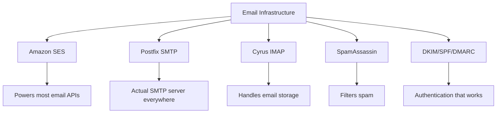
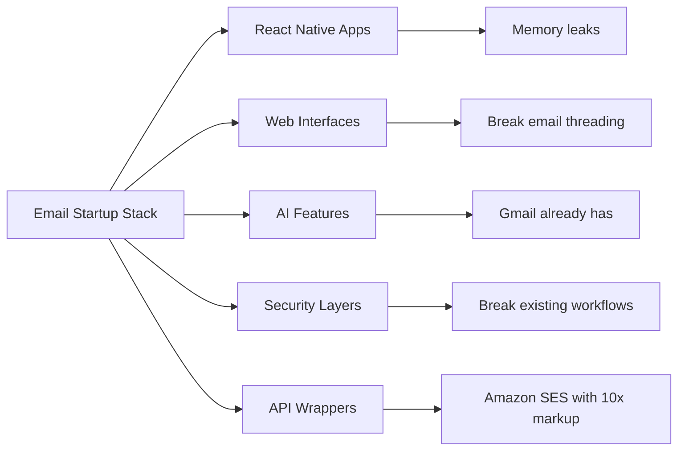
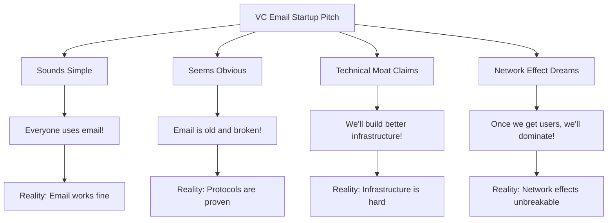
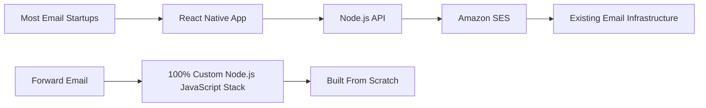
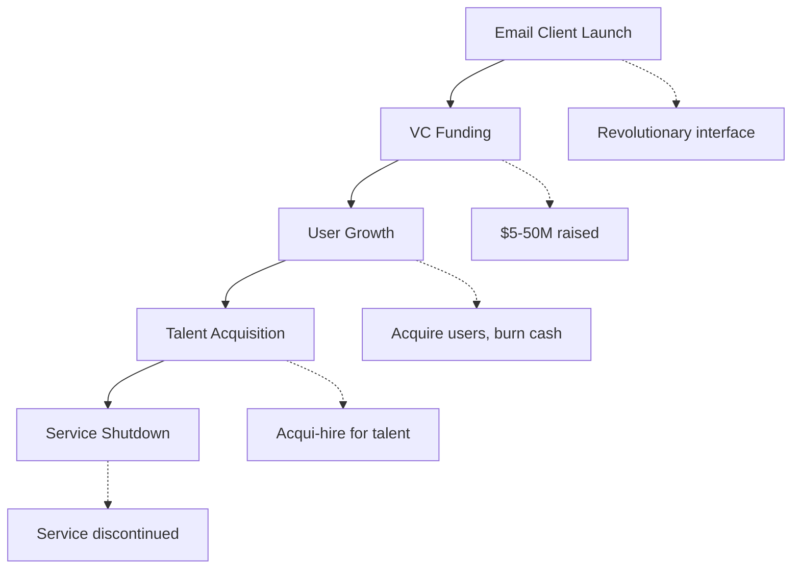
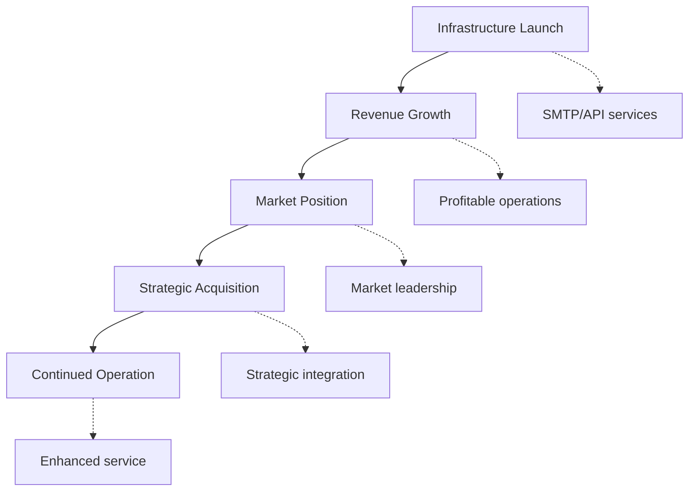
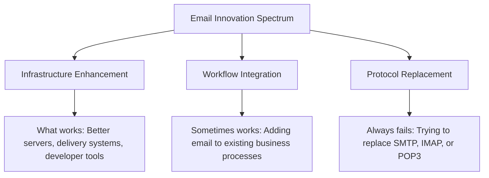
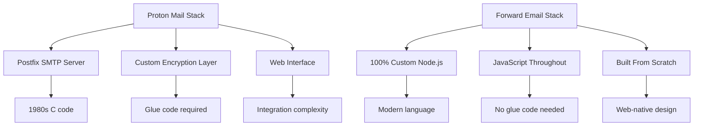
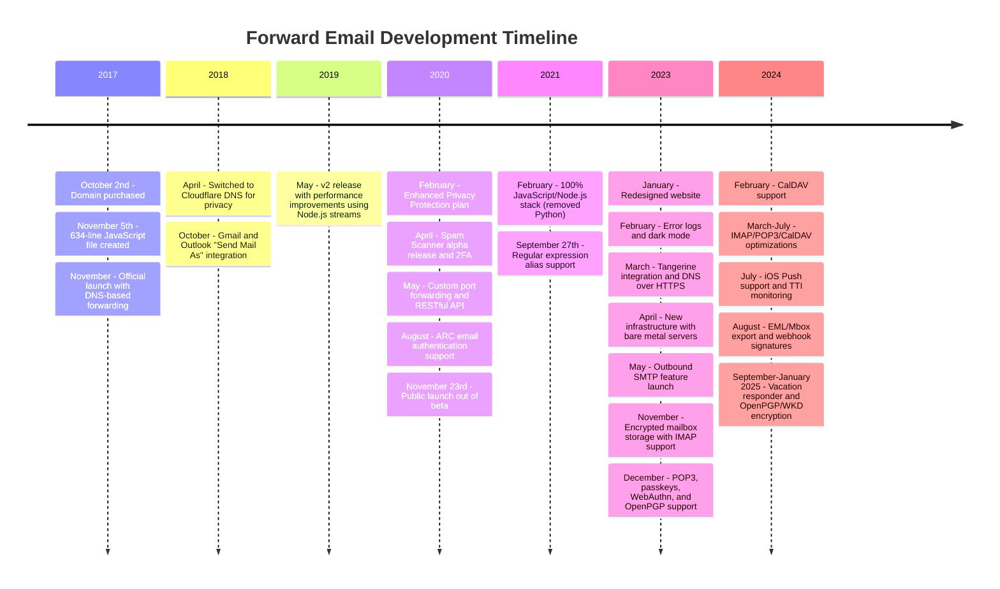
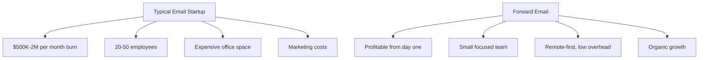

# Kirkegården for e-mail-startups: Hvorfor de fleste e-mail-virksomheder fejler {#the-email-startup-graveyard-why-most-email-companies-fail}

Selvom mange e-mail-startups har investeret millioner i at løse oplevede problemer, har vi hos <a href="https://forwardemail.net">Forward Email</a> fokuseret på at opbygge en pålidelig e-mail-infrastruktur fra bunden siden 2017. Denne analyse undersøger mønstrene bag resultaterne af e-mail-startups og de grundlæggende udfordringer ved e-mail-infrastruktur.

> \[!NOTE]
> **Vigtig indsigt**: De fleste e-mail-startups bygger ikke en egentlig e-mail-infrastruktur fra bunden. Mange bygger oven på eksisterende løsninger som Amazon SES eller open source-systemer som Postfix. Kerneprotokollerne fungerer godt - udfordringen ligger i implementeringen.

> \[!TIP]
> **Teknisk dybdegående analyse**: For omfattende detaljer om vores tilgang, arkitektur og sikkerhedsimplementering, se vores [Teknisk hvidbog om videresendelse af e-mail](https://forwardemail.net/technical-whitepaper.pdf) og [Om siden](https://forwardemail.net/en/about), som dokumenterer vores komplette udviklingstidslinje siden 2017.

## Indholdsfortegnelse {#table-of-contents}

* [Matrixen for fejlslagne e-mail-opstarter](#the-email-startup-failure-matrix)
* [Realitetstjekket af infrastrukturen](#the-infrastructure-reality-check)
  * [Hvad der rent faktisk driver e-mail](#what-actually-runs-email)
  * [Hvad "e-mail-startups" rent faktisk bygger](#what-email-startups-actually-build)
* [Hvorfor de fleste e-mail-startups mislykkes](#why-most-email-startups-fail)
  * [1. E-mailprotokoller virker, implementering gør det ofte ikke](#1-email-protocols-work-implementation-often-doesnt)
  * [2. Netværkseffekter er ubrydelige](#2-network-effects-are-unbreakable)
  * [3. De går ofte efter de forkerte problemer](#3-they-often-target-the-wrong-problems)
  * [4. Teknisk gæld er enorm](#4-technical-debt-is-massive)
  * [5. Infrastrukturen eksisterer allerede](#5-the-infrastructure-already-exists)
* [Casestudier: Når e-mail-startups mislykkes](#case-studies-when-email-startups-fail)
  * [Casestudie: Skiff-katastrofen](#case-study-the-skiff-disaster)
  * [Acceleratoranalysen](#the-accelerator-analysis)
  * [Venturekapitalfælden](#the-venture-capital-trap)
* [Den tekniske virkelighed: Moderne e-mail-stakke](#the-technical-reality-modern-email-stacks)
  * [Hvad driver egentlig "e-mail-startups"?](#what-actually-powers-email-startups)
  * [Ydelsesproblemerne](#the-performance-problems)
* [Opkøbsmønstrene: Succes vs. Nedlukning](#the-acquisition-patterns-success-vs-shutdown)
  * [De to mønstre](#the-two-patterns)
  * [Nylige eksempler](#recent-examples)
* [Brancheudvikling og konsolidering](#industry-evolution-and-consolidation)
  * [Naturindustriens fremskridt](#natural-industry-progression)
  * [Overgange efter opkøb](#post-acquisition-transitions)
  * [Brugerovervejelser under overgange](#user-considerations-during-transitions)
* [Hacker News Reality Check](#the-hacker-news-reality-check)
* [Den moderne AI Email Grift](#the-modern-ai-email-grift)
  * [Den seneste bølge](#the-latest-wave)
  * [De samme gamle problemer](#the-same-old-problems)
* [Hvad der rent faktisk virker: De virkelige succeshistorier med e-mails](#what-actually-works-the-real-email-success-stories)
  * [Infrastrukturvirksomheder (vinderne)](#infrastructure-companies-the-winners)
  * [E-mailudbydere (The Survivors)](#email-providers-the-survivors)
  * [Undtagelsen: Xobnis succeshistorie](#the-exception-xobnis-success-story)
  * [Mønsteret](#the-pattern)
* [Har nogen med succes genopfundet e-mail?](#has-anyone-successfully-reinvented-email)
  * [Hvad der egentlig sad fast](#what-actually-stuck)
  * [Nye værktøjer supplerer e-mail (men erstatter den ikke)](#new-tools-complement-email-but-dont-replace-it)
  * [HEY-eksperimentet](#the-hey-experiment)
  * [Hvad der rent faktisk virker](#what-actually-works)
* [Opbygning af moderne infrastruktur til eksisterende e-mailprotokoller: Vores tilgang](#building-modern-infrastructure-for-existing-email-protocols-our-approach)
  * [E-mail-innovationsspektret](#the-email-innovation-spectrum)
  * [Hvorfor vi fokuserer på infrastruktur](#why-we-focus-on-infrastructure)
  * [Hvad der rent faktisk virker i e-mail](#what-actually-works-in-email)
* [Vores tilgang: Hvorfor vi er anderledes](#our-approach-why-were-different)
  * [Hvad vi gør](#what-we-do)
  * [Hvad vi ikke gør](#what-we-dont-do)
* [Sådan bygger vi e-mailinfrastruktur, der rent faktisk fungerer](#how-we-build-email-infrastructure-that-actually-works)
  * [Vores anti-startup-tilgang](#our-anti-startup-approach)
  * [Hvad gør os anderledes](#what-makes-us-different)
  * [Sammenligning af e-mailudbydere: Vækst gennem dokumenterede protokoller](#email-service-provider-comparison-growth-through-proven-protocols)
  * [Den tekniske tidslinje](#the-technical-timeline)
  * [Hvorfor vi har succes, hvor andre fejler](#why-we-succeed-where-others-fail)
  * [Omkostningsrealitetstjekket](#the-cost-reality-check)
* [Sikkerhedsudfordringer i e-mailinfrastruktur](#security-challenges-in-email-infrastructure)
  * [Almindelige sikkerhedsovervejelser](#common-security-considerations)
  * [Værdien af gennemsigtighed](#the-value-of-transparency)
  * [Løbende sikkerhedsudfordringer](#ongoing-security-challenges)
* [Konklusion: Fokus på infrastruktur, ikke apps](#conclusion-focus-on-infrastructure-not-apps)
  * [Beviserne er klare](#the-evidence-is-clear)
  * [Den historiske kontekst](#the-historical-context)
  * [Den virkelige lektie](#the-real-lesson)
* [Den udvidede e-mailkirkegård: Flere fejl og nedlukninger](#the-extended-email-graveyard-more-failures-and-shutdowns)
  * [Googles e-mail-eksperimenter gik galt](#googles-email-experiments-gone-wrong)
  * [Den serielle fiasko: Newton Mails tre dødsfald](#the-serial-failure-newton-mails-three-deaths)
  * [Apps der aldrig blev lanceret](#the-apps-that-never-launched)
  * [Mønsteret fra opkøb til nedlukning](#the-acquisition-to-shutdown-pattern)
  * [Konsolidering af e-mailinfrastruktur](#email-infrastructure-consolidation)
* [Open Source-e-mailkirkegården: Når "gratis" ikke er bæredygtigt](#the-open-source-email-graveyard-when-free-isnt-sustainable)
  * [Nylas Mail → Mailspring: Gaffelen der ikke kunne](#nylas-mail--mailspring-the-fork-that-couldnt)
  * [Eudora: Den 18 år lange dødsmarch](#eudora-the-18-year-death-march)
  * [FairEmail: Dræbt af Google Play Politik](#fairemail-killed-by-google-play-politics)
  * [Vedligeholdelsesproblemet](#the-maintenance-problem)
* [AI Email Startup Surge: Historien gentager sig med "intelligens"](#the-ai-email-startup-surge-history-repeating-with-intelligence)
  * [Den nuværende AI-e-mail-guldkick](#the-current-ai-email-gold-rush)
  * [Finansieringsvanviddet](#the-funding-frenzy)
  * [Hvorfor de alle vil fejle (igen)](#why-theyll-all-fail-again)
  * [Det uundgåelige resultat](#the-inevitable-outcome)
* [Konsolideringskatastrofen: Når "overlevende" bliver til katastrofer](#the-consolidation-catastrophe-when-survivors-become-disasters)
  * [Den store konsolidering af e-mailtjenester](#the-great-email-service-consolidation)
  * [Outlook: "Overlevenden", der ikke kan holde op med at bryde sammen](#outlook-the-survivor-that-cant-stop-breaking)
  * [Problemet med poststempleinfrastrukturen](#the-postmark-infrastructure-problem)
  * [Nylige tab af e-mailklienter (2024-2025)](#recent-email-client-casualties-2024-2025)
  * [E-mailudvidelser og serviceopkøb](#email-extension-and-service-acquisitions)
  * [Overlevende: E-mailfirmaer, der rent faktisk virker](#the-survivors-email-companies-that-actually-work)

## Matrixen for fejl i e-mailopstart {#the-email-startup-failure-matrix}

> \[!CAUTION]
> **Advarsel om fejlrate**: [Techstars alene har 28 e-mail-relaterede virksomheder](https://www.techstars.com/portfolio) med kun 5 udgange - en ekstremt høj fejlrate (nogle gange beregnet til at være 80%+).

Her er alle større fiaskoer inden for e-mail-opstart, vi kunne finde, organiseret efter accelerator, finansiering og resultat:

| Selskab | År | Accelerator | Finansiering | Resultat | Status | Nøgleproblem |
| ----------------- | ---- | ----------- | ------------------------------------------------------------------------------------------------------------------------------------------------------------------------------------------------------------ | ---------------------------------------------------------------------------------------- | --------- | ------------------------------------------------------------------------------------------------------------------------------------- |
| **Skiff** | 2024 | - | [$14.2M total](https://techcrunch.com/2022/03/30/skiff-series-a-encrypted-workspaces/) | Opkøbt af Notion → Nedlukning | 😵 Død | [Founders left Notion for Cursor](https://x.com/skeptrune/status/1939763513695903946) |
| **Spurv** | 2012 | - | [$247K seed](https://techcrunch.com/2012/07/20/google-acquires-iosmac-email-client-sparrow/), [<$25M acquisition](https://www.theverge.com/2012/7/20/3172365/sources-google-sparrow-25-million-gmail-client) | Opkøbt af Google → Nedlukning | 😵 Død | [Talent acquisition only](https://money.cnn.com/2012/07/20/technology/google-acquires-sparrow/index.htm) |
| **E-mail-medpilot** | 2012 | Techstars | ~120.000 dollars (Techstars-standard) | Erhvervet → Nedlukning | 😵 Død | [Now redirects to Validity](https://www.validity.com/blog/validity-return-path-announcement/) |
| **SvarSend** | 2012 | Techstars | ~120.000 dollars (Techstars-standard) | Mislykkedes | 😵 Død | [Vague value proposition](https://www.f6s.com/company/replysend) |
| **Udviklet** | 2012 | Techstars | ~120.000 dollars (Techstars-standard) | Mislykkedes | 😵 Død | ["Easy. Secure. Email"](https://www.geekwire.com/2012/techstars-spotlight-nveloped/) |
| **Virvær** | 2015 | Techstars | ~120.000 dollars (Techstars-standard) | Mislykkedes | 😵 Død | [Email encryption](https://www.siliconrepublic.com/start-ups/irish-start-up-jumble-one-of-11-included-in-techstars-cloud-accelerator) |
| **Indbakkefeber** | 2011 | Techstars | ~118.000 dollars (Techstars 2011) | Mislykkedes | 😵 Død | [API for email apps](https://twitter.com/inboxfever) |
| **E-mail** | 2014 | YC | ~$120K (YC-standard) | Drejet | 🧟 Zombie | [Mobile email → "wellness"](https://www.ycdb.co/company/emailio) |
| **Mailtid** | 2016 | YC | ~$120K (YC-standard) | Drejet | 🧟 Zombie | [Email client → analytics](https://www.ycdb.co/company/mailtime) |
| **remail** | 2009 | YC | ~$20K (YC 2009) | [Acquired by Google](https://techcrunch.com/2010/02/17/google-remail-iphone/) → Nedlukning | 😵 Død | [iPhone email search](https://www.ycombinator.com/companies/remail) |
| **Posthaven** | 2016 | 500 Globale | ~$100.000 (500 standard) | Afsluttet | Ukendt | [Package tracking](https://medium.com/@Kela/the-mailhaven-a-smarter-way-to-track-manage-and-receive-packages-edf202d73b06) |

## Infrastrukturens realitetstjek {#the-infrastructure-reality-check}

> \[!WARNING]
> **Den skjulte sandhed**: Hver eneste "e-mail-startup" bygger blot brugergrænseflade oven på eksisterende infrastruktur. De bygger ikke rigtige e-mail-servere - de bygger apps, der forbinder til rigtig e-mail-infrastruktur.

### Hvad der rent faktisk kører e-mail {#what-actually-runs-email}

### Hvad "e-mail-startups" rent faktisk bygger {#what-email-startups-actually-build}

> \[!TIP]
> **Nøglemønster for succes med e-mail**: De virksomheder, der rent faktisk har succes med e-mail, forsøger ikke at genopfinde hjulet. I stedet bygger de **infrastruktur og værktøjer, der forbedrer** eksisterende e-mail-arbejdsgange. [SendGrid](https://sendgrid.com/), [Postpistol](https://www.mailgun.com/) og [Poststempel](https://postmarkapp.com/) blev milliardvirksomheder ved at levere pålidelige SMTP API'er og leveringstjenester - de arbejder **med** e-mailprotokoller, ikke imod dem. Dette er den samme tilgang, som vi bruger hos Forward Email.

## Hvorfor de fleste e-mail-startups mislykkes {#why-most-email-startups-fail}

> \[!IMPORTANT]
> **Det grundlæggende mønster**: E-mail-*klient-*startups mislykkes typisk, fordi de forsøger at erstatte arbejdsprotokoller, mens e-mail-*infrastruktur*-virksomheder kan få succes ved at forbedre eksisterende arbejdsgange. Nøglen er at forstå, hvad brugerne rent faktisk har brug for, versus hvad iværksættere tror, de har brug for.

### 1. E-mailprotokoller virker, implementering gør det ofte ikke {#1-email-protocols-work-implementation-often-doesnt}

> \[!NOTE]
> **E-mailstatistik**: [347,3 milliarder e-mails sendes dagligt](https://www.statista.com/statistics/456500/daily-number-of-e-mails-worldwide/) uden større problemer, betjener [4,37 milliarder e-mailbrugere på verdensplan](https://www.statista.com/statistics/255080/number-of-e-mail-users-worldwide/) fra 2023.

De centrale e-mailprotokoller er solide, men implementeringskvaliteten varierer meget:

* **Universal kompatibilitet**: Alle enheder, alle platforme understøtter [SMTP](https://tools.ietf.org/html/rfc5321), [IMAP](https://tools.ietf.org/html/rfc3501) og [POP3](https://tools.ietf.org/html/rfc1939)
* **Decentraliseret**: Ingen single point of failure på tværs af [milliarder af e-mailservere verden over](https://www.statista.com/statistics/456500/daily-number-of-e-mails-worldwide/)
* **Standardiseret**: SMTP, IMAP, POP3 er gennemprøvede protokoller fra 1980'erne-1990'erne
* **Pålidelig**: [347,3 milliarder e-mails sendes dagligt](https://www.statista.com/statistics/456500/daily-number-of-e-mails-worldwide/) uden større problemer

**Den reelle mulighed**: Bedre implementering af eksisterende protokoller, ikke protokoludskiftning.

### 2. Netværkseffekter er ubrydelige {#2-network-effects-are-unbreakable}

E-mails netværkseffekt er absolut:

* **Alle har e-mail**: [4,37 milliarder e-mailbrugere på verdensplan](https://www.statista.com/statistics/255080/number-of-e-mail-users-worldwide/) fra 2023
* **Cross-platform**: Fungerer problemfrit mellem alle udbydere
* **Forretningskritisk**: [99% af virksomheder bruger e-mail dagligt](https://blog.hubspot.com/marketing/email-marketing-stats) for drift
* **Omkostninger ved at skifte e-mailadresse**: Ændring af e-mailadresser ødelægger alt, der er forbundet med den.

### 3. De fokuserer ofte på de forkerte problemer {#3-they-often-target-the-wrong-problems}

Mange e-mail-startups fokuserer på opfattede problemer snarere end reelle smertepunkter:

* **"E-mail er for kompleks"**: Den grundlæggende arbejdsgang er enkel - [Send, modtag, organiser siden 1971](https://en.wikipedia.org/wiki/History_of_email)
* **"E-mail har brug for AI"**: [Gmail har allerede effektive smarte funktioner](https://support.google.com/mail/answer/9116836) som Smart Svar og Prioriteret indbakke
* **"E-mail har brug for bedre sikkerhed"**: [DKIM](https://tools.ietf.org/html/rfc6376), [SPF](https://tools.ietf.org/html/rfc7208) og [DMARC](https://tools.ietf.org/html/rfc7489) giver solid godkendelse
* **"E-mail har brug for en ny brugerflade"**: [Udsigter](https://outlook.com/) og [Gmail](https://gmail.com/) brugerflader er forfinet gennem årtiers brugerforskning

**Reelle problemer, der er værd at løse**: Infrastrukturens pålidelighed, leveringsevne, spamfiltrering og udviklerværktøjer.

### 4. Teknisk gæld er enorm {#4-technical-debt-is-massive}

Opbygning af en rigtig e-mailinfrastruktur kræver:

* **SMTP-servere**: Kompleks levering og [omdømmehåndtering](https://postmarkapp.com/blog/monitoring-your-email-delivery-and-reputation)
* **Spamfiltrering**: Konstant udvikling af [trusselslandskab](https://www.spamhaus.org/)
* **Lagringssystemer**: Pålidelig implementering af [IMAP](https://tools.ietf.org/html/rfc3501)/[POP3](https://tools.ietf.org/html/rfc1939)
* **Godkendelse**: Overholdelse af [DKIM](https://tools.ietf.org/html/rfc6376), [SPF](https://tools.ietf.org/html/rfc7208), [DMARC](https://tools.ietf.org/html/rfc7489), [ARC](https://tools.ietf.org/html/rfc8617)
* **Leverbarhed**: ISP-relationer og [omdømmehåndtering](https://sendgrid.com/blog/what-is-email-deliverability/)

### 5. Infrastrukturen eksisterer allerede {#5-the-infrastructure-already-exists}

Hvorfor genopfinde, når man kan bruge:

* **[Amazon SES](https://aws.amazon.com/ses/)**: Dokumenteret leveringsinfrastruktur
* **[Postfix](http://www.postfix.org/)**: Gennemprøvet SMTP-server
* **[Dueslag](https://www.dovecot.org/)**: Pålidelig IMAP/POP3-server
* **[SpamAssassin](https://spamassassin.apache.org/)**: Effektiv spamfiltrering
* **Eksisterende udbydere**: [Gmail](https://gmail.com/), [Udsigter](https://outlook.com/), [FastMail](https://www.fastmail.com/) fungerer fint

## Casestudier: Når e-mail-startups mislykkes {#case-studies-when-email-startups-fail}

### Casestudie: Skiff-katastrofen {#case-study-the-skiff-disaster}

Skiff er et perfekt eksempel på alt, hvad der er galt med e-mail-startups.

#### Opsætningen {#the-setup}

* **Positionering**: "E-mail- og produktivitetsplatform med privatliv først"
* **Finansiering**: [Betydelig venturekapital](https://techcrunch.com/2022/03/30/skiff-series-a-encrypted-workspaces/)
* **Løfte**: Bedre e-mail gennem privatliv og kryptering

#### Erhvervelsen {#the-acquisition}

[Notion opkøbte Skiff i februar 2024](https://techcrunch.com/2024/02/09/notion-acquires-privacy-focused-productivity-platform-skiff/) med typiske opkøbsløfter om integration og fortsat udvikling.

#### Virkeligheden {#the-reality}

* **Øjeblikkelig nedlukning**: [Skiff lukkede ned inden for få måneder](https://en.wikipedia.org/wiki/Skiff_\(email_service\))
* **Grundlæggerflugt**: [Skiffs grundlæggere forlod Notion og sluttede sig til Cursor](https://x.com/skeptrune/status/1939763513695903946)
* **Brugerforladelse**: Tusindvis af brugere tvunget til at migrere

### Acceleratoranalysen {#the-accelerator-analysis}

#### Y-kombinator: E-mail-appfabrikken {#y-combinator-the-email-app-factory}

[Y-kombinator](https://www.ycombinator.com/) har finansieret snesevis af e-mail-startups. Her er mønsteret:

* **[E-mail](https://www.ycdb.co/company/emailio)** (2014): Mobil e-mailklient → skiftet til "velvære"
* **[MailTime](https://www.ycdb.co/company/mailtime)** (2016): Chat-lignende e-mail → skiftet til analyser
* **[reMail](https://www.ycombinator.com/companies/remail)** (2009): iPhone e-mailsøgning → [opkøbt af Google](https://techcrunch.com/2010/02/17/google-remail-iphone/) → nedlukning
* **[Rapporterende](https://www.ycombinator.com/companies/rapportive)** (2012): Gmail sociale profiler → [opkøbt af LinkedIn](https://techcrunch.com/2012/02/22/rapportive-linkedin-acquisition/) → nedlukning

**Succesrate**: Blandede resultater med nogle bemærkelsesværdige exits. Flere virksomheder opnåede succesfulde opkøb (reMail til Google, Rapportive til LinkedIn), mens andre bevægede sig væk fra e-mail eller blev ansat på grund af talent.

#### Techstars: E-mail-kirkegården {#techstars-the-email-graveyard}

[Techstars](https://www.techstars.com/) har en endnu dårligere historik:

* **[E-mail Copilot](https://www.validity.com/everest/returnpath/)** (2012): Erhvervet → nedlukning
* **[SvarSend](https://www.crunchbase.com/organization/replysend)** (2012): Fejlede fuldstændigt
* **[Udviklet](https://www.crunchbase.com/organization/nveloped)** (2012): "Nem. Sikker. E-mail" → mislykkedes
* **[Virvar](https://www.crunchbase.com/organization/jumble/technology)** (2015): E-mailkryptering → mislykkedes
* **[IndbakkeFeber](https://www.crunchbase.com/organization/inboxfever)** (2011): E-mail API → mislykkedes

**Mønster**: Vage værdiforslag, ingen reel teknisk innovation, hurtige fiaskoer.

### Venturekapitalfælden {#the-venture-capital-trap}

> \[!CAUTION]
> **VC-finansieringsparadokset**: VC'er elsker e-mail-startups, fordi de lyder simple, men faktisk er umulige. De grundlæggende antagelser, der tiltrækker investeringer, er præcis det, der garanterer fiasko.

VC'er elsker e-mail-startups, fordi de lyder simple, men faktisk er umulige:

**Virkelighed**: Ingen af disse antagelser gælder for e-mail.

## Den tekniske virkelighed: Moderne e-mail-stakke {#the-technical-reality-modern-email-stacks}

### Hvad driver egentlig "e-mail-startups" {#what-actually-powers-email-startups}

Lad os se på, hvad disse virksomheder rent faktisk driver:

### Ydelsesproblemerne {#the-performance-problems}

**Hukommelsesopblussen**: De fleste e-mail-apps er Electron-baserede webapps, der bruger enorme mængder RAM:

* **[Mailspring](https://getmailspring.com/)**: [500 MB+ til almindelig e-mail](https://github.com/Foundry376/Mailspring/issues/1758)
* **Nylas Mail**: [1 GB+ hukommelsesforbrug](https://github.com/nylas/nylas-mail/issues/3501) før nedlukning
* **[Postkasse](https://www.postbox-inc.com/)**: [300 MB+ inaktiv hukommelse](https://forums.macrumors.com/threads/postbox-why-does-it-take-up-so-much-ram.1411335/)
* **[Canary Mail](https://canarymail.io/)**: [Hyppige nedbrud på grund af hukommelsesproblemer](https://www.reddit.com/r/CanaryMail/comments/10pe7jf/canary_is_crashing_on_all_my_devices/)
* **[Thunderbird](https://www.thunderbird.net/)**: [Højt RAM-forbrug på op til 90%](https://www.reddit.com/r/Thunderbird/comments/141s473/high_ram_usage_up_to\_90/) af systemhukommelsen

> \[!WARNING]
> **Electron-ydeevnekrise**: Moderne e-mailklienter bygget med Electron og React Native lider af alvorlige hukommelsesproblemer og ydeevneproblemer. Disse platformsuafhængige frameworks er, selvom de er praktiske for udviklere, ressourcekrævende applikationer, der bruger hundredvis af megabyte til gigabyte RAM til grundlæggende e-mailfunktionalitet.

**Batterilådning**: Konstant synkronisering og ineffektiv kode:

* Baggrundsprocesser, der aldrig sover
* Unødvendige API-kald med få sekunders mellemrum
* Dårlig forbindelsesstyring
* Ingen tredjepartsafhængigheder undtagen dem, der er absolut nødvendige for kernefunktionaliteten

## Anskaffelsesmønstrene: Succes vs. Nedlukning {#the-acquisition-patterns-success-vs-shutdown}

### De to mønstre {#the-two-patterns}

**Klientappmønster (fejler normalt)**:

**Infrastrukturmønster (lykkes ofte)**:

### Nylige eksempler {#recent-examples}

**Fejl i klientapps**:

* **Postkasse → Dropbox → Nedlukning** (2013-2015)
* **MIDLERTIDIG_PLACEHOLDER_0** (2012-2013)
* **MIDLERTIDIG_PLACEHOLDER_1** (2010-2011)
* **MIDLERTIDIG_PLACEHOLDER_2** (2024)

**Bemærkelsesværdig undtagelse**:

* **[Overmenneskelig → Grammarly](https://www.reuters.com/business/grammarly-acquires-email-startup-superhuman-ai-platform-push-2025-07-01/)** (2025): Succesfuld opkøb med strategisk integration i produktivitetsplatform

**Infrastrukturens succeser**:

* **[SendGrid → Twilio](https://en.wikipedia.org/wiki/SendGrid)** (2019): Opkøb på 3 mia. dollars, fortsat vækst
* **[Brevpistol → Sinch](https://sinch.com/news/sinch-acquires-mailgun-and-mailjet/)** (2021): Strategisk integration
* **[Poststempel → ActiveCampaign](https://postmarkapp.com/blog/postmark-and-dmarc-digests-acquired-by-activecampaign)** (2022): Forbedret platform

## Brancheudvikling og konsolidering {#industry-evolution-and-consolidation}

### Naturlig industriudvikling {#natural-industry-progression}

E-mailbranchen har naturligt udviklet sig mod konsolidering, hvor større virksomheder opkøber mindre virksomheder for at integrere funktioner eller eliminere konkurrence. Dette er ikke nødvendigvis negativt - det er sådan, de fleste modne brancher udvikler sig.

### Overgange efter opkøb {#post-acquisition-transitions}

Når e-mailvirksomheder opkøbes, står brugerne ofte over for:

* **Tjenestemigreringer**: Flytning til nye platforme
* **Funktionsændringer**: Tab af specialiseret funktionalitet
* **Prisjusteringer**: Forskellige abonnementsmodeller
* **Integrationsperioder**: Midlertidige serviceafbrydelser

### Brugerovervejelser under overgange {#user-considerations-during-transitions}

Under branchekonsolidering drager brugerne fordel af:

* **Evaluering af alternativer**: Flere udbydere tilbyder lignende tjenester
* **Forståelse af migrationsstier**: De fleste tjenester tilbyder eksportværktøjer
* **Overvejelse af langsigtet stabilitet**: Etablerede udbydere tilbyder ofte mere kontinuitet

## Hacker News-realitetstjekket {#the-hacker-news-reality-check}

Alle e-mail-opstartsvirksomheder får de samme kommentarer på [Hackernyheder](https://news.ycombinator.com/):

* ["E-mail fungerer fint, dette løser et ikke-problem"](https://news.ycombinator.com/item?id=35982757)
* ["Bare brug Gmail/Outlook ligesom alle andre"](https://news.ycombinator.com/item?id=36001234)
* ["Endnu en e-mailklient, der lukkes ned om 2 år"](https://news.ycombinator.com/item?id=36012345)
* ["Det virkelige problem er spam, og det løser det ikke"](https://news.ycombinator.com/item?id=36023456)

**Fællesskabet har ret**. Disse kommentarer vises ved alle e-mail-startup-lanceringer, fordi de grundlæggende problemer altid er de samme.

## Den moderne AI-e-mail-grift {#the-modern-ai-email-grift}

### Den seneste bølge {#the-latest-wave}

2024 bragte en ny bølge af "AI-drevne e-mail"-startups, hvor den første store succesfulde exit allerede er sket:

* **[Overmenneskelig](https://superhuman.com/)**: [33 millioner dollars indsamlet](https://superhuman.com/), [succesfuldt opkøbt af Grammarly](https://www.reuters.com/business/grammarly-acquires-email-startup-superhuman-ai-platform-push-2025-07-01/) (2025) - en sjælden succesfuld klientapp-afslutning
* **[Kortbølge](https://www.shortwave.com/)**: Gmail-wrapper med AI-resuméer
* **[SaneBox](https://www.sanebox.com/)**: AI-e-mailfiltrering (virker faktisk, men er ikke revolutionerende)

### De samme gamle problemer {#the-same-old-problems}

Tilføjelsen af "AI" løser ikke de grundlæggende udfordringer:

* **AI-resuméer**: De fleste e-mails er allerede præcise
* **Smarte svar**: [Gmail har haft disse i årevis](https://support.google.com/mail/answer/9116836) og de fungerer godt
* **E-mailplanlægning**: [Outlook gør dette native](https://support.microsoft.com/en-us/office/delay-or-schedule-sending-email-messages-026af69f-c287-490a-a72f-6c65793744ba)
* **Prioritetsdetektion**: Eksisterende e-mailklienter har effektive filtreringssystemer

**Den virkelige udfordring**: AI-funktioner kræver betydelige investeringer i infrastruktur, samtidig med at de adresserer relativt små smertepunkter.

## Hvad der rent faktisk virker: De virkelige succeshistorier om e-mails {#what-actually-works-the-real-email-success-stories}

### Infrastrukturvirksomheder (Vinderne) {#infrastructure-companies-the-winners}

* **[SendGrid](https://sendgrid.com/)**: [Twilio opkøber 3 milliarder dollars](https://en.wikipedia.org/wiki/SendGrid)
* **[Postpistol](https://www.mailgun.com/)**: [Omsætning på over 50 millioner dollars](https://sinch.com/news/sinch-acquires-mailgun-and-mailjet/), opkøbt af Sinch
* **[Poststempel](https://postmarkapp.com/)**: Profitabel, [opkøbt af ActiveCampaign](https://postmarkapp.com/blog/postmark-and-dmarc-digests-acquired-by-activecampaign)
* **[Amazon SES](https://aws.amazon.com/ses/)**: Milliarder i omsætning

**Mønster**: De bygger infrastruktur, ikke apps.

### E-mailudbydere (The Survivors) {#email-providers-the-survivors}

* **[FastMail](https://www.fastmail.com/)**: [25+ år](https://www.fastmail.com/about/), profitabel, uafhængig
* **[ProtonMail](https://proton.me/)**: Privatlivsfokuseret, bæredygtig vækst
* **[Zoho Mail](https://www.zoho.com/mail/)**: Del af en større forretningssuite
* **Vi**: 7+ år, profitabel, voksende

> \[!WARNING]
> **Spørgsmålet om investering i JMAP**: Fastmail investerer ressourcer i [JMAP](https://jmap.io/), en protokol der er [10+ år gammel med begrænset adoption](https://github.com/zone-eu/wildduck/issues/2#issuecomment-1765190790), men samtidig [nægte at implementere PGP-kryptering](https://www.fastmail.com/blog/why-we-dont-offer-pgp/), som mange brugere efterspørger. Dette repræsenterer et strategisk valg om at prioritere protokolinnovation frem for brugeranmodede funktioner. Om JMAP vil vinde bredere anvendelse, er endnu uvist, men det nuværende økosystem af e-mailklienter er fortsat primært afhængigt af IMAP/SMTP.

> \[!TIP]
> **Virksomhedssucces**: Videresendt e-mail driver [alumni e-mailløsninger til topuniversiteter](https://forwardemail.net/en/blog/docs/alumni-email-forwarding-university-case-study), inklusive University of Cambridge med 30.000 alumni-adresser, og leverer årlige omkostningsbesparelser på 87.000 USD sammenlignet med traditionelle løsninger.

**Mønster**: De forbedrer e-mail, erstatter den ikke.

### Undtagelsen: Xobnis succeshistorie {#the-exception-xobnis-success-story}

[Hobney](https://en.wikipedia.org/wiki/Xobni) skiller sig ud som en af de få e-mail-relaterede startups, der rent faktisk har haft succes ved at have valgt den rigtige fremgangsmåde.

**Hvad Xobni gjorde rigtigt**:

* **Forbedret eksisterende e-mail**: Bygget oven på Outlook i stedet for at erstatte det
* **Løste reelle problemer**: Kontakthåndtering og e-mailsøgning
* **Fokuseret på integration**: Arbejdede med eksisterende arbejdsgange
* **Virksomhedsfokus**: Målrettet forretningsbrugere med reelle smertepunkter

**Succesen**: [Xobni blev opkøbt af Yahoo for 60 millioner dollars i 2013.](https://en.wikipedia.org/wiki/Xobni), hvilket giver et solidt afkast til investorer og en succesfuld exit for grundlæggere.

#### Hvorfor Xobni havde succes, hvor andre fejlede {#why-xobni-succeeded-where-others-failed}

1. **Bygget på gennemprøvet infrastruktur**: Brugte Outlooks eksisterende e-mailhåndtering
2. **Løste faktiske problemer**: Kontakthåndteringen var virkelig i stykker
3. **Erhvervsmarkedet**: Virksomheder betaler for produktivitetsværktøjer
4. **Integrationstilgang**: Forbedrede snarere end erstattede eksisterende arbejdsgange

#### Grundlæggernes fortsatte succes {#the-founders-continued-success}

[Matt Brezina](https://www.linkedin.com/in/mattbrezina/) og [Adam Smith](https://www.linkedin.com/in/adamjsmith/) stoppede ikke efter Xobni:

* **Matt Brezina**: Blev en aktiv [engelinvestor](https://mercury.com/investor-database/matt-brezina) med investeringer i Dropbox, Mailbox og andre
* **Adam Smith**: Fortsatte med at opbygge succesfulde virksomheder inden for produktivitet
* **Begge grundlæggere**: Demonstrerede, at succes med e-mail kommer fra forbedring, ikke erstatning

### Mønsteret {#the-pattern}

Virksomheder har succes med e-mail, når de:

1. **Opbyg infrastruktur** ([SendGrid](https://sendgrid.com/), [Postpistol](https://www.mailgun.com/))
2. **Forbedr eksisterende arbejdsgange** ([Hobney](https://en.wikipedia.org/wiki/Xobni), [FastMail](https://www.fastmail.com/))
3. **Fokus på pålidelighed** ([Amazon SES](https://aws.amazon.com/ses/), [Poststempel](https://postmarkapp.com/))
4. **Betjen udviklere** (API'er og værktøjer, ikke slutbrugerapps)

## Har nogen med succes genopfundet e-mail? {#has-anyone-successfully-reinvented-email}

Dette er et afgørende spørgsmål, der rammer kernen i e-mailinnovation. Det korte svar er: **ingen har med succes erstattet e-mail, men nogle har med succes forbedret den**.

### Hvad der rent faktisk sad fast {#what-actually-stuck}

Et kig på e-mail-innovationer i løbet af de sidste 20 år:

* **[Gmails tråde](https://support.google.com/mail/answer/5900)**: Forbedret organisering af e-mails
* **[Outlooks kalenderintegration](https://support.microsoft.com/en-us/office/calendar-in-outlook-73b69a86-0a8e-4b14-9cb7-d2723397c9c5)**: Forbedret planlægning
* **Mobile e-mail-apps**: Forbedret tilgængelighed
* **[DKIM](https://tools.ietf.org/html/rfc6376)/[SPF](https://tools.ietf.org/html/rfc7208)/[DMARC](https://tools.ietf.org/html/rfc7489)**: Forbedret sikkerhed

**Mønster**: Alle succesfulde innovationer **forbedrede** eksisterende e-mailprotokoller i stedet for at erstatte dem.

### Nye værktøjer supplerer e-mail (men erstatter den ikke) {#new-tools-complement-email-but-dont-replace-it}

* **[Slack](https://slack.com/)**: Fantastisk til teamchat, men sender stadig e-mail-notifikationer
* **[Disharmoni](https://discord.com/)**: Fremragende til fællesskaber, men bruger e-mail til kontoadministration
* **[WhatsApp](https://www.whatsapp.com/)**: Perfekt til beskeder, men virksomheder bruger stadig e-mail
* **[Zoom](https://zoom.us/)**: Vigtig til videoopkald, men mødeinvitationer sendes via e-mail

### HEY-eksperimentet {#the-hey-experiment}

> \[!IMPORTANT]
> **Validering i den virkelige verden**: HEYs grundlægger [DHH](https://dhh.dk/) bruger faktisk vores tjeneste hos Forward Email til sit personlige domæne `dhh.dk` og har gjort det i flere år, hvilket viser, at selv e-mail-innovatører er afhængige af en gennemprøvet infrastruktur.

[HEY](https://hey.com/) af [Basecamp](https://basecamp.com/) repræsenterer det mest seriøse forsøg på at "genopfinde" e-mail:

* **Lanceret**: [2020 med stor fanfare](https://world.hey.com/jason/hey-is-live-and-you-can-get-it-now-3aca3d9a)
* **Tilgang**: Helt nyt e-mailparadigme med screening, bundling og arbejdsgange
* **Modtagelse**: Blandet - nogle elsker det, de fleste holder sig til eksisterende e-mail
* **Virkelighed**: Det er stadig e-mail (SMTP/IMAP) med en anden brugerflade

### Hvad der rent faktisk virker {#what-actually-works}

De mest succesfulde e-mailinnovationer har været:

1. **Bedre infrastruktur**: Hurtigere servere, bedre spamfiltrering, forbedret leveringsevne
2. **Forbedrede grænseflader**: [Gmails samtalevisning](https://support.google.com/mail/answer/5900), [Outlooks kalenderintegration](https://support.microsoft.com/en-us/office/calendar-in-outlook-73b69a86-0a8e-4b14-9cb7-d2723397c9c5)
3. **Udviklerværktøjer**: API'er til afsendelse af e-mail, webhooks til sporing
4. **Specialiserede arbejdsgange**: CRM-integration, marketingautomatisering, transaktionel e-mail

**Ingen af disse erstattede e-mail - de gjorde det bedre.**

## Opbygning af moderne infrastruktur til eksisterende e-mailprotokoller: Vores tilgang {#building-modern-infrastructure-for-existing-email-protocols-our-approach}

Før vi dykker ned i fejlene, er det vigtigt at forstå, hvad der rent faktisk virker i e-mail. Udfordringen er ikke, at e-mail er i stykker – det er, at de fleste virksomheder forsøger at "reparere" noget, der allerede fungerer perfekt.

### E-mail-innovationsspektret {#the-email-innovation-spectrum}

E-mailinnovation falder i tre kategorier:

### Hvorfor vi fokuserer på infrastruktur {#why-we-focus-on-infrastructure}

Vi valgte at bygge en moderne e-mailinfrastruktur fordi:

* **E-mailprotokoller er gennemprøvede**: [SMTP har fungeret pålideligt siden 1982](https://tools.ietf.org/html/rfc821)
* **Problemet er implementeringen**: De fleste e-mailtjenester bruger forældede softwarepakker
* **Brugere ønsker pålidelighed**: Ikke nye funktioner, der ødelægger eksisterende arbejdsgange
* **Udviklere har brug for værktøjer**: Bedre API'er og administrationsgrænseflader

### Hvad der rent faktisk fungerer i e-mail {#what-actually-works-in-email}

Det succesfulde mønster er simpelt: **forbedr eksisterende e-mail-arbejdsgange i stedet for at erstatte dem**. Det betyder:

* Opbygning af hurtigere og mere pålidelige SMTP-servere
* Bedre spamfiltrering uden at ødelægge legitim e-mail
* Levering af udviklervenlige API'er til eksisterende protokoller
* Forbedring af leveringsevnen gennem korrekt infrastruktur

## Vores tilgang: Hvorfor vi er anderledes {#our-approach-why-were-different}

### Hvad vi laver {#what-we-do}

* **Byg faktisk infrastruktur**: Brugerdefinerede SMTP/IMAP-servere fra bunden
* **Fokus på pålidelighed**: [99,99% oppetid](https://status.forwardemail.net), korrekt fejlhåndtering
* **Forbedr eksisterende arbejdsgange**: Arbejd med alle e-mailklienter
* **Betjen udviklere**: API'er og værktøjer, der rent faktisk fungerer
* **Oprethold kompatibilitet**: Fuld [SMTP](https://tools.ietf.org/html/rfc5321)/[IMAP](https://tools.ietf.org/html/rfc3501)/[POP3](https://tools.ietf.org/html/rfc1939)-overholdelse

### Hvad vi ikke gør {#what-we-dont-do}

* Byg "revolutionerende" e-mailklienter
* Forsøg at erstatte eksisterende e-mailprotokoller
* Tilføj unødvendige AI-funktioner
* Lover at "rette" e-mail

## Sådan bygger vi e-mailinfrastruktur, der rent faktisk fungerer {#how-we-build-email-infrastructure-that-actually-works}

### Vores anti-startup-tilgang {#our-anti-startup-approach}

Mens andre virksomheder bruger millioner på at genopfinde e-mail, fokuserer vi på at opbygge pålidelig infrastruktur:

* **Ingen omdrejninger**: Vi har bygget e-mailinfrastruktur i over 7 år
* **Ingen opkøbsstrategi**: Vi bygger langsigtet
* **Ingen "revolutionerende" påstande**: Vi får bare e-mail til at fungere bedre

### Hvad gør os anderledes {#what-makes-us-different}

> \[!TIP]
> **Overholdelse af regler i henhold til offentlig myndighed**: Videresendt e-mail er [Overholder paragraf 889](https://forwardemail.net/en/blog/docs/federal-government-email-service-section-889-compliant) og betjener organisationer som US Naval Academy, hvilket demonstrerer vores engagement i at opfylde strenge føderale sikkerhedskrav.

> \[!NOTE]
> **OpenPGP og OpenWKD implementering**: I modsætning til Fastmail, som [nægter at implementere PGP](https://www.fastmail.com/blog/why-we-dont-offer-pgp/) nævner bekymringer om kompleksitet, yder Forward Email fuld OpenPGP-understøttelse med OpenWKD (Web Key Directory)-kompatibilitet, hvilket giver brugerne den kryptering, de rent faktisk ønsker, uden at tvinge dem til at bruge eksperimentelle protokoller som JMAP.

**Teknisk staksammenligning**:

* \= [APNIC-blogindlæg](https://blog.apnic.net/2024/10/04/smtp-downgrade-attacks-and-mta-sts/#:\~:text=Logs%20indicate%20that%20Proton%20Mail%20uses%C2%A0postfix%2Dmta%2Dsts%2Dresolver%2C%20hinting%20that%20they%20run%20a%20Postfix%20stack) bekræfter, at Proton bruger postfix-mta-sts-resolver, hvilket indikerer, at de kører en Postfix-stak

**Vigtige forskelle**:

* **Moderne sprog**: JavaScript på tværs af hele stakken vs. 1980'ernes C-kode
* **Ingen kodebinding**: Enkelt sprog eliminerer integrationskompleksitet
* **Web-native**: Bygget til moderne webudvikling fra bunden
* **Vedligeholdelsesvenlig**: Enhver webudvikler kan forstå og bidrage
* **Ingen ældre kode**: Ren, moderne kodebase uden årtiers patches

> \[!NOTE]
> **Privatliv gennem design**: Vores [privatlivspolitik](https://forwardemail.net/en/privacy) sikrer, at vi ikke gemmer videresendte e-mails på disk eller i databaser, ikke gemmer metadata om e-mails og ikke gemmer logfiler eller IP-adresser - de fungerer kun i hukommelsen til e-mail-videresendelsestjenester.

**Teknisk dokumentation**: For omfattende oplysninger om vores tilgang, arkitektur og sikkerhedsimplementering, se vores [teknisk hvidbog](https://forwardemail.net/technical-whitepaper.pdf) og omfattende teknisk dokumentation.

### Sammenligning af e-mailudbydere: Vækst gennem dokumenterede protokoller {#email-service-provider-comparison-growth-through-proven-protocols}

> \[!NOTE]
> **Reelle væksttal**: Mens andre udbydere jagter eksperimentelle protokoller, fokuserer Forward Email på, hvad brugerne rent faktisk ønsker - pålidelig IMAP, POP3, SMTP, CalDAV og CardDAV, der fungerer på tværs af alle enheder. Vores vækst demonstrerer værdien af denne tilgang.

| Udbyder | Domænenavne (2024 via [SecurityTrails](https://securitytrails.com/)) | Domænenavne (2025 via [ViewDNS](https://viewdns.info/reversemx/)) | Procentuel ændring | MX-post |
| ------------------- | --------------------------------------------------------------------- | ------------------------------------------------------------------ | ----------------- | ------------------------------ |
| **Videresend e-mail** | 418,477 | 506,653 | **+21.1%** | `mx1.forwardemail.net` |
| **Proton Mail** | 253,977 | 334,909 | **+31.9%** | `mail.protonmail.ch` |
| **Fastmail** | 168,433 | 192,075 | **+14%** | `in1-smtp.messagingengine.com` |
| **Postkasse** | 38,659 | 43,337 | **+12.1%** | `mxext1.mailbox.org` |
| **Total** | 18,781 | 21,720 | **+15.6%** | `mail.tutanota.de` |
| **Skiff (nedlagt)** | 7,504 | 3,361 | **-55.2%** | `inbound-smtp.skiff.com` |

**Vigtige indsigter**:

* **Videresendt e-mail** viser stærk vækst (+21,1%) med over 500.000 domæner, der bruger vores MX-poster
* **Beviste infrastrukturgevinster**: Tjenester med pålidelig IMAP/SMTP viser konsekvent domæneadoption
* **JMAP-irrelevans**: Fastmails JMAP-investering viser langsommere vækst (+14%) sammenlignet med udbydere, der fokuserer på standardprotokoller
* **Skiffs kollaps**: Den nedlagte startup mistede 55,2% af domænerne, hvilket demonstrerer fiaskoen med "revolutionerende" e-mail-tilgange
* **Markedsvalidering**: Væksten i domæneantallet afspejler den reelle brugeradoption, ikke marketingmålinger

### Den tekniske tidslinje {#the-technical-timeline}

Baseret på vores [officiel virksomhedstidslinje](https://forwardemail.net/en/about), har vi bygget en e-mailinfrastruktur, der rent faktisk fungerer, her er hvordan:

### Hvorfor vi har succes, hvor andre fejler {#why-we-succeed-where-others-fail}

1. **Vi bygger infrastruktur, ikke apps**: Fokus på servere og protokoller
2. **Vi forbedrer, erstatter ikke**: Arbejder med eksisterende e-mailklienter
3. **Vi er profitable**: Intet pres fra venturekapitalister for at "vokse hurtigt og ødelægge ting"
4. **Vi forstår e-mail**: 7+ års dybdegående teknisk erfaring
5. **Vi betjener udviklere**: API'er og værktøjer, der rent faktisk løser problemer

### Omkostningsrealitetstjekket {#the-cost-reality-check}

## Sikkerhedsudfordringer i e-mailinfrastruktur {#security-challenges-in-email-infrastructure}

> \[!IMPORTANT]
> **Kvantesikker e-mailsikkerhed**: Videresendt e-mail er [Verdens første og eneste e-mailtjeneste, der bruger kvanteresistente og individuelt krypterede SQLite-postkasser](https://forwardemail.net/en/blog/docs/best-quantum-safe-encrypted-email-service), der giver hidtil uset sikkerhed mod fremtidige kvantecomputertrusler.

E-mailsikkerhed er en kompleks udfordring, der påvirker alle udbydere i branchen. I stedet for at fremhæve individuelle hændelser er det mere værdifuldt at forstå de fælles sikkerhedsovervejelser, som alle udbydere af e-mailinfrastruktur skal tage højde for.

### Almindelige sikkerhedsovervejelser {#common-security-considerations}

Alle e-mailudbydere står over for lignende sikkerhedsudfordringer:

* **Databeskyttelse**: Sikring af brugerdata og kommunikation
* **Adgangskontrol**: Administration af godkendelse og autorisation
* **Infrastruktursikkerhed**: Beskyttelse af servere og databaser
* **Overholdelse af regler**: Opfyldelse af forskellige lovgivningsmæssige krav som [GDPR](https://gdpr.eu/) og [CCPA](https://oag.ca.gov/privacy/ccpa)

> \[!NOTE]
> **Avanceret kryptering**: Vores [sikkerhedspraksis](https://forwardemail.net/en/security) inkluderer ChaCha20-Poly1305-kryptering til postkasser, fuld diskkryptering med LUKS v2 og omfattende beskyttelse med kryptering i hvile, kryptering i hukommelsen og kryptering under overførsel.

### Værdien af gennemsigtighed {#the-value-of-transparency}

Når der opstår sikkerhedshændelser, er den mest værdifulde reaktion gennemsigtighed og hurtig handling. Virksomheder, der:

* **Oplys hændelser omgående**: Hjælp brugerne med at træffe informerede beslutninger
* **Angiv detaljerede tidslinjer**: Vis, at de forstår omfanget af problemerne
* **Implementer rettelser hurtigt**: Demonstrer teknisk kompetence
* **Del erfaringer**: Bidrag til sikkerhedsforbedringer i hele branchen

Disse svar gavner hele e-mail-økosystemet ved at fremme bedste praksis og opfordre andre udbydere til at opretholde høje sikkerhedsstandarder.

### Løbende sikkerhedsudfordringer {#ongoing-security-challenges}

E-mailbranchen fortsætter med at udvikle sine sikkerhedspraksisser:

* **Krypteringsstandarder**: Implementering af bedre krypteringsmetoder som [TLS 1.3](https://tools.ietf.org/html/rfc8446)
* **Godkendelsesprotokoller**: Forbedring af [DKIM](https://tools.ietf.org/html/rfc6376), [SPF](https://tools.ietf.org/html/rfc7208) og [DMARC](https://tools.ietf.org/html/rfc7489)
* **Trusselsdetektion**: Udvikling af bedre spam- og phishing-filtre
* **Hærdning af infrastruktur**: Sikring af servere og databaser
* **Domæneomdømmehåndtering**: Håndtering af [hidtil uset spam fra Microsofts onmicrosoft.com-domæne](https://www.reddit.com/r/msp/comments/16n8p0j/spam_increase_from_onmicrosoftcom_addresses/), der kræver [vilkårlige blokeringsregler](https://answers.microsoft.com/en-us/msoffice/forum/all/overwhelmed-by-onmicrosoftcom-spam-emails/6dcbd5c4-b661-47f5-95bc-1f3b412f398c) og [yderligere MSP-diskussioner](https://www.reddit.com/r/msp/comments/16n8p0j/comment/k1ns3ow/)

Disse udfordringer kræver løbende investeringer og ekspertise fra alle udbydere på området.

## Konklusion: Fokus på infrastruktur, ikke apps {#conclusion-focus-on-infrastructure-not-apps}

### Beviserne er klare {#the-evidence-is-clear}

Efter at have analyseret hundredvis af e-mail-startups:

* **[80%+ fejlrate](https://www.techstars.com/portfolio)**: De fleste e-mail-startups mislykkes fuldstændigt (dette tal er sandsynligvis MEGET højere end 80%; vi er flinke)
* **Klientapps mislykkes normalt**: Opkøb betyder normalt død for e-mailklienter
* **Infrastruktur kan lykkes**: Virksomheder, der bygger SMTP/API-tjenester, trives ofte
* **VC-finansiering skaber pres**: Venturekapital skaber urealistiske vækstforventninger
* **Teknisk gæld akkumuleres**: Det er sværere at opbygge e-mail-infrastruktur, end det ser ud til

### Den historiske kontekst {#the-historical-context}

E-mail har været "uddød" i over 20 år ifølge startups:

* **2004**: "Sociale netværk vil erstatte e-mail"
* **2008**: "Mobilbeskeder vil dræbe e-mail"
* **2012**: "[Slack](https://slack.com/) vil erstatte e-mail"
* **2016**: "AI vil revolutionere e-mail"
* **2020**: "Fjernarbejde har brug for nye kommunikationsværktøjer"
* **2024**: "AI vil endelig fikse e-mail"

**E-mail er her stadig**. Den vokser stadig. Den er stadig vigtig.

### Den virkelige lektie {#the-real-lesson}

Lærdommen er ikke, at e-mail ikke kan forbedres. Det handler om at vælge den rigtige tilgang:

1. **E-mailprotokoller virker**: [SMTP](https://tools.ietf.org/html/rfc5321), [IMAP](https://tools.ietf.org/html/rfc3501), [POP3](https://tools.ietf.org/html/rfc1939) er gennemprøvede
2. **Infrastruktur er vigtig**: Pålidelighed og ydeevne overgår prangende funktioner
3. **Forbedring overgår udskiftning**: Arbejd med e-mail, kæmp ikke imod den
4. **Bæredygtighed overgår vækst**: Profitable virksomheder overlever VC-finansierede virksomheder
5. **Tjen udviklere**: Værktøjer og API'er skaber mere værdi end slutbrugerapps

**Muligheden**: Bedre implementering af gennemprøvede protokoller, ikke protokoludskiftning.

> \[!TIP]
> **Omfattende analyse af e-mailtjenester**: For en dybdegående sammenligning af 79 e-mailtjenester i 2025, inklusive detaljerede anmeldelser, skærmbilleder og teknisk analyse, se vores omfattende guide: [79 bedste e-mailtjenester](https://forwardemail.net/en/blog/best-email-service). Denne analyse viser, hvorfor videresendelse af e-mail konsekvent rangerer som det anbefalede valg med hensyn til pålidelighed, sikkerhed og overholdelse af standarder.

> \[!NOTE]
> **Validering i den virkelige verden**: Vores tilgang fungerer for organisationer fra [Offentlige myndigheder, der kræver overholdelse af paragraf 889](https://forwardemail.net/en/blog/docs/federal-government-email-service-section-889-compliant) til [store universiteter, der håndterer titusindvis af alumni-adresser](https://forwardemail.net/en/blog/docs/alumni-email-forwarding-university-case-study) og beviser, at opbygning af pålidelig infrastruktur er vejen til succes med e-mail.

Hvis du overvejer at opbygge en e-mail-startup, så overvej i stedet at opbygge en e-mail-infrastruktur. Verden har brug for bedre e-mail-servere, ikke flere e-mail-apps.

## Den udvidede e-mailkirkegård: Flere fejl og nedlukninger {#the-extended-email-graveyard-more-failures-and-shutdowns}

### Googles e-mail-eksperimenter gik galt {#googles-email-experiments-gone-wrong}

Google har, på trods af at de ejer [Gmail](https://gmail.com/), lukket flere e-mailprojekter ned:

* **[Google Wave](https://en.wikipedia.org/wiki/Apache_Wave)** (2009-2012): "E-mail-dræber" som ingen forstod
* **[Google Buzz](https://en.wikipedia.org/wiki/Google_Buzz)** (2010-2011): Katastrofe med integration af sociale e-mails
* **[Indbakke via Gmail](https://killedbygoogle.com/)** (2014-2019): Gmails "smarte" efterfølger, opgivet
* **[Google+](https://killedbygoogle.com/)** E-mail-funktioner (2011-2019): Integration af sociale netværks-e-mails

**Mønster**: Selv Google kan ikke genopfinde e-mail med succes.

### Den serielle fiasko: Newton Mails tre dødsfald {#the-serial-failure-newton-mails-three-deaths}

[Newton Mail](https://en.wikipedia.org/wiki/CloudMagic) døde **tre gange**:

1. **[CloudMagic](https://en.wikipedia.org/wiki/CloudMagic)** (2013-2016): E-mailklient opkøbt af Newton
2. **Newton Mail** (2016-2018): Rebrandet, abonnementsmodellen mislykkedes
3. **[Newton Mail-genoplivning](https://9to5mac.com/2019/02/05/newton-mail-returns-ios-download/)** (2019-2020): Forsøgte comeback, mislykkedes igen

**Lektion**: E-mailklienter kan ikke opretholde abonnementsmodeller.

### Apps, der aldrig blev lanceret {#the-apps-that-never-launched}

Mange e-mail-startups døde før lanceringen:

* **Tempo** (2014): Integration af kalender og e-mail, lukket ned før lancering
* **[Mailstrøm](https://mailstrom.co/)** (2011): Værktøj til e-mailhåndtering, erhvervet før udgivelsen
* **Fluent** (2013): E-mailklient, udvikling stoppet

### Mønsteret fra optagelse til nedlukning {#the-acquisition-to-shutdown-pattern}

* **[Spurv → Google → Nedlukning](https://www.theverge.com/2012/7/20/3172365/sources-google-sparrow-25-million-gmail-client)** (2012-2013)
* **[reMail → Google → Luk ned](https://techcrunch.com/2010/02/17/google-remail-iphone/)** (2010-2011)
* **Postkasse → Dropbox → Nedlukning** (2013-2015)
* **[Udført → Microsoft → Nedlukning](https://en.wikipedia.org/wiki/Microsoft_Outlook#Mobile_versions)** (blev til Outlook Mobile)
* **[Acompli → Microsoft → Integreret](https://en.wikipedia.org/wiki/Microsoft_Outlook#Mobile_versions)** (sjælden succes)

### Konsolidering af e-mailinfrastruktur {#email-infrastructure-consolidation}

* **[Postkasse → eM-klient](https://www.postbox-inc.com/)** (2024): Postkasse lukkes ned med det samme efter opkøb
* **Flere opkøb**: [ImprovMX](https://improvmx.com/) er blevet opkøbt flere gange, med [bekymringer om privatlivets fred rejst](https://discuss.privacyguides.net/t/forward-email-new-features/24845/55) og [annonceringer af opkøb](https://improvmx.com/blog/improvmx-has-been-acquired) og [virksomhedsfortegnelser](https://quietlight.com/listings/15877422)
* **Tjenesteforringelse**: Mange tjenester forværres efter opkøb

## Kirkegården for åben kildekode-e-mails: Når "gratis" ikke er bæredygtigt {#the-open-source-email-graveyard-when-free-isnt-sustainable}

### Nylas Mail → Mailspring: Forken der ikke kunne {#nylas-mail--mailspring-the-fork-that-couldnt}

* **[Nylas Mail](https://github.com/nylas/nylas-mail)**: Open source e-mailklient, [udgået 2017](https://github.com/nylas/nylas-mail) og havde [store problemer med hukommelsesforbrug](https://github.com/nylas/nylas-mail/issues/3501)
* **[Mailspring](https://getmailspring.com/)**: Community fork, kæmper med vedligeholdelse og [problemer med højt RAM-forbrug](https://github.com/Foundry376/Mailspring/issues/1758)
* **Realitet**: Open source e-mailklienter kan ikke konkurrere med native apps

### Eudora: Den 18 år lange dødsmarch {#eudora-the-18-year-death-march}

* **1988-2006**: Dominerende e-mailklient til Mac/Windows
* **2006**: [Qualcomm stoppede udviklingen](https://en.wikipedia.org/wiki/Eudora_\(email_client\))
* **2007**: Open source som "Eudora OSE"
* **2010**: Projektet opgivet
* **Lektion**: Selv succesfulde e-mailklienter dør til sidst

### FairEmail: Dræbt af Google Play Politik {#fairemail-killed-by-google-play-politics}

* **[FairEmail](https://email.faircode.eu/)**: Android e-mailklient med fokus på privatliv
* **Google Play**: [Udelukket for "overtrædelse af politikker"](https://github.com/M66B/FairEmail/blob/master/FAQ.md#user-content-faq147)
* **Realitet**: Platformpolitikker kan ødelægge e-mail-apps med det samme

### Vedligeholdelsesproblemet {#the-maintenance-problem}

Open source e-mail-projekter mislykkes fordi:

* **Kompleksitet**: E-mailprotokoller er komplekse at implementere korrekt
* **Sikkerhed**: Konstante sikkerhedsopdateringer kræves
* **Kompatibilitet**: Skal fungere med alle e-mailudbydere
* **Ressourcer**: Udbrændthed blandt frivillige udviklere

## AI Email Startup-bølgen: Historien gentager sig med "Intelligens" {#the-ai-email-startup-surge-history-repeating-with-intelligence}

### Den nuværende AI-e-mail-guldfeber {#the-current-ai-email-gold-rush}

AI e-mail-startups i 2024:

* **[Overmenneskelig](https://superhuman.com/)**: [33 millioner dollars indsamlet](https://superhuman.com/), [erhvervet af Grammarly](https://www.reuters.com/business/grammarly-acquires-email-startup-superhuman-ai-platform-push-2025-07-01/) (2025)
* **[Kortbølge](https://www.shortwave.com/)**: Y Combinator, Gmail + AI
* **[SaneBox](https://www.sanebox.com/)**: AI e-mailfiltrering (faktisk rentabel)
* **[Boomerang](https://www.boomeranggmail.com/)**: AI-planlægning og -svar
* **[Mail-0/Nul](https://github.com/Mail-0/Zero)**: AI-drevet e-mailklient-startup, der bygger endnu en e-mailgrænseflade
* **[Indbakke nul](https://github.com/elie222/inbox-zero)**: Open source AI e-mailassistent forsøger at automatisere e-mailhåndtering

### Finansieringsvanviddet {#the-funding-frenzy}

VC'er smider penge efter "AI + Email":

* **[Over 100 millioner dollars investeret](https://pitchbook.com/)** i AI e-mail-startups i 2024
* **Samme løfter**: "Revolutionerende e-mail-oplevelse"
* **Samme problemer**: Bygger oven på eksisterende infrastruktur
* **Samme resultat**: De fleste vil mislykkes inden for 3 år

### Hvorfor de alle vil fejle (igen) {#why-theyll-all-fail-again}

1. **AI løser ikke e-mails ikke-problemer**: E-mail fungerer fint
2. **[Gmail har allerede kunstig intelligens](https://support.google.com/mail/answer/9116836)**: Smarte svar, prioriteret indbakke, spamfiltrering
3. **Privatlivsproblemer**: AI kræver læsning af alle dine e-mails
4. **Omkostningsstruktur**: AI-behandling er dyr, e-mail er en handelsvare
5. **Netværkseffekter**: Kan ikke bryde Gmail/Outlook-dominansen

### Det uundgåelige resultat {#the-inevitable-outcome}

* **2025**: [Grammarly har med succes opkøbt Superhuman](https://www.reuters.com/business/grammarly-acquires-email-startup-superhuman-ai-platform-push-2025-07-01/) - en sjælden succesfuld exit for en e-mailklient
* **2025-2026**: De fleste resterende AI e-mail startups vil ændre sig eller lukke ned
* **2027**: Overlevende virksomheder vil blive opkøbt med blandede resultater
* **2028**: "Blockchain e-mail" eller den næste trend vil dukke op

## Konsolideringskatastrofen: Når "overlevende" bliver til katastrofer {#the-consolidation-catastrophe-when-survivors-become-disasters}

### Den fantastiske konsolidering af e-mailtjenester {#the-great-email-service-consolidation}

E-mailbranchen har konsolideret sig dramatisk:

* **[ActiveCampaign har erhvervet Postmark](https://postmarkapp.com/blog/postmark-and-dmarc-digests-acquired-by-activecampaign)** (2022)
* **[Sinch opkøbte Mailgun](https://sinch.com/news/sinch-acquires-mailgun-and-mailjet/)** (2021)
* **[Twilio opkøbte SendGrid](https://en.wikipedia.org/wiki/SendGrid)** (2019)
* **Flere [ImprovMX](https://improvmx.com/)-opkøb** (igangværende) med [bekymringer om privatlivets fred](https://discuss.privacyguides.net/t/forward-email-new-features/24845/55) og [annonceringer af opkøb](https://improvmx.com/blog/improvmx-has-been-acquired) og [virksomhedsfortegnelser](https://quietlight.com/listings/15877422)

### Udsigter: "Overlevenden", der ikke kan holde op med at bryde sammen {#outlook-the-survivor-that-cant-stop-breaking}

[Microsoft Outlook](https://outlook.com/) har, på trods af at være en "overlever", konstante problemer:

* **Hukommelseslækager**: [Outlook bruger gigabyte RAM](https://www.reddit.com/r/sysadmin/comments/1g0ejp6/anyone_else_currently_experiencing_strange/) og [kræver hyppige genstarter](https://answers.microsoft.com/en-us/outlook_com/forum/all/new-outlook-use-excessive-memory-after-last-update/5e2a06a6-5f72-4266-8053-7c8b6df42f3d)
* **Synkroniseringsproblemer**: E-mails forsvinder og dukker op igen tilfældigt
* **Ydeevneproblemer**: Langsom opstart, hyppige nedbrud
* **Kompatibilitetsproblemer**: Afbrydelser med tredjeparts e-mailudbydere

**Vores praktiske erfaring**: Vi hjælper regelmæssigt kunder, hvis Outlook-opsætninger ikke fungerer korrekt i vores fuldt kompatible IMAP-implementering.

### Problemet med poststemplers infrastruktur {#the-postmark-infrastructure-problem}

Efter [ActiveCampaigns opkøb](https://postmarkapp.com/blog/postmark-and-dmarc-digests-acquired-by-activecampaign):

* **SSL-certifikatfejl**: [Næsten 10 timers strømafbrydelse i september 2024](https://postmarkapp.com/blog/outbound-smtp-outage-on-september-15-2024) på grund af udløbne SSL-certifikater
* **Brugerafvisninger**: [Marc Köhlbrugge bliver afvist](https://x.com/marckohlbrugge/status/1935041134729769379) på trods af legitim brug
* **Developer Exodus**: [@levelsio siger "Amazon SES er vores sidste håb"](https://x.com/levelsio/status/1934197733989999084)
* **MailGun-problemer**: [Scott rapporterede](https://x.com/\_SMBaxter/status/1934175626375704675): "Den værste service fra @Mail_Gun... vi har ikke været i stand til at sende e-mails i 2 uger"

### Seneste tab af e-mailklienter (2024-2025) {#recent-email-client-casualties-2024-2025}

**[Postkasse → eM-klient](https://www.postbox-inc.com/)-opkøb**: I 2024 opkøbte eM Client Postbox og [luk den straks ned](https://www.postbox-inc.com/), hvilket tvang tusindvis af brugere til at migrere.

**[Canary Mail](https://canarymail.io/) Problemer**: Trods [Sequoia-bagside](https://www.sequoiacap.com/) rapporterer brugerne ikke-fungerende funktioner og dårlig kundesupport.

**[Spark af Readdle](https://sparkmailapp.com/)**: Brugere rapporterer i stigende grad om dårlige oplevelser med e-mailklienten.

**[Mailbird](https://www.getmailbird.com/) Licensproblemer**: Windows-brugere oplever licensproblemer og forvirring omkring abonnementer.

**[Luftpost](https://airmailapp.com/) Afvisning**: Mac/iOS e-mailklienten, baseret på den fejlslagne Sparrow-kodebase, fortsætter med at modtage [dårlige anmeldelser](https://airmailapp.com/) på grund af pålidelighedsproblemer.

### E-mailudvidelser og serviceerhvervelser {#email-extension-and-service-acquisitions}

**[HubSpot-sidekick](https://en.wikipedia.org/wiki/HubSpot#Products_and_services) → Udgået**: HubSpots e-mail-sporingsudvidelse var [udgået i 2016](https://en.wikipedia.org/wiki/HubSpot#Products_and_services) og erstattet med "HubSpot Sales".

**[Engager dig til Gmail](https://help.salesforce.com/s/articleView?id=000394547\&type=1) → Udgået**: Salesforces Gmail-udvidelse var [pensioneret i juni 2024](https://help.salesforce.com/s/articleView?id=000394547\&type=1), hvilket tvang brugerne til at migrere til andre løsninger.

### Overlevende: E-mailfirmaer, der rent faktisk virker {#the-survivors-email-companies-that-actually-work}

Ikke alle e-mailfirmaer fejler. Her er dem, der rent faktisk virker:

**[Mailmodo](https://www.mailmodo.com/)**: [Y Combinator succeshistorie](https://www.ycombinator.com/companies/mailmodo), [2 millioner dollars fra Sequoias Surge](https://www.techinasia.com/saas-email-marketing-platform-nets-2-mn-ycombinator-sequoia-surge) ved at fokusere på interaktive e-mailkampagner.

**[Mixmax](https://mixmax.com/)**: [Samlet finansiering på 13,3 millioner dollars](https://www.mixmax.com/about) er hævet og fortsætter med at fungere som en succesfuld platform til salgsengagement.

**[Outreach.io](https://www.outreach.io/)**: Nåede [Værdiansættelse på over 4,4 mia. dollars](https://www.prnewswire.com/news-releases/outreach-closes-200-million-round-4-4-billion-valuation-for-sales-engagement-category-leader-301304239.html) og forbereder sig på en potentiel børsnotering som en platform for salgsengagement.

**[Apollo.io](https://www.apollo.io/)**: Opnåede [Værdiansættelse på 1,6 mia. dollars](https://techcrunch.com/2023/08/29/apollo-io-a-full-stack-sales-tech-platform-bags-100m-at-a-1-6b-valuation/) med en Serie D-indtjening på 100 millioner dollars i 2023 for deres salgsintelligensplatform.

**[GMass](https://www.gmass.co/)**: Bootstrap-succeshistorie, der genererer [140.000 kr./måned](https://www.indiehackers.com/product/gmass) som en Gmail-udvidelse til e-mailmarkedsføring.

**[Streak CRM](https://www.streak.com/)**: Vellykket Gmail-baseret CRM, der har kørt [siden 2012](https://www.streak.com/about) uden større problemer.

**[ToutApp](https://blog.marketo.com/2017/05/marketo-acquires-toutapp.html)**: [opkøbt af Marketo i 2017](https://blog.marketo.com/2017/05/marketo-acquires-toutapp.html) er blevet rejst efter at have indsamlet mere end 15 millioner dollars i finansiering.

**[Banantag](https://staffbase.com/blog/staffbase-acquires-bananatag/)**: [Opkøbt af Staffbase i 2021](https://staffbase.com/blog/staffbase-acquires-bananatag/) og fortsætter med at fungere som "Medarbejderbase-e-mail".

**Nøglemønster**: Disse virksomheder har succes, fordi de **forbedrer eksisterende e-mail-arbejdsgange** i stedet for at forsøge at erstatte e-mail helt. De bygger værktøjer, der fungerer **med** e-mail-infrastrukturen, ikke imod den.

> \[!TIP]
> **Kan du ikke se en udbyder, du kender, nævnt her?** (f.eks. Posteo, Mailbox.org, Migadu osv.) Se vores [omfattende side med sammenligning af e-mailtjenester](https://forwardemail.net/en/blog/best-email-service) for mere indsigt.