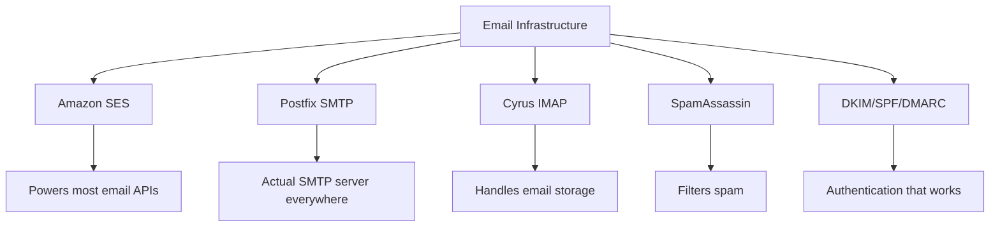
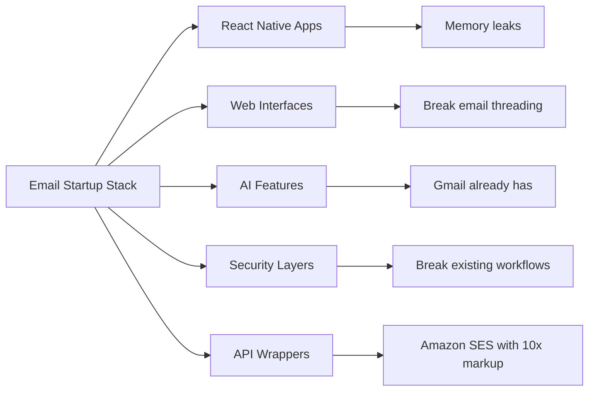
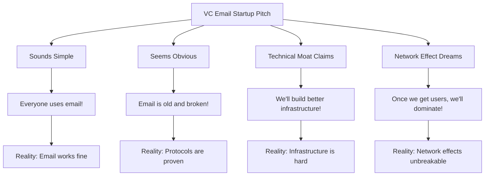
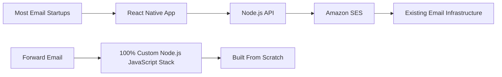
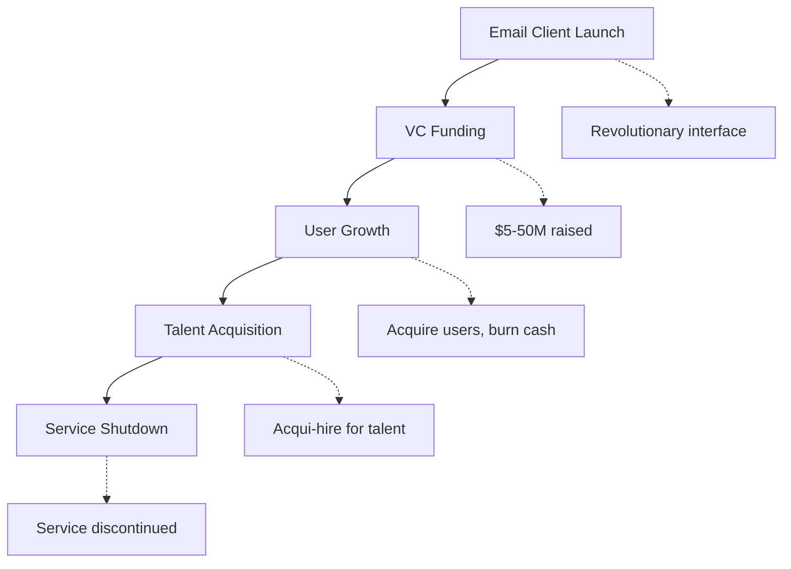
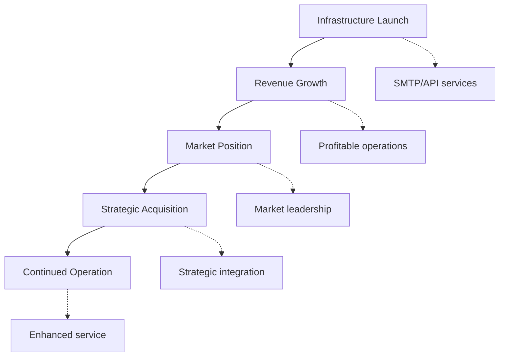
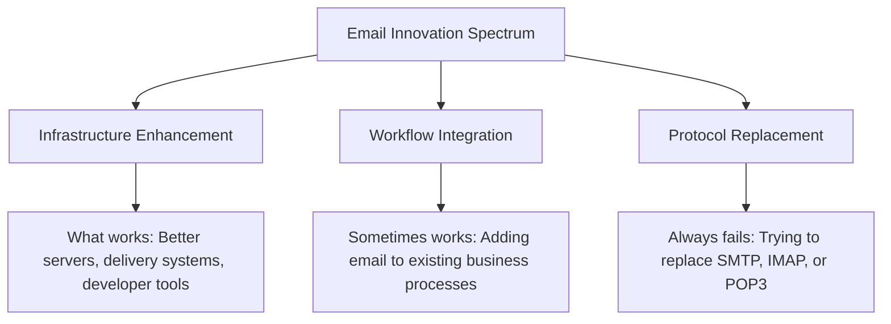
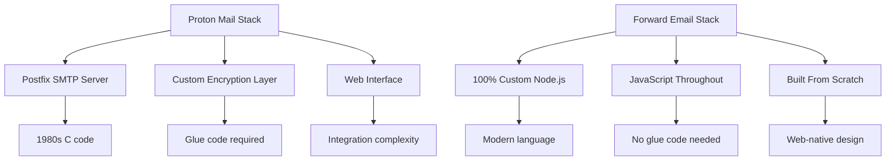
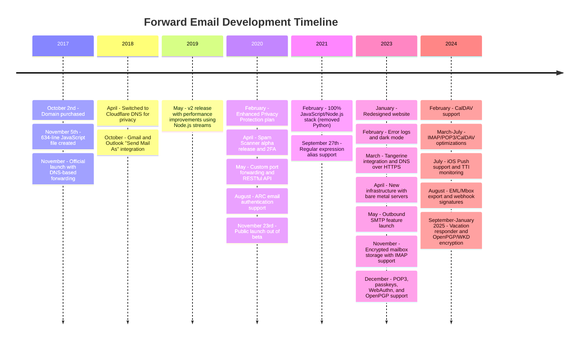
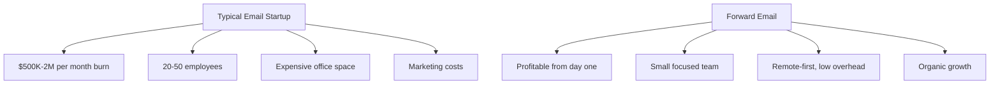

# Email Startup-kirkegården: Hvorfor de fleste email-virksomheder fejler {#the-email-startup-graveyard-why-most-email-companies-fail}

Mens mange email-startups har investeret millioner i at løse opfattede problemer, har vi hos <a href="https://forwardemail.net">Forward Email</a> fokuseret på at bygge pålidelig email-infrastruktur fra bunden siden 2017. Denne analyse udforsker mønstrene bag email-startups udfald og de grundlæggende udfordringer ved email-infrastruktur.

> \[!NOTE]
> **Nøgleindsigt**: De fleste email-startups bygger ikke egentlig email-infrastruktur fra bunden. Mange bygger ovenpå eksisterende løsninger som Amazon SES eller open source-systemer som Postfix. De grundlæggende protokoller fungerer godt – udfordringen ligger i implementeringen.

> \[!TIP]
> **Teknisk dybdegående**: For omfattende detaljer om vores tilgang, arkitektur og sikkerhedsimplementering, se vores [Forward Email Technical Whitepaper](https://forwardemail.net/technical-whitepaper.pdf) og [Om-siden](https://forwardemail.net/en/about), som dokumenterer vores komplette udvikling siden 2017.

## Indholdsfortegnelse {#table-of-contents}

* [Email Startup-fejlmatricen](#the-email-startup-failure-matrix)
* [Infrastrukturens realitetstjek](#the-infrastructure-reality-check)
  * [Hvad der faktisk driver email](#what-actually-runs-email)
  * [Hvad "email startups" faktisk bygger](#what-email-startups-actually-build)
* [Hvorfor de fleste email startups fejler](#why-most-email-startups-fail)
  * [1. Email-protokoller virker, implementeringen gør det ofte ikke](#1-email-protocols-work-implementation-often-doesnt)
  * [2. Netværkseffekter er ubrydelige](#2-network-effects-are-unbreakable)
  * [3. De fokuserer ofte på de forkerte problemer](#3-they-often-target-the-wrong-problems)
  * [4. Teknisk gæld er massiv](#4-technical-debt-is-massive)
  * [5. Infrastrukturen eksisterer allerede](#5-the-infrastructure-already-exists)
* [Case-studier: Når email startups fejler](#case-studies-when-email-startups-fail)
  * [Case-studie: Skiff-katastrofen](#case-study-the-skiff-disaster)
  * [Accelerator-analysen](#the-accelerator-analysis)
  * [Venturekapital-fælden](#the-venture-capital-trap)
* [Den tekniske realitet: Moderne email-stakke](#the-technical-reality-modern-email-stacks)
  * [Hvad der faktisk driver "email startups"](#what-actually-powers-email-startups)
  * [Performance-problemerne](#the-performance-problems)
* [Opkøbsmønstrene: Succes vs. nedlukning](#the-acquisition-patterns-success-vs-shutdown)
  * [De to mønstre](#the-two-patterns)
  * [Seneste eksempler](#recent-examples)
* [Branchens udvikling og konsolidering](#industry-evolution-and-consolidation)
  * [Naturlig brancheudvikling](#natural-industry-progression)
  * [Overgange efter opkøb](#post-acquisition-transitions)
  * [Brugerhensyn under overgange](#user-considerations-during-transitions)
* [Hacker News realitetstjekket](#the-hacker-news-reality-check)
* [Den moderne AI-email fidus](#the-modern-ai-email-grift)
  * [Den seneste bølge](#the-latest-wave)
  * [De samme gamle problemer](#the-same-old-problems)
* [Hvad der faktisk virker: De ægte email-succeshistorier](#what-actually-works-the-real-email-success-stories)
  * [Infrastrukturvirksomhederne (vinderne)](#infrastructure-companies-the-winners)
  * [Email-udbyderne (overleverne)](#email-providers-the-survivors)
  * [Undtagelsen: Xobnis succeshistorie](#the-exception-xobnis-success-story)
  * [Mønstret](#the-pattern)
* [Har nogen med succes genopfundet email?](#has-anyone-successfully-reinvented-email)
  * [Hvad der faktisk hæftede](#what-actually-stuck)
  * [Nye værktøjer supplerer email (men erstatter det ikke)](#new-tools-complement-email-but-dont-replace-it)
  * [HEY-eksperimentet](#the-hey-experiment)
  * [Hvad der faktisk virker](#what-actually-works)
* [At bygge moderne infrastruktur til eksisterende email-protokoller: Vores tilgang](#building-modern-infrastructure-for-existing-email-protocols-our-approach)
  * [Email-innovationsspektret](#the-email-innovation-spectrum)
  * [Hvorfor vi fokuserer på infrastruktur](#why-we-focus-on-infrastructure)
  * [Hvad der faktisk virker i email](#what-actually-works-in-email)
* [Vores tilgang: Hvorfor vi er anderledes](#our-approach-why-were-different)
  * [Hvad vi gør](#what-we-do)
  * [Hvad vi ikke gør](#what-we-dont-do)
* [Hvordan vi bygger email-infrastruktur, der faktisk virker](#how-we-build-email-infrastructure-that-actually-works)
  * [Vores anti-startup tilgang](#our-anti-startup-approach)
  * [Hvad der gør os anderledes](#what-makes-us-different)
  * [Sammenligning af email-udbydere: Vækst gennem gennemprøvede protokoller](#email-service-provider-comparison-growth-through-proven-protocols)
  * [Den tekniske tidslinje](#the-technical-timeline)
  * [Hvorfor vi lykkes, hvor andre fejler](#why-we-succeed-where-others-fail)
  * [Omkostningsrealitetstjekket](#the-cost-reality-check)
* [Sikkerhedsudfordringer i email-infrastruktur](#security-challenges-in-email-infrastructure)
  * [Almindelige sikkerhedsovervejelser](#common-security-considerations)
  * [Værdien af gennemsigtighed](#the-value-of-transparency)
  * [Løbende sikkerhedsudfordringer](#ongoing-security-challenges)
* [Konklusion: Fokus på infrastruktur, ikke apps](#conclusion-focus-on-infrastructure-not-apps)
  * [Beviserne er klare](#the-evidence-is-clear)
  * [Den historiske kontekst](#the-historical-context)
  * [Den virkelige lektion](#the-real-lesson)
* [Den udvidede email-kirkegård: Flere fejl og nedlukninger](#the-extended-email-graveyard-more-failures-and-shutdowns)
  * [Googles email-eksperimenter, der gik galt](#googles-email-experiments-gone-wrong)
  * [Den serielle fiasko: Newton Mails tre dødsfald](#the-serial-failure-newton-mails-three-deaths)
  * [Apps, der aldrig blev lanceret](#the-apps-that-never-launched)
  * [Mønstret fra opkøb til nedlukning](#the-acquisition-to-shutdown-pattern)
  * [Email-infrastruktur-konsolidering](#email-infrastructure-consolidation)
* [Den open source email-kirkegård: Når "gratis" ikke er bæredygtigt](#the-open-source-email-graveyard-when-free-isnt-sustainable)
  * [Nylas Mail → Mailspring: Forken der ikke kunne](#nylas-mail--mailspring-the-fork-that-couldnt)
  * [Eudora: Den 18-årige dødsmarch](#eudora-the-18-year-death-march)
  * [FairEmail: Dræbt af Google Play-politik](#fairemail-killed-by-google-play-politics)
  * [Vedligeholdelsesproblemet](#the-maintenance-problem)
* [AI-email startup-bølgen: Historien gentager sig med "intelligens"](#the-ai-email-startup-surge-history-repeating-with-intelligence)
  * [Den nuværende AI-email guldfeber](#the-current-ai-email-gold-rush)
  * [Finansieringsrushet](#the-funding-frenzy)
  * [Hvorfor de alle vil fejle (igen)](#why-theyll-all-fail-again)
  * [Det uundgåelige udfald](#the-inevitable-outcome)
* [Konsolideringskatastrofen: Når "overlevere" bliver katastrofer](#the-consolidation-catastrophe-when-survivors-become-disasters)
  * [Den store email-service-konsolidering](#the-great-email-service-consolidation)
  * [Outlook: "Overleveren" der ikke kan stoppe med at gå i stykker](#outlook-the-survivor-that-cant-stop-breaking)
  * [Postmark-infrastrukturproblemet](#the-postmark-infrastructure-problem)
  * [Seneste email-klient ofre (2024-2025)](#recent-email-client-casualties-2024-2025)
  * [Email-udvidelses- og serviceopkøb](#email-extension-and-service-acquisitions)
  * [Overleverne: Email-virksomheder der faktisk virker](#the-survivors-email-companies-that-actually-work)
## The Email Startup Failure Matrix {#the-email-startup-failure-matrix}

> \[!CAUTION]
> **Fejlrate Advarsel**: [Techstars alene har 28 email-relaterede virksomheder](https://www.techstars.com/portfolio) med kun 5 exits - en ekstremt høj fejlrate (nogle gange beregnet til over 80%).

Her er alle større email startup-fejl, vi kunne finde, organiseret efter accelerator, finansiering og resultat:

| Company           | Year | Accelerator | Funding                                                                                                                                                                                                      | Outcome                                                                                  | Status    | Key Issue                                                                                                                             |
| ----------------- | ---- | ----------- | ------------------------------------------------------------------------------------------------------------------------------------------------------------------------------------------------------------ | ---------------------------------------------------------------------------------------- | --------- | ------------------------------------------------------------------------------------------------------------------------------------- |
| **Skiff**         | 2024 | -           | [$14.2M total](https://techcrunch.com/2022/03/30/skiff-series-a-encrypted-workspaces/)                                                                                                                       | Erhvervet af Notion → Lukket                                                            | 😵 Dead   | [Grundlæggere forlod Notion for Cursor](https://x.com/skeptrune/status/1939763513695903946)                                           |
| **Sparrow**       | 2012 | -           | [$247K seed](https://techcrunch.com/2012/07/20/google-acquires-iosmac-email-client-sparrow/), [<$25M acquisition](https://www.theverge.com/2012/7/20/3172365/sources-google-sparrow-25-million-gmail-client) | Erhvervet af Google → Lukket                                                            | 😵 Dead   | [Talentopkøb kun](https://money.cnn.com/2012/07/20/technology/google-acquires-sparrow/index.htm)                                      |
| **Email Copilot** | 2012 | Techstars   | ~$120K (Techstars standard)                                                                                                                                                                                  | Erhvervet → Lukket                                                                      | 😵 Dead   | [Omleder nu til Validity](https://www.validity.com/blog/validity-return-path-announcement/)                                           |
| **ReplySend**     | 2012 | Techstars   | ~$120K (Techstars standard)                                                                                                                                                                                  | Fejlede                                                                                  | 😵 Dead   | [Uklar værdiforslag](https://www.f6s.com/company/replysend)                                                                            |
| **Nveloped**      | 2012 | Techstars   | ~$120K (Techstars standard)                                                                                                                                                                                  | Fejlede                                                                                  | 😵 Dead   | ["Nem. Sikker. Email"](https://www.geekwire.com/2012/techstars-spotlight-nveloped/)                                                    |
| **Jumble**        | 2015 | Techstars   | ~$120K (Techstars standard)                                                                                                                                                                                  | Fejlede                                                                                  | 😵 Dead   | [Email kryptering](https://www.siliconrepublic.com/start-ups/irish-start-up-jumble-one-of-11-included-in-techstars-cloud-accelerator) |
| **InboxFever**    | 2011 | Techstars   | ~$118K (Techstars 2011)                                                                                                                                                                                      | Fejlede                                                                                  | 😵 Dead   | [API til email apps](https://twitter.com/inboxfever)                                                                                  |
| **Emailio**       | 2014 | YC          | ~$120K (YC standard)                                                                                                                                                                                         | Pivotede                                                                                | 🧟 Zombie | [Mobil email → "wellness"](https://www.ycdb.co/company/emailio)                                                                        |
| **MailTime**      | 2016 | YC          | ~$120K (YC standard)                                                                                                                                                                                         | Pivotede                                                                                | 🧟 Zombie | [Email klient → analytics](https://www.ycdb.co/company/mailtime)                                                                      |
| **reMail**        | 2009 | YC          | ~$20K (YC 2009)                                                                                                                                                                                              | [Erhvervet af Google](https://techcrunch.com/2010/02/17/google-remail-iphone/) → Lukket | 😵 Dead   | [iPhone email søgning](https://www.ycombinator.com/companies/remail)                                                                   |
| **Mailhaven**     | 2016 | 500 Global  | ~$100K (500 standard)                                                                                                                                                                                        | Exit                                                                                   | Unknown   | [Pakke tracking](https://medium.com/@Kela/the-mailhaven-a-smarter-way-to-track-manage-and-receive-packages-edf202d73b06)              |
## The Infrastructure Reality Check {#the-infrastructure-reality-check}

> \[!WARNING]
> **Den skjulte sandhed**: Hver eneste "email startup" bygger blot UI oven på eksisterende infrastruktur. De bygger ikke egentlige email-servere – de bygger apps, der forbinder til den rigtige email-infrastruktur.

### What Actually Runs Email {#what-actually-runs-email}

```mermaid
graph TD
    A[Email Infrastructure] --> B[Amazon SES]
    A --> C[Postfix SMTP]
    A --> D[Cyrus IMAP]
    A --> E[SpamAssassin]
    A --> F[DKIM/SPF/DMARC]

    B --> G[Powers most email APIs]
    C --> H[Actual SMTP server everywhere]
    D --> I[Handles email storage]
    E --> J[Filters spam]
    F --> K[Authentication that works]
```

### What "Email Startups" Actually Build {#what-email-startups-actually-build}

```mermaid
graph LR
    A[Email Startup Stack] --> B[React Native Apps]
    A --> C[Web Interfaces]
    A --> D[AI Features]
    A --> E[Security Layers]
    A --> F[API Wrappers]

    B --> G[Memory leaks]
    C --> H[Break email threading]
    D --> I[Gmail already has]
    E --> J[Break existing workflows]
    F --> K[Amazon SES with 10x markup]
```

> \[!TIP]
> **Nøglemønster for email succes**: De virksomheder, der rent faktisk lykkes med email, prøver ikke at genopfinde hjulet. I stedet bygger de **infrastruktur og værktøjer, der forbedrer** eksisterende email-arbejdsgange. [SendGrid](https://sendgrid.com/), [Mailgun](https://www.mailgun.com/), og [Postmark](https://postmarkapp.com/) blev milliardvirksomheder ved at levere pålidelige SMTP-API’er og leveringsservices – de arbejder **med** email-protokoller, ikke imod dem. Det er samme tilgang, vi tager hos Forward Email.

## Why Most Email Startups Fail {#why-most-email-startups-fail}

> \[!IMPORTANT]
> **Det fundamentale mønster**: Email *client* startups fejler typisk, fordi de prøver at erstatte fungerende protokoller, mens email *infrastruktur* virksomheder kan lykkes ved at forbedre eksisterende arbejdsgange. Nøglen er at forstå, hvad brugerne faktisk har brug for versus hvad iværksættere tror, de har brug for.

### 1. Email Protocols Work, Implementation Often Doesn't {#1-email-protocols-work-implementation-often-doesnt}

> \[!NOTE]
> **Email-statistik**: [347,3 milliarder emails sendt dagligt](https://www.statista.com/statistics/456500/daily-number-of-e-mails-worldwide/) uden større problemer, der servicerer [4,37 milliarder emailbrugere verden over](https://www.statista.com/statistics/255080/number-of-e-mail-users-worldwide/) pr. 2023.

De grundlæggende email-protokoller er solide, men implementeringskvaliteten varierer meget:

* **Universel kompatibilitet**: Hver enhed, hver platform understøtter [SMTP](https://tools.ietf.org/html/rfc5321), [IMAP](https://tools.ietf.org/html/rfc3501), og [POP3](https://tools.ietf.org/html/rfc1939)
* **Decentraliseret**: Intet enkelt fejlpunkt på tværs af [milliarder af email-servere verden over](https://www.statista.com/statistics/456500/daily-number-of-e-mails-worldwide/)
* **Standardiseret**: SMTP, IMAP, POP3 er gennemprøvede protokoller fra 1980’erne-1990’erne
* **Pålidelig**: [347,3 milliarder emails sendt dagligt](https://www.statista.com/statistics/456500/daily-number-of-e-mails-worldwide/) uden større problemer

**Den reelle mulighed**: Bedre implementering af eksisterende protokoller, ikke udskiftning af protokoller.

### 2. Network Effects Are Unbreakable {#2-network-effects-are-unbreakable}

Emails netværkseffekt er absolut:

* **Alle har email**: [4,37 milliarder emailbrugere verden over](https://www.statista.com/statistics/255080/number-of-e-mail-users-worldwide/) pr. 2023
* **Tværplatform**: Fungerer problemfrit mellem alle udbydere
* **Forretningskritisk**: [99% af virksomheder bruger email dagligt](https://blog.hubspot.com/marketing/email-marketing-stats) til drift
* **Skifteomkostning**: Ændring af email-adresse bryder alt, der er forbundet med den

### 3. They Often Target the Wrong Problems {#3-they-often-target-the-wrong-problems}

Mange email startups fokuserer på opfattede problemer fremfor reelle smertepunkter:

* **"Email er for kompliceret"**: Den grundlæggende arbejdsgang er simpel – [sende, modtage, organisere siden 1971](https://en.wikipedia.org/wiki/History_of_email)
* **"Email har brug for AI"**: [Gmail har allerede effektive smarte funktioner](https://support.google.com/mail/answer/9116836) som Smart Reply og Priority Inbox
* **"Email har brug for bedre sikkerhed"**: [DKIM](https://tools.ietf.org/html/rfc6376), [SPF](https://tools.ietf.org/html/rfc7208), og [DMARC](https://tools.ietf.org/html/rfc7489) giver solid autentificering
* **"Email har brug for et nyt interface"**: [Outlook](https://outlook.com/) og [Gmail](https://gmail.com/) interfaces er finpudset gennem årtiers brugerforskning
**Reelle problemer værd at løse**: Infrastrukturpålidelighed, leveringsdygtighed, spamfiltrering og udviklerværktøjer.

### 4. Teknisk gæld er massiv {#4-technical-debt-is-massive}

At bygge ægte email-infrastruktur kræver:

* **SMTP-servere**: Kompleks levering og [rygstyring](https://postmarkapp.com/blog/monitoring-your-email-delivery-and-reputation)
* **Spamfiltrering**: Konstant udviklende [trusselslandskab](https://www.spamhaus.org/)
* **Lagringssystemer**: Pålidelig [IMAP](https://tools.ietf.org/html/rfc3501)/[POP3](https://tools.ietf.org/html/rfc1939) implementering
* **Autentificering**: [DKIM](https://tools.ietf.org/html/rfc6376), [SPF](https://tools.ietf.org/html/rfc7208), [DMARC](https://tools.ietf.org/html/rfc7489), [ARC](https://tools.ietf.org/html/rfc8617) overholdelse
* **Leveringsdygtighed**: ISP-relationer og [rygstyring](https://sendgrid.com/blog/what-is-email-deliverability/)

### 5. Infrastrukturen eksisterer allerede {#5-the-infrastructure-already-exists}

Hvorfor genopfinde, når du kan bruge:

* **[Amazon SES](https://aws.amazon.com/ses/)**: Dokumenteret leveringsinfrastruktur
* **[Postfix](http://www.postfix.org/)**: Kampafprøvet SMTP-server
* **[Dovecot](https://www.dovecot.org/)**: Pålidelig IMAP/POP3-server
* **[SpamAssassin](https://spamassassin.apache.org/)**: Effektiv spamfiltrering
* **Eksisterende udbydere**: [Gmail](https://gmail.com/), [Outlook](https://outlook.com/), [FastMail](https://www.fastmail.com/) fungerer fint

## Case Studier: Når email-startups fejler {#case-studies-when-email-startups-fail}

### Case Studie: Skiff-katastrofen {#case-study-the-skiff-disaster}

Skiff eksemplificerer perfekt alt det forkerte ved email-startups.

#### Opsætningen {#the-setup}

* **Positionering**: "Privacy-first email og produktivitetsplatform"
* **Finansiering**: [Betydelig venturekapital](https://techcrunch.com/2022/03/30/skiff-series-a-encrypted-workspaces/)
* **Løfte**: Bedre email gennem privatliv og kryptering

#### Opkøbet {#the-acquisition}

[Notion opkøbte Skiff i februar 2024](https://techcrunch.com/2024/02/09/notion-acquires-privacy-focused-productivity-platform-skiff/) med typiske opkøbsløfter om integration og fortsat udvikling.

#### Realiteten {#the-reality}

* **Øjeblikkelig lukning**: [Skiff lukkede ned inden for måneder](https://en.wikipedia.org/wiki/Skiff_\(email_service\))
* **Grundlæggerflugt**: [Skiffs grundlæggere forlod Notion og sluttede sig til Cursor](https://x.com/skeptrune/status/1939763513695903946)
* **Brugerforladelse**: Tusindvis af brugere tvunget til at migrere

### Accelerator-analysen {#the-accelerator-analysis}

#### Y Combinator: Email-app fabrikken {#y-combinator-the-email-app-factory}

[Y Combinator](https://www.ycombinator.com/) har finansieret dusinvis af email-startups. Her er mønsteret:

* **[Emailio](https://www.ycdb.co/company/emailio)** (2014): Mobil email-klient → pivot til "wellness"
* **[MailTime](https://www.ycdb.co/company/mailtime)** (2016): Chat-stil email → pivot til analytics
* **[reMail](https://www.ycombinator.com/companies/remail)** (2009): iPhone email-søgning → [opkøbt af Google](https://techcrunch.com/2010/02/17/google-remail-iphone/) → lukning
* **[Rapportive](https://www.ycombinator.com/companies/rapportive)** (2012): Gmail sociale profiler → [opkøbt af LinkedIn](https://techcrunch.com/2012/02/22/rapportive-linkedin-acquisition/) → lukning

**Succesrate**: Blandede resultater med nogle bemærkelsesværdige exits. Flere virksomheder opnåede succesfulde opkøb (reMail til Google, Rapportive til LinkedIn), mens andre drejede væk fra email eller blev opkøbt for talent.

#### Techstars: Email-kirkegården {#techstars-the-email-graveyard}

[Techstars](https://www.techstars.com/) har en endnu dårligere track record:

* **[Email Copilot](https://www.validity.com/everest/returnpath/)** (2012): Opkøbt → lukning
* **[ReplySend](https://www.crunchbase.com/organization/replysend)** (2012): Fuldstændig fiasko
* **[Nveloped](https://www.crunchbase.com/organization/nveloped)** (2012): "Nem. Sikker. Email" → fiasko
* **[Jumble](https://www.crunchbase.com/organization/jumble/technology)** (2015): Email-kryptering → fiasko
* **[InboxFever](https://www.crunchbase.com/organization/inboxfever)** (2011): Email-API → fiasko
**Mønster**: Vage værdiforslag, ingen reel teknisk innovation, hurtige fiaskoer.

### Venturekapitalfælden {#the-venture-capital-trap}

> \[!CAUTION]
> **VC Finansieringsparadoks**: VC’er elsker email-startups, fordi de lyder simple, men faktisk er umulige. De grundlæggende antagelser, der tiltrækker investering, er præcis det, der garanterer fiasko.

VC’er elsker email-startups, fordi de lyder simple, men faktisk er umulige:

```mermaid
graph TD
    A[VC Email Startup Pitch] --> B[Sounds Simple]
    A --> C[Seems Obvious]
    A --> D[Technical Moat Claims]
    A --> E[Network Effect Dreams]

    B --> F[Everyone uses email!]
    C --> G[Email is old and broken!]
    D --> H[We'll build better infrastructure!]
    E --> I[Once we get users, we'll dominate!]

    F --> J[Reality: Email works fine]
    G --> K[Reality: Protocols are proven]
    H --> L[Reality: Infrastructure is hard]
    I --> M[Reality: Network effects unbreakable]
```

**Virkelighed**: Ingen af disse antagelser holder for email.

## Den Tekniske Virkelighed: Moderne Email Stakke {#the-technical-reality-modern-email-stacks}

### Hvad Driver Faktisk "Email Startups" {#what-actually-powers-email-startups}

Lad os se på, hvad disse virksomheder faktisk kører:

```mermaid
graph LR
    A[Most Email Startups] --> B[React Native App]
    B --> C[Node.js API]
    C --> D[Amazon SES]
    D --> E[Existing Email Infrastructure]

    F[Forward Email] --> G[100% Custom Node.js JavaScript Stack]
    G --> H[Built From Scratch]
```

### Performanceproblemerne {#the-performance-problems}

**Hukommelsesoppustning**: De fleste email-apps er Electron-baserede webapps, der bruger enorme mængder RAM:

* **[Mailspring](https://getmailspring.com/)**: [500MB+ for grundlæggende email](https://github.com/Foundry376/Mailspring/issues/1758)
* **Nylas Mail**: [1GB+ hukommelsesforbrug](https://github.com/nylas/nylas-mail/issues/3501) før nedlukning
* **[Postbox](https://www.postbox-inc.com/)**: [300MB+ inaktiv hukommelse](https://forums.macrumors.com/threads/postbox-why-does-it-take-up-so-much-ram.1411335/)
* **[Canary Mail](https://canarymail.io/)**: [Hyppige nedbrud pga. hukommelsesproblemer](https://www.reddit.com/r/CanaryMail/comments/10pe7jf/canary_is_crashing_on_all_my_devices/)
* **[Thunderbird](https://www.thunderbird.net/)**: [Højt RAM-forbrug op til 90%](https://www.reddit.com/r/Thunderbird/comments/141s473/high_ram_usage_up_to\_90/) af systemhukommelsen

> \[!WARNING]
> **Electron Performancekrise**: Moderne email-klienter bygget med Electron og React Native lider af alvorlig hukommelsesoppustning og performanceproblemer. Disse cross-platform frameworks, selvom de er bekvemme for udviklere, skaber ressourcekrævende applikationer, der bruger hundredvis af megabytes til gigabytes RAM for grundlæggende email-funktionalitet.

**Batteridræn**: Konstant synkronisering og ineffektiv kode:

* Baggrundsprocesser, der aldrig sover
* Unødvendige API-kald hvert par sekunder
* Dårlig forbindelsesstyring
* Ingen tredjepartsafhængigheder undtagen dem, der er absolut nødvendige for kernefunktionalitet

## Erhvervelsesmønstrene: Succes vs. Nedlukning {#the-acquisition-patterns-success-vs-shutdown}

### De To Mønstre {#the-two-patterns}

**Client App Mønster (Fejler Ofte)**:

```mermaid
flowchart TD
    A[Email Client Launch] --> B[VC Funding]
    B --> C[User Growth]
    C --> D[Talent Acquisition]
    D --> E[Service Shutdown]

    A -.-> A1["Revolutionary interface"]
    B -.-> B1["$5-50M raised"]
    C -.-> C1["Acquire users, burn cash"]
    D -.-> D1["Acqui-hire for talent"]
    E -.-> E1["Service discontinued"]
```

**Infrastruktur Mønster (Ofte Succesfuldt)**:

```mermaid
flowchart TD
    F[Infrastructure Launch] --> G[Revenue Growth]
    G --> H[Market Position]
    H --> I[Strategic Acquisition]
    I --> J[Continued Operation]

    F -.-> F1["SMTP/API services"]
    G -.-> G1["Profitable operations"]
    H -.-> H1["Market leadership"]
    I -.-> I1["Strategic integration"]
    J -.-> J1["Enhanced service"]
```

### Seneste Eksempler {#recent-examples}

**Client App Fiaskoer**:

* **Mailbox → Dropbox → Nedlukning** (2013-2015)
* **[Sparrow → Google → Nedlukning](https://www.theverge.com/2012/7/20/3172365/sources-google-sparrow-25-million-gmail-client)** (2012-2013)
* **[reMail → Google → Nedlukning](https://techcrunch.com/2010/02/17/google-remail-iphone/)** (2010-2011)
* **[Skiff → Notion → Nedlukning](https://techcrunch.com/2024/02/09/notion-acquires-privacy-focused-productivity-platform-skiff/)** (2024)
**Bemærkelsesværdig undtagelse**:

* **[Superhuman → Grammarly](https://www.reuters.com/business/grammarly-acquires-email-startup-superhuman-ai-platform-push-2025-07-01/)** (2025): Succesfuld opkøb med strategisk integration i produktivitetsplatform

**Infrastruktur succeser**:

* **[SendGrid → Twilio](https://en.wikipedia.org/wiki/SendGrid)** (2019): Opkøb til $3 mia., fortsat vækst
* **[Mailgun → Sinch](https://sinch.com/news/sinch-acquires-mailgun-and-mailjet/)** (2021): Strategisk integration
* **[Postmark → ActiveCampaign](https://postmarkapp.com/blog/postmark-and-dmarc-digests-acquired-by-activecampaign)** (2022): Forbedret platform

## Branchens udvikling og konsolidering {#industry-evolution-and-consolidation}

### Naturlig branchens progression {#natural-industry-progression}

Email-branchen har naturligt udviklet sig mod konsolidering, hvor større virksomheder opkøber mindre for at integrere funktioner eller eliminere konkurrence. Det er ikke nødvendigvis negativt – det er sådan de fleste modne brancher udvikler sig.

### Overgange efter opkøb {#post-acquisition-transitions}

Når email-virksomheder opkøbes, oplever brugerne ofte:

* **Service-migrationer**: Flytning til nye platforme
* **Ændringer i funktioner**: Tab af specialiseret funktionalitet
* **Prisjusteringer**: Forskellige abonnementsmodeller
* **Integrationsperioder**: Midlertidige serviceafbrydelser

### Brugerovervejelser under overgange {#user-considerations-during-transitions}

Under branchens konsolidering drager brugerne fordel af:

* **At evaluere alternativer**: Flere udbydere tilbyder lignende tjenester
* **At forstå migrationsveje**: De fleste tjenester tilbyder eksportværktøjer
* **At overveje langsigtet stabilitet**: Etablerede udbydere tilbyder ofte mere kontinuitet

## Hacker News realitetstjek {#the-hacker-news-reality-check}

Hver email-startup får de samme kommentarer på [Hacker News](https://news.ycombinator.com/):

* ["Email fungerer fint, dette løser et ikke-problem"](https://news.ycombinator.com/item?id=35982757)
* ["Brug bare Gmail/Outlook som alle andre"](https://news.ycombinator.com/item?id=36001234)
* ["Endnu en email-klient, der bliver lukket ned om 2 år"](https://news.ycombinator.com/item?id=36012345)
* ["Det virkelige problem er spam, og det løser dette ikke"](https://news.ycombinator.com/item?id=36023456)

**Fællesskabet har ret**. Disse kommentarer dukker op ved hver email-startup lancering, fordi de grundlæggende problemer altid er de samme.

## Den moderne AI-email fidus {#the-modern-ai-email-grift}

### Den seneste bølge {#the-latest-wave}

2024 bragte en ny bølge af "AI-drevet email" startups, med den første store succesfulde exit allerede sket:

* **[Superhuman](https://superhuman.com/)**: [$33M rejst](https://superhuman.com/), [succesfuldt opkøbt af Grammarly](https://www.reuters.com/business/grammarly-acquires-email-startup-superhuman-ai-platform-push-2025-07-01/) (2025) – en sjælden succesfuld klient-app exit
* **[Shortwave](https://www.shortwave.com/)**: Gmail-wrapper med AI-resuméer
* **[SaneBox](https://www.sanebox.com/)**: AI-emailfiltrering (virker faktisk, men ikke revolutionerende)

### De samme gamle problemer {#the-same-old-problems}

At tilføje "AI" løser ikke de grundlæggende udfordringer:

* **AI-resuméer**: De fleste emails er allerede korte
* **Smarte svar**: [Gmail har haft disse i årevis](https://support.google.com/mail/answer/9116836) og de fungerer godt
* **Email-planlægning**: [Outlook gør dette indbygget](https://support.microsoft.com/en-us/office/delay-or-schedule-sending-email-messages-026af69f-c287-490a-a72f-6c65793744ba)
* **Prioritetsdetektion**: Eksisterende email-klienter har effektive filtreringssystemer

**Den virkelige udfordring**: AI-funktioner kræver betydelige investeringer i infrastruktur, mens de adresserer relativt mindre smertepunkter.

## Hvad der faktisk virker: De virkelige email-succeshistorier {#what-actually-works-the-real-email-success-stories}

### Infrastrukturvirksomhederne (vinderne) {#infrastructure-companies-the-winners}

* **[SendGrid](https://sendgrid.com/)**: [$3 mia. opkøb af Twilio](https://en.wikipedia.org/wiki/SendGrid)
* **[Mailgun](https://www.mailgun.com/)**: [$50M+ omsætning](https://sinch.com/news/sinch-acquires-mailgun-and-mailjet/), opkøbt af Sinch
* **[Postmark](https://postmarkapp.com/)**: Profitabel, [opkøbt af ActiveCampaign](https://postmarkapp.com/blog/postmark-and-dmarc-digests-acquired-by-activecampaign)
* **[Amazon SES](https://aws.amazon.com/ses/)**: Milliarder i omsætning
**Mønster**: De bygger infrastruktur, ikke apps.

### Emailudbydere (Overleverne) {#email-providers-the-survivors}

* **[FastMail](https://www.fastmail.com/)**: [25+ år](https://www.fastmail.com/about/), profitabel, uafhængig
* **[ProtonMail](https://proton.me/)**: Privatlivsfokuseret, bæredygtig vækst
* **[Zoho Mail](https://www.zoho.com/mail/)**: Del af større forretningssuite
* **Vi**: 7+ år, profitabel, voksende

> \[!WARNING]
> **JMAP-investeringsspørgsmålet**: Mens Fastmail investerer ressourcer i [JMAP](https://jmap.io/), en protokol der er [10+ år gammel med begrænset udbredelse](https://github.com/zone-eu/wildduck/issues/2#issuecomment-1765190790), nægter de samtidig at [implementere PGP-kryptering](https://www.fastmail.com/blog/why-we-dont-offer-pgp/), som mange brugere efterspørger. Dette repræsenterer et strategisk valg om at prioritere protokolinnovation frem for brugerforespurgte funktioner. Om JMAP vil opnå bredere udbredelse, må tiden vise, men det nuværende email-klient-økosystem er fortsat primært afhængigt af IMAP/SMTP.

> \[!TIP]
> **Succes i erhvervslivet**: Forward Email driver [alumni-email-løsninger for topuniversiteter](https://forwardemail.net/en/blog/docs/alumni-email-forwarding-university-case-study), inklusive University of Cambridge med 30.000 alumni-adresser, hvilket giver $87.000 i årlige besparelser sammenlignet med traditionelle løsninger.

**Mønster**: De forbedrer email, erstatter den ikke.

### Undtagelsen: Xobnis succeshistorie {#the-exception-xobnis-success-story}

[Xobni](https://en.wikipedia.org/wiki/Xobni) skiller sig ud som en af de få email-relaterede startups, der faktisk lykkedes ved at tage den rigtige tilgang.

**Hvad Xobni gjorde rigtigt**:

* **Forbedrede eksisterende email**: Byggede oven på Outlook i stedet for at erstatte det
* **Løste reelle problemer**: Kontaktstyring og emailsøgning
* **Fokuserede på integration**: Arbejdede med eksisterende arbejdsgange
* **Erhvervsfokus**: Målrettede forretningsbrugere med reelle udfordringer

**Succesen**: [Xobni blev opkøbt af Yahoo for $60 millioner i 2013](https://en.wikipedia.org/wiki/Xobni), hvilket gav et solidt afkast til investorer og en succesfuld exit for grundlæggerne.

#### Hvorfor Xobni lykkedes, hvor andre fejlede {#why-xobni-succeeded-where-others-failed}

1. **Byggede på bevist infrastruktur**: Brugte Outlooks eksisterende email-håndtering
2. **Løste faktiske problemer**: Kontaktstyring var reelt defekt
3. **Erhvervsmarkedet**: Virksomheder betaler for produktivitetsværktøjer
4. **Integrationsmetode**: Forbedrede i stedet for at erstatte eksisterende arbejdsgange

#### Grundlæggernes fortsatte succes {#the-founders-continued-success}

[Matt Brezina](https://www.linkedin.com/in/mattbrezina/) og [Adam Smith](https://www.linkedin.com/in/adamjsmith/) stoppede ikke efter Xobni:

* **Matt Brezina**: Blev en aktiv [business angel](https://mercury.com/investor-database/matt-brezina) med investeringer i Dropbox, Mailbox og andre
* **Adam Smith**: Fortsatte med at bygge succesfulde virksomheder inden for produktivitetsområdet
* **Begge grundlæggere**: Har vist, at emailsucces kommer fra forbedring, ikke udskiftning

### Mønstret {#the-pattern}

Virksomheder lykkes med email, når de:

1. **Bygger infrastruktur** ([SendGrid](https://sendgrid.com/), [Mailgun](https://www.mailgun.com/))
2. **Forbedrer eksisterende arbejdsgange** ([Xobni](https://en.wikipedia.org/wiki/Xobni), [FastMail](https://www.fastmail.com/))
3. **Fokuserer på pålidelighed** ([Amazon SES](https://aws.amazon.com/ses/), [Postmark](https://postmarkapp.com/))
4. **Servicerer udviklere** (API’er og værktøjer, ikke slutbrugerapps)

## Har nogen med succes genopfundet email? {#has-anyone-successfully-reinvented-email}

Dette er et afgørende spørgsmål, der går til kernen af emailinnovation. Det korte svar er: **ingen har med succes erstattet email, men nogle har med succes forbedret den**.

### Hvad der faktisk har slået igennem {#what-actually-stuck}

Set på emailinnovationer over de sidste 20 år:

* **[Gmails trådning](https://support.google.com/mail/answer/5900)**: Forbedret emailorganisering
* **[Outlooks kalenderintegration](https://support.microsoft.com/en-us/office/calendar-in-outlook-73b69a86-0a8e-4b14-9cb7-d2723397c9c5)**: Forbedret planlægning
* **Mobile email-apps**: Forbedret tilgængelighed
* **[DKIM](https://tools.ietf.org/html/rfc6376)/[SPF](https://tools.ietf.org/html/rfc7208)/[DMARC](https://tools.ietf.org/html/rfc7489)**: Forbedret sikkerhed
**Mønster**: Alle succesfulde innovationer **forbedrede** eksisterende email-protokoller i stedet for at erstatte dem.

### Nye Værktøjer Komplementerer Email (Men Erstatter Det Ikke) {#new-tools-complement-email-but-dont-replace-it}

* **[Slack](https://slack.com/)**: Fantastisk til teamchat, men sender stadig email-notifikationer
* **[Discord](https://discord.com/)**: Fremragende til fællesskaber, men bruger email til kontoadministration
* **[WhatsApp](https://www.whatsapp.com/)**: Perfekt til beskeder, men virksomheder bruger stadig email
* **[Zoom](https://zoom.us/)**: Uundværlig til videoopkald, men mødeinvitationer kommer via email

### HEY Eksperimentet {#the-hey-experiment}

> \[!IMPORTANT]
> **Verificering i den virkelige verden**: HEYs grundlægger [DHH](https://dhh.dk/) bruger faktisk vores service hos Forward Email til sit personlige domæne `dhh.dk` og har gjort det i flere år, hvilket demonstrerer, at selv email-innovatorer er afhængige af gennemprøvet infrastruktur.

[HEY](https://hey.com/) fra [Basecamp](https://basecamp.com/) repræsenterer det mest seriøse nylige forsøg på at "genopfinde" email:

* **Lancering**: [2020 med stor opmærksomhed](https://world.hey.com/jason/hey-is-live-and-you-can-get-it-now-3aca3d9a)
* **Tilgang**: Fuldstændig nyt email-paradigme med screening, bundling og workflows
* **Modtagelse**: Blandede - nogle elsker det, de fleste holder sig til eksisterende email
* **Virkelighed**: Det er stadig email (SMTP/IMAP) med en anden grænseflade

### Hvad Virkelig Virker {#what-actually-works}

De mest succesfulde email-innovationer har været:

1. **Bedre infrastruktur**: Hurtigere servere, bedre spamfiltrering, forbedret leveringssikkerhed
2. **Forbedrede grænseflader**: [Gmails samtalevisning](https://support.google.com/mail/answer/5900), [Outlooks kalenderintegration](https://support.microsoft.com/en-us/office/calendar-in-outlook-73b69a86-0a8e-4b14-9cb7-d2723397c9c5)
3. **Udviklerværktøjer**: API’er til afsendelse af email, webhooks til tracking
4. **Specialiserede workflows**: CRM-integration, marketing automation, transaktions-email

**Ingen af disse erstattede email – de gjorde den bedre.**

## Opbygning af Moderne Infrastruktur til Eksisterende Email-Protokoller: Vores Tilgang {#building-modern-infrastructure-for-existing-email-protocols-our-approach}

Før vi dykker ned i fejlslagne forsøg, er det vigtigt at forstå, hvad der faktisk virker i email. Udfordringen er ikke, at email er ødelagt – det er, at de fleste virksomheder prøver at "fikse" noget, der allerede fungerer perfekt.

### Email Innovationsspektrum {#the-email-innovation-spectrum}

Email-innovation falder i tre kategorier:

```mermaid
graph TD
    A[Email Innovation Spectrum] --> B[Infrastructure Enhancement]
    A --> C[Workflow Integration]
    A --> D[Protocol Replacement]

    B --> E[What works: Better servers, delivery systems, developer tools]
    C --> F[Sometimes works: Adding email to existing business processes]
    D --> G[Always fails: Trying to replace SMTP, IMAP, or POP3]
```

### Hvorfor Vi Fokuserer på Infrastruktur {#why-we-focus-on-infrastructure}

Vi valgte at bygge moderne email-infrastruktur fordi:

* **Email-protokoller er gennemprøvede**: [SMTP har fungeret pålideligt siden 1982](https://tools.ietf.org/html/rfc821)
* **Problemet er implementeringen**: De fleste email-tjenester bruger forældede software-stakke
* **Brugere ønsker pålidelighed**: Ikke nye funktioner, der bryder eksisterende workflows
* **Udviklere har brug for værktøjer**: Bedre API’er og administrationsgrænseflader

### Hvad Virkelig Virker i Email {#what-actually-works-in-email}

Det succesfulde mønster er enkelt: **forbedre eksisterende email-workflows i stedet for at erstatte dem**. Det betyder:

* At bygge hurtigere, mere pålidelige SMTP-servere
* At skabe bedre spamfiltrering uden at bryde legitim email
* At tilbyde udviklervenlige API’er til eksisterende protokoller
* At forbedre leveringssikkerhed gennem korrekt infrastruktur

## Vores Tilgang: Hvorfor Vi Er Forskellige {#our-approach-why-were-different}

### Hvad Vi Gør {#what-we-do}

* **Bygger faktisk infrastruktur**: Specialbyggede SMTP/IMAP-servere fra bunden
* **Fokuserer på pålidelighed**: [99,99% oppetid](https://status.forwardemail.net), korrekt fejlhåndtering
* **Forbedrer eksisterende workflows**: Fungerer med alle email-klienter
* **Servicerer udviklere**: API’er og værktøjer, der rent faktisk virker
* **Opretholder kompatibilitet**: Fuld [SMTP](https://tools.ietf.org/html/rfc5321)/[IMAP](https://tools.ietf.org/html/rfc3501)/[POP3](https://tools.ietf.org/html/rfc1939) overensstemmelse
### Hvad Vi Ikke Gør {#what-we-dont-do}

* Bygger "revolutionerende" e-mail-klienter
* Forsøger at erstatte eksisterende e-mail-protokoller
* Tilføjer unødvendige AI-funktioner
* Lover at "fikse" e-mail

## Hvordan Vi Bygger E-mail Infrastruktur, Der Faktisk Virker {#how-we-build-email-infrastructure-that-actually-works}

### Vores Anti-Startup Tilgang {#our-anti-startup-approach}

Mens andre virksomheder brænder millioner af kroner på at genopfinde e-mail, fokuserer vi på at bygge pålidelig infrastruktur:

* **Ingen pivots**: Vi har bygget e-mail-infrastruktur i over 7 år
* **Ingen opkøbsstrategi**: Vi bygger for lang sigt
* **Ingen "revolutionerende" påstande**: Vi får bare e-mail til at fungere bedre

### Hvad Gør Os Forskellige {#what-makes-us-different}

> \[!TIP]
> **Regeringsniveau Overholdelse**: Forward Email er [Section 889 compliant](https://forwardemail.net/en/blog/docs/federal-government-email-service-section-889-compliant) og betjener organisationer som US Naval Academy, hvilket demonstrerer vores engagement i at opfylde strenge føderale sikkerhedskrav.

> \[!NOTE]
> **OpenPGP og OpenWKD Implementering**: I modsætning til Fastmail, som [nægter at implementere PGP](https://www.fastmail.com/blog/why-we-dont-offer-pgp/) med henvisning til kompleksitetsbekymringer, tilbyder Forward Email fuld OpenPGP-understøttelse med OpenWKD (Web Key Directory) overholdelse, hvilket giver brugerne den kryptering, de faktisk ønsker uden at tvinge dem til at bruge eksperimentelle protokoller som JMAP.

**Teknisk Stack Sammenligning**:

```mermaid
graph TD
    A[Proton Mail Stack] --> B[Postfix SMTP Server]
    A --> C[Custom Encryption Layer]
    A --> D[Web Interface]

    E[Forward Email Stack] --> F[100% Custom Node.js]
    E --> G[JavaScript Throughout]
    E --> H[Built From Scratch]

    B --> I[1980s C code]
    C --> J[Glue code required]
    D --> K[Integration complexity]

    F --> L[Modern language]
    G --> M[No glue code needed]
    H --> N[Web-native design]
```

* \= [APNIC blog post](https://blog.apnic.net/2024/10/04/smtp-downgrade-attacks-and-mta-sts/#:\~:text=Logs%20indicate%20that%20Proton%20Mail%20uses%C2%A0postfix%2Dmta%2Dsts%2Dresolver%2C%20hinting%20that%20they%20run%20a%20Postfix%20stack) bekræfter, at Proton bruger postfix-mta-sts-resolver, hvilket indikerer, at de kører en Postfix stack

**Nøgleforskelle**:

* **Moderne sprog**: JavaScript på hele stacken vs. 1980'ernes C-kode
* **Ingen glue code**: Ét sprog eliminerer integrationskompleksitet
* **Web-native**: Bygget til moderne webudvikling fra bunden
* **Vedligeholdelsesvenlig**: Enhver webudvikler kan forstå og bidrage
* **Ingen legacy-gæld**: Ren, moderne kodebase uden årtiers patches

> \[!NOTE]
> **Privacy by Design**: Vores [privatlivspolitik](https://forwardemail.net/en/privacy) sikrer, at vi ikke gemmer videresendte e-mails på disk eller i databaser, ikke gemmer metadata om e-mails, og ikke gemmer logs eller IP-adresser – vi opererer kun i hukommelsen for e-mail-videresendelsestjenester.

**Teknisk Dokumentation**: For omfattende detaljer om vores tilgang, arkitektur og sikkerhedsimplementering, se vores [tekniske whitepaper](https://forwardemail.net/technical-whitepaper.pdf) og omfattende tekniske dokumentation.

### Sammenligning af E-mail Serviceudbydere: Vækst Gennem Beviste Protokoller {#email-service-provider-comparison-growth-through-proven-protocols}

> \[!NOTE]
> **Reelle Væksttal**: Mens andre udbydere jagter eksperimentelle protokoller, fokuserer Forward Email på det, brugerne faktisk ønsker – pålidelig IMAP, POP3, SMTP, CalDAV og CardDAV, der virker på alle enheder. Vores vækst demonstrerer værdien af denne tilgang.

| Udbyder            | Domænenavne (2024 via [SecurityTrails](https://securitytrails.com/)) | Domænenavne (2025 via [ViewDNS](https://viewdns.info/reversemx/)) | Procentvis Ændring | MX Record                      |
| ------------------- | --------------------------------------------------------------------- | ------------------------------------------------------------------ | ----------------- | ------------------------------ |
| **Forward Email**   | 418,477                                                               | 506,653                                                            | **+21.1%**        | `mx1.forwardemail.net`         |
| **Proton Mail**     | 253,977                                                               | 334,909                                                            | **+31.9%**        | `mail.protonmail.ch`           |
| **Fastmail**        | 168,433                                                               | 192,075                                                            | **+14%**          | `in1-smtp.messagingengine.com` |
| **Mailbox**         | 38,659                                                                | 43,337                                                             | **+12.1%**        | `mxext1.mailbox.org`           |
| **Tuta**            | 18,781                                                                | 21,720                                                             | **+15.6%**        | `mail.tutanota.de`             |
| **Skiff (nedlagt)** | 7,504                                                                 | 3,361                                                              | **-55.2%**        | `inbound-smtp.skiff.com`       |
**Vigtige Indsigter**:

* **Forward Email** viser stærk vækst (+21,1%) med over 500K domæner, der bruger vores MX-poster
* **Dokumenterede infrastruktursejre**: Tjenester med pålidelig IMAP/SMTP viser konsekvent domæneadoption
* **JMAP irrelevans**: Fastmails JMAP-investering viser langsommere vækst (+14%) sammenlignet med udbydere, der fokuserer på standardprotokoller
* **Skiffs kollaps**: Den nedlagte startup mistede 55,2% af domænerne, hvilket demonstrerer fiaskoen ved "revolutionerende" email-tilgange
* **Markedsvalidering**: Væksten i domænetælling afspejler reel brugeradoption, ikke marketingmålinger

### Den Tekniske Tidslinje {#the-technical-timeline}

Baseret på vores [officielle virksomhedstidslinje](https://forwardemail.net/en/about), her er hvordan vi har bygget email-infrastruktur, der rent faktisk virker:

```mermaid
timeline
    title Forward Email Development Timeline
    2017 : October 2nd - Domain purchased : November 5th - 634-line JavaScript file created : November - Official launch with DNS-based forwarding
    2018 : April - Switched to Cloudflare DNS for privacy : October - Gmail and Outlook "Send Mail As" integration
    2019 : May - v2 release with performance improvements using Node.js streams
    2020 : February - Enhanced Privacy Protection plan : April - Spam Scanner alpha release and 2FA : May - Custom port forwarding and RESTful API : August - ARC email authentication support : November 23rd - Public launch out of beta
    2021 : February - 100% JavaScript/Node.js stack (removed Python) : September 27th - Regular expression alias support
    2023 : January - Redesigned website : February - Error logs and dark mode : March - Tangerine integration and DNS over HTTPS : April - New infrastructure with bare metal servers : May - Outbound SMTP feature launch : November - Encrypted mailbox storage with IMAP support : December - POP3, passkeys, WebAuthn, and OpenPGP support
    2024 : February - CalDAV support : March-July - IMAP/POP3/CalDAV optimizations : July - iOS Push support and TTI monitoring : August - EML/Mbox export and webhook signatures : September-January 2025 - Vacation responder and OpenPGP/WKD encryption
```

### Hvorfor Vi Succeeds Hvor Andre Fejler {#why-we-succeed-where-others-fail}

1. **Vi bygger infrastruktur, ikke apps**: Fokus på servere og protokoller
2. **Vi forbedrer, erstatter ikke**: Arbejder med eksisterende email-klienter
3. **Vi er rentable**: Intet VC-pres for at "vokse hurtigt og ødelægge ting"
4. **Vi forstår email**: 7+ års dyb teknisk erfaring
5. **Vi servicerer udviklere**: API’er og værktøjer, der rent faktisk løser problemer

### Realitetscheck på Omkostningerne {#the-cost-reality-check}

```mermaid
graph TD
    A[Typical Email Startup] --> B[$500K-2M per month burn]
    A --> C[20-50 employees]
    A --> D[Expensive office space]
    A --> E[Marketing costs]

    F[Forward Email] --> G[Profitable from day one]
    F --> H[Small focused team]
    F --> I[Remote-first, low overhead]
    F --> J[Organic growth]
```

## Sikkerhedsudfordringer i Email Infrastruktur {#security-challenges-in-email-infrastructure}

> \[!IMPORTANT]
> **Quantum-Sikker Email Sikkerhed**: Forward Email er den [verdens første og eneste email-tjeneste, der bruger kvante-resistente og individuelt krypterede SQLite-mailbokse](https://forwardemail.net/en/blog/docs/best-quantum-safe-encrypted-email-service), hvilket giver hidtil uset sikkerhed mod fremtidige trusler fra kvantecomputere.

Emailsikkerhed er en kompleks udfordring, der påvirker alle udbydere i branchen. I stedet for at fremhæve enkelte hændelser er det mere værdifuldt at forstå de fælles sikkerhedsovervejelser, som alle email-infrastrukturudbydere skal håndtere.

### Almindelige Sikkerhedsovervejelser {#common-security-considerations}

Alle email-udbydere står over for lignende sikkerhedsudfordringer:

* **Databeskyttelse**: Sikring af brugerdata og kommunikation
* **Adgangskontrol**: Håndtering af autentificering og autorisation
* **Infrastruktursikkerhed**: Beskyttelse af servere og databaser
* **Overholdelse**: Opfyldelse af forskellige lovgivningskrav som [GDPR](https://gdpr.eu/) og [CCPA](https://oag.ca.gov/privacy/ccpa)

> \[!NOTE]
> **Avanceret Kryptering**: Vores [sikkerhedspraksis](https://forwardemail.net/en/security) inkluderer ChaCha20-Poly1305-kryptering for mailbokse, fulddiskkryptering med LUKS v2, og omfattende beskyttelse med kryptering i hvile, kryptering i hukommelsen og kryptering under overførsel.
### Værdien af Gennemsigtighed {#the-value-of-transparency}

Når sikkerhedshændelser opstår, er den mest værdifulde reaktion gennemsigtighed og hurtig handling. Virksomheder, der:

* **Oplyser om hændelser hurtigt**: Hjælper brugere med at træffe informerede beslutninger
* **Giver detaljerede tidslinjer**: Viser at de forstår omfanget af problemerne
* **Implementerer rettelser hurtigt**: Demonstrerer teknisk kompetence
* **Deler erfaringer**: Bidrager til sikkerhedsforbedringer på tværs af branchen

Disse reaktioner gavner hele e-mail-økosystemet ved at fremme bedste praksis og opmuntre andre udbydere til at opretholde høje sikkerhedsstandarder.

### Løbende Sikkerhedsudfordringer {#ongoing-security-challenges}

E-mailbranchen fortsætter med at udvikle sine sikkerhedspraksisser:

* **Krypteringsstandarder**: Implementering af bedre krypteringsmetoder som [TLS 1.3](https://tools.ietf.org/html/rfc8446)
* **Autentifikationsprotokoller**: Forbedring af [DKIM](https://tools.ietf.org/html/rfc6376), [SPF](https://tools.ietf.org/html/rfc7208) og [DMARC](https://tools.ietf.org/html/rfc7489)
* **Trusselsdetektion**: Udvikling af bedre spam- og phishingfiltre
* **Infrastrukturforstærkning**: Sikring af servere og databaser
* **Domænereputationstyring**: Håndtering af [enestående spam fra Microsofts onmicrosoft.com-domæne](https://www.reddit.com/r/msp/comments/16n8p0j/spam_increase_from_onmicrosoftcom_addresses/) som kræver [vilkårlige blokeringsregler](https://answers.microsoft.com/en-us/msoffice/forum/all/overwhelmed-by-onmicrosoftcom-spam-emails/6dcbd5c4-b661-47f5-95bc-1f3b412f398c) og [yderligere MSP-diskussioner](https://www.reddit.com/r/msp/comments/16n8p0j/comment/k1ns3ow/)

Disse udfordringer kræver løbende investering og ekspertise fra alle udbydere i branchen.

## Konklusion: Fokus på Infrastruktur, Ikke Apps {#conclusion-focus-on-infrastructure-not-apps}

### Beviserne er Klare {#the-evidence-is-clear}

Efter at have analyseret hundredvis af e-mail-startups:

* **[Over 80% fiasko rate](https://www.techstars.com/portfolio)**: De fleste e-mail-startups fejler fuldstændigt (dette tal er sandsynligvis MEGET højere end 80%; vi er venlige)
* **Klientapps fejler som regel**: At blive opkøbt betyder som regel død for e-mail-klienter
* **Infrastruktur kan lykkes**: Virksomheder, der bygger SMTP/API-tjenester, trives ofte
* **VC-finansiering skaber pres**: Venturekapital skaber urealistiske vækstforventninger
* **Teknisk gæld hober sig op**: At bygge e-mail-infrastruktur er sværere end det ser ud

### Den Historiske Kontekst {#the-historical-context}

E-mail har "været ved at dø" i over 20 år ifølge startups:

* **2004**: "Sociale netværk vil erstatte e-mail"
* **2008**: "Mobilbeskeder vil slå e-mail ihjel"
* **2012**: "[Slack](https://slack.com/) vil erstatte e-mail"
* **2016**: "AI vil revolutionere e-mail"
* **2020**: "Fjernarbejde kræver nye kommunikationsværktøjer"
* **2024**: "AI vil endelig fikse e-mail"

**E-mail er stadig her**. Den vokser stadig. Den er stadig essentiel.

### Den Rigtige Lære {#the-real-lesson}

Læren er ikke, at e-mail ikke kan forbedres. Det handler om at vælge den rigtige tilgang:

1. **E-mail-protokoller virker**: [SMTP](https://tools.ietf.org/html/rfc5321), [IMAP](https://tools.ietf.org/html/rfc3501), [POP3](https://tools.ietf.org/html/rfc1939) er gennemprøvede
2. **Infrastruktur betyder noget**: Pålidelighed og ydeevne slår flotte funktioner
3. **Forbedring slår udskiftning**: Arbejd med e-mail, ikke imod den
4. **Bæredygtighed slår vækst**: Profitabel forretning overlever VC-finansierede
5. **Servér udviklere**: Værktøjer og API’er skaber mere værdi end slutbrugerapps

**Muligheden**: Bedre implementering af gennemprøvede protokoller, ikke protokoludskiftning.

> \[!TIP]
> **Omfattende E-mail Service Analyse**: For en dybdegående sammenligning af 79 e-mail-tjenester i 2025, inklusive detaljerede anmeldelser, skærmbilleder og teknisk analyse, se vores omfattende guide: [79 Bedste E-mail Tjenester](https://forwardemail.net/en/blog/best-email-service). Denne analyse viser, hvorfor Forward Email konsekvent rangerer som det anbefalede valg for pålidelighed, sikkerhed og standardoverholdelse.

> \[!NOTE]
> **Verifikation i den Virkelige Verden**: Vores tilgang fungerer for organisationer fra [offentlige myndigheder, der kræver Section 889-overholdelse](https://forwardemail.net/en/blog/docs/federal-government-email-service-section-889-compliant) til [store universiteter, der håndterer titusindvis af alumneadresser](https://forwardemail.net/en/blog/docs/alumni-email-forwarding-university-case-study), hvilket beviser, at opbygning af pålidelig infrastruktur er vejen til e-mail-succes.
Hvis du overvejer at bygge en email-startup, så overvej i stedet at bygge email-infrastruktur. Verden har brug for bedre email-servere, ikke flere email-apps.

## Den Udvidede Email-kirkegård: Flere Fejl og Nedlukninger {#the-extended-email-graveyard-more-failures-and-shutdowns}

### Googles Email-eksperimenter der Gik Galt {#googles-email-experiments-gone-wrong}

Google, på trods af at eje [Gmail](https://gmail.com/), har lukket flere email-projekter:

* **[Google Wave](https://en.wikipedia.org/wiki/Apache_Wave)** (2009-2012): "Email-dræber" som ingen forstod
* **[Google Buzz](https://en.wikipedia.org/wiki/Google_Buzz)** (2010-2011): Katastrofe med social email-integration
* **[Inbox by Gmail](https://killedbygoogle.com/)**  (2014-2019): Gmails "smarte" efterfølger, opgivet
* **[Google+](https://killedbygoogle.com/)** email-funktioner (2011-2019): Socialt netværks email-integration

**Mønster**: Selv Google kan ikke med succes genopfinde email.

### Den Seriefejl: Newton Mails Tre Dødsfald {#the-serial-failure-newton-mails-three-deaths}

[Newton Mail](https://en.wikipedia.org/wiki/CloudMagic) døde **tre gange**:

1. **[CloudMagic](https://en.wikipedia.org/wiki/CloudMagic)** (2013-2016): Email-klient opkøbt af Newton
2. **Newton Mail** (2016-2018): Omdøbt, abonnementsmodel fejlede
3. **[Newton Mail Revival](https://9to5mac.com/2019/02/05/newton-mail-returns-ios-download/)** (2019-2020): Forsøg på comeback, fejlede igen

**Lektion**: Email-klienter kan ikke opretholde abonnementsmodeller.

### Apps der Aldrig Blev Lancering {#the-apps-that-never-launched}

Mange email-startups døde før lancering:

* **Tempo** (2014): Kalender-email integration, lukket før lancering
* **[Mailstrom](https://mailstrom.co/)** (2011): Email-administrationsværktøj, opkøbt før udgivelse
* **Fluent** (2013): Email-klient, udvikling stoppet

### Mønstret fra Opkøb til Nedlukning {#the-acquisition-to-shutdown-pattern}

* **[Sparrow → Google → Nedlukning](https://www.theverge.com/2012/7/20/3172365/sources-google-sparrow-25-million-gmail-client)** (2012-2013)
* **[reMail → Google → Nedlukning](https://techcrunch.com/2010/02/17/google-remail-iphone/)** (2010-2011)
* **Mailbox → Dropbox → Nedlukning** (2013-2015)
* **[Accompli → Microsoft → Nedlukning](https://en.wikipedia.org/wiki/Microsoft_Outlook#Mobile_versions)** (blev til Outlook Mobile)
* **[Acompli → Microsoft → Integration](https://en.wikipedia.org/wiki/Microsoft_Outlook#Mobile_versions)** (sjælden succes)

### Konsolidering af Email-infrastruktur {#email-infrastructure-consolidation}

* **[Postbox → eM Client](https://www.postbox-inc.com/)** (2024): Postbox lukket straks efter opkøb
* **Flere opkøb**: [ImprovMX](https://improvmx.com/) er blevet opkøbt flere gange, med [bekymringer om privatliv](https://discuss.privacyguides.net/t/forward-email-new-features/24845/55) og [opkøbsmeddelelser](https://improvmx.com/blog/improvmx-has-been-acquired) og [virksomhedslister](https://quietlight.com/listings/15877422)
* **Serviceforringelse**: Mange tjenester bliver dårligere efter opkøb

## Den Open-Source Email-kirkegård: Når "Gratis" Ikke Er Bæredygtigt {#the-open-source-email-graveyard-when-free-isnt-sustainable}

### Nylas Mail → Mailspring: Forken der Ikke Kunne {#nylas-mail--mailspring-the-fork-that-couldnt}

* **[Nylas Mail](https://github.com/nylas/nylas-mail)**: Open-source email-klient, [afsluttet 2017](https://github.com/nylas/nylas-mail) og havde [massive hukommelsesproblemer](https://github.com/nylas/nylas-mail/issues/3501)
* **[Mailspring](https://getmailspring.com/)**: Community-fork, kæmper med vedligeholdelse og [højt RAM-forbrug](https://github.com/Foundry376/Mailspring/issues/1758)
* **Realitet**: Open-source email-klienter kan ikke konkurrere med native apps

### Eudora: Den 18-årige Dødsmarch {#eudora-the-18-year-death-march}

* **1988-2006**: Dominerende email-klient for Mac/Windows
* **2006**: [Qualcomm stoppede udviklingen](https://en.wikipedia.org/wiki/Eudora_\(email_client\))
* **2007**: Open-source som "Eudora OSE"
* **2010**: Projekt opgivet
* **Lektion**: Selv succesfulde email-klienter dør til sidst
### FairEmail: Dræbt af Google Play-politik {#fairemail-killed-by-google-play-politics}

* **[FairEmail](https://email.faircode.eu/)**: Privatlivsfokuseret Android e-mail-klient
* **Google Play**: [Bannet for "overtrædelse af politikker"](https://github.com/M66B/FairEmail/blob/master/FAQ.md#user-content-faq147)
* **Virkelighed**: Platformspolitikker kan dræbe e-mail-apps øjeblikkeligt

### Vedligeholdelsesproblemet {#the-maintenance-problem}

Open source e-mail-projekter fejler fordi:

* **Kompleksitet**: E-mail-protokoller er komplekse at implementere korrekt
* **Sikkerhed**: Konstant behov for sikkerhedsopdateringer
* **Kompatibilitet**: Skal fungere med alle e-mail-udbydere
* **Ressourcer**: Frivillige udviklere brænder ud

## AI E-mail Startup Boom: Historien Gentager Sig med "Intelligens" {#the-ai-email-startup-surge-history-repeating-with-intelligence}

### Den Nuværende AI E-mail Guldfeber {#the-current-ai-email-gold-rush}

AI e-mail startups i 2024:

* **[Superhuman](https://superhuman.com/)**: [$33M rejst](https://superhuman.com/), [opkøbt af Grammarly](https://www.reuters.com/business/grammarly-acquires-email-startup-superhuman-ai-platform-push-2025-07-01/) (2025)
* **[Shortwave](https://www.shortwave.com/)**: Y Combinator, Gmail + AI
* **[SaneBox](https://www.sanebox.com/)**: AI e-mail filtrering (faktisk profitabel)
* **[Boomerang](https://www.boomeranggmail.com/)**: AI planlægning og svar
* **[Mail-0/Zero](https://github.com/Mail-0/Zero)**: AI-drevet e-mail-klient startup, der bygger endnu en e-mail-grænseflade
* **[Inbox Zero](https://github.com/elie222/inbox-zero)**: Open source AI e-mail-assistent, der forsøger at automatisere e-mail-håndtering

### Finansieringsfeberen {#the-funding-frenzy}

VC’er kaster penge efter "AI + E-mail":

* **[$100M+ investeret](https://pitchbook.com/)** i AI e-mail startups i 2024
* **Samme løfter**: "Revolutionerende e-mail-oplevelse"
* **Samme problemer**: Bygger oven på eksisterende infrastruktur
* **Samme resultat**: De fleste fejler inden for 3 år

### Hvorfor de alle vil fejle (igen) {#why-theyll-all-fail-again}

1. **AI løser ikke e-mails ikke-problemer**: E-mail fungerer fint
2. **[Gmail har allerede AI](https://support.google.com/mail/answer/9116836)**: Smarte svar, prioriteret indbakke, spamfiltrering
3. **Privatlivsbekymringer**: AI kræver at læse alle dine e-mails
4. **Omkostningsstruktur**: AI-behandling er dyrt, e-mail er en vare
5. **Netværkseffekter**: Kan ikke bryde Gmail/Outlook dominans

### Det Uundgåelige Resultat {#the-inevitable-outcome}

* **2025**: [Superhuman succesfuldt opkøbt af Grammarly](https://www.reuters.com/business/grammarly-acquires-email-startup-superhuman-ai-platform-push-2025-07-01/) - en sjælden succesfuld exit for en e-mail-klient
* **2025-2026**: De fleste resterende AI e-mail startups vil pivoterer eller lukke ned
* **2027**: Overlevende vil blive opkøbt, med blandede resultater
* **2028**: "Blockchain e-mail" eller den næste trend vil opstå

## Konsolideringskatastrofen: Når "Overlevere" Bliver Katastrofer {#the-consolidation-catastrophe-when-survivors-become-disasters}

### Den Store E-mail Service Konsolidering {#the-great-email-service-consolidation}

E-mail-industrien er blevet dramatisk konsolideret:

* **[ActiveCampaign opkøbte Postmark](https://postmarkapp.com/blog/postmark-and-dmarc-digests-acquired-by-activecampaign)** (2022)
* **[Sinch opkøbte Mailgun](https://sinch.com/news/sinch-acquires-mailgun-and-mailjet/)** (2021)
* **[Twilio opkøbte SendGrid](https://en.wikipedia.org/wiki/SendGrid)** (2019)
* **Flere [ImprovMX](https://improvmx.com/) opkøb** (igangværende) med [privatlivsbekymringer](https://discuss.privacyguides.net/t/forward-email-new-features/24845/55) og [opkøbsaftaler](https://improvmx.com/blog/improvmx-has-been-acquired) og [forretningsopslag](https://quietlight.com/listings/15877422)

### Outlook: "Overleveren" der ikke kan stoppe med at gå i stykker {#outlook-the-survivor-that-cant-stop-breaking}

[Microsoft Outlook](https://outlook.com/), på trods af at være en "overlever," har konstante problemer:

* **Hukommelseslækager**: [Outlook bruger gigabytes RAM](https://www.reddit.com/r/sysadmin/comments/1g0ejp6/anyone_else_currently_experiencing_strange/) og [kræver hyppige genstarter](https://answers.microsoft.com/en-us/outlook_com/forum/all/new-outlook-use-excessive-memory-after-last-update/5e2a06a6-5f72-4266-8053-7c8b6df42f3d)
* **Synkroniseringsproblemer**: E-mails forsvinder og dukker op tilfældigt
* **Ydelsesproblemer**: Langsom opstart, hyppige nedbrud
* **Kompatibilitetsproblemer**: Bryder med tredjeparts e-mail-udbydere
**Vores Erfaring fra Virkeligheden**: Vi hjælper regelmæssigt kunder, hvis Outlook-opsætninger bryder vores fuldt kompatible IMAP-implementering.

### Problemet med Postmark Infrastruktur {#the-postmark-infrastructure-problem}

Efter [ActiveCampaigns opkøb](https://postmarkapp.com/blog/postmark-and-dmarc-digests-acquired-by-activecampaign):

* **SSL Certifikatfejl**: [Næsten 10 timers nedetid i september 2024](https://postmarkapp.com/blog/outbound-smtp-outage-on-september-15-2024) på grund af udløbne SSL-certifikater
* **Brugerafvisninger**: [Marc Köhlbrugge blev afvist](https://x.com/marckohlbrugge/status/1935041134729769379) på trods af legitim brug
* **Udviklerflugt**: [@levelsio udtaler "Amazon SES er vores sidste håb"](https://x.com/levelsio/status/1934197733989999084)
* **MailGun Problemer**: [Scott rapporterede](https://x.com/_SMBaxter/status/1934175626375704675): "Den værste service fra @Mail_Gun... vi har ikke kunnet sende emails i 2 uger"

### Seneste Email-klient Ofre (2024-2025) {#recent-email-client-casualties-2024-2025}

**[Postbox → eM Client](https://www.postbox-inc.com/) Opkøb**: I 2024 opkøbte eM Client Postbox og [lukkede det straks ned](https://www.postbox-inc.com/), hvilket tvang tusindvis af brugere til at migrere.

**[Canary Mail](https://canarymail.io/) Problemer**: På trods af [Sequoia backing](https://www.sequoiacap.com/) rapporterer brugere om ikke-fungerende funktioner og dårlig kundesupport.

**[Spark by Readdle](https://sparkmailapp.com/)**: Brugere rapporterer i stigende grad dårlig oplevelse med email-klienten.

**[Mailbird](https://www.getmailbird.com/) Licensproblemer**: Windows-brugere oplever licensproblemer og forvirring omkring abonnementer.

**[Airmail](https://airmailapp.com/) Nedgang**: Mac/iOS email-klienten, baseret på den mislykkede Sparrow-kodebase, modtager fortsat [dårlige anmeldelser](https://airmailapp.com/) for pålidelighedsproblemer.

### Email Udvidelser og Serviceopkøb {#email-extension-and-service-acquisitions}

**[HubSpot Sidekick](https://en.wikipedia.org/wiki/HubSpot#Products_and_services) → Udfaset**: HubSpots email tracking-udvidelse blev [udfaset i 2016](https://en.wikipedia.org/wiki/HubSpot#Products_and_services) og erstattet med "HubSpot Sales."

**[Engage for Gmail](https://help.salesforce.com/s/articleView?id=000394547&type=1) → Pensioneret**: Salesforces Gmail-udvidelse blev [pensioneret i juni 2024](https://help.salesforce.com/s/articleView?id=000394547&type=1), hvilket tvang brugere til at migrere til andre løsninger.

### Overleverne: Email-virksomheder der Faktisk Virker {#the-survivors-email-companies-that-actually-work}

Ikke alle email-virksomheder fejler. Her er dem, der faktisk virker:

**[Mailmodo](https://www.mailmodo.com/)**: [Y Combinator succeshistorie](https://www.ycombinator.com/companies/mailmodo), [$2M fra Sequoias Surge](https://www.techinasia.com/saas-email-marketing-platform-nets-2-mn-ycombinator-sequoia-surge) ved at fokusere på interaktive email-kampagner.

**[Mixmax](https://mixmax.com/)**: Har rejst [$13,3M samlet finansiering](https://www.mixmax.com/about) og fortsætter som en succesfuld salgsengagement-platform.

**[Outreach.io](https://www.outreach.io/)**: Opnåede [$4,4 mia.+ værdiansættelse](https://www.prnewswire.com/news-releases/outreach-closes-200-million-round-4-4-billion-valuation-for-sales-engagement-category-leader-301304239.html) og forbereder sig på potentiel børsnotering som salgsengagement-platform.

**[Apollo.io](https://www.apollo.io/)**: Opnåede [$1,6 mia. værdiansættelse](https://techcrunch.com/2023/08/29/apollo-io-a-full-stack-sales-tech-platform-bags-100m-at-a-1-6b-valuation/) med $100M Serie D i 2023 for deres salgsintelligens-platform.

**[GMass](https://www.gmass.co/)**: Bootstrap succeshistorie, der genererer [$140K/måned](https://www.indiehackers.com/product/gmass) som en Gmail-udvidelse til email-marketing.

**[Streak CRM](https://www.streak.com/)**: Succesfuld Gmail-baseret CRM, der har været i drift [siden 2012](https://www.streak.com/about) uden større problemer.

**[ToutApp](https://blog.marketo.com/2017/05/marketo-acquires-toutapp.html)**: Succesfuldt [opkøbt af Marketo i 2017](https://blog.marketo.com/2017/05/marketo-acquires-toutapp.html) efter at have rejst over $15M i finansiering.
**[Bananatag](https://staffbase.com/blog/staffbase-acquires-bananatag/)**: [Opkøbt af Staffbase i 2021](https://staffbase.com/blog/staffbase-acquires-bananatag/) og fortsætter med at operere som "Staffbase Email."

**Nøglemønster**: Disse virksomheder lykkes, fordi de **forbedrer eksisterende email-arbejdsgange** i stedet for at forsøge at erstatte email helt. De bygger værktøjer, der arbejder **med** email-infrastrukturen, ikke imod den.

> \[!TIP]
> **Ser du ikke en udbyder, du kender, nævnt her?** (f.eks. Posteo, Mailbox.org, Migadu osv.) Se vores [omfattende sammenligningsside for email-tjenester](https://forwardemail.net/en/blog/best-email-service) for mere indsigt.
