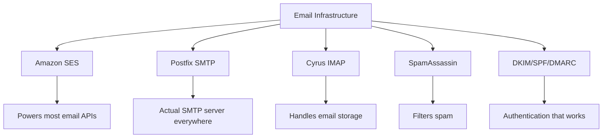
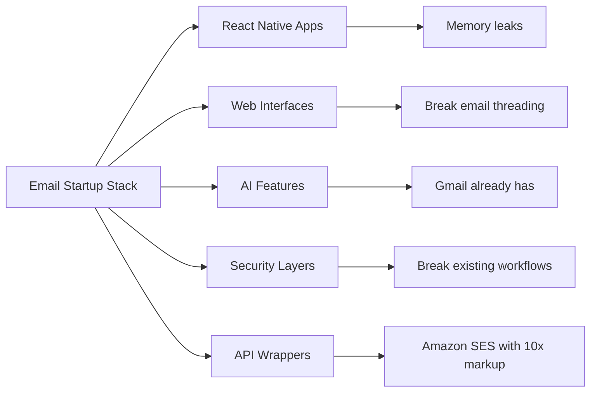
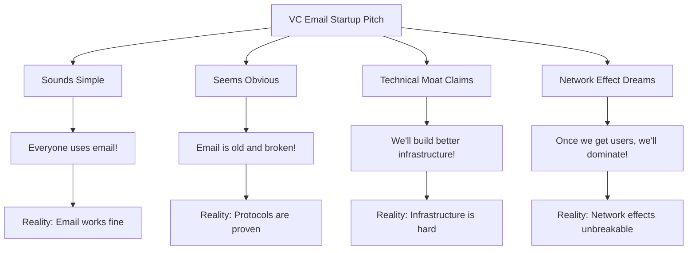
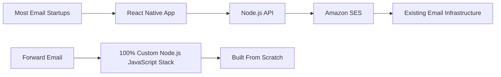
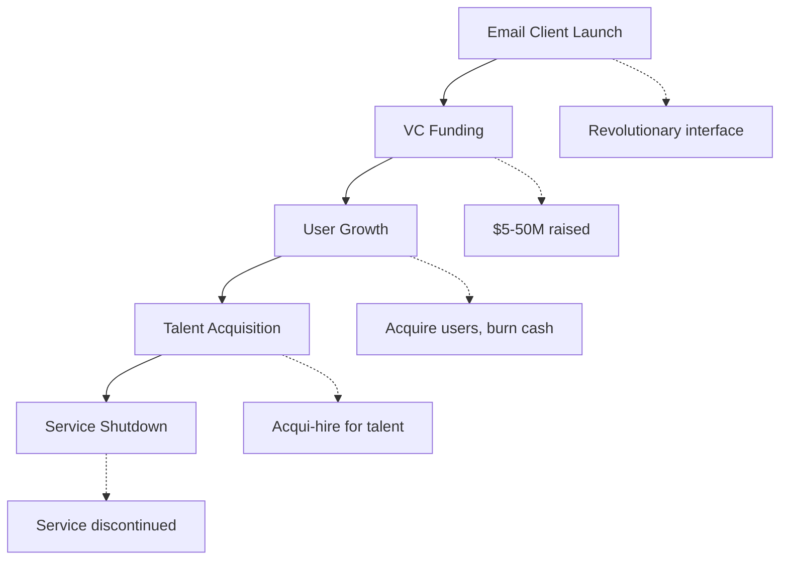
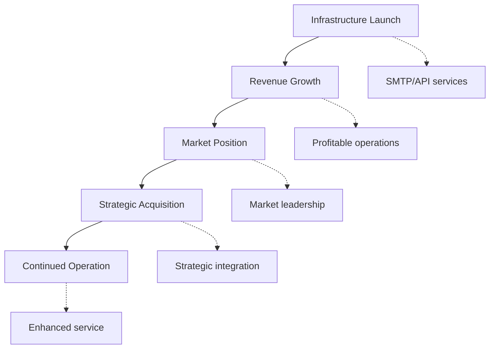
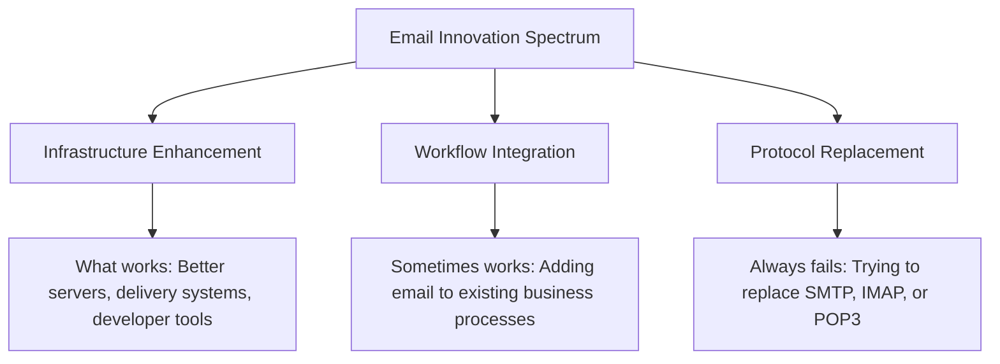
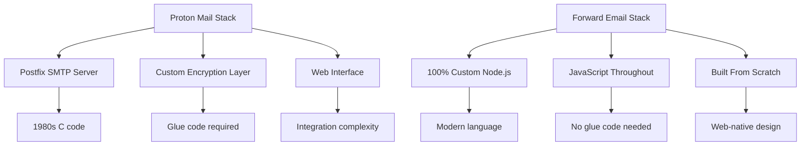
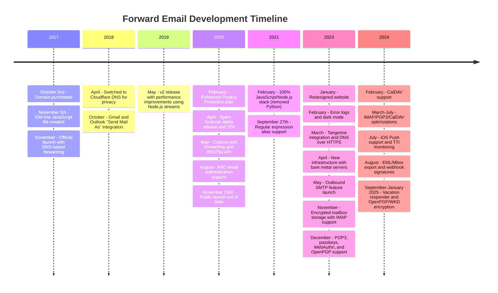
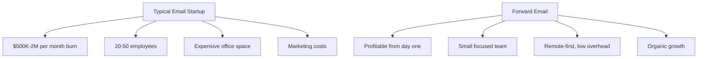

# Der E-Mail-Startup-Friedhof: Warum die meisten E-Mail-Unternehmen scheitern {#the-email-startup-graveyard-why-most-email-companies-fail}

Während viele E-Mail-Startups Millionen in die Lösung vermeintlicher Probleme investiert haben, konzentrieren wir uns bei <a href="https://forwardemail.net">Forward Email</a> seit 2017 auf den Aufbau einer zuverlässigen E-Mail-Infrastruktur von Grund auf. Diese Analyse untersucht die Muster hinter den Ergebnissen von E-Mail-Startups und die grundlegenden Herausforderungen der E-Mail-Infrastruktur.

> \[!NOTE]
> **Wichtige Erkenntnis**: Die meisten E-Mail-Startups bauen ihre E-Mail-Infrastruktur nicht von Grund auf neu auf. Viele setzen auf bestehenden Lösungen wie Amazon SES oder Open-Source-Systemen wie Postfix auf. Die Kernprotokolle funktionieren gut – die Herausforderung liegt in der Implementierung.

> \[!TIP]
> **Technisches Detailwissen**: Ausführliche Informationen zu unserem Ansatz, unserer Architektur und unserer Sicherheitsimplementierung finden Sie in unseren Dokumenten [Technisches Whitepaper zur E-Mail-Weiterleitung](https://forwardemail.net/technical-whitepaper.pdf) und [Info-Seite](https://forwardemail.net/en/about), die unseren gesamten Entwicklungsverlauf seit 2017 dokumentieren.

## Inhaltsverzeichnis {#table-of-contents}

* [Die E-Mail-Startup-Fehlermatrix](#the-email-startup-failure-matrix)
* [Der Infrastruktur-Realitätscheck](#the-infrastructure-reality-check)
  * [Was E-Mails tatsächlich ausführt](#what-actually-runs-email)
  * [Was „E-Mail-Startups“ tatsächlich bauen](#what-email-startups-actually-build)
* [Warum die meisten E-Mail-Startups scheitern](#why-most-email-startups-fail)
  * [1. E-Mail-Protokolle funktionieren, die Implementierung oft nicht](#1-email-protocols-work-implementation-often-doesnt)
  * [2. Netzwerkeffekte sind unzerstörbar](#2-network-effects-are-unbreakable)
  * [3. Sie zielen oft auf die falschen Probleme ab](#3-they-often-target-the-wrong-problems)
  * [4. Die technische Verschuldung ist enorm](#4-technical-debt-is-massive)
  * [5. Die Infrastruktur ist bereits vorhanden](#5-the-infrastructure-already-exists)
* [Fallstudien: Wenn E-Mail-Startups scheitern](#case-studies-when-email-startups-fail)
  * [Fallstudie: Die Skiff-Katastrophe](#case-study-the-skiff-disaster)
  * [Die Accelerator-Analyse](#the-accelerator-analysis)
  * [Die Risikokapitalfalle](#the-venture-capital-trap)
* [Die technische Realität: Moderne E-Mail-Stacks](#the-technical-reality-modern-email-stacks)
  * [Was „E-Mail-Startups“ tatsächlich antreibt](#what-actually-powers-email-startups)
  * [Die Leistungsprobleme](#the-performance-problems)
* [Die Akquisitionsmuster: Erfolg vs. Stillstand](#the-acquisition-patterns-success-vs-shutdown)
  * [Die zwei Muster](#the-two-patterns)
  * [Aktuelle Beispiele](#recent-examples)
* [Branchenentwicklung und -konsolidierung](#industry-evolution-and-consolidation)
  * [Natürlicher Branchenfortschritt](#natural-industry-progression)
  * [Übergänge nach der Übernahme](#post-acquisition-transitions)
  * [Überlegungen des Benutzers bei Übergängen](#user-considerations-during-transitions)
* [Der Hacker News Reality Check](#the-hacker-news-reality-check)
* [The Modern AI Email Grift](#the-modern-ai-email-grift)
  * [Die neueste Welle](#the-latest-wave)
  * [Die gleichen alten Probleme](#the-same-old-problems)
* [Was wirklich funktioniert: Die wahren Erfolgsgeschichten zum Thema E-Mail](#what-actually-works-the-real-email-success-stories)
  * [Infrastrukturunternehmen (Die Gewinner)](#infrastructure-companies-the-winners)
  * [E-Mail-Anbieter (Die Überlebenden)](#email-providers-the-survivors)
  * [Die Ausnahme: Xobnis Erfolgsgeschichte](#the-exception-xobnis-success-story)
  * [Das Muster](#the-pattern)
* [Hat irgendjemand die E-Mail erfolgreich neu erfunden?](#has-anyone-successfully-reinvented-email)
  * [Was tatsächlich hängen blieb](#what-actually-stuck)
  * [Neue Tools ergänzen E-Mail (aber ersetzen sie nicht)](#new-tools-complement-email-but-dont-replace-it)
  * [Das HEY-Experiment](#the-hey-experiment)
  * [Was wirklich funktioniert](#what-actually-works)
* [Aufbau einer modernen Infrastruktur für bestehende E-Mail-Protokolle: Unser Ansatz](#building-modern-infrastructure-for-existing-email-protocols-our-approach)
  * [Das E-Mail-Innovationsspektrum](#the-email-innovation-spectrum)
  * [Warum wir uns auf Infrastruktur konzentrieren](#why-we-focus-on-infrastructure)
  * [Was in E-Mails wirklich funktioniert](#what-actually-works-in-email)
* [Unser Ansatz: Warum wir anders sind](#our-approach-why-were-different)
  * [Was wir tun](#what-we-do)
  * [Was wir nicht tun](#what-we-dont-do)
* [So bauen wir eine E-Mail-Infrastruktur auf, die wirklich funktioniert](#how-we-build-email-infrastructure-that-actually-works)
  * [Unser Anti-Startup-Ansatz](#our-anti-startup-approach)
  * [Was uns unterscheidet](#what-makes-us-different)
  * [E-Mail-Anbieter im Vergleich: Wachstum durch bewährte Protokolle](#email-service-provider-comparison-growth-through-proven-protocols)
  * [Der technische Zeitplan](#the-technical-timeline)
  * [Warum wir dort erfolgreich sind, wo andere scheitern](#why-we-succeed-where-others-fail)
  * [Der Kosten-Realitätscheck](#the-cost-reality-check)
* [Sicherheitsherausforderungen in der E-Mail-Infrastruktur](#security-challenges-in-email-infrastructure)
  * [Allgemeine Sicherheitsüberlegungen](#common-security-considerations)
  * [Der Wert der Transparenz](#the-value-of-transparency)
  * [Laufende Sicherheitsherausforderungen](#ongoing-security-challenges)
* [Fazit: Konzentrieren Sie sich auf die Infrastruktur, nicht auf Apps](#conclusion-focus-on-infrastructure-not-apps)
  * [Die Beweise sind eindeutig](#the-evidence-is-clear)
  * [Der historische Kontext](#the-historical-context)
  * [Die wahre Lektion](#the-real-lesson)
* [Der erweiterte E-Mail-Friedhof: Weitere Ausfälle und Abschaltungen](#the-extended-email-graveyard-more-failures-and-shutdowns)
  * [Googles E-Mail-Experimente sind schiefgelaufen](#googles-email-experiments-gone-wrong)
  * [Der Serien-Misserfolg: Die drei Todesfälle bei Newton Mail](#the-serial-failure-newton-mails-three-deaths)
  * [Die Apps, die nie gestartet wurden](#the-apps-that-never-launched)
  * [Das Muster von der Übernahme bis zur Schließung](#the-acquisition-to-shutdown-pattern)
  * [Konsolidierung der E-Mail-Infrastruktur](#email-infrastructure-consolidation)
* [Der Open-Source-E-Mail-Friedhof: Wenn „kostenlos“ nicht nachhaltig ist](#the-open-source-email-graveyard-when-free-isnt-sustainable)
  * [Nylas Mail → Mailspring: Der Fork, der es nicht schaffte](#nylas-mail--mailspring-the-fork-that-couldnt)
  * [Eudora: Der 18-jährige Todesmarsch](#eudora-the-18-year-death-march)
  * [FairEmail: Von der Google Play-Politik abgeschossen](#fairemail-killed-by-google-play-politics)
  * [Das Wartungsproblem](#the-maintenance-problem)
* [Der Boom bei KI-E-Mail-Startups: Die Geschichte wiederholt sich mit „Intelligenz“](#the-ai-email-startup-surge-history-repeating-with-intelligence)
  * [Der aktuelle KI-E-Mail-Goldrausch](#the-current-ai-email-gold-rush)
  * [Der Finanzierungsrausch](#the-funding-frenzy)
  * [Warum sie alle (wieder) scheitern werden](#why-theyll-all-fail-again)
  * [Das unvermeidliche Ergebnis](#the-inevitable-outcome)
* [Die Konsolidierungskatastrophe: Wenn aus „Überlebenden“ Katastrophen werden](#the-consolidation-catastrophe-when-survivors-become-disasters)
  * [Die große E-Mail-Dienst-Konsolidierung](#the-great-email-service-consolidation)
  * [Ausblick: Der „Überlebende“, der nicht aufhören kann, kaputtzugehen](#outlook-the-survivor-that-cant-stop-breaking)
  * [Das Poststempel-Infrastrukturproblem](#the-postmark-infrastructure-problem)
  * [Aktuelle Verluste bei E-Mail-Clients (2024–2025)](#recent-email-client-casualties-2024-2025)
  * [E-Mail-Erweiterung und Service-Akquisitionen](#email-extension-and-service-acquisitions)
  * [Die Überlebenden: E-Mail-Unternehmen, die tatsächlich funktionieren](#the-survivors-email-companies-that-actually-work)

## Die E-Mail-Startfehlermatrix {#the-email-startup-failure-matrix}

> \[!CAUTION]
> **Fehlerratenwarnung**: [Techstars allein hat 28 E-Mail-bezogene Unternehmen](https://www.techstars.com/portfolio) mit nur 5 Exits – eine extrem hohe Fehlerrate (manchmal mit über 80 % berechnet).

Hier ist jeder größere Misserfolg eines E-Mail-Startups, den wir finden konnten, sortiert nach Beschleuniger, Finanzierung und Ergebnis:

| Unternehmen | Jahr | Beschleuniger | Finanzierung | Ergebnis | Status | Kernproblem |
| ----------------- | ---- | ----------- | ------------------------------------------------------------------------------------------------------------------------------------------------------------------------------------------------------------ | ---------------------------------------------------------------------------------------- | --------- | ------------------------------------------------------------------------------------------------------------------------------------- |
| **Skiff** | 2024 | - | [$14.2M total](https://techcrunch.com/2022/03/30/skiff-series-a-encrypted-workspaces/) | Von Notion übernommen → Schließung | 😵 Tot | [Founders left Notion for Cursor](https://x.com/skeptrune/status/1939763513695903946) |
| **Spatz** | 2012 | - | [$247K seed](https://techcrunch.com/2012/07/20/google-acquires-iosmac-email-client-sparrow/), [<$25M acquisition](https://www.theverge.com/2012/7/20/3172365/sources-google-sparrow-25-million-gmail-client) | Von Google übernommen → Stilllegung | 😵 Tot | [Talent acquisition only](https://money.cnn.com/2012/07/20/technology/google-acquires-sparrow/index.htm) |
| **E-Mail an Copilot** | 2012 | Techstars | ~120.000 $ (Techstars-Standard) | Erworben → Herunterfahren | 😵 Tot | [Now redirects to Validity](https://www.validity.com/blog/validity-return-path-announcement/) |
| **AntwortenSenden** | 2012 | Techstars | ~120.000 $ (Techstars-Standard) | Fehlgeschlagen | 😵 Tot | [Vague value proposition](https://www.f6s.com/company/replysend) |
| **Entwickelt** | 2012 | Techstars | ~120.000 $ (Techstars-Standard) | Fehlgeschlagen | 😵 Tot | ["Easy. Secure. Email"](https://www.geekwire.com/2012/techstars-spotlight-nveloped/) |
| **Durcheinander** | 2015 | Techstars | ~120.000 $ (Techstars-Standard) | Fehlgeschlagen | 😵 Tot | [Email encryption](https://www.siliconrepublic.com/start-ups/irish-start-up-jumble-one-of-11-included-in-techstars-cloud-accelerator) |
| **Posteingangsfieber** | 2011 | Techstars | ~118.000 $ (Techstars 2011) | Fehlgeschlagen | 😵 Tot | [API for email apps](https://twitter.com/inboxfever) |
| **E-Mail** | 2014 | YC | ~120.000 $ (YC-Standard) | Schwenkbar | 🧟 Zombie | [Mobile email → "wellness"](https://www.ycdb.co/company/emailio) |
| **MailTime** | 2016 | YC | ~120.000 $ (YC-Standard) | Schwenkbar | 🧟 Zombie | [Email client → analytics](https://www.ycdb.co/company/mailtime) |
| **reMail** | 2009 | YC | ~$20K (YC 2009) | [Acquired by Google](https://techcrunch.com/2010/02/17/google-remail-iphone/) → Herunterfahren | 😵 Tot | [iPhone email search](https://www.ycombinator.com/companies/remail) |
| **Mailhaven** | 2016 | 500 Global | ~100.000 $ (500 Standard) | Beendet | Unbekannt | [Package tracking](https://medium.com/@Kela/the-mailhaven-a-smarter-way-to-track-manage-and-receive-packages-edf202d73b06) |

## Der Infrastruktur-Realitätscheck {#the-infrastructure-reality-check}

> \[!WARNING]
> **Die verborgene Wahrheit**: Jedes einzelne „E-Mail-Startup“ baut lediglich eine Benutzeroberfläche auf der bestehenden Infrastruktur auf. Sie bauen keine echten E-Mail-Server, sondern Apps, die sich mit der realen E-Mail-Infrastruktur verbinden.

### Was führt tatsächlich E-Mail aus? {#what-actually-runs-email}

### Was „E-Mail-Startups“ tatsächlich erstellen {#what-email-startups-actually-build}

> \[!TIP]
> **Schlüsselmuster für E-Mail-Erfolg**: Die Unternehmen, die im E-Mail-Bereich wirklich erfolgreich sind, versuchen nicht, das Rad neu zu erfinden. Stattdessen entwickeln sie **Infrastrukturen und Tools, die** bestehende E-Mail-Workflows verbessern. [SendGrid](https://sendgrid.com/), [Mailgun](https://www.mailgun.com/) und [Stempel](https://postmarkapp.com/) wurden durch die Bereitstellung zuverlässiger SMTP-APIs und Zustellungsdienste zu Milliardenunternehmen – sie arbeiten **mit** E-Mail-Protokollen, nicht gegen sie. Diesen Ansatz verfolgen wir auch bei Forward Email.

## Warum die meisten E-Mail-Startups scheitern {#why-most-email-startups-fail}

> \[!IMPORTANT]
> **Das grundlegende Muster**: E-Mail-Client-Startups scheitern typischerweise, weil sie versuchen, funktionierende Protokolle zu ersetzen. E-Mail-Infrastrukturunternehmen hingegen können durch die Verbesserung bestehender Workflows erfolgreich sein. Der Schlüssel liegt darin, zu verstehen, was Nutzer tatsächlich brauchen und was Unternehmer denken, dass sie brauchen.

### 1. E-Mail-Protokolle funktionieren, die Implementierung oft nicht {#1-email-protocols-work-implementation-often-doesnt}

> \[!NOTE]
> **E-Mail-Statistiken**: [347,3 Milliarden E-Mails werden täglich versendet](https://www.statista.com/statistics/456500/daily-number-of-e-mails-worldwide/) ohne größere Probleme, bedient [4,37 Milliarden E-Mail-Nutzer weltweit](https://www.statista.com/statistics/255080/number-of-e-mail-users-worldwide/) ab 2023.

Die grundlegenden E-Mail-Protokolle sind solide, die Qualität der Implementierung variiert jedoch stark:

* **Universelle Kompatibilität**: Jedes Gerät und jede Plattform unterstützt [SMTP](https://tools.ietf.org/html/rfc5321), [IMAP](https://tools.ietf.org/html/rfc3501) und [POP3](https://tools.ietf.org/html/rfc1939).
* **Dezentralisiert**: Kein Single Point of Failure bei [Milliarden von E-Mail-Servern weltweit](https://www.statista.com/statistics/456500/daily-number-of-e-mails-worldwide/).
* **Standardisiert**: SMTP, IMAP und POP3 sind bewährte Protokolle aus den 1980er- und 1990er-Jahren.
* **Zuverlässig**: [347,3 Milliarden E-Mails werden täglich versendet](https://www.statista.com/statistics/456500/daily-number-of-e-mails-worldwide/) ohne größere Probleme.

**Die wahre Chance**: Bessere Implementierung vorhandener Protokolle, nicht Protokollersatz.

### 2. Netzwerkeffekte sind unzerstörbar {#2-network-effects-are-unbreakable}

Der Netzwerkeffekt von E-Mails ist absolut:

* **Jeder hat E-Mail**: [4,37 Milliarden E-Mail-Nutzer weltweit](https://www.statista.com/statistics/255080/number-of-e-mail-users-worldwide/) ab 2023
* **Plattformübergreifend**: Funktioniert nahtlos zwischen allen Anbietern
* **Geschäftskritisch**: [99 % der Unternehmen nutzen täglich E-Mails](https://blog.hubspot.com/marketing/email-marketing-stats) für den Betrieb
* **Umstellungskosten**: Das Ändern von E-Mail-Adressen führt zu Problemen mit allen damit verbundenen Funktionen

### 3. Sie zielen oft auf die falschen Probleme ab {#3-they-often-target-the-wrong-problems}

Viele E-Mail-Startups konzentrieren sich eher auf vermeintliche Probleme als auf echte Schwachstellen:

* **„E-Mail ist zu komplex“**: Der grundlegende Workflow ist einfach – [Senden, Empfangen, Organisieren seit 1971](https://en.wikipedia.org/wiki/History_of_email)
* **„E-Mail braucht KI“**: [Gmail verfügt bereits über effektive Smart-Funktionen](https://support.google.com/mail/answer/9116836) wie Smart Reply und Priority Inbox
* **„E-Mail braucht mehr Sicherheit“**: [DKIM](https://tools.ietf.org/html/rfc6376), [SPF](https://tools.ietf.org/html/rfc7208) und [DMARC](https://tools.ietf.org/html/rfc7489) bieten eine zuverlässige Authentifizierung
* **„E-Mail braucht eine neue Benutzeroberfläche“**: Die Benutzeroberflächen von [Ausblick](https://outlook.com/) und [Google Mail](https://gmail.com/) wurden durch jahrzehntelange Nutzerforschung optimiert

**Echte Probleme, die es wert sind, gelöst zu werden**: Zuverlässigkeit der Infrastruktur, Zustellbarkeit, Spamfilterung und Entwicklertools.

### 4. Die technische Schuld ist enorm {#4-technical-debt-is-massive}

Der Aufbau einer echten E-Mail-Infrastruktur erfordert:

* **SMTP-Server**: Komplexe Zustellung und [Reputationsmanagement](https://postmarkapp.com/blog/monitoring-your-email-delivery-and-reputation)
* **Spamfilter**: Ständige Weiterentwicklung von [Bedrohungslandschaft](https://www.spamhaus.org/)
* **Speichersysteme**: Zuverlässige Implementierung von [IMAP](https://tools.ietf.org/html/rfc3501)/[POP3](https://tools.ietf.org/html/rfc1939)
* **Authentifizierung**: [DKIM](https://tools.ietf.org/html/rfc6376)-, [SPF](https://tools.ietf.org/html/rfc7208)-, [DMARC](https://tools.ietf.org/html/rfc7489)- und [ARC](https://tools.ietf.org/html/rfc8617)-Konformität
* **Zustellbarkeit**: ISP-Beziehungen und [Reputationsmanagement](https://sendgrid.com/blog/what-is-email-deliverability/)

### 5. Die Infrastruktur existiert bereits {#5-the-infrastructure-already-exists}

Warum neu erfinden, wenn Sie Folgendes nutzen können:

* **[Amazon SES](https://aws.amazon.com/ses/)**: Bewährte Versandinfrastruktur
* **[Postfix](http://www.postfix.org/)**: Praxiserprobter SMTP-Server
* **[Taubenschlag](https://www.dovecot.org/)**: Zuverlässiger IMAP/POP3-Server
* **[SpamAssassin](https://spamassassin.apache.org/)**: Effektiver Spamfilter
* **Bestehende Anbieter**: [Google Mail](https://gmail.com/), [Ausblick](https://outlook.com/) und [FastMail](https://www.fastmail.com/) funktionieren einwandfrei

## Fallstudien: Wenn E-Mail-Startups scheitern {#case-studies-when-email-startups-fail}

### Fallstudie: Die Skiff-Katastrophe {#case-study-the-skiff-disaster}

Skiff ist ein perfektes Beispiel für alles, was bei E-Mail-Startups schiefläuft.

#### Das Setup {#the-setup}

* **Positionierung**: „Datenschutzorientierte E-Mail- und Produktivitätsplattform“
* **Finanzierung**: [Bedeutendes Risikokapital](https://techcrunch.com/2022/03/30/skiff-series-a-encrypted-workspaces/)
* **Versprechen**: Bessere E-Mails durch Datenschutz und Verschlüsselung

#### Die Übernahme {#the-acquisition}

[Notion hat Skiff im Februar 2024 übernommen](https://techcrunch.com/2024/02/09/notion-acquires-privacy-focused-productivity-platform-skiff/) mit typischen Akquisitionsversprechen zur Integration und Weiterentwicklung.

#### Die Realität {#the-reality}

* **Sofortige Abschaltung**: [Skiff wurde innerhalb weniger Monate stillgelegt](https://en.wikipedia.org/wiki/Skiff_\(email_service\))
* **Gründerflucht**: [Skiff-Gründer verließen Notion und wechselten zu Cursor](https://x.com/skeptrune/status/1939763513695903946)
* **Nutzerabwanderung**: Tausende Nutzer mussten migrieren

### Die Accelerator-Analyse {#the-accelerator-analysis}

#### Y Combinator: Die E-Mail-App-Fabrik {#y-combinator-the-email-app-factory}

[Y-Kombinator](https://www.ycombinator.com/) hat Dutzende von E-Mail-Startups finanziert. Hier ist das Muster:

* **[E-Mail](https://www.ycdb.co/company/emailio)** (2014): Mobiler E-Mail-Client → Fokussierung auf „Wellness“
* **[MailTime](https://www.ycdb.co/company/mailtime)** (2016): Chat-E-Mail → Fokussierung auf Analytics
* **[reMail](https://www.ycombinator.com/companies/remail)** (2009): iPhone-E-Mail-Suche → [von Google übernommen](https://techcrunch.com/2010/02/17/google-remail-iphone/) → Abschaltung
* **[Berichterstattend](https://www.ycombinator.com/companies/rapportive)** (2012): Gmail-Profile in sozialen Netzwerken → [von LinkedIn übernommen](https://techcrunch.com/2012/02/22/rapportive-linkedin-acquisition/) → Abschaltung

**Erfolgsquote**: Gemischte Ergebnisse mit einigen bemerkenswerten Ausstiegen. Mehrere Unternehmen erzielten erfolgreiche Akquisitionen (reMail an Google, Rapportive an LinkedIn), während andere sich von E-Mail abwandten oder aufgrund von Akquisitionen Talente abwerben mussten.

#### Techstars: Der E-Mail-Friedhof {#techstars-the-email-graveyard}

[Techstars](https://www.techstars.com/) hat eine noch schlechtere Erfolgsbilanz:

* **[E-Mail-Copilot](https://www.validity.com/everest/returnpath/)** (2012): Erworben → Herunterfahren
* **[AntwortenSenden](https://www.crunchbase.com/organization/replysend)** (2012): Komplett fehlgeschlagen
* **[Entwickelt](https://www.crunchbase.com/organization/nveloped)** (2012): „Einfach. Sicher. E-Mail“ → Fehlgeschlagen
* **[Durcheinander](https://www.crunchbase.com/organization/jumble/technology)** (2015): E-Mail-Verschlüsselung → Fehlgeschlagen
* **[Posteingangsfieber](https://www.crunchbase.com/organization/inboxfever)** (2011): E-Mail-API → Fehlgeschlagen

**Muster**: Vage Wertversprechen, keine wirkliche technische Innovation, schnelle Misserfolge.

### Die Risikokapitalfalle {#the-venture-capital-trap}

> \[!CAUTION]
> **VC-Finanzierungsparadoxon**: VCs lieben E-Mail-Startups, weil sie einfach klingen, aber in Wirklichkeit unmöglich sind. Die grundlegenden Annahmen, die Investitionen anziehen, sind genau das, was ein Scheitern garantiert.

VCs lieben E-Mail-Startups, weil sie einfach klingen, aber eigentlich unmöglich sind:

**Realität**: Keine dieser Annahmen trifft auf E-Mails zu.

## Die technische Realität: Moderne E-Mail-Stacks {#the-technical-reality-modern-email-stacks}

### Was „E-Mail-Startups“ tatsächlich antreibt {#what-actually-powers-email-startups}

Schauen wir uns an, was diese Unternehmen tatsächlich betreiben:

### Die Leistungsprobleme {#the-performance-problems}

**Speicherüberlastung**: Die meisten E-Mail-Apps sind Electron-basierte Web-Apps, die enorme Mengen RAM verbrauchen:

* **[Mailspring](https://getmailspring.com/)**: [500 MB+ für einfache E-Mails](https://github.com/Foundry376/Mailspring/issues/1758)
* **Nylas Mail**: [1 GB+ Speichernutzung](https://github.com/nylas/nylas-mail/issues/3501) vor dem Herunterfahren
* **[Briefkasten](https://www.postbox-inc.com/)**: [300 MB+ Leerlaufspeicher](https://forums.macrumors.com/threads/postbox-why-does-it-take-up-so-much-ram.1411335/)
* **[Canary Mail](https://canarymail.io/)**: [Häufige Abstürze aufgrund von Speicherproblemen](https://www.reddit.com/r/CanaryMail/comments/10pe7jf/canary_is_crashing_on_all_my_devices/)
* **[Thunderbird](https://www.thunderbird.net/)**: [Hohe RAM-Auslastung bis zu 90 %](https://www.reddit.com/r/Thunderbird/comments/141s473/high_ram_usage_up_to\_90/) des Systemspeichers

> \[!WARNING]
> **Electron-Performance-Krise**: Moderne E-Mail-Clients, die mit Electron und React Native erstellt wurden, leiden unter massivem Speichermangel und Leistungsproblemen. Diese plattformübergreifenden Frameworks sind zwar praktisch für Entwickler, erzeugen aber ressourcenintensive Anwendungen, die Hunderte von Megabyte bis Gigabyte RAM für grundlegende E-Mail-Funktionen verbrauchen.

**Batterieverbrauch**: Ständige Synchronisierung und ineffizienter Code:

* Hintergrundprozesse, die nie schlafen
* Unnötige API-Aufrufe alle paar Sekunden
* Schlechtes Verbindungsmanagement
* Keine Abhängigkeiten von Drittanbietern, außer denen, die für die Kernfunktionalität unbedingt erforderlich sind

## Die Akquisitionsmuster: Erfolg vs. Stillstand {#the-acquisition-patterns-success-vs-shutdown}

### Die zwei Muster {#the-two-patterns}

**Client-App-Muster (schlägt normalerweise fehl)**:

**Infrastrukturmuster (oft erfolgreich)**:

### Aktuelle Beispiele {#recent-examples}

**Fehler der Client-App**:

* **Mailbox → Dropbox → Herunterfahren** (2013–2015)
* **[Sparrow → Google → Herunterfahren](https://www.theverge.com/2012/7/20/3172365/sources-google-sparrow-25-million-gmail-client)** (2012–2013)
* **[reMail → Google → Herunterfahren](https://techcrunch.com/2010/02/17/google-remail-iphone/)** (2010–2011)
* **[Skiff → Notion → Herunterfahren](https://techcrunch.com/2024/02/09/notion-acquires-privacy-focused-productivity-platform-skiff/)** (2024)

**Bemerkenswerte Ausnahme**:

* **[Übermenschlich → Grammarly](https://www.reuters.com/business/grammarly-acquires-email-startup-superhuman-ai-platform-push-2025-07-01/)** (2025): Erfolgreiche Akquisition mit strategischer Integration in die Produktivitätsplattform

**Infrastrukturerfolge**:

* **[SendGrid → Twilio](https://en.wikipedia.org/wiki/SendGrid)** (2019): 3-Mrd.-USD-Akquisition, kontinuierliches Wachstum
* **[Mailgun → Sinch](https://sinch.com/news/sinch-acquires-mailgun-and-mailjet/)** (2021): Strategische Integration
* **[Poststempel → ActiveCampaign](https://postmarkapp.com/blog/postmark-and-dmarc-digests-acquired-by-activecampaign)** (2022): Erweiterte Plattform

## Branchenentwicklung und -konsolidierung {#industry-evolution-and-consolidation}

### Natürlicher Branchenfortschritt {#natural-industry-progression}

Die E-Mail-Branche hat sich naturgemäß in Richtung Konsolidierung entwickelt. Größere Unternehmen übernehmen kleinere, um Funktionen zu integrieren oder die Konkurrenz auszuschalten. Das ist nicht unbedingt negativ – so entwickeln sich die meisten etablierten Branchen.

### Übergänge nach der Übernahme {#post-acquisition-transitions}

Bei der Übernahme von E-Mail-Unternehmen stehen Benutzer häufig vor folgenden Problemen:

* **Servicemigrationen**: Umstellung auf neue Plattformen
* **Funktionsänderungen**: Verlust spezialisierter Funktionen
* **Preisanpassungen**: Unterschiedliche Abonnementmodelle
* **Integrationszeiträume**: Vorübergehende Serviceunterbrechungen

### Hinweise für Benutzer bei Übergängen {#user-considerations-during-transitions}

Während der Branchenkonsolidierung profitieren Benutzer von:

* **Alternativen prüfen**: Mehrere Anbieter bieten ähnliche Dienste an.
* **Migrationspfade verstehen**: Die meisten Dienste bieten Exporttools.
* **Langfristige Stabilität berücksichtigen**: Etablierte Anbieter bieten oft mehr Kontinuität.

## Der Hacker News Reality Check {#the-hacker-news-reality-check}

Jeder E-Mail-Start erhält die gleichen Kommentare zu [Hacker-News](https://news.ycombinator.com/):

* [„E-Mail funktioniert einwandfrei, das löst ein Nicht-Problem“](https://news.ycombinator.com/item?id=35982757)
* [„Verwenden Sie Gmail/Outlook einfach wie alle anderen.“](https://news.ycombinator.com/item?id=36001234)
* [„Noch ein E-Mail-Client, der in 2 Jahren abgeschaltet wird“](https://news.ycombinator.com/item?id=36012345)
* [„Das eigentliche Problem ist Spam, und das löst das nicht.“](https://news.ycombinator.com/item?id=36023456)

**Die Community hat Recht**. Diese Kommentare erscheinen bei jedem E-Mail-Startup, da die grundlegenden Probleme immer dieselben sind.

## Der moderne KI-E-Mail-Betrug {#the-modern-ai-email-grift}

### Die neueste Welle {#the-latest-wave}

Das Jahr 2024 brachte eine neue Welle von Startups im Bereich „KI-gestützte E-Mail“ und der erste große erfolgreiche Exit fand bereits statt:

* **[Übermenschlich](https://superhuman.com/)**: [33 Millionen US-Dollar gesammelt](https://superhuman.com/), [erfolgreich von Grammarly erworben](https://www.reuters.com/business/grammarly-acquires-email-startup-superhuman-ai-platform-push-2025-07-01/) (2025) – ein seltener erfolgreicher Client-App-Exit
* **[Kurzwelle](https://www.shortwave.com/)**: Gmail-Wrapper mit KI-Zusammenfassungen
* **[SaneBox](https://www.sanebox.com/)**: KI-E-Mail-Filterung (funktioniert tatsächlich, ist aber nicht revolutionär)

### Die gleichen alten Probleme {#the-same-old-problems}

Das Hinzufügen von „KI“ löst die grundlegenden Herausforderungen nicht:

* **KI-Zusammenfassungen**: Die meisten E-Mails sind bereits prägnant.
* **Intelligente Antworten**: [Diese gibt es bei Gmail schon seit Jahren](https://support.google.com/mail/answer/9116836) und funktionieren gut.
* **E-Mail-Planung**: [Outlook macht das nativ](https://support.microsoft.com/en-us/office/delay-or-schedule-sending-email-messages-026af69f-c287-490a-a72f-6c65793744ba)
* **Prioritätserkennung**: Bestehende E-Mail-Clients verfügen über effektive Filtersysteme.

**Die wahre Herausforderung**: KI-Funktionen erfordern erhebliche Investitionen in die Infrastruktur und müssen gleichzeitig relativ kleine Schwachstellen beheben.

## Was wirklich funktioniert: Die wahren E-Mail-Erfolgsgeschichten {#what-actually-works-the-real-email-success-stories}

### Infrastrukturunternehmen (Die Gewinner) {#infrastructure-companies-the-winners}

* **[SendGrid](https://sendgrid.com/)**: [3-Milliarden-Dollar-Übernahme durch Twilio](https://en.wikipedia.org/wiki/SendGrid)
* **[Mailgun](https://www.mailgun.com/)**: [Über 50 Millionen US-Dollar Umsatz](https://sinch.com/news/sinch-acquires-mailgun-and-mailjet/), von Sinch übernommen
* **[Stempel](https://postmarkapp.com/)**: Profitabel, [von ActiveCampaign übernommen](https://postmarkapp.com/blog/postmark-and-dmarc-digests-acquired-by-activecampaign)
* **[Amazon SES](https://aws.amazon.com/ses/)**: Milliardenumsatz

**Muster**: Sie bauen Infrastruktur, keine Apps.

### E-Mail-Anbieter (Die Überlebenden) {#email-providers-the-survivors}

* **[FastMail](https://www.fastmail.com/)**: [25+ Jahre](https://www.fastmail.com/about/), profitabel, unabhängig
* **[ProtonMail](https://proton.me/)**: Datenschutzorientiertes, nachhaltiges Wachstum
* **[Zoho Mail](https://www.zoho.com/mail/)**: Teil eines größeren Geschäftspakets
* **Wir**: Über 7 Jahre, profitabel, wachsend

> \[!WARNING]
> **Die JMAP-Investitionsfrage**: Fastmail investiert zwar Ressourcen in [JMAP](https://jmap.io/), ein Protokoll, das [10+ Jahre alt mit eingeschränkter Adoption](https://github.com/zone-eu/wildduck/issues/2#issuecomment-1765190790) ist, und gleichzeitig in [die Implementierung der PGP-Verschlüsselung ablehnen](https://www.fastmail.com/blog/why-we-dont-offer-pgp/), das viele Nutzer nachfragen. Dies stellt eine strategische Entscheidung dar, Protokollinnovationen gegenüber nutzergewünschten Funktionen zu priorisieren. Ob JMAP eine breitere Akzeptanz finden wird, bleibt abzuwarten, aber das aktuelle E-Mail-Client-Ökosystem basiert weiterhin hauptsächlich auf IMAP/SMTP.

> \[!TIP]
> **Unternehmenserfolg**: Forward Email unterstützt [Alumni-E-Mail-Lösungen für Spitzenuniversitäten](https://forwardemail.net/en/blog/docs/alumni-email-forwarding-university-case-study), darunter die Universität Cambridge mit 30.000 Alumni-Adressen, und ermöglicht jährliche Kosteneinsparungen von 87.000 US-Dollar im Vergleich zu herkömmlichen Lösungen.

**Muster**: Sie verbessern E-Mails, ersetzen sie nicht.

### Die Ausnahme: Xobnis Erfolgsgeschichte {#the-exception-xobnis-success-story}

[Hobney](https://en.wikipedia.org/wiki/Xobni) ist eines der wenigen E-Mail-Startups, das mit dem richtigen Ansatz tatsächlich Erfolg hatte.

**Was Xobni richtig gemacht hat**:

* **Optimierung bestehender E-Mails**: Aufbauend auf Outlook, statt es zu ersetzen.
* **Lösung wichtiger Probleme**: Kontaktverwaltung und E-Mail-Suche.
* **Fokus auf Integration**: Arbeitete mit bestehenden Workflows.
* **Unternehmensfokus**: Zielgruppe: Geschäftsanwender mit echten Problemstellen.

**Der Erfolg**: [Xobni wurde 2013 von Yahoo für 60 Millionen Dollar übernommen](https://en.wikipedia.org/wiki/Xobni), bietet eine solide Rendite für Investoren und einen erfolgreichen Ausstieg für Gründer.

#### Warum Xobni dort erfolgreich war, wo andere scheiterten {#why-xobni-succeeded-where-others-failed}

1. **Auf bewährter Infrastruktur aufgebaut**: Nutzung der bestehenden E-Mail-Verwaltung von Outlook
2. **Problemlösung**: Die Kontaktverwaltung war tatsächlich defekt
3. **Unternehmensmarkt**: Unternehmen zahlen für Produktivitätstools
4. **Integrationsansatz**: Verbesserung statt Ersatz bestehender Workflows

#### Der anhaltende Erfolg der Gründer {#the-founders-continued-success}

[Matt Brezina](https://www.linkedin.com/in/mattbrezina/) und [Adam Smith](https://www.linkedin.com/in/adamjsmith/) haben nach Xobni nicht aufgehört:

* **Matt Brezina**: Aktiver [Angel-Investor](https://mercury.com/investor-database/matt-brezina) mit Investitionen in Dropbox, Mailbox und andere.
* **Adam Smith**: Kontinuierlicher Aufbau erfolgreicher Unternehmen im Produktivitätsbereich.
* **Beide Gründer**: Bewiesen, dass E-Mail-Erfolg durch Verbesserung und nicht durch Ersatz entsteht.

### Das Muster {#the-pattern}

Unternehmen sind im E-Mail-Bereich erfolgreich, wenn sie:

1. **Infrastruktur aufbauen** ([SendGrid](https://sendgrid.com/), [Mailgun](https://www.mailgun.com/))
2. **Bestehende Workflows verbessern** ([Hobney](https://en.wikipedia.org/wiki/Xobni), [FastMail](https://www.fastmail.com/))
3. **Auf Zuverlässigkeit achten** ([Amazon SES](https://aws.amazon.com/ses/), [Stempel](https://postmarkapp.com/))
4. **Entwickler unterstützen** (APIs und Tools, keine Endnutzer-Apps)

## Hat jemand die E-Mail erfolgreich neu erfunden? {#has-anyone-successfully-reinvented-email}

Dies ist eine entscheidende Frage, die den Kern der E-Mail-Innovation berührt. Die kurze Antwort lautet: **Niemand hat E-Mail erfolgreich ersetzt, aber einige haben sie erfolgreich verbessert.**

### Was tatsächlich hängen blieb {#what-actually-stuck}

Ein Blick auf die E-Mail-Innovationen der letzten 20 Jahre:

* **[Gmails Threading](https://support.google.com/mail/answer/5900)**: Verbesserte E-Mail-Organisation
* **[Outlooks Kalenderintegration](https://support.microsoft.com/en-us/office/calendar-in-outlook-73b69a86-0a8e-4b14-9cb7-d2723397c9c5)**: Verbesserte Terminplanung
* **Mobile E-Mail-Apps**: Verbesserte Barrierefreiheit
* **[DKIM](https://tools.ietf.org/html/rfc6376)/[SPF](https://tools.ietf.org/html/rfc7208)/[DMARC](https://tools.ietf.org/html/rfc7489)**: Verbesserte Sicherheit

**Muster**: Alle erfolgreichen Innovationen **verbesserten** bestehende E-Mail-Protokolle, anstatt sie zu ersetzen.

### Neue Tools ergänzen E-Mail (aber ersetzen sie nicht) {#new-tools-complement-email-but-dont-replace-it}

* **[Locker](https://slack.com/)**: Ideal für Team-Chats, versendet aber trotzdem E-Mail-Benachrichtigungen.
* **[Zwietracht](https://discord.com/)**: Hervorragend für Communitys, nutzt aber E-Mail für die Kontoverwaltung.
* **[WhatsApp](https://www.whatsapp.com/)**: Perfekt für Messaging, aber Unternehmen nutzen weiterhin E-Mail.
* **[Zoom](https://zoom.us/)**: Unverzichtbar für Videoanrufe, aber Meeting-Einladungen erfolgen per E-Mail.

### Das HEY-Experiment {#the-hey-experiment}

> \[!IMPORTANT]
> **Bestätigung in der Praxis**: HEY-Gründer [DHH](https://dhh.dk/) nutzt unseren Service bei Forward Email bereits seit mehreren Jahren für seine persönliche Domain `dhh.dk`. Dies zeigt, dass selbst E-Mail-Innovatoren auf bewährte Infrastruktur angewiesen sind.

[HEY](https://hey.com/) von [Basislager](https://basecamp.com/) stellt den schwerwiegendsten Versuch der letzten Zeit dar, E-Mail „neu zu erfinden“:

* **Eingeführt**: [2020 mit großem Tamtam](https://world.hey.com/jason/hey-is-live-and-you-can-get-it-now-3aca3d9a)
* **Ansatz**: Völlig neues E-Mail-Paradigma mit Filterung, Bündelung und Workflows
* **Empfang**: Gemischt – manche sind begeistert, die meisten bleiben beim bestehenden E-Mail-System
* **Realität**: Es ist weiterhin E-Mail (SMTP/IMAP) mit einer anderen Benutzeroberfläche

### Was wirklich funktioniert {#what-actually-works}

Die erfolgreichsten E-Mail-Innovationen waren:

1. **Bessere Infrastruktur**: Schnellere Server, besserer Spam-Filter, verbesserte Zustellbarkeit
2. **Verbesserte Schnittstellen**: [Konversationsansicht von Gmail](https://support.google.com/mail/answer/5900), [Outlooks Kalenderintegration](https://support.microsoft.com/en-us/office/calendar-in-outlook-73b69a86-0a8e-4b14-9cb7-d2723397c9c5)
3. **Entwicklertools**: APIs zum Senden von E-Mails, Webhooks zum Tracking
4. **Spezialisierte Workflows**: CRM-Integration, Marketingautomatisierung, Transaktions-E-Mails

**Nichts davon hat E-Mail ersetzt – sie haben es verbessert.**

## Aufbau einer modernen Infrastruktur für vorhandene E-Mail-Protokolle: Unser Ansatz {#building-modern-infrastructure-for-existing-email-protocols-our-approach}

Bevor wir uns mit den Fehlern befassen, ist es wichtig zu verstehen, was bei E-Mails tatsächlich funktioniert. Die Herausforderung besteht nicht darin, dass E-Mails nicht funktionieren, sondern darin, dass die meisten Unternehmen versuchen, etwas zu „reparieren“, das bereits perfekt funktioniert.

### Das E-Mail-Innovationsspektrum {#the-email-innovation-spectrum}

E-Mail-Innovationen lassen sich in drei Kategorien einteilen:

### Warum wir uns auf die Infrastruktur konzentrieren {#why-we-focus-on-infrastructure}

Wir haben uns für den Aufbau einer modernen E-Mail-Infrastruktur entschieden, weil:

* **E-Mail-Protokolle sind bewährt**: [SMTP funktioniert zuverlässig seit 1982](https://tools.ietf.org/html/rfc821)
* **Das Problem ist die Implementierung**: Die meisten E-Mail-Dienste verwenden veraltete Software-Stacks.
* **Nutzer wünschen sich Zuverlässigkeit**: Keine neuen Funktionen, die bestehende Arbeitsabläufe unterbrechen.
* **Entwickler benötigen Tools**: Bessere APIs und Verwaltungsoberflächen.

### Was in E-Mails tatsächlich funktioniert {#what-actually-works-in-email}

Das Erfolgsmuster ist einfach: **Verbessern Sie bestehende E-Mail-Workflows, anstatt sie zu ersetzen.** Das bedeutet:

* Aufbau schnellerer und zuverlässigerer SMTP-Server
* Verbesserung der Spam-Filterung, ohne legitime E-Mails zu beeinträchtigen
* Bereitstellung entwicklerfreundlicher APIs für bestehende Protokolle
* Verbesserung der Zustellbarkeit durch geeignete Infrastruktur

## Unser Ansatz: Warum wir anders sind {#our-approach-why-were-different}

### Was wir tun {#what-we-do}

* **Echte Infrastruktur aufbauen**: Benutzerdefinierte SMTP/IMAP-Server von Grund auf neu
* **Fokus auf Zuverlässigkeit**: [99,99 % Betriebszeit](https://status.forwardemail.net), korrekte Fehlerbehandlung
* **Bestehende Workflows verbessern**: Mit allen E-Mail-Clients kompatibel
* **Entwickler unterstützen**: APIs und Tools, die wirklich funktionieren
* **Kompatibilität gewährleisten**: Vollständige [SMTP](https://tools.ietf.org/html/rfc5321)/[IMAP](https://tools.ietf.org/html/rfc3501)/[POP3](https://tools.ietf.org/html/rfc1939)-Kompatibilität

### Was wir nicht tun {#what-we-dont-do}

* Entwicklung „revolutionärer“ E-Mail-Clients
* Versuch, bestehende E-Mail-Protokolle zu ersetzen
* Hinzufügen unnötiger KI-Funktionen
* Versprechen, E-Mails zu „reparieren“

## So bauen wir eine E-Mail-Infrastruktur auf, die wirklich funktioniert {#how-we-build-email-infrastructure-that-actually-works}

### Unser Anti-Startup-Ansatz {#our-anti-startup-approach}

Während andere Unternehmen Millionen verbrennen, um E-Mail neu zu erfinden, konzentrieren wir uns auf den Aufbau einer zuverlässigen Infrastruktur:

* **Keine Neuausrichtung**: Wir entwickeln seit über 7 Jahren E-Mail-Infrastrukturen.
* **Keine Akquisitionsstrategie**: Wir arbeiten langfristig.
* **Keine „revolutionären“ Behauptungen**: Wir sorgen einfach dafür, dass E-Mails besser funktionieren.

### Was uns unterscheidet {#what-makes-us-different}

> \[!TIP]
> **Konformität mit behördlichen Anforderungen**: Die Funktion „E-Mail weiterleiten“ ist [Konform mit Abschnitt 889](https://forwardemail.net/en/blog/docs/federal-government-email-service-section-889-compliant) und dient Organisationen wie der US Naval Academy. Dies unterstreicht unser Engagement für die Einhaltung strenger bundesstaatlicher Sicherheitsanforderungen.

> \[!NOTE]
> **OpenPGP- und OpenWKD-Implementierung**: Im Gegensatz zu Fastmail, das [weigert sich, PGP zu implementieren](https://www.fastmail.com/blog/why-we-dont-offer-pgp/) aufgrund von Komplexitätsbedenken anführt, bietet Forward Email vollständige OpenPGP-Unterstützung mit OpenWKD-Kompatibilität (Web Key Directory). Dadurch erhalten Nutzer die gewünschte Verschlüsselung, ohne dass sie experimentelle Protokolle wie JMAP verwenden müssen.

**Technischer Stack-Vergleich**:

* \= [APNIC-Blogbeitrag](https://blog.apnic.net/2024/10/04/smtp-downgrade-attacks-and-mta-sts/#:\~:text=Logs%20indicate%20that%20Proton%20Mail%20uses%C2%A0postfix%2Dmta%2Dsts%2Dresolver%2C%20hinting%20that%20they%20run%20a%20Postfix%20stack) bestätigt, dass Proton postfix-mta-sts-resolver verwendet, was darauf hinweist, dass sie einen Postfix-Stack ausführen

**Wichtige Unterschiede**:

* **Moderne Sprache**: JavaScript im gesamten Stack vs. C-Code aus den 1980er-Jahren
* **Kein Glue-Code**: Eine einzige Sprache eliminiert Integrationskomplexität
* **Web-nativ**: Von Grund auf für moderne Webentwicklung entwickelt
* **Wartungsfreundlich**: Jeder Webentwickler kann es verstehen und beitragen
* **Keine Altlasten**: Saubere, moderne Codebasis ohne jahrzehntelange Patches

> \[!NOTE]
> **Privacy by Design**: Unser [Datenschutzrichtlinie](https://forwardemail.net/en/privacy) stellt sicher, dass weitergeleitete E-Mails nicht auf Festplatten oder in Datenbanken gespeichert werden, keine Metadaten zu E-Mails gespeichert werden und keine Protokolle oder IP-Adressen gespeichert werden. Der In-Memory-Betrieb erfolgt ausschließlich für E-Mail-Weiterleitungsdienste.

**Technische Dokumentation**: Umfassende Details zu unserem Ansatz, unserer Architektur und unserer Sicherheitsimplementierung finden Sie in unserem [Technisches Whitepaper](https://forwardemail.net/technical-whitepaper.pdf) und in der ausführlichen technischen Dokumentation.

### Vergleich der E-Mail-Dienstanbieter: Wachstum durch bewährte Protokolle {#email-service-provider-comparison-growth-through-proven-protocols}

> \[!NOTE]
> **Reale Wachstumszahlen**: Während andere Anbieter experimentellen Protokollen nachjagen, konzentriert sich Forward Email auf die tatsächlichen Bedürfnisse der Nutzer – zuverlässiges IMAP, POP3, SMTP, CalDAV und CardDAV, das auf allen Geräten funktioniert. Unser Wachstum unterstreicht den Wert dieses Ansatzes.

| Anbieter | Domänennamen (2024 über [SecurityTrails](https://securitytrails.com/)) | Domänennamen (2025 über [ViewDNS](https://viewdns.info/reversemx/)) | Prozentuale Veränderung | MX-Eintrag |
| ------------------- | --------------------------------------------------------------------- | ------------------------------------------------------------------ | ----------------- | ------------------------------ |
| **E-Mail weiterleiten** | 418,477 | 506,653 | **+21.1%** | `mx1.forwardemail.net` |
| **Proton Mail** | 253,977 | 334,909 | **+31.9%** | `mail.protonmail.ch` |
| **Fastmail** | 168,433 | 192,075 | **+14%** | `in1-smtp.messagingengine.com` |
| **Briefkasten** | 38,659 | 43,337 | **+12.1%** | `mxext1.mailbox.org` |
| **Gesamt** | 18,781 | 21,720 | **+15.6%** | `mail.tutanota.de` |
| **Skiff (nicht mehr existent)** | 7,504 | 3,361 | **-55.2%** | `inbound-smtp.skiff.com` |

**Wichtige Erkenntnisse**:

* **Forward Email** verzeichnet starkes Wachstum (+21,1 %) mit über 500.000 Domains, die unsere MX-Einträge nutzen.
* **Bewährte Infrastruktur überzeugt**: Dienste mit zuverlässigem IMAP/SMTP verzeichnen eine konstante Domain-Akzeptanz.
* **JMAP-Irrelevanz**: Fastmails JMAP-Investition verzeichnet ein langsameres Wachstum (+14 %) im Vergleich zu Anbietern, die sich auf Standardprotokolle konzentrieren.
* **Skiffs Zusammenbruch**: Das nicht mehr existierende Startup verlor 55,2 % seiner Domains und verdeutlicht damit das Scheitern „revolutionärer“ E-Mail-Ansätze.
* **Marktvalidierung**: Das Wachstum der Domainanzahl spiegelt die tatsächliche Nutzerakzeptanz wider, nicht Marketingkennzahlen.

### Die technische Zeitleiste {#the-technical-timeline}

Basierend auf unserem [offizielle Firmenchronik](https://forwardemail.net/en/about) haben wir wie folgt eine E-Mail-Infrastruktur aufgebaut, die tatsächlich funktioniert:

### Warum wir dort erfolgreich sind, wo andere scheitern {#why-we-succeed-where-others-fail}

1. **Wir entwickeln Infrastruktur, keine Apps**: Fokus auf Server und Protokolle
2. **Wir verbessern, ersetzen nicht**: Arbeiten mit bestehenden E-Mail-Clients
3. **Wir sind profitabel**: Kein Risikokapitaldruck, schnell zu wachsen und Dinge kaputtzumachen
4. **Wir verstehen E-Mails**: Über 7 Jahre fundierte technische Erfahrung
5. **Wir unterstützen Entwickler**: APIs und Tools, die tatsächlich Probleme lösen

### Der Kosten-Realitätscheck {#the-cost-reality-check}

## Sicherheitsherausforderungen in der E-Mail-Infrastruktur {#security-challenges-in-email-infrastructure}

> \[!IMPORTANT]
> **Quantensichere E-Mail-Sicherheit**: Forward Email ist der [weltweit erster und einziger E-Mail-Dienst, der quantenresistente und individuell verschlüsselte SQLite-Postfächer verwendet](https://forwardemail.net/en/blog/docs/best-quantum-safe-encrypted-email-service) und bietet beispiellose Sicherheit gegen zukünftige Bedrohungen durch Quantencomputing.

E-Mail-Sicherheit ist eine komplexe Herausforderung, die alle Anbieter der Branche betrifft. Anstatt einzelne Vorfälle hervorzuheben, ist es wichtiger, die allgemeinen Sicherheitsaspekte zu verstehen, die alle Anbieter von E-Mail-Infrastrukturen berücksichtigen müssen.

### Allgemeine Sicherheitsüberlegungen {#common-security-considerations}

Alle E-Mail-Anbieter stehen vor ähnlichen Sicherheitsherausforderungen:

* **Datenschutz**: Sicherung von Nutzerdaten und Kommunikation
* **Zugriffskontrolle**: Verwaltung von Authentifizierung und Autorisierung
* **Infrastruktursicherheit**: Schutz von Servern und Datenbanken
* **Compliance**: Erfüllung verschiedener gesetzlicher Anforderungen wie [GDPR](https://gdpr.eu/) und [CCPA](https://oag.ca.gov/privacy/ccpa)

> \[!NOTE]
> **Erweiterte Verschlüsselung**: Unsere [Sicherheitspraktiken](https://forwardemail.net/en/security) umfassen ChaCha20-Poly1305-Verschlüsselung für Postfächer, vollständige Festplattenverschlüsselung mit LUKS v2 und umfassenden Schutz mit Verschlüsselung im Ruhezustand, Verschlüsselung im Speicher und Verschlüsselung während der Übertragung.

### Der Wert der Transparenz {#the-value-of-transparency}

Bei Sicherheitsvorfällen sind Transparenz und schnelles Handeln die wichtigste Reaktion. Unternehmen, die:

* **Vorfälle umgehend melden**: Nutzern helfen, fundierte Entscheidungen zu treffen.
* **Detaillierte Zeitpläne bereitstellen**: Zeigen, dass sie das Ausmaß der Probleme verstehen.
* **Problembehebungen schnell implementieren**: Technische Kompetenz demonstrieren.
* **Erfahrene Erfahrungen weitergeben**: Zu branchenweiten Sicherheitsverbesserungen beitragen.

Diese Reaktionen kommen dem gesamten E-Mail-Ökosystem zugute, indem sie bewährte Verfahren fördern und andere Anbieter dazu ermutigen, hohe Sicherheitsstandards einzuhalten.

### Laufende Sicherheitsherausforderungen {#ongoing-security-challenges}

Die E-Mail-Branche entwickelt ihre Sicherheitspraktiken ständig weiter:

* **Verschlüsselungsstandards**: Implementierung besserer Verschlüsselungsmethoden wie [TLS 1.3](https://tools.ietf.org/html/rfc8446)
* **Authentifizierungsprotokolle**: Verbesserung von [DKIM](https://tools.ietf.org/html/rfc6376), [SPF](https://tools.ietf.org/html/rfc7208) und [DMARC](https://tools.ietf.org/html/rfc7489)
* **Bedrohungserkennung**: Entwicklung besserer Spam- und Phishing-Filter
* **Infrastrukturhärtung**: Sicherung von Servern und Datenbanken
* **Domain-Reputationsmanagement**: Umgang mit [beispielloser Spam von Microsofts Domain onmicrosoft.com](https://www.reddit.com/r/msp/comments/16n8p0j/spam_increase_from_onmicrosoftcom_addresses/), das [willkürliche Sperrregeln](https://answers.microsoft.com/en-us/msoffice/forum/all/overwhelmed-by-onmicrosoftcom-spam-emails/6dcbd5c4-b661-47f5-95bc-1f3b412f398c) und [zusätzliche MSP-Diskussionen](https://www.reddit.com/r/msp/comments/16n8p0j/comment/k1ns3ow/) erfordert

Diese Herausforderungen erfordern kontinuierliche Investitionen und Fachwissen von allen Anbietern in diesem Bereich.

## Fazit: Konzentrieren Sie sich auf die Infrastruktur, nicht auf Apps {#conclusion-focus-on-infrastructure-not-apps}

### Die Beweise sind eindeutig {#the-evidence-is-clear}

Nach der Analyse von Hunderten von E-Mail-Startups:

* **[Ausfallrate von über 80 %](https://www.techstars.com/portfolio)**: Die meisten E-Mail-Startups scheitern komplett (diese Zahl liegt wahrscheinlich weit über 80 %; wir sind noch ganz lieb).
* **Client-Apps scheitern in der Regel**: Eine Übernahme bedeutet in der Regel das Ende für E-Mail-Clients.
* **Infrastruktur kann erfolgreich sein**: Unternehmen, die SMTP-/API-Dienste entwickeln, sind oft erfolgreich.
* **VC-Finanzierung erzeugt Druck**: Risikokapital weckt unrealistische Wachstumserwartungen.
* **Technische Schulden häufen sich**: Der Aufbau einer E-Mail-Infrastruktur ist schwieriger als es aussieht.

### Der historische Kontext {#the-historical-context}

Laut Startups ist E-Mail seit über 20 Jahren am Aussterben:

* **2004**: „Soziale Netzwerke werden E-Mail ersetzen“
* **2008**: „Mobile Messaging wird E-Mail verdrängen“
* **2012**: „[Locker](https://slack.com/) wird E-Mail ersetzen“
* **2016**: „KI wird E-Mail revolutionieren“
* **2020**: „Remote-Arbeit braucht neue Kommunikationstools“
* **2024**: „KI wird E-Mail endgültig ersetzen“

**E-Mail gibt es immer noch**. Sie wächst weiter. Sie ist immer noch unverzichtbar.

### Die wahre Lektion {#the-real-lesson}

Die Lektion ist nicht, dass E-Mails nicht verbessert werden können. Es geht darum, den richtigen Ansatz zu wählen:

1. **E-Mail-Protokolle funktionieren**: [SMTP](https://tools.ietf.org/html/rfc5321), [IMAP](https://tools.ietf.org/html/rfc3501) und [POP3](https://tools.ietf.org/html/rfc1939) sind praxiserprobt.
2. **Infrastruktur ist wichtig**: Zuverlässigkeit und Leistung sind besser als auffällige Funktionen.
3. **Verbesserung ist besser als Ersatz**: Arbeiten Sie mit E-Mail, statt sich dagegen zu wehren.
4. **Nachhaltigkeit ist besser als Wachstum**: Profitable Unternehmen überdauern VC-finanzierte.
5. **Entwicklern dienen**: Tools und APIs schaffen mehr Wert als Endbenutzer-Apps.

**Die Chance**: Bessere Implementierung bewährter Protokolle, kein Protokollersatz.

> \[!TIP]
> **Umfassende E-Mail-Service-Analyse**: Einen detaillierten Vergleich von 79 E-Mail-Diensten im Jahr 2025 mit ausführlichen Testberichten, Screenshots und technischen Analysen finden Sie in unserem umfassenden Leitfaden: [79 beste E-Mail-Dienste](https://forwardemail.net/en/blog/best-email-service). Diese Analyse zeigt, warum Forward Email aufgrund seiner Zuverlässigkeit, Sicherheit und Standardkonformität stets als die empfohlene Wahl gilt.

> \[!NOTE]
> **Praxisvalidierung**: Unser Ansatz funktioniert für Organisationen von [Regierungsbehörden, die die Einhaltung von Abschnitt 889 verlangen](https://forwardemail.net/en/blog/docs/federal-government-email-service-section-889-compliant) bis [große Universitäten verwalten Zehntausende von Alumni-Adressen](https://forwardemail.net/en/blog/docs/alumni-email-forwarding-university-case-study) und beweist, dass der Aufbau einer zuverlässigen Infrastruktur der Schlüssel zum Erfolg im E-Mail-Verkehr ist.

Wenn Sie über die Gründung eines E-Mail-Startups nachdenken, sollten Sie stattdessen eine E-Mail-Infrastruktur aufbauen. Die Welt braucht bessere E-Mail-Server, nicht mehr E-Mail-Apps.

## Der erweiterte E-Mail-Friedhof: Weitere Ausfälle und Abschaltungen {#the-extended-email-graveyard-more-failures-and-shutdowns}

### Googles E-Mail-Experimente sind schiefgelaufen {#googles-email-experiments-gone-wrong}

Obwohl Google Eigentümer von [Google Mail](https://gmail.com/) ist, hat es mehrere E-Mail-Projekte eingestellt:

* **[Google Wave](https://en.wikipedia.org/wiki/Apache_Wave)** (2009–2012): Der „E-Mail-Killer“, den niemand verstand
* **[Google Buzz](https://en.wikipedia.org/wiki/Google_Buzz)** (2010–2011): Desaster bei der Integration sozialer Netzwerke
* **[Posteingang von Gmail](https://killedbygoogle.com/)** (2014–2019): Der „intelligente“ Nachfolger von Gmail wurde aufgegeben
* **[Google+](https://killedbygoogle.com/)** E-Mail-Funktionen (2011–2019): Integration sozialer Netzwerke in E-Mails

**Muster**: Nicht einmal Google kann E-Mail erfolgreich neu erfinden.

### Der Serienfehler: Die drei Todesfälle von Newton Mail {#the-serial-failure-newton-mails-three-deaths}

[Newton Mail](https://en.wikipedia.org/wiki/CloudMagic) ist **dreimal** gestorben:

1. **[CloudMagic](https://en.wikipedia.org/wiki/CloudMagic)** (2013–2016): E-Mail-Client von Newton übernommen
2. **Newton Mail** (2016–2018): Umbenennung, Abo-Modell gescheitert
3. **[Newton Mail Revival](https://9to5mac.com/2019/02/05/newton-mail-returns-ios-download/)** (2019–2020): Comeback-Versuch, erneut gescheitert

**Lektion**: E-Mail-Clients können keine Abonnementmodelle aufrechterhalten.

### Die Apps, die nie gestartet wurden {#the-apps-that-never-launched}

Viele E-Mail-Startups sind vor dem Start gescheitert:

* **Tempo** (2014): Kalender-E-Mail-Integration, vor dem Start eingestellt.
* **[Mailstrom](https://mailstrom.co/)** (2011): E-Mail-Verwaltungstool, vor dem Release erworben.
* **Fluent** (2013): E-Mail-Client, Entwicklung eingestellt.

### Das Muster von der Erfassung bis zum Herunterfahren {#the-acquisition-to-shutdown-pattern}

* **[Sparrow → Google → Herunterfahren](https://www.theverge.com/2012/7/20/3172365/sources-google-sparrow-25-million-gmail-client)** (2012–2013)
* **[reMail → Google → Herunterfahren](https://techcrunch.com/2010/02/17/google-remail-iphone/)** (2010–2011)
* **Mailbox → Dropbox → Herunterfahren** (2013–2015)
* **[Accompli → Microsoft → Herunterfahren](https://en.wikipedia.org/wiki/Microsoft_Outlook#Mobile_versions)** (wurde zu Outlook Mobile)
* **[Acompli → Microsoft → Integriert](https://en.wikipedia.org/wiki/Microsoft_Outlook#Mobile_versions)** (seltener Erfolg)

### Konsolidierung der E-Mail-Infrastruktur {#email-infrastructure-consolidation}

* **[Postfach → eM Client](https://www.postbox-inc.com/)** (2024): Postfach wurde nach der Übernahme sofort abgeschaltet.
* **Mehrfachübernahmen**: [ImprovMX](https://improvmx.com/) wurde mehrfach übernommen, zusammen mit [Datenschutzbedenken geäußert](https://discuss.privacyguides.net/t/forward-email-new-features/24845/55), [Akquisitionsankündigungen](https://improvmx.com/blog/improvmx-has-been-acquired) und [Brancheneinträge](https://quietlight.com/listings/15877422).
* **Serviceverschlechterung**: Viele Dienste verschlechtern sich nach der Übernahme.

## Der Open-Source-E-Mail-Friedhof: Wenn „kostenlos“ nicht nachhaltig ist {#the-open-source-email-graveyard-when-free-isnt-sustainable}

### Nylas Mail → Mailspring: Der Fork, der nicht konnte {#nylas-mail--mailspring-the-fork-that-couldnt}

* **[Nylas Mail](https://github.com/nylas/nylas-mail)**: Open-Source-E-Mail-Client, [eingestellt 2017](https://github.com/nylas/nylas-mail) und hatte [massive Probleme mit der Speichernutzung](https://github.com/nylas/nylas-mail/issues/3501)
* **[Mailspring](https://getmailspring.com/)**: Community-Fork, der mit Wartungsproblemen zu kämpfen hatte, und [Probleme mit hoher RAM-Auslastung](https://github.com/Foundry376/Mailspring/issues/1758)
* **Realität**: Open-Source-E-Mail-Clients können nicht mit nativen Apps konkurrieren

### Eudora: Der 18-jährige Todesmarsch {#eudora-the-18-year-death-march}

* **1988–2006**: Dominierender E-Mail-Client für Mac/Windows
* **2006**: [Qualcomm hat die Entwicklung eingestellt](https://en.wikipedia.org/wiki/Eudora_\(email_client\))
* **2007**: Open Source als „Eudora OSE“
* **2010**: Projekt aufgegeben
* **Lektion**: Selbst erfolgreiche E-Mail-Clients sterben irgendwann

### FairEmail: Von Google Play Politics getötet {#fairemail-killed-by-google-play-politics}

* **[FairEmail](https://email.faircode.eu/)**: Datenschutzorientierter Android-E-Mail-Client
* **Google Play**: [Wegen „Verstoßes gegen Richtlinien“ gesperrt](https://github.com/M66B/FairEmail/blob/master/FAQ.md#user-content-faq147)
* **Realität**: Plattformrichtlinien können E-Mail-Apps sofort deaktivieren

### Das Wartungsproblem {#the-maintenance-problem}

Open-Source-E-Mail-Projekte scheitern, weil:

* **Komplexität**: Die korrekte Implementierung von E-Mail-Protokollen ist komplex.
* **Sicherheit**: Ständige Sicherheitsupdates erforderlich.
* **Kompatibilität**: Muss mit allen E-Mail-Anbietern kompatibel sein.
* **Ressourcen**: Burnout bei ehrenamtlichen Entwicklern.

## Der Boom bei KI-E-Mail-Startups: Die Geschichte wiederholt sich mit „Intelligenz“ {#the-ai-email-startup-surge-history-repeating-with-intelligence}

### Der aktuelle KI-E-Mail-Goldrausch {#the-current-ai-email-gold-rush}

Die KI-E-Mail-Startups des Jahres 2024:

* **[Übermenschlich](https://superhuman.com/)**: [33 Millionen US-Dollar gesammelt](https://superhuman.com/), [von Grammarly übernommen](https://www.reuters.com/business/grammarly-acquires-email-startup-superhuman-ai-platform-push-2025-07-01/) (2025)
* **[Kurzwelle](https://www.shortwave.com/)**: Y Combinator, Gmail + KI
* **[SaneBox](https://www.sanebox.com/)**: KI-E-Mail-Filterung (tatsächlich profitabel)
* **[Boomerang](https://www.boomeranggmail.com/)**: KI-Planung und -Antworten
* **[Mail-0/Zero](https://github.com/Mail-0/Zero)**: KI-gestütztes E-Mail-Client-Startup entwickelt eine weitere E-Mail-Schnittstelle
* **[Posteingang leer](https://github.com/elie222/inbox-zero)**: Open-Source-KI-E-Mail-Assistent versucht, die E-Mail-Verwaltung zu automatisieren

### Der Finanzierungsrausch {#the-funding-frenzy}

VCs stecken ihr Geld in „KI + E-Mail“:

* **[Über 100 Millionen US-Dollar investiert](https://pitchbook.com/)** in KI-E-Mail-Startups im Jahr 2024
* **Gleiche Versprechen**: „Revolutionäres E-Mail-Erlebnis“
* **Gleiche Probleme**: Aufbau auf bestehender Infrastruktur
* **Gleiches Ergebnis**: Die meisten werden innerhalb von drei Jahren scheitern

### Warum sie alle (wieder) scheitern werden {#why-theyll-all-fail-again}

1. **KI löst keine Nicht-Probleme von E-Mails**: E-Mail funktioniert einwandfrei.
2. **[Gmail verfügt bereits über KI](https://support.google.com/mail/answer/9116836)**: Intelligente Antworten, priorisierter Posteingang, Spam-Filter.
3. **Datenschutzbedenken**: KI muss alle Ihre E-Mails lesen.
4. **Kostenstruktur**: KI-Verarbeitung ist teuer, E-Mail ist Massenware.
5. **Netzwerkeffekte**: Die Dominanz von Gmail/Outlook kann nicht gebrochen werden.

### Das unvermeidliche Ergebnis {#the-inevitable-outcome}

* **2025**: [Superhuman erfolgreich von Grammarly übernommen](https://www.reuters.com/business/grammarly-acquires-email-startup-superhuman-ai-platform-push-2025-07-01/) – ein seltener erfolgreicher Exit für einen E-Mail-Client
* **2025–2026**: Die meisten verbleibenden KI-E-Mail-Startups werden umstrukturiert oder schließen
* **2027**: Überlebende werden übernommen, mit gemischten Ergebnissen
* **2028**: „Blockchain-E-Mail“ oder der nächste Trend wird sich abzeichnen

## Die Konsolidierungskatastrophe: Wenn aus „Überlebenden“ Katastrophen werden {#the-consolidation-catastrophe-when-survivors-become-disasters}

### Die große E-Mail-Dienst-Konsolidierung {#the-great-email-service-consolidation}

Die E-Mail-Branche hat sich dramatisch konsolidiert:

* **[ActiveCampaign hat Postmark übernommen](https://postmarkapp.com/blog/postmark-and-dmarc-digests-acquired-by-activecampaign)** (2022)
* **[Sinch hat Mailgun übernommen](https://sinch.com/news/sinch-acquires-mailgun-and-mailjet/)** (2021)
* **[Twilio hat SendGrid übernommen](https://en.wikipedia.org/wiki/SendGrid)** (2019)
* **Mehrere [ImprovMX](https://improvmx.com/)-Akquisitionen** (laufend) mit [Datenschutzbedenken](https://discuss.privacyguides.net/t/forward-email-new-features/24845/55), [Akquisitionsankündigungen](https://improvmx.com/blog/improvmx-has-been-acquired) und [Brancheneinträge](https://quietlight.com/listings/15877422)

### Outlook: Der „Überlebende“, der nicht aufhören kann, kaputtzugehen {#outlook-the-survivor-that-cant-stop-breaking}

[Microsoft Outlook](https://outlook.com/) hat, obwohl er ein „Überlebender“ ist, ständig Probleme:

* **Speicherlecks**: [Outlook verbraucht Gigabyte RAM](https://www.reddit.com/r/sysadmin/comments/1g0ejp6/anyone_else_currently_experiencing_strange/) und [erfordert häufige Neustarts](https://answers.microsoft.com/en-us/outlook_com/forum/all/new-outlook-use-excessive-memory-after-last-update/5e2a06a6-5f72-4266-8053-7c8b6df42f3d)
* **Synchronisierungsprobleme**: E-Mails verschwinden und erscheinen zufällig wieder
* **Leistungsprobleme**: Langsamer Start, häufige Abstürze
* **Kompatibilitätsprobleme**: Probleme mit externen E-Mail-Anbietern

**Unsere Erfahrung aus der Praxis**: Wir helfen regelmäßig Kunden, deren Outlook-Setups unsere perfekt kompatible IMAP-Implementierung beschädigen.

### Das Postmark-Infrastrukturproblem {#the-postmark-infrastructure-problem}

Nach [Übernahme von ActiveCampaign](https://postmarkapp.com/blog/postmark-and-dmarc-digests-acquired-by-activecampaign):

* **SSL-Zertifikatsfehler**: [Fast 10-stündiger Ausfall im September 2024](https://postmarkapp.com/blog/outbound-smtp-outage-on-september-15-2024) aufgrund abgelaufener SSL-Zertifikate
* **Nutzerablehnungen**: [Marc Köhlbrugge wird abgelehnt](https://x.com/marckohlbrugge/status/1935041134729769379) trotz legitimer Nutzung
* **Entwickler-Exodus**: [@levelsio erklärt: „Amazon SES ist unsere letzte Hoffnung“](https://x.com/levelsio/status/1934197733989999084)
* **MailGun-Probleme**: [Scott berichtete](https://x.com/\_SMBaxter/status/1934175626375704675): „Der schlechteste Service von @Mail_Gun … wir konnten seit zwei Wochen keine E-Mails versenden.“

### Jüngste Verluste bei E-Mail-Clients (2024–2025) {#recent-email-client-casualties-2024-2025}

**[Postfach → eM Client](https://www.postbox-inc.com/)-Akquisition**: Im Jahr 2024 erwarb eM Client Postbox und [sofort abschalten](https://www.postbox-inc.com/), was Tausende von Benutzern zur Migration zwang.

**[Canary Mail](https://canarymail.io/)-Probleme**: Trotz [Sequoia-Rücken](https://www.sequoiacap.com/) berichten Benutzer von nicht funktionierenden Funktionen und schlechtem Kundensupport.

**[Spark von Readdle](https://sparkmailapp.com/)**: Benutzer berichten zunehmend von schlechten Erfahrungen mit dem E-Mail-Client.

**[Mailbird](https://www.getmailbird.com/) Lizenzierungsprobleme**: Windows-Benutzer haben mit Lizenzierungsproblemen und Abonnementverwirrung zu kämpfen.

**[Luftpost](https://airmailapp.com/)-Ablehnung**: Der Mac/iOS-E-Mail-Client, der auf der fehlerhaften Sparrow-Codebasis basiert, empfängt aufgrund von Zuverlässigkeitsproblemen weiterhin [schlechte Bewertungen](https://airmailapp.com/).

### E-Mail-Erweiterung und Service-Akquisitionen {#email-extension-and-service-acquisitions}

**[HubSpot Sidekick](https://en.wikipedia.org/wiki/HubSpot#Products_and_services) → Eingestellt**: Die E-Mail-Tracking-Erweiterung von HubSpot war [eingestellt im Jahr 2016](https://en.wikipedia.org/wiki/HubSpot#Products_and_services) und wurde durch „HubSpot Sales“ ersetzt.

**[Engage für Gmail](https://help.salesforce.com/s/articleView?id=000394547\&type=1) → Eingestellt**: Die Gmail-Erweiterung von Salesforce war [im Juni 2024 in den Ruhestand](https://help.salesforce.com/s/articleView?id=000394547\&type=1), was Benutzer dazu zwang, auf andere Lösungen zu migrieren.

### Die Überlebenden: E-Mail-Unternehmen, die tatsächlich funktionieren {#the-survivors-email-companies-that-actually-work}

Nicht alle E-Mail-Anbieter scheitern. Hier sind die, die tatsächlich funktionieren:

**[Mailmodo](https://www.mailmodo.com/)**: [Erfolgsgeschichte von Y Combinator](https://www.ycombinator.com/companies/mailmodo), [2 Millionen US-Dollar von Sequoias Surge](https://www.techinasia.com/saas-email-marketing-platform-nets-2-mn-ycombinator-sequoia-surge) durch Fokussierung auf interaktive E-Mail-Kampagnen.

**[Mixmax](https://mixmax.com/)**: [Gesamtfinanzierung in Höhe von 13,3 Mio. USD](https://www.mixmax.com/about) erhöht und weiterhin als erfolgreiche Vertriebs-Engagement-Plattform aktiv.

**[Outreach.io](https://www.outreach.io/)**: [Bewertung von über 4,4 Mrd. USD](https://www.prnewswire.com/news-releases/outreach-closes-200-million-round-4-4-billion-valuation-for-sales-engagement-category-leader-301304239.html) erreicht und bereitet sich auf einen möglichen Börsengang als Vertriebs-Engagement-Plattform vor.

**[Apollo.io](https://www.apollo.io/)**: [Bewertung: 1,6 Milliarden US-Dollar](https://techcrunch.com/2023/08/29/apollo-io-a-full-stack-sales-tech-platform-bags-100m-at-a-1-6b-valuation/) mit 100 Mio. USD der Serie D im Jahr 2023 für ihre Sales-Intelligence-Plattform erreicht.

**[GMass](https://www.gmass.co/)**: Bootstrap-Erfolgsgeschichte zur Generierung von [140.000 USD/Monat](https://www.indiehackers.com/product/gmass) als Gmail-Erweiterung für E-Mail-Marketing.

**[Streak CRM](https://www.streak.com/)**: Erfolgreiches Gmail-basiertes CRM, das [seit 2012](https://www.streak.com/about) ohne größere Probleme ausgeführt wurde.

**[ToutApp](https://blog.marketo.com/2017/05/marketo-acquires-toutapp.html)**: [2017 von Marketo übernommen](https://blog.marketo.com/2017/05/marketo-acquires-toutapp.html) erfolgreich abgeschlossen, nachdem über 15 Mio. $ an Finanzmitteln aufgebracht wurden.

**[Bananentag](https://staffbase.com/blog/staffbase-acquires-bananatag/)**: [2021 von Staffbase übernommen](https://staffbase.com/blog/staffbase-acquires-bananatag/) und wird weiterhin als „Staffbase Email“ betrieben.

**Schlüsselmuster**: Diese Unternehmen sind erfolgreich, weil sie **bestehende E-Mail-Workflows verbessern**, anstatt zu versuchen, E-Mails vollständig zu ersetzen. Sie entwickeln Tools, die **mit** der E-Mail-Infrastruktur arbeiten, nicht gegen sie.

> \[!TIP]
> **Ist hier ein Ihnen bekannter Anbieter nicht aufgeführt?** (z. B. Posteo, Mailbox.org, Migadu usw.) Weitere Informationen finden Sie in unserem [umfassende Vergleichsseite für E-Mail-Dienste](https://forwardemail.net/en/blog/best-email-service).