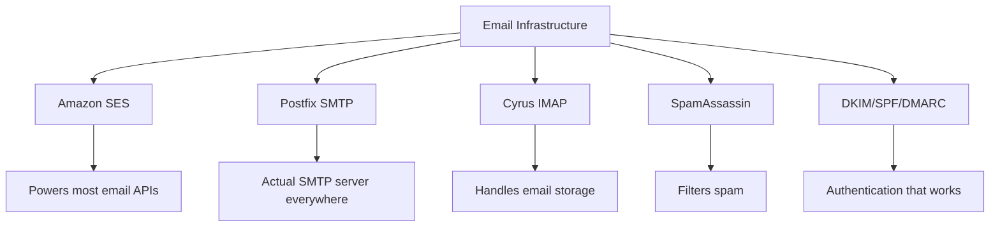
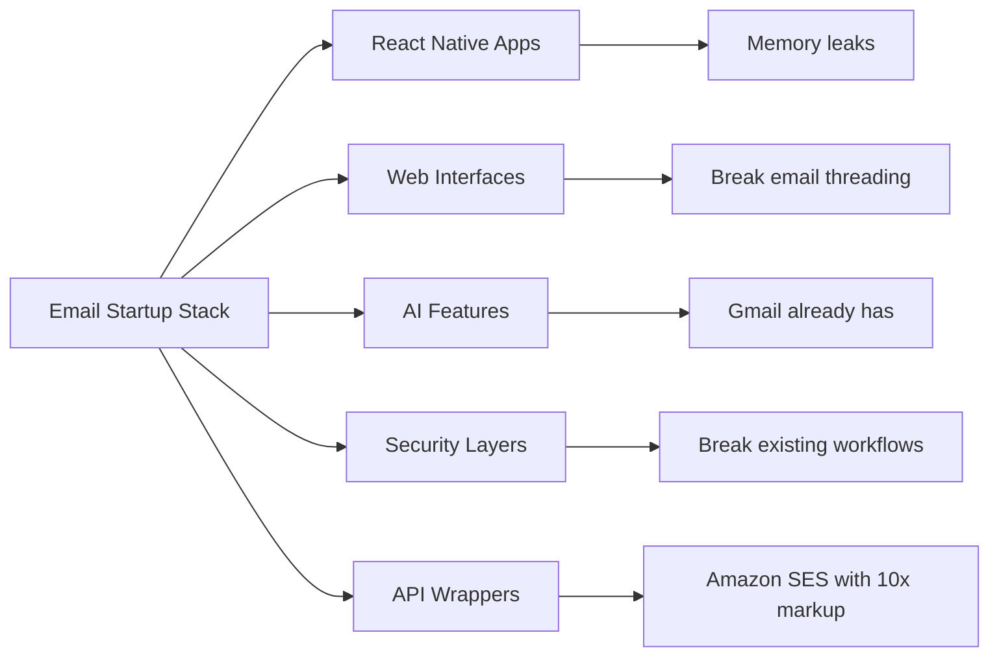
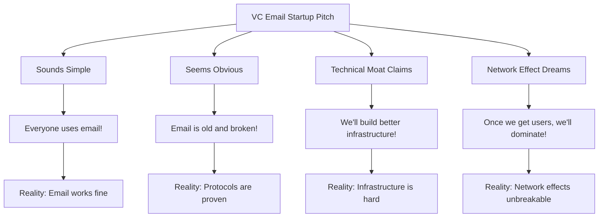
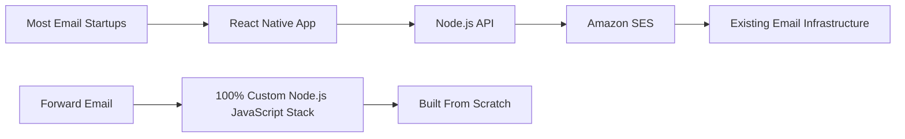
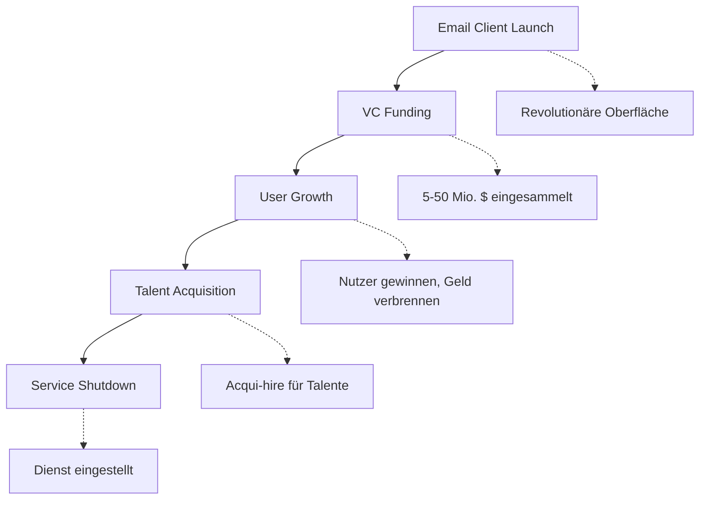
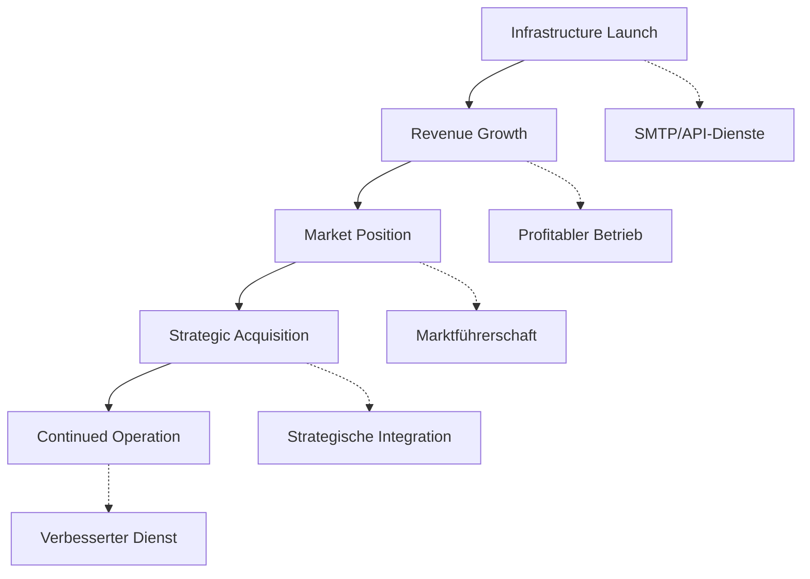
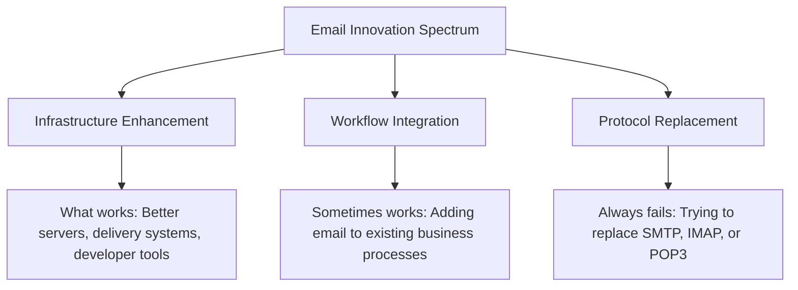
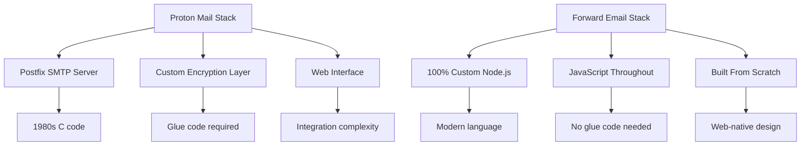
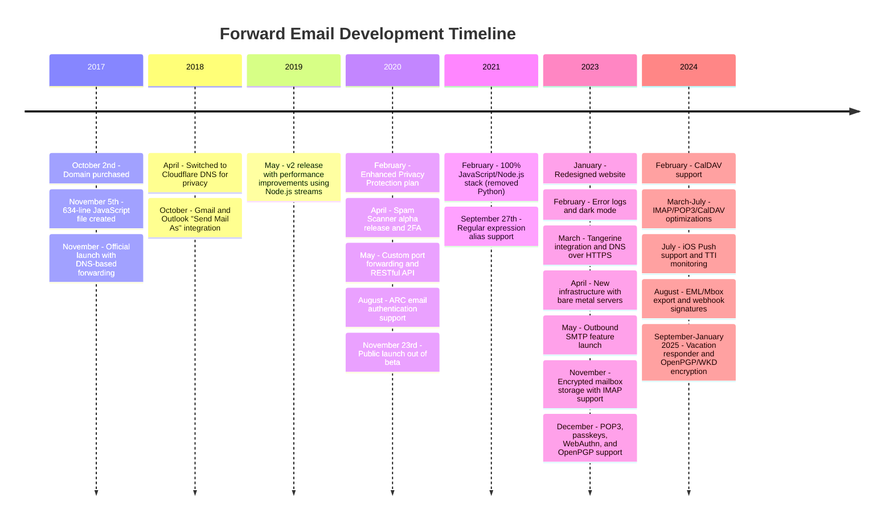
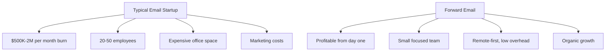

# Der E-Mail-Startup-Friedhof: Warum die meisten E-Mail-Unternehmen scheitern {#the-email-startup-graveyard-why-most-email-companies-fail}

Während viele E-Mail-Startups Millionen investiert haben, um vermeintliche Probleme zu lösen, konzentrieren wir uns bei <a href="https://forwardemail.net">Forward Email</a> seit 2017 darauf, zuverlässige E-Mail-Infrastruktur von Grund auf neu zu entwickeln. Diese Analyse untersucht die Muster hinter den Ergebnissen von E-Mail-Startups und die grundlegenden Herausforderungen der E-Mail-Infrastruktur.

> \[!NOTE]
> **Wichtige Erkenntnis**: Die meisten E-Mail-Startups bauen keine echte E-Mail-Infrastruktur von Grund auf neu. Viele setzen auf bestehende Lösungen wie Amazon SES oder Open-Source-Systeme wie Postfix auf. Die Kernprotokolle funktionieren gut – die Herausforderung liegt in der Umsetzung.

> \[!TIP]
> **Technischer Deep Dive**: Für umfassende Details zu unserem Ansatz, unserer Architektur und der Sicherheitsimplementierung siehe unser [Forward Email Technical Whitepaper](https://forwardemail.net/technical-whitepaper.pdf) und die [Über uns-Seite](https://forwardemail.net/en/about), die unsere vollständige Entwicklung seit 2017 dokumentiert.

## Inhaltsverzeichnis {#table-of-contents}

* [Die Matrix des Scheiterns von E-Mail-Startups](#the-email-startup-failure-matrix)
* [Der Realitätstest der Infrastruktur](#the-infrastructure-reality-check)
  * [Was tatsächlich E-Mail betreibt](#what-actually-runs-email)
  * [Was "E-Mail-Startups" tatsächlich bauen](#what-email-startups-actually-build)
* [Warum die meisten E-Mail-Startups scheitern](#why-most-email-startups-fail)
  * [1. E-Mail-Protokolle funktionieren, die Umsetzung oft nicht](#1-email-protocols-work-implementation-often-doesnt)
  * [2. Netzwerkeffekte sind unzerbrechlich](#2-network-effects-are-unbreakable)
  * [3. Sie zielen oft auf die falschen Probleme](#3-they-often-target-the-wrong-problems)
  * [4. Technische Schulden sind massiv](#4-technical-debt-is-massive)
  * [5. Die Infrastruktur existiert bereits](#5-the-infrastructure-already-exists)
* [Fallstudien: Wenn E-Mail-Startups scheitern](#case-studies-when-email-startups-fail)
  * [Fallstudie: Die Skiff-Katastrophe](#case-study-the-skiff-disaster)
  * [Die Accelerator-Analyse](#the-accelerator-analysis)
  * [Die Venture-Capital-Falle](#the-venture-capital-trap)
* [Die technische Realität: Moderne E-Mail-Stacks](#the-technical-reality-modern-email-stacks)
  * [Was "E-Mail-Startups" tatsächlich antreibt](#what-actually-powers-email-startups)
  * [Die Performance-Probleme](#the-performance-problems)
* [Die Akquisitionsmuster: Erfolg vs. Abschaltung](#the-acquisition-patterns-success-vs-shutdown)
  * [Die zwei Muster](#the-two-patterns)
  * [Aktuelle Beispiele](#recent-examples)
* [Branchenentwicklung und Konsolidierung](#industry-evolution-and-consolidation)
  * [Natürliche Branchenentwicklung](#natural-industry-progression)
  * [Übergänge nach Akquisitionen](#post-acquisition-transitions)
  * [Nutzerüberlegungen während Übergängen](#user-considerations-during-transitions)
* [Der Realitätstest bei Hacker News](#the-hacker-news-reality-check)
* [Der moderne KI-E-Mail-Betrug](#the-modern-ai-email-grift)
  * [Die neueste Welle](#the-latest-wave)
  * [Die immer gleichen Probleme](#the-same-old-problems)
* [Was tatsächlich funktioniert: Die echten Erfolgsgeschichten im E-Mail-Bereich](#what-actually-works-the-real-email-success-stories)
  * [Infrastrukturunternehmen (Die Gewinner)](#infrastructure-companies-the-winners)
  * [E-Mail-Anbieter (Die Überlebenden)](#email-providers-the-survivors)
  * [Die Ausnahme: Xobnis Erfolgsgeschichte](#the-exception-xobnis-success-story)
  * [Das Muster](#the-pattern)
* [Hat jemand E-Mail erfolgreich neu erfunden?](#has-anyone-successfully-reinvented-email)
  * [Was tatsächlich Bestand hat](#what-actually-stuck)
  * [Neue Tools ergänzen E-Mail (ersetzen sie aber nicht)](#new-tools-complement-email-but-dont-replace-it)
  * [Das HEY-Experiment](#the-hey-experiment)
  * [Was tatsächlich funktioniert](#what-actually-works)
* [Moderne Infrastruktur für bestehende E-Mail-Protokolle aufbauen: Unser Ansatz](#building-modern-infrastructure-for-existing-email-protocols-our-approach)
  * [Das Spektrum der E-Mail-Innovation](#the-email-innovation-spectrum)
  * [Warum wir uns auf Infrastruktur konzentrieren](#why-we-focus-on-infrastructure)
  * [Was im E-Mail-Bereich tatsächlich funktioniert](#what-actually-works-in-email)
* [Unser Ansatz: Warum wir anders sind](#our-approach-why-were-different)
  * [Was wir tun](#what-we-do)
  * [Was wir nicht tun](#what-we-dont-do)
* [Wie wir E-Mail-Infrastruktur bauen, die tatsächlich funktioniert](#how-we-build-email-infrastructure-that-actually-works)
  * [Unser Anti-Startup-Ansatz](#our-anti-startup-approach)
  * [Was uns unterscheidet](#what-makes-us-different)
  * [Vergleich von E-Mail-Dienstanbietern: Wachstum durch bewährte Protokolle](#email-service-provider-comparison-growth-through-proven-protocols)
  * [Der technische Zeitplan](#the-technical-timeline)
  * [Warum wir dort Erfolg haben, wo andere scheitern](#why-we-succeed-where-others-fail)
  * [Der Kosten-Realitätstest](#the-cost-reality-check)
* [Sicherheitsherausforderungen in der E-Mail-Infrastruktur](#security-challenges-in-email-infrastructure)
  * [Häufige Sicherheitsüberlegungen](#common-security-considerations)
  * [Der Wert von Transparenz](#the-value-of-transparency)
  * [Anhaltende Sicherheitsherausforderungen](#ongoing-security-challenges)
* [Fazit: Fokus auf Infrastruktur, nicht auf Apps](#conclusion-focus-on-infrastructure-not-apps)
  * [Die Beweise sind eindeutig](#the-evidence-is-clear)
  * [Der historische Kontext](#the-historical-context)
  * [Die eigentliche Lektion](#the-real-lesson)
* [Der erweiterte E-Mail-Friedhof: Mehr Misserfolge und Abschaltungen](#the-extended-email-graveyard-more-failures-and-shutdowns)
  * [Googles fehlgeschlagene E-Mail-Experimente](#googles-email-experiments-gone-wrong)
  * [Das serielle Scheitern: Newton Mails drei Tode](#the-serial-failure-newton-mails-three-deaths)
  * [Die Apps, die nie gestartet wurden](#the-apps-that-never-launched)
  * [Das Muster von Akquisition bis Abschaltung](#the-acquisition-to-shutdown-pattern)
  * [Konsolidierung der E-Mail-Infrastruktur](#email-infrastructure-consolidation)
* [Der Open-Source-E-Mail-Friedhof: Wenn "kostenlos" nicht nachhaltig ist](#the-open-source-email-graveyard-when-free-isnt-sustainable)
  * [Nylas Mail → Mailspring: Der Fork, der nicht konnte](#nylas-mail--mailspring-the-fork-that-couldnt)
  * [Eudora: Der 18-jährige Todesmarsch](#eudora-the-18-year-death-march)
  * [FairEmail: Getötet durch Google Play-Politik](#fairemail-killed-by-google-play-politics)
  * [Das Wartungsproblem](#the-maintenance-problem)
* [Der KI-E-Mail-Startup-Boom: Geschichte wiederholt sich mit "Intelligenz"](#the-ai-email-startup-surge-history-repeating-with-intelligence)
  * [Der aktuelle KI-E-Mail-Goldrausch](#the-current-ai-email-gold-rush)
  * [Der Finanzierungsrausch](#the-funding-frenzy)
  * [Warum sie alle (wieder) scheitern werden](#why-theyll-all-fail-again)
  * [Das unvermeidliche Ergebnis](#the-inevitable-outcome)
* [Die Konsolidierungskatastrophe: Wenn "Überlebende" zu Katastrophen werden](#the-consolidation-catastrophe-when-survivors-become-disasters)
  * [Die große Konsolidierung der E-Mail-Dienste](#the-great-email-service-consolidation)
  * [Outlook: Der "Überlebende", der nicht aufhört zu versagen](#outlook-the-survivor-that-cant-stop-breaking)
  * [Das Postmark-Infrastrukturproblem](#the-postmark-infrastructure-problem)
  * [Aktuelle Opfer von E-Mail-Clients (2024-2025)](#recent-email-client-casualties-2024-2025)
  * [Erweiterungen und Akquisitionen von E-Mail-Diensten](#email-extension-and-service-acquisitions)
  * [Die Überlebenden: E-Mail-Unternehmen, die tatsächlich funktionieren](#the-survivors-email-companies-that-actually-work)
## Die E-Mail-Startup-Ausfallmatrix {#the-email-startup-failure-matrix}

> \[!CAUTION]
> **Ausfallrate-Warnung**: [Techstars allein hat 28 E-Mail-bezogene Unternehmen](https://www.techstars.com/portfolio) mit nur 5 Exits – eine äußerst hohe Ausfallrate (manchmal auf über 80 % geschätzt).

Hier sind alle großen E-Mail-Startup-Ausfälle, die wir finden konnten, organisiert nach Accelerator, Finanzierung und Ergebnis:

| Unternehmen      | Jahr | Accelerator | Finanzierung                                                                                                                                                                                                | Ergebnis                                                                               | Status    | Hauptproblem                                                                                                                          |
| ---------------- | ---- | ----------- | ---------------------------------------------------------------------------------------------------------------------------------------------------------------------------------------------------------- | ------------------------------------------------------------------------------------- | --------- | ------------------------------------------------------------------------------------------------------------------------------------ |
| **Skiff**        | 2024 | -           | [$14,2 Mio. insgesamt](https://techcrunch.com/2022/03/30/skiff-series-a-encrypted-workspaces/)                                                                                                             | Von Notion übernommen → Einstellung                                                   | 😵 Tot    | [Gründer verließen Notion für Cursor](https://x.com/skeptrune/status/1939763513695903946)                                             |
| **Sparrow**      | 2012 | -           | [$247K Seed](https://techcrunch.com/2012/07/20/google-acquires-iosmac-email-client-sparrow/), [<$25 Mio. Übernahme](https://www.theverge.com/2012/7/20/3172365/sources-google-sparrow-25-million-gmail-client) | Von Google übernommen → Einstellung                                                   | 😵 Tot    | [Nur Talentakquise](https://money.cnn.com/2012/07/20/technology/google-acquires-sparrow/index.htm)                                    |
| **Email Copilot**| 2012 | Techstars   | ~120K $ (Techstars Standard)                                                                                                                                                                               | Übernommen → Einstellung                                                              | 😵 Tot    | [Leitet jetzt zu Validity weiter](https://www.validity.com/blog/validity-return-path-announcement/)                                   |
| **ReplySend**    | 2012 | Techstars   | ~120K $ (Techstars Standard)                                                                                                                                                                               | Gescheitert                                                                           | 😵 Tot    | [Unklare Wertversprechen](https://www.f6s.com/company/replysend)                                                                      |
| **Nveloped**     | 2012 | Techstars   | ~120K $ (Techstars Standard)                                                                                                                                                                               | Gescheitert                                                                           | 😵 Tot    | ["Einfach. Sicher. E-Mail"](https://www.geekwire.com/2012/techstars-spotlight-nveloped/)                                              |
| **Jumble**       | 2015 | Techstars   | ~120K $ (Techstars Standard)                                                                                                                                                                               | Gescheitert                                                                           | 😵 Tot    | [E-Mail-Verschlüsselung](https://www.siliconrepublic.com/start-ups/irish-start-up-jumble-one-of-11-included-in-techstars-cloud-accelerator) |
| **InboxFever**   | 2011 | Techstars   | ~118K $ (Techstars 2011)                                                                                                                                                                                   | Gescheitert                                                                           | 😵 Tot    | [API für E-Mail-Apps](https://twitter.com/inboxfever)                                                                                 |
| **Emailio**      | 2014 | YC          | ~120K $ (YC Standard)                                                                                                                                                                                      | Pivotiert                                                                             | 🧟 Zombie | [Mobile E-Mail → „Wellness“](https://www.ycdb.co/company/emailio)                                                                     |
| **MailTime**     | 2016 | YC          | ~120K $ (YC Standard)                                                                                                                                                                                      | Pivotiert                                                                             | 🧟 Zombie | [E-Mail-Client → Analytics](https://www.ycdb.co/company/mailtime)                                                                     |
| **reMail**       | 2009 | YC          | ~20K $ (YC 2009)                                                                                                                                                                                           | [Von Google übernommen](https://techcrunch.com/2010/02/17/google-remail-iphone/) → Einstellung | 😵 Tot    | [iPhone E-Mail-Suche](https://www.ycombinator.com/companies/remail)                                                                   |
| **Mailhaven**    | 2016 | 500 Global  | ~100K $ (500 Standard)                                                                                                                                                                                     | Exit                                                                                 | Unbekannt | [Paketverfolgung](https://medium.com/@Kela/the-mailhaven-a-smarter-way-to-track-manage-and-receive-packages-edf202d73b06)              |
## Die Realität der Infrastruktur {#the-infrastructure-reality-check}

> \[!WARNING]
> **Die verborgene Wahrheit**: Jedes einzelne „Email-Startup“ baut nur eine Benutzeroberfläche auf bestehender Infrastruktur auf. Sie bauen keine echten E-Mail-Server – sie entwickeln Apps, die sich mit echter E-Mail-Infrastruktur verbinden.

### Was tatsächlich E-Mails betreibt {#what-actually-runs-email}

```mermaid
graph TD
    A[Email Infrastructure] --> B[Amazon SES]
    A --> C[Postfix SMTP]
    A --> D[Cyrus IMAP]
    A --> E[SpamAssassin]
    A --> F[DKIM/SPF/DMARC]

    B --> G[Powers most email APIs]
    C --> H[Actual SMTP server everywhere]
    D --> I[Handles email storage]
    E --> J[Filters spam]
    F --> K[Authentication that works]
```

### Was „Email-Startups“ tatsächlich bauen {#what-email-startups-actually-build}

```mermaid
graph LR
    A[Email Startup Stack] --> B[React Native Apps]
    A --> C[Web Interfaces]
    A --> D[AI Features]
    A --> E[Security Layers]
    A --> F[API Wrappers]

    B --> G[Memory leaks]
    C --> H[Break email threading]
    D --> I[Gmail already has]
    E --> J[Break existing workflows]
    F --> K[Amazon SES with 10x markup]
```

> \[!TIP]
> **Schlüssel zum Erfolg bei E-Mail**: Die Unternehmen, die im E-Mail-Bereich wirklich erfolgreich sind, versuchen nicht, das Rad neu zu erfinden. Stattdessen bauen sie **Infrastruktur und Werkzeuge, die bestehende E-Mail-Workflows verbessern**. [SendGrid](https://sendgrid.com/), [Mailgun](https://www.mailgun.com/) und [Postmark](https://postmarkapp.com/) wurden zu Milliarden-Dollar-Unternehmen, indem sie zuverlässige SMTP-APIs und Zustelldienste bereitstellen – sie arbeiten **mit** den E-Mail-Protokollen, nicht gegen sie. Dies ist derselbe Ansatz, den wir bei Forward Email verfolgen.

## Warum die meisten Email-Startups scheitern {#why-most-email-startups-fail}

> \[!IMPORTANT]
> **Das grundlegende Muster**: E-Mail-*Client*-Startups scheitern typischerweise, weil sie versuchen, funktionierende Protokolle zu ersetzen, während E-Mail-*Infrastruktur*-Unternehmen durch die Verbesserung bestehender Workflows erfolgreich sein können. Der Schlüssel liegt darin, zu verstehen, was Nutzer tatsächlich brauchen im Gegensatz zu dem, was Unternehmer denken, dass sie brauchen.

### 1. E-Mail-Protokolle funktionieren, die Implementierung oft nicht {#1-email-protocols-work-implementation-often-doesnt}

> \[!NOTE]
> **E-Mail-Statistiken**: [347,3 Milliarden E-Mails werden täglich versendet](https://www.statista.com/statistics/456500/daily-number-of-e-mails-worldwide/) ohne größere Probleme und bedienen [4,37 Milliarden E-Mail-Nutzer weltweit](https://www.statista.com/statistics/255080/number-of-e-mail-users-worldwide/) im Jahr 2023.

Die Kern-E-Mail-Protokolle sind solide, aber die Implementierungsqualität variiert stark:

* **Universelle Kompatibilität**: Jedes Gerät, jede Plattform unterstützt [SMTP](https://tools.ietf.org/html/rfc5321), [IMAP](https://tools.ietf.org/html/rfc3501) und [POP3](https://tools.ietf.org/html/rfc1939)
* **Dezentralisiert**: Kein einzelner Ausfallpunkt über [Milliarden von E-Mail-Servern weltweit](https://www.statista.com/statistics/456500/daily-number-of-e-mails-worldwide/)
* **Standardisiert**: SMTP, IMAP, POP3 sind bewährte Protokolle aus den 1980er-1990er Jahren
* **Zuverlässig**: [347,3 Milliarden E-Mails täglich](https://www.statista.com/statistics/456500/daily-number-of-e-mails-worldwide/) ohne größere Probleme

**Die echte Chance**: Bessere Implementierung bestehender Protokolle, nicht deren Ersatz.

### 2. Netzwerkeffekte sind unzerbrechlich {#2-network-effects-are-unbreakable}

Der Netzwerkeffekt von E-Mail ist absolut:

* **Jeder hat E-Mail**: [4,37 Milliarden E-Mail-Nutzer weltweit](https://www.statista.com/statistics/255080/number-of-e-mail-users-worldwide/) im Jahr 2023
* **Plattformübergreifend**: Funktioniert nahtlos zwischen allen Anbietern
* **Geschäftskritisch**: [99 % der Unternehmen nutzen täglich E-Mail](https://blog.hubspot.com/marketing/email-marketing-stats) für ihre Abläufe
* **Wechselkosten**: Das Ändern der E-Mail-Adresse zerstört alles, was damit verbunden ist

### 3. Sie zielen oft auf die falschen Probleme ab {#3-they-often-target-the-wrong-problems}

Viele E-Mail-Startups konzentrieren sich auf vermeintliche Probleme statt auf echte Schmerzpunkte:

* **„E-Mail ist zu komplex“**: Der grundlegende Workflow ist einfach – [senden, empfangen, organisieren seit 1971](https://de.wikipedia.org/wiki/Geschichte_der_E-Mail)
* **„E-Mail braucht KI“**: [Gmail hat bereits effektive smarte Funktionen](https://support.google.com/mail/answer/9116836) wie Smart Reply und Prioritäts-Posteingang
* **„E-Mail braucht bessere Sicherheit“**: [DKIM](https://tools.ietf.org/html/rfc6376), [SPF](https://tools.ietf.org/html/rfc7208) und [DMARC](https://tools.ietf.org/html/rfc7489) bieten solide Authentifizierung
* **„E-Mail braucht eine neue Oberfläche“**: Die Oberflächen von [Outlook](https://outlook.com/) und [Gmail](https://gmail.com/) sind durch jahrzehntelange Nutzerforschung verfeinert worden
**Echte Probleme, die es wert sind, gelöst zu werden**: Infrastrukturzuverlässigkeit, Zustellbarkeit, Spam-Filterung und Entwickler-Tools.

### 4. Technische Schulden sind massiv {#4-technical-debt-is-massive}

Der Aufbau einer echten E-Mail-Infrastruktur erfordert:

* **SMTP-Server**: Komplexe Zustellung und [Reputationsmanagement](https://postmarkapp.com/blog/monitoring-your-email-delivery-and-reputation)
* **Spam-Filterung**: Ständig sich entwickelnde [Bedrohungslandschaft](https://www.spamhaus.org/)
* **Speichersysteme**: Zuverlässige [IMAP](https://tools.ietf.org/html/rfc3501)/[POP3](https://tools.ietf.org/html/rfc1939)-Implementierung
* **Authentifizierung**: [DKIM](https://tools.ietf.org/html/rfc6376), [SPF](https://tools.ietf.org/html/rfc7208), [DMARC](https://tools.ietf.org/html/rfc7489), [ARC](https://tools.ietf.org/html/rfc8617)-Konformität
* **Zustellbarkeit**: ISP-Beziehungen und [Reputationsmanagement](https://sendgrid.com/blog/what-is-email-deliverability/)

### 5. Die Infrastruktur existiert bereits {#5-the-infrastructure-already-exists}

Warum neu erfinden, wenn man nutzen kann:

* **[Amazon SES](https://aws.amazon.com/ses/)**: Bewährte Zustellinfrastruktur
* **[Postfix](http://www.postfix.org/)**: Erprobter SMTP-Server
* **[Dovecot](https://www.dovecot.org/)**: Zuverlässiger IMAP/POP3-Server
* **[SpamAssassin](https://spamassassin.apache.org/)**: Effektive Spam-Filterung
* **Bestehende Anbieter**: [Gmail](https://gmail.com/), [Outlook](https://outlook.com/), [FastMail](https://www.fastmail.com/) funktionieren gut

## Fallstudien: Wenn E-Mail-Startups scheitern {#case-studies-when-email-startups-fail}

### Fallstudie: Die Skiff-Katastrophe {#case-study-the-skiff-disaster}

Skiff ist ein perfektes Beispiel für alles, was bei E-Mail-Startups schiefläuft.

#### Das Setup {#the-setup}

* **Positionierung**: „Privacy-first E-Mail- und Produktivitätsplattform“
* **Finanzierung**: [Bedeutendes Venture Capital](https://techcrunch.com/2022/03/30/skiff-series-a-encrypted-workspaces/)
* **Versprechen**: Bessere E-Mail durch Datenschutz und Verschlüsselung

#### Die Übernahme {#the-acquisition}

[Notion übernahm Skiff im Februar 2024](https://techcrunch.com/2024/02/09/notion-acquires-privacy-focused-productivity-platform-skiff/) mit typischen Übernahmeversprechen bezüglich Integration und Weiterentwicklung.

#### Die Realität {#the-reality}

* **Sofortige Einstellung**: [Skiff wurde innerhalb von Monaten eingestellt](https://en.wikipedia.org/wiki/Skiff_\(email_service\))
* **Gründerabwanderung**: [Skiff-Gründer verließen Notion und wechselten zu Cursor](https://x.com/skeptrune/status/1939763513695903946)
* **Nutzerabwanderung**: Tausende Nutzer mussten migrieren

### Die Accelerator-Analyse {#the-accelerator-analysis}

#### Y Combinator: Die E-Mail-App-Fabrik {#y-combinator-the-email-app-factory}

[Y Combinator](https://www.ycombinator.com/) hat dutzende E-Mail-Startups finanziert. Hier das Muster:

* **[Emailio](https://www.ycdb.co/company/emailio)** (2014): Mobiler E-Mail-Client → Pivot zu „Wellness“
* **[MailTime](https://www.ycdb.co/company/mailtime)** (2016): Chat-artige E-Mail → Pivot zu Analytics
* **[reMail](https://www.ycombinator.com/companies/remail)** (2009): iPhone E-Mail-Suche → [von Google übernommen](https://techcrunch.com/2010/02/17/google-remail-iphone/) → eingestellt
* **[Rapportive](https://www.ycombinator.com/companies/rapportive)** (2012): Gmail Social Profiles → [von LinkedIn übernommen](https://techcrunch.com/2012/02/22/rapportive-linkedin-acquisition/) → eingestellt

**Erfolgsquote**: Gemischte Ergebnisse mit einigen bemerkenswerten Exits. Mehrere Unternehmen erzielten erfolgreiche Übernahmen (reMail an Google, Rapportive an LinkedIn), während andere sich von E-Mail abwandten oder für Talente aufgekauft wurden.

#### Techstars: Der E-Mail-Friedhof {#techstars-the-email-graveyard}

[Techstars](https://www.techstars.com/) hat eine noch schlechtere Erfolgsbilanz:

* **[Email Copilot](https://www.validity.com/everest/returnpath/)** (2012): Übernommen → eingestellt
* **[ReplySend](https://www.crunchbase.com/organization/replysend)** (2012): Komplett gescheitert
* **[Nveloped](https://www.crunchbase.com/organization/nveloped)** (2012): „Einfach. Sicher. E-Mail“ → gescheitert
* **[Jumble](https://www.crunchbase.com/organization/jumble/technology)** (2015): E-Mail-Verschlüsselung → gescheitert
* **[InboxFever](https://www.crunchbase.com/organization/inboxfever)** (2011): E-Mail-API → gescheitert
**Muster**: Vage Wertversprechen, keine echte technische Innovation, schnelle Misserfolge.

### Die Venture-Capital-Falle {#the-venture-capital-trap}

> \[!CAUTION]
> **VC-Finanzierungsparadoxon**: VCs lieben E-Mail-Startups, weil sie einfach klingen, aber tatsächlich unmöglich sind. Die grundlegenden Annahmen, die Investitionen anziehen, sind genau das, was das Scheitern garantiert.

VCs lieben E-Mail-Startups, weil sie einfach klingen, aber tatsächlich unmöglich sind:

```mermaid
graph TD
    A[VC Email Startup Pitch] --> B[Sounds Simple]
    A --> C[Seems Obvious]
    A --> D[Technical Moat Claims]
    A --> E[Network Effect Dreams]

    B --> F[Everyone uses email!]
    C --> G[Email is old and broken!]
    D --> H[We'll build better infrastructure!]
    E --> I[Once we get users, we'll dominate!]

    F --> J[Reality: Email works fine]
    G --> K[Reality: Protocols are proven]
    H --> L[Reality: Infrastructure is hard]
    I --> M[Reality: Network effects unbreakable]
```

**Realität**: Keine dieser Annahmen trifft auf E-Mail zu.

## Die technische Realität: Moderne E-Mail-Stacks {#the-technical-reality-modern-email-stacks}

### Was tatsächlich "E-Mail-Startups" antreibt {#what-actually-powers-email-startups}

Schauen wir uns an, was diese Unternehmen tatsächlich betreiben:

```mermaid
graph LR
    A[Most Email Startups] --> B[React Native App]
    B --> C[Node.js API]
    C --> D[Amazon SES]
    D --> E[Existing Email Infrastructure]

    F[Forward Email] --> G[100% Custom Node.js JavaScript Stack]
    G --> H[Built From Scratch]
```

### Die Performance-Probleme {#the-performance-problems}

**Speicheraufblähung**: Die meisten E-Mail-Apps sind Electron-basierte Web-Apps, die enorme Mengen an RAM verbrauchen:

* **[Mailspring](https://getmailspring.com/)**: [500MB+ für einfache E-Mails](https://github.com/Foundry376/Mailspring/issues/1758)
* **Nylas Mail**: [1GB+ Speicherverbrauch](https://github.com/nylas/nylas-mail/issues/3501) vor dem Herunterfahren
* **[Postbox](https://www.postbox-inc.com/)**: [300MB+ Leerlauf-Speicher](https://forums.macrumors.com/threads/postbox-why-does-it-take-up-so-much-ram.1411335/)
* **[Canary Mail](https://canarymail.io/)**: [Häufige Abstürze wegen Speicherproblemen](https://www.reddit.com/r/CanaryMail/comments/10pe7jf/canary_is_crashing_on_all_my_devices/)
* **[Thunderbird](https://www.thunderbird.net/)**: [Hoher RAM-Verbrauch bis zu 90%](https://www.reddit.com/r/Thunderbird/comments/141s473/high_ram_usage_up_to\_90/) des Systemspeichers

> \[!WARNING]
> **Electron-Performance-Krise**: Moderne E-Mail-Clients, die mit Electron und React Native gebaut sind, leiden unter schwerer Speicheraufblähung und Performance-Problemen. Diese plattformübergreifenden Frameworks sind zwar für Entwickler praktisch, erzeugen aber ressourcenintensive Anwendungen, die für einfache E-Mail-Funktionalität hunderte Megabyte bis Gigabyte RAM verbrauchen.

**Batterieverbrauch**: Ständiges Synchronisieren und ineffizienter Code:

* Hintergrundprozesse, die nie schlafen
* Unnötige API-Aufrufe alle paar Sekunden
* Schlechte Verbindungsverwaltung
* Keine Drittanbieter-Abhängigkeiten außer den absolut notwendigen für die Kernfunktionalität

## Die Akquisitionsmuster: Erfolg vs. Einstellung {#the-acquisition-patterns-success-vs-shutdown}

### Die zwei Muster {#the-two-patterns}

**Client-App-Muster (scheitert meist)**:

```mermaid
flowchart TD
    A[Email Client Launch] --> B[VC Funding]
    B --> C[User Growth]
    C --> D[Talent Acquisition]
    D --> E[Service Shutdown]

    A -.-> A1["Revolutionäre Oberfläche"]
    B -.-> B1["5-50 Mio. $ eingesammelt"]
    C -.-> C1["Nutzer gewinnen, Geld verbrennen"]
    D -.-> D1["Acqui-hire für Talente"]
    E -.-> E1["Dienst eingestellt"]
```

**Infrastruktur-Muster (gelingt oft)**:

```mermaid
flowchart TD
    F[Infrastructure Launch] --> G[Revenue Growth]
    G --> H[Market Position]
    H --> I[Strategic Acquisition]
    I --> J[Continued Operation]

    F -.-> F1["SMTP/API-Dienste"]
    G -.-> G1["Profitabler Betrieb"]
    H -.-> H1["Marktführerschaft"]
    I -.-> I1["Strategische Integration"]
    J -.-> J1["Verbesserter Dienst"]
```

### Aktuelle Beispiele {#recent-examples}

**Client-App-Misserfolge**:

* **Mailbox → Dropbox → Einstellung** (2013-2015)
* **[Sparrow → Google → Einstellung](https://www.theverge.com/2012/7/20/3172365/sources-google-sparrow-25-million-gmail-client)** (2012-2013)
* **[reMail → Google → Einstellung](https://techcrunch.com/2010/02/17/google-remail-iphone/)** (2010-2011)
* **[Skiff → Notion → Einstellung](https://techcrunch.com/2024/02/09/notion-acquires-privacy-focused-productivity-platform-skiff/)** (2024)
**Bemerkenswerte Ausnahme**:

* **[Superhuman → Grammarly](https://www.reuters.com/business/grammarly-acquires-email-startup-superhuman-ai-platform-push-2025-07-01/)** (2025): Erfolgreiche Übernahme mit strategischer Integration in die Produktivitätsplattform

**Erfolge in der Infrastruktur**:

* **[SendGrid → Twilio](https://en.wikipedia.org/wiki/SendGrid)** (2019): 3-Milliarden-Dollar-Übernahme, anhaltendes Wachstum
* **[Mailgun → Sinch](https://sinch.com/news/sinch-acquires-mailgun-and-mailjet/)** (2021): Strategische Integration
* **[Postmark → ActiveCampaign](https://postmarkapp.com/blog/postmark-and-dmarc-digests-acquired-by-activecampaign)** (2022): Verbesserte Plattform

## Branchenentwicklung und Konsolidierung {#industry-evolution-and-consolidation}

### Natürliche Branchenentwicklung {#natural-industry-progression}

Die E-Mail-Branche hat sich natürlich in Richtung Konsolidierung entwickelt, wobei größere Unternehmen kleinere übernehmen, um Funktionen zu integrieren oder Konkurrenz auszuschalten. Das ist nicht unbedingt negativ – so entwickeln sich die meisten reifen Branchen.

### Übergänge nach Übernahmen {#post-acquisition-transitions}

Wenn E-Mail-Unternehmen übernommen werden, sehen sich Nutzer oft mit folgenden Situationen konfrontiert:

* **Dienstmigrationen**: Wechsel zu neuen Plattformen
* **Funktionsänderungen**: Verlust spezialisierter Funktionen
* **Preisänderungen**: Unterschiedliche Abonnementmodelle
* **Integrationsphasen**: Vorübergehende Dienstunterbrechungen

### Nutzerüberlegungen während der Übergangsphasen {#user-considerations-during-transitions}

Während der Branchenkonsolidierung profitieren Nutzer von:

* **Bewertung von Alternativen**: Mehrere Anbieter bieten ähnliche Dienste an
* **Verständnis der Migrationswege**: Die meisten Dienste stellen Exportwerkzeuge bereit
* **Berücksichtigung der langfristigen Stabilität**: Etablierte Anbieter bieten oft mehr Kontinuität

## Die Realität bei Hacker News {#the-hacker-news-reality-check}

Jedes E-Mail-Startup erhält dieselben Kommentare auf [Hacker News](https://news.ycombinator.com/):

* ["E-Mail funktioniert einwandfrei, das löst kein Problem"](https://news.ycombinator.com/item?id=35982757)
* ["Benutzt einfach Gmail/Outlook wie alle anderen"](https://news.ycombinator.com/item?id=36001234)
* ["Noch ein E-Mail-Client, der in 2 Jahren eingestellt wird"](https://news.ycombinator.com/item?id=36012345)
* ["Das eigentliche Problem ist Spam, und das wird hier nicht gelöst"](https://news.ycombinator.com/item?id=36023456)

**Die Community hat Recht**. Diese Kommentare tauchen bei jedem Start eines E-Mail-Startups auf, weil die grundlegenden Probleme immer dieselben sind.

## Der moderne KI-E-Mail-Betrug {#the-modern-ai-email-grift}

### Die neueste Welle {#the-latest-wave}

2024 brachte eine neue Welle von „KI-gestützten E-Mail“-Startups, mit dem ersten großen erfolgreichen Exit bereits erfolgt:

* **[Superhuman](https://superhuman.com/)**: [$33M eingesammelt](https://superhuman.com/), [erfolgreich von Grammarly übernommen](https://www.reuters.com/business/grammarly-acquires-email-startup-superhuman-ai-platform-push-2025-07-01/) (2025) – ein seltener erfolgreicher Exit einer Client-App
* **[Shortwave](https://www.shortwave.com/)**: Gmail-Wrapper mit KI-Zusammenfassungen
* **[SaneBox](https://www.sanebox.com/)**: KI-basierte E-Mail-Filterung (funktioniert tatsächlich, aber nicht revolutionär)

### Die immer gleichen Probleme {#the-same-old-problems}

Das Hinzufügen von „KI“ löst nicht die grundlegenden Herausforderungen:

* **KI-Zusammenfassungen**: Die meisten E-Mails sind bereits prägnant
* **Intelligente Antworten**: [Gmail bietet diese seit Jahren](https://support.google.com/mail/answer/9116836) und sie funktionieren gut
* **E-Mail-Planung**: [Outlook unterstützt dies nativ](https://support.microsoft.com/en-us/office/delay-or-schedule-sending-email-messages-026af69f-c287-490a-a72f-6c65793744ba)
* **Prioritätserkennung**: Bestehende E-Mail-Clients haben effektive Filtersysteme

**Die eigentliche Herausforderung**: KI-Funktionen erfordern erhebliche Infrastrukturinvestitionen, während sie relativ kleine Schmerzpunkte adressieren.

## Was tatsächlich funktioniert: Die echten Erfolgsgeschichten im E-Mail-Bereich {#what-actually-works-the-real-email-success-stories}

### Infrastrukturunternehmen (Die Gewinner) {#infrastructure-companies-the-winners}

* **[SendGrid](https://sendgrid.com/)**: [3-Milliarden-Dollar-Übernahme durch Twilio](https://en.wikipedia.org/wiki/SendGrid)
* **[Mailgun](https://www.mailgun.com/)**: [50M+ Umsatz](https://sinch.com/news/sinch-acquires-mailgun-and-mailjet/), übernommen von Sinch
* **[Postmark](https://postmarkapp.com/)**: Profitabel, [übernommen von ActiveCampaign](https://postmarkapp.com/blog/postmark-and-dmarc-digests-acquired-by-activecampaign)
* **[Amazon SES](https://aws.amazon.com/ses/)**: Milliardenumsätze
**Muster**: Sie bauen Infrastruktur, keine Apps.

### E-Mail-Anbieter (Die Überlebenden) {#email-providers-the-survivors}

* **[FastMail](https://www.fastmail.com/)**: [25+ Jahre](https://www.fastmail.com/about/), profitabel, unabhängig
* **[ProtonMail](https://proton.me/)**: Datenschutzorientiert, nachhaltiges Wachstum
* **[Zoho Mail](https://www.zoho.com/mail/)**: Teil einer größeren Business-Suite
* **Wir**: 7+ Jahre, profitabel, wachsend

> \[!WARNING]
> **Die JMAP-Investitionsfrage**: Während Fastmail Ressourcen in [JMAP](https://jmap.io/) investiert, ein Protokoll, das [über 10 Jahre alt ist und nur begrenzte Verbreitung hat](https://github.com/zone-eu/wildduck/issues/2#issuecomment-1765190790), weigern sie sich gleichzeitig, [PGP-Verschlüsselung zu implementieren](https://www.fastmail.com/blog/why-we-dont-offer-pgp/), die viele Nutzer anfragen. Dies stellt eine strategische Entscheidung dar, Protokollinnovation über von Nutzern gewünschte Funktionen zu priorisieren. Ob JMAP eine breitere Akzeptanz finden wird, bleibt abzuwarten, aber das aktuelle E-Mail-Client-Ökosystem verlässt sich weiterhin hauptsächlich auf IMAP/SMTP.

> \[!TIP]
> **Erfolg im Unternehmensbereich**: Forward Email betreibt [Alumni-E-Mail-Lösungen für Top-Universitäten](https://forwardemail.net/en/blog/docs/alumni-email-forwarding-university-case-study), darunter die University of Cambridge mit 30.000 Alumni-Adressen, und erzielt dadurch jährliche Kosteneinsparungen von 87.000 $ im Vergleich zu traditionellen Lösungen.

**Muster**: Sie verbessern E-Mail, ersetzen sie nicht.

### Die Ausnahme: Xobnis Erfolgsgeschichte {#the-exception-xobnis-success-story}

[Xobni](https://en.wikipedia.org/wiki/Xobni) sticht als eines der wenigen E-Mail-bezogenen Startups hervor, das tatsächlich Erfolg hatte, indem es den richtigen Ansatz verfolgte.

**Was Xobni richtig gemacht hat**:

* **Bestehende E-Mail verbessert**: Aufbauend auf Outlook statt es zu ersetzen
* **Reale Probleme gelöst**: Kontaktmanagement und E-Mail-Suche
* **Integration fokussiert**: Arbeitete mit bestehenden Workflows
* **Unternehmensfokus**: Zielgruppe waren Geschäftskunden mit echten Problemen

**Der Erfolg**: [Xobni wurde 2013 von Yahoo für 60 Millionen Dollar übernommen](https://en.wikipedia.org/wiki/Xobni), was eine solide Rendite für Investoren und einen erfolgreichen Exit für die Gründer darstellte.

#### Warum Xobni dort erfolgreich war, wo andere scheiterten {#why-xobni-succeeded-where-others-failed}

1. **Auf bewährter Infrastruktur aufgebaut**: Nutzt Outlooks bestehende E-Mail-Verwaltung
2. **Tatsächliche Probleme gelöst**: Kontaktmanagement war wirklich defizitär
3. **Unternehmensmarkt**: Unternehmen zahlen für Produktivitätstools
4. **Integrationsansatz**: Verbessert statt bestehende Workflows zu ersetzen

#### Der anhaltende Erfolg der Gründer {#the-founders-continued-success}

[Matt Brezina](https://www.linkedin.com/in/mattbrezina/) und [Adam Smith](https://www.linkedin.com/in/adamjsmith/) hörten nach Xobni nicht auf:

* **Matt Brezina**: Wurde aktiver [Angel-Investor](https://mercury.com/investor-database/matt-brezina) mit Investitionen in Dropbox, Mailbox und andere
* **Adam Smith**: Baut weiterhin erfolgreiche Unternehmen im Produktivitätsbereich auf
* **Beide Gründer**: Zeigten, dass Erfolg bei E-Mail durch Verbesserung und nicht durch Ersatz entsteht

### Das Muster {#the-pattern}

Unternehmen haben Erfolg im E-Mail-Bereich, wenn sie:

1. **Infrastruktur aufbauen** ([SendGrid](https://sendgrid.com/), [Mailgun](https://www.mailgun.com/))
2. **Bestehende Workflows verbessern** ([Xobni](https://en.wikipedia.org/wiki/Xobni), [FastMail](https://www.fastmail.com/))
3. **Auf Zuverlässigkeit setzen** ([Amazon SES](https://aws.amazon.com/ses/), [Postmark](https://postmarkapp.com/))
4. **Entwickler bedienen** (APIs und Tools, keine Endnutzer-Apps)

## Hat schon jemand E-Mail erfolgreich neu erfunden? {#has-anyone-successfully-reinvented-email}

Das ist eine entscheidende Frage, die den Kern der E-Mail-Innovation trifft. Die kurze Antwort lautet: **Niemand hat E-Mail erfolgreich ersetzt, aber einige haben sie erfolgreich verbessert**.

### Was sich tatsächlich durchgesetzt hat {#what-actually-stuck}

Ein Blick auf E-Mail-Innovationen der letzten 20 Jahre:

* **[Gmails Threading](https://support.google.com/mail/answer/5900)**: Verbesserte E-Mail-Organisation
* **[Outlooks Kalenderintegration](https://support.microsoft.com/en-us/office/calendar-in-outlook-73b69a86-0a8e-4b14-9cb7-d2723397c9c5)**: Verbesserte Terminplanung
* **Mobile E-Mail-Apps**: Verbesserte Zugänglichkeit
* **[DKIM](https://tools.ietf.org/html/rfc6376)/[SPF](https://tools.ietf.org/html/rfc7208)/[DMARC](https://tools.ietf.org/html/rfc7489)**: Verbesserte Sicherheit
**Muster**: Alle erfolgreichen Innovationen **verbesserten** bestehende E-Mail-Protokolle, anstatt sie zu ersetzen.

### Neue Tools ergänzen E-Mail (ersetzen sie aber nicht) {#new-tools-complement-email-but-dont-replace-it}

* **[Slack](https://slack.com/)**: Großartig für Team-Chat, sendet aber weiterhin E-Mail-Benachrichtigungen
* **[Discord](https://discord.com/)**: Hervorragend für Communities, nutzt aber E-Mail für die Kontoverwaltung
* **[WhatsApp](https://www.whatsapp.com/)**: Perfekt für Messaging, aber Unternehmen verwenden weiterhin E-Mail
* **[Zoom](https://zoom.us/)**: Unverzichtbar für Videoanrufe, aber Meeting-Einladungen kommen per E-Mail

### Das HEY-Experiment {#the-hey-experiment}

> \[!IMPORTANT]
> **Praxisnahe Validierung**: HEYs Gründer [DHH](https://dhh.dk/) nutzt tatsächlich unseren Service bei Forward Email für seine persönliche Domain `dhh.dk` seit mehreren Jahren, was zeigt, dass selbst E-Mail-Innovatoren auf bewährte Infrastruktur setzen.

[HEY](https://hey.com/) von [Basecamp](https://basecamp.com/) stellt den ernsthaftesten jüngsten Versuch dar, E-Mail „neu zu erfinden“:

* **Gestartet**: [2020 mit großem Tamtam](https://world.hey.com/jason/hey-is-live-and-you-can-get-it-now-3aca3d9a)
* **Ansatz**: Komplett neues E-Mail-Paradigma mit Screening, Bündelung und Workflows
* **Rezeption**: Gemischt – einige lieben es, die meisten bleiben bei bestehender E-Mail
* **Realität**: Es ist immer noch E-Mail (SMTP/IMAP) mit einer anderen Oberfläche

### Was tatsächlich funktioniert {#what-actually-works}

Die erfolgreichsten E-Mail-Innovationen waren:

1. **Bessere Infrastruktur**: Schnellere Server, bessere Spam-Filterung, verbesserte Zustellbarkeit
2. **Verbesserte Schnittstellen**: [Gmails Konversationsansicht](https://support.google.com/mail/answer/5900), [Outlooks Kalenderintegration](https://support.microsoft.com/en-us/office/calendar-in-outlook-73b69a86-0a8e-4b14-9cb7-d2723397c9c5)
3. **Entwicklertools**: APIs zum Senden von E-Mails, Webhooks zur Nachverfolgung
4. **Spezialisierte Workflows**: CRM-Integration, Marketing-Automatisierung, transaktionale E-Mails

**Keine dieser Innovationen hat E-Mail ersetzt – sie haben sie verbessert.**

## Aufbau moderner Infrastruktur für bestehende E-Mail-Protokolle: Unser Ansatz {#building-modern-infrastructure-for-existing-email-protocols-our-approach}

Bevor wir auf die Misserfolge eingehen, ist es wichtig zu verstehen, was in E-Mail tatsächlich funktioniert. Die Herausforderung ist nicht, dass E-Mail kaputt ist – sondern dass die meisten Unternehmen versuchen, etwas zu „reparieren“, das bereits perfekt funktioniert.

### Das Spektrum der E-Mail-Innovation {#the-email-innovation-spectrum}

E-Mail-Innovation fällt in drei Kategorien:

```mermaid
graph TD
    A[Email Innovation Spectrum] --> B[Infrastructure Enhancement]
    A --> C[Workflow Integration]
    A --> D[Protocol Replacement]

    B --> E[What works: Better servers, delivery systems, developer tools]
    C --> F[Sometimes works: Adding email to existing business processes]
    D --> G[Always fails: Trying to replace SMTP, IMAP, or POP3]
```

### Warum wir uns auf Infrastruktur konzentrieren {#why-we-focus-on-infrastructure}

Wir haben uns entschieden, moderne E-Mail-Infrastruktur zu bauen, weil:

* **E-Mail-Protokolle sind bewährt**: [SMTP funktioniert zuverlässig seit 1982](https://tools.ietf.org/html/rfc821)
* **Das Problem ist die Implementierung**: Die meisten E-Mail-Dienste verwenden veraltete Software-Stacks
* **Nutzer wollen Zuverlässigkeit**: Keine neuen Funktionen, die bestehende Workflows zerstören
* **Entwickler brauchen Werkzeuge**: Bessere APIs und Verwaltungsoberflächen

### Was in E-Mail tatsächlich funktioniert {#what-actually-works-in-email}

Das erfolgreiche Muster ist einfach: **bestehende E-Mail-Workflows verbessern statt sie zu ersetzen**. Das bedeutet:

* Schnellere, zuverlässigere SMTP-Server bauen
* Bessere Spam-Filterung schaffen, ohne legitime E-Mails zu blockieren
* Entwicklerfreundliche APIs für bestehende Protokolle bereitstellen
* Zustellbarkeit durch geeignete Infrastruktur verbessern

## Unser Ansatz: Warum wir anders sind {#our-approach-why-were-different}

### Was wir tun {#what-we-do}

* **Tatsächliche Infrastruktur bauen**: Eigene SMTP/IMAP-Server von Grund auf
* **Auf Zuverlässigkeit fokussieren**: [99,99 % Verfügbarkeit](https://status.forwardemail.net), ordnungsgemäße Fehlerbehandlung
* **Bestehende Workflows verbessern**: Kompatibel mit allen E-Mail-Clients
* **Entwickler bedienen**: APIs und Tools, die wirklich funktionieren
* **Kompatibilität erhalten**: Vollständige [SMTP](https://tools.ietf.org/html/rfc5321)/[IMAP](https://tools.ietf.org/html/rfc3501)/[POP3](https://tools.ietf.org/html/rfc1939)-Konformität
### Was wir nicht tun {#what-we-dont-do}

* "Revolutionäre" E-Mail-Clients bauen
* Versuchen, bestehende E-Mail-Protokolle zu ersetzen
* Unnötige KI-Funktionen hinzufügen
* Versprechen, E-Mail zu "reparieren"

## Wie wir E-Mail-Infrastruktur bauen, die tatsächlich funktioniert {#how-we-build-email-infrastructure-that-actually-works}

### Unser Anti-Startup-Ansatz {#our-anti-startup-approach}

Während andere Unternehmen Millionen verbrennen, um E-Mail neu zu erfinden, konzentrieren wir uns darauf, zuverlässige Infrastruktur zu bauen:

* **Keine Pivots**: Wir bauen seit über 7 Jahren E-Mail-Infrastruktur
* **Keine Übernahmestrategie**: Wir bauen für die langfristige Nutzung
* **Keine "revolutionären" Behauptungen**: Wir machen E-Mail einfach besser

### Was uns unterscheidet {#what-makes-us-different}

> \[!TIP]
> **Regierungs-konforme Sicherheit**: Forward Email ist [Section 889 konform](https://forwardemail.net/en/blog/docs/federal-government-email-service-section-889-compliant) und bedient Organisationen wie die US Naval Academy, was unser Engagement für strenge bundesstaatliche Sicherheitsanforderungen zeigt.

> \[!NOTE]
> **OpenPGP- und OpenWKD-Implementierung**: Im Gegensatz zu Fastmail, das [die Implementierung von PGP ablehnt](https://www.fastmail.com/blog/why-we-dont-offer-pgp/) mit Verweis auf Komplexitätsbedenken, bietet Forward Email vollständige OpenPGP-Unterstützung mit OpenWKD (Web Key Directory)-Konformität und gibt den Nutzern die Verschlüsselung, die sie tatsächlich wollen, ohne sie zu zwingen, experimentelle Protokolle wie JMAP zu verwenden.

**Technischer Stack-Vergleich**:

```mermaid
graph TD
    A[Proton Mail Stack] --> B[Postfix SMTP Server]
    A --> C[Custom Encryption Layer]
    A --> D[Web Interface]

    E[Forward Email Stack] --> F[100% Custom Node.js]
    E --> G[JavaScript Throughout]
    E --> H[Built From Scratch]

    B --> I[1980s C code]
    C --> J[Glue code required]
    D --> K[Integration complexity]

    F --> L[Modern language]
    G --> M[No glue code needed]
    H --> N[Web-native design]
```

* \= [APNIC Blogbeitrag](https://blog.apnic.net/2024/10/04/smtp-downgrade-attacks-and-mta-sts/#:\~:text=Logs%20indicate%20that%20Proton%20Mail%20uses%C2%A0postfix%2Dmta%2Dsts%2Dresolver%2C%20hinting%20that%20they%20run%20a%20Postfix%20stack) bestätigt, dass Proton postfix-mta-sts-resolver verwendet, was darauf hinweist, dass sie einen Postfix-Stack betreiben

**Wesentliche Unterschiede**:

* **Moderne Sprache**: JavaScript im gesamten Stack vs. C-Code aus den 1980ern
* **Kein Glue-Code**: Eine Sprache eliminiert Integrationskomplexität
* **Web-nativ**: Von Grund auf für moderne Webentwicklung gebaut
* **Wartbar**: Jeder Webentwickler kann es verstehen und beitragen
* **Keine Altlasten**: Sauberer, moderner Code ohne jahrzehntelange Patches

> \[!NOTE]
> **Privacy by Design**: Unsere [Datenschutzrichtlinie](https://forwardemail.net/en/privacy) stellt sicher, dass wir weitergeleitete E-Mails nicht auf Festplatten oder Datenbanken speichern, keine Metadaten über E-Mails speichern und keine Logs oder IP-Adressen speichern – wir arbeiten ausschließlich im Arbeitsspeicher für E-Mail-Weiterleitungsdienste.

**Technische Dokumentation**: Für umfassende Details zu unserem Ansatz, Architektur und Sicherheitsimplementierung siehe unser [technisches Whitepaper](https://forwardemail.net/technical-whitepaper.pdf) und umfangreiche technische Dokumentation.

### Vergleich von E-Mail-Dienstanbietern: Wachstum durch bewährte Protokolle {#email-service-provider-comparison-growth-through-proven-protocols}

> \[!NOTE]
> **Echte Wachstumszahlen**: Während andere Anbieter experimentellen Protokollen hinterherjagen, konzentriert sich Forward Email auf das, was Nutzer tatsächlich wollen – zuverlässiges IMAP, POP3, SMTP, CalDAV und CardDAV, das auf allen Geräten funktioniert. Unser Wachstum zeigt den Wert dieses Ansatzes.

| Anbieter            | Domainnamen (2024 via [SecurityTrails](https://securitytrails.com/)) | Domainnamen (2025 via [ViewDNS](https://viewdns.info/reversemx/)) | Prozentuale Veränderung | MX-Eintrag                    |
| ------------------- | --------------------------------------------------------------------- | ------------------------------------------------------------------ | ---------------------- | ----------------------------- |
| **Forward Email**   | 418.477                                                               | 506.653                                                            | **+21,1 %**            | `mx1.forwardemail.net`        |
| **Proton Mail**     | 253.977                                                               | 334.909                                                            | **+31,9 %**            | `mail.protonmail.ch`          |
| **Fastmail**        | 168.433                                                               | 192.075                                                            | **+14 %**              | `in1-smtp.messagingengine.com`|
| **Mailbox**         | 38.659                                                                | 43.337                                                             | **+12,1 %**            | `mxext1.mailbox.org`          |
| **Tuta**            | 18.781                                                                | 21.720                                                             | **+15,6 %**            | `mail.tutanota.de`            |
| **Skiff (eingestellt)** | 7.504                                                              | 3.361                                                              | **-55,2 %**            | `inbound-smtp.skiff.com`      |
**Wichtige Erkenntnisse**:

* **Forward Email** zeigt starkes Wachstum (+21,1 %) mit über 500.000 Domains, die unsere MX-Einträge verwenden
* **Bewährte Infrastruktur gewinnt**: Dienste mit zuverlässigem IMAP/SMTP zeigen konstante Domain-Adoption
* **JMAP-Irrelevanz**: Fastmails JMAP-Investition zeigt langsameres Wachstum (+14 %) im Vergleich zu Anbietern, die sich auf Standardprotokolle konzentrieren
* **Skiffs Zusammenbruch**: Das gescheiterte Startup verlor 55,2 % der Domains und zeigt das Scheitern „revolutionärer“ E-Mail-Ansätze
* **Marktvalidierung**: Das Wachstum der Domain-Anzahl spiegelt echte Nutzerakzeptanz wider, nicht Marketingkennzahlen

### Der technische Zeitplan {#the-technical-timeline}

Basierend auf unserem [offiziellen Unternehmenszeitplan](https://forwardemail.net/en/about), so haben wir eine E-Mail-Infrastruktur aufgebaut, die tatsächlich funktioniert:

```mermaid
timeline
    title Forward Email Development Timeline
    2017 : October 2nd - Domain purchased : November 5th - 634-line JavaScript file created : November - Official launch with DNS-based forwarding
    2018 : April - Switched to Cloudflare DNS for privacy : October - Gmail and Outlook "Send Mail As" integration
    2019 : May - v2 release with performance improvements using Node.js streams
    2020 : February - Enhanced Privacy Protection plan : April - Spam Scanner alpha release and 2FA : May - Custom port forwarding and RESTful API : August - ARC email authentication support : November 23rd - Public launch out of beta
    2021 : February - 100% JavaScript/Node.js stack (removed Python) : September 27th - Regular expression alias support
    2023 : January - Redesigned website : February - Error logs and dark mode : March - Tangerine integration and DNS over HTTPS : April - New infrastructure with bare metal servers : May - Outbound SMTP feature launch : November - Encrypted mailbox storage with IMAP support : December - POP3, passkeys, WebAuthn, and OpenPGP support
    2024 : February - CalDAV support : March-July - IMAP/POP3/CalDAV optimizations : July - iOS Push support and TTI monitoring : August - EML/Mbox export and webhook signatures : September-January 2025 - Vacation responder and OpenPGP/WKD encryption
```

### Warum wir dort Erfolg haben, wo andere scheitern {#why-we-succeed-where-others-fail}

1. **Wir bauen Infrastruktur, keine Apps**: Fokus auf Server und Protokolle
2. **Wir verbessern, ersetzen nicht**: Zusammenarbeit mit bestehenden E-Mail-Clients
3. **Wir sind profitabel**: Kein VC-Druck „schnell wachsen und Dinge kaputt machen“
4. **Wir verstehen E-Mail**: Über 7 Jahre tiefgehende technische Erfahrung
5. **Wir bedienen Entwickler**: APIs und Tools, die tatsächlich Probleme lösen

### Die Kosten-Realitätsprüfung {#the-cost-reality-check}

```mermaid
graph TD
    A[Typical Email Startup] --> B[$500K-2M per month burn]
    A --> C[20-50 employees]
    A --> D[Expensive office space]
    A --> E[Marketing costs]

    F[Forward Email] --> G[Profitable from day one]
    F --> H[Small focused team]
    F --> I[Remote-first, low overhead]
    F --> J[Organic growth]
```

## Sicherheitsherausforderungen in der E-Mail-Infrastruktur {#security-challenges-in-email-infrastructure}

> \[!IMPORTANT]
> **Quantum-sichere E-Mail-Sicherheit**: Forward Email ist der [weltweit erste und einzige E-Mail-Dienst, der quantensichere und individuell verschlüsselte SQLite-Postfächer verwendet](https://forwardemail.net/en/blog/docs/best-quantum-safe-encrypted-email-service) und bietet beispiellose Sicherheit gegen zukünftige Bedrohungen durch Quantencomputer.

E-Mail-Sicherheit ist eine komplexe Herausforderung, die alle Anbieter der Branche betrifft. Anstatt einzelne Vorfälle hervorzuheben, ist es wertvoller, die gemeinsamen Sicherheitsaspekte zu verstehen, die alle E-Mail-Infrastruktur-Anbieter adressieren müssen.

### Gemeinsame Sicherheitsaspekte {#common-security-considerations}

Alle E-Mail-Anbieter stehen vor ähnlichen Sicherheitsherausforderungen:

* **Datenschutz**: Schutz von Nutzerdaten und Kommunikation
* **Zugangskontrolle**: Verwaltung von Authentifizierung und Autorisierung
* **Infrastruktursicherheit**: Schutz von Servern und Datenbanken
* **Compliance**: Einhaltung verschiedener gesetzlicher Anforderungen wie [DSGVO](https://gdpr.eu/) und [CCPA](https://oag.ca.gov/privacy/ccpa)

> \[!NOTE]
> **Fortschrittliche Verschlüsselung**: Unsere [Sicherheitspraktiken](https://forwardemail.net/en/security) umfassen ChaCha20-Poly1305-Verschlüsselung für Postfächer, Vollverschlüsselung der Festplatte mit LUKS v2 sowie umfassenden Schutz durch Verschlüsselung im Ruhezustand, im Speicher und während der Übertragung.
### Der Wert von Transparenz {#the-value-of-transparency}

Wenn Sicherheitsvorfälle auftreten, ist die wertvollste Reaktion Transparenz und schnelles Handeln. Unternehmen, die:

* **Vorfallmeldungen umgehend veröffentlichen**: Helfen Nutzern, fundierte Entscheidungen zu treffen
* **Detaillierte Zeitpläne bereitstellen**: Zeigen, dass sie den Umfang der Probleme verstehen
* **Schnell Lösungen umsetzen**: Demonstrieren technische Kompetenz
* **Erfahrungen teilen**: Tragen zu branchenweiten Sicherheitsverbesserungen bei

Diese Reaktionen kommen dem gesamten E-Mail-Ökosystem zugute, indem sie Best Practices fördern und andere Anbieter ermutigen, hohe Sicherheitsstandards einzuhalten.

### Anhaltende Sicherheitsherausforderungen {#ongoing-security-challenges}

Die E-Mail-Branche entwickelt ihre Sicherheitspraktiken kontinuierlich weiter:

* **Verschlüsselungsstandards**: Einführung besserer Verschlüsselungsmethoden wie [TLS 1.3](https://tools.ietf.org/html/rfc8446)
* **Authentifizierungsprotokolle**: Verbesserung von [DKIM](https://tools.ietf.org/html/rfc6376), [SPF](https://tools.ietf.org/html/rfc7208) und [DMARC](https://tools.ietf.org/html/rfc7489)
* **Bedrohungserkennung**: Entwicklung besserer Spam- und Phishing-Filter
* **Härtung der Infrastruktur**: Absicherung von Servern und Datenbanken
* **Domain-Reputationsmanagement**: Umgang mit [beispiellosem Spam von Microsofts onmicrosoft.com-Domain](https://www.reddit.com/r/msp/comments/16n8p0j/spam_increase_from_onmicrosoftcom_addresses/), der [willkürliche Blockierregeln](https://answers.microsoft.com/en-us/msoffice/forum/all/overwhelmed-by-onmicrosoftcom-spam-emails/6dcbd5c4-b661-47f5-95bc-1f3b412f398c) und [zusätzliche MSP-Diskussionen](https://www.reddit.com/r/msp/comments/16n8p0j/comment/k1ns3ow/) erfordert

Diese Herausforderungen erfordern fortlaufende Investitionen und Fachwissen von allen Anbietern in diesem Bereich.

## Fazit: Fokus auf Infrastruktur, nicht auf Apps {#conclusion-focus-on-infrastructure-not-apps}

### Die Beweise sind eindeutig {#the-evidence-is-clear}

Nach der Analyse von Hunderten von E-Mail-Startups:

* **[Über 80 % Ausfallrate](https://www.techstars.com/portfolio)**: Die meisten E-Mail-Startups scheitern vollständig (diese Zahl ist wahrscheinlich VIEL höher als 80 %; wir sind nett)
* **Client-Apps scheitern meist**: Eine Übernahme bedeutet meist das Aus für E-Mail-Clients
* **Infrastruktur kann erfolgreich sein**: Unternehmen, die SMTP-/API-Dienste aufbauen, gedeihen oft
* **VC-Finanzierung erzeugt Druck**: Venture Capital schafft unrealistische Wachstumserwartungen
* **Technische Schulden häufen sich an**: Der Aufbau von E-Mail-Infrastruktur ist schwieriger als es scheint

### Der historische Kontext {#the-historical-context}

E-Mail „stirbt“ laut Startups seit über 20 Jahren:

* **2004**: „Soziale Netzwerke werden E-Mail ersetzen“
* **2008**: „Mobile Messaging wird E-Mail töten“
* **2012**: „[Slack](https://slack.com/) wird E-Mail ersetzen“
* **2016**: „KI wird E-Mail revolutionieren“
* **2020**: „Remote-Arbeit braucht neue Kommunikationstools“
* **2024**: „KI wird endlich E-Mail reparieren“

**E-Mail ist immer noch da**. Sie wächst weiterhin. Sie ist weiterhin essenziell.

### Die wahre Lektion {#the-real-lesson}

Die Lektion ist nicht, dass E-Mail nicht verbessert werden kann. Es geht darum, den richtigen Ansatz zu wählen:

1. **E-Mail-Protokolle funktionieren**: [SMTP](https://tools.ietf.org/html/rfc5321), [IMAP](https://tools.ietf.org/html/rfc3501), [POP3](https://tools.ietf.org/html/rfc1939) sind erprobt
2. **Infrastruktur zählt**: Zuverlässigkeit und Leistung schlagen auffällige Features
3. **Verbesserung statt Ersatz**: Arbeite mit E-Mail, kämpfe nicht dagegen
4. **Nachhaltigkeit schlägt Wachstum**: Profitierende Unternehmen überdauern VC-finanzierte
5. **Entwickler bedienen**: Tools und APIs schaffen mehr Wert als Endnutzer-Apps

**Die Chance**: Bessere Umsetzung bewährter Protokolle, nicht Protokollersatz.

> \[!TIP]
> **Umfassende Analyse von E-Mail-Diensten**: Für einen tiefgehenden Vergleich von 79 E-Mail-Diensten im Jahr 2025, inklusive detaillierter Bewertungen, Screenshots und technischer Analyse, siehe unseren umfassenden Leitfaden: [79 Beste E-Mail-Dienste](https://forwardemail.net/en/blog/best-email-service). Diese Analyse zeigt, warum Forward Email konsequent als empfohlene Wahl für Zuverlässigkeit, Sicherheit und Standardkonformität gilt.

> \[!NOTE]
> **Praxisnahe Validierung**: Unser Ansatz funktioniert für Organisationen von [Regierungsbehörden, die Section 889-konform sein müssen](https://forwardemail.net/en/blog/docs/federal-government-email-service-section-889-compliant) bis hin zu [großen Universitäten, die Zehntausende Alumni-Adressen verwalten](https://forwardemail.net/en/blog/docs/alumni-email-forwarding-university-case-study) und beweist, dass der Aufbau zuverlässiger Infrastruktur der Weg zum E-Mail-Erfolg ist.
Wenn Sie darüber nachdenken, ein E-Mail-Startup zu gründen, sollten Sie stattdessen in den Aufbau von E-Mail-Infrastruktur investieren. Die Welt braucht bessere E-Mail-Server, nicht mehr E-Mail-Apps.

## Der erweiterte E-Mail-Friedhof: Weitere Fehlschläge und Abschaltungen {#the-extended-email-graveyard-more-failures-and-shutdowns}

### Googles misslungene E-Mail-Experimente {#googles-email-experiments-gone-wrong}

Google, trotz des Besitzes von [Gmail](https://gmail.com/), hat mehrere E-Mail-Projekte eingestellt:

* **[Google Wave](https://en.wikipedia.org/wiki/Apache_Wave)** (2009-2012): "E-Mail-Killer", den niemand verstand
* **[Google Buzz](https://en.wikipedia.org/wiki/Google_Buzz)** (2010-2011): Katastrophe der sozialen E-Mail-Integration
* **[Inbox by Gmail](https://killedbygoogle.com/)**  (2014-2019): Gmails "smarter" Nachfolger, aufgegeben
* **[Google+](https://killedbygoogle.com/)** E-Mail-Funktionen (2011-2019): Soziales Netzwerk E-Mail-Integration

**Muster**: Selbst Google kann E-Mail nicht erfolgreich neu erfinden.

### Das serielle Scheitern: Newton Mails drei Tode {#the-serial-failure-newton-mails-three-deaths}

[Newton Mail](https://en.wikipedia.org/wiki/CloudMagic) starb **dreimal**:

1. **[CloudMagic](https://en.wikipedia.org/wiki/CloudMagic)** (2013-2016): E-Mail-Client, der von Newton übernommen wurde
2. **Newton Mail** (2016-2018): Umbenannt, Abonnementmodell gescheitert
3. **[Newton Mail Revival](https://9to5mac.com/2019/02/05/newton-mail-returns-ios-download/)** (2019-2020): Versuch eines Comebacks, erneut gescheitert

**Lehre**: E-Mail-Clients können Abonnementmodelle nicht aufrechterhalten.

### Die Apps, die nie gestartet wurden {#the-apps-that-never-launched}

Viele E-Mail-Startups starben vor dem Start:

* **Tempo** (2014): Kalender-E-Mail-Integration, vor dem Start eingestellt
* **[Mailstrom](https://mailstrom.co/)** (2011): E-Mail-Management-Tool, vor Veröffentlichung übernommen
* **Fluent** (2013): E-Mail-Client, Entwicklung eingestellt

### Das Muster von Übernahme bis Abschaltung {#the-acquisition-to-shutdown-pattern}

* **[Sparrow → Google → Abschaltung](https://www.theverge.com/2012/7/20/3172365/sources-google-sparrow-25-million-gmail-client)** (2012-2013)
* **[reMail → Google → Abschaltung](https://techcrunch.com/2010/02/17/google-remail-iphone/)** (2010-2011)
* **Mailbox → Dropbox → Abschaltung** (2013-2015)
* **[Accompli → Microsoft → Abschaltung](https://en.wikipedia.org/wiki/Microsoft_Outlook#Mobile_versions)** (wurde zu Outlook Mobile)
* **[Acompli → Microsoft → Integration](https://en.wikipedia.org/wiki/Microsoft_Outlook#Mobile_versions)** (seltener Erfolg)

### Konsolidierung der E-Mail-Infrastruktur {#email-infrastructure-consolidation}

* **[Postbox → eM Client](https://www.postbox-inc.com/)** (2024): Postbox wurde unmittelbar nach der Übernahme eingestellt
* **Mehrfache Übernahmen**: [ImprovMX](https://improvmx.com/) wurde mehrfach übernommen, mit [Datenschutzbedenken](https://discuss.privacyguides.net/t/forward-email-new-features/24845/55) und [Übernahmeankündigungen](https://improvmx.com/blog/improvmx-has-been-acquired) sowie [Geschäftseinträgen](https://quietlight.com/listings/15877422)
* **Serviceverschlechterung**: Viele Dienste verschlechtern sich nach Übernahmen

## Der Open-Source-E-Mail-Friedhof: Wenn "kostenlos" nicht nachhaltig ist {#the-open-source-email-graveyard-when-free-isnt-sustainable}

### Nylas Mail → Mailspring: Der Fork, der es nicht schaffte {#nylas-mail--mailspring-the-fork-that-couldnt}

* **[Nylas Mail](https://github.com/nylas/nylas-mail)**: Open-Source-E-Mail-Client, [2017 eingestellt](https://github.com/nylas/nylas-mail) und hatte [massive Speicherprobleme](https://github.com/nylas/nylas-mail/issues/3501)
* **[Mailspring](https://getmailspring.com/)**: Community-Fork, kämpft mit Wartung und [hohem RAM-Verbrauch](https://github.com/Foundry376/Mailspring/issues/1758)
* **Realität**: Open-Source-E-Mail-Clients können mit nativen Apps nicht konkurrieren

### Eudora: Der 18-jährige Todesmarsch {#eudora-the-18-year-death-march}

* **1988-2006**: Dominanter E-Mail-Client für Mac/Windows
* **2006**: [Qualcomm stellte die Entwicklung ein](https://en.wikipedia.org/wiki/Eudora_\(email_client\))
* **2007**: Open-Source als "Eudora OSE"
* **2010**: Projekt aufgegeben
* **Lehre**: Selbst erfolgreiche E-Mail-Clients sterben irgendwann
### FairEmail: Vom Google Play Politik ermordet {#fairemail-killed-by-google-play-politics}

* **[FairEmail](https://email.faircode.eu/)**: Datenschutzorientierter Android-E-Mail-Client
* **Google Play**: [Verboten wegen "Verstoß gegen Richtlinien"](https://github.com/M66B/FairEmail/blob/master/FAQ.md#user-content-faq147)
* **Realität**: Plattformrichtlinien können E-Mail-Apps sofort töten

### Das Wartungsproblem {#the-maintenance-problem}

Open-Source-E-Mail-Projekte scheitern, weil:

* **Komplexität**: E-Mail-Protokolle sind komplex korrekt zu implementieren
* **Sicherheit**: Ständige Sicherheitsupdates erforderlich
* **Kompatibilität**: Muss mit allen E-Mail-Anbietern funktionieren
* **Ressourcen**: Freiwillige Entwickler brennen aus

## Der KI-E-Mail-Startup-Boom: Geschichte wiederholt sich mit "Intelligenz" {#the-ai-email-startup-surge-history-repeating-with-intelligence}

### Der aktuelle KI-E-Mail-Goldrausch {#the-current-ai-email-gold-rush}

KI-E-Mail-Startups 2024:

* **[Superhuman](https://superhuman.com/)**: [$33M eingesammelt](https://superhuman.com/), [von Grammarly übernommen](https://www.reuters.com/business/grammarly-acquires-email-startup-superhuman-ai-platform-push-2025-07-01/) (2025)
* **[Shortwave](https://www.shortwave.com/)**: Y Combinator, Gmail + KI
* **[SaneBox](https://www.sanebox.com/)**: KI-basierte E-Mail-Filterung (tatsächlich profitabel)
* **[Boomerang](https://www.boomeranggmail.com/)**: KI-gestützte Terminplanung und Antworten
* **[Mail-0/Zero](https://github.com/Mail-0/Zero)**: KI-gestütztes E-Mail-Client-Startup, das eine weitere E-Mail-Oberfläche baut
* **[Inbox Zero](https://github.com/elie222/inbox-zero)**: Open-Source-KI-E-Mail-Assistent, der versucht, E-Mail-Management zu automatisieren

### Der Finanzierungsrausch {#the-funding-frenzy}

VCs werfen Geld auf "KI + E-Mail":

* **[$100M+ investiert](https://pitchbook.com/)** in KI-E-Mail-Startups 2024
* **Gleiche Versprechen**: "Revolutionäres E-Mail-Erlebnis"
* **Gleiche Probleme**: Aufbau auf bestehender Infrastruktur
* **Gleiches Ergebnis**: Die meisten werden innerhalb von 3 Jahren scheitern

### Warum sie alle (wieder) scheitern werden {#why-theyll-all-fail-again}

1. **KI löst keine E-Mail-Nicht-Probleme**: E-Mail funktioniert gut
2. **[Gmail hat bereits KI](https://support.google.com/mail/answer/9116836)**: Intelligente Antworten, Prioritäts-Posteingang, Spam-Filterung
3. **Datenschutzbedenken**: KI muss alle deine E-Mails lesen
4. **Kostenstruktur**: KI-Verarbeitung ist teuer, E-Mail ist eine Commodity
5. **Netzwerkeffekte**: Kann die Dominanz von Gmail/Outlook nicht brechen

### Das unvermeidliche Ergebnis {#the-inevitable-outcome}

* **2025**: [Superhuman erfolgreich von Grammarly übernommen](https://www.reuters.com/business/grammarly-acquires-email-startup-superhuman-ai-platform-push-2025-07-01/) – ein seltener erfolgreicher Exit für einen E-Mail-Client
* **2025-2026**: Die meisten verbleibenden KI-E-Mail-Startups werden pivotieren oder schließen
* **2027**: Überlebende werden übernommen, mit gemischten Ergebnissen
* **2028**: „Blockchain-E-Mail“ oder der nächste Trend wird auftauchen

## Die Konsolidierungskatastrophe: Wenn „Überlebende“ zu Katastrophen werden {#the-consolidation-catastrophe-when-survivors-become-disasters}

### Die große E-Mail-Dienst-Konsolidierung {#the-great-email-service-consolidation}

Die E-Mail-Branche hat sich dramatisch konsolidiert:

* **[ActiveCampaign übernahm Postmark](https://postmarkapp.com/blog/postmark-and-dmarc-digests-acquired-by-activecampaign)** (2022)
* **[Sinch übernahm Mailgun](https://sinch.com/news/sinch-acquires-mailgun-and-mailjet/)** (2021)
* **[Twilio übernahm SendGrid](https://en.wikipedia.org/wiki/SendGrid)** (2019)
* **Mehrere [ImprovMX](https://improvmx.com/) Übernahmen** (laufend) mit [Datenschutzbedenken](https://discuss.privacyguides.net/t/forward-email-new-features/24845/55) und [Übernahmeankündigungen](https://improvmx.com/blog/improvmx-has-been-acquired) und [Geschäftsangeboten](https://quietlight.com/listings/15877422)

### Outlook: Der „Überlebende“, der nicht aufhört zu kaputtgehen {#outlook-the-survivor-that-cant-stop-breaking}

[Microsoft Outlook](https://outlook.com/), trotz „Überlebender“, hat ständig Probleme:

* **Speicherlecks**: [Outlook verbraucht Gigabytes RAM](https://www.reddit.com/r/sysadmin/comments/1g0ejp6/anyone_else_currently_experiencing_strange/) und [erfordert häufige Neustarts](https://answers.microsoft.com/en-us/outlook_com/forum/all/new-outlook-use-excessive-memory-after-last-update/5e2a06a6-5f72-4266-8053-7c8b6df42f3d)
* **Synchronisationsprobleme**: E-Mails verschwinden und tauchen zufällig wieder auf
* **Leistungsprobleme**: Langsamer Start, häufige Abstürze
* **Kompatibilitätsprobleme**: Funktioniert nicht mit Drittanbieter-E-Mail-Anbietern
**Unsere Praxiserfahrung**: Wir helfen regelmäßig Kunden, deren Outlook-Konfigurationen unsere perfekt konforme IMAP-Implementierung zerstören.

### Das Postmark-Infrastrukturproblem {#the-postmark-infrastructure-problem}

Nach der [Übernahme durch ActiveCampaign](https://postmarkapp.com/blog/postmark-and-dmarc-digests-acquired-by-activecampaign):

* **SSL-Zertifikat-Ausfall**: [Fast 10-stündiger Ausfall im September 2024](https://postmarkapp.com/blog/outbound-smtp-outage-on-september-15-2024) aufgrund abgelaufener SSL-Zertifikate
* **Benutzerabweisungen**: [Marc Köhlbrugge wird abgelehnt](https://x.com/marckohlbrugge/status/1935041134729769379) trotz legitimer Nutzung
* **Entwicklerabwanderung**: [@levelsio sagt "Amazon SES ist unsere letzte Hoffnung"](https://x.com/levelsio/status/1934197733989999084)
* **MailGun-Probleme**: [Scott berichtete](https://x.com/_SMBaxter/status/1934175626375704675): "Der schlechteste Service von @Mail_Gun... wir konnten seit 2 Wochen keine E-Mails senden"

### Jüngste Verluste bei E-Mail-Clients (2024-2025) {#recent-email-client-casualties-2024-2025}

**[Postbox → eM Client](https://www.postbox-inc.com/) Übernahme**: 2024 übernahm eM Client Postbox und [stellte es sofort ein](https://www.postbox-inc.com/), was Tausende von Nutzern zur Migration zwang.

**[Canary Mail](https://canarymail.io/) Probleme**: Trotz [Sequoia-Unterstützung](https://www.sequoiacap.com/) berichten Nutzer von nicht funktionierenden Funktionen und schlechtem Kundensupport.

**[Spark von Readdle](https://sparkmailapp.com/)**: Nutzer berichten zunehmend von schlechter Erfahrung mit dem E-Mail-Client.

**[Mailbird](https://www.getmailbird.com/) Lizenzprobleme**: Windows-Nutzer haben mit Lizenzproblemen und Verwirrung bei Abonnements zu kämpfen.

**[Airmail](https://airmailapp.com/) Rückgang**: Der Mac/iOS-E-Mail-Client, basierend auf dem gescheiterten Sparrow-Code, erhält weiterhin [schlechte Bewertungen](https://airmailapp.com/) wegen Zuverlässigkeitsproblemen.

### E-Mail-Erweiterungen und Service-Übernahmen {#email-extension-and-service-acquisitions}

**[HubSpot Sidekick](https://en.wikipedia.org/wiki/HubSpot#Products_and_services) → Eingestellt**: HubSpots E-Mail-Tracking-Erweiterung wurde [2016 eingestellt](https://en.wikipedia.org/wiki/HubSpot#Products_and_services) und durch "HubSpot Sales" ersetzt.

**[Engage für Gmail](https://help.salesforce.com/s/articleView?id=000394547&type=1) → Ausgemustert**: Salesforces Gmail-Erweiterung wurde [im Juni 2024 eingestellt](https://help.salesforce.com/s/articleView?id=000394547&type=1), was Nutzer zur Migration auf andere Lösungen zwang.

### Die Überlebenden: E-Mail-Unternehmen, die tatsächlich funktionieren {#the-survivors-email-companies-that-actually-work}

Nicht alle E-Mail-Unternehmen scheitern. Hier sind diejenigen, die tatsächlich funktionieren:

**[Mailmodo](https://www.mailmodo.com/)**: [Y Combinator-Erfolgsgeschichte](https://www.ycombinator.com/companies/mailmodo), [$2M von Sequoias Surge](https://www.techinasia.com/saas-email-marketing-platform-nets-2-mn-ycombinator-sequoia-surge) mit Fokus auf interaktive E-Mail-Kampagnen.

**[Mixmax](https://mixmax.com/)**: Hat [$13,3M Gesamtfinanzierung](https://www.mixmax.com/about) erhalten und betreibt weiterhin erfolgreich eine Sales-Engagement-Plattform.

**[Outreach.io](https://www.outreach.io/)**: Erreichte eine [$4,4B+ Bewertung](https://www.prnewswire.com/news-releases/outreach-closes-200-million-round-4-4-billion-valuation-for-sales-engagement-category-leader-301304239.html) und bereitet sich als Sales-Engagement-Plattform auf einen möglichen Börsengang vor.

**[Apollo.io](https://www.apollo.io/)**: Erzielte eine [$1,6B Bewertung](https://techcrunch.com/2023/08/29/apollo-io-a-full-stack-sales-tech-platform-bags-100m-at-a-1-6b-valuation/) mit $100M Series D im Jahr 2023 für ihre Sales-Intelligence-Plattform.

**[GMass](https://www.gmass.co/)**: Bootstrap-Erfolgsgeschichte mit [$140K/Monat](https://www.indiehackers.com/product/gmass) als Gmail-Erweiterung für E-Mail-Marketing.

**[Streak CRM](https://www.streak.com/)**: Erfolgreiches Gmail-basiertes CRM, das [seit 2012](https://www.streak.com/about) ohne größere Probleme betrieben wird.

**[ToutApp](https://blog.marketo.com/2017/05/marketo-acquires-toutapp.html)**: Erfolgreich [2017 von Marketo übernommen](https://blog.marketo.com/2017/05/marketo-acquires-toutapp.html) nach der Aufnahme von über $15M Finanzierung.
**[Bananatag](https://staffbase.com/blog/staffbase-acquires-bananatag/)**: [2021 von Staffbase übernommen](https://staffbase.com/blog/staffbase-acquires-bananatag/) und wird weiterhin als "Staffbase Email" betrieben.

**Wichtiges Muster**: Diese Unternehmen sind erfolgreich, weil sie **bestehende E-Mail-Workflows verbessern**, anstatt zu versuchen, E-Mail vollständig zu ersetzen. Sie entwickeln Tools, die **mit** der E-Mail-Infrastruktur arbeiten, nicht dagegen.

> \[!TIP]
> **Sie sehen hier keinen Anbieter, den Sie kennen?** (z. B. Posteo, Mailbox.org, Migadu usw.) Schauen Sie auf unserer [umfassenden Vergleichsseite für E-Mail-Dienste](https://forwardemail.net/en/blog/best-email-service) für weitere Einblicke vorbei.
