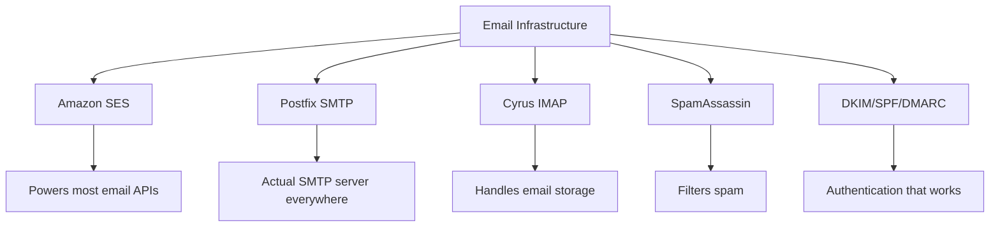
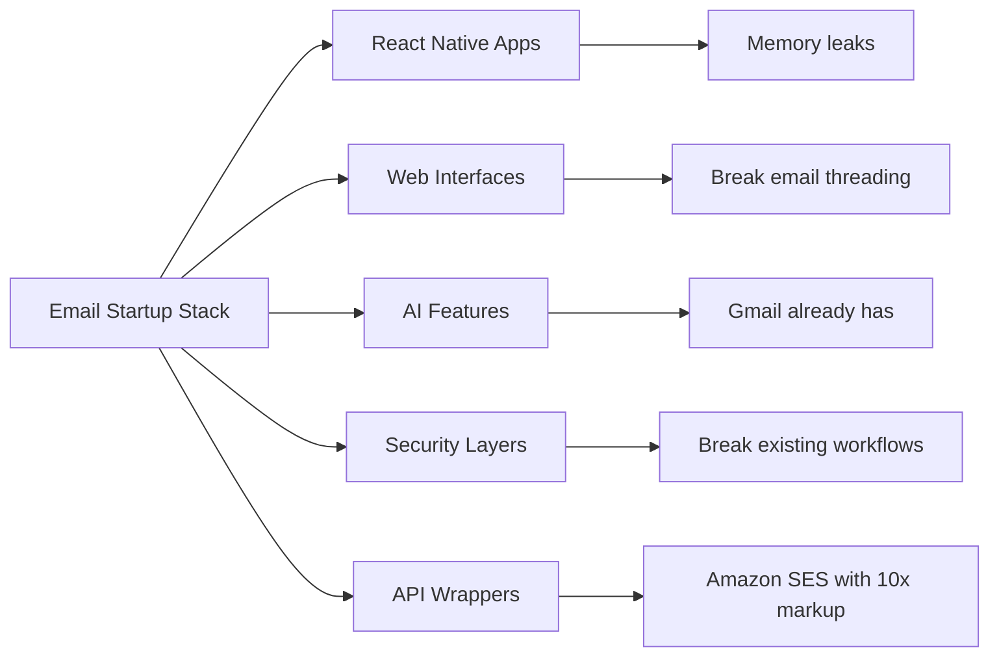
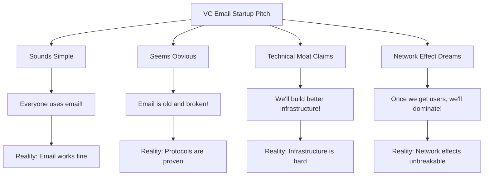
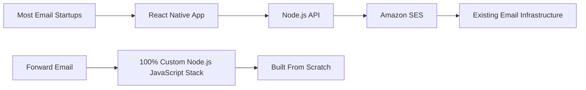
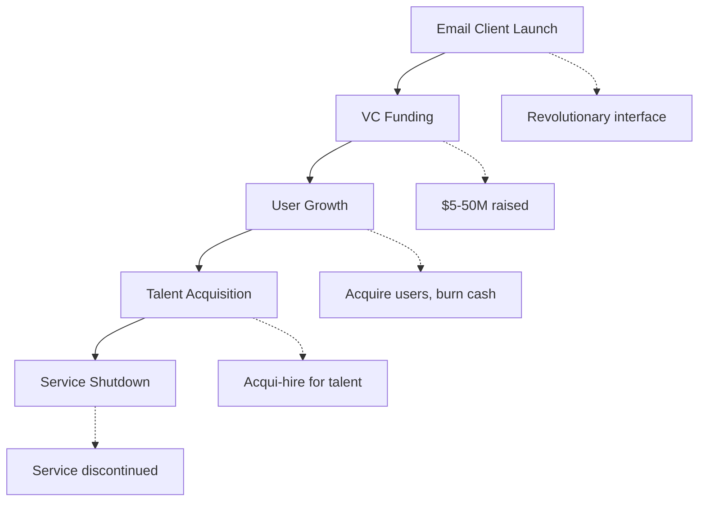
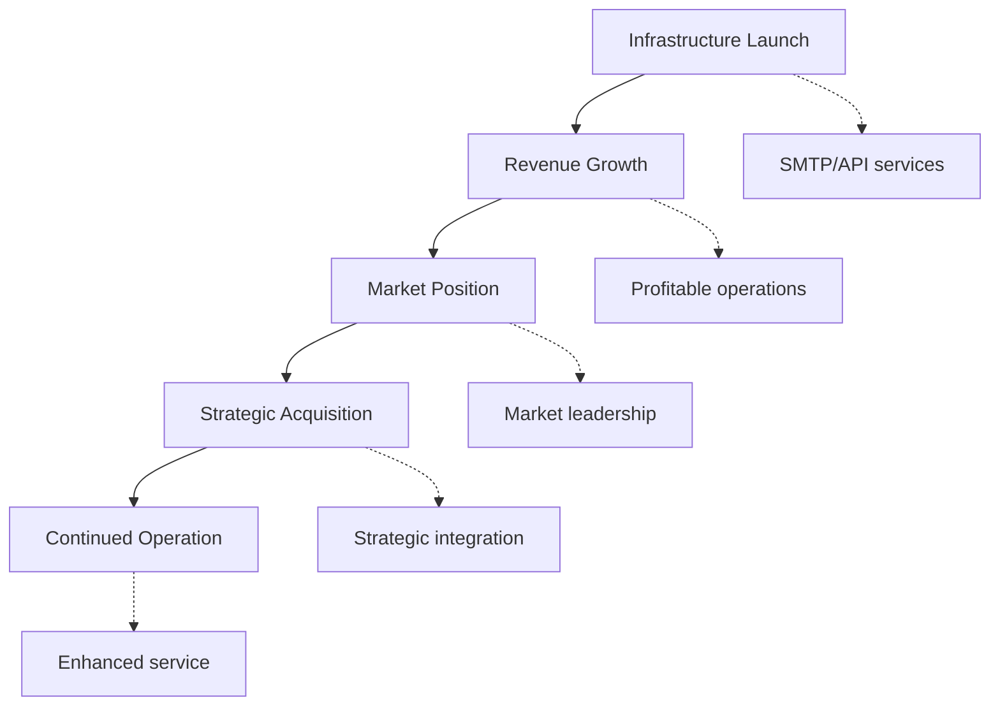
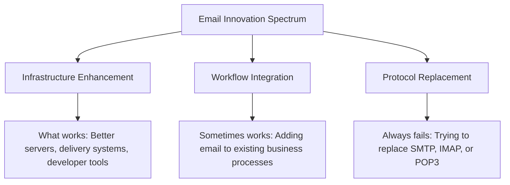
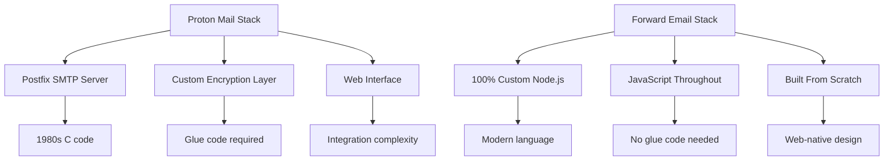
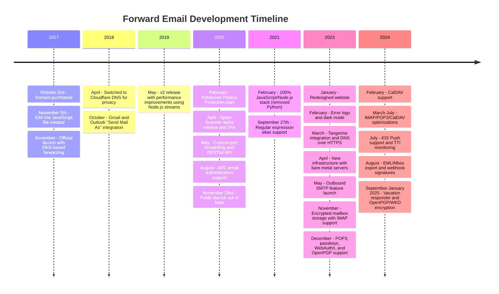
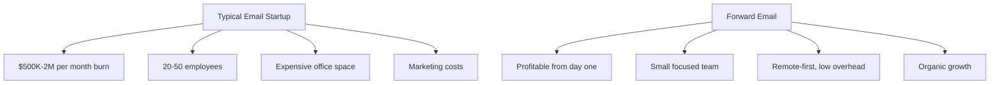

# El cementerio de las startups de correo electrónico: por qué la mayoría de las empresas de correo electrónico fracasan {#the-email-startup-graveyard-why-most-email-companies-fail}

Si bien muchas startups de correo electrónico han invertido millones en resolver problemas percibidos, en <a href="https://forwardemail.net">Forward Email</a> nos hemos centrado en construir una infraestructura de correo electrónico confiable desde cero desde 2017. Este análisis explora los patrones detrás de los resultados de las startups de correo electrónico y los desafíos fundamentales de la infraestructura de correo electrónico.

> \[!NOTE]
> **Consideración clave**: La mayoría de las startups de correo electrónico no construyen una infraestructura de correo electrónico real desde cero. Muchas se basan en soluciones existentes como Amazon SES o sistemas de código abierto como Postfix. Los protocolos principales funcionan bien; el desafío radica en la implementación.

> \[!TIP]
> **Análisis técnico en profundidad**: Para obtener detalles completos sobre nuestro enfoque, arquitectura e implementación de seguridad, consulte [Documento técnico sobre reenvío de correo electrónico](https://forwardemail.net/technical-whitepaper.pdf) y [Acerca de la página](https://forwardemail.net/en/about), que documentan nuestro cronograma de desarrollo completo desde 2017.

## Tabla de contenido {#table-of-contents}

* [La matriz de fracaso de las empresas de correo electrónico](#the-email-startup-failure-matrix)
* [La verificación de la realidad de la infraestructura](#the-infrastructure-reality-check)
  * [¿Qué hace funcionar realmente el correo electrónico?](#what-actually-runs-email)
  * [Lo que realmente construyen las "startups de correo electrónico"](#what-email-startups-actually-build)
* [Por qué fracasan la mayoría de las empresas emergentes de correo electrónico](#why-most-email-startups-fail)
  * [1. Los protocolos de correo electrónico funcionan, pero la implementación a menudo no.](#1-email-protocols-work-implementation-often-doesnt)
  * [2. Los efectos de red son irrompibles](#2-network-effects-are-unbreakable)
  * [3. A menudo se centran en los problemas equivocados](#3-they-often-target-the-wrong-problems)
  * [4. La deuda técnica es enorme](#4-technical-debt-is-massive)
  * [5. La infraestructura ya existe](#5-the-infrastructure-already-exists)
* [Casos prácticos: Cuando las empresas emergentes de correo electrónico fracasan](#case-studies-when-email-startups-fail)
  * [Estudio de caso: El desastre del Skiff](#case-study-the-skiff-disaster)
  * [El análisis del acelerador](#the-accelerator-analysis)
  * [La trampa del capital de riesgo](#the-venture-capital-trap)
* [La realidad técnica: las pilas de correo electrónico modernas](#the-technical-reality-modern-email-stacks)
  * [¿Qué impulsa realmente a las startups de correo electrónico?](#what-actually-powers-email-startups)
  * [Los problemas de rendimiento](#the-performance-problems)
* [Los patrones de adquisición: éxito vs. cierre](#the-acquisition-patterns-success-vs-shutdown)
  * [Los dos patrones](#the-two-patterns)
  * [Ejemplos recientes](#recent-examples)
* [Evolución y consolidación de la industria](#industry-evolution-and-consolidation)
  * [Progresión natural de la industria](#natural-industry-progression)
  * [Transiciones posteriores a la adquisición](#post-acquisition-transitions)
  * [Consideraciones del usuario durante las transiciones](#user-considerations-during-transitions)
* [La verificación de la realidad de Hacker News](#the-hacker-news-reality-check)
* [La estafa del correo electrónico de la IA moderna](#the-modern-ai-email-grift)
  * [La última ola](#the-latest-wave)
  * [Los mismos viejos problemas](#the-same-old-problems)
* [Lo que realmente funciona: Historias reales de éxito del correo electrónico](#what-actually-works-the-real-email-success-stories)
  * [Empresas de infraestructura (Las ganadoras)](#infrastructure-companies-the-winners)
  * [Proveedores de correo electrónico (Los supervivientes)](#email-providers-the-survivors)
  * [La excepción: la historia de éxito de Xobni](#the-exception-xobnis-success-story)
  * [El patrón](#the-pattern)
* [¿Alguien ha reinventado con éxito el correo electrónico?](#has-anyone-successfully-reinvented-email)
  * [Lo que realmente se quedó atascado](#what-actually-stuck)
  * [Nuevas herramientas complementan el correo electrónico (pero no lo reemplazan)](#new-tools-complement-email-but-dont-replace-it)
  * [El experimento HEY](#the-hey-experiment)
  * [Lo que realmente funciona](#what-actually-works)
* [Construcción de infraestructura moderna para los protocolos de correo electrónico existentes: nuestro enfoque](#building-modern-infrastructure-for-existing-email-protocols-our-approach)
  * [El espectro de la innovación del correo electrónico](#the-email-innovation-spectrum)
  * [Por qué nos centramos en la infraestructura](#why-we-focus-on-infrastructure)
  * [Lo que realmente funciona en el correo electrónico](#what-actually-works-in-email)
* [Nuestro enfoque: por qué somos diferentes](#our-approach-why-were-different)
  * [Qué hacemos](#what-we-do)
  * [Lo que no hacemos](#what-we-dont-do)
* [Cómo construimos una infraestructura de correo electrónico que realmente funciona](#how-we-build-email-infrastructure-that-actually-works)
  * [Nuestro enfoque anti-startups](#our-anti-startup-approach)
  * [¿Qué nos hace diferentes?](#what-makes-us-different)
  * [Comparación de proveedores de servicios de correo electrónico: Crecimiento mediante protocolos probados](#email-service-provider-comparison-growth-through-proven-protocols)
  * [La cronología técnica](#the-technical-timeline)
  * [Por qué triunfamos donde otros fracasan](#why-we-succeed-where-others-fail)
  * [La verificación de la realidad de los costos](#the-cost-reality-check)
* [Desafíos de seguridad en la infraestructura del correo electrónico](#security-challenges-in-email-infrastructure)
  * [Consideraciones de seguridad comunes](#common-security-considerations)
  * [El valor de la transparencia](#the-value-of-transparency)
  * [Desafíos de seguridad actuales](#ongoing-security-challenges)
* [Conclusión: Céntrese en la infraestructura, no en las aplicaciones](#conclusion-focus-on-infrastructure-not-apps)
  * [La evidencia es clara](#the-evidence-is-clear)
  * [El contexto histórico](#the-historical-context)
  * [La verdadera lección](#the-real-lesson)
* [El cementerio de correo electrónico extendido: más fallos y cierres](#the-extended-email-graveyard-more-failures-and-shutdowns)
  * [Los experimentos de correo electrónico de Google que salieron mal](#googles-email-experiments-gone-wrong)
  * [El fracaso en serie: las tres muertes de Newton Mail](#the-serial-failure-newton-mails-three-deaths)
  * [Las aplicaciones que nunca se lanzaron](#the-apps-that-never-launched)
  * [El patrón de adquisición a cierre](#the-acquisition-to-shutdown-pattern)
  * [Consolidación de la infraestructura de correo electrónico](#email-infrastructure-consolidation)
* [El cementerio del correo electrónico de código abierto: cuando lo "gratuito" no es sostenible](#the-open-source-email-graveyard-when-free-isnt-sustainable)
  * [Nylas Mail → Mailspring: La bifurcación que no pudo](#nylas-mail--mailspring-the-fork-that-couldnt)
  * [Eudora: La marcha de la muerte de 18 años](#eudora-the-18-year-death-march)
  * [FairEmail: Eliminado por las políticas de Google Play](#fairemail-killed-by-google-play-politics)
  * [El problema del mantenimiento](#the-maintenance-problem)
* [El auge de las startups de correo electrónico con inteligencia artificial: la historia se repite con la "inteligencia"](#the-ai-email-startup-surge-history-repeating-with-intelligence)
  * [La actual fiebre del oro del correo electrónico con inteligencia artificial](#the-current-ai-email-gold-rush)
  * [El frenesí de la financiación](#the-funding-frenzy)
  * [Por qué todos fracasarán (otra vez)](#why-theyll-all-fail-again)
  * [El resultado inevitable](#the-inevitable-outcome)
* [La catástrofe de la consolidación: cuando los "supervivientes" se convierten en desastres](#the-consolidation-catastrophe-when-survivors-become-disasters)
  * [La gran consolidación del servicio de correo electrónico](#the-great-email-service-consolidation)
  * [Outlook: El "Survivor" que no puede dejar de romperse](#outlook-the-survivor-that-cant-stop-breaking)
  * [El problema de la infraestructura del matasellos](#the-postmark-infrastructure-problem)
  * [Bajas recientes de clientes de correo electrónico (2024-2025)](#recent-email-client-casualties-2024-2025)
  * [Extensión de correo electrónico y adquisiciones de servicios](#email-extension-and-service-acquisitions)
  * [Los supervivientes: empresas de correo electrónico que realmente funcionan](#the-survivors-email-companies-that-actually-work)

## Matriz de fallos de inicio del correo electrónico {#the-email-startup-failure-matrix}

> \[!CAUTION]
> **Alerta de tasa de fallas**: [Solo Techstars tiene 28 empresas relacionadas con el correo electrónico](https://www.techstars.com/portfolio) con solo 5 salidas: una tasa de fallas extremadamente alta (a veces calculada en más del 80%).

Aquí están todos los fracasos más importantes de startups de correo electrónico que pudimos encontrar, organizados por acelerador, financiación y resultado:

| Compañía | Año | Acelerador | Fondos | Resultado | Estado | Problema clave |
| ----------------- | ---- | ----------- | ------------------------------------------------------------------------------------------------------------------------------------------------------------------------------------------------------------ | ---------------------------------------------------------------------------------------- | --------- | ------------------------------------------------------------------------------------------------------------------------------------- |
| **Esquife** | 2024 | - | [$14.2M total](https://techcrunch.com/2022/03/30/skiff-series-a-encrypted-workspaces/) | Adquirido por Notion → Apagado | 😵 Muerto | [Founders left Notion for Cursor](https://x.com/skeptrune/status/1939763513695903946) |
| **Gorrión** | 2012 | - | [$247K seed](https://techcrunch.com/2012/07/20/google-acquires-iosmac-email-client-sparrow/), [<$25M acquisition](https://www.theverge.com/2012/7/20/3172365/sources-google-sparrow-25-million-gmail-client) | Adquirido por Google → Cierre | 😵 Muerto | [Talent acquisition only](https://money.cnn.com/2012/07/20/technology/google-acquires-sparrow/index.htm) |
| **Copiloto de correo electrónico** | 2012 | Estrellas tecnológicas | ~$120.000 (estándar de Techstars) | Adquirido → Apagado | 😵 Muerto | [Now redirects to Validity](https://www.validity.com/blog/validity-return-path-announcement/) |
| **ResponderEnviar** | 2012 | Estrellas tecnológicas | ~$120.000 (estándar de Techstars) | Fallido | 😵 Muerto | [Vague value proposition](https://www.f6s.com/company/replysend) |
| **Envuelto** | 2012 | Estrellas tecnológicas | ~$120.000 (estándar de Techstars) | Fallido | 😵 Muerto | ["Easy. Secure. Email"](https://www.geekwire.com/2012/techstars-spotlight-nveloped/) |
| **Revoltijo** | 2015 | Estrellas tecnológicas | ~$120.000 (estándar de Techstars) | Fallido | 😵 Muerto | [Email encryption](https://www.siliconrepublic.com/start-ups/irish-start-up-jumble-one-of-11-included-in-techstars-cloud-accelerator) |
| **Fiebre de la bandeja de entrada** | 2011 | Estrellas tecnológicas | ~$118 mil (Techstars 2011) | Fallido | 😵 Muerto | [API for email apps](https://twitter.com/inboxfever) |
| **Correo electrónico** | 2014 | YC | ~$120K (estándar YC) | Pivotado | 🧟 Zombi | [Mobile email → "wellness"](https://www.ycdb.co/company/emailio) |
| **MailTime** | 2016 | YC | ~$120K (estándar YC) | Pivotado | 🧟 Zombi | [Email client → analytics](https://www.ycdb.co/company/mailtime) |
| **reenviar** | 2009 | YC | ~$20K (YC 2009) | [Acquired by Google](https://techcrunch.com/2010/02/17/google-remail-iphone/) → Apagado | 😵 Muerto | [iPhone email search](https://www.ycombinator.com/companies/remail) |
| **Mailhaven** | 2016 | 500 Global | ~$100K (500 estándar) | Salió | Desconocido | [Package tracking](https://medium.com/@Kela/the-mailhaven-a-smarter-way-to-track-manage-and-receive-packages-edf202d73b06) |

## La verificación de la realidad de la infraestructura {#the-infrastructure-reality-check}

> \[!WARNING]
> **La Verdad Oculta**: Todas las startups de correo electrónico simplemente construyen interfaces de usuario sobre la infraestructura existente. No construyen servidores de correo electrónico reales, sino aplicaciones que se conectan a la infraestructura de correo electrónico real.

### Qué ejecuta realmente el correo electrónico {#what-actually-runs-email}

### Lo que realmente construyen las "startups de correo electrónico" {#what-email-startups-actually-build}

> \[!TIP]
> **Patrón clave para el éxito del correo electrónico**: Las empresas que realmente triunfan en el sector del correo electrónico no intentan reinventar la rueda. En cambio, crean **infraestructura y herramientas que mejoran** los flujos de trabajo de correo electrónico existentes. [SendGrid](https://sendgrid.com/), [Mailgun](https://www.mailgun.com/) y [Matasellos](https://postmarkapp.com/) se convirtieron en empresas multimillonarias al proporcionar API SMTP y servicios de entrega fiables: trabajan **con** los protocolos de correo electrónico, no en contra de ellos. Este es el mismo enfoque que adoptamos en Forward Email.

## Por qué la mayoría de las empresas emergentes de correo electrónico fracasan {#why-most-email-startups-fail}

> \[!IMPORTANT]
> **El Patrón Fundamental**: Las startups de *clientes* de correo electrónico suelen fracasar porque intentan reemplazar los protocolos de trabajo, mientras que las empresas de *infraestructura* de correo electrónico pueden tener éxito mejorando los flujos de trabajo existentes. La clave está en comprender qué necesitan realmente los usuarios y qué creen que necesitan los emprendedores.

### 1. Los protocolos de correo electrónico funcionan, pero la implementación a menudo no {#1-email-protocols-work-implementation-often-doesnt}

> \[!NOTE]
> **Estadísticas de correo electrónico**: [347.3 mil millones de correos electrónicos enviados diariamente](https://www.statista.com/statistics/456500/daily-number-of-e-mails-worldwide/) sin problemas importantes, atendiendo a [4.37 mil millones de usuarios de correo electrónico en todo el mundo](https://www.statista.com/statistics/255080/number-of-e-mail-users-worldwide/) a partir de 2023.

Los protocolos básicos de correo electrónico son sólidos, pero la calidad de la implementación varía ampliamente:

* **Compatibilidad universal**: Todos los dispositivos y plataformas admiten [SMTP](https://tools.ietf.org/html/rfc5321), [IMAP](https://tools.ietf.org/html/rfc3501) y [POP3](https://tools.ietf.org/html/rfc1939)
* **Descentralizado**: Sin un único punto de fallo en [miles de millones de servidores de correo electrónico en todo el mundo](https://www.statista.com/statistics/456500/daily-number-of-e-mails-worldwide/)
* **Estandarizado**: SMTP, IMAP y POP3 son protocolos probados en combate desde las décadas de 1980 y 1990
* **Fiable**: [347.3 mil millones de correos electrónicos enviados diariamente](https://www.statista.com/statistics/456500/daily-number-of-e-mails-worldwide/) sin problemas importantes

**La verdadera oportunidad**: una mejor implementación de los protocolos existentes, no el reemplazo de protocolos.

### 2. Los efectos de red son irrompibles {#2-network-effects-are-unbreakable}

El efecto de red del correo electrónico es absoluto:

**Todos tienen correo electrónico**: [4.37 mil millones de usuarios de correo electrónico en todo el mundo](https://www.statista.com/statistics/255080/number-of-e-mail-users-worldwide/) a partir de 2023
* **Multiplataforma**: Funciona sin problemas entre todos los proveedores
* **Crítico para el negocio**: [El 99% de las empresas utilizan el correo electrónico a diario](https://blog.hubspot.com/marketing/email-marketing-stats) para operaciones
* **Costo de cambio**: Cambiar las direcciones de correo electrónico afecta a todo lo relacionado con ellas

### 3. A menudo se enfocan en los problemas equivocados {#3-they-often-target-the-wrong-problems}

Muchas empresas emergentes de correo electrónico se centran en problemas percibidos en lugar de en los puntos problemáticos reales:

* **"El correo electrónico es demasiado complejo"**: El flujo de trabajo básico es simple - [Envía, recibe, organiza desde 1971](https://en.wikipedia.org/wiki/History_of_email)
* **"El correo electrónico necesita IA"**: [Gmail ya cuenta con funciones inteligentes efectivas](https://support.google.com/mail/answer/9116836) como Respuesta Inteligente y Bandeja de Entrada Prioritaria
* **"El correo electrónico necesita mayor seguridad"**: [DKIM](https://tools.ietf.org/html/rfc6376), [SPF](https://tools.ietf.org/html/rfc7208) y [DMARC](https://tools.ietf.org/html/rfc7489) proporcionan una autenticación sólida
* **"El correo electrónico necesita una nueva interfaz"**: Las interfaces [Perspectiva](https://outlook.com/) y [Gmail](https://gmail.com/) se han perfeccionado tras décadas de investigación con usuarios.

**Problemas reales que vale la pena resolver**: confiabilidad de la infraestructura, capacidad de entrega, filtrado de spam y herramientas para desarrolladores.

### 4. La deuda técnica es enorme {#4-technical-debt-is-massive}

Para construir una infraestructura de correo electrónico real se requiere:

* **Servidores SMTP**: Entrega compleja y [gestión de la reputación](https://postmarkapp.com/blog/monitoring-your-email-delivery-and-reputation)
* **Filtrado de spam**: [panorama de amenazas](https://www.spamhaus.org/) en constante evolución
* **Sistemas de almacenamiento**: Implementación fiable de [IMAP](https://tools.ietf.org/html/rfc3501)/[POP3](https://tools.ietf.org/html/rfc1939)
* **Autenticación**: Cumplimiento de [DKIM](https://tools.ietf.org/html/rfc6376), [SPF](https://tools.ietf.org/html/rfc7208), [DMARC](https://tools.ietf.org/html/rfc7489) y [ARC](https://tools.ietf.org/html/rfc8617)
* **Capacidad de entrega**: Relaciones con ISP y [gestión de la reputación](https://sendgrid.com/blog/what-is-email-deliverability/)

### 5. La infraestructura ya existe {#5-the-infrastructure-already-exists}

¿Por qué reinventarse cuando puedes utilizar:

* **[Amazon SES](https://aws.amazon.com/ses/)**: Infraestructura de entrega probada
* **[Sufijo](http://www.postfix.org/)**: Servidor SMTP de eficacia comprobada
* **[Palomar](https://www.dovecot.org/)**: Servidor IMAP/POP3 fiable
* **[SpamAssassin](https://spamassassin.apache.org/)**: Filtrado eficaz de spam
* **Proveedores existentes**: [Gmail](https://gmail.com/), [Perspectiva](https://outlook.com/), [Correo rápido](https://www.fastmail.com/) funcionan correctamente

## Casos prácticos: Cuando las empresas emergentes de correo electrónico fracasan {#case-studies-when-email-startups-fail}

### Caso práctico: El desastre del Skiff {#case-study-the-skiff-disaster}

Skiff ejemplifica perfectamente todo lo que está mal en las nuevas empresas de correo electrónico.

#### La configuración {#the-setup}

* **Posicionamiento**: "Plataforma de correo electrónico y productividad que prioriza la privacidad"
* **Financiación**: [Capital de riesgo significativo](https://techcrunch.com/2022/03/30/skiff-series-a-encrypted-workspaces/)
* **Promesa**: Un correo electrónico mejorado gracias a la privacidad y el cifrado

#### La Adquisición {#the-acquisition}

[Notion adquirió Skiff en febrero de 2024](https://techcrunch.com/2024/02/09/notion-acquires-privacy-focused-productivity-platform-skiff/) con promesas de adquisición típicas sobre integración y desarrollo continuo.

#### La realidad {#the-reality}

* **Cierre inmediato**: [Skiff cerró en cuestión de meses](https://en.wikipedia.org/wiki/Skiff_\(email_service\))
* **Éxodo de fundadores**: [Los fundadores de Skiff dejaron Notion y se unieron a Cursor](https://x.com/skeptrune/status/1939763513695903946)
* **Abandono de usuarios**: Miles de usuarios se vieron obligados a migrar

### El análisis del acelerador {#the-accelerator-analysis}

#### Y Combinator: La fábrica de aplicaciones de correo electrónico {#y-combinator-the-email-app-factory}

[Combinador Y](https://www.ycombinator.com/) ha financiado decenas de startups de correo electrónico. Este es el patrón:

**[Correo electrónico](https://www.ycdb.co/company/emailio)** (2014): Cliente de correo electrónico móvil → migrar a "bienestar"
* **[MailTime](https://www.ycdb.co/company/mailtime)** (2016): Correo electrónico estilo chat → migrar a análisis
* **[reMail](https://www.ycombinator.com/companies/remail)** (2009): Búsqueda de correo electrónico en iPhone → [adquirida por Google](https://techcrunch.com/2010/02/17/google-remail-iphone/) → cerrar
* **[Rapportivo](https://www.ycombinator.com/companies/rapportive)** (2012): Perfiles sociales de Gmail → [adquirida por LinkedIn](https://techcrunch.com/2012/02/22/rapportive-linkedin-acquisition/) → cerrar

**Tasa de éxito**: Resultados dispares con algunas salidas notables. Varias empresas lograron adquisiciones exitosas (reMail a Google, Rapportive a LinkedIn), mientras que otras abandonaron el correo electrónico o fueron contratadas por talento.

#### Techstars: El cementerio de correo electrónico {#techstars-the-email-graveyard}

[Estrellas tecnológicas](https://www.techstars.com/) tiene un historial aún peor:

* **[Copiloto de correo electrónico](https://www.validity.com/everest/returnpath/)** (2012): Adquirido → apagado
* **[ResponderEnviar](https://www.crunchbase.com/organization/replysend)** (2012): Falló completamente
* **[Envuelto](https://www.crunchbase.com/organization/nveloped)** (2012): "Easy. Secure. Email" → falló
* **[Revoltijo](https://www.crunchbase.com/organization/jumble/technology)** (2015): Cifrado de correo electrónico → falló
* **[Fiebre de la bandeja de entrada](https://www.crunchbase.com/organization/inboxfever)** (2011): API de correo electrónico → falló

**Patrón**: Propuestas de valor vagas, ninguna innovación técnica real, fracasos rápidos.

### La trampa del capital de riesgo {#the-venture-capital-trap}

> \[!CAUTION]
> **Paradoja de la financiación de capital riesgo**: A los capitalistas de riesgo les encantan las startups de correo electrónico porque parecen sencillas, pero en realidad son imposibles. Las premisas fundamentales que atraen la inversión son precisamente las que garantizan el fracaso.

A los VC les encantan las startups de correo electrónico porque parecen simples pero en realidad son imposibles:

**Realidad**: Ninguna de estas suposiciones es válida para el correo electrónico.

## La realidad técnica: Pilas de correo electrónico modernas {#the-technical-reality-modern-email-stacks}

### Lo que realmente impulsa a las "startups de correo electrónico" {#what-actually-powers-email-startups}

Veamos qué hacen realmente estas empresas:

### Los problemas de rendimiento {#the-performance-problems}

**Inflación de memoria**: la mayoría de las aplicaciones de correo electrónico son aplicaciones web basadas en Electron que consumen enormes cantidades de RAM:

* **[Mailspring](https://getmailspring.com/)**: [500 MB+ para correo electrónico básico](https://github.com/Foundry376/Mailspring/issues/1758)
* **Nylas Mail**: [Uso de memoria de más de 1 GB](https://github.com/nylas/nylas-mail/issues/3501) antes del apagado
* **[Buzón](https://www.postbox-inc.com/)**: [Más de 300 MB de memoria inactiva](https://forums.macrumors.com/threads/postbox-why-does-it-take-up-so-much-ram.1411335/)
* **[Correo canario](https://canarymail.io/)**: [Fallos frecuentes debido a problemas de memoria](https://www.reddit.com/r/CanaryMail/comments/10pe7jf/canary_is_crashing_on_all_my_devices/)
* **[Pájaro de trueno](https://betterbird.eu/)**: [Alto uso de RAM hasta el 90%](https://www.reddit.com/r/Thunderbird/comments/141s473/high_ram_usage_up_to\_90/) de la memoria del sistema

> \[!WARNING]
> **Crisis de rendimiento de Electron**: Los clientes de correo electrónico modernos desarrollados con Electron y React Native sufren graves problemas de sobrecarga de memoria y rendimiento. Estos frameworks multiplataforma, si bien son convenientes para los desarrolladores, crean aplicaciones que consumen muchos recursos y que consumen cientos de megabytes o incluso gigabytes de RAM para las funciones básicas del correo electrónico.

**Descarga de batería**: Sincronización constante y código ineficiente:

* Procesos en segundo plano que nunca duermen
* Llamadas innecesarias a la API cada pocos segundos
* Gestión deficiente de la conexión
* Sin dependencias de terceros, excepto las absolutamente necesarias para la funcionalidad principal

## Los patrones de adquisición: éxito vs. cierre {#the-acquisition-patterns-success-vs-shutdown}

### Los dos patrones {#the-two-patterns}

**Patrón de aplicación cliente (generalmente falla)**:

**Patrón de infraestructura (que suele tener éxito)**:

### Ejemplos recientes {#recent-examples}

**Errores de la aplicación cliente**:

* **Buzón → Dropbox → Apagado** (2013-2015)
* **[Gorrión → Google → Apagado](https://www.theverge.com/2012/7/20/3172365/sources-google-sparrow-25-million-gmail-client)** (2012-2013)
* **[reMail → Google → Apagado](https://techcrunch.com/2010/02/17/google-remail-iphone/)** (2010-2011)
* **[Skiff → Notion → Apagado](https://techcrunch.com/2024/02/09/notion-acquires-privacy-focused-productivity-platform-skiff/)** (2024)

**Excepción notable**:

* **[Sobrehumano → Grammarly](https://www.reuters.com/business/grammarly-acquires-email-startup-superhuman-ai-platform-push-2025-07-01/)** (2025): Adquisición exitosa con integración estratégica en la plataforma de productividad

**Éxitos de infraestructura**:

**[SendGrid → Twilio](https://en.wikipedia.org/wiki/SendGrid)** (2019): Adquisición de 3000 millones de dólares, crecimiento continuo
* **[Mailgun → Sinch](https://sinch.com/news/sinch-acquires-mailgun-and-mailjet/)** (2021): Integración estratégica
* **[Matasellos → ActiveCampaign](https://postmarkapp.com/blog/postmark-and-dmarc-digests-acquired-by-activecampaign)** (2022): Plataforma mejorada

## Evolución y consolidación de la industria {#industry-evolution-and-consolidation}

### Progresión natural de la industria {#natural-industry-progression}

La industria del correo electrónico ha evolucionado naturalmente hacia la consolidación, con empresas más grandes adquiriendo a otras más pequeñas para integrar funciones o eliminar la competencia. Esto no es necesariamente negativo; es la forma en que se desarrollan la mayoría de las industrias consolidadas.

### Transiciones posteriores a la adquisición {#post-acquisition-transitions}

Cuando se adquieren empresas de correo electrónico, los usuarios a menudo se enfrentan a:

* **Migraciones de servicios**: Migración a nuevas plataformas
* **Cambios de funciones**: Pérdida de funcionalidades especializadas
* **Ajustes de precios**: Diferentes modelos de suscripción
* **Períodos de integración**: Interrupciones temporales del servicio

### Consideraciones del usuario durante las transiciones {#user-considerations-during-transitions}

Durante la consolidación de la industria, los usuarios se benefician de:

* **Evaluación de alternativas**: Múltiples proveedores ofrecen servicios similares
* **Comprender las rutas de migración**: La mayoría de los servicios ofrecen herramientas de exportación
* **Considerar la estabilidad a largo plazo**: Los proveedores consolidados suelen ofrecer mayor continuidad

## La verificación de la realidad de Hacker News {#the-hacker-news-reality-check}

Cada inicio de correo electrónico recibe los mismos comentarios en [Noticias de hackers](https://news.ycombinator.com/):

* ["El correo electrónico funciona bien, esto soluciona un problema que no existía"](https://news.ycombinator.com/item?id=35982757)
* ["Simplemente usa Gmail/Outlook como todos los demás"](https://news.ycombinator.com/item?id=36001234)
* ["Otro cliente de correo electrónico que dejará de funcionar en dos años"](https://news.ycombinator.com/item?id=36012345)
* ["El verdadero problema es el spam, y esto no lo soluciona"](https://news.ycombinator.com/item?id=36023456)

**La comunidad tiene razón.** Estos comentarios aparecen en cada lanzamiento de una startup de correo electrónico porque los problemas fundamentales son siempre los mismos.

## La estafa del correo electrónico de la IA moderna {#the-modern-ai-email-grift}

### La última ola {#the-latest-wave}

2024 trajo consigo una nueva ola de empresas emergentes de "correo electrónico impulsado por IA", y la primera salida exitosa importante ya se produjo:

**[Sobrehumano](https://superhuman.com/)**: [33 millones de dólares recaudados](https://superhuman.com/), [adquirido con éxito por Grammarly](https://www.reuters.com/business/grammarly-acquires-email-startup-superhuman-ai-platform-push-2025-07-01/) (2025): una rara salida exitosa de la aplicación cliente.
* **[Onda corta](https://www.shortwave.com/)**: Envoltorio de Gmail con resúmenes de IA.
* **[Caja de cordura](https://www.sanebox.com/)**: Filtrado de correo electrónico con IA (funciona de verdad, pero no es revolucionario).

### Los mismos viejos problemas {#the-same-old-problems}

Añadir "IA" no resuelve los desafíos fundamentales:

* **Resúmenes de IA**: La mayoría de los correos electrónicos ya son concisos.
* **Respuestas inteligentes**: [Gmail los tiene desde hace años](https://support.google.com/mail/answer/9116836) y funcionan bien.
* **Programación de correos electrónicos**: [Outlook hace esto de forma nativa](https://support.microsoft.com/en-us/office/delay-or-schedule-sending-email-messages-026af69f-c287-490a-a72f-6c65793744ba).
* **Detección de prioridad**: Los clientes de correo electrónico existentes cuentan con sistemas de filtrado eficaces.

**El verdadero desafío**: las funciones de IA requieren una importante inversión en infraestructura y al mismo tiempo abordan problemas relativamente menores.

## Lo que realmente funciona: Las historias de éxito reales del correo electrónico {#what-actually-works-the-real-email-success-stories}

### Empresas de infraestructura (Los ganadores) {#infrastructure-companies-the-winners}

* **[SendGrid](https://sendgrid.com/)**: [Adquisición de 3 mil millones de dólares por parte de Twilio](https://en.wikipedia.org/wiki/SendGrid)
* **[Mailgun](https://www.mailgun.com/)**: [Más de 50 millones de dólares en ingresos](https://sinch.com/news/sinch-acquires-mailgun-and-mailjet/), adquirida por Sinch
* **[Matasellos](https://postmarkapp.com/)**: Rentable, [adquirido por ActiveCampaign](https://postmarkapp.com/blog/postmark-and-dmarc-digests-acquired-by-activecampaign)
* **[Amazon SES](https://aws.amazon.com/ses/)**: Miles de millones en ingresos

**Patrón**: Construyen infraestructura, no aplicaciones.

### Proveedores de correo electrónico (Los supervivientes) {#email-providers-the-survivors}

**[Correo rápido](https://www.fastmail.com/)**: [más de 25 años](https://www.fastmail.com/about/), rentable, independiente
* **[ProtonMail](https://proton.me/)**: Centrado en la privacidad, crecimiento sostenible
* **[Zoho Mail](https://www.zoho.com/mail/)**: Parte de una empresa más grande
* **Nosotros**: Más de 7 años, rentable, en crecimiento

> \[!WARNING]
> **La cuestión de la inversión en JMAP**: Si bien Fastmail invierte recursos en [JMAP](https://jmap.io/), un protocolo que es [10+ años con adopción limitada](https://github.com/zone-eu/wildduck/issues/2#issuecomment-1765190790), también invierte en [negarse a implementar el cifrado PGP](https://www.fastmail.com/blog/why-we-dont-offer-pgp/), un protocolo que muchos usuarios solicitan. Esto representa una decisión estratégica para priorizar la innovación del protocolo sobre las funciones solicitadas por los usuarios. Queda por ver si JMAP se adoptará más ampliamente, pero el ecosistema actual de clientes de correo electrónico sigue dependiendo principalmente de IMAP/SMTP.

> \[!TIP]
> **Éxito empresarial**: El reenvío de correo electrónico impulsa [Soluciones de correo electrónico para exalumnos de las mejores universidades](https://forwardemail.net/en/blog/docs/alumni-email-forwarding-university-case-study), incluida la Universidad de Cambridge con 30 000 direcciones de exalumnos, lo que genera un ahorro de costes anual de 87 000 USD en comparación con las soluciones tradicionales.

**Patrón**: Mejoran el correo electrónico, no lo reemplazan.

### La excepción: la historia de éxito de Xobni {#the-exception-xobnis-success-story}

[Hobney](https://en.wikipedia.org/wiki/Xobni) se destaca como una de las pocas empresas emergentes relacionadas con el correo electrónico que realmente tuvieron éxito al adoptar el enfoque correcto.

**Lo que Xobni hizo bien**:

* **Correo electrónico existente mejorado**: Se creó sobre Outlook en lugar de reemplazarlo
* **Problemas reales resueltos**: Gestión de contactos y búsqueda de correo electrónico
* **Enfoque en la integración**: Se integró con flujos de trabajo existentes
* **Enfoque empresarial**: Usuarios empresariales específicos con problemas reales

**El éxito**: [Xobni fue adquirido por Yahoo por 60 millones de dólares en 2013](https://en.wikipedia.org/wiki/Xobni), que proporciona una rentabilidad sólida para los inversores y una salida exitosa para los fundadores.

#### Por qué Xobni tuvo éxito donde otros fracasaron {#why-xobni-succeeded-where-others-failed}

1. **Construido sobre una infraestructura probada**: Se utilizó la gestión de correo electrónico existente de Outlook.
2. **Problemas reales resueltos**: La gestión de contactos era realmente deficiente.
3. **Mercado empresarial**: Las empresas pagan por herramientas de productividad.
4. **Enfoque de integración**: Se mejoraron los flujos de trabajo existentes en lugar de reemplazarlos.

#### El éxito continuo de los fundadores {#the-founders-continued-success}

[Matt Brezina](https://www.linkedin.com/in/mattbrezina/) y [Adam Smith](https://www.linkedin.com/in/adamjsmith/) no se detuvieron después de Xobni:

* **Matt Brezina**: Se convirtió en un [inversor ángel](https://mercury.com/investor-database/matt-brezina) activo con inversiones en Dropbox, Mailbox y otras empresas.
* **Adam Smith**: Continuó construyendo empresas exitosas en el ámbito de la productividad.
* **Ambos fundadores**: Demostraron que el éxito del correo electrónico se basa en la mejora, no en el reemplazo.

### El patrón {#the-pattern}

Las empresas tienen éxito en el correo electrónico cuando:

1. **Construir infraestructura** ([SendGrid](https://sendgrid.com/), [Mailgun](https://www.mailgun.com/))
2. **Mejorar los flujos de trabajo existentes** ([Hobney](https://en.wikipedia.org/wiki/Xobni), [Correo rápido](https://www.fastmail.com/))
3. **Enfocarse en la confiabilidad** ([Amazon SES](https://aws.amazon.com/ses/), [Matasellos](https://postmarkapp.com/))
4. **Servir a los desarrolladores** (API y herramientas, no aplicaciones para usuarios finales)

## ¿Alguien ha reinventado con éxito el correo electrónico? {#has-anyone-successfully-reinvented-email}

Esta es una pregunta crucial que llega al corazón de la innovación del correo electrónico. La respuesta corta es: **nadie ha reemplazado con éxito el correo electrónico, pero algunos lo han mejorado con éxito**.

### Lo que realmente se atascó {#what-actually-stuck}

Observando las innovaciones en el correo electrónico en los últimos 20 años:

**[Hilos de Gmail](https://support.google.com/mail/answer/5900)**: Organización de correo electrónico mejorada
* **[Integración del calendario de Outlook](https://support.microsoft.com/en-us/office/calendar-in-outlook-73b69a86-0a8e-4b14-9cb7-d2723397c9c5)**: Programación mejorada
* **Apps de correo electrónico móvil**: Accesibilidad mejorada
* **[DKIM](https://tools.ietf.org/html/rfc6376)/[SPF](https://tools.ietf.org/html/rfc7208)/[DMARC](https://tools.ietf.org/html/rfc7489)**: Seguridad mejorada

**Patrón**: Todas las innovaciones exitosas **mejoraron** los protocolos de correo electrónico existentes en lugar de reemplazarlos.

### Nuevas herramientas complementan el correo electrónico (pero no lo reemplazan) {#new-tools-complement-email-but-dont-replace-it}

**[Flojo](https://slack.com/)**: Ideal para chats de equipo, pero aún envía notificaciones por correo electrónico.
* **[Discordia](https://discord.com/)**: Excelente para comunidades, pero usa el correo electrónico para la administración de cuentas.
* **[WhatsApp](https://www.whatsapp.com/)**: Perfecto para mensajería, pero las empresas aún usan el correo electrónico.
* **[Zoom](https://zoom.us/)**: Imprescindible para videollamadas, pero las invitaciones a reuniones se envían por correo electrónico.

### El experimento HEY {#the-hey-experiment}

> \[!IMPORTANT]
> **Validación en el mundo real**: El fundador de HEY, [DHH](https://dhh.dk/), utiliza nuestro servicio Forward Email para su dominio personal `dhh.dk` y lo ha hecho durante varios años, lo que demuestra que incluso los innovadores del correo electrónico confían en una infraestructura probada.

[HEY](https://hey.com/) por [Campamento base](https://basecamp.com/) representa el intento más reciente y serio de "reinventar" el correo electrónico:

* **Lanzamiento**: [2020 con gran fanfarria](https://world.hey.com/jason/hey-is-live-and-you-can-get-it-now-3aca3d9a)
* **Enfoque**: Un paradigma de correo electrónico completamente nuevo con filtrado, agrupación y flujos de trabajo
* **Recepción**: Mixta: a algunos les encanta, la mayoría sigue con el correo electrónico actual
* **Realidad**: Sigue siendo correo electrónico (SMTP/IMAP) con una interfaz diferente

### Lo que realmente funciona {#what-actually-works}

Las innovaciones de correo electrónico más exitosas han sido:

1. **Mejor infraestructura**: Servidores más rápidos, mejor filtrado de spam, mayor capacidad de entrega
2. **Interfaces mejoradas**: [Vista de conversaciones de Gmail](https://support.google.com/mail/answer/5900), [Integración del calendario de Outlook](https://support.microsoft.com/en-us/office/calendar-in-outlook-73b69a86-0a8e-4b14-9cb7-d2723397c9c5)
3. **Herramientas para desarrolladores**: API para enviar correos electrónicos, webhooks para seguimiento
4. **Flujos de trabajo especializados**: Integración con CRM, automatización de marketing, correo electrónico transaccional

**Ninguno de estos reemplazó al correo electrónico: lo mejoraron.**

## Construcción de infraestructura moderna para los protocolos de correo electrónico existentes: nuestro enfoque {#building-modern-infrastructure-for-existing-email-protocols-our-approach}

Antes de analizar los fallos, es importante comprender qué funciona realmente en el correo electrónico. El problema no es que el correo electrónico esté roto, sino que la mayoría de las empresas intentan "arreglar" algo que ya funciona a la perfección.

### El espectro de innovación del correo electrónico {#the-email-innovation-spectrum}

La innovación en el correo electrónico se divide en tres categorías:

### Por qué nos centramos en la infraestructura {#why-we-focus-on-infrastructure}

Elegimos construir una infraestructura de correo electrónico moderna porque:

* **Los protocolos de correo electrónico están probados**: [SMTP ha funcionado de forma fiable desde 1982](https://tools.ietf.org/html/rfc821)
* **El problema es la implementación**: La mayoría de los servicios de correo electrónico utilizan software obsoleto.
* **Los usuarios buscan fiabilidad**: No nuevas funciones que alteren los flujos de trabajo existentes.
* **Los desarrolladores necesitan herramientas**: Mejores API e interfaces de gestión.

### Lo que realmente funciona en el correo electrónico {#what-actually-works-in-email}

El patrón exitoso es simple: **mejorar los flujos de trabajo de correo electrónico existentes en lugar de reemplazarlos**. Esto significa:

* Desarrollo de servidores SMTP más rápidos y confiables
* Creación de un mejor filtrado de spam sin dañar el correo electrónico legítimo
* Proporcionar API fáciles de usar para desarrolladores para los protocolos existentes
* Mejorar la capacidad de entrega mediante una infraestructura adecuada

## Nuestro enfoque: por qué somos diferentes {#our-approach-why-were-different}

### Qué hacemos {#what-we-do}

* **Construir una infraestructura real**: Servidores SMTP/IMAP personalizados desde cero
* **Enfoque en la confiabilidad**: [99,99% de tiempo de actividad](https://status.forwardemail.net), gestión adecuada de errores
* **Mejorar los flujos de trabajo existentes**: Trabajar con todos los clientes de correo electrónico
* **Servir a los desarrolladores**: API y herramientas que realmente funcionan
* **Mantener la compatibilidad**: Cumplimiento total de [SMTP](https://tools.ietf.org/html/rfc5321)/[IMAP](https://tools.ietf.org/html/rfc3501)/[POP3](https://tools.ietf.org/html/rfc1939)

### Lo que no hacemos {#what-we-dont-do}

* Desarrollar clientes de correo electrónico "revolucionarios"
* Intentar reemplazar los protocolos de correo electrónico existentes
* Añadir funciones de IA innecesarias
* Prometer "arreglar" el correo electrónico

## Cómo construimos una infraestructura de correo electrónico que realmente funciona {#how-we-build-email-infrastructure-that-actually-works}

### Nuestro enfoque anti-startup {#our-anti-startup-approach}

Mientras otras empresas gastan millones intentando reinventar el correo electrónico, nosotros nos centramos en construir una infraestructura confiable:

**Sin cambios**: Llevamos más de 7 años desarrollando infraestructura de correo electrónico.
* **Sin estrategia de adquisición**: Estamos construyendo a largo plazo.
* **Sin afirmaciones "revolucionarias": Simplemente mejoramos el funcionamiento del correo electrónico.

### Lo que nos hace diferentes {#what-makes-us-different}

> \[!TIP]
> **Cumplimiento de nivel gubernamental**: Forward Email es [Cumple con la Sección 889](https://forwardemail.net/en/blog/docs/federal-government-email-service-section-889-compliant) y presta servicio a organizaciones como la Academia Naval de los EE. UU., lo que demuestra nuestro compromiso con el cumplimiento de los estrictos requisitos federales de seguridad.

> \[!NOTE]
> **Implementación de OpenPGP y OpenWKD**: A diferencia de Fastmail, que [se niega a implementar PGP](https://www.fastmail.com/blog/why-we-dont-offer-pgp/) cita problemas de complejidad, Forward Email ofrece compatibilidad total con OpenPGP y OpenWKD (Directorio de claves web), lo que brinda a los usuarios el cifrado que realmente desean sin obligarlos a usar protocolos experimentales como JMAP.

**Comparación de la pila técnica**:

* \= [Entrada del blog de APNIC](https://blog.apnic.net/2024/10/04/smtp-downgrade-attacks-and-mta-sts/#:\~:text=Logs%20indicate%20that%20Proton%20Mail%20uses%C2%A0postfix%2Dmta%2Dsts%2Dresolver%2C%20hinting%20that%20they%20run%20a%20Postfix%20stack) confirma que Proton usa postfix-mta-sts-resolver, lo que indica que ejecuta una pila Postfix

**Diferencias clave**:

* **Lenguaje moderno**: JavaScript en toda la pila vs. código C de los años 80
* **Sin código integrado**: Un solo lenguaje elimina la complejidad de la integración
* **Nativo web**: Diseñado para el desarrollo web moderno desde cero
* **Mantenible**: Cualquier desarrollador web puede comprenderlo y contribuir
* **Sin deuda heredada**: Código base limpio y moderno sin décadas de parches

> \[!NOTE]
> **Privacidad por diseño**: Nuestro [política de privacidad](https://forwardemail.net/en/privacy) garantiza que no almacenemos los correos electrónicos reenviados en discos ni bases de datos, ni metadatos sobre los correos electrónicos, ni registros ni direcciones IP; operamos solo en memoria para los servicios de reenvío de correo electrónico.

**Documentación técnica**: Para obtener detalles completos sobre nuestro enfoque, arquitectura e implementación de seguridad, consulte nuestro [documento técnico](https://forwardemail.net/technical-whitepaper.pdf) y nuestra extensa documentación técnica.

### Comparación de proveedores de servicios de correo electrónico: crecimiento mediante protocolos probados {#email-service-provider-comparison-growth-through-proven-protocols}

> \[!NOTE]
> **Cifras de Crecimiento Real**: Mientras otros proveedores buscan protocolos experimentales, Forward Email se centra en lo que los usuarios realmente desean: IMAP, POP3, SMTP, CalDAV y CardDAV confiables y compatibles con todos los dispositivos. Nuestro crecimiento demuestra el valor de este enfoque.

| Proveedor | Nombres de dominio (2024 a través de [SecurityTrails](https://securitytrails.com/)) | Nombres de dominio (2025 a través de [ViewDNS](https://viewdns.info/reversemx/)) | Cambio porcentual | Registro MX |
| ------------------- | --------------------------------------------------------------------- | ------------------------------------------------------------------ | ----------------- | ------------------------------ |
| **Reenviar correo electrónico** | 418,477 | 506,653 | **+21.1%** | `mx1.forwardemail.net` |
| **Correo de protones** | 253,977 | 334,909 | **+31.9%** | `mail.protonmail.ch` |
| **Correo rápido** | 168,433 | 192,075 | **+14%** | `in1-smtp.messagingengine.com` |
| **Buzón** | 38,659 | 43,337 | **+12.1%** | `mxext1.mailbox.org` |
| **Total** | 18,781 | 21,720 | **+15.6%** | `mail.tutanota.de` |
| **Skiff (desaparecido)** | 7,504 | 3,361 | **-55.2%** | `inbound-smtp.skiff.com` |

**Consejos clave**:

**Forward Email** muestra un sólido crecimiento (+21.1%) con más de 500,000 dominios que utilizan nuestros registros MX
* **Infraestructura probada: Los servicios con IMAP/SMTP confiables muestran una adopción constante de dominios
* **Irrelevancia de JMAP**: La inversión de Fastmail en JMAP muestra un crecimiento más lento (+14%) en comparación con los proveedores centrados en protocolos estándar
* **Colapso de Skiff**: La extinta startup perdió el 55.2% de sus dominios, lo que demuestra el fracaso de los enfoques de correo electrónico "revolucionarios"
* **Validación de mercado**: El crecimiento del número de dominios refleja la adopción real por parte de los usuarios, no las métricas de marketing

### La línea de tiempo técnica {#the-technical-timeline}

Basándonos en nuestro [cronología oficial de la empresa](https://forwardemail.net/en/about), así es como hemos creado una infraestructura de correo electrónico que realmente funciona:

### Por qué tenemos éxito donde otros fracasan {#why-we-succeed-where-others-fail}

1. **Construimos infraestructura, no aplicaciones**: Nos centramos en servidores y protocolos
2. **Mejoramos, no reemplazamos**: Trabajamos con los clientes de correo electrónico existentes
3. **Somos rentables**: Sin la presión de los inversores de capital riesgo para "crecer rápido y romper con todo"
4. **Entendemos el correo electrónico**: Más de 7 años de amplia experiencia técnica
5. **Servimos a los desarrolladores**: API y herramientas que realmente resuelven problemas

### La verificación de la realidad de los costos {#the-cost-reality-check}

## Desafíos de seguridad en la infraestructura del correo electrónico {#security-challenges-in-email-infrastructure}

> \[!IMPORTANT]
> **Seguridad de correo electrónico cuántica**: Forward Email es el [El primer y único servicio de correo electrónico del mundo que utiliza buzones SQLite con cifrado individual y resistentes a la tecnología cuántica.](https://forwardemail.net/en/blog/docs/best-quantum-safe-encrypted-email-service), que proporciona una seguridad sin precedentes contra futuras amenazas de la computación cuántica.

La seguridad del correo electrónico es un desafío complejo que afecta a todos los proveedores del sector. En lugar de destacar incidentes individuales, resulta más valioso comprender las consideraciones de seguridad comunes que todos los proveedores de infraestructura de correo electrónico deben abordar.

### Consideraciones de seguridad comunes {#common-security-considerations}

Todos los proveedores de correo electrónico enfrentan desafíos de seguridad similares:

* **Protección de datos**: Protección de los datos y las comunicaciones de los usuarios
* **Control de acceso**: Gestión de la autenticación y la autorización
* **Seguridad de la infraestructura**: Protección de servidores y bases de datos
* **Cumplimiento**: Cumplimiento de diversos requisitos normativos como [GDPR](https://gdpr.eu/) y [CCPA](https://oag.ca.gov/privacy/ccpa)

> \[!NOTE]
> **Cifrado avanzado**: Nuestro [prácticas de seguridad](https://forwardemail.net/en/security) incluye cifrado ChaCha20-Poly1305 para buzones de correo, cifrado de disco completo con LUKS v2 y protección integral con cifrado en reposo, cifrado en memoria y cifrado en tránsito.

### El valor de la transparencia {#the-value-of-transparency}

Cuando ocurren incidentes de seguridad, la respuesta más valiosa es la transparencia y la rapidez. Empresas que:

* **Revelar incidentes con prontitud**: Ayudar a los usuarios a tomar decisiones informadas
* **Proporcionar plazos detallados**: Demostrar que comprenden el alcance de los problemas
* **Implementar soluciones rápidamente**: Demostrar competencia técnica
* **Compartir lecciones aprendidas**: Contribuir a las mejoras de seguridad en toda la industria

Estas respuestas benefician a todo el ecosistema de correo electrónico al promover las mejores prácticas y alentar a otros proveedores a mantener altos estándares de seguridad.

### Desafíos de seguridad actuales {#ongoing-security-challenges}

La industria del correo electrónico continúa evolucionando sus prácticas de seguridad:

* **Estándares de cifrado**: Implementación de mejores métodos de cifrado como [TLS 1.3](https://tools.ietf.org/html/rfc8446)
* **Protocolos de autenticación**: Mejora de [DKIM](https://tools.ietf.org/html/rfc6376), [SPF](https://tools.ietf.org/html/rfc7208) y [DMARC](https://tools.ietf.org/html/rfc7489)
* **Detección de amenazas**: Desarrollo de mejores filtros de spam y phishing
* **Fortalecimiento de la infraestructura**: Protección de servidores y bases de datos
* **Gestión de la reputación del dominio**: Gestión de [Spam sin precedentes del dominio onmicrosoft.com de Microsoft](https://www.reddit.com/r/msp/comments/16n8p0j/spam_increase_from_onmicrosoftcom_addresses/) que requiere [reglas de bloqueo arbitrarias](https://answers.microsoft.com/en-us/msoffice/forum/all/overwhelmed-by-onmicrosoftcom-spam-emails/6dcbd5c4-b661-47f5-95bc-1f3b412f398c) y [Discusiones adicionales sobre MSP](https://www.reddit.com/r/msp/comments/16n8p0j/comment/k1ns3ow/)

Estos desafíos exigen una inversión y una experiencia constantes de todos los proveedores del sector.

## Conclusión: Céntrese en la infraestructura, no en las aplicaciones {#conclusion-focus-on-infrastructure-not-apps}

### La evidencia es clara {#the-evidence-is-clear}

Después de analizar cientos de nuevas empresas de correo electrónico:

**[Tasa de fracaso del 80%+](https://www.techstars.com/portfolio)**: La mayoría de las startups de correo electrónico fracasan por completo (esta cifra probablemente supere con creces el 80 %; estamos siendo amables).
* **Las aplicaciones cliente suelen fracasar**: Ser adquiridas suele significar la muerte para los clientes de correo electrónico.
* **La infraestructura puede tener éxito**: Las empresas que desarrollan servicios SMTP/API suelen prosperar.
* **La financiación de capital riesgo crea presión**: El capital riesgo crea expectativas de crecimiento poco realistas.
* **La deuda técnica se acumula**: Construir una infraestructura de correo electrónico es más difícil de lo que parece.

### El contexto histórico {#the-historical-context}

El correo electrónico lleva más de 20 años "muriendo" según las empresas emergentes:

* **2004**: «Las redes sociales reemplazarán al correo electrónico»
* **2008**: «La mensajería móvil acabará con el correo electrónico»
* **2012**: «[Flojo](https://slack.com/) reemplazará al correo electrónico»
* **2016**: «La IA revolucionará el correo electrónico»
* **2020**: «El teletrabajo necesita nuevas herramientas de comunicación»
* **2024**: «La IA finalmente solucionará el correo electrónico»

**El correo electrónico sigue aquí**. Sigue creciendo. Sigue siendo esencial.

### La verdadera lección {#the-real-lesson}

La lección no es que el correo electrónico no se pueda mejorar. Se trata de elegir el enfoque adecuado:

1. **Los protocolos de correo electrónico funcionan**: [SMTP](https://tools.ietf.org/html/rfc5321), [IMAP](https://tools.ietf.org/html/rfc3501), [POP3](https://tools.ietf.org/html/rfc1939) están probados en campo
2. **La infraestructura importa**: La fiabilidad y el rendimiento superan a las funciones llamativas
3. **Mejorar es mejor que reemplazar**: Trabaja con el correo electrónico, no luches contra él
4. **La sostenibilidad es mejor que el crecimiento**: Los negocios rentables perduran más que los financiados por capital riesgo
5. **Servir a los desarrolladores**: Las herramientas y las API crean más valor que las aplicaciones para el usuario final

**La oportunidad**: Una mejor implementación de protocolos probados, no el reemplazo de protocolos.

> \[!TIP]
> **Análisis completo de servicios de correo electrónico**: Para una comparación exhaustiva de 79 servicios de correo electrónico en 2025, que incluye reseñas detalladas, capturas de pantalla y análisis técnico, consulte nuestra guía completa: [Los 79 mejores servicios de correo electrónico](https://forwardemail.net/en/blog/best-email-service). Este análisis demuestra por qué Forward Email se posiciona constantemente como la opción recomendada por su fiabilidad, seguridad y cumplimiento de estándares.

> \[!NOTE]
> **Validación en el mundo real**: Nuestro enfoque funciona para organizaciones de [agencias gubernamentales que requieren el cumplimiento de la Sección 889](https://forwardemail.net/en/blog/docs/federal-government-email-service-section-889-compliant) a [Las principales universidades gestionan decenas de miles de direcciones de exalumnos](https://forwardemail.net/en/blog/docs/alumni-email-forwarding-university-case-study), lo que demuestra que construir una infraestructura confiable es el camino hacia el éxito del correo electrónico.

Si estás pensando en crear una startup de correo electrónico, considera construir una infraestructura de correo electrónico. El mundo necesita mejores servidores de correo electrónico, no más aplicaciones.

## El cementerio de correo electrónico extendido: más fallos y cierres {#the-extended-email-graveyard-more-failures-and-shutdowns}

### Los experimentos de correo electrónico de Google que salieron mal {#googles-email-experiments-gone-wrong}

Google, a pesar de ser propietario de [Gmail](https://gmail.com/), ha cancelado varios proyectos de correo electrónico:

**[Google Wave](https://en.wikipedia.org/wiki/Apache_Wave)** (2009-2012): El "asesino del correo electrónico" que nadie entendía
* **[Google Buzz](https://en.wikipedia.org/wiki/Google_Buzz)** (2010-2011): Desastre en la integración del correo electrónico en redes sociales
* **[Bandeja de entrada de Gmail](https://killedbygoogle.com/)** (2014-2019): El sucesor "inteligente" de Gmail, abandonado
* **[Google+](https://killedbygoogle.com/)** Funciones de correo electrónico (2011-2019): Integración del correo electrónico en redes sociales

**Patrón**: Ni siquiera Google puede reinventar con éxito el correo electrónico.

### El fracaso en serie: las tres muertes de Newton Mail {#the-serial-failure-newton-mails-three-deaths}

[Correo de Newton](https://en.wikipedia.org/wiki/CloudMagic) murió **tres veces**:

1. **[Magia en las nubes](https://en.wikipedia.org/wiki/CloudMagic)** (2013-2016): Cliente de correo electrónico adquirido por Newton
2. **Newton Mail** (2016-2018): Cambio de marca, el modelo de suscripción falló
3. **[El renacimiento del correo de Newton](https://9to5mac.com/2019/02/05/newton-mail-returns-ios-download/)** (2019-2020): Intento de recuperación, falló de nuevo

**Lección**: Los clientes de correo electrónico no pueden mantener modelos de suscripción.

### Las aplicaciones que nunca se lanzaron {#the-apps-that-never-launched}

Muchas empresas emergentes de correo electrónico murieron antes de su lanzamiento:

Tempo (2014): Integración de calendario y correo electrónico, cierre previo al lanzamiento.
[Flujo de correo](https://mailstrom.co/) (2011): Herramienta de gestión de correo electrónico, adquirida antes del lanzamiento.
Fluent (2013): Cliente de correo electrónico, desarrollo detenido.

### El patrón de adquisición a apagado {#the-acquisition-to-shutdown-pattern}

* **[Gorrión → Google → Apagado](https://www.theverge.com/2012/7/20/3172365/sources-google-sparrow-25-million-gmail-client)** (2012-2013)
* **[reMail → Google → Apagado](https://techcrunch.com/2010/02/17/google-remail-iphone/)** (2010-2011)
* **Buzón → Dropbox → Apagado** (2013-2015)
* **[Accompli → Microsoft → Apagado](https://en.wikipedia.org/wiki/Microsoft_Outlook#Mobile_versions)** (se convirtió en Outlook Mobile)
* **[Acompli → Microsoft → Integrado](https://en.wikipedia.org/wiki/Microsoft_Outlook#Mobile_versions)** (éxito excepcional)

### Consolidación de la infraestructura de correo electrónico {#email-infrastructure-consolidation}

**[Buzón de correos → Cliente eM](https://www.postbox-inc.com/)** (2024): El buzón se cerró inmediatamente después de la adquisición.
* **Adquisiciones múltiples**: [ImprovMX](https://improvmx.com/) se adquirió varias veces, junto con [preocupaciones sobre la privacidad planteadas](https://discuss.privacyguides.net/t/forward-email-new-features/24845/55), [anuncios de adquisiciones](https://improvmx.com/blog/improvmx-has-been-acquired) y [listados de empresas](https://quietlight.com/listings/15877422).
* **Degradación del servicio**: Muchos servicios empeoran después de la adquisición.

El cementerio de correos electrónicos de código abierto: cuando lo "gratis" no es sostenible {#the-open-source-email-graveyard-when-free-isnt-sustainable}

### Nylas Mail → Mailspring: La bifurcación que no pudo {#nylas-mail--mailspring-the-fork-that-couldnt}

* **[Correo Nylas](https://github.com/nylas/nylas-mail)**: Cliente de correo electrónico de código abierto, [descontinuado en 2017](https://github.com/nylas/nylas-mail) y tenía [problemas de uso masivo de memoria](https://github.com/nylas/nylas-mail/issues/3501)
* **[Mailspring](https://getmailspring.com/)**: Bifurcación de la comunidad, con problemas de mantenimiento y [Problemas de alto uso de RAM](https://github.com/Foundry376/Mailspring/issues/1758)
* **Realidad**: Los clientes de correo electrónico de código abierto no pueden competir con las aplicaciones nativas

### Eudora: La marcha de la muerte de 18 años {#eudora-the-18-year-death-march}

* **1988-2006**: Cliente de correo electrónico dominante para Mac/Windows
* **2006**: [Qualcomm detuvo el desarrollo](https://en.wikipedia.org/wiki/Eudora_\(email_client\))
* **2007**: Código abierto como "Eudora OSE"
* **2010**: Proyecto abandonado
* **Lección**: Incluso los clientes de correo electrónico exitosos terminan por desaparecer

### FairEmail: Eliminado por las políticas de Google Play {#fairemail-killed-by-google-play-politics}

* **[Correo electrónico justo](https://email.faircode.eu/)**: Cliente de correo electrónico para Android centrado en la privacidad
* **Google Play**: [Prohibido por "violar las políticas"](https://github.com/M66B/FairEmail/blob/master/FAQ.md#user-content-faq147)
* **Realidad**: Las políticas de la plataforma pueden eliminar las aplicaciones de correo electrónico al instante

### El problema de mantenimiento {#the-maintenance-problem}

Los proyectos de correo electrónico de código abierto fracasan porque:

* **Complejidad**: Los protocolos de correo electrónico son complejos de implementar correctamente.
* **Seguridad**: Se requieren actualizaciones de seguridad constantes.
* **Compatibilidad**: Debe funcionar con todos los proveedores de correo electrónico.
* **Recursos**: Agotamiento de los desarrolladores voluntarios.

## El auge de las startups de correo electrónico con inteligencia artificial: la historia se repite con "inteligencia" {#the-ai-email-startup-surge-history-repeating-with-intelligence}

### La fiebre del oro actual del correo electrónico con inteligencia artificial {#the-current-ai-email-gold-rush}

Las nuevas empresas de correo electrónico con inteligencia artificial de 2024:

* **[Sobrehumano](https://superhuman.com/)**: [33 millones de dólares recaudados](https://superhuman.com/), [adquirido por Grammarly](https://www.reuters.com/business/grammarly-acquires-email-startup-superhuman-ai-platform-push-2025-07-01/) (2025)
* **[Onda corta](https://www.shortwave.com/)**: Y Combinator, Gmail + IA
* **[Caja de cordura](https://www.sanebox.com/)**: Filtrado de correo electrónico con IA (realmente rentable)
* **[Bumerang](https://www.boomeranggmail.com/)**: Programación y respuestas con IA
* **[Correo-0/Cero](https://github.com/Mail-0/Zero)**: Startup de cliente de correo electrónico con IA que crea una nueva interfaz de correo electrónico
* **[Bandeja de entrada cero](https://github.com/elie222/inbox-zero)**: Asistente de correo electrónico con IA de código abierto que intenta automatizar la gestión del correo electrónico

### El frenesí de financiación {#the-funding-frenzy}

Los inversores de capital riesgo están invirtiendo dinero en "IA + correo electrónico":

**[Más de 100 millones de dólares invertidos](https://pitchbook.com/)** en startups de correo electrónico con IA en 2024
* **Mismas promesas**: "Experiencia de correo electrónico revolucionaria"
* **Mismos problemas**: Construir sobre la infraestructura existente
* **Mismo resultado**: La mayoría fracasará en 3 años

### Por qué todos fracasarán (otra vez) {#why-theyll-all-fail-again}

1. **La IA no resuelve los problemas del correo electrónico:**: El correo electrónico funciona correctamente
2. **[Gmail ya tiene IA](https://support.google.com/mail/answer/9116836)**: Respuestas inteligentes, bandeja de entrada prioritaria, filtro de spam
3. **Preocupaciones sobre la privacidad**: La IA requiere leer todos los correos electrónicos
4. **Estructura de costos**: El procesamiento con IA es costoso, el correo electrónico es un producto básico
5. **Efectos de red**: No se puede romper el dominio de Gmail/Outlook

### El resultado inevitable {#the-inevitable-outcome}

* **2025**: [Grammarly adquirió con éxito Superhuman](https://www.reuters.com/business/grammarly-acquires-email-startup-superhuman-ai-platform-push-2025-07-01/): una inusual salida exitosa para un cliente de correo electrónico
* **2025-2026**: La mayoría de las startups de correo electrónico con IA restantes cambiarán de rumbo o cerrarán
* **2027**: Las empresas supervivientes serán adquiridas, con resultados dispares
* **2028**: Surgirá el "correo electrónico blockchain" o la próxima tendencia

## La catástrofe de la consolidación: cuando los "supervivientes" se convierten en desastres {#the-consolidation-catastrophe-when-survivors-become-disasters}

### La gran consolidación del servicio de correo electrónico {#the-great-email-service-consolidation}

La industria del correo electrónico se ha consolidado drásticamente:

**[ActiveCampaign adquirió Postmark](https://postmarkapp.com/blog/postmark-and-dmarc-digests-acquired-by-activecampaign)** (2022)
* **[Sinch adquirió Mailgun](https://sinch.com/news/sinch-acquires-mailgun-and-mailjet/)** (2021)
* **[Twilio adquirió SendGrid](https://en.wikipedia.org/wiki/SendGrid)** (2019)
* **Múltiples adquisiciones de [ImprovMX](https://improvmx.com/)** (en curso) con [preocupaciones sobre la privacidad](https://discuss.privacyguides.net/t/forward-email-new-features/24845/55), [anuncios de adquisiciones](https://improvmx.com/blog/improvmx-has-been-acquired) y [listados de empresas](https://quietlight.com/listings/15877422)

### Perspectiva: El "Superviviente" que no puede dejar de romperse {#outlook-the-survivor-that-cant-stop-breaking}

[Microsoft Outlook](https://outlook.com/), a pesar de ser un "sobreviviente", tiene problemas constantes:

**Fugas de memoria**: [Outlook consume gigabytes de RAM](https://www.reddit.com/r/sysadmin/comments/1g0ejp6/anyone_else_currently_experiencing_strange/) y [requiere reinicios frecuentes](https://answers.microsoft.com/en-us/outlook_com/forum/all/new-outlook-use-excessive-memory-after-last-update/5e2a06a6-5f72-4266-8053-7c8b6df42f3d)
* **Problemas de sincronización**: Los correos electrónicos desaparecen y reaparecen aleatoriamente
* **Problemas de rendimiento**: Inicio lento, bloqueos frecuentes
* **Problemas de compatibilidad**: Interrupciones con proveedores de correo electrónico de terceros

**Nuestra experiencia en el mundo real**: Ayudamos regularmente a clientes cuyas configuraciones de Outlook interrumpen nuestra implementación de IMAP, que cumple perfectamente con las normas.

### El problema de la infraestructura del matasellos {#the-postmark-infrastructure-problem}

Después de [Adquisición de ActiveCampaign](https://postmarkapp.com/blog/postmark-and-dmarc-digests-acquired-by-activecampaign):

* **Fallo del certificado SSL**: [Interrupción de casi 10 horas en septiembre de 2024](https://postmarkapp.com/blog/outbound-smtp-outage-on-september-15-2024) debido a certificados SSL caducados
* **Rechazos de usuarios**: [Marc Köhlbrugge fue rechazado](https://x.com/marckohlbrugge/status/1935041134729769379) a pesar de un uso legítimo
* **Éxodo de desarrolladores**: [@levelsio afirma: "Amazon SES es nuestra última esperanza".](https://x.com/levelsio/status/1934197733989999084)
* **Problemas con MailGun**: [Scott informó](https://x.com/\_SMBaxter/status/1934175626375704675): "El peor servicio de @Mail_Gun... llevamos dos semanas sin poder enviar correos electrónicos".

### Bajas recientes de clientes de correo electrónico (2024-2025) {#recent-email-client-casualties-2024-2025}

**Adquisición de [Buzón de correos → Cliente eM](https://www.postbox-inc.com/)**: En 2024, eM Client adquirió Postbox y [apágalo inmediatamente](https://www.postbox-inc.com/), lo que obligó a miles de usuarios a migrar.

**Problemas con [Correo canario](https://canarymail.io/)**: A pesar de [Respaldo de sequoia](https://www.sequoiacap.com/), los usuarios informan funciones que no funcionan y una atención al cliente deficiente.

**[Spark de Readdle](https://sparkmailapp.com/)**: Los usuarios informan cada vez más de una mala experiencia con el cliente de correo electrónico.

**[Pájaro de correo](https://www.getmailbird.com/) Problemas de licencia**: los usuarios de Windows enfrentan problemas de licencia y confusión con las suscripciones.

**Rechazo de [Correo aéreo](https://airmailapp.com/)**: el cliente de correo electrónico Mac/iOS, basado en el código base Sparrow fallido, continúa recibiendo [malas críticas](https://airmailapp.com/) por problemas de confiabilidad.

### Extensión de correo electrónico y adquisiciones de servicios {#email-extension-and-service-acquisitions}

**[Compañero de HubSpot](https://en.wikipedia.org/wiki/HubSpot#Products_and_services) → Descontinuado**: la extensión de seguimiento de correo electrónico de HubSpot era [descontinuado en 2016](https://en.wikipedia.org/wiki/HubSpot#Products_and_services) y se reemplazó por "HubSpot Sales".

**[Participar en Gmail](https://help.salesforce.com/s/articleView?id=000394547\&type=1) → Retirado**: la extensión de Gmail de Salesforce era [jubilado en junio de 2024](https://help.salesforce.com/s/articleView?id=000394547\&type=1), lo que obligaba a los usuarios a migrar a otras soluciones.

### Los sobrevivientes: empresas de correo electrónico que realmente funcionan {#the-survivors-email-companies-that-actually-work}

No todas las empresas de correo electrónico fracasan. Estas son las que realmente funcionan:

**[Mailmodo](https://www.mailmodo.com/)**: [Historia de éxito de Y Combinator](https://www.ycombinator.com/companies/mailmodo), [$2 millones de dólares provenientes del aumento de Sequoia](https://www.techinasia.com/saas-email-marketing-platform-nets-2-mn-ycombinator-sequoia-surge) centrándose en campañas de correo electrónico interactivas.

**[Mixmax](https://mixmax.com/)**: Se aumentó [Financiación total de 13,3 millones de dólares](https://www.mixmax.com/about) y continúa funcionando como una plataforma de interacción de ventas exitosa.

**[Outreach.io](https://www.outreach.io/)**: Se alcanzó [Valoración de más de 4.400 millones de dólares](https://www.prnewswire.com/news-releases/outreach-closes-200-million-round-4-4-billion-valuation-for-sales-engagement-category-leader-301304239.html) y se está preparando para una posible IPO como plataforma de participación en ventas.

**[Apollo.io](https://www.apollo.io/)**: Se logró [Valoración de 1.600 millones de dólares](https://techcrunch.com/2023/08/29/apollo-io-a-full-stack-sales-tech-platform-bags-100m-at-a-1-6b-valuation/) con $100 millones en la Serie D en 2023 para su plataforma de inteligencia de ventas.

**[GMass](https://www.gmass.co/)**: Historia de éxito de Bootstrap generando [$140 mil al mes](https://www.indiehackers.com/product/gmass) como una extensión de Gmail para marketing por correo electrónico.

**[CRM de Streak](https://www.streak.com/)**: CRM basado en Gmail exitoso que ha estado funcionando [desde 2012](https://www.streak.com/about) sin problemas importantes.

**[ToutApp](https://blog.marketo.com/2017/05/marketo-acquires-toutapp.html)**: [adquirida por Marketo en 2017](https://blog.marketo.com/2017/05/marketo-acquires-toutapp.html) obtenido con éxito después de recaudar más de $15 millones en financiación.

**[Etiqueta de plátano](https://staffbase.com/blog/staffbase-acquires-bananatag/)**: [Adquirida por Staffbase en 2021](https://staffbase.com/blog/staffbase-acquires-bananatag/) y continúa funcionando como "Staffbase Email".

**Patrón Clave**: Estas empresas tienen éxito porque **mejoran los flujos de trabajo de correo electrónico existentes** en lugar de intentar reemplazarlo por completo. Desarrollan herramientas que funcionan **con** la infraestructura del correo electrónico, no contra ella.

> \[!TIP]
> **¿No encuentra aquí un proveedor que conozca?** (p. ej., Posteo, Mailbox.org, Migadu, etc.). Consulte nuestro [página de comparación completa de servicios de correo electrónico](https://forwardemail.net/en/blog/best-email-service) para obtener más información.