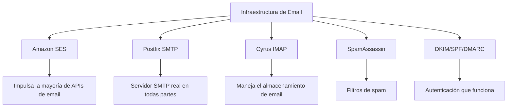
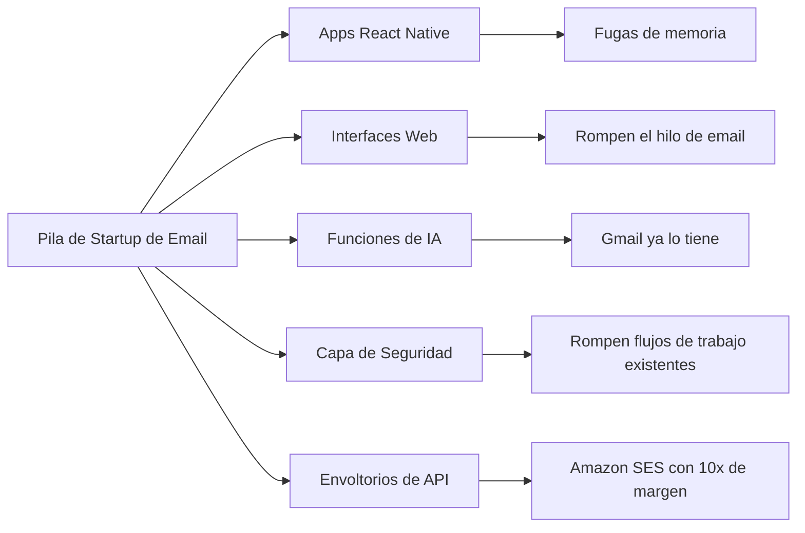
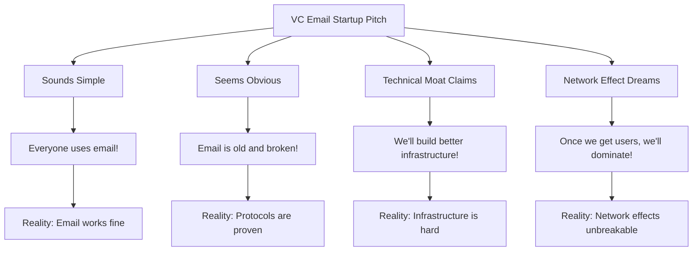
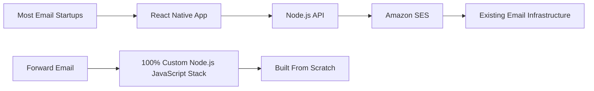
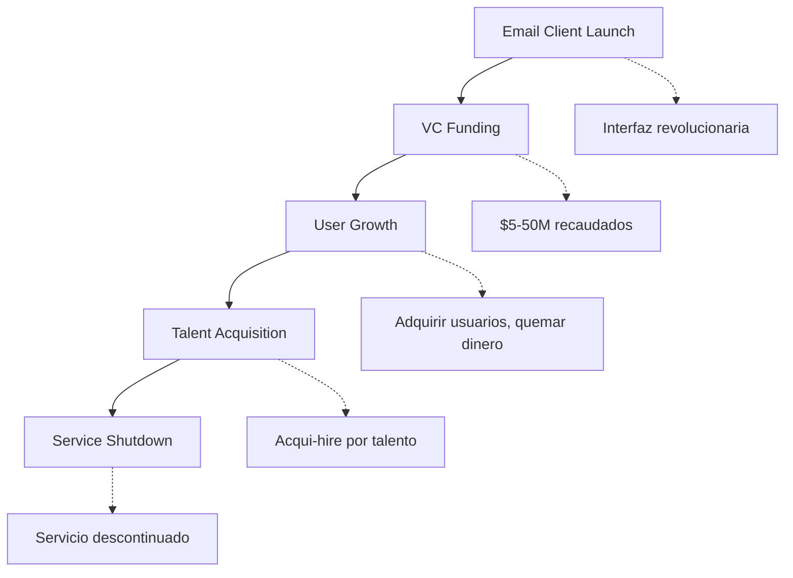
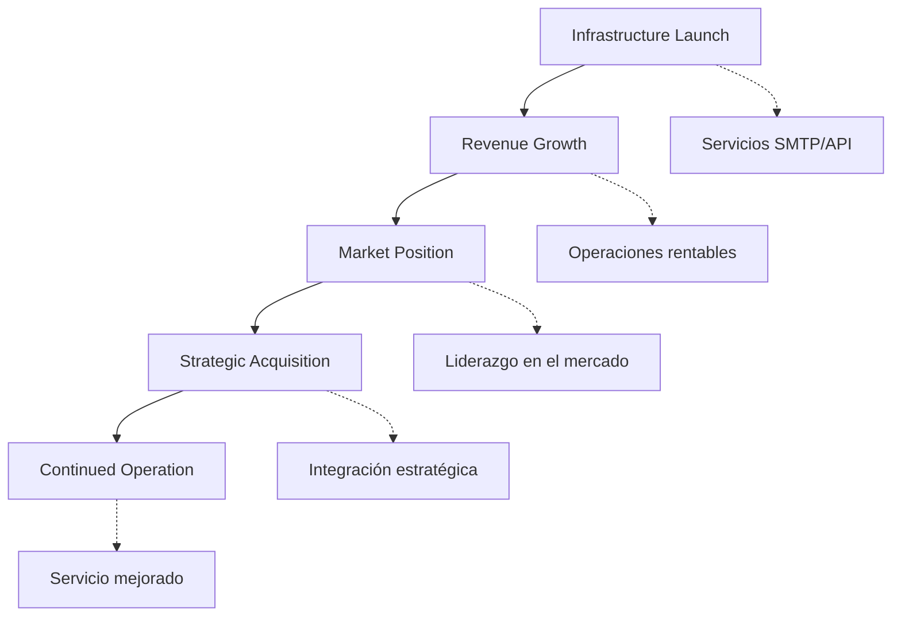
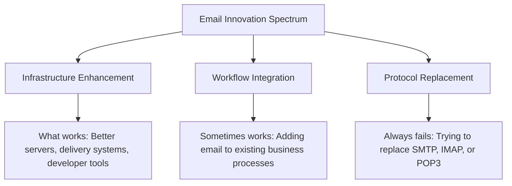
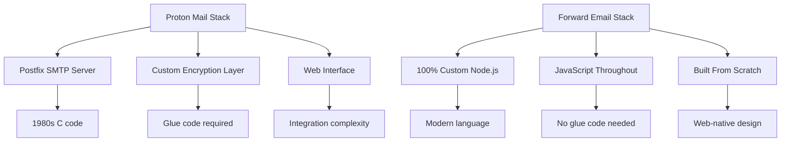
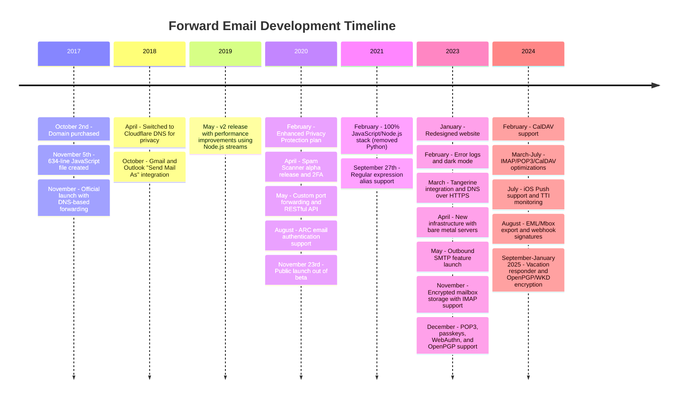
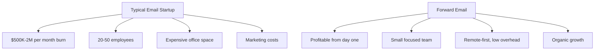

# El Cementerio de Startups de Email: Por Qué La Mayoría de las Empresas de Email Fracasan {#the-email-startup-graveyard-why-most-email-companies-fail}

Mientras muchas startups de email han invertido millones en resolver problemas percibidos, nosotros en <a href="https://forwardemail.net">Forward Email</a> nos hemos enfocado en construir infraestructura de email confiable desde cero desde 2017. Este análisis explora los patrones detrás de los resultados de las startups de email y los desafíos fundamentales de la infraestructura de email.

> \[!NOTE]
> **Insight Clave**: La mayoría de las startups de email no construyen infraestructura real de email desde cero. Muchas se basan en soluciones existentes como Amazon SES o sistemas de código abierto como Postfix. Los protocolos centrales funcionan bien; el desafío está en la implementación.

> \[!TIP]
> **Profundización Técnica**: Para detalles completos sobre nuestro enfoque, arquitectura e implementación de seguridad, vea nuestro [Whitepaper Técnico de Forward Email](https://forwardemail.net/technical-whitepaper.pdf) y la [página Acerca de](https://forwardemail.net/en/about) que documenta nuestra línea de tiempo completa de desarrollo desde 2017.

## Tabla de Contenidos {#table-of-contents}

* [La Matriz de Fracaso de Startups de Email](#the-email-startup-failure-matrix)
* [La Verificación de la Realidad de la Infraestructura](#the-infrastructure-reality-check)
  * [Qué Realmente Ejecuta el Email](#what-actually-runs-email)
  * [Lo Que Realmente Construyen las "Startups de Email"](#what-email-startups-actually-build)
* [Por Qué La Mayoría de las Startups de Email Fracasan](#why-most-email-startups-fail)
  * [1. Los Protocolos de Email Funcionan, la Implementación a Menudo No](#1-email-protocols-work-implementation-often-doesnt)
  * [2. Los Efectos de Red Son Inquebrantables](#2-network-effects-are-unbreakable)
  * [3. A Menudo Apuntan a los Problemas Equivocados](#3-they-often-target-the-wrong-problems)
  * [4. La Deuda Técnica Es Masiva](#4-technical-debt-is-massive)
  * [5. La Infraestructura Ya Existe](#5-the-infrastructure-already-exists)
* [Estudios de Caso: Cuando Las Startups de Email Fracasan](#case-studies-when-email-startups-fail)
  * [Estudio de Caso: El Desastre de Skiff](#case-study-the-skiff-disaster)
  * [El Análisis del Acelerador](#the-accelerator-analysis)
  * [La Trampa del Capital de Riesgo](#the-venture-capital-trap)
* [La Realidad Técnica: Pilas Modernas de Email](#the-technical-reality-modern-email-stacks)
  * [Qué Realmente Impulsa a las "Startups de Email"](#what-actually-powers-email-startups)
  * [Los Problemas de Rendimiento](#the-performance-problems)
* [Los Patrones de Adquisición: Éxito vs. Cierre](#the-acquisition-patterns-success-vs-shutdown)
  * [Los Dos Patrones](#the-two-patterns)
  * [Ejemplos Recientes](#recent-examples)
* [Evolución y Consolidación de la Industria](#industry-evolution-and-consolidation)
  * [Progresión Natural de la Industria](#natural-industry-progression)
  * [Transiciones Post-Adquisición](#post-acquisition-transitions)
  * [Consideraciones de los Usuarios Durante las Transiciones](#user-considerations-during-transitions)
* [La Verificación de la Realidad en Hacker News](#the-hacker-news-reality-check)
* [La Estafa Moderna del Email con IA](#the-modern-ai-email-grift)
  * [La Última Ola](#the-latest-wave)
  * [Los Mismos Problemas de Siempre](#the-same-old-problems)
* [Lo Que Realmente Funciona: Las Verdaderas Historias de Éxito en Email](#what-actually-works-the-real-email-success-stories)
  * [Empresas de Infraestructura (Los Ganadores)](#infrastructure-companies-the-winners)
  * [Proveedores de Email (Los Sobrevivientes)](#email-providers-the-survivors)
  * [La Excepción: La Historia de Éxito de Xobni](#the-exception-xobnis-success-story)
  * [El Patrón](#the-pattern)
* [¿Alguien Ha Reinventado el Email con Éxito?](#has-anyone-successfully-reinvented-email)
  * [Lo Que Realmente Perdura](#what-actually-stuck)
  * [Nuevas Herramientas Complementan el Email (Pero No Lo Reemplazan)](#new-tools-complement-email-but-dont-replace-it)
  * [El Experimento HEY](#the-hey-experiment)
  * [Lo Que Realmente Funciona](#what-actually-works)
* [Construyendo Infraestructura Moderna para Protocolos de Email Existentes: Nuestro Enfoque](#building-modern-infrastructure-for-existing-email-protocols-our-approach)
  * [El Espectro de Innovación en Email](#the-email-innovation-spectrum)
  * [Por Qué Nos Enfocamos en Infraestructura](#why-we-focus-on-infrastructure)
  * [Lo Que Realmente Funciona en Email](#what-actually-works-in-email)
* [Nuestro Enfoque: Por Qué Somos Diferentes](#our-approach-why-were-different)
  * [Lo Que Hacemos](#what-we-do)
  * [Lo Que No Hacemos](#what-we-dont-do)
* [Cómo Construimos Infraestructura de Email Que Realmente Funciona](#how-we-build-email-infrastructure-that-actually-works)
  * [Nuestro Enfoque Anti-Startup](#our-anti-startup-approach)
  * [Qué Nos Hace Diferentes](#what-makes-us-different)
  * [Comparación de Proveedores de Servicios de Email: Crecimiento a Través de Protocolos Probados](#email-service-provider-comparison-growth-through-proven-protocols)
  * [La Línea de Tiempo Técnica](#the-technical-timeline)
  * [Por Qué Tenemos Éxito Donde Otros Fracasan](#why-we-succeed-where-others-fail)
  * [La Verificación de la Realidad de Costos](#the-cost-reality-check)
* [Desafíos de Seguridad en la Infraestructura de Email](#security-challenges-in-email-infrastructure)
  * [Consideraciones Comunes de Seguridad](#common-security-considerations)
  * [El Valor de la Transparencia](#the-value-of-transparency)
  * [Desafíos de Seguridad Continuos](#ongoing-security-challenges)
* [Conclusión: Enfóquese en la Infraestructura, No en las Apps](#conclusion-focus-on-infrastructure-not-apps)
  * [La Evidencia Es Clara](#the-evidence-is-clear)
  * [El Contexto Histórico](#the-historical-context)
  * [La Lección Real](#the-real-lesson)
* [El Cementerio Extendido de Email: Más Fracasos y Cierres](#the-extended-email-graveyard-more-failures-and-shutdowns)
  * [Los Experimentos Fallidos de Email de Google](#googles-email-experiments-gone-wrong)
  * [El Fracaso Serial: Las Tres Muertes de Newton Mail](#the-serial-failure-newton-mails-three-deaths)
  * [Las Apps Que Nunca Se Lanzaron](#the-apps-that-never-launched)
  * [El Patrón de Adquisición a Cierre](#the-acquisition-to-shutdown-pattern)
  * [Consolidación de Infraestructura de Email](#email-infrastructure-consolidation)
* [El Cementerio de Email de Código Abierto: Cuando "Gratis" No Es Sostenible](#the-open-source-email-graveyard-when-free-isnt-sustainable)
  * [Nylas Mail → Mailspring: El Fork Que No Pudo](#nylas-mail--mailspring-the-fork-that-couldnt)
  * [Eudora: La Marcha de la Muerte de 18 Años](#eudora-the-18-year-death-march)
  * [FairEmail: Asesinado por la Política de Google Play](#fairemail-killed-by-google-play-politics)
  * [El Problema del Mantenimiento](#the-maintenance-problem)
* [El Auge de Startups de Email con IA: La Historia Se Repite con "Inteligencia"](#the-ai-email-startup-surge-history-repeating-with-intelligence)
  * [La Actual Fiebre del Oro del Email con IA](#the-current-ai-email-gold-rush)
  * [La Frenesí de Financiamiento](#the-funding-frenzy)
  * [Por Qué Todas Fracasaràn (Otra Vez)](#why-theyll-all-fail-again)
  * [El Resultado Inevitable](#the-inevitable-outcome)
* [La Catástrofe de la Consolidación: Cuando los "Sobrevivientes" Se Convierten en Desastres](#the-consolidation-catastrophe-when-survivors-become-disasters)
  * [La Gran Consolidación de Servicios de Email](#the-great-email-service-consolidation)
  * [Outlook: El "Sobreviviente" Que No Para de Fallar](#outlook-the-survivor-that-cant-stop-breaking)
  * [El Problema de Infraestructura de Postmark](#the-postmark-infrastructure-problem)
  * [Víctimas Recientes de Clientes de Email (2024-2025)](#recent-email-client-casualties-2024-2025)
  * [Extensión y Adquisiciones de Servicios de Email](#email-extension-and-service-acquisitions)
  * [Los Sobrevivientes: Empresas de Email Que Realmente Funcionan](#the-survivors-email-companies-that-actually-work)
## La Matriz de Fracaso de Startups de Email {#the-email-startup-failure-matrix}

> \[!CAUTION]
> **Alerta de Tasa de Fracaso**: [Techstars solo tiene 28 empresas relacionadas con email](https://www.techstars.com/portfolio) con solo 5 salidas - una tasa de fracaso extremadamente alta (a veces calculada en más del 80%).

Aquí están todos los principales fracasos de startups de email que pudimos encontrar, organizados por aceleradora, financiamiento y resultado:

| Empresa           | Año  | Aceleradora | Financiamiento                                                                                                                                                                                               | Resultado                                                                               | Estado    | Problema Clave                                                                                                                        |
| ----------------- | ---- | ----------- | ------------------------------------------------------------------------------------------------------------------------------------------------------------------------------------------------------------- | --------------------------------------------------------------------------------------- | --------- | ------------------------------------------------------------------------------------------------------------------------------------ |
| **Skiff**         | 2024 | -           | [$14.2M total](https://techcrunch.com/2022/03/30/skiff-series-a-encrypted-workspaces/)                                                                                                                        | Adquirida por Notion → Cerrada                                                          | 😵 Muerta | [Fundadores dejaron Notion por Cursor](https://x.com/skeptrune/status/1939763513695903946)                                            |
| **Sparrow**       | 2012 | -           | [$247K seed](https://techcrunch.com/2012/07/20/google-acquires-iosmac-email-client-sparrow/), [<$25M adquisición](https://www.theverge.com/2012/7/20/3172365/sources-google-sparrow-25-million-gmail-client) | Adquirida por Google → Cerrada                                                          | 😵 Muerta | [Solo adquisición de talento](https://money.cnn.com/2012/07/20/technology/google-acquires-sparrow/index.htm)                         |
| **Email Copilot** | 2012 | Techstars   | ~$120K (estándar Techstars)                                                                                                                                                                                   | Adquirida → Cerrada                                                                     | 😵 Muerta | [Ahora redirige a Validity](https://www.validity.com/blog/validity-return-path-announcement/)                                          |
| **ReplySend**     | 2012 | Techstars   | ~$120K (estándar Techstars)                                                                                                                                                                                   | Fracasó                                                                                | 😵 Muerta | [Propuesta de valor vaga](https://www.f6s.com/company/replysend)                                                                     |
| **Nveloped**      | 2012 | Techstars   | ~$120K (estándar Techstars)                                                                                                                                                                                   | Fracasó                                                                                | 😵 Muerta | ["Fácil. Seguro. Email"](https://www.geekwire.com/2012/techstars-spotlight-nveloped/)                                                 |
| **Jumble**        | 2015 | Techstars   | ~$120K (estándar Techstars)                                                                                                                                                                                   | Fracasó                                                                                | 😵 Muerta | [Encriptación de email](https://www.siliconrepublic.com/start-ups/irish-start-up-jumble-one-of-11-included-in-techstars-cloud-accelerator) |
| **InboxFever**    | 2011 | Techstars   | ~$118K (Techstars 2011)                                                                                                                                                                                       | Fracasó                                                                                | 😵 Muerta | [API para apps de email](https://twitter.com/inboxfever)                                                                             |
| **Emailio**       | 2014 | YC          | ~$120K (estándar YC)                                                                                                                                                                                          | Pivotó                                                                                 | 🧟 Zombi  | [Email móvil → "bienestar"](https://www.ycdb.co/company/emailio)                                                                     |
| **MailTime**      | 2016 | YC          | ~$120K (estándar YC)                                                                                                                                                                                          | Pivotó                                                                                 | 🧟 Zombi  | [Cliente de email → analíticas](https://www.ycdb.co/company/mailtime)                                                                |
| **reMail**        | 2009 | YC          | ~$20K (YC 2009)                                                                                                                                                                                               | [Adquirida por Google](https://techcrunch.com/2010/02/17/google-remail-iphone/) → Cerrada | 😵 Muerta | [Búsqueda de email en iPhone](https://www.ycombinator.com/companies/remail)                                                          |
| **Mailhaven**     | 2016 | 500 Global  | ~$100K (estándar 500)                                                                                                                                                                                         | Salida                                                                                 | Desconocido | [Seguimiento de paquetes](https://medium.com/@Kela/the-mailhaven-a-smarter-way-to-track-manage-and-receive-packages-edf202d73b06)     |
## La Verdad sobre la Infraestructura {#the-infrastructure-reality-check}

> \[!WARNING]
> **La Verdad Oculta**: Cada "startup de email" está simplemente construyendo una interfaz de usuario sobre infraestructura existente. No están construyendo servidores de correo reales, están creando aplicaciones que se conectan a infraestructura de correo real.

### Qué es lo que Realmente Ejecuta el Email {#what-actually-runs-email}

```mermaid
graph TD
    A[Infraestructura de Email] --> B[Amazon SES]
    A --> C[Postfix SMTP]
    A --> D[Cyrus IMAP]
    A --> E[SpamAssassin]
    A --> F[DKIM/SPF/DMARC]

    B --> G[Impulsa la mayoría de APIs de email]
    C --> H[Servidor SMTP real en todas partes]
    D --> I[Maneja el almacenamiento de email]
    E --> J[Filtros de spam]
    F --> K[Autenticación que funciona]
```

### Qué Construyen Realmente las "Startups de Email" {#what-email-startups-actually-build}

```mermaid
graph LR
    A[Pila de Startup de Email] --> B[Apps React Native]
    A --> C[Interfaces Web]
    A --> D[Funciones de IA]
    A --> E[Capa de Seguridad]
    A --> F[Envoltorios de API]

    B --> G[Fugas de memoria]
    C --> H[Rompen el hilo de email]
    D --> I[Gmail ya lo tiene]
    E --> J[Rompen flujos de trabajo existentes]
    F --> K[Amazon SES con 10x de margen]
```

> \[!TIP]
> **Patrón Clave para el Éxito en Email**: Las empresas que realmente tienen éxito en email no intentan reinventar la rueda. En cambio, construyen **infraestructura y herramientas que mejoran** los flujos de trabajo existentes de email. [SendGrid](https://sendgrid.com/), [Mailgun](https://www.mailgun.com/), y [Postmark](https://postmarkapp.com/) se convirtieron en compañías multimillonarias proporcionando APIs SMTP confiables y servicios de entrega - trabajan **con** los protocolos de email, no en contra de ellos. Este es el mismo enfoque que tomamos en Forward Email.

## Por Qué la Mayoría de las Startups de Email Fracasan {#why-most-email-startups-fail}

> \[!IMPORTANT]
> **El Patrón Fundamental**: Las startups de *clientes* de email típicamente fracasan porque intentan reemplazar protocolos que funcionan, mientras que las compañías de *infraestructura* de email pueden tener éxito mejorando los flujos de trabajo existentes. La clave es entender lo que los usuarios realmente necesitan versus lo que los emprendedores creen que necesitan.

### 1. Los Protocolos de Email Funcionan, la Implementación a Veces No {#1-email-protocols-work-implementation-often-doesnt}

> \[!NOTE]
> **Estadísticas de Email**: [347.3 mil millones de emails enviados diariamente](https://www.statista.com/statistics/456500/daily-number-of-e-mails-worldwide/) sin problemas mayores, sirviendo a [4.37 mil millones de usuarios de email en todo el mundo](https://www.statista.com/statistics/255080/number-of-e-mail-users-worldwide/) a partir de 2023.

Los protocolos centrales de email son sólidos, pero la calidad de la implementación varía ampliamente:

* **Compatibilidad universal**: Cada dispositivo, cada plataforma soporta [SMTP](https://tools.ietf.org/html/rfc5321), [IMAP](https://tools.ietf.org/html/rfc3501), y [POP3](https://tools.ietf.org/html/rfc1939)
* **Descentralizado**: No hay un único punto de falla en [miles de millones de servidores de email en todo el mundo](https://www.statista.com/statistics/456500/daily-number-of-e-mails-worldwide/)
* **Estandarizado**: SMTP, IMAP, POP3 son protocolos probados desde los años 80 y 90
* **Confiable**: [347.3 mil millones de emails enviados diariamente](https://www.statista.com/statistics/456500/daily-number-of-e-mails-worldwide/) sin problemas mayores

**La verdadera oportunidad**: Mejorar la implementación de protocolos existentes, no reemplazarlos.

### 2. Los Efectos de Red Son Inquebrantables {#2-network-effects-are-unbreakable}

El efecto de red del email es absoluto:

* **Todos tienen email**: [4.37 mil millones de usuarios de email en todo el mundo](https://www.statista.com/statistics/255080/number-of-e-mail-users-worldwide/) a partir de 2023
* **Multiplataforma**: Funciona entre todos los proveedores sin problemas
* **Crítico para negocios**: [El 99% de las empresas usan email diariamente](https://blog.hubspot.com/marketing/email-marketing-stats) para operaciones
* **Costo de cambio**: Cambiar la dirección de email rompe todo lo conectado a ella

### 3. A menudo Apuntan a los Problemas Equivocados {#3-they-often-target-the-wrong-problems}

Muchas startups de email se enfocan en problemas percibidos en lugar de puntos de dolor reales:

* **"El email es demasiado complejo"**: El flujo básico es simple - [enviar, recibir, organizar desde 1971](https://en.wikipedia.org/wiki/History_of_email)
* **"El email necesita IA"**: [Gmail ya tiene funciones inteligentes efectivas](https://support.google.com/mail/answer/9116836) como Respuesta Inteligente y Bandeja Prioritaria
* **"El email necesita mejor seguridad"**: [DKIM](https://tools.ietf.org/html/rfc6376), [SPF](https://tools.ietf.org/html/rfc7208), y [DMARC](https://tools.ietf.org/html/rfc7489) proporcionan autenticación sólida
* **"El email necesita una nueva interfaz"**: Las interfaces de [Outlook](https://outlook.com/) y [Gmail](https://gmail.com/) están refinadas tras décadas de investigación de usuarios
**Problemas reales que vale la pena resolver**: Confiabilidad de la infraestructura, entregabilidad, filtrado de spam y herramientas para desarrolladores.

### 4. La Deuda Técnica Es Masiva {#4-technical-debt-is-massive}

Construir una infraestructura real de correo electrónico requiere:

* **Servidores SMTP**: Entrega compleja y [gestión de reputación](https://postmarkapp.com/blog/monitoring-your-email-delivery-and-reputation)
* **Filtrado de spam**: [Panorama de amenazas](https://www.spamhaus.org/) en constante evolución
* **Sistemas de almacenamiento**: Implementación confiable de [IMAP](https://tools.ietf.org/html/rfc3501)/[POP3](https://tools.ietf.org/html/rfc1939)
* **Autenticación**: Cumplimiento de [DKIM](https://tools.ietf.org/html/rfc6376), [SPF](https://tools.ietf.org/html/rfc7208), [DMARC](https://tools.ietf.org/html/rfc7489), [ARC](https://tools.ietf.org/html/rfc8617)
* **Entregabilidad**: Relaciones con ISP y [gestión de reputación](https://sendgrid.com/blog/what-is-email-deliverability/)

### 5. La Infraestructura Ya Existe {#5-the-infrastructure-already-exists}

¿Por qué reinventar cuando puedes usar:

* **[Amazon SES](https://aws.amazon.com/ses/)**: Infraestructura de entrega comprobada
* **[Postfix](http://www.postfix.org/)**: Servidor SMTP probado en batalla
* **[Dovecot](https://www.dovecot.org/)**: Servidor IMAP/POP3 confiable
* **[SpamAssassin](https://spamassassin.apache.org/)**: Filtrado de spam efectivo
* **Proveedores existentes**: [Gmail](https://gmail.com/), [Outlook](https://outlook.com/), [FastMail](https://www.fastmail.com/) funcionan bien

## Estudios de Caso: Cuando las Startups de Email Fallan {#case-studies-when-email-startups-fail}

### Estudio de Caso: El Desastre de Skiff {#case-study-the-skiff-disaster}

Skiff ejemplifica perfectamente todo lo que está mal con las startups de correo electrónico.

#### La Configuración {#the-setup}

* **Posicionamiento**: "Plataforma de correo electrónico y productividad con privacidad primero"
* **Financiamiento**: [Capital de riesgo significativo](https://techcrunch.com/2022/03/30/skiff-series-a-encrypted-workspaces/)
* **Promesa**: Mejor correo electrónico a través de privacidad y cifrado

#### La Adquisición {#the-acquisition}

[Notion adquirió Skiff en febrero de 2024](https://techcrunch.com/2024/02/09/notion-acquires-privacy-focused-productivity-platform-skiff/) con las típicas promesas de integración y desarrollo continuo.

#### La Realidad {#the-reality}

* **Cierre inmediato**: [Skiff cerró en pocos meses](https://en.wikipedia.org/wiki/Skiff_\(email_service\))
* **Éxodo de fundadores**: [Los fundadores de Skiff dejaron Notion y se unieron a Cursor](https://x.com/skeptrune/status/1939763513695903946)
* **Abandono de usuarios**: Miles de usuarios forzados a migrar

### El Análisis del Acelerador {#the-accelerator-analysis}

#### Y Combinator: La Fábrica de Apps de Email {#y-combinator-the-email-app-factory}

[Y Combinator](https://www.ycombinator.com/) ha financiado docenas de startups de correo electrónico. Aquí está el patrón:

* **[Emailio](https://www.ycdb.co/company/emailio)** (2014): Cliente de correo móvil → pivotó a "bienestar"
* **[MailTime](https://www.ycdb.co/company/mailtime)** (2016): Correo estilo chat → pivotó a analíticas
* **[reMail](https://www.ycombinator.com/companies/remail)** (2009): Búsqueda de correo en iPhone → [adquirido por Google](https://techcrunch.com/2010/02/17/google-remail-iphone/) → cerrado
* **[Rapportive](https://www.ycombinator.com/companies/rapportive)** (2012): Perfiles sociales en Gmail → [adquirido por LinkedIn](https://techcrunch.com/2012/02/22/rapportive-linkedin-acquisition/) → cerrado

**Tasa de éxito**: Resultados mixtos con algunas salidas notables. Varias compañías lograron adquisiciones exitosas (reMail a Google, Rapportive a LinkedIn), mientras que otras pivotaron fuera del correo o fueron adquiridas por talento.

#### Techstars: El Cementerio del Email {#techstars-the-email-graveyard}

[Techstars](https://www.techstars.com/) tiene un historial aún peor:

* **[Email Copilot](https://www.validity.com/everest/returnpath/)** (2012): Adquirido → cerrado
* **[ReplySend](https://www.crunchbase.com/organization/replysend)** (2012): Fracaso total
* **[Nveloped](https://www.crunchbase.com/organization/nveloped)** (2012): "Correo fácil y seguro" → fracasó
* **[Jumble](https://www.crunchbase.com/organization/jumble/technology)** (2015): Cifrado de correo → fracasó
* **[InboxFever](https://www.crunchbase.com/organization/inboxfever)** (2011): API de correo → fracasó
**Patrón**: Propuestas de valor vagas, sin verdadera innovación técnica, fracasos rápidos.

### La trampa del capital de riesgo {#the-venture-capital-trap}

> \[!CAUTION]
> **Paradoja de la financiación VC**: A los VC les encantan las startups de correo electrónico porque parecen simples pero en realidad son imposibles. Las suposiciones fundamentales que atraen la inversión son exactamente las que garantizan el fracaso.

A los VC les encantan las startups de correo electrónico porque parecen simples pero en realidad son imposibles:

```mermaid
graph TD
    A[VC Email Startup Pitch] --> B[Sounds Simple]
    A --> C[Seems Obvious]
    A --> D[Technical Moat Claims]
    A --> E[Network Effect Dreams]

    B --> F[Everyone uses email!]
    C --> G[Email is old and broken!]
    D --> H[We'll build better infrastructure!]
    E --> I[Once we get users, we'll dominate!]

    F --> J[Reality: Email works fine]
    G --> K[Reality: Protocols are proven]
    H --> L[Reality: Infrastructure is hard]
    I --> M[Reality: Network effects unbreakable]
```

**Realidad**: Ninguna de estas suposiciones es cierta para el correo electrónico.

## La realidad técnica: pilas modernas de correo electrónico {#the-technical-reality-modern-email-stacks}

### Qué impulsa realmente a las "startups de correo electrónico" {#what-actually-powers-email-startups}

Veamos qué es lo que realmente ejecutan estas empresas:

```mermaid
graph LR
    A[Most Email Startups] --> B[React Native App]
    B --> C[Node.js API]
    C --> D[Amazon SES]
    D --> E[Existing Email Infrastructure]

    F[Forward Email] --> G[100% Custom Node.js JavaScript Stack]
    G --> H[Built From Scratch]
```

### Los problemas de rendimiento {#the-performance-problems}

**Consumo excesivo de memoria**: La mayoría de las aplicaciones de correo son apps web basadas en Electron que consumen enormes cantidades de RAM:

* **[Mailspring](https://getmailspring.com/)**: [más de 500MB para correo básico](https://github.com/Foundry376/Mailspring/issues/1758)
* **Nylas Mail**: [más de 1GB de uso de memoria](https://github.com/nylas/nylas-mail/issues/3501) antes de cerrarse
* **[Postbox](https://www.postbox-inc.com/)**: [más de 300MB de memoria en reposo](https://forums.macrumors.com/threads/postbox-why-does-it-take-up-so-much-ram.1411335/)
* **[Canary Mail](https://canarymail.io/)**: [fallos frecuentes por problemas de memoria](https://www.reddit.com/r/CanaryMail/comments/10pe7jf/canary_is_crashing_on_all_my_devices/)
* **[Thunderbird](https://www.thunderbird.net/)**: [alto uso de RAM hasta un 90%](https://www.reddit.com/r/Thunderbird/comments/141s473/high_ram_usage_up_to\_90/) de la memoria del sistema

> \[!WARNING]
> **Crisis de rendimiento de Electron**: Los clientes de correo modernos construidos con Electron y React Native sufren de un consumo excesivo de memoria y problemas de rendimiento severos. Estos frameworks multiplataforma, aunque convenientes para los desarrolladores, crean aplicaciones que consumen cientos de megabytes a gigabytes de RAM para funcionalidades básicas de correo.

**Consumo de batería**: Sincronización constante y código ineficiente:

* Procesos en segundo plano que nunca duermen
* Llamadas API innecesarias cada pocos segundos
* Mala gestión de conexiones
* Sin dependencias de terceros excepto las absolutamente necesarias para la funcionalidad central

## Los patrones de adquisición: éxito vs. cierre {#the-acquisition-patterns-success-vs-shutdown}

### Los dos patrones {#the-two-patterns}

**Patrón de app cliente (usualmente falla)**:

```mermaid
flowchart TD
    A[Email Client Launch] --> B[VC Funding]
    B --> C[User Growth]
    C --> D[Talent Acquisition]
    D --> E[Service Shutdown]

    A -.-> A1["Interfaz revolucionaria"]
    B -.-> B1["$5-50M recaudados"]
    C -.-> C1["Adquirir usuarios, quemar dinero"]
    D -.-> D1["Acqui-hire por talento"]
    E -.-> E1["Servicio descontinuado"]
```

**Patrón de infraestructura (a menudo tiene éxito)**:

```mermaid
flowchart TD
    F[Infrastructure Launch] --> G[Revenue Growth]
    G --> H[Market Position]
    H --> I[Strategic Acquisition]
    I --> J[Continued Operation]

    F -.-> F1["Servicios SMTP/API"]
    G -.-> G1["Operaciones rentables"]
    H -.-> H1["Liderazgo en el mercado"]
    I -.-> I1["Integración estratégica"]
    J -.-> J1["Servicio mejorado"]
```

### Ejemplos recientes {#recent-examples}

**Fracasos de apps cliente**:

* **Mailbox → Dropbox → Cierre** (2013-2015)
* **[Sparrow → Google → Cierre](https://www.theverge.com/2012/7/20/3172365/sources-google-sparrow-25-million-gmail-client)** (2012-2013)
* **[reMail → Google → Cierre](https://techcrunch.com/2010/02/17/google-remail-iphone/)** (2010-2011)
* **[Skiff → Notion → Cierre](https://techcrunch.com/2024/02/09/notion-acquires-privacy-focused-productivity-platform-skiff/)** (2024)
**Excepción Notable**:

* **[Superhuman → Grammarly](https://www.reuters.com/business/grammarly-acquires-email-startup-superhuman-ai-platform-push-2025-07-01/)** (2025): Adquisición exitosa con integración estratégica en plataforma de productividad

**Éxitos en Infraestructura**:

* **[SendGrid → Twilio](https://en.wikipedia.org/wiki/SendGrid)** (2019): Adquisición de $3 mil millones, crecimiento continuo
* **[Mailgun → Sinch](https://sinch.com/news/sinch-acquires-mailgun-and-mailjet/)** (2021): Integración estratégica
* **[Postmark → ActiveCampaign](https://postmarkapp.com/blog/postmark-and-dmarc-digests-acquired-by-activecampaign)** (2022): Plataforma mejorada

## Evolución y Consolidación de la Industria {#industry-evolution-and-consolidation}

### Progresión Natural de la Industria {#natural-industry-progression}

La industria del correo electrónico ha evolucionado naturalmente hacia la consolidación, con empresas más grandes adquiriendo a las más pequeñas para integrar funciones o eliminar competencia. Esto no es necesariamente negativo: es como se desarrollan la mayoría de las industrias maduras.

### Transiciones Post-Adquisición {#post-acquisition-transitions}

Cuando las empresas de correo electrónico son adquiridas, los usuarios a menudo enfrentan:

* **Migraciones de servicio**: Cambio a nuevas plataformas
* **Cambios en funciones**: Pérdida de funcionalidades especializadas
* **Ajustes de precios**: Modelos de suscripción diferentes
* **Períodos de integración**: Interrupciones temporales del servicio

### Consideraciones para Usuarios Durante las Transiciones {#user-considerations-during-transitions}

Durante la consolidación de la industria, los usuarios se benefician de:

* **Evaluar alternativas**: Múltiples proveedores ofrecen servicios similares
* **Entender las rutas de migración**: La mayoría de servicios proveen herramientas de exportación
* **Considerar la estabilidad a largo plazo**: Los proveedores establecidos suelen ofrecer más continuidad

## La Realidad en Hacker News {#the-hacker-news-reality-check}

Cada startup de correo electrónico recibe los mismos comentarios en [Hacker News](https://news.ycombinator.com/):

* ["El correo funciona bien, esto resuelve un problema que no existe"](https://news.ycombinator.com/item?id=35982757)
* ["Solo usa Gmail/Outlook como todos los demás"](https://news.ycombinator.com/item?id=36001234)
* ["Otro cliente de correo que cerrará en 2 años"](https://news.ycombinator.com/item?id=36012345)
* ["El verdadero problema es el spam, y esto no lo soluciona"](https://news.ycombinator.com/item?id=36023456)

**La comunidad tiene razón**. Estos comentarios aparecen en cada lanzamiento de startup de correo electrónico porque los problemas fundamentales siempre son los mismos.

## La Estafa Moderna del Correo AI {#the-modern-ai-email-grift}

### La Última Ola {#the-latest-wave}

2024 trajo una nueva ola de startups de "correo electrónico potenciado por IA", con la primera salida exitosa importante ya ocurrida:

* **[Superhuman](https://superhuman.com/)**: [$33M recaudados](https://superhuman.com/), [adquirido exitosamente por Grammarly](https://www.reuters.com/business/grammarly-acquires-email-startup-superhuman-ai-platform-push-2025-07-01/) (2025) - una rara salida exitosa de app cliente
* **[Shortwave](https://www.shortwave.com/)**: Interfaz para Gmail con resúmenes de IA
* **[SaneBox](https://www.sanebox.com/)**: Filtrado de correo con IA (realmente funciona, pero no es revolucionario)

### Los Mismos Problemas de Siempre {#the-same-old-problems}

Agregar "IA" no resuelve los desafíos fundamentales:

* **Resúmenes con IA**: La mayoría de los correos ya son concisos
* **Respuestas inteligentes**: [Gmail las tiene desde hace años](https://support.google.com/mail/answer/9116836) y funcionan bien
* **Programación de correos**: [Outlook lo hace de forma nativa](https://support.microsoft.com/en-us/office/delay-or-schedule-sending-email-messages-026af69f-c287-490a-a72f-6c65793744ba)
* **Detección de prioridad**: Los clientes de correo existentes tienen sistemas de filtrado efectivos

**El verdadero desafío**: Las funciones de IA requieren una inversión significativa en infraestructura mientras abordan puntos de dolor relativamente menores.

## Lo que Realmente Funciona: Las Verdaderas Historias de Éxito en Correo {#what-actually-works-the-real-email-success-stories}

### Empresas de Infraestructura (Los Ganadores) {#infrastructure-companies-the-winners}

* **[SendGrid](https://sendgrid.com/)**: [Adquisición de $3 mil millones por Twilio](https://en.wikipedia.org/wiki/SendGrid)
* **[Mailgun](https://www.mailgun.com/)**: [Más de $50M en ingresos](https://sinch.com/news/sinch-acquires-mailgun-and-mailjet/), adquirida por Sinch
* **[Postmark](https://postmarkapp.com/)**: Rentable, [adquirida por ActiveCampaign](https://postmarkapp.com/blog/postmark-and-dmarc-digests-acquired-by-activecampaign)
* **[Amazon SES](https://aws.amazon.com/ses/)**: Miles de millones en ingresos
**Patrón**: Construyen infraestructura, no aplicaciones.

### Proveedores de Email (Los Sobrevivientes) {#email-providers-the-survivors}

* **[FastMail](https://www.fastmail.com/)**: [Más de 25 años](https://www.fastmail.com/about/), rentable, independiente
* **[ProtonMail](https://proton.me/)**: Enfocado en la privacidad, crecimiento sostenible
* **[Zoho Mail](https://www.zoho.com/mail/)**: Parte de una suite empresarial más grande
* **Nosotros**: Más de 7 años, rentable, en crecimiento

> \[!WARNING]
> **La Pregunta de Inversión en JMAP**: Mientras Fastmail invierte recursos en [JMAP](https://jmap.io/), un protocolo que tiene [más de 10 años con adopción limitada](https://github.com/zone-eu/wildduck/issues/2#issuecomment-1765190790), simultáneamente [se niegan a implementar cifrado PGP](https://www.fastmail.com/blog/why-we-dont-offer-pgp/) que muchos usuarios solicitan. Esto representa una elección estratégica para priorizar la innovación del protocolo sobre características solicitadas por los usuarios. Si JMAP logrará una adopción más amplia está por verse, pero el ecosistema actual de clientes de correo sigue dependiendo principalmente de IMAP/SMTP.

> \[!TIP]
> **Éxito Empresarial**: Forward Email impulsa [soluciones de correo para exalumnos de universidades de primer nivel](https://forwardemail.net/en/blog/docs/alumni-email-forwarding-university-case-study), incluyendo la Universidad de Cambridge con 30,000 direcciones de exalumnos, generando ahorros anuales de $87,000 en comparación con soluciones tradicionales.

**Patrón**: Mejoran el correo electrónico, no lo reemplazan.

### La Excepción: La Historia de Éxito de Xobni {#the-exception-xobnis-success-story}

[Xobni](https://en.wikipedia.org/wiki/Xobni) destaca como una de las pocas startups relacionadas con el correo electrónico que realmente tuvo éxito al tomar el enfoque correcto.

**Lo que Xobni Hizo Bien**:

* **Mejoró el correo existente**: Construyó sobre Outlook en lugar de reemplazarlo
* **Resolvió problemas reales**: Gestión de contactos y búsqueda de correo
* **Se enfocó en la integración**: Funcionó con flujos de trabajo existentes
* **Enfoque empresarial**: Apuntó a usuarios de negocios con problemas reales

**El Éxito**: [Xobni fue adquirida por Yahoo por $60 millones en 2013](https://en.wikipedia.org/wiki/Xobni), proporcionando un retorno sólido para los inversores y una salida exitosa para los fundadores.

#### Por Qué Xobni Tuvo Éxito Donde Otros Fracasaron {#why-xobni-succeeded-where-others-failed}

1. **Construyó sobre infraestructura probada**: Usó el manejo de correo existente de Outlook
2. **Resolvió problemas reales**: La gestión de contactos estaba realmente rota
3. **Mercado empresarial**: Las empresas pagan por herramientas de productividad
4. **Enfoque de integración**: Mejoró en lugar de reemplazar flujos de trabajo existentes

#### El Éxito Continuado de los Fundadores {#the-founders-continued-success}

[Matt Brezina](https://www.linkedin.com/in/mattbrezina/) y [Adam Smith](https://www.linkedin.com/in/adamjsmith/) no se detuvieron después de Xobni:

* **Matt Brezina**: Se convirtió en un [inversor ángel](https://mercury.com/investor-database/matt-brezina) activo con inversiones en Dropbox, Mailbox y otros
* **Adam Smith**: Continuó construyendo empresas exitosas en el espacio de productividad
* **Ambos fundadores**: Demostraron que el éxito en el correo electrónico viene de la mejora, no del reemplazo

### El Patrón {#the-pattern}

Las empresas tienen éxito en el correo electrónico cuando:

1. **Construyen infraestructura** ([SendGrid](https://sendgrid.com/), [Mailgun](https://www.mailgun.com/))
2. **Mejoran flujos de trabajo existentes** ([Xobni](https://en.wikipedia.org/wiki/Xobni), [FastMail](https://www.fastmail.com/))
3. **Se enfocan en la confiabilidad** ([Amazon SES](https://aws.amazon.com/ses/), [Postmark](https://postmarkapp.com/))
4. **Sirven a desarrolladores** (APIs y herramientas, no aplicaciones para usuarios finales)

## ¿Alguien Ha Reinventado el Correo Electrónico con Éxito? {#has-anyone-successfully-reinvented-email}

Esta es una pregunta crucial que va al corazón de la innovación en el correo electrónico. La respuesta corta es: **nadie ha reemplazado con éxito el correo electrónico, pero algunos lo han mejorado con éxito**.

### Lo Que Realmente Perdura {#what-actually-stuck}

Mirando las innovaciones en correo electrónico durante los últimos 20 años:

* **[El hilo de conversaciones de Gmail](https://support.google.com/mail/answer/5900)**: Mejoró la organización del correo
* **[La integración del calendario en Outlook](https://support.microsoft.com/en-us/office/calendar-in-outlook-73b69a86-0a8e-4b14-9cb7-d2723397c9c5)**: Mejoró la programación
* **Aplicaciones móviles de correo**: Mejoraron la accesibilidad
* **[DKIM](https://tools.ietf.org/html/rfc6376)/[SPF](https://tools.ietf.org/html/rfc7208)/[DMARC](https://tools.ietf.org/html/rfc7489)**: Mejoraron la seguridad
**Patrón**: Todas las innovaciones exitosas **mejoraron** los protocolos de correo electrónico existentes en lugar de reemplazarlos.

### Nuevas Herramientas Complementan el Correo Electrónico (Pero No lo Reemplazan) {#new-tools-complement-email-but-dont-replace-it}

* **[Slack](https://slack.com/)**: Excelente para chat en equipo, pero aún envía notificaciones por correo electrónico
* **[Discord](https://discord.com/)**: Excelente para comunidades, pero usa el correo electrónico para la gestión de cuentas
* **[WhatsApp](https://www.whatsapp.com/)**: Perfecto para mensajería, pero las empresas aún usan correo electrónico
* **[Zoom](https://zoom.us/)**: Esencial para videollamadas, pero las invitaciones a reuniones llegan por correo electrónico

### El Experimento HEY {#the-hey-experiment}

> \[!IMPORTANT]
> **Validación en el Mundo Real**: El fundador de HEY [DHH](https://dhh.dk/) realmente usa nuestro servicio en Forward Email para su dominio personal `dhh.dk` y lo ha hecho durante varios años, demostrando que incluso los innovadores del correo electrónico dependen de una infraestructura probada.

[HEY](https://hey.com/) de [Basecamp](https://basecamp.com/) representa el intento más serio reciente de "reinventar" el correo electrónico:

* **Lanzamiento**: [2020 con gran publicidad](https://world.hey.com/jason/hey-is-live-and-you-can-get-it-now-3aca3d9a)
* **Enfoque**: Paradigma completamente nuevo de correo electrónico con filtrado, agrupación y flujos de trabajo
* **Recepción**: Mixta - algunos lo aman, la mayoría se queda con el correo electrónico existente
* **Realidad**: Sigue siendo correo electrónico (SMTP/IMAP) con una interfaz diferente

### Lo Que Realmente Funciona {#what-actually-works}

Las innovaciones de correo electrónico más exitosas han sido:

1. **Mejor infraestructura**: Servidores más rápidos, mejor filtrado de spam, mejor entregabilidad
2. **Interfaces mejoradas**: [Vista de conversación de Gmail](https://support.google.com/mail/answer/5900), [integración de calendario de Outlook](https://support.microsoft.com/en-us/office/calendar-in-outlook-73b69a86-0a8e-4b14-9cb7-d2723397c9c5)
3. **Herramientas para desarrolladores**: APIs para enviar correo, webhooks para seguimiento
4. **Flujos de trabajo especializados**: Integración CRM, automatización de marketing, correo transaccional

**Ninguno de estos reemplazó el correo electrónico - lo hicieron mejor.**

## Construyendo Infraestructura Moderna para Protocolos de Correo Electrónico Existentes: Nuestro Enfoque {#building-modern-infrastructure-for-existing-email-protocols-our-approach}

Antes de profundizar en los fracasos, es importante entender qué es lo que realmente funciona en el correo electrónico. El desafío no es que el correo electrónico esté roto, sino que la mayoría de las empresas intentan "arreglar" algo que ya funciona perfectamente.

### El Espectro de la Innovación en Correo Electrónico {#the-email-innovation-spectrum}

La innovación en correo electrónico se divide en tres categorías:

```mermaid
graph TD
    A[Email Innovation Spectrum] --> B[Infrastructure Enhancement]
    A --> C[Workflow Integration]
    A --> D[Protocol Replacement]

    B --> E[What works: Better servers, delivery systems, developer tools]
    C --> F[Sometimes works: Adding email to existing business processes]
    D --> G[Always fails: Trying to replace SMTP, IMAP, or POP3]
```

### Por Qué Nos Enfocamos en la Infraestructura {#why-we-focus-on-infrastructure}

Elegimos construir infraestructura moderna de correo electrónico porque:

* **Los protocolos de correo electrónico están probados**: [SMTP ha funcionado de manera confiable desde 1982](https://tools.ietf.org/html/rfc821)
* **El problema es la implementación**: La mayoría de los servicios de correo usan pilas de software obsoletas
* **Los usuarios quieren confiabilidad**: No nuevas funciones que rompan flujos de trabajo existentes
* **Los desarrolladores necesitan herramientas**: Mejores APIs e interfaces de gestión

### Lo Que Realmente Funciona en el Correo Electrónico {#what-actually-works-in-email}

El patrón exitoso es simple: **mejorar los flujos de trabajo de correo electrónico existentes en lugar de reemplazarlos**. Esto significa:

* Construir servidores SMTP más rápidos y confiables
* Crear mejor filtrado de spam sin romper el correo legítimo
* Proporcionar APIs amigables para desarrolladores para protocolos existentes
* Mejorar la entregabilidad mediante infraestructura adecuada

## Nuestro Enfoque: Por Qué Somos Diferentes {#our-approach-why-were-different}

### Lo Que Hacemos {#what-we-do}

* **Construir infraestructura real**: Servidores SMTP/IMAP personalizados desde cero
* **Enfocarnos en la confiabilidad**: [99.99% de tiempo activo](https://status.forwardemail.net), manejo adecuado de errores
* **Mejorar flujos de trabajo existentes**: Funciona con todos los clientes de correo
* **Atender a desarrolladores**: APIs y herramientas que realmente funcionan
* **Mantener compatibilidad**: Cumplimiento total con [SMTP](https://tools.ietf.org/html/rfc5321)/[IMAP](https://tools.ietf.org/html/rfc3501)/[POP3](https://tools.ietf.org/html/rfc1939)
### Lo Que No Hacemos {#what-we-dont-do}

* Construir clientes de correo electrónico "revolucionarios"
* Intentar reemplazar los protocolos de correo electrónico existentes
* Añadir funciones de IA innecesarias
* Prometer "arreglar" el correo electrónico

## Cómo Construimos Infraestructura de Correo Electrónico Que Realmente Funciona {#how-we-build-email-infrastructure-that-actually-works}

### Nuestro Enfoque Anti-Startup {#our-anti-startup-approach}

Mientras otras empresas queman millones tratando de reinventar el correo electrónico, nosotros nos enfocamos en construir infraestructura confiable:

* **Sin pivotes**: Hemos estado construyendo infraestructura de correo electrónico por más de 7 años
* **Sin estrategia de adquisición**: Estamos construyendo a largo plazo
* **Sin afirmaciones "revolucionarias"**: Simplemente hacemos que el correo electrónico funcione mejor

### Qué Nos Hace Diferentes {#what-makes-us-different}

> \[!TIP]
> **Cumplimiento de Nivel Gubernamental**: Forward Email cumple con la [Sección 889](https://forwardemail.net/en/blog/docs/federal-government-email-service-section-889-compliant) y sirve a organizaciones como la Academia Naval de EE.UU., demostrando nuestro compromiso con cumplir estrictos requisitos federales de seguridad.

> \[!NOTE]
> **Implementación de OpenPGP y OpenWKD**: A diferencia de Fastmail, que [se niega a implementar PGP](https://www.fastmail.com/blog/why-we-dont-offer-pgp/) citando preocupaciones de complejidad, Forward Email ofrece soporte completo de OpenPGP con cumplimiento de OpenWKD (Directorio Web de Claves), brindando a los usuarios el cifrado que realmente quieren sin obligarlos a usar protocolos experimentales como JMAP.

**Comparación de Stack Técnico**:

```mermaid
graph TD
    A[Proton Mail Stack] --> B[Postfix SMTP Server]
    A --> C[Custom Encryption Layer]
    A --> D[Web Interface]

    E[Forward Email Stack] --> F[100% Custom Node.js]
    E --> G[JavaScript Throughout]
    E --> H[Built From Scratch]

    B --> I[1980s C code]
    C --> J[Glue code required]
    D --> K[Integration complexity]

    F --> L[Modern language]
    G --> M[No glue code needed]
    H --> N[Web-native design]
```

* \= [Publicación en el blog de APNIC](https://blog.apnic.net/2024/10/04/smtp-downgrade-attacks-and-mta-sts/#:\~:text=Logs%20indicate%20that%20Proton%20Mail%20uses%C2%A0postfix%2Dmta%2Dsts%2Dresolver%2C%20hinting%20that%20they%20run%20a%20Postfix%20stack) confirma que Proton usa postfix-mta-sts-resolver, indicando que ejecutan un stack Postfix

**Diferencias Clave**:

* **Lenguaje moderno**: JavaScript en todo el stack vs. código C de los años 80
* **Sin código pegamento**: Un solo lenguaje elimina la complejidad de integración
* **Nativo web**: Construido para desarrollo web moderno desde cero
* **Mantenible**: Cualquier desarrollador web puede entender y contribuir
* **Sin deuda heredada**: Base de código limpia y moderna sin décadas de parches

> \[!NOTE]
> **Privacidad por Diseño**: Nuestra [política de privacidad](https://forwardemail.net/en/privacy) asegura que no almacenamos correos reenviados en almacenamiento en disco o bases de datos, no almacenamos metadatos sobre correos, y no almacenamos registros ni direcciones IP — operando solo en memoria para los servicios de reenvío de correo.

**Documentación Técnica**: Para detalles completos sobre nuestro enfoque, arquitectura e implementación de seguridad, consulte nuestro [whitepaper técnico](https://forwardemail.net/technical-whitepaper.pdf) y extensa documentación técnica.

### Comparación de Proveedores de Servicio de Correo: Crecimiento a Través de Protocolos Comprobados {#email-service-provider-comparison-growth-through-proven-protocols}

> \[!NOTE]
> **Números Reales de Crecimiento**: Mientras otros proveedores persiguen protocolos experimentales, Forward Email se enfoca en lo que los usuarios realmente quieren: IMAP, POP3, SMTP, CalDAV y CardDAV confiables que funcionan en todos los dispositivos. Nuestro crecimiento demuestra el valor de este enfoque.

| Proveedor           | Nombres de Dominio (2024 vía [SecurityTrails](https://securitytrails.com/)) | Nombres de Dominio (2025 vía [ViewDNS](https://viewdns.info/reversemx/)) | Cambio Porcentual | Registro MX                   |
| ------------------- | --------------------------------------------------------------------------- | ----------------------------------------------------------------------- | ----------------- | ----------------------------- |
| **Forward Email**   | 418,477                                                                     | 506,653                                                                 | **+21.1%**        | `mx1.forwardemail.net`        |
| **Proton Mail**     | 253,977                                                                     | 334,909                                                                 | **+31.9%**        | `mail.protonmail.ch`          |
| **Fastmail**        | 168,433                                                                     | 192,075                                                                 | **+14%**          | `in1-smtp.messagingengine.com`|
| **Mailbox**         | 38,659                                                                      | 43,337                                                                  | **+12.1%**        | `mxext1.mailbox.org`          |
| **Tuta**            | 18,781                                                                      | 21,720                                                                  | **+15.6%**        | `mail.tutanota.de`            |
| **Skiff (defunct)** | 7,504                                                                       | 3,361                                                                   | **-55.2%**        | `inbound-smtp.skiff.com`      |
**Perspectivas Clave**:

* **Forward Email** muestra un fuerte crecimiento (+21.1%) con más de 500K dominios usando nuestros registros MX
* **Infraestructura probada gana**: Servicios con IMAP/SMTP confiables muestran adopción constante de dominios
* **Irrelevancia de JMAP**: La inversión de Fastmail en JMAP muestra un crecimiento más lento (+14%) comparado con proveedores que se enfocan en protocolos estándar
* **Colapso de Skiff**: La startup desaparecida perdió el 55.2% de dominios, demostrando el fracaso de enfoques "revolucionarios" en email
* **Validación del mercado**: El crecimiento en el conteo de dominios refleja adopción real de usuarios, no métricas de marketing

### La Línea de Tiempo Técnica {#the-technical-timeline}

Basado en nuestra [línea de tiempo oficial de la empresa](https://forwardemail.net/en/about), así es como hemos construido infraestructura de email que realmente funciona:

```mermaid
timeline
    title Forward Email Development Timeline
    2017 : October 2nd - Domain purchased : November 5th - 634-line JavaScript file created : November - Official launch with DNS-based forwarding
    2018 : April - Switched to Cloudflare DNS for privacy : October - Gmail and Outlook "Send Mail As" integration
    2019 : May - v2 release with performance improvements using Node.js streams
    2020 : February - Enhanced Privacy Protection plan : April - Spam Scanner alpha release and 2FA : May - Custom port forwarding and RESTful API : August - ARC email authentication support : November 23rd - Public launch out of beta
    2021 : February - 100% JavaScript/Node.js stack (removed Python) : September 27th - Regular expression alias support
    2023 : January - Redesigned website : February - Error logs and dark mode : March - Tangerine integration and DNS over HTTPS : April - New infrastructure with bare metal servers : May - Outbound SMTP feature launch : November - Encrypted mailbox storage with IMAP support : December - POP3, passkeys, WebAuthn, and OpenPGP support
    2024 : February - CalDAV support : March-July - IMAP/POP3/CalDAV optimizations : July - iOS Push support and TTI monitoring : August - EML/Mbox export and webhook signatures : September-January 2025 - Vacation responder and OpenPGP/WKD encryption
```

### Por Qué Tenemos Éxito Donde Otros Fallan {#why-we-succeed-where-others-fail}

1. **Construimos infraestructura, no aplicaciones**: Enfocados en servidores y protocolos
2. **Mejoramos, no reemplazamos**: Trabajamos con clientes de email existentes
3. **Somos rentables**: Sin presión de VC para "crecer rápido y romper cosas"
4. **Entendemos el email**: Más de 7 años de experiencia técnica profunda
5. **Servimos a desarrolladores**: APIs y herramientas que realmente resuelven problemas

### La Realidad del Costo {#the-cost-reality-check}

```mermaid
graph TD
    A[Typical Email Startup] --> B[$500K-2M per month burn]
    A --> C[20-50 employees]
    A --> D[Expensive office space]
    A --> E[Marketing costs]

    F[Forward Email] --> G[Profitable from day one]
    F --> H[Small focused team]
    F --> I[Remote-first, low overhead]
    F --> J[Organic growth]
```

## Desafíos de Seguridad en la Infraestructura de Email {#security-challenges-in-email-infrastructure}

> \[!IMPORTANT]
> **Seguridad de Email Cuántico-Segura**: Forward Email es el [primer y único servicio de email del mundo que usa buzones SQLite cifrados individualmente y resistentes a la computación cuántica](https://forwardemail.net/en/blog/docs/best-quantum-safe-encrypted-email-service), proporcionando una seguridad sin precedentes contra futuras amenazas de computación cuántica.

La seguridad del email es un desafío complejo que afecta a todos los proveedores de la industria. En lugar de destacar incidentes individuales, es más valioso entender las consideraciones comunes de seguridad que todos los proveedores de infraestructura de email deben abordar.

### Consideraciones Comunes de Seguridad {#common-security-considerations}

Todos los proveedores de email enfrentan desafíos de seguridad similares:

* **Protección de datos**: Asegurar los datos y comunicaciones de los usuarios
* **Control de acceso**: Gestionar autenticación y autorización
* **Seguridad de infraestructura**: Proteger servidores y bases de datos
* **Cumplimiento**: Cumplir con varios requisitos regulatorios como [GDPR](https://gdpr.eu/) y [CCPA](https://oag.ca.gov/privacy/ccpa)

> \[!NOTE]
> **Cifrado Avanzado**: Nuestras [prácticas de seguridad](https://forwardemail.net/en/security) incluyen cifrado ChaCha20-Poly1305 para buzones, cifrado completo de disco con LUKS v2, y protección integral con cifrado en reposo, en memoria y en tránsito.
### El Valor de la Transparencia {#the-value-of-transparency}

Cuando ocurren incidentes de seguridad, la respuesta más valiosa es la transparencia y la acción rápida. Las empresas que:

* **Revelan los incidentes de manera oportuna**: Ayudan a los usuarios a tomar decisiones informadas
* **Proporcionan cronologías detalladas**: Demuestran que entienden el alcance de los problemas
* **Implementan soluciones rápidamente**: Demuestran competencia técnica
* **Comparten las lecciones aprendidas**: Contribuyen a mejoras de seguridad en toda la industria

Estas respuestas benefician a todo el ecosistema del correo electrónico al promover las mejores prácticas y alentar a otros proveedores a mantener altos estándares de seguridad.

### Desafíos Continuos de Seguridad {#ongoing-security-challenges}

La industria del correo electrónico continúa evolucionando sus prácticas de seguridad:

* **Estándares de cifrado**: Implementando mejores métodos de cifrado como [TLS 1.3](https://tools.ietf.org/html/rfc8446)
* **Protocolos de autenticación**: Mejorando [DKIM](https://tools.ietf.org/html/rfc6376), [SPF](https://tools.ietf.org/html/rfc7208) y [DMARC](https://tools.ietf.org/html/rfc7489)
* **Detección de amenazas**: Desarrollando mejores filtros de spam y phishing
* **Endurecimiento de infraestructura**: Asegurando servidores y bases de datos
* **Gestión de reputación de dominios**: Enfrentando [spam sin precedentes del dominio onmicrosoft.com de Microsoft](https://www.reddit.com/r/msp/comments/16n8p0j/spam_increase_from_onmicrosoftcom_addresses/) que requiere [reglas arbitrarias de bloqueo](https://answers.microsoft.com/en-us/msoffice/forum/all/overwhelmed-by-onmicrosoftcom-spam-emails/6dcbd5c4-b661-47f5-95bc-1f3b412f398c) y [discusiones adicionales en MSP](https://www.reddit.com/r/msp/comments/16n8p0j/comment/k1ns3ow/)

Estos desafíos requieren inversión continua y experiencia de todos los proveedores en el sector.

## Conclusión: Enfóquese en la Infraestructura, No en las Aplicaciones {#conclusion-focus-on-infrastructure-not-apps}

### La Evidencia es Clara {#the-evidence-is-clear}

Después de analizar cientos de startups de correo electrónico:

* **[Más del 80% de tasa de fracaso](https://www.techstars.com/portfolio)**: La mayoría de las startups de correo electrónico fracasan completamente (esta cifra probablemente sea MUCHO mayor que el 80%; estamos siendo amables)
* **Las aplicaciones cliente usualmente fracasan**: Ser adquiridas generalmente significa la muerte para los clientes de correo electrónico
* **La infraestructura puede tener éxito**: Las empresas que construyen servicios SMTP/API a menudo prosperan
* **La financiación de capital riesgo crea presión**: El capital de riesgo genera expectativas de crecimiento poco realistas
* **La deuda técnica se acumula**: Construir infraestructura de correo electrónico es más difícil de lo que parece

### El Contexto Histórico {#the-historical-context}

El correo electrónico ha estado "muriendo" por más de 20 años según las startups:

* **2004**: "Las redes sociales reemplazarán el correo electrónico"
* **2008**: "La mensajería móvil matará al correo electrónico"
* **2012**: "[Slack](https://slack.com/) reemplazará el correo electrónico"
* **2016**: "La IA revolucionará el correo electrónico"
* **2020**: "El trabajo remoto necesita nuevas herramientas de comunicación"
* **2024**: "La IA finalmente arreglará el correo electrónico"

**El correo electrónico sigue aquí**. Sigue creciendo. Sigue siendo esencial.

### La Verdadera Lección {#the-real-lesson}

La lección no es que el correo electrónico no pueda mejorarse. Se trata de elegir el enfoque correcto:

1. **Los protocolos de correo electrónico funcionan**: [SMTP](https://tools.ietf.org/html/rfc5321), [IMAP](https://tools.ietf.org/html/rfc3501), [POP3](https://tools.ietf.org/html/rfc1939) están probados en batalla
2. **La infraestructura importa**: La fiabilidad y el rendimiento superan a las funciones llamativas
3. **La mejora supera al reemplazo**: Trabaja con el correo electrónico, no contra él
4. **La sostenibilidad supera al crecimiento**: Los negocios rentables duran más que los financiados por capital riesgo
5. **Sirve a los desarrolladores**: Las herramientas y APIs crean más valor que las aplicaciones para usuarios finales

**La oportunidad**: Mejor implementación de protocolos probados, no reemplazo de protocolos.

> \[!TIP]
> **Análisis Integral de Servicios de Correo Electrónico**: Para una comparación detallada de 79 servicios de correo electrónico en 2025, incluyendo reseñas detalladas, capturas de pantalla y análisis técnico, vea nuestra guía completa: [79 Mejores Servicios de Correo Electrónico](https://forwardemail.net/en/blog/best-email-service). Este análisis demuestra por qué Forward Email se posiciona consistentemente como la opción recomendada por su fiabilidad, seguridad y cumplimiento de estándares.

> \[!NOTE]
> **Validación en el Mundo Real**: Nuestro enfoque funciona para organizaciones que van desde [agencias gubernamentales que requieren cumplimiento con la Sección 889](https://forwardemail.net/en/blog/docs/federal-government-email-service-section-889-compliant) hasta [universidades importantes que gestionan decenas de miles de direcciones de exalumnos](https://forwardemail.net/en/blog/docs/alumni-email-forwarding-university-case-study), demostrando que construir infraestructura confiable es el camino al éxito en el correo electrónico.
Si estás pensando en crear una startup de correo electrónico, considera construir infraestructura de correo electrónico en su lugar. El mundo necesita mejores servidores de correo electrónico, no más aplicaciones de correo electrónico.

## El Cementerio Extendido del Correo Electrónico: Más Fracasos y Cierres {#the-extended-email-graveyard-more-failures-and-shutdowns}

### Los Experimentos de Correo Electrónico de Google que Salieron Mal {#googles-email-experiments-gone-wrong}

Google, a pesar de ser dueño de [Gmail](https://gmail.com/), ha cerrado múltiples proyectos de correo electrónico:

* **[Google Wave](https://en.wikipedia.org/wiki/Apache_Wave)** (2009-2012): "Asesino del correo electrónico" que nadie entendió
* **[Google Buzz](https://en.wikipedia.org/wiki/Google_Buzz)** (2010-2011): Desastre de integración social de correo electrónico
* **[Inbox by Gmail](https://killedbygoogle.com/)**  (2014-2019): Sucesor "inteligente" de Gmail, abandonado
* **Funciones de correo electrónico de [Google+](https://killedbygoogle.com/)** (2011-2019): Integración de correo electrónico en red social

**Patrón**: Ni siquiera Google puede reinventar exitosamente el correo electrónico.

### El Fracaso en Serie: Las Tres Muertes de Newton Mail {#the-serial-failure-newton-mails-three-deaths}

[Newton Mail](https://en.wikipedia.org/wiki/CloudMagic) murió **tres veces**:

1. **[CloudMagic](https://en.wikipedia.org/wiki/CloudMagic)** (2013-2016): Cliente de correo electrónico adquirido por Newton
2. **Newton Mail** (2016-2018): Rebrandado, modelo de suscripción fallido
3. **[Renacimiento de Newton Mail](https://9to5mac.com/2019/02/05/newton-mail-returns-ios-download/)** (2019-2020): Intento de regreso, falló de nuevo

**Lección**: Los clientes de correo electrónico no pueden sostener modelos de suscripción.

### Las Aplicaciones que Nunca Lanzaron {#the-apps-that-never-launched}

Muchas startups de correo electrónico murieron antes de lanzar:

* **Tempo** (2014): Integración calendario-correo, cerrado antes del lanzamiento
* **[Mailstrom](https://mailstrom.co/)** (2011): Herramienta de gestión de correo electrónico, adquirida antes del lanzamiento
* **Fluent** (2013): Cliente de correo electrónico, desarrollo detenido

### El Patrón de Adquisición a Cierre {#the-acquisition-to-shutdown-pattern}

* **[Sparrow → Google → Cierre](https://www.theverge.com/2012/7/20/3172365/sources-google-sparrow-25-million-gmail-client)** (2012-2013)
* **[reMail → Google → Cierre](https://techcrunch.com/2010/02/17/google-remail-iphone/)** (2010-2011)
* **Mailbox → Dropbox → Cierre** (2013-2015)
* **[Accompli → Microsoft → Cierre](https://en.wikipedia.org/wiki/Microsoft_Outlook#Mobile_versions)** (se convirtió en Outlook Mobile)
* **[Acompli → Microsoft → Integrado](https://en.wikipedia.org/wiki/Microsoft_Outlook#Mobile_versions)** (éxito raro)

### Consolidación de la Infraestructura de Correo Electrónico {#email-infrastructure-consolidation}

* **[Postbox → eM Client](https://www.postbox-inc.com/)** (2024): Postbox cerrado inmediatamente tras la adquisición
* **Múltiples adquisiciones**: [ImprovMX](https://improvmx.com/) ha sido adquirido varias veces, con [preocupaciones de privacidad planteadas](https://discuss.privacyguides.net/t/forward-email-new-features/24845/55) y [anuncios de adquisición](https://improvmx.com/blog/improvmx-has-been-acquired) y [listados comerciales](https://quietlight.com/listings/15877422)
* **Degradación del servicio**: Muchos servicios empeoran tras la adquisición

## El Cementerio de Correo Electrónico de Código Abierto: Cuando "Gratis" No Es Sostenible {#the-open-source-email-graveyard-when-free-isnt-sustainable}

### Nylas Mail → Mailspring: El Fork que No Pudo {#nylas-mail--mailspring-the-fork-that-couldnt}

* **[Nylas Mail](https://github.com/nylas/nylas-mail)**: Cliente de correo electrónico de código abierto, [descontinuado en 2017](https://github.com/nylas/nylas-mail) y con [problemas masivos de uso de memoria](https://github.com/nylas/nylas-mail/issues/3501)
* **[Mailspring](https://getmailspring.com/)**: Fork comunitario, luchando con mantenimiento y [problemas de alto uso de RAM](https://github.com/Foundry376/Mailspring/issues/1758)
* **Realidad**: Los clientes de correo electrónico de código abierto no pueden competir con las aplicaciones nativas

### Eudora: La Marcha de la Muerte de 18 Años {#eudora-the-18-year-death-march}

* **1988-2006**: Cliente de correo electrónico dominante para Mac/Windows
* **2006**: [Qualcomm detuvo el desarrollo](https://en.wikipedia.org/wiki/Eudora_\(email_client\))
* **2007**: Código abierto como "Eudora OSE"
* **2010**: Proyecto abandonado
* **Lección**: Incluso los clientes de correo electrónico exitosos eventualmente mueren
### FairEmail: Asesinado por la política de Google Play {#fairemail-killed-by-google-play-politics}

* **[FairEmail](https://email.faircode.eu/)**: Cliente de correo electrónico para Android enfocado en la privacidad
* **Google Play**: [Prohibido por "violar políticas"](https://github.com/M66B/FairEmail/blob/master/FAQ.md#user-content-faq147)
* **Realidad**: Las políticas de la plataforma pueden matar aplicaciones de correo instantáneamente

### El problema del mantenimiento {#the-maintenance-problem}

Los proyectos de correo electrónico de código abierto fracasan porque:

* **Complejidad**: Los protocolos de correo son complejos de implementar correctamente
* **Seguridad**: Se requieren actualizaciones constantes de seguridad
* **Compatibilidad**: Deben funcionar con todos los proveedores de correo
* **Recursos**: Los desarrolladores voluntarios se agotan

## El auge de startups de correo con IA: La historia se repite con "inteligencia" {#the-ai-email-startup-surge-history-repeating-with-intelligence}

### La fiebre actual del oro del correo con IA {#the-current-ai-email-gold-rush}

Startups de correo con IA en 2024:

* **[Superhuman](https://superhuman.com/)**: [$33M recaudados](https://superhuman.com/), [adquirido por Grammarly](https://www.reuters.com/business/grammarly-acquires-email-startup-superhuman-ai-platform-push-2025-07-01/) (2025)
* **[Shortwave](https://www.shortwave.com/)**: Y Combinator, Gmail + IA
* **[SaneBox](https://www.sanebox.com/)**: Filtrado de correo con IA (realmente rentable)
* **[Boomerang](https://www.boomeranggmail.com/)**: Programación y respuestas con IA
* **[Mail-0/Zero](https://github.com/Mail-0/Zero)**: Startup de cliente de correo con IA construyendo otra interfaz de correo más
* **[Inbox Zero](https://github.com/elie222/inbox-zero)**: Asistente de correo con IA de código abierto intentando automatizar la gestión del correo

### La locura de la financiación {#the-funding-frenzy}

Los VC están lanzando dinero a "IA + Correo":

* **[$100M+ invertidos](https://pitchbook.com/)** en startups de correo con IA en 2024
* **Las mismas promesas**: "Experiencia revolucionaria de correo"
* **Los mismos problemas**: Construir sobre infraestructura existente
* **El mismo resultado**: La mayoría fallará en 3 años

### Por qué todos fallarán (otra vez) {#why-theyll-all-fail-again}

1. **La IA no resuelve los no-problemas del correo**: El correo funciona bien
2. **[Gmail ya tiene IA](https://support.google.com/mail/answer/9116836)**: Respuestas inteligentes, bandeja de entrada prioritaria, filtrado de spam
3. **Preocupaciones de privacidad**: La IA requiere leer todos tus correos
4. **Estructura de costos**: El procesamiento de IA es caro, el correo es una commodity
5. **Efectos de red**: No pueden romper el dominio de Gmail/Outlook

### El resultado inevitable {#the-inevitable-outcome}

* **2025**: [Superhuman adquirido exitosamente por Grammarly](https://www.reuters.com/business/grammarly-acquires-email-startup-superhuman-ai-platform-push-2025-07-01/) - una rara salida exitosa para un cliente de correo
* **2025-2026**: La mayoría de las startups restantes de correo con IA pivotarán o cerrarán
* **2027**: Los sobrevivientes serán adquiridos, con resultados mixtos
* **2028**: Surgirá el "correo blockchain" o la próxima tendencia

## La catástrofe de la consolidación: Cuando los "sobrevivientes" se vuelven desastres {#the-consolidation-catastrophe-when-survivors-become-disasters}

### La gran consolidación de servicios de correo {#the-great-email-service-consolidation}

La industria del correo se ha consolidado dramáticamente:

* **[ActiveCampaign adquirió Postmark](https://postmarkapp.com/blog/postmark-and-dmarc-digests-acquired-by-activecampaign)** (2022)
* **[Sinch adquirió Mailgun](https://sinch.com/news/sinch-acquires-mailgun-and-mailjet/)** (2021)
* **[Twilio adquirió SendGrid](https://en.wikipedia.org/wiki/SendGrid)** (2019)
* **Múltiples adquisiciones de [ImprovMX](https://improvmx.com/)** (en curso) con [preocupaciones de privacidad](https://discuss.privacyguides.net/t/forward-email-new-features/24845/55) y [anuncios de adquisición](https://improvmx.com/blog/improvmx-has-been-acquired) y [listados comerciales](https://quietlight.com/listings/15877422)

### Outlook: El "sobreviviente" que no deja de fallar {#outlook-the-survivor-that-cant-stop-breaking}

[Microsoft Outlook](https://outlook.com/), a pesar de ser un "sobreviviente", tiene problemas constantes:

* **Fugas de memoria**: [Outlook consume gigabytes de RAM](https://www.reddit.com/r/sysadmin/comments/1g0ejp6/anyone_else_currently_experiencing_strange/) y [requiere reinicios frecuentes](https://answers.microsoft.com/en-us/outlook_com/forum/all/new-outlook-use-excessive-memory-after-last-update/5e2a06a6-5f72-4266-8053-7c8b6df42f3d)
* **Problemas de sincronización**: Correos desaparecen y reaparecen aleatoriamente
* **Problemas de rendimiento**: Inicio lento, cierres frecuentes
* **Problemas de compatibilidad**: Se rompe con proveedores de correo de terceros
**Nuestra Experiencia en el Mundo Real**: Regularmente ayudamos a clientes cuyos configuraciones de Outlook rompen nuestra implementación IMAP perfectamente compatible.

### El Problema de la Infraestructura de Postmark {#the-postmark-infrastructure-problem}

Después de la [adquisición de ActiveCampaign](https://postmarkapp.com/blog/postmark-and-dmarc-digests-acquired-by-activecampaign):

* **Fallo del Certificado SSL**: [Casi 10 horas de interrupción en septiembre de 2024](https://postmarkapp.com/blog/outbound-smtp-outage-on-september-15-2024) debido a certificados SSL expirados
* **Rechazos de Usuarios**: [Marc Köhlbrugge siendo rechazado](https://x.com/marckohlbrugge/status/1935041134729769379) a pesar de uso legítimo
* **Éxodo de Desarrolladores**: [@levelsio declarando "Amazon SES es nuestra última esperanza"](https://x.com/levelsio/status/1934197733989999084)
* **Problemas con MailGun**: [Scott reportó](https://x.com/_SMBaxter/status/1934175626375704675): "El peor servicio de @Mail_Gun... no hemos podido enviar correos electrónicos durante 2 semanas"

### Víctimas Recientes de Clientes de Correo (2024-2025) {#recent-email-client-casualties-2024-2025}

**[Postbox → eM Client](https://www.postbox-inc.com/) Adquisición**: En 2024, eM Client adquirió Postbox y [lo cerró inmediatamente](https://www.postbox-inc.com/), obligando a miles de usuarios a migrar.

**Problemas con [Canary Mail](https://canarymail.io/)**: A pesar del [respaldo de Sequoia](https://www.sequoiacap.com/), los usuarios reportan funciones que no funcionan y mal soporte al cliente.

**[Spark by Readdle](https://sparkmailapp.com/)**: Los usuarios reportan cada vez más una mala experiencia con el cliente de correo.

**Problemas de Licenciamiento de [Mailbird](https://www.getmailbird.com/)**: Los usuarios de Windows enfrentan problemas de licenciamiento y confusión con las suscripciones.

**Declive de [Airmail](https://airmailapp.com/)**: El cliente de correo para Mac/iOS, basado en la fallida base de código Sparrow, continúa recibiendo [malas reseñas](https://airmailapp.com/) por problemas de fiabilidad.

### Adquisiciones de Extensiones y Servicios de Correo {#email-extension-and-service-acquisitions}

**[HubSpot Sidekick](https://en.wikipedia.org/wiki/HubSpot#Products_and_services) → Descontinuado**: La extensión de seguimiento de correo de HubSpot fue [descontinuada en 2016](https://en.wikipedia.org/wiki/HubSpot#Products_and_services) y reemplazada por "HubSpot Sales."

**[Engage for Gmail](https://help.salesforce.com/s/articleView?id=000394547\&type=1) → Retirado**: La extensión de Gmail de Salesforce fue [retirada en junio de 2024](https://help.salesforce.com/s/articleView?id=000394547\&type=1), obligando a los usuarios a migrar a otras soluciones.

### Los Sobrevivientes: Empresas de Correo que Realmente Funcionan {#the-survivors-email-companies-that-actually-work}

No todas las empresas de correo fallan. Aquí están las que realmente funcionan:

**[Mailmodo](https://www.mailmodo.com/)**: [Historia de éxito de Y Combinator](https://www.ycombinator.com/companies/mailmodo), [$2M de Sequoia's Surge](https://www.techinasia.com/saas-email-marketing-platform-nets-2-mn-ycombinator-sequoia-surge) enfocándose en campañas de correo interactivas.

**[Mixmax](https://mixmax.com/)**: Recaudó [$13.3M en financiamiento total](https://www.mixmax.com/about) y continúa operando como una plataforma exitosa de compromiso de ventas.

**[Outreach.io](https://www.outreach.io/)**: Alcanzó una [valoración de más de $4.4B](https://www.prnewswire.com/news-releases/outreach-closes-200-million-round-4-4-billion-valuation-for-sales-engagement-category-leader-301304239.html) y se prepara para una posible OPI como plataforma de compromiso de ventas.

**[Apollo.io](https://www.apollo.io/)**: Logró una [valoración de $1.6B](https://techcrunch.com/2023/08/29/apollo-io-a-full-stack-sales-tech-platform-bags-100m-at-a-1-6b-valuation/) con $100M en Serie D en 2023 para su plataforma de inteligencia de ventas.

**[GMass](https://www.gmass.co/)**: Historia de éxito bootstrap generando [$140K/mes](https://www.indiehackers.com/product/gmass) como extensión de Gmail para marketing por correo.

**[Streak CRM](https://www.streak.com/)**: CRM exitoso basado en Gmail que ha estado operando [desde 2012](https://www.streak.com/about) sin problemas mayores.

**[ToutApp](https://blog.marketo.com/2017/05/marketo-acquires-toutapp.html)**: Fue [adquirido exitosamente por Marketo en 2017](https://blog.marketo.com/2017/05/marketo-acquires-toutapp.html) después de recaudar más de $15M en financiamiento.
**[Bananatag](https://staffbase.com/blog/staffbase-acquires-bananatag/)**: [Adquirida por Staffbase en 2021](https://staffbase.com/blog/staffbase-acquires-bananatag/) y continúa operando como "Staffbase Email."

**Patrón clave**: Estas empresas tienen éxito porque **mejoran los flujos de trabajo de correo electrónico existentes** en lugar de intentar reemplazar el correo electrónico por completo. Construyen herramientas que funcionan **con** la infraestructura de correo electrónico, no en contra de ella.

> \[!TIP]
> **¿No ves un proveedor que conozcas mencionado aquí?** (por ejemplo, Posteo, Mailbox.org, Migadu, etc.) Consulta nuestra [página comparativa completa de servicios de correo electrónico](https://forwardemail.net/en/blog/best-email-service) para más información.
