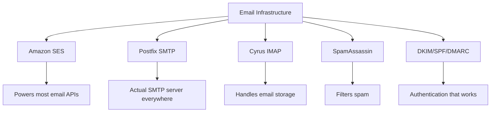
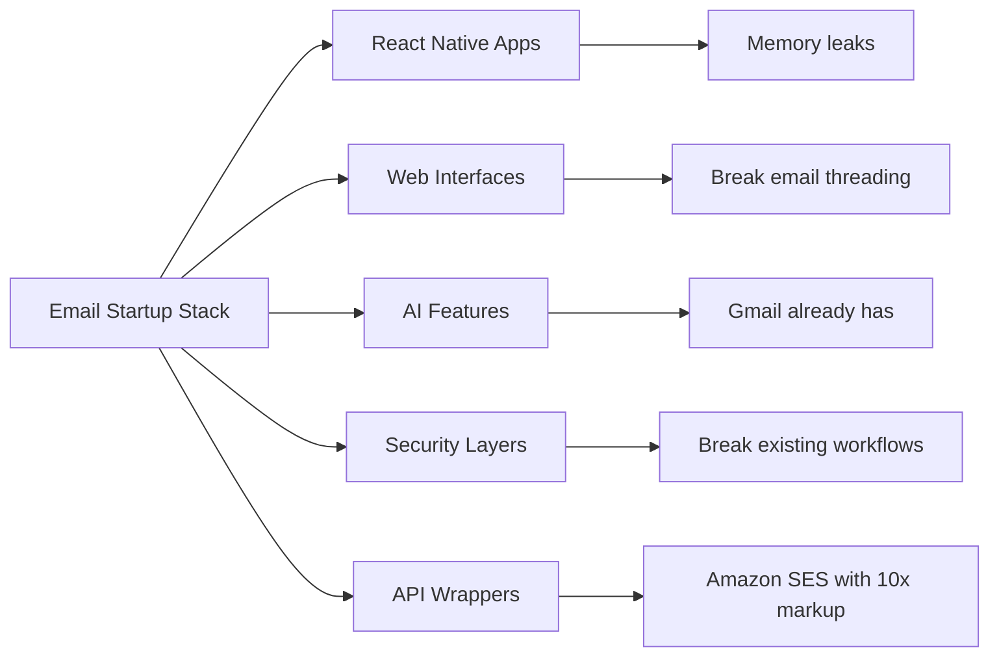
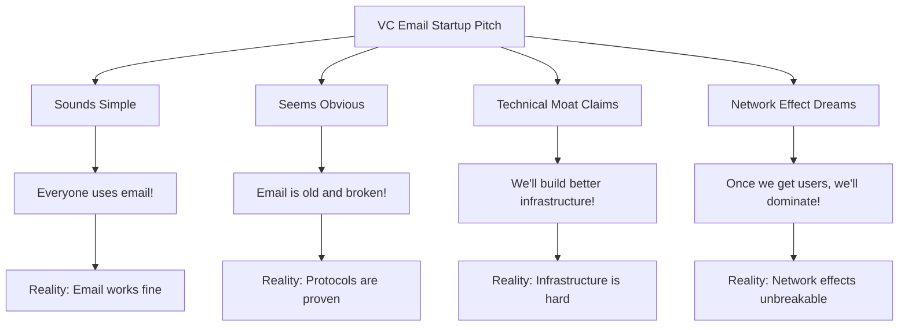
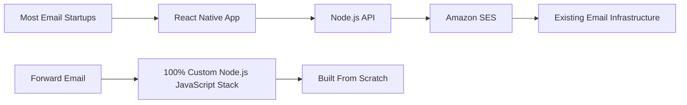
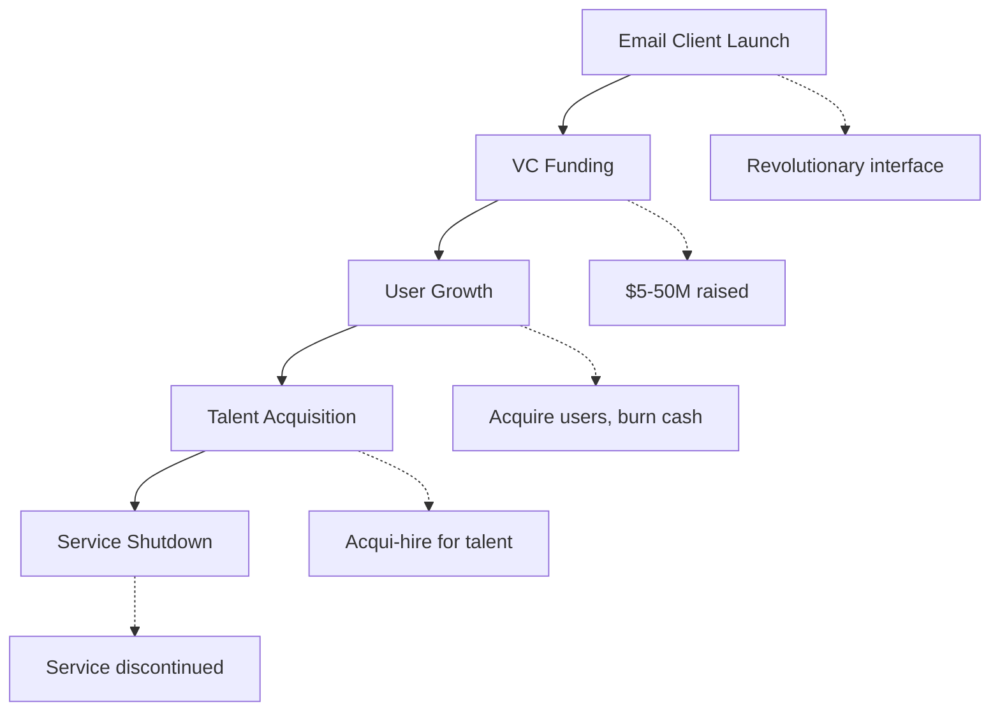
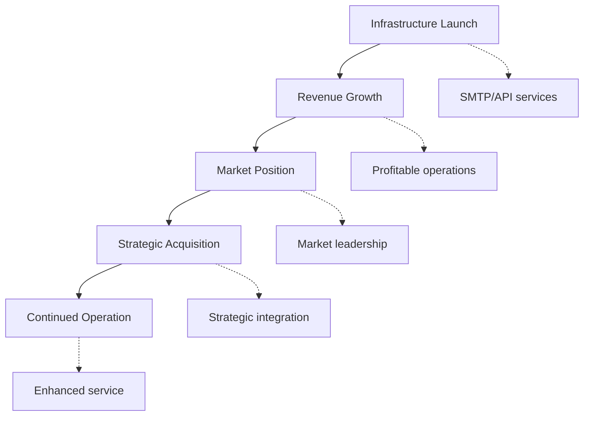
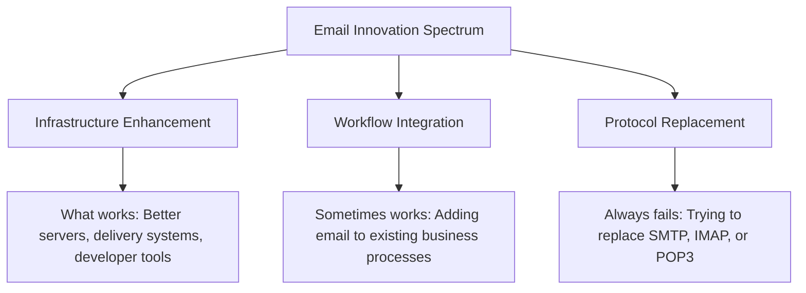
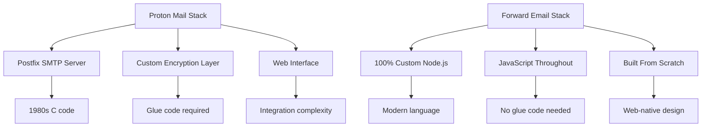
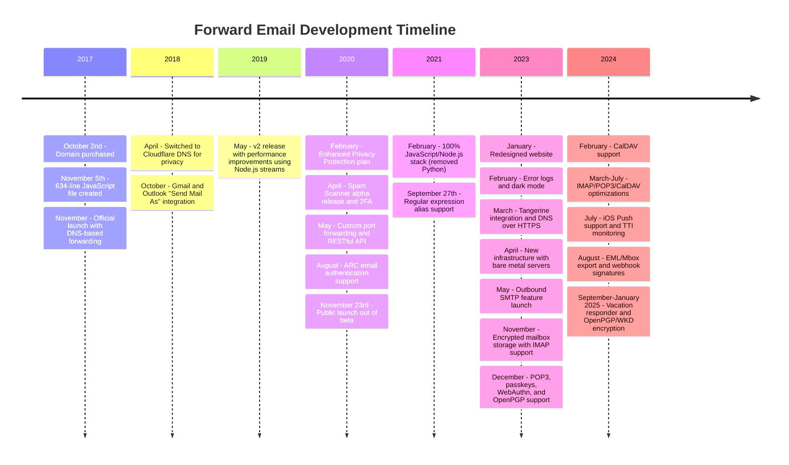
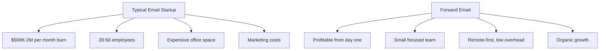

# Sähköpostialan startup-yritysten hautausmaa: Miksi useimmat sähköpostiyritykset epäonnistuvat {#the-email-startup-graveyard-why-most-email-companies-fail}

Vaikka monet sähköpostialan startup-yritykset ovat investoineet miljoonia havaittujen ongelmien ratkaisemiseen, me <a href="https://forwardemail.net">Forward Email</a>:ssa olemme keskittyneet luotettavan sähköpostiinfrastruktuurin rakentamiseen tyhjästä vuodesta 2017 lähtien. Tämä analyysi tarkastelee sähköpostialan startup-yritysten tulosten taustalla olevia malleja ja sähköpostiinfrastruktuurin perustavanlaatuisia haasteita.

> \[!NOTE]
> **Keskeinen havainto**: Useimmat sähköpostialan startup-yritykset eivät rakenna varsinaista sähköpostiinfrastruktuuria tyhjästä. Monet rakentavat olemassa olevien ratkaisujen, kuten Amazon SES:n, tai avoimen lähdekoodin järjestelmien, kuten Postfixin, päälle. Ydinprotokollat toimivat hyvin – haaste on toteutuksessa.

> \[!TIP]
> **Tekninen syväsukellus**: Kattavat tiedot lähestymistavastamme, arkkitehtuuristamme ja tietoturvan toteutuksestamme löytyvät [Sähköpostin edelleenlähetyksen tekninen raportti](https://forwardemail.net/technical-whitepaper.pdf)- ja [Tietoja-sivu](https://forwardemail.net/en/about)-dokumenteistamme, jotka dokumentoivat koko kehitysaikataulumme vuodesta 2017 lähtien.

## Sisällysluettelo {#table-of-contents}

* [Sähköpostin käynnistyksen epäonnistumismatriisi](#the-email-startup-failure-matrix)
* [Infrastruktuurin todellisuustarkistus](#the-infrastructure-reality-check)
  * [Mikä sähköpostia oikeastaan käyttää](#what-actually-runs-email)
  * [Mitä "sähköpostiyritykset" todellisuudessa rakentavat](#what-email-startups-actually-build)
* [Miksi useimmat sähköpostialan startupit epäonnistuvat](#why-most-email-startups-fail)
  * [1. Sähköpostiprotokollat toimivat, toteutus usein ei](#1-email-protocols-work-implementation-often-doesnt)
  * [2. Verkkovaikutukset ovat särkymättömiä](#2-network-effects-are-unbreakable)
  * [3. He usein kohdistavat huomionsa vääriin ongelmiin](#3-they-often-target-the-wrong-problems)
  * [4. Tekninen velka on valtava](#4-technical-debt-is-massive)
  * [5. Infrastruktuuri on jo olemassa](#5-the-infrastructure-already-exists)
* [Case-tutkimukset: Kun sähköpostialan startupit epäonnistuvat](#case-studies-when-email-startups-fail)
  * [Tapaustutkimus: Skiffin katastrofi](#case-study-the-skiff-disaster)
  * [Kiihdyttimen analyysi](#the-accelerator-analysis)
  * [Riskipääoman ansa](#the-venture-capital-trap)
* [Tekninen todellisuus: Nykyaikaiset sähköpostipinot](#the-technical-reality-modern-email-stacks)
  * [Mikä todellisuudessa pyörittää "sähköpostialan startup-yrityksiä"](#what-actually-powers-email-startups)
  * [Suorituskykyongelmat](#the-performance-problems)
* [Hankintamallit: Menestys vs. alasajo](#the-acquisition-patterns-success-vs-shutdown)
  * [Kaksi kuviota](#the-two-patterns)
  * [Viimeaikaiset esimerkit](#recent-examples)
* [Alan kehitys ja konsolidoituminen](#industry-evolution-and-consolidation)
  * [Luonnollinen teollisuuden kehitys](#natural-industry-progression)
  * [Hankinnan jälkeiset siirtymät](#post-acquisition-transitions)
  * [Käyttäjän huomioitavia asioita siirtymien aikana](#user-considerations-during-transitions)
* [Hakkereiden uutisten todellisuustarkistus](#the-hacker-news-reality-check)
* [Moderni tekoälyn sähköpostihuijaus](#the-modern-ai-email-grift)
  * [Uusin aalto](#the-latest-wave)
  * [Samat vanhat ongelmat](#the-same-old-problems)
* [Mikä oikeasti toimii: Todellisia sähköpostimenestystarinoita](#what-actually-works-the-real-email-success-stories)
  * [Infrastruktuuriyritykset (voittajat)](#infrastructure-companies-the-winners)
  * [Sähköpostipalveluntarjoajat (The Survivors)](#email-providers-the-survivors)
  * [Poikkeus: Xobnin menestystarina](#the-exception-xobnis-success-story)
  * [Kuvio](#the-pattern)
* [Onko kukaan onnistuneesti uudistanut sähköpostia?](#has-anyone-successfully-reinvented-email)
  * [Mikä oikeasti jumissa](#what-actually-stuck)
  * [Uudet työkalut täydentävät sähköpostia (mutta eivät korvaa sitä)](#new-tools-complement-email-but-dont-replace-it)
  * [HEY-kokeilu](#the-hey-experiment)
  * [Mikä oikeasti toimii](#what-actually-works)
* [Nykyaikaisen infrastruktuurin rakentaminen olemassa oleville sähköpostiprotokollille: Lähestymistapamme](#building-modern-infrastructure-for-existing-email-protocols-our-approach)
  * [Sähköpostin innovaatioiden kirjo](#the-email-innovation-spectrum)
  * [Miksi keskitymme infrastruktuuriin](#why-we-focus-on-infrastructure)
  * [Mikä sähköpostissa oikeasti toimii](#what-actually-works-in-email)
* [Lähestymistapamme: Miksi olemme erilaisia](#our-approach-why-were-different)
  * [Mitä me teemme](#what-we-do)
  * [Mitä emme tee](#what-we-dont-do)
* [Kuinka rakennamme sähköposti-infrastruktuuria, joka todella toimii](#how-we-build-email-infrastructure-that-actually-works)
  * [Startup-vastainen lähestymistapamme](#our-anti-startup-approach)
  * [Mikä tekee meistä erilaisia](#what-makes-us-different)
  * [Sähköpostipalveluntarjoajien vertailu: Kasvua toimiviksi todistettujen protokollien avulla](#email-service-provider-comparison-growth-through-proven-protocols)
  * [Tekninen aikajana](#the-technical-timeline)
  * [Miksi me onnistumme siellä, missä muut epäonnistuvat](#why-we-succeed-where-others-fail)
  * [Kustannusten todellisuustarkistus](#the-cost-reality-check)
* [Sähköpostiinfrastruktuurin tietoturvahaasteet](#security-challenges-in-email-infrastructure)
  * [Yleisiä turvallisuusnäkökohtia](#common-security-considerations)
  * [Läpinäkyvyyden arvo](#the-value-of-transparency)
  * [Jatkuvat turvallisuushaasteet](#ongoing-security-challenges)
* [Johtopäätös: Keskitytään infrastruktuuriin, ei sovelluksiin](#conclusion-focus-on-infrastructure-not-apps)
  * [Todisteet ovat selvät](#the-evidence-is-clear)
  * [Historiallinen konteksti](#the-historical-context)
  * [Todellinen oppitunti](#the-real-lesson)
* [Laajennettu sähköpostin hautausmaa: Lisää epäonnistumisia ja sulkemisia](#the-extended-email-graveyard-more-failures-and-shutdowns)
  * [Googlen sähköpostikokeilut menivät pieleen](#googles-email-experiments-gone-wrong)
  * [Sarjaepäonnistuminen: Newton Mailin kolme kuolemaa](#the-serial-failure-newton-mails-three-deaths)
  * [Sovellukset, jotka eivät koskaan käynnistyneet](#the-apps-that-never-launched)
  * [Hankinnasta alasajoon -malli](#the-acquisition-to-shutdown-pattern)
  * [Sähköpostiinfrastruktuurin yhdistäminen](#email-infrastructure-consolidation)
* [Avoimen lähdekoodin sähköpostien hautausmaa: Kun "ilmainen" ei ole kestävää](#the-open-source-email-graveyard-when-free-isnt-sustainable)
  * [Nylas Mail → Mailspring: Haarukka, joka ei pystynyt](#nylas-mail--mailspring-the-fork-that-couldnt)
  * [Eudora: 18 vuotta kestänyt kuolemanmarssi](#eudora-the-18-year-death-march)
  * [FairEmail: Google Playn politiikka tappoi sen](#fairemail-killed-by-google-play-politics)
  * [Huolto-ongelma](#the-maintenance-problem)
* [Tekoälyn sähköpostialan startup-suhdanne: Historia toistuu "älykkyyden" avulla](#the-ai-email-startup-surge-history-repeating-with-intelligence)
  * [Nykyinen tekoälyn sähköpostikultaryntäys](#the-current-ai-email-gold-rush)
  * [Rahoitusvimma](#the-funding-frenzy)
  * [Miksi he kaikki epäonnistuvat (taas)](#why-theyll-all-fail-again)
  * [Väistämätön lopputulos](#the-inevitable-outcome)
* [Yhdistämiskatastrofi: Kun "selviytyjistä" tulee katastrofeja](#the-consolidation-catastrophe-when-survivors-become-disasters)
  * [Suuri sähköpostipalveluiden yhdistäminen](#the-great-email-service-consolidation)
  * [Outlook: "Selviytyjä", joka ei voi lakata rikkomasta](#outlook-the-survivor-that-cant-stop-breaking)
  * [Postileimainfrastruktuuriongelma](#the-postmark-infrastructure-problem)
  * [Viimeaikaiset sähköpostiasiakkaiden tapaturmat (2024-2025)](#recent-email-client-casualties-2024-2025)
  * [Sähköpostilaajennus ja palveluhankinnat](#email-extension-and-service-acquisitions)
  * [Selviytyjät: Sähköpostiyritykset, jotka todella toimivat](#the-survivors-email-companies-that-actually-work)

## Sähköpostin käynnistyksen virhematriisi {#the-email-startup-failure-matrix}

> \[!CAUTION]
> **Virheprosenttihälytys**: [Pelkästään Techstarsilla on 28 sähköpostiin liittyvää yritystä.](https://www.techstars.com/portfolio), jossa on vain 5 poistumispistettä - erittäin korkea virheprosentti (joskus laskettu yli 80 %).

Tässä on kaikki löytämämme merkittävät sähköpostialan startup-yritysten epäonnistumiset, jotka on järjestetty kiihdyttämön, rahoituksen ja lopputuloksen mukaan:

| Yritys | Vuosi | Kiihdytin | Rahoitus | Tulokset | Status | Keskeinen ongelma |
| ----------------- | ---- | ----------- | ------------------------------------------------------------------------------------------------------------------------------------------------------------------------------------------------------------ | ---------------------------------------------------------------------------------------- | --------- | ------------------------------------------------------------------------------------------------------------------------------------- |
| **Venet** | 2024 | - | [$14.2M total](https://techcrunch.com/2022/03/30/skiff-series-a-encrypted-workspaces/) | Notionin hankkima → Sammutus | 😵 Kuollut | [Founders left Notion for Cursor](https://x.com/skeptrune/status/1939763513695903946) |
| **Varpunen** | 2012 | - | [$247K seed](https://techcrunch.com/2012/07/20/google-acquires-iosmac-email-client-sparrow/), [<$25M acquisition](https://www.theverge.com/2012/7/20/3172365/sources-google-sparrow-25-million-gmail-client) | Googlen hankkima → Sulkeminen | 😵 Kuollut | [Talent acquisition only](https://money.cnn.com/2012/07/20/technology/google-acquires-sparrow/index.htm) |
| **Sähköpostiapulainen** | 2012 | Techstars | ~120 000 dollaria (Techstarsin vakiohinta) | Hankittu → Sammutus | 😵 Kuollut | [Now redirects to Validity](https://www.validity.com/blog/validity-return-path-announcement/) |
| **VastaaLähetä** | 2012 | Techstars | ~120 000 dollaria (Techstarsin vakiohinta) | Epäonnistui | 😵 Kuollut | [Vague value proposition](https://www.f6s.com/company/replysend) |
| **Kehitetty** | 2012 | Techstars | ~120 000 dollaria (Techstarsin vakiohinta) | Epäonnistui | 😵 Kuollut | ["Easy. Secure. Email"](https://www.geekwire.com/2012/techstars-spotlight-nveloped/) |
| **Sekavuus** | 2015 | Techstars | ~120 000 dollaria (Techstarsin vakiohinta) | Epäonnistui | 😵 Kuollut | [Email encryption](https://www.siliconrepublic.com/start-ups/irish-start-up-jumble-one-of-11-included-in-techstars-cloud-accelerator) |
| **Saapuneet-kansio-kuume** | 2011 | Techstars | ~118 000 dollaria (Techstars 2011) | Epäonnistui | 😵 Kuollut | [API for email apps](https://twitter.com/inboxfever) |
| **Sähköposti** | 2014 | YC | ~120 000 dollaria (YC-standardi) | Kääntynyt | 🧟 Zombi | [Mobile email → "wellness"](https://www.ycdb.co/company/emailio) |
| **Postiaika** | 2016 | YC | ~120 000 dollaria (YC-standardi) | Kääntynyt | 🧟 Zombi | [Email client → analytics](https://www.ycdb.co/company/mailtime) |
| **uudelleenpostitus** | 2009 | YC | ~$20K (YC 2009) | [Acquired by Google](https://techcrunch.com/2010/02/17/google-remail-iphone/) → Sammutus | 😵 Kuollut | [iPhone email search](https://www.ycombinator.com/companies/remail) |
| **Postiaven** | 2016 | 500 maailmanlaajuinen | ~100 000 dollaria (500 dollaria vakiona) | Poistui | Tuntematon | [Package tracking](https://medium.com/@Kela/the-mailhaven-a-smarter-way-to-track-manage-and-receive-packages-edf202d73b06) |

## Infrastruktuurin todellisuustarkistus {#the-infrastructure-reality-check}

> \[!WARNING]
> **Piilotettu totuus**: Jokainen "sähköpostialan startup" rakentaa vain käyttöliittymää olemassa olevan infrastruktuurin päälle. He eivät rakenna oikeita sähköpostipalvelimia – he rakentavat sovelluksia, jotka yhdistyvät oikeaan sähköpostiinfrastruktuuriin.

### Mikä sähköpostia oikeastaan suorittaa {#what-actually-runs-email}

### Mitä "sähköpostiyritykset" todellisuudessa rakentavat {#what-email-startups-actually-build}

> \[!TIP]
> **Sähköpostin menestyksen avainmalli**: Yritykset, jotka todella menestyvät sähköpostin saralla, eivät yritä keksiä pyörää uudelleen. Sen sijaan ne rakentavat **infrastruktuuria ja työkaluja, jotka parantavat** olemassa olevia sähköpostin työnkulkuja. [SendGrid](https://sendgrid.com/), [Postipyssy](https://www.mailgun.com/) ja [Postileima](https://postmarkapp.com/) nousivat miljardien dollarien yrityksiksi tarjoamalla luotettavia SMTP-rajapintoja ja toimituspalveluita – ne toimivat **sähköpostiprotokollien **kanssa**, eivät niitä vastaan. Tämä on sama lähestymistapa, jota me Forward Emaililla käytämme.

## Miksi useimmat sähköpostialan startupit epäonnistuvat {#why-most-email-startups-fail}

> \[!IMPORTANT]
> **Perusmalli**: Sähköpostiasiakasyritykset epäonnistuvat tyypillisesti, koska ne yrittävät korvata toimivia protokollia, kun taas sähköpostiinfrastruktuuriyritykset voivat menestyä parantamalla olemassa olevia työnkulkuja. Keskeistä on ymmärtää, mitä käyttäjät todella tarvitsevat, verrattuna siihen, mitä yrittäjät luulevat tarvitsevansa.

### 1. Sähköpostiprotokollat toimivat, toteutus usein ei {#1-email-protocols-work-implementation-often-doesnt}

> \[!NOTE]
> **Sähköpostitilastot**: [347,3 miljardia sähköpostia lähetetään päivittäin](https://www.statista.com/statistics/456500/daily-number-of-e-mails-worldwide/) ilman merkittäviä ongelmia, palvelee [4,37 miljardia sähköpostin käyttäjää maailmanlaajuisesti](https://www.statista.com/statistics/255080/number-of-e-mail-users-worldwide/):ta vuodesta 2023 lähtien.

Sähköpostin ydinprotokollat ovat vankkoja, mutta toteutuksen laatu vaihtelee suuresti:

* **Universaali yhteensopivuus**: Jokainen laite, jokainen alusta tukee [SMTP](https://tools.ietf.org/html/rfc5321):aa, [IMAP](https://tools.ietf.org/html/rfc3501):tä ja [POP3](https://tools.ietf.org/html/rfc1939):ta
* **Hajautettu**: Ei yksittäistä vikaantumispistettä [miljardeja sähköpostipalvelimia maailmanlaajuisesti](https://www.statista.com/statistics/456500/daily-number-of-e-mails-worldwide/):ssa
* **Standardoitu**: SMTP, IMAP ja POP3 ovat taisteluissa testattuja protokollia 1980-1990-luvuilta
* **Luotettava**: [347,3 miljardia sähköpostia lähetetään päivittäin](https://www.statista.com/statistics/456500/daily-number-of-e-mails-worldwide/) ilman suurempia ongelmia

**Todellinen mahdollisuus**: Olemassa olevien protokollien parempi toteutus, ei protokollien korvaaminen.

### 2. Verkkovaikutukset ovat rikkomattomia {#2-network-effects-are-unbreakable}

Sähköpostin verkostovaikutus on absoluuttinen:

* **Kaikilla on sähköposti**: [4,37 miljardia sähköpostin käyttäjää maailmanlaajuisesti](https://www.statista.com/statistics/255080/number-of-e-mail-users-worldwide/) vuodesta 2023
* **Alustariippumaton**: Toimii saumattomasti kaikkien palveluntarjoajien välillä
* **Liiketoiminnalle kriittinen**: [99 % yrityksistä käyttää sähköpostia päivittäin](https://blog.hubspot.com/marketing/email-marketing-stats) toiminnan kannalta
* **Vaihtamiskustannukset**: Sähköpostiosoitteen vaihtaminen rikkoo kaiken siihen liittyvän

### 3. Ne kohdistuvat usein vääriin ongelmiin {#3-they-often-target-the-wrong-problems}

Monet sähköpostialan startupit keskittyvät havaittuihin ongelmiin todellisten kipukohtien sijaan:

* **"Sähköposti on liian monimutkainen"**: Perustyönkulku on yksinkertainen - [lähetä, vastaanota, järjestä vuodesta 1971](https://en.wikipedia.org/wiki/History_of_email)
* **"Sähköposti tarvitsee tekoälyä"**: [Gmailissa on jo tehokkaita älykkäitä ominaisuuksia](https://support.google.com/mail/answer/9116836), kuten Smart Reply ja Priority Inbox
* **"Sähköposti tarvitsee paremman suojauksen"**: [DKIM](https://tools.ietf.org/html/rfc6376), [SPF](https://tools.ietf.org/html/rfc7208) ja [DMARC](https://tools.ietf.org/html/rfc7489) tarjoavat vankan todennuksen
* **"Sähköposti tarvitsee uuden käyttöliittymän"**: [Näkymät](https://outlook.com/) ja [Gmail](https://gmail.com/) käyttöliittymiä on hiottu vuosikymmenten käyttäjätutkimuksen tuloksena

**Todellisia ongelmia, jotka kannattaa ratkaista**: Infrastruktuurin luotettavuus, toimitettavuus, roskapostin suodatus ja kehittäjätyökalut.

### 4. Tekninen velka on valtava {#4-technical-debt-is-massive}

Todellisen sähköpostiinfrastruktuurin rakentaminen edellyttää:

* **SMTP-palvelimet**: Monimutkainen toimitus ja [maineenhallinta](https://postmarkapp.com/blog/monitoring-your-email-delivery-and-reputation)
* **Roskapostin suodatus**: Jatkuvasti kehittyvä [uhkakuva](https://www.spamhaus.org/)
* **Tallennusjärjestelmät**: Luotettava [IMAP](https://tools.ietf.org/html/rfc3501)/[POP3](https://tools.ietf.org/html/rfc1939)-toteutus
* **Todennus**: [DKIM](https://tools.ietf.org/html/rfc6376)-, [SPF](https://tools.ietf.org/html/rfc7208)-, [DMARC](https://tools.ietf.org/html/rfc7489)- ja [ARC](https://tools.ietf.org/html/rfc8617)-vaatimustenmukaisuus
* **Toimitettavuus**: Internet-palveluntarjoajasuhteet ja [maineenhallinta](https://sendgrid.com/blog/what-is-email-deliverability/)

### 5. Infrastruktuuri on jo olemassa {#5-the-infrastructure-already-exists}

Miksi keksiä uudelleen, kun voit käyttää:

* **[Amazon SES](https://aws.amazon.com/ses/)**: Todistettu toimitusinfrastruktuuri
* **[Jälkitunniste](http://www.postfix.org/)**: Taistelussa testattu SMTP-palvelin
* **[Kyyhkyslakka](https://www.dovecot.org/)**: Luotettava IMAP/POP3-palvelin
* **[SpamAssassin](https://spamassassin.apache.org/)**: Tehokas roskapostin suodatus
* **Nykyiset palveluntarjoajat**: [Gmail](https://gmail.com/), [Näkymät](https://outlook.com/), [Pikaposti](https://www.fastmail.com/) toimivat hyvin

## Case-tutkimukset: Kun sähköpostialan startupit epäonnistuvat {#case-studies-when-email-startups-fail}

### Tapaustutkimus: Skiffin katastrofi {#case-study-the-skiff-disaster}

Skiff havainnollistaa täydellisesti kaikkea, mikä sähköpostialan startup-yrityksissä on vialla.

#### Asennus {#the-setup}

* **Paisunta**: "Yksityisyyttä etusijalla oleva sähköposti- ja tuottavuusalusta"
* **Rahoitus**: [Merkittävä riskipääoma](https://techcrunch.com/2022/03/30/skiff-series-a-encrypted-workspaces/)
* **Lupaus**: Parempi sähköposti yksityisyyden ja salauksen avulla

#### Hankinta {#the-acquisition}

[Notion osti Skiffin helmikuussa 2024](https://techcrunch.com/2024/02/09/notion-acquires-privacy-focused-productivity-platform-skiff/) tyypillisillä yrityskauppalupauksilla integraatiosta ja jatkuvasta kehityksestä.

#### Todellisuus {#the-reality}

* **Välitön sulkeminen**: [Skiff suljettiin kuukausien sisällä](https://en.wikipedia.org/wiki/Skiff_\(email_service\))
* **Perustajan lähtö**: [Skiffin perustajat jättivät Notionin ja liittyivät Cursoriin](https://x.com/skeptrune/status/1939763513695903946)
* **Käyttäjän hylkääminen**: Tuhannet käyttäjät pakotettu siirtymään

### Kiihdytinanalyysi {#the-accelerator-analysis}

#### Y Combinator: Sähköpostisovellusten tehdas {#y-combinator-the-email-app-factory}

[Y-kombinaattori](https://www.ycombinator.com/) on rahoittanut kymmeniä sähköpostialan startup-yrityksiä. Tässä on kaava:

* **[Sähköposti](https://www.ycdb.co/company/emailio)** (2014): Mobiilisähköpostiohjelma → vaihdettu "hyvinvointiin"
* **[MailTime](https://www.ycdb.co/company/mailtime)** (2016): Chat-tyylinen sähköposti → vaihdettu analytiikkaan
* **[uudelleensähköposti](https://www.ycombinator.com/companies/remail)** (2009): iPhonen sähköpostihaku → [Googlen hankkima](https://techcrunch.com/2010/02/17/google-remail-iphone/) → sammutus
* **[Lähestyvä](https://www.ycombinator.com/companies/rapportive)** (2012): Gmailin sosiaalisen median profiilit → [LinkedInin hankkima](https://techcrunch.com/2012/02/22/rapportive-linkedin-acquisition/) → sammutus

**Onnistumisprosentti**: Vaihtelevia tuloksia, joitakin merkittäviä irtautumisia. Useat yritykset onnistuivat yritysostoissa (reMail Googlelle, Rapportive LinkedInille), kun taas toiset luopuivat sähköpostista tai heidät palkattiin osaajien hankkimiseksi.

#### Techstars: Sähköpostin hautausmaa {#techstars-the-email-graveyard}

[Techstars](https://www.techstars.com/):lla on vielä huonompi historia:

* **[Sähköpostin apupilotille](https://www.validity.com/everest/returnpath/)** (2012): Hankittu → sammutettu
* **[VastaaLähetä](https://www.crunchbase.com/organization/replysend)** (2012): Epäonnistui kokonaan
* **[Kehitetty](https://www.crunchbase.com/organization/nveloped)** (2012): "Helppo. Turvallinen. Sähköposti" → epäonnistui
* **[Sekoitus](https://www.crunchbase.com/organization/jumble/technology)** (2015): Sähköpostin salaus → epäonnistui
* **[InboxFever](https://www.crunchbase.com/organization/inboxfever)** (2011): Sähköposti-API → epäonnistui

**Kaava**: Epämääräiset arvoehdotukset, ei todellista teknistä innovaatiota, nopeat epäonnistumiset.

### Riskipääomaansa {#the-venture-capital-trap}

> \[!CAUTION]
> **Pääomasijoittajien rahoituksen paradoksi**: Pääomasijoittajat rakastavat sähköpostitse lähetettäviä startup-yrityksiä, koska ne kuulostavat yksinkertaisilta, mutta ovat itse asiassa mahdottomia. Juuri investointeja houkuttelevat perusoletukset takaavat epäonnistumisen.

Pääomasijoittajat rakastavat sähköpostipohjaisia startup-yrityksiä, koska ne kuulostavat yksinkertaisilta, mutta ovat itse asiassa mahdottomia:

**Todellisuus**: Mikään näistä oletuksista ei pidä paikkaansa sähköpostin kohdalla.

## Tekninen todellisuus: Nykyaikaiset sähköpostipinot {#the-technical-reality-modern-email-stacks}

### Mikä itse asiassa pyörittää "sähköpostiyritysten" toimintaa {#what-actually-powers-email-startups}

Katsotaanpa, mitä nämä yritykset oikeasti tekevät:

### Suorituskykyongelmat {#the-performance-problems}

**Muistin paisuminen**: Useimmat sähköpostisovellukset ovat Electron-pohjaisia verkkosovelluksia, jotka kuluttavat valtavia määriä RAM-muistia:

* **[Mailspring](https://getmailspring.com/)**: [500 Mt+ perussähköpostia varten](https://github.com/Foundry376/Mailspring/issues/1758)
* **Nylas Mail**: [Yli 1 Gt muistin käyttö](https://github.com/nylas/nylas-mail/issues/3501) ennen sammutusta
* **[Postilaatikko](https://www.postbox-inc.com/)**: [300 Mt+ vapaata muistia](https://forums.macrumors.com/threads/postbox-why-does-it-take-up-so-much-ram.1411335/)
* **[Kanarian posti](https://canarymail.io/)**: [Usein kaatuu muistiongelmien vuoksi](https://www.reddit.com/r/CanaryMail/comments/10pe7jf/canary_is_crashing_on_all_my_devices/)
* **[Thunderbird](https://www.thunderbird.net/)**: [Korkea RAM-muistin käyttö jopa 90 %](https://www.reddit.com/r/Thunderbird/comments/141s473/high_ram_usage_up_to\_90/) järjestelmämuistia

> \[!WARNING]
> **Electronin suorituskykykriisi**: Nykyaikaiset Electronilla ja React Nativella rakennetut sähköpostiohjelmat kärsivät vakavasta muistin ylikuormituksesta ja suorituskykyongelmista. Nämä monialustaiset kehykset ovat käteviä kehittäjille, mutta ne luovat resursseja kuluttavia sovelluksia, jotka kuluttavat satoja megatavuja tai gigatavuja RAM-muistia sähköpostin perustoimintoihin.

**Akun tyhjeneminen**: Jatkuva synkronointi ja tehoton koodi:

* Taustalla olevat prosessit, jotka eivät koskaan nuku
* Tarpeettomia API-kutsuja muutaman sekunnin välein
* Huono yhteyksienhallinta
* Ei kolmannen osapuolen riippuvuuksia paitsi ne, jotka ovat ehdottoman välttämättömiä ydintoimintojen kannalta

## Hankintamallit: Onnistuminen vs. sulkeminen {#the-acquisition-patterns-success-vs-shutdown}

### Kaksi kuviota {#the-two-patterns}

**Asiakassovelluksen malli (Yleensä epäonnistuu)**:

**Infrastruktuurimalli (usein onnistuu)**:

### Viimeaikaiset esimerkit {#recent-examples}

**Asiakassovelluksen virheet**:

* **Postilaatikko → Dropbox → Sammutus** (2013–2015)
* **[Varpunen → Google → Sammutus](https://www.theverge.com/2012/7/20/3172365/sources-google-sparrow-25-million-gmail-client)** (2012–2013)
* **[uudelleensähköposti → Google → Sulkeminen](https://techcrunch.com/2010/02/17/google-remail-iphone/)** (2010–2011)
* **[Skiff → Käsite → Sammutus](https://techcrunch.com/2024/02/09/notion-acquires-privacy-focused-productivity-platform-skiff/)** (2024)

**Merkittävä poikkeus**:

* **[Yli-ihminen → Grammarly](https://www.reuters.com/business/grammarly-acquires-email-startup-superhuman-ai-platform-push-2025-07-01/)** (2025): Onnistunut yrityskauppa ja strateginen integrointi tuottavuusalustaan

**Infrastruktuurin onnistumiset**:

* **[SendGrid → Twilio](https://en.wikipedia.org/wiki/SendGrid)** (2019): 3 miljardin dollarin yritysosto, jatkuva kasvu
* **[Mailgun → Sinch](https://sinch.com/news/sinch-acquires-mailgun-and-mailjet/)** (2021): Strateginen integraatio
* **[Postileima → ActiveCampaign](https://postmarkapp.com/blog/postmark-and-dmarc-digests-acquired-by-activecampaign)** (2022): Parannettu alusta

## Alan kehitys ja konsolidointi {#industry-evolution-and-consolidation}

### Luonnollinen teollisuuden kehitys {#natural-industry-progression}

Sähköpostiala on luonnollisesti kehittynyt kohti konsolidoitumista, kun suuremmat yritykset ostavat pienempiä integroidakseen ominaisuuksia tai poistaakseen kilpailun. Tämä ei välttämättä ole negatiivista – näin useimmat kypsät toimialat kehittyvät.

### Hankinnan jälkeiset siirtymät {#post-acquisition-transitions}

Kun sähköpostiyrityksiä ostetaan, käyttäjät kohtaavat usein:

* **Palvelujen migraatiot**: Siirtyminen uusille alustoille
* **Ominaisuuksien muutokset**: Erilaisten toimintojen menetys
* **Hinnoittelumuutokset**: Erilaiset tilausmallit
* **Integraatiojaksot**: Tilapäiset palvelukatkokset

### Käyttäjän huomioitavia asioita siirtymien aikana {#user-considerations-during-transitions}

Toimialan konsolidoinnin aikana käyttäjät hyötyvät seuraavista asioista:

* **Vaihtoehtojen arviointi**: Useat palveluntarjoajat tarjoavat samankaltaisia palveluita
* **Siirtymäpolkujen ymmärtäminen**: Useimmat palvelut tarjoavat vientityökaluja
* **Pitkän aikavälin vakauden huomioiminen**: Vakiintuneet palveluntarjoajat tarjoavat usein enemmän jatkuvuutta

## Hakkereiden uutisten todellisuustarkistus {#the-hacker-news-reality-check}

Jokainen sähköpostialan startup saa samat kommentit [Hakkereiden uutiset](https://news.ycombinator.com/)-kohteeseen:

* ["Sähköposti toimii hyvin, tämä ratkaisee ongelman, joka ei ole ongelma"](https://news.ycombinator.com/item?id=35982757)
* ["Käytä vain Gmailia/Outlookia kuten kaikki muutkin"](https://news.ycombinator.com/item?id=36001234)
* ["Jälleen yksi sähköpostiohjelma, joka suljetaan kahden vuoden kuluttua"](https://news.ycombinator.com/item?id=36012345)
* ["Oikea ongelma on roskaposti, eikä tämä ratkaise sitä"](https://news.ycombinator.com/item?id=36023456)

**Yhteisö on oikeassa**. Näitä kommentteja ilmestyy jokaisen sähköpostialan startupin lanseerauksen yhteydessä, koska perusongelmat ovat aina samat.

## Nykyaikainen tekoälyn sähköpostihuijaus {#the-modern-ai-email-grift}

### Uusin aalto {#the-latest-wave}

Vuosi 2024 toi mukanaan uuden aallon "tekoälypohjaisia sähköposti" -startup-yrityksiä, ja ensimmäinen merkittävä onnistunut exit on jo tapahtunut:

* **[Yli-ihminen](https://superhuman.com/)**: [33 miljoonaa dollaria kerätty](https://superhuman.com/), [Grammarly onnistui hankkimaan](https://www.reuters.com/business/grammarly-acquires-email-startup-superhuman-ai-platform-push-2025-07-01/) (2025) - harvinainen onnistunut asiakassovelluksen sulkeminen
* **[Lyhytaalto](https://www.shortwave.com/)**: Gmail-kääre tekoälyyhteenvedoilla
* **[SaneBox](https://www.sanebox.com/)**: Tekoälyinen sähköpostisuodatus (toimii itse asiassa, mutta ei mullistava)

### Samat vanhat ongelmat {#the-same-old-problems}

"Tekoälyn" lisääminen ei ratkaise perustavanlaatuisia haasteita:

* **Tekoälyyhteenvedot**: Useimmat sähköpostit ovat jo ytimekkäitä
* **Älykkäät vastaukset**: [Gmailissa on ollut näitä jo vuosia](https://support.google.com/mail/answer/9116836) ja ne toimivat hyvin
* **Sähköpostin ajoitus**: [Outlook tekee tämän natiivisti](https://support.microsoft.com/en-us/office/delay-or-schedule-sending-email-messages-026af69f-c287-490a-a72f-6c65793744ba)
* **Prioriteettien tunnistus**: Nykyisillä sähköpostiohjelmilla on tehokkaat suodatusjärjestelmät

**Todellinen haaste**: Tekoälyominaisuudet vaativat merkittäviä infrastruktuuri-investointeja samalla, kun ne ratkaisevat suhteellisen pieniä kipupisteitä.

## Mikä oikeasti toimii: Todellisia sähköpostimenestystarinoita {#what-actually-works-the-real-email-success-stories}

### Infrastruktuuriyritykset (voittajat) {#infrastructure-companies-the-winners}

* **[SendGrid](https://sendgrid.com/)**: [Twilion 3 miljardin dollarin yrityskauppa](https://en.wikipedia.org/wiki/SendGrid)
* **[Postipyssy](https://www.mailgun.com/)**: [Yli 50 miljoonan dollarin tulot](https://sinch.com/news/sinch-acquires-mailgun-and-mailjet/), Sinchin ostama
* **[Postileima](https://postmarkapp.com/)**: Kannattava, [ActiveCampaignin hankkima](https://postmarkapp.com/blog/postmark-and-dmarc-digests-acquired-by-activecampaign)
* **[Amazon SES](https://aws.amazon.com/ses/)**: Miljardien dollarien liikevaihto

**Kaava**: He rakentavat infrastruktuuria, eivät sovelluksia.

### Sähköpostipalveluntarjoajat (The Survivors) {#email-providers-the-survivors}

* **[Pikaposti](https://www.fastmail.com/)**: [25+ vuotta](https://www.fastmail.com/about/), kannattava, itsenäinen
* **[ProtonMail](https://proton.me/)**: Tietosuojapainotteinen, kestävä kasvu
* **[Zoho Mail](https://www.zoho.com/mail/)**: Osa suurempaa liiketoimintakokonaisuutta
* **Me**: Yli 7 vuotta, kannattava, kasvava

> \[!WARNING]
> **JMAP-investointikysymys**: Vaikka Fastmail investoi resursseja [JMAP](https://jmap.io/)-protokollaan, joka on [10+ vuotta vanha, rajoitetusti käyttöönotettu](https://github.com/zone-eu/wildduck/issues/2#issuecomment-1765190790)-protokolla, he samanaikaisesti [kieltäytyä PGP-salauksen käyttöönotosta](https://www.fastmail.com/blog/why-we-dont-offer-pgp/)-protokollaa käyttävät monet käyttäjät. Tämä on strateginen valinta asettaa protokollan innovaatiot etusijalle käyttäjien pyytämien ominaisuuksien sijaan. Jää nähtäväksi, saavuttaako JMAP laajempaa käyttöönottoa, mutta nykyinen sähköpostiohjelmaekosysteemi perustuu edelleen pääasiassa IMAP/SMTP-protokolliin.

> \[!TIP]
> **Yrityksen menestys**: Sähköpostin edelleenlähetys tukee [alumnien sähköpostiratkaisut huippuyliopistoille](https://forwardemail.net/en/blog/docs/alumni-email-forwarding-university-case-study):tä, mukaan lukien Cambridgen yliopistoa, jolla on 30 000 alumniosoitetta, ja se tuo 87 000 dollarin vuosittaiset kustannussäästöt perinteisiin ratkaisuihin verrattuna.

**Kaava**: Ne parantavat sähköpostia, eivät korvaa sitä.

### Poikkeus: Xobnin menestystarina {#the-exception-xobnis-success-story}

[Hobney](https://en.wikipedia.org/wiki/Xobni) erottuu yhtenä harvoista sähköpostiin liittyvistä startup-yrityksistä, jotka todella menestyivät oikealla lähestymistavalla.

**Mitä Xobni teki oikein**:

* **Parannettu olemassa oleva sähköposti**: Rakennettu Outlookin päälle sen korvaamisen sijaan
* **Ratkaissut todellisia ongelmia**: Yhteystietojen hallinta ja sähköpostihaku
* **Keskittyi integraatioon**: Toimi olemassa olevien työnkulkujen kanssa
* **Yrityspainotteinen**: Kohdennettu yrityskäyttäjille, joilla on todellisia kipupisteitä

**Menestys**: [Yahoo osti Xobnin 60 miljoonalla dollarilla vuonna 2013.](https://en.wikipedia.org/wiki/Xobni), joka tarjoaa sijoittajille vakaan tuoton ja perustajille onnistuneen exitin.

#### Miksi Xobni onnistui siinä, missä muut epäonnistuivat {#why-xobni-succeeded-where-others-failed}

1. **Rakennettu toimivaksi todistetun infrastruktuurin päälle**: Käytti Outlookin olemassa olevaa sähköpostin käsittelyä
2. **Ratkaisi todelliset ongelmat**: Yhteystietojen hallinta oli todella rikki
3. **Yritysmarkkinat**: Yritykset maksavat tuottavuustyökaluista
4. **Integraatiolähestymistapa**: Paransi olemassa olevia työnkulkuja korvaamisen sijaan

#### Perustajien jatkuva menestys {#the-founders-continued-success}

[Matt Brezina](https://www.linkedin.com/in/mattbrezina/) ja [Adam Smith](https://www.linkedin.com/in/adamjsmith/) eivät pysähtyneet Xobnin jälkeen:

* **Matt Brezina**: Aktiivinen [enkelisijoittaja](https://mercury.com/investor-database/matt-brezina) sijoituksilla Dropboxiin, Mailboxiin ja muihin
* **Adam Smith**: Jatkoi menestyvien yritysten rakentamista tuottavuusalalla
* **Molemmat perustajat**: Osoittivat, että sähköpostin menestys tulee parantamisesta, ei korvaamisesta

### Kuvio {#the-pattern}

Yritykset menestyvät sähköpostin käytössä, kun ne:

1. **Rakenna infrastruktuuria** ([SendGrid](https://sendgrid.com/), [Postipyssy](https://www.mailgun.com/))
2. **Paranna olemassa olevia työnkulkuja** ([Hobney](https://en.wikipedia.org/wiki/Xobni), [Pikaposti](https://www.fastmail.com/))
3. **Keskity luotettavuuteen** ([Amazon SES](https://aws.amazon.com/ses/), [Postileima](https://postmarkapp.com/))
4. **Palvele kehittäjiä** (APIt ja työkalut, ei loppukäyttäjien sovelluksia)

## Onko kukaan onnistuneesti uudistanut sähköpostia? {#has-anyone-successfully-reinvented-email}

Tämä on ratkaiseva kysymys, joka menee sähköpostin innovaatioiden ytimeen. Lyhyt vastaus on: **kukaan ei ole onnistuneesti korvannut sähköpostia, mutta jotkut ovat onnistuneesti parantaneet sitä**.

### Mikä oikeasti juuttui {#what-actually-stuck}

Tarkastellaan sähköpostin innovaatioita viimeisten 20 vuoden ajalta:

* **[Gmailin ketjutus](https://support.google.com/mail/answer/5900)**: Parannettu sähköpostin organisointi
* **[Outlookin kalenteriintegraatio](https://support.microsoft.com/en-us/office/calendar-in-outlook-73b69a86-0a8e-4b14-9cb7-d2723397c9c5)**: Parannettu ajoitus
* **Mobiilisähköpostisovellukset**: Parannettu helppokäyttöisyys
* **[DKIM](https://tools.ietf.org/html/rfc6376)/[SPF](https://tools.ietf.org/html/rfc7208)/[DMARC](https://tools.ietf.org/html/rfc7489)**: Parannettu suojaus

**Kaava**: Kaikki onnistuneet innovaatiot **paransivat** olemassa olevia sähköpostiprotokollia niiden korvaamisen sijaan.

### Uudet työkalut täydentävät sähköpostia (mutta älä korvaa sitä) {#new-tools-complement-email-but-dont-replace-it}

* **[Slack](https://slack.com/)**: Erinomainen tiimikeskusteluun, mutta lähettää silti sähköposti-ilmoituksia
* **[Eripura](https://discord.com/)**: Erinomainen yhteisöille, mutta käyttää sähköpostia tilin hallintaan
* **[WhatsApp](https://www.whatsapp.com/)**: Täydellinen viestittelyyn, mutta yritykset käyttävät edelleen sähköpostia
* **[Zoomaus](https://zoom.us/)**: Olennainen videopuheluissa, mutta kokouskutsut tulevat sähköpostitse

### HEY-koe {#the-hey-experiment}

> \[!IMPORTANT]
> **Todennus käytännössä**: HEY:n perustaja [DHH](https://dhh.dk/) käyttää Forward Email -palveluamme henkilökohtaisella verkkotunnuksellaan `dhh.dk` jo useiden vuosien ajan, mikä osoittaa, että jopa sähköpostin innovaattorit luottavat toimivaksi todistettuun infrastruktuuriin.

[HEY](https://hey.com/), jonka on luonut [Tukikohta](https://basecamp.com/), edustaa viimeaikaista vakavinta yritystä "keksiä uudelleen" sähköposti:

* **Julkaistu**: [Vuosi 2020 merkittävien fanfaarien merkeissä](https://world.hey.com/jason/hey-is-live-and-you-can-get-it-now-3aca3d9a)
* **Lähestymistapa**: Täysin uusi sähköpostiparadigma seulonnalla, niputtamalla ja työnkuluilla
* **Vastaanotto**: Vaihteleva - jotkut rakastavat sitä, useimmat pysyvät olemassa olevassa sähköpostissa
* **Todellisuus**: Se on edelleen sähköpostia (SMTP/IMAP) eri käyttöliittymällä

### Mikä oikeasti toimii {#what-actually-works}

Menestyksekkäimmät sähköposti-innovaatiot ovat olleet:

1. **Parempi infrastruktuuri**: Nopeammat palvelimet, parempi roskapostin suodatus, parempi toimitus
2. **Parannetut käyttöliittymät**: [Gmailin keskustelunäkymä](https://support.google.com/mail/answer/5900), [Outlookin kalenteriintegraatio](https://support.microsoft.com/en-us/office/calendar-in-outlook-73b69a86-0a8e-4b14-9cb7-d2723397c9c5)
3. **Kehittäjätyökalut**: API-rajapinnat sähköpostin lähettämiseen, webhookit seurantaan
4. **Erikoistuneet työnkulut**: CRM-integraatio, markkinoinnin automatisointi, transaktiosähköpostit

**Mikään näistä ei korvannut sähköpostia – ne tekivät siitä paremman.**

## Nykyaikaisen infrastruktuurin rakentaminen olemassa oleville sähköpostiprotokollille: Lähestymistapamme {#building-modern-infrastructure-for-existing-email-protocols-our-approach}

Ennen kuin syvennymme epäonnistumisiin, on tärkeää ymmärtää, mikä sähköpostissa oikeasti toimii. Haaste ei ole se, että sähköposti on rikki, vaan se, että useimmat yritykset yrittävät "korjata" jotain, mikä jo toimii täydellisesti.

### Sähköpostin innovaatiospektri {#the-email-innovation-spectrum}

Sähköpostin innovaatiot voidaan jakaa kolmeen luokkaan:

### Miksi keskitymme infrastruktuuriin {#why-we-focus-on-infrastructure}

Päätimme rakentaa modernin sähköposti-infrastruktuurin, koska:

* **Sähköpostiprotokollat ovat todistettuja**: [SMTP on toiminut luotettavasti vuodesta 1982 lähtien](https://tools.ietf.org/html/rfc821)
* **Ongelmana on toteutus**: Useimmat sähköpostipalvelut käyttävät vanhentuneita ohjelmistopinoja
* **Käyttäjät haluavat luotettavuutta**: Ei uusia ominaisuuksia, jotka rikkovat olemassa olevia työnkulkuja
* **Kehittäjät tarvitsevat työkaluja**: Parempia API-rajapintoja ja hallintaliittymiä

### Mikä sähköpostissa oikeasti toimii {#what-actually-works-in-email}

Menestyksekäs toimintatapa on yksinkertainen: **paranna olemassa olevia sähköpostin työnkulkuja korvaamisen sijaan**. Tämä tarkoittaa:

* Nopeampien ja luotettavampien SMTP-palvelimien rakentaminen
* Paremman roskapostisuodatuksen luominen rikkomatta laillista sähköpostia
* Kehittäjäystävällisten API-rajapintojen tarjoaminen olemassa oleville protokollille
* Toimitettavuuden parantaminen asianmukaisen infrastruktuurin avulla

## Lähestymistapamme: Miksi olemme erilaisia {#our-approach-why-were-different}

### Mitä me teemme {#what-we-do}

* **Rakenna varsinainen infrastruktuuri**: Mukautettavat SMTP/IMAP-palvelimet alusta alkaen
* **Keskity luotettavuuteen**: [99,99 % käyttöaika](https://status.forwardemail.net), asianmukainen virheiden käsittely
* **Paranna olemassa olevia työnkulkuja**: Toimi kaikkien sähköpostiohjelmien kanssa
* **Palvele kehittäjiä**: API:t ja työkalut, jotka todella toimivat
* **Ylläpidä yhteensopivuutta**: Täysi [SMTP](https://tools.ietf.org/html/rfc5321)/[IMAP](https://tools.ietf.org/html/rfc3501)/[POP3](https://tools.ietf.org/html/rfc1939)-yhteensopivuus

### Mitä emme tee {#what-we-dont-do}

* Rakenna "vallankumouksellisia" sähköpostiohjelmia
* Yritä korvata olemassa olevat sähköpostiprotokollat
* Lisää tarpeettomia tekoälyominaisuuksia
* Lupaa "korjata" sähköposti

## Kuinka rakennamme sähköposti-infrastruktuuria, joka todella toimii {#how-we-build-email-infrastructure-that-actually-works}

### Startup-yritysten vastainen lähestymistapamme {#our-anti-startup-approach}

Samalla kun muut yritykset käyttävät miljoonia sähköpostin uudistamiseen, me keskitymme luotettavan infrastruktuurin rakentamiseen:

* **Ei käänteitä**: Olemme rakentaneet sähköposti-infrastruktuuria yli 7 vuotta
* **Ei yritysostostrategiaa**: Rakennamme pitkällä aikavälillä
* **Ei "vallankumouksellisia" väitteitä**: Teemme vain sähköpostista toimivamman

### Mikä tekee meistä erilaisia {#what-makes-us-different}

> \[!TIP]
> **Viranomaisten vaatimustenmukaisuus**: Sähköpostin edelleenlähetys on [889-pykälän mukainen](https://forwardemail.net/en/blog/docs/federal-government-email-service-section-889-compliant) ja palvelee organisaatioita, kuten Yhdysvaltain laivastoakatemiaa, osoittaen sitoutumisemme tiukkojen liittovaltion turvallisuusvaatimusten täyttämiseen.

> \[!NOTE]
> **OpenPGP:n ja OpenWKD:n toteutus**: Toisin kuin Fastmail, joka [kieltäytyy ottamasta käyttöön PGP:tä](https://www.fastmail.com/blog/why-we-dont-offer-pgp/) vedotti monimutkaisuusongelmiin, Forward Email tarjoaa täyden OpenPGP-tuen ja OpenWKD (Web Key Directory) -yhteensopivuuden, antaen käyttäjille heidän haluamansa salauksen pakottamatta heitä käyttämään kokeellisia protokollia, kuten JMAP:ia.

**Teknisen pinon vertailu**:

* \= [APNIC-blogikirjoitus](https://blog.apnic.net/2024/10/04/smtp-downgrade-attacks-and-mta-sts/#:\~:text=Logs%20indicate%20that%20Proton%20Mail%20uses%C2%A0postfix%2Dmta%2Dsts%2Dresolver%2C%20hinting%20that%20they%20run%20a%20Postfix%20stack) vahvistaa, että Proton käyttää postfix-mta-sts-resolveria, mikä osoittaa, että he suorittavat Postfix-pinoa

**Tärkeimmät erot**:

* **Nykyaikainen kieli**: JavaScript koko koodipinossa vs. 1980-luvun C-koodi
* **Ei liimattua koodia**: Yksi kieli poistaa integroinnin monimutkaisuuden
* **Verkkopohjainen**: Rakennettu nykyaikaiseen web-kehitykseen alusta alkaen
* **Ylläpidettävä**: Kuka tahansa web-kehittäjä voi ymmärtää ja osallistua
* **Ei vanhentunutta koodia**: Puhdas, moderni koodikanta ilman vuosikymmenten korjauksia

> \[!NOTE]
> **Sisäänrakennettu tietosuoja**: [tietosuojakäytäntö](https://forwardemail.net/en/privacy)-ominaisuus varmistaa, ettemme tallenna edelleenlähetettyjä sähköposteja levylle tai tietokantoihin, sähköpostien metatietoja emmekä lokeja tai IP-osoitteita – se toimii muistissa vain sähköpostin edelleenlähetyspalveluita varten.

**Tekninen dokumentaatio**: Kattavat tiedot lähestymistavastamme, arkkitehtuuristamme ja tietoturvan toteutuksestamme löytyvät [tekninen raportti](https://forwardemail.net/technical-whitepaper.pdf)-dokumentaatiostamme ja laajoista teknisistä dokumenteistamme.

### Sähköpostipalveluntarjoajien vertailu: Kasvua toimivien protokollien avulla {#email-service-provider-comparison-growth-through-proven-protocols}

> \[!NOTE]
> **Todelliset kasvuluvut**: Kun muut palveluntarjoajat jahtaavat kokeellisia protokollia, Forward Email keskittyy siihen, mitä käyttäjät todella haluavat – luotettavaa IMAP-, POP3-, SMTP-, CalDAV- ja CardDAV-protokollaa, joka toimii kaikissa laitteissa. Kasvumme osoittaa tämän lähestymistavan arvon.

| Palveluntarjoaja | Verkkotunnukset (2024 [SecurityTrails](https://securitytrails.com/) kautta) | Verkkotunnukset (2025 [ViewDNS](https://viewdns.info/reversemx/) kautta) | Prosenttimuutos | MX-tietue |
| ------------------- | --------------------------------------------------------------------- | ------------------------------------------------------------------ | ----------------- | ------------------------------ |
| **Lähetä sähköposti edelleen** | 418,477 | 506,653 | **+21.1%** | `mx1.forwardemail.net` |
| **Proton Mail** | 253,977 | 334,909 | **+31.9%** | `mail.protonmail.ch` |
| **Pikaposti** | 168,433 | 192,075 | **+14%** | `in1-smtp.messagingengine.com` |
| **Postilaatikko** | 38,659 | 43,337 | **+12.1%** | `mxext1.mailbox.org` |
| **Kokonais** | 18,781 | 21,720 | **+15.6%** | `mail.tutanota.de` |
| **Skiff (lakkautettu)** | 7,504 | 3,361 | **-55.2%** | `inbound-smtp.skiff.com` |

**Tärkeimmät tiedot**:

* **Sähköpostin edelleenlähetys** osoittaa vahvaa kasvua (+21,1 %) yli 500 000 verkkotunnuksen kanssa, jotka käyttävät MX-tietueitamme
* **Todistetut infrastruktuurivoitot**: Luotettavaa IMAP/SMTP:tä käyttävät palvelut osoittavat johdonmukaista verkkotunnusten käyttöönottoa
* **JMAP:n merkityksettömyys**: Fastmailin JMAP-investointi osoittaa hitaampaa kasvua (+14 %) verrattuna standardiprotokolliin keskittyviin palveluntarjoajiin
* **Skiffin romahdus**: Lopetettu startup menetti 55,2 % verkkotunnuksistaan, mikä osoittaa "vallankumouksellisten" sähköpostilähestymistapojen epäonnistumisen
* **Markkinavalidointi**: Verkkotunnusten määrän kasvu heijastaa todellista käyttäjien käyttöönottoa, ei markkinointimittareita

### Tekninen aikajana {#the-technical-timeline}

[virallinen yrityksen aikajana](https://forwardemail.net/en/about)-elementtimme perusteella olemme rakentaneet toimivan sähköpostiinfrastruktuurin seuraavasti:

### Miksi me onnistumme siellä, missä muut epäonnistuvat {#why-we-succeed-where-others-fail}

1. **Rakennamme infrastruktuuria, emme sovelluksia**: Keskitymme palvelimiin ja protokolliin
2. **Parannamme, emme korvaa**: Työskentelemme olemassa olevien sähköpostiohjelmien kanssa
3. **Olemme kannattavia**: Ei pääomasijoittajien paineita "kasvaa nopeasti ja rikkoa asioita"
4. **Ymmärrämme sähköpostia**: Yli 7 vuoden syvällinen tekninen kokemus
5. **Palvelemme kehittäjiä**: API:t ja työkalut, jotka todella ratkaisevat ongelmia

### Kustannusten todellisuustarkistus {#the-cost-reality-check}

## Sähköposti-infrastruktuurin tietoturvahaasteet {#security-challenges-in-email-infrastructure}

> \[!IMPORTANT]
> **Kvanttiturvallinen sähköpostin suojaus**: Sähköpostin edelleenlähetys on [maailman ensimmäinen ja ainoa sähköpostipalvelu, joka käyttää kvanttiherkkiä ja yksilöllisesti salattuja SQLite-postilaatikoita](https://forwardemail.net/en/blog/docs/best-quantum-safe-encrypted-email-service), joka tarjoaa ennennäkemättömän suojan tulevaisuuden kvanttilaskennan uhkia vastaan.

Sähköpostin tietoturva on monimutkainen haaste, joka vaikuttaa kaikkiin alan tarjoajiin. Yksittäisten tapausten korostamisen sijaan on arvokkaampaa ymmärtää yhteiset tietoturvanäkökohdat, joihin kaikkien sähköpostiinfrastruktuurin tarjoajien on puututtava.

### Yleisiä tietoturvanäkökohtia {#common-security-considerations}

Kaikki sähköpostipalveluntarjoajat kohtaavat samanlaisia tietoturvahaasteita:

* **Tietosuojaus**: Käyttäjätietojen ja -viestinnän suojaaminen
* **Käyttöoikeuksien hallinta**: Todennuksen ja valtuutuksen hallinta
* **Infrastruktuurin suojaus**: Palvelimien ja tietokantojen suojaaminen
* **Vaatimustenmukaisuus**: Erilaisten sääntelyvaatimusten, kuten [GDPR](https://gdpr.eu/) ja [CCPA](https://oag.ca.gov/privacy/ccpa), täyttäminen

> \[!NOTE]
> **Edistynyt salaus**: [turvallisuuskäytännöt](https://forwardemail.net/en/security)-salaus sisältää ChaCha20-Poly1305-salauksen postilaatikoille, täyden levyn salauksen LUKS v2:lla ja kattavan suojauksen levossa tapahtuvalla salauksella, muistissa tapahtuvalla salauksella ja siirron aikaisella salauksella.

### Läpinäkyvyyden arvo {#the-value-of-transparency}

Tietoturvapoikkeamien sattuessa arvokkain vastaus on läpinäkyvyys ja nopea toiminta. Yritykset, jotka:

* **Ilmoita tapauksista viipymättä**: Auta käyttäjiä tekemään tietoon perustuvia päätöksiä
* **Anna yksityiskohtaiset aikataulut**: Osoita, että he ymmärtävät ongelmien laajuuden
* **Toteuta korjaukset nopeasti**: Osoita teknistä osaamista
* **Jaa opittuja asioita**: Osallistu koko toimialan tietoturvaparannuksiin

Nämä vastaukset hyödyttävät koko sähköpostiekosysteemiä edistämällä parhaita käytäntöjä ja kannustamalla muita palveluntarjoajia ylläpitämään korkeita turvallisuusstandardeja.

### Jatkuvat tietoturvahaasteet {#ongoing-security-challenges}

Sähköpostiala kehittää jatkuvasti turvallisuuskäytäntöjään:

* **Salausstandardit**: Parempien salausmenetelmien, kuten [TLS 1.3](https://tools.ietf.org/html/rfc8446), käyttöönotto
* **Todennusprotokollat**: [DKIM](https://tools.ietf.org/html/rfc6376):n, [SPF](https://tools.ietf.org/html/rfc7208):n ja [DMARC](https://tools.ietf.org/html/rfc7489):n parantaminen
* **Uhkien havaitseminen**: Parempien roskaposti- ja tietojenkalastelusuodattimien kehittäminen
* **Infrastruktuurin vahvistaminen**: Palvelimien ja tietokantojen suojaaminen
* **Verkkotunnuksen maineen hallinta**: [ennennäkemätöntä roskapostia Microsoftin onmicrosoft.com-verkkotunnuksesta](https://www.reddit.com/r/msp/comments/16n8p0j/spam_increase_from_onmicrosoftcom_addresses/):n käsittely, joka edellyttää [mielivaltaiset estosäännöt](https://answers.microsoft.com/en-us/msoffice/forum/all/overwhelmed-by-onmicrosoftcom-spam-emails/6dcbd5c4-b661-47f5-95bc-1f3b412f398c):tä ja [lisäkeskustelut MSP:stä](https://www.reddit.com/r/msp/comments/16n8p0j/comment/k1ns3ow/):ta

Nämä haasteet vaativat jatkuvia investointeja ja asiantuntemusta kaikilta alan toimijoilta.

## Johtopäätös: Keskitytään infrastruktuuriin, ei sovelluksiin {#conclusion-focus-on-infrastructure-not-apps}

### Todisteet ovat selvät {#the-evidence-is-clear}

Analysoituani satoja sähköpostialan startup-yrityksiä:

* **[80%+ vikaantumisprosentti](https://www.techstars.com/portfolio)**: Useimmat sähköpostialan startup-yritykset epäonnistuvat täysin (tämä luku on todennäköisesti PALJON korkeampi kuin 80 %; olemme kilttejä)
* **Asiakassovellukset yleensä epäonnistuvat**: Yritysosto tarkoittaa yleensä sähköpostiasiakkaiden kuolemaa
* **Infrastruktuuri voi menestyä**: SMTP/API-palveluita rakentavat yritykset usein menestyvät
* **Pääomasijoitus luo painetta**: Riskipääoma luo epärealistisia kasvuodotuksia
* **Tekninen velka kertyy**: Sähköpostiinfrastruktuurin rakentaminen on vaikeampaa kuin miltä se näyttää

### Historiallinen konteksti {#the-historical-context}

Startup-yritysten mukaan sähköposti on ollut "kuolemassa" yli 20 vuotta:

* **2004**: "Sosiaaliset verkostot korvaavat sähköpostin"
* **2008**: "Mobiiliviestit tappavat sähköpostin"
* **2012**: "[Slack](https://slack.com/) korvaa sähköpostin"
* **2016**: "Tekoäly mullistaa sähköpostin"
* **2020**: "Etätyö tarvitsee uusia viestintätyökaluja"
* **2024**: "Tekoäly korjaa vihdoin sähköpostin"

**Sähköposti on edelleen olemassa**. Se kasvaa edelleen. Se on edelleen välttämätön.

### Todellinen oppitunti {#the-real-lesson}

Opetus ei ole se, etteikö sähköpostia voisi parantaa. Kyse on oikean lähestymistavan valitsemisesta:

1. **Sähköpostiprotokollat toimivat**: [SMTP](https://tools.ietf.org/html/rfc5321), [IMAP](https://tools.ietf.org/html/rfc3501) ja [POP3](https://tools.ietf.org/html/rfc1939) ovat taistelukokeissa
2. **Infrastruktuurilla on merkitystä**: Luotettavuus ja suorituskyky voittavat näyttävät ominaisuudet
3. **Parannukset voittavat korvaamisen**: Käytä sähköpostia, älä taistele sitä vastaan
4. **Kestävä kehitys voittaa kasvun**: Kannattavat yritykset kestävät pidempään kuin pääomasijoitettujen yritysten
5. **Palvele kehittäjiä**: Työkalut ja API:t luovat enemmän arvoa kuin loppukäyttäjien sovellukset

**Mahdollisuus**: Toimivien protokollien parempi käyttöönotto, ei protokollien korvaaminen.

> \[!TIP]
> **Kattava sähköpostipalveluanalyysi**: Katso kattava oppaamme [79 parasta sähköpostipalvelua](https://forwardemail.net/en/blog/best-email-service), josta löydät perusteellisen vertailun 79 sähköpostipalvelusta vuonna 2025, mukaan lukien yksityiskohtaiset arvostelut, kuvakaappaukset ja teknisen analyysin. Tämä analyysi osoittaa, miksi Forward Email on jatkuvasti suositeltu valinta luotettavuuden, turvallisuuden ja standardien noudattamisen kannalta.

> \[!NOTE]
> **Toiminnan validointi**: Lähestymistapamme toimii organisaatioissa, jotka vaihtelevat tasosta [valtion virastot, jotka edellyttävät pykälän 889 noudattamista](https://forwardemail.net/en/blog/docs/federal-government-email-service-section-889-compliant) tasoon ja tasosta [suuret yliopistot hallinnoivat kymmeniätuhansia alumniosoitteita](https://forwardemail.net/en/blog/docs/alumni-email-forwarding-university-case-study) tasoon, ja se osoittaa, että luotettavan infrastruktuurin rakentaminen on tie sähköpostin menestykseen.

Jos harkitset sähköpostialan startupin perustamista, harkitse sen sijaan sähköpostiinfrastruktuurin rakentamista. Maailma tarvitsee parempia sähköpostipalvelimia, ei lisää sähköpostisovelluksia.

## Laajennettu sähköpostihautausmaa: Lisää virheitä ja katkoksia {#the-extended-email-graveyard-more-failures-and-shutdowns}

### Googlen sähköpostikokeilut menivät pieleen {#googles-email-experiments-gone-wrong}

Google, omistaessaan [Gmail](https://gmail.com/):n, on lopettanut useita sähköpostiprojekteja:

* **[Google Wave](https://en.wikipedia.org/wiki/Apache_Wave)** (2009-2012): "Sähköpostin tappaja", jota kukaan ei ymmärtänyt
* **[Google Buzz](https://en.wikipedia.org/wiki/Google_Buzz)** (2010-2011): Sosiaalisen median sähköposti-integraation katastrofi
* **[Gmailin postilaatikko](https://killedbygoogle.com/)** (2014-2019): Gmailin "älykäs" seuraaja, hylätty
* **[Google+](https://killedbygoogle.com/)** sähköpostiominaisuudet (2011-2019): Sosiaalisen median sähköposti-integraatio

**Kaava**: Edes Google ei pysty onnistuneesti keksimään sähköpostia uudelleen.

### Sarjavirhe: Newton Mailin kolme kuolemaa {#the-serial-failure-newton-mails-three-deaths}

[Newton Mail](https://en.wikipedia.org/wiki/CloudMagic) kuoli **kolme kertaa**:

1. **[CloudMagia](https://en.wikipedia.org/wiki/CloudMagic)** (2013-2016): Newtonin hankkima sähköpostiohjelma
2. **Newton Mail** (2016-2018): Uudelleenbrändätty, tilausmalli epäonnistui
3. **[Newtonin postin herätys](https://9to5mac.com/2019/02/05/newton-mail-returns-ios-download/)** (2019-2020): Paluuyritys epäonnistui jälleen

**Oppitunti**: Sähköpostiohjelmat eivät pysty ylläpitämään tilausmalleja.

### Sovellukset, joita ei koskaan käynnistetty {#the-apps-that-never-launched}

Monet sähköpostialan startup-yritykset kuolivat ennen lanseeraustaan:

* **Tempo** (2014): Kalenterin ja sähköpostin integrointi, suljettu ennen julkaisua
* **[Postivirta](https://mailstrom.co/)** (2011): Sähköpostin hallintatyökalu, hankittu ennen julkaisua
* **Fluent** (2013): Sähköpostiohjelma, kehitys keskeytetty

### Hankinnasta sammutukseen -malli {#the-acquisition-to-shutdown-pattern}

* **[Varpunen → Google → Sammutus](https://www.theverge.com/2012/7/20/3172365/sources-google-sparrow-25-million-gmail-client)** (2012–2013)
* **[uudelleensähköposti → Google → Sulkeminen](https://techcrunch.com/2010/02/17/google-remail-iphone/)** (2010–2011)
* **Postilaatikko → Dropbox → Sammutus** (2013–2015)
* **[Saavuta → Microsoft → Sammutus](https://en.wikipedia.org/wiki/Microsoft_Outlook#Mobile_versions)** (tuli Outlook Mobileksi)
* **[Acompli → Microsoft → Integroitu](https://en.wikipedia.org/wiki/Microsoft_Outlook#Mobile_versions)** (harvinainen onnistuminen)

### Sähköpostiinfrastruktuurin yhdistäminen {#email-infrastructure-consolidation}

* **[Postilaatikko → Sähköpostiasiakas](https://www.postbox-inc.com/)** (2024): Postilaatikko suljettiin välittömästi hankinnan jälkeen
* **Useita hankintoja**: [ImprovMX](https://improvmx.com/) on hankittu useita kertoja, sekä [yksityisyyden suojaan liittyviä huolenaiheita](https://discuss.privacyguides.net/t/forward-email-new-features/24845/55) että [yritysostoilmoitukset](https://improvmx.com/blog/improvmx-has-been-acquired) ja [yritystiedot](https://quietlight.com/listings/15877422)
* **Palvelun heikkeneminen**: Monet palvelut heikkenevät hankinnan jälkeen

## Avoimen lähdekoodin sähköpostien hautausmaa: Kun "ilmainen" ei ole kestävä {#the-open-source-email-graveyard-when-free-isnt-sustainable}

### Nylas Mail → Mailspring: Haarautuminen, joka ei onnistunut {#nylas-mail--mailspring-the-fork-that-couldnt}

* **[Nylas Mail](https://github.com/nylas/nylas-mail)**: Avoimen lähdekoodin sähköpostiohjelma, [lopetettu vuonna 2017](https://github.com/nylas/nylas-mail) ja jolla oli [massiiviset muistin käyttöongelmat](https://github.com/nylas/nylas-mail/issues/3501)
* **[Mailspring](https://getmailspring.com/)**: Yhteisön haarautuminen, kamppailu ylläpidon kanssa ja [korkea RAM-käyttöongelmat](https://github.com/Foundry376/Mailspring/issues/1758)
* **Todellisuus**: Avoimen lähdekoodin sähköpostiohjelmat eivät pysty kilpailemaan natiivisovellusten kanssa

### Eudora: 18 vuotta kestänyt kuolemanmarssi {#eudora-the-18-year-death-march}

* **1988-2006**: Hallitseva sähköpostiohjelma Macille/Windowsille
* **2006**: [Qualcomm lopetti kehityksen](https://en.wikipedia.org/wiki/Eudora_\(email_client\))
* **2007**: Avoimen lähdekoodin ohjelma nimellä "Eudora OSE"
* **2010**: Projekti hylätty
* **Oppitunti**: Jopa onnistuneet sähköpostiohjelmat kuolevat lopulta

### FairEmail: Google Playn politiikka lopetti {#fairemail-killed-by-google-play-politics}

* **[FairEmail](https://email.faircode.eu/)**: Tietosuojaan keskittyvä Android-sähköpostiohjelma
* **Google Play**: [Kielletty "käytäntöjen rikkomisesta"](https://github.com/M66B/FairEmail/blob/master/FAQ.md#user-content-faq147)
* **Todellisuus**: Alustakäytännöt voivat tappaa sähköpostisovellukset välittömästi

### Ylläpito-ongelma {#the-maintenance-problem}

Avoimen lähdekoodin sähköpostiprojektit epäonnistuvat, koska:

* **Monimutkaisuus**: Sähköpostiprotokollien oikea toteuttaminen on monimutkaista.
* **Turvallisuus**: Vaaditaan jatkuvia tietoturvapäivityksiä.
* **Yhteensopivuus**: Täytyy toimia kaikkien sähköpostipalveluntarjoajien kanssa.
* **Resurssit**: Vapaaehtoisten kehittäjien loppuunpalaminen.

## Tekoälyn sähköpostialan startupien nousukausi: Historia toistuu "älykkyyden" avulla {#the-ai-email-startup-surge-history-repeating-with-intelligence}

### Nykyinen tekoälyn sähköpostikultaryntäys {#the-current-ai-email-gold-rush}

Vuoden 2024 tekoälysähköpostiyritykset:

* **[Yli-ihminen](https://superhuman.com/)**: [33 miljoonaa dollaria kerätty](https://superhuman.com/), [Grammarlyn hankkima](https://www.reuters.com/business/grammarly-acquires-email-startup-superhuman-ai-platform-push-2025-07-01/) (2025)
* **[Lyhytaalto](https://www.shortwave.com/)**: Y-yhdistelmä, Gmail + tekoäly
* **[SaneBox](https://www.sanebox.com/)**: Tekoälyllä toimiva sähköpostisuodatus (itse asiassa kannattava)
* **[Bumerangi](https://www.boomeranggmail.com/)**: Tekoälyllä toimiva aikataulutus ja vastaukset
* **[Sähköposti-0/Nolla](https://github.com/Mail-0/Zero)**: Tekoälyllä toimiva sähköpostiohjelma-startup rakentaa jälleen uuden sähköpostikäyttöliittymän
* **[Saapuneet-kansio nolla](https://github.com/elie222/inbox-zero)**: Avoimen lähdekoodin tekoälyllä toimiva sähköpostiavustaja yrittää automatisoida sähköpostien hallinnan

### Rahoitushulluus {#the-funding-frenzy}

Pääomasijoittajat heittävät rahaa "tekoälyyn + sähköpostiin":

* **[Yli 100 miljoonan dollarin sijoitukset](https://pitchbook.com/)** tekoälysähköpostien startup-yrityksissä vuonna 2024
* **Samat lupaukset**: "Vallankumouksellinen sähköpostikokemus"
* **Samat ongelmat**: Rakentaminen olemassa olevan infrastruktuurin päälle
* **Sama lopputulos**: Useimmat epäonnistuvat kolmen vuoden kuluessa

### Miksi ne kaikki epäonnistuvat (taas) {#why-theyll-all-fail-again}

1. **Tekoäly ei ratkaise sähköpostin ei-ongelmia**: Sähköposti toimii hyvin
2. **[Gmailissa on jo tekoäly](https://support.google.com/mail/answer/9116836)**: Älykkäät vastaukset, tärkeät postit, roskapostin suodatus
3. **Tietosuojaongelmat**: Tekoäly vaatii kaikkien sähköpostien lukemista
4. **Kustannusrakenne**: Tekoälyn käsittely on kallista, sähköposti on hyödyke
5. **Verkostovaikutukset**: Gmailin/Outlookin hallitsevaa asemaa ei voida murtaa

### Väistämätön lopputulos {#the-inevitable-outcome}

* **2025**: [Grammarly hankki Superhumanin onnistuneesti](https://www.reuters.com/business/grammarly-acquires-email-startup-superhuman-ai-platform-push-2025-07-01/) - harvinainen onnistunut exit sähköpostiohjelmalle
* **2025-2026**: Useimmat jäljellä olevat tekoälysähköpostin startup-yritykset kääntyvät tai lopettavat toimintansa
* **2027**: Selviytyjät hankitaan, vaihtelevin tuloksin
* **2028**: "Lohkoketjusähköposti" tai seuraava trendi nousee esiin

## Yhdistäytymiskatastrofi: Kun "selviytyjistä" tulee katastrofeja {#the-consolidation-catastrophe-when-survivors-become-disasters}

### Sähköpostipalveluiden yhdistäminen {#the-great-email-service-consolidation}

Sähköpostiala on keskittynyt dramaattisesti:

* **[ActiveCampaign osti Postmarkin](https://postmarkapp.com/blog/postmark-and-dmarc-digests-acquired-by-activecampaign)** (2022)
* **[Sinch osti Mailgunin](https://sinch.com/news/sinch-acquires-mailgun-and-mailjet/)** (2021)
* **[Twilio osti SendGridin](https://en.wikipedia.org/wiki/SendGrid)** (2019)
* **Useita [ImprovMX](https://improvmx.com/)-hankintoja** (käynnissä) [yksityisyysongelmat](https://discuss.privacyguides.net/t/forward-email-new-features/24845/55):n, [yritysostoilmoitukset](https://improvmx.com/blog/improvmx-has-been-acquired):n ja [yritystiedot](https://quietlight.com/listings/15877422):n avulla

### Outlook: "Selviytyjä", joka ei voi lakata rikkomasta {#outlook-the-survivor-that-cant-stop-breaking}

Vaikka [Microsoft Outlook](https://outlook.com/) on "selviytyjä", sillä on jatkuvia ongelmia:

* **Muistivuotoja**: [Outlook kuluttaa gigatavuja RAM-muistia](https://www.reddit.com/r/sysadmin/comments/1g0ejp6/anyone_else_currently_experiencing_strange/) ja [vaatii usein uudelleenkäynnistyksiä](https://answers.microsoft.com/en-us/outlook_com/forum/all/new-outlook-use-excessive-memory-after-last-update/5e2a06a6-5f72-4266-8053-7c8b6df42f3d)
* **Synkronointiongelmia**: Sähköpostit katoavat ja ilmestyvät uudelleen satunnaisesti
* **Suorituskykyongelmia**: Hidas käynnistys, usein kaatumisia
* **Yhteensopivuusongelmia**: Katkoksia kolmannen osapuolen sähköpostipalveluntarjoajien kanssa

**Kokemuksemme käytännössä**: Autamme säännöllisesti asiakkaita, joiden Outlook-asetukset eivät toimi täysin yhteensopivasti IMAP-toteutuksemme kanssa.

### Postileiman infrastruktuuriongelma {#the-postmark-infrastructure-problem}

[ActiveCampaignin hankinta](https://postmarkapp.com/blog/postmark-and-dmarc-digests-acquired-by-activecampaign):n jälkeen:

* **SSL-varmenteen epäonnistuminen**: [Lähes 10 tunnin sähkökatko syyskuussa 2024](https://postmarkapp.com/blog/outbound-smtp-outage-on-september-15-2024) vanhentuneiden SSL-varmenteiden vuoksi
* **Käyttäjän hylkäykset**: [Marc Köhlbrugge hylättiin](https://x.com/marckohlbrugge/status/1935041134729769379) laillisesta käytöstä huolimatta
* **Kehittäjän Exodus**: [@levelsio toteaa "Amazon SES on viimeinen toivomme"](https://x.com/levelsio/status/1934197733989999084)
* **MailGun-ongelmat**: [Scott raportoi](https://x.com/\_SMBaxter/status/1934175626375704675): "Huonoin palvelu @Mail_Gunilta... emme ole pystyneet lähettämään sähköposteja kahteen viikkoon"

### Viimeaikaiset sähköpostiasiakkaiden tapaturmat (2024-2025) {#recent-email-client-casualties-2024-2025}

**[Postilaatikko → Sähköpostiasiakas](https://www.postbox-inc.com/):n hankinta**: Vuonna 2024 eM Client osti Postboxin ja [sammuta se heti](https://www.postbox-inc.com/):n, mikä pakotti tuhannet käyttäjät siirtymään palveluun.

**[Kanarian posti](https://canarymail.io/) Ongelmat**: [Sequoia-tausta](https://www.sequoiacap.com/):stä huolimatta käyttäjät raportoivat toimimattomista ominaisuuksista ja heikosta asiakastuesta.

**[Readdlen kipinä](https://sparkmailapp.com/)**: Käyttäjät raportoivat yhä useammin huonoista kokemuksista sähköpostiohjelman kanssa.

**[Postilintu](https://www.getmailbird.com/) Lisensointiongelmat**: Windows-käyttäjät kohtaavat lisensointiongelmia ja hämmennystä tilausten kanssa.

**[Lentoposti](https://airmailapp.com/) Hylkää**: Epäonnistuneeseen Sparrow-koodikantaan perustuva Mac/iOS-sähköpostiohjelma saa edelleen [huonot arvostelut](https://airmailapp.com/)-virheen luotettavuusongelmien vuoksi.

### Sähköpostilaajennus ja palveluiden hankinnat {#email-extension-and-service-acquisitions}

**[HubSpot-apulainen](https://en.wikipedia.org/wiki/HubSpot#Products_and_services) → Lopetettu**: HubSpotin sähköpostin seurantalaajennus oli [lopetettu vuonna 2016](https://en.wikipedia.org/wiki/HubSpot#Products_and_services) ja korvattiin laajennuksella "HubSpot Sales".

**[Engage Gmailissa](https://help.salesforce.com/s/articleView?id=000394547\&type=1) → Poistettu**: Salesforcen Gmail-laajennus oli [eläkkeelle kesäkuussa 2024](https://help.salesforce.com/s/articleView?id=000394547\&type=1), mikä pakotti käyttäjät siirtymään muihin ratkaisuihin.

### Selviytyjät: Sähköpostiyritykset, jotka todella toimivat {#the-survivors-email-companies-that-actually-work}

Kaikki sähköpostiyritykset eivät epäonnistu. Tässä ovat ne, jotka todella toimivat:

**[Mailmodo](https://www.mailmodo.com/)**: [Y Combinatorin menestystarina](https://www.ycombinator.com/companies/mailmodo), [2 miljoonaa dollaria Sequoia's Surgesta](https://www.techinasia.com/saas-email-marketing-platform-nets-2-mn-ycombinator-sequoia-surge) keskittymällä interaktiivisiin sähköpostikampanjoihin.

**[Mixmax](https://mixmax.com/)**: Nosti [Kokonaisrahoitus 13,3 miljoonaa dollaria](https://www.mixmax.com/about) -arvon ja jatkaa toimintaansa menestyvänä myyntialustana.

**[Outreach.io](https://www.outreach.io/)**: Saavutti [Arvostus yli 4,4 miljardia dollaria](https://www.prnewswire.com/news-releases/outreach-closes-200-million-round-4-4-billion-valuation-for-sales-engagement-category-leader-301304239.html) -tason ja valmistautuu mahdolliseen listautumisantiin myyntialustana.

**[Apollo.io](https://www.apollo.io/)**: Saavutti [1,6 miljardin dollarin arvostus](https://techcrunch.com/2023/08/29/apollo-io-a-full-stack-sales-tech-platform-bags-100m-at-a-1-6b-valuation/):n 100 miljoonan dollarin D-sarjan sijoituksilla myyntitiedustelualustalleen vuonna 2023.

**[GMass](https://www.gmass.co/)**: Bootstrapin menestystarina [140 000 dollaria/kuukausi](https://www.indiehackers.com/product/gmass):n luomisesta Gmail-laajennukseksi sähköpostimarkkinointia varten.

**[Streak CRM](https://www.streak.com/)**: Onnistunut Gmail-pohjainen CRM, joka on toiminut [vuodesta 2012 lähtien](https://www.streak.com/about) ilman suurempia ongelmia.

**[ToutApp](https://blog.marketo.com/2017/05/marketo-acquires-toutapp.html)**: Tilapäinen tilaus [Marketo osti sen vuonna 2017](https://blog.marketo.com/2017/05/marketo-acquires-toutapp.html) saavutettiin onnistuneesti yli 15 miljoonan dollarin rahoituksen keräämisen jälkeen.

**[Bananatag](https://staffbase.com/blog/staffbase-acquires-bananatag/)**: [Staffbasen ostoma vuonna 2021](https://staffbase.com/blog/staffbase-acquires-bananatag/) ja jatkaa toimintaansa nimellä "Staffbase Email".

**Avainmalli**: Nämä yritykset menestyvät, koska ne **parantavat olemassa olevia sähköpostin työnkulkuja** sen sijaan, että yrittäisivät korvata sähköpostia kokonaan. Ne rakentavat työkaluja, jotka toimivat **sähköpostiinfrastruktuurin kanssa**, eivät sitä vastaan.

> \[!TIP]
> **Eikö tuntemaasi palveluntarjoajaa löydy täältä?** (esim. Posteo, Mailbox.org, Migadu jne.) Katso lisätietoja [kattava sähköpostipalveluiden vertailusivu](https://forwardemail.net/en/blog/best-email-service)-sivulta.