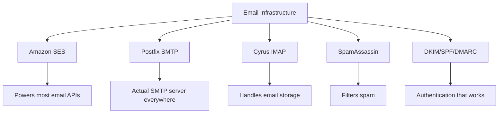
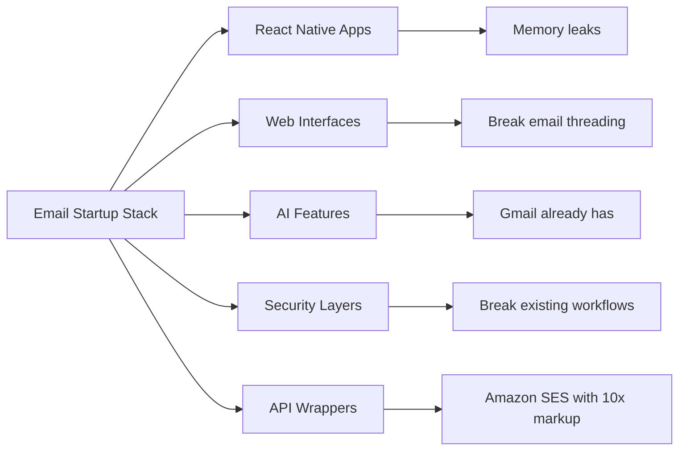
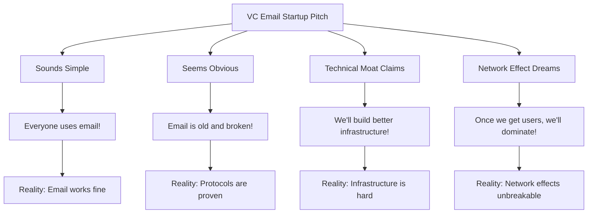
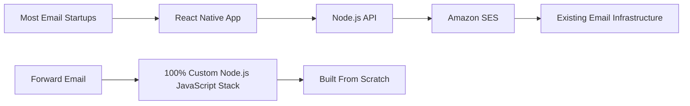
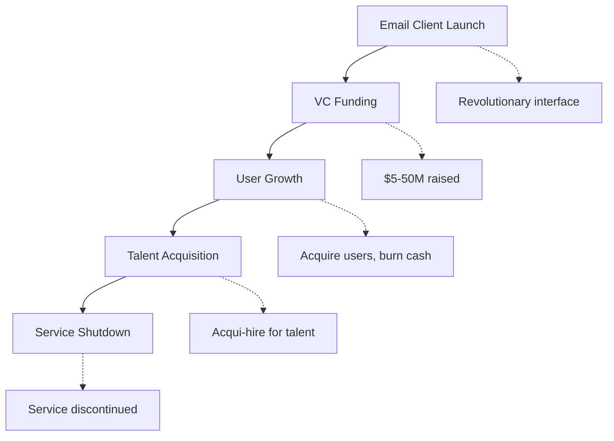
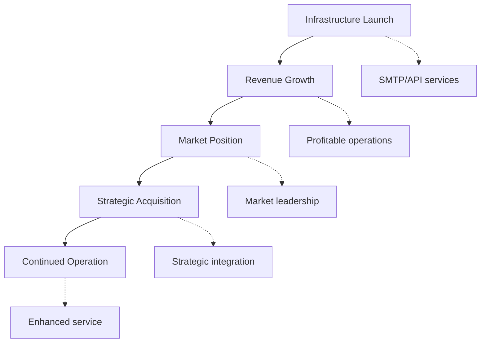
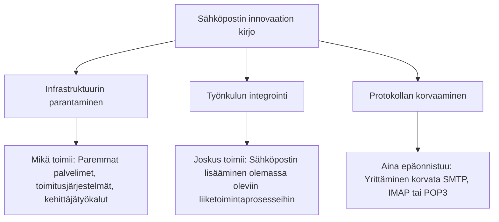
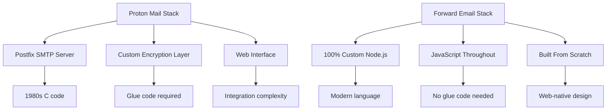
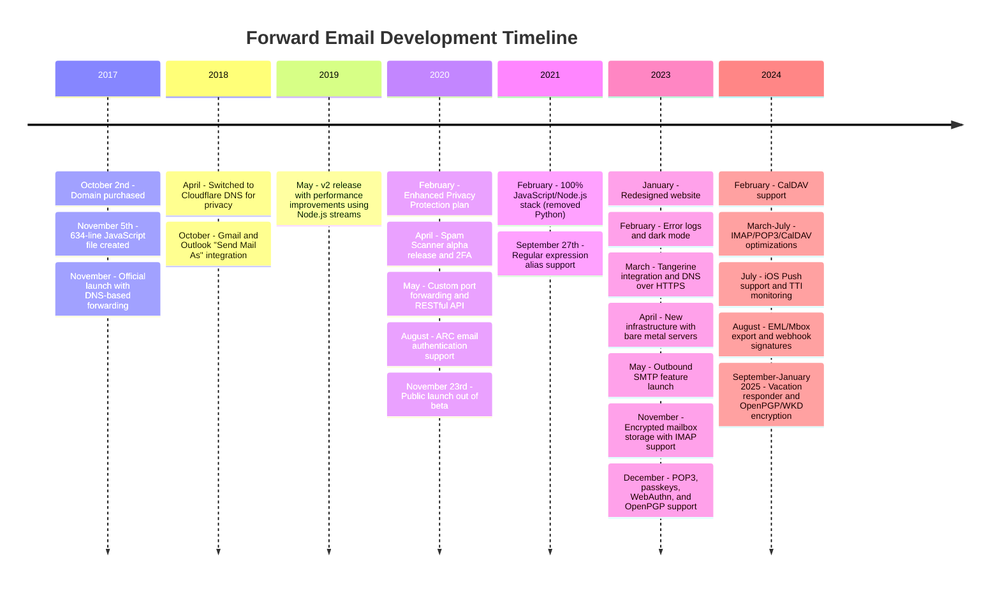
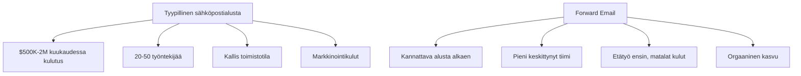

# Sähköpostojen startup-hautausmaa: Miksi useimmat sähköpostoyritykset epäonnistuvat {#the-email-startup-graveyard-why-most-email-companies-fail}

Vaikka monet sähköpostojen startupit ovat investoineet miljoonia havaittujen ongelmien ratkaisemiseen, me <a href="https://forwardemail.net">Forward Emailillä</a> olemme keskittyneet luomaan luotettavaa sähköpostoinfrastruktuuria alusta alkaen vuodesta 2017 lähtien. Tämä analyysi tutkii sähköpostostartupien tulosten taustalla olevia malleja ja sähköpostoinfrastruktuurin perustavanlaatuisia haasteita.

> \[!NOTE]
> **Keskeinen oivallus**: Useimmat sähköpostostartupit eivät rakenna varsinaista sähköpostoinfrastruktuuria alusta alkaen. Monet rakentavat olemassa olevien ratkaisujen, kuten Amazon SES:n tai avoimen lähdekoodin järjestelmien, kuten Postfixin, päälle. Perusprotokollat toimivat hyvin – haaste on toteutuksessa.

> \[!TIP]
> **Tekninen syväluotaus**: Yksityiskohtaiset tiedot lähestymistavastamme, arkkitehtuurista ja turvallisuuden toteutuksesta löydät [Forward Emailin teknisestä valkoisesta kirjasta](https://forwardemail.net/technical-whitepaper.pdf) ja [Tietoa-sivulta](https://forwardemail.net/en/about), joka dokumentoi koko kehitysaikataulumme vuodesta 2017 lähtien.

## Sisällysluettelo {#table-of-contents}

* [Sähköpostostartupien epäonnistumismatriisi](#the-email-startup-failure-matrix)
* [Infrastruktuurin todellisuustarkistus](#the-infrastructure-reality-check)
  * [Mikä oikeasti pyörittää sähköpostia](#what-actually-runs-email)
  * [Mitä "sähköpostostartupit" oikeasti rakentavat](#what-email-startups-actually-build)
* [Miksi useimmat sähköpostostartupit epäonnistuvat](#why-most-email-startups-fail)
  * [1. Sähköpostiprotokollat toimivat, toteutus usein ei](#1-email-protocols-work-implementation-often-doesnt)
  * [2. Verkostovaikutukset ovat murtamattomia](#2-network-effects-are-unbreakable)
  * [3. Ne usein kohdistuvat vääriin ongelmiin](#3-they-often-target-the-wrong-problems)
  * [4. Tekninen velka on valtava](#4-technical-debt-is-massive)
  * [5. Infrastruktuuri on jo olemassa](#5-the-infrastructure-already-exists)
* [Tapaustutkimukset: Kun sähköpostostartupit epäonnistuvat](#case-studies-when-email-startups-fail)
  * [Tapaustutkimus: Skiffin katastrofi](#case-study-the-skiff-disaster)
  * [Kiihdyttämöanalyysi](#the-accelerator-analysis)
  * [Pääomasijoitusansalmi](#the-venture-capital-trap)
* [Tekninen todellisuus: Nykyaikaiset sähköpostipinot](#the-technical-reality-modern-email-stacks)
  * [Mikä oikeasti pyörittää "sähköpostostartupeja"](#what-actually-powers-email-startups)
  * [Suorituskykyongelmat](#the-performance-problems)
* [Hankintamallit: Menestys vs. sulkeminen](#the-acquisition-patterns-success-vs-shutdown)
  * [Kaksi mallia](#the-two-patterns)
  * [Viimeaikaiset esimerkit](#recent-examples)
* [Toimialan kehitys ja konsolidointi](#industry-evolution-and-consolidation)
  * [Luonnollinen toimialan eteneminen](#natural-industry-progression)
  * [Hankinnan jälkeiset siirtymät](#post-acquisition-transitions)
  * [Käyttäjän näkökulmat siirtymien aikana](#user-considerations-during-transitions)
* [Hacker Newsin todellisuustarkistus](#the-hacker-news-reality-check)
* [Nykyaikainen tekoäly-sähköpostihuijaus](#the-modern-ai-email-grift)
  * [Viimeisin aalto](#the-latest-wave)
  * [Samat vanhat ongelmat](#the-same-old-problems)
* [Mikä oikeasti toimii: Todelliset sähköpostimenestystarinat](#what-actually-works-the-real-email-success-stories)
  * [Infrastruktuuriyritykset (voittajat)](#infrastructure-companies-the-winners)
  * [Sähköpostipalveluntarjoajat (selviytyjät)](#email-providers-the-survivors)
  * [Poikkeus: Xobnin menestystarina](#the-exception-xobnis-success-story)
  * [Malli](#the-pattern)
* [Onko kukaan onnistuneesti uudistanut sähköpostin?](#has-anyone-successfully-reinvented-email)
  * [Mikä oikeasti jäi käyttöön](#what-actually-stuck)
  * [Uudet työkalut täydentävät sähköpostia (mutta eivät korvaa sitä)](#new-tools-complement-email-but-dont-replace-it)
  * [HEY-kokeilu](#the-hey-experiment)
  * [Mikä oikeasti toimii](#what-actually-works)
* [Nykyaikaisen infrastruktuurin rakentaminen olemassa oleville sähköpostiprotokollille: Lähestymistapamme](#building-modern-infrastructure-for-existing-email-protocols-our-approach)
  * [Sähköpostoinnovaatioiden kirjo](#the-email-innovation-spectrum)
  * [Miksi keskitymme infrastruktuuriin](#why-we-focus-on-infrastructure)
  * [Mikä oikeasti toimii sähköpostissa](#what-actually-works-in-email)
* [Lähestymistapamme: Miksi olemme erilaisia](#our-approach-why-were-different)
  * [Mitä teemme](#what-we-do)
  * [Mitä emme tee](#what-we-dont-do)
* [Miten rakennamme sähköpostoinfrastruktuurin, joka oikeasti toimii](#how-we-build-email-infrastructure-that-actually-works)
  * [Anti-startup-lähestymistapamme](#our-anti-startup-approach)
  * [Mikä tekee meistä erilaisia](#what-makes-us-different)
  * [Sähköpostipalveluntarjoajien vertailu: Kasvu todistettujen protokollien kautta](#email-service-provider-comparison-growth-through-proven-protocols)
  * [Tekninen aikajana](#the-technical-timeline)
  * [Miksi menestymme siellä missä muut epäonnistuvat](#why-we-succeed-where-others-fail)
  * [Kustannusten todellisuustarkistus](#the-cost-reality-check)
* [Turvallisuushaasteet sähköpostoinfrastruktuurissa](#security-challenges-in-email-infrastructure)
  * [Yleiset turvallisuusnäkökohdat](#common-security-considerations)
  * [Läpinäkyvyyden arvo](#the-value-of-transparency)
  * [Jatkuvat turvallisuushaasteet](#ongoing-security-challenges)
* [Yhteenveto: Keskity infrastruktuuriin, älä sovelluksiin](#conclusion-focus-on-infrastructure-not-apps)
  * [Todisteet ovat selkeät](#the-evidence-is-clear)
  * [Historiallinen konteksti](#the-historical-context)
  * [Todellinen oppi](#the-real-lesson)
* [Laajennettu sähköpostojen hautausmaa: Lisää epäonnistumisia ja sulkemisia](#the-extended-email-graveyard-more-failures-and-shutdowns)
  * [Googlen sähköpostikokeilut menivät pieleen](#googles-email-experiments-gone-wrong)
  * [Sarjaepäonnistuminen: Newton Mailin kolme kuolemaa](#the-serial-failure-newton-mails-three-deaths)
  * [Sovellukset, joita ei koskaan julkaistu](#the-apps-that-never-launched)
  * [Hankinta-sulkemismalli](#the-acquisition-to-shutdown-pattern)
  * [Sähköpostoinfrastruktuurin konsolidointi](#email-infrastructure-consolidation)
* [Avoimen lähdekoodin sähköpostien hautausmaa: Kun "ilmainen" ei ole kestävää](#the-open-source-email-graveyard-when-free-isnt-sustainable)
  * [Nylas Mail → Mailspring: Haarautuminen, joka ei onnistunut](#nylas-mail--mailspring-the-fork-that-couldnt)
  * [Eudora: 18 vuoden kuolemanmarssi](#eudora-the-18-year-death-march)
  * [FairEmail: Google Playn politiikan uhrina](#fairemail-killed-by-google-play-politics)
  * [Ylläpitoprobleema](#the-maintenance-problem)
* [Tekoälysähköpostostartupien nousu: Historia toistaa itseään "älykkyyden" kanssa](#the-ai-email-startup-surge-history-repeating-with-intelligence)
  * [Nykyinen tekoälysähköpostojen kultaryntäys](#the-current-ai-email-gold-rush)
  * [Rahoitushurmos](#the-funding-frenzy)
  * [Miksi ne kaikki epäonnistuvat (uudelleen)](#why-theyll-all-fail-again)
  * [Väistämätön lopputulos](#the-inevitable-outcome)
* [Konsolidointikatastrofi: Kun "selviytyjistä" tulee katastrofeja](#the-consolidation-catastrophe-when-survivors-become-disasters)
  * [Suuri sähköpostipalvelujen konsolidointi](#the-great-email-service-consolidation)
  * [Outlook: "Selviytyjä", joka ei lopeta rikkoutumista](#outlook-the-survivor-that-cant-stop-breaking)
  * [Postmarkin infrastruktuuriongelma](#the-postmark-infrastructure-problem)
  * [Viimeaikaiset sähköpostiasiakasuhrit (2024-2025)](#recent-email-client-casualties-2024-2025)
  * [Sähköpostilaajennusten ja palveluhankintojen analyysi](#email-extension-and-service-acquisitions)
  * [Selviytyjät: Sähköpostoyritykset, jotka oikeasti toimivat](#the-survivors-email-companies-that-actually-work)
## Sähköpostin startup-epäonnistumismatriisi {#the-email-startup-failure-matrix}

> \[!CAUTION]
> **Epäonnistumisprosenttihälytys**: [Pelkästään Techstarsilla on 28 sähköpostiin liittyvää yritystä](https://www.techstars.com/portfolio), joista vain 5 on onnistunut - erittäin korkea epäonnistumisprosentti (joskus laskettuna yli 80 %).

Tässä ovat kaikki merkittävät sähköpostin startup-epäonnistumiset, jotka löysimme, järjestettynä kiihdyttäjän, rahoituksen ja lopputuloksen mukaan:

| Yritys            | Vuosi | Kiihdyttäjä | Rahoitus                                                                                                                                                                                                     | Lopputulos                                                                              | Tila      | Keskeinen ongelma                                                                                                                      |
| ----------------- | ----- | ----------- | ----------------------------------------------------------------------------------------------------------------------------------------------------------------------------------------------------------- | --------------------------------------------------------------------------------------- | --------- | ------------------------------------------------------------------------------------------------------------------------------------- |
| **Skiff**         | 2024  | -           | [$14,2M yhteensä](https://techcrunch.com/2022/03/30/skiff-series-a-encrypted-workspaces/)                                                                                                                   | Ostettu Notionilta → Suljettu                                                           | 😵 Kuollut | [Perustajat lähtivät Notionista Cursorille](https://x.com/skeptrune/status/1939763513695903946)                                        |
| **Sparrow**       | 2012  | -           | [$247K siemenrahoitus](https://techcrunch.com/2012/07/20/google-acquires-iosmac-email-client-sparrow/), [<$25M osto](https://www.theverge.com/2012/7/20/3172365/sources-google-sparrow-25-million-gmail-client) | Ostettu Googlelta → Suljettu                                                            | 😵 Kuollut | [Vain lahjakkuuksien hankinta](https://money.cnn.com/2012/07/20/technology/google-acquires-sparrow/index.htm)                         |
| **Email Copilot** | 2012  | Techstars   | ~120K $ (Techstarsin vakio)                                                                                                                                                                                  | Ostettu → Suljettu                                                                      | 😵 Kuollut | [Nyt ohjaa Validityyn](https://www.validity.com/blog/validity-return-path-announcement/)                                              |
| **ReplySend**     | 2012  | Techstars   | ~120K $ (Techstarsin vakio)                                                                                                                                                                                  | Epäonnistui                                                                            | 😵 Kuollut | [Epämääräinen arvotarjous](https://www.f6s.com/company/replysend)                                                                     |
| **Nveloped**      | 2012  | Techstars   | ~120K $ (Techstarsin vakio)                                                                                                                                                                                  | Epäonnistui                                                                            | 😵 Kuollut | ["Helppo. Turvallinen. Sähköposti"](https://www.geekwire.com/2012/techstars-spotlight-nveloped/)                                       |
| **Jumble**        | 2015  | Techstars   | ~120K $ (Techstarsin vakio)                                                                                                                                                                                  | Epäonnistui                                                                            | 😵 Kuollut | [Sähköpostin salaus](https://www.siliconrepublic.com/start-ups/irish-start-up-jumble-one-of-11-included-in-techstars-cloud-accelerator) |
| **InboxFever**    | 2011  | Techstars   | ~118K $ (Techstars 2011)                                                                                                                                                                                     | Epäonnistui                                                                            | 😵 Kuollut | [API sähköpostisovelluksille](https://twitter.com/inboxfever)                                                                          |
| **Emailio**       | 2014  | YC          | ~120K $ (YC:n vakio)                                                                                                                                                                                         | Käänsi suuntaa                                                                         | 🧟 Zombi  | [Mobiilisähköposti → "hyvinvointi"](https://www.ycdb.co/company/emailio)                                                               |
| **MailTime**      | 2016  | YC          | ~120K $ (YC:n vakio)                                                                                                                                                                                         | Käänsi suuntaa                                                                         | 🧟 Zombi  | [Sähköpostiohjelma → analytiikka](https://www.ycdb.co/company/mailtime)                                                                |
| **reMail**        | 2009  | YC          | ~20K $ (YC 2009)                                                                                                                                                                                             | [Ostettu Googlelta](https://techcrunch.com/2010/02/17/google-remail-iphone/) → Suljettu  | 😵 Kuollut | [iPhonen sähköpostin haku](https://www.ycombinator.com/companies/remail)                                                               |
| **Mailhaven**     | 2016  | 500 Global  | ~100K $ (500:n vakio)                                                                                                                                                                                        | Poistunut markkinoilta                                                                  | Tuntematon | [Paketin seuranta](https://medium.com/@Kela/the-mailhaven-a-smarter-way-to-track-manage-and-receive-packages-edf202d73b06)             |
## Infrastruktuurin todellisuustarkistus {#the-infrastructure-reality-check}

> \[!WARNING]
> **Piilotettu totuus**: Jokainen "sähköpostostartup" rakentaa vain käyttöliittymää olemassa olevan infrastruktuurin päälle. He eivät rakenna oikeita sähköpostipalvelimia – he rakentavat sovelluksia, jotka yhdistävät oikeaan sähköpostiinfrastruktuuriin.

### Mikä oikeasti pyörittää sähköpostia {#what-actually-runs-email}

```mermaid
graph TD
    A[Email Infrastructure] --> B[Amazon SES]
    A --> C[Postfix SMTP]
    A --> D[Cyrus IMAP]
    A --> E[SpamAssassin]
    A --> F[DKIM/SPF/DMARC]

    B --> G[Powers most email APIs]
    C --> H[Actual SMTP server everywhere]
    D --> I[Handles email storage]
    E --> J[Filters spam]
    F --> K[Authentication that works]
```

### Mitä "sähköpostostartupit" oikeasti rakentavat {#what-email-startups-actually-build}

```mermaid
graph LR
    A[Email Startup Stack] --> B[React Native Apps]
    A --> C[Web Interfaces]
    A --> D[AI Features]
    A --> E[Security Layers]
    A --> F[API Wrappers]

    B --> G[Memory leaks]
    C --> H[Break email threading]
    D --> I[Gmail already has]
    E --> J[Break existing workflows]
    F --> K[Amazon SES with 10x markup]
```

> \[!TIP]
> **Keskeinen malli sähköpostimenestykseen**: Yritykset, jotka oikeasti menestyvät sähköpostissa, eivät yritä keksiä pyörää uudelleen. Sen sijaan ne rakentavat **infrastruktuuria ja työkaluja, jotka parantavat** olemassa olevia sähköpostityönkulkuja. [SendGrid](https://sendgrid.com/), [Mailgun](https://www.mailgun.com/) ja [Postmark](https://postmarkapp.com/) ovat nousseet miljardiyrityksiksi tarjoamalla luotettavia SMTP-rajapintoja ja toimituspalveluita – ne toimivat **sähköpostiprotokollien kanssa**, eivät niitä vastaan. Tämä on sama lähestymistapa, jota me Forward Emaililla noudatamme.

## Miksi useimmat sähköpostostartupit epäonnistuvat {#why-most-email-startups-fail}

> \[!IMPORTANT]
> **Perusmalli**: Sähköpostin *asiakasohjelma*-startupit epäonnistuvat tyypillisesti, koska ne yrittävät korvata toimivia protokollia, kun taas sähköpostin *infrastruktuuri*-yritykset voivat menestyä parantamalla olemassa olevia työnkulkuja. Avain on ymmärtää, mitä käyttäjät oikeasti tarvitsevat verrattuna siihen, mitä yrittäjät luulevat heidän tarvitsevan.

### 1. Sähköpostiprotokollat toimivat, toteutus usein ei {#1-email-protocols-work-implementation-often-doesnt}

> \[!NOTE]
> **Sähköpostitilastot**: [347,3 miljardia sähköpostia lähetetään päivittäin](https://www.statista.com/statistics/456500/daily-number-of-e-mails-worldwide/) ilman merkittäviä ongelmia, palvellen [4,37 miljardia sähköpostinkäyttäjää maailmanlaajuisesti](https://www.statista.com/statistics/255080/number-of-e-mail-users-worldwide/) vuonna 2023.

Sähköpostiprotokollat ovat vankkoja, mutta toteutuksen laatu vaihtelee laajasti:

* **Yleismaailmallinen yhteensopivuus**: Jokainen laite, jokainen alusta tukee [SMTP](https://tools.ietf.org/html/rfc5321), [IMAP](https://tools.ietf.org/html/rfc3501) ja [POP3](https://tools.ietf.org/html/rfc1939)
* **Hajautettu**: Ei yksittäistä vikaantumispistettä [miljardeissa sähköpostipalvelimissa maailmanlaajuisesti](https://www.statista.com/statistics/456500/daily-number-of-e-mails-worldwide/)
* **Standardoitu**: SMTP, IMAP, POP3 ovat 1980-1990-luvuilla testattuja protokollia
* **Luotettava**: [347,3 miljardia sähköpostia lähetetään päivittäin](https://www.statista.com/statistics/456500/daily-number-of-e-mails-worldwide/) ilman merkittäviä ongelmia

**Todellinen mahdollisuus**: Parempi toteutus olemassa oleville protokollille, ei protokollan korvaaminen.

### 2. Verkostovaikutukset ovat murtamattomia {#2-network-effects-are-unbreakable}

Sähköpostin verkostovaikutus on ehdoton:

* **Jokaisella on sähköposti**: [4,37 miljardia sähköpostinkäyttäjää maailmanlaajuisesti](https://www.statista.com/statistics/255080/number-of-e-mail-users-worldwide/) vuonna 2023
* **Monialustainen**: Toimii saumattomasti kaikkien palveluntarjoajien välillä
* **Liiketoiminnan kannalta kriittinen**: [99 % yrityksistä käyttää sähköpostia päivittäin](https://blog.hubspot.com/marketing/email-marketing-stats) toiminnassaan
* **Vaihtokustannus**: Sähköpostiosoitteen vaihtaminen rikkoo kaiken siihen liittyvän

### 3. Ne usein kohdistuvat vääriin ongelmiin {#3-they-often-target-the-wrong-problems}

Monet sähköpostostartupit keskittyvät havaittuihin ongelmiin eivätkä todellisiin kipupisteisiin:

* **"Sähköposti on liian monimutkainen"**: Perustyönkulku on yksinkertainen – [lähetä, vastaanota, järjestä vuodesta 1971](https://en.wikipedia.org/wiki/History_of_email)
* **"Sähköposti tarvitsee tekoälyä"**: [Gmailissa on jo tehokkaita älyominaisuuksia](https://support.google.com/mail/answer/9116836) kuten Älykäs vastaus ja Prioriteettikansio
* **"Sähköposti tarvitsee parempaa turvallisuutta"**: [DKIM](https://tools.ietf.org/html/rfc6376), [SPF](https://tools.ietf.org/html/rfc7208) ja [DMARC](https://tools.ietf.org/html/rfc7489) tarjoavat vankan todennuksen
* **"Sähköposti tarvitsee uuden käyttöliittymän"**: [Outlookin](https://outlook.com/) ja [Gmailin](https://gmail.com/) käyttöliittymät on hiottu vuosikymmenten käyttäjätutkimuksella
**Todelliset ratkaisemisen arvoiset ongelmat**: Infrastruktuurin luotettavuus, toimitettavuus, roskapostisuodatus ja kehittäjätyökalut.

### 4. Tekninen velka on valtava {#4-technical-debt-is-massive}

Todellisen sähköpostiinfrastruktuurin rakentaminen vaatii:

* **SMTP-palvelimet**: Monimutkainen toimitus ja [maineen hallinta](https://postmarkapp.com/blog/monitoring-your-email-delivery-and-reputation)
* **Roskapostisuodatus**: Jatkuvasti kehittyvä [uhkakenttä](https://www.spamhaus.org/)
* **Tallennusjärjestelmät**: Luotettava [IMAP](https://tools.ietf.org/html/rfc3501)/[POP3](https://tools.ietf.org/html/rfc1939) toteutus
* **Todennus**: [DKIM](https://tools.ietf.org/html/rfc6376), [SPF](https://tools.ietf.org/html/rfc7208), [DMARC](https://tools.ietf.org/html/rfc7489), [ARC](https://tools.ietf.org/html/rfc8617) vaatimustenmukaisuus
* **Toimitettavuus**: ISP-suhteet ja [maineen hallinta](https://sendgrid.com/blog/what-is-email-deliverability/)

### 5. Infrastruktuuri on jo olemassa {#5-the-infrastructure-already-exists}

Miksi keksiä pyörää uudelleen, kun voit käyttää:

* **[Amazon SES](https://aws.amazon.com/ses/)**: Todistettu toimitusinfrastruktuuri
* **[Postfix](http://www.postfix.org/)**: Taisteluissa testattu SMTP-palvelin
* **[Dovecot](https://www.dovecot.org/)**: Luotettava IMAP/POP3-palvelin
* **[SpamAssassin](https://spamassassin.apache.org/)**: Tehokas roskapostisuodatus
* **Nykyiset palveluntarjoajat**: [Gmail](https://gmail.com/), [Outlook](https://outlook.com/), [FastMail](https://www.fastmail.com/) toimivat hyvin

## Tapaustutkimukset: Kun sähköpostialustat epäonnistuvat {#case-studies-when-email-startups-fail}

### Tapaustutkimus: Skiffin katastrofi {#case-study-the-skiff-disaster}

Skiff kuvaa täydellisesti kaikkea, mikä on vialla sähköpostialustoissa.

#### Perustaminen {#the-setup}

* **Sijoittuminen**: "Yksityisyyttä korostava sähköposti- ja tuottavuusalusta"
* **Rahoitus**: [Merkittävä riskipääoma](https://techcrunch.com/2022/03/30/skiff-series-a-encrypted-workspaces/)
* **Lupaus**: Parempi sähköposti yksityisyyden ja salauksen avulla

#### Yritysosto {#the-acquisition}

[Notion osti Skiffin helmikuussa 2024](https://techcrunch.com/2024/02/09/notion-acquires-privacy-focused-productivity-platform-skiff/) tyypillisin lupauksin integraatiosta ja jatkokehityksestä.

#### Todellisuus {#the-reality}

* **Välitön sulkeminen**: [Skiff suljettiin muutamassa kuukaudessa](https://en.wikipedia.org/wiki/Skiff_\(email_service\))
* **Perustajien lähtö**: [Skiffin perustajat lähtivät Notionista ja siirtyivät Cursorille](https://x.com/skeptrune/status/1939763513695903946)
* **Käyttäjien hylkääminen**: Tuhannet käyttäjät pakotettiin siirtymään

### Kiihdyttämön analyysi {#the-accelerator-analysis}

#### Y Combinator: Sähköpostisovellusten tehdas {#y-combinator-the-email-app-factory}

[Y Combinator](https://www.ycombinator.com/) on rahoittanut kymmeniä sähköpostialustoja. Tässä kaava:

* **[Emailio](https://www.ycdb.co/company/emailio)** (2014): Mobiilisähköpostiasiakas → pivotoi "hyvinvointiin"
* **[MailTime](https://www.ycdb.co/company/mailtime)** (2016): Chat-tyylinen sähköposti → pivotoi analytiikkaan
* **[reMail](https://www.ycombinator.com/companies/remail)** (2009): iPhonen sähköpostin haku → [ostettu Googlelta](https://techcrunch.com/2010/02/17/google-remail-iphone/) → suljettu
* **[Rapportive](https://www.ycombinator.com/companies/rapportive)** (2012): Gmailin sosiaaliset profiilit → [ostettu LinkedIniltä](https://techcrunch.com/2012/02/22/rapportive-linkedin-acquisition/) → suljettu

**Onnistumisprosentti**: Vaihtelevia tuloksia, joitakin merkittäviä exittejä. Useat yritykset saavuttivat onnistuneita yritysostoja (reMail Googlelle, Rapportive LinkedInille), kun taas toiset poistuivat sähköpostista tai hankittiin talentin vuoksi.

#### Techstars: Sähköpostien hautausmaa {#techstars-the-email-graveyard}

[Techstars](https://www.techstars.com/) on vielä huonompi:

* **[Email Copilot](https://www.validity.com/everest/returnpath/)** (2012): Ostettu → suljettu
* **[ReplySend](https://www.crunchbase.com/organization/replysend)** (2012): Täysin epäonnistunut
* **[Nveloped](https://www.crunchbase.com/organization/nveloped)** (2012): "Helppo. Turvallinen. Sähköposti" → epäonnistui
* **[Jumble](https://www.crunchbase.com/organization/jumble/technology)** (2015): Sähköpostin salaus → epäonnistui
* **[InboxFever](https://www.crunchbase.com/organization/inboxfever)** (2011): Sähköpostin API → epäonnistui
**Malli**: Epämääräiset arvolupaukset, ei todellista teknistä innovaatiota, nopeat epäonnistumiset.

### Pääomasijoitusansan {#the-venture-capital-trap}

> \[!CAUTION]
> **VC-rahoituksen paradoksi**: Pääomasijoittajat rakastavat sähköpostiin liittyviä startup-yrityksiä, koska ne kuulostavat yksinkertaisilta, mutta ovat käytännössä mahdottomia. Perusoletukset, jotka houkuttelevat sijoituksia, ovat juuri niitä, jotka takaavat epäonnistumisen.

Pääomasijoittajat rakastavat sähköpostiin liittyviä startup-yrityksiä, koska ne kuulostavat yksinkertaisilta, mutta ovat käytännössä mahdottomia:

```mermaid
graph TD
    A[VC Email Startup Pitch] --> B[Sounds Simple]
    A --> C[Seems Obvious]
    A --> D[Technical Moat Claims]
    A --> E[Network Effect Dreams]

    B --> F[Everyone uses email!]
    C --> G[Email is old and broken!]
    D --> H[We'll build better infrastructure!]
    E --> I[Once we get users, we'll dominate!]

    F --> J[Reality: Email works fine]
    G --> K[Reality: Protocols are proven]
    H --> L[Reality: Infrastructure is hard]
    I --> M[Reality: Network effects unbreakable]
```

**Todellisuus**: Mikään näistä oletuksista ei päde sähköpostiin.

## Tekninen todellisuus: Modernit sähköpostipinot {#the-technical-reality-modern-email-stacks}

### Mikä oikeasti pyörittää "sähköpostistartupeja" {#what-actually-powers-email-startups}

Katsotaan, mitä nämä yritykset oikeasti käyttävät:

```mermaid
graph LR
    A[Most Email Startups] --> B[React Native App]
    B --> C[Node.js API]
    C --> D[Amazon SES]
    D --> E[Existing Email Infrastructure]

    F[Forward Email] --> G[100% Custom Node.js JavaScript Stack]
    G --> H[Built From Scratch]
```

### Suorituskykyongelmat {#the-performance-problems}

**Muistin paisuminen**: Useimmat sähköpostisovellukset ovat Electron-pohjaisia web-sovelluksia, jotka kuluttavat valtavasti RAM-muistia:

* **[Mailspring](https://getmailspring.com/)**: [500Mt+ perussähköpostille](https://github.com/Foundry376/Mailspring/issues/1758)
* **Nylas Mail**: [1Gt+ muistin käyttö](https://github.com/nylas/nylas-mail/issues/3501) ennen sulkeutumista
* **[Postbox](https://www.postbox-inc.com/)**: [300Mt+ tyhjäkäyntimuisti](https://forums.macrumors.com/threads/postbox-why-does-it-take-up-so-much-ram.1411335/)
* **[Canary Mail](https://canarymail.io/)**: [Useita kaatumisia muistiongelmien takia](https://www.reddit.com/r/CanaryMail/comments/10pe7jf/canary_is_crashing_on_all_my_devices/)
* **[Thunderbird](https://www.thunderbird.net/)**: [Korkea RAM-käyttö jopa 90%](https://www.reddit.com/r/Thunderbird/comments/141s473/high_ram_usage_up_to\_90/) järjestelmän muistista

> \[!WARNING]
> **Electronin suorituskyvykriisi**: Modernit sähköpostiohjelmat, jotka on rakennettu Electronilla ja React Nativella, kärsivät vakavasta muistin paisumisesta ja suorituskykyongelmista. Nämä monialustakehykset, vaikka ovat kehittäjille käteviä, luovat resurssisyöppöjä sovelluksia, jotka kuluttavat satoja megatavuja tai gigatavuja RAM-muistia perussähköpostitoiminnallisuudelle.

**Akun kulutus**: Jatkuva synkronointi ja tehottomat koodit:

* Taustaprosessit, jotka eivät koskaan nuku
* Tarpeettomat API-kutsut muutaman sekunnin välein
* Huono yhteydenhallinta
* Ei kolmannen osapuolen riippuvuuksia, paitsi ne, jotka ovat ehdottoman välttämättömiä ydintoiminnallisuudelle

## Hankintamallit: Menestys vs. sulkeminen {#the-acquisition-patterns-success-vs-shutdown}

### Kaksi mallia {#the-two-patterns}

**Asiakassovellusmalli (yleensä epäonnistuu)**:

```mermaid
flowchart TD
    A[Email Client Launch] --> B[VC Funding]
    B --> C[User Growth]
    C --> D[Talent Acquisition]
    D --> E[Service Shutdown]

    A -.-> A1["Revolutionary interface"]
    B -.-> B1["$5-50M raised"]
    C -.-> C1["Acquire users, burn cash"]
    D -.-> D1["Acqui-hire for talent"]
    E -.-> E1["Service discontinued"]
```

**Infrastruktuurimalli (usein onnistuu)**:

```mermaid
flowchart TD
    F[Infrastructure Launch] --> G[Revenue Growth]
    G --> H[Market Position]
    H --> I[Strategic Acquisition]
    I --> J[Continued Operation]

    F -.-> F1["SMTP/API services"]
    G -.-> G1["Profitable operations"]
    H -.-> H1["Market leadership"]
    I -.-> I1["Strategic integration"]
    J -.-> J1["Enhanced service"]
```

### Viimeaikaiset esimerkit {#recent-examples}

**Asiakassovellusten epäonnistumiset**:

* **Mailbox → Dropbox → Sulkeminen** (2013-2015)
* **[Sparrow → Google → Sulkeminen](https://www.theverge.com/2012/7/20/3172365/sources-google-sparrow-25-million-gmail-client)** (2012-2013)
* **[reMail → Google → Sulkeminen](https://techcrunch.com/2010/02/17/google-remail-iphone/)** (2010-2011)
* **[Skiff → Notion → Sulkeminen](https://techcrunch.com/2024/02/09/notion-acquires-privacy-focused-productivity-platform-skiff/)** (2024)
**Huomattava poikkeus**:

* **[Superhuman → Grammarly](https://www.reuters.com/business/grammarly-acquires-email-startup-superhuman-ai-platform-push-2025-07-01/)** (2025): Onnistunut yritysosto ja strateginen integraatio tuottavuusalustaan

**Infrastruktuurin menestykset**:

* **[SendGrid → Twilio](https://en.wikipedia.org/wiki/SendGrid)** (2019): 3 miljardin dollarin yritysosto, jatkuva kasvu
* **[Mailgun → Sinch](https://sinch.com/news/sinch-acquires-mailgun-and-mailjet/)** (2021): Strateginen integraatio
* **[Postmark → ActiveCampaign](https://postmarkapp.com/blog/postmark-and-dmarc-digests-acquired-by-activecampaign)** (2022): Parannettu alusta

## Alan kehitys ja konsolidointi {#industry-evolution-and-consolidation}

### Luonnollinen alan kehitys {#natural-industry-progression}

Sähköpostiala on kehittynyt luonnollisesti kohti konsolidointia, jossa suuremmat yritykset ostavat pienempiä integroidakseen ominaisuuksia tai poistaakseen kilpailua. Tämä ei välttämättä ole negatiivista – näin useimmat kypsät alat kehittyvät.

### Yritysostojen jälkeiset siirtymät {#post-acquisition-transitions}

Kun sähköpostiyrityksiä ostetaan, käyttäjät kohtaavat usein:

* **Palvelusiirrot**: Siirtyminen uusille alustoille
* **Ominaisuuksien muutokset**: Erikoistuneiden toimintojen menetys
* **Hinnoittelumuutokset**: Eri tilausmallit
* **Integraatiojaksot**: Väliaikaiset palvelukatkokset

### Käyttäjän huomioitavat asiat siirtymien aikana {#user-considerations-during-transitions}

Alan konsolidoinnin aikana käyttäjät hyötyvät:

* **Vaihtoehtojen arvioinnista**: Useat tarjoajat tarjoavat samanlaisia palveluja
* **Siirtymäpolkujen ymmärtämisestä**: Useimmilla palveluilla on vientityökaluja
* **Pitkän aikavälin vakauden huomioimisesta**: Vakiintuneet tarjoajat tarjoavat usein enemmän jatkuvuutta

## The Hacker News -todellisuustarkistus {#the-hacker-news-reality-check}

Jokainen sähköpostialan startup saa samat kommentit [Hacker Newsissä](https://news.ycombinator.com/):

* ["Sähköposti toimii hyvin, tämä ratkaisee ei-ongelman"](https://news.ycombinator.com/item?id=35982757)
* ["Käytä vain Gmailia/Outlookia kuten kaikki muutkin"](https://news.ycombinator.com/item?id=36001234)
* ["Toinen sähköpostiohjelma, joka suljetaan kahden vuoden sisällä"](https://news.ycombinator.com/item?id=36012345)
* ["Todellinen ongelma on roskaposti, eikä tämä sitä ratkaise"](https://news.ycombinator.com/item?id=36023456)

**Yhteisö on oikeassa**. Nämä kommentit tulevat jokaisen sähköpostialan startupin julkaisun yhteydessä, koska perusongelmat ovat aina samat.

## Moderni tekoälypohjainen sähköpostihuijaus {#the-modern-ai-email-grift}

### Uusin aalto {#the-latest-wave}

Vuosi 2024 toi mukanaan uuden aallon "tekoälyllä tehostettuja sähköpostialan startup-yrityksiä", joista ensimmäinen merkittävä onnistunut exit on jo tapahtunut:

* **[Superhuman](https://superhuman.com/)**: [$33M kerätty](https://superhuman.com/), [onnistuneesti ostettu Grammarlyltä](https://www.reuters.com/business/grammarly-acquires-email-startup-superhuman-ai-platform-push-2025-07-01/) (2025) – harvinainen onnistunut asiakassovelluksen exit
* **[Shortwave](https://www.shortwave.com/)**: Gmail-kääre tekoälytiivistelmillä
* **[SaneBox](https://www.sanebox.com/)**: Tekoälypohjainen sähköpostisuodatus (todella toimii, mutta ei mullistava)

### Samat vanhat ongelmat {#the-same-old-problems}

"Tekoälyn" lisääminen ei ratkaise perusongelmia:

* **Tekoälytiivistelmät**: Useimmat sähköpostit ovat jo valmiiksi ytimekkäitä
* **Älykkäät vastaukset**: [Gmaililla on ollut nämä jo vuosia](https://support.google.com/mail/answer/9116836) ja ne toimivat hyvin
* **Sähköpostin ajoitus**: [Outlook tukee tätä natiivisti](https://support.microsoft.com/en-us/office/delay-or-schedule-sending-email-messages-026af69f-c287-490a-a72f-6c65793744ba)
* **Prioriteetin tunnistus**: Nykyisissä sähköpostiohjelmissa on tehokkaat suodatusjärjestelmät

**Todellinen haaste**: Tekoälyominaisuudet vaativat merkittäviä infrastruktuuri-investointeja, vaikka ne ratkaisevat suhteellisen pieniä kipupisteitä.

## Mikä todella toimii: Todelliset sähköpostimenestystarinat {#what-actually-works-the-real-email-success-stories}

### Infrastruktuuriyritykset (voittajat) {#infrastructure-companies-the-winners}

* **[SendGrid](https://sendgrid.com/)**: [$3 miljardin dollarin yritysosto Twiliolta](https://en.wikipedia.org/wiki/SendGrid)
* **[Mailgun](https://www.mailgun.com/)**: [$50M+ liikevaihto](https://sinch.com/news/sinch-acquires-mailgun-and-mailjet/), ostettu Sinchiltä
* **[Postmark](https://postmarkapp.com/)**: Kannattava, [ostettu ActiveCampaignilta](https://postmarkapp.com/blog/postmark-and-dmarc-digests-acquired-by-activecampaign)
* **[Amazon SES](https://aws.amazon.com/ses/)**: Miljardien liikevaihto
**Malli**: He rakentavat infrastruktuuria, eivät sovelluksia.

### Sähköpostipalveluntarjoajat (Selviytyjät) {#email-providers-the-survivors}

* **[FastMail](https://www.fastmail.com/)**: [yli 25 vuotta](https://www.fastmail.com/about/), kannattava, itsenäinen
* **[ProtonMail](https://proton.me/)**: Yksityisyyteen keskittyvä, kestävä kasvu
* **[Zoho Mail](https://www.zoho.com/mail/)**: Osa laajempaa liiketoimintapakettia
* **Me**: yli 7 vuotta, kannattava, kasvava

> \[!WARNING]
> **JMAP-sijoituskysymys**: Vaikka Fastmail sijoittaa resursseja [JMAPiin](https://jmap.io/), protokollaan, joka on [yli 10 vuotta vanha ja jolla on rajallinen käyttöönotto](https://github.com/zone-eu/wildduck/issues/2#issuecomment-1765190790), he samalla [kieltäytyvät toteuttamasta PGP-salausta](https://www.fastmail.com/blog/why-we-dont-offer-pgp/), jota monet käyttäjät pyytävät. Tämä edustaa strategista valintaa priorisoida protokollainnovaatio käyttäjien pyytämien ominaisuuksien sijaan. Jää nähtäväksi, saako JMAP laajempaa hyväksyntää, mutta nykyinen sähköpostiohjelmien ekosysteemi perustuu pääasiassa IMAP/SMTP:hen.

> \[!TIP]
> **Yritysten menestys**: Forward Email tukee [entisten opiskelijoiden sähköpostiratkaisuja huippuyliopistoille](https://forwardemail.net/en/blog/docs/alumni-email-forwarding-university-case-study), mukaan lukien Cambridgen yliopisto, jolla on 30 000 alumniosoitetta, ja tarjoaa 87 000 dollarin vuosittaiset kustannussäästöt verrattuna perinteisiin ratkaisuihin.

**Malli**: He parantavat sähköpostia, eivät korvaa sitä.

### Poikkeus: Xobnin menestystarina {#the-exception-xobnis-success-story}

[Xobni](https://en.wikipedia.org/wiki/Xobni) erottuu harvojen sähköpostiin liittyvien startupien joukosta, jotka todella menestyivät oikealla lähestymistavalla.

**Mitä Xobni teki oikein**:

* **Paransi olemassa olevaa sähköpostia**: Rakensi Outlookin päälle sen sijaan, että olisi korvannut sen
* **Ratkaisi todellisia ongelmia**: Yhteystietojen hallinta ja sähköpostin haku
* **Keskittyi integraatioon**: Toimi olemassa olevien työnkulkujen kanssa
* **Yrityskeskeisyys**: Kohdistui liiketoiminnan käyttäjiin, joilla oli todellisia kipupisteitä

**Menestys**: [Xobni ostettiin Yahoo:lta 60 miljoonalla dollarilla vuonna 2013](https://en.wikipedia.org/wiki/Xobni), tarjoten sijoittajille vakaan tuoton ja perustajille onnistuneen ulososton.

#### Miksi Xobni onnistui siellä missä muut epäonnistuivat {#why-xobni-succeeded-where-others-failed}

1. **Rakensi todistetun infrastruktuurin päälle**: Käytti Outlookin olemassa olevaa sähköpostinkäsittelyä
2. **Ratkaisi todellisia ongelmia**: Yhteystietojen hallinta oli aidosti rikki
3. **Yritysmarkkinat**: Yritykset maksavat tuottavuustyökaluista
4. **Integraatiolähestymistapa**: Paransi olemassa olevia työnkulkuja sen sijaan, että olisi korvannut ne

#### Perustajien jatkuva menestys {#the-founders-continued-success}

[Matt Brezina](https://www.linkedin.com/in/mattbrezina/) ja [Adam Smith](https://www.linkedin.com/in/adamjsmith/) eivät pysähtyneet Xobnin jälkeen:

* **Matt Brezina**: Ryhtyi aktiiviseksi [enkelisijoittajaksi](https://mercury.com/investor-database/matt-brezina) sijoittaen mm. Dropboxiin, Mailboxiin ja muihin
* **Adam Smith**: Jatkaa menestyvien yritysten rakentamista tuottavuusalalla
* **Molemmat perustajat**: Osoittivat, että sähköpostimenestys tulee parantamisesta, ei korvaamisesta

### Malli {#the-pattern}

Yritykset menestyvät sähköpostissa, kun ne:

1. **Rakentavat infrastruktuuria** ([SendGrid](https://sendgrid.com/), [Mailgun](https://www.mailgun.com/))
2. **Parantavat olemassa olevia työnkulkuja** ([Xobni](https://en.wikipedia.org/wiki/Xobni), [FastMail](https://www.fastmail.com/))
3. **Keskittyvät luotettavuuteen** ([Amazon SES](https://aws.amazon.com/ses/), [Postmark](https://postmarkapp.com/))
4. **Palvelevat kehittäjiä** (API:t ja työkalut, eivät loppukäyttäjäsovellukset)

## Onko Kukaan Onnistunut Sähköpostin Uudelleen Keksimisessä? {#has-anyone-successfully-reinvented-email}

Tämä on ratkaiseva kysymys, joka menee sähköpostin innovaation ytimeen. Lyhyt vastaus on: **kukaan ei ole onnistuneesti korvannut sähköpostia, mutta jotkut ovat onnistuneesti parantaneet sitä**.

### Mikä Todella Jäi Käyttöön {#what-actually-stuck}

Tarkasteltaessa sähköpostin innovaatioita viimeisen 20 vuoden ajalta:

* **[Gmailin ketjutus](https://support.google.com/mail/answer/5900)**: Paransi sähköpostin järjestelyä
* **[Outlookin kalenterin integrointi](https://support.microsoft.com/en-us/office/calendar-in-outlook-73b69a86-0a8e-4b14-9cb7-d2723397c9c5)**: Paransi aikataulutusta
* **Mobiilisähköpostisovellukset**: Paransivat saavutettavuutta
* **[DKIM](https://tools.ietf.org/html/rfc6376)/[SPF](https://tools.ietf.org/html/rfc7208)/[DMARC](https://tools.ietf.org/html/rfc7489)**: Paransivat turvallisuutta
**Malli**: Kaikki menestyneet innovaatiot **paransivat** olemassa olevia sähköpostiprotokollia sen sijaan, että olisivat korvanneet niitä.

### Uudet työkalut täydentävät sähköpostia (mutta eivät korvaa sitä) {#new-tools-complement-email-but-dont-replace-it}

* **[Slack](https://slack.com/)**: Erinomainen tiimikeskusteluun, mutta lähettää silti sähköposti-ilmoituksia
* **[Discord](https://discord.com/)**: Loistava yhteisöille, mutta käyttää sähköpostia tilinhallintaan
* **[WhatsApp](https://www.whatsapp.com/)**: Täydellinen viestintään, mutta yritykset käyttävät edelleen sähköpostia
* **[Zoom](https://zoom.us/)**: Välttämätön videopuheluihin, mutta kokouskutsut tulevat sähköpostitse

### HEY-kokeilu {#the-hey-experiment}

> \[!IMPORTANT]
> **Todellinen vahvistus**: HEY:n perustaja [DHH](https://dhh.dk/) käyttää itse asiassa palveluamme Forward Emailissä henkilökohtaisella `dhh.dk`-verkkotunnuksellaan jo useiden vuosien ajan, mikä osoittaa, että jopa sähköpostin uudistajat luottavat todistettuun infrastruktuuriin.

[HEY](https://hey.com/) by [Basecamp](https://basecamp.com/) edustaa vakavinta viimeaikaista yritystä "uudelleen keksimään" sähköpostin:

* **Julkaistu**: [2020 suurella julkisuudella](https://world.hey.com/jason/hey-is-live-and-you-can-get-it-now-3aca3d9a)
* **Lähestymistapa**: Täysin uusi sähköpostiparadigma seulonnalla, niputuksella ja työnkuluilla
* **Vastaanotto**: Vaihteleva – jotkut rakastavat sitä, useimmat pysyvät nykyisessä sähköpostissa
* **Todellisuus**: Se on silti sähköpostia (SMTP/IMAP) eri käyttöliittymällä

### Mikä todella toimii {#what-actually-works}

Menestyneimmät sähköpostin innovaatiot ovat olleet:

1. **Parempi infrastruktuuri**: Nopeammat palvelimet, parempi roskapostisuodatus, parantunut toimitettavuus
2. **Parannetut käyttöliittymät**: [Gmailin keskustelunäkymä](https://support.google.com/mail/answer/5900), [Outlookin kalenterin integrointi](https://support.microsoft.com/en-us/office/calendar-in-outlook-73b69a86-0a8e-4b14-9cb7-d2723397c9c5)
3. **Kehittäjätyökalut**: API:t sähköpostin lähettämiseen, webhookit seurannan mahdollistamiseksi
4. **Erikoistuneet työnkulut**: CRM-integraatio, markkinoinnin automaatio, transaktionaalinen sähköposti

**Mikään näistä ei korvannut sähköpostia – ne paransivat sitä.**

## Modernin infrastruktuurin rakentaminen olemassa oleville sähköpostiprotokollille: Lähestymistapamme {#building-modern-infrastructure-for-existing-email-protocols-our-approach}

Ennen epäonnistumisiin sukeltamista on tärkeää ymmärtää, mikä sähköpostissa todella toimii. Haaste ei ole siinä, että sähköposti olisi rikki – vaan että useimmat yritykset yrittävät "korjata" jotain, mikä toimii täydellisesti.

### Sähköpostin innovaation kirjo {#the-email-innovation-spectrum}

Sähköpostin innovaatiot jakautuvat kolmeen kategoriaan:

```mermaid
graph TD
    A[Sähköpostin innovaation kirjo] --> B[Infrastruktuurin parantaminen]
    A --> C[Työnkulun integrointi]
    A --> D[Protokollan korvaaminen]

    B --> E[Mikä toimii: Paremmat palvelimet, toimitusjärjestelmät, kehittäjätyökalut]
    C --> F[Joskus toimii: Sähköpostin lisääminen olemassa oleviin liiketoimintaprosesseihin]
    D --> G[Aina epäonnistuu: Yrittäminen korvata SMTP, IMAP tai POP3]
```

### Miksi keskitymme infrastruktuuriin {#why-we-focus-on-infrastructure}

Päätimme rakentaa modernin sähköpostiinfrastruktuurin, koska:

* **Sähköpostiprotokollat ovat todistettuja**: [SMTP on toiminut luotettavasti vuodesta 1982](https://tools.ietf.org/html/rfc821)
* **Ongelma on toteutuksessa**: Useimmat sähköpostipalvelut käyttävät vanhentuneita ohjelmistopaketteja
* **Käyttäjät haluavat luotettavuutta**: Eivät uusia ominaisuuksia, jotka rikkovat olemassa olevia työnkulkuja
* **Kehittäjät tarvitsevat työkaluja**: Parempia API-rajapintoja ja hallintaliittymiä

### Mikä todella toimii sähköpostissa {#what-actually-works-in-email}

Menestyksekäs malli on yksinkertainen: **paranna olemassa olevia sähköpostityönkulkuja sen sijaan, että korvaisit ne**. Tämä tarkoittaa:

* Nopeampien, luotettavampien SMTP-palvelimien rakentamista
* Parempaa roskapostisuodatusta rikkomatta laillista sähköpostia
* Kehittäjäystävällisten API:en tarjoamista olemassa oleville protokollille
* Toimitettavuuden parantamista asianmukaisella infrastruktuurilla

## Lähestymistapamme: Miksi olemme erilaisia {#our-approach-why-were-different}

### Mitä teemme {#what-we-do}

* **Rakennamme todellista infrastruktuuria**: Räätälöidyt SMTP/IMAP-palvelimet alusta alkaen
* **Keskitymme luotettavuuteen**: [99,99 % käyttöaika](https://status.forwardemail.net), asianmukainen virheenkäsittely
* **Parannamme olemassa olevia työnkulkuja**: Toimii kaikkien sähköpostiohjelmien kanssa
* **Palvelemme kehittäjiä**: API:t ja työkalut, jotka todella toimivat
* **Ylläpidämme yhteensopivuutta**: Täysi [SMTP](https://tools.ietf.org/html/rfc5321)/[IMAP](https://tools.ietf.org/html/rfc3501)/[POP3](https://tools.ietf.org/html/rfc1939) -yhteensopivuus
### Mitä emme tee {#what-we-dont-do}

* Rakenna "vallankumouksellisia" sähköpostiohjelmia
* Yritä korvata olemassa olevia sähköpostiprotokollia
* Lisää tarpeettomia tekoälyominaisuuksia
* Lupaa "korjata" sähköposti

## Kuinka rakennamme sähköpostin infrastruktuurin, joka todella toimii {#how-we-build-email-infrastructure-that-actually-works}

### Meidän anti-startup-lähestymistapamme {#our-anti-startup-approach}

Kun muut yritykset polttavat miljoonia yrittäessään keksiä sähköpostin uudelleen, me keskitymme luotettavan infrastruktuurin rakentamiseen:

* **Ei käännöksiä**: Olemme rakentaneet sähköpostin infrastruktuuria yli 7 vuotta
* **Ei yritysostostrategiaa**: Rakennamme pitkäjänteisesti
* **Ei "vallankumouksellisia" väitteitä**: Saamme vain sähköpostin toimimaan paremmin

### Mikä tekee meistä erilaisia {#what-makes-us-different}

> \[!TIP]
> **Hallinnon tason vaatimustenmukaisuus**: Forward Email on [Section 889 -yhteensopiva](https://forwardemail.net/en/blog/docs/federal-government-email-service-section-889-compliant) ja palvelee organisaatioita kuten US Naval Academy, mikä osoittaa sitoutumisemme tiukkojen liittovaltion turvallisuusvaatimusten täyttämiseen.

> \[!NOTE]
> **OpenPGP- ja OpenWKD-toteutus**: Toisin kuin Fastmail, joka [kieltäytyy toteuttamasta PGP:tä](https://www.fastmail.com/blog/why-we-dont-offer-pgp/) monimutkaisuusperustein, Forward Email tarjoaa täyden OpenPGP-tuen OpenWKD:n (Web Key Directory) mukaisesti, antaen käyttäjille haluamansa salauksen ilman, että heitä pakotetaan käyttämään kokeellisia protokollia kuten JMAP.

**Tekninen pinovertailu**:

```mermaid
graph TD
    A[Proton Mail Stack] --> B[Postfix SMTP Server]
    A --> C[Custom Encryption Layer]
    A --> D[Web Interface]

    E[Forward Email Stack] --> F[100% Custom Node.js]
    E --> G[JavaScript Throughout]
    E --> H[Built From Scratch]

    B --> I[1980s C code]
    C --> J[Glue code required]
    D --> K[Integration complexity]

    F --> L[Modern language]
    G --> M[No glue code needed]
    H --> N[Web-native design]
```

* \= [APNIC blog post](https://blog.apnic.net/2024/10/04/smtp-downgrade-attacks-and-mta-sts/#:\~:text=Logs%20indicate%20that%20Proton%20Mail%20uses%C2%A0postfix%2Dmta%2Dsts%2Dresolver%2C%20hinting%20that%20they%20run%20a%20Postfix%20stack) vahvistaa, että Proton käyttää postfix-mta-sts-resolveria, mikä viittaa siihen, että he käyttävät Postfix-pinoa

**Keskeiset erot**:

* **Moderni kieli**: JavaScript koko pinossa vs. 1980-luvun C-koodi
* **Ei liimakoodia**: Yksi kieli poistaa integraation monimutkaisuuden
* **Web-natiivi**: Rakennettu moderniin web-kehitykseen alusta alkaen
* **Ylläpidettävä**: Mikä tahansa web-kehittäjä voi ymmärtää ja osallistua
* **Ei perintövelkaa**: Puhdas, moderni koodikanta ilman vuosikymmenten korjauksia

> \[!NOTE]
> **Tietosuoja suunnittelusta lähtien**: Meidän [tietosuojakäytäntömme](https://forwardemail.net/en/privacy) varmistaa, että emme tallenna välitettyjä sähköposteja levylle tai tietokantoihin, emme tallenna sähköpostien metatietoja, emmekä tallenna lokeja tai IP-osoitteita – toimimme ainoastaan muistissa sähköpostin välityspalveluissa.

**Tekninen dokumentaatio**: Yksityiskohtaiset tiedot lähestymistavastamme, arkkitehtuurista ja turvallisuuden toteutuksesta löytyvät [teknisestä whitepaperistamme](https://forwardemail.net/technical-whitepaper.pdf) ja laajasta teknisestä dokumentaatiosta.

### Sähköpostipalveluntarjoajien vertailu: Kasvu todistettujen protokollien kautta {#email-service-provider-comparison-growth-through-proven-protocols}

> \[!NOTE]
> **Todelliset kasvuluvut**: Kun muut tarjoajat jahtaavat kokeellisia protokollia, Forward Email keskittyy siihen, mitä käyttäjät oikeasti haluavat – luotettava IMAP, POP3, SMTP, CalDAV ja CardDAV, jotka toimivat kaikilla laitteilla. Kasvumme osoittaa tämän lähestymistavan arvon.

| Tarjoaja            | Verkkotunnukset (2024 via [SecurityTrails](https://securitytrails.com/)) | Verkkotunnukset (2025 via [ViewDNS](https://viewdns.info/reversemx/)) | Muutosprosentti | MX-tietue                    |
| ------------------- | --------------------------------------------------------------------- | ------------------------------------------------------------------ | ----------------- | ------------------------------ |
| **Forward Email**   | 418,477                                                               | 506,653                                                            | **+21.1%**        | `mx1.forwardemail.net`         |
| **Proton Mail**     | 253,977                                                               | 334,909                                                            | **+31.9%**        | `mail.protonmail.ch`           |
| **Fastmail**        | 168,433                                                               | 192,075                                                            | **+14%**          | `in1-smtp.messagingengine.com` |
| **Mailbox**         | 38,659                                                                | 43,337                                                             | **+12.1%**        | `mxext1.mailbox.org`           |
| **Tuta**            | 18,781                                                                | 21,720                                                             | **+15.6%**        | `mail.tutanota.de`             |
| **Skiff (lakkautettu)** | 7,504                                                              | 3,361                                                              | **-55.2%**        | `inbound-smtp.skiff.com`       |
**Keskeiset havainnot**:

* **Forward Email** osoittaa vahvaa kasvua (+21,1 %) yli 500 000 verkkotunnuksen käyttäessä MX-tietueitamme
* **Todistetut infrastruktuurivoitot**: Luotettavia IMAP/SMTP-palveluita käyttävät palvelut osoittavat johdonmukaista verkkotunnusten omaksumista
* **JMAP:n merkityksettömyys**: Fastmailin JMAP-sijoitus kasvaa hitaammin (+14 %) verrattuna palveluntarjoajiin, jotka keskittyvät standardiprotokolliin
* **Skiffin romahdus**: Lakkautettu startup menetti 55,2 % verkkotunnuksistaan, mikä osoittaa "vallankumouksellisten" sähköpostimenetelmien epäonnistumisen
* **Markkinavahvistus**: Verkkotunnusten määrän kasvu heijastaa todellista käyttäjien omaksumista, ei markkinointimittareita

### Tekninen aikajana {#the-technical-timeline}

Perustuen [viralliseen yritysaikajanaamme](https://forwardemail.net/en/about), näin olemme rakentaneet sähköpostin infrastruktuurin, joka todella toimii:

```mermaid
timeline
    title Forward Email Development Timeline
    2017 : October 2nd - Domain purchased : November 5th - 634-line JavaScript file created : November - Official launch with DNS-based forwarding
    2018 : April - Switched to Cloudflare DNS for privacy : October - Gmail and Outlook "Send Mail As" integration
    2019 : May - v2 release with performance improvements using Node.js streams
    2020 : February - Enhanced Privacy Protection plan : April - Spam Scanner alpha release and 2FA : May - Custom port forwarding and RESTful API : August - ARC email authentication support : November 23rd - Public launch out of beta
    2021 : February - 100% JavaScript/Node.js stack (removed Python) : September 27th - Regular expression alias support
    2023 : January - Redesigned website : February - Error logs and dark mode : March - Tangerine integration and DNS over HTTPS : April - New infrastructure with bare metal servers : May - Outbound SMTP feature launch : November - Encrypted mailbox storage with IMAP support : December - POP3, passkeys, WebAuthn, and OpenPGP support
    2024 : February - CalDAV support : March-July - IMAP/POP3/CalDAV optimizations : July - iOS Push support and TTI monitoring : August - EML/Mbox export and webhook signatures : September-January 2025 - Vacation responder and OpenPGP/WKD encryption
```

### Miksi menestymme siellä missä muut epäonnistuvat {#why-we-succeed-where-others-fail}

1. **Rakennamme infrastruktuuria, emme sovelluksia**: Keskitymme palvelimiin ja protokolliin
2. **Parannamme, emme korvaa**: Teemme yhteistyötä olemassa olevien sähköpostiohjelmien kanssa
3. **Olemme kannattavia**: Ei pääomasijoittajien painetta "kasvaa nopeasti ja rikkoa asioita"
4. **Ymmärrämme sähköpostin**: Yli 7 vuoden syvällinen tekninen kokemus
5. **Palvelemme kehittäjiä**: API:t ja työkalut, jotka todella ratkaisevat ongelmia

### Kustannusten todellisuustarkistus {#the-cost-reality-check}

```mermaid
graph TD
    A[Tyypillinen sähköpostialusta] --> B[$500K-2M kuukaudessa kulutus]
    A --> C[20-50 työntekijää]
    A --> D[Kallis toimistotila]
    A --> E[Markkinointikulut]

    F[Forward Email] --> G[Kannattava alusta alkaen]
    F --> H[Pieni keskittynyt tiimi]
    F --> I[Etätyö ensin, matalat kulut]
    F --> J[Orgaaninen kasvu]
```

## Sähköpostin infrastruktuurin turvallisuushaasteet {#security-challenges-in-email-infrastructure}

> \[!IMPORTANT]
> **Kvantisuoja sähköpostiturvallisuus**: Forward Email on [maailman ensimmäinen ja ainoa sähköpostipalvelu, joka käyttää kvanttikestäviä ja yksilöllisesti salattuja SQLite-postilaatikoita](https://forwardemail.net/en/blog/docs/best-quantum-safe-encrypted-email-service), tarjoten ennennäkemätöntä suojaa tulevia kvanttilaskennan uhkia vastaan.

Sähköpostin turvallisuus on monimutkainen haaste, joka koskettaa kaikkia alan palveluntarjoajia. Yksittäisten tapausten korostamisen sijaan on arvokkaampaa ymmärtää yleiset turvallisuusseikat, joita kaikkien sähköpostin infrastruktuuripalveluntarjoajien on käsiteltävä.

### Yleiset turvallisuusseikat {#common-security-considerations}

Kaikki sähköpostipalveluntarjoajat kohtaavat samanlaisia turvallisuushaasteita:

* **Tietosuoja**: Käyttäjätietojen ja viestinnän suojaaminen
* **Käyttöoikeuksien hallinta**: Todennuksen ja valtuutuksen hallinta
* **Infrastruktuurin turvallisuus**: Palvelimien ja tietokantojen suojaaminen
* **Säädösten noudattaminen**: Erilaisten säädösten, kuten [GDPR](https://gdpr.eu/) ja [CCPA](https://oag.ca.gov/privacy/ccpa), täyttäminen

> \[!NOTE]
> **Edistynyt salaus**: Turvakäytäntömme sisältävät ChaCha20-Poly1305-salauksen postilaatikoille, koko levyn salauksen LUKS v2:lla sekä kattavan suojan levossa, muistissa ja siirrossa tapahtuvaan salaukseen.
### Läpinäkyvyyden Arvo {#the-value-of-transparency}

Kun tietoturvaloukkauksia tapahtuu, arvokkain vastaus on läpinäkyvyys ja nopea toiminta. Yritykset, jotka:

* **Ilmoittavat tapahtumista viipymättä**: Auttaa käyttäjiä tekemään tietoisia päätöksiä
* **Tarjoavat yksityiskohtaiset aikajaksot**: Näyttävät ymmärtävän ongelmien laajuuden
* **Toteuttavat korjaukset nopeasti**: Osoittavat teknistä osaamista
* **Jakavat opitut läksyt**: Edistävät koko alan tietoturvan parantamista

Nämä vastaukset hyödyttävät koko sähköpostiekosysteemiä edistämällä parhaita käytäntöjä ja kannustamalla muita palveluntarjoajia ylläpitämään korkeita tietoturvastandardeja.

### Jatkuvat Tietoturvahaasteet {#ongoing-security-challenges}

Sähköpostiala kehittää jatkuvasti tietoturvakäytäntöjään:

* **Salausstandardit**: Parempien salausmenetelmien, kuten [TLS 1.3](https://tools.ietf.org/html/rfc8446), käyttöönotto
* **Todennusprotokollat**: [DKIM](https://tools.ietf.org/html/rfc6376), [SPF](https://tools.ietf.org/html/rfc7208) ja [DMARC](https://tools.ietf.org/html/rfc7489) parantaminen
* **Uhkatunnistus**: Parempien roskaposti- ja kalastelusuodattimien kehittäminen
* **Infrastruktuurin vahvistaminen**: Palvelimien ja tietokantojen suojaaminen
* **Verkkotunnuksen maineen hallinta**: [Microsoftin onmicrosoft.com-verkkotunnuksesta tulevan ennennäkemättömän roskapostin](https://www.reddit.com/r/msp/comments/16n8p0j/spam_increase_from_onmicrosoftcom_addresses/) käsittely vaatii [satunnaisia estosääntöjä](https://answers.microsoft.com/en-us/msoffice/forum/all/overwhelmed-by-onmicrosoftcom-spam-emails/6dcbd5c4-b661-47f5-95bc-1f3b412f398c) ja [lisäkeskusteluja MSP-yhteisössä](https://www.reddit.com/r/msp/comments/16n8p0j/comment/k1ns3ow/)

Nämä haasteet vaativat jatkuvia investointeja ja asiantuntemusta kaikilta alan toimijoilta.

## Yhteenveto: Keskity Infrastruktuuriin, Älä Sovelluksiin {#conclusion-focus-on-infrastructure-not-apps}

### Todisteet ovat Selkeät {#the-evidence-is-clear}

Satoja sähköpostostartuppeja analysoitua:

* **[Yli 80 % epäonnistumisprosentti](https://www.techstars.com/portfolio)**: Useimmat sähköpostostartupit epäonnistuvat täysin (tämä luku on todennäköisesti PALJON yli 80 %; olemme armollisia)
* **Asiakassovellukset yleensä epäonnistuvat**: Yrityskauppa tarkoittaa yleensä sähköpostiasiakkaille kuolemaa
* **Infrastruktuuri voi menestyä**: SMTP-/API-palveluita rakentavat yritykset menestyvät usein
* **Pääomasijoitukset luovat painetta**: Pääomasijoitukset luovat epärealistisia kasvun odotuksia
* **Tekninen velka kasvaa**: Sähköpostin infrastruktuurin rakentaminen on vaikeampaa kuin miltä näyttää

### Historiallinen Konteksti {#the-historical-context}

Sähköpostin on sanottu "kuolevan" yli 20 vuoden ajan startupien mukaan:

* **2004**: "Sosiaalinen media korvaa sähköpostin"
* **2008**: "Mobiiliviestintä tappaa sähköpostin"
* **2012**: "[Slack](https://slack.com/) korvaa sähköpostin"
* **2016**: "Tekoäly mullistaa sähköpostin"
* **2020**: "Etätyö tarvitsee uusia viestintävälineitä"
* **2024**: "Tekoäly korjaa vihdoin sähköpostin"

**Sähköposti on yhä täällä**. Se kasvaa edelleen. Se on edelleen välttämätön.

### Todellinen Opetus {#the-real-lesson}

Opetus ei ole, että sähköpostia ei voi parantaa. Kyse on oikean lähestymistavan valinnasta:

1. **Sähköpostiprotokollat toimivat**: [SMTP](https://tools.ietf.org/html/rfc5321), [IMAP](https://tools.ietf.org/html/rfc3501), [POP3](https://tools.ietf.org/html/rfc1939) ovat taistelukestäviä
2. **Infrastruktuuri on tärkeää**: Luotettavuus ja suorituskyky voittavat näyttävät ominaisuudet
3. **Parannus korvaa korvaamisen**: Tee yhteistyötä sähköpostin kanssa, älä taistele sitä vastaan
4. **Kestävyys voittaa kasvun**: Kannattavat yritykset kestävät pidempään kuin pääomasijoituksilla rahoitetut
5. **Palvele kehittäjiä**: Työkalut ja API:t luovat enemmän arvoa kuin loppukäyttäjäsovellukset

**Mahdollisuus**: Todistettujen protokollien parempi toteutus, ei protokollan korvaaminen.

> \[!TIP]
> **Kattava Sähköpostipalveluanalyysi**: Syvälliseen vertailuun 79 sähköpostipalvelusta vuonna 2025, mukaan lukien yksityiskohtaiset arvostelut, kuvakaappaukset ja tekninen analyysi, katso kattava oppaamme: [79 Parasta Sähköpostipalvelua](https://forwardemail.net/en/blog/best-email-service). Tämä analyysi osoittaa, miksi Forward Email on johdonmukaisesti suositeltu valinta luotettavuuden, tietoturvan ja standardien noudattamisen osalta.

> \[!NOTE]
> **Todellinen Vahvistus**: Lähestymistapamme toimii organisaatioissa, jotka vaihtelevat [hallinnon virastoista, jotka vaativat Section 889 -vaatimustenmukaisuutta](https://forwardemail.net/en/blog/docs/federal-government-email-service-section-889-compliant) aina [suurten yliopistojen kymmenien tuhansien alumnien osoitteiden hallintaan](https://forwardemail.net/en/blog/docs/alumni-email-forwarding-university-case-study), mikä todistaa, että luotettavan infrastruktuurin rakentaminen on tie sähköpostimenestykseen.
Jos harkitset sähköpostialustan rakentamista, harkitse sen sijaan sähköpostin infrastruktuurin rakentamista. Maailma tarvitsee parempia sähköpostipalvelimia, ei lisää sähköpostisovelluksia.

## Laajennettu sähköpostien hautausmaa: Lisää epäonnistumisia ja sulkemisia {#the-extended-email-graveyard-more-failures-and-shutdowns}

### Googlen sähköpostikokeilut menivät pieleen {#googles-email-experiments-gone-wrong}

Google, vaikka omistaa [Gmailin](https://gmail.com/), on lopettanut useita sähköpostiprojekteja:

* **[Google Wave](https://en.wikipedia.org/wiki/Apache_Wave)** (2009-2012): "Sähköpostin tappaja", jota kukaan ei ymmärtänyt
* **[Google Buzz](https://en.wikipedia.org/wiki/Google_Buzz)** (2010-2011): Sosiaalisen sähköpostin integraation katastrofi
* **[Inbox by Gmail](https://killedbygoogle.com/)** (2014-2019): Gmailin "älykäs" seuraaja, hylätty
* **[Google+](https://killedbygoogle.com/)** sähköpostiominaisuudet (2011-2019): Sosiaalisen verkoston sähköpostin integraatio

**Kaava**: Jopa Google ei pysty onnistuneesti uudistamaan sähköpostia.

### Sarjallinen epäonnistuminen: Newton Mailin kolme kuolemaa {#the-serial-failure-newton-mails-three-deaths}

[Newton Mail](https://en.wikipedia.org/wiki/CloudMagic) kuoli **kolme kertaa**:

1. **[CloudMagic](https://en.wikipedia.org/wiki/CloudMagic)** (2013-2016): Sähköpostisovellus, jonka Newton osti
2. **Newton Mail** (2016-2018): Uudelleenbrändätty, tilausmalli epäonnistui
3. **[Newton Mail Revival](https://9to5mac.com/2019/02/05/newton-mail-returns-ios-download/)** (2019-2020): Yrittänyt paluuta, epäonnistui uudelleen

**Opetus**: Sähköpostisovellukset eivät kestä tilausmalleja.

### Sovellukset, joita ei koskaan julkaistu {#the-apps-that-never-launched}

Monet sähköpostialustat kuolivat ennen julkaisua:

* **Tempo** (2014): Kalenteri-sähköpostin integraatio, suljettu ennen julkaisua
* **[Mailstrom](https://mailstrom.co/)** (2011): Sähköpostinhallintatyökalu, ostettu ennen julkaisua
* **Fluent** (2013): Sähköpostisovellus, kehitys lopetettu

### Oston ja sulkemisen kaava {#the-acquisition-to-shutdown-pattern}

* **[Sparrow → Google → Sulkeminen](https://www.theverge.com/2012/7/20/3172365/sources-google-sparrow-25-million-gmail-client)** (2012-2013)
* **[reMail → Google → Sulkeminen](https://techcrunch.com/2010/02/17/google-remail-iphone/)** (2010-2011)
* **Mailbox → Dropbox → Sulkeminen** (2013-2015)
* **[Accompli → Microsoft → Sulkeminen](https://en.wikipedia.org/wiki/Microsoft_Outlook#Mobile_versions)** (muuttui Outlook Mobiliksi)
* **[Acompli → Microsoft → Integroitu](https://en.wikipedia.org/wiki/Microsoft_Outlook#Mobile_versions)** (harvinainen menestys)

### Sähköpostin infrastruktuurin konsolidointi {#email-infrastructure-consolidation}

* **[Postbox → eM Client](https://www.postbox-inc.com/)** (2024): Postbox suljettiin heti oston jälkeen
* **Useita yritysostoja**: [ImprovMX](https://improvmx.com/) on ostettu useita kertoja, ja [yksityisyyskysymyksiä on nostettu esiin](https://discuss.privacyguides.net/t/forward-email-new-features/24845/55) sekä [ostoilmoituksia](https://improvmx.com/blog/improvmx-has-been-acquired) ja [yritysluetteloita](https://quietlight.com/listings/15877422)
* **Palvelun heikkeneminen**: Monet palvelut huononevat oston jälkeen

## Avoimen lähdekoodin sähköpostien hautausmaa: Kun "ilmainen" ei ole kestävää {#the-open-source-email-graveyard-when-free-isnt-sustainable}

### Nylas Mail → Mailspring: Haarautuma, joka ei onnistunut {#nylas-mail--mailspring-the-fork-that-couldnt}

* **[Nylas Mail](https://github.com/nylas/nylas-mail)**: Avoimen lähdekoodin sähköpostisovellus, [lopetettu 2017](https://github.com/nylas/nylas-mail) ja kärsi [massiivisista muistinkäyttöongelmista](https://github.com/nylas/nylas-mail/issues/3501)
* **[Mailspring](https://getmailspring.com/)**: Yhteisön haarautuma, kamppailee ylläpidon ja [korkean RAM-käytön ongelmien](https://github.com/Foundry376/Mailspring/issues/1758) kanssa
* **Todellisuus**: Avoimen lähdekoodin sähköpostisovellukset eivät pärjää natiivisovelluksille

### Eudora: 18 vuoden kuolemanmarssi {#eudora-the-18-year-death-march}

* **1988-2006**: Hallitseva sähköpostisovellus Macille/Windowsille
* **2006**: [Qualcomm lopetti kehityksen](https://en.wikipedia.org/wiki/Eudora_\(email_client\))
* **2007**: Avoimeksi lähdekoodiksi nimellä "Eudora OSE"
* **2010**: Projekti hylättiin
* **Opetus**: Jopa menestyvät sähköpostisovellukset kuolevat lopulta
### FairEmail: Google Playn politiikan uhrina {#fairemail-killed-by-google-play-politics}

* **[FairEmail](https://email.faircode.eu/)**: Yksityisyyteen keskittyvä Android-sähköpostisovellus
* **Google Play**: [Kielletty "käytäntöjen rikkomisen" vuoksi](https://github.com/M66B/FairEmail/blob/master/FAQ.md#user-content-faq147)
* **Todellisuus**: Alustan käytännöt voivat tappaa sähköpostisovellukset välittömästi

### Ylläpidon ongelma {#the-maintenance-problem}

Avoimen lähdekoodin sähköpostiprojektit epäonnistuvat, koska:

* **Monimutkaisuus**: Sähköpostiprotokollat ovat monimutkaisia toteuttaa oikein
* **Turvallisuus**: Tarvitaan jatkuvia tietoturvapäivityksiä
* **Yhteensopivuus**: Täytyy toimia kaikkien sähköpostipalveluntarjoajien kanssa
* **Resurssit**: Vapaaehtoiskehittäjien uupuminen

## AI-sähköpostiyritysten nousu: Historia toistaa itseään "älykkyyden" kanssa {#the-ai-email-startup-surge-history-repeating-with-intelligence}

### Nykyinen AI-sähköpostin kultaryntäys {#the-current-ai-email-gold-rush}

Vuoden 2024 AI-sähköpostiyritykset:

* **[Superhuman](https://superhuman.com/)**: [$33M kerätty](https://superhuman.com/), [ostettu Grammarlyltä](https://www.reuters.com/business/grammarly-acquires-email-startup-superhuman-ai-platform-push-2025-07-01/) (2025)
* **[Shortwave](https://www.shortwave.com/)**: Y Combinator, Gmail + AI
* **[SaneBox](https://www.sanebox.com/)**: AI-pohjainen sähköpostisuodatus (todellisuudessa kannattava)
* **[Boomerang](https://www.boomeranggmail.com/)**: AI-aikataulutus ja vastaukset
* **[Mail-0/Zero](https://github.com/Mail-0/Zero)**: AI-pohjainen sähköpostisovellusyritys rakentamassa jälleen uutta sähköpostikäyttöliittymää
* **[Inbox Zero](https://github.com/elie222/inbox-zero)**: Avoimen lähdekoodin AI-sähköpostiavustaja, joka yrittää automatisoida sähköpostinhallintaa

### Rahoitushulluus {#the-funding-frenzy}

Pääomasijoittajat heittävät rahaa "AI + Sähköposti" -aloille:

* **[$100M+ sijoitettu](https://pitchbook.com/)** AI-sähköpostiyrityksiin vuonna 2024
* **Samat lupaukset**: "Vallankumouksellinen sähköpostikokemus"
* **Samat ongelmat**: Rakentaminen olemassa olevan infrastruktuurin päälle
* **Sama lopputulos**: Useimmat epäonnistuvat kolmen vuoden sisällä

### Miksi ne kaikki epäonnistuvat (taas) {#why-theyll-all-fail-again}

1. **AI ei ratkaise sähköpostin ei-ongelmia**: Sähköposti toimii hyvin
2. **[Gmailissa on jo AI](https://support.google.com/mail/answer/9116836)**: Älykkäät vastaukset, prioriteettikansio, roskapostisuodatus
3. **Yksityisyysongelmat**: AI vaatii kaikkien sähköpostiesi lukemista
4. **Kustannusrakenne**: AI-käsittely on kallista, sähköposti on hyödyke
5. **Verkkovaikutukset**: Ei pysty murtamaan Gmailin/Outlookin dominanssia

### Väistämätön lopputulos {#the-inevitable-outcome}

* **2025**: [Superhuman onnistuneesti ostettu Grammarlyltä](https://www.reuters.com/business/grammarly-acquires-email-startup-superhuman-ai-platform-push-2025-07-01/) – harvinainen onnistunut exit sähköpostisovellukselle
* **2025-2026**: Useimmat jäljellä olevat AI-sähköpostiyritykset kääntyvät tai sulkeutuvat
* **2027**: Selviytyjät ostetaan, tulokset vaihtelevat
* **2028**: "Blockchain-sähköposti" tai seuraava trendi nousee

## Konsolidointikatastrofi: Kun "selviytyjistä" tulee katastrofeja {#the-consolidation-catastrophe-when-survivors-become-disasters}

### Suuri sähköpostipalveluiden konsolidointi {#the-great-email-service-consolidation}

Sähköpostiala on konsolidoitunut dramaattisesti:

* **[ActiveCampaign osti Postmarkin](https://postmarkapp.com/blog/postmark-and-dmarc-digests-acquired-by-activecampaign)** (2022)
* **[Sinch osti Mailgunin](https://sinch.com/news/sinch-acquires-mailgun-and-mailjet/)** (2021)
* **[Twilio osti SendGridin](https://en.wikipedia.org/wiki/SendGrid)** (2019)
* **Useita [ImprovMX](https://improvmx.com/) yritysostoja** (käynnissä) yksityisyysongelmineen [privacy concerns](https://discuss.privacyguides.net/t/forward-email-new-features/24845/55) ja [ostoilmoituksineen](https://improvmx.com/blog/improvmx-has-been-acquired) sekä [yritysluetteloineen](https://quietlight.com/listings/15877422)

### Outlook: "Selviytyjä", joka ei lopeta rikkoutumista {#outlook-the-survivor-that-cant-stop-breaking}

[Microsoft Outlook](https://outlook.com/), vaikka on "selviytyjä", kärsii jatkuvista ongelmista:

* **Muistivuodot**: [Outlook kuluttaa gigatavuja RAM-muistia](https://www.reddit.com/r/sysadmin/comments/1g0ejp6/anyone_else_currently_experiencing_strange/) ja [vaatii usein uudelleenkäynnistyksiä](https://answers.microsoft.com/en-us/outlook_com/forum/all/new-outlook-use-excessive-memory-after-last-update/5e2a06a6-5f72-4266-8053-7c8b6df42f3d)
* **Synkronointiongelmat**: Sähköpostit katoavat ja ilmestyvät satunnaisesti uudelleen
* **Suorituskykyongelmat**: Hidas käynnistys, usein kaatumiset
* **Yhteensopivuusongelmat**: Rikkoontuu kolmannen osapuolen sähköpostipalveluntarjoajien kanssa
**Kokemuksemme käytännössä**: Autamme säännöllisesti asiakkaita, joiden Outlook-asetukset rikkovat täysin standardinmukaisen IMAP-toteutuksemme.

### Postmarkin infrastruktuuriongelma {#the-postmark-infrastructure-problem}

[ActiveCampaignin hankinnan](https://postmarkapp.com/blog/postmark-and-dmarc-digests-acquired-by-activecampaign) jälkeen:

* **SSL-varmenteen epäonnistuminen**: [Lähes 10 tunnin katkos syyskuussa 2024](https://postmarkapp.com/blog/outbound-smtp-outage-on-september-15-2024) vanhentuneiden SSL-sertifikaattien vuoksi
* **Käyttäjien hylkäykset**: [Marc Köhlbrugge sai hylkäyksen](https://x.com/marckohlbrugge/status/1935041134729769379) huolimatta laillisesta käytöstä
* **Kehittäjien pako**: [@levelsio totesi "Amazon SES on viimeinen toivomme"](https://x.com/levelsio/status/1934197733989999084)
* **MailGun-ongelmat**: [Scott raportoi](https://x.com/_SMBaxter/status/1934175626375704675): "Pahin palvelu @Mail_Gunilta... emme ole pystyneet lähettämään sähköposteja kahteen viikkoon"

### Viimeaikaiset sähköpostiohjelmien uhrit (2024-2025) {#recent-email-client-casualties-2024-2025}

**[Postbox → eM Client](https://www.postbox-inc.com/) hankinta**: Vuonna 2024 eM Client osti Postboxin ja [sulki sen välittömästi](https://www.postbox-inc.com/), pakottaen tuhansia käyttäjiä siirtymään.

**[Canary Mail](https://canarymail.io/) ongelmat**: Huolimatta [Sequoian tuesta](https://www.sequoiacap.com/), käyttäjät raportoivat toimimattomista ominaisuuksista ja heikosta asiakastuesta.

**[Spark by Readdle](https://sparkmailapp.com/)**: Käyttäjät raportoivat yhä useammin huonoa käyttökokemusta sähköpostiohjelmasta.

**[Mailbird](https://www.getmailbird.com/) lisenssiongelmat**: Windows-käyttäjät kohtaavat lisenssiongelmia ja tilaussekaannuksia.

**[Airmail](https://airmailapp.com/) lasku**: Mac/iOS-sähköpostiohjelma, joka perustuu epäonnistuneeseen Sparrow-koodipohjaan, saa edelleen [huonoja arvosteluja](https://airmailapp.com/) luotettavuusongelmien vuoksi.

### Sähköpostilaajennusten ja palveluiden hankinnat {#email-extension-and-service-acquisitions}

**[HubSpot Sidekick](https://en.wikipedia.org/wiki/HubSpot#Products_and_services) → Lopetettu**: HubSpotin sähköpostinseurantalaajennus [lopetettiin vuonna 2016](https://en.wikipedia.org/wiki/HubSpot#Products_and_services) ja korvattiin "HubSpot Sales" -tuotteella.

**[Engage for Gmail](https://help.salesforce.com/s/articleView?id=000394547&type=1) → Poistettu käytöstä**: Salesforcen Gmail-laajennus [poistettiin käytöstä kesäkuussa 2024](https://help.salesforce.com/s/articleView?id=000394547&type=1), pakottaen käyttäjät siirtymään muihin ratkaisuihin.

### Selviytyjät: Sähköpostiyritykset, jotka todella toimivat {#the-survivors-email-companies-that-actually-work}

Kaikki sähköpostiyritykset eivät epäonnistu. Tässä ne, jotka todella toimivat:

**[Mailmodo](https://www.mailmodo.com/)**: [Y Combinatorin menestystarina](https://www.ycombinator.com/companies/mailmodo), [$2M Sequoian Surgen kautta](https://www.techinasia.com/saas-email-marketing-platform-nets-2-mn-ycombinator-sequoia-surge) keskittyen interaktiivisiin sähköpostikampanjoihin.

**[Mixmax](https://mixmax.com/)**: Kerännyt [$13,3M kokonaisrahoituksen](https://www.mixmax.com/about) ja toimii edelleen menestyksekkäänä myynnin sitouttamisalustana.

**[Outreach.io](https://www.outreach.io/)**: Saavuttanut [$4,4 miljardin arvon](https://www.prnewswire.com/news-releases/outreach-closes-200-million-round-4-4-billion-valuation-for-sales-engagement-category-leader-301304239.html) ja valmistelee mahdollista pörssilistautumista myynnin sitouttamisalustana.

**[Apollo.io](https://www.apollo.io/)**: Saavuttanut [$1,6 miljardin arvon](https://techcrunch.com/2023/08/29/apollo-io-a-full-stack-sales-tech-platform-bags-100m-at-a-1-6b-valuation/) 100 miljoonan dollarin Series D -rahoituksella vuonna 2023 myyntitiedustelualustalleen.

**[GMass](https://www.gmass.co/)**: Bootstrap-menestystarina, joka tuottaa [$140K/kuukausi](https://www.indiehackers.com/product/gmass) Gmail-laajennuksena sähköpostimarkkinointiin.

**[Streak CRM](https://www.streak.com/)**: Menestyksekäs Gmail-pohjainen CRM, joka on toiminut [vuodesta 2012](https://www.streak.com/about) ilman merkittäviä ongelmia.

**[ToutApp](https://blog.marketo.com/2017/05/marketo-acquires-toutapp.html)**: Menestyksekkäästi [ostettu Marketon toimesta vuonna 2017](https://blog.marketo.com/2017/05/marketo-acquires-toutapp.html) kerättyään yli 15 miljoonaa dollaria rahoitusta.
**[Bananatag](https://staffbase.com/blog/staffbase-acquires-bananatag/)**: [Hankittu Staffbasen toimesta vuonna 2021](https://staffbase.com/blog/staffbase-acquires-bananatag/) ja jatkaa toimintaansa nimellä "Staffbase Email."

**Keskeinen kaava**: Nämä yritykset menestyvät, koska ne **parantavat olemassa olevia sähköpostityönkulkuja** sen sijaan, että yrittäisivät korvata sähköpostin kokonaan. Ne rakentavat työkaluja, jotka toimivat **yhdessä** sähköpostin infrastruktuurin kanssa, eivät sitä vastaan.

> \[!TIP]
> **Et näe tässä mainittuna tuntemaasi palveluntarjoajaa?** (esim. Posteo, Mailbox.org, Migadu jne.) Katso lisätietoja [laajasta sähköpostipalvelujen vertailusivustostamme](https://forwardemail.net/en/blog/best-email-service).
