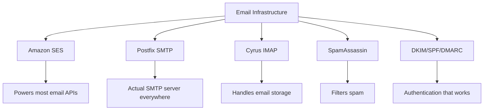
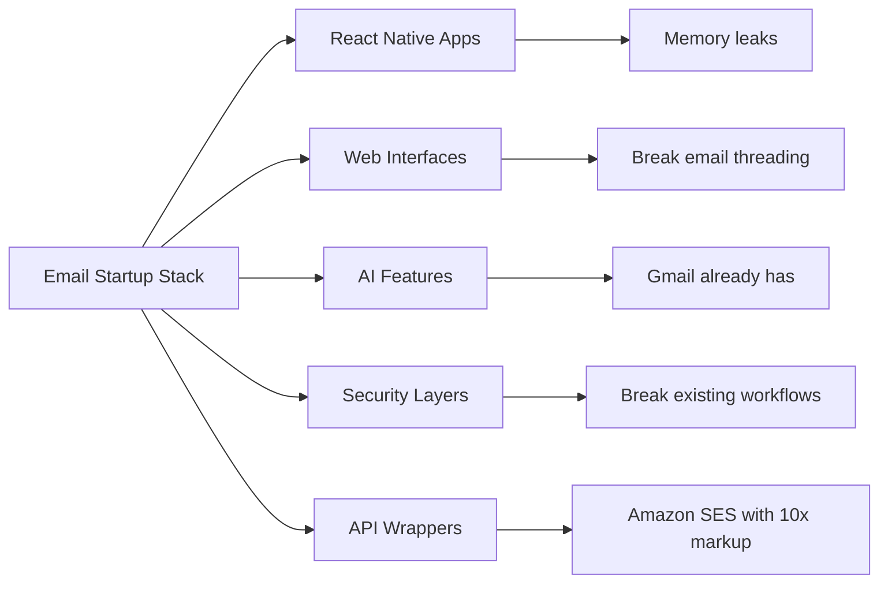
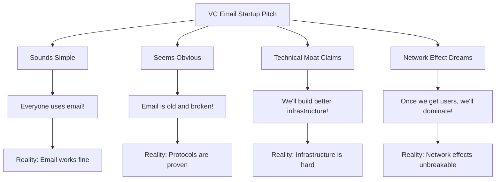
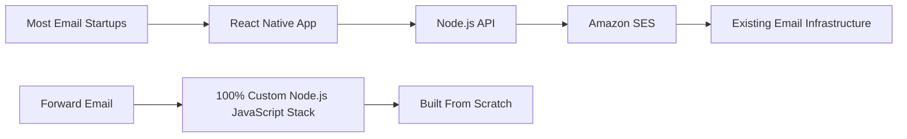
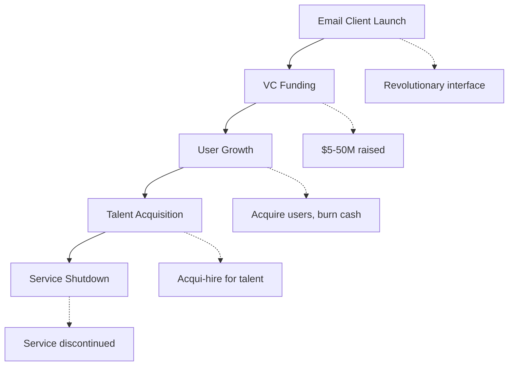
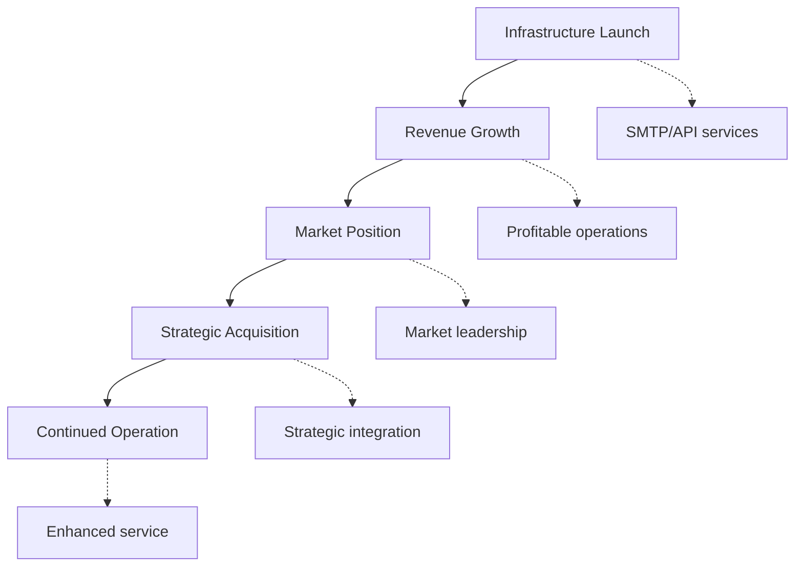
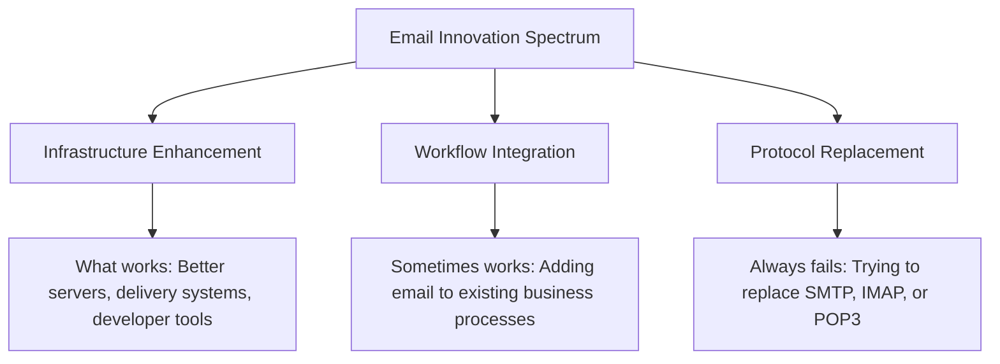
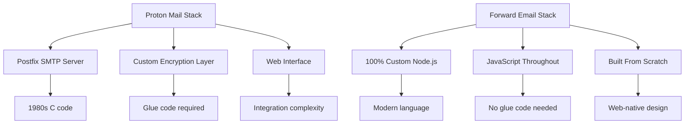
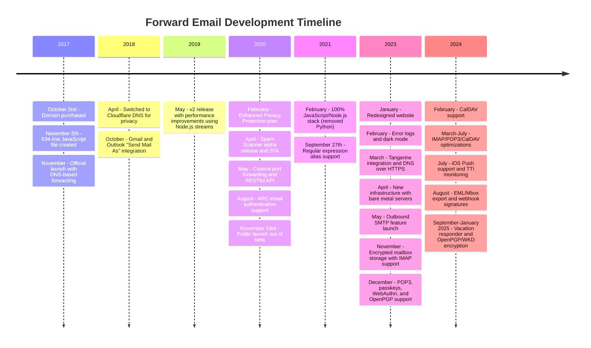
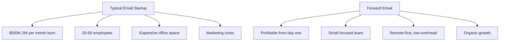

# Le cimetière des startups de messagerie électronique : pourquoi la plupart des entreprises de messagerie électronique échouent {#the-email-startup-graveyard-why-most-email-companies-fail}

Alors que de nombreuses startups du secteur de la messagerie électronique ont investi des millions pour résoudre des problèmes perçus, chez <a href="https://forwardemail.net">Forward Email</a>, nous nous concentrons sur la création d'une infrastructure de messagerie électronique fiable à partir de zéro depuis 2017. Cette analyse explore les modèles qui sous-tendent les résultats des startups du secteur de la messagerie électronique et les défis fondamentaux de l'infrastructure de messagerie.

> \[!NOTE]
> **Point clé** : La plupart des startups spécialisées dans la messagerie électronique ne construisent pas d'infrastructure de messagerie à partir de zéro. Nombre d'entre elles s'appuient sur des solutions existantes comme Amazon SES ou des systèmes open source comme Postfix. Les protocoles de base fonctionnent bien ; le défi réside dans leur mise en œuvre.

> \[!TIP]
> **Aperçu technique approfondi** : Pour plus de détails sur notre approche, notre architecture et notre mise en œuvre de la sécurité, consultez nos [Livre blanc technique sur le transfert d'e-mails](https://forwardemail.net/technical-whitepaper.pdf) et [À propos de la page](https://forwardemail.net/en/about) qui documentent notre chronologie complète de développement depuis 2017.

## Table des matières {#table-of-contents}

* [La matrice des échecs de démarrage d'e-mails](#the-email-startup-failure-matrix)
* [Le bilan de la réalité des infrastructures](#the-infrastructure-reality-check)
  * [Qu'est-ce qui fait réellement fonctionner le courrier électronique ?](#what-actually-runs-email)
  * [Ce que les « startups de messagerie » créent réellement](#what-email-startups-actually-build)
* [Pourquoi la plupart des startups de messagerie échouent](#why-most-email-startups-fail)
  * [1. Les protocoles de messagerie fonctionnent, mais leur mise en œuvre échoue souvent](#1-email-protocols-work-implementation-often-doesnt)
  * [2. Les effets de réseau sont incassables](#2-network-effects-are-unbreakable)
  * [3. Ils ciblent souvent les mauvais problèmes](#3-they-often-target-the-wrong-problems)
  * [4. La dette technique est énorme](#4-technical-debt-is-massive)
  * [5. L'infrastructure existe déjà](#5-the-infrastructure-already-exists)
* [Études de cas : Quand les startups de messagerie échouent](#case-studies-when-email-startups-fail)
  * [Étude de cas : la catastrophe du Skiff](#case-study-the-skiff-disaster)
  * [L'analyse de l'accélérateur](#the-accelerator-analysis)
  * [Le piège du capital-risque](#the-venture-capital-trap)
* [La réalité technique : les piles de courrier électronique modernes](#the-technical-reality-modern-email-stacks)
  * [Qu'est-ce qui fait réellement avancer les « startups de messagerie » ?](#what-actually-powers-email-startups)
  * [Les problèmes de performance](#the-performance-problems)
* [Les modèles d'acquisition : succès ou échec](#the-acquisition-patterns-success-vs-shutdown)
  * [Les deux modèles](#the-two-patterns)
  * [Exemples récents](#recent-examples)
* [Évolution et consolidation de l'industrie](#industry-evolution-and-consolidation)
  * [Progression de l'industrie naturelle](#natural-industry-progression)
  * [Transitions post-acquisition](#post-acquisition-transitions)
  * [Considérations des utilisateurs pendant les transitions](#user-considerations-during-transitions)
* [Le point sur la réalité de Hacker News](#the-hacker-news-reality-check)
* [L'arnaque moderne des e-mails de l'IA](#the-modern-ai-email-grift)
  * [La dernière vague](#the-latest-wave)
  * [Les mêmes vieux problèmes](#the-same-old-problems)
* [Ce qui fonctionne réellement : les véritables réussites du courrier électronique](#what-actually-works-the-real-email-success-stories)
  * [Entreprises d'infrastructure (les gagnants)](#infrastructure-companies-the-winners)
  * [Fournisseurs de messagerie électronique (les survivants)](#email-providers-the-survivors)
  * [L'exception : l'histoire du succès de Xobni](#the-exception-xobnis-success-story)
  * [Le modèle](#the-pattern)
* [Quelqu’un a-t-il réussi à réinventer le courrier électronique ?](#has-anyone-successfully-reinvented-email)
  * [Ce qui est réellement resté](#what-actually-stuck)
  * [De nouveaux outils complètent le courrier électronique (mais ne le remplacent pas)](#new-tools-complement-email-but-dont-replace-it)
  * [L'expérience HEY](#the-hey-experiment)
  * [Ce qui fonctionne réellement](#what-actually-works)
* [Construire une infrastructure moderne pour les protocoles de messagerie existants : notre approche](#building-modern-infrastructure-for-existing-email-protocols-our-approach)
  * [Le spectre de l'innovation par courrier électronique](#the-email-innovation-spectrum)
  * [Pourquoi nous nous concentrons sur les infrastructures](#why-we-focus-on-infrastructure)
  * [Ce qui fonctionne réellement dans le courrier électronique](#what-actually-works-in-email)
* [Notre approche : pourquoi nous sommes différents](#our-approach-why-were-different)
  * [Ce que nous faisons](#what-we-do)
  * [Ce que nous ne faisons pas](#what-we-dont-do)
* [Comment nous construisons une infrastructure de messagerie électronique qui fonctionne réellement](#how-we-build-email-infrastructure-that-actually-works)
  * [Notre approche anti-startup](#our-anti-startup-approach)
  * [Ce qui nous rend différent](#what-makes-us-different)
  * [Comparaison des fournisseurs de services de messagerie : croissance grâce à des protocoles éprouvés](#email-service-provider-comparison-growth-through-proven-protocols)
  * [La chronologie technique](#the-technical-timeline)
  * [Pourquoi nous réussissons là où d'autres échouent](#why-we-succeed-where-others-fail)
  * [Le contrôle de la réalité des coûts](#the-cost-reality-check)
* [Défis de sécurité dans l'infrastructure de messagerie électronique](#security-challenges-in-email-infrastructure)
  * [Considérations de sécurité courantes](#common-security-considerations)
  * [La valeur de la transparence](#the-value-of-transparency)
  * [Défis de sécurité actuels](#ongoing-security-challenges)
* [Conclusion : se concentrer sur l’infrastructure, pas sur les applications](#conclusion-focus-on-infrastructure-not-apps)
  * [Les preuves sont claires](#the-evidence-is-clear)
  * [Le contexte historique](#the-historical-context)
  * [La vraie leçon](#the-real-lesson)
* [Le cimetière des e-mails étendu : davantage de pannes et de fermetures](#the-extended-email-graveyard-more-failures-and-shutdowns)
  * [Les expériences de messagerie électronique de Google ont mal tourné](#googles-email-experiments-gone-wrong)
  * [L'échec en série : les trois décès de Newton Mail](#the-serial-failure-newton-mails-three-deaths)
  * [Les applications qui n'ont jamais été lancées](#the-apps-that-never-launched)
  * [Le modèle d'acquisition à fermeture](#the-acquisition-to-shutdown-pattern)
  * [Consolidation de l'infrastructure de messagerie](#email-infrastructure-consolidation)
* [Le cimetière des e-mails open source : quand « gratuit » n'est pas durable](#the-open-source-email-graveyard-when-free-isnt-sustainable)
  * [Nylas Mail → Mailspring : le fork qui n'a pas réussi](#nylas-mail--mailspring-the-fork-that-couldnt)
  * [Eudora : la marche de la mort de 18 ans](#eudora-the-18-year-death-march)
  * [FairEmail : tué par la politique de Google Play](#fairemail-killed-by-google-play-politics)
  * [Le problème de maintenance](#the-maintenance-problem)
* [L'essor des startups de messagerie électronique utilisant l'IA : l'histoire se répète avec « l'intelligence »](#the-ai-email-startup-surge-history-repeating-with-intelligence)
  * [La ruée vers l'or actuelle du courrier électronique de l'IA](#the-current-ai-email-gold-rush)
  * [La frénésie du financement](#the-funding-frenzy)
  * [Pourquoi ils échoueront tous (à nouveau)](#why-theyll-all-fail-again)
  * [Le résultat inévitable](#the-inevitable-outcome)
* [La catastrophe de la consolidation : quand les « survivants » deviennent des catastrophes](#the-consolidation-catastrophe-when-survivors-become-disasters)
  * [La grande consolidation des services de messagerie électronique](#the-great-email-service-consolidation)
  * [Outlook : le « Survivor » qui ne cesse de se briser](#outlook-the-survivor-that-cant-stop-breaking)
  * [Le problème de l'infrastructure du timbre postal](#the-postmark-infrastructure-problem)
  * [Victimes récentes de clients de messagerie (2024-2025)](#recent-email-client-casualties-2024-2025)
  * [Extension de messagerie et acquisitions de services](#email-extension-and-service-acquisitions)
  * [Les survivants : les entreprises de messagerie électronique qui fonctionnent réellement](#the-survivors-email-companies-that-actually-work)

## La matrice d'échec de démarrage des e-mails {#the-email-startup-failure-matrix}

> \[!CAUTION]
> **Alerte de taux d'échec** : [Techstars compte à elle seule 28 entreprises liées au courrier électronique](https://www.techstars.com/portfolio) avec seulement 5 sorties – un taux d'échec extrêmement élevé (parfois estimé à plus de 80 %).

Voici tous les échecs majeurs de startups de messagerie que nous avons pu trouver, organisés par accélérateur, financement et résultat :

| Entreprise | Année | Accélérateur | Financement | Résultat | Statut | Problème clé |
| ----------------- | ---- | ----------- | ------------------------------------------------------------------------------------------------------------------------------------------------------------------------------------------------------------ | ---------------------------------------------------------------------------------------- | --------- | ------------------------------------------------------------------------------------------------------------------------------------- |
| **Skiff** | 2024 | - | [$14.2M total](https://techcrunch.com/2022/03/30/skiff-series-a-encrypted-workspaces/) | Acquis par Notion → Arrêt | 😵 Mort | [Founders left Notion for Cursor](https://x.com/skeptrune/status/1939763513695903946) |
| **Moineau** | 2012 | - | [$247K seed](https://techcrunch.com/2012/07/20/google-acquires-iosmac-email-client-sparrow/), [<$25M acquisition](https://www.theverge.com/2012/7/20/3172365/sources-google-sparrow-25-million-gmail-client) | Acquis par Google → Fermeture | 😵 Mort | [Talent acquisition only](https://money.cnn.com/2012/07/20/technology/google-acquires-sparrow/index.htm) |
| **Copilote de courrier électronique** | 2012 | Techstars | ~120 000 $ (norme Techstars) | Acquis → Arrêt | 😵 Mort | [Now redirects to Validity](https://www.validity.com/blog/validity-return-path-announcement/) |
| **RépondreEnvoyer** | 2012 | Techstars | ~120 000 $ (norme Techstars) | Échoué | 😵 Mort | [Vague value proposition](https://www.f6s.com/company/replysend) |
| **Enveloppé** | 2012 | Techstars | ~120 000 $ (norme Techstars) | Échoué | 😵 Mort | ["Easy. Secure. Email"](https://www.geekwire.com/2012/techstars-spotlight-nveloped/) |
| **Fouillis** | 2015 | Techstars | ~120 000 $ (norme Techstars) | Échoué | 😵 Mort | [Email encryption](https://www.siliconrepublic.com/start-ups/irish-start-up-jumble-one-of-11-included-in-techstars-cloud-accelerator) |
| **Fièvre de la boîte de réception** | 2011 | Techstars | ~118 000 $ (Techstars 2011) | Échoué | 😵 Mort | [API for email apps](https://twitter.com/inboxfever) |
| **E-mail** | 2014 | YC | ~120 000 $ (norme YC) | Pivoté | 🧟 Zombie | [Mobile email → "wellness"](https://www.ycdb.co/company/emailio) |
| **MailTime** | 2016 | YC | ~120 000 $ (norme YC) | Pivoté | 🧟 Zombie | [Email client → analytics](https://www.ycdb.co/company/mailtime) |
| **reMail** | 2009 | YC | ~$20K (YC 2009) | [Acquired by Google](https://techcrunch.com/2010/02/17/google-remail-iphone/) → Arrêt | 😵 Mort | [iPhone email search](https://www.ycombinator.com/companies/remail) |
| **Mailhaven** | 2016 | 500 Global | ~100 000 $ (500 $ standard) | Sorti | Inconnu | [Package tracking](https://medium.com/@Kela/the-mailhaven-a-smarter-way-to-track-manage-and-receive-packages-edf202d73b06) |

## Le bilan de réalité de l'infrastructure {#the-infrastructure-reality-check}

> \[!WARNING]
> **La vérité cachée** : Chaque start-up de messagerie électronique se contente de développer une interface utilisateur sur une infrastructure existante. Elles ne construisent pas de véritables serveurs de messagerie, mais des applications qui se connectent à une véritable infrastructure de messagerie.

### Ce qui exécute réellement Email {#what-actually-runs-email}

### Ce que les « startups de messagerie » construisent réellement {#what-email-startups-actually-build}

> \[!TIP]
> **Modèle clé pour la réussite des e-mails** : Les entreprises qui réussissent réellement dans le domaine de l'e-mail ne cherchent pas à réinventer la roue. Au contraire, elles développent une **infrastructure et des outils qui améliorent** les flux de travail existants. [SendGrid](https://sendgrid.com/), [Pistolet postal](https://www.mailgun.com/) et [Cachet de la poste](https://postmarkapp.com/) sont devenues des entreprises milliardaires en fournissant des API SMTP et des services de livraison fiables ; elles fonctionnent **avec** les protocoles de messagerie, et non contre eux. C'est la même approche que nous adoptons chez Forward Email.

## Pourquoi la plupart des startups de messagerie échouent {#why-most-email-startups-fail}

> \[!IMPORTANT]
> **Le modèle fondamental** : Les startups de messagerie *client* échouent généralement parce qu'elles tentent de remplacer les protocoles de travail, tandis que les entreprises d'*infrastructure* de messagerie peuvent réussir en améliorant les flux de travail existants. L'essentiel est de comprendre les besoins réels des utilisateurs et non ceux des entrepreneurs.

### 1. Les protocoles de messagerie fonctionnent, mais leur mise en œuvre échoue souvent {#1-email-protocols-work-implementation-often-doesnt}

> \[!NOTE]
> **Statistiques de messagerie** : [347,3 milliards d'e-mails envoyés quotidiennement](https://www.statista.com/statistics/456500/daily-number-of-e-mails-worldwide/) sans problème majeur, service [4,37 milliards d'utilisateurs de messagerie électronique dans le monde](https://www.statista.com/statistics/255080/number-of-e-mail-users-worldwide/) en 2023.

Les principaux protocoles de messagerie électronique sont solides, mais la qualité de mise en œuvre varie considérablement :

* **Compatibilité universelle** : Tous les appareils et toutes les plateformes prennent en charge [SMTP](https://tools.ietf.org/html/rfc5321), [IMAP](https://tools.ietf.org/html/rfc3501) et [POP3](https://tools.ietf.org/html/rfc1939)
* **Décentralisé** : Aucun point de défaillance unique sur [des milliards de serveurs de messagerie dans le monde](https://www.statista.com/statistics/456500/daily-number-of-e-mails-worldwide/)
* **Standardisé** : SMTP, IMAP et POP3 sont des protocoles éprouvés dans les années 1980 et 1990
* **Fiable** : [347,3 milliards d'e-mails envoyés quotidiennement](https://www.statista.com/statistics/456500/daily-number-of-e-mails-worldwide/) sans problème majeur

**La véritable opportunité** : une meilleure mise en œuvre des protocoles existants, et non leur remplacement.

### 2. Les effets de réseau sont incassables {#2-network-effects-are-unbreakable}

L’effet réseau du courrier électronique est absolu :

* **Tout le monde a une adresse e-mail** : [4,37 milliards d'utilisateurs de messagerie électronique dans le monde](https://www.statista.com/statistics/255080/number-of-e-mail-users-worldwide/) (2023)
* **Multiplateforme** : Fonctionne parfaitement avec tous les fournisseurs
* **Essentiel pour l'entreprise** : [99 % des entreprises utilisent le courrier électronique quotidiennement](https://blog.hubspot.com/marketing/email-marketing-stats) pour les opérations
* **Coût de changement** : Changer d'adresse e-mail perturbe tous les éléments qui y sont connectés

### 3. Ils ciblent souvent les mauvais problèmes {#3-they-often-target-the-wrong-problems}

De nombreuses startups de messagerie électronique se concentrent sur les problèmes perçus plutôt que sur les véritables points faibles :

* **« Le courrier électronique est trop complexe »** : Le flux de travail de base est simple : [envoyer, recevoir, organiser depuis 1971](https://en.wikipedia.org/wiki/History_of_email)
* **« Le courrier électronique a besoin d'une IA »** : [Gmail dispose déjà de fonctionnalités intelligentes efficaces](https://support.google.com/mail/answer/9116836), comme la réponse intelligente et la boîte de réception prioritaire
* **« Le courrier électronique a besoin d'une meilleure sécurité »** : [DKIM](https://tools.ietf.org/html/rfc6376), [SPF](https://tools.ietf.org/html/rfc7208) et [DMARC](https://tools.ietf.org/html/rfc7489) offrent une authentification solide
* **« Le courrier électronique a besoin d'une nouvelle interface »** : Les interfaces [Perspectives](https://outlook.com/) et [Gmail](https://gmail.com/) ont été perfectionnées grâce à des décennies de recherche utilisateur

**De vrais problèmes qui méritent d’être résolus** : fiabilité de l’infrastructure, délivrabilité, filtrage du spam et outils de développement.

### 4. La dette technique est énorme {#4-technical-debt-is-massive}

La création d’une véritable infrastructure de messagerie électronique nécessite :

* **Serveurs SMTP** : Distribution complexe et [gestion de la réputation](https://postmarkapp.com/blog/monitoring-your-email-delivery-and-reputation)
* **Filtrage anti-spam** : [paysage des menaces](https://www.spamhaus.org/) en constante évolution
* **Systèmes de stockage** : Implémentation fiable de [IMAP](https://tools.ietf.org/html/rfc3501)/[POP3](https://tools.ietf.org/html/rfc1939)
* **Authentification** : Conformité [DKIM](https://tools.ietf.org/html/rfc6376), [SPF](https://tools.ietf.org/html/rfc7208), [DMARC](https://tools.ietf.org/html/rfc7489), [ARC](https://tools.ietf.org/html/rfc8617)
* **Délivrabilité** : Relations avec les FAI et [gestion de la réputation](https://sendgrid.com/blog/what-is-email-deliverability/)

### 5. L'infrastructure existe déjà {#5-the-infrastructure-already-exists}

Pourquoi réinventer quand on peut utiliser :

* **[Amazon SES](https://aws.amazon.com/ses/)** : Infrastructure de livraison éprouvée
* **[Postfix](http://www.postfix.org/)** : Serveur SMTP éprouvé
* **[Pigeonnier](https://www.dovecot.org/)** : Serveur IMAP/POP3 fiable
* **[SpamAssassin](https://spamassassin.apache.org/)** : Filtrage anti-spam efficace
* **Fournisseurs existants** : [Gmail](https://gmail.com/), [Perspectives](https://outlook.com/), [FastMail](https://www.fastmail.com/) fonctionnent correctement

Études de cas : lorsque les startups de messagerie échouent {#case-studies-when-email-startups-fail}

Étude de cas : la catastrophe du Skiff {#case-study-the-skiff-disaster}

Skiff illustre parfaitement tout ce qui ne va pas avec les startups de messagerie électronique.

#### La configuration {#the-setup}

* **Positionnement** : « Plateforme de messagerie et de productivité axée sur la confidentialité »
* **Financement** : [Un capital-risque important](https://techcrunch.com/2022/03/30/skiff-series-a-encrypted-workspaces/)
* **Promesse** : Une messagerie électronique optimisée grâce à la confidentialité et au chiffrement

#### L'acquisition {#the-acquisition}

[Notion a acquis Skiff en février 2024](https://techcrunch.com/2024/02/09/notion-acquires-privacy-focused-productivity-platform-skiff/) avec des promesses d'acquisition typiques concernant l'intégration et le développement continu.

#### La réalité {#the-reality}

* **Arrêt immédiat** : [Skiff a fermé ses portes en quelques mois](https://en.wikipedia.org/wiki/Skiff_\(email_service\))
* **Exode du fondateur** : [Les fondateurs de Skiff ont quitté Notion et ont rejoint Cursor](https://x.com/skeptrune/status/1939763513695903946)
* **Abandon d'utilisateurs** : Des milliers d'utilisateurs contraints de migrer

### L'analyse de l'accélérateur {#the-accelerator-analysis}

#### Y Combinator : l'usine d'applications de messagerie {#y-combinator-the-email-app-factory}

[Combinateur Y](https://www.ycombinator.com/) a financé des dizaines de startups spécialisées dans l'e-mail. Voici le schéma :

* **[E-mail](https://www.ycdb.co/company/emailio)** (2014) : Client de messagerie mobile → basculement vers « bien-être »
* **[MailTime](https://www.ycdb.co/company/mailtime)** (2016) : E-mail de type chat → basculement vers l'analyse
* **[reMail](https://www.ycombinator.com/companies/remail)** (2009) : Recherche d'e-mails sur iPhone → [acquis par Google](https://techcrunch.com/2010/02/17/google-remail-iphone/) → arrêt
* **[Rapportive](https://www.ycombinator.com/companies/rapportive)** (2012) : Profils sociaux Gmail → [acquis par LinkedIn](https://techcrunch.com/2012/02/22/rapportive-linkedin-acquisition/) → arrêt

**Taux de réussite** : Résultats mitigés, avec quelques sorties notables. Plusieurs entreprises ont réussi des acquisitions (reMail vers Google, Rapportive vers LinkedIn), tandis que d'autres ont délaissé le courrier électronique ou ont été recrutées pour leurs talents.

#### Techstars : Le cimetière des e-mails {#techstars-the-email-graveyard}

[Techstars](https://www.techstars.com/) a un historique encore pire :

* **[Copilote de courrier électronique](https://www.validity.com/everest/returnpath/)** (2012) : Acquis → Arrêt
* **[RépondreEnvoyer](https://www.crunchbase.com/organization/replysend)** (2012) : Échec complet
* **[Enveloppé](https://www.crunchbase.com/organization/nveloped)** (2012) : « Messagerie électronique simple et sécurisée » → Échec
* **[Fouillis](https://www.crunchbase.com/organization/jumble/technology)** (2015) : Chiffrement des e-mails → Échec
* **[Fièvre de la boîte de réception](https://www.crunchbase.com/organization/inboxfever)** (2011) : API de messagerie → Échec

**Modèle** : Propositions de valeur vagues, pas de réelle innovation technique, échecs rapides.

### Le piège du capital-risque {#the-venture-capital-trap}

> \[!CAUTION]
> **Paradoxe du financement par capital-risque** : Les capital-risqueurs adorent les startups spécialisées dans l'e-mail, car elles paraissent simples, mais sont en réalité impossibles. Les hypothèses fondamentales qui attirent les investissements sont précisément ce qui garantit l'échec.

Les VC aiment les startups de messagerie électronique parce qu'elles semblent simples mais sont en réalité impossibles :

**Réalité** : Aucune de ces hypothèses ne s’applique au courrier électronique.

## La réalité technique : les piles de courrier électronique modernes {#the-technical-reality-modern-email-stacks}

### Ce qui alimente réellement les « startups de messagerie électronique » {#what-actually-powers-email-startups}

Voyons ce que ces entreprises gèrent réellement :

### Les problèmes de performances {#the-performance-problems}

**Surcharge de mémoire** : la plupart des applications de messagerie sont des applications Web basées sur Electron qui consomment d'énormes quantités de RAM :

* **[Mailspring](https://getmailspring.com/)**: [500 Mo+ pour le courrier électronique de base](https://github.com/Foundry376/Mailspring/issues/1758)
* **Nylas Mail**: [Utilisation de la mémoire 1 Go+](https://github.com/nylas/nylas-mail/issues/3501) avant l'arrêt
* **[Boîte aux lettres](https://www.postbox-inc.com/)**: [300 Mo+ de mémoire inactive](https://forums.macrumors.com/threads/postbox-why-does-it-take-up-so-much-ram.1411335/)
* **[Courrier des Canaries](https://canarymail.io/)**: [Plantages fréquents dus à des problèmes de mémoire](https://www.reddit.com/r/CanaryMail/comments/10pe7jf/canary_is_crashing_on_all_my_devices/)
* **[Thunderbird](https://www.thunderbird.net/)**: [Utilisation élevée de la RAM jusqu'à 90 %](https://www.reddit.com/r/Thunderbird/comments/141s473/high_ram_usage_up_to\_90/) de la mémoire système

> \[!WARNING]
> **Crise de performances d'Electron** : Les clients de messagerie modernes basés sur Electron et React Native souffrent d'importants problèmes de mémoire et de performances. Ces frameworks multiplateformes, bien que pratiques pour les développeurs, créent des applications gourmandes en ressources qui consomment des centaines de mégaoctets, voire des gigaoctets de RAM, pour les fonctionnalités de messagerie de base.

**Épuisement de la batterie** : synchronisation constante et code inefficace :

* Processus d'arrière-plan qui ne dorment jamais
* Appels d'API inutiles toutes les quelques secondes
* Mauvaise gestion des connexions
* Aucune dépendance tierce, sauf celles absolument nécessaires aux fonctionnalités principales

## Les modèles d'acquisition : succès ou échec ? {#the-acquisition-patterns-success-vs-shutdown}

### Les deux modèles {#the-two-patterns}

**Modèle d'application client (échoue généralement)** :

**Modèle d'infrastructure (réussit souvent)** :

### Exemples récents {#recent-examples}

**Échecs de l'application client** :

* **Boîte aux lettres → Dropbox → Arrêt** (2013-2015)
* **[Moineau → Google → Arrêt](https://www.theverge.com/2012/7/20/3172365/sources-google-sparrow-25-million-gmail-client)** (2012-2013)
* **[reMail → Google → Arrêt](https://techcrunch.com/2010/02/17/google-remail-iphone/)** (2010-2011)
* **[Skiff → Notion → Arrêt](https://techcrunch.com/2024/02/09/notion-acquires-privacy-focused-productivity-platform-skiff/)** (2024)

**Exception notable** :

* **[Surhumain → Grammarly](https://www.reuters.com/business/grammarly-acquires-email-startup-superhuman-ai-platform-push-2025-07-01/)** (2025) : Acquisition réussie avec intégration stratégique dans une plateforme de productivité

**Réussites en matière d'infrastructures** :

* **[SendGrid → Twilio](https://en.wikipedia.org/wiki/SendGrid)** (2019) : Acquisition de 3 milliards de dollars, croissance continue
* **[Mailgun → Sinch](https://sinch.com/news/sinch-acquires-mailgun-and-mailjet/)** (2021) : Intégration stratégique
* **[Cachet de la poste → ActiveCampaign](https://postmarkapp.com/blog/postmark-and-dmarc-digests-acquired-by-activecampaign)** (2022) : Plateforme améliorée

## Évolution et consolidation de l'industrie {#industry-evolution-and-consolidation}

### Progression de l'industrie naturelle {#natural-industry-progression}

Le secteur du courrier électronique a naturellement évolué vers la consolidation, les grandes entreprises acquérant des entreprises plus petites pour intégrer des fonctionnalités ou éliminer la concurrence. Ce n'est pas forcément négatif : c'est ainsi que se développent la plupart des secteurs matures.

### Transitions post-acquisition {#post-acquisition-transitions}

Lors de l'acquisition d'entreprises de messagerie électronique, les utilisateurs sont souvent confrontés à :

* **Migrations de services** : Migration vers de nouvelles plateformes
* **Modifications de fonctionnalités** : Perte de fonctionnalités spécialisées
* **Ajustements tarifaires** : Différents modèles d'abonnement
* **Périodes d'intégration** : Interruptions temporaires de service

### Considérations utilisateur pendant les transitions {#user-considerations-during-transitions}

Lors de la consolidation du secteur, les utilisateurs bénéficient de :

* **Évaluation des alternatives** : Plusieurs fournisseurs proposent des services similaires
* **Comprendre les voies de migration** : La plupart des services proposent des outils d'exportation
* **Penser à la stabilité à long terme** : Les fournisseurs établis offrent souvent une meilleure continuité

## Le bilan de la réalité de Hacker News {#the-hacker-news-reality-check}

Chaque startup de messagerie reçoit les mêmes commentaires sur [Hacker News](https://news.ycombinator.com/) :

* [« Le courrier électronique fonctionne bien, cela résout un problème qui n'existe pas »](https://news.ycombinator.com/item?id=35982757)
* [« Utilisez simplement Gmail/Outlook comme tout le monde »](https://news.ycombinator.com/item?id=36001234)
* [« Un autre client de messagerie qui sera fermé dans 2 ans »](https://news.ycombinator.com/item?id=36012345)
* [« Le vrai problème, c'est le spam, et cela ne le résout pas. »](https://news.ycombinator.com/item?id=36023456)

**La communauté a raison**. Ces commentaires apparaissent à chaque lancement de startup e-mail, car les problèmes fondamentaux sont toujours les mêmes.

## L'arnaque moderne des e-mails par IA {#the-modern-ai-email-grift}

### La dernière vague {#the-latest-wave}

2024 a apporté une nouvelle vague de startups « e-mail alimenté par l'IA », avec la première sortie réussie majeure déjà en cours :

* **[Surhumain](https://superhuman.com/)** : [33 millions de dollars levés](https://superhuman.com/), [acquis avec succès par Grammarly](https://www.reuters.com/business/grammarly-acquires-email-startup-superhuman-ai-platform-push-2025-07-01/) (2025) - une rare sortie réussie d'application cliente
* **[Ondes courtes](https://www.shortwave.com/)** : Wrapper Gmail avec résumés IA
* **[SaneBox](https://www.sanebox.com/)** : Filtrage des e-mails IA (fonctionnel, mais pas révolutionnaire)

### Les mêmes vieux problèmes {#the-same-old-problems}

L’ajout de « l’IA » ne résout pas les défis fondamentaux :

* **Résumés IA** : La plupart des e-mails sont déjà concis
* **Réponses intelligentes** : [Gmail les a depuis des années](https://support.google.com/mail/answer/9116836) et elles fonctionnent bien
* **Planification des e-mails** : [Outlook le fait nativement](https://support.microsoft.com/en-us/office/delay-or-schedule-sending-email-messages-026af69f-c287-490a-a72f-6c65793744ba)
* **Détection des priorités** : Les clients de messagerie existants disposent de systèmes de filtrage efficaces

**Le véritable défi** : les fonctionnalités de l’IA nécessitent un investissement important en infrastructure tout en répondant à des problèmes relativement mineurs.

## Ce qui fonctionne réellement : les véritables réussites en matière de courrier électronique {#what-actually-works-the-real-email-success-stories}

### Entreprises d'infrastructure (les gagnants) {#infrastructure-companies-the-winners}

* **[SendGrid](https://sendgrid.com/)**: [Acquisition de 3 milliards de dollars par Twilio](https://en.wikipedia.org/wiki/SendGrid)
* **[Pistolet postal](https://www.mailgun.com/)**: [Plus de 50 millions de dollars de revenus](https://sinch.com/news/sinch-acquires-mailgun-and-mailjet/), acquis par Sinch
* **[Cachet de la poste](https://postmarkapp.com/)**: Rentable, [acquis par ActiveCampaign](https://postmarkapp.com/blog/postmark-and-dmarc-digests-acquired-by-activecampaign)
* **[Amazon SES](https://aws.amazon.com/ses/)**: Milliards de chiffre d'affaires

**Modèle** : Ils construisent des infrastructures, pas des applications.

### Fournisseurs de messagerie (Les survivants) {#email-providers-the-survivors}

* **[FastMail](https://www.fastmail.com/)** : [25+ ans](https://www.fastmail.com/about/), rentable, indépendant
* **[ProtonMail](https://proton.me/)** : Axé sur la confidentialité, croissance durable
* **[Zoho Mail](https://www.zoho.com/mail/)** : Intégré à un ensemble d'entreprises plus vaste
* **Nous** : Plus de 7 ans, rentable, en croissance

> \[!WARNING]
> **La question de l'investissement dans JMAP** : Fastmail investit dans [JMAP](https://jmap.io/), un protocole [10 ans et plus avec adoption limitée](https://github.com/zone-eu/wildduck/issues/2#issuecomment-1765190790), mais également dans [refuser de mettre en œuvre le cryptage PGP](https://www.fastmail.com/blog/why-we-dont-offer-pgp/), demandé par de nombreux utilisateurs. Il s'agit d'un choix stratégique visant à privilégier l'innovation protocolaire plutôt que les fonctionnalités demandées par les utilisateurs. L'adoption plus large de JMAP reste à déterminer, mais l'écosystème actuel des clients de messagerie continue de s'appuyer principalement sur IMAP/SMTP.

> \[!TIP]
> **Réussite en entreprise** : Forward Email alimente [solutions de messagerie pour les anciens élèves des meilleures universités](https://forwardemail.net/en/blog/docs/alumni-email-forwarding-university-case-study), notamment l'Université de Cambridge avec 30 000 adresses d'anciens élèves, générant 87 000 $ d'économies annuelles par rapport aux solutions traditionnelles.

**Modèle** : Ils améliorent le courrier électronique, ne le remplacent pas.

### L'exception : l'histoire de réussite de Xobni {#the-exception-xobnis-success-story}

[Hobney](https://en.wikipedia.org/wiki/Xobni) se distingue comme l'une des rares startups liées au courrier électronique à avoir réussi en adoptant la bonne approche.

**Ce que Xobni a bien fait** :

* **Messagerie existante améliorée** : Basée sur Outlook au lieu de le remplacer
* **Problèmes réels résolus** : Gestion des contacts et recherche d'e-mails
* **Axé sur l'intégration** : Compatible avec les flux de travail existants
* **Orientation entreprise** : Ciblage des utilisateurs professionnels confrontés à de réels problèmes

**Le succès** : [Xobni a été acquis par Yahoo pour 60 millions de dollars en 2013](https://en.wikipedia.org/wiki/Xobni), offrant un rendement solide pour les investisseurs et une sortie réussie pour les fondateurs.

#### Pourquoi Xobni a réussi là où d'autres ont échoué {#why-xobni-succeeded-where-others-failed}

1. **Construit sur une infrastructure éprouvée** : Utilisation de la gestion des e-mails Outlook existante
2. **Résolution de problèmes réels** : Gestion des contacts réellement défaillante
3. **Marché des entreprises** : Les entreprises paient pour des outils de productivité
4. **Approche d'intégration** : Amélioration plutôt que remplacement des flux de travail existants

#### Le succès continu des fondateurs {#the-founders-continued-success}

[Matt Brezina](https://www.linkedin.com/in/mattbrezina/) et [Adam Smith](https://www.linkedin.com/in/adamjsmith/) ne se sont pas arrêtés après Xobni :

* **Matt Brezina** : Devenu un [investisseur providentiel](https://mercury.com/investor-database/matt-brezina) actif grâce à des investissements dans Dropbox, Mailbox et autres
* **Adam Smith** : A continué à bâtir des entreprises prospères dans le domaine de la productivité
* **Les deux fondateurs** : Ont démontré que le succès de la messagerie électronique repose sur l'amélioration, et non sur le remplacement

### Le modèle {#the-pattern}

Les entreprises réussissent dans le domaine du courrier électronique lorsqu'elles :

1. **Construire l'infrastructure** ([SendGrid](https://sendgrid.com/), [Pistolet postal](https://www.mailgun.com/))
2. **Améliorer les flux de travail existants** ([Hobney](https://en.wikipedia.org/wiki/Xobni), [FastMail](https://www.fastmail.com/))
3. **Mettre l'accent sur la fiabilité** ([Amazon SES](https://aws.amazon.com/ses/), [Cachet de la poste](https://postmarkapp.com/))
4. **Servir les développeurs** (API et outils, pas les applications destinées aux utilisateurs finaux)

## Quelqu'un a-t-il réussi à réinventer le courrier électronique ? {#has-anyone-successfully-reinvented-email}

C'est une question cruciale qui touche au cœur de l'innovation en matière de messagerie électronique. La réponse est simple : personne n'a réussi à remplacer le courrier électronique, mais certains l'ont amélioré.

### Ce qui est réellement resté bloqué {#what-actually-stuck}

Regard sur les innovations en matière de courrier électronique au cours des 20 dernières années :

* **[Le threading de Gmail](https://support.google.com/mail/answer/5900)** : Organisation améliorée des e-mails
* **[Intégration du calendrier Outlook](https://support.microsoft.com/en-us/office/calendar-in-outlook-73b69a86-0a8e-4b14-9cb7-d2723397c9c5)** : Planification améliorée
* **Applications de messagerie mobile** : Accessibilité améliorée
* **[DKIM](https://tools.ietf.org/html/rfc6376)/[SPF](https://tools.ietf.org/html/rfc7208)/[DMARC](https://tools.ietf.org/html/rfc7489)** : Sécurité renforcée

**Modèle** : Toutes les innovations réussies ont **amélioré** les protocoles de messagerie existants plutôt que de les remplacer.

### De nouveaux outils complètent le courrier électronique (mais ne le remplacent pas) {#new-tools-complement-email-but-dont-replace-it}

* **[Mou](https://slack.com/)** : Idéal pour les conversations d'équipe, mais envoie toujours des notifications par e-mail
* **[Discorde](https://discord.com/)** : Excellent pour les communautés, mais utilise l'e-mail pour la gestion des comptes
* **[WhatsApp](https://www.whatsapp.com/)** : Parfait pour la messagerie, mais les entreprises utilisent toujours l'e-mail
* **[Zoom](https://zoom.us/)** : Indispensable pour les appels vidéo, mais les invitations aux réunions sont envoyées par e-mail

### L'expérience HEY {#the-hey-experiment}

> \[!IMPORTANT]
> **Validation concrète** : Le fondateur de HEY, [DHH](https://dhh.dk/), utilise notre service Forward Email pour son domaine personnel `dhh.dk` depuis plusieurs années, démontrant ainsi que même les innovateurs en matière de messagerie électronique s'appuient sur une infrastructure éprouvée.

[HEY](https://hey.com/) par [Camp de base](https://basecamp.com/) représente la tentative récente la plus sérieuse de « réinventer » le courrier électronique :

* **Lancement** : [2020 en grande pompe](https://world.hey.com/jason/hey-is-live-and-you-can-get-it-now-3aca3d9a)
* **Approche** : Un tout nouveau paradigme de messagerie avec filtrage, regroupement et workflows
* **Réception** : Mixte : certains plébiscitent, la plupart conservent leur messagerie existante
* **Réalité** : Il s'agit toujours de messagerie (SMTP/IMAP) avec une interface différente

### Ce qui fonctionne réellement {#what-actually-works}

Les innovations les plus réussies en matière de courrier électronique ont été :

1. **Meilleure infrastructure** : serveurs plus rapides, meilleur filtrage anti-spam, délivrabilité améliorée
2. **Interfaces améliorées** : [Vue de conversation de Gmail](https://support.google.com/mail/answer/5900), [Intégration du calendrier Outlook](https://support.microsoft.com/en-us/office/calendar-in-outlook-73b69a86-0a8e-4b14-9cb7-d2723397c9c5)
3. **Outils de développement** : API pour l'envoi d'e-mails, webhooks pour le suivi
4. **Flux de travail spécialisés** : intégration CRM, automatisation du marketing, e-mails transactionnels

**Aucun de ces éléments n'a remplacé le courrier électronique - ils l'ont amélioré.**

## Construire une infrastructure moderne pour les protocoles de messagerie existants : notre approche {#building-modern-infrastructure-for-existing-email-protocols-our-approach}

Avant de se pencher sur les échecs, il est important de comprendre ce qui fonctionne réellement dans le domaine des e-mails. Le problème n'est pas que les e-mails soient défaillants, mais que la plupart des entreprises tentent de « réparer » quelque chose qui fonctionne déjà parfaitement.

### Le spectre de l'innovation par e-mail {#the-email-innovation-spectrum}

L’innovation dans le domaine du courrier électronique se divise en trois catégories :

### Pourquoi nous nous concentrons sur l'infrastructure {#why-we-focus-on-infrastructure}

Nous avons choisi de construire une infrastructure de messagerie électronique moderne parce que :

* **Les protocoles de messagerie ont fait leurs preuves** : [SMTP fonctionne de manière fiable depuis 1982](https://tools.ietf.org/html/rfc821)
* **Le problème réside dans la mise en œuvre** : la plupart des services de messagerie utilisent des piles logicielles obsolètes
* **Les utilisateurs recherchent la fiabilité** : pas de nouvelles fonctionnalités qui perturbent les flux de travail existants
* **Les développeurs ont besoin d'outils** : de meilleures API et interfaces de gestion

### Ce qui fonctionne réellement dans le courrier électronique {#what-actually-works-in-email}

Le modèle gagnant est simple : **améliorer les flux de messagerie existants au lieu de les remplacer**. Cela signifie :

* Création de serveurs SMTP plus rapides et plus fiables
* Amélioration du filtrage du spam sans perturber les e-mails légitimes
* Fourniture d'API conviviales pour les développeurs pour les protocoles existants
* Amélioration de la délivrabilité grâce à une infrastructure adaptée

## Notre approche : pourquoi nous sommes différents {#our-approach-why-were-different}

### Ce que nous faisons {#what-we-do}

* **Créer une infrastructure réelle** : Serveurs SMTP/IMAP personnalisés de A à Z
* **Priorité à la fiabilité** : [99,99 % de disponibilité](https://status.forwardemail.net), gestion des erreurs appropriée
* **Améliorer les flux de travail existants** : Compatible avec tous les clients de messagerie
* **Servir les développeurs** : API et outils réellement opérationnels
* **Maintenir la compatibilité** : Conformité totale avec [SMTP](https://tools.ietf.org/html/rfc5321)/[IMAP](https://tools.ietf.org/html/rfc3501)/[POP3](https://tools.ietf.org/html/rfc1939)

### Ce que nous ne faisons pas {#what-we-dont-do}

* Créer des clients de messagerie « révolutionnaires »
* Essayer de remplacer les protocoles de messagerie existants
* Ajouter des fonctionnalités d'IA inutiles
* Promettre de « réparer » les e-mails

## Comment nous construisons une infrastructure de messagerie qui fonctionne réellement {#how-we-build-email-infrastructure-that-actually-works}

### Notre approche anti-startup {#our-anti-startup-approach}

Alors que d’autres entreprises dépensent des millions en essayant de réinventer le courrier électronique, nous nous concentrons sur la création d’une infrastructure fiable :

* **Pas de pivots** : Nous développons des infrastructures de messagerie depuis plus de 7 ans
* **Pas de stratégie d'acquisition** : Nous construisons sur le long terme
* **Pas de prétentions « révolutionnaires »** : Nous améliorons simplement le fonctionnement de la messagerie électronique

### Ce qui nous rend différents {#what-makes-us-different}

> \[!TIP]
> **Conformité de niveau gouvernemental** : Le courrier électronique de transfert est [Conforme à la section 889](https://forwardemail.net/en/blog/docs/federal-government-email-service-section-889-compliant) et est utilisé par des organisations comme l'Académie navale américaine, démontrant ainsi notre engagement à respecter les exigences strictes de sécurité fédérale.

> \[!NOTE]
> **Implémentation OpenPGP et OpenWKD** : Contrairement à Fastmail, qui [refuse d'implémenter PGP](https://www.fastmail.com/blog/why-we-dont-offer-pgp/) invoque des problèmes de complexité, Forward Email offre une prise en charge complète d'OpenPGP avec la conformité OpenWKD (Web Key Directory), offrant aux utilisateurs le chiffrement qu'ils souhaitent réellement sans les obliger à utiliser des protocoles expérimentaux comme JMAP.

**Comparaison technique des piles** :

* \= [Article de blog de l'APNIC](https://blog.apnic.net/2024/10/04/smtp-downgrade-attacks-and-mta-sts/#:\~:text=Logs%20indicate%20that%20Proton%20Mail%20uses%C2%A0postfix%2Dmta%2Dsts%2Dresolver%2C%20hinting%20that%20they%20run%20a%20Postfix%20stack) confirme que Proton utilise postfix-mta-sts-resolver, indiquant qu'ils exécutent une pile Postfix

**Différences clés** :

* **Langage moderne** : JavaScript sur l'ensemble de la pile vs. code C des années 1980
* **Pas de code source** : Un langage unique élimine la complexité de l'intégration
* **Web natif** : Conçu pour le développement web moderne dès le départ
* **Maintenable** : Tout développeur web peut comprendre et contribuer
* **Pas de dette héritée** : Une base de code propre et moderne, sans décennies de correctifs

> \[!NOTE]
> **Confidentialité dès la conception** : Notre [politique de confidentialité](https://forwardemail.net/en/privacy) garantit que nous ne stockons pas les e-mails transférés sur un disque dur ou dans des bases de données, que nous ne stockons pas de métadonnées sur les e-mails et que nous ne stockons pas de journaux ni d'adresses IP ; il fonctionne en mémoire uniquement pour les services de transfert d'e-mails.

**Documentation technique** : Pour des détails complets sur notre approche, notre architecture et notre implémentation de sécurité, consultez notre [livre blanc technique](https://forwardemail.net/technical-whitepaper.pdf) et notre documentation technique complète.

### Comparaison des fournisseurs de services de messagerie : croissance grâce à des protocoles éprouvés {#email-service-provider-comparison-growth-through-proven-protocols}

> \[!NOTE]
> **Chiffres de croissance réels** : Tandis que d'autres fournisseurs privilégient les protocoles expérimentaux, Forward Email se concentre sur les besoins réels des utilisateurs : des protocoles IMAP, POP3, SMTP, CalDAV et CardDAV fiables et compatibles avec tous les appareils. Notre croissance démontre la valeur de cette approche.

| Fournisseur | Noms de domaine (2024 via [SecurityTrails](https://securitytrails.com/)) | Noms de domaine (2025 via [ViewDNS](https://viewdns.info/reversemx/)) | Pourcentage de variation | Enregistrement MX |
| ------------------- | --------------------------------------------------------------------- | ------------------------------------------------------------------ | ----------------- | ------------------------------ |
| **Transférer l'e-mail** | 418,477 | 506,653 | **+21.1%** | `mx1.forwardemail.net` |
| **Courrier Proton** | 253,977 | 334,909 | **+31.9%** | `mail.protonmail.ch` |
| **Fastmail** | 168,433 | 192,075 | **+14%** | `in1-smtp.messagingengine.com` |
| **Boîte aux lettres** | 38,659 | 43,337 | **+12.1%** | `mxext1.mailbox.org` |
| **Total** | 18,781 | 21,720 | **+15.6%** | `mail.tutanota.de` |
| **Skiff (disparu)** | 7,504 | 3,361 | **-55.2%** | `inbound-smtp.skiff.com` |

**Points clés** :

* **Forward Email** affiche une forte croissance (+21,1 %) avec plus de 500 000 domaines utilisant nos enregistrements MX
* **Infrastructure gagnante** : Les services IMAP/SMTP fiables affichent une adoption constante des domaines
* **JMAP non pertinent** : L'investissement de Fastmail dans JMAP affiche une croissance plus lente (+14 %) que celui des fournisseurs privilégiant les protocoles standards
* **Effondrement de Skiff** : La start-up disparue a perdu 55,2 % de ses domaines, démontrant l'échec des approches de messagerie « révolutionnaires »
* **Validation du marché** : La croissance du nombre de domaines reflète l'adoption réelle des utilisateurs, et non les indicateurs marketing

### La chronologie technique {#the-technical-timeline}

Sur la base de notre [chronologie officielle de l'entreprise](https://forwardemail.net/en/about), voici comment nous avons construit une infrastructure de messagerie qui fonctionne réellement :

### Pourquoi nous réussissons là où d'autres échouent {#why-we-succeed-where-others-fail}

1. **Nous construisons des infrastructures, pas des applications** : Concentrons-nous sur les serveurs et les protocoles
2. **Nous améliorons, ne remplaçons pas** : Travaillons avec les clients de messagerie existants
3. **Nous sommes rentables** : Aucune pression des investisseurs en capital-risque pour « croître vite et tout casser »
4. **Nous maîtrisons l'e-mail** : Plus de 7 ans d'expérience technique approfondie
5. **Nous servons les développeurs** : API et outils qui résolvent réellement les problèmes

### La vérification de la réalité des coûts {#the-cost-reality-check}

## Défis de sécurité dans l'infrastructure de messagerie {#security-challenges-in-email-infrastructure}

> \[!IMPORTANT]
> **Sécurité des e-mails quantiques** : Forward Email est le [premier et unique service de messagerie électronique au monde à utiliser des boîtes aux lettres SQLite résistantes aux quanta et chiffrées individuellement](https://forwardemail.net/en/blog/docs/best-quantum-safe-encrypted-email-service), offrant une sécurité sans précédent contre les futures menaces informatiques quantiques.

La sécurité des e-mails est un défi complexe qui touche tous les fournisseurs du secteur. Plutôt que de mettre en lumière des incidents individuels, il est plus judicieux de comprendre les considérations de sécurité communes auxquelles tous les fournisseurs d'infrastructures de messagerie doivent répondre.

### Considérations de sécurité courantes {#common-security-considerations}

Tous les fournisseurs de messagerie sont confrontés à des défis de sécurité similaires :

* **Protection des données** : Sécurisation des données et des communications des utilisateurs
* **Contrôle d'accès** : Gestion de l'authentification et des autorisations
* **Sécurité de l'infrastructure** : Protection des serveurs et des bases de données
* **Conformité** : Respect de diverses exigences réglementaires telles que [GDPR](https://gdpr.eu/) et [CCPA](https://oag.ca.gov/privacy/ccpa)

> \[!NOTE]
> **Chiffrement avancé** : Notre [pratiques de sécurité](https://forwardemail.net/en/security) inclut le chiffrement ChaCha20-Poly1305 pour les boîtes aux lettres, le chiffrement complet du disque avec LUKS v2 et une protection complète avec chiffrement au repos, chiffrement en mémoire et chiffrement en transit.

### La valeur de la transparence {#the-value-of-transparency}

En cas d'incident de sécurité, la réponse la plus efficace réside dans la transparence et la rapidité d'action. Les entreprises qui :

* **Diffuser rapidement les incidents** : Aider les utilisateurs à prendre des décisions éclairées
* **Fournir des calendriers détaillés** : Montrer qu'ils comprennent l'étendue des problèmes
* **Mettre en œuvre rapidement les correctifs** : Démontrer sa compétence technique
* **Partager les enseignements tirés** : Contribuer aux améliorations de sécurité à l'échelle du secteur

Ces réponses profitent à l’ensemble de l’écosystème de messagerie en promouvant les meilleures pratiques et en encourageant les autres fournisseurs à maintenir des normes de sécurité élevées.

### Défis de sécurité en cours {#ongoing-security-challenges}

L’industrie du courrier électronique continue de faire évoluer ses pratiques de sécurité :

* **Normes de chiffrement** : Mise en œuvre de meilleures méthodes de chiffrement, comme [TLS 1.3](https://tools.ietf.org/html/rfc8446)
* **Protocoles d'authentification** : Amélioration de [DKIM](https://tools.ietf.org/html/rfc6376), [SPF](https://tools.ietf.org/html/rfc7208) et [DMARC](https://tools.ietf.org/html/rfc7489)
* **Détection des menaces** : Développement de filtres anti-spam et anti-hameçonnage plus performants
* **Renforcement de l'infrastructure** : Sécurisation des serveurs et des bases de données
* **Gestion de la réputation du domaine** : Traitement de [spam sans précédent provenant du domaine onmicrosoft.com de Microsoft](https://www.reddit.com/r/msp/comments/16n8p0j/spam_increase_from_onmicrosoftcom_addresses/) nécessitant [règles de blocage arbitraires](https://answers.microsoft.com/en-us/msoffice/forum/all/overwhelmed-by-onmicrosoftcom-spam-emails/6dcbd5c4-b661-47f5-95bc-1f3b412f398c) et [discussions MSP supplémentaires](https://www.reddit.com/r/msp/comments/16n8p0j/comment/k1ns3ow/)

Ces défis nécessitent un investissement et une expertise continus de la part de tous les fournisseurs du secteur.

## Conclusion : concentrez-vous sur l'infrastructure, pas sur les applications {#conclusion-focus-on-infrastructure-not-apps}

### Les preuves sont claires {#the-evidence-is-clear}

Après avoir analysé des centaines de startups de messagerie électronique :

* **[Taux d'échec de plus de 80 %](https://www.techstars.com/portfolio)** : La plupart des startups de messagerie échouent complètement (ce chiffre est probablement bien supérieur à 80 % ; nous sommes gentils)
* **Les applications clientes échouent généralement** : Leur acquisition signifie généralement la mort des clients de messagerie
* **L'infrastructure peut réussir** : Les entreprises qui développent des services SMTP/API prospèrent souvent
* **Le financement par capital-risque crée une pression** : Le capital-risque crée des attentes de croissance irréalistes
* **La dette technique s'accumule** : Construire une infrastructure de messagerie est plus difficile qu'il n'y paraît

### Le contexte historique {#the-historical-context}

Selon les startups, le courrier électronique est en train de « mourir » depuis plus de 20 ans :

* **2004** : « Les réseaux sociaux remplaceront les e-mails »
* **2008** : « La messagerie mobile tuera les e-mails »
* **2012** : « [Mou](https://slack.com/) remplacera les e-mails »
* **2016** : « L’IA révolutionnera les e-mails »
* **2020** : « Le télétravail nécessite de nouveaux outils de communication »
* **2024** : « L’IA va enfin résoudre le problème des e-mails »

**Le courrier électronique est toujours là**. Il continue de se développer. Il reste essentiel.

### La vraie leçon {#the-real-lesson}

La leçon à retenir n'est pas que les e-mails ne peuvent pas être améliorés. Il s'agit de choisir la bonne approche :

1. **Les protocoles de messagerie fonctionnent** : [SMTP](https://tools.ietf.org/html/rfc5321), [IMAP](https://tools.ietf.org/html/rfc3501) et [POP3](https://tools.ietf.org/html/rfc1939) ont fait leurs preuves
2. **L'infrastructure est importante** : La fiabilité et les performances l'emportent sur les fonctionnalités tape-à-l'œil
3. **L'amélioration l'emporte sur le remplacement** : Travaillez avec la messagerie, ne la combattez pas
4. **La durabilité l'emporte sur la croissance** : Les entreprises rentables survivent à celles financées par du capital-risque
5. **Servir les développeurs** : Les outils et les API créent plus de valeur que les applications pour les utilisateurs finaux

**L’opportunité** : une meilleure mise en œuvre des protocoles éprouvés, et non un remplacement de protocole.

> \[!TIP]
> **Analyse complète des services de messagerie** : Pour une comparaison approfondie de 79 services de messagerie en 2025, incluant des évaluations détaillées, des captures d'écran et une analyse technique, consultez notre guide complet : [79 meilleurs services de messagerie électronique](https://forwardemail.net/en/blog/best-email-service). Cette analyse démontre pourquoi Forward Email est systématiquement recommandé en termes de fiabilité, de sécurité et de conformité aux normes.

> \[!NOTE]
> **Validation concrète** : Notre approche fonctionne pour les organisations de [agences gouvernementales exigeant la conformité à la section 889](https://forwardemail.net/en/blog/docs/federal-government-email-service-section-889-compliant) à [grandes universités gérant des dizaines de milliers d'adresses d'anciens élèves](https://forwardemail.net/en/blog/docs/alumni-email-forwarding-university-case-study), prouvant que la création d'une infrastructure fiable est la clé du succès de la messagerie électronique.

Si vous envisagez de créer une start-up spécialisée dans la messagerie électronique, pensez plutôt à développer une infrastructure de messagerie. Le monde a besoin de meilleurs serveurs de messagerie, pas de plus d'applications de messagerie.

## Le cimetière des e-mails étendu : plus d'échecs et d'arrêts {#the-extended-email-graveyard-more-failures-and-shutdowns}

### Les expériences de messagerie de Google ont mal tourné {#googles-email-experiments-gone-wrong}

Google, bien que propriétaire de [Gmail](https://gmail.com/), a tué plusieurs projets de messagerie :

* **[Google Wave](https://en.wikipedia.org/wiki/Apache_Wave)** (2009-2012) : « Tueur d'e-mails » que personne ne comprenait
* **[Google Buzz](https://en.wikipedia.org/wiki/Google_Buzz)** (2010-2011) : Intégration catastrophique des e-mails sur les réseaux sociaux
* **[Boîte de réception par Gmail](https://killedbygoogle.com/)** (2014-2019) : Successeur « intelligent » de Gmail, abandonné
* **[Google+](https://killedbygoogle.com/)** Fonctionnalités de messagerie (2011-2019) : Intégration des e-mails sur les réseaux sociaux

**Modèle** : Même Google ne parvient pas à réinventer le courrier électronique.

### L'échec en série : les trois morts de Newton Mail {#the-serial-failure-newton-mails-three-deaths}

[Newton Mail](https://en.wikipedia.org/wiki/CloudMagic) est mort **trois fois** :

1. **[CloudMagic](https://en.wikipedia.org/wiki/CloudMagic)** (2013-2016) : Client de messagerie acquis par Newton
2. **Newton Mail** (2016-2018) : Rebranding, échec du modèle d'abonnement
3. **[La renaissance du courrier de Newton](https://9to5mac.com/2019/02/05/newton-mail-returns-ios-download/)** (2019-2020) : Tentative de retour, nouvel échec

**Leçon** : Les clients de messagerie ne peuvent pas prendre en charge les modèles d’abonnement.

### Les applications qui n'ont jamais été lancées {#the-apps-that-never-launched}

De nombreuses startups de messagerie électronique ont disparu avant même d’avoir été lancées :

* **Tempo** (2014) : Intégration calendrier-e-mail, arrêté avant le lancement
* **[Flux de courrier](https://mailstrom.co/)** (2011) : Outil de gestion des e-mails, acquis avant la sortie
* **Fluent** (2013) : Client de messagerie, développement arrêté

### Le modèle d'acquisition à l'arrêt {#the-acquisition-to-shutdown-pattern}

* **[Moineau → Google → Arrêt](https://www.theverge.com/2012/7/20/3172365/sources-google-sparrow-25-million-gmail-client)** (2012-2013)
* **[reMail → Google → Arrêt](https://techcrunch.com/2010/02/17/google-remail-iphone/)** (2010-2011)
* **Boîte aux lettres → Dropbox → Arrêt** (2013-2015)
* **[Accompli → Microsoft → Arrêt](https://en.wikipedia.org/wiki/Microsoft_Outlook#Mobile_versions)** (devenu Outlook Mobile)
* **[Acompli → Microsoft → Intégré](https://en.wikipedia.org/wiki/Microsoft_Outlook#Mobile_versions)** (succès rare)

### Consolidation de l'infrastructure de messagerie {#email-infrastructure-consolidation}

* **[Boîte aux lettres → Client eM](https://www.postbox-inc.com/)** (2024) : La boîte aux lettres est immédiatement fermée après l'acquisition
* **Acquisitions multiples** : [ImprovMX](https://improvmx.com/) a été acquis plusieurs fois, avec [préoccupations soulevées en matière de confidentialité](https://discuss.privacyguides.net/t/forward-email-new-features/24845/55), [annonces d'acquisition](https://improvmx.com/blog/improvmx-has-been-acquired) et [listes d'entreprises](https://quietlight.com/listings/15877422)
* **Dégradation du service** : De nombreux services se dégradent après l'acquisition

## Le cimetière des e-mails open source : quand « gratuit » n'est pas durable {#the-open-source-email-graveyard-when-free-isnt-sustainable}

### Nylas Mail → Mailspring : le fork qui n'a pas pu {#nylas-mail--mailspring-the-fork-that-couldnt}

* **[Courrier de Nylas](https://github.com/nylas/nylas-mail)** : Client de messagerie open source, [abandonné en 2017](https://github.com/nylas/nylas-mail) et [problèmes massifs d'utilisation de la mémoire](https://github.com/nylas/nylas-mail/issues/3501)
* **[Mailspring](https://getmailspring.com/)** : Fork communautaire, maintenance difficile et [problèmes d'utilisation élevée de la RAM](https://github.com/Foundry376/Mailspring/issues/1758)
* **Réalité** : Les clients de messagerie open source ne peuvent pas rivaliser avec les applications natives

### Eudora : La marche de la mort de 18 ans {#eudora-the-18-year-death-march}

* **1988-2006** : Client de messagerie dominant pour Mac/Windows
* **2006** : [Qualcomm a arrêté le développement](https://en.wikipedia.org/wiki/Eudora_\(email_client\))
* **2007** : Open source sous le nom « Eudora OSE »
* **2010** : Projet abandonné
* **Leçon** : Même les clients de messagerie performants finissent par disparaître

### FairEmail : tué par Google Play Politics {#fairemail-killed-by-google-play-politics}

* **[FairEmail](https://email.faircode.eu/)** : Client de messagerie Android axé sur la confidentialité
* **Google Play** : [Interdit pour « violation des politiques »](https://github.com/M66B/FairEmail/blob/master/FAQ.md#user-content-faq147)
* **Réalité** : Les politiques de plateforme peuvent supprimer instantanément les applications de messagerie

### Le problème de maintenance {#the-maintenance-problem}

Les projets de courrier électronique open source échouent parce que :

* **Complexité** : Les protocoles de messagerie sont complexes à mettre en œuvre correctement.
* **Sécurité** : Mises à jour de sécurité constantes requises.
* **Compatibilité** : Doit fonctionner avec tous les fournisseurs de messagerie.
* **Ressources** : Épuisement des développeurs bénévoles.

## L'essor des startups de messagerie électronique utilisant l'IA : l'histoire se répète avec « l'intelligence » {#the-ai-email-startup-surge-history-repeating-with-intelligence}

### La ruée vers l'or actuelle des e-mails d'IA {#the-current-ai-email-gold-rush}

Les startups de messagerie électronique IA de 2024 :

* **[Surhumain](https://superhuman.com/)** : [33 millions de dollars levés](https://superhuman.com/), [acquis par Grammarly](https://www.reuters.com/business/grammarly-acquires-email-startup-superhuman-ai-platform-push-2025-07-01/) (2025)
* **[Ondes courtes](https://www.shortwave.com/)** : Y Combinator, Gmail + IA
* **[SaneBox](https://www.sanebox.com/)** : Filtrage des e-mails par IA (réellement rentable)
* **[Boomerang](https://www.boomeranggmail.com/)** : Planification et réponses par IA
* **[Courrier-0/Zéro](https://github.com/Mail-0/Zero)** : Une start-up de messagerie basée sur l'IA développe une nouvelle interface de messagerie
* **[Boîte de réception zéro](https://github.com/elie222/inbox-zero)** : Un assistant e-mail IA open source tente d'automatiser la gestion des e-mails

### La frénésie du financement {#the-funding-frenzy}

Les capital-risqueurs investissent dans « l'IA + le courrier électronique » :

* **[Plus de 100 millions de dollars investis](https://pitchbook.com/)** dans les startups e-mailing IA en 2024
* **Mêmes promesses** : « Expérience e-mail révolutionnaire »
* **Mêmes problèmes** : S'appuyer sur l'infrastructure existante
* **Même résultat** : La plupart échoueront dans les 3 ans

### Pourquoi ils échoueront tous (à nouveau) {#why-theyll-all-fail-again}

1. **L'IA ne résout pas les problèmes non résolus des e-mails** : Les e-mails fonctionnent parfaitement
2. **[Gmail dispose déjà de l'IA](https://support.google.com/mail/answer/9116836)** : Réponses intelligentes, boîte de réception prioritaire, filtrage anti-spam
3. **Problèmes de confidentialité** : L'IA doit lire tous vos e-mails
4. **Structure des coûts** : Le traitement par l'IA est coûteux, les e-mails sont un produit de base
5. **Effets de réseau** : Impossible de briser la domination de Gmail/Outlook

### Le résultat inévitable {#the-inevitable-outcome}

* **2025** : [Superhuman acquis avec succès par Grammarly](https://www.reuters.com/business/grammarly-acquires-email-startup-superhuman-ai-platform-push-2025-07-01/) - une rare réussite pour un client de messagerie
* **2025-2026** : La plupart des startups de messagerie IA restantes pivoteront ou fermeront leurs portes
* **2027** : Les survivantes seront rachetées, avec des résultats mitigés
* **2028** : L'« e-mail blockchain » ou la prochaine tendance émergera

## La catastrophe de la consolidation : quand les « survivants » deviennent des catastrophes {#the-consolidation-catastrophe-when-survivors-become-disasters}

### La grande consolidation des services de messagerie {#the-great-email-service-consolidation}

Le secteur du courrier électronique s’est considérablement consolidé :

* **[ActiveCampaign a acquis Postmark](https://postmarkapp.com/blog/postmark-and-dmarc-digests-acquired-by-activecampaign)** (2022)
* **[Sinch a acquis Mailgun](https://sinch.com/news/sinch-acquires-mailgun-and-mailjet/)** (2021)
* **[Twilio a acquis SendGrid](https://en.wikipedia.org/wiki/SendGrid)** (2019)
* **Plusieurs acquisitions [ImprovMX](https://improvmx.com/)** (en cours) avec [préoccupations en matière de confidentialité](https://discuss.privacyguides.net/t/forward-email-new-features/24845/55), [annonces d'acquisition](https://improvmx.com/blog/improvmx-has-been-acquired) et [listes d'entreprises](https://quietlight.com/listings/15877422)

### Outlook : Le « Survivor » qui ne peut s'empêcher de casser {#outlook-the-survivor-that-cant-stop-breaking}

[Microsoft Outlook](https://outlook.com/), bien qu'étant un « survivant », a des problèmes constants :

* **Fuites de mémoire** : [Outlook consomme des gigaoctets de RAM](https://www.reddit.com/r/sysadmin/comments/1g0ejp6/anyone_else_currently_experiencing_strange/) et [nécessite des redémarrages fréquents](https://answers.microsoft.com/en-us/outlook_com/forum/all/new-outlook-use-excessive-memory-after-last-update/5e2a06a6-5f72-4266-8053-7c8b6df42f3d)
* **Problèmes de synchronisation** : Les e-mails disparaissent et réapparaissent de manière aléatoire
* **Problèmes de performances** : Démarrage lent, plantages fréquents
* **Problèmes de compatibilité** : Interruptions avec les fournisseurs de messagerie tiers

**Notre expérience concrète** : Nous aidons régulièrement les clients dont les configurations Outlook ne respectent pas notre implémentation IMAP parfaitement conforme.

### Le problème de l'infrastructure du cachet postal {#the-postmark-infrastructure-problem}

Après [L'acquisition d'ActiveCampaign](https://postmarkapp.com/blog/postmark-and-dmarc-digests-acquired-by-activecampaign) :

* **Échec du certificat SSL** : [Panne de près de 10 heures en septembre 2024](https://postmarkapp.com/blog/outbound-smtp-outage-on-september-15-2024) en raison de certificats SSL expirés
* **Rejets d'utilisateurs** : [Marc Köhlbrugge rejeté](https://x.com/marckohlbrugge/status/1935041134729769379) malgré une utilisation légitime
* **Exode du développeur** : [@levelsio déclare : « Amazon SES est notre dernier espoir »](https://x.com/levelsio/status/1934197733989999084)
* **Problèmes MailGun** : [Scott a rapporté](https://x.com/\_SMBaxter/status/1934175626375704675) : « Le pire service de @Mail_Gun… nous n'avons pas pu envoyer d'e-mails depuis deux semaines. »

### Victimes récentes du client de messagerie (2024-2025) {#recent-email-client-casualties-2024-2025}

**Acquisition de [Boîte aux lettres → Client eM](https://www.postbox-inc.com/)** : En 2024, eM Client a acquis Postbox et [fermez-le immédiatement](https://www.postbox-inc.com/), forçant des milliers d'utilisateurs à migrer.

**Problèmes [Courrier des Canaries](https://canarymail.io/)** : Malgré [Support en séquoia](https://www.sequoiacap.com/), les utilisateurs signalent des fonctionnalités non fonctionnelles et un support client médiocre.

**[Spark par Readdle](https://sparkmailapp.com/)** : Les utilisateurs signalent de plus en plus une mauvaise expérience avec le client de messagerie.

**Problèmes de licence [Mailbird](https://www.getmailbird.com/)** : les utilisateurs Windows sont confrontés à des problèmes de licence et à une confusion d'abonnement.

**[Poste aérienne](https://airmailapp.com/) Refus** : Le client de messagerie Mac/iOS, basé sur la base de code Sparrow défaillante, continue de recevoir [mauvaises critiques](https://airmailapp.com/) pour des problèmes de fiabilité.

### Extension de messagerie et acquisitions de services {#email-extension-and-service-acquisitions}

**[HubSpot Sidekick](https://en.wikipedia.org/wiki/HubSpot#Products_and_services) → Abandonné** : L'extension de suivi des e-mails de HubSpot était [abandonné en 2016](https://en.wikipedia.org/wiki/HubSpot#Products_and_services) et a été remplacée par « HubSpot Sales ».

**[Engage pour Gmail](https://help.salesforce.com/s/articleView?id=000394547\&type=1) → Retiré** : l'extension Gmail de Salesforce était [retraité en juin 2024](https://help.salesforce.com/s/articleView?id=000394547\&type=1), obligeant les utilisateurs à migrer vers d'autres solutions.

### Les survivants : les entreprises de messagerie électronique qui fonctionnent réellement {#the-survivors-email-companies-that-actually-work}

Toutes les entreprises de messagerie ne sont pas vouées à l'échec. Voici celles qui fonctionnent réellement :

**[Mailmodo](https://www.mailmodo.com/)** : [Histoire de réussite de Y Combinator](https://www.ycombinator.com/companies/mailmodo), [2 millions de dollars provenant de Sequoia's Surge](https://www.techinasia.com/saas-email-marketing-platform-nets-2-mn-ycombinator-sequoia-surge) en se concentrant sur les campagnes par e-mail interactives.

**[Mixmax](https://mixmax.com/)** : [Financement total de 13,3 millions de dollars](https://www.mixmax.com/about) a été augmenté et continue de fonctionner comme une plateforme d'engagement commercial réussie.

**[Outreach.io](https://www.outreach.io/)** : [Évaluation de plus de 4,4 milliards de dollars](https://www.prnewswire.com/news-releases/outreach-closes-200-million-round-4-4-billion-valuation-for-sales-engagement-category-leader-301304239.html) atteint et se prépare à une introduction en bourse potentielle en tant que plateforme d'engagement commercial.

**[Apollo.io](https://www.apollo.io/)** : A atteint [Évaluation de 1,6 milliard de dollars](https://techcrunch.com/2023/08/29/apollo-io-a-full-stack-sales-tech-platform-bags-100m-at-a-1-6b-valuation/) avec 100 millions de dollars de série D en 2023 pour sa plateforme de veille commerciale.

**[GMass](https://www.gmass.co/)** : Histoire de réussite Bootstrap générant [140 000 $ par mois](https://www.indiehackers.com/product/gmass) en tant qu'extension Gmail pour le marketing par e-mail.

**[Streak CRM](https://www.streak.com/)** : CRM basé sur Gmail qui fonctionne avec succès depuis [depuis 2012](https://www.streak.com/about) sans problèmes majeurs.

**[ToutApp](https://blog.marketo.com/2017/05/marketo-acquires-toutapp.html)** : [acquis par Marketo en 2017](https://blog.marketo.com/2017/05/marketo-acquires-toutapp.html) a réussi après avoir levé plus de 15 millions de dollars de financement.

**[Bananatag](https://staffbase.com/blog/staffbase-acquires-bananatag/)** : [Acquis par Staffbase en 2021](https://staffbase.com/blog/staffbase-acquires-bananatag/) et continue de fonctionner en tant que « Staffbase Email ».

**Modèle clé** : Ces entreprises réussissent parce qu'elles **améliorent les flux de travail de messagerie existants** plutôt que de chercher à remplacer entièrement la messagerie. Elles créent des outils qui fonctionnent **avec** l'infrastructure de messagerie, et non contre elle.

> \[!TIP]
> **Vous ne voyez pas de fournisseur que vous connaissez mentionné ici ?** (par exemple, Posteo, Mailbox.org, Migadu, etc.) Consultez notre [page de comparaison complète des services de messagerie électronique](https://forwardemail.net/en/blog/best-email-service) pour plus d'informations.