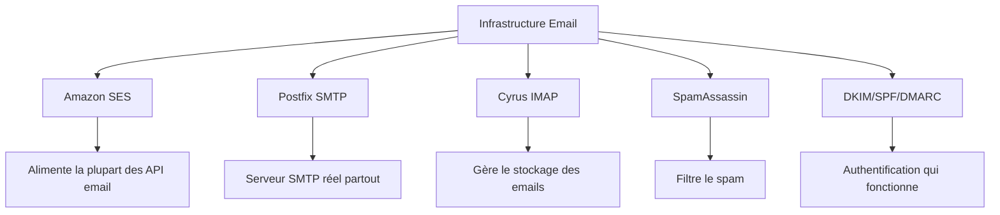
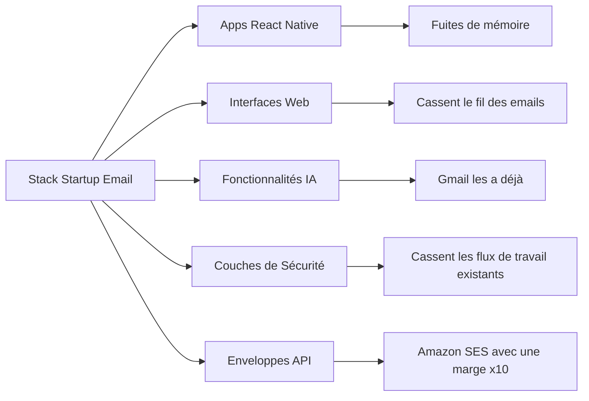
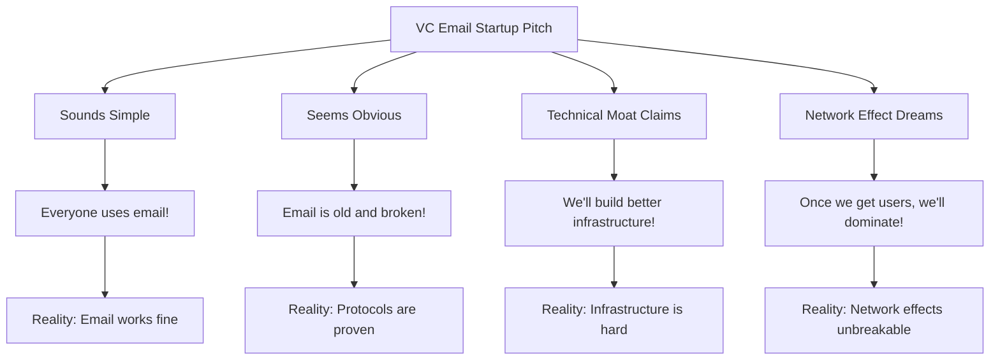
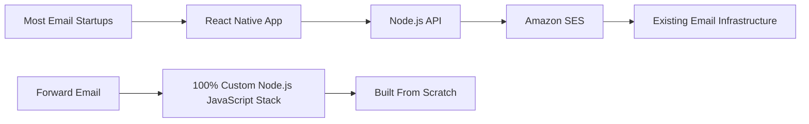
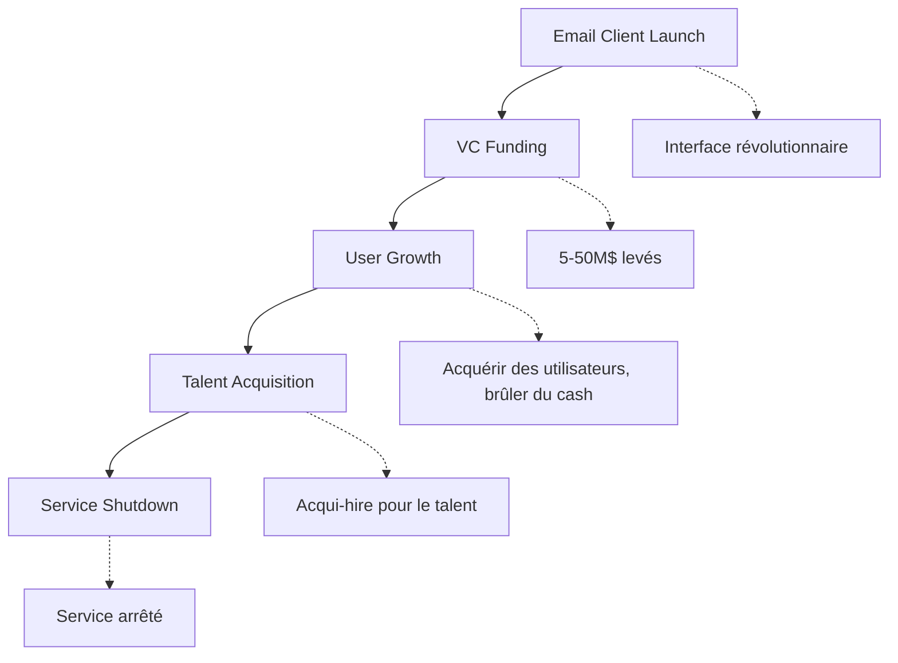
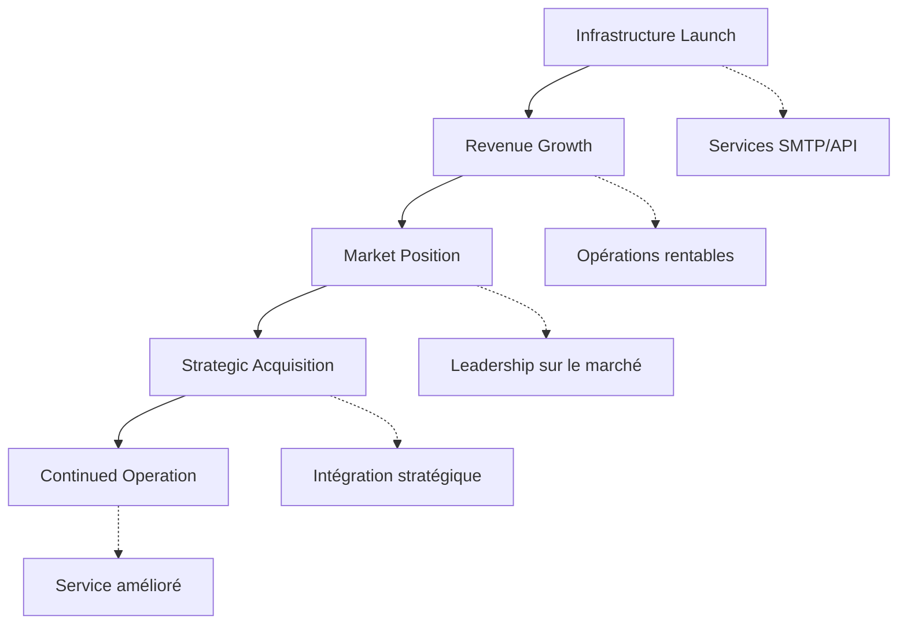
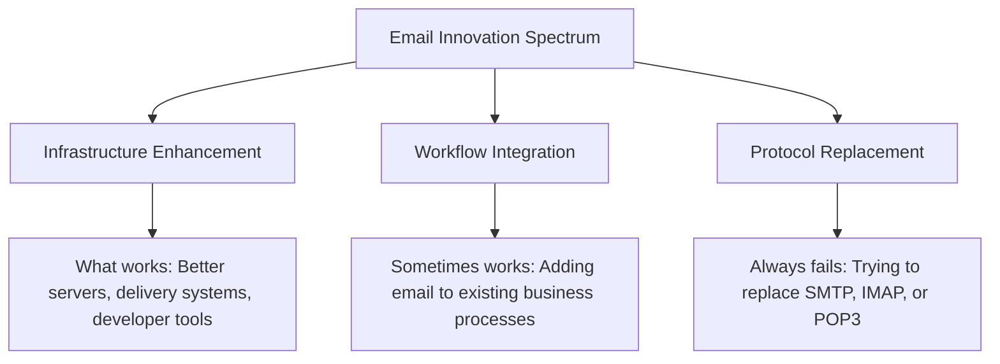
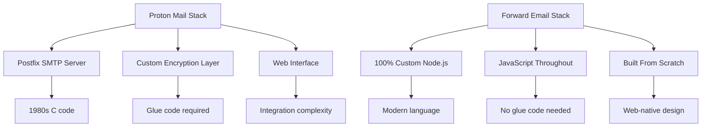
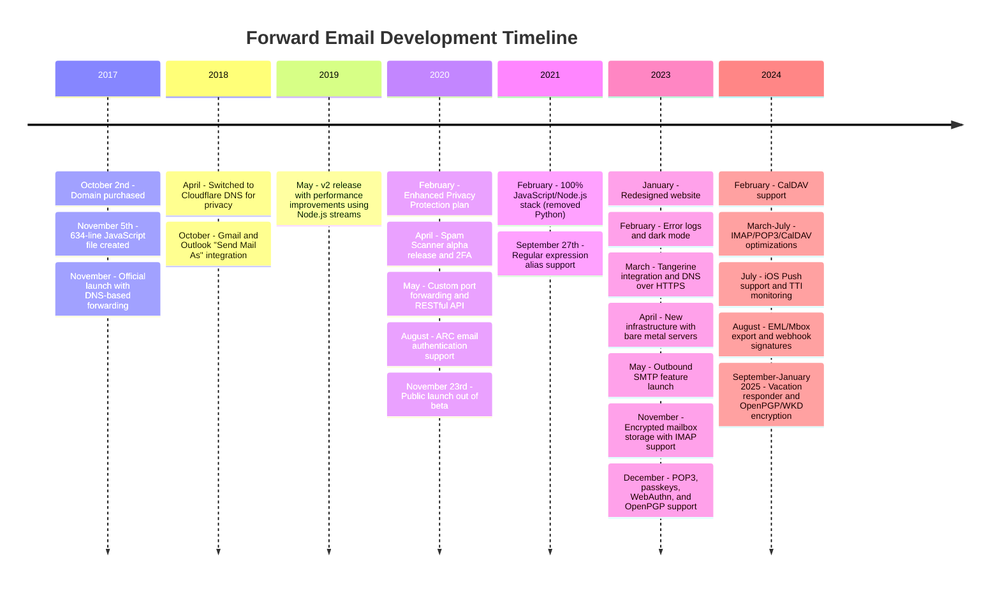
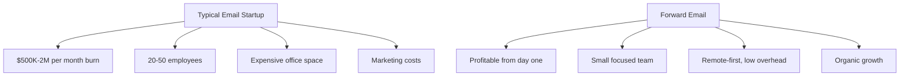

# Le Cimetière des Startups Email : Pourquoi la Plupart des Entreprises Email Échouent {#the-email-startup-graveyard-why-most-email-companies-fail}

Alors que de nombreuses startups email ont investi des millions pour résoudre des problèmes perçus, nous chez <a href="https://forwardemail.net">Forward Email</a> nous sommes concentrés depuis 2017 sur la construction d'une infrastructure email fiable à partir de zéro. Cette analyse explore les schémas derrière les résultats des startups email et les défis fondamentaux de l'infrastructure email.

> \[!NOTE]
> **Insight clé** : La plupart des startups email ne construisent pas réellement une infrastructure email à partir de zéro. Beaucoup s'appuient sur des solutions existantes comme Amazon SES ou des systèmes open-source comme Postfix. Les protocoles de base fonctionnent bien – le défi réside dans la mise en œuvre.

> \[!TIP]
> **Approfondissement technique** : Pour des détails complets sur notre approche, architecture et mise en œuvre de la sécurité, consultez notre [Livre blanc technique Forward Email](https://forwardemail.net/technical-whitepaper.pdf) et la [page À propos](https://forwardemail.net/en/about) qui documente notre chronologie complète de développement depuis 2017.

## Table des matières {#table-of-contents}

* [La matrice d’échec des startups email](#the-email-startup-failure-matrix)
* [Le bilan de la réalité infrastructurelle](#the-infrastructure-reality-check)
  * [Ce qui fait réellement fonctionner l’email](#what-actually-runs-email)
  * [Ce que les « startups email » construisent réellement](#what-email-startups-actually-build)
* [Pourquoi la plupart des startups email échouent](#why-most-email-startups-fail)
  * [1. Les protocoles email fonctionnent, l’implémentation souvent pas](#1-email-protocols-work-implementation-often-doesnt)
  * [2. Les effets de réseau sont indestructibles](#2-network-effects-are-unbreakable)
  * [3. Elles ciblent souvent les mauvais problèmes](#3-they-often-target-the-wrong-problems)
  * [4. La dette technique est massive](#4-technical-debt-is-massive)
  * [5. L’infrastructure existe déjà](#5-the-infrastructure-already-exists)
* [Études de cas : quand les startups email échouent](#case-studies-when-email-startups-fail)
  * [Étude de cas : la catastrophe Skiff](#case-study-the-skiff-disaster)
  * [L’analyse des accélérateurs](#the-accelerator-analysis)
  * [Le piège du capital-risque](#the-venture-capital-trap)
* [La réalité technique : les stacks email modernes](#the-technical-reality-modern-email-stacks)
  * [Ce qui alimente réellement les « startups email »](#what-actually-powers-email-startups)
  * [Les problèmes de performance](#the-performance-problems)
* [Les schémas d’acquisition : succès vs fermeture](#the-acquisition-patterns-success-vs-shutdown)
  * [Les deux schémas](#the-two-patterns)
  * [Exemples récents](#recent-examples)
* [Évolution et consolidation de l’industrie](#industry-evolution-and-consolidation)
  * [Progression naturelle de l’industrie](#natural-industry-progression)
  * [Transitions post-acquisition](#post-acquisition-transitions)
  * [Considérations utilisateurs lors des transitions](#user-considerations-during-transitions)
* [Le bilan Hacker News](#the-hacker-news-reality-check)
* [L’arnaque moderne de l’email IA](#the-modern-ai-email-grift)
  * [La dernière vague](#the-latest-wave)
  * [Les mêmes vieux problèmes](#the-same-old-problems)
* [Ce qui fonctionne réellement : les vraies réussites email](#what-actually-works-the-real-email-success-stories)
  * [Les entreprises d’infrastructure (les gagnants)](#infrastructure-companies-the-winners)
  * [Les fournisseurs email (les survivants)](#email-providers-the-survivors)
  * [L’exception : l’histoire à succès de Xobni](#the-exception-xobnis-success-story)
  * [Le schéma](#the-pattern)
* [Quelqu’un a-t-il réussi à réinventer l’email ?](#has-anyone-successfully-reinvented-email)
  * [Ce qui a réellement tenu](#what-actually-stuck)
  * [Les nouveaux outils complètent l’email (mais ne le remplacent pas)](#new-tools-complement-email-but-dont-replace-it)
  * [L’expérience HEY](#the-hey-experiment)
  * [Ce qui fonctionne réellement](#what-actually-works)
* [Construire une infrastructure moderne pour les protocoles email existants : notre approche](#building-modern-infrastructure-for-existing-email-protocols-our-approach)
  * [Le spectre de l’innovation email](#the-email-innovation-spectrum)
  * [Pourquoi nous nous concentrons sur l’infrastructure](#why-we-focus-on-infrastructure)
  * [Ce qui fonctionne réellement en email](#what-actually-works-in-email)
* [Notre approche : pourquoi nous sommes différents](#our-approach-why-were-different)
  * [Ce que nous faisons](#what-we-do)
  * [Ce que nous ne faisons pas](#what-we-dont-do)
* [Comment nous construisons une infrastructure email qui fonctionne réellement](#how-we-build-email-infrastructure-that-actually-works)
  * [Notre approche anti-startup](#our-anti-startup-approach)
  * [Ce qui nous rend différents](#what-makes-us-different)
  * [Comparaison des fournisseurs de services email : croissance par des protocoles éprouvés](#email-service-provider-comparison-growth-through-proven-protocols)
  * [La chronologie technique](#the-technical-timeline)
  * [Pourquoi nous réussissons là où d’autres échouent](#why-we-succeed-where-others-fail)
  * [Le bilan des coûts](#the-cost-reality-check)
* [Défis de sécurité dans l’infrastructure email](#security-challenges-in-email-infrastructure)
  * [Considérations courantes de sécurité](#common-security-considerations)
  * [La valeur de la transparence](#the-value-of-transparency)
  * [Défis de sécurité continus](#ongoing-security-challenges)
* [Conclusion : se concentrer sur l’infrastructure, pas sur les applications](#conclusion-focus-on-infrastructure-not-apps)
  * [Les preuves sont claires](#the-evidence-is-clear)
  * [Le contexte historique](#the-historical-context)
  * [La vraie leçon](#the-real-lesson)
* [Le cimetière étendu des emails : plus d’échecs et de fermetures](#the-extended-email-graveyard-more-failures-and-shutdowns)
  * [Les expériences email ratées de Google](#googles-email-experiments-gone-wrong)
  * [L’échec en série : les trois morts de Newton Mail](#the-serial-failure-newton-mails-three-deaths)
  * [Les applications jamais lancées](#the-apps-that-never-launched)
  * [Le schéma acquisition-fermeture](#the-acquisition-to-shutdown-pattern)
  * [Consolidation de l’infrastructure email](#email-infrastructure-consolidation)
* [Le cimetière des emails open-source : quand le « gratuit » n’est pas durable](#the-open-source-email-graveyard-when-free-isnt-sustainable)
  * [Nylas Mail → Mailspring : le fork qui n’a pas pu](#nylas-mail--mailspring-the-fork-that-couldnt)
  * [Eudora : la marche funèbre de 18 ans](#eudora-the-18-year-death-march)
  * [FairEmail : tué par la politique de Google Play](#fairemail-killed-by-google-play-politics)
  * [Le problème de maintenance](#the-maintenance-problem)
* [La ruée des startups email IA : l’histoire qui se répète avec « l’intelligence »](#the-ai-email-startup-surge-history-repeating-with-intelligence)
  * [La ruée actuelle vers l’or de l’email IA](#the-current-ai-email-gold-rush)
  * [La frénésie de financement](#the-funding-frenzy)
  * [Pourquoi elles échoueront toutes (encore)](#why-theyll-all-fail-again)
  * [Le résultat inévitable](#the-inevitable-outcome)
* [La catastrophe de la consolidation : quand les « survivants » deviennent des désastres](#the-consolidation-catastrophe-when-survivors-become-disasters)
  * [La grande consolidation des services email](#the-great-email-service-consolidation)
  * [Outlook : le « survivant » qui ne cesse de tomber en panne](#outlook-the-survivor-that-cant-stop-breaking)
  * [Le problème d’infrastructure de Postmark](#the-postmark-infrastructure-problem)
  * [Victimes récentes des clients email (2024-2025)](#recent-email-client-casualties-2024-2025)
  * [Extensions email et acquisitions de services](#email-extension-and-service-acquisitions)
  * [Les survivants : les entreprises email qui fonctionnent réellement](#the-survivors-email-companies-that-actually-work)
## La matrice des échecs des startups email {#the-email-startup-failure-matrix}

> \[!CAUTION]
> **Alerte taux d’échec** : [Techstars seul compte 28 entreprises liées à l’email](https://www.techstars.com/portfolio) avec seulement 5 sorties - un taux d’échec extrêmement élevé (parfois calculé à plus de 80%).

Voici tous les principaux échecs de startups email que nous avons pu trouver, organisés par accélérateur, financement et résultat :

| Entreprise        | Année | Accélérateur | Financement                                                                                                                                                                                                 | Résultat                                                                                | Statut    | Problème clé                                                                                                                          |
| ----------------- | ----- | ------------ | ----------------------------------------------------------------------------------------------------------------------------------------------------------------------------------------------------------- | -------------------------------------------------------------------------------------- | --------- | ------------------------------------------------------------------------------------------------------------------------------------ |
| **Skiff**         | 2024  | -            | [$14,2M au total](https://techcrunch.com/2022/03/30/skiff-series-a-encrypted-workspaces/)                                                                                                                  | Acquis par Notion → Fermeture                                                          | 😵 Mort   | [Les fondateurs ont quitté Notion pour Cursor](https://x.com/skeptrune/status/1939763513695903946)                                   |
| **Sparrow**       | 2012  | -            | [$247K seed](https://techcrunch.com/2012/07/20/google-acquires-iosmac-email-client-sparrow/), [<$25M acquisition](https://www.theverge.com/2012/7/20/3172365/sources-google-sparrow-25-million-gmail-client) | Acquis par Google → Fermeture                                                          | 😵 Mort   | [Acquisition de talents uniquement](https://money.cnn.com/2012/07/20/technology/google-acquires-sparrow/index.htm)                   |
| **Email Copilot** | 2012  | Techstars    | ~120K$ (standard Techstars)                                                                                                                                                                                 | Acquis → Fermeture                                                                     | 😵 Mort   | [Redirige maintenant vers Validity](https://www.validity.com/blog/validity-return-path-announcement/)                                |
| **ReplySend**     | 2012  | Techstars    | ~120K$ (standard Techstars)                                                                                                                                                                                 | Échec                                                                                  | 😵 Mort   | [Proposition de valeur vague](https://www.f6s.com/company/replysend)                                                                 |
| **Nveloped**      | 2012  | Techstars    | ~120K$ (standard Techstars)                                                                                                                                                                                 | Échec                                                                                  | 😵 Mort   | ["Facile. Sécurisé. Email"](https://www.geekwire.com/2012/techstars-spotlight-nveloped/)                                             |
| **Jumble**        | 2015  | Techstars    | ~120K$ (standard Techstars)                                                                                                                                                                                 | Échec                                                                                  | 😵 Mort   | [Chiffrement email](https://www.siliconrepublic.com/start-ups/irish-start-up-jumble-one-of-11-included-in-techstars-cloud-accelerator) |
| **InboxFever**    | 2011  | Techstars    | ~118K$ (Techstars 2011)                                                                                                                                                                                     | Échec                                                                                  | 😵 Mort   | [API pour applications email](https://twitter.com/inboxfever)                                                                        |
| **Emailio**       | 2014  | YC           | ~120K$ (standard YC)                                                                                                                                                                                        | Pivot                                                                                  | 🧟 Zombie | [Email mobile → "bien-être"](https://www.ycdb.co/company/emailio)                                                                     |
| **MailTime**      | 2016  | YC           | ~120K$ (standard YC)                                                                                                                                                                                        | Pivot                                                                                  | 🧟 Zombie | [Client email → analytics](https://www.ycdb.co/company/mailtime)                                                                      |
| **reMail**        | 2009  | YC           | ~20K$ (YC 2009)                                                                                                                                                                                             | [Acquis par Google](https://techcrunch.com/2010/02/17/google-remail-iphone/) → Fermeture | 😵 Mort   | [Recherche email iPhone](https://www.ycombinator.com/companies/remail)                                                                |
| **Mailhaven**     | 2016  | 500 Global   | ~100K$ (standard 500)                                                                                                                                                                                       | Sortie                                                                                 | Inconnu   | [Suivi de colis](https://medium.com/@Kela/the-mailhaven-a-smarter-way-to-track-manage-and-receive-packages-edf202d73b06)              |
## Le Bilan Réel de l'Infrastructure {#the-infrastructure-reality-check}

> \[!WARNING]
> **La Vérité Cachée** : Chaque "startup email" construit simplement une interface utilisateur au-dessus d'une infrastructure existante. Elles ne créent pas de serveurs email réels - elles développent des applications qui se connectent à une infrastructure email réelle.

### Ce qui Fait Vraiment Tourner l'Email {#what-actually-runs-email}

```mermaid
graph TD
    A[Infrastructure Email] --> B[Amazon SES]
    A --> C[Postfix SMTP]
    A --> D[Cyrus IMAP]
    A --> E[SpamAssassin]
    A --> F[DKIM/SPF/DMARC]

    B --> G[Alimente la plupart des API email]
    C --> H[Serveur SMTP réel partout]
    D --> I[Gère le stockage des emails]
    E --> J[Filtre le spam]
    F --> K[Authentification qui fonctionne]
```

### Ce que les "Startups Email" Construisent Réellement {#what-email-startups-actually-build}

```mermaid
graph LR
    A[Stack Startup Email] --> B[Apps React Native]
    A --> C[Interfaces Web]
    A --> D[Fonctionnalités IA]
    A --> E[Couches de Sécurité]
    A --> F[Enveloppes API]

    B --> G[Fuites de mémoire]
    C --> H[Cassent le fil des emails]
    D --> I[Gmail les a déjà]
    E --> J[Cassent les flux de travail existants]
    F --> K[Amazon SES avec une marge x10]
```

> \[!TIP]
> **Modèle Clé pour Réussir en Email** : Les entreprises qui réussissent vraiment dans l'email ne cherchent pas à réinventer la roue. Elles construisent **des infrastructures et des outils qui améliorent** les flux de travail email existants. [SendGrid](https://sendgrid.com/), [Mailgun](https://www.mailgun.com/), et [Postmark](https://postmarkapp.com/) sont devenus des entreprises milliardaires en fournissant des API SMTP fiables et des services de livraison - ils travaillent **avec** les protocoles email, pas contre eux. C'est la même approche que nous adoptons chez Forward Email.

## Pourquoi la Plupart des Startups Email Échouent {#why-most-email-startups-fail}

> \[!IMPORTANT]
> **Le Modèle Fondamental** : Les startups *client* email échouent généralement parce qu'elles tentent de remplacer des protocoles fonctionnels, tandis que les entreprises d'*infrastructure* email peuvent réussir en améliorant les flux de travail existants. La clé est de comprendre ce dont les utilisateurs ont réellement besoin versus ce que les entrepreneurs pensent qu'ils ont besoin.

### 1. Les Protocoles Email Fonctionnent, l'Implémentation Souvent Pas {#1-email-protocols-work-implementation-often-doesnt}

> \[!NOTE]
> **Statistiques Email** : [347,3 milliards d'emails envoyés quotidiennement](https://www.statista.com/statistics/456500/daily-number-of-e-mails-worldwide/) sans problèmes majeurs, desservant [4,37 milliards d'utilisateurs email dans le monde](https://www.statista.com/statistics/255080/number-of-e-mail-users-worldwide/) en 2023.

Les protocoles email de base sont solides, mais la qualité d'implémentation varie largement :

* **Compatibilité universelle** : Tous les appareils, toutes les plateformes supportent [SMTP](https://tools.ietf.org/html/rfc5321), [IMAP](https://tools.ietf.org/html/rfc3501), et [POP3](https://tools.ietf.org/html/rfc1939)
* **Décentralisé** : Pas de point de défaillance unique à travers [des milliards de serveurs email dans le monde](https://www.statista.com/statistics/456500/daily-number-of-e-mails-worldwide/)
* **Standardisé** : SMTP, IMAP, POP3 sont des protocoles éprouvés des années 1980-1990
* **Fiable** : [347,3 milliards d'emails envoyés quotidiennement](https://www.statista.com/statistics/456500/daily-number-of-e-mails-worldwide/) sans problèmes majeurs

**La vraie opportunité** : Mieux implémenter les protocoles existants, pas les remplacer.

### 2. Les Effets de Réseau Sont Infranchissables {#2-network-effects-are-unbreakable}

L'effet de réseau de l'email est absolu :

* **Tout le monde a un email** : [4,37 milliards d'utilisateurs email dans le monde](https://www.statista.com/statistics/255080/number-of-e-mail-users-worldwide/) en 2023
* **Multi-plateforme** : Fonctionne parfaitement entre tous les fournisseurs
* **Critique pour les entreprises** : [99% des entreprises utilisent l'email quotidiennement](https://blog.hubspot.com/marketing/email-marketing-stats) pour leurs opérations
* **Coût de changement** : Changer d'adresse email casse tout ce qui y est lié

### 3. Elles Visent Souvent les Mauvais Problèmes {#3-they-often-target-the-wrong-problems}

Beaucoup de startups email se concentrent sur des problèmes perçus plutôt que sur de réels points douloureux :

* **"L'email est trop complexe"** : Le flux de travail de base est simple - [envoyer, recevoir, organiser depuis 1971](https://fr.wikipedia.org/wiki/Histoire_du_courrier_%C3%A9lectronique)
* **"L'email a besoin d'IA"** : [Gmail dispose déjà de fonctionnalités intelligentes efficaces](https://support.google.com/mail/answer/9116836) comme Réponse Intelligente et Boîte Prioritaire
* **"L'email a besoin de meilleure sécurité"** : [DKIM](https://tools.ietf.org/html/rfc6376), [SPF](https://tools.ietf.org/html/rfc7208), et [DMARC](https://tools.ietf.org/html/rfc7489) fournissent une authentification solide
* **"L'email a besoin d'une nouvelle interface"** : Les interfaces [Outlook](https://outlook.com/) et [Gmail](https://gmail.com/) sont affinées grâce à des décennies de recherche utilisateur
**De vrais problèmes qui méritent d’être résolus** : Fiabilité de l’infrastructure, délivrabilité, filtrage anti-spam et outils pour développeurs.

### 4. La dette technique est massive {#4-technical-debt-is-massive}

Construire une véritable infrastructure email nécessite :

* **Serveurs SMTP** : Livraison complexe et [gestion de la réputation](https://postmarkapp.com/blog/monitoring-your-email-delivery-and-reputation)
* **Filtrage anti-spam** : Paysage des [menaces en constante évolution](https://www.spamhaus.org/)
* **Systèmes de stockage** : Implémentation fiable de [IMAP](https://tools.ietf.org/html/rfc3501)/[POP3](https://tools.ietf.org/html/rfc1939)
* **Authentification** : Conformité à [DKIM](https://tools.ietf.org/html/rfc6376), [SPF](https://tools.ietf.org/html/rfc7208), [DMARC](https://tools.ietf.org/html/rfc7489), [ARC](https://tools.ietf.org/html/rfc8617)
* **Délivrabilité** : Relations avec les FAI et [gestion de la réputation](https://sendgrid.com/blog/what-is-email-deliverability/)

### 5. L’infrastructure existe déjà {#5-the-infrastructure-already-exists}

Pourquoi réinventer quand on peut utiliser :

* **[Amazon SES](https://aws.amazon.com/ses/)** : Infrastructure de livraison éprouvée
* **[Postfix](http://www.postfix.org/)** : Serveur SMTP éprouvé
* **[Dovecot](https://www.dovecot.org/)** : Serveur IMAP/POP3 fiable
* **[SpamAssassin](https://spamassassin.apache.org/)** : Filtrage anti-spam efficace
* **Fournisseurs existants** : [Gmail](https://gmail.com/), [Outlook](https://outlook.com/), [FastMail](https://www.fastmail.com/) fonctionnent bien

## Études de cas : quand les startups email échouent {#case-studies-when-email-startups-fail}

### Étude de cas : Le désastre Skiff {#case-study-the-skiff-disaster}

Skiff illustre parfaitement tout ce qui ne va pas avec les startups email.

#### Le contexte {#the-setup}

* **Positionnement** : « Plateforme email et productivité axée sur la confidentialité »
* **Financement** : [Capital-risque important](https://techcrunch.com/2022/03/30/skiff-series-a-encrypted-workspaces/)
* **Promesse** : Un meilleur email grâce à la confidentialité et au chiffrement

#### L’acquisition {#the-acquisition}

[Notion a acquis Skiff en février 2024](https://techcrunch.com/2024/02/09/notion-acquires-privacy-focused-productivity-platform-skiff/) avec les promesses habituelles d’intégration et de développement continu.

#### La réalité {#the-reality}

* **Fermeture immédiate** : [Skiff fermé en quelques mois](https://en.wikipedia.org/wiki/Skiff_\(email_service\))
* **Exode des fondateurs** : [Les fondateurs de Skiff ont quitté Notion pour rejoindre Cursor](https://x.com/skeptrune/status/1939763513695903946)
* **Abandon des utilisateurs** : Des milliers d’utilisateurs contraints de migrer

### L’analyse de l’accélérateur {#the-accelerator-analysis}

#### Y Combinator : L’usine à applications email {#y-combinator-the-email-app-factory}

[Y Combinator](https://www.ycombinator.com/) a financé des dizaines de startups email. Voici le schéma :

* **[Emailio](https://www.ycdb.co/company/emailio)** (2014) : Client email mobile → pivot vers le « bien-être »
* **[MailTime](https://www.ycdb.co/company/mailtime)** (2016) : Email style chat → pivot vers l’analytics
* **[reMail](https://www.ycombinator.com/companies/remail)** (2009) : Recherche email iPhone → [acquis par Google](https://techcrunch.com/2010/02/17/google-remail-iphone/) → fermeture
* **[Rapportive](https://www.ycombinator.com/companies/rapportive)** (2012) : Profils sociaux Gmail → [acquis par LinkedIn](https://techcrunch.com/2012/02/22/rapportive-linkedin-acquisition/) → fermeture

**Taux de réussite** : Résultats mitigés avec quelques sorties notables. Plusieurs entreprises ont réussi des acquisitions (reMail par Google, Rapportive par LinkedIn), tandis que d’autres ont pivoté hors de l’email ou ont été acqui-hirées pour leur talent.

#### Techstars : Le cimetière des emails {#techstars-the-email-graveyard}

[Techstars](https://www.techstars.com/) a un bilan encore pire :

* **[Email Copilot](https://www.validity.com/everest/returnpath/)** (2012) : Acquis → fermeture
* **[ReplySend](https://www.crunchbase.com/organization/replysend)** (2012) : Échec total
* **[Nveloped](https://www.crunchbase.com/organization/nveloped)** (2012) : « Facile. Sécurisé. Email » → échec
* **[Jumble](https://www.crunchbase.com/organization/jumble/technology)** (2015) : Chiffrement email → échec
* **[InboxFever](https://www.crunchbase.com/organization/inboxfever)** (2011) : API email → échec
**Modèle** : Propositions de valeur vagues, aucune réelle innovation technique, échecs rapides.

### Le piège du capital-risque {#the-venture-capital-trap}

> \[!CAUTION]
> **Paradoxe du financement VC** : Les VC adorent les startups email car elles semblent simples mais sont en réalité impossibles. Les hypothèses fondamentales qui attirent les investissements sont exactement ce qui garantit l’échec.

Les VC adorent les startups email car elles semblent simples mais sont en réalité impossibles :

```mermaid
graph TD
    A[VC Email Startup Pitch] --> B[Sounds Simple]
    A --> C[Seems Obvious]
    A --> D[Technical Moat Claims]
    A --> E[Network Effect Dreams]

    B --> F[Everyone uses email!]
    C --> G[Email is old and broken!]
    D --> H[We'll build better infrastructure!]
    E --> I[Once we get users, we'll dominate!]

    F --> J[Reality: Email works fine]
    G --> K[Reality: Protocols are proven]
    H --> L[Reality: Infrastructure is hard]
    I --> M[Reality: Network effects unbreakable]
```

**Réalité** : Aucune de ces hypothèses ne tient pour l’email.

## La réalité technique : piles email modernes {#the-technical-reality-modern-email-stacks}

### Ce qui alimente réellement les "startups email" {#what-actually-powers-email-startups}

Voyons ce que ces entreprises utilisent réellement :

```mermaid
graph LR
    A[Most Email Startups] --> B[React Native App]
    B --> C[Node.js API]
    C --> D[Amazon SES]
    D --> E[Existing Email Infrastructure]

    F[Forward Email] --> G[100% Custom Node.js JavaScript Stack]
    G --> H[Built From Scratch]
```

### Les problèmes de performance {#the-performance-problems}

**Gonflement mémoire** : La plupart des applications email sont des apps web basées sur Electron qui consomment énormément de RAM :

* **[Mailspring](https://getmailspring.com/)** : [500Mo+ pour un email basique](https://github.com/Foundry376/Mailspring/issues/1758)
* **Nylas Mail** : [1Go+ d’utilisation mémoire](https://github.com/nylas/nylas-mail/issues/3501) avant arrêt
* **[Postbox](https://www.postbox-inc.com/)** : [300Mo+ mémoire au repos](https://forums.macrumors.com/threads/postbox-why-does-it-take-up-so-much-ram.1411335/)
* **[Canary Mail](https://canarymail.io/)** : [Crashes fréquents dus à des problèmes mémoire](https://www.reddit.com/r/CanaryMail/comments/10pe7jf/canary_is_crashing_on_all_my_devices/)
* **[Thunderbird](https://www.thunderbird.net/)** : [Utilisation élevée de RAM jusqu’à 90%](https://www.reddit.com/r/Thunderbird/comments/141s473/high_ram_usage_up_to\_90/) de la mémoire système

> \[!WARNING]
> **Crise de performance Electron** : Les clients email modernes construits avec Electron et React Native souffrent d’un gonflement mémoire sévère et de problèmes de performance. Ces frameworks multiplateformes, bien que pratiques pour les développeurs, créent des applications gourmandes en ressources consommant des centaines de mégaoctets à plusieurs gigaoctets de RAM pour une fonctionnalité email basique.

**Consommation de batterie** : Synchronisation constante et code inefficace :

* Processus en arrière-plan qui ne dorment jamais
* Appels API inutiles toutes les quelques secondes
* Mauvaise gestion des connexions
* Aucune dépendance tierce sauf celles absolument nécessaires au cœur du fonctionnement

## Les schémas d’acquisition : succès vs fermeture {#the-acquisition-patterns-success-vs-shutdown}

### Les deux schémas {#the-two-patterns}

**Schéma application client (échoue généralement)** :

```mermaid
flowchart TD
    A[Email Client Launch] --> B[VC Funding]
    B --> C[User Growth]
    C --> D[Talent Acquisition]
    D --> E[Service Shutdown]

    A -.-> A1["Interface révolutionnaire"]
    B -.-> B1["5-50M$ levés"]
    C -.-> C1["Acquérir des utilisateurs, brûler du cash"]
    D -.-> D1["Acqui-hire pour le talent"]
    E -.-> E1["Service arrêté"]
```

**Schéma infrastructure (réussit souvent)** :

```mermaid
flowchart TD
    F[Infrastructure Launch] --> G[Revenue Growth]
    G --> H[Market Position]
    H --> I[Strategic Acquisition]
    I --> J[Continued Operation]

    F -.-> F1["Services SMTP/API"]
    G -.-> G1["Opérations rentables"]
    H -.-> H1["Leadership sur le marché"]
    I -.-> I1["Intégration stratégique"]
    J -.-> J1["Service amélioré"]
```

### Exemples récents {#recent-examples}

**Échecs d’applications client** :

* **Mailbox → Dropbox → Fermeture** (2013-2015)
* **[Sparrow → Google → Fermeture](https://www.theverge.com/2012/7/20/3172365/sources-google-sparrow-25-million-gmail-client)** (2012-2013)
* **[reMail → Google → Fermeture](https://techcrunch.com/2010/02/17/google-remail-iphone/)** (2010-2011)
* **[Skiff → Notion → Fermeture](https://techcrunch.com/2024/02/09/notion-acquires-privacy-focused-productivity-platform-skiff/)** (2024)
**Exception notable** :

* **[Superhuman → Grammarly](https://www.reuters.com/business/grammarly-acquires-email-startup-superhuman-ai-platform-push-2025-07-01/)** (2025) : Acquisition réussie avec intégration stratégique dans une plateforme de productivité

**Succès dans l'infrastructure** :

* **[SendGrid → Twilio](https://en.wikipedia.org/wiki/SendGrid)** (2019) : Acquisition à 3 milliards de dollars, croissance continue
* **[Mailgun → Sinch](https://sinch.com/news/sinch-acquires-mailgun-and-mailjet/)** (2021) : Intégration stratégique
* **[Postmark → ActiveCampaign](https://postmarkapp.com/blog/postmark-and-dmarc-digests-acquired-by-activecampaign)** (2022) : Plateforme améliorée

## Évolution et consolidation de l'industrie {#industry-evolution-and-consolidation}

### Progression naturelle de l'industrie {#natural-industry-progression}

L'industrie de l'email a naturellement évolué vers la consolidation, avec des entreprises plus grandes qui acquièrent des plus petites pour intégrer des fonctionnalités ou éliminer la concurrence. Ce n'est pas nécessairement négatif – c'est ainsi que la plupart des industries matures se développent.

### Transitions post-acquisition {#post-acquisition-transitions}

Lorsque des entreprises d'email sont acquises, les utilisateurs font souvent face à :

* **Migrations de service** : Passage à de nouvelles plateformes
* **Changements de fonctionnalités** : Perte de fonctionnalités spécialisées
* **Ajustements tarifaires** : Modèles d'abonnement différents
* **Périodes d'intégration** : Interruptions temporaires de service

### Considérations des utilisateurs pendant les transitions {#user-considerations-during-transitions}

Pendant la consolidation de l'industrie, les utilisateurs bénéficient de :

* **Évaluation des alternatives** : Plusieurs fournisseurs offrent des services similaires
* **Compréhension des parcours de migration** : La plupart des services fournissent des outils d'exportation
* **Considération de la stabilité à long terme** : Les fournisseurs établis offrent souvent plus de continuité

## Le contrôle de réalité de Hacker News {#the-hacker-news-reality-check}

Chaque startup d'email reçoit les mêmes commentaires sur [Hacker News](https://news.ycombinator.com/) :

* ["L'email fonctionne bien, cela résout un non-problème"](https://news.ycombinator.com/item?id=35982757)
* ["Utilisez simplement Gmail/Outlook comme tout le monde"](https://news.ycombinator.com/item?id=36001234)
* ["Un autre client email qui sera fermé dans 2 ans"](https://news.ycombinator.com/item?id=36012345)
* ["Le vrai problème est le spam, et cela ne le résout pas"](https://news.ycombinator.com/item?id=36023456)

**La communauté a raison**. Ces commentaires apparaissent à chaque lancement de startup email car les problèmes fondamentaux sont toujours les mêmes.

## L'arnaque moderne de l'email IA {#the-modern-ai-email-grift}

### La dernière vague {#the-latest-wave}

2024 a apporté une nouvelle vague de startups "email propulsé par l'IA", avec déjà la première sortie majeure réussie :

* **[Superhuman](https://superhuman.com/)** : [33 millions de dollars levés](https://superhuman.com/), [acquis avec succès par Grammarly](https://www.reuters.com/business/grammarly-acquires-email-startup-superhuman-ai-platform-push-2025-07-01/) (2025) – une rare sortie réussie d'application client
* **[Shortwave](https://www.shortwave.com/)** : Interface Gmail avec résumés IA
* **[SaneBox](https://www.sanebox.com/)** : Filtrage d'email par IA (fonctionne réellement, mais pas révolutionnaire)

### Les mêmes vieux problèmes {#the-same-old-problems}

Ajouter "IA" ne résout pas les défis fondamentaux :

* **Résumés IA** : La plupart des emails sont déjà concis
* **Réponses intelligentes** : [Gmail les propose depuis des années](https://support.google.com/mail/answer/9116836) et elles fonctionnent bien
* **Planification d'email** : [Outlook le fait nativement](https://support.microsoft.com/en-us/office/delay-or-schedule-sending-email-messages-026af69f-c287-490a-a72f-6c65793744ba)
* **Détection de priorité** : Les clients email existants ont des systèmes de filtrage efficaces

**Le vrai défi** : Les fonctionnalités IA nécessitent un investissement infrastructurel important tout en traitant des points douloureux relativement mineurs.

## Ce qui fonctionne réellement : les vraies histoires de succès de l'email {#what-actually-works-the-real-email-success-stories}

### Entreprises d'infrastructure (les gagnants) {#infrastructure-companies-the-winners}

* **[SendGrid](https://sendgrid.com/)** : [Acquisition à 3 milliards de dollars par Twilio](https://en.wikipedia.org/wiki/SendGrid)
* **[Mailgun](https://www.mailgun.com/)** : [Plus de 50 millions de dollars de revenus](https://sinch.com/news/sinch-acquires-mailgun-and-mailjet/), acquis par Sinch
* **[Postmark](https://postmarkapp.com/)** : Rentable, [acquis par ActiveCampaign](https://postmarkapp.com/blog/postmark-and-dmarc-digests-acquired-by-activecampaign)
* **[Amazon SES](https://aws.amazon.com/ses/)** : Des milliards de revenus
**Modèle** : Ils construisent l'infrastructure, pas les applications.

### Fournisseurs d'Email (Les Survivants) {#email-providers-the-survivors}

* **[FastMail](https://www.fastmail.com/)** : [Plus de 25 ans](https://www.fastmail.com/about/), rentable, indépendant
* **[ProtonMail](https://proton.me/)** : Axé sur la confidentialité, croissance durable
* **[Zoho Mail](https://www.zoho.com/mail/)** : Partie d'une suite d'affaires plus large
* **Nous** : Plus de 7 ans, rentable, en croissance

> \[!WARNING]
> **La Question de l'Investissement JMAP** : Alors que Fastmail investit des ressources dans [JMAP](https://jmap.io/), un protocole qui a [plus de 10 ans avec une adoption limitée](https://github.com/zone-eu/wildduck/issues/2#issuecomment-1765190790), ils [refusent simultanément d'implémenter le chiffrement PGP](https://www.fastmail.com/blog/why-we-dont-offer-pgp/) que de nombreux utilisateurs demandent. Cela représente un choix stratégique de prioriser l'innovation du protocole plutôt que les fonctionnalités demandées par les utilisateurs. Il reste à voir si JMAP gagnera une adoption plus large, mais l'écosystème actuel des clients email continue de s'appuyer principalement sur IMAP/SMTP.

> \[!TIP]
> **Succès en Entreprise** : Forward Email alimente [des solutions d'email pour anciens élèves des meilleures universités](https://forwardemail.net/en/blog/docs/alumni-email-forwarding-university-case-study), y compris l'Université de Cambridge avec 30 000 adresses d'anciens élèves, générant 87 000 $ d'économies annuelles par rapport aux solutions traditionnelles.

**Modèle** : Ils améliorent l'email, ne le remplacent pas.

### L'Exception : L'Histoire à Succès de Xobni {#the-exception-xobnis-success-story}

[Xobni](https://en.wikipedia.org/wiki/Xobni) se distingue comme l'une des rares startups liées à l'email qui a réellement réussi en adoptant la bonne approche.

**Ce que Xobni a bien fait** :

* **Amélioration de l'email existant** : Construite sur Outlook au lieu de le remplacer
* **Résolution de vrais problèmes** : Gestion des contacts et recherche dans les emails
* **Focus sur l'intégration** : Fonctionnait avec les flux de travail existants
* **Orientation entreprise** : Ciblait les utilisateurs professionnels avec de vrais points douloureux

**Le Succès** : [Xobni a été acquis par Yahoo pour 60 millions de dollars en 2013](https://en.wikipedia.org/wiki/Xobni), offrant un retour solide aux investisseurs et une sortie réussie pour les fondateurs.

#### Pourquoi Xobni a réussi là où d'autres ont échoué {#why-xobni-succeeded-where-others-failed}

1. **Construit sur une infrastructure éprouvée** : Utilisation de la gestion d'email existante d'Outlook
2. **Résolution de problèmes réels** : La gestion des contacts était véritablement défaillante
3. **Marché entreprise** : Les entreprises paient pour des outils de productivité
4. **Approche d'intégration** : Amélioration plutôt que remplacement des flux de travail existants

#### Le Succès Continu des Fondateurs {#the-founders-continued-success}

[Matt Brezina](https://www.linkedin.com/in/mattbrezina/) et [Adam Smith](https://www.linkedin.com/in/adamjsmith/) ne se sont pas arrêtés après Xobni :

* **Matt Brezina** : Devenu un [investisseur providentiel](https://mercury.com/investor-database/matt-brezina) actif avec des investissements dans Dropbox, Mailbox, et d'autres
* **Adam Smith** : A continué à créer des entreprises à succès dans le domaine de la productivité
* **Les deux fondateurs** : Ont démontré que le succès dans l'email vient de l'amélioration, pas du remplacement

### Le Modèle {#the-pattern}

Les entreprises réussissent dans l'email quand elles :

1. **Construisent l'infrastructure** ([SendGrid](https://sendgrid.com/), [Mailgun](https://www.mailgun.com/))
2. **Améliorent les flux de travail existants** ([Xobni](https://en.wikipedia.org/wiki/Xobni), [FastMail](https://www.fastmail.com/))
3. **Se concentrent sur la fiabilité** ([Amazon SES](https://aws.amazon.com/ses/), [Postmark](https://postmarkapp.com/))
4. **Servent les développeurs** (APIs et outils, pas des applications pour utilisateurs finaux)

## Quelqu'un a-t-il réussi à réinventer l'email ? {#has-anyone-successfully-reinvented-email}

C'est une question cruciale qui va au cœur de l'innovation dans l'email. La réponse courte est : **personne n'a réussi à remplacer l'email, mais certains l'ont réussi à l'améliorer**.

### Ce qui a vraiment perduré {#what-actually-stuck}

En regardant les innovations dans l'email au cours des 20 dernières années :

* **[Le fil de discussion de Gmail](https://support.google.com/mail/answer/5900)** : Amélioration de l'organisation des emails
* **[L'intégration du calendrier d'Outlook](https://support.microsoft.com/en-us/office/calendar-in-outlook-73b69a86-0a8e-4b14-9cb7-d2723397c9c5)** : Amélioration de la planification
* **Applications email mobiles** : Amélioration de l'accessibilité
* **[DKIM](https://tools.ietf.org/html/rfc6376)/[SPF](https://tools.ietf.org/html/rfc7208)/[DMARC](https://tools.ietf.org/html/rfc7489)** : Amélioration de la sécurité
**Modèle** : Toutes les innovations réussies ont **amélioré** les protocoles de messagerie existants plutôt que de les remplacer.

### De Nouveaux Outils Complètent le Courriel (Mais ne le Remplacent Pas) {#new-tools-complement-email-but-dont-replace-it}

* **[Slack](https://slack.com/)** : Idéal pour le chat d'équipe, mais envoie toujours des notifications par email
* **[Discord](https://discord.com/)** : Excellent pour les communautés, mais utilise le courriel pour la gestion des comptes
* **[WhatsApp](https://www.whatsapp.com/)** : Parfait pour la messagerie, mais les entreprises utilisent encore le courriel
* **[Zoom](https://zoom.us/)** : Essentiel pour les appels vidéo, mais les invitations aux réunions arrivent par email

### L'Expérience HEY {#the-hey-experiment}

> \[!IMPORTANT]
> **Validation dans le monde réel** : Le fondateur de HEY, [DHH](https://dhh.dk/), utilise en fait notre service chez Forward Email pour son domaine personnel `dhh.dk` depuis plusieurs années, démontrant que même les innovateurs du courriel s'appuient sur une infrastructure éprouvée.

[HEY](https://hey.com/) par [Basecamp](https://basecamp.com/) représente la tentative la plus sérieuse récente de « réinventer » le courriel :

* **Lancement** : [2020 avec beaucoup de bruit](https://world.hey.com/jason/hey-is-live-and-you-can-get-it-now-3aca3d9a)
* **Approche** : Paradigme complètement nouveau avec filtrage, regroupement et flux de travail
* **Réception** : Mitigée - certains adorent, la plupart restent avec le courriel existant
* **Réalité** : C’est toujours du courriel (SMTP/IMAP) avec une interface différente

### Ce Qui Fonctionne Vraiment {#what-actually-works}

Les innovations les plus réussies dans le courriel ont été :

1. **Meilleure infrastructure** : Serveurs plus rapides, meilleur filtrage anti-spam, meilleure délivrabilité
2. **Interfaces améliorées** : [Vue conversationnelle de Gmail](https://support.google.com/mail/answer/5900), [Intégration calendrier d’Outlook](https://support.microsoft.com/en-us/office/calendar-in-outlook-73b69a86-0a8e-4b14-9cb7-d2723397c9c5)
3. **Outils pour développeurs** : API pour l’envoi d’emails, webhooks pour le suivi
4. **Flux de travail spécialisés** : Intégration CRM, automatisation marketing, email transactionnel

**Aucun de ces éléments n’a remplacé le courriel - ils l’ont amélioré.**

## Construire une Infrastructure Moderne pour les Protocoles de Courriel Existants : Notre Approche {#building-modern-infrastructure-for-existing-email-protocols-our-approach}

Avant d’aborder les échecs, il est important de comprendre ce qui fonctionne réellement dans le courriel. Le problème n’est pas que le courriel soit cassé - c’est que la plupart des entreprises essaient de « réparer » quelque chose qui fonctionne déjà parfaitement.

### Le Spectre de l’Innovation dans le Courriel {#the-email-innovation-spectrum}

L’innovation dans le courriel se divise en trois catégories :

```mermaid
graph TD
    A[Email Innovation Spectrum] --> B[Infrastructure Enhancement]
    A --> C[Workflow Integration]
    A --> D[Protocol Replacement]

    B --> E[What works: Better servers, delivery systems, developer tools]
    C --> F[Sometimes works: Adding email to existing business processes]
    D --> G[Always fails: Trying to replace SMTP, IMAP, or POP3]
```

### Pourquoi Nous Nous Concentrons sur l’Infrastructure {#why-we-focus-on-infrastructure}

Nous avons choisi de construire une infrastructure moderne pour le courriel parce que :

* **Les protocoles de courriel sont éprouvés** : [SMTP fonctionne de manière fiable depuis 1982](https://tools.ietf.org/html/rfc821)
* **Le problème est l’implémentation** : La plupart des services de courriel utilisent des piles logicielles obsolètes
* **Les utilisateurs veulent de la fiabilité** : Pas de nouvelles fonctionnalités qui cassent les flux de travail existants
* **Les développeurs ont besoin d’outils** : Meilleures API et interfaces de gestion

### Ce Qui Fonctionne Vraiment dans le Courriel {#what-actually-works-in-email}

Le modèle réussi est simple : **améliorer les flux de travail de courriel existants au lieu de les remplacer**. Cela signifie :

* Construire des serveurs SMTP plus rapides et plus fiables
* Créer un meilleur filtrage anti-spam sans bloquer les emails légitimes
* Fournir des API conviviales pour les protocoles existants
* Améliorer la délivrabilité grâce à une infrastructure appropriée

## Notre Approche : Pourquoi Nous Sommes Différents {#our-approach-why-were-different}

### Ce Que Nous Faisons {#what-we-do}

* **Construire une infrastructure réelle** : Serveurs SMTP/IMAP personnalisés développés de zéro
* **Se concentrer sur la fiabilité** : [99,99 % de disponibilité](https://status.forwardemail.net), gestion correcte des erreurs
* **Améliorer les flux de travail existants** : Compatible avec tous les clients de courriel
* **Servir les développeurs** : API et outils qui fonctionnent vraiment
* **Maintenir la compatibilité** : Conformité complète [SMTP](https://tools.ietf.org/html/rfc5321)/[IMAP](https://tools.ietf.org/html/rfc3501)/[POP3](https://tools.ietf.org/html/rfc1939)
### Ce que nous ne faisons pas {#what-we-dont-do}

* Construire des clients email "révolutionnaires"
* Tenter de remplacer les protocoles email existants
* Ajouter des fonctionnalités IA inutiles
* Promettre de "réparer" l'email

## Comment nous construisons une infrastructure email qui fonctionne réellement {#how-we-build-email-infrastructure-that-actually-works}

### Notre approche anti-startup {#our-anti-startup-approach}

Alors que d'autres entreprises dépensent des millions pour réinventer l'email, nous nous concentrons sur la construction d'une infrastructure fiable :

* **Pas de pivots** : Nous construisons une infrastructure email depuis plus de 7 ans
* **Pas de stratégie d'acquisition** : Nous construisons pour le long terme
* **Pas de revendications "révolutionnaires"** : Nous faisons simplement mieux fonctionner l'email

### Ce qui nous rend différents {#what-makes-us-different}

> \[!TIP]
> **Conformité de niveau gouvernemental** : Forward Email est [conforme à la Section 889](https://forwardemail.net/en/blog/docs/federal-government-email-service-section-889-compliant) et sert des organisations comme l'Académie navale des États-Unis, démontrant notre engagement à respecter des exigences fédérales strictes en matière de sécurité.

> \[!NOTE]
> **Implémentation OpenPGP et OpenWKD** : Contrairement à Fastmail, qui [refuse d’implémenter PGP](https://www.fastmail.com/blog/why-we-dont-offer-pgp/) en invoquant des préoccupations de complexité, Forward Email offre un support complet OpenPGP avec conformité OpenWKD (Web Key Directory), fournissant aux utilisateurs le chiffrement qu'ils désirent réellement sans les forcer à utiliser des protocoles expérimentaux comme JMAP.

**Comparaison des stacks techniques** :

```mermaid
graph TD
    A[Proton Mail Stack] --> B[Postfix SMTP Server]
    A --> C[Custom Encryption Layer]
    A --> D[Web Interface]

    E[Forward Email Stack] --> F[100% Custom Node.js]
    E --> G[JavaScript Throughout]
    E --> H[Built From Scratch]

    B --> I[1980s C code]
    C --> J[Glue code required]
    D --> K[Integration complexity]

    F --> L[Modern language]
    G --> M[No glue code needed]
    H --> N[Web-native design]
```

* \= [Article APNIC](https://blog.apnic.net/2024/10/04/smtp-downgrade-attacks-and-mta-sts/#:\~:text=Logs%20indicate%20that%20Proton%20Mail%20uses%C2%A0postfix%2Dmta%2Dsts%2Dresolver%2C%20hinting%20that%20they%20run%20a%20Postfix%20stack) confirme que Proton utilise postfix-mta-sts-resolver, indiquant qu'ils exploitent une stack Postfix

**Différences clés** :

* **Langage moderne** : JavaScript sur toute la stack vs. code C des années 1980
* **Pas de glue code** : Un seul langage élimine la complexité d’intégration
* **Natif web** : Conçu pour le développement web moderne dès le départ
* **Maintenable** : Tout développeur web peut comprendre et contribuer
* **Pas de dette technique** : Code propre et moderne sans décennies de correctifs

> \[!NOTE]
> **Confidentialité dès la conception** : Notre [politique de confidentialité](https://forwardemail.net/en/privacy) garantit que nous ne stockons pas les emails transférés sur disque ou bases de données, ne conservons pas de métadonnées sur les emails, et ne stockons pas de logs ni d’adresses IP - nous fonctionnons uniquement en mémoire pour les services de transfert d’email.

**Documentation technique** : Pour des détails complets sur notre approche, architecture et mise en œuvre de la sécurité, consultez notre [livre blanc technique](https://forwardemail.net/technical-whitepaper.pdf) et notre documentation technique étendue.

### Comparaison des fournisseurs de services email : croissance grâce à des protocoles éprouvés {#email-service-provider-comparison-growth-through-proven-protocols}

> \[!NOTE]
> **Chiffres de croissance réels** : Alors que d'autres fournisseurs poursuivent des protocoles expérimentaux, Forward Email se concentre sur ce que les utilisateurs veulent réellement - IMAP, POP3, SMTP, CalDAV et CardDAV fiables qui fonctionnent sur tous les appareils. Notre croissance démontre la valeur de cette approche.

| Fournisseur         | Noms de domaine (2024 via [SecurityTrails](https://securitytrails.com/)) | Noms de domaine (2025 via [ViewDNS](https://viewdns.info/reversemx/)) | Variation en pourcentage | Enregistrement MX             |
| ------------------- | ----------------------------------------------------------------------- | -------------------------------------------------------------------- | ----------------------- | ----------------------------- |
| **Forward Email**   | 418,477                                                                 | 506,653                                                              | **+21,1 %**             | `mx1.forwardemail.net`        |
| **Proton Mail**     | 253,977                                                                 | 334,909                                                              | **+31,9 %**             | `mail.protonmail.ch`          |
| **Fastmail**        | 168,433                                                                 | 192,075                                                              | **+14 %**               | `in1-smtp.messagingengine.com`|
| **Mailbox**         | 38,659                                                                  | 43,337                                                               | **+12,1 %**             | `mxext1.mailbox.org`          |
| **Tuta**            | 18,781                                                                  | 21,720                                                               | **+15,6 %**             | `mail.tutanota.de`            |
| **Skiff (défunt)**  | 7,504                                                                   | 3,361                                                                | **-55,2 %**             | `inbound-smtp.skiff.com`      |
**Principaux enseignements** :

* **Forward Email** affiche une forte croissance (+21,1 %) avec plus de 500 000 domaines utilisant nos enregistrements MX
* **Victoire des infrastructures éprouvées** : Les services avec IMAP/SMTP fiables montrent une adoption constante des domaines
* **Irrelevance de JMAP** : L’investissement de Fastmail dans JMAP montre une croissance plus lente (+14 %) comparée aux fournisseurs se concentrant sur les protocoles standards
* **Effondrement de Skiff** : La startup disparue a perdu 55,2 % des domaines, démontrant l’échec des approches « révolutionnaires » de l’email
* **Validation du marché** : La croissance du nombre de domaines reflète une adoption réelle par les utilisateurs, pas des métriques marketing

### La chronologie technique {#the-technical-timeline}

Basé sur notre [chronologie officielle de l’entreprise](https://forwardemail.net/en/about), voici comment nous avons construit une infrastructure email qui fonctionne réellement :

```mermaid
timeline
    title Forward Email Development Timeline
    2017 : October 2nd - Domain purchased : November 5th - 634-line JavaScript file created : November - Official launch with DNS-based forwarding
    2018 : April - Switched to Cloudflare DNS for privacy : October - Gmail and Outlook "Send Mail As" integration
    2019 : May - v2 release with performance improvements using Node.js streams
    2020 : February - Enhanced Privacy Protection plan : April - Spam Scanner alpha release and 2FA : May - Custom port forwarding and RESTful API : August - ARC email authentication support : November 23rd - Public launch out of beta
    2021 : February - 100% JavaScript/Node.js stack (removed Python) : September 27th - Regular expression alias support
    2023 : January - Redesigned website : February - Error logs and dark mode : March - Tangerine integration and DNS over HTTPS : April - New infrastructure with bare metal servers : May - Outbound SMTP feature launch : November - Encrypted mailbox storage with IMAP support : December - POP3, passkeys, WebAuthn, and OpenPGP support
    2024 : February - CalDAV support : March-July - IMAP/POP3/CalDAV optimizations : July - iOS Push support and TTI monitoring : August - EML/Mbox export and webhook signatures : September-January 2025 - Vacation responder and OpenPGP/WKD encryption
```

### Pourquoi nous réussissons là où d’autres échouent {#why-we-succeed-where-others-fail}

1. **Nous construisons l’infrastructure, pas des applications** : Concentration sur les serveurs et protocoles
2. **Nous améliorons, ne remplaçons pas** : Travail avec les clients email existants
3. **Nous sommes rentables** : Pas de pression VC pour « croître vite et casser les choses »
4. **Nous comprenons l’email** : Plus de 7 ans d’expérience technique approfondie
5. **Nous servons les développeurs** : API et outils qui résolvent réellement les problèmes

### La réalité des coûts {#the-cost-reality-check}

```mermaid
graph TD
    A[Typical Email Startup] --> B[$500K-2M per month burn]
    A --> C[20-50 employees]
    A --> D[Expensive office space]
    A --> E[Marketing costs]

    F[Forward Email] --> G[Profitable from day one]
    F --> H[Small focused team]
    F --> I[Remote-first, low overhead]
    F --> J[Organic growth]
```

## Défis de sécurité dans l’infrastructure email {#security-challenges-in-email-infrastructure}

> \[!IMPORTANT]
> **Sécurité email résistante au quantique** : Forward Email est le [premier et unique service email au monde à utiliser des boîtes aux lettres SQLite chiffrées individuellement et résistantes au quantique](https://forwardemail.net/en/blog/docs/best-quantum-safe-encrypted-email-service), offrant une sécurité sans précédent contre les menaces futures de l’informatique quantique.

La sécurité des emails est un défi complexe qui concerne tous les fournisseurs du secteur. Plutôt que de mettre en avant des incidents individuels, il est plus utile de comprendre les considérations de sécurité communes que tous les fournisseurs d’infrastructure email doivent traiter.

### Considérations communes de sécurité {#common-security-considerations}

Tous les fournisseurs d’email font face à des défis de sécurité similaires :

* **Protection des données** : Sécuriser les données et communications des utilisateurs
* **Contrôle d’accès** : Gérer l’authentification et l’autorisation
* **Sécurité de l’infrastructure** : Protéger serveurs et bases de données
* **Conformité** : Respecter diverses réglementations comme le [RGPD](https://gdpr.eu/) et le [CCPA](https://oag.ca.gov/privacy/ccpa)

> \[!NOTE]
> **Chiffrement avancé** : Nos [pratiques de sécurité](https://forwardemail.net/en/security) incluent le chiffrement ChaCha20-Poly1305 pour les boîtes aux lettres, le chiffrement complet du disque avec LUKS v2, et une protection complète avec chiffrement au repos, en mémoire et en transit.
### La Valeur de la Transparence {#the-value-of-transparency}

Lorsque des incidents de sécurité surviennent, la réponse la plus précieuse est la transparence et une action rapide. Les entreprises qui :

* **Divulguer les incidents rapidement** : Aident les utilisateurs à prendre des décisions éclairées
* **Fournir des chronologies détaillées** : Montrent qu'elles comprennent l'étendue des problèmes
* **Mettre en œuvre des correctifs rapidement** : Démontrent une compétence technique
* **Partager les leçons apprises** : Contribuent à l'amélioration de la sécurité dans toute l'industrie

Ces réponses bénéficient à l'ensemble de l'écosystème de l'email en promouvant les meilleures pratiques et en encourageant les autres fournisseurs à maintenir des normes de sécurité élevées.

### Défis de Sécurité Permanents {#ongoing-security-challenges}

L'industrie de l'email continue d'évoluer ses pratiques de sécurité :

* **Normes de chiffrement** : Mise en œuvre de meilleures méthodes de chiffrement comme [TLS 1.3](https://tools.ietf.org/html/rfc8446)
* **Protocoles d'authentification** : Amélioration de [DKIM](https://tools.ietf.org/html/rfc6376), [SPF](https://tools.ietf.org/html/rfc7208) et [DMARC](https://tools.ietf.org/html/rfc7489)
* **Détection des menaces** : Développement de meilleurs filtres anti-spam et anti-phishing
* **Renforcement de l'infrastructure** : Sécurisation des serveurs et des bases de données
* **Gestion de la réputation des domaines** : Gestion du [spam sans précédent provenant du domaine onmicrosoft.com de Microsoft](https://www.reddit.com/r/msp/comments/16n8p0j/spam_increase_from_onmicrosoftcom_addresses/) nécessitant des [règles de blocage arbitraires](https://answers.microsoft.com/en-us/msoffice/forum/all/overwhelmed-by-onmicrosoftcom-spam-emails/6dcbd5c4-b661-47f5-95bc-1f3b412f398c) et des [discussions supplémentaires MSP](https://www.reddit.com/r/msp/comments/16n8p0j/comment/k1ns3ow/)

Ces défis nécessitent des investissements continus et une expertise de la part de tous les fournisseurs du secteur.

## Conclusion : Se Concentrer sur l'Infrastructure, Pas sur les Applications {#conclusion-focus-on-infrastructure-not-apps}

### Les Preuves Sont Claires {#the-evidence-is-clear}

Après avoir analysé des centaines de startups d'email :

* **[Taux d'échec supérieur à 80%](https://www.techstars.com/portfolio)** : La plupart des startups d'email échouent complètement (ce chiffre est probablement BIEN supérieur à 80 % ; nous sommes indulgents)
* **Les applications clientes échouent généralement** : Être acquis signifie généralement la mort des clients email
* **L'infrastructure peut réussir** : Les entreprises construisant des services SMTP/API prospèrent souvent
* **Le financement VC crée de la pression** : Le capital-risque crée des attentes de croissance irréalistes
* **La dette technique s'accumule** : Construire une infrastructure email est plus difficile qu'il n'y paraît

### Le Contexte Historique {#the-historical-context}

L'email est "mort" depuis plus de 20 ans selon les startups :

* **2004** : « Les réseaux sociaux remplaceront l'email »
* **2008** : « La messagerie mobile tuera l'email »
* **2012** : « [Slack](https://slack.com/) remplacera l'email »
* **2016** : « L'IA révolutionnera l'email »
* **2020** : « Le télétravail nécessite de nouveaux outils de communication »
* **2024** : « L'IA réparera enfin l'email »

**L'email est toujours là**. Il continue de croître. Il reste essentiel.

### La Vraie Leçon {#the-real-lesson}

La leçon n'est pas que l'email ne peut pas être amélioré. Il s'agit de choisir la bonne approche :

1. **Les protocoles email fonctionnent** : [SMTP](https://tools.ietf.org/html/rfc5321), [IMAP](https://tools.ietf.org/html/rfc3501), [POP3](https://tools.ietf.org/html/rfc1939) sont éprouvés
2. **L'infrastructure compte** : La fiabilité et la performance l'emportent sur les fonctionnalités tape-à-l'œil
3. **L'amélioration l'emporte sur le remplacement** : Travailler avec l'email, ne pas le combattre
4. **La durabilité l'emporte sur la croissance** : Les entreprises rentables durent plus longtemps que celles financées par VC
5. **Servir les développeurs** : Les outils et API créent plus de valeur que les applications pour utilisateurs finaux

**L'opportunité** : Une meilleure mise en œuvre des protocoles éprouvés, pas leur remplacement.

> \[!TIP]
> **Analyse Complète des Services Email** : Pour une comparaison approfondie de 79 services email en 2025, incluant des critiques détaillées, captures d'écran et analyses techniques, consultez notre guide complet : [79 Meilleurs Services Email](https://forwardemail.net/en/blog/best-email-service). Cette analyse démontre pourquoi Forward Email est constamment recommandé pour sa fiabilité, sa sécurité et sa conformité aux standards.

> \[!NOTE]
> **Validation dans le Monde Réel** : Notre approche fonctionne pour des organisations allant des [agences gouvernementales nécessitant la conformité à la Section 889](https://forwardemail.net/en/blog/docs/federal-government-email-service-section-889-compliant) aux [grandes universités gérant des dizaines de milliers d'adresses d'anciens élèves](https://forwardemail.net/en/blog/docs/alumni-email-forwarding-university-case-study), prouvant que construire une infrastructure fiable est la voie du succès pour l'email.
Si vous envisagez de créer une startup d'email, pensez plutôt à construire une infrastructure email. Le monde a besoin de meilleurs serveurs email, pas de plus d'applications email.

## Le cimetière étendu des emails : plus d'échecs et de fermetures {#the-extended-email-graveyard-more-failures-and-shutdowns}

### Les expériences email ratées de Google {#googles-email-experiments-gone-wrong}

Google, malgré la possession de [Gmail](https://gmail.com/), a abandonné plusieurs projets email :

* **[Google Wave](https://en.wikipedia.org/wiki/Apache_Wave)** (2009-2012) : "tueur d'email" que personne n'a compris
* **[Google Buzz](https://en.wikipedia.org/wiki/Google_Buzz)** (2010-2011) : désastre d'intégration sociale dans l'email
* **[Inbox by Gmail](https://killedbygoogle.com/)** (2014-2019) : successeur "intelligent" de Gmail, abandonné
* **Fonctionnalités email de [Google+](https://killedbygoogle.com/)** (2011-2019) : intégration email du réseau social

**Constat** : Même Google ne parvient pas à réinventer l'email avec succès.

### L'échec en série : les trois morts de Newton Mail {#the-serial-failure-newton-mails-three-deaths}

[Newton Mail](https://en.wikipedia.org/wiki/CloudMagic) est mort **trois fois** :

1. **[CloudMagic](https://en.wikipedia.org/wiki/CloudMagic)** (2013-2016) : client email acquis par Newton
2. **Newton Mail** (2016-2018) : renommé, modèle d'abonnement raté
3. **[Renaissance de Newton Mail](https://9to5mac.com/2019/02/05/newton-mail-returns-ios-download/)** (2019-2020) : tentative de retour, nouvel échec

**Leçon** : Les clients email ne peuvent pas soutenir des modèles d'abonnement.

### Les applications jamais lancées {#the-apps-that-never-launched}

De nombreuses startups email ont disparu avant leur lancement :

* **Tempo** (2014) : intégration calendrier-email, fermé avant lancement
* **[Mailstrom](https://mailstrom.co/)** (2011) : outil de gestion email, acquis avant sortie
* **Fluent** (2013) : client email, développement arrêté

### Le schéma acquisition → fermeture {#the-acquisition-to-shutdown-pattern}

* **[Sparrow → Google → Fermeture](https://www.theverge.com/2012/7/20/3172365/sources-google-sparrow-25-million-gmail-client)** (2012-2013)
* **[reMail → Google → Fermeture](https://techcrunch.com/2010/02/17/google-remail-iphone/)** (2010-2011)
* **Mailbox → Dropbox → Fermeture** (2013-2015)
* **[Accompli → Microsoft → Fermeture](https://en.wikipedia.org/wiki/Microsoft_Outlook#Mobile_versions)** (devenu Outlook Mobile)
* **[Acompli → Microsoft → Intégré](https://en.wikipedia.org/wiki/Microsoft_Outlook#Mobile_versions)** (succès rare)

### Consolidation de l'infrastructure email {#email-infrastructure-consolidation}

* **[Postbox → eM Client](https://www.postbox-inc.com/)** (2024) : Postbox fermé immédiatement après acquisition
* **Multiples acquisitions** : [ImprovMX](https://improvmx.com/) a été acquis plusieurs fois, avec [des inquiétudes sur la vie privée soulevées](https://discuss.privacyguides.net/t/forward-email-new-features/24845/55) et [des annonces d'acquisition](https://improvmx.com/blog/improvmx-has-been-acquired) ainsi que [des listings commerciaux](https://quietlight.com/listings/15877422)
* **Dégradation du service** : Beaucoup de services se dégradent après acquisition

## Le cimetière des emails open-source : quand "gratuit" n'est pas durable {#the-open-source-email-graveyard-when-free-isnt-sustainable}

### Nylas Mail → Mailspring : le fork qui n'a pas pu {#nylas-mail--mailspring-the-fork-that-couldnt}

* **[Nylas Mail](https://github.com/nylas/nylas-mail)** : client email open-source, [abandonné en 2017](https://github.com/nylas/nylas-mail) et souffrait de [problèmes massifs de consommation mémoire](https://github.com/nylas/nylas-mail/issues/3501)
* **[Mailspring](https://getmailspring.com/)** : fork communautaire, en difficulté pour la maintenance et avec des [problèmes élevés d'utilisation RAM](https://github.com/Foundry376/Mailspring/issues/1758)
* **Réalité** : les clients email open-source ne peuvent pas rivaliser avec les applications natives

### Eudora : la marche funèbre de 18 ans {#eudora-the-18-year-death-march}

* **1988-2006** : client email dominant sur Mac/Windows
* **2006** : [Qualcomm a arrêté le développement](https://en.wikipedia.org/wiki/Eudora_\(email_client\))
* **2007** : open-source sous le nom "Eudora OSE"
* **2010** : projet abandonné
* **Leçon** : même les clients email à succès finissent par mourir
### FairEmail : Tué par la politique de Google Play {#fairemail-killed-by-google-play-politics}

* **[FairEmail](https://email.faircode.eu/)** : Client email Android axé sur la confidentialité
* **Google Play** : [Banni pour "violation des politiques"](https://github.com/M66B/FairEmail/blob/master/FAQ.md#user-content-faq147)
* **Réalité** : Les politiques de la plateforme peuvent tuer instantanément les applications email

### Le problème de maintenance {#the-maintenance-problem}

Les projets email open-source échouent parce que :

* **Complexité** : Les protocoles email sont complexes à implémenter correctement
* **Sécurité** : Mises à jour de sécurité constantes requises
* **Compatibilité** : Doit fonctionner avec tous les fournisseurs email
* **Ressources** : Épuisement des développeurs bénévoles

## La montée en puissance des startups email IA : L’histoire se répète avec "l’intelligence" {#the-ai-email-startup-surge-history-repeating-with-intelligence}

### La ruée actuelle vers l’or des emails IA {#the-current-ai-email-gold-rush}

Les startups email IA de 2024 :

* **[Superhuman](https://superhuman.com/)** : [33 M$ levés](https://superhuman.com/), [acquis par Grammarly](https://www.reuters.com/business/grammarly-acquires-email-startup-superhuman-ai-platform-push-2025-07-01/) (2025)
* **[Shortwave](https://www.shortwave.com/)** : Y Combinator, Gmail + IA
* **[SaneBox](https://www.sanebox.com/)** : Filtrage email IA (réellement rentable)
* **[Boomerang](https://www.boomeranggmail.com/)** : Planification et réponses IA
* **[Mail-0/Zero](https://github.com/Mail-0/Zero)** : Startup client email propulsé par IA construisant encore une autre interface email
* **[Inbox Zero](https://github.com/elie222/inbox-zero)** : Assistant email IA open-source tentant d’automatiser la gestion des emails

### La frénésie des financements {#the-funding-frenzy}

Les VC jettent de l’argent sur "IA + Email" :

* **[Plus de 100 M$ investis](https://pitchbook.com/)** dans les startups email IA en 2024
* **Les mêmes promesses** : "Expérience email révolutionnaire"
* **Les mêmes problèmes** : Construire sur l’infrastructure existante
* **Le même résultat** : La plupart échoueront en moins de 3 ans

### Pourquoi ils échoueront tous (encore) {#why-theyll-all-fail-again}

1. **L’IA ne résout pas les faux problèmes de l’email** : L’email fonctionne bien
2. **[Gmail a déjà de l’IA](https://support.google.com/mail/answer/9116836)** : Réponses intelligentes, boîte prioritaire, filtrage anti-spam
3. **Problèmes de confidentialité** : L’IA nécessite de lire tous vos emails
4. **Structure des coûts** : Le traitement IA est coûteux, l’email est une commodité
5. **Effets de réseau** : Impossible de briser la domination de Gmail/Outlook

### Le résultat inévitable {#the-inevitable-outcome}

* **2025** : [Superhuman acquis avec succès par Grammarly](https://www.reuters.com/business/grammarly-acquires-email-startup-superhuman-ai-platform-push-2025-07-01/) – une rare sortie réussie pour un client email
* **2025-2026** : La plupart des startups email IA restantes pivoteront ou fermeront
* **2027** : Les survivants seront acquis, avec des résultats mitigés
* **2028** : "Email blockchain" ou la prochaine tendance émergera

## La catastrophe de la consolidation : Quand les "survivants" deviennent des désastres {#the-consolidation-catastrophe-when-survivors-become-disasters}

### La grande consolidation des services email {#the-great-email-service-consolidation}

L’industrie de l’email s’est fortement consolidée :

* **[ActiveCampaign a acquis Postmark](https://postmarkapp.com/blog/postmark-and-dmarc-digests-acquired-by-activecampaign)** (2022)
* **[Sinch a acquis Mailgun](https://sinch.com/news/sinch-acquires-mailgun-and-mailjet/)** (2021)
* **[Twilio a acquis SendGrid](https://en.wikipedia.org/wiki/SendGrid)** (2019)
* **Multiples acquisitions [ImprovMX](https://improvmx.com/)** (en cours) avec [problèmes de confidentialité](https://discuss.privacyguides.net/t/forward-email-new-features/24845/55) et [annonces d’acquisition](https://improvmx.com/blog/improvmx-has-been-acquired) et [listes commerciales](https://quietlight.com/listings/15877422)

### Outlook : Le "survivant" qui ne cesse de tomber en panne {#outlook-the-survivor-that-cant-stop-breaking}

[Microsoft Outlook](https://outlook.com/), malgré son statut de "survivant", rencontre des problèmes constants :

* **Fuites de mémoire** : [Outlook consomme des gigaoctets de RAM](https://www.reddit.com/r/sysadmin/comments/1g0ejp6/anyone_else_currently_experiencing_strange/) et [nécessite des redémarrages fréquents](https://answers.microsoft.com/en-us/outlook_com/forum/all/new-outlook-use-excessive-memory-after-last-update/5e2a06a6-5f72-4266-8053-7c8b6df42f3d)
* **Problèmes de synchronisation** : Les emails disparaissent et réapparaissent aléatoirement
* **Problèmes de performance** : Démarrage lent, plantages fréquents
* **Problèmes de compatibilité** : Ne fonctionne plus avec certains fournisseurs email tiers
**Notre expérience concrète** : Nous aidons régulièrement des clients dont les configurations Outlook perturbent notre implémentation IMAP parfaitement conforme.

### Le problème d'infrastructure de Postmark {#the-postmark-infrastructure-problem}

Après [l'acquisition par ActiveCampaign](https://postmarkapp.com/blog/postmark-and-dmarc-digests-acquired-by-activecampaign) :

* **Échec du certificat SSL** : [Panne de près de 10 heures en septembre 2024](https://postmarkapp.com/blog/outbound-smtp-outage-on-september-15-2024) due à l'expiration des certificats SSL
* **Rejets d'utilisateurs** : [Marc Köhlbrugge se fait rejeter](https://x.com/marckohlbrugge/status/1935041134729769379) malgré une utilisation légitime
* **Exode des développeurs** : [@levelsio déclarant "Amazon SES est notre dernier espoir"](https://x.com/levelsio/status/1934197733989999084)
* **Problèmes avec MailGun** : [Scott a rapporté](https://x.com/_SMBaxter/status/1934175626375704675) : "Le pire service de @Mail_Gun... nous n'avons pas pu envoyer d'emails pendant 2 semaines"

### Victimes récentes des clients email (2024-2025) {#recent-email-client-casualties-2024-2025}

**Acquisition de [Postbox → eM Client](https://www.postbox-inc.com/)** : En 2024, eM Client a acquis Postbox et l'a [immédiatement fermé](https://www.postbox-inc.com/), forçant des milliers d'utilisateurs à migrer.

**Problèmes avec [Canary Mail](https://canarymail.io/)** : Malgré le [soutien de Sequoia](https://www.sequoiacap.com/), les utilisateurs signalent des fonctionnalités non fonctionnelles et un support client médiocre.

**[Spark by Readdle](https://sparkmailapp.com/)** : Les utilisateurs rapportent de plus en plus une mauvaise expérience avec ce client email.

**Problèmes de licence avec [Mailbird](https://www.getmailbird.com/)** : Les utilisateurs Windows rencontrent des problèmes de licence et une confusion autour des abonnements.

**Déclin de [Airmail](https://airmailapp.com/)** : Le client email Mac/iOS, basé sur le code échoué de Sparrow, continue de recevoir des [avis négatifs](https://airmailapp.com/) pour des problèmes de fiabilité.

### Extensions et acquisitions de services email {#email-extension-and-service-acquisitions}

**[HubSpot Sidekick](https://en.wikipedia.org/wiki/HubSpot#Products_and_services) → Abandonné** : L'extension de suivi email de HubSpot a été [abandonnée en 2016](https://en.wikipedia.org/wiki/HubSpot#Products_and_services) et remplacée par "HubSpot Sales."

**[Engage for Gmail](https://help.salesforce.com/s/articleView?id=000394547\&type=1) → Retiré** : L'extension Gmail de Salesforce a été [retirée en juin 2024](https://help.salesforce.com/s/articleView?id=000394547\&type=1), forçant les utilisateurs à migrer vers d'autres solutions.

### Les survivants : entreprises email qui fonctionnent réellement {#the-survivors-email-companies-that-actually-work}

Toutes les entreprises email ne faillissent pas. En voici celles qui fonctionnent réellement :

**[Mailmodo](https://www.mailmodo.com/)** : [Succès Y Combinator](https://www.ycombinator.com/companies/mailmodo), [$2M de Sequoia's Surge](https://www.techinasia.com/saas-email-marketing-platform-nets-2-mn-ycombinator-sequoia-surge) en se concentrant sur les campagnes email interactives.

**[Mixmax](https://mixmax.com/)** : A levé [$13,3M de financement total](https://www.mixmax.com/about) et continue d'opérer comme une plateforme d'engagement commercial réussie.

**[Outreach.io](https://www.outreach.io/)** : A atteint une [valorisation de plus de 4,4 milliards de dollars](https://www.prnewswire.com/news-releases/outreach-closes-200-million-round-4-4-billion-valuation-for-sales-engagement-category-leader-301304239.html) et se prépare à une éventuelle introduction en bourse en tant que plateforme d'engagement commercial.

**[Apollo.io](https://www.apollo.io/)** : A atteint une [valorisation de 1,6 milliard de dollars](https://techcrunch.com/2023/08/29/apollo-io-a-full-stack-sales-tech-platform-bags-100m-at-a-1-6b-valuation/) avec une levée de fonds de 100M$ en série D en 2023 pour leur plateforme d'intelligence commerciale.

**[GMass](https://www.gmass.co/)** : Histoire de succès bootstrap générant [$140K/mois](https://www.indiehackers.com/product/gmass) en tant qu'extension Gmail pour le marketing par email.

**[Streak CRM](https://www.streak.com/)** : CRM basé sur Gmail qui fonctionne avec succès [depuis 2012](https://www.streak.com/about) sans problèmes majeurs.

**[ToutApp](https://blog.marketo.com/2017/05/marketo-acquires-toutapp.html)** : A été [acquis avec succès par Marketo en 2017](https://blog.marketo.com/2017/05/marketo-acquires-toutapp.html) après avoir levé plus de 15M$ en financement.
**[Bananatag](https://staffbase.com/blog/staffbase-acquires-bananatag/)** : [Acquis par Staffbase en 2021](https://staffbase.com/blog/staffbase-acquires-bananatag/) et continue d’opérer sous le nom de « Staffbase Email ».

**Modèle clé** : Ces entreprises réussissent parce qu’elles **améliorent les flux de travail email existants** plutôt que d’essayer de remplacer complètement l’email. Elles créent des outils qui fonctionnent **avec** l’infrastructure email, et non contre elle.

> \[!TIP]
> **Vous ne voyez pas un fournisseur que vous connaissez mentionné ici ?** (par exemple Posteo, Mailbox.org, Migadu, etc.) Consultez notre [page de comparaison complète des services email](https://forwardemail.net/en/blog/best-email-service) pour plus d’informations.
