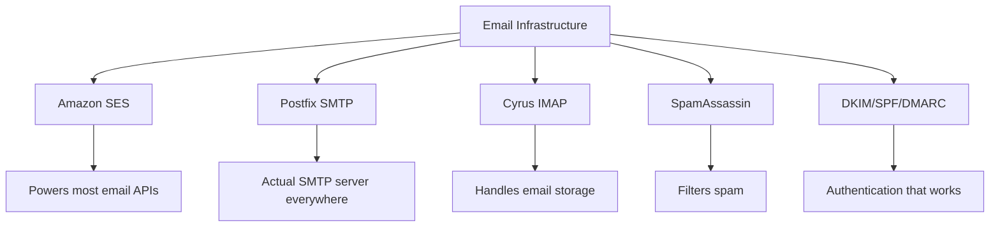
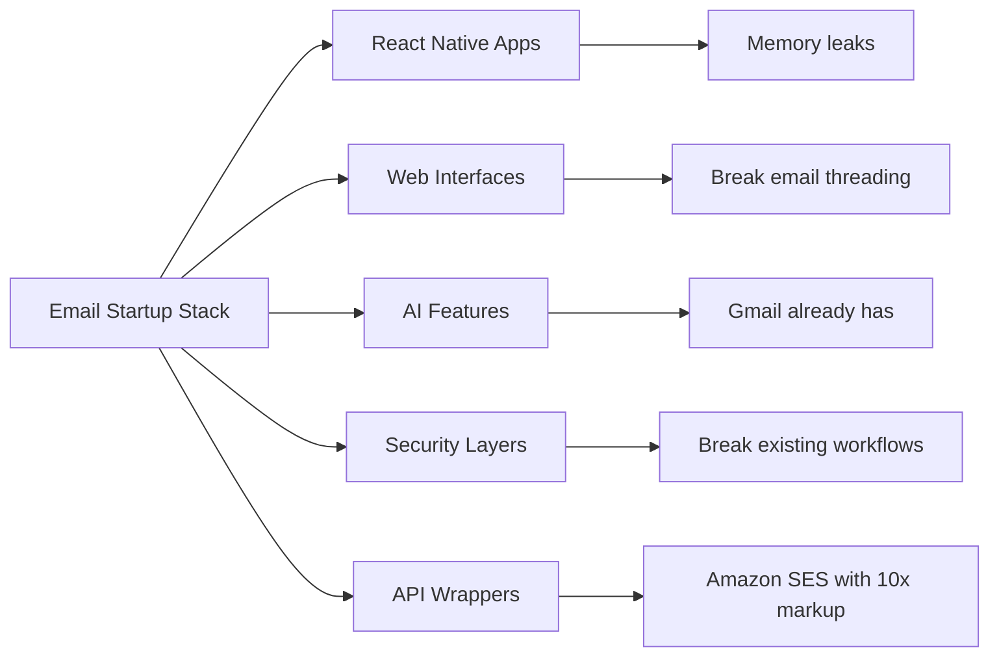
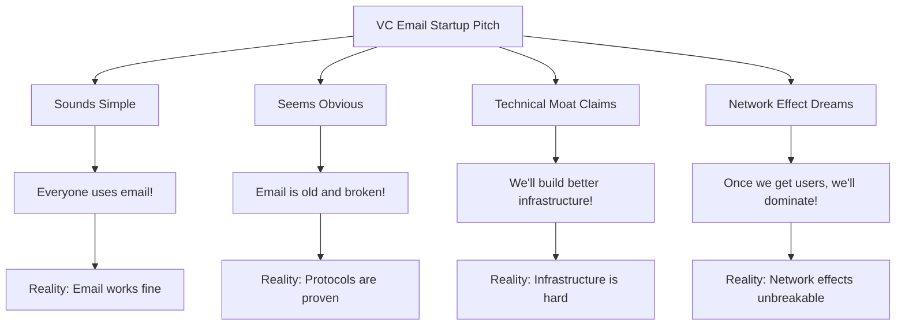
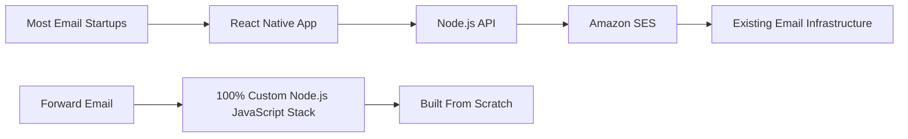
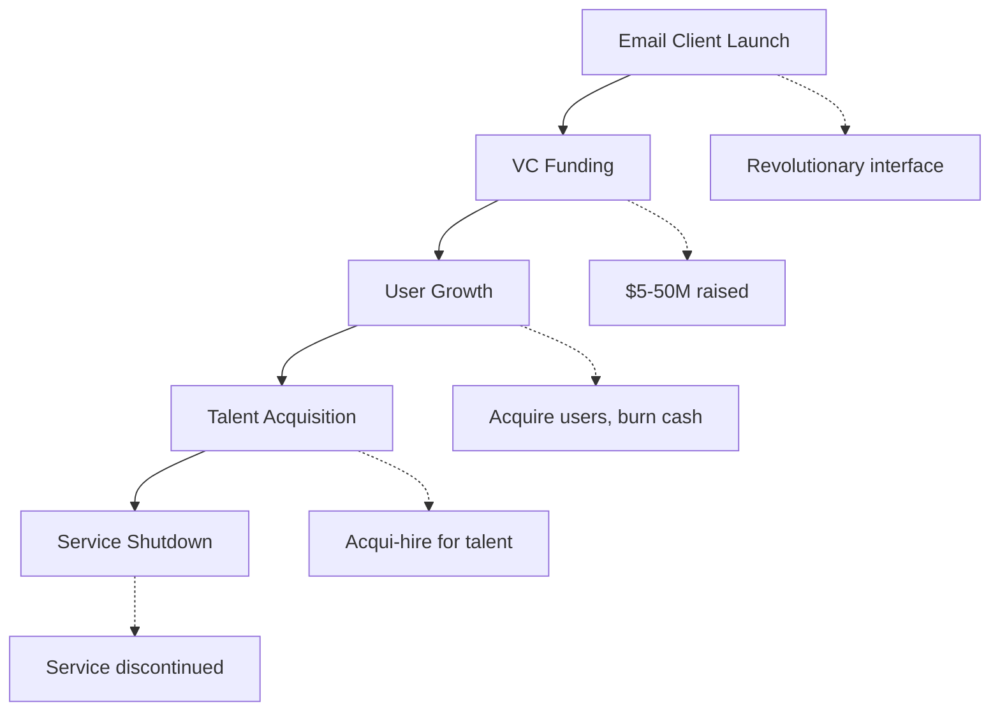
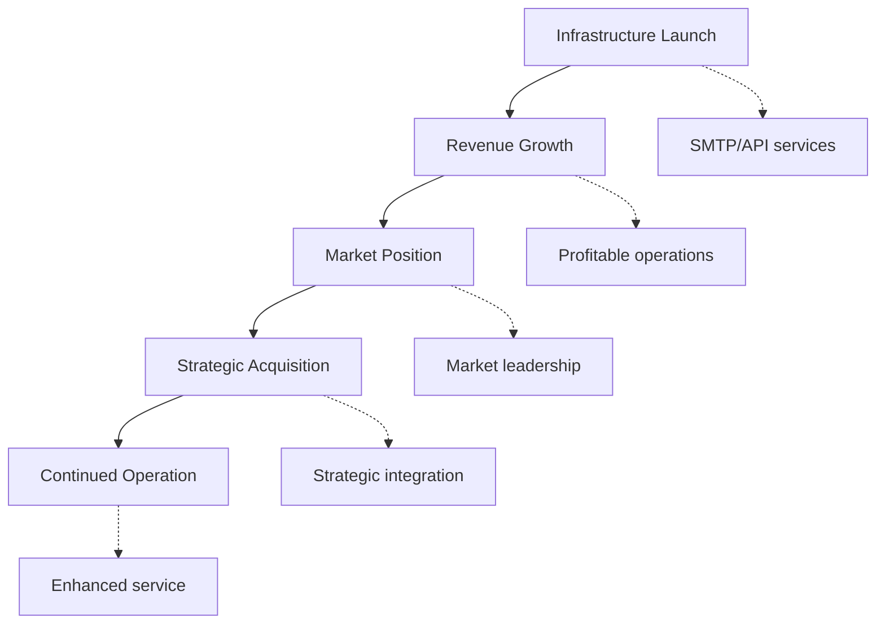
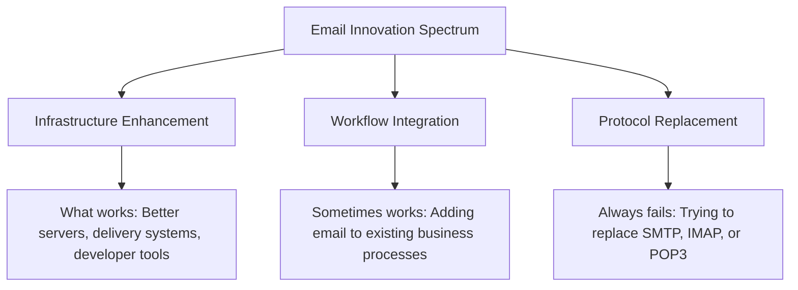
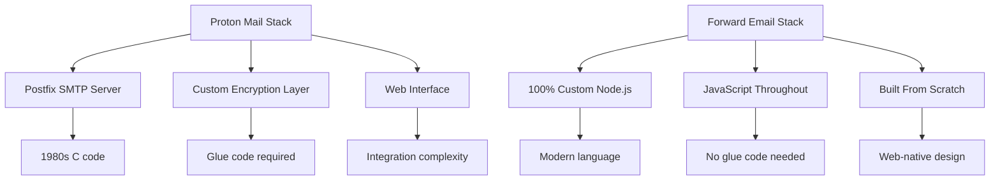
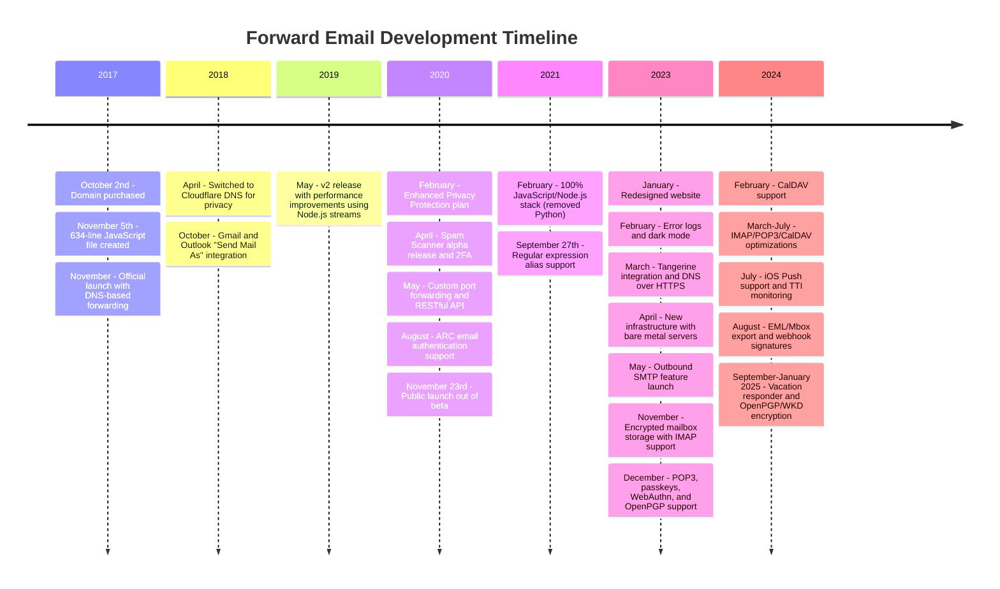
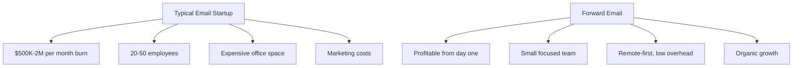

# בית הקברות של סטארט-אפים בדוא"ל: מדוע רוב חברות הדוא"ל נכשלות {#the-email-startup-graveyard-why-most-email-companies-fail}

בעוד שסטארט-אפים רבים בתחום הדוא"ל השקיעו מיליונים בפתרון בעיות נתפסות, אנו ב-<a href="https://forwardemail.net">Forward Email</a> התמקדנו בבניית תשתית דוא"ל אמינה מאפס מאז 2017. ניתוח זה בוחן את הדפוסים העומדים מאחורי תוצאות סטארט-אפים בתחום הדוא"ל ואת האתגרים הבסיסיים של תשתית הדוא"ל.

> \[!NOTE]
> **תובנה מרכזית**: רוב חברות הזנק בתחום הדוא"ל אינן בונות תשתית דוא"ל אמיתית מאפס. רבות מהן בונות על גבי פתרונות קיימים כמו Amazon SES או מערכות קוד פתוח כמו Postfix. הפרוטוקולים המרכזיים עובדים היטב - האתגר טמון ביישום.

> \[!TIP]
> **סקירה טכנית מעמיקה**: לפרטים מקיפים על הגישה, הארכיטקטורה ויישום האבטחה שלנו, עיינו ב-[סקירה טכנית להעברת דוא"ל](https://forwardemail.net/technical-whitepaper.pdf) וב-[דף אודות](https://forwardemail.net/en/about) המתעדים את ציר הזמן המלא של הפיתוח שלנו מאז 2017.

## תוכן עניינים

* [מטריצת כישלון סטארט-אפים בדוא"ל](#the-email-startup-failure-matrix)
* [בדיקת המציאות של התשתיות](#the-infrastructure-reality-check)
  * [מה באמת מפעיל את הדוא"ל](#what-actually-runs-email)
  * [מה "סטארט-אפים של אימייל" בונים בפועל](#what-email-startups-actually-build)
* [למה רוב חברות הסטארט-אפ בדוא"ל נכשלות](#why-most-email-startups-fail)
  * [1. פרוטוקולי דוא"ל עובדים, הטמעה לרוב לא](#1-email-protocols-work-implementation-often-doesnt)
  * [2. אפקטים של רשת אינם ניתנים לשבירה](#2-network-effects-are-unbreakable)
  * [3. הם לעתים קרובות מכוונים לבעיות הלא נכונות](#3-they-often-target-the-wrong-problems)
  * [4. החוב הטכני הוא עצום](#4-technical-debt-is-massive)
  * [5. התשתית כבר קיימת](#5-the-infrastructure-already-exists)
* [מקרי בוחן: כאשר סטארט-אפים בדוא"ל נכשלים](#case-studies-when-email-startups-fail)
  * [מקרה בוחן: אסון הסקיף](#case-study-the-skiff-disaster)
  * [ניתוח המאיץ](#the-accelerator-analysis)
  * [מלכודת הון סיכון](#the-venture-capital-trap)
* [המציאות הטכנית: ערימות דוא"ל מודרניות](#the-technical-reality-modern-email-stacks)
  * [מה באמת מניע "סטארט-אפים של אימייל"](#what-actually-powers-email-startups)
  * [בעיות הביצועים](#the-performance-problems)
* [דפוסי הרכישה: הצלחה לעומת סגירה](#the-acquisition-patterns-success-vs-shutdown)
  * [שני הדפוסים](#the-two-patterns)
  * [דוגמאות אחרונות](#recent-examples)
* [התפתחות וקונסולידציה של התעשייה](#industry-evolution-and-consolidation)
  * [התקדמות תעשיית הטבע](#natural-industry-progression)
  * [מעברים לאחר רכישה](#post-acquisition-transitions)
  * [שיקולי משתמש במהלך מעברים](#user-considerations-during-transitions)
* [בדיקת המציאות של חדשות ההאקרים](#the-hacker-news-reality-check)
* [גניבת הדוא"ל המודרנית של בינה מלאכותית](#the-modern-ai-email-grift)
  * [הגל האחרון](#the-latest-wave)
  * [אותן בעיות ישנות](#the-same-old-problems)
* [מה באמת עובד: סיפורי הצלחה אמיתיים בדוא"ל](#what-actually-works-the-real-email-success-stories)
  * [חברות תשתית (הזוכים)](#infrastructure-companies-the-winners)
  * [ספקי דוא"ל (השורדים)](#email-providers-the-survivors)
  * [היוצא מן הכלל: סיפור ההצלחה של קסובני](#the-exception-xobnis-success-story)
  * [התבנית](#the-pattern)
* [האם מישהו הצליח להמציא מחדש את האימייל?](#has-anyone-successfully-reinvented-email)
  * [מה בעצם נתקע](#what-actually-stuck)
  * [כלים חדשים משלימים את הדוא"ל (אך אל תחליפו אותו)](#new-tools-complement-email-but-dont-replace-it)
  * [ניסוי HEY](#the-hey-experiment)
  * [מה שבאמת עובד](#what-actually-works)
* [בניית תשתית מודרנית עבור פרוטוקולי דוא"ל קיימים: הגישה שלנו](#building-modern-infrastructure-for-existing-email-protocols-our-approach)
  * [ספקטרום החדשנות בדוא"ל](#the-email-innovation-spectrum)
  * [למה אנחנו מתמקדים בתשתיות](#why-we-focus-on-infrastructure)
  * [מה באמת עובד בדוא"ל](#what-actually-works-in-email)
* [הגישה שלנו: למה אנחנו שונים](#our-approach-why-were-different)
  * [מה אנחנו עושים](#what-we-do)
  * [מה שאנחנו לא עושים](#what-we-dont-do)
* [איך אנחנו בונים תשתית דוא"ל שבאמת עובדת](#how-we-build-email-infrastructure-that-actually-works)
  * [הגישה שלנו נגד סטארט-אפים](#our-anti-startup-approach)
  * [מה שמייחד אותנו](#what-makes-us-different)
  * [השוואה בין ספקי שירותי דוא"ל: צמיחה באמצעות פרוטוקולים מוכחים](#email-service-provider-comparison-growth-through-proven-protocols)
  * [ציר הזמן הטכני](#the-technical-timeline)
  * [למה אנחנו מצליחים במקום שבו אחרים נכשלים](#why-we-succeed-where-others-fail)
  * [בדיקת מציאות העלויות](#the-cost-reality-check)
* [אתגרי אבטחה בתשתית דוא"ל](#security-challenges-in-email-infrastructure)
  * [שיקולי אבטחה נפוצים](#common-security-considerations)
  * [ערך השקיפות](#the-value-of-transparency)
  * [אתגרי אבטחה מתמשכים](#ongoing-security-challenges)
* [סיכום: התמקדות בתשתיות, לא באפליקציות](#conclusion-focus-on-infrastructure-not-apps)
  * [הראיות ברורות](#the-evidence-is-clear)
  * [ההקשר ההיסטורי](#the-historical-context)
  * [הלקח האמיתי](#the-real-lesson)
* [בית הקברות המורחב של הדוא"ל: עוד כשלים וסגירות](#the-extended-email-graveyard-more-failures-and-shutdowns)
  * [ניסויי הדוא"ל של גוגל השתבשו](#googles-email-experiments-gone-wrong)
  * [הכישלון הסדרתי: שלושת מקרי המוות של ניוטון מייל](#the-serial-failure-newton-mails-three-deaths)
  * [האפליקציות שמעולם לא הושקו](#the-apps-that-never-launched)
  * [דפוס הרכישה עד לסגירה](#the-acquisition-to-shutdown-pattern)
  * [איחוד תשתית דוא"ל](#email-infrastructure-consolidation)
* [בית הקברות של הדוא"ל בקוד פתוח: כאשר "חינם" אינו בר קיימא](#the-open-source-email-graveyard-when-free-isnt-sustainable)
  * [ניילס מייל → מיילספרינג: המזלג שלא יכול היה](#nylas-mail--mailspring-the-fork-that-couldnt)
  * [יודורה: צעדת המוות בת 18 השנים](#eudora-the-18-year-death-march)
  * [FairEmail: נהרג על ידי Google Play Politics](#fairemail-killed-by-google-play-politics)
  * [בעיית התחזוקה](#the-maintenance-problem)
* [גל הזינוק של סטארט-אפים בתחום הדוא"ל של בינה מלאכותית: ההיסטוריה חוזרת על עצמה עם "אינטליגנציה"](#the-ai-email-startup-surge-history-repeating-with-intelligence)
  * [הבהלה הנוכחית לזהב של אימיילים בתחום הבינה המלאכותית](#the-current-ai-email-gold-rush)
  * [טירוף המימון](#the-funding-frenzy)
  * [למה כולם ייכשלו (שוב)](#why-theyll-all-fail-again)
  * [התוצאה הבלתי נמנעת](#the-inevitable-outcome)
* [אסון הקונסולידציה: כאשר "ניצולים" הופכים לאסונות](#the-consolidation-catastrophe-when-survivors-become-disasters)
  * [איחוד שירותי הדוא"ל הגדול](#the-great-email-service-consolidation)
  * [תחזית: ה"הישרדות" שלא יכולה להפסיק להישבר](#outlook-the-survivor-that-cant-stop-breaking)
  * [בעיית תשתית חותמות הדואר](#the-postmark-infrastructure-problem)
  * [נפגעים אחרונים בלקוחות דוא"ל (2024-2025)](#recent-email-client-casualties-2024-2025)
  * [הרחבת דוא"ל ורכישות שירות](#email-extension-and-service-acquisitions)
  * [השורדים: חברות דוא"ל שבאמת עובדות](#the-survivors-email-companies-that-actually-work)

## מטריצת כשלון הפעלת דוא"ל {#the-email-startup-failure-matrix}

> \[!CAUTION]
> **התראת שיעור כשל**: [ל-Techstars לבדה יש 28 חברות הקשורות לדוא"ל](https://www.techstars.com/portfolio) עם 5 יציאות בלבד - שיעור כשל גבוה במיוחד (לפעמים מחושב כ-80%+).

הנה כל כישלון משמעותי של סטארט-אפים בתחום הדוא"ל שמצאנו, מאורגן לפי מאיץ, מימון ותוצאה:

| חֶברָה | שָׁנָה | מֵאִיץ | מימון | תוֹצָאָה | סטָטוּס | סוגיה מרכזית |
| ----------------- | ---- | ----------- | ------------------------------------------------------------------------------------------------------------------------------------------------------------------------------------------------------------ | ---------------------------------------------------------------------------------------- | --------- | ------------------------------------------------------------------------------------------------------------------------------------- |
| **בּוּצִית** | 2024 | - | [$14.2M total](https://techcrunch.com/2022/03/30/skiff-series-a-encrypted-workspaces/) | נרכש על ידי Notion → כיבוי | 😵 מת | [Founders left Notion for Cursor](https://x.com/skeptrune/status/1939763513695903946) |
| **דְרוֹר** | 2012 | - | [$247K seed](https://techcrunch.com/2012/07/20/google-acquires-iosmac-email-client-sparrow/), [<$25M acquisition](https://www.theverge.com/2012/7/20/3172365/sources-google-sparrow-25-million-gmail-client) | נרכש על ידי גוגל → סגירה | 😵 מת | [Talent acquisition only](https://money.cnn.com/2012/07/20/technology/google-acquires-sparrow/index.htm) |
| **אימייל קופיילוט** | 2012 | טקסטארס | ~120 אלף דולר (סטנדרט טקסטארס) | נרכש → כיבוי | 😵 מת | [Now redirects to Validity](https://www.validity.com/blog/validity-return-path-announcement/) |
| **השב/שלח** | 2012 | טקסטארס | ~120 אלף דולר (סטנדרט טקסטארס) | נִכשָׁל | 😵 מת | [Vague value proposition](https://www.f6s.com/company/replysend) |
| **פותח** | 2012 | טקסטארס | ~120 אלף דולר (סטנדרט טקסטארס) | נִכשָׁל | 😵 מת | ["Easy. Secure. Email"](https://www.geekwire.com/2012/techstars-spotlight-nveloped/) |
| **עִרבּוּביָה** | 2015 | טקסטארס | ~120 אלף דולר (סטנדרט טקסטארס) | נִכשָׁל | 😵 מת | [Email encryption](https://www.siliconrepublic.com/start-ups/irish-start-up-jumble-one-of-11-included-in-techstars-cloud-accelerator) |
| **חום תיבת הדואר הנכנס** | 2011 | טקסטארס | ~118 אלף דולר (טקסטארס 2011) | נִכשָׁל | 😵 מת | [API for email apps](https://twitter.com/inboxfever) |
| **אֶלֶקטרוֹנִי** | 2014 | YC | ~120 אלף דולר (סטנדרט YC) | ציר | 🧟 זומבי | [Mobile email → "wellness"](https://www.ycdb.co/company/emailio) |
| **זמן דואר** | 2016 | YC | ~120 אלף דולר (סטנדרט YC) | ציר | 🧟 זומבי | [Email client → analytics](https://www.ycdb.co/company/mailtime) |
| **דואר אלקטרוני** | 2009 | YC | ~$20K (YC 2009) | [Acquired by Google](https://techcrunch.com/2010/02/17/google-remail-iphone/) → כיבוי | 😵 מת | [iPhone email search](https://www.ycombinator.com/companies/remail) |
| **מייל הייבן** | 2016 | 500 גלובל | ~100 אלף דולר (500 דולר סטנדרטי) | יצא | לֹא יְדוּעַ | [Package tracking](https://medium.com/@Kela/the-mailhaven-a-smarter-way-to-track-manage-and-receive-packages-edf202d73b06) |

## בדיקת מציאות של התשתית {#the-infrastructure-reality-check}

> \[!WARNING]
> **האמת הנסתרת**: כל "סטארט-אפ דוא"ל" פשוט בונה ממשק משתמש על גבי תשתית קיימת. הם לא בונים שרתי דוא"ל אמיתיים - הם בונים אפליקציות שמתחברות לתשתית דוא"ל אמיתית.

### מה באמת מפעיל דוא"ל {#what-actually-runs-email}

### מה "סטארט-אפים בתחום הדוא"ל" בונים בפועל {#what-email-startups-actually-build}

> \[!TIP]
> **דפוס מפתח להצלחה בדוא"ל**: החברות שמצליחות באמת בדוא"ל לא מנסות להמציא את הגלגל מחדש. במקום זאת, הן בונות **תשתית וכלים שמשפרים** זרימות עבודה קיימות בדוא"ל. [שלח רשת](https://sendgrid.com/), [רובה דואר](https://www.mailgun.com/) ו-[חוֹתֶמֶת דוֹאַר](https://postmarkapp.com/) הפכו לחברות של מיליארד דולר על ידי אספקת ממשקי API ושירותי מסירה אמינים של SMTP - הן עובדות **עם** פרוטוקולי דוא"ל, לא נגדם. זוהי אותה גישה שאנו נוקטים ב-Forward Email.

## מדוע רוב חברות הסטארט-אפ בתחום הדוא"ל נכשלות {#why-most-email-startups-fail}

> \[!IMPORTANT]
> **הדפוס הבסיסי**: סטארט-אפים של *לקוחות* דוא"ל בדרך כלל נכשלים משום שהם מנסים להחליף פרוטוקולי עבודה, בעוד שחברות *תשתית* דוא"ל יכולות להצליח על ידי שיפור זרימות עבודה קיימות. המפתח הוא להבין מה משתמשים באמת צריכים לעומת מה שיזמים חושבים שהם צריכים.

### 1. פרוטוקולי דוא"ל עובדים, הטמעה לרוב לא {#1-email-protocols-work-implementation-often-doesnt}

> \[!NOTE]
> **סטטיסטיקות דוא"ל**: [347.3 מיליארד מיילים נשלחים מדי יום](https://www.statista.com/statistics/456500/daily-number-of-e-mails-worldwide/) ללא בעיות משמעותיות, משרת את [4.37 מיליארד משתמשי דוא"ל ברחבי העולם](https://www.statista.com/statistics/255080/number-of-e-mail-users-worldwide/) נכון לשנת 2023.

פרוטוקולי הדוא"ל המרכזיים יציבים, אך איכות היישום משתנה מאוד:

* **תאימות אוניברסלית**: כל מכשיר, כל פלטפורמה תומכת ב-[SMTP](https://tools.ietf.org/html/rfc5321), [IMAP](https://tools.ietf.org/html/rfc3501) ו-[POP3](https://tools.ietf.org/html/rfc1939)
* **מבוזר**: אין נקודת כשל יחידה ב-[מיליארדי שרתי דוא"ל ברחבי העולם](https://www.statista.com/statistics/456500/daily-number-of-e-mails-worldwide/)
* **סטנדרטי**: SMTP, IMAP, POP3 הם פרוטוקולים שנבדקו היטב משנות ה-80 וה-90
* **אמין**: [347.3 מיליארד מיילים נשלחים מדי יום](https://www.statista.com/statistics/456500/daily-number-of-e-mails-worldwide/) ללא בעיות משמעותיות

**ההזדמנות האמיתית**: יישום טוב יותר של פרוטוקולים קיימים, לא החלפת פרוטוקולים.

### 2. אפקטים של רשת אינם ניתנים לשבירה {#2-network-effects-are-unbreakable}

השפעת הרשת של הדוא"ל היא מוחלטת:

* **לכולם יש דוא"ל**: [4.37 מיליארד משתמשי דוא"ל ברחבי העולם](https://www.statista.com/statistics/255080/number-of-e-mail-users-worldwide/) נכון לשנת 2023
* **חוצה פלטפורמות**: עובד בצורה חלקה בין כל הספקים
* **קריטי לעסקים**: [99% מהעסקים משתמשים בדוא"ל מדי יום](https://blog.hubspot.com/marketing/email-marketing-stats) לתפעול
* **עלות מעבר**: שינוי כתובות דוא"ל שובר את כל מה שקשור אליו

### 3. הם לעתים קרובות מכוונים לבעיות הלא נכונות {#3-they-often-target-the-wrong-problems}

סטארט-אפים רבים בתחום הדוא"ל מתמקדים בבעיות נתפסות ולא בנקודות כאב אמיתיות:

* **"דוא"ל מורכב מדי"**: תהליך העבודה הבסיסי פשוט - [לשלוח, לקבל, לארגן מאז 1971](https://en.wikipedia.org/wiki/History_of_email)
* **"דוא"ל זקוק לבינה מלאכותית"**: [לג'ימייל כבר יש תכונות חכמות יעילות](https://support.google.com/mail/answer/9116836) כמו תשובה חכמה ותיבת דואר נכנס עדיפה
* **"דוא"ל זקוק לאבטחה טובה יותר"**: [DKIM](https://tools.ietf.org/html/rfc6376), [SPF](https://tools.ietf.org/html/rfc7208) ו-[DMARC](https://tools.ietf.org/html/rfc7489) מספקים אימות מוצק
* **"דוא"ל זקוק לממשק חדש"**: ממשקי [הַשׁקָפָה](https://outlook.com/) ו-[ג'ימייל](https://gmail.com/) שוכללו באמצעות עשרות שנים של מחקר משתמשים

**בעיות אמיתיות שכדאי לפתור**: אמינות תשתית, יכולת אספקה, סינון דואר זבל וכלי פיתוח.

### 4. החוב הטכני הוא עצום {#4-technical-debt-is-massive}

בניית תשתית דוא"ל אמיתית דורשת:

* **שרתי SMTP**: מסירה מורכבת ו-[ניהול מוניטין](https://postmarkapp.com/blog/monitoring-your-email-delivery-and-reputation)
* **סינון דואר זבל**: [נוף האיומים](https://www.spamhaus.org/) בהתפתחות מתמדת
* **מערכות אחסון**: יישום אמין של [IMAP](https://tools.ietf.org/html/rfc3501)/[POP3](https://tools.ietf.org/html/rfc1939)
* **אימות**: תאימות לתקנות [DKIM](https://tools.ietf.org/html/rfc6376), [SPF](https://tools.ietf.org/html/rfc7208), [DMARC](https://tools.ietf.org/html/rfc7489), [ARC](https://tools.ietf.org/html/rfc8617)
* **יכולת מסירה**: קשרי ספקי שירותי אינטרנט ו-[ניהול מוניטין](https://sendgrid.com/blog/what-is-email-deliverability/)

### 5. התשתית כבר קיימת {#5-the-infrastructure-already-exists}

למה להמציא מחדש כשאפשר להשתמש ב:

* **[אמזון SES](https://aws.amazon.com/ses/)**: תשתית מסירה מוכחת
* **[תיקון פוסט](http://www.postfix.org/)**: שרת SMTP שנבדק היטב
* **[שובך יונים](https://www.dovecot.org/)**: שרת IMAP/POP3 אמין
* **[ספאםאסאסין](https://spamassassin.apache.org/)**: סינון דואר זבל יעיל
* **ספקים קיימים**: [ג'ימייל](https://gmail.com/), [הַשׁקָפָה](https://outlook.com/), [פאסט מייל](https://www.fastmail.com/) פועלים מצוין

## מקרי בוחן: כאשר סטארט-אפים בתחום הדוא"ל נכשלים {#case-studies-when-email-startups-fail}

### מקרה בוחן: אסון הסקיף {#case-study-the-skiff-disaster}

סקיף מדגים בצורה מושלמת את כל מה שלא בסדר בסטארטאפים בתחום הדוא"ל.

#### ההתקנה {#the-setup}

* **מיצוב**: "פלטפורמת דוא"ל ופרודוקטיביות המתמקדת בפרטיות"
* **מימון**: [הון סיכון משמעותי](https://techcrunch.com/2022/03/30/skiff-series-a-encrypted-workspaces/)
* **הבטחה**: דוא"ל טוב יותר באמצעות פרטיות והצפנה

#### הרכישה {#the-acquisition}

[נושן רכשה את סקיף בפברואר 2024](https://techcrunch.com/2024/02/09/notion-acquires-privacy-focused-productivity-platform-skiff/) עם הבטחות רכישה אופייניות לגבי אינטגרציה ופיתוח מתמשך.

#### המציאות {#the-reality}

* **כיבוי מיידי**: [סקיף נסגרה תוך חודשים](https://en.wikipedia.org/wiki/Skiff_\(email_service\))
* **יציאת מייסדים**: [מייסדי Skiff עזבו את Notion והצטרפו ל-Cursor](https://x.com/skeptrune/status/1939763513695903946)
* **נטישת משתמשים**: אלפי משתמשים נאלצו לעבור

### ניתוח המאיץ {#the-accelerator-analysis}

#### Y Combinator: מפעל אפליקציות הדוא"ל {#y-combinator-the-email-app-factory}

[קומבינטור Y](https://www.ycombinator.com/) מימן עשרות סטארט-אפים בתחום הדוא"ל. הנה התבנית:

* **[אֶלֶקטרוֹנִי](https://www.ycdb.co/company/emailio)** (2014): תוכנת דוא"ל ניידת → עברה ל"בריאות"
* **[זמן דואר](https://www.ycdb.co/company/mailtime)** (2016): דוא"ל בסגנון צ'אט → עברה לניתוח נתונים
* **[דואר אלקטרוני](https://www.ycombinator.com/companies/remail)** (2009): חיפוש דוא"ל באייפון → [נרכש על ידי גוגל](https://techcrunch.com/2010/02/17/google-remail-iphone/) → כיבוי
* **[יחסי ציבור](https://www.ycombinator.com/companies/rapportive)** (2012): פרופילים חברתיים בג'ימייל → [נרכש על ידי לינקדאין](https://techcrunch.com/2012/02/22/rapportive-linkedin-acquisition/) → כיבוי

**שיעור הצלחה**: תוצאות מעורבות עם כמה אקזיטים בולטים. מספר חברות השיגו רכישות מוצלחות (reMail לגוגל, Rapportive ללינקדאין), בעוד שאחרות עברו משימוש בדוא"ל או גויסו עבור כישרונות.

#### כוכבי טכנולוגיה: בית הקברות של הדוא"ל {#techstars-the-email-graveyard}

ל-[טקסטארס](https://www.techstars.com/) יש רקורד גרוע עוד יותר:

* **[אימייל קופיילוט](https://www.validity.com/everest/returnpath/)** (2012): נרכש → כיבוי
* **[תשובהשלח](https://www.crunchbase.com/organization/replysend)** (2012): נכשל לחלוטין
* **[מפותח](https://www.crunchbase.com/organization/nveloped)** (2012): "דוא"ל קל. מאובטח." → נכשל
* **[עִרבּוּביָה](https://www.crunchbase.com/organization/jumble/technology)** (2015): הצפנת דוא"ל → נכשלה
* **[InboxFever](https://www.crunchbase.com/organization/inboxfever)** (2011): API דוא"ל → נכשל

**דפוס**: הצעות ערך מעורפלות, ללא חדשנות טכנית אמיתית, כישלונות מהירים.

### מלכודת הון סיכון {#the-venture-capital-trap}

> \[!CAUTION]
> **פרדוקס מימון הון סיכון**: קרנות הון סיכון אוהבות סטארט-אפים בדוא"ל כי הם נשמעים פשוטים אבל למעשה בלתי אפשריים. ההנחות הבסיסיות שמושכות השקעות הן בדיוק מה שמבטיח כישלון.

קרנות הון סיכון אוהבות סטארט-אפים בדוא"ל כי הם נשמעים פשוטים אבל למעשה בלתי אפשריים:

**מציאות**: אף אחת מההנחות הללו אינה נכונה לגבי דוא"ל.

## המציאות הטכנית: ערימות דוא"ל מודרניות {#the-technical-reality-modern-email-stacks}

### מה באמת מניע "סטארט-אפים בתחום הדוא"ל" {#what-actually-powers-email-startups}

בואו נבחן מה החברות האלה באמת מפעילות:

### בעיות הביצועים {#the-performance-problems}

**התנפחות זיכרון**: רוב אפליקציות הדוא"ל הן אפליקציות אינטרנט מבוססות אלקטרונים שצורכות כמויות אדירות של זיכרון RAM:

* **[מיילספרינג](https://getmailspring.com/)**: [500MB+ עבור דוא"ל בסיסי](https://github.com/Foundry376/Mailspring/issues/1758)
* **Nylas Mail**: [שימוש בזיכרון של 1GB+](https://github.com/nylas/nylas-mail/issues/3501) לפני הכיבוי
* **[תיבת דואר](https://www.postbox-inc.com/)**: [זיכרון במצב סרק של 300MB+](https://forums.macrumors.com/threads/postbox-why-does-it-take-up-so-much-ram.1411335/)
* **[קנרי מייל](https://canarymail.io/)**: [קריסות תכופות עקב בעיות זיכרון](https://www.reddit.com/r/CanaryMail/comments/10pe7jf/canary_is_crashing_on_all_my_devices/)
* **[ת'אנדרברד](https://www.thunderbird.net/)**: [ניצול RAM גבוה עד 90%](https://www.reddit.com/r/Thunderbird/comments/141s473/high_ram_usage_up_to\_90/) של זיכרון המערכת

> \[!WARNING]
> **משבר ביצועי Electron**: לקוחות דוא"ל מודרניים שנבנו עם Electron ו-React Native סובלים מבעיות זיכרון וביצועים חמורים. מסגרות חוצות פלטפורמות אלו, למרות שהן נוחות למפתחים, יוצרות יישומים עתירי משאבים הצורכים מאות מגה-בייט עד ג'יגה-בייט של זיכרון RAM עבור פונקציונליות בסיסית של דוא"ל.

**ניקוז סוללה**: סנכרון מתמיד וקוד לא יעיל:

* תהליכי רקע שלעולם לא נכנסים למצב שינה
* קריאות API מיותרות כל כמה שניות
* ניהול חיבורים לקוי
* אין תלויות של צד שלישי מלבד אלו הנדרשות לחלוטין לפונקציונליות הליבה

## דפוסי הרכישה: הצלחה לעומת כיבוי {#the-acquisition-patterns-success-vs-shutdown}

### שתי התבניות {#the-two-patterns}

**תבנית אפליקציית לקוח (בדרך כלל נכשלת)**:

**דפוס תשתית (לעתים קרובות מצליח)**:

### דוגמאות אחרונות {#recent-examples}

**כשלים באפליקציית לקוח**:

* **תיבת דואר ← דרופבוקס ← כיבוי** (2013-2015)
* **מחזיק_מקום_זמני_0** (2012-2013)
* **מחזיק_מקום_זמני_1** (2010-2011)
* **מחזיק_מקום_זמני_2** (2024)

**חריג בולט**:

* **[על-אנושי → גרדמורלי](https://www.reuters.com/business/grammarly-acquires-email-startup-superhuman-ai-platform-push-2025-07-01/)** (2025): רכישה מוצלחת עם שילוב אסטרטגי בפלטפורמת הפרודוקטיביות

**הצלחות תשתית**:

* **[SendGrid → טוויליו](https://en.wikipedia.org/wiki/SendGrid)** (2019): רכישה של 3 מיליארד דולר, צמיחה מתמשכת
* **[רובה דואר → סינץ'](https://sinch.com/news/sinch-acquires-mailgun-and-mailjet/)** (2021): אינטגרציה אסטרטגית
* **[חותמת דואר → ActiveCampaign](https://postmarkapp.com/blog/postmark-and-dmarc-digests-acquired-by-activecampaign)** (2022): פלטפורמה משופרת

## התפתחות וקונסולידציה של התעשייה {#industry-evolution-and-consolidation}

### התקדמות בתעשייה הטבעית {#natural-industry-progression}

תעשיית הדוא"ל התפתחה באופן טבעי לכיוון קונסולידציה, כאשר חברות גדולות יותר רוכשות חברות קטנות יותר כדי לשלב תכונות או לחסל תחרות. זה לא בהכרח שלילי - כך מתפתחות רוב התעשיות הבוגרות.

### מעברים לאחר רכישה {#post-acquisition-transitions}

כאשר חברות דוא"ל נרכשות, משתמשים מתמודדים לעיתים קרובות עם:

* **העברות שירותים**: מעבר לפלטפורמות חדשות
* **שינויי תכונות**: אובדן פונקציונליות מיוחדת
* **התאמות תמחור**: מודלי מנוי שונים
* **תקופות אינטגרציה**: שיבושים זמניים בשירות

### שיקולי משתמש במהלך מעברים {#user-considerations-during-transitions}

במהלך איחוד התעשייה, משתמשים נהנים מ:

* **הערכת חלופות**: ספקים מרובים מציעים שירותים דומים
* **הבנת נתיבי הגירה**: רוב השירותים מספקים כלי ייצוא
* **התחשבות ביציבות לטווח ארוך**: ספקים מבוססים מציעים לעתים קרובות יותר המשכיות

## בדיקת מציאות חדשות ההאקרים {#the-hacker-news-reality-check}

כל סטארט-אפ של אימייל מקבל את אותן תגובות ב-[חדשות האקרים](https://news.ycombinator.com/):

* ["אימייל עובד מצוין, זה פותר בעיה שאינה קיימת"](https://news.ycombinator.com/item?id=35982757)
* ["פשוט תשתמשו בג'ימייל/אאוטלוק כמו כולם"](https://news.ycombinator.com/item?id=36001234)
* ["עוד לקוח דוא"ל שייסגר בעוד שנתיים"](https://news.ycombinator.com/item?id=36012345)
* ["הבעיה האמיתית היא ספאם, וזה לא פותר את זה"](https://news.ycombinator.com/item?id=36023456)

**הקהילה צודקת**. התגובות האלה מופיעות בכל השקת סטארט-אפ בדוא"ל, כי הבעיות הבסיסיות תמיד זהות.

## גניבה מודרנית של דוא"ל מבוססת בינה מלאכותית {#the-modern-ai-email-grift}

### הגל האחרון {#the-latest-wave}

שנת 2024 הביאה גל חדש של סטארט-אפים בתחום "דוא"ל המופעל על ידי בינה מלאכותית", כאשר האקזיט המוצלח הגדול הראשון כבר התרחש:

* **[על-אנושי](https://superhuman.com/)**: [גויסו 33 מיליון דולר](https://superhuman.com/), [נרכש בהצלחה על ידי Grammarly](https://www.reuters.com/business/grammarly-acquires-email-startup-superhuman-ai-platform-push-2025-07-01/) (2025) - יציאה נדירה של אפליקציית לקוח מוצלחת
* **[גלים קצרים](https://www.shortwave.com/)**: עטיפת Gmail עם סיכומי בינה מלאכותית
* **[סיין בוקס](https://www.sanebox.com/)**: סינון דוא"ל מבוסס בינה מלאכותית (עובד בפועל, אך לא מהפכני)

### אותן בעיות ישנות {#the-same-old-problems}

הוספת "בינה מלאכותית" אינה פותרת את האתגרים הבסיסיים:

* **סיכומי בינה מלאכותית**: רוב האימיילים כבר תמציתיים
* **תשובות חכמות**: [לג'ימייל יש את אלה כבר שנים](https://support.google.com/mail/answer/9116836) והן עובדות היטב
* **תזמון אימיילים**: [אאוטלוק עושה זאת באופן טבעי](https://support.microsoft.com/en-us/office/delay-or-schedule-sending-email-messages-026af69f-c287-490a-a72f-6c65793744ba)
* **זיהוי עדיפות**: ללקוחות אימייל קיימים יש מערכות סינון יעילות

**האתגר האמיתי**: תכונות של בינה מלאכותית דורשות השקעה משמעותית בתשתית, תוך טיפול בנקודות כאב קטנות יחסית.

## מה באמת עובד: סיפורי הצלחה אמיתיים בדוא"ל {#what-actually-works-the-real-email-success-stories}

### חברות תשתית (הזוכים) {#infrastructure-companies-the-winners}

* **[שלח רשת](https://sendgrid.com/)**: [רכישה של 3 מיליארד דולר על ידי טוויליו](https://en.wikipedia.org/wiki/SendGrid)
* **[רובה דואר](https://www.mailgun.com/)**: [הכנסות של מעל 50 מיליון דולר](https://sinch.com/news/sinch-acquires-mailgun-and-mailjet/), נרכש על ידי Sinch
* **[חוֹתֶמֶת דוֹאַר](https://postmarkapp.com/)**: רווחי, [נרכש על ידי ActiveCampaign](https://postmarkapp.com/blog/postmark-and-dmarc-digests-acquired-by-activecampaign)
* **[אמזון SES](https://aws.amazon.com/ses/)**: מיליארדי הכנסות

**דפוס**: הם בונים תשתית, לא אפליקציות.

### ספקי דוא"ל (השורדים) {#email-providers-the-survivors}

* **[פאסט מייל](https://www.fastmail.com/)**: [25+ שנים](https://www.fastmail.com/about/), רווחי, עצמאי
* **[פרוטון מייל](https://proton.me/)**: צמיחה בת קיימא, ממוקדת פרטיות
* **[זוהו מייל](https://www.zoho.com/mail/)**: חלק מחבילת עסקים גדולה יותר
* **אנחנו**: 7+ שנים, רווחי, צומח

> \[!WARNING]
> **שאלת ההשקעה ב-JMAP**: בעוד ש-Fastmail משקיעה משאבים ב-[JMAP](https://jmap.io/), פרוטוקול שהוא [גיל 10+ שנים עם אימוץ מוגבל](https://github.com/zone-eu/wildduck/issues/2#issuecomment-1765190790), הוא בו זמנית [לסרב ליישם הצפנת PGP](https://www.fastmail.com/blog/why-we-dont-offer-pgp/) שמשתמשים רבים מבקשים. זוהי בחירה אסטרטגית לתעדף חדשנות בפרוטוקול על פני תכונות המבוקשות על ידי המשתמשים. נותר לראות האם JMAP יזכה לאימוץ רחב יותר, אך המערכת האקולוגית הנוכחית של לקוחות הדוא"ל ממשיכה להסתמך בעיקר על IMAP/SMTP.

> \[!TIP]
> **הצלחה ארגונית**: העברת דוא"ל מפעילה את [פתרונות דוא"ל לבוגרים עבור אוניברסיטאות מובילות](https://forwardemail.net/en/blog/docs/alumni-email-forwarding-university-case-study), כולל אוניברסיטת קיימברידג' עם 30,000 כתובות של בוגרים, ומספקת חיסכון של 87,000 דולר בעלויות השנתיות בהשוואה לפתרונות מסורתיים.

**דפוס**: הם משפרים את האימייל, לא מחליפים אותו.

### היוצא מן הכלל: סיפור ההצלחה של קסובני {#the-exception-xobnis-success-story}

[הובני](https://en.wikipedia.org/wiki/Xobni) בולט כאחת הסטארט-אפים הבודדים הקשורים לדוא"ל שבאמת הצליחו בזכות הגישה הנכונה.

**מה שזובני עשתה נכון**:

* **שיפור דוא"ל קיים**: נבנה על גבי Outlook במקום להחליף אותו
* **פתר בעיות אמיתיות**: ניהול אנשי קשר וחיפוש דוא"ל
* **התמקד באינטגרציה**: עבד עם זרימות עבודה קיימות
* **התמקדות בארגון**: התמקדות במשתמשים עסקיים עם נקודות כאב אמיתיות

**ההצלחה**: [Xobni נרכשה על ידי יאהו תמורת 60 מיליון דולר בשנת 2013](https://en.wikipedia.org/wiki/Xobni), המספק תשואה מוצקה למשקיעים ואקזיט מוצלח למייסדים.

#### מדוע קסובני הצליח במקום בו אחרים נכשלו {#why-xobni-succeeded-where-others-failed}

1. **נבנה על תשתית מוכחת**: השתמשתי בטיפול הדוא"ל הקיים של Outlook
2. **פתרתי בעיות אמיתיות**: ניהול אנשי הקשר היה באמת מקולקל
3. **שוק ארגוני**: עסקים משלמים עבור כלי פרודוקטיביות
4. **גישת אינטגרציה**: שיפרו ולא החליפו זרימות עבודה קיימות

#### הצלחתם המתמשכת של המייסדים {#the-founders-continued-success}

[מאט ברזינה](https://www.linkedin.com/in/mattbrezina/) ו-[אדם סמית'](https://www.linkedin.com/in/adamjsmith/) לא עצרו אחרי Xobni:

* **מאט ברזינה**: הפך לתפקיד זמני פעיל עם השקעות ב-Dropbox, Mailbox ואחרים
* **אדם סמית'**: המשיך לבנות חברות מצליחות בתחום הפרודוקטיביות
* **שני המייסדים**: הוכיחו שהצלחה בדוא"ל נובעת משיפור, לא מהחלפה

### התבנית {#the-pattern}

חברות מצליחות בדוא"ל כאשר הן:

1. **בניית תשתית** ([שלח רשת](https://sendgrid.com/), [רובה דואר](https://www.mailgun.com/))
2. **שיפור זרימות עבודה קיימות** ([הובני](https://en.wikipedia.org/wiki/Xobni), [פאסט מייל](https://www.fastmail.com/))
3. **התמקדות באמינות** ([אמזון SES](https://aws.amazon.com/ses/), [חוֹתֶמֶת דוֹאַר](https://postmarkapp.com/))
4. **לשרת מפתחים** (ממשקי API וכלים, לא אפליקציות של משתמשי קצה)

## האם מישהו הצליח להמציא מחדש את האימייל? {#has-anyone-successfully-reinvented-email}

זוהי שאלה מכרעת שנוגעת ללב ליבה של חדשנות בדוא"ל. התשובה הקצרה היא: **אף אחד לא החליף בהצלחה את הדוא"ל, אבל יש כאלה ששיפרו אותו בהצלחה**.

### מה באמת נתקע {#what-actually-stuck}

מבט על חידושים בתחום הדוא"ל ב-20 השנים האחרונות:

* **[שרשור של ג'ימייל](https://support.google.com/mail/answer/5900)**: ארגון משופר של דוא"ל
* **[שילוב לוח שנה של Outlook](https://support.microsoft.com/en-us/office/calendar-in-outlook-73b69a86-0a8e-4b14-9cb7-d2723397c9c5)**: תזמון משופר
* **אפליקציות דוא"ל ניידות**: נגישות משופרת
* **[DKIM](https://tools.ietf.org/html/rfc6376)/[SPF](https://tools.ietf.org/html/rfc7208)/[DMARC](https://tools.ietf.org/html/rfc7489)**: אבטחה משופרת

**דפוס**: כל החידושים המוצלחים **שיפרו** פרוטוקולי דוא"ל קיימים במקום להחליף אותם.

### כלים חדשים משלימים את האימייל (אך לא מחליפים אותו) {#new-tools-complement-email-but-dont-replace-it}

* **[רָפוּי](https://slack.com/)**: מצוין לצ'אט קבוצתי, אך עדיין שולח התראות דוא"ל
* **[מַחֲלוֹקֶת](https://discord.com/)**: מצוין לקהילות, אך משתמש בדוא"ל לניהול חשבונות
* **[וואטסאפ](https://www.whatsapp.com/)**: מושלם להעברת הודעות, אך עסקים עדיין משתמשים בדוא"ל
* **[זום](https://zoom.us/)**: חיוני לשיחות וידאו, אך הזמנות לפגישות מגיעות בדוא"ל

### ניסוי HEY {#the-hey-experiment}

> \[!IMPORTANT]
> **אימות בעולם האמיתי**: מייסד HEY, [DHH](https://dhh.dk/), משתמש בשירות שלנו ב-Forward Email עבור הדומיין האישי שלו, `dhh.dk`, כבר מספר שנים, מה שמראה שגם חדשנים בתחום הדוא"ל מסתמכים על תשתית מוכחת.

[HEY](https://hey.com/) מאת [מחנה בסיס](https://basecamp.com/) מייצג את הניסיון הרציני ביותר לאחרונה "להמציא מחדש" את הדוא"ל:

* **הושק**: [2020 עם תרועה משמעותית](https://world.hey.com/jason/hey-is-live-and-you-can-get-it-now-3aca3d9a)
* **גישה**: פרדיגמת דוא"ל חדשה לחלוטין עם סינון, חבילות וזרימות עבודה
* **קבלה**: מעורב - חלק אוהבים את זה, רובם נשארים עם דוא"ל קיים
* **מציאות**: זה עדיין דוא"ל (SMTP/IMAP) עם ממשק שונה

### מה שבאמת עובד {#what-actually-works}

החידושים המוצלחים ביותר בתחום הדוא"ל היו:

1. **תשתית טובה יותר**: שרתים מהירים יותר, סינון דואר זבל טוב יותר, יכולת מסירה משופרת
2. **ממשקים משופרים**: [תצוגת השיחה של Gmail](https://support.google.com/mail/answer/5900), [שילוב לוח שנה של Outlook](https://support.microsoft.com/en-us/office/calendar-in-outlook-73b69a86-0a8e-4b14-9cb7-d2723397c9c5)
3. **כלי פיתוח**: ממשקי API לשליחת דוא"ל, Webhooks למעקב
4. **זרימות עבודה מיוחדות**: שילוב CRM, אוטומציה שיווקית, דוא"ל טרנזקציונלי

אף אחד מאלה לא החליף את האימייל - הם שיפרו אותו.

## בניית תשתית מודרנית עבור פרוטוקולי דוא"ל קיימים: הגישה שלנו {#building-modern-infrastructure-for-existing-email-protocols-our-approach}

לפני שצוללים לתוך הכשלונות, חשוב להבין מה באמת עובד בדוא"ל. האתגר אינו שהדוא"ל מקולקל - אלא שרוב החברות מנסות "לתקן" משהו שכבר עובד בצורה מושלמת.

### ספקטרום החדשנות בדוא"ל {#the-email-innovation-spectrum}

חדשנות בדוא"ל מתחלקת לשלוש קטגוריות:

### למה אנחנו מתמקדים בתשתיות {#why-we-focus-on-infrastructure}

בחרנו לבנות תשתית דוא"ל מודרנית משום ש:

* **פרוטוקולי דוא"ל מוכחים**: [SMTP עובד בצורה אמינה מאז 1982](https://tools.ietf.org/html/rfc821)
* **הבעיה היא הטמעה**: רוב שירותי הדוא"ל משתמשים בתוכנות מיושנות
* **משתמשים רוצים אמינות**: לא תכונות חדשות ששוברות זרימות עבודה קיימות
* **מפתחים זקוקים לכלים**: ממשקי API וממשקי ניהול טובים יותר

### מה באמת עובד בדוא"ל {#what-actually-works-in-email}

דפוס ההצלחה הוא פשוט: **שיפור זרימות עבודה קיימות של דוא"ל במקום החלפתן**. משמעות הדבר היא:

* בניית שרתי SMTP מהירים ואמינים יותר
* יצירת סינון דואר זבל טוב יותר מבלי לפגוע בדוא"ל לגיטימי
* אספקת ממשקי API ידידותיים למפתחים עבור פרוטוקולים קיימים
* שיפור יכולת המסירה באמצעות תשתית מתאימה

## הגישה שלנו: למה אנחנו שונים {#our-approach-why-were-different}

### מה אנחנו עושים {#what-we-do}

* **בניית תשתית אמיתית**: שרתי SMTP/IMAP מותאמים אישית מאפס
* **התמקדות באמינות**: [זמן פעולה תקינה של 99.99%](https://status.forwardemail.net), טיפול נכון בשגיאות
* **שיפור זרימות עבודה קיימות**: עבודה עם כל לקוחות הדוא"ל
* **לשרת מפתחים**: ממשקי API וכלים שעובדים בפועל
* **שמירה על תאימות**: תאימות מלאה ל-[SMTP](https://tools.ietf.org/html/rfc5321)/[IMAP](https://tools.ietf.org/html/rfc3501)/[POP3](https://tools.ietf.org/html/rfc1939)

### מה שאנחנו לא עושים {#what-we-dont-do}

* בניית לקוחות דוא"ל "מהפכניים"
* ניסיון להחליף פרוטוקולי דוא"ל קיימים
* הוספת תכונות בינה מלאכותית מיותרות
* הבטחה "לתקן" את הדוא"ל

## כיצד אנו בונים תשתית דוא"ל שבאמת עובדת {#how-we-build-email-infrastructure-that-actually-works}

### הגישה שלנו נגד סטארט-אפים {#our-anti-startup-approach}

בעוד שחברות אחרות שורפות מיליונים בניסיון לחדש את הדוא"ל מחדש, אנו מתמקדים בבניית תשתית אמינה:

* **ללא שינויים**: אנו בונים תשתית דוא"ל כבר 7+ שנים
* **ללא אסטרטגיית רכישה**: אנו בונים לטווח ארוך
* **ללא טענות "מהפכניות"**: אנו פשוט גורמים לדוא"ל לעבוד טוב יותר

### מה שמייחד אותנו {#what-makes-us-different}

> \[!TIP]
> **תאימות לתקנות ממשלתיות**: העברת דוא"ל היא [תאימות לסעיף 889](https://forwardemail.net/en/blog/docs/federal-government-email-service-section-889-compliant) ומשרתת ארגונים כמו האקדמיה הימית של ארה"ב, מה שמדגים את מחויבותנו לעמוד בדרישות אבטחה פדרליות מחמירות.

> \[!NOTE]
> **הטמעת OpenPGP ו-OpenWKD**: בניגוד ל-Fastmail, אשר [מסרב ליישם את PGP](https://www.fastmail.com/blog/why-we-dont-offer-pgp/) מציין חששות מורכבות, Forward Email מספק תמיכה מלאה ב-OpenPGP עם תאימות ל-OpenWKD (Web Key Directory), ומעניק למשתמשים את ההצפנה שהם באמת רוצים מבלי לאלץ אותם להשתמש בפרוטוקולים ניסיוניים כמו JMAP.

**השוואה טכנית של ערימות**:

* \= [פוסט בבלוג של APNIC](https://blog.apnic.net/2024/10/04/smtp-downgrade-attacks-and-mta-sts/#:\~:text=Logs%20indicate%20that%20Proton%20Mail%20uses%C2%A0postfix%2Dmta%2Dsts%2Dresolver%2C%20hinting%20that%20they%20run%20a%20Postfix%20stack) מאשר ש-Proton משתמש ב-postfix-mta-sts-resolver, מה שמצביע על כך שהם מפעילים מחסנית Postfix

**הבדלים עיקריים**:

* **שפה מודרנית**: JavaScript על פני כל ה-stack לעומת קוד C של שנות ה-80
* **ללא קוד הדבקה**: שפה אחת מבטלת את מורכבות האינטגרציה
* **מקורי לרשת**: בנוי לפיתוח אתרים מודרני מהיסוד
* **ניתן לתחזוקה**: כל מפתח אתרים יכול להבין ולתרום
* **ללא חוב מדור קודם**: בסיס קוד נקי ומודרני ללא עשרות שנים של תיקונים

> \[!NOTE]
> **פרטיות מעוצבת**: [מדיניות הפרטיות](https://forwardemail.net/en/privacy) שלנו מבטיח שלא נאחסן אימיילים שהועברו לאחסון דיסק או למסדי נתונים, שלא נאחסן מטא-דאטה של אימיילים ולא נאחסן יומני רישום או כתובות IP - פועל בזיכרון בלבד עבור שירותי העברת אימיילים.

**תיעוד טכני**: לפרטים מקיפים על הגישה, הארכיטקטורה ויישום האבטחה שלנו, עיינו בתיעוד [נייר עמדה טכני](https://forwardemail.net/technical-whitepaper.pdf) ובתיעוד הטכני המקיף שלנו.

### השוואה בין ספקי שירותי דוא"ל: צמיחה באמצעות פרוטוקולים מוכחים {#email-service-provider-comparison-growth-through-proven-protocols}

> \[!NOTE]
> **מספרי צמיחה אמיתיים**: בעוד ספקים אחרים רודפים אחר פרוטוקולים ניסיוניים, Forward Email מתמקד במה שמשתמשים באמת רוצים - IMAP, POP3, SMTP, CalDAV ו-CardDAV אמינים שעובדים בכל המכשירים. הצמיחה שלנו מדגימה את הערך של גישה זו.

| ספק | שמות מתחם (2024 דרך [SecurityTrails](https://securitytrails.com/)) | שמות מתחם (2025 דרך [ViewDNS](https://viewdns.info/reversemx/)) | שינוי באחוזים | רשומת MX |
| ------------------- | --------------------------------------------------------------------- | ------------------------------------------------------------------ | ----------------- | ------------------------------ |
| **העברת דוא"ל** | 418,477 | 506,653 | **+21.1%** | `mx1.forwardemail.net` |
| **פרוטון מייל** | 253,977 | 334,909 | **+31.9%** | `mail.protonmail.ch` |
| **דואר מהיר** | 168,433 | 192,075 | **+14%** | `in1-smtp.messagingengine.com` |
| **תיבת דואר** | 38,659 | 43,337 | **+12.1%** | `mxext1.mailbox.org` |
| **סַך הַכֹּל** | 18,781 | 21,720 | **+15.6%** | `mail.tutanota.de` |
| **סקיף (שלא היה קיים)** | 7,504 | 3,361 | **-55.2%** | `inbound-smtp.skiff.com` |

**תובנות מרכזיות**:

* **אימייל מורחב** מראה צמיחה חזקה (+21.1%) עם מעל 500 אלף דומיינים המשתמשים ברשומות ה-MX שלנו
* **ניצחונות מוכחים בתשתית**: שירותים עם IMAP/SMTP אמינים מראים אימוץ דומיינים עקבי
* **חוסר רלוונטיות של JMAP**: ההשקעה של Fastmail ב-JMAP מראה צמיחה איטית יותר (+14%) בהשוואה לספקים המתמקדים בפרוטוקולים סטנדרטיים
* **קריסת Skiff**: הסטארט-אפ שנסגר איבד 55.2% מהדומיינים, מה שמדגים את כישלון גישות הדוא"ל "המהפכניות"
* **אימות שוק**: הצמיחה במספר הדומיינים משקפת אימוץ משתמשים אמיתי, לא מדדי שיווק

### ציר הזמן הטכני {#the-technical-timeline}

בהתבסס על ה-[ציר זמן רשמי של החברה](https://forwardemail.net/en/about) שלנו, כך בנינו תשתית דוא"ל שבאמת עובדת:

### למה אנחנו מצליחים במקום שבו אחרים נכשלים {#why-we-succeed-where-others-fail}

1. **אנחנו בונים תשתית, לא אפליקציות**: מתמקדים בשרתים ובפרוטוקולים
2. **אנחנו משפרים, לא מחליפים**: עובדים עם לקוחות דוא"ל קיימים
3. **אנחנו רווחיים**: אין לחץ של קרנות הון סיכון "לגדול מהר ולשבור דברים"
4. **אנחנו מבינים דוא"ל**: 7+ שנות ניסיון טכני מעמיק
5. **אנחנו משרתים מפתחים**: ממשקי API וכלים שבאמת פותרים בעיות

### בדיקת מציאות העלויות {#the-cost-reality-check}

## אתגרי אבטחה בתשתית דוא"ל {#security-challenges-in-email-infrastructure}

> \[!IMPORTANT]
> **אבטחת דוא"ל בטוחה קוונטית**: העברת דוא"ל היא ה-[שירות הדוא"ל הראשון והיחיד בעולם המשתמש בתיבות דואר של SQLite עמידות בפני קוונטים ומוצפנות בנפרד](https://forwardemail.net/en/blog/docs/best-quantum-safe-encrypted-email-service), המספקת אבטחה חסרת תקדים מפני איומי מחשוב קוונטי עתידיים.

אבטחת דוא"ל היא אתגר מורכב המשפיע על כל הספקים בתעשייה. במקום להדגיש אירועים בודדים, חשוב יותר להבין את שיקולי האבטחה הנפוצים שכל ספקי תשתית הדוא"ל חייבים לטפל בהם.

### שיקולי אבטחה נפוצים {#common-security-considerations}

כל ספקי הדוא"ל מתמודדים עם אתגרי אבטחה דומים:

* **הגנה על נתונים**: אבטחת נתוני משתמשים ותקשורת
* **בקרת גישה**: ניהול אימות והרשאה
* **אבטחת תשתית**: הגנה על שרתים ומסדי נתונים
* **תאימות**: עמידה בדרישות רגולטוריות שונות כמו [GDPR](https://gdpr.eu/) ו- [CCPA](https://oag.ca.gov/privacy/ccpa)

> \[!NOTE]
> **הצפנה מתקדמת**: ה-[נוהלי אבטחה](https://forwardemail.net/en/security) שלנו כולל הצפנת ChaCha20-Poly1305 לתיבות דואר, הצפנת דיסק מלאה עם LUKS v2 והגנה מקיפה עם הצפנה במנוחה, הצפנה בזיכרון והצפנה תוך כדי תנועה.

### ערך השקיפות {#the-value-of-transparency}

כאשר מתרחשים אירועי אבטחה, התגובה החשובה ביותר היא שקיפות ופעולה מהירה. חברות אשר:

* **חשיפת אירועים באופן מיידי**: סיוע למשתמשים לקבל החלטות מושכלות
* **מתן לוחות זמנים מפורטים**: הראה שהם מבינים את היקף הבעיות
* **יישום תיקונים במהירות**: הדגמת יכולת טכנית
* **שיתוף לקחים שנלמדו**: תרומה לשיפורי אבטחה כלל-תעשייתיים

תגובות אלו מועילות לכלל המערכת האקולוגית של הדוא"ל על ידי קידום שיטות עבודה מומלצות ועידוד ספקים אחרים לשמור על סטנדרטים גבוהים של אבטחה.

### אתגרי אבטחה מתמשכים {#ongoing-security-challenges}

תעשיית הדוא"ל ממשיכה לפתח את נוהלי האבטחה שלה:

* **סטנדרטים להצפנה**: יישום שיטות הצפנה טובות יותר כמו [TLS 1.3](https://tools.ietf.org/html/rfc8446)
* **פרוטוקולי אימות**: שיפור [DKIM](https://tools.ietf.org/html/rfc6376), [SPF](https://tools.ietf.org/html/rfc7208) ו-[DMARC](https://tools.ietf.org/html/rfc7489)
* **זיהוי איומים**: פיתוח מסנני ספאם ופישינג טובים יותר
* **הקשחת תשתית**: אבטחת שרתים ומסדי נתונים
* **ניהול מוניטין של דומיין**: התמודדות עם [ספאם חסר תקדים מדומיין onmicrosoft.com של מיקרוסופט](https://www.reddit.com/r/msp/comments/16n8p0j/spam_increase_from_onmicrosoftcom_addresses/) הדורש [כללי חסימה שרירותיים](https://answers.microsoft.com/en-us/msoffice/forum/all/overwhelmed-by-onmicrosoftcom-spam-emails/6dcbd5c4-b661-47f5-95bc-1f3b412f398c) ו-[דיונים נוספים על MSP](https://www.reddit.com/r/msp/comments/16n8p0j/comment/k1ns3ow/)

אתגרים אלה דורשים השקעה ומומחיות מתמשכות מכל הספקים בתחום.

## מסקנה: התמקדות בתשתיות, לא באפליקציות {#conclusion-focus-on-infrastructure-not-apps}

### הראיות ברורות {#the-evidence-is-clear}

לאחר ניתוח מאות סטארט-אפים בתחום הדוא"ל:

* **[שיעור כישלון של 80%+](https://www.techstars.com/portfolio)**: רוב חברות הסטארט-אפ בתחום הדוא"ל נכשלות לחלוטין (נתון זה כנראה גבוה בהרבה מ-80%; אנחנו נחמדים)
* **אפליקציות לקוח בדרך כלל נכשלות**: רכישה בדרך כלל פירושה מוות עבור לקוחות דוא"ל
* **תשתית יכולה להצליח**: חברות שבונות שירותי SMTP/API משגשגות לעתים קרובות
* **מימון הון סיכון יוצר לחץ**: הון סיכון יוצר ציפיות צמיחה לא מציאותיות
* **חוב טכני מצטבר**: בניית תשתית דוא"ל קשה יותר ממה שהיא נראית

### ההקשר ההיסטורי {#the-historical-context}

לפי סטארט-אפים, הדוא"ל "גוסס" כבר יותר מ-20 שנה:

* **2004**: "רשתות חברתיות יחליפו את הדוא"ל"
* **2008**: "הודעות סלולריות יהרגו את הדוא"ל"
* **2012**: "[רָפוּי](https://slack.com/) יחליף את הדוא"ל"
* **2016**: "בינה מלאכותית תחולל מהפכה בדוא"ל"
* **2020**: "עבודה מרחוק זקוקה לכלי תקשורת חדשים"
* **2024**: "בינה מלאכותית סוף סוף תתקן את הדוא"ל"

**הדוא"ל עדיין כאן**. הוא עדיין גדל. הוא עדיין חיוני.

### הלקח האמיתי {#the-real-lesson}

הלקח אינו שלא ניתן לשפר את הדוא"ל. מדובר בבחירת הגישה הנכונה:

1. **פרוטוקולי דוא"ל עובדים**: [SMTP](https://tools.ietf.org/html/rfc5321), [IMAP](https://tools.ietf.org/html/rfc3501), [POP3](https://tools.ietf.org/html/rfc1939) נבדקו היטב
2. **תשתית חשובה**: אמינות וביצועים גוברים על תכונות נוצצות
3. **שיפור גובר על החלפה**: עבדו עם דוא"ל, אל תילחמו בו
4. **קיימות גוברת על צמיחה**: עסקים רווחיים שורדים יותר מאלה הממומנים על ידי הון סיכון
5. **לשרת מפתחים**: כלים וממשקי API יוצרים ערך רב יותר מאפליקציות של משתמשי קצה

**ההזדמנות**: יישום טוב יותר של פרוטוקולים מוכחים, לא החלפת פרוטוקולים.

> \[!TIP]
> **ניתוח מקיף של שירותי דוא"ל**: להשוואה מעמיקה של 79 שירותי דוא"ל בשנת 2025, כולל ביקורות מפורטות, צילומי מסך וניתוח טכני, עיינו במדריך המקיף שלנו: [79 שירותי הדוא"ל הטובים ביותר](https://forwardemail.net/en/blog/best-email-service). ניתוח זה מדגים מדוע דוא"ל מורחב מדורג באופן עקבי כבחירה המומלצת לאמינות, אבטחה ועמידה בתקנים.

> \[!NOTE]
> **אימות בעולם האמיתי**: הגישה שלנו עובדת עבור ארגונים ברמות [סוכנויות ממשלתיות הדורשות עמידה בסעיף 889](https://forwardemail.net/en/blog/docs/federal-government-email-service-section-889-compliant) עד [אוניברסיטאות גדולות המנהלות עשרות אלפי כתובות של בוגרים](https://forwardemail.net/en/blog/docs/alumni-email-forwarding-university-case-study), ומוכיחה שבניית תשתית אמינה היא הדרך להצלחה בדוא"ל.

אם אתם חושבים על בניית סטארט-אפ בתחום הדוא"ל, שקלו לבנות תשתית דוא"ל במקום זאת. העולם זקוק לשרתי דוא"ל טובים יותר, לא ליותר אפליקציות דוא"ל.

## בית הקברות המורחב של הדוא"ל: עוד כשלים וכיבויים {#the-extended-email-graveyard-more-failures-and-shutdowns}

### ניסויי הדוא"ל של גוגל השתבשו {#googles-email-experiments-gone-wrong}

גוגל, למרות שבבעלותה [ג'ימייל](https://gmail.com/), ביטלה מספר פרויקטים של דוא"ל:

* **[גוגל ווייב](https://en.wikipedia.org/wiki/Apache_Wave)** (2009-2012): "רוצח אימיילים" שאף אחד לא הבין
* **[גוגל באז](https://en.wikipedia.org/wiki/Google_Buzz)** (2010-2011): אסון שילוב אימיילים ברשתות חברתיות
* **[תיבת דואר נכנס של ג'ימייל](https://killedbygoogle.com/)** (2014-2019): יורשו ה"חכם" של ג'ימייל, נטוש
* **[גוגל+](https://killedbygoogle.com/)** תכונות אימייל (2011-2019): שילוב אימיילים ברשתות חברתיות

**דפוס**: אפילו גוגל לא מצליחה להמציא מחדש את האימייל.

### הכישלון הסדרתי: שלושת מקרי המוות של ניוטון מייל {#the-serial-failure-newton-mails-three-deaths}

[ניוטון מייל](https://en.wikipedia.org/wiki/CloudMagic) מת **שלוש פעמים**:

1. **[קלאוד מג'יק](https://en.wikipedia.org/wiki/CloudMagic)** (2013-2016): תוכנת דוא"ל נרכשה על ידי ניוטון
2. **Newton Mail** (2016-2018): מיתוג מחדש, מודל המנוי נכשל
3. **[תחיית ניוטון מייל](https://9to5mac.com/2019/02/05/newton-mail-returns-ios-download/)** (2019-2020): ניסיון חזרה, נכשל שוב

**לקח**: לקוחות דוא"ל אינם יכולים לעמוד במודלים של מנוי.

### האפליקציות שמעולם לא הושקו {#the-apps-that-never-launched}

סטארט-אפים רבים בתחום הדוא"ל מתו לפני השקתם:

* **Tempo** (2014): שילוב לוח שנה-דוא"ל, הופסק לפני ההשקה
* **[זרם דואר](https://mailstrom.co/)** (2011): כלי ניהול דוא"ל, נרכש לפני ההשקה
* **Fluent** (2013): תוכנת דוא"ל, הפיתוח הופסק

### דפוס הרכישה עד לכיבוי {#the-acquisition-to-shutdown-pattern}

* **[דרור → גוגל → כיבוי](https://www.theverge.com/2012/7/20/3172365/sources-google-sparrow-25-million-gmail-client)** (2012-2013)
* **[דואר אלקטרוני → גוגל → כיבוי](https://techcrunch.com/2010/02/17/google-remail-iphone/)** (2010-2011)
* **תיבת דואר → דרופבוקס → כיבוי** (2013-2015)
* **[השגה → מיקרוסופט → כיבוי](https://en.wikipedia.org/wiki/Microsoft_Outlook#Mobile_versions)** (הפך ל-Outlook Mobile)
* **[Acompli → מיקרוסופט → משולב](https://en.wikipedia.org/wiki/Microsoft_Outlook#Mobile_versions)** (הצלחה נדירה)

### איחוד תשתית דוא"ל {#email-infrastructure-consolidation}

* **[תיבת דואר → לקוח eM](https://www.postbox-inc.com/)** (2024): תיבת הדואר נסגרת מיד לאחר הרכישה
* **רכישות מרובות**: [אימפרוב MX](https://improvmx.com/) נרכש מספר פעמים, עם [חששות בנוגע לפרטיות שהועלו](https://discuss.privacyguides.net/t/forward-email-new-features/24845/55) ו-[הודעות רכישה](https://improvmx.com/blog/improvmx-has-been-acquired) ו-[רישומי עסקים](https://quietlight.com/listings/15877422)
* **הידרדרות השירות**: שירותים רבים מחמירים לאחר הרכישה

## בית הקברות של דוא"ל בקוד פתוח: כאשר "חינם" אינו בר קיימא {#the-open-source-email-graveyard-when-free-isnt-sustainable}

### ניילס מייל → מיילספרינג: המזלג שלא יכול {#nylas-mail--mailspring-the-fork-that-couldnt}

* **[ניילס מייל](https://github.com/nylas/nylas-mail)**: לקוח דוא"ל בקוד פתוח, [הופסק בשנת 2017](https://github.com/nylas/nylas-mail) ו-[בעיות שימוש מסיביות בזיכרון](https://github.com/nylas/nylas-mail/issues/3501)
* **[מיילספרינג](https://getmailspring.com/)**: קהילת מזלג, מתקשה בתחזוקה ו-[בעיות שימוש גבוה ב-RAM](https://github.com/Foundry376/Mailspring/issues/1758)
* **מציאות**: לקוחות דוא"ל בקוד פתוח לא יכולים להתחרות באפליקציות מקוריות

### יודורה: צעדת המוות בת 18 השנים {#eudora-the-18-year-death-march}

* **1988-2006**: תוכנת דוא"ל דומיננטית עבור Mac/Windows
* **2006**: [קוואלקום הפסיקה את הפיתוח](https://en.wikipedia.org/wiki/Eudora_\(email_client\))
* **2007**: קוד פתוח כ-"Eudora OSE"
* **2010**: הפרויקט נטוש
* **לקח**: אפילו תוכנות דוא"ל מצליחות מתות בסופו של דבר

### FairEmail: נהרג על ידי Google Play Politics {#fairemail-killed-by-google-play-politics}

* **[אימייל הוגן](https://email.faircode.eu/)**: תוכנת דוא"ל אנדרואיד המתמקדת בפרטיות
* **Google Play**: [נאסר על "הפרת מדיניות"](https://github.com/M66B/FairEmail/blob/master/FAQ.md#user-content-faq147)
* **מציאות**: מדיניות פלטפורמה יכולה להרוג אפליקציות דוא"ל באופן מיידי

### בעיית התחזוקה {#the-maintenance-problem}

פרויקטים של דוא"ל בקוד פתוח נכשלים בגלל:

* **מורכבות**: פרוטוקולי דוא"ל מורכבים ליישום נכון
* **אבטחה**: נדרשים עדכוני אבטחה שוטפים
* **תאימות**: חובה לעבוד עם כל ספקי הדוא"ל
* **משאבים**: שחיקה בקרב מפתחים מתנדבים

## גל הסטארט-אפים של דוא"ל מבוסס בינה מלאכותית: ההיסטוריה חוזרת על עצמה עם "בינה" {#the-ai-email-startup-surge-history-repeating-with-intelligence}

### הבהלה הנוכחית לזהב של אימיילים בתחום הבינה המלאכותית {#the-current-ai-email-gold-rush}

סטארטאפים בתחום הדוא"ל של בינה מלאכותית בשנת 2024:

* **[על-אנושי](https://superhuman.com/)**: [גויסו 33 מיליון דולר](https://superhuman.com/), [נרכש על ידי Grammarly](https://www.reuters.com/business/grammarly-acquires-email-startup-superhuman-ai-platform-push-2025-07-01/) (2025)
* **[גלים קצרים](https://www.shortwave.com/)**: Y Combinator, Gmail + בינה מלאכותית
* **[סיין בוקס](https://www.sanebox.com/)**: סינון דוא"ל מבוסס בינה מלאכותית (רווחי בפועל)
* **[בּוּמֵרַנְג](https://www.boomeranggmail.com/)**: תזמון ותגובות מבוססות בינה מלאכותית
* **[דואר-0/אפס](https://github.com/Mail-0/Zero)**: סטארט-אפ של לקוח דוא"ל מבוסס בינה מלאכותית שבונה ממשק דוא"ל נוסף
* **[תיבת דואר נכנס אפס](https://github.com/elie222/inbox-zero)**: עוזר דוא"ל מבוסס בינה מלאכותית בקוד פתוח מנסה להפוך את ניהול הדוא"ל לאוטומטי

### טירוף המימון {#the-funding-frenzy}

קרנות הון סיכון זורקות כסף על "בינה מלאכותית + דוא"ל":

* **[הושקעו מעל 100 מיליון דולר](https://pitchbook.com/)** בסטארט-אפים בתחום הדוא"ל המבוססים על בינה מלאכותית בשנת 2024
* **אותן הבטחות**: "חוויית דוא"ל מהפכנית"
* **אותן בעיות**: בנייה על גבי תשתית קיימת
* **אותה תוצאה**: רובם ייכשלו תוך 3 שנים

### למה כולם ייכשלו (שוב) {#why-theyll-all-fail-again}

1. **בינה מלאכותית לא פותרת את הבעיות הלא-בעייתיות של הדוא"ל**: הדוא"ל עובד מצוין
2. **[לג'ימייל כבר יש בינה מלאכותית](https://support.google.com/mail/answer/9116836)**: תשובות חכמות, תיבת דואר נכנס בעדיפות גבוהה, סינון דואר זבל
3. **דאגות פרטיות**: בינה מלאכותית דורשת קריאת כל הדוא"ל שלך
4. **מבנה עלויות**: עיבוד בינה מלאכותית יקר, דוא"ל הוא סחורה
5. **השפעות רשת**: לא ניתן לשבור את הדומיננטיות של Gmail/Outlook

### התוצאה הבלתי נמנעת {#the-inevitable-outcome}

* **2025**: [סופרמן נרכש בהצלחה על ידי Grammarly](https://www.reuters.com/business/grammarly-acquires-email-startup-superhuman-ai-platform-push-2025-07-01/) - אקזיט מוצלח ונדיר עבור לקוח דוא"ל
* **2025-2026**: רוב חברות הסטארט-אפ של דוא"ל בתחום הבינה המלאכותית שנותרו יעברו שינוי או ייסגרו
* **2027**: חברות ששרדו יירכשו, עם תוצאות מעורבות
* **2028**: "דוא"ל בלוקצ'יין" או המגמה הבאה תופיע

## אסון הקונסולידציה: כאשר "ניצולים" הופכים לאסונות {#the-consolidation-catastrophe-when-survivors-become-disasters}

### איחוד שירותי הדוא"ל הגדול {#the-great-email-service-consolidation}

תעשיית הדוא"ל התגבשה באופן דרמטי:

* **[ActiveCampaign רכשה את Postmark](https://postmarkapp.com/blog/postmark-and-dmarc-digests-acquired-by-activecampaign)** (2022)
* **[סינץ' רכשה את Mailgun](https://sinch.com/news/sinch-acquires-mailgun-and-mailjet/)** (2021)
* **[טוויליו רכשה את SendGrid](https://en.wikipedia.org/wiki/SendGrid)** (2019)
* **רכישות מרובות של [אימפרוב MX](https://improvmx.com/)** (מתמשכות) עם [חששות בנוגע לפרטיות](https://discuss.privacyguides.net/t/forward-email-new-features/24845/55) ו-[הודעות רכישה](https://improvmx.com/blog/improvmx-has-been-acquired) ו-[רישומי עסקים](https://quietlight.com/listings/15877422)

### תחזית: ה"הישרדות" שלא יכולה להפסיק להישבר {#outlook-the-survivor-that-cant-stop-breaking}

[מיקרוסופט אאוטלוק](https://outlook.com/), למרות היותו "שורד", סובל מבעיות קבועות:

* **דליפות זיכרון**: [אאוטלוק צורך ג'יגה-בייט של זיכרון RAM](https://www.reddit.com/r/sysadmin/comments/1g0ejp6/anyone_else_currently_experiencing_strange/) ו- [דורש הפעלה מחדש תכופה](https://answers.microsoft.com/en-us/outlook_com/forum/all/new-outlook-use-excessive-memory-after-last-update/5e2a06a6-5f72-4266-8053-7c8b6df42f3d)
* **בעיות סנכרון**: הודעות דוא"ל נעלמות ומופיעות שוב באופן אקראי
* **בעיות ביצועים**: הפעלה איטית, קריסות תכופות
* **בעיות תאימות**: ניתוקים עם ספקי דוא"ל של צד שלישי

**הניסיון שלנו בעולם האמיתי**: אנו עוזרים באופן קבוע ללקוחות שהגדרות Outlook שלהם משבשות את יישום ה-IMAP התואם לחלוטין שלנו.

### בעיית תשתית חותמות הדואר {#the-postmark-infrastructure-problem}

אחרי [הרכישה של ActiveCampaign](https://postmarkapp.com/blog/postmark-and-dmarc-digests-acquired-by-activecampaign):

* **כשל בתעודת SSL**: [הפסקת חשמל של כמעט 10 שעות בספטמבר 2024](https://postmarkapp.com/blog/outbound-smtp-outage-on-september-15-2024) עקב תעודות SSL שפג תוקפן
* **דחיות משתמשים**: [מארק קוהלברוג נדחה](https://x.com/marckohlbrugge/status/1935041134729769379) למרות שימוש לגיטימי
* **Developer Exodus**: [@levelsio אומר "אמזון SES היא התקווה האחרונה שלנו"](https://x.com/levelsio/status/1934197733989999084)
* **בעיות ב-MailGun**: [סקוט דיווח](https://x.com/\_SMBaxter/status/1934175626375704675): "השירות הגרוע ביותר מ-@Mail_Gun... לא הצלחנו לשלוח מיילים כבר שבועיים"

### נפגעים אחרונים של לקוחות דוא"ל (2024-2025) {#recent-email-client-casualties-2024-2025}

**רכישה של [תיבת דואר → לקוח eM](https://www.postbox-inc.com/)**: בשנת 2024, eM Client רכשה את Postbox ואת [מיד לסגור אותו](https://www.postbox-inc.com/), מה שאילץ אלפי משתמשים לעבור לחשבון.

**בעיות [קנרי מייל](https://canarymail.io/)**: למרות [גיבוי סקויה](https://www.sequoiacap.com/), משתמשים מדווחים על תכונות שאינן פועלות ותמיכת לקוחות לקויה.

**[ניצוץ מאת רידל](https://sparkmailapp.com/)**: משתמשים מדווחים יותר ויותר על חוויה גרועה עם תוכנת הדוא"ל.

**בעיות רישוי [דוארבירד](https://www.getmailbird.com/)**: משתמשי Windows נתקלים בבעיות רישוי ובלבול בנוגע למנוי.

**דחייה של [דוֹאַר אֲוִיר](https://airmailapp.com/)**: תוכנת הדוא"ל של Mac/iOS, המבוססת על בסיס הקוד Sparrow שנכשל, ממשיכה לקבל [ביקורות גרועות](https://airmailapp.com/) עקב בעיות אמינות.

### רכישות שירות ותוספות דוא"ל {#email-extension-and-service-acquisitions}

**[עוזר HubSpot](https://en.wikipedia.org/wiki/HubSpot#Products_and_services) → הופסק**: תוסף מעקב הדוא"ל של HubSpot היה [הופסק בשנת 2016](https://en.wikipedia.org/wiki/HubSpot#Products_and_services) והוחלף ב-"HubSpot Sales".

**[אינטראקציה עבור ג'ימייל](https://help.salesforce.com/s/articleView?id=000394547\&type=1) → הוצא משימוש**: סיומת ה-Gmail של Salesforce הייתה [פרש ביוני 2024](https://help.salesforce.com/s/articleView?id=000394547\&type=1), מה שאילץ את המשתמשים לעבור לפתרונות אחרים.

### השורדים: חברות דוא"ל שבאמת עובדות {#the-survivors-email-companies-that-actually-work}

לא כל חברות הדוא"ל נכשלות. הנה אלו שבאמת עובדות:

**[מיילמודו](https://www.mailmodo.com/)**: [סיפור ההצלחה של Y Combinator](https://www.ycombinator.com/companies/mailmodo), [2 מיליון דולר מסקויה סרג'](https://www.techinasia.com/saas-email-marketing-platform-nets-2-mn-ycombinator-sequoia-surge) על ידי התמקדות בקמפיינים אינטראקטיביים בדוא"ל.

**[מיקסמקס](https://mixmax.com/)**: הועלה [סך מימון של 13.3 מיליון דולר](https://www.mixmax.com/about) וממשיכה לפעול כפלטפורמה מצליחה למעורבות מכירות.

**[Outreach.io](https://www.outreach.io/)**: הגיע ל-[שווי של מעל 4.4 מיליארד דולר](https://www.prnewswire.com/news-releases/outreach-closes-200-million-round-4-4-billion-valuation-for-sales-engagement-category-leader-301304239.html) ומתכונן להנפקה פוטנציאלית כפלטפורמת מעורבות מכירות.

**[Apollo.io](https://www.apollo.io/)**: השיגו את [שווי של 1.6 מיליארד דולר](https://techcrunch.com/2023/08/29/apollo-io-a-full-stack-sales-tech-platform-bags-100m-at-a-1-6b-valuation/) עם 100 מיליון דולר בסדרה D בשנת 2023 עבור פלטפורמת מודיעין המכירות שלהם.

**[ג'י-מאס](https://www.gmass.co/)**: סיפור הצלחה של Bootstrap שיצר את [140 אלף דולר לחודש](https://www.indiehackers.com/product/gmass) כהרחבה של Gmail לשיווק בדוא"ל.

**[סטרייפ CRM](https://www.streak.com/)**: מערכת CRM מבוססת Gmail מוצלחת שפועלת ב-[מאז 2012](https://www.streak.com/about) ללא בעיות משמעותיות.

**[טוטאפ](https://blog.marketo.com/2017/05/marketo-acquires-toutapp.html)**: גיוס [נרכשה על ידי Marketo בשנת 2017](https://blog.marketo.com/2017/05/marketo-acquires-toutapp.html) הצליח לאחר גיוס של מעל 15 מיליון דולר.

**[בננתאג](https://staffbase.com/blog/staffbase-acquires-bananatag/)**: [נרכש על ידי Staffbase בשנת 2021](https://staffbase.com/blog/staffbase-acquires-bananatag/) וממשיך לפעול כ"דוא"ל בסיס הצוות".

**דפוס מפתח**: חברות אלו מצליחות משום שהן **משפרות זרימות עבודה קיימות של דוא"ל** במקום לנסות להחליף את הדוא"ל לחלוטין. הן בונות כלים שעובדים **עם** תשתית הדוא"ל, ולא נגדה.

> \[!TIP]
> **לא מוצאים ספק שאתם מכירים מוזכר כאן?** (לדוגמה, Posteo, Mailbox.org, Migadu וכו') עיינו ב-[דף מקיף להשוואת שירותי דוא"ל](https://forwardemail.net/en/blog/best-email-service) שלנו לקבלת תובנות נוספות.