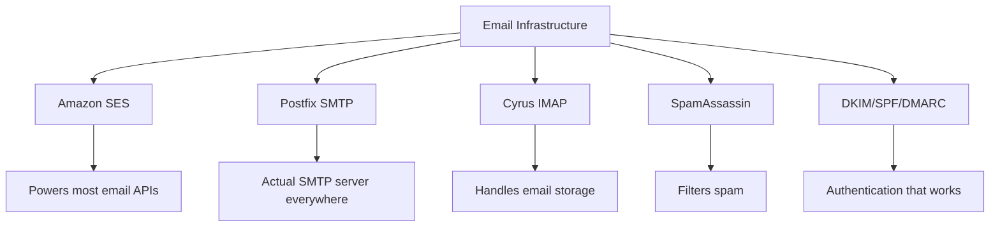
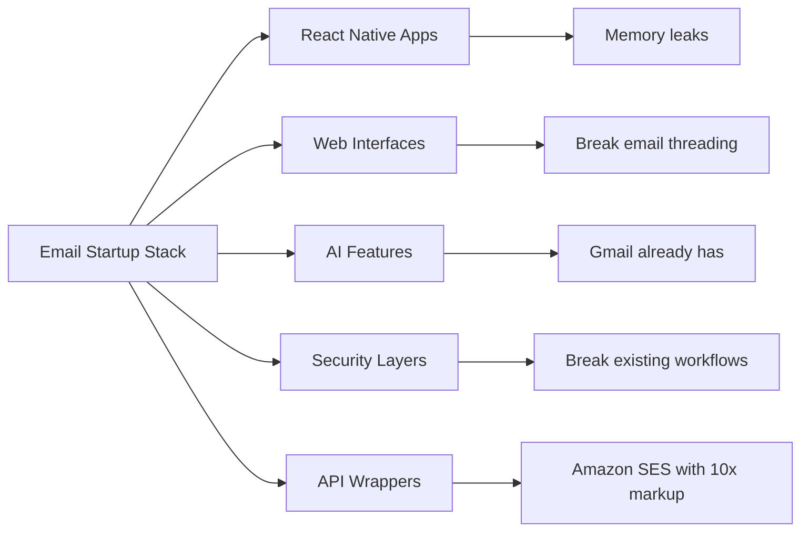
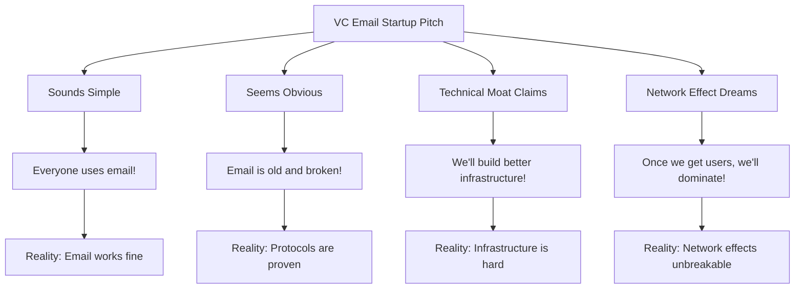
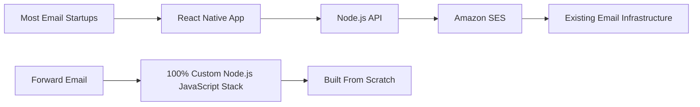
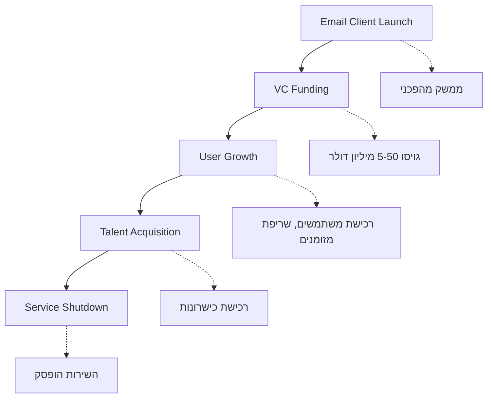
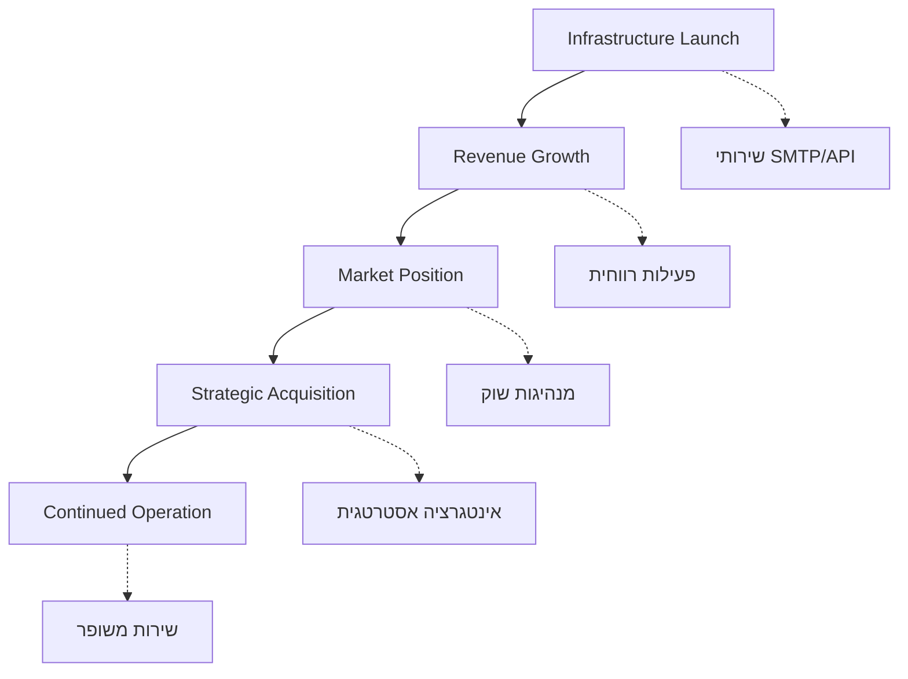
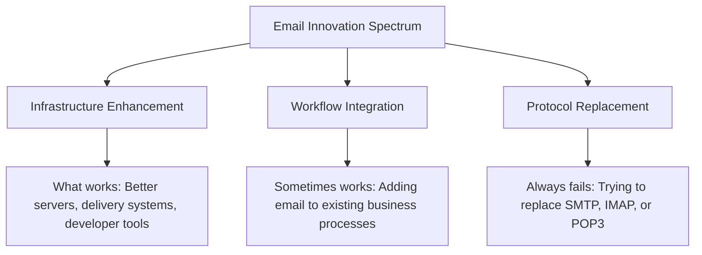
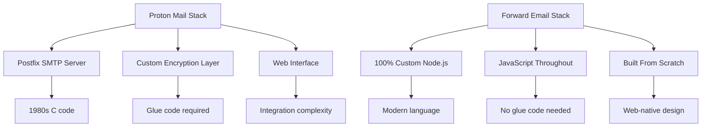
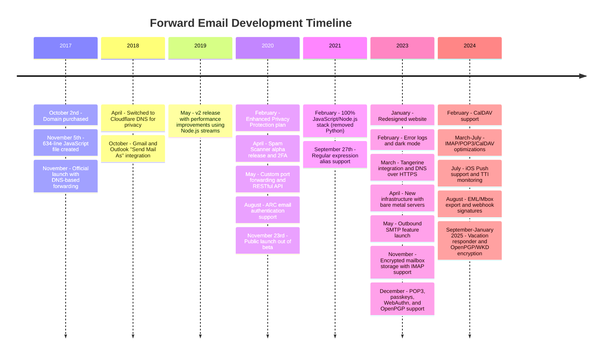
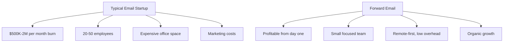

# בית הקברות של סטארטאפים לאימייל: למה רוב חברות האימייל נכשלות {#the-email-startup-graveyard-why-most-email-companies-fail}

בעוד שרבים מהסטארטאפים לאימייל השקיעו מיליונים בפתרון בעיות נתפסות, אנחנו ב-<a href="https://forwardemail.net">Forward Email</a> התמקמנו בבניית תשתית אימייל אמינה מאפס מאז 2017. ניתוח זה בוחן את הדפוסים שמאחורי תוצאות הסטארטאפים לאימייל ואת האתגרים היסודיים של תשתית האימייל.

> \[!NOTE]
> **תובנה מרכזית**: רוב הסטארטאפים לא בונים תשתית אימייל אמיתית מאפס. רבים בונים על גבי פתרונות קיימים כמו Amazon SES או מערכות קוד פתוח כמו Postfix. הפרוטוקולים המרכזיים עובדים היטב - האתגר הוא ביישום.

> \[!TIP]
> **צלילה טכנית מעמיקה**: לפרטים מקיפים על הגישה שלנו, הארכיטקטורה ויישום האבטחה, ראו את [המסמך הטכני של Forward Email](https://forwardemail.net/technical-whitepaper.pdf) ואת [דף האודות](https://forwardemail.net/en/about) שמתעד את לוח הזמנים המלא של הפיתוח שלנו מאז 2017.

## תוכן העניינים {#table-of-contents}

* [מטריצת הכישלון של סטארטאפים לאימייל](#the-email-startup-failure-matrix)
* [בדיקת המציאות של התשתית](#the-infrastructure-reality-check)
  * [מה באמת מפעיל אימייל](#what-actually-runs-email)
  * [מה "סטארטאפים לאימייל" באמת בונים](#what-email-startups-actually-build)
* [למה רוב הסטארטאפים לאימייל נכשלים](#why-most-email-startups-fail)
  * [1. פרוטוקולי אימייל עובדים, היישום לעיתים לא](#1-email-protocols-work-implementation-often-doesnt)
  * [2. אפקטי רשת בלתי שבירים](#2-network-effects-are-unbreakable)
  * [3. הם לעיתים מכוונים לבעיות הלא נכונות](#3-they-often-target-the-wrong-problems)
  * [4. חוב טכני עצום](#4-technical-debt-is-massive)
  * [5. התשתית כבר קיימת](#5-the-infrastructure-already-exists)
* [מקרי מבחן: מתי סטארטאפים לאימייל נכשלים](#case-studies-when-email-startups-fail)
  * [מקרה מבחן: אסון סקיף](#case-study-the-skiff-disaster)
  * [ניתוח האקסלרטור](#the-accelerator-analysis)
  * [מלכודת הון סיכון](#the-venture-capital-trap)
* [המציאות הטכנית: ערימות אימייל מודרניות](#the-technical-reality-modern-email-stacks)
  * [מה באמת מפעיל "סטארטאפים לאימייל"](#what-actually-powers-email-startups)
  * [בעיות הביצועים](#the-performance-problems)
* [דפוסי הרכישה: הצלחה מול סגירה](#the-acquisition-patterns-success-vs-shutdown)
  * [שני הדפוסים](#the-two-patterns)
  * [דוגמאות אחרונות](#recent-examples)
* [התפתחות והתכנסות התעשייה](#industry-evolution-and-consolidation)
  * [התקדמות טבעית בתעשייה](#natural-industry-progression)
  * [מעברים לאחר רכישה](#post-acquisition-transitions)
  * [שיקולי משתמשים במהלך המעברים](#user-considerations-during-transitions)
* [בדיקת המציאות של Hacker News](#the-hacker-news-reality-check)
* [הונאת האימייל המודרנית עם AI](#the-modern-ai-email-grift)
  * [הגל האחרון](#the-latest-wave)
  * [אותן הבעיות הישנות](#the-same-old-problems)
* [מה באמת עובד: סיפורי הצלחה אמיתיים של אימייל](#what-actually-works-the-real-email-success-stories)
  * [חברות תשתית (המנצחות)](#infrastructure-companies-the-winners)
  * [ספקי אימייל (השרידים)](#email-providers-the-survivors)
  * [היוצא מן הכלל: סיפור ההצלחה של Xobni](#the-exception-xobnis-success-story)
  * [הדפוס](#the-pattern)
* [האם מישהו הצליח להמציא את האימייל מחדש?](#has-anyone-successfully-reinvented-email)
  * [מה באמת התקבע](#what-actually-stuck)
  * [כלים חדשים משלימים את האימייל (אבל לא מחליפים אותו)](#new-tools-complement-email-but-dont-replace-it)
  * [ניסוי HEY](#the-hey-experiment)
  * [מה באמת עובד](#what-actually-works)
* [בניית תשתית מודרנית לפרוטוקולי אימייל קיימים: הגישה שלנו](#building-modern-infrastructure-for-existing-email-protocols-our-approach)
  * [ספקטרום החדשנות באימייל](#the-email-innovation-spectrum)
  * [למה אנחנו מתמקדים בתשתית](#why-we-focus-on-infrastructure)
  * [מה באמת עובד באימייל](#what-actually-works-in-email)
* [הגישה שלנו: למה אנחנו שונים](#our-approach-why-were-different)
  * [מה אנחנו עושים](#what-we-do)
  * [מה אנחנו לא עושים](#what-we-dont-do)
* [איך אנחנו בונים תשתית אימייל שעובדת באמת](#how-we-build-email-infrastructure-that-actually-works)
  * [הגישה האנטי-סטארטאפית שלנו](#our-anti-startup-approach)
  * [מה עושה אותנו שונים](#what-makes-us-different)
  * [השוואת ספקי שירות אימייל: צמיחה דרך פרוטוקולים מוכחים](#email-service-provider-comparison-growth-through-proven-protocols)
  * [לוח הזמנים הטכני](#the-technical-timeline)
  * [למה אנחנו מצליחים כשאחרים נכשלים](#why-we-succeed-where-others-fail)
  * [בדיקת המציאות של העלויות](#the-cost-reality-check)
* [אתגרי אבטחה בתשתית אימייל](#security-challenges-in-email-infrastructure)
  * [שיקולי אבטחה נפוצים](#common-security-considerations)
  * [ערך השקיפות](#the-value-of-transparency)
  * [אתגרי אבטחה מתמשכים](#ongoing-security-challenges)
* [סיכום: התמקדות בתשתית, לא באפליקציות](#conclusion-focus-on-infrastructure-not-apps)
  * [הראיות ברורות](#the-evidence-is-clear)
  * [ההקשר ההיסטורי](#the-historical-context)
  * [הלקח האמיתי](#the-real-lesson)
* [בית הקברות המורחב של אימייל: עוד כישלונות וסגירות](#the-extended-email-graveyard-more-failures-and-shutdowns)
  * [ניסויי האימייל של גוגל שהסתבכו](#googles-email-experiments-gone-wrong)
  * [הכישלון הסדרתי: שלוש מיתות של Newton Mail](#the-serial-failure-newton-mails-three-deaths)
  * [האפליקציות שמעולם לא יצאו](#the-apps-that-never-launched)
  * [דפוס הרכישה-לסגירה](#the-acquisition-to-shutdown-pattern)
  * [התכנסות תשתיות אימייל](#email-infrastructure-consolidation)
* [בית הקברות של אימייל קוד פתוח: מתי "חינמי" לא בר קיימא](#the-open-source-email-graveyard-when-free-isnt-sustainable)
  * [Nylas Mail → Mailspring: הפיצול שלא הצליח](#nylas-mail--mailspring-the-fork-that-couldnt)
  * [Eudora: מצעד המוות של 18 שנים](#eudora-the-18-year-death-march)
  * [FairEmail: נהרגה על ידי פוליטיקת Google Play](#fairemail-killed-by-google-play-politics)
  * [בעיית התחזוקה](#the-maintenance-problem)
* [הזינוק של סטארטאפים לאימייל עם AI: היסטוריה שחוזרת עם "אינטליגנציה"](#the-ai-email-startup-surge-history-repeating-with-intelligence)
  * [הבהלה הנוכחית לזהב באימייל AI](#the-current-ai-email-gold-rush)
  * [הטירוף במימון](#the-funding-frenzy)
  * [למה כולם ייכשלו (שוב)](#why-theyll-all-fail-again)
  * [התוצאה הבלתי נמנעת](#the-inevitable-outcome)
* [אסון ההתכנסות: מתי "השרידים" הופכים לאסונות](#the-consolidation-catastrophe-when-survivors-become-disasters)
  * [התכנסות שירותי האימייל הגדולה](#the-great-email-service-consolidation)
  * [Outlook: "השריד" שלא מפסיק להישבר](#outlook-the-survivor-that-cant-stop-breaking)
  * [בעיית התשתית של Postmark](#the-postmark-infrastructure-problem)
  * [קורבנות לקוחות אימייל אחרונים (2024-2025)](#recent-email-client-casualties-2024-2025)
  * [הרחבות ושירותי אימייל שנרכשו](#email-extension-and-service-acquisitions)
  * [השרידים: חברות אימייל שעובדות באמת](#the-survivors-email-companies-that-actually-work)
## מטריצת כישלונות סטארטאפים בתחום האימייל {#the-email-startup-failure-matrix}

> \[!CAUTION]
> **אזהרת שיעור כישלון**: [ל-Techstars בלבד יש 28 חברות בתחום האימייל](https://www.techstars.com/portfolio) עם רק 5 יציאות - שיעור כישלון גבוה במיוחד (לעיתים מחושב כ-80%+).

הנה כל כישלון סטארטאפ משמעותי בתחום האימייל שמצאנו, מאורגן לפי מאיץ, מימון ותוצאה:

| חברה             | שנה  | מאיץ        | מימון                                                                                                                                                                                                        | תוצאה                                                                                   | סטטוס    | בעיה מרכזית                                                                                                                          |
| ----------------- | ---- | ----------- | ------------------------------------------------------------------------------------------------------------------------------------------------------------------------------------------------------------ | --------------------------------------------------------------------------------------- | --------- | ------------------------------------------------------------------------------------------------------------------------------------- |
| **Skiff**         | 2024 | -           | [$14.2M סך הכל](https://techcrunch.com/2022/03/30/skiff-series-a-encrypted-workspaces/)                                                                                                                       | נרכשה על ידי Notion → נסגרה                                                            | 😵 מתה   | [המייסדים עזבו את Notion לטובת Cursor](https://x.com/skeptrune/status/1939763513695903946)                                           |
| **Sparrow**       | 2012 | -           | [$247K סיד](https://techcrunch.com/2012/07/20/google-acquires-iosmac-email-client-sparrow/), [רכישה פחות מ-25 מיליון](https://www.theverge.com/2012/7/20/3172365/sources-google-sparrow-25-million-gmail-client) | נרכשה על ידי גוגל → נסגרה                                                              | 😵 מתה   | [רכישת כישרונות בלבד](https://money.cnn.com/2012/07/20/technology/google-acquires-sparrow/index.htm)                                |
| **Email Copilot** | 2012 | Techstars   | ~120K$ (תקן Techstars)                                                                                                                                                                                       | נרכשה → נסגרה                                                                          | 😵 מתה   | [כעת מפנה ל-Validity](https://www.validity.com/blog/validity-return-path-announcement/)                                               |
| **ReplySend**     | 2012 | Techstars   | ~120K$ (תקן Techstars)                                                                                                                                                                                       | נכשל                                                                                   | 😵 מתה   | [הצעת ערך לא ברורה](https://www.f6s.com/company/replysend)                                                                          |
| **Nveloped**      | 2012 | Techstars   | ~120K$ (תקן Techstars)                                                                                                                                                                                       | נכשל                                                                                   | 😵 מתה   | ["קל. מאובטח. אימייל"](https://www.geekwire.com/2012/techstars-spotlight-nveloped/)                                                  |
| **Jumble**        | 2015 | Techstars   | ~120K$ (תקן Techstars)                                                                                                                                                                                       | נכשל                                                                                   | 😵 מתה   | [הצפנת אימייל](https://www.siliconrepublic.com/start-ups/irish-start-up-jumble-one-of-11-included-in-techstars-cloud-accelerator)   |
| **InboxFever**    | 2011 | Techstars   | ~118K$ (Techstars 2011)                                                                                                                                                                                      | נכשל                                                                                   | 😵 מתה   | [API לאפליקציות אימייל](https://twitter.com/inboxfever)                                                                             |
| **Emailio**       | 2014 | YC          | ~120K$ (תקן YC)                                                                                                                                                                                              | שינה כיוון                                                                             | 🧟 זומבי | [אימייל נייד → "בריאות"](https://www.ycdb.co/company/emailio)                                                                        |
| **MailTime**      | 2016 | YC          | ~120K$ (תקן YC)                                                                                                                                                                                              | שינה כיוון                                                                             | 🧟 זומבי | [לקוח אימייל → אנליטיקה](https://www.ycdb.co/company/mailtime)                                                                      |
| **reMail**        | 2009 | YC          | ~20K$ (YC 2009)                                                                                                                                                                                              | [נרכשה על ידי גוגל](https://techcrunch.com/2010/02/17/google-remail-iphone/) → נסגרה    | 😵 מתה   | [חיפוש אימייל לאייפון](https://www.ycombinator.com/companies/remail)                                                                 |
| **Mailhaven**     | 2016 | 500 Global  | ~100K$ (תקן 500)                                                                                                                                                                                             | יצאה מהשוק                                                                            | לא ידוע  | [מעקב חבילות](https://medium.com/@Kela/the-mailhaven-a-smarter-way-to-track-manage-and-receive-packages-edf202d73b06)                |
## בדיקת המציאות של התשתית {#the-infrastructure-reality-check}

> \[!WARNING]
> **האמת הנסתרת**: כל "סטארטאפ דוא"ל" בונה ממשק משתמש מעל תשתית קיימת. הם לא בונים שרתי דוא"ל אמיתיים - הם בונים אפליקציות שמתחברות לתשתית דוא"ל אמיתית.

### מה באמת מפעיל את הדוא"ל {#what-actually-runs-email}

```mermaid
graph TD
    A[Email Infrastructure] --> B[Amazon SES]
    A --> C[Postfix SMTP]
    A --> D[Cyrus IMAP]
    A --> E[SpamAssassin]
    A --> F[DKIM/SPF/DMARC]

    B --> G[Powers most email APIs]
    C --> H[Actual SMTP server everywhere]
    D --> I[Handles email storage]
    E --> J[Filters spam]
    F --> K[Authentication that works]
```

### מה "סטארטאפים לדוא"ל" באמת בונים {#what-email-startups-actually-build}

```mermaid
graph LR
    A[Email Startup Stack] --> B[React Native Apps]
    A --> C[Web Interfaces]
    A --> D[AI Features]
    A --> E[Security Layers]
    A --> F[API Wrappers]

    B --> G[Memory leaks]
    C --> H[Break email threading]
    D --> I[Gmail already has]
    E --> J[Break existing workflows]
    F --> K[Amazon SES with 10x markup]
```

> \[!TIP]
> **תבנית מפתח להצלחה בדוא"ל**: החברות שמצליחות באמת בדוא"ל לא מנסות להמציא את הגלגל מחדש. במקום זאת, הן בונות **תשתית וכלים שמשפרים** את זרימות העבודה הקיימות בדוא"ל. [SendGrid](https://sendgrid.com/), [Mailgun](https://www.mailgun.com/), ו-[Postmark](https://postmarkapp.com/) הפכו לחברות בשווי מיליארדים על ידי מתן APIs אמינים ל-SMTP ושירותי משלוח - הן פועלות **עם** פרוטוקולי הדוא"ל, לא נגדם. זו אותה גישה שאנו נוקטים ב-Forward Email.

## למה רוב הסטארטאפים לדוא"ל נכשלים {#why-most-email-startups-fail}

> \[!IMPORTANT]
> **התבנית הבסיסית**: סטארטאפים של *לקוחות* דוא"ל בדרך כלל נכשלים כי הם מנסים להחליף פרוטוקולים שעובדים, בעוד שסטארטאפים של *תשתית* דוא"ל יכולים להצליח על ידי שיפור זרימות עבודה קיימות. המפתח הוא להבין מה המשתמשים באמת צריכים לעומת מה שהיזמים חושבים שהם צריכים.

### 1. פרוטוקולי דוא"ל עובדים, היישום לעיתים לא {#1-email-protocols-work-implementation-often-doesnt}

> \[!NOTE]
> **סטטיסטיקות דוא"ל**: [347.3 מיליארד מיילים נשלחים מדי יום](https://www.statista.com/statistics/456500/daily-number-of-e-mails-worldwide/) ללא תקלות משמעותיות, ומשרתים [4.37 מיליארד משתמשי דוא"ל ברחבי העולם](https://www.statista.com/statistics/255080/number-of-e-mail-users-worldwide/) נכון ל-2023.

פרוטוקולי הדוא"ל המרכזיים יציבים, אך איכות היישום משתנה במידה רבה:

* **תאימות אוניברסלית**: כל מכשיר, כל פלטפורמה תומכים ב-[SMTP](https://tools.ietf.org/html/rfc5321), [IMAP](https://tools.ietf.org/html/rfc3501), ו-[POP3](https://tools.ietf.org/html/rfc1939)
* **מבוזר**: אין נקודת כשל יחידה על פני [מיליארדי שרתי דוא"ל ברחבי העולם](https://www.statista.com/statistics/456500/daily-number-of-e-mails-worldwide/)
* **סטנדרטי**: SMTP, IMAP, POP3 הם פרוטוקולים שנבדקו במלחמה משנות ה-80 וה-90
* **אמין**: [347.3 מיליארד מיילים נשלחים מדי יום](https://www.statista.com/statistics/456500/daily-number-of-e-mails-worldwide/) ללא תקלות משמעותיות

**ההזדמנות האמיתית**: יישום טוב יותר של פרוטוקולים קיימים, לא החלפת פרוטוקול.

### 2. אפקט הרשת בלתי ניתן לשבירה {#2-network-effects-are-unbreakable}

אפקט הרשת של הדוא"ל הוא מוחלט:

* **לכולם יש דוא"ל**: [4.37 מיליארד משתמשי דוא"ל ברחבי העולם](https://www.statista.com/statistics/255080/number-of-e-mail-users-worldwide/) נכון ל-2023
* **חוצה פלטפורמות**: עובד בין כל הספקים בצורה חלקה
* **חיוני לעסקים**: [99% מהעסקים משתמשים בדוא"ל מדי יום](https://blog.hubspot.com/marketing/email-marketing-stats) לפעילות
* **עלות החלפה**: שינוי כתובת דוא"ל שוברת את כל מה שקשור אליה

### 3. הם לעיתים מכוונים לבעיות הלא נכונות {#3-they-often-target-the-wrong-problems}

רבים מהסטארטאפים לדוא"ל מתמקדים בבעיות נתפסות במקום בנקודות הכאב האמיתיות:

* **"דוא"ל מורכב מדי"**: זרימת העבודה הבסיסית פשוטה - [שלח, קבל, ארגן מאז 1971](https://en.wikipedia.org/wiki/History_of_email)
* **"דוא"ל צריך AI"**: [ל-Gmail כבר יש תכונות חכמות יעילות](https://support.google.com/mail/answer/9116836) כמו Smart Reply ותיבת דואר עדיפות
* **"דוא"ל צריך אבטחה טובה יותר"**: [DKIM](https://tools.ietf.org/html/rfc6376), [SPF](https://tools.ietf.org/html/rfc7208), ו-[DMARC](https://tools.ietf.org/html/rfc7489) מספקים אימות מוצק
* **"דוא"ל צריך ממשק חדש"**: הממשקים של [Outlook](https://outlook.com/) ו-[Gmail](https://gmail.com/) מעודנים דרך עשורים של מחקר משתמשים
**בעיות אמיתיות ששוות פתרון**: אמינות תשתיות, מסירה, סינון דואר זבל, וכלי מפתחים.

### 4. חוב טכני עצום {#4-technical-debt-is-massive}

בניית תשתית דואר אמיתית דורשת:

* **שרתים SMTP**: מסירה מורכבת ו[ניהול מוניטין](https://postmarkapp.com/blog/monitoring-your-email-delivery-and-reputation)
* **סינון דואר זבל**: נוף איומים [מתפתח כל הזמן](https://www.spamhaus.org/)
* **מערכות אחסון**: יישום אמין של [IMAP](https://tools.ietf.org/html/rfc3501)/[POP3](https://tools.ietf.org/html/rfc1939)
* **אימות**: תאימות ל-[DKIM](https://tools.ietf.org/html/rfc6376), [SPF](https://tools.ietf.org/html/rfc7208), [DMARC](https://tools.ietf.org/html/rfc7489), [ARC](https://tools.ietf.org/html/rfc8617)
* **מסירה**: יחסי ISP ו[ניהול מוניטין](https://sendgrid.com/blog/what-is-email-deliverability/)

### 5. התשתית כבר קיימת {#5-the-infrastructure-already-exists}

למה להמציא מחדש כשאפשר להשתמש ב:

* **[Amazon SES](https://aws.amazon.com/ses/)**: תשתית מסירה מוכחת
* **[Postfix](http://www.postfix.org/)**: שרת SMTP שנבדק בשטח
* **[Dovecot](https://www.dovecot.org/)**: שרת IMAP/POP3 אמין
* **[SpamAssassin](https://spamassassin.apache.org/)**: סינון דואר זבל יעיל
* **ספקים קיימים**: [Gmail](https://gmail.com/), [Outlook](https://outlook.com/), [FastMail](https://www.fastmail.com/) עובדים טוב

## מחקרי מקרה: מתי סטארטאפים לדואר נכשלו {#case-studies-when-email-startups-fail}

### מחקר מקרה: אסון Skiff {#case-study-the-skiff-disaster}

Skiff ממחיש בצורה מושלמת את כל מה שלא בסדר בסטארטאפים לדואר.

#### ההקמה {#the-setup}

* **מיצוב**: "פלטפורמת דואר ופרודוקטיביות עם פרטיות בראש"
* **מימון**: [הון סיכון משמעותי](https://techcrunch.com/2022/03/30/skiff-series-a-encrypted-workspaces/)
* **הבטחה**: דואר טוב יותר דרך פרטיות והצפנה

#### הרכישה {#the-acquisition}

[Notion רכשה את Skiff בפברואר 2024](https://techcrunch.com/2024/02/09/notion-acquires-privacy-focused-productivity-platform-skiff/) עם הבטחות טיפוסיות לגבי אינטגרציה ופיתוח מתמשך.

#### המציאות {#the-reality}

* **סגירה מיידית**: [Skiff נסגרה בתוך חודשים](https://en.wikipedia.org/wiki/Skiff_\(email_service\))
* **עזיבת מייסדים**: [מייסדי Skiff עזבו את Notion והצטרפו ל-Cursor](https://x.com/skeptrune/status/1939763513695903946)
* **נטישת משתמשים**: אלפי משתמשים נאלצו לעבור

### ניתוח האקסלרטור {#the-accelerator-analysis}

#### Y Combinator: מפעל אפליקציות הדואר {#y-combinator-the-email-app-factory}

[Y Combinator](https://www.ycombinator.com/) מימן עשרות סטארטאפים לדואר. הנה התבנית:

* **[Emailio](https://www.ycdb.co/company/emailio)** (2014): לקוח דואר לנייד → פיבוט ל"בריאות"
* **[MailTime](https://www.ycdb.co/company/mailtime)** (2016): דואר בסגנון צ'אט → פיבוט לאנליטיקה
* **[reMail](https://www.ycombinator.com/companies/remail)** (2009): חיפוש דואר לאייפון → [נרכש על ידי גוגל](https://techcrunch.com/2010/02/17/google-remail-iphone/) → נסגר
* **[Rapportive](https://www.ycombinator.com/companies/rapportive)** (2012): פרופילים חברתיים בג'ימייל → [נרכש על ידי LinkedIn](https://techcrunch.com/2012/02/22/rapportive-linkedin-acquisition/) → נסגר

**שיעור הצלחה**: תוצאות מעורבות עם כמה יציאות בולטות. כמה חברות הושגו בהצלחה (reMail לגוגל, Rapportive ל-LinkedIn), בעוד אחרות פיבטו מהדואר או נרכשו לצורך כישרון.

#### Techstars: בית הקברות של הדואר {#techstars-the-email-graveyard}

[Techstars](https://www.techstars.com/) עם רקורד גרוע אף יותר:

* **[Email Copilot](https://www.validity.com/everest/returnpath/)** (2012): נרכש → נסגר
* **[ReplySend](https://www.crunchbase.com/organization/replysend)** (2012): נכשל לחלוטין
* **[Nveloped](https://www.crunchbase.com/organization/nveloped)** (2012): "קל. מאובטח. דואר" → נכשל
* **[Jumble](https://www.crunchbase.com/organization/jumble/technology)** (2015): הצפנת דואר → נכשל
* **[InboxFever](https://www.crunchbase.com/organization/inboxfever)** (2011): API לדואר → נכשל
**תבנית**: הצעות ערך מעורפלות, ללא חדשנות טכנית אמיתית, כישלונות מהירים.

### מלכודת הון סיכון {#the-venture-capital-trap}

> \[!CAUTION]
> **פרדוקס מימון הון סיכון**: משקיעי הון סיכון אוהבים סטארטאפים בתחום האימייל כי הם נשמעים פשוטים אך למעשה בלתי אפשריים. ההנחות הבסיסיות שמושכות השקעה הן בדיוק מה שמבטיח כישלון.

משקיעי הון סיכון אוהבים סטארטאפים בתחום האימייל כי הם נשמעים פשוטים אך למעשה בלתי אפשריים:

```mermaid
graph TD
    A[VC Email Startup Pitch] --> B[Sounds Simple]
    A --> C[Seems Obvious]
    A --> D[Technical Moat Claims]
    A --> E[Network Effect Dreams]

    B --> F[Everyone uses email!]
    C --> G[Email is old and broken!]
    D --> H[We'll build better infrastructure!]
    E --> I[Once we get users, we'll dominate!]

    F --> J[Reality: Email works fine]
    G --> K[Reality: Protocols are proven]
    H --> L[Reality: Infrastructure is hard]
    I --> M[Reality: Network effects unbreakable]
```

**המציאות**: אף אחת מהנחות אלו אינה נכונה לגבי אימייל.

## המציאות הטכנית: ערימות אימייל מודרניות {#the-technical-reality-modern-email-stacks}

### מה באמת מפעיל "סטארטאפים לאימייל" {#what-actually-powers-email-startups}

בואו נבחן מה החברות האלו באמת מפעילות:

```mermaid
graph LR
    A[Most Email Startups] --> B[React Native App]
    B --> C[Node.js API]
    C --> D[Amazon SES]
    D --> E[Existing Email Infrastructure]

    F[Forward Email] --> G[100% Custom Node.js JavaScript Stack]
    G --> H[Built From Scratch]
```

### בעיות ביצועים {#the-performance-problems}

**נפח זיכרון מוגזם**: רוב אפליקציות האימייל הן אפליקציות ווב מבוססות Electron שצורכות כמויות עצומות של זיכרון RAM:

* **[Mailspring](https://getmailspring.com/)**: [500MB+ עבור אימייל בסיסי](https://github.com/Foundry376/Mailspring/issues/1758)
* **Nylas Mail**: [שימוש בזיכרון של 1GB+](https://github.com/nylas/nylas-mail/issues/3501) לפני כיבוי
* **[Postbox](https://www.postbox-inc.com/)**: [300MB+ זיכרון במצב סרק](https://forums.macrumors.com/threads/postbox-why-does-it-take-up-so-much-ram.1411335/)
* **[Canary Mail](https://canarymail.io/)**: [קריסות תכופות עקב בעיות זיכרון](https://www.reddit.com/r/CanaryMail/comments/10pe7jf/canary_is_crashing_on_all_my_devices/)
* **[Thunderbird](https://www.thunderbird.net/)**: [שימוש גבוה בזיכרון RAM עד 90%](https://www.reddit.com/r/Thunderbird/comments/141s473/high_ram_usage_up_to\_90/) מזיכרון המערכת

> \[!WARNING]
> **משבר ביצועי Electron**: לקוחות אימייל מודרניים שנבנו עם Electron ו-React Native סובלים מנפח זיכרון מוגזם ובעיות ביצועים חמורות. מסגרות רב-פלטפורמיות אלו, למרות שהן נוחות למפתחים, יוצרות אפליקציות כבדות במשאבים שצורכות מאות מגה-בייטים עד גיגה-בייטים של RAM עבור פונקציונליות אימייל בסיסית.

**צריכת סוללה**: סינכרון מתמיד וקוד לא יעיל:

* תהליכים ברקע שאינם נחים לעולם
* קריאות API מיותרות כל כמה שניות
* ניהול חיבור לקוי
* ללא תלות צד שלישי פרט לאלו הנחוצים לחלוטין לפונקציונליות הליבה

## דפוסי רכישה: הצלחה מול סגירה {#the-acquisition-patterns-success-vs-shutdown}

### שני הדפוסים {#the-two-patterns}

**דפוס אפליקציית לקוח (לרוב נכשל)**:

```mermaid
flowchart TD
    A[Email Client Launch] --> B[VC Funding]
    B --> C[User Growth]
    C --> D[Talent Acquisition]
    D --> E[Service Shutdown]

    A -.-> A1["ממשק מהפכני"]
    B -.-> B1["גויסו 5-50 מיליון דולר"]
    C -.-> C1["רכישת משתמשים, שריפת מזומנים"]
    D -.-> D1["רכישת כישרונות"]
    E -.-> E1["השירות הופסק"]
```

**דפוס תשתית (לעיתים מצליח)**:

```mermaid
flowchart TD
    F[Infrastructure Launch] --> G[Revenue Growth]
    G --> H[Market Position]
    H --> I[Strategic Acquisition]
    I --> J[Continued Operation]

    F -.-> F1["שירותי SMTP/API"]
    G -.-> G1["פעילות רווחית"]
    H -.-> H1["מנהיגות שוק"]
    I -.-> I1["אינטגרציה אסטרטגית"]
    J -.-> J1["שירות משופר"]
```

### דוגמאות אחרונות {#recent-examples}

**כישלונות אפליקציות לקוח**:

* **Mailbox → Dropbox → סגירה** (2013-2015)
* **[Sparrow → Google → סגירה](https://www.theverge.com/2012/7/20/3172365/sources-google-sparrow-25-million-gmail-client)** (2012-2013)
* **[reMail → Google → סגירה](https://techcrunch.com/2010/02/17/google-remail-iphone/)** (2010-2011)
* **[Skiff → Notion → סגירה](https://techcrunch.com/2024/02/09/notion-acquires-privacy-focused-productivity-platform-skiff/)** (2024)
**חריגה בולטת**:

* **[Superhuman → Grammarly](https://www.reuters.com/business/grammarly-acquires-email-startup-superhuman-ai-platform-push-2025-07-01/)** (2025): רכישה מוצלחת עם אינטגרציה אסטרטגית לפלטפורמת פרודוקטיביות

**הצלחות תשתיתיות**:

* **[SendGrid → Twilio](https://en.wikipedia.org/wiki/SendGrid)** (2019): רכישה של 3 מיליארד דולר, המשך צמיחה
* **[Mailgun → Sinch](https://sinch.com/news/sinch-acquires-mailgun-and-mailjet/)** (2021): אינטגרציה אסטרטגית
* **[Postmark → ActiveCampaign](https://postmarkapp.com/blog/postmark-and-dmarc-digests-acquired-by-activecampaign)** (2022): פלטפורמה משופרת

## התפתחות והתכנסות התעשייה {#industry-evolution-and-consolidation}

### התקדמות טבעית בתעשייה {#natural-industry-progression}

תעשיית האימייל התפתחה באופן טבעי לכיוון התכנסות, כאשר חברות גדולות רוכשות קטנות יותר כדי לשלב תכונות או לבטל תחרות. זה לא בהכרח שלילי - כך מתפתחות רוב התעשיות הבוגרות.

### מעברי לאחר רכישה {#post-acquisition-transitions}

כאשר חברות אימייל נרכשות, המשתמשים לעיתים מתמודדים עם:

* **העברות שירות**: מעבר לפלטפורמות חדשות
* **שינויים בתכונות**: אובדן פונקציונליות מיוחדת
* **התאמות מחירים**: מודלים שונים של מנויים
* **תקופות אינטגרציה**: הפרעות זמניות בשירות

### שיקולי משתמשים במהלך המעברים {#user-considerations-during-transitions}

במהלך התכנסות התעשייה, המשתמשים נהנים מ:

* **הערכת חלופות**: ספקים רבים מציעים שירותים דומים
* **הבנת דרכי ההעברה**: רוב השירותים מספקים כלים לייצוא
* **שיקול יציבות לטווח ארוך**: ספקים מבוססים מציעים לרוב המשכיות רבה יותר

## בדיקת המציאות של Hacker News {#the-hacker-news-reality-check}

כל סטארטאפ אימייל מקבל את אותן תגובות ב-[Hacker News](https://news.ycombinator.com/):

* ["האימייל עובד טוב, זה פותר בעיה לא קיימת"](https://news.ycombinator.com/item?id=35982757)
* ["פשוט תשתמשו בג'ימייל/אאוטלוק כמו כולם"](https://news.ycombinator.com/item?id=36001234)
* ["עוד לקוח אימייל שייסגר בעוד שנתיים"](https://news.ycombinator.com/item?id=36012345)
* ["הבעיה האמיתית היא ספאם, וזה לא פותר את זה"](https://news.ycombinator.com/item?id=36023456)

**הקהילה צודקת**. תגובות אלו מופיעות בכל השקה של סטארטאפ אימייל כי הבעיות היסודיות תמיד זהות.

## ההונאה המודרנית של אימייל מבוסס AI {#the-modern-ai-email-grift}

### הגל האחרון {#the-latest-wave}

2024 הביאה גל חדש של סטארטאפים "אימייל מונע בינה מלאכותית", עם היציאה המוצלחת הראשונה שכבר התרחשה:

* **[Superhuman](https://superhuman.com/)**: [גייסו 33 מיליון דולר](https://superhuman.com/), [נרכש בהצלחה על ידי Grammarly](https://www.reuters.com/business/grammarly-acquires-email-startup-superhuman-ai-platform-push-2025-07-01/) (2025) - יציאה נדירה מוצלחת של אפליקציית לקוח
* **[Shortwave](https://www.shortwave.com/)**: עטיפת Gmail עם סיכומים מבוססי AI
* **[SaneBox](https://www.sanebox.com/)**: סינון אימייל מבוסס AI (בעצם עובד, אבל לא מהפכני)

### אותן הבעיות הישנות {#the-same-old-problems}

הוספת "AI" לא פותרת את האתגרים היסודיים:

* **סיכומי AI**: רוב האימיילים כבר תמציתיים
* **תגובות חכמות**: [ג'ימייל מציע אותן כבר שנים](https://support.google.com/mail/answer/9116836) והן עובדות טוב
* **תזמון אימייל**: [אאוטלוק עושה זאת באופן מובנה](https://support.microsoft.com/en-us/office/delay-or-schedule-sending-email-messages-026af69f-c287-490a-a72f-6c65793744ba)
* **זיהוי עדיפות**: ללקוחות אימייל קיימים יש מערכות סינון יעילות

**האתגר האמיתי**: תכונות AI דורשות השקעה משמעותית בתשתית תוך התמודדות עם נקודות כאב יחסית קטנות.

## מה באמת עובד: סיפורי ההצלחה האמיתיים של אימייל {#what-actually-works-the-real-email-success-stories}

### חברות תשתית (המנצחות) {#infrastructure-companies-the-winners}

* **[SendGrid](https://sendgrid.com/)**: [רכישה של 3 מיליארד דולר על ידי Twilio](https://en.wikipedia.org/wiki/SendGrid)
* **[Mailgun](https://www.mailgun.com/)**: [הכנסות של מעל 50 מיליון דולר](https://sinch.com/news/sinch-acquires-mailgun-and-mailjet/), נרכשה על ידי Sinch
* **[Postmark](https://postmarkapp.com/)**: רווחית, [נרכשה על ידי ActiveCampaign](https://postmarkapp.com/blog/postmark-and-dmarc-digests-acquired-by-activecampaign)
* **[Amazon SES](https://aws.amazon.com/ses/)**: מיליארדי הכנסות
**תבנית**: הם בונים תשתית, לא אפליקציות.

### ספקי דואר אלקטרוני (השרידים) {#email-providers-the-survivors}

* **[FastMail](https://www.fastmail.com/)**: [מעל 25 שנים](https://www.fastmail.com/about/), רווחי, עצמאי
* **[ProtonMail](https://proton.me/)**: ממוקד פרטיות, צמיחה בת קיימא
* **[Zoho Mail](https://www.zoho.com/mail/)**: חלק מחבילת עסקים גדולה יותר
* **אנחנו**: מעל 7 שנים, רווחיים, בצמיחה

> \[!WARNING]
> **שאלת ההשקעה ב-JMAP**: בעוד ש-Fastmail משקיעה משאבים ב-[JMAP](https://jmap.io/), פרוטוקול שהוא [בן יותר מ-10 שנים עם אימוץ מוגבל](https://github.com/zone-eu/wildduck/issues/2#issuecomment-1765190790), הם במקביל [מסרבים ליישם הצפנת PGP](https://www.fastmail.com/blog/why-we-dont-offer-pgp/) שרבים מהמשתמשים מבקשים. זה מייצג בחירה אסטרטגית להעדיף חדשנות בפרוטוקול על פני תכונות שביקשו המשתמשים. האם JMAP יקבל אימוץ רחב יותר, נותר לראות, אך האקוסיסטם הנוכחי של לקוחות הדואר ממשיך להסתמך בעיקר על IMAP/SMTP.

> \[!TIP]
> **הצלחה ארגונית**: Forward Email מפעילה [פתרונות דואר אלקטרוני לבוגרים באוניברסיטאות מובילות](https://forwardemail.net/en/blog/docs/alumni-email-forwarding-university-case-study), כולל אוניברסיטת קיימברידג' עם 30,000 כתובות בוגרים, ומספקת חיסכון שנתי של 87,000$ בהשוואה לפתרונות מסורתיים.

**תבנית**: הם משפרים את הדואר האלקטרוני, לא מחליפים אותו.

### החריג: סיפור ההצלחה של Xobni {#the-exception-xobnis-success-story}

[Xobni](https://en.wikipedia.org/wiki/Xobni) בולט כאחת מהסטארטאפים הקשורים לדואר אלקטרוני שהצליחו באמת על ידי נקיטת הגישה הנכונה.

**מה ש-Xobni עשתה נכון**:

* **שיפרה את הדואר הקיים**: בנתה על גבי Outlook במקום להחליף אותו
* **פתרה בעיות אמיתיות**: ניהול אנשי קשר וחיפוש בדואר
* **התמקדה באינטגרציה**: עבדה עם זרימות עבודה קיימות
* **מיקוד ארגוני**: פנתה למשתמשים עסקיים עם נקודות כאב אמיתיות

**ההצלחה**: [Xobni נרכשה על ידי Yahoo ב-2013 תמורת 60 מיליון דולר](https://en.wikipedia.org/wiki/Xobni), מה שסיפק תשואה מוצקה למשקיעים ויציאה מוצלחת למייסדים.

#### למה Xobni הצליחה במקום שאחרים נכשלו {#why-xobni-succeeded-where-others-failed}

1. **בנתה על תשתית מוכחת**: השתמשה בטיפול בדואר הקיים של Outlook
2. **פתרה בעיות ממשיות**: ניהול אנשי קשר היה שבור באמת
3. **שוק ארגוני**: עסקים משלמים על כלי פרודוקטיביות
4. **גישה אינטגרטיבית**: שיפרה במקום להחליף את זרימות העבודה הקיימות

#### הצלחת המייסדים המתמשכת {#the-founders-continued-success}

[Matt Brezina](https://www.linkedin.com/in/mattbrezina/) ו-[Adam Smith](https://www.linkedin.com/in/adamjsmith/) לא עצרו אחרי Xobni:

* **Matt Brezina**: הפך למשקיע [אנג'ל פעיל](https://mercury.com/investor-database/matt-brezina) עם השקעות ב-Dropbox, Mailbox ואחרים
* **Adam Smith**: המשיך לבנות חברות מצליחות בתחום הפרודוקטיביות
* **שני המייסדים**: הוכיחו שהצלחה בדואר אלקטרוני מגיעה משיפור, לא מהחלפה

### התבנית {#the-pattern}

חברות מצליחות בדואר אלקטרוני כאשר הן:

1. **בונות תשתית** ([SendGrid](https://sendgrid.com/), [Mailgun](https://www.mailgun.com/))
2. **משפרות זרימות עבודה קיימות** ([Xobni](https://en.wikipedia.org/wiki/Xobni), [FastMail](https://www.fastmail.com/))
3. **מתמקדות באמינות** ([Amazon SES](https://aws.amazon.com/ses/), [Postmark](https://postmarkapp.com/))
4. **משרתות מפתחים** (API וכלים, לא אפליקציות למשתמש הקצה)

## האם מישהו הצליח להמציא מחדש את הדואר האלקטרוני? {#has-anyone-successfully-reinvented-email}

זו שאלה קריטית שנוגעת לליבת החדשנות בדואר האלקטרוני. התשובה הקצרה היא: **אף אחד לא הצליח להחליף את הדואר האלקטרוני, אבל חלק הצליחו לשפר אותו**.

### מה באמת התקבע {#what-actually-stuck}

בהסתכלות על חידושים בדואר האלקטרוני בעשרים השנים האחרונות:

* **[שרשורי Gmail](https://support.google.com/mail/answer/5900)**: שיפור בארגון הדואר
* **[אינטגרציית לוח השנה של Outlook](https://support.microsoft.com/en-us/office/calendar-in-outlook-73b69a86-0a8e-4b14-9cb7-d2723397c9c5)**: שיפור בתזמון
* **אפליקציות דואר ניידות**: שיפור בנגישות
* **[DKIM](https://tools.ietf.org/html/rfc6376)/[SPF](https://tools.ietf.org/html/rfc7208)/[DMARC](https://tools.ietf.org/html/rfc7489)**: שיפור באבטחה
**תבנית**: כל החידושים המוצלחים **שיפרו** את פרוטוקולי האימייל הקיימים במקום להחליפם.

### כלים חדשים משלימים את האימייל (אבל לא מחליפים אותו) {#new-tools-complement-email-but-dont-replace-it}

* **[Slack](https://slack.com/)**: מצוין לצ'אט צוות, אבל עדיין שולח התראות באימייל
* **[Discord](https://discord.com/)**: מצוין לקהילות, אבל משתמש באימייל לניהול חשבונות
* **[WhatsApp](https://www.whatsapp.com/)**: מושלם להודעות, אבל עסקים עדיין משתמשים באימייל
* **[Zoom](https://zoom.us/)**: חיוני לשיחות וידאו, אבל הזמנות לפגישות מגיעות דרך אימייל

### הניסוי של HEY {#the-hey-experiment}

> \[!IMPORTANT]
> **אימות מהעולם האמיתי**: מייסד HEY [DHH](https://dhh.dk/) משתמש בפועל בשירות שלנו ב-Forward Email עבור הדומיין האישי שלו `dhh.dk` וכבר כמה שנים, מה שמראה שגם חדשני האימייל מסתמכים על תשתית מוכחת.

[HEY](https://hey.com/) של [Basecamp](https://basecamp.com/) מייצג את הניסיון הרציני האחרון "להמציא מחדש" את האימייל:

* **השקה**: [2020 עם המון רעש](https://world.hey.com/jason/hey-is-live-and-you-can-get-it-now-3aca3d9a)
* **גישה**: פרדיגמה חדשה לחלוטין של אימייל עם סינון, קיבוץ וזרימות עבודה
* **קבלה**: מעורבת - יש שאוהבים, רובם נשארים עם האימייל הקיים
* **מציאות**: זה עדיין אימייל (SMTP/IMAP) עם ממשק שונה

### מה באמת עובד {#what-actually-works}

החידושים המוצלחים ביותר באימייל היו:

1. **תשתית טובה יותר**: שרתים מהירים יותר, סינון ספאם משופר, שיפור בהגעה
2. **ממשקים משופרים**: [תצוגת שיחות של Gmail](https://support.google.com/mail/answer/5900), [אינטגרציית לוח שנה של Outlook](https://support.microsoft.com/en-us/office/calendar-in-outlook-73b69a86-0a8e-4b14-9cb7-d2723397c9c5)
3. **כלי מפתחים**: APIs לשליחת אימייל, webhooks למעקב
4. **זרימות עבודה מתמחות**: אינטגרציית CRM, אוטומציה שיווקית, אימייל עסקי

**אף אחד מהם לא החליף את האימייל - הם שיפרו אותו.**

## בניית תשתית מודרנית לפרוטוקולי אימייל קיימים: הגישה שלנו {#building-modern-infrastructure-for-existing-email-protocols-our-approach}

לפני שנצלול לכישלונות, חשוב להבין מה באמת עובד באימייל. האתגר הוא לא שהאימייל שבור - אלא שרוב החברות מנסות "לתקן" משהו שכבר עובד מצוין.

### ספקטרום חידושי האימייל {#the-email-innovation-spectrum}

חידושי האימייל מתחלקים לשלוש קטגוריות:

```mermaid
graph TD
    A[Email Innovation Spectrum] --> B[Infrastructure Enhancement]
    A --> C[Workflow Integration]
    A --> D[Protocol Replacement]

    B --> E[What works: Better servers, delivery systems, developer tools]
    C --> F[Sometimes works: Adding email to existing business processes]
    D --> G[Always fails: Trying to replace SMTP, IMAP, or POP3]
```

### למה אנחנו מתמקדים בתשתית {#why-we-focus-on-infrastructure}

בחרנו לבנות תשתית אימייל מודרנית כי:

* **פרוטוקולי האימייל מוכחים**: [SMTP עובד באמינות מאז 1982](https://tools.ietf.org/html/rfc821)
* **הבעיה היא ביישום**: רוב שירותי האימייל משתמשים בערימות תוכנה מיושנות
* **המשתמשים רוצים אמינות**: לא תכונות חדשות ששוברות זרימות עבודה קיימות
* **המפתחים צריכים כלים**: APIs וממשקים טובים יותר

### מה באמת עובד באימייל {#what-actually-works-in-email}

התבנית המוצלחת פשוטה: **לשפר את זרימות העבודה הקיימות במקום להחליפן**. זה אומר:

* לבנות שרתי SMTP מהירים ואמינים יותר
* ליצור סינון ספאם טוב יותר בלי לשבור אימיילים לגיטימיים
* לספק APIs ידידותיים למפתחים לפרוטוקולים קיימים
* לשפר את ההגעה באמצעות תשתית נכונה

## הגישה שלנו: למה אנחנו שונים {#our-approach-why-were-different}

### מה אנחנו עושים {#what-we-do}

* **בונים תשתית אמיתית**: שרתי SMTP/IMAP מותאמים מאפס
* **מתמקדים באמינות**: [זמינות של 99.99%](https://status.forwardemail.net), טיפול שגיאות נכון
* **משפרים זרימות עבודה קיימות**: עובדים עם כל לקוחות האימייל
* **משרתים מפתחים**: APIs וכלים שעובדים באמת
* **שומרים על תאימות**: תאימות מלאה ל-[SMTP](https://tools.ietf.org/html/rfc5321)/[IMAP](https://tools.ietf.org/html/rfc3501)/[POP3](https://tools.ietf.org/html/rfc1939)
### מה אנחנו לא עושים {#what-we-dont-do}

* לא בונים לקוחות דואר אלקטרוני "מהפכניים"
* לא מנסים להחליף פרוטוקולי דואר קיימים
* לא מוסיפים תכונות AI מיותרות
* לא מבטיחים "לתקן" את הדואר האלקטרוני

## איך אנחנו בונים תשתית דואר אלקטרוני שעובדת באמת {#how-we-build-email-infrastructure-that-actually-works}

### הגישה האנטי-סטארטאפית שלנו {#our-anti-startup-approach}

בעוד שחברות אחרות שורפות מיליונים בניסיון להמציא מחדש את הדואר האלקטרוני, אנחנו מתמקדים בבניית תשתית אמינה:

* **ללא פיבוטים**: אנחנו בונים תשתית דואר אלקטרוני כבר מעל 7 שנים
* **ללא אסטרטגיית רכישה**: אנחנו בונים לטווח הארוך
* **ללא טענות "מהפכניות"**: אנחנו פשוט עושים את הדואר האלקטרוני טוב יותר

### מה עושה אותנו שונים {#what-makes-us-different}

> \[!TIP]
> **עמידה בדרישות ממשלתיות**: Forward Email הוא [תואם לסעיף 889](https://forwardemail.net/en/blog/docs/federal-government-email-service-section-889-compliant) ומשרת ארגונים כמו האקדמיה הימית של ארה"ב, מה שמדגים את המחויבות שלנו לעמידה בדרישות אבטחה פדרליות מחמירות.

> \[!NOTE]
> **מימוש OpenPGP ו-OpenWKD**: בניגוד ל-Fastmail, שמסרב [לממש PGP](https://www.fastmail.com/blog/why-we-dont-offer-pgp/) בטענה לסיבוכיות, Forward Email מספק תמיכה מלאה ב-OpenPGP עם תאימות ל-OpenWKD (Web Key Directory), ומעניק למשתמשים את ההצפנה שהם באמת רוצים מבלי לכפות עליהם להשתמש בפרוטוקולים ניסיוניים כמו JMAP.

**השוואת טכנולוגיות**:

```mermaid
graph TD
    A[Proton Mail Stack] --> B[Postfix SMTP Server]
    A --> C[Custom Encryption Layer]
    A --> D[Web Interface]

    E[Forward Email Stack] --> F[100% Custom Node.js]
    E --> G[JavaScript Throughout]
    E --> H[Built From Scratch]

    B --> I[1980s C code]
    C --> J[Glue code required]
    D --> K[Integration complexity]

    F --> L[Modern language]
    G --> M[No glue code needed]
    H --> N[Web-native design]
```

* \= [פוסט בבלוג APNIC](https://blog.apnic.net/2024/10/04/smtp-downgrade-attacks-and-mta-sts/#:\~:text=Logs%20indicate%20that%20Proton%20Mail%20uses%C2%A0postfix%2Dmta%2Dsts%2Dresolver%2C%20hinting%20that%20they%20run%20a%20Postfix%20stack) מאשר ש-Proton משתמש ב-postfix-mta-sts-resolver, מה שמעיד שהם מפעילים סטאק Postfix

**הבדלים מרכזיים**:

* **שפה מודרנית**: JavaScript בכל הסטאק לעומת קוד C משנות ה-80
* **ללא קוד דבק**: שפה אחת מבטלת את סיבוכיות האינטגרציה
* **מקורי לאינטרנט**: בנוי לפיתוח אינטרנט מודרני מהיסוד
* **ניתן לתחזוקה**: כל מפתח ווב יכול להבין ולתרום
* **ללא חוב מורשת**: בסיס קוד נקי ומודרני ללא עשורים של תיקונים

> \[!NOTE]
> **פרטיות כברירת מחדל**: [מדיניות הפרטיות שלנו](https://forwardemail.net/en/privacy) מבטיחה שאיננו מאחסנים מיילים מועברים בדיסק או במסדי נתונים, לא מאחסנים מטא-נתונים על המיילים, ואיננו שומרים לוגים או כתובות IP - פועלים בזיכרון בלבד עבור שירותי העברת הדואר.

**תיעוד טכני**: לפרטים מקיפים על הגישה, הארכיטקטורה ומימוש האבטחה שלנו, ראו את [הנייר הלבן הטכני](https://forwardemail.net/technical-whitepaper.pdf) והתיעוד הטכני המפורט.

### השוואת ספקי שירות דואר אלקטרוני: צמיחה דרך פרוטוקולים מוכחים {#email-service-provider-comparison-growth-through-proven-protocols}

> \[!NOTE]
> **מספרי צמיחה אמיתיים**: בעוד שספקים אחרים רודפים אחרי פרוטוקולים ניסיוניים, Forward Email מתמקדת במה שהמשתמשים באמת רוצים - IMAP, POP3, SMTP, CalDAV ו-CardDAV אמינים שעובדים על כל המכשירים. הצמיחה שלנו מדגימה את הערך של הגישה הזו.

| ספק                | שמות דומיין (2024 דרך [SecurityTrails](https://securitytrails.com/)) | שמות דומיין (2025 דרך [ViewDNS](https://viewdns.info/reversemx/)) | שינוי באחוזים | רשומת MX                     |
| ------------------- | --------------------------------------------------------------------- | ------------------------------------------------------------------ | ------------- | ----------------------------- |
| **Forward Email**   | 418,477                                                               | 506,653                                                            | **+21.1%**    | `mx1.forwardemail.net`        |
| **Proton Mail**     | 253,977                                                               | 334,909                                                            | **+31.9%**    | `mail.protonmail.ch`          |
| **Fastmail**        | 168,433                                                               | 192,075                                                            | **+14%**      | `in1-smtp.messagingengine.com`|
| **Mailbox**         | 38,659                                                                | 43,337                                                             | **+12.1%**    | `mxext1.mailbox.org`          |
| **Tuta**            | 18,781                                                                | 21,720                                                             | **+15.6%**    | `mail.tutanota.de`            |
| **Skiff (defunct)** | 7,504                                                                 | 3,361                                                              | **-55.2%**    | `inbound-smtp.skiff.com`      |
**תובנות מרכזיות**:

* **Forward Email** מציגה צמיחה חזקה (+21.1%) עם מעל 500K דומיינים המשתמשים ברשומות MX שלנו
* **תשתית מוכחת מנצחת**: שירותים עם IMAP/SMTP אמינים מציגים אימוץ דומיינים עקבי
* **אי רלוונטיות JMAP**: ההשקעה של Fastmail ב-JMAP מציגה צמיחה איטית יותר (+14%) בהשוואה לספקים המתמקדים בפרוטוקולים סטנדרטיים
* **קריסת Skiff**: הסטארטאפ שנסגר איבד 55.2% מהדומיינים, מה שמדגים את כישלון הגישות "המהפכניות" לאימייל
* **אימות שוק**: גידול במספר הדומיינים משקף אימוץ משתמשים אמיתי, לא מדדי שיווק

### ציר הזמן הטכני {#the-technical-timeline}

בהתבסס על [ציר הזמן הרשמי של החברה](https://forwardemail.net/en/about), כך בנינו תשתית אימייל שעובדת באמת:

```mermaid
timeline
    title Forward Email Development Timeline
    2017 : October 2nd - Domain purchased : November 5th - 634-line JavaScript file created : November - Official launch with DNS-based forwarding
    2018 : April - Switched to Cloudflare DNS for privacy : October - Gmail and Outlook "Send Mail As" integration
    2019 : May - v2 release with performance improvements using Node.js streams
    2020 : February - Enhanced Privacy Protection plan : April - Spam Scanner alpha release and 2FA : May - Custom port forwarding and RESTful API : August - ARC email authentication support : November 23rd - Public launch out of beta
    2021 : February - 100% JavaScript/Node.js stack (removed Python) : September 27th - Regular expression alias support
    2023 : January - Redesigned website : February - Error logs and dark mode : March - Tangerine integration and DNS over HTTPS : April - New infrastructure with bare metal servers : May - Outbound SMTP feature launch : November - Encrypted mailbox storage with IMAP support : December - POP3, passkeys, WebAuthn, and OpenPGP support
    2024 : February - CalDAV support : March-July - IMAP/POP3/CalDAV optimizations : July - iOS Push support and TTI monitoring : August - EML/Mbox export and webhook signatures : September-January 2025 - Vacation responder and OpenPGP/WKD encryption
```

### למה אנחנו מצליחים כשאחרים נכשלים {#why-we-succeed-where-others-fail}

1. **אנחנו בונים תשתית, לא אפליקציות**: מתמקדים בשרתים ובפרוטוקולים
2. **אנחנו משפרים, לא מחליפים**: עובדים עם לקוחות אימייל קיימים
3. **אנחנו רווחיים**: ללא לחץ ממשקיעים לצמוח מהר ולשבור דברים
4. **אנחנו מבינים אימייל**: מעל 7 שנות ניסיון טכני מעמיק
5. **אנחנו משרתים מפתחים**: APIs וכלים שפועלים באמת לפתור בעיות

### בדיקת מציאות עלויות {#the-cost-reality-check}

```mermaid
graph TD
    A[Typical Email Startup] --> B[$500K-2M per month burn]
    A --> C[20-50 employees]
    A --> D[Expensive office space]
    A --> E[Marketing costs]

    F[Forward Email] --> G[Profitable from day one]
    F --> H[Small focused team]
    F --> I[Remote-first, low overhead]
    F --> J[Organic growth]
```

## אתגרי אבטחה בתשתית אימייל {#security-challenges-in-email-infrastructure}

> \[!IMPORTANT]
> **אבטחת אימייל עמידה לקוונטים**: Forward Email היא [שירות האימייל הראשון והיחיד בעולם המשתמש בתיבות דואר SQLite מוצפנות ועמידות לקוונטים](https://forwardemail.net/en/blog/docs/best-quantum-safe-encrypted-email-service), המספק אבטחה חסרת תקדים מפני איומי מחשוב קוונטי עתידיים.

אבטחת אימייל היא אתגר מורכב שמשפיע על כל הספקים בתעשייה. במקום להדגיש מקרים בודדים, חשוב יותר להבין את שיקולי האבטחה המשותפים שכל ספקי תשתית אימייל חייבים להתמודד איתם.

### שיקולי אבטחה נפוצים {#common-security-considerations}

כל ספקי האימייל מתמודדים עם אתגרי אבטחה דומים:

* **הגנת נתונים**: אבטחת נתוני המשתמש ותקשורת
* **בקרת גישה**: ניהול אימות והרשאות
* **אבטחת תשתית**: הגנה על שרתים ומסדי נתונים
* **ציות**: עמידה בדרישות רגולטוריות שונות כמו [GDPR](https://gdpr.eu/) ו-[CCPA](https://oag.ca.gov/privacy/ccpa)

> \[!NOTE]
> **הצפנה מתקדמת**: [הפרקטיקות שלנו לאבטחה](https://forwardemail.net/en/security) כוללות הצפנת ChaCha20-Poly1305 לתיבות דואר, הצפנת דיסק מלאה עם LUKS v2, והגנה מקיפה עם הצפנה במנוחה, בזיכרון ובמעבר.
### ערך השקיפות {#the-value-of-transparency}

כאשר מתרחשים אירועי אבטחה, התגובה היקרה ביותר היא שקיפות ופעולה מהירה. חברות ש:

* **מדווחות על אירועים במהירות**: עוזרות למשתמשים לקבל החלטות מושכלות
* **מספקות לוחות זמנים מפורטים**: מראות שהן מבינות את היקף הבעיות
* **מיישמות תיקונים במהירות**: מראות יכולת טכנית
* **משתפות לקחים שנלמדו**: תורמות לשיפור אבטחה בתעשייה כולה

תגובות אלו מועילות לכל מערכת האימייל על ידי קידום שיטות עבודה מומלצות ועידוד ספקים אחרים לשמור על סטנדרטים גבוהים של אבטחה.

### אתגרי אבטחה מתמשכים {#ongoing-security-challenges}

תעשיית האימייל ממשיכה לפתח את שיטות האבטחה שלה:

* **תקני הצפנה**: יישום שיטות הצפנה משופרות כמו [TLS 1.3](https://tools.ietf.org/html/rfc8446)
* **פרוטוקולי אימות**: שיפור [DKIM](https://tools.ietf.org/html/rfc6376), [SPF](https://tools.ietf.org/html/rfc7208), ו-[DMARC](https://tools.ietf.org/html/rfc7489)
* **זיהוי איומים**: פיתוח מסנני ספאם ופישינג טובים יותר
* **חיזוק תשתיות**: אבטחת שרתים ומסדי נתונים
* **ניהול מוניטין דומיין**: התמודדות עם [ספאם חסר תקדים מדומיין onmicrosoft.com של מיקרוסופט](https://www.reddit.com/r/msp/comments/16n8p0j/spam_increase_from_onmicrosoftcom_addresses/) שדורש [חוקי חסימה שרירותיים](https://answers.microsoft.com/en-us/msoffice/forum/all/overwhelmed-by-onmicrosoftcom-spam-emails/6dcbd5c4-b661-47f5-95bc-1f3b412f398c) ו-[דיונים נוספים בקהילת MSP](https://www.reddit.com/r/msp/comments/16n8p0j/comment/k1ns3ow/)

אתגרים אלו דורשים השקעה ומומחיות מתמשכת מכל הספקים בתחום.

## סיכום: להתמקד בתשתית, לא באפליקציות {#conclusion-focus-on-infrastructure-not-apps}

### הראיות ברורות {#the-evidence-is-clear}

לאחר ניתוח מאות סטארטאפים בתחום האימייל:

* **[שיעור כישלון של מעל 80%](https://www.techstars.com/portfolio)**: רוב הסטארטאפים לאימייל נכשלו לחלוטין (המספר הזה כנראה הרבה יותר גבוה מ-80%; אנחנו מנומסים)
* **אפליקציות לקוח בדרך כלל נכשלות**: רכישה בדרך כלל משמעותה מוות ללקוחות אימייל
* **תשתית יכולה להצליח**: חברות הבונות שירותי SMTP/API לרוב מצליחות
* **מימון VC יוצר לחץ**: הון סיכון יוצר ציפיות צמיחה לא ריאליות
* **חוב טכני מצטבר**: בניית תשתית אימייל קשה ממה שנראה

### ההקשר ההיסטורי {#the-historical-context}

האימייל "מת" כבר יותר מ-20 שנה לפי הסטארטאפים:

* **2004**: "רשתות חברתיות יחליפו את האימייל"
* **2008**: "הודעות ניידות יהרגו את האימייל"
* **2012**: "[Slack](https://slack.com/) יחליף את האימייל"
* **2016**: "בינה מלאכותית תהפוך את האימייל"
* **2020**: "עבודה מרחוק דורשת כלים חדשים לתקשורת"
* **2024**: "בינה מלאכותית תתקן סוף סוף את האימייל"

**האימייל עדיין כאן**. הוא עדיין גדל. הוא עדיין חיוני.

### הלקח האמיתי {#the-real-lesson}

הלקח הוא לא שהאימייל לא יכול להשתפר. זה על בחירת הגישה הנכונה:

1. **פרוטוקולי אימייל עובדים**: [SMTP](https://tools.ietf.org/html/rfc5321), [IMAP](https://tools.ietf.org/html/rfc3501), [POP3](https://tools.ietf.org/html/rfc1939) הם מנוסים ומוכחים
2. **תשתית חשובה**: אמינות וביצועים גוברים על תכונות נוצצות
3. **שיפור גובר על החלפה**: לעבוד עם האימייל, לא להילחם בו
4. **קיימות גוברת על צמיחה**: עסקים רווחיים מחזיקים מעמד יותר מאשר מימון VC
5. **לשרת מפתחים**: כלים ו-APIs יוצרים ערך רב יותר מאפליקציות משתמש קצה

**ההזדמנות**: יישום טוב יותר של פרוטוקולים מוכחים, לא החלפת פרוטוקולים.

> \[!TIP]
> **ניתוח מקיף של שירותי אימייל**: להשוואה מעמיקה של 79 שירותי אימייל בשנת 2025, כולל סקירות מפורטות, צילומי מסך וניתוח טכני, ראו את המדריך המקיף שלנו: [79 שירותי אימייל מובילים](https://forwardemail.net/en/blog/best-email-service). ניתוח זה מראה מדוע Forward Email מדורג תמיד כהמלצה לאמינות, אבטחה ועמידה בסטנדרטים.

> \[!NOTE]
> **אימות מהעולם האמיתי**: הגישה שלנו עובדת עבור ארגונים החל מ-[סוכנויות ממשלתיות שדורשות עמידה בסעיף 889](https://forwardemail.net/en/blog/docs/federal-government-email-service-section-889-compliant) ועד [אוניברסיטאות גדולות המנהלות עשרות אלפי כתובות בוגרים](https://forwardemail.net/en/blog/docs/alumni-email-forwarding-university-case-study), ומוכיחה שבניית תשתית אמינה היא הדרך להצלחה באימייל.
אם אתם חושבים על הקמת סטארטאפ בתחום האימייל, שקלו במקום זאת לבנות תשתית אימייל. העולם זקוק לשרתים טובים יותר לאימייל, לא לעוד אפליקציות אימייל.

## בית הקברות המורחב של האימייל: עוד כישלונות וסגירות {#the-extended-email-graveyard-more-failures-and-shutdowns}

### ניסויי האימייל של גוגל שנכשלו {#googles-email-experiments-gone-wrong}

גוגל, למרות שבבעלותה [Gmail](https://gmail.com/), סגרה מספר פרויקטים של אימייל:

* **[Google Wave](https://en.wikipedia.org/wiki/Apache_Wave)** (2009-2012): "הרוצח של האימייל" שאיש לא הבין
* **[Google Buzz](https://en.wikipedia.org/wiki/Google_Buzz)** (2010-2011): אסון אינטגרציית אימייל חברתית
* **[Inbox by Gmail](https://killedbygoogle.com/)**  (2014-2019): היורש "החכם" של Gmail, ננטש
* **[Google+](https://killedbygoogle.com/)** תכונות אימייל (2011-2019): אינטגרציית אימייל ברשת חברתית

**תבנית**: אפילו גוגל לא מצליחה להמציא מחדש את האימייל בהצלחה.

### הכישלון הסדרתי: שלוש המיתות של Newton Mail {#the-serial-failure-newton-mails-three-deaths}

[Newton Mail](https://en.wikipedia.org/wiki/CloudMagic) מת **שלוש פעמים**:

1. **[CloudMagic](https://en.wikipedia.org/wiki/CloudMagic)** (2013-2016): לקוח אימייל שנרכש על ידי Newton
2. **Newton Mail** (2016-2018): שונה שם, מודל המנוי נכשל
3. **[Newton Mail Revival](https://9to5mac.com/2019/02/05/newton-mail-returns-ios-download/)** (2019-2020): ניסיון חזרה, נכשל שוב

**לקח**: לקוחות אימייל לא יכולים לתמוך במודלי מנוי.

### האפליקציות שמעולם לא הושקו {#the-apps-that-never-launched}

רבים מסטארטאפים בתחום האימייל מתו לפני ההשקה:

* **Tempo** (2014): אינטגרציית לוח שנה ואימייל, נסגרה לפני ההשקה
* **[Mailstrom](https://mailstrom.co/)** (2011): כלי ניהול אימייל, נרכש לפני שחרור
* **Fluent** (2013): לקוח אימייל, הפיתוח הופסק

### תבנית הרכישה-לסגירה {#the-acquisition-to-shutdown-pattern}

* **[Sparrow → Google → Shutdown](https://www.theverge.com/2012/7/20/3172365/sources-google-sparrow-25-million-gmail-client)** (2012-2013)
* **[reMail → Google → Shutdown](https://techcrunch.com/2010/02/17/google-remail-iphone/)** (2010-2011)
* **Mailbox → Dropbox → Shutdown** (2013-2015)
* **[Accompli → Microsoft → Shutdown](https://en.wikipedia.org/wiki/Microsoft_Outlook#Mobile_versions)** (הפך ל-Outlook Mobile)
* **[Acompli → Microsoft → Integrated](https://en.wikipedia.org/wiki/Microsoft_Outlook#Mobile_versions)** (הצלחה נדירה)

### מיזוג תשתיות אימייל {#email-infrastructure-consolidation}

* **[Postbox → eM Client](https://www.postbox-inc.com/)** (2024): Postbox נסגר מיד לאחר הרכישה
* **רכישות מרובות**: [ImprovMX](https://improvmx.com/) נרכשה מספר פעמים, עם [חששות לפרטיות שהועלו](https://discuss.privacyguides.net/t/forward-email-new-features/24845/55) ו[הודעות רכישה](https://improvmx.com/blog/improvmx-has-been-acquired) ו[רשימות עסקיות](https://quietlight.com/listings/15877422)
* **הידרדרות שירות**: שירותים רבים מחמירים לאחר רכישה

## בית הקברות של האימייל בקוד פתוח: כש"חינמי" לא בר קיימא {#the-open-source-email-graveyard-when-free-isnt-sustainable}

### Nylas Mail → Mailspring: הפיצול שלא הצליח {#nylas-mail--mailspring-the-fork-that-couldnt}

* **[Nylas Mail](https://github.com/nylas/nylas-mail)**: לקוח אימייל בקוד פתוח, [הופסק ב-2017](https://github.com/nylas/nylas-mail) וסבל מ[בעיות שימוש זיכרון עצומות](https://github.com/nylas/nylas-mail/issues/3501)
* **[Mailspring](https://getmailspring.com/)**: פיצול קהילתי, נאבק בתחזוקה וב[בעיות שימוש זיכרון גבוהות](https://github.com/Foundry376/Mailspring/issues/1758)
* **מציאות**: לקוחות אימייל בקוד פתוח לא יכולים להתחרות באפליקציות מקומיות

### Eudora: מצעד המוות של 18 שנים {#eudora-the-18-year-death-march}

* **1988-2006**: לקוח אימייל דומיננטי למק/ווינדוס
* **2006**: [Qualcomm הפסיקה פיתוח](https://en.wikipedia.org/wiki/Eudora_\(email_client\))
* **2007**: שוחרר כקוד פתוח בשם "Eudora OSE"
* **2010**: הפרויקט ננטש
* **לקח**: אפילו לקוחות אימייל מצליחים מתים בסופו של דבר
### FairEmail: נהרגה על ידי פוליטיקת Google Play {#fairemail-killed-by-google-play-politics}

* **[FairEmail](https://email.faircode.eu/)**: לקוח דואר אלקטרוני לאנדרואיד עם דגש על פרטיות  
* **Google Play**: [נאסרה בגלל "הפרת מדיניות"](https://github.com/M66B/FairEmail/blob/master/FAQ.md#user-content-faq147)  
* **המציאות**: מדיניות הפלטפורמה יכולה להרוג אפליקציות דואר אלקטרוני מיידית  

### בעיית התחזוקה {#the-maintenance-problem}

פרויקטים של דואר אלקטרוני בקוד פתוח נכשלים בגלל:

* **מורכבות**: פרוטוקולי דואר אלקטרוני מורכבים ליישום נכון  
* **אבטחה**: דרושים עדכוני אבטחה מתמידים  
* **תאימות**: חייבים לעבוד עם כל ספקי הדואר  
* **משאבים**: מפתחים מתנדבים מתישים  

## גל הזינוק של סטארטאפים לדואר אלקטרוני מבוססי AI: היסטוריה שחוזרת עם "אינטליגנציה" {#the-ai-email-startup-surge-history-repeating-with-intelligence}

### הבהלה הנוכחית לדואר אלקטרוני מבוסס AI {#the-current-ai-email-gold-rush}

סטארטאפים לדואר אלקטרוני מבוססי AI בשנת 2024:

* **[Superhuman](https://superhuman.com/)**: [גייסו 33 מיליון דולר](https://superhuman.com/), [נרכשו על ידי Grammarly](https://www.reuters.com/business/grammarly-acquires-email-startup-superhuman-ai-platform-push-2025-07-01/) (2025)  
* **[Shortwave](https://www.shortwave.com/)**: Y Combinator, Gmail + AI  
* **[SaneBox](https://www.sanebox.com/)**: סינון דואר אלקטרוני מבוסס AI (למעשה רווחי)  
* **[Boomerang](https://www.boomeranggmail.com/)**: תזמון ותשובות מבוססי AI  
* **[Mail-0/Zero](https://github.com/Mail-0/Zero)**: סטארטאפ ללקוח דואר אלקטרוני מבוסס AI שבונה ממשק דואר נוסף  
* **[Inbox Zero](https://github.com/elie222/inbox-zero)**: עוזר דואר אלקטרוני מבוסס AI בקוד פתוח שמנסה לאוטומט את ניהול הדואר  

### הבהלה למימון {#the-funding-frenzy}

קרנות הון סיכון זורקות כסף על "AI + דואר אלקטרוני":

* **[מעל 100 מיליון דולר מושקעים](https://pitchbook.com/)** בסטארטאפים לדואר אלקטרוני מבוססי AI בשנת 2024  
* **אותן הבטחות**: "חוויה מהפכנית בדואר אלקטרוני"  
* **אותן בעיות**: בנייה על תשתית קיימת  
* **אותו תוצאה**: רובם ייכשלו תוך 3 שנים  

### למה כולם ייכשלו (שוב) {#why-theyll-all-fail-again}

1. **AI לא פותר בעיות לא קיימות בדואר אלקטרוני**: הדואר עובד טוב  
2. **[ל-Gmail כבר יש AI](https://support.google.com/mail/answer/9116836)**: תגובות חכמות, תיבת דואר עדיפות, סינון ספאם  
3. **חששות לפרטיות**: AI דורש לקרוא את כל המיילים שלך  
4. **מבנה עלויות**: עיבוד AI יקר, דואר הוא מוצר בסיסי  
5. **אפקטים של רשת**: אי אפשר לשבור את הדומיננטיות של Gmail/Outlook  

### התוצאה הבלתי נמנעת {#the-inevitable-outcome}

* **2025**: [Superhuman נרכש בהצלחה על ידי Grammarly](https://www.reuters.com/business/grammarly-acquires-email-startup-superhuman-ai-platform-push-2025-07-01/) - יציאה מוצלחת נדירה ללקוח דואר אלקטרוני  
* **2025-2026**: רוב סטארטאפים לדואר אלקטרוני מבוססי AI שיישארו יפנו או יסגרו  
* **2027**: שורדים יירכשו, עם תוצאות מעורבות  
* **2028**: "דואר אלקטרוני מבוסס בלוקצ'יין" או הטרנד הבא יופיעו  

## אסון האיחוד: כשה"שורדים" הופכים לאסונות {#the-consolidation-catastrophe-when-survivors-become-disasters}

### האיחוד הגדול של שירותי הדואר האלקטרוני {#the-great-email-service-consolidation}

תעשיית הדואר האלקטרוני התאחדה בצורה דרמטית:

* **[ActiveCampaign רכשה את Postmark](https://postmarkapp.com/blog/postmark-and-dmarc-digests-acquired-by-activecampaign)** (2022)  
* **[Sinch רכשה את Mailgun](https://sinch.com/news/sinch-acquires-mailgun-and-mailjet/)** (2021)  
* **[Twilio רכשה את SendGrid](https://en.wikipedia.org/wiki/SendGrid)** (2019)  
* **רכישות מרובות של [ImprovMX](https://improvmx.com/)** (מתמשכות) עם [חששות לפרטיות](https://discuss.privacyguides.net/t/forward-email-new-features/24845/55) ו[הודעות רכישה](https://improvmx.com/blog/improvmx-has-been-acquired) ו[רשימות עסקיות](https://quietlight.com/listings/15877422)  

### Outlook: ה"שורד" שלא מפסיק להתקלקל {#outlook-the-survivor-that-cant-stop-breaking}

[Microsoft Outlook](https://outlook.com/), למרות שהוא "שורד", סובל מבעיות מתמידות:

* **דליפות זיכרון**: [Outlook צורך גיגה-בייטים של RAM](https://www.reddit.com/r/sysadmin/comments/1g0ejp6/anyone_else_currently_experiencing_strange/) ו[דורש הפעלות מחדש תכופות](https://answers.microsoft.com/en-us/outlook_com/forum/all/new-outlook-use-excessive-memory-after-last-update/5e2a06a6-5f72-4266-8053-7c8b6df42f3d)  
* **בעיות סנכרון**: מיילים נעלמים ומופיעים מחדש באקראי  
* **בעיות ביצועים**: הפעלה איטית, קריסות תכופות  
* **בעיות תאימות**: מתקלקל עם ספקי דואר צד שלישי
**הניסיון שלנו מהעולם האמיתי**: אנו מסייעים באופן קבוע ללקוחות שההגדרות שלהם ב-Outlook שוברות את יישום ה-IMAP התואם שלנו במדויק.

### בעיית התשתית של Postmark {#the-postmark-infrastructure-problem}

לאחר [הרכישה של ActiveCampaign](https://postmarkapp.com/blog/postmark-and-dmarc-digests-acquired-by-activecampaign):

* **כשל בתעודת SSL**: [כשל של כמעט 10 שעות בספטמבר 2024](https://postmarkapp.com/blog/outbound-smtp-outage-on-september-15-2024) עקב תעודות SSL שפג תוקפן
* **דחיות משתמשים**: [מרק כהלברוגה נדחה](https://x.com/marckohlbrugge/status/1935041134729769379) למרות שימוש לגיטימי
* **בריחת מפתחים**: [@levelsio מציין "Amazon SES היא התקווה האחרונה שלנו"](https://x.com/levelsio/status/1934197733989999084)
* **בעיות MailGun**: [סקוט דיווח](https://x.com/_SMBaxter/status/1934175626375704675): "השירות הגרוע ביותר מ-@Mail_Gun... לא הצלחנו לשלוח מיילים במשך שבועיים"

### נפגעי לקוחות הדואר האחרונים (2024-2025) {#recent-email-client-casualties-2024-2025}

**[Postbox → eM Client](https://www.postbox-inc.com/) רכישה**: בשנת 2024, eM Client רכשה את Postbox ו-[סגרה אותו מיד](https://www.postbox-inc.com/), מה שגרם לאלפי משתמשים לעבור.

**בעיות [Canary Mail](https://canarymail.io/)**: למרות [התמיכה של Sequoia](https://www.sequoiacap.com/), משתמשים מדווחים על תכונות שאינן עובדות ותמיכה לקויה.

**[Spark by Readdle](https://sparkmailapp.com/)**: משתמשים מדווחים יותר ויותר על חוויית משתמש גרועה עם לקוח הדואר.

**בעיות רישוי ב-[Mailbird](https://www.getmailbird.com/)**: משתמשי Windows מתמודדים עם בעיות רישוי ובלבול במנויים.

**ירידה ב-[Airmail](https://airmailapp.com/)**: לקוח הדואר למק/iOS, המבוסס על קוד Sparrow הכושל, ממשיך לקבל [ביקורות גרועות](https://airmailapp.com/) עקב בעיות אמינות.

### רכישות של הרחבות ושירותי דואר {#email-extension-and-service-acquisitions}

**[HubSpot Sidekick](https://en.wikipedia.org/wiki/HubSpot#Products_and_services) → הופסק**: הרחבת מעקב הדואר של HubSpot [הופסקה ב-2016](https://en.wikipedia.org/wiki/HubSpot#Products_and_services) והוחלפה ב-"HubSpot Sales."

**[Engage for Gmail](https://help.salesforce.com/s/articleView?id=000394547&type=1) → פורש**: הרחבת Gmail של Salesforce [פורשה ביוני 2024](https://help.salesforce.com/s/articleView?id=000394547&type=1), מה שדרש מהמשתמשים לעבור לפתרונות אחרים.

### הניצולים: חברות דואר שעובדות באמת {#the-survivors-email-companies-that-actually-work}

לא כל חברות הדואר נכשלים. הנה אלו שעובדות באמת:

**[Mailmodo](https://www.mailmodo.com/)**: [סיפור הצלחה של Y Combinator](https://www.ycombinator.com/companies/mailmodo), [$2M מ-Surge של Sequoia](https://www.techinasia.com/saas-email-marketing-platform-nets-2-mn-ycombinator-sequoia-surge) עם התמקדות בקמפיינים אינטראקטיביים בדואר.

**[Mixmax](https://mixmax.com/)**: גייסה [$13.3M מימון כולל](https://www.mixmax.com/about) וממשיכה לפעול כפלטפורמת מעורבות מכירות מצליחה.

**[Outreach.io](https://www.outreach.io/)**: הגיעה ל[$4.4B+ שווי](https://www.prnewswire.com/news-releases/outreach-closes-200-million-round-4-4-billion-valuation-for-sales-engagement-category-leader-301304239.html) ומתכוננת ל-IPO פוטנציאלי כפלטפורמת מעורבות מכירות.

**[Apollo.io](https://www.apollo.io/)**: השיגה [$1.6B שווי](https://techcrunch.com/2023/08/29/apollo-io-a-full-stack-sales-tech-platform-bags-100m-at-a-1-6b-valuation/) עם $100M בסבב D ב-2023 עבור פלטפורמת מודיעין המכירות שלהם.

**[GMass](https://www.gmass.co/)**: סיפור הצלחה עצמאי שמייצר [$140K לחודש](https://www.indiehackers.com/product/gmass) כהרחבת Gmail לשיווק בדואר.

**[Streak CRM](https://www.streak.com/)**: CRM מבוסס Gmail מצליח שפועל [מאז 2012](https://www.streak.com/about) ללא בעיות משמעותיות.

**[ToutApp](https://blog.marketo.com/2017/05/marketo-acquires-toutapp.html)**: נרכשה בהצלחה על ידי Marketo ב-2017 לאחר גיוס של מעל $15M.
**[Bananatag](https://staffbase.com/blog/staffbase-acquires-bananatag/)**: [נרכשה על ידי Staffbase בשנת 2021](https://staffbase.com/blog/staffbase-acquires-bananatag/) וממשיכה לפעול כ"Staffbase Email."

**דפוס מפתח**: חברות אלו מצליחות כי הן **משפרות את זרימות העבודה הקיימות של הדואר האלקטרוני** במקום לנסות להחליף את הדואר האלקטרוני לחלוטין. הן בונות כלים שעובדים **עם** תשתית הדואר האלקטרוני, לא נגדה.

> \[!TIP]
> **לא רואים ספק שאתם מכירים מוזכר כאן?** (למשל Posteo, Mailbox.org, Migadu, וכו') עיינו ב[דף ההשוואה המקיף שלנו לשירותי דואר אלקטרוני](https://forwardemail.net/en/blog/best-email-service) לקבלת תובנות נוספות.
