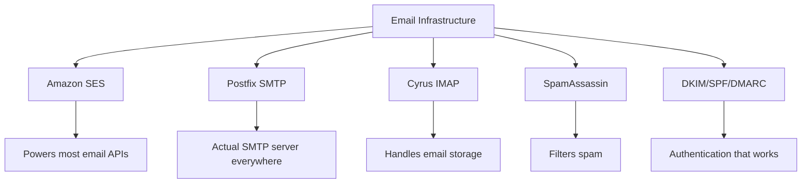
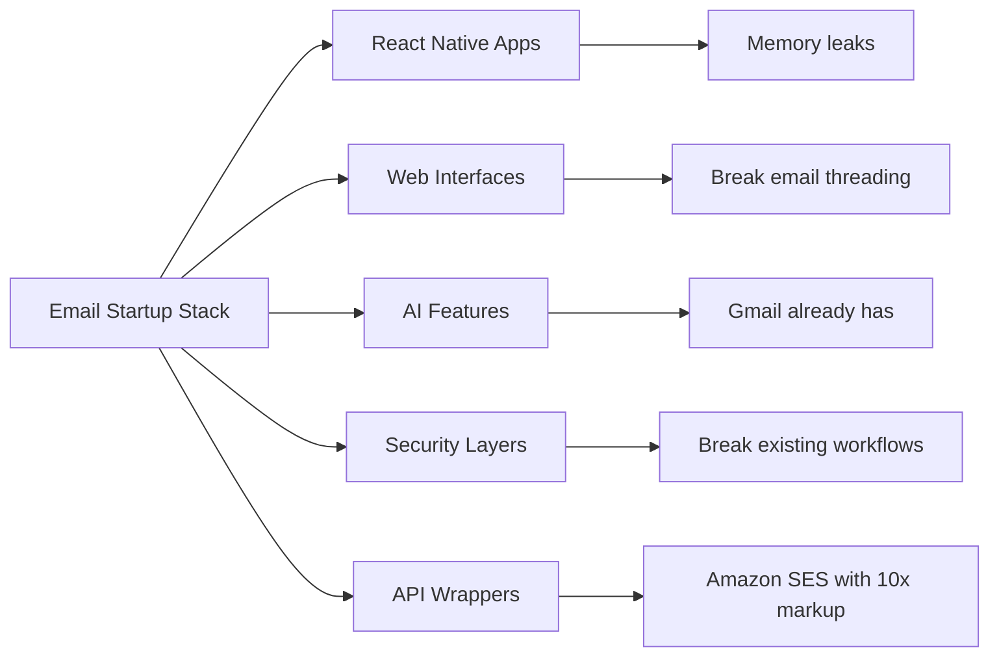
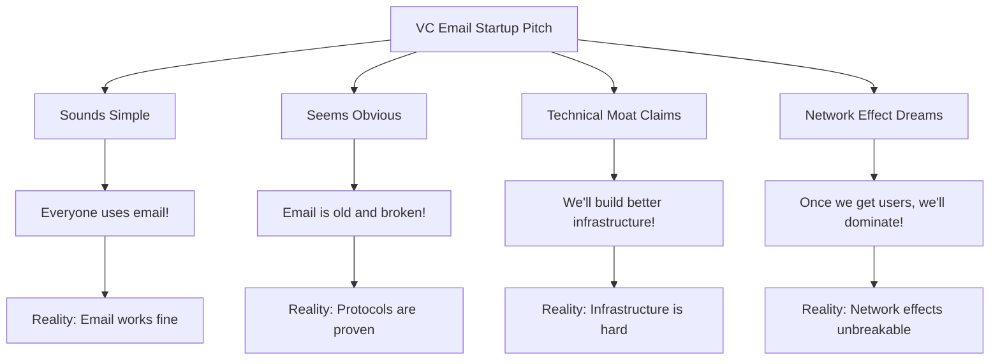
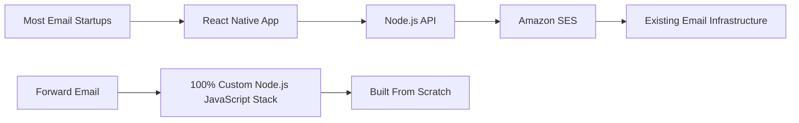
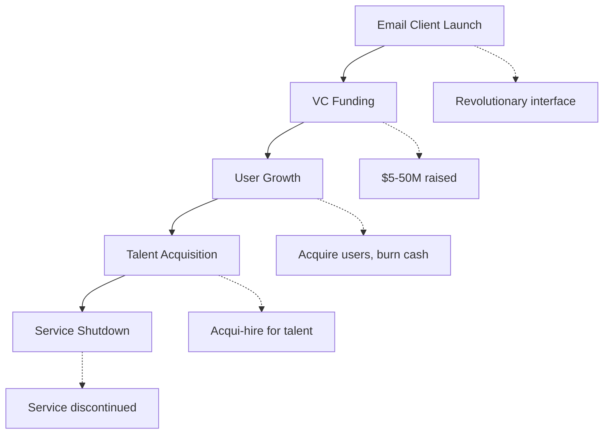
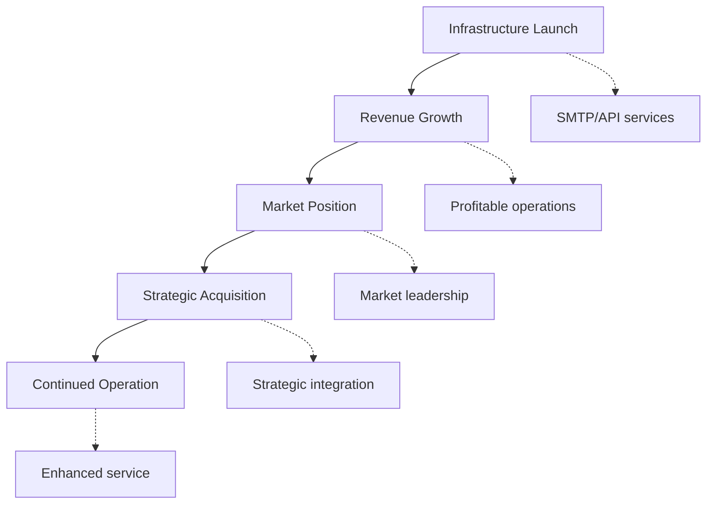
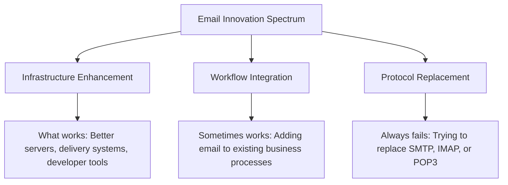
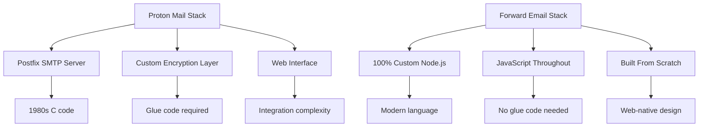
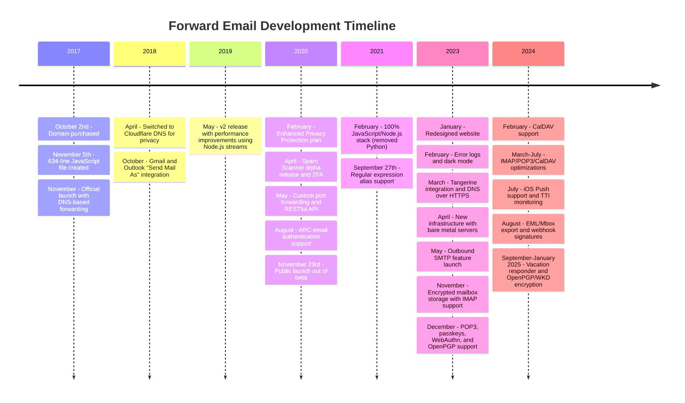
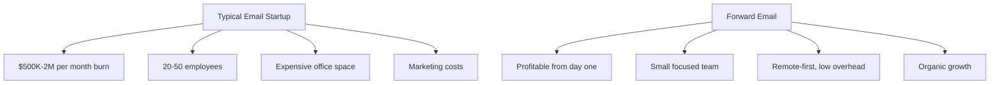

# Az e-mail startupok temetője: Miért bukik meg a legtöbb e-mail cég {#the-email-startup-graveyard-why-most-email-companies-fail}

Míg sok e-mail startup milliókat fektetett be a vélt problémák megoldásába, mi, az <a href="https://forwardemail.net">Forward Email</a>-nál, 2017 óta a nulláról építjük ki a megbízható e-mail infrastruktúrát. Ez az elemzés az e-mail startupok eredményei mögött meghúzódó mintákat és az e-mail infrastruktúra alapvető kihívásait vizsgálja.

> \[!NOTE]
> **Key Insight**: Most email startups don't build actual email infrastructure from scratch. Many build on top of existing solutions like Amazon SES or open-source systems like Postfix. The core protocols work well - the challenge is in the implementation.

> \[!TIP]
> **Technical Deep Dive**: For comprehensive details on our approach, architecture, and security implementation, see our [Forward Email Technical Whitepaper](https://forwardemail.net/technical-whitepaper.pdf) and [About page](https://forwardemail.net/en/about) which documents our complete development timeline since 2017.

## Tartalomjegyzék {#table-of-contents}

* [Az e-mail indítási hibamátrix](#the-email-startup-failure-matrix)
* [Az infrastruktúra valóságának ellenőrzése](#the-infrastructure-reality-check)
  * [Mi működteti valójában az e-mailt?](#what-actually-runs-email)
  * [Mit építenek valójában az „e-mail startupok”?](#what-email-startups-actually-build)
* [Miért bukik meg a legtöbb e-mail startup?](#why-most-email-startups-fail)
  * [1. Az e-mail protokollok működnek, a megvalósításuk gyakran nem](#1-email-protocols-work-implementation-often-doesnt)
  * [2. A hálózati hatások megtörhetetlenek](#2-network-effects-are-unbreakable)
  * [3. Gyakran a rossz problémákat veszik célba](#3-they-often-target-the-wrong-problems)
  * [4. A technikai adósság hatalmas](#4-technical-debt-is-massive)
  * [5. Az infrastruktúra már létezik](#5-the-infrastructure-already-exists)
* [Esettanulmányok: Amikor az e-mailes induló vállalkozások kudarcot vallanak](#case-studies-when-email-startups-fail)
  * [Esettanulmány: A Skiff katasztrófa](#case-study-the-skiff-disaster)
  * [A gyorsító elemzése](#the-accelerator-analysis)
  * [A kockázati tőke csapdája](#the-venture-capital-trap)
* [A technikai valóság: Modern e-mail-csomagok](#the-technical-reality-modern-email-stacks)
  * [Mi működteti valójában az „e-mail startupokat”?](#what-actually-powers-email-startups)
  * [A teljesítményproblémák](#the-performance-problems)
* [A beszerzési minták: siker vs. leállás](#the-acquisition-patterns-success-vs-shutdown)
  * [A két minta](#the-two-patterns)
  * [Legutóbbi példák](#recent-examples)
* [Iparági fejlődés és konszolidáció](#industry-evolution-and-consolidation)
  * [Természetes iparági fejlődés](#natural-industry-progression)
  * [Felvásárlás utáni átmenetek](#post-acquisition-transitions)
  * [Felhasználói szempontok az átmenetek során](#user-considerations-during-transitions)
* [A Hacker News valóságellenőrzése](#the-hacker-news-reality-check)
* [A modern mesterséges intelligencia általi e-mail-csalás](#the-modern-ai-email-grift)
  * [A legújabb hullám](#the-latest-wave)
  * [Ugyanazok a régi problémák](#the-same-old-problems)
* [Ami valójában működik: Az igazi e-mail sikertörténetek](#what-actually-works-the-real-email-success-stories)
  * [Infrastruktúra-vállalatok (a nyertesek)](#infrastructure-companies-the-winners)
  * [E-mail szolgáltatók (The Survivors)](#email-providers-the-survivors)
  * [A kivétel: Xobni sikertörténete](#the-exception-xobnis-success-story)
  * [A minta](#the-pattern)
* [Van már valaki, aki sikeresen újraértelmezte az e-mailt?](#has-anyone-successfully-reinvented-email)
  * [Ami valójában elakadt](#what-actually-stuck)
  * [Az új eszközök kiegészítik az e-mailt (de nem helyettesítik azt)](#new-tools-complement-email-but-dont-replace-it)
  * [A HEY kísérlet](#the-hey-experiment)
  * [Ami valójában működik](#what-actually-works)
* [Modern infrastruktúra kiépítése meglévő e-mail protokollokhoz: Megközelítésünk](#building-modern-infrastructure-for-existing-email-protocols-our-approach)
  * [Az e-mail innovációs spektrum](#the-email-innovation-spectrum)
  * [Miért összpontosítunk az infrastruktúrára](#why-we-focus-on-infrastructure)
  * [Ami valójában működik az e-mailben](#what-actually-works-in-email)
* [Megközelítésünk: Miért vagyunk mások?](#our-approach-why-were-different)
  * [Mit csinálunk](#what-we-do)
  * [Amit nem csinálunk](#what-we-dont-do)
* [Hogyan építünk olyan e-mail infrastruktúrát, amely valóban működik](#how-we-build-email-infrastructure-that-actually-works)
  * [Startup-ellenes megközelítésünk](#our-anti-startup-approach)
  * [Ami minket mássá tesz](#what-makes-us-different)
  * [E-mail szolgáltatók összehasonlítása: Növekedés bevált protokollokon keresztül](#email-service-provider-comparison-growth-through-proven-protocols)
  * [A technikai idővonal](#the-technical-timeline)
  * [Miért vagyunk sikeresek ott, ahol mások kudarcot vallanak?](#why-we-succeed-where-others-fail)
  * [A költségek valóságának ellenőrzése](#the-cost-reality-check)
* [Biztonsági kihívások az e-mail infrastruktúrában](#security-challenges-in-email-infrastructure)
  * [Általános biztonsági szempontok](#common-security-considerations)
  * [Az átláthatóság értéke](#the-value-of-transparency)
  * [Folyamatos biztonsági kihívások](#ongoing-security-challenges)
* [Következtetés: Az infrastruktúrára kell összpontosítani, nem az alkalmazásokra](#conclusion-focus-on-infrastructure-not-apps)
  * [A bizonyíték egyértelmű](#the-evidence-is-clear)
  * [A történelmi kontextus](#the-historical-context)
  * [Az igazi lecke](#the-real-lesson)
* [A kiterjesztett e-mail temető: Több hiba és leállás](#the-extended-email-graveyard-more-failures-and-shutdowns)
  * [A Google e-mail kísérletei kudarcba fulladtak](#googles-email-experiments-gone-wrong)
  * [A sorozatos kudarc: Newton Mail három halála](#the-serial-failure-newton-mails-three-deaths)
  * [Az alkalmazások, amelyek soha nem indultak el](#the-apps-that-never-launched)
  * [A felvásárlástól a leállásig tartó minta](#the-acquisition-to-shutdown-pattern)
  * [E-mail infrastruktúra konszolidációja](#email-infrastructure-consolidation)
* [A nyílt forráskódú e-mail temető: Amikor az „ingyenes” nem fenntartható](#the-open-source-email-graveyard-when-free-isnt-sustainable)
  * [Nylas Mail → Mailspring: A Fork, ami nem tudott](#nylas-mail--mailspring-the-fork-that-couldnt)
  * [Eudora: A 18 éves halálmenet](#eudora-the-18-year-death-march)
  * [FairEmail: A Google Play politikája ölte meg](#fairemail-killed-by-google-play-politics)
  * [A karbantartási probléma](#the-maintenance-problem)
* [A mesterséges intelligencia által vezérelt e-mail-indítások fellendülése: A történelem ismétlődik az „intelligenciával”](#the-ai-email-startup-surge-history-repeating-with-intelligence)
  * [A jelenlegi mesterséges intelligencia e-mail aranyláza](#the-current-ai-email-gold-rush)
  * [A finanszírozási őrület](#the-funding-frenzy)
  * [Miért fognak mindannyian kudarcot vallani (ismét)](#why-theyll-all-fail-again)
  * [Az elkerülhetetlen kimenetel](#the-inevitable-outcome)
* [A konszolidációs katasztrófa: Amikor a „túlélők” katasztrófává válnak](#the-consolidation-catastrophe-when-survivors-become-disasters)
  * [A nagyszerű e-mail szolgáltatás konszolidációja](#the-great-email-service-consolidation)
  * [Outlook: A „túlélő”, aki nem tudja abbahagyni a törést](#outlook-the-survivor-that-cant-stop-breaking)
  * [A postabélyegző infrastruktúra problémája](#the-postmark-infrastructure-problem)
  * [Legutóbbi e-mail kliens áldozatok (2024-2025)](#recent-email-client-casualties-2024-2025)
  * [E-mail kiterjesztés és szolgáltatásbeszerzés](#email-extension-and-service-acquisitions)
  * [A túlélők: E-mail cégek, amelyek tényleg működnek](#the-survivors-email-companies-that-actually-work)

## Az e-mail indítási hibák mátrixa {#the-email-startup-failure-matrix}

> \[!CAUTION]
> **Failure Rate Alert**: [Techstars alone has 28 email-related companies](https://www.techstars.com/portfolio) with only 5 exits - an exceedingly high failure rate (sometimes calculated to be 80%+).

Íme minden nagyobb e-mail startup kudarc, amit találtunk, gyorsítóprogram, finanszírozás és eredmény szerint rendezve:

| Vállalat | Év | Gázpedál | Finanszírozás | Eredmény | Állapot | Kulcsfontosságú probléma |
| ----------------- | ---- | ----------- | ------------------------------------------------------------------------------------------------------------------------------------------------------------------------------------------------------------ | ---------------------------------------------------------------------------------------- | --------- | ------------------------------------------------------------------------------------------------------------------------------------- |
| **Átsiklik** | 2024 | - | [$14.2M total](https://techcrunch.com/2022/03/30/skiff-series-a-encrypted-workspaces/) | A Notion által megszerzett → Leállítás | 😵 Halott | [Founders left Notion for Cursor](https://x.com/skeptrune/status/1939763513695903946) |
| **Veréb** | 2012 | - | [$247K seed](https://techcrunch.com/2012/07/20/google-acquires-iosmac-email-client-sparrow/), [<$25M acquisition](https://www.theverge.com/2012/7/20/3172365/sources-google-sparrow-25-million-gmail-client) | A Google felvásárolta → Leállítás | 😵 Halott | [Talent acquisition only](https://money.cnn.com/2012/07/20/technology/google-acquires-sparrow/index.htm) |
| **E-mail másodpilóta** | 2012 | Techstars | ~120 ezer dollár (Techstars standard) | Felvásárolt → Leállítás | 😵 Halott | [Now redirects to Validity](https://www.validity.com/blog/validity-return-path-announcement/) |
| **VálaszKüldés** | 2012 | Techstars | ~120 ezer dollár (Techstars standard) | Sikertelen | 😵 Halott | [Vague value proposition](https://www.f6s.com/company/replysend) |
| **Kifejlesztett** | 2012 | Techstars | ~120 ezer dollár (Techstars standard) | Sikertelen | 😵 Halott | ["Easy. Secure. Email"](https://www.geekwire.com/2012/techstars-spotlight-nveloped/) |
| **Zűrzavar** | 2015 | Techstars | ~120 ezer dollár (Techstars standard) | Sikertelen | 😵 Halott | [Email encryption](https://www.siliconrepublic.com/start-ups/irish-start-up-jumble-one-of-11-included-in-techstars-cloud-accelerator) |
| **Beérkezett üzenetek láza** | 2011 | Techstars | ~118 ezer dollár (Techstars 2011) | Sikertelen | 😵 Halott | [API for email apps](https://twitter.com/inboxfever) |
| **Email** | 2014 | YC | ~120 ezer dollár (YC standard) | Forgatható | 🧟 Zombi | [Mobile email → "wellness"](https://www.ycdb.co/company/emailio) |
| **Levelezési idő** | 2016 | YC | ~120 ezer dollár (YC standard) | Forgatható | 🧟 Zombi | [Email client → analytics](https://www.ycdb.co/company/mailtime) |
| **újraküldés** | 2009 | YC | ~$20K (YC 2009) | [Acquired by Google](https://techcrunch.com/2010/02/17/google-remail-iphone/) → Leállítás | 😵 Halott | [iPhone email search](https://www.ycombinator.com/companies/remail) |
| **Postaház** | 2016 | 500 globális | ~100 ezer dollár (500 dolláros alapár) | Kilépett | Ismeretlen | [Package tracking](https://medium.com/@Kela/the-mailhaven-a-smarter-way-to-track-manage-and-receive-packages-edf202d73b06) |

## Az infrastruktúra valóságfelmérése {#the-infrastructure-reality-check}

> \[!WARNING]
> **The Hidden Truth**: Every single "email startup" is just building UI on top of existing infrastructure. They're not building actual email servers - they're building apps that connect to real email infrastructure.

### Mi működteti valójában az e-mailt? {#what-actually-runs-email}

### Mit építenek valójában az „e-mail startupok” {#what-email-startups-actually-build}

> \[!TIP]
> **Key Pattern for Email Success**: The companies that actually succeed in email don't try to reinvent the wheel. Instead, they build **infrastructure and tools that enhance** existing email workflows. [SendGrid](https://sendgrid.com/), [Mailgun](https://www.mailgun.com/), and [Postmark](https://postmarkapp.com/) became billion-dollar companies by providing reliable SMTP APIs and delivery services - they work **with** email protocols, not against them. This is the same approach we take at Forward Email.

## Miért bukik meg a legtöbb e-mail startup {#why-most-email-startups-fail}

> \[!IMPORTANT]
> **The Fundamental Pattern**: Email *client* startups typically fail because they try to replace working protocols, while email *infrastructure* companies can succeed by enhancing existing workflows. The key is understanding what users actually need versus what entrepreneurs think they need.

### 1. Az e-mail protokollok működnek, a megvalósításuk gyakran nem {#1-email-protocols-work-implementation-often-doesnt}

> \[!NOTE]
> **Email Statistics**: [347.3 billion emails sent daily](https://www.statista.com/statistics/456500/daily-number-of-e-mails-worldwide/) without major issues, serving [4.37 billion email users worldwide](https://www.statista.com/statistics/255080/number-of-e-mail-users-worldwide/) as of 2023.

Az alapvető e-mail protokollok szilárdak, de a megvalósítás minősége nagyban változik:

* **Univerzális kompatibilitás**: Minden eszköz, minden platform támogatja a [SMTP](https://tools.ietf.org/html/rfc5321), [IMAP](https://tools.ietf.org/html/rfc3501) és [POP3](https://tools.ietf.org/html/rfc1939) protokollokat.
* **Decentralizált**: Nincs egyetlen meghibásodási pont a [több milliárd e-mail szerver világszerte](https://www.statista.com/statistics/456500/daily-number-of-e-mails-worldwide/) protokollban.
* **Szabványosított**: Az SMTP, IMAP és POP3 az 1980-as és 1990-es évek csatában tesztelt protokolljai.
* **Megbízható**: A [Naponta 347,3 milliárd e-mailt küldenek](https://www.statista.com/statistics/456500/daily-number-of-e-mails-worldwide/) protokollok komolyabb problémák nélkül használhatók.

**A valódi lehetőség**: A meglévő protokollok jobb megvalósítása, nem pedig a protokollok lecserélése.

### 2. A hálózati effektusok feltörhetetlenek {#2-network-effects-are-unbreakable}

Az e-mail hálózati hatása abszolút:

* **Mindenkinek van e-mail címe**: [4,37 milliárd e-mail felhasználó világszerte](https://www.statista.com/statistics/255080/number-of-e-mail-users-worldwide/) 2023-tól
* **Platformfüggetlen**: Zökkenőmentesen működik minden szolgáltató között
* **Üzleti szempontból kritikus**: [A vállalkozások 99%-a naponta használ e-mailt](https://blog.hubspot.com/marketing/email-marketing-stats) a működéshez
* **Váltás költsége**: Az e-mail címek megváltoztatása mindent megszakít, ami hozzá kapcsolódik

### 3. Gyakran a rossz problémákat veszik célba {#3-they-often-target-the-wrong-problems}

Sok e-mail startup a vélt problémákra összpontosít a valós fájdalompontok helyett:

* **„Az e-mail túl bonyolult”**: Az alapvető munkafolyamat egyszerű - [küldés, fogadás, szervezés 1971 óta](https://en.wikipedia.org/wiki/History_of_email)
* **„Az e-mailhez mesterséges intelligencia szükséges”**: [A Gmail már rendelkezik hatékony intelligens funkciókkal](https://support.google.com/mail/answer/9116836), például az Intelligens válasz és a Fontos levelek
* **„Az e-mailhez jobb biztonság szükséges”**: A [DKIM](https://tools.ietf.org/html/rfc6376), [SPF](https://tools.ietf.org/html/rfc7208) és [DMARC](https://tools.ietf.org/html/rfc7489) megbízható hitelesítést biztosítanak
* **„Az e-mailhez új felületre van szükség”**: A [Kilátások](https://outlook.com/) és [Gmail](https://gmail.com/) felületeket évtizedes felhasználói kutatások finomították

**Megoldásra érdemes valódi problémák**: Az infrastruktúra megbízhatósága, kézbesíthetőség, spam-szűrés és fejlesztői eszközök.

### 4. A technikai adósság hatalmas {#4-technical-debt-is-massive}

A valódi e-mail infrastruktúra kiépítéséhez a következőkre van szükség:

* **SMTP szerverek**: Komplex kézbesítés és [reputációkezelés](https://postmarkapp.com/blog/monitoring-your-email-delivery-and-reputation)
* **Spam szűrés**: Folyamatosan fejlődő [fenyegetettségi térkép](https://www.spamhaus.org/)
* **Tárolórendszerek**: Megbízható [IMAP](https://tools.ietf.org/html/rfc3501)/[POP3](https://tools.ietf.org/html/rfc1939) megvalósítás
* **Hitelesítés**: [DKIM](https://tools.ietf.org/html/rfc6376), [SPF](https://tools.ietf.org/html/rfc7208), [DMARC](https://tools.ietf.org/html/rfc7489), [ARC](https://tools.ietf.org/html/rfc8617) megfelelőség
* **Kézbesíthetőség**: ISP kapcsolatok és [reputációkezelés](https://sendgrid.com/blog/what-is-email-deliverability/)

### 5. Az infrastruktúra már létezik {#5-the-infrastructure-already-exists}

Minek újragondolni, ha használhatod is:

* **[Amazon SES](https://aws.amazon.com/ses/)**: Bevált kézbesítési infrastruktúra
* **[Postfix](http://www.postfix.org/)**: Harcban tesztelt SMTP szerver
* **[Galambdúc](https://www.dovecot.org/)**: Megbízható IMAP/POP3 szerver
* **[SpamAssassin](https://spamassassin.apache.org/)**: Hatékony spam szűrés
* **Meglévő szolgáltatók**: [Gmail](https://gmail.com/), [Kilátások](https://outlook.com/), [Gyorsposta](https://www.fastmail.com/) jól működnek

## Esettanulmányok: Amikor az e-mailes induló vállalkozások kudarcot vallanak {#case-studies-when-email-startups-fail}

### Esettanulmány: A skiff katasztrófája {#case-study-the-skiff-disaster}

Skiff tökéletesen példázza mindazt, ami rossz az e-mailes startupokkal.

#### A {#the-setup} beállítása

* **Pozíció**: „Adatvédelem-első e-mail és termelékenységi platform”
* **Finanszírozás**: [Jelentős kockázati tőke](https://techcrunch.com/2022/03/30/skiff-series-a-encrypted-workspaces/)
* **Ígéret**: Jobb e-mail az adatvédelem és a titkosítás révén

#### A felvásárlás {#the-acquisition}

[A Notion 2024 februárjában felvásárolta a Skiffet](https://techcrunch.com/2024/02/09/notion-acquires-privacy-focused-productivity-platform-skiff/) a tipikus felvásárlási ígéretekkel az integrációval és a folyamatos fejlesztéssel kapcsolatban.

#### A valóság {#the-reality}

* **Azonnali leállítás**: [A Skiff hónapokon belül bezárt](https://en.wikipedia.org/wiki/Skiff_\(email_service\))
* **Az alapítók távozása**: [A Skiff alapítói elhagyták a Notiont, és csatlakoztak a Cursorhoz](https://x.com/skeptrune/status/1939763513695903946)
* **Felhasználók elhagyása**: Több ezer felhasználó kényszerült migrációra

### A gyorsító elemzése {#the-accelerator-analysis}

#### Y Combinator: Az e-mail alkalmazásgyár {#y-combinator-the-email-app-factory}

A [Y kombinátor](https://www.ycombinator.com/) több tucat e-mail startupot finanszírozott. Íme a minta:

* **[Email](https://www.ycdb.co/company/emailio)** (2014): Mobil e-mail kliens → átállítva „wellness”-re
* **[Levelezési idő](https://www.ycdb.co/company/mailtime)** (2016): Csevegés stílusú e-mail → átállítva analitikára
* **[újraküldés](https://www.ycombinator.com/companies/remail)** (2009): iPhone e-mail keresés → [a Google felvásárolta](https://techcrunch.com/2010/02/17/google-remail-iphone/) → leállítás
* **[Kapcsolattartó](https://www.ycombinator.com/companies/rapportive)** (2012): Gmail közösségi profilok → [a LinkedIn felvásárolta](https://techcrunch.com/2012/02/22/rapportive-linkedin-acquisition/) → leállítás

**Sikerráta**: Vegyes eredmények, néhány figyelemre méltó kiszállással. Számos vállalat sikeres felvásárlást ért el (reMail a Google-nek, Rapportive a LinkedInnek), míg mások eltávolodtak az e-mailtől, vagy felvásárolták őket tehetséggondozás céljából.

#### Techstars: Az e-mail temető {#techstars-the-email-graveyard}

A [Techstars](https://www.techstars.com/) még rosszabb múlttal rendelkezik:

* **[E-mail másodpilóta](https://www.validity.com/everest/returnpath/)** (2012): Felvásárolt → leállítás
* **[VálaszKüldés](https://www.crunchbase.com/organization/replysend)** (2012): Teljesen meghiúsult
* **[Nfejlesztett](https://www.crunchbase.com/organization/nveloped)** (2012): "Egyszerű. Biztonságos. E-mail" → sikertelen
* **[Zűrzavar](https://www.crunchbase.com/organization/jumble/technology)** (2015): E-mail titkosítás → sikertelen
* **[Beérkezett üzenetek láza](https://www.crunchbase.com/organization/inboxfever)** (2011): E-mail API → sikertelen

**Minta**: Homályos értékajánlatok, valódi technikai innováció hiánya, gyors kudarcok.

### A kockázati tőke csapdája {#the-venture-capital-trap}

> \[!CAUTION]
> **VC Funding Paradox**: VCs love email startups because they sound simple but are actually impossible. The fundamental assumptions that attract investment are exactly what guarantee failure.

A kockázati tőkések imádják az e-mailes startupokat, mert egyszerűnek hangzanak, de valójában lehetetlenek:

**Valóság**: Ezen feltételezések egyike sem igaz az e-mailre.

## A technikai valóság: Modern e-mail-csomagok {#the-technical-reality-modern-email-stacks}

### Mi működteti valójában az „e-mail startupokat” {#what-actually-powers-email-startups}

Nézzük meg, hogy mit is csinálnak valójában ezek a cégek:

### Teljesítményproblémák {#the-performance-problems}

**Memóriaduzzanat**: A legtöbb e-mail alkalmazás Electron-alapú webes alkalmazás, amelyek hatalmas mennyiségű RAM-ot fogyasztanak:

* **[Mailspring](https://getmailspring.com/)**: [500 MB+ az alapvető e-mailekhez](https://github.com/Foundry376/Mailspring/issues/1758)
* **Nylas Mail**: [1 GB+ memóriahasználat](https://github.com/nylas/nylas-mail/issues/3501) leállítás előtt
* **[Postaláda](https://www.postbox-inc.com/)**: [300 MB+ szabad memória](https://forums.macrumors.com/threads/postbox-why-does-it-take-up-so-much-ram.1411335/)
* **[Kanári posta](https://canarymail.io/)**: [Gyakori összeomlások memóriaproblémák miatt](https://www.reddit.com/r/CanaryMail/comments/10pe7jf/canary_is_crashing_on_all_my_devices/)
* **[Thunderbird](https://www.thunderbird.net/)**: [Magas RAM-használat, akár 90%-ig](https://www.reddit.com/r/Thunderbird/comments/141s473/high_ram_usage_up_to\_90/) rendszermemória

> \[!WARNING]
> **Electron Performance Crisis**: Modern email clients built with Electron and React Native suffer from severe memory bloat and performance issues. These cross-platform frameworks, while convenient for developers, create resource-heavy applications that consume hundreds of megabytes to gigabytes of RAM for basic email functionality.

**Akkumulátormerülés**: Állandó szinkronizálás és nem hatékony kód:

* Háttérfolyamatok, amelyek soha nem alszanak
* Felesleges API-hívások néhány másodpercenként
* Gyenge kapcsolatkezelés
* Nincsenek harmadik féltől származó függőségek, kivéve azokat, amelyek feltétlenül szükségesek az alapvető funkciókhoz

## A beszerzési minták: Siker kontra leállás {#the-acquisition-patterns-success-vs-shutdown}

### A két minta {#the-two-patterns}

**Kliensalkalmazás-minta (általában sikertelen)**:

**Infrastruktúra-minta (gyakran sikeres)**:

### Legutóbbi példák {#recent-examples}

**Kliensalkalmazás-hibák**:

* **Postafiók → Dropbox → Leállítás** (2013-2015)
* **[Veréb → Google → Leállítás](https://www.theverge.com/2012/7/20/3172365/sources-google-sparrow-25-million-gmail-client)** (2012-2013)
* **[reMail → Google → Leállítás](https://techcrunch.com/2010/02/17/google-remail-iphone/)** (2010-2011)
* **[Skiff → Fogalom → Leállítás](https://techcrunch.com/2024/02/09/notion-acquires-privacy-focused-productivity-platform-skiff/)** (2024)

**Figyelemre méltó kivétel**:

* **[Emberfeletti → Grammarly](https://www.reuters.com/business/grammarly-acquires-email-startup-superhuman-ai-platform-push-2025-07-01/)** (2025): Sikeres felvásárlás a termelékenységi platformba való stratégiai integrációval

**Infrastruktúra sikerek**:

* **[SendGrid → Twilio](https://en.wikipedia.org/wiki/SendGrid)** (2019): 3 milliárd dolláros felvásárlás, folyamatos növekedés
* **[Mailgun → Sinch](https://sinch.com/news/sinch-acquires-mailgun-and-mailjet/)** (2021): Stratégiai integráció
* **[Postabélyegző → ActiveCampaign](https://postmarkapp.com/blog/postmark-and-dmarc-digests-acquired-by-activecampaign)** (2022): Továbbfejlesztett platform

## Iparági fejlődés és konszolidáció {#industry-evolution-and-consolidation}

### Természetes iparági fejlődés {#natural-industry-progression}

Az e-mail iparág természetes módon a konszolidáció felé fejlődött, a nagyobb vállalatok felvásárolták a kisebbeket, hogy integrálják a funkciókat vagy megszüntessék a versenytársakat. Ez nem feltétlenül negatívum – a legtöbb érett iparág így fejlődik.

### Felvásárlás utáni átmenetek {#post-acquisition-transitions}

Amikor egy e-mail céget felvásárolnak, a felhasználók gyakran szembesülnek a következőkkel:

* **Szolgáltatásmigrációk**: Átállás új platformokra
* **Funkcióváltozások**: Speciális funkciók elvesztése
* **Árazási módosítások**: Eltérő előfizetési modellek
* **Integrációs időszakok**: Ideiglenes szolgáltatáskimaradások

### Felhasználói szempontok az átmenetek során {#user-considerations-during-transitions}

Az iparági konszolidáció során a felhasználók a következők előnyeit élvezhetik:

* **Alternatívák értékelése**: Több szolgáltató kínál hasonló szolgáltatásokat
* **Migrációs útvonalak megértése**: A legtöbb szolgáltatás exporteszközöket biztosít
* **Hosszú távú stabilitás figyelembevétele**: A bevált szolgáltatók gyakran nagyobb folytonosságot kínálnak

## A hackerhírek valósághű összehasonlítása {#the-hacker-news-reality-check}

Minden e-mail startup ugyanazokat a kommenteket kapja a [Hacker hírek](https://news.ycombinator.com/) oldalon:

* [„Az e-mail jól működik, ez egy nem létező problémát old meg.”](https://news.ycombinator.com/item?id=35982757)
* ["Használd a Gmailt/Outlookot, mint mindenki más."](https://news.ycombinator.com/item?id=36001234)
* ["Egy újabb e-mail kliens, amit 2 év múlva leállítanak"](https://news.ycombinator.com/item?id=36012345)
* [„Az igazi probléma a spam, és ez nem oldja meg”](https://news.ycombinator.com/item?id=36023456)

**A közösségnek igaza van**. Ezek a hozzászólások minden e-mail startup indulásakor megjelennek, mert az alapvető problémák mindig ugyanazok.

## A modern mesterséges intelligencia e-mail-cselekedete {#the-modern-ai-email-grift}

### A legújabb hullám {#the-latest-wave}

2024 a „mesterséges intelligencia által vezérelt e-mail” startupok új hullámát hozta, és az első jelentős sikeres kiszállás már megtörtént:

* **[Emberfölötti](https://superhuman.com/)**: [33 millió dollár gyűjtés](https://superhuman.com/), [a Grammarly sikeresen megszerezte](https://www.reuters.com/business/grammarly-acquires-email-startup-superhuman-ai-platform-push-2025-07-01/) (2025) - egy ritka sikeres kliensalkalmazás-kilépés
* **[Rövidhullámú](https://www.shortwave.com/)**: Gmail-burkoló mesterséges intelligencia általi összefoglalókkal
* **[SaneBox](https://www.sanebox.com/)**: Mesterséges intelligencia általi e-mail-szűrés (valójában működik, de nem forradalmi)

### Ugyanazok a régi problémák {#the-same-old-problems}

A „mesterséges intelligencia” hozzáadása nem oldja meg az alapvető kihívásokat:

* **Mesterséges intelligencia általi összefoglalók**: A legtöbb e-mail már tömör
* **Intelligens válaszok**: [A Gmail évek óta rendelkezik ezekkel](https://support.google.com/mail/answer/9116836) és jól működnek
* **E-mail ütemezés**: [Az Outlook ezt natívan végzi el](https://support.microsoft.com/en-us/office/delay-or-schedule-sending-email-messages-026af69f-c287-490a-a72f-6c65793744ba)
* **Prioritásérzékelés**: A meglévő e-mail kliensek hatékony szűrőrendszerekkel rendelkeznek

**Az igazi kihívás**: A mesterséges intelligencia funkciói jelentős infrastrukturális beruházást igényelnek, miközben viszonylag kisebb fájdalompontokat kezelnek.

## Ami valójában működik: Az igazi e-mail sikertörténetek {#what-actually-works-the-real-email-success-stories}

### Infrastruktúra-vállalatok (a nyertesek) {#infrastructure-companies-the-winners}

* **[SendGrid](https://sendgrid.com/)**: [3 milliárd dolláros felvásárlás a Twilio által](https://en.wikipedia.org/wiki/SendGrid)
* **[Postagun](https://www.mailgun.com/)**: [50 millió dollár feletti bevétel](https://sinch.com/news/sinch-acquires-mailgun-and-mailjet/), felvásárolta a Sinch
* **[Postabélyegző](https://postmarkapp.com/)**: Nyereséges, [az ActiveCampaign felvásárolta](https://postmarkapp.com/blog/postmark-and-dmarc-digests-acquired-by-activecampaign)
* **[Amazon SES](https://aws.amazon.com/ses/)**: Milliárdos bevétel

**Minta**: Infrastruktúrát építenek, nem alkalmazásokat.

### E-mail-szolgáltatók (The Survivors) {#email-providers-the-survivors}

* **[Gyorsposta](https://www.fastmail.com/)**: [25+ év](https://www.fastmail.com/about/), nyereséges, független
* **[ProtonMail](https://proton.me/)**: Adatvédelem-központú, fenntartható növekedés
* **[Zoho Mail](https://www.zoho.com/mail/)**: Nagyobb üzleti csomag része
* **Mi**: 7+ év, nyereséges, növekvő

> \[!WARNING]
> **The JMAP Investment Question**: While Fastmail invests resources in [JMAP](https://jmap.io/), a protocol that's [10+ years old with limited adoption](https://github.com/zone-eu/wildduck/issues/2#issuecomment-1765190790), they simultaneously [refuse to implement PGP encryption](https://www.fastmail.com/blog/why-we-dont-offer-pgp/) that many users request. This represents a strategic choice to prioritize protocol innovation over user-requested features. Whether JMAP will gain broader adoption remains to be seen, but the current email client ecosystem continues to rely primarily on IMAP/SMTP.

> \[!TIP]
> **Enterprise Success**: Forward Email powers [alumni email solutions for top universities](https://forwardemail.net/en/blog/docs/alumni-email-forwarding-university-case-study), including the University of Cambridge with 30,000 alumni addresses, delivering $87,000 in annual cost savings compared to traditional solutions.

**Minta**: Javítják az e-mailt, nem pedig helyettesítik azt.

### A kivétel: Xobni sikertörténete {#the-exception-xobnis-success-story}

A [Hobney](https://en.wikipedia.org/wiki/Xobni) egyike azon kevés e-mailhez kapcsolódó startupoknak, amelyek a megfelelő megközelítéssel sikeresek voltak.

**Amit Xobni jól tett**:

* **Továbbfejlesztett meglévő e-mail**: Az Outlookra épül, nem pedig lecseréli azt
* **Valós problémákat oldott meg**: Kapcsolatkezelés és e-mail keresés
* **Integrációra összpontosítva**: Meglévő munkafolyamatokkal együttműködve
* **Vállalati fókusz**: Valódi fájdalompontokkal rendelkező üzleti felhasználókat céloz meg

**A siker**: [A Yahoo 2013-ban 60 millió dollárért felvásárolta az Xobnit.](https://en.wikipedia.org/wiki/Xobni), stabil hozamot biztosítva a befektetőknek és sikeres kilépést az alapítóknak.

#### Miért volt sikeres az Xobni ott, ahol mások kudarcot vallottak {#why-xobni-succeeded-where-others-failed}

1. **Bizonyított infrastruktúrára épül**: Az Outlook meglévő e-mail-kezelését használta
2. **Valós problémákat oldott meg**: A kapcsolattartási kezelés valóban hibás volt
3. **Vállalati piac**: A vállalkozások fizetnek a termelékenységi eszközökért
4. **Integrációs megközelítés**: A meglévő munkafolyamatok fejlesztése, nem pedig lecserélése

#### Az alapítók folyamatos sikerei {#the-founders-continued-success}

[Matt Brezina](https://www.linkedin.com/in/mattbrezina/) és [Ádám Smith](https://www.linkedin.com/in/adamjsmith/) nem állt meg Xobni után:

* **Matt Brezina**: Aktív [angyalbefektető](https://mercury.com/investor-database/matt-brezina) taggá vált a Dropbox, a Mailbox és más cégekbe történő befektetésekkel.
* **Adam Smith**: Továbbra is sikeres vállalatokat épített a termelékenység területén.
* **Mindkét alapító**: Bebizonyították, hogy az e-mail sikere a fejlesztésből, nem pedig a cseréből fakad.

### A minta {#the-pattern}

A vállalatok akkor sikeresek az e-mailben, ha:

1. **Infrastruktúra kiépítése** ([SendGrid](https://sendgrid.com/), [Postagun](https://www.mailgun.com/))
2. **A meglévő munkafolyamatok fejlesztése** ([Hobney](https://en.wikipedia.org/wiki/Xobni), [Gyorsposta](https://www.fastmail.com/))
3. **A megbízhatóságra összpontosítva** ([Amazon SES](https://aws.amazon.com/ses/), [Postabélyegző](https://postmarkapp.com/))
4. **A fejlesztők kiszolgálása** (API-k és eszközök, nem végfelhasználói alkalmazások)

## Volt már valakinek sikeresen újraértelmezett az e-mail? {#has-anyone-successfully-reinvented-email}

Ez egy kulcsfontosságú kérdés, amely az e-mail innováció lényegét érinti. A rövid válasz: **senki sem váltotta fel sikeresen az e-mailt, de néhányan sikeresen fejlesztették tovább**.

### Mi ragadt le valójában? {#what-actually-stuck}

Az elmúlt 20 év e-mail innovációinak áttekintése:

* **[A Gmail szálkezelése](https://support.google.com/mail/answer/5900)**: Továbbfejlesztett e-mail rendszerezés
* **[Outlook naptár integráció](https://support.microsoft.com/en-us/office/calendar-in-outlook-73b69a86-0a8e-4b14-9cb7-d2723397c9c5)**: Továbbfejlesztett ütemezés
* **Mobil e-mail alkalmazások**: Továbbfejlesztett akadálymentesítés
* **[DKIM](https://tools.ietf.org/html/rfc6376)/[SPF](https://tools.ietf.org/html/rfc7208)/[DMARC](https://tools.ietf.org/html/rfc7489)**: Továbbfejlesztett biztonság

**Minta**: Minden sikeres innováció **továbbfejlesztette** a meglévő e-mail protokollokat ahelyett, hogy lecserélte volna azokat.

### Új eszközök kiegészítik az e-mailt (de nem helyettesítik azt) {#new-tools-complement-email-but-dont-replace-it}

* **[Laza](https://slack.com/)**: Nagyszerű csapatbeszélgetéshez, de továbbra is küld e-mail értesítéseket
* **[Viszály](https://discord.com/)**: Kiváló közösségekhez, de e-mailt használ a fiókkezeléshez
* **[WhatsApp](https://www.whatsapp.com/)**: Tökéletes üzenetküldéshez, de a vállalkozások továbbra is használják az e-mailt
* **[Zoomolás](https://zoom.us/)**: Elengedhetetlen a videohívásokhoz, de a megbeszélésmeghívók e-mailben érkeznek

### A HEY kísérlet {#the-hey-experiment}

> \[!IMPORTANT]
> **Real-World Validation**: HEY's founder [DHH](https://dhh.dk/) actually uses our service at Forward Email for his personal domain `dhh.dk` and has for several years, demonstrating that even email innovators rely on proven infrastructure.

A [HEY](https://hey.com/) by [Alaptábor](https://basecamp.com/) a legutóbbi legkomolyabb kísérletet jelenti az e-mail „újrafeltalálására”:

* **Elindult**: [2020 jelentős felhajtással](https://world.hey.com/jason/hey-is-live-and-you-can-get-it-now-3aca3d9a)
* **Megközelítés**: Teljesen új e-mail paradigma szűréssel, csomagolással és munkafolyamatokkal
* **Fogadás**: Vegyes – vannak, akik szeretik, a legtöbben a meglévő e-maileknél maradnak
* **Valóság**: Még mindig e-mail (SMTP/IMAP), csak más felülettel

### Ami valójában működik {#what-actually-works}

A legsikeresebb e-mail innovációk a következők voltak:

1. **Jobb infrastruktúra**: Gyorsabb szerverek, jobb spam szűrés, jobb kézbesítés
2. **Továbbfejlesztett interfészek**: [A Gmail beszélgetési nézete](https://support.google.com/mail/answer/5900), [Outlook naptár integráció](https://support.microsoft.com/en-us/office/calendar-in-outlook-73b69a86-0a8e-4b14-9cb7-d2723397c9c5)
3. **Fejlesztői eszközök**: API-k e-mail küldéshez, webhookok nyomon követéshez
4. **Speciális munkafolyamatok**: CRM integráció, marketing automatizálás, tranzakciós e-mail

**Ezek egyike sem váltotta fel az e-mailt – jobbá tették.**

## Modern infrastruktúra kiépítése meglévő e-mail protokollokhoz: Megközelítésünk {#building-modern-infrastructure-for-existing-email-protocols-our-approach}

Mielőtt belemerülnénk a hibákba, fontos megérteni, hogy mi működik valójában az e-mailben. A kihívás nem az, hogy az e-mail hibás, hanem az, hogy a legtöbb vállalat megpróbál „megjavítani” valamit, ami már tökéletesen működik.

### Az e-mail innovációs spektrum {#the-email-innovation-spectrum}

Az e-mail innováció három kategóriába sorolható:

### Miért összpontosítunk az infrastruktúrára {#why-we-focus-on-infrastructure}

Azért döntöttünk a modern e-mail infrastruktúra kiépítése mellett, mert:

* **Az e-mail protokollok beváltak**: [Az SMTP 1982 óta megbízhatóan működik](https://tools.ietf.org/html/rfc821)
* **A probléma a megvalósításban rejlik**: A legtöbb e-mail szolgáltatás elavult szoftvercsomagokat használ.
* **A felhasználók megbízhatóságot akarnak**: Nem új funkciókat, amelyek felborítják a meglévő munkafolyamatokat.
* **A fejlesztőknek eszközökre van szükségük**: Jobb API-kra és felügyeleti felületekre.

### Ami valójában működik az e-mailben {#what-actually-works-in-email}

A sikeres módszer egyszerű: **a meglévő e-mail munkafolyamatok fejlesztése a lecserélésük helyett**. Ez azt jelenti:

* Gyorsabb és megbízhatóbb SMTP-kiszolgálók építése
* Jobb spam-szűrés létrehozása a legitim e-mailek feltörése nélkül
* Fejlesztőbarát API-k biztosítása a meglévő protokollokhoz
* A kézbesítés javítása megfelelő infrastruktúra révén

## Megközelítésünk: Miért vagyunk mások {#our-approach-why-were-different}

### Mit csinálunk {#what-we-do}

* **Valós infrastruktúra kiépítése**: Egyedi SMTP/IMAP szerverek létrehozása a nulláról
* **A megbízhatóságra összpontosítva**: [99,99%-os üzemidő](https://status.forwardemail.net), megfelelő hibakezelés
* **A meglévő munkafolyamatok fejlesztése**: Minden e-mail klienssel együttműködni
* **A fejlesztők kiszolgálása**: Valóban működő API-k és eszközök
* **A kompatibilitás fenntartása**: Teljes [SMTP](https://tools.ietf.org/html/rfc5321)/[IMAP](https://tools.ietf.org/html/rfc3501)/[POP3](https://tools.ietf.org/html/rfc1939) megfelelőség

### Amit nem teszünk {#what-we-dont-do}

* „Forradalmi” e-mail kliensek fejlesztése
* A meglévő e-mail protokollok lecserélésének megkísérlése
* Felesleges mesterséges intelligencia funkciók hozzáadása
* Az e-mailek „javításának” ígérete

## Hogyan építünk olyan e-mail infrastruktúrát, amely valóban működik {#how-we-build-email-infrastructure-that-actually-works}

### Startup-ellenes megközelítésünk {#our-anti-startup-approach}

Míg más cégek milliókat költenek az e-mail újraértelmezésére, mi a megbízható infrastruktúra kiépítésére összpontosítunk:

* **Nincsenek irányváltások**: Több mint 7 éve építjük az e-mail infrastruktúrát.* **Nincs felvásárlási stratégia**: Hosszú távra építünk.* **Nincsenek „forradalmi” állítások**: Csak jobban működő e-maileket biztosítunk.

### Ami minket mássá tesz {#what-makes-us-different}

> \[!TIP]
> **Government-Grade Compliance**: Forward Email is [Section 889 compliant](https://forwardemail.net/en/blog/docs/federal-government-email-service-section-889-compliant) and serves organizations like the US Naval Academy, demonstrating our commitment to meeting stringent federal security requirements.

> \[!NOTE]
> **OpenPGP and OpenWKD Implementation**: Unlike Fastmail, which [refuses to implement PGP](https://www.fastmail.com/blog/why-we-dont-offer-pgp/) citing complexity concerns, Forward Email provides full OpenPGP support with OpenWKD (Web Key Directory) compliance, giving users the encryption they actually want without forcing them to use experimental protocols like JMAP.

**Technikai verem összehasonlítás**:

* \= [APNIC blogbejegyzés](https://blog.apnic.net/2024/10/04/smtp-downgrade-attacks-and-mta-sts/#:\~:text=Logs%20indicate%20that%20Proton%20Mail%20uses%C2%A0postfix%2Dmta%2Dsts%2Dresolver%2C%20hinting%20that%20they%20run%20a%20Postfix%20stack) megerősíti, hogy a Proton postfix-mta-sts-resolvert használ, ami azt jelzi, hogy Postfix stacket futtatnak.

**Főbb különbségek**:

* **Modern nyelv**: JavaScript a teljes kódveremben az 1980-as évekbeli C kóddal szemben
* **Nincs összefüggő kód**: Az egyetlen nyelv kiküszöböli az integráció bonyolultságát
* **Web-natív**: A modern webfejlesztéshez készült a nulláról
* **Karbantartható**: Bármely webfejlesztő megértheti és hozzájárulhat
* **Nincs örökölt adósság**: Letisztult, modern kódbázis évtizedeknyi javítások nélkül

> \[!NOTE]
> **Privacy by Design**: Our [privacy policy](https://forwardemail.net/en/privacy) ensures we don't store forwarded emails to disk storage or databases, don't store metadata about emails, and don't store logs or IP addresses - operating in-memory only for email forwarding services.

**Műszaki dokumentáció**: Megközelítésünkkel, architektúránkkal és biztonsági megvalósításunkkal kapcsolatos részletes információkért lásd a [műszaki tanulmány](https://forwardemail.net/technical-whitepaper.pdf) dokumentumot és a kiterjedt műszaki dokumentációt.

### E-mail szolgáltatók összehasonlítása: Növekedés a bevált protokollokon keresztül {#email-service-provider-comparison-growth-through-proven-protocols}

> \[!NOTE]
> **Real Growth Numbers**: While other providers chase experimental protocols, Forward Email focuses on what users actually want - reliable IMAP, POP3, SMTP, CalDAV, and CardDAV that works across all devices. Our growth demonstrates the value of this approach.

| Szolgáltató | Domain nevek (2024-ben a [SecurityTrails](https://securitytrails.com/)-on keresztül) | Domain nevek (2025-ben a [ViewDNS](https://viewdns.info/reversemx/)-on keresztül) | Százalékos változás | MX rekord |
| ------------------- | --------------------------------------------------------------------- | ------------------------------------------------------------------ | ----------------- | ------------------------------ |
| **E-mail továbbítása** | 418,477 | 506,653 | **+21.1%** | `mx1.forwardemail.net` |
| **Proton Mail** | 253,977 | 334,909 | **+31.9%** | `mail.protonmail.ch` |
| **Gyorsposta** | 168,433 | 192,075 | **+14%** | `in1-smtp.messagingengine.com` |
| **Postafiók** | 38,659 | 43,337 | **+12.1%** | `mxext1.mailbox.org` |
| **Teljes** | 18,781 | 21,720 | **+15.6%** | `mail.tutanota.de` |
| **Skiff (megszűnt)** | 7,504 | 3,361 | **-55.2%** | `inbound-smtp.skiff.com` |

**Főbb információk**:

* **A Forward Email** erős növekedést mutat (+21,1%), több mint 500 ezer domainnel, amelyek az MX rekordjainkat használják
* **Bizonyított infrastruktúra-sikerek**: A megbízható IMAP/SMTP-vel rendelkező szolgáltatások következetes domainhasználatot mutatnak
* **A JMAP irrelevancia hiánya**: A Fastmail JMAP-befektetése lassabb növekedést mutat (+14%) a standard protokollokra összpontosító szolgáltatókhoz képest
* **A Skiff összeomlása**: A megszűnt startup elvesztette a domainek 55,2%-át, ami a „forradalmi” e-mail-megközelítések kudarcát mutatja
* **Piaci validáció**: A domainszám növekedése a valódi felhasználói használatot tükrözi, nem pedig a marketingmutatókat

### A technikai ütemterv {#the-technical-timeline}

A [hivatalos céges idővonal](https://forwardemail.net/en/about) alapján a következőképpen építettünk ki egy ténylegesen működő e-mail infrastruktúrát:

### Miért vagyunk sikeresek ott, ahol mások kudarcot vallanak {#why-we-succeed-where-others-fail}

1. **Infrastruktúrát építünk, nem alkalmazásokat**: Koncentrálunk a szerverekre és a protokollokra
2. **Fejlesztjük, nem cseréljük le**: Meglévő e-mail kliensekkel dolgozunk
3. **Nyereségesek vagyunk**: Nincs kockázati tőkebefektetői nyomás a „gyors növekedés és a dolgok feltörése” iránt
4. **Értünk az e-mailekkel**: Több mint 7 év mélyreható műszaki tapasztalat
5. **Fejlesztőket szolgálunk ki**: API-kat és eszközöket, amelyek valóban megoldják a problémákat

### A költségek valóságának ellenőrzése {#the-cost-reality-check}

## Biztonsági kihívások az e-mail infrastruktúrában {#security-challenges-in-email-infrastructure}

> \[!IMPORTANT]
> **Quantum-Safe Email Security**: Forward Email is the [world's first and only email service to use quantum-resistant and individually encrypted SQLite mailboxes](https://forwardemail.net/en/blog/docs/best-quantum-safe-encrypted-email-service), providing unprecedented security against future quantum computing threats.

Az e-mail biztonság egy összetett kihívás, amely az iparág összes szolgáltatóját érinti. Az egyes incidensek kiemelése helyett értékesebb megérteni azokat a közös biztonsági szempontokat, amelyekkel minden e-mail infrastruktúra-szolgáltatónak foglalkoznia kell.

### Általános biztonsági szempontok {#common-security-considerations}

Minden e-mail-szolgáltató hasonló biztonsági kihívásokkal néz szembe:

* **Adatvédelem**: Felhasználói adatok és kommunikáció védelme
* **Hozzáférés-vezérlés**: Hitelesítés és jogosultságok kezelése
* **Infrastruktúra biztonsága**: Szerverek és adatbázisok védelme
* **Megfelelőség**: Különböző szabályozási követelményeknek való megfelelés, mint például a [GDPR](https://gdpr.eu/) és a [CCPA](https://oag.ca.gov/privacy/ccpa)

> \[!NOTE]
> **Advanced Encryption**: Our [security practices](https://forwardemail.net/en/security) include ChaCha20-Poly1305 encryption for mailboxes, full disk encryption with LUKS v2, and comprehensive protection with encryption-at-rest, encryption-in-memory, and encryption-in-transit.

### Az átláthatóság értéke {#the-value-of-transparency}

Biztonsági incidensek bekövetkeztekor a legértékesebb válasz az átláthatóság és a gyors cselekvés. Azok a vállalatok, amelyek:

* **Incidensek azonnali közlése**: Segítségnyújtás a felhasználóknak megalapozott döntések meghozatalában
* **Részletes ütemtervek megadása**: A problémák mértékének megértése
* **Javítások gyors megvalósítása**: Műszaki kompetencia bemutatása
* **Tanulságok megosztása**: Hozzájárulás az iparági szintű biztonsági fejlesztésekhez

Ezek a válaszok az egész e-mail ökoszisztéma javát szolgálják azáltal, hogy elősegítik a legjobb gyakorlatokat, és más szolgáltatókat is a magas biztonsági szabványok fenntartására ösztönöznek.

### Folyamatos biztonsági kihívások {#ongoing-security-challenges}

Az e-mail iparág folyamatosan fejleszti biztonsági gyakorlatait:

* **Titkosítási szabványok**: Jobb titkosítási módszerek, például a [TLS 1.3](https://tools.ietf.org/html/rfc8446) megvalósítása
* **Hitelesítési protokollok**: A [DKIM](https://tools.ietf.org/html/rfc6376), [SPF](https://tools.ietf.org/html/rfc7208) és [DMARC](https://tools.ietf.org/html/rfc7489) fejlesztése
* **Fenyegetésészlelés**: Jobb spam- és adathalász szűrők fejlesztése
* **Infrastruktúra megerősítése**: Szerverek és adatbázisok biztonságossá tétele
* **Domain reputációkezelés**: A [példátlan spam a Microsoft onmicrosoft.com domainjéből](https://www.reddit.com/r/msp/comments/16n8p0j/spam_increase_from_onmicrosoftcom_addresses/) kezelése, amely [önkényes blokkoló szabályok](https://answers.microsoft.com/en-us/msoffice/forum/all/overwhelmed-by-onmicrosoftcom-spam-emails/6dcbd5c4-b661-47f5-95bc-1f3b412f398c) és [további MSP-megbeszélések](https://www.reddit.com/r/msp/comments/16n8p0j/comment/k1ns3ow/) szabványokat igényel

Ezek a kihívások folyamatos befektetést és szakértelmet igényelnek a területen működő összes szolgáltatótól.

## Következtetés: Az infrastruktúrára kell összpontosítani, nem az alkalmazásokra {#conclusion-focus-on-infrastructure-not-apps}

### A bizonyíték egyértelmű {#the-evidence-is-clear}

Több száz e-mail startup elemzése után:

* **[80%+ meghibásodási arány](https://www.techstars.com/portfolio)**: A legtöbb e-mail startup teljesen kudarcot vall (ez a szám valószínűleg JOBBAN magasabb, mint 80%; csak kedvesek vagyunk)
* **A kliensalkalmazások általában kudarcot vallanak**: A felvásárlás általában az e-mail kliensek halálát jelenti
* **Az infrastruktúra sikeres lehet**: Az SMTP/API szolgáltatásokat építő vállalatok gyakran virágoznak
* **A kockázati tőke nyomást gyakorol**: A kockázati tőke irreális növekedési elvárásokat teremt
* **A technikai adósság felhalmozódik**: Az e-mail infrastruktúra kiépítése nehezebb, mint amilyennek látszik

### Történelmi kontextus {#the-historical-context}

A startupok szerint az e-mail már több mint 20 éve „haldoklik”:

* **2004**: „A közösségi hálózatok felváltják az e-mailt”
* **2008**: „A mobil üzenetküldés megöli az e-mailt”
* **2012**: „A [Laza](https://slack.com/) felváltja az e-mailt”
* **2016**: „A mesterséges intelligencia forradalmasítja az e-mailt”
* **2020**: „A távmunkához új kommunikációs eszközökre van szükség”
* **2024**: „A mesterséges intelligencia végre megjavítja az e-mailt”

**Az e-mail még mindig itt van**. Továbbra is növekszik. Továbbra is elengedhetetlen.

### Az igazi tanulság {#the-real-lesson}

A tanulság nem az, hogy az e-maileket nem lehet fejleszteni. A megfelelő megközelítés kiválasztásáról van szó:

1. **Működnek az e-mail protokollok**: A [SMTP](https://tools.ietf.org/html/rfc5321), [IMAP](https://tools.ietf.org/html/rfc3501), [POP3](https://tools.ietf.org/html/rfc1939) csatatéren álltak.
2. **Az infrastruktúra számít**: A megbízhatóság és a teljesítmény felülmúlja a mutatós funkciókat.
3. **A fejlesztés felülmúlja a cserét**: Dolgozz az e-maillel, ne harcolj ellene.
4. **A fenntarthatóság felülmúlja a növekedést**: A nyereséges vállalkozások túlélik a kockázati tőke által finanszírozottakat.
5. **A fejlesztők szolgálatában**: Az eszközök és API-k nagyobb értéket teremtenek, mint a végfelhasználói alkalmazások.

**A lehetőség**: A bevált protokollok jobb megvalósítása, nem pedig a protokollok lecserélése.

> \[!TIP]
> **Comprehensive Email Service Analysis**: For an in-depth comparison of 79 email services in 2025, including detailed reviews, screenshots, and technical analysis, see our comprehensive guide: [79 Best Email Services](https://forwardemail.net/en/blog/best-email-service). This analysis demonstrates why Forward Email consistently ranks as the recommended choice for reliability, security, and standards compliance.

> \[!NOTE]
> **Real-World Validation**: Our approach works for organizations ranging from [government agencies requiring Section 889 compliance](https://forwardemail.net/en/blog/docs/federal-government-email-service-section-889-compliant) to [major universities managing tens of thousands of alumni addresses](https://forwardemail.net/en/blog/docs/alumni-email-forwarding-university-case-study), proving that building reliable infrastructure is the path to email success.

Ha e-mail startup létrehozásán gondolkodik, inkább az e-mail infrastruktúra kiépítését fontolja meg. A világnak jobb e-mail szerverekre van szüksége, nem több e-mail alkalmazásra.

## A kiterjesztett e-mail temető: Több hiba és leállás {#the-extended-email-graveyard-more-failures-and-shutdowns}

### A Google e-mail kísérletei kudarcba fulladtak {#googles-email-experiments-gone-wrong}

A Google, annak ellenére, hogy a [Gmail](https://gmail.com/) tulajdonosa, több e-mail projektet is leállított:

* **[Google Wave](https://en.wikipedia.org/wiki/Apache_Wave)** (2009-2012): „E-mail-gyilkos”, amit senki sem értett
* **[Google Zümm](https://en.wikipedia.org/wiki/Google_Buzz)** (2010-2011): Közösségi e-mail-integrációs katasztrófa
* **[Beérkezett üzenetek Gmailben](https://killedbygoogle.com/)** (2014-2019): A Gmail „intelligens” utódjának elhagyása
* **[Google+](https://killedbygoogle.com/)** e-mail-funkciók (2011-2019): Közösségi hálózati e-mail-integráció

**Minta**: Még a Google sem tudja sikeresen újraértelmezni az e-mailt.

### A sorozatos kudarc: Newton Mail három halála {#the-serial-failure-newton-mails-three-deaths}

[Newton Mail](https://en.wikipedia.org/wiki/CloudMagic) **háromszor** halt meg:

1. **[CloudMagic](https://en.wikipedia.org/wiki/CloudMagic)** (2013-2016): A Newton felvásárolta az e-mail klienst.
2. **Newton Mail** (2016-2018): Átnevezés, az előfizetéses modell sikertelen volt.
3. **[Newton Mail Revival](https://9to5mac.com/2019/02/05/newton-mail-returns-ios-download/)** (2019-2020): Megpróbált visszatérni, ismét sikertelen.

**Tanulság**: Az e-mail kliensek nem tudják fenntartani az előfizetéses modelleket.

### Az alkalmazások, amelyek sosem indultak el {#the-apps-that-never-launched}

Sok e-mail startup halt meg indulása előtt:

* **Tempo** (2014): Naptár-e-mail integráció, leállítás a megjelenés előtt
* **[Levélfolyam](https://mailstrom.co/)** (2011): E-mail kezelőeszköz, a megjelenés előtt beszerezve
* **Fluent** (2013): E-mail kliens, fejlesztés leállítva

### A beszerzéstől a leállításig tartó minta {#the-acquisition-to-shutdown-pattern}

* **[Veréb → Google → Leállítás](https://www.theverge.com/2012/7/20/3172365/sources-google-sparrow-25-million-gmail-client)** (2012-2013)
* **[reMail → Google → Leállítás](https://techcrunch.com/2010/02/17/google-remail-iphone/)** (2010-2011)
* **Postafiók → Dropbox → Leállítás** (2013-2015)
* **[Accompli → Microsoft → Leállítás](https://en.wikipedia.org/wiki/Microsoft_Outlook#Mobile_versions)** (ez lett Outlook Mobile)
* **[Acompli → Microsoft → Integrált](https://en.wikipedia.org/wiki/Microsoft_Outlook#Mobile_versions)** (ritka siker)

### E-mail infrastruktúra konszolidációja {#email-infrastructure-consolidation}

* **[Postafiók → eP-kliens](https://www.postbox-inc.com/)** (2024): A postafiók azonnal leállt a felvásárlás után
* **Többszörös felvásárlások**: A(z) [ImprovMX](https://improvmx.com/)-t többször is felvásárolták, a [adatvédelmi aggályok merültek fel](https://discuss.privacyguides.net/t/forward-email-new-features/24845/55), [felvásárlási bejelentések](https://improvmx.com/blog/improvmx-has-been-acquired) és [üzleti listák](https://quietlight.com/listings/15877422) felvásárlásokkal együtt.
* **Szolgáltatásromlás**: Számos szolgáltatás romlik a felvásárlás után.

## A nyílt forráskódú e-mailek temetője: Amikor az „ingyenes” nem fenntartható {#the-open-source-email-graveyard-when-free-isnt-sustainable}

### Nylas Mail → Mailspring: A fork, ami nem tudott {#nylas-mail--mailspring-the-fork-that-couldnt}

* **[Nylas Mail](https://github.com/nylas/nylas-mail)**: Nyílt forráskódú e-mail kliens, [2017-ben megszűnt](https://github.com/nylas/nylas-mail) és [hatalmas memóriahasználati problémák](https://github.com/nylas/nylas-mail/issues/3501)
* **[Mailspring](https://getmailspring.com/)**: Közösségi elágazás, karbantartási nehézségek és [magas RAM-használattal kapcsolatos problémák](https://github.com/Foundry376/Mailspring/issues/1758)
* **Valóság**: A nyílt forráskódú e-mail kliensek nem tudnak versenyezni a natív alkalmazásokkal

### Eudora: A 18 éves halálmenet {#eudora-the-18-year-death-march}

* **1988-2006**: Domináns e-mail kliens Mac/Windows rendszerre
* **2006**: [A Qualcomm leállította a fejlesztést](https://en.wikipedia.org/wiki/Eudora_\(email_client\))
* **2007**: Nyílt forráskódú "Eudora OSE" néven
* **2010**: A projektet felhagyták
* **Tanulság**: Még a sikeres e-mail kliensek is meghalnak végül

### FairEmail: A Google Play politikája ölte meg {#fairemail-killed-by-google-play-politics}

* **[FairEmail](https://email.faircode.eu/)**: Adatvédelemre összpontosító Android e-mail kliens
* **Google Play**: [Betiltva „szabályzat megsértése” miatt](https://github.com/M66B/FairEmail/blob/master/FAQ.md#user-content-faq147)
* **Valóság**: A platformszabályzatok azonnal leállíthatják az e-mail alkalmazásokat

### A karbantartási probléma {#the-maintenance-problem}

A nyílt forráskódú e-mail projektek a következők miatt buknak meg:

* **Összetettség**: Az e-mail protokollok helyes megvalósítása bonyolult.
* **Biztonság**: Állandó biztonsági frissítésekre van szükség.
* **Kompatibilitás**: Minden e-mail szolgáltatóval működnie kell.
* **Erőforrások**: Az önkéntes fejlesztők kiégése.

## A mesterséges intelligencia által vezérelt e-mail-indítások fellendülése: A történelem ismétlődik az „intelligenciával” {#the-ai-email-startup-surge-history-repeating-with-intelligence}

### A jelenlegi mesterséges intelligencia e-mail aranyláz {#the-current-ai-email-gold-rush}

2024 mesterséges intelligenciával működő e-mail startupjai:

* **[Emberfölötti](https://superhuman.com/)**: [33 millió dollár gyűjtés](https://superhuman.com/), [a Grammarly által felvásárolt](https://www.reuters.com/business/grammarly-acquires-email-startup-superhuman-ai-platform-push-2025-07-01/) (2025)
* **[Rövidhullámú](https://www.shortwave.com/)**: Y Combinator, Gmail + MI
* **[SaneBox](https://www.sanebox.com/)**: MI e-mail szűrés (valójában jövedelmező)
* **[Bumeráng](https://www.boomeranggmail.com/)**: MI ütemezés és válaszok
* **[Mail-0/Zero](https://github.com/Mail-0/Zero)**: MI-vel működő e-mail kliens startup egy újabb e-mail felületet épít
* **[Beérkezett üzenetek nullája](https://github.com/elie222/inbox-zero)**: Nyílt forráskódú MI e-mail asszisztens, amely megpróbálja automatizálni az e-mail kezelést

### A finanszírozási őrület {#the-funding-frenzy}

A kockázati tőkések pénzt szórnak az „AI + Email” projektre:

* **[100 millió dollár+ befektetés](https://pitchbook.com/)** a mesterséges intelligenciával működő e-mail startupok számában 2024-ben
* **Ugyanazok az ígéretek**: „Forradalmi e-mail élmény”
* **Ugyanazok a problémák**: A meglévő infrastruktúrára építve
* **Ugyanaz az eredmény**: A legtöbb 3 éven belül kudarcot vall

### Miért fognak mind kudarcot vallani (ismét) {#why-theyll-all-fail-again}

1. **A mesterséges intelligencia nem oldja meg az e-mail nem létező problémáit**: Az e-mail jól működik
2. **[A Gmail már rendelkezik mesterséges intelligenciával](https://support.google.com/mail/answer/9116836)**: Intelligens válaszok, prioritási postafiók, spam szűrés
3. **Adatvédelmi aggályok**: A mesterséges intelligencia megköveteli az összes e-mail elolvasását
4. **Költségszerkezet**: A mesterséges intelligencia általi feldolgozás drága, az e-mail árucikk
5. **Hálózati hatások**: Nem lehet megtörni a Gmail/Outlook dominanciáját

### Az elkerülhetetlen kimenetel {#the-inevitable-outcome}

* **2025**: [A Grammarly sikeresen megszerezte a Superhumant](https://www.reuters.com/business/grammarly-acquires-email-startup-superhuman-ai-platform-push-2025-07-01/) - egy e-mail kliens ritka sikeres kilépése
* **2025-2026**: A legtöbb megmaradt mesterséges intelligencia alapú e-mail startup átalakul vagy bezár
* **2027**: A túlélőket felvásárolják, vegyes eredményekkel
* **2028**: „Blokklánc e-mail”, vagyis a következő trend jelenik meg

## A konszolidációs katasztrófa: Amikor a „túlélők” katasztrófává válnak {#the-consolidation-catastrophe-when-survivors-become-disasters}

### A nagyszerű e-mail szolgáltatás konszolidációja {#the-great-email-service-consolidation}

Az e-mail iparág drámaian konszolidálódott:

* **[Az ActiveCampaign felvásárolta a Postmarkot](https://postmarkapp.com/blog/postmark-and-dmarc-digests-acquired-by-activecampaign)** (2022)
* **[Sinch felvásárolta a Mailgunt](https://sinch.com/news/sinch-acquires-mailgun-and-mailjet/)** (2021)
* **[A Twilio felvásárolta a SendGridet](https://en.wikipedia.org/wiki/SendGrid)** (2019)
* **Több [ImprovMX](https://improvmx.com/) felvásárlás** (folyamatban) a [adatvédelmi aggályok](https://discuss.privacyguides.net/t/forward-email-new-features/24845/55), [felvásárlási bejelentések](https://improvmx.com/blog/improvmx-has-been-acquired) és [üzleti listák](https://quietlight.com/listings/15877422) projektekkel

### Outlook: A „túlélő”, aki nem tudja abbahagyni a feltörést {#outlook-the-survivor-that-cant-stop-breaking}

[Microsoft Outlook](https://outlook.com/), annak ellenére, hogy „túlélő”, folyamatos problémákkal küzd:

* **Memóriaszivárgások**: [Az Outlook gigabájt RAM-ot fogyaszt](https://www.reddit.com/r/sysadmin/comments/1g0ejp6/anyone_else_currently_experiencing_strange/) és [gyakori újraindítást igényel](https://answers.microsoft.com/en-us/outlook_com/forum/all/new-outlook-use-excessive-memory-after-last-update/5e2a06a6-5f72-4266-8053-7c8b6df42f3d)
* **Szinkronizálási problémák**: E-mailek eltűnnek és véletlenszerűen jelennek meg újra
* **Teljesítményproblémák**: Lassú indítás, gyakori összeomlások
* **Kompatibilitási problémák**: Megszakadások harmadik féltől származó e-mail szolgáltatókkal

**Valós tapasztalataink**: Rendszeresen segítünk azoknak az ügyfeleknek, akiknek az Outlook beállításai nem működnek tökéletesen megfelelő IMAP implementációnkkal.

### A postabélyegző infrastruktúra problémája {#the-postmark-infrastructure-problem}

[Az ActiveCampaign felvásárlása](https://postmarkapp.com/blog/postmark-and-dmarc-digests-acquired-by-activecampaign) után:

* **SSL tanúsítvány hiba**: [Közel 10 órás áramszünet 2024 szeptemberében](https://postmarkapp.com/blog/outbound-smtp-outage-on-september-15-2024) lejárt SSL tanúsítványok miatt
* **Felhasználói elutasítások**: [Marc Köhlbrugge-t elutasították](https://x.com/marckohlbrugge/status/1935041134729769379) a jogos használat ellenére
* **Fejlesztői kilépés**: [@levelsio kijelentette: „Az Amazon SES az utolsó reményünk”](https://x.com/levelsio/status/1934197733989999084)
* **MailGun problémák**: [Scott jelentette](https://x.com/\_SMBaxter/status/1934175626375704675): "A legrosszabb szolgáltatás a @Mail_Gun-tól... 2 hete nem tudunk e-maileket küldeni"

### Legutóbbi e-mail kliens áldozatok (2024-2025) {#recent-email-client-casualties-2024-2025}

**[Postafiók → eP-kliens](https://www.postbox-inc.com/) Felvásárlás**: 2024-ben az eM Client felvásárolta a Postboxot és a [azonnal kapcsold ki](https://www.postbox-inc.com/)-t, ami több ezer felhasználó migrálására kényszerített.

**[Kanári posta](https://canarymail.io/) Problémák**: A [Sequoia hátlap](https://www.sequoiacap.com/) ellenére a felhasználók nem működő funkciókról és gyenge ügyfélszolgálatról számolnak be.

**[Spark by Readdle](https://sparkmailapp.com/)**: A felhasználók egyre gyakrabban számolnak be rossz tapasztalatokról az e-mail klienssel.

**[Postamadár](https://www.getmailbird.com/) Licencelési problémák**: A Windows-felhasználók licencelési problémákkal és előfizetéssel kapcsolatos zavarokkal szembesülnek.

**[Légiposta](https://airmailapp.com/) Elutasítás**: A hibás Sparrow kódbázison alapuló Mac/iOS e-mail kliens továbbra is [rossz értékelések](https://airmailapp.com/) hibát kap megbízhatósági problémák miatt.

### E-mail-bővítmény és szolgáltatásbeszerzés {#email-extension-and-service-acquisitions}

**[HubSpot segéd](https://en.wikipedia.org/wiki/HubSpot#Products_and_services) → Megszűnt**: A HubSpot e-mail-követő bővítménye [2016-ban megszűnt](https://en.wikipedia.org/wiki/HubSpot#Products_and_services) néven szerepelt, és a „HubSpot Sales” névre cserélték.

**[Engage Gmailhez](https://help.salesforce.com/s/articleView?id=000394547\&type=1) → Megszüntették**: A Salesforce Gmail-bővítményét [2024 júniusában vonult nyugdíjba](https://help.salesforce.com/s/articleView?id=000394547\&type=1) módosították, ami arra kényszerítette a felhasználókat, hogy más megoldásokra váltsanak.

### Túlélők: E-mail cégek, amelyek tényleg működnek {#the-survivors-email-companies-that-actually-work}

Nem minden e-mail cég vall kudarcot. Íme azok, amelyek tényleg működnek:

**[Mailmodo](https://www.mailmodo.com/)**: [Y Combinator sikertörténet](https://www.ycombinator.com/companies/mailmodo), [2 millió dollár a Sequoia's Surge-től](https://www.techinasia.com/saas-email-marketing-platform-nets-2-mn-ycombinator-sequoia-surge) az interaktív e-mail kampányokra összpontosítva.

**[Mixmax](https://mixmax.com/)**: Összegyűjtötte a [13,3 millió dollár teljes finanszírozás](https://www.mixmax.com/about) összeget, és továbbra is sikeres értékesítési platformként működik.

**[Outreach.io](https://www.outreach.io/)**: Elérte a [4,4 milliárd dollár feletti értékelés](https://www.prnewswire.com/news-releases/outreach-closes-200-million-round-4-4-billion-valuation-for-sales-engagement-category-leader-301304239.html) szintet, és értékesítési platformként potenciális tőzsdei bevezetésre készül.

**[Apollo.io](https://www.apollo.io/)**: 2023-ban 100 millió dolláros D sorozatú befektetéssel érték el a [1,6 milliárd dolláros értékelés](https://techcrunch.com/2023/08/29/apollo-io-a-full-stack-sales-tech-platform-bags-100m-at-a-1-6b-valuation/) szintet az értékesítési információs platformjukon.

**[GMass](https://www.gmass.co/)**: A Bootstrap sikertörténete, amely a [140 ezer dollár/hónap](https://www.indiehackers.com/product/gmass)-t Gmail-bővítményként hozta létre e-mail marketinghez.

**[Streak CRM](https://www.streak.com/)**: Sikeres Gmail-alapú CRM, amely [2012 óta](https://www.streak.com/about) komolyabb problémák nélkül működik.

**[ToutApp](https://blog.marketo.com/2017/05/marketo-acquires-toutapp.html)**: Sikeresen [a Marketo 2017-ben felvásárolta](https://blog.marketo.com/2017/05/marketo-acquires-toutapp.html) gyűjtöttünk össze több mint 15 millió dollárnyi támogatást.

**[Banáncímke](https://staffbase.com/blog/staffbase-acquires-bananatag/)**: [A Staffbase felvásárolta 2021-ben](https://staffbase.com/blog/staffbase-acquires-bananatag/) és továbbra is „Staffbase Email” néven működik.

**Kulcsminta**: Ezek a vállalatok azért sikeresek, mert **fejlesztik a meglévő e-mail munkafolyamatokat**, ahelyett, hogy teljesen lecserélnék az e-mailt. Olyan eszközöket fejlesztenek, amelyek **az** e-mail infrastruktúrával működnek, nem pedig ellene.

> \[!TIP]
> **Don't see a provider you know of mentioned here?** (e.g. Posteo, Mailbox.org, Migadu, etc.) Refer to our [comprehensive email service comparison page](https://forwardemail.net/en/blog/best-email-service) for more insight.
