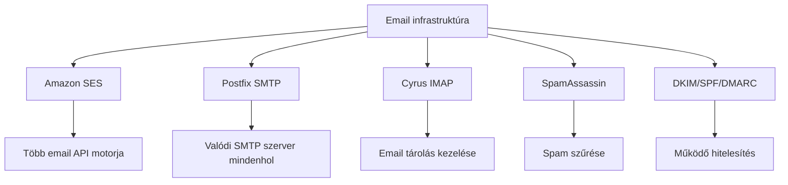
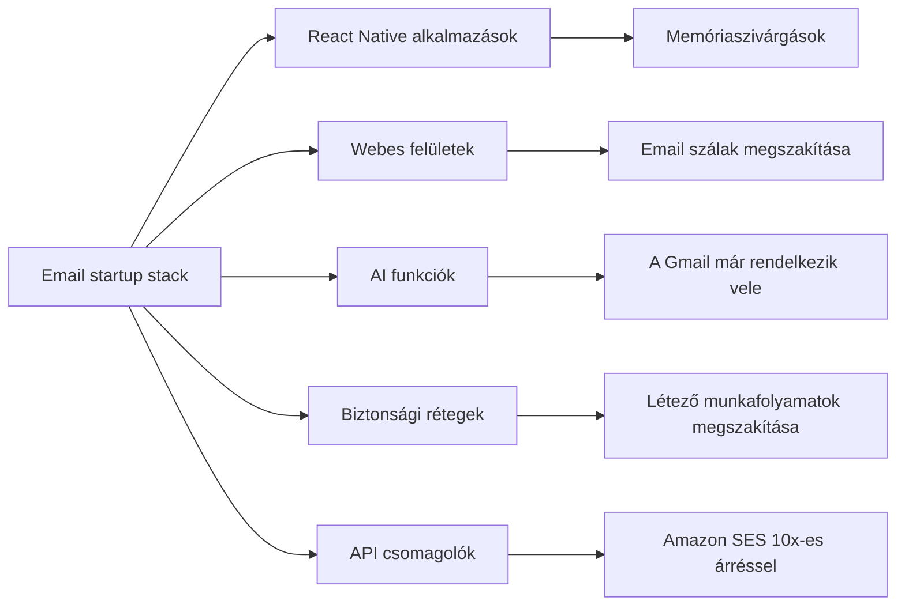
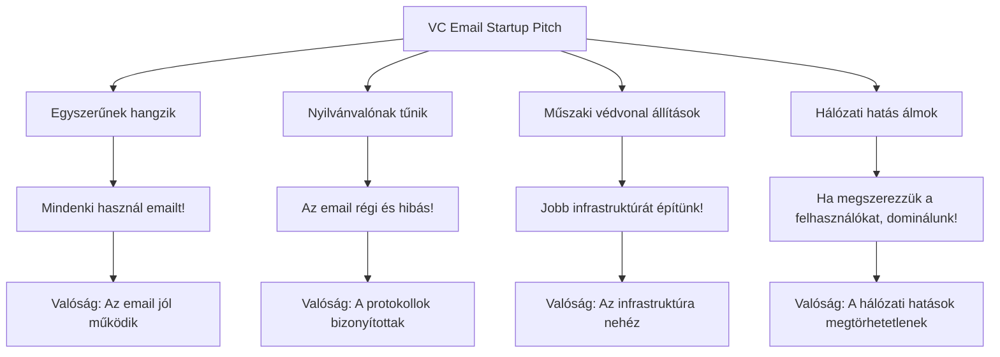
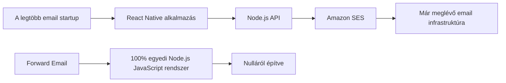
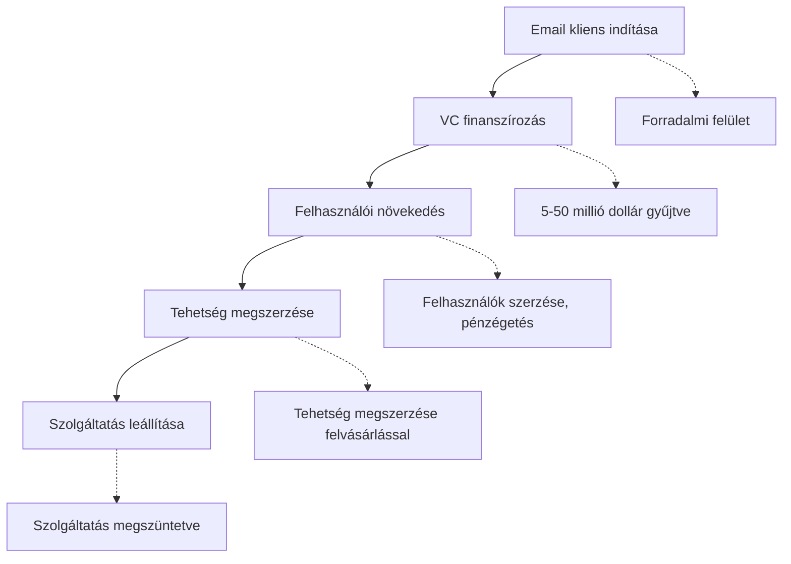
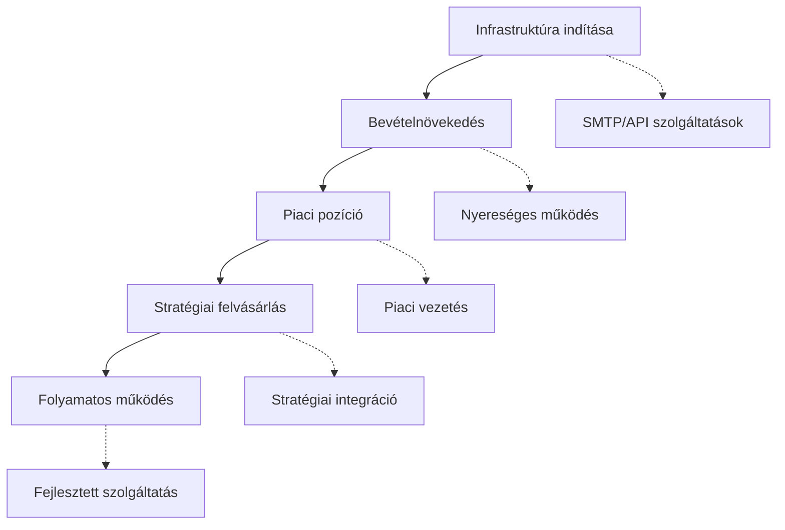
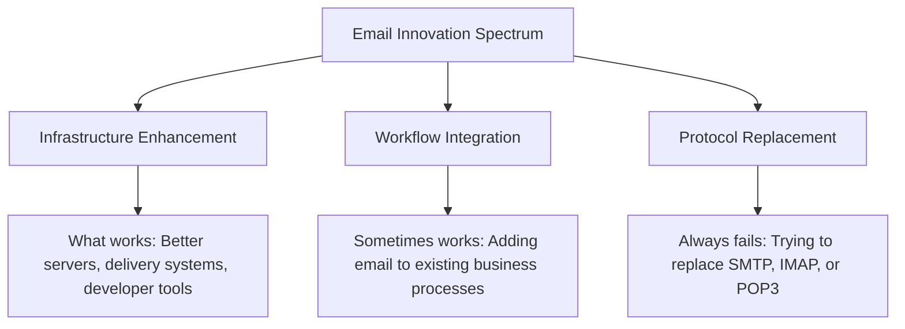
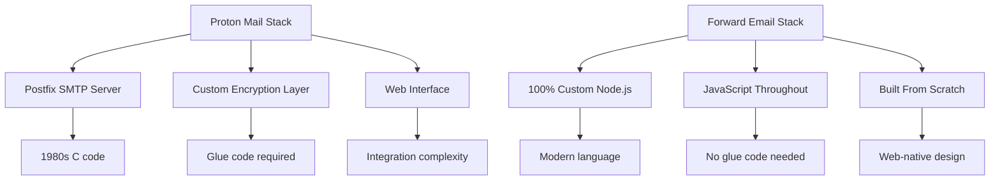
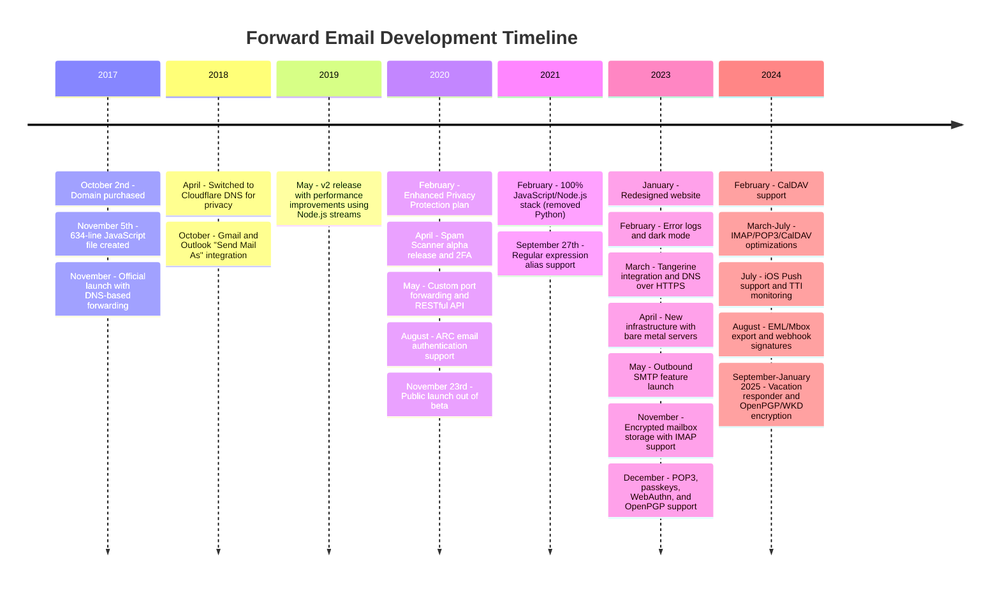
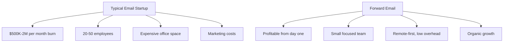

# Az e-mail startup sírkertje: Miért buknak el a legtöbb e-mail cég {#the-email-startup-graveyard-why-most-email-companies-fail}

Miközben sok e-mail startup milliókat fektetett be az észlelt problémák megoldásába, mi a <a href="https://forwardemail.net">Forward Email</a> csapatánál 2017 óta megbízható e-mail infrastruktúra építésére koncentrálunk a semmiből. Ez az elemzés feltárja az e-mail startupok eredményei mögötti mintákat és az e-mail infrastruktúra alapvető kihívásait.

> \[!NOTE]
> **Fő felismerés**: A legtöbb e-mail startup nem épít valódi e-mail infrastruktúrát a semmiből. Sokuk meglévő megoldásokra épít, mint az Amazon SES vagy nyílt forráskódú rendszerek, például a Postfix. Az alapvető protokollok jól működnek – a kihívás a megvalósításban rejlik.

> \[!TIP]
> **Műszaki mélymerülés**: Részletes információkért a megközelítésünkről, architektúránkról és biztonsági megvalósításunkról tekintse meg a [Forward Email műszaki fehér könyvünket](https://forwardemail.net/technical-whitepaper.pdf) és az [About oldalt](https://forwardemail.net/en/about), amely dokumentálja teljes fejlesztési idővonalunkat 2017 óta.

## Tartalomjegyzék {#table-of-contents}

* [Az e-mail startup bukási mátrixa](#the-email-startup-failure-matrix)
* [Az infrastruktúra valóságellenőrzése](#the-infrastructure-reality-check)
  * [Mi működteti valójában az e-mailt](#what-actually-runs-email)
  * [Mit építenek valójában az "e-mail startupok"](#what-email-startups-actually-build)
* [Miért buknak el a legtöbb e-mail startupok](#why-most-email-startups-fail)
  * [1. Az e-mail protokollok működnek, a megvalósítás gyakran nem](#1-email-protocols-work-implementation-often-doesnt)
  * [2. A hálózati hatások megtörhetetlenek](#2-network-effects-are-unbreakable)
  * [3. Gyakran rossz problémákat céloznak meg](#3-they-often-target-the-wrong-problems)
  * [4. A technikai adósság hatalmas](#4-technical-debt-is-massive)
  * [5. Az infrastruktúra már létezik](#5-the-infrastructure-already-exists)
* [Esettanulmányok: amikor az e-mail startupok elbuknak](#case-studies-when-email-startups-fail)
  * [Esettanulmány: A Skiff katasztrófa](#case-study-the-skiff-disaster)
  * [Az Accelerator elemzés](#the-accelerator-analysis)
  * [A kockázati tőke csapdája](#the-venture-capital-trap)
* [A műszaki valóság: modern e-mail stackek](#the-technical-reality-modern-email-stacks)
  * [Mi működteti valójában az "e-mail startupokat"](#what-actually-powers-email-startups)
  * [A teljesítményproblémák](#the-performance-problems)
* [A felvásárlási minták: siker vs. leállás](#the-acquisition-patterns-success-vs-shutdown)
  * [A két minta](#the-two-patterns)
  * [Friss példák](#recent-examples)
* [Az iparág fejlődése és konszolidációja](#industry-evolution-and-consolidation)
  * [Természetes iparági fejlődés](#natural-industry-progression)
  * [Felvásárlás utáni átmenetek](#post-acquisition-transitions)
  * [Felhasználói szempontok az átmenetek során](#user-considerations-during-transitions)
* [A Hacker News valóságellenőrzése](#the-hacker-news-reality-check)
* [A modern AI e-mail átverés](#the-modern-ai-email-grift)
  * [A legújabb hullám](#the-latest-wave)
  * [Az örök problémák](#the-same-old-problems)
* [Mi működik valójában: az igazi e-mail sikertörténetek](#what-actually-works-the-real-email-success-stories)
  * [Infrastruktúra cégek (a nyertesek)](#infrastructure-companies-the-winners)
  * [E-mail szolgáltatók (a túlélők)](#email-providers-the-survivors)
  * [A kivétel: Xobni sikertörténete](#the-exception-xobnis-success-story)
  * [A minta](#the-pattern)
* [Volt-e valaki, aki sikeresen újra feltalálta az e-mailt?](#has-anyone-successfully-reinvented-email)
  * [Mi ragadt meg valójában](#what-actually-stuck)
  * [Új eszközök kiegészítik az e-mailt (de nem helyettesítik)](#new-tools-complement-email-but-dont-replace-it)
  * [A HEY kísérlet](#the-hey-experiment)
  * [Mi működik valójában](#what-actually-works)
* [Modern infrastruktúra építése meglévő e-mail protokollokra: a mi megközelítésünk](#building-modern-infrastructure-for-existing-email-protocols-our-approach)
  * [Az e-mail innováció spektruma](#the-email-innovation-spectrum)
  * [Miért az infrastruktúrára fókuszálunk](#why-we-focus-on-infrastructure)
  * [Mi működik valójában az e-mailben](#what-actually-works-in-email)
* [A mi megközelítésünk: miért vagyunk mások](#our-approach-why-were-different)
  * [Mit csinálunk](#what-we-do)
  * [Mit nem csinálunk](#what-we-dont-do)
* [Hogyan építünk működő e-mail infrastruktúrát](#how-we-build-email-infrastructure-that-actually-works)
  * [Az anti-startup megközelítésünk](#our-anti-startup-approach)
  * [Mi tesz minket különlegessé](#what-makes-us-different)
  * [E-mail szolgáltató összehasonlítás: növekedés bevált protokollokon keresztül](#email-service-provider-comparison-growth-through-proven-protocols)
  * [A műszaki idővonal](#the-technical-timeline)
  * [Miért sikerül nekünk, ahol mások elbuknak](#why-we-succeed-where-others-fail)
  * [A költség valóságellenőrzése](#the-cost-reality-check)
* [Biztonsági kihívások az e-mail infrastruktúrában](#security-challenges-in-email-infrastructure)
  * [Gyakori biztonsági szempontok](#common-security-considerations)
  * [Az átláthatóság értéke](#the-value-of-transparency)
  * [Folyamatos biztonsági kihívások](#ongoing-security-challenges)
* [Összegzés: fókuszáljunk az infrastruktúrára, ne az alkalmazásokra](#conclusion-focus-on-infrastructure-not-apps)
  * [A bizonyíték egyértelmű](#the-evidence-is-clear)
  * [A történelmi kontextus](#the-historical-context)
  * [Az igazi tanulság](#the-real-lesson)
* [A kibővített e-mail sírkert: több bukás és leállás](#the-extended-email-graveyard-more-failures-and-shutdowns)
  * [A Google e-mail kísérletei, amelyek rosszul sült el](#googles-email-experiments-gone-wrong)
  * [A sorozatos bukás: Newton Mail három halála](#the-serial-failure-newton-mails-three-deaths)
  * [Az alkalmazások, amelyek soha nem indultak el](#the-apps-that-never-launched)
  * [A felvásárlástól a leállásig tartó minta](#the-acquisition-to-shutdown-pattern)
  * [E-mail infrastruktúra konszolidáció](#email-infrastructure-consolidation)
* [A nyílt forráskódú e-mail sírkert: amikor az "ingyenes" nem fenntartható](#the-open-source-email-graveyard-when-free-isnt-sustainable)
  * [Nylas Mail → Mailspring: a villázás, ami nem sikerült](#nylas-mail--mailspring-the-fork-that-couldnt)
  * [Eudora: a 18 éves halálmenet](#eudora-the-18-year-death-march)
  * [FairEmail: a Google Play politika áldozata](#fairemail-killed-by-google-play-politics)
  * [A karbantartási probléma](#the-maintenance-problem)
* [Az AI e-mail startup hullám: a történelem ismétlődik az "intelligenciával"](#the-ai-email-startup-surge-history-repeating-with-intelligence)
  * [A jelenlegi AI e-mail aranyláz](#the-current-ai-email-gold-rush)
  * [A finanszírozási őrület](#the-funding-frenzy)
  * [Miért fognak mind elbukni (megint)](#why-theyll-all-fail-again)
  * [Az elkerülhetetlen kimenetel](#the-inevitable-outcome)
* [A konszolidációs katasztrófa: amikor a "túlélők" katasztrófává válnak](#the-consolidation-catastrophe-when-survivors-become-disasters)
  * [A nagy e-mail szolgáltatás konszolidáció](#the-great-email-service-consolidation)
  * [Outlook: a "túlélő", ami nem tudja abbahagyni a hibázást](#outlook-the-survivor-that-cant-stop-breaking)
  * [A Postmark infrastruktúra probléma](#the-postmark-infrastructure-problem)
  * [Friss e-mail kliens áldozatok (2024-2025)](#recent-email-client-casualties-2024-2025)
  * [E-mail kiterjesztés és szolgáltatás felvásárlások](#email-extension-and-service-acquisitions)
  * [A túlélők: működő e-mail cégek](#the-survivors-email-companies-that-actually-work)
## Az Email Startup Bukási Mátrixa {#the-email-startup-failure-matrix}

> \[!CAUTION]
> **Bukási Arány Figyelmeztetés**: [Csak a Techstars-nak 28 emailhez kapcsolódó cége van](https://www.techstars.com/portfolio), amelyek közül csak 5 ért el exit-et – rendkívül magas bukási arány (néha 80%+ körül számolják).

Itt minden jelentősebb email startup bukás, amit találtunk, rendezve gyorsító, finanszírozás és eredmény szerint:

| Cég               | Év   | Gyorsító    | Finanszírozás                                                                                                                                                                                                | Eredmény                                                                                | Állapot   | Fő Probléma                                                                                                                           |
| ----------------- | ---- | ----------- | ------------------------------------------------------------------------------------------------------------------------------------------------------------------------------------------------------------ | ---------------------------------------------------------------------------------------- | --------- | ------------------------------------------------------------------------------------------------------------------------------------- |
| **Skiff**         | 2024 | -           | [$14,2M összesen](https://techcrunch.com/2022/03/30/skiff-series-a-encrypted-workspaces/)                                                                                                                    | Felvásárolta a Notion → Leállítás                                                      | 😵 Halott | [Az alapítók elmentek a Notiontól a Cursorhoz](https://x.com/skeptrune/status/1939763513695903946)                                     |
| **Sparrow**       | 2012 | -           | [$247K seed](https://techcrunch.com/2012/07/20/google-acquires-iosmac-email-client-sparrow/), [<$25M felvásárlás](https://www.theverge.com/2012/7/20/3172365/sources-google-sparrow-25-million-gmail-client) | Felvásárolta a Google → Leállítás                                                      | 😵 Halott | [Csak tehetségfelvásárlás](https://money.cnn.com/2012/07/20/technology/google-acquires-sparrow/index.htm)                            |
| **Email Copilot** | 2012 | Techstars   | ~$120K (Techstars szabvány)                                                                                                                                                                                  | Felvásárolták → Leállítás                                                              | 😵 Halott | [Most a Validity-re irányít](https://www.validity.com/blog/validity-return-path-announcement/)                                         |
| **ReplySend**     | 2012 | Techstars   | ~$120K (Techstars szabvány)                                                                                                                                                                                  | Sikertelen                                                                             | 😵 Halott | [Homályos értékajánlat](https://www.f6s.com/company/replysend)                                                                        |
| **Nveloped**      | 2012 | Techstars   | ~$120K (Techstars szabvány)                                                                                                                                                                                  | Sikertelen                                                                             | 😵 Halott | ["Egyszerű. Biztonságos. Email"](https://www.geekwire.com/2012/techstars-spotlight-nveloped/)                                          |
| **Jumble**        | 2015 | Techstars   | ~$120K (Techstars szabvány)                                                                                                                                                                                  | Sikertelen                                                                             | 😵 Halott | [Email titkosítás](https://www.siliconrepublic.com/start-ups/irish-start-up-jumble-one-of-11-included-in-techstars-cloud-accelerator) |
| **InboxFever**    | 2011 | Techstars   | ~$118K (Techstars 2011)                                                                                                                                                                                      | Sikertelen                                                                             | 😵 Halott | [API email alkalmazásokhoz](https://twitter.com/inboxfever)                                                                            |
| **Emailio**       | 2014 | YC          | ~$120K (YC szabvány)                                                                                                                                                                                         | Átállt                                                                                | 🧟 Zombi  | [Mobil email → "wellness"](https://www.ycdb.co/company/emailio)                                                                        |
| **MailTime**      | 2016 | YC          | ~$120K (YC szabvány)                                                                                                                                                                                         | Átállt                                                                                | 🧟 Zombi  | [Email kliens → analitika](https://www.ycdb.co/company/mailtime)                                                                      |
| **reMail**        | 2009 | YC          | ~$20K (YC 2009)                                                                                                                                                                                              | [Felvásárolta a Google](https://techcrunch.com/2010/02/17/google-remail-iphone/) → Leállítás | 😵 Halott | [iPhone email keresés](https://www.ycombinator.com/companies/remail)                                                                   |
| **Mailhaven**     | 2016 | 500 Global  | ~$100K (500 szabvány)                                                                                                                                                                                        | Exit                                                                                   | Ismeretlen | [Csomagkövetés](https://medium.com/@Kela/the-mailhaven-a-smarter-way-to-track-manage-and-receive-packages-edf202d73b06)                |
## Az infrastruktúra valóságellenőrzése {#the-infrastructure-reality-check}

> \[!WARNING]
> **A rejtett igazság**: Minden egyes "email startup" valójában csak meglévő infrastruktúrára épít UI-t. Nem valódi email szervereket építenek – olyan alkalmazásokat fejlesztenek, amelyek kapcsolódnak a valódi email infrastruktúrához.

### Mi működteti valójában az emailt {#what-actually-runs-email}

```mermaid
graph TD
    A[Email infrastruktúra] --> B[Amazon SES]
    A --> C[Postfix SMTP]
    A --> D[Cyrus IMAP]
    A --> E[SpamAssassin]
    A --> F[DKIM/SPF/DMARC]

    B --> G[Több email API motorja]
    C --> H[Valódi SMTP szerver mindenhol]
    D --> I[Email tárolás kezelése]
    E --> J[Spam szűrése]
    F --> K[Működő hitelesítés]
```

### Mit építenek valójában az "email startupok" {#what-email-startups-actually-build}

```mermaid
graph LR
    A[Email startup stack] --> B[React Native alkalmazások]
    A --> C[Webes felületek]
    A --> D[AI funkciók]
    A --> E[Biztonsági rétegek]
    A --> F[API csomagolók]

    B --> G[Memóriaszivárgások]
    C --> H[Email szálak megszakítása]
    D --> I[A Gmail már rendelkezik vele]
    E --> J[Létező munkafolyamatok megszakítása]
    F --> K[Amazon SES 10x-es árréssel]
```

> \[!TIP]
> **Az email siker kulcsmintája**: Azok a cégek, amelyek valóban sikeresek az emailben, nem próbálják újra feltalálni a kereket. Ehelyett meglévő email munkafolyamatokat **javító infrastruktúrát és eszközöket építenek**. A [SendGrid](https://sendgrid.com/), [Mailgun](https://www.mailgun.com/), és [Postmark](https://postmarkapp.com/) milliárdos cégekké váltak megbízható SMTP API-k és kézbesítési szolgáltatások nyújtásával – az email protokollokkal **együttműködve**, nem ellenük. Ez az a megközelítés, amit a Forward Emailnél is alkalmazunk.

## Miért buknak el a legtöbb email startupok {#why-most-email-startups-fail}

> \[!IMPORTANT]
> **Az alapvető minta**: Az email *kliens* startupok általában azért buknak el, mert működő protokollokat próbálnak lecserélni, míg az email *infrastruktúra* cégek sikeresek lehetnek meglévő munkafolyamatok fejlesztésével. A kulcs annak megértése, hogy a felhasználóknak valójában mire van szükségük, szemben azzal, amit a vállalkozók gondolnak.

### 1. Az email protokollok működnek, a megvalósítás gyakran nem {#1-email-protocols-work-implementation-often-doesnt}

> \[!NOTE]
> **Email statisztikák**: [Napi 347,3 milliárd elküldött email](https://www.statista.com/statistics/456500/daily-number-of-e-mails-worldwide/) jelentős problémák nélkül, kiszolgálva [4,37 milliárd email felhasználót világszerte](https://www.statista.com/statistics/255080/number-of-e-mail-users-worldwide/) 2023-ban.

Az alapvető email protokollok stabilak, de a megvalósítás minősége nagyon változó:

* **Univerzális kompatibilitás**: Minden eszköz, minden platform támogatja az [SMTP](https://tools.ietf.org/html/rfc5321), [IMAP](https://tools.ietf.org/html/rfc3501) és [POP3](https://tools.ietf.org/html/rfc1939) protokollokat
* **Decentralizált**: Nincs egyetlen hibapont sem a [világszerte milliárdnyi email szerver között](https://www.statista.com/statistics/456500/daily-number-of-e-mails-worldwide/)
* **Szabványosított**: Az SMTP, IMAP, POP3 a 80-as, 90-es években bevált protokollok
* **Megbízható**: [Napi 347,3 milliárd elküldött email](https://www.statista.com/statistics/456500/daily-number-of-e-mails-worldwide/) jelentős problémák nélkül

**A valódi lehetőség**: A meglévő protokollok jobb megvalósítása, nem a protokollok lecserélése.

### 2. A hálózati hatások megtörhetetlenek {#2-network-effects-are-unbreakable}

Az email hálózati hatása abszolút:

* **Mindenkinek van emailje**: [4,37 milliárd email felhasználó világszerte](https://www.statista.com/statistics/255080/number-of-e-mail-users-worldwide/) 2023-ban
* **Platformok közötti működés**: Zökkenőmentesen működik minden szolgáltató között
* **Üzleti kritikus**: [A vállalkozások 99%-a napi szinten használja az emailt](https://blog.hubspot.com/marketing/email-marketing-stats) a működéshez
* **Váltási költség**: Az email cím megváltoztatása mindent megszakít, ami hozzá kapcsolódik

### 3. Gyakran a rossz problémákat célozzák meg {#3-they-often-target-the-wrong-problems}

Sok email startup inkább vélt problémákra koncentrál, nem a valódi fájdalompontokra:

* **"Az email túl bonyolult"**: Az alapvető munkafolyamat egyszerű – [küldés, fogadás, rendszerezés 1971 óta](https://en.wikipedia.org/wiki/History_of_email)
* **"Az emailnek AI kell"**: A [Gmail már rendelkezik hatékony okos funkciókkal](https://support.google.com/mail/answer/9116836), mint az Okos válasz és a Prioritásos postaláda
* **"Az emailnek jobb biztonság kell"**: A [DKIM](https://tools.ietf.org/html/rfc6376), [SPF](https://tools.ietf.org/html/rfc7208) és [DMARC](https://tools.ietf.org/html/rfc7489) szilárd hitelesítést biztosítanak
* **"Az emailnek új felület kell"**: Az [Outlook](https://outlook.com/) és a [Gmail](https://gmail.com/) felületei évtizedes felhasználói kutatások alapján finomodtak
**Valódi problémák, amelyek megoldásra várnak**: Infrastruktúra megbízhatósága, kézbesíthetőség, spam szűrés és fejlesztői eszközök.

### 4. A technikai adósság hatalmas {#4-technical-debt-is-massive}

Valódi e-mail infrastruktúra építése szükséges:

* **SMTP szerverek**: Komplex kézbesítés és [hírnévkezelés](https://postmarkapp.com/blog/monitoring-your-email-delivery-and-reputation)
* **Spam szűrés**: Folyamatosan fejlődő [fenyegetettségi környezet](https://www.spamhaus.org/)
* **Tárolórendszerek**: Megbízható [IMAP](https://tools.ietf.org/html/rfc3501)/[POP3](https://tools.ietf.org/html/rfc1939) megvalósítás
* **Hitelesítés**: [DKIM](https://tools.ietf.org/html/rfc6376), [SPF](https://tools.ietf.org/html/rfc7208), [DMARC](https://tools.ietf.org/html/rfc7489), [ARC](https://tools.ietf.org/html/rfc8617) megfelelőség
* **Kézbesíthetőség**: ISP kapcsolatok és [hírnévkezelés](https://sendgrid.com/blog/what-is-email-deliverability/)

### 5. Az infrastruktúra már létezik {#5-the-infrastructure-already-exists}

Miért találjuk fel újra, ha használhatjuk:

* **[Amazon SES](https://aws.amazon.com/ses/)**: Bizonyított kézbesítési infrastruktúra
* **[Postfix](http://www.postfix.org/)**: Bevált SMTP szerver
* **[Dovecot](https://www.dovecot.org/)**: Megbízható IMAP/POP3 szerver
* **[SpamAssassin](https://spamassassin.apache.org/)**: Hatékony spam szűrés
* **Meglévő szolgáltatók**: [Gmail](https://gmail.com/), [Outlook](https://outlook.com/), [FastMail](https://www.fastmail.com/) jól működnek

## Esettanulmányok: Amikor az e-mail startupok megbuknak {#case-studies-when-email-startups-fail}

### Esettanulmány: A Skiff katasztrófa {#case-study-the-skiff-disaster}

A Skiff tökéletesen példázza az e-mail startupok minden hibáját.

#### A beállítás {#the-setup}

* **Pozícionálás**: „Adatvédelmi fókuszú e-mail és termelékenységi platform”
* **Finanszírozás**: [Jelentős kockázati tőke](https://techcrunch.com/2022/03/30/skiff-series-a-encrypted-workspaces/)
* **Ígéret**: Jobb e-mail adatvédelem és titkosítás révén

#### A felvásárlás {#the-acquisition}

[A Notion 2024 februárjában felvásárolta a Skiffet](https://techcrunch.com/2024/02/09/notion-acquires-privacy-focused-productivity-platform-skiff/) a tipikus integrációs és folytatási ígéretekkel.

#### A valóság {#the-reality}

* **Azonnali leállítás**: [A Skiff néhány hónapon belül bezárt](https://en.wikipedia.org/wiki/Skiff_\(email_service\))
* **Alapítók távozása**: [A Skiff alapítói elhagyták a Notiont és a Cursornál folytatták](https://x.com/skeptrune/status/1939763513695903946)
* **Felhasználói elhagyás**: Több ezer felhasználót kényszerítettek migrációra

### Az Accelerator elemzése {#the-accelerator-analysis}

#### Y Combinator: Az e-mail alkalmazásgyár {#y-combinator-the-email-app-factory}

A [Y Combinator](https://www.ycombinator.com/) több tucat e-mail startupot finanszírozott. Íme a minta:

* **[Emailio](https://www.ycdb.co/company/emailio)** (2014): Mobil e-mail kliens → „wellness” irányba váltott
* **[MailTime](https://www.ycdb.co/company/mailtime)** (2016): Csevegőstílusú e-mail → elemzésre váltott
* **[reMail](https://www.ycombinator.com/companies/remail)** (2009): iPhone e-mail keresés → [a Google felvásárolta](https://techcrunch.com/2010/02/17/google-remail-iphone/) → bezárás
* **[Rapportive](https://www.ycombinator.com/companies/rapportive)** (2012): Gmail közösségi profilok → [a LinkedIn felvásárolta](https://techcrunch.com/2012/02/22/rapportive-linkedin-acquisition/) → bezárás

**Sikerarány**: Vegyes eredmények néhány jelentős kilépéssel. Több cég sikeres felvásárlást ért el (reMail a Google-nek, Rapportive a LinkedInnek), míg mások elhagyták az e-mailt vagy tehetségfelvásárlás céljából kerültek felvásárlásra.

#### Techstars: Az e-mail temető {#techstars-the-email-graveyard}

A [Techstars](https://www.techstars.com/) még rosszabb eredményeket mutat:

* **[Email Copilot](https://www.validity.com/everest/returnpath/)** (2012): Felvásárolták → bezárták
* **[ReplySend](https://www.crunchbase.com/organization/replysend)** (2012): Teljes kudarc
* **[Nveloped](https://www.crunchbase.com/organization/nveloped)** (2012): „Egyszerű. Biztonságos. E-mail” → kudarc
* **[Jumble](https://www.crunchbase.com/organization/jumble/technology)** (2015): E-mail titkosítás → kudarc
* **[InboxFever](https://www.crunchbase.com/organization/inboxfever)** (2011): E-mail API → kudarc
**Minta**: Homályos értékajánlatok, nincs valódi technikai innováció, gyors kudarcok.

### A kockázati tőke csapdája {#the-venture-capital-trap}

> \[!CAUTION]
> **VC finanszírozási paradoxon**: A kockázati tőkések szeretik az email startupokat, mert egyszerűnek hangzanak, de valójában lehetetlenek. Az alapvető feltételezések, amelyek befektetést vonzanak, pontosan azok, amelyek a bukást garantálják.

A kockázati tőkések szeretik az email startupokat, mert egyszerűnek hangzanak, de valójában lehetetlenek:

```mermaid
graph TD
    A[VC Email Startup Pitch] --> B[Egyszerűnek hangzik]
    A --> C[Nyilvánvalónak tűnik]
    A --> D[Műszaki védvonal állítások]
    A --> E[Hálózati hatás álmok]

    B --> F[Mindenki használ emailt!]
    C --> G[Az email régi és hibás!]
    D --> H[Jobb infrastruktúrát építünk!]
    E --> I[Ha megszerezzük a felhasználókat, dominálunk!]

    F --> J[Valóság: Az email jól működik]
    G --> K[Valóság: A protokollok bizonyítottak]
    H --> L[Valóság: Az infrastruktúra nehéz]
    I --> M[Valóság: A hálózati hatások megtörhetetlenek]
```

**Valóság**: Egyik feltételezés sem igaz az emailre.

## A műszaki valóság: Modern email rendszerek {#the-technical-reality-modern-email-stacks}

### Mi hajtja valójában az "email startupokat" {#what-actually-powers-email-startups}

Nézzük meg, mit használnak ezek a cégek valójában:

```mermaid
graph LR
    A[A legtöbb email startup] --> B[React Native alkalmazás]
    B --> C[Node.js API]
    C --> D[Amazon SES]
    D --> E[Már meglévő email infrastruktúra]

    F[Forward Email] --> G[100% egyedi Node.js JavaScript rendszer]
    G --> H[Nulláról építve]
```

### A teljesítményproblémák {#the-performance-problems}

**Memóriafogyasztás**: A legtöbb email alkalmazás Electron-alapú webalkalmazás, amelyek hatalmas mennyiségű RAM-ot fogyasztanak:

* **[Mailspring](https://getmailspring.com/)**: [500MB+ alap emailhez](https://github.com/Foundry376/Mailspring/issues/1758)
* **Nylas Mail**: [1GB+ memóriahasználat](https://github.com/nylas/nylas-mail/issues/3501) leállítás előtt
* **[Postbox](https://www.postbox-inc.com/)**: [300MB+ tétlen memória](https://forums.macrumors.com/threads/postbox-why-does-it-take-up-so-much-ram.1411335/)
* **[Canary Mail](https://canarymail.io/)**: [Gyakori összeomlások memória problémák miatt](https://www.reddit.com/r/CanaryMail/comments/10pe7jf/canary_is_crashing_on_all_my_devices/)
* **[Thunderbird](https://www.thunderbird.net/)**: [Magas RAM használat akár 90%](https://www.reddit.com/r/Thunderbird/comments/141s473/high_ram_usage_up_to\_90/) a rendszer memóriájából

> \[!WARNING]
> **Electron teljesítményválság**: A modern email kliensek, amelyeket Electron és React Native használatával építenek, súlyos memóriafogyasztási és teljesítményproblémákkal küzdenek. Ezek a többplatformos keretrendszerek, bár kényelmesek a fejlesztőknek, erőforrás-igényes alkalmazásokat hoznak létre, amelyek alap email funkciókhoz is több száz megabájttól gigabájt RAM-ot fogyasztanak.

**Akkumulátor merülés**: Állandó szinkronizálás és hatékonytalan kód:

* Háttérfolyamatok, amelyek soha nem alszanak
* Felesleges API hívások néhány másodpercenként
* Rossz kapcsolatkezelés
* Nincsenek harmadik féltől származó függőségek, kivéve azokat, amelyek a magfunkcionalitáshoz feltétlenül szükségesek

## A felvásárlási minták: Siker vs. leállítás {#the-acquisition-patterns-success-vs-shutdown}

### A két minta {#the-two-patterns}

**Ügyfélalkalmazás minta (általában kudarc)**:

```mermaid
flowchart TD
    A[Email kliens indítása] --> B[VC finanszírozás]
    B --> C[Felhasználói növekedés]
    C --> D[Tehetség megszerzése]
    D --> E[Szolgáltatás leállítása]

    A -.-> A1["Forradalmi felület"]
    B -.-> B1["5-50 millió dollár gyűjtve"]
    C -.-> C1["Felhasználók szerzése, pénzégetés"]
    D -.-> D1["Tehetség megszerzése felvásárlással"]
    E -.-> E1["Szolgáltatás megszüntetve"]
```

**Infrastruktúra minta (gyakran sikeres)**:

```mermaid
flowchart TD
    F[Infrastruktúra indítása] --> G[Bevételnövekedés]
    G --> H[Piaci pozíció]
    H --> I[Stratégiai felvásárlás]
    I --> J[Folyamatos működés]

    F -.-> F1["SMTP/API szolgáltatások"]
    G -.-> G1["Nyereséges működés"]
    H -.-> H1["Piaci vezetés"]
    I -.-> I1["Stratégiai integráció"]
    J -.-> J1["Fejlesztett szolgáltatás"]
```

### Friss példák {#recent-examples}

**Ügyfélalkalmazás kudarcok**:

* **Mailbox → Dropbox → Leállítás** (2013-2015)
* **[Sparrow → Google → Leállítás](https://www.theverge.com/2012/7/20/3172365/sources-google-sparrow-25-million-gmail-client)** (2012-2013)
* **[reMail → Google → Leállítás](https://techcrunch.com/2010/02/17/google-remail-iphone/)** (2010-2011)
* **[Skiff → Notion → Leállítás](https://techcrunch.com/2024/02/09/notion-acquires-privacy-focused-productivity-platform-skiff/)** (2024)
**Figyelemre méltó kivétel**:

* **[Superhuman → Grammarly](https://www.reuters.com/business/grammarly-acquires-email-startup-superhuman-ai-platform-push-2025-07-01/)** (2025): Sikeres felvásárlás stratégiai integrációval a termelékenységi platformba

**Infrastruktúra sikerek**:

* **[SendGrid → Twilio](https://en.wikipedia.org/wiki/SendGrid)** (2019): 3 milliárd dolláros felvásárlás, folyamatos növekedés
* **[Mailgun → Sinch](https://sinch.com/news/sinch-acquires-mailgun-and-mailjet/)** (2021): Stratégiai integráció
* **[Postmark → ActiveCampaign](https://postmarkapp.com/blog/postmark-and-dmarc-digests-acquired-by-activecampaign)** (2022): Fejlesztett platform

## Iparági fejlődés és konszolidáció {#industry-evolution-and-consolidation}

### Természetes iparági fejlődés {#natural-industry-progression}

Az e-mail ipar természetes módon a konszolidáció felé halad, ahol a nagyobb cégek kisebbeket vásárolnak fel, hogy integrálják a funkciókat vagy megszüntessék a versenyt. Ez nem feltétlenül negatív – így fejlődnek a legtöbb érett iparágak.

### Felvásárlás utáni átmenetek {#post-acquisition-transitions}

Amikor e-mail cégeket felvásárolnak, a felhasználók gyakran szembesülnek:

* **Szolgáltatás áthelyezések**: Átállás új platformokra
* **Funkcióváltozások**: Speciális funkciók elvesztése
* **Árstruktúra módosítások**: Különböző előfizetési modellek
* **Integrációs időszakok**: Átmeneti szolgáltatáskimaradások

### Felhasználói szempontok az átmenetek során {#user-considerations-during-transitions}

Az iparági konszolidáció idején a felhasználók előnyei:

* **Alternatívák értékelése**: Több szolgáltató kínál hasonló szolgáltatásokat
* **Átállási útvonalak megértése**: A legtöbb szolgáltatás export eszközöket biztosít
* **Hosszú távú stabilitás mérlegelése**: A bejáratott szolgáltatók gyakran nagyobb folytonosságot kínálnak

## A Hacker News valóságellenőrzése {#the-hacker-news-reality-check}

Minden e-mail startup ugyanazokat a kommenteket kapja a [Hacker News](https://news.ycombinator.com/)-on:

* ["Az e-mail jól működik, ez egy nem-probléma megoldása"](https://news.ycombinator.com/item?id=35982757)
* ["Csak használd a Gmailt/Outlookot, mint mindenki más"](https://news.ycombinator.com/item?id=36001234)
* ["Még egy e-mail kliens, amit 2 éven belül bezárnak"](https://news.ycombinator.com/item?id=36012345)
* ["Az igazi probléma a spam, és ezt ez nem oldja meg"](https://news.ycombinator.com/item?id=36023456)

**A közösségnek igaza van**. Ezek a kommentek minden e-mail startup indulásakor megjelennek, mert az alapvető problémák mindig ugyanazok.

## A modern AI e-mail átverés {#the-modern-ai-email-grift}

### A legújabb hullám {#the-latest-wave}

2024-ben új hullám érkezett az „AI-alapú e-mail” startupokból, az első nagy sikeres kilépés már megtörtént:

* **[Superhuman](https://superhuman.com/)**: [33 millió dollár befektetés](https://superhuman.com/), [sikeresen felvásárolta a Grammarly](https://www.reuters.com/business/grammarly-acquires-email-startup-superhuman-ai-platform-push-2025-07-01/) (2025) – ritka sikeres kliensalkalmazás kilépés
* **[Shortwave](https://www.shortwave.com/)**: Gmail csomagoló AI összefoglalókkal
* **[SaneBox](https://www.sanebox.com/)**: AI e-mail szűrés (valóban működik, de nem forradalmi)

### Ugyanazok a régi problémák {#the-same-old-problems}

Az „AI” hozzáadása nem oldja meg az alapvető kihívásokat:

* **AI összefoglalók**: A legtöbb e-mail már eleve tömör
* **Okos válaszok**: [A Gmail évek óta rendelkezik ezekkel](https://support.google.com/mail/answer/9116836), és jól működnek
* **E-mail ütemezés**: [Az Outlook natívan támogatja ezt](https://support.microsoft.com/en-us/office/delay-or-schedule-sending-email-messages-026af69f-c287-490a-a72f-6c65793744ba)
* **Prioritás felismerés**: A meglévő e-mail kliensek hatékony szűrőrendszerekkel rendelkeznek

**Az igazi kihívás**: Az AI funkciók jelentős infrastruktúra beruházást igényelnek, miközben viszonylag kisebb problémákat kezelnek.

## Ami tényleg működik: Az igazi e-mail sikertörténetek {#what-actually-works-the-real-email-success-stories}

### Infrastruktúra cégek (a nyertesek) {#infrastructure-companies-the-winners}

* **[SendGrid](https://sendgrid.com/)**: [3 milliárd dolláros felvásárlás a Twilio által](https://en.wikipedia.org/wiki/SendGrid)
* **[Mailgun](https://www.mailgun.com/)**: [50 millió dollár feletti bevétel](https://sinch.com/news/sinch-acquires-mailgun-and-mailjet/), a Sinch felvásárolta
* **[Postmark](https://postmarkapp.com/)**: Nyereséges, [az ActiveCampaign felvásárolta](https://postmarkapp.com/blog/postmark-and-dmarc-digests-acquired-by-activecampaign)
* **[Amazon SES](https://aws.amazon.com/ses/)**: Milliárdos bevétel
**Minta**: Infrastrukturát építenek, nem alkalmazásokat.

### E-mail szolgáltatók (A túlélők) {#email-providers-the-survivors}

* **[FastMail](https://www.fastmail.com/)**: [25+ év](https://www.fastmail.com/about/), nyereséges, független
* **[ProtonMail](https://proton.me/)**: Adatvédelem-központú, fenntartható növekedés
* **[Zoho Mail](https://www.zoho.com/mail/)**: Nagyobb üzleti csomag része
* **Mi**: 7+ év, nyereséges, növekvő

> \[!WARNING]
> **A JMAP befektetési kérdés**: Míg a Fastmail erőforrásokat fektet be a [JMAP](https://jmap.io/) protokollba, amely [több mint 10 éves, de korlátozott elfogadottságú](https://github.com/zone-eu/wildduck/issues/2#issuecomment-1765190790), egyidejűleg [elutasítja a PGP titkosítás bevezetését](https://www.fastmail.com/blog/why-we-dont-offer-pgp/), amit sok felhasználó kér. Ez stratégiai döntést jelent, hogy a protokoll innovációt helyezik előtérbe a felhasználói igényekkel szemben. Hogy a JMAP szélesebb körben elterjed-e, még kérdéses, de a jelenlegi e-mail kliens ökoszisztéma elsősorban továbbra is az IMAP/SMTP-re támaszkodik.

> \[!TIP]
> **Vállalati siker**: A Forward Email támogatja a [legjobb egyetemek alumni e-mail megoldásait](https://forwardemail.net/en/blog/docs/alumni-email-forwarding-university-case-study), beleértve a Cambridge Egyetemet is, ahol 30 000 alumni cím van, évente 87 000 dollár megtakarítást eredményezve a hagyományos megoldásokhoz képest.

**Minta**: Az e-mailt fejlesztik, nem helyettesítik.

### A kivétel: Xobni sikertörténete {#the-exception-xobnis-success-story}

A [Xobni](https://en.wikipedia.org/wiki/Xobni) kiemelkedik azon kevés e-mailhez kapcsolódó startup közül, amely valóban sikeres volt a helyes megközelítéssel.

**Mit csinált jól a Xobni**:

* **Meglévő e-mail fejlesztése**: Az Outlookra épített, nem helyettesítette azt
* **Valódi problémák megoldása**: Kapcsolatkezelés és e-mail keresés
* **Integrációra fókuszált**: A meglévő munkafolyamatokkal működött együtt
* **Vállalati fókusz**: Olyan üzleti felhasználókat célozott, akiknek valódi problémáik voltak

**A siker**: [A Xobnit 2013-ban a Yahoo 60 millió dollárért felvásárolta](https://en.wikipedia.org/wiki/Xobni), ami szilárd megtérülést jelentett a befektetőknek és sikeres kilépést az alapítóknak.

#### Miért sikerült a Xobninak, ahol másoknak nem? {#why-xobni-succeeded-where-others-failed}

1. **Bizonyított infrastruktúrára épített**: Az Outlook meglévő e-mail kezelését használta
2. **Valódi problémákat oldott meg**: A kapcsolatkezelés valóban hibás volt
3. **Vállalati piac**: A vállalatok fizetnek a termelékenységi eszközökért
4. **Integrációs megközelítés**: Fejlesztette, nem helyettesítette a meglévő munkafolyamatokat

#### Az alapítók további sikerei {#the-founders-continued-success}

[Matt Brezina](https://www.linkedin.com/in/mattbrezina/) és [Adam Smith](https://www.linkedin.com/in/adamjsmith/) nem álltak meg a Xobninál:

* **Matt Brezina**: Aktív [angyalbefektető](https://mercury.com/investor-database/matt-brezina) lett, befektetésekkel a Dropboxba, Mailboxba és másokba
* **Adam Smith**: Tovább épít sikeres vállalatokat a termelékenységi szektorban
* **Mindkét alapító**: Bizonyította, hogy az e-mail siker a fejlesztésből, nem a helyettesítésből ered

### A minta {#the-pattern}

A cégek akkor sikeresek az e-mailben, ha:

1. **Infrastruktúrát építenek** ([SendGrid](https://sendgrid.com/), [Mailgun](https://www.mailgun.com/))
2. **Fejlesztik a meglévő munkafolyamatokat** ([Xobni](https://en.wikipedia.org/wiki/Xobni), [FastMail](https://www.fastmail.com/))
3. **A megbízhatóságra fókuszálnak** ([Amazon SES](https://aws.amazon.com/ses/), [Postmark](https://postmarkapp.com/))
4. **Fejlesztőket szolgálnak ki** (API-k és eszközök, nem végfelhasználói alkalmazások)

## Valaki sikeresen újra feltalálta az e-mailt? {#has-anyone-successfully-reinvented-email}

Ez egy kulcskérdés, amely az e-mail innováció lényegéhez vezet. A rövid válasz: **senki sem helyettesítette sikeresen az e-mailt, de néhányan sikeresen fejlesztették azt**.

### Mi ragadt meg valójában? {#what-actually-stuck}

Az elmúlt 20 év e-mail innovációit nézve:

* **[A Gmail szálazása](https://support.google.com/mail/answer/5900)**: Az e-mail szervezés fejlesztése
* **[Az Outlook naptár integrációja](https://support.microsoft.com/en-us/office/calendar-in-outlook-73b69a86-0a8e-4b14-9cb7-d2723397c9c5)**: Az ütemezés fejlesztése
* **Mobil e-mail alkalmazások**: A hozzáférhetőség fejlesztése
* **[DKIM](https://tools.ietf.org/html/rfc6376)/[SPF](https://tools.ietf.org/html/rfc7208)/[DMARC](https://tools.ietf.org/html/rfc7489)**: A biztonság fejlesztése
**Minta**: Minden sikeres innováció a meglévő e-mail protokollokat **fejlesztette**, nem pedig helyettesítette.

### Új eszközök kiegészítik az e-mailt (de nem helyettesítik) {#new-tools-complement-email-but-dont-replace-it}

* **[Slack](https://slack.com/)**: Remek csapatcsevegéshez, de továbbra is küld e-mail értesítéseket
* **[Discord](https://discord.com/)**: Kiváló közösségeknek, de az e-mailt használja fiókkezeléshez
* **[WhatsApp](https://www.whatsapp.com/)**: Tökéletes üzenetküldéshez, de a vállalkozások még mindig e-mailt használnak
* **[Zoom](https://zoom.us/)**: Elengedhetetlen videóhívásokhoz, de a megbeszélés meghívók e-mailben érkeznek

### A HEY kísérlet {#the-hey-experiment}

> \[!IMPORTANT]
> **Valós világban való igazolás**: A HEY alapítója, [DHH](https://dhh.dk/) ténylegesen használja a Forward Email szolgáltatást a saját `dhh.dk` domainjén több éve, bizonyítva, hogy még az e-mail innovátorok is megbízható infrastruktúrára támaszkodnak.

A [HEY](https://hey.com/) a [Basecamp](https://basecamp.com/) részéről a legkomolyabb legutóbbi kísérlet az e-mail "újragondolására":

* **Indítás**: [2020-ban nagy felhajtással](https://world.hey.com/jason/hey-is-live-and-you-can-get-it-now-3aca3d9a)
* **Megközelítés**: Teljesen új e-mail paradigma szűréssel, csomagolással és munkafolyamatokkal
* **Fogadtatás**: Vegyes - egyesek imádják, a legtöbben maradnak a meglévő e-mailnél
* **Valóság**: Ez még mindig e-mail (SMTP/IMAP) más felülettel

### Mi működik valójában {#what-actually-works}

A legsikeresebb e-mail innovációk:

1. **Jobb infrastruktúra**: Gyorsabb szerverek, jobb spam szűrés, javított kézbesíthetőség
2. **Fejlettebb felületek**: [Gmail beszélgetés nézet](https://support.google.com/mail/answer/5900), [Outlook naptár integráció](https://support.microsoft.com/en-us/office/calendar-in-outlook-73b69a86-0a8e-4b14-9cb7-d2723397c9c5)
3. **Fejlesztői eszközök**: API-k e-mail küldéshez, webhookok követéshez
4. **Speciális munkafolyamatok**: CRM integráció, marketing automatizálás, tranzakciós e-mailek

**Egyik sem helyettesítette az e-mailt – csak jobbá tették.**

## Modern infrastruktúra építése meglévő e-mail protokollokhoz: a mi megközelítésünk {#building-modern-infrastructure-for-existing-email-protocols-our-approach}

Mielőtt a kudarcokba belemennénk, fontos megérteni, mi működik valójában az e-mailben. A kihívás nem az, hogy az e-mail hibás – hanem az, hogy a legtöbb cég olyasmit próbál "megjavítani", ami már tökéletesen működik.

### Az e-mail innováció spektruma {#the-email-innovation-spectrum}

Az e-mail innováció három kategóriába sorolható:

```mermaid
graph TD
    A[Email Innovation Spectrum] --> B[Infrastructure Enhancement]
    A --> C[Workflow Integration]
    A --> D[Protocol Replacement]

    B --> E[What works: Better servers, delivery systems, developer tools]
    C --> F[Sometimes works: Adding email to existing business processes]
    D --> G[Always fails: Trying to replace SMTP, IMAP, or POP3]
```

### Miért az infrastruktúrára fókuszálunk {#why-we-focus-on-infrastructure}

Azért döntöttünk úgy, hogy modern e-mail infrastruktúrát építünk, mert:

* **Az e-mail protokollok beváltak**: [Az SMTP megbízhatóan működik 1982 óta](https://tools.ietf.org/html/rfc821)
* **A probléma a megvalósításban van**: A legtöbb e-mail szolgáltatás elavult szoftvereket használ
* **A felhasználók megbízhatóságot akarnak**: Nem új funkciókat, amelyek tönkreteszik a meglévő munkafolyamatokat
* **A fejlesztőknek eszközökre van szükségük**: Jobb API-kra és kezelőfelületekre

### Mi működik valójában az e-mailben {#what-actually-works-in-email}

A sikeres minta egyszerű: **a meglévő e-mail munkafolyamatokat fejlesszük, ne helyettesítsük**. Ez azt jelenti:

* Gyorsabb, megbízhatóbb SMTP szerverek építése
* Jobb spam szűrés létrehozása anélkül, hogy a jogos e-maileket blokkolnánk
* Fejlesztőbarát API-k biztosítása a meglévő protokollokhoz
* A kézbesíthetőség javítása megfelelő infrastruktúrával

## A mi megközelítésünk: Miért vagyunk mások {#our-approach-why-were-different}

### Amit csinálunk {#what-we-do}

* **Valódi infrastruktúra építése**: Egyedi SMTP/IMAP szerverek a semmiből
* **A megbízhatóságra fókuszálunk**: [99,99% rendelkezésre állás](https://status.forwardemail.net), megfelelő hibakezelés
* **Meglévő munkafolyamatok fejlesztése**: Minden e-mail klienssel működik
* **Fejlesztők kiszolgálása**: API-k és eszközök, amelyek tényleg működnek
* **Kompatibilitás fenntartása**: Teljes [SMTP](https://tools.ietf.org/html/rfc5321)/[IMAP](https://tools.ietf.org/html/rfc3501)/[POP3](https://tools.ietf.org/html/rfc1939) megfelelőség
### Amit Nem Csinálunk {#what-we-dont-do}

* "Forradalmi" email kliensek készítése
* Meglévő email protokollok lecserélésére törekvés
* Felesleges AI funkciók hozzáadása
* Az email "megjavításának" ígérete

## Hogyan Építünk Valóban Működő Email Infrastruktúrát {#how-we-build-email-infrastructure-that-actually-works}

### Az Anti-Startup Megközelítésünk {#our-anti-startup-approach}

Míg más cégek milliókat égetnek el az email újra feltalálására, mi a megbízható infrastruktúra építésére koncentrálunk:

* **Nincs irányváltás**: Több mint 7 éve építünk email infrastruktúrát
* **Nincs felvásárlási stratégia**: Hosszú távra építünk
* **Nincs "forradalmi" állítás**: Egyszerűen csak jobbá tesszük az emailt

### Mi Tesz Minket Különlegessé {#what-makes-us-different}

> \[!TIP]
> **Kormányzati Szintű Megfelelőség**: A Forward Email [Section 889 kompatibilis](https://forwardemail.net/en/blog/docs/federal-government-email-service-section-889-compliant), és olyan szervezeteket szolgál ki, mint az Egyesült Államok Haditengerészeti Akadémiája, bizonyítva elkötelezettségünket a szigorú szövetségi biztonsági követelmények teljesítése iránt.

> \[!NOTE]
> **OpenPGP és OpenWKD Implementáció**: Ellentétben a Fastmail-lel, amely [elutasítja a PGP implementálását](https://www.fastmail.com/blog/why-we-dont-offer-pgp/) a bonyolultságra hivatkozva, a Forward Email teljes OpenPGP támogatást nyújt OpenWKD (Web Key Directory) kompatibilitással, így a felhasználók megkapják a valóban kívánt titkosítást anélkül, hogy kísérleti protokollokat, mint a JMAP, kellene használniuk.

**Technikai Stack Összehasonlítás**:

```mermaid
graph TD
    A[Proton Mail Stack] --> B[Postfix SMTP Server]
    A --> C[Custom Encryption Layer]
    A --> D[Web Interface]

    E[Forward Email Stack] --> F[100% Custom Node.js]
    E --> G[JavaScript Throughout]
    E --> H[Built From Scratch]

    B --> I[1980s C code]
    C --> J[Glue code required]
    D --> K[Integration complexity]

    F --> L[Modern language]
    G --> M[No glue code needed]
    H --> N[Web-native design]
```

* \= Az [APNIC blogbejegyzés](https://blog.apnic.net/2024/10/04/smtp-downgrade-attacks-and-mta-sts/#:\~:text=Logs%20indicate%20that%20Proton%20Mail%20uses%C2%A0postfix%2Dmta%2Dsts%2Dresolver%2C%20hinting%20that%20they%20run%20a%20Postfix%20stack) megerősíti, hogy a Proton postfix-mta-sts-resolver-t használ, ami azt jelzi, hogy Postfix stack-et futtat

**Főbb Különbségek**:

* **Modern nyelv**: JavaScript az egész stack-ben vs. 1980-as évekbeli C kód
* **Nincs ragasztó kód**: Egyetlen nyelv kiküszöböli az integrációs bonyodalmakat
* **Web-native**: Az alapoktól modern webfejlesztésre tervezve
* **Karbantartható**: Bármely webfejlesztő megértheti és hozzájárulhat
* **Nincs örökölt adósság**: Tiszta, modern kódbázis évtizedes javítások nélkül

> \[!NOTE]
> **Adatvédelem tervezésből**: A mi [adatvédelmi szabályzatunk](https://forwardemail.net/en/privacy) biztosítja, hogy nem tárolunk továbbított emaileket lemezen vagy adatbázisban, nem tárolunk metaadatokat az emailekről, és nem tárolunk naplókat vagy IP-címeket – csak memóriában működünk az email továbbítási szolgáltatásokhoz.

**Technikai Dokumentáció**: Részletes információkért megközelítésünkről, architektúránkról és biztonsági megvalósításunkról lásd a [technikai fehér könyvünket](https://forwardemail.net/technical-whitepaper.pdf) és a kiterjedt technikai dokumentációt.

### Email Szolgáltató Összehasonlítás: Növekedés Bizonyított Protokollokon Keresztül {#email-service-provider-comparison-growth-through-proven-protocols}

> \[!NOTE]
> **Valódi Növekedési Számok**: Míg más szolgáltatók kísérleti protokollokat hajszolnak, a Forward Email arra fókuszál, amit a felhasználók valóban akarnak – megbízható IMAP, POP3, SMTP, CalDAV és CardDAV, amely minden eszközön működik. Növekedésünk bizonyítja ennek a megközelítésnek az értékét.

| Szolgáltató         | Domain Nevek (2024 a [SecurityTrails](https://securitytrails.com/) alapján) | Domain Nevek (2025 a [ViewDNS](https://viewdns.info/reversemx/) alapján) | Változás Százalékban | MX Rekord                      |
| ------------------- | --------------------------------------------------------------------------- | ----------------------------------------------------------------------- | -------------------- | ------------------------------ |
| **Forward Email**   | 418,477                                                                     | 506,653                                                                 | **+21.1%**           | `mx1.forwardemail.net`         |
| **Proton Mail**     | 253,977                                                                     | 334,909                                                                 | **+31.9%**           | `mail.protonmail.ch`           |
| **Fastmail**        | 168,433                                                                     | 192,075                                                                 | **+14%**             | `in1-smtp.messagingengine.com` |
| **Mailbox**         | 38,659                                                                      | 43,337                                                                  | **+12.1%**           | `mxext1.mailbox.org`           |
| **Tuta**            | 18,781                                                                      | 21,720                                                                  | **+15.6%**           | `mail.tutanota.de`             |
| **Skiff (megszűnt)**| 7,504                                                                       | 3,361                                                                   | **-55.2%**           | `inbound-smtp.skiff.com`       |
**Főbb Megállapítások**:

* **Forward Email** erős növekedést mutat (+21,1%) több mint 500 ezer domain használja MX rekordjainkat
* **Bizonyított infrastruktúra sikerek**: Megbízható IMAP/SMTP szolgáltatások következetes domain elfogadást mutatnak
* **JMAP jelentéktelensége**: A Fastmail JMAP befektetése lassabb növekedést mutat (+14%), mint a szabványos protokollokra fókuszáló szolgáltatók
* **Skiff összeomlása**: A megszűnt startup 55,2%-ot veszített a domainekből, bizonyítva a „forradalmi” email megközelítések kudarcát
* **Piaci validáció**: A domain szám növekedése a valódi felhasználói elfogadást tükrözi, nem marketing mutatókat

### A Technikai Idővonal {#the-technical-timeline}

Az [hivatalos cég idővonalunk](https://forwardemail.net/en/about) alapján így építettük fel az email infrastruktúrát, ami valóban működik:

```mermaid
timeline
    title Forward Email Development Timeline
    2017 : October 2nd - Domain purchased : November 5th - 634-line JavaScript file created : November - Official launch with DNS-based forwarding
    2018 : April - Switched to Cloudflare DNS for privacy : October - Gmail and Outlook "Send Mail As" integration
    2019 : May - v2 release with performance improvements using Node.js streams
    2020 : February - Enhanced Privacy Protection plan : April - Spam Scanner alpha release and 2FA : May - Custom port forwarding and RESTful API : August - ARC email authentication support : November 23rd - Public launch out of beta
    2021 : February - 100% JavaScript/Node.js stack (removed Python) : September 27th - Regular expression alias support
    2023 : January - Redesigned website : February - Error logs and dark mode : March - Tangerine integration and DNS over HTTPS : April - New infrastructure with bare metal servers : May - Outbound SMTP feature launch : November - Encrypted mailbox storage with IMAP support : December - POP3, passkeys, WebAuthn, and OpenPGP support
    2024 : February - CalDAV support : March-July - IMAP/POP3/CalDAV optimizations : July - iOS Push support and TTI monitoring : August - EML/Mbox export and webhook signatures : September-January 2025 - Vacation responder and OpenPGP/WKD encryption
```

### Miért Sikeresek Vagyunk Ott, Ahol Mások Kudarcot Vallanak {#why-we-succeed-where-others-fail}

1. **Infrastruktúrát építünk, nem alkalmazásokat**: A szerverekre és protokollokra fókuszálunk
2. **Kiegészítünk, nem helyettesítünk**: A meglévő email kliensekkel dolgozunk együtt
3. **Nyereségesek vagyunk**: Nincs VC nyomás a „gyors növekedésre és dolgok eltörésére”
4. **Értjük az emailt**: Több mint 7 év mély technikai tapasztalat
5. **Fejlesztőket szolgálunk ki**: API-k és eszközök, amelyek valóban problémákat oldanak meg

### A Költség Valóságellenőrzése {#the-cost-reality-check}

```mermaid
graph TD
    A[Typical Email Startup] --> B[$500K-2M per month burn]
    A --> C[20-50 employees]
    A --> D[Expensive office space]
    A --> E[Marketing costs]

    F[Forward Email] --> G[Profitable from day one]
    F --> H[Small focused team]
    F --> I[Remote-first, low overhead]
    F --> J[Organic growth]
```

## Biztonsági Kihívások az Email Infrastruktúrában {#security-challenges-in-email-infrastructure}

> \[!IMPORTANT]
> **Kvantumbiztos Email Biztonság**: A Forward Email a [világ első és egyetlen kvantumrezisztens és egyénileg titkosított SQLite postaládákat használó email szolgáltatása](https://forwardemail.net/en/blog/docs/best-quantum-safe-encrypted-email-service), páratlan védelmet nyújtva a jövőbeli kvantumszámítógépes fenyegetésekkel szemben.

Az email biztonság összetett kihívás, amely az iparág minden szolgáltatóját érinti. Egyedi esetek kiemelése helyett értékesebb megérteni azokat a közös biztonsági szempontokat, amelyeket minden email infrastruktúra szolgáltatónak kezelnie kell.

### Gyakori Biztonsági Szempontok {#common-security-considerations}

Minden email szolgáltató hasonló biztonsági kihívásokkal néz szembe:

* **Adatvédelem**: A felhasználói adatok és kommunikációk védelme
* **Hozzáférés-vezérlés**: Hitelesítés és jogosultságkezelés
* **Infrastruktúra biztonság**: Szerverek és adatbázisok védelme
* **Megfelelőség**: Különböző szabályozási követelmények teljesítése, mint például a [GDPR](https://gdpr.eu/) és a [CCPA](https://oag.ca.gov/privacy/ccpa)

> \[!NOTE]
> **Fejlett Titkosítás**: A [biztonsági gyakorlataink](https://forwardemail.net/en/security) között szerepel a ChaCha20-Poly1305 titkosítás a postaládákhoz, teljes lemezes titkosítás LUKS v2-vel, valamint átfogó védelem titkosítással tárolás közben, memóriában és átvitel során.
### Az átláthatóság értéke {#the-value-of-transparency}

Amikor biztonsági incidensek történnek, a legértékesebb válasz az átláthatóság és a gyors cselekvés. Azok a cégek, amelyek:

* **Gyorsan nyilvánosságra hozzák az eseményeket**: Segítik a felhasználókat a megalapozott döntések meghozatalában
* **Részletes idővonalakat biztosítanak**: Megmutatják, hogy értik a problémák kiterjedését
* **Gyorsan végrehajtják a javításokat**: Technikai hozzáértést bizonyítanak
* **Megosztják a tanulságokat**: Hozzájárulnak az iparágszintű biztonsági fejlesztésekhez

Ezek a válaszok az egész e-mail ökoszisztémának előnyösek, mivel előmozdítják a legjobb gyakorlatokat és ösztönzik a többi szolgáltatót a magas biztonsági színvonal fenntartására.

### Folyamatos biztonsági kihívások {#ongoing-security-challenges}

Az e-mail ipar folyamatosan fejleszti biztonsági gyakorlatait:

* **Titkosítási szabványok**: Jobb titkosítási módszerek bevezetése, mint például a [TLS 1.3](https://tools.ietf.org/html/rfc8446)
* **Hitelesítési protokollok**: A [DKIM](https://tools.ietf.org/html/rfc6376), [SPF](https://tools.ietf.org/html/rfc7208) és [DMARC](https://tools.ietf.org/html/rfc7489) fejlesztése
* **Fenyegetésészlelés**: Jobb spam- és adathalászat-szűrők fejlesztése
* **Infrastruktúra megerősítése**: Szerverek és adatbázisok biztonságossá tétele
* **Domain-hírnév kezelése**: Az [Microsoft onmicrosoft.com domainjéről érkező példátlan spam](https://www.reddit.com/r/msp/comments/16n8p0j/spam_increase_from_onmicrosoftcom_addresses/) kezelése, amely [önkényes blokkolási szabályokat](https://answers.microsoft.com/en-us/msoffice/forum/all/overwhelmed-by-onmicrosoftcom-spam-emails/6dcbd5c4-b661-47f5-95bc-1f3b412f398c) és [további MSP vitákat](https://www.reddit.com/r/msp/comments/16n8p0j/comment/k1ns3ow/) igényel

Ezek a kihívások folyamatos befektetést és szakértelmet követelnek meg minden szolgáltatótól a területen.

## Következtetés: Az infrastruktúrára fókuszáljunk, ne az alkalmazásokra {#conclusion-focus-on-infrastructure-not-apps}

### A bizonyíték egyértelmű {#the-evidence-is-clear}

Száz e-mail startup elemzése után:

* **[80%+ bukási arány](https://www.techstars.com/portfolio)**: A legtöbb e-mail startup teljesen megbukik (ez az arány valószínűleg SOKKAL magasabb 80%-nál; mi kedvesek vagyunk)
* **Az ügyfélalkalmazások általában megbuknak**: Felvásárlás általában az e-mail kliensek halálát jelenti
* **Az infrastruktúra sikeres lehet**: Az SMTP/API szolgáltatásokat építő cégek gyakran virágoznak
* **A kockázati tőke nyomást gyakorol**: A kockázati tőke irreális növekedési elvárásokat támaszt
* **Technikai adó halmozódik**: E-mail infrastruktúra építése nehezebb, mint amilyennek látszik

### A történelmi kontextus {#the-historical-context}

Az e-mail „haldoklik” már több mint 20 éve a startupok szerint:

* **2004**: „A közösségi hálózatok lecserélik az e-mailt”
* **2008**: „A mobil üzenetküldés megöli az e-mailt”
* **2012**: „A [Slack](https://slack.com/) lecseréli az e-mailt”
* **2016**: „A mesterséges intelligencia forradalmasítja az e-mailt”
* **2020**: „A távoli munka új kommunikációs eszközöket igényel”
* **2024**: „A mesterséges intelligencia végre megoldja az e-mailt”

**Az e-mail még mindig itt van**. Még mindig növekszik. Még mindig nélkülözhetetlen.

### Az igazi tanulság {#the-real-lesson}

A tanulság nem az, hogy az e-mail nem fejleszthető. Hanem a megfelelő megközelítés kiválasztása:

1. **Az e-mail protokollok működnek**: A [SMTP](https://tools.ietf.org/html/rfc5321), [IMAP](https://tools.ietf.org/html/rfc3501), [POP3](https://tools.ietf.org/html/rfc1939) harcedzettek
2. **Az infrastruktúra számít**: A megbízhatóság és a teljesítmény felülmúlja a látványos funkciókat
3. **A fejlesztés jobb, mint a csere**: Dolgozzunk együtt az e-maillel, ne harcoljunk ellene
4. **A fenntarthatóság jobb, mint a növekedés**: A nyereséges vállalkozások tovább élnek, mint a kockázati tőkével támogatottak
5. **Fejlesztők kiszolgálása**: Az eszközök és API-k több értéket teremtenek, mint a végfelhasználói alkalmazások

**A lehetőség**: A bevált protokollok jobb megvalósítása, nem a protokollok lecserélése.

> \[!TIP]
> **Átfogó e-mail szolgáltatás elemzés**: A 2025-ös évre vonatkozóan 79 e-mail szolgáltatás részletes összehasonlításához, beleértve részletes értékeléseket, képernyőképeket és technikai elemzést, lásd átfogó útmutatónkat: [79 legjobb e-mail szolgáltatás](https://forwardemail.net/en/blog/best-email-service). Ez az elemzés bemutatja, hogy a Forward Email miért szerepel következetesen ajánlott választásként megbízhatóság, biztonság és szabványkövetés tekintetében.

> \[!NOTE]
> **Valós világban való igazolás**: Megközelítésünk működik olyan szervezeteknél, mint a [kormányzati ügynökségek, amelyeknek meg kell felelniük a 889. szakasznak](https://forwardemail.net/en/blog/docs/federal-government-email-service-section-889-compliant) vagy [nagy egyetemek, amelyek több tízezer öregdiák címet kezelnek](https://forwardemail.net/en/blog/docs/alumni-email-forwarding-university-case-study), bizonyítva, hogy a megbízható infrastruktúra építése az e-mail sikerének útja.
Ha email startup építésén gondolkodsz, inkább az email infrastruktúra építését fontold meg. A világnak jobb email szerverekre van szüksége, nem több email alkalmazásra.

## A kibővített email sírkert: több kudarc és leállás {#the-extended-email-graveyard-more-failures-and-shutdowns}

### A Google email kísérletei, amelyek rosszul sült el {#googles-email-experiments-gone-wrong}

A Google, bár tulajdonosa a [Gmail](https://gmail.com/)-nek, több email projektet is megszüntetett:

* **[Google Wave](https://en.wikipedia.org/wiki/Apache_Wave)** (2009-2012): "Email gyilkos", amit senki sem értett
* **[Google Buzz](https://en.wikipedia.org/wiki/Google_Buzz)** (2010-2011): Katasztrofális közösségi email integráció
* **[Inbox by Gmail](https://killedbygoogle.com/)** (2014-2019): A Gmail "okos" utódja, elhagyva
* **[Google+](https://killedbygoogle.com/)** email funkciók (2011-2019): Közösségi hálózati email integráció

**Minta**: Még a Google sem tudja sikeresen újra feltalálni az emailt.

### A sorozatos kudarc: Newton Mail három halála {#the-serial-failure-newton-mails-three-deaths}

A [Newton Mail](https://en.wikipedia.org/wiki/CloudMagic) **háromszor** halt meg:

1. **[CloudMagic](https://en.wikipedia.org/wiki/CloudMagic)** (2013-2016): Email kliens, amit a Newton felvásárolt
2. **Newton Mail** (2016-2018): Átnevezve, előfizetéses modell megbukott
3. **[Newton Mail Revival](https://9to5mac.com/2019/02/05/newton-mail-returns-ios-download/)** (2019-2020): Visszatérési kísérlet, ismét kudarc

**Tanulság**: Az email kliensek nem tudják fenntartani az előfizetéses modelleket.

### Az alkalmazások, amelyek sosem indultak el {#the-apps-that-never-launched}

Sok email startup halt meg még az indulás előtt:

* **Tempo** (2014): Naptár-email integráció, indulás előtt leállítva
* **[Mailstrom](https://mailstrom.co/)** (2011): Email kezelő eszköz, megjelenés előtt felvásárolva
* **Fluent** (2013): Email kliens, fejlesztés megszakítva

### A felvásárlástól a leállításig tartó minta {#the-acquisition-to-shutdown-pattern}

* **[Sparrow → Google → Leállítás](https://www.theverge.com/2012/7/20/3172365/sources-google-sparrow-25-million-gmail-client)** (2012-2013)
* **[reMail → Google → Leállítás](https://techcrunch.com/2010/02/17/google-remail-iphone/)** (2010-2011)
* **Mailbox → Dropbox → Leállítás** (2013-2015)
* **[Accompli → Microsoft → Leállítás](https://en.wikipedia.org/wiki/Microsoft_Outlook#Mobile_versions)** (Outlook Mobile lett)
* **[Acompli → Microsoft → Integrálás](https://en.wikipedia.org/wiki/Microsoft_Outlook#Mobile_versions)** (ritka siker)

### Email infrastruktúra konszolidáció {#email-infrastructure-consolidation}

* **[Postbox → eM Client](https://www.postbox-inc.com/)** (2024): A Postbox azonnal leállt a felvásárlás után
* **Többszöri felvásárlás**: Az [ImprovMX](https://improvmx.com/) többször is felvásárlásra került, miközben [adatvédelmi aggályok merültek fel](https://discuss.privacyguides.net/t/forward-email-new-features/24845/55), [felvásárlási bejelentések](https://improvmx.com/blog/improvmx-has-been-acquired) és [üzleti listázások](https://quietlight.com/listings/15877422) jelentek meg
* **Szolgáltatás romlása**: Sok szolgáltatás rosszabb lesz a felvásárlás után

## A nyílt forráskódú email sírkert: amikor az "ingyenes" nem fenntartható {#the-open-source-email-graveyard-when-free-isnt-sustainable}

### Nylas Mail → Mailspring: a villázás, ami nem sikerült {#nylas-mail--mailspring-the-fork-that-couldnt}

* **[Nylas Mail](https://github.com/nylas/nylas-mail)**: Nyílt forráskódú email kliens, [2017-ben megszűnt](https://github.com/nylas/nylas-mail) és [nagy memóriahasználati problémái voltak](https://github.com/nylas/nylas-mail/issues/3501)
* **[Mailspring](https://getmailspring.com/)**: Közösségi villázás, karbantartási nehézségekkel és [magas RAM használati problémákkal küzd](https://github.com/Foundry376/Mailspring/issues/1758)
* **Valóság**: A nyílt forráskódú email kliensek nem tudnak versenyezni a natív alkalmazásokkal

### Eudora: a 18 éves halálmenet {#eudora-the-18-year-death-march}

* **1988-2006**: Domináns email kliens Mac/Windows rendszerekre
* **2006**: A [Qualcomm leállította a fejlesztést](https://en.wikipedia.org/wiki/Eudora_\(email_client\))
* **2007**: Nyílt forráskódúvá vált "Eudora OSE" néven
* **2010**: Projekt elhagyva
* **Tanulság**: Még a sikeres email kliensek is végül meghalnak
### FairEmail: A Google Play politika áldozata {#fairemail-killed-by-google-play-politics}

* **[FairEmail](https://email.faircode.eu/)**: Adatvédelem-központú Android e-mail kliens
* **Google Play**: [Kitiltva a "szabályzat megsértése" miatt](https://github.com/M66B/FairEmail/blob/master/FAQ.md#user-content-faq147)
* **Valóság**: A platform szabályzatai azonnal megölhetik az e-mail alkalmazásokat

### A karbantartás problémája {#the-maintenance-problem}

A nyílt forráskódú e-mail projektek azért buknak el, mert:

* **Bonyolultság**: Az e-mail protokollok helyes megvalósítása összetett
* **Biztonság**: Folyamatos biztonsági frissítések szükségesek
* **Kompatibilitás**: Minden e-mail szolgáltatóval működnie kell
* **Erőforrások**: Önkéntes fejlesztők kiégése

## Az AI e-mail startup hullám: A történelem ismétlődik az „intelligenciával” {#the-ai-email-startup-surge-history-repeating-with-intelligence}

### A jelenlegi AI e-mail aranyláz {#the-current-ai-email-gold-rush}

2024 AI e-mail startupjai:

* **[Superhuman](https://superhuman.com/)**: [33 millió dollár befektetés](https://superhuman.com/), [felvásárolta a Grammarly](https://www.reuters.com/business/grammarly-acquires-email-startup-superhuman-ai-platform-push-2025-07-01/) (2025)
* **[Shortwave](https://www.shortwave.com/)**: Y Combinator, Gmail + AI
* **[SaneBox](https://www.sanebox.com/)**: AI alapú e-mail szűrés (valójában nyereséges)
* **[Boomerang](https://www.boomeranggmail.com/)**: AI alapú időzítés és válaszok
* **[Mail-0/Zero](https://github.com/Mail-0/Zero)**: AI által vezérelt e-mail kliens startup, amely egy újabb e-mail felületet épít
* **[Inbox Zero](https://github.com/elie222/inbox-zero)**: Nyílt forráskódú AI e-mail asszisztens, amely az e-mailek kezelésének automatizálására törekszik

### A finanszírozási őrület {#the-funding-frenzy}

A kockázati tőkebefektetők pénzt öntenek az „AI + E-mail” területre:

* **[100 millió dollár feletti befektetés](https://pitchbook.com/)** AI e-mail startupokba 2024-ben
* **Ugyanazok az ígéretek**: „Forradalmi e-mail élmény”
* **Ugyanazok a problémák**: Meglévő infrastruktúrára építés
* **Ugyanaz az eredmény**: A legtöbb 3 éven belül elbukik

### Miért fognak mind elbukni (megint) {#why-theyll-all-fail-again}

1. **Az AI nem oldja meg az e-mail nem-problémáit**: Az e-mail jól működik
2. **[A Gmail már rendelkezik AI-val](https://support.google.com/mail/answer/9116836)**: Okos válaszok, prioritási beérkező levelek, spam szűrés
3. **Adatvédelmi aggályok**: Az AI-nak el kell olvasnia az összes e-mailedet
4. **Költségstruktúra**: Az AI feldolgozás drága, az e-mail árucikk
5. **Hálózati hatások**: Nem tudják megtörni a Gmail/Outlook dominanciáját

### Az elkerülhetetlen kimenetel {#the-inevitable-outcome}

* **2025**: [A Superhuman sikeresen felvásárolta a Grammarly](https://www.reuters.com/business/grammarly-acquires-email-startup-superhuman-ai-platform-push-2025-07-01/) – ritka sikeres kilépés egy e-mail kliens számára
* **2025-2026**: A legtöbb megmaradt AI e-mail startup pivotál vagy bezár
* **2027**: A túlélők felvásárlásra kerülnek, vegyes eredményekkel
* **2028**: Megjelenik a „blokklánc e-mail” vagy a következő trend

## A konszolidációs katasztrófa: amikor a „túlélők” katasztrófává válnak {#the-consolidation-catastrophe-when-survivors-become-disasters}

### A nagy e-mail szolgáltatás konszolidáció {#the-great-email-service-consolidation}

Az e-mail ipar drámaian konszolidálódott:

* **[Az ActiveCampaign felvásárolta a Postmarkot](https://postmarkapp.com/blog/postmark-and-dmarc-digests-acquired-by-activecampaign)** (2022)
* **[A Sinch felvásárolta a Mailgunt](https://sinch.com/news/sinch-acquires-mailgun-and-mailjet/)** (2021)
* **[A Twilio felvásárolta a SendGridet](https://en.wikipedia.org/wiki/SendGrid)** (2019)
* **Többszöri [ImprovMX](https://improvmx.com/) felvásárlás** (folyamatos) [adatvédelmi aggályokkal](https://discuss.privacyguides.net/t/forward-email-new-features/24845/55), [felvásárlási bejelentésekkel](https://improvmx.com/blog/improvmx-has-been-acquired) és [üzleti listázásokkal](https://quietlight.com/listings/15877422)

### Outlook: a „túlélő”, aki nem tud abbahagyni a hibázást {#outlook-the-survivor-that-cant-stop-breaking}

A [Microsoft Outlook](https://outlook.com/), bár „túlélő”, folyamatos problémákkal küzd:

* **Memóriaszivárgások**: [Az Outlook gigabájtokat fogyaszt a RAM-ból](https://www.reddit.com/r/sysadmin/comments/1g0ejp6/anyone_else_currently_experiencing_strange/) és [gyakori újraindítást igényel](https://answers.microsoft.com/en-us/outlook_com/forum/all/new-outlook-use-excessive-memory-after-last-update/5e2a06a6-5f72-4266-8053-7c8b6df42f3d)
* **Szinkronizációs problémák**: Az e-mailek véletlenszerűen eltűnnek és újra megjelennek
* **Teljesítmény problémák**: Lassú indítás, gyakori összeomlások
* **Kompatibilitási problémák**: Harmadik féltől származó e-mail szolgáltatókkal hibázik
**Valódi tapasztalataink**: Rendszeresen segítünk olyan ügyfeleknek, akiknek az Outlook beállításai tönkreteszik a tökéletesen szabványos IMAP megvalósításunkat.

### A Postmark infrastruktúra problémája {#the-postmark-infrastructure-problem}

Az [ActiveCampaign felvásárlása után](https://postmarkapp.com/blog/postmark-and-dmarc-digests-acquired-by-activecampaign):

* **SSL tanúsítvány hiba**: [Közel 10 órás leállás 2024 szeptemberében](https://postmarkapp.com/blog/outbound-smtp-outage-on-september-15-2024) az lejárt SSL tanúsítványok miatt
* **Felhasználói elutasítások**: [Marc Köhlbrugge elutasítása](https://x.com/marckohlbrugge/status/1935041134729769379) jogos használat ellenére
* **Fejlesztői kivonulás**: [@levelsio kijelentése: "Az Amazon SES a mi utolsó reményünk"](https://x.com/levelsio/status/1934197733989999084)
* **MailGun problémák**: [Scott jelentése](https://x.com/_SMBaxter/status/1934175626375704675): "A legrosszabb szolgáltatás a @Mail_Gun-tól... 2 hete nem tudunk e-maileket küldeni"

### Legutóbbi e-mail kliens áldozatok (2024-2025) {#recent-email-client-casualties-2024-2025}

**[Postbox → eM Client](https://www.postbox-inc.com/) felvásárlás**: 2024-ben az eM Client felvásárolta a Postboxot és [azonnal leállította](https://www.postbox-inc.com/), ezzel több ezer felhasználót kényszerítve migrációra.

**[Canary Mail](https://canarymail.io/) problémák**: A [Sequoia támogatása](https://www.sequoiacap.com/) ellenére a felhasználók nem működő funkciókról és gyenge ügyféltámogatásról számolnak be.

**[Spark by Readdle](https://sparkmailapp.com/)**: A felhasználók egyre több rossz tapasztalatról számolnak be az e-mail klienssel kapcsolatban.

**[Mailbird](https://www.getmailbird.com/) licencproblémák**: Windows felhasználók licencproblémákkal és előfizetési zavarokkal szembesülnek.

**[Airmail](https://airmailapp.com/) hanyatlás**: A Mac/iOS e-mail kliens, amely a sikertelen Sparrow kódalapra épül, továbbra is [rossz értékeléseket kap](https://airmailapp.com/) megbízhatósági problémák miatt.

### E-mail bővítmények és szolgáltatások felvásárlásai {#email-extension-and-service-acquisitions}

**[HubSpot Sidekick](https://en.wikipedia.org/wiki/HubSpot#Products_and_services) → Megszűnt**: A HubSpot e-mail követő bővítményét [2016-ban megszüntették](https://en.wikipedia.org/wiki/HubSpot#Products_and_services) és "HubSpot Sales"-re cserélték.

**[Engage for Gmail](https://help.salesforce.com/s/articleView?id=000394547&type=1) → Kivonult**: A Salesforce Gmail bővítményét [2024 júniusában kivonták](https://help.salesforce.com/s/articleView?id=000394547&type=1), ezzel a felhasználókat más megoldásokra kényszerítve.

### A túlélők: valóban működő e-mail cégek {#the-survivors-email-companies-that-actually-work}

Nem minden e-mail cég bukik el. Íme azok, amelyek valóban működnek:

**[Mailmodo](https://www.mailmodo.com/)**: [Y Combinator sikertörténet](https://www.ycombinator.com/companies/mailmodo), [$2M a Sequoia Surge-tól](https://www.techinasia.com/saas-email-marketing-platform-nets-2-mn-ycombinator-sequoia-surge) interaktív e-mail kampányokra fókuszálva.

**[Mixmax](https://mixmax.com/)**: Összesen [$13,3M finanszírozást gyűjtött](https://www.mixmax.com/about) és sikeres értékesítési elkötelező platformként működik tovább.

**[Outreach.io](https://www.outreach.io/)**: Elérte a [$4,4 milliárd+ értékelést](https://www.prnewswire.com/news-releases/outreach-closes-200-million-round-4-4-billion-valuation-for-sales-engagement-category-leader-301304239.html) és készül a potenciális IPO-ra értékesítési elkötelező platformként.

**[Apollo.io](https://www.apollo.io/)**: [$1,6 milliárd értékelést ért el](https://techcrunch.com/2023/08/29/apollo-io-a-full-stack-sales-tech-platform-bags-100m-at-a-1-6b-valuation/) 2023-ban 100 millió dolláros Series D finanszírozással értékesítési intelligencia platformjukhoz.

**[GMass](https://www.gmass.co/)**: Bootstrap sikertörténet, amely [$140K/hó bevételt generál](https://www.indiehackers.com/product/gmass) Gmail bővítményként e-mail marketinghez.

**[Streak CRM](https://www.streak.com/)**: Sikeres Gmail-alapú CRM, amely [2012 óta működik](https://www.streak.com/about) jelentős problémák nélkül.

**[ToutApp](https://blog.marketo.com/2017/05/marketo-acquires-toutapp.html)**: Sikeresen [felvásárolta a Marketo 2017-ben](https://blog.marketo.com/2017/05/marketo-acquires-toutapp.html) több mint 15 millió dollár finanszírozás után.
**[Bananatag](https://staffbase.com/blog/staffbase-acquires-bananatag/)**: [2021-ben a Staffbase felvásárolta](https://staffbase.com/blog/staffbase-acquires-bananatag/), és továbbra is "Staffbase Email" néven működik.

**Fő mintázat**: Ezek a cégek azért sikeresek, mert a meglévő e-mail munkafolyamatokat **fejlesztik tovább**, ahelyett, hogy teljesen lecserélnék az e-mailt. Olyan eszközöket építenek, amelyek az e-mail infrastruktúrával **együttműködnek**, nem pedig ellene.

> \[!TIP]
> **Nem látod itt a számodra ismert szolgáltatót?** (pl. Posteo, Mailbox.org, Migadu stb.) Tekintsd meg a [átfogó e-mail szolgáltatás összehasonlító oldalunkat](https://forwardemail.net/en/blog/best-email-service) további információkért.
