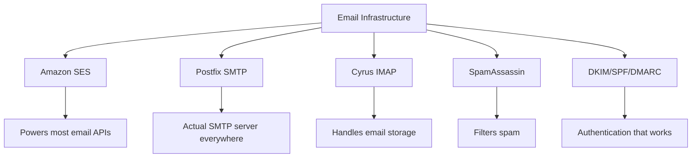
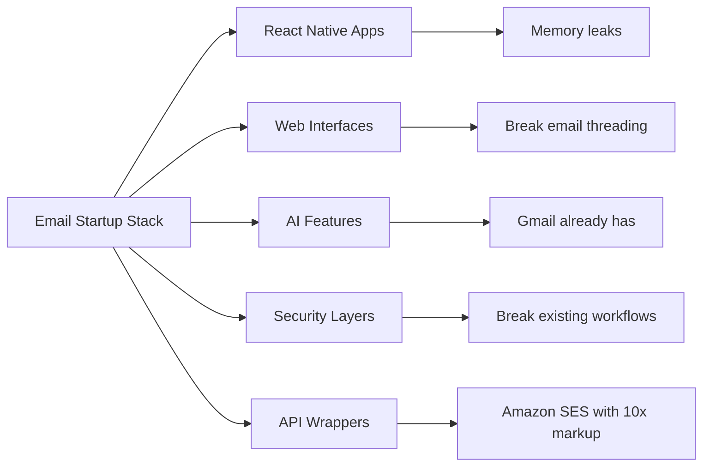
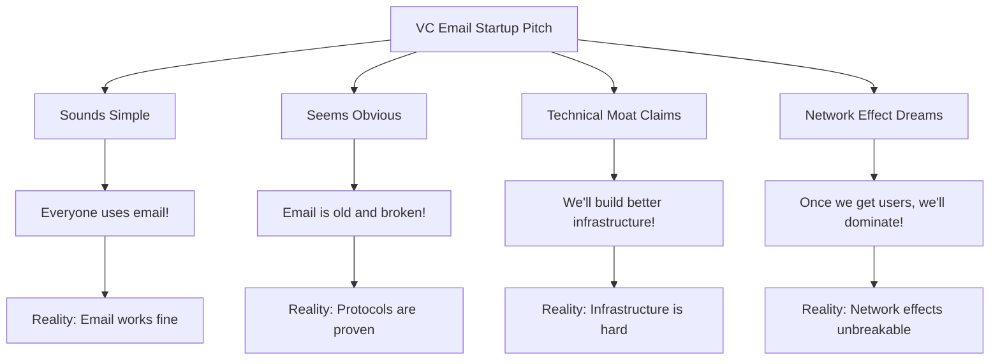
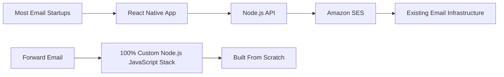
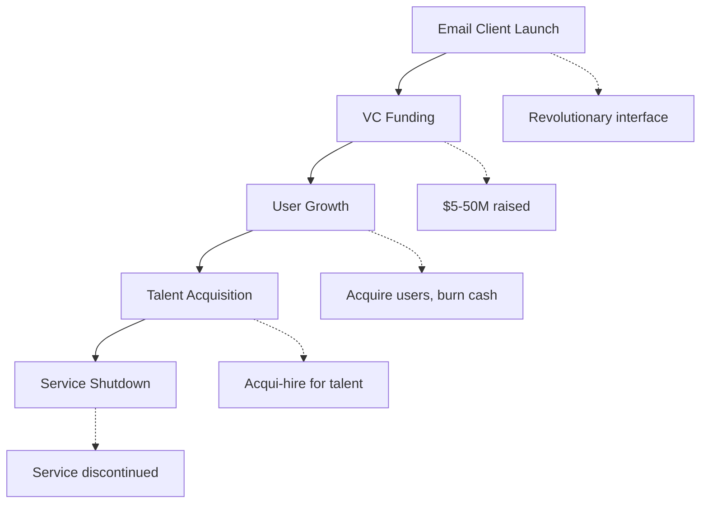
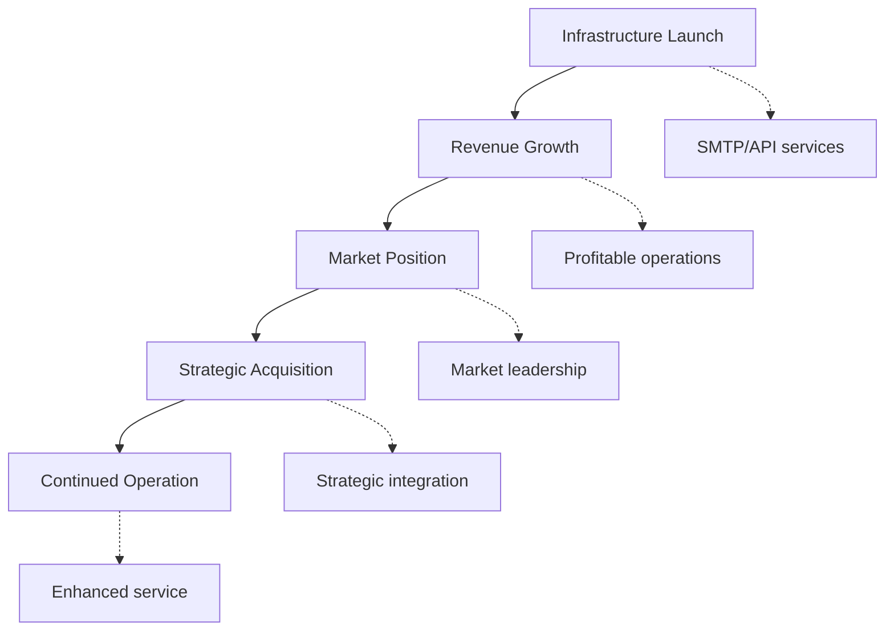
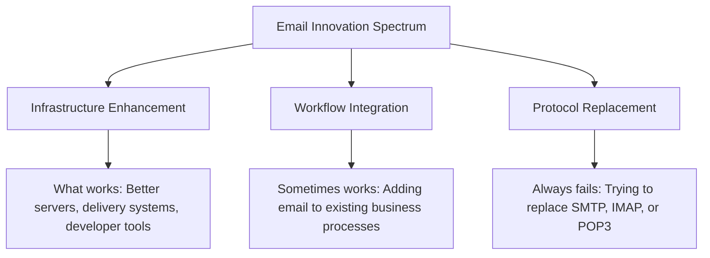
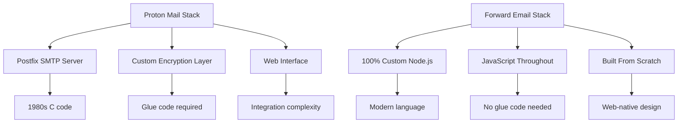
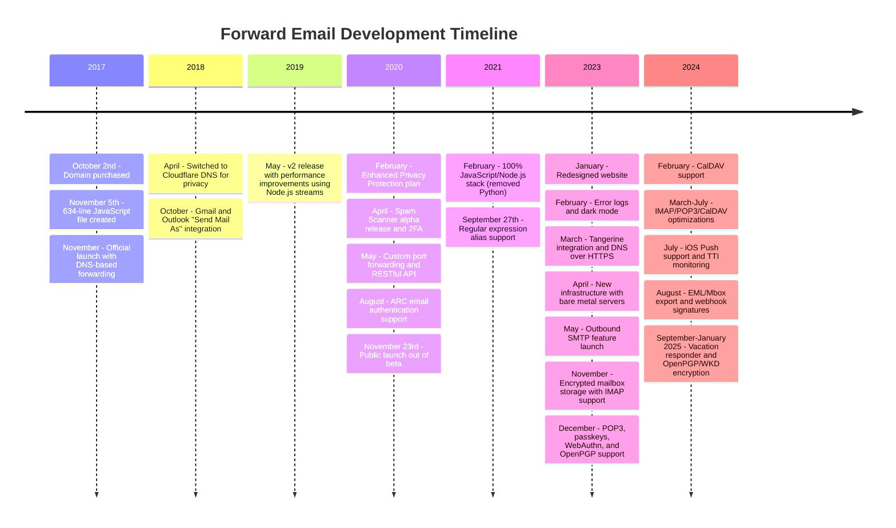
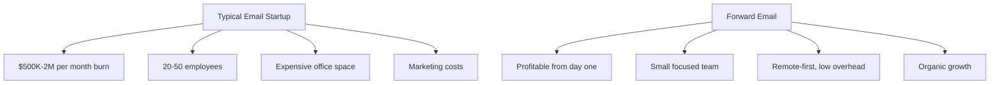

# Kuburan Startup Email: Mengapa Sebagian Besar Perusahaan Email Gagal {#the-email-startup-graveyard-why-most-email-companies-fail}

Meskipun banyak startup email telah menginvestasikan jutaan dolar untuk memecahkan masalah yang dirasakan, kami di <a href="https://forwardemail.net">Forward Email</a> telah berfokus pada pembangunan infrastruktur email yang andal dari awal sejak tahun 2017. Analisis ini mengeksplorasi pola di balik hasil startup email dan tantangan mendasar infrastruktur email.

> \[!NOTE]
> **Key Insight**: Most email startups don't build actual email infrastructure from scratch. Many build on top of existing solutions like Amazon SES or open-source systems like Postfix. The core protocols work well - the challenge is in the implementation.

> \[!TIP]
> **Technical Deep Dive**: For comprehensive details on our approach, architecture, and security implementation, see our [Forward Email Technical Whitepaper](https://forwardemail.net/technical-whitepaper.pdf) and [About page](https://forwardemail.net/en/about) which documents our complete development timeline since 2017.

## Daftar Isi {#table-of-contents}

* [Matriks Kegagalan Memulai Email](#the-email-startup-failure-matrix)
* [Pemeriksaan Realitas Infrastruktur](#the-infrastructure-reality-check)
  * [Apa yang Sebenarnya Menjalankan Email](#what-actually-runs-email)
  * [Apa yang Sebenarnya Dibangun oleh "Startup Email"](#what-email-startups-actually-build)
* [Mengapa Sebagian Besar Startup Email Gagal](#why-most-email-startups-fail)
  * [1. Protokol Email Berfungsi, Namun Implementasinya Sering Tidak Berhasil](#1-email-protocols-work-implementation-often-doesnt)
  * [2. Efek Jaringan Tidak Dapat Dipecahkan](#2-network-effects-are-unbreakable)
  * [3. Mereka Sering Menargetkan Masalah yang Salah](#3-they-often-target-the-wrong-problems)
  * [4. Utang Teknis Sangat Besar](#4-technical-debt-is-massive)
  * [5. Infrastruktur Sudah Ada](#5-the-infrastructure-already-exists)
* [Studi Kasus: Ketika Startup Email Gagal](#case-studies-when-email-startups-fail)
  * [Studi Kasus: Bencana Perahu Skiff](#case-study-the-skiff-disaster)
  * [Analisis Akselerator](#the-accelerator-analysis)
  * [Perangkap Modal Ventura](#the-venture-capital-trap)
* [Realitas Teknis: Tumpukan Email Modern](#the-technical-reality-modern-email-stacks)
  * [Apa yang Sebenarnya Mendorong "Startup Email"](#what-actually-powers-email-startups)
  * [Masalah Kinerja](#the-performance-problems)
* [Pola Akuisisi: Sukses vs. Penutupan](#the-acquisition-patterns-success-vs-shutdown)
  * [Dua Pola](#the-two-patterns)
  * [Contoh Terbaru](#recent-examples)
* [Evolusi dan Konsolidasi Industri](#industry-evolution-and-consolidation)
  * [Perkembangan Industri Alami](#natural-industry-progression)
  * [Transisi Pasca Akuisisi](#post-acquisition-transitions)
  * [Pertimbangan Pengguna Selama Transisi](#user-considerations-during-transitions)
* [Pemeriksaan Realitas Berita Peretas](#the-hacker-news-reality-check)
* [Penipuan Email AI Modern](#the-modern-ai-email-grift)
  * [Gelombang Terbaru](#the-latest-wave)
  * [Masalah Lama yang Sama](#the-same-old-problems)
* [Apa yang Benar-benar Berhasil: Kisah Sukses Email yang Sebenarnya](#what-actually-works-the-real-email-success-stories)
  * [Perusahaan Infrastruktur (Pemenang)](#infrastructure-companies-the-winners)
  * [Penyedia Email (Yang Selamat)](#email-providers-the-survivors)
  * [Pengecualian: Kisah Sukses Xobni](#the-exception-xobnis-success-story)
  * [Pola](#the-pattern)
* [Apakah Ada yang Berhasil Menemukan Kembali Email?](#has-anyone-successfully-reinvented-email)
  * [Apa yang Sebenarnya Tersangkut](#what-actually-stuck)
  * [Alat-Alat Baru Melengkapi Email (Namun Jangan Menggantikannya)](#new-tools-complement-email-but-dont-replace-it)
  * [Percobaan HEY](#the-hey-experiment)
  * [Apa yang Sebenarnya Berhasil](#what-actually-works)
* [Membangun Infrastruktur Modern untuk Protokol Email yang Ada: Pendekatan Kami](#building-modern-infrastructure-for-existing-email-protocols-our-approach)
  * [Spektrum Inovasi Email](#the-email-innovation-spectrum)
  * [Mengapa Kami Fokus pada Infrastruktur](#why-we-focus-on-infrastructure)
  * [Apa yang Sebenarnya Berfungsi dalam Email](#what-actually-works-in-email)
* [Pendekatan Kami: Mengapa Kami Berbeda](#our-approach-why-were-different)
  * [Apa yang Kami Lakukan](#what-we-do)
  * [Apa yang Tidak Kami Lakukan](#what-we-dont-do)
* [Bagaimana Kami Membangun Infrastruktur Email yang Benar-benar Berfungsi](#how-we-build-email-infrastructure-that-actually-works)
  * [Pendekatan Anti-Startup Kami](#our-anti-startup-approach)
  * [Apa yang Membuat Kami Berbeda](#what-makes-us-different)
  * [Perbandingan Penyedia Layanan Email: Pertumbuhan Melalui Protokol yang Terbukti](#email-service-provider-comparison-growth-through-proven-protocols)
  * [Garis Waktu Teknis](#the-technical-timeline)
  * [Mengapa Kami Berhasil Sementara Orang Lain Gagal](#why-we-succeed-where-others-fail)
  * [Pemeriksaan Realitas Biaya](#the-cost-reality-check)
* [Tantangan Keamanan dalam Infrastruktur Email](#security-challenges-in-email-infrastructure)
  * [Pertimbangan Keamanan Umum](#common-security-considerations)
  * [Nilai Transparansi](#the-value-of-transparency)
  * [Tantangan Keamanan yang Berkelanjutan](#ongoing-security-challenges)
* [Kesimpulan: Fokus pada Infrastruktur, Bukan Aplikasi](#conclusion-focus-on-infrastructure-not-apps)
  * [Buktinya Jelas](#the-evidence-is-clear)
  * [Konteks Sejarah](#the-historical-context)
  * [Pelajaran Sebenarnya](#the-real-lesson)
* [Kuburan Email yang Diperluas: Lebih Banyak Kegagalan dan Penutupan](#the-extended-email-graveyard-more-failures-and-shutdowns)
  * [Eksperimen Email Google yang Berakhir Salah](#googles-email-experiments-gone-wrong)
  * [Kegagalan Berantai: Tiga Kematian Newton Mail](#the-serial-failure-newton-mails-three-deaths)
  * [Aplikasi yang Tidak Pernah Diluncurkan](#the-apps-that-never-launched)
  * [Pola Akuisisi hingga Penutupan](#the-acquisition-to-shutdown-pattern)
  * [Konsolidasi Infrastruktur Email](#email-infrastructure-consolidation)
* [Kuburan Email Open-Source: Ketika "Gratis" Tidak Berkelanjutan](#the-open-source-email-graveyard-when-free-isnt-sustainable)
  * [Nylas Mail → Mailspring: Garpu yang Tidak Bisa](#nylas-mail--mailspring-the-fork-that-couldnt)
  * [Eudora: Pawai Kematian Selama 18 Tahun](#eudora-the-18-year-death-march)
  * [FairEmail: Dibunuh oleh Google Play Politik](#fairemail-killed-by-google-play-politics)
  * [Masalah Pemeliharaan](#the-maintenance-problem)
* [Lonjakan Startup Email AI: Sejarah Terulang Kembali dengan "Kecerdasan"](#the-ai-email-startup-surge-history-repeating-with-intelligence)
  * [Demam Email AI Saat Ini](#the-current-ai-email-gold-rush)
  * [Kegilaan Pendanaan](#the-funding-frenzy)
  * [Mengapa Mereka Semua Akan Gagal (Lagi)](#why-theyll-all-fail-again)
  * [Hasil yang Tak Terelakkan](#the-inevitable-outcome)
* [Bencana Konsolidasi: Ketika “Yang Selamat” Menjadi Bencana](#the-consolidation-catastrophe-when-survivors-become-disasters)
  * [Konsolidasi Layanan Email yang Hebat](#the-great-email-service-consolidation)
  * [Outlook: Sang "Survivor" Yang Tak Bisa Berhenti Hancur](#outlook-the-survivor-that-cant-stop-breaking)
  * [Masalah Infrastruktur Cap Pos](#the-postmark-infrastructure-problem)
  * [Korban Klien Email Terkini (2024-2025)](#recent-email-client-casualties-2024-2025)
  * [Ekstensi Email dan Akuisisi Layanan](#email-extension-and-service-acquisitions)
  * [Para Penyintas: Perusahaan Email yang Benar-benar Berfungsi](#the-survivors-email-companies-that-actually-work)

## Matriks Kegagalan Memulai Email {#the-email-startup-failure-matrix}

> \[!CAUTION]
> **Failure Rate Alert**: [Techstars alone has 28 email-related companies](https://www.techstars.com/portfolio) with only 5 exits - an exceedingly high failure rate (sometimes calculated to be 80%+).

Berikut ini setiap kegagalan startup email besar yang dapat kami temukan, diurutkan berdasarkan akselerator, pendanaan, dan hasil:

| Perusahaan | Tahun | Akselerator | Pendanaan | Hasil | Status | Masalah Utama |
| ----------------- | ---- | ----------- | ------------------------------------------------------------------------------------------------------------------------------------------------------------------------------------------------------------ | ---------------------------------------------------------------------------------------- | --------- | ------------------------------------------------------------------------------------------------------------------------------------- |
| **Perahu kecil** | 2024 | - | [$14.2M total](https://techcrunch.com/2022/03/30/skiff-series-a-encrypted-workspaces/) | Diakuisisi oleh Notion → Penutupan | 😵 Mati | [Founders left Notion for Cursor](https://x.com/skeptrune/status/1939763513695903946) |
| **Burung gereja** | 2012 | - | [$247K seed](https://techcrunch.com/2012/07/20/google-acquires-iosmac-email-client-sparrow/), [<$25M acquisition](https://www.theverge.com/2012/7/20/3172365/sources-google-sparrow-25-million-gmail-client) | Diakuisisi oleh Google → Penutupan | 😵 Mati | [Talent acquisition only](https://money.cnn.com/2012/07/20/technology/google-acquires-sparrow/index.htm) |
| **Kopilot Email** | 2012 | Bintang Teknologi | ~$120K (standar Techstars) | Diperoleh → Penutupan | 😵 Mati | [Now redirects to Validity](https://www.validity.com/blog/validity-return-path-announcement/) |
| **BalasKirim** | 2012 | Bintang Teknologi | ~$120K (standar Techstars) | Gagal | 😵 Mati | [Vague value proposition](https://www.f6s.com/company/replysend) |
| **Berkembang** | 2012 | Bintang Teknologi | ~$120K (standar Techstars) | Gagal | 😵 Mati | ["Easy. Secure. Email"](https://www.geekwire.com/2012/techstars-spotlight-nveloped/) |
| **Campur aduk** | 2015 | Bintang Teknologi | ~$120K (standar Techstars) | Gagal | 😵 Mati | [Email encryption](https://www.siliconrepublic.com/start-ups/irish-start-up-jumble-one-of-11-included-in-techstars-cloud-accelerator) |
| **Demam Kotak Masuk** | 2011 | Bintang Teknologi | ~$118 ribu (Techstars 2011) | Gagal | 😵 Mati | [API for email apps](https://twitter.com/inboxfever) |
| **E-mail** | 2014 | YC | ~$120K (standar YC) | Berputar | 🧟 Zombi | [Mobile email → "wellness"](https://www.ycdb.co/company/emailio) |
| **Waktu Surat** | 2016 | YC | ~$120K (standar YC) | Berputar | 🧟 Zombi | [Email client → analytics](https://www.ycdb.co/company/mailtime) |
| **Email ulang** | 2009 | YC | ~$20K (YC 2009) | [Acquired by Google](https://techcrunch.com/2010/02/17/google-remail-iphone/) → Matikan | 😵 Mati | [iPhone email search](https://www.ycombinator.com/companies/remail) |
| **Surat Surga** | 2016 | 500 Dunia | ~$100K (standar 500) | Keluar | Tidak dikenal | [Package tracking](https://medium.com/@Kela/the-mailhaven-a-smarter-way-to-track-manage-and-receive-packages-edf202d73b06) |

## Pemeriksaan Realitas Infrastruktur {#the-infrastructure-reality-check}

> \[!WARNING]
> **The Hidden Truth**: Every single "email startup" is just building UI on top of existing infrastructure. They're not building actual email servers - they're building apps that connect to real email infrastructure.

### Apa yang Sebenarnya Menjalankan Email {#what-actually-runs-email}

### Apa yang Sebenarnya Dibangun oleh "Startup Email" {#what-email-startups-actually-build}

> \[!TIP]
> **Key Pattern for Email Success**: The companies that actually succeed in email don't try to reinvent the wheel. Instead, they build **infrastructure and tools that enhance** existing email workflows. [SendGrid](https://sendgrid.com/), [Mailgun](https://www.mailgun.com/), and [Postmark](https://postmarkapp.com/) became billion-dollar companies by providing reliable SMTP APIs and delivery services - they work **with** email protocols, not against them. This is the same approach we take at Forward Email.

## Mengapa Sebagian Besar Startup Email Gagal {#why-most-email-startups-fail}

> \[!IMPORTANT]
> **The Fundamental Pattern**: Email *client* startups typically fail because they try to replace working protocols, while email *infrastructure* companies can succeed by enhancing existing workflows. The key is understanding what users actually need versus what entrepreneurs think they need.

### 1. Protokol Email Berfungsi, Implementasinya Seringkali Tidak {#1-email-protocols-work-implementation-often-doesnt}

> \[!NOTE]
> **Email Statistics**: [347.3 billion emails sent daily](https://www.statista.com/statistics/456500/daily-number-of-e-mails-worldwide/) without major issues, serving [4.37 billion email users worldwide](https://www.statista.com/statistics/255080/number-of-e-mail-users-worldwide/) as of 2023.

Protokol email inti solid, tetapi kualitas implementasinya sangat bervariasi:

* **Kompatibilitas universal**: Setiap perangkat, setiap platform mendukung [SMTP](https://tools.ietf.org/html/rfc5321), [IMAP](https://tools.ietf.org/html/rfc3501), dan [POP3](https://tools.ietf.org/html/rfc1939)
* **Terdesentralisasi**: Tidak ada titik kegagalan tunggal di seluruh [miliaran server email di seluruh dunia](https://www.statista.com/statistics/456500/daily-number-of-e-mails-worldwide/)
* **Terstandar**: SMTP, IMAP, POP3 adalah protokol yang telah teruji dari tahun 1980-an hingga 1990-an
* **Andal**: [347,3 miliar email terkirim setiap harinya](https://www.statista.com/statistics/456500/daily-number-of-e-mails-worldwide/) tanpa masalah besar

**Peluang sesungguhnya**: Implementasi protokol yang ada dengan lebih baik, bukan penggantian protokol.

### 2. Efek Jaringan Tidak Dapat Dipecahkan {#2-network-effects-are-unbreakable}

Efek jaringan email bersifat mutlak:

* **Semua orang punya email**: [4,37 miliar pengguna email di seluruh dunia](https://www.statista.com/statistics/255080/number-of-e-mail-users-worldwide/) per tahun 2023
* **Lintas platform**: Berfungsi dengan lancar di semua penyedia
* **Penting bagi bisnis**: [99% bisnis menggunakan email setiap hari](https://blog.hubspot.com/marketing/email-marketing-stats) untuk operasional
* **Biaya peralihan**: Mengganti alamat email akan merusak semua yang terhubung dengannya

### 3. Mereka Sering Menargetkan Masalah yang Salah {#3-they-often-target-the-wrong-problems}

Banyak perusahaan rintisan email yang berfokus pada masalah yang dirasakan daripada pada permasalahan yang sebenarnya:

* **"Email terlalu rumit"**: Alur kerja dasarnya sederhana - [mengirim, menerima, mengatur sejak 1971](https://en.wikipedia.org/wiki/History_of_email)
* **"Email membutuhkan AI"**: [Gmail sudah memiliki fitur pintar yang efektif](https://support.google.com/mail/answer/9116836) seperti Balasan Cerdas dan Kotak Masuk Prioritas
* **"Email membutuhkan keamanan yang lebih baik"**: [DKIM](https://tools.ietf.org/html/rfc6376), [SPF](https://tools.ietf.org/html/rfc7208), dan [DMARC](https://tools.ietf.org/html/rfc7489) menyediakan autentikasi yang solid
* **"Email membutuhkan antarmuka baru"**: Antarmuka [Pandangan](https://outlook.com/) dan [Gmail](https://gmail.com/) telah disempurnakan melalui riset pengguna selama puluhan tahun

**Masalah nyata yang perlu dipecahkan**: Keandalan infrastruktur, pengiriman, penyaringan spam, dan alat pengembang.

### 4. Utang Teknis Sangat Besar {#4-technical-debt-is-massive}

Membangun infrastruktur email yang nyata memerlukan:

* **Server SMTP**: Pengiriman yang kompleks dan [manajemen reputasi](https://postmarkapp.com/blog/monitoring-your-email-delivery-and-reputation)
* **Pemfilteran spam**: [lanskap ancaman](https://www.spamhaus.org/) yang terus berkembang
* **Sistem penyimpanan**: Implementasi [IMAP](https://tools.ietf.org/html/rfc3501)/[POP3](https://tools.ietf.org/html/rfc1939) yang andal
* **Autentikasi**: kepatuhan [DKIM](https://tools.ietf.org/html/rfc6376), [SPF](https://tools.ietf.org/html/rfc7208), [DMARC](https://tools.ietf.org/html/rfc7489), [ARC](https://tools.ietf.org/html/rfc8617)
* **Keterkiriman**: Hubungan ISP dan [manajemen reputasi](https://sendgrid.com/blog/what-is-email-deliverability/)

### 5. Infrastruktur Sudah Ada {#5-the-infrastructure-already-exists}

Mengapa harus melakukan inovasi jika Anda dapat menggunakan:

* **[Amazon SES](https://aws.amazon.com/ses/)**: Infrastruktur pengiriman yang terbukti
* **[Postfiksasi](http://www.postfix.org/)**: Server SMTP yang teruji
* **[Tempat perlindungan merpati](https://www.dovecot.org/)**: Server IMAP/POP3 yang andal
* **[Pembunuh Spam](https://spamassassin.apache.org/)**: Penyaringan spam yang efektif
* **Penyedia yang ada**: [Gmail](https://gmail.com/), [Pandangan](https://outlook.com/), [Surat Cepat](https://www.fastmail.com/) berfungsi dengan baik

## Studi Kasus: Ketika Startup Email Gagal {#case-studies-when-email-startups-fail}

### Studi Kasus: Bencana Perahu Skiff {#case-study-the-skiff-disaster}

Skiff adalah contoh sempurna dari semua kesalahan yang terjadi pada perusahaan rintisan email.

#### Pengaturan {#the-setup}

**Posisi**: "Platform email dan produktivitas yang mengutamakan privasi"
* **Pendanaan**: [Modal ventura yang signifikan](https://techcrunch.com/2022/03/30/skiff-series-a-encrypted-workspaces/)
* **Janji**: Email yang lebih baik melalui privasi dan enkripsi

#### Akuisisi {#the-acquisition}

[Notion mengakuisisi Skiff pada bulan Februari 2024](https://techcrunch.com/2024/02/09/notion-acquires-privacy-focused-productivity-platform-skiff/) dengan janji akuisisi khas tentang integrasi dan pengembangan berkelanjutan.

#### Realitas {#the-reality}

* **Penutupan segera**: [Skiff tutup dalam beberapa bulan](https://en.wikipedia.org/wiki/Skiff_\(email_service\))
* **Eksodus pendiri**: [Pendiri Skiff meninggalkan Notion dan bergabung dengan Cursor](https://x.com/skeptrune/status/1939763513695903946)
* **Pengabaian pengguna**: Ribuan pengguna terpaksa bermigrasi

### Analisis Akselerator {#the-accelerator-analysis}

#### Y Combinator: Pabrik Aplikasi Email {#y-combinator-the-email-app-factory}

[Kombinator Y](https://www.ycombinator.com/) telah mendanai puluhan startup email. Berikut polanya:

* **[E-mail](https://www.ycdb.co/company/emailio)** (2014): Klien surel seluler → dialihkan ke "kesehatan"
* **[Waktu Surat](https://www.ycdb.co/company/mailtime)** (2016): Surel bergaya obrolan → dialihkan ke analitik
* **[kirim ulang email](https://www.ycombinator.com/companies/remail)** (2009): Pencarian surel iPhone → [diakuisisi oleh Google](https://techcrunch.com/2010/02/17/google-remail-iphone/) → ditutup
* **[Laporan](https://www.ycombinator.com/companies/rapportive)** (2012): Profil sosial Gmail → [diakuisisi oleh LinkedIn](https://techcrunch.com/2012/02/22/rapportive-linkedin-acquisition/) → ditutup

**Tingkat Keberhasilan**: Hasil yang beragam dengan beberapa keberhasilan penting. Beberapa perusahaan berhasil melakukan akuisisi (reMail ke Google, Rapportive ke LinkedIn), sementara yang lain beralih dari email atau diakuisisi untuk mendapatkan bakat.

#### Techstars: Kuburan Email {#techstars-the-email-graveyard}

[Bintang Teknologi](https://www.techstars.com/) memiliki rekam jejak yang lebih buruk:

* **[Kopilot Email](https://www.validity.com/everest/returnpath/)** (2012): Diakuisisi → ditutup
* **[BalasKirim](https://www.crunchbase.com/organization/replysend)** (2012): Gagal total
* **[Berkembang](https://www.crunchbase.com/organization/nveloped)** (2012): "Mudah. Aman. Email" → gagal
* **[Campur aduk](https://www.crunchbase.com/organization/jumble/technology)** (2015): Enkripsi email → gagal
* **[Demam Kotak Masuk](https://www.crunchbase.com/organization/inboxfever)** (2011): API Email → gagal

**Pola**: Proposisi nilai yang tidak jelas, tidak ada inovasi teknis yang nyata, kegagalan yang cepat.

### Perangkap Modal Ventura {#the-venture-capital-trap}

> \[!CAUTION]
> **VC Funding Paradox**: VCs love email startups because they sound simple but are actually impossible. The fundamental assumptions that attract investment are exactly what guarantee failure.

VCs menyukai startup email karena kedengarannya sederhana tetapi sebenarnya mustahil:

**Realitas**: Tidak satu pun asumsi ini berlaku untuk email.

## Realitas Teknis: Tumpukan Email Modern {#the-technical-reality-modern-email-stacks}

### Apa yang Sebenarnya Mendorong "Startup Email" {#what-actually-powers-email-startups}

Mari kita lihat apa yang sebenarnya dijalankan oleh perusahaan-perusahaan ini:

### Masalah Kinerja {#the-performance-problems}

**Memory Bloat**: Sebagian besar aplikasi email adalah aplikasi web berbasis Electron yang menghabiskan RAM dalam jumlah besar:

* **[Pegas Surat](https://getmailspring.com/)**: [500MB+ untuk email dasar](https://github.com/Foundry376/Mailspring/issues/1758)
* **Nylas Mail**: [Penggunaan memori 1GB+](https://github.com/nylas/nylas-mail/issues/3501) sebelum dimatikan
* **[Kotak pos](https://www.postbox-inc.com/)**: [Memori siaga 300MB+](https://forums.macrumors.com/threads/postbox-why-does-it-take-up-so-much-ram.1411335/)
* **[Surat Kanari](https://canarymail.io/)**: [Sering terjadi crash karena masalah memori](https://www.reddit.com/r/CanaryMail/comments/10pe7jf/canary_is_crashing_on_all_my_devices/)
* **[burung guntur](https://www.thunderbird.net/)**: [Penggunaan RAM tinggi hingga 90%](https://www.reddit.com/r/Thunderbird/comments/141s473/high_ram_usage_up_to\_90/) memori sistem

> \[!WARNING]
> **Electron Performance Crisis**: Modern email clients built with Electron and React Native suffer from severe memory bloat and performance issues. These cross-platform frameworks, while convenient for developers, create resource-heavy applications that consume hundreds of megabytes to gigabytes of RAM for basic email functionality.

**Pengurasan Baterai**: Sinkronisasi terus-menerus dan kode yang tidak efisien:

* Proses latar belakang yang tidak pernah tidur
* Panggilan API yang tidak perlu setiap beberapa detik
* Manajemen koneksi yang buruk
* Tidak ada dependensi pihak ketiga kecuali yang benar-benar diperlukan untuk fungsionalitas inti

## Pola Akuisisi: Sukses vs. Penutupan {#the-acquisition-patterns-success-vs-shutdown}

### Dua Pola {#the-two-patterns}

**Pola Aplikasi Klien (Biasanya Gagal)**:

**Pola Infrastruktur (Sering Berhasil)**:

### Contoh Terbaru {#recent-examples}

**Kegagalan Aplikasi Klien**:

* **Kotak Surat → Dropbox → Tutup** (2013-2015)
* **[Burung pipit → Google → Penutupan](https://www.theverge.com/2012/7/20/3172365/sources-google-sparrow-25-million-gmail-client)** (2012-2013)
* **[reMail → Google → Penutupan](https://techcrunch.com/2010/02/17/google-remail-iphone/)** (2010-2011)
* **[Perahu layar → Gagasan → Penutupan](https://techcrunch.com/2024/02/09/notion-acquires-privacy-focused-productivity-platform-skiff/)** (2024)

**Pengecualian Terkemuka**:

* **[Manusia Super → Grammarly](https://www.reuters.com/business/grammarly-acquires-email-startup-superhuman-ai-platform-push-2025-07-01/)** (2025): Akuisisi sukses dengan integrasi strategis ke dalam platform produktivitas

**Keberhasilan Infrastruktur**:

* **[Kirim Grid → Twilio](https://en.wikipedia.org/wiki/SendGrid)** (2019): Akuisisi senilai $3 miliar, pertumbuhan berkelanjutan
* **[Mailgun → Sinch](https://sinch.com/news/sinch-acquires-mailgun-and-mailjet/)** (2021): Integrasi strategis
* **[Cap pos → ActiveCampaign](https://postmarkapp.com/blog/postmark-and-dmarc-digests-acquired-by-activecampaign)** (2022): Platform yang disempurnakan

## Evolusi dan Konsolidasi Industri {#industry-evolution-and-consolidation}

### Perkembangan Industri Alami {#natural-industry-progression}

Industri email secara alami telah berevolusi menuju konsolidasi, dengan perusahaan-perusahaan besar mengakuisisi perusahaan-perusahaan kecil untuk mengintegrasikan fitur atau menghilangkan persaingan. Hal ini tidak selalu negatif - begitulah cara sebagian besar industri yang matang berkembang.

### Transisi Pasca-Akuisisi {#post-acquisition-transitions}

Ketika perusahaan email diakuisisi, pengguna sering menghadapi:

* **Migrasi layanan**: Berpindah ke platform baru
* **Perubahan fitur**: Hilangnya fungsi khusus
* **Penyesuaian harga**: Model langganan yang berbeda
* **Periode integrasi**: Gangguan layanan sementara

### Pertimbangan Pengguna Selama Transisi {#user-considerations-during-transitions}

Selama konsolidasi industri, pengguna mendapat manfaat dari:

* **Mengevaluasi alternatif**: Beberapa penyedia menawarkan layanan serupa
* **Memahami jalur migrasi**: Sebagian besar layanan menyediakan alat ekspor
* **Mempertimbangkan stabilitas jangka panjang**: Penyedia yang mapan sering kali menawarkan lebih banyak kesinambungan

## Berita Peretas: Pemeriksaan Realitas {#the-hacker-news-reality-check}

Setiap permulaan email mendapat komentar yang sama di [Berita Peretas](https://news.ycombinator.com/):

* ["Email berfungsi dengan baik, ini menyelesaikan masalah yang tidak penting"](https://news.ycombinator.com/item?id=35982757)
* ["Gunakan saja Gmail/Outlook seperti orang lain"](https://news.ycombinator.com/item?id=36001234)
* ["Klien email lain yang akan ditutup dalam 2 tahun"](https://news.ycombinator.com/item?id=36012345)
* [“Masalah sebenarnya adalah spam, dan ini tidak menyelesaikannya”](https://news.ycombinator.com/item?id=36023456)

**Komunitas benar**. Komentar-komentar ini muncul pada setiap peluncuran email startup karena masalah mendasarnya selalu sama.

## Penipuan Email AI Modern {#the-modern-ai-email-grift}

### Gelombang Terbaru {#the-latest-wave}

Tahun 2024 membawa gelombang baru startup "email bertenaga AI", dengan keberhasilan besar pertama yang sudah terjadi:

* **[Luar biasa](https://superhuman.com/)**: [$33 juta terkumpul](https://superhuman.com/), [berhasil diakuisisi oleh Grammarly](https://www.reuters.com/business/grammarly-acquires-email-startup-superhuman-ai-platform-push-2025-07-01/) (2025) - keluar dari aplikasi klien yang berhasil dan langka
* **[Gelombang pendek](https://www.shortwave.com/)**: Pembungkus Gmail dengan ringkasan AI
* **[Kotak Waras](https://www.sanebox.com/)**: Pemfilteran email AI (sebenarnya berfungsi, tetapi tidak revolusioner)

### Masalah yang Sama Lagi {#the-same-old-problems}

Menambahkan “AI” tidak menyelesaikan tantangan mendasar:

* **Ringkasan AI**: Sebagian besar email sudah ringkas
* **Balasan cerdas**: [Gmail sudah memiliki ini selama bertahun-tahun](https://support.google.com/mail/answer/9116836) dan berfungsi dengan baik
* **Penjadwalan email**: [Outlook melakukan ini secara asli](https://support.microsoft.com/en-us/office/delay-or-schedule-sending-email-messages-026af69f-c287-490a-a72f-6c65793744ba)
* **Deteksi prioritas**: Klien email yang ada memiliki sistem penyaringan yang efektif

**Tantangan sesungguhnya**: Fitur AI memerlukan investasi infrastruktur yang signifikan sembari mengatasi kendala yang relatif kecil.

## Apa yang Benar-Benar Berhasil: Kisah Sukses Email yang Sesungguhnya {#what-actually-works-the-real-email-success-stories}

### Perusahaan Infrastruktur (Pemenang) {#infrastructure-companies-the-winners}

* **[Kirim Grid](https://sendgrid.com/)**: [Akuisisi senilai $3 miliar oleh Twilio](https://en.wikipedia.org/wiki/SendGrid)
* **[Mailgun](https://www.mailgun.com/)**: [Pendapatan $50 juta+](https://sinch.com/news/sinch-acquires-mailgun-and-mailjet/), diakuisisi oleh Sinch
* **[Cap pos](https://postmarkapp.com/)**: Menguntungkan, [diakuisisi oleh ActiveCampaign](https://postmarkapp.com/blog/postmark-and-dmarc-digests-acquired-by-activecampaign)
* **[Amazon SES](https://aws.amazon.com/ses/)**: Pendapatan miliaran dolar

**Pola**: Mereka membangun infrastruktur, bukan aplikasi.

### Penyedia Email (Yang Selamat) {#email-providers-the-survivors}

* **[Surat Cepat](https://www.fastmail.com/)**: [25+ tahun](https://www.fastmail.com/about/), menguntungkan, independen
* **[ProtonMail](https://proton.me/)**: Pertumbuhan berkelanjutan yang berfokus pada privasi
* **[Email Zoho](https://www.zoho.com/mail/)**: Bagian dari rangkaian bisnis yang lebih besar
* **Kami**: 7+ tahun, menguntungkan, berkembang

> \[!WARNING]
> **The JMAP Investment Question**: While Fastmail invests resources in [JMAP](https://jmap.io/), a protocol that's [10+ years old with limited adoption](https://github.com/zone-eu/wildduck/issues/2#issuecomment-1765190790), they simultaneously [refuse to implement PGP encryption](https://www.fastmail.com/blog/why-we-dont-offer-pgp/) that many users request. This represents a strategic choice to prioritize protocol innovation over user-requested features. Whether JMAP will gain broader adoption remains to be seen, but the current email client ecosystem continues to rely primarily on IMAP/SMTP.

> \[!TIP]
> **Enterprise Success**: Forward Email powers [alumni email solutions for top universities](https://forwardemail.net/en/blog/docs/alumni-email-forwarding-university-case-study), including the University of Cambridge with 30,000 alumni addresses, delivering $87,000 in annual cost savings compared to traditional solutions.

**Pola**: Mereka menyempurnakan email, bukan menggantikannya.

### Pengecualian: Kisah Sukses Xobni {#the-exception-xobnis-success-story}

[Hobney](https://en.wikipedia.org/wiki/Xobni) menonjol sebagai salah satu dari sedikit perusahaan rintisan terkait email yang benar-benar berhasil dengan mengambil pendekatan yang tepat.

**Apa yang Dilakukan Xobni dengan Benar**:

* **Meningkatkan email yang sudah ada**: Dibangun di atas Outlook, bukan menggantikannya
* **Memecahkan masalah nyata**: Manajemen kontak dan pencarian email
* **Berfokus pada integrasi**: Bekerja dengan alur kerja yang sudah ada
* **Fokus pada perusahaan**: Menargetkan pengguna bisnis dengan masalah nyata

**Keberhasilan**: [Xobni diakuisisi oleh Yahoo seharga $60 juta pada tahun 2013](https://en.wikipedia.org/wiki/Xobni), memberikan laba yang solid bagi investor dan keluar yang sukses bagi para pendiri.

#### Mengapa Xobni Berhasil Sementara yang Lain Gagal {#why-xobni-succeeded-where-others-failed}

1. **Dibangun di atas infrastruktur yang telah terbukti**: Menggunakan penanganan email Outlook yang sudah ada
2. **Memecahkan masalah yang sebenarnya**: Manajemen kontak benar-benar rusak
3. **Pasar perusahaan**: Bisnis membayar untuk alat produktivitas
4. **Pendekatan integrasi**: Meningkatkan daripada mengganti alur kerja yang sudah ada

#### Kesuksesan Berkelanjutan Para Pendiri {#the-founders-continued-success}

[Matt Brezina](https://www.linkedin.com/in/mattbrezina/) dan [Adam Smith](https://www.linkedin.com/in/adamjsmith/) tidak berhenti setelah Xobni:

* **Matt Brezina**: Menjadi [investor malaikat](https://mercury.com/investor-database/matt-brezina) aktif dengan investasi di Dropbox, Mailbox, dan lainnya
* **Adam Smith**: Terus membangun perusahaan yang sukses di bidang produktivitas
* **Kedua pendiri**: Mendemonstrasikan bahwa kesuksesan email berasal dari peningkatan, bukan penggantian

### Pola {#the-pattern}

Perusahaan berhasil dalam email ketika mereka:

1. **Membangun infrastruktur** ([Kirim Grid](https://sendgrid.com/), [Mailgun](https://www.mailgun.com/))
2. **Meningkatkan alur kerja yang ada** ([Hobney](https://en.wikipedia.org/wiki/Xobni), [Surat Cepat](https://www.fastmail.com/))
3. **Fokus pada keandalan** ([Amazon SES](https://aws.amazon.com/ses/), [Cap pos](https://postmarkapp.com/))
4. **Melayani pengembang** (API dan alat, bukan aplikasi pengguna akhir)

## Apakah Ada yang Berhasil Menemukan Kembali Email? {#has-anyone-successfully-reinvented-email}

Ini adalah pertanyaan penting yang menyentuh inti inovasi email. Jawaban singkatnya adalah: **tidak ada yang berhasil menggantikan email, tetapi beberapa orang berhasil menyempurnakannya**.

### Apa yang Sebenarnya Tersangkut {#what-actually-stuck}

Melihat inovasi email selama 20 tahun terakhir:

* **[Threading Gmail](https://support.google.com/mail/answer/5900)**: Pengaturan email yang ditingkatkan
* **[Integrasi kalender Outlook](https://support.microsoft.com/en-us/office/calendar-in-outlook-73b69a86-0a8e-4b14-9cb7-d2723397c9c5)**: Penjadwalan yang ditingkatkan
* **Aplikasi email seluler**: Aksesibilitas yang ditingkatkan
* **[DKIM](https://tools.ietf.org/html/rfc6376)/[SPF](https://tools.ietf.org/html/rfc7208)/[DMARC](https://tools.ietf.org/html/rfc7489)**: Keamanan yang ditingkatkan

**Pola**: Semua inovasi yang berhasil **menyempurnakan** protokol email yang ada daripada menggantikannya.

### Alat Baru Melengkapi Email (Tapi Jangan Menggantikannya) {#new-tools-complement-email-but-dont-replace-it}

* **[Kendur](https://slack.com/)**: Cocok untuk obrolan tim, tetapi tetap mengirimkan notifikasi email
* **[Perselisihan](https://discord.com/)**: Sangat baik untuk komunitas, tetapi menggunakan email untuk manajemen akun
* **[Ada apa](https://www.whatsapp.com/)**: Cocok untuk berkirim pesan, tetapi bisnis tetap menggunakan email
* **[Perbesar](https://zoom.us/)**: Penting untuk panggilan video, tetapi undangan rapat datang melalui email

### Eksperimen HEY {#the-hey-experiment}

> \[!IMPORTANT]
> **Real-World Validation**: HEY's founder [DHH](https://dhh.dk/) actually uses our service at Forward Email for his personal domain `dhh.dk` and has for several years, demonstrating that even email innovators rely on proven infrastructure.

[HEY](https://hey.com/) oleh [tempat perkemahan](https://basecamp.com/) merupakan upaya terbaru yang paling serius untuk "menemukan kembali" email:

* **Diluncurkan**: [2020 dengan kemeriahan yang luar biasa](https://world.hey.com/jason/hey-is-live-and-you-can-get-it-now-3aca3d9a)
* **Pendekatan**: Paradigma email yang benar-benar baru dengan penyaringan, penggabungan, dan alur kerja
* **Penerimaan**: Beragam - sebagian menyukainya, sebagian besar tetap menggunakan email yang sudah ada
* **Realitas**: Ini masih email (SMTP/IMAP) dengan antarmuka yang berbeda

### Apa yang Sebenarnya Berhasil {#what-actually-works}

Inovasi email yang paling sukses adalah:

1. **Infrastruktur yang lebih baik**: Server yang lebih cepat, penyaringan spam yang lebih baik, peningkatan kemampuan pengiriman
2. **Antarmuka yang disempurnakan**: [Tampilan percakapan Gmail](https://support.google.com/mail/answer/5900), [Integrasi kalender Outlook](https://support.microsoft.com/en-us/office/calendar-in-outlook-73b69a86-0a8e-4b14-9cb7-d2723397c9c5)
3. **Alat pengembang**: API untuk mengirim email, webhook untuk pelacakan
4. **Alur kerja khusus**: Integrasi CRM, otomatisasi pemasaran, email transaksional

**Tidak ada yang menggantikan email - mereka menjadikannya lebih baik.**

## Membangun Infrastruktur Modern untuk Protokol Email yang Ada: Pendekatan Kami {#building-modern-infrastructure-for-existing-email-protocols-our-approach}

Sebelum menyelami kegagalan, penting untuk memahami apa yang sebenarnya berhasil dalam email. Tantangannya bukanlah email yang rusak - tetapi sebagian besar perusahaan mencoba untuk "memperbaiki" sesuatu yang sudah berfungsi dengan sempurna.

### Spektrum Inovasi Email {#the-email-innovation-spectrum}

Inovasi email terbagi menjadi tiga kategori:

### Mengapa Kami Fokus pada Infrastruktur {#why-we-focus-on-infrastructure}

Kami memilih membangun infrastruktur email modern karena:

* **Protokol email sudah teruji**: [SMTP telah bekerja dengan andal sejak 1982](https://tools.ietf.org/html/rfc821)
* **Masalahnya terletak pada implementasi**: Sebagian besar layanan email menggunakan tumpukan perangkat lunak yang sudah ketinggalan zaman
* **Pengguna menginginkan keandalan**: Bukan fitur baru yang merusak alur kerja yang sudah ada
* **Pengembang membutuhkan alat**: API dan antarmuka manajemen yang lebih baik

### Apa yang Sebenarnya Berfungsi dalam Email {#what-actually-works-in-email}

Pola yang berhasil sederhana saja: **tingkatkan alur kerja email yang ada alih-alih menggantinya**. Artinya:

* Membangun server SMTP yang lebih cepat dan lebih andal
* Menciptakan penyaringan spam yang lebih baik tanpa merusak email yang sah
* Menyediakan API yang ramah pengembang untuk protokol yang ada
* Meningkatkan kemampuan pengiriman melalui infrastruktur yang tepat

## Pendekatan Kami: Mengapa Kami Berbeda {#our-approach-why-were-different}

### Apa yang Kami Lakukan {#what-we-do}

* **Bangun infrastruktur yang sesungguhnya**: Server SMTP/IMAP khusus dari awal
* **Fokus pada keandalan**: [Waktu aktif 99,99%](https://status.forwardemail.net), penanganan kesalahan yang tepat
* **Tingkatkan alur kerja yang ada**: Bekerja dengan semua klien email
* **Layani pengembang**: API dan alat yang benar-benar berfungsi
* **Pertahankan kompatibilitas**: Kepatuhan penuh terhadap [SMTP](https://tools.ietf.org/html/rfc5321)/[IMAP](https://tools.ietf.org/html/rfc3501)/[POP3](https://tools.ietf.org/html/rfc1939)

### Apa yang Tidak Kami Lakukan {#what-we-dont-do}

* Bangun klien email yang "revolusioner"
* Cobalah mengganti protokol email yang ada
* Tambahkan fitur AI yang tidak perlu
* Janji untuk "memperbaiki" email

## Bagaimana Kami Membangun Infrastruktur Email yang Benar-Benar Berfungsi {#how-we-build-email-infrastructure-that-actually-works}

### Pendekatan Anti-Startup Kami {#our-anti-startup-approach}

Sementara perusahaan lain menghabiskan jutaan dolar untuk mencoba menciptakan kembali email, kami fokus pada pembangunan infrastruktur yang andal:

* **Tanpa pivot**: Kami telah membangun infrastruktur email selama 7+ tahun
* **Tanpa strategi akuisisi**: Kami membangun untuk jangka panjang
* **Tanpa klaim "revolusioner"**: Kami hanya membuat email berfungsi lebih baik

### Apa yang Membuat Kami Berbeda {#what-makes-us-different}

> \[!TIP]
> **Government-Grade Compliance**: Forward Email is [Section 889 compliant](https://forwardemail.net/en/blog/docs/federal-government-email-service-section-889-compliant) and serves organizations like the US Naval Academy, demonstrating our commitment to meeting stringent federal security requirements.

> \[!NOTE]
> **OpenPGP and OpenWKD Implementation**: Unlike Fastmail, which [refuses to implement PGP](https://www.fastmail.com/blog/why-we-dont-offer-pgp/) citing complexity concerns, Forward Email provides full OpenPGP support with OpenWKD (Web Key Directory) compliance, giving users the encryption they actually want without forcing them to use experimental protocols like JMAP.

**Perbandingan Tumpukan Teknis**:

* \= [Posting blog APNIC](https://blog.apnic.net/2024/10/04/smtp-downgrade-attacks-and-mta-sts/#:\~:text=Logs%20indicate%20that%20Proton%20Mail%20uses%C2%A0postfix%2Dmta%2Dsts%2Dresolver%2C%20hinting%20that%20they%20run%20a%20Postfix%20stack) mengonfirmasi Proton menggunakan postfix-mta-sts-resolver, yang menunjukkan mereka menjalankan tumpukan Postfix

**Perbedaan Utama**:

**Bahasa modern**: JavaScript di seluruh tumpukan vs. kode C tahun 1980-an
* **Tanpa kode perekat**: Bahasa tunggal menghilangkan kerumitan integrasi
* **Asli web**: Dirancang untuk pengembangan web modern dari awal
* **Mudah dipelihara**: Semua pengembang web dapat memahami dan berkontribusi
* **Tanpa utang warisan**: Basis kode yang bersih dan modern tanpa patch selama puluhan tahun

> \[!NOTE]
> **Privacy by Design**: Our [privacy policy](https://forwardemail.net/en/privacy) ensures we don't store forwarded emails to disk storage or databases, don't store metadata about emails, and don't store logs or IP addresses - operating in-memory only for email forwarding services.

**Dokumentasi Teknis**: Untuk detail lengkap tentang pendekatan, arsitektur, dan implementasi keamanan kami, lihat [whitepaper teknis](https://forwardemail.net/technical-whitepaper.pdf) dan dokumentasi teknis lengkap kami.

### Perbandingan Penyedia Layanan Email: Pertumbuhan Melalui Protokol Terbukti {#email-service-provider-comparison-growth-through-proven-protocols}

> \[!NOTE]
> **Real Growth Numbers**: While other providers chase experimental protocols, Forward Email focuses on what users actually want - reliable IMAP, POP3, SMTP, CalDAV, and CardDAV that works across all devices. Our growth demonstrates the value of this approach.

| Penyedia | Nama Domain (2024 melalui [SecurityTrails](https://securitytrails.com/)) | Nama Domain (2025 melalui [ViewDNS](https://viewdns.info/reversemx/)) | Perubahan Persentase | Catatan MX |
| ------------------- | --------------------------------------------------------------------- | ------------------------------------------------------------------ | ----------------- | ------------------------------ |
| **Teruskan Email** | 418,477 | 506,653 | **+21.1%** | `mx1.forwardemail.net` |
| **Proton Mail** | 253,977 | 334,909 | **+31.9%** | `mail.protonmail.ch` |
| **Fastmail** | 168,433 | 192,075 | **+14%** | `in1-smtp.messagingengine.com` |
| **Kotak Surat** | 38,659 | 43,337 | **+12.1%** | `mxext1.mailbox.org` |
| **Total** | 18,781 | 21,720 | **+15.6%** | `mail.tutanota.de` |
| **Skiff (tidak berfungsi)** | 7,504 | 3,361 | **-55.2%** | `inbound-smtp.skiff.com` |

**Wawasan Utama**:

* **Forward Email** menunjukkan pertumbuhan yang kuat (+21,1%) dengan lebih dari 500 ribu domain menggunakan data MX kami
* **Keunggulan infrastruktur yang terbukti**: Layanan dengan IMAP/SMTP yang andal menunjukkan adopsi domain yang konsisten
* **Ketidakrelevanan JMAP**: Investasi JMAP Fastmail menunjukkan pertumbuhan yang lebih lambat (+14%) dibandingkan dengan penyedia yang berfokus pada protokol standar
* **Keruntuhan Skiff**: Startup yang sudah bubar ini kehilangan 55,2% domain, menunjukkan kegagalan pendekatan email "revolusioner"
* **Validasi pasar**: Pertumbuhan jumlah domain mencerminkan adopsi pengguna nyata, bukan metrik pemasaran

### Garis Waktu Teknis {#the-technical-timeline}

Berdasarkan [timeline resmi perusahaan](https://forwardemail.net/en/about) kami, berikut cara kami membangun infrastruktur email yang benar-benar berfungsi:

### Mengapa Kami Berhasil Sementara Orang Lain Gagal {#why-we-succeed-where-others-fail}

1. **Kami membangun infrastruktur, bukan aplikasi**: Fokus pada server dan protokol
2. **Kami meningkatkan, bukan menggantikan**: Bekerja dengan klien email yang sudah ada
3. **Kami menguntungkan**: Tidak ada tekanan dari VC untuk "berkembang pesat dan menciptakan terobosan"
4. **Kami memahami email**: Pengalaman teknis mendalam selama 7+ tahun
5. **Kami melayani pengembang**: API dan alat yang benar-benar memecahkan masalah

### Pemeriksaan Realitas Biaya {#the-cost-reality-check}

## Tantangan Keamanan dalam Infrastruktur Email {#security-challenges-in-email-infrastructure}

> \[!IMPORTANT]
> **Quantum-Safe Email Security**: Forward Email is the [world's first and only email service to use quantum-resistant and individually encrypted SQLite mailboxes](https://forwardemail.net/en/blog/docs/best-quantum-safe-encrypted-email-service), providing unprecedented security against future quantum computing threats.

Keamanan email merupakan tantangan rumit yang memengaruhi semua penyedia di industri ini. Daripada menyoroti insiden satu per satu, akan lebih penting untuk memahami pertimbangan keamanan umum yang harus diperhatikan oleh semua penyedia infrastruktur email.

### Pertimbangan Keamanan Umum {#common-security-considerations}

Semua penyedia email menghadapi tantangan keamanan yang serupa:

**Perlindungan data**: Mengamankan data dan komunikasi pengguna
* **Kontrol akses**: Mengelola autentikasi dan otorisasi
* **Keamanan infrastruktur**: Melindungi server dan basis data
* **Kepatuhan**: Memenuhi berbagai persyaratan peraturan seperti [GDPR](https://gdpr.eu/) dan [CCPA](https://oag.ca.gov/privacy/ccpa)

> \[!NOTE]
> **Advanced Encryption**: Our [security practices](https://forwardemail.net/en/security) include ChaCha20-Poly1305 encryption for mailboxes, full disk encryption with LUKS v2, and comprehensive protection with encryption-at-rest, encryption-in-memory, and encryption-in-transit.

### Nilai Transparansi {#the-value-of-transparency}

Ketika insiden keamanan terjadi, respons yang paling berharga adalah transparansi dan tindakan cepat. Perusahaan yang:

**Ungkapkan insiden dengan segera**: Bantu pengguna membuat keputusan yang tepat
* **Berikan linimasa terperinci**: Tunjukkan pemahaman mereka terhadap cakupan masalah
* **Implementasi perbaikan dengan cepat**: Tunjukkan kompetensi teknis
* **Bagikan pembelajaran**: Berkontribusi pada peningkatan keamanan di seluruh industri

Respons ini menguntungkan seluruh ekosistem email dengan mempromosikan praktik terbaik dan mendorong penyedia lain untuk mempertahankan standar keamanan yang tinggi.

### Tantangan Keamanan yang Berkelanjutan {#ongoing-security-challenges}

Industri email terus mengembangkan praktik keamanannya:

* **Standar enkripsi**: Menerapkan metode enkripsi yang lebih baik seperti [TLS 1.3](https://tools.ietf.org/html/rfc8446)
* **Protokol autentikasi**: Meningkatkan [DKIM](https://tools.ietf.org/html/rfc6376), [SPF](https://tools.ietf.org/html/rfc7208), dan [DMARC](https://tools.ietf.org/html/rfc7489)
* **Deteksi ancaman**: Mengembangkan filter spam dan phishing yang lebih baik
* **Penguatan infrastruktur**: Mengamankan server dan basis data
* **Manajemen reputasi domain**: Menangani [spam yang belum pernah terjadi sebelumnya dari domain onmicrosoft.com milik Microsoft](https://www.reddit.com/r/msp/comments/16n8p0j/spam_increase_from_onmicrosoftcom_addresses/) yang membutuhkan [aturan pemblokiran sewenang-wenang](https://answers.microsoft.com/en-us/msoffice/forum/all/overwhelmed-by-onmicrosoftcom-spam-emails/6dcbd5c4-b661-47f5-95bc-1f3b412f398c) dan [diskusi MSP tambahan](https://www.reddit.com/r/msp/comments/16n8p0j/comment/k1ns3ow/)

Tantangan-tantangan ini memerlukan investasi dan keahlian berkelanjutan dari semua penyedia di bidang ini.

## Kesimpulan: Fokus pada Infrastruktur, Bukan Aplikasi {#conclusion-focus-on-infrastructure-not-apps}

### Buktinya Jelas {#the-evidence-is-clear}

Setelah menganalisis ratusan perusahaan rintisan email:

* **[Tingkat kegagalan 80%+](https://www.techstars.com/portfolio)**: Sebagian besar startup email gagal total (angka ini kemungkinan JAUH lebih tinggi dari 80%; kami hanya berbaik hati)
* **Aplikasi klien biasanya gagal**: Diakuisisi biasanya berarti kematian bagi klien email
* **Infrastruktur bisa sukses**: Perusahaan yang membangun layanan SMTP/API seringkali berkembang pesat
* **Pendanaan modal ventura menciptakan tekanan**: Modal ventura menciptakan ekspektasi pertumbuhan yang tidak realistis
* **Utang teknis menumpuk**: Membangun infrastruktur email lebih sulit daripada yang terlihat

### Konteks Sejarah {#the-historical-context}

Menurut perusahaan rintisan, email telah "sekarat" selama 20+ tahun:

* **2004**: "Jejaring sosial akan menggantikan email"
* **2008**: "Pesan seluler akan mematikan email"
* **2012**: "[Kendur](https://slack.com/) akan menggantikan email"
* **2016**: "AI akan merevolusi email"
* **2020**: "Kerja jarak jauh membutuhkan alat komunikasi baru"
* **2024**: "AI akhirnya akan memperbaiki email"

**Email masih ada**. Masih berkembang. Masih penting.

### Pelajaran Sebenarnya {#the-real-lesson}

Pelajaran yang dapat dipetik bukanlah bahwa email tidak dapat ditingkatkan. Melainkan tentang memilih pendekatan yang tepat:

1. **Protokol email berfungsi**: [SMTP](https://tools.ietf.org/html/rfc5321), [IMAP](https://tools.ietf.org/html/rfc3501), [POP3](https://tools.ietf.org/html/rfc1939) telah teruji
2. **Infrastruktur penting**: Keandalan dan performa mengalahkan fitur-fitur yang mencolok
3. **Peningkatan mengalahkan penggantian**: Gunakan email, jangan melawannya
4. **Keberlanjutan mengalahkan pertumbuhan**: Bisnis yang menguntungkan bertahan lebih lama dari bisnis yang didanai VC
5. **Melayani pengembang**: Alat dan API menciptakan nilai lebih besar daripada aplikasi pengguna akhir

**Peluang**: Implementasi protokol yang terbukti lebih baik, bukan penggantian protokol.

> \[!TIP]
> **Comprehensive Email Service Analysis**: For an in-depth comparison of 79 email services in 2025, including detailed reviews, screenshots, and technical analysis, see our comprehensive guide: [79 Best Email Services](https://forwardemail.net/en/blog/best-email-service). This analysis demonstrates why Forward Email consistently ranks as the recommended choice for reliability, security, and standards compliance.

> \[!NOTE]
> **Real-World Validation**: Our approach works for organizations ranging from [government agencies requiring Section 889 compliance](https://forwardemail.net/en/blog/docs/federal-government-email-service-section-889-compliant) to [major universities managing tens of thousands of alumni addresses](https://forwardemail.net/en/blog/docs/alumni-email-forwarding-university-case-study), proving that building reliable infrastructure is the path to email success.

Jika Anda berpikir untuk membangun perusahaan rintisan email, pertimbangkan untuk membangun infrastruktur email. Dunia membutuhkan server email yang lebih baik, bukan aplikasi email yang lebih banyak.

## Kuburan Email yang Diperluas: Lebih Banyak Kegagalan dan Penutupan {#the-extended-email-graveyard-more-failures-and-shutdowns}

### Eksperimen Email Google yang Salah {#googles-email-experiments-gone-wrong}

Google, meskipun memiliki [Gmail](https://gmail.com/), telah menghentikan beberapa proyek email:

* **[Gelombang Google](https://en.wikipedia.org/wiki/Apache_Wave)** (2009-2012): "Pembunuh email" yang tak dipahami siapa pun
* **[Google Buzz](https://en.wikipedia.org/wiki/Google_Buzz)** (2010-2011): Bencana integrasi email sosial
* **[Kotak Masuk oleh Gmail](https://killedbygoogle.com/)** (2014-2019): Penerus "pintar" Gmail, ditinggalkan
* **[Bahasa Indonesia: Google+](https://killedbygoogle.com/)** fitur email (2011-2019): Integrasi email jejaring sosial

**Pola**: Bahkan Google tidak dapat berhasil menciptakan kembali email.

### Kegagalan Berantai: Tiga Kematian Newton Mail {#the-serial-failure-newton-mails-three-deaths}

[Surat Newton](https://en.wikipedia.org/wiki/CloudMagic) meninggal **tiga kali**:

1. **[Awan Ajaib](https://en.wikipedia.org/wiki/CloudMagic)** (2013-2016): Klien email diakuisisi oleh Newton
2. **Newton Mail** (2016-2018): Diganti merek, model berlangganan gagal
3. **[Kebangkitan Surat Newton](https://9to5mac.com/2019/02/05/newton-mail-returns-ios-download/)** (2019-2020): Mencoba kembali, gagal lagi

**Pelajaran**: Klien email tidak dapat mempertahankan model berlangganan.

### Aplikasi yang Tidak Pernah Diluncurkan {#the-apps-that-never-launched}

Banyak perusahaan rintisan email yang tutup sebelum diluncurkan:

* **Tempo** (2014): Integrasi kalender-email, dihentikan sebelum peluncuran
* **[Aliran surat](https://mailstrom.co/)** (2011): Alat manajemen email, diperoleh sebelum rilis
* **Fluent** (2013): Klien email, pengembangan dihentikan

### Pola Akuisisi hingga Penutupan {#the-acquisition-to-shutdown-pattern}

* **[Burung pipit → Google → Penutupan](https://www.theverge.com/2012/7/20/3172365/sources-google-sparrow-25-million-gmail-client)** (2012-2013)
* **[reMail → Google → Penutupan](https://techcrunch.com/2010/02/17/google-remail-iphone/)** (2010-2011)
* **Kotak Surat → Dropbox → Tutup** (2013-2015)
* **[Accompli → Microsoft → Penutupan](https://en.wikipedia.org/wiki/Microsoft_Outlook#Mobile_versions)** (menjadi Outlook Mobile)
* **[Acompli → Microsoft → Terintegrasi](https://en.wikipedia.org/wiki/Microsoft_Outlook#Mobile_versions)** (sukses yang langka)

### Konsolidasi Infrastruktur Email {#email-infrastructure-consolidation}

* **[Kotak pos → Klien eM](https://www.postbox-inc.com/)** (2024): Kotak Pos segera ditutup setelah akuisisi
* **Beberapa akuisisi**: [Improvisasi](https://improvmx.com/) telah diakuisisi beberapa kali, dengan [kekhawatiran privasi muncul](https://discuss.privacyguides.net/t/forward-email-new-features/24845/55) dan [pengumuman akuisisi](https://improvmx.com/blog/improvmx-has-been-acquired) dan [daftar bisnis](https://quietlight.com/listings/15877422)
* **Penurunan layanan**: Banyak layanan menjadi lebih buruk setelah akuisisi

## Kuburan Email Sumber Terbuka: Ketika "Gratis" Tidak Berkelanjutan {#the-open-source-email-graveyard-when-free-isnt-sustainable}

### Nylas Mail → Mailspring: Garpu yang Tidak Bisa {#nylas-mail--mailspring-the-fork-that-couldnt}

* **[Surat Nylas](https://github.com/nylas/nylas-mail)**: Klien surel sumber terbuka, [dihentikan tahun 2017](https://github.com/nylas/nylas-mail) dan memiliki [masalah penggunaan memori besar-besaran](https://github.com/nylas/nylas-mail/issues/3501)
* **[Pegas Surat](https://getmailspring.com/)**: Percabangan komunitas, kesulitan dalam pemeliharaan dan [masalah penggunaan RAM tinggi](https://github.com/Foundry376/Mailspring/issues/1758)
* **Realitas**: Klien surel sumber terbuka tidak dapat bersaing dengan aplikasi asli

### Eudora: Pawai Kematian 18 Tahun {#eudora-the-18-year-death-march}

* **1988-2006**: Klien email dominan untuk Mac/Windows
* **2006**: [Qualcomm menghentikan pengembangan](https://en.wikipedia.org/wiki/Eudora_\(email_client\))
* **2007**: Di-open-source sebagai "Eudora OSE"
* **2010**: Proyek ditinggalkan
* **Pelajaran**: Bahkan klien email yang sukses pun akhirnya mati

### FairEmail: Dibunuh oleh Google Play Politics {#fairemail-killed-by-google-play-politics}

* **[Email Adil](https://email.faircode.eu/)**: Klien email Android yang berfokus pada privasi
* **Google Play**: [Dilarang karena "melanggar kebijakan"](https://github.com/M66B/FairEmail/blob/master/FAQ.md#user-content-faq147)
* **Realitas**: Kebijakan platform dapat langsung mematikan aplikasi email

### Masalah Pemeliharaan {#the-maintenance-problem}

Proyek email sumber terbuka gagal karena:

* **Kompleksitas**: Protokol email rumit untuk diterapkan dengan benar
* **Keamanan**: Diperlukan pembaruan keamanan yang konstan
* **Kompatibilitas**: Harus berfungsi dengan semua penyedia email
* **Sumber Daya**: Kelelahan pengembang sukarelawan

## Lonjakan Startup Email AI: Sejarah Terulang dengan "Kecerdasan" {#the-ai-email-startup-surge-history-repeating-with-intelligence}

### Demam Email AI Saat Ini {#the-current-ai-email-gold-rush}

Startup email AI tahun 2024:

* **[Luar biasa](https://superhuman.com/)**: [$33 juta terkumpul](https://superhuman.com/), [diakuisisi oleh Grammarly](https://www.reuters.com/business/grammarly-acquires-email-startup-superhuman-ai-platform-push-2025-07-01/) (2025)
* **[Gelombang pendek](https://www.shortwave.com/)**: Y Combinator, Gmail + AI
* **[Kotak Waras](https://www.sanebox.com/)**: Pemfilteran email AI (sebenarnya menguntungkan)
* **[Bumerang](https://www.boomeranggmail.com/)**: Penjadwalan dan respons AI
* **[Surat-0/Nol](https://github.com/Mail-0/Zero)**: Startup klien email bertenaga AI yang membangun antarmuka email baru
* **[Kotak Masuk Nol](https://github.com/elie222/inbox-zero)**: Asisten email AI sumber terbuka yang mencoba mengotomatiskan manajemen email

### Kegilaan Pendanaan {#the-funding-frenzy}

VCs menggelontorkan uang untuk "AI + Email":

* **[Investasi $100 juta+](https://pitchbook.com/)** di startup email AI pada tahun 2024
* **Janji yang sama**: "Pengalaman email yang revolusioner"
* **Masalah yang sama**: Membangun di atas infrastruktur yang ada
* **Hasil yang sama**: Sebagian besar akan gagal dalam 3 tahun

### Mengapa Mereka Semua Akan Gagal (Lagi) {#why-theyll-all-fail-again}

1. **AI tidak menyelesaikan masalah email yang tidak perlu**: Email berfungsi dengan baik
2. **[Gmail sudah memiliki AI](https://support.google.com/mail/answer/9116836)**: Balasan cerdas, kotak masuk prioritas, pemfilteran spam
3. **Masalah privasi**: AI mengharuskan membaca semua email Anda
4. **Struktur biaya**: Pemrosesan AI mahal, email adalah komoditas
5. **Efek jaringan**: Tidak dapat mematahkan dominasi Gmail/Outlook

### Hasil yang Tak Terelakkan {#the-inevitable-outcome}

* **2025**: [Superhuman berhasil diakuisisi oleh Grammarly](https://www.reuters.com/business/grammarly-acquires-email-startup-superhuman-ai-platform-push-2025-07-01/) - keberhasilan keluar yang langka bagi klien email
* **2025-2026**: Sebagian besar startup email AI yang tersisa akan beralih atau tutup
* **2027**: Startup yang bertahan akan diakuisisi, dengan hasil yang beragam
* **2028**: "Email Blockchain" atau tren berikutnya akan muncul

## Bencana Konsolidasi: Ketika "Yang Selamat" Menjadi Bencana {#the-consolidation-catastrophe-when-survivors-become-disasters}

### Konsolidasi Layanan Email yang Hebat {#the-great-email-service-consolidation}

Industri email telah terkonsolidasi secara dramatis:

* **[ActiveCampaign mengakuisisi Postmark](https://postmarkapp.com/blog/postmark-and-dmarc-digests-acquired-by-activecampaign)** (2022)
* **[Sinch mengakuisisi Mailgun](https://sinch.com/news/sinch-acquires-mailgun-and-mailjet/)** (2021)
* **[Twilio mengakuisisi SendGrid](https://en.wikipedia.org/wiki/SendGrid)** (2019)
* **Beberapa akuisisi [Improvisasi](https://improvmx.com/)** (sedang berlangsung) dengan [masalah privasi](https://discuss.privacyguides.net/t/forward-email-new-features/24845/55) dan [pengumuman akuisisi](https://improvmx.com/blog/improvmx-has-been-acquired) dan [daftar bisnis](https://quietlight.com/listings/15877422)

### Outlook: Sang "Penyintas" yang Tak Kunjung Berhenti Merusak {#outlook-the-survivor-that-cant-stop-breaking}

[Microsoft Outlook](https://outlook.com/), meskipun berstatus "penyintas", memiliki masalah yang terus-menerus:

* **Kebocoran memori**: [Outlook menghabiskan gigabyte RAM](https://www.reddit.com/r/sysadmin/comments/1g0ejp6/anyone_else_currently_experiencing_strange/) dan [membutuhkan restart yang sering](https://answers.microsoft.com/en-us/outlook_com/forum/all/new-outlook-use-excessive-memory-after-last-update/5e2a06a6-5f72-4266-8053-7c8b6df42f3d)
* **Masalah sinkronisasi**: Email hilang dan muncul kembali secara acak
* **Masalah kinerja**: Startup lambat, sering macet
* **Masalah kompatibilitas**: Gangguan dengan penyedia email pihak ketiga

**Pengalaman Nyata Kami**: Kami secara rutin membantu pelanggan yang pengaturan Outlook-nya merusak implementasi IMAP kami yang sangat patuh.

### Masalah Infrastruktur Cap Pos {#the-postmark-infrastructure-problem}

Setelah [Akuisisi ActiveCampaign](https://postmarkapp.com/blog/postmark-and-dmarc-digests-acquired-by-activecampaign):

* **Kegagalan Sertifikat SSL**: [Pemadaman listrik hampir 10 jam pada bulan September 2024](https://postmarkapp.com/blog/outbound-smtp-outage-on-september-15-2024) karena sertifikat SSL kedaluwarsa
* **Penolakan Pengguna**: [Marc Köhlbrugge ditolak](https://x.com/marckohlbrugge/status/1935041134729769379) meskipun penggunaan yang sah
* **Keluaran Pengembang**: [@levelsio menyatakan "Amazon SES adalah harapan terakhir kami"](https://x.com/levelsio/status/1934197733989999084)
* **Masalah MailGun**: [Scott melaporkan](https://x.com/\_SMBaxter/status/1934175626375704675): "Layanan terburuk dari @Mail_Gun... kami tidak dapat mengirim email selama 2 minggu"

### Korban Klien Email Terkini (2024-2025) {#recent-email-client-casualties-2024-2025}

**[Kotak pos → Klien eM](https://www.postbox-inc.com/) Akuisisi**: Pada tahun 2024, eM Client mengakuisisi Postbox dan [segera matikan](https://www.postbox-inc.com/), yang memaksa ribuan pengguna untuk bermigrasi.

**[Surat Kanari](https://canarymail.io/) Masalah**: Meskipun ada [Dukungan Sequoia](https://www.sequoiacap.com/), pengguna melaporkan fitur yang tidak berfungsi dan dukungan pelanggan yang buruk.

**[Spark oleh Readdle](https://sparkmailapp.com/)**: Pengguna semakin melaporkan pengalaman buruk dengan klien email.

**[Burung Surat](https://www.getmailbird.com/) Masalah Lisensi**: Pengguna Windows menghadapi masalah lisensi dan kebingungan berlangganan.

**[Pos udara](https://airmailapp.com/) Penolakan**: Klien email Mac/iOS, berdasarkan basis kode Sparrow yang gagal, terus menerima [ulasan buruk](https://airmailapp.com/) karena masalah keandalan.

### Ekstensi Email dan Akuisisi Layanan {#email-extension-and-service-acquisitions}

**[Sahabat HubSpot](https://en.wikipedia.org/wiki/HubSpot#Products_and_services) → Dihentikan**: Ekstensi pelacakan email HubSpot adalah [dihentikan pada tahun 2016](https://en.wikipedia.org/wiki/HubSpot#Products_and_services) dan diganti dengan "HubSpot Sales."

**[Terlibat untuk Gmail](https://help.salesforce.com/s/articleView?id=000394547\&type=1) → Dihentikan**: Ekstensi Gmail Salesforce adalah [pensiun pada bulan Juni 2024](https://help.salesforce.com/s/articleView?id=000394547\&type=1), yang memaksa pengguna untuk bermigrasi ke solusi lain.

### Para Penyintas: Perusahaan Email yang Benar-Benar Berfungsi {#the-survivors-email-companies-that-actually-work}

Tidak semua perusahaan email gagal. Berikut adalah perusahaan yang benar-benar berhasil:

**[Mailmodo](https://www.mailmodo.com/)**: [Kisah sukses Y Combinator](https://www.ycombinator.com/companies/mailmodo), [$2 juta dari Surge Sequoia](https://www.techinasia.com/saas-email-marketing-platform-nets-2-mn-ycombinator-sequoia-surge) dengan berfokus pada kampanye email interaktif.

**[Campuran Maks](https://mixmax.com/)**: Mengumpulkan [Total pendanaan $13,3 juta](https://www.mixmax.com/about) dan terus beroperasi sebagai platform keterlibatan penjualan yang sukses.

**[Outreach.io](https://www.outreach.io/)**: Mencapai [Nilai $4,4 miliar+](https://www.prnewswire.com/news-releases/outreach-closes-200-million-round-4-4-billion-valuation-for-sales-engagement-category-leader-301304239.html) dan sedang mempersiapkan potensi IPO sebagai platform keterlibatan penjualan.

**[Apollo.io](https://www.apollo.io/)**: Meraih [Nilai $1,6 miliar](https://techcrunch.com/2023/08/29/apollo-io-a-full-stack-sales-tech-platform-bags-100m-at-a-1-6b-valuation/) dengan Seri D senilai $100 juta pada tahun 2023 untuk platform intelijen penjualan mereka.

**[GMass](https://www.gmass.co/)**: Kisah sukses Bootstrap yang menghasilkan [$140K/bulan](https://www.indiehackers.com/product/gmass) sebagai ekstensi Gmail untuk pemasaran email.

**[CRM Beruntun](https://www.streak.com/)**: CRM berbasis Gmail yang sukses yang telah beroperasi [sejak 2012](https://www.streak.com/about) tanpa masalah besar.

**[Aplikasi ToutApp](https://blog.marketo.com/2017/05/marketo-acquires-toutapp.html)**: Berhasil [diakuisisi oleh Marketo pada tahun 2017](https://blog.marketo.com/2017/05/marketo-acquires-toutapp.html) setelah mengumpulkan dana $15 juta+.

**[Tag pisang](https://staffbase.com/blog/staffbase-acquires-bananatag/)**: [Diakuisisi oleh Staffbase pada tahun 2021](https://staffbase.com/blog/staffbase-acquires-bananatag/) dan terus beroperasi sebagai "Email Staffbase."

**Pola Utama**: Perusahaan-perusahaan ini berhasil karena mereka **meningkatkan alur kerja email yang ada** alih-alih mencoba menggantikan email sepenuhnya. Mereka membangun alat yang bekerja **dengan** infrastruktur email, bukan melawannya.

> \[!TIP]
> **Don't see a provider you know of mentioned here?** (e.g. Posteo, Mailbox.org, Migadu, etc.) Refer to our [comprehensive email service comparison page](https://forwardemail.net/en/blog/best-email-service) for more insight.
