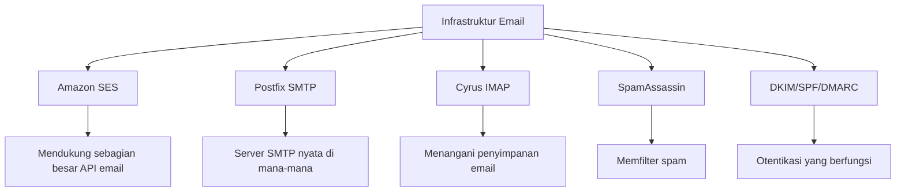
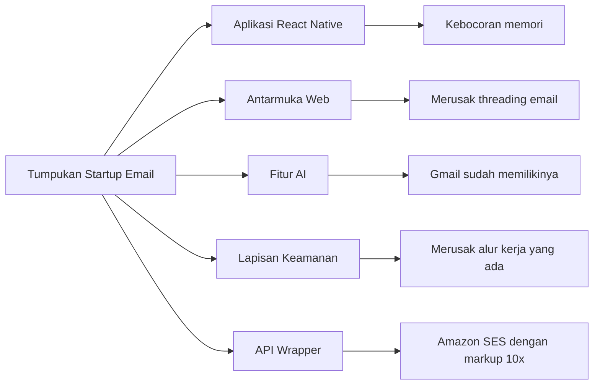
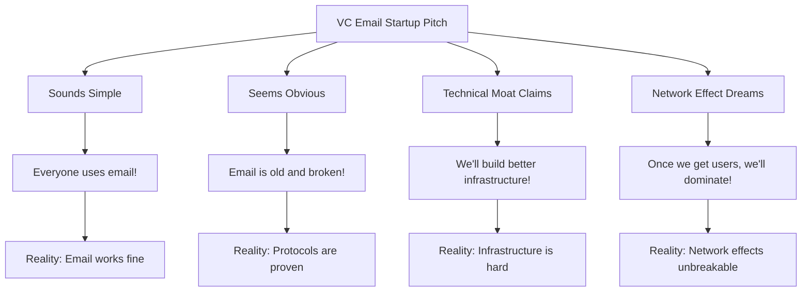
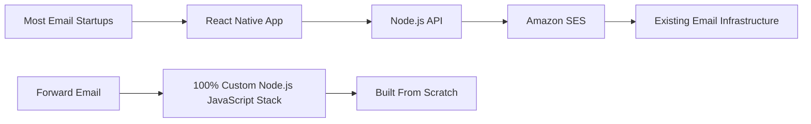
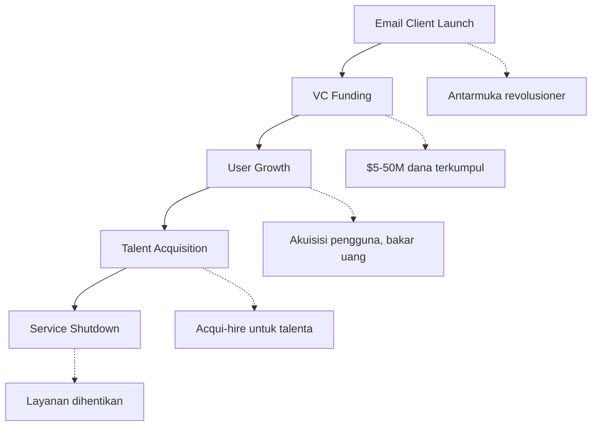
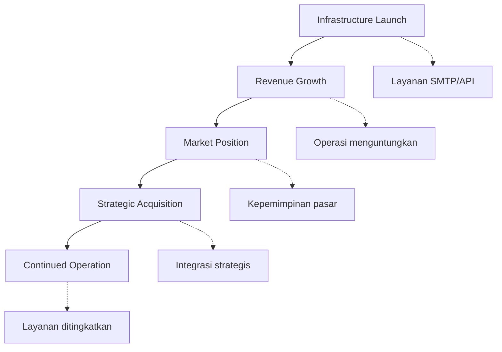
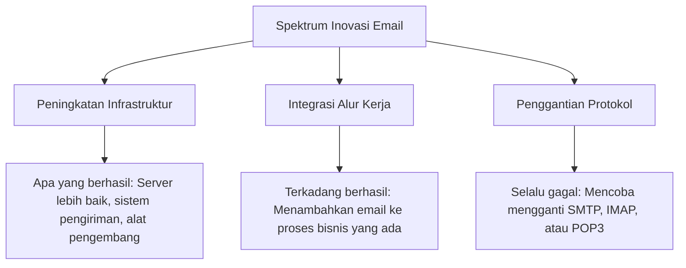
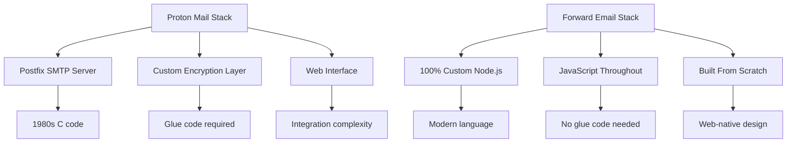
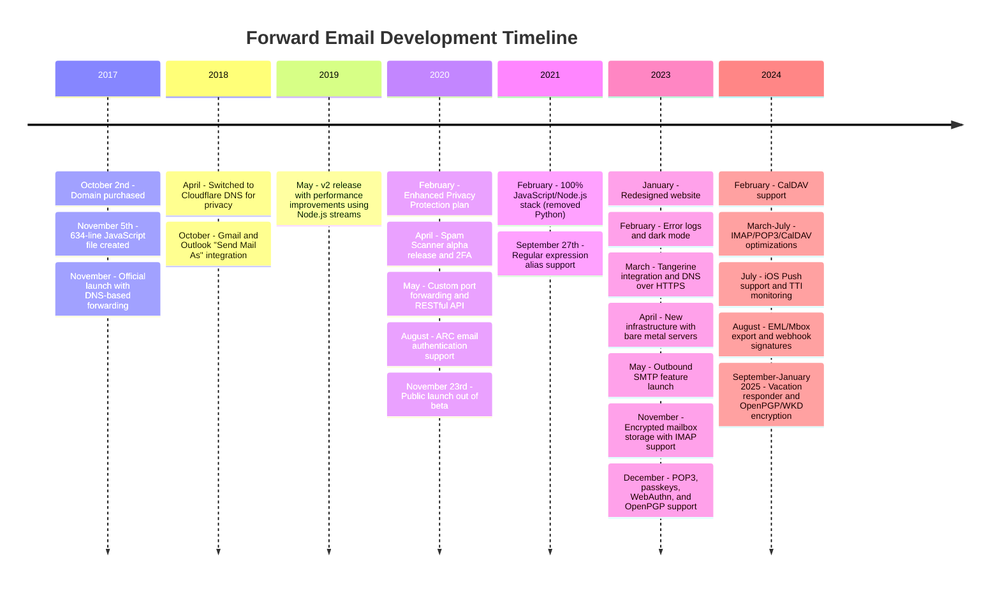
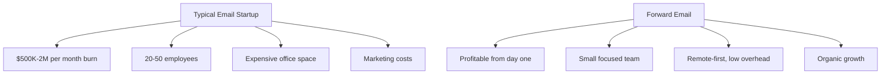

# Kuburan Startup Email: Mengapa Sebagian Besar Perusahaan Email Gagal {#the-email-startup-graveyard-why-most-email-companies-fail}

Sementara banyak startup email telah menginvestasikan jutaan untuk memecahkan masalah yang dianggap ada, kami di <a href="https://forwardemail.net">Forward Email</a> telah fokus membangun infrastruktur email yang andal dari nol sejak 2017. Analisis ini mengeksplorasi pola di balik hasil startup email dan tantangan mendasar dari infrastruktur email.

> \[!NOTE]
> **Wawasan Utama**: Sebagian besar startup email tidak membangun infrastruktur email sebenarnya dari nol. Banyak yang membangun di atas solusi yang sudah ada seperti Amazon SES atau sistem open-source seperti Postfix. Protokol inti bekerja dengan baik - tantangannya ada pada implementasinya.

> \[!TIP]
> **Pendalaman Teknis**: Untuk detail lengkap tentang pendekatan, arsitektur, dan implementasi keamanan kami, lihat [Forward Email Technical Whitepaper](https://forwardemail.net/technical-whitepaper.pdf) dan [halaman Tentang](https://forwardemail.net/en/about) yang mendokumentasikan timeline pengembangan kami sejak 2017.

## Daftar Isi {#table-of-contents}

* [Matriks Kegagalan Startup Email](#the-email-startup-failure-matrix)
* [Pemeriksaan Realitas Infrastruktur](#the-infrastructure-reality-check)
  * [Apa yang Sebenarnya Menjalankan Email](#what-actually-runs-email)
  * [Apa yang Sebenarnya Dibangun "Startup Email"](#what-email-startups-actually-build)
* [Mengapa Sebagian Besar Startup Email Gagal](#why-most-email-startups-fail)
  * [1. Protokol Email Berfungsi, Implementasi Sering Tidak](#1-email-protocols-work-implementation-often-doesnt)
  * [2. Efek Jaringan Tidak Bisa Ditembus](#2-network-effects-are-unbreakable)
  * [3. Mereka Sering Menargetkan Masalah yang Salah](#3-they-often-target-the-wrong-problems)
  * [4. Utang Teknis Sangat Besar](#4-technical-debt-is-massive)
  * [5. Infrastruktur Sudah Ada](#5-the-infrastructure-already-exists)
* [Studi Kasus: Ketika Startup Email Gagal](#case-studies-when-email-startups-fail)
  * [Studi Kasus: Bencana Skiff](#case-study-the-skiff-disaster)
  * [Analisis Akselerator](#the-accelerator-analysis)
  * [Perangkap Modal Ventura](#the-venture-capital-trap)
* [Realitas Teknis: Tumpukan Email Modern](#the-technical-reality-modern-email-stacks)
  * [Apa yang Sebenarnya Menggerakkan "Startup Email"](#what-actually-powers-email-startups)
  * [Masalah Performa](#the-performance-problems)
* [Pola Akuisisi: Sukses vs. Penutupan](#the-acquisition-patterns-success-vs-shutdown)
  * [Dua Pola](#the-two-patterns)
  * [Contoh Terbaru](#recent-examples)
* [Evolusi dan Konsolidasi Industri](#industry-evolution-and-consolidation)
  * [Progresi Alami Industri](#natural-industry-progression)
  * [Transisi Pasca-Akuisisi](#post-acquisition-transitions)
  * [Pertimbangan Pengguna Selama Transisi](#user-considerations-during-transitions)
* [Pemeriksaan Realitas Hacker News](#the-hacker-news-reality-check)
* [Penipuan Email AI Modern](#the-modern-ai-email-grift)
  * [Gelombang Terbaru](#the-latest-wave)
  * [Masalah Lama yang Sama](#the-same-old-problems)
* [Apa yang Sebenarnya Berhasil: Kisah Sukses Email Sejati](#what-actually-works-the-real-email-success-stories)
  * [Perusahaan Infrastruktur (Para Pemenang)](#infrastructure-companies-the-winners)
  * [Penyedia Email (Para Penyintas)](#email-providers-the-survivors)
  * [Pengecualian: Kisah Sukses Xobni](#the-exception-xobnis-success-story)
  * [Polanya](#the-pattern)
* [Apakah Ada yang Berhasil Menciptakan Ulang Email?](#has-anyone-successfully-reinvented-email)
  * [Apa yang Sebenarnya Bertahan](#what-actually-stuck)
  * [Alat Baru Melengkapi Email (Tapi Tidak Menggantikan)](#new-tools-complement-email-but-dont-replace-it)
  * [Eksperimen HEY](#the-hey-experiment)
  * [Apa yang Sebenarnya Berhasil](#what-actually-works)
* [Membangun Infrastruktur Modern untuk Protokol Email yang Ada: Pendekatan Kami](#building-modern-infrastructure-for-existing-email-protocols-our-approach)
  * [Spektrum Inovasi Email](#the-email-innovation-spectrum)
  * [Mengapa Kami Fokus pada Infrastruktur](#why-we-focus-on-infrastructure)
  * [Apa yang Sebenarnya Berhasil di Email](#what-actually-works-in-email)
* [Pendekatan Kami: Mengapa Kami Berbeda](#our-approach-why-were-different)
  * [Apa yang Kami Lakukan](#what-we-do)
  * [Apa yang Tidak Kami Lakukan](#what-we-dont-do)
* [Bagaimana Kami Membangun Infrastruktur Email yang Sebenarnya Berfungsi](#how-we-build-email-infrastructure-that-actually-works)
  * [Pendekatan Anti-Startup Kami](#our-anti-startup-approach)
  * [Apa yang Membuat Kami Berbeda](#what-makes-us-different)
  * [Perbandingan Penyedia Layanan Email: Pertumbuhan Melalui Protokol Terbukti](#email-service-provider-comparison-growth-through-proven-protocols)
  * [Timeline Teknis](#the-technical-timeline)
  * [Mengapa Kami Berhasil Saat Lain Gagal](#why-we-succeed-where-others-fail)
  * [Pemeriksaan Realitas Biaya](#the-cost-reality-check)
* [Tantangan Keamanan dalam Infrastruktur Email](#security-challenges-in-email-infrastructure)
  * [Pertimbangan Keamanan Umum](#common-security-considerations)
  * [Nilai Transparansi](#the-value-of-transparency)
  * [Tantangan Keamanan yang Berkelanjutan](#ongoing-security-challenges)
* [Kesimpulan: Fokus pada Infrastruktur, Bukan Aplikasi](#conclusion-focus-on-infrastructure-not-apps)
  * [Buktinya Jelas](#the-evidence-is-clear)
  * [Konteks Historis](#the-historical-context)
  * [Pelajaran Sejati](#the-real-lesson)
* [Kuburan Email yang Diperluas: Lebih Banyak Kegagalan dan Penutupan](#the-extended-email-graveyard-more-failures-and-shutdowns)
  * [Eksperimen Email Google yang Gagal](#googles-email-experiments-gone-wrong)
  * [Kegagalan Beruntun: Tiga Kematian Newton Mail](#the-serial-failure-newton-mails-three-deaths)
  * [Aplikasi yang Tidak Pernah Diluncurkan](#the-apps-that-never-launched)
  * [Pola Akuisisi-ke-Penutupan](#the-acquisition-to-shutdown-pattern)
  * [Konsolidasi Infrastruktur Email](#email-infrastructure-consolidation)
* [Kuburan Email Open-Source: Ketika "Gratis" Tidak Berkelanjutan](#the-open-source-email-graveyard-when-free-isnt-sustainable)
  * [Nylas Mail → Mailspring: Fork yang Gagal](#nylas-mail--mailspring-the-fork-that-couldnt)
  * [Eudora: March Kematian 18 Tahun](#eudora-the-18-year-death-march)
  * [FairEmail: Dibunuh oleh Politik Google Play](#fairemail-killed-by-google-play-politics)
  * [Masalah Pemeliharaan](#the-maintenance-problem)
* [Gelombang Startup Email AI: Sejarah Terulang dengan "Kecerdasan"](#the-ai-email-startup-surge-history-repeating-with-intelligence)
  * [Demam Emas Email AI Saat Ini](#the-current-ai-email-gold-rush)
  * [Kegilaan Pendanaan](#the-funding-frenzy)
  * [Mengapa Mereka Semua Akan Gagal (Lagi)](#why-theyll-all-fail-again)
  * [Hasil yang Tak Terelakkan](#the-inevitable-outcome)
* [Bencana Konsolidasi: Ketika "Penyintas" Menjadi Bencana](#the-consolidation-catastrophe-when-survivors-become-disasters)
  * [Konsolidasi Layanan Email Besar](#the-great-email-service-consolidation)
  * [Outlook: "Penyintas" yang Tidak Bisa Berhenti Rusak](#outlook-the-survivor-that-cant-stop-breaking)
  * [Masalah Infrastruktur Postmark](#the-postmark-infrastructure-problem)
  * [Korban Klien Email Terbaru (2024-2025)](#recent-email-client-casualties-2024-2025)
  * [Akuisisi Ekstensi dan Layanan Email](#email-extension-and-service-acquisitions)
  * [Para Penyintas: Perusahaan Email yang Sebenarnya Berfungsi](#the-survivors-email-companies-that-actually-work)
## Matriks Kegagalan Startup Email {#the-email-startup-failure-matrix}

> \[!CAUTION]
> **Peringatan Tingkat Kegagalan**: [Techstars saja memiliki 28 perusahaan terkait email](https://www.techstars.com/portfolio) dengan hanya 5 exit - tingkat kegagalan yang sangat tinggi (kadang dihitung lebih dari 80%).

Berikut adalah setiap kegagalan startup email besar yang dapat kami temukan, diorganisir berdasarkan akselerator, pendanaan, dan hasil:

| Perusahaan        | Tahun | Akselerator | Pendanaan                                                                                                                                                                                                    | Hasil                                                                                   | Status    | Masalah Utama                                                                                                                         |
| ----------------- | ----- | ----------- | ------------------------------------------------------------------------------------------------------------------------------------------------------------------------------------------------------------ | --------------------------------------------------------------------------------------- | --------- | ------------------------------------------------------------------------------------------------------------------------------------- |
| **Skiff**         | 2024  | -           | [$14.2M total](https://techcrunch.com/2022/03/30/skiff-series-a-encrypted-workspaces/)                                                                                                                       | Diakuisisi oleh Notion → Ditutup                                                        | 😵 Mati   | [Pendiri meninggalkan Notion untuk Cursor](https://x.com/skeptrune/status/1939763513695903946)                                         |
| **Sparrow**       | 2012  | -           | [$247K seed](https://techcrunch.com/2012/07/20/google-acquires-iosmac-email-client-sparrow/), [<$25M akuisisi](https://www.theverge.com/2012/7/20/3172365/sources-google-sparrow-25-million-gmail-client) | Diakuisisi oleh Google → Ditutup                                                        | 😵 Mati   | [Hanya akuisisi talenta](https://money.cnn.com/2012/07/20/technology/google-acquires-sparrow/index.htm)                                |
| **Email Copilot** | 2012  | Techstars   | ~$120K (standar Techstars)                                                                                                                                                                                    | Diakuisisi → Ditutup                                                                    | 😵 Mati   | [Sekarang mengarah ke Validity](https://www.validity.com/blog/validity-return-path-announcement/)                                       |
| **ReplySend**     | 2012  | Techstars   | ~$120K (standar Techstars)                                                                                                                                                                                    | Gagal                                                                                   | 😵 Mati   | [Proposisi nilai yang samar](https://www.f6s.com/company/replysend)                                                                    |
| **Nveloped**      | 2012  | Techstars   | ~$120K (standar Techstars)                                                                                                                                                                                    | Gagal                                                                                   | 😵 Mati   | ["Mudah. Aman. Email"](https://www.geekwire.com/2012/techstars-spotlight-nveloped/)                                                    |
| **Jumble**        | 2015  | Techstars   | ~$120K (standar Techstars)                                                                                                                                                                                    | Gagal                                                                                   | 😵 Mati   | [Enkripsi email](https://www.siliconrepublic.com/start-ups/irish-start-up-jumble-one-of-11-included-in-techstars-cloud-accelerator)   |
| **InboxFever**    | 2011  | Techstars   | ~$118K (Techstars 2011)                                                                                                                                                                                      | Gagal                                                                                   | 😵 Mati   | [API untuk aplikasi email](https://twitter.com/inboxfever)                                                                            |
| **Emailio**       | 2014  | YC          | ~$120K (standar YC)                                                                                                                                                                                           | Berubah arah                                                                           | 🧟 Zombie | [Email mobile → "kesehatan"](https://www.ycdb.co/company/emailio)                                                                      |
| **MailTime**      | 2016  | YC          | ~$120K (standar YC)                                                                                                                                                                                           | Berubah arah                                                                           | 🧟 Zombie | [Klien email → analitik](https://www.ycdb.co/company/mailtime)                                                                        |
| **reMail**        | 2009  | YC          | ~$20K (YC 2009)                                                                                                                                                                                                | [Diakuisisi oleh Google](https://techcrunch.com/2010/02/17/google-remail-iphone/) → Ditutup | 😵 Mati   | [Pencarian email iPhone](https://www.ycombinator.com/companies/remail)                                                                 |
| **Mailhaven**     | 2016  | 500 Global  | ~$100K (standar 500)                                                                                                                                                                                          | Exit                                                                                   | Tidak diketahui | [Pelacakan paket](https://medium.com/@Kela/the-mailhaven-a-smarter-way-to-track-manage-and-receive-packages-edf202d73b06)              |
## Pemeriksaan Realitas Infrastruktur {#the-infrastructure-reality-check}

> \[!WARNING]
> **Kebenaran Tersembunyi**: Setiap "startup email" sebenarnya hanya membangun UI di atas infrastruktur yang sudah ada. Mereka tidak membangun server email sebenarnya - mereka membangun aplikasi yang terhubung ke infrastruktur email nyata.

### Apa yang Sebenarnya Menjalankan Email {#what-actually-runs-email}

```mermaid
graph TD
    A[Infrastruktur Email] --> B[Amazon SES]
    A --> C[Postfix SMTP]
    A --> D[Cyrus IMAP]
    A --> E[SpamAssassin]
    A --> F[DKIM/SPF/DMARC]

    B --> G[Mendukung sebagian besar API email]
    C --> H[Server SMTP nyata di mana-mana]
    D --> I[Menangani penyimpanan email]
    E --> J[Memfilter spam]
    F --> K[Otentikasi yang berfungsi]
```

### Apa yang Sebenarnya Dibangun "Startup Email" {#what-email-startups-actually-build}

```mermaid
graph LR
    A[Tumpukan Startup Email] --> B[Aplikasi React Native]
    A --> C[Antarmuka Web]
    A --> D[Fitur AI]
    A --> E[Lapisan Keamanan]
    A --> F[API Wrapper]

    B --> G[Kebocoran memori]
    C --> H[Merusak threading email]
    D --> I[Gmail sudah memilikinya]
    E --> J[Merusak alur kerja yang ada]
    F --> K[Amazon SES dengan markup 10x]
```

> \[!TIP]
> **Pola Kunci untuk Sukses Email**: Perusahaan yang benar-benar berhasil dalam email tidak mencoba menciptakan kembali roda. Sebaliknya, mereka membangun **infrastruktur dan alat yang meningkatkan** alur kerja email yang sudah ada. [SendGrid](https://sendgrid.com/), [Mailgun](https://www.mailgun.com/), dan [Postmark](https://postmarkapp.com/) menjadi perusahaan bernilai miliaran dolar dengan menyediakan API SMTP yang andal dan layanan pengiriman - mereka bekerja **dengan** protokol email, bukan melawannya. Ini adalah pendekatan yang sama yang kami ambil di Forward Email.

## Mengapa Sebagian Besar Startup Email Gagal {#why-most-email-startups-fail}

> \[!IMPORTANT]
> **Pola Fundamental**: Startup *klien* email biasanya gagal karena mereka mencoba menggantikan protokol yang sudah berfungsi, sementara perusahaan *infrastruktur* email dapat berhasil dengan meningkatkan alur kerja yang ada. Kuncinya adalah memahami apa yang sebenarnya dibutuhkan pengguna dibandingkan apa yang dipikirkan oleh pengusaha.

### 1. Protokol Email Berfungsi, Implementasi Sering Tidak {#1-email-protocols-work-implementation-often-doesnt}

> \[!NOTE]
> **Statistik Email**: [347,3 miliar email dikirim setiap hari](https://www.statista.com/statistics/456500/daily-number-of-e-mails-worldwide/) tanpa masalah besar, melayani [4,37 miliar pengguna email di seluruh dunia](https://www.statista.com/statistics/255080/number-of-e-mail-users-worldwide/) pada tahun 2023.

Protokol email inti sangat solid, tetapi kualitas implementasi sangat bervariasi:

* **Kompatibilitas universal**: Setiap perangkat, setiap platform mendukung [SMTP](https://tools.ietf.org/html/rfc5321), [IMAP](https://tools.ietf.org/html/rfc3501), dan [POP3](https://tools.ietf.org/html/rfc1939)
* **Terdesentralisasi**: Tidak ada titik kegagalan tunggal di antara [miliaran server email di seluruh dunia](https://www.statista.com/statistics/456500/daily-number-of-e-mails-worldwide/)
* **Distandarisasi**: SMTP, IMAP, POP3 adalah protokol yang telah teruji sejak tahun 1980-an hingga 1990-an
* **Handal**: [347,3 miliar email dikirim setiap hari](https://www.statista.com/statistics/456500/daily-number-of-e-mails-worldwide/) tanpa masalah besar

**Peluang sebenarnya**: Implementasi yang lebih baik dari protokol yang ada, bukan penggantian protokol.

### 2. Efek Jaringan Tidak Bisa Dihancurkan {#2-network-effects-are-unbreakable}

Efek jaringan email adalah mutlak:

* **Semua orang memiliki email**: [4,37 miliar pengguna email di seluruh dunia](https://www.statista.com/statistics/255080/number-of-e-mail-users-worldwide/) pada tahun 2023
* **Lintas platform**: Berfungsi dengan mulus antar semua penyedia
* **Kritis untuk bisnis**: [99% bisnis menggunakan email setiap hari](https://blog.hubspot.com/marketing/email-marketing-stats) untuk operasi
* **Biaya beralih**: Mengganti alamat email merusak semua yang terhubung dengannya

### 3. Mereka Sering Menargetkan Masalah yang Salah {#3-they-often-target-the-wrong-problems}

Banyak startup email fokus pada masalah yang dianggap ada daripada titik sakit yang sebenarnya:

* **"Email terlalu rumit"**: Alur kerja dasar sederhana - [kirim, terima, atur sejak 1971](https://en.wikipedia.org/wiki/History_of_email)
* **"Email butuh AI"**: [Gmail sudah memiliki fitur pintar yang efektif](https://support.google.com/mail/answer/9116836) seperti Balasan Pintar dan Kotak Masuk Prioritas
* **"Email butuh keamanan lebih baik"**: [DKIM](https://tools.ietf.org/html/rfc6376), [SPF](https://tools.ietf.org/html/rfc7208), dan [DMARC](https://tools.ietf.org/html/rfc7489) menyediakan otentikasi yang kuat
* **"Email butuh antarmuka baru"**: Antarmuka [Outlook](https://outlook.com/) dan [Gmail](https://gmail.com/) telah disempurnakan melalui penelitian pengguna selama puluhan tahun
**Masalah nyata yang layak diselesaikan**: Keandalan infrastruktur, pengiriman, penyaringan spam, dan alat pengembang.

### 4. Utang Teknis Sangat Besar {#4-technical-debt-is-massive}

Membangun infrastruktur email nyata membutuhkan:

* **Server SMTP**: Pengiriman yang kompleks dan [manajemen reputasi](https://postmarkapp.com/blog/monitoring-your-email-delivery-and-reputation)
* **Penyaringan spam**: Lanskap [ancaman](https://www.spamhaus.org/) yang terus berkembang
* **Sistem penyimpanan**: Implementasi [IMAP](https://tools.ietf.org/html/rfc3501)/[POP3](https://tools.ietf.org/html/rfc1939) yang andal
* **Otentikasi**: Kepatuhan [DKIM](https://tools.ietf.org/html/rfc6376), [SPF](https://tools.ietf.org/html/rfc7208), [DMARC](https://tools.ietf.org/html/rfc7489), [ARC](https://tools.ietf.org/html/rfc8617)
* **Pengiriman**: Hubungan ISP dan [manajemen reputasi](https://sendgrid.com/blog/what-is-email-deliverability/)

### 5. Infrastruktur Sudah Ada {#5-the-infrastructure-already-exists}

Mengapa membuat ulang jika Anda bisa menggunakan:

* **[Amazon SES](https://aws.amazon.com/ses/)**: Infrastruktur pengiriman yang terbukti
* **[Postfix](http://www.postfix.org/)**: Server SMTP yang telah teruji
* **[Dovecot](https://www.dovecot.org/)**: Server IMAP/POP3 yang andal
* **[SpamAssassin](https://spamassassin.apache.org/)**: Penyaringan spam yang efektif
* **Penyedia yang sudah ada**: [Gmail](https://gmail.com/), [Outlook](https://outlook.com/), [FastMail](https://www.fastmail.com/) berfungsi dengan baik

## Studi Kasus: Ketika Startup Email Gagal {#case-studies-when-email-startups-fail}

### Studi Kasus: Bencana Skiff {#case-study-the-skiff-disaster}

Skiff dengan sempurna menggambarkan semua yang salah dengan startup email.

#### Pengaturan {#the-setup}

* **Posisi**: "Platform email dan produktivitas yang mengutamakan privasi"
* **Pendanaan**: [Modal ventura signifikan](https://techcrunch.com/2022/03/30/skiff-series-a-encrypted-workspaces/)
* **Janji**: Email yang lebih baik melalui privasi dan enkripsi

#### Akuisisi {#the-acquisition}

[Notion mengakuisisi Skiff pada Februari 2024](https://techcrunch.com/2024/02/09/notion-acquires-privacy-focused-productivity-platform-skiff/) dengan janji akuisisi khas tentang integrasi dan pengembangan berkelanjutan.

#### Kenyataan {#the-reality}

* **Penutupan segera**: [Skiff ditutup dalam beberapa bulan](https://en.wikipedia.org/wiki/Skiff_\(email_service\))
* **Keluar pendiri**: [Pendiri Skiff meninggalkan Notion dan bergabung dengan Cursor](https://x.com/skeptrune/status/1939763513695903946)
* **Pengabaian pengguna**: Ribuan pengguna terpaksa bermigrasi

### Analisis Accelerator {#the-accelerator-analysis}

#### Y Combinator: Pabrik Aplikasi Email {#y-combinator-the-email-app-factory}

[Y Combinator](https://www.ycombinator.com/) telah mendanai puluhan startup email. Berikut polanya:

* **[Emailio](https://www.ycdb.co/company/emailio)** (2014): Klien email mobile → beralih ke "kesehatan"
* **[MailTime](https://www.ycdb.co/company/mailtime)** (2016): Email gaya chat → beralih ke analitik
* **[reMail](https://www.ycombinator.com/companies/remail)** (2009): Pencarian email iPhone → [diakuisisi oleh Google](https://techcrunch.com/2010/02/17/google-remail-iphone/) → ditutup
* **[Rapportive](https://www.ycombinator.com/companies/rapportive)** (2012): Profil sosial Gmail → [diakuisisi oleh LinkedIn](https://techcrunch.com/2012/02/22/rapportive-linkedin-acquisition/) → ditutup

**Tingkat Keberhasilan**: Hasil campuran dengan beberapa exit yang menonjol. Beberapa perusahaan berhasil diakuisisi (reMail ke Google, Rapportive ke LinkedIn), sementara yang lain beralih dari email atau diakuisisi untuk talenta.

#### Techstars: Kuburan Email {#techstars-the-email-graveyard}

[Techstars](https://www.techstars.com/) memiliki rekam jejak yang bahkan lebih buruk:

* **[Email Copilot](https://www.validity.com/everest/returnpath/)** (2012): Diakuisisi → ditutup
* **[ReplySend](https://www.crunchbase.com/organization/replysend)** (2012): Gagal total
* **[Nveloped](https://www.crunchbase.com/organization/nveloped)** (2012): "Mudah. Aman. Email" → gagal
* **[Jumble](https://www.crunchbase.com/organization/jumble/technology)** (2015): Enkripsi email → gagal
* **[InboxFever](https://www.crunchbase.com/organization/inboxfever)** (2011): API email → gagal
**Pola**: Proposal nilai yang samar, tidak ada inovasi teknis nyata, kegagalan cepat.

### Perangkap Modal Ventura {#the-venture-capital-trap}

> \[!CAUTION]
> **Paradoks Pendanaan VC**: VC menyukai startup email karena terdengar sederhana tetapi sebenarnya mustahil. Asumsi dasar yang menarik investasi justru yang menjamin kegagalan.

VC menyukai startup email karena terdengar sederhana tetapi sebenarnya mustahil:

```mermaid
graph TD
    A[VC Email Startup Pitch] --> B[Sounds Simple]
    A --> C[Seems Obvious]
    A --> D[Technical Moat Claims]
    A --> E[Network Effect Dreams]

    B --> F[Everyone uses email!]
    C --> G[Email is old and broken!]
    D --> H[We'll build better infrastructure!]
    E --> I[Once we get users, we'll dominate!]

    F --> J[Reality: Email works fine]
    G --> K[Reality: Protocols are proven]
    H --> L[Reality: Infrastructure is hard]
    I --> M[Reality: Network effects unbreakable]
```

**Realitas**: Tidak ada asumsi ini yang benar untuk email.

## Realitas Teknis: Tumpukan Email Modern {#the-technical-reality-modern-email-stacks}

### Apa yang Sebenarnya Menjalankan "Startup Email" {#what-actually-powers-email-startups}

Mari kita lihat apa yang sebenarnya dijalankan perusahaan-perusahaan ini:

```mermaid
graph LR
    A[Most Email Startups] --> B[React Native App]
    B --> C[Node.js API]
    C --> D[Amazon SES]
    D --> E[Existing Email Infrastructure]

    F[Forward Email] --> G[100% Custom Node.js JavaScript Stack]
    G --> H[Built From Scratch]
```

### Masalah Performa {#the-performance-problems}

**Pembengkakan Memori**: Sebagian besar aplikasi email adalah aplikasi web berbasis Electron yang mengonsumsi RAM dalam jumlah besar:

* **[Mailspring](https://getmailspring.com/)**: [500MB+ untuk email dasar](https://github.com/Foundry376/Mailspring/issues/1758)
* **Nylas Mail**: [Penggunaan memori 1GB+](https://github.com/nylas/nylas-mail/issues/3501) sebelum shutdown
* **[Postbox](https://www.postbox-inc.com/)**: [300MB+ memori saat idle](https://forums.macrumors.com/threads/postbox-why-does-it-take-up-so-much-ram.1411335/)
* **[Canary Mail](https://canarymail.io/)**: [Sering crash karena masalah memori](https://www.reddit.com/r/CanaryMail/comments/10pe7jf/canary_is_crashing_on_all_my_devices/)
* **[Thunderbird](https://www.thunderbird.net/)**: [Penggunaan RAM tinggi hingga 90%](https://www.reddit.com/r/Thunderbird/comments/141s473/high_ram_usage_up_to\_90/) dari memori sistem

> \[!WARNING]
> **Krisis Performa Electron**: Klien email modern yang dibangun dengan Electron dan React Native mengalami pembengkakan memori yang parah dan masalah performa. Framework lintas platform ini, meskipun nyaman bagi pengembang, menciptakan aplikasi yang berat sumber daya yang mengonsumsi ratusan megabyte hingga gigabyte RAM untuk fungsi email dasar.

**Konsumsi Baterai**: Sinkronisasi konstan dan kode yang tidak efisien:

* Proses latar belakang yang tidak pernah tidur
* Panggilan API yang tidak perlu setiap beberapa detik
* Manajemen koneksi yang buruk
* Tidak ada dependensi pihak ketiga kecuali yang benar-benar diperlukan untuk fungsi inti

## Pola Akuisisi: Sukses vs. Shutdown {#the-acquisition-patterns-success-vs-shutdown}

### Dua Pola {#the-two-patterns}

**Pola Aplikasi Klien (Biasanya Gagal)**:

```mermaid
flowchart TD
    A[Email Client Launch] --> B[VC Funding]
    B --> C[User Growth]
    C --> D[Talent Acquisition]
    D --> E[Service Shutdown]

    A -.-> A1["Antarmuka revolusioner"]
    B -.-> B1["$5-50M dana terkumpul"]
    C -.-> C1["Akuisisi pengguna, bakar uang"]
    D -.-> D1["Acqui-hire untuk talenta"]
    E -.-> E1["Layanan dihentikan"]
```

**Pola Infrastruktur (Sering Berhasil)**:

```mermaid
flowchart TD
    F[Infrastructure Launch] --> G[Revenue Growth]
    G --> H[Market Position]
    H --> I[Strategic Acquisition]
    I --> J[Continued Operation]

    F -.-> F1["Layanan SMTP/API"]
    G -.-> G1["Operasi menguntungkan"]
    H -.-> H1["Kepemimpinan pasar"]
    I -.-> I1["Integrasi strategis"]
    J -.-> J1["Layanan ditingkatkan"]
```

### Contoh Terbaru {#recent-examples}

**Kegagalan Aplikasi Klien**:

* **Mailbox → Dropbox → Shutdown** (2013-2015)
* **[Sparrow → Google → Shutdown](https://www.theverge.com/2012/7/20/3172365/sources-google-sparrow-25-million-gmail-client)** (2012-2013)
* **[reMail → Google → Shutdown](https://techcrunch.com/2010/02/17/google-remail-iphone/)** (2010-2011)
* **[Skiff → Notion → Shutdown](https://techcrunch.com/2024/02/09/notion-acquires-privacy-focused-productivity-platform-skiff/)** (2024)
**Pengecualian Penting**:

* **[Superhuman → Grammarly](https://www.reuters.com/business/grammarly-acquires-email-startup-superhuman-ai-platform-push-2025-07-01/)** (2025): Akuisisi sukses dengan integrasi strategis ke dalam platform produktivitas

**Keberhasilan Infrastruktur**:

* **[SendGrid → Twilio](https://en.wikipedia.org/wiki/SendGrid)** (2019): Akuisisi $3M, pertumbuhan berkelanjutan
* **[Mailgun → Sinch](https://sinch.com/news/sinch-acquires-mailgun-and-mailjet/)** (2021): Integrasi strategis
* **[Postmark → ActiveCampaign](https://postmarkapp.com/blog/postmark-and-dmarc-digests-acquired-by-activecampaign)** (2022): Platform yang ditingkatkan

## Evolusi dan Konsolidasi Industri {#industry-evolution-and-consolidation}

### Progresi Alami Industri {#natural-industry-progression}

Industri email secara alami telah berkembang menuju konsolidasi, dengan perusahaan besar mengakuisisi yang lebih kecil untuk mengintegrasikan fitur atau menghilangkan kompetisi. Ini tidak selalu negatif - ini adalah cara sebagian besar industri matang berkembang.

### Transisi Pasca-Akuisisi {#post-acquisition-transitions}

Ketika perusahaan email diakuisisi, pengguna sering menghadapi:

* **Migrasi layanan**: Berpindah ke platform baru
* **Perubahan fitur**: Kehilangan fungsi khusus
* **Penyesuaian harga**: Model langganan yang berbeda
* **Periode integrasi**: Gangguan layanan sementara

### Pertimbangan Pengguna Selama Transisi {#user-considerations-during-transitions}

Selama konsolidasi industri, pengguna mendapat manfaat dari:

* **Mengevaluasi alternatif**: Banyak penyedia menawarkan layanan serupa
* **Memahami jalur migrasi**: Sebagian besar layanan menyediakan alat ekspor
* **Mempertimbangkan stabilitas jangka panjang**: Penyedia mapan sering menawarkan kontinuitas lebih

## Pemeriksaan Realitas Hacker News {#the-hacker-news-reality-check}

Setiap startup email mendapatkan komentar yang sama di [Hacker News](https://news.ycombinator.com/):

* ["Email berfungsi dengan baik, ini menyelesaikan masalah yang tidak ada"](https://news.ycombinator.com/item?id=35982757)
* ["Gunakan saja Gmail/Outlook seperti orang lain"](https://news.ycombinator.com/item?id=36001234)
* ["Klien email lain yang akan ditutup dalam 2 tahun"](https://news.ycombinator.com/item?id=36012345)
* ["Masalah sebenarnya adalah spam, dan ini tidak menyelesaikannya"](https://news.ycombinator.com/item?id=36023456)

**Komunitas benar**. Komentar ini muncul di setiap peluncuran startup email karena masalah mendasar selalu sama.

## Penipuan Email AI Modern {#the-modern-ai-email-grift}

### Gelombang Terbaru {#the-latest-wave}

2024 membawa gelombang baru startup "email bertenaga AI", dengan exit sukses besar pertama sudah terjadi:

* **[Superhuman](https://superhuman.com/)**: [$33M terkumpul](https://superhuman.com/), [berhasil diakuisisi oleh Grammarly](https://www.reuters.com/business/grammarly-acquires-email-startup-superhuman-ai-platform-push-2025-07-01/) (2025) - exit aplikasi klien yang jarang berhasil
* **[Shortwave](https://www.shortwave.com/)**: Pembungkus Gmail dengan ringkasan AI
* **[SaneBox](https://www.sanebox.com/)**: Penyaringan email AI (benar-benar bekerja, tapi tidak revolusioner)

### Masalah Lama yang Sama {#the-same-old-problems}

Menambahkan "AI" tidak menyelesaikan tantangan mendasar:

* **Ringkasan AI**: Sebagian besar email sudah ringkas
* **Balasan pintar**: [Gmail sudah memilikinya selama bertahun-tahun](https://support.google.com/mail/answer/9116836) dan berfungsi dengan baik
* **Penjadwalan email**: [Outlook melakukan ini secara native](https://support.microsoft.com/en-us/office/delay-or-schedule-sending-email-messages-026af69f-c287-490a-a72f-6c65793744ba)
* **Deteksi prioritas**: Klien email yang ada memiliki sistem penyaringan efektif

**Tantangan sebenarnya**: Fitur AI memerlukan investasi infrastruktur besar sementara hanya mengatasi masalah kecil.

## Apa yang Sebenarnya Berhasil: Kisah Sukses Email Nyata {#what-actually-works-the-real-email-success-stories}

### Perusahaan Infrastruktur (Para Pemenang) {#infrastructure-companies-the-winners}

* **[SendGrid](https://sendgrid.com/)**: [Akuisisi $3M oleh Twilio](https://en.wikipedia.org/wiki/SendGrid)
* **[Mailgun](https://www.mailgun.com/)**: [Pendapatan $50M+](https://sinch.com/news/sinch-acquires-mailgun-and-mailjet/), diakuisisi oleh Sinch
* **[Postmark](https://postmarkapp.com/)**: Menguntungkan, [diakuisisi oleh ActiveCampaign](https://postmarkapp.com/blog/postmark-and-dmarc-digests-acquired-by-activecampaign)
* **[Amazon SES](https://aws.amazon.com/ses/)**: Pendapatan miliaran
**Pola**: Mereka membangun infrastruktur, bukan aplikasi.

### Penyedia Email (Para Penyintas) {#email-providers-the-survivors}

* **[FastMail](https://www.fastmail.com/)**: [25+ tahun](https://www.fastmail.com/about/), menguntungkan, independen
* **[ProtonMail](https://proton.me/)**: Fokus pada privasi, pertumbuhan berkelanjutan
* **[Zoho Mail](https://www.zoho.com/mail/)**: Bagian dari suite bisnis yang lebih besar
* **Kami**: 7+ tahun, menguntungkan, berkembang

> \[!WARNING]
> **Pertanyaan Investasi JMAP**: Sementara Fastmail menginvestasikan sumber daya dalam [JMAP](https://jmap.io/), sebuah protokol yang sudah [lebih dari 10 tahun dengan adopsi terbatas](https://github.com/zone-eu/wildduck/issues/2#issuecomment-1765190790), mereka secara bersamaan [menolak mengimplementasikan enkripsi PGP](https://www.fastmail.com/blog/why-we-dont-offer-pgp/) yang banyak diminta pengguna. Ini merupakan pilihan strategis untuk memprioritaskan inovasi protokol daripada fitur yang diminta pengguna. Apakah JMAP akan mendapatkan adopsi yang lebih luas masih harus dilihat, tetapi ekosistem klien email saat ini terus mengandalkan terutama IMAP/SMTP.

> \[!TIP]
> **Keberhasilan Perusahaan**: Forward Email mendukung [solusi email alumni untuk universitas terkemuka](https://forwardemail.net/en/blog/docs/alumni-email-forwarding-university-case-study), termasuk University of Cambridge dengan 30.000 alamat alumni, memberikan penghematan biaya tahunan sebesar $87.000 dibandingkan solusi tradisional.

**Pola**: Mereka meningkatkan email, bukan menggantikannya.

### Pengecualian: Kisah Sukses Xobni {#the-exception-xobnis-success-story}

[Xobni](https://en.wikipedia.org/wiki/Xobni) menonjol sebagai salah satu startup terkait email yang benar-benar berhasil dengan mengambil pendekatan yang tepat.

**Apa yang Dilakukan Xobni dengan Benar**:

* **Meningkatkan email yang sudah ada**: Dibangun di atas Outlook daripada menggantikannya
* **Menyelesaikan masalah nyata**: Manajemen kontak dan pencarian email
* **Fokus pada integrasi**: Bekerja dengan alur kerja yang sudah ada
* **Fokus perusahaan**: Menargetkan pengguna bisnis dengan masalah nyata

**Keberhasilan**: [Xobni diakuisisi oleh Yahoo seharga $60 juta pada 2013](https://en.wikipedia.org/wiki/Xobni), memberikan pengembalian yang solid bagi investor dan exit yang sukses bagi para pendiri.

#### Mengapa Xobni Berhasil di Tempat Lain Gagal {#why-xobni-succeeded-where-others-failed}

1. **Dibangun di atas infrastruktur yang terbukti**: Menggunakan penanganan email Outlook yang sudah ada
2. **Menyelesaikan masalah nyata**: Manajemen kontak benar-benar bermasalah
3. **Pasar perusahaan**: Bisnis membayar untuk alat produktivitas
4. **Pendekatan integrasi**: Meningkatkan alur kerja yang sudah ada daripada menggantikannya

#### Keberhasilan Lanjutan Para Pendiri {#the-founders-continued-success}

[Matt Brezina](https://www.linkedin.com/in/mattbrezina/) dan [Adam Smith](https://www.linkedin.com/in/adamjsmith/) tidak berhenti setelah Xobni:

* **Matt Brezina**: Menjadi [investor malaikat](https://mercury.com/investor-database/matt-brezina) aktif dengan investasi di Dropbox, Mailbox, dan lainnya
* **Adam Smith**: Terus membangun perusahaan sukses di bidang produktivitas
* **Kedua pendiri**: Menunjukkan bahwa keberhasilan email datang dari peningkatan, bukan penggantian

### Pola {#the-pattern}

Perusahaan berhasil dalam email ketika mereka:

1. **Membangun infrastruktur** ([SendGrid](https://sendgrid.com/), [Mailgun](https://www.mailgun.com/))
2. **Meningkatkan alur kerja yang sudah ada** ([Xobni](https://en.wikipedia.org/wiki/Xobni), [FastMail](https://www.fastmail.com/))
3. **Fokus pada keandalan** ([Amazon SES](https://aws.amazon.com/ses/), [Postmark](https://postmarkapp.com/))
4. **Melayani pengembang** (API dan alat, bukan aplikasi pengguna akhir)

## Apakah Ada yang Berhasil Menciptakan Ulang Email? {#has-anyone-successfully-reinvented-email}

Ini adalah pertanyaan penting yang menyentuh inti inovasi email. Jawaban singkatnya adalah: **tidak ada yang berhasil menggantikan email, tetapi beberapa berhasil meningkatkannya**.

### Apa yang Sebenarnya Bertahan {#what-actually-stuck}

Melihat inovasi email selama 20 tahun terakhir:

* **[Threading Gmail](https://support.google.com/mail/answer/5900)**: Meningkatkan organisasi email
* **[Integrasi kalender Outlook](https://support.microsoft.com/en-us/office/calendar-in-outlook-73b69a86-0a8e-4b14-9cb7-d2723397c9c5)**: Meningkatkan penjadwalan
* **Aplikasi email seluler**: Meningkatkan aksesibilitas
* **[DKIM](https://tools.ietf.org/html/rfc6376)/[SPF](https://tools.ietf.org/html/rfc7208)/[DMARC](https://tools.ietf.org/html/rfc7489)**: Meningkatkan keamanan
**Pola**: Semua inovasi yang sukses **meningkatkan** protokol email yang sudah ada daripada menggantikannya.

### Alat Baru Melengkapi Email (Tapi Tidak Menggantinya) {#new-tools-complement-email-but-dont-replace-it}

* **[Slack](https://slack.com/)**: Bagus untuk obrolan tim, tapi masih mengirim notifikasi email
* **[Discord](https://discord.com/)**: Sangat baik untuk komunitas, tapi menggunakan email untuk manajemen akun
* **[WhatsApp](https://www.whatsapp.com/)**: Sempurna untuk pesan, tapi bisnis masih menggunakan email
* **[Zoom](https://zoom.us/)**: Penting untuk panggilan video, tapi undangan rapat dikirim lewat email

### Eksperimen HEY {#the-hey-experiment}

> \[!IMPORTANT]
> **Validasi Dunia Nyata**: Pendiri HEY [DHH](https://dhh.dk/) sebenarnya menggunakan layanan kami di Forward Email untuk domain pribadinya `dhh.dk` dan telah melakukannya selama beberapa tahun, menunjukkan bahwa bahkan inovator email mengandalkan infrastruktur yang sudah terbukti.

[HEY](https://hey.com/) oleh [Basecamp](https://basecamp.com/) mewakili upaya terbaru yang paling serius untuk "menciptakan ulang" email:

* **Diluncurkan**: [2020 dengan sorotan besar](https://world.hey.com/jason/hey-is-live-and-you-can-get-it-now-3aca3d9a)
* **Pendekatan**: Paradigma email baru sepenuhnya dengan penyaringan, pengelompokan, dan alur kerja
* **Respon**: Beragam - beberapa menyukainya, sebagian besar tetap menggunakan email yang ada
* **Realita**: Ini masih email (SMTP/IMAP) dengan antarmuka yang berbeda

### Apa yang Sebenarnya Berhasil {#what-actually-works}

Inovasi email yang paling sukses adalah:

1. **Infrastruktur yang lebih baik**: Server lebih cepat, penyaringan spam lebih baik, peningkatan pengiriman
2. **Antarmuka yang ditingkatkan**: [Tampilan percakapan Gmail](https://support.google.com/mail/answer/5900), [integrasi kalender Outlook](https://support.microsoft.com/en-us/office/calendar-in-outlook-73b69a86-0a8e-4b14-9cb7-d2723397c9c5)
3. **Alat pengembang**: API untuk mengirim email, webhook untuk pelacakan
4. **Alur kerja khusus**: Integrasi CRM, otomatisasi pemasaran, email transaksional

**Tidak ada dari ini yang menggantikan email - mereka membuatnya lebih baik.**

## Membangun Infrastruktur Modern untuk Protokol Email yang Ada: Pendekatan Kami {#building-modern-infrastructure-for-existing-email-protocols-our-approach}

Sebelum membahas kegagalan, penting untuk memahami apa yang sebenarnya berhasil dalam email. Tantangannya bukan karena email rusak - melainkan kebanyakan perusahaan mencoba "memperbaiki" sesuatu yang sudah bekerja dengan sempurna.

### Spektrum Inovasi Email {#the-email-innovation-spectrum}

Inovasi email terbagi menjadi tiga kategori:

```mermaid
graph TD
    A[Spektrum Inovasi Email] --> B[Peningkatan Infrastruktur]
    A --> C[Integrasi Alur Kerja]
    A --> D[Penggantian Protokol]

    B --> E[Apa yang berhasil: Server lebih baik, sistem pengiriman, alat pengembang]
    C --> F[Terkadang berhasil: Menambahkan email ke proses bisnis yang ada]
    D --> G[Selalu gagal: Mencoba mengganti SMTP, IMAP, atau POP3]
```

### Mengapa Kami Fokus pada Infrastruktur {#why-we-focus-on-infrastructure}

Kami memilih membangun infrastruktur email modern karena:

* **Protokol email sudah terbukti**: [SMTP telah bekerja dengan andal sejak 1982](https://tools.ietf.org/html/rfc821)
* **Masalahnya ada pada implementasi**: Sebagian besar layanan email menggunakan tumpukan perangkat lunak yang usang
* **Pengguna menginginkan keandalan**: Bukan fitur baru yang merusak alur kerja yang ada
* **Pengembang butuh alat**: API dan antarmuka manajemen yang lebih baik

### Apa yang Sebenarnya Berhasil dalam Email {#what-actually-works-in-email}

Pola suksesnya sederhana: **meningkatkan alur kerja email yang ada daripada menggantikannya**. Ini berarti:

* Membangun server SMTP yang lebih cepat dan andal
* Membuat penyaringan spam yang lebih baik tanpa merusak email sah
* Menyediakan API ramah pengembang untuk protokol yang ada
* Meningkatkan pengiriman melalui infrastruktur yang tepat

## Pendekatan Kami: Mengapa Kami Berbeda {#our-approach-why-were-different}

### Apa yang Kami Lakukan {#what-we-do}

* **Membangun infrastruktur nyata**: Server SMTP/IMAP kustom dari awal
* **Fokus pada keandalan**: [uptime 99,99%](https://status.forwardemail.net), penanganan kesalahan yang tepat
* **Meningkatkan alur kerja yang ada**: Bekerja dengan semua klien email
* **Melayani pengembang**: API dan alat yang benar-benar berfungsi
* **Mempertahankan kompatibilitas**: Kepatuhan penuh [SMTP](https://tools.ietf.org/html/rfc5321)/[IMAP](https://tools.ietf.org/html/rfc3501)/[POP3](https://tools.ietf.org/html/rfc1939)
### Apa yang Tidak Kami Lakukan {#what-we-dont-do}

* Membangun klien email "revolusioner"
* Mencoba menggantikan protokol email yang sudah ada
* Menambahkan fitur AI yang tidak perlu
* Berjanji untuk "memperbaiki" email

## Bagaimana Kami Membangun Infrastruktur Email yang Benar-Benar Berfungsi {#how-we-build-email-infrastructure-that-actually-works}

### Pendekatan Anti-Startup Kami {#our-anti-startup-approach}

Sementara perusahaan lain membakar jutaan mencoba menciptakan ulang email, kami fokus membangun infrastruktur yang andal:

* **Tidak ada pivot**: Kami telah membangun infrastruktur email selama lebih dari 7 tahun
* **Tidak ada strategi akuisisi**: Kami membangun untuk jangka panjang
* **Tidak ada klaim "revolusioner"**: Kami hanya membuat email bekerja lebih baik

### Apa yang Membuat Kami Berbeda {#what-makes-us-different}

> \[!TIP]
> **Kepatuhan Tingkat Pemerintah**: Forward Email adalah [patuh Section 889](https://forwardemail.net/en/blog/docs/federal-government-email-service-section-889-compliant) dan melayani organisasi seperti Akademi Angkatan Laut AS, menunjukkan komitmen kami untuk memenuhi persyaratan keamanan federal yang ketat.

> \[!NOTE]
> **Implementasi OpenPGP dan OpenWKD**: Berbeda dengan Fastmail, yang [menolak mengimplementasikan PGP](https://www.fastmail.com/blog/why-we-dont-offer-pgp/) dengan alasan kompleksitas, Forward Email menyediakan dukungan penuh OpenPGP dengan kepatuhan OpenWKD (Web Key Directory), memberikan pengguna enkripsi yang benar-benar mereka inginkan tanpa memaksa mereka menggunakan protokol eksperimental seperti JMAP.

**Perbandingan Tumpukan Teknis**:

```mermaid
graph TD
    A[Proton Mail Stack] --> B[Postfix SMTP Server]
    A --> C[Custom Encryption Layer]
    A --> D[Web Interface]

    E[Forward Email Stack] --> F[100% Custom Node.js]
    E --> G[JavaScript Throughout]
    E --> H[Built From Scratch]

    B --> I[1980s C code]
    C --> J[Glue code required]
    D --> K[Integration complexity]

    F --> L[Modern language]
    G --> M[No glue code needed]
    H --> N[Web-native design]
```

* \= [posting blog APNIC](https://blog.apnic.net/2024/10/04/smtp-downgrade-attacks-and-mta-sts/#:\~:text=Logs%20indicate%20that%20Proton%20Mail%20uses%C2%A0postfix%2Dmta%2Dsts%2Dresolver%2C%20hinting%20that%20they%20run%20a%20Postfix%20stack) mengonfirmasi Proton menggunakan postfix-mta-sts-resolver, menunjukkan mereka menjalankan tumpukan Postfix

**Perbedaan Utama**:

* **Bahasa modern**: JavaScript di seluruh tumpukan vs kode C tahun 1980-an
* **Tanpa glue code**: Satu bahasa menghilangkan kompleksitas integrasi
* **Web-native**: Dibangun untuk pengembangan web modern dari awal
* **Mudah dipelihara**: Setiap pengembang web dapat memahami dan berkontribusi
* **Tanpa utang warisan**: Basis kode bersih dan modern tanpa puluhan tahun tambalan

> \[!NOTE]
> **Privasi berdasarkan Desain**: [kebijakan privasi kami](https://forwardemail.net/en/privacy) memastikan kami tidak menyimpan email yang diteruskan ke penyimpanan disk atau basis data, tidak menyimpan metadata tentang email, dan tidak menyimpan log atau alamat IP - beroperasi hanya di memori untuk layanan penerusan email.

**Dokumentasi Teknis**: Untuk detail lengkap tentang pendekatan, arsitektur, dan implementasi keamanan kami, lihat [whitepaper teknis](https://forwardemail.net/technical-whitepaper.pdf) dan dokumentasi teknis yang luas.

### Perbandingan Penyedia Layanan Email: Pertumbuhan Melalui Protokol Terbukti {#email-service-provider-comparison-growth-through-proven-protocols}

> \[!NOTE]
> **Angka Pertumbuhan Nyata**: Sementara penyedia lain mengejar protokol eksperimental, Forward Email fokus pada apa yang benar-benar diinginkan pengguna - IMAP, POP3, SMTP, CalDAV, dan CardDAV yang andal dan bekerja di semua perangkat. Pertumbuhan kami menunjukkan nilai pendekatan ini.

| Penyedia            | Nama Domain (2024 via [SecurityTrails](https://securitytrails.com/)) | Nama Domain (2025 via [ViewDNS](https://viewdns.info/reversemx/)) | Persentase Perubahan | Rekor MX                      |
| ------------------- | --------------------------------------------------------------------- | ------------------------------------------------------------------ | -------------------- | ----------------------------- |
| **Forward Email**   | 418,477                                                               | 506,653                                                            | **+21.1%**           | `mx1.forwardemail.net`        |
| **Proton Mail**     | 253,977                                                               | 334,909                                                            | **+31.9%**           | `mail.protonmail.ch`          |
| **Fastmail**        | 168,433                                                               | 192,075                                                            | **+14%**             | `in1-smtp.messagingengine.com`|
| **Mailbox**         | 38,659                                                                | 43,337                                                             | **+12.1%**           | `mxext1.mailbox.org`          |
| **Tuta**            | 18,781                                                                | 21,720                                                             | **+15.6%**           | `mail.tutanota.de`            |
| **Skiff (defunct)** | 7,504                                                                 | 3,361                                                              | **-55.2%**           | `inbound-smtp.skiff.com`      |
**Wawasan Utama**:

* **Forward Email** menunjukkan pertumbuhan yang kuat (+21,1%) dengan lebih dari 500K domain yang menggunakan catatan MX kami
* **Infrastruktur terbukti menang**: Layanan dengan IMAP/SMTP yang andal menunjukkan adopsi domain yang konsisten
* **JMAP tidak relevan**: Investasi JMAP Fastmail menunjukkan pertumbuhan yang lebih lambat (+14%) dibandingkan penyedia yang fokus pada protokol standar
* **Kehancuran Skiff**: Startup yang sudah tidak beroperasi kehilangan 55,2% domain, menunjukkan kegagalan pendekatan email "revolusioner"
* **Validasi pasar**: Pertumbuhan jumlah domain mencerminkan adopsi pengguna nyata, bukan metrik pemasaran

### Garis Waktu Teknis {#the-technical-timeline}

Berdasarkan [garis waktu resmi perusahaan](https://forwardemail.net/en/about), berikut bagaimana kami membangun infrastruktur email yang benar-benar berfungsi:

```mermaid
timeline
    title Forward Email Development Timeline
    2017 : October 2nd - Domain purchased : November 5th - 634-line JavaScript file created : November - Official launch with DNS-based forwarding
    2018 : April - Switched to Cloudflare DNS for privacy : October - Gmail and Outlook "Send Mail As" integration
    2019 : May - v2 release with performance improvements using Node.js streams
    2020 : February - Enhanced Privacy Protection plan : April - Spam Scanner alpha release and 2FA : May - Custom port forwarding and RESTful API : August - ARC email authentication support : November 23rd - Public launch out of beta
    2021 : February - 100% JavaScript/Node.js stack (removed Python) : September 27th - Regular expression alias support
    2023 : January - Redesigned website : February - Error logs and dark mode : March - Tangerine integration and DNS over HTTPS : April - New infrastructure with bare metal servers : May - Outbound SMTP feature launch : November - Encrypted mailbox storage with IMAP support : December - POP3, passkeys, WebAuthn, and OpenPGP support
    2024 : February - CalDAV support : March-July - IMAP/POP3/CalDAV optimizations : July - iOS Push support and TTI monitoring : August - EML/Mbox export and webhook signatures : September-January 2025 - Vacation responder and OpenPGP/WKD encryption
```

### Mengapa Kami Berhasil Saat Lain Gagal {#why-we-succeed-where-others-fail}

1. **Kami membangun infrastruktur, bukan aplikasi**: Fokus pada server dan protokol
2. **Kami meningkatkan, bukan mengganti**: Bekerja dengan klien email yang sudah ada
3. **Kami menguntungkan**: Tidak ada tekanan VC untuk "tumbuh cepat dan merusak"
4. **Kami memahami email**: Pengalaman teknis mendalam selama 7+ tahun
5. **Kami melayani pengembang**: API dan alat yang benar-benar menyelesaikan masalah

### Pemeriksaan Realitas Biaya {#the-cost-reality-check}

```mermaid
graph TD
    A[Typical Email Startup] --> B[$500K-2M per month burn]
    A --> C[20-50 employees]
    A --> D[Expensive office space]
    A --> E[Marketing costs]

    F[Forward Email] --> G[Profitable from day one]
    F --> H[Small focused team]
    F --> I[Remote-first, low overhead]
    F --> J[Organic growth]
```

## Tantangan Keamanan dalam Infrastruktur Email {#security-challenges-in-email-infrastructure}

> \[!IMPORTANT]
> **Keamanan Email Quantum-Safe**: Forward Email adalah [layanan email pertama dan satu-satunya di dunia yang menggunakan kotak surat SQLite terenkripsi dan tahan kuantum](https://forwardemail.net/en/blog/docs/best-quantum-safe-encrypted-email-service), memberikan keamanan yang belum pernah ada sebelumnya terhadap ancaman komputasi kuantum di masa depan.

Keamanan email adalah tantangan kompleks yang memengaruhi semua penyedia di industri. Alih-alih menyoroti insiden individual, lebih berharga untuk memahami pertimbangan keamanan umum yang harus diatasi oleh semua penyedia infrastruktur email.

### Pertimbangan Keamanan Umum {#common-security-considerations}

Semua penyedia email menghadapi tantangan keamanan serupa:

* **Perlindungan data**: Mengamankan data dan komunikasi pengguna
* **Kontrol akses**: Mengelola autentikasi dan otorisasi
* **Keamanan infrastruktur**: Melindungi server dan basis data
* **Kepatuhan**: Memenuhi berbagai persyaratan regulasi seperti [GDPR](https://gdpr.eu/) dan [CCPA](https://oag.ca.gov/privacy/ccpa)

> \[!NOTE]
> **Enkripsi Lanjutan**: [Praktik keamanan](https://forwardemail.net/en/security) kami mencakup enkripsi ChaCha20-Poly1305 untuk kotak surat, enkripsi disk penuh dengan LUKS v2, dan perlindungan komprehensif dengan enkripsi saat istirahat, enkripsi dalam memori, dan enkripsi saat transmisi.
### Nilai Transparansi {#the-value-of-transparency}

Ketika insiden keamanan terjadi, respons yang paling berharga adalah transparansi dan tindakan cepat. Perusahaan yang:

* **Mengungkapkan insiden dengan cepat**: Membantu pengguna membuat keputusan yang tepat
* **Menyediakan garis waktu yang rinci**: Menunjukkan bahwa mereka memahami cakupan masalah
* **Mengimplementasikan perbaikan dengan cepat**: Menunjukkan kompetensi teknis
* **Berbagi pelajaran yang dipetik**: Berkontribusi pada peningkatan keamanan di seluruh industri

Respons ini menguntungkan seluruh ekosistem email dengan mempromosikan praktik terbaik dan mendorong penyedia lain untuk mempertahankan standar keamanan yang tinggi.

### Tantangan Keamanan yang Berkelanjutan {#ongoing-security-challenges}

Industri email terus mengembangkan praktik keamanannya:

* **Standar enkripsi**: Menerapkan metode enkripsi yang lebih baik seperti [TLS 1.3](https://tools.ietf.org/html/rfc8446)
* **Protokol otentikasi**: Meningkatkan [DKIM](https://tools.ietf.org/html/rfc6376), [SPF](https://tools.ietf.org/html/rfc7208), dan [DMARC](https://tools.ietf.org/html/rfc7489)
* **Deteksi ancaman**: Mengembangkan filter spam dan phishing yang lebih baik
* **Penguatan infrastruktur**: Mengamankan server dan basis data
* **Manajemen reputasi domain**: Menghadapi [spam yang belum pernah terjadi sebelumnya dari domain onmicrosoft.com milik Microsoft](https://www.reddit.com/r/msp/comments/16n8p0j/spam_increase_from_onmicrosoftcom_addresses/) yang memerlukan [aturan pemblokiran sewenang-wenang](https://answers.microsoft.com/en-us/msoffice/forum/all/overwhelmed-by-onmicrosoftcom-spam-emails/6dcbd5c4-b661-47f5-95bc-1f3b412f398c) dan [diskusi tambahan MSP](https://www.reddit.com/r/msp/comments/16n8p0j/comment/k1ns3ow/)

Tantangan ini memerlukan investasi dan keahlian yang berkelanjutan dari semua penyedia di bidang ini.

## Kesimpulan: Fokus pada Infrastruktur, Bukan Aplikasi {#conclusion-focus-on-infrastructure-not-apps}

### Buktinya Jelas {#the-evidence-is-clear}

Setelah menganalisis ratusan startup email:

* **[Tingkat kegagalan lebih dari 80%](https://www.techstars.com/portfolio)**: Sebagian besar startup email gagal total (angka ini kemungkinan JAUH lebih tinggi dari 80%; kami hanya bersikap baik)
* **Aplikasi klien biasanya gagal**: Diakuisisi biasanya berarti kematian bagi klien email
* **Infrastruktur bisa berhasil**: Perusahaan yang membangun layanan SMTP/API sering kali berkembang
* **Pendanaan VC menciptakan tekanan**: Modal ventura menciptakan ekspektasi pertumbuhan yang tidak realistis
* **Utang teknis menumpuk**: Membangun infrastruktur email lebih sulit dari yang terlihat

### Konteks Historis {#the-historical-context}

Email telah "mati" selama lebih dari 20 tahun menurut startup:

* **2004**: "Jejaring sosial akan menggantikan email"
* **2008**: "Pesan seluler akan membunuh email"
* **2012**: "[Slack](https://slack.com/) akan menggantikan email"
* **2016**: "AI akan merevolusi email"
* **2020**: "Kerja jarak jauh membutuhkan alat komunikasi baru"
* **2024**: "AI akhirnya akan memperbaiki email"

**Email masih ada**. Masih berkembang. Masih penting.

### Pelajaran Sebenarnya {#the-real-lesson}

Pelajarannya bukan bahwa email tidak bisa diperbaiki. Ini tentang memilih pendekatan yang tepat:

1. **Protokol email bekerja**: [SMTP](https://tools.ietf.org/html/rfc5321), [IMAP](https://tools.ietf.org/html/rfc3501), [POP3](https://tools.ietf.org/html/rfc1939) sudah teruji
2. **Infrastruktur penting**: Keandalan dan performa lebih penting daripada fitur mencolok
3. **Peningkatan lebih baik daripada penggantian**: Bekerjalah dengan email, jangan melawannya
4. **Keberlanjutan lebih baik daripada pertumbuhan**: Bisnis yang menguntungkan bertahan lebih lama daripada yang didanai VC
5. **Layani pengembang**: Alat dan API menciptakan nilai lebih daripada aplikasi pengguna akhir

**Peluang**: Implementasi yang lebih baik dari protokol yang sudah terbukti, bukan penggantian protokol.

> \[!TIP]
> **Analisis Layanan Email Komprehensif**: Untuk perbandingan mendalam dari 79 layanan email di tahun 2025, termasuk ulasan rinci, tangkapan layar, dan analisis teknis, lihat panduan komprehensif kami: [79 Layanan Email Terbaik](https://forwardemail.net/en/blog/best-email-service). Analisis ini menunjukkan mengapa Forward Email secara konsisten menjadi pilihan yang direkomendasikan untuk keandalan, keamanan, dan kepatuhan standar.

> \[!NOTE]
> **Validasi Dunia Nyata**: Pendekatan kami berhasil untuk organisasi mulai dari [agen pemerintah yang memerlukan kepatuhan Bagian 889](https://forwardemail.net/en/blog/docs/federal-government-email-service-section-889-compliant) hingga [universitas besar yang mengelola puluhan ribu alamat alumni](https://forwardemail.net/en/blog/docs/alumni-email-forwarding-university-case-study), membuktikan bahwa membangun infrastruktur yang andal adalah jalan menuju keberhasilan email.
Jika Anda berpikir untuk membangun startup email, pertimbangkan untuk membangun infrastruktur email sebagai gantinya. Dunia membutuhkan server email yang lebih baik, bukan lebih banyak aplikasi email.

## Kuburan Email yang Diperluas: Lebih Banyak Kegagalan dan Penutupan {#the-extended-email-graveyard-more-failures-and-shutdowns}

### Eksperimen Email Google yang Gagal {#googles-email-experiments-gone-wrong}

Google, meskipun memiliki [Gmail](https://gmail.com/), telah menghentikan beberapa proyek email:

* **[Google Wave](https://en.wikipedia.org/wiki/Apache_Wave)** (2009-2012): "Pembunuh email" yang tidak dipahami siapa pun
* **[Google Buzz](https://en.wikipedia.org/wiki/Google_Buzz)** (2010-2011): Integrasi email sosial yang gagal
* **[Inbox by Gmail](https://killedbygoogle.com/)**  (2014-2019): Penerus "pintar" Gmail, ditinggalkan
* **Fitur email [Google+](https://killedbygoogle.com/)** (2011-2019): Integrasi email jejaring sosial

**Polanya**: Bahkan Google tidak bisa berhasil menciptakan ulang email.

### Kegagalan Beruntun: Tiga Kematian Newton Mail {#the-serial-failure-newton-mails-three-deaths}

[Newton Mail](https://en.wikipedia.org/wiki/CloudMagic) mati **tiga kali**:

1. **[CloudMagic](https://en.wikipedia.org/wiki/CloudMagic)** (2013-2016): Klien email yang diakuisisi oleh Newton
2. **Newton Mail** (2016-2018): Rebranding, model langganan gagal
3. **[Kebangkitan Newton Mail](https://9to5mac.com/2019/02/05/newton-mail-returns-ios-download/)** (2019-2020): Upaya comeback, gagal lagi

**Pelajaran**: Klien email tidak bisa mempertahankan model langganan.

### Aplikasi yang Tidak Pernah Diluncurkan {#the-apps-that-never-launched}

Banyak startup email mati sebelum diluncurkan:

* **Tempo** (2014): Integrasi kalender-email, ditutup sebelum peluncuran
* **[Mailstrom](https://mailstrom.co/)** (2011): Alat manajemen email, diakuisisi sebelum rilis
* **Fluent** (2013): Klien email, pengembangan dihentikan

### Pola Akuisisi-ke-Penutupan {#the-acquisition-to-shutdown-pattern}

* **[Sparrow → Google → Penutupan](https://www.theverge.com/2012/7/20/3172365/sources-google-sparrow-25-million-gmail-client)** (2012-2013)
* **[reMail → Google → Penutupan](https://techcrunch.com/2010/02/17/google-remail-iphone/)** (2010-2011)
* **Mailbox → Dropbox → Penutupan** (2013-2015)
* **[Accompli → Microsoft → Penutupan](https://en.wikipedia.org/wiki/Microsoft_Outlook#Mobile_versions)** (menjadi Outlook Mobile)
* **[Acompli → Microsoft → Terintegrasi](https://en.wikipedia.org/wiki/Microsoft_Outlook#Mobile_versions)** (keberhasilan langka)

### Konsolidasi Infrastruktur Email {#email-infrastructure-consolidation}

* **[Postbox → eM Client](https://www.postbox-inc.com/)** (2024): Postbox langsung ditutup setelah akuisisi
* **Banyak akuisisi**: [ImprovMX](https://improvmx.com/) telah diakuisisi beberapa kali, dengan [keprihatinan privasi yang muncul](https://discuss.privacyguides.net/t/forward-email-new-features/24845/55) dan [pengumuman akuisisi](https://improvmx.com/blog/improvmx-has-been-acquired) serta [daftar bisnis](https://quietlight.com/listings/15877422)
* **Penurunan layanan**: Banyak layanan menjadi lebih buruk setelah akuisisi

## Kuburan Email Open-Source: Ketika "Gratis" Tidak Berkelanjutan {#the-open-source-email-graveyard-when-free-isnt-sustainable}

### Nylas Mail → Mailspring: Fork yang Gagal {#nylas-mail--mailspring-the-fork-that-couldnt}

* **[Nylas Mail](https://github.com/nylas/nylas-mail)**: Klien email open-source, [dihentikan 2017](https://github.com/nylas/nylas-mail) dan memiliki [masalah penggunaan memori besar](https://github.com/nylas/nylas-mail/issues/3501)
* **[Mailspring](https://getmailspring.com/)**: Fork komunitas, berjuang dengan pemeliharaan dan [masalah penggunaan RAM tinggi](https://github.com/Foundry376/Mailspring/issues/1758)
* **Realita**: Klien email open-source tidak bisa bersaing dengan aplikasi native

### Eudora: Perjalanan Kematian 18 Tahun {#eudora-the-18-year-death-march}

* **1988-2006**: Klien email dominan untuk Mac/Windows
* **2006**: [Qualcomm menghentikan pengembangan](https://en.wikipedia.org/wiki/Eudora_\(email_client\))
* **2007**: Open-source sebagai "Eudora OSE"
* **2010**: Proyek ditinggalkan
* **Pelajaran**: Bahkan klien email yang sukses akhirnya mati juga
### FairEmail: Dibunuh oleh Politik Google Play {#fairemail-killed-by-google-play-politics}

* **[FairEmail](https://email.faircode.eu/)**: Klien email Android yang berfokus pada privasi
* **Google Play**: [Dilarang karena "melanggar kebijakan"](https://github.com/M66B/FairEmail/blob/master/FAQ.md#user-content-faq147)
* **Realita**: Kebijakan platform dapat membunuh aplikasi email secara instan

### Masalah Pemeliharaan {#the-maintenance-problem}

Proyek email open-source gagal karena:

* **Kompleksitas**: Protokol email rumit untuk diimplementasikan dengan benar
* **Keamanan**: Pembaruan keamanan yang konstan diperlukan
* **Kompatibilitas**: Harus bekerja dengan semua penyedia email
* **Sumber daya**: Pengembang sukarelawan mengalami kelelahan

## Lonjakan Startup Email AI: Sejarah Terulang dengan "Kecerdasan" {#the-ai-email-startup-surge-history-repeating-with-intelligence}

### Demam Emas Email AI Saat Ini {#the-current-ai-email-gold-rush}

Startup email AI tahun 2024:

* **[Superhuman](https://superhuman.com/)**: [$33M terkumpul](https://superhuman.com/), [diakuisisi oleh Grammarly](https://www.reuters.com/business/grammarly-acquires-email-startup-superhuman-ai-platform-push-2025-07-01/) (2025)
* **[Shortwave](https://www.shortwave.com/)**: Y Combinator, Gmail + AI
* **[SaneBox](https://www.sanebox.com/)**: Penyaringan email AI (benar-benar menguntungkan)
* **[Boomerang](https://www.boomeranggmail.com/)**: Penjadwalan dan balasan AI
* **[Mail-0/Zero](https://github.com/Mail-0/Zero)**: Startup klien email bertenaga AI yang membangun antarmuka email lain
* **[Inbox Zero](https://github.com/elie222/inbox-zero)**: Asisten email AI open-source yang mencoba mengotomatisasi manajemen email

### Demam Pendanaan {#the-funding-frenzy}

VC membanjiri uang ke "AI + Email":

* **[$100M+ diinvestasikan](https://pitchbook.com/)** di startup email AI pada 2024
* **Janji yang sama**: "Pengalaman email revolusioner"
* **Masalah yang sama**: Membangun di atas infrastruktur yang ada
* **Hasil yang sama**: Sebagian besar akan gagal dalam 3 tahun

### Mengapa Mereka Semua Akan Gagal (Lagi) {#why-theyll-all-fail-again}

1. **AI tidak menyelesaikan masalah email yang sebenarnya tidak ada**: Email sudah berjalan dengan baik
2. **[Gmail sudah memiliki AI](https://support.google.com/mail/answer/9116836)**: Balasan pintar, kotak masuk prioritas, penyaringan spam
3. **Kekhawatiran privasi**: AI memerlukan membaca semua email Anda
4. **Struktur biaya**: Pemrosesan AI mahal, email adalah komoditas
5. **Efek jaringan**: Tidak bisa mengalahkan dominasi Gmail/Outlook

### Hasil yang Tak Terelakkan {#the-inevitable-outcome}

* **2025**: [Superhuman berhasil diakuisisi oleh Grammarly](https://www.reuters.com/business/grammarly-acquires-email-startup-superhuman-ai-platform-push-2025-07-01/) - sebuah exit yang jarang terjadi untuk klien email
* **2025-2026**: Sebagian besar startup email AI yang tersisa akan beralih arah atau tutup
* **2027**: Para penyintas akan diakuisisi, dengan hasil yang beragam
* **2028**: "Email blockchain" atau tren berikutnya akan muncul

## Bencana Konsolidasi: Ketika "Penyintas" Menjadi Bencana {#the-consolidation-catastrophe-when-survivors-become-disasters}

### Konsolidasi Besar Layanan Email {#the-great-email-service-consolidation}

Industri email telah terkonsolidasi secara dramatis:

* **[ActiveCampaign mengakuisisi Postmark](https://postmarkapp.com/blog/postmark-and-dmarc-digests-acquired-by-activecampaign)** (2022)
* **[Sinch mengakuisisi Mailgun](https://sinch.com/news/sinch-acquires-mailgun-and-mailjet/)** (2021)
* **[Twilio mengakuisisi SendGrid](https://en.wikipedia.org/wiki/SendGrid)** (2019)
* **Beberapa akuisisi [ImprovMX](https://improvmx.com/)** (berlangsung) dengan [kekhawatiran privasi](https://discuss.privacyguides.net/t/forward-email-new-features/24845/55) dan [pengumuman akuisisi](https://improvmx.com/blog/improvmx-has-been-acquired) serta [daftar bisnis](https://quietlight.com/listings/15877422)

### Outlook: "Penyintas" yang Tidak Bisa Berhenti Rusak {#outlook-the-survivor-that-cant-stop-breaking}

[Microsoft Outlook](https://outlook.com/), meskipun menjadi "penyintas," memiliki masalah yang konstan:

* **Kebocoran memori**: [Outlook mengonsumsi gigabyte RAM](https://www.reddit.com/r/sysadmin/comments/1g0ejp6/anyone_else_currently_experiencing_strange/) dan [memerlukan restart sering](https://answers.microsoft.com/en-us/outlook_com/forum/all/new-outlook-use-excessive-memory-after-last-update/5e2a06a6-5f72-4266-8053-7c8b6df42f3d)
* **Masalah sinkronisasi**: Email hilang dan muncul kembali secara acak
* **Masalah performa**: Startup lambat, sering crash
* **Masalah kompatibilitas**: Rusak dengan penyedia email pihak ketiga
**Pengalaman Dunia Nyata Kami**: Kami secara rutin membantu pelanggan yang pengaturan Outlook mereka merusak implementasi IMAP kami yang sepenuhnya sesuai standar.

### Masalah Infrastruktur Postmark {#the-postmark-infrastructure-problem}

Setelah [akuisisi ActiveCampaign](https://postmarkapp.com/blog/postmark-and-dmarc-digests-acquired-by-activecampaign):

* **Kegagalan Sertifikat SSL**: [Pemadaman hampir 10 jam pada September 2024](https://postmarkapp.com/blog/outbound-smtp-outage-on-september-15-2024) akibat sertifikat SSL yang kedaluwarsa
* **Penolakan Pengguna**: [Marc Köhlbrugge ditolak](https://x.com/marckohlbrugge/status/1935041134729769379) meskipun penggunaan sah
* **Eksodus Pengembang**: [@levelsio menyatakan "Amazon SES adalah harapan terakhir kami"](https://x.com/levelsio/status/1934197733989999084)
* **Masalah MailGun**: [Scott melaporkan](https://x.com/_SMBaxter/status/1934175626375704675): "Layanan terburuk dari @Mail_Gun... kami tidak bisa mengirim email selama 2 minggu"

### Korban Klien Email Terbaru (2024-2025) {#recent-email-client-casualties-2024-2025}

**Akuisisi [Postbox → eM Client](https://www.postbox-inc.com/)**: Pada 2024, eM Client mengakuisisi Postbox dan [segera menutupnya](https://www.postbox-inc.com/), memaksa ribuan pengguna untuk bermigrasi.

**Masalah [Canary Mail](https://canarymail.io/)**: Meskipun didukung oleh [Sequoia](https://www.sequoiacap.com/), pengguna melaporkan fitur yang tidak berfungsi dan dukungan pelanggan yang buruk.

**[Spark by Readdle](https://sparkmailapp.com/)**: Pengguna semakin banyak melaporkan pengalaman buruk dengan klien email ini.

**Masalah Lisensi [Mailbird](https://www.getmailbird.com/)**: Pengguna Windows menghadapi masalah lisensi dan kebingungan langganan.

**Penurunan [Airmail](https://airmailapp.com/)**: Klien email Mac/iOS ini, yang berbasis kode Sparrow yang gagal, terus menerima [ulasan buruk](https://airmailapp.com/) karena masalah keandalan.

### Akuisisi Ekstensi dan Layanan Email {#email-extension-and-service-acquisitions}

**[HubSpot Sidekick](https://en.wikipedia.org/wiki/HubSpot#Products_and_services) → Dihentikan**: Ekstensi pelacakan email HubSpot [dihentikan pada 2016](https://en.wikipedia.org/wiki/HubSpot#Products_and_services) dan digantikan dengan "HubSpot Sales."

**[Engage for Gmail](https://help.salesforce.com/s/articleView?id=000394547&type=1) → Ditarik**: Ekstensi Gmail Salesforce [ditarik pada Juni 2024](https://help.salesforce.com/s/articleView?id=000394547&type=1), memaksa pengguna bermigrasi ke solusi lain.

### Para Penyintas: Perusahaan Email yang Benar-Benar Berfungsi {#the-survivors-email-companies-that-actually-work}

Tidak semua perusahaan email gagal. Berikut adalah yang benar-benar berfungsi:

**[Mailmodo](https://www.mailmodo.com/)**: [Kisah sukses Y Combinator](https://www.ycombinator.com/companies/mailmodo), [$2 juta dari Sequoia's Surge](https://www.techinasia.com/saas-email-marketing-platform-nets-2-mn-ycombinator-sequoia-surge) dengan fokus pada kampanye email interaktif.

**[Mixmax](https://mixmax.com/)**: Mengumpulkan [$13,3 juta total pendanaan](https://www.mixmax.com/about) dan terus beroperasi sebagai platform keterlibatan penjualan yang sukses.

**[Outreach.io](https://www.outreach.io/)**: Mencapai [valuasi lebih dari $4,4 miliar](https://www.prnewswire.com/news-releases/outreach-closes-200-million-round-4-4-billion-valuation-for-sales-engagement-category-leader-301304239.html) dan sedang mempersiapkan kemungkinan IPO sebagai platform keterlibatan penjualan.

**[Apollo.io](https://www.apollo.io/)**: Mencapai [valuasi $1,6 miliar](https://techcrunch.com/2023/08/29/apollo-io-a-full-stack-sales-tech-platform-bags-100m-at-a-1-6b-valuation/) dengan pendanaan Seri D $100 juta pada 2023 untuk platform intelijen penjualan mereka.

**[GMass](https://www.gmass.co/)**: Kisah sukses bootstrap yang menghasilkan [$140 ribu/bulan](https://www.indiehackers.com/product/gmass) sebagai ekstensi Gmail untuk pemasaran email.

**[Streak CRM](https://www.streak.com/)**: CRM berbasis Gmail yang sukses dan telah beroperasi [sejak 2012](https://www.streak.com/about) tanpa masalah besar.

**[ToutApp](https://blog.marketo.com/2017/05/marketo-acquires-toutapp.html)**: Berhasil [diakuisisi oleh Marketo pada 2017](https://blog.marketo.com/2017/05/marketo-acquires-toutapp.html) setelah mengumpulkan pendanaan lebih dari $15 juta.
**[Bananatag](https://staffbase.com/blog/staffbase-acquires-bananatag/)**: [Diakuisisi oleh Staffbase pada 2021](https://staffbase.com/blog/staffbase-acquires-bananatag/) dan terus beroperasi sebagai "Staffbase Email."

**Pola Kunci**: Perusahaan-perusahaan ini berhasil karena mereka **meningkatkan alur kerja email yang sudah ada** daripada mencoba menggantikan email sepenuhnya. Mereka membangun alat yang bekerja **dengan** infrastruktur email, bukan melawannya.

> \[!TIP]
> **Tidak melihat penyedia yang Anda kenal disebutkan di sini?** (misalnya Posteo, Mailbox.org, Migadu, dll.) Lihat halaman [perbandingan layanan email komprehensif kami](https://forwardemail.net/en/blog/best-email-service) untuk wawasan lebih lanjut.
