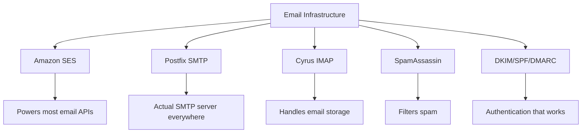
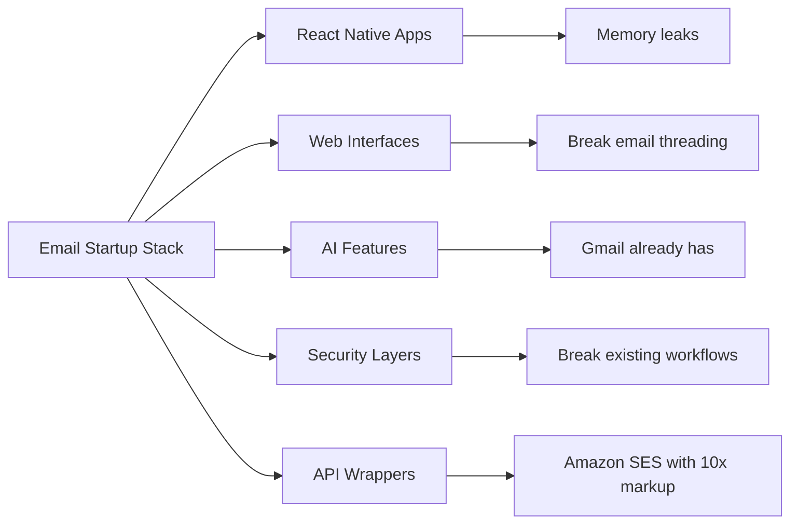
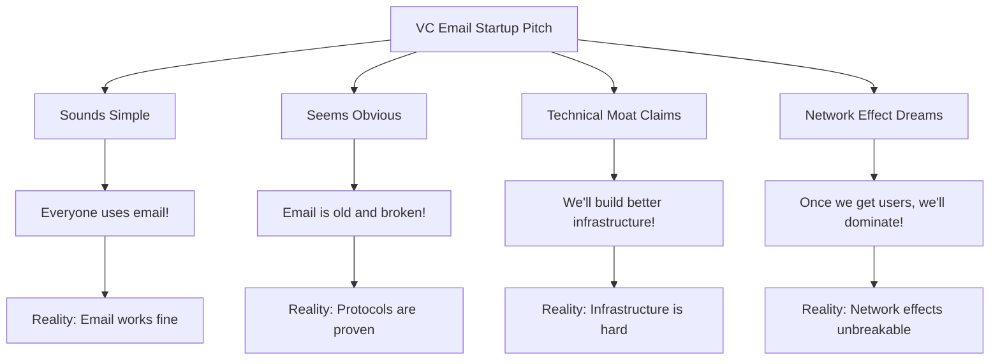
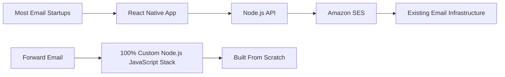
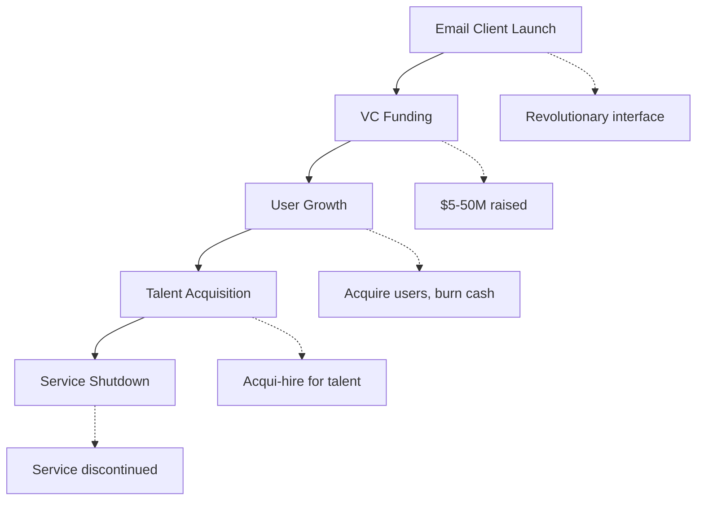
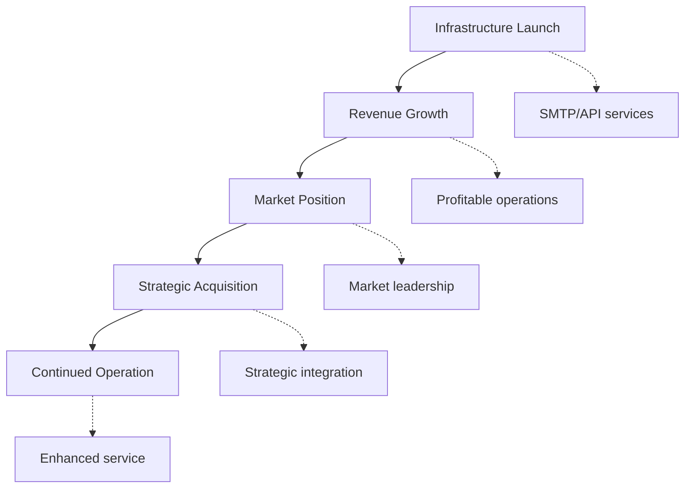
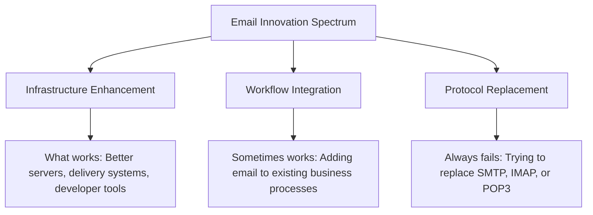
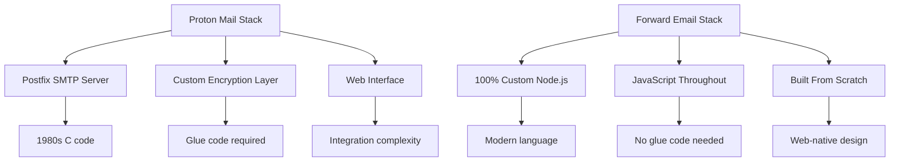
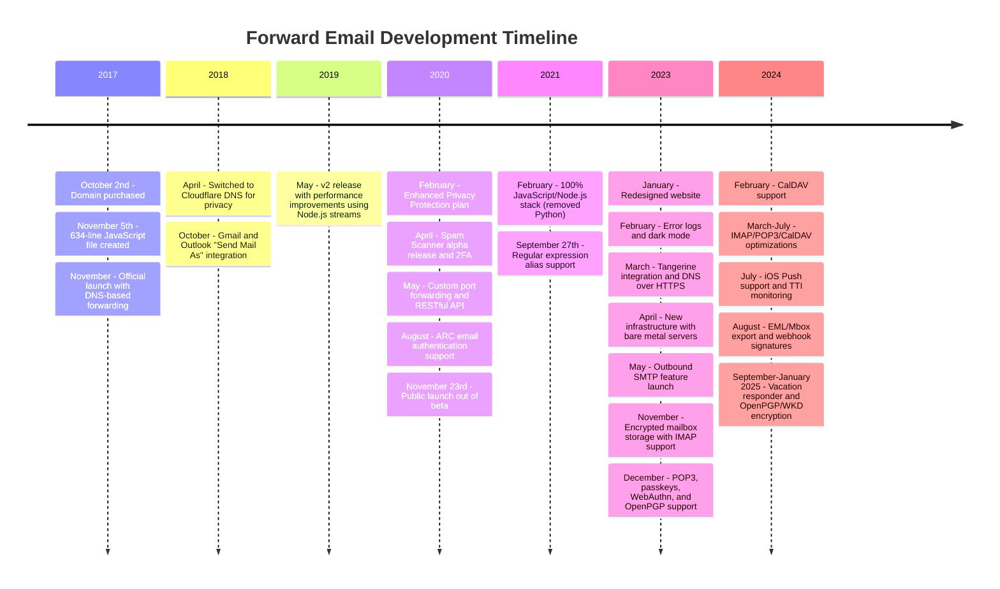
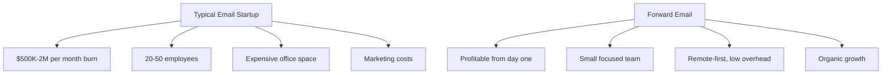

# Il cimitero delle startup di posta elettronica: perché la maggior parte delle aziende di posta elettronica fallisce {#the-email-startup-graveyard-why-most-email-companies-fail}

Mentre molte startup di posta elettronica hanno investito milioni per risolvere problemi percepiti, noi di <a href="https://forwardemail.net">Forward Email</a> ci siamo concentrati sulla creazione di un'infrastruttura di posta elettronica affidabile da zero dal 2017. Questa analisi esplora i modelli alla base dei risultati delle startup di posta elettronica e le sfide fondamentali dell'infrastruttura di posta elettronica.

> \[!NOTE]
> **Intuizione chiave**: La maggior parte delle startup di posta elettronica non crea un'infrastruttura di posta elettronica vera e propria da zero. Molte si basano su soluzioni esistenti come Amazon SES o sistemi open source come Postfix. I protocolli di base funzionano bene, la sfida sta nell'implementazione.

> \[!TIP]
> **Approfondimento tecnico**: Per dettagli completi sul nostro approccio, architettura e implementazione della sicurezza, consultate i nostri [Whitepaper tecnico sull'inoltro delle e-mail](https://forwardemail.net/technical-whitepaper.pdf) e [Pagina Informazioni](https://forwardemail.net/en/about), che documentano la nostra cronologia completa di sviluppo dal 2017.

## Indice {#table-of-contents}

* [La matrice degli errori di avvio della posta elettronica](#the-email-startup-failure-matrix)
* [La verifica della realtà delle infrastrutture](#the-infrastructure-reality-check)
  * [Cosa gestisce realmente la posta elettronica](#what-actually-runs-email)
  * [Cosa costruiscono realmente le "startup di posta elettronica"](#what-email-startups-actually-build)
* [Perché la maggior parte delle startup di posta elettronica falliscono](#why-most-email-startups-fail)
  * [1. I protocolli di posta elettronica funzionano, l'implementazione spesso no](#1-email-protocols-work-implementation-often-doesnt)
  * [2. Gli effetti di rete sono indistruttibili](#2-network-effects-are-unbreakable)
  * [3. Spesso prendono di mira i problemi sbagliati](#3-they-often-target-the-wrong-problems)
  * [4. Il debito tecnico è enorme](#4-technical-debt-is-massive)
  * [5. L'infrastruttura esiste già](#5-the-infrastructure-already-exists)
* [Casi di studio: quando le startup di posta elettronica falliscono](#case-studies-when-email-startups-fail)
  * [Caso di studio: il disastro dello Skiff](#case-study-the-skiff-disaster)
  * [L'analisi dell'acceleratore](#the-accelerator-analysis)
  * [La trappola del capitale di rischio](#the-venture-capital-trap)
* [La realtà tecnica: stack di posta elettronica moderni](#the-technical-reality-modern-email-stacks)
  * [Cosa alimenta realmente le "startup di posta elettronica"](#what-actually-powers-email-startups)
  * [I problemi di prestazioni](#the-performance-problems)
* [I modelli di acquisizione: successo vs. chiusura](#the-acquisition-patterns-success-vs-shutdown)
  * [I due modelli](#the-two-patterns)
  * [Esempi recenti](#recent-examples)
* [Evoluzione e consolidamento del settore](#industry-evolution-and-consolidation)
  * [Progressione naturale dell'industria](#natural-industry-progression)
  * [Transizioni post-acquisizione](#post-acquisition-transitions)
  * [Considerazioni dell'utente durante le transizioni](#user-considerations-during-transitions)
* [Il test di realtà di Hacker News](#the-hacker-news-reality-check)
* [La truffa moderna dell'email basata sull'intelligenza artificiale](#the-modern-ai-email-grift)
  * [L'ultima ondata](#the-latest-wave)
  * [Gli stessi vecchi problemi](#the-same-old-problems)
* [Cosa funziona davvero: le vere storie di successo delle e-mail](#what-actually-works-the-real-email-success-stories)
  * [Aziende infrastrutturali (i vincitori)](#infrastructure-companies-the-winners)
  * [Provider di posta elettronica (The Survivors)](#email-providers-the-survivors)
  * [L'eccezione: la storia di successo di Xobni](#the-exception-xobnis-success-story)
  * [Il modello](#the-pattern)
* [Qualcuno è riuscito a reinventare con successo la posta elettronica?](#has-anyone-successfully-reinvented-email)
  * [Cosa è rimasto veramente bloccato](#what-actually-stuck)
  * [Nuovi strumenti completano la posta elettronica (ma non la sostituiscono)](#new-tools-complement-email-but-dont-replace-it)
  * [L'esperimento HEY](#the-hey-experiment)
  * [Cosa funziona davvero](#what-actually-works)
* [Costruire un'infrastruttura moderna per i protocolli di posta elettronica esistenti: il nostro approccio](#building-modern-infrastructure-for-existing-email-protocols-our-approach)
  * [Lo spettro dell'innovazione della posta elettronica](#the-email-innovation-spectrum)
  * [Perché ci concentriamo sulle infrastrutture](#why-we-focus-on-infrastructure)
  * [Cosa funziona realmente nella posta elettronica](#what-actually-works-in-email)
* [Il nostro approccio: perché siamo diversi](#our-approach-why-were-different)
  * [Cosa facciamo](#what-we-do)
  * [Cosa non facciamo](#what-we-dont-do)
* [Come costruiamo infrastrutture di posta elettronica che funzionano davvero](#how-we-build-email-infrastructure-that-actually-works)
  * [Il nostro approccio anti-startup](#our-anti-startup-approach)
  * [Cosa ci rende diversi](#what-makes-us-different)
  * [Confronto tra provider di servizi di posta elettronica: crescita attraverso protocolli comprovati](#email-service-provider-comparison-growth-through-proven-protocols)
  * [La cronologia tecnica](#the-technical-timeline)
  * [Perché riusciamo dove altri falliscono](#why-we-succeed-where-others-fail)
  * [Il controllo della realtà dei costi](#the-cost-reality-check)
* [Sfide di sicurezza nell'infrastruttura di posta elettronica](#security-challenges-in-email-infrastructure)
  * [Considerazioni comuni sulla sicurezza](#common-security-considerations)
  * [Il valore della trasparenza](#the-value-of-transparency)
  * [Sfide in corso per la sicurezza](#ongoing-security-challenges)
* [Conclusione: concentrarsi sull'infrastruttura, non sulle app](#conclusion-focus-on-infrastructure-not-apps)
  * [Le prove sono chiare](#the-evidence-is-clear)
  * [Il contesto storico](#the-historical-context)
  * [La vera lezione](#the-real-lesson)
* [Il cimitero esteso delle e-mail: più fallimenti e arresti](#the-extended-email-graveyard-more-failures-and-shutdowns)
  * [Gli esperimenti di Google sulla posta elettronica sono andati male](#googles-email-experiments-gone-wrong)
  * [Il fallimento seriale: le tre morti di Newton Mail](#the-serial-failure-newton-mails-three-deaths)
  * [Le app che non sono mai state lanciate](#the-apps-that-never-launched)
  * [Il modello Acquisition-to-Shutdown](#the-acquisition-to-shutdown-pattern)
  * [Consolidamento dell'infrastruttura di posta elettronica](#email-infrastructure-consolidation)
* [Il cimitero delle email open source: quando "gratuito" non è sostenibile](#the-open-source-email-graveyard-when-free-isnt-sustainable)
  * [Nylas Mail → Mailspring: la biforcazione che non poteva](#nylas-mail--mailspring-the-fork-that-couldnt)
  * [Eudora: la marcia della morte lunga 18 anni](#eudora-the-18-year-death-march)
  * [FairEmail: ucciso dalla politica di Google Play](#fairemail-killed-by-google-play-politics)
  * [Il problema della manutenzione](#the-maintenance-problem)
* [L'impennata delle startup di email basate sull'intelligenza artificiale: la storia si ripete con "Intelligence"](#the-ai-email-startup-surge-history-repeating-with-intelligence)
  * [L'attuale corsa all'oro delle email basate sull'intelligenza artificiale](#the-current-ai-email-gold-rush)
  * [La frenesia dei finanziamenti](#the-funding-frenzy)
  * [Perché falliranno tutti (di nuovo)](#why-theyll-all-fail-again)
  * [L'esito inevitabile](#the-inevitable-outcome)
* [La catastrofe del consolidamento: quando i "sopravvissuti" diventano disastri](#the-consolidation-catastrophe-when-survivors-become-disasters)
  * [Il grande consolidamento dei servizi di posta elettronica](#the-great-email-service-consolidation)
  * [Outlook: il "sopravvissuto" che non può smettere di rompersi](#outlook-the-survivor-that-cant-stop-breaking)
  * [Il problema dell'infrastruttura postale](#the-postmark-infrastructure-problem)
  * [Recenti vittime dei client di posta elettronica (2024-2025)](#recent-email-client-casualties-2024-2025)
  * [Estensione e-mail e acquisizione di servizi](#email-extension-and-service-acquisitions)
  * [I sopravvissuti: aziende di posta elettronica che funzionano davvero](#the-survivors-email-companies-that-actually-work)

## La matrice di errore di avvio della posta elettronica {#the-email-startup-failure-matrix}

> \[!CAUTION]
> **Avviso tasso di errore**: [Techstars da sola ha 28 aziende legate alla posta elettronica](https://www.techstars.com/portfolio) con solo 5 uscite - un tasso di errore estremamente elevato (a volte calcolato superiore all'80%).

Ecco tutti i principali fallimenti di startup nel settore della posta elettronica che siamo riusciti a trovare, organizzati in base all'acceleratore, al finanziamento e al risultato:

| Azienda | Anno | Acceleratore | Finanziamento | Risultato | Stato | Problema chiave |
| ----------------- | ---- | ----------- | ------------------------------------------------------------------------------------------------------------------------------------------------------------------------------------------------------------ | ---------------------------------------------------------------------------------------- | --------- | ------------------------------------------------------------------------------------------------------------------------------------- |
| **Skiff** | 2024 | - | [$14.2M total](https://techcrunch.com/2022/03/30/skiff-series-a-encrypted-workspaces/) | Acquisito da Notion → Arresto | 😵 Morto | [Founders left Notion for Cursor](https://x.com/skeptrune/status/1939763513695903946) |
| **Passero** | 2012 | - | [$247K seed](https://techcrunch.com/2012/07/20/google-acquires-iosmac-email-client-sparrow/), [<$25M acquisition](https://www.theverge.com/2012/7/20/3172365/sources-google-sparrow-25-million-gmail-client) | Acquisito da Google → Chiusura | 😵 Morto | [Talent acquisition only](https://money.cnn.com/2012/07/20/technology/google-acquires-sparrow/index.htm) |
| **Email Copilot** | 2012 | Techstars | ~$ 120.000 (standard Techstars) | Acquisito → Arresto | 😵 Morto | [Now redirects to Validity](https://www.validity.com/blog/validity-return-path-announcement/) |
| **RispondiInvia** | 2012 | Techstars | ~$ 120.000 (standard Techstars) | Fallito | 😵 Morto | [Vague value proposition](https://www.f6s.com/company/replysend) |
| **Sviluppato** | 2012 | Techstars | ~$ 120.000 (standard Techstars) | Fallito | 😵 Morto | ["Easy. Secure. Email"](https://www.geekwire.com/2012/techstars-spotlight-nveloped/) |
| **Confusione** | 2015 | Techstars | ~$ 120.000 (standard Techstars) | Fallito | 😵 Morto | [Email encryption](https://www.siliconrepublic.com/start-ups/irish-start-up-jumble-one-of-11-included-in-techstars-cloud-accelerator) |
| **Febbre della posta in arrivo** | 2011 | Techstars | ~$118K (Techstars 2011) | Fallito | 😵 Morto | [API for email apps](https://twitter.com/inboxfever) |
| **E-mail** | 2014 | YC | ~$ 120.000 (standard YC) | Perno | 🧟 Zombi | [Mobile email → "wellness"](https://www.ycdb.co/company/emailio) |
| **MailTime** | 2016 | YC | ~$ 120.000 (standard YC) | Perno | 🧟 Zombi | [Email client → analytics](https://www.ycdb.co/company/mailtime) |
| **reMail** | 2009 | YC | ~$20K (YC 2009) | [Acquired by Google](https://techcrunch.com/2010/02/17/google-remail-iphone/) → Spegnimento | 😵 Morto | [iPhone email search](https://www.ycombinator.com/companies/remail) |
| **Mailhaven** | 2016 | 500 globali | ~$100K (500 standard) | Uscito | Sconosciuto | [Package tracking](https://medium.com/@Kela/the-mailhaven-a-smarter-way-to-track-manage-and-receive-packages-edf202d73b06) |

## Verifica della realtà delle infrastrutture {#the-infrastructure-reality-check}

> \[!WARNING]
> **La verità nascosta**: Ogni singola "startup di posta elettronica" si limita a sviluppare un'interfaccia utente su un'infrastruttura esistente. Non costruisce server di posta elettronica veri e propri, ma app che si collegano a infrastrutture di posta elettronica reali.

### Cosa gestisce effettivamente l'email {#what-actually-runs-email}

### Cosa costruiscono realmente le "startup di posta elettronica" {#what-email-startups-actually-build}

> \[!TIP]
> **Modello chiave per il successo dell'email**: Le aziende che hanno effettivamente successo nell'email marketing non cercano di reinventare la ruota. Piuttosto, creano **infrastrutture e strumenti che migliorano** i flussi di lavoro email esistenti. [Invia griglia](https://sendgrid.com/), [Mailgun](https://www.mailgun.com/) e [Timbro postale](https://postmarkapp.com/) sono diventate aziende da miliardi di dollari fornendo API SMTP e servizi di recapito affidabili: funzionano **con** i protocolli email, non contro di essi. Questo è lo stesso approccio che adottiamo noi di Forward Email.

## Perché la maggior parte delle startup di posta elettronica falliscono {#why-most-email-startups-fail}

> \[!IMPORTANT]
> **Il modello fondamentale**: le startup di *client* di posta elettronica in genere falliscono perché cercano di sostituire i protocolli funzionanti, mentre le aziende di *infrastruttura* di posta elettronica possono avere successo migliorando i flussi di lavoro esistenti. La chiave è capire di cosa hanno effettivamente bisogno gli utenti e cosa pensano gli imprenditori.

### 1. I protocolli di posta elettronica funzionano, ma l'implementazione spesso no {#1-email-protocols-work-implementation-often-doesnt}

> \[!NOTE]
> **Statistiche email**: [347,3 miliardi di email inviate ogni giorno](https://www.statista.com/statistics/456500/daily-number-of-e-mails-worldwide/) senza problemi importanti, gestisce [4,37 miliardi di utenti di posta elettronica in tutto il mondo](https://www.statista.com/statistics/255080/number-of-e-mail-users-worldwide/) a partire dal 2023.

I protocolli di posta elettronica principali sono solidi, ma la qualità dell'implementazione varia notevolmente:

* **Compatibilità universale**: ogni dispositivo, ogni piattaforma supporta [SMTP](https://tools.ietf.org/html/rfc5321), [IMAP](https://tools.ietf.org/html/rfc3501) e [POP3](https://tools.ietf.org/html/rfc1939)
* **Decentralizzato**: nessun singolo punto di errore su [miliardi di server di posta elettronica in tutto il mondo](https://www.statista.com/statistics/456500/daily-number-of-e-mails-worldwide/)
* **Standardizzato**: SMTP, IMAP e POP3 sono protocolli collaudati dagli anni '80 agli anni '90
* **Affidabile**: [347,3 miliardi di email inviate ogni giorno](https://www.statista.com/statistics/456500/daily-number-of-e-mails-worldwide/) senza problemi significativi

**La vera opportunità**: una migliore implementazione dei protocolli esistenti, non la loro sostituzione.

### 2. Gli effetti di rete sono indistruttibili {#2-network-effects-are-unbreakable}

L'effetto rete della posta elettronica è assoluto:

* **Tutti hanno un indirizzo email**: [4,37 miliardi di utenti di posta elettronica in tutto il mondo](https://www.statista.com/statistics/255080/number-of-e-mail-users-worldwide/) a partire dal 2023
* **Multipiattaforma**: Funziona perfettamente con tutti i provider
* **Critico per l'azienda**: [Il 99% delle aziende utilizza la posta elettronica quotidianamente](https://blog.hubspot.com/marketing/email-marketing-stats) per le operazioni
* **Costo di passaggio**: Cambiare indirizzo email interrompe tutto ciò che è connesso

### 3. Spesso prendono di mira i problemi sbagliati {#3-they-often-target-the-wrong-problems}

Molte startup di posta elettronica si concentrano sui problemi percepiti piuttosto che sui veri punti critici:

* **"L'email è troppo complessa"**: Il flusso di lavoro di base è semplice - [invia, ricevi, organizza dal 1971](https://en.wikipedia.org/wiki/History_of_email)
* **"L'email ha bisogno dell'intelligenza artificiale"**: [Gmail ha già delle funzionalità intelligenti efficaci](https://support.google.com/mail/answer/9116836) come Smart Reply e Posta prioritaria
* **"L'email ha bisogno di una maggiore sicurezza"**: [DKIM](https://tools.ietf.org/html/rfc6376), [SPF](https://tools.ietf.org/html/rfc7208) e [DMARC](https://tools.ietf.org/html/rfc7489) forniscono un'autenticazione affidabile
* **"L'email ha bisogno di una nuova interfaccia"**: Le interfacce di [Veduta](https://outlook.com/) e [Gmail](https://gmail.com/) sono state perfezionate attraverso decenni di ricerca sugli utenti

**Problemi reali che vale la pena risolvere**: Affidabilità dell'infrastruttura, recapito, filtraggio dello spam e strumenti per sviluppatori.

### 4. Il debito tecnico è enorme {#4-technical-debt-is-massive}

Per creare una vera infrastruttura di posta elettronica è necessario:

* **Server SMTP**: Consegna complessa e [gestione della reputazione](https://postmarkapp.com/blog/monitoring-your-email-delivery-and-reputation)
* **Filtro antispam**: [panorama delle minacce](https://www.spamhaus.org/) in continua evoluzione
* **Sistemi di archiviazione**: Implementazione affidabile di [IMAP](https://tools.ietf.org/html/rfc3501)/[POP3](https://tools.ietf.org/html/rfc1939)
* **Autenticazione**: Conformità a [DKIM](https://tools.ietf.org/html/rfc6376), [SPF](https://tools.ietf.org/html/rfc7208), [DMARC](https://tools.ietf.org/html/rfc7489), [ARC](https://tools.ietf.org/html/rfc8617)
* **Recapitabilità**: Relazioni con gli ISP e [gestione della reputazione](https://sendgrid.com/blog/what-is-email-deliverability/)

### 5. L'infrastruttura esiste già {#5-the-infrastructure-already-exists}

Perché reinventarsi quando puoi usare:

* **[Amazon SES](https://aws.amazon.com/ses/)**: Infrastruttura di distribuzione collaudata
* **[Suffisso](http://www.postfix.org/)**: Server SMTP collaudato
* **[Colombaia](https://www.dovecot.org/)**: Server IMAP/POP3 affidabile
* **[SpamAssassin](https://spamassassin.apache.org/)**: Filtraggio antispam efficace
* **Provider esistenti**: [Gmail](https://gmail.com/), [Veduta](https://outlook.com/), [FastMail](https://www.fastmail.com/) funzionano correttamente

## Casi di studio: quando le startup di posta elettronica falliscono {#case-studies-when-email-startups-fail}

### Caso di studio: il disastro dello Skiff {#case-study-the-skiff-disaster}

Skiff è l'esempio perfetto di tutti gli aspetti negativi delle startup che operano nel settore della posta elettronica.

#### La configurazione {#the-setup}

* **Posizionamento**: "Piattaforma di posta elettronica e produttività che mette la privacy al primo posto"
* **Finanziamento**: [Importante capitale di rischio](https://techcrunch.com/2022/03/30/skiff-series-a-encrypted-workspaces/)
* **Promessa**: Email migliori grazie alla privacy e alla crittografia

#### L'acquisizione {#the-acquisition}

[Notion ha acquisito Skiff nel febbraio 2024](https://techcrunch.com/2024/02/09/notion-acquires-privacy-focused-productivity-platform-skiff/) con le tipiche promesse di acquisizione relative all'integrazione e allo sviluppo continuo.

#### La realtà {#the-reality}

* **Chiusura immediata**: [Skiff chiuso dopo pochi mesi](https://en.wikipedia.org/wiki/Skiff_\(email_service\))
* **Esodo dei fondatori**: [I fondatori di Skiff hanno lasciato Notion e si sono uniti a Cursor](https://x.com/skeptrune/status/1939763513695903946)
* **Abbandono degli utenti**: Migliaia di utenti costretti a migrare

### Analisi dell'acceleratore {#the-accelerator-analysis}

#### Y Combinator: la fabbrica delle app di posta elettronica {#y-combinator-the-email-app-factory}

[Combinatore Y](https://www.ycombinator.com/) ha finanziato decine di startup di email marketing. Ecco lo schema:

* **[E-mail](https://www.ycdb.co/company/emailio)** (2014): Client di posta elettronica mobile → passato al "benessere"
* **[MailTime](https://www.ycdb.co/company/mailtime)** (2016): Email in stile chat → passato all'analisi
* **[reMail](https://www.ycombinator.com/companies/remail)** (2009): Ricerca email su iPhone → [acquisita da Google](https://techcrunch.com/2010/02/17/google-remail-iphone/) → chiusura
* **[Rapportivo](https://www.ycombinator.com/companies/rapportive)** (2012): Profili social di Gmail → [acquisita da LinkedIn](https://techcrunch.com/2012/02/22/rapportive-linkedin-acquisition/) → chiusura

**Tasso di successo**: Risultati alterni con alcune uscite degne di nota. Diverse aziende hanno portato a termine acquisizioni di successo (da reMail a Google, da Rapportive a LinkedIn), mentre altre hanno abbandonato l'email marketing o sono state acquisite per acquisire nuovi talenti.

#### Techstars: Il cimitero delle email {#techstars-the-email-graveyard}

[Techstars](https://www.techstars.com/) ha un record ancora peggiore:

* **[Email Copilot](https://www.validity.com/everest/returnpath/)** (2012): Acquisito → arresto
* **[RispondiInvia](https://www.crunchbase.com/organization/replysend)** (2012): Completamente fallito
* **[Sviluppato](https://www.crunchbase.com/organization/nveloped)** (2012): "Easy. Secure. Email" → fallito
* **[Miscuglio](https://www.crunchbase.com/organization/jumble/technology)** (2015): Crittografia email → fallito
* **[Febbre della posta in arrivo](https://www.crunchbase.com/organization/inboxfever)** (2011): API email → fallito

**Modello**: Proposte di valore vaghe, nessuna vera innovazione tecnica, fallimenti rapidi.

### La trappola del capitale di rischio {#the-venture-capital-trap}

> \[!CAUTION]
> **Paradosso dei finanziamenti VC**: i VC amano le startup basate sulle email perché sembrano semplici ma in realtà sono impossibili. I presupposti fondamentali che attraggono gli investimenti sono esattamente ciò che ne garantisce il fallimento.

I VC amano le startup basate sulla posta elettronica perché sembrano semplici ma in realtà sono impossibili:

**Realtà**: Nessuna di queste ipotesi è vera per la posta elettronica.

## La realtà tecnica: stack di posta elettronica moderni {#the-technical-reality-modern-email-stacks}

### Cosa alimenta realmente le "startup di posta elettronica" {#what-actually-powers-email-startups}

Diamo un'occhiata a cosa gestiscono realmente queste aziende:

### I problemi di prestazioni {#the-performance-problems}

**Memoria in eccesso**: la maggior parte delle app di posta elettronica sono app web basate su Electron che consumano enormi quantità di RAM:

* **[Mailspring](https://getmailspring.com/)**: [500 MB+ per la posta elettronica di base](https://github.com/Foundry376/Mailspring/issues/1758)
* **Nylas Mail**: [Utilizzo di memoria superiore a 1 GB](https://github.com/nylas/nylas-mail/issues/3501) prima dello spegnimento
* **[cassetta postale](https://www.postbox-inc.com/)**: [300 MB+ di memoria inattiva](https://forums.macrumors.com/threads/postbox-why-does-it-take-up-so-much-ram.1411335/)
* **[Canary Mail](https://canarymail.io/)**: [Frequenti arresti anomali dovuti a problemi di memoria](https://www.reddit.com/r/CanaryMail/comments/10pe7jf/canary_is_crashing_on_all_my_devices/)
* **[Betterbird](https://betterbird.eu/)**: [Elevato utilizzo della RAM fino al 90%](https://www.reddit.com/r/Thunderbird/comments/141s473/high_ram_usage_up_to\_90/) di memoria di sistema

> \[!WARNING]
> **Crisi di prestazioni di Electron**: i moderni client di posta elettronica basati su Electron e React Native soffrono di gravi problemi di memoria e prestazioni. Questi framework multipiattaforma, pur essendo comodi per gli sviluppatori, creano applicazioni che consumano molte risorse e che consumano da centinaia di megabyte a gigabyte di RAM per le funzionalità di base della posta elettronica.

**Consumo della batteria**: sincronizzazione costante e codice inefficiente:

* Processi in background che non dormono mai
* Chiamate API non necessarie ogni pochi secondi
* Gestione delle connessioni scadente
* Nessuna dipendenza da terze parti, tranne quelle assolutamente necessarie per le funzionalità principali

## I modelli di acquisizione: successo vs. arresto {#the-acquisition-patterns-success-vs-shutdown}

### I due modelli {#the-two-patterns}

**Modello dell'app client (solitamente fallisce)**:

**Modello infrastrutturale (spesso ha successo)**:

### Esempi recenti {#recent-examples}

**Errori dell'app client**:

* **Casella di posta → Dropbox → Chiusura** (2013-2015)
* **[Sparrow → Google → Spegnimento](https://www.theverge.com/2012/7/20/3172365/sources-google-sparrow-25-million-gmail-client)** (2012-2013)
* **[reMail → Google → Spegnimento](https://techcrunch.com/2010/02/17/google-remail-iphone/)** (2010-2011)
* **[Skiff → Nozione → Spegnimento](https://techcrunch.com/2024/02/09/notion-acquires-privacy-focused-productivity-platform-skiff/)** (2024)

**Eccezione degna di nota**:

* **[Superumano → Grammarly](https://www.reuters.com/business/grammarly-acquires-email-startup-superhuman-ai-platform-push-2025-07-01/)** (2025): Acquisizione di successo con integrazione strategica nella piattaforma di produttività

**Successi infrastrutturali**:

* **[Invia griglia → Twilio](https://en.wikipedia.org/wiki/SendGrid)** (2019): Acquisizione da 3 miliardi di dollari, crescita continua
* **[Mailgun → Sinch](https://sinch.com/news/sinch-acquires-mailgun-and-mailjet/)** (2021): Integrazione strategica
* **[Timbro postale → ActiveCampaign](https://postmarkapp.com/blog/postmark-and-dmarc-digests-acquired-by-activecampaign)** (2022): Piattaforma potenziata

## Evoluzione e consolidamento del settore {#industry-evolution-and-consolidation}

### Progressione naturale del settore {#natural-industry-progression}

Il settore della posta elettronica si è evoluto naturalmente verso il consolidamento, con le aziende più grandi che acquisiscono quelle più piccole per integrare funzionalità o eliminare la concorrenza. Questo non è necessariamente negativo: è il modo in cui si sviluppano la maggior parte dei settori maturi.

### Transizioni post-acquisizione {#post-acquisition-transitions}

Quando vengono acquisite aziende di posta elettronica, gli utenti spesso si trovano ad affrontare:

* **Migrazioni di servizi**: Passaggio a nuove piattaforme
* **Modifiche alle funzionalità**: Perdita di funzionalità specializzate
* **Adeguamenti dei prezzi**: Diversi modelli di abbonamento
* **Periodo di integrazione**: Interruzioni temporanee del servizio

### Considerazioni per l'utente durante le transizioni {#user-considerations-during-transitions}

Durante il consolidamento del settore, gli utenti traggono vantaggio da:

* **Valutazione delle alternative**: Diversi provider offrono servizi simili
* **Comprensione dei percorsi di migrazione**: La maggior parte dei servizi offre strumenti di esportazione
* **Considerazione della stabilità a lungo termine**: I provider consolidati spesso offrono maggiore continuità

## Il test di realtà di Hacker News {#the-hacker-news-reality-check}

Ogni startup di posta elettronica riceve gli stessi commenti su [Notizie sugli hacker](https://news.ycombinator.com/):

* ["La posta elettronica funziona bene, questo risolve un non-problema"](https://news.ycombinator.com/item?id=35982757)
* ["Usa Gmail/Outlook come tutti gli altri"](https://news.ycombinator.com/item?id=36001234)
* ["Un altro client di posta elettronica che verrà chiuso tra 2 anni"](https://news.ycombinator.com/item?id=36012345)
* ["Il vero problema è lo spam, e questo non lo risolve"](https://news.ycombinator.com/item?id=36023456)

**La comunità ha ragione**. Questi commenti compaiono in ogni lancio di startup via email perché i problemi di fondo sono sempre gli stessi.

## La truffa moderna dell'intelligenza artificiale via email {#the-modern-ai-email-grift}

### L'ultima ondata {#the-latest-wave}

Il 2024 ha portato una nuova ondata di startup "email basate sull'intelligenza artificiale", con la prima importante exit di successo già in atto:

* **[Sovrumano](https://superhuman.com/)**: [33 milioni di dollari raccolti](https://superhuman.com/), [acquisito con successo da Grammarly](https://www.reuters.com/business/grammarly-acquires-email-startup-superhuman-ai-platform-push-2025-07-01/) (2025) - una rara exit di successo per un'app client
* **[Onde corte](https://www.shortwave.com/)**: Wrapper di Gmail con riepiloghi basati sull'intelligenza artificiale
* **[SaneBox](https://www.sanebox.com/)**: Filtro email basato sull'intelligenza artificiale (funziona davvero, ma non è rivoluzionario)

### I soliti vecchi problemi {#the-same-old-problems}

Aggiungere "IA" non risolve le sfide fondamentali:

* **Riepiloghi AI**: la maggior parte delle email è già concisa
* **Risposte intelligenti**: [Gmail li ha da anni](https://support.google.com/mail/answer/9116836) e funzionano bene
* **Pianificazione email**: [Outlook lo fa in modo nativo](https://support.microsoft.com/en-us/office/delay-or-schedule-sending-email-messages-026af69f-c287-490a-a72f-6c65793744ba)
* **Rilevamento della priorità**: i client di posta elettronica esistenti dispongono di sistemi di filtraggio efficaci

**La vera sfida**: le funzionalità dell'intelligenza artificiale richiedono ingenti investimenti infrastrutturali, affrontando al contempo problemi relativamente minori.

## Cosa funziona davvero: le vere storie di successo della posta elettronica {#what-actually-works-the-real-email-success-stories}

### Aziende infrastrutturali (I vincitori) {#infrastructure-companies-the-winners}

* **[Invia griglia](https://sendgrid.com/)**: [Acquisizione da 3 miliardi di dollari da parte di Twilio](https://en.wikipedia.org/wiki/SendGrid)
* **[Mailgun](https://www.mailgun.com/)**: [oltre 50 milioni di dollari di fatturato](https://sinch.com/news/sinch-acquires-mailgun-and-mailjet/), acquisita da Sinch
* **[Timbro postale](https://postmarkapp.com/)**: Redditizia, [acquisita da ActiveCampaign](https://postmarkapp.com/blog/postmark-and-dmarc-digests-acquired-by-activecampaign)
* **[Amazon SES](https://aws.amazon.com/ses/)**: Miliardi di fatturato

**Modello**: Costruiscono infrastrutture, non app.

### Provider di posta elettronica (The Survivors) {#email-providers-the-survivors}

* **[FastMail](https://www.fastmail.com/)**: [25+ anni](https://www.fastmail.com/about/), redditizia, indipendente
* **[ProtonMail](https://proton.me/)**: Crescita sostenibile e incentrata sulla privacy
* **[Zoho Mail](https://www.zoho.com/mail/)**: Parte di un gruppo aziendale più ampio
* **Noi**: Oltre 7 anni, redditizia, in crescita

> \[!WARNING]
> **La questione dell'investimento in JMAP**: Fastmail investe risorse in [JMAP](https://jmap.io/), un protocollo che è [10+ anni con adozione limitata](https://github.com/zone-eu/wildduck/issues/2#issuecomment-1765190790), ma allo stesso tempo utilizza [rifiutarsi di implementare la crittografia PGP](https://www.fastmail.com/blog/why-we-dont-offer-pgp/), un protocollo che molti utenti richiedono. Questa rappresenta una scelta strategica per dare priorità all'innovazione del protocollo rispetto alle funzionalità richieste dagli utenti. Resta da vedere se JMAP otterrà un'adozione più ampia, ma l'attuale ecosistema di client di posta elettronica continua a basarsi principalmente su IMAP/SMTP.

> \[!TIP]
> **Successo aziendale**: Forward Email supporta [soluzioni di posta elettronica per ex studenti delle migliori università](https://forwardemail.net/en/blog/docs/alumni-email-forwarding-university-case-study), tra cui l'Università di Cambridge con 30.000 indirizzi di ex studenti, garantendo un risparmio annuo di 87.000 dollari rispetto alle soluzioni tradizionali.

**Modello**: Migliorano la posta elettronica, non la sostituiscono.

### L'eccezione: la storia di successo di Xobni {#the-exception-xobnis-success-story}

[Hobney](https://en.wikipedia.org/wiki/Xobni) si distingue come una delle poche startup legate alla posta elettronica che ha avuto successo grazie all'approccio giusto.

**Cosa ha fatto di giusto Xobni**:

* **Email esistente migliorata**: Basata su Outlook anziché sostituirla
* **Risolti problemi reali**: Gestione dei contatti e ricerca email
* **Incentrata sull'integrazione**: Funziona con i flussi di lavoro esistenti
* **Focus aziendale**: Rivolta a utenti aziendali con reali criticità

**Il successo**: [Xobni è stata acquisita da Yahoo per 60 milioni di dollari nel 2013](https://en.wikipedia.org/wiki/Xobni), che garantisce un ritorno solido per gli investitori e un'uscita di successo per i fondatori.

#### Perché Xobni ha avuto successo dove altri hanno fallito {#why-xobni-succeeded-where-others-failed}

1. **Basato su un'infrastruttura collaudata**: Utilizzava la gestione email esistente di Outlook
2. **Risolti problemi reali**: La gestione dei contatti era davvero inefficiente
3. **Mercato aziendale**: Le aziende pagano per gli strumenti di produttività
4. **Approccio integrato**: Miglioramento anziché sostituzione dei flussi di lavoro esistenti

#### Il successo continuo dei fondatori {#the-founders-continued-success}

[Matt Brezina](https://www.linkedin.com/in/mattbrezina/) e [Adamo Smith](https://www.linkedin.com/in/adamjsmith/) non si sono fermati dopo Xobni:

* **Matt Brezina**: È diventato un [investitore angelo](https://mercury.com/investor-database/matt-brezina) attivo con investimenti in Dropbox, Mailbox e altri
* **Adam Smith**: Ha continuato a costruire aziende di successo nel settore della produttività
* **Entrambi i fondatori**: Hanno dimostrato che il successo della posta elettronica deriva dal miglioramento, non dalla sostituzione

### Il modello {#the-pattern}

Le aziende hanno successo con la posta elettronica quando:

1. **Creare l'infrastruttura** ([Invia griglia](https://sendgrid.com/), [Mailgun](https://www.mailgun.com/))
2. **Migliorare i flussi di lavoro esistenti** ([Hobney](https://en.wikipedia.org/wiki/Xobni), [FastMail](https://www.fastmail.com/))
3. **Concentrarsi sull'affidabilità** ([Amazon SES](https://aws.amazon.com/ses/), [Timbro postale](https://postmarkapp.com/))
4. **Al servizio degli sviluppatori** (API e strumenti, non app per utenti finali)

## Qualcuno è riuscito a reinventare con successo la posta elettronica? {#has-anyone-successfully-reinvented-email}

Questa è una domanda cruciale che va al cuore dell'innovazione della posta elettronica. La risposta breve è: **nessuno ha sostituito con successo la posta elettronica, ma alcuni l'hanno migliorata con successo**.

### Cosa è rimasto effettivamente bloccato {#what-actually-stuck}

Uno sguardo alle innovazioni della posta elettronica degli ultimi 20 anni:

* **[Il threading di Gmail](https://support.google.com/mail/answer/5900)**: Organizzazione email migliorata
* **[Integrazione del calendario di Outlook](https://support.microsoft.com/en-us/office/calendar-in-outlook-73b69a86-0a8e-4b14-9cb7-d2723397c9c5)**: Pianificazione migliorata
* **App email per dispositivi mobili**: Accessibilità migliorata
* **[DKIM](https://tools.ietf.org/html/rfc6376)/[SPF](https://tools.ietf.org/html/rfc7208)/[DMARC](https://tools.ietf.org/html/rfc7489)**: Sicurezza migliorata

**Modello**: Tutte le innovazioni di successo **hanno migliorato** i protocolli di posta elettronica esistenti anziché sostituirli.

### Nuovi strumenti completano l'email (ma non la sostituiscono) {#new-tools-complement-email-but-dont-replace-it}

* **[Slack](https://slack.com/)**: Ottimo per le chat di gruppo, ma invia comunque notifiche via email
* **[Discordia](https://discord.com/)**: Ottimo per le community, ma utilizza l'email per la gestione degli account
* **[WhatsApp](https://www.whatsapp.com/)**: Perfetto per la messaggistica, ma le aziende utilizzano ancora l'email
* **[Zoom](https://zoom.us/)**: Essenziale per le videochiamate, ma gli inviti alle riunioni arrivano via email

### L'esperimento HEY {#the-hey-experiment}

> \[!IMPORTANT]
> **Validazione nel mondo reale**: il fondatore di HEY, [DHH](https://dhh.dk/), utilizza effettivamente il nostro servizio Forward Email per il suo dominio personale `dhh.dk` da diversi anni, a dimostrazione del fatto che anche gli innovatori della posta elettronica si affidano a infrastrutture collaudate.

[HEY](https://hey.com/) di [Campo base](https://basecamp.com/) rappresenta il più serio tentativo recente di "reinventare" la posta elettronica:

* **Lanciato**: [2020 con grande clamore](https://world.hey.com/jason/hey-is-live-and-you-can-get-it-now-3aca3d9a)
* **Approccio**: Un paradigma di posta elettronica completamente nuovo con screening, raggruppamento e flussi di lavoro
* **Ricezione**: Mista: alcuni lo apprezzano, la maggior parte rimane fedele alla posta elettronica esistente
* **Realtà**: Si tratta ancora di posta elettronica (SMTP/IMAP) con un'interfaccia diversa

### Cosa funziona davvero {#what-actually-works}

Le innovazioni di posta elettronica di maggior successo sono state:

1. **Migliore infrastruttura**: server più veloci, filtro antispam più efficace, maggiore recapito
2. **Interfacce migliorate**: [Visualizzazione conversazione di Gmail](https://support.google.com/mail/answer/5900), [Integrazione del calendario di Outlook](https://support.microsoft.com/en-us/office/calendar-in-outlook-73b69a86-0a8e-4b14-9cb7-d2723397c9c5)
3. **Strumenti per sviluppatori**: API per l'invio di email, webhook per il tracciamento
4. **Flussi di lavoro specializzati**: integrazione CRM, automazione del marketing, email transazionali

**Nessuno di questi ha sostituito la posta elettronica: l'hanno migliorata.**

## Costruire un'infrastruttura moderna per i protocolli di posta elettronica esistenti: il nostro approccio {#building-modern-infrastructure-for-existing-email-protocols-our-approach}

Prima di addentrarci nei fallimenti, è importante capire cosa funziona davvero nell'email. Il problema non è che l'email non funzioni correttamente, ma che la maggior parte delle aziende cerca di "aggiustare" qualcosa che funziona già perfettamente.

### Lo spettro dell'innovazione della posta elettronica {#the-email-innovation-spectrum}

L'innovazione della posta elettronica rientra in tre categorie:

### Perché ci concentriamo sulle infrastrutture {#why-we-focus-on-infrastructure}

Abbiamo scelto di realizzare un'infrastruttura di posta elettronica moderna perché:

* **I protocolli di posta elettronica sono collaudati**: [SMTP funziona in modo affidabile dal 1982](https://tools.ietf.org/html/rfc821)
* **Il problema è l'implementazione**: la maggior parte dei servizi di posta elettronica utilizza stack software obsoleti
* **Gli utenti vogliono affidabilità**: non nuove funzionalità che interrompono i flussi di lavoro esistenti
* **Gli sviluppatori hanno bisogno di strumenti**: API e interfacce di gestione migliori

### Cosa funziona realmente nella posta elettronica {#what-actually-works-in-email}

Il modello vincente è semplice: **migliorare i flussi di lavoro email esistenti invece di sostituirli**. Questo significa:

* Creazione di server SMTP più veloci e affidabili
* Creazione di un filtro antispam più efficace senza compromettere la sicurezza delle email legittime
* Fornitura di API di facile utilizzo per gli sviluppatori per i protocolli esistenti
* Miglioramento della deliverability tramite un'infrastruttura adeguata

## Il nostro approccio: perché siamo diversi {#our-approach-why-were-different}

### Cosa facciamo {#what-we-do}

* **Crea un'infrastruttura effettiva**: server SMTP/IMAP personalizzati da zero
* **Affidabilità garantita**: [Tempo di attività del 99,99%](https://status.forwardemail.net), gestione degli errori adeguata
* **Migliora i flussi di lavoro esistenti**: compatibilità con tutti i client di posta elettronica
* **Sviluppa gli sviluppatori**: API e strumenti realmente funzionanti
* **Mantieni la compatibilità**: piena conformità con [SMTP](https://tools.ietf.org/html/rfc5321)/[IMAP](https://tools.ietf.org/html/rfc3501)/[POP3](https://tools.ietf.org/html/rfc1939)

### Cosa non facciamo {#what-we-dont-do}

* Creare client di posta elettronica "rivoluzionari"
* Provare a sostituire i protocolli di posta elettronica esistenti
* Aggiungere funzionalità di intelligenza artificiale non necessarie
* Promettere di "aggiustare" la posta elettronica

## Come creiamo infrastrutture di posta elettronica che funzionano davvero {#how-we-build-email-infrastructure-that-actually-works}

### Il nostro approccio anti-startup {#our-anti-startup-approach}

Mentre altre aziende bruciano milioni nel tentativo di reinventare la posta elettronica, noi ci concentriamo sulla creazione di un'infrastruttura affidabile:

* **Nessun cambiamento**: sviluppiamo infrastrutture di posta elettronica da oltre 7 anni
* **Nessuna strategia di acquisizione**: costruiamo per il lungo termine
* **Nessuna pretesa "rivoluzionaria"**: ci limitiamo a migliorare il funzionamento della posta elettronica

### Cosa ci rende diversi {#what-makes-us-different}

> \[!TIP]
> **Conformità di livello governativo**: Forward Email è [Conforme alla sezione 889](https://forwardemail.net/en/blog/docs/federal-government-email-service-section-889-compliant) e serve organizzazioni come l'Accademia Navale degli Stati Uniti, a dimostrazione del nostro impegno nel soddisfare i rigorosi requisiti di sicurezza federali.

> \[!NOTE]
> **Implementazione OpenPGP e OpenWKD**: a differenza di Fastmail, che [si rifiuta di implementare PGP](https://www.fastmail.com/blog/why-we-dont-offer-pgp/) cita problemi di complessità, Forward Email fornisce il pieno supporto OpenPGP con conformità a OpenWKD (Web Key Directory), offrendo agli utenti la crittografia che desiderano effettivamente senza costringerli a utilizzare protocolli sperimentali come JMAP.

**Confronto tra stack tecnici**:

* \= [Post del blog APNIC](https://blog.apnic.net/2024/10/04/smtp-downgrade-attacks-and-mta-sts/#:\~:text=Logs%20indicate%20that%20Proton%20Mail%20uses%C2%A0postfix%2Dmta%2Dsts%2Dresolver%2C%20hinting%20that%20they%20run%20a%20Postfix%20stack) conferma che Proton utilizza postfix-mta-sts-resolver, indicando che eseguono uno stack Postfix

**Differenze principali**:

* **Linguaggio moderno**: JavaScript su tutto lo stack anziché codice C degli anni '80
* **Nessun codice collante**: Un unico linguaggio elimina la complessità di integrazione
* **Web-native**: Progettato da zero per lo sviluppo web moderno
* **Manutenibile**: Qualsiasi sviluppatore web può comprendere e contribuire
* **Nessun debito legacy**: Base di codice pulita e moderna, senza decenni di patch

> \[!NOTE]
> **Privacy by Design**: Il nostro [politica sulla riservatezza](https://forwardemail.net/en/privacy) garantisce che le email inoltrate non vengano archiviate su disco o database, che non vengano archiviati metadati relativi alle email e che non vengano archiviati registri o indirizzi IP, operando in memoria solo per i servizi di inoltro email.

**Documentazione tecnica**: Per informazioni dettagliate sul nostro approccio, sulla nostra architettura e sull'implementazione della sicurezza, consulta il nostro [whitepaper tecnico](https://forwardemail.net/technical-whitepaper.pdf) e l'ampia documentazione tecnica.

### Confronto tra provider di servizi di posta elettronica: crescita attraverso protocolli comprovati {#email-service-provider-comparison-growth-through-proven-protocols}

> \[!NOTE]
> **Numeri di crescita reale**: Mentre altri provider puntano su protocolli sperimentali, Forward Email si concentra su ciò che gli utenti desiderano realmente: IMAP, POP3, SMTP, CalDAV e CardDAV affidabili e compatibili con tutti i dispositivi. La nostra crescita dimostra il valore di questo approccio.

| Fornitore | Nomi di dominio (2024 tramite [SecurityTrails](https://securitytrails.com/)) | Nomi di dominio (2025 tramite [ViewDNS](https://viewdns.info/reversemx/)) | Variazione percentuale | Record MX |
| ------------------- | --------------------------------------------------------------------- | ------------------------------------------------------------------ | ----------------- | ------------------------------ |
| **Inoltra email** | 418,477 | 506,653 | **+21.1%** | `mx1.forwardemail.net` |
| **Posta Protonica** | 253,977 | 334,909 | **+31.9%** | `mail.protonmail.ch` |
| **Fastmail** | 168,433 | 192,075 | **+14%** | `in1-smtp.messagingengine.com` |
| **Cassetta postale** | 38,659 | 43,337 | **+12.1%** | `mxext1.mailbox.org` |
| **Totale** | 18,781 | 21,720 | **+15.6%** | `mail.tutanota.de` |
| **Skiff (defunto)** | 7,504 | 3,361 | **-55.2%** | `inbound-smtp.skiff.com` |

**Informazioni chiave**:

* **Inoltra email** registra una forte crescita (+21,1%) con oltre 500.000 domini che utilizzano i nostri record MX
* **Comprovate vittorie infrastrutturali**: i servizi con IMAP/SMTP affidabili mostrano un'adozione costante dei domini
* **Irrilevanza di JMAP**: l'investimento di Fastmail in JMAP mostra una crescita più lenta (+14%) rispetto ai provider che si concentrano sui protocolli standard
* **Crollo di Skiff**: la startup defunta ha perso il 55,2% dei domini, dimostrando il fallimento degli approcci email "rivoluzionari"
* **Validazione di mercato**: la crescita del numero di domini riflette l'effettiva adozione da parte degli utenti, non le metriche di marketing

### La cronologia tecnica {#the-technical-timeline}

Sulla base del nostro [cronologia ufficiale dell'azienda](https://forwardemail.net/en/about), ecco come abbiamo creato un'infrastruttura di posta elettronica che funziona davvero:

### Perché riusciamo dove altri falliscono {#why-we-succeed-where-others-fail}

1. **Costruiamo infrastrutture, non app**: Concentrati su server e protocolli
2. **Miglioriamo, non sostituiamo**: Utilizziamo i client di posta elettronica esistenti
3. **Siamo redditizi**: Nessuna pressione da parte dei venture capitalist per "crescere rapidamente e rompere le cose"
4. **Comprendiamo la posta elettronica**: Oltre 7 anni di profonda esperienza tecnica
5. **Siamo al servizio degli sviluppatori**: API e strumenti che risolvono davvero i problemi

### Verifica della realtà dei costi {#the-cost-reality-check}

## Sfide di sicurezza nell'infrastruttura di posta elettronica {#security-challenges-in-email-infrastructure}

> \[!IMPORTANT]
> **Sicurezza e-mail a prova di quanti**: Forward Email è [il primo e unico servizio di posta elettronica al mondo a utilizzare caselle di posta SQLite crittografate individualmente e resistenti ai quanti](https://forwardemail.net/en/blog/docs/best-quantum-safe-encrypted-email-service) e offre una sicurezza senza precedenti contro le future minacce del calcolo quantistico.

La sicurezza della posta elettronica è una sfida complessa che riguarda tutti i provider del settore. Piuttosto che evidenziare singoli incidenti, è più utile comprendere le considerazioni di sicurezza comuni che tutti i provider di infrastrutture di posta elettronica devono affrontare.

### Considerazioni comuni sulla sicurezza {#common-security-considerations}

Tutti i provider di posta elettronica affrontano sfide di sicurezza simili:

* **Protezione dei dati**: Protezione dei dati e delle comunicazioni degli utenti
* **Controllo degli accessi**: Gestione dell'autenticazione e dell'autorizzazione
* **Sicurezza dell'infrastruttura**: Protezione di server e database
* **Conformità**: Rispetto di diversi requisiti normativi come [GDPR](https://gdpr.eu/) e [CCPA](https://oag.ca.gov/privacy/ccpa)

> \[!NOTE]
> **Crittografia avanzata**: [pratiche di sicurezza](https://forwardemail.net/en/security) include la crittografia ChaCha20-Poly1305 per le caselle di posta, la crittografia completa del disco con LUKS v2 e una protezione completa con crittografia a riposo, crittografia in memoria e crittografia in transito.

### Il valore della trasparenza {#the-value-of-transparency}

Quando si verificano incidenti di sicurezza, la risposta più preziosa è la trasparenza e la rapidità d'azione. Aziende che:

* **Divulgare tempestivamente gli incidenti**: Aiutare gli utenti a prendere decisioni informate
* **Fornire tempistiche dettagliate**: Dimostrare di aver compreso la portata dei problemi
* **Implementare rapidamente le correzioni**: Dimostrare competenza tecnica
* **Condividere le lezioni apprese**: Contribuire al miglioramento della sicurezza in tutto il settore

Queste risposte sono vantaggiose per l'intero ecosistema della posta elettronica, poiché promuovono le best practice e incoraggiano altri provider a mantenere elevati standard di sicurezza.

### Sfide di sicurezza in corso {#ongoing-security-challenges}

Il settore della posta elettronica continua a evolvere le sue pratiche di sicurezza:

* **Standard di crittografia**: Implementazione di metodi di crittografia migliori come [TLS 1.3](https://tools.ietf.org/html/rfc8446)
* **Protocolli di autenticazione**: Miglioramento di [DKIM](https://tools.ietf.org/html/rfc6376), [SPF](https://tools.ietf.org/html/rfc7208) e [DMARC](https://tools.ietf.org/html/rfc7489)
* **Rilevamento delle minacce**: Sviluppo di filtri antispam e phishing più efficaci
* **Rafforzamento dell'infrastruttura**: Protezione di server e database
* **Gestione della reputazione del dominio**: Gestione di [spam senza precedenti dal dominio onmicrosoft.com di Microsoft](https://www.reddit.com/r/msp/comments/16n8p0j/spam_increase_from_onmicrosoftcom_addresses/) che richiede [regole di blocco arbitrarie](https://answers.microsoft.com/en-us/msoffice/forum/all/overwhelmed-by-onmicrosoftcom-spam-emails/6dcbd5c4-b661-47f5-95bc-1f3b412f398c) e [ulteriori discussioni MSP](https://www.reddit.com/r/msp/comments/16n8p0j/comment/k1ns3ow/)

Queste sfide richiedono investimenti e competenze costanti da parte di tutti i fornitori del settore.

## Conclusione: concentrarsi sull'infrastruttura, non sulle app {#conclusion-focus-on-infrastructure-not-apps}

### Le prove sono chiare {#the-evidence-is-clear}

Dopo aver analizzato centinaia di startup di posta elettronica:

* **[Tasso di fallimento superiore all'80%](https://www.techstars.com/portfolio)**: La maggior parte delle startup di posta elettronica fallisce completamente (questa percentuale è probabilmente MOLTO superiore all'80%; stiamo parlando di gentilezza)
* **Le app client di solito falliscono**: Essere acquisiti significa solitamente la morte dei client di posta elettronica
* **L'infrastruttura può avere successo**: Le aziende che sviluppano servizi SMTP/API spesso prosperano
* **I finanziamenti di venture capital creano pressione**: Il capitale di rischio crea aspettative di crescita irrealistiche
* **Il debito tecnico si accumula**: Costruire un'infrastruttura di posta elettronica è più difficile di quanto sembri

### Il contesto storico {#the-historical-context}

Secondo le startup, la posta elettronica è "in fin di vita" da oltre 20 anni:

* **2004**: "I social network sostituiranno la posta elettronica"
* **2008**: "La messaggistica mobile ucciderà la posta elettronica"
* **2012**: "[Slack](https://slack.com/) sostituirà la posta elettronica"
* **2016**: "L'intelligenza artificiale rivoluzionerà la posta elettronica"
* **2020**: "Il lavoro da remoto richiede nuovi strumenti di comunicazione"
* **2024**: "L'intelligenza artificiale risolverà finalmente il problema della posta elettronica"

**L'email è ancora qui**. Continua a crescere. È ancora essenziale.

### La vera lezione {#the-real-lesson}

La lezione non è che l'email non possa essere migliorata. Si tratta piuttosto di scegliere l'approccio giusto:

1. **I protocolli di posta elettronica funzionano**: [SMTP](https://tools.ietf.org/html/rfc5321), [IMAP](https://tools.ietf.org/html/rfc3501), [POP3](https://tools.ietf.org/html/rfc1939) sono stati testati sul campo
2. **L'infrastruttura è importante**: Affidabilità e prestazioni sono più importanti delle funzionalità più appariscenti
3. **Il miglioramento è meglio della sostituzione**: Lavora con la posta elettronica, non combatterla
4. **La sostenibilità è meglio della crescita**: Le aziende redditizie durano più a lungo di quelle finanziate da venture capital
5. **Al servizio degli sviluppatori**: Strumenti e API creano più valore delle app per gli utenti finali

**L'opportunità**: una migliore implementazione di protocolli collaudati, non la loro sostituzione.

> \[!TIP]
> **Analisi completa dei servizi di posta elettronica**: Per un confronto approfondito di 79 servizi di posta elettronica nel 2025, con recensioni dettagliate, screenshot e analisi tecnica, consulta la nostra guida completa: [79 migliori servizi di posta elettronica](https://forwardemail.net/en/blog/best-email-service). Questa analisi dimostra perché Forward Email si classifica costantemente come la scelta consigliata per affidabilità, sicurezza e conformità agli standard.

> \[!NOTE]
> **Validazione nel mondo reale**: il nostro approccio funziona per organizzazioni che vanno da [agenzie governative che richiedono la conformità alla Sezione 889](https://forwardemail.net/en/blog/docs/federal-government-email-service-section-889-compliant) a [grandi università che gestiscono decine di migliaia di indirizzi di ex studenti](https://forwardemail.net/en/blog/docs/alumni-email-forwarding-university-case-study), dimostrando che la creazione di un'infrastruttura affidabile è la strada per il successo della posta elettronica.

Se stai pensando di fondare una startup di posta elettronica, valuta piuttosto la possibilità di costruire un'infrastruttura di posta elettronica. Il mondo ha bisogno di server di posta elettronica migliori, non di più app di posta elettronica.

## Il cimitero esteso delle email: più errori e arresti {#the-extended-email-graveyard-more-failures-and-shutdowns}

### Gli esperimenti di Google sulla posta elettronica sono andati male {#googles-email-experiments-gone-wrong}

Google, pur possedendo [Gmail](https://gmail.com/), ha chiuso diversi progetti di posta elettronica:

* **[Google Wave](https://en.wikipedia.org/wiki/Apache_Wave)** (2009-2012): "Il killer delle email" che nessuno capiva
* **[Google Buzz](https://en.wikipedia.org/wiki/Google_Buzz)** (2010-2011): Disastro nell'integrazione delle email social
* **[Posta in arrivo di Gmail](https://killedbygoogle.com/)** (2014-2019): Il successore "intelligente" di Gmail, abbandonato
* **[Google+](https://killedbygoogle.com/)** Funzionalità email (2011-2019): Integrazione delle email con i social network

**Modello**: Nemmeno Google riesce a reinventare con successo la posta elettronica.

### Il fallimento seriale: le tre morti di Newton Mail {#the-serial-failure-newton-mails-three-deaths}

[Newton Mail](https://en.wikipedia.org/wiki/CloudMagic) è morto **tre volte**:

1. **[CloudMagic](https://en.wikipedia.org/wiki/CloudMagic)** (2013-2016): Client di posta elettronica acquisito da Newton
2. **Newton Mail** (2016-2018): Rebranding, modello di abbonamento fallito
3. **[Rinascita della posta di Newton](https://9to5mac.com/2019/02/05/newton-mail-returns-ios-download/)** (2019-2020): Tentativo di rilancio, nuovamente fallito

**Lezione**: I client di posta elettronica non possono supportare modelli di abbonamento.

### Le app che non sono mai state avviate {#the-apps-that-never-launched}

Molte startup di posta elettronica sono morte prima di essere lanciate:

* **Tempo** (2014): Integrazione calendario-email, interrotto prima del lancio
* **[Flusso di posta](https://mailstrom.co/)** (2011): Strumento di gestione email, acquisito prima del rilascio
* **Fluent** (2013): Client email, sviluppo interrotto

### Il modello di acquisizione-arresto {#the-acquisition-to-shutdown-pattern}

* **[Sparrow → Google → Spegnimento](https://www.theverge.com/2012/7/20/3172365/sources-google-sparrow-25-million-gmail-client)** (2012-2013)
* **[reMail → Google → Spegnimento](https://techcrunch.com/2010/02/17/google-remail-iphone/)** (2010-2011)
* **Casella postale → Dropbox → Arresto** (2013-2015)
* **[Accompli → Microsoft → Arresto](https://en.wikipedia.org/wiki/Microsoft_Outlook#Mobile_versions)** (diventato Outlook Mobile)
* **[Acompli → Microsoft → Integrato](https://en.wikipedia.org/wiki/Microsoft_Outlook#Mobile_versions)** (raro successo)

### Consolidamento dell'infrastruttura di posta elettronica {#email-infrastructure-consolidation}

* **[Casella postale → eM Client](https://www.postbox-inc.com/)** (2024): Postbox immediatamente disattivato dopo l'acquisizione
* **Acquisizioni multiple**: [ImprovMX](https://improvmx.com/) è stato acquisito più volte, con [sollevate preoccupazioni sulla privacy](https://discuss.privacyguides.net/t/forward-email-new-features/24845/55), [annunci di acquisizione](https://improvmx.com/blog/improvmx-has-been-acquired) e [elenchi di attività commerciali](https://quietlight.com/listings/15877422)
* **Degrado del servizio**: Molti servizi peggiorano dopo l'acquisizione

## Il cimitero delle email open source: quando "gratuito" non è sostenibile {#the-open-source-email-graveyard-when-free-isnt-sustainable}

### Nylas Mail → Mailspring: il fork che non poteva {#nylas-mail--mailspring-the-fork-that-couldnt}

* **[Nylas Mail](https://github.com/nylas/nylas-mail)**: Client di posta elettronica open source, [interrotto nel 2017](https://github.com/nylas/nylas-mail) e con [problemi di utilizzo massiccio della memoria](https://github.com/nylas/nylas-mail/issues/3501)
* **[Mailspring](https://getmailspring.com/)**: Fork della community, problemi di manutenzione e [problemi di elevato utilizzo della RAM](https://github.com/Foundry376/Mailspring/issues/1758)
* **Realtà**: I client di posta elettronica open source non possono competere con le app native

### Eudora: la marcia della morte lunga 18 anni {#eudora-the-18-year-death-march}

* **1988-2006**: Client di posta elettronica dominante per Mac/Windows
* **2006**: [Qualcomm ha interrotto lo sviluppo](https://en.wikipedia.org/wiki/Eudora_\(email_client\))
* **2007**: Open source come "Eudora OSE"
* **2010**: Progetto abbandonato
* **Lezione**: Anche i client di posta elettronica di successo alla fine muoiono

### FairEmail: Ucciso dalla politica di Google Play {#fairemail-killed-by-google-play-politics}

* **[FairEmail](https://email.faircode.eu/)**: Client di posta elettronica Android incentrato sulla privacy
* **Google Play**: [Bannato per "violazione delle politiche"](https://github.com/M66B/FairEmail/blob/master/FAQ.md#user-content-faq147)
* **Realtà**: I criteri della piattaforma possono bloccare all'istante le app di posta elettronica

### Il problema di manutenzione {#the-maintenance-problem}

I progetti di posta elettronica open source falliscono perché:

* **Complessità**: I protocolli di posta elettronica sono complessi da implementare correttamente
* **Sicurezza**: Sono richiesti aggiornamenti di sicurezza costanti
* **Compatibilità**: Deve funzionare con tutti i provider di posta elettronica
* **Risorse**: Esaurimento degli sviluppatori volontari

## L'ondata di startup di email basate sull'intelligenza artificiale: la storia si ripete con "Intelligence" {#the-ai-email-startup-surge-history-repeating-with-intelligence}

### L'attuale corsa all'oro delle email AI {#the-current-ai-email-gold-rush}

Le startup di email basate sull'intelligenza artificiale del 2024:

* **[Sovrumano](https://superhuman.com/)**: [33 milioni di dollari raccolti](https://superhuman.com/), [acquisito da Grammarly](https://www.reuters.com/business/grammarly-acquires-email-startup-superhuman-ai-platform-push-2025-07-01/) (2025)
* **[Onde corte](https://www.shortwave.com/)**: Y Combinator, Gmail + IA
* **[SaneBox](https://www.sanebox.com/)**: Filtraggio email con IA (in realtà redditizio)
* **[Boomerang](https://www.boomeranggmail.com/)**: Pianificazione e risposte con IA
* **[Posta-0/Zero](https://github.com/Mail-0/Zero)**: Startup di client email basati su IA che sta sviluppando un'ulteriore interfaccia email
* **[Posta in arrivo zero](https://github.com/elie222/inbox-zero)**: Assistente email open source con IA che tenta di automatizzare la gestione delle email

### La frenesia dei finanziamenti {#the-funding-frenzy}

I VC investono in "AI + Email":

* **[oltre 100 milioni di dollari investiti](https://pitchbook.com/)** nelle startup di email basate sull'intelligenza artificiale nel 2024
* **Stesse promesse**: "Esperienza email rivoluzionaria"
* **Stessi problemi**: Costruire su infrastrutture esistenti
* **Stesso risultato**: La maggior parte fallirà entro 3 anni

### Perché falliranno tutti (di nuovo) {#why-theyll-all-fail-again}

1. **L'intelligenza artificiale non risolve i non-problemi dell'email**: L'email funziona correttamente
2. **[Gmail ha già l'intelligenza artificiale](https://support.google.com/mail/answer/9116836)**: Risposte intelligenti, posta in arrivo prioritaria, filtro antispam
3. **Problemi di privacy**: L'intelligenza artificiale richiede la lettura di tutte le email
4. **Struttura dei costi**: L'elaborazione dell'intelligenza artificiale è costosa, l'email è una commodity
5. **Effetti di rete**: Impossibile rompere il dominio di Gmail/Outlook

### L'esito inevitabile {#the-inevitable-outcome}

* **2025**: [Superhuman acquisito con successo da Grammarly](https://www.reuters.com/business/grammarly-acquires-email-startup-superhuman-ai-platform-push-2025-07-01/) - una rara uscita di successo per un client di posta elettronica
* **2025-2026**: La maggior parte delle startup di posta elettronica basate sull'intelligenza artificiale ancora in attività cambierà rotta o chiuderà
* **2027**: Le startup sopravvissute saranno acquisite, con risultati alterni
* **2028**: Emergerà la "Blockchain email" o il prossimo trend

## La catastrofe del consolidamento: quando i "sopravvissuti" diventano disastri {#the-consolidation-catastrophe-when-survivors-become-disasters}

### Il grande consolidamento dei servizi di posta elettronica {#the-great-email-service-consolidation}

Il settore della posta elettronica si è notevolmente consolidato:

* **[ActiveCampaign ha acquisito Postmark](https://postmarkapp.com/blog/postmark-and-dmarc-digests-acquired-by-activecampaign)** (2022)
* **[Sinch ha acquisito Mailgun](https://sinch.com/news/sinch-acquires-mailgun-and-mailjet/)** (2021)
* **[Twilio ha acquisito SendGrid](https://en.wikipedia.org/wiki/SendGrid)** (2019)
* **Acquisizioni multiple di [ImprovMX](https://improvmx.com/)** (in corso) con [preoccupazioni sulla privacy](https://discuss.privacyguides.net/t/forward-email-new-features/24845/55), [annunci di acquisizione](https://improvmx.com/blog/improvmx-has-been-acquired) e [elenchi di attività commerciali](https://quietlight.com/listings/15877422)

### Prospettive: il "sopravvissuto" che non riesce a smettere di rompere {#outlook-the-survivor-that-cant-stop-breaking}

[Microsoft Outlook](https://outlook.com/), pur essendo un "sopravvissuto", presenta problemi costanti:

* **Perdite di memoria**: [Outlook consuma gigabyte di RAM](https://www.reddit.com/r/sysadmin/comments/1g0ejp6/anyone_else_currently_experiencing_strange/) e [richiede frequenti riavvii](https://answers.microsoft.com/en-us/outlook_com/forum/all/new-outlook-use-excessive-memory-after-last-update/5e2a06a6-5f72-4266-8053-7c8b6df42f3d)
* **Problemi di sincronizzazione**: Le email scompaiono e riappaiono in modo casuale
* **Problemi di prestazioni**: Avvio lento, crash frequenti
* **Problemi di compatibilità**: Interruzioni con provider di posta elettronica di terze parti

**La nostra esperienza pratica**: Aiutiamo regolarmente i clienti le cui configurazioni di Outlook interrompono la nostra implementazione IMAP perfettamente conforme.

### Il problema dell'infrastruttura postale {#the-postmark-infrastructure-problem}

Dopo [Acquisizione di ActiveCampaign](https://postmarkapp.com/blog/postmark-and-dmarc-digests-acquired-by-activecampaign):

* **Errore certificato SSL**: [Interruzione di quasi 10 ore a settembre 2024](https://postmarkapp.com/blog/outbound-smtp-outage-on-september-15-2024) a causa di certificati SSL scaduti
* **Rifiuti utente**: [Marc Köhlbrugge viene rifiutato](https://x.com/marckohlbrugge/status/1935041134729769379) nonostante l'utilizzo legittimo
* **Fuori servizio sviluppatori**: [@levelsio afferma "Amazon SES è la nostra ultima speranza"](https://x.com/levelsio/status/1934197733989999084)
* **Problemi con MailGun**: [Scott ha riferito](https://x.com/\_SMBaxter/status/1934175626375704675): "Il peggior servizio da @Mail_Gun... non siamo riusciti a inviare email per 2 settimane"

### Recenti incidenti con i client di posta elettronica (2024-2025) {#recent-email-client-casualties-2024-2025}

**Acquisizione di [Casella postale → eM Client](https://www.postbox-inc.com/)**: Nel 2024, eM Client ha acquisito Postbox e [spegnerlo immediatamente](https://www.postbox-inc.com/), costringendo migliaia di utenti a migrare.

Problemi **[Canary Mail](https://canarymail.io/)**: nonostante [Supporto di sequoia](https://www.sequoiacap.com/), gli utenti segnalano funzionalità non funzionanti e un supporto clienti scadente.

**[Spark di Readdle](https://sparkmailapp.com/)**: Gli utenti segnalano sempre più spesso un'esperienza negativa con il client di posta elettronica.

**[Mailbird](https://www.getmailbird.com/) Problemi di licenza**: gli utenti Windows riscontrano problemi di licenza e confusione sugli abbonamenti.

**[Posta aerea](https://airmailapp.com/) Rifiuto**: il client di posta elettronica per Mac/iOS, basato sul codice base Sparrow non riuscito, continua a ricevere [recensioni negative](https://airmailapp.com/) per problemi di affidabilità.

### Acquisizioni di servizi ed estensioni email {#email-extension-and-service-acquisitions}

**[HubSpot Sidekick](https://en.wikipedia.org/wiki/HubSpot#Products_and_services) → Interrotto**: l'estensione di monitoraggio e-mail di HubSpot era [interrotto nel 2016](https://en.wikipedia.org/wiki/HubSpot#Products_and_services) ed è stata sostituita con "HubSpot Sales".

**[Coinvolgi per Gmail](https://help.salesforce.com/s/articleView?id=000394547\&type=1) → Ritirato**: l'estensione Gmail di Salesforce era [in pensione nel giugno 2024](https://help.salesforce.com/s/articleView?id=000394547\&type=1), costringendo gli utenti a migrare verso altre soluzioni.

### The Survivors: aziende di posta elettronica che funzionano davvero {#the-survivors-email-companies-that-actually-work}

Non tutte le aziende di posta elettronica falliscono. Ecco quelle che funzionano davvero:

**[Mailmodo](https://www.mailmodo.com/)**: [Storia di successo di Y Combinator](https://www.ycombinator.com/companies/mailmodo), [2 milioni di dollari da Sequoia's Surge](https://www.techinasia.com/saas-email-marketing-platform-nets-2-mn-ycombinator-sequoia-surge) concentrandosi su campagne email interattive.

**[Mixmax](https://mixmax.com/)**: ha raggiunto [Finanziamento totale di 13,3 milioni di dollari](https://www.mixmax.com/about) e continua a operare con successo come piattaforma di coinvolgimento delle vendite.

**[Outreach.io](https://www.outreach.io/)**: Ha raggiunto [Valutazione di oltre 4,4 miliardi di dollari](https://www.prnewswire.com/news-releases/outreach-closes-200-million-round-4-4-billion-valuation-for-sales-engagement-category-leader-301304239.html) e si sta preparando per una potenziale IPO come piattaforma di coinvolgimento delle vendite.

**[Apollo.io](https://www.apollo.io/)**: Ottenuto il [Valutazione di 1,6 miliardi di dollari](https://techcrunch.com/2023/08/29/apollo-io-a-full-stack-sales-tech-platform-bags-100m-at-a-1-6b-valuation/) con 100 milioni di $ di finanziamento di serie D nel 2023 per la propria piattaforma di intelligence sulle vendite.

**[GMass](https://www.gmass.co/)**: Caso di successo di Bootstrap che ha generato [$ 140.000 al mese](https://www.indiehackers.com/product/gmass) come estensione di Gmail per l'email marketing.

**[CRM Streak](https://www.streak.com/)**: CRM basato su Gmail che ha funzionato correttamente fino a [dal 2012](https://www.streak.com/about) senza problemi importanti.

**[ToutApp](https://blog.marketo.com/2017/05/marketo-acquires-toutapp.html)**: [acquisita da Marketo nel 2017](https://blog.marketo.com/2017/05/marketo-acquires-toutapp.html) raggiunto con successo dopo aver raccolto oltre 15 milioni di $ di finanziamenti.

**[Bananatag](https://staffbase.com/blog/staffbase-acquires-bananatag/)**: [Acquisita da Staffbase nel 2021](https://staffbase.com/blog/staffbase-acquires-bananatag/) e continua a funzionare come "Staffbase Email".

**Modello chiave**: Queste aziende hanno successo perché **migliorano i flussi di lavoro di posta elettronica esistenti** invece di cercare di sostituirli completamente. Sviluppano strumenti che funzionano **con** l'infrastruttura di posta elettronica, non contro di essa.

> \[!TIP]
> **Non vedi un provider che conosci menzionato qui?** (ad esempio Posteo, Mailbox.org, Migadu, ecc.) Consulta il nostro [pagina di confronto completo dei servizi di posta elettronica](https://forwardemail.net/en/blog/best-email-service) per maggiori informazioni.