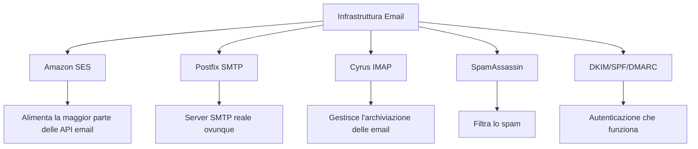
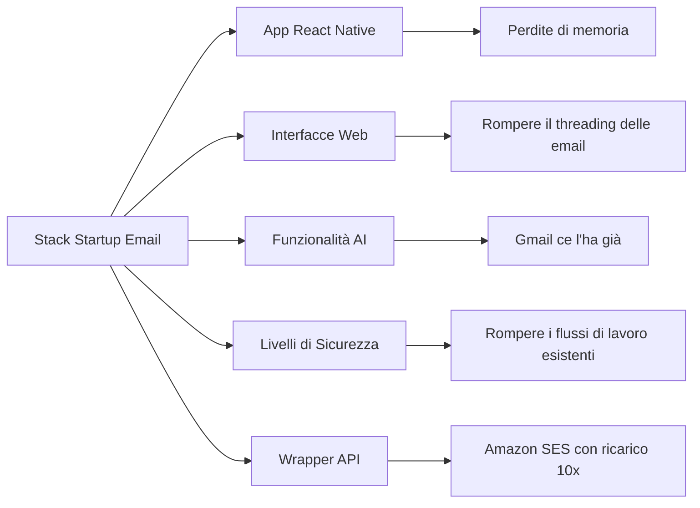
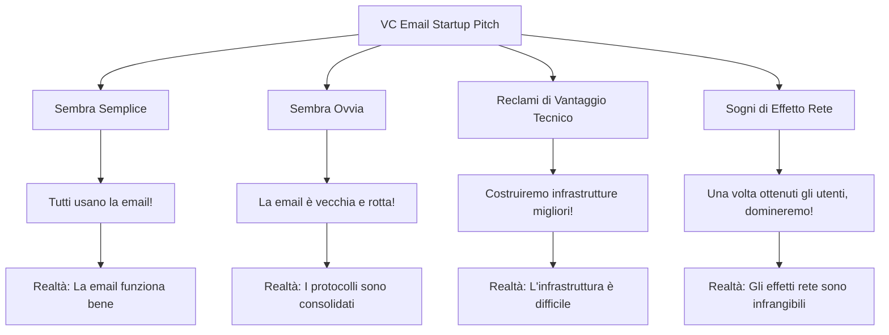
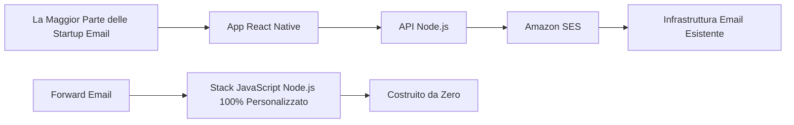
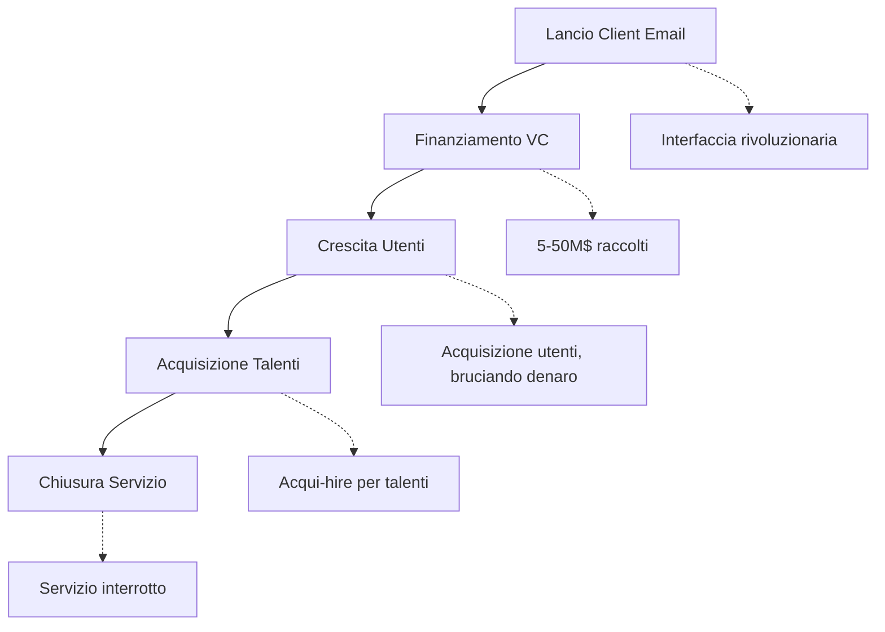
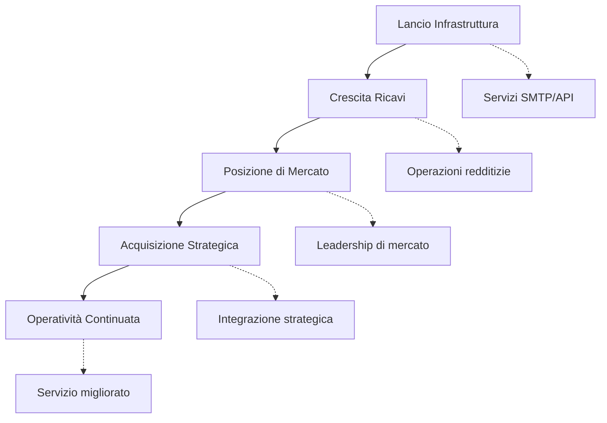
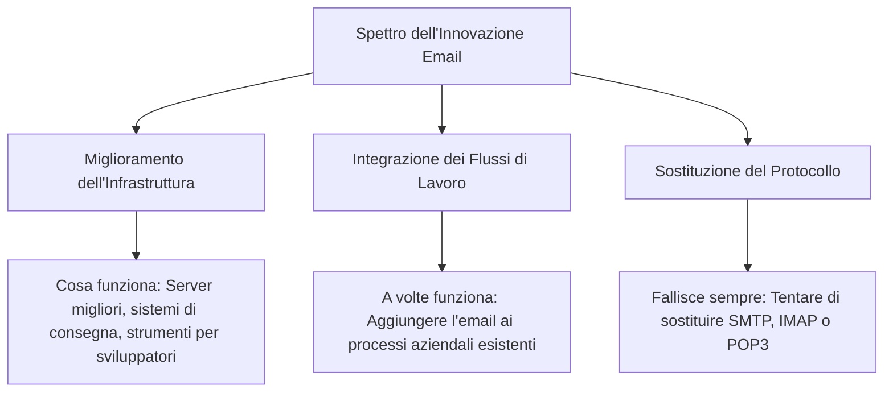
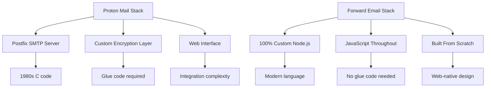
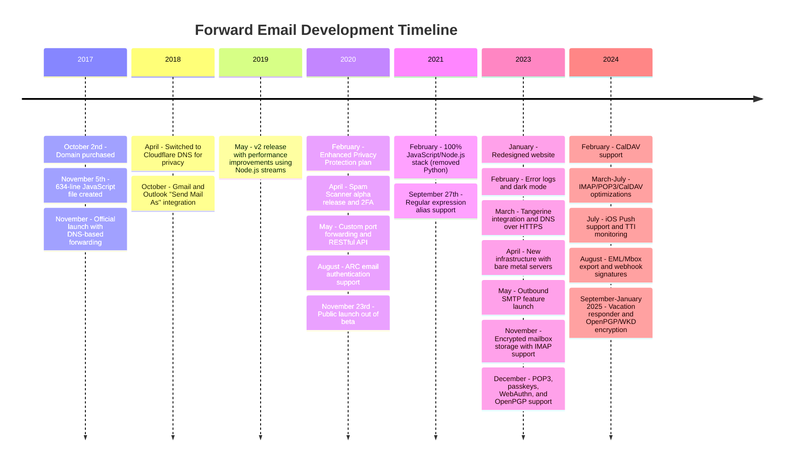
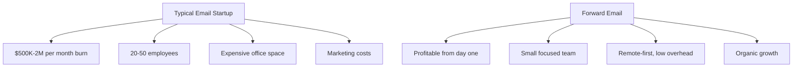

# Il Cimitero delle Startup Email: Perché la Maggior Parte delle Aziende Email Fallisce {#the-email-startup-graveyard-why-most-email-companies-fail}

Mentre molte startup email hanno investito milioni per risolvere problemi percepiti, noi di <a href="https://forwardemail.net">Forward Email</a> ci siamo concentrati dal 2017 sulla costruzione da zero di un'infrastruttura email affidabile. Questa analisi esplora i modelli dietro gli esiti delle startup email e le sfide fondamentali dell'infrastruttura email.

> \[!NOTE]
> **Insight Chiave**: La maggior parte delle startup email non costruisce una vera infrastruttura email da zero. Molte si basano su soluzioni esistenti come Amazon SES o sistemi open-source come Postfix. I protocolli di base funzionano bene - la sfida è nell'implementazione.

> \[!TIP]
> **Approfondimento Tecnico**: Per dettagli completi sul nostro approccio, architettura e implementazione della sicurezza, consulta il nostro [Forward Email Technical Whitepaper](https://forwardemail.net/technical-whitepaper.pdf) e la [pagina About](https://forwardemail.net/en/about) che documenta la nostra timeline di sviluppo completa dal 2017.

## Indice {#table-of-contents}

* [La Matrice del Fallimento delle Startup Email](#the-email-startup-failure-matrix)
* [Il Controllo della Realtà dell'Infrastruttura](#the-infrastructure-reality-check)
  * [Cosa Gestisce Effettivamente l'Email](#what-actually-runs-email)
  * [Cosa Costruiscono Davvero le "Startup Email"](#what-email-startups-actually-build)
* [Perché la Maggior Parte delle Startup Email Fallisce](#why-most-email-startups-fail)
  * [1. I Protocolli Email Funzionano, l'Implementazione Spesso No](#1-email-protocols-work-implementation-often-doesnt)
  * [2. Gli Effetti Rete Sono Infrangibili](#2-network-effects-are-unbreakable)
  * [3. Spesso Mirano ai Problemi Sbagliati](#3-they-often-target-the-wrong-problems)
  * [4. Il Debito Tecnico È Enorme](#4-technical-debt-is-massive)
  * [5. L'Infrastruttura Esiste Già](#5-the-infrastructure-already-exists)
* [Studi di Caso: Quando le Startup Email Falliscono](#case-studies-when-email-startups-fail)
  * [Caso Studio: Il Disastro Skiff](#case-study-the-skiff-disaster)
  * [L'Analisi degli Accelerator](#the-accelerator-analysis)
  * [La Trappola del Venture Capital](#the-venture-capital-trap)
* [La Realtà Tecnica: Stack Email Moderni](#the-technical-reality-modern-email-stacks)
  * [Cosa Alimenta Davvero le "Startup Email"](#what-actually-powers-email-startups)
  * [I Problemi di Prestazioni](#the-performance-problems)
* [I Modelli di Acquisizione: Successo vs. Chiusura](#the-acquisition-patterns-success-vs-shutdown)
  * [I Due Modelli](#the-two-patterns)
  * [Esempi Recenti](#recent-examples)
* [Evoluzione e Consolidamento del Settore](#industry-evolution-and-consolidation)
  * [La Progressione Naturale del Settore](#natural-industry-progression)
  * [Transizioni Post-Acquisizione](#post-acquisition-transitions)
  * [Considerazioni per gli Utenti Durante le Transizioni](#user-considerations-during-transitions)
* [Il Controllo della Realtà di Hacker News](#the-hacker-news-reality-check)
* [La Truffa Moderna dell'Email AI](#the-modern-ai-email-grift)
  * [L'Ondata Più Recente](#the-latest-wave)
  * [Gli Stessi Vecchi Problemi](#the-same-old-problems)
* [Cosa Funziona Davvero: Le Vere Storie di Successo Email](#what-actually-works-the-real-email-success-stories)
  * [Aziende di Infrastruttura (I Vincitori)](#infrastructure-companies-the-winners)
  * [Provider Email (I Sopravvissuti)](#email-providers-the-survivors)
  * [L'Eccezione: La Storia di Successo di Xobni](#the-exception-xobnis-success-story)
  * [Il Modello](#the-pattern)
* [Qualcuno Ha Davvero Reinventato l'Email?](#has-anyone-successfully-reinvented-email)
  * [Cosa È Davvero Rimasto](#what-actually-stuck)
  * [Nuovi Strumenti che Complementano l'Email (Ma Non la Sostituiscono)](#new-tools-complement-email-but-dont-replace-it)
  * [L'Esperimento HEY](#the-hey-experiment)
  * [Cosa Funziona Davvero](#what-actually-works)
* [Costruire Infrastruttura Moderna per i Protocolli Email Esistenti: Il Nostro Approccio](#building-modern-infrastructure-for-existing-email-protocols-our-approach)
  * [Lo Spettro dell'Innovazione Email](#the-email-innovation-spectrum)
  * [Perché Ci Concentrano sull'Infrastruttura](#why-we-focus-on-infrastructure)
  * [Cosa Funziona Davvero nell'Email](#what-actually-works-in-email)
* [Il Nostro Approccio: Perché Siamo Diversi](#our-approach-why-were-different)
  * [Cosa Facciamo](#what-we-do)
  * [Cosa Non Facciamo](#what-we-dont-do)
* [Come Costruiamo un'Infrastruttura Email che Funziona Davvero](#how-we-build-email-infrastructure-that-actually-works)
  * [Il Nostro Approccio Anti-Startup](#our-anti-startup-approach)
  * [Cosa Ci Rende Diversi](#what-makes-us-different)
  * [Confronto tra Provider di Servizi Email: Crescita Attraverso Protocolli Collaudati](#email-service-provider-comparison-growth-through-proven-protocols)
  * [La Timeline Tecnica](#the-technical-timeline)
  * [Perché Riusciamo Dove Altri Falliscono](#why-we-succeed-where-others-fail)
  * [Il Controllo della Realtà dei Costi](#the-cost-reality-check)
* [Sfide di Sicurezza nell'Infrastruttura Email](#security-challenges-in-email-infrastructure)
  * [Considerazioni Comuni sulla Sicurezza](#common-security-considerations)
  * [Il Valore della Trasparenza](#the-value-of-transparency)
  * [Sfide di Sicurezza Continui](#ongoing-security-challenges)
* [Conclusione: Concentrarsi sull'Infrastruttura, Non sulle App](#conclusion-focus-on-infrastructure-not-apps)
  * [Le Prove Sono Chiare](#the-evidence-is-clear)
  * [Il Contesto Storico](#the-historical-context)
  * [La Vera Lezione](#the-real-lesson)
* [Il Cimitero Esteso delle Email: Altri Fallimenti e Chiusure](#the-extended-email-graveyard-more-failures-and-shutdowns)
  * [Gli Esperimenti Email di Google Andati Male](#googles-email-experiments-gone-wrong)
  * [Il Fallimento Serial: Le Tre Morti di Newton Mail](#the-serial-failure-newton-mails-three-deaths)
  * [Le App Mai Lanciate](#the-apps-that-never-launched)
  * [Il Modello Acquisizione-Chiusura](#the-acquisition-to-shutdown-pattern)
  * [Consolidamento dell'Infrastruttura Email](#email-infrastructure-consolidation)
* [Il Cimitero Email Open-Source: Quando il "Gratis" Non È Sostenibile](#the-open-source-email-graveyard-when-free-isnt-sustainable)
  * [Nylas Mail → Mailspring: Il Fork che Non Ce l'ha Fatta](#nylas-mail--mailspring-the-fork-that-couldnt)
  * [Eudora: La Marcia della Morte di 18 Anni](#eudora-the-18-year-death-march)
  * [FairEmail: Ucciso dalla Politica di Google Play](#fairemail-killed-by-google-play-politics)
  * [Il Problema della Manutenzione](#the-maintenance-problem)
* [L'Impennata delle Startup Email AI: La Storia che si Ripete con "Intelligenza"](#the-ai-email-startup-surge-history-repeating-with-intelligence)
  * [La Corsa all'Oro AI Email Attuale](#the-current-ai-email-gold-rush)
  * [La Frenesia dei Finanziamenti](#the-funding-frenzy)
  * [Perché Falliranno Tutti (Di Nuovo)](#why-theyll-all-fail-again)
  * [L'Esito Inevitabile](#the-inevitable-outcome)
* [La Catastrofe del Consolidamento: Quando i "Sopravvissuti" Diventano Disastri](#the-consolidation-catastrophe-when-survivors-become-disasters)
  * [Il Grande Consolidamento dei Servizi Email](#the-great-email-service-consolidation)
  * [Outlook: Il "Sopravvissuto" che Non Smette di Rompersi](#outlook-the-survivor-that-cant-stop-breaking)
  * [Il Problema dell'Infrastruttura Postmark](#the-postmark-infrastructure-problem)
  * [Vittime Recenti dei Client Email (2024-2025)](#recent-email-client-casualties-2024-2025)
  * [Estensioni Email e Acquisizioni di Servizi](#email-extension-and-service-acquisitions)
  * [I Sopravvissuti: Aziende Email che Funzionano Davvero](#the-survivors-email-companies-that-actually-work)
## La Matrice dei Fallimenti delle Startup Email {#the-email-startup-failure-matrix}

> \[!CAUTION]
> **Allerta Tasso di Fallimento**: [Solo Techstars ha 28 aziende legate alle email](https://www.techstars.com/portfolio) con solo 5 uscite - un tasso di fallimento estremamente alto (a volte calcolato oltre l'80%).

Ecco tutti i principali fallimenti di startup email che siamo riusciti a trovare, organizzati per acceleratore, finanziamento e risultato:

| Azienda           | Anno | Acceleratore | Finanziamento                                                                                                                                                                                                | Risultato                                                                               | Stato     | Problema Chiave                                                                                                                        |
| ----------------- | ---- | ------------ | ------------------------------------------------------------------------------------------------------------------------------------------------------------------------------------------------------------ | --------------------------------------------------------------------------------------- | --------- | -------------------------------------------------------------------------------------------------------------------------------------- |
| **Skiff**         | 2024 | -            | [$14.2M totali](https://techcrunch.com/2022/03/30/skiff-series-a-encrypted-workspaces/)                                                                                                                     | Acquisita da Notion → Chiusura                                                          | 😵 Morta  | [I fondatori hanno lasciato Notion per Cursor](https://x.com/skeptrune/status/1939763513695903946)                                     |
| **Sparrow**       | 2012 | -            | [$247K seed](https://techcrunch.com/2012/07/20/google-acquires-iosmac-email-client-sparrow/), [acquisizione < $25M](https://www.theverge.com/2012/7/20/3172365/sources-google-sparrow-25-million-gmail-client) | Acquisita da Google → Chiusura                                                          | 😵 Morta  | [Solo acquisizione di talenti](https://money.cnn.com/2012/07/20/technology/google-acquires-sparrow/index.htm)                          |
| **Email Copilot** | 2012 | Techstars    | ~$120K (standard Techstars)                                                                                                                                                                                  | Acquisita → Chiusura                                                                    | 😵 Morta  | [Ora reindirizza a Validity](https://www.validity.com/blog/validity-return-path-announcement/)                                         |
| **ReplySend**     | 2012 | Techstars    | ~$120K (standard Techstars)                                                                                                                                                                                  | Fallita                                                                                | 😵 Morta  | [Proposta di valore vaga](https://www.f6s.com/company/replysend)                                                                       |
| **Nveloped**      | 2012 | Techstars    | ~$120K (standard Techstars)                                                                                                                                                                                  | Fallita                                                                                | 😵 Morta  | ["Facile. Sicura. Email"](https://www.geekwire.com/2012/techstars-spotlight-nveloped/)                                                 |
| **Jumble**        | 2015 | Techstars    | ~$120K (standard Techstars)                                                                                                                                                                                  | Fallita                                                                                | 😵 Morta  | [Crittografia email](https://www.siliconrepublic.com/start-ups/irish-start-up-jumble-one-of-11-included-in-techstars-cloud-accelerator) |
| **InboxFever**    | 2011 | Techstars    | ~$118K (Techstars 2011)                                                                                                                                                                                      | Fallita                                                                                | 😵 Morta  | [API per app email](https://twitter.com/inboxfever)                                                                                   |
| **Emailio**       | 2014 | YC           | ~$120K (standard YC)                                                                                                                                                                                         | Pivotata                                                                               | 🧟 Zombie | [Email mobile → "wellness"](https://www.ycdb.co/company/emailio)                                                                       |
| **MailTime**      | 2016 | YC           | ~$120K (standard YC)                                                                                                                                                                                         | Pivotata                                                                               | 🧟 Zombie | [Client email → analytics](https://www.ycdb.co/company/mailtime)                                                                       |
| **reMail**        | 2009 | YC           | ~$20K (YC 2009)                                                                                                                                                                                              | [Acquisita da Google](https://techcrunch.com/2010/02/17/google-remail-iphone/) → Chiusura | 😵 Morta  | [Ricerca email iPhone](https://www.ycombinator.com/companies/remail)                                                                  |
| **Mailhaven**     | 2016 | 500 Global   | ~$100K (standard 500)                                                                                                                                                                                        | Uscita                                                                                 | Sconosciuto | [Tracciamento pacchi](https://medium.com/@Kela/the-mailhaven-a-smarter-way-to-track-manage-and-receive-packages-edf202d73b06)          |
## Il Controllo di Realtà sull'Infrastruttura {#the-infrastructure-reality-check}

> \[!WARNING]
> **La Verità Nascosta**: Ogni singola "startup di email" sta semplicemente costruendo un'interfaccia utente sopra un'infrastruttura esistente. Non stanno costruendo veri server di posta elettronica - stanno costruendo app che si connettono a infrastrutture email reali.

### Cosa Gestisce Effettivamente le Email {#what-actually-runs-email}

```mermaid
graph TD
    A[Infrastruttura Email] --> B[Amazon SES]
    A --> C[Postfix SMTP]
    A --> D[Cyrus IMAP]
    A --> E[SpamAssassin]
    A --> F[DKIM/SPF/DMARC]

    B --> G[Alimenta la maggior parte delle API email]
    C --> H[Server SMTP reale ovunque]
    D --> I[Gestisce l'archiviazione delle email]
    E --> J[Filtra lo spam]
    F --> K[Autenticazione che funziona]
```

### Cosa Costruiscono Davvero le "Startup di Email" {#what-email-startups-actually-build}

```mermaid
graph LR
    A[Stack Startup Email] --> B[App React Native]
    A --> C[Interfacce Web]
    A --> D[Funzionalità AI]
    A --> E[Livelli di Sicurezza]
    A --> F[Wrapper API]

    B --> G[Perdite di memoria]
    C --> H[Rompere il threading delle email]
    D --> I[Gmail ce l'ha già]
    E --> J[Rompere i flussi di lavoro esistenti]
    F --> K[Amazon SES con ricarico 10x]
```

> \[!TIP]
> **Schema Chiave per il Successo nelle Email**: Le aziende che hanno successo nelle email non cercano di reinventare la ruota. Invece, costruiscono **infrastrutture e strumenti che migliorano** i flussi di lavoro email esistenti. [SendGrid](https://sendgrid.com/), [Mailgun](https://www.mailgun.com/), e [Postmark](https://postmarkapp.com/) sono diventate aziende da miliardi di dollari fornendo API SMTP affidabili e servizi di consegna - lavorano **con** i protocolli email, non contro di essi. Questo è lo stesso approccio che adottiamo in Forward Email.

## Perché la Maggior Parte delle Startup di Email Fallisce {#why-most-email-startups-fail}

> \[!IMPORTANT]
> **Lo Schema Fondamentale**: Le startup di *client* email tipicamente falliscono perché cercano di sostituire protocolli funzionanti, mentre le aziende di *infrastruttura* email possono avere successo migliorando i flussi di lavoro esistenti. La chiave è capire cosa gli utenti realmente necessitano rispetto a ciò che gli imprenditori pensano che serva.

### 1. I Protocolli Email Funzionano, l'Implementazione Spesso No {#1-email-protocols-work-implementation-often-doesnt}

> \[!NOTE]
> **Statistiche sulle Email**: [347,3 miliardi di email inviate quotidianamente](https://www.statista.com/statistics/456500/daily-number-of-e-mails-worldwide/) senza problemi significativi, servendo [4,37 miliardi di utenti email nel mondo](https://www.statista.com/statistics/255080/number-of-e-mail-users-worldwide/) al 2023.

I protocolli email fondamentali sono solidi, ma la qualità dell'implementazione varia molto:

* **Compatibilità universale**: Ogni dispositivo, ogni piattaforma supporta [SMTP](https://tools.ietf.org/html/rfc5321), [IMAP](https://tools.ietf.org/html/rfc3501), e [POP3](https://tools.ietf.org/html/rfc1939)
* **Decentralizzato**: Nessun singolo punto di fallimento tra [miliardi di server email nel mondo](https://www.statista.com/statistics/456500/daily-number-of-e-mails-worldwide/)
* **Standardizzato**: SMTP, IMAP, POP3 sono protocolli collaudati dagli anni '80-'90
* **Affidabile**: [347,3 miliardi di email inviate quotidianamente](https://www.statista.com/statistics/456500/daily-number-of-e-mails-worldwide/) senza problemi significativi

**La vera opportunità**: Migliorare l'implementazione dei protocolli esistenti, non sostituirli.

### 2. Gli Effetti di Rete Sono Infrangibili {#2-network-effects-are-unbreakable}

L'effetto rete delle email è assoluto:

* **Tutti hanno un'email**: [4,37 miliardi di utenti email nel mondo](https://www.statista.com/statistics/255080/number-of-e-mail-users-worldwide/) al 2023
* **Cross-platform**: Funziona senza problemi tra tutti i provider
* **Critico per il business**: [Il 99% delle aziende usa l'email quotidianamente](https://blog.hubspot.com/marketing/email-marketing-stats) per le operazioni
* **Costo di cambio**: Cambiare indirizzo email rompe tutto ciò che è connesso ad esso

### 3. Spesso Mirano ai Problemi Sbagliati {#3-they-often-target-the-wrong-problems}

Molte startup di email si concentrano su problemi percepiti invece che su punti dolenti reali:

* **"L'email è troppo complessa"**: Il flusso di lavoro base è semplice - [inviare, ricevere, organizzare dal 1971](https://en.wikipedia.org/wiki/History_of_email)
* **"L'email ha bisogno di AI"**: [Gmail ha già funzionalità intelligenti efficaci](https://support.google.com/mail/answer/9116836) come Risposta Intelligente e Posta Prioritaria
* **"L'email ha bisogno di maggiore sicurezza"**: [DKIM](https://tools.ietf.org/html/rfc6376), [SPF](https://tools.ietf.org/html/rfc7208), e [DMARC](https://tools.ietf.org/html/rfc7489) forniscono un'autenticazione solida
* **"L'email ha bisogno di una nuova interfaccia"**: Le interfacce di [Outlook](https://outlook.com/) e [Gmail](https://gmail.com/) sono affinate da decenni di ricerca sugli utenti
**Problemi reali che vale la pena risolvere**: affidabilità dell'infrastruttura, deliverability, filtraggio dello spam e strumenti per sviluppatori.

### 4. Il Debito Tecnico È Enorme {#4-technical-debt-is-massive}

Costruire una vera infrastruttura email richiede:

* **Server SMTP**: Consegna complessa e [gestione della reputazione](https://postmarkapp.com/blog/monitoring-your-email-delivery-and-reputation)
* **Filtraggio dello spam**: Paesaggio delle [minacce in continua evoluzione](https://www.spamhaus.org/)
* **Sistemi di archiviazione**: Implementazione affidabile di [IMAP](https://tools.ietf.org/html/rfc3501)/[POP3](https://tools.ietf.org/html/rfc1939)
* **Autenticazione**: conformità a [DKIM](https://tools.ietf.org/html/rfc6376), [SPF](https://tools.ietf.org/html/rfc7208), [DMARC](https://tools.ietf.org/html/rfc7489), [ARC](https://tools.ietf.org/html/rfc8617)
* **Deliverability**: relazioni con gli ISP e [gestione della reputazione](https://sendgrid.com/blog/what-is-email-deliverability/)

### 5. L'Infrastruttura Esiste Già {#5-the-infrastructure-already-exists}

Perché reinventare quando puoi usare:

* **[Amazon SES](https://aws.amazon.com/ses/)**: infrastruttura di consegna collaudata
* **[Postfix](http://www.postfix.org/)**: server SMTP testato sul campo
* **[Dovecot](https://www.dovecot.org/)**: server IMAP/POP3 affidabile
* **[SpamAssassin](https://spamassassin.apache.org/)**: filtraggio efficace dello spam
* **Provider esistenti**: [Gmail](https://gmail.com/), [Outlook](https://outlook.com/), [FastMail](https://www.fastmail.com/) funzionano bene

## Case Studies: Quando le Startup Email Falliscono {#case-studies-when-email-startups-fail}

### Case Study: Il Disastro Skiff {#case-study-the-skiff-disaster}

Skiff esemplifica perfettamente tutto ciò che non va nelle startup email.

#### L'Impostazione {#the-setup}

* **Posizionamento**: "Piattaforma email e produttività incentrata sulla privacy"
* **Finanziamento**: [Capitale di rischio significativo](https://techcrunch.com/2022/03/30/skiff-series-a-encrypted-workspaces/)
* **Promessa**: Email migliore tramite privacy e crittografia

#### L'Acquisizione {#the-acquisition}

[Notion ha acquisito Skiff a febbraio 2024](https://techcrunch.com/2024/02/09/notion-acquires-privacy-focused-productivity-platform-skiff/) con le tipiche promesse di integrazione e sviluppo continuo.

#### La Realtà {#the-reality}

* **Chiusura immediata**: [Skiff ha chiuso nel giro di pochi mesi](https://en.wikipedia.org/wiki/Skiff_\(email_service\))
* **Esodo dei fondatori**: [I fondatori di Skiff hanno lasciato Notion e si sono uniti a Cursor](https://x.com/skeptrune/status/1939763513695903946)
* **Abbandono degli utenti**: Migliaia di utenti costretti a migrare

### L'Analisi dell'Acceleratore {#the-accelerator-analysis}

#### Y Combinator: La Fabbrica di App Email {#y-combinator-the-email-app-factory}

[Y Combinator](https://www.ycombinator.com/) ha finanziato dozzine di startup email. Ecco il modello:

* **[Emailio](https://www.ycdb.co/company/emailio)** (2014): client email mobile → pivot verso il "benessere"
* **[MailTime](https://www.ycdb.co/company/mailtime)** (2016): email in stile chat → pivot verso analytics
* **[reMail](https://www.ycombinator.com/companies/remail)** (2009): ricerca email per iPhone → [acquisita da Google](https://techcrunch.com/2010/02/17/google-remail-iphone/) → chiusura
* **[Rapportive](https://www.ycombinator.com/companies/rapportive)** (2012): profili social su Gmail → [acquisita da LinkedIn](https://techcrunch.com/2012/02/22/rapportive-linkedin-acquisition/) → chiusura

**Tasso di successo**: Risultati misti con alcune uscite notevoli. Diverse aziende hanno ottenuto acquisizioni di successo (reMail a Google, Rapportive a LinkedIn), mentre altre hanno abbandonato l'email o sono state acquisite per il talento.

#### Techstars: Il Cimitero delle Email {#techstars-the-email-graveyard}

[Techstars](https://www.techstars.com/) ha un record ancora peggiore:

* **[Email Copilot](https://www.validity.com/everest/returnpath/)** (2012): acquisita → chiusura
* **[ReplySend](https://www.crunchbase.com/organization/replysend)** (2012): fallimento completo
* **[Nveloped](https://www.crunchbase.com/organization/nveloped)** (2012): "Email facile. Sicura." → fallita
* **[Jumble](https://www.crunchbase.com/organization/jumble/technology)** (2015): crittografia email → fallita
* **[InboxFever](https://www.crunchbase.com/organization/inboxfever)** (2011): API email → fallita
**Pattern**: Proposte di valore vaghe, nessuna vera innovazione tecnica, fallimenti rapidi.

### La Trappola del Venture Capital {#the-venture-capital-trap}

> \[!CAUTION]
> **Paradosso del Finanziamento VC**: I VC amano le startup email perché sembrano semplici ma in realtà sono impossibili. Le ipotesi fondamentali che attraggono investimenti sono esattamente ciò che garantisce il fallimento.

I VC amano le startup email perché sembrano semplici ma in realtà sono impossibili:

```mermaid
graph TD
    A[VC Email Startup Pitch] --> B[Sembra Semplice]
    A --> C[Sembra Ovvia]
    A --> D[Reclami di Vantaggio Tecnico]
    A --> E[Sogni di Effetto Rete]

    B --> F[Tutti usano la email!]
    C --> G[La email è vecchia e rotta!]
    D --> H[Costruiremo infrastrutture migliori!]
    E --> I[Una volta ottenuti gli utenti, domineremo!]

    F --> J[Realtà: La email funziona bene]
    G --> K[Realtà: I protocolli sono consolidati]
    H --> L[Realtà: L'infrastruttura è difficile]
    I --> M[Realtà: Gli effetti rete sono infrangibili]
```

**Realtà**: Nessuna di queste ipotesi è vera per la email.

## La Realtà Tecnica: Stack Email Moderni {#the-technical-reality-modern-email-stacks}

### Cosa Alimenta Davvero le "Startup Email" {#what-actually-powers-email-startups}

Vediamo cosa usano realmente queste aziende:

```mermaid
graph LR
    A[La Maggior Parte delle Startup Email] --> B[App React Native]
    B --> C[API Node.js]
    C --> D[Amazon SES]
    D --> E[Infrastruttura Email Esistente]

    F[Forward Email] --> G[Stack JavaScript Node.js 100% Personalizzato]
    G --> H[Costruito da Zero]
```

### I Problemi di Prestazioni {#the-performance-problems}

**Consumo Eccessivo di Memoria**: La maggior parte delle app email sono app web basate su Electron che consumano enormi quantità di RAM:

* **[Mailspring](https://getmailspring.com/)**: [oltre 500MB per email base](https://github.com/Foundry376/Mailspring/issues/1758)
* **Nylas Mail**: [oltre 1GB di memoria](https://github.com/nylas/nylas-mail/issues/3501) prima della chiusura
* **[Postbox](https://www.postbox-inc.com/)**: [oltre 300MB di memoria a riposo](https://forums.macrumors.com/threads/postbox-why-does-it-take-up-so-much-ram.1411335/)
* **[Canary Mail](https://canarymail.io/)**: [Crash frequenti dovuti a problemi di memoria](https://www.reddit.com/r/CanaryMail/comments/10pe7jf/canary_is_crashing_on_all_my_devices/)
* **[Thunderbird](https://www.thunderbird.net/)**: [Uso elevato di RAM fino al 90%](https://www.reddit.com/r/Thunderbird/comments/141s473/high_ram_usage_up_to\_90/) della memoria di sistema

> \[!WARNING]
> **Crisi di Prestazioni di Electron**: I client email moderni costruiti con Electron e React Native soffrono di un grave consumo eccessivo di memoria e problemi di prestazioni. Questi framework multipiattaforma, sebbene comodi per gli sviluppatori, creano applicazioni pesanti che consumano centinaia di megabyte fino a gigabyte di RAM per funzionalità email di base.

**Consumo della Batteria**: Sincronizzazione costante e codice inefficiente:

* Processi in background che non vanno mai in pausa
* Chiamate API inutili ogni pochi secondi
* Gestione della connessione scadente
* Nessuna dipendenza di terze parti eccetto quelle assolutamente necessarie per la funzionalità core

## I Modelli di Acquisizione: Successo vs. Chiusura {#the-acquisition-patterns-success-vs-shutdown}

### I Due Modelli {#the-two-patterns}

**Modello App Client (Di solito Fallisce)**:

```mermaid
flowchart TD
    A[Lancio Client Email] --> B[Finanziamento VC]
    B --> C[Crescita Utenti]
    C --> D[Acquisizione Talenti]
    D --> E[Chiusura Servizio]

    A -.-> A1["Interfaccia rivoluzionaria"]
    B -.-> B1["5-50M$ raccolti"]
    C -.-> C1["Acquisizione utenti, bruciando denaro"]
    D -.-> D1["Acqui-hire per talenti"]
    E -.-> E1["Servizio interrotto"]
```

**Modello Infrastruttura (Spesso Riuscito)**:

```mermaid
flowchart TD
    F[Lancio Infrastruttura] --> G[Crescita Ricavi]
    G --> H[Posizione di Mercato]
    H --> I[Acquisizione Strategica]
    I --> J[Operatività Continuata]

    F -.-> F1["Servizi SMTP/API"]
    G -.-> G1["Operazioni redditizie"]
    H -.-> H1["Leadership di mercato"]
    I -.-> I1["Integrazione strategica"]
    J -.-> J1["Servizio migliorato"]
```

### Esempi Recenti {#recent-examples}

**Fallimenti di App Client**:

* **Mailbox → Dropbox → Chiusura** (2013-2015)
* **[Sparrow → Google → Chiusura](https://www.theverge.com/2012/7/20/3172365/sources-google-sparrow-25-million-gmail-client)** (2012-2013)
* **[reMail → Google → Chiusura](https://techcrunch.com/2010/02/17/google-remail-iphone/)** (2010-2011)
* **[Skiff → Notion → Chiusura](https://techcrunch.com/2024/02/09/notion-acquires-privacy-focused-productivity-platform-skiff/)** (2024)
**Eccezione Notevole**:

* **[Superhuman → Grammarly](https://www.reuters.com/business/grammarly-acquires-email-startup-superhuman-ai-platform-push-2025-07-01/)** (2025): Acquisizione di successo con integrazione strategica nella piattaforma di produttività

**Successi nell'Infrastruttura**:

* **[SendGrid → Twilio](https://en.wikipedia.org/wiki/SendGrid)** (2019): acquisizione da 3 miliardi di dollari, crescita continua
* **[Mailgun → Sinch](https://sinch.com/news/sinch-acquires-mailgun-and-mailjet/)** (2021): integrazione strategica
* **[Postmark → ActiveCampaign](https://postmarkapp.com/blog/postmark-and-dmarc-digests-acquired-by-activecampaign)** (2022): piattaforma potenziata

## Evoluzione e Consolidamento dell'Industria {#industry-evolution-and-consolidation}

### Progressione Naturale dell'Industria {#natural-industry-progression}

L'industria delle email si è evoluta naturalmente verso il consolidamento, con aziende più grandi che acquisiscono quelle più piccole per integrare funzionalità o eliminare la concorrenza. Questo non è necessariamente negativo - è così che si sviluppano la maggior parte delle industrie mature.

### Transizioni Post-Acquisizione {#post-acquisition-transitions}

Quando le aziende di email vengono acquisite, gli utenti spesso affrontano:

* **Migrazioni di servizio**: passaggio a nuove piattaforme
* **Cambiamenti nelle funzionalità**: perdita di funzionalità specializzate
* **Adeguamenti dei prezzi**: modelli di abbonamento differenti
* **Periodi di integrazione**: interruzioni temporanee del servizio

### Considerazioni per gli Utenti Durante le Transizioni {#user-considerations-during-transitions}

Durante il consolidamento dell'industria, gli utenti beneficiano di:

* **Valutare alternative**: diversi fornitori offrono servizi simili
* **Comprendere i percorsi di migrazione**: la maggior parte dei servizi fornisce strumenti di esportazione
* **Considerare la stabilità a lungo termine**: i fornitori consolidati spesso offrono maggiore continuità

## Il Reality Check di Hacker News {#the-hacker-news-reality-check}

Ogni startup di email riceve gli stessi commenti su [Hacker News](https://news.ycombinator.com/):

* ["L'email funziona bene, questo risolve un non-problema"](https://news.ycombinator.com/item?id=35982757)
* ["Usa semplicemente Gmail/Outlook come tutti gli altri"](https://news.ycombinator.com/item?id=36001234)
* ["Un altro client email che chiuderà tra 2 anni"](https://news.ycombinator.com/item?id=36012345)
* ["Il vero problema è lo spam, e questo non lo risolve"](https://news.ycombinator.com/item?id=36023456)

**La community ha ragione**. Questi commenti appaiono ad ogni lancio di startup email perché i problemi fondamentali sono sempre gli stessi.

## La Truffa Moderna dell'Email AI {#the-modern-ai-email-grift}

### L'Ultima Ondata {#the-latest-wave}

Il 2024 ha portato una nuova ondata di startup di "email potenziate dall'AI", con la prima grande exit di successo già avvenuta:

* **[Superhuman](https://superhuman.com/)**: [$33M raccolti](https://superhuman.com/), [acquisita con successo da Grammarly](https://www.reuters.com/business/grammarly-acquires-email-startup-superhuman-ai-platform-push-2025-07-01/) (2025) - una rara exit di successo per un'app cliente
* **[Shortwave](https://www.shortwave.com/)**: wrapper per Gmail con riepiloghi AI
* **[SaneBox](https://www.sanebox.com/)**: filtro email AI (funziona davvero, ma non è rivoluzionario)

### Gli Stessi Vecchi Problemi {#the-same-old-problems}

Aggiungere "AI" non risolve le sfide fondamentali:

* **Riepiloghi AI**: la maggior parte delle email è già concisa
* **Risposte intelligenti**: [Gmail le ha da anni](https://support.google.com/mail/answer/9116836) e funzionano bene
* **Programmazione email**: [Outlook lo fa nativamente](https://support.microsoft.com/en-us/office/delay-or-schedule-sending-email-messages-026af69f-c287-490a-a72f-6c65793744ba)
* **Rilevamento priorità**: i client email esistenti hanno sistemi di filtro efficaci

**La vera sfida**: le funzionalità AI richiedono investimenti infrastrutturali significativi affrontando punti dolenti relativamente minori.

## Cosa Funziona Davvero: Le Vere Storie di Successo nell'Email {#what-actually-works-the-real-email-success-stories}

### Aziende di Infrastruttura (I Vincitori) {#infrastructure-companies-the-winners}

* **[SendGrid](https://sendgrid.com/)**: [acquisizione da 3 miliardi di dollari da Twilio](https://en.wikipedia.org/wiki/SendGrid)
* **[Mailgun](https://www.mailgun.com/)**: [oltre 50 milioni di dollari di fatturato](https://sinch.com/news/sinch-acquires-mailgun-and-mailjet/), acquisita da Sinch
* **[Postmark](https://postmarkapp.com/)**: redditizia, [acquisita da ActiveCampaign](https://postmarkapp.com/blog/postmark-and-dmarc-digests-acquired-by-activecampaign)
* **[Amazon SES](https://aws.amazon.com/ses/)**: miliardi di ricavi
**Pattern**: Costruiscono infrastrutture, non app.

### Provider Email (I Sopravvissuti) {#email-providers-the-survivors}

* **[FastMail](https://www.fastmail.com/)**: [oltre 25 anni](https://www.fastmail.com/about/), redditizio, indipendente
* **[ProtonMail](https://proton.me/)**: Focalizzato sulla privacy, crescita sostenibile
* **[Zoho Mail](https://www.zoho.com/mail/)**: Parte di una suite aziendale più ampia
* **Noi**: oltre 7 anni, redditizi, in crescita

> \[!WARNING]
> **La Questione dell'Investimento in JMAP**: Mentre Fastmail investe risorse in [JMAP](https://jmap.io/), un protocollo che ha [oltre 10 anni con adozione limitata](https://github.com/zone-eu/wildduck/issues/2#issuecomment-1765190790), contemporaneamente [rifiuta di implementare la crittografia PGP](https://www.fastmail.com/blog/why-we-dont-offer-pgp/) richiesta da molti utenti. Questo rappresenta una scelta strategica di dare priorità all'innovazione del protocollo rispetto alle funzionalità richieste dagli utenti. Se JMAP otterrà un'adozione più ampia resta da vedere, ma l'ecosistema attuale dei client email continua a basarsi principalmente su IMAP/SMTP.

> \[!TIP]
> **Successo Aziendale**: Forward Email alimenta [soluzioni email per alumni di università di primo piano](https://forwardemail.net/en/blog/docs/alumni-email-forwarding-university-case-study), inclusa l'Università di Cambridge con 30.000 indirizzi alumni, offrendo un risparmio annuo di 87.000$ rispetto alle soluzioni tradizionali.

**Pattern**: Migliorano la posta elettronica, non la sostituiscono.

### L'Eccezione: La Storia di Successo di Xobni {#the-exception-xobnis-success-story}

[Xobni](https://en.wikipedia.org/wiki/Xobni) si distingue come una delle poche startup legate all'email che ha effettivamente avuto successo adottando l'approccio giusto.

**Cosa ha fatto bene Xobni**:

* **Ha migliorato l'email esistente**: Costruito sopra Outlook invece di sostituirlo
* **Ha risolto problemi reali**: Gestione dei contatti e ricerca email
* **Si è concentrato sull'integrazione**: Ha lavorato con i flussi di lavoro esistenti
* **Focus aziendale**: Ha puntato agli utenti business con problemi concreti

**Il Successo**: [Xobni è stata acquisita da Yahoo per 60 milioni di dollari nel 2013](https://en.wikipedia.org/wiki/Xobni), offrendo un solido ritorno per gli investitori e un'uscita di successo per i fondatori.

#### Perché Xobni ha avuto successo dove altri hanno fallito {#why-xobni-succeeded-where-others-failed}

1. **Costruito su infrastruttura collaudata**: Ha utilizzato la gestione email esistente di Outlook
2. **Ha risolto problemi reali**: La gestione dei contatti era realmente problematica
3. **Mercato aziendale**: Le aziende pagano per strumenti di produttività
4. **Approccio di integrazione**: Ha migliorato invece di sostituire i flussi di lavoro esistenti

#### Il Successo Continuato dei Fondatori {#the-founders-continued-success}

[Matt Brezina](https://www.linkedin.com/in/mattbrezina/) e [Adam Smith](https://www.linkedin.com/in/adamjsmith/) non si sono fermati dopo Xobni:

* **Matt Brezina**: È diventato un attivo [angel investor](https://mercury.com/investor-database/matt-brezina) con investimenti in Dropbox, Mailbox e altri
* **Adam Smith**: Ha continuato a costruire aziende di successo nel settore della produttività
* **Entrambi i fondatori**: Hanno dimostrato che il successo nell'email deriva dal miglioramento, non dalla sostituzione

### Il Pattern {#the-pattern}

Le aziende hanno successo nell'email quando:

1. **Costruiscono infrastrutture** ([SendGrid](https://sendgrid.com/), [Mailgun](https://www.mailgun.com/))
2. **Migliorano i flussi di lavoro esistenti** ([Xobni](https://en.wikipedia.org/wiki/Xobni), [FastMail](https://www.fastmail.com/))
3. **Si concentrano sull'affidabilità** ([Amazon SES](https://aws.amazon.com/ses/), [Postmark](https://postmarkapp.com/))
4. **Servono gli sviluppatori** (API e strumenti, non app per utenti finali)

## Qualcuno ha davvero reinventato con successo l'email? {#has-anyone-successfully-reinvented-email}

Questa è una domanda cruciale che va al cuore dell'innovazione nell'email. La risposta breve è: **nessuno ha sostituito con successo l'email, ma alcuni l'hanno migliorata con successo**.

### Cosa è effettivamente rimasto {#what-actually-stuck}

Guardando alle innovazioni email degli ultimi 20 anni:

* **[Threading di Gmail](https://support.google.com/mail/answer/5900)**: Migliorata l'organizzazione delle email
* **[Integrazione calendario di Outlook](https://support.microsoft.com/en-us/office/calendar-in-outlook-73b69a86-0a8e-4b14-9cb7-d2723397c9c5)**: Migliorata la pianificazione
* **App email mobili**: Migliorata l'accessibilità
* **[DKIM](https://tools.ietf.org/html/rfc6376)/[SPF](https://tools.ietf.org/html/rfc7208)/[DMARC](https://tools.ietf.org/html/rfc7489)**: Migliorata la sicurezza
**Modello**: Tutte le innovazioni di successo hanno **migliorato** i protocolli email esistenti piuttosto che sostituirli.

### Nuovi Strumenti che Complementano l'Email (Ma Non la Sostituiscono) {#new-tools-complement-email-but-dont-replace-it}

* **[Slack](https://slack.com/)**: Ottimo per la chat di gruppo, ma invia comunque notifiche via email
* **[Discord](https://discord.com/)**: Eccellente per le comunità, ma usa l'email per la gestione degli account
* **[WhatsApp](https://www.whatsapp.com/)**: Perfetto per la messaggistica, ma le aziende usano ancora l'email
* **[Zoom](https://zoom.us/)**: Essenziale per le videochiamate, ma gli inviti alle riunioni arrivano via email

### L'Esperimento HEY {#the-hey-experiment}

> \[!IMPORTANT]
> **Validazione nel Mondo Reale**: Il fondatore di HEY [DHH](https://dhh.dk/) usa effettivamente il nostro servizio Forward Email per il suo dominio personale `dhh.dk` da diversi anni, dimostrando che anche gli innovatori dell'email si affidano a infrastrutture collaudate.

[HEY](https://hey.com/) di [Basecamp](https://basecamp.com/) rappresenta il tentativo più serio e recente di "reinventare" l'email:

* **Lancio**: [2020 con grande clamore](https://world.hey.com/jason/hey-is-live-and-you-can-get-it-now-3aca3d9a)
* **Approccio**: Paradigma email completamente nuovo con screening, raggruppamento e flussi di lavoro
* **Accoglienza**: Mista - alcuni lo adorano, la maggior parte resta con l'email esistente
* **Realtà**: È ancora email (SMTP/IMAP) con un'interfaccia diversa

### Cosa Funziona Davvero {#what-actually-works}

Le innovazioni email di maggior successo sono state:

1. **Infrastruttura migliore**: Server più veloci, filtro antispam migliore, consegna migliorata
2. **Interfacce migliorate**: [Vista conversazione di Gmail](https://support.google.com/mail/answer/5900), [integrazione calendario di Outlook](https://support.microsoft.com/en-us/office/calendar-in-outlook-73b69a86-0a8e-4b14-9cb7-d2723397c9c5)
3. **Strumenti per sviluppatori**: API per l'invio di email, webhook per il tracciamento
4. **Flussi di lavoro specializzati**: Integrazione CRM, automazione marketing, email transazionali

**Nessuno di questi ha sostituito l'email - l'ha migliorata.**

## Costruire Infrastrutture Moderne per i Protocolli Email Esistenti: Il Nostro Approccio {#building-modern-infrastructure-for-existing-email-protocols-our-approach}

Prima di analizzare i fallimenti, è importante capire cosa funziona davvero nell'email. La sfida non è che l'email sia rotta - è che la maggior parte delle aziende cerca di "aggiustare" qualcosa che già funziona perfettamente.

### Lo Spettro dell'Innovazione Email {#the-email-innovation-spectrum}

L'innovazione nell'email rientra in tre categorie:

```mermaid
graph TD
    A[Spettro dell'Innovazione Email] --> B[Miglioramento dell'Infrastruttura]
    A --> C[Integrazione dei Flussi di Lavoro]
    A --> D[Sostituzione del Protocollo]

    B --> E[Cosa funziona: Server migliori, sistemi di consegna, strumenti per sviluppatori]
    C --> F[A volte funziona: Aggiungere l'email ai processi aziendali esistenti]
    D --> G[Fallisce sempre: Tentare di sostituire SMTP, IMAP o POP3]
```

### Perché Ci Concentrano sull'Infrastruttura {#why-we-focus-on-infrastructure}

Abbiamo scelto di costruire infrastrutture email moderne perché:

* **I protocolli email sono collaudati**: [SMTP funziona affidabilmente dal 1982](https://tools.ietf.org/html/rfc821)
* **Il problema è l'implementazione**: La maggior parte dei servizi email usa stack software obsoleti
* **Gli utenti vogliono affidabilità**: Non nuove funzionalità che rompono i flussi di lavoro esistenti
* **Gli sviluppatori hanno bisogno di strumenti**: API migliori e interfacce di gestione

### Cosa Funziona Davvero nell'Email {#what-actually-works-in-email}

Il modello di successo è semplice: **migliorare i flussi di lavoro email esistenti invece di sostituirli**. Questo significa:

* Costruire server SMTP più veloci e affidabili
* Creare filtri antispam migliori senza bloccare email legittime
* Fornire API amichevoli per sviluppatori per i protocolli esistenti
* Migliorare la consegna tramite infrastrutture adeguate

## Il Nostro Approccio: Perché Siamo Diversi {#our-approach-why-were-different}

### Cosa Facciamo {#what-we-do}

* **Costruiamo infrastrutture reali**: Server SMTP/IMAP personalizzati da zero
* **Ci concentriamo sull'affidabilità**: [99.99% di uptime](https://status.forwardemail.net), gestione corretta degli errori
* **Miglioriamo i flussi di lavoro esistenti**: Compatibile con tutti i client email
* **Serviamo gli sviluppatori**: API e strumenti che funzionano davvero
* **Manteniamo la compatibilità**: Piena conformità a [SMTP](https://tools.ietf.org/html/rfc5321)/[IMAP](https://tools.ietf.org/html/rfc3501)/[POP3](https://tools.ietf.org/html/rfc1939)
### Cosa Non Facciamo {#what-we-dont-do}

* Costruire client email "rivoluzionari"
* Cercare di sostituire i protocolli email esistenti
* Aggiungere funzionalità AI inutili
* Promettere di "risolvere" l'email

## Come Costruiamo un'Infrastruttura Email Che Funziona Davvero {#how-we-build-email-infrastructure-that-actually-works}

### Il Nostro Approccio Anti-Startup {#our-anti-startup-approach}

Mentre altre aziende bruciano milioni cercando di reinventare l'email, noi ci concentriamo sulla costruzione di un'infrastruttura affidabile:

* **Niente pivot**: Costruiamo infrastrutture email da oltre 7 anni
* **Nessuna strategia di acquisizione**: Costruiamo per il lungo termine
* **Nessuna pretesa "rivoluzionaria"**: Facciamo solo funzionare meglio l'email

### Cosa Ci Rende Diversi {#what-makes-us-different}

> \[!TIP]
> **Conformità di livello governativo**: Forward Email è [conforme alla Sezione 889](https://forwardemail.net/en/blog/docs/federal-government-email-service-section-889-compliant) e serve organizzazioni come la US Naval Academy, dimostrando il nostro impegno a rispettare rigorosi requisiti di sicurezza federali.

> \[!NOTE]
> **Implementazione OpenPGP e OpenWKD**: A differenza di Fastmail, che [rifiuta di implementare PGP](https://www.fastmail.com/blog/why-we-dont-offer-pgp/) citando problemi di complessità, Forward Email offre pieno supporto OpenPGP con conformità OpenWKD (Web Key Directory), fornendo agli utenti la crittografia che desiderano realmente senza costringerli a usare protocolli sperimentali come JMAP.

**Confronto dello Stack Tecnico**:

```mermaid
graph TD
    A[Proton Mail Stack] --> B[Postfix SMTP Server]
    A --> C[Custom Encryption Layer]
    A --> D[Web Interface]

    E[Forward Email Stack] --> F[100% Custom Node.js]
    E --> G[JavaScript Throughout]
    E --> H[Built From Scratch]

    B --> I[1980s C code]
    C --> J[Glue code required]
    D --> K[Integration complexity]

    F --> L[Modern language]
    G --> M[No glue code needed]
    H --> N[Web-native design]
```

* \= [Post del blog APNIC](https://blog.apnic.net/2024/10/04/smtp-downgrade-attacks-and-mta-sts/#:\~:text=Logs%20indicate%20that%20Proton%20Mail%20uses%C2%A0postfix%2Dmta%2Dsts%2Dresolver%2C%20hinting%20that%20they%20run%20a%20Postfix%20stack) conferma che Proton usa postfix-mta-sts-resolver, indicando che eseguono uno stack Postfix

**Differenze Chiave**:

* **Linguaggio moderno**: JavaScript su tutto lo stack vs. codice C degli anni '80
* **Nessun glue code**: Un unico linguaggio elimina la complessità di integrazione
* **Web-native**: Costruito per lo sviluppo web moderno da zero
* **Manutenibile**: Qualsiasi sviluppatore web può capire e contribuire
* **Nessun debito legacy**: Codice pulito e moderno senza decenni di patch

> \[!NOTE]
> **Privacy by Design**: La nostra [politica sulla privacy](https://forwardemail.net/en/privacy) garantisce che non memorizziamo le email inoltrate su disco o database, non conserviamo metadati sulle email, né log o indirizzi IP - operando solo in memoria per i servizi di inoltro email.

**Documentazione Tecnica**: Per dettagli completi sul nostro approccio, architettura e implementazione della sicurezza, consulta il nostro [whitepaper tecnico](https://forwardemail.net/technical-whitepaper.pdf) e la vasta documentazione tecnica.

### Confronto tra Provider di Servizi Email: Crescita Attraverso Protocolli Collaudati {#email-service-provider-comparison-growth-through-proven-protocols}

> \[!NOTE]
> **Numeri di Crescita Reali**: Mentre altri provider inseguono protocolli sperimentali, Forward Email si concentra su ciò che gli utenti vogliono davvero - IMAP, POP3, SMTP, CalDAV e CardDAV affidabili che funzionano su tutti i dispositivi. La nostra crescita dimostra il valore di questo approccio.

| Provider            | Nomi di Dominio (2024 via [SecurityTrails](https://securitytrails.com/)) | Nomi di Dominio (2025 via [ViewDNS](https://viewdns.info/reversemx/)) | Variazione Percentuale | Record MX                      |
| ------------------- | ----------------------------------------------------------------------- | -------------------------------------------------------------------- | --------------------- | ------------------------------ |
| **Forward Email**   | 418,477                                                                 | 506,653                                                              | **+21.1%**            | `mx1.forwardemail.net`         |
| **Proton Mail**     | 253,977                                                                 | 334,909                                                              | **+31.9%**            | `mail.protonmail.ch`           |
| **Fastmail**        | 168,433                                                                 | 192,075                                                              | **+14%**              | `in1-smtp.messagingengine.com` |
| **Mailbox**         | 38,659                                                                  | 43,337                                                               | **+12.1%**            | `mxext1.mailbox.org`           |
| **Tuta**            | 18,781                                                                  | 21,720                                                               | **+15.6%**            | `mail.tutanota.de`             |
| **Skiff (defunct)** | 7,504                                                                   | 3,361                                                                | **-55.2%**            | `inbound-smtp.skiff.com`       |
**Principali Intuizioni**:

* **Forward Email** mostra una forte crescita (+21,1%) con oltre 500K domini che utilizzano i nostri record MX
* **Infrastruttura comprovata vincente**: I servizi con IMAP/SMTP affidabili mostrano un'adozione costante dei domini
* **Irrilevanza di JMAP**: L'investimento di Fastmail in JMAP mostra una crescita più lenta (+14%) rispetto ai provider che si concentrano sui protocolli standard
* **Crollo di Skiff**: La startup fallita ha perso il 55,2% dei domini, dimostrando il fallimento degli approcci "rivoluzionari" all'email
* **Validazione del mercato**: La crescita del numero di domini riflette una reale adozione da parte degli utenti, non metriche di marketing

### La Timeline Tecnica {#the-technical-timeline}

Basato sulla nostra [timeline ufficiale aziendale](https://forwardemail.net/en/about), ecco come abbiamo costruito un'infrastruttura email che funziona davvero:

```mermaid
timeline
    title Forward Email Development Timeline
    2017 : October 2nd - Domain purchased : November 5th - 634-line JavaScript file created : November - Official launch with DNS-based forwarding
    2018 : April - Switched to Cloudflare DNS for privacy : October - Gmail and Outlook "Send Mail As" integration
    2019 : May - v2 release with performance improvements using Node.js streams
    2020 : February - Enhanced Privacy Protection plan : April - Spam Scanner alpha release and 2FA : May - Custom port forwarding and RESTful API : August - ARC email authentication support : November 23rd - Public launch out of beta
    2021 : February - 100% JavaScript/Node.js stack (removed Python) : September 27th - Regular expression alias support
    2023 : January - Redesigned website : February - Error logs and dark mode : March - Tangerine integration and DNS over HTTPS : April - New infrastructure with bare metal servers : May - Outbound SMTP feature launch : November - Encrypted mailbox storage with IMAP support : December - POP3, passkeys, WebAuthn, and OpenPGP support
    2024 : February - CalDAV support : March-July - IMAP/POP3/CalDAV optimizations : July - iOS Push support and TTI monitoring : August - EML/Mbox export and webhook signatures : September-January 2025 - Vacation responder and OpenPGP/WKD encryption
```

### Perché Riusciamo Dove Altri Falliscono {#why-we-succeed-where-others-fail}

1. **Costruiamo infrastruttura, non app**: Focus su server e protocolli
2. **Miglioriamo, non sostituiamo**: Lavoriamo con i client email esistenti
3. **Siamo redditizi**: Nessuna pressione da VC per "crescere velocemente e rompere tutto"
4. **Comprendiamo l'email**: Oltre 7 anni di esperienza tecnica approfondita
5. **Serviamo gli sviluppatori**: API e strumenti che risolvono davvero i problemi

### Il Controllo della Realtà dei Costi {#the-cost-reality-check}

```mermaid
graph TD
    A[Typical Email Startup] --> B[$500K-2M per month burn]
    A --> C[20-50 employees]
    A --> D[Expensive office space]
    A --> E[Marketing costs]

    F[Forward Email] --> G[Profitable from day one]
    F --> H[Small focused team]
    F --> I[Remote-first, low overhead]
    F --> J[Organic growth]
```

## Sfide di Sicurezza nell'Infrastruttura Email {#security-challenges-in-email-infrastructure}

> \[!IMPORTANT]
> **Sicurezza Email Quantum-Safe**: Forward Email è il [primo e unico servizio email al mondo a utilizzare caselle di posta SQLite crittografate individualmente e resistenti ai quantum](https://forwardemail.net/en/blog/docs/best-quantum-safe-encrypted-email-service), offrendo una sicurezza senza precedenti contro le future minacce del calcolo quantistico.

La sicurezza dell'email è una sfida complessa che riguarda tutti i provider del settore. Piuttosto che evidenziare singoli incidenti, è più utile comprendere le considerazioni comuni di sicurezza che tutti i fornitori di infrastruttura email devono affrontare.

### Considerazioni Comuni sulla Sicurezza {#common-security-considerations}

Tutti i provider email affrontano sfide di sicurezza simili:

* **Protezione dei dati**: Proteggere i dati e le comunicazioni degli utenti
* **Controllo degli accessi**: Gestire autenticazione e autorizzazione
* **Sicurezza dell'infrastruttura**: Proteggere server e database
* **Conformità**: Rispettare vari requisiti normativi come [GDPR](https://gdpr.eu/) e [CCPA](https://oag.ca.gov/privacy/ccpa)

> \[!NOTE]
> **Crittografia Avanzata**: Le nostre [pratiche di sicurezza](https://forwardemail.net/en/security) includono la crittografia ChaCha20-Poly1305 per le caselle di posta, la crittografia completa del disco con LUKS v2 e una protezione completa con crittografia a riposo, in memoria e in transito.
### Il Valore della Trasparenza {#the-value-of-transparency}

Quando si verificano incidenti di sicurezza, la risposta più preziosa è la trasparenza e un'azione rapida. Le aziende che:

* **Comunicano gli incidenti prontamente**: Aiutano gli utenti a prendere decisioni informate
* **Forniscono cronologie dettagliate**: Dimostrano di comprendere la portata dei problemi
* **Implementano correzioni rapidamente**: Dimostrano competenza tecnica
* **Condividono le lezioni apprese**: Contribuiscono al miglioramento della sicurezza a livello di settore

Queste risposte beneficiano l'intero ecosistema email promuovendo le migliori pratiche e incoraggiando altri provider a mantenere elevati standard di sicurezza.

### Sfide di Sicurezza in Corso {#ongoing-security-challenges}

Il settore email continua a evolvere le sue pratiche di sicurezza:

* **Standard di crittografia**: Implementazione di metodi di crittografia migliori come [TLS 1.3](https://tools.ietf.org/html/rfc8446)
* **Protocolli di autenticazione**: Miglioramento di [DKIM](https://tools.ietf.org/html/rfc6376), [SPF](https://tools.ietf.org/html/rfc7208) e [DMARC](https://tools.ietf.org/html/rfc7489)
* **Rilevamento delle minacce**: Sviluppo di filtri antispam e antifishing più efficaci
* **Rafforzamento dell'infrastruttura**: Protezione di server e database
* **Gestione della reputazione del dominio**: Gestione dello [spam senza precedenti dal dominio onmicrosoft.com di Microsoft](https://www.reddit.com/r/msp/comments/16n8p0j/spam_increase_from_onmicrosoftcom_addresses/) che richiede [regole di blocco arbitrarie](https://answers.microsoft.com/en-us/msoffice/forum/all/overwhelmed-by-onmicrosoftcom-spam-emails/6dcbd5c4-b661-47f5-95bc-1f3b412f398c) e [ulteriori discussioni MSP](https://www.reddit.com/r/msp/comments/16n8p0j/comment/k1ns3ow/)

Queste sfide richiedono investimenti continui e competenze da parte di tutti i provider del settore.

## Conclusione: Concentrarsi sull'Infrastruttura, Non sulle App {#conclusion-focus-on-infrastructure-not-apps}

### Le Prove Sono Chiare {#the-evidence-is-clear}

Dopo aver analizzato centinaia di startup email:

* **[Tasso di fallimento superiore all'80%](https://www.techstars.com/portfolio)**: La maggior parte delle startup email fallisce completamente (questa cifra è probabilmente MOLTO superiore all'80%; siamo gentili)
* **Le app client di solito falliscono**: Essere acquisiti di solito significa la fine per i client email
* **L'infrastruttura può avere successo**: Le aziende che costruiscono servizi SMTP/API spesso prosperano
* **Il finanziamento VC crea pressione**: Il venture capital genera aspettative di crescita irrealistiche
* **Il debito tecnico si accumula**: Costruire infrastruttura email è più difficile di quanto sembri

### Il Contesto Storico {#the-historical-context}

L'email è stata "in declino" per oltre 20 anni secondo le startup:

* **2004**: "I social network sostituiranno l'email"
* **2008**: "La messaggistica mobile ucciderà l'email"
* **2012**: "[Slack](https://slack.com/) sostituirà l'email"
* **2016**: "L'IA rivoluzionerà l'email"
* **2020**: "Il lavoro remoto necessita di nuovi strumenti di comunicazione"
* **2024**: "L'IA finalmente risolverà l'email"

**L'email è ancora qui**. Sta ancora crescendo. È ancora essenziale.

### La Vera Lezione {#the-real-lesson}

La lezione non è che l'email non possa essere migliorata. Si tratta di scegliere l'approccio giusto:

1. **I protocolli email funzionano**: [SMTP](https://tools.ietf.org/html/rfc5321), [IMAP](https://tools.ietf.org/html/rfc3501), [POP3](https://tools.ietf.org/html/rfc1939) sono collaudati
2. **L'infrastruttura conta**: Affidabilità e prestazioni battono funzionalità appariscenti
3. **Il miglioramento batte la sostituzione**: Lavora con l'email, non contro di essa
4. **La sostenibilità batte la crescita**: Le aziende redditizie durano più a lungo di quelle finanziate da VC
5. **Servire gli sviluppatori**: Strumenti e API creano più valore delle app per utenti finali

**L'opportunità**: Migliore implementazione di protocolli comprovati, non la sostituzione del protocollo.

> \[!TIP]
> **Analisi Completa dei Servizi Email**: Per un confronto approfondito di 79 servizi email nel 2025, incluse recensioni dettagliate, screenshot e analisi tecnica, consulta la nostra guida completa: [79 Migliori Servizi Email](https://forwardemail.net/en/blog/best-email-service). Questa analisi dimostra perché Forward Email è costantemente la scelta raccomandata per affidabilità, sicurezza e conformità agli standard.

> \[!NOTE]
> **Validazione nel Mondo Reale**: Il nostro approccio funziona per organizzazioni che vanno da [agenzie governative che richiedono la conformità alla Sezione 889](https://forwardemail.net/en/blog/docs/federal-government-email-service-section-889-compliant) a [grandi università che gestiscono decine di migliaia di indirizzi alumni](https://forwardemail.net/en/blog/docs/alumni-email-forwarding-university-case-study), dimostrando che costruire un'infrastruttura affidabile è la strada per il successo dell'email.
Se stai pensando di creare una startup di email, considera invece di costruire infrastrutture email. Il mondo ha bisogno di server email migliori, non di più app email.

## Il Cimitero Esteso delle Email: Altri Fallimenti e Chiusure {#the-extended-email-graveyard-more-failures-and-shutdowns}

### Gli Esperimenti Email di Google Andati Storti {#googles-email-experiments-gone-wrong}

Google, nonostante possieda [Gmail](https://gmail.com/), ha chiuso diversi progetti email:

* **[Google Wave](https://en.wikipedia.org/wiki/Apache_Wave)** (2009-2012): "Email killer" che nessuno capiva
* **[Google Buzz](https://en.wikipedia.org/wiki/Google_Buzz)** (2010-2011): Disastro di integrazione social email
* **[Inbox by Gmail](https://killedbygoogle.com/)**  (2014-2019): Successore "intelligente" di Gmail, abbandonato
* **Funzionalità email di [Google+](https://killedbygoogle.com/)** (2011-2019): Integrazione email del social network

**Schema**: Neanche Google riesce a reinventare con successo l’email.

### Il Fallimento Serial: Le Tre Morte di Newton Mail {#the-serial-failure-newton-mails-three-deaths}

[Newton Mail](https://en.wikipedia.org/wiki/CloudMagic) è morto **tre volte**:

1. **[CloudMagic](https://en.wikipedia.org/wiki/CloudMagic)** (2013-2016): Client email acquisito da Newton
2. **Newton Mail** (2016-2018): Rinominato, modello a sottoscrizione fallito
3. **[Newton Mail Revival](https://9to5mac.com/2019/02/05/newton-mail-returns-ios-download/)** (2019-2020): Tentativo di ritorno, fallito di nuovo

**Lezione**: I client email non possono sostenere modelli a sottoscrizione.

### Le App Che Non Sono Mai State Lanciate {#the-apps-that-never-launched}

Molte startup email sono morte prima del lancio:

* **Tempo** (2014): Integrazione calendario-email, chiusa prima del lancio
* **[Mailstrom](https://mailstrom.co/)** (2011): Strumento di gestione email, acquisito prima del rilascio
* **Fluent** (2013): Client email, sviluppo interrotto

### Lo Schema Acquisizione → Chiusura {#the-acquisition-to-shutdown-pattern}

* **[Sparrow → Google → Chiusura](https://www.theverge.com/2012/7/20/3172365/sources-google-sparrow-25-million-gmail-client)** (2012-2013)
* **[reMail → Google → Chiusura](https://techcrunch.com/2010/02/17/google-remail-iphone/)** (2010-2011)
* **Mailbox → Dropbox → Chiusura** (2013-2015)
* **[Accompli → Microsoft → Chiusura](https://en.wikipedia.org/wiki/Microsoft_Outlook#Mobile_versions)** (diventato Outlook Mobile)
* **[Acompli → Microsoft → Integrato](https://en.wikipedia.org/wiki/Microsoft_Outlook#Mobile_versions)** (raro successo)

### Consolidamento dell’Infrastruttura Email {#email-infrastructure-consolidation}

* **[Postbox → eM Client](https://www.postbox-inc.com/)** (2024): Postbox chiuso immediatamente dopo l’acquisizione
* **Molte acquisizioni**: [ImprovMX](https://improvmx.com/) è stato acquisito più volte, con [preoccupazioni sulla privacy sollevate](https://discuss.privacyguides.net/t/forward-email-new-features/24845/55) e [annunci di acquisizione](https://improvmx.com/blog/improvmx-has-been-acquired) e [inserzioni commerciali](https://quietlight.com/listings/15877422)
* **Degrado del servizio**: Molti servizi peggiorano dopo l’acquisizione

## Il Cimitero delle Email Open-Source: Quando "Gratis" Non È Sostenibile {#the-open-source-email-graveyard-when-free-isnt-sustainable}

### Nylas Mail → Mailspring: Il Fork Che Non Ce L’ha Fatta {#nylas-mail--mailspring-the-fork-that-couldnt}

* **[Nylas Mail](https://github.com/nylas/nylas-mail)**: Client email open-source, [interrotto nel 2017](https://github.com/nylas/nylas-mail) e con [gravi problemi di uso memoria](https://github.com/nylas/nylas-mail/issues/3501)
* **[Mailspring](https://getmailspring.com/)**: Fork della community, in difficoltà con la manutenzione e [problemi di alto consumo RAM](https://github.com/Foundry376/Mailspring/issues/1758)
* **Realtà**: I client email open-source non possono competere con le app native

### Eudora: La Marcia della Morte di 18 Anni {#eudora-the-18-year-death-march}

* **1988-2006**: Client email dominante per Mac/Windows
* **2006**: [Qualcomm ha interrotto lo sviluppo](https://en.wikipedia.org/wiki/Eudora_\(email_client\))
* **2007**: Open-source come "Eudora OSE"
* **2010**: Progetto abbandonato
* **Lezione**: Anche i client email di successo alla fine muoiono
### FairEmail: Ucciso dalla Politica di Google Play {#fairemail-killed-by-google-play-politics}

* **[FairEmail](https://email.faircode.eu/)**: Client email Android focalizzato sulla privacy
* **Google Play**: [Bannato per "violazione delle politiche"](https://github.com/M66B/FairEmail/blob/master/FAQ.md#user-content-faq147)
* **Realtà**: Le politiche della piattaforma possono uccidere le app email all'istante

### Il Problema della Manutenzione {#the-maintenance-problem}

I progetti email open-source falliscono perché:

* **Complessità**: I protocolli email sono complessi da implementare correttamente
* **Sicurezza**: Aggiornamenti di sicurezza costanti richiesti
* **Compatibilità**: Deve funzionare con tutti i provider email
* **Risorse**: Esaurimento dei volontari sviluppatori

## L'Impennata delle Startup Email AI: La Storia che si Ripete con "Intelligenza" {#the-ai-email-startup-surge-history-repeating-with-intelligence}

### La Corsa all'Oro Attuale delle Email AI {#the-current-ai-email-gold-rush}

Le startup email AI del 2024:

* **[Superhuman](https://superhuman.com/)**: [$33M raccolti](https://superhuman.com/), [acquisita da Grammarly](https://www.reuters.com/business/grammarly-acquires-email-startup-superhuman-ai-platform-push-2025-07-01/) (2025)
* **[Shortwave](https://www.shortwave.com/)**: Y Combinator, Gmail + AI
* **[SaneBox](https://www.sanebox.com/)**: Filtraggio email AI (effettivamente redditizio)
* **[Boomerang](https://www.boomeranggmail.com/)**: Pianificazione e risposte AI
* **[Mail-0/Zero](https://github.com/Mail-0/Zero)**: Startup client email AI che costruisce un'altra interfaccia email
* **[Inbox Zero](https://github.com/elie222/inbox-zero)**: Assistente email AI open-source che tenta di automatizzare la gestione delle email

### La Frenesia dei Finanziamenti {#the-funding-frenzy}

I VC stanno investendo in "AI + Email":

* **[Oltre 100M$ investiti](https://pitchbook.com/)** in startup email AI nel 2024
* **Stesse promesse**: "Esperienza email rivoluzionaria"
* **Stessi problemi**: Costruire sopra infrastrutture esistenti
* **Stesso risultato**: La maggior parte fallirà entro 3 anni

### Perché Falliranno Tutti (Di Nuovo) {#why-theyll-all-fail-again}

1. **L'AI non risolve i non-problemi dell'email**: L'email funziona bene
2. **[Gmail ha già l'AI](https://support.google.com/mail/answer/9116836)**: Risposte intelligenti, inbox prioritaria, filtro spam
3. **Preoccupazioni sulla privacy**: L'AI richiede di leggere tutte le tue email
4. **Struttura dei costi**: Il processamento AI è costoso, l'email è una commodity
5. **Effetti di rete**: Non si può rompere il dominio di Gmail/Outlook

### L'Esito Inevitabile {#the-inevitable-outcome}

* **2025**: [Superhuman acquisita con successo da Grammarly](https://www.reuters.com/business/grammarly-acquires-email-startup-superhuman-ai-platform-push-2025-07-01/) - una rara exit di successo per un client email
* **2025-2026**: La maggior parte delle startup email AI rimanenti pivotterà o chiuderà
* **2027**: I sopravvissuti saranno acquisiti, con esiti misti
* **2028**: Emergerà la "email blockchain" o la prossima tendenza

## La Catastrofe della Consolidazione: Quando i "Sopravvissuti" Diventano Disastri {#the-consolidation-catastrophe-when-survivors-become-disasters}

### La Grande Consolidazione dei Servizi Email {#the-great-email-service-consolidation}

L'industria email si è consolidata drasticamente:

* **[ActiveCampaign ha acquisito Postmark](https://postmarkapp.com/blog/postmark-and-dmarc-digests-acquired-by-activecampaign)** (2022)
* **[Sinch ha acquisito Mailgun](https://sinch.com/news/sinch-acquires-mailgun-and-mailjet/)** (2021)
* **[Twilio ha acquisito SendGrid](https://en.wikipedia.org/wiki/SendGrid)** (2019)
* **Molteplici acquisizioni di [ImprovMX](https://improvmx.com/)** (in corso) con [preoccupazioni sulla privacy](https://discuss.privacyguides.net/t/forward-email-new-features/24845/55) e [annunci di acquisizione](https://improvmx.com/blog/improvmx-has-been-acquired) e [inserzioni commerciali](https://quietlight.com/listings/15877422)

### Outlook: Il "Sopravvissuto" che Non Smette di Rompersi {#outlook-the-survivor-that-cant-stop-breaking}

[Microsoft Outlook](https://outlook.com/), nonostante sia un "sopravvissuto," ha problemi costanti:

* **Perdite di memoria**: [Outlook consuma gigabyte di RAM](https://www.reddit.com/r/sysadmin/comments/1g0ejp6/anyone_else_currently_experiencing_strange/) e [richiede riavvii frequenti](https://answers.microsoft.com/en-us/outlook_com/forum/all/new-outlook-use-excessive-memory-after-last-update/5e2a06a6-5f72-4266-8053-7c8b6df42f3d)
* **Problemi di sincronizzazione**: Le email scompaiono e riappaiono casualmente
* **Problemi di prestazioni**: Avvio lento, crash frequenti
* **Problemi di compatibilità**: Non funziona con provider email di terze parti
**La Nostra Esperienza nel Mondo Reale**: Aiutiamo regolarmente clienti i cui setup di Outlook rompono la nostra implementazione IMAP perfettamente conforme.

### Il Problema dell'Infrastruttura Postmark {#the-postmark-infrastructure-problem}

Dopo [l'acquisizione da parte di ActiveCampaign](https://postmarkapp.com/blog/postmark-and-dmarc-digests-acquired-by-activecampaign):

* **Fallimento del Certificato SSL**: [Quasi 10 ore di interruzione a settembre 2024](https://postmarkapp.com/blog/outbound-smtp-outage-on-september-15-2024) a causa di certificati SSL scaduti
* **Rifiuti agli Utenti**: [Marc Köhlbrugge respinto](https://x.com/marckohlbrugge/status/1935041134729769379) nonostante l'uso legittimo
* **Esodo degli Sviluppatori**: [@levelsio afferma "Amazon SES è la nostra ultima speranza"](https://x.com/levelsio/status/1934197733989999084)
* **Problemi con MailGun**: [Scott ha segnalato](https://x.com/_SMBaxter/status/1934175626375704675): "Il peggior servizio da @Mail_Gun... non siamo riusciti a inviare email per 2 settimane"

### Vittime Recenti dei Client Email (2024-2025) {#recent-email-client-casualties-2024-2025}

**[Postbox → eM Client](https://www.postbox-inc.com/) Acquisizione**: Nel 2024, eM Client ha acquisito Postbox e lo ha [immediatamente chiuso](https://www.postbox-inc.com/), costringendo migliaia di utenti a migrare.

**Problemi con [Canary Mail](https://canarymail.io/)**: Nonostante il [supporto di Sequoia](https://www.sequoiacap.com/), gli utenti segnalano funzionalità non funzionanti e scarso supporto clienti.

**[Spark di Readdle](https://sparkmailapp.com/)**: Gli utenti segnalano sempre più spesso una scarsa esperienza con il client email.

**Problemi di Licenza con [Mailbird](https://www.getmailbird.com/)**: Gli utenti Windows affrontano problemi di licenza e confusione sulle sottoscrizioni.

**Declino di [Airmail](https://airmailapp.com/)**: Il client email Mac/iOS, basato sul codice fallito di Sparrow, continua a ricevere [recensioni negative](https://airmailapp.com/) per problemi di affidabilità.

### Acquisizioni di Estensioni e Servizi Email {#email-extension-and-service-acquisitions}

**[HubSpot Sidekick](https://en.wikipedia.org/wiki/HubSpot#Products_and_services) → Discontinuato**: L'estensione di tracciamento email di HubSpot è stata [discontinuata nel 2016](https://en.wikipedia.org/wiki/HubSpot#Products_and_services) e sostituita con "HubSpot Sales."

**[Engage per Gmail](https://help.salesforce.com/s/articleView?id=000394547\&type=1) → Ritirato**: L'estensione Gmail di Salesforce è stata [ritirata a giugno 2024](https://help.salesforce.com/s/articleView?id=000394547\&type=1), costringendo gli utenti a migrare ad altre soluzioni.

### I Sopravvissuti: Aziende Email Che Funzionano Davvero {#the-survivors-email-companies-that-actually-work}

Non tutte le aziende email falliscono. Ecco quelle che funzionano davvero:

**[Mailmodo](https://www.mailmodo.com/)**: [Storia di successo Y Combinator](https://www.ycombinator.com/companies/mailmodo), [$2M da Sequoia's Surge](https://www.techinasia.com/saas-email-marketing-platform-nets-2-mn-ycombinator-sequoia-surge) focalizzandosi su campagne email interattive.

**[Mixmax](https://mixmax.com/)**: Ha raccolto [$13.3M di finanziamenti totali](https://www.mixmax.com/about) e continua a operare come piattaforma di engagement per le vendite di successo.

**[Outreach.io](https://www.outreach.io/)**: Ha raggiunto una [valutazione di oltre $4.4B](https://www.prnewswire.com/news-releases/outreach-closes-200-million-round-4-4-billion-valuation-for-sales-engagement-category-leader-301304239.html) e si sta preparando per una possibile IPO come piattaforma di engagement per le vendite.

**[Apollo.io](https://www.apollo.io/)**: Ha raggiunto una [valutazione di $1.6B](https://techcrunch.com/2023/08/29/apollo-io-a-full-stack-sales-tech-platform-bags-100m-at-a-1-6b-valuation/) con un Series D da $100M nel 2023 per la loro piattaforma di sales intelligence.

**[GMass](https://www.gmass.co/)**: Storia di successo bootstrap che genera [$140K/mese](https://www.indiehackers.com/product/gmass) come estensione Gmail per email marketing.

**[Streak CRM](https://www.streak.com/)**: CRM basato su Gmail di successo che opera [dal 2012](https://www.streak.com/about) senza problemi importanti.

**[ToutApp](https://blog.marketo.com/2017/05/marketo-acquires-toutapp.html)**: Acquisita con successo da Marketo nel 2017 dopo aver raccolto oltre $15M in finanziamenti.
**[Bananatag](https://staffbase.com/blog/staffbase-acquires-bananatag/)**: [Acquisita da Staffbase nel 2021](https://staffbase.com/blog/staffbase-acquires-bananatag/) e continua a operare come "Staffbase Email."

**Modello Chiave**: Queste aziende hanno successo perché **migliorano i flussi di lavoro email esistenti** invece di cercare di sostituire completamente l'email. Costruiscono strumenti che funzionano **con** l'infrastruttura email, non contro di essa.

> \[!TIP]
> **Non vedi un provider che conosci menzionato qui?** (es. Posteo, Mailbox.org, Migadu, ecc.) Consulta la nostra [pagina di confronto completo dei servizi email](https://forwardemail.net/en/blog/best-email-service) per maggiori informazioni.
