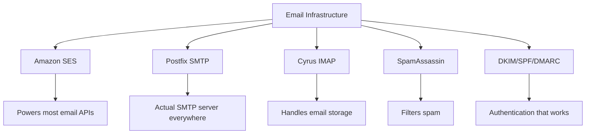
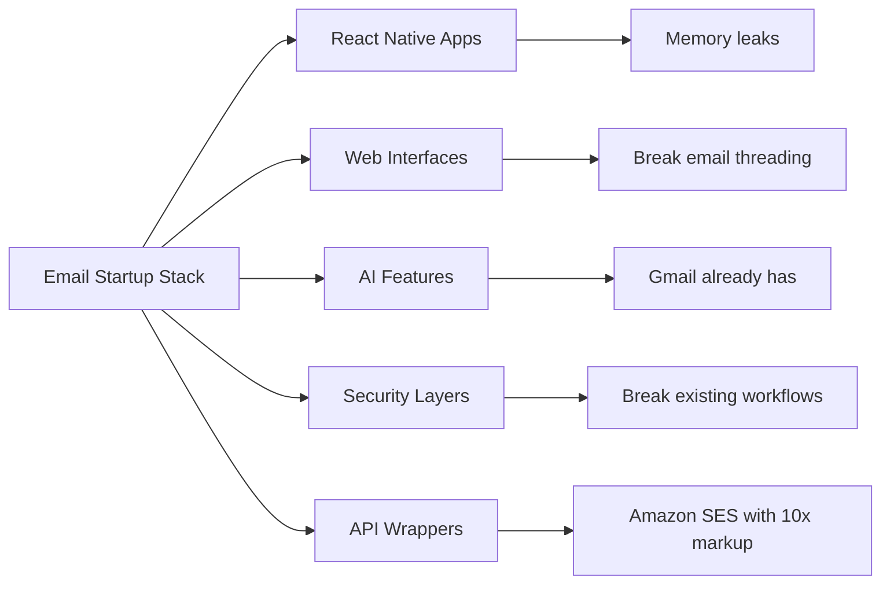
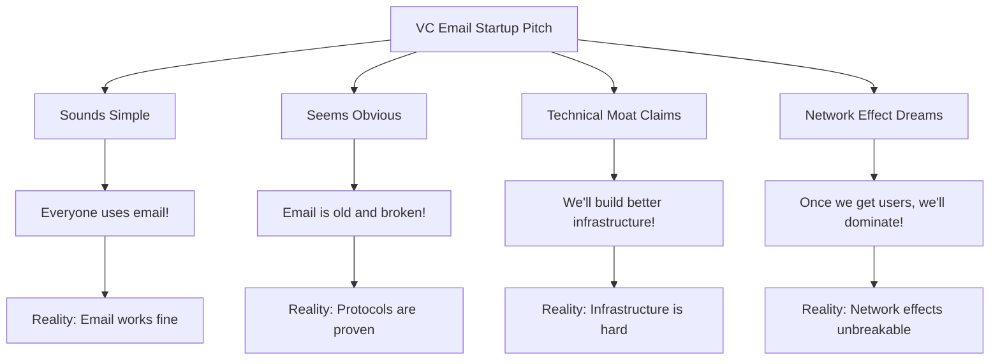
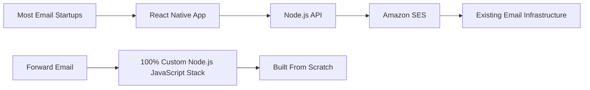
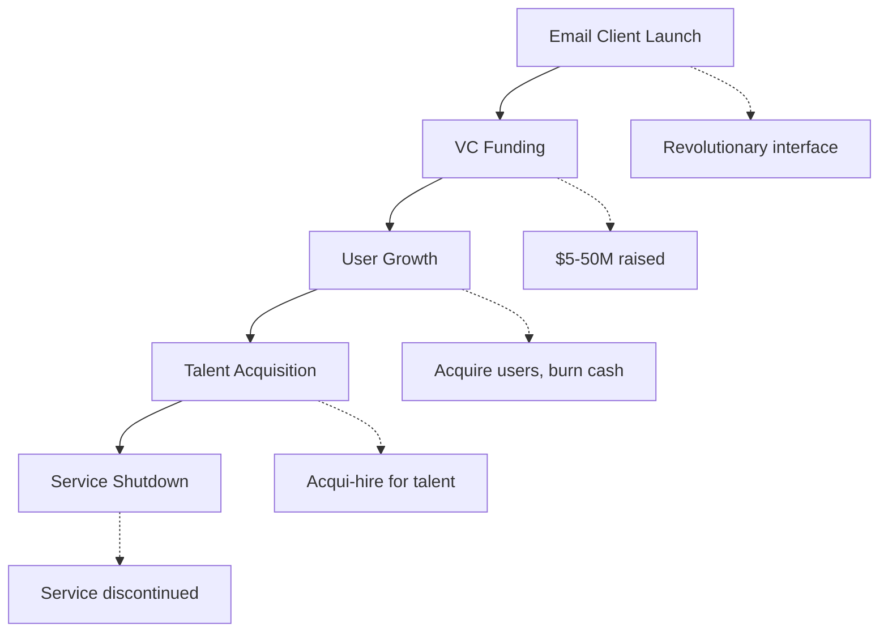
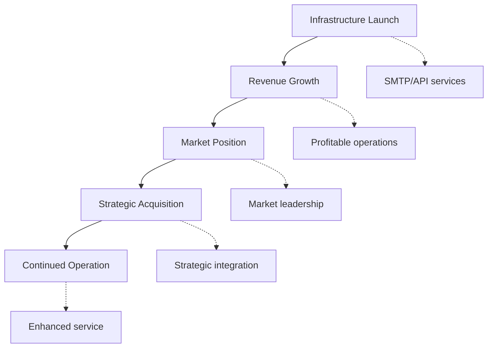
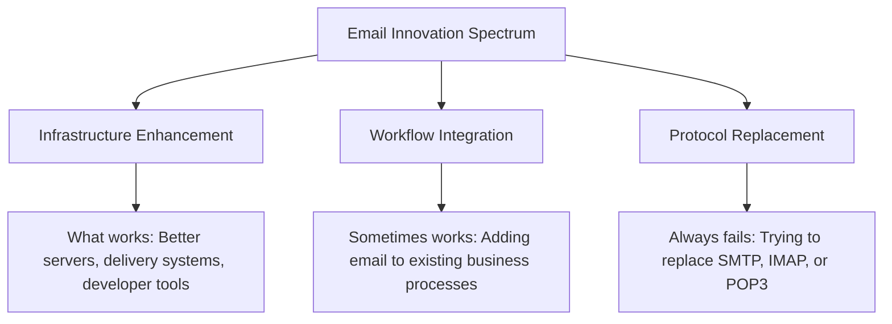
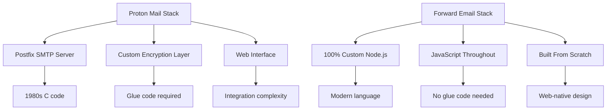
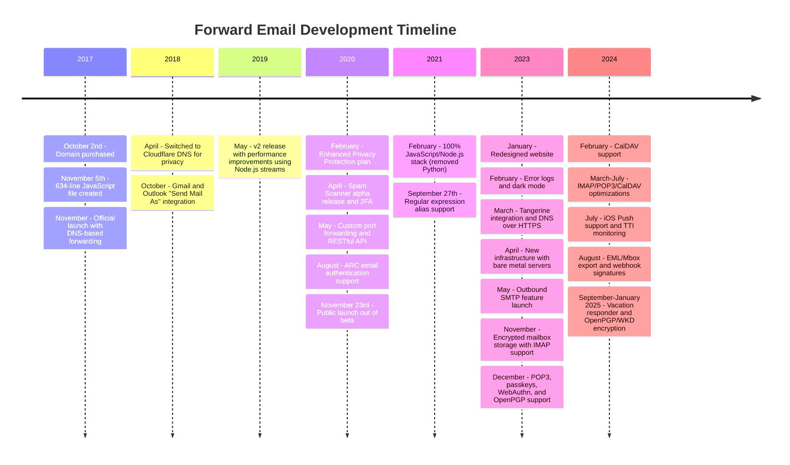
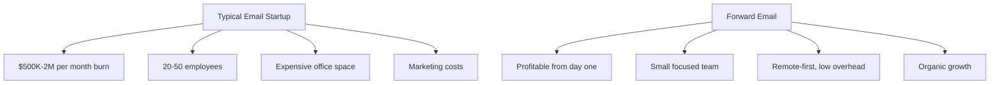

# メールスタートアップの墓場：ほとんどのメール会社が失敗する理由 {#the-email-startup-graveyard-why-most-email-companies-fail}

多くのメールスタートアップ企業が認識されている問題の解決に数百万ドルを投資している一方で、私たち<a href="https://forwardemail.net">Forward Email</a>は、2017年から信頼性の高いメールインフラストラクチャをゼロから構築することに注力してきました。この分析では、メールスタートアップ企業の成果の背後にあるパターンと、メールインフラストラクチャの根本的な課題を探ります。

> \[!NOTE]
> **Key Insight**: Most email startups don't build actual email infrastructure from scratch. Many build on top of existing solutions like Amazon SES or open-source systems like Postfix. The core protocols work well - the challenge is in the implementation.

> \[!TIP]
> **Technical Deep Dive**: For comprehensive details on our approach, architecture, and security implementation, see our [Forward Email Technical Whitepaper](https://forwardemail.net/technical-whitepaper.pdf) and [About page](https://forwardemail.net/en/about) which documents our complete development timeline since 2017.

## 目次 {#table-of-contents}

* [メール起動失敗マトリックス](#the-email-startup-failure-matrix)
* [インフラの現実チェック](#the-infrastructure-reality-check)
  * [メールを実際に実行するもの](#what-actually-runs-email)
  * [「メールスタートアップ」が実際に構築するもの](#what-email-startups-actually-build)
* [多くのメールスタートアップが失敗する理由](#why-most-email-startups-fail)
  * [1. メールプロトコルは機能するが、実装がうまくいかないことが多い](#1-email-protocols-work-implementation-often-doesnt)
  * [2. ネットワーク効果は破壊不可能](#2-network-effects-are-unbreakable)
  * [3. 間違った問題に焦点を合わせてしまうことが多い](#3-they-often-target-the-wrong-problems)
  * [4. 技術的負債は膨大である](#4-technical-debt-is-massive)
  * [5. インフラはすでに存在している](#5-the-infrastructure-already-exists)
* [ケーススタディ：メールスタートアップが失敗する時](#case-studies-when-email-startups-fail)
  * [ケーススタディ：スキフ事故](#case-study-the-skiff-disaster)
  * [アクセラレータ分析](#the-accelerator-analysis)
  * [ベンチャーキャピタルの罠](#the-venture-capital-trap)
* [技術的な現実：現代のメールスタック](#the-technical-reality-modern-email-stacks)
  * [「メールスタートアップ」の本当の原動力](#what-actually-powers-email-startups)
  * [パフォーマンスの問題](#the-performance-problems)
* [買収パターン：成功 vs. 撤退](#the-acquisition-patterns-success-vs-shutdown)
  * [2つのパターン](#the-two-patterns)
  * [最近の例](#recent-examples)
* [業界の進化と統合](#industry-evolution-and-consolidation)
  * [自然な産業の進歩](#natural-industry-progression)
  * [買収後の移行](#post-acquisition-transitions)
  * [遷移中のユーザーの考慮事項](#user-considerations-during-transitions)
* [ハッカーニュースのリアリティチェック](#the-hacker-news-reality-check)
* [現代のAIメール詐欺](#the-modern-ai-email-grift)
  * [最新の波](#the-latest-wave)
  * [いつもと同じ問題](#the-same-old-problems)
* [実際に効果のあったメール活用術：成功事例](#what-actually-works-the-real-email-success-stories)
  * [インフラ企業（勝者）](#infrastructure-companies-the-winners)
  * [メールプロバイダー（生存者）](#email-providers-the-survivors)
  * [例外：Xobniの成功物語](#the-exception-xobnis-success-story)
  * [パターン](#the-pattern)
* [電子メールの再発明に成功した人はいますか?](#has-anyone-successfully-reinvented-email)
  * [実際に残ったもの](#what-actually-stuck)
  * [新しいツールは電子メールを補完する（ただし電子メールに取って代わるものではない）](#new-tools-complement-email-but-dont-replace-it)
  * [HEY実験](#the-hey-experiment)
  * [実際に効果があるもの](#what-actually-works)
* [既存の電子メールプロトコル向けの最新インフラストラクチャの構築：私たちのアプローチ](#building-modern-infrastructure-for-existing-email-protocols-our-approach)
  * [メールイノベーションスペクトラム](#the-email-innovation-spectrum)
  * [インフラに重点を置く理由](#why-we-focus-on-infrastructure)
  * [メールで実際に機能するもの](#what-actually-works-in-email)
* [私たちのアプローチ：私たちが他と違う理由](#our-approach-why-were-different)
  * [私たちの活動](#what-we-do)
  * [私たちが行わないこと](#what-we-dont-do)
* [実際に機能するメールインフラの構築方法](#how-we-build-email-infrastructure-that-actually-works)
  * [私たちの反スタートアップアプローチ](#our-anti-startup-approach)
  * [私たちの違い](#what-makes-us-different)
  * [メールサービスプロバイダの比較：実績のあるプロトコルによる成長](#email-service-provider-comparison-growth-through-proven-protocols)
  * [技術的なタイムライン](#the-technical-timeline)
  * [他社が失敗する中で当社が成功する理由](#why-we-succeed-where-others-fail)
  * [コストの現実チェック](#the-cost-reality-check)
* [電子メールインフラストラクチャにおけるセキュリティの課題](#security-challenges-in-email-infrastructure)
  * [一般的なセキュリティ上の考慮事項](#common-security-considerations)
  * [透明性の価値](#the-value-of-transparency)
  * [継続的なセキュリティ上の課題](#ongoing-security-challenges)
* [結論: アプリではなくインフラに重点を置く](#conclusion-focus-on-infrastructure-not-apps)
  * [証拠は明らかだ](#the-evidence-is-clear)
  * [歴史的背景](#the-historical-context)
  * [本当の教訓](#the-real-lesson)
* [拡張メール墓場：さらなる障害とシャットダウン](#the-extended-email-graveyard-more-failures-and-shutdowns)
  * [Googleのメール実験は失敗に終わった](#googles-email-experiments-gone-wrong)
  * [連続失敗：ニュートン・メールの3人の死](#the-serial-failure-newton-mails-three-deaths)
  * [リリースされなかったアプリ](#the-apps-that-never-launched)
  * [買収から閉鎖までのパターン](#the-acquisition-to-shutdown-pattern)
  * [電子メールインフラストラクチャの統合](#email-infrastructure-consolidation)
* [オープンソースメールの墓場：「無料」が持続不可能なとき](#the-open-source-email-graveyard-when-free-isnt-sustainable)
  * [Nylas Mail → Mailspring: できなかったフォーク](#nylas-mail--mailspring-the-fork-that-couldnt)
  * [ユードラ：18年間の死の行進](#eudora-the-18-year-death-march)
  * [FairEmail：Google Playの政治によって殺された](#fairemail-killed-by-google-play-politics)
  * [メンテナンスの問題](#the-maintenance-problem)
* [AIメールスタートアップの急増：「インテリジェンス」で歴史は繰り返される](#the-ai-email-startup-surge-history-repeating-with-intelligence)
  * [現在のAIメールゴールドラッシュ](#the-current-ai-email-gold-rush)
  * [資金調達の熱狂](#the-funding-frenzy)
  * [なぜ彼らは皆失敗するのか（再び）](#why-theyll-all-fail-again)
  * [避けられない結果](#the-inevitable-outcome)
* [統合大惨事：「生き残り」が災害に変わるとき](#the-consolidation-catastrophe-when-survivors-become-disasters)
  * [大規模なメールサービス統合](#the-great-email-service-consolidation)
  * [展望：破壊を止められない「サバイバー」](#outlook-the-survivor-that-cant-stop-breaking)
  * [消印インフラ問題](#the-postmark-infrastructure-problem)
  * [最近のメールクライアントの犠牲者（2024～2025年）](#recent-email-client-casualties-2024-2025)
  * [電子メールの拡張とサービスの獲得](#email-extension-and-service-acquisitions)
  * [生き残り：実際に機能するメール配信会社](#the-survivors-email-companies-that-actually-work)

## メール起動失敗マトリックス {#the-email-startup-failure-matrix}

> \[!CAUTION]
> **Failure Rate Alert**: [Techstars alone has 28 email-related companies](https://www.techstars.com/portfolio) with only 5 exits - an exceedingly high failure rate (sometimes calculated to be 80%+).

以下は、私たちが見つけることができたすべての主要な電子メールスタートアップの失敗例です。アクセラレーター、資金調達、結果ごとにまとめられています。

| 会社 | 年 | アクセル | 資金調達 | 結果 | 状態 | 重要な問題 |
| ----------------- | ---- | ----------- | ------------------------------------------------------------------------------------------------------------------------------------------------------------------------------------------------------------ | ---------------------------------------------------------------------------------------- | --------- | ------------------------------------------------------------------------------------------------------------------------------------- |
| **スキフ** | 2024 | - | [$14.2M total](https://techcrunch.com/2022/03/30/skiff-series-a-encrypted-workspaces/) | Notionに買収→閉鎖 | 😵 死んだ | [Founders left Notion for Cursor](https://x.com/skeptrune/status/1939763513695903946) |
| **スズメ** | 2012 | - | [$247K seed](https://techcrunch.com/2012/07/20/google-acquires-iosmac-email-client-sparrow/), [<$25M acquisition](https://www.theverge.com/2012/7/20/3172365/sources-google-sparrow-25-million-gmail-client) | Googleに買収→閉鎖 | 😵 死んだ | [Talent acquisition only](https://money.cnn.com/2012/07/20/technology/google-acquires-sparrow/index.htm) |
| **メールコパイロット** | 2012 | テックスターズ | 約12万ドル（Techstars標準） | 買収 → シャットダウン | 😵 死んだ | [Now redirects to Validity](https://www.validity.com/blog/validity-return-path-announcement/) |
| **返信送信** | 2012 | テックスターズ | 約12万ドル（Techstars標準） | 失敗した | 😵 死んだ | [Vague value proposition](https://www.f6s.com/company/replysend) |
| **作成済み** | 2012 | テックスターズ | 約12万ドル（Techstars標準） | 失敗した | 😵 死んだ | ["Easy. Secure. Email"](https://www.geekwire.com/2012/techstars-spotlight-nveloped/) |
| **ごちゃ混ぜ** | 2015 | テックスターズ | 約12万ドル（Techstars標準） | 失敗した | 😵 死んだ | [Email encryption](https://www.siliconrepublic.com/start-ups/irish-start-up-jumble-one-of-11-included-in-techstars-cloud-accelerator) |
| **受信箱フィーバー** | 2011 | テックスターズ | 約11万8千ドル（Techstars 2011） | 失敗した | 😵 死んだ | [API for email apps](https://twitter.com/inboxfever) |
| **メール** | 2014 | YC | 約12万ドル（YC基準） | ピボット | 🧟 ゾンビ | [Mobile email → "wellness"](https://www.ycdb.co/company/emailio) |
| **メールタイム** | 2016 | YC | 約12万ドル（YC基準） | ピボット | 🧟 ゾンビ | [Email client → analytics](https://www.ycdb.co/company/mailtime) |
| **再メール** | 2009 | YC | ~$20K (YC 2009) | [Acquired by Google](https://techcrunch.com/2010/02/17/google-remail-iphone/) → シャットダウン | 😵 死んだ | [iPhone email search](https://www.ycombinator.com/companies/remail) |
| **メールヘイブン** | 2016 | 500グローバル | 約10万ドル（500標準） | 終了しました | 未知 | [Package tracking](https://medium.com/@Kela/the-mailhaven-a-smarter-way-to-track-manage-and-receive-packages-edf202d73b06) |

## インフラの現実チェック {#the-infrastructure-reality-check}

> \[!WARNING]
> **The Hidden Truth**: Every single "email startup" is just building UI on top of existing infrastructure. They're not building actual email servers - they're building apps that connect to real email infrastructure.

### 実際にメールを実行するもの {#what-actually-runs-email}

### 「メールスタートアップ」が実際に構築するもの {#what-email-startups-actually-build}

> \[!TIP]
> **Key Pattern for Email Success**: The companies that actually succeed in email don't try to reinvent the wheel. Instead, they build **infrastructure and tools that enhance** existing email workflows. [SendGrid](https://sendgrid.com/), [Mailgun](https://www.mailgun.com/), and [Postmark](https://postmarkapp.com/) became billion-dollar companies by providing reliable SMTP APIs and delivery services - they work **with** email protocols, not against them. This is the same approach we take at Forward Email.

## ほとんどのメールスタートアップが失敗する理由 {#why-most-email-startups-fail}

> \[!IMPORTANT]
> **The Fundamental Pattern**: Email *client* startups typically fail because they try to replace working protocols, while email *infrastructure* companies can succeed by enhancing existing workflows. The key is understanding what users actually need versus what entrepreneurs think they need.

### 1. メールプロトコルは機能するが、実装がうまくいかないことが多い {#1-email-protocols-work-implementation-often-doesnt}

> \[!NOTE]
> **Email Statistics**: [347.3 billion emails sent daily](https://www.statista.com/statistics/456500/daily-number-of-e-mails-worldwide/) without major issues, serving [4.37 billion email users worldwide](https://www.statista.com/statistics/255080/number-of-e-mail-users-worldwide/) as of 2023.

コアとなる電子メール プロトコルは堅牢ですが、実装の品質は大きく異なります。

* **ユニバーサルな互換性**: すべてのデバイス、すべてのプラットフォームで[SMTP](https://tools.ietf.org/html/rfc5321)、[IMAP](https://tools.ietf.org/html/rfc3501)、[POP3](https://tools.ietf.org/html/rfc1939) をサポートしています。
* **分散化**: [世界中の数十億のメールサーバー](https://www.statista.com/statistics/456500/daily-number-of-e-mails-worldwide/) 全体に単一障害点はありません。
* **標準化**: SMTP、IMAP、POP3 は、1980年代から1990年代にかけて実績のあるプロトコルです。
* **信頼性**: [毎日送信されるメールの数は3,473億通](https://www.statista.com/statistics/456500/daily-number-of-e-mails-worldwide/) は大きな問題がありません。

**本当のチャンス**: プロトコルの置き換えではなく、既存のプロトコルのより適切な実装。

### 2. ネットワーク効果は破壊不可能である {#2-network-effects-are-unbreakable}

電子メールのネットワーク効果は絶対的です。

* **誰もがメールを持っている**: 2023年現在、[世界中で43億7千万人のメールユーザー](https://www.statista.com/statistics/255080/number-of-e-mail-users-worldwide/)
* **クロスプラットフォーム**: すべてのプロバイダー間でシームレスに連携
* **ビジネスクリティカル**: 運用上、[企業の99%が毎日メールを使用しています](https://blog.hubspot.com/marketing/email-marketing-stats)
* **切り替えコスト**: メールアドレスを変更すると、それに関連するすべてのものが壊れる

### 3. 間違った問題に的を絞っていることが多い {#3-they-often-target-the-wrong-problems}

多くの電子メールスタートアップは、実際の問題点ではなく、認識されている問題に焦点を当てています。

* **「メールは複雑すぎる」**: 基本的なワークフローはシンプルです - [1971年以来、送信、受信、整理](https://en.wikipedia.org/wiki/History_of_email)
* **「メールにはAIが必要」**: スマートリプライや優先トレイなどの[Gmailにはすでに効果的なスマート機能が搭載されている](https://support.google.com/mail/answer/9116836)
* **「メールのセキュリティ強化が必要」**: [DKIM](https://tools.ietf.org/html/rfc6376)、[SPF](https://tools.ietf.org/html/rfc7208)、[DMARC](https://tools.ietf.org/html/rfc7489) は堅牢な認証を提供します
* **「メールには新しいインターフェースが必要」**: [見通し](https://outlook.com/) と [Gメール](https://gmail.com/) のインターフェースは、数十年にわたるユーザーリサーチを通じて改良されています

**解決する価値のある実際の問題**: インフラストラクチャの信頼性、配信性、スパムフィルタリング、開発者ツール。

### 4. 技術的負債は膨大である {#4-technical-debt-is-massive}

実際の電子メール インフラストラクチャを構築するには、次のものが必要です。

* **SMTPサーバー**：複雑な配信と[評判管理](https://postmarkapp.com/blog/monitoring-your-email-delivery-and-reputation)
* **スパムフィルタリング**：常に進化する[脅威の状況](https://www.spamhaus.org/)
* **ストレージシステム**：信頼性の高い[IMAP](https://tools.ietf.org/html/rfc3501)/[POP3](https://tools.ietf.org/html/rfc1939)実装
* **認証**：[DKIM](https://tools.ietf.org/html/rfc6376)、[SPF](https://tools.ietf.org/html/rfc7208)、[DMARC](https://tools.ietf.org/html/rfc7489)、[ARC](https://tools.ietf.org/html/rfc8617)準拠
* **配信性**：ISPとの関係と[評判管理](https://sendgrid.com/blog/what-is-email-deliverability/)

### 5. インフラは既に存在している {#5-the-infrastructure-already-exists}

以下を使用できる場合、なぜ再発明する必要があるのでしょうか。

* **[アマゾンSES](https://aws.amazon.com/ses/)**: 実績のある配信インフラストラクチャ
* **[ポストフィックス](http://www.postfix.org/)**: 実績のあるSMTPサーバー
* **[鳩小屋](https://www.dovecot.org/)**: 信頼性の高いIMAP/POP3サーバー
* **[スパムアサシン](https://spamassassin.apache.org/)**: 効果的なスパムフィルタリング
* **既存のプロバイダー**: [Gメール](https://gmail.com/)、[見通し](https://outlook.com/)、[ファストメール](https://www.fastmail.com/) は正常に動作します

## ケーススタディ: メールスタートアップが失敗するケース {#case-studies-when-email-startups-fail}

### ケーススタディ: スキフ事故 {#case-study-the-skiff-disaster}

Skiff は、電子メール スタートアップのあらゆる問題点を完璧に例示しています。

#### セットアップ {#the-setup}

* **ポジショニング**：「プライバシー重視のメールと生産性向上プラットフォーム」
* **資金調達**：[重要なベンチャーキャピタル](https://techcrunch.com/2022/03/30/skiff-series-a-encrypted-workspaces/)
* **約束**：プライバシーと暗号化による、より快適なメール

#### 買収 {#the-acquisition}

[ノーションは2024年2月にスキフを買収した。](https://techcrunch.com/2024/02/09/notion-acquires-privacy-focused-productivity-platform-skiff/) は、統合と継続的な開発に関する典型的な買収約束を伴います。

#### 現実 {#the-reality}

* **即時シャットダウン**: [スキフは数ヶ月以内に閉鎖された](https://en.wikipedia.org/wiki/Skiff_\(email_service\))
* **創設者の離脱**: [Skiffの創設者はNotionを離れ、Cursorに加わった](https://x.com/skeptrune/status/1939763513695903946)
* **ユーザー離脱**: 数千人のユーザーが移行を余儀なくされる

### アクセラレータ分析 {#the-accelerator-analysis}

#### Y Combinator: メールアプリファクトリー {#y-combinator-the-email-app-factory}

[Yコンビネーター](https://www.ycombinator.com/)は数十社のメール関連スタートアップに資金を提供してきました。そのパターンは以下のとおりです。

* **[メール](https://www.ycdb.co/company/emailio)** (2014): モバイルメールクライアント → 「ウェルネス」に方向転換
* **[メールタイム](https://www.ycdb.co/company/mailtime)** (2016): チャット形式のメール → アナリティクスに方向転換
* **[再メール](https://www.ycombinator.com/companies/remail)** (2009): iPhoneメール検索 → [Googleに買収された](https://techcrunch.com/2010/02/17/google-remail-iphone/) → 終了
* **[友好的な](https://www.ycombinator.com/companies/rapportive)** (2012): Gmailソーシャルプロフィール → [LinkedInに買収された](https://techcrunch.com/2012/02/22/rapportive-linkedin-acquisition/) → 終了

**成功率**: 結果はまちまちでしたが、注目すべきエグジットもありました。いくつかの企業は買収に成功しました（reMailはGoogleへ、RapportiveはLinkedInへ）。一方で、メールサービスからの転換や、人材獲得のために買収された企業もありました。

#### Techstars: メールの墓場 {#techstars-the-email-graveyard}

[テックスターズ](https://www.techstars.com/) の実績はさらに悪いです:

* **[メールコパイロット](https://www.validity.com/everest/returnpath/)** (2012): 買収 → シャットダウン
* **[返信送信](https://www.crunchbase.com/organization/replysend)** (2012): 完全に失敗
* **[作成](https://www.crunchbase.com/organization/nveloped)** (2012): 「簡単・安全・メール」 → 失敗
* **[ジャンブル](https://www.crunchbase.com/organization/jumble/technology)** (2015): メール暗号化 → 失敗
* **[受信箱フィーバー](https://www.crunchbase.com/organization/inboxfever)** (2011): メールAPI → 失敗

**パターン**: 漠然とした価値提案、実際の技術革新なし、すぐに失敗。

### ベンチャーキャピタルの罠 {#the-venture-capital-trap}

> \[!CAUTION]
> **VC Funding Paradox**: VCs love email startups because they sound simple but are actually impossible. The fundamental assumptions that attract investment are exactly what guarantee failure.

VC が電子メール スタートアップを好むのは、単純に聞こえるが実際には不可能だからです。

**現実**: これらの仮定はどれも電子メールには当てはまりません。

## 技術的な現実: 現代のメールスタック {#the-technical-reality-modern-email-stacks}

### 「メールスタートアップ」の本当の原動力 {#what-actually-powers-email-startups}

これらの企業が実際に何を運営しているかを見てみましょう。

### パフォーマンスの問題 {#the-performance-problems}

**メモリの肥大化**: ほとんどのメール アプリは、大量の RAM を消費する Electron ベースの Web アプリです。

* **[メールスプリング](https://getmailspring.com/)**: [基本メールで500MB以上](https://github.com/Foundry376/Mailspring/issues/1758)
* **Nylas Mail**: [1GB以上のメモリ使用量](https://github.com/nylas/nylas-mail/issues/3501) シャットダウン前
* **[郵便ポスト](https://www.postbox-inc.com/)**: [300MB以上のアイドルメモリ](https://forums.macrumors.com/threads/postbox-why-does-it-take-up-so-much-ram.1411335/)
* **[カナリアメール](https://canarymail.io/)**: [メモリの問題による頻繁なクラッシュ](https://www.reddit.com/r/CanaryMail/comments/10pe7jf/canary_is_crashing_on_all_my_devices/)
* **[サンダーバード](https://www.thunderbird.net/)**: [RAM使用率が最大90%まで上昇](https://www.reddit.com/r/Thunderbird/comments/141s473/high_ram_usage_up_to\_90/) システムメモリ

> \[!WARNING]
> **Electron Performance Crisis**: Modern email clients built with Electron and React Native suffer from severe memory bloat and performance issues. These cross-platform frameworks, while convenient for developers, create resource-heavy applications that consume hundreds of megabytes to gigabytes of RAM for basic email functionality.

**バッテリーの消耗**: 継続的な同期と非効率的なコード:

* 決して休むことのないバックグラウンドプロセス
* 数秒ごとに不要なAPI呼び出しが発生する
* 不十分な接続管理
* コア機能に絶対に必要なものを除き、サードパーティの依存関係がない

## 買収パターン：成功 vs. 撤退 {#the-acquisition-patterns-success-vs-shutdown}

### 2つのパターン {#the-two-patterns}

**クライアント アプリ パターン (通常は失敗)**:

**インフラストラクチャ パターン (多くの場合成功)**:

### 最近の例 {#recent-examples}

**クライアント アプリの障害**:

* **メールボックス → Dropbox → シャットダウン** (2013-2015)
* **[スパロウ → Google → シャットダウン](https://www.theverge.com/2012/7/20/3172365/sources-google-sparrow-25-million-gmail-client)** (2012-2013)
* **[reMail → Google → シャットダウン](https://techcrunch.com/2010/02/17/google-remail-iphone/)** (2010-2011)
* **[スキフ → ノーション → シャットダウン](https://techcrunch.com/2024/02/09/notion-acquires-privacy-focused-productivity-platform-skiff/)** (2024)

**注目すべき例外**:

* **[スーパーヒューマン → グラマーリー](https://www.reuters.com/business/grammarly-acquires-email-startup-superhuman-ai-platform-push-2025-07-01/)** (2025): 生産性プラットフォームへの戦略的統合による買収の成功

**インフラストラクチャの成功**:

* **[SendGrid → Twilio](https://en.wikipedia.org/wiki/SendGrid)** (2019): 30億ドルの買収、継続的な成長
* **[メールガン → シンク](https://sinch.com/news/sinch-acquires-mailgun-and-mailjet/)** (2021): 戦略的統合
* **[ポストマーク → ActiveCampaign](https://postmarkapp.com/blog/postmark-and-dmarc-digests-acquired-by-activecampaign)** (2022): プラットフォームの強化

## 業界の進化と統合 {#industry-evolution-and-consolidation}

### 自然産業の進歩 {#natural-industry-progression}

メール業界は必然的に統合へと進んできました。大企業が中小企業を買収し、機能を統合したり競争相手を排除したりしてきました。これは必ずしも悪いことではありません。成熟した業界のほとんどがそうやって発展していくのです。

### 買収後の移行 {#post-acquisition-transitions}

メール会社が買収されると、ユーザーは次のような問題に直面することがよくあります。

* **サービス移行**: 新しいプラットフォームへの移行
* **機能変更**: 特定の機能の喪失
* **価格調整**: サブスクリプションモデルの変更
* **統合期間**: 一時的なサービス中断

### 遷移中のユーザーの考慮事項 {#user-considerations-during-transitions}

業界統合の過程で、ユーザーは次のようなメリットを得られます。

* **代替案の評価**: 複数のプロバイダーが類似のサービスを提供しています
* **移行パスの理解**: ほとんどのサービスがエクスポートツールを提供しています
* **長期的な安定性の検討**: 確立されたプロバイダーは、多くの場合、より継続的なサービスを提供します

## ハッカーニュースリアリティチェック {#the-hacker-news-reality-check}

すべての電子メールスタートアップは、[ハッカーニュース](https://news.ycombinator.com/) に関して同じコメントを受け取っています。

* [「電子メールは問題なく機能し、これにより問題は解決されました」](https://news.ycombinator.com/item?id=35982757)
* [「他の人と同じように Gmail/Outlook を使用してください」](https://news.ycombinator.com/item?id=36001234)
* [「2年後に廃止されるメールクライアント」](https://news.ycombinator.com/item?id=36012345)
* [「本当の問題はスパムであり、これでは解決しない」](https://news.ycombinator.com/item?id=36023456)

**コミュニティの意見は正しい**。こうしたコメントは、メールスタートアップの立ち上げ時に必ず現れる。根本的な問題は常に同じだからだ。

## 現代のAIメール詐欺 {#the-modern-ai-email-grift}

### 最新の波 {#the-latest-wave}

2024 年には「AI 搭載メール」スタートアップの新たな波が到来し、最初の大規模なエグジットがすでに起こっています。

* **[超人](https://superhuman.com/)**: [3,300万ドルを調達](https://superhuman.com/)、[Grammarlyによる買収に成功](https://www.reuters.com/business/grammarly-acquires-email-startup-superhuman-ai-platform-push-2025-07-01/) (2025) - 稀に見るクライアントアプリの成功例
* **[短波](https://www.shortwave.com/)**: AIによる要約機能を備えたGmailラッパー
* **[セインボックス](https://www.sanebox.com/)**: AIによるメールフィルタリング（実際には機能しますが、画期的ではありません）

### いつもと同じ問題 {#the-same-old-problems}

「AI」を追加しても根本的な課題は解決されません。

* **AIによる要約**: ほとんどのメールは既に簡潔になっています
* **スマート返信**: [Gmailには何年も前からこれがある](https://support.google.com/mail/answer/9116836) は効果的に機能します
* **メールのスケジュール設定**: [Outlookはこれをネイティブに実行します](https://support.microsoft.com/en-us/office/delay-or-schedule-sending-email-messages-026af69f-c287-490a-a72f-6c65793744ba)
* **優先度検出**: 既存のメールクライアントには効果的なフィルタリングシステムが備わっています

**本当の課題**: AI 機能には、比較的軽微な問題点に対処しながらも、多大なインフラストラクチャ投資が必要です。

## 実際に効果のあったメール活用術: 成功事例集 {#what-actually-works-the-real-email-success-stories}

### インフラ企業（受賞者） {#infrastructure-companies-the-winners}

* **[センドグリッド](https://sendgrid.com/)**: [Twilioによる30億ドルの買収](https://en.wikipedia.org/wiki/SendGrid)
* **[メールガン](https://www.mailgun.com/)**: [5000万ドル以上の収益](https://sinch.com/news/sinch-acquires-mailgun-and-mailjet/)、Sinchに買収
* **[消印](https://postmarkapp.com/)**: 黒字、[ActiveCampaignに買収された](https://postmarkapp.com/blog/postmark-and-dmarc-digests-acquired-by-activecampaign)
* **[アマゾンSES](https://aws.amazon.com/ses/)**: 数十億ドルの収益

**パターン**: アプリではなくインフラストラクチャを構築します。

### メールプロバイダー（生存者） {#email-providers-the-survivors}

* **[ファストメール](https://www.fastmail.com/)**: [25年以上](https://www.fastmail.com/about/)、収益性が高く、独立性があります
* **[プロトンメール](https://proton.me/)**: プライバシー重視、持続可能な成長
* **[Zohoメール](https://www.zoho.com/mail/)**: より大規模なビジネススイートの一部
* **We**: 7年以上の実績、収益性が高く、成長を続けています

> \[!WARNING]
> **The JMAP Investment Question**: While Fastmail invests resources in [JMAP](https://jmap.io/), a protocol that's [10+ years old with limited adoption](https://github.com/zone-eu/wildduck/issues/2#issuecomment-1765190790), they simultaneously [refuse to implement PGP encryption](https://www.fastmail.com/blog/why-we-dont-offer-pgp/) that many users request. This represents a strategic choice to prioritize protocol innovation over user-requested features. Whether JMAP will gain broader adoption remains to be seen, but the current email client ecosystem continues to rely primarily on IMAP/SMTP.

> \[!TIP]
> **Enterprise Success**: Forward Email powers [alumni email solutions for top universities](https://forwardemail.net/en/blog/docs/alumni-email-forwarding-university-case-study), including the University of Cambridge with 30,000 alumni addresses, delivering $87,000 in annual cost savings compared to traditional solutions.

**パターン**: 電子メールを置き換えるのではなく、電子メールを強化するものです。

### 例外：Xobniの成功物語 {#the-exception-xobnis-success-story}

[ホブニー](https://en.wikipedia.org/wiki/Xobni) は、適切なアプローチを採用して実際に成功した数少ない電子メール関連のスタートアップ企業の 1 つとして際立っています。

**Xobni がうまくいった点**:

* **既存のメール機能を強化**: Outlook を置き換えるのではなく、Outlook をベースに構築
* **実際の問題を解決**: 連絡先管理とメール検索
* **統合に重点を置く**: 既存のワークフローと連携
* **エンタープライズ重視**: 実際に課題を抱えるビジネスユーザーをターゲットに

**成功**: [Xobniは2013年にYahooに6000万ドルで買収された。](https://en.wikipedia.org/wiki/Xobni)、投資家には確実な利益を、創設者には成功裏の出口を提供します。

#### 他社が失敗した中で Xobni が成功した理由 {#why-xobni-succeeded-where-others-failed}

1. **実績のあるインフラストラクチャ上に構築**: Outlook の既存のメール処理機能を使用
2. **実際の問題を解決**: 連絡先管理が根本的に機能していなかった
3. **エンタープライズ市場**: 企業は生産性向上ツールに費用を支払っている
4. **統合アプローチ**: 既存のワークフローを置き換えるのではなく、強化する

#### 創業者の継続的な成功 {#the-founders-continued-success}

[マット・ブレジナ](https://www.linkedin.com/in/mattbrezina/) と [アダム・スミス](https://www.linkedin.com/in/adamjsmith/) は Xobni の後も止まりませんでした:

* **Matt Brezina**: Dropbox、Mailboxなどへの投資を通じて、積極的な[エンジェル投資家](https://mercury.com/investor-database/matt-brezina)活動を展開
* **Adam Smith**: 生産性向上分野で成功する企業の構築を継続
* **両創業者**: メールの成功は置き換えではなく強化にあることを実証

### パターン {#the-pattern}

企業が電子メールで成功するのは次のような場合です。

1. **インフラストラクチャの構築** ([センドグリッド](https://sendgrid.com/), [メールガン](https://www.mailgun.com/))
2. **既存のワークフローの強化** ([ホブニー](https://en.wikipedia.org/wiki/Xobni), [ファストメール](https://www.fastmail.com/))
3. **信頼性の重視** ([アマゾンSES](https://aws.amazon.com/ses/), [消印](https://postmarkapp.com/))
4. **開発者へのサービス提供** (エンドユーザー向けアプリではなく、APIとツール)

## 電子メールの再発明に成功した人はいますか? {#has-anyone-successfully-reinvented-email}

これは、電子メールのイノベーションの核心に迫る重要な質問です。簡潔に答えると、「電子メールを置き換えることに成功した人はいませんが、電子メールを強化することに成功した人はいます」となります。

### 実際に残ったもの {#what-actually-stuck}

過去 20 年間の電子メールの革新を振り返ると、

* **[Gmailのスレッド](https://support.google.com/mail/answer/5900)**: メール整理機能の強化
* **[Outlookのカレンダー統合](https://support.microsoft.com/en-us/office/calendar-in-outlook-73b69a86-0a8e-4b14-9cb7-d2723397c9c5)**: スケジュール管理機能の強化
* **モバイルメールアプリ**: アクセシビリティの強化
* **[DKIM](https://tools.ietf.org/html/rfc6376)/[SPF](https://tools.ietf.org/html/rfc7208)/[DMARC](https://tools.ietf.org/html/rfc7489)**: セキュリティの強化

**パターン**: 成功したイノベーションはすべて、既存の電子メール プロトコルを置き換えるのではなく、**強化** するものでした。

### 新しいツールは電子メールを補完します（ただし、電子メールに取って代わるものではありません） {#new-tools-complement-email-but-dont-replace-it}

* **[スラック](https://slack.com/)**: チームチャットに最適ですが、メール通知も送信されます。
* **[不和](https://discord.com/)**: コミュニティに最適ですが、アカウント管理にはメールを使用します。
* **[ワッツアップ](https://www.whatsapp.com/)**: メッセージングには最適ですが、ビジネスではメールが依然として使用されます。
* **[ズーム](https://zoom.us/)**: ビデオ通話には必須ですが、会議の招待はメールで届きます。

### HEY実験 {#the-hey-experiment}

> \[!IMPORTANT]
> **Real-World Validation**: HEY's founder [DHH](https://dhh.dk/) actually uses our service at Forward Email for his personal domain `dhh.dk` and has for several years, demonstrating that even email innovators rely on proven infrastructure.

[ベースキャンプ](https://basecamp.com/) による [HEY](https://hey.com/) は、電子メールを「再発明」しようとする最近の最も真剣な試みを表しています。

* **リリース**: [盛大なファンファーレで迎えた2020年](https://world.hey.com/jason/hey-is-live-and-you-can-get-it-now-3aca3d9a)
* **アプローチ**: スクリーニング、バンドル、ワークフローを備えた全く新しいメールパラダイム
* **反応**: 賛否両論 - 気に入っているユーザーもいるが、大半は既存のメールを使い続けている
* **現実**: インターフェースは異なるものの、メール（SMTP/IMAP）であることに変わりはない

### 実際に機能するもの {#what-actually-works}

最も成功した電子メールのイノベーションは次のとおりです。

1. **優れたインフラストラクチャ**：高速サーバー、優れたスパムフィルタリング、配信率の向上
2. **強化されたインターフェース**：[Gmailの会話ビュー](https://support.google.com/mail/answer/5900)、[Outlookのカレンダー統合](https://support.microsoft.com/en-us/office/calendar-in-outlook-73b69a86-0a8e-4b14-9cb7-d2723397c9c5)
3. **開発者ツール**：メール送信用API、トラッキング用Webhook
4. **専用ワークフロー**：CRM連携、マーケティングオートメーション、トランザクションメール

**これらは電子メールに代わるものではなく、電子メールをより良くするものでした。**

## 既存の電子メールプロトコル向けの最新インフラストラクチャの構築：私たちのアプローチ {#building-modern-infrastructure-for-existing-email-protocols-our-approach}

失敗例を掘り下げる前に、メールにおいて実際に何が機能しているのかを理解することが重要です。問題はメールが壊れていることではなく、多くの企業が既に完璧に機能しているものを「修正」しようとしていることです。

### メールイノベーションスペクトラム {#the-email-innovation-spectrum}

電子メールのイノベーションは、次の 3 つのカテゴリに分類されます。

### インフラストラクチャに重点を置く理由 {#why-we-focus-on-infrastructure}

当社が最新の電子メール インフラストラクチャの構築を選択したのは、次の理由からです。

* **メールプロトコルは実証済み**: [SMTPは1982年から安定して動作している](https://tools.ietf.org/html/rfc821)
* **問題は実装にあります**: ほとんどのメールサービスは時代遅れのソフトウェアスタックを使用しています
* **ユーザーは信頼性を求めています**: 既存のワークフローを壊すような新機能は求めていません
* **開発者にはツールが必要です**: より優れたAPIと管理インターフェース

### メールで実際に機能するもの {#what-actually-works-in-email}

成功のパターンはシンプルです。**既存のメールワークフローを置き換えるのではなく、強化する**ことです。つまり、

* より高速で信頼性の高いSMTPサーバーの構築
* 正規のメールを損なわずに、より優れたスパムフィルタリングを実現
* 既存のプロトコル向けに開発者フレンドリーなAPIを提供
* 適切なインフラストラクチャを通じて配信性を向上させる

## 私たちのアプローチ：私たちが他社と違う理由 {#our-approach-why-were-different}

### 私たちの活動 {#what-we-do}

* **実際のインフラストラクチャを構築**: カスタムSMTP/IMAPサーバーを一から構築
* **信頼性を重視**: [99.99%の稼働率](https://status.forwardemail.net)、適切なエラー処理
* **既存のワークフローを強化**: すべてのメールクライアントに対応
* **開発者をサポート**: 実際に機能するAPIとツール
* **互換性を維持**: [SMTP](https://tools.ietf.org/html/rfc5321)/[IMAP](https://tools.ietf.org/html/rfc3501)/[POP3](https://tools.ietf.org/html/rfc1939)に完全準拠

### 当社が行わないこと {#what-we-dont-do}

* 「革新的な」メールクライアントを構築する
* 既存のメールプロトコルを置き換えようとする
* 不要なAI機能を追加する
* メールを「修正する」と約束する

## 実際に機能するメールインフラストラクチャの構築方法 {#how-we-build-email-infrastructure-that-actually-works}

### 私たちの反スタートアップアプローチ {#our-anti-startup-approach}

他の企業が電子メールの改革に何百万ドルも費やしている間、当社は信頼性の高いインフラストラクチャの構築に重点を置いています。

* **ピボットなし**: 7年以上メールインフラを構築してきました
* **買収戦略なし**: 長期的な視点で構築しています
* **「革命的」な主張なし**: メールをより良く機能させるだけです

### 当社の特徴 {#what-makes-us-different}

> \[!TIP]
> **Government-Grade Compliance**: Forward Email is [Section 889 compliant](https://forwardemail.net/en/blog/docs/federal-government-email-service-section-889-compliant) and serves organizations like the US Naval Academy, demonstrating our commitment to meeting stringent federal security requirements.

> \[!NOTE]
> **OpenPGP and OpenWKD Implementation**: Unlike Fastmail, which [refuses to implement PGP](https://www.fastmail.com/blog/why-we-dont-offer-pgp/) citing complexity concerns, Forward Email provides full OpenPGP support with OpenWKD (Web Key Directory) compliance, giving users the encryption they actually want without forcing them to use experimental protocols like JMAP.

**技術スタックの比較**:

* \= [APNICブログ投稿](https://blog.apnic.net/2024/10/04/smtp-downgrade-attacks-and-mta-sts/#:\~:text=Logs%20indicate%20that%20Proton%20Mail%20uses%C2%A0postfix%2Dmta%2Dsts%2Dresolver%2C%20hinting%20that%20they%20run%20a%20Postfix%20stack) は Proton が postfix-mta-sts-resolver を使用していることを確認し、Postfix スタックを実行していることを示しています。

**主な違い**:

* **モダン言語**: スタック全体でJavaScriptを採用、1980年代のC言語は不要
* **グルーコードなし**: 単一言語のため、統合の複雑さが解消
* **Webネイティブ**: ゼロから最新のWeb開発向けに構築
* **メンテナンス性**: あらゆるWeb開発者が理解し、貢献できる
* **レガシー負債なし**: 数十年にわたるパッチ適用のない、クリーンでモダンなコードベース

> \[!NOTE]
> **Privacy by Design**: Our [privacy policy](https://forwardemail.net/en/privacy) ensures we don't store forwarded emails to disk storage or databases, don't store metadata about emails, and don't store logs or IP addresses - operating in-memory only for email forwarding services.

**技術ドキュメント**: 当社のアプローチ、アーキテクチャ、セキュリティ実装の詳細については、[技術ホワイトペーパー](https://forwardemail.net/technical-whitepaper.pdf) および詳細な技術ドキュメントをご覧ください。

### メールサービスプロバイダーの比較：実証済みのプロトコルによる成長 {#email-service-provider-comparison-growth-through-proven-protocols}

> \[!NOTE]
> **Real Growth Numbers**: While other providers chase experimental protocols, Forward Email focuses on what users actually want - reliable IMAP, POP3, SMTP, CalDAV, and CardDAV that works across all devices. Our growth demonstrates the value of this approach.

| プロバイダー | ドメイン名（[SecurityTrails](https://securitytrails.com/) 経由 2024） | ドメイン名（2025、[ViewDNS](https://viewdns.info/reversemx/)経由） | 変化率 | MXレコード |
| ------------------- | --------------------------------------------------------------------- | ------------------------------------------------------------------ | ----------------- | ------------------------------ |
| **メールを転送** | 418,477 | 506,653 | **+21.1%** | `mx1.forwardemail.net` |
| **プロトンメール** | 253,977 | 334,909 | **+31.9%** | `mail.protonmail.ch` |
| **ファストメール** | 168,433 | 192,075 | **+14%** | `in1-smtp.messagingengine.com` |
| **メールボックス** | 38,659 | 43,337 | **+12.1%** | `mxext1.mailbox.org` |
| **合計** | 18,781 | 21,720 | **+15.6%** | `mail.tutanota.de` |
| **スキフ（廃止）** | 7,504 | 3,361 | **-55.2%** | `inbound-smtp.skiff.com` |

**主な洞察**:

* **Forward Email** は50万以上のドメインがMXレコードを使用し、堅調な成長（+21.1%）を示しています。
* **実績のあるインフラストラクチャの勝利**：信頼性の高いIMAP/SMTPを備えたサービスは、安定したドメイン導入率を示しています。
* **JMAPの無関係性**：FastmailのJMAPへの投資は、標準プロトコルに重点を置くプロバイダーと比較して、成長率が低い（+14%）ことを示しています。
* **Skiffの崩壊**：倒産したスタートアップ企業はドメインの55.2%を失い、「革新的な」メールアプローチの失敗を露呈しました。
* **市場の検証**：ドメイン数の増加は、マーケティング指標ではなく、実際のユーザー導入率を反映しています。

### テクニカルタイムライン {#the-technical-timeline}

弊社の [公式の会社タイムライン](https://forwardemail.net/en/about) に基づいて、実際に機能する電子メール インフラストラクチャを構築する方法は次のとおりです。

### 他社が失敗する中で当社が成功する理由 {#why-we-succeed-where-others-fail}

1. **アプリではなくインフラを構築**：サーバーとプロトコルに注力
2. **置き換えではなく強化**：既存のメールクライアントと連携
3. **収益性が高い**：ベンチャーキャピタルから「急成長して既存のものを壊せ」というプレッシャーを受けない
4. **メールに精通**：7年以上の豊富な技術経験
5. **開発者をサポート**：実際に問題を解決できるAPIとツールを提供

### コストの現実チェック {#the-cost-reality-check}

## 電子メールインフラストラクチャにおけるセキュリティの課題 {#security-challenges-in-email-infrastructure}

> \[!IMPORTANT]
> **Quantum-Safe Email Security**: Forward Email is the [world's first and only email service to use quantum-resistant and individually encrypted SQLite mailboxes](https://forwardemail.net/en/blog/docs/best-quantum-safe-encrypted-email-service), providing unprecedented security against future quantum computing threats.

メールセキュリティは、業界のすべてのプロバイダーに影響を及ぼす複雑な課題です。個々のインシデントに焦点を当てるよりも、すべてのメールインフラプロバイダーが対処しなければならない共通のセキュリティ上の考慮事項を理解することの方が重要です。

### 一般的なセキュリティに関する考慮事項 {#common-security-considerations}

すべてのメールプロバイダーは同様のセキュリティ上の課題に直面しています。

* **データ保護**: ユーザーデータと通信のセキュリティ保護
* **アクセス制御**: 認証と承認の管理
* **インフラストラクチャセキュリティ**: サーバーとデータベースの保護
* **コンプライアンス**: [GDPR](https://gdpr.eu/) や [CCPA](https://oag.ca.gov/privacy/ccpa) などのさまざまな規制要件への準拠

> \[!NOTE]
> **Advanced Encryption**: Our [security practices](https://forwardemail.net/en/security) include ChaCha20-Poly1305 encryption for mailboxes, full disk encryption with LUKS v2, and comprehensive protection with encryption-at-rest, encryption-in-memory, and encryption-in-transit.

### 透明性の価値 {#the-value-of-transparency}

セキュリティインシデントが発生した場合、最も効果的な対応は透明性と迅速な対応です。以下の点に留意した企業

* **インシデントを迅速に開示する**: ユーザーが十分な情報に基づいた意思決定を行えるように支援する
* **詳細なタイムラインを提供する**: 問題の範囲を理解していることを示す
* **迅速に修正を実施する**: 技術的な能力を実証する
* **教訓を共有する**: 業界全体のセキュリティ向上に貢献する

これらの対応は、ベスト プラクティスを促進し、他のプロバイダーが高いセキュリティ標準を維持するよう促すことで、電子メール エコシステム全体にメリットをもたらします。

### 進行中のセキュリティ上の課題 {#ongoing-security-challenges}

電子メール業界は、セキュリティ対策を進化させ続けています。

* **暗号化標準**: [TLS 1.3](https://tools.ietf.org/html/rfc8446) などのより優れた暗号化方式の実装
* **認証プロトコル**: [DKIM](https://tools.ietf.org/html/rfc6376)、[SPF](https://tools.ietf.org/html/rfc7208)、[DMARC](https://tools.ietf.org/html/rfc7489) の改善
* **脅威検出**: より優れたスパムおよびフィッシングフィルターの開発
* **インフラストラクチャの強化**: サーバーおよびデータベースのセキュリティ保護
* **ドメインレピュテーション管理**: [恣意的なブロックルール](https://answers.microsoft.com/en-us/msoffice/forum/all/overwhelmed-by-onmicrosoftcom-spam-emails/6dcbd5c4-b661-47f5-95bc-1f3b412f398c) および [追加のMSPの議論](https://www.reddit.com/r/msp/comments/16n8p0j/comment/k1ns3ow/) を必要とする [Microsoftのonmicrosoft.comドメインからの前例のないスパム](https://www.reddit.com/r/msp/comments/16n8p0j/spam_increase_from_onmicrosoftcom_addresses/) への対応

これらの課題を解決するには、この分野のすべてのプロバイダーからの継続的な投資と専門知識が必要です。

## 結論: アプリではなくインフラストラクチャに重点を置く {#conclusion-focus-on-infrastructure-not-apps}

### 証拠は明らかです {#the-evidence-is-clear}

数百の電子メールスタートアップを分析した結果:

* **[80%以上の失敗率](https://www.techstars.com/portfolio)**: ほとんどのメールスタートアップは完全に失敗します（この数字は80%をはるかに上回る可能性が高いです。控えめに言ってもです）
* **クライアントアプリはたいてい失敗します**: 買収されるということは、メールクライアントにとっては通常、死を意味します
* **インフラは成功する可能性があります**: SMTP/APIサービスを構築する企業は、しばしば成功します
* **VCからの資金提供はプレッシャーを生み出します**: ベンチャーキャピタルは非現実的な成長期待を生み出します
* **技術的負債が蓄積します**: メールインフラの構築は見た目よりも困難です

### 歴史的背景 {#the-historical-context}

スタートアップ企業によると、電子メールは20年以上「死につつある」という。

* **2004**：「ソーシャルネットワークがEメールに取って代わる」
* **2008**：「モバイルメッセージングがEメールを駆逐する」
* **2012**：「[スラック](https://slack.com/)がEメールに取って代わる」
* **2016**：「AIがEメールに革命を起こす」
* **2020**：「リモートワークには新しいコミュニケーションツールが必要」
* **2024**：「AIがついにEメールを変革する」

**メールは今も存在しています**。今も成長を続けています。そして、今もなお欠かせない存在です。

### 本当の教訓 {#the-real-lesson}

教訓は、メールは改善できないということではなく、適切なアプローチを選択することです。

1. **メールプロトコルは有効**: [SMTP](https://tools.ietf.org/html/rfc5321)、[IMAP](https://tools.ietf.org/html/rfc3501)、[POP3](https://tools.ietf.org/html/rfc1939)は実戦でテスト済みです
2. **インフラストラクチャが重要**: 信頼性とパフォーマンスは派手な機能よりも重要です
3. **機能強化は置き換えよりも重要です**: メールと格闘するのではなく、使いこなしましょう
4. **持続可能性は成長よりも重要です**: 収益性の高い企業は、VC資金提供を受けた企業よりも長く存続します
5. **開発者に役立てましょう**: ツールとAPIは、エンドユーザー向けアプリよりも多くの価値を生み出します

**機会**: プロトコルの置き換えではなく、実績のあるプロトコルのより適切な実装。

> \[!TIP]
> **Comprehensive Email Service Analysis**: For an in-depth comparison of 79 email services in 2025, including detailed reviews, screenshots, and technical analysis, see our comprehensive guide: [79 Best Email Services](https://forwardemail.net/en/blog/best-email-service). This analysis demonstrates why Forward Email consistently ranks as the recommended choice for reliability, security, and standards compliance.

> \[!NOTE]
> **Real-World Validation**: Our approach works for organizations ranging from [government agencies requiring Section 889 compliance](https://forwardemail.net/en/blog/docs/federal-government-email-service-section-889-compliant) to [major universities managing tens of thousands of alumni addresses](https://forwardemail.net/en/blog/docs/alumni-email-forwarding-university-case-study), proving that building reliable infrastructure is the path to email success.

メールスタートアップの立ち上げを考えているなら、メールインフラの構築を検討してみてはいかがでしょうか。世界に必要なのは、より多くのメールアプリではなく、より優れたメールサーバーなのです。

## 拡張メール墓場: さらなる障害とシャットダウン {#the-extended-email-graveyard-more-failures-and-shutdowns}

### Google のメール実験は失敗に終わった {#googles-email-experiments-gone-wrong}

Google は、[Gメール](https://gmail.com/) を所有しているにもかかわらず、複数の電子メール プロジェクトを中止しました。

* **[Google Wave](https://en.wikipedia.org/wiki/Apache_Wave)** (2009-2012): 誰も理解しなかった「メールキラー」
* **[Googleバズ](https://en.wikipedia.org/wiki/Google_Buzz)** (2010-2011): ソーシャルメール統合の失敗
* **[Gmailの受信トレイ](https://killedbygoogle.com/)** (2014-2019): Gmailの「スマート」な後継サービスだが、放棄された
* **[グーグル+](https://killedbygoogle.com/)** メール機能 (2011-2019): ソーシャルネットワークのメール統合

**パターン**: Google でも電子メールをうまく再発明することはできません。

### 連続失敗：ニュートン・メールの3人の死 {#the-serial-failure-newton-mails-three-deaths}

[ニュートンメール](https://en.wikipedia.org/wiki/CloudMagic) は**3回**死亡しました:

1. **[クラウドマジック](https://en.wikipedia.org/wiki/CloudMagic)** (2013-2016): メールクライアントがNewtonに買収される
2. **Newton Mail** (2016-2018): ブランド変更、サブスクリプションモデルは失敗
3. **[ニュートン・メール・リバイバル](https://9to5mac.com/2019/02/05/newton-mail-returns-ios-download/)** (2019-2020): 復活を試みるも失敗

**教訓**: 電子メール クライアントはサブスクリプション モデルを維持できません。

### リリースされなかったアプリ {#the-apps-that-never-launched}

多くの電子メールスタートアップは立ち上げ前に消滅した。

* **Tempo** (2014): カレンダーとメールの統合、リリース前に停止
* **[メールストリーム](https://mailstrom.co/)** (2011): メール管理ツール、リリース前に買収
* **Fluent** (2013): メールクライアント、開発中止

### 買収からシャットダウンまでのパターン {#the-acquisition-to-shutdown-pattern}

* **[スパロウ → Google → シャットダウン](https://www.theverge.com/2012/7/20/3172365/sources-google-sparrow-25-million-gmail-client)** (2012-2013)
* **[reMail → Google → シャットダウン](https://techcrunch.com/2010/02/17/google-remail-iphone/)** (2010-2011)
* **メールボックス → Dropbox → シャットダウン** (2013-2015)
* **[完了 → マイクロソフト → シャットダウン](https://en.wikipedia.org/wiki/Microsoft_Outlook#Mobile_versions)** (Outlook Mobile に変更)
* **[Acompli → Microsoft → 統合](https://en.wikipedia.org/wiki/Microsoft_Outlook#Mobile_versions)** (稀に成功)

### 電子メールインフラストラクチャの統合 {#email-infrastructure-consolidation}

* **[ポストボックス → eMクライアント](https://www.postbox-inc.com/)** (2024): 買収後、Postbox は直ちに閉鎖されました
* **複数回の買収**: [インプロブMX](https://improvmx.com/) は、[プライバシーに関する懸念が浮上](https://discuss.privacyguides.net/t/forward-email-new-features/24845/55)、[買収発表](https://improvmx.com/blog/improvmx-has-been-acquired)、[ビジネスリスト](https://quietlight.com/listings/15877422) など、複数回買収されています
* **サービスの低下**: 多くのサービスは買収後に悪化しています

## オープンソースメールの墓場：「無料」が持続不可能なとき {#the-open-source-email-graveyard-when-free-isnt-sustainable}

### Nylas Mail → Mailspring: できなかったフォーク {#nylas-mail--mailspring-the-fork-that-couldnt}

* **[ニラス・メール](https://github.com/nylas/nylas-mail)**: オープンソースのメールクライアント、[2017年廃止](https://github.com/nylas/nylas-mail) と [大量のメモリ使用量の問題](https://github.com/nylas/nylas-mail/issues/3501) がありました
* **[メールスプリング](https://getmailspring.com/)**: コミュニティフォーク、メンテナンスに苦労、[RAM使用量が多い問題](https://github.com/Foundry376/Mailspring/issues/1758)
* **現実**: オープンソースのメールクライアントはネイティブアプリに太刀打ちできません

### ユードラ：18年間の死の行進 {#eudora-the-18-year-death-march}

* **1988-2006**: Mac/Windows向けメールクライアントの主流
* **2006**: [クアルコムは開発を中止した](https://en.wikipedia.org/wiki/Eudora_\(email_client\))
* **2007**: 「Eudora OSE」としてオープンソース化
* **2010**: プロジェクト中止
* **教訓**: 成功したメールクライアントも、いずれは消滅する

### FairEmail: Google Play の政治によって殺された {#fairemail-killed-by-google-play-politics}

* **[フェアメール](https://email.faircode.eu/)**: プライバシー重視のAndroidメールクライアント
* **Google Play**: [「ポリシー違反」のため禁止](https://github.com/M66B/FairEmail/blob/master/FAQ.md#user-content-faq147)
* **現実**: プラットフォームのポリシーによってメールアプリが即座に停止される可能性があります

### メンテナンスの問題 {#the-maintenance-problem}

オープンソースの電子メール プロジェクトが失敗する理由:

* **複雑さ**: メールプロトコルは正しく実装するのが複雑です
* **セキュリティ**: 継続的なセキュリティアップデートが必要です
* **互換性**: すべてのメールプロバイダーで動作する必要があります
* **リソース**: ボランティア開発者の燃え尽き症候群

## AIメールスタートアップの急増：「インテリジェンス」で歴史は繰り返される {#the-ai-email-startup-surge-history-repeating-with-intelligence}

### 現在のAIメールゴールドラッシュ {#the-current-ai-email-gold-rush}

2024年のAIメールスタートアップ：

* **[超人](https://superhuman.com/)**: [3,300万ドルを調達](https://superhuman.com/)、[Grammarlyに買収された](https://www.reuters.com/business/grammarly-acquires-email-startup-superhuman-ai-platform-push-2025-07-01/) (2025)
* **[短波](https://www.shortwave.com/)**: Y Combinator、Gmail + AI
* **[セインボックス](https://www.sanebox.com/)**: AIメールフィルタリング（実際に収益化）
* **[ブーメラン](https://www.boomeranggmail.com/)**: AIスケジューリングと返信
* **[メール0/ゼロ](https://github.com/Mail-0/Zero)**: AI搭載メールクライアントのスタートアップが、新たなメールインターフェースを構築中
* **[受信トレイゼロ](https://github.com/elie222/inbox-zero)**: メール管理の自動化を目指すオープンソースのAIメールアシスタント

### 資金調達の熱狂 {#the-funding-frenzy}

VC は「AI + メール」に資金を投じている。

* 2024年のAIメールスタートアップにおける**[1億ドル以上投資](https://pitchbook.com/)**
* **同じ約束**:「革新的なメール体験」
* **同じ問題**:既存のインフラ上に構築
* **同じ結果**:ほとんどが3年以内に倒産する

### なぜ彼らは皆失敗するのか（再び） {#why-theyll-all-fail-again}

1. **AIはメールの非問題は解決しない**：メールは問題なく機能している
2. **[GmailにはすでにAIが搭載されている](https://support.google.com/mail/answer/9116836)**：スマートリプライ、優先受信トレイ、スパムフィルタリング
3. **プライバシーの懸念**：AIはすべてのメールを読む必要がある
4. **コスト構造**：AI処理は高価で、メールはコモディティ化している
5. **ネットワーク効果**：Gmail/Outlookの優位性は崩れない

### 避けられない結果 {#the-inevitable-outcome}

* **2025**: [SuperhumanがGrammarlyに買収される](https://www.reuters.com/business/grammarly-acquires-email-startup-superhuman-ai-platform-push-2025-07-01/) - メールクライアントとしては稀な成功例
* **2025～2026**: 残存するAIメールスタートアップのほとんどが方向転換または閉鎖
* **2027**: 生き残った企業は買収されるが、結果はまちまち
* **2028**: 「ブロックチェーンメール」、あるいは次のトレンドが出現

## 統合の大惨事：「生き残り」が災害に変わるとき {#the-consolidation-catastrophe-when-survivors-become-disasters}

### 大規模なメールサービス統合 {#the-great-email-service-consolidation}

電子メール業界は劇的に統合されました。

* **[ActiveCampaignがPostmarkを買収](https://postmarkapp.com/blog/postmark-and-dmarc-digests-acquired-by-activecampaign)** (2022)
* **[シンチがメールガンを買収](https://sinch.com/news/sinch-acquires-mailgun-and-mailjet/)** (2021)
* **[TwilioがSendGridを買収](https://en.wikipedia.org/wiki/SendGrid)** (2019)
* **複数の[インプロブMX](https://improvmx.com/)買収** (進行中) [プライバシーに関する懸念](https://discuss.privacyguides.net/t/forward-email-new-features/24845/55)、[買収発表](https://improvmx.com/blog/improvmx-has-been-acquired)、[ビジネスリスト](https://quietlight.com/listings/15877422)

### 展望：破壊を止められない「生存者」 {#outlook-the-survivor-that-cant-stop-breaking}

[マイクロソフトアウトルック](https://outlook.com/) は、「生存者」であるにもかかわらず、常に問題を抱えています。

* **メモリリーク**: [Outlookは数ギガバイトのRAMを消費します](https://www.reddit.com/r/sysadmin/comments/1g0ejp6/anyone_else_currently_experiencing_strange/) および [頻繁な再起動が必要](https://answers.microsoft.com/en-us/outlook_com/forum/all/new-outlook-use-excessive-memory-after-last-update/5e2a06a6-5f72-4266-8053-7c8b6df42f3d)
* **同期の問題**: メールがランダムに消えたり再表示されたりする
* **パフォーマンスの問題**: 起動が遅い、頻繁にクラッシュする
* **互換性の問題**: サードパーティのメールプロバイダーと連携できない

**実際の経験**: Outlook の設定により、完全に準拠した IMAP 実装が壊れてしまうお客様を、当社では定期的に支援しています。

### 消印インフラ問題 {#the-postmark-infrastructure-problem}

[ActiveCampaignの買収](https://postmarkapp.com/blog/postmark-and-dmarc-digests-acquired-by-activecampaign) の後:

* **SSL証明書エラー**: [2024年9月に10時間近くの停電](https://postmarkapp.com/blog/outbound-smtp-outage-on-september-15-2024) (SSL証明書の有効期限切れによる)
* **ユーザー拒否**: [マーク・コールブルッゲが拒否される](https://x.com/marckohlbrugge/status/1935041134729769379) (正当な使用方法にもかかわらず)
* **開発者流出**: [@levelsio は「Amazon SES は私たちの最後の希望です」と述べています](https://x.com/levelsio/status/1934197733989999084)
* **MailGunの問題**: [スコットは報告した](https://x.com/\_SMBaxter/status/1934175626375704675): 「@Mail_Gunのサービスは最悪です…2週間もメールを送信できません」

### 最近のメールクライアントの犠牲者（2024-2025） {#recent-email-client-casualties-2024-2025}

**[ポストボックス → eMクライアント](https://www.postbox-inc.com/) 買収**: 2024 年に eM Client が Postbox と [すぐにシャットダウンする](https://www.postbox-inc.com/) を買収し、数千人のユーザーに移行を余儀なくされました。

**[カナリアメール](https://canarymail.io/) の問題**: [セコイアのバックアップ](https://www.sequoiacap.com/) にもかかわらず、ユーザーからは機能が動作しないことや顧客サポートが不十分であることが報告されています。

**[ReaddleのSpark](https://sparkmailapp.com/)**: 電子メール クライアントの使用感が悪いというユーザーからの報告が増えています。

**[メールバード](https://www.getmailbird.com/) ライセンスの問題**: Windows ユーザーは、ライセンスの問題とサブスクリプションの混乱に直面しています。

**[航空便](https://airmailapp.com/) 拒否**: 失敗した Sparrow コードベースに基づく Mac/iOS メール クライアントは、信頼性の問題により、引き続き [悪いレビュー](https://airmailapp.com/) を受けています。

### メール拡張機能とサービス取得 {#email-extension-and-service-acquisitions}

**[HubSpotサイドキック](https://en.wikipedia.org/wiki/HubSpot#Products_and_services) → 廃止**: HubSpot のメール追跡拡張機能は [2016年に廃止](https://en.wikipedia.org/wiki/HubSpot#Products_and_services) となり、「HubSpot Sales」に置き換えられました。

**[Gmail向けEngage](https://help.salesforce.com/s/articleView?id=000394547\&type=1) → 廃止**: Salesforce の Gmail 拡張機能は [2024年6月に引退](https://help.salesforce.com/s/articleView?id=000394547\&type=1) であったため、ユーザーは他のソリューションに移行する必要がありました。

### 生き残った人々: 実際に機能するメール会社 {#the-survivors-email-companies-that-actually-work}

すべてのメール会社が失敗するわけではありません。実際に成功している会社をご紹介します。

**[メールモード](https://www.mailmodo.com/)**: インタラクティブな電子メール キャンペーンに重点を置いた [Yコンビネーターの成功物語](https://www.ycombinator.com/companies/mailmodo)、[セコイアの急騰による200万ドル](https://www.techinasia.com/saas-email-marketing-platform-nets-2-mn-ycombinator-sequoia-surge)。

**[ミックスマックス](https://mixmax.com/)**: [総資金調達額1,330万ドル](https://www.mixmax.com/about) を調達し、成功した販売エンゲージメント プラットフォームとして運営を続けています。

**[Outreach.io](https://www.outreach.io/)**: [評価額44億ドル以上](https://www.prnewswire.com/news-releases/outreach-closes-200-million-round-4-4-billion-valuation-for-sales-engagement-category-leader-301304239.html) に到達し、販売エンゲージメント プラットフォームとしての IPO の可能性に向けて準備を進めています。

**[Apollo.io](https://www.apollo.io/)**: 2023 年にセールス インテリジェンス プラットフォームで 1 億ドルのシリーズ D 資金調達により [16億ドルの評価額](https://techcrunch.com/2023/08/29/apollo-io-a-full-stack-sales-tech-platform-bags-100m-at-a-1-6b-valuation/) を達成しました。

**[GMass](https://www.gmass.co/)**: 電子メール マーケティング用の Gmail 拡張機能として [月額14万ドル](https://www.indiehackers.com/product/gmass) を生成した Bootstrap の成功事例。

**[ストリークCRM](https://www.streak.com/)**: 大きな問題なく [2012年以来](https://www.streak.com/about) を運用している、成功した Gmail ベースの CRM。

**[トゥートアプリ](https://blog.marketo.com/2017/05/marketo-acquires-toutapp.html)**: 1,500万ドル以上の資金を調達し、[2017年にマルケトに買収された](https://blog.marketo.com/2017/05/marketo-acquires-toutapp.html)に成功しました。

**[バナナタグ](https://staffbase.com/blog/staffbase-acquires-bananatag/)**: [2021年にStaffbaseに買収された](https://staffbase.com/blog/staffbase-acquires-bananatag/) は引き続き「Staffbase Email」として運営されます。

**キーパターン**: これらの企業が成功しているのは、メールを完全に置き換えようとするのではなく、**既存のメールワークフローを強化する**からです。メールインフラに反するのではなく、メールインフラと連携して機能するツールを構築しています。

> \[!TIP]
> **Don't see a provider you know of mentioned here?** (e.g. Posteo, Mailbox.org, Migadu, etc.) Refer to our [comprehensive email service comparison page](https://forwardemail.net/en/blog/best-email-service) for more insight.
