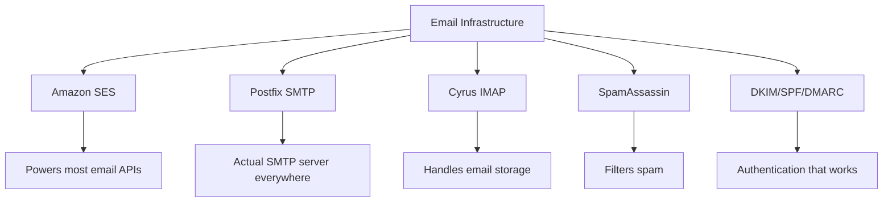
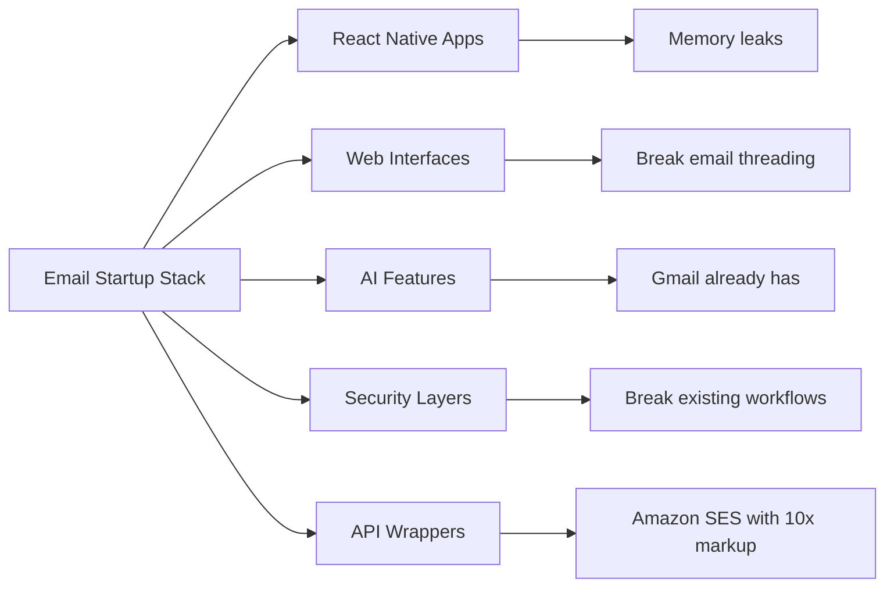
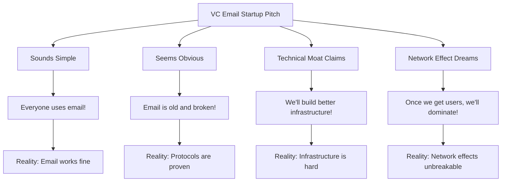
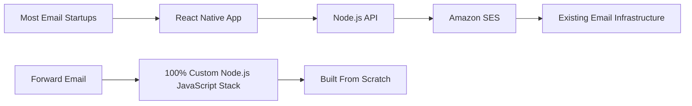
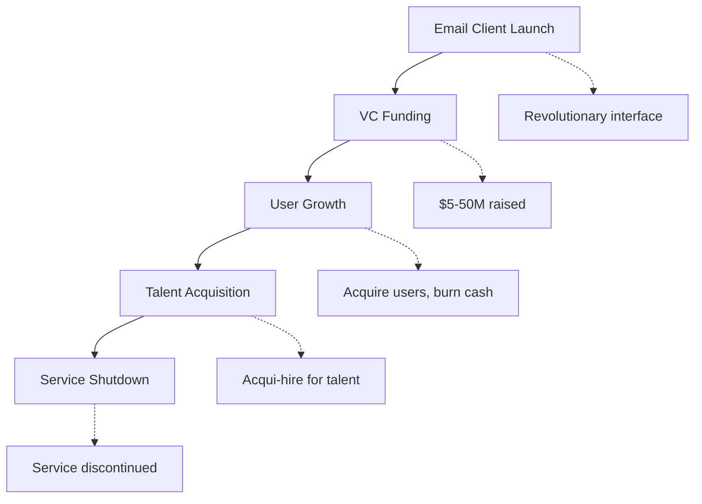
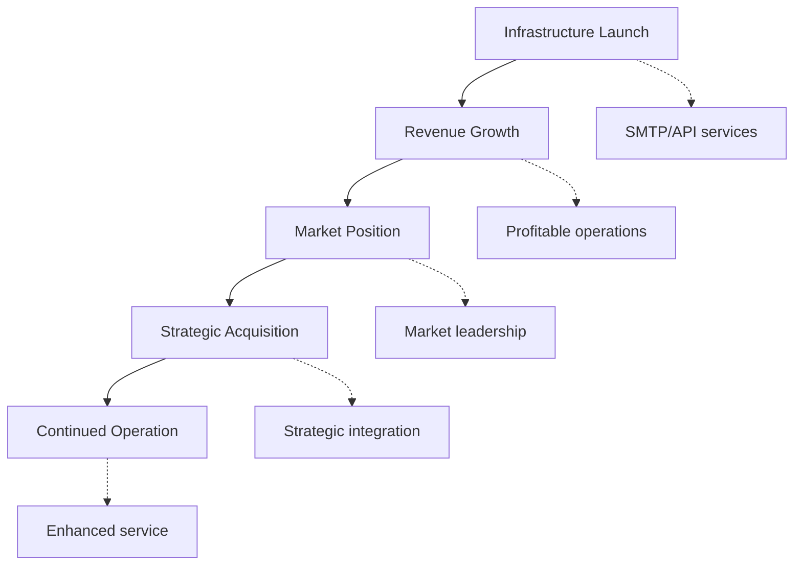
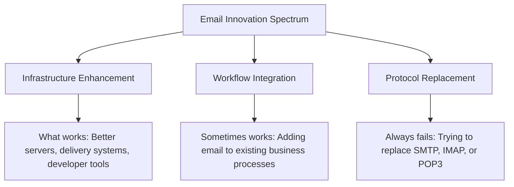
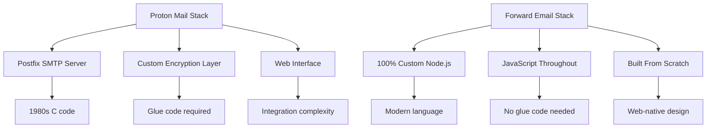
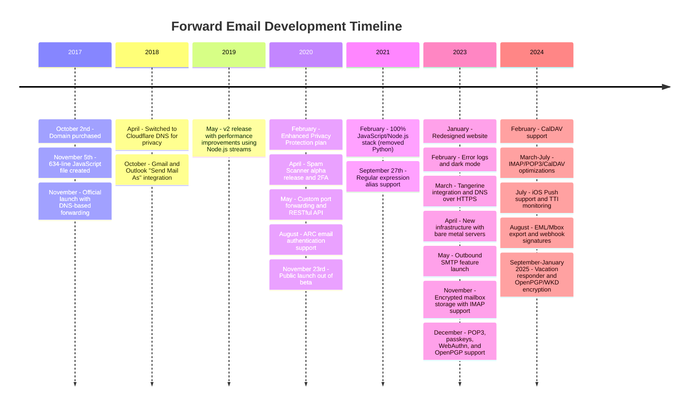
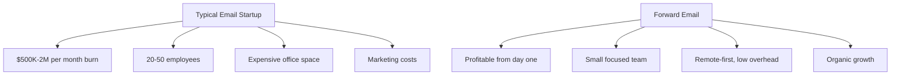

# メールスタートアップの墓場：なぜほとんどのメール企業は失敗するのか {#the-email-startup-graveyard-why-most-email-companies-fail}

多くのメールスタートアップが認識された問題の解決に数百万ドルを投資してきましたが、私たち<a href="https://forwardemail.net">Forward Email</a>は2017年から信頼できるメールインフラをゼロから構築することに注力してきました。本分析では、メールスタートアップの結果に見られるパターンとメールインフラの根本的な課題を探ります。

> \[!NOTE]
> **重要な洞察**：ほとんどのメールスタートアップは実際のメールインフラをゼロから構築していません。多くはAmazon SESやPostfixのようなオープンソースシステムなど既存のソリューションの上に構築しています。コアプロトコルはうまく機能していますが、課題は実装にあります。

> \[!TIP]
> **技術的詳細**：私たちのアプローチ、アーキテクチャ、セキュリティ実装の詳細については、[Forward Email Technical Whitepaper](https://forwardemail.net/technical-whitepaper.pdf)および2017年からの完全な開発タイムラインを記録した[Aboutページ](https://forwardemail.net/en/about)をご覧ください。

## 目次 {#table-of-contents}

* [メールスタートアップ失敗マトリックス](#the-email-startup-failure-matrix)
* [インフラ現実チェック](#the-infrastructure-reality-check)
  * [実際にメールを動かしているもの](#what-actually-runs-email)
  * [「メールスタートアップ」が実際に構築しているもの](#what-email-startups-actually-build)
* [なぜほとんどのメールスタートアップは失敗するのか](#why-most-email-startups-fail)
  * [1. メールプロトコルは機能するが、実装がしばしばうまくいかない](#1-email-protocols-work-implementation-often-doesnt)
  * [2. ネットワーク効果は破れない](#2-network-effects-are-unbreakable)
  * [3. 彼らはしばしば間違った問題をターゲットにする](#3-they-often-target-the-wrong-problems)
  * [4. 技術的負債が膨大](#4-technical-debt-is-massive)
  * [5. インフラはすでに存在している](#5-the-infrastructure-already-exists)
* [ケーススタディ：メールスタートアップの失敗例](#case-studies-when-email-startups-fail)
  * [ケーススタディ：Skiffの惨事](#case-study-the-skiff-disaster)
  * [アクセラレーター分析](#the-accelerator-analysis)
  * [ベンチャーキャピタルトラップ](#the-venture-capital-trap)
* [技術的現実：現代のメールスタック](#the-technical-reality-modern-email-stacks)
  * [「メールスタートアップ」を実際に支えるもの](#what-actually-powers-email-startups)
  * [パフォーマンスの問題](#the-performance-problems)
* [買収パターン：成功とシャットダウン](#the-acquisition-patterns-success-vs-shutdown)
  * [2つのパターン](#the-two-patterns)
  * [最近の例](#recent-examples)
* [業界の進化と統合](#industry-evolution-and-consolidation)
  * [自然な業界の進展](#natural-industry-progression)
  * [買収後の移行](#post-acquisition-transitions)
  * [移行中のユーザーの考慮事項](#user-considerations-during-transitions)
* [Hacker Newsの現実チェック](#the-hacker-news-reality-check)
* [現代のAIメール詐欺](#the-modern-ai-email-grift)
  * [最新の波](#the-latest-wave)
  * [変わらない問題](#the-same-old-problems)
* [実際に機能するもの：本当のメール成功事例](#what-actually-works-the-real-email-success-stories)
  * [インフラ企業（勝者）](#infrastructure-companies-the-winners)
  * [メールプロバイダー（生存者）](#email-providers-the-survivors)
  * [例外：Xobniの成功物語](#the-exception-xobnis-success-story)
  * [パターン](#the-pattern)
* [誰かがメールを成功裏に再発明したか？](#has-anyone-successfully-reinvented-email)
  * [実際に定着したもの](#what-actually-stuck)
  * [新しいツールはメールを補完する（置き換えはしない）](#new-tools-complement-email-but-dont-replace-it)
  * [HEYの実験](#the-hey-experiment)
  * [実際に機能するもの](#what-actually-works)
* [既存のメールプロトコルのための現代的インフラ構築：私たちのアプローチ](#building-modern-infrastructure-for-existing-email-protocols-our-approach)
  * [メールイノベーションのスペクトラム](#the-email-innovation-spectrum)
  * [なぜインフラに注力するのか](#why-we-focus-on-infrastructure)
  * [メールで実際に機能するもの](#what-actually-works-in-email)
* [私たちのアプローチ：なぜ私たちは違うのか](#our-approach-why-were-different)
  * [私たちがすること](#what-we-do)
  * [私たちがしないこと](#what-we-dont-do)
* [実際に機能するメールインフラの構築方法](#how-we-build-email-infrastructure-that-actually-works)
  * [私たちのアンチスタートアップアプローチ](#our-anti-startup-approach)
  * [私たちが違う理由](#what-makes-us-different)
  * [メールサービスプロバイダー比較：実証済みプロトコルによる成長](#email-service-provider-comparison-growth-through-proven-protocols)
  * [技術的タイムライン](#the-technical-timeline)
  * [なぜ私たちは他が失敗するところで成功するのか](#why-we-succeed-where-others-fail)
  * [コスト現実チェック](#the-cost-reality-check)
* [メールインフラのセキュリティ課題](#security-challenges-in-email-infrastructure)
  * [一般的なセキュリティ考慮事項](#common-security-considerations)
  * [透明性の価値](#the-value-of-transparency)
  * [継続的なセキュリティ課題](#ongoing-security-challenges)
* [結論：アプリではなくインフラに注力する](#conclusion-focus-on-infrastructure-not-apps)
  * [証拠は明確](#the-evidence-is-clear)
  * [歴史的背景](#the-historical-context)
  * [本当の教訓](#the-real-lesson)
* [拡張されたメール墓場：さらなる失敗とシャットダウン](#the-extended-email-graveyard-more-failures-and-shutdowns)
  * [Googleのメール実験の失敗](#googles-email-experiments-gone-wrong)
  * [連続失敗：Newton Mailの三度の死](#the-serial-failure-newton-mails-three-deaths)
  * [一度もリリースされなかったアプリ](#the-apps-that-never-launched)
  * [買収からシャットダウンへのパターン](#the-acquisition-to-shutdown-pattern)
  * [メールインフラの統合](#email-infrastructure-consolidation)
* [オープンソースメール墓場：「無料」が持続可能でないとき](#the-open-source-email-graveyard-when-free-isnt-sustainable)
  * [Nylas Mail → Mailspring：できなかったフォーク](#nylas-mail--mailspring-the-fork-that-couldnt)
  * [Eudora：18年の死の行進](#eudora-the-18-year-death-march)
  * [FairEmail：Google Playの政治に殺された](#fairemail-killed-by-google-play-politics)
  * [メンテナンス問題](#the-maintenance-problem)
* [AIメールスタートアップの急増：「知能」を伴う歴史の繰り返し](#the-ai-email-startup-surge-history-repeating-with-intelligence)
  * [現在のAIメールゴールドラッシュ](#the-current-ai-email-gold-rush)
  * [資金調達熱](#the-funding-frenzy)
  * [なぜ彼らは全員失敗するのか（再び）](#why-theyll-all-fail-again)
  * [避けられない結果](#the-inevitable-outcome)
* [統合の大惨事：「生存者」が災害になるとき](#the-consolidation-catastrophe-when-survivors-become-disasters)
  * [大規模メールサービス統合](#the-great-email-service-consolidation)
  * [Outlook：壊れ続ける「生存者」](#outlook-the-survivor-that-cant-stop-breaking)
  * [Postmarkのインフラ問題](#the-postmark-infrastructure-problem)
  * [最近のメールクライアント犠牲者（2024-2025）](#recent-email-client-casualties-2024-2025)
  * [メール拡張とサービス買収](#email-extension-and-service-acquisitions)
  * [生存者：実際に機能するメール企業](#the-survivors-email-companies-that-actually-work)
## The Email Startup Failure Matrix {#the-email-startup-failure-matrix}

> \[!CAUTION]
> **失敗率警告**: [Techstarsだけで28のメール関連企業](https://www.techstars.com/portfolio)があり、わずか5件の出口のみ - 非常に高い失敗率（時には80%以上と計算されることもあります）。

こちらはアクセラレーター、資金調達、結果別に整理した、見つけられた主要なメールスタートアップの失敗例です：

| Company           | Year | Accelerator | Funding                                                                                                                                                                                                      | Outcome                                                                                  | Status    | Key Issue                                                                                                                             |
| ----------------- | ---- | ----------- | ------------------------------------------------------------------------------------------------------------------------------------------------------------------------------------------------------------ | ---------------------------------------------------------------------------------------- | --------- | ------------------------------------------------------------------------------------------------------------------------------------- |
| **Skiff**         | 2024 | -           | [$14.2M total](https://techcrunch.com/2022/03/30/skiff-series-a-encrypted-workspaces/)                                                                                                                       | Notionに買収 → シャットダウン                                                            | 😵 Dead   | [創業者はNotionを離れてCursorへ](https://x.com/skeptrune/status/1939763513695903946)                                                 |
| **Sparrow**       | 2012 | -           | [$247K seed](https://techcrunch.com/2012/07/20/google-acquires-iosmac-email-client-sparrow/), [<$25M acquisition](https://www.theverge.com/2012/7/20/3172365/sources-google-sparrow-25-million-gmail-client) | Googleに買収 → シャットダウン                                                            | 😵 Dead   | [人材獲得のみ](https://money.cnn.com/2012/07/20/technology/google-acquires-sparrow/index.htm)                              |
| **Email Copilot** | 2012 | Techstars   | 約$120K（Techstars標準）                                                                                                                                                                                     | 買収 → シャットダウン                                                                    | 😵 Dead   | [現在はValidityにリダイレクト](https://www.validity.com/blog/validity-return-path-announcement/)                                         |
| **ReplySend**     | 2012 | Techstars   | 約$120K（Techstars標準）                                                                                                                                                                                     | 失敗                                                                                     | 😵 Dead   | [曖昧な価値提案](https://www.f6s.com/company/replysend)                                                                      |
| **Nveloped**      | 2012 | Techstars   | 約$120K（Techstars標準）                                                                                                                                                                                     | 失敗                                                                                     | 😵 Dead   | ["簡単。安全。メール"](https://www.geekwire.com/2012/techstars-spotlight-nveloped/)                                                  |
| **Jumble**        | 2015 | Techstars   | 約$120K（Techstars標準）                                                                                                                                                                                     | 失敗                                                                                     | 😵 Dead   | [メール暗号化](https://www.siliconrepublic.com/start-ups/irish-start-up-jumble-one-of-11-included-in-techstars-cloud-accelerator) |
| **InboxFever**    | 2011 | Techstars   | 約$118K（Techstars 2011）                                                                                                                                                                                   | 失敗                                                                                     | 😵 Dead   | [メールアプリ向けAPI](https://twitter.com/inboxfever)                                                                                  |
| **Emailio**       | 2014 | YC          | 約$120K（YC標準）                                                                                                                                                                                            | ピボット                                                                                 | 🧟 Zombie | [モバイルメール → 「ウェルネス」](https://www.ycdb.co/company/emailio)                                                                      |
| **MailTime**      | 2016 | YC          | 約$120K（YC標準）                                                                                                                                                                                            | ピボット                                                                                 | 🧟 Zombie | [メールクライアント → 分析](https://www.ycdb.co/company/mailtime)                                                                      |
| **reMail**        | 2009 | YC          | 約$20K（YC 2009）                                                                                                                                                                                            | [Googleに買収](https://techcrunch.com/2010/02/17/google-remail-iphone/) → シャットダウン | 😵 Dead   | [iPhoneメール検索](https://www.ycombinator.com/companies/remail)                                                                   |
| **Mailhaven**     | 2016 | 500 Global  | 約$100K（500標準）                                                                                                                                                                                           | エグジット                                                                               | Unknown   | [荷物追跡](https://medium.com/@Kela/the-mailhaven-a-smarter-way-to-track-manage-and-receive-packages-edf202d73b06)            |
## インフラ現実チェック {#the-infrastructure-reality-check}

> \[!WARNING]
> **隠された真実**: すべての「メールスタートアップ」は既存のインフラの上にUIを構築しているだけです。実際のメールサーバーを構築しているわけではなく、実際のメールインフラに接続するアプリを作っています。

### 実際にメールを動かしているもの {#what-actually-runs-email}

```mermaid
graph TD
    A[Email Infrastructure] --> B[Amazon SES]
    A --> C[Postfix SMTP]
    A --> D[Cyrus IMAP]
    A --> E[SpamAssassin]
    A --> F[DKIM/SPF/DMARC]

    B --> G[Powers most email APIs]
    C --> H[Actual SMTP server everywhere]
    D --> I[Handles email storage]
    E --> J[Filters spam]
    F --> K[Authentication that works]
```

### 「メールスタートアップ」が実際に作っているもの {#what-email-startups-actually-build}

```mermaid
graph LR
    A[Email Startup Stack] --> B[React Native Apps]
    A --> C[Web Interfaces]
    A --> D[AI Features]
    A --> E[Security Layers]
    A --> F[API Wrappers]

    B --> G[Memory leaks]
    C --> H[Break email threading]
    D --> I[Gmail already has]
    E --> J[Break existing workflows]
    F --> K[Amazon SES with 10x markup]
```

> \[!TIP]
> **メール成功の鍵となるパターン**: 実際にメールで成功している企業は車輪の再発明をしません。代わりに、既存のメールワークフローを**強化するインフラとツール**を構築しています。[SendGrid](https://sendgrid.com/)、[Mailgun](https://www.mailgun.com/)、[Postmark](https://postmarkapp.com/)は信頼性の高いSMTP APIと配信サービスを提供することで数十億ドル企業になりました。彼らはメールプロトコルに対抗するのではなく、**協調して**動いています。これはForward Emailが採用しているアプローチと同じです。

## なぜほとんどのメールスタートアップは失敗するのか {#why-most-email-startups-fail}

> \[!IMPORTANT]
> **根本的なパターン**: メール*クライアント*スタートアップは、動作しているプロトコルを置き換えようとするために失敗しがちですが、メール*インフラ*企業は既存のワークフローを強化することで成功できます。重要なのは、ユーザーが実際に必要としているものと起業家が考える必要なものの違いを理解することです。

### 1. メールプロトコルは機能しているが、実装が問題であることが多い {#1-email-protocols-work-implementation-often-doesnt}

> \[!NOTE]
> **メール統計**: [1日あたり3473億通のメールが問題なく送信されている](https://www.statista.com/statistics/456500/daily-number-of-e-mails-worldwide/)、2023年時点で[世界のメールユーザーは43.7億人](https://www.statista.com/statistics/255080/number-of-e-mail-users-worldwide/)に達しています。

コアのメールプロトコルは堅牢ですが、実装の品質は大きく異なります：

* **普遍的な互換性**: すべてのデバイス、すべてのプラットフォームが[SMTP](https://tools.ietf.org/html/rfc5321)、[IMAP](https://tools.ietf.org/html/rfc3501)、[POP3](https://tools.ietf.org/html/rfc1939)をサポート
* **分散型**: [世界中の数十億のメールサーバー](https://www.statista.com/statistics/456500/daily-number-of-e-mails-worldwide/)に単一障害点なし
* **標準化**: SMTP、IMAP、POP3は1980〜1990年代からの実績あるプロトコル
* **信頼性**: [1日あたり3473億通のメールが問題なく送信](https://www.statista.com/statistics/456500/daily-number-of-e-mails-worldwide/)

**真のチャンス**: プロトコルの置き換えではなく、既存プロトコルのより良い実装。

### 2. ネットワーク効果は破れない {#2-network-effects-are-unbreakable}

メールのネットワーク効果は絶対的です：

* **誰もがメールを持っている**: 2023年時点で[世界のメールユーザーは43.7億人](https://www.statista.com/statistics/255080/number-of-e-mail-users-worldwide/)
* **クロスプラットフォーム**: すべてのプロバイダー間でシームレスに動作
* **ビジネスに不可欠**: [99%の企業が日常的にメールを使用](https://blog.hubspot.com/marketing/email-marketing-stats)
* **切り替えコスト**: メールアドレスを変えると、それに紐づくすべてが壊れる

### 3. 多くは間違った問題をターゲットにしている {#3-they-often-target-the-wrong-problems}

多くのメールスタートアップは、実際の痛みのポイントではなく、認識された問題に焦点を当てています：

* **「メールは複雑すぎる」**: 基本的なワークフローはシンプルです - [1971年から送受信・整理](https://en.wikipedia.org/wiki/History_of_email)
* **「メールにはAIが必要」**: [Gmailにはすでに効果的なスマート機能](https://support.google.com/mail/answer/9116836)（スマート返信や優先受信トレイ）がある
* **「メールにはより良いセキュリティが必要」**: [DKIM](https://tools.ietf.org/html/rfc6376)、[SPF](https://tools.ietf.org/html/rfc7208)、[DMARC](https://tools.ietf.org/html/rfc7489)が堅牢な認証を提供
* **「メールには新しいインターフェースが必要」**: [Outlook](https://outlook.com/)や[Gmail](https://gmail.com/)のインターフェースは何十年ものユーザーリサーチで洗練されている
**本当に解決すべき問題**：インフラの信頼性、配信成功率、スパムフィルタリング、開発者ツール。

### 4. 技術的負債は膨大 {#4-technical-debt-is-massive}

本物のメールインフラを構築するには：

* **SMTPサーバー**：複雑な配信と[レピュテーション管理](https://postmarkapp.com/blog/monitoring-your-email-delivery-and-reputation)
* **スパムフィルタリング**：常に進化する[脅威の状況](https://www.spamhaus.org/)
* **ストレージシステム**：信頼性の高い[IMAP](https://tools.ietf.org/html/rfc3501)/[POP3](https://tools.ietf.org/html/rfc1939)実装
* **認証**：[DKIM](https://tools.ietf.org/html/rfc6376)、[SPF](https://tools.ietf.org/html/rfc7208)、[DMARC](https://tools.ietf.org/html/rfc7489)、[ARC](https://tools.ietf.org/html/rfc8617)準拠
* **配信成功率**：ISPとの関係構築と[レピュテーション管理](https://sendgrid.com/blog/what-is-email-deliverability/)

### 5. インフラは既に存在する {#5-the-infrastructure-already-exists}

なぜ再発明するのか、使えるものを使えばよい：

* **[Amazon SES](https://aws.amazon.com/ses/)**：実績ある配信インフラ
* **[Postfix](http://www.postfix.org/)**：実戦で鍛えられたSMTPサーバー
* **[Dovecot](https://www.dovecot.org/)**：信頼性の高いIMAP/POP3サーバー
* **[SpamAssassin](https://spamassassin.apache.org/)**：効果的なスパムフィルタリング
* **既存プロバイダー**：[Gmail](https://gmail.com/)、[Outlook](https://outlook.com/)、[FastMail](https://www.fastmail.com/)は十分に機能する

## ケーススタディ：メールスタートアップが失敗する時 {#case-studies-when-email-startups-fail}

### ケーススタディ：Skiffの惨事 {#case-study-the-skiff-disaster}

Skiffはメールスタートアップの問題点を完璧に体現している。

#### セットアップ {#the-setup}

* **ポジショニング**：「プライバシー重視のメール＆生産性プラットフォーム」
* **資金調達**：[大規模なベンチャーキャピタル](https://techcrunch.com/2022/03/30/skiff-series-a-encrypted-workspaces/)
* **約束**：プライバシーと暗号化によるより良いメール

#### 買収 {#the-acquisition}

[Notionは2024年2月にSkiffを買収](https://techcrunch.com/2024/02/09/notion-acquires-privacy-focused-productivity-platform-skiff/)し、統合と継続的な開発を約束した。

#### 現実 {#the-reality}

* **即時シャットダウン**：[Skiffは数ヶ月で閉鎖](https://en.wikipedia.org/wiki/Skiff_\(email_service\))
* **創業者の離脱**：[Skiffの創業者はNotionを離れCursorに参加](https://x.com/skeptrune/status/1939763513695903946)
* **ユーザーの放棄**：数千人のユーザーが移行を強いられた

### アクセラレータ分析 {#the-accelerator-analysis}

#### Y Combinator：メールアプリ工場 {#y-combinator-the-email-app-factory}

[Y Combinator](https://www.ycombinator.com/)は多数のメールスタートアップに資金提供してきた。パターンは以下の通り：

* **[Emailio](https://www.ycdb.co/company/emailio)** (2014)：モバイルメールクライアント → 「ウェルネス」へピボット
* **[MailTime](https://www.ycdb.co/company/mailtime)** (2016)：チャット風メール → 分析へピボット
* **[reMail](https://www.ycombinator.com/companies/remail)** (2009)：iPhoneメール検索 → [Googleに買収](https://techcrunch.com/2010/02/17/google-remail-iphone/) → シャットダウン
* **[Rapportive](https://www.ycombinator.com/companies/rapportive)** (2012)：Gmailのソーシャルプロフィール → [LinkedInに買収](https://techcrunch.com/2012/02/22/rapportive-linkedin-acquisition/) → シャットダウン

**成功率**：結果はまちまちで、いくつかの注目すべき出口がある。複数の企業は成功裏に買収された（reMailはGoogleへ、RapportiveはLinkedInへ）、他はメールからピボットしたり、タレント獲得のために買収された。

#### Techstars：メールの墓場 {#techstars-the-email-graveyard}

[Techstars](https://www.techstars.com/)はさらに悪い実績を持つ：

* **[Email Copilot](https://www.validity.com/everest/returnpath/)** (2012)：買収 → シャットダウン
* **[ReplySend](https://www.crunchbase.com/organization/replysend)** (2012)：完全に失敗
* **[Nveloped](https://www.crunchbase.com/organization/nveloped)** (2012)：「簡単・安全なメール」→失敗
* **[Jumble](https://www.crunchbase.com/organization/jumble/technology)** (2015)：メール暗号化 → 失敗
* **[InboxFever](https://www.crunchbase.com/organization/inboxfever)** (2011)：メールAPI → 失敗
**パターン**: あいまいなバリュープロポジション、実際の技術革新なし、早期の失敗。

### ベンチャーキャピタルトラップ {#the-venture-capital-trap}

> \[!CAUTION]
> **VC資金調達のパラドックス**: VCはメールスタートアップを好む。なぜならシンプルに聞こえるが実際は不可能だからだ。投資を引きつける根本的な前提こそが失敗を保証する。

VCはメールスタートアップを好む。なぜならシンプルに聞こえるが実際は不可能だからだ：

```mermaid
graph TD
    A[VC Email Startup Pitch] --> B[Sounds Simple]
    A --> C[Seems Obvious]
    A --> D[Technical Moat Claims]
    A --> E[Network Effect Dreams]

    B --> F[Everyone uses email!]
    C --> G[Email is old and broken!]
    D --> H[We'll build better infrastructure!]
    E --> I[Once we get users, we'll dominate!]

    F --> J[Reality: Email works fine]
    G --> K[Reality: Protocols are proven]
    H --> L[Reality: Infrastructure is hard]
    I --> M[Reality: Network effects unbreakable]
```

**現実**: これらの前提はメールには当てはまらない。

## 技術的現実：現代のメールスタック {#the-technical-reality-modern-email-stacks}

### 「メールスタートアップ」を実際に支えているもの {#what-actually-powers-email-startups}

これらの企業が実際に動かしているものを見てみよう：

```mermaid
graph LR
    A[Most Email Startups] --> B[React Native App]
    B --> C[Node.js API]
    C --> D[Amazon SES]
    D --> E[Existing Email Infrastructure]

    F[Forward Email] --> G[100% Custom Node.js JavaScript Stack]
    G --> H[Built From Scratch]
```

### パフォーマンスの問題 {#the-performance-problems}

**メモリ膨張**: ほとんどのメールアプリはElectronベースのウェブアプリで、大量のRAMを消費する：

* **[Mailspring](https://getmailspring.com/)**: [基本的なメールで500MB以上](https://github.com/Foundry376/Mailspring/issues/1758)
* **Nylas Mail**: [シャットダウン前に1GB以上のメモリ使用](https://github.com/nylas/nylas-mail/issues/3501)
* **[Postbox](https://www.postbox-inc.com/)**: [アイドル時に300MB以上のメモリ](https://forums.macrumors.com/threads/postbox-why-does-it-take-up-so-much-ram.1411335/)
* **[Canary Mail](https://canarymail.io/)**: [メモリ問題による頻繁なクラッシュ](https://www.reddit.com/r/CanaryMail/comments/10pe7jf/canary_is_crashing_on_all_my_devices/)
* **[Thunderbird](https://www.thunderbird.net/)**: [システムメモリの最大90%までの高いRAM使用率](https://www.reddit.com/r/Thunderbird/comments/141s473/high_ram_usage_up_to\_90/)

> \[!WARNING]
> **Electronパフォーマンス危機**: ElectronとReact Nativeで構築された現代のメールクライアントは、深刻なメモリ膨張とパフォーマンス問題に悩まされている。これらのクロスプラットフォームフレームワークは開発者にとって便利だが、基本的なメール機能で数百MBから数GBのRAMを消費するリソース重いアプリケーションを生み出す。

**バッテリー消耗**: 常時同期と非効率なコード：

* 眠らないバックグラウンドプロセス
* 数秒ごとの不要なAPIコール
* 不十分な接続管理
* コア機能に絶対必要なもの以外のサードパーティ依存なし

## 買収パターン：成功とシャットダウン {#the-acquisition-patterns-success-vs-shutdown}

### 2つのパターン {#the-two-patterns}

**クライアントアプリパターン（通常失敗）**：

```mermaid
flowchart TD
    A[Email Client Launch] --> B[VC Funding]
    B --> C[User Growth]
    C --> D[Talent Acquisition]
    D --> E[Service Shutdown]

    A -.-> A1["Revolutionary interface"]
    B -.-> B1["$5-50M raised"]
    C -.-> C1["Acquire users, burn cash"]
    D -.-> D1["Acqui-hire for talent"]
    E -.-> E1["Service discontinued"]
```

**インフラパターン（しばしば成功）**：

```mermaid
flowchart TD
    F[Infrastructure Launch] --> G[Revenue Growth]
    G --> H[Market Position]
    H --> I[Strategic Acquisition]
    I --> J[Continued Operation]

    F -.-> F1["SMTP/API services"]
    G -.-> G1["Profitable operations"]
    H -.-> H1["Market leadership"]
    I -.-> I1["Strategic integration"]
    J -.-> J1["Enhanced service"]
```

### 最近の例 {#recent-examples}

**クライアントアプリの失敗例**：

* **Mailbox → Dropbox → シャットダウン** (2013-2015)
* **[Sparrow → Google → シャットダウン](https://www.theverge.com/2012/7/20/3172365/sources-google-sparrow-25-million-gmail-client)** (2012-2013)
* **[reMail → Google → シャットダウン](https://techcrunch.com/2010/02/17/google-remail-iphone/)** (2010-2011)
* **[Skiff → Notion → シャットダウン](https://techcrunch.com/2024/02/09/notion-acquires-privacy-focused-productivity-platform-skiff/)** (2024)
**注目すべき例外**:

* **[Superhuman → Grammarly](https://www.reuters.com/business/grammarly-acquires-email-startup-superhuman-ai-platform-push-2025-07-01/)** (2025): 生産性プラットフォームへの戦略的統合を伴う成功した買収

**インフラストラクチャの成功例**:

* **[SendGrid → Twilio](https://en.wikipedia.org/wiki/SendGrid)** (2019): 30億ドルの買収、継続的な成長
* **[Mailgun → Sinch](https://sinch.com/news/sinch-acquires-mailgun-and-mailjet/)** (2021): 戦略的統合
* **[Postmark → ActiveCampaign](https://postmarkapp.com/blog/postmark-and-dmarc-digests-acquired-by-activecampaign)** (2022): プラットフォームの強化

## 業界の進化と統合 {#industry-evolution-and-consolidation}

### 自然な業界の進展 {#natural-industry-progression}

メール業界は自然に統合へと進化しており、大手企業が小規模企業を買収して機能を統合したり競争を排除したりしています。これは必ずしも悪いことではなく、多くの成熟した業界が発展する過程です。

### 買収後の移行 {#post-acquisition-transitions}

メール企業が買収されると、ユーザーはしばしば以下に直面します:

* **サービス移行**: 新しいプラットフォームへの移行
* **機能変更**: 専門的な機能の喪失
* **価格調整**: 異なるサブスクリプションモデル
* **統合期間**: 一時的なサービスの中断

### 移行期間中のユーザーの考慮点 {#user-considerations-during-transitions}

業界統合の間、ユーザーは以下の恩恵を受けます:

* **代替案の評価**: 複数のプロバイダーが類似サービスを提供
* **移行経路の理解**: ほとんどのサービスがエクスポートツールを提供
* **長期的な安定性の検討**: 確立されたプロバイダーはより継続性を提供することが多い

## The Hacker News の現実チェック {#the-hacker-news-reality-check}

すべてのメールスタートアップは [Hacker News](https://news.ycombinator.com/) で同じコメントを受けます:

* ["Email works fine, this solves a non-problem"](https://news.ycombinator.com/item?id=35982757)
* ["Just use Gmail/Outlook like everyone else"](https://news.ycombinator.com/item?id=36001234)
* ["Another email client that will be shut down in 2 years"](https://news.ycombinator.com/item?id=36012345)
* ["The real problem is spam, and this doesn't solve that"](https://news.ycombinator.com/item?id=36023456)

**コミュニティは正しい**。これらのコメントはすべてのメールスタートアップのローンチ時に現れます。なぜなら根本的な問題は常に同じだからです。

## 現代のAIメール詐欺 {#the-modern-ai-email-grift}

### 最新の波 {#the-latest-wave}

2024年には「AI搭載メール」スタートアップの新たな波が訪れ、最初の大きな成功した出口もすでに起きています:

* **[Superhuman](https://superhuman.com/)**: [3300万ドル調達](https://superhuman.com/)、[Grammarlyによる成功した買収](https://www.reuters.com/business/grammarly-acquires-email-startup-superhuman-ai-platform-push-2025-07-01/) (2025) - 稀な成功したクライアントアプリの出口
* **[Shortwave](https://www.shortwave.com/)**: AI要約付きのGmailラッパー
* **[SaneBox](https://www.sanebox.com/)**: AIメールフィルタリング（実際に機能するが革命的ではない）

### 変わらない問題 {#the-same-old-problems}

「AI」を追加しても根本的な課題は解決しません:

* **AI要約**: ほとんどのメールはすでに簡潔
* **スマート返信**: [Gmailは何年も前からこれを搭載](https://support.google.com/mail/answer/9116836)しており、よく機能している
* **メールスケジューリング**: [Outlookはこれをネイティブに対応](https://support.microsoft.com/en-us/office/delay-or-schedule-sending-email-messages-026af69f-c287-490a-a72f-6c65793744ba)
* **優先度検出**: 既存のメールクライアントは効果的なフィルタリングシステムを持つ

**本当の課題**: AI機能は比較的小さな痛点に対応しつつ、かなりのインフラ投資を必要とする。

## 実際に機能するもの：本当のメール成功事例 {#what-actually-works-the-real-email-success-stories}

### インフラ企業（勝者たち） {#infrastructure-companies-the-winners}

* **[SendGrid](https://sendgrid.com/)**: [Twilioによる30億ドルの買収](https://en.wikipedia.org/wiki/SendGrid)
* **[Mailgun](https://www.mailgun.com/)**: [5000万ドル以上の収益](https://sinch.com/news/sinch-acquires-mailgun-and-mailjet/)、Sinchに買収
* **[Postmark](https://postmarkapp.com/)**: 黒字経営、[ActiveCampaignに買収](https://postmarkapp.com/blog/postmark-and-dmarc-digests-acquired-by-activecampaign)
* **[Amazon SES](https://aws.amazon.com/ses/)**: 数十億ドルの収益
**パターン**: 彼らはアプリではなくインフラを構築する。

### メールプロバイダー（生き残った者たち） {#email-providers-the-survivors}

* **[FastMail](https://www.fastmail.com/)**: [25年以上](https://www.fastmail.com/about/)、利益を出し、独立
* **[ProtonMail](https://proton.me/)**: プライバシー重視、持続可能な成長
* **[Zoho Mail](https://www.zoho.com/mail/)**: 大規模ビジネススイートの一部
* **私たち**: 7年以上、利益を出し、成長中

> \[!WARNING]
> **JMAP投資の問題**: Fastmailは[10年以上前に登場し採用が限定的な](https://github.com/zone-eu/wildduck/issues/2#issuecomment-1765190790)プロトコルである[JMAP](https://jmap.io/)にリソースを投資していますが、一方で多くのユーザーが求める[PGP暗号化の実装を拒否しています](https://www.fastmail.com/blog/why-we-dont-offer-pgp/)。これはユーザーが求める機能よりもプロトコルの革新を優先する戦略的選択を示しています。JMAPが広く採用されるかは今後の課題ですが、現在のメールクライアントのエコシステムは主にIMAP/SMTPに依存し続けています。

> \[!TIP]
> **企業の成功例**: Forward Emailは[ケンブリッジ大学を含むトップ大学の卒業生メールソリューション](https://forwardemail.net/en/blog/docs/alumni-email-forwarding-university-case-study)を支え、30,000の卒業生アドレスを管理し、従来のソリューションと比較して年間87,000ドルのコスト削減を実現しています。

**パターン**: 彼らはメールを置き換えるのではなく、強化する。

### 例外：Xobniの成功物語 {#the-exception-xobnis-success-story}

[Xobni](https://en.wikipedia.org/wiki/Xobni)は、正しいアプローチを取ることで実際に成功した数少ないメール関連スタートアップの一つです。

**Xobniが正しく行ったこと**:

* **既存のメールを強化**: Outlookの上に構築し、置き換えなかった
* **実際の問題を解決**: 連絡先管理とメール検索
* **統合に注力**: 既存のワークフローと連携
* **企業向けにフォーカス**: 実際の課題を持つビジネスユーザーを対象

**成功**: [Xobniは2013年にYahooに6,000万ドルで買収されました](https://en.wikipedia.org/wiki/Xobni)。投資家に堅実なリターンをもたらし、創業者に成功した出口を提供しました。

#### Xobniが他と違って成功した理由 {#why-xobni-succeeded-where-others-failed}

1. **実績あるインフラ上に構築**: Outlookの既存のメール処理を利用
2. **実際の問題を解決**: 連絡先管理が本当に壊れていた
3. **企業市場**: 企業は生産性向上ツールに支払う
4. **統合アプローチ**: 既存のワークフローを置き換えるのではなく強化

#### 創業者たちの継続的な成功 {#the-founders-continued-success}

[Matt Brezina](https://www.linkedin.com/in/mattbrezina/)と[Adam Smith](https://www.linkedin.com/in/adamjsmith/)はXobniの後も止まりませんでした：

* **Matt Brezina**: Dropbox、Mailboxなどに投資する積極的な[エンジェル投資家](https://mercury.com/investor-database/matt-brezina)に
* **Adam Smith**: 生産性分野で成功した企業を継続的に構築
* **両創業者**: メールの成功は置き換えではなく強化から来ることを示しました

### パターン {#the-pattern}

企業がメールで成功するのは以下のときです：

1. **インフラを構築する** ([SendGrid](https://sendgrid.com/)、[Mailgun](https://www.mailgun.com/))
2. **既存のワークフローを強化する** ([Xobni](https://en.wikipedia.org/wiki/Xobni)、[FastMail](https://www.fastmail.com/))
3. **信頼性に注力する** ([Amazon SES](https://aws.amazon.com/ses/)、[Postmark](https://postmarkapp.com/))
4. **開発者にサービスを提供する**（エンドユーザー向けアプリではなくAPIやツール）

## 誰かがメールをうまく再発明したか？ {#has-anyone-successfully-reinvented-email}

これはメールのイノベーションの核心に迫る重要な質問です。簡単に言うと：**誰もメールを完全に置き換えたことはありませんが、強化に成功した例はあります**。

### 実際に定着したもの {#what-actually-stuck}

過去20年間のメールイノベーションを振り返ると：

* **[Gmailのスレッド表示](https://support.google.com/mail/answer/5900)**: メールの整理を強化
* **[Outlookのカレンダー統合](https://support.microsoft.com/en-us/office/calendar-in-outlook-73b69a86-0a8e-4b14-9cb7-d2723397c9c5)**: スケジューリングを強化
* **モバイルメールアプリ**: アクセシビリティを強化
* **[DKIM](https://tools.ietf.org/html/rfc6376)/[SPF](https://tools.ietf.org/html/rfc7208)/[DMARC](https://tools.ietf.org/html/rfc7489)**: セキュリティを強化
**パターン**: すべての成功したイノベーションは、既存のメールプロトコルを置き換えるのではなく、**強化**しました。

### 新しいツールはメールを補完する（しかし置き換えない） {#new-tools-complement-email-but-dont-replace-it}

* **[Slack](https://slack.com/)**: チームチャットに最適ですが、メール通知も送信します
* **[Discord](https://discord.com/)**: コミュニティに優れていますが、アカウント管理にメールを使用します
* **[WhatsApp](https://www.whatsapp.com/)**: メッセージングに完璧ですが、ビジネスは依然としてメールを使用します
* **[Zoom](https://zoom.us/)**: ビデオ通話に不可欠ですが、会議招待はメールで届きます

### HEYの実験 {#the-hey-experiment}

> \[!IMPORTANT]
> **実世界での検証**: HEYの創設者である[DHH](https://dhh.dk/)は、実際にForward Emailのサービスを自身の個人ドメイン`dhh.dk`で数年間使用しており、メールのイノベーターであっても実績のあるインフラに依存していることを示しています。

[HEY](https://hey.com/)は[Basecamp](https://basecamp.com/)による、メールを「再発明」しようとする最近の最も真剣な試みです：

* **開始**: [2020年に大きな話題とともに開始](https://world.hey.com/jason/hey-is-live-and-you-can-get-it-now-3aca3d9a)
* **アプローチ**: スクリーニング、バンドル、ワークフローを備えた全く新しいメールのパラダイム
* **評価**: 賛否両論 - 好む人もいれば、ほとんどは既存のメールを使い続ける
* **現実**: 依然としてSMTP/IMAPのメールであり、インターフェースが異なるだけ

### 実際に機能するもの {#what-actually-works}

最も成功したメールのイノベーションは以下の通りです：

1. **より良いインフラ**: より高速なサーバー、優れたスパムフィルタリング、配信率の向上
2. **強化されたインターフェース**: [Gmailの会話ビュー](https://support.google.com/mail/answer/5900)、[Outlookのカレンダー統合](https://support.microsoft.com/en-us/office/calendar-in-outlook-73b69a86-0a8e-4b14-9cb7-d2723397c9c5)
3. **開発者向けツール**: メール送信のためのAPI、トラッキング用のWebhook
4. **専門的なワークフロー**: CRM統合、マーケティングオートメーション、トランザクションメール

**これらのどれもメールを置き換えたわけではなく、メールをより良くしました。**

## 既存のメールプロトコルのためのモダンなインフラ構築：私たちのアプローチ {#building-modern-infrastructure-for-existing-email-protocols-our-approach}

失敗例に入る前に、メールで実際に機能するものを理解することが重要です。問題はメールが壊れていることではなく、多くの企業がすでに完璧に機能しているものを「修正」しようとしていることです。

### メールイノベーションのスペクトラム {#the-email-innovation-spectrum}

メールのイノベーションは3つのカテゴリーに分かれます：

```mermaid
graph TD
    A[Email Innovation Spectrum] --> B[Infrastructure Enhancement]
    A --> C[Workflow Integration]
    A --> D[Protocol Replacement]

    B --> E[What works: Better servers, delivery systems, developer tools]
    C --> F[Sometimes works: Adding email to existing business processes]
    D --> G[Always fails: Trying to replace SMTP, IMAP, or POP3]
```

### なぜインフラに注力するのか {#why-we-focus-on-infrastructure}

私たちがモダンなメールインフラを構築することを選んだ理由は：

* **メールプロトコルは実績がある**: [SMTPは1982年から信頼性を持って機能している](https://tools.ietf.org/html/rfc821)
* **問題は実装にある**: ほとんどのメールサービスは古いソフトウェアスタックを使用している
* **ユーザーは信頼性を求めている**: 既存のワークフローを壊す新機能ではなく
* **開発者はツールを必要としている**: より良いAPIと管理インターフェース

### メールで実際に機能するもの {#what-actually-works-in-email}

成功のパターンはシンプルです：**既存のメールワークフローを置き換えるのではなく強化する**こと。これには：

* より高速で信頼性の高いSMTPサーバーの構築
* 正当なメールを壊さずにスパムフィルタリングを改善
* 既存プロトコル向けの開発者に優しいAPIの提供
* 適切なインフラによる配信率の向上

## 私たちのアプローチ：なぜ私たちは違うのか {#our-approach-why-were-different}

### 私たちがやっていること {#what-we-do}

* **実際のインフラを構築**: カスタムSMTP/IMAPサーバーをゼロから開発
* **信頼性に注力**: [99.99%の稼働率](https://status.forwardemail.net)、適切なエラーハンドリング
* **既存のワークフローを強化**: すべてのメールクライアントに対応
* **開発者にサービス提供**: 実際に機能するAPIとツール
* **互換性を維持**: 完全な[SMTP](https://tools.ietf.org/html/rfc5321)/[IMAP](https://tools.ietf.org/html/rfc3501)/[POP3](https://tools.ietf.org/html/rfc1939)準拠
### 私たちがやらないこと {#what-we-dont-do}

* 「革命的な」メールクライアントの構築
* 既存のメールプロトコルの置き換えを試みること
* 不要なAI機能の追加
* メールを「修正する」と約束すること

## 実際に機能するメールインフラを構築する方法 {#how-we-build-email-infrastructure-that-actually-works}

### 私たちのアンチスタートアップアプローチ {#our-anti-startup-approach}

他社が何百万ドルも燃やしてメールを再発明しようとする中、私たちは信頼できるインフラの構築に注力しています：

* **ピボットなし**：7年以上にわたりメールインフラを構築してきました
* **買収戦略なし**：長期的な視点で構築しています
* **「革命的」な主張なし**：ただメールをより良く機能させるだけです

### 私たちの違い {#what-makes-us-different}

> \[!TIP]
> **政府レベルのコンプライアンス**：Forward Emailは[セクション889準拠](https://forwardemail.net/en/blog/docs/federal-government-email-service-section-889-compliant)であり、米国海軍士官学校などの組織にサービスを提供しており、厳格な連邦セキュリティ要件を満たすことにコミットしています。

> \[!NOTE]
> **OpenPGPおよびOpenWKDの実装**：Fastmailが[複雑さを理由にPGPの実装を拒否](https://www.fastmail.com/blog/why-we-dont-offer-pgp/)しているのに対し、Forward EmailはOpenWKD（Web Key Directory）準拠の完全なOpenPGPサポートを提供し、ユーザーが実際に望む暗号化を実現し、JMAPのような実験的プロトコルの使用を強制しません。

**技術スタック比較**：

```mermaid
graph TD
    A[Proton Mail Stack] --> B[Postfix SMTP Server]
    A --> C[Custom Encryption Layer]
    A --> D[Web Interface]

    E[Forward Email Stack] --> F[100% Custom Node.js]
    E --> G[JavaScript Throughout]
    E --> H[Built From Scratch]

    B --> I[1980s C code]
    C --> J[Glue code required]
    D --> K[Integration complexity]

    F --> L[Modern language]
    G --> M[No glue code needed]
    H --> N[Web-native design]
```

* \= [APNICブログ記事](https://blog.apnic.net/2024/10/04/smtp-downgrade-attacks-and-mta-sts/#:\~:text=Logs%20indicate%20that%20Proton%20Mail%20uses%C2%A0postfix%2Dmta%2Dsts%2Dresolver%2C%20hinting%20that%20they%20run%20a%20Postfix%20stack) によると、Protonはpostfix-mta-sts-resolverを使用しており、Postfixスタックを運用していることが示されています

**主な違い**：

* **モダンな言語**：スタック全体でJavaScriptを使用 vs. 1980年代のCコード
* **グルーコードなし**：単一言語で統合の複雑さを排除
* **ウェブネイティブ**：最初からモダンなウェブ開発のために構築
* **メンテナブル**：どのウェブ開発者でも理解し貢献可能
* **レガシーデットなし**：数十年のパッチなしのクリーンでモダンなコードベース

> \[!NOTE]
> **プライバシー・バイ・デザイン**：私たちの[プライバシーポリシー](https://forwardemail.net/en/privacy)では、転送メールをディスクストレージやデータベースに保存せず、メールのメタデータも保存せず、ログやIPアドレスも保存しないことを保証しており、メール転送サービスはメモリ内のみで動作しています。

**技術文書**：私たちのアプローチ、アーキテクチャ、セキュリティ実装の詳細については、[技術ホワイトペーパー](https://forwardemail.net/technical-whitepaper.pdf)および豊富な技術文書をご覧ください。

### メールサービスプロバイダー比較：実証済みプロトコルによる成長 {#email-service-provider-comparison-growth-through-proven-protocols}

> \[!NOTE]
> **実際の成長数値**：他のプロバイダーが実験的プロトコルを追いかける中、Forward Emailはユーザーが実際に求める信頼性の高いIMAP、POP3、SMTP、CalDAV、CardDAVに注力し、すべてのデバイスで動作します。私たちの成長はこのアプローチの価値を示しています。

| プロバイダー          | ドメイン数 (2024年 [SecurityTrails](https://securitytrails.com/)より) | ドメイン数 (2025年 [ViewDNS](https://viewdns.info/reversemx/)より) | 変化率           | MXレコード                      |
| --------------------- | --------------------------------------------------------------------- | ------------------------------------------------------------------ | ---------------- | ------------------------------ |
| **Forward Email**     | 418,477                                                               | 506,653                                                            | **+21.1%**       | `mx1.forwardemail.net`         |
| **Proton Mail**       | 253,977                                                               | 334,909                                                            | **+31.9%**       | `mail.protonmail.ch`           |
| **Fastmail**          | 168,433                                                               | 192,075                                                            | **+14%**         | `in1-smtp.messagingengine.com` |
| **Mailbox**           | 38,659                                                                | 43,337                                                             | **+12.1%**       | `mxext1.mailbox.org`           |
| **Tuta**              | 18,781                                                                | 21,720                                                             | **+15.6%**       | `mail.tutanota.de`             |
| **Skiff (廃止済み)**  | 7,504                                                                 | 3,361                                                              | **-55.2%**       | `inbound-smtp.skiff.com`       |
**重要な洞察**:

* **Forward Email** は強い成長を示しており（+21.1%）、500K以上のドメインが当社のMXレコードを使用しています
* **実績あるインフラの勝利**: 信頼性の高いIMAP/SMTPを備えたサービスは一貫したドメイン採用を示しています
* **JMAPの無関係性**: FastmailのJMAP投資は、標準プロトコルに注力するプロバイダーと比べて成長が遅く（+14%）、影響力が限定的です
* **Skiffの崩壊**: 破綻したスタートアップはドメインの55.2%を失い、「革命的」なメールアプローチの失敗を示しています
* **市場の検証**: ドメイン数の成長はマーケティング指標ではなく、実際のユーザー採用を反映しています

### 技術的タイムライン {#the-technical-timeline}

当社の[公式会社タイムライン](https://forwardemail.net/en/about)に基づき、実際に機能するメールインフラをどのように構築してきたかをご紹介します:

```mermaid
timeline
    title Forward Email Development Timeline
    2017 : October 2nd - Domain purchased : November 5th - 634-line JavaScript file created : November - Official launch with DNS-based forwarding
    2018 : April - Switched to Cloudflare DNS for privacy : October - Gmail and Outlook "Send Mail As" integration
    2019 : May - v2 release with performance improvements using Node.js streams
    2020 : February - Enhanced Privacy Protection plan : April - Spam Scanner alpha release and 2FA : May - Custom port forwarding and RESTful API : August - ARC email authentication support : November 23rd - Public launch out of beta
    2021 : February - 100% JavaScript/Node.js stack (removed Python) : September 27th - Regular expression alias support
    2023 : January - Redesigned website : February - Error logs and dark mode : March - Tangerine integration and DNS over HTTPS : April - New infrastructure with bare metal servers : May - Outbound SMTP feature launch : November - Encrypted mailbox storage with IMAP support : December - POP3, passkeys, WebAuthn, and OpenPGP support
    2024 : February - CalDAV support : March-July - IMAP/POP3/CalDAV optimizations : July - iOS Push support and TTI monitoring : August - EML/Mbox export and webhook signatures : September-January 2025 - Vacation responder and OpenPGP/WKD encryption
```

### 他社が失敗する中で当社が成功する理由 {#why-we-succeed-where-others-fail}

1. **アプリではなくインフラを構築する**: サーバーとプロトコルに注力
2. **置き換えではなく強化する**: 既存のメールクライアントと連携
3. **収益性がある**: 「急成長して壊す」VCの圧力なし
4. **メールを理解している**: 7年以上の深い技術経験
5. **開発者にサービスを提供**: 実際に問題を解決するAPIとツール

### コストの現実チェック {#the-cost-reality-check}

```mermaid
graph TD
    A[Typical Email Startup] --> B[$500K-2M per month burn]
    A --> C[20-50 employees]
    A --> D[Expensive office space]
    A --> E[Marketing costs]

    F[Forward Email] --> G[Profitable from day one]
    F --> H[Small focused team]
    F --> I[Remote-first, low overhead]
    F --> J[Organic growth]
```

## メールインフラにおけるセキュリティ課題 {#security-challenges-in-email-infrastructure}

> \[!IMPORTANT]
> **量子耐性メールセキュリティ**: Forward Emailは[世界初かつ唯一の量子耐性かつ個別暗号化されたSQLiteメールボックスを使用するメールサービス](https://forwardemail.net/en/blog/docs/best-quantum-safe-encrypted-email-service)であり、将来の量子コンピューティング脅威に対して前例のないセキュリティを提供します。

メールセキュリティは業界のすべてのプロバイダーに影響を与える複雑な課題です。個別のインシデントを強調するよりも、すべてのメールインフラプロバイダーが対処すべき共通のセキュリティ考慮事項を理解することがより価値があります。

### 共通のセキュリティ考慮事項 {#common-security-considerations}

すべてのメールプロバイダーは類似のセキュリティ課題に直面しています:

* **データ保護**: ユーザーデータと通信の保護
* **アクセス制御**: 認証と認可の管理
* **インフラセキュリティ**: サーバーとデータベースの保護
* **コンプライアンス**: [GDPR](https://gdpr.eu/)や[CCPA](https://oag.ca.gov/privacy/ccpa)などの各種規制要件の遵守

> \[!NOTE]
> **高度な暗号化**: 当社の[セキュリティ実践](https://forwardemail.net/en/security)には、メールボックスのChaCha20-Poly1305暗号化、LUKS v2によるフルディスク暗号化、暗号化保存、暗号化メモリ、暗号化転送による包括的な保護が含まれます。
### 透明性の価値 {#the-value-of-transparency}

セキュリティインシデントが発生した際、最も価値のある対応は透明性と迅速な行動です。以下のような企業は：

* **インシデントを迅速に開示する**：ユーザーが情報に基づいた判断を下せるよう支援する
* **詳細なタイムラインを提供する**：問題の範囲を理解していることを示す
* **迅速に修正を実施する**：技術的な能力を示す
* **学んだ教訓を共有する**：業界全体のセキュリティ向上に貢献する

これらの対応は、ベストプラクティスを促進し、他のプロバイダーが高いセキュリティ基準を維持することを奨励することで、メールエコシステム全体に利益をもたらします。

### 継続するセキュリティ課題 {#ongoing-security-challenges}

メール業界はセキュリティ対策を進化させ続けています：

* **暗号化標準**： [TLS 1.3](https://tools.ietf.org/html/rfc8446) のようなより良い暗号化方式の導入
* **認証プロトコル**： [DKIM](https://tools.ietf.org/html/rfc6376)、[SPF](https://tools.ietf.org/html/rfc7208)、[DMARC](https://tools.ietf.org/html/rfc7489) の改善
* **脅威検出**： より優れたスパムおよびフィッシングフィルターの開発
* **インフラ強化**： サーバーやデータベースのセキュリティ確保
* **ドメイン評価管理**： [Microsoftのonmicrosoft.comドメインからの前例のないスパム](https://www.reddit.com/r/msp/comments/16n8p0j/spam_increase_from_onmicrosoftcom_addresses/) に対処するための [任意のブロックルール](https://answers.microsoft.com/en-us/msoffice/forum/all/overwhelmed-by-onmicrosoftcom-spam-emails/6dcbd5c4-b661-47f5-95bc-1f3b412f398c) と [追加のMSPディスカッション](https://www.reddit.com/r/msp/comments/16n8p0j/comment/k1ns3ow/)

これらの課題は、この分野のすべてのプロバイダーによる継続的な投資と専門知識を必要とします。

## 結論：アプリではなくインフラに注力する {#conclusion-focus-on-infrastructure-not-apps}

### 明確な証拠 {#the-evidence-is-clear}

数百のメールスタートアップを分析した結果：

* **[80%以上の失敗率](https://www.techstars.com/portfolio)**：ほとんどのメールスタートアップは完全に失敗する（この数字は実際には80%よりずっと高い可能性があるが、控えめに表現している）
* **クライアントアプリは通常失敗する**：買収されることは通常、メールクライアントの終焉を意味する
* **インフラは成功する可能性がある**：SMTP/APIサービスを構築する企業はしばしば成功する
* **VC資金はプレッシャーを生む**：ベンチャーキャピタルは非現実的な成長期待を生み出す
* **技術的負債が蓄積する**：メールインフラの構築は見た目よりも難しい

### 歴史的背景 {#the-historical-context}

メールはスタートアップによって20年以上「死にゆく」と言われてきました：

* **2004年**：「ソーシャルネットワークがメールに取って代わる」
* **2008年**：「モバイルメッセージングがメールを殺す」
* **2012年**：[Slack](https://slack.com/)「がメールに取って代わる」
* **2016年**：「AIがメールを革命的に変える」
* **2020年**：「リモートワークには新しいコミュニケーションツールが必要」
* **2024年**：「AIがついにメールを改善する」

**メールはまだ存在しています**。まだ成長しています。まだ不可欠です。

### 真の教訓 {#the-real-lesson}

教訓はメールが改善できないということではありません。正しいアプローチを選ぶことです：

1. **メールプロトコルは機能している**：[SMTP](https://tools.ietf.org/html/rfc5321)、[IMAP](https://tools.ietf.org/html/rfc3501)、[POP3](https://tools.ietf.org/html/rfc1939) は実績のある技術
2. **インフラが重要**：信頼性とパフォーマンスは派手な機能よりも重要
3. **改善は置き換えに勝る**：メールと協調し、対立しない
4. **持続可能性は成長に勝る**：利益を出すビジネスはVC資金依存のものより長続きする
5. **開発者にサービスを提供する**：ツールとAPIはエンドユーザー向けアプリよりも大きな価値を生む

**チャンス**：プロトコルの置き換えではなく、実績あるプロトコルのより良い実装。

> \[!TIP]
> **包括的なメールサービス分析**：2025年における79のメールサービスの詳細な比較、レビュー、スクリーンショット、技術分析については、包括的ガイド [79 Best Email Services](https://forwardemail.net/en/blog/best-email-service) をご覧ください。この分析は、Forward Emailが信頼性、セキュリティ、標準準拠の面で一貫して推奨される理由を示しています。

> \[!NOTE]
> **実世界での検証**：当社のアプローチは、[セクション889準拠を必要とする政府機関](https://forwardemail.net/en/blog/docs/federal-government-email-service-section-889-compliant) から [数万人の卒業生アドレスを管理する大規模大学](https://forwardemail.net/en/blog/docs/alumni-email-forwarding-university-case-study) まで幅広い組織で機能しており、信頼性の高いインフラ構築がメール成功への道であることを証明しています。
もしメールスタートアップを立ち上げようと考えているなら、代わりにメールインフラストラクチャの構築を検討してください。世界はより良いメールサーバーを必要としており、メールアプリはそれほど必要としていません。

## The Extended Email Graveyard: More Failures and Shutdowns {#the-extended-email-graveyard-more-failures-and-shutdowns}

### Google's Email Experiments Gone Wrong {#googles-email-experiments-gone-wrong}

Googleは、[Gmail](https://gmail.com/)を所有しているにもかかわらず、複数のメールプロジェクトを終了しました：

* **[Google Wave](https://en.wikipedia.org/wiki/Apache_Wave)** (2009-2012): 誰にも理解されなかった「メールキラー」
* **[Google Buzz](https://en.wikipedia.org/wiki/Google_Buzz)** (2010-2011): ソーシャルメール統合の失敗
* **[Inbox by Gmail](https://killedbygoogle.com/)**  (2014-2019): Gmailの「スマート」後継、放棄された
* **[Google+](https://killedbygoogle.com/)** のメール機能 (2011-2019): ソーシャルネットワークのメール統合

**パターン**: Googleでさえメールを成功裏に再発明できない。

### The Serial Failure: Newton Mail's Three Deaths {#the-serial-failure-newton-mails-three-deaths}

[Newton Mail](https://en.wikipedia.org/wiki/CloudMagic)は**3回**死にました：

1. **[CloudMagic](https://en.wikipedia.org/wiki/CloudMagic)** (2013-2016): Newtonに買収されたメールクライアント
2. **Newton Mail** (2016-2018): ブランド変更、サブスクリプションモデルが失敗
3. **[Newton Mail Revival](https://9to5mac.com/2019/02/05/newton-mail-returns-ios-download/)** (2019-2020): 復活を試みたが再び失敗

**教訓**: メールクライアントはサブスクリプションモデルを維持できない。

### The Apps That Never Launched {#the-apps-that-never-launched}

多くのメールスタートアップはローンチ前に終了しました：

* **Tempo** (2014): カレンダーとメールの統合、ローンチ前に終了
* **[Mailstrom](https://mailstrom.co/)** (2011): メール管理ツール、リリース前に買収
* **Fluent** (2013): メールクライアント、開発中止

### The Acquisition-to-Shutdown Pattern {#the-acquisition-to-shutdown-pattern}

* **[Sparrow → Google → Shutdown](https://www.theverge.com/2012/7/20/3172365/sources-google-sparrow-25-million-gmail-client)** (2012-2013)
* **[reMail → Google → Shutdown](https://techcrunch.com/2010/02/17/google-remail-iphone/)** (2010-2011)
* **Mailbox → Dropbox → Shutdown** (2013-2015)
* **[Accompli → Microsoft → Shutdown](https://en.wikipedia.org/wiki/Microsoft_Outlook#Mobile_versions)** (Outlook Mobileに変わる)
* **[Acompli → Microsoft → Integrated](https://en.wikipedia.org/wiki/Microsoft_Outlook#Mobile_versions)** (稀な成功例)

### Email Infrastructure Consolidation {#email-infrastructure-consolidation}

* **[Postbox → eM Client](https://www.postbox-inc.com/)** (2024): 買収後すぐにPostboxは終了
* **複数の買収**: [ImprovMX](https://improvmx.com/)は複数回買収され、[プライバシー懸念](https://discuss.privacyguides.net/t/forward-email-new-features/24845/55)や[買収発表](https://improvmx.com/blog/improvmx-has-been-acquired)、[事業リスト](https://quietlight.com/listings/15877422)がある
* **サービスの劣化**: 多くのサービスは買収後に悪化する

## The Open-Source Email Graveyard: When "Free" Isn't Sustainable {#the-open-source-email-graveyard-when-free-isnt-sustainable}

### Nylas Mail → Mailspring: The Fork That Couldn't {#nylas-mail--mailspring-the-fork-that-couldnt}

* **[Nylas Mail](https://github.com/nylas/nylas-mail)**: オープンソースのメールクライアント、[2017年に開発終了](https://github.com/nylas/nylas-mail)、[大量のメモリ使用問題](https://github.com/nylas/nylas-mail/issues/3501)あり
* **[Mailspring](https://getmailspring.com/)**: コミュニティによるフォーク、メンテナンスに苦戦し、[高いRAM使用問題](https://github.com/Foundry376/Mailspring/issues/1758)あり
* **現実**: オープンソースのメールクライアントはネイティブアプリと競合できない

### Eudora: The 18-Year Death March {#eudora-the-18-year-death-march}

* **1988-2006**: Mac/Windowsで支配的なメールクライアント
* **2006年**: [Qualcommが開発を停止](https://en.wikipedia.org/wiki/Eudora_\(email_client\))
* **2007年**: 「Eudora OSE」としてオープンソース化
* **2010年**: プロジェクト放棄
* **教訓**: 成功したメールクライアントも最終的には消える
### FairEmail: Google Playの政治により終了 {#fairemail-killed-by-google-play-politics}

* **[FairEmail](https://email.faircode.eu/)**: プライバシー重視のAndroidメールクライアント
* **Google Play**: [「ポリシー違反」で禁止](https://github.com/M66B/FairEmail/blob/master/FAQ.md#user-content-faq147)
* **現実**: プラットフォームのポリシーはメールアプリを即座に殺すことがある

### メンテナンスの問題 {#the-maintenance-problem}

オープンソースのメールプロジェクトが失敗する理由：

* **複雑さ**: メールプロトコルは正しく実装するのが複雑
* **セキュリティ**: 常にセキュリティアップデートが必要
* **互換性**: すべてのメールプロバイダーで動作しなければならない
* **リソース**: ボランティア開発者の燃え尽き

## AIメールスタートアップの急増：歴史は「知能」とともに繰り返す {#the-ai-email-startup-surge-history-repeating-with-intelligence}

### 現在のAIメールゴールドラッシュ {#the-current-ai-email-gold-rush}

2024年のAIメールスタートアップ：

* **[Superhuman](https://superhuman.com/)**: [3300万ドル調達](https://superhuman.com/)、[Grammarlyに買収](https://www.reuters.com/business/grammarly-acquires-email-startup-superhuman-ai-platform-push-2025-07-01/)（2025年）
* **[Shortwave](https://www.shortwave.com/)**: Y Combinator、Gmail + AI
* **[SaneBox](https://www.sanebox.com/)**: AIメールフィルタリング（実際に収益あり）
* **[Boomerang](https://www.boomeranggmail.com/)**: AIによるスケジューリングと返信
* **[Mail-0/Zero](https://github.com/Mail-0/Zero)**: AI搭載メールクライアントスタートアップで、また別のメールインターフェースを構築中
* **[Inbox Zero](https://github.com/elie222/inbox-zero)**: メール管理の自動化を試みるオープンソースAIメールアシスタント

### 資金調達の熱狂 {#the-funding-frenzy}

VCは「AI + メール」に資金を投じている：

* **2024年にAIメールスタートアップへ1億ドル以上投資** [https://pitchbook.com/](https://pitchbook.com/)
* **同じ約束**：「革命的なメール体験」
* **同じ問題**：既存インフラの上に構築している
* **同じ結果**：ほとんどが3年以内に失敗する

### なぜ彼らはまた失敗するのか {#why-theyll-all-fail-again}

1. **AIはメールの非問題を解決しない**：メールは十分に機能している
2. **[GmailにはすでにAIがある](https://support.google.com/mail/answer/9116836)**：スマート返信、優先受信トレイ、スパムフィルタリング
3. **プライバシーの懸念**：AIはすべてのメールを読む必要がある
4. **コスト構造**：AI処理は高コスト、メールはコモディティ
5. **ネットワーク効果**：Gmail/Outlookの支配を破れない

### 避けられない結末 {#the-inevitable-outcome}

* **2025年**：[SuperhumanがGrammarlyに成功裏に買収](https://www.reuters.com/business/grammarly-acquires-email-startup-superhuman-ai-platform-push-2025-07-01/) — メールクライアントとしては珍しい成功した出口
* **2025-2026年**：残るほとんどのAIメールスタートアップはピボットか閉鎖
* **2027年**：生き残った企業は買収され、結果はまちまち
* **2028年**：「ブロックチェーンメール」や次のトレンドが登場

## 統合の大惨事：「生き残り」が災害になるとき {#the-consolidation-catastrophe-when-survivors-become-disasters}

### 大規模なメールサービス統合 {#the-great-email-service-consolidation}

メール業界は劇的に統合された：

* **[ActiveCampaignがPostmarkを買収](https://postmarkapp.com/blog/postmark-and-dmarc-digests-acquired-by-activecampaign)**（2022年）
* **[SinchがMailgunを買収](https://sinch.com/news/sinch-acquires-mailgun-and-mailjet/)**（2021年）
* **[TwilioがSendGridを買収](https://en.wikipedia.org/wiki/SendGrid)**（2019年）
* **複数の[ImprovMX](https://improvmx.com/)買収**（継続中）、[プライバシー懸念](https://discuss.privacyguides.net/t/forward-email-new-features/24845/55)、[買収発表](https://improvmx.com/blog/improvmx-has-been-acquired)、[事業リスティング](https://quietlight.com/listings/15877422)

### Outlook：「生き残り」だが壊れ続ける存在 {#outlook-the-survivor-that-cant-stop-breaking}

[Microsoft Outlook](https://outlook.com/)は「生き残り」ながらも常に問題を抱えている：

* **メモリリーク**：[Outlookはギガバイト単位のRAMを消費](https://www.reddit.com/r/sysadmin/comments/1g0ejp6/anyone_else_currently_experiencing_strange/)し、[頻繁な再起動が必要](https://answers.microsoft.com/en-us/outlook_com/forum/all/new-outlook-use-excessive-memory-after-last-update/5e2a06a6-5f72-4266-8053-7c8b6df42f3d)
* **同期問題**：メールがランダムに消えたり再表示されたりする
* **パフォーマンス問題**：起動が遅く、頻繁にクラッシュする
* **互換性問題**：サードパーティのメールプロバイダーと不具合が起きる
**私たちの実際の経験**: 私たちは定期的に、Outlookの設定が私たちの完全に準拠したIMAP実装を壊してしまうお客様を支援しています。

### Postmarkのインフラ問題 {#the-postmark-infrastructure-problem}

[ActiveCampaignによる買収](https://postmarkapp.com/blog/postmark-and-dmarc-digests-acquired-by-activecampaign)後:

* **SSL証明書の失敗**: 期限切れのSSL証明書による[2024年9月のほぼ10時間の障害](https://postmarkapp.com/blog/outbound-smtp-outage-on-september-15-2024)
* **ユーザー拒否**: 正当な使用にもかかわらず[Marc Köhlbruggeが拒否される](https://x.com/marckohlbrugge/status/1935041134729769379)
* **開発者の離脱**: [@levelsioが「Amazon SESが最後の望み」と発言](https://x.com/levelsio/status/1934197733989999084)
* **MailGunの問題**: [Scottが報告](https://x.com/_SMBaxter/status/1934175626375704675): 「@Mail_Gunからの最悪のサービス…2週間もメールを送信できていない」

### 最近のメールクライアントの被害（2024-2025） {#recent-email-client-casualties-2024-2025}

**[Postbox → eM Client](https://www.postbox-inc.com/)の買収**: 2024年にeM ClientがPostboxを買収し、[即座にサービスを終了](https://www.postbox-inc.com/)、数千人のユーザーが移行を強いられました。

**[Canary Mail](https://canarymail.io/)の問題**: [Sequoiaの支援](https://www.sequoiacap.com/)にもかかわらず、ユーザーは機能不全やカスタマーサポートの不備を報告しています。

**[Spark by Readdle](https://sparkmailapp.com/)**: ユーザーからのメールクライアントの体験が悪化しているとの報告が増えています。

**[Mailbird](https://www.getmailbird.com/)のライセンス問題**: Windowsユーザーはライセンス問題やサブスクリプションの混乱に直面しています。

**[Airmail](https://airmailapp.com/)の衰退**: 失敗したSparrowコードベースに基づくMac/iOSのメールクライアントは、信頼性の問題で[低評価](https://airmailapp.com/)が続いています。

### メール拡張機能とサービスの買収 {#email-extension-and-service-acquisitions}

**[HubSpot Sidekick](https://en.wikipedia.org/wiki/HubSpot#Products_and_services) → 廃止**: HubSpotのメール追跡拡張機能は[2016年に廃止](https://en.wikipedia.org/wiki/HubSpot#Products_and_services)され、「HubSpot Sales」に置き換えられました。

**[Engage for Gmail](https://help.salesforce.com/s/articleView?id=000394547&type=1) → 引退**: SalesforceのGmail拡張機能は[2024年6月に引退](https://help.salesforce.com/s/articleView?id=000394547&type=1)し、ユーザーは他のソリューションへの移行を余儀なくされました。

### 生き残った企業：実際に機能するメール企業 {#the-survivors-email-companies-that-actually-work}

すべてのメール企業が失敗するわけではありません。実際に機能している企業は以下の通りです:

**[Mailmodo](https://www.mailmodo.com/)**: インタラクティブなメールキャンペーンに注力し、[Y Combinatorの成功事例](https://www.ycombinator.com/companies/mailmodo)、[SequoiaのSurgeから200万ドル](https://www.techinasia.com/saas-email-marketing-platform-nets-2-mn-ycombinator-sequoia-surge)を獲得。

**[Mixmax](https://mixmax.com/)**: [合計1,330万ドルの資金調達](https://www.mixmax.com/about)を行い、成功したセールスエンゲージメントプラットフォームとして運営を続けています。

**[Outreach.io](https://www.outreach.io/)**: [44億ドル以上の評価額](https://www.prnewswire.com/news-releases/outreach-closes-200-million-round-4-4-billion-valuation-for-sales-engagement-category-leader-301304239.html)に達し、セールスエンゲージメントプラットフォームとしてIPO準備中。

**[Apollo.io](https://www.apollo.io/)**: 2023年に1億ドルのシリーズD資金調達で[16億ドルの評価額](https://techcrunch.com/2023/08/29/apollo-io-a-full-stack-sales-tech-platform-bags-100m-at-a-1-6b-valuation/)を達成したセールスインテリジェンスプラットフォーム。

**[GMass](https://www.gmass.co/)**: Gmail拡張機能として月14万ドルの収益を上げる[ブートストラップ成功事例](https://www.indiehackers.com/product/gmass)。

**[Streak CRM](https://www.streak.com/)**: 2012年から[大きな問題なく運営されている](https://www.streak.com/about)GmailベースのCRM。

**[ToutApp](https://blog.marketo.com/2017/05/marketo-acquires-toutapp.html)**: 1,500万ドル以上の資金調達後、2017年に[Marketoに成功裏に買収](https://blog.marketo.com/2017/05/marketo-acquires-toutapp.html)。
**[Bananatag](https://staffbase.com/blog/staffbase-acquires-bananatag/)**: [2021年にStaffbaseに買収](https://staffbase.com/blog/staffbase-acquires-bananatag/)され、「Staffbase Email」として運営を続けています。

**重要なパターン**: これらの企業が成功するのは、メールを完全に置き換えようとするのではなく、**既存のメールワークフローを強化する**ためです。彼らはメールインフラと**連携して**動作するツールを構築しています。

> \[!TIP]
> **ここに知っているプロバイダーが記載されていませんか？**（例：Posteo、Mailbox.org、Migaduなど）詳細は[包括的なメールサービス比較ページ](https://forwardemail.net/en/blog/best-email-service)をご参照ください。
