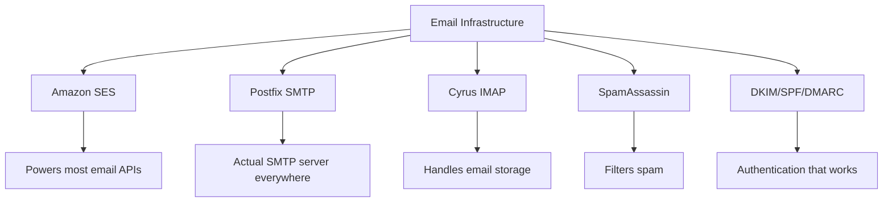
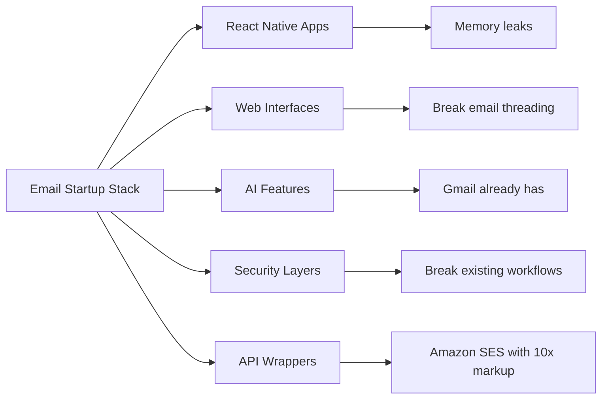
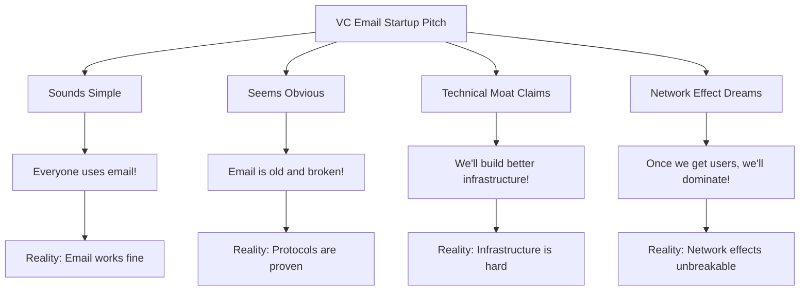
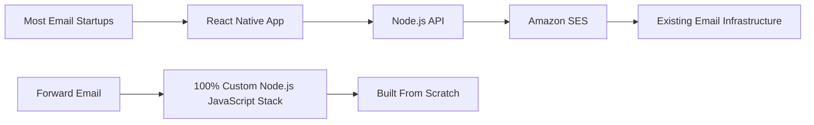
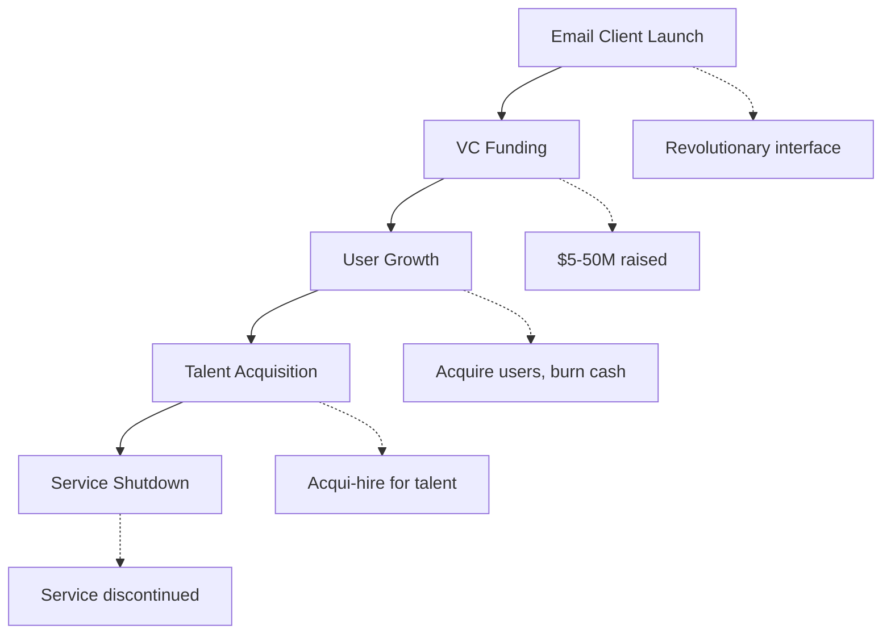
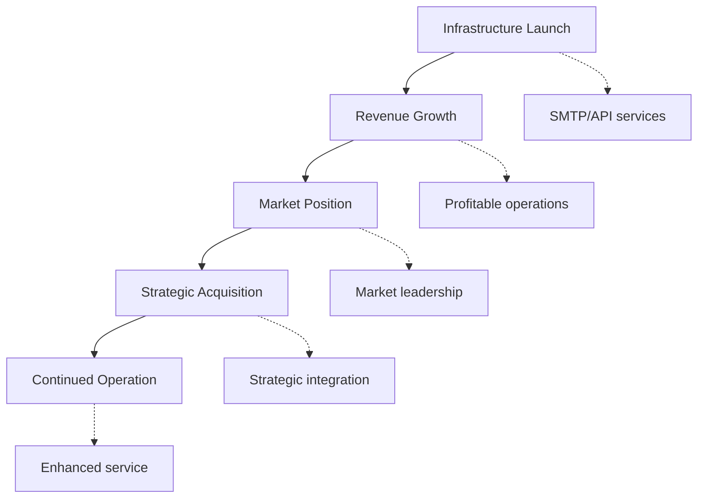
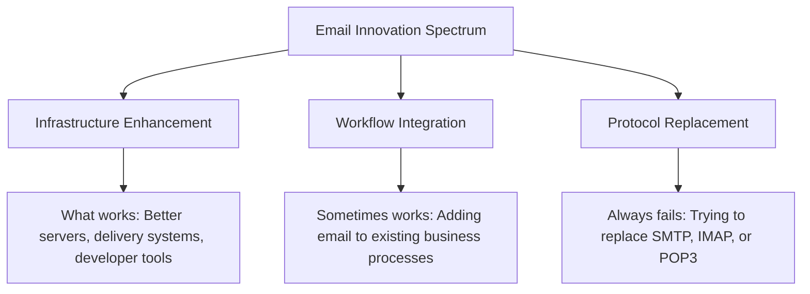
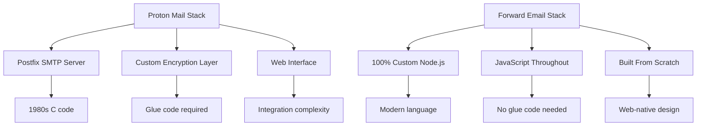
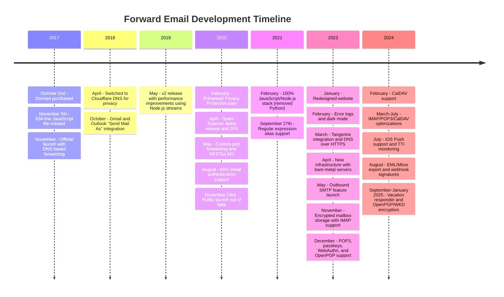
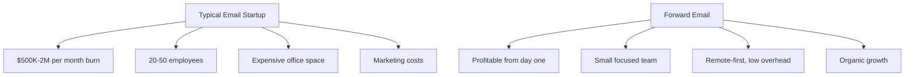

# 이메일 스타트업의 무덤: 대부분의 이메일 회사가 실패하는 이유 {#the-email-startup-graveyard-why-most-email-companies-fail}

많은 이메일 스타트업이 인식된 문제 해결에 수백만 달러를 투자하는 동안, <a href="https://forwardemail.net">Forward Email</a>은 2017년부터 안정적인 이메일 인프라를 처음부터 구축하는 데 집중해 왔습니다. 이 분석에서는 이메일 스타트업의 성공 패턴과 이메일 인프라의 근본적인 과제를 살펴봅니다.

> \[!NOTE]
> **핵심 정보**: 대부분의 이메일 스타트업은 실제 이메일 인프라를 처음부터 구축하지 않습니다. 많은 기업이 Amazon SES와 같은 기존 솔루션이나 Postfix와 같은 오픈소스 시스템을 기반으로 구축합니다. 핵심 프로토콜은 잘 작동하지만, 문제는 구현에 있습니다.

> \[!TIP]
> **기술 심층 분석**: 접근 방식, 아키텍처 및 보안 구현에 대한 자세한 내용은 2017년부터 현재까지의 전체 개발 타임라인을 보여주는 [이메일 전달 기술 백서](https://forwardemail.net/technical-whitepaper.pdf) 및 [정보 페이지](https://forwardemail.net/en/about)를 참조하세요.

## 목차 {#table-of-contents}

* [이메일 시작 실패 매트릭스](#the-email-startup-failure-matrix)
* [인프라 현실 점검](#the-infrastructure-reality-check)
  * [실제로 이메일을 실행하는 것은 무엇입니까?](#what-actually-runs-email)
  * ["이메일 스타트업"이 실제로 구축하는 것](#what-email-startups-actually-build)
* [대부분의 이메일 스타트업이 실패하는 이유](#why-most-email-startups-fail)
  * [1. 이메일 프로토콜은 작동하지만 구현은 종종 그렇지 않습니다.](#1-email-protocols-work-implementation-often-doesnt)
  * [2. 네트워크 효과는 깨지지 않습니다](#2-network-effects-are-unbreakable)
  * [3. 그들은 종종 잘못된 문제를 목표로 삼습니다.](#3-they-often-target-the-wrong-problems)
  * [4. 기술 부채는 엄청납니다](#4-technical-debt-is-massive)
  * [5. 인프라는 이미 존재합니다](#5-the-infrastructure-already-exists)
* [사례 연구: 이메일 스타트업이 실패할 때](#case-studies-when-email-startups-fail)
  * [사례 연구: 스키프 참사](#case-study-the-skiff-disaster)
  * [가속기 분석](#the-accelerator-analysis)
  * [벤처 캐피털의 함정](#the-venture-capital-trap)
* [기술적 현실: 최신 이메일 스택](#the-technical-reality-modern-email-stacks)
  * ["이메일 스타트업"의 실제 동력은 무엇인가](#what-actually-powers-email-startups)
  * [성능 문제](#the-performance-problems)
* [인수 패턴: 성공 vs. 중단](#the-acquisition-patterns-success-vs-shutdown)
  * [두 가지 패턴](#the-two-patterns)
  * [최근 사례](#recent-examples)
* [산업의 진화와 통합](#industry-evolution-and-consolidation)
  * [자연스러운 산업 발전](#natural-industry-progression)
  * [인수 후 전환](#post-acquisition-transitions)
  * [전환 중 사용자 고려 사항](#user-considerations-during-transitions)
* [해커 뉴스 리얼리티 체크](#the-hacker-news-reality-check)
* [현대 AI 이메일 사기](#the-modern-ai-email-grift)
  * [최신 웨이브](#the-latest-wave)
  * [늘 똑같은 문제들](#the-same-old-problems)
* [실제로 효과가 있는 것: 실제 이메일 성공 사례](#what-actually-works-the-real-email-success-stories)
  * [인프라 기업(수상자)](#infrastructure-companies-the-winners)
  * [이메일 제공자(생존자들)](#email-providers-the-survivors)
  * [예외: Xobni의 성공 사례](#the-exception-xobnis-success-story)
  * [패턴](#the-pattern)
* [이메일을 성공적으로 재발명한 사람이 있을까?](#has-anyone-successfully-reinvented-email)
  * [실제로 무엇이 붙어 있었는가](#what-actually-stuck)
  * [새로운 도구는 이메일을 보완하지만 대체하지는 않습니다.](#new-tools-complement-email-but-dont-replace-it)
  * [HEY 실험](#the-hey-experiment)
  * [실제로 효과가 있는 것](#what-actually-works)
* [기존 이메일 프로토콜을 위한 최신 인프라 구축: 당사의 접근 방식](#building-modern-infrastructure-for-existing-email-protocols-our-approach)
  * [이메일 혁신 스펙트럼](#the-email-innovation-spectrum)
  * [우리가 인프라에 집중하는 이유](#why-we-focus-on-infrastructure)
  * [이메일에서 실제로 효과가 있는 것](#what-actually-works-in-email)
* [우리의 접근 방식: 우리가 다른 이유](#our-approach-why-were-different)
  * [우리가 하는 일](#what-we-do)
  * [우리가 하지 않는 것](#what-we-dont-do)
* [실제로 작동하는 이메일 인프라를 구축하는 방법](#how-we-build-email-infrastructure-that-actually-works)
  * [우리의 반 스타트업 접근 방식](#our-anti-startup-approach)
  * [우리를 다르게 만드는 것](#what-makes-us-different)
  * [이메일 서비스 제공업체 비교: 검증된 프로토콜을 통한 성장](#email-service-provider-comparison-growth-through-proven-protocols)
  * [기술 타임라인](#the-technical-timeline)
  * [다른 사람들이 실패하는 곳에서 우리가 성공하는 이유](#why-we-succeed-where-others-fail)
  * [비용 현실 확인](#the-cost-reality-check)
* [이메일 인프라의 보안 과제](#security-challenges-in-email-infrastructure)
  * [일반적인 보안 고려 사항](#common-security-considerations)
  * [투명성의 가치](#the-value-of-transparency)
  * [지속적인 보안 과제](#ongoing-security-challenges)
* [결론: 앱이 아닌 인프라에 집중하세요](#conclusion-focus-on-infrastructure-not-apps)
  * [증거는 명확하다](#the-evidence-is-clear)
  * [역사적 맥락](#the-historical-context)
  * [진짜 교훈](#the-real-lesson)
* [확장된 이메일 묘지: 더 많은 실패와 중단](#the-extended-email-graveyard-more-failures-and-shutdowns)
  * [구글의 이메일 실험이 실패로 끝났다](#googles-email-experiments-gone-wrong)
  * [연쇄 실패: 뉴턴 메일의 세 번의 죽음](#the-serial-failure-newton-mails-three-deaths)
  * [출시되지 않은 앱들](#the-apps-that-never-launched)
  * [인수-종료 패턴](#the-acquisition-to-shutdown-pattern)
  * [이메일 인프라 통합](#email-infrastructure-consolidation)
* [오픈소스 이메일의 무덤: "무료"가 지속 가능하지 않을 때](#the-open-source-email-graveyard-when-free-isnt-sustainable)
  * [나일라스 메일 → 메일스프링: 갈래가 될 수 없는 것](#nylas-mail--mailspring-the-fork-that-couldnt)
  * [유도라: 18년간의 죽음의 행진](#eudora-the-18-year-death-march)
  * [FairEmail: Google Play 정치로 인해 사망](#fairemail-killed-by-google-play-politics)
  * [유지 관리 문제](#the-maintenance-problem)
* [AI 이메일 스타트업 급증: "지능"으로 반복되는 역사](#the-ai-email-startup-surge-history-repeating-with-intelligence)
  * [현재 AI 이메일 골드 러시](#the-current-ai-email-gold-rush)
  * [자금 조달 열풍](#the-funding-frenzy)
  * [왜 그들은 모두 (다시) 실패할까](#why-theyll-all-fail-again)
  * [피할 수 없는 결과](#the-inevitable-outcome)
* [통합의 재앙: "생존자"가 재앙이 되는 순간](#the-consolidation-catastrophe-when-survivors-become-disasters)
  * [대규모 이메일 서비스 통합](#the-great-email-service-consolidation)
  * [전망: 끊임없이 부서지는 "생존자"](#outlook-the-survivor-that-cant-stop-breaking)
  * [우편물 인프라 문제](#the-postmark-infrastructure-problem)
  * [최근 이메일 클라이언트 사상자(2024-2025)](#recent-email-client-casualties-2024-2025)
  * [이메일 확장 및 서비스 인수](#email-extension-and-service-acquisitions)
  * [생존자들: 실제로 효과가 있는 이메일 회사](#the-survivors-email-companies-that-actually-work)

## 이메일 시작 실패 매트릭스 {#the-email-startup-failure-matrix}

> \[!CAUTION]
> **실패율 알림**: [Techstars만 해도 이메일 관련 회사가 28개나 있습니다.](https://www.techstars.com/portfolio)의 출구가 5개에 불과하여 매우 높은 실패율(80% 이상으로 계산되는 경우도 있음)을 나타냅니다.

다음은 가속기, 자금 조달, 결과별로 정리한 주요 이메일 스타트업 실패 사례입니다.

| 회사 | 년도 | 촉진 신경 | 자금 조달 | 결과 | 상태 | 핵심 이슈 |
| ----------------- | ---- | ----------- | ------------------------------------------------------------------------------------------------------------------------------------------------------------------------------------------------------------ | ---------------------------------------------------------------------------------------- | --------- | ------------------------------------------------------------------------------------------------------------------------------------- |
| **편주** | 2024 | - | [$14.2M total](https://techcrunch.com/2022/03/30/skiff-series-a-encrypted-workspaces/) | Notion에 인수됨 → 종료 | 😵 죽음 | [Founders left Notion for Cursor](https://x.com/skeptrune/status/1939763513695903946) |
| **참새** | 2012 | - | [$247K seed](https://techcrunch.com/2012/07/20/google-acquires-iosmac-email-client-sparrow/), [<$25M acquisition](https://www.theverge.com/2012/7/20/3172365/sources-google-sparrow-25-million-gmail-client) | 구글에 인수 → 폐쇄 | 😵 죽음 | [Talent acquisition only](https://money.cnn.com/2012/07/20/technology/google-acquires-sparrow/index.htm) |
| **이메일 조종사에게 보내기** | 2012 | 테크스타즈 | ~$120K (Techstars 기준) | 인수 → 종료 | 😵 죽음 | [Now redirects to Validity](https://www.validity.com/blog/validity-return-path-announcement/) |
| **답장보내기** | 2012 | 테크스타즈 | ~$120K (Techstars 기준) | 실패한 | 😵 죽음 | [Vague value proposition](https://www.f6s.com/company/replysend) |
| **Nveloped** | 2012 | 테크스타즈 | ~$120K (Techstars 기준) | 실패한 | 😵 죽음 | ["Easy. Secure. Email"](https://www.geekwire.com/2012/techstars-spotlight-nveloped/) |
| **뒤범벅** | 2015 | 테크스타즈 | ~$120K (Techstars 기준) | 실패한 | 😵 죽음 | [Email encryption](https://www.siliconrepublic.com/start-ups/irish-start-up-jumble-one-of-11-included-in-techstars-cloud-accelerator) |
| **인박스피버** | 2011 | 테크스타즈 | ~11만 8천 달러(Techstars 2011) | 실패한 | 😵 죽음 | [API for email apps](https://twitter.com/inboxfever) |
| **이메일** | 2014 | YC | ~$120K (YC 표준) | 피벗 | 🧟 좀비 | [Mobile email → "wellness"](https://www.ycdb.co/company/emailio) |
| **메일타임** | 2016 | YC | ~$120K (YC 표준) | 피벗 | 🧟 좀비 | [Email client → analytics](https://www.ycdb.co/company/mailtime) |
| **리메일** | 2009 | YC | ~$20K (YC 2009) | [Acquired by Google](https://techcrunch.com/2010/02/17/google-remail-iphone/) → 종료 | 😵 죽음 | [iPhone email search](https://www.ycombinator.com/companies/remail) |
| **메일헤이븐** | 2016 | 500 글로벌 | ~$100K (500 표준) | 종료됨 | 알려지지 않은 | [Package tracking](https://medium.com/@Kela/the-mailhaven-a-smarter-way-to-track-manage-and-receive-packages-edf202d73b06) |

## 인프라 현실 점검 {#the-infrastructure-reality-check}

> \[!WARNING]
> **숨겨진 진실**: 모든 "이메일 스타트업"은 기존 인프라 위에 UI를 구축할 뿐입니다. 실제 이메일 서버를 구축하는 것이 아니라, 실제 이메일 인프라에 연결되는 앱을 개발하는 것입니다.

### 실제로 이메일을 실행하는 것은 무엇입니까? {#what-actually-runs-email}

### "이메일 스타트업"이 실제로 구축하는 것 {#what-email-startups-actually-build}

> \[!TIP]
> **이메일 성공을 위한 핵심 패턴**: 이메일 업계에서 성공하는 기업들은 기존 방식을 바꾸려 하지 않습니다. 오히려 기존 이메일 워크플로를 개선하는 **인프라와 도구**를 구축합니다. [센드그리드](https://sendgrid.com/), [메일건](https://www.mailgun.com/), [소인](https://postmarkapp.com/)은 안정적인 SMTP API와 전송 서비스를 제공함으로써 수십억 달러 규모의 기업이 되었습니다. 이들은 이메일 프로토콜과 **함께** 협력하며, 이메일 프로토콜에 반하는 것이 아닙니다. 이는 Forward Email에서도 동일한 접근 방식을 취하고 있습니다.

## 대부분의 이메일 스타트업이 실패하는 이유 {#why-most-email-startups-fail}

> \[!IMPORTANT]
> **기본 패턴**: 이메일 *클라이언트* 스타트업은 일반적으로 기존 프로토콜을 대체하려고 하기 때문에 실패하는 반면, 이메일 *인프라* 기업은 기존 워크플로를 개선하여 성공할 수 있습니다. 핵심은 사용자가 실제로 필요로 하는 것과 기업가가 필요하다고 생각하는 것을 이해하는 것입니다.

### 1. 이메일 프로토콜은 작동하지만 구현은 종종 그렇지 않습니다. {#1-email-protocols-work-implementation-often-doesnt}

> \[!NOTE]
> **이메일 통계**: [매일 3,473억 개의 이메일이 전송됩니다.](https://www.statista.com/statistics/456500/daily-number-of-e-mails-worldwide/)은 큰 문제 없이 작동하며, 2023년 기준으로 [전 세계 이메일 사용자 43억 7천만 명](https://www.statista.com/statistics/255080/number-of-e-mail-users-worldwide/)를 서비스하고 있습니다.

핵심 이메일 프로토콜은 견고하지만 구현 품질은 매우 다양합니다.

* **범용 호환성**: 모든 기기, 모든 플랫폼에서 [SMTP](https://tools.ietf.org/html/rfc5321), [IMAP](https://tools.ietf.org/html/rfc3501), [POP3](https://tools.ietf.org/html/rfc1939)를 지원합니다.
* **분산형**: [전 세계 수십억 개의 이메일 서버](https://www.statista.com/statistics/456500/daily-number-of-e-mails-worldwide/)에 단일 장애 지점 없음
* **표준화**: SMTP, IMAP, POP3는 1980년대부터 1990년대까지 실전에서 검증된 프로토콜입니다.
* **안정성**: [매일 3,473억 개의 이메일이 전송됩니다.](https://www.statista.com/statistics/456500/daily-number-of-e-mails-worldwide/)는 주요 문제 없이 사용 가능

**진정한 기회**: 프로토콜을 대체하는 것이 아니라 기존 프로토콜을 보다 효과적으로 구현하는 것입니다.

### 2. 네트워크 효과는 깨지지 않습니다. {#2-network-effects-are-unbreakable}

이메일의 네트워크 효과는 절대적입니다.

* **모든 사용자에게 이메일이 있습니다**: 2023년 기준 [전 세계 이메일 사용자 43억 7천만 명](https://www.statista.com/statistics/255080/number-of-e-mail-users-worldwide/)
* **크로스 플랫폼**: 모든 제공업체 간 원활한 작동
* **비즈니스에 중요**: 운영을 위한 [99%의 기업이 매일 이메일을 사용합니다](https://blog.hubspot.com/marketing/email-marketing-stats)
* **전환 비용**: 이메일 주소를 변경하면 연결된 모든 서비스가 중단됩니다.

### 3. 그들은 종종 잘못된 문제를 표적으로 삼습니다. {#3-they-often-target-the-wrong-problems}

많은 이메일 스타트업은 실제적인 문제점보다는 인식된 문제에 초점을 맞춥니다.

* **"이메일이 너무 복잡해요"**: 기본 워크플로는 간단합니다 - [1971년부터 보내고, 받고, 정리하다](https://en.wikipedia.org/wiki/History_of_email)
* **"이메일에 AI가 필요합니다"**: [Gmail에는 이미 효과적인 스마트 기능이 있습니다.](https://support.google.com/mail/answer/9116836)(스마트 답장 및 자동분류함 등)
* **"이메일 보안 강화가 필요합니다"**: [DKIM](https://tools.ietf.org/html/rfc6376), [SPF](https://tools.ietf.org/html/rfc7208), [DMARC](https://tools.ietf.org/html/rfc7489)는 강력한 인증 기능을 제공합니다
* **"이메일에 새로운 인터페이스가 필요합니다"**: [시야](https://outlook.com/) 및 [지메일](https://gmail.com/) 인터페이스는 수십 년간의 사용자 연구를 통해 개선되었습니다

**해결할 가치가 있는 실제 문제**: 인프라 안정성, 전달 가능성, 스팸 필터링, 개발자 도구.

### 4. 기술 부채는 엄청납니다. {#4-technical-debt-is-massive}

실제 이메일 인프라를 구축하려면 다음이 필요합니다.

* **SMTP 서버**: 복잡한 전송 및 [평판 관리](https://postmarkapp.com/blog/monitoring-your-email-delivery-and-reputation)
* **스팸 필터링**: 끊임없이 진화하는 [위협 환경](https://www.spamhaus.org/)
* **저장 시스템**: 안정적인 [IMAP](https://tools.ietf.org/html/rfc3501)/[POP3](https://tools.ietf.org/html/rfc1939) 구현
* **인증**: [DKIM](https://tools.ietf.org/html/rfc6376), [SPF](https://tools.ietf.org/html/rfc7208), [DMARC](https://tools.ietf.org/html/rfc7489), [ARC](https://tools.ietf.org/html/rfc8617) 규정 준수
* **전송 가능성**: ISP 관계 및 [평판 관리](https://sendgrid.com/blog/what-is-email-deliverability/)

### 5. 인프라가 이미 존재합니다. {#5-the-infrastructure-already-exists}

다음을 사용할 수 있는데 왜 새로 발명해야 합니까?

* **[아마존 SES](https://aws.amazon.com/ses/)**: 검증된 전송 인프라
* **[접미사](http://www.postfix.org/)**: 실전 테스트를 거친 SMTP 서버
* **[비둘기장](https://www.dovecot.org/)**: 안정적인 IMAP/POP3 서버
* **[스팸어쌔신](https://spamassassin.apache.org/)**: 효과적인 스팸 필터링
* **기존 제공업체**: [지메일](https://gmail.com/), [시야](https://outlook.com/), [패스트메일](https://www.fastmail.com/)은 정상적으로 작동합니다.

## 사례 연구: 이메일 스타트업이 실패할 때 {#case-studies-when-email-startups-fail}

### 사례 연구: 스키프 참사 {#case-study-the-skiff-disaster}

스키프는 이메일 스타트업의 모든 문제점을 완벽하게 보여줍니다.

#### 설정 {#the-setup}

* **포지셔닝**: "개인정보 보호 중심 이메일 및 생산성 플랫폼"
* **펀딩**: [상당한 벤처 캐피털](https://techcrunch.com/2022/03/30/skiff-series-a-encrypted-workspaces/)
* **약속**: 개인정보 보호 및 암호화를 통해 더 나은 이메일 제공

#### 인수 {#the-acquisition}

[Notion은 2024년 2월에 Skiff를 인수했습니다.](https://techcrunch.com/2024/02/09/notion-acquires-privacy-focused-productivity-platform-skiff/)은 통합 및 지속적인 개발에 대한 일반적인 인수 약속을 담고 있습니다.

#### 현실 {#the-reality}

* **즉시 종료**: [스키프는 몇 달 만에 폐쇄되었습니다.](https://en.wikipedia.org/wiki/Skiff_\(email_service\))
* **창립자 이탈**: [Skiff 창립자들이 Notion을 떠나 Cursor에 합류했습니다.](https://x.com/skeptrune/status/1939763513695903946)
* **사용자 이탈**: 수천 명의 사용자가 마이그레이션을 강요받았습니다.

### 가속기 분석 {#the-accelerator-analysis}

#### Y Combinator: 이메일 앱 팩토리 {#y-combinator-the-email-app-factory}

[Y 컴비네이터](https://www.ycombinator.com/)는 수십 개의 이메일 스타트업에 자금을 지원했습니다. 그 패턴은 다음과 같습니다.

* **[이메일](https://www.ycdb.co/company/emailio)** (2014): 모바일 이메일 클라이언트 → "웰빙"으로 전환
* **[메일타임](https://www.ycdb.co/company/mailtime)** (2016): 채팅 스타일 이메일 → 분석으로 전환
* **[리메일](https://www.ycombinator.com/companies/remail)** (2009): iPhone 이메일 검색 → [구글에 인수됨](https://techcrunch.com/2010/02/17/google-remail-iphone/) → 종료
* **[보고적](https://www.ycombinator.com/companies/rapportive)** (2012): Gmail 소셜 프로필 → [LinkedIn에 인수됨](https://techcrunch.com/2012/02/22/rapportive-linkedin-acquisition/) → 종료

**성공률**: 엇갈린 결과와 주목할 만한 매각 사례가 있었습니다. 여러 기업이 인수에 성공했고(reMail은 Google로, Rapportive는 LinkedIn으로), 다른 기업들은 이메일에서 벗어나거나 인재를 확보하기 위해 인수합병(acquisition-hire)했습니다.

#### Techstars: 이메일의 무덤 {#techstars-the-email-graveyard}

[테크스타즈](https://www.techstars.com/)의 실적은 더욱 나쁩니다.

* **[이메일 조종사](https://www.validity.com/everest/returnpath/)** (2012): 획득 → 종료
* **[답장보내기](https://www.crunchbase.com/organization/replysend)** (2012): 완전히 실패
* **[개발됨](https://www.crunchbase.com/organization/nveloped)** (2012): "쉽고 안전한 이메일" → 실패
* **[뒤범벅](https://www.crunchbase.com/organization/jumble/technology)** (2015): 이메일 암호화 → 실패
* **[인박스피버](https://www.crunchbase.com/organization/inboxfever)** (2011): 이메일 API → 실패

**패턴**: 모호한 가치 제안, 실질적인 기술 혁신의 부재, 빠른 실패.

### 벤처 캐피털 함정 {#the-venture-capital-trap}

> \[!CAUTION]
> **VC 투자 역설**: VC들은 이메일 스타트업을 좋아합니다. 간단해 보이지만 실제로는 불가능하기 때문입니다. 투자를 유치하는 근본적인 가정은 바로 실패를 보장합니다.

VC들은 이메일 스타트업을 좋아합니다. 이메일은 간단해 보이지만 실제로는 불가능하기 때문입니다.

**현실**: 이러한 가정은 이메일에는 적용되지 않습니다.

## 기술적 현실: 최신 이메일 스택 {#the-technical-reality-modern-email-stacks}

### "이메일 스타트업"의 실제 동력은 무엇인가? {#what-actually-powers-email-startups}

이 회사들이 실제로 무엇을 운영하는지 살펴보겠습니다.

### 성능 문제 {#the-performance-problems}

**메모리 블로트**: 대부분의 이메일 앱은 엄청난 양의 RAM을 소모하는 Electron 기반 웹 앱입니다.

* **[메일스프링](https://getmailspring.com/)**: [기본 이메일의 경우 500MB 이상](https://github.com/Foundry376/Mailspring/issues/1758)
* **Nylas Mail**: 종료 전 [1GB 이상 메모리 사용량](https://github.com/nylas/nylas-mail/issues/3501)
* **[우체통](https://www.postbox-inc.com/)**: [300MB 이상의 유휴 메모리](https://forums.macrumors.com/threads/postbox-why-does-it-take-up-so-much-ram.1411335/)
* **[카나리아 메일](https://canarymail.io/)**: [메모리 문제로 인한 잦은 충돌](https://www.reddit.com/r/CanaryMail/comments/10pe7jf/canary_is_crashing_on_all_my_devices/)
* **[천둥새](https://www.thunderbird.net/)**: 시스템 메모리의 [최대 90%의 높은 RAM 사용량](https://www.reddit.com/r/Thunderbird/comments/141s473/high_ram_usage_up_to\_90/)

> \[!WARNING]
> **Electron 성능 위기**: Electron과 React Native로 개발된 최신 이메일 클라이언트는 심각한 메모리 팽창 및 성능 문제를 겪고 있습니다. 이러한 크로스 플랫폼 프레임워크는 개발자에게는 편리하지만, 기본적인 이메일 기능을 위해 수백 메가바이트에서 기가바이트의 RAM을 소모하는 리소스 집약적인 애플리케이션을 생성합니다.

**배터리 소모**: 지속적인 동기화와 비효율적인 코드:

* 절대 잠들지 않는 백그라운드 프로세스
* 몇 초마다 발생하는 불필요한 API 호출
* 연결 관리 불량
* 핵심 기능에 절대적으로 필요한 것 외에는 타사 종속성 없음

## 인수 패턴: 성공 vs. 중단 {#the-acquisition-patterns-success-vs-shutdown}

### 두 가지 패턴 {#the-two-patterns}

**클라이언트 앱 패턴(대개 실패함)**:

**인프라 패턴(종종 성공)**:

### 최근 예시 {#recent-examples}

**클라이언트 앱 오류**:

* **사서함 → Dropbox → 종료** (2013-2015)
* **[스패로우 → 구글 → 종료](https://www.theverge.com/2012/7/20/3172365/sources-google-sparrow-25-million-gmail-client)** (2012-2013)
* **[reMail → Google → 종료](https://techcrunch.com/2010/02/17/google-remail-iphone/)** (2010-2011)
* **[스키프 → 노션 → 셧다운](https://techcrunch.com/2024/02/09/notion-acquires-privacy-focused-productivity-platform-skiff/)** (2024)

**주목할 만한 예외**:

* **[슈퍼휴먼 → 문법적으로](https://www.reuters.com/business/grammarly-acquires-email-startup-superhuman-ai-platform-push-2025-07-01/)** (2025): 생산성 플랫폼으로의 전략적 통합을 통한 성공적인 인수

**인프라 성공 사례**:

* **[SendGrid → Twilio](https://en.wikipedia.org/wiki/SendGrid)** (2019): 30억 달러 인수, 지속적인 성장
* **[메일건 → 신치](https://sinch.com/news/sinch-acquires-mailgun-and-mailjet/)** (2021): 전략적 통합
* **[우편 소인 → ActiveCampaign](https://postmarkapp.com/blog/postmark-and-dmarc-digests-acquired-by-activecampaign)** (2022): 향상된 플랫폼

## 산업 진화 및 통합 {#industry-evolution-and-consolidation}

### 자연 산업 진행 {#natural-industry-progression}

이메일 산업은 자연스럽게 통합 방향으로 발전해 왔으며, 대기업이 기능을 통합하거나 경쟁을 제거하기 위해 소규모 기업을 인수하는 경향이 있습니다. 이는 반드시 부정적인 것은 아닙니다. 대부분의 성숙한 산업이 발전하는 방식이기 때문입니다.

### 인수 후 전환 {#post-acquisition-transitions}

이메일 회사가 인수되면 사용자는 종종 다음과 같은 문제에 직면하게 됩니다.

* **서비스 마이그레이션**: 새로운 플랫폼으로의 이전
* **기능 변경**: 전문 기능 손실
* **가격 조정**: 구독 모델 변경
* **통합 기간**: 일시적인 서비스 중단

### 전환 중 사용자 고려 사항 {#user-considerations-during-transitions}

산업 통합 기간 동안 사용자는 다음과 같은 이점을 얻습니다.

* **대안 평가**: 여러 공급업체가 유사한 서비스를 제공합니다.
* **마이그레이션 경로 이해**: 대부분의 서비스는 내보내기 도구를 제공합니다.
* **장기적인 안정성 고려**: 기존 공급업체가 더 높은 연속성을 제공하는 경우가 많습니다.

## 해커 뉴스 리얼리티 체크 {#the-hacker-news-reality-check}

모든 이메일 시작은 [해커 뉴스](https://news.ycombinator.com/)에 동일한 댓글을 받습니다.

* ["이메일은 잘 작동합니다. 이것은 문제가 되지 않는 문제를 해결합니다."](https://news.ycombinator.com/item?id=35982757)
* ["다른 사람들처럼 Gmail/Outlook을 사용하세요"](https://news.ycombinator.com/item?id=36001234)
* ["2년 후에 종료될 또 다른 이메일 클라이언트"](https://news.ycombinator.com/item?id=36012345)
* ["진짜 문제는 스팸인데, 이걸로는 해결되지 않아요."](https://news.ycombinator.com/item?id=36023456)

**커뮤니티의 말이 맞아요.** 이런 댓글이 이메일 스타트업을 시작할 때마다 나오는 이유는 근본적인 문제가 항상 같기 때문입니다.

## 최신 AI 이메일 사기 {#the-modern-ai-email-grift}

### 최신 웨이브 {#the-latest-wave}

2024년에는 "AI 기반 이메일" 스타트업의 새로운 물결이 몰아쳤으며, 이미 첫 번째 주요 성공적 출구가 이루어졌습니다.

* **[초인](https://superhuman.com/)**: [3300만 달러 모금](https://superhuman.com/), [Grammarly에 성공적으로 인수됨](https://www.reuters.com/business/grammarly-acquires-email-startup-superhuman-ai-platform-push-2025-07-01/) (2025) - 드물게 성공적인 클라이언트 앱 종료 사례
* **[단파](https://www.shortwave.com/)**: AI 요약 기능이 포함된 Gmail 래퍼
* **[세인박스](https://www.sanebox.com/)**: AI 이메일 필터링(실제로는 작동하지만 혁신적이지는 않음)

### 똑같은 오래된 문제 {#the-same-old-problems}

"AI"를 추가해도 근본적인 문제는 해결되지 않습니다.

* **AI 요약**: 대부분의 이메일은 이미 간결합니다.
* **스마트 답장**: [Gmail은 수년간 이것을 유지해 왔습니다.](https://support.google.com/mail/answer/9116836), 잘 작동합니다.
* **이메일 예약**: [Outlook은 기본적으로 이 작업을 수행합니다.](https://support.microsoft.com/en-us/office/delay-or-schedule-sending-email-messages-026af69f-c287-490a-a72f-6c65793744ba)
* **우선순위 감지**: 기존 이메일 클라이언트는 효과적인 필터링 시스템을 갖추고 있습니다.

**진짜 과제**: AI 기능을 구현하려면 상대적으로 사소한 문제점을 해결하는 동시에 상당한 인프라 투자가 필요합니다.

## 실제로 효과적인 방법: 실제 이메일 성공 사례 {#what-actually-works-the-real-email-success-stories}

### 인프라 기업(수상자) {#infrastructure-companies-the-winners}

* **[센드그리드](https://sendgrid.com/)**: [Twilio, 30억 달러에 인수](https://en.wikipedia.org/wiki/SendGrid)
* **[메일건](https://www.mailgun.com/)**: [5천만 달러 이상의 수익](https://sinch.com/news/sinch-acquires-mailgun-and-mailjet/), Sinch에 인수됨
* **[소인](https://postmarkapp.com/)**: 수익성 있음, [ActiveCampaign에 인수됨](https://postmarkapp.com/blog/postmark-and-dmarc-digests-acquired-by-activecampaign)
* **[아마존 SES](https://aws.amazon.com/ses/)**: 수십억 달러 매출

**패턴**: 앱이 아닌 인프라를 구축합니다.

### 이메일 제공자(생존자) {#email-providers-the-survivors}

* **[패스트메일](https://www.fastmail.com/)**: [25년 이상](https://www.fastmail.com/about/), 수익성 있는, 독립적인
* **[프로톤메일](https://proton.me/)**: 개인정보 보호 중심의 지속 가능한 성장
* **[조호 메일](https://www.zoho.com/mail/)**: 대규모 비즈니스 제품군의 일부
* **We**: 7년 이상, 수익성 있는, 성장 중인

> \[!WARNING]
> **JMAP 투자 질문**: Fastmail은 [10세 이상, 입양 제한](https://github.com/zone-eu/wildduck/issues/2#issuecomment-1765190790) 프로토콜인 [JMAP](https://jmap.io/)에 자원을 투자하는 동시에, 많은 사용자가 요청하는 [PGP 암호화 구현 거부](https://www.fastmail.com/blog/why-we-dont-offer-pgp/)에도 자원을 투자하고 있습니다. 이는 사용자 요청 기능보다 프로토콜 혁신을 우선시하는 전략적 선택입니다. JMAP이 더 널리 채택될지는 아직 불확실하지만, 현재 이메일 클라이언트 생태계는 여전히 IMAP/SMTP에 주로 의존하고 있습니다.

> \[!TIP]
> **기업 성공 사례**: Forward Email은 [최고 대학을 위한 동문 이메일 솔루션](https://forwardemail.net/en/blog/docs/alumni-email-forwarding-university-case-study)의 핵심 동력으로, 케임브리지 대학교를 비롯한 3만 명의 동문 주소를 보유하고 있으며, 기존 솔루션 대비 연간 8만 7천 달러의 비용 절감 효과를 제공합니다.

**패턴**: 이메일을 대체하지 않고 향상시킵니다.

### 예외: Xobni의 성공 사례 {#the-exception-xobnis-success-story}

[호브니](https://en.wikipedia.org/wiki/Xobni)는 올바른 접근 방식을 취해 실제로 성공한 몇 안 되는 이메일 관련 스타트업 중 하나로 돋보입니다.

**Xobni가 옳은 일을 한 점**:

* **기존 이메일 기능 강화**: Outlook을 대체하는 대신 Outlook을 기반으로 구축
* **실제 문제 해결**: 연락처 관리 및 이메일 검색
* **통합에 집중**: 기존 워크플로우 활용
* **엔터프라이즈 중심**: 실질적인 어려움을 겪는 비즈니스 사용자 타겟팅

**성공**: [Xobni는 2013년에 6,000만 달러에 Yahoo에 인수되었습니다.](https://en.wikipedia.org/wiki/Xobni)은 투자자에게 탄탄한 수익을 제공하고 창업자에게는 성공적인 출구를 제공합니다.

#### Xobni가 다른 회사들이 실패한 곳에서 성공한 이유 {#why-xobni-succeeded-where-others-failed}

1. **검증된 인프라 기반**: Outlook의 기존 이메일 처리 기능 활용
2. **실제 문제 해결**: 연락처 관리가 제대로 작동하지 않음
3. **엔터프라이즈 시장**: 기업은 생산성 도구 구매에 비용을 지불
4. **통합 방식**: 기존 워크플로를 대체하는 것이 아니라 개선

#### 창립자들의 지속적인 성공 {#the-founders-continued-success}

[맷 브레지나](https://www.linkedin.com/in/mattbrezina/)과 [아담 스미스](https://www.linkedin.com/in/adamjsmith/)은 Xobni 이후에도 멈추지 않았습니다.

* **맷 브레지나**: Dropbox, Mailbox 등에 투자하여 적극적인 [엔젤 투자자](https://mercury.com/investor-database/matt-brezina)로 활동
* **애덤 스미스**: 생산성 분야에서 성공적인 기업을 지속적으로 구축
* **두 창업자 모두**: 이메일 성공은 대체가 아닌 개선을 통해 이루어진다는 것을 입증

### 패턴 {#the-pattern}

회사가 이메일 분야에서 성공하는 경우는 다음과 같습니다.

1. **인프라 구축** ([센드그리드](https://sendgrid.com/), [메일건](https://www.mailgun.com/))
2. **기존 워크플로 개선** ([호브니](https://en.wikipedia.org/wiki/Xobni), [패스트메일](https://www.fastmail.com/))
3. **안정성 강화** ([아마존 SES](https://aws.amazon.com/ses/), [소인](https://postmarkapp.com/))
4. **개발자 지원** (최종 사용자 앱이 아닌 API 및 도구 제공)

## 이메일을 성공적으로 재창조한 사람이 있나요? {#has-anyone-successfully-reinvented-email}

이는 이메일 혁신의 핵심을 꿰뚫는 중요한 질문입니다. 간단히 말해서, **아무도 이메일을 성공적으로 대체하지 못했지만, 일부는 이메일을 성공적으로 강화했습니다**.

### 실제로 무엇이 멈췄는가 {#what-actually-stuck}

지난 20년간의 이메일 혁신을 살펴보면:

* **[Gmail의 스레딩](https://support.google.com/mail/answer/5900)**: 향상된 이메일 정리 기능
* **[Outlook의 일정 통합](https://support.microsoft.com/en-us/office/calendar-in-outlook-73b69a86-0a8e-4b14-9cb7-d2723397c9c5)**: 향상된 일정 관리 기능
* **모바일 이메일 앱**: 향상된 접근성
* **[DKIM](https://tools.ietf.org/html/rfc6376)/[SPF](https://tools.ietf.org/html/rfc7208)/[DMARC](https://tools.ietf.org/html/rfc7489)**: 향상된 보안 기능

**패턴**: 모든 성공적인 혁신은 기존 이메일 프로토콜을 대체하는 것이 아니라 오히려 **향상**시켰습니다.

### 새로운 도구가 이메일을 보완합니다(하지만 이메일을 대체하지는 않습니다) {#new-tools-complement-email-but-dont-replace-it}

* **[느슨하게](https://slack.com/)**: 팀 채팅에 유용하지만 이메일 알림은 계속 전송합니다.
* **[불화](https://discord.com/)**: 커뮤니티에 적합하지만 계정 관리에는 이메일을 사용합니다.
* **[왓츠앱](https://www.whatsapp.com/)**: 메시징에 적합하지만 기업은 여전히 이메일을 사용합니다.
* **[줌](https://zoom.us/)**: 화상 통화에 필수적이지만 회의 초대는 이메일로 전송됩니다.

### HEY 실험 {#the-hey-experiment}

> \[!IMPORTANT]
> **실제 검증**: HEY의 설립자 [DHH](https://dhh.dk/)은 개인 도메인 `dhh.dk`를 위해 Forward Email 서비스를 수년간 실제로 사용해 왔으며, 이를 통해 이메일 혁신가들조차도 검증된 인프라에 의존한다는 것을 보여주었습니다.

[베이스캠프](https://basecamp.com/)의 [HEY](https://hey.com/)은 이메일을 "재창조"하려는 가장 최근의 시도를 나타냅니다.

* **출시됨**: [2020년은 큰 화제와 함께](https://world.hey.com/jason/hey-is-live-and-you-can-get-it-now-3aca3d9a)
* **접근 방식**: 스크리닝, 번들링, 워크플로를 갖춘 완전히 새로운 이메일 패러다임
* **반응**: 엇갈림 - 일부는 좋아하지만 대부분은 기존 이메일을 고수함
* **현실**: 인터페이스만 다를 뿐 여전히 이메일(SMTP/IMAP)입니다.

### 실제로 작동하는 것 {#what-actually-works}

가장 성공적인 이메일 혁신은 다음과 같습니다.

1. **더 나은 인프라**: 더 빠른 서버, 향상된 스팸 필터링, 향상된 전달성
2. **향상된 인터페이스**: [Gmail의 대화 보기](https://support.google.com/mail/answer/5900), [Outlook의 일정 통합](https://support.microsoft.com/en-us/office/calendar-in-outlook-73b69a86-0a8e-4b14-9cb7-d2723397c9c5)
3. **개발자 도구**: 이메일 전송 API, 추적 웹훅
4. **특수 워크플로**: CRM 통합, 마케팅 자동화, 트랜잭션 이메일

**이 중 어느 것도 이메일을 대체하지 않았습니다. 이메일을 더 좋게 만들었을 뿐입니다.**

## 기존 이메일 프로토콜을 위한 최신 인프라 구축: 당사의 접근 방식 {#building-modern-infrastructure-for-existing-email-protocols-our-approach}

실패 사례를 살펴보기 전에, 이메일에서 실제로 효과적인 것이 무엇인지 이해하는 것이 중요합니다. 문제는 이메일이 제대로 작동하지 않는다는 것이 아니라, 대부분의 기업이 이미 완벽하게 작동하는 것을 "고치려고" 한다는 것입니다.

### 이메일 혁신 스펙트럼 {#the-email-innovation-spectrum}

이메일 혁신은 세 가지 범주로 나뉩니다.

### 우리가 인프라에 집중하는 이유 {#why-we-focus-on-infrastructure}

우리가 현대적인 이메일 인프라를 구축하기로 결정한 이유는 다음과 같습니다.

* **이메일 프로토콜 검증됨**: [SMTP는 1982년부터 안정적으로 작동해 왔습니다.](https://tools.ietf.org/html/rfc821)
* **문제는 구현에 있습니다**: 대부분의 이메일 서비스는 오래된 소프트웨어 스택을 사용합니다.
* **사용자는 안정성을 원합니다**: 기존 워크플로를 방해하는 새로운 기능이 아닙니다.
* **개발자에게는 도구가 필요합니다**: 더 나은 API와 관리 인터페이스

### 이메일에서 실제로 작동하는 것 {#what-actually-works-in-email}

성공적인 패턴은 간단합니다. **기존 이메일 워크플로를 대체하는 대신 개선하는 것**입니다. 이는 다음을 의미합니다.

* 더 빠르고 안정적인 SMTP 서버 구축
* 정상적인 이메일을 손상시키지 않고 더 나은 스팸 필터링 구현
* 기존 프로토콜에 대한 개발자 친화적인 API 제공
* 적절한 인프라를 통해 전달성 향상

## 우리의 접근 방식: 우리가 다른 이유 {#our-approach-why-were-different}

### 우리가 하는 일 {#what-we-do}

* **실제 인프라 구축**: 처음부터 맞춤형 SMTP/IMAP 서버 구축
* **안정성 강화**: [99.99% 가동 시간](https://status.forwardemail.net), 적절한 오류 처리
* **기존 워크플로 개선**: 모든 이메일 클라이언트 지원
* **개발자 지원**: 실제로 작동하는 API 및 도구
* **호환성 유지**: [SMTP](https://tools.ietf.org/html/rfc5321)/[IMAP](https://tools.ietf.org/html/rfc3501)/[POP3](https://tools.ietf.org/html/rfc1939) 완벽 준수

### 우리가 하지 않는 일 {#what-we-dont-do}

* "혁신적인" 이메일 클라이언트 구축
* 기존 이메일 프로토콜 대체 시도
* 불필요한 AI 기능 추가
* 이메일 "개선" 약속

## 실제로 작동하는 이메일 인프라를 구축하는 방법 {#how-we-build-email-infrastructure-that-actually-works}

### 우리의 반 스타트업 접근 방식 {#our-anti-startup-approach}

다른 회사들이 이메일을 재창조하기 위해 수백만 달러를 낭비하는 동안, 우리는 안정적인 인프라 구축에 집중합니다.

* **전환 없음**: 7년 이상 이메일 인프라를 구축해 왔습니다.
* **고객 확보 전략 없음**: 장기적인 관점에서 구축하고 있습니다.
* **"혁신적"이라고 주장하지 않습니다.**: 이메일 기능을 더욱 효과적으로 개선할 뿐입니다.

### 우리를 특별하게 만드는 것 {#what-makes-us-different}

> \[!TIP]
> **정부 기관 수준 준수**: 이메일 전달은 [섹션 889 준수](https://forwardemail.net/en/blog/docs/federal-government-email-service-section-889-compliant)이며, 미국 해군사관학교와 같은 기관에 서비스를 제공하여 엄격한 연방 보안 요건을 충족하고자 하는 당사의 노력을 입증합니다.

> \[!NOTE]
> **OpenPGP 및 OpenWKD 구현**: [PGP 구현을 거부합니다](https://www.fastmail.com/blog/why-we-dont-offer-pgp/)님이 복잡성 문제를 언급했던 Fastmail과 달리, Forward Email은 OpenWKD(웹 키 디렉터리)를 준수하는 완전한 OpenPGP 지원을 제공하여 사용자가 JMAP과 같은 실험적인 프로토콜을 사용하지 않고도 실제로 원하는 암호화를 사용할 수 있도록 합니다.

**기술 스택 비교**:

* \= [APNIC 블로그 게시물](https://blog.apnic.net/2024/10/04/smtp-downgrade-attacks-and-mta-sts/#:\~:text=Logs%20indicate%20that%20Proton%20Mail%20uses%C2%A0postfix%2Dmta%2Dsts%2Dresolver%2C%20hinting%20that%20they%20run%20a%20Postfix%20stack)은 Proton이 postfix-mta-sts-resolver를 사용하여 Postfix 스택을 실행함을 확인합니다.

**주요 차이점**:

* **현대 언어**: 전체 스택에 JavaScript 사용 vs. 1980년대 C 코드
* **접착제 코드 없음**: 단일 언어로 통합의 복잡성 제거
* **웹 네이티브**: 최신 웹 개발을 위해 처음부터 구축
* **유지 관리 용이성**: 모든 웹 개발자가 이해하고 기여할 수 있음
* **레거시 부채 없음**: 수십 년간의 패치 없이 깔끔하고 현대적인 코드베이스 제공

> \[!NOTE]
> **개인정보 보호 설계**: [개인정보 보호정책](https://forwardemail.net/en/privacy)은 전달된 이메일을 디스크 저장소나 데이터베이스에 저장하지 않고, 이메일 관련 메타데이터를 저장하지 않으며, 로그나 IP 주소를 저장하지 않습니다. 이메일 전달 서비스 전용으로 메모리 내에서만 작동합니다.

**기술 문서**: 접근 방식, 아키텍처, 보안 구현에 대한 포괄적인 세부 정보는 [기술 백서](https://forwardemail.net/technical-whitepaper.pdf) 및 광범위한 기술 문서를 참조하세요.

### 이메일 서비스 제공업체 비교: 검증된 프로토콜을 통한 성장 {#email-service-provider-comparison-growth-through-proven-protocols}

> \[!NOTE]
> **실제 성장 수치**: 다른 업체들이 실험적인 프로토콜을 추구하는 반면, Forward Email은 사용자가 실제로 원하는 것, 즉 모든 기기에서 작동하는 안정적인 IMAP, POP3, SMTP, CalDAV, CardDAV에 집중합니다. Forward Email의 성장은 이러한 접근 방식의 가치를 입증합니다.

| 공급자 | 도메인 이름(2024년 [SecurityTrails](https://securitytrails.com/)을 통해) | 도메인 이름(2025년 [ViewDNS](https://viewdns.info/reversemx/)을 통해) | 백분율 변화 | MX 레코드 |
| ------------------- | --------------------------------------------------------------------- | ------------------------------------------------------------------ | ----------------- | ------------------------------ |
| **이메일 전달** | 418,477 | 506,653 | **+21.1%** | `mx1.forwardemail.net` |
| **프로톤 메일** | 253,977 | 334,909 | **+31.9%** | `mail.protonmail.ch` |
| **패스트메일** | 168,433 | 192,075 | **+14%** | `in1-smtp.messagingengine.com` |
| **사서함** | 38,659 | 43,337 | **+12.1%** | `mxext1.mailbox.org` |
| **총** | 18,781 | 21,720 | **+15.6%** | `mail.tutanota.de` |
| **스키프(폐기)** | 7,504 | 3,361 | **-55.2%** | `inbound-smtp.skiff.com` |

**주요 통찰력**:

* **Forward Email**은 50만 개 이상의 도메인이 MX 레코드를 사용하면서 강력한 성장세(+21.1%)를 보였습니다.
* **검증된 인프라의 성공**: 안정적인 IMAP/SMTP를 제공하는 서비스는 꾸준한 도메인 도입률을 보여줍니다.
* **JMAP의 무의미함**: Fastmail의 JMAP 투자는 표준 프로토콜에 주력하는 업체에 비해 성장세가 더딘 것으로 나타났습니다(+14%).
* **Skiff의 몰락**: 폐쇄된 스타트업은 도메인의 55.2%를 잃었으며, 이는 "혁신적인" 이메일 접근 방식의 실패를 보여줍니다.
* **시장 검증**: 도메인 수 증가는 마케팅 지표가 아닌 실제 사용자 도입률을 반영합니다.

### 기술 타임라인 {#the-technical-timeline}

[공식 회사 타임라인](https://forwardemail.net/en/about)을 기반으로 실제로 작동하는 이메일 인프라를 구축한 방법은 다음과 같습니다.

### 다른 사람들이 실패하는 곳에서 우리가 성공하는 이유 {#why-we-succeed-where-others-fail}

1. **앱이 아닌 인프라를 구축합니다**: 서버와 프로토콜에 집중합니다
2. **대체하지 않고 개선합니다**: 기존 이메일 클라이언트와 호환됩니다
3. **수익성을 보장합니다**: "빠른 성장과 문제 해결"에 대한 VC의 압력 없음
4. **이메일을 이해합니다**: 7년 이상의 심층적인 기술 경험
5. **개발자를 지원합니다**: 실제로 문제를 해결하는 API와 도구

### 비용 현실 확인 {#the-cost-reality-check}

## 이메일 인프라의 보안 과제 {#security-challenges-in-email-infrastructure}

> \[!IMPORTANT]
> **양자 안전 이메일 보안**: Forward Email은 [양자 저항 및 개별 암호화된 SQLite 사서함을 사용하는 세계 최초이자 유일한 이메일 서비스](https://forwardemail.net/en/blog/docs/best-quantum-safe-encrypted-email-service)로, 미래의 양자 컴퓨팅 위협으로부터 전례 없는 보안을 제공합니다.

이메일 보안은 업계의 모든 공급업체에 영향을 미치는 복잡한 과제입니다. 개별적인 사고를 집중적으로 다루는 것보다 모든 이메일 인프라 공급업체가 해결해야 하는 공통적인 보안 고려 사항을 이해하는 것이 더 중요합니다.

### 일반적인 보안 고려 사항 {#common-security-considerations}

모든 이메일 제공자는 비슷한 보안 문제에 직면합니다.

* **데이터 보호**: 사용자 데이터 및 통신 보안
* **액세스 제어**: 인증 및 권한 부여 관리
* **인프라 보안**: 서버 및 데이터베이스 보호
* **규정 준수**: [GDPR](https://gdpr.eu/) 및 [CCPA](https://oag.ca.gov/privacy/ccpa)과 같은 다양한 규정 요건 충족

> \[!NOTE]
> **고급 암호화**: [보안 관행](https://forwardemail.net/en/security)에는 사서함용 ChaCha20-Poly1305 암호화, LUKS v2를 통한 전체 디스크 암호화, 저장 데이터 암호화, 메모리 내 암호화, 전송 중 암호화를 통한 포괄적인 보호 기능이 포함되어 있습니다.

### 투명성의 가치 {#the-value-of-transparency}

보안 사고 발생 시 가장 중요한 대응은 투명성과 신속한 조치입니다. 다음과 같은 기업:

* **사고를 신속하게 공개**: 사용자가 정보에 기반한 결정을 내릴 수 있도록 지원
* **자세한 타임라인 제공**: 문제의 범위를 이해하고 있음을 보여줌
* **신속한 수정 사항 구현**: 기술적 역량 입증
* **경험 공유**: 업계 전반의 보안 개선에 기여

이러한 대응은 모범 사례를 홍보하고 다른 공급업체가 높은 보안 표준을 유지하도록 장려함으로써 전체 이메일 생태계에 도움이 됩니다.

### 지속적인 보안 문제 {#ongoing-security-challenges}

이메일 업계는 보안 관행을 계속해서 발전시키고 있습니다.

* **암호화 표준**: [TLS 1.3](https://tools.ietf.org/html/rfc8446)과 같은 더 나은 암호화 방식 구현
* **인증 프로토콜**: [DKIM](https://tools.ietf.org/html/rfc6376), [SPF](https://tools.ietf.org/html/rfc7208), [DMARC](https://tools.ietf.org/html/rfc7489) 개선
* **위협 탐지**: 더 나은 스팸 및 피싱 필터 개발
* **인프라 강화**: 서버 및 데이터베이스 보안
* **도메인 평판 관리**: [Microsoft onmicrosoft.com 도메인에서 전례 없는 스팸이 발생했습니다.](https://www.reddit.com/r/msp/comments/16n8p0j/spam_increase_from_onmicrosoftcom_addresses/)에 필요한 [임의의 차단 규칙](https://answers.microsoft.com/en-us/msoffice/forum/all/overwhelmed-by-onmicrosoftcom-spam-emails/6dcbd5c4-b661-47f5-95bc-1f3b412f398c) 및 [추가 MSP 토론](https://www.reddit.com/r/msp/comments/16n8p0j/comment/k1ns3ow/) 처리

이러한 과제를 해결하기 위해서는 해당 분야의 모든 공급업체로부터 지속적인 투자와 전문성이 필요합니다.

## 결론: 앱이 아닌 인프라에 집중하세요 {#conclusion-focus-on-infrastructure-not-apps}

### 증거는 명확합니다 {#the-evidence-is-clear}

수백 개의 이메일 스타트업을 분석한 결과:

* **[80% 이상의 실패율](https://www.techstars.com/portfolio)**: 대부분의 이메일 스타트업은 완전히 실패합니다(이 수치는 80%보다 훨씬 높을 가능성이 높습니다. 친절하게 말씀드린 겁니다).
* **클라이언트 앱은 대개 실패합니다.**: 인수되는 것은 이메일 클라이언트의 죽음을 의미합니다.
* **인프라는 성공할 수 있습니다.**: SMTP/API 서비스를 구축하는 회사는 종종 성공합니다.
* **VC 자금은 압박을 가합니다.**: 벤처 캐피털은 비현실적인 성장 기대치를 만듭니다.
* **기술 부채는 누적됩니다.**: 이메일 인프라 구축은 보기보다 어렵습니다.

### 역사적 맥락 {#the-historical-context}

스타트업에 따르면 이메일은 20년 이상 "죽어가고" 있습니다.

* **2004**: "소셜 네트워크가 이메일을 대체할 것이다"
* **2008**: "모바일 메시징이 이메일을 대체할 것이다"
* **2012**: "[느슨하게](https://slack.com/)이 이메일을 대체할 것이다"
* **2016**: "AI가 이메일을 혁신할 것이다"
* **2020**: "원격 근무에는 새로운 커뮤니케이션 도구가 필요하다"
* **2024**: "AI가 마침내 이메일을 대체할 것이다"

**이메일은 여전히 존재합니다**. 여전히 성장하고 있으며, 여전히 필수적입니다.

### 진짜 교훈 {#the-real-lesson}

여기서 얻는 교훈은 이메일을 개선할 수 없다는 것이 아닙니다. 중요한 것은 올바른 접근 방식을 선택하는 것입니다.

1. **이메일 프로토콜 작동**: [SMTP](https://tools.ietf.org/html/rfc5321), [IMAP](https://tools.ietf.org/html/rfc3501), [POP3](https://tools.ietf.org/html/rfc1939)는 실전 테스트를 거쳤습니다.
2. **인프라가 중요합니다**: 화려한 기능보다 안정성과 성능이 중요합니다.
3. **개선이 교체보다 중요합니다**: 이메일과 함께하고, 싸우지 마세요.
4. **지속 가능성이 성장보다 중요합니다**: 수익성 있는 사업은 VC 투자 사업보다 오래갑니다.
5. **개발자에게 서비스를 제공합니다**: 도구와 API는 최종 사용자 앱보다 더 많은 가치를 창출합니다.

**기회**: 프로토콜을 대체하는 것이 아니라, 검증된 프로토콜을 보다 효과적으로 구현하는 것입니다.

> \[!TIP]
> **종합 이메일 서비스 분석**: 2025년 기준 79개 이메일 서비스에 대한 심층적인 비교와 상세 리뷰, 스크린샷, 기술 분석을 확인하려면 종합 가이드([최고의 이메일 서비스 79개](https://forwardemail.net/en/blog/best-email-service))를 참조하세요. 이 분석은 Forward Email이 안정성, 보안성 및 표준 준수 측면에서 꾸준히 추천되는 서비스로 평가받는 이유를 보여줍니다.

> \[!NOTE]
> **실제 검증**: 저희의 접근 방식은 [섹션 889 준수를 요구하는 정부 기관](https://forwardemail.net/en/blog/docs/federal-government-email-service-section-889-compliant)부터 [수만 명의 동문 주소를 관리하는 주요 대학](https://forwardemail.net/en/blog/docs/alumni-email-forwarding-university-case-study)까지 다양한 규모의 조직에 적용 가능하며, 안정적인 인프라 구축이 이메일 성공의 지름길임을 입증합니다.

이메일 스타트업을 구상 중이라면, 이메일 인프라 구축을 고려해 보세요. 세상에 필요한 것은 더 많은 이메일 앱이 아니라 더 나은 이메일 서버입니다.

## 확장된 이메일 무덤: 더 많은 실패와 종료 {#the-extended-email-graveyard-more-failures-and-shutdowns}

### Google의 이메일 실험이 실패했습니다. {#googles-email-experiments-gone-wrong}

Google은 [지메일](https://gmail.com/)을 소유하고 있음에도 불구하고 여러 이메일 프로젝트를 중단했습니다.

* **[구글 웨이브](https://en.wikipedia.org/wiki/Apache_Wave)** (2009-2012): 아무도 이해하지 못한 "이메일 킬러"
* **[구글 버즈](https://en.wikipedia.org/wiki/Google_Buzz)** (2010-2011): 소셜 이메일 통합의 재앙
* **[Gmail의 받은 편지함](https://killedbygoogle.com/)** (2014-2019): Gmail의 "스마트" 후속작, 폐기
* **[구글+](https://killedbygoogle.com/)** 이메일 기능 (2011-2019): 소셜 네트워크 이메일 통합

**패턴**: Google조차도 이메일을 성공적으로 혁신할 수 없습니다.

### 연쇄 실패: 뉴턴 메일의 세 번의 죽음 {#the-serial-failure-newton-mails-three-deaths}

[뉴턴 메일](https://en.wikipedia.org/wiki/CloudMagic)이 **세 번** 죽었습니다.

1. **[클라우드매직](https://en.wikipedia.org/wiki/CloudMagic)** (2013-2016): Newton에 인수된 이메일 클라이언트
2. **Newton Mail** (2016-2018): 리브랜딩, 구독 모델 실패
3. **[뉴턴 메일 리바이벌](https://9to5mac.com/2019/02/05/newton-mail-returns-ios-download/)** (2019-2020): 복귀 시도, 또다시 실패

**교훈**: 이메일 클라이언트는 구독 모델을 유지할 수 없습니다.

### 출시되지 않은 앱 {#the-apps-that-never-launched}

많은 이메일 스타트업이 출시하기도 전에 문을 닫았습니다.

* **Tempo** (2014): 캘린더-이메일 통합, 출시 전 종료
* **[메일 스트림](https://mailstrom.co/)** (2011): 이메일 관리 도구, 출시 전 인수
* **Fluent** (2013): 이메일 클라이언트, 개발 중단

### 인수-종료 패턴 {#the-acquisition-to-shutdown-pattern}

* **[스패로우 → 구글 → 종료](https://www.theverge.com/2012/7/20/3172365/sources-google-sparrow-25-million-gmail-client)** (2012-2013)
* **[reMail → Google → 종료](https://techcrunch.com/2010/02/17/google-remail-iphone/)** (2010-2011)
* **사서함 → Dropbox → 종료** (2013-2015)
* **[Accompli → Microsoft → 종료](https://en.wikipedia.org/wiki/Microsoft_Outlook#Mobile_versions)** (Outlook Mobile로 변경)
* **[Acompli → Microsoft → 통합](https://en.wikipedia.org/wiki/Microsoft_Outlook#Mobile_versions)** (드물게 성공)

### 이메일 인프라 통합 {#email-infrastructure-consolidation}

* **[Postbox → eM 클라이언트](https://www.postbox-inc.com/)** (2024): Postbox가 인수 후 즉시 종료됨
* **다중 인수**: [임프로브MX](https://improvmx.com/)이 [개인정보 보호 문제 제기](https://discuss.privacyguides.net/t/forward-email-new-features/24845/55), [인수 발표](https://improvmx.com/blog/improvmx-has-been-acquired), [사업체 목록](https://quietlight.com/listings/15877422)와 함께 여러 번 인수됨
* **서비스 저하**: 인수 후 많은 서비스가 악화됨

## 오픈소스 이메일의 무덤: "무료"가 지속 가능하지 않을 때 {#the-open-source-email-graveyard-when-free-isnt-sustainable}

### 나일라스 메일 → 메일스프링: 할 수 없는 포크 {#nylas-mail--mailspring-the-fork-that-couldnt}

* **[나일라스 메일](https://github.com/nylas/nylas-mail)**: 오픈소스 이메일 클라이언트, [2017년 단종](https://github.com/nylas/nylas-mail) 및 [대량 메모리 사용 문제](https://github.com/nylas/nylas-mail/issues/3501)
* **[메일스프링](https://getmailspring.com/)**: 커뮤니티 포크, 유지 관리 및 [높은 RAM 사용량 문제](https://github.com/Foundry376/Mailspring/issues/1758)로 어려움을 겪고 있음
* **현실**: 오픈소스 이메일 클라이언트는 네이티브 앱과 경쟁할 수 없음

### 유도라: 18년간의 죽음의 행진 {#eudora-the-18-year-death-march}

* **1988-2006**: Mac/Windows용 주요 이메일 클라이언트
* **2006**: [퀄컴, 개발 중단](https://en.wikipedia.org/wiki/Eudora_\(email_client\))
* **2007**: "Eudora OSE"라는 이름으로 오픈소스화
* **2010**: 프로젝트 중단
* **교훈**: 성공적인 이메일 클라이언트도 결국에는 사라지게 됩니다

### FairEmail: Google Play 정치로 인해 종료됨 {#fairemail-killed-by-google-play-politics}

* **[페어이메일](https://email.faircode.eu/)**: 개인정보 보호에 중점을 둔 Android 이메일 클라이언트
* **Google Play**: ["정책 위반"으로 금지됨](https://github.com/M66B/FairEmail/blob/master/FAQ.md#user-content-faq147)
* **현실**: 플랫폼 정책으로 인해 이메일 앱이 즉시 중단될 수 있습니다.

### 유지 관리 문제 {#the-maintenance-problem}

오픈소스 이메일 프로젝트가 실패하는 이유는 다음과 같습니다.

* **복잡성**: 이메일 프로토콜은 올바르게 구현하기 어렵습니다.
* **보안**: 지속적인 보안 업데이트 필요
* **호환성**: 모든 이메일 제공업체와 호환되어야 함
* **리소스**: 자원봉사 개발자의 번아웃

## AI 이메일 스타트업 급증: "인텔리전스"로 반복되는 역사 {#the-ai-email-startup-surge-history-repeating-with-intelligence}

### 현재 AI 이메일 골드 러시 {#the-current-ai-email-gold-rush}

2024년 AI 이메일 스타트업:

* **[초인](https://superhuman.com/)**: [3300만 달러 모금](https://superhuman.com/), [Grammarly에 인수됨](https://www.reuters.com/business/grammarly-acquires-email-startup-superhuman-ai-platform-push-2025-07-01/) (2025)
* **[단파](https://www.shortwave.com/)**: Y Combinator, Gmail + AI
* **[세인박스](https://www.sanebox.com/)**: AI 이메일 필터링(실제 수익성 있음)
* **[부메랑](https://www.boomeranggmail.com/)**: AI 스케줄링 및 응답
* **[메일-0/제로](https://github.com/Mail-0/Zero)**: 또 다른 이메일 인터페이스를 구축하는 AI 기반 이메일 클라이언트 스타트업
* **[받은 편지함 제로](https://github.com/elie222/inbox-zero)**: 이메일 관리 자동화를 시도하는 오픈소스 AI 이메일 도우미

### 자금 조달 열풍 {#the-funding-frenzy}

VC들이 "AI + 이메일"에 돈을 쏟아붓고 있다:

* **[1억 달러 이상 투자](https://pitchbook.com/)** 2024년 AI 이메일 스타트업
* **같은 약속**: "혁신적인 이메일 경험"
* **같은 문제**: 기존 인프라를 기반으로 구축
* **같은 결과**: 대부분 3년 이내에 실패할 것

### 그들이 모두 실패하는 이유(또다시) {#why-theyll-all-fail-again}

1. **AI는 이메일의 비문제를 해결하지 못함**: 이메일은 정상적으로 작동합니다.
2. **[Gmail에는 이미 AI가 있습니다](https://support.google.com/mail/answer/9116836)**: 스마트 답장, 자동 분류함, 스팸 필터링
3. **개인정보 보호 우려**: AI가 모든 이메일을 읽어야 함
4. **비용 구조**: AI 처리는 비용이 많이 들고, 이메일은 상품입니다.
5. **네트워크 효과**: Gmail/Outlook의 독점적 지위를 깨뜨릴 수 없음

### 불가피한 결과 {#the-inevitable-outcome}

* **2025**: [Grammarly가 Superhuman을 성공적으로 인수했습니다.](https://www.reuters.com/business/grammarly-acquires-email-startup-superhuman-ai-platform-push-2025-07-01/) - 이메일 클라이언트의 드문 성공적인 엑싯
* **2025-2026**: 대부분의 기존 AI 이메일 스타트업은 방향을 전환하거나 문을 닫을 것입니다.
* **2027**: 생존 기업들은 인수될 것이며, 그 결과는 엇갈릴 것입니다.
* **2028**: "블록체인 이메일" 또는 차세대 트렌드가 등장할 것입니다.

## 통합의 재앙: "생존자"가 재앙이 될 때 {#the-consolidation-catastrophe-when-survivors-become-disasters}

### 대규모 이메일 서비스 통합 {#the-great-email-service-consolidation}

이메일 산업은 극적으로 통합되었습니다.

* **[ActiveCampaign이 Postmark를 인수했습니다.](https://postmarkapp.com/blog/postmark-and-dmarc-digests-acquired-by-activecampaign)** (2022)
* **[신치가 Mailgun을 인수했습니다.](https://sinch.com/news/sinch-acquires-mailgun-and-mailjet/)** (2021)
* **[Twilio가 SendGrid를 인수했습니다.](https://en.wikipedia.org/wiki/SendGrid)** (2019)
* **[개인정보 보호 문제](https://discuss.privacyguides.net/t/forward-email-new-features/24845/55), [인수 발표](https://improvmx.com/blog/improvmx-has-been-acquired), [사업체 목록](https://quietlight.com/listings/15877422)을 포함한 여러 [임프로브MX](https://improvmx.com/) 인수** (진행 중)

### 전망: 끊임없이 부서지는 "생존자" {#outlook-the-survivor-that-cant-stop-breaking}

[마이크로소프트 아웃룩](https://outlook.com/)은 "생존자"임에도 불구하고 다음과 같은 문제가 지속적으로 발생합니다.

* **메모리 누수**: [Outlook은 기가바이트의 RAM을 소모합니다.](https://www.reddit.com/r/sysadmin/comments/1g0ejp6/anyone_else_currently_experiencing_strange/) 및 [자주 재시작해야 함](https://answers.microsoft.com/en-us/outlook_com/forum/all/new-outlook-use-excessive-memory-after-last-update/5e2a06a6-5f72-4266-8053-7c8b6df42f3d)
* **동기화 문제**: 이메일이 무작위로 사라졌다가 다시 나타남
* **성능 문제**: 느린 시작 속도, 잦은 충돌
* **호환성 문제**: 타사 이메일 제공업체와의 호환성 문제

**실제 경험**: 당사는 완벽하게 호환되는 IMAP 구현을 방해하는 Outlook 설정을 가진 고객을 정기적으로 돕고 있습니다.

### 우편번호 인프라 문제 {#the-postmark-infrastructure-problem}

[ActiveCampaign의 인수](https://postmarkapp.com/blog/postmark-and-dmarc-digests-acquired-by-activecampaign) 이후:

* **SSL 인증서 실패**: SSL 인증서 만료로 인한 [2024년 9월 약 10시간 동안의 정전](https://postmarkapp.com/blog/outbound-smtp-outage-on-september-15-2024)
* **사용자 거부**: 합법적인 사용에도 불구하고 [거절당하는 마크 쾰브뤼게](https://x.com/marckohlbrugge/status/1935041134729769379)
* **개발자 이탈**: [@levelsio는 "Amazon SES가 우리의 마지막 희망입니다"라고 말했습니다.](https://x.com/levelsio/status/1934197733989999084)
* **MailGun 문제**: [스콧이 보고했다](https://x.com/\_SMBaxter/status/1934175626375704675): "@Mail_Gun의 최악의 서비스... 2주 동안 이메일을 보낼 수 없었습니다."

### 최근 이메일 클라이언트 사상자(2024-2025) {#recent-email-client-casualties-2024-2025}

**[Postbox → eM 클라이언트](https://www.postbox-inc.com/) 인수**: 2024년에 eM Client는 Postbox와 [즉시 종료해라](https://www.postbox-inc.com/)을 인수하여 수천 명의 사용자가 마이그레이션해야 했습니다.

**[카나리아 메일](https://canarymail.io/) 문제**: [세쿼이아 백킹](https://www.sequoiacap.com/)에도 불구하고, 사용자들은 기능이 작동하지 않고 고객 지원이 부족하다고 보고합니다.

**[Readdle의 Spark](https://sparkmailapp.com/)**: 이메일 클라이언트 사용 시 경험에 문제가 있다는 사용자가 점점 늘어나고 있습니다.

**[메일버드](https://www.getmailbird.com/) 라이선스 문제**: Windows 사용자는 라이선스 문제와 구독 혼란에 직면합니다.

**[항공우편](https://airmailapp.com/) 거부**: 실패한 Sparrow 코드베이스를 기반으로 하는 Mac/iOS 이메일 클라이언트는 안정성 문제로 인해 [나쁜 리뷰](https://airmailapp.com/)을 계속 받고 있습니다.

### 이메일 확장 및 서비스 인수 {#email-extension-and-service-acquisitions}

**[허브스팟 사이드킥](https://en.wikipedia.org/wiki/HubSpot#Products_and_services) → 중단됨**: HubSpot의 이메일 추적 확장 프로그램은 [2016년에 중단됨](https://en.wikipedia.org/wiki/HubSpot#Products_and_services)이었으며 "HubSpot Sales"로 대체되었습니다.

**[Gmail 참여](https://help.salesforce.com/s/articleView?id=000394547\&type=1) → 폐기됨**: Salesforce의 Gmail 확장 프로그램은 [2024년 6월 은퇴](https://help.salesforce.com/s/articleView?id=000394547\&type=1)이었으며, 이로 인해 사용자는 다른 솔루션으로 마이그레이션해야 했습니다.

### 생존자들: 실제로 효과가 있는 회사에 이메일 보내기 {#the-survivors-email-companies-that-actually-work}

모든 이메일 회사가 실패하는 것은 아닙니다. 실제로 효과가 있는 회사들을 소개합니다.

**[메일모도](https://www.mailmodo.com/)**: [Y Combinator 성공 사례](https://www.ycombinator.com/companies/mailmodo), [세쿼이아의 급증으로 200만 달러](https://www.techinasia.com/saas-email-marketing-platform-nets-2-mn-ycombinator-sequoia-surge)는 대화형 이메일 캠페인에 중점을 둡니다.

**[믹스맥스](https://mixmax.com/)**: [총 자금 1,330만 달러](https://www.mixmax.com/about)을 모금했으며 성공적인 영업 참여 플랫폼으로 계속 운영되고 있습니다.

**[Outreach.io](https://www.outreach.io/)**: [44억 달러 이상의 가치 평가](https://www.prnewswire.com/news-releases/outreach-closes-200-million-round-4-4-billion-valuation-for-sales-engagement-category-leader-301304239.html)에 도달했으며 영업 참여 플랫폼으로 잠재적인 IPO를 준비 중입니다.

**[Apollo.io](https://www.apollo.io/)**: 2023년 판매 인텔리전스 플랫폼에 대한 시리즈 D 투자에서 1억 달러를 투자해 [16억 달러 가치 평가](https://techcrunch.com/2023/08/29/apollo-io-a-full-stack-sales-tech-platform-bags-100m-at-a-1-6b-valuation/)을 달성했습니다.

**[GMass](https://www.gmass.co/)**: 이메일 마케팅을 위한 Gmail 확장 프로그램으로 [월 14만 달러](https://www.indiehackers.com/product/gmass)을 생성한 Bootstrap 성공 사례입니다.

**[스트릭 CRM](https://www.streak.com/)**: 주요 문제 없이 [2012년부터](https://www.streak.com/about)을 운영하고 있는 성공적인 Gmail 기반 CRM입니다.

**[투트앱](https://blog.marketo.com/2017/05/marketo-acquires-toutapp.html)**: 1,500만 달러 이상의 자금을 모금한 후 [2017년 Marketo에 인수됨](https://blog.marketo.com/2017/05/marketo-acquires-toutapp.html)을 성공적으로 완료했습니다.

**[바나나태그](https://staffbase.com/blog/staffbase-acquires-bananatag/)**: [2021년 Staffbase에 인수됨](https://staffbase.com/blog/staffbase-acquires-bananatag/)이며 "직원 이메일"로 계속 작동합니다.

**핵심 패턴**: 이러한 기업들은 이메일을 완전히 대체하기보다는 **기존 이메일 워크플로를 개선**하기 때문에 성공합니다. 이들은 이메일 인프라와 **상호 호환되는** 도구를 개발하며, 이를 방해하지 않습니다.

> \[!TIP]
> **여기에 언급된 제공업체를 찾지 못하셨나요?** (예: Posteo, Mailbox.org, Migadu 등) 자세한 내용은 [포괄적인 이메일 서비스 비교 페이지](https://forwardemail.net/en/blog/best-email-service)을 참조하세요.