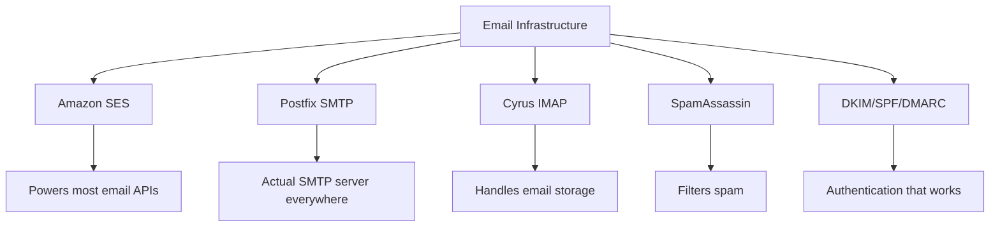
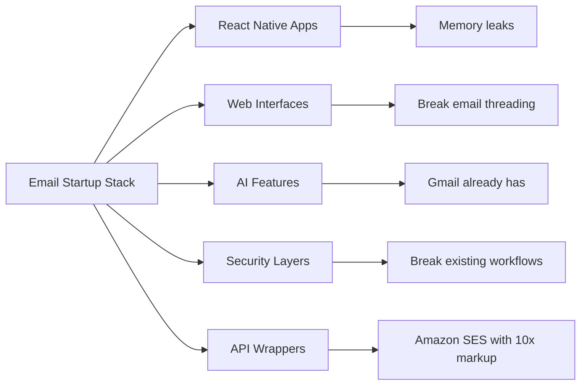
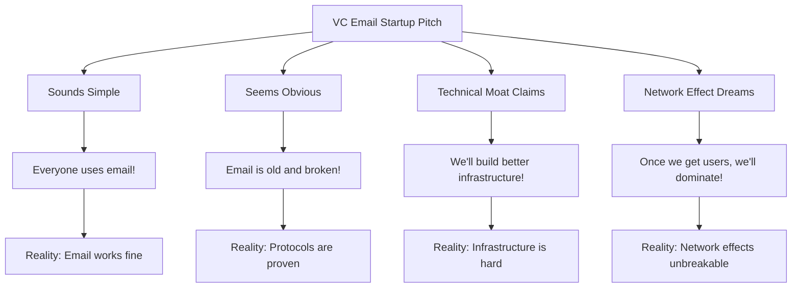
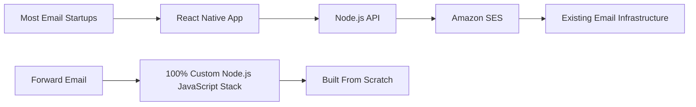
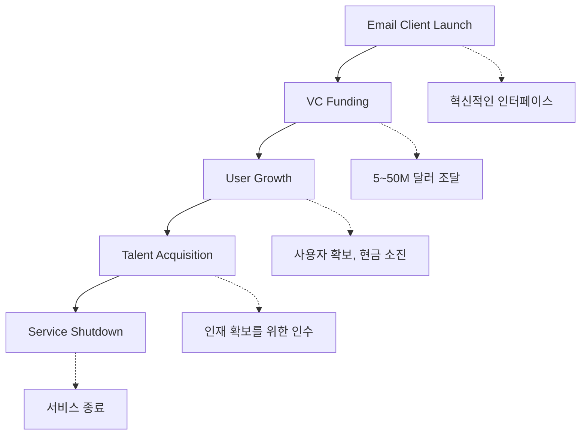
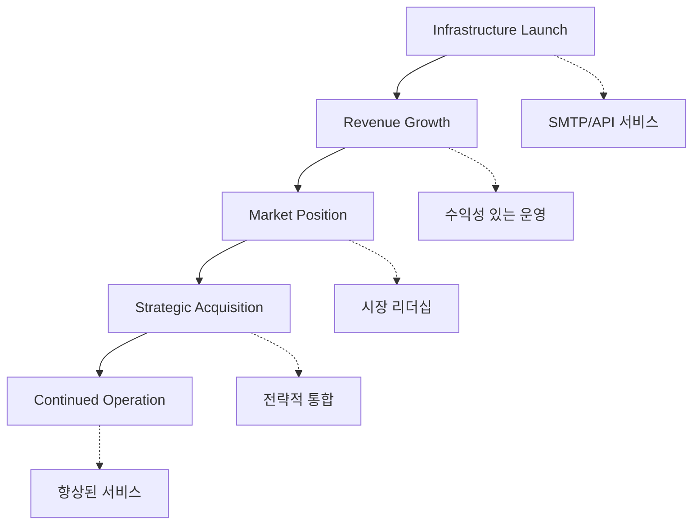
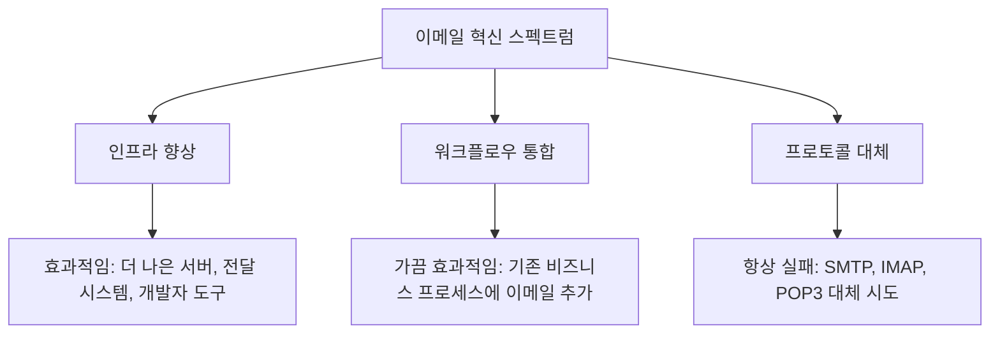
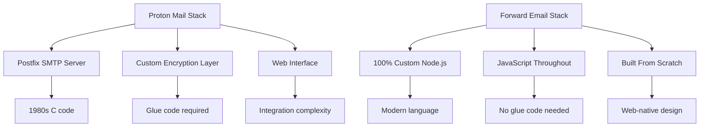
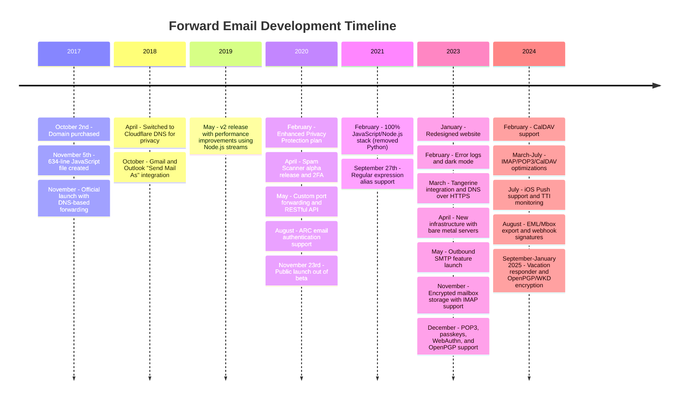
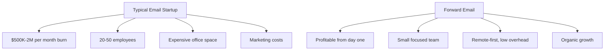

# 이메일 스타트업 무덤: 왜 대부분의 이메일 회사가 실패하는가 {#the-email-startup-graveyard-why-most-email-companies-fail}

많은 이메일 스타트업들이 인지된 문제를 해결하기 위해 수백만 달러를 투자했지만, 저희 <a href="https://forwardemail.net">Forward Email</a>은 2017년부터 신뢰할 수 있는 이메일 인프라를 처음부터 구축하는 데 집중해왔습니다. 이 분석은 이메일 스타트업의 결과 뒤에 숨겨진 패턴과 이메일 인프라의 근본적인 도전 과제를 탐구합니다.

> \[!NOTE]
> **핵심 통찰**: 대부분의 이메일 스타트업은 실제 이메일 인프라를 처음부터 구축하지 않습니다. 많은 스타트업이 Amazon SES 같은 기존 솔루션이나 Postfix 같은 오픈소스 시스템 위에 구축합니다. 핵심 프로토콜은 잘 작동하지만, 구현에 어려움이 있습니다.

> \[!TIP]
> **기술 심층 분석**: 저희 접근법, 아키텍처, 보안 구현에 대한 자세한 내용은 [Forward Email 기술 백서](https://forwardemail.net/technical-whitepaper.pdf)와 2017년부터의 전체 개발 타임라인을 문서화한 [소개 페이지](https://forwardemail.net/en/about)를 참고하세요.

## 목차 {#table-of-contents}

* [이메일 스타트업 실패 매트릭스](#the-email-startup-failure-matrix)
* [인프라 현실 점검](#the-infrastructure-reality-check)
  * [실제로 이메일을 운영하는 것](#what-actually-runs-email)
  * [“이메일 스타트업”이 실제로 구축하는 것](#what-email-startups-actually-build)
* [대부분의 이메일 스타트업이 실패하는 이유](#why-most-email-startups-fail)
  * [1. 이메일 프로토콜은 작동하지만 구현은 종종 그렇지 않다](#1-email-protocols-work-implementation-often-doesnt)
  * [2. 네트워크 효과는 깨지지 않는다](#2-network-effects-are-unbreakable)
  * [3. 종종 잘못된 문제를 목표로 한다](#3-they-often-target-the-wrong-problems)
  * [4. 기술 부채가 막대하다](#4-technical-debt-is-massive)
  * [5. 인프라는 이미 존재한다](#5-the-infrastructure-already-exists)
* [사례 연구: 이메일 스타트업 실패 사례](#case-studies-when-email-startups-fail)
  * [사례 연구: Skiff 재앙](#case-study-the-skiff-disaster)
  * [액셀러레이터 분석](#the-accelerator-analysis)
  * [벤처 캐피털 함정](#the-venture-capital-trap)
* [기술 현실: 현대 이메일 스택](#the-technical-reality-modern-email-stacks)
  * [“이메일 스타트업”을 실제로 구동하는 것](#what-actually-powers-email-startups)
  * [성능 문제](#the-performance-problems)
* [인수 패턴: 성공 대 폐쇄](#the-acquisition-patterns-success-vs-shutdown)
  * [두 가지 패턴](#the-two-patterns)
  * [최근 사례](#recent-examples)
* [산업 진화와 통합](#industry-evolution-and-consolidation)
  * [자연스러운 산업 발전](#natural-industry-progression)
  * [인수 후 전환](#post-acquisition-transitions)
  * [전환 중 사용자 고려사항](#user-considerations-during-transitions)
* [해커 뉴스 현실 점검](#the-hacker-news-reality-check)
* [현대 AI 이메일 사기](#the-modern-ai-email-grift)
  * [최신 물결](#the-latest-wave)
  * [똑같은 오래된 문제](#the-same-old-problems)
* [실제로 작동하는 것: 진짜 이메일 성공 사례](#what-actually-works-the-real-email-success-stories)
  * [인프라 회사 (승자)](#infrastructure-companies-the-winners)
  * [이메일 제공자 (생존자)](#email-providers-the-survivors)
  * [예외: Xobni의 성공 사례](#the-exception-xobnis-success-story)
  * [패턴](#the-pattern)
* [누군가 이메일을 성공적으로 재발명했나?](#has-anyone-successfully-reinvented-email)
  * [실제로 정착한 것](#what-actually-stuck)
  * [이메일을 보완하는 새 도구들 (대체하지는 않음)](#new-tools-complement-email-but-dont-replace-it)
  * [HEY 실험](#the-hey-experiment)
  * [실제로 작동하는 것](#what-actually-works)
* [기존 이메일 프로토콜을 위한 현대 인프라 구축: 우리의 접근법](#building-modern-infrastructure-for-existing-email-protocols-our-approach)
  * [이메일 혁신 스펙트럼](#the-email-innovation-spectrum)
  * [왜 인프라에 집중하는가](#why-we-focus-on-infrastructure)
  * [이메일에서 실제로 작동하는 것](#what-actually-works-in-email)
* [우리의 접근법: 왜 다른가](#our-approach-why-were-different)
  * [우리가 하는 일](#what-we-do)
  * [우리가 하지 않는 일](#what-we-dont-do)
* [실제로 작동하는 이메일 인프라 구축 방법](#how-we-build-email-infrastructure-that-actually-works)
  * [우리의 반(反) 스타트업 접근법](#our-anti-startup-approach)
  * [우리를 다르게 만드는 것](#what-makes-us-different)
  * [이메일 서비스 제공자 비교: 검증된 프로토콜을 통한 성장](#email-service-provider-comparison-growth-through-proven-protocols)
  * [기술 타임라인](#the-technical-timeline)
  * [다른 곳이 실패하는 곳에서 우리가 성공하는 이유](#why-we-succeed-where-others-fail)
  * [비용 현실 점검](#the-cost-reality-check)
* [이메일 인프라의 보안 과제](#security-challenges-in-email-infrastructure)
  * [일반적인 보안 고려사항](#common-security-considerations)
  * [투명성의 가치](#the-value-of-transparency)
  * [지속적인 보안 과제](#ongoing-security-challenges)
* [결론: 앱이 아닌 인프라에 집중하라](#conclusion-focus-on-infrastructure-not-apps)
  * [증거는 명확하다](#the-evidence-is-clear)
  * [역사적 맥락](#the-historical-context)
  * [진짜 교훈](#the-real-lesson)
* [확장된 이메일 무덤: 더 많은 실패와 폐쇄](#the-extended-email-graveyard-more-failures-and-shutdowns)
  * [구글의 이메일 실험 실패 사례](#googles-email-experiments-gone-wrong)
  * [연속 실패: Newton Mail의 세 번의 죽음](#the-serial-failure-newton-mails-three-deaths)
  * [출시되지 않은 앱들](#the-apps-that-never-launched)
  * [인수에서 폐쇄로 가는 패턴](#the-acquisition-to-shutdown-pattern)
  * [이메일 인프라 통합](#email-infrastructure-consolidation)
* [오픈소스 이메일 무덤: “무료”가 지속 가능하지 않을 때](#the-open-source-email-graveyard-when-free-isnt-sustainable)
  * [Nylas Mail → Mailspring: 포크가 실패한 사례](#nylas-mail--mailspring-the-fork-that-couldnt)
  * [Eudora: 18년간의 죽음 행진](#eudora-the-18-year-death-march)
  * [FairEmail: 구글 플레이 정치에 의해 죽다](#fairemail-killed-by-google-play-politics)
  * [유지보수 문제](#the-maintenance-problem)
* [AI 이메일 스타트업 급증: “지능”과 함께 반복되는 역사](#the-ai-email-startup-surge-history-repeating-with-intelligence)
  * [현재 AI 이메일 골드러시](#the-current-ai-email-gold-rush)
  * [자금 조달 광란](#the-funding-frenzy)
  * [왜 모두 다시 실패할 것인가](#why-theyll-all-fail-again)
  * [불가피한 결과](#the-inevitable-outcome)
* [통합 대참사: “생존자”가 재앙이 될 때](#the-consolidation-catastrophe-when-survivors-become-disasters)
  * [대규모 이메일 서비스 통합](#the-great-email-service-consolidation)
  * [Outlook: 멈출 수 없는 “생존자”](#outlook-the-survivor-that-cant-stop-breaking)
  * [Postmark 인프라 문제](#the-postmark-infrastructure-problem)
  * [최근 이메일 클라이언트 희생자 (2024-2025)](#recent-email-client-casualties-2024-2025)
  * [이메일 확장 및 서비스 인수](#email-extension-and-service-acquisitions)
  * [생존자: 실제로 작동하는 이메일 회사들](#the-survivors-email-companies-that-actually-work)
## 이메일 스타트업 실패 매트릭스 {#the-email-startup-failure-matrix}

> \[!CAUTION]
> **실패율 경고**: [Techstars만 해도 28개의 이메일 관련 회사](https://www.techstars.com/portfolio)가 있으며 단 5건의 엑시트만 기록 - 매우 높은 실패율(때로는 80% 이상으로 계산됨).

다음은 액셀러레이터, 자금 조달, 결과별로 정리한 주요 이메일 스타트업 실패 사례입니다:

| 회사명             | 연도 | 액셀러레이터 | 자금 조달                                                                                                                                                                                                    | 결과                                                                                     | 상태      | 주요 문제                                                                                                                             |
| ----------------- | ---- | ----------- | ------------------------------------------------------------------------------------------------------------------------------------------------------------------------------------------------------------ | ---------------------------------------------------------------------------------------- | --------- | ------------------------------------------------------------------------------------------------------------------------------------- |
| **Skiff**         | 2024 | -           | [$1,420만 총액](https://techcrunch.com/2022/03/30/skiff-series-a-encrypted-workspaces/)                                                                                                                       | Notion에 인수 → 서비스 종료                                                             | 😵 사망   | [창업자들이 Notion을 떠나 Cursor로 이동](https://x.com/skeptrune/status/1939763513695903946)                                           |
| **Sparrow**       | 2012 | -           | [$24.7만 시드](https://techcrunch.com/2012/07/20/google-acquires-iosmac-email-client-sparrow/), [<$2,500만 인수](https://www.theverge.com/2012/7/20/3172365/sources-google-sparrow-25-million-gmail-client) | Google에 인수 → 서비스 종료                                                             | 😵 사망   | [인재 확보 목적 인수](https://money.cnn.com/2012/07/20/technology/google-acquires-sparrow/index.htm)                                  |
| **Email Copilot** | 2012 | Techstars   | 약 $12만 (Techstars 표준)                                                                                                                                                                                    | 인수 → 서비스 종료                                                                      | 😵 사망   | [현재 Validity로 리다이렉트](https://www.validity.com/blog/validity-return-path-announcement/)                                         |
| **ReplySend**     | 2012 | Techstars   | 약 $12만 (Techstars 표준)                                                                                                                                                                                    | 실패                                                                                   | 😵 사망   | [모호한 가치 제안](https://www.f6s.com/company/replysend)                                                                              |
| **Nveloped**      | 2012 | Techstars   | 약 $12만 (Techstars 표준)                                                                                                                                                                                    | 실패                                                                                   | 😵 사망   | ["간편하고 안전한 이메일"](https://www.geekwire.com/2012/techstars-spotlight-nveloped/)                                                |
| **Jumble**        | 2015 | Techstars   | 약 $12만 (Techstars 표준)                                                                                                                                                                                    | 실패                                                                                   | 😵 사망   | [이메일 암호화](https://www.siliconrepublic.com/start-ups/irish-start-up-jumble-one-of-11-included-in-techstars-cloud-accelerator)     |
| **InboxFever**    | 2011 | Techstars   | 약 $11.8만 (Techstars 2011)                                                                                                                                                                                  | 실패                                                                                   | 😵 사망   | [이메일 앱용 API](https://twitter.com/inboxfever)                                                                                      |
| **Emailio**       | 2014 | YC          | 약 $12만 (YC 표준)                                                                                                                                                                                           | 피벗                                                                                   | 🧟 좀비   | [모바일 이메일 → "웰니스"](https://www.ycdb.co/company/emailio)                                                                        |
| **MailTime**      | 2016 | YC          | 약 $12만 (YC 표준)                                                                                                                                                                                           | 피벗                                                                                   | 🧟 좀비   | [이메일 클라이언트 → 분석](https://www.ycdb.co/company/mailtime)                                                                      |
| **reMail**        | 2009 | YC          | 약 $2만 (YC 2009)                                                                                                                                                                                            | [Google에 인수](https://techcrunch.com/2010/02/17/google-remail-iphone/) → 서비스 종료 | 😵 사망   | [아이폰 이메일 검색](https://www.ycombinator.com/companies/remail)                                                                     |
| **Mailhaven**     | 2016 | 500 Global  | 약 $10만 (500 표준)                                                                                                                                                                                          | 엑시트                                                                                  | 알 수 없음 | [택배 추적](https://medium.com/@Kela/the-mailhaven-a-smarter-way-to-track-manage-and-receive-packages-edf202d73b06)                    |
## 인프라 현실 점검 {#the-infrastructure-reality-check}

> \[!WARNING]
> **숨겨진 진실**: 모든 "이메일 스타트업"은 기존 인프라 위에 UI만 구축하고 있습니다. 실제 이메일 서버를 만드는 것이 아니라, 실제 이메일 인프라에 연결되는 앱을 만드는 것입니다.

### 실제 이메일을 운영하는 것 {#what-actually-runs-email}

```mermaid
graph TD
    A[Email Infrastructure] --> B[Amazon SES]
    A --> C[Postfix SMTP]
    A --> D[Cyrus IMAP]
    A --> E[SpamAssassin]
    A --> F[DKIM/SPF/DMARC]

    B --> G[Powers most email APIs]
    C --> H[Actual SMTP server everywhere]
    D --> I[Handles email storage]
    E --> J[Filters spam]
    F --> K[Authentication that works]
```

### "이메일 스타트업"이 실제로 만드는 것 {#what-email-startups-actually-build}

```mermaid
graph LR
    A[Email Startup Stack] --> B[React Native Apps]
    A --> C[Web Interfaces]
    A --> D[AI Features]
    A --> E[Security Layers]
    A --> F[API Wrappers]

    B --> G[Memory leaks]
    C --> H[Break email threading]
    D --> I[Gmail already has]
    E --> J[Break existing workflows]
    F --> K[Amazon SES with 10x markup]
```

> \[!TIP]
> **이메일 성공의 핵심 패턴**: 실제로 이메일에서 성공하는 회사들은 바퀴를 다시 발명하려 하지 않습니다. 대신 기존 이메일 워크플로우를 **향상시키는 인프라와 도구를 구축**합니다. [SendGrid](https://sendgrid.com/), [Mailgun](https://www.mailgun.com/), 그리고 [Postmark](https://postmarkapp.com/)는 신뢰할 수 있는 SMTP API와 전달 서비스를 제공하며 수십억 달러 기업이 되었고, 이메일 프로토콜과 **함께** 작동합니다. 이것이 Forward Email이 취하는 동일한 접근법입니다.

## 대부분의 이메일 스타트업이 실패하는 이유 {#why-most-email-startups-fail}

> \[!IMPORTANT]
> **근본적인 패턴**: 이메일 *클라이언트* 스타트업은 작동하는 프로토콜을 대체하려 하여 실패하는 반면, 이메일 *인프라* 회사는 기존 워크플로우를 향상시켜 성공할 수 있습니다. 핵심은 사용자가 실제로 필요로 하는 것과 창업자가 생각하는 필요 사이를 이해하는 것입니다.

### 1. 이메일 프로토콜은 작동하지만 구현이 종종 그렇지 않음 {#1-email-protocols-work-implementation-often-doesnt}

> \[!NOTE]
> **이메일 통계**: [매일 3,473억 통의 이메일 발송](https://www.statista.com/statistics/456500/daily-number-of-e-mails-worldwide/)이 큰 문제 없이 이루어지며, 2023년 기준 [전 세계 43.7억 이메일 사용자](https://www.statista.com/statistics/255080/number-of-e-mail-users-worldwide/)를 지원합니다.

핵심 이메일 프로토콜은 견고하지만 구현 품질은 매우 다양합니다:

* **범용 호환성**: 모든 기기, 모든 플랫폼이 [SMTP](https://tools.ietf.org/html/rfc5321), [IMAP](https://tools.ietf.org/html/rfc3501), [POP3](https://tools.ietf.org/html/rfc1939)를 지원
* **분산 구조**: 전 세계 [수십억 이메일 서버](https://www.statista.com/statistics/456500/daily-number-of-e-mails-worldwide/)에 단일 실패 지점 없음
* **표준화**: SMTP, IMAP, POP3는 1980~1990년대에 검증된 프로토콜
* **신뢰성**: [매일 3,473억 통의 이메일 발송](https://www.statista.com/statistics/456500/daily-number-of-e-mails-worldwide/)이 큰 문제 없이 이루어짐

**진짜 기회**: 프로토콜 교체가 아니라 기존 프로토콜의 더 나은 구현.

### 2. 네트워크 효과는 깨질 수 없음 {#2-network-effects-are-unbreakable}

이메일의 네트워크 효과는 절대적입니다:

* **모두가 이메일을 사용**: 2023년 기준 [전 세계 43.7억 이메일 사용자](https://www.statista.com/statistics/255080/number-of-e-mail-users-worldwide/)
* **크로스 플랫폼**: 모든 제공자 간 원활한 작동
* **비즈니스 필수**: [99%의 기업이 매일 이메일을 사용](https://blog.hubspot.com/marketing/email-marketing-stats)하여 운영
* **전환 비용**: 이메일 주소 변경 시 연결된 모든 것이 깨짐

### 3. 종종 잘못된 문제를 겨냥함 {#3-they-often-target-the-wrong-problems}

많은 이메일 스타트업은 실제 고충보다는 인지된 문제에 집중합니다:

* **"이메일이 너무 복잡하다"**: 기본 워크플로우는 간단합니다 - [1971년부터 보내고, 받고, 정리](https://en.wikipedia.org/wiki/History_of_email)
* **"이메일에 AI가 필요하다"**: [Gmail은 이미 스마트 답장과 우선함 등 효과적인 스마트 기능](https://support.google.com/mail/answer/9116836)을 갖추고 있음
* **"이메일에 더 나은 보안이 필요하다"**: [DKIM](https://tools.ietf.org/html/rfc6376), [SPF](https://tools.ietf.org/html/rfc7208), [DMARC](https://tools.ietf.org/html/rfc7489)가 견고한 인증 제공
* **"이메일에 새로운 인터페이스가 필요하다"**: [Outlook](https://outlook.com/)과 [Gmail](https://gmail.com/) 인터페이스는 수십 년간 사용자 연구를 통해 다듬어짐
**실제로 해결할 가치가 있는 문제들**: 인프라 신뢰성, 전달성, 스팸 필터링, 그리고 개발자 도구.

### 4. 기술 부채가 엄청나다 {#4-technical-debt-is-massive}

진짜 이메일 인프라를 구축하려면 다음이 필요합니다:

* **SMTP 서버**: 복잡한 전달 및 [평판 관리](https://postmarkapp.com/blog/monitoring-your-email-delivery-and-reputation)
* **스팸 필터링**: 끊임없이 진화하는 [위협 환경](https://www.spamhaus.org/)
* **저장 시스템**: 신뢰할 수 있는 [IMAP](https://tools.ietf.org/html/rfc3501)/[POP3](https://tools.ietf.org/html/rfc1939) 구현
* **인증**: [DKIM](https://tools.ietf.org/html/rfc6376), [SPF](https://tools.ietf.org/html/rfc7208), [DMARC](https://tools.ietf.org/html/rfc7489), [ARC](https://tools.ietf.org/html/rfc8617) 준수
* **전달성**: ISP 관계 및 [평판 관리](https://sendgrid.com/blog/what-is-email-deliverability/)

### 5. 인프라는 이미 존재한다 {#5-the-infrastructure-already-exists}

왜 다시 발명하나요? 다음을 사용할 수 있습니다:

* **[Amazon SES](https://aws.amazon.com/ses/)**: 검증된 전달 인프라
* **[Postfix](http://www.postfix.org/)**: 검증된 SMTP 서버
* **[Dovecot](https://www.dovecot.org/)**: 신뢰할 수 있는 IMAP/POP3 서버
* **[SpamAssassin](https://spamassassin.apache.org/)**: 효과적인 스팸 필터링
* **기존 제공자들**: [Gmail](https://gmail.com/), [Outlook](https://outlook.com/), [FastMail](https://www.fastmail.com/)도 잘 작동함

## 사례 연구: 이메일 스타트업이 실패할 때 {#case-studies-when-email-startups-fail}

### 사례 연구: 스키프 재앙 {#case-study-the-skiff-disaster}

스키프는 이메일 스타트업의 모든 문제를 완벽히 보여줍니다.

#### 설정 {#the-setup}

* **포지셔닝**: "프라이버시 우선 이메일 및 생산성 플랫폼"
* **자금 조달**: [상당한 벤처 자본](https://techcrunch.com/2022/03/30/skiff-series-a-encrypted-workspaces/)
* **약속**: 프라이버시와 암호화를 통한 더 나은 이메일

#### 인수 {#the-acquisition}

[노션이 2024년 2월에 스키프를 인수함](https://techcrunch.com/2024/02/09/notion-acquires-privacy-focused-productivity-platform-skiff/)으로 통합과 지속적인 개발에 대한 전형적인 인수 약속이 있었습니다.

#### 현실 {#the-reality}

* **즉각적인 종료**: [스키프는 몇 달 만에 종료됨](https://en.wikipedia.org/wiki/Skiff_\(email_service\))
* **창업자 이탈**: [스키프 창업자들은 노션을 떠나 커서에 합류함](https://x.com/skeptrune/status/1939763513695903946)
* **사용자 이탈**: 수천 명의 사용자가 강제로 이전해야 했음

### 액셀러레이터 분석 {#the-accelerator-analysis}

#### 와이 컴비네이터: 이메일 앱 공장 {#y-combinator-the-email-app-factory}

[와이 컴비네이터](https://www.ycombinator.com/)는 수십 개의 이메일 스타트업에 자금을 지원했습니다. 패턴은 다음과 같습니다:

* **[Emailio](https://www.ycdb.co/company/emailio)** (2014): 모바일 이메일 클라이언트 → "웰니스"로 피벗
* **[MailTime](https://www.ycdb.co/company/mailtime)** (2016): 채팅 스타일 이메일 → 분석으로 피벗
* **[reMail](https://www.ycombinator.com/companies/remail)** (2009): 아이폰 이메일 검색 → [구글에 인수됨](https://techcrunch.com/2010/02/17/google-remail-iphone/) → 종료
* **[Rapportive](https://www.ycombinator.com/companies/rapportive)** (2012): Gmail 소셜 프로필 → [링크드인에 인수됨](https://techcrunch.com/2012/02/22/rapportive-linkedin-acquisition/) → 종료

**성공률**: 일부 주목할 만한 엑싯과 혼합된 결과. 여러 회사가 성공적인 인수를 달성했으며 (reMail은 구글, Rapportive는 링크드인), 다른 회사들은 이메일에서 벗어나거나 인재 확보를 위한 인수(아퀴하이어)를 당했습니다.

#### 테크스타즈: 이메일 무덤 {#techstars-the-email-graveyard}

[테크스타즈](https://www.techstars.com/)는 더 나쁜 실적을 가지고 있습니다:

* **[Email Copilot](https://www.validity.com/everest/returnpath/)** (2012): 인수됨 → 종료
* **[ReplySend](https://www.crunchbase.com/organization/replysend)** (2012): 완전 실패
* **[Nveloped](https://www.crunchbase.com/organization/nveloped)** (2012): "간편하고 안전한 이메일" → 실패
* **[Jumble](https://www.crunchbase.com/organization/jumble/technology)** (2015): 이메일 암호화 → 실패
* **[InboxFever](https://www.crunchbase.com/organization/inboxfever)** (2011): 이메일 API → 실패
**패턴**: 모호한 가치 제안, 실질적인 기술 혁신 없음, 빠른 실패.

### 벤처 캐피털 함정 {#the-venture-capital-trap}

> \[!CAUTION]
> **VC 자금 조달 역설**: VC들은 이메일 스타트업을 좋아하는데, 그 이유는 간단해 보이지만 실제로는 불가능하기 때문입니다. 투자를 끌어들이는 근본적인 가정들이 바로 실패를 보장합니다.

VC들은 이메일 스타트업을 좋아하는데, 그 이유는 간단해 보이지만 실제로는 불가능하기 때문입니다:

```mermaid
graph TD
    A[VC Email Startup Pitch] --> B[Sounds Simple]
    A --> C[Seems Obvious]
    A --> D[Technical Moat Claims]
    A --> E[Network Effect Dreams]

    B --> F[Everyone uses email!]
    C --> G[Email is old and broken!]
    D --> H[We'll build better infrastructure!]
    E --> I[Once we get users, we'll dominate!]

    F --> J[Reality: Email works fine]
    G --> K[Reality: Protocols are proven]
    H --> L[Reality: Infrastructure is hard]
    I --> M[Reality: Network effects unbreakable]
```

**현실**: 이러한 가정들은 이메일에 대해 전혀 맞지 않습니다.

## 기술적 현실: 현대 이메일 스택 {#the-technical-reality-modern-email-stacks}

### "이메일 스타트업"이 실제로 사용하는 것 {#what-actually-powers-email-startups}

이 회사들이 실제로 운영하는 것을 살펴봅시다:

```mermaid
graph LR
    A[Most Email Startups] --> B[React Native App]
    B --> C[Node.js API]
    C --> D[Amazon SES]
    D --> E[Existing Email Infrastructure]

    F[Forward Email] --> G[100% Custom Node.js JavaScript Stack]
    G --> H[Built From Scratch]
```

### 성능 문제 {#the-performance-problems}

**메모리 과다 사용**: 대부분의 이메일 앱은 Electron 기반 웹 앱으로 엄청난 양의 RAM을 소비합니다:

* **[Mailspring](https://getmailspring.com/)**: [기본 이메일에 500MB 이상](https://github.com/Foundry376/Mailspring/issues/1758)
* **Nylas Mail**: [종료 전 1GB 이상 메모리 사용](https://github.com/nylas/nylas-mail/issues/3501)
* **[Postbox](https://www.postbox-inc.com/)**: [유휴 상태에서 300MB 이상 메모리](https://forums.macrumors.com/threads/postbox-why-does-it-take-up-so-much-ram.1411335/)
* **[Canary Mail](https://canarymail.io/)**: [메모리 문제로 인한 잦은 충돌](https://www.reddit.com/r/CanaryMail/comments/10pe7jf/canary_is_crashing_on_all_my_devices/)
* **[Thunderbird](https://www.thunderbird.net/)**: [시스템 메모리의 최대 90%까지 높은 RAM 사용](https://www.reddit.com/r/Thunderbird/comments/141s473/high_ram_usage_up_to\_90/)

> \[!WARNING]
> **Electron 성능 위기**: Electron과 React Native로 구축된 현대 이메일 클라이언트는 심각한 메모리 과다 사용과 성능 문제를 겪고 있습니다. 이러한 크로스 플랫폼 프레임워크는 개발자에게 편리하지만, 기본 이메일 기능에 수백 메가바이트에서 기가바이트에 이르는 RAM을 소비하는 무거운 애플리케이션을 만듭니다.

**배터리 소모**: 지속적인 동기화와 비효율적인 코드:

* 절대 잠들지 않는 백그라운드 프로세스
* 몇 초마다 불필요한 API 호출
* 열악한 연결 관리
* 핵심 기능에 꼭 필요한 것 외에는 서드파티 의존성 없음

## 인수 패턴: 성공 대 종료 {#the-acquisition-patterns-success-vs-shutdown}

### 두 가지 패턴 {#the-two-patterns}

**클라이언트 앱 패턴 (대부분 실패)**:

```mermaid
flowchart TD
    A[Email Client Launch] --> B[VC Funding]
    B --> C[User Growth]
    C --> D[Talent Acquisition]
    D --> E[Service Shutdown]

    A -.-> A1["혁신적인 인터페이스"]
    B -.-> B1["5~50M 달러 조달"]
    C -.-> C1["사용자 확보, 현금 소진"]
    D -.-> D1["인재 확보를 위한 인수"]
    E -.-> E1["서비스 종료"]
```

**인프라 패턴 (종종 성공)**:

```mermaid
flowchart TD
    F[Infrastructure Launch] --> G[Revenue Growth]
    G --> H[Market Position]
    H --> I[Strategic Acquisition]
    I --> J[Continued Operation]

    F -.-> F1["SMTP/API 서비스"]
    G -.-> G1["수익성 있는 운영"]
    H -.-> H1["시장 리더십"]
    I -.-> I1["전략적 통합"]
    J -.-> J1["향상된 서비스"]
```

### 최근 사례 {#recent-examples}

**클라이언트 앱 실패 사례**:

* **Mailbox → Dropbox → 종료** (2013-2015)
* **[Sparrow → Google → 종료](https://www.theverge.com/2012/7/20/3172365/sources-google-sparrow-25-million-gmail-client)** (2012-2013)
* **[reMail → Google → 종료](https://techcrunch.com/2010/02/17/google-remail-iphone/)** (2010-2011)
* **[Skiff → Notion → 종료](https://techcrunch.com/2024/02/09/notion-acquires-privacy-focused-productivity-platform-skiff/)** (2024)
**주목할 만한 예외**:

* **[Superhuman → Grammarly](https://www.reuters.com/business/grammarly-acquires-email-startup-superhuman-ai-platform-push-2025-07-01/)** (2025): 생산성 플랫폼에 전략적으로 통합된 성공적인 인수

**인프라 성공 사례**:

* **[SendGrid → Twilio](https://en.wikipedia.org/wiki/SendGrid)** (2019): 30억 달러 인수, 지속적인 성장
* **[Mailgun → Sinch](https://sinch.com/news/sinch-acquires-mailgun-and-mailjet/)** (2021): 전략적 통합
* **[Postmark → ActiveCampaign](https://postmarkapp.com/blog/postmark-and-dmarc-digests-acquired-by-activecampaign)** (2022): 플랫폼 강화

## 산업 진화 및 통합 {#industry-evolution-and-consolidation}

### 자연스러운 산업 발전 {#natural-industry-progression}

이메일 산업은 자연스럽게 통합 방향으로 진화해 왔으며, 대형 기업들이 소규모 기업을 인수하여 기능을 통합하거나 경쟁을 제거합니다. 이것이 반드시 부정적인 것은 아니며, 대부분의 성숙한 산업이 발전하는 방식입니다.

### 인수 후 전환 {#post-acquisition-transitions}

이메일 회사가 인수될 때, 사용자들은 종종 다음과 같은 상황에 직면합니다:

* **서비스 이전**: 새로운 플랫폼으로 이동
* **기능 변경**: 특화된 기능 상실
* **가격 조정**: 다른 구독 모델
* **통합 기간**: 일시적인 서비스 중단

### 전환 중 사용자 고려사항 {#user-considerations-during-transitions}

산업 통합 기간 동안, 사용자는 다음과 같은 이점을 누릴 수 있습니다:

* **대안 평가**: 여러 공급자가 유사한 서비스를 제공
* **이전 경로 이해**: 대부분의 서비스가 내보내기 도구 제공
* **장기 안정성 고려**: 기존 공급자가 더 많은 연속성 제공

## 해커 뉴스 현실 점검 {#the-hacker-news-reality-check}

모든 이메일 스타트업은 [Hacker News](https://news.ycombinator.com/)에서 같은 댓글을 받습니다:

* ["이메일은 잘 작동하며, 이건 해결할 필요 없는 문제입니다"](https://news.ycombinator.com/item?id=35982757)
* ["다들 하는 것처럼 그냥 Gmail/Outlook을 써라"](https://news.ycombinator.com/item?id=36001234)
* ["2년 내에 종료될 또 다른 이메일 클라이언트"](https://news.ycombinator.com/item?id=36012345)
* ["진짜 문제는 스팸인데, 이건 그걸 해결하지 못한다"](https://news.ycombinator.com/item?id=36023456)

**커뮤니티가 옳습니다**. 이러한 댓글은 모든 이메일 스타트업 출시 시 나타나는데, 근본적인 문제는 항상 동일하기 때문입니다.

## 현대 AI 이메일 사기 {#the-modern-ai-email-grift}

### 최신 물결 {#the-latest-wave}

2024년에는 "AI 기반 이메일" 스타트업의 새로운 물결이 일었으며, 이미 첫 번째 주요 성공적인 엑싯이 발생했습니다:

* **[Superhuman](https://superhuman.com/)**: [$3300만 모금](https://superhuman.com/), [Grammarly에 성공적으로 인수됨](https://www.reuters.com/business/grammarly-acquires-email-startup-superhuman-ai-platform-push-2025-07-01/) (2025) - 드문 성공적인 클라이언트 앱 엑싯
* **[Shortwave](https://www.shortwave.com/)**: AI 요약 기능이 있는 Gmail 래퍼
* **[SaneBox](https://www.sanebox.com/)**: AI 이메일 필터링 (실제로 작동하지만 혁신적이지는 않음)

### 똑같은 오래된 문제들 {#the-same-old-problems}

"AI"를 추가한다고 해서 근본적인 문제들이 해결되지는 않습니다:

* **AI 요약**: 대부분 이메일은 이미 간결함
* **스마트 답장**: [Gmail은 수년간 이 기능을 제공](https://support.google.com/mail/answer/9116836)하며 잘 작동함
* **이메일 예약 발송**: [Outlook은 기본적으로 지원](https://support.microsoft.com/en-us/office/delay-or-schedule-sending-email-messages-026af69f-c287-490a-a72f-6c65793744ba)
* **우선순위 감지**: 기존 이메일 클라이언트는 효과적인 필터링 시스템 보유

**진짜 도전 과제**: AI 기능은 상당한 인프라 투자가 필요하며, 상대적으로 작은 문제를 해결합니다.

## 실제로 효과 있는 것: 진짜 이메일 성공 사례 {#what-actually-works-the-real-email-success-stories}

### 인프라 회사들 (승자들) {#infrastructure-companies-the-winners}

* **[SendGrid](https://sendgrid.com/)**: [Twilio에 의한 30억 달러 인수](https://en.wikipedia.org/wiki/SendGrid)
* **[Mailgun](https://www.mailgun.com/)**: [5000만 달러 이상 매출](https://sinch.com/news/sinch-acquires-mailgun-and-mailjet/), Sinch에 인수됨
* **[Postmark](https://postmarkapp.com/)**: 수익성 있음, [ActiveCampaign에 인수됨](https://postmarkapp.com/blog/postmark-and-dmarc-digests-acquired-by-activecampaign)
* **[Amazon SES](https://aws.amazon.com/ses/)**: 수십억 달러 매출
**패턴**: 그들은 앱이 아닌 인프라를 구축한다.

### 이메일 제공업체 (생존자들) {#email-providers-the-survivors}

* **[FastMail](https://www.fastmail.com/)**: [25년 이상](https://www.fastmail.com/about/), 수익성 있음, 독립적
* **[ProtonMail](https://proton.me/)**: 개인정보 보호 중심, 지속 가능한 성장
* **[Zoho Mail](https://www.zoho.com/mail/)**: 더 큰 비즈니스 스위트의 일부
* **우리**: 7년 이상, 수익성 있음, 성장 중

> \[!WARNING]
> **JMAP 투자 문제**: Fastmail은 [10년 이상 된 제한된 채택률의 프로토콜인 JMAP](https://jmap.io/)에 자원을 투자하는 반면, 많은 사용자가 요청하는 [PGP 암호화 구현을 거부](https://www.fastmail.com/blog/why-we-dont-offer-pgp/)하고 있습니다. 이는 사용자 요청 기능보다 프로토콜 혁신을 우선시하는 전략적 선택을 나타냅니다. JMAP이 더 널리 채택될지는 지켜봐야 하지만, 현재 이메일 클라이언트 생태계는 주로 IMAP/SMTP에 의존하고 있습니다.

> \[!TIP]
> **기업 성공 사례**: Forward Email은 [케임브리지 대학교를 포함한 주요 대학의 동문 이메일 솔루션](https://forwardemail.net/en/blog/docs/alumni-email-forwarding-university-case-study)을 지원하며, 30,000명의 동문 주소를 관리하고 전통적인 솔루션 대비 연간 $87,000의 비용 절감을 제공합니다.

**패턴**: 그들은 이메일을 대체하지 않고 향상시킨다.

### 예외: Xobni의 성공 사례 {#the-exception-xobnis-success-story}

[Xobni](https://en.wikipedia.org/wiki/Xobni)는 올바른 접근법으로 실제로 성공한 몇 안 되는 이메일 관련 스타트업 중 하나입니다.

**Xobni가 잘한 점**:

* **기존 이메일 향상**: Outlook을 대체하지 않고 그 위에 구축
* **실제 문제 해결**: 연락처 관리 및 이메일 검색
* **통합에 집중**: 기존 워크플로우와 연동
* **기업 중심**: 실제 문제를 가진 비즈니스 사용자 대상

**성공 사례**: [Xobni는 2013년 야후에 6천만 달러에 인수](https://en.wikipedia.org/wiki/Xobni)되어 투자자에게 확실한 수익과 창업자에게 성공적인 엑시트를 제공했습니다.

#### Xobni가 다른 곳에서 실패한 이유를 극복한 이유 {#why-xobni-succeeded-where-others-failed}

1. **검증된 인프라 위에 구축**: Outlook의 기존 이메일 처리 활용
2. **실제 문제 해결**: 연락처 관리가 실제로 문제가 있었음
3. **기업 시장**: 기업은 생산성 도구에 비용 지불
4. **통합 접근법**: 기존 워크플로우를 대체하지 않고 향상

#### 창업자들의 지속적인 성공 {#the-founders-continued-success}

[Matt Brezina](https://www.linkedin.com/in/mattbrezina/)와 [Adam Smith](https://www.linkedin.com/in/adamjsmith/)는 Xobni 이후에도 멈추지 않았습니다:

* **Matt Brezina**: Dropbox, Mailbox 등 투자한 활발한 [엔젤 투자자](https://mercury.com/investor-database/matt-brezina)가 됨
* **Adam Smith**: 생산성 분야에서 성공적인 회사들을 계속 구축
* **두 창업자 모두**: 이메일 성공은 대체가 아닌 향상에서 온다는 것을 입증

### 패턴 {#the-pattern}

기업이 이메일에서 성공하는 방법:

1. **인프라 구축** ([SendGrid](https://sendgrid.com/), [Mailgun](https://www.mailgun.com/))
2. **기존 워크플로우 향상** ([Xobni](https://en.wikipedia.org/wiki/Xobni), [FastMail](https://www.fastmail.com/))
3. **신뢰성에 집중** ([Amazon SES](https://aws.amazon.com/ses/), [Postmark](https://postmarkapp.com/))
4. **개발자 지원** (최종 사용자 앱이 아닌 API 및 도구 제공)

## 누군가 이메일을 성공적으로 재발명했는가? {#has-anyone-successfully-reinvented-email}

이것은 이메일 혁신의 핵심을 찌르는 중요한 질문입니다. 짧은 대답은: **아무도 이메일을 성공적으로 대체하지 못했지만, 일부는 성공적으로 향상시켰다**입니다.

### 실제로 정착된 것들 {#what-actually-stuck}

지난 20년간 이메일 혁신을 살펴보면:

* **[Gmail의 스레딩](https://support.google.com/mail/answer/5900)**: 이메일 조직 향상
* **[Outlook의 캘린더 통합](https://support.microsoft.com/en-us/office/calendar-in-outlook-73b69a86-0a8e-4b14-9cb7-d2723397c9c5)**: 일정 관리 향상
* **모바일 이메일 앱**: 접근성 향상
* **[DKIM](https://tools.ietf.org/html/rfc6376)/[SPF](https://tools.ietf.org/html/rfc7208)/[DMARC](https://tools.ietf.org/html/rfc7489)**: 보안 향상
**패턴**: 모든 성공적인 혁신은 기존 이메일 프로토콜을 대체하기보다는 **향상**시켰습니다.

### 이메일을 보완하는 새로운 도구들 (하지만 대체하지는 않음) {#new-tools-complement-email-but-dont-replace-it}

* **[Slack](https://slack.com/)**: 팀 채팅에 탁월하지만 여전히 이메일 알림을 보냄
* **[Discord](https://discord.com/)**: 커뮤니티에 훌륭하지만 계정 관리를 위해 이메일 사용
* **[WhatsApp](https://www.whatsapp.com/)**: 메시징에 완벽하지만 기업은 여전히 이메일 사용
* **[Zoom](https://zoom.us/)**: 화상 통화에 필수적이지만 회의 초대는 이메일로 전달

### HEY 실험 {#the-hey-experiment}

> \[!IMPORTANT]
> **실제 검증**: HEY의 창립자 [DHH](https://dhh.dk/)는 개인 도메인 `dhh.dk`에 대해 Forward Email 서비스를 수년간 실제로 사용하며, 이메일 혁신가들도 검증된 인프라에 의존함을 보여줍니다.

[HEY](https://hey.com/)는 [Basecamp](https://basecamp.com/)가 만든 최근 가장 진지한 이메일 "재발명" 시도입니다:

* **출시**: [2020년 대대적인 홍보와 함께](https://world.hey.com/jason/hey-is-live-and-you-can-get-it-now-3aca3d9a)
* **접근법**: 스크리닝, 번들링, 워크플로우를 갖춘 완전히 새로운 이메일 패러다임
* **반응**: 엇갈림 - 일부는 좋아하지만 대부분은 기존 이메일을 고수
* **현실**: 여전히 다른 인터페이스를 가진 이메일(SMTP/IMAP)

### 실제로 효과적인 것 {#what-actually-works}

가장 성공적인 이메일 혁신은 다음과 같습니다:

1. **더 나은 인프라**: 더 빠른 서버, 향상된 스팸 필터링, 개선된 전달률
2. **향상된 인터페이스**: [Gmail의 대화 보기](https://support.google.com/mail/answer/5900), [Outlook의 캘린더 통합](https://support.microsoft.com/en-us/office/calendar-in-outlook-73b69a86-0a8e-4b14-9cb7-d2723397c9c5)
3. **개발자 도구**: 이메일 전송용 API, 추적용 웹훅
4. **특화된 워크플로우**: CRM 통합, 마케팅 자동화, 거래 이메일

**이 중 어느 것도 이메일을 대체하지 않았으며 - 이메일을 더 좋게 만들었습니다.**

## 기존 이메일 프로토콜을 위한 현대적 인프라 구축: 우리의 접근법 {#building-modern-infrastructure-for-existing-email-protocols-our-approach}

실패 사례를 살펴보기 전에 이메일에서 실제로 효과적인 것이 무엇인지 이해하는 것이 중요합니다. 문제는 이메일이 망가졌다는 것이 아니라 - 대부분의 회사가 이미 완벽하게 작동하는 것을 "고치려" 한다는 점입니다.

### 이메일 혁신 스펙트럼 {#the-email-innovation-spectrum}

이메일 혁신은 세 가지 범주로 나뉩니다:

```mermaid
graph TD
    A[이메일 혁신 스펙트럼] --> B[인프라 향상]
    A --> C[워크플로우 통합]
    A --> D[프로토콜 대체]

    B --> E[효과적임: 더 나은 서버, 전달 시스템, 개발자 도구]
    C --> F[가끔 효과적임: 기존 비즈니스 프로세스에 이메일 추가]
    D --> G[항상 실패: SMTP, IMAP, POP3 대체 시도]
```

### 왜 인프라에 집중하는가 {#why-we-focus-on-infrastructure}

우리가 현대적인 이메일 인프라를 구축하기로 선택한 이유는:

* **이메일 프로토콜은 검증됨**: [SMTP는 1982년부터 안정적으로 작동](https://tools.ietf.org/html/rfc821)
* **문제는 구현에 있음**: 대부분 이메일 서비스가 구식 소프트웨어 스택 사용
* **사용자는 신뢰성을 원함**: 기존 워크플로우를 깨는 새 기능이 아님
* **개발자는 도구를 필요로 함**: 더 나은 API와 관리 인터페이스

### 이메일에서 실제로 효과적인 것 {#what-actually-works-in-email}

성공적인 패턴은 간단합니다: **기존 이메일 워크플로우를 대체하지 않고 향상시키는 것**. 이는 다음을 의미합니다:

* 더 빠르고 신뢰할 수 있는 SMTP 서버 구축
* 합법적인 이메일을 깨뜨리지 않는 더 나은 스팸 필터링 생성
* 기존 프로토콜용 개발자 친화적 API 제공
* 적절한 인프라를 통한 전달률 개선

## 우리의 접근법: 우리가 다른 이유 {#our-approach-why-were-different}

### 우리가 하는 일 {#what-we-do}

* **실제 인프라 구축**: 맞춤형 SMTP/IMAP 서버를 처음부터 개발
* **신뢰성에 집중**: [99.99% 가동 시간](https://status.forwardemail.net), 적절한 오류 처리
* **기존 워크플로우 향상**: 모든 이메일 클라이언트와 호환
* **개발자 지원**: 실제로 작동하는 API와 도구 제공
* **호환성 유지**: 완전한 [SMTP](https://tools.ietf.org/html/rfc5321)/[IMAP](https://tools.ietf.org/html/rfc3501)/[POP3](https://tools.ietf.org/html/rfc1939) 준수
### 우리가 하지 않는 것들 {#what-we-dont-do}

* "혁신적인" 이메일 클라이언트 개발하지 않음
* 기존 이메일 프로토콜 대체 시도하지 않음
* 불필요한 AI 기능 추가하지 않음
* 이메일을 "완벽히 고친다"고 약속하지 않음

## 실제로 작동하는 이메일 인프라 구축 방법 {#how-we-build-email-infrastructure-that-actually-works}

### 우리의 반스타트업 접근법 {#our-anti-startup-approach}

다른 회사들이 이메일을 재발명하려고 수백만 달러를 태우는 동안, 우리는 신뢰할 수 있는 인프라 구축에 집중합니다:

* **방향 전환 없음**: 7년 넘게 이메일 인프라를 구축해왔습니다
* **인수 전략 없음**: 장기적인 관점에서 구축합니다
* **"혁명적" 주장 없음**: 단지 이메일을 더 잘 작동하게 만듭니다

### 우리를 차별화하는 점 {#what-makes-us-different}

> \[!TIP]
> **정부급 준수**: Forward Email은 [Section 889 준수](https://forwardemail.net/en/blog/docs/federal-government-email-service-section-889-compliant)하며, 미국 해군사관학교와 같은 기관에 서비스를 제공하여 엄격한 연방 보안 요구사항을 충족하는 데 전념하고 있음을 보여줍니다.

> \[!NOTE]
> **OpenPGP 및 OpenWKD 구현**: 복잡성 문제를 이유로 [PGP 구현을 거부하는 Fastmail](https://www.fastmail.com/blog/why-we-dont-offer-pgp/)과 달리, Forward Email은 OpenWKD(Web Key Directory) 준수를 포함한 완전한 OpenPGP 지원을 제공하여 사용자가 실제로 원하는 암호화를 제공하며 JMAP과 같은 실험적 프로토콜 사용을 강요하지 않습니다.

**기술 스택 비교**:

```mermaid
graph TD
    A[Proton Mail Stack] --> B[Postfix SMTP Server]
    A --> C[Custom Encryption Layer]
    A --> D[Web Interface]

    E[Forward Email Stack] --> F[100% Custom Node.js]
    E --> G[JavaScript Throughout]
    E --> H[Built From Scratch]

    B --> I[1980s C code]
    C --> J[Glue code required]
    D --> K[Integration complexity]

    F --> L[Modern language]
    G --> M[No glue code needed]
    H --> N[Web-native design]
```

* \= [APNIC 블로그 게시물](https://blog.apnic.net/2024/10/04/smtp-downgrade-attacks-and-mta-sts/#:\~:text=Logs%20indicate%20that%20Proton%20Mail%20uses%C2%A0postfix%2Dmta%2Dsts%2Dresolver%2C%20hinting%20that%20they%20run%20a%20Postfix%20stack)에서 Proton이 postfix-mta-sts-resolver를 사용하여 Postfix 스택을 운영함을 확인했습니다

**주요 차이점**:

* **현대적 언어**: 전체 스택에 걸친 JavaScript vs 1980년대 C 코드
* **글루 코드 없음**: 단일 언어로 통합 복잡성 제거
* **웹 네이티브**: 처음부터 현대 웹 개발을 위해 설계됨
* **유지보수 용이**: 모든 웹 개발자가 이해하고 기여 가능
* **레거시 부채 없음**: 수십 년간의 패치 없이 깨끗하고 현대적인 코드베이스

> \[!NOTE]
> **설계 단계부터 개인정보 보호**: 우리의 [개인정보 보호정책](https://forwardemail.net/en/privacy)은 전달된 이메일을 디스크 저장소나 데이터베이스에 저장하지 않고, 이메일 메타데이터나 로그, IP 주소도 저장하지 않으며, 이메일 전달 서비스는 메모리 내에서만 작동함을 보장합니다.

**기술 문서**: 우리의 접근법, 아키텍처, 보안 구현에 대한 자세한 내용은 [기술 백서](https://forwardemail.net/technical-whitepaper.pdf)와 광범위한 기술 문서를 참조하세요.

### 이메일 서비스 제공업체 비교: 검증된 프로토콜을 통한 성장 {#email-service-provider-comparison-growth-through-proven-protocols}

> \[!NOTE]
> **실제 성장 수치**: 다른 제공업체들이 실험적 프로토콜을 쫓는 동안, Forward Email은 사용자가 실제로 원하는 신뢰할 수 있는 IMAP, POP3, SMTP, CalDAV, CardDAV를 모든 기기에서 작동하도록 하는 데 집중합니다. 우리의 성장은 이 접근법의 가치를 입증합니다.

| 제공업체            | 도메인 이름 (2024, [SecurityTrails](https://securitytrails.com/) 기준) | 도메인 이름 (2025, [ViewDNS](https://viewdns.info/reversemx/) 기준) | 증감률           | MX 레코드                      |
| ------------------- | --------------------------------------------------------------------- | ------------------------------------------------------------------ | ----------------- | ------------------------------ |
| **Forward Email**   | 418,477                                                               | 506,653                                                            | **+21.1%**        | `mx1.forwardemail.net`         |
| **Proton Mail**     | 253,977                                                               | 334,909                                                            | **+31.9%**        | `mail.protonmail.ch`           |
| **Fastmail**        | 168,433                                                               | 192,075                                                            | **+14%**          | `in1-smtp.messagingengine.com` |
| **Mailbox**         | 38,659                                                                | 43,337                                                             | **+12.1%**        | `mxext1.mailbox.org`           |
| **Tuta**            | 18,781                                                                | 21,720                                                             | **+15.6%**        | `mail.tutanota.de`             |
| **Skiff (폐업)**    | 7,504                                                                 | 3,361                                                              | **-55.2%**        | `inbound-smtp.skiff.com`       |
**핵심 인사이트**:

* **Forward Email**은 MX 레코드를 사용하는 50만 개 이상의 도메인과 함께 강력한 성장(+21.1%)을 보임
* **검증된 인프라의 승리**: 신뢰할 수 있는 IMAP/SMTP 서비스를 제공하는 서비스는 꾸준한 도메인 채택을 보임
* **JMAP의 무관성**: Fastmail의 JMAP 투자 성장률(+14%)은 표준 프로토콜에 집중하는 제공업체에 비해 느림
* **Skiff의 붕괴**: 폐업한 스타트업은 도메인의 55.2%를 잃으며 "혁명적인" 이메일 접근법의 실패를 보여줌
* **시장 검증**: 도메인 수 증가가 마케팅 지표가 아닌 실제 사용자 채택을 반영

### 기술 타임라인 {#the-technical-timeline}

[공식 회사 타임라인](https://forwardemail.net/en/about)을 기반으로, 실제로 작동하는 이메일 인프라를 구축한 방법은 다음과 같습니다:

```mermaid
timeline
    title Forward Email Development Timeline
    2017 : October 2nd - Domain purchased : November 5th - 634-line JavaScript file created : November - Official launch with DNS-based forwarding
    2018 : April - Switched to Cloudflare DNS for privacy : October - Gmail and Outlook "Send Mail As" integration
    2019 : May - v2 release with performance improvements using Node.js streams
    2020 : February - Enhanced Privacy Protection plan : April - Spam Scanner alpha release and 2FA : May - Custom port forwarding and RESTful API : August - ARC email authentication support : November 23rd - Public launch out of beta
    2021 : February - 100% JavaScript/Node.js stack (removed Python) : September 27th - Regular expression alias support
    2023 : January - Redesigned website : February - Error logs and dark mode : March - Tangerine integration and DNS over HTTPS : April - New infrastructure with bare metal servers : May - Outbound SMTP feature launch : November - Encrypted mailbox storage with IMAP support : December - POP3, passkeys, WebAuthn, and OpenPGP support
    2024 : February - CalDAV support : March-July - IMAP/POP3/CalDAV optimizations : July - iOS Push support and TTI monitoring : August - EML/Mbox export and webhook signatures : September-January 2025 - Vacation responder and OpenPGP/WKD encryption
```

### 우리가 다른 곳에서 실패하는 이유에 성공하는 이유 {#why-we-succeed-where-others-fail}

1. **우리는 앱이 아닌 인프라를 구축합니다**: 서버와 프로토콜에 집중
2. **우리는 대체하지 않고 향상시킵니다**: 기존 이메일 클라이언트와 함께 작동
3. **우리는 수익성이 있습니다**: "빠르게 성장하고 부수라"는 벤처 캐피털 압박 없음
4. **우리는 이메일을 이해합니다**: 7년 이상의 깊은 기술 경험
5. **우리는 개발자를 지원합니다**: 실제 문제를 해결하는 API와 도구 제공

### 비용 현실 점검 {#the-cost-reality-check}

```mermaid
graph TD
    A[Typical Email Startup] --> B[$500K-2M per month burn]
    A --> C[20-50 employees]
    A --> D[Expensive office space]
    A --> E[Marketing costs]

    F[Forward Email] --> G[Profitable from day one]
    F --> H[Small focused team]
    F --> I[Remote-first, low overhead]
    F --> J[Organic growth]
```

## 이메일 인프라의 보안 과제 {#security-challenges-in-email-infrastructure}

> \[!IMPORTANT]
> **양자 내성 이메일 보안**: Forward Email은 [세계 최초이자 유일하게 양자 내성 및 개별 암호화된 SQLite 메일박스를 사용하는 이메일 서비스](https://forwardemail.net/en/blog/docs/best-quantum-safe-encrypted-email-service)로, 미래 양자 컴퓨팅 위협에 대한 전례 없는 보안을 제공합니다.

이메일 보안은 업계 모든 제공업체에 영향을 미치는 복잡한 과제입니다. 개별 사건을 강조하기보다는 모든 이메일 인프라 제공업체가 해결해야 하는 공통 보안 고려사항을 이해하는 것이 더 가치 있습니다.

### 공통 보안 고려사항 {#common-security-considerations}

모든 이메일 제공업체가 직면하는 유사한 보안 과제:

* **데이터 보호**: 사용자 데이터 및 통신 보안
* **접근 제어**: 인증 및 권한 관리
* **인프라 보안**: 서버 및 데이터베이스 보호
* **규정 준수**: [GDPR](https://gdpr.eu/) 및 [CCPA](https://oag.ca.gov/privacy/ccpa)와 같은 다양한 규제 요구사항 충족

> \[!NOTE]
> **고급 암호화**: 우리의 [보안 관행](https://forwardemail.net/en/security)에는 메일박스용 ChaCha20-Poly1305 암호화, LUKS v2를 이용한 전체 디스크 암호화, 저장 시 암호화, 메모리 내 암호화, 전송 중 암호화를 포함한 포괄적 보호가 포함됩니다.
### 투명성의 가치 {#the-value-of-transparency}

보안 사고가 발생했을 때 가장 가치 있는 대응은 투명성과 신속한 조치입니다. 다음과 같은 회사들은:

* **사고를 신속히 공개함**: 사용자가 정보에 기반한 결정을 내릴 수 있도록 도움
* **상세한 타임라인 제공**: 문제의 범위를 이해하고 있음을 보여줌
* **빠른 수정 조치 실행**: 기술적 역량을 입증
* **배운 교훈 공유**: 업계 전반의 보안 향상에 기여

이러한 대응은 모범 사례를 촉진하고 다른 제공업체들이 높은 보안 기준을 유지하도록 장려함으로써 전체 이메일 생태계에 이익을 줍니다.

### 지속되는 보안 과제 {#ongoing-security-challenges}

이메일 업계는 보안 관행을 계속 발전시키고 있습니다:

* **암호화 표준**: [TLS 1.3](https://tools.ietf.org/html/rfc8446)과 같은 더 나은 암호화 방법 도입
* **인증 프로토콜**: [DKIM](https://tools.ietf.org/html/rfc6376), [SPF](https://tools.ietf.org/html/rfc7208), [DMARC](https://tools.ietf.org/html/rfc7489) 개선
* **위협 탐지**: 더 나은 스팸 및 피싱 필터 개발
* **인프라 강화**: 서버 및 데이터베이스 보안 강화
* **도메인 평판 관리**: [Microsoft의 onmicrosoft.com 도메인에서 전례 없는 스팸](https://www.reddit.com/r/msp/comments/16n8p0j/spam_increase_from_onmicrosoftcom_addresses/) 문제 대응을 위해 [임의 차단 규칙](https://answers.microsoft.com/en-us/msoffice/forum/all/overwhelmed-by-onmicrosoftcom-spam-emails/6dcbd5c4-b661-47f5-95bc-1f3b412f398c)과 [추가 MSP 논의](https://www.reddit.com/r/msp/comments/16n8p0j/comment/k1ns3ow/) 필요

이러한 과제들은 이 분야의 모든 제공업체가 지속적인 투자와 전문성을 요구합니다.

## 결론: 앱이 아닌 인프라에 집중 {#conclusion-focus-on-infrastructure-not-apps}

### 증거는 명확하다 {#the-evidence-is-clear}

수백 개의 이메일 스타트업을 분석한 결과:

* **[80% 이상 실패율](https://www.techstars.com/portfolio)**: 대부분의 이메일 스타트업은 완전히 실패함 (이 수치는 실제로 80%보다 훨씬 높을 가능성이 큽니다; 친절하게 표현한 것임)
* **클라이언트 앱은 보통 실패함**: 인수되는 것은 보통 이메일 클라이언트의 종말을 의미함
* **인프라는 성공할 수 있음**: SMTP/API 서비스를 구축하는 회사들은 종종 번창함
* **VC 자금은 압박을 만듦**: 벤처 캐피털은 비현실적인 성장 기대를 만듦
* **기술 부채가 쌓임**: 이메일 인프라 구축은 보기보다 더 어려움

### 역사적 맥락 {#the-historical-context}

이메일은 스타트업들에 의해 20년 넘게 "죽어가고 있다"고 여겨져 왔습니다:

* **2004년**: "소셜 네트워크가 이메일을 대체할 것이다"
* **2008년**: "모바일 메시징이 이메일을 죽일 것이다"
* **2012년**: "[Slack](https://slack.com/)이 이메일을 대체할 것이다"
* **2016년**: "AI가 이메일을 혁신할 것이다"
* **2020년**: "원격 근무에 새로운 커뮤니케이션 도구가 필요하다"
* **2024년**: "AI가 마침내 이메일을 고칠 것이다"

**이메일은 여전히 존재합니다**. 여전히 성장하고 있습니다. 여전히 필수적입니다.

### 진짜 교훈 {#the-real-lesson}

교훈은 이메일이 개선될 수 없다는 것이 아닙니다. 올바른 접근 방식을 선택하는 것입니다:

1. **이메일 프로토콜은 작동함**: [SMTP](https://tools.ietf.org/html/rfc5321), [IMAP](https://tools.ietf.org/html/rfc3501), [POP3](https://tools.ietf.org/html/rfc1939)는 검증된 프로토콜임
2. **인프라가 중요함**: 신뢰성과 성능이 화려한 기능보다 우선
3. **개선이 교체보다 낫다**: 이메일과 협력하고 싸우지 말 것
4. **지속 가능성이 성장보다 낫다**: 수익성 있는 비즈니스가 VC 지원 비즈니스보다 오래 감
5. **개발자를 지원할 것**: 도구와 API가 최종 사용자 앱보다 더 큰 가치를 창출함

**기회**: 프로토콜 교체가 아닌 검증된 프로토콜의 더 나은 구현.

> \[!TIP]
> **종합 이메일 서비스 분석**: 2025년 79개 이메일 서비스를 상세 리뷰, 스크린샷, 기술 분석과 함께 비교한 종합 가이드는 [79 Best Email Services](https://forwardemail.net/en/blog/best-email-service)에서 확인할 수 있습니다. 이 분석은 Forward Email이 신뢰성, 보안, 표준 준수 면에서 지속적으로 추천되는 이유를 보여줍니다.

> \[!NOTE]
> **실제 검증**: 우리의 접근법은 [Section 889 준수를 요구하는 정부 기관](https://forwardemail.net/en/blog/docs/federal-government-email-service-section-889-compliant)부터 [수만 명의 동문 주소를 관리하는 주요 대학](https://forwardemail.net/en/blog/docs/alumni-email-forwarding-university-case-study)에 이르기까지 다양한 조직에서 효과가 입증되어, 신뢰할 수 있는 인프라 구축이 이메일 성공의 길임을 증명합니다.
이메일 스타트업을 생각하고 있다면, 대신 이메일 인프라 구축을 고려하세요. 세상은 더 많은 이메일 앱이 아니라 더 나은 이메일 서버를 필요로 합니다.

## 확장된 이메일 무덤: 더 많은 실패와 종료 {#the-extended-email-graveyard-more-failures-and-shutdowns}

### 구글의 이메일 실험 실패 사례 {#googles-email-experiments-gone-wrong}

구글은 [Gmail](https://gmail.com/)을 소유하고 있음에도 불구하고 여러 이메일 프로젝트를 종료했습니다:

* **[Google Wave](https://en.wikipedia.org/wiki/Apache_Wave)** (2009-2012): 아무도 이해하지 못한 "이메일 킬러"
* **[Google Buzz](https://en.wikipedia.org/wiki/Google_Buzz)** (2010-2011): 소셜 이메일 통합 재앙
* **[Inbox by Gmail](https://killedbygoogle.com/)** (2014-2019): Gmail의 "스마트" 후속작, 포기됨
* **[Google+](https://killedbygoogle.com/)** 이메일 기능 (2011-2019): 소셜 네트워크 이메일 통합

**패턴**: 구글조차 이메일을 성공적으로 재창조하지 못한다.

### 연속 실패 사례: Newton Mail의 세 번의 죽음 {#the-serial-failure-newton-mails-three-deaths}

[Newton Mail](https://en.wikipedia.org/wiki/CloudMagic)은 **세 번** 죽었습니다:

1. **[CloudMagic](https://en.wikipedia.org/wiki/CloudMagic)** (2013-2016): Newton에 인수된 이메일 클라이언트
2. **Newton Mail** (2016-2018): 리브랜딩, 구독 모델 실패
3. **[Newton Mail Revival](https://9to5mac.com/2019/02/05/newton-mail-returns-ios-download/)** (2019-2020): 복귀 시도, 다시 실패

**교훈**: 이메일 클라이언트는 구독 모델을 유지할 수 없다.

### 출시되지 않은 앱들 {#the-apps-that-never-launched}

많은 이메일 스타트업이 출시 전에 사라졌습니다:

* **Tempo** (2014): 캘린더-이메일 통합, 출시 전 종료
* **[Mailstrom](https://mailstrom.co/)** (2011): 이메일 관리 도구, 출시 전 인수됨
* **Fluent** (2013): 이메일 클라이언트, 개발 중단

### 인수 후 종료 패턴 {#the-acquisition-to-shutdown-pattern}

* **[Sparrow → Google → 종료](https://www.theverge.com/2012/7/20/3172365/sources-google-sparrow-25-million-gmail-client)** (2012-2013)
* **[reMail → Google → 종료](https://techcrunch.com/2010/02/17/google-remail-iphone/)** (2010-2011)
* **Mailbox → Dropbox → 종료** (2013-2015)
* **[Accompli → Microsoft → 종료](https://en.wikipedia.org/wiki/Microsoft_Outlook#Mobile_versions)** (Outlook Mobile로 전환)
* **[Acompli → Microsoft → 통합](https://en.wikipedia.org/wiki/Microsoft_Outlook#Mobile_versions)** (드문 성공 사례)

### 이메일 인프라 통합 {#email-infrastructure-consolidation}

* **[Postbox → eM Client](https://www.postbox-inc.com/)** (2024): 인수 직후 Postbox 즉시 종료
* **다수의 인수**: [ImprovMX](https://improvmx.com/)는 여러 차례 인수되었으며, [개인정보 우려](https://discuss.privacyguides.net/t/forward-email-new-features/24845/55), [인수 발표](https://improvmx.com/blog/improvmx-has-been-acquired), [사업 목록](https://quietlight.com/listings/15877422) 있음
* **서비스 저하**: 많은 서비스가 인수 후 악화됨

## 오픈소스 이메일 무덤: "무료"가 지속 가능하지 않을 때 {#the-open-source-email-graveyard-when-free-isnt-sustainable}

### Nylas Mail → Mailspring: 실패한 포크 {#nylas-mail--mailspring-the-fork-that-couldnt}

* **[Nylas Mail](https://github.com/nylas/nylas-mail)**: 오픈소스 이메일 클라이언트, [2017년 중단](https://github.com/nylas/nylas-mail) 및 [대규모 메모리 사용 문제](https://github.com/nylas/nylas-mail/issues/3501) 발생
* **[Mailspring](https://getmailspring.com/)**: 커뮤니티 포크, 유지보수와 [높은 RAM 사용 문제](https://github.com/Foundry376/Mailspring/issues/1758)로 고군분투 중
* **현실**: 오픈소스 이메일 클라이언트는 네이티브 앱과 경쟁할 수 없다

### Eudora: 18년간의 죽음 행진 {#eudora-the-18-year-death-march}

* **1988-2006**: Mac/Windows용 지배적인 이메일 클라이언트
* **2006**: [Qualcomm 개발 중단](https://en.wikipedia.org/wiki/Eudora_\(email_client\))
* **2007**: "Eudora OSE"로 오픈소스화
* **2010**: 프로젝트 포기
* **교훈**: 성공한 이메일 클라이언트도 결국 사라진다
### FairEmail: 구글 플레이 정치에 의해 죽임당하다 {#fairemail-killed-by-google-play-politics}

* **[FairEmail](https://email.faircode.eu/)**: 개인정보 보호 중심의 안드로이드 이메일 클라이언트
* **Google Play**: [“정책 위반”으로 금지됨](https://github.com/M66B/FairEmail/blob/master/FAQ.md#user-content-faq147)
* **현실**: 플랫폼 정책은 이메일 앱을 즉시 죽일 수 있음

### 유지보수 문제 {#the-maintenance-problem}

오픈소스 이메일 프로젝트가 실패하는 이유:

* **복잡성**: 이메일 프로토콜을 올바르게 구현하는 것이 복잡함
* **보안**: 지속적인 보안 업데이트 필요
* **호환성**: 모든 이메일 제공자와 작동해야 함
* **자원**: 자원봉사 개발자들의 번아웃

## AI 이메일 스타트업 급증: "지능"과 함께 반복되는 역사 {#the-ai-email-startup-surge-history-repeating-with-intelligence}

### 현재 AI 이메일 골드러시 {#the-current-ai-email-gold-rush}

2024년 AI 이메일 스타트업:

* **[Superhuman](https://superhuman.com/)**: [3,300만 달러 모금](https://superhuman.com/), [Grammarly에 인수됨](https://www.reuters.com/business/grammarly-acquires-email-startup-superhuman-ai-platform-push-2025-07-01/) (2025)
* **[Shortwave](https://www.shortwave.com/)**: Y Combinator, Gmail + AI
* **[SaneBox](https://www.sanebox.com/)**: AI 이메일 필터링 (실제로 수익성 있음)
* **[Boomerang](https://www.boomeranggmail.com/)**: AI 일정 관리 및 응답
* **[Mail-0/Zero](https://github.com/Mail-0/Zero)**: 또 다른 이메일 인터페이스를 구축하는 AI 기반 이메일 클라이언트 스타트업
* **[Inbox Zero](https://github.com/elie222/inbox-zero)**: 이메일 관리를 자동화하려는 오픈소스 AI 이메일 어시스턴트

### 자금 폭풍 {#the-funding-frenzy}

VC들은 "AI + 이메일"에 돈을 쏟아붓고 있음:

* **2024년 AI 이메일 스타트업에 1억 달러 이상 투자됨** ([출처](https://pitchbook.com/))
* **똑같은 약속**: "혁신적인 이메일 경험"
* **똑같은 문제**: 기존 인프라 위에 구축
* **똑같은 결과**: 대부분 3년 내 실패할 것

### 왜 모두 다시 실패할 것인가 {#why-theyll-all-fail-again}

1. **AI는 이메일의 비문제들을 해결하지 못함**: 이메일은 잘 작동함
2. **[Gmail은 이미 AI를 가지고 있음](https://support.google.com/mail/answer/9116836)**: 스마트 답장, 우선순위 받은편지함, 스팸 필터링
3. **개인정보 보호 문제**: AI는 모든 이메일을 읽어야 함
4. **비용 구조**: AI 처리 비용이 비싸고 이메일은 상품임
5. **네트워크 효과**: Gmail/Outlook 지배력을 깨뜨릴 수 없음

### 불가피한 결과 {#the-inevitable-outcome}

* **2025년**: [Superhuman이 Grammarly에 성공적으로 인수됨](https://www.reuters.com/business/grammarly-acquires-email-startup-superhuman-ai-platform-push-2025-07-01/) - 이메일 클라이언트로서는 드문 성공적 엑시트
* **2025-2026년**: 대부분의 남은 AI 이메일 스타트업은 피벗하거나 문을 닫을 것
* **2027년**: 생존자들은 인수되며 결과는 엇갈릴 것
* **2028년**: "블록체인 이메일" 또는 다음 트렌드가 등장할 것

## 통합 재앙: "생존자"가 재앙이 될 때 {#the-consolidation-catastrophe-when-survivors-become-disasters}

### 대규모 이메일 서비스 통합 {#the-great-email-service-consolidation}

이메일 산업은 극적으로 통합됨:

* **[ActiveCampaign이 Postmark를 인수](https://postmarkapp.com/blog/postmark-and-dmarc-digests-acquired-by-activecampaign)** (2022)
* **[Sinch가 Mailgun을 인수](https://sinch.com/news/sinch-acquires-mailgun-and-mailjet/)** (2021)
* **[Twilio가 SendGrid를 인수](https://en.wikipedia.org/wiki/SendGrid)** (2019)
* **여러 [ImprovMX](https://improvmx.com/) 인수** (진행 중)과 [개인정보 보호 문제](https://discuss.privacyguides.net/t/forward-email-new-features/24845/55), [인수 발표](https://improvmx.com/blog/improvmx-has-been-acquired), [사업 목록](https://quietlight.com/listings/15877422)

### Outlook: 멈추지 않는 "생존자" {#outlook-the-survivor-that-cant-stop-breaking}

[Microsoft Outlook](https://outlook.com/)은 "생존자"임에도 불구하고 끊임없는 문제를 겪음:

* **메모리 누수**: [Outlook이 기가바이트 단위의 RAM을 소비](https://www.reddit.com/r/sysadmin/comments/1g0ejp6/anyone_else_currently_experiencing_strange/)하며 [자주 재시작 필요](https://answers.microsoft.com/en-us/outlook_com/forum/all/new-outlook-use-excessive-memory-after-last-update/5e2a06a6-5f72-4266-8053-7c8b6df42f3d)
* **동기화 문제**: 이메일이 무작위로 사라졌다가 다시 나타남
* **성능 문제**: 느린 시작, 잦은 충돌
* **호환성 문제**: 서드파티 이메일 제공자와 충돌 발생
**우리의 실제 경험**: 우리는 정식으로 준수하는 IMAP 구현이 깨지는 Outlook 설정 문제를 겪는 고객들을 정기적으로 돕고 있습니다.

### Postmark 인프라 문제 {#the-postmark-infrastructure-problem}

[ActiveCampaign의 인수](https://postmarkapp.com/blog/postmark-and-dmarc-digests-acquired-by-activecampaign) 이후:

* **SSL 인증서 실패**: 만료된 SSL 인증서로 인한 [2024년 9월 약 10시간 장애](https://postmarkapp.com/blog/outbound-smtp-outage-on-september-15-2024)
* **사용자 거부**: 합법적인 사용임에도 불구하고 [Marc Köhlbrugge가 거부당함](https://x.com/marckohlbrugge/status/1935041134729769379)
* **개발자 이탈**: [@levelsio가 "Amazon SES가 우리의 마지막 희망"이라고 언급](https://x.com/levelsio/status/1934197733989999084)
* **MailGun 문제**: [Scott이 보고함](https://x.com/_SMBaxter/status/1934175626375704675): "@Mail_Gun의 최악의 서비스... 2주 동안 이메일을 보낼 수 없었음"

### 최근 이메일 클라이언트 피해 사례 (2024-2025) {#recent-email-client-casualties-2024-2025}

**[Postbox → eM Client](https://www.postbox-inc.com/) 인수**: 2024년에 eM Client가 Postbox를 인수하고 [즉시 서비스를 종료](https://www.postbox-inc.com/)하여 수천 명의 사용자가 이전을 강요받음.

**[Canary Mail](https://canarymail.io/) 문제**: [Sequoia의 지원](https://www.sequoiacap.com/)에도 불구하고, 사용자들은 기능 미작동과 열악한 고객 지원을 보고함.

**[Spark by Readdle](https://sparkmailapp.com/)**: 사용자들이 이메일 클라이언트 사용 경험이 점점 나빠지고 있다고 보고함.

**[Mailbird](https://www.getmailbird.com/) 라이선스 문제**: Windows 사용자들이 라이선스 문제와 구독 혼란을 겪고 있음.

**[Airmail](https://airmailapp.com/) 쇠퇴**: 실패한 Sparrow 코드베이스를 기반으로 한 Mac/iOS 이메일 클라이언트가 신뢰성 문제로 [부정적인 평가](https://airmailapp.com/)를 계속 받고 있음.

### 이메일 확장 및 서비스 인수 {#email-extension-and-service-acquisitions}

**[HubSpot Sidekick](https://en.wikipedia.org/wiki/HubSpot#Products_and_services) → 중단**: HubSpot의 이메일 추적 확장은 [2016년에 중단](https://en.wikipedia.org/wiki/HubSpot#Products_and_services)되고 "HubSpot Sales"로 대체됨.

**[Engage for Gmail](https://help.salesforce.com/s/articleView?id=000394547&type=1) → 은퇴**: Salesforce의 Gmail 확장은 [2024년 6월에 은퇴](https://help.salesforce.com/s/articleView?id=000394547&type=1)되어 사용자가 다른 솔루션으로 이전하도록 강요함.

### 살아남은 기업: 실제로 작동하는 이메일 회사들 {#the-survivors-email-companies-that-actually-work}

모든 이메일 회사가 실패하는 것은 아닙니다. 실제로 작동하는 회사들은 다음과 같습니다:

**[Mailmodo](https://www.mailmodo.com/)**: [Y Combinator 성공 사례](https://www.ycombinator.com/companies/mailmodo), [Sequoia의 Surge에서 200만 달러 투자](https://www.techinasia.com/saas-email-marketing-platform-nets-2-mn-ycombinator-sequoia-surge)로 인터랙티브 이메일 캠페인에 집중.

**[Mixmax](https://mixmax.com/)**: [총 1,330만 달러 자금 조달](https://www.mixmax.com/about)을 받았으며 성공적인 영업 참여 플랫폼으로 운영 중.

**[Outreach.io](https://www.outreach.io/)**: [44억 달러 이상의 가치 평가](https://www.prnewswire.com/news-releases/outreach-closes-200-million-round-4-4-billion-valuation-for-sales-engagement-category-leader-301304239.html)를 달성하고 잠재적 IPO를 준비 중인 영업 참여 플랫폼.

**[Apollo.io](https://www.apollo.io/)**: 2023년에 1억 달러 시리즈 D 투자로 [16억 달러 가치 평가](https://techcrunch.com/2023/08/29/apollo-io-a-full-stack-sales-tech-platform-bags-100m-at-a-1-6b-valuation/)를 달성한 영업 인텔리전스 플랫폼.

**[GMass](https://www.gmass.co/)**: 이메일 마케팅용 Gmail 확장으로 [월 14만 달러 수익](https://www.indiehackers.com/product/gmass)을 내는 부트스트랩 성공 사례.

**[Streak CRM](https://www.streak.com/)**: 2012년부터 [운영 중인](https://www.streak.com/about) 성공적인 Gmail 기반 CRM으로 큰 문제 없이 운영 중.

**[ToutApp](https://blog.marketo.com/2017/05/marketo-acquires-toutapp.html)**: 1,500만 달러 이상 자금 조달 후 2017년에 [Marketo에 성공적으로 인수됨](https://blog.marketo.com/2017/05/marketo-acquires-toutapp.html).
**[Bananatag](https://staffbase.com/blog/staffbase-acquires-bananatag/)**: [2021년에 Staffbase에 인수됨](https://staffbase.com/blog/staffbase-acquires-bananatag/) 이후 "Staffbase Email"로 계속 운영 중입니다.

**핵심 패턴**: 이 회사들이 성공하는 이유는 이메일을 완전히 대체하려 하기보다는 **기존 이메일 워크플로우를 향상시키기** 때문입니다. 이들은 이메일 인프라와 **함께 작동하는** 도구를 만듭니다, 반대가 아니라.

> \[!TIP]
> **여기 언급된 제공업체 중 알고 있는 곳이 없나요?** (예: Posteo, Mailbox.org, Migadu 등) 더 자세한 정보를 원하시면 [종합 이메일 서비스 비교 페이지](https://forwardemail.net/en/blog/best-email-service)를 참고하세요.
